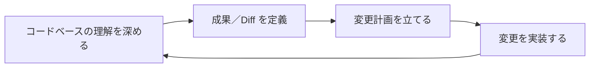
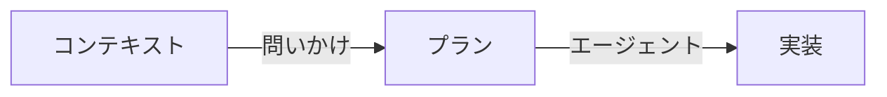
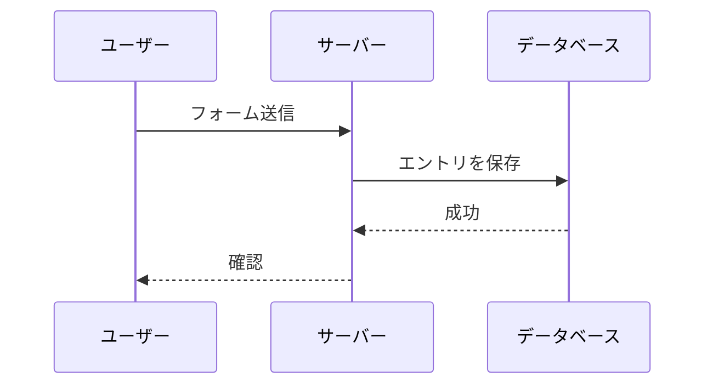
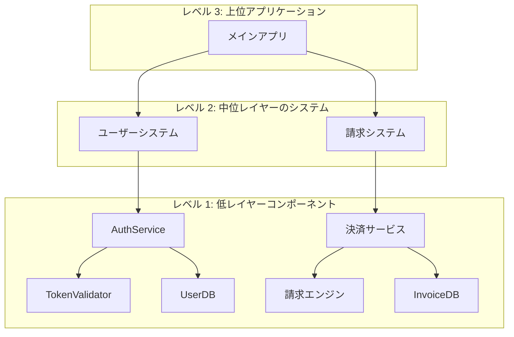
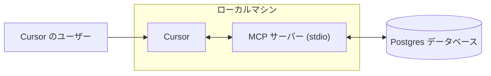
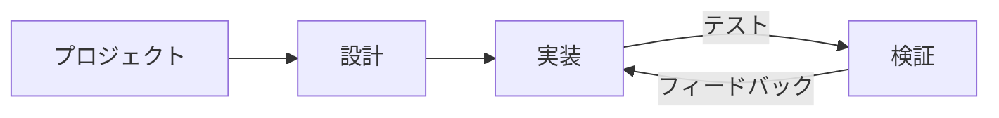
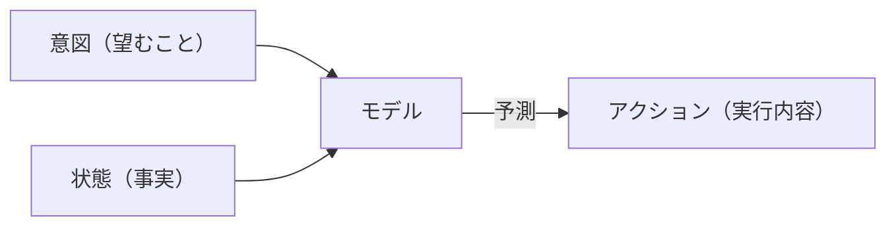

# Cursor Documentation (Japanese)

This is the complete formatted documentation for Cursor in Japanese, parsed and organized from the official documentation.

**Total Sections:** 112

---


# Agentのセキュリティ
Source: https://docs.cursor.com/ja/account/agent-security

Cursor Agentを使用する際のセキュリティに関する考慮事項

プロンプトインジェクションやAIのハルシネーションなどにより、AIが予期せぬ、場合によっては悪意ある動作を取ることがある。プロンプトインジェクションの根本的な解決に継続的に取り組みつつ、Cursor製品では、エージェントが実行できる操作に対するガードレール（既定で機密性の高い操作に手動承認を必須とすることを含む）を主な保護手段としている。本ドキュメントの目的は、これらのガードレールの内容と、それによってユーザーが何を期待できるかを説明すること。

以下のコントロールと動作はすべて、デフォルトかつ推奨の設定。

<div id="first-party-tool-calls">
  ## ファーストパーティ製ツールの呼び出し
</div>

Cursor には、エージェントがユーザーのコード作成を支援するためのツールが同梱されている。これには、ファイルの読み取り、編集、ターミナルコマンドの実行、ドキュメントのウェブ検索などが含まれる。

読み取り系ツールは承認不要（例: ファイルの読み取り、コードベース全体の検索）。ユーザーは [.cursorignore](/ja/context/ignore-files) を使って特定ファイルへのエージェントのアクセスを完全にブロックできるが、それ以外では一般に承認なしで読み取りが許可される。機微情報の流出リスクがあるアクションには明示的な承認が必要。

現在のワークスペース内のファイルを変更する場合は、一部の例外を除き明示的な承認は不要。エージェントがファイルに変更を加えると、即座にディスクへ保存される。ファイル内容をいつでも元に戻せるよう、バージョン管理されたワークスペースで Cursor を実行することを推奨する。エディタのワークスペース設定ファイルなど、IDE/CLI の設定を変更するファイルを書き換える前には明示的な承認が必要。ただし、ファイル変更で自動リロードする設定にしているユーザーは、エージェントの変更がレビュー前に自動実行を引き起こす可能性がある点に注意してほしい。

エージェントが提案するすべてのターミナルコマンドは、デフォルトで承認が必要。エージェントが実行する前に毎回コマンドを確認することを推奨する。リスクを受け入れるユーザーは、承認なしで全コマンドを実行する設定にすることも可能。Cursor には [allowlist](/ja/agent/tools) 機能があるが、セキュリティコントロールとは見なしていない。特定のコマンドのみを許可する運用を選ぶユーザーもいるが、これはベストエフォートであり回避される可能性がある。「Run Everything」は、設定した allowlist をすべて迂回するため推奨しない。

<div id="third-party-tool-calls">
  ## サードパーティ製ツールの呼び出し
</div>

Cursor は [MCP](/ja/context/mcp) を介して外部ツールと接続できる。すべてのサードパーティ製 MCP 接続は、ユーザーによる明示的な承認が必要。ユーザーが MCP を承認すると、デフォルトでは、外部 MCP 連携において Agent Mode が提案する各ツール呼び出しは、実行前に個別に明示的な承認が必要になる。

<div id="network-requests">
  ## ネットワークリクエスト
</div>

ネットワークリクエストは、攻撃者によるデータの持ち出しに悪用される可能性がある。現時点では、厳選したホスト（例：GitHub）向けのリクエスト、明示的なリンク取得、そして限られたプロバイダによるウェブ検索のサポートを除き、ファーストパーティ製ツールからのネットワークリクエストはサポートしていない。任意のエージェントによるネットワークリクエストは、デフォルト設定で無効化している。

<div id="workspace-trust">
  ## ワークスペースの信頼
</div>

Cursor IDE は、既定で無効になっている標準の[ワークスペース信頼](https://code.visualstudio.com/docs/editing/workspaces/workspace-trust)機能をサポートしてる。ワークスペース信頼は、新しいワークスペースを開いたときに、通常モードか制限モードかを選ぶプロンプトを表示する。制限モードにすると、AI をはじめ、Cursor を使う主な機能が動かなくなる。信頼できないリポジトリを扱う場合は、基本的なテキストエディタなど、別のツールの利用をおすすめする。

ワークスペース信頼は、次の手順でユーザー設定から有効化できる:

1. ユーザーの settings.json ファイルを開く
2. 次の設定を追加する:
   ```json  theme={null}
   "security.workspace.trust.enabled": true
   ```

この設定は、Mobile Device Management (MDM) ソリューションを通じて組織全体に強制適用することもできる。

<div id="responsible-disclosure">
  ## 責任ある開示
</div>

Cursor の脆弱性を見つけたと思ったら、GitHub の Security ページにあるガイドに従ってそこで報告してね。もし GitHub が使えない場合は、[security@cursor.com](mailto:security@cursor.com) に連絡してもOK。

脆弱性報告は5営業日以内に受領を通知して、できるだけ早く対応するよ。対応結果は GitHub の Security ページでセキュリティアドバイザリとして公開する。重大なインシデントは、GitHub の Security ページでの告知に加えて、すべてのユーザーにメールでも案内する。

---


# Billing
Source: https://docs.cursor.com/ja/account/billing

Cursor のサブスクリプション、返金、請求書の管理

<div id="how-do-i-access-billing-settings">
  ### 請求設定にはどうやってアクセスするの？
</div>

[Dashboard](https://cursor.com/dashboard) の「Billing」をクリックして請求ポータルへアクセス。ここで請求関連の作業を安全に実行できるよ。

<div id="what-are-cursors-billing-cycles">
  ### Cursor の課金サイクルはどうなってるの？
</div>

課金サイクルは月次または年次で、契約開始日を起点に進むよ。Teams アカウントは席数単位で課金されて、新規メンバーには日割り課金が適用される。

<div id="how-do-seats-work-for-teams-accounts">
  ### Teams アカウントの席数はどう扱われるの？
</div>

Teams アカウントは席数（メンバー1人につき1席）ごとに課金されるよ。サイクル途中にメンバーを追加すると、残り期間分だけ請求。メンバーがクレジットを使ってから削除された場合、その席は請求サイクル終了まで占有されたまま—日割りの返金はないよ。席の管理はダッシュボードからチーム管理者が行える。

<div id="can-i-switch-between-monthly-and-annual-billing">
  ### 月払いと年払いは切り替えられる？
</div>

うん！やり方はこれ：

**Pro プラン**

1. Cursor の [dashboard](https://cursor.com/dashboard) に移動
2. 左サイドバーの「Billing and Invoices」をクリックして請求ページへ
3. 「Manage subscription」をクリック
4. 「Update subscription」をクリック
5. 「Yearly」または「Monthly」を選んで「Continue」をクリック

**Teams プラン**

1. Cursor の [dashboard](https://cursor.com/dashboard) に移動
2. 左サイドバーの「Billing and Invoices」をクリックして請求ページへ
3. 年払いへ切り替えるには「Upgrade Now」ボタンをクリック

<Note>
  月払いから年払いへの切り替えはセルフサービスのみ対応だよ。年払いから月払いへ変更する場合は
  [hi@cursor.com](mailto:hi@cursor.com) に連絡してね。
</Note>

<div id="where-can-i-find-my-invoices">
  ### 請求書はどこで見つかる？
</div>

請求ポータルで請求履歴を確認できるよ。現在および過去の請求書を表示・ダウンロードできる。

<div id="can-i-get-invoices-automatically-emailed-to-me">
  ### 請求書を自動メール送信してもらえる？
</div>

請求書は請求ポータルから手動でダウンロードしてね。自動送信メールは開発中。利用可能になったらオプトインできるようにするよ。

<div id="how-do-i-update-my-billing-information">
  ### 請求情報はどうやって更新するの？
</div>

支払い方法、会社名、住所、税情報は請求ポータルから更新できるよ。決済は Stripe で安全に処理してる。変更は今後の請求書にのみ反映されて、過去の請求書は修正できないよ。

<div id="how-do-i-cancel-my-subscription">
  ### サブスクリプションはどうやって解約するの？
</div>

「Billing and Invoices」ページで「Manage Subscription」を開いて「Cancel subscription」ボタンをクリック。現在の請求期間が終わるまでアクセスは継続するよ。

<div id="im-having-other-billing-issues-how-can-i-get-help">
  ### ほかの請求関連の問題がある。どうやって助けてもらえる？
</div>

ここにない請求の質問は、アカウントに紐づくメールアドレスから [hi@cursor.com](mailto:hi@cursor.com) にメールしてね。アカウント情報と問い合わせ内容を含めて送ってくれると助かるよ。

---


# 料金
Source: https://docs.cursor.com/ja/account/pricing

Cursor のプランと料金

Cursor は無料で試すことも、個人プランやチームプランを購入することもできるよ。

<div id="individual">
  ## 個人
</div>

すべての個人プランに含まれる内容:

* 無制限のタブ補完
* すべてのモデルで拡張されたエージェント使用上限
* Bugbot へのアクセス
* Background Agents へのアクセス

各プランには、モデル推論の [API 価格](/ja/models#model-pricing) に基づく従量課金の使用が含まれる:

* Pro: API エージェント使用 \$20 分 + 追加のボーナス使用枠
* Pro Plus: API エージェント使用 \$70 分 + 追加のボーナス使用枠
* Ultra: API エージェント使用 \$400 分 + 追加のボーナス使用枠

保証された同梱の使用量に加えて、追加のボーナス容量もできるだけ提供してる。モデルごとに API コストが異なるため、選んだモデルによってトークン出力や含まれる使用量の消費速度が変わる。[ダッシュボード](https://cursor.com/dashboard?tab=usage)で使用量とトークン内訳を確認できる。上限通知はエディタ内で定期的に表示される。


<div id="how-much-usage-do-i-need">
  ### どれくらいの使用量が必要？
</div>

使用データに基づくと、想定される使用レベルは次のとおり:

* **Daily Tab ユーザー**: 常に \$20 以内
* **Limited Agent ユーザー**: 付帯の \$20 以内に収まることが多い
* **Daily Agent ユーザー**: ふつうは合計 $60–$100/月
* **Power ユーザー（複数エージェント/自動化）**: 多くの場合 合計 \$200+/月

使用データに基づくと、上限は*中央値のユーザー*でおおむね次のとおり:

* Pro: 約 225 件の Sonnet 4 リクエスト、約 550 件の Gemini リクエスト、または約 500 件の GPT 5 リクエスト
* Pro+: 約 675 件の Sonnet 4 リクエスト、約 1,650 件の Gemini リクエスト、または約 1,500 件の GPT 5 リクエスト
* Ultra: 約 4,500 件の Sonnet 4 リクエスト、約 11,000 件の Gemini リクエスト、または約 10,000 件の GPT 5 リクエスト

<div id="what-happens-when-i-reach-my-limit">
  ### 上限に達したらどうなる？
</div>

毎月の含まれる使用量を超えると、エディタ内で通知が出て、次のどれかを選べるよ:

* **オンデマンド使用量を追加**: 同じ API レートで、従量課金のまま Cursor を使い続けられる
* **プランをアップグレード**: 含まれる使用量が多い上位プランに移行する

オンデマンド使用量は、含まれる使用量と同じレートで毎月請求される。リクエストの品質や速度が下がることはないよ。

<div id="teams">
  ## Teams
</div>

チーム向けプランは2種類: Teams (\$40/user/mo) と Enterprise (Custom)。

Teams プランには次の追加機能が含まれる:

* Privacy Mode の適用（強制）
* 利用状況の統計を確認できる管理者ダッシュボード
* チーム請求の一元管理
* SAML/OIDC による SSO

セルフサーブで十分なら Teams がおすすめ。優先サポート、使用量のプール、請求書払い、SCIM、または高度なセキュリティ管理が必要なら [Enterprise](/ja/contact-sales) をおすすめ。

[Teams の料金](/ja/account/teams/pricing)を詳しく見る。

<div id="auto">
  ## Auto
</div>

Auto を有効にすると、Cursor が目のタスクに最適で、需要状況に応じて信頼性が最も高いプレミアムモデルを選んでくれる。この機能は出力の劣化を検知して、自動でモデルを切り替え、問題を解消するよ。

<Frame>
  
</Frame>

<Note>Auto の品質と総合的なパフォーマンスには大きく投資してきたよ。9月15日以降の次回の請求更新から、Auto の使用は以下の API レートで計上される。</Note>

* **Input + Cache Write**: 1M tokens あたり \$1.25
* **Output**: 1M tokens あたり \$6.00
* **Cache Read**: 1M tokens あたり \$0.25

エディタとダッシュボードの両方で、Auto を含む使用量が確認できる。モデルを直接選ぶ場合は、そのモデルのリスト API 価格で計上されるよ。

<div id="max-mode">
  ## Max Mode
</div>

一部のモデルは [Max Mode](/ja/models#max-mode) に対応していて、最大 1M トークンまでの長尺な推論と大きなコンテキストウィンドウを扱える。大半のコーディングタスクでは Max Mode は不要だけど、特に大きなファイルやコードベースを扱う複雑なクエリでは役立つ。Max Mode を使うと使用量の消費は増える。[ダッシュボード](https://cursor.com/dashboard?tab=usage) で全リクエストとトークン内訳を確認できる。

<div id="bugbot">
  ## Bugbot
</div>

Bugbot は Cursor のサブスクリプションとは別の製品で、独自の料金プランがある。

* **Pro** (\$40/月): 月あたり最大 200 件の PR に対して無制限のレビュー、Cursor Ask への無制限アクセス、バグ修正のための Cursor との連携、Bugbot Rules へのアクセス
* **Teams** (\$40/ユーザー/月): すべての PR に対する無制限のコードレビュー、Cursor Ask への無制限アクセス、チームでの使用量プール、拡張ルールと設定
* **Enterprise** (カスタム): Teams の内容に加え、高度な分析とレポーティング、優先サポート、アカウント管理

[Bugbot の料金](https://cursor.com/bugbot#pricing)について詳しく見る。

<div id="background-agent">
  ## Background Agent
</div>

Background Agent は、選択した[model](/ja/models)の API 料金で課金される。初回の利用開始時に、Background Agent の支出上限額を設定するよう求められるよ。

<Info>
  Background Agent 向けの Virtual Machine (VM) のコンピュート費用は、今後価格が設定される予定。
</Info>

---


# Admin API
Source: https://docs.cursor.com/ja/account/teams/admin-api

API 経由でチームのメトリクス、利用データ、支出情報にアクセス

Admin API は、メンバー情報、利用メトリクス、支出の詳細など、チームのデータへプログラムからアクセスできる。カスタムダッシュボードや監視ツールを作成したり、既存のワークフローに統合したりできる。

<Note>
  この API は初回リリース。フィードバックに基づいて機能を拡張中—必要なエンドポイントを教えてね！
</Note>

<div id="authentication">
  ## 認証
</div>

すべての API リクエストには API キーによる認証が必要。API キーの作成と管理ができるのはチーム管理者のみ。

API キーは組織に紐づき、すべての管理者が閲覧でき、作成者本人のアカウント状況の影響は受けない。

<div id="creating-an-api-key">
  ### APIキーの作成
</div>

1. **cursor.com/dashboard** → **Settings** タブ → **Cursor Admin API Keys** に移動
2. **Create New API Key** をクリック
3. キーにわかりやすい名前を付ける（例：「Usage Dashboard Integration」）
4. 生成されたキーはその場でコピーしておく—あとからは確認できない

形式: `key_xxxxxxxxxxxxxxxxxxxxxxxxxxxxxxxxxxxxxxxxxxxxxxxxxxxxxxxxxxxxxxxx`

<div id="using-your-api-key">
  ### APIキーの使用
</div>

基本認証では、ユーザー名にAPIキーを指定する:

**Basic認証を使った curl の例:**

```bash  theme={null}
curl https://api.cursor.com/{route} -u API_KEY:
```

**または Authorization ヘッダーを直接指定する:**

```bash  theme={null}
Authorization: Basic {base64_encode('API_KEY:')}
```

<div id="base-url">
  ## ベースURL
</div>

すべてのAPIエンドポイントは次を使用する：

```
https://api.cursor.com
```

<div id="endpoints">
  ## エンドポイント
</div>

<div id="get-team-members">
  ### チームメンバーの取得
</div>

すべてのチームメンバーとその詳細を取得する。

```
GET /teams/members
```

#### レスポンス

チームメンバーオブジェクトの配列を返す：

```typescript  theme={null}
{
  teamMembers: {
    name: string;
    email: string;
    role: 'オーナー' | 'メンバー' | 'フリー・オーナー';
  }[];
}
```

#### 応答例

```json  theme={null}
{
  "teamMembers": [
    {
      "name": "Alex",
      "email": "developer@company.com",
      "role": "メンバー"
    },
    {
      "name": "Sam",
      "email": "admin@company.com",
      "role": "オーナー"
    }
  ]
}

```

#### 例: リクエスト

```bash  theme={null}
curl -X GET https://api.cursor.com/teams/members \
  -u YOUR_API_KEY:
```

<div id="get-daily-usage-data">
  ### 日次利用データを取得
</div>

指定した日付範囲でチームの詳細な日次利用メトリクスを取得。コード編集、AI支援の利用状況、受け入れ率に関するインサイトを提供するよ。

```
POST /teams/daily-usage-data
```

#### リクエストボディ

<div className="full-width-table">
  | パラメーター      | 型      | 必須  | 説明           |
  | :---------- | :----- | :-- | :----------- |
  | `startDate` | number | Yes | エポックミリ秒の開始日時 |
  | `endDate`   | number | Yes | エポックミリ秒の終了日時 |
</div>

<Note>
  日付範囲は90日を超えない。より長い期間は複数回に分けてリクエストしてね。
</Note>

#### 応答

```typescript  theme={null}
{
  data: {
    date: number;
    isActive: boolean;
    totalLinesAdded: number;
    totalLinesDeleted: number;
    acceptedLinesAdded: number;
    acceptedLinesDeleted: number;
    totalApplies: number;
    totalAccepts: number;
    totalRejects: number;
    totalTabsShown: number;
    totalTabsAccepted: number;
    composerRequests: number;
    chatRequests: number;
    agentRequests: number;
    cmdkUsages: number;
    subscriptionIncludedReqs: number;
    apiKeyReqs: number;
    usageBasedReqs: number;
    bugbotUsages: number;
    mostUsedModel: string;
    applyMostUsedExtension?: string;
    tabMostUsedExtension?: string;
    clientVersion?: string;
    email?: string;
  }[];
  period: {
    startDate: number;
    endDate: number;
  };
}
```

<div id="response-fields">
  #### レスポンスフィールド
</div>

<div className="full-width-table">
  | フィールド                      | 説明                   |
  | :------------------------- | :------------------- |
  | `date`                     | エポックミリ秒の日時           |
  | `isActive`                 | 当日のユーザーアクティブ状態       |
  | `totalLinesAdded`          | 追加されたコード行数           |
  | `totalLinesDeleted`        | 削除されたコード行数           |
  | `acceptedLinesAdded`       | 承認されたAI提案による追加行数     |
  | `acceptedLinesDeleted`     | 承認されたAI提案による削除行数     |
  | `totalApplies`             | Applyの実行回数           |
  | `totalAccepts`             | 承認された提案数             |
  | `totalRejects`             | 却下された提案数             |
  | `totalTabsShown`           | 表示されたタブ補完数           |
  | `totalTabsAccepted`        | 承認されたタブ補完数           |
  | `composerRequests`         | Composerリクエスト数       |
  | `chatRequests`             | Chatリクエスト数           |
  | `agentRequests`            | Agentリクエスト数          |
  | `cmdkUsages`               | コマンドパレット（Cmd+K）の使用回数 |
  | `subscriptionIncludedReqs` | サブスクリプション対象のリクエスト数   |
  | `apiKeyReqs`               | APIキー経由のリクエスト数       |
  | `usageBasedReqs`           | 従量課金リクエスト数           |
  | `bugbotUsages`             | バグ検出機能の使用回数          |
  | `mostUsedModel`            | 最も頻繁に使用されたAIモデル      |
  | `applyMostUsedExtension`   | Applyで最も使用されたファイル拡張子 |
  | `tabMostUsedExtension`     | タブで最も使用されたファイル拡張子    |
  | `clientVersion`            | Cursorのバージョン         |
  | `email`                    | ユーザーのメールアドレス         |
</div>

#### 例のレスポンス

```json  theme={null}
{
  "data": [
    {
      "date": 1710720000000,
      "isActive": true,
      "totalLinesAdded": 1543,
      "totalLinesDeleted": 892,
      "acceptedLinesAdded": 1102,
      "acceptedLinesDeleted": 645,
      "totalApplies": 87,
      "totalAccepts": 73,
      "totalRejects": 14,
      "totalTabsShown": 342,
      "totalTabsAccepted": 289,
      "composerRequests": 45,
      "chatRequests": 128,
      "agentRequests": 12,
      "cmdkUsages": 67,
      "subscriptionIncludedReqs": 180,
      "apiKeyReqs": 0,
      "usageBasedReqs": 5,
      "bugbotUsages": 3,
      "mostUsedModel": "gpt-4",
      "applyMostUsedExtension": ".tsx",
      "tabMostUsedExtension": ".ts",
      "clientVersion": "0.25.1",
      "email": "developer@company.com"
    },
    {
      "date": 1710806400000,
      "isActive": true,
      "totalLinesAdded": 2104,
      "totalLinesDeleted": 1203,
      "acceptedLinesAdded": 1876,
      "acceptedLinesDeleted": 987,
      "totalApplies": 102,
      "totalAccepts": 91,
      "totalRejects": 11,
      "totalTabsShown": 456,
      "totalTabsAccepted": 398,
      "composerRequests": 67,
      "chatRequests": 156,
      "agentRequests": 23,
      "cmdkUsages": 89,
      "subscriptionIncludedReqs": 320,
      "apiKeyReqs": 15,
      "usageBasedReqs": 0,
      "bugbotUsages": 5,
      "mostUsedModel": "claude-3-opus",
      "applyMostUsedExtension": ".py",
      "tabMostUsedExtension": ".py",
      "clientVersion": "0.25.1",
      "email": "developer@company.com"
    }
  ],
  "period": {
    "startDate": 1710720000000,
    "endDate": 1710892800000
  }
}
```

#### リクエストの例

```bash  theme={null}
curl -X POST https://api.cursor.com/teams/daily-usage-data \
  -u YOUR_API_KEY: \
  -H "Content-Type: application/json" \
  -d '{
    "startDate": 1710720000000,
    "endDate": 1710892800000
  }'
```

<div id="get-spending-data">
  ### 支出データを取得
</div>

検索、ソート、ページネーションに対応し、当月（暦月）の支出情報を取得する。

```
POST /teams/spend
```

#### リクエストボディ

<div className="full-width-table">
  | パラメータ           | 型      | 必須  | 説明                                           |
  | :-------------- | :----- | :-- | :------------------------------------------- |
  | `searchTerm`    | string | いいえ | ユーザー名とメールアドレス内を検索                            |
  | `sortBy`        | string | いいえ | 並び替え基準: `amount`, `date`, `user`。既定値: `date` |
  | `sortDirection` | string | いいえ | 並び順: `asc`, `desc`。既定値: `desc`               |
  | `page`          | number | いいえ | ページ番号（1始まり）。既定値: `1`                         |
  | `pageSize`      | number | いいえ | 1ページあたりの件数                                   |
</div>

#### レスポンス

```typescript  theme={null}
{
  teamMemberSpend: {
    spendCents: number;
    fastPremiumRequests: number;
    name: string;
    email: string;
    role: 'owner' | 'member' | 'free-owner';
    hardLimitOverrideDollars: number;
  }[];
  subscriptionCycleStart: number;
  totalMembers: number;
  totalPages: number;
}
```

<div id="response-fields">
  #### レスポンスフィールド
</div>

<div className="full-width-table">
  | フィールド                      | 説明                         |
  | :------------------------- | :------------------------- |
  | `spendCents`               | 合計支出（セント）                  |
  | `fastPremiumRequests`      | Fast プレミアムモデルのリクエスト数       |
  | `name`                     | メンバー名                      |
  | `email`                    | メンバーのメールアドレス               |
  | `role`                     | チーム内ロール                    |
  | `hardLimitOverrideDollars` | カスタム支出上限の上書き（ドル）           |
  | `subscriptionCycleStart`   | サブスクリプションサイクル開始時刻（エポックミリ秒） |
  | `totalMembers`             | チームメンバー総数                  |
  | `totalPages`               | 総ページ数                      |
</div>

#### 応答例

```json  theme={null}
{
  "teamMemberSpend": [
    {
      "spendCents": 2450,
      "fastPremiumRequests": 1250,
      "name": "Alex",
      "email": "developer@company.com",
      "role": "メンバー",
      "hardLimitOverrideDollars": 100
    },
    {
      "spendCents": 1875,
      "fastPremiumRequests": 980,
      "name": "Sam",
      "email": "admin@company.com",
      "role": "オーナー"
      "hardLimitOverrideDollars": 0
    },
  ],
  "subscriptionCycleStart": 1708992000000,
  "totalMembers": 15,
  "totalPages": 1
}
```

<div id="example-requests">
  #### リクエスト例
</div>

**基本的な支出データ：**

```bash  theme={null}
curl -X POST https://api.cursor.com/teams/spend \
  -u YOUR_API_KEY: \
  -H "Content-Type: application/json" \
  -d '{}'
```

**ページネーション付きで特定のユーザーを検索する:**

```bash  theme={null}
curl -X POST https://api.cursor.com/teams/spend \
  -u YOUR_API_KEY: \
  -H "Content-Type: application/json" \
  -d '{
    "searchTerm": "alex@company.com",
    "page": 2,
    "pageSize": 25
  }'
```

<div id="get-usage-events-data">
  ### 使用イベントデータの取得
</div>

チームの使用イベントを、柔軟なフィルタリング、検索、ページネーションで詳細に取得できる。このエンドポイントは、個々の API 呼び出し、モデルの利用状況、トークン消費量、コストに関するきめ細かなインサイトを提供する。

```
POST /teams/filtered-usage-events
```

#### リクエストボディ

<div className="full-width-table">
  | パラメータ       | 型      | 必須  | 説明                    |
  | :---------- | :----- | :-- | :-------------------- |
  | `startDate` | number | いいえ | エポックミリ秒の開始日時          |
  | `endDate`   | number | いいえ | エポックミリ秒の終了日時          |
  | `userId`    | number | いいえ | 特定のユーザーIDでフィルタリング     |
  | `page`      | number | いいえ | ページ番号（1始まり）。既定値: `1`  |
  | `pageSize`  | number | いいえ | 1ページあたりの結果数。既定値: `10` |
  | `email`     | string | いいえ | ユーザーのメールアドレスでフィルタリング  |
</div>

#### 応答

```typescript  theme={null}
{
  totalUsageEventsCount: number;
  pagination: {
    numPages: number;
    currentPage: number;
    pageSize: number;
    hasNextPage: boolean;
    hasPreviousPage: boolean;
  };
  usageEvents: {
    timestamp: string;
    model: string;
    kind: string;
    maxMode: boolean;
    requestsCosts: number;
    isTokenBasedCall: boolean;
    tokenUsage?: {
      inputTokens: number;
      outputTokens: number;
      cacheWriteTokens: number;
      cacheReadTokens: number;
      totalCents: number;
    };
    isFreeBugbot: boolean;
    userEmail: string;
  }[];
  period: {
    startDate: number;
    endDate: number;
  };
}
```

<div id="response-fields-explained">
  #### レスポンスフィールドの説明
</div>

<div className="full-width-table">
  | フィールド                   | 説明                                             |
  | :---------------------- | :--------------------------------------------- |
  | `totalUsageEventsCount` | クエリに一致する利用イベントの総数                              |
  | `pagination`            | 結果を移動するためのページネーション用メタデータ                       |
  | `timestamp`             | イベントのエポックミリ秒でのタイムスタンプ                          |
  | `model`                 | リクエストで使用された AI モデル                             |
  | `kind`                  | 利用区分（例: "Usage-based", "Included in Business"） |
  | `maxMode`               | Max Mode が有効だったかどうか                            |
  | `requestsCosts`         | リクエスト単位のコスト                                    |
  | `isTokenBasedCall`      | イベントが従量課金として計上される場合は true                      |
  | `tokenUsage`            | トークン消費の詳細（isTokenBasedCall が true の場合に提供）      |
  | `isFreeBugbot`          | 無料の Bugbot 利用かどうか                              |
  | `userEmail`             | リクエスト実行ユーザーのメールアドレス                            |
  | `period`                | クエリ対象データの期間（日時範囲）                              |
</div>

#### 応答例

```json  theme={null}
{
  "totalUsageEventsCount": 113,
  "pagination": {
    "numPages": 12,
    "currentPage": 1,
    "pageSize": 10,
    "hasNextPage": true,
    "hasPreviousPage": false
  },
  "usageEvents": [
    {
      "timestamp": "1750979225854",
      "model": "claude-4-opus",
      "kind": "利用量課金",
      "maxMode": true,
      "requestsCosts": 5,
      "isTokenBasedCall": true,
      "tokenUsage": {
        "inputTokens": 126,
        "outputTokens": 450,
        "cacheWriteTokens": 6112,
        "cacheReadTokens": 11964,
        "totalCents": 20.18232
      },
      "isFreeBugbot": false,
      "userEmail": "developer@company.com"
    },
    {
      "timestamp": "1750979173824",
      "model": "claude-4-opus",
      "kind": "Usage-based",
      "maxMode": true,
      "requestsCosts": 10,
      "isTokenBasedCall": true,
      "tokenUsage": {
        "inputTokens": 5805,
        "outputTokens": 311,
        "cacheWriteTokens": 11964,
        "cacheReadTokens": 0,
        "totalCents": 40.16699999999999
      },
      "isFreeBugbot": false,
      "userEmail": "developer@company.com"
    },
    {
      "timestamp": "1750978339901",
      "model": "claude-4-sonnet-thinking",
      "kind": "Business に含まれる"
      "maxMode": true,
      "requestsCosts": 1.4,
      "isTokenBasedCall": false,
      "isFreeBugbot": false,
      "userEmail": "admin@company.com"
    }
  ],
  "period": {
    "startDate": 1748411762359,
    "endDate": 1751003762359
  }
}
```

<div id="example-requests">
  #### リクエスト例
</div>

**デフォルトのページネーションで全ての利用イベントを取得:**

```bash  theme={null}
curl -X POST https://api.cursor.com/teams/filtered-usage-events \
  -u YOUR_API_KEY: \
  -H "Content-Type: application/json" \
  -d '{}'
```

**日付範囲と特定のユーザーで絞り込み:**

```bash  theme={null}
curl -X POST https://api.cursor.com/teams/filtered-usage-events \
  -u YOUR_API_KEY: \
  -H "Content-Type: application/json" \
  -d '{
    "startDate": 1748411762359,
    "endDate": 1751003762359,
    "email": "developer@company.com",
    "page": 1,
    "pageSize": 25
  }'
```

**カスタムページネーションで特定ユーザーの利用イベントを取得:**

```bash  theme={null}
curl -X POST https://api.cursor.com/teams/filtered-usage-events \
  -u YOUR_API_KEY: \
  -H "Content-Type: application/json" \
  -d '{
    "userId": 12345,
    "page": 2,
    "pageSize": 50
  }'
```

<div id="set-user-spend-limit">
  ### ユーザーの支出上限を設定
</div>

チームメンバーごとに支出上限を設定できる。これで、チーム内で各ユーザーがAIの利用にどれだけ使えるかを管理できる。

```
POST /teams/user-spend-limit
```

<Note>
  **レート制限:** チームあたり毎分60リクエスト
</Note>

#### リクエストボディ

<div className="full-width-table">
  | パラメータ               | 型      | 必須 | 説明                  |
  | :------------------ | :----- | :- | :------------------ |
  | `userEmail`         | string | はい | チームメンバーのメールアドレス     |
  | `spendLimitDollars` | number | はい | 支出上限（米ドル、整数のみ。小数不可） |
</div>

<Note>
  * ユーザーはすでにチームのメンバーである必要がある
  * 受け付けるのは整数値のみ（小数は不可）
  * `spendLimitDollars` を 0 に設定すると、上限は \$0 になる
</Note>

<div id="response">
  #### Response
</div>

成功または失敗を示す標準化されたレスポンスを返します。

```typescript  theme={null}
{
  outcome: 'success' | 'error';
  message: string;
}
```

<div id="example-responses">
  #### レスポンス例
</div>

**上限を設定しました:**

```json  theme={null}
{
  "outcome": "success",
  "message": "ユーザー developer@company.com の支出上限を $100 に設定しました"
}
```

**エラー応答:**

```json  theme={null}
{
  "outcome": "error",
  "message": "無効なメールアドレス形式です"
}
```

<div id="example-requests">
  #### リクエスト例
</div>

**支出の上限を設定する:**

```bash  theme={null}
curl -X POST https://api.cursor.com/teams/user-spend-limit \
  -u YOUR_API_KEY: \
  -H "Content-Type: application/json" \
  -d '{
    "userEmail": "developer@company.com",
    "spendLimitDollars": 100
  }'
```

<div id="repo-blocklists-api">
  ### Repo Blocklists API
</div>

リポジトリを追加し、パターンを設定して、チームでのコンテキストとしてファイルやディレクトリがインデックス化・利用されるのを防ぐ。

<div id="get-team-repo-blocklists">
  #### チームのリポジトリ・ブロックリストを取得
</div>

チームで構成されているすべてのリポジトリ・ブロックリストを取得する。

```
GET /settings/repo-blocklists/repos
```

##### レスポンス

リポジトリのブロックリストオブジェクトの配列を返す：

```typescript  theme={null}
{
  repos: {
    id: string;
    url: string;
    patterns: string[];
  }[];
}
```

<div id="example-response">
  ##### レスポンスの例
</div>

```json  theme={null}
{
  "repos": [
    {
      "id": "repo_123",
      "url": "https://github.com/company/sensitive-repo",
      "patterns": ["*.env", "config/*", "secrets/**"]
    },
    {
      "id": "repo_456",
      "url": "https://github.com/company/internal-tools",
      "patterns": ["*"]
    }
  ]
}
```

##### リクエストの例

```bash  theme={null}
curl -X GET https://api.cursor.com/settings/repo-blocklists/repos \
  -u 自分のAPIキー:
```

<div id="upsert-repo-blocklists">
  #### リポジトリブロックリストのアップサート
</div>

指定したリポジトリの既存のブロックリストを置き換える。
*注: このエンドポイントは、指定したリポジトリに対するパターンのみを上書きする。他のリポジトリには影響しない。*

```
POST /settings/repo-blocklists/repos/upsert
```

<div id="request-body">
  ##### リクエストボディ
</div>

| Parameter | Type  | Required | Description              |
| --------- | ----- | -------- | ------------------------ |
| repos     | array | Yes      | リポジトリのブロックリスト対象オブジェクトの配列 |

各リポジトリオブジェクトには以下を含める必要がある:

| Field    | Type      | Required | Description                    |
| -------- | --------- | -------- | ------------------------------ |
| url      | string    | Yes      | ブロックリスト対象のリポジトリのURL            |
| patterns | string\[] | Yes      | ブロックするファイルパターンの配列（glob パターン対応） |

##### レスポンス

更新後のリポジトリ・ブロックリスト一覧を返す：

```typescript  theme={null}
{
  repos: {
    id: string;
    url: string;
    patterns: string[];
  }[];
}
```

<div id="example-request">
  ##### 例: リクエスト
</div>

```bash  theme={null}
curl -X POST https://api.cursor.com/settings/repo-blocklists/repos/upsert \
  -u YOUR_API_KEY: \
  -H "Content-Type: application/json" \
  -d '{
    "repos": [
      {
        "url": "https://github.com/company/sensitive-repo",
        "patterns": ["*.env", "config/*", "secrets/**"]
      },
      {
        "url": "https://github.com/company/internal-tools", 
        "patterns": ["*"]
      }
    ]
  }'
```

<div id="delete-repo-blocklist">
  #### リポジトリブロックリストの削除
</div>

ブロックリストから特定のリポジトリを削除する。

```
DELETE /settings/repo-blocklists/repos/:repoId
```

<div id="parameters">
  ##### パラメータ
</div>

| パラメータ  | 型      | 必須 | 説明                   |
| ------ | ------ | -- | -------------------- |
| repoId | string | はい | 削除対象のリポジトリブロックリストのID |

##### レスポンス

削除に成功すると、204 No Content を返します。

##### リクエストの例

```bash  theme={null}
curl -X DELETE https://api.cursor.com/settings/repo-blocklists/repos/repo_123 \
  -u APIキー:
```

<div id="pattern-examples">
  #### パターン例
</div>

一般的なブロックリストのパターン:

* `*` - リポジトリ全体をブロック
* `*.env` - すべての.envファイルをブロック
* `config/*` - configディレクトリ内のすべてのファイルをブロック
* `**/*.secret` - 任意のサブディレクトリ内のすべての.secretファイルをブロック
* `src/api/keys.ts` - 特定のファイルをブロック

---


# AI Code Tracking API
Source: https://docs.cursor.com/ja/account/teams/ai-code-tracking-api

チームのリポジトリ向けAI生成コード分析へのアクセス

チームのリポジトリに対するAI生成コードの分析にアクセスできる。コミット単位のAI利用状況や、受け入れられたAI変更の粒度の細かい内訳を含む。

<Note>
  このAPIは初回リリース。フィードバックに基づき機能を拡張中—必要なエンドポイントを教えて！
</Note>

* **提供状況**: エンタープライズチーム限定
* **ステータス**: Alpha（レスポンスの形やフィールドは変更される可能性あり）

<div id="authentication">
  ## 認証
</div>

すべての API リクエストには、API キーによる認証が必要。この API は、他のエンドポイントと同じ Admin API の認証方式を使ってる。

詳しい手順は [Admin API authentication](/ja/account/teams/admin-api#authentication) を参照してね。

<div id="base-url">
  ## ベース URL
</div>

すべての API エンドポイントで使用されるのは次のとおり：

```
https://api.cursor.com
```

<div id="rate-limits">
  ## レート制限
</div>

* エンドポイントごと・チームごとに、1分あたり5リクエスト

<div id="query-parameters">
  ## クエリパラメータ
</div>

以下のエンドポイントはすべて、クエリ文字列で同じクエリパラメータを受け付ける:

<div className="full-width-table">
  | Parameter   | Type   | Required | Description                                                                                                                       |                                                                     |
  | :---------- | :----- | :------- | :-------------------------------------------------------------------------------------------------------------------------------- | ------------------------------------------------------------------- |
  | `startDate` | string | date     | No                                                                                                                                | ISO日付文字列、リテラルの "now"、または "7d" のような相対日数（「現在 - 7日」の意味）。デフォルト: 現在 - 7日 |
  | `endDate`   | string | date     | No                                                                                                                                | ISO日付文字列、リテラルの "now"、または "0d" のような相対日数。デフォルト: 現在                    |
  | `page`      | number | No       | ページ番号（1始まり）。デフォルト: 1                                                                                                              |                                                                     |
  | `pageSize`  | number | No       | 1ページあたりの件数。デフォルト: 100、最大: 1000                                                                                                    |                                                                     |
  | `user`      | string | No       | 単一ユーザーによる任意のフィルタ。メール（例: [developer@company.com](mailto:developer@company.com)）、エンコード済みID（例: user\_abc123...）、または数値ID（例: 42）を受け付ける |                                                                     |
</div>

<Note>
  レスポンスでは、接頭辞 user\_ が付いたエンコード済み外部IDとして userId を返す。これは API 連携で安定して利用できる。
</Note>

<div id="semantics-and-how-metrics-are-computed">
  ## セマンティクスとメトリクスの算出方法
</div>

* **Sources**: "TAB" は受け入れられたインライン補完、"COMPOSER" は Composer で受け入れられた差分を表す
* **Lines metrics**: tabLinesAdded/Deleted と composerLinesAdded/Deleted は個別にカウントされる。nonAiLinesAdded/Deleted は max(0, totalLines - AI lines) で算出される
* **Privacy mode**: クライアントで有効な場合、fileName など一部のメタデータは省略されることがある
* **Branch info**: 現在のブランチがリポジトリのデフォルトブランチと一致する場合、isPrimaryBranch は true。リポジトリ情報が利用できない場合は undefined になることがある

そのファイルを参照すると、コミットと変更がどのように検出され、報告されるかがわかる。

<div id="endpoints">
  ## エンドポイント
</div>

<div id="get-ai-commit-metrics-json-paginated">
  ### AI コミットメトリクスの取得（JSON、ページネーション対応）
</div>

TAB、COMPOSER、非 AI への行の帰属に基づく、コミット単位の集計メトリクスを取得する。

```
GET /analytics/ai-code/commits
```

#### 応答

```typescript  theme={null}
{
  items: AiCommitMetric[];
  totalCount: number;
  page: number;
  pageSize: number;
}
```

<div id="aicommitmetric-fields">
  #### AiCommitMetric フィールド
</div>

<div className="full-width-table">
  | フィールド                  | 型       | 説明                               |                      |
  | :--------------------- | :------ | :------------------------------- | -------------------- |
  | `commitHash`           | string  | Git のコミットハッシュ                    |                      |
  | `userId`               | string  | エンコード済みのユーザー ID（例: user\_abc123） |                      |
  | `userEmail`            | string  | ユーザーのメールアドレス                     |                      |
  | `repoName`             | string  | null                             | リポジトリ名               |
  | `branchName`           | string  | null                             | ブランチ名                |
  | `isPrimaryBranch`      | boolean | null                             | プライマリブランチかどうか        |
  | `totalLinesAdded`      | number  | コミットで追加された行の合計                   |                      |
  | `totalLinesDeleted`    | number  | コミットで削除された行の合計                   |                      |
  | `tabLinesAdded`        | number  | TAB 補完で追加された行数                   |                      |
  | `tabLinesDeleted`      | number  | TAB 補完で削除された行数                   |                      |
  | `composerLinesAdded`   | number  | Composer で追加された行数                |                      |
  | `composerLinesDeleted` | number  | Composer で削除された行数                |                      |
  | `nonAiLinesAdded`      | number  | null                             | 非 AI による追加行数         |
  | `nonAiLinesDeleted`    | number  | null                             | 非 AI による削除行数         |
  | `message`              | string  | null                             | コミットメッセージ            |
  | `commitTs`             | string  | null                             | コミットのタイムスタンプ（ISO 形式） |
  | `createdAt`            | string  | 取り込みタイムスタンプ（ISO 形式）              |                      |
</div>

<div id="example-response">
  #### レスポンス例
</div>

```json  theme={null}
{
  "items": [
    {
      "commitHash": "a1b2c3d4",
      "userId": "user_3k9x8q...",
      "userEmail": "developer@company.com",
      "repoName": "company/repo",
      "branchName": "main",
      "isPrimaryBranch": true,
      "totalLinesAdded": 120,
      "totalLinesDeleted": 30,
      "tabLinesAdded": 50,
      "tabLinesDeleted": 10,
      "composerLinesAdded": 40,
      "composerLinesDeleted": 5,
      "nonAiLinesAdded": 30,
      "nonAiLinesDeleted": 15,
      "message": "リファクタリング: analytics クライアントの抽出"
      "commitTs": "2025-07-30T14:12:03.000Z",
      "createdAt": "2025-07-30T14:12:30.000Z"
    }
  ],
  "totalCount": 42,
  "page": 1,
  "pageSize": 100
}
```

<div id="example-requests">
  #### リクエスト例
</div>

**基本的なリクエスト:**

```bash  theme={null}
curl -X GET "https://api.cursor.com/analytics/ai-code/commits?startDate=7d&endDate=now&page=1&pageSize=100" \
  -u YOUR_API_KEY:
```

**ユーザー（メールアドレス）で絞り込み：**

```bash  theme={null}
curl -X GET "https://api.cursor.com/analytics/ai-code/commits?startDate=2025-06-01T00:00:00Z&endDate=now&user=developer@company.com" \
  -u YOUR_API_KEY:
```

<div id="download-ai-commit-metrics-csv-streaming">
  ### AI Commit Metrics のダウンロード（CSV・ストリーミング）
</div>

大規模なデータ抽出向けに、コミットメトリクスのデータを CSV 形式でダウンロードできる。

```
GET /analytics/ai-code/commits.csv
```

<div id="response">
  #### レスポンス
</div>

ヘッダー:

* Content-Type: text/csv; charset=utf-8

<div id="csv-columns">
  #### CSV カラム
</div>

<div className="full-width-table">
  | Column                   | Type    | Description          |
  | :----------------------- | :------ | :------------------- |
  | `commit_hash`            | string  | Git のコミットハッシュ        |
  | `user_id`                | string  | エンコード済みユーザー ID       |
  | `user_email`             | string  | ユーザーのメールアドレス         |
  | `repo_name`              | string  | リポジトリ名               |
  | `branch_name`            | string  | ブランチ名                |
  | `is_primary_branch`      | boolean | プライマリブランチかどうか        |
  | `total_lines_added`      | number  | コミットで追加された行数（合計）     |
  | `total_lines_deleted`    | number  | コミットで削除された行数（合計）     |
  | `tab_lines_added`        | number  | TAB 補完で追加された行数       |
  | `tab_lines_deleted`      | number  | TAB 補完で削除された行数       |
  | `composer_lines_added`   | number  | Composer で追加された行数    |
  | `composer_lines_deleted` | number  | Composer で削除された行数    |
  | `non_ai_lines_added`     | number  | 非 AI の追加行数           |
  | `non_ai_lines_deleted`   | number  | 非 AI の削除行数           |
  | `message`                | string  | コミットメッセージ            |
  | `commit_ts`              | string  | コミットのタイムスタンプ（ISO 形式） |
  | `created_at`             | string  | 取り込みタイムスタンプ（ISO 形式）  |
</div>

<div id="sample-csv-output">
  #### サンプル CSV 出力
</div>

```csv  theme={null}
commit_hash,user_id,user_email,repo_name,branch_name,is_primary_branch,total_lines_added,total_lines_deleted,tab_lines_added,tab_lines_deleted,composer_lines_added,composer_lines_deleted,non_ai_lines_added,non_ai_lines_deleted,message,commit_ts,created_at
a1b2c3d4,user_3k9x8q...,developer@company.com,company/repo,main,true,120,30,50,10,40,5,30,15,"リファクタ: analytics クライアントを抽出",2025-07-30T14:12:03.000Z,2025-07-30T14:12:30.000Z
e5f6g7h8,user_3k9x8q...,developer@company.com,company/repo,feature-branch,false,85,15,30,5,25,3,30,7,"エラー処理を追加",2025-07-30T13:45:21.000Z,2025-07-30T13:45:45.000Z
```

<div id="example-request">
  #### リクエストの例
</div>

```bash  theme={null}
curl -L "https://api.cursor.com/analytics/ai-code/commits.csv?startDate=2025-07-01T00:00:00Z&endDate=now&user=user_3k9x8q..." \
  -u YOUR_API_KEY: \
  -o commits.csv
```

<div id="get-ai-code-change-metrics-json-paginated">
  ### AIコード変更メトリクスを取得（JSON、ページネーション対応）
</div>

決定的な changeId ごとにグループ化された、粒度の高い承認済みAI変更を取得する。コミットから独立して承認されたAIイベントを分析するのに便利。

```
GET /analytics/ai-code/changes
```

#### 応答

```typescript  theme={null}
{
  items: AiCodeChangeMetric[];
  totalCount: number;
  page: number;
  pageSize: number;
}
```

<div id="aicodechangemetric-fields">
  #### AiCodeChangeMetric のフィールド
</div>

<div className="full-width-table">
  | フィールド               | 型                    | 説明                                          |           |
  | :------------------ | :------------------- | :------------------------------------------ | --------- |
  | `changeId`          | string               | 変更の決定的ID                                    |           |
  | `userId`            | string               | エンコード済みユーザーID（例: user\_abc123）              |           |
  | `userEmail`         | string               | ユーザーのメールアドレス                                |           |
  | `source`            | "TAB" または "COMPOSER" | AI変更の発生元                                    |           |
  | `model`             | string               | null                                        | 使用したAIモデル |
  | `totalLinesAdded`   | number               | 追加行数の合計                                     |           |
  | `totalLinesDeleted` | number               | 削除行数の合計                                     |           |
  | `createdAt`         | string               | 取り込みタイムスタンプ（ISO形式）                          |           |
  | `metadata`          | Array                | ファイルのメタデータ（プライバシーモードでは fileName が省略される場合あり） |           |
</div>

<div id="example-response">
  #### レスポンス例
</div>

```json  theme={null}
{
  "items": [
    {
      "changeId": "749356201",
      "userId": "user_3k9x8q...",
      "userEmail": "developer@company.com",
      "source": "COMPOSER",
      "model": null,
      "totalLinesAdded": 18,
      "totalLinesDeleted": 4,
      "createdAt": "2025-07-30T15:10:12.000Z",
      "metadata": [
        { "fileName": "src/analytics/report.ts", "fileExtension": "ts", "linesAdded": 12, "linesDeleted": 3 },
        { "fileName": "src/analytics/ui.tsx", "fileExtension": "tsx", "linesAdded": 6, "linesDeleted": 1 }
      ]
    }
  ],
  "totalCount": 128,
  "page": 1,
  "pageSize": 200
}
```

<div id="example-requests">
  #### リクエスト例
</div>

**基本的なリクエスト：**

```bash  theme={null}
curl -X GET "https://api.cursor.com/analytics/ai-code/changes?startDate=14d&endDate=now&page=1&pageSize=200" \
  -u YOUR_API_KEY:
```

**ユーザー（エンコード済みID）で絞り込み：**

```bash  theme={null}
curl -X GET "https://api.cursor.com/analytics/ai-code/changes?user=user_3k9x8q..." \
  -u YOUR_API_KEY:
```

**ユーザー（メールアドレス）で絞り込み：**

```bash  theme={null}
curl -X GET "https://api.cursor.com/analytics/ai-code/changes?user=developer@company.com" \
  -u YOUR_API_KEY:
```

<div id="download-ai-code-change-metrics-csv-streaming">
  ### AIコード変更メトリクスをダウンロード（CSV・ストリーミング）
</div>

大規模なデータ抽出のために、変更メトリクスのデータをCSV形式でダウンロードできる。

```
GET /analytics/ai-code/changes.csv
```

<div id="response">
  #### レスポンス
</div>

ヘッダー:

* Content-Type: text/csv; charset=utf-8

<div id="csv-columns">
  #### CSV カラム
</div>

<div className="full-width-table">
  | 列                     | 型      | 説明                          |
  | :-------------------- | :----- | :-------------------------- |
  | `change_id`           | string | 変更を一意に識別する決定的 ID            |
  | `user_id`             | string | エンコードされたユーザー ID             |
  | `user_email`          | string | ユーザーのメールアドレス                |
  | `source`              | string | AI 変更の発生元（TAB または COMPOSER） |
  | `model`               | string | 使用した AI モデル                 |
  | `total_lines_added`   | number | 追加行数の合計                     |
  | `total_lines_deleted` | number | 削除行数の合計                     |
  | `created_at`          | string | 取り込みタイムスタンプ（ISO 形式）         |
  | `metadata_json`       | string | メタデータエントリ配列の JSON 文字列       |
</div>

<div id="notes">
  #### 注意事項
</div>

* metadata\_json はメタデータエントリ配列の JSON 文字列（プライバシーモードでは fileName を省略する場合がある）
* CSV を読み込む場合は、必ず引用符付きフィールドをパースすること

<div id="sample-csv-output">
  #### サンプル CSV 出力
</div>

```csv  theme={null}
change_id,user_id,user_email,source,model,total_lines_added,total_lines_deleted,created_at,metadata_json
749356201,user_3k9x8q...,developer@company.com,COMPOSER,gpt-4o,18,4,2025-07-30T15:10:12.000Z,"[{""fileName"":""src/analytics/report.ts"",""fileExtension"":""ts"",""linesAdded"":12,""linesDeleted"":3},{""fileName"":""src/analytics/ui.tsx"",""fileExtension"":""tsx"",""linesAdded"":6,""linesDeleted"":1}]"
749356202,user_3k9x8q...,developer@company.com,TAB,,8,2,2025-07-30T15:08:45.000Z,"[{""fileName"":""src/utils/helpers.ts"",""fileExtension"":""ts"",""linesAdded"":8,""linesDeleted"":2}]"
```

<div id="example-request">
  #### リクエストの例
</div>

```bash  theme={null}
curl -L "https://api.cursor.com/analytics/ai-code/changes.csv?startDate=30d&endDate=now" \
  -u YOUR_API_KEY: \
  -o changes.csv
```

<div id="tips">
  ## ヒント
</div>

* すべてのエンドポイントで特定のユーザーだけを素早く絞り込むには、`user` パラメータを使う
* 大規模なデータ抽出には CSV エンドポイントを推奨—サーバー側で 10,000 件ごとのページとしてストリーミングされる
* デフォルトブランチをクライアント側で解決できない場合、`isPrimaryBranch` は undefined になることがある
* `commitTs` はコミットのタイムスタンプ、`createdAt` はサーバーでの取り込み時刻
* クライアントでプライバシーモードが有効な場合、一部のフィールドが欠落することがある

<div id="changelog">
  ## 変更履歴
</div>

* **アルファ版リリース**: commits と changes 用の初期エンドポイントを追加。フィードバックに応じてレスポンス形式は変更される可能性があります

---


# Analytics
Source: https://docs.cursor.com/ja/account/teams/analytics

チームの利用状況とアクティビティ指標を追跡

チーム管理者は[ダッシュボード](/ja/account/teams/dashboard)から各種メトリクスを確認できる。

<Frame>
  
</Frame>

<div id="total-usage">
  ### Total Usage
</div>

チーム全体の集計指標を表示。合計タブ数やプレミアムリクエスト数を含む。作成から30日未満のチームでは、作成以降の利用状況を反映し、メンバーの参加前のアクティビティも含む。

<div id="per-active-user">
  ### Per Active User
</div>

アクティブユーザー1人あたりの平均指標を表示：受け入れられたタブ数、コード行数、プレミアムリクエスト数。

<div id="user-activity">
  ### User Activity
</div>

週次・月次のアクティブユーザー数を追跡。

<div id="analytics-report-headers">
  ## 分析レポートのヘッダー
</div>

ダッシュボードから分析データをエクスポートすると、レポートにはユーザー行動と機能利用に関する詳細なメトリクスが含まれる。各ヘッダーの意味は次のとおり。

<div id="user-information">
  ### ユーザー情報
</div>

<ResponseField name="Date" type="ISO 8601 timestamp">
  分析データが記録された日時（例: 2024-01-15T04:30:00.000Z）
</ResponseField>

<ResponseField name="User ID" type="string">
  システム内の各ユーザーに割り当てられた一意の識別子
</ResponseField>

<ResponseField name="Email" type="string">
  アカウントに紐づくユーザーのメールアドレス
</ResponseField>

<ResponseField name="Is Active" type="boolean">
  当日にユーザーがアクティブだったかを示す
</ResponseField>

<div id="ai-generated-code-metrics">
  ### AI生成コードのメトリクス
</div>

<ResponseField name="Chat Suggested Lines Added" type="number">
  AIチャット機能が追加を提案した行の合計
</ResponseField>

<ResponseField name="Chat Suggested Lines Deleted" type="number">
  AIチャット機能が削除を提案した行の合計
</ResponseField>

<ResponseField name="Chat Accepted Lines Added" type="number">
  ユーザーが受け入れてコードに追加したAI提案の行数
</ResponseField>

<ResponseField name="Chat Accepted Lines Deleted" type="number">
  ユーザーが受け入れたAI提案の削除行数
</ResponseField>

<div id="feature-usage-metrics">
  ### 機能利用メトリクス
</div>

<ResponseField name="Chat Total Applies" type="number">
  チャットからAI生成の変更を適用した回数
</ResponseField>

<ResponseField name="Chat Total Accepts" type="number">
  AI提案を受け入れた回数
</ResponseField>

<ResponseField name="Chat Total Rejects" type="number">
  AI提案を拒否した回数
</ResponseField>

<ResponseField name="Chat Tabs Shown" type="number">
  ユーザーにAI提案タブが表示された回数
</ResponseField>

<ResponseField name="Tabs Accepted" type="number">
  ユーザーが受け入れたAI提案タブの数
</ResponseField>

<div id="request-type-metrics">
  ### リクエスト種別メトリクス
</div>

<ResponseField name="Edit Requests" type="number">
  composer/edit機能を通じて行われたリクエスト（Cmd+Kのインライン編集）
</ResponseField>

<ResponseField name="Ask Requests" type="number">
  ユーザーがAIに質問したチャットリクエスト
</ResponseField>

<ResponseField name="Agent Requests" type="number">
  AIエージェント（特化型AIアシスタント）へのリクエスト
</ResponseField>

<ResponseField name="Cmd+K Usages" type="number">
  Cmd+K（またはCtrl+K）のコマンドパレットが使用された回数
</ResponseField>

<div id="subscription-and-api-metrics">
  ### サブスクリプションとAPIのメトリクス
</div>

<ResponseField name="Subscription Included Reqs" type="number">
  ユーザーのサブスクリプションプランでカバーされるAIリクエスト
</ResponseField>

<ResponseField name="API Key Reqs" type="number">
  プログラムからのアクセスでAPIキーを使用して行われたリクエスト
</ResponseField>

<ResponseField name="Usage-Based Reqs" type="number">
  従量課金の対象となるリクエスト
</ResponseField>

<div id="additional-features">
  ### 追加機能
</div>

<ResponseField name="Bugbot Usages" type="number">
  バグ検出/修正AI機能が使用された回数
</ResponseField>

<div id="configuration-information">
  ### 構成情報
</div>

<ResponseField name="Most Used Model" type="string">
  ユーザーが最も頻繁に使用したAIモデル（例: GPT-4、Claude）
</ResponseField>

<ResponseField name="Most Used Apply Extension" type="string">
  AI提案を適用する際に最もよく使用されたファイル拡張子（例: .ts、.py、.java）
</ResponseField>

<ResponseField name="Most Used Tab Extension" type="string">
  タブ補完機能で最もよく使用されたファイル拡張子
</ResponseField>

<ResponseField name="Client Version" type="string">
  使用中のCursorエディタのバージョン
</ResponseField>

<div id="calculated-metrics">
  ### 算出メトリクス
</div>

レポートには、AIのコード貢献度を把握するための加工データも含まれる。

* Total Lines Added/Deleted: すべてのコード変更の生の件数
* Accepted Lines Added/Deleted: AI提案に由来し、受け入れられた行数
* Composer Requests: インラインcomposer機能を通じて行われたリクエスト
* Chat Requests: チャットインターフェースを通じて行われたリクエスト

<Note>
  数値は未設定の場合はすべて0、booleanはfalse、文字列は空文字にデフォルト設定される。メトリクスはユーザーごとの日次で集計される。
</Note>

---


# Analytics V2
Source: https://docs.cursor.com/ja/account/teams/analyticsV2

高度なチームの利用状況とアクティビティ指標のトラッキング

分析基盤の V2 リリースを進めてるよ。これには、各種メトリクスのトラッキング方法のリファクタリングが含まれる。

**2025年9月1日**時点で、**Cursor version 1.5**を使ってるユーザーは、分析が V2 基盤を利用するようになる。以前のバージョンでは、次のような指標が過少計測されていた:

* 受け入れられたコード行数（合計）
* 提案されたコード行数（合計）
* 受け入れられたタブ数（合計）

引き続きアナリティクスに投資し、この領域で新機能をリリースしていくので、楽しみにしててね。

---


# Dashboard
Source: https://docs.cursor.com/ja/account/teams/dashboard

ダッシュボードから請求、利用状況、チーム設定を管理

ダッシュボードから請求情報の確認、従量課金の設定、チームの管理ができる。

<div id="overview">
  ## 概要
</div>

チームのアクティビティ、利用統計、最近の変更をすばやく把握できる。概要ページでは、ワークスペースの状況をひと目で確認できるよ。

<Frame>
  
</Frame>

<div id="settings">
  ## 設定
</div>

<Frame>
  
</Frame>

チーム全体の基本設定とセキュリティ設定を管理できる。設定ページには次の項目が含まれる:

<div id="teams-enterprise-settings">
  ## Teams と Enterprise の設定
</div>

<AccordionGroup>
  <Accordion title="プライバシー設定">
    チームのデータ共有ポリシーを管理。AI プロバイダー（OpenAI、Anthropic、Google Vertex AI、xAI Grok）とのゼロデータ保持ポリシーを設定し、チーム全体のプライバシー運用を統制できる。
  </Accordion>

  {" "}

  <Accordion title="従量課金の設定">
    従量課金を有効化し、支出上限を設定。チームの月次上限や、必要に応じてユーザー単位の上限も設定できる。これらの設定を管理者のみが変更できるよう制御可能。
  </Accordion>

  {" "}

  <Accordion title="Bedrock IAM ロール">
    セキュアなクラウド連携のために AWS Bedrock の IAM ロールを設定。
  </Accordion>

  {" "}

  <Accordion title="シングルサインオン（SSO）">
    エンタープライズチーム向けに SSO 認証を設定して、ユーザーアクセスを効率化し、セキュリティを強化。
  </Accordion>

  {" "}

  <Accordion title="Cursor 管理者 API キー">
    Cursor の管理機能にプログラムからアクセスするための API キーを作成・管理。
  </Accordion>

  {" "}

  <Accordion title="アクティブセッション">
    チーム全体のアクティブなユーザーセッションを監視・管理。
  </Accordion>

  <Accordion title="招待コード管理">
    新しいチームメンバーを追加するための招待コードを作成・管理。
  </Accordion>

  <Accordion title="API エンドポイント">
    Cursor の REST API エンドポイントにプログラムからアクセス。すべての API エンドポイントは Team と Enterprise の両プランで利用可能。ただし [AI Code Tracking API](/ja/docs/account/teams/ai-code-tracking-api) は Enterprise メンバーシップが必要。
  </Accordion>
</AccordionGroup>

<div id="enterprise-only-settings">
  ## エンタープライズ限定の設定
</div>

<AccordionGroup>
  {" "}

  <Accordion title="モデルアクセス制御">
    チームメンバーが使える AI モデルを制御できる。特定のモデルやモデル階層に制限を設けて、コストを管理し、組織全体で適切に使われるようにする。
  </Accordion>

  {" "}

  <Accordion title="自動実行の設定 (0.49+)">
    Cursor バージョン 0.49 以降の自動コマンド実行を設定する。自動実行を許可するコマンドを制御し、コード実行のセキュリティポリシーを定義する。
  </Accordion>

  <Accordion title="リポジトリブロックリスト">
    セキュリティやコンプライアンスの観点から、特定のリポジトリへのアクセスを禁止する。
  </Accordion>

  {" "}

  <Accordion title="MCP 設定 (0.51+)">
    Cursor バージョン 0.51 以降の Model Context Protocol を設定する。開発環境のコンテキストにモデルがどうアクセスし、どう処理するかを管理する。
  </Accordion>

  {" "}

  <Accordion title="Cursor Ignore 設定 (0.50+)">
    Cursor バージョン 0.50 以降で、ファイルやディレクトリの除外パターンを設定する。AI の解析や提案から除外する対象を制御する。
  </Accordion>

  <Accordion title=".cursor ディレクトリ保護 (0.51+)">
    バージョン 0.51 以降で .cursor ディレクトリへの不正アクセスを防ぐ。機密設定やキャッシュファイルの安全性を確保する。
  </Accordion>

  <Accordion title="AI Code Tracking API">
    チームのリポジトリに対する AI 生成コードの詳細な分析にアクセスできる。コミット単位の AI 利用メトリクスや、承認された AI 変更の粒度の高いデータを REST API エンドポイント経由で取得できる。利用には Enterprise プランが必要。詳しくは[こちら](/ja/account/teams/ai-code-tracking-api)。
  </Accordion>
</AccordionGroup>

<Note>
  **SCIM**（System for Cross-domain Identity Management）のプロビジョニングも Enterprise プランで利用可能。セットアップ手順は[SCIM のドキュメント](/ja/account/teams/scim)を参照してね。
</Note>

<div id="members">
  ## メンバー
</div>

チームメンバーを管理し、新規ユーザーを招待してアクセス権限を制御しよう。ロールベースの権限を設定して、メンバーのアクティビティをモニタリングできる。

<Frame>
  
</Frame>

<div id="integrations">
  ## 連携
</div>

<Frame>
  
</Frame>

{" "}

Cursor をお気に入りのツールやサービスと連携しよう。バージョン管理システム、プロジェクト管理ツール、その他の開発者向けサービスとの連携を構成できる。

<div id="background-agents">
  ## バックグラウンドエージェント
</div>

<Frame>
  
</Frame>

{" "}

ワークスペースで動作しているバックグラウンドエージェントを監視・管理できる。エージェントのステータス、ログ、リソース使用量を確認できる。

<div id="bugbot">
  ## Bugbot
</div>

自動バグ検出と修正機能にアクセス。Bugbot はコードベースのよくある問題を自動で特定し、解決まで手早く進めてくれる。

<Frame>
  
</Frame>

<div id="active-directory-management">
  ## Active Directory 管理
</div>

エンタープライズチーム向けに、Active Directory 連携でユーザー認証とアクセスを管理。SSO とユーザープロビジョニングを設定しよう。

<div id="usage">
  ## 使用状況
</div>

AIリクエスト、モデル利用、リソース消費などの詳細な利用メトリクスを追跡。チームメンバーやプロジェクトをまたいで利用状況をモニタリング。

<Frame>
  
</Frame>

<div id="billing-invoices">
  ## 請求と請求書
</div>

サブスクの管理、支払い方法の更新、請求履歴の確認ができる。請求書のダウンロードや従量課金の設定管理もできる。

<Frame>
  
</Frame>

---


# エンタープライズ設定
Source: https://docs.cursor.com/ja/account/teams/enterprise-settings

組織のCursor設定を一元管理

<div id="enterprise-settings">
  # Enterprise settings
</div>

デバイス管理ソリューションを通じて Cursor の特定機能を一元管理し、組織の要件に適合させられる。Cursor ポリシーを指定すると、その値がユーザー端末の対応する Cursor 設定を上書きする。

設定エディターで「Extensions: Allowed」設定が組織により管理されていることが示されている。

Cursor では現在、以下の管理者制御機能を管理するポリシーを提供している:

| Policy            | Description                                              | Cursor setting           | Available since |
| ----------------- | -------------------------------------------------------- | ------------------------ | --------------- |
| AllowedExtensions | インストールを許可する拡張機能を制御する。                                    | extensions.allowed       | 1.2             |
| AllowedTeamId     | ログインを許可するチーム ID を制御する。許可されていないチーム ID のユーザーは強制的にログアウトされる。 | cursorAuth.allowedTeamId | 1.3             |

<div id="configure-allowed-extensions">
  ## 許可する拡張機能を設定する
</div>

`extensions.allowed` の Cursor 設定では、インストールを許可する拡張機能を制御できる。この設定は JSON オブジェクトを取り、キーにパブリッシャー名、値にそのパブリッシャーの拡張機能を許可するかどうかを示す boolean を指定する。

たとえば、`extensions.allowed` を `{"anysphere": true, "github": true}` にすると Anysphere と GitHub のパブリッシャーからの拡張機能が許可され、`{"anysphere": false}` にすると Anysphere の拡張機能はブロックされる。

組織で許可する拡張機能を一元管理したい場合は、デバイス管理ソリューションで `AllowedExtensions` ポリシーを構成しよう。このポリシーはユーザーのデバイス上の `extensions.allowed` 設定を上書きする。ポリシーの値は、許可するパブリッシャーを定義する JSON 文字列だ。

Cursor の拡張機能についてもっと知りたいなら、extensions のドキュメントを見てね。

<div id="configure-allowed-team-ids">
  ## 許可されるチーム ID を設定する
</div>

`cursorAuth.allowedTeamId` は、Cursor にログインを許可するチーム ID を制御する設定だ。この設定には、アクセスを許可するチーム ID をカンマ区切りで指定する。

たとえば、`cursorAuth.allowedTeamId` を `"1,3,7"` に設定すると、それらのチーム ID に属するユーザーがログインできる。

許可リストにないチーム ID でログインを試みた場合:

* 即座に強制ログアウトされる
* エラーメッセージが表示される
* 有効なチーム ID が使われるまで、アプリはそれ以上の認証試行をブロックする

組織で許可されるチーム ID を一元管理するには、デバイス管理ソリューションで `AllowedTeamId` ポリシーを構成する。このポリシーは、ユーザーのデバイス上の `cursorAuth.allowedTeamId` 設定を上書きする。ポリシーの値は、許可されたチーム ID をカンマ区切りで並べた文字列だ。

<div id="group-policy-on-windows">
  ## Windows のグループ ポリシー
</div>

Cursor は Windows のレジストリ ベースのグループ ポリシーに対応してる。ポリシー定義をインストールすると、管理者はローカル グループ ポリシー エディターでポリシー値を管理できる。

ポリシーを追加する手順:

1. `AppData\Local\Programs\cursor\policies` からポリシーの ADMX と ADML ファイルをコピー。
2. ADMX ファイルを `C:\Windows\PolicyDefinitions` ディレクトリに、ADML ファイルを `C:\Windows\PolicyDefinitions\<your-locale>\` ディレクトリに貼り付け。
3. ローカル グループ ポリシー エディターを再起動。
4. ローカル グループ ポリシー エディターで適切なポリシー値を設定（例: `AllowedExtensions` ポリシーなら `{"anysphere": true, "github": true}`）。

ポリシーはコンピューター レベルとユーザー レベルの両方で設定できる。両方設定されている場合は、コンピューター レベルが優先される。ポリシー値が設定されていると、その値が Cursor のいずれのレベル（デフォルト、ユーザー、ワークスペース など）で構成された設定値よりも優先される。

<div id="configuration-profiles-on-macos">
  ## macOS の構成プロファイル
</div>

構成プロファイルは macOS デバイスの設定を管理する。プロファイルは、利用可能なポリシーに対応するキーと値のペアを含む XML ファイル。これらのプロファイルは Mobile Device Management (MDM) ソリューションで配布するか、手動でインストールできる。

<Accordion title="Example .mobileconfig file">
  macOS 向けの `.mobileconfig` ファイルの例は次のとおり:

  ```
  <?xml version="1.0" encoding="UTF-8"?>
  <!DOCTYPE plist PUBLIC "-//Apple//DTD PLIST 1.0//EN" "http://www.apple.com/DTDs/PropertyList-1.0.dtd">
  <plist version="1.0">
  	<dict>
  		<key>PayloadContent</key>
  		<array>
  			<dict>
  				<key>PayloadDisplayName</key>
  				<string>Cursor</string>
  				<key>PayloadIdentifier</key>
  				<string>com.todesktop.230313mzl4w4u92.J6B5723A-6539-4F31-8A4E-3CC96E51F48C</string>
  				<key>PayloadType</key>
  				<string>com.todesktop.230313mzl4w4u92</string>
  				<key>PayloadUUID</key>
  				<string>J6B5723A-6539-4F31-8A4E-3CC96E51F48C</string>
  				<key>PayloadVersion</key>
  				<integer>1</integer>
  				<key>AllowedExtensions</key>
  				<string>{"anysphere":true}</string>
  				<key>AllowedTeamId</key>
  				<string>1,2</string>
  			</dict>
  		</array>
  		<key>PayloadDescription</key>
  		<string>This profile manages Cursor.</string>
  		<key>PayloadDisplayName</key>
  		<string>Cursor</string>
  		<key>PayloadIdentifier</key>
  		<string>com.todesktop.230313mzl4w4u92</string>
  		<key>PayloadOrganization</key>
  		<string>Anysphere</string>
  		<key>PayloadType</key>
  		<string>Configuration</string>
  		<key>PayloadUUID</key>
  		<string>F2C1A7B3-9D4E-4B2C-8E1F-7A6C5D4B3E2F</string>
  		<key>PayloadVersion</key>
  		<integer>1</integer>
  		<key>TargetDeviceType</key>
  		<integer>5</integer>
  	</dict>
  </plist>
  ```
</Accordion>

<div id="string-policies">
  ### 文字列ポリシー
</div>

以下の例は `AllowedExtensions` ポリシーの設定方法を示す。サンプルファイルではポリシー値は空で始まり（許可される拡張機能はない）、必要に応じて設定する。

```
<key>AllowedExtensions</key>
<string></string>
```

`<string>` タグの間に、ポリシーを定義する適切な JSON 文字列を追加して。

```
<key>AllowedExtensions</key>
<string>{"anysphere": true, "github": true}</string>
```

`AllowedTeamId` ポリシーには、チーム ID のカンマ区切りリストを追加してね：

```
<key>AllowedTeamId</key>
<string>1,3,7</string>
```

**重要:** 提供された `.mobileconfig` ファイルは、その Cursor バージョンで利用可能なポリシーを**すべて**初期化する。不要なポリシーは削除してね。

サンプルの `.mobileconfig` でポリシーを編集または削除しない場合、そのポリシーは既定の（制限的な）値で適用される。

構成プロファイルは、Finder で `.mobileconfig` をダブルクリックしてインストールし、システム設定の **一般** > **デバイス管理** で有効化すれば手動インストールできる。システム設定からプロファイルを削除すると、Cursor に適用されているポリシーも削除される。

構成プロファイルの詳細は、Apple のドキュメントを参照してね。

<div id="additional-policies">
  ## 追加ポリシー
</div>

目的は、現在の Cursor の設定をポリシーとして打ち出し、既存の設定に忠実に沿うことで、名称と挙動の一貫性を保つこと。さらにポリシーを増やしてほしい場合は、Cursor の GitHub リポジトリで issue を立ててね。チームが、その挙動に対応する既存設定があるか、望まれる挙動を制御するための新しい設定を作るべきかを判断するよ。

<div id="frequently-asked-questions">
  ## よくある質問
</div>

<div id="does-cursor-support-configuration-profiles-on-linux">
  ### CursorはLinuxで設定プロファイルをサポートしてる？
</div>

Linuxのサポートは現在のロードマップにはないよ。Linuxで設定プロファイルが欲しい場合は、CursorのGitHubリポジトリでIssueを立てて、ユースケースの詳細を共有してね。

---


# メンバーと役割
Source: https://docs.cursor.com/ja/account/teams/members

チームメンバーと役割の管理

Cursor のチームには 3 つの役割がある：

<div id="roles">
  ## 役割
</div>

**Member** はデフォルトのロールで、Cursor の Pro 機能にアクセスできる。

* Cursor の Pro 機能にフルアクセス
* 請求設定や管理者ダッシュボードへのアクセスは不可
* 自分の利用状況と残りの従量課金予算を確認できる

**Admin** はチーム管理とセキュリティ設定を担当する。

* Pro 機能にフルアクセス
* メンバーの追加/削除、ロールの変更、SSO のセットアップ
* 従量課金の設定と支出上限の構成
* チーム分析へのアクセス

**Unpaid Admin** は有料シートを消費せずにチームを管理できる。Cursor へのアクセスが不要な IT や経理担当に最適。

* 請求対象外、Pro 機能なし
* Admin と同等の管理機能

<Info>Unpaid Admin を利用するには、チーム内に少なくとも 1 人の有料ユーザーが必要。</Info>

<div id="role-comparison">
  ## 役割の比較
</div>

<div className="full-width-table">
  | 権限            | メンバー | 管理者 | 無料管理者 |
  | ------------- | :--: | :-: | :---: |
  | Cursor の機能を利用 |   ✓  |  ✓  |       |
  | メンバーを招待       |   ✓  |  ✓  |   ✓   |
  | メンバーを削除       |      |  ✓  |   ✓   |
  | ユーザーの役割を変更    |      |  ✓  |   ✓   |
  | 管理者ダッシュボード    |      |  ✓  |   ✓   |
  | SSO/セキュリティを設定 |      |  ✓  |   ✓   |
  | 請求を管理         |      |  ✓  |   ✓   |
  | アナリティクスを表示    |      |  ✓  |   ✓   |
  | アクセスを管理       |      |  ✓  |   ✓   |
  | 利用制限を設定       |      |  ✓  |   ✓   |
  | 有料シートが必要      |   ✓  |  ✓  |       |
</div>

<div id="managing-members">
  ## メンバーの管理
</div>

すべてのチームメンバーが他の人を招待できる。現時点では招待に制限はない。

<div id="add-member">
  ### メンバーを追加
</div>

メンバーの追加方法は3つ:

1. **メール招待**

   * `Invite Members` をクリック
   * メールアドレスを入力
   * ユーザーに招待メールが届く

2. **招待リンク**

   * `Invite Members` をクリック
   * `Invite Link` をコピー
   * チームメンバーに共有

3. **SSO**
   * [admin dashboard](/ja/account/teams/sso) で SSO を設定
   * ユーザーは SSO のメールでログインすると自動参加

<Warning>
  招待リンクは有効期限が長く、リンクを知っていれば誰でも参加できる。
  リンクを無効化するか、[SSO](/ja/account/teams/sso) を使おう
</Warning>

<div id="remove-member">
  ### メンバーを削除
</div>

管理者はコンテキストメニュー → "Remove" からいつでもメンバーを削除できる。メンバーがクレジットを使用している場合、その席は請求サイクルの終了まで占有されたまま。

<div id="change-role">
  ### 役割を変更
</div>

管理者はコンテキストメニューを開き、"Change role" オプションで他のメンバーの役割を変更できる。<br />

常にチーム内に少なくとも1人の管理者と1人の有料メンバーが必要。

## セキュリティ & SSO

SAML 2.0 シングルサインオン（SSO）は Team プランで利用できるよ。主な機能は次のとおり:

* SSO 接続の構成（[詳しくはこちら](/ja/account/teams/sso)）
* ドメインの検証設定
* ユーザーの自動プロビジョニング
* SSO の強制オプション
* ID プロバイダー連携（Okta など）

<Note>
  <p className="!mb-0">SSO を有効にするには、ドメインの検証が必要だよ。</p>
</Note>

<Frame>
  
</Frame>

<div id="usage-controls">
  ## 利用コントロール
</div>

利用設定で次の操作ができる:

* 従量課金を有効にする
* プレミアムモデルで有効にする
* 管理者のみ変更可能にする
* 月間支出上限を設定する
* チーム全体の利用状況をモニタリングする

<Frame>
  
</Frame>

<div id="billing">
  ## 請求
</div>

チームメンバーを追加する場合:

* 各メンバーまたは管理者は課金対象のシートを追加する（[pricing](https://cursor.com/pricing) を参照）
* 新規メンバーには、請求期間の残り日数に応じて按分課金される
* 未払いの管理者シートはカウントされない

月途中の追加は、使用日数分のみ課金。クレジットを使用したメンバーを削除しても、そのシートは請求サイクル終了まで占有されたままになり、日割りでの返金は行われない。

役割の変更（例: Admin → Unpaid Admin）は、変更日から請求が調整される。請求は月払いまたは年払いを選択できる。

月払い/年払いの更新は、メンバー変更に関係なく、初回サインアップ日を基準に行われる。

<div id="switch-to-yearly-billing">
  ### 年払いに切り替える
</div>

月払いから年払いに切り替えると **20%** 節約:

1. [Dashboard](https://cursor.com/dashboard) に移動
2. アカウントセクションで「Advanced」をクリックし、「Upgrade to yearly billing」を選択

<Note>
  月払いから年払いへの切り替えはダッシュボードからのみ可能。年払いから月払いに切り替える場合は、[hi@cursor.com](mailto:hi@cursor.com) まで連絡してね。
</Note>

---


# SCIM
Source: https://docs.cursor.com/ja/account/teams/scim

ユーザーとグループの自動管理に向けて SCIM プロビジョニングを設定

<div id="overview">
  ## 概要
</div>

SCIM 2.0 プロビジョニングは、アイデンティティプロバイダー経由でチームメンバーとディレクトリグループを自動的に管理するよ。SSO を有効にした Enterprise プランで利用できる。

<product_visual type="screenshot">
  SCIM 設定ダッシュボードの Active Directory Management 構成
</product_visual>

<div id="prerequisites">
  ## 前提条件
</div>

* Cursor Enterprise プラン
* 先に SSO を設定しておくこと — **SCIM を使うにはアクティブな SSO 接続が必要**
* アイデンティティプロバイダー（Okta、Azure AD など）への管理者アクセス
* Cursor 組織への管理者アクセス

<div id="how-it-works">
  ## 仕組み
</div>

<div id="user-provisioning">
  ### ユーザーのプロビジョニング
</div>

ID プロバイダーで SCIM アプリに割り当てると、ユーザーは自動的に Cursor に追加される。割り当てを外すと削除される。変更はリアルタイムで同期される。

<div id="directory-groups">
  ### ディレクトリグループ
</div>

ディレクトリグループとそのメンバーは ID プロバイダーから同期される。グループやユーザーの管理は ID プロバイダーで行う必要があり、Cursor では参照のみで表示される。

<div id="spend-management">
  ### 予算管理
</div>

ディレクトリグループごとにユーザー単位の利用上限を設定できる。ディレクトリグループの上限はチームレベルの上限より優先される。複数のグループに所属しているユーザーには、適用可能な上限のうち最も高いものが適用される。

<div id="setup">
  ## セットアップ
</div>

<Steps>
  <Step title="SSO が設定済みか確認">
    SCIM を使うには、先に SSO のセットアップが必要。まだ設定してないなら、
    先に [SSO セットアップガイド](/ja/account/teams/sso) を見てから進めてね。
  </Step>

  <Step title="Active Directory Management にアクセス">
    管理者アカウントで
    [cursor.com/dashboard?tab=active-directory](https://www.cursor.com/dashboard?tab=active-directory)
    にアクセスするか、ダッシュボードの設定から
    「Active Directory Management」タブを選択。
  </Step>

  <Step title="SCIM セットアップを開始">
    SSO の検証が完了すると、手順付きの SCIM セットアップへのリンクが表示される。
    それをクリックして設定ウィザードを開始しよう。
  </Step>

  <Step title="ID プロバイダーで SCIM を構成">
    ID プロバイダー側で: - SCIM アプリを作成または構成 - Cursor が提供する SCIM エンドポイントとトークンを使用 - ユーザーおよびグループのプッシュ型プロビジョニングを有効化 - 接続テストを実行
  </Step>

  <Step title="支出上限を設定（任意）">
    Cursor の Active Directory Management ページに戻って: - 同期済みのディレクトリグループを確認 - 必要に応じて特定グループ向けにユーザー単位の支出上限を設定 - 複数グループに所属するユーザーに適用される上限を確認
  </Step>
</Steps>

<div id="identity-provider-setup">
  ### ID プロバイダーのセットアップ
</div>

プロバイダーごとのセットアップ手順:

<Card title="Identity Provider ガイド" icon="book" href="https://workos.com/docs/integrations">
  Okta、Azure AD、Google Workspace などのセットアップ手順。
</Card>

<div id="managing-users-and-groups">
  ## ユーザーとグループの管理
</div>

<Warning>
  ユーザーとグループの管理は、すべてアイデンティティプロバイダー側で行ってね。
  アイデンティティプロバイダーでの変更は自動的に Cursor と同期されるけど、
  Cursor 上でユーザーやグループを直接変更することはできないよ。
</Warning>

<div id="user-management">
  ### ユーザー管理
</div>

* アイデンティティプロバイダーで SCIM アプリに割り当ててユーザーを追加
* SCIM アプリの割り当てを解除してユーザーを削除
* ユーザープロフィールの変更（名前、メールアドレス）はアイデンティティプロバイダーから自動同期

<div id="group-management">
  ### グループ管理
</div>

* ディレクトリグループはアイデンティティプロバイダーから自動同期される
* グループメンバーシップの変更はリアルタイムに反映される
* グループを使ってユーザーを整理し、異なる利用上限を設定できる

<div id="spend-limits">
  ### 利用上限
</div>

* ディレクトリグループごとにユーザー単位の上限を個別に設定
* ユーザーは所属するグループのうち最も高い利用上限を継承
* グループの上限は、チーム全体のデフォルトのユーザー単位上限を上書きする

<div id="faq">
  ## FAQ
</div>

<div id="why-isnt-scim-management-showing-up-in-my-dashboard">
  ### ダッシュボードに SCIM 管理が表示されないのはなぜ？
</div>

SCIM を設定する前に、SSO が正しく構成されていて正常に動作してるか確認して。SCIM は有効な SSO 接続が必要だよ。

<div id="why-arent-users-syncing">
  ### ユーザーが同期されないのはなぜ？
</div>

アイデンティティプロバイダーで、ユーザーが SCIM アプリに割り当てられてるか確認して。Cursor に表示されるには、ユーザーは明示的に割り当てが必要だよ。

<div id="why-arent-groups-appearing">
  ### グループが表示されないのはなぜ？
</div>

アイデンティティプロバイダーの SCIM 設定で、プッシュ型のグループプロビジョニングが有効になってるか確認して。グループ同期はユーザー同期とは別に設定が必要だよ。

<div id="why-arent-spend-limits-applying">
  ### 利用上限が適用されないのはなぜ？
</div>

アイデンティティプロバイダーで、ユーザーが想定どおりのグループに正しく割り当てられてるか確認して。どの利用上限が適用されるかはグループメンバーシップで決まるよ。

<div id="can-i-manage-scim-users-and-groups-directly-in-cursor">
  ### SCIM のユーザーとグループを Cursor 上で直接管理できる？
</div>

できないよ。ユーザーとグループの管理はすべてアイデンティティプロバイダー側で行う必要がある。Cursor ではこの情報は読み取り専用で表示されるよ。

<div id="how-quickly-do-changes-sync">
  ### 変更はどれくらいの速さで同期される？
</div>

アイデンティティプロバイダーでの変更はリアルタイムで Cursor に同期される。大規模な一括処理では短い遅延が発生する場合があるよ。

---


# はじめ方
Source: https://docs.cursor.com/ja/account/teams/setup

Cursor のチームを作成してセットアップする

<div id="cursor-for-teams">
  ## Cursor for Teams
</div>

Cursorは個人でもチームでも使える。Teamsプランでは、SSO、チーム管理、アクセス制御、利用状況の分析といった組織向けのツールを提供する。

<div id="creating-a-team">
  ## チームの作成
</div>

次の手順でチームを作成しよう:

<Steps>
  <Step title="Teams プランを設定">
    チームを作成するには、次の手順に従ってね:

    1. **新規ユーザー向け**: [cursor.com/team/new-team](https://cursor.com/team/new-team) にアクセスして、新しいアカウントとチームを作成
    2. **既存ユーザー向け**: 自分の[ダッシュボード](/ja/account/dashboard)に移動して「Upgrade to Teams」をクリック
  </Step>

  <Step title="チームの詳細を入力">
    チーム名と請求サイクルを選択

    <Frame>
      
    </Frame>
  </Step>

  <Step title="メンバーを招待">
    チームメンバーを招待。ユーザー数は日割りで精算されるから、メンバーである期間分だけ支払えばOK。

    <Frame>
      
    </Frame>
  </Step>

  <Step title="SSO を有効化 (任意)">
    セキュリティ強化と自動オンボーディングのために[SSO](/ja/account/teams/sso)を有効化。

    <Frame>
      
    </Frame>
  </Step>
</Steps>

<div id="faq">
  ## FAQ
</div>

<AccordionGroup>
  <Accordion title="チームで Zscaler / プロキシ / VPN を使ってるけど、Cursor は動く？">
    Cursor はデフォルトで HTTP/2 を使う。プロキシや VPN によってはブロックされることがある。

    設定で HTTP/1.1 フォールバックを有効にして、HTTP/1.1 を使ってね。
  </Accordion>

  <Accordion title="会社向けにライセンスを購入するには？">
    Cursor はシート数ではなくアクティブユーザー単位で課金する。ユーザーの追加・削除はいつでもOK。新規メンバーは残り期間に応じて日割りで請求される。削除したユーザーがクレジットを使用している場合、そのシートは請求サイクルの終了まで占有されたままになる。

    更新日は変わらない。
  </Accordion>

  <Accordion title="自分が Cursor を使っていない状態でチームをセットアップするには？">
    ライセンスなしで管理できるよう、自分のロールを[Unpaid Admin](/ja/account/teams/members)に設定してね。

    <Warning>
      チームには最低でも 1 名の有料メンバーが必要。先にセットアップしてメンバーを招待し、請求前に自分のロールを変更できる。
    </Warning>
  </Accordion>

  <Accordion title="会社の MDM に Cursor を追加するには？">
    すべてのプラットフォーム向けのダウンロードリンクは [cursor.com/downloads](https://cursor.com/downloads) にある。

    MDM の手順:

    * [Omnissa Workspace ONE](https://docs.omnissa.com/bundle/MobileApplicationManagementVSaaS/page/DeployInternalApplications.html)（旧 VMware）
    * [Microsoft Intune（Windows）](https://learn.microsoft.com/en-us/mem/intune-service/apps/apps-win32-app-management)
    * [Microsoft Intune（Mac）](https://learn.microsoft.com/en-us/mem/intune-service/apps/lob-apps-macos-dmg)
    * [Kandji MDM](https://support.kandji.io/kb/custom-apps-overview)
  </Accordion>
</AccordionGroup>

---


# SSO
Source: https://docs.cursor.com/ja/account/teams/sso

チームのシングルサインオンを設定する

<div id="overview">
  ## 概要
</div>

SAML 2.0 SSO は Business プランで追加費用なしで使える。既存のアイデンティティプロバイダー（IdP）を使って、別途 Cursor アカウントを作らなくてもチームメンバーを認証できる。

<Frame>
  
</Frame>

<div id="prerequisites">
  ## 前提条件
</div>

* Cursor Team プラン
* アイデンティティプロバイダー（例：Okta）への管理者権限
* Cursor 組織への管理者権限

<div id="configuration-steps">
  ## 設定手順
</div>

<Steps>
  <Step title="Cursor アカウントにサインイン">
    管理者アカウントで [cursor.com/dashboard?tab=settings](https://www.cursor.com/dashboard?tab=settings) にアクセス。
  </Step>

  <Step title="SSO 設定を開く">
    「Single Sign-On (SSO)」セクションを見つけて展開。
  </Step>

  <Step title="セットアップを開始">
    「SSO Provider Connection settings」ボタンをクリックして SSO のセットアップを開始し、ウィザードに沿って進める。
  </Step>

  <Step title="アイデンティティプロバイダを設定">
    使っているアイデンティティプロバイダ（例: Okta）で:

    * 新しい SAML アプリケーションを作成
    * Cursor の情報を使って SAML 設定を構成
    * Just-in-Time (JIT) プロビジョニングを設定
  </Step>

  <Step title="ドメインの確認">
    Cursor で「Domain verification settings」ボタンをクリックして、ユーザーのドメインを確認。
  </Step>
</Steps>

<div id="identity-provider-setup-guides">
  ### アイデンティティプロバイダのセットアップガイド
</div>

プロバイダごとのセットアップ手順:

<Card title="Identity Provider Guides" icon="book" href="https://workos.com/docs/integrations">
  Okta、Azure AD、Google Workspace などのセットアップ手順。
</Card>

<div id="additional-settings">
  ## 追加設定
</div>

* 管理者ダッシュボードで SSO の適用を管理
* 新規ユーザーは SSO 経由のサインインで自動的に登録
* ユーザー管理はアイデンティティプロバイダー側で実施

<div id="troubleshooting">
  ## トラブルシューティング
</div>

問題が発生した場合は次を確認:

* Cursor でドメインが検証済みか
* SAML 属性が正しくマッピングされているか
* 管理ダッシュボードで SSO が有効になっているか
* アイデンティティプロバイダーと Cursor 間で名・姓が一致しているか
* 上記のプロバイダー別ガイドを参照
* 解決しない場合は [hi@cursor.com](mailto:hi@cursor.com) まで連絡

---


# アップデート受信設定
Source: https://docs.cursor.com/ja/account/update-access

アップデートの受け取り頻度を選ぶ

export const Kbd = ({children, tooltip, os}) => {
  const keysInput = typeof children === 'string' && children.trim() !== '' ? children : null;
  if (!keysInput) {
    return null;
  }
  const isModifier = key => {
    const modifiers = ['⌘', '⇧', '⌥', '⌃', '⏎', '⌫', '⌦', '⎋', '⇥', '⌁', '←', '→', '↑', '↓', 'Ctrl', 'Shift', 'Alt', 'Cmd', 'Opt', 'Return', 'Backspace', 'Delete', 'Escape', 'Tab', 'Space', 'Enter', 'Esc', 'ArrowLeft', 'ArrowRight', 'ArrowUp', 'ArrowDown', 'Left', 'Right', 'Up', 'Down'];
    return modifiers.includes(key.trim());
  };
  const capitalizeFirstLetter = string => {
    return string.charAt(0).toUpperCase() + string.slice(1);
  };
  const isMac = os ? os.toLowerCase() === 'mac' || os.toLowerCase() === 'macos' : typeof navigator !== 'undefined' && (navigator.platform.toUpperCase().indexOf('MAC') >= 0 || navigator.userAgent.toUpperCase().indexOf('MAC') >= 0);
  const convertToSymbols = shortcut => {
    if (isMac) {
      return shortcut.replace(/⌘|Cmd|CMD/gi, '⌘').replace(/⌥|Opt|OPT/gi, '⌥').replace(/⌃|Ctrl/gi, '⌃').replace(/⇧|Shift/gi, '⇧').replace(/⏎|Return/gi, '⏎').replace(/⌫|Backspace/gi, '⌫').replace(/⌦|Delete/gi, '⌦').replace(/␛|Escape/gi, '␛').replace(/⇥|Tab/gi, '⇥').replace(/⌁|Space/gi, '⌁').replace(/←|Arrow\s*Left|ArrowLeft|Left/gi, '←').replace(/→|Arrow\s*Right|ArrowRight|Right/gi, '→').replace(/↑|Arrow\s*Up|ArrowUp|Up/gi, '↑').replace(/↓|Arrow\s*Down|ArrowDown|Down/gi, '↓');
    } else {
      const converted = shortcut.replace(/⌘|Cmd|CMD/gi, 'Ctrl').replace(/⌥|Opt|OPT/gi, 'Alt').replace(/⌃|Ctrl/gi, 'Ctrl').replace(/⇧|Shift/gi, 'Shift').replace(/⏎|Return/gi, 'Enter').replace(/⌫|Backspace/gi, 'Backspace').replace(/⌦|Delete/gi, 'Delete').replace(/⎋|Escape/gi, 'Esc').replace(/⇥|Tab/gi, 'Tab').replace(/⌁|Space/gi, 'Space').replace(/←|Arrow\s*Left|ArrowLeft|Left/gi, 'Arrow-Left').replace(/→|Arrow\s*Right|ArrowRight|Right/gi, 'Arrow-Right').replace(/↑|Arrow\s*Up|ArrowUp|Up/gi, 'Arrow-Up').replace(/↓|Arrow\s*Down|ArrowDown|Down/gi, 'Arrow-Down');
      const keyList = converted.split(/[\+\s]+/).filter(key => key.trim());
      return keyList.join('+');
    }
  };
  const convertToReadableText = shortcut => {
    const converted = shortcut.replace(/⌘|Cmd|CMD/gi, 'Cmd').replace(/⌥|Opt|OPT/gi, 'Opt').replace(/⌃|Ctrl/gi, 'Ctrl').replace(/⇧|Shift/gi, 'Shift').replace(/⏎|Return/gi, 'Return').replace(/⌫|Backspace/gi, 'Backspace').replace(/⌦|Delete/gi, 'Delete').replace(/⎋|Escape/gi, 'Escape').replace(/⇥|Tab/gi, 'Tab').replace(/⌁|Space/gi, 'Space').replace(/←|Arrow\s*Left|ArrowLeft|Left/gi, 'Arrow-Left').replace(/→|Arrow\s*Right|ArrowRight|Right/gi, 'Arrow-Right').replace(/↑|Arrow\s*Up|ArrowUp|Up/gi, 'Arrow-Up').replace(/↓|Arrow\s*Down|ArrowDown|Down/gi, 'Arrow-Down');
    const keyList = converted.split(/[\+\s]+/).filter(key => key.trim());
    return keyList.map(key => {
      const trimmedKey = key.trim();
      return isModifier(trimmedKey) ? trimmedKey : capitalizeFirstLetter(trimmedKey);
    }).join('+');
  };
  const displayShortcut = convertToSymbols(keysInput);
  const tooltipText = isMac ? tooltip ? `${convertToReadableText(keysInput)}: ${tooltip}` : convertToReadableText(keysInput) : tooltip || null;
  const processedKeys = isMac ? displayShortcut.split(/[\+\s]+/).filter(key => key.trim()).map(key => {
    const trimmedKey = key.trim();
    return isModifier(trimmedKey) ? trimmedKey : capitalizeFirstLetter(trimmedKey);
  }).join('') : displayShortcut.split('+').map(key => {
    const trimmedKey = key.trim();
    return isModifier(trimmedKey) ? trimmedKey : capitalizeFirstLetter(trimmedKey);
  }).join('+');
  return tooltipText ? <Tooltip tip={tooltipText}>
      <kbd>
        {processedKeys}
      </kbd>
    </Tooltip> : <kbd>
      {processedKeys}
    </kbd>;
};

Cursor にはアップデートチャネルが 2 つある。

<Tabs>
  <Tab title="Default">
    テスト済みリリースのデフォルトのアップデートチャネル。

    * 安定版リリース
    * プレリリース検証に基づくバグ修正
    * すべてのユーザーでのデフォルト
    * チームユーザーはこのオプションのみ

    <Note>
      Team と Business アカウントは Default モードを使用する。
    </Note>
  </Tab>

  <Tab title="Early Access">
    新機能を含むプレリリース版。

    <Warning>
      Early Access のビルドには、バグや安定性の問題が含まれる場合がある。
    </Warning>

    * 開発中の機能にアクセスできる
    * バグを含む可能性がある
    * チームアカウントでは利用不可
  </Tab>
</Tabs>

<div id="change-update-channel">
  ## アップデートチャネルを変更する
</div>

1. **設定を開く**: <Kbd>Cmd+Shift+J</Kbd> を押す
2. **Beta に移動**: サイドバーで Beta を選択
3. **チャネルを選択**: Default か Early Access を選ぶ

<Frame>
  
</Frame>

Early Access の問題は [Forum](https://forum.cursor.com) で報告してね。

---


# Apply
Source: https://docs.cursor.com/ja/agent/apply

Apply を使って、チャットのコード提案を適用・承認・却下する方法を学ぶ

<div id="how-apply-works">
  ## Apply の仕組み
</div>

Apply は、chat が生成したコードを受け取り、ファイルに統合するための Cursor 専用モデル。チャットの会話からコードブロックを抽出し、コードベースに変更を適用する。

Apply 自体はコードを生成しない。コードは chat モデルが生成し、Apply は既存ファイルへの統合を担当する。複数ファイルや大規模なコードベースにまたがる変更も処理できる。

<div id="apply-code-blocks">
  ## コードブロックの適用
</div>

コードブロックの提案を適用するには、コードブロック右上の再生ボタンを押して。

<Frame>
  
</Frame>

---


# Checkpoints
Source: https://docs.cursor.com/ja/agent/chat/checkpoints

Agent の変更後に以前の状態を保存・復元

Checkpoints は、Agent がコードベースに加えた変更を自動でスナップショット化する機能。必要に応じて Agent の変更を取り消せる。

<Frame>
  <video src="https://mintcdn.com/cursor/BfJOqJ1Wb8EvuXyr/images/chat/restore-checkpoint.mp4?fit=max&auto=format&n=BfJOqJ1Wb8EvuXyr&q=85&s=7cededf7892f15a6342a81953ea0aa38" autoPlay loop muted playsInline controls data-path="images/chat/restore-checkpoint.mp4" />
</Frame>

<div id="restoring-checkpoints">
  ## チェックポイントの復元
</div>

復元方法は2つ:

1. **入力ボックスから**: 過去のリクエストで `Restore Checkpoint` ボタンをクリック
2. **メッセージから**: メッセージにホバーすると表示される「+」ボタンをクリック

<Warning>
  チェックポイントはバージョン管理ではないよ。恒久的な履歴には Git を使ってね。
</Warning>

<div id="how-they-work">
  ## 動作概要
</div>

* Git とは別にローカルに保存
* Agent による変更のみを追跡（手動編集は対象外）
* 自動でクリーンアップ

<Note>
  手動編集は追跡されないよ。チェックポイントは Agent の変更にだけ使ってね。
</Note>

<div id="faq">
  ## よくある質問
</div>

<AccordionGroup>
  <Accordion title="チェックポイントはGitに影響する？">
    しないよ。Gitの履歴とは別物だよ。
  </Accordion>

  {" "}

  <Accordion title="どれくらいの期間保持される？">
    現在のセッションと直近の履歴まで。自動でクリーンアップされるよ。
  </Accordion>

  <Accordion title="手動で作成できる？">
    できないよ。Cursorが自動で作成するよ。
  </Accordion>
</AccordionGroup>

{" "}

---


# コマンド
Source: https://docs.cursor.com/ja/agent/chat/commands

再利用可能なワークフロー用のコマンドを定義する

カスタムコマンドを使うと、チャット入力欄で「/」を付けるだけで呼び出せる再利用可能なワークフローを作成できる。コマンドはチーム全体のプロセスを標準化し、よくある作業をより効率的にしてくれる。

<Frame>
    
</Frame>

<Info>
  コマンドは現在ベータ版。今後の改良に伴い、機能や構文が変更される場合がある。
</Info>

<div id="how-commands-work">
  ## コマンドの仕組み
</div>

コマンドはプレーンな Markdown ファイルとして定義されていて、次の2か所に保存できる:

1. **プロジェクトコマンド**: プロジェクトの `.cursor/commands` ディレクトリに保存
2. **グローバルコマンド**: ホームディレクトリの `~/.cursor/commands` ディレクトリに保存

チャットの入力欄で `/` を打つと、Cursor が両方のディレクトリから使えるコマンドを自動検出して表示し、ワークフロー全体で即座に使えるようになる。

<div id="creating-commands">
  ## コマンドの作成
</div>

1. プロジェクトのルートに `.cursor/commands` ディレクトリを作成
2. 説明的な名前の `.md` ファイルを追加（例: `review-code.md`, `write-tests.md`）
3. コマンドの目的と挙動を説明するプレーンな Markdown を書く
4. チャットで `/` を入力すると、コマンドが自動的に表示される

コマンドディレクトリの構成は次のようになる例:

```
.cursor/
└── commands/
    ├── address-github-pr-comments.md
    ├── code-review-checklist.md
    ├── create-pr.md
    ├── light-review-existing-diffs.md
    ├── onboard-new-developer.md
    ├── run-all-tests-and-fix.md
    ├── security-audit.md
    └── setup-new-feature.md
```

<div id="examples">
  ## 例
</div>

プロジェクトで次のコマンドを試して、どう動くか感覚をつかもう。

<AccordionGroup>
  <Accordion title="コードレビュー・チェックリスト">
    ```markdown  theme={null}
    # コードレビュー・チェックリスト

    ## 概要
    品質・セキュリティ・保守性を確保するための徹底的なコードレビュー用チェックリスト。

    ## レビューカテゴリ

    ### 機能
    - [ ] コードが意図どおりに動作している
    - [ ] 例外的なケースまで考慮されている
    - [ ] エラーハンドリングが適切
    - [ ] 明らかなバグやロジックエラーがない

    ### コード品質
    - [ ] 読みやすく、構造が明確
    - [ ] 関数が小さく、責務が明確
    - [ ] 変数名がわかりやすい
    - [ ] 重複コードがない
    - [ ] プロジェクトの規約に従っている

    ### セキュリティ
    - [ ] 明らかなセキュリティ上の脆弱性がない
    - [ ] 入力バリデーションが実装されている
    - [ ] 機微なデータが適切に扱われている
    - [ ] シークレットがハードコードされていない
    ```
  </Accordion>

  <Accordion title="セキュリティ監査">
    ```markdown  theme={null}
    # セキュリティ監査

    ## 概要
    コードベースの脆弱性を特定して修正するための包括的なセキュリティレビュー

    ## 手順
    1. **依存関係の監査**
       - 既知の脆弱性を確認
       - 旧バージョンのパッケージを更新
       - サードパーティ依存関係をレビュー

    2. **コードセキュリティレビュー**
       - 代表的な脆弱性を確認
       - 認証／認可をレビュー
       - データ取り扱いの方針・実装を監査

    3. **インフラセキュリティ**
       - 環境変数の管理をレビュー
       - アクセス制御を確認
       - ネットワークセキュリティを監査

    ## セキュリティチェックリスト
    - [ ] 依存関係が最新かつ安全
    - [ ] ハードコードされたシークレットがない
    - [ ] 入力検証が実装済み
    - [ ] 認証が安全
    - [ ] 認可が適切に構成済み
    ```
  </Accordion>

  <Accordion title="新機能のセットアップ">
    ```markdown  theme={null}
    # 新機能のセットアップ

    ## 概要
    初期の企画から実装体制の構築まで、新機能を体系的にセットアップする。

    ## 手順
    1. **要件定義**
       - 機能のスコープと目標を明確にする
       - ユーザーストーリーと受け入れ条件を洗い出す
       - 技術的アプローチを策定する

    2. **フィーチャーブランチを作成**
       - main/develop からブランチを切る
       - ローカル開発環境をセットアップする
       - 新規依存関係を設定する

    3. **アーキテクチャ設計**
       - データモデルと API を設計する
       - UI コンポーネントとフローを設計する
       - テスト戦略を検討する

    ## 機能セットアップ・チェックリスト
    - [ ] 要件が文書化されている
    - [ ] ユーザーストーリーが作成されている
    - [ ] 技術的アプローチが策定されている
    - [ ] フィーチャーブランチが作成されている
    - [ ] 開発環境が整備されている
    ```
  </Accordion>

  <Accordion title="プルリクエストを作成">
    ```markdown  theme={null}
    # PR を作成

    ## 概要
    適切な説明・ラベル・レビュアーを含む、よく整理されたプルリクエストを作成する。

    ## 手順
    1. **ブランチを準備**
       - すべての変更がコミットされていることを確認
       - ブランチをリモートにプッシュ
       - ブランチが main と最新同期されていることを確認

    2. **PR の説明を書く**
       - 変更点を明確に要約
       - 背景や目的を含める
       - 破壊的変更があれば列挙
       - UI の変更があればスクリーンショットを追加

    3. **PR を設定**
       - 内容が伝わるタイトルで PR を作成
       - 適切なラベルを追加
       - レビュアーをアサイン
       - 関連する issue をリンク

    ## PR テンプレート
    - [ ] 機能 A
    - [ ] バグ修正 B
    - [ ] ユニットテスト合格
    - [ ] 手動テスト完了
    ```
  </Accordion>

  <Accordion title="テストを実行して失敗を修正する">
    ```markdown  theme={null}
    # すべてのテストを実行して失敗を修正する

    ## 概要
    フルテストスイートを実行し、失敗を体系的に修正して、コード品質と機能を確保する。

    ## 手順
    1. **テストスイートを実行**
       - プロジェクト内のすべてのテストを実行
       - 出力を収集して失敗を特定
       - ユニットテストと統合テストの両方を確認

    2. **失敗を分析**
       - 種別で分類: フレーク、破損、新規の失敗
       - 影響度に基づいて修正の優先度を決定
       - 失敗が直近の変更に起因していないか確認

    3. **体系的に問題を修正**
       - 最もクリティカルな失敗から着手
       - 1件ずつ修正
       - 各修正後にテストを再実行
    ```
  </Accordion>

  <Accordion title="新しい開発者をオンボードする">
    ```markdown  theme={null}
    # 新任開発者のオンボーディング

    ## 概要
    新任開発者がすぐに開発を開始できるようにする包括的なオンボーディング手順。

    ## 手順
    1. **環境セットアップ**
       - 必要なツールをインストール
       - 開発環境をセットアップ
       - IDE と拡張機能を設定
       - Git と SSH 鍵をセットアップ

    2. **プロジェクトの理解**
       - プロジェクト構成を確認
       - アーキテクチャを把握
       - 主要ドキュメントを読む
       - ローカルデータベースをセットアップ

    ## オンボーディングチェックリスト
    - [ ] 開発環境の準備完了
    - [ ] すべてのテストが合格
    - [ ] アプリケーションをローカルで実行できる
    - [ ] データベースのセットアップと動作確認済み
    - [ ] 最初の PR を提出
    ```
  </Accordion>
</AccordionGroup>

---


# コンパクト
Source: https://docs.cursor.com/ja/agent/chat/compact

コンパクトモードのインターフェースでチャットスペースを節約

コンパクトモードは、視覚的ノイズを抑えて会話に使える領域を最大化し、すっきりとしたチャットインターフェースを提供するよ。

<div id="overview">
  ## 概要
</div>

有効にすると、コンパクトモードはチャットインターフェースを次のように最適化する:

* **アイコンを非表示**にして、よりクリーンでミニマルな見た目に
* **diff を自動で折りたたみ**、視覚的ノイズを低減
* **入力欄を自動で折りたたみ**、会話スペースを最大化

この設定は、画面の小さい環境で作業するときや、集中できるノイズレスなチャット体験を好むときに特に便利。

<div id="before-and-after">
  ## Before and After
</div>

<div id="default-mode">
  ### デフォルトモード
</div>

<Frame>
  
</Frame>

<div id="compact-mode">
  ### コンパクトモード
</div>

<Frame>
  
</Frame>

<div id="enabling-compact-mode">
  ## コンパクトモードを有効にする
</div>

コンパクトモードを有効にするには:

1. Cursor の設定を開く
2. **Chat** を開く
3. **Compact Mode** をオンにする

インターフェースがすぐにコンパクトな表示に切り替わって、会話に集中できるスペースが広がるよ。

---


# Duplicate
Source: https://docs.cursor.com/ja/agent/chat/duplicate

会話の任意のポイントからブランチを作成

現在の会話を失わずに、チャットを複製/フォークして別解を探ろう。

<Frame>
  <video src="https://mintcdn.com/cursor/BfJOqJ1Wb8EvuXyr/images/chat/duplicate-chat.mp4?fit=max&auto=format&n=BfJOqJ1Wb8EvuXyr&q=85&s=29fdb23214ba3e2c5b94ccefc01f7615" autoPlay loop muted playsInline controls data-path="images/chat/duplicate-chat.mp4" />
</Frame>

<div id="how-to-duplicate">
  ## 複製する方法
</div>

1. 分岐させたい場所を見つける
2. メッセージの三点メニューをクリック
3. 「Duplicate Chat」を選択

<div id="what-happens">
  ## 何が起きるか
</div>

* その時点までのコンテキストは保持される
* 元の会話には変更が加えられない
* 両方のチャットはそれぞれ別個の履歴を持つ

---


# エクスポート
Source: https://docs.cursor.com/ja/agent/chat/export

チャットをMarkdown形式でエクスポート

AgentのチャットをMarkdownファイルとしてエクスポートして、共有やドキュメントに使える。

<Frame>
  <video src="https://mintcdn.com/cursor/BfJOqJ1Wb8EvuXyr/images/chat/export-chat.mp4?fit=max&auto=format&n=BfJOqJ1Wb8EvuXyr&q=85&s=c6aa9d23a6a80ffae5864cd494907961" autoPlay loop muted playsInline controls data-path="images/chat/export-chat.mp4" />
</Frame>

<div id="whats-exported">
  ## エクスポート内容
</div>

* すべてのメッセージと応答
* 構文ハイライト付きコードブロック
* ファイル参照とコンテキスト
* 会話の時系列フロー

<div id="how-to-export">
  ## エクスポート方法
</div>

1. エクスポートしたいチャットを開く
2. コンテキストメニュー → 「Export Chat」をクリック
3. ファイルをローカルに保存

<Warning>
  エクスポートに機密データが含まれていないか確認してね：APIキー、内部URL、専有コード、
  個人情報
</Warning>

---


# 履歴
Source: https://docs.cursor.com/ja/agent/chat/history

チャット履歴の表示と管理

export const Kbd = ({children, tooltip, os}) => {
  const keysInput = typeof children === 'string' && children.trim() !== '' ? children : null;
  if (!keysInput) {
    return null;
  }
  const isModifier = key => {
    const modifiers = ['⌘', '⇧', '⌥', '⌃', '⏎', '⌫', '⌦', '⎋', '⇥', '⌁', '←', '→', '↑', '↓', 'Ctrl', 'Shift', 'Alt', 'Cmd', 'Opt', 'Return', 'Backspace', 'Delete', 'Escape', 'Tab', 'Space', 'Enter', 'Esc', 'ArrowLeft', 'ArrowRight', 'ArrowUp', 'ArrowDown', 'Left', 'Right', 'Up', 'Down'];
    return modifiers.includes(key.trim());
  };
  const capitalizeFirstLetter = string => {
    return string.charAt(0).toUpperCase() + string.slice(1);
  };
  const isMac = os ? os.toLowerCase() === 'mac' || os.toLowerCase() === 'macos' : typeof navigator !== 'undefined' && (navigator.platform.toUpperCase().indexOf('MAC') >= 0 || navigator.userAgent.toUpperCase().indexOf('MAC') >= 0);
  const convertToSymbols = shortcut => {
    if (isMac) {
      return shortcut.replace(/⌘|Cmd|CMD/gi, '⌘').replace(/⌥|Opt|OPT/gi, '⌥').replace(/⌃|Ctrl/gi, '⌃').replace(/⇧|Shift/gi, '⇧').replace(/⏎|Return/gi, '⏎').replace(/⌫|Backspace/gi, '⌫').replace(/⌦|Delete/gi, '⌦').replace(/␛|Escape/gi, '␛').replace(/⇥|Tab/gi, '⇥').replace(/⌁|Space/gi, '⌁').replace(/←|Arrow\s*Left|ArrowLeft|Left/gi, '←').replace(/→|Arrow\s*Right|ArrowRight|Right/gi, '→').replace(/↑|Arrow\s*Up|ArrowUp|Up/gi, '↑').replace(/↓|Arrow\s*Down|ArrowDown|Down/gi, '↓');
    } else {
      const converted = shortcut.replace(/⌘|Cmd|CMD/gi, 'Ctrl').replace(/⌥|Opt|OPT/gi, 'Alt').replace(/⌃|Ctrl/gi, 'Ctrl').replace(/⇧|Shift/gi, 'Shift').replace(/⏎|Return/gi, 'Enter').replace(/⌫|Backspace/gi, 'Backspace').replace(/⌦|Delete/gi, 'Delete').replace(/⎋|Escape/gi, 'Esc').replace(/⇥|Tab/gi, 'Tab').replace(/⌁|Space/gi, 'Space').replace(/←|Arrow\s*Left|ArrowLeft|Left/gi, 'Arrow-Left').replace(/→|Arrow\s*Right|ArrowRight|Right/gi, 'Arrow-Right').replace(/↑|Arrow\s*Up|ArrowUp|Up/gi, 'Arrow-Up').replace(/↓|Arrow\s*Down|ArrowDown|Down/gi, 'Arrow-Down');
      const keyList = converted.split(/[\+\s]+/).filter(key => key.trim());
      return keyList.join('+');
    }
  };
  const convertToReadableText = shortcut => {
    const converted = shortcut.replace(/⌘|Cmd|CMD/gi, 'Cmd').replace(/⌥|Opt|OPT/gi, 'Opt').replace(/⌃|Ctrl/gi, 'Ctrl').replace(/⇧|Shift/gi, 'Shift').replace(/⏎|Return/gi, 'Return').replace(/⌫|Backspace/gi, 'Backspace').replace(/⌦|Delete/gi, 'Delete').replace(/⎋|Escape/gi, 'Escape').replace(/⇥|Tab/gi, 'Tab').replace(/⌁|Space/gi, 'Space').replace(/←|Arrow\s*Left|ArrowLeft|Left/gi, 'Arrow-Left').replace(/→|Arrow\s*Right|ArrowRight|Right/gi, 'Arrow-Right').replace(/↑|Arrow\s*Up|ArrowUp|Up/gi, 'Arrow-Up').replace(/↓|Arrow\s*Down|ArrowDown|Down/gi, 'Arrow-Down');
    const keyList = converted.split(/[\+\s]+/).filter(key => key.trim());
    return keyList.map(key => {
      const trimmedKey = key.trim();
      return isModifier(trimmedKey) ? trimmedKey : capitalizeFirstLetter(trimmedKey);
    }).join('+');
  };
  const displayShortcut = convertToSymbols(keysInput);
  const tooltipText = isMac ? tooltip ? `${convertToReadableText(keysInput)}: ${tooltip}` : convertToReadableText(keysInput) : tooltip || null;
  const processedKeys = isMac ? displayShortcut.split(/[\+\s]+/).filter(key => key.trim()).map(key => {
    const trimmedKey = key.trim();
    return isModifier(trimmedKey) ? trimmedKey : capitalizeFirstLetter(trimmedKey);
  }).join('') : displayShortcut.split('+').map(key => {
    const trimmedKey = key.trim();
    return isModifier(trimmedKey) ? trimmedKey : capitalizeFirstLetter(trimmedKey);
  }).join('+');
  return tooltipText ? <Tooltip tip={tooltipText}>
      <kbd>
        {processedKeys}
      </kbd>
    </Tooltip> : <kbd>
      {processedKeys}
    </kbd>;
};

履歴パネルから過去のAgentとの会話にアクセスできる。

<Frame>
  
</Frame>

<div id="opening-history">
  ## 履歴を開く
</div>

* Agent サイドペインの履歴アイコンをクリック
* <Kbd tooltip="チャット履歴を開く">Opt + Cmd + '</Kbd> を押す

<div id="managing-chats">
  ## チャットの管理
</div>

* **タイトルを編集**: クリックして名前を変更
* **削除**: 不要なチャットを削除
* **開く**: クリックして会話全体を確認

チャット履歴は、ローカルの SQLite データベースに保存されるよ。

<Note>
  チャットを残したい場合は、[エクスポート](/ja/agent/chats/export)して Markdown にしてね。
</Note>

<div id="background-agents">
  ## Background Agents
</div>

バックグラウンドエージェントのチャットは通常の履歴には含まれず、リモートデータベースに保存される。表示するには <Kbd tooltip="Open background agent control panel">Cmd E</Kbd> を使おう。

<div id="referencing-past-chats">
  ## 過去のチャットを参照する
</div>

現在のチャットに以前のやり取りの文脈を取り込むには、[@Past Chats](/ja/context/@-symbols/@-past-chats) を使ってね。

---


# 要約
Source: https://docs.cursor.com/ja/agent/chat/summarization

チャットでの長文会話におけるコンテキスト管理

<div id="message-summarization">
  ## メッセージの要約
</div>

会話が長くなると、Cursor が自動的に要約してコンテキストを管理し、チャットを効率的に保つ。コンテキストメニューの使い方や、ファイルがモデルのコンテキストウィンドウに収まるようにどのように要約・圧縮されるかを学ぼう。

<div id="using-the-summarize-command">
  ### /summarize コマンドを使う
</div>

チャットで `/summarize` コマンドを使うと、手動で要約を実行できる。会話が長くなってきたときにコンテキストを整理して、重要な情報を逃さずに効率よく作業を続けられるようにする。

<Info>
  Cursor でのコンテキストの仕組みをもっと知りたいなら、[Working with
  Context](/ja/guides/working-with-context) ガイドをチェックしてね。
</Info>

<div id="how-summarization-works">
  ### 要約の仕組み
</div>

会話が長くなると、モデルのコンテキストウィンドウの上限を超える:

<Frame>
  <div className="font-mono text-xs w-full bg-neutral-100 p-4 rounded-lg">
    <div className="relative">
      <div className="bg-white px-3 py-2 mb-2 rounded border border-dashed border-neutral-400 w-full">
        <div className="text-xs text-neutral-700 font-medium">User</div>
      </div>

      <div className="bg-white px-3 py-2 mb-2 rounded border border-dashed border-neutral-400 w-full">
        <div className="text-xs text-neutral-700 font-medium">Cursor</div>
      </div>

      <div className="bg-white px-3 py-2 mb-2 rounded border border-dashed border-neutral-400 w-full">
        <div className="text-xs text-neutral-700 font-medium">User</div>
      </div>

      <div className="relative my-4">
        <div className="absolute top-0 left-1/2 transform -translate-x-1/2 -translate-y-1/2 text-center text-xs text-black bg-neutral-100 px-2">コンテキストウィンドウの上限</div>

        <div className="w-full h-px bg-black" />
      </div>

      <div className="bg-white px-3 py-2 mb-2 rounded border border-neutral-400 w-full">
        <div className="text-xs text-neutral-700 font-medium">Cursor</div>
      </div>

      <div className="bg-white px-3 py-2 mb-2 rounded border border-neutral-400 w-full">
        <div className="text-xs text-neutral-700 font-medium">User</div>
      </div>

      <div className="bg-white px-3 py-2 mb-2 rounded border border-neutral-400 w-full">
        <div className="text-xs text-neutral-700 font-medium">Cursor</div>
      </div>
    </div>
  </div>
</Frame>

これに対処するため、Cursor は古いメッセージを要約して、新しいやり取りのための余地を確保する。

<Frame>
  <div className="font-mono text-xs w-full bg-neutral-100 p-4 rounded-lg">
    <div className="relative">
      <div className="relative my-4">
        <div className="absolute top-0 left-1/2 transform -translate-x-1/2 -translate-y-1/2 text-center text-xs text-black bg-neutral-100 px-2">
          コンテキストウィンドウの上限
        </div>

        <div className="w-full h-px bg-black" />
      </div>

      <div className="bg-neutral-100 px-3 py-2 mb-2 rounded border border-dashed border-neutral-400 w-full">
        <div className="text-xs text-neutral-700 font-medium">
          要約メッセージ
        </div>
      </div>

      <div className="bg-white px-3 py-2 mb-2 rounded border border-neutral-400 w-full">
        <div className="text-xs text-neutral-700 font-medium">Cursor</div>
      </div>

      <div className="bg-white px-3 py-2 mb-2 rounded border border-neutral-400 w-full">
        <div className="text-xs text-neutral-700 font-medium">User</div>
      </div>

      <div className="bg-white px-3 py-2 mb-2 rounded border border-neutral-400 w-full">
        <div className="text-xs text-neutral-700 font-medium">Cursor</div>
      </div>
    </div>
  </div>
</Frame>

<div id="file-folder-condensation">
  ## ファイルとフォルダの凝縮
</div>

長い会話はチャット要約で対応する一方、Cursor は大きなファイルやフォルダの管理に別のアプローチ――**スマート凝縮**――を使ってる。会話にファイルを含めると、Cursor はファイルのサイズと利用可能なコンテキスト領域に応じて、最適な表示方法を判断してくれる。

ファイル／フォルダが取りうる状態は次のとおり:

<div id="condensed">
  ### 省略表示
</div>

ファイルやフォルダがコンテキストウィンドウに収まりきらないほど大きい場合、Cursor は自動的にそれらを省略表示にする。省略表示では、モデルに関数シグネチャ、クラス、メソッドといった主要な構造要素を提示する。この省略ビューから、必要に応じてモデルが特定のファイルを展開できる。このアプローチにより、利用可能なコンテキストウィンドウを最大限に活用できる。

<Frame>
  
</Frame>

<div id="significantly-condensed">
  ### 大幅に圧縮
</div>

ファイル名に「大幅に圧縮」のラベルが付いている場合、そのファイルは圧縮後でも全文を含めるには大きすぎるため、モデルにはファイル名のみが表示される。

<div id="not-included">
  ### 含まれていないもの
</div>

ファイルやフォルダの横に警告アイコンが表示されている場合、その項目は圧縮してもコンテキストウィンドウに収めるには大きすぎる。これによって、コードベースのどの部分にモデルがアクセスできるかを把握できる。

<Frame>
  
</Frame>

---


# タブ
Source: https://docs.cursor.com/ja/agent/chat/tabs

複数の Agent との会話を同時に進行

export const Kbd = ({children, tooltip, os}) => {
  const keysInput = typeof children === 'string' && children.trim() !== '' ? children : null;
  if (!keysInput) {
    return null;
  }
  const isModifier = key => {
    const modifiers = ['⌘', '⇧', '⌥', '⌃', '⏎', '⌫', '⌦', '⎋', '⇥', '⌁', '←', '→', '↑', '↓', 'Ctrl', 'Shift', 'Alt', 'Cmd', 'Opt', 'Return', 'Backspace', 'Delete', 'Escape', 'Tab', 'Space', 'Enter', 'Esc', 'ArrowLeft', 'ArrowRight', 'ArrowUp', 'ArrowDown', 'Left', 'Right', 'Up', 'Down'];
    return modifiers.includes(key.trim());
  };
  const capitalizeFirstLetter = string => {
    return string.charAt(0).toUpperCase() + string.slice(1);
  };
  const isMac = os ? os.toLowerCase() === 'mac' || os.toLowerCase() === 'macos' : typeof navigator !== 'undefined' && (navigator.platform.toUpperCase().indexOf('MAC') >= 0 || navigator.userAgent.toUpperCase().indexOf('MAC') >= 0);
  const convertToSymbols = shortcut => {
    if (isMac) {
      return shortcut.replace(/⌘|Cmd|CMD/gi, '⌘').replace(/⌥|Opt|OPT/gi, '⌥').replace(/⌃|Ctrl/gi, '⌃').replace(/⇧|Shift/gi, '⇧').replace(/⏎|Return/gi, '⏎').replace(/⌫|Backspace/gi, '⌫').replace(/⌦|Delete/gi, '⌦').replace(/␛|Escape/gi, '␛').replace(/⇥|Tab/gi, '⇥').replace(/⌁|Space/gi, '⌁').replace(/←|Arrow\s*Left|ArrowLeft|Left/gi, '←').replace(/→|Arrow\s*Right|ArrowRight|Right/gi, '→').replace(/↑|Arrow\s*Up|ArrowUp|Up/gi, '↑').replace(/↓|Arrow\s*Down|ArrowDown|Down/gi, '↓');
    } else {
      const converted = shortcut.replace(/⌘|Cmd|CMD/gi, 'Ctrl').replace(/⌥|Opt|OPT/gi, 'Alt').replace(/⌃|Ctrl/gi, 'Ctrl').replace(/⇧|Shift/gi, 'Shift').replace(/⏎|Return/gi, 'Enter').replace(/⌫|Backspace/gi, 'Backspace').replace(/⌦|Delete/gi, 'Delete').replace(/⎋|Escape/gi, 'Esc').replace(/⇥|Tab/gi, 'Tab').replace(/⌁|Space/gi, 'Space').replace(/←|Arrow\s*Left|ArrowLeft|Left/gi, 'Arrow-Left').replace(/→|Arrow\s*Right|ArrowRight|Right/gi, 'Arrow-Right').replace(/↑|Arrow\s*Up|ArrowUp|Up/gi, 'Arrow-Up').replace(/↓|Arrow\s*Down|ArrowDown|Down/gi, 'Arrow-Down');
      const keyList = converted.split(/[\+\s]+/).filter(key => key.trim());
      return keyList.join('+');
    }
  };
  const convertToReadableText = shortcut => {
    const converted = shortcut.replace(/⌘|Cmd|CMD/gi, 'Cmd').replace(/⌥|Opt|OPT/gi, 'Opt').replace(/⌃|Ctrl/gi, 'Ctrl').replace(/⇧|Shift/gi, 'Shift').replace(/⏎|Return/gi, 'Return').replace(/⌫|Backspace/gi, 'Backspace').replace(/⌦|Delete/gi, 'Delete').replace(/⎋|Escape/gi, 'Escape').replace(/⇥|Tab/gi, 'Tab').replace(/⌁|Space/gi, 'Space').replace(/←|Arrow\s*Left|ArrowLeft|Left/gi, 'Arrow-Left').replace(/→|Arrow\s*Right|ArrowRight|Right/gi, 'Arrow-Right').replace(/↑|Arrow\s*Up|ArrowUp|Up/gi, 'Arrow-Up').replace(/↓|Arrow\s*Down|ArrowDown|Down/gi, 'Arrow-Down');
    const keyList = converted.split(/[\+\s]+/).filter(key => key.trim());
    return keyList.map(key => {
      const trimmedKey = key.trim();
      return isModifier(trimmedKey) ? trimmedKey : capitalizeFirstLetter(trimmedKey);
    }).join('+');
  };
  const displayShortcut = convertToSymbols(keysInput);
  const tooltipText = isMac ? tooltip ? `${convertToReadableText(keysInput)}: ${tooltip}` : convertToReadableText(keysInput) : tooltip || null;
  const processedKeys = isMac ? displayShortcut.split(/[\+\s]+/).filter(key => key.trim()).map(key => {
    const trimmedKey = key.trim();
    return isModifier(trimmedKey) ? trimmedKey : capitalizeFirstLetter(trimmedKey);
  }).join('') : displayShortcut.split('+').map(key => {
    const trimmedKey = key.trim();
    return isModifier(trimmedKey) ? trimmedKey : capitalizeFirstLetter(trimmedKey);
  }).join('+');
  return tooltipText ? <Tooltip tip={tooltipText}>
      <kbd>
        {processedKeys}
      </kbd>
    </Tooltip> : <kbd>
      {processedKeys}
    </kbd>;
};

<Frame>
  <video src="https://mintcdn.com/cursor/GnTEh_6SKR7li-hM/images/chat/chat-tabs.mp4?fit=max&auto=format&n=GnTEh_6SKR7li-hM&q=85&s=57fd5305279dc0a3139055b353ce4b7a" autoPlay loop muted playsInline controls data-path="images/chat/chat-tabs.mp4" />
</Frame>

<div id="overview">
  ## 概要
</div>

<Kbd>Cmd+T</Kbd> で新しいタブを作成できる。各タブは会話履歴、コンテキスト、モデルの選択をそれぞれ独立して保持する。

<Tip>
  並行して作業したいなら、[Background Agents](/ja/background-agents) を試してみて
</Tip>

<div id="managing-tabs">
  ## タブの管理
</div>

* <Kbd>Cmd+T</Kbd>で新しいタブを作成。各タブは新しい会話から始まり、独自のコンテキストを保持する。

* タブのヘッダーをクリックするか、<Kbd>Ctrl+Tab</Kbd>で巡回して切り替えできる。

* タブのタイトルは最初のメッセージ後に自動生成されるけど、タブのヘッダーを右クリックして名前を変更できる。

<Tip>
  タブごとにタスクを1つにして、最初に明確な説明を書いて、終わったタブは閉じて
  ワークスペースを整理しておこう。
</Tip>

<div id="conflicts">
  ### 競合
</div>

Cursor は同じファイルを複数のタブで編集できないようにしてる。競合が発生した場合は解決を促される。

<div id="reference-other-chats">
  ## 他のチャットを参照する
</div>

[@Past Chats](/ja/context/@-symbols/@-past-chats) を使って、他のタブや過去のセッションの文脈を取り込もう。

---


# モード
Source: https://docs.cursor.com/ja/agent/modes

タスクに最適なモードを選択 — 自律的なコーディングからピンポイントな編集まで

export const Kbd = ({children, tooltip, os}) => {
  const keysInput = typeof children === 'string' && children.trim() !== '' ? children : null;
  if (!keysInput) {
    return null;
  }
  const isModifier = key => {
    const modifiers = ['⌘', '⇧', '⌥', '⌃', '⏎', '⌫', '⌦', '⎋', '⇥', '⌁', '←', '→', '↑', '↓', 'Ctrl', 'Shift', 'Alt', 'Cmd', 'Opt', 'Return', 'Backspace', 'Delete', 'Escape', 'Tab', 'Space', 'Enter', 'Esc', 'ArrowLeft', 'ArrowRight', 'ArrowUp', 'ArrowDown', 'Left', 'Right', 'Up', 'Down'];
    return modifiers.includes(key.trim());
  };
  const capitalizeFirstLetter = string => {
    return string.charAt(0).toUpperCase() + string.slice(1);
  };
  const isMac = os ? os.toLowerCase() === 'mac' || os.toLowerCase() === 'macos' : typeof navigator !== 'undefined' && (navigator.platform.toUpperCase().indexOf('MAC') >= 0 || navigator.userAgent.toUpperCase().indexOf('MAC') >= 0);
  const convertToSymbols = shortcut => {
    if (isMac) {
      return shortcut.replace(/⌘|Cmd|CMD/gi, '⌘').replace(/⌥|Opt|OPT/gi, '⌥').replace(/⌃|Ctrl/gi, '⌃').replace(/⇧|Shift/gi, '⇧').replace(/⏎|Return/gi, '⏎').replace(/⌫|Backspace/gi, '⌫').replace(/⌦|Delete/gi, '⌦').replace(/␛|Escape/gi, '␛').replace(/⇥|Tab/gi, '⇥').replace(/⌁|Space/gi, '⌁').replace(/←|Arrow\s*Left|ArrowLeft|Left/gi, '←').replace(/→|Arrow\s*Right|ArrowRight|Right/gi, '→').replace(/↑|Arrow\s*Up|ArrowUp|Up/gi, '↑').replace(/↓|Arrow\s*Down|ArrowDown|Down/gi, '↓');
    } else {
      const converted = shortcut.replace(/⌘|Cmd|CMD/gi, 'Ctrl').replace(/⌥|Opt|OPT/gi, 'Alt').replace(/⌃|Ctrl/gi, 'Ctrl').replace(/⇧|Shift/gi, 'Shift').replace(/⏎|Return/gi, 'Enter').replace(/⌫|Backspace/gi, 'Backspace').replace(/⌦|Delete/gi, 'Delete').replace(/⎋|Escape/gi, 'Esc').replace(/⇥|Tab/gi, 'Tab').replace(/⌁|Space/gi, 'Space').replace(/←|Arrow\s*Left|ArrowLeft|Left/gi, 'Arrow-Left').replace(/→|Arrow\s*Right|ArrowRight|Right/gi, 'Arrow-Right').replace(/↑|Arrow\s*Up|ArrowUp|Up/gi, 'Arrow-Up').replace(/↓|Arrow\s*Down|ArrowDown|Down/gi, 'Arrow-Down');
      const keyList = converted.split(/[\+\s]+/).filter(key => key.trim());
      return keyList.join('+');
    }
  };
  const convertToReadableText = shortcut => {
    const converted = shortcut.replace(/⌘|Cmd|CMD/gi, 'Cmd').replace(/⌥|Opt|OPT/gi, 'Opt').replace(/⌃|Ctrl/gi, 'Ctrl').replace(/⇧|Shift/gi, 'Shift').replace(/⏎|Return/gi, 'Return').replace(/⌫|Backspace/gi, 'Backspace').replace(/⌦|Delete/gi, 'Delete').replace(/⎋|Escape/gi, 'Escape').replace(/⇥|Tab/gi, 'Tab').replace(/⌁|Space/gi, 'Space').replace(/←|Arrow\s*Left|ArrowLeft|Left/gi, 'Arrow-Left').replace(/→|Arrow\s*Right|ArrowRight|Right/gi, 'Arrow-Right').replace(/↑|Arrow\s*Up|ArrowUp|Up/gi, 'Arrow-Up').replace(/↓|Arrow\s*Down|ArrowDown|Down/gi, 'Arrow-Down');
    const keyList = converted.split(/[\+\s]+/).filter(key => key.trim());
    return keyList.map(key => {
      const trimmedKey = key.trim();
      return isModifier(trimmedKey) ? trimmedKey : capitalizeFirstLetter(trimmedKey);
    }).join('+');
  };
  const displayShortcut = convertToSymbols(keysInput);
  const tooltipText = isMac ? tooltip ? `${convertToReadableText(keysInput)}: ${tooltip}` : convertToReadableText(keysInput) : tooltip || null;
  const processedKeys = isMac ? displayShortcut.split(/[\+\s]+/).filter(key => key.trim()).map(key => {
    const trimmedKey = key.trim();
    return isModifier(trimmedKey) ? trimmedKey : capitalizeFirstLetter(trimmedKey);
  }).join('') : displayShortcut.split('+').map(key => {
    const trimmedKey = key.trim();
    return isModifier(trimmedKey) ? trimmedKey : capitalizeFirstLetter(trimmedKey);
  }).join('+');
  return tooltipText ? <Tooltip tip={tooltipText}>
      <kbd>
        {processedKeys}
      </kbd>
    </Tooltip> : <kbd>
      {processedKeys}
    </kbd>;
};

Agent には特定のタスク向けに最適化された複数のモードがある。ワークフローに合わせて、それぞれ異なる機能とツールが使える。

<div className="full-width-table">
  | Mode                  | For              | Capabilities     | Tools      |
  | :-------------------- | :--------------- | :--------------- | :--------- |
  | **[Agent](#agent)**   | 複雑な機能開発、リファクタリング | 自律的な探索、複数ファイル編集  | すべてのツールが有効 |
  | **[Ask](#ask)**       | 学習、計画、質問         | 読み取り専用の探索、自動変更なし | 検索系ツールのみ   |
  | **[Custom](#custom)** | 特化ワークフロー         | ユーザー定義の機能        | 設定可能       |
</div>

<div id="agent">
  ## Agent
</div>

複雑なコーディングタスク向けのデフォルトモード。Agent はコードベースを自律的に探索し、複数のファイルを編集し、コマンドを実行してエラーを修正し、リクエストを完了する。

<Frame>
  
</Frame>

<div id="ask">
  ## Ask
</div>

学習や探索のための読み取り専用モード。Ask はコードベースを検索し、変更を一切加えずに回答を返す—コードを変更する前に理解を深めるのに最適。

<Frame>
  
</Frame>

<div id="custom">
  ## カスタム
</div>

特定のツールの組み合わせと指示で、独自のモードを作成しよう。ワークフローに合わせて機能を自由に組み合わせて使える。

<Note>
  カスタムモードはベータ版。`Cursor Settings` → `Chat` → `Custom
      Modes` で有効化
</Note>

<div id="examples">
  ### 例
</div>

<AccordionGroup>
  <Accordion title="学習">
    **ツール:** All Search\
    **指示:** 概念を丁寧かつ徹底的に説明し、不明点を明確にするための質問を行う
  </Accordion>

  {" "}

  <Accordion title="リファクタ">
    **ツール:** Edit & Reapply **指示:** 新機能を追加せずにコード構造を改善する
  </Accordion>

  {" "}

  <Accordion title="計画">
    **ツール:** Codebase, Read file, Terminal **指示:** `plan.md` に詳細な実装計画を作成する
  </Accordion>

  <Accordion title="デバッグ">
    **ツール:** All Search, Terminal, Edit & Reapply\
    **指示:** 修正提案に入る前に問題を徹底的に調査する
  </Accordion>
</AccordionGroup>

<div id="switching-modes">
  ## モードの切り替え
</div>

* Agent のモードピッカーのドロップダウンを使う
* <Kbd>Cmd+.</Kbd> で素早く切り替える
* [設定](#settings) でキーボードショートカットを設定する

<div id="settings">
  ## 設定
</div>

すべてのモードには共通の設定項目がある:

<div className="full-width-table">
  | 設定           | 説明                  |
  | :----------- | :------------------ |
  | モデル          | 使用するAIモデルを選択        |
  | キーボードショートカット | モード切り替え用のショートカットを設定 |
</div>

モード固有の設定:

<div className="full-width-table">
  | モード        | 設定            | 説明                                     |
  | :--------- | :------------ | :------------------------------------- |
  | **Agent**  | 自動実行とエラーの自動修正 | コマンドを自動実行し、エラーを自動修正                    |
  | **Ask**    | コードベース検索      | 関連ファイルを自動で特定                           |
  | **Custom** | ツール選択 & 指示    | [tools](/ja/agent/tools) とカスタムプロンプトを設定 |
</div>

---


# 概要
Source: https://docs.cursor.com/ja/agent/overview

自律型のコーディング作業、ターミナルコマンド、コード編集を支援するアシスタント

export const Kbd = ({children, tooltip, os}) => {
  const keysInput = typeof children === 'string' && children.trim() !== '' ? children : null;
  if (!keysInput) {
    return null;
  }
  const isModifier = key => {
    const modifiers = ['⌘', '⇧', '⌥', '⌃', '⏎', '⌫', '⌦', '⎋', '⇥', '⌁', '←', '→', '↑', '↓', 'Ctrl', 'Shift', 'Alt', 'Cmd', 'Opt', 'Return', 'Backspace', 'Delete', 'Escape', 'Tab', 'Space', 'Enter', 'Esc', 'ArrowLeft', 'ArrowRight', 'ArrowUp', 'ArrowDown', 'Left', 'Right', 'Up', 'Down'];
    return modifiers.includes(key.trim());
  };
  const capitalizeFirstLetter = string => {
    return string.charAt(0).toUpperCase() + string.slice(1);
  };
  const isMac = os ? os.toLowerCase() === 'mac' || os.toLowerCase() === 'macos' : typeof navigator !== 'undefined' && (navigator.platform.toUpperCase().indexOf('MAC') >= 0 || navigator.userAgent.toUpperCase().indexOf('MAC') >= 0);
  const convertToSymbols = shortcut => {
    if (isMac) {
      return shortcut.replace(/⌘|Cmd|CMD/gi, '⌘').replace(/⌥|Opt|OPT/gi, '⌥').replace(/⌃|Ctrl/gi, '⌃').replace(/⇧|Shift/gi, '⇧').replace(/⏎|Return/gi, '⏎').replace(/⌫|Backspace/gi, '⌫').replace(/⌦|Delete/gi, '⌦').replace(/␛|Escape/gi, '␛').replace(/⇥|Tab/gi, '⇥').replace(/⌁|Space/gi, '⌁').replace(/←|Arrow\s*Left|ArrowLeft|Left/gi, '←').replace(/→|Arrow\s*Right|ArrowRight|Right/gi, '→').replace(/↑|Arrow\s*Up|ArrowUp|Up/gi, '↑').replace(/↓|Arrow\s*Down|ArrowDown|Down/gi, '↓');
    } else {
      const converted = shortcut.replace(/⌘|Cmd|CMD/gi, 'Ctrl').replace(/⌥|Opt|OPT/gi, 'Alt').replace(/⌃|Ctrl/gi, 'Ctrl').replace(/⇧|Shift/gi, 'Shift').replace(/⏎|Return/gi, 'Enter').replace(/⌫|Backspace/gi, 'Backspace').replace(/⌦|Delete/gi, 'Delete').replace(/⎋|Escape/gi, 'Esc').replace(/⇥|Tab/gi, 'Tab').replace(/⌁|Space/gi, 'Space').replace(/←|Arrow\s*Left|ArrowLeft|Left/gi, 'Arrow-Left').replace(/→|Arrow\s*Right|ArrowRight|Right/gi, 'Arrow-Right').replace(/↑|Arrow\s*Up|ArrowUp|Up/gi, 'Arrow-Up').replace(/↓|Arrow\s*Down|ArrowDown|Down/gi, 'Arrow-Down');
      const keyList = converted.split(/[\+\s]+/).filter(key => key.trim());
      return keyList.join('+');
    }
  };
  const convertToReadableText = shortcut => {
    const converted = shortcut.replace(/⌘|Cmd|CMD/gi, 'Cmd').replace(/⌥|Opt|OPT/gi, 'Opt').replace(/⌃|Ctrl/gi, 'Ctrl').replace(/⇧|Shift/gi, 'Shift').replace(/⏎|Return/gi, 'Return').replace(/⌫|Backspace/gi, 'Backspace').replace(/⌦|Delete/gi, 'Delete').replace(/⎋|Escape/gi, 'Escape').replace(/⇥|Tab/gi, 'Tab').replace(/⌁|Space/gi, 'Space').replace(/←|Arrow\s*Left|ArrowLeft|Left/gi, 'Arrow-Left').replace(/→|Arrow\s*Right|ArrowRight|Right/gi, 'Arrow-Right').replace(/↑|Arrow\s*Up|ArrowUp|Up/gi, 'Arrow-Up').replace(/↓|Arrow\s*Down|ArrowDown|Down/gi, 'Arrow-Down');
    const keyList = converted.split(/[\+\s]+/).filter(key => key.trim());
    return keyList.map(key => {
      const trimmedKey = key.trim();
      return isModifier(trimmedKey) ? trimmedKey : capitalizeFirstLetter(trimmedKey);
    }).join('+');
  };
  const displayShortcut = convertToSymbols(keysInput);
  const tooltipText = isMac ? tooltip ? `${convertToReadableText(keysInput)}: ${tooltip}` : convertToReadableText(keysInput) : tooltip || null;
  const processedKeys = isMac ? displayShortcut.split(/[\+\s]+/).filter(key => key.trim()).map(key => {
    const trimmedKey = key.trim();
    return isModifier(trimmedKey) ? trimmedKey : capitalizeFirstLetter(trimmedKey);
  }).join('') : displayShortcut.split('+').map(key => {
    const trimmedKey = key.trim();
    return isModifier(trimmedKey) ? trimmedKey : capitalizeFirstLetter(trimmedKey);
  }).join('+');
  return tooltipText ? <Tooltip tip={tooltipText}>
      <kbd>
        {processedKeys}
      </kbd>
    </Tooltip> : <kbd>
      {processedKeys}
    </kbd>;
};

Agent は Cursor のアシスタントで、複雑なコーディング作業を自律的にこなし、ターミナルコマンドを実行し、コードを編集できる。サイドペインで <Kbd>Cmd+I</Kbd> を押してアクセス。

<Frame caption="サイドペインの Agent">
  <video src="https://mintcdn.com/cursor/BfJOqJ1Wb8EvuXyr/images/chat/overview.mp4?fit=max&auto=format&n=BfJOqJ1Wb8EvuXyr&q=85&s=b17d6a1225b4992ea19978b6a6c259e1" autoPlay loop muted playsInline data-path="images/chat/overview.mp4" />
</Frame>

<div className="mt-24 flex flex-col gap-12">
  <Columns className="gap-4">
    <div>
      <h2 className="text-lg font-medium mb-2">
        <a href="/ja/agent/modes" className="hover:text-primary transition-colors">
          モード
        </a>
      </h2>

      <p className="text-sm">
        Agent、Ask から選ぶか、カスタムモードを作成しよう。各モードは
        ワークフローに合わせて異なる機能とツールを備えてる。
      </p>
    </div>

    <Frame>
      
    </Frame>
  </Columns>

  <Columns className="gap-4">
    <div>
      <h3 className="text-lg font-medium mb-2">
        <a href="/ja/agent/tools" className="hover:text-primary transition-colors">
          ツール
        </a>
      </h3>

      <p className="text-sm">
        Agent はツールを使って検索・編集・コマンド実行を行う。セマンティックなコードベース検索からターミナルでの実行まで、これらのツールが自律的なタスク完了を支える。
      </p>
    </div>

    <div>
      <Frame>
        
      </Frame>
    </div>
  </Columns>

  <Columns className="gap-4">
    <div>
      <h3 className="text-lg font-medium mb-2">
        <a href="/ja/agent/apply" className="hover:text-primary transition-colors">
          変更を適用
        </a>
      </h3>

      <p className="text-sm">
        AI が提案したコードブロックをコードベースに統合しよう。Apply は、精度を保ちつつ大規模な変更を効率的に反映できる。
      </p>
    </div>

    <div>
      <Frame>
        
      </Frame>
    </div>
  </Columns>

  <Columns className="gap-4">
    <div>
      <h3 className="text-lg font-medium mb-2">
        <a href="/ja/agent/review" className="hover:text-primary transition-colors">
          差分をレビュー
        </a>
      </h3>

      <p className="text-sm">
        取り込む前に変更を確認しよう。レビュー画面では、追加と削除が色分けされた行で表示され、変更を細かくコントロールできる。
      </p>
    </div>

    <div>
      <Frame>
        <video src="https://mintcdn.com/cursor/BfJOqJ1Wb8EvuXyr/images/chat/review/review-bar.mp4?fit=max&auto=format&n=BfJOqJ1Wb8EvuXyr&q=85&s=5dca0fe7aba3c79e6760cb264821a617" autoPlay loop muted playsInline controls data-path="images/chat/review/review-bar.mp4" />
      </Frame>
    </div>
  </Columns>

  <Columns className="gap-4">
    <div>
      <h3 className="text-lg font-medium mb-2">
        <a href="/ja/agent/chats/tabs" className="hover:text-primary transition-colors">
          チャットタブ
        </a>
      </h3>

      <p className="text-sm">
        <Kbd>Cmd+T</Kbd> で複数の会話を同時に進行できる。各タブは独立したコンテキスト、履歴、モデル選択を保持する。
      </p>
    </div>

    <div>
      <Frame>
        <video src="https://mintcdn.com/cursor/GnTEh_6SKR7li-hM/images/chat/chat-tabs.mp4?fit=max&auto=format&n=GnTEh_6SKR7li-hM&q=85&s=57fd5305279dc0a3139055b353ce4b7a" autoPlay loop muted playsInline controls data-path="images/chat/chat-tabs.mp4" />
      </Frame>
    </div>
  </Columns>

  <Columns className="gap-4">
    <div>
      <h3 className="text-lg font-medium mb-2">
        <a href="/ja/agent/chats/checkpoints" className="hover:text-primary transition-colors">
          チェックポイント
        </a>
      </h3>

      <p className="text-sm">
        自動スナップショットでAgentの変更履歴を記録。想定どおりに動かないときや別の手法を試したいときは、以前の状態にロールバックできる。
      </p>
    </div>

    <div>
      <Frame>
        <video src="https://mintcdn.com/cursor/BfJOqJ1Wb8EvuXyr/images/chat/restore-checkpoint.mp4?fit=max&auto=format&n=BfJOqJ1Wb8EvuXyr&q=85&s=7cededf7892f15a6342a81953ea0aa38" autoPlay loop muted playsInline controls data-path="images/chat/restore-checkpoint.mp4" />
      </Frame>
    </div>
  </Columns>

  <Columns className="gap-4">
    <div>
      <h3 className="text-lg font-medium mb-2">
        <a href="/ja/agent/terminal" className="hover:text-primary transition-colors">
          ターミナル連携
        </a>
      </h3>

      <p className="text-sm">
        Agent はターミナルコマンドを実行し、出力を監視し、複数の手順からなる
        プロセスを処理する。信頼できるワークフローには自動実行を設定できるし、
        安全性のために確認を必須にすることもできる。
      </p>
    </div>

    <div>
      <Frame>
        
      </Frame>
    </div>
  </Columns>

  <Columns className="gap-4">
    <div>
      <h3 className="text-lg font-medium mb-2">
        <a href="/ja/agent/chats/history" className="hover:text-primary transition-colors">
          チャット履歴
        </a>
      </h3>

      <p className="text-sm">
        <Kbd>Opt Cmd '</Kbd> で過去の会話にアクセス。以前のやり取りを振り返って、コーディングセッションを追跡し、過去のチャットの文脈を参照できる。
      </p>
    </div>

    <div>
      <Frame>
        
      </Frame>
    </div>
  </Columns>

  <Columns className="gap-4">
    <div>
      <h3 className="text-lg font-medium mb-2">
        <a href="/ja/agent/chats/export" className="hover:text-primary transition-colors">
          チャットをエクスポート
        </a>
      </h3>

      <p className="text-sm">
        会話をMarkdown形式でエクスポート。チームメンバーと解決策を共有したり、意思決定を記録したり、コーディングセッションからナレッジベースを作成できる。
      </p>
    </div>

    <div>
      <Frame>
        <video src="https://mintcdn.com/cursor/BfJOqJ1Wb8EvuXyr/images/chat/export-chat.mp4?fit=max&auto=format&n=BfJOqJ1Wb8EvuXyr&q=85&s=c6aa9d23a6a80ffae5864cd494907961" autoPlay loop muted playsInline controls data-path="images/chat/export-chat.mp4" />
      </Frame>
    </div>
  </Columns>

  <Columns className="gap-4">
    <div>
      <h3 className="text-lg font-medium mb-2">
        <a href="/ja/context/rules" className="hover:text-primary transition-colors">
          ルール
        </a>
      </h3>

      <p className="text-sm">
        Agent の動作に関するカスタム指示を定義する。ルールはコーディング標準の維持、パターンの徹底、そして Agent によるプロジェクト支援のパーソナライズに役立つ。
      </p>
    </div>

    <div>
      <Frame>
        
      </Frame>
    </div>
  </Columns>
</div>

---


# 企画
Source: https://docs.cursor.com/ja/agent/planning

Agent が ToDo とキューイングを用いて複雑なタスクを計画・管理する方法

export const Kbd = ({children, tooltip, os}) => {
  const keysInput = typeof children === 'string' && children.trim() !== '' ? children : null;
  if (!keysInput) {
    return null;
  }
  const isModifier = key => {
    const modifiers = ['⌘', '⇧', '⌥', '⌃', '⏎', '⌫', '⌦', '⎋', '⇥', '⌁', '←', '→', '↑', '↓', 'Ctrl', 'Shift', 'Alt', 'Cmd', 'Opt', 'Return', 'Backspace', 'Delete', 'Escape', 'Tab', 'Space', 'Enter', 'Esc', 'ArrowLeft', 'ArrowRight', 'ArrowUp', 'ArrowDown', 'Left', 'Right', 'Up', 'Down'];
    return modifiers.includes(key.trim());
  };
  const capitalizeFirstLetter = string => {
    return string.charAt(0).toUpperCase() + string.slice(1);
  };
  const isMac = os ? os.toLowerCase() === 'mac' || os.toLowerCase() === 'macos' : typeof navigator !== 'undefined' && (navigator.platform.toUpperCase().indexOf('MAC') >= 0 || navigator.userAgent.toUpperCase().indexOf('MAC') >= 0);
  const convertToSymbols = shortcut => {
    if (isMac) {
      return shortcut.replace(/⌘|Cmd|CMD/gi, '⌘').replace(/⌥|Opt|OPT/gi, '⌥').replace(/⌃|Ctrl/gi, '⌃').replace(/⇧|Shift/gi, '⇧').replace(/⏎|Return/gi, '⏎').replace(/⌫|Backspace/gi, '⌫').replace(/⌦|Delete/gi, '⌦').replace(/␛|Escape/gi, '␛').replace(/⇥|Tab/gi, '⇥').replace(/⌁|Space/gi, '⌁').replace(/←|Arrow\s*Left|ArrowLeft|Left/gi, '←').replace(/→|Arrow\s*Right|ArrowRight|Right/gi, '→').replace(/↑|Arrow\s*Up|ArrowUp|Up/gi, '↑').replace(/↓|Arrow\s*Down|ArrowDown|Down/gi, '↓');
    } else {
      const converted = shortcut.replace(/⌘|Cmd|CMD/gi, 'Ctrl').replace(/⌥|Opt|OPT/gi, 'Alt').replace(/⌃|Ctrl/gi, 'Ctrl').replace(/⇧|Shift/gi, 'Shift').replace(/⏎|Return/gi, 'Enter').replace(/⌫|Backspace/gi, 'Backspace').replace(/⌦|Delete/gi, 'Delete').replace(/⎋|Escape/gi, 'Esc').replace(/⇥|Tab/gi, 'Tab').replace(/⌁|Space/gi, 'Space').replace(/←|Arrow\s*Left|ArrowLeft|Left/gi, 'Arrow-Left').replace(/→|Arrow\s*Right|ArrowRight|Right/gi, 'Arrow-Right').replace(/↑|Arrow\s*Up|ArrowUp|Up/gi, 'Arrow-Up').replace(/↓|Arrow\s*Down|ArrowDown|Down/gi, 'Arrow-Down');
      const keyList = converted.split(/[\+\s]+/).filter(key => key.trim());
      return keyList.join('+');
    }
  };
  const convertToReadableText = shortcut => {
    const converted = shortcut.replace(/⌘|Cmd|CMD/gi, 'Cmd').replace(/⌥|Opt|OPT/gi, 'Opt').replace(/⌃|Ctrl/gi, 'Ctrl').replace(/⇧|Shift/gi, 'Shift').replace(/⏎|Return/gi, 'Return').replace(/⌫|Backspace/gi, 'Backspace').replace(/⌦|Delete/gi, 'Delete').replace(/⎋|Escape/gi, 'Escape').replace(/⇥|Tab/gi, 'Tab').replace(/⌁|Space/gi, 'Space').replace(/←|Arrow\s*Left|ArrowLeft|Left/gi, 'Arrow-Left').replace(/→|Arrow\s*Right|ArrowRight|Right/gi, 'Arrow-Right').replace(/↑|Arrow\s*Up|ArrowUp|Up/gi, 'Arrow-Up').replace(/↓|Arrow\s*Down|ArrowDown|Down/gi, 'Arrow-Down');
    const keyList = converted.split(/[\+\s]+/).filter(key => key.trim());
    return keyList.map(key => {
      const trimmedKey = key.trim();
      return isModifier(trimmedKey) ? trimmedKey : capitalizeFirstLetter(trimmedKey);
    }).join('+');
  };
  const displayShortcut = convertToSymbols(keysInput);
  const tooltipText = isMac ? tooltip ? `${convertToReadableText(keysInput)}: ${tooltip}` : convertToReadableText(keysInput) : tooltip || null;
  const processedKeys = isMac ? displayShortcut.split(/[\+\s]+/).filter(key => key.trim()).map(key => {
    const trimmedKey = key.trim();
    return isModifier(trimmedKey) ? trimmedKey : capitalizeFirstLetter(trimmedKey);
  }).join('') : displayShortcut.split('+').map(key => {
    const trimmedKey = key.trim();
    return isModifier(trimmedKey) ? trimmedKey : capitalizeFirstLetter(trimmedKey);
  }).join('+');
  return tooltipText ? <Tooltip tip={tooltipText}>
      <kbd>
        {processedKeys}
      </kbd>
    </Tooltip> : <kbd>
      {processedKeys}
    </kbd>;
};

Agent は、構造化されたTo-Doリストとメッセージキューで先を見据えた計画と複雑なタスク管理ができるから、長期的なタスクも把握しやすく、追跡もしやすくなる。

<div id="agent-to-dos">
  ## Agent のTo-do
</div>

Agent は、依存関係を考慮して長めのタスクを扱いやすいステップに分解し、進捗に合わせて更新される構造化プランを作るよ。

<video autoPlay loop muted playsInline controls>
  <source src="https://mintcdn.com/cursor/GnTEh_6SKR7li-hM/images/agent/planning/agent-todo.mp4?fit=max&auto=format&n=GnTEh_6SKR7li-hM&q=85&s=b0285913832a3ef123fe149516ee37ea" type="video/mp4" data-path="images/agent/planning/agent-todo.mp4" />
</video>

<div id="how-it-works">
  ### 仕組み
</div>

* Agent が複雑なタスクに対して自動で To-do リストを作成
* 各アイテムに他のタスクへの依存関係を設定できる
* 進捗に合わせてリストがリアルタイムに更新
* 完了したタスクは自動でチェックされる

<div id="visibility">
  ### 表示
</div>

* To-do はチャットインターフェースに表示される
* [Slack 連携](/ja/slack) を設定していれば、Slack でも表示される
* いつでもタスクの詳細なブレークダウンを確認できる

<Tip>
  より良い計画のために、最終目標をはっきり書いてみて。スコープが明確なほど、
  Agent はもっと正確なタスク分解を作ってくれるよ。
</Tip>

<Note>現時点では、auto mode での計画と To-do はサポートされていないよ。</Note>

<div id="queued-messages">
  ## キューされたメッセージ
</div>

Agent が現在のタスクに取り組んでいる間、フォローアップメッセージをキューに入れよう。指示は順番に待機し、準備ができ次第自動で実行される。

<video autoPlay loop muted playsInline controls>
  <source src="https://mintcdn.com/cursor/GnTEh_6SKR7li-hM/images/agent/planning/agent-queue.mp4?fit=max&auto=format&n=GnTEh_6SKR7li-hM&q=85&s=4cdd6a7d1e12c67e520bc3ba67a42e0d" type="video/mp4" data-path="images/agent/planning/agent-queue.mp4" />
</video>

<div id="using-the-queue">
  ### キューの使い方
</div>

1. Agent の作業中に次の指示を入力する
2. <Kbd>Ctrl+Enter</Kbd> を押してキューに追加する
3. メッセージはアクティブなタスクの下に順番で表示される
4. 矢印をクリックしてキュー内のメッセージを並べ替える
5. Agent は完了後に順番に処理する

<div id="override-the-queue">
  ### キューのオーバーライド
</div>

通常の送信ではなくメッセージをキューに入れるには、<Kbd>Ctrl+Enter</Kbd> を使おう。キューに入れずに即時送信するには、<Kbd>Cmd+Enter</Kbd> を使う。これはキューをバイパスしてその場で実行するため、メッセージを「強制プッシュ」する動作になる。

<div id="default-messaging">
  ## デフォルトのメッセージ送信
</div>

メッセージはデフォルトでできるだけ速く送られ、たいていは Agent がツール呼び出しを終えた直後に表示される。これがいちばんレスポンスの良い体験になる。

<div id="how-default-messaging-works">
  ### デフォルトのメッセージ送信の仕組み
</div>

* メッセージはチャットの直近のユーザーメッセージに追記される
* メッセージは通常、ツール結果にひも付いて、準備でき次第すぐ送信される
* これにより、Agent の作業を中断せずに、より自然な会話の流れになる
* デフォルトでは、Agent の作業中に Enter を押すとこれが起きる

---


# Diffs & Review
Source: https://docs.cursor.com/ja/agent/review

AIエージェントが提案したコード変更をレビューして管理する

Agent がコード変更を生成すると、追加と削除を色分けした行で表示するレビュー用インターフェースに並ぶ。これで、どの変更をコードベースに適用するかを確認してコントロールできる。

レビュー用インターフェースは、見慣れた diff 形式でコード変更を表示する:

<div id="diffs">
  ## Diffs
</div>

<div className="full-width-table">
  | Type              | Meaning    | Example                                                                                               |
  | :---------------- | :--------- | :---------------------------------------------------------------------------------------------------- |
  | **Added lines**   | 新規コードの追加   | <code className="bg-green-100 text-green-800 px-2 py-1 rounded">+ const newVariable = 'hello';</code> |
  | **Deleted lines** | コードの削除     | <code className="bg-red-100 text-red-800 px-2 py-1 rounded">- const oldVariable = 'goodbye';</code>   |
  | **Context lines** | 変更のない周辺コード | <code className="bg-gray-100 text-gray-600 px-2 py-1 rounded"> function example() {}</code>           |
</div>

<div id="review">
  ## レビュー
</div>

生成が完了すると、先に進む前にすべての変更を確認するよう促すプロンプトが表示される。これで、どこが変更されるかを俯瞰できる。

<Frame>
  
</Frame>

<div id="file-by-file">
  ### ファイルごと
</div>

画面下部にフローティングのレビュー バーが表示され、次の操作ができる:

* 現在のファイルの変更を**承認**または**却下**する
* 保留中の変更がある**次のファイル**へ移動する
  <Frame>
    <video src="https://mintcdn.com/cursor/BfJOqJ1Wb8EvuXyr/images/chat/review/review-bar.mp4?fit=max&auto=format&n=BfJOqJ1Wb8EvuXyr&q=85&s=5dca0fe7aba3c79e6760cb264821a617" autoPlay loop muted playsInline controls data-path="images/chat/review/review-bar.mp4">
      お使いのブラウザは video タグをサポートしていません。
    </video>
  </Frame>

<div id="selective-acceptance">
  ### 選択的な承認
</div>

細かく制御するには:

* 変更の大半を承認したい場合: 不要な行を却下してから **Accept all** をクリック
* 変更の大半を却下したい場合: 必要な行を承認してから **Reject all** をクリック

<div id="review-changes">
  ## 変更内容を確認
</div>

エージェントの応答の最後で **Review changes** ボタンをクリックすると、変更の差分全体を確認できる。

<Frame>
  <video src="https://www.cursor.com/changelog/049/review-ui.mp4" autoPlay loop muted playsInline controls />
</Frame>

---


# Terminal
Source: https://docs.cursor.com/ja/agent/terminal

エージェントの操作の一環としてターミナルコマンドを自動実行

Agent は履歴を保持したまま、Cursor のネイティブターミナルでコマンドを実行する。skip をクリックすると <kbd>Ctrl+C</kbd> を送信して、コマンドを中断できる。

<div id="troubleshooting">
  ## トラブルシューティング
</div>

<Info>
  一部のシェルテーマ（例: Powerlevel9k/Powerlevel10k）が、インラインのターミナル出力に干渉することがある。コマンド出力が途中で切れていたり、表示が崩れて見える場合は、テーマを無効化するか、Agent 実行時はよりシンプルなプロンプトに切り替えてね。
</Info>

<div id="disable-heavy-prompts-for-agent-sessions">
  ### Agent セッションでは重いプロンプトを無効化する
</div>

シェルの設定で `CURSOR_AGENT` 環境変数を使って、Agent が実行中かどうかを検出し、リッチなプロンプトやテーマの初期化をスキップしよう。

```zsh  theme={null}

---


# ツール
Source: https://docs.cursor.com/ja/agent/tools

コードの検索・編集・実行に利用できるエージェント用ツール

[Agent](/ja/agent/overview) の各モードで使えるツールの一覧。自分の[カスタムモード](/ja/agent/modes#custom)を作るときに有効・無効を切り替えられる。

<Note>
  1つのタスク中に Agent が行うツール呼び出し回数に上限はない。リクエストを完了するまで、Agent は必要に応じてツールを使い続ける。
</Note>

<div id="search">
  ## 検索
</div>

コードベースやウェブを検索して関連情報を見つけるためのツール。

<AccordionGroup>
  <Accordion title="Read File" icon="file-lines">
    ファイルを最大250行（最大モードでは750行）まで読み込む。
  </Accordion>

  <Accordion title="List Directory" icon="folder-open">
    ファイル内容を読まずにディレクトリ構造を取得する。
  </Accordion>

  <Accordion title="Codebase" icon="database">
    インデックス化された
    [コードベース](/ja/context/codebase-indexing)内でセマンティック検索を実行する。
  </Accordion>

  <Accordion title="Grep" icon="magnifying-glass">
    正確なキーワードやパターンをファイル内から検索する。
  </Accordion>

  <Accordion title="Search Files" icon="file-magnifying-glass">
    あいまい一致でファイル名からファイルを見つける。
  </Accordion>

  <Accordion title="Web" icon="globe">
    検索クエリを生成してウェブ検索を実行する。
  </Accordion>

  <Accordion title="Fetch Rules" icon="gavel">
    種類と説明に基づいて特定の
    [ルール](/ja/context/rules)を取得する。
  </Accordion>
</AccordionGroup>

<div id="edit">
  ## 編集
</div>

ファイルやコードベースに対してピンポイントに編集するためのツール。

<AccordionGroup>
  <Accordion title="Edit & Reapply" icon="pencil">
    ファイルへの変更案を出して、そのまま自動で[適用](/ja/agent/apply)する。
  </Accordion>

  <Accordion title="Delete File" icon="trash">
    ファイルを自動で削除（設定でオフにできる）。
  </Accordion>
</AccordionGroup>

<div id="run">
  ## 実行
</div>

Chat はターミナルとやり取りできるよ。

<AccordionGroup>
  <Accordion title="Terminal" icon="terminal">
    ターミナルコマンドを実行して、出力をモニタリングできる。
  </Accordion>
</AccordionGroup>

<Note>デフォルトでは、Cursor は利用可能な最初のターミナルプロファイルを使うよ。</Note>

好みのターミナルプロファイルを設定するには:

1. Command Palette を開く（`Cmd/Ctrl+Shift+P`）
2. 「Terminal: Select Default Profile」を検索
3. 使いたいプロファイルを選ぶ

<div id="mcp">
  ## MCP
</div>

Chat は、設定済みの MCP サーバーを使って、データベースやサードパーティ製 API などの外部サービスとやり取りできる。

<AccordionGroup>
  <Accordion title="MCP サーバーの切り替え" icon="server">
    利用可能な MCP サーバーを切り替える。自動実行の設定に従う。
  </Accordion>
</AccordionGroup>

[Model Context Protocol](/ja/context/model-context-protocol) について詳しく知って、[MCP ディレクトリ](/ja/tools) で利用可能なサーバーをチェックしてみよう。

<div id="advanced-options">
  ## 詳細オプション
</div>

<AccordionGroup>
  <Accordion title="Auto-apply Edits" icon="check">
    手動での確認なしに編集を自動適用するよ。
  </Accordion>

  <Accordion title="Auto-run" icon="play">
    ターミナルコマンドを自動実行し、編集を自動承認する。テストスイートの実行や変更の検証に便利だよ。

    <Frame>
      
    </Frame>
  </Accordion>

  <Accordion title="Guardrails" icon="shield">
    自動実行を許可するツールを指定する許可リストを設定する。許可リストは、許可された操作を明示的に定義することでセキュリティを強化できる。
  </Accordion>

  <Accordion title="Auto-fix Errors" icon="wrench">
    Agent が検出したリンターのエラーや警告を自動で修正する。
  </Accordion>
</AccordionGroup>

---


# バックグラウンドエージェント
Source: https://docs.cursor.com/ja/background-agent

Cursor の非同期リモートエージェント

export const Kbd = ({children, tooltip, os}) => {
  const keysInput = typeof children === 'string' && children.trim() !== '' ? children : null;
  if (!keysInput) {
    return null;
  }
  const isModifier = key => {
    const modifiers = ['⌘', '⇧', '⌥', '⌃', '⏎', '⌫', '⌦', '⎋', '⇥', '⌁', '←', '→', '↑', '↓', 'Ctrl', 'Shift', 'Alt', 'Cmd', 'Opt', 'Return', 'Backspace', 'Delete', 'Escape', 'Tab', 'Space', 'Enter', 'Esc', 'ArrowLeft', 'ArrowRight', 'ArrowUp', 'ArrowDown', 'Left', 'Right', 'Up', 'Down'];
    return modifiers.includes(key.trim());
  };
  const capitalizeFirstLetter = string => {
    return string.charAt(0).toUpperCase() + string.slice(1);
  };
  const isMac = os ? os.toLowerCase() === 'mac' || os.toLowerCase() === 'macos' : typeof navigator !== 'undefined' && (navigator.platform.toUpperCase().indexOf('MAC') >= 0 || navigator.userAgent.toUpperCase().indexOf('MAC') >= 0);
  const convertToSymbols = shortcut => {
    if (isMac) {
      return shortcut.replace(/⌘|Cmd|CMD/gi, '⌘').replace(/⌥|Opt|OPT/gi, '⌥').replace(/⌃|Ctrl/gi, '⌃').replace(/⇧|Shift/gi, '⇧').replace(/⏎|Return/gi, '⏎').replace(/⌫|Backspace/gi, '⌫').replace(/⌦|Delete/gi, '⌦').replace(/␛|Escape/gi, '␛').replace(/⇥|Tab/gi, '⇥').replace(/⌁|Space/gi, '⌁').replace(/←|Arrow\s*Left|ArrowLeft|Left/gi, '←').replace(/→|Arrow\s*Right|ArrowRight|Right/gi, '→').replace(/↑|Arrow\s*Up|ArrowUp|Up/gi, '↑').replace(/↓|Arrow\s*Down|ArrowDown|Down/gi, '↓');
    } else {
      const converted = shortcut.replace(/⌘|Cmd|CMD/gi, 'Ctrl').replace(/⌥|Opt|OPT/gi, 'Alt').replace(/⌃|Ctrl/gi, 'Ctrl').replace(/⇧|Shift/gi, 'Shift').replace(/⏎|Return/gi, 'Enter').replace(/⌫|Backspace/gi, 'Backspace').replace(/⌦|Delete/gi, 'Delete').replace(/⎋|Escape/gi, 'Esc').replace(/⇥|Tab/gi, 'Tab').replace(/⌁|Space/gi, 'Space').replace(/←|Arrow\s*Left|ArrowLeft|Left/gi, 'Arrow-Left').replace(/→|Arrow\s*Right|ArrowRight|Right/gi, 'Arrow-Right').replace(/↑|Arrow\s*Up|ArrowUp|Up/gi, 'Arrow-Up').replace(/↓|Arrow\s*Down|ArrowDown|Down/gi, 'Arrow-Down');
      const keyList = converted.split(/[\+\s]+/).filter(key => key.trim());
      return keyList.join('+');
    }
  };
  const convertToReadableText = shortcut => {
    const converted = shortcut.replace(/⌘|Cmd|CMD/gi, 'Cmd').replace(/⌥|Opt|OPT/gi, 'Opt').replace(/⌃|Ctrl/gi, 'Ctrl').replace(/⇧|Shift/gi, 'Shift').replace(/⏎|Return/gi, 'Return').replace(/⌫|Backspace/gi, 'Backspace').replace(/⌦|Delete/gi, 'Delete').replace(/⎋|Escape/gi, 'Escape').replace(/⇥|Tab/gi, 'Tab').replace(/⌁|Space/gi, 'Space').replace(/←|Arrow\s*Left|ArrowLeft|Left/gi, 'Arrow-Left').replace(/→|Arrow\s*Right|ArrowRight|Right/gi, 'Arrow-Right').replace(/↑|Arrow\s*Up|ArrowUp|Up/gi, 'Arrow-Up').replace(/↓|Arrow\s*Down|ArrowDown|Down/gi, 'Arrow-Down');
    const keyList = converted.split(/[\+\s]+/).filter(key => key.trim());
    return keyList.map(key => {
      const trimmedKey = key.trim();
      return isModifier(trimmedKey) ? trimmedKey : capitalizeFirstLetter(trimmedKey);
    }).join('+');
  };
  const displayShortcut = convertToSymbols(keysInput);
  const tooltipText = isMac ? tooltip ? `${convertToReadableText(keysInput)}: ${tooltip}` : convertToReadableText(keysInput) : tooltip || null;
  const processedKeys = isMac ? displayShortcut.split(/[\+\s]+/).filter(key => key.trim()).map(key => {
    const trimmedKey = key.trim();
    return isModifier(trimmedKey) ? trimmedKey : capitalizeFirstLetter(trimmedKey);
  }).join('') : displayShortcut.split('+').map(key => {
    const trimmedKey = key.trim();
    return isModifier(trimmedKey) ? trimmedKey : capitalizeFirstLetter(trimmedKey);
  }).join('+');
  return tooltipText ? <Tooltip tip={tooltipText}>
      <kbd>
        {processedKeys}
      </kbd>
    </Tooltip> : <kbd>
      {processedKeys}
    </kbd>;
};

バックグラウンドエージェントで、リモート環境上でコードを編集・実行する非同期エージェントを起動できる。ステータスを確認したり、追跡メッセージを送ったり、いつでも自分で引き継げる。

<div id="how-to-use">
  ## 使い方
</div>

バックグラウンドエージェントには次の2通りでアクセスできる:

1. **Background Agent Sidebar**: Cursor のネイティブサイドバーにある background agent タブで、アカウントに紐づくすべてのバックグラウンドエージェントを一覧表示し、既存のエージェントを検索したり、新しいエージェントを起動できる。
2. **Background Agent Mode**: UI でバックグラウンドエージェントモードを有効化するには、<Kbd tooltip="Trigger background agent mode">Cmd E</Kbd> を押す。

プロンプトを送信したら、リストからエージェントを選んでステータスを確認し、マシンに入る。

<Note>
  <p className="!mb-0">
    バックグラウンドエージェントには、数日程度のデータ保持が必要。
  </p>
</Note>

<div id="setup">
  ## セットアップ
</div>

バックグラウンドエージェントは、デフォルトで分離された Ubuntu ベースのマシン上で動作する。エージェントはインターネットにアクセスでき、パッケージをインストールできる。

<div id="github-connection">
  #### GitHub 連携
</div>

バックグラウンドエージェントは GitHub からリポジトリをクローンし、別ブランチで作業して、スムーズに引き継げるようリポジトリにプッシュする。

リポジトリ（および依存リポジトリやサブモジュール）に読み取り/書き込み権限を付与してね。今後は他のプロバイダー（GitLab、Bitbucket など）にも対応予定。

<div id="ip-allow-list-configuration">
  ##### IP許可リストの設定
</div>

組織でGitHubのIP許可リスト機能を使っている場合は、バックグラウンドエージェントへのアクセスを設定する必要があるよ。連絡先情報やIPアドレスを含む完全なセットアップ手順は、[GitHub連携のドキュメント](/ja/integrations/github#ip-allow-list-configuration)を確認してね。

<div id="base-environment-setup">
  #### ベース環境のセットアップ
</div>

高度なケースでは、自分で環境をセットアップしよう。リモートマシンに接続された IDE インスタンスを用意して、マシンをセットアップし、ツールやパッケージをインストールしてからスナップショットを取得。実行時設定を構成する:

* Install コマンドはエージェントが起動する前に実行され、ランタイム依存関係をインストールする。これは `npm install` や `bazel build` を走らせることを意味する場合がある。
* Terminals は、エージェントが動作している間にバックグラウンドプロセスを実行する—たとえば、Web サーバーの起動や protobuf ファイルのコンパイルなど。

さらに高度なケースでは、マシンセットアップに Dockerfile を使おう。Dockerfile ならシステムレベルの依存関係をセットアップできる: 特定のコンパイラやデバッガのバージョンを入れる、ベース OS イメージを切り替える、など。プロジェクト全体を `COPY` しないで—ワークスペース管理と正しいコミットのチェックアウトはこっちでやる。依存関係のインストールは引き続き install スクリプトで扱って。

開発環境に必要なシークレットを入力してね—それらはデータベース内で KMS を使って暗号化保存され、バックグラウンドのエージェント環境に渡される。

マシンセットアップは `.cursor/environment.json` にあり、リポジトリにコミット（推奨）することも、プライベートに保存することもできる。セットアップフローが `environment.json` の作成をガイドする。

<div id="maintenance-commands">
  #### メンテナンスコマンド
</div>

新しいマシンをセットアップするときは、まずベース環境を用意してから、`environment.json` の `install` コマンドを実行する。これはブランチを切り替えるときに開発者が実行する想定のコマンドで、新しい依存関係をインストールするためのもの。

多くの場合、`install` コマンドは `npm install` か `bazel build`。

マシンの起動を高速化するために、`install` コマンド実行後のディスク状態をキャッシュする。複数回実行しても問題ないように設計しておこう。永続化されるのは `install` コマンドによるディスク状態だけで、ここで起動したプロセスはエージェント起動時には残らない。

<div id="startup-commands">
  #### スタートアップコマンド
</div>

`install` を実行するとマシンが立ち上がり、続けて `start` コマンド、そのあとに必要な `terminals` を起動する。これで、エージェントの実行時に常駐していてほしいプロセスが立ち上がる。

`start` コマンドは省略できることが多い。開発環境が Docker に依存してるなら使って—`start` コマンドに `sudo service docker start` を入れておこう。

`terminals` はアプリのコード用。これらのターミナルは、きみとエージェントが使える `tmux` セッション内で実行される。例えば、多くのウェブサイトのリポジトリでは `npm run watch` をターミナルとして設定してる。

<div id="the-environmentjson-spec">
  #### `environment.json` の仕様
</div>

`environment.json` ファイルは次のようになるよ:

```json  theme={null}
{
  "snapshot": "POPULATED_FROM_SETTINGS",
  "install": "npm install",
  "terminals": [
    {
      "name": "Next.js を起動"
      "command": "npm run dev"
    }
  ]
}
```

形式仕様は[こちらで定義されている](https://www.cursor.com/schemas/environment.schema.json)。

<div id="models">
  ## モデル
</div>

バックグラウンドエージェントで使えるのは、[Max Mode](/ja/context/max-mode) 対応のモデルだけ。

<div id="pricing">
  ## 料金
</div>

[Background Agent の料金](/ja/account/pricing#background-agent)について詳しく見る。

<div id="security">
  ## セキュリティ
</div>

Background Agents は Privacy Mode で利用できる。コードを学習に使うことは絶対にないし、エージェントの実行に必要な範囲でしかコードは保持しない。[Privacy Mode の詳細](https://www.cursor.com/privacy-overview)

知っておいてほしいこと:

1. 編集したいリポジトリには、GitHub アプリに読み書き権限を付与してね。これを使ってリポジトリをクローンして変更するよ。
2. コードは AWS 上の分離された VM 内で実行され、エージェントが動作している間は VM のディスクに保存される。
3. エージェントはインターネットにアクセスできる。
4. エージェントはすべてのターミナルコマンドを自動実行し、テストを反復できる。これは、すべてのコマンドにユーザー承認が必要な foreground agent とは異なる。自動実行にはデータ流出リスクがある—攻撃者が prompt injection 攻撃でエージェントを欺き、悪意あるサイトにコードをアップロードさせる可能性がある。[background agents に対する prompt injection のリスクに関する OpenAI の説明](https://platform.openai.com/docs/codex/agent-network#risks-of-agent-internet-access)を参照。
5. Privacy Mode を無効にしている場合、プロダクト改善のためにプロンプトと開発環境情報を収集する。
6. background agent の起動時に Privacy Mode を無効にして、その実行中に有効に切り替えても、エージェントは完了するまで Privacy Mode 無効のまま動作し続ける。

<div id="dashboard-settings">
  ## ダッシュボード設定
</div>

Workspace の管理者は、ダッシュボードの Background Agents タブから追加の設定を行えるよ。

<div id="defaults-settings">
  ### デフォルト設定
</div>

* **Default model** – 実行時にモデルが指定されていない場合に使われるモデル。Max Mode をサポートしている任意のモデルを選んでね。
* **Default repository** – 空の場合、エージェントがリポジトリの選択をユーザーに促す。ここでリポジトリを指定しておくと、そのステップをスキップできるよ。
* **Base branch** – プルリクエスト作成時にエージェントがフォーク元として使うブランチ。空のままにすると、そのリポジトリのデフォルトブランチが使われるよ。

<div id="security-settings">
  ### セキュリティ設定
</div>

すべてのセキュリティオプションは管理者権限が必要。

* **ユーザー制限** – *なし*（全メンバーがバックグラウンドエージェントを起動可能）か *許可リスト* を選択。*許可リスト* の場合、エージェントを作成できるメンバーを正確に指定できる。
* **チームのフォローアップ** – 有効にすると、ワークスペース内の誰でも他のメンバーが開始したエージェントにフォローアップメッセージを追加できる。無効にすると、フォローアップはエージェントの所有者と管理者に限定される。
* **エージェント概要の表示** – Cursor がエージェントのファイル差分イメージやコードスニペットを表示するかどうかを制御。サイドバーでファイルパスやコードを表示したくない場合は無効化する。
* **外部チャンネルでエージェント概要を表示** – 上記のトグルを、接続済みの Slack などの外部チャンネルにも適用。

変更は即時に保存され、新しいエージェントにすぐ反映される。

---


# フォローアップを追加
Source: https://docs.cursor.com/ja/background-agent/api/add-followup

en/background-agent/api/openapi.yaml post /v0/agents/{id}/followup
実行中のバックグラウンドエージェントに追加の指示を送信する。

---


# Agent Conversation
Source: https://docs.cursor.com/ja/background-agent/api/agent-conversation

en/background-agent/api/openapi.yaml get /v0/agents/{id}/conversation
バックグラウンドエージェントの会話履歴を取得する

バックグラウンドエージェントが削除されている場合は、会話履歴にはアクセスできないよ。

---


# エージェントの状態
Source: https://docs.cursor.com/ja/background-agent/api/agent-status

en/background-agent/api/openapi.yaml get /v0/agents/{id}
特定のバックグラウンドエージェントの現在の状態と結果を取得する。

---


# API キー情報
Source: https://docs.cursor.com/ja/background-agent/api/api-key-info

en/background-agent/api/openapi.yaml get /v0/me
認証に使用している API キーのメタデータを取得する。

---


# エージェントを削除
Source: https://docs.cursor.com/ja/background-agent/api/delete-agent

en/background-agent/api/openapi.yaml delete /v0/agents/{id}
バックグラウンドエージェントとその関連リソースを完全に削除します。

---


# エージェントを起動
Source: https://docs.cursor.com/ja/background-agent/api/launch-an-agent

en/background-agent/api/openapi.yaml post /v0/agents
リポジトリで作業する新しいバックグラウンドエージェントを起動する。

---


# エージェントの一覧
Source: https://docs.cursor.com/ja/background-agent/api/list-agents

en/background-agent/api/openapi.yaml get /v0/agents
認証済みユーザーのバックグラウンドエージェントをページネーションで取得する。

---


# モデル一覧
Source: https://docs.cursor.com/ja/background-agent/api/list-models

en/background-agent/api/openapi.yaml get /v0/models
バックグラウンドエージェント向けの推奨モデル一覧を取得する

作成時にバックグラウンドエージェントのモデルを指定したい場合は、このエンドポイントで推奨モデルの一覧を確認できる。

その場合は「Auto」オプションを用意しておくのもおすすめ。作成エンドポイントにモデル名を渡さず、最適なモデルはこっちで選ぶよ。

---


# GitHub リポジトリの一覧
Source: https://docs.cursor.com/ja/background-agent/api/list-repositories

en/background-agent/api/openapi.yaml get /v0/repositories
認証済みユーザーがアクセス可能な GitHub リポジトリの一覧を取得する。

<Warning>
  **このエンドポイントには非常に厳しいレート制限がある。**

  リクエストは **1/ユーザー/分**、**30/ユーザー/時** に制限してね。

  多数のリポジトリにアクセスできるユーザーは、レスポンスに数十秒かかることがある。

  この情報が取得できない場合でも、処理が破綻しないようにしておこう。
</Warning>

---


# 概要
Source: https://docs.cursor.com/ja/background-agent/api/overview

リポジトリで動作するバックグラウンドエージェントをプログラムから作成・管理する

<div id="background-agents-api">
  # Background Agents API
</div>

<Badge variant="beta">ベータ</Badge>

Background Agents API は、リポジトリ上で自律的に動作する AI 搭載のコーディングエージェントをプログラムから作成・管理できる API だよ。
この API を使えば、ユーザーのフィードバックへの自動対応、バグ修正、ドキュメント更新などを自動化できるよ。

<Info>
  Background Agents API は現在ベータ版。ぜひフィードバックを聞かせてね！
</Info>

<div id="key-features">
  ## 主な機能
</div>

* **自律コード生成** - プロンプトを理解してコードベースを変更できるエージェントを作成
* **リポジトリ連携** - GitHub リポジトリと直接やり取り
* フォローアッププロンプト - 実行中のエージェントに追加の指示を付与
* **使用量ベースの料金** - 使ったトークン分だけ支払う
* **スケーラブル** - API キーごとに最大 256 件のアクティブエージェントをサポート

<div id="quick-start">
  ## クイックスタート
</div>

<div id="1-get-your-api-key">
  ### 1. API キーを取得
</div>

[Cursor ダッシュボード → Integrations](https://cursor.com/dashboard?tab=integrations) に**アクセス**して、API キーを作成しよう。

<div id="2-start-using-the-api">
  ### 2. API を使い始める
</div>

すべての API エンドポイントは次の URL を基準に相対指定されている：

```
https://api.cursor.com
```

エンドポイントの詳細な一覧は、[APIリファレンス](/ja/background-agent/api/launch-an-agent)を参照してね。

<div id="authentication">
  ## 認証
</div>

すべての API リクエストは Bearer トークンによる認証が必須です。

```
Authorization: Bearer YOUR_API_KEY
```

API キーは [Cursor Dashboard](https://cursor.com/dashboard?tab=integrations) で作成できるよ。キーはアカウント単位のスコープで、エージェントの作成と管理が許可される（プランの上限やリポジトリのアクセス権に従う）。

<div id="pricing">
  ## 料金
</div>

このAPIは現在ベータ版で、料金はBackground Agentsと同じだよ。サービスの拡大に伴い、料金が変更される場合がある。詳しくは[Background Agentの料金](/ja/account/pricing#background-agent)を見てね。

<div id="next-steps">
  ## 次のステップ
</div>

* 環境、権限、ワークフローを理解するために、まずは[Background Agents の概要](/ja/background-agent)を読もう。
* [Web とモバイル](/ja/background-agent/web-and-mobile)から Background Agents を試してみよう。
* [Discord の #background-agent](https://discord.gg/jfgpZtYpmb)でディスカッションに参加するか、[background-agent-feedback@cursor.com](mailto:background-agent-feedback@cursor.com) へメールしよう。

---


# Webhooks
Source: https://docs.cursor.com/ja/background-agent/api/webhooks

バックグラウンドエージェントのステータス変更をリアルタイムで受け取る

<div id="webhooks">
  # Webhooks
</div>

webhook の URL を指定してエージェントを作成すると、Cursor はステータス変更を通知するために HTTP POST リクエストを送信する。現在サポートされているのは `statusChange` イベントのみで、エージェントが `ERROR` または `FINISHED` の状態になったときに送信される。

<div id="webhook-verification">
  ## Webhook の検証
</div>

Webhook リクエストが確実に Cursor からのものか確認するため、各リクエストに含まれる署名を検証してね:

<div id="headers">
  ### ヘッダー
</div>

各 Webhook リクエストには次のヘッダーが含まれるよ:

* **`X-Webhook-Signature`** – 形式 `sha256=<hex_digest>` の HMAC-SHA256 署名を含む
* **`X-Webhook-ID`** – この配信の一意の識別子（ログに便利）
* **`X-Webhook-Event`** – イベントタイプ（現在は `statusChange` のみ）
* **`User-Agent`** – 常に `Cursor-Agent-Webhook/1.0` が設定されている

<div id="signature-verification">
  ### 署名の検証
</div>

Webhook の署名を検証するには、期待される署名を算出して、受信した署名と照合してね:

```javascript  theme={null}
const crypto = require('crypto');

function verifyWebhook(secret, rawBody, signature) {
  const expectedSignature = 'sha256=' +
    crypto.createHmac('sha256', secret)
          .update(rawBody)
          .digest('hex');
  
  return signature === expectedSignature;
}
```

```python  theme={null}
import hmac
import hashlib

def verify_webhook(secret, raw_body, signature):
    expected_signature = 'sha256=' + hmac.new(
        secret.encode(),
        raw_body,
        hashlib.sha256
    ).hexdigest()
    
    return signature == expected_signature
```

シグネチャを計算するときは、必ずパース前の生のリクエストボディを使用して。

<div id="payload-format">
  ## ペイロード形式
</div>

Webhook のペイロードは、次の構造の JSON として送信される:

```json  theme={null}
{
  "event": "statusChange",
  "timestamp": "2024-01-15T10:30:00Z",
  "id": "bc_abc123",
  "status": "FINISHED",
  "source": {
    "repository": "https://github.com/your-org/your-repo",
    "ref": "main"
  },
  "target": {
    "url": "https://cursor.com/agents?id=bc_abc123",
    "branchName": "cursor/add-readme-1234",
    "prUrl": "https://github.com/your-org/your-repo/pull/1234"
  },
  "summary": "インストール手順を追加した README.md を追加"
}
```

一部のフィールドは任意で、利用可能な場合にのみ含まれる点に注意してね。

<div id="best-practices">
  ## ベストプラクティス
</div>

* **署名の検証** – リクエストが Cursor からのものか確かめるため、必ず webhook の署名を検証しよう
* **リトライへの対応** – エンドポイントがエラーステータスコードを返した場合、webhook は再送されることがある
* **すばやく返す** – 可能な限り早く 2xx のステータスコードを返そう
* **HTTPS を使う** – 本番環境の webhook エンドポイントには必ず HTTPS の URL を使おう
* **生ペイロードを保存** – デバッグや将来の検証のために、生の webhook ペイロードを保存しておこう

---


# Web とモバイル
Source: https://docs.cursor.com/ja/background-agent/web-and-mobile

どのデバイスからでもコーディングエージェントを実行し、デスクトップへシームレスに引き継げる

<div id="overview">
  ## 概要
</div>

Cursor の Agent on web は、強力なコーディングアシスタントをあらゆるデバイスで使えるようにする。散歩中にスマホを使ってても、Web ブラウザで作業してても、バックグラウンドで動くパワフルなコーディングエージェントをすぐに起動できる。
処理が終わったら、Cursor で作業を引き継いで変更をレビューしてマージしたり、チームにリンクを共有してコラボしたりできる。

[cursor.com/agents](https://cursor.com/agents) から始めよう。

<Frame></Frame>

<div id="getting-started">
  ## はじめ方
</div>

<div id="quick-setup">
  ### クイックセットアップ
</div>

1. **Webアプリにアクセス**: どのデバイスでも [cursor.com/agents](https://cursor.com/agents) にアクセス
2. **サインイン**: Cursorアカウントでログイン
3. **GitHubを連携**: リポジトリにアクセスできるようにGitHubアカウントを連携
4. **最初のエージェントを起動**: タスクを入力してエージェントの動作を確認

<div id="mobile-installation">
  ### モバイルへのインストール
</div>

モバイルでベストな体験にするには、CursorをPWA（Progressive Web App）としてインストールしよう:

* **iOS**: Safariで [cursor.com/agents](https://cursor.com/agents) を開き、共有ボタンをタップして「ホーム画面に追加」
* **Android**: ChromeでURLを開き、メニューをタップして「ホーム画面に追加」または「アプリをインストール」

<Tip>
  PWAとしてインストールすると、次のようなネイティブに近い体験が得られる: - 全画面インターフェース - 高速起動 - ホーム画面のアプリアイコン
</Tip>

<div id="working-across-devices">
  ## 複数デバイスでの作業
</div>

Web とモバイルのエージェントはデスクトップのワークフローと連携するように設計されてるよ。"Open in Cursor" をクリックして、IDE でエージェントの作業を続けよう。

<Frame></Frame>

<div id="team-collaboration">
  ### チームでのコラボレーション
</div>

* **共有アクセス**: リンクをチームメンバーと共有して、エージェントの実行に一緒に取り組もう。
* **レビュー手順**: コラボレーターは差分をレビューして、フィードバックを出せるよ。
* **Pull request の管理**: Web インターフェースから直接、Pull request の作成・レビュー・マージができる。

<div id="slack-integration">
  ### Slack 連携
</div>

Slack で `@Cursor` にメンションして、エージェントを直接起動できるよ。Web やモバイルからエージェントを開始するときに、完了時の Slack 通知を受け取るか選べる。

<Card title="Slack で Cursor を使う" icon="slack" href="/ja/slack">
  Slack 連携の設定と使い方、エージェントの起動や通知の受け取りについて
  さらに詳しく見てみよう。
</Card>

<div id="pricing">
  ## 料金
</div>

Web とモバイルのエージェントは、Background Agents と同じ料金モデルだよ。

[Background Agent の料金](/ja/account/pricing#background-agent)の詳細はこちら。

<div id="troubleshooting">
  ## トラブルシューティング
</div>

<AccordionGroup>
  <Accordion title="Agent runs are not starting">
    * ログイン済みで、GitHub アカウントを連携しているか確認してね。 - 対象リポジトリへの必要な権限があるかチェックしてね。 - Pro Trial か有料プランで、従量課金（usage-based pricing）が有効になっている必要があるよ。従量課金を有効化するには、
      [Dashboard](https://www.cursor.com/dashboard?tab=settings) の Settings タブに移動してね。
  </Accordion>

  <Accordion title="Can't see agent runs on mobile">
    ページをリフレッシュするか、ブラウザのキャッシュをクリアしてみて。同じアカウントで複数デバイスにログインしているかも確認してね。
  </Accordion>

  <Accordion title="Slack integration not working">
    ワークスペース管理者が Cursor の Slack アプリをインストールしていて、必要な権限が付与されているか確認してね。
  </Accordion>
</AccordionGroup>

---


# Bugbot
Source: https://docs.cursor.com/ja/bugbot

プルリクエスト向けのAIコードレビュー

Bugbotはプルリクエストをレビューし、バグ、セキュリティ上の問題、コード品質の課題を検出する。

<Tip>
  Bugbotには無料プランがあって、毎月使える無料のPRレビュー回数には上限がある。上限に達すると、次回の請求サイクルまでレビューはいったん停止される。いつでもアップグレードして、14日間の無料Proトライアルで無制限レビューを利用できる（標準的な不正利用防止のガードレールが適用される）。
</Tip>

<Frame>
  <video src="https://mintcdn.com/cursor/GnTEh_6SKR7li-hM/images/bugbot/bugbot-report-cropped.mp4?fit=max&auto=format&n=GnTEh_6SKR7li-hM&q=85&s=013060fbd22f397ac81f2c32bb8b6b14" alt="PRにコメントを残すBugbot" autoPlay loop muted playsInline controls data-path="images/bugbot/bugbot-report-cropped.mp4" />
</Frame>

<div id="how-it-works">
  ## 仕組み
</div>

Bugbot は PR の差分を解析して、説明と修正提案つきのコメントを残す。各 PR の更新時に自動で実行されるほか、手動でトリガーすることもできる。

* すべての PR 更新で**自動レビュー**を実行
* どの PR でも `cursor review` または `bugbot run` とコメントして**手動でトリガー**
* **Fix in Cursor** リンクで、課題を Cursor で直接開く
* **Fix in Web** リンクで、課題を [cursor.com/agents](https://cursor.com/agents) で直接開く

<div id="setup">
  ## セットアップ
</div>

Cursor の管理者権限と GitHub 組織の管理者権限が必要だよ。

1. [cursor.com/dashboard](https://cursor.com/dashboard?tab=bugbot) にアクセス
2. Bugbot タブに移動
3. `Connect GitHub`（すでに接続済みなら `Manage Connections`）をクリック
4. GitHub のインストール手順に従う
5. ダッシュボードに戻って、特定のリポジトリで Bugbot を有効化

<Frame>
  <video src="https://mintcdn.com/cursor/GnTEh_6SKR7li-hM/images/bugbot/bugbot-install.mp4?fit=max&auto=format&n=GnTEh_6SKR7li-hM&q=85&s=75745d4464b183c306a44571db86a0c4" alt="Bugbot の GitHub セットアップ" autoPlay loop muted playsInline controls data-path="images/bugbot/bugbot-install.mp4" />
</Frame>

<div id="configuration">
  ## 設定
</div>

<Tabs defaultValue="Team">
  <Tab title="Individual">
    ### リポジトリ設定

    インストール一覧からリポジトリ単位で Bugbot を有効/無効にできる。Bugbot は自分が作成した PR に対してのみ動作する。

    ### 個人設定

    * コメントで `cursor review` または `bugbot run` と書いて言及されたときに**のみ実行**する
    * 後続のコミットはスキップし、PR ごとに**一度だけ実行**する
  </Tab>

  <Tab title="Team">
    ### リポジトリ設定

    チーム管理者はリポジトリ単位で Bugbot を有効化し、レビュアーの許可/拒否リストを設定し、次を構成できる:

    * 後続のコミットはスキップし、インストールごとに PR ごと**一度だけ実行**する
    * Bugbot がコード行に直接コメントしないように、**インラインレビューを無効化**する

    Bugbot は、チームメンバーかどうかに関係なく、有効化されたリポジトリのすべてのコントリビューターに対して実行される。

    ### 個人設定

    チームメンバーは自分の PR に対する設定を上書きできる:

    * コメントで `cursor review` または `bugbot run` と書いて言及されたときに**のみ実行**する
    * 後続のコミットはスキップし、PR ごとに**一度だけ実行**する
    * 下書きのプルリクエストも自動レビューに含めるために、**ドラフト PR でのレビューを有効化**する
  </Tab>
</Tabs>

<div id="analytics">
  ### アナリティクス
</div>

<Frame>
  
</Frame>

<div id="rules">
  ## ルール
</div>

レビュー用のプロジェクト固有コンテキストを提供するために、`.cursor/BUGBOT.md` ファイルを作成しよう。Bugbot は、ルートの `.cursor/BUGBOT.md` に加えて、変更されたファイルから上位ディレクトリへたどっていく中で見つかった追加のファイルも常に取り込む。

```
project/
  .cursor/BUGBOT.md          # 常に含める（プロジェクト全体のルール）
  backend/
    .cursor/BUGBOT.md        # バックエンドのファイルをレビューする際に含める
    api/
      .cursor/BUGBOT.md      # API のファイルをレビューする際に含める
  frontend/
    .cursor/BUGBOT.md        # フロントエンドのファイルをレビューする際に含める
```

<AccordionGroup>
  <Accordion title="Example .cursor/BUGBOT.md">
    ```markdown  theme={null}
    # プロジェクトレビュー・ガイドライン

    ## セキュリティの重点領域

    - API エンドポイントでのユーザー入力の検証
    - データベースクエリにおける SQL インジェクション脆弱性の確認
    - 保護されたルートでの適切な認証の確保

    ## アーキテクチャパターン

    - サービスへの依存性注入の採用
    - データアクセスにリポジトリパターンを適用
    - カスタムエラークラスによる適切なエラーハンドリングの実装

    ## よくある問題

    - React コンポーネントのメモリリーク（useEffect のクリーンアップを確認）
    - UI コンポーネントにおけるエラーバウンダリの未実装
    - 命名規則の不整合（関数は camelCase を使用）

    ```
  </Accordion>
</AccordionGroup>

<div id="pricing">
  ## 料金
</div>

Bugbot には **Free** と **Pro** の2つのプランがあるよ。

<div id="free-tier">
  ### Free tier
</div>

毎月、各ユーザーに無料のPRレビューが限られた回数付与される。チームでは、各メンバーにそれぞれ無料レビュー枠がある。上限に達すると、次の請求サイクルまでレビューは一時停止。無制限でレビューしたい場合は、いつでも14日間の無料Proトライアルにアップグレードできる。

<div id="pro-tier">
  ### Proティア
</div>

<Tabs defaultValue="Teams">
  <Tab title="Individuals">
    ### 定額

    すべてのリポジトリで、月あたり最大200件のPRに対して、Bugbotの無制限レビューが月額\$40。

    ### はじめ方

    アカウント設定から購読してね。
  </Tab>

  <Tab title="Teams">
    ### ユーザー課金

    チームは無制限レビューに対して、ユーザー1人あたり月額\$40を支払う。

    ユーザーは、その月にBugbotがレビューしたPRの作成者としてカウントする。

    すべてのライセンスは各請求サイクルの開始時に解放され、先着順で割り当てられる。あるユーザーがその月にBugbotでレビューされたPRを1件も作成しなかった場合、そのシートは別のユーザーが利用できる。

    ### シート数の上限

    チーム管理者はコスト管理のため、月ごとのBugbotシートの上限を設定できる。

    ### はじめ方

    チームのダッシュボードから購読して、請求を有効化してね。

    ### 悪用防止のガードレール

    悪用を防ぐため、各Bugbotライセンスに対して月あたり200件のプルリクエストのプール上限を設けている。月に200件以上のプルリクエストが必要なら、[hi@cursor.com](mailto:hi@cursor.com) まで連絡してね。対応するよ。

    たとえば、チームに100人のユーザーがいる場合、組織は初期状態で月あたり20,000件のプルリクエストをレビューできる。この上限に自然到達したら、連絡してね。上限を引き上げるよ。
  </Tab>
</Tabs>

<div id="troubleshooting">
  ## トラブルシューティング
</div>

Bugbot が動かないときは:

1. **verbose モードを有効化**: 詳細ログとリクエスト ID を得るために、`cursor review verbose=true` または `bugbot run verbose=true` をコメントで指定
2. **権限を確認**: Bugbot にリポジトリへのアクセス権があるかチェック
3. **インストールを確認**: GitHub アプリがインストールされ、有効になっているか確認

問題を報告するときは、verbose モードで取得したリクエスト ID を含めてね。

<div id="faq">
  ## よくある質問
</div>

<AccordionGroup>
  <Accordion title="Bugbot はプライバシーモードに準拠してる？">
    うん、Bugbot は Cursor と同じプライバシー基準に準拠してて、他の Cursor リクエストと同じ方法でデータを処理するよ。
  </Accordion>

  <Accordion title="無料枠の上限に達したらどうなる？">
    月間の無料枠に達すると、次の請求サイクルまで Bugbot のレビューはいったん停止されるよ。無制限でレビューしたいなら、標準的な不正防止のガードレールが適用される前提で、14日間の無料 Pro トライアルにアップグレードできる。
  </Accordion>
</AccordionGroup>

```
```

---


# コードレビュー
Source: https://docs.cursor.com/ja/cli/cookbook/code-review

Cursor CLI を使ってプルリクエストを自動レビューし、フィードバックを返す GitHub Actions ワークフローを構築する

このチュートリアルでは、GitHub Actions で Cursor CLI を使ったコードレビューの設定方法を紹介する。ワークフローはプルリクエストを解析し、問題を検出し、コメントでフィードバックを投稿する。

<Tip>
  ほとんどのユーザーには、代わりに [Bugbot](/ja/bugbot) の利用をおすすめする。Bugbot はセットアップ不要で、マネージドな自動コードレビューを提供する。この CLI アプローチは、機能の検証や高度なカスタマイズに役立つ。
</Tip>

<div className="space-y-4">
  <Expandable title="ワークフロー全体のファイル">
    ```yaml cursor-code-review.yml theme={null}
    name: コードレビュー

    on:
      pull_request:
        types: [opened, synchronize, reopened, ready_for_review]

    permissions:
      pull-requests: write
      contents: read
      issues: write

    jobs:
      code-review:
        runs-on: ubuntu-latest
        # 下書き PR は自動コードレビューをスキップ
        if: github.event.pull_request.draft == false
        steps:
          - name: リポジトリをチェックアウト
            uses: actions/checkout@v4
            with:
              fetch-depth: 0
              ref: ${{ github.event.pull_request.head.sha }}

          - name: Cursor CLI をインストール
            run: |
              curl https://cursor.com/install -fsS | bash
              echo "$HOME/.cursor/bin" >> $GITHUB_PATH

          - name: git のユーザー情報を設定
            run: |
              git config user.name "Cursor Agent"
              git config user.email "cursoragent@cursor.com"

          - name: 自動コードレビューを実行
            env:
              CURSOR_API_KEY: ${{ secrets.CURSOR_API_KEY }}
              MODEL: gpt-5
              GH_TOKEN: ${{ secrets.GITHUB_TOKEN }}
              BLOCKING_REVIEW: ${{ vars.BLOCKING_REVIEW || 'false' }}
            run: |
              cursor-agent --force --model "$MODEL" --output-format=text --print 'GitHub Actions のランナー上で自動コードレビューを実行してる。gh CLI は利用可能で、GH_TOKEN で認証済み。pull request にコメントしてOK。

              コンテキスト:
              - リポジトリ: ${{ github.repository }}
              - PR 番号: ${{ github.event.pull_request.number }}
              - PR ヘッド SHA: ${{ github.event.pull_request.head.sha }}
              - PR ベース SHA: ${{ github.event.pull_request.base.sha }}
              - ブロッキングレビュー: ${{ env.BLOCKING_REVIEW }}

              目的:
              1) 既存のレビューコメントを再チェックし、解決済みなら返信で resolved と記す。
              2) 現在の PR の差分をレビューし、明確で重大度の高い問題だけを指摘する。
              3) 変更行にのみごく短いインラインコメント（1～2文）を残し、最後に簡潔なサマリーを書く。

              手順:
              - 既存コメントを取得: gh pr view --json comments
              - 差分を取得: gh pr diff
              - インライン位置計算用にパッチ付き変更ファイルを取得: gh api repos/${{ github.repository }}/pulls/${{ github.event.pull_request.number }}/files --paginate --jq '.[] | {filename,patch}'
              - 各問題の正確なインラインアンカーを計算（ファイルパス + 差分位置）。コメントは必ず差分の変更行にインラインで配置し、トップレベルコメントにはしない。
              - このボットが作成した過去のトップレベル「問題なし」系コメントを検出（本文が "✅ no issues"、"No issues found"、"LGTM" などに一致）。
              - 今回の実行で問題が見つかり、過去に「問題なし」コメントがある場合:
                - 混乱を避けるため削除を優先:
                  - トップレベルの該当コメントを削除: gh api -X DELETE repos/${{ github.repository }}/issues/comments/<comment_id>
                  - 削除不可なら GraphQL（minimizeComment）で最小化、または本文の先頭に "[Superseded by new findings]" を付与して編集。
                - 削除も最小化も不可なら、そのコメントに返信: "⚠️ Superseded: issues were found in newer commits"
              - 以前報告した問題が近傍の変更で解決されたと思われる場合は返信: ✅ This issue appears to be resolved by the recent changes
              - 次のみを解析対象にする:
                - null/undefined 参照
                - リソースリーク（未クローズのファイルや接続）
                - インジェクション（SQL/XSS）
                - 並行性/レースコンディション
                - 重要な処理でのエラーハンドリング欠如
                - 明白なロジックエラーによる不正な挙動
                - 明確なパフォーマンスのアンチパターンで測定可能な影響があるもの
                - 明確なセキュリティ脆弱性
              - 重複回避: 同一または近接行に類似フィードバックがある場合はスキップ。

              コメント規約:
              - インラインコメントは最大 10 件まで。重要度の高いものを優先
              - コメント 1 件につき問題は 1 つ。正確な変更行に配置
              - すべての問題コメントはインライン必須（PR 差分内のファイルと位置に紐付け）
              - 口調は自然で、具体的かつ実行可能な内容にする。自動化や確信度には触れない
              - 絵文字を使用: 🚨 重大 🔒 セキュリティ ⚡ パフォーマンス ⚠️ ロジック ✅ 解決 ✨ 改善

              送信:
              - 報告すべき問題がなく、既に「問題なし」を示すトップレベルコメント（例: "✅ no issues"、"No issues found"、"LGTM"）が存在する場合は、新たなコメントは送信しない。冗長を避けるためスキップ。
              - 報告すべき問題がなく、過去の「問題なし」コメントもない場合は、問題なしを記す短いサマリーコメントを 1 件送信。
              - 報告すべき問題があり、過去に「問題なし」コメントがある場合は、新規レビュー送信前にそれを削除/最小化/新発見で上書き済みと明記。
              - 報告すべき問題がある場合は、インラインコメントのみで構成されるレビューを 1 件だけ送信し、必要なら簡潔なサマリー本文を付与。GitHub Reviews API を用いてコメントがインラインになるようにする:
                - Build a JSON array of comments like: [{ "path": "<file>", "position": <diff_position>, "body": "..." }]
                - Submit via: gh api repos/${{ github.repository }}/pulls/${{ github.event.pull_request.number }}/reviews -f event=COMMENT -f body="$SUMMARY" -f comments='[$COMMENTS_JSON]'
              - 使用禁止: gh pr review --approve や --request-changes

              ブロッキング動作:
              - BLOCKING_REVIEW が true で、🚨 または 🔒 の問題を投稿した場合: echo "CRITICAL_ISSUES_FOUND=true" >> $GITHUB_ENV
              - それ以外: echo "CRITICAL_ISSUES_FOUND=false" >> $GITHUB_ENV
              - 最後に必ず CRITICAL_ISSUES_FOUND を設定
              '

          - name: ブロッキングレビューの結果を確認
            if: env.BLOCKING_REVIEW == 'true'
            run: |
              echo "重大な問題がないか確認中..."
              echo "CRITICAL_ISSUES_FOUND: ${CRITICAL_ISSUES_FOUND:-unset}"

              if [ "${CRITICAL_ISSUES_FOUND:-false}" = "true" ]; then
                echo "❌ 重大な問題が見つかり、ブロッキングレビューが有効。ワークフローを失敗させる。"
                exit 1
              else
                echo "✅ ブロック対象の問題は見つからなかった。"
              fi
    ```
  </Expandable>

  <Frame>
    
  </Frame>
</div>

<div id="configure-authentication">
  ## 認証の設定
</div>

GitHub Actions で Cursor CLI を認証するには、[API キーとリポジトリのシークレットを設定](/ja/cli/github-actions#authentication)してね。

<div id="set-up-agent-permissions">
  ## エージェントの権限を設定する
</div>

エージェントが実行できるアクションを制御するための設定ファイルを作成しよう。これで、コードのプッシュやプルリクエストの作成といった意図しない操作を防げる。

リポジトリのルートに `.cursor/cli.json` を作成:

```json  theme={null}
{
  "permissions": {
    "deny": [
      "Shell(git push)",
      "Shell(gh pr create)",
      "Write(**)"
    ]
  }
}
```

この設定により、エージェントはファイルを読み取り、コメントには GitHub CLI を使えるけど、リポジトリを変更することはできない。設定の詳細は [permissions reference](/ja/cli/reference/permissions) を見てね。

<div id="build-the-github-actions-workflow">
  ## GitHub Actions のワークフローを構築する
</div>

それじゃあ、ワークフローをステップごとに作っていこう。

<div id="set-up-the-workflow-trigger">
  ### ワークフローのトリガーを設定する
</div>

`.github/workflows/cursor-code-review.yml` を作成して、pull request で実行されるように設定しよう:

```yaml  theme={null}
name: Cursor コードレビュー

on:
  pull_request:
    types: [opened, synchronize, reopened, ready_for_review]

jobs:
  code-review:
    runs-on: ubuntu-latest
    permissions:
      contents: read
      pull-requests: write
    
    steps:
```

<div id="checkout-the-repository">
  ### リポジトリをチェックアウト
</div>

プルリクエストのコードにアクセスできるよう、チェックアウトの手順を追加しよう：

```yaml  theme={null}
- name: リポジトリのチェックアウト
  uses: actions/checkout@v4
  with:
    fetch-depth: 0
    ref: ${{ github.event.pull_request.head.sha }}
```

<div id="install-cursor-cli">
  ### Cursor CLI をインストールする
</div>

CLI のインストール手順を追加:

```yaml  theme={null}
- name: Cursor CLI のインストール
  run: |
    curl https://cursor.com/install -fsS | bash
    echo "$HOME/.cursor/bin" >> $GITHUB_PATH
```

<div id="configure-the-review-agent">
  ### レビューエージェントを設定する
</div>

完全なレビュー手順を実装する前に、まずレビュー用プロンプトの構造を押さえよう。このセクションでは、エージェントにどう動いてほしいかをまとめる:

**目的**:
エージェントには、現在の PR diff をレビューして、明確で重大度の高い問題だけをフラグし、変更行にのみごく短いインラインコメント（1〜2文）を残し、最後に簡潔なサマリーを付けてほしい。これでシグナルとノイズのバランスを保てる。

**フォーマット**:
コメントは短く、要点だけにする。スキャンしやすくするために絵文字を使い、最後にレビュー全体のハイレベルなサマリーがほしい。

**送信**:
レビューが完了したら、レビューで見つかった内容に基づく短いコメントを含めてほしい。エージェントは、インラインコメントと簡潔なサマリーを含む単一のレビューを送信すべき。

**エッジケース**:
次に対応する必要がある:

* 既存コメントの解決: 対応済みなら完了としてマークする
* 重複回避: 同様の指摘が同一行または近傍にすでにある場合はコメントをスキップする

**最終プロンプト**:
上記の振る舞い要件をすべて組み合わせて、フォーカスされた実行可能なフィードバックを生成する

ではレビューエージェントのステップを実装しよう:

```yaml  theme={null}
- name: コードレビューを実行
  env:
    CURSOR_API_KEY: ${{ secrets.CURSOR_API_KEY }}
    GH_TOKEN: ${{ github.token }}
  run: |
    cursor-agent --force --model "$MODEL" --output-format=text --print "GitHub Actions のランナー上で自動コードレビューを実行している。gh CLI は GH_TOKEN で認証済みで利用可能。プルリクエストにコメントしてOK。
    
    コンテキスト:
    - Repo: ${{ github.repository }}
    - PR Number: ${{ github.event.pull_request.number }}
    - PR Head SHA: ${{ github.event.pull_request.head.sha }}
    - PR Base SHA: ${{ github.event.pull_request.base.sha }}
    
    目的:
    1) 既存のレビューコメントを再確認し、対応済みであれば「resolved」と返信
    2) 現在の PR の差分をレビューし、明確で重大度の高い問題のみを指摘
    3) 変更行にのみ非常に短いインラインコメント（1～2文）を残し、最後に簡潔なサマリーを付ける
    
    手順:
    - 既存コメントの取得: gh pr view --json comments
    - 差分の取得: gh pr diff
    - 以前報告した問題が近傍の変更で修正されたと見受けられる場合は、次のように返信: ✅ この問題は最近の変更で解消されたようです
    - 重複回避: 同様のフィードバックが同じ行付近に既にある場合はスキップ
    
    コメントルール:
    - インラインコメントは合計最大10件まで。最も重要な問題を優先
    - 1コメントにつき1件の問題。正確に変更行に付与
    - 口調は自然で、具体的かつ実行可能に。自動化や高確度である旨は言及しない
    - 絵文字の使用: 🚨 重大 🔒 セキュリティ ⚡ パフォーマンス ⚠️ ロジック ✅ 解決 ✨ 改善
    
    提出:
    - インラインコメントと簡潔なサマリーを含むレビューを1件提出
    - 次のみ使用: gh pr review --comment
    - 使用しない: gh pr review --approve または --request-changes"
```

```text  theme={null}
.
├── .cursor/
│   └── cli.json
├── .github/
│   └── workflows/
│       └── cursor-code-review.yml
```

<div id="test-your-reviewer">
  ## レビュアーをテストしよう
</div>

ワークフローが正しく動作し、エージェントが絵文字付きのフィードバックでレビューコメントを投稿することを確認するために、テスト用のプルリクエストを作成しよう。

<Frame>
  
</Frame>

<div id="next-steps">
  ## 次のステップ
</div>

これで自動コードレビューシステムが動くようになった。次の拡張も検討してみて:

* [CI の失敗を修正](/ja/cli/cookbook/fix-ci)するための追加ワークフローをセットアップ
* ブランチごとに異なるレビュー レベルを設定
* チームの既存のコードレビュー プロセスと統合
* ファイルタイプやディレクトリごとにエージェントの動作をカスタマイズ

<Expandable title="高度: ブロッキングレビュー">
  致命的な問題が見つかった場合にワークフローを失敗させ、対応されるまで pull request のマージを防げる。

  **プロンプトにブロッキング動作を追加**

  まず、レビューエージェントのステップを更新して、`BLOCKING_REVIEW` 環境変数を含め、このブロッキング動作をプロンプトに追加する:

  ```
  Blocking behavior:
  - If BLOCKING_REVIEW is true and any 🚨 or 🔒 issues were posted: echo "CRITICAL_ISSUES_FOUND=true" >> $GITHUB_ENV
  - Otherwise: echo "CRITICAL_ISSUES_FOUND=false" >> $GITHUB_ENV
  - Always set CRITICAL_ISSUES_FOUND at the end
  ```

  **ブロッキングチェックのステップを追加**

  次に、コードレビューのステップの後にこの新しいステップを追加する:

  ```yaml  theme={null}
        - name: Check blocking review results
          if: env.BLOCKING_REVIEW == 'true'
          run: |
            echo "Checking for critical issues..."
            echo "CRITICAL_ISSUES_FOUND: ${CRITICAL_ISSUES_FOUND:-unset}"

            if [ "${CRITICAL_ISSUES_FOUND:-false}" = "true" ]; then
              echo "❌ Critical issues found and blocking review is enabled. Failing the workflow."
              exit 1
            else
              echo "✅ No blocking issues found."
            fi
  ```
</Expandable>

---


# CI 失敗の修正
Source: https://docs.cursor.com/ja/cli/cookbook/fix-ci

GitHub Actions で Cursor CLI を使ってリポジトリの CI 問題を修正する

GitHub Actions 上で Cursor CLI を使って CI の失敗を修正する。このワークフローは失敗を解析し、最小限かつ的確に修正を行い、クイック作成用 PR リンク付きの修正ブランチを作成する。

このワークフローは名前で特定のワークフローを監視する。実際の CI ワークフロー名に合わせて `workflows` のリストを更新してね。

<CodeGroup>
  ```yaml auto-fix-ci.yml theme={null}
  name: Fix CI Failures

  on:
    workflow_run:
      workflows: [Test]
      types: [completed]

  permissions:
    contents: write
    pull-requests: write
    actions: read

  jobs:
    attempt-fix:
      if: >-
        ${{ github.event.workflow_run.conclusion == 'failure' && github.event.workflow_run.name != 'Fix CI Failures' }}
      runs-on: ubuntu-latest
      steps:
        - name: Checkout repository
          uses: actions/checkout@v4
          with:
            fetch-depth: 0

        - name: Install Cursor CLI
          run: |
            curl https://cursor.com/install -fsS | bash
            echo "$HOME/.cursor/bin" >> $GITHUB_PATH

        - name: Configure git identity
          run: |
            git config user.name "Cursor Agent"
            git config user.email "cursoragent@cursor.com"

        - name: Fix CI failure
          env:
            CURSOR_API_KEY: ${{ secrets.CURSOR_API_KEY }}
            MODEL: gpt-5
            GH_TOKEN: ${{ secrets.GITHUB_TOKEN }}
            BRANCH_PREFIX: ci-fix
          run: |
            cursor-agent -p "You are operating in a GitHub Actions runner.

            The GitHub CLI is available as `gh` and authenticated via `GH_TOKEN`. Git is available. You have write access to repository contents and can comment on pull requests, but you must not create or edit PRs directly.

            # Context:
            - Repo: ${{ github.repository }}
            - Owner: ${{ github.repository_owner }}
            - Workflow Run ID: ${{ github.event.workflow_run.id }}
            - Workflow Run URL: ${{ github.event.workflow_run.html_url }}
            - Fix Branch Prefix: ${{ env.BRANCH_PREFIX }}

            # Goal:
            - Implement an end-to-end CI fix flow driven by the failing PR, creating a separate persistent fix branch and proposing a quick-create PR back into the original PR's branch.

            # Requirements:
            1) Identify the PR associated with the failed workflow run and determine its base and head branches. Let HEAD_REF be the PR's head branch (the contributor/origin branch).
            2) Maintain a persistent fix branch for this PR head using the Fix Branch Prefix from Context. Create it if missing, update it otherwise, and push changes to origin.
            3) Attempt to resolve the CI failure by making minimal, targeted edits consistent with the repo's style. Keep changes scoped and safe.
            4) You do NOT have permission to create PRs. Instead, post or update a single natural-language PR comment (1–2 sentences) that briefly explains the CI fix and includes an inline compare link to quick-create a PR.

            # Inputs and conventions:
            - Use `gh api`, `gh run view`, `gh pr view`, `gh pr diff`, `gh pr list`, `gh run download`, and git commands as needed to discover the failing PR and branches.
            - Avoid duplicate comments; if a previous bot comment exists, update it instead of posting a new one.
            - If no actionable fix is possible, make no changes and post no comment.

            # Deliverables when updates occur:
            - Pushed commits to the persistent fix branch for this PR head.
            - A single natural-language PR comment on the original PR that includes the inline compare link above.
            " --force --model "$MODEL" --output-format=text

  ```
</CodeGroup>

---


# Secret Audit
Source: https://docs.cursor.com/ja/cli/cookbook/secret-audit

GitHub Actions で Cursor CLI を使ってリポジトリのシークレットを監査する

Cursor CLI を使って、リポジトリのセキュリティ脆弱性とシークレット漏えいを監査しよう。ワークフローは潜在的なシークレットをスキャンし、リスクの高いワークフローパターンを検出して、セキュリティ修正案を提案する。

<CodeGroup>
  ```yaml auto-secret-audit.yml theme={null}
  name: Secrets Audit

  on:
    schedule:
      - cron: "0 4 * * *"
    workflow_dispatch:

  permissions:
    contents: write
    pull-requests: write
    actions: read

  jobs:
    secrets-audit:
      runs-on: ubuntu-latest
      steps:
        - name: Checkout repository
          uses: actions/checkout@v4
          with:
            fetch-depth: 0

        - name: Install Cursor CLI
          run: |
            curl https://cursor.com/install -fsS | bash
            echo "$HOME/.cursor/bin" >> $GITHUB_PATH

        - name: Configure git identity
          run: |
            git config user.name "Cursor Agent"
            git config user.email "cursoragent@cursor.com"

        - name: Scan and propose hardening
          env:
            CURSOR_API_KEY: ${{ secrets.CURSOR_API_KEY }}
            MODEL: gpt-5
            GH_TOKEN: ${{ secrets.GITHUB_TOKEN }}
            BRANCH_PREFIX: audit
          run: |
            cursor-agent -p "You are operating in a GitHub Actions runner.

            The GitHub CLI is available as `gh` and authenticated via `GH_TOKEN`. Git is available. You have write access to repository contents and can comment on pull requests, but you must not create or edit PRs directly.

            # Context:
            - Repo: ${{ github.repository }}
             - Hardening Branch Prefix: ${{ env.BRANCH_PREFIX }}

            # Goal:
            - Perform a repository secrets exposure and workflow hardening audit on a schedule, and propose minimal safe fixes.

            # Requirements:
            1) Scan for potential secrets in tracked files and recent history; support allowlist patterns if present (e.g., .gitleaks.toml).
            2) Detect risky workflow patterns: unpinned actions, overbroad permissions, unsafe pull_request_target usage, secrets in forked PR contexts, deprecated insecure commands, missing permissions blocks.
            3) Maintain a persistent branch for this run using the Hardening Branch Prefix from Context. Create it if missing, update it otherwise, and push changes to origin.
            4) Propose minimal edits: redact literals where safe, add ignore rules, pin actions to SHA, reduce permissions, add guardrails to workflows, and add a SECURITY_LOG.md summarizing changes and remediation guidance.
            5) Push to origin.
            6) If there is at least one open PR in the repo, post or update a single natural-language comment (1–2 sentences) on the most recently updated open PR that briefly explains the hardening changes and includes an inline compare link to quick-create a PR.
            7) Avoid duplicate comments; update an existing bot comment if present. If no changes or no open PRs, post nothing.

            # Inputs and conventions:
            - Use `gh` to list PRs and to post comments. Avoid duplicate comments.

            # Deliverables when updates occur:
             - Pushed commits to the persistent hardening branch for this run.
            - A single natural-language PR comment with the compare link above (only if an open PR exists).
            " --force --model "$MODEL" --output-format=text

  ```
</CodeGroup>

---


# キーの翻訳
Source: https://docs.cursor.com/ja/cli/cookbook/translate-keys

GitHub Actions で Cursor CLI を使ってリポジトリの翻訳キーを管理する

Cursor CLI を使って i18n の翻訳キーを管理する。このワークフローは、プルリクエストで追加・変更された i18n キーを検出し、既存の翻訳を上書きせずに不足分だけを補完する。

<CodeGroup>
  ```yaml auto-translate-keys.yml theme={null}
  name: Translate Keys

  on:
    pull_request:
      types: [opened, synchronize, reopened, ready_for_review]

  permissions:
    contents: write
    pull-requests: write

  jobs:
    i18n:
      if: ${{ !startsWith(github.head_ref, 'translate/') }}
      runs-on: ubuntu-latest
      steps:
        - name: Checkout repository
          uses: actions/checkout@v4
          with:
            fetch-depth: 0

        - name: Install Cursor CLI
          run: |
            curl https://cursor.com/install -fsS | bash
            echo "$HOME/.cursor/bin" >> $GITHUB_PATH

        - name: Configure git identity
          run: |
            git config user.name "Cursor Agent"
            git config user.email "cursoragent@cursor.com"

        - name: Propose i18n updates
          env:
            CURSOR_API_KEY: ${{ secrets.CURSOR_API_KEY }}
            MODEL: gpt-5
            GH_TOKEN: ${{ secrets.GITHUB_TOKEN }}
            BRANCH_PREFIX: translate
          run: |
            cursor-agent -p "You are operating in a GitHub Actions runner.

            The GitHub CLI is available as `gh` and authenticated via `GH_TOKEN`. Git is available. You have write access to repository contents and can comment on pull requests, but you must not create or edit PRs directly.

            # Context:
            - Repo: ${{ github.repository }}
            - PR Number: ${{ github.event.pull_request.number }}
            - Head Ref: ${{ github.head_ref }}
            - Translate Branch Prefix: ${{ env.BRANCH_PREFIX }}

            # Goal:
            - Detect i18n keys added or changed in the PR and fill only missing locales in message files. Never overwrite existing translations.

            # Requirements:
            1) Determine changed keys by inspecting the PR diff (source files and messages files).
            2) Compute missing keys per locale using the source/canonical locale as truth.
            3) Add entries only for missing keys. Preserve all existing values untouched.
            4) Validate JSON formatting and schemas.
            5) Maintain a persistent translate branch for this PR head using the Translate Branch Prefix from Context. Create it if missing, update it otherwise, and push changes to origin.
            6) Post or update a single PR comment on the original PR written in natural language (1–2 sentences) that briefly explains what was updated and why, and includes an inline compare link to quick-create a PR.
            7) Avoid duplicate comments; update a previous bot comment if present.
            8) If no changes are necessary, make no commits and post no comment.

            # Inputs and conventions:
            - Use `gh pr diff` and git history to detect changes.

            # Deliverables when updates occur:
            - Pushed commits to the persistent translate branch for this PR head.
            - A single natural-language PR comment on the original PR with the compare link above.
            " --force --model "$MODEL" --output-format=text

  ```
</CodeGroup>

---


# ドキュメントの更新
Source: https://docs.cursor.com/ja/cli/cookbook/update-docs

GitHub Actions で Cursor CLI を使ってリポジトリのドキュメントを更新

GitHub Actions で Cursor CLI を使ってドキュメントを更新。方法は2つある: エージェントに全自律で任せるか、エージェントによるファイル変更のみを許可する決定的なワークフロー。

<CodeGroup>
  ```yaml auto-update-docs.yml theme={null}
  name: ドキュメント更新

  on:
    pull_request:
      types: [opened, synchronize, reopened, ready_for_review]

  permissions:
    contents: write
    pull-requests: write

  jobs:
    auto-docs:
      if: ${{ !startsWith(github.head_ref, 'docs/') }}
      runs-on: ubuntu-latest
      steps:
        - name: リポジトリのチェックアウト
          uses: actions/checkout@v4
          with:
            fetch-depth: 0

        - name: Cursor CLI のインストール
          run: |
            curl https://cursor.com/install -fsS | bash
            echo "$HOME/.cursor/bin" >> $GITHUB_PATH

        - name: git の設定
          run: |
            git config user.name "Cursor Agent"
            git config user.email "cursoragent@cursor.com"

        - name: ドキュメント更新
          env:
            MODEL: gpt-5
            CURSOR_API_KEY: ${{ secrets.CURSOR_API_KEY }}
            GH_TOKEN: ${{ secrets.GITHUB_TOKEN }}
            BRANCH_PREFIX: docs
          run: |
            cursor-agent -p "GitHub Actions のランナー上で動作している。

            GitHub CLI は `gh` として利用可能で、`GH_TOKEN` で認証済み。Git も利用可能。リポジトリ内容への書き込み権限があり、プルリクエストにコメントできるが、PR の作成や編集は行ってはいけない。

            # コンテキスト:
            - リポジトリ: ${{ github.repository }}
            - オーナー: ${{ github.repository_owner }}
            - PR 番号: ${{ github.event.pull_request.number }}
            - ベースリファレンス: ${{ github.base_ref }}
            - ヘッドリファレンス: ${{ github.head_ref }}
            - ドキュメント用ブランチのプレフィックス: ${{ env.BRANCH_PREFIX }}

            # 目標:
            - 元の PR の増分変更に基づいて、エンドツーエンドのドキュメント更新フローを実装する。

            # 要件:
            1) 元の PR での変更点を特定し、複数回のプッシュがある場合は、直近のドキュメント更新以降の増分差分を算出する。
            2) その増分変更に基づき、関連するドキュメントのみを更新する。
            3) コンテキストで指定されたドキュメント用ブランチのプレフィックスを使い、この PR のヘッドに対応する永続的なドキュメント用ブランチを維持する。なければ作成し、あれば更新し、変更を origin にプッシュする。
            4) PR を作成する権限はない。代わりに、ドキュメント更新を簡潔に説明し、PR を素早く作成できるインラインの比較リンクを含む、1～2文の自然言語による単一の PR コメントを投稿または更新すること。

            # 入力と規約:
            - 変更を検出し、直近のドキュメント更新以降の増分範囲を導き出すために、`gh pr diff` と git の履歴を使用する。
            - PR を直接作成または編集しない。上記の比較リンク形式を使用する。
            - 変更は最小限にし、リポジトリのスタイルに合わせる。ドキュメント更新が不要な場合は、変更もコメント投稿も行わない。

            # 更新が発生した場合の成果物:
            - この PR のヘッドに対応する永続的なドキュメント用ブランチへのコミットをプッシュする。
            - 元の PR に対して、上記のインライン比較リンクを含む自然言語による単一の PR コメント。重複投稿は避け、既存のボットコメントがあればそれを更新する。
            " --force --model "$MODEL" --output-format=text
  ```

  ```yaml auto-update-docs-deterministic.yml theme={null}
  name: ドキュメント更新

  on:
    pull_request:
      types: [opened, synchronize, reopened, ready_for_review]

  permissions:
    contents: write
    pull-requests: write

  jobs:
    auto-docs:
      if: ${{ !startsWith(github.head_ref, 'docs/') }}
      runs-on: ubuntu-latest
      steps:
        - name: リポジトリのチェックアウト
          uses: actions/checkout@v4
          with:
            fetch-depth: 0

        - name: Cursor CLI のインストール
          run: |
            curl https://cursor.com/install -fsS | bash
            echo "$HOME/.cursor/bin" >> $GITHUB_PATH

        - name: git の設定
          run: |
            git config user.name "Cursor Agent"
            git config user.email "cursoragent@cursor.com"

        - name: ドキュメント更新を生成（コミット/プッシュ/コメントなし）
          env:
            MODEL: gpt-5
            CURSOR_API_KEY: ${{ secrets.CURSOR_API_KEY }}
            GH_TOKEN: ${{ secrets.GITHUB_TOKEN }}
            BRANCH_PREFIX: docs
          run: |
            cursor-agent -p "You are operating in a GitHub Actions runner.

            The GitHub CLI is available as `gh` and authenticated via `GH_TOKEN`. Git is available.

            IMPORTANT: Do NOT create branches, commit, push, or post PR comments. Only modify files in the working directory as needed. A later workflow step is responsible for publishing changes and commenting on the PR.

            # Context:
            - Repo: ${{ github.repository }}
            - Owner: ${{ github.repository_owner }}
            - PR Number: ${{ github.event.pull_request.number }}
            - Base Ref: ${{ github.base_ref }}
            - Head Ref: ${{ github.head_ref }}

            # Goal:
            - この PR によって導入された増分変更に基づいて、リポジトリのドキュメントを更新する。

            # Requirements:
            1) 元の PR で何が変わったかを特定する（必要に応じて `gh pr diff` と git の履歴を使用）。永続的なドキュメント用ブランチ `${{ env.BRANCH_PREFIX }}/${{ github.head_ref }}` が存在する場合は、過去の更新を把握するための参照専用として利用してよい。
            2) それらの変更に基づいて、関連するドキュメントのみを更新する。編集は最小限に留め、リポジトリのスタイルに合わせる。
            3) ブランチの作成、コミット、プッシュ、PR へのコメント投稿はしない。作業ツリー内のファイルのみ更新した状態で残し、公開は後続ステップに任せる。

            # Inputs and conventions:
            - `gh pr diff` と git の履歴を使って変更点を検出し、それに応じてドキュメント編集の焦点を絞る。
            - ドキュメント更新が不要な場合は、変更も出力も行わない。

            # Deliverables when updates occur:
            - 作業ディレクトリ内の変更済みドキュメントファイルのみ（コミット/プッシュ/コメントなし）。
            " --force --model "$MODEL" --output-format=text

        - name: ドキュメント用ブランチの公開
          id: publish_docs
          env:
            BRANCH_PREFIX: docs
            HEAD_REF: ${{ github.head_ref }}
            PR_NUMBER: ${{ github.event.pull_request.number }}
          run: |
            echo "changes_published=false" >> "$GITHUB_OUTPUT"

            DOCS_BRANCH="${BRANCH_PREFIX}/${HEAD_REF}"

            # プッシュ可能なローカルブランチ上にいることを確認
            git fetch origin --prune

            # 現在の作業ツリーの変更を維持したまま、永続的なドキュメント用ブランチを作成/切り替え
            git checkout -B "$DOCS_BRANCH"

            # 変更をステージして検出
            git add -A
            if git diff --staged --quiet; then
              echo "公開するドキュメントの変更はありません。コミット/プッシュをスキップします。"
              exit 0
            fi

            COMMIT_MSG="docs: PR #${PR_NUMBER} 向けの更新（${HEAD_REF} @ $(git rev-parse --short HEAD)）"
            git commit -m "$COMMIT_MSG"
            git push --set-upstream origin "$DOCS_BRANCH"

            echo "changes_published=true" >> "$GITHUB_OUTPUT"

        - name: PR コメントの投稿または更新
          if: steps.publish_docs.outputs.changes_published == 'true'
          env:
            GH_TOKEN: ${{ secrets.GITHUB_TOKEN }}
            BRANCH_PREFIX: docs
            REPO: ${{ github.repository }}
            BASE_REF: ${{ github.base_ref }}
            HEAD_REF: ${{ github.head_ref }}
            PR_NUMBER: ${{ github.event.pull_request.number }}
          run: |

            DOCS_BRANCH="${BRANCH_PREFIX}/${HEAD_REF}"
            COMPARE_URL="https://github.com/${REPO}/compare/${BASE_REF}...${DOCS_BRANCH}?quick_pull=1&title=docs%3A+updates+for+PR+%23${PR_NUMBER}"

            COMMENT_FILE="${RUNNER_TEMP}/auto-docs-comment.md"
            {
              echo "Cursor がドキュメント用ブランチを更新しました: \`${DOCS_BRANCH}\`"
              echo "今すぐ[差分を確認して、このドキュメント更新をマージするための PR をクイック作成](${COMPARE_URL})できるよ。"
              echo
              echo "_このコメントは、PR の変更に応じて後続の実行で更新されるよ。_"
              echo
              echo "<!-- auto-update-docs-split -->"
            } > "$COMMENT_FILE"

            # 直近のボットコメントの編集に失敗した場合（古い gh）、新規コメント作成にフォールバック
            if gh pr comment "$PR_NUMBER" --body-file "$COMMENT_FILE" --edit-last; then
              echo "既存の PR コメントを更新しました。"
            else
              gh pr comment "$PR_NUMBER" --body-file "$COMMENT_FILE"
              echo "新しい PR コメントを投稿しました。"
            fi
  ```
</CodeGroup>

---


# GitHub Actions
Source: https://docs.cursor.com/ja/cli/github-actions

GitHub Actions やその他の継続的インテグレーションシステムで Cursor CLI を使う方法を学ぶ

GitHub Actions やその他の CI/CD システムで Cursor CLI を使って開発タスクを自動化しよう。

<div id="github-actions-integration">
  ## GitHub Actions の統合
</div>

基本的なセットアップ：

```yaml  theme={null}
- name: Cursor CLI のインストール
  run: |
    curl https://cursor.com/install -fsS | bash
    echo "$HOME/.cursor/bin" >> $GITHUB_PATH

- name: Cursor Agent の実行
  env:
    CURSOR_API_KEY: ${{ secrets.CURSOR_API_KEY }}
  run: |
    cursor-agent -p "プロンプトを入力" --model gpt-5
```

<div id="cookbook-examples">
  ## クックブックの例
</div>

実践的なワークフローについては、クックブックの例を参照してください：[ドキュメントの更新](/ja/cli/cookbook/update-docs) および [CI の問題の修正](/ja/cli/cookbook/fix-ci)。

<div id="other-ci-systems">
  ## 他のCIシステム
</div>

次の条件がそろっていれば、どんなCI/CDシステムでもCursor CLIを使えるよ:

* **シェルスクリプトの実行**（bash、zsh など）
* **環境変数**でのAPIキー設定
* CursorのAPIにアクセスできる**インターネット接続**

<div id="autonomy-levels">
  ## 自律性レベル
</div>

エージェントの自律性レベルを選ぼう:

<div id="full-autonomy-approach">
  ### フル自律アプローチ
</div>

エージェントに git 操作、API 呼び出し、外部連携の完全なコントロールを与える。セットアップはシンプルで、その分だけ信頼が必要。

**例:** [Update Documentation](/ja/cli/cookbook/update-docs) クックブックでは、最初のワークフローでエージェントが次を実行できる:

* PR の変更を分析
* git ブランチを作成・管理
* 変更をコミットしてプッシュ
* プルリクエストにコメントを投稿
* あらゆるエラーシナリオを処理

```yaml  theme={null}
- name: ドキュメントを更新（完全自律）
  run: |
    cursor-agent -p "git、GitHub CLI、PR 操作にフルアクセスがある。 
    コミット、プッシュ、PR コメントを含むドキュメント更新のワークフロー全体を処理して。"
```

<div id="restricted-autonomy-approach">
  ### 制限付き自律アプローチ
</div>

<Note>
  本番の CI ワークフローには、**権限ベースの制限**と組み合わせたこのアプローチをおすすめ。これなら両方の良さを活かせる：エージェントは複雑な分析やファイル変更を賢くこなしつつ、クリティカルな処理は決定論的で監査可能なままにできる。
</Note>

クリティカルなステップは別のワークフローステップで処理しつつ、エージェントの操作を制限する。制御しやすく、予測可能性も高まる。

**例:** 同じクックブック内の 2 つ目のワークフローでは、エージェントをファイル変更のみに制限している:

```yaml  theme={null}
- name: ドキュメント更新の生成（制限付き）
  run: |
    cursor-agent -p "重要: ブランチの作成、コミット、プッシュ、または PR へのコメント投稿はしないでください。 
    作業ディレクトリ内のファイルのみを変更してください。公開は後続のワークフローステップが実行します。"

- name: ドキュメント用ブランチの公開（決定的）
  run: |
    # 決定的な git 操作は CI が実行
    git checkout -B "docs/${{ github.head_ref }}"
    git add -A
    git commit -m "docs: PR 用更新"
    git push origin "docs/${{ github.head_ref }}"

- name: PR コメントの投稿（決定的）  
  run: |
    # 決定的な PR コメント投稿は CI が実行
    gh pr comment ${{ github.event.pull_request.number }} --body "Docs を更新しました"
```

<div id="permission-based-restrictions">
  ### 権限ベースの制限
</div>

[権限設定](/ja/cli/reference/permissions) を使って、CLI レベルで制限を適用しよう:

```json  theme={null}
{
  "permissions": {
    "allow": [
      "Read(**/*.md)",
      "Write(docs/**/*)",
      "Shell(grep)",
      "Shell(find)"
    ],
    "deny": [
      "Shell(git)",
      "Shell(gh)",
      "Write(.env*)",
      "Write(package.json)"
    ]
  }
}
```

<div id="authentication">
  ## 認証
</div>

<div id="generate-your-api-key">
  ### API キーを生成
</div>

まずは、Cursor ダッシュボードで[API キーを生成](/ja/cli/reference/authentication#api-key-authentication)しよう。

<div id="configure-repository-secrets">
  ### リポジトリシークレットを設定
</div>

Cursor の API キーをリポジトリ内で安全に保存しよう:

1. GitHub のリポジトリへ移動
2. **Settings** → **Secrets and variables** → **Actions** をクリック
3. **New repository secret** をクリック
4. 名前を `CURSOR_API_KEY` に設定
5. 値に API キーを貼り付け
6. **Add secret** をクリック

<div id="use-in-workflows">
  ### ワークフローで使用する
</div>

`CURSOR_API_KEY` 環境変数を設定しよう:

```yaml  theme={null}
env:
  CURSOR_API_KEY: ${{ secrets.CURSOR_API_KEY }}
```

---


# Headless CLI の使用
Source: https://docs.cursor.com/ja/cli/headless

Cursor CLI を使って、自動コード解析・生成・変更のためのスクリプトを書く方法を学ぶ

コード解析・生成・リファクタリングのタスク向けに、スクリプトや自動化ワークフローで Cursor CLI を使おう。

<div id="how-it-works">
  ## 仕組み
</div>

非対話型のスクリプトや自動化には [print mode](/ja/cli/using#non-interactive-mode) (`-p, --print`) を使おう。

<div id="file-modification-in-scripts">
  ### スクリプトでのファイル変更
</div>

スクリプト内でファイルを変更するなら、`--print` と `--force` を組み合わせよう:

```bash  theme={null}

---


# インストール
Source: https://docs.cursor.com/ja/cli/installation

Cursor CLI のインストールと更新

<div id="installation">
  ## インストール
</div>

<div id="macos-linux-and-windows-wsl">
  ### macOS、Linux、Windows（WSL）
</div>

ワンコマンドで Cursor CLI をインストール:

```bash  theme={null}
curl https://cursor.com/install -fsS | bash
```

<div id="verification">
  ### 検証
</div>

インストール後、Cursor CLI が正しく動作しているか確認する:

```bash  theme={null}
cursor-agent --version
```

<div id="post-installation-setup">
  ## インストール後のセットアップ
</div>

1. **\~/.local/bin を PATH に追加:**

   bash の場合:

   ```bash  theme={null}
   echo 'export PATH="$HOME/.local/bin:$PATH"' >> ~/.bashrc
   source ~/.bashrc
   ```

   zsh の場合:

   ```bash  theme={null}
   echo 'export PATH="$HOME/.local/bin:$PATH"' >> ~/.zshrc
   source ~/.zshrc
   ```

2. **Cursor Agent を使い始める:**
   ```bash  theme={null}
   cursor-agent
   ```

<div id="updates">
  ## アップデート
</div>

Cursor CLI は、常に最新バージョンを使えるように、デフォルトで自動更新を行う。

Cursor CLI を手動で最新バージョンに更新するには：

```bash  theme={null}
cursor-agent update

---


# MCP
Source: https://docs.cursor.com/ja/cli/mcp

MCP サーバーを cursor-agent と組み合わせて外部ツールやデータソースに接続する

export const Kbd = ({children, tooltip, os}) => {
  const keysInput = typeof children === 'string' && children.trim() !== '' ? children : null;
  if (!keysInput) {
    return null;
  }
  const isModifier = key => {
    const modifiers = ['⌘', '⇧', '⌥', '⌃', '⏎', '⌫', '⌦', '⎋', '⇥', '⌁', '←', '→', '↑', '↓', 'Ctrl', 'Shift', 'Alt', 'Cmd', 'Opt', 'Return', 'Backspace', 'Delete', 'Escape', 'Tab', 'Space', 'Enter', 'Esc', 'ArrowLeft', 'ArrowRight', 'ArrowUp', 'ArrowDown', 'Left', 'Right', 'Up', 'Down'];
    return modifiers.includes(key.trim());
  };
  const capitalizeFirstLetter = string => {
    return string.charAt(0).toUpperCase() + string.slice(1);
  };
  const isMac = os ? os.toLowerCase() === 'mac' || os.toLowerCase() === 'macos' : typeof navigator !== 'undefined' && (navigator.platform.toUpperCase().indexOf('MAC') >= 0 || navigator.userAgent.toUpperCase().indexOf('MAC') >= 0);
  const convertToSymbols = shortcut => {
    if (isMac) {
      return shortcut.replace(/⌘|Cmd|CMD/gi, '⌘').replace(/⌥|Opt|OPT/gi, '⌥').replace(/⌃|Ctrl/gi, '⌃').replace(/⇧|Shift/gi, '⇧').replace(/⏎|Return/gi, '⏎').replace(/⌫|Backspace/gi, '⌫').replace(/⌦|Delete/gi, '⌦').replace(/␛|Escape/gi, '␛').replace(/⇥|Tab/gi, '⇥').replace(/⌁|Space/gi, '⌁').replace(/←|Arrow\s*Left|ArrowLeft|Left/gi, '←').replace(/→|Arrow\s*Right|ArrowRight|Right/gi, '→').replace(/↑|Arrow\s*Up|ArrowUp|Up/gi, '↑').replace(/↓|Arrow\s*Down|ArrowDown|Down/gi, '↓');
    } else {
      const converted = shortcut.replace(/⌘|Cmd|CMD/gi, 'Ctrl').replace(/⌥|Opt|OPT/gi, 'Alt').replace(/⌃|Ctrl/gi, 'Ctrl').replace(/⇧|Shift/gi, 'Shift').replace(/⏎|Return/gi, 'Enter').replace(/⌫|Backspace/gi, 'Backspace').replace(/⌦|Delete/gi, 'Delete').replace(/⎋|Escape/gi, 'Esc').replace(/⇥|Tab/gi, 'Tab').replace(/⌁|Space/gi, 'Space').replace(/←|Arrow\s*Left|ArrowLeft|Left/gi, 'Arrow-Left').replace(/→|Arrow\s*Right|ArrowRight|Right/gi, 'Arrow-Right').replace(/↑|Arrow\s*Up|ArrowUp|Up/gi, 'Arrow-Up').replace(/↓|Arrow\s*Down|ArrowDown|Down/gi, 'Arrow-Down');
      const keyList = converted.split(/[\+\s]+/).filter(key => key.trim());
      return keyList.join('+');
    }
  };
  const convertToReadableText = shortcut => {
    const converted = shortcut.replace(/⌘|Cmd|CMD/gi, 'Cmd').replace(/⌥|Opt|OPT/gi, 'Opt').replace(/⌃|Ctrl/gi, 'Ctrl').replace(/⇧|Shift/gi, 'Shift').replace(/⏎|Return/gi, 'Return').replace(/⌫|Backspace/gi, 'Backspace').replace(/⌦|Delete/gi, 'Delete').replace(/⎋|Escape/gi, 'Escape').replace(/⇥|Tab/gi, 'Tab').replace(/⌁|Space/gi, 'Space').replace(/←|Arrow\s*Left|ArrowLeft|Left/gi, 'Arrow-Left').replace(/→|Arrow\s*Right|ArrowRight|Right/gi, 'Arrow-Right').replace(/↑|Arrow\s*Up|ArrowUp|Up/gi, 'Arrow-Up').replace(/↓|Arrow\s*Down|ArrowDown|Down/gi, 'Arrow-Down');
    const keyList = converted.split(/[\+\s]+/).filter(key => key.trim());
    return keyList.map(key => {
      const trimmedKey = key.trim();
      return isModifier(trimmedKey) ? trimmedKey : capitalizeFirstLetter(trimmedKey);
    }).join('+');
  };
  const displayShortcut = convertToSymbols(keysInput);
  const tooltipText = isMac ? tooltip ? `${convertToReadableText(keysInput)}: ${tooltip}` : convertToReadableText(keysInput) : tooltip || null;
  const processedKeys = isMac ? displayShortcut.split(/[\+\s]+/).filter(key => key.trim()).map(key => {
    const trimmedKey = key.trim();
    return isModifier(trimmedKey) ? trimmedKey : capitalizeFirstLetter(trimmedKey);
  }).join('') : displayShortcut.split('+').map(key => {
    const trimmedKey = key.trim();
    return isModifier(trimmedKey) ? trimmedKey : capitalizeFirstLetter(trimmedKey);
  }).join('+');
  return tooltipText ? <Tooltip tip={tooltipText}>
      <kbd>
        {processedKeys}
      </kbd>
    </Tooltip> : <kbd>
      {processedKeys}
    </kbd>;
};

<div id="overview">
  ## 概要
</div>

Cursor CLI は [Model Context Protocol (MCP)](/ja/context/mcp) サーバーをサポートしていて、外部ツールやデータソースを `cursor-agent` に接続できる。**CLI の MCP はエディターと同じ設定を使う** — 設定した MCP サーバーはどちらでもシームレスに動く。

<Card title="MCP について学ぶ" icon="link" href="/ja/context/mcp">
  MCP は初めて？ 設定、認証、利用可能なサーバーに関する完全ガイドを読もう
</Card>

<div id="cli-commands">
  ## CLI コマンド
</div>

`cursor-agent mcp` コマンドで MCP サーバーを管理する:

<div id="list-configured-servers">
  ### 設定済みサーバーの一覧
</div>

設定済みの MCP サーバーと現在の状態をすべて表示する:

```bash  theme={null}
cursor-agent mcp list
```

This shows:

* サーバー名と識別子
* 接続状態（接続済み／切断）
* 設定の参照元（プロジェクトまたはグローバル）
* トランスポート方式（stdio、HTTP、SSE）

<div id="list-available-tools">
  ### 利用可能なツールを一覧表示
</div>

特定の MCP サーバーが提供するツールを表示:

```bash  theme={null}
cursor-agent mcp list-tools <ID>
```

This displays:

* ツール名と説明
* 必須・任意パラメータ
* パラメータの型と制約

<div id="login-to-mcp-server">
  ### MCP サーバーにログイン
</div>

`mcp.json` で設定した MCP サーバーで認証する:

```bash  theme={null}
cursor-agent mcp login <識別子>
```

<div id="disable-mcp-server">
  ### MCP サーバーを無効化する
</div>

ローカルの承認リストから MCP サーバーを削除する:

```bash  theme={null}
cursor-agent mcp disable <identifier>
```

<div id="using-mcp-with-agent">
  ## Agent で MCP を使う
</div>

MCP サーバーの設定が完了したら（セットアップ手順は[メインの MCP ガイド](/ja/context/mcp)を参照）、`cursor-agent` はリクエストに関係する場面で、利用可能なツールを自動的に検出して使うよ。

```bash  theme={null}

---


# Cursor CLI
Source: https://docs.cursor.com/ja/cli/overview

ターミナルでのコーディングを始めるなら Cursor CLI

Cursor CLI は、ターミナルから AI エージェントに直接アクセスして、コードの作成・レビュー・変更を行える。対話型のターミナル UI はもちろん、スクリプトや CI パイプライン向けの出力自動化にも対応し、作業する場所でそのまま強力なコーディング支援を提供する。

```bash  theme={null}

---


# 認証
Source: https://docs.cursor.com/ja/cli/reference/authentication

ブラウザフローまたは API キーで Cursor CLI に認証する

Cursor CLI は 2 つの認証方法をサポートしてる。推奨はブラウザベースのログインで、もう一つは API キーだよ。

<div id="browser-authentication-recommended">
  ## ブラウザ認証（推奨）
</div>

いちばん簡単に認証するなら、ブラウザフローを使おう：

```bash  theme={null}

---


# 設定
Source: https://docs.cursor.com/ja/cli/reference/configuration

cli-config.json 用 Agent CLI 設定リファレンス

cli-config.json を使用して Agent CLI を構成する。

<div id="file-location">
  ## ファイルの場所
</div>

<div class="full-width-table">
  | 種別     | プラットフォーム    | パス                                         |
  | :----- | :---------- | :----------------------------------------- |
  | グローバル  | macOS/Linux | `~/.cursor/cli-config.json`                |
  | グローバル  | Windows     | `$env:USERPROFILE\.cursor\cli-config.json` |
  | プロジェクト | All         | `<project>/.cursor/cli.json`               |
</div>

<Note>プロジェクト単位で設定できるのは権限のみ。その他の CLI 設定はすべてグローバルで設定してね。</Note>

環境変数でオーバーライド:

* **`CURSOR_CONFIG_DIR`**: カスタムディレクトリのパス
* **`XDG_CONFIG_HOME`** (Linux/BSD): `$XDG_CONFIG_HOME/cursor/cli-config.json` を使用

<div id="schema">
  ## スキーマ
</div>

<div id="required-fields">
  ### 必須フィールド
</div>

<div class="full-width-table">
  | フィールド               | 型         | 説明                                                        |
  | :------------------ | :-------- | :-------------------------------------------------------- |
  | `version`           | number    | 設定スキーマのバージョン（現在: `1`）                                     |
  | `editor.vimMode`    | boolean   | Vimキーバインドを有効化（既定値: `false`）                               |
  | `permissions.allow` | string\[] | 許可される操作（[Permissions](/ja/cli/reference/permissions) を参照） |
  | `permissions.deny`  | string\[] | 禁止される操作（[Permissions](/ja/cli/reference/permissions) を参照） |
</div>

<div id="optional-fields">
  ### 任意フィールド
</div>

<div class="full-width-table">
  | フィールド                    | 型       | 説明                    |
  | :----------------------- | :------ | :-------------------- |
  | `model`                  | object  | 選択済みモデルの設定            |
  | `hasChangedDefaultModel` | boolean | CLI 管理のデフォルトモデル上書きフラグ |
</div>

<div id="examples">
  ## 例
</div>

<div id="minimal-config">
  ### 最小構成
</div>

```json  theme={null}
{
  "version": 1,
  "editor": { "vimMode": false },
  "permissions": { "allow": ["Shell(ls)"], "deny": [] }
}
```

<div id="enable-vim-mode">
  ### Vim モードを有効にする
</div>

```json  theme={null}
{
  "version": 1,
  "editor": { "vimMode": true },
  "permissions": { "allow": ["Shell(ls)"], "deny": [] }
}
```

<div id="configure-permissions">
  ### 権限の設定
</div>

```json  theme={null}
{
  "version": 1,
  "editor": { "vimMode": false },
  "permissions": {
    "allow": ["Shell(ls)", "Shell(echo)"],
    "deny": ["Shell(rm)"]
  }
}
```

利用可能な権限の種類や例は、[Permissions](/ja/cli/reference/permissions)を見てね。

<div id="troubleshooting">
  ## トラブルシューティング
</div>

**設定エラー**: いったんファイルを別の場所に移動して、再起動してみて:

```bash  theme={null}
mv ~/.cursor/cli-config.json ~/.cursor/cli-config.json.bad
```

**変更が保存されない**: JSON の構文が正しいか、書き込み権限があるかを確認。いくつかのフィールドは CLI によって管理されており、上書きされることがある。

<div id="notes">
  ## メモ
</div>

* 純粋な JSON 形式（コメント不可）
* 欠落フィールドは CLI が自動修復する
* 破損したファイルは `.bad` としてバックアップされ、再生成される
* 権限エントリは完全一致の文字列（詳しくは [Permissions](/ja/cli/reference/permissions) を参照）

---


# 出力フォーマット
Source: https://docs.cursor.com/ja/cli/reference/output-format

テキスト、JSON、stream-JSON フォーマットの出力スキーマ

Cursor Agent CLI は、`--print` と組み合わせることで `--output-format` オプションにより複数の出力フォーマットを提供する。プログラムからの利用に適した構造化フォーマット（`json`、`stream-json`）に加え、人間が進捗を読み取りやすい簡易テキストフォーマットを用意している。

<Note>
  デフォルトの `--output-format` は `stream-json`。このオプションが有効になるのは、出力を表示する場合（`--print`）か、表示モードが推定される場合（TTY でない stdout、またはパイプされた stdin）に限られる。
</Note>

<div id="json-format">
  ## JSON 形式
</div>

`json` 出力形式は、実行が正常に完了すると単一の JSON オブジェクト（末尾に改行）を出力する。デルタやツールイベントは出力されず、テキストは最終結果に集約される。

失敗時は、プロセスは非ゼロの終了コードで終了し、エラーメッセージを stderr に書き出す。失敗時には、正しく構成された JSON オブジェクトは出力されない。

<div id="success-response">
  ### 成功時のレスポンス
</div>

成功すると、CLI は次の構造の JSON オブジェクトを出力する:

```json  theme={null}
{
  "type": "result",
  "subtype": "success",
  "is_error": false,
  "duration_ms": 1234,
  "duration_api_ms": 1234,
  "result": "<アシスタントの完全なテキスト>"
  "session_id": "<uuid>",
  "request_id": "<任意のリクエストID>"
}
```

<div class="full-width-table">
  | Field             | Description                            |
  | ----------------- | -------------------------------------- |
  | `type`            | ターミナル結果では常に `"result"`                 |
  | `subtype`         | 成功した完了時は常に `"success"`                 |
  | `is_error`        | 成功したレスポンスでは常に `false`                  |
  | `duration_ms`     | 実行時間の合計（ミリ秒）                           |
  | `duration_api_ms` | API リクエスト時間（ミリ秒、現在は `duration_ms` と同一） |
  | `result`          | アシスタントの応答全文（すべてのテキストデルタを連結したもの）        |
  | `session_id`      | 一意のセッション識別子                            |
  | `request_id`      | 任意のリクエスト識別子（省略される場合あり）                 |
</div>

<div id="stream-json-format">
  ## Stream JSON フォーマット
</div>

`stream-json` の出力フォーマットは、改行区切り JSON（NDJSON）を出力する。各行には、実行中のリアルタイムイベントを表す単一の JSON オブジェクトが含まれる。

ストリームは、成功時には終端の `result` イベントで終了する。失敗時には、プロセスは非ゼロの終了コードで終了し、終端イベントなしに早期に終了する場合がある。エラーメッセージは stderr に出力される。

<div id="event-types">
  ### イベントタイプ
</div>

<div id="system-initialization">
  #### システム初期化
</div>

各セッションの開始時に一度だけ出力される:

```json  theme={null}
{
  "type": "system",
  "subtype": "init",
  "apiKeySource": "env|flag|login"
  "cwd": "/absolute/path"
  "session_id": "<uuid>",
  "model": "<モデルの表示名>"
  "permissionMode": "default"
}
```

<Note>
  将来的に、このイベントに `tools` や `mcp_servers` といったフィールドが追加される可能性がある。
</Note>

<div id="user-message">
  #### ユーザーメッセージ
</div>

ユーザーの入力プロンプトを含む:

```json  theme={null}
{
  "type": "user",
  "message": {
    "role": "user",
    "content": [{ "type": "text", "text": "<prompt>" }]
  },
  "session_id": "<uuid>"
}
```

<div id="assistant-text-delta">
  #### Assistant text delta
</div>

アシスタントがレスポンスを生成するあいだに複数回発行される。これらのイベントには、インクリメンタルなテキストチャンクが含まれる:

```json  theme={null}
{
  "type": "assistant",
  "message": {
    "role": "assistant",
    "content": [{ "type": "text", "text": "<delta チャンク>" }]
  },
  "session_id": "<uuid>"
}
```

<Note>
  完全なアシスタントの返答を再構成するには、順番どおりにすべての `message.content[].text` の値を連結してね。
</Note>

<div id="tool-call-events">
  #### ツール呼び出しイベント
</div>

ツール呼び出しは開始イベントと完了イベントで追跡される:

**ツール呼び出しの開始:**

```json  theme={null}
{
  "type": "tool_call",
  "subtype": "started",
  "call_id": "<string id>",
  "tool_call": {
    "readToolCall": {
      "args": { "path": "file.txt" }
    }
  },
  "session_id": "<uuid>"
}
```

**ツール呼び出しが完了しました:**

```json  theme={null}
{
  "type": "tool_call",
  "subtype": "completed",
  "call_id": "<string id>",
  "tool_call": {
    "readToolCall": {
      "args": { "path": "file.txt" },
      "result": {
        "success": {
          "content": "ファイルの内容...",
          "isEmpty": false,
          "exceededLimit": false,
          "totalLines": 54,
          "totalChars": 1254
        }
      }
    }
  },
  "session_id": "<uuid>"
}
```

<div id="tool-call-types">
  #### ツール呼び出しの種類
</div>

**ファイル読み取りツール:**

* **開始**: `tool_call.readToolCall.args` に `{ "path": "file.txt" }` が含まれる
* **完了**: `tool_call.readToolCall.result.success` にファイルのメタデータと内容が含まれる

**ファイル書き込みツール:**

* **開始**: `tool_call.writeToolCall.args` に `{ "path": "file.txt", "fileText": "content...", "toolCallId": "id" }` が含まれる
* **完了**: `tool_call.writeToolCall.result.success` に `{ "path": "/absolute/path", "linesCreated": 19, "fileSize": 942 }` が含まれる

**その他のツール:**

* `{ "name": "tool_name", "arguments": "..." }` を持つ `tool_call.function` 構造を使用する場合がある

<div id="terminal-result">
  #### ターミナル結果
</div>

正常終了時に発行される最終イベント:

```json  theme={null}
{
  "type": "result",
  "subtype": "success",
  "duration_ms": 1234,
  "duration_api_ms": 1234,
  "is_error": false,
  "result": "<アシスタントの全文>",
  "session_id": "<uuid>",
  "request_id": "<任意のリクエストID>"
}
```

<div id="example-sequence">
  ### 例のシーケンス
</div>

典型的なイベントフローを示す代表的な NDJSON シーケンスは次のとおり:

```json  theme={null}
{"type":"system","subtype":"init","apiKeySource":"login","cwd":"/Users/user/project","session_id":"c6b62c6f-7ead-4fd6-9922-e952131177ff","model":"Claude 4 Sonnet","permissionMode":"default"}
{"type":"user","message":{"role":"user","content":[{"type":"text","text":"README.mdを読んで要約を作成して"}]},"session_id":"c6b62c6f-7ead-4fd6-9922-e952131177ff"}
{"type":"assistant","message":{"role":"assistant","content":[{"type":"text","text":"やるね"}]},"session_id":"c6b62c6f-7ead-4fd6-9922-e952131177ff"}
{"type":"assistant","message":{"role":"assistant","content":[{"type":"text","text":"README.mdファイルを読むね"}]},"session_id":"c6b62c6f-7ead-4fd6-9922-e952131177ff"}
{"type":"tool_call","subtype":"started","call_id":"toolu_vrtx_01NnjaR886UcE8whekg2MGJd","tool_call":{"readToolCall":{"args":{"path":"README.md"}}},"session_id":"c6b62c6f-7ead-4fd6-9922-e952131177ff"}
{"type":"tool_call","subtype":"completed","call_id":"toolu_vrtx_01NnjaR886UcE8whekg2MGJd","tool_call":{"readToolCall":{"args":{"path":"README.md"},"result":{"success":{"content":"# プロジェクト\n\nこれはサンプルプロジェクトです...","isEmpty":false,"exceededLimit":false,"totalLines":54,"totalChars":1254}}}},"session_id":"c6b62c6f-7ead-4fd6-9922-e952131177ff"}
{"type":"assistant","message":{"role":"assistant","content":[{"type":"text","text":"それから要約を作成するね"}]},"session_id":"c6b62c6f-7ead-4fd6-9922-e952131177ff"}
{"type":"tool_call","subtype":"started","call_id":"toolu_vrtx_01Q3VHVnWFSKygaRPT7WDxrv","tool_call":{"writeToolCall":{"args":{"path":"summary.txt","fileText":"# README要約\n\nこのプロジェクトには…が含まれている","toolCallId":"toolu_vrtx_01Q3VHVnWFSKygaRPT7WDxrv"}}},"session_id":"c6b62c6f-7ead-4fd6-9922-e952131177ff"}
{"type":"tool_call","subtype":"completed","call_id":"toolu_vrtx_01Q3VHVnWFSKygaRPT7WDxrv","tool_call":{"writeToolCall":{"args":{"path":"summary.txt","fileText":"# README要約\n\nこのプロジェクトには…が含まれている","toolCallId":"toolu_vrtx_01Q3VHVnWFSKygaRPT7WDxrv"},"result":{"success":{"path":"/Users/user/project/summary.txt","linesCreated":19,"fileSize":942}}}},"session_id":"c6b62c6f-7ead-4fd6-9922-e952131177ff"}
{"type":"result","subtype":"success","duration_ms":5234,"duration_api_ms":5234,"is_error":false,"result":"README.mdファイルを読んで要約を作成する","session_id":"c6b62c6f-7ead-4fd6-9922-e952131177ff","request_id":"10e11780-df2f-45dc-a1ff-4540af32e9c0"}
```

<div id="text-format">
  ## テキスト形式
</div>

`text` 出力形式は、エージェントの動作を人間が読みやすいシンプルなストリームで提供する。詳細な JSON イベントではなく、エージェントがリアルタイムで何をしているかを簡潔なテキストで記述して出力する。

この形式は、構造化データのパースによるオーバーヘッドなしでエージェントの進捗を監視できるため、ログ記録、デバッグ、シンプルな進捗トラッキングに最適。

<div id="example-output">
  ### 出力例
</div>

```
ファイルを読み込んだ
ファイルを編集した
ターミナルコマンドを実行した
新規ファイルを作成した
```

エージェントがアクションを実行するたびに、それぞれが新しい行に表示され、タスクの進行状況に関する即時のフィードバックが得られる。

<div id="implementation-notes">
  ## 実装メモ
</div>

* 各イベントは `\n` で終端される単一行として出力される
* `thinking` イベントはプリントモードでは抑止され、いずれの出力形式にも含まれない
* フィールドの追加は後方互換性を保つ形で段階的に行われる可能性がある（コンシューマは未知のフィールドを無視すること）
* ストリーム形式はリアルタイムに更新を提供し、JSON 形式は完了まで待機してから結果を出力する
* 完全なレスポンスを再構成するには、すべての `assistant` メッセージのデルタを連結する
* ツール呼び出し ID は開始/完了イベントの相関付けに使用できる
* セッション ID は単一のエージェント実行全体を通して一貫して維持される

---


# パラメータ
Source: https://docs.cursor.com/ja/cli/reference/parameters

Cursor Agent CLI のコマンド完全リファレンス

<div id="global-options">
  ## グローバルオプション
</div>

グローバルオプションはどのコマンドでも使える:

<div class="full-width-table">
  | オプション                      | 説明                                                                             |
  | -------------------------- | ------------------------------------------------------------------------------ |
  | `-v, --version`            | バージョン番号を出力                                                                     |
  | `-a, --api-key <key>`      | 認証用の API キー（`CURSOR_API_KEY` 環境変数も利用可）                                         |
  | `-p, --print`              | レスポンスをコンソールに出力（スクリプトや非対話利用向け）。write や bash を含む全ツールにアクセス可能。                     |
  | `--output-format <format>` | 出力形式（`--print` のときのみ有効）: `text`、`json`、または `stream-json`（デフォルト: `stream-json`） |
  | `-b, --background`         | バックグラウンドモードで起動（起動時に composer ピッカーを開く）                                          |
  | `--fullscreen`             | フルスクリーンモードを有効化                                                                 |
  | `--resume [chatId]`        | チャットセッションを再開                                                                   |
  | `-m, --model <model>`      | 使用するモデル                                                                        |
  | `-f, --force`              | 明示的に拒否されない限りコマンドを強制的に許可                                                        |
  | `-h, --help`               | コマンドのヘルプを表示                                                                    |
</div>

<div id="commands">
  ## コマンド
</div>

<div class="full-width-table">
  | Command           | Description                    | Usage                                           |
  | ----------------- | ------------------------------ | ----------------------------------------------- |
  | `login`           | Cursor にサインインする                | `cursor-agent login`                            |
  | `logout`          | サインアウトし、保存済みの認証情報をクリアする        | `cursor-agent logout`                           |
  | `status`          | 認証状態を確認する                      | `cursor-agent status`                           |
  | `mcp`             | MCP サーバーを管理する                  | `cursor-agent mcp`                              |
  | `update\|upgrade` | Cursor Agent を最新バージョンにアップデートする | `cursor-agent update` or `cursor-agent upgrade` |
  | `ls`              | チャットセッションの一覧を表示する              | `cursor-agent ls`                               |
  | `resume`          | 直近のチャットセッションを再開する              | `cursor-agent resume`                           |
  | `help [command]`  | コマンドのヘルプを表示する                  | `cursor-agent help [command]`                   |
</div>

<Note>
  コマンドを指定しない場合、Cursor Agent はデフォルトでインタラクティブなチャットモードで起動する。
</Note>

<div id="mcp">
  ## MCP
</div>

Cursor Agent に設定されている MCP サーバーを管理する。

<div class="full-width-table">
  | Subcommand                | Description                             | Usage                                      |
  | ------------------------- | --------------------------------------- | ------------------------------------------ |
  | `login <identifier>`      | `.cursor/mcp.json` に設定された MCP サーバーに認証する | `cursor-agent mcp login <identifier>`      |
  | `list`                    | 設定済みの MCP サーバーとそのステータスを一覧表示する           | `cursor-agent mcp list`                    |
  | `list-tools <identifier>` | 指定した MCP の利用可能なツールとその引数名を一覧表示する         | `cursor-agent mcp list-tools <identifier>` |
</div>

すべての MCP コマンドで、コマンド専用のヘルプとして `-h, --help` が使える。

<div id="arguments">
  ## 引数
</div>

チャットモードで起動する場合（デフォルト）、初期プロンプトを指定できる:

**引数:**

* `prompt` — エージェントの初期プロンプト

<div id="getting-help">
  ## ヘルプの入手
</div>

すべてのコマンドは、コマンドごとのヘルプを表示できるグローバルな `-h, --help` オプションに対応してる。

---


# 権限
Source: https://docs.cursor.com/ja/cli/reference/permissions

ファイルとコマンドへのエージェントのアクセスを制御するための権限タイプ

CLI 設定でパーミッショントークンを使って、エージェントに許可する操作を指定しよう。権限は `~/.cursor/cli-config.json`（グローバル）または `<project>/.cursor/cli.json`（プロジェクト固有）で設定する。

<div id="permission-types">
  ## 権限の種類
</div>

<div id="shell-commands">
  ### シェルコマンド
</div>

**形式:** `Shell(commandBase)`

シェルコマンドへのアクセスを制御する。`commandBase` はコマンドラインの先頭トークン。

<div class="full-width-table">
  | 例            | 説明                            |
  | ------------ | ----------------------------- |
  | `Shell(ls)`  | `ls` コマンドの実行を許可               |
  | `Shell(git)` | 任意の `git` サブコマンドを許可           |
  | `Shell(npm)` | npm パッケージマネージャーのコマンドを許可       |
  | `Shell(rm)`  | 破壊的なファイル削除を拒否（一般に `deny` で指定） |
</div>

<div id="file-reads">
  ### ファイルの読み取り
</div>

**形式:** `Read(pathOrGlob)`

ファイルおよびディレクトリの読み取りアクセスを制御する。glob パターンをサポート。

<div class="full-width-table">
  | 例                   | 説明                               |
  | ------------------- | -------------------------------- |
  | `Read(src/**/*.ts)` | `src` 内の TypeScript ファイルの読み取りを許可 |
  | `Read(**/*.md)`     | 任意の場所の Markdown ファイルの読み取りを許可     |
  | `Read(.env*)`       | 環境ファイルの読み取りを拒否                   |
  | `Read(/etc/passwd)` | システムファイルの読み取りを拒否                 |
</div>

<div id="file-writes">
  ### ファイルの書き込み
</div>

**形式:** `Write(pathOrGlob)`

ファイルおよびディレクトリの書き込みアクセスを制御する。glob パターンをサポート。print モードで使用する場合、ファイルを書き込むには `--force` が必要。

<div class="full-width-table">
  | 例                     | 説明                        |
  | --------------------- | ------------------------- |
  | `Write(src/**)`       | `src` 配下の任意のファイルへの書き込みを許可 |
  | `Write(package.json)` | package.json の変更を許可       |
  | `Write(**/*.key)`     | 秘密鍵ファイルへの書き込みを拒否          |
  | `Write(**/.env*)`     | 環境ファイルへの書き込みを拒否           |
</div>

<div id="configuration">
  ## 設定
</div>

CLI の設定ファイル内の `permissions` オブジェクトにパーミッションを追加しよう:

```json  theme={null}
{
  "permissions": {
    "allow": [
      "Shell(ls)",
      "Shell(git)", 
      "Read(src/**/*.ts)",
      "Write(package.json)"
    ],
    "deny": [
      "Shell(rm)",
      "Read(.env*)",
      "Write(**/*.key)"
    ]
  }
}
```

<div id="pattern-matching">
  ## パターンマッチング
</div>

* Glob パターンでは `**`、`*`、`?` のワイルドカードを使う
* 相対パスはカレントワークスペースがスコープ
* 絶対パスはプロジェクト外のファイルも対象にできる
* 拒否ルールが許可ルールより優先される

---


# スラッシュコマンド
Source: https://docs.cursor.com/ja/cli/reference/slash-commands

Cursor CLI セッションで使えるクイックアクション

<div class="full-width-table">
  | Command               | Description                                |
  | --------------------- | ------------------------------------------ |
  | `/model <model>`      | モデルを設定／一覧表示                                |
  | `/auto-run [state]`   | 自動実行を切り替え（デフォルト）または \[on\|off\|status] を指定 |
  | `/new-chat`           | 新しいチャットセッションを開始                            |
  | `/vim`                | Vim キーバインドを切り替え                            |
  | `/help [command]`     | ヘルプを表示（/help \[cmd]）                       |
  | `/feedback <message>` | チームにフィードバックを送信                             |
  | `/resume <chat>`      | フォルダー名で以前のチャットを再開                          |
  | `/copy-req-id`        | 直近のリクエスト ID をコピー                           |
  | `/logout`             | Cursor からサインアウト                            |
  | `/quit`               | 終了                                         |
</div>

---


# シェルモード
Source: https://docs.cursor.com/ja/cli/shell-mode

会話を中断せずに、CLIから直接シェルコマンドを実行

export const Kbd = ({children, tooltip, os}) => {
  const keysInput = typeof children === 'string' && children.trim() !== '' ? children : null;
  if (!keysInput) {
    return null;
  }
  const isModifier = key => {
    const modifiers = ['⌘', '⇧', '⌥', '⌃', '⏎', '⌫', '⌦', '⎋', '⇥', '⌁', '←', '→', '↑', '↓', 'Ctrl', 'Shift', 'Alt', 'Cmd', 'Opt', 'Return', 'Backspace', 'Delete', 'Escape', 'Tab', 'Space', 'Enter', 'Esc', 'ArrowLeft', 'ArrowRight', 'ArrowUp', 'ArrowDown', 'Left', 'Right', 'Up', 'Down'];
    return modifiers.includes(key.trim());
  };
  const capitalizeFirstLetter = string => {
    return string.charAt(0).toUpperCase() + string.slice(1);
  };
  const isMac = os ? os.toLowerCase() === 'mac' || os.toLowerCase() === 'macos' : typeof navigator !== 'undefined' && (navigator.platform.toUpperCase().indexOf('MAC') >= 0 || navigator.userAgent.toUpperCase().indexOf('MAC') >= 0);
  const convertToSymbols = shortcut => {
    if (isMac) {
      return shortcut.replace(/⌘|Cmd|CMD/gi, '⌘').replace(/⌥|Opt|OPT/gi, '⌥').replace(/⌃|Ctrl/gi, '⌃').replace(/⇧|Shift/gi, '⇧').replace(/⏎|Return/gi, '⏎').replace(/⌫|Backspace/gi, '⌫').replace(/⌦|Delete/gi, '⌦').replace(/␛|Escape/gi, '␛').replace(/⇥|Tab/gi, '⇥').replace(/⌁|Space/gi, '⌁').replace(/←|Arrow\s*Left|ArrowLeft|Left/gi, '←').replace(/→|Arrow\s*Right|ArrowRight|Right/gi, '→').replace(/↑|Arrow\s*Up|ArrowUp|Up/gi, '↑').replace(/↓|Arrow\s*Down|ArrowDown|Down/gi, '↓');
    } else {
      const converted = shortcut.replace(/⌘|Cmd|CMD/gi, 'Ctrl').replace(/⌥|Opt|OPT/gi, 'Alt').replace(/⌃|Ctrl/gi, 'Ctrl').replace(/⇧|Shift/gi, 'Shift').replace(/⏎|Return/gi, 'Enter').replace(/⌫|Backspace/gi, 'Backspace').replace(/⌦|Delete/gi, 'Delete').replace(/⎋|Escape/gi, 'Esc').replace(/⇥|Tab/gi, 'Tab').replace(/⌁|Space/gi, 'Space').replace(/←|Arrow\s*Left|ArrowLeft|Left/gi, 'Arrow-Left').replace(/→|Arrow\s*Right|ArrowRight|Right/gi, 'Arrow-Right').replace(/↑|Arrow\s*Up|ArrowUp|Up/gi, 'Arrow-Up').replace(/↓|Arrow\s*Down|ArrowDown|Down/gi, 'Arrow-Down');
      const keyList = converted.split(/[\+\s]+/).filter(key => key.trim());
      return keyList.join('+');
    }
  };
  const convertToReadableText = shortcut => {
    const converted = shortcut.replace(/⌘|Cmd|CMD/gi, 'Cmd').replace(/⌥|Opt|OPT/gi, 'Opt').replace(/⌃|Ctrl/gi, 'Ctrl').replace(/⇧|Shift/gi, 'Shift').replace(/⏎|Return/gi, 'Return').replace(/⌫|Backspace/gi, 'Backspace').replace(/⌦|Delete/gi, 'Delete').replace(/⎋|Escape/gi, 'Escape').replace(/⇥|Tab/gi, 'Tab').replace(/⌁|Space/gi, 'Space').replace(/←|Arrow\s*Left|ArrowLeft|Left/gi, 'Arrow-Left').replace(/→|Arrow\s*Right|ArrowRight|Right/gi, 'Arrow-Right').replace(/↑|Arrow\s*Up|ArrowUp|Up/gi, 'Arrow-Up').replace(/↓|Arrow\s*Down|ArrowDown|Down/gi, 'Arrow-Down');
    const keyList = converted.split(/[\+\s]+/).filter(key => key.trim());
    return keyList.map(key => {
      const trimmedKey = key.trim();
      return isModifier(trimmedKey) ? trimmedKey : capitalizeFirstLetter(trimmedKey);
    }).join('+');
  };
  const displayShortcut = convertToSymbols(keysInput);
  const tooltipText = isMac ? tooltip ? `${convertToReadableText(keysInput)}: ${tooltip}` : convertToReadableText(keysInput) : tooltip || null;
  const processedKeys = isMac ? displayShortcut.split(/[\+\s]+/).filter(key => key.trim()).map(key => {
    const trimmedKey = key.trim();
    return isModifier(trimmedKey) ? trimmedKey : capitalizeFirstLetter(trimmedKey);
  }).join('') : displayShortcut.split('+').map(key => {
    const trimmedKey = key.trim();
    return isModifier(trimmedKey) ? trimmedKey : capitalizeFirstLetter(trimmedKey);
  }).join('+');
  return tooltipText ? <Tooltip tip={tooltipText}>
      <kbd>
        {processedKeys}
      </kbd>
    </Tooltip> : <kbd>
      {processedKeys}
    </kbd>;
};

Shell Mode は、会話を離れずに CLI からシェルコマンドを直接実行できる。安全チェック付きで、結果が会話内に表示される、短時間で非対話型のコマンドに使おう。

<Frame>
  <video src="https://mintcdn.com/cursor/BfJOqJ1Wb8EvuXyr/images/cli/shell-mode/cli-shell-mode.mp4?fit=max&auto=format&n=BfJOqJ1Wb8EvuXyr&q=85&s=5194392f1189eb1eba340d731e86bd5f" autoPlay loop muted playsInline controls data-path="images/cli/shell-mode/cli-shell-mode.mp4" />
</Frame>

<div id="command-execution">
  ## コマンド実行
</div>

コマンドはログインシェル（`$SHELL`）で、CLI のカレントディレクトリと環境を使って実行される。別のディレクトリで実行したい場合は、コマンドを組み合わせて実行してね:

```bash  theme={null}
cd subdir && npm test
```

<div id="output">
  ## 出力
</div>

<product_visual type="screenshot">
  コマンド出力のスクリーンショット。終了コードを示すヘッダー、stdout/stderr の表示、出力の省略（トランケーション）操作を含む
</product_visual>

出力が大きい場合は自動的に省略され、長時間実行するプロセスはパフォーマンス維持のためタイムアウトする。

<div id="limitations">
  ## 制限事項
</div>

* コマンドは30秒でタイムアウトする
* 長時間実行のプロセス、サーバー、対話的なプロンプトには非対応
* ベストな結果のために、短くて非対話的なコマンドを使ってね

<div id="permissions">
  ## 権限
</div>

コマンドは実行前に、権限とチーム設定に基づいてチェックされる。詳細な設定は [Permissions](/ja/cli/reference/permissions) を参照してね。

<product_visual type="screenshot">
  承認オプションを示す決定バナー: Run、Reject/Propose、Allowlist に追加、Auto-run
</product_visual>

管理者ポリシーによって特定のコマンドがブロックされる場合があり、リダイレクトを伴うコマンドはインラインで allowlist に追加できない。

<div id="usage-guidelines">
  ## 使用ガイドライン
</div>

Shell Mode は、ステータス確認、素早いビルド、ファイル操作、環境の確認に向いてる。

長時間動かすサーバーや対話型アプリ、入力が必要なコマンドは避けて。

各コマンドは独立して実行される — 別ディレクトリで実行したい場合は `cd <dir> && ...` を使って。

<div id="troubleshooting">
  ## トラブルシューティング
</div>

* コマンドが固まったら、<Kbd>Ctrl+C</Kbd>で中断して非対話オプションを追加してみて
* 権限を求められたら、1回だけ承認するか、<Kbd>Tab</Kbd>で許可リストに追加して
* 出力が途中で切れる場合は、<Kbd>Ctrl+O</Kbd>で展開して
* 別ディレクトリで実行したいときは、変更が保持されないので `cd <dir> && ...` を使って
* Shell Mode は `$SHELL` 変数に基づき zsh と bash をサポートしてる

<div id="faq">
  ## よくある質問
</div>

<AccordionGroup>
  <Accordion title="`cd` の状態は実行ごとに引き継がれる？">
    いいえ。各コマンドは独立して実行される。別ディレクトリでコマンドを実行するなら、`cd <dir> && ...` を使って。
  </Accordion>

  <Accordion title="タイムアウトは変更できる？">
    いいえ。コマンドの実行時間は 30 秒に制限されており、変更はできない。
  </Accordion>

  <Accordion title="権限はどこで設定する？">
    権限は CLI とチーム設定で管理される。許可リストにコマンドを追加するには、意思決定バナーを使って。
  </Accordion>

  <Accordion title="Shell Mode を終了するには？">
    入力が空のときに <Kbd>Escape</Kbd>、入力が空の状態で <Kbd>Backspace</Kbd>/<Kbd>Delete</Kbd>、または <Kbd>Ctrl+C</Kbd> でクリアして終了。
  </Accordion>
</AccordionGroup>

---


# CLI で Agent を使う
Source: https://docs.cursor.com/ja/cli/using

Cursor CLI でプロンプト、レビュー、反復を効率よく行う

export const Kbd = ({children, tooltip, os}) => {
  const keysInput = typeof children === 'string' && children.trim() !== '' ? children : null;
  if (!keysInput) {
    return null;
  }
  const isModifier = key => {
    const modifiers = ['⌘', '⇧', '⌥', '⌃', '⏎', '⌫', '⌦', '⎋', '⇥', '⌁', '←', '→', '↑', '↓', 'Ctrl', 'Shift', 'Alt', 'Cmd', 'Opt', 'Return', 'Backspace', 'Delete', 'Escape', 'Tab', 'Space', 'Enter', 'Esc', 'ArrowLeft', 'ArrowRight', 'ArrowUp', 'ArrowDown', 'Left', 'Right', 'Up', 'Down'];
    return modifiers.includes(key.trim());
  };
  const capitalizeFirstLetter = string => {
    return string.charAt(0).toUpperCase() + string.slice(1);
  };
  const isMac = os ? os.toLowerCase() === 'mac' || os.toLowerCase() === 'macos' : typeof navigator !== 'undefined' && (navigator.platform.toUpperCase().indexOf('MAC') >= 0 || navigator.userAgent.toUpperCase().indexOf('MAC') >= 0);
  const convertToSymbols = shortcut => {
    if (isMac) {
      return shortcut.replace(/⌘|Cmd|CMD/gi, '⌘').replace(/⌥|Opt|OPT/gi, '⌥').replace(/⌃|Ctrl/gi, '⌃').replace(/⇧|Shift/gi, '⇧').replace(/⏎|Return/gi, '⏎').replace(/⌫|Backspace/gi, '⌫').replace(/⌦|Delete/gi, '⌦').replace(/␛|Escape/gi, '␛').replace(/⇥|Tab/gi, '⇥').replace(/⌁|Space/gi, '⌁').replace(/←|Arrow\s*Left|ArrowLeft|Left/gi, '←').replace(/→|Arrow\s*Right|ArrowRight|Right/gi, '→').replace(/↑|Arrow\s*Up|ArrowUp|Up/gi, '↑').replace(/↓|Arrow\s*Down|ArrowDown|Down/gi, '↓');
    } else {
      const converted = shortcut.replace(/⌘|Cmd|CMD/gi, 'Ctrl').replace(/⌥|Opt|OPT/gi, 'Alt').replace(/⌃|Ctrl/gi, 'Ctrl').replace(/⇧|Shift/gi, 'Shift').replace(/⏎|Return/gi, 'Enter').replace(/⌫|Backspace/gi, 'Backspace').replace(/⌦|Delete/gi, 'Delete').replace(/⎋|Escape/gi, 'Esc').replace(/⇥|Tab/gi, 'Tab').replace(/⌁|Space/gi, 'Space').replace(/←|Arrow\s*Left|ArrowLeft|Left/gi, 'Arrow-Left').replace(/→|Arrow\s*Right|ArrowRight|Right/gi, 'Arrow-Right').replace(/↑|Arrow\s*Up|ArrowUp|Up/gi, 'Arrow-Up').replace(/↓|Arrow\s*Down|ArrowDown|Down/gi, 'Arrow-Down');
      const keyList = converted.split(/[\+\s]+/).filter(key => key.trim());
      return keyList.join('+');
    }
  };
  const convertToReadableText = shortcut => {
    const converted = shortcut.replace(/⌘|Cmd|CMD/gi, 'Cmd').replace(/⌥|Opt|OPT/gi, 'Opt').replace(/⌃|Ctrl/gi, 'Ctrl').replace(/⇧|Shift/gi, 'Shift').replace(/⏎|Return/gi, 'Return').replace(/⌫|Backspace/gi, 'Backspace').replace(/⌦|Delete/gi, 'Delete').replace(/⎋|Escape/gi, 'Escape').replace(/⇥|Tab/gi, 'Tab').replace(/⌁|Space/gi, 'Space').replace(/←|Arrow\s*Left|ArrowLeft|Left/gi, 'Arrow-Left').replace(/→|Arrow\s*Right|ArrowRight|Right/gi, 'Arrow-Right').replace(/↑|Arrow\s*Up|ArrowUp|Up/gi, 'Arrow-Up').replace(/↓|Arrow\s*Down|ArrowDown|Down/gi, 'Arrow-Down');
    const keyList = converted.split(/[\+\s]+/).filter(key => key.trim());
    return keyList.map(key => {
      const trimmedKey = key.trim();
      return isModifier(trimmedKey) ? trimmedKey : capitalizeFirstLetter(trimmedKey);
    }).join('+');
  };
  const displayShortcut = convertToSymbols(keysInput);
  const tooltipText = isMac ? tooltip ? `${convertToReadableText(keysInput)}: ${tooltip}` : convertToReadableText(keysInput) : tooltip || null;
  const processedKeys = isMac ? displayShortcut.split(/[\+\s]+/).filter(key => key.trim()).map(key => {
    const trimmedKey = key.trim();
    return isModifier(trimmedKey) ? trimmedKey : capitalizeFirstLetter(trimmedKey);
  }).join('') : displayShortcut.split('+').map(key => {
    const trimmedKey = key.trim();
    return isModifier(trimmedKey) ? trimmedKey : capitalizeFirstLetter(trimmedKey);
  }).join('+');
  return tooltipText ? <Tooltip tip={tooltipText}>
      <kbd>
        {processedKeys}
      </kbd>
    </Tooltip> : <kbd>
      {processedKeys}
    </kbd>;
};

<div id="prompting">
  ## プロンプト設計
</div>

最良の結果を得るには、意図をはっきり伝えるのがオススメ。たとえば、エージェントにファイルを一切編集させたくないなら、「do not write any code」というプロンプトを使えばOK。これは、実装に入る前にタスクを計画するときに特に役立つ。

エージェントは現在、ファイル操作・検索・シェルコマンド実行のツールを備えてる。IDE エージェントと同様に、今後さらに多くのツールが追加されていく。

<div id="mcp">
  ## MCP
</div>

Agent は拡張機能や統合のために [MCP（Model Context Protocol）](/ja/tools/mcp) をサポートしてる。CLI は `mcp.json` の設定ファイルを自動検出して反映し、IDE で設定したのと同じ MCP サーバーとツールを有効にする。

<div id="rules">
  ## ルール
</div>

CLI エージェントは IDE と同じ[ルールシステム](/ja/context/rules)に対応してる。.cursor/rules ディレクトリにルールを作成して、エージェントにコンテキストとガイダンスを与えよう。これらのルールは設定に基づいて自動的に読み込まれて適用されるから、プロジェクトの異なる部分や特定のファイルタイプごとにエージェントの挙動をカスタマイズできる。

<Note>
  CLI は、（存在する場合）プロジェクトルートにある `AGENTS.md` と `CLAUDE.md` も読み込み、`.cursor/rules` とあわせてルールとして適用する。
</Note>

<div id="working-with-agent">
  ## Agent の使い方
</div>

<div id="navigation">
  ### ナビゲーション
</div>

前のメッセージは上矢印（<Kbd>ArrowUp</Kbd>）で呼び出せて、順番に遡れる。

<div id="review">
  ### レビュー
</div>

<Kbd>Cmd+R</Kbd> で変更内容をレビュー。<Kbd>i</Kbd> を押して追加入力を追加。スクロールは <Kbd>ArrowUp</Kbd>/<Kbd>ArrowDown</Kbd>、ファイル切り替えは <Kbd>ArrowLeft</Kbd>/<Kbd>ArrowRight</Kbd>。

<div id="selecting-context">
  ### コンテキストの選択
</div>

<Kbd>@</Kbd> でコンテキストに含めるファイルやフォルダを選択。`/compress` を実行してコンテキストウィンドウの空きスペースを確保。詳しくは [Summarization](/ja/agent/chat/summarization) を参照。

<div id="history">
  ## 履歴
</div>

既存のスレッドから続けるには、`--resume [thread id]` でこれまでのコンテキストを読み込む。

直近の会話を再開するなら、`cursor-agent resume` を使う。

これまでの会話の一覧を見たいときは、`cursor-agent ls` を実行する。

<div id="command-approval">
  ## コマンドの承認
</div>

ターミナルコマンドを実行する前に、CLI が実行の可否を確認するよ。承認するなら (<Kbd>y</Kbd>)、拒否するなら (<Kbd>n</Kbd>) を押してね。

<div id="non-interactive-mode">
  ## 非インタラクティブモード
</div>

`-p` または `--print` を使って Agent を非インタラクティブモードで実行する。レスポンスがコンソールに出力される。

非インタラクティブモードでは、対話なしで Agent を呼び出せる。これにより、スクリプトや CI パイプラインなどに組み込める。

`--output-format` を併用すると、出力形式を制御できる。たとえば、スクリプトでパースしやすい構造化出力には `--output-format json`、プレーンテキスト出力には `--output-format text` を使う。

<Note>
  非インタラクティブモードでは、Cursor はフルの書き込み権限を持つ。
</Note>

---


# キーボードショートカット
Source: https://docs.cursor.com/ja/configuration/kbd

Cursor のキーボードショートカットとキーバインディング

export const Kbd = ({children, tooltip, os}) => {
  const keysInput = typeof children === 'string' && children.trim() !== '' ? children : null;
  if (!keysInput) {
    return null;
  }
  const isModifier = key => {
    const modifiers = ['⌘', '⇧', '⌥', '⌃', '⏎', '⌫', '⌦', '⎋', '⇥', '⌁', '←', '→', '↑', '↓', 'Ctrl', 'Shift', 'Alt', 'Cmd', 'Opt', 'Return', 'Backspace', 'Delete', 'Escape', 'Tab', 'Space', 'Enter', 'Esc', 'ArrowLeft', 'ArrowRight', 'ArrowUp', 'ArrowDown', 'Left', 'Right', 'Up', 'Down'];
    return modifiers.includes(key.trim());
  };
  const capitalizeFirstLetter = string => {
    return string.charAt(0).toUpperCase() + string.slice(1);
  };
  const isMac = os ? os.toLowerCase() === 'mac' || os.toLowerCase() === 'macos' : typeof navigator !== 'undefined' && (navigator.platform.toUpperCase().indexOf('MAC') >= 0 || navigator.userAgent.toUpperCase().indexOf('MAC') >= 0);
  const convertToSymbols = shortcut => {
    if (isMac) {
      return shortcut.replace(/⌘|Cmd|CMD/gi, '⌘').replace(/⌥|Opt|OPT/gi, '⌥').replace(/⌃|Ctrl/gi, '⌃').replace(/⇧|Shift/gi, '⇧').replace(/⏎|Return/gi, '⏎').replace(/⌫|Backspace/gi, '⌫').replace(/⌦|Delete/gi, '⌦').replace(/␛|Escape/gi, '␛').replace(/⇥|Tab/gi, '⇥').replace(/⌁|Space/gi, '⌁').replace(/←|Arrow\s*Left|ArrowLeft|Left/gi, '←').replace(/→|Arrow\s*Right|ArrowRight|Right/gi, '→').replace(/↑|Arrow\s*Up|ArrowUp|Up/gi, '↑').replace(/↓|Arrow\s*Down|ArrowDown|Down/gi, '↓');
    } else {
      const converted = shortcut.replace(/⌘|Cmd|CMD/gi, 'Ctrl').replace(/⌥|Opt|OPT/gi, 'Alt').replace(/⌃|Ctrl/gi, 'Ctrl').replace(/⇧|Shift/gi, 'Shift').replace(/⏎|Return/gi, 'Enter').replace(/⌫|Backspace/gi, 'Backspace').replace(/⌦|Delete/gi, 'Delete').replace(/⎋|Escape/gi, 'Esc').replace(/⇥|Tab/gi, 'Tab').replace(/⌁|Space/gi, 'Space').replace(/←|Arrow\s*Left|ArrowLeft|Left/gi, 'Arrow-Left').replace(/→|Arrow\s*Right|ArrowRight|Right/gi, 'Arrow-Right').replace(/↑|Arrow\s*Up|ArrowUp|Up/gi, 'Arrow-Up').replace(/↓|Arrow\s*Down|ArrowDown|Down/gi, 'Arrow-Down');
      const keyList = converted.split(/[\+\s]+/).filter(key => key.trim());
      return keyList.join('+');
    }
  };
  const convertToReadableText = shortcut => {
    const converted = shortcut.replace(/⌘|Cmd|CMD/gi, 'Cmd').replace(/⌥|Opt|OPT/gi, 'Opt').replace(/⌃|Ctrl/gi, 'Ctrl').replace(/⇧|Shift/gi, 'Shift').replace(/⏎|Return/gi, 'Return').replace(/⌫|Backspace/gi, 'Backspace').replace(/⌦|Delete/gi, 'Delete').replace(/⎋|Escape/gi, 'Escape').replace(/⇥|Tab/gi, 'Tab').replace(/⌁|Space/gi, 'Space').replace(/←|Arrow\s*Left|ArrowLeft|Left/gi, 'Arrow-Left').replace(/→|Arrow\s*Right|ArrowRight|Right/gi, 'Arrow-Right').replace(/↑|Arrow\s*Up|ArrowUp|Up/gi, 'Arrow-Up').replace(/↓|Arrow\s*Down|ArrowDown|Down/gi, 'Arrow-Down');
    const keyList = converted.split(/[\+\s]+/).filter(key => key.trim());
    return keyList.map(key => {
      const trimmedKey = key.trim();
      return isModifier(trimmedKey) ? trimmedKey : capitalizeFirstLetter(trimmedKey);
    }).join('+');
  };
  const displayShortcut = convertToSymbols(keysInput);
  const tooltipText = isMac ? tooltip ? `${convertToReadableText(keysInput)}: ${tooltip}` : convertToReadableText(keysInput) : tooltip || null;
  const processedKeys = isMac ? displayShortcut.split(/[\+\s]+/).filter(key => key.trim()).map(key => {
    const trimmedKey = key.trim();
    return isModifier(trimmedKey) ? trimmedKey : capitalizeFirstLetter(trimmedKey);
  }).join('') : displayShortcut.split('+').map(key => {
    const trimmedKey = key.trim();
    return isModifier(trimmedKey) ? trimmedKey : capitalizeFirstLetter(trimmedKey);
  }).join('+');
  return tooltipText ? <Tooltip tip={tooltipText}>
      <kbd>
        {processedKeys}
      </kbd>
    </Tooltip> : <kbd>
      {processedKeys}
    </kbd>;
};

Cursor のキーボードショートカットの概要。すべてのキーボードショートカットは、<Kbd>Cmd R</Kbd> を押してから <Kbd>Cmd S</Kbd>、またはコマンドパレット <Kbd>Cmd Shift P</Kbd> を開いて `Keyboard Shortcuts` を検索すると確認できるよ。

Cursor のキーボードショートカットについては、Cursor のキーバインドの基準として [Key Bindings for VS Code](https://code.visualstudio.com/docs/getstarted/keybindings) を参考にするとさらに理解が深まるよ。

Cursor 固有の機能を含むすべての Cursor のキーバインドは、「Keyboard Shortcuts」の設定でリマップできるよ。

<div id="general">
  ## 全般
</div>

<div className="full-width-table equal-table-columns">
  | Shortcut               | Action                        |
  | ---------------------- | ----------------------------- |
  | <Kbd>Cmd I</Kbd>       | サイドパネルを切り替え（モードに割り当てられていない場合） |
  | <Kbd>Cmd L</Kbd>       | サイドパネルを切り替え（モードに割り当てられていない場合） |
  | <Kbd>Cmd E</Kbd>       | Background Agent のコントロールパネル   |
  | <Kbd>Cmd .</Kbd>       | モードメニュー                       |
  | <Kbd>Cmd /</Kbd>       | AIモデルを切り替え                    |
  | <Kbd>Cmd Shift J</Kbd> | Cursor の設定                    |
  | <Kbd>Cmd ,</Kbd>       | 共通設定                          |
  | <Kbd>Cmd Shift P</Kbd> | コマンドパレット                      |
</div>

<div id="chat">
  ## Chat
</div>

チャット入力ボックスのショートカット

<div className="full-width-table equal-table-columns">
  | Shortcut                                             | Action            |
  | ---------------------------------------------------- | ----------------- |
  | <Kbd>Return</Kbd>                                    | 送信（デフォルトはプレビュー送信） |
  | <Kbd>Ctrl Return</Kbd>                               | メッセージをキューに追加      |
  | <Kbd>Cmd Return</Kbd> when typing                    | 強制送信              |
  | <Kbd>Cmd Shift Backspace</Kbd>                       | 生成をキャンセル          |
  | <Kbd>Cmd Shift L</Kbd> with code selected            | 選択中のコードをコンテキストに追加 |
  | <Kbd>Cmd V</Kbd> with code or log in clipboard       | クリップボードをコンテキストに追加 |
  | <Kbd>Cmd Shift V</Kbd> with code or log in clipboard | クリップボードを入力欄に貼り付け  |
  | <Kbd>Cmd Return</Kbd> with suggested changes         | 変更をすべて承認          |
  | <Kbd>Cmd Backspace</Kbd>                             | 変更をすべて却下          |
  | <Kbd>Tab</Kbd>                                       | 次のメッセージへ移動        |
  | <Kbd>Shift Tab</Kbd>                                 | 前のメッセージへ移動        |
  | <Kbd>Cmd Opt /</Kbd>                                 | モデルを切り替え          |
  | <Kbd>Cmd N</Kbd> / <Kbd>Cmd R</Kbd>                  | 新規チャット            |
  | <Kbd>Cmd T</Kbd>                                     | 新規チャットタブ          |
  | <Kbd>Cmd \[</Kbd>                                    | 前のチャット            |
  | <Kbd>Cmd ]</Kbd>                                     | 次のチャット            |
  | <Kbd>Cmd W</Kbd>                                     | チャットを閉じる          |
  | <Kbd>Escape</Kbd>                                    | フィールドのフォーカスを外す    |
</div>

<div id="inline-edit">
  ## インライン編集
</div>

<div className="full-width-table equal-table-columns">
  | ショートカット                        | アクション         |
  | ------------------------------ | ------------- |
  | <Kbd>Cmd K</Kbd>               | 開く            |
  | <Kbd>Cmd Shift K</Kbd>         | 入力フォーカスを切り替える |
  | <Kbd>Return</Kbd>              | 送信            |
  | <Kbd>Cmd Shift Backspace</Kbd> | キャンセル         |
  | <Kbd>Opt Return</Kbd>          | クイック質問をする     |
</div>

<div id="code-selection-context">
  ## コード選択とコンテキスト
</div>

<div className="full-width-table equal-table-columns">
  | ショートカット                                         | アクション                               |
  | ----------------------------------------------- | ----------------------------------- |
  | <Kbd>@</Kbd>                                    | [@-symbols](/ja/context/@-symbols/) |
  | <Kbd>#</Kbd>                                    | ファイル                                |
  | <Kbd>/</Kbd>                                    | ショートカットコマンド                         |
  | <Kbd>Cmd Shift L</Kbd>                          | 選択範囲をChatに追加                        |
  | <Kbd>Cmd Shift K</Kbd>                          | 選択範囲をEditに追加                        |
  | <Kbd>Cmd L</Kbd>                                | 選択範囲を新しいChatに追加                     |
  | <Kbd>Cmd M</Kbd>                                | ファイル読み取り戦略を切り替え                     |
  | <Kbd>Cmd →</Kbd>                                | 提案の次の単語を確定                          |
  | <Kbd>Cmd Return</Kbd>                           | Chatでコードベースを検索                      |
  | コードを選択し、<Kbd>Cmd C</Kbd>、<Kbd>Cmd V</Kbd>       | コピーした参照コードをコンテキストとして追加              |
  | コードを選択し、<Kbd>Cmd C</Kbd>、<Kbd>Cmd Shift V</Kbd> | コピーしたコードをテキストとしてコンテキストに追加           |
</div>

<div id="tab">
  ## Tab
</div>

<div className="full-width-table equal-table-columns">
  | Shortcut         | Action     |
  | ---------------- | ---------- |
  | <Kbd>Tab</Kbd>   | 提案を受け入れる   |
  | <Kbd>Cmd →</Kbd> | 次の単語を受け入れる |
</div>

<div id="terminal">
  ## ターミナル
</div>

<div className="full-width-table equal-table-columns">
  | Shortcut              | Action           |
  | --------------------- | ---------------- |
  | <Kbd>Cmd K</Kbd>      | ターミナルのプロンプトバーを開く |
  | <Kbd>Cmd Return</Kbd> | 生成コマンドを実行する      |
  | <Kbd>Escape</Kbd>     | コマンドを確定する        |
</div>

---


# シェルコマンド
Source: https://docs.cursor.com/ja/configuration/shell

Cursor のシェルコマンドをインストールして使用する

Cursor は、ターミナルからファイルやフォルダーを開けるコマンドラインツールを提供している。開発ワークフローに Cursor を統合するために、`cursor` と `code` の両コマンドをインストールしてね。

<div id="installing-cli-commands">
  ## CLI コマンドのインストール
</div>

Command Palette から CLI コマンドをインストールする:

1. Command Palette を開く（Cmd/Ctrl + P）
2. 「Install」と入力してインストール関連のコマンドに絞り込む
3. `Install 'cursor' to shell` を選択して実行
4. 同様に `Install 'code' to shell` を選択

<product_visual type="screenshot">
  CLI のインストールオプションを表示している Command Palette
</product_visual>

<div id="using-the-cli-commands">
  ## CLI コマンドの使い方
</div>

インストール後は、次のどちらかのコマンドで Cursor でファイルやフォルダを開ける:

```bash  theme={null}

---


# テーマ
Source: https://docs.cursor.com/ja/configuration/themes

Cursor の外観をカスタマイズ

Cursor は、コーディング環境でライトテーマとダークテーマの両方に対応してる。VS Code のテーマ機能を引き継いでいて、任意の VS Code テーマを使ったり、カスタムテーマを作成したり、マーケットプレイスからテーマ拡張をインストールできる。

<div id="changing-theme">
  ## テーマの変更
</div>

1. Command Palette を開く（Cmd/Ctrl + P）
2. コマンドを絞り込むために「theme」と入力
3. 「Preferences: Color Theme」を選択
4. テーマを選択

<Frame>
  
</Frame>

<div id="faq">
  ## よくある質問
</div>

<AccordionGroup>
  <Accordion title="VS Code のテーマは Cursor で使える？">
    使えるよ！Cursor は VS Code のテーマと互換性がある。VS Code Marketplace のテーマをインストールするか、カスタムのテーマファイルをコピーして使ってね。
  </Accordion>

  <Accordion title="カスタムテーマはどう作る？">
    VS Code と同じ手順でカスタムテーマを作れる。今の設定から始めたい場合は "Developer: Generate Color Theme From Current Settings" を使うか、VS Code のテーマ作成ガイドに従ってね。
  </Accordion>
</AccordionGroup>

---


# @Code
Source: https://docs.cursor.com/ja/context/@-symbols/@-code

Cursor で @Code を使って特定のコードスニペットを参照する

`@Code` シンボルで特定のコードセクションを参照できる。[`@Files & Folders`](/ja/context/@-symbols/@-files-and-folders)よりも細かくコントロールでき、ファイル全体ではなくピンポイントのコードスニペットを選択できる。

<Frame>
  
</Frame>

---


# @Cursor ルール
Source: https://docs.cursor.com/ja/context/@-symbols/@-cursor-rules

プロジェクト固有のルールとガイドラインを適用

`@Cursor Rules` シンボルを使うと、設定済みの[プロジェクトルール](/ja/context/rules)とガイドラインにアクセスして、コンテキストに明示的に適用できるよ。

<Frame>
  
</Frame>

---


# @Files & Folders
Source: https://docs.cursor.com/ja/context/@-symbols/@-files-and-folders

Chat と Inline Edit でコンテキストとしてファイルやフォルダーを参照

export const Kbd = ({children, tooltip, os}) => {
  const keysInput = typeof children === 'string' && children.trim() !== '' ? children : null;
  if (!keysInput) {
    return null;
  }
  const isModifier = key => {
    const modifiers = ['⌘', '⇧', '⌥', '⌃', '⏎', '⌫', '⌦', '⎋', '⇥', '⌁', '←', '→', '↑', '↓', 'Ctrl', 'Shift', 'Alt', 'Cmd', 'Opt', 'Return', 'Backspace', 'Delete', 'Escape', 'Tab', 'Space', 'Enter', 'Esc', 'ArrowLeft', 'ArrowRight', 'ArrowUp', 'ArrowDown', 'Left', 'Right', 'Up', 'Down'];
    return modifiers.includes(key.trim());
  };
  const capitalizeFirstLetter = string => {
    return string.charAt(0).toUpperCase() + string.slice(1);
  };
  const isMac = os ? os.toLowerCase() === 'mac' || os.toLowerCase() === 'macos' : typeof navigator !== 'undefined' && (navigator.platform.toUpperCase().indexOf('MAC') >= 0 || navigator.userAgent.toUpperCase().indexOf('MAC') >= 0);
  const convertToSymbols = shortcut => {
    if (isMac) {
      return shortcut.replace(/⌘|Cmd|CMD/gi, '⌘').replace(/⌥|Opt|OPT/gi, '⌥').replace(/⌃|Ctrl/gi, '⌃').replace(/⇧|Shift/gi, '⇧').replace(/⏎|Return/gi, '⏎').replace(/⌫|Backspace/gi, '⌫').replace(/⌦|Delete/gi, '⌦').replace(/␛|Escape/gi, '␛').replace(/⇥|Tab/gi, '⇥').replace(/⌁|Space/gi, '⌁').replace(/←|Arrow\s*Left|ArrowLeft|Left/gi, '←').replace(/→|Arrow\s*Right|ArrowRight|Right/gi, '→').replace(/↑|Arrow\s*Up|ArrowUp|Up/gi, '↑').replace(/↓|Arrow\s*Down|ArrowDown|Down/gi, '↓');
    } else {
      const converted = shortcut.replace(/⌘|Cmd|CMD/gi, 'Ctrl').replace(/⌥|Opt|OPT/gi, 'Alt').replace(/⌃|Ctrl/gi, 'Ctrl').replace(/⇧|Shift/gi, 'Shift').replace(/⏎|Return/gi, 'Enter').replace(/⌫|Backspace/gi, 'Backspace').replace(/⌦|Delete/gi, 'Delete').replace(/⎋|Escape/gi, 'Esc').replace(/⇥|Tab/gi, 'Tab').replace(/⌁|Space/gi, 'Space').replace(/←|Arrow\s*Left|ArrowLeft|Left/gi, 'Arrow-Left').replace(/→|Arrow\s*Right|ArrowRight|Right/gi, 'Arrow-Right').replace(/↑|Arrow\s*Up|ArrowUp|Up/gi, 'Arrow-Up').replace(/↓|Arrow\s*Down|ArrowDown|Down/gi, 'Arrow-Down');
      const keyList = converted.split(/[\+\s]+/).filter(key => key.trim());
      return keyList.join('+');
    }
  };
  const convertToReadableText = shortcut => {
    const converted = shortcut.replace(/⌘|Cmd|CMD/gi, 'Cmd').replace(/⌥|Opt|OPT/gi, 'Opt').replace(/⌃|Ctrl/gi, 'Ctrl').replace(/⇧|Shift/gi, 'Shift').replace(/⏎|Return/gi, 'Return').replace(/⌫|Backspace/gi, 'Backspace').replace(/⌦|Delete/gi, 'Delete').replace(/⎋|Escape/gi, 'Escape').replace(/⇥|Tab/gi, 'Tab').replace(/⌁|Space/gi, 'Space').replace(/←|Arrow\s*Left|ArrowLeft|Left/gi, 'Arrow-Left').replace(/→|Arrow\s*Right|ArrowRight|Right/gi, 'Arrow-Right').replace(/↑|Arrow\s*Up|ArrowUp|Up/gi, 'Arrow-Up').replace(/↓|Arrow\s*Down|ArrowDown|Down/gi, 'Arrow-Down');
    const keyList = converted.split(/[\+\s]+/).filter(key => key.trim());
    return keyList.map(key => {
      const trimmedKey = key.trim();
      return isModifier(trimmedKey) ? trimmedKey : capitalizeFirstLetter(trimmedKey);
    }).join('+');
  };
  const displayShortcut = convertToSymbols(keysInput);
  const tooltipText = isMac ? tooltip ? `${convertToReadableText(keysInput)}: ${tooltip}` : convertToReadableText(keysInput) : tooltip || null;
  const processedKeys = isMac ? displayShortcut.split(/[\+\s]+/).filter(key => key.trim()).map(key => {
    const trimmedKey = key.trim();
    return isModifier(trimmedKey) ? trimmedKey : capitalizeFirstLetter(trimmedKey);
  }).join('') : displayShortcut.split('+').map(key => {
    const trimmedKey = key.trim();
    return isModifier(trimmedKey) ? trimmedKey : capitalizeFirstLetter(trimmedKey);
  }).join('+');
  return tooltipText ? <Tooltip tip={tooltipText}>
      <kbd>
        {processedKeys}
      </kbd>
    </Tooltip> : <kbd>
      {processedKeys}
    </kbd>;
};

<div id="files">
  ## Files
</div>

Chat と Inline Edit でファイル全体を参照するには、検索したいファイル名を `@Files & Folders` から選んで指定する。サイドバーから Agent にファイルを直接ドラッグして、コンテキストとして追加することもできる。

<Frame>
  
</Frame>

<div id="folders">
  ## フォルダ
</div>

`@Folders` でフォルダを参照すると、Cursor はフォルダパスと内容の概要を渡して、AI が利用可能なリソースを把握できるようにするよ。

<Tip>
  フォルダを選んだら `/` を入力して、さらに深い階層へ移動し、すべてのサブフォルダを表示できるよ。
</Tip>

<Frame>
  
</Frame>

<div id="full-folder-content">
  ### フルフォルダコンテンツ
</div>

設定で **Full Folder Content** を有効にしよう。有効にすると、Cursor はそのフォルダ内のすべてのファイルをコンテキストに含めようとする。

<Frame>
  
</Frame>

コンテキストウィンドウを超える大きなフォルダでは、アウトラインビューが表示され、ツールチップに含められたファイル数が表示される。Cursor が利用可能なコンテキスト領域を自動で調整するよ。

<Note>
  [Max mode enabled](/ja/context/max-mode) と併用すると、
  入力トークンが増えるぶんリクエストコストが大きくなるよ。
</Note>

<div id="context-management">
  ## コンテキスト管理
</div>

大きなファイルやフォルダは、コンテキスト上限に収まるよう自動的に要約される。詳しくは [file & folder condensation](/ja/agent/chats/summarization#file--folder-condensation) を参照。

---


# @Git
Source: https://docs.cursor.com/ja/context/@-symbols/@-git

Git の変更点とブランチ差分を参照

<Frame>
  
</Frame>

* `@Commit`: 直前のコミットと比較した現在の作業ツリーの変更を参照。コミット前の変更・追加・削除ファイルをすべて表示。
* `@Branch`: 今いるブランチの変更を main ブランチと比較。自分のブランチにあって main にはないコミットと変更をすべて表示。

---


# @Link
Source: https://docs.cursor.com/ja/context/@-symbols/@-link

URL を貼り付けてウェブコンテンツを取り込む

Chat に URL を貼り付けると、Cursor が自動で `@Link` としてタグ付けし、コンテキストに使うための内容を取得する。PDF にも対応していて、公開アクセス可能な PDF の URL からテキストを抽出・解析できる。

<Frame>
  
</Frame>

<div id="unlink">
  ## リンク解除
</div>

URL の内容を取得せず、プレーンテキストとして使うには:

* タグ付きのリンクをクリックして `Unlink` を選ぶ
* または、自動タグ付けを防ぐために `Shift` を押しながら貼り付ける

<Frame>
  
</Frame>

---


# @Linter Errors
Source: https://docs.cursor.com/ja/context/@-symbols/@-linter-errors

コードベース内のリンティングエラーにアクセスして参照する

`@Linter Errors` シンボルは、現在アクティブなファイルのリンティングエラーや警告を自動取得し、そのコンテキストを提供する。[Agent](/ja/agent/overview) はデフォルトで lint エラーを参照できる。

<Note>
  linter のエラーを表示するには、使用しているプログラミング言語に対応した
  Language Server をインストールして適切に設定しておく必要がある。Cursor は
  インストール済みの Language Server を自動検出して使用するけど、特定の言語では
  追加の拡張機能やツールのインストールが必要になる場合がある。
</Note>

<Frame>
  
</Frame>

---


# @Past Chats
Source: https://docs.cursor.com/ja/context/@-symbols/@-past-chats

履歴のチャット要約をコンテキストに含める

複雑なタスクを[Chat](/ja/chat)で進めてると、過去の会話のコンテキストや判断を参照したくなることがあるよね。`@Past Chats` シンボルは、過去のチャットを要約してコンテキストに含めてくれる。

とくに便利な場面:

* 参照したい重要なコンテキストを含む長い Chat セッションがあるとき
* 関連する新しいタスクを始めるときに、前後のつながりを保ちたいとき
* 前のセッションの考え方や判断を共有したいとき

<Frame>
  
</Frame>

---


# @Recent Changes
Source: https://docs.cursor.com/ja/context/@-symbols/@-recent-changes

最近の変更コードをコンテキストに含める

`@Recent Changes` シンボルは、AI との会話で最近のコード変更をコンテキストとして取り込む。

* 変更は時系列順に並ぶ
* 直近の10件を優先
* `.cursorignore` の設定を遵守

<Frame>
  
</Frame>

---


# @Web
Source: https://docs.cursor.com/ja/context/@-symbols/@-web

最新情報をウェブで検索

`@Web` を使うと、Cursor は [exa.ai](https://exa.ai) を用いて最新の情報をウェブから検索し、コンテキストとして追加する。これには、直接リンクの PDF を解析する機能も含まれる。

<Note>
  ウェブ検索はデフォルトでオフ。Settings → Features → Web Search でオンにしてね。
</Note>

<Frame>
  
</Frame>

---


# 概要
Source: https://docs.cursor.com/ja/context/@-symbols/overview

@ 記号でコード、ファイル、ドキュメントを参照する

矢印キーで候補を移動、`Enter` で選択。候補が `Files` などのカテゴリなら、そのカテゴリ内の最も関連性の高い項目にフィルタされる。

<Frame>
  
</Frame>

使える @ 記号の一覧:

* [@Files](/ja/context/@-symbols/@-files) - プロジェクト内の特定のファイルを参照
* [@Folders](/ja/context/@-symbols/@-folders) - より広いコンテキストのためにフォルダ全体を参照
* [@Code](/ja/context/@-symbols/@-code) - コードベース内の特定のコードスニペットやシンボルを参照
* [@Docs](/ja/context/@-symbols/@-docs) - ドキュメントやガイドにアクセス
* [@Git](/ja/context/@-symbols/@-git) - Git の履歴と変更にアクセス
* [@Past Chats](/ja/context/@-symbols/@-past-chats) - 要約済みの Composer セッションで作業
* [@Cursor Rules](/ja/context/@-symbols/@-cursor-rules) - Cursor ルールで作業
* [@Web](/ja/context/@-symbols/@-web) - 外部のウェブリソースやドキュメントを参照
* [@Link (paste)](/ja/context/@-symbols/@-link) - 特定のコードやドキュメントへのリンクを作成
* [@Recent Changes](/ja/context/@-symbols/@-recent-changes) - 直近の変更を参照
* [@Lint Errors](/ja/context/@-symbols/@-lint-errors) - lint エラーを参照（[Chat](/ja/chat/overview) のみ）
* [@Definitions](/ja/context/@-symbols/@-definitions) - シンボル定義を検索（[Inline Edit](/ja/inline-edit/overview) のみ）
* [# Files](/ja/context/@-symbols/pill-files) - 参照せずにファイルをコンテキストに追加
* [/ Commands](/ja/context/@-symbols/slash-commands) - 開いている/アクティブなファイルをコンテキストに追加

---


# #Files
Source: https://docs.cursor.com/ja/context/@-symbols/pill-files

---


# /command
Source: https://docs.cursor.com/ja/context/@-symbols/slash-commands

ファイル追加とコンテキスト制御のためのクイックコマンド

`/` コマンドは、開いてるエディタタブにすばやくアクセスできて、複数ファイルをコンテキストに追加できる。

<Frame>
  
</Frame>

<div id="commands">
  ## コマンド
</div>

* **`/Reset Context`**: コンテキストをデフォルト状態にリセットする
* **`/Generate Cursor Rules`**: Cursor が従うルールを生成する
* **`/Disable Iterate on Lints`**: Linter のエラーや警告を自動修正しない
* **`/Add Open Files to Context`**: 現在開いているすべてのエディタータブをコンテキストに追加する
* **`/Add Active Files to Context`**: 現在表示中のエディタータブをコンテキストに追加する（分割レイアウトで便利）

---


# コードベースのインデックス化
Source: https://docs.cursor.com/ja/context/codebase-indexing

Cursor がコードベースを学習して理解を深める方法

Cursor は各ファイルに対して埋め込みを計算してコードベースをインデックス化する。これにより、コードに関する AI の回答の精度が上がる。プロジェクトを開くと、Cursor は自動でインデックス化を開始する。新規ファイルは差分で順次インデックス化される。
インデックス化の進行状況は `Cursor Settings` > `Indexing & Docs` で確認できる。

<Frame>
  
</Frame>

<div id="configuration">
  ## 設定
</div>

Cursor は、[ignore files](/ja/context/ignore-files)（例: `.gitignore`, `.cursorignore`）に含まれるものを除き、すべてのファイルをインデックスするよ。

`Show Settings` をクリックして、次を行える:

* 新規リポジトリの自動インデックスを有効化
* 無視するファイルを設定

<Tip>
  [大容量コンテンツファイルを無視](/ja/context/ignore-files)すると、回答の精度が上がるよ。
</Tip>

<div id="view-indexed-files">
  ### インデックス済みファイルを表示
</div>

インデックス済みのファイルパスを見るには: `Cursor Settings` > `Indexing & Docs` > `View included files`

これで、インデックス対象のすべてのファイルを列挙した `.txt` ファイルが開くよ。

<div id="multi-root-workspaces">
  ## マルチルートワークスペース
</div>

Cursor は [マルチルートワークスペース](https://code.visualstudio.com/docs/editor/workspaces#_multiroot-workspaces)をサポートしていて、複数のコードベースで作業できる:

* すべてのコードベースが自動でインデックス化される
* 各コードベースのコンテキストが AI で利用可能になる
* `.cursor/rules` はすべてのフォルダで有効

<div id="pr-search">
  ## PR search
</div>

PR search は、履歴上の変更を AI で検索・参照可能にして、コードベースの進化をつかみやすくする。

<div id="how-it-works">
  ### How it works
</div>

Cursor はリポジトリ履歴から**マージ済みの PR を自動で全件インデックス化**する。要約はセマンティック検索の結果に表示され、最新の変更を優先するスマートフィルタで絞り込める。

Agent は `@[PR number]`、`@[commit hash]`、`@[branch name]` を使って、**PR・コミット・Issue・ブランチ**をコンテキストに取り込める。GitHub 連携時は、GitHub のコメントや Bugbot のレビューも含まれる。

**対応プラットフォーム**は GitHub、GitHub Enterprise、Bitbucket。GitLab は現在非対応。

<Note>
  GitHub Enterprise のユーザーへ: VSCode の認証制約により、
  フェッチツールは git コマンドにフォールバックする。
</Note>

<div id="using-pr-search">
  ### Using PR search
</div>

「他の PR ではサービスがどう実装されてる？」みたいに聞くと、Agent が関連する PR を自動でコンテキストに取り込み、リポジトリの履歴に基づいて網羅的に答える。

<div id="faq">
  ## よくある質問
</div>

<AccordionGroup>
  <Accordion title="インデックス化されたコードベースはどこで全部見られる？">
    まだグローバルな一覧はないよ。各プロジェクトを個別に開いて、
    Cursor の Codebase Indexing の設定を確認してね。
  </Accordion>

  <Accordion title="インデックス化されたコードベースを全部削除するには？">
    Settings から Cursor アカウントを削除すれば、インデックス化されたコードベースはすべて消えるよ。
    それ以外なら、各プロジェクトの Codebase Indexing の設定から個別のコードベースを削除してね。
  </Accordion>

  <Accordion title="インデックス化されたコードベースはどれくらい保持される？">
    インデックス化されたコードベースは、6週間アクティビティがないと削除されるよ。プロジェクトを開き直すと
    再インデックスが走るよ。
  </Accordion>

  <Accordion title="ソースコードは Cursor のサーバーに保存される？">
    いいえ。Cursor はファイル名やソースコードを保存せずに埋め込み（embeddings）を作成するよ。ファイル名は難読化され、コードのチャンクは暗号化される。

    Agent がコードベースを検索するとき、Cursor はサーバーから埋め込みを取得してチャンクを復号するよ。
  </Accordion>
</AccordionGroup>

---


# ファイルの除外設定
Source: https://docs.cursor.com/ja/context/ignore-files

.cursorignore と .cursorindexingignore でファイルアクセスを制御

<div id="overview">
  ## 概要
</div>

Cursor はプロジェクトのコードベースを読み取り、インデックス化して各機能を提供する。ルートディレクトリの `.cursorignore` ファイルで、Cursor がアクセスできるディレクトリやファイルを制御できる。

Cursor は `.cursorignore` に記載されたファイルへのアクセスを次からブロックする:

* コードベースのインデックス化
* [Tab](/ja/tab/overview)、[Agent](/ja/agent/overview)、[Inline Edit](/ja/inline-edit/overview) から参照されるコード
* [@ シンボル参照](/ja/context/@-symbols/overview) 経由で参照されるコード

<Warning>
  Agent が起動するツール呼び出し（terminal や MCP サーバーなど）は、
  `.cursorignore` の対象となるコードへのアクセスをブロックできない
</Warning>

<div id="why-ignore-files">
  ## なんでファイルを無視するの？
</div>

**セキュリティ**: API キー、クレデンシャル、シークレットへのアクセスを制限するため。Cursor は無視対象のファイルをブロックするけど、LLM の予測不能性があるから完全な保護を保証できるわけじゃない。

**パフォーマンス**: 大規模コードベースやモノレポでは、関係ない部分を除外してインデックスを高速化し、ファイル探索の精度を上げる。

<div id="global-ignore-files">
  ## グローバルの無視ファイル
</div>

ユーザー設定で全プロジェクト共通の無視パターンを設定し、各プロジェクトでの個別設定なしに機密ファイルを除外する。

<Frame>
  
</Frame>

デフォルトのパターンには次が含まれる:

* 環境ファイル: `**/.env`, `**/.env.*`
* 認証情報: `**/credentials.json`, `**/secrets.json`
* キー: `**/*.key`, `**/*.pem`, `**/id_rsa`

<div id="configuring-cursorignore">
  ## `.cursorignore` の設定
</div>

ルートディレクトリに、`.gitignore` の構文で `.cursorignore` ファイルを作成する。

<div id="pattern-examples">
  ### パターンの例
</div>

```sh  theme={null}
config.json      # 特定のファイル
dist/           # ディレクトリ
*.log           # 拡張子による指定
**/logs         # 階層内のディレクトリ（再帰）
!app/           # 否定（無視対象から除外）
```

<div id="hierarchical-ignore">
  ### 階層的 ignore
</div>

親ディレクトリの`.cursorignore`ファイルも検索するには、`Cursor Settings` > `Features` > `Editor` > `Hierarchical Cursor Ignore`を有効にしよう。

**メモ**: コメントは `#` で始まる。後に書かれたパターンが前のものを上書きする。パターンはファイルの場所からの相対パス。

<div id="limit-indexing-with-cursorindexingignore">
  ## `.cursorindexingignore` でインデックスを制限
</div>

`.cursorindexingignore` を使うと、インデックス対象からのみファイルを除外できる。これらのファイルは AI 機能からは引き続きアクセスできるけど、コードベース検索には表示されない。

<div id="files-ignored-by-default">
  ## デフォルトで無視されるファイル
</div>

Cursor は `.gitignore` と以下のデフォルトの無視リストに含まれるファイルを自動的に無視する。`.cursorignore` で `!` を先頭に付ければ上書きできる。

<Accordion title="デフォルトの無視リスト">
  インデックス作成時のみ、`.gitignore`、`.cursorignore`、`.cursorindexingignore` に加えて、以下のファイルも無視される:

  ```sh  theme={null}
  package-lock.json
  pnpm-lock.yaml
  yarn.lock
  composer.lock
  Gemfile.lock
  bun.lockb
  .env*
  .git/
  .svn/
  .hg/
  *.lock
  *.bak
  *.tmp
  *.bin
  *.exe
  *.dll
  *.so
  *.lockb
  *.qwoff
  *.isl
  *.csv
  *.pdf
  *.doc
  *.doc
  *.xls
  *.xlsx
  *.ppt
  *.pptx
  *.odt
  *.ods
  *.odp
  *.odg
  *.odf
  *.sxw
  *.sxc
  *.sxi
  *.sxd
  *.sdc
  *.jpg
  *.jpeg
  *.png
  *.gif
  *.bmp
  *.tif
  *.mp3
  *.wav
  *.wma
  *.ogg
  *.flac
  *.aac
  *.mp4
  *.mov
  *.wmv
  *.flv
  *.avi
  *.zip
  *.tar
  *.gz
  *.7z
  *.rar
  *.tgz
  *.dmg
  *.iso
  *.cue
  *.mdf
  *.mds
  *.vcd
  *.toast
  *.img
  *.apk
  *.msi
  *.cab
  *.tar.gz
  *.tar.xz
  *.tar.bz2
  *.tar.lzma
  *.tar.Z
  *.tar.sz
  *.lzma
  *.ttf
  *.otf
  *.pak
  *.woff
  *.woff2
  *.eot
  *.webp
  *.vsix
  *.rmeta
  *.rlib
  *.parquet
  *.svg
  .egg-info/
  .venv/
  node_modules/
  __pycache__/
  .next/
  .nuxt/
  .cache/
  .sass-cache/
  .gradle/
  .DS_Store/
  .ipynb_checkpoints/
  .pytest_cache/
  .mypy_cache/
  .tox/
  .git/
  .hg/
  .svn/
  .bzr/
  .lock-wscript/
  .Python/
  .jupyter/
  .history/
  .yarn/
  .yarn-cache/
  .eslintcache/
  .parcel-cache/
  .cache-loader/
  .nyc_output/
  .node_repl_history/
  .pnp.js/
  .pnp/
  ```
</Accordion>

<div id="negation-pattern-limitations">
  ### 否定パターンの制限事項
</div>

否定パターン（先頭に `!` を付ける）を使う場合、親ディレクトリが \* で除外されていると、その配下のファイルを再度含めることはできない。

```sh  theme={null}

---


# Model Context Protocol (MCP)
Source: https://docs.cursor.com/ja/context/mcp

MCP を使って外部ツールやデータソースを Cursor に接続する

export const Kbd = ({children, tooltip, os}) => {
  const keysInput = typeof children === 'string' && children.trim() !== '' ? children : null;
  if (!keysInput) {
    return null;
  }
  const isModifier = key => {
    const modifiers = ['⌘', '⇧', '⌥', '⌃', '⏎', '⌫', '⌦', '⎋', '⇥', '⌁', '←', '→', '↑', '↓', 'Ctrl', 'Shift', 'Alt', 'Cmd', 'Opt', 'Return', 'Backspace', 'Delete', 'Escape', 'Tab', 'Space', 'Enter', 'Esc', 'ArrowLeft', 'ArrowRight', 'ArrowUp', 'ArrowDown', 'Left', 'Right', 'Up', 'Down'];
    return modifiers.includes(key.trim());
  };
  const capitalizeFirstLetter = string => {
    return string.charAt(0).toUpperCase() + string.slice(1);
  };
  const isMac = os ? os.toLowerCase() === 'mac' || os.toLowerCase() === 'macos' : typeof navigator !== 'undefined' && (navigator.platform.toUpperCase().indexOf('MAC') >= 0 || navigator.userAgent.toUpperCase().indexOf('MAC') >= 0);
  const convertToSymbols = shortcut => {
    if (isMac) {
      return shortcut.replace(/⌘|Cmd|CMD/gi, '⌘').replace(/⌥|Opt|OPT/gi, '⌥').replace(/⌃|Ctrl/gi, '⌃').replace(/⇧|Shift/gi, '⇧').replace(/⏎|Return/gi, '⏎').replace(/⌫|Backspace/gi, '⌫').replace(/⌦|Delete/gi, '⌦').replace(/␛|Escape/gi, '␛').replace(/⇥|Tab/gi, '⇥').replace(/⌁|Space/gi, '⌁').replace(/←|Arrow\s*Left|ArrowLeft|Left/gi, '←').replace(/→|Arrow\s*Right|ArrowRight|Right/gi, '→').replace(/↑|Arrow\s*Up|ArrowUp|Up/gi, '↑').replace(/↓|Arrow\s*Down|ArrowDown|Down/gi, '↓');
    } else {
      const converted = shortcut.replace(/⌘|Cmd|CMD/gi, 'Ctrl').replace(/⌥|Opt|OPT/gi, 'Alt').replace(/⌃|Ctrl/gi, 'Ctrl').replace(/⇧|Shift/gi, 'Shift').replace(/⏎|Return/gi, 'Enter').replace(/⌫|Backspace/gi, 'Backspace').replace(/⌦|Delete/gi, 'Delete').replace(/⎋|Escape/gi, 'Esc').replace(/⇥|Tab/gi, 'Tab').replace(/⌁|Space/gi, 'Space').replace(/←|Arrow\s*Left|ArrowLeft|Left/gi, 'Arrow-Left').replace(/→|Arrow\s*Right|ArrowRight|Right/gi, 'Arrow-Right').replace(/↑|Arrow\s*Up|ArrowUp|Up/gi, 'Arrow-Up').replace(/↓|Arrow\s*Down|ArrowDown|Down/gi, 'Arrow-Down');
      const keyList = converted.split(/[\+\s]+/).filter(key => key.trim());
      return keyList.join('+');
    }
  };
  const convertToReadableText = shortcut => {
    const converted = shortcut.replace(/⌘|Cmd|CMD/gi, 'Cmd').replace(/⌥|Opt|OPT/gi, 'Opt').replace(/⌃|Ctrl/gi, 'Ctrl').replace(/⇧|Shift/gi, 'Shift').replace(/⏎|Return/gi, 'Return').replace(/⌫|Backspace/gi, 'Backspace').replace(/⌦|Delete/gi, 'Delete').replace(/⎋|Escape/gi, 'Escape').replace(/⇥|Tab/gi, 'Tab').replace(/⌁|Space/gi, 'Space').replace(/←|Arrow\s*Left|ArrowLeft|Left/gi, 'Arrow-Left').replace(/→|Arrow\s*Right|ArrowRight|Right/gi, 'Arrow-Right').replace(/↑|Arrow\s*Up|ArrowUp|Up/gi, 'Arrow-Up').replace(/↓|Arrow\s*Down|ArrowDown|Down/gi, 'Arrow-Down');
    const keyList = converted.split(/[\+\s]+/).filter(key => key.trim());
    return keyList.map(key => {
      const trimmedKey = key.trim();
      return isModifier(trimmedKey) ? trimmedKey : capitalizeFirstLetter(trimmedKey);
    }).join('+');
  };
  const displayShortcut = convertToSymbols(keysInput);
  const tooltipText = isMac ? tooltip ? `${convertToReadableText(keysInput)}: ${tooltip}` : convertToReadableText(keysInput) : tooltip || null;
  const processedKeys = isMac ? displayShortcut.split(/[\+\s]+/).filter(key => key.trim()).map(key => {
    const trimmedKey = key.trim();
    return isModifier(trimmedKey) ? trimmedKey : capitalizeFirstLetter(trimmedKey);
  }).join('') : displayShortcut.split('+').map(key => {
    const trimmedKey = key.trim();
    return isModifier(trimmedKey) ? trimmedKey : capitalizeFirstLetter(trimmedKey);
  }).join('+');
  return tooltipText ? <Tooltip tip={tooltipText}>
      <kbd>
        {processedKeys}
      </kbd>
    </Tooltip> : <kbd>
      {processedKeys}
    </kbd>;
};

<div id="what-is-mcp">
  ## MCP とは？
</div>

[Model Context Protocol (MCP)](https://modelcontextprotocol.io/introduction) は、Cursor が外部のツールやデータソースに接続するための仕組みだよ。

<Frame>
  <video src="https://mintcdn.com/cursor/BfJOqJ1Wb8EvuXyr/images/context/mcp/simple-mcp-call.mp4?fit=max&auto=format&n=BfJOqJ1Wb8EvuXyr&q=85&s=08c642babc501c939ecbec9ef5124ce7" autoPlay loop muted playsInline controls data-path="images/context/mcp/simple-mcp-call.mp4" />
</Frame>

<div id="why-use-mcp">
  ### なぜ MCP を使う？
</div>

MCP は Cursor を外部システムやデータに接続する。プロジェクト構成を毎回説明する代わりに、ツールと直接連携できる。

`stdout` に出力するか、HTTP エンドポイントを提供できる言語ならどれでも MCP サーバーを書ける — Python、JavaScript、Go など。

<div id="how-it-works">
  ### 仕組み
</div>

MCP サーバーはプロトコル経由で機能を公開し、Cursor を外部ツールやデータソースに接続する。

Cursor は 3 種類のトランスポート方式をサポートしてる:

<div className="full-width-table">
  | トランスポート                                                          | 実行環境      | デプロイ        | ユーザー   | 入力                | 認証    |
  | :--------------------------------------------------------------- | :-------- | :---------- | :----- | :---------------- | :---- |
  | **<span className="whitespace-nowrap">`stdio`</span>**           | ローカル      | Cursor が管理  | 単一ユーザー | シェルコマンド           | 手動    |
  | **<span className="whitespace-nowrap">`SSE`</span>**             | ローカル/リモート | サーバーとしてデプロイ | 複数ユーザー | SSE エンドポイントの URL  | OAuth |
  | **<span className="whitespace-nowrap">`Streamable HTTP`</span>** | ローカル/リモート | サーバーとしてデプロイ | 複数ユーザー | HTTP エンドポイントの URL | OAuth |
</div>

<div id="protocol-support">
  ### プロトコル対応
</div>

Cursor は次の MCP プロトコル機能に対応してる:

<div className="full-width-table">
  | 機能              | 対応状況 | 説明                                |
  | :-------------- | :--- | :-------------------------------- |
  | **Tools**       | 対応   | AI モデルが実行する関数                     |
  | **Prompts**     | 対応   | ユーザー向けのテンプレートメッセージとワークフロー         |
  | **Resources**   | 対応   | 読み取り・参照可能な構造化データソース               |
  | **Roots**       | 対応   | 操作対象となる URI／ファイルシステム境界へのサーバー起点の照会 |
  | **Elicitation** | 対応   | ユーザーに追加情報を求めるサーバー起点のリクエスト         |
</div>

<div id="installing-mcp-servers">
  ## MCP サーバーのインストール方法
</div>

<div id="one-click-installation">
  ### ワンクリックでインストール
</div>

コレクションから MCP サーバーをインストールして、OAuth で認証しよう。

<Columns cols={2}>
  <Card title="Browse MCP Tools" icon="table" horizontal href="/ja/tools">
    利用可能な MCP サーバーを閲覧
  </Card>

  <Card title="Add to Cursor Button" icon="plus" horizontal href="/ja/deeplinks">
    「Add to Cursor」ボタンを作成
  </Card>
</Columns>

<div id="using-mcpjson">
  ### `mcp.json` を使う
</div>

カスタム MCP サーバーを JSON ファイルで構成する:

<CodeGroup>
  ```json CLI Server - Node.js theme={null}
  {
    "mcpServers": {
      "server-name": {
        "command": "npx",
        "args": ["-y", "mcp-server"],
        "env": {
          "API_KEY": "value"
        }
      }
    }
  }
  ```

  ```json CLI Server - Python theme={null}
  {
    "mcpServers": {
      "server-name": {
        "command": "python",
        "args": ["mcp-server.py"],
        "env": {
          "API_KEY": "value"
        }
      }
    }
  }
  ```

  ```json Remote Server theme={null}
  // HTTP または SSE を使用する MCP サーバー — サーバー上で稼働
  {
    "mcpServers": {
      "server-name": {
        "url": "http://localhost:3000/mcp",
        "headers": {
          "API_KEY": "value"
        }
      }
    }
  }
  ```
</CodeGroup>

<div id="stdio-server-configuration">
  ### STDIO サーバーの設定
</div>

STDIO サーバー（ローカルのコマンドラインサーバー）の場合、`mcp.json` で次のフィールドを設定してね:

<div className="full-width-table">
  | Field       | Required | Description                                     | Examples                                  |
  | :---------- | :------- | :---------------------------------------------- | :---------------------------------------- |
  | **type**    | Yes      | サーバーの接続タイプ                                      | `"stdio"`                                 |
  | **command** | Yes      | サーバー実行ファイルを起動するコマンド。システムの PATH にあるか、フルパスを指定してね。 | `"npx"`, `"node"`, `"python"`, `"docker"` |
  | **args**    | No       | コマンドに渡す引数の配列                                    | `["server.py", "--port", "3000"]`         |
  | **env**     | No       | サーバー用の環境変数                                      | `{"API_KEY": "${input:api-key}"}`         |
  | **envFile** | No       | 追加の環境変数を読み込むための環境ファイルのパス                        | `".env"`, `"${workspaceFolder}/.env"`     |
</div>

<div id="using-the-extension-api">
  ### Extension API の使用
</div>

プログラムによる MCP サーバー登録のために、Cursor は `mcp.json` ファイルを変更せずに動的に設定できる拡張 API を提供している。これは特にエンタープライズ環境や自動セットアップのワークフローで有用。

<Card title="MCP Extension API Reference" icon="code" href="/ja/context/mcp-extension-api">
  `vscode.cursor.mcp.registerServer()` を使ってプログラムから MCP サーバーを登録する方法を学ぼう
</Card>

<div id="configuration-locations">
  ### 設定の場所
</div>

<CardGroup cols={2}>
  <Card title="Project Configuration" icon="folder-tree">
    プロジェクト専用のツールには、プロジェクト内に `.cursor/mcp.json` を作成しよう。
  </Card>

  <Card title="Global Configuration" icon="globe">
    どこでも使えるツールには、ホームディレクトリに `~/.cursor/mcp.json` を作成しよう。
  </Card>
</CardGroup>

<div id="config-interpolation">
  ### コンフィグの補間
</div>

`mcp.json` の値に変数を使える。Cursor は次のフィールドで変数を解決する: `command`、`args`、`env`、`url`、`headers`。

サポートされる構文:

* `${env:NAME}` 環境変数
* `${userHome}` ホームフォルダへのパス
* `${workspaceFolder}` プロジェクトのルート（`.cursor/mcp.json` を含むフォルダ）
* `${workspaceFolderBasename}` プロジェクトルートの名前
* `${pathSeparator}` と `${/}` OS のパス区切り文字

例

```json  theme={null}
{
  "mcpServers": {
    "local-server": {
      "command": "python",
      "args": ["${workspaceFolder}/tools/mcp_server.py"],
      "env": {
        "API_KEY": "${env:API_KEY}"
      }
    }
  }
}
```

```json  theme={null}
{
  "mcpServers": {
    "remote-server": {
      "url": "https://api.example.com/mcp",
      "headers": {
        "Authorization": "Bearer ${env:MY_SERVICE_TOKEN}"
      }
    }
  }
}
```

<div id="authentication">
  ### 認証
</div>

MCP サーバーは認証に環境変数を使う。API キーやトークンは config で渡してね。

Cursor は、OAuth が必要なサーバーにも対応してる。

<div id="using-mcp-in-chat">
  ## チャットでの MCP の使い方
</div>

Composer Agent は、必要に応じて `Available Tools` に表示されている MCP ツールを自動で使うよ。特定のツール名を指定するか、やりたいことをそのまま伝えてね。ツールの有効化・無効化は設定から切り替えられる。

<div id="toggling-tools">
  ### ツールの切り替え
</div>

チャット画面からそのまま MCP ツールを有効/無効にできる。ツール一覧でツール名をクリックすると切り替わる。無効にしたツールはコンテキストに読み込まれず、Agent からも利用できない。

<Frame>
  <video src="https://mintcdn.com/cursor/BfJOqJ1Wb8EvuXyr/images/context/mcp/tool-toggle.mp4?fit=max&auto=format&n=BfJOqJ1Wb8EvuXyr&q=85&s=0fa3060f593cae3e5fb7c7d2f041a715" autoPlay loop muted playsInline controls data-path="images/context/mcp/tool-toggle.mp4" />
</Frame>

<div id="tool-approval">
  ### ツールの承認
</div>

デフォルトでは、Agent は MCP ツールを使う前に承認を求める。引数を確認するには、ツール名の横にある矢印をクリック。

<Frame></Frame>

<div id="auto-run">
  #### 自動実行
</div>

Agent が確認なしで MCP ツールを使えるよう、自動実行を有効にする。ターミナルのコマンドのように動作する。自動実行の設定については[こちら](/ja/agent/tools#auto-run)を参照。

<div id="tool-response">
  ### ツールのレスポンス
</div>

Cursor は、引数とレスポンスを展開できるビューとともに、チャット内にレスポンスを表示する:

<Frame></Frame>

<div id="images-as-context">
  ### コンテキストとしての画像
</div>

MCP サーバーは画像（スクリーンショット、ダイアグラムなど）を返せる。base64 でエンコードした文字列として返して:

```js  theme={null}
const RED_CIRCLE_BASE64 = "/9j/4AAQSkZJRgABAgEASABIAAD/2w...";
// ^ 可読性のために base64 全体を省略

server.tool("generate_image", async (params) => {
  return {
    content: [
      {
        type: "image",
        data: RED_CIRCLE_BASE64,
        mimeType: "image/jpeg",
      },
    ],
  };
});
```

実装の詳細はこの[example server](https://github.com/msfeldstein/mcp-test-servers/blob/main/src/image-server.js)を参照してね。Cursor は返された画像をチャットに添付するよ。モデルが画像をサポートしていれば、それらを解析する。

<div id="security-considerations">
  ## セキュリティ上の考慮事項
</div>

MCP サーバーをインストールするときは、次のセキュリティ対策を意識してね:

* **配布元の確認**: 信頼できる開発者やリポジトリからの MCP サーバーだけをインストールする
* **権限の確認**: サーバーがアクセスするデータや API をチェックする
* **API キーの最小化**: 必要最小限の権限に絞った制限付き API キーを使う
* **コードの監査**: 重要な連携では、サーバーのソースコードをレビューする

MCP サーバーは外部サービスにアクセスしたり、きみの代わりにコードを実行できることを忘れないで。インストール前に、そのサーバーが何をするのか必ず理解しておこう。

<div id="real-world-examples">
  ## 実際の例
</div>

MCP を実際に活用する具体例は、開発ワークフローに Linear、Figma、ブラウザツールを統合する方法を紹介している [Web Development ガイド](/ja/guides/tutorials/web-development) を参照してね。

<div id="faq">
  ## FAQ
</div>

<AccordionGroup>
  <Accordion title="MCP サーバーの目的は？">
    MCP サーバーは、Cursor を Google Drive や Notion などの外部ツールやサービスに接続して、ドキュメントや要件をコーディングのワークフローに取り込めるようにするものだよ。
  </Accordion>

  {" "}

  <Accordion title="MCP サーバーの問題はどうデバッグする？">
    MCP のログを見るには: 1. Cursor で Output パネルを開く (<Kbd>Cmd+Shift+U</Kbd>)
    2\. ドロップダウンから「MCP Logs」を選ぶ 3. 接続エラー、認証エラー、サーバークラッシュを確認する
    ログにはサーバーの初期化、ツール呼び出し、エラーメッセージが出るよ。
  </Accordion>

  {" "}

  <Accordion title="MCP サーバーを一時的に無効化できる？">
    できる！削除せずにオン/オフを切り替えられるよ: 1. Settings を開く (
    <Kbd>Cmd+Shift+J</Kbd>) 2. Features → Model Context Protocol に進む 3.
    任意のサーバーのトグルをクリックして有効/無効を切り替える 無効化したサーバーは読み込まれず、チャットにも出てこないよ。
    トラブルシューティングやツールの整理に便利。
  </Accordion>

  {" "}

  <Accordion title="MCP サーバーがクラッシュしたりタイムアウトしたら？">
    MCP サーバーが失敗した場合: - Cursor がチャットにエラーメッセージを表示する - ツール呼び出しは失敗としてマークされる - 操作を再試行するか、詳細はログを確認できる - 他の MCP サーバーは通常どおり動作を継続する
    Cursor はサーバーの障害を分離して、1つのサーバーが他に影響しないようにしてるよ。
  </Accordion>

  {" "}

  <Accordion title="MCP サーバーはどう更新する？">
    npm ベースのサーバーの場合: 1. 設定からサーバーを削除 2. npm キャッシュをクリア:
    `npm cache clean --force` 3. 最新版を取得するためにサーバーを再追加 カスタムサーバーの場合は、ローカルファイルを更新して Cursor を再起動してね。
  </Accordion>

  <Accordion title="機密データで MCP サーバーを使える？">
    使えるけど、セキュリティのベストプラクティスに従ってね: - 秘密情報は環境変数を使い、ハードコードしない - 機密性の高いサーバーは `stdio`
    トランスポートでローカル実行する - API キーの権限は必要最小限に絞る - 機密システムに接続する前にサーバーコードをレビューする - サーバーを分離環境で実行することを検討する
  </Accordion>
</AccordionGroup>

---


# Memories
Source: https://docs.cursor.com/ja/context/memories


Memories は、Chat のやり取りに基づいて自動生成されるルール。各 Memories はプロジェクト単位で適用され、セッションをまたいでコンテキストを保持する。

<Frame>
  <video src="https://mintcdn.com/cursor/BfJOqJ1Wb8EvuXyr/images/context/rules/memories.mp4?fit=max&auto=format&n=BfJOqJ1Wb8EvuXyr&q=85&s=d10452508d962d7a9ec37de1c22245d1" alt="Cursor の Memories" controls data-path="images/context/rules/memories.mp4" />
</Frame>

<div id="how-memories-are-created">
  ## メモリが作成される仕組み
</div>

1. **サイドカー観測**: Cursor はサイドカー方式を採用していて、別のモデルが会話を観測し、自動で関連するメモリを抽出する。これは作業中にバックグラウンドで受動的に行われる。バックグラウンドで生成されたメモリは保存前にユーザーの承認が必要で、何を記憶するかに対する信頼性とコントロールを確保する。

2. **ツールコール**: Agent は、明示的に「覚えて」と依頼した場合や、今後のセッションで保持すべき重要な情報に気づいた場合に、ツールコールを使って直接メモリを作成できる。

<div id="manage-memories">
  ## メモリの管理
</div>

Cursor の設定 → Rules からメモリを管理できるよ。

---


# ルール
Source: https://docs.cursor.com/ja/context/rules

再利用可能でスコープ化された指示で、Agent モデルの動作を制御する。

ルールは Agent と Inline Edit に対するシステムレベルの指示を提供する。プロジェクトにおける永続的なコンテキスト、設定、ワークフローとして考えていい。

Cursor は 4 種類のルールをサポートしている:

<CardGroup cols={2}>
  <Card title="Project Rules" icon="folder-tree">
    `.cursor/rules` に保存され、バージョン管理され、コードベースにスコープされる。
  </Card>

  <Card title="User Rules" icon="user">
    Cursor 環境全体で有効。設定で定義され、常に適用される。
  </Card>

  <Card title="AGENTS.md" icon="robot">
    Markdown 形式の Agent 向け指示。`.cursor/rules` のシンプルな代替。
  </Card>

  <Card title=".cursorrules (Legacy)" icon="clock-rotate-left">
    まだサポートされているが非推奨。代わりに Project Rules を使ってね。
  </Card>
</CardGroup>

<div id="how-rules-work">
  ## ルールの仕組み
</div>

大規模言語モデルは補完のあいだで状態を保持しない。ルールはプロンプトレベルで永続的かつ再利用可能なコンテキストを提供する。

適用されると、ルールの内容はモデルのコンテキストの先頭に含まれる。これにより、AIはコード生成、編集内容の解釈、ワークフロー支援において一貫した指針を得られる。

<Frame>
  
</Frame>

<Info>
  ルールは [Chat](/ja/chat/overview) と [Inline Edit](/ja/inline-edit/overview) に適用される。アクティブなルールは Agent サイドバーに表示される。
</Info>

<div id="project-rules">
  ## プロジェクトルール
</div>

プロジェクトルールは `.cursor/rules` に配置される。各ルールは単一ファイルで、バージョン管理の対象。パスパターンで適用範囲を絞ったり、手動で実行したり、関連性に基づいて自動的に取り込める。サブディレクトリには、そのフォルダにスコープされた独自の `.cursor/rules` ディレクトリを含められる。

プロジェクトルールの使いどころ:

* コードベースに関するドメイン固有知識を記述する
* プロジェクト固有のワークフローやテンプレートを自動化する
* スタイルやアーキテクチャの方針を標準化する

<div id="rule-anatomy">
  ### ルールの構成
</div>

各ルールファイルはメタデータとコンテンツを扱える **MDC**（`.mdc`）で書かれてる。種類のドロップダウンから `description`、`globs`、`alwaysApply` のプロパティを切り替えて、ルールの適用方法を制御できる。

| <span class="no-wrap">Rule Type</span>         | Description                    |
| :--------------------------------------------- | :----------------------------- |
| <span class="no-wrap">`Always`</span>          | つねにモデルのコンテキストに含まれる             |
| <span class="no-wrap">`Auto Attached`</span>   | グロブパターンに一致するファイルが参照されたときに含まれる  |
| <span class="no-wrap">`Agent Requested`</span> | AI が判断して必要なら含める。説明の記述が必須       |
| <span class="no-wrap">`Manual`</span>          | `@ruleName` で明示的に指定した場合にのみ含まれる |

```
---
description: RPC サービス用ボイラープレート
globs:
alwaysApply: false
---

- サービスを定義するときは、社内の RPC パターンを使用する
- サービス名は常に snake_case を使用する

@service-template.ts
```

<div id="nested-rules">
  ### ネストされたルール
</div>

プロジェクト内の各所にある `.cursor/rules` ディレクトリにルールを置いて整理しよう。ディレクトリ内のファイルが参照されると、そのディレクトリにあるネストされたルールが自動的に適用される。

```
project/
  .cursor/rules/        # プロジェクト全体のルール
  backend/
    server/
      .cursor/rules/    # バックエンド用ルール
  frontend/
    .cursor/rules/      # フロントエンド用ルール
```

<div id="creating-a-rule">
  ### ルールの作成
</div>

`New Cursor Rule` コマンドを使うか、`Cursor Settings > Rules` に進んでルールを作成しよう。これで `.cursor/rules` に新しいルールファイルが作成される。Settings では、すべてのルールとそのステータスを確認できる。

<Frame>
  
</Frame>

<div id="generating-rules">
  ### ルールの生成
</div>

会話の中で `/Generate Cursor Rules` コマンドを使って、ルールをその場で作成できる。エージェントのふるまいを決めて、それを再利用したいときに便利。

<Frame>
  <video src="https://www.cursor.com/changelog/049/generate-rules.mp4" controls>
    Your browser does not support the video tag.
  </video>
</Frame>

<div id="best-practices">
  ## ベストプラクティス
</div>

良いルールは、焦点が明確で、実行可能で、スコープが適切。

* ルールは500行以内に収める
* 大きなルールは、複数の組み合わせ可能なルールに分割する
* 具体的な例や参照ファイルを示す
* あいまいな指示は避ける。社内ドキュメントのように明確に書く
* チャットで同じプロンプトを繰り返す場合は、ルールを再利用する

<div id="examples">
  ## 例
</div>

<AccordionGroup>
  <Accordion title="フロントエンドコンポーネントと API バリデーションの標準">
    このルールはフロントエンドコンポーネントの標準を定める:

    components ディレクトリで作業するとき:

    * スタイリングは常に Tailwind を使う
    * アニメーションは Framer Motion を使う
    * コンポーネントの命名規則に従う

    このルールは API エンドポイントのバリデーションを徹底する:

    api ディレクトリでは:

    * すべてのバリデーションに zod を使う
    * 戻り値の型は zod スキーマで定義する
    * スキーマから生成された型をエクスポートする
  </Accordion>

  <Accordion title="Express サービスと React コンポーネントのテンプレート">
    このルールは Express サービスのテンプレートを提供する:

    Express サービスを作成するときはこのテンプレートを使う:

    * RESTful の原則に従う
    * エラーハンドリング用ミドルウェアを含める
    * 適切なロギングを設定する

    @express-service-template.ts

    このルールは React コンポーネントの構成を定義する:

    React コンポーネントは次のレイアウトに従う:

    * 先頭に Props のインターフェース
    * コンポーネントは名前付きエクスポート
    * スタイルは末尾に置く

    @component-template.tsx
  </Accordion>

  <Accordion title="開発ワークフローの自動化とドキュメント生成">
    このルールはアプリの分析を自動化する:

    アプリの分析を依頼されたら:

    1. `npm run dev` で dev サーバーを起動する
    2. コンソールのログを取得する
    3. パフォーマンス改善案を提案する

    このルールはドキュメント生成を支援する:

    ドキュメントの下書きは次で行う:

    * コードコメントを抽出する
    * README.md を分析する
    * Markdown ドキュメントを生成する
  </Accordion>

  <Accordion title="Cursor に新しい設定を追加する">
    まず `@reactiveStorageTypes.ts` にトグル用のプロパティを作成する。

    `@reactiveStorageService.tsx` の `INIT_APPLICATION_USER_PERSISTENT_STORAGE` にデフォルト値を追加する。

    ベータ機能の場合は `@settingsBetaTab.tsx` に、そうでない場合は `@settingsGeneralTab.tsx` にトグルを追加する。トグルは一般的なチェックボックスとして `<SettingsSubSection>` を使って追加できる。詳細はファイル内の他の例を参照。

    ```
    <SettingsSubSection
    				label="Your feature name"
    				description="Your feature description"
    				value={
    					vsContext.reactiveStorageService.applicationUserPersistentStorage
    						.myNewProperty ?? false
    				}
    				onChange={(newVal) => {
    					vsContext.reactiveStorageService.setApplicationUserPersistentStorage(
    						'myNewProperty',
    						newVal
    					);
    				}}
    			/>
    ```

    アプリで使うには、reactiveStorageService をインポートしてプロパティを参照する:

    ```
    const flagIsEnabled = vsContext.reactiveStorageService.applicationUserPersistentStorage.myNewProperty
    ```
  </Accordion>
</AccordionGroup>

プロバイダーやフレームワークから多くの例がある。コミュニティ提供のルールは、クラウドソースのコレクションやオンラインのリポジトリに多数ある。

<div id="agentsmd">
  ## AGENTS.md
</div>

`AGENTS.md` は、エージェント向けの指示を定義するためのシンプルな Markdown ファイル。プロジェクトのルートに配置すれば、簡単なユースケースでは `.cursor/rules` の代替として使える。

Project Rules と違い、`AGENTS.md` はメタデータや複雑な設定を持たないプレーンな Markdown ファイル。構造化ルールのオーバーヘッドなしで、シンプルで読みやすい指示がほしいプロジェクトに最適。

```markdown  theme={null}

---


# 基本概念
Source: https://docs.cursor.com/ja/get-started/concepts

Cursor を強力にする主要機能を学ぶ

export const Kbd = ({children, tooltip, os}) => {
  const keysInput = typeof children === 'string' && children.trim() !== '' ? children : null;
  if (!keysInput) {
    return null;
  }
  const isModifier = key => {
    const modifiers = ['⌘', '⇧', '⌥', '⌃', '⏎', '⌫', '⌦', '⎋', '⇥', '⌁', '←', '→', '↑', '↓', 'Ctrl', 'Shift', 'Alt', 'Cmd', 'Opt', 'Return', 'Backspace', 'Delete', 'Escape', 'Tab', 'Space', 'Enter', 'Esc', 'ArrowLeft', 'ArrowRight', 'ArrowUp', 'ArrowDown', 'Left', 'Right', 'Up', 'Down'];
    return modifiers.includes(key.trim());
  };
  const capitalizeFirstLetter = string => {
    return string.charAt(0).toUpperCase() + string.slice(1);
  };
  const isMac = os ? os.toLowerCase() === 'mac' || os.toLowerCase() === 'macos' : typeof navigator !== 'undefined' && (navigator.platform.toUpperCase().indexOf('MAC') >= 0 || navigator.userAgent.toUpperCase().indexOf('MAC') >= 0);
  const convertToSymbols = shortcut => {
    if (isMac) {
      return shortcut.replace(/⌘|Cmd|CMD/gi, '⌘').replace(/⌥|Opt|OPT/gi, '⌥').replace(/⌃|Ctrl/gi, '⌃').replace(/⇧|Shift/gi, '⇧').replace(/⏎|Return/gi, '⏎').replace(/⌫|Backspace/gi, '⌫').replace(/⌦|Delete/gi, '⌦').replace(/␛|Escape/gi, '␛').replace(/⇥|Tab/gi, '⇥').replace(/⌁|Space/gi, '⌁').replace(/←|Arrow\s*Left|ArrowLeft|Left/gi, '←').replace(/→|Arrow\s*Right|ArrowRight|Right/gi, '→').replace(/↑|Arrow\s*Up|ArrowUp|Up/gi, '↑').replace(/↓|Arrow\s*Down|ArrowDown|Down/gi, '↓');
    } else {
      const converted = shortcut.replace(/⌘|Cmd|CMD/gi, 'Ctrl').replace(/⌥|Opt|OPT/gi, 'Alt').replace(/⌃|Ctrl/gi, 'Ctrl').replace(/⇧|Shift/gi, 'Shift').replace(/⏎|Return/gi, 'Enter').replace(/⌫|Backspace/gi, 'Backspace').replace(/⌦|Delete/gi, 'Delete').replace(/⎋|Escape/gi, 'Esc').replace(/⇥|Tab/gi, 'Tab').replace(/⌁|Space/gi, 'Space').replace(/←|Arrow\s*Left|ArrowLeft|Left/gi, 'Arrow-Left').replace(/→|Arrow\s*Right|ArrowRight|Right/gi, 'Arrow-Right').replace(/↑|Arrow\s*Up|ArrowUp|Up/gi, 'Arrow-Up').replace(/↓|Arrow\s*Down|ArrowDown|Down/gi, 'Arrow-Down');
      const keyList = converted.split(/[\+\s]+/).filter(key => key.trim());
      return keyList.join('+');
    }
  };
  const convertToReadableText = shortcut => {
    const converted = shortcut.replace(/⌘|Cmd|CMD/gi, 'Cmd').replace(/⌥|Opt|OPT/gi, 'Opt').replace(/⌃|Ctrl/gi, 'Ctrl').replace(/⇧|Shift/gi, 'Shift').replace(/⏎|Return/gi, 'Return').replace(/⌫|Backspace/gi, 'Backspace').replace(/⌦|Delete/gi, 'Delete').replace(/⎋|Escape/gi, 'Escape').replace(/⇥|Tab/gi, 'Tab').replace(/⌁|Space/gi, 'Space').replace(/←|Arrow\s*Left|ArrowLeft|Left/gi, 'Arrow-Left').replace(/→|Arrow\s*Right|ArrowRight|Right/gi, 'Arrow-Right').replace(/↑|Arrow\s*Up|ArrowUp|Up/gi, 'Arrow-Up').replace(/↓|Arrow\s*Down|ArrowDown|Down/gi, 'Arrow-Down');
    const keyList = converted.split(/[\+\s]+/).filter(key => key.trim());
    return keyList.map(key => {
      const trimmedKey = key.trim();
      return isModifier(trimmedKey) ? trimmedKey : capitalizeFirstLetter(trimmedKey);
    }).join('+');
  };
  const displayShortcut = convertToSymbols(keysInput);
  const tooltipText = isMac ? tooltip ? `${convertToReadableText(keysInput)}: ${tooltip}` : convertToReadableText(keysInput) : tooltip || null;
  const processedKeys = isMac ? displayShortcut.split(/[\+\s]+/).filter(key => key.trim()).map(key => {
    const trimmedKey = key.trim();
    return isModifier(trimmedKey) ? trimmedKey : capitalizeFirstLetter(trimmedKey);
  }).join('') : displayShortcut.split('+').map(key => {
    const trimmedKey = key.trim();
    return isModifier(trimmedKey) ? trimmedKey : capitalizeFirstLetter(trimmedKey);
  }).join('+');
  return tooltipText ? <Tooltip tip={tooltipText}>
      <kbd>
        {processedKeys}
      </kbd>
    </Tooltip> : <kbd>
      {processedKeys}
    </kbd>;
};

<div className="flex flex-col gap-12">
  <Columns className="gap-4">
    <div>
      <h2 className="text-lg font-medium mb-2">
        <a href="/ja/tab/overview" className="hover:text-primary transition-colors">
          Tab
        </a>
      </h2>

      <p className="text-sm">
        複数行の編集まで予測するコード補完。Tab を押すと、いまのコードや直近の変更に基づくサジェストをそのまま適用できる。
      </p>
    </div>

    <Frame>
      
    </Frame>
  </Columns>

  <Columns className="gap-4">
    <div>
      <h3 className="text-lg font-medium mb-2">
        <a href="/ja/agent/overview" className="hover:text-primary transition-colors">
          Agent
        </a>
      </h3>

      <p className="text-sm">
        複数ファイルにまたがるコードを読み書き・変更できるAI。変更内容を自然言語で伝えるだけで、Agentが実行してくれる。
      </p>
    </div>

    <div>
      <Frame>
        
      </Frame>
    </div>
  </Columns>

  <Columns className="gap-4">
    <div>
      <h3 className="text-lg font-medium mb-2">
        <a href="/ja/background-agent" className="hover:text-primary transition-colors">
          Background Agent
        </a>
      </h3>

      <p className="text-sm">
        作業を続けながらタスクを非同期で実行。エディタや Slack などの外部連携から利用できる。
      </p>
    </div>

    <div>
      <Frame>
        
      </Frame>
    </div>
  </Columns>

  <Columns className="gap-4">
    <div>
      <h3 className="text-lg font-medium mb-2">
        <a href="/ja/inline-edit/overview" className="hover:text-primary transition-colors">
          インライン編集
        </a>
      </h3>

      <p className="text-sm">
        選択したコードを自然言語で編集できる。<Kbd>Cmd+K</Kbd> を押して
        変更内容を指示すると、その場で適用される。
      </p>
    </div>

    <div>
      <Frame>
        
      </Frame>
    </div>
  </Columns>

  <Columns className="gap-4">
    <div>
      <h3 className="text-lg font-medium mb-2">
        <a href="/ja/agent/chats/tabs" className="hover:text-primary transition-colors">
          チャット
        </a>
      </h3>

      <p className="text-sm">
        AIとの対話用インターフェース。複数タブ、会話履歴、チェックポイント、エクスポートに対応。
      </p>
    </div>

    <div>
      <Frame>
        <video src="https://mintcdn.com/cursor/GnTEh_6SKR7li-hM/images/chat/chat-tabs.mp4?fit=max&auto=format&n=GnTEh_6SKR7li-hM&q=85&s=57fd5305279dc0a3139055b353ce4b7a" autoPlay loop muted playsInline controls data-path="images/chat/chat-tabs.mp4" />
      </Frame>
    </div>
  </Columns>

  <Columns className="gap-4">
    <div>
      <h3 className="text-lg font-medium mb-2">
        <a href="/ja/context/rules" className="hover:text-primary transition-colors">
          ルール
        </a>
      </h3>

      <p className="text-sm">
        AI の振る舞いを定義するカスタム指示。コーディング規約、フレームワークの好み、プロジェクト固有の慣例を設定できる。
      </p>
    </div>

    <div>
      <Frame>
        
      </Frame>
    </div>
  </Columns>

  <Columns className="gap-4">
    <div>
      <h3 className="text-lg font-medium mb-2">
        <a href="/ja/context/memories" className="hover:text-primary transition-colors">
          メモリー
        </a>
      </h3>

      <p className="text-sm">
        過去の会話から得たプロジェクトの文脈や判断を永続的に保存。今後のやり取りで自動的に参照される。
      </p>
    </div>

    <div>
      <Frame>
        <video src="https://mintcdn.com/cursor/BfJOqJ1Wb8EvuXyr/images/context/rules/memories.mp4?fit=max&auto=format&n=BfJOqJ1Wb8EvuXyr&q=85&s=d10452508d962d7a9ec37de1c22245d1" autoPlay loop muted playsInline controls data-path="images/context/rules/memories.mp4" />
      </Frame>
    </div>
  </Columns>

  <Columns className="gap-4">
    <div>
      <h3 className="text-lg font-medium mb-2">
        <a href="/ja/context/codebase-indexing" className="hover:text-primary transition-colors">
          コードベースのインデックス化
        </a>
      </h3>

      <p className="text-sm">
        コードベースをセマンティックに解析。コード検索、参照の特定、文脈に応じたサジェストを可能にする。
      </p>
    </div>

    <div>
      <Frame>
        
      </Frame>
    </div>
  </Columns>

  <Columns className="gap-4">
    <div>
      <h3 className="text-lg font-medium mb-2">
        <a href="/ja/context/mcp" className="hover:text-primary transition-colors">
          MCP
        </a>
      </h3>

      <p className="text-sm">
        外部ツールを統合するための Model Context Protocol。データベース、API、ドキュメントソースへ接続する。
      </p>
    </div>

    <div>
      <Frame>
        <video src="https://mintcdn.com/cursor/BfJOqJ1Wb8EvuXyr/images/context/mcp/simple-mcp-call.mp4?fit=max&auto=format&n=BfJOqJ1Wb8EvuXyr&q=85&s=08c642babc501c939ecbec9ef5124ce7" autoPlay loop muted playsInline controls data-path="images/context/mcp/simple-mcp-call.mp4" />
      </Frame>
    </div>
  </Columns>

  <Columns className="gap-4">
    <div>
      <h3 className="text-lg font-medium mb-2">
        <a href="/ja/guides/working-with-context" className="hover:text-primary transition-colors">
          コンテキスト
        </a>
      </h3>

      <p className="text-sm">
        コード生成中に AI モデルに与える情報。ファイル、シンボル、会話履歴などを含む。
      </p>
    </div>

    <div>
      <Frame>
        
      </Frame>
    </div>
  </Columns>

  <Columns className="gap-4">
    <div>
      <h3 className="text-lg font-medium mb-2">
        <a href="/ja/models" className="hover:text-primary transition-colors">
          モデル
        </a>
      </h3>

      <p className="text-sm">
        コード生成に使えるAIモデルを用意してるよ。モデルごとに、速度や対応能力の特性が違う。
      </p>
    </div>

    <div>
      <Frame>
        
      </Frame>
    </div>
  </Columns>
</div>

---


# インストール
Source: https://docs.cursor.com/ja/get-started/installation

数分でコンピュータに Cursor をインストール

export const Kbd = ({children, tooltip, os}) => {
  const keysInput = typeof children === 'string' && children.trim() !== '' ? children : null;
  if (!keysInput) {
    return null;
  }
  const isModifier = key => {
    const modifiers = ['⌘', '⇧', '⌥', '⌃', '⏎', '⌫', '⌦', '⎋', '⇥', '⌁', '←', '→', '↑', '↓', 'Ctrl', 'Shift', 'Alt', 'Cmd', 'Opt', 'Return', 'Backspace', 'Delete', 'Escape', 'Tab', 'Space', 'Enter', 'Esc', 'ArrowLeft', 'ArrowRight', 'ArrowUp', 'ArrowDown', 'Left', 'Right', 'Up', 'Down'];
    return modifiers.includes(key.trim());
  };
  const capitalizeFirstLetter = string => {
    return string.charAt(0).toUpperCase() + string.slice(1);
  };
  const isMac = os ? os.toLowerCase() === 'mac' || os.toLowerCase() === 'macos' : typeof navigator !== 'undefined' && (navigator.platform.toUpperCase().indexOf('MAC') >= 0 || navigator.userAgent.toUpperCase().indexOf('MAC') >= 0);
  const convertToSymbols = shortcut => {
    if (isMac) {
      return shortcut.replace(/⌘|Cmd|CMD/gi, '⌘').replace(/⌥|Opt|OPT/gi, '⌥').replace(/⌃|Ctrl/gi, '⌃').replace(/⇧|Shift/gi, '⇧').replace(/⏎|Return/gi, '⏎').replace(/⌫|Backspace/gi, '⌫').replace(/⌦|Delete/gi, '⌦').replace(/␛|Escape/gi, '␛').replace(/⇥|Tab/gi, '⇥').replace(/⌁|Space/gi, '⌁').replace(/←|Arrow\s*Left|ArrowLeft|Left/gi, '←').replace(/→|Arrow\s*Right|ArrowRight|Right/gi, '→').replace(/↑|Arrow\s*Up|ArrowUp|Up/gi, '↑').replace(/↓|Arrow\s*Down|ArrowDown|Down/gi, '↓');
    } else {
      const converted = shortcut.replace(/⌘|Cmd|CMD/gi, 'Ctrl').replace(/⌥|Opt|OPT/gi, 'Alt').replace(/⌃|Ctrl/gi, 'Ctrl').replace(/⇧|Shift/gi, 'Shift').replace(/⏎|Return/gi, 'Enter').replace(/⌫|Backspace/gi, 'Backspace').replace(/⌦|Delete/gi, 'Delete').replace(/⎋|Escape/gi, 'Esc').replace(/⇥|Tab/gi, 'Tab').replace(/⌁|Space/gi, 'Space').replace(/←|Arrow\s*Left|ArrowLeft|Left/gi, 'Arrow-Left').replace(/→|Arrow\s*Right|ArrowRight|Right/gi, 'Arrow-Right').replace(/↑|Arrow\s*Up|ArrowUp|Up/gi, 'Arrow-Up').replace(/↓|Arrow\s*Down|ArrowDown|Down/gi, 'Arrow-Down');
      const keyList = converted.split(/[\+\s]+/).filter(key => key.trim());
      return keyList.join('+');
    }
  };
  const convertToReadableText = shortcut => {
    const converted = shortcut.replace(/⌘|Cmd|CMD/gi, 'Cmd').replace(/⌥|Opt|OPT/gi, 'Opt').replace(/⌃|Ctrl/gi, 'Ctrl').replace(/⇧|Shift/gi, 'Shift').replace(/⏎|Return/gi, 'Return').replace(/⌫|Backspace/gi, 'Backspace').replace(/⌦|Delete/gi, 'Delete').replace(/⎋|Escape/gi, 'Escape').replace(/⇥|Tab/gi, 'Tab').replace(/⌁|Space/gi, 'Space').replace(/←|Arrow\s*Left|ArrowLeft|Left/gi, 'Arrow-Left').replace(/→|Arrow\s*Right|ArrowRight|Right/gi, 'Arrow-Right').replace(/↑|Arrow\s*Up|ArrowUp|Up/gi, 'Arrow-Up').replace(/↓|Arrow\s*Down|ArrowDown|Down/gi, 'Arrow-Down');
    const keyList = converted.split(/[\+\s]+/).filter(key => key.trim());
    return keyList.map(key => {
      const trimmedKey = key.trim();
      return isModifier(trimmedKey) ? trimmedKey : capitalizeFirstLetter(trimmedKey);
    }).join('+');
  };
  const displayShortcut = convertToSymbols(keysInput);
  const tooltipText = isMac ? tooltip ? `${convertToReadableText(keysInput)}: ${tooltip}` : convertToReadableText(keysInput) : tooltip || null;
  const processedKeys = isMac ? displayShortcut.split(/[\+\s]+/).filter(key => key.trim()).map(key => {
    const trimmedKey = key.trim();
    return isModifier(trimmedKey) ? trimmedKey : capitalizeFirstLetter(trimmedKey);
  }).join('') : displayShortcut.split('+').map(key => {
    const trimmedKey = key.trim();
    return isModifier(trimmedKey) ? trimmedKey : capitalizeFirstLetter(trimmedKey);
  }).join('+');
  return tooltipText ? <Tooltip tip={tooltipText}>
      <kbd>
        {processedKeys}
      </kbd>
    </Tooltip> : <kbd>
      {processedKeys}
    </kbd>;
};

<div id="download-cursor">
  ## Cursor をダウンロード
</div>

始めるのはかんたん:

1. [cursor.com](https://cursor.com) にアクセスして「Download」をクリック
2. ダウンロード完了後、インストーラーを実行
3. インストールが完了したら Cursor を開く

<Info>
  特定のバージョンが必要なら、すべてのプラットフォームとインストール方法は
  [cursor.com/downloads](https://cursor.com/downloads) で確認できるよ
</Info>

<div id="first-time-setup">
  ## 初回セットアップ
</div>

初めて Cursor を開くと、かんたんなセットアップに案内するよ:

* 使い慣れたキーボードショートカットを選ぶ
* 好きなテーマを選ぶ
* ターミナルの設定を整える

<Frame>
  <video controls width="100%">
    <source src="https://mintcdn.com/cursor/E7JVsKUF5L-IiJRB/images/get-started/cursor-onboarding.mp4?fit=max&auto=format&n=E7JVsKUF5L-IiJRB&q=85&s=cda00fa83569cd85c6b7322c34f4843e" type="video/mp4" data-path="images/get-started/cursor-onboarding.mp4" />

    お使いのブラウザは video タグをサポートしていません。
  </video>
</Frame>

<Tip>
  <Kbd>Cmd Shift P</Kbd>{" "}を押して `Cursor: Start Onboarding` を検索すれば、いつでもセットアップウィザードをやり直せるよ。
</Tip>

[Keyboard Shortcuts](/ja/kbd)、[Themes](/ja/settings/themes)、[Shell Commands](/ja/settings/shell) について詳しく見る

<CardGroup cols={3}>
  <Card title="Keyboard shortcuts" href="/ja/configuration/kbd" arrow>
    キーボードショートカットを見る
  </Card>

  <Card title="Themes" href="/ja/configuration/themes" arrow>
    Cursor のテーマを選ぶ
  </Card>

  <Card title="Shell Commands" href="/ja/configuration/shell" arrow>
    シェルコマンドをインストール
  </Card>
</CardGroup>

<div id="moving-from-another-editor">
  ## ほかのエディタから移行する？
</div>

もう別のコードエディタを使ってるなら、切り替えはカンタンだよ:

<CardGroup cols={2}>
  <Card title="VS Code" href="/ja/guides/migration/vscode" arrow>
    VS Code の設定をそのままインポート
  </Card>

  <Card title="Jetbrains" href="/ja/guides/migration/jetbrains" arrow>
    JetBrains、Eclipse、Neovim、Sublime 向けの移行ガイド
  </Card>
</CardGroup>

そのほかの移行ガイドも順次追加予定。

<div id="language-support">
  ## 言語サポート
</div>

Cursor は主要なプログラミング言語のほとんどに対応してる。以下は、AI サポートが強化されてる人気の言語の一部だよ：

<CardGroup cols={4}>
  <Card
    title="TypeScript"
    href="/ja/guides/languages/javascript"
    icon={<svg xmlns="http://www.w3.org/2000/svg" viewBox="0 0 512 512" fill="none">
<rect width={512} height={512} fill="#3178c6" rx={50} />
<rect width={512} height={512} fill="#3178c6" rx={50} />
<path
fill="#fff"
fillRule="evenodd"
d="M316.939 407.424v50.061c8.138 4.172 17.763 7.3 28.875 9.386S368.637 470 380.949 470c11.999 0 23.397-1.147 34.196-3.442 10.799-2.294 20.268-6.075 28.406-11.342 8.138-5.266 14.581-12.15 19.328-20.65S470 415.559 470 403.044c0-9.074-1.356-17.026-4.069-23.857s-6.625-12.906-11.738-18.225c-5.112-5.319-11.242-10.091-18.389-14.315s-15.207-8.213-24.18-11.967c-6.573-2.712-12.468-5.345-17.685-7.9-5.217-2.556-9.651-5.163-13.303-7.822-3.652-2.66-6.469-5.476-8.451-8.448-1.982-2.973-2.974-6.336-2.974-10.091 0-3.441.887-6.544 2.661-9.308s4.278-5.136 7.512-7.118c3.235-1.981 7.199-3.52 11.894-4.615 4.696-1.095 9.912-1.642 15.651-1.642 4.173 0 8.581.313 13.224.938 4.643.626 9.312 1.591 14.008 2.894a97.514 97.514 0 0 1 13.694 4.928c4.434 1.982 8.529 4.276 12.285 6.884v-46.776c-7.616-2.92-15.937-5.084-24.962-6.492S415.797 238 404.112 238c-11.895 0-23.163 1.278-33.805 3.833s-20.006 6.544-28.093 11.967c-8.086 5.424-14.476 12.333-19.171 20.729-4.695 8.395-7.043 18.433-7.043 30.114 0 14.914 4.304 27.638 12.912 38.172 8.607 10.533 21.675 19.45 39.204 26.751 6.886 2.816 13.303 5.579 19.25 8.291s11.086 5.528 15.415 8.448c4.33 2.92 7.747 6.101 10.252 9.543 2.504 3.441 3.756 7.352 3.756 11.733 0 3.233-.783 6.231-2.348 8.995s-3.939 5.162-7.121 7.196-7.147 3.624-11.894 4.771c-4.748 1.148-10.303 1.721-16.668 1.721-10.851 0-21.597-1.903-32.24-5.71-10.642-3.806-20.502-9.516-29.579-17.13zM232.78 284.082H297V243H118v41.082h63.906V467h50.874z"
clipRule="evenodd"
/>
</svg>}
    arrow
  />

  <Card
    title="Java"
    href="/ja/guides/languages/java"
    icon={ <svg
xmlns="http://www.w3.org/2000/svg"
fill="none"
aria-label="Java"
viewBox="0 0 512 512"
width="32"

>

<rect width={512} height={512} fill="#fff" rx="15%" />
<path
fill="#f8981d"
d="M274 235c18 21-5 40-5 40s47-24 25-54-35-42 48-90c0-1-131 32-68 104m20-182s40 40-38 100c-62 49-14 77 0 109-36-33-63-61-45-88 27-40 99-59 83-121"
/>
<path
fill="#5382a1"
d="M206 347s-15 8 10 11 46 3 79-3a137 137 0 0 0 21 10c-74 32-169-1-110-18m-9-42s-16 12 9 15 58 4 102-5a45 45 0 0 0 16 10c-91 26-192 2-127-20m175 73s11 9-12 16c-43 13-179 17-217 1-14-6 15-17 33-17-17-10-98 21-42 30 153 24 278-12 238-30M213 262s-69 16-25 22c19 3 57 2 92-1s57-8 57-8a122 122 0 0 0-17 9c-70 18-206 10-167-9s60-13 60-13m124 69c73-37 39-80 7-66 36-30 101 36-9 68v-2M220 432c69 4 174-2 176-35 0 0-5 12-57 22s-131 10-174 3c1 0 10 7 55 10"
/>

</svg>}
    arrow
  />

  <Card
    title="Python"
    href="/ja/guides/languages/python"
    icon={
<svg
xmlns="http://www.w3.org/2000/svg"
width="24"
height="24"
fill="none"
viewBox="0 0 32 32"
>
<path
fill="url(#a)"
fillRule="evenodd"
d="M13.016 2C10.82 2 9.038 3.725 9.038 5.852v2.667h6.886v.74H5.978C3.781 9.26 2 10.984 2 13.111v5.778c0 2.127 1.781 3.852 3.978 3.852h2.295v-3.26c0-2.127 1.781-3.851 3.978-3.851h7.345c1.859 0 3.366-1.46 3.366-3.26V5.852C22.962 3.725 21.18 2 18.984 2h-5.968Zm-.918 4.74c.76 0 1.377-.596 1.377-1.333 0-.736-.616-1.333-1.377-1.333-.76 0-1.377.597-1.377 1.333 0 .737.617 1.334 1.377 1.334Z"
clipRule="evenodd"
/>
<path
fill="url(#b)"
fillRule="evenodd"
d="M18.983 30c2.197 0 3.979-1.724 3.979-3.852v-2.666h-6.886v-.741h9.946c2.197 0 3.978-1.725 3.978-3.852V13.11c0-2.127-1.781-3.852-3.978-3.852h-2.295v3.26c0 2.127-1.782 3.851-3.979 3.851h-7.344c-1.859 0-3.366 1.46-3.366 3.26v6.518c0 2.128 1.781 3.852 3.978 3.852h5.967Zm.918-4.74c-.76 0-1.377.596-1.377 1.333 0 .736.617 1.333 1.377 1.333.761 0 1.378-.597 1.378-1.333 0-.737-.617-1.334-1.378-1.334Z"
clipRule="evenodd"
/>
<defs>
<linearGradient
id="a"
x1={12.481}
x2={12.481}
y1={2}
y2={22.741}
gradientUnits="userSpaceOnUse"
>
<stop stopColor="#327EBD" />
<stop offset={1} stopColor="#1565A7" />
</linearGradient>
<linearGradient
id="b"
x1={19.519}
x2={19.519}
y1={9.259}
y2={30}
gradientUnits="userSpaceOnUse"
>
<stop stopColor="#FFDA4B" />
<stop offset={1} stopColor="#F9C600" />
</linearGradient>
</defs>
</svg>
}
    arrow
  />

  <Card
    title="Swift"
    href="/ja/guides/languages/swift"
    icon={
<svg
xmlns="http://www.w3.org/2000/svg"
xmlSpace="preserve"
width="24"
height="24"
viewBox="0 0 59.391 59.391"
>
<path
fill="#F05138"
d="M59.387 16.45a82.463 82.463 0 0 0-.027-1.792c-.035-1.301-.112-2.614-.343-3.9-.234-1.307-.618-2.523-1.222-3.71a12.464 12.464 0 0 0-5.453-5.452C51.156.992 49.941.609 48.635.374c-1.288-.232-2.6-.308-3.902-.343a85.714 85.714 0 0 0-1.792-.027C42.23 0 41.52 0 40.813 0H18.578c-.71 0-1.419 0-2.128.004-.597.004-1.195.01-1.792.027-.325.009-.651.02-.978.036-.978.047-1.959.133-2.924.307-.98.176-1.908.436-2.811.81A12.503 12.503 0 0 0 3.89 3.89a12.46 12.46 0 0 0-2.294 3.158C.992 8.235.61 9.45.374 10.758c-.231 1.286-.308 2.599-.343 3.9a85.767 85.767 0 0 0-.027 1.792C-.001 17.16 0 17.869 0 18.578v22.235c0 .71 0 1.418.004 2.128.004.597.01 1.194.027 1.791.035 1.302.112 2.615.343 3.901.235 1.307.618 2.523 1.222 3.71a12.457 12.457 0 0 0 5.453 5.453c1.186.603 2.401.986 3.707 1.22 1.287.232 2.6.31 3.902.344.597.016 1.195.023 1.793.027.709.005 1.417.004 2.127.004h22.235c.709 0 1.418 0 2.128-.004.597-.004 1.194-.011 1.792-.027 1.302-.035 2.614-.112 3.902-.343 1.306-.235 2.521-.618 3.707-1.222a12.461 12.461 0 0 0 5.453-5.452c.604-1.187.987-2.403 1.222-3.71.231-1.286.308-2.6.343-3.9.016-.598.023-1.194.027-1.792.004-.71.004-1.419.004-2.129V18.578c0-.71 0-1.419-.004-2.128z"
/>
<path
fill="#FFF"
d="m47.06 36.66-.004-.004c.066-.224.134-.446.191-.675 2.465-9.821-3.55-21.432-13.731-27.546 4.461 6.048 6.434 13.374 4.681 19.78-.156.571-.344 1.12-.552 1.653-.225-.148-.51-.316-.89-.527 0 0-10.127-6.252-21.103-17.312-.288-.29 5.852 8.777 12.822 16.14-3.284-1.843-12.434-8.5-18.227-13.802.712 1.187 1.558 2.33 2.489 3.43C17.573 23.932 23.882 31.5 31.44 37.314c-5.31 3.25-12.814 3.502-20.285.003a30.646 30.646 0 0 1-5.193-3.098c3.162 5.058 8.033 9.423 13.96 11.97 7.07 3.039 14.1 2.833 19.336.05l-.004.007c.024-.016.055-.032.08-.047.214-.116.428-.234.636-.358 2.516-1.306 7.485-2.63 10.152 2.559.654 1.27 2.041-5.46-3.061-11.74z"
/>
</svg>
}
    arrow
  />
</CardGroup>

VS Code と同様に、拡張機能を使ってさらに多くの言語をサポートできるよ。

<div id="creating-your-account">
  ## アカウントの作成
</div>

Cursorはアカウントなしでも使えるけど、サインアップするとAI機能をフルに使えるようになる:

1. セットアップ中にサインアップを求められるか、あとで設定からできる (<Kbd>Cmd Shift J</Kbd>)
2. サインアップ後は [cursor.com/dashboard](https://cursor.com/dashboard) でアカウントを管理

<div id="understanding-codebase-indexing">
  ## コードベースのインデックス化を理解する
</div>

プロジェクトを開くと、Cursor がコードの内容を学習し始める。これを「インデックス化」と呼び、AI の提案を正確にする土台になる。

<Frame>
  
</Frame>

* プロジェクトを開くと自動でインデックス化が始まる
* プロジェクトの規模に応じて約 1〜15 分かかる
* Cursor がコードを学習するほど、提案は賢くなる
* チーム間でインデックスを共有して時間を節約できる
* 設定（<Kbd>Cmd Shift J</Kbd>）→ Indexing & Docs で進行状況を確認できる

もっと知りたいなら、[インデックス化の仕組み](/ja/context/codebase-indexing)をチェック

<div id="next-steps">
  ## 次のステップ
</div>

Cursor のインストールが終わったら、AI で加速するコーディングをさっそく体験しよう:

* まずは [クイックスタートガイド](/ja/get-started/quickstart) で 5 分で基本を押さえる
* Cursor の仕組みを理解するために [重要な概念](/ja/get-started/concepts) を読む
* [ガイド集](/ja/guides) で Cursor で何が作れるかを探索する
* 問題が起きたら [トラブルシューティングガイド](/ja/troubleshooting/common-issues) で解決策を探す
* [コミュニティに参加](https://cursor.com/community) して他の Cursor ユーザーとつながる

---


# クイックスタート
Source: https://docs.cursor.com/ja/get-started/quickstart

5分でCursorをはじめよう

export const Kbd = ({children, tooltip, os}) => {
  const keysInput = typeof children === 'string' && children.trim() !== '' ? children : null;
  if (!keysInput) {
    return null;
  }
  const isModifier = key => {
    const modifiers = ['⌘', '⇧', '⌥', '⌃', '⏎', '⌫', '⌦', '⎋', '⇥', '⌁', '←', '→', '↑', '↓', 'Ctrl', 'Shift', 'Alt', 'Cmd', 'Opt', 'Return', 'Backspace', 'Delete', 'Escape', 'Tab', 'Space', 'Enter', 'Esc', 'ArrowLeft', 'ArrowRight', 'ArrowUp', 'ArrowDown', 'Left', 'Right', 'Up', 'Down'];
    return modifiers.includes(key.trim());
  };
  const capitalizeFirstLetter = string => {
    return string.charAt(0).toUpperCase() + string.slice(1);
  };
  const isMac = os ? os.toLowerCase() === 'mac' || os.toLowerCase() === 'macos' : typeof navigator !== 'undefined' && (navigator.platform.toUpperCase().indexOf('MAC') >= 0 || navigator.userAgent.toUpperCase().indexOf('MAC') >= 0);
  const convertToSymbols = shortcut => {
    if (isMac) {
      return shortcut.replace(/⌘|Cmd|CMD/gi, '⌘').replace(/⌥|Opt|OPT/gi, '⌥').replace(/⌃|Ctrl/gi, '⌃').replace(/⇧|Shift/gi, '⇧').replace(/⏎|Return/gi, '⏎').replace(/⌫|Backspace/gi, '⌫').replace(/⌦|Delete/gi, '⌦').replace(/␛|Escape/gi, '␛').replace(/⇥|Tab/gi, '⇥').replace(/⌁|Space/gi, '⌁').replace(/←|Arrow\s*Left|ArrowLeft|Left/gi, '←').replace(/→|Arrow\s*Right|ArrowRight|Right/gi, '→').replace(/↑|Arrow\s*Up|ArrowUp|Up/gi, '↑').replace(/↓|Arrow\s*Down|ArrowDown|Down/gi, '↓');
    } else {
      const converted = shortcut.replace(/⌘|Cmd|CMD/gi, 'Ctrl').replace(/⌥|Opt|OPT/gi, 'Alt').replace(/⌃|Ctrl/gi, 'Ctrl').replace(/⇧|Shift/gi, 'Shift').replace(/⏎|Return/gi, 'Enter').replace(/⌫|Backspace/gi, 'Backspace').replace(/⌦|Delete/gi, 'Delete').replace(/⎋|Escape/gi, 'Esc').replace(/⇥|Tab/gi, 'Tab').replace(/⌁|Space/gi, 'Space').replace(/←|Arrow\s*Left|ArrowLeft|Left/gi, 'Arrow-Left').replace(/→|Arrow\s*Right|ArrowRight|Right/gi, 'Arrow-Right').replace(/↑|Arrow\s*Up|ArrowUp|Up/gi, 'Arrow-Up').replace(/↓|Arrow\s*Down|ArrowDown|Down/gi, 'Arrow-Down');
      const keyList = converted.split(/[\+\s]+/).filter(key => key.trim());
      return keyList.join('+');
    }
  };
  const convertToReadableText = shortcut => {
    const converted = shortcut.replace(/⌘|Cmd|CMD/gi, 'Cmd').replace(/⌥|Opt|OPT/gi, 'Opt').replace(/⌃|Ctrl/gi, 'Ctrl').replace(/⇧|Shift/gi, 'Shift').replace(/⏎|Return/gi, 'Return').replace(/⌫|Backspace/gi, 'Backspace').replace(/⌦|Delete/gi, 'Delete').replace(/⎋|Escape/gi, 'Escape').replace(/⇥|Tab/gi, 'Tab').replace(/⌁|Space/gi, 'Space').replace(/←|Arrow\s*Left|ArrowLeft|Left/gi, 'Arrow-Left').replace(/→|Arrow\s*Right|ArrowRight|Right/gi, 'Arrow-Right').replace(/↑|Arrow\s*Up|ArrowUp|Up/gi, 'Arrow-Up').replace(/↓|Arrow\s*Down|ArrowDown|Down/gi, 'Arrow-Down');
    const keyList = converted.split(/[\+\s]+/).filter(key => key.trim());
    return keyList.map(key => {
      const trimmedKey = key.trim();
      return isModifier(trimmedKey) ? trimmedKey : capitalizeFirstLetter(trimmedKey);
    }).join('+');
  };
  const displayShortcut = convertToSymbols(keysInput);
  const tooltipText = isMac ? tooltip ? `${convertToReadableText(keysInput)}: ${tooltip}` : convertToReadableText(keysInput) : tooltip || null;
  const processedKeys = isMac ? displayShortcut.split(/[\+\s]+/).filter(key => key.trim()).map(key => {
    const trimmedKey = key.trim();
    return isModifier(trimmedKey) ? trimmedKey : capitalizeFirstLetter(trimmedKey);
  }).join('') : displayShortcut.split('+').map(key => {
    const trimmedKey = key.trim();
    return isModifier(trimmedKey) ? trimmedKey : capitalizeFirstLetter(trimmedKey);
  }).join('+');
  return tooltipText ? <Tooltip tip={tooltipText}>
      <kbd>
        {processedKeys}
      </kbd>
    </Tooltip> : <kbd>
      {processedKeys}
    </kbd>;
};

このクイックスタートでは、Cursor のコア機能を使ったプロジェクトを順番に一緒に見ていくよ。終わる頃には、Tab、Inline Edit、Agent にしっかり慣れてるはず。

<div id="open-a-project-in-cursor">
  ## Cursor でプロジェクトを開く
</div>

手元のプロジェクトを使うか、サンプルをクローンしよう:

<Tabs>
  <Tab title="Clone example project">
    1. git がインストールされていることを確認
    2. サンプルプロジェクトをクローン:

    ```bash  theme={null}
    git clone git@github.com:voxelize/voxelize.git && \
    cd voxelize && \
    cursor .
    ```
  </Tab>

  <Tab title="Use existing project">
    1. Cursor を開く
    2. <Kbd>Cmd O</Kbd> または `cursor <path-to-project>` でプロジェクトフォルダを開く
  </Tab>
</Tabs>

ここではサンプルプロジェクトを使って紹介するけど、ローカルのどんなプロジェクトでも使えるよ。

<div id="autocomplete-with-tab">
  ## [Tab](/ja/kbd#tab) でのオートコンプリート
</div>

Tab は社内で訓練したオートコンプリートモデル。AI アシストでのコーディングにまだ慣れてなくても、気軽に使い始められる。Tab なら次のことができる:

* コードの**複数行やブロック**を一括補完
* 次の補完候補へ、ファイル**内**や**横断**でジャンプ

1. 関数の書き始めを入力する:
   ```javascript  theme={null}
   function calculate
   ```
2. Tab の候補が自動で表示される
3. 候補を採用するには Tab を押す
4. Cursor が引数や関数本体を提案する

<div id="inline-edit-a-selection">
  ## [Inline Edit](/ja/inline-edit) で選択範囲を編集
</div>

1. さっき作成した関数を選択
2. <Kbd>Cmd K</Kbd> を押す
3. 「make this function calculate fibonacci numbers」と入力
4. <Kbd>Return</Kbd> を押して変更を適用
5. Cursor が import とドキュメントを追加

<div id="chat-with-agent">
  ## [Agent](/ja/agent) とチャット
</div>

1. Chat パネルを開く (<Kbd>Cmd I</Kbd>)
2. こう聞く: 「この関数にテストを追加して実行して」
3. Agent がテストファイルを作成し、テストケースを書いて実行してくれる

<div id="bonus">
  ## ボーナス
</div>

高度な機能:

<AccordionGroup>
  <Accordion title="作業を Background Agent に引き継ぐ">
    1. Background Agent のコントロールパネルを開く (<Kbd>Cmd E</Kbd>)
    2. 次のように依頼: "このプロジェクトのバグを見つけて修正して"
    3. [Background Agent](/ja/background-agent) が以下を実行:
       * リモートの仮想マシン (VM) を作成
       * プロジェクトを探索
       * バグを検出
       * 修正案を提案

    変更をレビューして適用。
  </Accordion>

  {" "}

  <Accordion title="ルールを書く">
    1. コマンドパレットを開く (<Kbd>Cmd Shift P</Kbd>) 2. 検索: "New Cursor
       Rule" 3. 名前を付ける (例: `style-guide`) 4. ルールタイプで "Always" を選択 5. スタイルを定義: `変数名は camelCase を優先して使う`
  </Accordion>

  <Accordion title="MCP サーバーをセットアップする">
    1. [MCP ディレクトリ](https://docs.cursor.com/tools) にアクセス
    2. ツールを選ぶ
    3. "Install" をクリック

    サーバーは手動インストールも可能:

    1. Cursor Settings を開く (<Kbd>Cmd Shift J</Kbd>)
    2. "Tools & Integrations" に移動
    3. "New MCP Server" をクリック
  </Accordion>
</AccordionGroup>

<div id="next-steps">
  ## 次のステップ
</div>

詳しく知るには、これらのガイドをチェック:

<CardGroup cols={2}>
  <Card title="Working with Context" href="/ja/guides/working-with-context">
    より良い結果のために効果的なコンテキストを設定しよう
  </Card>

  <Card title="Selecting Models" href="/ja/guides/selecting-models">
    タスクに最適なモデルを選ぼう
  </Card>
</CardGroup>

[Cursor のコンセプト](/ja/get-started/concepts)をひと通り学んで、さっそく作り始めよう!

---


# データサイエンス
Source: https://docs.cursor.com/ja/guides/advanced/datascience

Python、R、SQL を含むデータサイエンスのワークフローを、ノートブック、リモート環境、AI を活用した分析とともに Cursor でセットアップする方法を学ぶ

export const Kbd = ({children, tooltip, os}) => {
  const keysInput = typeof children === 'string' && children.trim() !== '' ? children : null;
  if (!keysInput) {
    return null;
  }
  const isModifier = key => {
    const modifiers = ['⌘', '⇧', '⌥', '⌃', '⏎', '⌫', '⌦', '⎋', '⇥', '⌁', '←', '→', '↑', '↓', 'Ctrl', 'Shift', 'Alt', 'Cmd', 'Opt', 'Return', 'Backspace', 'Delete', 'Escape', 'Tab', 'Space', 'Enter', 'Esc', 'ArrowLeft', 'ArrowRight', 'ArrowUp', 'ArrowDown', 'Left', 'Right', 'Up', 'Down'];
    return modifiers.includes(key.trim());
  };
  const capitalizeFirstLetter = string => {
    return string.charAt(0).toUpperCase() + string.slice(1);
  };
  const isMac = os ? os.toLowerCase() === 'mac' || os.toLowerCase() === 'macos' : typeof navigator !== 'undefined' && (navigator.platform.toUpperCase().indexOf('MAC') >= 0 || navigator.userAgent.toUpperCase().indexOf('MAC') >= 0);
  const convertToSymbols = shortcut => {
    if (isMac) {
      return shortcut.replace(/⌘|Cmd|CMD/gi, '⌘').replace(/⌥|Opt|OPT/gi, '⌥').replace(/⌃|Ctrl/gi, '⌃').replace(/⇧|Shift/gi, '⇧').replace(/⏎|Return/gi, '⏎').replace(/⌫|Backspace/gi, '⌫').replace(/⌦|Delete/gi, '⌦').replace(/␛|Escape/gi, '␛').replace(/⇥|Tab/gi, '⇥').replace(/⌁|Space/gi, '⌁').replace(/←|Arrow\s*Left|ArrowLeft|Left/gi, '←').replace(/→|Arrow\s*Right|ArrowRight|Right/gi, '→').replace(/↑|Arrow\s*Up|ArrowUp|Up/gi, '↑').replace(/↓|Arrow\s*Down|ArrowDown|Down/gi, '↓');
    } else {
      const converted = shortcut.replace(/⌘|Cmd|CMD/gi, 'Ctrl').replace(/⌥|Opt|OPT/gi, 'Alt').replace(/⌃|Ctrl/gi, 'Ctrl').replace(/⇧|Shift/gi, 'Shift').replace(/⏎|Return/gi, 'Enter').replace(/⌫|Backspace/gi, 'Backspace').replace(/⌦|Delete/gi, 'Delete').replace(/⎋|Escape/gi, 'Esc').replace(/⇥|Tab/gi, 'Tab').replace(/⌁|Space/gi, 'Space').replace(/←|Arrow\s*Left|ArrowLeft|Left/gi, 'Arrow-Left').replace(/→|Arrow\s*Right|ArrowRight|Right/gi, 'Arrow-Right').replace(/↑|Arrow\s*Up|ArrowUp|Up/gi, 'Arrow-Up').replace(/↓|Arrow\s*Down|ArrowDown|Down/gi, 'Arrow-Down');
      const keyList = converted.split(/[\+\s]+/).filter(key => key.trim());
      return keyList.join('+');
    }
  };
  const convertToReadableText = shortcut => {
    const converted = shortcut.replace(/⌘|Cmd|CMD/gi, 'Cmd').replace(/⌥|Opt|OPT/gi, 'Opt').replace(/⌃|Ctrl/gi, 'Ctrl').replace(/⇧|Shift/gi, 'Shift').replace(/⏎|Return/gi, 'Return').replace(/⌫|Backspace/gi, 'Backspace').replace(/⌦|Delete/gi, 'Delete').replace(/⎋|Escape/gi, 'Escape').replace(/⇥|Tab/gi, 'Tab').replace(/⌁|Space/gi, 'Space').replace(/←|Arrow\s*Left|ArrowLeft|Left/gi, 'Arrow-Left').replace(/→|Arrow\s*Right|ArrowRight|Right/gi, 'Arrow-Right').replace(/↑|Arrow\s*Up|ArrowUp|Up/gi, 'Arrow-Up').replace(/↓|Arrow\s*Down|ArrowDown|Down/gi, 'Arrow-Down');
    const keyList = converted.split(/[\+\s]+/).filter(key => key.trim());
    return keyList.map(key => {
      const trimmedKey = key.trim();
      return isModifier(trimmedKey) ? trimmedKey : capitalizeFirstLetter(trimmedKey);
    }).join('+');
  };
  const displayShortcut = convertToSymbols(keysInput);
  const tooltipText = isMac ? tooltip ? `${convertToReadableText(keysInput)}: ${tooltip}` : convertToReadableText(keysInput) : tooltip || null;
  const processedKeys = isMac ? displayShortcut.split(/[\+\s]+/).filter(key => key.trim()).map(key => {
    const trimmedKey = key.trim();
    return isModifier(trimmedKey) ? trimmedKey : capitalizeFirstLetter(trimmedKey);
  }).join('') : displayShortcut.split('+').map(key => {
    const trimmedKey = key.trim();
    return isModifier(trimmedKey) ? trimmedKey : capitalizeFirstLetter(trimmedKey);
  }).join('+');
  return tooltipText ? <Tooltip tip={tooltipText}>
      <kbd>
        {processedKeys}
      </kbd>
    </Tooltip> : <kbd>
      {processedKeys}
    </kbd>;
};

Cursor は、再現可能な環境、ノートブックのサポート、AI 搭載のコードアシストを通じて、データサイエンス開発向けの統合ツール群を提供する。このガイドでは、Python、R、SQL ワークフローの基本的なセットアップパターンを解説する。

<div id="notebook-development">
  ## ノートブック開発
</div>

<Note>
  ノートブックをフルサポートするには、ms-toolsai が公開している Jupyter（id: ms-toolsai.jupyter）拡張機能をダウンロードしてね。
</Note>

Cursor は、セル実行が統合された `.ipynb` と `.py` の両方のファイルに対応してる。Tab、Inline Edit、Agents は、ほかのコードファイルと同様にノートブック内でも動作する。

主な機能:

* **インラインでのセル実行** により、エディタ内で直接コードを実行できる
* **Tab、Inline Edit、Agent** は、pandas、NumPy、scikit-learn、SQL マジックコマンドなどのデータサイエンス系ライブラリを理解してる

<div id="database-integration">
  ## データベース統合
</div>

データベースは主に2つの仕組みでCursorに統合できる：MCPサーバーと拡張機能。

* **MCPサーバー** はエージェントがデータベースに接続できるようにする
* **拡張機能** はIDE全体をデータベースと統合する

<div id="via-mcp">
  ### MCP経由
</div>

MCPサーバーを使うと、エージェントがデータベースに対して直接クエリを実行できる。これにより、エージェントはデータベースにクエリするかどうかを判断し、適切なクエリを作成してコマンドを実行し、出力を分析するところまで、進行中のタスクの一部として行える。

例えば、次の [MCP構成](https://github.com/modelcontextprotocol/servers-archived/tree/main/src/postgres) をCursorに追加すると、Postgresデータベースを自分のCursorインスタンスに接続できる：

```json  theme={null}
{
  "mcpServers": {
    "postgres": {
      "command": "npx",
      "args": [
        "-y",
        "@modelcontextprotocol/server-postgres",
        "postgresql://localhost/mydb"
      ]
    }
  }
}
```

MCPの詳細は[MCPドキュメント](/ja/tools/mcp)を参照。

<Frame>
  <video autoPlay loop muted playsInline controls width="100%">
    <source src="https://mintcdn.com/cursor/E7JVsKUF5L-IiJRB/images/guides/advanced/datascience/postgres-mcp.mp4?fit=max&auto=format&n=E7JVsKUF5L-IiJRB&q=85&s=334439f58b7d88b16d97134cf9c147aa" type="video/mp4" data-path="images/guides/advanced/datascience/postgres-mcp.mp4" />

    ブラウザが video タグをサポートしていない。
  </video>
</Frame>

<div id="via-extensions">
  ### 拡張機能経由
</div>

データベースごとの拡張機能（PostgreSQL、BigQuery、SQLite、Snowflake）をインストールすると、エディタから直接クエリを実行できる。これでツール間のコンテキスト切り替えが不要になり、クエリ最適化に向けたAI支援も使える。

```sql  theme={null}
-- Cursor はインデックス、ウィンドウ関数、クエリ最適化の提案を行う
SELECT
    user_id,
    event_type,
    COUNT(*) as event_count,
    RANK() OVER (PARTITION BY user_id ORDER BY COUNT(*) DESC) as frequency_rank
FROM events
WHERE created_at >= NOW() - INTERVAL '7 days'
GROUP BY user_id, event_type;
```

Agents を使って、遅いクエリの分析、パフォーマンス改善の提案、クエリ結果の可視化コードの生成ができる。Cursor は SQL の文脈を理解しており、データ構造に応じて適切なチャートタイプをおすすめする。

<Frame>
  
</Frame>

<div id="data-visualization">
  ## データ可視化
</div>

CursorのAIアシストは、Matplotlib、Plotly、Seabornといったデータ可視化ライブラリにも対応。エージェントが可視化用のコードを生成してくれるから、データをすばやく手軽に探索できて、再現性があり共有しやすいアーティファクトも作れる。

```python  theme={null}
import plotly.express as px
import pandas as pd

---


# 大規模コードベース
Source: https://docs.cursor.com/ja/guides/advanced/large-codebases

Cursor で大規模コードベースを扱う方法

大規模なコードベースを扱うと、小規模プロジェクトとは異なる新たな課題が出てくる。Cursor 自身のコードベースをスケールしてきた経験と、巨大なコードベースを運用しているユーザーから得た知見から、増す複雑さに対処するための有用なパターンをいくつか見つけてきた。

このガイドでは、大規模コードベースで役立つことがわかったテクニックをいくつか紹介していく。



<div id="use-chat-to-quickly-get-up-to-speed-on-unfamiliar-code">
  # Chat を使って不慣れなコードを手早く把握しよう
</div>

大規模なコードベースを読み解くのは、特に初見だと骨が折れる。目的の箇所を見つけるために grep したり検索したり、あちこちクリックして回ることになる。[Chat](/ja/chat/overview) を使えば、知りたいことを質問して探し当てられるし、仕組みについての詳しい解説も得られる。

ここでは、Cursor のコードベースのインデックス化の実装詳細を探すのを手伝ってもらい、理解しやすいようにサンプルまで出してもらっている。

<Frame>
  <video src="https://mintcdn.com/cursor/E7JVsKUF5L-IiJRB/images/guides/advanced/large-codebases/qa.mp4?fit=max&auto=format&n=E7JVsKUF5L-IiJRB&q=85&s=d749be91cb35a3d13fa9df4210622029" controls data-path="images/guides/advanced/large-codebases/qa.mp4" />
</Frame>

<div id="write-rules-for-domain-specific-knowledge">
  # ドメイン固有の知識のルールを書こう
</div>

新しいコラボレーターをコードベースにオンボードするとしたら、意味のある貢献をすぐ始められるように、どんな背景情報を共有する？

この問いへの答えは、Cursorにとっても貴重な情報。どんな組織やプロジェクトにも、ドキュメントだけでは取り切れていない暗黙知がある。ルールを効果的に使うことが、Cursorに全体像を正確に把握してもらういちばん確実な方法だよ。

たとえば、新機能やサービスの実装手順を書いているなら、将来のためにそれを残す短いルールも併せて用意しておこう。

```mdc ボイラープレート theme={null}
---
description: 新しい VSCode フロントエンドサービスを追加する
---

1. **インターフェイス定義:**
   - `createDecorator` を使って新しいサービスインターフェイスを定義し、エラーを避けるために `_serviceBrand` を含めること。

2. **サービスの実装:**
   - 新しい TypeScript ファイルでサービスを実装し、`Disposable` を継承して `registerSingleton` でシングルトンとして登録する。

3. **サービスの組み込み:**
   - サービスをインポートしてロードするための貢献（contribution）ファイルを作成し、メインのエントリポイントで登録する。

4. **コンテキスト統合:**
   - アプリ全体からアクセスできるよう、新しいサービスをコンテキストに追加する。
```

共通のフォーマットパターンがあって、それをCursorに確実に守らせたいなら、globパターンに基づくルールの自動適用を検討してみて。

```mdc フォーマット theme={null}
---
globs: *.ts
---
- パッケージマネージャーは bun を使う。スクリプトは [package.json](mdc:backend/reddit-eval-tool/package.json) を参照
- ファイル名は kebab-case を使う
- 関数名と変数名は camelCase を使う
- ハードコードした定数には UPPERCASE_SNAKE_CASE を使う
- `const foo = () =>` よりも `function foo()` を優先する
- `T[]` ではなく `Array<T>` を使う
- デフォルトエクスポートより名前付きエクスポートを使う（例: `export const variable ...`、`export function ...`）
```

<div id="stay-close-to-the-plan-creation-process">
  # 計画作成のプロセスにとことん付き合おう
</div>

大きな変更では、精密でスコープが明確なプランをしっかり練るほど、Cursorの出力は大きく良くなる。

同じプロンプトを少しずつ変えてもなかなか狙いどおりの結果にならないなら、いったん引いて、同僚向けのPRDを書くつもりでゼロからより詳細なプランを作り直そう。多くの場合、\*\*本当に難しいのは「何を」\*\*変えるべきかを見極めることで、ここは人間が得意な領域。適切な指示さえあれば、実装の一部はCursorに任せられる。

計画作成をAIでブーストする方法のひとつがAskモードの活用。プランを作るときは、CursorでAskモードをオンにして、プロジェクト管理ツールや社内ドキュメント、頭の中のメモでも何でも、持っているコンテキストを全部流し込もう。コードベースのどのファイルや依存関係を取り込むか、あらかじめ含めたいものを洗い出しておくといい。統合したいコード片を含む特定のファイルでもいいし、場合によってはフォルダ丸ごとでもOK。

次はプロンプトの例:

```mdc 計画用プロンプト theme={null}
- 新機能の作り方について計画を立てて（@existingfeature.ts と同様に）
- 不明点があれば質問して（最大3件まで）
- コードベースを必ず検索して

@Past Chats（過去の探索用プロンプト）

[project management tool] からの追加コンテキストは次のとおり：
[pasted ticket description]
```

モデルには、プランを作成し、人に質問してコンテキストを集め、これまでの探索用プロンプトやチケットの説明も参照するように指示してる。変更の意図を理解してより適切なプランをまとめられるから、`claude-3.7-sonnet`、`gemini-2.5-pro`、`o3` といった思考系モデルの利用をおすすめする。

ここからは、実装に入る前に、Cursor のサポートを受けながらプランを反復的にブラッシュアップしていける。



<div id="pick-the-right-tool-for-the-job">
  # 仕事に最適なツールを選ぶ
</div>

Cursorを効果的に使ううえで大事なのは、やりたいことに合ったツールを選ぶこと。何を達成したいかを考えて、フローを途切れさせないアプローチを選ぼう。

| **Tool**                                    | **Use case**   | **Strength**    | **Limitation** |
| :------------------------------------------ | :------------- | :-------------- | :------------- |
| **[Tab](/ja/tab/overview)**                 | 素早い手動の変更       | 完全なコントロール、高速    | 単一ファイル         |
| **[Inline Edit](/ja/inline-edit/overview)** | 1ファイル内の限定的な変更  | 的を絞った編集         | 単一ファイル         |
| **[Chat](/ja/chat/overview)**               | 規模の大きい複数ファイル変更 | コンテキスト自動収集、深い編集 | やや遅い、コンテキスト依存  |

各ツールには得意領域がある:

* Tab は、手早く自分で細かくコントロールしながら編集したいときの定番
* Inline Edit は、コードの特定セクションに絞った変更で真価を発揮
* Chat は、広いコンテキスト理解が必要な大きな変更にぴったり

Chat モードを使うとき（体感は少し遅めだけど、とても強力）、良いコンテキストを渡してうまく使おう。真似したい似たコードを指すなら [@files](/ja/context/@-symbols/@-files)、プロジェクト構造を把握させるなら [@folder](/ja/context/@-symbols/@-folders) を使ってね。大きな変更は遠慮せず小さく分割しよう。新しいチャットに分けて進めると、フォーカスと効率を保てる。

<div id="takeaways">
  # Takeaways
</div>

* 変更範囲は絞って、一度にやりすぎない
* 可能な限り関連するコンテキストを共有する
* Chat、Inline Edit、Tab はそれぞれの得意分野で使い分ける
* チャットはこまめに新規作成する
* [Ask モード](/ja/chat/ask)で計画し、[Agent モード](/ja/chat/agent)で実装する

---


# ドキュメントの活用
Source: https://docs.cursor.com/ja/guides/advanced/working-with-documentation

プロンプト、外部ソース、内部コンテキストを活用して、Cursor でドキュメントを効果的に使う方法

export const ChatInput = ({content = []}) => {
  const renderContent = () => {
    return content.map((item, index) => {
      if (item.type === 'mention') {
        return <span key={index} className="mention bg-blue-500/20 px-1 py-0.5 rounded-sm">
                        {item.text}
                    </span>;
      }
      return item.text;
    });
  };
  return <>
            <div className="flex flex-col items-stretch border border-neutral-500 rounded-lg p-3 gap-2 bg-neutral-800 relative transition-all duration-100 ease-in-out hover:border-neutral-500">
                <div className="flex flex-col gap-1">
                    <div className="flex flex-col gap-1 outline-none overflow-hidden">
                        <div className="flex-1 flex items-center gap-2">
                            <div className="w-full box-border max-h-10 overflow-hidden">
                                <div className="flex items-center gap-2 w-full flex-nowrap">
                                    <div className="cursor-pointer flex items-center justify-center p-1 h-5 w-5 rounded border border-neutral-600 outline-none flex-shrink-0 hover:bg-neutral-700 bg-neutral-750">
                                        <span className="text-neutral-400 text-sm font-semibold">@</span>
                                    </div>
                                </div>
                            </div>
                        </div>
                    </div>
                </div>

                <div className="relative pt-0">
                    <div className="min-h-6 w-full max-h-60">
                        <div className="relative overflow-y-hidden w-full">
                            <div className="w-full flex flex-wrap overflow-hidden min-h-6">
                                <div className="inline-block w-full min-h-full">
                                    <div className="w-full overflow-visible h-full min-h-6">
                                        <div className="grid relative grid-cols-1 w-full">

                                            <div className="leading-6 text-sm text-neutral-200 bg-transparent block break-words p-0 whitespace-pre-wrap font-medium min-h-6">
                                                {content.length > 0 ? renderContent() : <span className="text-neutral-500">Plan, search, build anything</span>}
                                            </div>

                                        </div>
                                    </div>
                                </div>
                            </div>
                        </div>
                    </div>

                    <div className="flex items-center justify-between gap-3 flex-shrink-0 mt-6">
                        <div className="flex-1 w-full h-full flex items-center flex-col gap-1">
                            <div className="flex items-center justify-between gap-2 flex-shrink-0 w-full">
                                <div className="flex items-center justify-between w-full">
                                    <div className="flex items-center gap-3 flex-shrink min-w-0">
                                        <div className="flex gap-1 text-xs items-center min-w-0 max-w-full px-1.5 py-0.5 flex-shrink-0 cursor-pointer bg-neutral-700 hover:bg-neutral-600 rounded-full">
                                            <div className="flex items-center gap-1 min-w-0 max-w-full overflow-hidden">
                                                <div className="text-xs flex-shrink-0 w-3 h-3 flex items-center justify-center text-neutral-400">
                                                    ∞
                                                </div>
                                                <div className="min-w-0 max-w-full overflow-hidden text-ellipsis whitespace-nowrap flex items-center gap-1 font-medium">
                                                    <span className="text-neutral-300">Agent</span>
                                                    <span className="text-neutral-500 text-[10px]">⌘I</span>
                                                </div>
                                                <Icon icon="chevron-down" size={6} color="currentColor" />
                                            </div>
                                        </div>

                                        <div className="flex gap-2 text-xs items-center cursor-pointer min-w-0 max-w-full px-0 py-1 opacity-90 rounded hover:text-neutral-200">
                                            <div className="flex items-center gap-2 min-w-0 max-w-full overflow-x-hidden">
                                                <div className="min-w-0 text-ellipsis whitespace-nowrap text-neutral-300 flex items-center gap-2 overflow-hidden">
                                                    <div className="overflow-hidden inline-flex gap-2 items-center">
                                                        <span className="whitespace-nowrap overflow-x-hidden text-ellipsis text-xs">
                                                            Auto
                                                        </span>
                                                    </div>
                                                </div>
                                                <Icon icon="chevron-down" size={8} color="currentColor" />
                                            </div>
                                        </div>
                                    </div>

                                    <div className="flex items-center gap-3 justify-end">
                                        <button className="bg-white/80 border-none text-neutral-500 flex w-5 h-5 items-center justify-center hover:text-neutral-400 hover:bg-white/90 rounded-full disabled:opacity-50" disabled={content.length === 0 || !content.some(item => item.text.trim())}>
                                            <span className="text-sm">↑</span>
                                        </button>
                                    </div>
                                </div>
                            </div>
                        </div>
                    </div>
                </div>
            </div>
        </>;
};

<div id="why-documentation-matters">
  # なぜドキュメントが重要なのか
</div>

ドキュメントは最新かつ正確なコンテキストを提供する。これがないと、モデルは古く不完全な学習データに頼ってしまう。ドキュメントがあると、モデルは次のような点を把握しやすくなる:

* 最新のAPIとパラメータ
* ベストプラクティス
* 組織の規約・慣習
* ドメインの用語

ほかにもいろいろ。コンテキストを切り替えずに、Cursorの中でドキュメントを活用する方法をこの先で紹介するよ。

<div id="model-knowledge-cutoff">
  ## モデルの知識カットオフ
</div>

大規模言語モデルは、ある時点までのデータで学習される。この時点を「知識カットオフ」と呼ぶ。つまり、次のようなことが起こりうる:

* 直近のライブラリ更新が反映されていない
* 新しいフレームワークやツールを知らない場合がある
* カットオフ以降のAPI変更を把握していない
* 学習以降にベストプラクティスが変わっている可能性がある

たとえば、モデルの知識カットオフが2024年初頭なら、2024年後半にリリースされた機能は、人気のフレームワークでも把握していない。

<div id="which-tool-should-i-use">
  # どのツールを使うべき？
</div>

このディシジョンツリーを使って、ドキュメントに最適なアプローチをすばやく見つけよう:

```mermaid  theme={null}
flowchart TD
    A[どんな情報が必要？] --> B[公開フレームワーク／ライブラリ]
    A --> C[最新のコミュニティ知見／トラブルシューティング]
    A --> D[社内情報]
    
    B --> E[公式ドキュメントが必要？]
    E -->|Yes| F[@Docs を使う<br/>API リファレンス、ガイド、ベストプラクティス]
    E -->|No| G[@Web を使う<br/>コミュニティのチュートリアル、比較]
    
    C --> H[@Web を使う<br/>最新投稿、GitHub の Issue]
    
    D --> I[既存の MCP 連携はある？]
    I -->|Yes| J[既存の MCP を使う<br/>Confluence、Google Drive など]
    I -->|No| K[カスタム MCP を構築<br/>社内 API、独自システム]
    
    style F fill:#e1f5fe
    style G fill:#e8f5e8  
    style H fill:#e8f5e8
    style J fill:#fff3e0
    style K fill:#fce4ec
```

<div id="mental-model">
  ## メンタルモデル
</div>

<div className="full-width-table">
  | Tool        | メンタルモデル                 |
  | ----------- | ----------------------- |
  | **`@Docs`** | 公式ドキュメントを参照・閲覧するイメージ    |
  | **`@Web`**  | インターネットで解決策を検索するイメージ    |
  | **MCP**     | 自社（内部）ドキュメントにアクセスするイメージ |
</div>

<div id="public-documentation">
  # 公開ドキュメント
</div>

外部ドキュメントは、モデルの知識が限定的だったり古くなっている可能性がある公開情報を扱う。Cursor では、この情報にアクセスするための主要な方法を2つ用意してる。

<div id="using-docs">
  ## @Docs の使い方
</div>

`@Docs` は、人気のツールやフレームワークの公式ドキュメントに Cursor をつなぐ機能。最新かつ信頼できる情報が必要なときに使ってね:

* **API リファレンス**: 関数シグネチャ、パラメータ、戻り値の型
* **はじめ方ガイド**: セットアップ、設定、基本的な使い方
* **ベストプラクティス**: 公式が推奨するパターン
* **フレームワーク別のデバッグ**: 公式のトラブルシューティングガイド

<ChatInput
  content={[
{ type: 'mention', text: '@Docs Next.js' },
{ type: 'text', text: ' How do I set up dynamic routing with catch-all routes?' }
]}
/>

<div id="using-web">
  ## @Web の使い方
</div>

`@Web` は、最新の情報、ブログ記事、コミュニティでの議論をインターネット上からリアルタイム検索する。こんなときに使おう:

* **最新のチュートリアル**: コミュニティ発のコンテンツやサンプル
* **比較**: 異なるアプローチを比較した記事
* **最新アップデート**: 直近の更新やアナウンス
* **複数の視点**: 問題に対する別々のアプローチ

<ChatInput
  content={[
{ type: 'mention', text: '@Web' },
{ type: 'text', text: ' latest performance optimizations for React 19' }
]}
/>

<div id="internal-documentation">
  # 社内ドキュメント
</div>

社内ドキュメントには、AIモデルが学習時に扱っていない、組織固有の情報が含まれる。例えば次のようなもの:

* **内部API**: カスタムサービスやマイクロサービス
* **社内標準**: コーディング規約、アーキテクチャパターン
* **プロプライエタリシステム**: カスタムツール、データベース、ワークフロー
* **ドメイン知識**: ビジネスロジック、コンプライアンス要件

<div id="accessing-internal-docs-with-mcp">
  ## MCP で社内ドキュメントにアクセスする
</div>

Model Context Protocol (MCP) は、プライベートなドキュメントやシステムを Cursor に取り込むための標準化された仕組み。MCP は Cursor と社内リソースの間にある薄いレイヤーとして機能する。

**MCP が重要な理由:**

* モデルは社内の慣習を推測できない
* カスタムサービスの API ドキュメントは公開されていない
* ビジネスロジックやドメイン知識は組織固有
* コンプライアンスやセキュリティ要件は会社ごとに異なる

<div id="common-mcp-integrations">
  ### よく使われる MCP 連携
</div>

| Integration      | Access              | Examples                                               |
| ---------------- | ------------------- | ------------------------------------------------------ |
| **Confluence**   | 会社の Confluence スペース | アーキテクチャドキュメント、社内サービスの API 仕様、コーディング標準とガイドライン、プロセス文書    |
| **Google Drive** | 共有ドキュメントとフォルダ       | 仕様書、会議メモと意思決定記録、設計ドキュメントと要件、チームのナレッジベース                |
| **Notion**       | ワークスペースのデータベースとページ  | プロジェクトドキュメント、チーム Wiki、ナレッジベース、プロダクト要件、技術仕様             |
| **Custom**       | 社内システムとデータベース       | プロプライエタリな API、レガシーなドキュメントシステム、カスタムナレッジベース、特化ツールやワークフロー |

<div id="custom-solutions">
  #### カスタムソリューション
</div>

固有のニーズには、次のことができるカスタム MCP サーバーを構築できる:

* 社内ウェブサイトやポータルをスクレイピングする
* プロプライエタリなデータベースに接続する
* カスタムドキュメントシステムにアクセスする
* 社内 Wiki やナレッジベースから取得する

<Tip>カスタム MCP サーバーを構築したら、Cursor がドキュメントを更新できるようにツールを公開することもできる</Tip>

社内ドキュメントをスクレイピングするカスタム MCP サーバーの例:

<CodeGroup>
  ```javascript TypeScript theme={null}
  import { McpServer, ResourceTemplate } from "@modelcontextprotocol/sdk/server/mcp.js";
  import { StdioServerTransport } from "@modelcontextprotocol/sdk/server/stdio.js";
  import { z } from "zod";
  import TurndownService from "turndown";

  // Create an MCP server for scraping internal docs
  const server = new McpServer({
    name: "internal-docs",
    version: "1.0.0"
  });

  const turndownService = new TurndownService();

  // Add tool to scrape internal documentation
  server.tool("get_doc",
    { url: z.string() },
    async ({ url }) => {
      try {
        const response = await fetch(url);
        const html = await response.text();
        
        // Convert HTML to markdown
        const markdown = turndownService.turndown(html);
        
        return {
          content: [{ type: "text", text: markdown }]
        };
      } catch (error) {
        return {
          content: [{ type: "text", text: `Error scraping ${url}: ${error.message}` }]
        };
      }
    }
  );

  // Start receiving messages on stdin and sending messages on stdout
  const transport = new StdioServerTransport();
  await server.connect(transport);
  ```

  ```python Python theme={null}
  # server.py
  import os
  import asyncio
  from mcp.server.fastmcp import FastMCP
  import aiohttp
  from markdownify import markdownify as md

  # Create an MCP server for scraping internal docs
  mcp = FastMCP("internal-docs")

  @mcp.tool()
  async def get_doc(url: str) -> dict:
      """Scrape internal documentation from a URL"""
      try:
          async with aiohttp.ClientSession() as session:
              async with session.get(url) as response:
                  html = await response.text()
          
          # Convert HTML to markdown
          markdown = md(html)
          
          return {
              "content": [{"type": "text", "text": markdown}]
          }
      except Exception as error:
          return {
              "content": [{"type": "text", "text": f"Error scraping {url}: {str(error)}"}]
          }
  ```
</CodeGroup>

<div id="keeping-docs-up-to-date">
  # ドキュメントを最新に保つ
</div>

ドキュメントはすぐ古くなる。Cursor なら、実際のコードや開発中の会話に基づいてドキュメントを生成・更新してくれるから、常に最新で使えるドキュメントを維持できる。

<div id="from-existing-code">
  ## 既存コードから
</div>

Cursor を使ってコードベースから直接ドキュメントを作成しよう:

<Tabs>
  <Tab title="API Documentation">
    <ChatInput
      content={[
    { type: 'text', text: 'この Express ルーターの API ドキュメントを生成して。すべてのエンドポイント、パラメーター、レスポンス形式を含めて' }
  ]}
    />
  </Tab>

  <Tab title="JSDoc Comments">
    <ChatInput
      content={[
    { type: 'text', text: 'このクラスに網羅的な JSDoc コメントを追加して。すべてのメソッドとそのパラメーターをドキュメント化して' }
  ]}
    />
  </Tab>

  <Tab title="README Creation">
    <ChatInput
      content={[
    { type: 'text', text: 'このプロジェクトの README を作成して。セットアップ手順、使用例、API の概要を含めて' }
  ]}
    />
  </Tab>
</Tabs>

<div id="from-chat-sessions">
  ## チャットセッションから
</div>

Cursor との会話には、ドキュメント化できる有用な意図が含まれてる。

<Tabs>
  <Tab title="Problem Solving">
    **複雑な問題を解決したあと:**

    <ChatInput
      content={[
    { type: 'text', text: '認証のセットアップについての会話を、チームのwiki向けのステップバイステップガイドに要約して' }
  ]}
    />
  </Tab>

  <Tab title="Architecture">
    **アーキテクチャの決定後:**

    <ChatInput
      content={[
    { type: 'text', text: 'このデータベース設計を選んだ理由を、議論したトレードオフも含めて説明するドキュメントを作成して' }
  ]}
    />
  </Tab>

  <Tab title="Debugging">
    **デバッグセッションのあと:**

    <ChatInput
      content={[
    { type: 'text', text: 'さっき修正したバグをもとに、症状と解決手順を含むトラブルシューティングガイドを書いて' }
  ]}
    />
  </Tab>
</Tabs>

<div id="takeaways">
  ## まとめ
</div>

* ドキュメントをコンテキストに使うと、Cursor の精度と最新性が上がる
* 公式ドキュメントには `@Docs`、コミュニティ由来の知識には `@Web` を使う
* MCP は Cursor と社内システムをつなぐブリッジになる
* 知識を最新に保つために、コードや会話からドキュメントを生成する
* より網羅的に理解するには、外部と内部のドキュメントソースを組み合わせる

---


# Java
Source: https://docs.cursor.com/ja/guides/languages/java

JDK、拡張機能、ビルドツールで Java 開発環境をセットアップする

このガイドでは、Cursor を Java 開発向けにセットアップする方法を解説する。JDK の導入、必要な拡張機能のインストール、デバッグ、Java アプリの実行、Maven や Gradle などのビルドツールの連携までカバー。IntelliJ や VS Code に近いワークフロー機能についても取り上げる。

<Note>
  始める前に、Cursor をインストールして最新バージョンにアップデートしておいてね。
</Note>

<div id="setting-up-java-for-cursor">
  ## Cursor 用の Java セットアップ
</div>

<div id="java-installation">
  ### Java のインストール
</div>

Cursor をセットアップする前に、マシンに Java をインストールしておく必要があるよ。

<Warning>
  Cursor には Java コンパイラが同梱されていないから、まだなら JDK をインストールしてね。
</Warning>

<CardGroup cols={1}>
  <Card title="Windows Installation" icon="windows">
    JDK（例: OpenJDK、Oracle JDK、Microsoft Build of OpenJDK）をダウンロードしてインストールする。

    <br />

    JAVA\_HOME を設定して、PATH に JAVA\_HOME\bin を追加する。
  </Card>

  <Card title="macOS Installation" icon="apple">
    Homebrew（`brew install openjdk`）でインストールするか、インストーラをダウンロードする。

    <br />

    JAVA\_HOME がインストール済みの JDK を指すように設定してね。
  </Card>

  <Card title="Linux Installation" icon="linux">
    パッケージマネージャ（`sudo apt install openjdk-17-jdk` など）を使うか、SDKMAN でインストールする。
  </Card>
</CardGroup>

インストールを確認するには、次を実行:

```bash  theme={null}
java -version
javac -version
```

<Info>
  Cursor が JDK を検出できない場合は、settings.json で手動設定してね：
</Info>

```json  theme={null}
{
  "java.jdt.ls.java.home": "/path/to/jdk",
  "java.configuration.runtimes": [
    {
      "name": "JavaSE-17",
      "path": "/path/to/jdk-17",
      "default": true
    }
  ]
}
```

<Warning>変更を反映するには Cursor を再起動して。</Warning>

<div id="cursor-setup">
  ### Cursor のセットアップ
</div>

<Info>Cursor は VS Code の拡張機能に対応。次を手動でインストールしてね：</Info>

<CardGroup cols={2}>
  <Card title="Extension Pack for Java" icon="java" href="cursor:extension/vscjava.vscode-java-pack">
    Java の言語サポート、デバッガー、テストランナー、Maven サポート、プロジェクトマネージャーを含む
  </Card>

  <Card title="Gradle for Java" icon="gears" href="cursor:extension/vscjava.vscode-gradle">
    Gradle ビルドシステムでの作業に必須
  </Card>

  <Card title="Spring Boot Extension Pack" icon="leaf" href="cursor:extension/vmware.vscode-boot-dev-pack">
    Spring Boot 開発に必須
  </Card>

  <Card title="Kotlin" icon="window" href="cursor:extension/fwcd.kotlin">
    Kotlin アプリ開発に必要
  </Card>
</CardGroup>

<div id="configure-build-tools">
  ### ビルドツールの設定
</div>

<div id="maven">
  #### Maven
</div>

Maven がインストール済みか確認してね（`mvn -version`）。必要なら [maven.apache.org](https://maven.apache.org/download.cgi) からインストール：

1. バイナリアーカイブをダウンロード
2. 任意の場所に展開
3. 展開先フォルダを MAVEN\_HOME 環境変数に設定
4. %MAVEN\_HOME%\bin（Windows）または \$MAVEN\_HOME/bin（Unix）を PATH に追加

<div id="gradle">
  #### Gradle
</div>

Gradle がインストール済みか確認してね（`gradle -version`）。必要なら [gradle.org](https://gradle.org/install/) からインストール：

1. バイナリ配布物をダウンロード
2. 任意の場所に展開
3. 展開先フォルダを GRADLE\_HOME 環境変数に設定
4. %GRADLE\_HOME%\bin（Windows）または \$GRADLE\_HOME/bin（Unix）を PATH に追加

または、Gradle Wrapper を使えば、適切な Gradle バージョンを自動でダウンロードして使用できる：

<div id="running-and-debugging">
  ## 実行とデバッグ
</div>

セットアップが完了したら、Java コードを実行してデバッグしよう。
ニーズに合わせて、次の方法が使えるよ:

<CardGroup cols={2}>
  <Card title="Run" icon="play">
    どの main メソッドの上にも表示される「Run」リンクをクリックして、
    プログラムを素早く実行
  </Card>

  <Card title="Debug" icon="bug">
    Run and Debug サイドバーを開いて、Run ボタンで
    アプリケーションを起動
  </Card>
</CardGroup>

<CardGroup cols={1}>
  <Card title="Terminal" icon="terminal">
    コマンドラインから Maven または Gradle のコマンドで実行
  </Card>

  <Card title="Spring Boot" icon="leaf">
    Spring Boot Dashboard 拡張機能から
    Spring Boot アプリケーションを直接起動
  </Card>
</CardGroup>

<div id="java-x-cursor-workflow">
  ## Java x Cursor ワークフロー
</div>

Cursor の AI 機能は、Java の開発ワークフローを大きく底上げしてくれる。ここでは、Java 向けに Cursor の機能を活用するコツを紹介する:

<CardGroup cols={2}>
  <Card title="Tab Completion" icon="arrow-right">
    <div className="text-sm">
      メソッドやシグネチャ、getters/setters といった Java のボイラープレートをスマートに補完。
    </div>
  </Card>

  <Card title="Agent Mode" icon="pen-to-square">
    <div className="text-sm">
      デザインパターンの実装、コードのリファクタリング、適切な継承を備えたクラスの生成。
    </div>
  </Card>

  <Card title="Inline Edit" icon="code">
    <div className="text-sm">
      フローを崩さずにメソッドをすばやくインライン編集、エラー修正、ユニットテストの生成。
    </div>
  </Card>

  <Card title="Chat" icon="message">
    <div className="text-sm">
      Java の概念の理解を助けたり、例外をデバッグしたり、フレームワークの機能を把握したりできる。
    </div>
  </Card>
</CardGroup>

<div id="example-workflows">
  ### 例となるワークフロー
</div>

1. **Java ボイラープレートの生成**\
   [Tab completion](/ja/tab/overview) を使って、コンストラクタ、getters/setters、equals/hashCode メソッドなどの反復的な Java パターンを素早く生成。

2. **複雑な Java 例外のデバッグ**\
   難解な Java スタックトレースに当たったら、ハイライトして [Ask](/ja/chat/overview) で根本原因の説明と修正案を聞こう。

3. **レガシー Java コードのリファクタリング**\
   [Agent mode](/ja/chat/agent) を使って古い Java コードをモダナイズ。無名クラスをラムダに変換、新しい Java 言語機能へのアップグレード、あるいはデザインパターンの実装。

4. **フレームワーク開発**\
   @docs でドキュメントを Cursor のコンテキストに追加して、Cursor 全体でフレームワーク特化のコードを生成しよう。

---


# JavaScript & TypeScript
Source: https://docs.cursor.com/ja/guides/languages/javascript

フレームワーク対応の JavaScript／TypeScript 開発

Cursor での JavaScript／TypeScript 開発へようこそ！このエディタは拡張機能エコシステムを通じて JS/TS 開発を強力にサポートしてる。ここでは Cursor を最大限に活用するために知っておきたいポイントを紹介する。

<div id="essential-extensions">
  ## 必須拡張機能
</div>

Cursor は好きな拡張機能と問題なく使えるけど、これから始めるなら次をおすすめするよ:

* **ESLint** - Cursor の AI を使ったリント修正機能に必須
* **JavaScript and TypeScript Language Features** - 言語サポートと IntelliSense を強化
* **Path Intellisense** - ファイルパスの賢い補完

<div id="cursor-features">
  ## Cursor の機能
</div>

Cursor は既存の JavaScript/TypeScript ワークフローを次の機能で強化するよ:

* **Tab Completions**: プロジェクト構成を理解するコンテキスト対応のコード補完
* **Automatic Imports**: 使った瞬間にライブラリを自動インポート
* **Inline Editing**: どの行でも `CMD+K` で正しい構文のまま編集
* **Composer Guidance**: Composer で複数ファイルにまたがってコードを計画・編集

<div id="framework-intelligence-with-docs">
  ### @Docs によるフレームワークインテリジェンス
</div>

Cursor の @Docs 機能は、AI が参照できるカスタムドキュメントソースを追加して、JavaScript 開発をさらに加速できる。MDN、Node.js、好きなフレームワークのドキュメントを追加して、より正確で文脈に沿ったコード提案を受け取ろう。

<Card title="Learn more about @Docs" icon="book" href="/ja/context/@-symbols/@-docs">
  Cursor でカスタムドキュメントソースを追加・管理する方法をチェックしよう。
</Card>

<div id="automatic-linting-resolution">
  ### 自動リンティング解決
</div>

Cursor の目玉のひとつが、Linter 拡張機能とのシームレスな統合。\
ESLint のような linter をセットアップして、"Iterate on Lints" 設定を有効にしておこう。

そのうえで Composer の Agent モードを使うと、AI が問い合わせに回答してコード変更を行ったあと、linter の出力を自動で読み取り、見落としていたかもしれない lint エラーの修正を試みるよ。

<div id="framework-support">
  ## フレームワーク対応
</div>

Cursor は、次の主要な JavaScript フレームワークやライブラリとシームレスに連携するよ:

### React & Next.js

* コンポーネントに最適化されたインテリジェント提案つきの完全な JSX/TSX 対応
* Next.js の Server Components と API Routes を理解したインテリジェンス
* 推奨: [**React Developer Tools**](cursor:extension/msjsdiag.vscode-react-native) 拡張機能

<div id="vuejs">
  ### Vue.js
</div>

* Volar 連携によるテンプレート構文サポート
* コンポーネントの補完と型チェック
* 推奨: [**Vue Language Features**](cursor:extension/vue.volar)

<div id="angular">
  ### Angular
</div>

* テンプレート検証と TypeScript デコレーター対応
* コンポーネント／サービスの生成
* 推奨: [**Angular Language Service**](cursor:extension/Angular.ng-template)

<div id="svelte">
  ### Svelte
</div>

* コンポーネント構文のハイライトとインテリジェント補完
* reactive 文と store の提案
* 推奨: [**Svelte for VS Code**](cursor:extension/svelte.svelte-vscode)

<div id="backend-frameworks-expressnestjs">
  ### バックエンドフレームワーク（Express/NestJS）
</div>

* ルーティングとミドルウェアのインテリジェンス
* NestJS 向け TypeScript デコレーター対応
* API テストツールとの連携

覚えておいて、Cursor の AI 機能はこれらすべてのフレームワークでしっかり機能し、各フレームワークのパターンやベストプラクティスを踏まえた関連性の高い提案をしてくれる。AI は、コンポーネント作成から複雑なリファクタリングまで、プロジェクトの既存パターンを尊重しながら手助けするよ。

---


# Python
Source: https://docs.cursor.com/ja/guides/languages/python

拡張機能とリンターでPython開発環境をセットアップ

<Note>
  このガイドは
  [Jack Fields](https://x.com/OrdinaryInds)
  の
  [記事](https://medium.com/ordinaryindustries/the-ultimate-vs-code-setup-for-python-538026b34d94)
  「VS CodeでのPython開発環境の究極セットアップ」から大きくインスピレーションを受けてる。詳しくは彼の記事もチェックしてね。
</Note>

<div id="prerequisites">
  ## 前提条件
</div>

始める前に、次を用意しておいてね:

* [Python](https://python.org) がインストールされていること（3.8以上を推奨）
* バージョン管理用の [Git](https://git-scm.com/)
* Cursor が最新バージョンにアップデート済みであること

<div id="essential-extensions">
  ## 必須拡張機能
</div>

以下の拡張機能で、Cursor を Python 開発向けにフル機能で使えるように構成できる。構文ハイライト、Lint、デバッグ、ユニットテストを提供するよ。

<CardGroup cols={2}>
  <Card title="Python" icon="python" href="cursor:extension/ms-python.python">
    Microsoft によるコア言語サポート
  </Card>

  <Card title="Cursor Pyright" icon="bolt" href="cursor:extension/anysphere.cursorpyright">
    高速な Python 言語サーバー
  </Card>

  <Card title="Python Debugger" icon="bug" href="cursor:extension/ms-python.debugpy">
    進化したデバッグ機能
  </Card>

  <Card title="Ruff" icon="wand-magic-sparkles" href="cursor:extension/charliermarsh.ruff">
    Python のリンター兼フォーマッター
  </Card>
</CardGroup>

<div id="advanced-python-tooling">
  ### 高度な Python ツーリング
</div>

上記はこれまで Cursor における Python 開発で最も人気の拡張機能だったけど、Python 開発をさらに活用できるよう、追加の拡張機能もいくつか用意してる。

<div id="uv-python-environment-manager">
  #### `uv` - Python 環境マネージャー
</div>

[uv](https://github.com/astral-sh/uv) はモダンな Python パッケージマネージャーで、pip の置き換えとして使えるだけでなく、仮想環境の作成と管理にも使える。

uv をインストールするには、ターミナルで次のコマンドを実行してね:

```bash  theme={null}
pip install uv
```

<div id="ruff-python-linter-and-formatter">
  #### `ruff` - Pythonのリンター兼フォーマッター
</div>

[Ruff](https://docs.astral.sh/ruff/) は、プログラミングエラーの検出、コーディング規約の順守支援、リファクタリング提案ができる、モダンな Python のリンター兼フォーマッター。コード整形では Black と併用できる。

Ruff をインストールするには、ターミナルで次のコマンドを実行:

```bash  theme={null}
pip install ruff
```

<div id="cursor-configuration">
  ## Cursor の設定
</div>

<div id="1-python-interpreter">
  ### 1. Python インタープリタ
</div>

Cursor で Python インタープリタを設定しよう:

1. Command Palette を開く（Cmd/Ctrl + Shift + P）
2. 「Python: Select Interpreter」を検索
3. Python インタープリタを選ぶ（仮想環境を使っている場合はその環境を選ぶ）

<div id="2-code-formatting">
  ### 2. コード整形
</div>

Black で自動コード整形を設定しよう:

<Note>
  Black はコードフォーマッタで、コードを自動的に整形して
  一貫したスタイルに保ってくれる。設定は不要で、Python コミュニティで
  広く採用されている。
</Note>

Black をインストールするには、ターミナルで次のコマンドを実行:

```bash  theme={null}
pip install black
```

次に、コード整形に Black を使うよう Cursor を設定するため、`settings.json` に次を追加してね：

```json  theme={null}
{
  "python.formatting.provider": "black",
  "editor.formatOnSave": true,
  "python.formatting.blackArgs": ["--line-length", "88"]
}
```

<div id="3-linting">
  ### 3. Linting
</div>

PyLint を使えば、プログラミングエラーの検出、コーディング規約の順守、リファクタリングの提案までカバーできる。

PyLint をインストールするには、ターミナルで次のコマンドを実行してね:

```bash  theme={null}
pip install pylint
```

```json  theme={null}
{
  "python.linting.enabled": true,
  "python.linting.pylintEnabled": true,
  "python.linting.lintOnSave": true
}
```

<div id="4-type-checking">
  ### 4. 型チェック
</div>

lint に加えて、MyPy を使って型エラーをチェックできる。

MyPy をインストールするには、ターミナルで次のコマンドを実行して：

```bash  theme={null}
pip install mypy
```

```json  theme={null}
{
  "python.linting.mypyEnabled": true
}
```

<div id="debugging">
  ## デバッグ
</div>

Cursor には Python 向けの強力なデバッグ機能がある:

1. ガターをクリックしてブレークポイントを設定
2. Debug パネルを使う（Cmd/Ctrl + Shift + D）
3. `launch.json` を設定してカスタムデバッグ構成を作成

<div id="recommended-features">
  ## おすすめ機能
</div>

<CardGroup cols={3}>
  <Card title="Tab Completion" icon="wand-magic-sparkles" href="/ja/tab/overview">
    操作の意図を理解して提案するスマートなコード補完
  </Card>

  <Card title="Chat" icon="comments" href="/ja/chat/overview">
    自然な対話でコードを読み解いて探索できる
  </Card>

  <Card title="Agent" icon="robot" href="/ja/chat/agent">
    AI と一緒に複雑な開発タスクをこなす
  </Card>

  <Card title="Context" icon="network-wired" href="/ja/context/model-context-protocol">
    外部サービスから必要なコンテキストを取り込む
  </Card>

  <Card title="Auto-Imports" icon="file-import" href="/ja/tab/auto-import">
    コーディング中に必要なモジュールを自動でインポート
  </Card>

  <Card title="AI Review" icon="check-double" href="/ja/tab/overview#quality">
    Cursor が常に AI でコード品質をチェック
  </Card>
</CardGroup>

<div id="framework-support">
  ## フレームワーク対応
</div>

Cursor は主要な Python フレームワークとシームレスに連携する：

* **Web フレームワーク**: Django、Flask、FastAPI
* **データサイエンス**: Jupyter、NumPy、Pandas
* **機械学習**: TensorFlow、PyTorch、scikit-learn
* **テスト**: pytest、unittest
* **API**: requests、aiohttp
* **データベース**: SQLAlchemy、psycopg2

---


# iOS & macOS (Swift)
Source: https://docs.cursor.com/ja/guides/languages/swift

Swift開発のためにCursorをXcodeと連携する

CursorでのSwift開発へようこそ！iOSアプリ、macOSアプリケーション、サーバーサイドのSwiftプロジェクトまで、しっかりサポートするよ。このガイドでは、基本から始めて高度な機能へと進みながら、CursorでSwift環境をセットアップする方法を紹介する。

<div id="basic-workflow">
  ## 基本的なワークフロー
</div>

Swift で Cursor を使ういちばんシンプルな方法は、ビルドやアプリの実行には Xcode を使いつつ、メインのコードエディタとして Cursor を使うこと。次のような便利な機能が使えるよ:

* スマートなコード補完
* AI ベースのコーディング支援（どの行でも [CMD+K](/ja/inline-edit/overview) を試してみて）
* [@Docs](/ja/context/@-symbols/@-docs) でドキュメントにすばやくアクセス
* シンタックスハイライト
* 基本的なコードナビゲーション

ビルドや実行が必要になったら、Xcode に切り替えるだけ。このワークフローは、デバッグやデプロイは慣れた Xcode のツールを使いながら、Cursor の AI 機能を活用したい開発者に最適だよ。

<div id="hot-reloading">
  ### ホットリロード
</div>

Xcode でフォルダを直接開くのではなく、workspace や project を使っている場合、Cursor で行った変更や Xcode の外で行われた変更を Xcode が無視してしまうことがある。

フォルダを Xcode で開けば解消できるけど、Swift の開発ワークフローとしては project を使う必要がある場合もある。

そんなときの有力な解決策が [Inject](https://github.com/krzysztofzablocki/Inject)。Swift 向けのホットリロードライブラリで、変更が加わるとリアルタイムでアプリを「ホットリロード」して更新できる。これは Xcode の workspace/project に起因する問題の副作用を受けず、Cursor での変更がアプリに即座に反映されるよ。

<CardGroup cols={1}>
  <Card title="Inject - Swift のためのホットリロード" horizontal icon="fire" href="https://github.com/krzysztofzablocki/Inject">
    Swift プロジェクトでの Inject の概要と使い方をチェックしよう。
  </Card>
</CardGroup>

<div id="advanced-swift-development">
  ## 高度な Swift 開発
</div>

<Note>
  このセクションは、[Thomas
  Ricouard](https://x.com/Dimillian) と、iOS 開発での Cursor の使い方を解説した
  [記事](https://dimillian.medium.com/how-to-use-cursor-for-ios-development-54b912c23941)
  に大きくインスパイアされてるよ。詳しくは記事をチェックして、Swift コンテンツが気に入ったらフォローしてみて。
</Note>

同時に開くエディタを 1 つに絞って、Xcode と Cursor の切り替えを避けたいなら、[Sweetpad](https://sweetpad.hyzyla.dev/) のような拡張機能で、Cursor を Xcode のビルドシステムに直接統合できる。

Sweetpad は、Xcode の機能を損なうことなく、Cursor から Swift プロジェクトを直接ビルド・実行・デバッグできる強力な拡張機能だよ。

Sweetpad を使い始めるには、まず Mac に Xcode をインストールしておく必要がある—Swift 開発の基盤だからね。Xcode は [Mac App Store](https://apps.apple.com/us/app/xcode/id497799835) からダウンロードできる。Xcode のセットアップができたら、いくつかの必須ツールで Cursor の開発体験を強化していこう。

ターミナルを開いて、次を実行してね:

```bash  theme={null}

---


# JetBrains
Source: https://docs.cursor.com/ja/guides/migration/jetbrains

なじみのあるツールで JetBrains の IDE から Cursor へ移行

Cursor は、JetBrains の IDE を置き換えられる、最新の AI 搭載のコーディング体験を提供する。最初は違いを感じるかもしれないが、Cursor の VS Code ベースの基盤は強力な機能と幅広いカスタマイズ性を備えている。

<div id="editor-components">
  ## エディターコンポーネント
</div>

<div id="extensions">
  ### 拡張機能
</div>

JetBrains IDE は、対象の言語やフレームワーク向けにあらかじめ最適化されていて、とても優れたツール。

Cursor は少し違う。箱から出した直後はまっさらなキャンバスだから、IDE が想定している言語やフレームワークに縛られず、好きなようにカスタマイズできる。

Cursor は豊富な拡張機能エコシステムにアクセスできて、JetBrains IDE が提供するほぼすべての機能（それ以上も！）を拡張で再現できる。

以下の人気拡張をチェック:

<CardGroup cols={4}>
  <Card title="Remote SSH" icon="network-wired" href="cursor:extension/anysphere.remote-ssh">
    SSH 拡張
  </Card>

  <Card title="Project Manager" icon="folder-tree" href="cursor:extension/alefragnani.project-manager">
    複数プロジェクトを管理
  </Card>

  <Card title="GitLens" icon="git" href="cursor:extension/eamodio.gitlens">
    強力な Git 連携
  </Card>

  <Card title="Local History" icon="clock-rotate-left" href="cursor:extension/xyz.local-history">
    ローカルのファイル変更を追跡
  </Card>

  <Card title="Error Lens" icon="bug" href="cursor:extension/usernamehw.errorlens">
    インラインでエラーをハイライト
  </Card>

  <Card title="ESLint" icon="code-compare" href="cursor:extension/dbaeumer.vscode-eslint">
    コードのリント
  </Card>

  <Card title="Prettier" icon="wand-magic-sparkles" href="cursor:extension/esbenp.prettier-vscode">
    コード整形
  </Card>

  <Card title="Todo Tree" icon="folder-tree" href="cursor:extension/Gruntfuggly.todo-tree">
    TODO と FIXME を追跡
  </Card>
</CardGroup>

<div id="keyboard-shortcuts">
  ### キーボードショートカット
</div>

Cursor にはショートカットマネージャーが内蔵されていて、お気に入りのキーボードショートカットをアクションに割り当てられる。

この拡張を使えば、JetBrains IDE のショートカットをほぼそのまま Cursor に持ち込める！
好みに合わせた設定方法は、拡張のドキュメントを必ず読んでね:

<Card title="IntelliJ IDEA Keybindings" icon="keyboard" href="cursor:extension/k--kato.intellij-idea-keybindings">
  この拡張を入れて、JetBrains IDE のショートカットを Cursor で使おう。
</Card>

<Note>
  よく違いが出る共通ショートカット:

  * Find Action: ⌘/Ctrl+Shift+P  (vs. ⌘/Ctrl+Shift+A)
  * Quick Fix: ⌘/Ctrl+.  (vs. Alt+Enter)
  * Go to File: ⌘/Ctrl+P  (vs. ⌘/Ctrl+Shift+N)
</Note>

<div id="themes">
  ### テーマ
</div>

コミュニティ製テーマで、好きな JetBrains IDE の見た目と使い心地を Cursor で再現しよう。

標準の Darcula テーマを選ぶか、JetBrains ツールのシンタックスハイライトに合わせたテーマを選べる。

<CardGroup cols={1}>
  <Card title="JetBrains - Darcula Theme" icon="moon" horizontal href="cursor:extension/rokoroku.vscode-theme-darcula">
    クラシックな JetBrains Darcula のダークテーマを体験
  </Card>
</CardGroup>

<CardGroup cols={2}>
  <Card title="JetBrains PyCharm" icon="python" horizontal href="cursor:extension/gabemahoney.pycharm-dark-theme-for-python" />

  <Card title="IntelliJ" icon="java" horizontal href="cursor:extension/compassak.intellij-idea-new-ui" />

  <Card title="JetBrains Fleet" icon="code" horizontal href="cursor:extension/MichaelZhou.fleet-theme" />

  <Card title="JetBrains Rider" icon="hashtag" horizontal href="cursor:extension/muhammad-sammy.rider-theme" />
</CardGroup>

<CardGroup cols={1}>
  <Card title="JetBrains Icons" icon="icons" horizontal href="cursor:extension/ardonplay.vscode-jetbrains-icon-theme">
    見慣れた JetBrains のファイル／フォルダーアイコンを入手
  </Card>
</CardGroup>

<div id="font">
  ### フォント
</div>

JetBrains らしい体験を仕上げるなら、公式の JetBrains Mono フォントを使おう:

1. JetBrains Mono フォントをダウンロードしてシステムにインストール

<CardGroup cols={1}>
  <Card title="Download JetBrains Mono" icon="link" horizontal href="https://www.jetbrains.com/lp/mono/" />
</CardGroup>

2. フォントをインストールしたら Cursor を再起動
3. Cursor の Settings を開く (⌘/Ctrl + ,)
4. 「Font Family」を検索
5. フォントファミリーを 'JetBrains Mono' に設定

<Note>
  最適な体験のために、設定で "editor.fontLigatures": true を指定してフォント合字を有効にしよう。
</Note>

<div id="ide-specific-migration">
  ## IDEごとの移行
</div>

多くのユーザーは、対象の言語やフレームワークに最初から最適化されたサポートがある点でJetBrains製IDEを気に入ってる。Cursorはちょっと違う——初期状態は白紙のキャンバス。IDEが想定している言語やフレームワークに縛られず、好きなようにカスタマイズできる。

CursorはすでにVS Codeの拡張機能エコシステムにアクセスできて、JetBrains製IDEが提供する機能のほぼすべて（それ以上も！）を拡張機能で再現できる。

以下は各JetBrains IDE向けのおすすめ拡張だよ。

<div id="intellij-idea-java">
  ### IntelliJ IDEA (Java)
</div>

<CardGroup cols={2}>
  <Card title="Language Support for Java" icon="java" href="cursor:extension/redhat.java">
    Javaのコア言語機能
  </Card>

  <Card title="Debugger for Java" icon="bug" href="cursor:extension/vscjava.vscode-java-debug">
    Javaのデバッグサポート
  </Card>

  <Card title="Test Runner for Java" icon="vial" href="cursor:extension/vscjava.vscode-java-test">
    Javaテストの実行とデバッグ
  </Card>

  <Card title="Maven for Java" icon="box" href="cursor:extension/vscjava.vscode-maven">
    Mavenサポート
  </Card>
</CardGroup>

<CardGroup cols={1}>
  <Card title="Project Manager for Java" icon="folder-tree" href="cursor:extension/vscjava.vscode-java-dependency" horizontal>
    プロジェクト管理ツール
  </Card>
</CardGroup>

<Warning>
  主な相違点:

  * Build/Run構成はlaunch.jsonで管理
  * Spring Bootツールは["Spring Boot Extension Pack"](cursor:extension/vmware.vscode-boot-dev-pack)拡張で提供
  * Gradleサポートは["Gradle for Java"](cursor:extension/vscjava.vscode-gradle)拡張経由
</Warning>

<div id="pycharm-python">
  ### PyCharm (Python)
</div>

<CardGroup cols={2}>
  <Card title="Python" icon="python" href="cursor:extension/ms-python.python">
    Pythonのコアサポート
  </Card>

  <Card title="Cursor Pyright" icon="bolt" href="cursor:extension/anysphere.cursorpyright">
    高速な型チェック
  </Card>

  <Card title="Jupyter" icon="notebook" href="cursor:extension/ms-toolsai.jupyter">
    Notebookサポート
  </Card>

  <Card title="Ruff" icon="wand-magic-sparkles" href="cursor:extension/charliermarsh.ruff">
    Pythonのフォーマッタとリンター
  </Card>
</CardGroup>

<Note>
  主な相違点:

  * 仮想環境はコマンドパレットで管理
  * デバッグ構成はlaunch.json
  * 依存関係管理はrequirements.txtまたはPoetry
</Note>

<div id="webstorm-javascripttypescript">
  ### WebStorm (JavaScript/TypeScript)
</div>

<CardGroup cols={2}>
  <Card title="JavaScript and TypeScript Nightly" icon="js" href="cursor:extension/ms-vscode.vscode-typescript-next">
    最新の言語機能
  </Card>

  <Card title="ES7+ React/Redux Snippets" icon="react" href="cursor:extension/dsznajder.es7-react-js-snippets">
    React開発
  </Card>

  <Card title="Vue Language Features" icon="vuejs" href="cursor:extension/Vue.volar">
    Vue.jsサポート
  </Card>

  <Card title="Angular Language Service" icon="angular" href="cursor:extension/Angular.ng-template">
    Angular開発
  </Card>
</CardGroup>

<Info>
  WebStormの機能の大半はCursor/VS Codeに標準で含まれているよ。例:

  * npmスクリプトビュー
  * デバッグ
  * Git連携
  * TypeScriptサポート
</Info>

<div id="phpstorm-php">
  ### PhpStorm (PHP)
</div>

<CardGroup cols={2}>
  <Card title="PHP Intelephense" icon="php" href="cursor:extension/bmewburn.vscode-intelephense-client">
    PHP言語サーバー
  </Card>

  <Card title="PHP Debug" icon="bug" href="cursor:extension/xdebug.php-debug">
    Xdebug連携
  </Card>

  <Card title="PHP Intellisense" icon="brain" href="cursor:extension/felixfbecker.php-intellisense">
    コードインテリジェンス
  </Card>

  <Card title="PHP DocBlocker" icon="comment-dots" href="cursor:extension/neilbrayfield.php-docblocker">
    ドキュメント作成ツール
  </Card>
</CardGroup>

<Note>
  主な相違点:

  * Xdebugの設定はlaunch.json経由
  * Composer連携はターミナル経由
  * データベースツールは["SQLTools"](cursor:extension/mtxr.sqltools)拡張
</Note>

<div id="rider-net">
  ### Rider (.NET)
</div>

<CardGroup cols={2}>
  <Card title="C#" icon="code" href="cursor:extension/anysphere.csharp">
    C# の基本サポート
  </Card>

  <Card title="DotRush" icon="toolbox" href="cursor:extension/nromanov.dotrush">
    オープンソースの C# 開発環境
  </Card>

  <Card title="ReSharper Plugin" icon="box" href="https://www.jetbrains.com/help/resharper-vscode/Get_started.html#installation">
    JetBrains 製 C# プラグイン
  </Card>

  <Card title=".NET Install Tool" icon="box-open" href="cursor:extension/ms-dotnettools.vscode-dotnet-runtime">
    .NET SDK の管理
  </Card>
</CardGroup>

<Warning>
  主な違い:

  * ファイル エクスプローラーからのソリューション エクスプローラー
  * CLI または拡張機能を使った NuGet パッケージ管理
  * テスト エクスプローラー経由のテスト ランナー統合
</Warning>

<div id="goland-go">
  ### GoLand (Go)
</div>

<CardGroup cols={1}>
  <Card title="Go" icon="golang" href="cursor:extension/golang.Go">
    公式 Go 拡張機能
  </Card>
</CardGroup>

<Note>
  主な違い:

  * Go ツールのインストールが自動で促される
  * launch.json を使ったデバッグ
  * go.mod と統合されたパッケージ管理
</Note>

<div id="tips-for-a-smooth-transition">
  ## スムーズに移行するためのヒント
</div>

<Steps>
  <Step title="コマンドパレットを使う">
    コマンドを探すには <kbd>⌘</kbd>/<kbd>Ctrl</kbd> + <kbd>Shift</kbd> + <kbd>P</kbd> を押す
  </Step>

  <Step title="AI 機能">
    コード補完やリファクタリングに Cursor の AI 機能を活用する
  </Step>

  <Step title="設定をカスタマイズ">
    最適なワークフローのために settings.json を細かく調整する
  </Step>

  <Step title="ターミナル統合">
    コマンドライン操作には内蔵ターミナルを使う
  </Step>

  <Step title="拡張機能">
    追加ツールは VS Code Marketplace をチェックする
  </Step>
</Steps>

<Info>
  一部のワークフローは異なるかもしれないけど、Cursor は従来の IDE を超える生産性を引き出す強力な AI 支援コーディング機能を備えてる。
</Info>

---


# VS Code
Source: https://docs.cursor.com/ja/guides/migration/vscode

ワンクリックで VS Code の設定と拡張機能をインポート

Cursor は VS Code のコードベース上に構築されているため、親しみのある編集環境を保ちながら、最高の AI 搭載コーディング体験の実現に集中できる。これにより、既存の VS Code の設定を簡単に Cursor に移行できる。

<div id="profile-migration">
  ## プロファイル移行
</div>

<div id="one-click-import">
  ### ワンクリックインポート
</div>

VS Code のセットアップをワンクリックでまるごと取り込む手順:

1. Cursor の設定を開く（<kbd>⌘</kbd>/<kbd>Ctrl</kbd> + <kbd>Shift</kbd> + <kbd>J</kbd>）
2. General > Account に移動
3. 「VS Code Import」の下にある Import ボタンをクリック

<Frame>
  
</Frame>

これで以下が移行される:

* Extensions
* Themes
* Settings
* Keybindings

<div id="manual-profile-migration">
  ### 手動でのプロファイル移行
</div>

マシン間で移行する場合や、設定を細かくコントロールしたい場合は、プロファイルを手動で移行できる。

<div id="exporting-a-profile">
  #### プロファイルのエクスポート
</div>

1. VS Code で Command Palette を開く（<kbd>⌘</kbd>/<kbd>Ctrl</kbd> + <kbd>Shift</kbd> + <kbd>P</kbd>）
2. 「Preferences: Open Profiles (UI)」を検索
3. 左サイドバーでエクスポートしたいプロファイルを見つける
4. 3 点メニューをクリックして「Export Profile」を選択
5. ローカルマシンまたは GitHub Gist へのエクスポートを選ぶ

<div id="importing-a-profile">
  #### プロファイルのインポート
</div>

1. Cursor で Command Palette を開く（<kbd>⌘</kbd>/<kbd>Ctrl</kbd> + <kbd>Shift</kbd> + <kbd>P</kbd>）
2. 「Preferences: Open Profiles (UI)」を検索
3. 「New Profile」の横にあるドロップダウンメニューをクリックし、「Import Profile」をクリック
4. GitHub Gist の URL を貼り付けるか、「Select File」を選んでローカルファイルをアップロード
5. ダイアログ下部の「Import」をクリックしてプロファイルを保存
6. 最後に、サイドバーで新しいプロファイルを選び、チェックアイコンをクリックして有効化する

<div id="settings-and-interface">
  ## 設定とインターフェース
</div>

<div id="settings-menus">
  ### 設定メニュー
</div>

<CardGroup>
  <Card title="Cursor Settings" icon="gear">
    Command Palette（<kbd>⌘</kbd>/<kbd>Ctrl</kbd> + <kbd>Shift</kbd>{" "}

    * <kbd>P</kbd>）を開いて、"Cursor Settings" と入力
  </Card>

  <Card title="VS Code Settings" icon="code">
    Command Palette（<kbd>⌘</kbd>/<kbd>Ctrl</kbd> + <kbd>Shift</kbd>{" "}

    * <kbd>P</kbd>）を開いて、"Preferences: Open Settings (UI)" と入力
  </Card>
</CardGroup>

<div id="version-updates">
  ### バージョンアップデート
</div>

<Card title="Version Updates" icon="code-merge">
  最新の VS Code バージョンに追従するため、Cursor は定期的にリベースして
  機能や修正を取り込んでいる。安定性を確保するために、Cursor はあえて少し古い
  VS Code バージョンを使うことがある。
</Card>

<div id="activity-bar-orientation">
  ### アクティビティバーの向き
</div>

<Frame>
  
</Frame>

AI チャットインターフェースのスペースを最適化するために横向きにしている。縦向きが良ければ:

1. Command Palette（<kbd>⌘</kbd>/<kbd>Ctrl</kbd> + <kbd>Shift</kbd> + <kbd>P</kbd>）を開く
2. "Preferences: Open Settings (UI)" を検索
3. `workbench.activityBar.orientation` を検索
4. 値を `vertical` に設定
5. Cursor を再起動

---


# アーキテクチャ図
Source: https://docs.cursor.com/ja/guides/tutorials/architectural-diagrams

Mermaid を使ってシステム構造とデータフローを可視化するアーキテクチャ図の生成方法を学ぶ

アーキテクチャ図は、システムの仕組みを把握するのに役立つ。ロジックの検討、データの流れの追跡、構造の共有に使える。Cursor は Mermaid などのツールでこれらの図を直接生成できるから、少ないプロンプトでコードからビジュアルまで一気にいける。

<Frame>
  
</Frame>

<div id="why-diagrams-matter">
  ## 図が重要な理由
</div>

図はデータフローやコンポーネント間の相互作用を明確にしてくれる。こんなときに役立つよ:

* コードベースのフロー制御を理解したいとき
* 入力から出力までのデータリネージを追跡する必要があるとき
* 他のメンバーのオンボーディングやシステムのドキュメント化をするとき

デバッグや、より的確な質問をするのにも効果的。ビジュアルは、きみ（そしてモデル）が全体像をつかむのに役立つ。

<div id="two-dimensions-to-consider">
  ## 検討すべき2つの側面
</div>

いくつかの観点から考えよう:

* **目的**: マッピングするのはロジック、データフロー、インフラ、それとも別のもの？
* **形式**: さっと作れるもの（Mermaidのダイアグラムなど）にする？ それともフォーマルなもの（UMLなど）にする？

<div id="how-to-prompt">
  ## プロンプトの作り方
</div>

まずは明確なゴールを決めよう。よくある聞き方はこんな感じ:

* **フロー**: 「リクエストがコントローラからデータベースまでどう流れるか見せて」
* **データリネージ**: 「この変数がどこで入って最終的にどこに行くか追って」
* **構造**: 「このサービスのコンポーネントレベルのビューを見せて」

開始点と終点を指定してもいいし、Cursorにパス全体を見つけてもらってもOK。

<div id="working-with-mermaid">
  ## Mermaid を使う
</div>

Mermaid は覚えやすく、（適切な拡張機能があれば）Markdown 上でそのままレンダリングできる。Cursor は次のようなダイアグラムを生成できる：

* ロジックや処理の流れには `flowchart`
* やり取りには `sequenceDiagram`
* オブジェクト構造には `classDiagram`
* シンプルな有向グラフには `graph TD`



ダイアグラムをプレビューするには、[Mermaid 拡張機能](https://marketplace.cursorapi.com/items?itemName=bierner.markdown-mermaid)をインストールしよう。

1. Extensions タブを開く
2. Mermaid を検索
3. インストール

<Frame>
  
</Frame>

<div id="diagram-strategy">
  ## ダイアグラム戦略
</div>

小さく始めよう。最初から全部をマッピングしようとしない。

* 関数・ルート・プロセスのどれかを1つ選ぶ
* その部分をMermaidで図解するようにCursorに頼む
* いくつかできたら、まとめて統合してもらう

これは**C4モデル**と同じ考え方で、低レベル（コードやコンポーネント）から始めて、より高レベルの概観へ段階的に上げていく。

<div id="recommended-flow">
  ### 推奨フロー
</div>

1. 詳細な低レベルのダイアグラムから始める
2. それを中レベルのビューに要約する
3. 望む抽象度に達するまで繰り返す
4. 最後に、単一のダイアグラムやシステムマップにまとめるようにCursorに頼む



<div id="takeaways">
  ## 重要なポイント
</div>

* フロー、ロジック、データを理解するために図を使う
* 小さなプロンプトから始めて、そこから図を広げていく
* Cursor では Mermaid が最も扱いやすいフォーマット
* C4 モデルと同様に、低レイヤーから始めて上位へ抽象化していく
* Cursor なら図の生成・ブラッシュアップ・統合までスムーズにできる

---


# MCP サーバーの構築
Source: https://docs.cursor.com/ja/guides/tutorials/building-mcp-server

Cursor 向けに PostgreSQL 連携を備えた Model Context Protocol（MCP）サーバーの構築方法を学ぶ

<div id="introduction">
  ## はじめに
</div>

MCP サーバーを使うと、カスタムデータソースに接続して、そのデータを Cursor 内で利用できる。ブラウザ、データベース、エラーやシステムログといった場所からコンテキストが必要なときに特に便利。MCP サーバーのセットアップはシンプルで、Cursor ならすぐに完了する。

このガイドでは、Postgres 向けの MCP サーバーの作り方を解説する。目的は、Cursor が Postgres データベースに対して直接 SQL クエリを実行できるようにし、テーブルスキーマを構造化して公開すること。

<Note>
  このチュートリアルは、MCP サーバー構築の基礎を学ぶためのものだよ。
</Note>

<video autoPlay loop muted playsInline controls>
  <source src="https://mintcdn.com/cursor/Qpa6MBK62Try_xlf/images/guides/tutorials/building-mcp-server/demo.mp4?fit=max&auto=format&n=Qpa6MBK62Try_xlf&q=85&s=8e02b011bd0956d62135db5779f7ead5" type="video/mp4" data-path="images/guides/tutorials/building-mcp-server/demo.mp4" />
</video>



<div id="what-is-an-mcp-server">
  ## MCP サーバーとは？
</div>

[MCP サーバー](/ja/context/mcp) は Cursor と通信し、外部データやアクションへのアクセスを提供するプロセス。いくつか実装方法はあるけど、ここではいちばんシンプルな方法を使う: [stdio](https://en.wikipedia.org/wiki/Standard_streams)（標準入出力ストリーム）経由でローカルマシン上で動くサーバー。これなら複雑なセキュリティ検討を避けつつ、MCP のロジック自体に集中できる。

MCP の代表的なユースケースのひとつがデータベースアクセス。ダッシュボードの構築、分析の実行、マイグレーションの作成では、データベースに対するクエリや確認がよく必要になる。ここで作る Postgres MCP サーバーはコア機能として、任意クエリの実行とテーブルスキーマの一覧取得をサポートする。

これらは素の SQL だけでもできるけど、MCP はそれらをより強力かつ汎用的にする機能を提供してくれる。Tools はクエリ実行のようなアクションを公開する手段を提供し、Resources はスキーマ情報のような標準化されたコンテキストを共有できるようにする。このガイドの後半では、より高度なワークフローを可能にする Prompts も見ていく。

内部的には、postgres の npm パッケージに依存してデータベースに対して SQL 文を実行する。MCP SDK はこれらの呼び出しのラッパーとして機能し、Postgres の機能を Cursor にシームレスに統合できるようにしてくれる。

<div id="how-to-build-the-mcp-server">
  ## MCP サーバーの構築方法
</div>

サーバー構築の最初のステップは、新規プロジェクトのセットアップ。まずは新しいフォルダを作成して、Bun プロジェクトを初期化しよう

```bash  theme={null}
> mkdir postgres-mcp-server
> Bun init
```

ここでは `Blank` プロジェクトを選ぶ。ボイラープレートのセットアップが終わったら、必要な依存関係をインストールしよう。`zod` は MCP SDK で入出力のスキーマを定義するために必須だ。

```bash  theme={null}
bun add postgres @modelcontextprotocol/sdk zod
```

ここからは、各ライブラリのリポジトリに移動して、それぞれの README の raw ファイルへのリンクを取得する。サーバーを作るときのコンテキストとして使う

* `postgres`
  * Repo:  [https://github.com/porsager/postgres](https://github.com/porsager/postgres),
  * README: [https://raw.githubusercontent.com/porsager/postgres/refs/heads/master/README.md](https://raw.githubusercontent.com/porsager/postgres/refs/heads/master/README.md)
* `@modelcontextprotocol/sdk`:
  * Repo: [https://github.com/modelcontextprotocol/typescript-sdk](https://github.com/modelcontextprotocol/typescript-sdk)
  * README: [https://raw.githubusercontent.com/modelcontextprotocol/typescript-sdk/refs/heads/main/README.md](https://raw.githubusercontent.com/modelcontextprotocol/typescript-sdk/refs/heads/main/README.md)

次に、サーバーの振る舞いをどうさせたいかを定義する。そのために `spec.md` を作成して、上位レベルの目標を書き出す

```markdown  theme={null}

---


# Web開発
Source: https://docs.cursor.com/ja/guides/tutorials/web-development

Web開発向けにCursorを設定する方法

export const McpInstallButtonPrimary = ({server, showIcon = true, prompt = null}) => {
  const [showModal, setShowModal] = useState(false);
  const generateDeepLink = () => {
    if (!server || !server.name || !server.install) {
      return null;
    }
    try {
      if (typeof server.install === 'string') {
        return server.install;
      }
      if (server.install.url) {
        const config = {
          ...server.install
        };
        const jsonString = JSON.stringify(config);
        const utf8Bytes = new TextEncoder().encode(jsonString);
        const base64Config = btoa(Array.from(utf8Bytes).map(b => String.fromCharCode(b)).join(''));
        const safeBase64Config = base64Config.replace(/\+/g, '%2B');
        return `cursor://anysphere.cursor-deeplink/mcp/install?name=${encodeURIComponent(server.name)}&config=${encodeURIComponent(safeBase64Config)}`;
      }
      if (server.install.command) {
        let config = {
          command: server.install.command,
          ...server.install.args && ({
            args: server.install.args
          }),
          ...server.install.env && ({
            env: server.install.env
          })
        };
        if (config.command && config.args) {
          const argsString = config.args.join(" ");
          config.command = `${config.command} ${argsString}`;
          delete config.args;
        }
        const jsonString = JSON.stringify(config);
        const utf8Bytes = new TextEncoder().encode(jsonString);
        const base64Config = btoa(Array.from(utf8Bytes).map(b => String.fromCharCode(b)).join(''));
        const safeBase64Config = base64Config.replace(/\+/g, '%2B');
        return `cursor://anysphere.cursor-deeplink/mcp/install?name=${encodeURIComponent(server.name)}&config=${encodeURIComponent(safeBase64Config)}`;
      }
      return null;
    } catch (e) {
      console.error("Error generating deep link:", e);
      return null;
    }
  };
  const handleButtonClick = () => {
    setShowModal(true);
  };
  const handleClose = () => {
    setShowModal(false);
  };
  const deepLink = generateDeepLink();
  const isDocumentationOnly = typeof server?.install === 'string';
  const hasConfirmation = prompt || isDocumentationOnly;
  const InstallModal = ({isOpen, onClose, deepLink, server, children}) => {
    useEffect(() => {
      const handleKeyDown = event => {
        if (event.key === 'Escape') {
          onClose();
        }
      };
      if (isOpen) {
        document.addEventListener('keydown', handleKeyDown);
      }
      return () => {
        document.removeEventListener('keydown', handleKeyDown);
      };
    }, [isOpen, onClose]);
    if (!isOpen) return null;
    return <div className="fixed inset-0 bg-black bg-opacity-50 flex items-center justify-center z-50 transition-opacity duration-200" onClick={onClose}>
        <div className="bg-white dark:bg-neutral-900 rounded-lg p-6 max-w-md w-full mx-4 border border-neutral-200 dark:border-neutral-700 transition-all duration-200 transform" onClick={e => e.stopPropagation()}>
          <div className="mb-4">
            <h3 className="text-lg font-semibold text-black dark:text-white mb-2">
              Install {server?.name}
            </h3>
            <div className="text-neutral-600 dark:text-neutral-400">
              {children}
            </div>
          </div>
          <div className="flex gap-3 justify-end">
            <button onClick={onClose} className="px-4 py-2 text-sm font-medium rounded-lg transition-colors duration-200 text-neutral-600 dark:text-neutral-400 hover:text-black dark:hover:text-white border border-neutral-200 dark:border-neutral-700 hover:bg-neutral-100 dark:hover:bg-neutral-800">
              Cancel
            </button>
            <a href={deepLink} onClick={onClose} target="_blank" className="px-4 py-2 text-sm font-medium rounded-lg transition-colors duration-200 bg-black text-white hover:bg-neutral-800 dark:bg-white dark:text-black dark:hover:bg-neutral-200 inline-flex items-center justify-center no-underline">
              Continue
            </a>
          </div>
        </div>
      </div>;
  };
  return <>
      {hasConfirmation ? <button onClick={handleButtonClick} className="inline-flex justify-center items-center gap-2 px-4 py-2 text-sm font-medium rounded-lg transition-colors duration-200 not-prose text-white bg-black hover:bg-neutral-800 dark:bg-white dark:text-black dark:hover:bg-neutral-200 border border-black dark:border-white">
          {showIcon && <Icon icon="plus" size={16} color="currentColor" />}
          Add to Cursor
        </button> : <a href={deepLink} className="inline-flex justify-center items-center gap-2 px-4 py-2 text-sm font-medium rounded-lg transition-colors duration-200 not-prose text-white bg-black hover:bg-neutral-800 dark:bg-white dark:text-black dark:hover:bg-neutral-200 border border-black dark:border-white">
          {showIcon && <Icon icon="plus" size={16} color="currentColor" />}
          Add to Cursor
        </a>}

      {hasConfirmation && <InstallModal isOpen={showModal} onClose={handleClose} deepLink={deepLink} server={server}>
          {prompt}
        </InstallModal>}
    </>;
};

Web開発では、Cursor と Figma やブラウザなどの外部ツールとの間で、高速な反復と密なフィードバックループが欠かせない。Cursor では、このループをさらに短くするワークフローを確立してきた。タスクの明確なスコープ設定、コンポーネントの再利用、デザインシステムの活用が、スピードと一貫性の維持に効く。

このガイドでは、Web 開発を支援し、フィードバックループをさらに短縮するための Cursor のセットアップ方法を紹介する。



<div id="start-orchestrating-in-cursor">
  # Cursorでのオーケストレーションを始めよう
</div>

**Chat** は変更のブートストラップに最適。主要な要素が揃ったら、**Inline Edit** と **Tab** に切り替えるとフローを崩さずに進められる。

Cursor をセットアップすると、複数のツールをまたいだワークフローをオーケストレーションできるようになる。下はそのデモ例：Linear、Figma、ブラウザーツールを組み合わせて作ったスネークゲーム。実プロジェクトは通常もっと複雑だけど、この例で統合ワークフローのポテンシャルがわかるはず。

<Frame>
  <video src="https://mintcdn.com/cursor/E7JVsKUF5L-IiJRB/images/guides/tutorials/web-development/snake.mp4?fit=max&auto=format&n=E7JVsKUF5L-IiJRB&q=85&s=e029fbdff2ec06e1e4393ac580824b5a" controls data-path="images/guides/tutorials/web-development/snake.mp4" />
</Frame>

<div id="connect-to-your-project-management-tools">
  # プロジェクト管理ツールに接続する
</div>

Cursor は、既存のプロジェクト管理ソフトウェアといろんなツール経由で連携できる。このガイドでは、Linear を MCP サーバー経由で連携する方法を紹介する。

<div id="installation">
  ### インストール
</div>

<McpInstallButtonPrimary
  server={{
name: "Linear",
install: {
command: "npx",
args: ["-y", "mcp-remote", "https://mcp.linear.app/sse"],
},
}}
/>

または `mcp.json` に Linear の MCP サーバーを手動で追加する:

```jsx  theme={null}
{
  "mcpServers": {
    "Linear": {
      "command": "npx",
      "args": [
        "-y",
        "mcp-remote",
        "https://mcp.linear.app/sse"
      ]
    }
  }
}
```

Then:

1. MCP settings で Linear を有効化する
2. Web ブラウザが開き、Linear への認可を求められる
   <Info>
     現在の MCP の状況により、セットアップに複数回の試行が必要になる場合がある。
     連携がうまくいかない場合は、Cursor の settings から「Reload」server を試してみて。
   </Info>

<div id="using-linear-in-cursor">
  ### Cursor で Linear を使う
</div>

Linear MCP servers は、Cursor が課題を読み取り・管理するために使える各種ツールを公開している。すべてのツール一覧を見るには MCP settings に進み、Linear server を見つけて。確認するには、Chat で次のプロンプトを試してみて:

```jsx  theme={null}
このプロジェクトに関連する課題をすべて一覧表示
```

<Frame>
  
</Frame>

統合が正しく設定されていれば、課題の一覧が返ってくるはずだよ。

<div id="bring-in-your-figma-designs">
  # Figma のデザインを取り込む
</div>

デザインやモックアップは Web 開発の核。公式の Figma 向け MCP サーバーを使えば、Cursor でデザインファイルに直接アクセスして作業できる。始めるには、[Figma Dev Mode MCP Server](https://help.figma.com/hc/en-us/articles/32132100833559-Guide-to-the-Dev-Mode-MCP-Server) のセットアップ手順に従ってね。

<div id="installation">
  ### インストール
</div>

下のボタンをクリックして MCP サーバーをインストールしよう。

<McpInstallButtonPrimary
  server={{
name: "Figma",
install: {
url: "http://127.0.0.1:3845/sse",
},
}}
/>

または `mcp.json` に手動で追加する:

```jsx  theme={null}
{
  "mcpServers": {
    "Figma": {
      "url": "http://127.0.0.1:3845/sse"
    }
  }
}
```

<div id="usage">
  ### 使い方
</div>

サーバーは、プロンプト内で使える複数のツールを提供してる。たとえば、Figma で現在の選択対象のデザインを問い合わせてみて。詳しくは[ドキュメント](https://help.figma.com/hc/en-us/articles/32132100833559-Guide-to-the-Dev-Mode-MCP-Server)を参照してね。

<Frame>
  
</Frame>

<div id="keep-your-code-scaffolding-consistent">
  # コードのスキャフォールディングを一貫させよう
</div>

既存のコードやデザインシステム、再利用したい既定の規約があるはず。モデルを扱うときは、ドロップダウンメニューやほかの一般的なコンポーネントみたいに、コードベースに既にあるパターンを参照すると便利だよ。

自分たちも大規模なウェブベースのコードベースで作業してきて、宣言的なコードが特にうまく機能することがわかった。とりわけ React と JSX では効果的だよ。

もしデザインシステムがあるなら、ルールを用意してエージェントがそれを見つけられるようにできる。たとえば、可能な限りコンポーネントの再利用を徹底するための `ui-components.mdc` ファイルはこんな感じ:

```mdc components.mdc theme={null}
---
description: デザインの実装と UI 構築
---
- `/src/components/ui` にある既存の UI コンポーネントを再利用する。これは組み立ての基盤となるプリミティブ
- 既存のもので解決できない場合は、UI コンポーネントを組み合わせて新しいコンポーネントを作成する
- コンポーネントやデザインが不足している場合は、どう進めるか人に確認する
```

コンポーネントライブラリが成長したら、それに合わせて新しいルールを追加しよう。ルールが多くなりすぎたら、「ユーザー入力を扱う場合にのみ適用」など、より具体的なカテゴリに分けることを検討してね。

<Frame>
  
</Frame>

<div id="give-cursor-access-to-browser">
  # Cursor にブラウザアクセスを付与する
</div>

Cursor の機能を拡張するには、コンソールログやネットワークリクエストにアクセスできる Browser Tools MCP サーバーをセットアップしよう。設定後は、コンソール出力とネットワークアクティビティを監視して変更内容を検証できる。こうしたセットアップにより、実装が意図どおりになっているかを確実に確認できる。MCP サーバーのセットアップ手順はこちら: [https://browsertools.agentdesk.ai/installation](https://browsertools.agentdesk.ai/installation)

<Frame>
  
</Frame>

<Note>
  Cursor へのネイティブ統合をより簡単にできるよう改善に取り組んでるよ。
</Note>

<div id="takeaways">
  # まとめ
</div>

* Web開発では素早いフィードバックループが不可欠。CursorをFigma、Linear、ブラウザと併用して、速く動きつつフローを保とう。
* MCPサーバーで外部システムをCursorに直接統合でき、コンテキスト切り替えが減ってタスク遂行が向上する。
* コンポーネントやデザインシステムの再利用は、モデルによりクリーンで一貫したコードや出力を出させやすくする。
* 明確でスコープが定まったタスクは結果が良くなる。プロンプトの設計と依頼内容は意図的に決めよう。
* 良い出力が得られない場合は、次を調整してみて:
  * **Instructions:** ルールやプロンプトを整え、例えばMCPサーバーでより多くのコンテキストにアクセスさせる。
  * **Systems:** パターン化、抽象化、明確化によって、モデルが理解しやすくなり、支援と自律的な作業が進む。
* コンソールログ、ネットワークリクエスト、UI要素データなどのランタイム情報を含めて、モデルのコンテキストを拡張できる。
* すべてを自動化する必要はない。システムが複雑になりすぎたら、TabやInline Editでピンポイントに編集しよう。
* Cursorはオートパイロットではなくコパイロットとして最も強力。意思決定を置き換えるのではなく、磨くために使おう。

---


# コンテキストの扱い方
Source: https://docs.cursor.com/ja/guides/working-with-context

Cursor でコンテキストを扱う方法

まず、コンテキストウィンドウって何？それが Cursor で効率よくコーディングすることとどう関係してる？

少し引いて説明すると、Large Language Model（LLM）は大規模データセットからパターンを学習し、テキストを予測・生成するように訓練された人工知能モデル。これまでに見たものに基づいて入力を理解し、コードやテキストを提案することで Cursor のようなツールを動かしてる。

トークンはこうしたモデルの入出力。単語の一部などのテキスト断片で、LLM はこれを1つずつ処理する。モデルは文章全体を一度に読むわけじゃなく、直前までのトークンに基づいて次のトークンを予測する。

テキストがどうトークナイズされるか確認したいなら、[このトークナイザー](https://tiktokenizer.vercel.app/)を使ってみて。


<div id="what-is-context">
  # コンテキストって何？
</div>

Cursorでコード提案を生成するとき、「コンテキスト」とはモデルに渡される情報（「input tokens」の形）を指し、モデルはそれを使って後続の情報（「output tokens」の形）を予測する。

コンテキストには2種類ある:

1. **インテントコンテキスト** は、ユーザーがモデルに何をしてほしいかを定義する。たとえば、システムプロンプトはモデルにどう振る舞ってほしいかを示す高レベルな指示として機能する。Cursorで行われる多くの「プロンプト作成」はインテントコンテキストにあたる。「そのボタンを青から緑に変えて」は明示的なインテントの例で、これは指示的。
2. **ステートコンテキスト** は、現在の状態を記述する。エラーメッセージ、コンソールログ、画像、コード片をCursorに提供するのは、状態に関するコンテキストの例。これは記述的で、指示的ではない。

この2種類のコンテキストが現在の状態と望ましい将来の状態を合わせて示すことで、Cursorは有用なコーディング提案を行えるようになる。



<div id="providing-context-in-cursor">
  # Cursor でコンテキストを提供する
</div>

モデルに関連性の高いコンテキストを渡せば渡すほど、出力は有用になる。Cursor で十分なコンテキストが与えられない場合、モデルは関連情報なしで解こうとしてしまう。典型的には次のような結果になる:

1. パターンがないのにパターンマッチしようとして幻覚が生じ、想定外の結果になる。これはコンテキストが不足しているとき、`claude-3.5-sonnet` のようなモデルで頻繁に起こりうる。
2. Agent がコードベース検索、ファイルの読み取り、ツール呼び出しによって自力でコンテキスト収集を試みる。強力な思考系モデル（`claude-3.7-sonnet` など）はこの戦略でかなり進められるが、最初に適切な初期コンテキストを与えるかどうかで以後の軌道が決まる。

良いニュースとして、Cursor はコアにコンテキスト認識を備え、ユーザーの介入を最小限にするよう設計されている。モデルが関連すると見なしたコードベースの部分、たとえば現在のファイル、他ファイルの意味的に類似したパターン、セッション由来のその他の情報を Cursor が自動で取り込む。

とはいえ取り込めるコンテキストは多いから、タスクに関連するとわかっているコンテキストを手動で指定するのは、モデルを正しい方向に導くうえで有効だよ。

<div id="symbol">
  ## @-symbol
</div>

明示的なコンテキストを渡すいちばん簡単な方法が @-symbol。含めたいファイルやフォルダ、サイトなどのコンテキストがはっきり分かっているときに便利。具体的であればあるほど良い。コンテキストをもっとピンポイントに扱うためのガイドは次のとおり:

| Symbol    | Example              | Use case                          | Drawback                               |
| --------- | -------------------- | --------------------------------- | -------------------------------------- |
| `@code`   | `@LRUCachedFunction` | 生成する出力に関係する関数・定数・シンボルがどれか分かっているとき | コードベースについて幅広い知識が必要                     |
| `@file`   | `cache.ts`           | 読む/編集すべきファイルは分かるが、ファイル内の正確な位置は不明  | ファイルサイズ次第で、タスクに無関係なコンテキストが多く含まれる可能性がある |
| `@folder` | `utils/`             | フォルダ内のすべて/大半のファイルが関連しているとき        | タスクに無関係なコンテキストが多く含まれる可能性がある            |


<div id="rules">
  ## ルール
</div>

ルールは、自分やチームのメンバーが長期的に参照できる「長期記憶」と考えるといい。ワークフローやフォーマット、その他の慣習といったドメイン固有のコンテキストを記録するのは、ルール作成の良い出発点になる。

ルールは、既存の会話から `/Generate Cursor Rules` を使って生成することもできる。長いやり取りでプロンプトを多用していたなら、あとで再利用したくなる有用な指示や一般的なルールが見つかるはず。


<div id="mcp">
  ## MCP
</div>

[Model Context Protocol](https://modelcontextprotocol.io/introduction) は、Cursor にアクションの実行や外部コンテキストの取り込みといった機能を追加できる拡張レイヤーだよ。

開発環境によって使いたいサーバーの種類は変わるけど、特に役立つのは次の2カテゴリ:

* **内部ドキュメント**: 例: Notion、Confluence、Google Docs
* **プロジェクト管理**: 例: Linear、Jira

もし API 経由でコンテキスト取得やアクション実行ができる既存ツールがあるなら、そのための MCP サーバーを作れるよ。ここに [MCP サーバーの作り方](https://modelcontextprotocol.io/tutorials/building-mcp-with-llms) の短いガイドがあるよ。


<div id="self-gathering-context">
  ## 自己収集コンテキスト
</div>

多くのユーザーが取り入れている強力なパターンが、Agent に短期間使い捨てのツールを書かせ、それを実行して追加のコンテキストを集める方法。とくに、実行前にコードをレビューする human-in-the-loop 型のワークフローで効果的。

たとえば、コードにデバッグ用のステートメントを追加して実行し、モデルに出力を確認させると、静的解析では得られない動的なコンテキストにアクセスできる。

Python では、次のように Agent に指示するといい:

1. コードの適切な箇所に print("debugging: ...") ステートメントを追加する
2. ターミナルでコードやテストを実行する

Agent はターミナル出力を読み取り、次のアクションを決める。ポイントは、静的なコードだけでなく、実際の実行時の挙動へのアクセスを Agent に与えること。


<div id="takeaways">
  # まとめ
</div>

* コンテキストは効果的なAIコーディングの基盤で、意図（何をしたいか）と状態（何があるか）で構成される。両方を提供すると、Cursorがより正確に予測できる。
* 自動コンテキスト収集だけに頼らず、@記号（@code、@file、@folder）を使ったピンポイントなコンテキスト指定で、Cursorを的確に誘導する。
* 繰り返し使う知識はルールとして体系化してチームで再利用し、Model Context Protocolで外部システムと接続してCursorの機能を拡張する。
* コンテキストが不十分だとハルシネーションや非効率を招き、無関係なコンテキストが多すぎるとシグナルが希薄化する。最適な結果のために適切なバランスを取る。

---


# インライン編集
Source: https://docs.cursor.com/ja/inline-edit/overview

Cursor のインライン編集（Cmd/Ctrl+K）で編集や質問ができる

export const Kbd = ({children, tooltip, os}) => {
  const keysInput = typeof children === 'string' && children.trim() !== '' ? children : null;
  if (!keysInput) {
    return null;
  }
  const isModifier = key => {
    const modifiers = ['⌘', '⇧', '⌥', '⌃', '⏎', '⌫', '⌦', '⎋', '⇥', '⌁', '←', '→', '↑', '↓', 'Ctrl', 'Shift', 'Alt', 'Cmd', 'Opt', 'Return', 'Backspace', 'Delete', 'Escape', 'Tab', 'Space', 'Enter', 'Esc', 'ArrowLeft', 'ArrowRight', 'ArrowUp', 'ArrowDown', 'Left', 'Right', 'Up', 'Down'];
    return modifiers.includes(key.trim());
  };
  const capitalizeFirstLetter = string => {
    return string.charAt(0).toUpperCase() + string.slice(1);
  };
  const isMac = os ? os.toLowerCase() === 'mac' || os.toLowerCase() === 'macos' : typeof navigator !== 'undefined' && (navigator.platform.toUpperCase().indexOf('MAC') >= 0 || navigator.userAgent.toUpperCase().indexOf('MAC') >= 0);
  const convertToSymbols = shortcut => {
    if (isMac) {
      return shortcut.replace(/⌘|Cmd|CMD/gi, '⌘').replace(/⌥|Opt|OPT/gi, '⌥').replace(/⌃|Ctrl/gi, '⌃').replace(/⇧|Shift/gi, '⇧').replace(/⏎|Return/gi, '⏎').replace(/⌫|Backspace/gi, '⌫').replace(/⌦|Delete/gi, '⌦').replace(/␛|Escape/gi, '␛').replace(/⇥|Tab/gi, '⇥').replace(/⌁|Space/gi, '⌁').replace(/←|Arrow\s*Left|ArrowLeft|Left/gi, '←').replace(/→|Arrow\s*Right|ArrowRight|Right/gi, '→').replace(/↑|Arrow\s*Up|ArrowUp|Up/gi, '↑').replace(/↓|Arrow\s*Down|ArrowDown|Down/gi, '↓');
    } else {
      const converted = shortcut.replace(/⌘|Cmd|CMD/gi, 'Ctrl').replace(/⌥|Opt|OPT/gi, 'Alt').replace(/⌃|Ctrl/gi, 'Ctrl').replace(/⇧|Shift/gi, 'Shift').replace(/⏎|Return/gi, 'Enter').replace(/⌫|Backspace/gi, 'Backspace').replace(/⌦|Delete/gi, 'Delete').replace(/⎋|Escape/gi, 'Esc').replace(/⇥|Tab/gi, 'Tab').replace(/⌁|Space/gi, 'Space').replace(/←|Arrow\s*Left|ArrowLeft|Left/gi, 'Arrow-Left').replace(/→|Arrow\s*Right|ArrowRight|Right/gi, 'Arrow-Right').replace(/↑|Arrow\s*Up|ArrowUp|Up/gi, 'Arrow-Up').replace(/↓|Arrow\s*Down|ArrowDown|Down/gi, 'Arrow-Down');
      const keyList = converted.split(/[\+\s]+/).filter(key => key.trim());
      return keyList.join('+');
    }
  };
  const convertToReadableText = shortcut => {
    const converted = shortcut.replace(/⌘|Cmd|CMD/gi, 'Cmd').replace(/⌥|Opt|OPT/gi, 'Opt').replace(/⌃|Ctrl/gi, 'Ctrl').replace(/⇧|Shift/gi, 'Shift').replace(/⏎|Return/gi, 'Return').replace(/⌫|Backspace/gi, 'Backspace').replace(/⌦|Delete/gi, 'Delete').replace(/⎋|Escape/gi, 'Escape').replace(/⇥|Tab/gi, 'Tab').replace(/⌁|Space/gi, 'Space').replace(/←|Arrow\s*Left|ArrowLeft|Left/gi, 'Arrow-Left').replace(/→|Arrow\s*Right|ArrowRight|Right/gi, 'Arrow-Right').replace(/↑|Arrow\s*Up|ArrowUp|Up/gi, 'Arrow-Up').replace(/↓|Arrow\s*Down|ArrowDown|Down/gi, 'Arrow-Down');
    const keyList = converted.split(/[\+\s]+/).filter(key => key.trim());
    return keyList.map(key => {
      const trimmedKey = key.trim();
      return isModifier(trimmedKey) ? trimmedKey : capitalizeFirstLetter(trimmedKey);
    }).join('+');
  };
  const displayShortcut = convertToSymbols(keysInput);
  const tooltipText = isMac ? tooltip ? `${convertToReadableText(keysInput)}: ${tooltip}` : convertToReadableText(keysInput) : tooltip || null;
  const processedKeys = isMac ? displayShortcut.split(/[\+\s]+/).filter(key => key.trim()).map(key => {
    const trimmedKey = key.trim();
    return isModifier(trimmedKey) ? trimmedKey : capitalizeFirstLetter(trimmedKey);
  }).join('') : displayShortcut.split('+').map(key => {
    const trimmedKey = key.trim();
    return isModifier(trimmedKey) ? trimmedKey : capitalizeFirstLetter(trimmedKey);
  }).join('+');
  return tooltipText ? <Tooltip tip={tooltipText}>
      <kbd>
        {processedKeys}
      </kbd>
    </Tooltip> : <kbd>
      {processedKeys}
    </kbd>;
};

Inline Edit は、エディタ内で<Kbd>Cmd+K</Kbd>を使ってコードを編集したり質問したりできる機能。選択中のコードと指示が入力欄に取り込まれ、それらを元にリクエストが作成される。

<Frame>
  
</Frame>

<div id="modes">
  ## モード
</div>

<div id="edit-selection">
  ### 選択範囲の編集
</div>

コードを選択した状態で <Kbd>Cmd+K</Kbd> を押すと、指示に基づいてその部分のコードを編集するよ。

<Frame>
  
</Frame>

選択がない場合は、カーソル位置に新しいコードを生成する。AI は文脈として関連する周辺コードを取り込む。例えば、関数名で起動すると関数全体が対象になるよ。

<div id="quick-question">
  ### クイック質問
</div>

インラインエディタで <Kbd>Opt+Return</Kbd> を押すと、選択したコードについて質問できる。

回答をもらったら、"do it" などと入力して提案をコードに反映してね。実装前にアイデアを試せるよ。

<Frame>
  
</Frame>

<div id="full-file-edits">
  ### ファイル全体の編集
</div>

ファイル全体にわたる変更には <Kbd>Cmd+Shift+Return</Kbd> を使おう。このモードでは、コントロールを保ちながら大きな変更をまとめて適用できる。

<Frame>
  
</Frame>

<div id="send-to-chat">
  ### Chat に送る
</div>

複数ファイルの編集や高度な機能には、<Kbd>Cmd+L</Kbd> で選択したコードを [Chat](/ja/agent/modes#agent) に送ろう。これで、複数ファイルの編集、詳細な解説、高度な AI 機能が使えるよ。

<Frame>
  <video src="https://mintcdn.com/cursor/E7JVsKUF5L-IiJRB/images/inline-edit/send-to-chat.mp4?fit=max&auto=format&n=E7JVsKUF5L-IiJRB&q=85&s=04a84c73c8736a733f1748fd86ac437f" autoPlay loop muted playsInline controls data-path="images/inline-edit/send-to-chat.mp4" />
</Frame>

<div id="follow-up-instructions">
  ## 追加入力のコツ
</div>

各編集のあとに指示を足して <Kbd>Return</Kbd> を押すと、結果をさらに良くできる。AI はフィードバックに基づいて更新する。

<div id="default-context">
  ## デフォルトのコンテキスト
</div>

Inline Edit には、追加した [@ symbols](/ja/context/@-symbols/@-files) 以外にもコード生成を高めるためのデフォルトのコンテキストが含まれてる。

これには、関連ファイル、最近閲覧したコード、関連情報が含まれる。Cursor は、より良い結果のために最も関連性の高いコンテキストを優先する。

---


# Terminal
Source: https://docs.cursor.com/ja/inline-edit/terminal

Cmd/Ctrl+K でターミナルコマンドを生成

export const Kbd = ({children, tooltip, os}) => {
  const keysInput = typeof children === 'string' && children.trim() !== '' ? children : null;
  if (!keysInput) {
    return null;
  }
  const isModifier = key => {
    const modifiers = ['⌘', '⇧', '⌥', '⌃', '⏎', '⌫', '⌦', '⎋', '⇥', '⌁', '←', '→', '↑', '↓', 'Ctrl', 'Shift', 'Alt', 'Cmd', 'Opt', 'Return', 'Backspace', 'Delete', 'Escape', 'Tab', 'Space', 'Enter', 'Esc', 'ArrowLeft', 'ArrowRight', 'ArrowUp', 'ArrowDown', 'Left', 'Right', 'Up', 'Down'];
    return modifiers.includes(key.trim());
  };
  const capitalizeFirstLetter = string => {
    return string.charAt(0).toUpperCase() + string.slice(1);
  };
  const isMac = os ? os.toLowerCase() === 'mac' || os.toLowerCase() === 'macos' : typeof navigator !== 'undefined' && (navigator.platform.toUpperCase().indexOf('MAC') >= 0 || navigator.userAgent.toUpperCase().indexOf('MAC') >= 0);
  const convertToSymbols = shortcut => {
    if (isMac) {
      return shortcut.replace(/⌘|Cmd|CMD/gi, '⌘').replace(/⌥|Opt|OPT/gi, '⌥').replace(/⌃|Ctrl/gi, '⌃').replace(/⇧|Shift/gi, '⇧').replace(/⏎|Return/gi, '⏎').replace(/⌫|Backspace/gi, '⌫').replace(/⌦|Delete/gi, '⌦').replace(/␛|Escape/gi, '␛').replace(/⇥|Tab/gi, '⇥').replace(/⌁|Space/gi, '⌁').replace(/←|Arrow\s*Left|ArrowLeft|Left/gi, '←').replace(/→|Arrow\s*Right|ArrowRight|Right/gi, '→').replace(/↑|Arrow\s*Up|ArrowUp|Up/gi, '↑').replace(/↓|Arrow\s*Down|ArrowDown|Down/gi, '↓');
    } else {
      const converted = shortcut.replace(/⌘|Cmd|CMD/gi, 'Ctrl').replace(/⌥|Opt|OPT/gi, 'Alt').replace(/⌃|Ctrl/gi, 'Ctrl').replace(/⇧|Shift/gi, 'Shift').replace(/⏎|Return/gi, 'Enter').replace(/⌫|Backspace/gi, 'Backspace').replace(/⌦|Delete/gi, 'Delete').replace(/⎋|Escape/gi, 'Esc').replace(/⇥|Tab/gi, 'Tab').replace(/⌁|Space/gi, 'Space').replace(/←|Arrow\s*Left|ArrowLeft|Left/gi, 'Arrow-Left').replace(/→|Arrow\s*Right|ArrowRight|Right/gi, 'Arrow-Right').replace(/↑|Arrow\s*Up|ArrowUp|Up/gi, 'Arrow-Up').replace(/↓|Arrow\s*Down|ArrowDown|Down/gi, 'Arrow-Down');
      const keyList = converted.split(/[\+\s]+/).filter(key => key.trim());
      return keyList.join('+');
    }
  };
  const convertToReadableText = shortcut => {
    const converted = shortcut.replace(/⌘|Cmd|CMD/gi, 'Cmd').replace(/⌥|Opt|OPT/gi, 'Opt').replace(/⌃|Ctrl/gi, 'Ctrl').replace(/⇧|Shift/gi, 'Shift').replace(/⏎|Return/gi, 'Return').replace(/⌫|Backspace/gi, 'Backspace').replace(/⌦|Delete/gi, 'Delete').replace(/⎋|Escape/gi, 'Escape').replace(/⇥|Tab/gi, 'Tab').replace(/⌁|Space/gi, 'Space').replace(/←|Arrow\s*Left|ArrowLeft|Left/gi, 'Arrow-Left').replace(/→|Arrow\s*Right|ArrowRight|Right/gi, 'Arrow-Right').replace(/↑|Arrow\s*Up|ArrowUp|Up/gi, 'Arrow-Up').replace(/↓|Arrow\s*Down|ArrowDown|Down/gi, 'Arrow-Down');
    const keyList = converted.split(/[\+\s]+/).filter(key => key.trim());
    return keyList.map(key => {
      const trimmedKey = key.trim();
      return isModifier(trimmedKey) ? trimmedKey : capitalizeFirstLetter(trimmedKey);
    }).join('+');
  };
  const displayShortcut = convertToSymbols(keysInput);
  const tooltipText = isMac ? tooltip ? `${convertToReadableText(keysInput)}: ${tooltip}` : convertToReadableText(keysInput) : tooltip || null;
  const processedKeys = isMac ? displayShortcut.split(/[\+\s]+/).filter(key => key.trim()).map(key => {
    const trimmedKey = key.trim();
    return isModifier(trimmedKey) ? trimmedKey : capitalizeFirstLetter(trimmedKey);
  }).join('') : displayShortcut.split('+').map(key => {
    const trimmedKey = key.trim();
    return isModifier(trimmedKey) ? trimmedKey : capitalizeFirstLetter(trimmedKey);
  }).join('+');
  return tooltipText ? <Tooltip tip={tooltipText}>
      <kbd>
        {processedKeys}
      </kbd>
    </Tooltip> : <kbd>
      {processedKeys}
    </kbd>;
};

Cursor のターミナルで <Kbd>Cmd+K</Kbd> を押すと、下部にプロンプトバーが開く。
やりたい操作を説明すると、Inline Edit がコマンドを生成する。

<Frame>
  
</Frame>

ターミナルの Inline Edit は、直近のターミナル履歴や指示、プロンプトの内容をコンテキストとして利用する。

---


# Git
Source: https://docs.cursor.com/ja/integrations/git

コミットメッセージの自動生成やマージコンフリクト解消など、AI を活用した Git 機能

export const Kbd = ({children, tooltip, os}) => {
  const keysInput = typeof children === 'string' && children.trim() !== '' ? children : null;
  if (!keysInput) {
    return null;
  }
  const isModifier = key => {
    const modifiers = ['⌘', '⇧', '⌥', '⌃', '⏎', '⌫', '⌦', '⎋', '⇥', '⌁', '←', '→', '↑', '↓', 'Ctrl', 'Shift', 'Alt', 'Cmd', 'Opt', 'Return', 'Backspace', 'Delete', 'Escape', 'Tab', 'Space', 'Enter', 'Esc', 'ArrowLeft', 'ArrowRight', 'ArrowUp', 'ArrowDown', 'Left', 'Right', 'Up', 'Down'];
    return modifiers.includes(key.trim());
  };
  const capitalizeFirstLetter = string => {
    return string.charAt(0).toUpperCase() + string.slice(1);
  };
  const isMac = os ? os.toLowerCase() === 'mac' || os.toLowerCase() === 'macos' : typeof navigator !== 'undefined' && (navigator.platform.toUpperCase().indexOf('MAC') >= 0 || navigator.userAgent.toUpperCase().indexOf('MAC') >= 0);
  const convertToSymbols = shortcut => {
    if (isMac) {
      return shortcut.replace(/⌘|Cmd|CMD/gi, '⌘').replace(/⌥|Opt|OPT/gi, '⌥').replace(/⌃|Ctrl/gi, '⌃').replace(/⇧|Shift/gi, '⇧').replace(/⏎|Return/gi, '⏎').replace(/⌫|Backspace/gi, '⌫').replace(/⌦|Delete/gi, '⌦').replace(/␛|Escape/gi, '␛').replace(/⇥|Tab/gi, '⇥').replace(/⌁|Space/gi, '⌁').replace(/←|Arrow\s*Left|ArrowLeft|Left/gi, '←').replace(/→|Arrow\s*Right|ArrowRight|Right/gi, '→').replace(/↑|Arrow\s*Up|ArrowUp|Up/gi, '↑').replace(/↓|Arrow\s*Down|ArrowDown|Down/gi, '↓');
    } else {
      const converted = shortcut.replace(/⌘|Cmd|CMD/gi, 'Ctrl').replace(/⌥|Opt|OPT/gi, 'Alt').replace(/⌃|Ctrl/gi, 'Ctrl').replace(/⇧|Shift/gi, 'Shift').replace(/⏎|Return/gi, 'Enter').replace(/⌫|Backspace/gi, 'Backspace').replace(/⌦|Delete/gi, 'Delete').replace(/⎋|Escape/gi, 'Esc').replace(/⇥|Tab/gi, 'Tab').replace(/⌁|Space/gi, 'Space').replace(/←|Arrow\s*Left|ArrowLeft|Left/gi, 'Arrow-Left').replace(/→|Arrow\s*Right|ArrowRight|Right/gi, 'Arrow-Right').replace(/↑|Arrow\s*Up|ArrowUp|Up/gi, 'Arrow-Up').replace(/↓|Arrow\s*Down|ArrowDown|Down/gi, 'Arrow-Down');
      const keyList = converted.split(/[\+\s]+/).filter(key => key.trim());
      return keyList.join('+');
    }
  };
  const convertToReadableText = shortcut => {
    const converted = shortcut.replace(/⌘|Cmd|CMD/gi, 'Cmd').replace(/⌥|Opt|OPT/gi, 'Opt').replace(/⌃|Ctrl/gi, 'Ctrl').replace(/⇧|Shift/gi, 'Shift').replace(/⏎|Return/gi, 'Return').replace(/⌫|Backspace/gi, 'Backspace').replace(/⌦|Delete/gi, 'Delete').replace(/⎋|Escape/gi, 'Escape').replace(/⇥|Tab/gi, 'Tab').replace(/⌁|Space/gi, 'Space').replace(/←|Arrow\s*Left|ArrowLeft|Left/gi, 'Arrow-Left').replace(/→|Arrow\s*Right|ArrowRight|Right/gi, 'Arrow-Right').replace(/↑|Arrow\s*Up|ArrowUp|Up/gi, 'Arrow-Up').replace(/↓|Arrow\s*Down|ArrowDown|Down/gi, 'Arrow-Down');
    const keyList = converted.split(/[\+\s]+/).filter(key => key.trim());
    return keyList.map(key => {
      const trimmedKey = key.trim();
      return isModifier(trimmedKey) ? trimmedKey : capitalizeFirstLetter(trimmedKey);
    }).join('+');
  };
  const displayShortcut = convertToSymbols(keysInput);
  const tooltipText = isMac ? tooltip ? `${convertToReadableText(keysInput)}: ${tooltip}` : convertToReadableText(keysInput) : tooltip || null;
  const processedKeys = isMac ? displayShortcut.split(/[\+\s]+/).filter(key => key.trim()).map(key => {
    const trimmedKey = key.trim();
    return isModifier(trimmedKey) ? trimmedKey : capitalizeFirstLetter(trimmedKey);
  }).join('') : displayShortcut.split('+').map(key => {
    const trimmedKey = key.trim();
    return isModifier(trimmedKey) ? trimmedKey : capitalizeFirstLetter(trimmedKey);
  }).join('+');
  return tooltipText ? <Tooltip tip={tooltipText}>
      <kbd>
        {processedKeys}
      </kbd>
    </Tooltip> : <kbd>
      {processedKeys}
    </kbd>;
};

Cursor は、ワークフローを効率化する AI 搭載の Git 機能を提供していて、自動コミットメッセージ生成や賢いマージコンフリクト解決もできるよ。

<div id="ai-commit-message">
  ## AI Commit Message
</div>

Cursor はステージした変更からコミットメッセージを生成するよ。

1. コミットするファイルをステージする
2. サイドバーの Git タブを開く
3. コミットメッセージ入力欄の横にあるスパークル（✨）アイコンをクリック

生成されるメッセージは、ステージした変更とリポジトリの Git 履歴を元にしてる。もし [Conventional Commits](https://www.conventionalcommits.org/) みたいな規約を使ってるなら、同じパターンに従うよ。

<div id="add-shortcut">
  ### ショートカットを追加
</div>

キーボードショートカットに割り当てるには:

1. Keyboard Shortcuts を開く（<Kbd>Cmd+R Cmd+S</Kbd> または <Kbd>Cmd+Shift+P</Kbd> で "Open Keyboard Shortcuts (JSON)" を検索）
2. <Kbd>Cmd+M</Kbd> に次のバインディングを追加:
   ```json  theme={null}
   {
     "key": "cmd+m",
     "command": "cursor.generateGitCommitMessage"
   }
   ```
3. 保存

<Info>
  コミットメッセージの生成はカスタマイズできないよ。Cursor が既存のコミットスタイルに合わせる。
</Info>

<div id="ai-resolve-conflicts">
  ## AI 競合解決
</div>

マージ競合が起きたら、Cursor Agent が両側の変更を理解して、解決案を提案してくれる。

<div id="how-to-use">
  ### 使い方
</div>

1. マージ競合が発生すると、ファイルに競合マーカーが表示される
2. マージ競合のUIに表示される **Resolve in Chat** ボタンをクリック
3. Agent が両方の版を解析して解決案を提案する
4. 提案内容を確認して適用する

---


# GitHub
Source: https://docs.cursor.com/ja/integrations/github

バックグラウンドエージェント向けの公式 Cursor GitHub アプリ

[Background Agents](/ja/background-agent) と [Bugbot](/ja/bugbot) がリポジトリをクローンし、変更をプッシュするには、Cursor GitHub アプリが必要だ。

<div id="installation">
  ## インストール
</div>

1. [ダッシュボードの Integrations](https://cursor.com/dashboard?tab=integrations) に移動
2. GitHub の横にある **Connect** をクリック
3. リポジトリは **All repositories** か **Selected repositories** を選択

GitHub アカウントを切断するには、Integrations ダッシュボードに戻って **Disconnect Account** をクリック。

<div id="using-agent-in-github">
  ## GitHub で Agent を使う
</div>

GitHub 連携を使うと、pull request や issue から直接、バックグラウンドのエージェントワークフローを実行できる。任意の PR や issue に `@cursor [prompt]` とコメントすると、エージェントがコンテキストを読み取り、修正を実装して、コミットをプッシュする。

[Bugbot](/ja/bugbot) を有効にしてる場合は、`@cursor fix` とコメントするだけで、Bugbot の提案修正を読み取り、問題に対応するバックグラウンドエージェントを起動できる。

<div id="permissions">
  ## 権限
</div>

GitHub アプリはバックグラウンドエージェントと連携するために特定の権限が必要だよ:

<div className="full-width-table">
  | 権限                        | 目的                            |
  | ------------------------- | ----------------------------- |
  | **Repository access**     | コードをクローンして作業用ブランチを作成          |
  | **Pull requests**         | エージェントの変更を含む PR を作成してレビュー用に提出 |
  | **Issues**                | エージェントが見つけた／修正したバグやタスクを追跡     |
  | **Checks and statuses**   | コード品質とテスト結果をレポート              |
  | **Actions and workflows** | CI/CD パイプラインとデプロイ状況を監視        |
</div>

すべての権限は、バックグラウンドエージェントの機能に必要な最小権限の原則に従っている。

<div id="ip-allow-list-configuration">
  ## IP許可リストの設定
</div>

組織でGitHubのIP許可リスト機能を使ってリポジトリへのアクセスを制限してる場合、チームでIP許可リスト機能を有効にするために、まずサポートに連絡してね。

<div id="contact-support">
  ### サポートへの連絡
</div>

IP許可リストを設定する前に、この機能をチーム向けに有効化してもらうため [hi@cursor.com](mailto:hi@cursor.com) に連絡してね。これは以下のどちらの設定方法でも必須だよ。

<div id="enable-ip-allow-list-configuration-for-installed-github-apps-recommended">
  ### インストール済みのGitHubアプリ向けにIP許可リスト設定を有効化する（推奨）
</div>

Cursor GitHubアプリには、あらかじめIPリストが設定されてる。インストール済みアプリ向けの許可リストを有効化すると、このリストを自動的に継承できる。これは「推奨の方法」で、こっちでリストを更新すると、組織側にも自動で反映されるよ。

有効化する手順:

1. 組織のSecurity設定へ移動
2. IP許可リスト設定へ進む
3. 「Allow access by GitHub Apps」をチェック

詳しい手順は、[GitHubのドキュメント](https://docs.github.com/en/enterprise-cloud@latest/organizations/keeping-your-organization-secure/managing-security-settings-for-your-organization/managing-allowed-ip-addresses-for-your-organization#allowing-access-by-github-apps)を参照してね。

<div id="add-ips-directly-to-your-allowlist">
  ### 許可リストにIPを直接追加する
</div>

組織がGitHubでIdP定義の許可リストを使っている、または事前設定済みの許可リストを使えない場合は、IPアドレスを手動で追加できるよ。

```
184.73.225.134
3.209.66.12
52.44.113.131
```

<Note>
  IP アドレス一覧はまれに変更されることがある。IP アローリストを使っているチームには、IP アドレスの追加や削除の前に事前に案内する。
</Note>

<div id="troubleshooting">
  ## トラブルシューティング
</div>

<AccordionGroup>
  <Accordion title="エージェントがリポジトリにアクセスできない">
    * リポジトリにアクセス権のある GitHub アプリをインストールする
    * プライベートリポジトリの権限を確認する
    * 自分の GitHub アカウントの権限を確認する
  </Accordion>

  <Accordion title="プルリクエストで Permission denied が発生する">
    * アプリにプルリクエストへの書き込み権限を付与する
    * ブランチ保護ルールを確認する
    * アプリのインストールが期限切れの場合は再インストールする
  </Accordion>

  <Accordion title="GitHub 設定にアプリが表示されない">
    * 組織レベルでインストールされているか確認する
    * [github.com/apps/cursor](https://github.com/apps/cursor) から再インストールする
    * インストールが破損している場合はサポートに連絡する
  </Accordion>
</AccordionGroup>

---


# Linear
Source: https://docs.cursor.com/ja/integrations/linear

Linear から Background Agents を利用する

Linear から直接 [Background Agents](/ja/background-agent) を使えるよ。課題を Cursor に委任するか、コメントで `@Cursor` をメンションしてね。

<Frame>
  <video src="https://mintcdn.com/cursor/E7JVsKUF5L-IiJRB/images/integrations/linear/linear-agent.mp4?fit=max&auto=format&n=E7JVsKUF5L-IiJRB&q=85&s=ac4bacf6bf42c541f45325ba72f8c25f" controls autoPlay muted loop playsInline data-path="images/integrations/linear/linear-agent.mp4" />
</Frame>

<div id="get-started">
  ## はじめよう
</div>

<div id="installation">
  ### インストール
</div>

<Note>
  Linear 連携を有効化するには、Cursor の管理者である必要があるよ。ほかのチーム設定は管理者以外のメンバーでも使える。
</Note>

1. [Cursor integrations](https://www.cursor.com/en/dashboard?tab=integrations) に移動
2. Linear の横の *Connect* をクリック
3. Linear ワークスペースに接続してチームを選択
4. *Authorize* をクリック
5. Cursor で残りの Background Agent のセットアップを完了:
   * GitHub を接続してデフォルトのリポジトリを選択
   * 従量課金を有効化
   * プライバシー設定を確認

<div id="account-linking">
  ### アカウント連携
</div>

初回利用時に Cursor と Linear のアカウント連携が求められるよ。PR を作成するには GitHub の接続が必要。

<div id="how-to-use">
  ## 使い方
</div>

課題を Cursor にアサインするか、コメントで `@Cursor` をメンションしてね。Cursor は課題を解析して、開発タスク以外を自動で除外するよ。

<div id="delegating-issues">
  ### 課題を委任する
</div>

1. Linear の課題を開く
2. 担当者フィールドをクリック
3. 「Cursor」を選択

<Frame>
  
</Frame>

<div id="mentioning-cursor">
  ### Cursor をメンションする
</div>

新しくエージェントを割り当てたり、追加の指示を出したいときは、コメントで `@Cursor` をメンションしてね。例: `@Cursor 上で説明した認証バグを修正して`

<div id="workflow">
  ## ワークフロー
</div>

Background Agents は Linear 上でリアルタイムにステータスを表示し、完了すると自動で PR を作成する。進捗は [Cursor dashboard](https://www.cursor.com/dashboard?tab=background-agents) で確認できる。

<Frame>
  
</Frame>

<div id="follow-up-instructions">
  ### フォローアップ手順
</div>

エージェントのセッションに返信すると、そのままフォローアップとしてエージェントに送信される。実行中の Background Agent に追加の指示を出すには、Linear のコメントで `@Cursor` をメンションすれば OK。

<div id="configuration">
  ## 設定
</div>

[Dashboard → Background Agents](https://www.cursor.com/dashboard?tab=background-agents) から Background Agent の設定を行おう。

<div className="full-width-table">
  | Setting                | Location         | Description                                 |
  | :--------------------- | :--------------- | :------------------------------------------ |
  | **Default Repository** | Cursor Dashboard | プロジェクトのリポジトリが未設定のときに使うデフォルトのリポジトリ           |
  | **Default Model**      | Cursor Dashboard | Background Agents で使用する AI モデル              |
  | **Base Branch**        | Cursor Dashboard | PR の作成元となるベースブランチ（通常は `main` または `develop`） |
</div>

<div id="configuration-options">
  ### 設定オプション
</div>

Background Agent の挙動は複数の方法で設定できる:

**Issue の説明やコメント**: `[key=value]` 構文を使う。例:

* `@cursor please fix [repo=anysphere/everysphere]`
* `@cursor implement feature [model=claude-3.5-sonnet] [branch=feature-branch]`

**Issue ラベル**: 親子ラベル構造を使い、親ラベルを設定キー、子ラベルを値にする。

**Project ラベル**: Issue ラベルと同じ親子構造をプロジェクトレベルに適用。

サポートされている設定キー:

* `repo`: 対象リポジトリを指定（例: `owner/repository`）
* `branch`: PR 作成時のベースブランチを指定
* `model`: 使用する AI モデルを指定

<div id="repository-selection">
  ### リポジトリの選択
</div>

Cursor は次の優先順位で作業対象のリポジトリを決定する:

1. **Issue の説明/コメント**: Issue テキストやコメント内の `[repo=owner/repository]` 構文
2. **Issue ラベル**: 該当 Linear Issue に付与されたリポジトリラベル
3. **Project ラベル**: Linear プロジェクトに付与されたリポジトリラベル
4. **Default repository**: Cursor ダッシュボード設定で指定されたリポジトリ

<div id="setting-up-repository-labels">
  #### リポジトリラベルのセットアップ
</div>

Linear でリポジトリラベルを作成する手順:

1. Linear ワークスペースの **Settings** に移動
2. **Labels** をクリック
3. **New group** をクリック
4. グループ名を "repo" にする（大文字小文字は不問。正確に "repo" で、"Repository" などは不可）
5. そのグループ内で、`owner/repo` 形式で各リポジトリのラベルを作成

これらのラベルを Issue や Project に付与することで、Background Agent が作業すべきリポジトリを指定できる。

<Frame>
  
</Frame>

{/* ### Getting help

  Check [agent activity](https://www.cursor.com/dashboard?tab=background-agents) and include request IDs when contacting support.

  ## Feedback

  Share feedback through Linear comments or your Cursor dashboard support channels. */}

---


# Slack
Source: https://docs.cursor.com/ja/integrations/slack

Slack から Background Agents を操作する

export const SlackThread = ({messages = []}) => {
  const MessageWithMentions = ({text}) => {
    const parts = text.split(/(@\w+)/g);
    return <>
        {parts.map((part, index) => {
      if (part.startsWith('@')) {
        return <span key={index} className="text-[#1264A3] bg-[#1264A3]/10 dark:bg-[#1264A3]/25 px-0.5 py-0.5 rounded hover:bg-[#1264A3]/20 cursor-pointer transition-colors">
                {part}
              </span>;
      }
      return <span key={index}>{part}</span>;
    })}
      </>;
  };
  return <div className="border border-neutral-200 dark:border-neutral-700 rounded-lg bg-neutral-50 dark:bg-neutral-900/50 py-4 overflow-hidden">
      {messages.map((msg, index) => <div key={index} className={`group hover:bg-[#f0f0f0] dark:hover:bg-[#333] px-6 py-2 -mx-2 -my-1 transition-colors`}>
          <div className="flex items-start gap-3">
            <div className="w-9 h-9 rounded-md bg-neutral-300 dark:bg-neutral-800 flex items-center justify-center text-white text-sm font-semibold flex-shrink-0">
              {msg.name ? msg.name.charAt(0).toUpperCase() : 'U'}
            </div>

            <div className="flex-1 min-w-0">
              <div className="flex items-baseline gap-2">
                <span className="font-semibold text-neutral-900 dark:text-neutral-100 text-sm">
                  {msg.name || 'User'}
                </span>
                <span className="text-xs text-neutral-500 dark:text-neutral-400">
                  {msg.timestamp || ''}
                </span>
              </div>
              <div className="text-neutral-900 dark:text-neutral-100 text-[15px] leading-relaxed">
                <MessageWithMentions text={msg.message} />
              </div>

              {msg.reactions && msg.reactions.length > 0 && <div className="flex gap-1 mt-1">
                  {msg.reactions.map((reaction, rIndex) => <div key={rIndex} className="inline-flex items-center gap-0.5 px-1.5 py-0.5 bg-white dark:bg-neutral-800 border border-neutral-200 dark:border-neutral-700 rounded text-xs hover:bg-neutral-100 dark:hover:bg-neutral-700 transition-colors cursor-pointer">
                      <span>{reaction.emoji}</span>
                      <span className="text-neutral-600 dark:text-neutral-400">{reaction.count}</span>
                    </div>)}
                </div>}
            </div>
          </div>
        </div>)}
    </div>;
};

export const SlackInlineMessage = ({message}) => {
  const MessageWithMentions = ({text}) => {
    const parts = text.split(/(@\w+)/g);
    return <>
        {parts.map((part, index) => {
      if (part.startsWith('@')) {
        return <span key={index} className="text-[#1264A3] hover:bg-[#1264A3]/10 dark:hover:bg-[#1264A3]/25 px-0.5 rounded">
                {part}
              </span>;
      }
      return <span key={index}>{part}</span>;
    })}
      </>;
  };
  return <span className="inline rounded p-0.5 bg-neutral-50 dark:bg-neutral-800/30">
      <MessageWithMentions text={message} />
    </span>;
};

export const SlackUserMessage = ({message, reactions = [], replies = null}) => {
  const MessageWithMentions = ({text}) => {
    const parts = text.split(/(@\w+)/g);
    return <>
        {parts.map((part, index) => {
      if (part.startsWith('@')) {
        return <span key={index} className="text-[#1264A3] bg-[#1264A3]/10 dark:bg-[#1264A3]/25 px-0.5 py-0.5 rounded hover:bg-[#1264A3]/20 cursor-pointer transition-colors">
                {part}
              </span>;
      }
      return <span key={index}>{part}</span>;
    })}
      </>;
  };
  return <div className="border border-neutral-200 dark:border-neutral-700 rounded-lg hover:bg-neutral-50 dark:hover:bg-neutral-800/50 transition-colors px-5 py-3 group">
      <div className="text-neutral-900 dark:text-neutral-100 text-[15px] leading-relaxed">
        <MessageWithMentions text={message} />
      </div>

      {reactions.length > 0 && <div className="flex gap-1 mt-1">
          {reactions.map((reaction, index) => <div key={index} className="inline-flex items-center gap-0.5 px-1.5 py-0.5 bg-neutral-100 dark:bg-neutral-800 rounded text-xs hover:bg-neutral-200 dark:hover:bg-neutral-700 transition-colors cursor-pointer">
              <span>{reaction.emoji}</span>
              <span className="text-neutral-600 dark:text-neutral-400">{reaction.count}</span>
            </div>)}
        </div>}

      {replies && <div className="flex items-center gap-1.5 mt-2 text-[#1264A3] hover:underline cursor-pointer">
          <svg className="w-4 h-4" fill="currentColor" viewBox="0 0 20 20">
            <path d="M7.707 10.293a1 1 0 10-1.414 1.414l3 3a1 1 0 001.414 0l3-3a1 1 0 00-1.414-1.414L11 11.586V6h5a2 2 0 012 2v7a2 2 0 01-2 2H4a2 2 0 01-2-2V8a2 2 0 012-2h5v5.586l-1.293-1.293z" />
          </svg>
          <span className="text-sm font-medium">{replies.count} {replies.count === 1 ? 'reply' : 'replies'}</span>
          {replies.lastReplyTime && <span className="text-xs text-neutral-500 dark:text-neutral-400">{replies.lastReplyTime}</span>}
        </div>}
    </div>;
};

Cursor の Slack 連携を使えば、Slack で <SlackInlineMessage message="@Cursor" /> にプロンプトを添えてメンションするだけで、[Background Agents](/ja/background-agent) がタスクを直接実行してくれる。

<Frame>
  <video src="https://mintcdn.com/cursor/GnTEh_6SKR7li-hM/images/background-agent/slack/slack-agent.mp4?fit=max&auto=format&n=GnTEh_6SKR7li-hM&q=85&s=aa7aa2681db1e363047334c6a8e33f72" controls autoplay muted loop data-path="images/background-agent/slack/slack-agent.mp4" />
</Frame>

<div id="get-started">
  ## はじめよう
</div>

<div id="installation">
  ### インストール
</div>

1. [Cursor integrations](https://www.cursor.com/en/dashboard?tab=integrations) に移動

2. Slack の横にある *Connect* をクリック、またはここから [installation page](https://cursor.com/api/install-slack-app) へ移動

3. ワークスペースに Cursor の Slack アプリをインストールするよう求められる

4. Slack にインストール後、セットアップを完了するために Cursor にリダイレクトされる

   1. GitHub を接続（未接続の場合）し、デフォルトのリポジトリを選ぶ
   2. 従量課金を有効にする
   3. プライバシー設定を確認する

5. <SlackInlineMessage message="@Cursor" /> をメンションして、Slack で Background Agents の利用を開始

<Frame>
  <video src="https://mintcdn.com/cursor/GnTEh_6SKR7li-hM/images/background-agent/slack/cursor-slack-install.mp4?fit=max&auto=format&n=GnTEh_6SKR7li-hM&q=85&s=bd5b3c65b1a0de08b46c90515b6056a6" controls autoplay muted loop data-path="images/background-agent/slack/cursor-slack-install.mp4" />
</Frame>

<div id="how-to-use">
  ## 使い方
</div>

<SlackInlineMessage message="@Cursor" /> にメンションしてプロンプトを送るだけ。これでほとんどのケースはカバーできるけど、エージェントをカスタマイズしたい場合は下のコマンドも使える。

たとえば会話の中で <SlackInlineMessage message="@Cursor fix the login bug" /> と直接メンションするか、特定のリポジトリを対象にするなら <SlackInlineMessage message="@Cursor [repo=torvalds/linux] fix bug" /> みたいに専用のコマンドを使う。

<div id="commands">
  ### コマンド
</div>

最新のコマンド一覧は <SlackInlineMessage message="@Cursor help" /> を実行。

<div className="full-width-table">
  | Command                                                     | Description                                    |
  | :---------------------------------------------------------- | :--------------------------------------------- |
  | <SlackInlineMessage message="@Cursor [prompt]" />           | Background Agent を起動。既存のエージェントがいるスレッドでは追加入力を渡す |
  | <SlackInlineMessage message="@Cursor settings" />           | デフォルト設定とチャンネルのデフォルトリポジトリを設定                    |
  | <SlackInlineMessage message="@Cursor [options] [prompt]" /> | 高度なオプションを使用: `branch`, `model`, `repo`         |
  | <SlackInlineMessage message="@Cursor agent [prompt]" />     | スレッド内に新しいエージェントを強制的に作成                         |
  | <SlackInlineMessage message="@Cursor list my agents" />     | 実行中の自分のエージェントを表示                               |
</div>

<div id="options">
  #### オプション
</div>

以下のオプションで Background Agent の動作をカスタマイズ:

<div className="full-width-table">
  | Option   | Description  | Example           |
  | :------- | :----------- | :---------------- |
  | `branch` | ベースブランチを指定   | `branch=main`     |
  | `model`  | AIモデルを選択     | `model=o3`        |
  | `repo`   | 対象リポジトリを指定   | `repo=owner/repo` |
  | `autopr` | 自動PR作成の有効/無効 | `autopr=false`    |
</div>

<div id="syntax-formats">
  ##### 構文フォーマット
</div>

オプションは複数の方法で指定できる:

1. **ブラケット形式**

   <SlackInlineMessage message="@Cursor [branch=dev, model=o3, repo=owner/repo, autopr=false] Fix the login bug" />

2. **インライン形式**
   <SlackInlineMessage message="@Cursor branch=dev model=o3 repo=owner/repo autopr=false Fix the login bug" />

<div id="option-precedence">
  ##### オプションの優先順位
</div>

オプションを組み合わせる場合:

* 明示的な値がデフォルトを上書き
* 重複した場合は後に指定した値が前を上書き
* インライン指定は設定モーダルのデフォルトより優先

ボットはメッセージ内のどこからでもオプションを解析するから、自然な書き方でコマンドを書ける。

<div id="using-thread-context">
  #### スレッドコンテキストの活用
</div>

Background Agents は既存のスレッドの議論からコンテキストを理解して活用する。チームで課題を議論して、その会話に基づいてエージェントに実装してほしいときに便利。

<SlackThread
  messages={[
{
  message:
    "Hey team, we're getting reports that users can't log in after the latest deploy",
  timestamp: "2:30 PM",
  name: "Sarah",
},
{
  message:
    "I checked the logs - looks like the auth token validation is failing on line 247 of auth.js",
  timestamp: "2:32 PM",
  name: "Mike",
},
{
  message:
    "Oh, I think it's because we changed the token format but didn't update the validation regex",
  timestamp: "2:33 PM",
  name: "Alex",
},
{
  message:
    "Yeah, the regex still expects the old format. We need to update it to handle both old and new formats for backwards compatibility",
  timestamp: "2:35 PM",
  name: "Sarah",
},
{
  message: "@Cursor fix this",
  timestamp: "2:36 PM",
  name: "You",
  reactions: [{ emoji: "⏳", count: 1 }],
},
]}
/>

<Note>
  Background Agents は呼び出されたときにスレッド全体を読み込みコンテキストを取得し、
  チームの議論に基づいて解決策を理解して実装する。
</Note>

<div id="when-to-use-force-commands">
  #### 強制コマンドを使うタイミング
</div>

**<SlackInlineMessage message="@Cursor agent" /> はいつ必要？**

既存のエージェントがいるスレッドでは、<SlackInlineMessage message="@Cursor [prompt]" /> は追加入力を渡す（そのエージェントの所有者である場合のみ有効）。別のエージェントを起動したいときは <SlackInlineMessage message="@Cursor agent [prompt]" /> を使う。

**`Add follow-up`（コンテキストメニュー）はいつ必要？**

エージェントのレスポンスのコンテキストメニュー（⋯）から追加入力を渡せる。スレッド内に複数のエージェントがいる場合に、どれにフォローアップするかを指定したいときに便利。

<div id="status-updates-handoff">
  ### ステータス更新と引き継ぎ
</div>

Background Agent が走り始めると、最初に「Open in Cursor」のオプションが出る。

<Frame>
  
</Frame>

Background Agent の処理が完了すると、Slack に通知が届いて、GitHub で作成された PR を表示できるよ。

<Frame>
  
</Frame>

<div id="managing-agents">
  ### エージェントの管理
</div>

実行中のエージェントをすべて見るには、<SlackInlineMessage message="@Cursor list my agents" /> を実行してね。

任意のエージェントメッセージの三点（⋯）をクリックして、コンテキストメニューから Background Agent を管理できるよ。

<Frame>
  
</Frame>

利用できるオプション:

* **Add follow-up**: 既存のエージェントに追加入力（指示）を送る
* **Delete**: Background Agent を停止してアーカイブする
* **View request ID**: トラブルシューティング用の一意のリクエスト ID を表示（サポートに連絡する際に含めてね）
* **Give feedback**: エージェントのパフォーマンスに関するフィードバックを送る

<div id="configuration">
  ## 設定
</div>

[Dashboard → Background Agents](https://www.cursor.com/dashboard?tab=background-agents) からデフォルト設定とプライバシーオプションを管理できる。

<div id="settings">
  ### 設定
</div>

<div id="default-model">
  #### デフォルトモデル
</div>

<SlackInlineMessage message="@Cursor [model=...]" /> で明示的にモデルを指定していない場合に使用される。利用可能なオプションは [settings](https://www.cursor.com/dashboard?tab=background-agents) を参照。

<div id="default-repository">
  #### デフォルトリポジトリ
</div>

リポジトリが指定されていない場合に使用される。次の形式を使う:

* `https://github.com/org/repository`
* `org/repository`

<Note>
  存在しないリポジトリを参照すると、アクセス権がないように見える。
  これは Background Agent の起動失敗時のエラーメッセージに表示される。
</Note>

<div id="base-branch">
  #### ベースブランチ
</div>

Background Agent の開始ブランチ。空欄にするとリポジトリのデフォルトブランチ（多くは `main`）が使用される。

<div id="channel-settings">
  ### チャンネル設定
</div>

<SlackInlineMessage message="@Cursor settings" /> を使ってチャンネル単位でデフォルト設定を構成する。これらの設定はチーム単位で、そのチャンネルにおける個人のデフォルトを上書きする。

特に便利なケース:

* チャンネルごとに異なるリポジトリで作業している
* チームでメンバー間の設定を統一したい
* 毎回コマンドでリポジトリを指定するのを避けたい

チャンネル設定の手順:

1. 対象のチャンネルで <SlackInlineMessage message="@Cursor settings" /> を実行
2. そのチャンネルのデフォルトリポジトリを設定
3. そのチャンネルで Background Agents を使用するチームメンバー全員がこのデフォルトを使用

<Note>
  チャンネル設定は個人のデフォルトより優先されるが、{" "}
  <SlackInlineMessage message="@Cursor [repo=...] [prompt]" /> のような明示的なオプションで上書きできる
</Note>

<div id="privacy">
  ### プライバシー
</div>

Background Agents はプライバシーモードをサポートしている。

[Privacy Mode](https://www.cursor.com/privacy-overview) の詳細を読むか、[privacy settings](https://www.cursor.com/dashboard?tab=background-agents) を管理しよう。

<Warning>
  プライバシーモード（レガシー）はサポートされていない。Background Agents は実行中に一時的な
  コードの保存を必要とする。
</Warning>

<div id="display-agent-summary">
  #### エージェントサマリーの表示
</div>

エージェントのサマリーと差分画像を表示。ファイルパスやコードスニペットを含む場合がある。オン/オフ切り替え可。

<div id="display-agent-summary-in-external-channels">
  #### 外部チャンネルでのエージェントサマリー表示
</div>

他のワークスペースとの Slack Connect や、ゲストなど外部メンバーがいるチャンネルで、エージェントサマリーを表示するかどうかを選択。

<div id="permissions">
  ## 権限
</div>

Cursor は、ワークスペースで Background Agents が動作するために次の Slack 権限をリクエストする:

<div className="full-width-table">
  | Permission          | Description                                        |
  | :------------------ | :------------------------------------------------- |
  | `app_mentions:read` | @メンションを検出して Background Agents を起動し、リクエストに応答する      |
  | `channels:history`  | 追加入力の指示を追加する際のコンテキストとして、スレッド内の過去メッセージを読む           |
  | `channels:join`     | 招待やリクエストに応じて自動的にパブリックチャンネルに参加する                    |
  | `channels:read`     | 返信や更新を投稿するために、チャンネルのメタデータ（ID・名前）にアクセスする            |
  | `chat:write`        | エージェント完了時にステータス更新、完了通知、PR リンクを送信する                 |
  | `files:read`        | 追加コンテキストのために、共有ファイル（ログ、スクリーンショット、コードサンプル）をダウンロードする |
  | `files:write`       | 迅速なレビューのために、エージェントの変更点をビジュアルサマリーとしてアップロードする        |
  | `groups:history`    | マルチターン会話のコンテキストとして、プライベートチャンネルの過去メッセージを読む          |
  | `groups:read`       | 応答の投稿や会話の流れ維持のために、プライベートチャンネルのメタデータにアクセスする         |
  | `im:history`        | 継続中の会話のコンテキストとして、ダイレクトメッセージの履歴にアクセスする              |
  | `im:read`           | 参加者の特定と適切なスレッド運用のために、DM のメタデータを読む                  |
  | `im:write`          | プライベート通知や個別コミュニケーションのために、ダイレクトメッセージを開始する           |
  | `mpim:history`      | 複数人の会話のために、グループ DM の履歴にアクセスする                      |
  | `mpim:read`         | 参加者へのアドレス指定と適切な配信のために、グループ DM のメタデータを読む            |
  | `reactions:read`    | ユーザーのフィードバックやステータス信号として、絵文字リアクションを確認する             |
  | `reactions:write`   | ステータスを示す絵文字リアクションを追加する（⏳ 実行中、✅ 完了、❌ 失敗）            |
  | `team:read`         | ワークスペースの詳細を特定してインストールを分離し、設定を適用する                  |
  | `users:read`        | 権限とセキュアなアクセスのために、Slack ユーザーと Cursor アカウントを照合する     |
</div>

---


# モデル
Source: https://docs.cursor.com/ja/models

Cursorで利用可能なモデル

export const ModelsTable = ({isPricing}) => {
  const MODEL_LIST = [{
    "id": "claude-4-sonnet",
    "name": "Claude 4 Sonnet",
    "provider": "Anthropic",
    "link": "https://www.anthropic.com/claude/sonnet",
    "isAgent": true,
    "requests": 1,
    "tokenInput": 3,
    "tokenInputCached": 0.3,
    "tokenOutput": 15,
    "contextWindow": "200k",
    "maxContextWindow": "-",
    "isMax": false,
    "thinking": true,
    "badges": [],
    "notes": [],
    "subRows": [{
      "id": "claude-4-sonnet-thinking",
      "name": "Thinking",
      "requests": 2
    }]
  }, {
    "id": "claude-4-sonnet-1m",
    "name": "Claude 4 Sonnet 1M",
    "provider": "Anthropic",
    "link": "https://www.anthropic.com/claude/sonnet",
    "isAgent": true,
    "requests": 1,
    "tokenInput": 3,
    "tokenInputCached": 0.3,
    "tokenOutput": 15,
    "contextWindow": "-",
    "maxContextWindow": "1M",
    "isMax": "only",
    "thinking": true,
    "badges": [],
    "notes": ["This model can be very expensive due to the large context window", "The cost is 2x when the input exceeds 200k tokens"],
    "subRows": [{
      "id": "claude-4-sonnet-1m-thinking",
      "name": "Thinking",
      "requests": 2
    }]
  }, {
    "id": "claude-4-opus",
    "name": "Claude 4 Opus",
    "provider": "Anthropic",
    "link": "https://www.anthropic.com/claude/sonnet",
    "isAgent": true,
    "requests": 0.75,
    "tokenInput": 15,
    "tokenInputCached": 1.5,
    "tokenOutput": 75,
    "contextWindow": "-",
    "maxContextWindow": "200k",
    "isMax": "only",
    "thinking": true,
    "hidden": true,
    "badges": [],
    "notes": []
  }, {
    "id": "claude-4.1-opus",
    "name": "Claude 4.1 Opus",
    "provider": "Anthropic",
    "link": "https://www.anthropic.com/claude/opus",
    "isAgent": true,
    "requests": 0.75,
    "tokenInput": 15,
    "tokenInputCached": 1.5,
    "tokenOutput": 75,
    "contextWindow": "-",
    "maxContextWindow": "200k",
    "isMax": "only",
    "thinking": true,
    "badges": [],
    "notes": []
  }, {
    "id": "claude-3.7-sonnet",
    "name": "Claude 3.7 Sonnet",
    "provider": "Anthropic",
    "link": "https://www.anthropic.com/claude/sonnet",
    "isAgent": true,
    "requests": 1,
    "tokenInput": 3,
    "tokenInputCached": 0.3,
    "tokenOutput": 15,
    "contextWindow": "200k",
    "maxContextWindow": "-",
    "isMax": false,
    "thinking": true,
    "badges": [],
    "notes": [],
    "trait": "Powerful but eager to make changes",
    "hidden": true,
    "subRows": [{
      "id": "claude-3.7-sonnet-thinking",
      "name": "Thinking",
      "requests": 2,
      "notes": ["More requests due to token intensive"]
    }]
  }, {
    "id": "claude-3.5-sonnet",
    "name": "Claude 3.5 Sonnet",
    "provider": "Anthropic",
    "link": "https://www.anthropic.com/claude/sonnet",
    "isAgent": true,
    "requests": 1,
    "tokenInput": 3,
    "tokenInputCached": 0.3,
    "tokenOutput": 15,
    "contextWindow": "200k",
    "maxContextWindow": "-",
    "isMax": false,
    "thinking": true,
    "badges": [],
    "notes": [],
    "trait": "Great all rounder for most tasks",
    "hidden": true
  }, {
    "id": "claude-3.5-haiku",
    "name": "Claude 3.5 Haiku",
    "provider": "Anthropic",
    "link": "https://www.anthropic.com/claude/haiku",
    "isAgent": false,
    "requests": 0.3333333333333333,
    "contextWindow": "60k",
    "maxContextWindow": "-",
    "isMax": false,
    "thinking": false,
    "badges": [],
    "notes": [],
    "hidden": true
  }, {
    "id": "claude-3-opus",
    "name": "Claude 3 Opus",
    "provider": "Anthropic",
    "link": "https://www.anthropic.com/news/claude-3-family",
    "isAgent": false,
    "requests": 2.5,
    "contextWindow": "60k",
    "maxContextWindow": "-",
    "isMax": false,
    "thinking": true,
    "badges": [],
    "notes": [],
    "hidden": true
  }, {
    "id": "cursor-small",
    "name": "Cursor Small",
    "provider": "Cursor",
    "link": null,
    "isAgent": false,
    "requests": 0,
    "contextWindow": "60k",
    "maxContextWindow": "-",
    "isMax": false,
    "thinking": false,
    "badges": [],
    "notes": [],
    "hidden": true
  }, {
    "id": "deepseek-v3",
    "name": "Deepseek V3",
    "provider": "DeepSeek",
    "link": "https://www.deepseek.com/",
    "isAgent": true,
    "requests": 0.3333333333333333,
    "contextWindow": "60k",
    "maxContextWindow": "-",
    "isMax": false,
    "thinking": false,
    "badges": [],
    "notes": [],
    "hidden": true
  }, {
    "id": "deepseek-v3-1",
    "name": "Deepseek V3.1",
    "provider": "DeepSeek",
    "link": "https://www.deepseek.com/",
    "isAgent": true,
    "requests": 0.3333333333333333,
    "contextWindow": "60k",
    "maxContextWindow": "-",
    "isMax": false,
    "thinking": false,
    "badges": [],
    "notes": [],
    "hidden": true
  }, {
    "id": "deepseek-r1",
    "name": "Deepseek R1",
    "provider": "DeepSeek",
    "link": "https://www.deepseek.com/",
    "isAgent": false,
    "requests": 1,
    "tokenInput": 1,
    "tokenInputCached": 2,
    "tokenOutput": 1,
    "contextWindow": "60k",
    "maxContextWindow": "-",
    "isMax": false,
    "thinking": true,
    "badges": [],
    "notes": [],
    "hidden": true
  }, {
    "id": "deepseek-r1-0528",
    "name": "Deepseek R1 (05/28)",
    "provider": "DeepSeek",
    "link": "https://www.deepseek.com/",
    "isAgent": false,
    "requests": 1,
    "tokenInput": 1,
    "tokenInputCached": 2,
    "tokenOutput": 1,
    "contextWindow": "60k",
    "maxContextWindow": "-",
    "isMax": false,
    "thinking": true,
    "badges": [],
    "notes": [],
    "hidden": true
  }, {
    "id": "gemini-2.5-pro-exp",
    "name": "Gemini 2.5 Pro",
    "provider": "Google",
    "link": "https://blog.google/technology/google-deepmind/gemini-model-thinking-updates-march-2025/",
    "isAgent": true,
    "requests": 1,
    "tokenInput": 1.25,
    "tokenInputCached": 0.31,
    "tokenOutput": 10,
    "docs": "https://ai.google.dev/gemini-api/docs/pricing",
    "contextWindow": "200k",
    "maxContextWindow": "1M",
    "thinking": true,
    "isMax": true,
    "badges": [],
    "notes": [],
    "trait": "Careful and precise",
    "subRows": [{
      "id": "gemini-2.5-pro-exp-long",
      "name": "Long Context (>200k)",
      "tokenInput": 2.5,
      "tokenInputCached": 0.625,
      "tokenOutput": 15,
      "isMax": true
    }]
  }, {
    "id": "gemini-2.5-flash-preview-5-20",
    "name": "Gemini 2.5 Flash",
    "provider": "Google",
    "link": "https://developers.googleblog.com/en/start-building-with-gemini-25-flash/",
    "isAgent": true,
    "thinking": true,
    "requests": 0,
    "tokenInput": 0.15,
    "tokenInputCached": 0.0375,
    "tokenOutput": 3.5,
    "docs": "https://ai.google.dev/gemini-api/docs/pricing",
    "contextWindow": "-",
    "maxContextWindow": "1M",
    "isMax": "only",
    "badges": [],
    "notes": []
  }, {
    "id": "gemini-2.0-pro-exp",
    "name": "Gemini 2.0 Pro (exp)",
    "provider": "Google",
    "link": "https://blog.google/technology/google-deepmind/gemini-model-updates-february-2025/",
    "isAgent": false,
    "requests": 1,
    "contextWindow": "60k",
    "maxContextWindow": "-",
    "thinking": true,
    "isMax": false,
    "badges": [],
    "notes": [],
    "hidden": true
  }, {
    "id": "gpt-4o",
    "name": "GPT-4o",
    "provider": "OpenAI",
    "link": "https://openai.com/index/hello-gpt-4o/",
    "isAgent": true,
    "requests": 1,
    "tokenInput": 2.5,
    "tokenInputCached": 1.25,
    "tokenOutput": 10,
    "docs": "https://platform.openai.com/docs/models/gpt-4o",
    "contextWindow": "128k",
    "maxContextWindow": "-",
    "isMax": false,
    "thinking": true,
    "badges": [],
    "notes": [],
    "hidden": true
  }, {
    "id": "gpt-4o-mini",
    "name": "GPT-4o mini",
    "provider": "OpenAI",
    "link": "https://openai.com/gpt-4o-mini",
    "isAgent": false,
    "requests": 0,
    "tokenInput": 0.15,
    "tokenInputCached": 0.075,
    "tokenOutput": 0.6,
    "docs": "https://platform.openai.com/docs/models/gpt-4o-mini",
    "contextWindow": "60k",
    "maxContextWindow": "-",
    "isMax": false,
    "thinking": false,
    "badges": [],
    "notes": ["500 requests/day with free plan"],
    "hidden": true
  }, {
    "id": "gpt-4.5-preview",
    "name": "GPT 4.5 Preview",
    "provider": "OpenAI",
    "link": "https://openai.com/index/introducing-gpt-4-5/",
    "isAgent": false,
    "requests": 50,
    "contextWindow": "60k",
    "maxContextWindow": "-",
    "isMax": false,
    "thinking": true,
    "badges": [],
    "notes": [],
    "hidden": true
  }, {
    "id": "gpt-4.1",
    "name": "GPT 4.1",
    "provider": "OpenAI",
    "link": "https://openai.com/index/gpt-4-1/",
    "isAgent": true,
    "requests": 1,
    "tokenInput": 2,
    "tokenInputCached": 0.5,
    "tokenOutput": 8,
    "contextWindow": "200k",
    "maxContextWindow": "1M",
    "thinking": false,
    "isMax": true,
    "badges": [],
    "notes": []
  }, {
    "id": "gpt-5",
    "name": "GPT-5",
    "provider": "OpenAI",
    "link": "https://openai.com/index/gpt-5/",
    "isAgent": true,
    "requests": 1,
    "tokenInput": 3,
    "tokenInputCached": 0.75,
    "tokenOutput": 15,
    "docs": "https://platform.openai.com/docs/models/gpt-5",
    "contextWindow": "272k",
    "maxContextWindow": "-",
    "isMax": false,
    "thinking": true,
    "badges": [],
    "notes": ["Agentic and reasoning capabilities", "Available reasoning effort variant is gpt-5-high"],
    "trait": "Advanced reasoning and agent capabilities"
  }, {
    "id": "gpt-5-nano",
    "name": "GPT-5 Nano",
    "provider": "OpenAI",
    "link": "https://openai.com/index/gpt-5/",
    "isAgent": true,
    "requests": 0.25,
    "tokenInput": 3,
    "tokenInputCached": 0.75,
    "tokenOutput": 15,
    "docs": "https://platform.openai.com/docs/models/gpt-5",
    "contextWindow": "272k",
    "maxContextWindow": "-",
    "isMax": false,
    "thinking": true,
    "hidden": true,
    "badges": [],
    "notes": []
  }, {
    "id": "gpt-5-mini",
    "name": "GPT-5 Mini",
    "provider": "OpenAI",
    "link": "https://openai.com/index/gpt-5/",
    "isAgent": true,
    "requests": 0.5,
    "tokenInput": 3,
    "tokenInputCached": 0.75,
    "tokenOutput": 15,
    "docs": "https://platform.openai.com/docs/models/gpt-5",
    "contextWindow": "272k",
    "maxContextWindow": "-",
    "isMax": false,
    "thinking": true,
    "hidden": true,
    "badges": [],
    "notes": []
  }, {
    "id": "gpt-5-fast",
    "name": "GPT-5 Fast",
    "provider": "OpenAI",
    "link": "https://openai.com/index/gpt-5/",
    "isAgent": true,
    "requests": 0.75,
    "tokenInput": 3,
    "tokenInputCached": 0.75,
    "tokenOutput": 15,
    "docs": "https://platform.openai.com/docs/models/gpt-5",
    "contextWindow": "272k",
    "maxContextWindow": "-",
    "isMax": false,
    "thinking": true,
    "badges": [],
    "notes": ["Faster speed but 2x price", "Available reasoning effort variants are gpt-5-high-fast, gpt-5-low-fast"]
  }, {
    "id": "o1",
    "name": "o1",
    "provider": "OpenAI",
    "link": "https://openai.com/index/learning-to-reason-with-llms/",
    "isAgent": false,
    "requests": 10,
    "contextWindow": "200k",
    "maxContextWindow": "-",
    "thinking": true,
    "badges": [],
    "notes": [],
    "hidden": true
  }, {
    "id": "o1-mini",
    "name": "o1 Mini",
    "provider": "OpenAI",
    "link": "https://openai.com/index/openai-o1-mini-advancing-cost-efficient-reasoning/",
    "isAgent": false,
    "requests": 2.5,
    "contextWindow": "128k",
    "maxContextWindow": "-",
    "thinking": true,
    "badges": [],
    "notes": [],
    "hidden": true
  }, {
    "id": "o3",
    "name": "o3",
    "provider": "OpenAI",
    "link": "https://openai.com/index/introducing-o3-and-o4-mini/",
    "isAgent": true,
    "requests": 1,
    "tokenInput": 2,
    "tokenInputCached": 0.5,
    "tokenOutput": 8,
    "docs": "https://platform.openai.com/docs/models/o3",
    "contextWindow": "200k",
    "maxContextWindow": "-",
    "thinking": true,
    "isMax": true,
    "badges": [],
    "hidden": true,
    "notes": ["High reasoning effort"],
    "description": "For the most complex tasks"
  }, {
    "id": "o3-mini",
    "name": "o3-mini",
    "provider": "OpenAI",
    "link": "https://openai.com/index/openai-o3-mini/",
    "isAgent": true,
    "requests": 0.25,
    "tokenInput": 1.1,
    "tokenInputCached": 0.55,
    "tokenOutput": 4.4,
    "contextWindow": "200k",
    "maxContextWindow": "-",
    "thinking": true,
    "badges": [],
    "notes": ["High reasoning effort"],
    "hidden": true
  }, {
    "id": "o4-mini",
    "name": "o4-mini",
    "provider": "OpenAI",
    "link": "https://openai.com/index/introducing-o3-and-o4-mini/",
    "isAgent": true,
    "requests": 1,
    "tokenInput": 1.1,
    "tokenInputCached": 0.275,
    "tokenOutput": 4.4,
    "contextWindow": "200k",
    "maxContextWindow": "-",
    "isMax": true,
    "hidden": true,
    "thinking": true,
    "badges": [],
    "notes": ["High reasoning effort"]
  }, {
    "id": "grok-2",
    "name": "Grok 2",
    "provider": "xAI",
    "link": "https://x.ai/blog/grok-1212",
    "isAgent": false,
    "requests": 1,
    "contextWindow": "60k",
    "maxContextWindow": "-",
    "thinking": false,
    "badges": [],
    "notes": [],
    "hidden": true
  }, {
    "id": "grok-3-beta",
    "name": "Grok 3 Beta",
    "provider": "xAI",
    "link": "https://x.ai/news/grok-3",
    "isAgent": true,
    "requests": 1,
    "tokenInput": 3,
    "tokenOutput": 15,
    "contextWindow": "132k",
    "maxContextWindow": "-",
    "thinking": true,
    "isMax": true,
    "badges": [],
    "hidden": true,
    "notes": [],
    "docs": "https://docs.x.ai/docs/models#models-and-pricing"
  }, {
    "id": "grok-3-mini",
    "name": "Grok 3 Mini",
    "provider": "xAI",
    "link": "https://x.ai/news/grok-3",
    "isAgent": true,
    "requests": 0,
    "contextWindow": "132k",
    "maxContextWindow": "-",
    "thinking": false,
    "isMax": true,
    "tokenInput": 0.3,
    "tokenInputCached": 0.3,
    "tokenOutput": 1,
    "hidden": true,
    "badges": [],
    "notes": [],
    "docs": "https://docs.x.ai/docs/models#models-and-pricing"
  }, {
    "id": "grok-4",
    "name": "Grok 4",
    "provider": "xAI",
    "link": "https://docs.x.ai/docs/models/grok-4",
    "isAgent": true,
    "requests": 1,
    "tokenInput": 3,
    "tokenInputCached": 0.75,
    "tokenOutput": 15,
    "contextWindow": "256k",
    "maxContextWindow": "-",
    "thinking": true,
    "isMax": true,
    "hidden": true,
    "badges": [],
    "notes": [],
    "docs": "https://docs.x.ai/docs/models/grok-4"
  }, {
    "id": "grok-code-fast-1",
    "name": "Grok Code",
    "provider": "xAI",
    "isAgent": true,
    "link": "https://docs.x.ai/docs/models#models-and-pricing",
    "requests": 1,
    "tokenInput": 0.2,
    "tokenInputCached": 0.02,
    "tokenOutput": 1.5,
    "contextWindow": "256k",
    "maxContextWindow": "-",
    "thinking": true,
    "isMax": false,
    "badges": [],
    "hidden": false,
    "notes": [],
    "docs": "https://docs.x.ai/docs/models#models-and-pricing"
  }];
  const calculateRequestsFromCost = costPerMillionTokens => {
    const margin = 0.2;
    let reqs = costPerMillionTokens / 0.04 * (1 + margin);
    reqs = Number(reqs).toFixed(2);
    reqs = parseFloat(reqs).toString();
    return <><span className="font-medium">{reqs}</span></>;
  };
  const parseContextWindow = contextString => {
    if (!contextString) return 0;
    const value = parseFloat(contextString);
    const unit = contextString.slice(-1).toUpperCase();
    if (unit === 'k') {
      return value * 1000;
    } else if (unit === 'M') {
      return value * 1000000;
    } else {
      return value;
    }
  };
  const [showHidden, setShowHidden] = useState(false);
  const [sortConfig, setSortConfig] = useState({
    key: 'name',
    direction: 'ascending'
  });
  const requestSort = key => {
    let direction = 'ascending';
    if (sortConfig.key === key && sortConfig.direction === 'ascending') {
      direction = 'descending';
    }
    setSortConfig({
      key,
      direction
    });
  };
  const getSortIndicator = key => {
    const isActive = sortConfig.key === key;
    return <span className="inline-flex w-4 h-4 ml-0.5" style={{
      transform: "translateY(4px)"
    }}>
        {isActive ? sortConfig.direction === "ascending" ? <svg className="w-full h-full" viewBox="0 0 24 24" fill="currentColor">
              <path d="M7.41 15.41L12 10.83l4.59 4.58L18 14l-6-6-6 6z"></path>
            </svg> : <svg className="w-full h-full" viewBox="0 0 24 24" fill="currentColor">
              <path d="M7.41 8.59L12 13.17l4.59-4.58L18 10l-6 6-6-6 1.41-1.41z"></path>
            </svg> : <svg className="w-full h-full opacity-0" viewBox="0 0 24 24">
            <path d="M7.41 15.41L12 10.83l4.59 4.58L18 14l-6-6-6 6z"></path>
          </svg>}
      </span>;
  };
  const Badge = ({badge, style}) => {
    return <span key={badge} style={style} className="flex-inline capitalize items-center px-1 py-0.5 rounded-sm text-xs font-medium">{badge}</span>;
  };
  const renderBadge = badge => {
    const badgeLower = badge.toLowerCase();
    const badgeStyles = {
      new: {
        backgroundColor: 'rgb(219 234 254)',
        color: 'rgb(30 64 175)',
        darkBackgroundColor: 'rgb(30 58 138)',
        darkColor: 'rgb(191 219 254)'
      },
      trending: {
        backgroundColor: 'rgb(243 232 255)',
        color: 'rgb(107 33 168)',
        darkBackgroundColor: 'rgb(88 28 135)',
        darkColor: 'rgb(233 213 255)'
      },
      recommended: {
        backgroundColor: 'rgb(197, 41, 176)',
        color: 'rgb(255 255 255)',
        darkBackgroundColor: 'rgb(197, 53, 101)',
        darkColor: 'rgb(255 255 255)'
      }
    };
    const style = badgeStyles[badgeLower] || ({
      backgroundColor: 'rgb(229 229 229)',
      color: 'rgb(38 38 38)',
      darkBackgroundColor: 'rgb(64 64 64)',
      darkColor: 'rgb(229 229 229)'
    });
    return <Badge badge={badge} style={{
      backgroundColor: style.backgroundColor,
      color: style.color,
      '@media (prefers-color-scheme: dark)': {
        backgroundColor: style.darkBackgroundColor,
        color: style.darkColor
      }
    }} />;
  };
  const getProviderSymbol = provider => {
    const urlPrefix = "https://mintlify.s3.us-west-1.amazonaws.com/cursor";
    switch (provider.toLowerCase()) {
      case 'openai':
        return <Tooltip tip="OpenAI">
          
          
        </Tooltip>;
      case 'anthropic':
        return <Tooltip tip="Anthropic">
          
          
        </Tooltip>;
      case 'google':
        return <Tooltip tip="Google">
          
        </Tooltip>;
      case 'deepseek':
        return <Tooltip tip="DeepSeek">
          
        </Tooltip>;
      case 'xai':
        return <Tooltip tip="xAI">
          
          
        </Tooltip>;
      case 'cursor':
        return <Tooltip tip="Cursor"></Tooltip>;
      default:
        return <Tooltip tip={provider}><span>{provider[0]}</span></Tooltip>;
    }
  };
  const renderTableContent = isMaxMode => {
    const COLUMNS = {
      NAME: {
        id: 'name',
        style: {
          minWidth: '200px'
        },
        label: 'Name',
        sortable: true,
        render: model => {
          const isMaxOnly = !isMaxMode && model.isMax === "only";
          return <div className="flex items-center flex-wrap gap-1">
              <span className="mr-1 flex items-center">{getProviderSymbol(model.provider)}</span>
              {model.name}
              {model.notes.length > 0 && !isMaxOnly && <Tooltip tip={model.notes.join(', ')}>
                  <span className="relative inline-block ml-2">
                    <span className="w-4 h-4 bg-neutral-100 dark:bg-neutral-700 rounded-full inline-flex items-center justify-center text-xs font-bold text-neutral-600 dark:text-neutral-300">
                      <Icon icon="info" size={8} />
                    </span>
                  </span>
                </Tooltip>}
            </div>;
        }
      },
      CONTEXT: {
        id: 'contextWindow',
        label: 'Default Context',
        sortable: true,
        render: model => {
          if (model.isMax === "only") {
            return '-';
          }
          return <span>{model.contextWindow}</span>;
        }
      },
      MAX_CONTEXT: {
        id: 'maxContextWindow',
        label: 'Max Mode',
        sortable: true,
        render: model => {
          return <span>{model.maxContextWindow}</span>;
        }
      },
      TOKEN_INPUT: {
        id: 'tokenInput',
        label: `Input (MTok)`,
        tooltip: "Requests / 1M input tokens",
        render: model => model.isMax && model.hasOwnProperty('tokenInput') ? calculateRequestsFromCost(model.tokenInput) : ""
      },
      TOKEN_INPUT_CACHED: {
        id: 'tokenInputCached',
        label: `Cached Input (MTok)`,
        tooltip: "Requests / 1M cached input tokens",
        render: model => model.isMax && model.hasOwnProperty("tokenInputCached") ? calculateRequestsFromCost(model.tokenInputCached) : ""
      },
      TOKEN_OUTPUT: {
        id: 'tokenOutput',
        label: `Output (MTok)`,
        tooltip: "Requests / 1M output tokens",
        render: model => model.isMax ? calculateRequestsFromCost(model.tokenOutput) : ""
      },
      COST: {
        id: 'requests',
        label: `Cost (requests/message)`,
        sortable: true,
        tooltip: 'How resources are counted towards your quota',
        render: model => {
          if (isMaxMode && model.isMax) {
            return null;
          }
          if (!isMaxMode && model.isMax === "only") {
            return null;
          }
          return <>{model.requests === 0 ? 'Free' : `${Number(Number(model.requests).toFixed(2))}`}</>;
        }
      },
      CAPABILITIES: {
        id: 'capabilities',
        label: 'Capabilities',
        sortable: true,
        tooltip: 'Capabilities are the features and functionalities that an AI model can perform. These capabilities are determined by the model\'s design and training data.',
        render: model => {
          return <div className="grid grid-cols-3 gap-1 max-w-16">
              {model.isAgent ? <Tooltip tip="Agent: Can use tools">
                <svg width="14" height="7" viewBox="0 0 14 7" fill="none" className="text-black dark:text-white">
                  <path d="M0.432617 3.47461C0.432617 2.85938 0.55306 2.32389 0.793945 1.86816C1.03809 1.41243 1.37826 1.05924 1.81445 0.808594C2.25065 0.554688 2.75521 0.427734 3.32812 0.427734C3.78711 0.427734 4.2168 0.527018 4.61719 0.725586C5.02083 0.920898 5.42936 1.21712 5.84277 1.61426L7 2.73242L8.15723 1.61426C8.57064 1.21712 8.97917 0.920898 9.38281 0.725586C9.78646 0.527018 10.2161 0.427734 10.6719 0.427734C11.2448 0.427734 11.7493 0.554688 12.1855 0.808594C12.6217 1.05924 12.9603 1.41243 13.2012 1.86816C13.4453 2.32389 13.5674 2.85938 13.5674 3.47461C13.5674 4.08984 13.4453 4.62533 13.2012 5.08105C12.9603 5.53678 12.6217 5.8916 12.1855 6.14551C11.7493 6.39616 11.2448 6.52148 10.6719 6.52148C10.2161 6.52148 9.78646 6.42383 9.38281 6.22852C8.97917 6.02995 8.57064 5.7321 8.15723 5.33496L7 4.2168L5.84277 5.33496C5.42936 5.7321 5.02083 6.02995 4.61719 6.22852C4.2168 6.42383 3.78711 6.52148 3.32812 6.52148C2.75521 6.52148 2.25065 6.39616 1.81445 6.14551C1.37826 5.8916 1.03809 5.53678 0.793945 5.08105C0.55306 4.62533 0.432617 4.08984 0.432617 3.47461ZM1.52637 3.47461C1.52637 3.86849 1.60124 4.21354 1.75098 4.50977C1.90397 4.80273 2.11556 5.02897 2.38574 5.18848C2.65592 5.34798 2.97005 5.42773 3.32812 5.42773C3.6276 5.42773 3.91732 5.35449 4.19727 5.20801C4.47721 5.06152 4.77018 4.84505 5.07617 4.55859L6.2334 3.47461L5.08105 2.39062C4.77181 2.10417 4.47721 1.8877 4.19727 1.74121C3.91732 1.59473 3.6276 1.52148 3.32812 1.52148C2.97005 1.52148 2.65592 1.60124 2.38574 1.76074C2.11556 1.92025 1.90397 2.14648 1.75098 2.43945C1.60124 2.73242 1.52637 3.07747 1.52637 3.47461ZM7.7666 3.47461L8.92383 4.55859C9.22982 4.84505 9.52279 5.06152 9.80273 5.20801C10.0827 5.35449 10.3724 5.42773 10.6719 5.42773C11.0299 5.42773 11.3441 5.34798 11.6143 5.18848C11.8844 5.02897 12.0944 4.80273 12.2441 4.50977C12.3971 4.21354 12.4736 3.86849 12.4736 3.47461C12.4736 3.07747 12.3971 2.73242 12.2441 2.43945C12.0944 2.14648 11.8844 1.92025 11.6143 1.76074C11.3441 1.60124 11.0299 1.52148 10.6719 1.52148C10.3724 1.52148 10.0827 1.59473 9.80273 1.74121C9.52279 1.8877 9.22819 2.10417 8.91895 2.39062L7.7666 3.47461Z" fill="currentColor" />
                  <path d="M0.432617 3.47461C0.432617 2.85938 0.55306 2.32389 0.793945 1.86816C1.03809 1.41243 1.37826 1.05924 1.81445 0.808594C2.25065 0.554688 2.75521 0.427734 3.32812 0.427734C3.78711 0.427734 4.2168 0.527018 4.61719 0.725586C5.02083 0.920898 5.42936 1.21712 5.84277 1.61426L7 2.73242L8.15723 1.61426C8.57064 1.21712 8.97917 0.920898 9.38281 0.725586C9.78646 0.527018 10.2161 0.427734 10.6719 0.427734C11.2448 0.427734 11.7493 0.554688 12.1855 0.808594C12.6217 1.05924 12.9603 1.41243 13.2012 1.86816C13.4453 2.32389 13.5674 2.85938 13.5674 3.47461C13.5674 4.08984 13.4453 4.62533 13.2012 5.08105C12.9603 5.53678 12.6217 5.8916 12.1855 6.14551C11.7493 6.39616 11.2448 6.52148 10.6719 6.52148C10.2161 6.52148 9.78646 6.42383 9.38281 6.22852C8.97917 6.02995 8.57064 5.7321 8.15723 5.33496L7 4.2168L5.84277 5.33496C5.42936 5.7321 5.02083 6.02995 4.61719 6.22852C4.2168 6.42383 3.78711 6.52148 3.32812 6.52148C2.75521 6.52148 2.25065 6.39616 1.81445 6.14551C1.37826 5.8916 1.03809 5.53678 0.793945 5.08105C0.55306 4.62533 0.432617 4.08984 0.432617 3.47461ZM1.52637 3.47461C1.52637 3.86849 1.60124 4.21354 1.75098 4.50977C1.90397 4.80273 2.11556 5.02897 2.38574 5.18848C2.65592 5.34798 2.97005 5.42773 3.32812 5.42773C3.6276 5.42773 3.91732 5.35449 4.19727 5.20801C4.47721 5.06152 4.77018 4.84505 5.07617 4.55859L6.2334 3.47461L5.08105 2.39062C4.77181 2.10417 4.47721 1.8877 4.19727 1.74121C3.91732 1.59473 3.6276 1.52148 3.32812 1.52148C2.97005 1.52148 2.65592 1.60124 2.38574 1.76074C2.11556 1.92025 1.90397 2.14648 1.75098 2.43945C1.60124 2.73242 1.52637 3.07747 1.52637 3.47461ZM7.7666 3.47461L8.92383 4.55859C9.22982 4.84505 9.52279 5.06152 9.80273 5.20801C10.0827 5.35449 10.3724 5.42773 10.6719 5.42773C11.0299 5.42773 11.3441 5.34798 11.6143 5.18848C11.8844 5.02897 12.0944 4.80273 12.2441 4.50977C12.3971 4.21354 12.4736 3.86849 12.4736 3.47461C12.4736 3.07747 12.3971 2.73242 12.2441 2.43945C12.0944 2.14648 11.8844 1.92025 11.6143 1.76074C11.3441 1.60124 11.0299 1.52148 10.6719 1.52148C10.3724 1.52148 10.0827 1.59473 9.80273 1.74121C9.52279 1.8877 9.22819 2.10417 8.91895 2.39062L7.7666 3.47461Z" fill="currentColor" />
                </svg>
              </Tooltip> : <span />}
              {model.thinking ? <Tooltip tip="Thinking: Uses reasoning tokens">
                <svg width="12" height="10" viewBox="0 0 12 10" fill="none" className="text-black dark:text-white">
                  <path opacity="0.65" d="M0.503906 4.95312C0.503906 4.64583 0.55599 4.35156 0.660156 4.07031C0.764323 3.78646 0.91276 3.52995 1.10547 3.30078C1.29818 3.06901 1.52865 2.8776 1.79688 2.72656L2.25781 3.49609C1.98958 3.64193 1.77865 3.84505 1.625 4.10547C1.47396 4.36328 1.39844 4.64453 1.39844 4.94922C1.39844 5.28516 1.47005 5.57812 1.61328 5.82812C1.75911 6.07552 1.96224 6.26823 2.22266 6.40625C2.48307 6.54427 2.78776 6.61328 3.13672 6.61328C3.47526 6.61328 3.77083 6.55469 4.02344 6.4375C4.27604 6.31771 4.47266 6.15104 4.61328 5.9375C4.75391 5.72396 4.82422 5.47396 4.82422 5.1875C4.82422 5.05469 4.80599 4.9375 4.76953 4.83594C4.73307 4.73438 4.67969 4.65104 4.60938 4.58594C4.52083 4.5026 4.45052 4.4375 4.39844 4.39062C4.34635 4.34375 4.30859 4.29688 4.28516 4.25C4.26172 4.20052 4.25 4.13542 4.25 4.05469C4.25 3.9401 4.29036 3.84505 4.37109 3.76953C4.45443 3.69401 4.5599 3.65625 4.6875 3.65625C4.77083 3.65625 4.84635 3.67188 4.91406 3.70312C4.98438 3.73177 5.0638 3.78385 5.15234 3.85938C5.32943 4.00781 5.46484 4.19792 5.55859 4.42969C5.65495 4.65885 5.70312 4.91667 5.70312 5.20312C5.70312 5.66146 5.59505 6.0638 5.37891 6.41016C5.16536 6.75391 4.86458 7.02214 4.47656 7.21484C4.08854 7.40495 3.63672 7.5 3.12109 7.5C2.60026 7.5 2.14323 7.39453 1.75 7.18359C1.35677 6.97005 1.05078 6.67318 0.832031 6.29297C0.613281 5.91016 0.503906 5.46354 0.503906 4.95312ZM1.55859 2.8125C1.55859 2.47917 1.64062 2.1849 1.80469 1.92969C1.96875 1.67188 2.1901 1.47005 2.46875 1.32422C2.75 1.17578 3.0638 1.10156 3.41016 1.10156C3.65495 1.10156 3.89974 1.14323 4.14453 1.22656C4.39193 1.3099 4.6224 1.4349 4.83594 1.60156L4.30859 2.33203C4.16797 2.21745 4.02083 2.13281 3.86719 2.07812C3.71354 2.02083 3.55859 1.99219 3.40234 1.99219C3.22005 1.99219 3.05729 2.02734 2.91406 2.09766C2.77083 2.16797 2.65755 2.26432 2.57422 2.38672C2.49349 2.50911 2.45312 2.65104 2.45312 2.8125C2.45312 2.96094 2.48568 3.09115 2.55078 3.20312C2.61589 3.3151 2.70964 3.40365 2.83203 3.46875C2.95443 3.53125 3.09896 3.5625 3.26562 3.5625C3.38802 3.5625 3.49219 3.60677 3.57812 3.69531C3.66667 3.78125 3.71094 3.88542 3.71094 4.00781C3.71094 4.13021 3.66667 4.23568 3.57812 4.32422C3.49219 4.41016 3.38802 4.45312 3.26562 4.45312C2.92188 4.45312 2.6224 4.38411 2.36719 4.24609C2.11198 4.10807 1.91276 3.91536 1.76953 3.66797C1.62891 3.42057 1.55859 3.13542 1.55859 2.8125ZM3.71875 2.66016C3.72656 2.26172 3.82292 1.91016 4.00781 1.60547C4.19271 1.30078 4.44141 1.0625 4.75391 0.890625C5.06901 0.71875 5.42318 0.632812 5.81641 0.632812C6.09505 0.632812 6.35938 0.6875 6.60938 0.796875C6.85938 0.903646 7.07161 1.05208 7.24609 1.24219C7.29036 1.23438 7.33203 1.22786 7.37109 1.22266C7.41276 1.21745 7.44922 1.21484 7.48047 1.21484C7.76172 1.21484 8.02734 1.26823 8.27734 1.375C8.52734 1.48177 8.7474 1.63281 8.9375 1.82812C9.1276 2.02083 9.27604 2.25 9.38281 2.51562C9.49219 2.77865 9.54688 3.06641 9.54688 3.37891C9.54688 3.77474 9.48568 4.10677 9.36328 4.375C9.24349 4.64062 9.08854 4.86458 8.89844 5.04688C8.70833 5.22917 8.50651 5.38672 8.29297 5.51953C8.07943 5.65234 7.8776 5.77995 7.6875 5.90234C7.4974 6.02214 7.34115 6.15495 7.21875 6.30078C7.09896 6.44661 7.03906 6.625 7.03906 6.83594C7.03906 7.09375 7.14323 7.28776 7.35156 7.41797C7.5625 7.54557 7.84766 7.60938 8.20703 7.60938C8.27734 7.60938 8.33724 7.60938 8.38672 7.60938C8.4362 7.60677 8.47917 7.60547 8.51562 7.60547C8.57031 7.60547 8.61328 7.62109 8.64453 7.65234C8.67839 7.68359 8.69531 7.72526 8.69531 7.77734C8.69531 7.94922 8.71615 8.11589 8.75781 8.27734C8.80208 8.4388 8.86719 8.57031 8.95312 8.67188C9.03906 8.77604 9.14453 8.82812 9.26953 8.82812C9.39714 8.82812 9.51562 8.76562 9.625 8.64062C9.73438 8.51823 9.82292 8.33984 9.89062 8.10547C9.95833 7.87109 9.99219 7.58854 9.99219 7.25781C9.99219 7.04167 9.98307 6.84766 9.96484 6.67578C9.94922 6.5013 9.93099 6.32552 9.91016 6.14844L10.7969 5.90625C10.8203 6.09115 10.8398 6.28776 10.8555 6.49609C10.8711 6.70443 10.8789 6.96224 10.8789 7.26953C10.8789 7.60547 10.8424 7.92188 10.7695 8.21875C10.6966 8.51562 10.5911 8.77604 10.4531 9C10.3151 9.22656 10.1458 9.40365 9.94531 9.53125C9.7474 9.65885 9.52214 9.72266 9.26953 9.72266C9.04297 9.72266 8.83984 9.66276 8.66016 9.54297C8.48047 9.42318 8.33073 9.26302 8.21094 9.0625C8.09375 8.86458 8.01172 8.64583 7.96484 8.40625C7.9362 8.40885 7.90625 8.41016 7.875 8.41016C7.84635 8.41276 7.81771 8.41406 7.78906 8.41406C7.46094 8.41406 7.16927 8.35026 6.91406 8.22266C6.65885 8.09766 6.45833 7.92057 6.3125 7.69141C6.16927 7.45964 6.09766 7.1888 6.09766 6.87891C6.09766 6.56641 6.15885 6.30339 6.28125 6.08984C6.40625 5.8737 6.5651 5.6875 6.75781 5.53125C6.95312 5.375 7.15885 5.22917 7.375 5.09375C7.59375 4.95573 7.79948 4.8112 7.99219 4.66016C8.1875 4.50911 8.34635 4.33203 8.46875 4.12891C8.59375 3.92318 8.65625 3.67318 8.65625 3.37891C8.65625 3.12891 8.59635 2.91016 8.47656 2.72266C8.35938 2.53255 8.20443 2.38411 8.01172 2.27734C7.81901 2.16797 7.61068 2.11198 7.38672 2.10938C7.32161 2.10938 7.25651 2.11328 7.19141 2.12109C7.12891 2.12891 7.06901 2.14062 7.01172 2.15625C6.94922 2.16927 6.89583 2.17057 6.85156 2.16016C6.80729 2.14714 6.77083 2.11458 6.74219 2.0625C6.66927 1.90104 6.54818 1.77083 6.37891 1.67188C6.20964 1.57292 6.02083 1.52344 5.8125 1.52344C5.58333 1.52344 5.37891 1.57422 5.19922 1.67578C5.02214 1.77734 4.88021 1.91667 4.77344 2.09375C4.66927 2.26823 4.61328 2.47005 4.60547 2.69922C4.59766 2.83464 4.55208 2.94271 4.46875 3.02344C4.38802 3.10156 4.28516 3.14062 4.16016 3.14062C4.03255 3.14062 3.92578 3.09635 3.83984 3.00781C3.75651 2.91667 3.71615 2.80078 3.71875 2.66016ZM8.44141 6.63672C8.44141 6.51172 8.48568 6.40365 8.57422 6.3125C8.66536 6.22135 8.77344 6.18099 8.89844 6.19141C9.35677 6.23307 9.72266 6.14062 9.99609 5.91406C10.2695 5.6875 10.4062 5.36719 10.4062 4.95312C10.4062 4.5599 10.2839 4.2487 10.0391 4.01953C9.79688 3.79036 9.47656 3.6888 9.07812 3.71484L9.23047 2.80469C9.63932 2.84896 9.9987 2.96875 10.3086 3.16406C10.6211 3.35938 10.8646 3.61198 11.0391 3.92188C11.2135 4.22917 11.3008 4.57292 11.3008 4.95312C11.3008 5.41146 11.1992 5.80599 10.9961 6.13672C10.793 6.46745 10.5104 6.71615 10.1484 6.88281C9.78646 7.04948 9.36458 7.11589 8.88281 7.08203C8.75781 7.07422 8.65234 7.02865 8.56641 6.94531C8.48307 6.86198 8.44141 6.75911 8.44141 6.63672ZM6.51172 6.98438L6.82031 7.83984C6.61979 7.90755 6.41667 7.95833 6.21094 7.99219C6.00521 8.02344 5.80469 8.03906 5.60938 8.03906C5.19531 8.03906 4.8138 7.97135 4.46484 7.83594C4.11849 7.69792 3.83203 7.51302 3.60547 7.28125L4.46875 6.66406C4.54948 6.76562 4.65495 6.85286 4.78516 6.92578C4.91536 6.99609 5.0599 7.05078 5.21875 7.08984C5.38021 7.12891 5.54427 7.14844 5.71094 7.14844C5.84635 7.14844 5.98307 7.13411 6.12109 7.10547C6.26172 7.07682 6.39193 7.03646 6.51172 6.98438ZM5.00391 4.33203C5.38672 4.29557 5.66016 4.19661 5.82422 4.03516C5.98828 3.87109 6.0638 3.6276 6.05078 3.30469C6.04557 3.18229 6.08594 3.07812 6.17188 2.99219C6.25781 2.90365 6.36198 2.85938 6.48438 2.85938C6.60677 2.85938 6.71354 2.90365 6.80469 2.99219C6.89583 3.07812 6.94271 3.18229 6.94531 3.30469C6.95833 3.82552 6.82552 4.2474 6.54688 4.57031C6.27083 4.89323 5.85807 5.10156 5.30859 5.19531L5.00391 4.33203Z" fill="currentColor" />
                </svg>
              </Tooltip> : <span />}
            </div>;
        }
      },
      TRAIT: {
        id: 'trait',
        label: 'Description',
        sortable: true,
        tooltip: 'Model behaviour and goot to know',
        render: model => {
          return <div className="flex text-sm flex-col items-start gap-2"><p className="text-balance">{model.trait}</p>
            {!isPricing && model.badges.length === 1 && model.badges.map(renderBadge)}</div>;
        }
      }
    };
    const columns = isPricing ? isMaxMode ? [COLUMNS.NAME, COLUMNS.TOKEN_INPUT, COLUMNS.TOKEN_INPUT_CACHED, COLUMNS.TOKEN_OUTPUT] : [COLUMNS.NAME, COLUMNS.COST] : [COLUMNS.NAME, COLUMNS.CONTEXT, COLUMNS.MAX_CONTEXT, COLUMNS.CAPABILITIES];
    const sortedModels = useMemo(() => {
      let sortableItems = [...MODEL_LIST];
      sortableItems.sort((a, b) => {
        const hiddenA = a && a.hasOwnProperty('hidden');
        const hiddenB = b && b.hasOwnProperty('hidden');
        if (!showHidden) {
          if (hiddenA && !hiddenB) {
            return 1;
          }
          if (!hiddenA && hiddenB) {
            return -1;
          }
        }
        if (sortConfig !== null) {
          const aValue = a[sortConfig.key];
          const bValue = b[sortConfig.key];
          let comparison = 0;
          if (sortConfig.key === 'contextWindow' || sortConfig.key === 'maxContextWindow') {
            comparison = parseContextWindow(aValue) - parseContextWindow(bValue);
          } else if (typeof aValue === 'number' && typeof bValue === 'number') {
            comparison = aValue - bValue;
          } else if (typeof aValue === 'boolean' && typeof bValue === 'boolean') {
            comparison = aValue === bValue ? 0 : aValue ? -1 : 1;
          } else {
            comparison = String(aValue).toLowerCase().localeCompare(String(bValue).toLowerCase());
          }
          return sortConfig.direction === 'ascending' ? comparison : comparison * -1;
        }
        return 0;
      });
      return sortableItems.filter(model => {
        if (!showHidden && model.hasOwnProperty('hidden') && model.hidden === true) {
          return false;
        }
        return true;
      });
    }, [MODEL_LIST, sortConfig, showHidden]);
    return <div className="space-y-4">
        {isPricing && <div>
            {isMaxMode ? "Cost in requests per 1M token (MTok) from provider" : "Cost in requests per message"}
          </div>}

        <div className="overflow-x-auto border dark:border-neutral-700 rounded-md">
          <table className="min-w-full divide-y divide-neutral-200 dark:divide-neutral-700 bg-white dark:bg-neutral-900">
            <thead className="dark:text-neutral-300">
              <tr>
                {columns.map(column => <th scope="col" style={column.style} className="px-4 py-3 text-left text-xs font-medium whitespace-nowrap cursor-pointer" onClick={() => requestSort(column.id)}>
                      {column.tooltip ? <Tooltip tip={column.tooltip}>
                          <span>{column.label}</span>
                        </Tooltip> : <span>{column.label}</span>}
                      {getSortIndicator(column.id)}
                    </th>)}
              </tr>
            </thead>
            <tbody className="divide-y divide-neutral-200 dark:divide-neutral-700">
              {sortedModels.map(model => <>
                  <tr key={model.id} className="align-text-top">
                    {columns.map(column => <td key={column.id} className="px-4 py-4 text-sm whitespace-nowrap text-black dark:text-white">
                        {column.id === 'name' && isPricing && model.subRows && model.subRows.some(subRow => subRow.hasOwnProperty(!isMaxMode ? 'requests' : 'tokenInput')) ? <div className="flex flex-col gap-1">
                            <div>{column.render ? column.render(model) : model[column.id]}</div>
                            {model.subRows.map(subRow => <div key={subRow.id} className="flex items-center gap-2 text-neutral-500 dark:text-neutral-400">
                                <span className="ml-6">{subRow.name}</span>
                                {subRow.notes?.map((note, index) => <Tooltip key={index} tip={note}>
                                    <span className="relative inline-block">
                                      <span className="w-4 h-4 bg-neutral-100 dark:bg-neutral-700 rounded-full inline-flex items-center justify-center text-xs font-bold text-neutral-600 dark:text-neutral-300">
                                        <Icon icon="info" size={8} />
                                      </span>
                                    </span>
                                  </Tooltip>)}
                              </div>)}
                          </div> : isPricing && model.subRows && model.subRows.some(subRow => subRow.hasOwnProperty(!isMaxMode ? 'requests' : 'tokenInput')) ? <div className="flex flex-col gap-1">
                            <div>{column.render ? column.render(model) : model[column.id]}</div>
                            {model.subRows.map(subRow => <div key={subRow.id} className="text-neutral-500 dark:text-neutral-400">
                                {column.render ? column.render(subRow) : subRow[column.id]}
                              </div>)}
                          </div> : column.render ? column.render(model) : model[column.id]}
                      </td>)}
                  </tr>
                </>)}
            </tbody>
          </table>
        </div>

        <div className="flex justify-center mt-4">
          <button onClick={() => setShowHidden(!showHidden)} className="px-3 py-1 text-sm text-neutral-800 dark:text-neutral-200 rounded-full hover:bg-neutral-300 dark:hover:bg-neutral-600 transition-colors border border-neutral-200 dark:border-neutral-500">
            {showHidden ? "Hide models" : "Show more models"}
          </button>
        </div>
      </div>;
  };
  return <div className="not-prose space-y-4">{renderTableContent(false)}</div>;
};

Cursor は、主要プロバイダーの最先端のコーディング向けモデルをすべてサポートしてる。

<ModelsTable />

<div className="hidden">
  

  

  

  

  

  

  

  

  
</div>

<div id="model-pricing">
  ## モデルの料金
</div>

Cursor の[プラン](/ja/account/pricing)には、モデルの API 料金に基づく利用分が含まれてる。たとえば、Pro プランに含まれる \$20 の利用分は、選んだモデルとその価格に応じて消費される。

利用上限は、現在の利用状況に基づいてエディタ内に表示される。すべてのモデル API の料金を確認するなら、各プロバイダーのドキュメントを見てね:

* [OpenAI Pricing](https://openai.com/api/pricing/)
* [Anthropic Pricing](https://www.anthropic.com/pricing#api)
* [Google Gemini Pricing](https://ai.google.dev/gemini-api/docs/pricing)
* [xAI Pricing](https://docs.x.ai/docs/models)

<div id="auto">
  ## Auto
</div>

Auto を有効にすると、現在の需要に応じて、目の前のタスクに最適かつ信頼性の高いプレミアムモデルを Cursor が選んでくれる。出力パフォーマンスの低下を検知すると、自動的にモデルを切り替えて対処する。

<Frame>
  
</Frame>

<div id="context-windows">
  ## コンテキストウィンドウ
</div>

[コンテキストウィンドウ](/ja/guides/working-with-context)は、入力プロンプトとモデルが生成する出力の両方を含め、LLMが一度に扱えるトークン（テキストやコード）の最大範囲のこと。

Cursor の各チャットは、それぞれ独自のコンテキストウィンドウを持つ。セッションにプロンプト、添付ファイル、レスポンスが増えるほど、コンテキストウィンドウは大きくなる。

Cursor における[コンテキストの扱い方](/ja/guides/working-with-context)をさらに知ろう。

<div id="max-mode">
  ## Max Mode
</div>

通常、Cursor は 200k トークン（約 15,000 行のコード）のコンテキストウィンドウを使う。Max Mode は、一部のモデルで利用可能な最大サイズまでコンテキストウィンドウを拡張する。このモードはやや遅くなり、コストも高くなる。特に、200k を超えるコンテキストウィンドウを持つ Gemini 2.5 Flash、Gemini 2.5 Pro、GPT 4.1、Grok 4 で有用だよ。

<div id="faq">
  ## よくある質問
</div>

<AccordionGroup>
  <Accordion title="モデルはどこでホストされていますか？">
    モデルは、モデル提供元、信頼できるパートナー、または Cursor が直接運用する米国内のインフラでホストされてる。

    Privacy Mode を有効にすると、Cursor もモデル提供元もデータを保存しない。すべてのデータは各リクエスト後に削除される。詳しくは [Privacy](/ja/account/privacy)、[Privacy Policy](https://cursor.com/privacy)、[Security](https://cursor.com/security) を参照してね。
  </Accordion>
</AccordionGroup>

---


# API Keys
Source: https://docs.cursor.com/ja/settings/api-keys

自分の LLM プロバイダーを使う

自分の API キーを使えば、費用は自己負担で AI メッセージを無制限に送れる。設定すると、Cursor はその API キーで LLM プロバイダーに直接アクセスする。

API キーを使うには、`Cursor Settings` > `Models` に進み、API キーを入力して **Verify** をクリック。検証に成功すると、API キーが有効になる。

<Warning>
  カスタム API キーが使えるのは標準のチャットモデルのみ。専用モデルが必要な機能（Tab Completion など）は、引き続き Cursor の組み込みモデルを使用する。
</Warning>

<div id="supported-providers">
  ## 対応プロバイダー
</div>

* **OpenAI** - 標準の非推論型チャットモデルのみ。モデルピッカーには利用可能な OpenAI モデルが表示される。
* **Anthropic** - Anthropic API で利用可能なすべての Claude モデル。
* **Google** - Google AI API で利用可能な Gemini モデル。
* **Azure OpenAI** - 自分の Azure OpenAI Service インスタンスにデプロイしたモデル。
* **AWS Bedrock** - AWS アクセスキー、シークレットキー、または IAM ロールを使用。Bedrock の設定で有効なモデルで動作する。

Bedrock の IAM ロールを検証すると一意の外部 ID が生成され、追加のセキュリティのために IAM ロールの信頼ポリシーに追加できる。

<div id="faq">
  ## FAQ
</div>

<AccordionGroup>
  <Accordion title="API キーは保存されたり、デバイスの外に送られたりする？">
    API キーは保存されないけど、リクエストごとにサーバーに送られるよ。すべてのリクエストは、最終的なプロンプトを組み立てるためにバックエンド経由で処理される。
  </Accordion>
</AccordionGroup>

---


# Tab
Source: https://docs.cursor.com/ja/tab/overview

複数行の編集、ファイルをまたぐ提案、コンテキストを考慮したコード補完によるオートコンプリート

export const Kbd = ({children, tooltip, os}) => {
  const keysInput = typeof children === 'string' && children.trim() !== '' ? children : null;
  if (!keysInput) {
    return null;
  }
  const isModifier = key => {
    const modifiers = ['⌘', '⇧', '⌥', '⌃', '⏎', '⌫', '⌦', '⎋', '⇥', '⌁', '←', '→', '↑', '↓', 'Ctrl', 'Shift', 'Alt', 'Cmd', 'Opt', 'Return', 'Backspace', 'Delete', 'Escape', 'Tab', 'Space', 'Enter', 'Esc', 'ArrowLeft', 'ArrowRight', 'ArrowUp', 'ArrowDown', 'Left', 'Right', 'Up', 'Down'];
    return modifiers.includes(key.trim());
  };
  const capitalizeFirstLetter = string => {
    return string.charAt(0).toUpperCase() + string.slice(1);
  };
  const isMac = os ? os.toLowerCase() === 'mac' || os.toLowerCase() === 'macos' : typeof navigator !== 'undefined' && (navigator.platform.toUpperCase().indexOf('MAC') >= 0 || navigator.userAgent.toUpperCase().indexOf('MAC') >= 0);
  const convertToSymbols = shortcut => {
    if (isMac) {
      return shortcut.replace(/⌘|Cmd|CMD/gi, '⌘').replace(/⌥|Opt|OPT/gi, '⌥').replace(/⌃|Ctrl/gi, '⌃').replace(/⇧|Shift/gi, '⇧').replace(/⏎|Return/gi, '⏎').replace(/⌫|Backspace/gi, '⌫').replace(/⌦|Delete/gi, '⌦').replace(/␛|Escape/gi, '␛').replace(/⇥|Tab/gi, '⇥').replace(/⌁|Space/gi, '⌁').replace(/←|Arrow\s*Left|ArrowLeft|Left/gi, '←').replace(/→|Arrow\s*Right|ArrowRight|Right/gi, '→').replace(/↑|Arrow\s*Up|ArrowUp|Up/gi, '↑').replace(/↓|Arrow\s*Down|ArrowDown|Down/gi, '↓');
    } else {
      const converted = shortcut.replace(/⌘|Cmd|CMD/gi, 'Ctrl').replace(/⌥|Opt|OPT/gi, 'Alt').replace(/⌃|Ctrl/gi, 'Ctrl').replace(/⇧|Shift/gi, 'Shift').replace(/⏎|Return/gi, 'Enter').replace(/⌫|Backspace/gi, 'Backspace').replace(/⌦|Delete/gi, 'Delete').replace(/⎋|Escape/gi, 'Esc').replace(/⇥|Tab/gi, 'Tab').replace(/⌁|Space/gi, 'Space').replace(/←|Arrow\s*Left|ArrowLeft|Left/gi, 'Arrow-Left').replace(/→|Arrow\s*Right|ArrowRight|Right/gi, 'Arrow-Right').replace(/↑|Arrow\s*Up|ArrowUp|Up/gi, 'Arrow-Up').replace(/↓|Arrow\s*Down|ArrowDown|Down/gi, 'Arrow-Down');
      const keyList = converted.split(/[\+\s]+/).filter(key => key.trim());
      return keyList.join('+');
    }
  };
  const convertToReadableText = shortcut => {
    const converted = shortcut.replace(/⌘|Cmd|CMD/gi, 'Cmd').replace(/⌥|Opt|OPT/gi, 'Opt').replace(/⌃|Ctrl/gi, 'Ctrl').replace(/⇧|Shift/gi, 'Shift').replace(/⏎|Return/gi, 'Return').replace(/⌫|Backspace/gi, 'Backspace').replace(/⌦|Delete/gi, 'Delete').replace(/⎋|Escape/gi, 'Escape').replace(/⇥|Tab/gi, 'Tab').replace(/⌁|Space/gi, 'Space').replace(/←|Arrow\s*Left|ArrowLeft|Left/gi, 'Arrow-Left').replace(/→|Arrow\s*Right|ArrowRight|Right/gi, 'Arrow-Right').replace(/↑|Arrow\s*Up|ArrowUp|Up/gi, 'Arrow-Up').replace(/↓|Arrow\s*Down|ArrowDown|Down/gi, 'Arrow-Down');
    const keyList = converted.split(/[\+\s]+/).filter(key => key.trim());
    return keyList.map(key => {
      const trimmedKey = key.trim();
      return isModifier(trimmedKey) ? trimmedKey : capitalizeFirstLetter(trimmedKey);
    }).join('+');
  };
  const displayShortcut = convertToSymbols(keysInput);
  const tooltipText = isMac ? tooltip ? `${convertToReadableText(keysInput)}: ${tooltip}` : convertToReadableText(keysInput) : tooltip || null;
  const processedKeys = isMac ? displayShortcut.split(/[\+\s]+/).filter(key => key.trim()).map(key => {
    const trimmedKey = key.trim();
    return isModifier(trimmedKey) ? trimmedKey : capitalizeFirstLetter(trimmedKey);
  }).join('') : displayShortcut.split('+').map(key => {
    const trimmedKey = key.trim();
    return isModifier(trimmedKey) ? trimmedKey : capitalizeFirstLetter(trimmedKey);
  }).join('+');
  return tooltipText ? <Tooltip tip={tooltipText}>
      <kbd>
        {processedKeys}
      </kbd>
    </Tooltip> : <kbd>
      {processedKeys}
    </kbd>;
};

Tab は補完に特化した Cursor のモデル。<Kbd>Tab</Kbd> を受け入れたり、<Kbd>Escape</Kbd> で提案を拒否したりして意図を伝えるほど、どんどん賢くなる。Tab なら、こんなことができる:

* 複数行をまとめて変更
* 足りない import 文を追加
* 連携した編集のために、ファイル内・ファイル間をジャンプ
* 直近の変更、linter エラー、受け入れた編集に基づく提案を取得

<Frame>
  <video src="https://mintcdn.com/cursor/kWfPDXl84scQFWmx/images/tab/simple-tab.mp4?fit=max&auto=format&n=kWfPDXl84scQFWmx&q=85&s=0532505f07a7c78595f86d15ea1cae2f" autoPlay loop muted playsInline controls data-path="images/tab/simple-tab.mp4" />
</Frame>

<div id="suggestions">
  ## サジェスト
</div>

テキストを追加すると、補完は半透明のゴーストテキストとして表示される。既存コードを変更する場合は、現在行の右側に差分ポップアップとして表示される。

<Frame className="flex items-stretch justify-center">
  

  
</Frame>

サジェストは <Kbd>Tab</Kbd> で受け入れ、<Kbd>Escape</Kbd> で却下、<Kbd>Cmd+Arrow Right</Kbd> で単語単位で受け入れられる。入力を続けるか、<Kbd>Escape</Kbd> を押してサジェストを非表示にできる。

<div id="jump-in-file">
  ### ファイル内ジャンプ
</div>

Tab はファイル内で次に編集しそうな位置を予測してジャンプを提案する。編集を受け入れたら、<Kbd>Tab</Kbd> をもう一度押して次の位置へジャンプ。

<Frame>
  
</Frame>

<div id="jump-across-files">
  ### ファイル間ジャンプ
</div>

Tab はファイルをまたいだコンテキスト対応の編集も予測する。クロスファイルのジャンプが提案されると、下部にポータルウィンドウが表示される。

<Frame>
  
</Frame>

<div id="auto-import">
  ### 自動インポート
</div>

TypeScript と Python では、Tab が不足している import 文を自動で追加する。別ファイルのメソッドを使うと、Tab がインポートを提案し、受け入れるとフローを崩さずに追加される。

自動インポートが動かない場合:

* プロジェクトに適切な言語サーバーまたは拡張機能があるか確認
* <Kbd>Cmd .</Kbd> でテストして、*Quick Fix* の候補にインポートが出るか確認

<Frame>
  
</Frame>

<div id="tab-in-peek">
  ### Peek での Tab
</div>

Tab は *Go to Definition* や *Go to Type Definition* の peek ビューでも使える。関数シグネチャの変更や呼び出し箇所の修正に便利。

<Frame>
  
</Frame>

Vim では `gd` と組み合わせて定義へジャンプし、編集して参照を同一フローで解決できる。

<div id="partial-accepts">
  ### 部分的な受け入れ
</div>

<Kbd>Cmd Right</Kbd> で1語ずつ受け入れるか、`editor.action.inlineSuggest.acceptNextWord` でキーバインドを設定。場所: `Cursor Settings` → `Tab`。

<div id="settings">
  ## 設定
</div>

<div className="full-width-table">
  | 設定                                | 説明                                    |
  | :-------------------------------- | :------------------------------------ |
  | **Cursor Tab**                    | 直近の編集に基づき、カーソル付近でコンテキスト対応の複数行サジェストを表示 |
  | **Partial Accepts**               | <Kbd>Cmd Right</Kbd>でサジェストの次の単語だけを確定  |
  | **Suggestions While Commenting**  | コメントブロック内でも Tab を有効化                  |
  | **Whitespace-Only Suggestions**   | 余白や整形のみを変更するサジェストを許可                  |
  | **Imports**                       | TypeScript の自動インポートを有効化               |
  | **Auto Import for Python (beta)** | Python プロジェクトの自動インポートを有効化             |
</div>

<div id="toggling">
  ### 切り替え
</div>

ステータスバー（右下）から次を実行できる:

* **スヌーズ**: 指定した時間だけ Tab を一時的に無効化
* **グローバルで無効化**: すべてのファイルで Tab を無効化
* **拡張子ごとに無効化**: 特定の拡張子（例: Markdown や JSON）で Tab を無効化

<div id="faq">
  ## よくある質問
</div>

<AccordionGroup>
  <Accordion title="コメント入力中にTabが邪魔。どうすればいい？">
    `Cursor Settings` → `Tab Completion` に進んで、**Trigger in comments** のチェックを外せば、コメント内でのTabを無効化できるよ。
  </Accordion>

  <Accordion title="Tabのサジェスト用ショートカットは変更できる？">
    `Keyboard Shortcuts` で `Accept Cursor Tab Suggestions` を使って、サジェストの受け入れ/拒否を好きなキーにリマップできるよ。
  </Accordion>

  <Accordion title="Tabはどうやってサジェストを生成してるの？">
    Cursorは関連するコードの一部をコンテキストウィンドウに含めて送るよ。コンテキストは暗号化されてバックエンドに送信され、バックエンドで復号して安全に読み取られる。その後、Cursor Tabモデルがコードサジェストを生成し、エディタに表示するためにクライアントへ返されるんだ。
  </Accordion>
</AccordionGroup>

---


# 開発者
Source: https://docs.cursor.com/ja/tools/developers

Tools と MCP サーバーのインストールリンクを生成

export const McpInstallLinkGenerator = () => {
  const [config, setConfig] = useState("");
  const [error, setError] = useState("");
  const [showOverlay, setShowOverlay] = useState(null);
  const [extractedServerName, setExtractedServerName] = useState("");
  const debounceTimerRef = useRef(null);
  useEffect(() => {
    return () => {
      if (debounceTimerRef.current) {
        clearTimeout(debounceTimerRef.current);
      }
    };
  }, []);
  const handleConfigChange = e => {
    const configValue = e.target.value;
    setConfig(configValue);
    setError("");
    setExtractedServerName("");
    if (debounceTimerRef.current) {
      clearTimeout(debounceTimerRef.current);
    }
    if (configValue.trim()) {
      debounceTimerRef.current = setTimeout(() => {
        validateConfigWithValue(configValue);
      }, 500);
    }
  };
  const handleBlur = () => {
    if (debounceTimerRef.current) {
      clearTimeout(debounceTimerRef.current);
      debounceTimerRef.current = null;
    }
    if (config.trim()) {
      validateConfig();
    }
  };
  const validateConfig = () => {
    return validateConfigWithValue(config);
  };
  const validateConfigWithValue = configValue => {
    try {
      if (!configValue.trim()) {
        setError("");
        setExtractedServerName("");
        return false;
      }
      const parsedConfig = JSON.parse(configValue);
      if (typeof parsedConfig !== 'object' || parsedConfig === null) {
        throw new Error("Config must be a JSON object");
      }
      const configToUse = parsedConfig.mcpServers || parsedConfig;
      const serverName = Object.keys(configToUse)[0];
      if (!serverName) {
        throw new Error("No server configuration found");
      }
      const serverConfig = configToUse[serverName];
      if (typeof serverConfig !== 'object' || serverConfig === null) {
        throw new Error("Server config must be an object");
      }
      if (!serverConfig.command && !serverConfig.url) {
        throw new Error("Server config must have either 'command' or 'url' property");
      }
      if (serverConfig.command && typeof serverConfig.command !== 'string') {
        throw new Error("'command' must be a string");
      }
      if (serverConfig.url && typeof serverConfig.url !== 'string') {
        throw new Error("'url' must be a string");
      }
      if (serverConfig.args && !Array.isArray(serverConfig.args)) {
        throw new Error("'args' must be an array");
      }
      if (serverConfig.env && (typeof serverConfig.env !== 'object' || serverConfig.env === null)) {
        throw new Error("'env' must be an object");
      }
      setError("");
      setExtractedServerName(serverName);
      return true;
    } catch (e) {
      setError(e.message || "Invalid JSON configuration");
      setExtractedServerName("");
      return false;
    }
  };
  const INSTALL_BUTTON_IMAGE_URL = {
    DARK: "https://cursor.com/deeplink/mcp-install-dark.svg",
    LIGHT: "https://cursor.com/deeplink/mcp-install-light.svg"
  };
  const generateDeepLink = () => {
    if (!config.trim()) {
      setError("Config is required");
      return null;
    }
    try {
      const parsedConfig = JSON.parse(config);
      const configToUse = parsedConfig.mcpServers || parsedConfig;
      const serverName = Object.keys(configToUse)[0];
      let serverConfig = {
        ...configToUse[serverName]
      };
      if (serverConfig.command && serverConfig.args) {
        const argsString = serverConfig.args.join(" ");
        serverConfig.command = `${serverConfig.command} ${argsString}`;
        delete serverConfig.args;
      }
      const jsonString = JSON.stringify(serverConfig);
      const utf8Bytes = new TextEncoder().encode(jsonString);
      const base64Config = btoa(Array.from(utf8Bytes).map(b => String.fromCharCode(b)).join(''));
      const safeBase64Config = base64Config.replace(/\+/g, '%2B');
      const protocol = window.location.hostname === 'localhost' ? 'cursor-dev' : 'cursor';
      return `${protocol}://anysphere.cursor-deeplink/mcp/install?name=${encodeURIComponent(serverName)}&config=${encodeURIComponent(safeBase64Config)}`;
    } catch (e) {
      setError(e.message || "Invalid JSON configuration");
      return null;
    }
  };
  const generateWebLink = () => {
    if (!config.trim()) {
      setError("Config is required");
      return null;
    }
    try {
      const parsedConfig = JSON.parse(config);
      const configToUse = parsedConfig.mcpServers || parsedConfig;
      const serverName = Object.keys(configToUse)[0];
      let serverConfig = {
        ...configToUse[serverName]
      };
      if (serverConfig.command && serverConfig.args) {
        const argsString = serverConfig.args.join(" ");
        serverConfig.command = `${serverConfig.command} ${argsString}`;
        delete serverConfig.args;
      }
      const jsonString = JSON.stringify(serverConfig);
      const utf8Bytes = new TextEncoder().encode(jsonString);
      const base64Config = btoa(Array.from(utf8Bytes).map(b => String.fromCharCode(b)).join(''));
      return `https://cursor.com/en/install-mcp?name=${encodeURIComponent(serverName)}&config=${encodeURIComponent(base64Config)}`;
    } catch (e) {
      setError(e.message || "Invalid JSON configuration");
      return null;
    }
  };
  const copyDeepLink = () => {
    const link = generateDeepLink();
    if (link) {
      navigator.clipboard.writeText(link);
      setShowOverlay('link');
      setTimeout(() => setShowOverlay(null), 1500);
    }
  };
  const copyWebLink = () => {
    const link = generateWebLink();
    if (link) {
      navigator.clipboard.writeText(link);
      setShowOverlay('weblink');
      setTimeout(() => setShowOverlay(null), 1500);
    }
  };
  const copyHtmlLink = theme => {
    const link = generateWebLink();
    if (link) {
      const imageUrl = INSTALL_BUTTON_IMAGE_URL[theme];
      const htmlLink = `<a href="${link}"></a>`;
      navigator.clipboard.writeText(htmlLink);
      setShowOverlay(theme.toLowerCase());
      setTimeout(() => setShowOverlay(null), 1500);
    }
  };
  const copyMarkdownLink = theme => {
    const link = generateWebLink();
    if (link) {
      const imageUrl = INSTALL_BUTTON_IMAGE_URL[theme];
      const markdownLink = `[](${link})`;
      navigator.clipboard.writeText(markdownLink);
      setShowOverlay(`${theme.toLowerCase()}-md`);
      setTimeout(() => setShowOverlay(null), 1500);
    }
  };
  const copyJsxLink = theme => {
    const link = generateWebLink();
    if (link) {
      const imageUrl = INSTALL_BUTTON_IMAGE_URL[theme];
      const jsxLink = `<a href="${link}"></a>`;
      navigator.clipboard.writeText(jsxLink);
      setShowOverlay(`${theme.toLowerCase()}-jsx`);
      setTimeout(() => setShowOverlay(null), 1500);
    }
  };
  return <div className="flex flex-col gap-3 w-full">
      <div className="relative">
        <textarea value={config} onChange={handleConfigChange} onBlur={handleBlur} placeholder={`{
  "postgres": {
    "command": "npx",
    "args": [
      "-y",
      "@modelcontextprotocol/server-postgres",
      "postgresql://localhost/mydb"
    ]
  }
}`} className="font-mono h-[250px] p-2 rounded border text-sm w-full rounded-t-xl border-neutral-300 dark:border-neutral-600 bg-white dark:bg-neutral-900 text-black dark:text-white placeholder-neutral-400 dark:placeholder-neutral-500" />
        {error && <div className="absolute bottom-5 px-2 py-1 text-red-500 rounded-lg left-3 bg-red-100 text-sm animate-in fade-in-0 slide-in-from-bottom-1 duration-200">
            {error}
          </div>}
      </div>
      <div className="flex flex-col sm:flex-row sm:items-center sm:justify-between gap-2 py-2 px-4 pr-2 border border-neutral-200 dark:border-neutral-500 rounded-lg transition-all duration-200">
        <div className="flex items-center gap-2 font-medium capitalize transition-colors duration-200">
          {extractedServerName.length > 0 ? <span className="animate-in fade-in-0 slide-in-from-left-2 duration-300">
              {extractedServerName}
            </span> : <span className="text-neutral-300">No server detected</span>}
        </div>
        <div className="flex gap-2">
          <div className="relative">
            <button onClick={copyDeepLink} disabled={!extractedServerName} className="border border-neutral-300 dark:border-neutral-600 text-neutral-700 dark:text-neutral-300 py-1 px-2 rounded-lg hover:bg-neutral-100 dark:hover:bg-neutral-800 bg-white dark:bg-neutral-900 text-sm transition-all duration-200 disabled:opacity-50 disabled:cursor-not-allowed">
              Copy deeplink
            </button>
            {showOverlay === 'link' && <div className="absolute inset-0 border border-neutral-300 bg-neutral-100 dark:bg-neutral-800 rounded-lg flex items-center justify-center animate-in fade-in-0 zoom-in-95 duration-200">
                <Icon icon="check" size={16} />
                <span className="text-sm">Copied</span>
              </div>}
          </div>
          <div className="relative">
            <button onClick={copyWebLink} disabled={!extractedServerName} className="border border-neutral-300 dark:border-neutral-600 text-neutral-700 dark:text-neutral-300 py-1 px-2 rounded-lg hover:bg-neutral-100 dark:hover:bg-neutral-800 bg-white dark:bg-neutral-900 text-sm transition-all duration-200 disabled:opacity-50 disabled:cursor-not-allowed">
              Copy web link
            </button>
            {showOverlay === 'weblink' && <div className="absolute inset-0 border border-neutral-300 bg-neutral-100 dark:bg-neutral-800 rounded-lg flex items-center justify-center animate-in fade-in-0 zoom-in-95 duration-200">
                <Icon icon="check" size={16} />
                <span className="text-sm">Copied</span>
              </div>}
          </div>
        </div>
      </div>
      <div className="flex flex-col gap-2 p-1">
        <div className="flex flex-col gap-2">
          <Tabs>
            <Tab title="Markdown">
              <div className="flex flex-col sm:flex-row gap-2 justify-center pt-2">
                <div className="flex flex-col gap-1 items-center">
                  <div className="relative">
                    <button onClick={() => copyMarkdownLink("DARK")} className="p-2 border border-neutral-200 border-dashed rounded hover:opacity-90">
                      <div style={{
    backgroundImage: `url(${INSTALL_BUTTON_IMAGE_URL.DARK})`,
    backgroundSize: "cover",
    backgroundPosition: "center",
    backgroundRepeat: "no-repeat"
  }}>
                        
                      </div>
                    </button>
                    {showOverlay === 'dark-md' && <div className="top-2 right-2 bottom-2 left-2 absolute inset-0 border border-neutral-200 border-dashed bg-neutral-800 rounded flex items-center justify-center animate-in fade-in-0 zoom-in-95 duration-200 gap-2">
                        <Icon icon="check" size={16} color="white" />
                        <span className="text-sm text-white">Copied</span>
                      </div>}
                  </div>
                </div>
                <div className="flex flex-col gap-1 items-center">
                  <div className="relative">
                    <button onClick={() => copyMarkdownLink("LIGHT")} className="p-2 border border-neutral-200 border-dashed rounded hover:opacity-90">
                      <div style={{
    backgroundImage: `url(${INSTALL_BUTTON_IMAGE_URL.LIGHT})`,
    backgroundSize: "cover",
    backgroundPosition: "center",
    backgroundRepeat: "no-repeat"
  }}>
                        
                      </div>
                    </button>
                    {showOverlay === 'light-md' && <div className="absolute top-2 right-2 bottom-2 left-2 inset-0 border border-neutral-200 border-dashed bg-white dark:bg-neutral-800 rounded flex items-center justify-center animate-in fade-in-0 zoom-in-95 duration-200 gap-2">
                        <Icon icon="check" size={16} className="text-black dark:text-white" />
                        <span className="text-sm text-black dark:text-white">Copied</span>
                      </div>}
                  </div>
                </div>
              </div>
              <p className="text-center mt-3 mb-2">Click to copy. Paste in README</p>
            </Tab>
            <Tab title="HTML">
              <div className="flex flex-col sm:flex-row gap-2 justify-center pt-2">
                <div className="flex flex-col gap-1 items-center">
                  <div className="relative">
                    <button onClick={() => copyHtmlLink("DARK")} className="p-2 border border-neutral-200 border-dashed rounded hover:opacity-90">
                      <div style={{
    backgroundImage: `url(${INSTALL_BUTTON_IMAGE_URL.DARK})`,
    backgroundSize: "cover",
    backgroundPosition: "center",
    backgroundRepeat: "no-repeat"
  }}>
                        
                      </div>
                    </button>
                    {showOverlay === 'dark' && <div className="absolute top-2 right-2 bottom-2 left-2 inset-0 border border-neutral-200 border-dashed bg-neutral-800 rounded flex items-center justify-center animate-in fade-in-0 zoom-in-95 duration-200 gap-2">
                        <Icon icon="check" size={16} color="white" />
                        <span className="text-sm text-white">Copied</span>
                      </div>}
                  </div>
                </div>
                <div className="flex flex-col gap-1 items-center">
                  <div className="relative">
                    <button onClick={() => copyHtmlLink("LIGHT")} className="p-2 border border-neutral-200 border-dashed rounded hover:opacity-90">
                      <div style={{
    backgroundImage: `url(${INSTALL_BUTTON_IMAGE_URL.LIGHT})`,
    backgroundSize: "cover",
    backgroundPosition: "center",
    backgroundRepeat: "no-repeat"
  }}>
                        
                      </div>
                    </button>
                    {showOverlay === 'light' && <div className="absolute top-2 right-2 bottom-2 left-2 inset-0 border border-neutral-200 border-dashed bg-white dark:bg-neutral-800 rounded flex items-center justify-center animate-in fade-in-0 zoom-in-95 duration-200 gap-2">
                        <Icon icon="check" size={16} className="text-black dark:text-white" />
                        <span className="text-sm text-black dark:text-white">Copied</span>
                      </div>}
                  </div>
                </div>
              </div>
              <p className="text-center mt-3 mb-2">Click to copy. Paste in README</p>
            </Tab>
            <Tab title="JSX">
              <div className="flex flex-col sm:flex-row gap-2 justify-center pt-2">
                <div className="flex flex-col gap-1 items-center">
                  <div className="relative">
                    <button onClick={() => copyJsxLink("DARK")} className="p-2 border border-neutral-200 border-dashed rounded hover:opacity-90">
                      <div style={{
    backgroundImage: `url(${INSTALL_BUTTON_IMAGE_URL.DARK})`,
    backgroundSize: "cover",
    backgroundPosition: "center",
    backgroundRepeat: "no-repeat"
  }}>
                        
                      </div>
                    </button>
                    {showOverlay === 'dark-jsx' && <div className="absolute top-2 right-2 bottom-2 left-2 inset-0 border border-neutral-200 border-dashed bg-neutral-800 rounded flex items-center justify-center animate-in fade-in-0 zoom-in-95 duration-200 gap-2">
                        <Icon icon="check" size={16} color="white" />
                        <span className="text-sm text-white">Copied</span>
                      </div>}
                  </div>
                </div>
                <div className="flex flex-col gap-1 items-center">
                  <div className="relative">
                    <button onClick={() => copyJsxLink("LIGHT")} className="p-2 border border-neutral-200 border-dashed rounded hover:opacity-90">
                      <div style={{
    backgroundImage: `url(${INSTALL_BUTTON_IMAGE_URL.LIGHT})`,
    backgroundSize: "cover",
    backgroundPosition: "center",
    backgroundRepeat: "no-repeat"
  }}>
                        
                      </div>
                    </button>
                    {showOverlay === 'light-jsx' && <div className="absolute top-2 right-2 bottom-2 left-2 inset-0 border border-neutral-200 border-dashed bg-white dark:bg-neutral-800 rounded flex items-center justify-center animate-in fade-in-0 zoom-in-95 duration-200 gap-2">
                        <Icon icon="check" size={16} className="text-black dark:text-white" />
                        <span className="text-sm text-black dark:text-white">Copied</span>
                      </div>}
                  </div>
                </div>
              </div>
              <p className="text-center mt-3 mb-2">Click to copy. Paste in JSX components</p>
            </Tab>

          </Tabs>
        </div>
      </div>
    </div>;
};

<div id="mcp-servers">
  # MCP サーバー
</div>

MCP サーバーは Cursor のディープリンクでインストールできる。同じ形式（名前とトランスポート設定）を持つ [`mcp.json`](/ja/context/model-context-protocol.mdx) を使う。

インストールリンク:

```
cursor://anysphere.cursor-deeplink/mcp/install?name=$NAME&config=$BASE64_ENCODED_CONFIG
```

<div className="full-width-table">
  | Component                   | Description                         |
  | :-------------------------- | :---------------------------------- |
  | `cursor://`                 | プロトコルスキーム                           |
  | `anysphere.cursor-deeplink` | ディープリンクハンドラー                        |
  | `/mcp/install`              | パス                                  |
  | `name`                      | サーバー名を指定するクエリパラメータ                  |
  | `config`                    | Base64 エンコード済み JSON 設定を指定するクエリパラメータ |
</div>

<div id="generate-install-link">
  ## インストールリンクを生成
</div>

1. サーバー名と JSON 設定を取得
2. 設定を `JSON.stringify` してから Base64 エンコードする
3. `$NAME` と `$BASE64_ENCODED_CONFIG` を、サーバー名とエンコード済みの設定に置き換える

リンク生成用ヘルパー:

<Frame>
  <McpInstallLinkGenerator />
</Frame>

<div id="example">
  ## 例
</div>

このJSONを MCP のインストールリンクジェネレーターで試してみて:

```json 単一の MCP サーバー構成 theme={null}
{
  "postgres": {
    "command": "npx",
    "args": [
      "-y",
      "@modelcontextprotocol/server-postgres",
      "postgresql://localhost/mydb"
    ]
  }
}
```

結果:

<div className="full-width-table mcp-install-examples">
  | 形式      | 例                                                                                                                                                                                                                                                                                                                                                          |
  | ------- | ---------------------------------------------------------------------------------------------------------------------------------------------------------------------------------------------------------------------------------------------------------------------------------------------------------------------------------------------------------- |
  | テキストリンク | [cursor://anysphere.curs...](cursor://anysphere.cursor-deeplink/mcp/install?name=postgres\&config=eyJjb21tYW5kIjoibnB4IiwiYXJncyI6WyIteSIsIkBtb2RlbGNvbnRleHRwcm90b2NvbC9zZXJ2ZXItcG9zdGdyZXMiLCJwb3N0Z3Jlc3FsOi8vbG9jYWxob3N0L215ZGIiXX0=)                                                                                                                |
  | ダークボタン  | <a href="cursor://anysphere.cursor-deeplink/mcp/install?name=postgres&config=eyJjb21tYW5kIjoibnB4IiwiYXJncyI6WyIteSIsIkBtb2RlbGNvbnRleHRwcm90b2NvbC9zZXJ2ZXItcG9zdGdyZXMiLCJwb3N0Z3Jlc3FsOi8vbG9jYWxob3N0L215ZGIiXX0=">  </a>  |
  | ライトボタン  | <a href="cursor://anysphere.cursor-deeplink/mcp/install?name=postgres&config=eyJjb21tYW5kIjoibnB4IiwiYXJncyI6WyIteSIsIkBtb2RlbGNvbnRleHRwcm90b2NvbC9zZXJ2ZXItcG9zdGdyZXMiLCJwb3N0Z3Jlc3FsOi8vbG9jYWxob3N0L215ZGIiXX0=">  </a> |
</div>

<div id="install-server">
  ## サーバーをインストール
</div>

1. リンクをクリックするか、ブラウザに貼り付ける
2. Cursor がサーバーのインストールを促す
3. Cursor でサーバーを利用する

---


# MCPサーバー
Source: https://docs.cursor.com/ja/tools/mcp

Cursor向けのMCPサーバーを見つけてインストール

export const McpInstallButton = ({server, showIcon = true, prompt = null}) => {
  const [showModal, setShowModal] = useState(false);
  const InstallModal = ({isOpen, onClose, deepLink, server, children}) => {
    useEffect(() => {
      const handleKeyDown = event => {
        if (event.key === 'Escape') {
          onClose();
        }
      };
      if (isOpen) {
        document.addEventListener('keydown', handleKeyDown);
      }
      return () => {
        document.removeEventListener('keydown', handleKeyDown);
      };
    }, [isOpen, onClose]);
    if (!isOpen) return null;
    return <div className="fixed inset-0 bg-black bg-opacity-50 flex items-center justify-center z-50 transition-opacity duration-200" onClick={onClose}>
        <div className="bg-white dark:bg-neutral-900 rounded-lg p-6 max-w-md w-full mx-4 border border-neutral-200 dark:border-neutral-700 transition-all duration-200 transform" onClick={e => e.stopPropagation()}>
          <div className="mb-4">
            <h3 className="text-lg font-semibold text-black dark:text-white m-0 mb-2">
              Note
            </h3>
            <div className="text-neutral-600 dark:text-neutral-400">
              {children}
            </div>
          </div>
          <div className="flex gap-2 justify-end">
            <button onClick={onClose} className="px-3 py-1.5 text-xs font-medium rounded-md transition-colors duration-200 text-neutral-600 dark:text-neutral-400 hover:text-black dark:hover:text-white border border-neutral-200 dark:border-neutral-700 hover:bg-neutral-100 dark:hover:bg-neutral-800">
              Cancel
            </button>
            <a href={deepLink} onClick={onClose} target="_blank" className="px-3 py-1.5 text-xs font-medium rounded-md transition-colors duration-200 bg-black text-white hover:bg-neutral-800 dark:bg-neutral-800 dark:text-white dark:hover:bg-neutral-700 inline-flex items-center justify-center no-underline border-none !border-none">
              Continue
            </a>
          </div>
        </div>
      </div>;
  };
  const generateDeepLink = () => {
    if (!server || !server.name || !server.install) {
      return null;
    }
    try {
      if (typeof server.install === 'string') {
        return server.install;
      }
      if (server.install.url) {
        const config = {
          ...server.install
        };
        const jsonString = JSON.stringify(config);
        const utf8Bytes = new TextEncoder().encode(jsonString);
        const base64Config = btoa(Array.from(utf8Bytes).map(b => String.fromCharCode(b)).join(''));
        const safeBase64Config = base64Config.replace(/\+/g, '%2B');
        return `cursor://anysphere.cursor-deeplink/mcp/install?name=${encodeURIComponent(server.name)}&config=${encodeURIComponent(safeBase64Config)}`;
      }
      if (server.install.command) {
        let config = {
          command: server.install.command,
          ...server.install.args && ({
            args: server.install.args
          }),
          ...server.install.env && ({
            env: server.install.env
          })
        };
        if (config.command && config.args) {
          const argsString = config.args.join(" ");
          config.command = `${config.command} ${argsString}`;
          delete config.args;
        }
        const jsonString = JSON.stringify(config);
        const utf8Bytes = new TextEncoder().encode(jsonString);
        const base64Config = btoa(Array.from(utf8Bytes).map(b => String.fromCharCode(b)).join(''));
        const safeBase64Config = base64Config.replace(/\+/g, '%2B');
        return `cursor://anysphere.cursor-deeplink/mcp/install?name=${encodeURIComponent(server.name)}&config=${encodeURIComponent(safeBase64Config)}`;
      }
      return null;
    } catch (e) {
      console.error("Error generating deep link:", e);
      return null;
    }
  };
  const handleButtonClick = () => {
    setShowModal(true);
  };
  const handleClose = () => {
    setShowModal(false);
  };
  const deepLink = generateDeepLink();
  const isDocumentationOnly = typeof server?.install === 'string';
  const hasConfirmation = prompt || isDocumentationOnly;
  return <>
      {hasConfirmation ? <button onClick={handleButtonClick} className="inline-flex justify-center items-center gap-2 px-4 py-2 text-sm font-medium rounded-lg transition-colors duration-200 not-prose text-black dark:text-white bg-white dark:bg-black border border-neutral-200 dark:border-neutral-700 hover:bg-neutral-100 dark:hover:bg-neutral-800">
          {showIcon && <Icon icon="plus" size={16} color="currentColor" />}
          Add to Cursor
        </button> : <a href={deepLink} className="inline-flex justify-center items-center gap-2 px-4 py-2 text-sm font-medium rounded-lg transition-colors duration-200 not-prose text-black dark:text-white bg-white dark:bg-black border border-neutral-200 dark:border-neutral-700 hover:bg-neutral-100 dark:hover:bg-neutral-800">
          {showIcon && <Icon icon="plus" size={16} color="currentColor" />}
          Add to Cursor
        </a>}

      {hasConfirmation && <InstallModal isOpen={showModal} onClose={handleClose} deepLink={deepLink} server={server}>
          {prompt}
        </InstallModal>}
    </>;
};

Cursor 用の MCP サーバーを見つけてインストール
開発者は、[Add to Cursor ボタンを作成](/ja/tools/developers#generate-install-link)してインストール用リンクを用意し、開発者向けドキュメントに掲載することで、Cursor へのインストールを簡単にできる

<div id="mcp-servers" className="grid gap-4 md:grid-cols-3">
  <Card>
    <div>
      <div className="size-7 mb-3 text-neutral-900 dark:text-white aspect-square server-icon">
        <svg xmlns="http://www.w3.org/2000/svg" fill="none" viewBox="0 0 32 32" width="auto" height="100%">
          <path fill="#fff" fillRule="evenodd" d="m5.716 29.218-3.44-4.285A5.753 5.753 0 0 1 1 21.33V5.815c0-1.954 1.564-3.576 3.58-3.714l15.952-1.089a5.2 5.2 0 0 1 3.263.873l5.604 3.789A3.59 3.59 0 0 1 31 8.644v17.64c0 1.912-1.537 3.495-3.512 3.617L9.783 30.99c-1.576.097-3.099-.567-4.067-1.773Z" clipRule="evenodd" />

          <path fill="#000" d="M11.248 13.579v-.203c0-.515.413-.942.944-.978l3.871-.258 5.354 7.883v-6.919l-1.378-.184v-.096c0-.521.422-.95.96-.978l3.523-.18v.506a.495.495 0 0 1-.42.483l-.848.143v11.206l-1.063.365c-.89.306-1.879-.021-2.387-.789l-5.198-7.843v7.486l1.6.306-.022.148c-.07.465-.472.817-.957.838l-3.979.178c-.053-.5.322-.947.839-1.002l.523-.055v-9.98l-1.362-.077Z" />

          <path fill="#000" fillRule="evenodd" d="M20.675 2.967 4.723 4.056c-.955.065-1.696.833-1.696 1.759V21.33c0 .87.3 1.715.851 2.402l3.44 4.285a2.778 2.778 0 0 0 2.336 1.018l17.705-1.09c.907-.055 1.613-.783 1.613-1.662V8.644a1.65 1.65 0 0 0-.735-1.364l-5.604-3.79a3.12 3.12 0 0 0-1.958-.523Zm-15.16 3.09c-.222-.164-.117-.506.162-.526l15.105-1.084c.482-.034.96.098 1.349.374l3.03 2.147c.116.082.062.258-.08.265l-15.997.87a2.076 2.076 0 0 1-1.347-.4L5.514 6.056Zm2.819 4.774c0-.52.42-.95.956-.978l16.913-.922c.523-.028.964.374.964.88v15.274c0 .519-.419.948-.954.978l-16.806.957c-.582.033-1.073-.415-1.073-.979v-15.21Z" clipRule="evenodd" />
        </svg>
      </div>

      <div className="flex items-baseline gap-2">
        <h2 className="m-0 text-neutral-900 dark:text-white">Notion</h2>

        <Icon icon="badge-check" iconType="solid" size={14} color="rgb(56, 100, 246)" />
      </div>

      <p className="m-0">ノート、ドキュメント、プロジェクト管理をひとつに集約したオールインワンのワークスペース。</p>
    </div>

    <McpInstallButton full server={{"name":"Notion","install":{"url":"https://mcp.notion.com/mcp"}}} />
  </Card>

  <Card>
    <div>
      <div className="size-7 mb-3 text-neutral-900 dark:text-white aspect-square server-icon">
        <svg xmlns="http://www.w3.org/2000/svg" fill="none" viewBox="0 0 24 24" {...props}>
          <path stroke="currentColor" strokeLinecap="round" strokeLinejoin="round" strokeWidth={2} d="M12 3H9a3 3 0 0 0 0 6m3-6v6m0-6h3a3 3 0 1 1 0 6m-3 0H9m3 0h3m-3 0v6M9 9a3 3 0 1 0 0 6m6-6a3 3 0 1 1 0 6 3 3 0 0 1 0-6Zm-3 6H9m3 0v3a3 3 0 1 1-3-3" />
        </svg>
      </div>

      <div className="flex items-baseline gap-2">
        <h2 className="m-0 text-neutral-900 dark:text-white">Figma</h2>

        <Icon icon="badge-check" iconType="solid" size={14} color="rgb(56, 100, 246)" />
      </div>

      <p className="m-0">チームのためのデザインとコラボレーションのプラットフォーム。</p>
    </div>

    <McpInstallButton
      full
      server={{"name":"Figma","install":{"url":"http://127.0.0.1:3845/mcp"}}}
      prompt={<>
Figma MCP サーバーをホストするには、<a href="https://www.figma.com/downloads/" target="_blank">Figma デスクトップアプリ</a>の最新バージョンをダウンロードしてね。インストール手順は公式の<a href="https://help.figma.com/hc/en-us/articles/32132100833559-Guide-to-the-Dev-Mode-MCP-Server" target="_blank">Figma セットアップガイド</a>をチェック
</>}
    />
  </Card>

  <Card>
    <div>
      <div className="size-7 mb-3 text-neutral-900 dark:text-white aspect-square server-icon">
        <svg xmlns="http://www.w3.org/2000/svg" fill="none" className="-m-1" viewBox="0 0 24 24" {...props}>
          <path fill="currentColor" d="M3.035 12.943a8.963 8.963 0 0 0 2.587 5.421 8.963 8.963 0 0 0 5.42 2.587l-8.007-8.008ZM3 11.494l9.492 9.492a9.016 9.016 0 0 0 2.378-.459L3.46 9.115A9.016 9.016 0 0 0 3 11.494ZM3.867 8.11l12.009 12.009a8.948 8.948 0 0 0 1.773-1.123L4.99 6.336A8.95 8.95 0 0 0 3.867 8.11ZM5.663 5.595a9 9 0 0 1 12.728 12.728L5.663 5.595Z" />
        </svg>
      </div>

      <div className="flex items-baseline gap-2">
        <h2 className="m-0 text-neutral-900 dark:text-white">Linear</h2>

        <Icon icon="badge-check" iconType="solid" size={14} color="rgb(56, 100, 246)" />
      </div>

      <p className="m-0">開発チーム向けの課題トラッキングとプロジェクト管理。</p>
    </div>

    <McpInstallButton full server={{"name":"Linear","install":{"url":"https://mcp.linear.app/sse"}}} />
  </Card>

  <Card>
    <div>
      <div className="size-7 mb-3 text-neutral-900 dark:text-white aspect-square server-icon">
        <svg xmlns="http://www.w3.org/2000/svg" viewBox="0 0 20 20" width="auto" height="100%">
          <path fill="currentColor" fillRule="evenodd" d="M10 0c5.523 0 10 4.59 10 10.253 0 4.529-2.862 8.371-6.833 9.728-.507.101-.687-.219-.687-.492 0-.338.012-1.442.012-2.814 0-.956-.32-1.58-.679-1.898 2.227-.254 4.567-1.121 4.567-5.059 0-1.12-.388-2.034-1.03-2.752.104-.259.447-1.302-.098-2.714 0 0-.838-.275-2.747 1.051A9.396 9.396 0 0 0 10 4.958a9.375 9.375 0 0 0-2.503.345C5.586 3.977 4.746 4.252 4.746 4.252c-.543 1.412-.2 2.455-.097 2.714-.639.718-1.03 1.632-1.03 2.752 0 3.928 2.335 4.808 4.556 5.067-.286.256-.545.708-.635 1.371-.57.262-2.018.715-2.91-.852 0 0-.529-.985-1.533-1.057 0 0-.975-.013-.068.623 0 0 .655.315 1.11 1.5 0 0 .587 1.83 3.369 1.21.005.857.014 1.665.014 1.909 0 .271-.184.588-.683.493C2.865 18.627 0 14.783 0 10.253 0 4.59 4.478 0 10 0" />
        </svg>
      </div>

      <div className="flex items-baseline gap-2">
        <h2 className="m-0 text-neutral-900 dark:text-white">GitHub</h2>

        <Icon icon="badge-check" iconType="solid" size={14} color="rgb(56, 100, 246)" />
      </div>

      <p className="m-0">バージョン管理とコラボレーティブ開発のプラットフォーム。</p>
    </div>

    <McpInstallButton full server={{"name":"GitHub","install":{"command":"docker","args":["run","-i","--rm","-e","GITHUB_PERSONAL_ACCESS_TOKEN","ghcr.io/github/github-mcp-server"],"env":{"GITHUB_PERSONAL_ACCESS_TOKEN":""}}}} />
  </Card>

  <Card>
    <div>
      <div className="size-7 mb-3 text-neutral-900 dark:text-white aspect-square server-icon">
        <svg xmlns="http://www.w3.org/2000/svg" fill="none" width="auto" height="auto">
          <path fill="currentColor" opacity={0.8} d="M7.996 13.142c-.877.249-1.453.685-1.832 1.121.363-.317.85-.609 1.506-.795.67-.19 1.243-.189 1.716-.098V13a3.786 3.786 0 0 0-1.39.142Zm-1.872-3.11-3.258.858s.06.084.17.196l2.762-.728s-.04.505-.38.956c.643-.487.706-1.282.706-1.282Zm2.727 7.657c-4.585 1.235-7.01-4.079-7.745-6.837C.766 9.58.62 8.615.58 7.993a1.054 1.054 0 0 1 .002-.169c-.237.015-.351.138-.328.495.04.622.188 1.586.527 2.86.734 2.757 3.16 8.07 7.745 6.836.998-.27 1.747-.759 2.31-1.384a4.75 4.75 0 0 1-1.984 1.058ZM9.713 6.78v.326h1.798c-.037-.115-.074-.22-.111-.326H9.713Z" />

          <path fill="currentColor" opacity={0.8} d="M11.913 9.467c.809.23 1.236.797 1.462 1.299l.902.256s-.123-1.756-1.711-2.207c-1.486-.423-2.4.825-2.512.987.432-.308 1.063-.56 1.859-.335Zm7.178 1.307c-1.487-.424-2.402.826-2.511.986.433-.308 1.063-.56 1.859-.334.807.23 1.234.797 1.461 1.299l.903.257s-.125-1.756-1.712-2.208Zm-.896 4.63-7.501-2.097s.08.412.392.945l6.316 1.766c.52-.301.793-.614.793-.614Zm-5.2 4.514c-5.94-1.592-5.222-9.16-4.261-12.746.396-1.478.802-2.577 1.14-3.313-.201-.041-.368.065-.533.4-.358.726-.816 1.91-1.26 3.565-.96 3.586-1.679 11.154 4.26 12.747 2.8.75 4.981-.39 6.607-2.18-1.543 1.397-3.513 2.181-5.954 1.527Z" />

          <path fill="currentColor" opacity={0.8} d="M9.713 15.915v-1.527l-4.244 1.203s.314-1.822 2.527-2.45c.671-.19 1.244-.188 1.717-.097V6.78h2.124a12.727 12.727 0 0 0-.643-1.647c-.31-.633-.63-.214-1.353.391-.51.426-1.798 1.334-3.736 1.857-1.938.522-3.505.384-4.16.27-.926-.16-1.41-.363-1.365.342.039.622.187 1.586.526 2.86.735 2.757 3.16 8.07 7.745 6.835 1.198-.322 2.043-.96 2.63-1.773H9.712ZM2.866 10.89l3.258-.858s-.095 1.253-1.317 1.575c-1.221.322-1.941-.717-1.941-.717Z" />

          <path fill="currentColor" d="M21.975 6.853c-.847.148-2.879.333-5.39-.34-2.512-.673-4.178-1.85-4.839-2.402-.936-.784-1.347-1.33-1.752-.505-.359.727-.817 1.91-1.26 3.566-.96 3.586-1.679 11.154 4.26 12.746 5.938 1.591 9.1-5.322 10.06-8.908.444-1.656.638-2.91.692-3.718.061-.916-.568-.65-1.77-.44ZM10.042 9.819s.936-1.455 2.523-1.004c1.589.451 1.712 2.207 1.712 2.207L10.042 9.82Zm3.875 6.533c-2.792-.818-3.223-3.045-3.223-3.045l7.501 2.098s-1.514 1.755-4.278.947Zm2.652-4.576s.935-1.455 2.522-1.002c1.587.452 1.712 2.208 1.712 2.208l-4.234-1.206Z" />

          <path fill="currentColor" opacity={0.6} d="m8.23 14.809-2.76.782s.3-1.708 2.333-2.385L6.24 7.34l-.135.04c-1.939.523-3.506.385-4.16.272-.926-.16-1.411-.364-1.366.341.04.622.188 1.586.527 2.86.734 2.757 3.16 8.07 7.745 6.835l.135-.042-.756-2.837ZM2.866 10.89l3.258-.858s-.095 1.253-1.316 1.575c-1.222.322-1.942-.717-1.942-.717Z" />

          <path fill="currentColor" opacity={0.9} d="m14.043 16.383-.126-.031c-2.793-.818-3.223-3.045-3.223-3.045l3.868 1.082 2.048-7.87-.025-.006c-2.512-.673-4.179-1.85-4.839-2.402-.936-.784-1.348-1.33-1.753-.505-.358.727-.816 1.91-1.26 3.566-.96 3.586-1.678 11.154 4.261 12.746l.122.028.927-3.563Zm-4.001-6.564s.936-1.455 2.523-1.004c1.589.451 1.712 2.207 1.712 2.207L10.042 9.82Z" />

          <path fill="currentColor" opacity={0.7} d="m8.37 14.768-.74.21c.175.986.483 1.932.967 2.768.084-.018.168-.034.254-.058.225-.06.433-.136.634-.217-.54-.803-.899-1.727-1.114-2.703Zm-.289-6.944c-.38 1.42-.72 3.464-.627 5.514.168-.073.345-.14.542-.197l.137-.03c-.167-2.19.194-4.421.601-5.94.103-.383.206-.74.31-1.073a9.589 9.589 0 0 1-.549.325c-.137.424-.276.887-.414 1.401Z" />
        </svg>
      </div>

      <div className="flex items-baseline gap-2">
        <h2 className="m-0 text-neutral-900 dark:text-white">Playwright</h2>

        <Icon icon="badge-check" iconType="solid" size={14} color="rgb(56, 100, 246)" />
      </div>

      <p className="m-0">エンドツーエンドのブラウザテスト。</p>
    </div>

    <McpInstallButton full server={{"name":"Playwright","install":{"command":"npx","args":["-y","@playwright/mcp@latest"]}}} />
  </Card>

  <Card>
    <div>
      <div className="size-7 mb-3 text-neutral-900 dark:text-white aspect-square server-icon">
        <svg xmlns="http://www.w3.org/2000/svg" viewBox="0 0 50 44" {...props}>
          <path fill="currentColor" d="M29 2.26a4.67 4.67 0 0 0-8 0l-6.58 11.27a32.21 32.21 0 0 1 17.75 26.66h-4.62a27.68 27.68 0 0 0-15.46-22.72L6 28a15.92 15.92 0 0 1 9.23 12.17H4.62A.76.76 0 0 1 4 39.06l2.94-5a10.74 10.74 0 0 0-3.36-1.9l-2.91 5a4.54 4.54 0 0 0 1.69 6.24 4.66 4.66 0 0 0 2.26.6h14.53a19.4 19.4 0 0 0-8-17.31l2.31-4A23.87 23.87 0 0 1 23.76 44h12.31a35.88 35.88 0 0 0-16.41-31.8l4.67-8a.77.77 0 0 1 1.05-.27c.53.29 20.29 34.77 20.66 35.17a.76.76 0 0 1-.68 1.13H40.6q.09 1.91 0 3.81h4.78A4.59 4.59 0 0 0 50 39.43a4.49 4.49 0 0 0-.62-2.28Z" />
        </svg>
      </div>

      <div className="flex items-baseline gap-2">
        <h2 className="m-0 text-neutral-900 dark:text-white">Sentry</h2>

        <Icon icon="badge-check" iconType="solid" size={14} color="rgb(56, 100, 246)" />
      </div>

      <p className="m-0">エラー追跡とパフォーマンス監視。</p>
    </div>

    <McpInstallButton full server={{"name":"Sentry","install":{"url":"https://mcp.sentry.dev/mcp"}}} />
  </Card>

  <Card>
    <div>
      <div className="size-7 mb-3 text-neutral-900 dark:text-white aspect-square server-icon">
        <svg width="100%" height="auto" viewBox="0 0 141 103" fill="none" xmlns="http://www.w3.org/2000/svg">
          <path d="M3.55765 71.4015C3.55765 71.4015 43.0229 99.6146 45.4222 101.021C47.7389 102.428 51.1311 102.759 54.1096 101.6C57.0881 100.442 59.3219 97.7944 59.9838 95.1468C60.7285 92.4993 69.7467 44.8431 69.7467 44.8431C69.8295 44.1812 70.0777 42.2783 69.0848 40.4581C67.6783 37.976 64.5343 36.6522 61.7213 37.4796C59.4874 38.1415 58.3291 39.7962 57.9982 40.3753C57.5018 41.2854 56.5917 42.7747 54.9369 44.0985C53.6959 45.0913 52.4548 45.6705 51.8757 45.9187C46.8288 47.9871 41.2027 46.2496 37.976 42.1128C35.9903 39.548 32.4326 38.5551 29.2887 39.7962C26.1447 41.0372 24.3245 44.264 24.5727 47.4907C25.1518 52.6203 22.2561 57.75 17.1264 59.8184C14.3961 60.894 11.5003 60.894 8.93551 60.0666C8.35636 59.9011 6.28795 59.4047 4.21954 60.563C1.65471 61.8868 0.330932 65.0308 0.992823 67.8438C1.48924 69.7468 2.9785 70.9878 3.55765 71.4015Z" fill="currentColor" />

          <path d="M69.3329 9.59742C69.3329 9.59742 83.3981 56.0953 84.3909 58.5773C85.3837 61.1422 87.8658 63.4588 90.9271 64.3689C93.9883 65.279 97.3805 64.5344 99.5317 62.8796C101.683 61.2249 138.004 29.0405 138.004 29.0405C138.5 28.6268 139.824 27.2203 140.155 25.1519C140.569 22.3388 138.831 19.3603 136.184 18.2847C134.033 17.4574 132.047 18.0365 131.468 18.2847C130.558 18.6984 128.903 19.2776 126.835 19.3603C125.18 19.443 123.939 19.1121 123.277 18.9466C118.065 17.4574 114.59 12.6587 114.59 7.44627C114.507 4.21956 112.356 1.24105 109.129 0.330947C105.82 -0.579153 102.427 0.827365 100.69 3.55767C97.9597 8.02543 92.5818 10.2593 87.2867 8.77006C84.4736 7.94269 82.157 6.20523 80.6678 3.97135C80.2541 3.47493 78.9303 1.8202 76.6137 1.40652C73.8007 0.910102 70.7394 2.56483 69.5811 5.12966C68.671 7.11533 69.1674 8.93553 69.3329 9.59742Z" fill="currentColor" />
        </svg>
      </div>

      <div className="flex items-baseline gap-2">
        <h2 className="m-0 text-neutral-900 dark:text-white">DuckDB</h2>

        <Icon icon="badge-check" iconType="solid" size={14} color="rgb(56, 100, 246)" />
      </div>

      <p className="m-0">ローカル分析向けのインプロセスSQL OLAPデータベース。</p>
    </div>

    <McpInstallButton full server={{"name":"DuckDB","install":{"command":"uvx","args":["mcp-server-motherduck","--db-path",":memory:"],"env":{"motherduck_token":""}}}} />
  </Card>

  <Card>
    <div>
      <div className="size-7 mb-3 text-neutral-900 dark:text-white aspect-square server-icon">
        <svg width="auto" height="100%" viewBox="0 0 256 256" xmlns="http://www.w3.org/2000/svg" fill="currentColor">
          <path d="M128 32L240 224H16L128 32z" />
        </svg>
      </div>

      <div className="flex items-baseline gap-2">
        <h2 className="m-0 text-neutral-900 dark:text-white">Vercel</h2>

        <Icon icon="badge-check" iconType="solid" size={14} color="rgb(56, 100, 246)" />
      </div>

      <p className="m-0">Vercelでプロジェクトとデプロイを管理。</p>
    </div>

    <McpInstallButton full server={{"name":"Vercel","install":{"url":"https://mcp.vercel.com"}}} />
  </Card>

  <Card>
    <div>
      <div className="size-7 mb-3 text-neutral-900 dark:text-white aspect-square server-icon">
        <svg height="100%" viewBox="0 0 380 380" width="auto" xmlns="http://www.w3.org/2000/svg">
          <path d="m265.26416 174.37243-.2134-.55822-21.19899-55.30908c-.4236-1.08359-1.18542-1.99642-2.17699-2.62689-.98837-.63373-2.14749-.93253-3.32305-.87014-1.1689.06239-2.29195.48925-3.20809 1.21821-.90957.73554-1.56629 1.73047-1.87493 2.85346l-14.31327 43.80662h-57.90965l-14.31327-43.80662c-.30864-1.12299-.96536-2.11791-1.87493-2.85346-.91614-.72895-2.03911-1.15582-3.20809-1.21821-1.17548-.06239-2.33468.23641-3.32297.87014-.99166.63047-1.75348 1.5433-2.17707 2.62689l-21.19891 55.31237-.21348.55493c-6.28158 16.38521-.92929 34.90803 13.05891 45.48782.02621.01641.04922.03611.07552.05582l.18719.14119 32.29094 24.17392 15.97151 12.09024 9.71951 7.34871c2.34117 1.77316 5.57877 1.77316 7.92002 0l9.71943-7.34871 15.96822-12.09024 32.48142-24.31511c.02958-.02299.05588-.04269.08538-.06568 13.97834-10.57977 19.32735-29.09604 13.04905-45.47796z" fill="#374151" />

          <path d="m265.26416 174.37243-.2134-.55822c-10.5174 2.16062-20.20405 6.6099-28.49844 12.81593-.1346.0985-25.20497 19.05805-46.55171 35.19699 15.84998 11.98517 29.6477 22.40405 29.6477 22.40405l32.48142-24.31511c.02958-.02299.05588-.04269.08538-.06568 13.97834-10.57977 19.32735-29.09604 13.04905-45.47796z" fill="#374151" />

          <path d="m160.34962 244.23117 15.97151 12.09024 9.71951 7.34871c2.34117 1.77316 5.57877 1.77316 7.92002 0l9.71943-7.34871 15.96822-12.09024s-13.79772-10.41888-29.6477-22.40405c-15.85327 11.98517-29.65099 22.40405-29.65099 22.40405z" fill="#374151" />

          <path d="m143.44561 186.63014c-8.29111-6.20274-17.97446-10.65531-28.49507-12.81264l-.21348.55493c-6.28158 16.38521-.92929 34.90803 13.05891 45.48782.02621.01641.04922.03611.07552.05582l.18719.14119 32.29094 24.17392s13.79772-10.41888 29.65099-22.40405c-21.34673-16.13894-46.42031-35.09848-46.55499-35.19699z" fill="#374151" />
        </svg>
      </div>

      <div className="flex items-baseline gap-2">
        <h2 className="m-0 text-neutral-900 dark:text-white">GitLab</h2>

        <Icon icon="badge-check" iconType="solid" size={14} color="rgb(56, 100, 246)" />
      </div>

      <p className="m-0">コード、CI/CD、セキュリティに対応するDevSecOpsプラットフォーム。</p>
    </div>

    <McpInstallButton full server={{"name":"GitLab","install":{"command":"npx","args":["mcp-remote","https://your-gitlab-instance.com/api/v4/mcp"]}}} />
  </Card>

  <Card>
    <div>
      <div className="size-7 mb-3 text-neutral-900 dark:text-white aspect-square server-icon">
        <svg xmlns="http://www.w3.org/2000/svg" viewBox="0 0 24 24" fill="currentColor" width="auto" height="100%">
          <path d="M19.31 23.957h-3.6a1.26 1.26 0 0 1-1.312-.792c-1.332-2.665-2.78-5.288-3.987-8.046a15.25 15.25 0 0 1 .885-14.47c.166-.281.52-.625.791-.625s.593.375.74.666q5.444 10.89 10.898 21.788c.542 1.041.292 1.468-.905 1.479zm-14.573 0H1.04c-1.041 0-1.27-.417-.812-1.333q2.8-5.538 5.549-11.055c.5-1.041.895-1.041 1.592-.177a12.221 12.221 0 0 1 2.51 11.17c-.344 1.322-.532 1.405-1.864 1.405z" />
        </svg>
      </div>

      <div className="flex items-baseline gap-2">
        <h2 className="m-0 text-neutral-900 dark:text-white">Atlassian</h2>

        <Icon icon="badge-check" iconType="solid" size={14} color="rgb(56, 100, 246)" />
      </div>

      <p className="m-0">Jira や Confluence を含むプロジェクト管理・コラボレーションツール。</p>
    </div>

    <McpInstallButton full server={{"name":"Atlassian","install":{"command":"npx","args":["mcp-remote","https://mcp.atlassian.com/v1/sse"]}}} />
  </Card>

  <Card>
    <div>
      <div className="size-7 mb-3 text-neutral-900 dark:text-white aspect-square server-icon">
        <svg width="100%" height="auto" viewBox="0 0 50 30" fill="none" xmlns="http://www.w3.org/2000/svg">
          <path d="M10.8914 17.2057c-.3685.7371-1.42031.7371-1.78884 0L8.2212 15.443c-.14077-.2815-.14077-.6129 0-.8944l.88136-1.7627c.36853-.7371 1.42034-.7371 1.78884 0l.8814 1.7627c.1407.2815.1407.6129 0 .8944l-.8814 1.7627zM10.8914 27.2028c-.3685.737-1.42031.737-1.78884 0L8.2212 25.44c-.14077-.2815-.14077-.6129 0-.8944l.88136-1.7627c.36853-.7371 1.42034-.7371 1.78884 0l.8814 1.7627c.1407.2815.1407.6129 0 .8944l-.8814 1.7628z" fill="currentColor" />

          <path d="M0 23.4082c0-.8909 1.07714-1.3371 1.70711-.7071l4.58338 4.5834c.62997.63.1838 1.7071-.7071 1.7071H.999999c-.552284 0-.999999-.4477-.999999-1v-4.5834zm0-4.8278c0 .2652.105357.5196.292893.7071l9.411217 9.4112c.18753.1875.44189.2929.70709.2929h5.1692c.8909 0 1.3371-1.0771.7071-1.7071L1.70711 12.7041C1.07714 12.0741 0 12.5203 0 13.4112v5.1692zm0-9.99701c0 .26521.105357.51957.292893.7071L19.7011 28.6987c.1875.1875.4419.2929.7071.2929h5.1692c.8909 0 1.3371-1.0771.7071-1.7071L1.70711 2.70711C1.07715 2.07715 0 2.52331 0 3.41421v5.16918zm9.997 0c0 .26521.1054.51957.2929.7071l17.994 17.99401c.63.63 1.7071.1838 1.7071-.7071v-5.1692c0-.2652-.1054-.5196-.2929-.7071l-17.994-17.994c-.63-.62996-1.7071-.18379-1.7071.70711v5.16918zm11.7041-5.87628c-.63-.62997-1.7071-.1838-1.7071.7071v5.16918c0 .26521.1054.51957.2929.7071l7.997 7.99701c.63.63 1.7071.1838 1.7071-.7071v-5.1692c0-.2652-.1054-.5196-.2929-.7071l-7.997-7.99699z" fill="currentColor" />

          <path d="M42.5248 23.5308l-9.4127-9.4127c-.63-.63-1.7071-.1838-1.7071.7071v13.1664c0 .5523.4477 1 1 1h14.5806c.5523 0 1-.4477 1-1v-1.199c0-.5523-.4496-.9934-.9973-1.0647-1.6807-.2188-3.2528-.9864-4.4635-2.1971zm-6.3213 2.2618c-.8829 0-1.5995-.7166-1.5995-1.5996 0-.8829.7166-1.5995 1.5995-1.5995.883 0 1.5996.7166 1.5996 1.5995 0 .883-.7166 1.5996-1.5996 1.5996z" fill="currentColor" />

          <path d="M0 27.9916c0 .5523.447715 1 1 1h4.58339c.8909 0 1.33707-1.0771.70711-1.7071l-4.58339-4.5834C1.07714 22.0711 0 22.5173 0 23.4082v4.5834zM9.997 10.997L1.70711 2.70711C1.07714 2.07714 0 2.52331 0 3.41421v5.16918c0 .26521.105357.51957.292893.7071L9.997 18.9946V10.997zM1.70711 12.7041C1.07714 12.0741 0 12.5203 0 13.4112v5.1692c0 .2652.105357.5196.292893.7071L9.997 28.9916V20.994l-8.28989-8.2899z" fill="currentColor" />

          <path d="M19.994 11.4112c0-.2652-.1053-.5196-.2929-.7071l-7.997-7.99699c-.6299-.62997-1.70709-.1838-1.70709.7071v5.16918c0 .26521.10539.51957.29289.7071l9.7041 9.70411v-7.5834zM9.99701 28.9916h5.58339c.8909 0 1.3371-1.0771.7071-1.7071L9.99701 20.994v7.9976zM9.99701 10.997v7.5834c0 .2652.10539.5196.29289.7071l9.7041 9.7041v-7.5834c0-.2652-.1053-.5196-.2929-.7071L9.99701 10.997z" fill="currentColor" />
        </svg>
      </div>

      <div className="flex items-baseline gap-2">
        <h2 className="m-0 text-neutral-900 dark:text-white">PostHog</h2>

        <Icon icon="badge-check" iconType="solid" size={14} color="rgb(56, 100, 246)" />
      </div>

      <p className="m-0">アナリティクス、エラー追跡、フィーチャーフラグ。</p>
    </div>

    <McpInstallButton full server={{"name":"PostHog","install":{"command":"npx","args":["-y","mcp-remote@latest","https://mcp.posthog.com/sse","--header","Authorization:${POSTHOG_AUTH_HEADER}"],"env":{"POSTHOG_AUTH_HEADER":"Bearer {INSERT_YOUR_PERSONAL_API_KEY_HERE}"}}}} />
  </Card>

  <Card>
    <div>
      <div className="size-7 mb-3 text-neutral-900 dark:text-white aspect-square server-icon">
        <svg width="auto" height="100%" viewBox="0 0 1024 1024" fill="none" xmlns="http://www.w3.org/2000/svg">
          <path d="M100,0 L924,0 A100,100 0 0,1 1024,100 L1024,924 A100,100 0 0,1 924,1024 L100,1024 A100,100 0 0,1 0,924 L0,100 A100,100 0 0,1 100,0 Z" fill="currentColor" />

          <path fillRule="evenodd" clipRule="evenodd" d="M472.75 400.75C472.75 377.25 492 368 524 368C570 368 628 382 674 406.75V264.75C623.75 244.75 574.25 237 524.25 237C401.5 237 320 301 320 408C320 574.75 549.75 548.25 549.75 620.25C549.75 648 525.5 657 491.75 657C441.5 657 377.5 636.5 326.75 608.75V752.5C383 776.75 439.75 787 491.75 787C617.5 787 704 724.75 704 616.5C703 436.5 472.75 468.5 472.75 400.75Z" fill="white" />
        </svg>
      </div>

      <div className="flex items-baseline gap-2">
        <h2 className="m-0 text-neutral-900 dark:text-white">Stripe</h2>

        <Icon icon="badge-check" iconType="solid" size={14} color="rgb(56, 100, 246)" />
      </div>

      <p className="m-0">決済処理向け API。</p>
    </div>

    <McpInstallButton full server={{"name":"Stripe","install":{"url":"https://mcp.stripe.com/"}}} />
  </Card>

  <Card>
    <div>
      <div className="size-7 mb-3 text-neutral-900 dark:text-white aspect-square server-icon">
        <svg fill="currentColor" width="auto" height="100%" viewBox="0 0 512 512" id="Layer_1" data-name="Layer 1" xmlns="http://www.w3.org/2000/svg">
          <path d="M424.81,148.79c-.43,2.76-.93,5.58-1.49,8.48-19.17,98-84.76,131.8-168.54,131.8H212.13a20.67,20.67,0,0,0-20.47,17.46L169.82,444.37l-6.18,39.07a10.86,10.86,0,0,0,9.07,12.42,10.72,10.72,0,0,0,1.7.13h75.65a18.18,18.18,0,0,0,18-15.27l.74-3.83,14.24-90,.91-4.94a18.16,18.16,0,0,1,18-15.3h11.31c73.3,0,130.67-29.62,147.44-115.32,7-35.8,3.38-65.69-15.16-86.72A72.27,72.27,0,0,0,424.81,148.79Z" />

          <path d="M385.52,51.09C363.84,26.52,324.71,16,274.63,16H129.25a20.75,20.75,0,0,0-20.54,17.48l-60.55,382a12.43,12.43,0,0,0,10.39,14.22,12.58,12.58,0,0,0,1.94.15h89.76l22.54-142.29-.7,4.46a20.67,20.67,0,0,1,20.47-17.46h42.65c83.77,0,149.36-33.86,168.54-131.8。57-2.9,1.05-5.72,1.49-8.48h0C410.94,98.06,405.19,73.41,385.52,51.09Z" />
        </svg>
      </div>

      <div className="flex items-baseline gap-2">
        <h2 className="m-0 text-neutral-900 dark:text-white">PayPal</h2>

        <Icon icon="badge-check" iconType="solid" size={14} color="rgb(56, 100, 246)" />
      </div>

      <p className="m-0">決済向けAPI。</p>
    </div>

    <McpInstallButton full server={{"name":"PayPal","install":{"command":"npx","args":["-y","mcp-remote","https://mcp.paypal.com/sse"]}}} />
  </Card>

  <Card>
    <div>
      <div className="size-7 mb-3 text-neutral-900 dark:text-white aspect-square server-icon">
        <svg width="100%" height="auto" viewBox="0 0 205 190" fill="none" xmlns="http://www.w3.org/2000/svg">
          <path d="M196.416 158.896C193.808 158.896 192 157.056 192 154.448C192 151.856 193.824 150 196.416 150C199.008 150 200.832 151.856 200.832 154.448C200.832 157.056 199.024 158.896 196.416 158.896ZM196.416 158.112C198.528 158.112 199.952 156.56 199.952 154.448C199.952 152.336 198.528 150.8 196.416 150.8C194.304 150.8 192.88 152.336 192.88 154.448C192.88 156.56 194.304 158.112 196.416 158.112ZM194.944 156.64V152.192H196.72C197.648 152.192 198.128 152.72 198.128 153.504C198.128 154.224 197.648 154.736 196.896 154.736H196.864L198.4 156.624V156.64H197.344L195.792 154.688H195.776V156.64H194.944ZM195.776 154.144H196.608C197.04 154.144 197.28 153.888 197.28 153.52C197.28 153.168 197.024 152.928 196.608 152.928H195.776V154.144Z" fill="currentColor" />

          <path d="M158.184 2.16438C166.564 -2.6797 175.59 1.19557 182.359 7.97729C189.45 15.082 192.351 22.8325 187.839 31.5518C186.227 34.7812 167.209 67.721 161.407 77.0863C158.184 82.2533 156.572 88.7121 156.572 94.8479C156.572 100.984 158.184 107.443 161.407 112.933C167.209 121.975 186.227 155.238 187.839 158.467C192.351 167.509 189.128 174.291 182.681 181.396C175.267 188.823 167.854 192.698 158.828 187.854C155.605 185.917 65.3511 133.924 65.3511 133.924C66.9627 144.581 72.7648 154.269 80.1785 160.082C79.2115 160.405 34.5761 186.232 31.5058 187.854C23.0444 192.326 15.3286 189.336 8.62001 183.01C1.04465 175.867 -2.66173 167.509 2.1733 158.79C3.78498 155.56 22.8028 122.298 28.2825 113.255C31.5058 107.765 33.4398 101.63 33.4398 95.1709C33.4398 88.7121 31.5058 82.5762 28.2825 77.4092C22.8028 67.721 3.78498 34.1354 2.1733 31.2289C-2.66173 22.5096 1.22016 13.1436 7.97534 7.00847C15.6327 0.0538926 22.8028 -2.03382 31.5058 2.16438C34.0845 3.1332 124.016 56.4182 124.016 56.4182C123.049 46.0841 117.892 36.7189 109.511 30.2601C110.156 29.9372 154.96 3.45614 158.184 2.16438ZM98.2293 110.995L111.123 98.0773C112.734 96.4626 112.734 93.8791 111.123 91.9415L98.2293 79.0239C96.2953 77.0863 93.7166 77.0863 91.7826 79.0239L78.8892 91.9415C77.2775 93.5562 77.2775 96.4626 78.8892 98.0773L91.7826 110.995C93.3942 112.61 96.2953 112.61 98.2293 110.995Z" fill="currentColor" />
        </svg>
      </div>

      <div className="flex items-baseline gap-2">
        <h2 className="m-0 text-neutral-900 dark:text-white">dbt Labs</h2>

        <Icon icon="badge-check" iconType="solid" size={14} color="rgb(56, 100, 246)" />
      </div>

      <p className="m-0">dbt CLI、Semantic Layer、Discovery API。</p>
    </div>

    <McpInstallButton full server={{"name":"dbt Labs","install":{"command":"uvx","args":["dbt-mcp"],"env":{"DBT_MCP_HOST":"cloud.getdbt.com","MULTICELL_ACCOUNT_PREFIX":"optional-account-prefix","DBT_TOKEN":"your-service-token","DBT_PROD_ENV_ID":"your-production-environment-id","DBT_DEV_ENV_ID":"your-development-environment-id","DBT_USER_ID":"your-user-id","DBT_PROJECT_DIR":"/path/to/your/dbt/project","DBT_PATH":"/path/to/your/dbt/executable","DISABLE_DBT_CLI":"false","DISABLE_SEMANTIC_LAYER":"false","DISABLE_DISCOVERY":"false","DISABLE_REMOTE":"false"}}}} />
  </Card>

  <Card>
    <div>
      <div className="size-7 mb-3 text-neutral-900 dark:text-white aspect-square server-icon">
        <svg width="auto" height="100%" viewBox="0 0 100 100" fill="none" xmlns="http://www.w3.org/2000/svg">
          <path d="M0 0H100V100H0V0Z" fill="currentColor" />

          <path d="M36 72.2222V27.7778H51.2381C57.5873 27.7778 62.6667 32.8571 62.6667 39.2063V41.746C62.6667 44.6667 61.5873 47.3968 59.7461 49.3651C62.2858 51.4603 63.9366 54.6349 63.9366 58.254V60.7936C63.9366 67.1428 58.8572 72.2222 52.508 72.2222H36ZM42.3493 65.873H52.508C55.3651 65.873 57.5873 63.6508 57.5873 60.7936V58.254C57.5873 55.3968 55.3651 53.1746 52.508 53.1746H42.3493V65.873ZM42.3493 46.8254H51.2381C54.0953 46.8254 56.3175 44.6032 56.3175 41.746V39.2063C56.3175 36.3492 54.0953 34.127 51.2381 34.127H42.3493V46.8254Z" fill="white" />
        </svg>
      </div>

      <div className="flex items-baseline gap-2">
        <h2 className="m-0 text-neutral-900 dark:text-white">Browserbase</h2>

        <Icon icon="badge-check" iconType="solid" size={14} color="rgb(56, 100, 246)" />
      </div>

      <p className="m-0">エージェント向けヘッドレスブラウザセッション。</p>
    </div>

    <McpInstallButton full server={{"name":"Browserbase","install":{"command":"npx","args":["@browserbasehq/mcp"],"env":{"BROWSERBASE_API_KEY":"","BROWSERBASE_PROJECT_ID":""}}}} />
  </Card>

  <Card>
    <div>
      <div className="size-7 mb-3 text-neutral-900 dark:text-white aspect-square server-icon">
        <svg width="auto" height="100%" viewBox="0 0 128 128" fill="none" xmlns="http://www.w3.org/2000/svg">
          <path d="M125.189 54.7739L73.2261 2.81074L71.2959 0.885028L69.1612 0H58.8388L56.7041 0.885028L54.7739 2.81074L2.81074 54.7739L0.885028 56.7041L0 58.8388V69.1612L0.885028 71.2959L2.81074 73.2261L54.7739 125.189L56.7041 127.115L58.8388 128H69.1612L71.2959 127.115L73.2261 125.189L125.189 73.2261L127.115 71.2959L128 69.1612V58.8388L127.115 56.7041L125.189 54.7739Z" fill="white" />

          <path d="M59.3681 116.019V91.0556L60.0307 90.393H67.9737L68.6364 91.0556V116.019L67.9737 116.681H60.0307L59.3681 116.019Z" fill="currentColor" opacity={0.7} />

          <path d="M59.3681 36.9444V11.9812L60.0307 11.3186H67.9737L68.6364 11.9812V36.9444L67.9737 37.607H60.0307L59.3681 36.9444Z" fill="currentColor" opacity={0.7} />

          <path d="M38.3898 97.5221H37.2957L31.8388 92.0652V90.9711L39.1102 83.6952L44.8874 83.6997L45.6612 84.4691V90.2462L38.3898 97.5221Z" fill="currentColor" opacity={0.7} />

          <path d="M31.8388 37.3046V36.215L37.2957 30.7536H38.3853L45.6612 38.0295V43.8022L44.8918 44.5805H39.1147L31.8388 37.3046Z" fill="currentColor" opacity={0.7} />

          <path d="M9.85984 59.3547H37.9361L38.5988 60.0174V67.9693L37.9361 68.632H9.85984L9.19718 67.9693V60.0174L9.85984 59.3547Z" fill="currentColor" opacity={0.7} />

          <path d="M78.8831 80.5376H70.9446L70.2819 79.8749V61.2938C70.2864 57.9849 68.9877 55.4232 64.994 55.3387C62.9437 55.2854 60.5911 55.3387 58.0828 55.441L57.7047 55.8279L57.7092 79.8749L57.0465 80.5376H49.108L48.4453 79.8749V48.1251L49.108 47.4624H66.9686C73.911 47.4624 79.5369 53.0884 79.5369 60.0307V79.8749L78.8743 80.5376H78.8831Z" fill="currentColor" opacity={0.9} />

          <path d="M118.14 68.6453H90.0639L89.4012 67.9826V60.0307L90.0639 59.3681H118.14L118.803 60.0307V67.9826L118.14 68.6453Z" fill="currentColor" opacity={0.7} />
        </svg>
      </div>

      <div className="flex items-baseline gap-2">
        <h2 className="m-0 text-neutral-900 dark:text-white">Netlify</h2>

        <Icon icon="badge-check" iconType="solid" size={14} color="rgb(56, 100, 246)" />
      </div>

      <p className="m-0">Webプロジェクトをビルドしてデプロイしよう。</p>
    </div>

    <McpInstallButton full server={{"name":"Netlify","install":{"command":"npx","args":["-y","@netlify/mcp"]}}} />
  </Card>

  <Card>
    <div>
      <div className="size-7 mb-3 text-neutral-900 dark:text-white aspect-square server-icon">
        <svg width="100%" height="auto" viewBox="0 0 54 24" fill="none" xmlns="http://www.w3.org/2000/svg">
          <path d="M15.1276 23.942L21.2027 22.4322C21.2027 22.4322 18.5871 4.74835 18.5704 4.62703C18.5538 4.50572 18.4478 4.4384 18.3598 4.43106C18.2725 4.42373 16.5621 4.39773 16.5621 4.39773C16.5621 4.39773 15.5196 3.38523 15.1276 3.00195V23.942Z" fill="currentColor" />

          <path d="M14.4664 2.79999C14.4651 2.80065 14.1978 2.88331 13.7478 3.02262C13.6725 2.77866 13.5619 2.4787 13.4039 2.17742C12.8946 1.20557 12.1488 0.69165 11.2476 0.690317C11.2462 0.690317 11.2456 0.690317 11.2442 0.690317C11.1816 0.690317 11.1196 0.696316 11.0569 0.701649C11.0303 0.669654 11.0036 0.638325 10.9756 0.607663C10.583 0.187729 10.0798 -0.0169056 9.47652 0.00109163C8.3127 0.0344197 7.15355 0.874955 6.21369 2.36805C5.55246 3.41856 5.04921 4.73835 4.90657 5.76019C3.57011 6.17413 2.63559 6.46341 2.61492 6.47008C1.94036 6.68205 1.91903 6.70271 1.83105 7.33861C1.76506 7.8192 0 21.4677 0 21.4677L14.6437 24V2.76999C14.5717 2.77466 14.5071 2.78799 14.4664 2.79999ZM11.0849 3.84716C10.3097 4.08712 9.46385 4.34908 8.61532 4.6117C8.85395 3.69785 9.30654 2.78799 9.86246 2.19142C10.0691 1.96945 10.3584 1.72216 10.701 1.58084C11.0229 2.25274 11.0929 3.20392 11.0849 3.84716ZM9.49918 0.775637C9.77247 0.769638 10.0024 0.829629 10.1991 0.958942C9.88445 1.12225 9.5805 1.35688 9.29521 1.66283C8.55599 2.45604 7.98942 3.68718 7.76345 4.875C7.0589 5.09296 6.36967 5.30693 5.7351 5.5029C6.13571 3.63319 7.70279 0.827629 9.49918 0.775637ZM7.23487 11.4266C7.31352 12.6724 10.591 12.9444 10.775 15.8626C10.9196 18.1582 9.55717 19.7287 7.59415 19.8526C5.23785 20.0013 3.94072 18.6108 3.94072 18.6108L4.43997 16.4865C4.43997 16.4865 5.74577 17.4717 6.79094 17.4057C7.4735 17.3624 7.71746 16.8071 7.6928 16.4145C7.59015 14.7894 4.92123 14.8854 4.75259 12.2152C4.61061 9.9682 6.08638 7.69122 9.34254 7.48592C10.597 7.4066 11.2396 7.72722 11.2396 7.72722L10.495 10.5128C10.495 10.5128 9.66449 10.1348 8.67998 10.1968C7.23553 10.2881 7.2202 11.1987 7.23487 11.4266ZM11.8588 3.60786C11.8501 3.01862 11.7802 2.19875 11.5055 1.49019C12.3887 1.6575 12.8233 2.65668 13.0073 3.25258C12.6667 3.35723 12.2787 3.47721 11.8588 3.60786Z" fill="currentColor" />

          <path d="M30.8618 17.1243C30.2818 17.1243 29.7564 16.9751 29.2858 16.6768C28.8185 16.3752 28.4473 15.9328 28.1722 15.3494C27.9004 14.7628 27.7645 14.0436 27.7645 13.1918C27.7645 12.3168 27.9053 11.5893 28.1871 11.0092C28.4688 10.4259 28.8433 9.99006 29.3107 9.7017C29.7813 9.41004 30.2967 9.2642 30.8568 9.2642C31.2844 9.2642 31.6407 9.33712 31.9257 9.48295C32.2141 9.62547 32.4461 9.80445 32.6217 10.0199C32.8007 10.232 32.9366 10.4408 33.0294 10.6463H33.094V6.81818H35.207V17H33.1189V15.777H33.0294C32.93 15.9891 32.7891 16.1996 32.6068 16.4084C32.4278 16.6139 32.1942 16.7846 31.9058 16.9205C31.6208 17.0563 31.2728 17.1243 30.8618 17.1243ZM31.533 15.4389C31.8743 15.4389 32.1627 15.3461 32.398 15.1605C32.6366 14.9716 32.8189 14.7081 32.9449 14.37C33.0741 14.032 33.1388 13.6359 33.1388 13.1818C33.1388 12.7277 33.0758 12.3333 32.9499 11.9986C32.8239 11.6638 32.6416 11.4053 32.403 11.223C32.1643 11.0407 31.8743 10.9496 31.533 10.9496C31.1849 10.9496 30.8916 11.044 30.653 11.233C30.4143 11.4219 30.2337 11.6837 30.1111 12.0185C29.9884 12.3532 29.9271 12.741 29.9271 13.1818C29.9271 13.6259 29.9884 14.0187 30.1111 14.3601C30.237 14.6982 30.4177 14.9633 30.653 15.1555C30.8916 15.3445 31.1849 15.4389 31.533 15.4389ZM40.4284 17.1491C39.6429 17.1491 38.9667 16.9901 38.4 16.6719C37.8365 16.3504 37.4023 15.8963 37.0974 15.3097C36.7925 14.7197 36.64 14.022 36.64 13.2166C36.64 12.4311 36.7925 11.7417 37.0974 11.1484C37.4023 10.5552 37.8315 10.0928 38.385 9.76136C38.9419 9.42992 39.5948 9.2642 40.3439 9.2642C40.8476 9.2642 41.3166 9.34541 41.7508 9.50781C42.1883 9.6669 42.5695 9.9072 42.8943 10.2287C43.2224 10.5502 43.4776 10.9545 43.6599 11.4418C43.8422 11.9257 43.9333 12.4924 43.9333 13.142V13.7237H37.4852V12.4112H41.9397C41.9397 12.1063 41.8734 11.8362 41.7409 11.6009C41.6083 11.3655 41.4243 11.1816 41.189 11.049C40.957 10.9131 40.6869 10.8452 40.3787 10.8452C40.0572 10.8452 39.7721 10.9197 39.5235 11.0689C39.2783 11.2147 39.086 11.4119 38.9468 11.6605C38.8076 11.9058 38.7364 12.1792 38.7331 12.4808V13.7287C38.7331 14.1065 38.8027 14.433 38.9419 14.7081C39.0844 14.9832 39.2849 15.1953 39.5434 15.3445C39.802 15.4936 40.1085 15.5682 40.4632 15.5682C40.6985 15.5682 40.9139 15.535 41.1095 15.4688C41.305 15.4025 41.4724 15.303 41.6116 15.1705C41.7508 15.0379 41.8569 14.8755 41.9298 14.6832L43.8886 14.8125C43.7892 15.2831 43.5853 15.6941 43.2771 16.0455C42.9722 16.3935 42.5778 16.6652 42.0939 16.8608C41.6133 17.053 41.0581 17.1491 40.4284 17.1491ZM52.2297 9.36364L49.5599 17H47.1736L44.5038 9.36364H46.7411L48.327 14.8274H48.4065L49.9875 9.36364H52.2297Z" fill="currentColor" />
        </svg>
      </div>

      <div className="flex items-baseline gap-2">
        <h2 className="m-0 text-neutral-900 dark:text-white">Shopify</h2>

        <Icon icon="badge-check" iconType="solid" size={14} color="rgb(56, 100, 246)" />
      </div>

      <p className="m-0">Shopify 向けアプリ開発ツール。</p>
    </div>

    <McpInstallButton full server={{"name":"Shopify","install":{"command":"npx","args":["-y","@shopify/dev-mcp@latest"]}}} />
  </Card>

  <Card>
    <div>
      <div className="size-7 mb-3 text-neutral-900 dark:text-white aspect-square server-icon">
        <svg width="100%" height="auto" viewBox="0 0 108 49" fill="none" xmlns="http://www.w3.org/2000/svg">
          <path d="M29.6881 10.8457C29.2898 10.7342 28.873 10.6226 28.4378 10.5164C28.5752 11.0368 28.6513 11.5718 28.6646 12.1102V12.4927L26.8446 17.4282C27.7678 25.9736 27.3167 27.1398 27.169 27.5223C26.9343 28.1306 26.3065 29.1161 25.254 30.5505L26.288 40.1718L30.0494 37.457C30.2029 37.3463 30.328 37.2004 30.4142 37.0313C30.5004 36.8622 30.5454 36.6749 30.5453 36.4848V11.9933C30.5443 11.7345 30.4603 11.483 30.3058 11.2762C30.1514 11.0694 29.9347 10.9184 29.6881 10.8457V10.8457Z" fill="currentColor" />

          <path d="M30.5453 36.4875C30.5454 36.6775 30.5004 36.8649 30.4142 37.034C30.328 37.2031 30.2029 37.349 30.0494 37.4597L26.288 40.1745L25.254 30.5532C26.3091 29.1241 26.9343 28.1333 27.169 27.525C27.3167 27.1424 27.7678 25.9763 26.8446 17.4308L28.6646 12.4954V12.1128C28.6513 11.5745 28.5752 11.0395 28.4378 10.519C28.873 10.6253 29.2898 10.7369 29.6881 10.8484C29.9351 10.9213 30.1521 11.0727 30.3066 11.28C30.4612 11.4873 30.5449 11.7394 30.5453 11.9986V36.4875Z" fill="currentColor" />

          <path d="M12.1863 11.3505C14.2016 10.7573 16.3434 10.7573 18.3587 11.3505L18.5934 10.9627L18.8572 9.16436C17.9577 9.12186 16.4067 9.05811 15.3015 9.05811C14.096 9.05811 12.8906 9.09264 11.7036 9.15639L11.9674 10.9627L12.1863 11.3505Z" fill="currentColor" />

          <path d="M15.2936 9.06079C16.3989 9.06079 17.9499 9.12455 18.8493 9.16705L18.5856 10.9654L18.3508 11.3532C16.3355 10.76 14.1937 10.76 12.1785 11.3532L11.9437 10.9681L11.6799 9.16173C12.8827 9.09532 14.0882 9.06079 15.2936 9.06079Z" fill="currentColor" />

          <path d="M3.70073 17.4308L1.88596 12.498V12.1128C1.89919 11.5746 1.97443 11.0398 2.11017 10.519C1.67758 10.6253 1.25818 10.7369 0.862517 10.8484C0.615259 10.9209 0.398021 11.0722 0.243438 11.2796C0.0888543 11.487 0.00527281 11.7393 0.00524908 11.9986V36.4875C0.00519177 36.6775 0.0501517 36.8649 0.136396 37.034C0.22264 37.2031 0.347683 37.349 0.501147 37.4597L4.2784 40.1931L5.31503 30.5824C4.25993 29.1374 3.61896 28.1386 3.38156 27.525C3.22858 27.1398 2.77752 25.9737 3.70073 17.4308Z" fill="currentColor" />

          <path d="M4.27842 40.1931L0.495894 37.4623C0.34243 37.3517 0.217387 37.2057 0.131143 37.0366C0.0448986 36.8676 -5.72526e-05 36.6802 5.47205e-08 36.4901V11.9986C2.37898e-05 11.7393 0.0836052 11.487 0.238188 11.2796C0.392772 11.0722 0.610009 10.9209 0.857267 10.8484C1.25293 10.7369 1.67233 10.6253 2.10492 10.519C1.96917 11.0398 1.89393 11.5746 1.88071 12.1128V12.498L3.70076 17.4308C2.77755 25.9737 3.2286 27.1398 3.37631 27.525C3.61371 28.1386 4.24677 29.1374 5.30978 30.5824L4.27842 40.1931Z" fill="currentColor" />

          <path d="M25.7123 26.9565C26.0077 26.1941 25.8389 22.5895 25.2586 17.3113V17.2316L27.105 12.2138V12.1129C27.105 9.92404 24.2905 4.0668 22.6208 0.956219L22.1883 0.159316C22.162 0.110132 22.1209 0.0705487 22.071 0.0461972C22.0211 0.0218457 21.9648 0.0139612 21.9102 0.0236692C21.8556 0.0333772 21.8054 0.060187 21.7667 0.100276C21.7281 0.140365 21.703 0.191693 21.695 0.246971L20.086 11.5046L19.0546 13.2126L18.7908 13.1249C17.6513 12.7293 16.4585 12.5107 15.2536 12.4768C14.0525 12.5054 12.8633 12.7241 11.7296 13.1249L11.4658 13.2126L10.4503 11.5046L8.84654 0.225724C8.83928 0.169606 8.81442 0.117286 8.77557 0.076394C8.73673 0.0355016 8.68593 0.00816903 8.63058 -0.00161504C8.57523 -0.0113991 8.51822 -0.00312518 8.46787 0.0219992C8.41751 0.0471237 8.37644 0.0877858 8.35064 0.13806L7.92069 0.934963C6.25627 4.05085 3.43652 9.90809 3.43652 12.0916V12.1926L5.28295 17.2104V17.2901C4.70264 22.5682 4.53383 26.1729 4.82925 26.9353C5.09303 27.6179 6.14812 29.0816 7.02386 30.2477L5.7551 42.0552L7.01858 42.9663L7.96553 43.649L14.1959 48.1621C14.5094 48.3881 14.8852 48.5097 15.2708 48.5097C15.6563 48.5097 16.0322 48.3881 16.3457 48.1621L24.0426 42.6157L24.8102 42.0605L23.5414 30.2424C24.4145 29.0816 25.4511 27.6365 25.7123 26.9565ZM22.6077 7.29957L22.8081 5.8917C22.8154 5.84699 22.8364 5.80572 22.8683 5.77376C22.9002 5.7418 22.9413 5.72079 22.9857 5.71372C23.0301 5.70666 23.0756 5.7139 23.1157 5.73441C23.1559 5.75492 23.1885 5.78766 23.2091 5.82795C24.2299 7.97162 25.2138 10.3198 25.3193 11.393C25.3215 11.4246 25.3171 11.4563 25.3061 11.486L24.8128 12.8141C24.7993 12.8515 24.7756 12.8844 24.7444 12.9089C24.7133 12.9334 24.6759 12.9485 24.6366 12.9527C24.5973 12.9569 24.5576 12.9498 24.522 12.9323C24.4865 12.9149 24.4566 12.8877 24.4356 12.854C23.2091 10.9095 22.729 8.14163 22.6129 7.35269C22.609 7.33437 22.6072 7.31565 22.6077 7.29691V7.29957ZM17.712 21.1365C18.2765 20.5733 19.2947 19.7897 20.574 19.7897C22.2779 19.7897 21.2967 21.1019 20.9643 21.4951C20.9396 21.5242 20.9088 21.5476 20.8742 21.5637C20.8396 21.5797 20.802 21.588 20.7639 21.588H17.8966C17.845 21.5873 17.7947 21.5713 17.752 21.5421C17.7093 21.5129 17.6761 21.4716 17.6564 21.4236C17.6368 21.3755 17.6316 21.3227 17.6414 21.2716C17.6513 21.2206 17.6759 21.1736 17.712 21.1365ZM19.1786 23.575C19.2219 23.6846 19.2937 23.7805 19.3866 23.8525C19.4794 23.9245 19.5898 23.9699 19.7061 23.9841C19.871 24.0074 20.0386 23.9674 20.1755 23.8719C20.3124 23.7764 20.4085 23.6324 20.4447 23.4687C20.3488 23.4672 20.2566 23.4314 20.1846 23.3676C20.1126 23.3038 20.0655 23.2163 20.0517 23.1207C20.043 23.0585 20.049 22.995 20.0691 22.9355C20.0893 22.876 20.1231 22.822 20.1677 22.7781L20.1493 22.7621H21.302V22.8206C21.3085 23.0235 21.2742 23.2256 21.2011 23.4148C21.1281 23.604 21.0179 23.7764 20.877 23.9216C20.7362 24.0668 20.5676 24.1818 20.3815 24.2598C20.1954 24.3377 19.9955 24.377 19.794 24.3752C19.5924 24.3734 19.3933 24.3306 19.2085 24.2494C19.0238 24.1681 18.8573 24.0501 18.719 23.9024C18.5807 23.7547 18.4735 23.5804 18.4038 23.3899C18.3341 23.1995 18.3034 22.9968 18.3134 22.794V22.7621H19.4503C19.3163 22.843 19.2151 22.9689 19.1644 23.1176C19.1137 23.2664 19.1169 23.4284 19.1733 23.575H19.1786ZM9.98077 19.7897C11.2654 19.7897 12.2782 20.5733 12.8427 21.1365C12.8792 21.1739 12.9038 21.2214 12.9135 21.2729C12.9232 21.3245 12.9176 21.3777 12.8972 21.426C12.8769 21.4743 12.8429 21.5155 12.7994 21.5443C12.7559 21.5731 12.7049 21.5884 12.6528 21.588H9.79877C9.76067 21.588 9.72302 21.5797 9.68841 21.5637C9.65381 21.5476 9.62306 21.5242 9.5983 21.4951C9.25275 21.1019 8.27151 19.7897 9.97549 19.7897H9.98077ZM10.5083 23.1207C10.4923 23.2144 10.4442 23.2994 10.3724 23.361C10.3006 23.4227 10.2096 23.457 10.1153 23.4581C10.1474 23.6251 10.242 23.7732 10.3794 23.8721C10.5168 23.9709 10.6866 24.0129 10.8539 23.9894C10.9614 23.975 11.0636 23.9333 11.1508 23.8682C11.238 23.8032 11.3074 23.7169 11.3524 23.6175C11.4203 23.47 11.4326 23.3027 11.3869 23.1468C11.3413 22.9908 11.2409 22.857 11.1044 22.7701H12.2097C12.2179 22.7707 12.2256 22.7743 12.2314 22.7801C12.2372 22.786 12.2407 22.7937 12.2413 22.802C12.2514 23.0047 12.2206 23.2074 12.1509 23.3979C12.0812 23.5884 11.974 23.7627 11.8357 23.9104C11.6974 24.0581 11.5309 24.1761 11.3462 24.2573C11.1615 24.3386 10.9623 24.3814 10.7608 24.3832C10.5592 24.385 10.3594 24.3457 10.1732 24.2678C9.98713 24.1898 9.81858 24.0748 9.67772 23.9296C9.53687 23.7844 9.42661 23.612 9.35358 23.4228C9.28055 23.2336 9.24625 23.0314 9.25275 22.8286V22.7701H10.4054L10.387 22.786C10.4314 22.8286 10.4655 22.881 10.4866 22.9391C10.5076 22.9972 10.5151 23.0593 10.5083 23.1207V23.1207ZM6.15076 12.8593C6.12941 12.8929 6.0992 12.9199 6.06351 12.9372C6.02782 12.9545 5.98805 12.9615 5.94864 12.9574C5.90923 12.9532 5.87175 12.9381 5.84036 12.9138C5.80898 12.8894 5.78494 12.8568 5.77093 12.8195L5.28031 11.4913C5.26808 11.4619 5.26354 11.4299 5.26712 11.3983C5.36735 10.3358 6.35123 7.97693 7.37732 5.83326C7.39721 5.79249 7.42955 5.75922 7.4696 5.73832C7.50964 5.71741 7.55528 5.70998 7.59983 5.71711C7.64437 5.72424 7.68548 5.74556 7.71711 5.77794C7.74875 5.81031 7.76925 5.85205 7.77561 5.89702L7.97608 7.30488C7.97871 7.32516 7.97871 7.3457 7.97608 7.36598C7.85475 8.14694 7.37468 10.9149 6.15076 12.8593ZM9.8779 36.6601C9.0391 34.3465 9.02854 31.1084 9.02854 30.9703V30.7498L8.89138 30.5771C8.53001 30.1282 8.10006 29.573 7.65955 28.9833C7.63336 28.9491 7.61586 28.909 7.60854 28.8664C7.60123 28.8238 7.60433 28.7801 7.61758 28.739C7.63083 28.698 7.65383 28.6608 7.68459 28.6306C7.71534 28.6005 7.75292 28.5784 7.79408 28.5662L10.0546 27.9022C10.1026 27.888 10.1456 27.8603 10.1786 27.8225L12.3363 25.3441C12.3709 25.3044 12.4165 25.276 12.4673 25.2625C12.5181 25.2491 12.5717 25.2512 12.6213 25.2686C12.6708 25.286 12.7141 25.3179 12.7456 25.3602C12.777 25.4025 12.7953 25.4534 12.7979 25.5062L13.1751 32.6092C13.1772 32.667 13.1605 32.7239 13.1276 32.7712C12.9772 32.9944 12.5473 33.6691 12.5473 34.0835C12.5473 34.6148 13.3254 35.3107 14.093 35.8659C14.1016 35.8433 14.1113 35.8211 14.122 35.7995C14.3858 35.316 14.7419 35.2284 14.9134 35.6003C14.9719 35.875 14.9923 36.1566 14.974 36.437H14.9872V37.0905C14.9874 37.1309 14.9784 37.1709 14.9608 37.2073C14.821 37.4916 14.1431 38.7082 12.7003 38.7082C12.0699 38.7268 10.5558 38.5249 9.8779 36.6601V36.6601ZM16.3087 39.3563C16.3307 39.3559 16.3522 39.3624 16.3703 39.3749C16.3884 39.3874 16.4022 39.4053 16.4097 39.426C16.4173 39.4468 16.4182 39.4694 16.4124 39.4907C16.4066 39.512 16.3943 39.531 16.3773 39.5449C16.0601 39.7896 15.6717 39.9222 15.2721 39.9222C14.8725 39.9222 14.4841 39.7896 14.1669 39.5449C14.15 39.5311 14.1379 39.5124 14.132 39.4913C14.1261 39.4703 14.1268 39.4479 14.134 39.4273C14.1412 39.4067 14.1546 39.3888 14.1723 39.3761C14.19 39.3634 14.2111 39.3565 14.2328 39.3563H16.3087ZM18.2369 40.1346C17.9486 40.6741 17.5206 41.1249 16.9984 41.4391C16.4761 41.7533 15.8791 41.9192 15.2708 41.9192C14.6624 41.9192 14.0654 41.7533 13.5432 41.4391C13.0209 41.1249 12.5929 40.6741 12.3046 40.1346C12.2818 40.0929 12.2706 40.0458 12.2721 39.9982C12.2736 39.9507 12.2877 39.9044 12.3131 39.8642C12.3384 39.824 12.374 39.7914 12.4161 39.7698C12.4583 39.7482 12.5054 39.7385 12.5526 39.7415H12.7108C12.8777 39.7427 13.0442 39.724 13.2067 39.6857C13.2579 39.6732 13.3116 39.6763 13.361 39.6948C13.4103 39.7133 13.4531 39.7462 13.4837 39.7893C13.6861 40.0782 13.9544 40.3139 14.2661 40.4765C14.5778 40.6392 14.9237 40.7241 15.2747 40.7241C15.6258 40.7241 15.9717 40.6392 16.2834 40.4765C16.595 40.3139 16.8634 40.0782 17.0658 39.7893C17.0964 39.7462 17.1391 39.7133 17.1885 39.6948C17.2378 39.6763 17.2916 39.6732 17.3427 39.6857C17.5154 39.7276 17.6926 39.7482 17.8703 39.7468H17.9942C18.0405 39.7448 18.0864 39.7551 18.1274 39.7767C18.1684 39.7982 18.2031 39.8302 18.2279 39.8695C18.2528 39.9088 18.2669 39.954 18.269 40.0005C18.271 40.047 18.2609 40.0933 18.2396 40.1346H18.2369ZM22.9189 28.9939C22.481 29.573 22.0485 30.1282 21.6871 30.5877L21.5499 30.7604V30.9809C21.5499 31.119 21.5499 34.3571 20.7006 36.6708C20.0253 38.5302 18.5086 38.7374 17.8887 38.7374C16.4459 38.7374 15.7785 37.5208 15.6308 37.2366C15.6124 37.2004 15.6025 37.1604 15.6018 37.1197V36.4662H15.615C15.5967 36.1858 15.6171 35.9042 15.6757 35.6295C15.8366 35.2576 16.1874 35.3452 16.467 35.8287C16.467 35.85 16.4855 35.8739 16.496 35.8951C17.2636 35.3399 18.0417 34.644 18.0417 34.1127C18.0417 33.6983 17.6091 33.0236 17.4588 32.8005C17.4268 32.7528 17.4111 32.6959 17.4139 32.6384L17.7885 25.5354C17.7911 25.4826 17.8093 25.4318 17.8408 25.3894C17.8723 25.3471 17.9155 25.3152 17.9651 25.2978C18.0147 25.2804 18.0683 25.2783 18.1191 25.2918C18.1698 25.3052 18.2155 25.3336 18.2501 25.3733L20.4078 27.8517C20.4415 27.89 20.4855 27.9177 20.5344 27.9314L22.7923 28.5955C22.8298 28.6095 22.8637 28.6319 22.8914 28.661C22.9191 28.6902 22.9398 28.6952 22.952 28.7636C22.9642 28.802 22.9676 28.8427 22.9618 28.8826C22.9561 28.9225 22.9414 28.9606 22.9189 28.9939V28.9939Z" fill="currentColor" />

          <path d="M96.6754 24.7701H96.2365V32.262H90.7899V13.6089L96.2365 5.19971V22.6041C97.3207 21.2918 100.973 16.31 100.973 16.31H107.698L101.322 22.9736L107.917 32.2747H101.038L96.6754 24.7701ZM81.4969 23.547L83.7298 16.361H89.1249L82.8005 32.211C80.9161 36.9762 78.2186 40.1997 74.1916 40.1997C72.6428 40.1997 71.3392 39.8047 70.6552 39.4225L72.8235 36.1098C73.1462 36.148 73.4818 36.1608 73.8173 36.1608C75.6759 36.1608 77.0699 34.377 77.9734 32.262L71.3392 16.361H77.4442L79.8319 23.4578C80.2966 24.8084 80.6322 27.3821 80.6322 27.3821C80.6322 27.3821 81.0581 24.8976 81.4969 23.547ZM65.0407 23.1775C65.0407 21.1007 64.1114 20.1196 62.3432 20.1196C61.4784 20.1196 60.5749 20.3617 59.9554 20.7312V32.262H54.5087V16.5139L59.8392 16.0807L59.7102 18.6544H59.8909C61.0396 17.1254 62.9885 15.966 65.3117 15.966C68.0996 15.966 70.5132 17.6733 70.5132 21.7123V32.262H65.0407V23.1775ZM38.9172 31.4465L39.4077 27.7771C41.1114 28.6052 43.0345 29.0002 44.6479 29.0002C45.8224 29.0002 46.5968 28.6052 46.5968 27.9045C46.5968 25.8914 39.2528 26.3755 39.2528 21.1134C39.2528 17.7498 42.3763 15.9787 46.287 15.9787C48.236 15.9787 50.2494 16.5011 51.553 16.9598L51.0239 20.5656C49.6557 20.0432 47.7971 19.559 46.2483 19.559C45.2932 19.559 44.5188 19.8903 44.5188 20.5019C44.5188 22.4895 52.0177 22.0945 52.0177 27.2292C52.0177 30.6438 48.9459 32.606 44.7382 32.606C42.415 32.606 40.5306 32.211 38.9172 31.4465Z" fill="currentColor" />
        </svg>
      </div>

      <div className="flex items-baseline gap-2">
        <h2 className="m-0 text-neutral-900 dark:text-white">snyk</h2>

        <Icon icon="badge-check" iconType="solid" size={14} color="rgb(56, 100, 246)" />
      </div>

      <p className="m-0">コードベースの脆弱性スキャン</p>
    </div>

    <McpInstallButton full server={{"name":"snyk","install":{"command":"npx","args":["-y","snyk@latest","mcp","-t","stdio"]}}} />
  </Card>

  <Card>
    <div>
      <div className="size-7 mb-3 text-neutral-900 dark:text-white aspect-square server-icon">
        <svg width="100%" height="auto" viewBox="0 0 401 400" fill="none" xmlns="http://www.w3.org/2000/svg">
          <path d="M0.526367 0h400v400h-400z" fill="currentColor" />

          <path d="M200.526367 0c110.457 0 200 89.543 200 200s-89.543 200-200 200c-110.457 0-200-89.543-200-200S90.069367 0 200.526367 0z" fill="currentColor" />

          <path d="M56.8003 220.362L56.7432 220.181L92.8062 187.166V171.258H34.9491V187.166H69.5072L69.5643 187.318L33.8536 220.362V236.269H93.3873V220.362H56.8003Z" fill="white" opacity={0.9} />

          <path d="M128.897 169.748C122.223 169.748 116.784 170.754 112.58 172.767C108.664 174.522 105.365 177.412 103.112 181.064C100.956 184.74 99.6023 188.83 99.1397 193.066L116.695 195.533C117.33 191.793 118.6 189.142 120.505 187.579C122.671 185.946 125.339 185.12 128.049 185.246C131.612 185.246 134.196 186.198 135.803 188.103C137.394 190.008 138.203 192.647 138.203 196.124V197.857H121.324C112.732 197.857 106.56 199.762 102.807 203.573C99.0539 207.383 97.1806 212.412 97.1869 218.661C97.1869 225.062 99.0603 229.825 102.807 232.949C106.554 236.073 111.265 237.626 116.943 237.607C123.985 237.607 129.402 235.184 133.193 230.339C135.432 227.361 137.031 223.953 137.889 220.328H138.527L140.947 236.235H156.854V195.952C156.854 187.627 154.66 181.178 150.272 176.606C145.884 172.034 138.759 169.748 128.897 169.748ZM134.46 219.404C131.935 221.509 128.63 222.557 124.515 222.557C121.124 222.557 118.768 221.963 117.447 220.775C116.804 220.214 116.292 219.517 115.948 218.735C115.604 217.953 115.436 217.105 115.457 216.251C115.419 215.445 115.546 214.641 115.829 213.886C116.112 213.131 116.546 212.442 117.105 211.86C117.708 211.294 118.42 210.856 119.198 210.572C119.976 210.289 120.803 210.166 121.629 210.212H138.232V211.307C138.265 212.856 137.943 214.391 137.289 215.795C136.635 217.199 135.667 218.433 134.46 219.404Z" fill="white" opacity={0.9} />

          <path d="M253.012 171.258H234.218V236.279H253.012V171.258Z" fill="white" opacity={0.9} />

          <path d="M364.046 171.258C358.738 171.258 354.553 173.132 351.492 176.878C349.295 179.571 347.625 183.549 346.482 188.814H345.929L343.472 171.258H327.421V236.269H346.215V202.93C346.215 198.726 347.199 195.504 349.168 193.262C351.136 191.02 354.769 189.9 360.065 189.9H367.199V171.258H364.046Z" fill="white" opacity={0.9} />

          <path d="M308.708 173.379C304.32 170.769 298.786 169.468 292.106 169.474C281.59 169.474 273.36 172.468 267.416 178.456C261.472 184.445 258.5 192.7 258.5 203.222C258.349 209.584 259.738 215.888 262.548 221.597C265.121 226.684 269.128 230.906 274.074 233.742C279.053 236.618 284.974 238.06 291.839 238.066C297.777 238.066 302.736 237.152 306.718 235.323C310.461 233.68 313.721 231.106 316.186 227.845C318.533 224.645 320.277 221.042 321.33 217.215L305.136 212.681C304.455 215.17 303.143 217.44 301.326 219.273C299.497 221.101 296.433 222.016 292.134 222.016C287.022 222.016 283.212 220.552 280.704 217.625C278.884 215.51 277.741 212.491 277.237 208.576H321.577C321.758 206.747 321.853 205.213 321.853 203.975V199.927C321.961 194.488 320.837 189.096 318.567 184.152C316.442 179.649 313.006 175.894 308.708 173.379ZM291.563 184.972C299.183 184.972 303.504 188.721 304.527 196.221H277.57C277.998 193.719 279.035 191.36 280.589 189.353C283.06 186.426 286.717 184.965 291.563 184.972Z" fill="white" opacity={0.9} />

          <path d="M243.839 145.056C242.425 145.007 241.016 145.244 239.695 145.751C238.374 146.259 237.169 147.026 236.151 148.009C235.147 149 234.36 150.19 233.841 151.502C233.321 152.814 233.079 154.22 233.131 155.63C233.081 157.049 233.323 158.464 233.843 159.785C234.364 161.107 235.151 162.307 236.155 163.311C237.16 164.315 238.361 165.101 239.683 165.62C241.005 166.139 242.42 166.38 243.839 166.328C245.249 166.381 246.655 166.14 247.967 165.62C249.28 165.1 250.469 164.313 251.46 163.308C252.443 162.293 253.211 161.089 253.717 159.77C254.222 158.45 254.456 157.042 254.404 155.63C254.469 154.226 254.24 152.824 253.733 151.513C253.226 150.203 252.451 149.012 251.457 148.018C250.464 147.024 249.274 146.248 247.964 145.74C246.654 145.231 245.243 144.992 243.839 145.056Z" fill="white" opacity={0.9} />

          <path d="M205.013 169.474C198.612 169.474 193.469 171.484 189.582 175.503C186.706 178.482 184.594 182.927 183.248 188.839H182.648L180.19 171.284H164.14V254.955H182.934V220.492H183.619C184.193 222.79 184.997 225.024 186.02 227.16C187.61 230.639 190.217 233.555 193.497 235.523C196.899 237.379 200.73 238.302 204.604 238.199C212.472 238.199 218.463 235.135 222.578 229.008C226.693 222.88 228.751 214.329 228.751 203.356C228.751 192.757 226.76 184.46 222.778 178.466C218.797 172.471 212.875 169.474 205.013 169.474ZM206.919 216.586C204.728 219.761 201.299 221.349 196.631 221.349C194.707 221.438 192.789 221.067 191.036 220.267C189.284 219.467 187.747 218.261 186.553 216.748C184.121 213.694 182.908 209.512 182.915 204.203V202.965C182.915 197.574 184.127 193.446 186.553 190.582C188.979 187.718 192.338 186.302 196.631 186.334C201.381 186.334 204.832 187.842 206.985 190.858C209.138 193.875 210.214 198.082 210.214 203.479C210.227 209.061 209.135 213.43 206.938 216.586H206.919Z" fill="white" opacity={0.9} />
        </svg>
      </div>

      <div className="flex items-baseline gap-2">
        <h2 className="m-0 text-neutral-900 dark:text-white">Zapier</h2>

        <Icon icon="badge-check" iconType="solid" size={14} color="rgb(56, 100, 246)" />
      </div>

      <p className="m-0">アプリ間のワークフローを自動化する。</p>
    </div>

    <McpInstallButton full server={{"name":"Zapier","install":"https://help.zapier.com/hc/en-us/articles/36265392843917-Use-Zapier-MCP-with-your-client#h_01JT58SDFENNA3R8906YD3T820"}} prompt={"各サーバーはログイン中のユーザーごとに固有で、セットアップが必要だよ。「Continue」をクリックして Zapier のセットアップページに進み、始めよう。"} />
  </Card>

  <Card>
    <div>
      <div className="size-7 mb-3 text-neutral-900 dark:text-white aspect-square server-icon">
        <svg xmlns="http://www.w3.org/2000/svg" viewBox="290 280 150 150" width="auto" height="100%">
          <path fill="currentColor" d="M405.32,297.05h-90.64c-6.26,0-11.33,5.07-11.33,11.33v103.23c0,6.26,5.07,11.33,11.33,11.33h90.64c6.26,0,11.33-5.07,11.33-11.33v-103.23c0-6.26-5.07-11.33-11.33-11.33ZM410.36,411.62c0,2.78-2.26,5.04-5.04,5.04h-90.64c-2.78,0-5.04-2.26-5.04-5.04v-103.23c0-2.78,2.26-5.04,5.04-5.04h90.64c2.78,0,5.04,2.26,5.04,5.04v103.23Z" />

          <polygon fill="currentColor" points="331.67 404.06 345.84 391.47 331.67 378.88 331.67 404.06" />

          <path fill="currentColor" d="M382.85,353.04c-2.54-2.57-7.2-5.63-14.98-5.63-8.53,0-17.32,2.22-23.61,4.27v-35.74h-12.59v54.59l8.89-4.03c.14-.07,14.5-6.5,27.3-6.5,6.39,0,7.81,3.53,7.87,6.47v37.6h12.59v-37.77c0-.81-.07-7.78-5.48-13.26Z" />

          <path fill="currentColor" d="M366.29,336.39h12.59c5.69-6.45,8.59-13.31,9.44-20.46h-12.59c-1.39,7.14-4.49,13.97-9.44,20.46Z" />
        </svg>
      </div>

      <div className="flex items-baseline gap-2">
        <h2 className="m-0 text-neutral-900 dark:text-white">Heroku</h2>

        <Icon icon="badge-check" iconType="solid" size={14} color="rgb(56, 100, 246)" />
      </div>

      <p className="m-0">Herokuのアプリとリソースを管理する。</p>
    </div>

    <McpInstallButton full server={{"name":"Heroku","install":{"command":"npx","args":["-y","@heroku/mcp-server"],"env":{"HEROKU_API_KEY":""}}}} />
  </Card>

  <Card>
    <div>
      <div className="size-7 mb-3 text-neutral-900 dark:text-white aspect-square server-icon">
        <svg xmlns="http://www.w3.org/2000/svg" width="100%" height="auto" viewBox="0 0 500 463" fill="none" className="no-invert">
          <path d="M496.592 369.699C500.563 381.093 499.61 393.227 494.315 403.778C490.503 411.48 485.05 417.441 478.379 422.769C470.331 429.099 460.324 434.48 448.253 439.65C433.852 445.77 416.274 451.52 408.226 453.63C387.63 458.958 367.829 462.334 347.762 462.493C319.066 462.756 294.34 456.004 276.762 438.753C267.656 439.861 258.443 440.494 249.178 440.494C240.389 440.494 231.706 439.967 223.076 438.912C205.445 456.057 180.825 462.756 152.234 462.493C132.168 462.334 112.366 458.958 91.7177 453.63C83.7229 451.52 66.145 445.77 51.7439 439.65C39.6723 434.48 29.6656 429.099 21.6708 422.769C14.9467 417.441 9.49334 411.48 5.68127 403.778C0.439661 393.227 -0.566304 381.093 3.45755 369.699C-0.248631 360.994 -1.20165 351.024 1.71035 339.998C3.03399 334.987 5.20476 330.344 7.95792 326.229C7.37552 324.067 6.89901 321.851 6.58134 319.424C4.56941 304.97 9.59923 291.781 19.0765 281.547C23.7357 276.43 28.7655 272.895 34.0071 270.627C30.1421 254.273 28.1302 237.445 28.1302 220.247C28.1302 98.5969 127.085 0 249.178 0C291.111 0 330.343 11.6058 363.805 31.8633C369.84 35.5561 375.77 39.5126 381.436 43.7329C384.242 45.8431 387.048 48.006 389.748 50.2744C392.501 52.49 395.201 54.8112 397.796 57.1851C405.632 64.3069 412.991 71.9562 419.715 80.133C421.992 82.8235 424.163 85.6194 426.28 88.4681C430.569 94.1128 434.54 99.9685 438.193 106.035C443.752 115.109 448.623 124.604 452.859 134.469C455.665 141.064 458.101 147.816 460.271 154.727C463.501 165.067 465.99 175.723 467.684 186.696C468.213 190.336 468.69 194.028 469.06 197.721C469.802 205.107 470.225 212.598 470.225 220.247C470.225 237.234 468.213 253.904 464.454 269.994C470.278 272.262 475.784 275.955 480.92 281.547C490.397 291.781 495.427 305.022 493.415 319.477C493.098 321.851 492.621 324.067 492.039 326.229C494.792 330.344 496.963 334.987 498.286 339.998C501.198 351.024 500.245 360.994 496.592 369.699Z" fill="white" />

          <path d="M433.839 221.75C433.839 120.838 351.531 39.0323 250 39.0323C148.469 39.0323 66.1613 120.838 66.1613 221.75C66.1613 322.662 148.469 404.468 250 404.468C351.531 404.468 433.839 322.662 433.839 221.75ZM45 221.75C45 109.222 136.782 18 250 18C363.218 18 455 109.222 455 221.75C455 334.278 363.218 425.5 250 425.5C136.782 425.5 45 334.278 45 221.75Z" fill="black" />

          <path d="M250 405.5C352.173 405.5 435 323.232 435 221.75C435 120.268 352.173 38 250 38C147.827 38 65 120.268 65 221.75C65 323.232 147.827 405.5 250 405.5Z" fill="white" />

          <path d="M202.198 404.174C216.789 383.118 215.755 367.316 195.735 347.627C175.715 327.943 164.062 299.145 164.062 299.145C164.062 299.145 159.709 282.419 149.794 283.958C139.88 285.497 132.6 310.492 153.368 325.783C174.135 341.069 149.232 351.456 141.242 337.099C133.252 322.741 111.435 285.831 100.121 278.772C88.8117 271.713 80.8483 275.668 83.5151 290.218C86.182 304.769 133.48 340.036 128.878 347.668C124.276 355.296 108.058 338.7 108.058 338.7C108.058 338.7 57.3079 293.255 46.2587 305.097C35.2096 316.94 54.641 326.863 82.3328 343.359C110.03 359.85 112.177 364.206 108.248 370.446C104.314 376.685 43.1836 325.971 37.4417 347.47C31.705 368.969 99.8291 375.209 95.6247 390.051C91.4203 404.899 47.6372 361.958 38.6823 378.689C29.7221 395.425 100.465 415.088 101.038 415.234C123.889 421.067 181.924 433.426 202.198 404.174Z" fill="white" />

          <path d="M90.9935 255C82.4744 255 74.8603 258.477 69.551 264.784C66.2675 268.69 62.8367 274.986 62.5578 284.414C58.985 283.394 55.5489 282.824 52.3391 282.824C44.183 282.824 36.8163 285.93 31.6069 291.573C24.9137 298.815 21.9407 307.715 23.2351 316.62C23.8508 320.861 25.2768 324.663 27.4079 328.182C22.9142 331.795 19.6044 336.826 18.0047 342.876C16.7524 347.619 15.4685 357.497 22.1722 367.673C21.746 368.337 21.3461 369.027 20.9725 369.733C16.9418 377.336 16.684 385.927 20.2411 393.928C25.6346 406.054 39.0368 415.608 65.0625 425.863C81.2536 432.242 96.0661 436.321 96.1976 436.357C117.603 441.874 136.962 444.677 153.721 444.677C184.525 444.677 206.578 435.301 219.27 416.811C239.697 387.036 236.776 359.803 210.346 333.552C195.717 319.026 185.993 297.607 183.967 292.906C179.884 278.986 169.086 263.513 151.138 263.513H151.133C149.622 263.513 148.096 263.633 146.592 263.869C138.73 265.097 131.858 269.595 126.949 276.361C121.65 269.814 116.504 264.606 111.847 261.667C104.827 257.243 97.813 255 90.9935 255ZM90.9935 275.917C93.6771 275.917 96.9553 277.051 100.57 279.331C111.794 286.406 133.452 323.403 141.382 337.793C144.039 342.614 148.581 344.654 152.669 344.654C160.783 344.654 167.118 336.638 153.411 326.451C132.8 311.124 140.03 286.072 149.87 284.529C150.301 284.461 150.727 284.43 151.138 284.43C160.083 284.43 164.03 299.751 164.03 299.751C164.03 299.751 175.595 328.616 195.465 348.346C215.334 368.08 216.36 383.919 201.879 405.024C192.002 419.415 173.096 421.292 153.721 421.292C133.626 421.292 112.99 417.772 101.445 414.796C100.877 414.65 30.7019 396.255 39.5946 379.48C41.089 376.661 43.5516 375.532 46.6509 375.532C59.1744 375.532 81.9535 394.054 91.746 394.054C93.935 394.054 95.5662 392.371 96.1976 390.112C100.555 374.522 32.6646 369.738 38.3633 348.189C39.3683 344.377 42.094 342.829 45.9248 342.834C62.4737 342.834 99.6021 371.756 107.385 371.756C107.979 371.756 108.405 371.584 108.637 371.218C112.536 364.964 110.74 359.872 83.257 343.343C55.7738 326.808 36.1428 317.588 47.114 305.718C48.3768 304.347 50.1659 303.741 52.3391 303.741C69.0248 303.746 108.447 339.398 108.447 339.398C108.447 339.398 119.087 350.395 125.523 350.395C127.001 350.395 128.259 349.815 129.111 348.382C133.673 340.737 86.7366 305.388 84.0898 290.804C82.2955 280.921 85.3474 275.917 90.9935 275.917Z" fill="black" />

          <path d="M296.9 404.174C282.31 383.118 283.343 367.316 303.363 347.627C323.383 327.943 335.037 299.145 335.037 299.145C335.037 299.145 339.39 282.419 349.304 283.958C359.219 285.497 366.498 310.492 345.731 325.783C324.963 341.069 349.866 351.456 357.856 337.099C365.846 322.741 387.663 285.831 398.978 278.772C410.287 271.713 418.25 275.668 415.583 290.218C412.916 304.769 365.618 340.036 370.22 347.668C374.822 355.296 391.041 338.7 391.041 338.7C391.041 338.7 441.791 293.255 452.84 305.097C463.889 316.94 444.457 326.863 416.766 343.359C389.068 359.85 386.921 364.206 390.85 370.446C394.784 376.685 455.915 325.971 461.657 347.47C467.393 368.969 399.269 375.209 403.474 390.051C407.678 404.899 451.461 361.958 460.416 378.689C469.376 395.425 398.633 415.088 398.06 415.234C375.209 421.067 317.175 433.426 296.9 404.174Z" fill="white" />

          <path d="M408.105 255C416.624 255 424.238 258.477 429.547 264.784C432.831 268.69 436.262 274.986 436.541 284.414C440.113 283.394 443.549 282.824 446.759 282.824C454.915 282.824 462.282 285.93 467.491 291.573C474.185 298.815 477.158 307.715 475.863 316.62C475.248 320.861 473.822 324.663 471.69 328.182C476.184 331.795 479.494 336.826 481.094 342.876C482.346 347.619 483.63 357.497 476.926 367.673C477.352 368.337 477.752 369.027 478.126 369.733C482.157 377.336 482.414 385.927 478.857 393.928C473.464 406.054 460.062 415.608 434.036 425.863C417.845 432.242 403.032 436.321 402.901 436.357C381.495 441.874 362.136 444.677 345.377 444.677C314.573 444.677 292.52 435.301 279.829 416.811C259.402 387.036 262.322 359.803 288.753 333.552C303.381 319.026 313.105 297.607 315.131 292.906C319.214 278.986 330.012 263.513 347.961 263.513H347.966C349.476 263.513 351.002 263.633 352.507 263.869C360.368 265.097 367.24 269.595 372.15 276.361C377.449 269.814 382.595 264.606 387.252 261.667C394.271 257.243 401.285 255 408.105 255ZM408.105 275.917C405.421 275.917 402.143 277.051 398.528 279.331C387.304 286.406 365.646 323.403 357.716 337.793C355.059 342.614 350.518 344.654 346.429 344.654C338.315 344.654 331.98 336.638 345.687 326.451C366.299 311.124 359.069 286.072 349.229 284.529C348.797 284.461 348.371 284.43 347.961 284.43C339.015 284.43 335.069 299.751 335.069 299.751C335.069 299.751 323.503 328.616 303.634 348.346C283.764 368.08 282.738 383.919 297.219 405.024C307.096 419.415 326.002 421.292 345.377 421.292C365.472 421.292 386.108 417.772 397.653 414.796C398.221 414.65 468.397 396.255 459.504 379.48C458.009 376.661 455.547 375.532 452.447 375.532C439.924 375.532 417.145 394.054 407.352 394.054C405.163 394.054 403.532 392.371 402.901 390.112C398.543 374.522 466.434 369.738 460.735 348.189C459.73 344.377 457.004 342.829 453.174 342.834C436.625 342.834 399.496 371.756 391.714 371.756C391.119 371.756 390.693 371.584 390.461 371.218C386.562 364.964 388.358 359.872 415.841 343.343C443.325 326.808 462.956 317.588 451.984 305.718C450.722 304.347 448.932 303.741 446.759 303.741C430.074 303.746 390.651 339.398 390.651 339.398C390.651 339.398 380.011 350.395 373.576 350.395C372.097 350.395 370.84 349.815 369.987 348.382C365.425 340.737 412.362 305.388 415.009 290.804C416.803 280.921 413.751 275.917 408.105 275.917Z" fill="black" />

          <path d="M319.277 228.901C319.277 205.236 288.585 241.304 250.637 241.465C212.692 241.306 182 205.238 182 228.901C182 244.591 189.507 270.109 209.669 285.591C213.681 271.787 235.726 260.729 238.877 262.317C243.364 264.578 243.112 270.844 250.637 276.365C258.163 270.844 257.911 264.58 262.398 262.317C265.551 260.729 287.594 271.787 291.605 285.591C311.767 270.109 319.275 244.591 319.275 228.903L319.277 228.901Z" fill="#0E1116" />

          <path d="M262.4 262.315C257.913 264.576 258.165 270.842 250.639 276.363C243.114 270.842 243.366 264.578 238.879 262.315C235.726 260.727 213.683 271.785 209.672 285.589C219.866 293.417 233.297 298.678 250.627 298.806C250.631 298.806 250.635 298.806 250.641 298.806C250.646 298.806 250.65 298.806 250.656 298.806C267.986 298.68 281.417 293.417 291.611 285.589C287.6 271.785 265.555 260.727 262.404 262.315H262.4Z" fill="#FF323D" />

          <path d="M373 196C382.389 196 390 188.389 390 179C390 169.611 382.389 162 373 162C363.611 162 356 169.611 356 179C356 188.389 363.611 196 373 196Z" fill="black" />

          <path d="M128 196C137.389 196 145 188.389 145 179C145 169.611 137.389 162 128 162C118.611 162 111 169.611 111 179C111 188.389 118.611 196 128 196Z" fill="black" />

          <path d="M313.06 171.596C319.796 173.968 322.476 187.779 329.281 184.171C342.167 177.337 347.06 161.377 340.208 148.524C333.356 135.671 317.354 130.792 304.467 137.626C291.58 144.46 286.688 160.419 293.54 173.272C296.774 179.339 307.039 169.475 313.06 171.596Z" fill="#0E1116" />

          <path d="M188.554 171.596C181.818 173.968 179.138 187.779 172.334 184.171C159.447 177.337 154.555 161.377 161.407 148.524C168.259 135.671 184.26 130.792 197.147 137.626C210.034 144.46 214.926 160.419 208.074 173.272C204.84 179.339 194.575 169.475 188.554 171.596Z" fill="#0E1116" />
        </svg>
      </div>

      <div className="flex items-baseline gap-2">
        <h2 className="m-0 text-neutral-900 dark:text-white">Hugging Face</h2>

        <Icon icon="badge-check" iconType="solid" size={14} color="rgb(56, 100, 246)" />
      </div>

      <p className="m-0">Hugging Face Hub と Gradio の MCP サーバーにアクセス</p>
    </div>

    <McpInstallButton full server={{"name":"Hugging Face","install":{"url":"https://hf.co/mcp"}}} />
  </Card>

  <Card>
    <div>
      <div className="size-7 mb-3 text-neutral-900 dark:text-white aspect-square server-icon">
        <svg xmlns="http://www.w3.org/2000/svg" viewBox="0 0 400.000000 400.000000" preserveAspectRatio="xMidYMid meet" width="auto" height="100%">
          <g transform="translate(0.000000,400.000000) scale(0.100000,-0.100000)" fill="currentColor" stroke="none">
            <path d="M823 2423 c3 -10 50 -215 104 -455 l98 -438 52 0 c83 0 143 33 165 90 5 14 40 168 77 343 38 175 71 321 75 324 3 4 10 2 15 -3 5 -5 41 -156 79 -336 75 -350 83 -372 146 -402 27 -13 146 -24 146 -13 0 1 45 200 100 442 55 241 100 445 100 452 0 9 -15 13 -49 13 -54 0 -92 -23 -115 -68 -7 -15 -39 -145 -72 -289 -32 -145 -61 -263 -64 -263 -4 0 -31 116 -60 257 -36 170 -61 267 -75 286 -33 49 -69 70 -129 75 -65 5 -125 -23 -157 -74 -16 -26 -128 -504 -129 -548 0 -32 -17 31 -71 269 -33 148 -67 281 -75 296 -19 38 -62 59 -119 59 -39 0 -46 -3 -42 -17z" />

            <path d="M2126 2409 l-26 -31 0 -424 0 -424 40 0 c21 0 51 5 65 12 54 25 55 32 55 483 l0 415 -54 0 c-48 0 -57 -3 -80 -31z" />

            <path d="M2526 2214 c84 -125 150 -232 147 -238 -4 -6 -70 -103 -146 -216 -77 -112 -141 -210 -144 -217 -7 -18 132 -18 167 0 14 7 66 73 117 147 51 73 97 138 102 143 5 5 47 -48 100 -126 50 -75 103 -145 117 -156 22 -17 41 -21 105 -21 44 0 79 2 79 5 0 3 -67 105 -150 226 -82 122 -150 223 -150 225 0 1 68 102 150 223 83 122 150 223 150 226 0 10 -149 5 -172 -6 -13 -5 -68 -75 -122 -154 -54 -80 -101 -143 -105 -141 -4 3 -47 64 -96 136 -48 72 -100 140 -113 151 -20 15 -41 19 -108 19 l-82 0 154 -226z" />
          </g>
        </svg>
      </div>

      <div className="flex items-baseline gap-2">
        <h2 className="m-0 text-neutral-900 dark:text-white">Wix</h2>

        <Icon icon="badge-check" iconType="solid" size={14} color="rgb(56, 100, 246)" />
      </div>

      <p className="m-0">Wix サイトを作成して管理する。</p>
    </div>

    <McpInstallButton full server={{"name":"Wix","install":{"url":"https://mcp.wix.com/mcp"}}} />
  </Card>

  <Card>
    <div>
      <div className="size-7 mb-3 text-neutral-900 dark:text-white aspect-square server-icon">
        <svg role="img" xmlns="http://www.w3.org/2000/svg" viewBox="0 0 24 24" fill="currentColor" width="auto" height="100%">
          <path d="M4.6875 7.3125C2.0987 7.3125 0 9.4112 0 12s2.0987 4.6875 4.6875 4.6875c1.4821 0 2.8027-.6886 3.6617-1.7625l.0015.002c.0265-.0332.0514-.0677.0768-.1017.009-.0118.018-.0236.0268-.0355.009-.012.0183-.0238.027-.036.176-.2303.303-.4317.4228-.7047a4.6657 4.6657 0 0 0 .0797-.1741h.1568c-.034.14-.0816.2773-.1403.4165a8.5776 8.5776 0 0 1-.4594.8488c-.0027.0043-.0048.0081-.0075.0125A4.6875 4.6875 0 0 0 12 16.6875a4.6875 4.6875 0 0 0 3.4666-1.5347c-.0027-.0043-.0047-.0081-.0074-.0124a8.5745 8.5745 0 0 1-.4595-.849c-.0587-.139-.1064-.2764-.1403-.4164h.1568c.0256.0586.0518.1168.0797.1741.1198.273.2468.4744.4227.7048.0088.0121.0182.0238.027.0359.0089.012.018.0237.0269.0355.0254.034.0503.0685.0768.1017l.0016-.002c.859 1.074 2.1795 1.7625 3.6616 1.7625C21.9013 16.6875 24 14.5888 24 12s-2.0987-4.6875-4.6875-4.6875a4.6875 4.6875 0 0 0-3.4811 1.5487c.287.4639.5002.8121.6452 1.17h-.1641c-.2862-.4674-.3844-.6523-.656-.9645-.0003.0002-.0005.0006-.0007.0009-.8591-1.0697-2.177-1.7551-3.6558-1.7551s-2.7967.6854-3.6558 1.755l-.0006-.0008c-.2717.3122-.37.4971-.6561.9645h-.164c.1449-.3579.358-.7061.6451-1.17a4.6875 4.6875 0 0 0-3.4811-1.5487zm0 2.0625c1.4497 0 2.625 1.1753 2.625 2.625s-1.1753 2.625-2.625 2.625-2.625-1.1753-2.625-2.625 1.1753-2.625 2.625-2.625zm7.3125 0c1.4497 0 2.625 1.1753 2.625 2.625S13.4497 14.625 12 14.625 9.375 13.4497 9.375 12c0-.0453.0011-.0903.0034-.135.0703-1.387 1.2172-2.49 2.6216-2.49zm7.3125 0c1.4497 0 2.625 1.1753 2.625 2.625s-1.1753 2.625-2.625 2.625-2.625-1.1753-2.625-2.625 1.1753-2.625 2.625-2.625z" />
        </svg>
      </div>

      <div className="flex items-baseline gap-2">
        <h2 className="m-0 text-neutral-900 dark:text-white">Semgrep</h2>

        <Icon icon="badge-check" iconType="solid" size={14} color="rgb(56, 100, 246)" />
      </div>

      <p className="m-0">コードをスキャンしてセキュリティ脆弱性を検出する。</p>
    </div>

    <McpInstallButton full server={{"name":"Semgrep","install":{"url":"https://mcp.semgrep.ai/mcp"}}} />
  </Card>

  <Card>
    <div>
      <div className="size-7 mb-3 text-neutral-900 dark:text-white aspect-square server-icon">
        <svg id="Layer_1" xmlns="http://www.w3.org/2000/svg" viewBox="0 0 1080 1080" fill="currentColor" width="auto" height="100%">
          <path d="M943.45,943.21l76.8-299.53-103.68-103.68,103.68-104.16-76.8-299.53-299.53-76.8-103.68,104.16-104.16-103.68-299.53,76.8L59.75,436.32l104.16,103.68-104.16,104.16,76.8,299.53,299.53,76.8,104.16-104.16,103.68,103.68,299.53-76.8ZM599.28,856.33l98.88-98.88,125.76,125.76-157.44,40.32-67.2-67.2h0ZM440.88,381.12l98.88-98.88,98.88,98.88-98.88,98.88-98.88-98.88h0ZM480.72,539.52l-98.88,98.88-98.88-98.88,98.88-98.88,98.88,98.88ZM698.16,440.64l98.88,98.88-98.88,98.88-98.88-98.88,98.88-98.88ZM639.12,697.92l-98.88,98.88-98.88-98.88,98.88-98.88,98.88,98.88ZM413.04,923.53l-157.44-40.32,125.76-125.76,98.88,98.88-67.2,67.2h0ZM223.43,599.04l98.88,98.88-125.76,125.76-40.32-157.44,67.2-67.2ZM196.07,255.36l125.76,125.76-98.4,99.36-67.2-67.2,39.84-157.92ZM480.72,223.19l-98.88,98.88-125.76-125.76,157.44-40.32,67.2,67.2ZM666.48,155.51l157.44,40.32-125.76,125.76-98.88-98.4,67.2-67.68ZM856.57,480.48l-98.88-98.88,125.76-125.76,40.32,157.44-67.2,67.2h0ZM883.45,824.16l-125.76-125.76,98.88-98.88,67.2,67.2-40.32,157.44h0Z" />
        </svg>
      </div>

      <div className="flex items-baseline gap-2">
        <h2 className="m-0 text-neutral-900 dark:text-white">Plaid</h2>

        <Icon icon="badge-check" iconType="solid" size={14} color="rgb(56, 100, 246)" />
      </div>

      <p className="m-0">金融口座データへアクセス。</p>
    </div>

    <McpInstallButton full server={{"name":"Plaid","install":{"url":"https://api.dashboard.plaid.com/mcp/sse"}}} />
  </Card>

  <Card>
    <div>
      <div className="size-7 mb-3 text-neutral-900 dark:text-white aspect-square server-icon">
        <svg viewBox="0 0 74 53" xmlnsXlink="http://www.w3.org/1999/xlink" xmlns="http://www.w3.org/2000/svg" width="100%" height="auto" fill="none">
          <path fill="#000000" d="M74 26.079v-1.441C74 11.068 57.433 0 37 0S0 11.067 0 24.638v1.441c0 14.402 14.48 26.06 37 26.06 22.656 0 37-11.658 37-26.06Zm-1.67-4.176c-8.038 1.82-14.035 4.462-15.542 5.146-3.51-3.122-11.622-10.3-13.818-11.982-1.252-.96-2.114-1.469-2.867-1.7a4.729 4.729 0 0 0-1.406-.221c-.563 0-1.162.101-1.788.305-1.424.461-2.84 1.598-4.2 2.706l-.073.056c-1.27 1.034-2.595 2.097-3.593 2.328-.436.101-.88.148-1.325.148-1.116 0-2.123-.333-2.495-.823-.063-.083-.018-.212.127-.397l.018-.028 3.085-3.39c2.423-2.466 4.7-4.785 9.962-4.915h.264c3.275 0 6.541 1.497 6.913 1.663 3.067 1.524 6.233 2.3 9.418 2.3 3.312 0 6.732-.83 10.316-2.512 3.766 3.233 6.252 7.104 7.005 11.316ZM37.01 1.45c10.841 0 20.55 3.169 27.073 8.148-3.157 1.386-6.16 2.088-9.064 2.088-2.967 0-5.934-.73-8.819-2.162-.154-.073-3.765-1.81-7.522-1.81h-.299c-4.418.101-6.904 1.7-8.574 3.104-1.624.037-3.03.443-4.282.794-1.116.314-2.078.591-3.013.591-.39 0-1.08-.037-1.143-.037-1.08-.036-6.487-1.385-10.806-3.048 6.515-4.711 15.95-7.668 26.448-7.668ZM9.281 10.106c4.51 1.876 9.99 3.335 11.722 3.446.481.037.998.093 1.515.093 1.153 0 2.296-.324 3.403-.647a26.08 26.08 0 0 1 2.141-.536c-.2.203-.408.407-.608.62l-3.14 3.454c-.244.25-.78.933-.426 1.765.137.332.427.655.826.933.744.508 2.087.859 3.33.859.472 0 .916-.046 1.324-.139 1.316-.295 2.695-1.422 4.156-2.605 1.161-.942 2.822-2.134 4.083-2.485.354-.102.79-.157 1.143-.157.109 0 .2 0 .29.018.835.111 1.643.398 3.094 1.497 2.577 1.968 13.973 12.12 14.082 12.222.009.01.735.647.68 1.709-.027.591-.354 1.118-.907 1.478-.49.314-.989.471-1.497.471-.762 0-1.288-.36-1.325-.388-.045-.037-3.947-3.676-5.38-4.905-.227-.194-.454-.37-.671-.37a.38.38 0 0 0-.3.148c-.227.287.027.675.327.933l4.563 4.665c.01.01.572.545.636 1.257.036.776-.327 1.422-1.08 1.921-.535.36-1.08.545-1.615.545a2.255 2.255 0 0 1-1.298-.406l-.653-.656c-1.198-1.201-2.431-2.439-3.339-3.206-.217-.184-.453-.36-.68-.36a.37.37 0 0 0-.29.13c-.1.12-.173.323.081.674.1.138.227.258.227.258l3.33 3.806c.027.037.69.832.072 1.626l-.118.148c-.1.111-.208.213-.308.305-.572.471-1.325.527-1.624.527-.163 0-.318-.019-.454-.037-.327-.056-.553-.157-.653-.277l-.046-.047c-.18-.194-1.86-1.93-3.248-3.113-.181-.157-.408-.35-.644-.35a.384.384 0 0 0-.3.138c-.271.305.137.766.318.933l2.84 3.187c0 .027-.036.092-.109.194-.1.138-.444.49-1.479.628a2.64 2.64 0 0 1-.38.028c-1.062 0-2.196-.527-2.777-.84a4.406 4.406 0 0 0 .408-1.83c0-2.384-1.896-4.314-4.228-4.314h-.154c.073-1.09-.073-3.141-2.15-4.047-.6-.258-1.189-.397-1.77-.397-.453 0-.889.083-1.297.24-.427-.85-1.143-1.468-2.069-1.792a4.495 4.495 0 0 0-1.524-.268c-.862 0-1.66.259-2.368.776a3.566 3.566 0 0 0-2.785-1.367c-.944 0-1.851.388-2.532 1.063-.88-.684-4.391-2.957-13.773-5.128-.444-.101-1.46-.397-2.105-.59.871-4.306 3.548-8.223 7.513-11.438Zm17.402 24.87-.1-.093h-.1c-.081 0-.172.037-.29.12-.48.342-.935.508-1.406.508-.254 0-.518-.055-.78-.157-2.178-.86-2.006-2.956-1.897-3.584.018-.13-.018-.231-.09-.296l-.155-.13-.145.14a2.23 2.23 0 0 1-1.56.646c-1.244 0-2.26-1.035-2.26-2.3 0-1.266 1.016-2.3 2.26-2.3 1.124 0 2.086.858 2.222 2.004l.082.619.336-.527c.036-.064.952-1.468 2.63-1.468.318 0 .645.055.98.157 1.334.415 1.561 1.653 1.598 2.161.027.296.235.314.272.314.118 0 .2-.073.263-.138a2.258 2.258 0 0 1 1.66-.712c.39 0 .817.093 1.243.287 2.123.933 1.162 3.677 1.153 3.704-.182.453-.191.656-.019.776l.082.037h.064c.09 0 .217-.037.408-.11.29-.102.726-.26 1.134-.26 1.597.02 2.903 1.35 2.903 2.957 0 1.626-1.306 2.947-2.903 2.947a2.901 2.901 0 0 1-2.894-2.818c0-.138-.018-.499-.318-.499-.118 0-.227.074-.354.185-.345.323-.78.656-1.424.656-.29 0-.608-.065-.935-.203-1.651-.684-1.67-1.838-1.606-2.3.028-.102.028-.231-.054-.324ZM1.434 24.618c0-.517.036-1.025.081-1.533.154.037 1.715.416 2.042.49 9.58 2.17 12.747 4.424 13.283 4.85a3.718 3.718 0 0 0-.273 1.404c0 2.014 1.606 3.658 3.593 3.658.218 0 .445-.019.663-.065.3 1.488 1.252 2.605 2.713 3.187a3.5 3.5 0 0 0 1.279.25c.272 0 .544-.037.816-.102.273.693.871 1.561 2.232 2.125a3.73 3.73 0 0 0 1.407.296c.372 0 .744-.065 1.098-.204.644 1.608 2.195 2.68 3.91 2.68a4.172 4.172 0 0 0 3.03-1.312c.681.388 2.124 1.09 3.584 1.09.19 0 .363-.01.545-.037 1.442-.185 2.123-.767 2.431-1.21.055-.074.11-.157.154-.25.345.102.717.185 1.153.185.79 0 1.551-.277 2.314-.84.753-.555 1.288-1.35 1.37-2.024v-.028c.254.056.517.084.77.084.817 0 1.616-.26 2.378-.767 1.479-.989 1.733-2.273 1.706-3.114.263.056.526.084.789.084.762 0 1.515-.231 2.232-.703.916-.59 1.47-1.505 1.551-2.568a3.566 3.566 0 0 0-.49-2.078c2.468-1.081 8.112-3.178 14.753-4.702.028.378.046.766.046 1.154 0 12.795-15.933 23.17-35.576 23.17-19.661.009-35.584-10.375-35.584-23.17Z" />
        </svg>
      </div>

      <div className="flex items-baseline gap-2">
        <h2 className="m-0 text-neutral-900 dark:text-white">Mercado Pago</h2>

        <Icon icon="badge-check" iconType="solid" size={14} color="rgb(56, 100, 246)" />
      </div>

      <p className="m-0">Mercado Pago のドキュメントにアクセスする</p>
    </div>

    <McpInstallButton full server={{"name":"Mercado Pago","install":{"url":"https://mcp.mercadopago.com/mcp","headers":{"Authorization":"Bearer <ACCESS_TOKEN>"}}}} />
  </Card>

  <Card>
    <div>
      <div className="size-7 mb-3 text-neutral-900 dark:text-white aspect-square server-icon">
        <svg preserveAspectRatio="xMidYMid" viewBox="-.00348466 0 256.88728835 255.31014671" xmlns="http://www.w3.org/2000/svg" width="100%" height="auto">
          <path fill="currentColor" d="m129.865 255.306a5.637 5.637 0 0 1 -5.073-3.157 5.355 5.355 0 0 1 .507-5.637l59.98-82.584-105.02 42.899a5.778 5.778 0 0 1 -2.255.479 5.637 5.637 0 0 1 -5.384-4.059 5.412 5.412 0 0 1 2.311-6.172l92.365-54.54-162.632-9.357a5.637 5.637 0 0 1 0-11.106l162.717-9.33-92.393-54.538a5.412 5.412 0 0 1 -2.311-6.173 5.637 5.637 0 0 1 5.355-4.059c.78-.003 1.55.17 2.255.507l105.048 42.955-59.98-82.555a5.355 5.355 0 0 1 -.507-5.638 5.637 5.637 0 0 1 5.046-3.241c1.48.01 2.894.62 3.917 1.691l119.536 119.509a9.076 9.076 0 0 1 0 12.824l-119.592 119.648a5.442 5.442 0 0 1 -3.89 1.634z" />
        </svg>
      </div>

      <div className="flex items-baseline gap-2">
        <h2 className="m-0 text-neutral-900 dark:text-white">LaunchDarkly</h2>

        <Icon icon="badge-check" iconType="solid" size={14} color="rgb(56, 100, 246)" />
      </div>

      <p className="m-0">Feature Flag を提供するサービス。</p>
    </div>

    <McpInstallButton full server={{"name":"LaunchDarkly","install":{"command":"npx","args":["-y","--package","@launchdarkly/mcp-server","--","mcp","start","--api-key","api-xxxxxxxx-xxxx-xxxx-xxxx-xxxxxxxxxxxx"]}}} />
  </Card>

  <Card>
    <div>
      <div className="size-7 mb-3 text-neutral-900 dark:text-white aspect-square server-icon">
        <svg viewBox="0 0 74 75" fill="none" xmlns="http://www.w3.org/2000/svg" width="auto" height="100%">
          <rect width={74} height={74} transform="translate(0 0.27832)" fill="currentColor" />

          <path d="M27.9415 40.599C27.9415 46.535 25.5335 51.491 21.6135 56.055H30.7415L30.7415 60.479H16.7415V56.279C21.0255 51.435 22.6775 47.487 22.6775 40.599L27.9415 40.599Z" fill="white" />

          <path d="M46.0586 40.599C46.0586 46.535 48.4666 51.491 52.3866 56.055H43.2586V60.479H57.2586V56.279C52.9746 51.435 51.3226 47.487 51.3226 40.599H46.0586Z" fill="white" />

          <path d="M27.9415 33.9576C27.9415 28.0216 25.5335 23.0656 21.6135 18.5016L30.7415 18.5016V14.0776L16.7415 14.0776V18.2776C21.0255 23.1216 22.6775 27.0696 22.6775 33.9576L27.9415 33.9576Z" fill="white" />

          <path d="M46.0586 33.9576C46.0586 28.0216 48.4667 23.0656 52.3867 18.5016L43.2586 18.5016L43.2587 14.0776L57.2586 14.0776V18.2776C52.9746 23.1216 51.3226 27.0696 51.3226 33.9576H46.0586Z" fill="white" />
        </svg>
      </div>

      <div className="flex items-baseline gap-2">
        <h2 className="m-0 text-neutral-900 dark:text-white">Context7</h2>

        <Icon icon="badge-check" iconType="solid" size={14} color="rgb(56, 100, 246)" />
      </div>

      <p className="m-0">最新のコードドキュメントを提供。</p>
    </div>

    <McpInstallButton full server={{"name":"Context7","install":{"url":"https://mcp.context7.com/mcp"}}} />
  </Card>

  <Card>
    <div>
      <div className="size-7 mb-3 text-neutral-900 dark:text-white aspect-square server-icon">
        <svg id="Layer_1" xmlns="http://www.w3.org/2000/svg" viewBox="0 0 320 320" width="auto" height="100%">
          <path fill="currentColor" d="M94.4,135.4c0,3.7.4,6.7,1.1,8.9.8,2.2,1.8,4.6,3.2,7.2.5.8.7,1.6.7,2.3,0,1.1-.6,2-1.9,3l-6.3,4.2c-.9.6-1.8.9-2.6.9s-2-.5-3-1.4c-1.4-1.4-2.6-2.9-3.6-4.6s-2-3.6-3.1-5.9c-7.8,9.2-17.6,13.8-29.4,13.8s-15-2.4-20-7.2c-4.9-4.8-7.4-11.2-7.4-19.2s3-15.4,9.1-20.6c6.1-5.2,14.2-7.8,24.5-7.8s6.9.3,10.6.8c3.7.5,7.5,1.3,11.5,2.2v-7.3c0-7.6-1.6-12.9-4.7-16-3.2-3.1-8.6-4.6-16.3-4.6s-7.1.4-10.8,1.3c-3.7.9-7.3,2-10.8,3.4-1.6.7-2.8,1.1-3.5,1.3s-1.2.3-1.6.3c-1.4,0-2.1-1-2.1-3.1v-4.9c0-1.6.2-2.8.7-3.5.5-.7,1.4-1.4,2.8-2.1,3.5-1.8,7.7-3.3,12.6-4.6,4.9-1.3,10.1-1.9,15.6-1.9,11.9,0,20.6,2.7,26.2,8.1,5.5,5.4,8.3,13.6,8.3,24.6v32.5h0ZM53.8,150.6c3.3,0,6.7-.6,10.3-1.8,3.6-1.2,6.8-3.3,9.5-6.4,1.6-1.9,2.8-4,3.4-6.4s1-5.3,1-8.7v-4.2c-2.9-.7-6-1.2-9.2-1.7s-6.3-.6-9.4-.6c-6.7,0-11.6,1.3-14.9,4-3.3,2.7-4.9,6.5-4.9,11.6s1.2,8.2,3.7,10.6c2.5,2.4,6,3.6,10.5,3.6h0ZM134.1,161.4c-1.8,0-3-.3-3.8-1-.8-.6-1.5-1.9-2.1-3.9l-23.5-77.3c-.6-2-.9-3.3-.9-4,0-1.6.8-2.5,2.4-2.5h9.8c1.9,0,3.2.3,3.9,1s1.4,2,2,3.9l16.8,66.1,15.6-66.2c.5-2,1.1-3.3,1.9-3.9.8-.6,2.2-1,4-1h8.1c1.9,0,3.2.3,4,1,.8.6,1.5,2,1.9,3.9l15.8,67,17.3-67c.6-2,1.2-3.3,2-3.9.8-.6,2.1-1,3.9-1h9.3c1.6,0,2.4.8,2.4,2.4s0,1-.2,1.6c-.1.6-.4,1.4-.7,2.5l-24.1,77.4c-.6,2-1.3,3.3-2.1,3.9-.8.6-2.1,1-3.9,1h-8.6c-1.9,0-3.2-.3-4-1.1-.8-.7-1.5-2-1.9-4l-15.6-64.4-15.4,64.4c-.5,2-1.1,3.3-1.9,4-.8.7-2.2,1.1-4,1.1h-8.6,0ZM262.6,164.1c-5.2,0-10.4-.6-15.4-1.8-5-1.2-8.9-2.5-11.6-4-1.6-.9-2.7-1.9-3.1-2.8-.4-.9-.6-1.9-.6-2.8v-5.1c0-2.1.8-3.2,2.3-3.2s1.2.1,1.8.3c.6.2,1.5.6,2.5,1.1,3.4,1.5,7.1,2.7,11,3.5,4,.8,7.9,1.2,11.9,1.2,6.3,0,11.2-1.1,14.6-3.3,3.4-2.2,5.2-5.4,5.2-9.4s-.9-5.1-2.7-7-5.2-3.6-10.1-5.2l-14.5-4.5c-7.4-2.3-12.7-5.7-16-10.1-3.3-4.4-5-9.3-5-14.5s.9-7.9,2.7-11.1c1.8-3.2,4.2-5.9,7.2-8.2,3-2.3,6.4-4,10.4-5.2,4-1.2,8.2-1.8,12.6-1.8s4.5.2,6.7.4c2.3.3,4.4.7,6.5,1.1,2,.5,3.9,1,5.7,1.6,1.8.6,3.1,1.2,4.2,1.8,1.4.8,2.4,1.6,3,2.5.6.8.9,1.9.9,3.3v4.7c0,2.1-.8,3.1-2.3,3.1s-2.1-.4-3.9-1.2c-5.7-2.6-12.1-3.9-19.2-3.9s-10.1.9-13.3,2.8c-3.1,1.9-4.7,4.8-4.7,8.9s1,5.2,3,7.1c2,1.9,5.7,3.8,11,5.5l14.2,4.5c7.2,2.3,12.4,5.5,15.5,9.6,3.1,4.1,4.6,8.8,4.6,14s-.9,8.2-2.6,11.6-4.2,6.4-7.3,8.8c-3.1,2.4-6.8,4.3-11.1,5.6-4.3,1.3-9,1.9-14.2,1.9h0ZM276.7,205c-36.9,15.7-77,23.2-113.5,23.2-54.1,0-106.5-14.8-148.8-39.5-3.7-2.2-6.4,1.7-3.4,4.4,39.3,35.5,91.1,56.7,148.7,56.7s88.8-12.9,121.8-37.2c5.5-4,.8-10.1-4.8-7.7h0ZM286.5,234.6c-1.2,3,1.4,4.2,4.1,1.9,17.7-14.8,22.2-45.7,18.6-50.2-3.6-4.4-34.5-8.2-53.3,5-2.9,2-2.4,4.8.8,4.5,10.6-1.3,34.2-4.1,38.5,1.3,4.2,5.4-4.7,27.6-8.7,37.5h0Z" />
        </svg>
      </div>

      <div className="flex items-baseline gap-2">
        <h2 className="m-0 text-neutral-900 dark:text-white">AWS ドキュメント</h2>

        <Icon icon="badge-check" iconType="solid" size={14} color="rgb(56, 100, 246)" />
      </div>

      <p className="m-0">
        AWS のドキュメントにアクセスして検索し、推奨事項を受け取ろう。
      </p>
    </div>

    <McpInstallButton full server={{"name":"AWS Documentation","install":{"command":"uvx","args":["awslabs.aws-documentation-mcp-server@latest"],"env":{"FASTMCP_LOG_LEVEL":"ERROR","AWS_DOCUMENTATION_PARTITION":"aws"}}}} />
  </Card>

  <Card>
    <div>
      <div className="size-7 mb-3 text-neutral-900 dark:text-white aspect-square server-icon">
        <svg id="Layer_1" data-name="Layer 1" xmlns="http://www.w3.org/2000/svg" viewBox="0 0 193 245" width="auto" height="100%">
          <path fill="currentColor" d="M88.28,132.23h26.38v-19.79h-26.38v-9.84h40.45v-20.03h-64.08v49.68h23.63Z" />

          <path fill="currentColor" d="M128.74,143.18h-40.39v20.03h40.39v-20.03Z" />

          <path fill="white" d="M82.2,153.2c0-6.55-5.3-11.86-11.86-11.86s-11.85,5.3-11.85,11.86,5.3,11.86,11.85,11.86h.01c6.55,0,11.86-5.32,11.86-11.86h-.01Z" />
        </svg>
      </div>

      <div className="flex items-baseline gap-2">
        <h2 className="m-0 text-neutral-900 dark:text-white">Endor Labs</h2>

        <Icon icon="badge-check" iconType="solid" size={14} color="rgb(56, 100, 246)" />
      </div>

      <p className="m-0">コードのセキュリティリスクに関するインサイト。</p>
    </div>

    <McpInstallButton full server={{"name":"Endor Labs","install":{"command":"endorctl","args":["ai-tools","mcp-server"]}}} />
  </Card>

  <Card>
    <div>
      <div className="size-7 mb-3 text-neutral-900 dark:text-white aspect-square server-icon">
        <svg viewBox="0 0 512 512" fill="none" xmlns="http://www.w3.org/2000/svg" width="auto" height="100%">
          <rect width={512} height={512} fill="currentColor" />

          <rect x={97.0973} y={91.3297} width={140} height={330} fill="white" />
        </svg>
      </div>

      <div className="flex items-baseline gap-2">
        <h2 className="m-0 text-neutral-900 dark:text-white">InstantDB</h2>

        <Icon icon="badge-check" iconType="solid" size={14} color="rgb(56, 100, 246)" />
      </div>

      <p className="m-0">InstantDB のクエリと管理。</p>
    </div>

    <McpInstallButton full server={{"name":"InstantDB","install":{"url":"https://mcp.instantdb.com/mcp"}}} />
  </Card>

  <Card>
    <div>
      <div className="size-7 mb-3 text-neutral-900 dark:text-white aspect-square server-icon">
        <svg viewBox="0 0 192 192" fill="none" xmlns="http://www.w3.org/2000/svg" width="auto" height="100%">
          <rect width={192} height={192} fill="currentColor" />

          <path opacity={0.6} d="M140 56.2176L110.031 48L99.4904 71.5584L140 56.2176ZM111.336 114.317L83.9011 104.506L67.7935 144L111.336 114.317Z" fill="white" />

          <path d="M44.0002 90.2144L111.33 114.31L122.369 62.816L44.0002 90.2144Z" fill="white" />
        </svg>
      </div>

      <div className="flex items-baseline gap-2">
        <h2 className="m-0 text-neutral-900 dark:text-white">Tinybird</h2>

        <Icon icon="badge-check" iconType="solid" size={14} color="rgb(56, 100, 246)" />
      </div>

      <p className="m-0">リアルタイム分析向け API。</p>
    </div>

    <McpInstallButton full server={{"name":"Tinybird","install":{"command":"npx","args":["-y","mcp-remote","https://cloud.tinybird.co/mcp?token=TB_TOKEN"]}}} />
  </Card>

  <Card>
    <div>
      <div className="size-7 mb-3 text-neutral-900 dark:text-white aspect-square server-icon">
        <svg viewBox="-8 0 31 32" fill="none" xmlns="http://www.w3.org/2000/svg" role="img" aria-hidden="true" width="auto" height="100%">
          <path d="M10.2779 3.56801C8.93285 1.97392 7.76219 0.354933 7.52557 0.0186807C7.50066 -0.00622689 7.4633 -0.00622689 7.43839 0.0186807C7.20177 0.354933 6.04357 1.97392 4.69856 3.56801C-6.8461 18.2759 6.51681 28.1891 6.51681 28.1891L6.6289 28.2639C6.72853 29.7957 6.9776 32 6.9776 32H7.47576H7.97391C7.97391 32 8.22298 29.8081 8.32261 28.2639L8.4347 28.1767C8.44715 28.1891 21.8225 18.2759 10.2779 3.56801ZM7.48821 27.9774C7.48821 27.9774 6.89043 27.4668 6.72853 27.2053V27.1804L7.45085 11.1648C7.45085 11.115 7.52557 11.115 7.52557 11.1648L8.24789 27.1804V27.2053C8.08599 27.4668 7.48821 27.9774 7.48821 27.9774Z" fill="currentColor" />
        </svg>
      </div>

      <div className="flex items-baseline gap-2">
        <h2 className="m-0 text-neutral-900 dark:text-white">MongoDB</h2>

        <Icon icon="badge-check" iconType="solid" size={14} color="rgb(56, 100, 246)" />
      </div>

      <p className="m-0">MongoDB のデータとデプロイメントを管理。</p>
    </div>

    <McpInstallButton full server={{"name":"MongoDB","install":{"command":"npx","args":["-y","mongodb-mcp-server"]}}} />
  </Card>

  <Card>
    <div>
      <div className="size-7 mb-3 text-neutral-900 dark:text-white aspect-square server-icon">
        <svg width="auto" height="100%" viewBox="0 0 58 58" fill="none" xmlns="http://www.w3.org/2000/svg" role="img" aria-hidden="true">
          <path fillRule="evenodd" clipRule="evenodd" d="M0 10C0 4.47715 4.47705 0 9.99976 0H47.9989C53.5216 0 57.9986 4.47715 57.9986 10V42.3189C57.9986 48.0326 50.7684 50.5124 47.2618 46.0014L36.2991 31.8988V49C36.2991 53.9706 32.2698 58 27.2993 58H9.99976C4.47705 58 0 53.5228 0 48V10ZM9.99976 8C8.89522 8 7.99981 8.89543 7.99981 10V48C7.99981 49.1046 8.89522 50 9.99976 50H27.5993C28.1516 50 28.2993 49.5523 28.2993 49V26.0673C28.2993 20.3536 35.5295 17.8738 39.0361 22.3848L49.9988 36.4874V10C49.9988 8.89543 50.1034 8 48.9988 8H9.99976Z" fill="currentColor" />
        </svg>
      </div>

      <div className="flex items-baseline gap-2">
        <h2 className="m-0 text-neutral-900 dark:text-white">Neon</h2>

        <Icon icon="badge-check" iconType="solid" size={14} color="rgb(56, 100, 246)" />
      </div>

      <p className="m-0">Neon Postgres を管理</p>
    </div>

    <McpInstallButton full server={{"name":"Neon","install":{"command":"npx","args":["-y","mcp-remote","https://mcp.neon.tech/mcp"]}}} />
  </Card>

  <Card>
    <div>
      <div className="size-7 mb-3 text-neutral-900 dark:text-white aspect-square server-icon">
        <svg xmlns="http://www.w3.org/2000/svg" viewBox="0 0 76.32 76.32" role="img" aria-hidden="true" width="auto" height="100%">
          <path d="M51.48,35.35c0-3.5-.64-6.86-1.9-9.99-.25.11-.45.21-.59.27,0,0,0,0-.01,0-.57.29-.89.92-.82,1.55.15,1.3.25,2.82.25,4.19,0,6.4-2.07,12.54-5.82,17.29-3.55,4.49-8.31,7.38-13.49,8.2.01,0,.03.02.04.02,3.03,1.73,6.73,1.83,9.86.3,7.32-3.6,12.47-12.03,12.47-21.84Z" fill="currentColor" opacity={1} />

          <path d="M52.9,24.7c-.48-.02-.94.02-1.36.09,1.31,3.32,1.97,6.88,1.97,10.56,0,11-6.13,20.76-15.08,24.32.45.03.91.05,1.37.05.02,0,.04,0,.07,0,4.31-.01,8.4-1.98,11.11-5.34,3.43-4.24,5.53-9.95,5.53-16.22,0-4.85-1.24-9.49-3.6-13.46Z" fill="currentColor" opacity={0.7} />

          <path d="M61.36,38.16c0-2.93-.58-5.72-1.64-8.26-.49-1.17-1.17-2.25-2.07-3.14-.5-.5-1.05-.92-1.63-1.22-.15-.08-.3-.15-.46-.22,1.95,3.89,2.98,8.31,2.98,12.84,0,6.37-2.07,12.5-5.75,17.2,5.2-3.93,8.57-10.17,8.57-17.2Z" fill="currentColor" opacity={0.7} />

          <path d="M55.27,23.14c-3.92-4.03-9.4-6.54-15.46-6.54-11.91,0-21.68,9.87-21.55,21.78.03,2.91.64,5.69,1.71,8.21-.35-.05-.71-.06-1.07-.05-.97.05-2.33-.3-2.95-.48-.6-.17-1.17.32-.92.9,0,0,0,.01,0,.02,2.14,4.9,6.88,8.09,11.41,8.08,0,0,0,0,0,0,0,0,0,0,0,0,.3,0,.6-.02.9-.05,10.6-.81,19.02-11.1,19.02-23.65,0-.79-.03-1.58-.1-2.36-.04-.43-.58-.58-.84-.24,0,0,0,0,0,0-2.93,3.88-7.28,10.71-12.71,7.15-2.08-1.36-3.21-4.3-2.58-7.29,1.13-5.37,7.39-8.89,10.14-7.79.21.09.99.4,1.25,1.1.4,1.08-.81,1.97-1.43,3.88-.67,2.07-.29,4.26.18,4.36.52.11,1.4-1.81,3.56-3.56,1.57-1.27,2.76-1.62,3.5-2.96.72-1.3-.56-2.69-.13-2.81.44-.12.84,1.38,2.13,2.13,1.08.63,2.05.23,3.47.18,0,0,.61-.02,1.58.12,0,0,.28.04.72.13.16.03.26-.16.15-.27ZM39.2,39.76c.16-.19.47-.54.98-.59.1-.01.61-.06.96.27.51.48.37,1.42-.08,1.96-.42.5-1.24.83-1.82.45-.49-.32-.51-.98-.51-1.04,0-.52.3-.87.46-1.06Z" fill="currentColor" opacity={0.9} />
        </svg>
      </div>

      <div className="flex items-baseline gap-2">
        <h2 className="m-0 text-neutral-900 dark:text-white">SonarQube</h2>

        <Icon icon="badge-check" iconType="solid" size={14} color="rgb(56, 100, 246)" />
      </div>

      <p className="m-0">SonarQube でコードを分析する。</p>
    </div>

    <McpInstallButton full server={{"name":"SonarQube","install":{"command":"docker","args":["run","-i","--rm","-e","SONARQUBE_TOKEN","-e","SONARQUBE_URL","mcp/sonarqube"],"env":{"SONARQUBE_TOKEN":"","SONARQUBE_URL":""}}}} />
  </Card>

  <Card>
    <div>
      <div className="size-7 mb-3 text-neutral-900 dark:text-white aspect-square server-icon">
        <svg clipRule="evenodd" fillRule="evenodd" strokeLinejoin="round" strokeMiterlimit={2} viewBox="0 0 1000 1000" xmlns="http://www.w3.org/2000/svg" width="auto" height="100%">
          <path d="m309.906 170.343h355.43v653.648h-355.43z" fill="#fff" />

          <path d="m122.03 465.44c0 246.666 157.434 456.53 377.69 534.53 109.84-38.788 204.467-110.833 271.395-203.758 67.352-93.197 106.855-207.303 106.855-330.772v-329.061l-378.114-136.409-377.689 136.409v329.061zm312.186-253.758h175.344l-53.716 182.864h95.491l-261.031 393.575 61.958-285.742h-103.733z" fill="currentColor" />
        </svg>
      </div>

      <div className="flex items-baseline gap-2">
        <h2 className="m-0 text-neutral-900 dark:text-white">Socket</h2>

        <Icon icon="badge-check" iconType="solid" size={14} color="rgb(56, 100, 246)" />
      </div>

      <p className="m-0">依存関係を分析してセキュアにする。</p>
    </div>

    <McpInstallButton full server={{"name":"Socket","install":{"url":"https://mcp.socket.dev/"}}} />
  </Card>

  <Card>
    <div>
      <div className="size-7 mb-3 text-neutral-900 dark:text-white aspect-square server-icon">
        <svg width="auto" height="100%" viewBox="0 0 80 80" fill="none" xmlns="http://www.w3.org/2000/svg">
          <path d="M40.4502 51.801L27.5534 73.5895L16.9014 67.5893L29.7961 45.7916H4V33.7979H29.7961L16.9014 12.0002L27.5534 6L40.4502 27.7885L53.3421 6.00028L63.9936 12.0002L51.0989 33.7979H76.8906V45.7916H51.0989L63.9936 67.5893L53.3421 73.5892L40.4502 51.801Z" fill="currentColor" />
        </svg>
      </div>

      <div className="flex items-baseline gap-2">
        <h2 className="m-0 text-neutral-900 dark:text-white">Select Star</h2>

        <Icon icon="badge-check" iconType="solid" size={14} color="rgb(56, 100, 246)" />
      </div>

      <p className="m-0">データカタログ、データリネージ、コンテキスト。</p>
    </div>

    <McpInstallButton full server={{"name":"Select Star","install":{"command":"npx","args":["-y","mcp-remote@latest","https://mcp.production.selectstar.com/mcp","--header","Authorization:${SELECT_STAR_TOKEN}"],"env":{"SELECT_STAR_TOKEN":""}}}} />
  </Card>

  <Card>
    <div>
      <div className="size-7 mb-3 text-neutral-900 dark:text-white aspect-square server-icon">
        <svg xmlns="http://www.w3.org/2000/svg" viewBox="0 0 600 600" fill="none" width="auto" height="100%">
          <path fill="currentColor" fillRule="evenodd" d="M456.472 259.345c0 29.698-3.165 55.523-9.47 77.423-6.33 21.9-15.142 40.104-26.46 54.586-11.319 14.482-25.068 25.242-41.223 32.306-16.155 7.064-34.082 10.583-53.757 10.583-14.393.11-28.734-1.764-42.615-5.57-13.167-3.722-25.169-10.963-35.931-21.723l-1.671.557 1.114 45.117v61.827H159V93.3588l60.72-3.899 16.712 29.5212c12.046-10.868 26.03-19.3709 41.223-25.0652 16.024-6.0179 33.019-9.0388 50.135-8.912 20.789 0 39.172 3.0635 55.15 9.1905 15.952 6.1267 29.423 15.9507 40.387 29.5207 10.964 13.546 19.219 31.471 24.789 53.751 5.571 22.28 8.356 49.573 8.356 81.879Zm-89.687-.557c0-19.318-1.215-35.268-3.621-47.902-2.405-12.634-6.128-22.559-11.141-29.8-4.695-6.996-11.538-12.274-19.497-15.039-9.079-2.953-18.587-4.365-28.132-4.177-11.643-.219-23.178 2.259-33.703 7.241-9.85 4.81-17.927 11.52-24.232 20.052v144.82c5.191 8.178 12.433 15.039 21.726 20.609 9.292 5.57 20.788 8.355 34.538 8.355 8.902.122 17.759-1.291 26.182-4.178 7.799-2.785 14.483-7.975 20.054-15.596 5.571-7.595 9.926-18.203 13.091-31.749 3.165-13.545 4.735-31.09 4.735-52.636Z" clipRule="evenodd" />
        </svg>
      </div>

      <div className="flex items-baseline gap-2">
        <h2 className="m-0 text-neutral-900 dark:text-white">Pipedream</h2>

        <Icon icon="badge-check" iconType="solid" size={14} color="rgb(56, 100, 246)" />
      </div>

      <p className="m-0">API とワークフローに接続する。</p>
    </div>

    <McpInstallButton full server={{"name":"Pipedream","install":{"url":"https://mcp.pipedream.net/<uuid>/<app>"}}} />
  </Card>

  <Card>
    <div>
      <div className="size-7 mb-3 text-neutral-900 dark:text-white aspect-square server-icon">
        <svg xmlns="http://www.w3.org/2000/svg" width="auto" height="100%" viewBox="0 0 400 400">
          <path d="M0 0 C0.90943359 0.0932959 1.81886719 0.1865918 2.75585938 0.28271484 C31.61000655 3.55291518 59.91605469 10.98351239 87.25 20.625 C88.93452271 21.21812988 88.93452271 21.21812988 90.65307617 21.82324219 C115.5361531 30.87299028 115.5361531 30.87299028 122.109375 43.12109375 C124.98485252 49.4658974 125.48463246 54.77627492 125.47802734 61.64868164 C125.48474457 62.65589767 125.49146179 63.66311371 125.49838257 64.70085144 C125.51733653 68.02067025 125.52128493 71.34028675 125.5234375 74.66015625 C125.52986529 76.97130923 125.53659363 79.2824614 125.54360962 81.59361267 C125.55557447 86.43295174 125.55929105 91.27221945 125.55810547 96.11157227 C125.55790188 102.31472548 125.58524891 108.5174226 125.61964989 114.72046757 C125.64187225 119.49110522 125.6459445 124.26163209 125.64488602 129.03231621 C125.64724728 131.31968196 125.6561002 133.60705052 125.67155075 135.89436531 C125.69112356 139.09014171 125.68540735 142.2849208 125.67333984 145.48071289 C125.68457886 146.42578705 125.69581787 147.37086121 125.70739746 148.34457397 C125.66653168 152.59861311 125.56481136 154.88996835 123.28344727 158.57844543 C119.85640177 161.72034458 116.6903814 161.59466589 112.1875 161.5 C108.92079925 161.17968222 105.76667769 160.57871686 102.5625 159.875 C101.69004639 159.68969727 100.81759277 159.50439453 99.91870117 159.31347656 C62.97663623 151.17708406 30.35181881 128.73593705 9.8046875 96.86328125 C-6.23043106 71.23807078 -14.81657335 42.02626747 -15 11.6875 C-15.01417969 10.60855469 -15.02835938 9.52960937 -15.04296875 8.41796875 C-14.81067329 5.47687205 -14.51456898 3.88933974 -12.8125 1.5 C-9.07949436 -1.53827755 -4.47941659 -0.47192031 0 0 Z " fill="currentColor" transform="translate(225.8125,16.5)" />

          <path d="M0 0 C4.04489294 4.85387153 2.16838693 12.04378931 1.66308594 18.00292969 C-2.40438485 61.88274701 -19.36477597 100.087181 -53.46044922 128.94873047 C-71.09730505 143.15139888 -91.52799339 152.4237592 -113.54296875 157.2109375 C-114.549646 157.43483154 -115.55632324 157.65872559 -116.59350586 157.8894043 C-128.83332039 160.37794678 -128.83332039 160.37794678 -134.10546875 158.2734375 C-137.3091449 155.31999482 -138.37338979 153.03677103 -138.61340332 148.79121399 C-138.63712418 146.96683635 -138.63878261 145.14209094 -138.62304688 143.31762695 C-138.63005615 142.31858841 -138.63706543 141.31954987 -138.64428711 140.29023743 C-138.66188508 136.98878131 -138.65023299 133.68818357 -138.63671875 130.38671875 C-138.6394142 128.08611385 -138.64329705 125.78551006 -138.64831543 123.48490906 C-138.65421384 118.66048346 -138.64564011 113.83635405 -138.62695312 109.01196289 C-138.60422786 102.8462133 -138.61724423 96.68116266 -138.64124298 90.51543903 C-138.65574624 85.76172185 -138.65107306 81.00816833 -138.64073181 76.25444603 C-138.63807371 73.98239241 -138.64130183 71.71032367 -138.65065002 69.43828773 C-138.66088272 66.25053644 -138.6452172 63.06389036 -138.62304688 59.8762207 C-138.6311438 58.94755188 -138.63924072 58.01888306 -138.64758301 57.06207275 C-138.52343919 47.35895834 -135.05925931 38.19611279 -128.10546875 31.2734375 C-121.23354556 26.29312833 -113.60197799 23.2516114 -105.66796875 20.3984375 C-104.49492188 19.97208008 -103.321875 19.54572266 -102.11328125 19.10644531 C-14.79736479 -12.13438819 -14.79736479 -12.13438819 0 0 Z " fill="currentColor" transform="translate(187.10546875,18.7265625)" />

          <path d="M0 0 C1.00426025 0.22260498 2.00852051 0.44520996 3.04321289 0.67456055 C38.2236404 8.79738145 70.42236018 27.03702033 90.25 57.9375 C109.99094624 90.52499142 116.16870111 128.29776247 116.75 165.9375 C116.7960437 167.65598145 116.7960437 167.65598145 116.84301758 169.40917969 C116.84478823 177.18354308 116.84478823 177.18354308 114.03125 180.75 C111.25 181.9375 111.25 181.9375 108.92578125 182.015625 C105.02449607 180.44372032 101.82888456 178.15227464 98.4375 175.6875 C97.69266357 175.15318359 96.94782715 174.61886719 96.18041992 174.06835938 C88.27894351 168.33759991 80.72528808 162.20909088 73.25 155.9375 C72.65622559 155.44282227 72.06245117 154.94814453 71.45068359 154.43847656 C52.8392074 138.90383488 35.10458303 122.16107804 20.25 102.9375 C19.84249512 102.41317383 19.43499023 101.88884766 19.01513672 101.34863281 C-2.41579482 73.58418902 -22.42757949 39.12400255 -23.24609375 3.109375 C-22.75 0.9375 -22.75 0.9375 -21.22265625 -0.859375 C-14.71650979 -4.02508292 -6.7231324 -1.49459836 0 0 Z " fill="currentColor" transform="translate(72.75,202.0625)" />

          <path d="M0 0 C2.44617953 2.79563375 2.07097822 4.83889938 1.9140625 8.4375 C-3.17644225 52.48594924 -28.24698278 89.76597617 -57.46875 121.75 C-58.68111328 123.11898437 -58.68111328 123.11898437 -59.91796875 124.515625 C-69.92489734 135.70423873 -80.82907724 146.10697921 -92.58203125 155.453125 C-94.79079344 157.21057042 -96.9690873 158.98986719 -99.13671875 160.796875 C-105.9609401 166.46426355 -112.87782526 171.92406789 -120.15625 177 C-120.81520264 177.46583496 -121.47415527 177.93166992 -122.15307617 178.41162109 C-128.61380297 182.82671536 -128.61380297 182.82671536 -132.46875 182.75 C-135.25 181.5625 -135.25 181.5625 -137.46875 178.75 C-138.20092578 174.74571121 -138.07748057 170.80813293 -137.96875 166.75 C-137.95030029 165.55536133 -137.93185059 164.36072266 -137.9128418 163.12988281 C-136.95485457 122.70968332 -129.427837 78.50073801 -102.46875 46.75 C-101.74042969 45.88375 -101.01210937 45.0175 -100.26171875 44.125 C-83.15258768 24.46897551 -27.86313604 -14.10791698 0 0 Z " fill="currentColor" transform="translate(348.46875,201.25)" />
        </svg>
      </div>

      <div className="flex items-baseline gap-2">
        <h2 className="m-0 text-neutral-900 dark:text-white">Auth0</h2>

        <Icon icon="badge-check" iconType="solid" size={14} color="rgb(56, 100, 246)" />
      </div>

      <p className="m-0">Auth0 のリソースを管理する。</p>
    </div>

    <McpInstallButton full server={{"name":"Auth0","install":{"command":"npx","args":["-y","@auth0/auth0-mcp-server","run"],"env":{"DEBUG":"auth0-mcp"}}}} />
  </Card>

  <Card>
    <div>
      <div className="size-7 mb-3 text-neutral-900 dark:text-white aspect-square server-icon">
        <svg xmlns="http://www.w3.org/2000/svg" viewBox="0 0 23 23" width="auto" height="100%">
          <path fill="currentColor" d="M1 1h10v10H1zM12 1h10v10H12zM1 12h10v10H1zM12 12h10v10H12z" />
        </svg>
      </div>

      <div className="flex items-baseline gap-2">
        <h2 className="m-0 text-neutral-900 dark:text-white">MS Learn Docs</h2>

        <Icon icon="badge-check" iconType="solid" size={14} color="rgb(56, 100, 246)" />
      </div>

      <p className="m-0">Microsoft のドキュメントを検索</p>
    </div>

    <McpInstallButton full server={{"name":"MS Learn Docs","install":{"url":"https://learn.microsoft.com/api/mcp"}}} />
  </Card>

  <Card>
    <div>
      <div className="size-7 mb-3 text-neutral-900 dark:text-white aspect-square server-icon">
        <svg viewBox="0 0 74 53" xmlnsXlink="http://www.w3.org/1999/xlink" xmlns="http://www.w3.org/2000/svg" width="100%" height="auto" fill="none">
          <path fill="#000000" d="M74 26.079v-1.441C74 11.068 57.433 0 37 0S0 11.067 0 24.638v1.441c0 14.402 14.48 26.06 37 26.06 22.656 0 37-11.658 37-26.06Zm-1.67-4.176c-8.038 1.82-14.035 4.462-15.542 5.146-3.51-3.122-11.622-10.3-13.818-11.982-1.252-.96-2.114-1.469-2.867-1.7a4.729 4.729 0 0 0-1.406-.221c-.563 0-1.162.101-1.788.305-1.424.461-2.84 1.598-4.2 2.706l-.073.056c-1.27 1.034-2.595 2.097-3.593 2.328-.436.101-.88.148-1.325.148-1.116 0-2.123-.333-2.495-.823-.063-.083-.018-.212.127-.397l.018-.028 3.085-3.39c2.423-2.466 4.7-4.785 9.962-4.915h.264c3.275 0 6.541 1.497 6.913 1.663 3.067 1.524 6.233 2.3 9.418 2.3 3.312 0 6.732-.83 10.316-2.512 3.766 3.233 6.252 7.104 7.005 11.316ZM37.01 1.45c10.841 0 20.55 3.169 27.073 8.148-3.157 1.386-6.16 2.088-9.064 2.088-2.967 0-5.934-.73-8.819-2.162-.154-.073-3.765-1.81-7.522-1.81h-.299c-4.418.101-6.904 1.7-8.574 3.104-1.624.037-3.03.443-4.282.794-1.116.314-2.078.591-3.013.591-.39 0-1.08-.037-1.143-.037-1.08-.036-6.487-1.385-10.806-3.048 6.515-4.711 15.95-7.668 26.448-7.668ZM9.281 10.106c4.51 1.876 9.99 3.335 11.722 3.446.481.037.998.093 1.515.093 1.153 0 2.296-.324 3.403-.647a26.08 26.08 0 0 1 2.141-.536c-.2.203-.408.407-.608.62l-3.14 3.454c-.244.25-.78.933-.426 1.765.137.332.427.655.826.933.744.508 2.087.859 3.33.859.472 0 .916-.046 1.324-.139 1.316-.295 2.695-1.422 4.156-2.605 1.161-.942 2.822-2.134 4.083-2.485.354-.102.79-.157 1.143-.157.109 0 .2 0 .29.018.835.111 1.643.398 3.094 1.497 2.577 1.968 13.973 12.12 14.082 12.222.009.01.735.647.68 1.709-.027.591-.354 1.118-.907 1.478-.49.314-.989.471-1.497.471-.762 0-1.288-.36-1.325-.388-.045-.037-3.947-3.676-5.38-4.905-.227-.194-.454-.37-.671-.37a.38.38 0 0 0-.3.148c-.227.287.027.675.327.933l4.563 4.665c.01.01.572.545.636 1.257.036.776-.327 1.422-1.08 1.921-.535.36-1.08.545-1.615.545a2.255 2.255 0 0 1-1.298-.406l-.653-.656c-1.198-1.201-2.431-2.439-3.339-3.206-.217-.184-.453-.36-.68-.36a.37.37 0 0 0-.29.13c-.1.12-.173.323.081.674.1.138.227.258.227.258l3.33 3.806c.027.037.69.832.072 1.626l-.118.148c-.1.111-.208.213-.308.305-.572.471-1.325.527-1.624.527-.163 0-.318-.019-.454-.037-.327-.056-.553-.157-.653-.277l-.046-.047c-.18-.194-1.86-1.93-3.248-3.113-.181-.157-.408-.35-.644-.35a.384.384 0 0 0-.3.138c-.271.305.137.766.318.933l2.84 3.187c0 .027-.036.092-.109.194-.1.138-.444.49-1.479.628a2.64 2.64 0 0 1-.38.028c-1.062 0-2.196-.527-2.777-.84a4.406 4.406 0 0 0 .408-1.83c0-2.384-1.896-4.314-4.228-4.314h-.154c.073-1.09-.073-3.141-2.15-4.047-.6-.258-1.189-.397-1.77-.397-.453 0-.889.083-1.297.24-.427-.85-1.143-1.468-2.069-1.792a4.495 4.495 0 0 0-1.524-.268c-.862 0-1.66.259-2.368.776a3.566 3.566 0 0 0-2.785-1.367c-.944 0-1.851.388-2.532 1.063-.88-.684-4.391-2.957-13.773-5.128-.444-.101-1.46-.397-2.105-.59.871-4.306 3.548-8.223 7.513-11.438Zm17.402 24.87-.1-.093h-.1c-.081 0-.172.037-.29.12-.48.342-.935.508-1.406.508-.254 0-.518-.055-.78-.157-2.178-.86-2.006-2.956-1.897-3.584.018-.13-.018-.231-.09-.296l-.155-.13-.145.14a2.23 2.23 0 0 1-1.56.646c-1.244 0-2.26-1.035-2.26-2.3 0-1.266 1.016-2.3 2.26-2.3 1.124 0 2.086.858 2.222 2.004l.082.619.336-.527c.036-.064.952-1.468 2.63-1.468.318 0 .645.055.98.157 1.334.415 1.561 1.653 1.598 2.161.027.296.235.314.272.314.118 0 .2-.073.263-.138a2.258 2.258 0 0 1 1.66-.712c.39 0 .817.093 1.243.287 2.123.933 1.162 3.677 1.153 3.704-.182.453-.191.656-.019.776l.082.037h.064c.09 0 .217-.037.408-.11.29-.102.726-.26 1.134-.26 1.597.02 2.903 1.35 2.903 2.957 0 1.626-1.306 2.947-2.903 2.947a2.901 2.901 0 0 1-2.894-2.818c0-.138-.018-.499-.318-.499-.118 0-.227.074-.354.185-.345.323-.78.656-1.424.656-.29 0-.608-.065-.935-.203-1.651-.684-1.67-1.838-1.606-2.3.028-.102.028-.231-.054-.324ZM1.434 24.618c0-.517.036-1.025.081-1.533.154.037 1.715.416 2.042.49 9.58 2.17 12.747 4.424 13.283 4.85a3.718 3.718 0 0 0-.273 1.404c0 2.014 1.606 3.658 3.593 3.658.218 0 .445-.019.663-.065.3 1.488 1.252 2.605 2.713 3.187a3.5 3.5 0 0 0 1.279.25c.272 0 .544-.037.816-.102.273.693.871 1.561 2.232 2.125a3.73 3.73 0 0 0 1.407.296c.372 0 .744-.065 1.098-.204.644 1.608 2.195 2.68 3.91 2.68a4.172 4.172 0 0 0 3.03-1.312c.681.388 2.124 1.09 3.584 1.09.19 0 .363-.01.545-.037 1.442-.185 2.123-.767 2.431-1.21.055-.074.11-.157.154-.25.345.102.717.185 1.153.185.79 0 1.551-.277 2.314-.84.753-.555 1.288-1.35 1.37-2.024v-.028c.254.056.517.084.77.084.817 0 1.616-.26 2.378-.767 1.479-.989 1.733-2.273 1.706-3.114.263.056.526.084.789.084.762 0 1.515-.231 2.232-.703.916-.59 1.47-1.505 1.551-2.568a3.566 3.566 0 0 0-.49-2.078c2.468-1.081 8.112-3.178 14.753-4.702.028.378.046.766.046 1.154 0 12.795-15.933 23.17-35.576 23.17-19.661.009-35.584-10.375-35.584-23.17Z" />
        </svg>
      </div>

      <div className="flex items-baseline gap-2">
        <h2 className="m-0 text-neutral-900 dark:text-white">Mercado Libre</h2>

        <Icon icon="badge-check" iconType="solid" size={14} color="rgb(56, 100, 246)" />
      </div>

      <p className="m-0">Mercado Libre のドキュメントにアクセス</p>
    </div>

    <McpInstallButton full server={{"name":"Mercado Libre","install":{"url":"https://mcp.mercadolibre.com/mcp","headers":{"Authorization":"Bearer AUTH_TOKEN"}}}} />
  </Card>

  <Card>
    <div>
      <div className="size-7 mb-3 text-neutral-900 dark:text-white aspect-square server-icon">
        <svg width="100%" height="auto" viewBox="0 0 116 110" fill="none" xmlns="http://www.w3.org/2000/svg">
          <g clipPath="url(#clip0_108_382)">
            <path d="M93.8703 66.1834H86.803C85.7337 66.1468 84.6704 66.3571 83.6956 66.7981C82.8223 67.0827 82.0177 67.5454 81.3327 68.1569V56.9304H78.4734V91.6667H81.4621V75.6736C81.4842 73.8755 82.1947 72.1543 83.4474 70.8638C84.7076 69.6191 86.4018 68.9116 88.1733 68.8902H92.4029C93.2786 68.8921 94.1453 69.0675 94.9527 69.4062C95.7602 69.745 96.4925 70.2404 97.1072 70.8638C97.7381 71.4958 98.2381 72.2459 98.5787 73.0712C98.9194 73.8965 99.094 74.7808 99.0925 75.6736V91.5804H102.081V74.3255C102.093 73.2398 101.878 72.1636 101.449 71.1661C101.019 70.1687 100.386 69.2722 99.5888 68.5343C98.8638 67.7507 97.9766 67.1344 96.989 66.7283C96.0014 66.3223 94.9371 66.1363 93.8703 66.1834Z" fill="currentColor" />

            <path d="M59.6778 74.9402L69.6906 92.4647L59.6778 110H39.7708L29.7687 92.4647L39.7708 74.9402H59.6778Z" fill="currentColor" />

            <path d="M59.6778 32.6334L69.6906 50.1579L59.6778 67.6932H39.7708L29.7687 50.1579L39.7708 32.6334H59.6778Z" fill="currentColor" />

            <path d="M24.4387 56.8118L32.5957 71.3059L24.4387 85.8216H8.15701L0 71.3059L8.15701 56.8118H24.4387Z" fill="currentColor" />

            <path d="M103.009 0L115.957 22.949L103.009 45.9304H76.9845L64.0369 22.949L76.9845 0H103.009Z" fill="currentColor" />
          </g>

          <defs>
            <clipPath id="clip0_108_382">
              <rect width={116} height={110} fill="white" />
            </clipPath>
          </defs>
        </svg>
      </div>

      <div className="flex items-baseline gap-2">
        <h2 className="m-0 text-neutral-900 dark:text-white">Honeycomb</h2>

        <Icon icon="badge-check" iconType="solid" size={14} color="rgb(56, 100, 246)" />
      </div>

      <p className="m-0">オブザーバビリティデータやSLOをクエリ実行。</p>
    </div>

    <McpInstallButton full server={{"name":"Honeycomb","install":{"url":"https://mcp.honeycomb.io/mcp"}}} />
  </Card>

  <Card>
    <div>
      <div className="size-7 mb-3 text-neutral-900 dark:text-white aspect-square server-icon">
        <svg xmlns="http://www.w3.org/2000/svg" xmlnsXlink="http://www.w3.org/1999/xlink" width="auto" height="100%" viewBox="0 0 1080 1080" xmlSpace="preserve">
          <desc>
            {"Created with Fabric.js 5.2.4"}
          </desc>

          <defs />

          <rect x={0} y={0} width="100%" height="100%" fill="transparent" />

          <g transform="matrix(1 0 0 1 540 540)" id="8bd1325b-6f95-4ff2-93f6-fbfaffbd41d0">
            <rect style={{ stroke: "none", strokeWidth: 1, strokeDasharray: "none", strokeLinecap: "butt", strokeDashoffset: 0, strokeLinejoin: "miter", strokeMiterlimit: 4, fill: "rgb(255,255,255)", fillRule: "nonzero", opacity: 1, visibility: "hidden" }} vectorEffect="non-scaling-stroke" x={-540} y={-540} rx={0} ry={0} width={1080} height={1080} />
          </g>

          <g transform="matrix(1 0 0 1 540 540)" id="983c6776-0d2f-47f1-94b2-3beeaebd5099" />

          <g transform="matrix(5.73 0 0 5.73 562.95 540)">
            <g style={{}} vectorEffect="non-scaling-stroke">
              <g transform="matrix(1 0 0 1 -47.45 64.2)">
                <rect style={{ stroke: "none", strokeWidth: 1, strokeDasharray: "none", strokeLinecap: "butt", strokeDashoffset: 0, strokeLinejoin: "miter", strokeMiterlimit: 4, fill: "currentColor", fillRule: "nonzero", opacity: 1 }} vectorEffect="non-scaling-stroke" x={-12.85} y={-23.3} rx={0} ry={0} width={25.7} height={46.6} />
              </g>

              <g transform="matrix(1 0 0 1 0 -34.45)">
                <path style={{ stroke: "none", strokeWidth: 1, strokeDasharray: "none", strokeLinecap: "butt", strokeDashoffset: 0, strokeLinejoin: "miter", strokeMiterlimit: 4, fill: "currentColor", fillRule: "nonzero", opacity: 1 }} vectorEffect="non-scaling-stroke" transform=" translate(-60.3, -53.05)" d="M 96.5 8.6 C 82.8 1.2 73.2 0 50.7 0 L 0 0 L 0 106.1 L 25.7 106.1 L 29 106.1 L 50.5 106.1 C 70.5 106.1 85.5 104.89999999999999 98.7 96.1 C 113.10000000000001 86.6 120.6 70.69999999999999 120.6 52.3 C 120.6 32.5 111.4 16.6 96.5 8.6 z M 56.4 83.9 L 25.7 83.9 L 25.7 22.7 L 54.7 22.5 C 81.1 22.3 94.30000000000001 31.5 94.30000000000001 52.6 C 94.3 75.3 77.9 83.9 56.4 83.9 z" strokeLinecap="round" />
              </g>
            </g>
          </g>
        </svg>
      </div>

      <div className="flex items-baseline gap-2">
        <h2 className="m-0 text-neutral-900 dark:text-white">PagerDuty</h2>

        <Icon icon="badge-check" iconType="solid" size={14} color="rgb(56, 100, 246)" />
      </div>

      <p className="m-0">インシデントとアラートを管理。</p>
    </div>

    <McpInstallButton full server={{"name":"PagerDuty","install":{"command":"uvx","args":["pagerduty-mcp","--enable-write-tools"],"env":{"PAGERDUTY_USER_API_KEY":"","PAGERDUTY_API_HOST":"https://api.pagerduty.com"}}}} />
  </Card>

  <Card>
    <div>
      <div className="size-7 mb-3 text-neutral-900 dark:text-white aspect-square server-icon">
        <svg xmlns="http://www.w3.org/2000/svg" viewBox="0 0 600 600" width="auto" height="100%">
          <g>
            <path fill="currentColor" d="M353.7945,99.2365l-200.7635,53.7944-53.7945,200.7635,146.9691,146.9691,200.7635-53.7944,53.7945-200.7635-146.969-146.9691ZM386.6024,449.9997h-173.2048l-86.6023-149.9997,86.6023-149.9997h173.2048l86.6023,149.9997-86.6023,149.9997Z" />

            <polygon fill="currentColor" points="400.5128 199.4872 263.2098 162.697 162.697 263.2098 199.4873 400.5128 336.7903 437.3029 437.303 336.7902 400.5128 199.4872" />
          </g>
        </svg>
      </div>

      <div className="flex items-baseline gap-2">
        <h2 className="m-0 text-neutral-900 dark:text-white">Graphite</h2>

        <Icon icon="badge-check" iconType="solid" size={14} color="rgb(56, 100, 246)" />
      </div>

      <p className="m-0">スタックPRの作成と管理。</p>
    </div>

    <McpInstallButton full server={{"name":"Graphite","install":{"command":"gt","args":["mcp"]}}} />
  </Card>

  <Card>
    <div>
      <div className="size-7 mb-3 text-neutral-900 dark:text-white aspect-square server-icon">
        <svg xmlns="http://www.w3.org/2000/svg" fill="none" viewBox="0 0 1024 1024" width="auto" height="100%">
          <path fill="currentColor" d="M4.8 438.2A520.7 520.7 0 0 0 0 489.7h777.8c-2.7-5.3-6.4-10-10-14.7-133-171.8-204.5-157-306.9-161.3-34-1.4-57.2-2-193-2-72.7 0-151.7.2-228.6.4A621 621 0 0 0 15 386.3h398.6v51.9H4.8zm779.1 103.5H.4c.8 13.8 2.1 27.5 4 41h723.4c32.2 0 50.3-18.3 56.1-41zM45 724.3s120 294.5 466.5 299.7c207 0 385-123 465.9-299.7H45z" />

          <path fill="currentColor" d="M511.5 0A512.2 512.2 0 0 0 65.3 260.6l202.7-.2c158.4 0 164.2.6 195.2 2l19.1.6c66.7 2.3 148.7 9.4 213.2 58.2 35 26.5 85.6 85 115.7 126.5 27.9 38.5 35.9 82.8 17 125.2-17.5 39-55 62.2-100.4 62.2H16.7s4.2 18 10.6 37.8h970.6a510.4 510.4 0 0 0 26.1-160.7A512.4 512.4 0 0 0 511.5 0z" />
        </svg>
      </div>

      <div className="flex items-baseline gap-2">
        <h2 className="m-0 text-neutral-900 dark:text-white">Railway</h2>

        <Icon icon="badge-check" iconType="solid" size={14} color="rgb(56, 100, 246)" />
      </div>

      <p className="m-0">アプリ、データベース、サービスをデプロイする。</p>
    </div>

    <McpInstallButton full server={{"name":"Railway","install":{"command":"npx","args":["-y","@railway/mcp-server"]}}} />
  </Card>

  <Card>
    <div>
      <div className="size-7 mb-3 text-neutral-900 dark:text-white aspect-square server-icon">
        <svg xmlns="http://www.w3.org/2000/svg" width="auto" height="100%" viewBox="0 0 64 64">
          <path d="M57.327 12.44a32 32 0 1 0-5.761 44.88c13.98-10.804 16.56-30.895 5.76-44.88z" fill="currentColor" />

          <path d="M42.793 20.388L29.3 33.988l-3.813-3.92c13.28-13.28 14.613-12.08 17.307-9.68z" fill="white" />

          <path d="M29.3 34.36a.48.48 0 0 1-.32-.133l-3.84-3.84a.48.48 0 0 1 0-.667c13.093-13.093 14.88-12.48 17.973-9.68.105.084.164.212.16.347.02.13-.03.263-.133.347L29.647 34.228c-.095.087-.218.134-.347.133zm-3.147-4.293l3.147 3.147 12.8-12.8a2.88 2.88 0 0 0-3.787-.64c-2.32 1.04-6.053 4.213-12.16 10.293z" fill="currentColor" />

          <path d="M33.167 37.748l-3.68-3.76L42.98 20.654c3.627 3.547-1.76 9.467-9.813 17.093z" fill="white" />

          <path d="M33.167 38.228a.56.56 0 0 1-.32-.133l-3.76-3.68a.56.56 0 0 1 0-.427c-.04-.112-.04-.235 0-.347L42.58 20.148c.195-.183.498-.183.693 0 .885.814 1.37 1.972 1.333 3.173 0 3.6-4.107 8.133-11.093 14.747a.56.56 0 0 1-.347.16zm-2.987-4.24L33.193 37c5.333-5.04 10.427-10.24 10.453-13.76a3.04 3.04 0 0 0-.693-2.053z" fill="currentColor" />

          <path d="M25.593 30.148l2.667 2.667a.16.16 0 0 1 0 .24l-5.627 1.2c-.233.05-.47-.062-.582-.272s-.07-.47.102-.635l3.28-3.253s.107 0 .16.053z" fill="white" />

          <path d="M22.5 34.788a1.04 1.04 0 0 1-.88-.507c-.21-.397-.135-.886.187-1.2l3.253-3.28a.64.64 0 0 1 .853 0l2.667 2.667c.158.15.22.377.16.587s-.236.377-.453.427l-5.627 1.2zm2.987-4.053l-3.013 3.013 4.987-1.067zm.24-.24z" fill="currentColor" />

          <path d="M49.967 12.894c-1.93-1.862-4.962-1.94-6.986-.183s-2.37 4.773-.794 6.943 4.547 2.778 6.847 1.4l-3.627-3.627z" fill="white" />

          <path d="M46.367 22.28a5.65 5.65 0 0 1-5.156-3.508c-.86-2.098-.384-4.506 1.2-6.118a5.71 5.71 0 0 1 8 0c.102.086.16.213.16.347a.46.46 0 0 1-.16.347l-4.32 4.08 3.28 3.227a.45.45 0 0 1 .133.4.48.48 0 0 1-.213.347 5.8 5.8 0 0 1-2.933.88zm0-10.347c-1.9.01-3.6 1.153-4.313 2.9s-.325 3.758 1.007 5.1c1.356 1.363 3.4 1.755 5.173.987l-3.147-3.147c-.105-.084-.164-.212-.16-.347.004-.125.062-.242.16-.32l4.16-4.187c-.827-.634-1.838-.98-2.88-.987z" fill="currentColor" />

          <path d="M50.047 12.974l-4.56 4.533 3.627 3.627a5.52 5.52 0 0 0 1.013-.747c1.976-2.1 1.94-5.368-.08-7.413z" fill="white" />

          <path d="M49.033 21.534a.4.4 0 0 1-.32-.133l-3.627-3.627c-.105-.084-.164-.212-.16-.347.004-.125.062-.242.16-.32l4.533-4.453a.48.48 0 0 1 .8 0 5.6 5.6 0 0 1 0 8 4.88 4.88 0 0 1-1.067.853.43.43 0 0 1-.32.027zM46.1 17.428l3.013 3.013a5.12 5.12 0 0 0 .587-.48 4.72 4.72 0 0 0 1.387-3.333 4.58 4.58 0 0 0-1.147-3.04z" fill="currentColor" />

          <path d="M43.353 20.948c-.75-.704-1.917-.704-2.667 0L28.607 33l2 2.027 12.773-11.2c.395-.377.616-.9.61-1.446s-.236-1.065-.637-1.434z" fill="white" />

          <path d="M30.5 35.508a.48.48 0 0 1-.32-.133l-2.027-2.027a.48.48 0 0 1 0-.667l12.08-12.027c.958-.956 2.51-.956 3.467 0 .48.48.74 1.135.72 1.813-.028.674-.326 1.308-.827 1.76l-12.773 11.2c-.093.066-.207.094-.32.08zM29.087 33l1.333 1.36 12.533-10.907c.31-.27.495-.656.507-1.067s-.15-.813-.453-1.093c-.583-.58-1.524-.58-2.107 0z" fill="currentColor" />

          <path d="M19.247 46.734a.27.27 0 0 0 0 .32l.533 2.32c.046.277-.087.553-.332.7a.65.65 0 0 1-.762-.077l-3.653-3.52L26.42 35h3.947l2.667 2.667a60.54 60.54 0 0 1-13.787 9.067z" fill="white" />

          <path d="M19.007 50.654c-.302-.006-.6-.13-.8-.347l-3.493-3.493c-.105-.084-.164-.212-.16-.347.004-.125.062-.242.16-.32L26.18 34.654a.45.45 0 0 1 .24-.133h3.973a.48.48 0 0 1 .32 0l2.667 2.667c.103.095.153.235.133.373a.43.43 0 0 1-.16.347l-.213.187a65.33 65.33 0 0 1-13.68 8.773l.507 2.16a1.15 1.15 0 0 1-1.093 1.413zm-3.253-4.187L18.9 49.64a.16.16 0 0 0 .213 0 .16.16 0 0 0 0-.187l-.533-2.32c-.086-.343.08-.7.4-.853a65.56 65.56 0 0 0 13.333-8.587l-2.187-2.187h-3.573zm3.84.48z" fill="currentColor" />

          <path d="M12.287 49.214l2.667-2.667 4.107 4.107-6.533-.453c-.23-.017-.425-.18-.48-.406s.042-.46.24-.58z" fill="white" />

          <path d="M19.14 51.054l-6.507-.453c-.386-.036-.718-.3-.854-.653s-.053-.772.214-1.054l2.667-2.667a.48.48 0 0 1 .667 0l4.08 4.08c.116.16.116.374 0 .533-.062.1-.156.175-.267.213zm-6.507-1.493l5.333.347-2.933-2.747z" fill="currentColor" />

          <path d="M30.74 35.322l-5.387.827 3.12-3.093z" fill="white" />

          <path d="M25.353 36.654c-.183.005-.35-.1-.427-.267a.45.45 0 0 1 0-.533l3.093-3.12c.195-.183.498-.183.693 0L30.98 35a.45.45 0 0 1 0 .48.47.47 0 0 1-.373.347l-5.333.827zm3.12-2.907L26.74 35.48l2.987-.453z" fill="currentColor" />

          <path d="M30.74 35.32l-3.76.48a.48.48 0 0 1-.453-.8l1.947-1.947z" fill="white" />

          <path d="M26.873 36.308c-.355-.003-.68-.197-.853-.507a.96.96 0 0 1 .16-1.147l1.947-1.947c.195-.183.498-.183.693 0l2.267 2.267a.48.48 0 0 1-.293.827l-3.733.48zm0-.987l2.827-.347-1.253-1.253-1.6 1.6zm23.2-19.28a.4.4 0 0 0-.507-.16.37.37 0 0 0-.186.22c-.03.095-.02.198.026.287.187.393.135.858-.133 1.2-.07.066-.1.157-.1.253a.38.38 0 0 0 .1.253.29.29 0 0 0 .213 0 .35.35 0 0 0 .347-.107 1.84 1.84 0 0 0 .24-1.947z" fill="currentColor" />
        </svg>
      </div>

      <div className="flex items-baseline gap-2">
        <h2 className="m-0 text-neutral-900 dark:text-white">Postman</h2>

        <Icon icon="badge-check" iconType="solid" size={14} color="rgb(56, 100, 246)" />
      </div>

      <p className="m-0">API の共同作業とテスト。</p>
    </div>

    <McpInstallButton full server={{"name":"Postman","install":{"url":"https://mcp.postman.com/minimal","headers":{"Authorization":"Bearer YOUR_API_KEY"}}}} />
  </Card>
</div>

<div className="text-left mb-16 mt-4 max-w-[52rem] mx-auto flex flex-col gap-3 px-4 items-start text-sm">
  <p className="text-neutral-600 dark:text-neutral-400">
    これは、公式プロバイダー提供の開発者向け MCP ツールを厳選したセットだよ。
    もし自分の会社やツールで公式の MCP サーバーを提供していて、掲載してほしいなら、{" "}

    <a target="_blank" href="https://github.com/cursor/mcp-servers" className="text-black dark:text-white inline underline decoration-neutral-200 underline-offset-4 font-medium hover:decoration-neutral-400 transition-colors">
      GitHub で PR か issue を作成して
    </a>

    {" "}

    くれたら、掲載を検討してレビューするよ。
  </p>
</div>

---


# よくある問題
Source: https://docs.cursor.com/ja/troubleshooting/common-issues

よくある問題とFAQの解決策

以下はよくある問題とその解決策だよ。

<div id="networking-issues">
  ### ネットワークの問題
</div>

まずはネットワーク接続を確認しよう。`Cursor Settings` > `Network` に移動して `Run Diagnostics` をクリック。Cursor のサーバーへの接続をテストして、AI 機能、アップデート、その他のオンライン機能に影響してるネットワーク起因の問題を特定できる。

Cursor はストリーミング応答を効率よく扱えるため、AI 機能に HTTP/2 を使ってる。ネットワークが HTTP/2 をサポートしていない場合、インデックス失敗や AI 機能の不具合が起きることがある。

これは企業ネットワーク、VPN、Zscaler のようなプロキシを使ってると起きやすい。

解決するには、アプリ設定（Cursor の設定ではない）で HTTP/1.1 フォールバックを有効化しよう。`CMD/CTRL + ,` を押して `HTTP/2` を検索し、`Disable HTTP/2` を有効にする。これで HTTP/1.1 の使用を強制して問題を回避できる。

自動検出と自動フォールバックは今後追加予定。

<div id="resource-issues-cpu-ram-etc">
  ### リソースの問題（CPU、RAM など）
</div>

CPU や RAM の使用率が高いと、マシンが重くなったりリソース警告が出たりする。

大規模なコードベースではリソースを多く使うけど、高負荷の原因はたいてい拡張機能や設定まわりだよ。

<Note>
  **MacOS** で低 RAM 警告が出る場合、一部ユーザーで大きく誤った値が表示されるバグがあるので注意してね。もし表示されていたら、アクティビティモニタを開いて「メモリ」タブで正しい使用量を確認しよう。
</Note>

CPU や RAM の使用率が高い場合は、次を試してみて:

<AccordionGroup>
  <Accordion title="拡張機能を確認する">
    拡張機能はパフォーマンスに影響する。

    Extension Monitor では、インストール済みおよび組み込みのすべての拡張機能のリソース消費を確認できる。

    `Settings` > `Application` > `Experimental` から Extension Monitor を有効化し、`Extension Monitor: Enabled` をオンにしよう。この操作のあと Cursor の再起動を求められるよ。

    開く: `Cmd/Ctrl + Shift + P` → `Developer: Open Extension Monitor`。

    Cursor は拡張機能を 1 つ以上の **extension host** で実行する。通常は多くの拡張機能が同じ extension host 上で動くため、ある拡張が大量の CPU 時間を消費すると、隣の拡張機能の首を絞めてしまうことがある！

    Extension Monitor では次を確認できる:

    * 拡張機能が起動した長寿命プロセスの一覧（MacOS と Linux のみ）
    * **% Ext Host**: その拡張機能が消費した extension host 全体時間の割合。他と比べてどの拡張が時間を多く使っているかの特定に役立つ。
    * **Max Blocking**: 監視間隔ごとに計測される、その拡張機能の最長連続ブロック時間。
    * **% CPU**:
      * 拡張機能: 拡張機能のコードに起因する CPU 使用率の割合。
      * プロセス: 起動されたプロセスに起因する CPU 使用率の割合（MacOS と Linux のみ）。
    * **Memory**:
      * 拡張機能: 拡張機能のコードが使用している JS ヒープメモリ量（外部割り当ては含まない）。
      * プロセス: 起動されたプロセスが使用しているシステムメモリ量（MacOS と Linux のみ）。

    コマンドラインで `cursor --disable-extensions` を実行してテストしてみよう。パフォーマンスが改善するなら、拡張機能を一つずつ再有効化して問題のあるものを特定してね。

    Extension Bisect を試して問題のある拡張機能を特定しよう。詳しくは[こちら](https://code.visualstudio.com/blogs/2021/02/16/extension-bisect#_welcome-extension-bisect)。注意: 段階的な性能劣化より、即時に発生する問題の切り分けに向いているよ。
  </Accordion>

  <Accordion title="Process Explorer を使う">
    Process Explorer はリソースを消費しているプロセスを可視化する。

    開く: Command Palette（`Cmd/Ctrl + Shift + P`）→ `Developer: Open Process Explorer`。

    次のプロセスをチェック:

    * **`extensionHost`**: 拡張機能関連の問題
    * **`ptyHost`**: ターミナルのリソース消費

    Process Explorer には各ターミナルと、その診断用の実行中コマンドが表示される。

    その他の高負荷プロセスについては、[forum](https://forum.cursor.com/) に報告してね。
  </Accordion>

  <Accordion title="システムリソースを監視する">
    OS の監視ツールを使って、問題が Cursor 特有かシステム全体かを見極めよう。
  </Accordion>

  <Accordion title="最小構成のインストールでテストする">
    問題が続く場合は、最小構成の Cursor インストールで試してみよう。
  </Accordion>
</AccordionGroup>

<div id="general-faqs">
  ## よくある質問
</div>

<AccordionGroup>
  <Accordion title="変更履歴にアップデートがあるのに、Cursorが更新されない">
    アップデートは段階的にロールアウトされるため、ランダムに選ばれたユーザーから順に配信される。数日以内に反映されるはず。
  </Accordion>

  <Accordion title="CursorでGitHubのログインに問題がある / CursorでGitHubからログアウトする方法は？">
    コマンドパレット `Ctrl/⌘ + Shift + P` から `Sign Out of GitHub` を実行。
  </Accordion>

  <Accordion title="GitHub Codespacesが使えない">
    GitHub Codespacesはまだ非対応。
  </Accordion>

  <Accordion title="Remote SSHへの接続でエラーが出る">
    MacやWindowsマシンへのSSHは非対応。その他の問題はログを添えて[フォーラム](https://forum.cursor.com/)に報告してね。
  </Accordion>

  <Accordion title="WindowsでのSSH接続の問題">
    "SSH is only supported in Microsoft versions of VS Code" と表示される場合:

    1. Remote-SSHをアンインストール:
       * 拡張機能ビューを開く (`Ctrl + Shift + X`)
       * "Remote-SSH" を検索
       * 歯車アイコン → "Uninstall"

    2. Anysphere Remote SSHをインストール:
       * Cursor marketplaceを開く
       * "SSH" を検索
       * Anysphere Remote SSH拡張機能をインストール

    3. インストール後:
       * アクティブなSSH接続のあるVS Codeインスタンスをすべて閉じる
       * Cursorを再起動
       * SSHで再接続

    SSHの設定や鍵が正しく構成されているかも確認してね。
  </Accordion>

  <Accordion title="企業プロキシ配下でCursor TabやInline Editが動かない">
    Cursor TabとInline Editは低レイテンシと低リソース消費のためHTTP/2を使用している。一部の企業プロキシ（例: Zscaler）はHTTP/2をブロックすることがある。設定で `"cursor.general.disableHttp2": true` を有効化して回避（`Cmd/Ctrl + ,` で設定を開き、`http2` を検索）。
  </Accordion>

  <Accordion title="Proに登録したのに、アプリではまだ無料プランのまま">
    Cursor Settingsから一度サインアウトし、再度サインインしてね。
  </Accordion>

  <Accordion title="使用量はいつリセットされる？">
    Pro購読者: [Dashboard](https://cursor.com/dashboard)の `Manage Subscription` で更新日を確認。

    無料ユーザー: 最初に受け取ったCursorのメール日付を確認。その日付を起点に毎月リセットされる。
  </Accordion>

  <Accordion title="アップデート後にChat/Composerの履歴が消えた">
    空きディスク容量が不足していると、アップデート時に履歴データがクリアされることがある。防ぐには:

    1. アップデート前に十分な空きディスク容量を確保する
    2. 不要なシステムファイルを定期的にクリーンアップする
    3. アップデート前に重要な会話をバックアップする
  </Accordion>

  <Accordion title="Cursorをアンインストールする方法は？">
    [このガイド](https://code.visualstudio.com/docs/setup/uninstall)に従って作業し、"VS Code" または "Code" を "Cursor" に、".vscode" を ".cursor" に読み替える。
  </Accordion>

  <Accordion title="アカウントを削除する方法は？">
    [Dashboard](https://cursor.com/dashboard)で `Delete Account` をクリック。アカウントと関連データは完全に削除される。
  </Accordion>

  <Accordion title="コマンドラインからCursorを開くには？">
    ターミナルで `cursor` を実行。コマンドが見つからない場合:

    1. コマンドパレットを開く `⌘⇧P`
    2. `install command` と入力
    3. `Install 'cursor' command` を選択（必要に応じてVS Codeを上書きするため `code` コマンドもインストール）
  </Accordion>

  <Accordion title="Cursorにサインインできない">
    サインインをクリックするとcursor.comにリダイレクトされるのにサインインできない場合、ファイアウォールやウイルス対策ソフトを一時的に無効化してみてね。サインイン処理がブロックされている可能性がある。
  </Accordion>

  <Accordion title="不審なアクティビティのメッセージ">
    直近の不正利用増加に伴い、セキュリティ対策としてリクエストがブロックされた可能性がある。解決手順:

    まずVPNを確認。使っている場合は一度オフにしてみてね。VPNがセキュリティシステムをトリガーすることがある。

    それでも解決しない場合は次を試してみて:

    * 新しいチャットを作成
    * 少し時間をおいて再試行
    * GoogleまたはGitHub認証で新しいアカウントを作成
    * Cursor Proにアップグレード
  </Accordion>
</AccordionGroup>

---


# リクエストIDの取得
Source: https://docs.cursor.com/ja/troubleshooting/request-reporting

サポート用にリクエストIDを見つける

Cursor チームが技術的な問題を調査する際、リクエストIDの共有をお願いすることがあるよ。

<div id="what-is-a-request-id">
  ## request ID とは？
</div>

request ID は、社内システムで Cursor への各リクエストを一意に識別するための ID だよ。

形式例: `8f2a5b91-4d3e-47c6-9f12-5e8d94ca7d23`

<div id="how-do-i-find-a-request-id">
  ## Request ID を見つけるには？
</div>

<Warning>
  Privacy Mode が有効な場合、Request ID は一部取得できないことがある。問題を報告するときは Privacy Mode をオフにしてね。

  Note: Business プランでは、組織の管理者により Privacy Mode がデフォルトでオンになってる。
</Warning>

<div id="getting-your-current-request-id">
  ### 現在の Request ID を取得する
</div>

今の会話や直近の会話について問題を報告するには:

Chat サイドバーで会話を開いたまま、右上のメニューから `Copy Request ID` を選択。

<Frame>
  
</Frame>

コピーした Request ID を、案内どおりフォーラムまたはメールで送ってね。

<div id="getting-a-request-id-from-a-previous-action">
  ### 過去のアクションから Request ID を取得する
</div>

`Report AI Action` コマンドで過去の Request ID を取得できる:

1. コマンドパレットを開く `⌘⇧P`
2. `Report AI Action` と入力
3. `Report AI Action` を選択

これで Chat、CMD+K、Apply の最近の AI アクションが表示される。

<Frame>
  
</Frame>

時刻と機能を突き合わせて該当のアクションを選び、Request ID をコピーして送ってね。

---


# トラブルシューティングガイド
Source: https://docs.cursor.com/ja/troubleshooting/troubleshooting-guide

不具合の解消手順とバグ報告

Cursor の不具合は、拡張機能、アプリデータ、またはシステム要因が原因のことがある。次のトラブルシューティング手順を試してみて。

<CardGroup cols={1}>
  <Card horizontal title="問題の報告" icon="bug" href="#reporting-an-issue">
    Cursor チームへ問題を報告する手順
  </Card>
</CardGroup>

<div id="troubleshooting">
  ## トラブルシューティング
</div>

<Steps>
  <Step title="ネットワーク接続を確認する">
    まずは、Cursor が各種サービスに接続できるか確認しよう。

    **ネットワーク診断を実行:** `Cursor Settings` > `Network` に進み、`Run Diagnostics` をクリック。Cursor のサーバーへの接続をテストし、AI 機能、アップデート、その他のオンライン機能に影響するネットワーク問題を特定する。

    診断で接続問題が見つかった場合は、ファイアウォール設定、プロキシ設定、あるいは Cursor へのアクセスをブロックしているネットワーク制限を確認しよう。
  </Step>

  <Step title="拡張機能データのクリア">
    拡張機能に関する問題の場合:

    **拡張機能を一時的にすべて無効化:** コマンドラインで `cursor --disable-extensions` を実行。問題が解消されるか確認し、解消された場合は拡張機能を1つずつ再度有効化して原因を特定しよう。

    **拡張機能データをリセット:** 問題のある拡張機能をアンインストールしてから再インストールし、保存データをリセットする。再インストール後も保持される拡張機能の設定がないか確認しよう。
  </Step>

  <Step title="アプリデータのクリア">
    <Warning>
      これにより、拡張機能、テーマ、スニペット、インストール関連データなどのアプリデータが削除される。データを保全するため、先にプロファイルをエクスポートしておこう。
    </Warning>

    Cursor は、アップデートや再インストールの際に復元できるよう、アプリデータをアプリ本体とは別に保存している。

    アプリデータをクリアするには:

    **Windows:** コマンドプロンプトで次を実行:

    ```txt  theme={null}
    rd /s /q "%USERPROFILE%\AppData\Local\Programs\Cursor"
    rd /s /q "%USERPROFILE%\AppData\Local\Cursor"
    rd /s /q "%USERPROFILE%\AppData\Roaming\Cursor"
    del /f /q "%USERPROFILE%\.cursor*"
    rd /s /q "%USERPROFILE%\.cursor"
    ```

    **macOS:** ターミナルで `sudo rm -rf ~/Library/Application\ Support/Cursor` と `rm -f ~/.cursor.json` を実行。

    **Linux:** ターミナルで `rm -rf ~/.cursor ~/.config/Cursor/` を実行。
  </Step>

  <Step title="Cursor のアンインストール">
    Cursor をアンインストールするには:

    <CardGroup cols={1}>
      <Card horizontal title="Windows" icon="windows">
        スタートメニューで「Add or Remove Programs」を検索し、「Cursor」を見つけて「Uninstall」をクリック。
      </Card>

      <Card horizontal title="macOS" icon="apple">
        Applications フォルダを開き、「Cursor」を右クリックして「Move to Trash」を選択。
      </Card>

      <Card horizontal title="Linux" icon="linux">
        **.deb パッケージの場合:** `sudo apt remove cursor`

        **.rpm パッケージの場合:** `sudo dnf remove cursor` または `sudo yum remove cursor`

        **AppImage の場合:** 配置場所から Cursor.appimage ファイルを削除。
      </Card>
    </CardGroup>
  </Step>

  <Step title="Cursor の再インストール">
    [Downloads page](https://www.cursor.com/downloads) から再インストール。アプリデータをクリアしていない場合は以前の状態に復元され、クリアしている場合はクリーンインストールになる。
  </Step>
</Steps>

<div id="reporting-an-issue">
  ## 問題の報告
</div>

これらの手順で解決しない場合は、[フォーラム](https://forum.cursor.com/) に報告してね。

<Card horizontal title="Cursor Forum" icon="message" href="https://forum.cursor.com/">
  Cursor フォーラムでバグや不具合を報告
</Card>

早く解決するために、次を用意してね:

<CardGroup cols={2}>
  <Card title="問題のスクリーンショット" icon="image">
    画面をキャプチャして、機密情報は塗りつぶしてね。
  </Card>

  <Card title="再現手順" icon="list-check">
    問題を再現できる正確な手順を書いてね。
  </Card>

  <Card title="システム情報" icon="computer">
    次からシステム情報を取得:

    <br />

    `Cursor` > `Help` > `About`
  </Card>

  <Card title="Request IDs" icon="shield-halved" href="/ja/troubleshooting/request-reporting">
    Request ID の集め方ガイドを見る
  </Card>

  <Card title="コンソールエラー" icon="bug">
    開発者コンソールを確認: <br />
    `Developer: Toggle Developer Tools`
  </Card>

  <Card title="ログ" icon="file-lines">
    ログにアクセス: <br />
    `Developer: Open Logs Folder`
  </Card>
</CardGroup>

---


# ようこそ
Source: https://docs.cursor.com/ja/welcome

Cursorについて学び、始め方を理解しよう

Cursorはコードベースを理解し、自然言語でのやり取りを通じてコーディングを加速するAI搭載コードエディタ。作りたいものや変更したい内容を伝えるだけで、Cursorがコードを生成してくれる。

<Frame>
  
</Frame>

<CardGroup cols={3}>
  <Card title="はじめに" icon="rocket" href="/ja/get-started/installation">
    <div>
      Cursorを数分でダウンロード・インストールして開発を始めよう
    </div>
  </Card>

  <Card title="Changelog" icon="sparkles" href="https://www.cursor.com/changelog">
    <div>
      最新の機能追加や改善点をチェック
    </div>
  </Card>

  <Card title="CLI" icon="terminal" href="/ja/cli/overview">
    <div>
      ターミナルでCursorを使う
    </div>
  </Card>

  <Card title="概念" icon="lightbulb" href="/ja/get-started/concepts">
    <div>
      Cursorを支える中核の概念と機能を理解する
    </div>
  </Card>

  <Card title="モデル" icon="brain" href="/ja/models">
    <div>
      利用可能なAIモデルを確認し、最適なものの選び方を学ぶ
    </div>
  </Card>

  <Card title="ガイド" icon="book" href="/ja/guides/working-with-context">
    <div>
      さまざまなユースケース向けのベストプラクティスとワークフローを学ぶ
    </div>
  </Card>

  <Card title="ダウンロード" icon="download" href="https://cursor.com/downloads" arrow>
    <div>
      使っているPC向けのCursorを入手
    </div>
  </Card>

  <Card title="フォーラム" icon="message" href="https://forum.cursor.com">
    <div>
      技術的な質問や体験共有はフォーラムへ
    </div>
  </Card>

  <Card title="サポート" icon="headset" href="mailto:hi@cursor.com">
    <div>
      アカウントや請求に関する質問はサポートチームへメールしてね
    </div>
  </Card>
</CardGroup>

---
