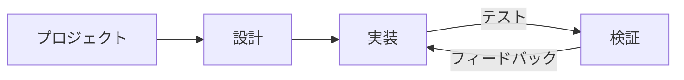

# Web開発
Source: https://docs.cursor.com/ja/guides/tutorials/web-development

Web開発向けにCursorを設定する方法

export const McpInstallButtonPrimary = ({server, showIcon = true, prompt = null}) => {
  const [showModal, setShowModal] = useState(false);
  const generateDeepLink = () => {
    if (!server || !server.name || !server.install) {
      return null;
    }
    try {
      if (typeof server.install === 'string') {
        return server.install;
      }
      if (server.install.url) {
        const config = {
          ...server.install
        };
        const jsonString = JSON.stringify(config);
        const utf8Bytes = new TextEncoder().encode(jsonString);
        const base64Config = btoa(Array.from(utf8Bytes).map(b => String.fromCharCode(b)).join(''));
        const safeBase64Config = base64Config.replace(/\+/g, '%2B');
        return `cursor://anysphere.cursor-deeplink/mcp/install?name=${encodeURIComponent(server.name)}&config=${encodeURIComponent(safeBase64Config)}`;
      }
      if (server.install.command) {
        let config = {
          command: server.install.command,
          ...server.install.args && ({
            args: server.install.args
          }),
          ...server.install.env && ({
            env: server.install.env
          })
        };
        if (config.command && config.args) {
          const argsString = config.args.join(" ");
          config.command = `${config.command} ${argsString}`;
          delete config.args;
        }
        const jsonString = JSON.stringify(config);
        const utf8Bytes = new TextEncoder().encode(jsonString);
        const base64Config = btoa(Array.from(utf8Bytes).map(b => String.fromCharCode(b)).join(''));
        const safeBase64Config = base64Config.replace(/\+/g, '%2B');
        return `cursor://anysphere.cursor-deeplink/mcp/install?name=${encodeURIComponent(server.name)}&config=${encodeURIComponent(safeBase64Config)}`;
      }
      return null;
    } catch (e) {
      console.error("Error generating deep link:", e);
      return null;
    }
  };
  const handleButtonClick = () => {
    setShowModal(true);
  };
  const handleClose = () => {
    setShowModal(false);
  };
  const deepLink = generateDeepLink();
  const isDocumentationOnly = typeof server?.install === 'string';
  const hasConfirmation = prompt || isDocumentationOnly;
  const InstallModal = ({isOpen, onClose, deepLink, server, children}) => {
    useEffect(() => {
      const handleKeyDown = event => {
        if (event.key === 'Escape') {
          onClose();
        }
      };
      if (isOpen) {
        document.addEventListener('keydown', handleKeyDown);
      }
      return () => {
        document.removeEventListener('keydown', handleKeyDown);
      };
    }, [isOpen, onClose]);
    if (!isOpen) return null;
    return <div className="fixed inset-0 bg-black bg-opacity-50 flex items-center justify-center z-50 transition-opacity duration-200" onClick={onClose}>
        <div className="bg-white dark:bg-neutral-900 rounded-lg p-6 max-w-md w-full mx-4 border border-neutral-200 dark:border-neutral-700 transition-all duration-200 transform" onClick={e => e.stopPropagation()}>
          <div className="mb-4">
            <h3 className="text-lg font-semibold text-black dark:text-white mb-2">
              Install {server?.name}
            </h3>
            <div className="text-neutral-600 dark:text-neutral-400">
              {children}
            </div>
          </div>
          <div className="flex gap-3 justify-end">
            <button onClick={onClose} className="px-4 py-2 text-sm font-medium rounded-lg transition-colors duration-200 text-neutral-600 dark:text-neutral-400 hover:text-black dark:hover:text-white border border-neutral-200 dark:border-neutral-700 hover:bg-neutral-100 dark:hover:bg-neutral-800">
              Cancel
            </button>
            <a href={deepLink} onClick={onClose} target="_blank" className="px-4 py-2 text-sm font-medium rounded-lg transition-colors duration-200 bg-black text-white hover:bg-neutral-800 dark:bg-white dark:text-black dark:hover:bg-neutral-200 inline-flex items-center justify-center no-underline">
              Continue
            </a>
          </div>
        </div>
      </div>;
  };
  return <>
      {hasConfirmation ? <button onClick={handleButtonClick} className="inline-flex justify-center items-center gap-2 px-4 py-2 text-sm font-medium rounded-lg transition-colors duration-200 not-prose text-white bg-black hover:bg-neutral-800 dark:bg-white dark:text-black dark:hover:bg-neutral-200 border border-black dark:border-white">
          {showIcon && <Icon icon="plus" size={16} color="currentColor" />}
          Add to Cursor
        </button> : <a href={deepLink} className="inline-flex justify-center items-center gap-2 px-4 py-2 text-sm font-medium rounded-lg transition-colors duration-200 not-prose text-white bg-black hover:bg-neutral-800 dark:bg-white dark:text-black dark:hover:bg-neutral-200 border border-black dark:border-white">
          {showIcon && <Icon icon="plus" size={16} color="currentColor" />}
          Add to Cursor
        </a>}

      {hasConfirmation && <InstallModal isOpen={showModal} onClose={handleClose} deepLink={deepLink} server={server}>
          {prompt}
        </InstallModal>}
    </>;
};

Web開発では、Cursor と Figma やブラウザなどの外部ツールとの間で、高速な反復と密なフィードバックループが欠かせない。Cursor では、このループをさらに短くするワークフローを確立してきた。タスクの明確なスコープ設定、コンポーネントの再利用、デザインシステムの活用が、スピードと一貫性の維持に効く。

このガイドでは、Web 開発を支援し、フィードバックループをさらに短縮するための Cursor のセットアップ方法を紹介する。



<div id="start-orchestrating-in-cursor">
  # Cursorでのオーケストレーションを始めよう
</div>

**Chat** は変更のブートストラップに最適。主要な要素が揃ったら、**Inline Edit** と **Tab** に切り替えるとフローを崩さずに進められる。

Cursor をセットアップすると、複数のツールをまたいだワークフローをオーケストレーションできるようになる。下はそのデモ例：Linear、Figma、ブラウザーツールを組み合わせて作ったスネークゲーム。実プロジェクトは通常もっと複雑だけど、この例で統合ワークフローのポテンシャルがわかるはず。

<Frame>
  <video src="https://mintcdn.com/cursor/E7JVsKUF5L-IiJRB/images/guides/tutorials/web-development/snake.mp4?fit=max&auto=format&n=E7JVsKUF5L-IiJRB&q=85&s=e029fbdff2ec06e1e4393ac580824b5a" controls data-path="images/guides/tutorials/web-development/snake.mp4" />
</Frame>

<div id="connect-to-your-project-management-tools">
  # プロジェクト管理ツールに接続する
</div>

Cursor は、既存のプロジェクト管理ソフトウェアといろんなツール経由で連携できる。このガイドでは、Linear を MCP サーバー経由で連携する方法を紹介する。

<div id="installation">
  ### インストール
</div>

<McpInstallButtonPrimary
  server={{
name: "Linear",
install: {
command: "npx",
args: ["-y", "mcp-remote", "https://mcp.linear.app/sse"],
},
}}
/>

または `mcp.json` に Linear の MCP サーバーを手動で追加する:

```jsx  theme={null}
{
  "mcpServers": {
    "Linear": {
      "command": "npx",
      "args": [
        "-y",
        "mcp-remote",
        "https://mcp.linear.app/sse"
      ]
    }
  }
}
```

Then:

1. MCP settings で Linear を有効化する
2. Web ブラウザが開き、Linear への認可を求められる
   <Info>
     現在の MCP の状況により、セットアップに複数回の試行が必要になる場合がある。
     連携がうまくいかない場合は、Cursor の settings から「Reload」server を試してみて。
   </Info>

<div id="using-linear-in-cursor">
  ### Cursor で Linear を使う
</div>

Linear MCP servers は、Cursor が課題を読み取り・管理するために使える各種ツールを公開している。すべてのツール一覧を見るには MCP settings に進み、Linear server を見つけて。確認するには、Chat で次のプロンプトを試してみて:

```jsx  theme={null}
このプロジェクトに関連する課題をすべて一覧表示
```

<Frame>
  
</Frame>

統合が正しく設定されていれば、課題の一覧が返ってくるはずだよ。

<div id="bring-in-your-figma-designs">
  # Figma のデザインを取り込む
</div>

デザインやモックアップは Web 開発の核。公式の Figma 向け MCP サーバーを使えば、Cursor でデザインファイルに直接アクセスして作業できる。始めるには、[Figma Dev Mode MCP Server](https://help.figma.com/hc/en-us/articles/32132100833559-Guide-to-the-Dev-Mode-MCP-Server) のセットアップ手順に従ってね。

<div id="installation">
  ### インストール
</div>

下のボタンをクリックして MCP サーバーをインストールしよう。

<McpInstallButtonPrimary
  server={{
name: "Figma",
install: {
url: "http://127.0.0.1:3845/sse",
},
}}
/>

または `mcp.json` に手動で追加する:

```jsx  theme={null}
{
  "mcpServers": {
    "Figma": {
      "url": "http://127.0.0.1:3845/sse"
    }
  }
}
```

<div id="usage">
  ### 使い方
</div>

サーバーは、プロンプト内で使える複数のツールを提供してる。たとえば、Figma で現在の選択対象のデザインを問い合わせてみて。詳しくは[ドキュメント](https://help.figma.com/hc/en-us/articles/32132100833559-Guide-to-the-Dev-Mode-MCP-Server)を参照してね。

<Frame>
  
</Frame>

<div id="keep-your-code-scaffolding-consistent">
  # コードのスキャフォールディングを一貫させよう
</div>

既存のコードやデザインシステム、再利用したい既定の規約があるはず。モデルを扱うときは、ドロップダウンメニューやほかの一般的なコンポーネントみたいに、コードベースに既にあるパターンを参照すると便利だよ。

自分たちも大規模なウェブベースのコードベースで作業してきて、宣言的なコードが特にうまく機能することがわかった。とりわけ React と JSX では効果的だよ。

もしデザインシステムがあるなら、ルールを用意してエージェントがそれを見つけられるようにできる。たとえば、可能な限りコンポーネントの再利用を徹底するための `ui-components.mdc` ファイルはこんな感じ:

```mdc components.mdc theme={null}
---
description: デザインの実装と UI 構築
---
- `/src/components/ui` にある既存の UI コンポーネントを再利用する。これは組み立ての基盤となるプリミティブ
- 既存のもので解決できない場合は、UI コンポーネントを組み合わせて新しいコンポーネントを作成する
- コンポーネントやデザインが不足している場合は、どう進めるか人に確認する
```

コンポーネントライブラリが成長したら、それに合わせて新しいルールを追加しよう。ルールが多くなりすぎたら、「ユーザー入力を扱う場合にのみ適用」など、より具体的なカテゴリに分けることを検討してね。

<Frame>
  
</Frame>

<div id="give-cursor-access-to-browser">
  # Cursor にブラウザアクセスを付与する
</div>

Cursor の機能を拡張するには、コンソールログやネットワークリクエストにアクセスできる Browser Tools MCP サーバーをセットアップしよう。設定後は、コンソール出力とネットワークアクティビティを監視して変更内容を検証できる。こうしたセットアップにより、実装が意図どおりになっているかを確実に確認できる。MCP サーバーのセットアップ手順はこちら: [https://browsertools.agentdesk.ai/installation](https://browsertools.agentdesk.ai/installation)

<Frame>
  
</Frame>

<Note>
  Cursor へのネイティブ統合をより簡単にできるよう改善に取り組んでるよ。
</Note>

<div id="takeaways">
  # まとめ
</div>

* Web開発では素早いフィードバックループが不可欠。CursorをFigma、Linear、ブラウザと併用して、速く動きつつフローを保とう。
* MCPサーバーで外部システムをCursorに直接統合でき、コンテキスト切り替えが減ってタスク遂行が向上する。
* コンポーネントやデザインシステムの再利用は、モデルによりクリーンで一貫したコードや出力を出させやすくする。
* 明確でスコープが定まったタスクは結果が良くなる。プロンプトの設計と依頼内容は意図的に決めよう。
* 良い出力が得られない場合は、次を調整してみて:
  * **Instructions:** ルールやプロンプトを整え、例えばMCPサーバーでより多くのコンテキストにアクセスさせる。
  * **Systems:** パターン化、抽象化、明確化によって、モデルが理解しやすくなり、支援と自律的な作業が進む。
* コンソールログ、ネットワークリクエスト、UI要素データなどのランタイム情報を含めて、モデルのコンテキストを拡張できる。
* すべてを自動化する必要はない。システムが複雑になりすぎたら、TabやInline Editでピンポイントに編集しよう。
* Cursorはオートパイロットではなくコパイロットとして最も強力。意思決定を置き換えるのではなく、磨くために使おう。

---

← Previous: [MCP サーバーの構築](./mcp.md) | [Index](./index.md) | Next: [コンテキストの扱い方](./section.md) →