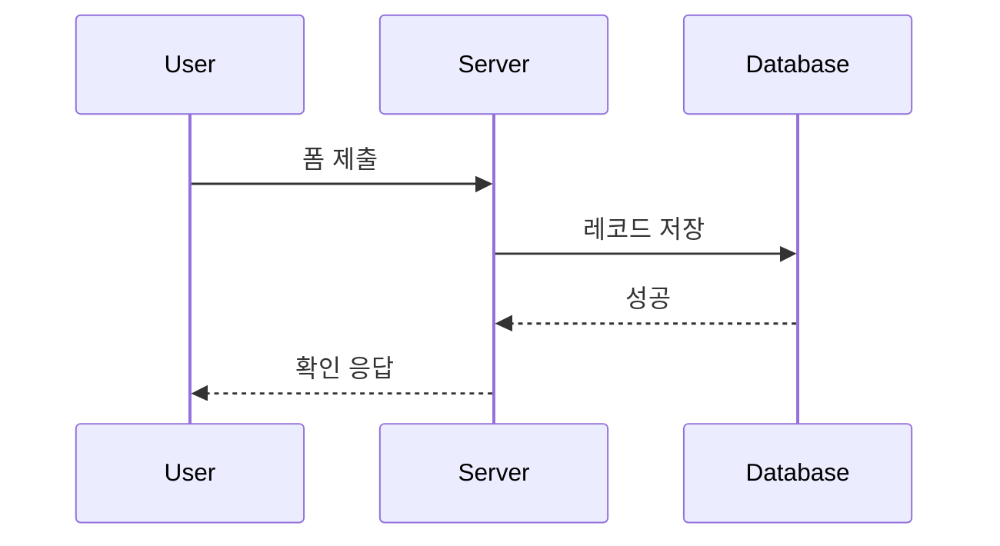
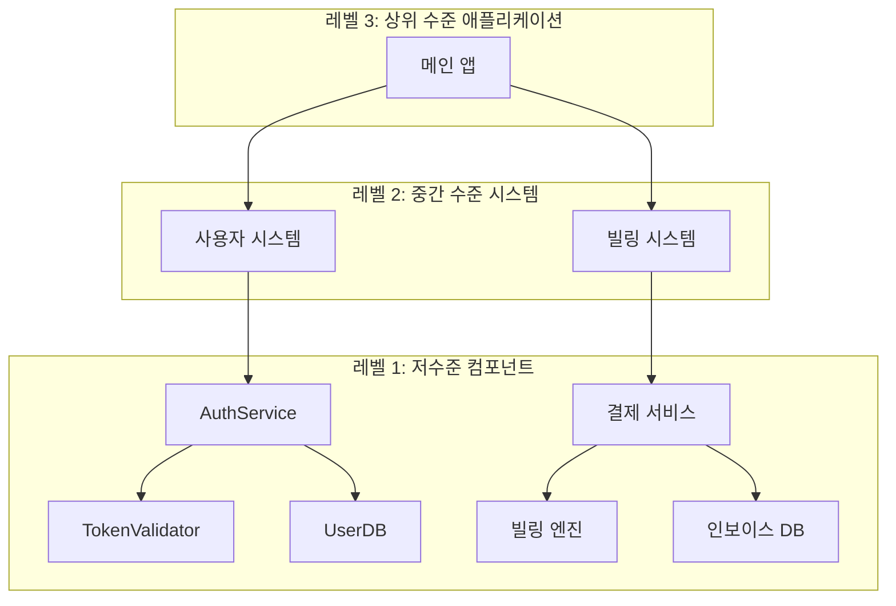
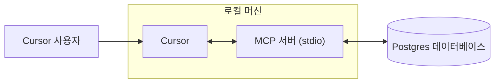
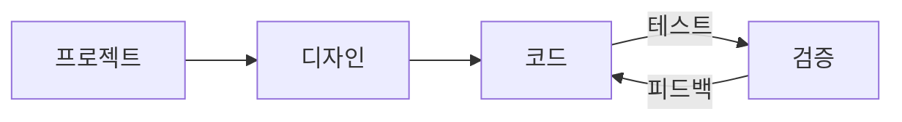
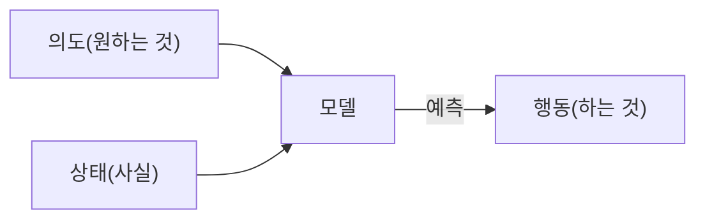

# Cursor Documentation (Korean)

This is the complete formatted documentation for Cursor in Korean, parsed and organized from the official documentation.

**Total Sections:** 112

---


# 에이전트 보안
Source: https://docs.cursor.com/ko/account/agent-security

Cursor Agent 사용 시 보안 고려 사항

프롬프트 인젝션, AI 환각, 기타 이슈로 인해 AI가 예기치 않게, 때로는 악의적으로 동작할 수도 있어. 우리가 프롬프트 인젝션을 더 근본적인 층위에서 해결하기 위해 계속 작업하는 동안, Cursor 제품에서의 1차 보호 수단은 에이전트가 할 수 있는 행동에 대한 가드레일이야. 여기에는 기본적으로 민감한 작업에 대해 수동 승인을 요구하는 것도 포함돼. 이 문서는 우리의 가드레일이 무엇인지, 그리고 거기서 무엇을 기대할 수 있는지 설명하려는 거야.

아래의 모든 제어와 동작은 기본값이자 권장 설정이야.

<div id="first-party-tool-calls">
  ## First-party tool calls
</div>

Cursor엔 에이전트가 코드 작성을 돕는 도구들이 기본으로 들어 있어. 파일 읽기, 편집, 터미널 명령 실행, 웹에서 문서 검색 같은 기능이 포함돼.

읽기 도구는 승인 없이 쓸 수 있어(예: 파일 읽기, 코드 전체 검색). [.cursorignore](/ko/context/ignore-files)로 특정 파일에 아예 접근 못 하게 막을 수 있지만, 그 외 읽기 작업은 보통 승인 없이 허용돼. 민감한 데이터가 유출될 위험이 있는 작업은 명시적 승인이 필요해.

현재 워크스페이스 안 파일을 수정하는 건 몇 가지 예외를 빼고는 명시적 승인이 필요 없어. 에이전트가 파일을 바꾸면 즉시 디스크에 저장돼. 언제든 되돌릴 수 있도록 버전 관리되는 워크스페이스에서 Cursor를 쓰길 권장해. IDE/CLI 설정을 바꾸는 파일, 예를 들어 편집기의 워크스페이스 설정 파일을 수정할 땐 변경 전에 반드시 명시적 승인이 필요해. 다만 파일 변경 시 자동 리로드를 켜뒀다면, 사용자가 변경 사항을 검토하기 전에 에이전트의 파일 변경이 자동 실행을 트리거할 수 있다는 점은 알아둬.

에이전트가 제안하는 터미널 명령은 기본적으로 모두 승인이 필요해. 에이전트가 실행하기 전에 각 명령을 꼭 검토하길 권장해. 위험을 감수하겠다면 승인 없이 모든 명령을 실행하도록 설정할 수도 있어. Cursor엔 [allowlist](/ko/agent/tools) 기능이 있지만, 이걸 보안 통제로 보진 않아. 일부 사용자는 특정 명령만 허용하지만, 이건 최선의 노력에 기반한 시스템이라 우회가 가능할 수도 있어. 설정된 allowlist를 전부 우회하는 "Run Everything"은 권장하지 않아.

<div id="third-party-tool-calls">
  ## 서드파티 도구 호출
</div>

Cursor는 [MCP](/ko/context/mcp)를 통해 외부 도구를 연결할 수 있어. 모든 서드파티 MCP 연결은 반드시 사용자가 명시적으로 승인해야 해. 사용자가 MCP를 승인하면, 기본적으로 외부 MCP 통합에서 Agent Mode가 제안하는 각 도구 호출은 실행 전에 매번 명시적으로 승인해야 해.

<div id="network-requests">
  ## 네트워크 요청
</div>

네트워크 요청은 공격자가 데이터를 유출하는 데 악용될 수 있어. 현재 우린 극히 제한된 호스트(예: GitHub)에 대해서만 1자 도구의 네트워크 요청을 허용하고, 명시적 링크 가져오기와 일부 제공업체를 통한 웹 검색만 지원해. 임의의 에이전트 네트워크 요청은 기본 설정으로 차단돼.

<div id="workspace-trust">
  ## 워크스페이스 신뢰
</div>

Cursor IDE는 기본적으로 비활성화된 표준 [workspace trust](https://code.visualstudio.com/docs/editing/workspaces/workspace-trust) 기능을 지원해. 워크스페이스 신뢰는 새 워크스페이스를 열 때 일반 모드와 제한 모드 중에서 선택하라는 프롬프트를 보여줘. 제한 모드는 AI를 비롯해 보통 Cursor에서 자주 쓰는 기능들을 제대로 쓰지 못하게 만들어. 신뢰하지 않는 리포지토리로 작업해야 한다면 기본 텍스트 에디터 같은 다른 도구를 쓰는 걸 추천해.

워크스페이스 신뢰는 다음 단계로 사용자 설정에서 켤 수 있어:

1. 사용자 settings.json 파일 열기
2. 다음 설정 추가:
   ```json  theme={null}
   "security.workspace.trust.enabled": true
   ```

이 설정은 Mobile Device Management(MDM) 솔루션을 통해 조직 전체에 강제할 수도 있어.

<div id="responsible-disclosure">
  ## 책임 있는 공개
</div>

Cursor에서 취약점을 발견했다고 생각하면 GitHub Security 페이지의 가이드를 따라 그곳에 보고서를 제출해줘. GitHub를 사용할 수 없다면 [security@cursor.com](mailto:security@cursor.com)으로도 연락해줘.

우리는 취약점 보고를 영업일 기준 5일 이내에 접수 확인하고, 가능한 한 빨리 대응할 것을 약속해. 결과는 GitHub Security 페이지에 보안 권고 형태로 게시할 거야. 치명적인 인시던트는 GitHub Security 페이지와 이메일을 통해 모든 사용자에게 공지할게.

---


# Billing
Source: https://docs.cursor.com/ko/account/billing

Cursor 구독, 환불, 인보이스 관리

<div id="how-do-i-access-billing-settings">
  ### 결제 설정은 어떻게 들어가?
</div>

[Dashboard](https://cursor.com/dashboard)에서 "Billing"을 클릭하면 결제 포털로 이동해. 모든 결제 작업을 안전하게 처리할 수 있어.

<div id="what-are-cursors-billing-cycles">
  ### Cursor의 결제 주기는 어떻게 돼?
</div>

구독 시작일 기준으로 월간 또는 연간으로 결제돼. Teams 계정은 좌석(멤버 1명당 1좌석) 기준으로 청구되고, 새 멤버는 비례 청구돼.

<div id="how-do-seats-work-for-teams-accounts">
  ### Teams 계정의 좌석은 어떻게 동작해?
</div>

Teams 계정은 좌석당 요금이 부과돼. 중간에 멤버를 추가하면 남은 기간만큼만 청구돼. 멤버가 크레딧을 사용한 뒤 제거된 경우, 해당 좌석은 결제 주기 끝까지 점유된 상태로 유지돼서 비례 환불은 없어. 팀 관리자는 대시보드에서 좌석을 관리할 수 있어.

<div id="can-i-switch-between-monthly-and-annual-billing">
  ### 월간과 연간 결제는 전환할 수 있어?
</div>

가능해! 방법은 아래와 같아:

**Pro plan**

1. Cursor [dashboard](https://cursor.com/dashboard)로 이동
2. 왼쪽 사이드바에서 "Billing and Invoices"를 클릭해 결제 페이지로 이동
3. "Manage subscription" 클릭
4. "Update subscription" 클릭
5. "Yearly" 또는 "Monthly" 선택 후 "Continue" 클릭

**Teams plan**

1. Cursor [dashboard](https://cursor.com/dashboard)로 이동
2. 왼쪽 사이드바에서 "Billing and Invoices"를 클릭해 결제 페이지로 이동
3. 연간 결제로 전환하려면 "Upgrade Now" 버튼 클릭

<Note>
  월간에서 연간으로만 셀프 전환이 가능해. 연간에서 월간으로 전환하려면
  [hi@cursor.com](mailto:hi@cursor.com)으로 연락해줘.
</Note>

<div id="where-can-i-find-my-invoices">
  ### 인보이스는 어디서 확인할 수 있어?
</div>

결제 포털에서 전체 결제 내역을 확인할 수 있어. 현재 및 과거 인보이스를 조회하고 다운로드할 수 있어.

<div id="can-i-get-invoices-automatically-emailed-to-me">
  ### 인보이스를 자동으로 이메일로 받을 수 있어?
</div>

지금은 결제 포털에서 수동으로 다운로드해야 해. 자동 인보이스 이메일 기능을 개발 중이야. 준비되면 옵트인할 수 있어.

<div id="how-do-i-update-my-billing-information">
  ### 결제 정보는 어떻게 업데이트해?
</div>

결제 수단, 회사 이름, 주소, 세금 정보를 결제 포털에서 업데이트해. 결제는 Stripe로 안전하게 처리돼. 변경 사항은 향후 인보이스에만 적용되고 과거 인보이스는 수정할 수 없어.

<div id="how-do-i-cancel-my-subscription">
  ### 구독은 어떻게 취소해?
</div>

Billing and Invoices 페이지에서 "Manage Subscription"을 클릭한 다음 "Cancel subscription" 버튼을 누르면 구독을 취소할 수 있어. 현재 청구 기간이 끝날 때까지는 이용 가능해.

<div id="im-having-other-billing-issues-how-can-i-get-help">
  ### 다른 결제 문제가 있어. 어떻게 도움을 받을 수 있어?
</div>

여기에 없는 결제 관련 질문은 계정에 연결된 이메일 주소로 [hi@cursor.com](mailto:hi@cursor.com)에 메일 보내줘. 계정 정보와 문의 내용을 함께 적어줘.

---


# Pricing
Source: https://docs.cursor.com/ko/account/pricing

Cursor의 요금제와 가격

Cursor는 무료로 써보거나 개인/팀 요금제를 구매할 수 있어.

<div id="individual">
  ## 개인
</div>

모든 개인 플랜에는 다음이 포함돼:

* 무제한 탭 자동완성
* 모든 모델에 대한 확장된 에이전트 사용 한도
* Bugbot 접근
* Background Agents 접근

각 플랜에는 모델 추론 [API 가격](/ko/models#model-pricing)에 따라 사용량이 청구돼:

* Pro에는 API 에이전트 사용 \$20 + 추가 보너스 사용 포함
* Pro Plus에는 API 에이전트 사용 \$70 + 추가 보너스 사용 포함
* Ultra에는 API 에이전트 사용 \$400 + 추가 보너스 사용 포함

보장된 포함 사용량 외에 추가 보너스 용량을 제공하려고 계속 노력하고 있어. 모델마다 API 비용이 달라서, 선택한 모델에 따라 토큰 출력과 포함 사용량이 소진되는 속도가 달라져. [대시보드](https://cursor.com/dashboard?tab=usage)에서 사용량과 토큰 상세를 확인할 수 있어. 에디터에서는 한도 알림이 수시로 표시돼.


<div id="how-much-usage-do-i-need">
  ### 어느 정도 써야 충분할까?
</div>

우리 사용 데이터 기준으로, 대략 아래 정도를 예상할 수 있어:

* **Daily Tab 사용자**: 항상 \$20 이내
* **Limited Agent 사용자**: 포함된 \$20 안에 머무르는 경우가 많아
* **Daily Agent 사용자**: 보통 월 총 사용 $60–$100
* **파워 유저(복수 에이전트/자동화)**: 종종 월 총 사용 \$200+

우리 사용 데이터 기준으로, *중간 사용자*에게 한도는 대략 다음과 비슷해:

* Pro: Sonnet 4 요청 약 225회, Gemini 요청 약 550회, 또는 GPT 5 요청 약 500회
* Pro+: Sonnet 4 요청 약 675회, Gemini 요청 약 1,650회, 또는 GPT 5 요청 약 1,500회
* Ultra: Sonnet 4 요청 약 4,500회, Gemini 요청 약 11,000회, 또는 GPT 5 요청 약 10,000회

<div id="what-happens-when-i-reach-my-limit">
  ### 한도에 도달하면 어떻게 돼?
</div>

포함된 월간 사용량을 초과하면 에디터에서 알림이 뜨고 다음 중에서 선택할 수 있어:

* **온디맨드 사용량 추가**: 동일한 API 요율로 종량제 결제로 Cursor 계속 쓰기
* **플랜 업그레이드**: 더 많은 포함 사용량이 제공되는 상위 티어로 올리기

온디맨드 사용량은 포함 사용량과 동일한 요율로 월별 청구돼. 요청의 품질이나 속도가 저하되는 일은 절대 없어.

<div id="teams">
  ## Teams
</div>

팀 플랜은 두 가지야: Teams (\$40/사용자/월)와 Enterprise(맞춤).

Teams 플랜은 다음과 같은 추가 기능을 제공해:

* Privacy Mode 강제 적용
* 사용량 통계가 포함된 Admin 대시보드
* 팀 결제 중앙화
* SAML/OIDC SSO

셀프 서비스로 충분한 경우엔 Teams를 추천해. 우선 지원, 사용량 풀링, 청구서 결제, SCIM, 고급 보안 제어가 필요하다면 [Enterprise](/ko/contact-sales)를 추천해.

[Teams 가격](/ko/account/teams/pricing)에 대해 더 알아봐.

<div id="auto">
  ## Auto
</div>

Auto를 켜면 Cursor가 현재 수요를 기준으로 즉시 작업에 가장 잘 맞고 신뢰성이 가장 높은 프리미엄 모델을 골라줘. 이 기능은 출력 성능 저하를 감지하면 문제를 해결하기 위해 자동으로 모델을 전환할 수 있어.

<Frame>
  
</Frame>

<Note>우린 Auto의 품질과 전반적인 성능에 크게 투자했어. 9월 15일 이후 다음 결제 갱신부터 Auto는 아래 API 요율로 사용량이 청구돼.</Note>

* **Input + Cache Write**: 1M tokens당 \$1.25
* **Output**: 1M tokens당 \$6.00
* **Cache Read**: 1M tokens당 \$0.25

에디터와 대시보드 모두 Auto를 포함한 사용량을 보여줘. 직접 모델을 고르길 원하면 해당 모델의 리스트 API 가격으로 사용량이 청구돼.

<div id="max-mode">
  ## Max Mode
</div>

일부 모델은 [Max Mode](/ko/models#max-mode)를 사용할 수 있어서, 최대 1M 토큰까지 더 긴 추론과 더 큰 컨텍스트 윈도를 지원해. 대부분의 코딩 작업에는 Max Mode가 필요 없지만, 특히 큰 파일이나 코드베이스를 다루는 복잡한 쿼리에는 도움이 될 수 있어. Max Mode를 사용하면 사용량이 더 늘어나. 모든 요청과 토큰 사용 내역은 [대시보드](https://cursor.com/dashboard?tab=usage)에서 확인할 수 있어.

<div id="bugbot">
  ## Bugbot
</div>

Bugbot은 Cursor 구독과는 별개의 제품이고, 자체 요금제가 있어.

* **Pro** (\$40/월): 월 최대 200개 PR에 대한 무제한 리뷰, Cursor Ask 무제한 이용, 버그 수정을 위한 Cursor 연동, Bugbot Rules 이용 가능
* **Teams** (\$40/사용자/월): 모든 PR에 대한 무제한 코드 리뷰, Cursor Ask 무제한 이용, 팀 단위 풀 사용량, 고급 규칙과 설정
* **Enterprise** (맞춤형): Teams의 모든 기능에 더해 고급 분석과 보고, 우선 지원, 계정 관리

[Bugbot 요금제](https://cursor.com/bugbot#pricing)를 자세히 알아봐.

<div id="background-agent">
  ## Background Agent
</div>

Background Agent는 선택한 [model](/ko/models)의 API 요금이 적용돼. 처음 쓸 때 Background Agent의 지출 한도를 설정하라는 안내가 뜰 거야.

<Info>
  Background Agent용 Virtual Machine(VM) 컴퓨트 요금은 추후 책정될 예정이야.
</Info>

---


# Admin API
Source: https://docs.cursor.com/ko/account/teams/admin-api

API를 통해 팀 지표, 사용량 데이터, 지출 정보를 조회하기

Admin API는 멤버 정보, 사용 지표, 지출 내역을 포함한 팀 데이터를 코드로 액세스할 수 있게 해줘. 커스텀 대시보드나 모니터링 도구를 만들거나 기존 워크플로우에 통합해봐.

<Note>
  API는 첫 릴리스야. 피드백을 바탕으로 기능을 확장하는 중—필요한 엔드포인트를 알려줘!
</Note>

<div id="authentication">
  ## 인증
</div>

모든 API 요청에는 API 키 인증이 필요해. 팀 관리자만 API 키를 만들고 관리할 수 있어.

API 키는 조직에 귀속돼 있고, 모든 관리자에게 보이며, 원래 생성자의 계정 상태와 무관해.

<div id="creating-an-api-key">
  ### API 키 만들기
</div>

1. **cursor.com/dashboard** → **Settings** 탭 → **Cursor Admin API Keys**로 가
2. **Create New API Key** 클릭
3. 키에 알아보기 쉬운 이름 붙여 (예: "Usage Dashboard Integration")
4. 생성된 키를 바로 복사해—다시는 확인할 수 없어

형식: `key_xxxxxxxxxxxxxxxxxxxxxxxxxxxxxxxxxxxxxxxxxxxxxxxxxxxxxxxxxxxxxxxx`

<div id="using-your-api-key">
  ### API 키 사용하기
</div>

기본 인증에서 API 키를 사용자 이름으로 사용해:

**기본 인증으로 curl 사용:**

```bash  theme={null}
curl https://api.cursor.com/{route} -u API_KEY:
```

**또는 Authorization 헤더를 직접 설정하기:**

```bash  theme={null}
Authorization: Basic {base64_encode('API_KEY:')}
```

<div id="base-url">
  ## 기본 URL
</div>

모든 API 엔드포인트는 다음을 사용해:

```
https://api.cursor.com
```

<div id="endpoints">
  ## 엔드포인트
</div>

<div id="get-team-members">
  ### 팀 멤버 가져오기
</div>

모든 팀 멤버와 상세 정보를 가져와.

```
GET /teams/members
```

#### 응답

팀 멤버 객체 배열을 반환:

```typescript  theme={null}
{
  teamMembers: {
    name: string;
    email: string;
    role: 'owner' | 'member' | 'free-owner';
  }[];
}
```

#### 예시 답변

```json  theme={null}
{
  "teamMembers": [
    {
      "name": "Alex",
      "email": "developer@company.com",
      "role": "구성원"
    },
    {
      "name": "Sam",
      "email": "admin@company.com",
      "role": "소유자"
    }
  ]
}

```

#### 요청 예시

```bash  theme={null}
curl -X GET https://api.cursor.com/teams/members \
  -u YOUR_API_KEY:
```

<div id="get-daily-usage-data">
  ### 일일 사용량 데이터 가져오기
</div>

지정된 날짜 범위에서 팀의 일일 사용량 지표를 자세히 조회해. 코드 편집, AI 지원 사용량, 수락률에 대한 인사이트를 제공해.

```
POST /teams/daily-usage-data
```

#### 요청 본문

<div className="full-width-table">
  | 매개변수        | 타입     | 필수 | 설명               |
  | :---------- | :----- | :- | :--------------- |
  | `startDate` | number | 예  | 에포크 밀리초 기준 시작 날짜 |
  | `endDate`   | number | 예  | 에포크 밀리초 기준 종료 날짜 |
</div>

<Note>
  날짜 범위는 최대 90일이야. 더 긴 기간은 여러 번 나눠서 요청해 줘.
</Note>

#### 응답

```typescript  theme={null}
{
  data: {
    date: number;
    isActive: boolean;
    totalLinesAdded: number;
    totalLinesDeleted: number;
    acceptedLinesAdded: number;
    acceptedLinesDeleted: number;
    totalApplies: number;
    totalAccepts: number;
    totalRejects: number;
    totalTabsShown: number;
    totalTabsAccepted: number;
    composerRequests: number;
    chatRequests: number;
    agentRequests: number;
    cmdkUsages: number;
    subscriptionIncludedReqs: number;
    apiKeyReqs: number;
    usageBasedReqs: number;
    bugbotUsages: number;
    mostUsedModel: string;
    applyMostUsedExtension?: string;
    tabMostUsedExtension?: string;
    clientVersion?: string;
    email?: string;
  }[];
  period: {
    startDate: number;
    endDate: number;
  };
}
```

<div id="response-fields">
  #### 응답 필드
</div>

<div className="full-width-table">
  | Field                      | Description                  |
  | :------------------------- | :--------------------------- |
  | `date`                     | 에포크 밀리초 기준 날짜                |
  | `isActive`                 | 해당 날짜에 활성 사용자 여부             |
  | `totalLinesAdded`          | 추가된 코드 라인 수                  |
  | `totalLinesDeleted`        | 삭제된 코드 라인 수                  |
  | `acceptedLinesAdded`       | 승인된 AI 제안으로 추가된 라인 수         |
  | `acceptedLinesDeleted`     | 승인된 AI 제안으로 삭제된 라인 수         |
  | `totalApplies`             | 적용(Apply) 작업 수               |
  | `totalAccepts`             | 승인된 제안 수                     |
  | `totalRejects`             | 거부된 제안 수                     |
  | `totalTabsShown`           | 표시된 탭 완성 수                   |
  | `totalTabsAccepted`        | 승인된 탭 완성 수                   |
  | `composerRequests`         | Composer 요청 수                |
  | `chatRequests`             | Chat 요청 수                    |
  | `agentRequests`            | Agent 요청 수                   |
  | `cmdkUsages`               | 명령 팔레트(Cmd+K) 사용 횟수          |
  | `subscriptionIncludedReqs` | 구독 포함 요청 수                   |
  | `apiKeyReqs`               | API 키 요청 수                   |
  | `usageBasedReqs`           | 사용량 기반 과금 요청 수               |
  | `bugbotUsages`             | 버그 감지 사용 횟수                  |
  | `mostUsedModel`            | 가장 많이 사용된 AI 모델              |
  | `applyMostUsedExtension`   | 적용(Apply)에서 가장 많이 사용된 파일 확장자 |
  | `tabMostUsedExtension`     | 탭에서 가장 많이 사용된 파일 확장자         |
  | `clientVersion`            | Cursor 버전                    |
  | `email`                    | 사용자 이메일                      |
</div>

#### 예시 답변

```json  theme={null}
{
  "data": [
    {
      "date": 1710720000000,
      "isActive": true,
      "totalLinesAdded": 1543,
      "totalLinesDeleted": 892,
      "acceptedLinesAdded": 1102,
      "acceptedLinesDeleted": 645,
      "totalApplies": 87,
      "totalAccepts": 73,
      "totalRejects": 14,
      "totalTabsShown": 342,
      "totalTabsAccepted": 289,
      "composerRequests": 45,
      "chatRequests": 128,
      "agentRequests": 12,
      "cmdkUsages": 67,
      "subscriptionIncludedReqs": 180,
      "apiKeyReqs": 0,
      "usageBasedReqs": 5,
      "bugbotUsages": 3,
      "mostUsedModel": "gpt-4",
      "applyMostUsedExtension": ".tsx",
      "tabMostUsedExtension": ".ts",
      "clientVersion": "0.25.1",
      "email": "developer@company.com"
    },
    {
      "date": 1710806400000,
      "isActive": true,
      "totalLinesAdded": 2104,
      "totalLinesDeleted": 1203,
      "acceptedLinesAdded": 1876,
      "acceptedLinesDeleted": 987,
      "totalApplies": 102,
      "totalAccepts": 91,
      "totalRejects": 11,
      "totalTabsShown": 456,
      "totalTabsAccepted": 398,
      "composerRequests": 67,
      "chatRequests": 156,
      "agentRequests": 23,
      "cmdkUsages": 89,
      "subscriptionIncludedReqs": 320,
      "apiKeyReqs": 15,
      "usageBasedReqs": 0,
      "bugbotUsages": 5,
      "mostUsedModel": "claude-3-opus",
      "applyMostUsedExtension": ".py",
      "tabMostUsedExtension": ".py",
      "clientVersion": "0.25.1",
      "email": "developer@company.com"
    }
  ],
  "period": {
    "startDate": 1710720000000,
    "endDate": 1710892800000
  }
}
```

<div id="example-requests">
  #### 예시 요청
</div>

```bash  theme={null}
curl -X POST https://api.cursor.com/teams/daily-usage-data \
  -u YOUR_API_KEY: \
  -H "Content-Type: application/json" \
  -d '{
    "startDate": 1710720000000,
    "endDate": 1710892800000
  }'
```

<div id="get-spending-data">
  ### 지출 데이터 가져오기
</div>

검색, 정렬, 페이지네이션을 포함해 이번 달 지출 정보를 조회해.

```
POST /teams/spend
```

#### 요청 본문

<div className="full-width-table">
  | 매개변수            | 타입     | 필수  | 설명                                           |
  | :-------------- | :----- | :-- | :------------------------------------------- |
  | `searchTerm`    | string | 아니오 | 사용자 이름과 이메일에서 검색                             |
  | `sortBy`        | string | 아니오 | 정렬 기준: `amount`, `date`, `user`. 기본값: `date` |
  | `sortDirection` | string | 아니오 | 정렬 방향: `asc`, `desc`. 기본값: `desc`            |
  | `page`          | number | 아니오 | 페이지 번호(1부터 시작). 기본값: `1`                     |
  | `pageSize`      | number | 아니오 | 페이지당 결과 수                                    |
</div>

#### 응답

```typescript  theme={null}
{
  teamMemberSpend: {
    spendCents: number;
    fastPremiumRequests: number;
    name: string;
    email: string;
    role: 'owner' | 'member' | 'free-owner';
    hardLimitOverrideDollars: number;
  }[];
  subscriptionCycleStart: number;
  totalMembers: number;
  totalPages: number;
}
```

<div id="response-fields">
  #### 응답 필드
</div>

<div className="full-width-table">
  | 필드                         | 설명                    |
  | :------------------------- | :-------------------- |
  | `spendCents`               | 총 지출액(센트)             |
  | `fastPremiumRequests`      | Fast 프리미엄 모델 요청 수     |
  | `name`                     | 멤버 이름                 |
  | `email`                    | 멤버 이메일                |
  | `role`                     | 팀 내 역할                |
  | `hardLimitOverrideDollars` | 커스텀 지출 한도 오버라이드(달러)   |
  | `subscriptionCycleStart`   | 구독 사이클 시작 시각(에포크 밀리초) |
  | `totalMembers`             | 팀 전체 멤버 수             |
  | `totalPages`               | 총 페이지 수               |
</div>

#### 예시 답변

```json  theme={null}
{
  "teamMemberSpend": [
    {
      "spendCents": 2450,
      "fastPremiumRequests": 1250,
      "name": "Alex",
      "email": "developer@company.com",
      "role": "member",
      "hardLimitOverrideDollars": 100
    },
    {
      "spendCents": 1875,
      "fastPremiumRequests": 980,
      "name": "Sam",
      "email": "admin@company.com",
      "role": "owner",
      "hardLimitOverrideDollars": 0
    },
  ],
  "subscriptionCycleStart": 1708992000000,
  "totalMembers": 15,
  "totalPages": 1
}
```

<div id="example-requests">
  #### 예시 요청
</div>

**기본 지출 데이터:**

```bash  theme={null}
curl -X POST https://api.cursor.com/teams/spend \
  -u YOUR_API_KEY: \
  -H "Content-Type: application/json" \
  -d '{}'
```

**페이지네이션을 사용해 특정 사용자 검색:**

```bash  theme={null}
curl -X POST https://api.cursor.com/teams/spend \
  -u YOUR_API_KEY: \
  -H "Content-Type: application/json" \
  -d '{
    "searchTerm": "alex@company.com",
    "page": 2,
    "pageSize": 25
  }'
```

<div id="get-usage-events-data">
  ### 사용량 이벤트 데이터 가져오기
</div>

강력한 필터링, 검색, 그리고 페이지네이션 옵션으로 팀의 상세한 사용량 이벤트를 조회해. 이 엔드포인트는 개별 API 호출, 모델 사용량, 토큰 사용량, 비용까지 세밀하게 파악할 수 있는 인사이트를 제공해.

```
POST /teams/filtered-usage-events
```

#### 요청 본문

<div className="full-width-table">
  | 매개변수        | 타입     | 필수  | 설명                       |
  | :---------- | :----- | :-- | :----------------------- |
  | `startDate` | number | 아니오 | Epoch 밀리초 기준 시작일         |
  | `endDate`   | number | 아니오 | Epoch 밀리초 기준 종료일         |
  | `userId`    | number | 아니오 | 특정 사용자 ID로 필터            |
  | `page`      | number | 아니오 | 페이지 번호(1부터 시작). 기본값: `1` |
  | `pageSize`  | number | 아니오 | 페이지당 결과 수. 기본값: `10`     |
  | `email`     | string | 아니오 | 사용자 이메일 주소로 필터           |
</div>

#### 응답

```typescript  theme={null}
{
  totalUsageEventsCount: number;
  pagination: {
    numPages: number;
    currentPage: number;
    pageSize: number;
    hasNextPage: boolean;
    hasPreviousPage: boolean;
  };
  usageEvents: {
    timestamp: string;
    model: string;
    kind: string;
    maxMode: boolean;
    requestCosts: number;
    isTokenBasedCall: boolean;
    tokenUsage?: {
      inputTokens: number;
      outputTokens: number;
      cacheWriteTokens: number;
      cacheReadTokens: number;
      totalCents: number;
    };
    isFreeBugbot: boolean;
    userEmail: string;
  }[];
  period: {
    startDate: number;
    endDate: number;
  };
}
```

<div id="response-fields-explained">
  #### 응답 필드 설명
</div>

<div className="full-width-table">
  | Field                   | Description                                     |
  | :---------------------- | :---------------------------------------------- |
  | `totalUsageEventsCount` | 쿼리와 일치하는 사용 이벤트의 총 개수                           |
  | `pagination`            | 결과 탐색을 위한 페이지네이션 메타데이터                          |
  | `timestamp`             | 이벤트 타임스탬프(에포크 밀리초)                              |
  | `model`                 | 요청에 사용된 AI 모델                                   |
  | `kind`                  | 사용 유형(예: "Usage-based", "Included in Business") |
  | `maxMode`               | Max Mode가 활성화되었는지                               |
  | `requestsCosts`         | 요청 단위 기준 비용                                     |
  | `isTokenBasedCall`      | 이벤트가 사용량 기반으로 과금되는 경우 true                      |
  | `tokenUsage`            | 토큰 사용량 상세(isTokenBasedCall이 true일 때 제공)         |
  | `isFreeBugbot`          | 무료 Bugbot 사용인지                                  |
  | `userEmail`             | 요청을 보낸 사용자의 이메일                                 |
  | `period`                | 조회한 데이터의 날짜 범위                                  |
</div>

#### 응답 예시

```json  theme={null}
{
  "totalUsageEventsCount": 113,
  "pagination": {
    "numPages": 12,
    "currentPage": 1,
    "pageSize": 10,
    "hasNextPage": true,
    "hasPreviousPage": false
  },
  "usageEvents": [
    {
      "timestamp": "1750979225854",
      "model": "claude-4-opus",
      "kind": "사용량 기반",
      "maxMode": true,
      "requestsCosts": 5,
      "isTokenBasedCall": true,
      "tokenUsage": {
        "inputTokens": 126,
        "outputTokens": 450,
        "cacheWriteTokens": 6112,
        "cacheReadTokens": 11964,
        "totalCents": 20.18232
      },
      "isFreeBugbot": false,
      "userEmail": "developer@company.com"
    },
    {
      "timestamp": "1750979173824",
      "model": "claude-4-opus",
      "kind": "Usage-based",
      "maxMode": true,
      "requestsCosts": 10,
      "isTokenBasedCall": true,
      "tokenUsage": {
        "inputTokens": 5805,
        "outputTokens": 311,
        "cacheWriteTokens": 11964,
        "cacheReadTokens": 0,
        "totalCents": 40.16699999999999
      },
      "isFreeBugbot": false,
      "userEmail": "developer@company.com"
    },
    {
      "timestamp": "1750978339901",
      "model": "claude-4-sonnet-thinking",
      "kind": "Business 요금제 포함",
      "maxMode": true,
      "requestsCosts": 1.4,
      "isTokenBasedCall": false,
      "isFreeBugbot": false,
      "userEmail": "admin@company.com"
    }
  ],
  "period": {
    "startDate": 1748411762359,
    "endDate": 1751003762359
  }
}
```

<div id="example-requests">
  #### 예시 요청
</div>

**기본 페이지네이션으로 모든 사용량 이벤트 가져오기:**

```bash  theme={null}
curl -X POST https://api.cursor.com/teams/filtered-usage-events \
  -u YOUR_API_KEY: \
  -H "Content-Type: application/json" \
  -d '{}'
```

**날짜 범위와 특정 사용자로 필터링:**

```bash  theme={null}
curl -X POST https://api.cursor.com/teams/filtered-usage-events \
  -u YOUR_API_KEY: \
  -H "Content-Type: application/json" \
  -d '{
    "startDate": 1748411762359,
    "endDate": 1751003762359,
    "email": "developer@company.com",
    "page": 1,
    "pageSize": 25
  }'
```

**커스텀 페이지네이션을 사용해 특정 사용자의 사용량 이벤트 가져오기:**

```bash  theme={null}
curl -X POST https://api.cursor.com/teams/filtered-usage-events \
  -u YOUR_API_KEY: \
  -H "Content-Type: application/json" \
  -d '{
    "userId": 12345,
    "page": 2,
    "pageSize": 50
  }'
```

<div id="set-user-spend-limit">
  ### 사용자 지출 한도 설정
</div>

팀 구성원별로 지출 한도를 설정해. 이렇게 하면 팀에서 각 사용자가 AI 사용에 얼마까지 쓸 수 있는지 관리할 수 있어.

```
POST /teams/user-spend-limit
```

<Note>
  **레이트 리미트:** 팀당 분당 60건
</Note>

#### 요청 본문

<div className="full-width-table">
  | 매개변수                | 타입     | 필수 | 설명                        |
  | :------------------ | :----- | :- | :------------------------ |
  | `userEmail`         | string | 예  | 팀 멤버의 이메일 주소              |
  | `spendLimitDollars` | number | 예  | 달러 기준 지출 한도(정수만, 소수점 불가). |
</div>

<Note>
  * 사용자는 이미 네 팀의 멤버여야 해
  * 정수형 값만 받을 수 있어(소수 금액은 안 돼)
  * `spendLimitDollars`를 0으로 설정하면 한도가 \$0으로 설정돼
</Note>

#### Response

성공 또는 실패를 나타내는 표준화된 응답을 반환해:

```typescript  theme={null}
{
  outcome: 'success' | 'error';
  message: string;
}
```

<div id="example-responses">
  #### 예시 응답
</div>

**한도 설정 성공:**

```json  theme={null}
{
  "outcome": "success",
  "message": "사용자 developer@company.com의 지출 한도가 $100로 설정됨"
}
```

**오류 응답:**

```json  theme={null}
{
  "outcome": "error",
  "message": "잘못된 이메일 형식"
}
```

<div id="example-requests">
  #### 예시 요청
</div>

**지출 한도 설정:**

```bash  theme={null}
curl -X POST https://api.cursor.com/teams/user-spend-limit \
  -u YOUR_API_KEY: \
  -H "Content-Type: application/json" \
  -d '{
    "userEmail": "developer@company.com",
    "spendLimitDollars": 100
  }'
```

<div id="repo-blocklists-api">
  ### Repo Blocklists API
</div>

리포지토리와 패턴을 추가해 파일이나 디렉터리가 인덱싱되거나 팀 컨텍스트로 사용되지 않게 막아.

<div id="get-team-repo-blocklists">
  #### 팀 리포지토리 차단 목록 가져오기
</div>

팀에 설정된 모든 리포지토리 차단 목록을 가져와.

```
GET /settings/repo-blocklists/repos
```

##### 응답

리포지토리 블록리스트 객체 배열을 반환해:

```typescript  theme={null}
{
  repos: {
    id: string;
    url: string;
    patterns: string[];
  }[];
}
```

<div id="example-response">
  ##### 응답 예시
</div>

```json  theme={null}
{
  "repos": [
    {
      "id": "repo_123",
      "url": "https://github.com/company/sensitive-repo",
      "patterns": ["*.env", "config/*", "secrets/**"]
    },
    {
      "id": "repo_456",
      "url": "https://github.com/company/internal-tools",
      "patterns": ["*"]
    }
  ]
}
```

<div id="example-request">
  ##### 예시 요청
</div>

```bash  theme={null}
curl -X GET https://api.cursor.com/settings/repo-blocklists/repos \
  -u YOUR_API_KEY:
```

<div id="upsert-repo-blocklists">
  #### 레포 블록리스트 업서트
</div>

제공된 레포의 기존 블록리스트를 교체해.
*참고: 이 엔드포인트는 제공된 레포의 패턴만 덮어써. 다른 레포에는 영향 없어.*

```
POST /settings/repo-blocklists/repos/upsert
```

<div id="request-body">
  ##### 요청 본문
</div>

| 매개변수  | 타입    | 필수 | 설명                |
| ----- | ----- | -- | ----------------- |
| repos | array | 예  | 리포지토리 블록리스트 객체 배열 |

각 리포지토리 객체에는 다음이 포함돼야 해:

| 필드       | 타입        | 필수 | 설명                     |
| -------- | --------- | -- | ---------------------- |
| url      | string    | 예  | 블록리스트에 추가할 리포지토리 URL   |
| patterns | string\[] | 예  | 차단할 파일 패턴 배열(글롭 패턴 지원) |

<div id="response">
  ##### Response
</div>

업데이트된 저장소 차단 목록을 반환해:

```typescript  theme={null}
{
  repos: {
    id: string;
    url: string;
    patterns: string[];
  }[];
}
```

##### 요청 예시

```bash  theme={null}
curl -X POST https://api.cursor.com/settings/repo-blocklists/repos/upsert \
  -u YOUR_API_KEY: \
  -H "Content-Type: application/json" \
  -d '{
    "repos": [
      {
        "url": "https://github.com/company/sensitive-repo",
        "patterns": ["*.env", "config/*", "secrets/**"]
      },
      {
        "url": "https://github.com/company/internal-tools", 
        "patterns": ["*"]
      }
    ]
  }'
```

<div id="delete-repo-blocklist">
  #### 리포지토리 차단 목록 삭제
</div>

차단 목록에서 특정 리포지토리를 제거해.

```
DELETE /settings/repo-blocklists/repos/:repoId
```

<div id="parameters">
  ##### 매개변수
</div>

| 매개변수   | 유형     | 필수 | 설명                |
| ------ | ------ | -- | ----------------- |
| repoId | string | 예  | 삭제할 저장소 차단 목록의 ID |

<div id="response">
  ##### Response
</div>

성공적으로 삭제되면 204 No Content를 반환해.

<div id="example-request">
  ##### 예시 요청
</div>

```bash  theme={null}
curl -X DELETE https://api.cursor.com/settings/repo-blocklists/repos/repo_123 \
  -u YOUR_API_KEY:
```

<div id="pattern-examples">
  #### 패턴 예시
</div>

자주 쓰는 블록리스트 패턴:

* `*` - 저장소 전체 차단
* `*.env` - 모든 .env 파일 차단
* `config/*` - config 디렉터리의 모든 파일 차단
* `**/*.secret` - 모든 하위 디렉터리의 .secret 파일 차단
* `src/api/keys.ts` - 특정 파일 차단

---


# AI Code Tracking API
Source: https://docs.cursor.com/ko/account/teams/ai-code-tracking-api

팀 리포지토리에 대한 AI 생성 코드 분석에 액세스

팀 리포지토리에 대한 AI 생성 코드 분석에 액세스해. 커밋별 AI 사용량과 세밀한 승인된 AI 변경 사항이 포함돼.

<Note>
  API는 첫 릴리스야. 피드백을 바탕으로 기능을 확장하고 있어 — 어떤 엔드포인트가 필요한지 알려줘!
</Note>

* **Availability**: 엔터프라이즈 팀 전용
* **Status**: 알파(응답 구조와 필드가 변경될 수 있음)

<div id="authentication">
  ## 인증
</div>

모든 API 요청은 API 키로 인증해야 해. 이 API는 다른 엔드포인트와 같은 Admin API 인증을 사용해.

자세한 인증 방법은 [Admin API authentication](/ko/account/teams/admin-api#authentication)을 참고해.

<div id="base-url">
  ## 기본 URL
</div>

모든 API 엔드포인트는 다음을 사용해:

```
https://api.cursor.com
```

<div id="rate-limits">
  ## 요청 제한
</div>

* 팀 및 엔드포인트별 분당 5회 요청

<div id="query-parameters">
  ## 쿼리 매개변수
</div>

아래의 모든 엔드포인트는 동일한 쿼리 매개변수를 쿼리 문자열로 받아:

<div className="full-width-table">
  | Parameter   | Type   | Required | Description                                                                                                                     |                                                                  |
  | :---------- | :----- | :------- | :------------------------------------------------------------------------------------------------------------------------------ | ---------------------------------------------------------------- |
  | `startDate` | string | date     | No                                                                                                                              | ISO 날짜 문자열, 리터럴 "now", 또는 "7d"처럼 상대 일수(지금 - 7일 의미). 기본값: 지금 - 7일 |
  | `endDate`   | string | date     | No                                                                                                                              | ISO 날짜 문자열, 리터럴 "now", 또는 "0d"처럼 상대 일수. 기본값: 지금                  |
  | `page`      | number | No       | 페이지 번호(1부터 시작). 기본값: 1                                                                                                          |                                                                  |
  | `pageSize`  | number | No       | 페이지당 결과 수. 기본값: 100, 최대: 1000                                                                                                   |                                                                  |
  | `user`      | string | No       | 단일 사용자로 필터링(선택). 이메일(예: [developer@company.com](mailto:developer@company.com)), 인코딩된 ID(예: user\_abc123...), 또는 숫자 ID(예: 42) 허용 |                                                                  |
</div>

<Note>
  응답의 userId는 접두사 user\_가 붙은 인코딩된 외부 ID로 반환돼. API에서 안정적으로 사용할 수 있어.
</Note>

<div id="semantics-and-how-metrics-are-computed">
  ## 시맨틱과 메트릭 계산 방식
</div>

* **Sources**: "TAB"은 수락된 인라인 자동완성을 의미하고, "COMPOSER"는 Composer에서 수락된 diff를 의미해
* **Lines metrics**: tabLinesAdded/Deleted와 composerLinesAdded/Deleted는 각각 별도로 집계돼; nonAiLinesAdded/Deleted는 max(0, totalLines - AI lines)로 계산돼
* **Privacy mode**: 클라이언트에서 활성화된 경우, 일부 메타데이터(예: fileName)가 생략될 수 있어
* **Branch info**: 현재 브랜치가 저장소의 기본 브랜치와 같으면 isPrimaryBranch는 true야; 저장소 정보를 가져올 수 없으면 undefined일 수 있어

그 파일을 확인해 커밋과 변경 사항이 어떻게 감지되고 보고되는지 파악해봐.

<div id="endpoints">
  ## 엔드포인트
</div>

<div id="get-ai-commit-metrics-json-paginated">
  ### AI 커밋 메트릭 가져오기 (JSON, 페이지네이션)
</div>

커밋별로 집계된 메트릭을 가져오고, 각 라인을 TAB, COMPOSER, 비(非) AI로 분류해.

```
GET /analytics/ai-code/commits
```

<div id="response">
  #### 응답
</div>

```typescript  theme={null}
{
  items: AiCommitMetric[];
  totalCount: number;
  page: number;
  pageSize: number;
}
```

<div id="aicommitmetric-fields">
  #### AiCommitMetric 필드
</div>

<div className="full-width-table">
  | Field                  | Type    | Description                   |                  |
  | :--------------------- | :------ | :---------------------------- | ---------------- |
  | `commitHash`           | string  | Git 커밋 해시                     |                  |
  | `userId`               | string  | 인코딩된 사용자 ID (예: user\_abc123) |                  |
  | `userEmail`            | string  | 사용자 이메일 주소                    |                  |
  | `repoName`             | string  | null                          | 저장소 이름           |
  | `branchName`           | string  | null                          | 브랜치 이름           |
  | `isPrimaryBranch`      | boolean | null                          | 기본 브랜치 여부        |
  | `totalLinesAdded`      | number  | 커밋에서 추가된 총 줄 수                |                  |
  | `totalLinesDeleted`    | number  | 커밋에서 삭제된 총 줄 수                |                  |
  | `tabLinesAdded`        | number  | TAB 자동 완성으로 추가된 줄 수           |                  |
  | `tabLinesDeleted`      | number  | TAB 자동 완성으로 삭제된 줄 수           |                  |
  | `composerLinesAdded`   | number  | Composer로 추가된 줄 수             |                  |
  | `composerLinesDeleted` | number  | Composer로 삭제된 줄 수             |                  |
  | `nonAiLinesAdded`      | number  | null                          | 비 AI 추가 줄 수      |
  | `nonAiLinesDeleted`    | number  | null                          | 비 AI 삭제 줄 수      |
  | `message`              | string  | null                          | 커밋 메시지           |
  | `commitTs`             | string  | null                          | 커밋 타임스탬프(ISO 형식) |
  | `createdAt`            | string  | 수집 타임스탬프(ISO 형식)              |                  |
</div>

<div id="example-response">
  #### 예시 응답
</div>

```json  theme={null}
{
  "items": [
    {
      "commitHash": "a1b2c3d4",
      "userId": "user_3k9x8q...",
      "userEmail": "developer@company.com",
      "repoName": "company/repo",
      "branchName": "main",
      "isPrimaryBranch": true,
      "totalLinesAdded": 120,
      "totalLinesDeleted": 30,
      "tabLinesAdded": 50,
      "tabLinesDeleted": 10,
      "composerLinesAdded": 40,
      "composerLinesDeleted": 5,
      "nonAiLinesAdded": 30,
      "nonAiLinesDeleted": 15,
      "message": "리팩터링: 분석 클라이언트 분리",
      "commitTs": "2025-07-30T14:12:03.000Z",
      "createdAt": "2025-07-30T14:12:30.000Z"
    }
  ],
  "totalCount": 42,
  "page": 1,
  "pageSize": 100
}
```

<div id="example-requests">
  #### 예시 요청
</div>

**기본 예시:**

```bash  theme={null}
curl -X GET "https://api.cursor.com/analytics/ai-code/commits?startDate=7d&endDate=now&page=1&pageSize=100" \
  -u YOUR_API_KEY:
```

**사용자(이메일)로 필터:**

```bash  theme={null}
curl -X GET "https://api.cursor.com/analytics/ai-code/commits?startDate=2025-06-01T00:00:00Z&endDate=now&user=developer@company.com" \
  -u YOUR_API_KEY:
```

<div id="download-ai-commit-metrics-csv-streaming">
  ### AI 커밋 메트릭 다운로드 (CSV, 스트리밍)
</div>

대용량 데이터 추출용 커밋 메트릭 데이터를 CSV 형식으로 다운로드해.

```
GET /analytics/ai-code/commits.csv
```

<div id="response">
  #### 응답
</div>

헤더:

* Content-Type: text/csv; charset=utf-8

<div id="csv-columns">
  #### CSV 컬럼
</div>

<div className="full-width-table">
  | Column                   | Type    | Description        |
  | :----------------------- | :------ | :----------------- |
  | `commit_hash`            | string  | Git 커밋 해시          |
  | `user_id`                | string  | 인코딩된 사용자 ID        |
  | `user_email`             | string  | 사용자 이메일 주소         |
  | `repo_name`              | string  | 리포지토리 이름           |
  | `branch_name`            | string  | 브랜치 이름             |
  | `is_primary_branch`      | boolean | 기본 브랜치인지 여부        |
  | `total_lines_added`      | number  | 커밋에서 추가된 총 줄 수     |
  | `total_lines_deleted`    | number  | 커밋에서 삭제된 총 줄 수     |
  | `tab_lines_added`        | number  | TAB 자동완성으로 추가된 줄 수 |
  | `tab_lines_deleted`      | number  | TAB 자동완성으로 삭제된 줄 수 |
  | `composer_lines_added`   | number  | Composer로 추가된 줄 수  |
  | `composer_lines_deleted` | number  | Composer로 삭제된 줄 수  |
  | `non_ai_lines_added`     | number  | 비 AI 추가 줄 수        |
  | `non_ai_lines_deleted`   | number  | 비 AI 삭제 줄 수        |
  | `message`                | string  | 커밋 메시지             |
  | `commit_ts`              | string  | 커밋 타임스탬프(ISO 형식)   |
  | `created_at`             | string  | 수집 타임스탬프(ISO 형식)   |
</div>

<div id="sample-csv-output">
  #### CSV 출력 예시
</div>

```csv  theme={null}
commit_hash,user_id,user_email,repo_name,branch_name,is_primary_branch,total_lines_added,total_lines_deleted,tab_lines_added,tab_lines_deleted,composer_lines_added,composer_lines_deleted,non_ai_lines_added,non_ai_lines_deleted,message,commit_ts,created_at
a1b2c3d4,user_3k9x8q...,developer@company.com,company/repo,main,true,120,30,50,10,40,5,30,15,"리팩터링: 애널리틱스 클라이언트 분리",2025-07-30T14:12:03.000Z,2025-07-30T14:12:30.000Z
e5f6g7h8,user_3k9x8q...,developer@company.com,company/repo,feature-branch,false,85,15,30,5,25,3,30,7,"에러 처리 추가",2025-07-30T13:45:21.000Z,2025-07-30T13:45:45.000Z
```

<div id="example-requests">
  #### 예시 요청
</div>

```bash  theme={null}
curl -L "https://api.cursor.com/analytics/ai-code/commits.csv?startDate=2025-07-01T00:00:00Z&endDate=now&user=user_3k9x8q..." \
  -u YOUR_API_KEY: \
  -o commits.csv
```

<div id="get-ai-code-change-metrics-json-paginated">
  ### AI 코드 변경 지표 가져오기 (JSON, 페이지네이션)
</div>

결정적 changeId로 그룹화된 세밀한 승인된 AI 변경 내역을 가져와. 커밋과 상관없이 승인된 AI 이벤트를 분석하는 데 유용해.

```
GET /analytics/ai-code/changes
```

<div id="response">
  #### 응답
</div>

```typescript  theme={null}
{
  items: AiCodeChangeMetric[];
  totalCount: number;
  page: number;
  pageSize: number;
}
```

<div id="aicodechangemetric-fields">
  #### AiCodeChangeMetric 필드
</div>

<div className="full-width-table">
  | Field               | Type   | Description                              |           |
  | :------------------ | :----- | :--------------------------------------- | --------- |
  | `changeId`          | string | 변경의 결정적 ID                               |           |
  | `userId`            | string | 인코딩된 사용자 ID (예: user\_abc123)            |           |
  | `userEmail`         | string | 사용자 이메일 주소                               |           |
  | `source`            | "TAB"  | "COMPOSER"                               | AI 변경의 원본 |
  | `model`             | string | null                                     | 사용된 AI 모델 |
  | `totalLinesAdded`   | number | 추가된 총 줄 수                                |           |
  | `totalLinesDeleted` | number | 삭제된 총 줄 수                                |           |
  | `createdAt`         | string | 수집 타임스탬프(ISO 형식)                         |           |
  | `metadata`          | Array  | 파일 메타데이터(프라이버시 모드에서는 fileName이 생략될 수 있음) |           |
</div>

<div id="example-response">
  #### 예시 응답
</div>

```json  theme={null}
{
  "items": [
    {
      "changeId": "749356201",
      "userId": "user_3k9x8q...",
      "userEmail": "developer@company.com",
      "source": "COMPOSER",
      "model": null,
      "totalLinesAdded": 18,
      "totalLinesDeleted": 4,
      "createdAt": "2025-07-30T15:10:12.000Z",
      "metadata": [
        { "fileName": "src/analytics/report.ts", "fileExtension": "ts", "linesAdded": 12, "linesDeleted": 3 },
        { "fileName": "src/analytics/ui.tsx", "fileExtension": "tsx", "linesAdded": 6, "linesDeleted": 1 }
      ]
    }
  ],
  "totalCount": 128,
  "page": 1,
  "pageSize": 200
}
```

#### 요청 예시

**기본 요청:**

```bash  theme={null}
curl -X GET "https://api.cursor.com/analytics/ai-code/changes?startDate=14d&endDate=now&page=1&pageSize=200" \
  -u YOUR_API_KEY:
```

**사용자(인코딩된 ID)로 필터링:**

```bash  theme={null}
curl -X GET "https://api.cursor.com/analytics/ai-code/changes?user=user_3k9x8q..." \
  -u YOUR_API_KEY:
```

**사용자(이메일)로 필터링:**

```bash  theme={null}
curl -X GET "https://api.cursor.com/analytics/ai-code/changes?user=developer@company.com" \
  -u YOUR_API_KEY:
```

<div id="download-ai-code-change-metrics-csv-streaming">
  ### AI 코드 변경 메트릭 다운로드(CSV, 스트리밍)
</div>

대량 데이터 추출을 위해 변경 메트릭 데이터를 CSV 형식으로 다운로드해.

```
GET /analytics/ai-code/changes.csv
```

<div id="response">
  #### 응답
</div>

헤더:

* Content-Type: text/csv; charset=utf-8

<div id="csv-columns">
  #### CSV 컬럼
</div>

<div className="full-width-table">
  | 컬럼                    | 타입     | 설명                             |
  | :-------------------- | :----- | :----------------------------- |
  | `change_id`           | string | 변경에 대한 결정적 ID                  |
  | `user_id`             | string | 인코딩된 사용자 ID                    |
  | `user_email`          | string | 사용자의 이메일 주소                    |
  | `source`              | string | AI 변경의 소스(탭 또는 컴포저)            |
  | `model`               | string | 사용한 AI 모델                      |
  | `total_lines_added`   | number | 추가된 총 줄 수                      |
  | `total_lines_deleted` | number | 삭제된 총 줄 수                      |
  | `created_at`          | string | 수집 타임스탬프(ISO 형식)               |
  | `metadata_json`       | string | 메타데이터 엔트리 배열을 JSON 문자열로 직렬화한 값 |
</div>

<div id="notes">
  #### 참고
</div>

* metadata\_json은 메타데이터 엔트리 배열을 JSON 문자열로 직렬화한 값임(프라이버시 모드에선 fileName이 생략될 수 있음)
* CSV를 읽을 때 따옴표로 감싼 필드는 꼭 파싱하기

<div id="sample-csv-output">
  #### CSV 출력 예시
</div>

```csv  theme={null}
change_id,user_id,user_email,source,model,total_lines_added,total_lines_deleted,created_at,metadata_json
749356201,user_3k9x8q...,developer@company.com,COMPOSER,gpt-4o,18,4,2025-07-30T15:10:12.000Z,"[{""fileName"":""src/analytics/report.ts"",""fileExtension"":""ts"",""linesAdded"":12,""linesDeleted"":3},{""fileName"":""src/analytics/ui.tsx"",""fileExtension"":""tsx"",""linesAdded"":6,""linesDeleted"":1}]"
749356202,user_3k9x8q...,developer@company.com,TAB,,8,2,2025-07-30T15:08:45.000Z,"[{""fileName"":""src/utils/helpers.ts"",""fileExtension"":""ts"",""linesAdded"":8,""linesDeleted"":2}]"
```

<div id="example-requests">
  #### 예시 요청
</div>

```bash  theme={null}
curl -L "https://api.cursor.com/analytics/ai-code/changes.csv?startDate=30d&endDate=now" \
  -u YOUR_API_KEY: \
  -o changes.csv
```

<div id="tips">
  ## 팁
</div>

* 모든 엔드포인트에서 특정 사용자만 빨리 걸러보려면 `user` 파라미터 써
* 대용량 데이터 추출엔 CSV 엔드포인트를 추천—서버 측에서 한 번에 10,000건씩 스트리밍돼
* 클라이언트가 기본 브랜치를 확인하지 못하면 `isPrimaryBranch` 는 정의되지 않을 수 있어
* `commitTs` 는 커밋 타임스탬프고, `createdAt` 는 우리 서버로 들어온 시각이야
* 클라이언트에서 프라이버시 모드가 켜져 있으면 일부 필드가 없을 수 있어

<div id="changelog">
  ## 변경 로그
</div>

* **알파 릴리스**: 커밋과 변경 사항용 초기 엔드포인트. 피드백에 따라 응답 스키마가 변경될 수 있음

---


# Analytics
Source: https://docs.cursor.com/ko/account/teams/analytics

팀 사용량 및 활동 지표 추적

팀 관리자는 [대시보드](/ko/account/teams/dashboard)에서 지표를 확인할 수 있어.

<Frame>
  
</Frame>

<div id="total-usage">
  ### Total Usage
</div>

팀 전체의 집계 지표를 확인해. 총 탭 수와 프리미엄 요청을 포함해. 팀 생성 후 30일이 안 된 경우엔 생성 이후 사용량이 반영되고, 팀원이 합류하기 전 활동도 포함돼.

<div id="per-active-user">
  ### Per Active User
</div>

활성 사용자 1인당 평균 지표를 확인해: 수락된 탭, 코드 라인 수, 프리미엄 요청.

<div id="user-activity">
  ### User Activity
</div>

주간 및 월간 활성 사용자를 추적해.

<div id="analytics-report-headers">
  ## 분석 보고서 헤더
</div>

대시보드에서 분석 데이터를 내보내면 보고서에 사용자 행동과 기능 사용에 대한 상세 지표가 포함돼. 각 헤더의 의미는 다음과 같아:

<div id="user-information">
  ### 사용자 정보
</div>

<ResponseField name="Date" type="ISO 8601 timestamp">
  분석 데이터가 기록된 날짜 (예: 2024-01-15T04:30:00.000Z)
</ResponseField>

<ResponseField name="User ID" type="string">
  시스템에서 각 사용자를 식별하는 고유 ID
</ResponseField>

<ResponseField name="Email" type="string">
  계정에 연결된 사용자의 이메일 주소
</ResponseField>

<ResponseField name="Is Active" type="boolean">
  해당 날짜에 사용자가 활성 상태였는지 표시
</ResponseField>

<div id="ai-generated-code-metrics">
  ### AI 생성 코드 메트릭
</div>

<ResponseField name="Chat Suggested Lines Added" type="number">
  AI 채팅 기능이 제안한 추가 코드 라인의 총합
</ResponseField>

<ResponseField name="Chat Suggested Lines Deleted" type="number">
  AI 채팅이 삭제를 제안한 코드 라인의 총합
</ResponseField>

<ResponseField name="Chat Accepted Lines Added" type="number">
  사용자가 수락해 코드에 추가한 AI 제안 라인 수
</ResponseField>

<ResponseField name="Chat Accepted Lines Deleted" type="number">
  사용자가 수락한 AI 제안 삭제 라인 수
</ResponseField>

<div id="feature-usage-metrics">
  ### 기능 사용 메트릭
</div>

<ResponseField name="Chat Total Applies" type="number">
  사용자가 채팅에서 AI 생성 변경을 적용한 횟수
</ResponseField>

<ResponseField name="Chat Total Accepts" type="number">
  사용자가 AI 제안을 수락한 횟수
</ResponseField>

<ResponseField name="Chat Total Rejects" type="number">
  사용자가 AI 제안을 거부한 횟수
</ResponseField>

<ResponseField name="Chat Tabs Shown" type="number">
  사용자에게 AI 제안 탭이 표시된 횟수
</ResponseField>

<ResponseField name="Tabs Accepted" type="number">
  사용자가 수락한 AI 제안 탭 수
</ResponseField>

<div id="request-type-metrics">
  ### 요청 유형 메트릭
</div>

<ResponseField name="Edit Requests" type="number">
  composer/edit 기능을 통해 발생한 요청 (Cmd+K 인라인 편집)
</ResponseField>

<ResponseField name="Ask Requests" type="number">
  사용자가 AI에 질문한 채팅 요청
</ResponseField>

<ResponseField name="Agent Requests" type="number">
  AI 에이전트(특화된 AI 어시스턴트)에게 보낸 요청
</ResponseField>

<ResponseField name="Cmd+K Usages" type="number">
  Cmd+K(또는 Ctrl+K) 커맨드 팔레트를 사용한 횟수
</ResponseField>

<div id="subscription-and-api-metrics">
  ### 구독 및 API 메트릭
</div>

<ResponseField name="Subscription Included Reqs" type="number">
  사용자의 구독 플랜에 포함된 AI 요청
</ResponseField>

<ResponseField name="API Key Reqs" type="number">
  프로그래매틱 액세스를 위해 API 키로 수행된 요청
</ResponseField>

<ResponseField name="Usage-Based Reqs" type="number">
  사용량 기반 과금에 포함되는 요청
</ResponseField>

<div id="additional-features">
  ### 추가 기능
</div>

<ResponseField name="Bugbot Usages" type="number">
  버그 탐지/수정 AI 기능 사용 횟수
</ResponseField>

<div id="configuration-information">
  ### 구성 정보
</div>

<ResponseField name="Most Used Model" type="string">
  사용자가 가장 자주 사용한 AI 모델 (예: GPT-4, Claude)
</ResponseField>

<ResponseField name="Most Used Apply Extension" type="string">
  AI 제안을 적용할 때 가장 자주 사용된 파일 확장자 (예: .ts,
  .py, .java)
</ResponseField>

<ResponseField name="Most Used Tab Extension" type="string">
  탭 완성 기능에서 가장 자주 사용된 파일 확장자
</ResponseField>

<ResponseField name="Client Version" type="string">
  사용 중인 Cursor 에디터 버전
</ResponseField>

<div id="calculated-metrics">
  ### 계산된 메트릭
</div>

보고서에는 AI 코드 기여도를 이해하는 데 도움이 되는 처리된 데이터도 포함돼:

* 총 추가/삭제 라인: 모든 코드 변경의 원시 개수
* 수락된 추가/삭제 라인: AI 제안에서 비롯돼 수락된 라인 수
* Composer Requests: 인라인 composer 기능을 통해 발생한 요청
* Chat Requests: 채팅 인터페이스를 통해 발생한 요청

<Note>
  숫자 값은 존재하지 않으면 기본값 0, boolean 값은 기본값 false,
  문자열 값은 기본값 빈 문자열이야. 메트릭은 사용자별로 일 단위로 집계돼.
</Note>

---


# Analytics V2
Source: https://docs.cursor.com/ko/account/teams/analyticsV2

고급 팀 사용량 및 활동 지표 추적

우리는 Analytics 인프라의 V2 릴리스를 진행 중이야. 여기에는 다양한 지표를 추적하는 방식의 리팩터링이 포함돼.

**2025년 9월 1일**부터, 그리고 **Cursor 1.5 버전** 사용자에 대해 Analytics는 V2 인프라를 사용하게 돼. 이전 버전에서는 다음을 포함한 여러 지표가 과소 집계됐을 수 있어:

* Total Accepted Lines of Code
* Total Suggested Lines of Code
* Total Tabs Accepted

Analytics에 계속 투자하고 이 영역에서 새로운 기능을 출시할 예정이니 계속 지켜봐줘.

---


# Dashboard
Source: https://docs.cursor.com/ko/account/teams/dashboard

대시보드에서 결제, 사용량, 팀 설정을 관리해

대시보드에서 결제 관리, 사용량 기반 과금 설정, 팀 관리를 한곳에서 할 수 있어.

<div id="overview">
  ## 개요
</div>

팀 활동, 사용 통계, 최신 변경 사항을 한눈에 빠르게 확인해. 개요 페이지에서 워크스페이스 인사이트를 즉시 파악할 수 있어.

<Frame>
  
</Frame>

<div id="settings">
  ## 설정
</div>

<Frame>
  
</Frame>

팀 전체 기본 설정과 보안 설정을 관리해. 설정 페이지에는 다음이 들어 있어:

## 팀 & 엔터프라이즈 설정

<AccordionGroup>
  <Accordion title="Privacy Settings">
    팀의 데이터 공유 설정을 제어해. AI 제공자(OpenAI, Anthropic, Google Vertex AI, xAi Grok)에 대해 데이터 미보관(zero data retention) 정책을 구성하고, 팀 전체 프라이버시 정책 적용을 관리해.
  </Accordion>

  {" "}

  <Accordion title="Usage-Based Pricing Settings">
    사용량 기반 과금을 활성화하고 지출 한도를 설정해. 팀 월별 지출 한도와 선택적인 사용자별 한도를 구성해. 이 설정을 관리자만 수정할 수 있게 할지 제어해.
  </Accordion>

  {" "}

  <Accordion title="Bedrock IAM Role">
    안전한 클라우드 연동을 위해 AWS Bedrock IAM 역할을 구성해.
  </Accordion>

  {" "}

  <Accordion title="Single Sign-On (SSO)">
    엔터프라이즈 팀을 위해 SSO 인증을 설정해 사용자 접근을 간소화하고
    보안을 강화해.
  </Accordion>

  {" "}

  <Accordion title="Cursor Admin API Keys">
    Cursor의 관리자 기능에 프로그래매틱하게 접근하기 위한 API 키를 생성하고 관리해.
  </Accordion>

  {" "}

  <Accordion title="Active Sessions">
    팀 전체의 활성 사용자 세션을 모니터링하고 관리해.
  </Accordion>

  <Accordion title="Invite Code Management">
    새 팀원을 추가할 초대 코드를 생성하고 관리해.
  </Accordion>

  <Accordion title="API Endpoints">
    Cursor의 REST API 엔드포인트에 접근해 프로그래매틱 통합을 수행해. 모든 API 엔드포인트는 Team과 Enterprise 플랜에서 사용 가능하지만, [AI Code Tracking API](/ko/docs/account/teams/ai-code-tracking-api)는 Enterprise 멤버십이 필요해.
  </Accordion>
</AccordionGroup>

<div id="enterprise-only-settings">
  ## 엔터프라이즈 전용 설정
</div>

<AccordionGroup>
  {" "}

  <Accordion title="Model Access Control">
    팀 구성원이 사용할 수 있는 AI 모델을 제어해. 특정 모델이나 모델 티어에 제한을 걸어 비용을 관리하고, 조직 전반의 적절한 사용을 보장해.
  </Accordion>

  {" "}

  <Accordion title="Auto Run Configuration (0.49+)">
    Cursor 0.49 이상에서 자동 명령 실행 설정을 구성해. 어떤 명령을 자동으로 실행할지 제어하고, 코드 실행 보안 정책을 설정해.
  </Accordion>

  <Accordion title="Repository Blocklist">
    보안 또는 규정 준수를 위해 특정 리포지토리에 대한 접근을 차단해.
  </Accordion>

  {" "}

  <Accordion title="MCP Configuration (0.51+)">
    Cursor 0.51 이상에서 Model Context Protocol 설정을 구성해. 개발 환경의 컨텍스트에 모델이 접근하고 처리하는 방식을 관리해.
  </Accordion>

  {" "}

  <Accordion title="Cursor Ignore Configuration (0.50+)">
    Cursor 0.50 이상에서 파일과 디렉터리에 대한 ignore 패턴을 설정해. AI 분석과 제안에서 제외할 파일과 디렉터리를 제어해.
  </Accordion>

  <Accordion title=".cursor Directory Protection (0.51+)">
    0.51 이상에서 .cursor 디렉터리를 무단 접근으로부터 보호해. 민감한 설정 및 캐시 파일이 안전하게 유지되도록 해.
  </Accordion>

  <Accordion title="AI Code Tracking API">
    팀 리포지토리에 대한 상세한 AI 생성 코드 분석에 접근해. 커밋 단위 AI 사용 지표와 세분화된 승인된 AI 변경 사항을 REST API 엔드포인트로 가져와. 엔터프라이즈 플랜이 필요해. 자세한 정보는 [여기](/ko/account/teams/ai-code-tracking-api)에서 확인해.
  </Accordion>
</AccordionGroup>

<Note>
  **SCIM**(System for Cross-domain Identity Management) 프로비저닝도 엔터프라이즈 플랜에서 제공돼. 설정 방법은 [SCIM 문서](/ko/account/teams/scim)를 확인해.
</Note>

<div id="members">
  ## Members
</div>

팀 멤버를 관리하고 새 사용자 초대, 접근 권한 제어를 할 수 있어. 역할 기반 권한을 설정하고 멤버 활동을 모니터링해.

<Frame>
  
</Frame>

<div id="integrations">
  ## 통합
</div>

<Frame>
  
</Frame>

{" "}

Cursor를 네가 쓰는 즐겨 찾는 도구와 서비스에 연결해봐. 버전 관리 시스템, 프로젝트 관리 도구, 그리고 기타 개발자 서비스와의 통합을 구성할 수 있어.

<div id="background-agents">
  ## 백그라운드 에이전트
</div>

<Frame>
  
</Frame>

{" "}

워크스페이스에서 실행 중인 백그라운드 에이전트를 모니터링하고 관리해. 에이전트 상태, 로그, 리소스 사용량을 확인해.

<div id="bugbot">
  ## Bugbot
</div>

자동 버그 탐지와 수정 기능을 바로 써봐. Bugbot이 코드베이스에서 흔한 문제를 자동으로 찾아내고 해결해줘.

<Frame>
  
</Frame>

<div id="active-directory-management">
  ## Active Directory 관리
</div>

엔터프라이즈 팀이라면 Active Directory 통합으로 사용자 인증과 접근 권한을 관리해. SSO랑 사용자 프로비저닝을 설정해.

<div id="usage">
  ## 사용량
</div>

AI 요청, 모델 사용, 리소스 소비까지 포함한 상세 사용 지표를 추적해. 팀원과 프로젝트 전반의 사용량을 모니터링해.

<Frame>
  
</Frame>

<div id="billing-invoices">
  ## 결제 및 청구서
</div>

구독을 관리하고, 결제 수단을 업데이트하고, 청구 내역을 확인해. 청구서를 다운로드하고 사용량 기반 요금 설정을 관리해.

<Frame>
  
</Frame>

---


# 엔터프라이즈 설정
Source: https://docs.cursor.com/ko/account/teams/enterprise-settings

조직의 Cursor 설정을 중앙에서 관리하기

<div id="enterprise-settings">
  # 엔터프라이즈 설정
</div>

조직의 요구에 맞게 기기 관리 솔루션으로 Cursor의 특정 기능을 중앙에서 관리할 수 있어. Cursor 정책을 지정하면 그 값이 사용자 기기에서 대응하는 Cursor 설정을 덮어써.

'Extensions: Allowed' 설정이 조직에서 관리되고 있음을 보여주는 설정 편집기.

현재 Cursor는 다음 관리자 제어 기능을 관리할 수 있는 정책을 제공해:

| Policy            | Description                                        | Cursor setting           | Available since |
| ----------------- | -------------------------------------------------- | ------------------------ | --------------- |
| AllowedExtensions | 설치할 수 있는 확장을 제어해.                                  | extensions.allowed       | 1.2             |
| AllowedTeamId     | 로그인할 수 있는 팀 ID를 제어해. 인가되지 않은 팀 ID의 사용자는 강제로 로그아웃돼. | cursorAuth.allowedTeamId | 1.3             |

<div id="configure-allowed-extensions">
  ## 허용된 확장 기능 구성
</div>

`extensions.allowed` Cursor 설정은 설치 가능한 확장 기능을 제어해. 퍼블리셔 이름을 키로, 해당 퍼블리셔의 확장 기능 허용 여부를 나타내는 불리언 값을 가지는 JSON 객체를 받지.

예를 들어 `extensions.allowed`를 `{"anysphere": true, "github": true}`로 설정하면 Anysphere와 GitHub 퍼블리셔의 확장 기능이 허용되고, `{"anysphere": false}`로 설정하면 Anysphere 확장 기능이 차단돼.

조직 차원에서 허용할 확장 기능을 중앙에서 관리하려면 디바이스 관리 솔루션으로 `AllowedExtensions` 정책을 구성해. 이 정책은 사용자 디바이스의 `extensions.allowed` 설정을 무시하고 덮어써. 정책 값은 허용할 퍼블리셔를 정의하는 JSON 문자열이야.

Cursor의 확장 기능에 대해 더 자세히 알고 싶다면 확장 기능 문서를 참고해.

<div id="configure-allowed-team-ids">
  ## 허용된 팀 ID 구성하기
</div>

`cursorAuth.allowedTeamId` Cursor 설정은 Cursor에 로그인할 수 있는 팀 ID를 제어해. 이 설정은 액세스가 허용된 팀 ID를 콤마로 구분한 목록을 받아.

예를 들어, `cursorAuth.allowedTeamId`를 `"1,3,7"`로 설정하면 해당 팀 ID에 속한 사용자만 로그인할 수 있어.

허용 목록에 없는 팀 ID로 로그인을 시도하면:

* 즉시 강제로 로그아웃돼
* 오류 메시지가 표시돼
* 유효한 팀 ID를 사용할 때까지 애플리케이션이 추가 인증 시도를 막아

조직 차원에서 허용된 팀 ID를 중앙에서 관리하려면, 디바이스 관리 솔루션에서 `AllowedTeamId` 정책을 구성해. 이 정책은 사용자 디바이스의 `cursorAuth.allowedTeamId` 설정을 재정의해. 정책 값은 허용된 팀 ID를 콤마로 구분한 문자열이야.

<div id="group-policy-on-windows">
  ## Windows의 그룹 정책
</div>

Cursor는 Windows 레지스트리 기반 그룹 정책을 지원해. 정책 정의를 설치하면 관리자는 로컬 그룹 정책 편집기로 정책 값을 관리할 수 있어.

정책을 추가하려면:

1. `AppData\Local\Programs\cursor\policies`에서 ADMX와 ADML 정책 파일을 복사해.
2. ADMX 파일은 `C:\Windows\PolicyDefinitions` 디렉터리에, ADML 파일은 `C:\Windows\PolicyDefinitions\<your-locale>\` 디렉터리에 붙여넣어.
3. 로컬 그룹 정책 편집기를 다시 시작해.
4. 로컬 그룹 정책 편집기에서 적절한 정책 값을 설정해 (예: `AllowedExtensions` 정책에 `{"anysphere": true, "github": true}`).

정책은 Computer 수준과 User 수준 모두에 설정할 수 있어. 둘 다 설정되면 Computer 수준이 우선해. 정책 값이 설정되면, 그 값이 어떤 수준(기본값, 사용자, 워크스페이스 등)에서 구성된 Cursor 설정 값을 재정의해.

<div id="configuration-profiles-on-macos">
  ## macOS의 구성 프로파일
</div>

구성 프로파일은 macOS 기기의 설정을 관리해. 프로파일은 사용 가능한 정책에 대응하는 키-값 쌍으로 이뤄진 XML 파일이야. 이 프로파일은 Mobile Device Management(MDM) 솔루션으로 배포하거나 수동으로 설치할 수 있어.

<Accordion title="예시 .mobileconfig 파일">
  macOS용 예시 `.mobileconfig` 파일은 아래와 같아:

  ```
  <?xml version="1.0" encoding="UTF-8"?>
  <!DOCTYPE plist PUBLIC "-//Apple//DTD PLIST 1.0//EN" "http://www.apple.com/DTDs/PropertyList-1.0.dtd">
  <plist version="1.0">
  	<dict>
  		<key>PayloadContent</key>
  		<array>
  			<dict>
  				<key>PayloadDisplayName</key>
  				<string>Cursor</string>
  				<key>PayloadIdentifier</key>
  				<string>com.todesktop.230313mzl4w4u92.J6B5723A-6539-4F31-8A4E-3CC96E51F48C</string>
  				<key>PayloadType</key>
  				<string>com.todesktop.230313mzl4w4u92</string>
  				<key>PayloadUUID</key>
  				<string>J6B5723A-6539-4F31-8A4E-3CC96E51F48C</string>
  				<key>PayloadVersion</key>
  				<integer>1</integer>
  				<key>AllowedExtensions</key>
  				<string>{"anysphere":true}</string>
  				<key>AllowedTeamId</key>
  				<string>1,2</string>
  			</dict>
  		</array>
  		<key>PayloadDescription</key>
  		<string>This profile manages Cursor.</string>
  		<key>PayloadDisplayName</key>
  		<string>Cursor</string>
  		<key>PayloadIdentifier</key>
  		<string>com.todesktop.230313mzl4w4u92</string>
  		<key>PayloadOrganization</key>
  		<string>Anysphere</string>
  		<key>PayloadType</key>
  		<string>Configuration</string>
  		<key>PayloadUUID</key>
  		<string>F2C1A7B3-9D4E-4B2C-8E1F-7A6C5D4B3E2F</string>
  		<key>PayloadVersion</key>
  		<integer>1</integer>
  		<key>TargetDeviceType</key>
  		<integer>5</integer>
  	</dict>
  </plist>
  ```
</Accordion>

<div id="string-policies">
  ### 문자열 정책
</div>

아래 예시는 `AllowedExtensions` 정책 구성을 보여줘. 샘플 파일에서 이 정책 값은 비어 있는 상태로 시작해(허용된 확장자 없음).

```
<key>허용된 확장자</key>
<string></string>
```

`<string>` 태그 사이에 정책을 정의하는 적절한 JSON 문자열을 추가해.

```
<key>AllowedExtensions</key>
<string>{"anysphere": true, "github": true}</string>
```

`AllowedTeamId` 정책에는 팀 ID를 쉼표로 구분해 나열해줘:

```
<key>AllowedTeamId</key>
<string>1,3,7</string>
```

**중요:** 제공된 `.mobileconfig` 파일은 해당 버전의 Cursor에서 사용 가능한 **모든** 정책을 초기화해. 필요 없는 정책은 삭제해.

샘플 `.mobileconfig`에서 정책을 편집하거나 제거하지 않으면, 그 정책은 기본(제한적인) 값으로 강제 적용돼.

Finder에서 `.mobileconfig` 프로파일을 더블 클릭한 다음, 시스템 설정의 **일반** > **기기 관리**에서 활성화해서 구성 프로파일을 수동으로 설치해. 시스템 설정에서 프로파일을 제거하면 Cursor에서 해당 정책도 제거돼.

구성 프로파일에 대한 자세한 내용은 Apple 문서를 참고해.

<div id="additional-policies">
  ## 추가 정책
</div>

목표는 현재 Cursor 설정을 정책으로 끌어올리고 기존 설정을 최대한 따르면서, 이름과 동작의 일관성을 유지하는 거야. 더 많은 정책을 추가해 달라는 요청이 있다면 Cursor GitHub 저장소에 이슈를 열어줘. 팀이 해당 동작을 이미 제어하는 설정이 있는지, 아니면 원하는 동작을 제어할 새 설정을 만들어야 하는지 판단할게.

<div id="frequently-asked-questions">
  ## 자주 묻는 질문
</div>

<div id="does-cursor-support-configuration-profiles-on-linux">
  ### Cursor는 Linux에서 구성 프로필을 지원해?
</div>

Linux 지원은 로드맵에 없어. Linux에서 구성 프로필에 관심이 있다면 Cursor GitHub 리포지토리에 이슈를 열고 네 사용 사례를 자세히 공유해줘.

---


# 구성원 & 역할
Source: https://docs.cursor.com/ko/account/teams/members

팀 구성원과 역할 관리

Cursor 팀에는 세 가지 역할이 있어.

<div id="roles">
  ## 역할
</div>

**Members**는 Cursor의 Pro 기능에 접근할 수 있는 기본 역할이야.

* Cursor의 Pro 기능 전체 사용 가능
* 결제 설정이나 관리자 대시보드에는 접근 불가
* 본인 사용량과 남은 사용량 기반 예산 확인 가능

**Admins**는 팀 관리와 보안 설정을 담당해.

* Pro 기능 전체 사용 가능
* 멤버 추가/삭제, 역할 변경, SSO 설정
* 사용량 기반 과금과 지출 한도 설정
* 팀 분석 접근 가능

**Unpaid Admins**는 유료 좌석 없이 팀을 관리해 — Cursor에 직접 접근할 필요가 없는 IT나 재무 담당자에게 딱 좋아.

* 과금 대상 아님, Pro 기능 없음
* Admins와 동일한 관리 권한

<Info>Unpaid Admins는 팀에 최소 한 명의 유료 사용자가 있어야 해.</Info>

<div id="role-comparison">
  ## 역할 비교
</div>

<div className="full-width-table">
  | 권한/기능        | Member | Admin | Unpaid Admin |
  | ------------ | :----: | :---: | :----------: |
  | Cursor 기능 사용 |    ✓   |   ✓   |              |
  | 멤버 초대        |    ✓   |   ✓   |       ✓      |
  | 멤버 제거        |        |   ✓   |       ✓      |
  | 사용자 역할 변경    |        |   ✓   |       ✓      |
  | 관리자 대시보드     |        |   ✓   |       ✓      |
  | SSO/보안 설정    |        |   ✓   |       ✓      |
  | 결제 관리        |        |   ✓   |       ✓      |
  | 분석 보기        |        |   ✓   |       ✓      |
  | 접근 관리        |        |   ✓   |       ✓      |
  | 사용량 제한 설정    |        |   ✓   |       ✓      |
  | 유료 시트 필요     |    ✓   |   ✓   |              |
</div>

<div id="managing-members">
  ## 멤버 관리
</div>

모든 팀 멤버가 다른 사람을 초대할 수 있어. 지금은 초대를 따로 제한하지 않아.

<div id="add-member">
  ### 멤버 추가
</div>

멤버를 추가하는 방법은 세 가지야:

1. **이메일 초대**

   * `Invite Members` 클릭
   * 이메일 주소 입력
   * 사용자에게 이메일 초대 전송

2. **초대 링크**

   * `Invite Members` 클릭
   * `Invite Link` 복사
   * 팀 멤버와 공유

3. **SSO**
   * [admin dashboard](/ko/account/teams/sso)에서 SSO 설정
   * SSO 이메일로 로그인하면 자동으로 팀에 합류

<Warning>
  초대 링크는 만료까지 기간이 길어서, 링크만 있으면 누구나 합류할 수 있어.
  링크를 폐기하거나 [SSO](/ko/account/teams/sso)를 사용해
</Warning>

<div id="remove-member">
  ### 멤버 제거
</div>

관리자는 컨텍스트 메뉴 → "Remove"로 언제든 멤버를 제거할 수 있어. 멤버가 크레딧을 사용했다면 과금 주기가 끝날 때까지 해당 좌석은 유지돼.

<div id="change-role">
  ### 역할 변경
</div>

관리자는 컨텍스트 메뉴를 클릭한 다음 "Change role" 옵션으로 다른 멤버의 역할을 변경할 수 있어.<br />

항상 최소 한 명의 Admin과 한 명의 유료 멤버가 팀에 있어야 해.

## 보안 & SSO

SAML 2.0 Single Sign-On(SSO)은 Team 플랜에서 사용할 수 있어. 주요 기능은 다음과 같아:

* SSO 연결 구성 ([자세히 알아보기](/ko/account/teams/sso))
* 도메인 소유권 확인 설정
* 사용자 자동 등록
* SSO 의무 적용 옵션
* 아이덴티티 제공자 연동(Okta 등)

<Note>
  <p className="!mb-0">SSO를 사용하려면 도메인 소유권 확인이 필요해.</p>
</Note>

<Frame>
  
</Frame>

<div id="usage-controls">
  ## 사용 관리
</div>

사용 설정에서 다음을 수행할 수 있어:

* 사용량 기반 과금 활성화
* 프리미엄 모델에 대해 활성화
* 관리자 전용 변경만 허용
* 월별 지출 한도 설정
* 팀 전체 사용 현황 모니터링

<Frame>
  
</Frame>

<div id="billing">
  ## 결제
</div>

팀원을 추가할 때:

* 멤버나 Admin 한 명 추가할 때마다 과금 좌석이 1개 늘어나 (참고: [pricing](https://cursor.com/pricing))
* 신규 멤버는 해당 결제 기간에 남은 기간만큼 일할로 청구돼
* Unpaid Admin 좌석은 과금에 포함되지 않아

월 중에 추가된 좌석은 사용한 일수만큼만 청구돼. 크레딧을 사용한 멤버를 제거해도, 그 좌석은 결제 사이클이 끝날 때까지 유지되고 일할 환불은 없어.

역할 변경(예: Admin → Unpaid Admin)은 변경일 기준으로 과금이 조정돼. 월간 또는 연간 결제를 선택해.

월간/연간 갱신은 멤버 변경과 상관없이 최초 가입일에 진행돼.

<div id="switch-to-yearly-billing">
  ### 연간 결제로 전환
</div>

월간에서 연간으로 전환하면 **20%** 절약:

1. [Dashboard](https://cursor.com/dashboard)로 이동
2. Account 섹션에서 "Advanced" 클릭 후 "Upgrade to yearly billing" 선택

<Note>
  월간 → 연간 전환은 대시보드에서만 가능해.
  연간 → 월간 전환은 [hi@cursor.com](mailto:hi@cursor.com)으로 연락해.
</Note>

---


# SCIM
Source: https://docs.cursor.com/ko/account/teams/scim

사용자와 그룹의 자동 관리용 SCIM 프로비저닝 설정

<div id="overview">
  ## 개요
</div>

SCIM 2.0 프로비저닝은 아이덴티티 제공자를 통해 팀 구성원과 디렉터리 그룹을 자동으로 관리해. SSO가 활성화된 Enterprise 플랜에서 사용할 수 있어.

<product_visual type="screenshot">
  Active Directory Management 구성으로 표시된 SCIM 설정 대시보드
</product_visual>

<div id="prerequisites">
  ## 사전 준비 사항
</div>

* Cursor Enterprise 플랜
* SSO가 먼저 구성되어 있어야 함 — **SCIM에는 활성화된 SSO 연결이 필요함**
* 아이덴티티 제공자(Okta, Azure AD 등)에 대한 관리자 권한
* Cursor 조직에 대한 관리자 권한

<div id="how-it-works">
  ## 동작 방식
</div>

<div id="user-provisioning">
  ### 사용자 프로비저닝
</div>

IDP의 SCIM 애플리케이션에 할당되면 사용자는 자동으로 Cursor에 추가돼. 할당 해제되면 제거돼. 변경 사항은 실시간으로 동기화돼.

<div id="directory-groups">
  ### 디렉터리 그룹
</div>

디렉터리 그룹과 멤버십은 IDP에서 동기화돼. 그룹과 사용자 관리는 IDP에서만 해야 해 — Cursor는 이 정보를 읽기 전용으로 보여줘.

<div id="spend-management">
  ### 지출 관리
</div>

디렉터리 그룹별로 사용자당 지출 한도를 다르게 설정해. 디렉터리 그룹 한도가 팀 수준 한도보다 우선이야. 여러 그룹에 속한 사용자는 적용 가능한 한도 중 가장 높은 한도가 적용돼.

<div id="setup">
  ## 설정
</div>

<Steps>
  <Step title="SSO가 구성되어 있는지 확인">
    SCIM을 쓰려면 먼저 SSO가 설정돼 있어야 해. 아직 SSO를 안 했다면,
    진행하기 전에 [SSO 설정 가이드](/ko/account/teams/sso)를 따라줘.
  </Step>

  <Step title="Active Directory Management에 접근">
    관리자 계정으로
    [cursor.com/dashboard?tab=active-directory](https://www.cursor.com/dashboard?tab=active-directory)
    로 이동하거나, 대시보드 설정에서
    "Active Directory Management" 탭을 선택해.
  </Step>

  <Step title="SCIM 설정 시작">
    SSO가 확인되면 단계별 SCIM 설정 링크가 보여. 이걸 클릭해서
    설정 마법사를 시작해.
  </Step>

  <Step title="아이덴티티 제공자에서 SCIM 구성">
    아이덴티티 제공자에서: - SCIM 애플리케이션 생성 또는 구성 - Cursor가 제공한 SCIM 엔드포인트와 토큰 사용 - 사용자 및 그룹 푸시 프로비저닝 활성화 - 연결 테스트
  </Step>

  <Step title="지출 한도 구성(선택)">
    Cursor의 Active Directory Management 페이지로 돌아와서: - 동기화된
    디렉터리 그룹 확인 - 필요에 따라 특정 그룹에 사용자별 지출 한도 설정 -
    여러 그룹에 속한 사용자에게 적용되는 한도 검토
  </Step>
</Steps>

<div id="identity-provider-setup">
  ### 아이덴티티 제공자 설정
</div>

제공자별 설정 방법은 아래를 참고해:

<Card title="Identity Provider Guides" icon="book" href="https://workos.com/docs/integrations">
  Okta, Azure AD, Google Workspace 등 설정 안내.
</Card>

<div id="managing-users-and-groups">
  ## 사용자와 그룹 관리
</div>

<Warning>
  모든 사용자와 그룹 관리는 IdP(아이덴티티 프로바이더)에서만 관리해야 해.
  IdP에서 변경한 내용은 자동으로 Cursor랑 동기화되지만,
  Cursor에서 사용자나 그룹을 직접 수정할 수는 없어.
</Warning>

<div id="user-management">
  ### 사용자 관리
</div>

* IdP에서 SCIM 애플리케이션에 할당해서 사용자를 추가해
* SCIM 애플리케이션에서 할당 해제해서 사용자를 제거해
* 사용자 프로필 변경(이름, 이메일)은 IdP에서 자동으로 동기화돼

<div id="group-management">
  ### 그룹 관리
</div>

* 디렉터리 그룹은 IdP에서 자동으로 동기화돼
* 그룹 멤버십 변경은 실시간으로 반영돼
* 그룹을 활용해 사용자를 조직하고 서로 다른 지출 한도를 설정해

<div id="spend-limits">
  ### 지출 한도
</div>

* 각 디렉터리 그룹마다 사용자별 한도를 다르게 설정해
* 사용자는 속한 그룹 중 가장 높은 지출 한도를 상속받아
* 그룹 한도가 팀 전체 기본 사용자별 한도보다 우선이야

<div id="faq">
  ## FAQ
</div>

<div id="why-isnt-scim-management-showing-up-in-my-dashboard">
  ### 내 대시보드에 SCIM 관리가 안 보이는 이유가 뭐야?
</div>

SCIM을 설정하기 전에 SSO가 제대로 구성돼 있고 정상 작동하는지 확인해. SCIM은 작동하려면 활성 SSO 연결이 필요해.

<div id="why-arent-users-syncing">
  ### 사용자 동기화가 안 되는 이유가 뭐야?
</div>

아이덴티티 프로바이더에서 사용자가 SCIM 애플리케이션에 할당돼 있는지 확인해. 사용자가 Cursor에 나타나려면 명시적으로 할당돼 있어야 해.

<div id="why-arent-groups-appearing">
  ### 그룹이 안 보이는 이유가 뭐야?
</div>

아이덴티티 프로바이더의 SCIM 설정에서 그룹 푸시 프로비저닝이 활성화돼 있는지 확인해. 그룹 동기화는 사용자 동기화와 별도로 설정해야 해.

<div id="why-arent-spend-limits-applying">
  ### 지출 한도가 적용되지 않는 이유가 뭐야?
</div>

아이덴티티 프로바이더에서 사용자가 기대한 그룹에 제대로 할당돼 있는지 확인해. 적용되는 지출 한도는 그룹 멤버십으로 결정돼.

<div id="can-i-manage-scim-users-and-groups-directly-in-cursor">
  ### Cursor에서 SCIM 사용자와 그룹을 직접 관리할 수 있어?
</div>

아니. 모든 사용자와 그룹 관리는 아이덴티티 프로바이더에서만 해야 해. Cursor는 이 정보를 읽기 전용으로 표시해.

<div id="how-quickly-do-changes-sync">
  ### 변경 사항은 얼마나 빨리 동기화돼?
</div>

아이덴티티 프로바이더에서 이뤄진 변경 사항은 실시간으로 Cursor에 동기화돼. 대량 일괄 작업은 잠깐 지연될 수 있어.

---


# 시작하기
Source: https://docs.cursor.com/ko/account/teams/setup

Cursor 팀 만들기 및 설정하기

<div id="cursor-for-teams">
  ## Cursor for Teams
</div>

Cursor는 개인도 팀도 잘 맞아. Teams 플랜은 조직에 필요한 툴을 제공해: SSO, 팀 관리, 액세스 제어, 사용량 분석.

<div id="creating-a-team">
  ## 팀 만들기
</div>

다음 단계를 따라 팀을 만들어:

<Steps>
  <Step title="Teams 플랜 설정">
    팀을 만들려면 이렇게 해:

    1. **새 사용자**: [cursor.com/team/new-team](https://cursor.com/team/new-team)에서 새 계정이랑 팀 만들기
    2. **기존 사용자**: [dashboard](/ko/account/dashboard)로 가서 "Upgrade to Teams" 클릭
  </Step>

  <Step title="팀 정보 입력">
    팀 이름이랑 결제 주기를 선택해

    <Frame>
      
    </Frame>
  </Step>

  <Step title="멤버 초대">
    팀 멤버를 초대해. 사용자 수는 일할 계산돼—멤버로 있는 기간만 비용이 청구돼.

    <Frame>
      
    </Frame>
  </Step>

  <Step title="SSO 활성화(선택)">
    보안이랑 자동 온보딩을 위해 [SSO](/ko/account/teams/sso)를 활성화해.

    <Frame>
      
    </Frame>
  </Step>
</Steps>

<div id="faq">
  ## FAQ
</div>

<AccordionGroup>
  <Accordion title="우리 팀이 Zscaler / 프록시 / VPN을 써. Cursor가 잘 동작할까?">
    Cursor는 기본적으로 HTTP/2를 사용해. 일부 프록시나 VPN은 이걸 막을 수 있어.

    설정에서 HTTP/1.1 폴백을 켜서 HTTP/1.1로 사용해.
  </Accordion>

  <Accordion title="회사용 라이선스는 어떻게 구매해?">
    Cursor는 좌석 수가 아니라 활성 사용자 기준으로 과금해. 언제든 사용자를 추가하거나 제거할 수 있고, 새 멤버는 남은 기간에 대해 비례 청구돼. 제거된 사용자가 크레딧을 사용했다면, 그 좌석은 청구 주기 종료 시점까지 점유돼.

    갱신 날짜는 그대로야.
  </Accordion>

  <Accordion title="내가 Cursor를 쓰지 않을 때 팀을 어떻게 설정해?">
    라이선스 없이 관리하려면 너 자신을 [Unpaid Admin](/ko/account/teams/members)으로 설정해.

    <Warning>
      팀에는 최소 한 명의 유료 멤버가 필요해. 먼저 설정하고, 멤버를 초대한 다음, 청구 전에 역할을 바꿔도 돼.
    </Warning>
  </Accordion>

  <Accordion title="회사 MDM에 Cursor를 어떻게 추가해?">
    모든 플랫폼용 다운로드 링크는 [cursor.com/downloads](https://cursor.com/downloads)에서 확인할 수 있어.

    MDM 안내:

    * [Omnissa Workspace ONE](https://docs.omnissa.com/bundle/MobileApplicationManagementVSaaS/page/DeployInternalApplications.html) (구 VMware)
    * [Microsoft Intune (Windows)](https://learn.microsoft.com/en-us/mem/intune-service/apps/apps-win32-app-management)
    * [Microsoft Intune (Mac)](https://learn.microsoft.com/en-us/mem/intune-service/apps/lob-apps-macos-dmg)
    * [Kandji MDM](https://support.kandji.io/kb/custom-apps-overview)
  </Accordion>
</AccordionGroup>

---


# SSO
Source: https://docs.cursor.com/ko/account/teams/sso

팀의 Single Sign-On 설정하기

<div id="overview">
  ## 개요
</div>

SAML 2.0 SSO는 Business 플랜에서 추가 비용 없이 제공돼. 기존 IdP(Identity Provider)를 사용해서 별도의 Cursor 계정 없이 팀원을 인증할 수 있어.

<Frame>
  
</Frame>

<div id="prerequisites">
  ## 사전 준비 사항
</div>

* Cursor Team 플랜
* ID 공급자(예: Okta)에 대한 관리자 권한
* Cursor 조직에 대한 관리자 권한

<div id="configuration-steps">
  ## 구성 단계
</div>

<Steps>
  <Step title="Cursor 계정에 로그인">
    관리자 계정으로 [cursor.com/dashboard?tab=settings](https://www.cursor.com/dashboard?tab=settings)로 이동해.
  </Step>

  <Step title="SSO 구성 찾기">
    "Single Sign-On (SSO)" 섹션을 찾아 펼쳐.
  </Step>

  <Step title="설정 시작하기">
    "SSO Provider Connection settings" 버튼을 눌러 SSO 설정을 시작하고, 안내 마법사를 따라가.
  </Step>

  <Step title="IdP 구성">
    네 identity provider(예: Okta)에서:

    * 새 SAML 애플리케이션 만들기
    * Cursor 정보로 SAML 설정 구성하기
    * Just-in-Time(JIT) 프로비저닝 설정하기
  </Step>

  <Step title="도메인 인증">
    "Domain verification settings" 버튼을 눌러 Cursor에서 사용자 도메인을 인증해.
  </Step>
</Steps>

<div id="identity-provider-setup-guides">
  ### Identity Provider 설정 가이드
</div>

제공자별 설정 방법은 여기에서 확인해:

<Card title="Identity Provider Guides" icon="book" href="https://workos.com/docs/integrations">
  Okta, Azure AD, Google Workspace 등 설정 가이드.
</Card>

<div id="additional-settings">
  ## 추가 설정
</div>

* 관리자 대시보드에서 SSO 강제 적용 관리
* 새 사용자는 SSO로 로그인하면 자동으로 등록돼
* 아이덴티티 제공자를 통해 사용자 관리 수행

<div id="troubleshooting">
  ## 문제 해결
</div>

문제가 생기면:

* Cursor에서 도메인이 인증되었는지 확인해줘
* SAML 속성이 올바르게 매핑됐는지 확인해줘
* 관리자 대시보드에서 SSO가 활성화돼 있는지 확인해줘
* 아이덴티티 제공자와 Cursor에서 이름(First name)과 성(Last name)이 일치하는지 확인해줘
* 위의 제공자별 가이드를 확인해봐
* 문제가 계속되면 [hi@cursor.com](mailto:hi@cursor.com)으로 연락해줘

---


# 업데이트 접근 권한
Source: https://docs.cursor.com/ko/account/update-access

업데이트 수신 빈도를 선택해

export const Kbd = ({children, tooltip, os}) => {
  const keysInput = typeof children === 'string' && children.trim() !== '' ? children : null;
  if (!keysInput) {
    return null;
  }
  const isModifier = key => {
    const modifiers = ['⌘', '⇧', '⌥', '⌃', '⏎', '⌫', '⌦', '⎋', '⇥', '⌁', '←', '→', '↑', '↓', 'Ctrl', 'Shift', 'Alt', 'Cmd', 'Opt', 'Return', 'Backspace', 'Delete', 'Escape', 'Tab', 'Space', 'Enter', 'Esc', 'ArrowLeft', 'ArrowRight', 'ArrowUp', 'ArrowDown', 'Left', 'Right', 'Up', 'Down'];
    return modifiers.includes(key.trim());
  };
  const capitalizeFirstLetter = string => {
    return string.charAt(0).toUpperCase() + string.slice(1);
  };
  const isMac = os ? os.toLowerCase() === 'mac' || os.toLowerCase() === 'macos' : typeof navigator !== 'undefined' && (navigator.platform.toUpperCase().indexOf('MAC') >= 0 || navigator.userAgent.toUpperCase().indexOf('MAC') >= 0);
  const convertToSymbols = shortcut => {
    if (isMac) {
      return shortcut.replace(/⌘|Cmd|CMD/gi, '⌘').replace(/⌥|Opt|OPT/gi, '⌥').replace(/⌃|Ctrl/gi, '⌃').replace(/⇧|Shift/gi, '⇧').replace(/⏎|Return/gi, '⏎').replace(/⌫|Backspace/gi, '⌫').replace(/⌦|Delete/gi, '⌦').replace(/␛|Escape/gi, '␛').replace(/⇥|Tab/gi, '⇥').replace(/⌁|Space/gi, '⌁').replace(/←|Arrow\s*Left|ArrowLeft|Left/gi, '←').replace(/→|Arrow\s*Right|ArrowRight|Right/gi, '→').replace(/↑|Arrow\s*Up|ArrowUp|Up/gi, '↑').replace(/↓|Arrow\s*Down|ArrowDown|Down/gi, '↓');
    } else {
      const converted = shortcut.replace(/⌘|Cmd|CMD/gi, 'Ctrl').replace(/⌥|Opt|OPT/gi, 'Alt').replace(/⌃|Ctrl/gi, 'Ctrl').replace(/⇧|Shift/gi, 'Shift').replace(/⏎|Return/gi, 'Enter').replace(/⌫|Backspace/gi, 'Backspace').replace(/⌦|Delete/gi, 'Delete').replace(/⎋|Escape/gi, 'Esc').replace(/⇥|Tab/gi, 'Tab').replace(/⌁|Space/gi, 'Space').replace(/←|Arrow\s*Left|ArrowLeft|Left/gi, 'Arrow-Left').replace(/→|Arrow\s*Right|ArrowRight|Right/gi, 'Arrow-Right').replace(/↑|Arrow\s*Up|ArrowUp|Up/gi, 'Arrow-Up').replace(/↓|Arrow\s*Down|ArrowDown|Down/gi, 'Arrow-Down');
      const keyList = converted.split(/[\+\s]+/).filter(key => key.trim());
      return keyList.join('+');
    }
  };
  const convertToReadableText = shortcut => {
    const converted = shortcut.replace(/⌘|Cmd|CMD/gi, 'Cmd').replace(/⌥|Opt|OPT/gi, 'Opt').replace(/⌃|Ctrl/gi, 'Ctrl').replace(/⇧|Shift/gi, 'Shift').replace(/⏎|Return/gi, 'Return').replace(/⌫|Backspace/gi, 'Backspace').replace(/⌦|Delete/gi, 'Delete').replace(/⎋|Escape/gi, 'Escape').replace(/⇥|Tab/gi, 'Tab').replace(/⌁|Space/gi, 'Space').replace(/←|Arrow\s*Left|ArrowLeft|Left/gi, 'Arrow-Left').replace(/→|Arrow\s*Right|ArrowRight|Right/gi, 'Arrow-Right').replace(/↑|Arrow\s*Up|ArrowUp|Up/gi, 'Arrow-Up').replace(/↓|Arrow\s*Down|ArrowDown|Down/gi, 'Arrow-Down');
    const keyList = converted.split(/[\+\s]+/).filter(key => key.trim());
    return keyList.map(key => {
      const trimmedKey = key.trim();
      return isModifier(trimmedKey) ? trimmedKey : capitalizeFirstLetter(trimmedKey);
    }).join('+');
  };
  const displayShortcut = convertToSymbols(keysInput);
  const tooltipText = isMac ? tooltip ? `${convertToReadableText(keysInput)}: ${tooltip}` : convertToReadableText(keysInput) : tooltip || null;
  const processedKeys = isMac ? displayShortcut.split(/[\+\s]+/).filter(key => key.trim()).map(key => {
    const trimmedKey = key.trim();
    return isModifier(trimmedKey) ? trimmedKey : capitalizeFirstLetter(trimmedKey);
  }).join('') : displayShortcut.split('+').map(key => {
    const trimmedKey = key.trim();
    return isModifier(trimmedKey) ? trimmedKey : capitalizeFirstLetter(trimmedKey);
  }).join('+');
  return tooltipText ? <Tooltip tip={tooltipText}>
      <kbd>
        {processedKeys}
      </kbd>
    </Tooltip> : <kbd>
      {processedKeys}
    </kbd>;
};

Cursor에는 업데이트 채널이 두 가지 있어.

<Tabs>
  <Tab title="Default">
    검증된 릴리스를 제공하는 기본 업데이트 채널이야.

    * 안정적인 릴리스
    * 프리릴리스 테스트에서 나온 버그 수정
    * 모든 사용자의 기본값
    * 팀 사용자가 선택할 수 있는 유일한 옵션

    <Note>
      팀 및 비즈니스 계정은 Default 모드를 사용해.
    </Note>
  </Tab>

  <Tab title="Early Access">
    새로운 기능이 포함된 프리릴리스 버전이야.

    <Warning>
      Early Access 빌드는 버그나 안정성 문제가 있을 수 있어.
    </Warning>

    * 개발 중인 기능을 미리 사용
    * 버그가 포함될 수 있음
    * 팀 계정에는 제공되지 않음
  </Tab>
</Tabs>

<div id="change-update-channel">
  ## 업데이트 채널 변경
</div>

1. **설정 열기**: <Kbd>Cmd+Shift+J</Kbd> 누르기
2. **Beta로 이동**: 사이드바에서 Beta 선택
3. **채널 선택**: Default 또는 Early Access 선택

<Frame>
  
</Frame>

Early Access 관련 이슈는 [Forum](https://forum.cursor.com)에 보고해 줘.

---


# Apply
Source: https://docs.cursor.com/ko/agent/apply

Apply를 사용해 채팅에서 코드 제안을 적용, 수락, 거부하는 방법을 알아보자

<div id="how-apply-works">
  ## Apply 작동 방식
</div>

Apply는 채팅에서 생성된 코드를 가져와 파일에 통합하는 데 특화된 Cursor 모델이야. 채팅 대화의 코드 블록을 처리해서 변경 사항을 코드베이스에 적용해.

Apply는 자체적으로 코드를 생성하지 않아. 코드는 채팅 모델이 만들고, Apply가 기존 파일에 통합하는 걸 담당해. 여러 파일과 대규모 코드베이스 전반의 변경도 처리할 수 있어.

<div id="apply-code-blocks">
  ## 코드 블록 적용하기
</div>

코드 블록 제안을 적용하려면 코드 블록 오른쪽 상단의 재생 버튼을 눌러.

<Frame>
  
</Frame>

---


# Checkpoints
Source: https://docs.cursor.com/ko/agent/chat/checkpoints

Agent 변경 후 이전 상태 저장 및 복원

Checkpoints는 Agent가 코드베이스에 가한 변경을 자동으로 스냅샷으로 저장해. 필요하면 Agent가 한 수정을 언제든 되돌릴 수 있어.

<Frame>
  <video src="https://mintcdn.com/cursor/BfJOqJ1Wb8EvuXyr/images/chat/restore-checkpoint.mp4?fit=max&auto=format&n=BfJOqJ1Wb8EvuXyr&q=85&s=7cededf7892f15a6342a81953ea0aa38" autoPlay loop muted playsInline controls data-path="images/chat/restore-checkpoint.mp4" />
</Frame>

<div id="restoring-checkpoints">
  ## 체크포인트 복원
</div>

복원하는 방법은 두 가지야:

1. **입력 박스에서**: 이전 요청에 있는 `Restore Checkpoint` 버튼을 클릭
2. **메시지에서**: 메시지에 마우스를 올린 뒤 표시되는 + 버튼을 클릭

<Warning>
  체크포인트는 버전 관리가 아니야. 영구적인 기록은 Git을 써.
</Warning>

<div id="how-they-work">
  ## 동작 방식
</div>

* Git과 분리되어 로컬에 저장됨
* 수동 편집은 제외하고 Agent 변경만 추적됨
* 자동으로 정리됨

<Note>
  수동 편집은 추적되지 않아. 체크포인트는 Agent 변경에만 써.
</Note>

<div id="faq">
  ## FAQ
</div>

<AccordionGroup>
  <Accordion title="체크포인트가 Git에 영향 줘?">
    아니. Git 히스토리랑은 별개야.
  </Accordion>

  {" "}

  <Accordion title="얼마나 오래 보관돼?">
    현재 세션이랑 최근 기록 동안. 자동으로 정리돼.
  </Accordion>

  <Accordion title="직접 만들 수 있어?">
    아니. Cursor가 자동으로 만들어.
  </Accordion>
</AccordionGroup>

{" "}

---


# Commands
Source: https://docs.cursor.com/ko/agent/chat/commands

재사용 가능한 워크플로를 위한 명령 정의

사용자 지정 명령은 채팅 입력창에서 간단한 `/` 프리픽스로 호출할 수 있는 재사용 가능한 워크플로를 만들 수 있게 해줘. 이런 명령을 쓰면 팀 전반의 프로세스를 표준화하고, 반복적인 작업을 더 효율적으로 처리할 수 있어.

<Frame>
    
</Frame>

<Info>
  명령은 현재 베타야. 기능과 문법은 계속 개선되는 과정에서 변경될 수 있어.
</Info>

<div id="how-commands-work">
  ## 명령어가 동작하는 방식
</div>

명령어는 두 위치에 저장할 수 있는 일반 Markdown 파일로 정의돼:

1. **프로젝트 명령어**: 네 프로젝트의 `.cursor/commands` 디렉터리에 저장됨
2. **글로벌 명령어**: 홈 디렉터리의 `~/.cursor/commands` 디렉터리에 저장됨

채팅 입력창에 `/`를 입력하면 Cursor가 두 디렉터리에서 사용 가능한 명령어를 자동으로 찾아 표시해서, 워크플로 전반에서 바로 쓸 수 있게 해줘.

<div id="creating-commands">
  ## 커맨드 만들기
</div>

1. 프로젝트 루트에 `.cursor/commands` 디렉터리를 만든다
2. 의미 있는 이름의 `.md` 파일을 추가한다 (예: `review-code.md`, `write-tests.md`)
3. 커맨드가 수행해야 할 내용을 일반 Markdown으로 작성한다
4. 채팅창에서 `/`를 입력하면 커맨드가 자동으로 표시된다

커맨드 디렉터리 구조는 대략 이렇게 될 수 있어:

```
.cursor/
└── commands/
    ├── address-github-pr-comments.md
    ├── code-review-checklist.md
    ├── create-pr.md
    ├── light-review-existing-diffs.md
    ├── onboard-new-developer.md
    ├── run-all-tests-and-fix.md
    ├── security-audit.md
    └── setup-new-feature.md
```

<div id="examples">
  ## 예시
</div>

프로젝트에서 이 명령어들을 직접 써 보면서 어떻게 작동하는지 감을 잡아봐.

<AccordionGroup>
  <Accordion title="코드 리뷰 체크리스트">
    ```markdown  theme={null}
    # 코드 리뷰 체크리스트

    ## 개요
    품질, 보안, 유지관리성을 보장하기 위한 철저한 코드 리뷰용 종합 체크리스트.

    ## 리뷰 범주

    ### 기능
    - [ ] 코드가 의도대로 동작함
    - [ ] 경계/특수 케이스가 처리됨
    - [ ] 오류 처리가 적절함
    - [ ] 명백한 버그나 로직 오류가 없음

    ### 코드 품질
    - [ ] 코드가 읽기 쉽고 구조가 잘 잡혀 있음
    - [ ] 함수가 작고 한 가지 책임에 집중함
    - [ ] 변수명이 명확하고 설명적임
    - [ ] 코드 중복이 없음
    - [ ] 프로젝트 컨벤션을 준수함

    ### 보안
    - [ ] 명백한 보안 취약점이 없음
    - [ ] 입력 검증이 구현되어 있음
    - [ ] 민감한 데이터가 적절히 처리됨
    - [ ] 하드코딩된 시크릿이 없음
    ```
  </Accordion>

  <Accordion title="보안 감사">
    ```markdown  theme={null}
    # 보안 감사

    ## 개요
    코드베이스의 취약점을 식별하고 해결하기 위한 종합 보안 점검.

    ## 단계
    1. **의존성 감사**
       - 알려진 취약점 확인
       - 구버전 패키지 업데이트
       - 서드파티 의존성 검토

    2. **코드 보안 검토**
       - 공통 취약점 확인
       - 인증/인가 검토
       - 데이터 처리 관행 점검

    3. **인프라 보안**
       - 환경 변수 검토
       - 접근 제어 확인
       - 네트워크 보안 점검

    ## 보안 체크리스트
    - [ ] 의존성 최신화 및 안전성 확보
    - [ ] 하드코딩된 시크릿 없음
    - [ ] 입력 검증 구현 완료
    - [ ] 인증 안전함
    - [ ] 인가가 올바르게 구성됨
    ```
  </Accordion>

  <Accordion title="새 기능 설정">
    ```markdown  theme={null}
    # 새 기능 설정

    ## 개요
    초기 기획부터 구현 구조까지 새 기능을 체계적으로 준비해.

    ## 단계
    1. **요구사항 정의**
       - 기능 범위와 목표를 명확히 해
       - 사용자 스토리와 승인 기준을 정리해
       - 기술적 접근 방식을 계획해

    2. **기능 브랜치 생성**
       - main/develop에서 브랜치 따와
       - 로컬 개발 환경을 준비해
       - 새 의존성을 설정해

    3. **아키텍처 설계**
       - 데이터 모델과 API를 설계해
       - UI 컴포넌트와 플로우를 계획해
       - 테스트 전략을 수립해

    ## 기능 설정 체크리스트
    - [ ] 요구사항 문서화 완료
    - [ ] 사용자 스토리 작성 완료
    - [ ] 기술적 접근 방식 계획 완료
    - [ ] 기능 브랜치 생성 완료
    - [ ] 개발 환경 준비 완료
    ```
  </Accordion>

  <Accordion title="풀 리퀘스트 생성">
    ```markdown  theme={null}
    # PR 생성

    ## 개요
    명확한 설명, 라벨, 리뷰어를 갖춘 잘 구조화된 풀 리퀘스트를 만들어.

    ## 단계
    1. **브랜치 준비**
       - 모든 변경 사항이 커밋되었는지 확인
       - 브랜치를 원격에 푸시
       - 브랜치가 main과 최신 상태인지 확인

    2. **PR 설명 작성**
       - 변경 사항을 명확하게 요약
       - 배경 및 동기 포함
       - 브레이킹 체인지가 있다면 나열
       - UI 변경이 있으면 스크린샷 추가

    3. **PR 설정**
       - 내용을 잘 드러내는 제목으로 PR 생성
       - 적절한 라벨 추가
       - 리뷰어 지정
       - 관련 이슈 링크

    ## PR 템플릿
    - [ ] 기능 A
    - [ ] 버그 수정 B
    - [ ] 단위 테스트 통과
    - [ ] 수동 테스트 완료
    ```
  </Accordion>

  <Accordion title="테스트를 실행하고 실패를 고쳐">
    ```markdown  theme={null}
    # 모든 테스트 실행 및 실패 수정

    ## 개요
    전체 테스트 스위트를 실행하고 실패를 체계적으로 수정해서 코드 품질과 기능을 보장해.

    ## 단계
    1. **테스트 스위트 실행**
       - 프로젝트의 모든 테스트를 실행해
       - 출력을 캡처하고 실패를 식별해
       - 단위 테스트와 통합 테스트를 모두 확인해

    2. **실패 분석**
       - 유형별로 분류: 플래키, 깨짐, 신규 실패
       - 영향도에 따라 수정 우선순위를 정해
       - 최근 변경과 관련된 실패인지 확인해

    3. **체계적으로 이슈 수정**
       - 가장 중요한 실패부터 시작해
       - 한 번에 하나의 이슈만 수정해
       - 각 수정 후 테스트를 다시 실행해
    ```
  </Accordion>

  <Accordion title="새 개발자 온보딩">
    ```markdown  theme={null}
    # 새 개발자 온보딩

    ## 개요
    새 개발자가 빠르게 작업을 시작하도록 돕는 종합 온보딩 프로세스.

    ## 단계
    1. **환경 설정**
       - 필수 도구 설치
       - 개발 환경 구성
       - IDE 및 확장 프로그램 설정
       - Git 및 SSH 키 설정

    2. **프로젝트 익히기**
       - 프로젝트 구조 검토
       - 아키텍처 파악
       - 핵심 문서 읽기
       - 로컬 데이터베이스 구성

    ## 온보딩 체크리스트
    - [ ] 개발 환경 준비 완료
    - [ ] 모든 테스트 통과
    - [ ] 로컬에서 애플리케이션 실행 가능
    - [ ] 데이터베이스 구성 및 정상 동작
    - [ ] 첫 PR 제출
    ```
  </Accordion>
</AccordionGroup>

---


# Compact
Source: https://docs.cursor.com/ko/agent/chat/compact

컴팩트 모드 인터페이스로 채팅 공간 절약

컴팩트 모드는 시각적 잡음을 줄이고 대화 공간을 최대화해서, 더 간결한 채팅 인터페이스를 제공해.

<div id="overview">
  ## 개요
</div>

컴팩트 모드를 켜면 채팅 인터페이스가 이렇게 바뀌어:

* 더 깔끔하고 미니멀한 화면을 위해 **아이콘 숨김**
* 시각적 잡음을 줄이기 위한 **diff 자동 접기**
* 대화 공간을 최대화하기 위한 **입력란 자동 접기**

이 설정은 작은 화면에서 작업할 때나 집중해서 방해 없이 채팅하고 싶을 때 특히 유용해.

<div id="before-and-after">
  ## 전후 비교
</div>

<div id="default-mode">
  ### 기본 모드
</div>

<Frame>
  
</Frame>

<div id="compact-mode">
  ### 컴팩트 모드
</div>

<Frame>
  
</Frame>

<div id="enabling-compact-mode">
  ## 컴팩트 모드 활성화
</div>

컴팩트 모드를 켜려면:

1. Cursor Settings 열기
2. **Chat** 설정으로 이동
3. **Compact Mode** 토글 켜기

인터페이스가 바로 슬림한 보기로 전환돼서 대화에 더 집중할 수 있는 공간이 늘어나.

---


# Duplicate
Source: https://docs.cursor.com/ko/agent/chat/duplicate

대화의 어느 지점에서든 분기 만들기

현재 대화를 잃지 않고 대안을 탐색하려면 채팅을 복제/포크해.

<Frame>
  <video src="https://mintcdn.com/cursor/BfJOqJ1Wb8EvuXyr/images/chat/duplicate-chat.mp4?fit=max&auto=format&n=BfJOqJ1Wb8EvuXyr&q=85&s=29fdb23214ba3e2c5b94ccefc01f7615" autoPlay loop muted playsInline controls data-path="images/chat/duplicate-chat.mp4" />
</Frame>

<div id="how-to-duplicate">
  ## 복제하는 방법
</div>

1. 분기할 지점 찾기
2. 메시지의 점 세 개 클릭하기
3. "Duplicate Chat" 선택하기

<div id="what-happens">
  ## 어떻게 동작해
</div>

* 그 시점까지의 컨텍스트가 유지돼
* 기존 대화는 바뀌지 않아
* 두 채팅은 각각 별도의 기록을 유지해

---


# 내보내기
Source: https://docs.cursor.com/ko/agent/chat/export

채팅을 마크다운 형식으로 내보내기

Agent 채팅을 공유하거나 문서화할 수 있도록 마크다운 파일로 내보내자.

<Frame>
  <video src="https://mintcdn.com/cursor/BfJOqJ1Wb8EvuXyr/images/chat/export-chat.mp4?fit=max&auto=format&n=BfJOqJ1Wb8EvuXyr&q=85&s=c6aa9d23a6a80ffae5864cd494907961" autoPlay loop muted playsInline controls data-path="images/chat/export-chat.mp4" />
</Frame>

<div id="whats-exported">
  ## 내보내는 항목
</div>

* 모든 메시지와 응답
* 구문 하이라이팅이 적용된 코드 블록
* 파일 참조와 콘텍스트
* 시간순 대화 흐름

<div id="how-to-export">
  ## 내보내는 방법
</div>

1. 내보낼 채팅으로 이동
2. 컨텍스트 메뉴 → "Export Chat" 클릭
3. 파일을 로컬에 저장

<Warning>
  내보낸 파일에서 민감한 데이터 확인: API 키, 내부 URL, 독점 코드,
  개인 정보
</Warning>

---


# 히스토리
Source: https://docs.cursor.com/ko/agent/chat/history

채팅 대화 보기 및 관리

export const Kbd = ({children, tooltip, os}) => {
  const keysInput = typeof children === 'string' && children.trim() !== '' ? children : null;
  if (!keysInput) {
    return null;
  }
  const isModifier = key => {
    const modifiers = ['⌘', '⇧', '⌥', '⌃', '⏎', '⌫', '⌦', '⎋', '⇥', '⌁', '←', '→', '↑', '↓', 'Ctrl', 'Shift', 'Alt', 'Cmd', 'Opt', 'Return', 'Backspace', 'Delete', 'Escape', 'Tab', 'Space', 'Enter', 'Esc', 'ArrowLeft', 'ArrowRight', 'ArrowUp', 'ArrowDown', 'Left', 'Right', 'Up', 'Down'];
    return modifiers.includes(key.trim());
  };
  const capitalizeFirstLetter = string => {
    return string.charAt(0).toUpperCase() + string.slice(1);
  };
  const isMac = os ? os.toLowerCase() === 'mac' || os.toLowerCase() === 'macos' : typeof navigator !== 'undefined' && (navigator.platform.toUpperCase().indexOf('MAC') >= 0 || navigator.userAgent.toUpperCase().indexOf('MAC') >= 0);
  const convertToSymbols = shortcut => {
    if (isMac) {
      return shortcut.replace(/⌘|Cmd|CMD/gi, '⌘').replace(/⌥|Opt|OPT/gi, '⌥').replace(/⌃|Ctrl/gi, '⌃').replace(/⇧|Shift/gi, '⇧').replace(/⏎|Return/gi, '⏎').replace(/⌫|Backspace/gi, '⌫').replace(/⌦|Delete/gi, '⌦').replace(/␛|Escape/gi, '␛').replace(/⇥|Tab/gi, '⇥').replace(/⌁|Space/gi, '⌁').replace(/←|Arrow\s*Left|ArrowLeft|Left/gi, '←').replace(/→|Arrow\s*Right|ArrowRight|Right/gi, '→').replace(/↑|Arrow\s*Up|ArrowUp|Up/gi, '↑').replace(/↓|Arrow\s*Down|ArrowDown|Down/gi, '↓');
    } else {
      const converted = shortcut.replace(/⌘|Cmd|CMD/gi, 'Ctrl').replace(/⌥|Opt|OPT/gi, 'Alt').replace(/⌃|Ctrl/gi, 'Ctrl').replace(/⇧|Shift/gi, 'Shift').replace(/⏎|Return/gi, 'Enter').replace(/⌫|Backspace/gi, 'Backspace').replace(/⌦|Delete/gi, 'Delete').replace(/⎋|Escape/gi, 'Esc').replace(/⇥|Tab/gi, 'Tab').replace(/⌁|Space/gi, 'Space').replace(/←|Arrow\s*Left|ArrowLeft|Left/gi, 'Arrow-Left').replace(/→|Arrow\s*Right|ArrowRight|Right/gi, 'Arrow-Right').replace(/↑|Arrow\s*Up|ArrowUp|Up/gi, 'Arrow-Up').replace(/↓|Arrow\s*Down|ArrowDown|Down/gi, 'Arrow-Down');
      const keyList = converted.split(/[\+\s]+/).filter(key => key.trim());
      return keyList.join('+');
    }
  };
  const convertToReadableText = shortcut => {
    const converted = shortcut.replace(/⌘|Cmd|CMD/gi, 'Cmd').replace(/⌥|Opt|OPT/gi, 'Opt').replace(/⌃|Ctrl/gi, 'Ctrl').replace(/⇧|Shift/gi, 'Shift').replace(/⏎|Return/gi, 'Return').replace(/⌫|Backspace/gi, 'Backspace').replace(/⌦|Delete/gi, 'Delete').replace(/⎋|Escape/gi, 'Escape').replace(/⇥|Tab/gi, 'Tab').replace(/⌁|Space/gi, 'Space').replace(/←|Arrow\s*Left|ArrowLeft|Left/gi, 'Arrow-Left').replace(/→|Arrow\s*Right|ArrowRight|Right/gi, 'Arrow-Right').replace(/↑|Arrow\s*Up|ArrowUp|Up/gi, 'Arrow-Up').replace(/↓|Arrow\s*Down|ArrowDown|Down/gi, 'Arrow-Down');
    const keyList = converted.split(/[\+\s]+/).filter(key => key.trim());
    return keyList.map(key => {
      const trimmedKey = key.trim();
      return isModifier(trimmedKey) ? trimmedKey : capitalizeFirstLetter(trimmedKey);
    }).join('+');
  };
  const displayShortcut = convertToSymbols(keysInput);
  const tooltipText = isMac ? tooltip ? `${convertToReadableText(keysInput)}: ${tooltip}` : convertToReadableText(keysInput) : tooltip || null;
  const processedKeys = isMac ? displayShortcut.split(/[\+\s]+/).filter(key => key.trim()).map(key => {
    const trimmedKey = key.trim();
    return isModifier(trimmedKey) ? trimmedKey : capitalizeFirstLetter(trimmedKey);
  }).join('') : displayShortcut.split('+').map(key => {
    const trimmedKey = key.trim();
    return isModifier(trimmedKey) ? trimmedKey : capitalizeFirstLetter(trimmedKey);
  }).join('+');
  return tooltipText ? <Tooltip tip={tooltipText}>
      <kbd>
        {processedKeys}
      </kbd>
    </Tooltip> : <kbd>
      {processedKeys}
    </kbd>;
};

히스토리 패널에서 이전 Agent 대화를 확인할 수 있어.

<Frame>
  
</Frame>

<div id="opening-history">
  ## 기록 열기
</div>

* Agent 사이드패인에서 기록 아이콘 클릭
* <Kbd tooltip="Open chat history">Opt Cmd '</Kbd> 누르기

<div id="managing-chats">
  ## 채팅 관리
</div>

* **제목 편집**: 클릭해 이름 바꾸기
* **삭제**: 필요 없는 채팅 삭제
* **열기**: 클릭해 전체 대화 보기

채팅 기록은 네 기기 로컬의 SQLite 데이터베이스에 저장돼.

<Note>
  채팅을 보관하려면 [마크다운으로 내보내](/ko/agent/chats/export) 둬.
</Note>

<div id="background-agents">
  ## 백그라운드 에이전트
</div>

백그라운드 에이전트 채팅은 일반 기록에 남지 않고 원격 데이터베이스에 저장돼. <Kbd tooltip="Open background agent control panel">Cmd E</Kbd>로 열어서 확인해.

<div id="referencing-past-chats">
  ## 이전 채팅 참조하기
</div>

현재 채팅에 이전 대화의 맥락을 포함하려면 [@Past Chats](/ko/context/@-symbols/@-past-chats)를 사용해.

---


# 요약
Source: https://docs.cursor.com/ko/agent/chat/summarization

채팅에서 장기 대화를 위한 컨텍스트 관리

<div id="message-summarization">
  ## 메시지 요약
</div>

대화가 길어질수록 Cursor가 자동으로 요약하고 컨텍스트를 관리해서 채팅을 효율적으로 유지해 줘. 컨텍스트 메뉴를 쓰는 법과 파일이 모델 컨텍스트 윈도우에 맞게 어떻게 축약·압축되는지 알아봐.

<div id="using-the-summarize-command">
  ### /summarize 명령어 사용하기
</div>

채팅에서 `/summarize` 명령어로 요약을 직접 실행할 수 있어. 이 명령어는 대화가 너무 길어질 때 컨텍스트를 관리해, 중요한 정보를 놓치지 않고 효율적으로 작업을 이어갈 수 있게 도와줘.

<Info>
  Cursor에서 컨텍스트가 어떻게 작동하는지 더 자세히 알아보려면 [컨텍스트로
  작업하기](/ko/guides/working-with-context) 가이드를 확인해봐.
</Info>

<div id="how-summarization-works">
  ### 요약 방식
</div>

대화가 길어지면 모델의 컨텍스트 윈도우 제한을 넘게 돼:

<Frame>
  <div className="font-mono text-xs w-full bg-neutral-100 p-4 rounded-lg">
    <div className="relative">
      <div className="bg-white px-3 py-2 mb-2 rounded border border-dashed border-neutral-400 w-full">
        <div className="text-xs text-neutral-700 font-medium">User</div>
      </div>

      <div className="bg-white px-3 py-2 mb-2 rounded border border-dashed border-neutral-400 w-full">
        <div className="text-xs text-neutral-700 font-medium">Cursor</div>
      </div>

      <div className="bg-white px-3 py-2 mb-2 rounded border border-dashed border-neutral-400 w-full">
        <div className="text-xs text-neutral-700 font-medium">User</div>
      </div>

      <div className="relative my-4">
        <div className="absolute top-0 left-1/2 transform -translate-x-1/2 -translate-y-1/2 text-center text-xs text-black bg-neutral-100 px-2">컨텍스트 윈도우 제한</div>

        <div className="w-full h-px bg-black" />
      </div>

      <div className="bg-white px-3 py-2 mb-2 rounded border border-neutral-400 w-full">
        <div className="text-xs text-neutral-700 font-medium">Cursor</div>
      </div>

      <div className="bg-white px-3 py-2 mb-2 rounded border border-neutral-400 w-full">
        <div className="text-xs text-neutral-700 font-medium">User</div>
      </div>

      <div className="bg-white px-3 py-2 mb-2 rounded border border-neutral-400 w-full">
        <div className="text-xs text-neutral-700 font-medium">Cursor</div>
      </div>
    </div>
  </div>
</Frame>

이걸 해결하려고 Cursor는 오래된 메시지를 요약해서 새 대화를 위한 공간을 만들어.

<Frame>
  <div className="font-mono text-xs w-full bg-neutral-100 p-4 rounded-lg">
    <div className="relative">
      <div className="relative my-4">
        <div className="absolute top-0 left-1/2 transform -translate-x-1/2 -translate-y-1/2 text-center text-xs text-black bg-neutral-100 px-2">
          컨텍스트 윈도우 제한
        </div>

        <div className="w-full h-px bg-black" />
      </div>

      <div className="bg-neutral-100 px-3 py-2 mb-2 rounded border border-dashed border-neutral-400 w-full">
        <div className="text-xs text-neutral-700 font-medium">
          요약된 메시지
        </div>
      </div>

      <div className="bg-white px-3 py-2 mb-2 rounded border border-neutral-400 w-full">
        <div className="text-xs text-neutral-700 font-medium">Cursor</div>
      </div>

      <div className="bg-white px-3 py-2 mb-2 rounded border border-neutral-400 w-full">
        <div className="text-xs text-neutral-700 font-medium">User</div>
      </div>

      <div className="bg-white px-3 py-2 mb-2 rounded border border-neutral-400 w-full">
        <div className="text-xs text-neutral-700 font-medium">Cursor</div>
      </div>
    </div>
  </div>
</Frame>

## 파일 & 폴더 축약

채팅 요약이 긴 대화를 다루는 동안, Cursor는 큰 파일과 폴더를 관리할 때 **스마트 축약**이라는 다른 전략을 써. 대화에 파일을 포함하면, Cursor가 파일 크기와 사용할 수 있는 컨텍스트 공간을 바탕으로 가장 알맞은 표시 방식을 결정해.

파일/폴더가 가질 수 있는 상태는 다음과 같아:

<div id="condensed">
  ### 축약
</div>

파일이나 폴더가 컨텍스트 윈도우에 다 담기엔 너무 클 때, Cursor가 자동으로 축약해. 축약은 모델에 함수 시그니처, 클래스, 메서드 같은 핵심 구조를 보여줘. 이 축약 뷰에서 모델은 필요하면 특정 파일을 선택해 펼칠 수 있어. 이 방식은 사용 가능한 컨텍스트 윈도우를 가장 효율적으로 써.

<Frame>
  
</Frame>

<div id="significantly-condensed">
  ### 대폭 축약됨
</div>

파일 이름에 "대폭 축약됨" 라벨이 붙어 있으면, 그 파일은 축약해도 전체를 담기엔 너무 커. 모델에는 파일 이름만 보여줘.

<div id="not-included">
  ### 포함되지 않음
</div>

파일이나 폴더 옆에 경고 아이콘이 보이면, 그 항목은 축약해도 컨텍스트 창에 넣기엔 너무 큰 거야. 이렇게 표시해 주면 코드베이스 중에서 모델이 접근할 수 있는 부분을 쉽게 알 수 있어.

<Frame>
  
</Frame>

---


# 탭
Source: https://docs.cursor.com/ko/agent/chat/tabs

여러 Agent 대화를 동시에 진행

export const Kbd = ({children, tooltip, os}) => {
  const keysInput = typeof children === 'string' && children.trim() !== '' ? children : null;
  if (!keysInput) {
    return null;
  }
  const isModifier = key => {
    const modifiers = ['⌘', '⇧', '⌥', '⌃', '⏎', '⌫', '⌦', '⎋', '⇥', '⌁', '←', '→', '↑', '↓', 'Ctrl', 'Shift', 'Alt', 'Cmd', 'Opt', 'Return', 'Backspace', 'Delete', 'Escape', 'Tab', 'Space', 'Enter', 'Esc', 'ArrowLeft', 'ArrowRight', 'ArrowUp', 'ArrowDown', 'Left', 'Right', 'Up', 'Down'];
    return modifiers.includes(key.trim());
  };
  const capitalizeFirstLetter = string => {
    return string.charAt(0).toUpperCase() + string.slice(1);
  };
  const isMac = os ? os.toLowerCase() === 'mac' || os.toLowerCase() === 'macos' : typeof navigator !== 'undefined' && (navigator.platform.toUpperCase().indexOf('MAC') >= 0 || navigator.userAgent.toUpperCase().indexOf('MAC') >= 0);
  const convertToSymbols = shortcut => {
    if (isMac) {
      return shortcut.replace(/⌘|Cmd|CMD/gi, '⌘').replace(/⌥|Opt|OPT/gi, '⌥').replace(/⌃|Ctrl/gi, '⌃').replace(/⇧|Shift/gi, '⇧').replace(/⏎|Return/gi, '⏎').replace(/⌫|Backspace/gi, '⌫').replace(/⌦|Delete/gi, '⌦').replace(/␛|Escape/gi, '␛').replace(/⇥|Tab/gi, '⇥').replace(/⌁|Space/gi, '⌁').replace(/←|Arrow\s*Left|ArrowLeft|Left/gi, '←').replace(/→|Arrow\s*Right|ArrowRight|Right/gi, '→').replace(/↑|Arrow\s*Up|ArrowUp|Up/gi, '↑').replace(/↓|Arrow\s*Down|ArrowDown|Down/gi, '↓');
    } else {
      const converted = shortcut.replace(/⌘|Cmd|CMD/gi, 'Ctrl').replace(/⌥|Opt|OPT/gi, 'Alt').replace(/⌃|Ctrl/gi, 'Ctrl').replace(/⇧|Shift/gi, 'Shift').replace(/⏎|Return/gi, 'Enter').replace(/⌫|Backspace/gi, 'Backspace').replace(/⌦|Delete/gi, 'Delete').replace(/⎋|Escape/gi, 'Esc').replace(/⇥|Tab/gi, 'Tab').replace(/⌁|Space/gi, 'Space').replace(/←|Arrow\s*Left|ArrowLeft|Left/gi, 'Arrow-Left').replace(/→|Arrow\s*Right|ArrowRight|Right/gi, 'Arrow-Right').replace(/↑|Arrow\s*Up|ArrowUp|Up/gi, 'Arrow-Up').replace(/↓|Arrow\s*Down|ArrowDown|Down/gi, 'Arrow-Down');
      const keyList = converted.split(/[\+\s]+/).filter(key => key.trim());
      return keyList.join('+');
    }
  };
  const convertToReadableText = shortcut => {
    const converted = shortcut.replace(/⌘|Cmd|CMD/gi, 'Cmd').replace(/⌥|Opt|OPT/gi, 'Opt').replace(/⌃|Ctrl/gi, 'Ctrl').replace(/⇧|Shift/gi, 'Shift').replace(/⏎|Return/gi, 'Return').replace(/⌫|Backspace/gi, 'Backspace').replace(/⌦|Delete/gi, 'Delete').replace(/⎋|Escape/gi, 'Escape').replace(/⇥|Tab/gi, 'Tab').replace(/⌁|Space/gi, 'Space').replace(/←|Arrow\s*Left|ArrowLeft|Left/gi, 'Arrow-Left').replace(/→|Arrow\s*Right|ArrowRight|Right/gi, 'Arrow-Right').replace(/↑|Arrow\s*Up|ArrowUp|Up/gi, 'Arrow-Up').replace(/↓|Arrow\s*Down|ArrowDown|Down/gi, 'Arrow-Down');
    const keyList = converted.split(/[\+\s]+/).filter(key => key.trim());
    return keyList.map(key => {
      const trimmedKey = key.trim();
      return isModifier(trimmedKey) ? trimmedKey : capitalizeFirstLetter(trimmedKey);
    }).join('+');
  };
  const displayShortcut = convertToSymbols(keysInput);
  const tooltipText = isMac ? tooltip ? `${convertToReadableText(keysInput)}: ${tooltip}` : convertToReadableText(keysInput) : tooltip || null;
  const processedKeys = isMac ? displayShortcut.split(/[\+\s]+/).filter(key => key.trim()).map(key => {
    const trimmedKey = key.trim();
    return isModifier(trimmedKey) ? trimmedKey : capitalizeFirstLetter(trimmedKey);
  }).join('') : displayShortcut.split('+').map(key => {
    const trimmedKey = key.trim();
    return isModifier(trimmedKey) ? trimmedKey : capitalizeFirstLetter(trimmedKey);
  }).join('+');
  return tooltipText ? <Tooltip tip={tooltipText}>
      <kbd>
        {processedKeys}
      </kbd>
    </Tooltip> : <kbd>
      {processedKeys}
    </kbd>;
};

<Frame>
  <video src="https://mintcdn.com/cursor/GnTEh_6SKR7li-hM/images/chat/chat-tabs.mp4?fit=max&auto=format&n=GnTEh_6SKR7li-hM&q=85&s=57fd5305279dc0a3139055b353ce4b7a" autoPlay loop muted playsInline controls data-path="images/chat/chat-tabs.mp4" />
</Frame>

<div id="overview">
  ## 개요
</div>

새 탭을 만들려면 <Kbd>Cmd+T</Kbd>를 눌러. 각 탭은 대화 기록, 컨텍스트, 모델 선택을 각각 따로 유지해.

<Tip>
  병렬 작업엔 [Background Agents](/ko/background-agents)를 써봐
</Tip>

<div id="managing-tabs">
  ## 탭 관리
</div>

* <Kbd>Cmd+T</Kbd>로 새 탭 만들기. 각 탭은 새 대화로 시작하고 자체 컨텍스트를 유지해.

* 탭 헤더를 클릭하거나 <Kbd>Ctrl+Tab</Kbd>으로 순환해서 탭을 전환해.

* 탭 제목은 첫 메시지 이후 자동 생성돼. 탭 헤더를 오른쪽 클릭해서 이름을 바꿀 수도 있어.

<Tip>
  탭당 작업은 하나로, 초기 설명은 명확하게, 끝난 탭은 닫아서 워크스페이스를 깔끔하게 유지해.
</Tip>

<div id="conflicts">
  ### 충돌
</div>

Cursor는 여러 탭이 같은 파일을 동시에 편집하지 못하게 막아. 충돌을 해결하라는 안내가 뜰 거야.

<div id="reference-other-chats">
  ## 다른 채팅 참고하기
</div>

[@Past Chats](/ko/context/@-symbols/@-past-chats)를 사용해서 다른 탭이나 이전 세션의 내용을 컨텍스트로 포함해.

---


# 모드
Source: https://docs.cursor.com/ko/agent/modes

작업에 맞는 모드를 선택하세요 — 자동 코딩부터 집중 편집까지

export const Kbd = ({children, tooltip, os}) => {
  const keysInput = typeof children === 'string' && children.trim() !== '' ? children : null;
  if (!keysInput) {
    return null;
  }
  const isModifier = key => {
    const modifiers = ['⌘', '⇧', '⌥', '⌃', '⏎', '⌫', '⌦', '⎋', '⇥', '⌁', '←', '→', '↑', '↓', 'Ctrl', 'Shift', 'Alt', 'Cmd', 'Opt', 'Return', 'Backspace', 'Delete', 'Escape', 'Tab', 'Space', 'Enter', 'Esc', 'ArrowLeft', 'ArrowRight', 'ArrowUp', 'ArrowDown', 'Left', 'Right', 'Up', 'Down'];
    return modifiers.includes(key.trim());
  };
  const capitalizeFirstLetter = string => {
    return string.charAt(0).toUpperCase() + string.slice(1);
  };
  const isMac = os ? os.toLowerCase() === 'mac' || os.toLowerCase() === 'macos' : typeof navigator !== 'undefined' && (navigator.platform.toUpperCase().indexOf('MAC') >= 0 || navigator.userAgent.toUpperCase().indexOf('MAC') >= 0);
  const convertToSymbols = shortcut => {
    if (isMac) {
      return shortcut.replace(/⌘|Cmd|CMD/gi, '⌘').replace(/⌥|Opt|OPT/gi, '⌥').replace(/⌃|Ctrl/gi, '⌃').replace(/⇧|Shift/gi, '⇧').replace(/⏎|Return/gi, '⏎').replace(/⌫|Backspace/gi, '⌫').replace(/⌦|Delete/gi, '⌦').replace(/␛|Escape/gi, '␛').replace(/⇥|Tab/gi, '⇥').replace(/⌁|Space/gi, '⌁').replace(/←|Arrow\s*Left|ArrowLeft|Left/gi, '←').replace(/→|Arrow\s*Right|ArrowRight|Right/gi, '→').replace(/↑|Arrow\s*Up|ArrowUp|Up/gi, '↑').replace(/↓|Arrow\s*Down|ArrowDown|Down/gi, '↓');
    } else {
      const converted = shortcut.replace(/⌘|Cmd|CMD/gi, 'Ctrl').replace(/⌥|Opt|OPT/gi, 'Alt').replace(/⌃|Ctrl/gi, 'Ctrl').replace(/⇧|Shift/gi, 'Shift').replace(/⏎|Return/gi, 'Enter').replace(/⌫|Backspace/gi, 'Backspace').replace(/⌦|Delete/gi, 'Delete').replace(/⎋|Escape/gi, 'Esc').replace(/⇥|Tab/gi, 'Tab').replace(/⌁|Space/gi, 'Space').replace(/←|Arrow\s*Left|ArrowLeft|Left/gi, 'Arrow-Left').replace(/→|Arrow\s*Right|ArrowRight|Right/gi, 'Arrow-Right').replace(/↑|Arrow\s*Up|ArrowUp|Up/gi, 'Arrow-Up').replace(/↓|Arrow\s*Down|ArrowDown|Down/gi, 'Arrow-Down');
      const keyList = converted.split(/[\+\s]+/).filter(key => key.trim());
      return keyList.join('+');
    }
  };
  const convertToReadableText = shortcut => {
    const converted = shortcut.replace(/⌘|Cmd|CMD/gi, 'Cmd').replace(/⌥|Opt|OPT/gi, 'Opt').replace(/⌃|Ctrl/gi, 'Ctrl').replace(/⇧|Shift/gi, 'Shift').replace(/⏎|Return/gi, 'Return').replace(/⌫|Backspace/gi, 'Backspace').replace(/⌦|Delete/gi, 'Delete').replace(/⎋|Escape/gi, 'Escape').replace(/⇥|Tab/gi, 'Tab').replace(/⌁|Space/gi, 'Space').replace(/←|Arrow\s*Left|ArrowLeft|Left/gi, 'Arrow-Left').replace(/→|Arrow\s*Right|ArrowRight|Right/gi, 'Arrow-Right').replace(/↑|Arrow\s*Up|ArrowUp|Up/gi, 'Arrow-Up').replace(/↓|Arrow\s*Down|ArrowDown|Down/gi, 'Arrow-Down');
    const keyList = converted.split(/[\+\s]+/).filter(key => key.trim());
    return keyList.map(key => {
      const trimmedKey = key.trim();
      return isModifier(trimmedKey) ? trimmedKey : capitalizeFirstLetter(trimmedKey);
    }).join('+');
  };
  const displayShortcut = convertToSymbols(keysInput);
  const tooltipText = isMac ? tooltip ? `${convertToReadableText(keysInput)}: ${tooltip}` : convertToReadableText(keysInput) : tooltip || null;
  const processedKeys = isMac ? displayShortcut.split(/[\+\s]+/).filter(key => key.trim()).map(key => {
    const trimmedKey = key.trim();
    return isModifier(trimmedKey) ? trimmedKey : capitalizeFirstLetter(trimmedKey);
  }).join('') : displayShortcut.split('+').map(key => {
    const trimmedKey = key.trim();
    return isModifier(trimmedKey) ? trimmedKey : capitalizeFirstLetter(trimmedKey);
  }).join('+');
  return tooltipText ? <Tooltip tip={tooltipText}>
      <kbd>
        {processedKeys}
      </kbd>
    </Tooltip> : <kbd>
      {processedKeys}
    </kbd>;
};

Agent는 특정 작업에 최적화된 다양한 모드를 제공해. 각 모드는 니 워크플로에 맞춰 서로 다른 기능과 도구가 활성화돼.

<div className="full-width-table">
  | Mode                  | For          | Capabilities       | Tools       |
  | :-------------------- | :----------- | :----------------- | :---------- |
  | **[Agent](#agent)**   | 복잡한 기능, 리팩터링 | 자율 탐색, 다중 파일 편집    | 모든 도구 사용 가능 |
  | **[Ask](#ask)**       | 학습, 계획, 질문   | 읽기 전용 탐색, 자동 변경 없음 | 검색 도구만      |
  | **[Custom](#custom)** | 특화된 워크플로     | 사용자 정의 가능 기능       | 구성 가능       |
</div>

<div id="agent">
  ## Agent
</div>

복잡한 코딩 작업을 위한 기본 모드야. Agent는 코드베이스를 자동으로 탐색하고, 여러 파일을 수정하고, 명령을 실행하고, 오류를 고쳐서 네 요청을 완수해.

<Frame>
  
</Frame>

<div id="ask">
  ## Ask
</div>

학습과 탐색을 위한 읽기 전용 모드야. Ask는 코드베이스를 검색해서 아무 변경도 하지 않고 답을 제공해—코드를 수정하기 전에 이해하기에 딱 좋아.

<Frame>
  
</Frame>

<div id="custom">
  ## 커스텀
</div>

특정 도구 조합과 지침으로 너만의 모드를 만들어. 워크플로우에 맞게 기능을 믹스매치해 써.

<Note>
  커스텀 모드는 베타야. `Cursor Settings` → `Chat` → `Custom
      Modes`에서 켜줘
</Note>

<div id="examples">
  ### 예시
</div>

<AccordionGroup>
  <Accordion title="Learn">
    **Tools:** All Search\
    **Instructions:** 개념을 충분히 풀어서 설명하고, 애매한 부분은 확인 질문을 해줘
  </Accordion>

  {" "}

  <Accordion title="Refactor">
    **Tools:** Edit & Reapply **Instructions:** 새로운 기능을 추가하지 않고 코드 구조만 개선해
  </Accordion>

  {" "}

  <Accordion title="Plan">
    **Tools:** Codebase, Read file, Terminal **Instructions:** `plan.md`에 상세한 구현 계획을 작성해
  </Accordion>

  <Accordion title="Debug">
    **Tools:** All Search, Terminal, Edit & Reapply\
    **Instructions:** 수정안을 제시하기 전에 문제를 충분히 조사해
  </Accordion>
</AccordionGroup>

<div id="switching-modes">
  ## 모드 전환
</div>

* Agent에서 모드 선택 드롭다운 사용하기
* 빠르게 전환하려면 <Kbd>Cmd+.</Kbd> 누르기
* [설정](#settings)에서 키보드 단축키 지정하기

<div id="settings">
  ## 설정
</div>

모든 모드는 공통 설정 옵션을 공유해:

<div className="full-width-table">
  | 설정      | 설명            |
  | :------ | :------------ |
  | 모델      | 사용할 AI 모델 선택  |
  | 키보드 단축키 | 모드 전환용 단축키 설정 |
</div>

모드별 설정:

<div className="full-width-table">
  | 모드         | 설정               | 설명                                    |
  | :--------- | :--------------- | :------------------------------------ |
  | **Agent**  | 자동 실행 및 자동 오류 수정 | 명령을 자동 실행하고 오류를 자동 수정                 |
  | **Ask**    | 코드베이스 검색         | 관련 파일을 자동으로 찾기                        |
  | **Custom** | 도구 선택 & 안내       | [tools](/ko/agent/tools)와 커스텀 프롬프트 구성 |
</div>

---


# 개요
Source: https://docs.cursor.com/ko/agent/overview

자율형 코딩 작업, 터미널 명령, 코드 편집을 위한 어시스턴트

export const Kbd = ({children, tooltip, os}) => {
  const keysInput = typeof children === 'string' && children.trim() !== '' ? children : null;
  if (!keysInput) {
    return null;
  }
  const isModifier = key => {
    const modifiers = ['⌘', '⇧', '⌥', '⌃', '⏎', '⌫', '⌦', '⎋', '⇥', '⌁', '←', '→', '↑', '↓', 'Ctrl', 'Shift', 'Alt', 'Cmd', 'Opt', 'Return', 'Backspace', 'Delete', 'Escape', 'Tab', 'Space', 'Enter', 'Esc', 'ArrowLeft', 'ArrowRight', 'ArrowUp', 'ArrowDown', 'Left', 'Right', 'Up', 'Down'];
    return modifiers.includes(key.trim());
  };
  const capitalizeFirstLetter = string => {
    return string.charAt(0).toUpperCase() + string.slice(1);
  };
  const isMac = os ? os.toLowerCase() === 'mac' || os.toLowerCase() === 'macos' : typeof navigator !== 'undefined' && (navigator.platform.toUpperCase().indexOf('MAC') >= 0 || navigator.userAgent.toUpperCase().indexOf('MAC') >= 0);
  const convertToSymbols = shortcut => {
    if (isMac) {
      return shortcut.replace(/⌘|Cmd|CMD/gi, '⌘').replace(/⌥|Opt|OPT/gi, '⌥').replace(/⌃|Ctrl/gi, '⌃').replace(/⇧|Shift/gi, '⇧').replace(/⏎|Return/gi, '⏎').replace(/⌫|Backspace/gi, '⌫').replace(/⌦|Delete/gi, '⌦').replace(/␛|Escape/gi, '␛').replace(/⇥|Tab/gi, '⇥').replace(/⌁|Space/gi, '⌁').replace(/←|Arrow\s*Left|ArrowLeft|Left/gi, '←').replace(/→|Arrow\s*Right|ArrowRight|Right/gi, '→').replace(/↑|Arrow\s*Up|ArrowUp|Up/gi, '↑').replace(/↓|Arrow\s*Down|ArrowDown|Down/gi, '↓');
    } else {
      const converted = shortcut.replace(/⌘|Cmd|CMD/gi, 'Ctrl').replace(/⌥|Opt|OPT/gi, 'Alt').replace(/⌃|Ctrl/gi, 'Ctrl').replace(/⇧|Shift/gi, 'Shift').replace(/⏎|Return/gi, 'Enter').replace(/⌫|Backspace/gi, 'Backspace').replace(/⌦|Delete/gi, 'Delete').replace(/⎋|Escape/gi, 'Esc').replace(/⇥|Tab/gi, 'Tab').replace(/⌁|Space/gi, 'Space').replace(/←|Arrow\s*Left|ArrowLeft|Left/gi, 'Arrow-Left').replace(/→|Arrow\s*Right|ArrowRight|Right/gi, 'Arrow-Right').replace(/↑|Arrow\s*Up|ArrowUp|Up/gi, 'Arrow-Up').replace(/↓|Arrow\s*Down|ArrowDown|Down/gi, 'Arrow-Down');
      const keyList = converted.split(/[\+\s]+/).filter(key => key.trim());
      return keyList.join('+');
    }
  };
  const convertToReadableText = shortcut => {
    const converted = shortcut.replace(/⌘|Cmd|CMD/gi, 'Cmd').replace(/⌥|Opt|OPT/gi, 'Opt').replace(/⌃|Ctrl/gi, 'Ctrl').replace(/⇧|Shift/gi, 'Shift').replace(/⏎|Return/gi, 'Return').replace(/⌫|Backspace/gi, 'Backspace').replace(/⌦|Delete/gi, 'Delete').replace(/⎋|Escape/gi, 'Escape').replace(/⇥|Tab/gi, 'Tab').replace(/⌁|Space/gi, 'Space').replace(/←|Arrow\s*Left|ArrowLeft|Left/gi, 'Arrow-Left').replace(/→|Arrow\s*Right|ArrowRight|Right/gi, 'Arrow-Right').replace(/↑|Arrow\s*Up|ArrowUp|Up/gi, 'Arrow-Up').replace(/↓|Arrow\s*Down|ArrowDown|Down/gi, 'Arrow-Down');
    const keyList = converted.split(/[\+\s]+/).filter(key => key.trim());
    return keyList.map(key => {
      const trimmedKey = key.trim();
      return isModifier(trimmedKey) ? trimmedKey : capitalizeFirstLetter(trimmedKey);
    }).join('+');
  };
  const displayShortcut = convertToSymbols(keysInput);
  const tooltipText = isMac ? tooltip ? `${convertToReadableText(keysInput)}: ${tooltip}` : convertToReadableText(keysInput) : tooltip || null;
  const processedKeys = isMac ? displayShortcut.split(/[\+\s]+/).filter(key => key.trim()).map(key => {
    const trimmedKey = key.trim();
    return isModifier(trimmedKey) ? trimmedKey : capitalizeFirstLetter(trimmedKey);
  }).join('') : displayShortcut.split('+').map(key => {
    const trimmedKey = key.trim();
    return isModifier(trimmedKey) ? trimmedKey : capitalizeFirstLetter(trimmedKey);
  }).join('+');
  return tooltipText ? <Tooltip tip={tooltipText}>
      <kbd>
        {processedKeys}
      </kbd>
    </Tooltip> : <kbd>
      {processedKeys}
    </kbd>;
};

Agent는 Cursor의 어시스턴트로, 복잡한 코딩 작업을 스스로 처리하고 터미널 명령을 실행하며 코드를 편집할 수 있어. 사이드패인에서 <Kbd>Cmd+I</Kbd>로 열어봐.

<Frame caption="사이드패인에서의 Agent">
  <video src="https://mintcdn.com/cursor/BfJOqJ1Wb8EvuXyr/images/chat/overview.mp4?fit=max&auto=format&n=BfJOqJ1Wb8EvuXyr&q=85&s=b17d6a1225b4992ea19978b6a6c259e1" autoPlay loop muted playsInline data-path="images/chat/overview.mp4" />
</Frame>

<div className="mt-24 flex flex-col gap-12">
  <Columns className="gap-4">
    <div>
      <h2 className="text-lg font-medium mb-2">
        <a href="/ko/agent/modes" className="hover:text-primary transition-colors">
          Modes
        </a>
      </h2>

      <p className="text-sm">
        Agent, Ask 중에서 선택하거나 커스텀 모드를 만들어. 각 모드는
        네 워크플로에 맞는 서로 다른 기능과 도구를 제공해.
      </p>
    </div>

    <Frame>
      
    </Frame>
  </Columns>

  <Columns className="gap-4">
    <div>
      <h3 className="text-lg font-medium mb-2">
        <a href="/ko/agent/tools" className="hover:text-primary transition-colors">
          도구
        </a>
      </h3>

      <p className="text-sm">
        Agent는 도구로 검색하고, 편집하고, 명령을 실행해. 시맨틱 코드베이스
        검색부터 터미널 실행까지, 이런 도구들이 자율적으로 작업을
        끝내도록 도와줘.
      </p>
    </div>

    <div>
      <Frame>
        
      </Frame>
    </div>
  </Columns>

  <Columns className="gap-4">
    <div>
      <h3 className="text-lg font-medium mb-2">
        <a href="/ko/agent/apply" className="hover:text-primary transition-colors">
          변경 적용
        </a>
      </h3>

      <p className="text-sm">
        AI가 제안한 코드 블록을 코드베이스에 바로 통합해. Apply는
        정밀도를 유지하면서 대규모 변경도 효율적으로 처리해.
      </p>
    </div>

    <div>
      <Frame>
        
      </Frame>
    </div>
  </Columns>

  <Columns className="gap-4">
    <div>
      <h3 className="text-lg font-medium mb-2">
        <a href="/ko/agent/review" className="hover:text-primary transition-colors">
          변경사항 검토
        </a>
      </h3>

      <p className="text-sm">
        적용하기 전에 변경 내용을 확인해. 검토 인터페이스는 추가와 삭제를 색상으로 구분된 라인으로 보여줘서 수정 사항을 더 정밀하게 컨트롤할 수 있어.
      </p>
    </div>

    <div>
      <Frame>
        <video src="https://mintcdn.com/cursor/BfJOqJ1Wb8EvuXyr/images/chat/review/review-bar.mp4?fit=max&auto=format&n=BfJOqJ1Wb8EvuXyr&q=85&s=5dca0fe7aba3c79e6760cb264821a617" autoPlay loop muted playsInline controls data-path="images/chat/review/review-bar.mp4" />
      </Frame>
    </div>
  </Columns>

  <Columns className="gap-4">
    <div>
      <h3 className="text-lg font-medium mb-2">
        <a href="/ko/agent/chats/tabs" className="hover:text-primary transition-colors">
          채팅 탭
        </a>
      </h3>

      <p className="text-sm">
        <Kbd>Cmd+T</Kbd>로 여러 대화를 동시에 진행해. 각 탭은 자체 컨텍스트, 히스토리, 그리고 선택한 모델을 따로 유지해.
      </p>
    </div>

    <div>
      <Frame>
        <video src="https://mintcdn.com/cursor/GnTEh_6SKR7li-hM/images/chat/chat-tabs.mp4?fit=max&auto=format&n=GnTEh_6SKR7li-hM&q=85&s=57fd5305279dc0a3139055b353ce4b7a" autoPlay loop muted playsInline controls data-path="images/chat/chat-tabs.mp4" />
      </Frame>
    </div>
  </Columns>

  <Columns className="gap-4">
    <div>
      <h3 className="text-lg font-medium mb-2">
        <a href="/ko/agent/chats/checkpoints" className="hover:text-primary transition-colors">
          체크포인트
        </a>
      </h3>

      <p className="text-sm">
        자동 스냅샷이 에이전트의 변경사항을 추적해. 예상대로 동작하지 않거나 다른 방법을 시도해보고 싶다면 이전 상태로 복원할 수 있어.
      </p>
    </div>

    <div>
      <Frame>
        <video src="https://mintcdn.com/cursor/BfJOqJ1Wb8EvuXyr/images/chat/restore-checkpoint.mp4?fit=max&auto=format&n=BfJOqJ1Wb8EvuXyr&q=85&s=7cededf7892f15a6342a81953ea0aa38" autoPlay loop muted playsInline controls data-path="images/chat/restore-checkpoint.mp4" />
      </Frame>
    </div>
  </Columns>

  <Columns className="gap-4">
    <div>
      <h3 className="text-lg font-medium mb-2">
        <a href="/ko/agent/terminal" className="hover:text-primary transition-colors">
          터미널 연동
        </a>
      </h3>

      <p className="text-sm">
        Agent가 터미널 명령을 실행하고 출력을 모니터링하며 여러 단계의
        프로세스를 처리해. 신뢰하는 워크플로에는 자동 실행을 설정하고,
        안전을 위해 확인을 요구하도록 할 수도 있어.
      </p>
    </div>

    <div>
      <Frame>
        
      </Frame>
    </div>
  </Columns>

  <Columns className="gap-4">
    <div>
      <h3 className="text-lg font-medium mb-2">
        <a href="/ko/agent/chats/history" className="hover:text-primary transition-colors">
          채팅 기록
        </a>
      </h3>

      <p className="text-sm">
        <Kbd>Opt Cmd '</Kbd>로 이전 대화를 열람해. 지난
        논의를 검토하고, 코딩 세션을 추적하고, 이전
        채팅의 컨텍스트를 참고할 수 있어.
      </p>
    </div>

    <div>
      <Frame>
        
      </Frame>
    </div>
  </Columns>

  <Columns className="gap-4">
    <div>
      <h3 className="text-lg font-medium mb-2">
        <a href="/ko/agent/chats/export" className="hover:text-primary transition-colors">
          채팅 내보내기
        </a>
      </h3>

      <p className="text-sm">
        대화를 Markdown 형식으로 내보내. 팀원들과 해결책을 공유하고, 결정 사항을 문서화하거나, 코딩
        세션에서 지식 베이스를 만들어.
      </p>
    </div>

    <div>
      <Frame>
        <video src="https://mintcdn.com/cursor/BfJOqJ1Wb8EvuXyr/images/chat/export-chat.mp4?fit=max&auto=format&n=BfJOqJ1Wb8EvuXyr&q=85&s=c6aa9d23a6a80ffae5864cd494907961" autoPlay loop muted playsInline controls data-path="images/chat/export-chat.mp4" />
      </Frame>
    </div>
  </Columns>

  <Columns className="gap-4">
    <div>
      <h3 className="text-lg font-medium mb-2">
        <a href="/ko/context/rules" className="hover:text-primary transition-colors">
          규칙
        </a>
      </h3>

      <p className="text-sm">
        Agent의 동작을 정의하는 맞춤형 지침을 설정해. 규칙은 코딩
        표준을 유지하고, 일관된 패턴을 적용하며, Agent가 네
        프로젝트를 도와주는 방식을 개인화해줘.
      </p>
    </div>

    <div>
      <Frame>
        
      </Frame>
    </div>
  </Columns>
</div>

---


# 계획
Source: https://docs.cursor.com/ko/agent/planning

Agent가 할 일과 큐를 통해 복잡한 작업을 계획하고 관리하는 방법

export const Kbd = ({children, tooltip, os}) => {
  const keysInput = typeof children === 'string' && children.trim() !== '' ? children : null;
  if (!keysInput) {
    return null;
  }
  const isModifier = key => {
    const modifiers = ['⌘', '⇧', '⌥', '⌃', '⏎', '⌫', '⌦', '⎋', '⇥', '⌁', '←', '→', '↑', '↓', 'Ctrl', 'Shift', 'Alt', 'Cmd', 'Opt', 'Return', 'Backspace', 'Delete', 'Escape', 'Tab', 'Space', 'Enter', 'Esc', 'ArrowLeft', 'ArrowRight', 'ArrowUp', 'ArrowDown', 'Left', 'Right', 'Up', 'Down'];
    return modifiers.includes(key.trim());
  };
  const capitalizeFirstLetter = string => {
    return string.charAt(0).toUpperCase() + string.slice(1);
  };
  const isMac = os ? os.toLowerCase() === 'mac' || os.toLowerCase() === 'macos' : typeof navigator !== 'undefined' && (navigator.platform.toUpperCase().indexOf('MAC') >= 0 || navigator.userAgent.toUpperCase().indexOf('MAC') >= 0);
  const convertToSymbols = shortcut => {
    if (isMac) {
      return shortcut.replace(/⌘|Cmd|CMD/gi, '⌘').replace(/⌥|Opt|OPT/gi, '⌥').replace(/⌃|Ctrl/gi, '⌃').replace(/⇧|Shift/gi, '⇧').replace(/⏎|Return/gi, '⏎').replace(/⌫|Backspace/gi, '⌫').replace(/⌦|Delete/gi, '⌦').replace(/␛|Escape/gi, '␛').replace(/⇥|Tab/gi, '⇥').replace(/⌁|Space/gi, '⌁').replace(/←|Arrow\s*Left|ArrowLeft|Left/gi, '←').replace(/→|Arrow\s*Right|ArrowRight|Right/gi, '→').replace(/↑|Arrow\s*Up|ArrowUp|Up/gi, '↑').replace(/↓|Arrow\s*Down|ArrowDown|Down/gi, '↓');
    } else {
      const converted = shortcut.replace(/⌘|Cmd|CMD/gi, 'Ctrl').replace(/⌥|Opt|OPT/gi, 'Alt').replace(/⌃|Ctrl/gi, 'Ctrl').replace(/⇧|Shift/gi, 'Shift').replace(/⏎|Return/gi, 'Enter').replace(/⌫|Backspace/gi, 'Backspace').replace(/⌦|Delete/gi, 'Delete').replace(/⎋|Escape/gi, 'Esc').replace(/⇥|Tab/gi, 'Tab').replace(/⌁|Space/gi, 'Space').replace(/←|Arrow\s*Left|ArrowLeft|Left/gi, 'Arrow-Left').replace(/→|Arrow\s*Right|ArrowRight|Right/gi, 'Arrow-Right').replace(/↑|Arrow\s*Up|ArrowUp|Up/gi, 'Arrow-Up').replace(/↓|Arrow\s*Down|ArrowDown|Down/gi, 'Arrow-Down');
      const keyList = converted.split(/[\+\s]+/).filter(key => key.trim());
      return keyList.join('+');
    }
  };
  const convertToReadableText = shortcut => {
    const converted = shortcut.replace(/⌘|Cmd|CMD/gi, 'Cmd').replace(/⌥|Opt|OPT/gi, 'Opt').replace(/⌃|Ctrl/gi, 'Ctrl').replace(/⇧|Shift/gi, 'Shift').replace(/⏎|Return/gi, 'Return').replace(/⌫|Backspace/gi, 'Backspace').replace(/⌦|Delete/gi, 'Delete').replace(/⎋|Escape/gi, 'Escape').replace(/⇥|Tab/gi, 'Tab').replace(/⌁|Space/gi, 'Space').replace(/←|Arrow\s*Left|ArrowLeft|Left/gi, 'Arrow-Left').replace(/→|Arrow\s*Right|ArrowRight|Right/gi, 'Arrow-Right').replace(/↑|Arrow\s*Up|ArrowUp|Up/gi, 'Arrow-Up').replace(/↓|Arrow\s*Down|ArrowDown|Down/gi, 'Arrow-Down');
    const keyList = converted.split(/[\+\s]+/).filter(key => key.trim());
    return keyList.map(key => {
      const trimmedKey = key.trim();
      return isModifier(trimmedKey) ? trimmedKey : capitalizeFirstLetter(trimmedKey);
    }).join('+');
  };
  const displayShortcut = convertToSymbols(keysInput);
  const tooltipText = isMac ? tooltip ? `${convertToReadableText(keysInput)}: ${tooltip}` : convertToReadableText(keysInput) : tooltip || null;
  const processedKeys = isMac ? displayShortcut.split(/[\+\s]+/).filter(key => key.trim()).map(key => {
    const trimmedKey = key.trim();
    return isModifier(trimmedKey) ? trimmedKey : capitalizeFirstLetter(trimmedKey);
  }).join('') : displayShortcut.split('+').map(key => {
    const trimmedKey = key.trim();
    return isModifier(trimmedKey) ? trimmedKey : capitalizeFirstLetter(trimmedKey);
  }).join('+');
  return tooltipText ? <Tooltip tip={tooltipText}>
      <kbd>
        {processedKeys}
      </kbd>
    </Tooltip> : <kbd>
      {processedKeys}
    </kbd>;
};

Agent는 구조화된 할 일 목록과 메시지 큐잉으로 선제적으로 계획하고 복잡한 작업을 관리해서, 장기적인 작업을 더 쉽게 파악하고 추적할 수 있게 해줘.

<div id="agent-to-dos">
  ## Agent 할 일
</div>

Agent는 긴 작업을 의존 관계가 있는 관리 가능한 단계로 쪼개서, 진행에 따라 업데이트되는 구조화된 계획을 만들어.

<video autoPlay loop muted playsInline controls>
  <source src="https://mintcdn.com/cursor/GnTEh_6SKR7li-hM/images/agent/planning/agent-todo.mp4?fit=max&auto=format&n=GnTEh_6SKR7li-hM&q=85&s=b0285913832a3ef123fe149516ee37ea" type="video/mp4" data-path="images/agent/planning/agent-todo.mp4" />
</video>

<div id="how-it-works">
  ### 동작 방식
</div>

* Agent가 복잡한 작업의 할 일 목록을 자동으로 생성해
* 각 항목은 다른 작업에 대한 의존 관계를 가질 수 있어
* 작업 진행에 따라 목록이 실시간으로 업데이트돼
* 완료된 작업은 자동으로 표시돼

<div id="visibility">
  ### 표시
</div>

* 할 일은 채팅 인터페이스에 표시돼
* [Slack 연동](/ko/slack)을 설정했다면, 거기서도 할 일을 볼 수 있어
* 언제든 전체 작업 분해를 확인할 수 있어

<Tip>
  더 나은 계획을 위해 최종 목표를 명확히 설명해 줘. 전체 범위를 이해하면 Agent가 더
  정확한 작업 분해를 만들어 줄 거야.
</Tip>

<Note>현재 자동 모드에서는 계획과 할 일이 지원되지 않아.</Note>

<div id="queued-messages">
  ## 대기열 메시지
</div>

Agent가 현재 작업을 진행하는 동안 후속 메시지를 대기열에 넣어 둬. 네 지침은 줄서 있다가 준비되면 자동으로 실행돼.

<video autoPlay loop muted playsInline controls>
  <source src="https://mintcdn.com/cursor/GnTEh_6SKR7li-hM/images/agent/planning/agent-queue.mp4?fit=max&auto=format&n=GnTEh_6SKR7li-hM&q=85&s=4cdd6a7d1e12c67e520bc3ba67a42e0d" type="video/mp4" data-path="images/agent/planning/agent-queue.mp4" />
</video>

<div id="using-the-queue">
  ### 대기열 사용하기
</div>

1. Agent가 작업 중일 때, 다음 지시를 입력해
2. <Kbd>Ctrl+Enter</Kbd>를 눌러 대기열에 추가해
3. 메시지는 활성 작업 아래에 순서대로 표시돼
4. 화살표를 눌러 대기열 메시지 순서를 바꿔
5. Agent는 작업을 마친 뒤 순서대로 처리해

<div id="override-the-queue">
  ### 대기열 건너뛰기
</div>

기본 메시징 대신 메시지를 대기열에 넣으려면 <Kbd>Ctrl+Enter</Kbd>를 써. 대기열에 넣지 않고 바로 보내려면 <Kbd>Cmd+Enter</Kbd>를 써. 이렇게 하면 대기열을 우회해 즉시 실행되도록 네 메시지를 강제로 밀어 넣어.

<div id="default-messaging">
  ## 기본 메시징
</div>

메시지는 기본적으로 가능한 한 빨리 전송돼. 보통 Agent가 도구 호출을 끝내자마자 바로 표시돼서, 가장 빠릿한 반응성을 경험할 수 있어.

<div id="how-default-messaging-works">
  ### 기본 메시징의 동작 방식
</div>

* 네 메시지는 채팅에서 가장 최근 사용자 메시지에 이어서 붙어
* 메시지는 보통 도구 결과에 연결되고, 준비되는 즉시 전송돼
* 이렇게 하면 Agent의 현재 작업을 끊지 않고 더 자연스러운 대화 흐름이 만들어져
* 기본적으로 Agent가 작업 중일 때 Enter를 누르면 이렇게 동작해

---


# Diffs & Review
Source: https://docs.cursor.com/ko/agent/review

AI 에이전트가 생성한 코드 변경 사항 검토 및 관리

Agent가 코드 변경을 만들면, 추가와 삭제를 색상으로 구분한 라인으로 보여주는 리뷰 인터페이스에서 표시돼. 이를 통해 어떤 변경을 코드베이스에 적용할지 검토하고 제어할 수 있어.

리뷰 인터페이스는 익숙한 diff 형식으로 코드 변경을 보여줘:

<div id="diffs">
  ## Diffs
</div>

<div className="full-width-table">
  | Type              | Meaning       | Example                                                                                               |
  | :---------------- | :------------ | :---------------------------------------------------------------------------------------------------- |
  | **Added lines**   | 새 코드 추가       | <code className="bg-green-100 text-green-800 px-2 py-1 rounded">+ const newVariable = 'hello';</code> |
  | **Deleted lines** | 코드 삭제         | <code className="bg-red-100 text-red-800 px-2 py-1 rounded">- const oldVariable = 'goodbye';</code>   |
  | **Context lines** | 변경되지 않은 주변 코드 | <code className="bg-gray-100 text-gray-600 px-2 py-1 rounded"> function example() {}</code>           |
</div>

<div id="review">
  ## 검토
</div>

생성이 끝나면, 진행하기 전에 모든 변경 사항을 확인하라는 프롬프트가 떠. 이걸로 뭐가 바뀌는지 한눈에 볼 수 있어.

<Frame>
  
</Frame>

<div id="file-by-file">
  ### 파일별
</div>

화면 하단에 떠 있는 검토 바가 나타나서 이렇게 할 수 있어:

* 현재 파일의 변경 사항을 **수락**하거나 **거부**하기
* 보류 중인 변경이 있는 **다음 파일**로 이동하기
  <Frame>
    <video src="https://mintcdn.com/cursor/BfJOqJ1Wb8EvuXyr/images/chat/review/review-bar.mp4?fit=max&auto=format&n=BfJOqJ1Wb8EvuXyr&q=85&s=5dca0fe7aba3c79e6760cb264821a617" autoPlay loop muted playsInline controls data-path="images/chat/review/review-bar.mp4">
      브라우저가 video 태그를 지원하지 않아.
    </video>
  </Frame>

<div id="selective-acceptance">
  ### 선택적 수락
</div>

더 세밀하게 제어하려면:

* 대부분의 변경을 수락하려면: 원치 않는 줄을 거부한 뒤 **모두 수락** 클릭
* 대부분의 변경을 거부하려면: 원하는 줄을 수락한 뒤 **모두 거부** 클릭

<div id="review-changes">
  ## 변경 사항 리뷰
</div>

에이전트 응답 맨 끝에서 **변경 사항 리뷰** 버튼을 눌러 변경 내용의 전체 diff를 확인해.

<Frame>
  <video src="https://www.cursor.com/changelog/049/review-ui.mp4" autoPlay loop muted playsInline controls />
</Frame>

---


# Terminal
Source: https://docs.cursor.com/ko/agent/terminal

에이전트 작업의 일부로 터미널 명령을 자동 실행

에이전트는 Cursor의 기본 터미널에서 기록을 유지한 채 명령을 실행해. 건너뛰기를 클릭하면 <kbd>Ctrl+C</kbd>를 보내서 명령을 중단해.

<div id="troubleshooting">
  ## 문제 해결
</div>

<Info>
  일부 셸 테마(예: Powerlevel9k/Powerlevel10k)는 인라인 터미널 출력에
  영향을 줄 수 있어. 명령 결과가 잘리거나 형식이 깨져 보이면, Agent가 실행될 때
  테마를 끄거나 더 단순한 프롬프트로 바꿔줘.
</Info>

<div id="disable-heavy-prompts-for-agent-sessions">
  ### Agent 세션에서는 무거운 프롬프트 끄기
</div>

셸 설정에서 `CURSOR_AGENT` 환경 변수를 사용해 Agent가 실행 중일 때를 감지하고,
화려한 프롬프트/테마 초기화는 건너뛰어.

```zsh  theme={null}

---


# Tools
Source: https://docs.cursor.com/ko/agent/tools

코드를 검색·편집·실행하기 위해 에이전트가 사용할 수 있는 도구

[Agent](/ko/agent/overview) 내 각 모드에서 사용할 수 있는 모든 도구 목록이야. 직접 [custom modes](/ko/agent/modes#custom)를 만들 때 도구를 켜거나 끌 수 있어.

<Note>
  작업 중 Agent가 호출할 수 있는 도구 횟수에는 제한이 없어. 요청을 완료할 때까지 필요한 만큼 계속 사용할 거야.
</Note>

<div id="search">
  ## 검색
</div>

코드베이스와 웹에서 관련 정보를 찾는 검색 도구들.

<AccordionGroup>
  <Accordion title="Read File" icon="file-lines">
    파일을 최대 250줄까지 읽어 (최대 모드에선 750줄).
  </Accordion>

  <Accordion title="List Directory" icon="folder-open">
    파일 내용을 읽지 않고 디렉터리 구조만 확인해.
  </Accordion>

  <Accordion title="Codebase" icon="database">
    [인덱싱된
    코드베이스](/ko/context/codebase-indexing)에서 시맨틱 검색을 수행해.
  </Accordion>

  <Accordion title="Grep" icon="magnifying-glass">
    파일에서 정확한 키워드나 패턴을 찾아.
  </Accordion>

  <Accordion title="Search Files" icon="file-magnifying-glass">
    퍼지 매칭으로 파일 이름을 찾아.
  </Accordion>

  <Accordion title="Web" icon="globe">
    검색 쿼리를 만들고 웹 검색을 실행해.
  </Accordion>

  <Accordion title="Fetch Rules" icon="gavel">
    유형과 설명에 맞는 특정 [규칙](/ko/context/rules)을 가져와.
  </Accordion>
</AccordionGroup>

<div id="edit">
  ## 편집
</div>

파일과 코드베이스에 특정 수정을 가하는 도구.

<AccordionGroup>
  <Accordion title="수정 & 재적용" icon="pencil">
    파일에 대한 수정 사항을 제안하고 [apply](/ko/agent/apply)로 자동 적용해.
  </Accordion>

  <Accordion title="파일 삭제" icon="trash">
    파일을 자동으로 삭제해 (설정에서 끌 수 있어).
  </Accordion>
</AccordionGroup>

<div id="run">
  ## 실행
</div>

Chat이 터미널과 상호작용할 수 있어.

<AccordionGroup>
  <Accordion title="Terminal" icon="terminal">
    터미널 명령을 실행하고 출력을 모니터링해.
  </Accordion>
</AccordionGroup>

<Note>기본적으로 Cursor는 사용 가능한 첫 번째 터미널 프로필을 써.</Note>

선호하는 터미널 프로필을 설정하려면:

1. Command Palette 열기 (`Cmd/Ctrl+Shift+P`)
2. "Terminal: Select Default Profile" 검색
3. 원하는 프로필 선택

<div id="mcp">
  ## MCP
</div>

Chat은 설정된 MCP 서버를 통해 데이터베이스나 서드파티 API 같은 외부 서비스와 상호작용할 수 있어.

<AccordionGroup>
  <Accordion title="MCP 서버 토글" icon="server">
    사용 가능한 MCP 서버를 토글해. 자동 실행 설정을 따를 거야.
  </Accordion>
</AccordionGroup>

[Model Context Protocol](/ko/context/model-context-protocol)에 대해 더 알아보고, [MCP 디렉터리](/ko/tools)에서 사용 가능한 서버를 확인해봐.

<div id="advanced-options">
  ## 고급 옵션
</div>

<AccordionGroup>
  <Accordion title="Auto-apply Edits" icon="check">
    수동 확인 없이 편집을 자동 적용해.
  </Accordion>

  <Accordion title="Auto-run" icon="play">
    터미널 명령을 자동 실행하고 편집도 자동으로 수락해. 테스트 스위트 실행이나 변경 사항 검증에 유용해.

    <Frame>
      
    </Frame>
  </Accordion>

  <Accordion title="Guardrails" icon="shield">
    자동 실행을 허용할 도구를 지정하는 allowlist를 설정해. allowlist는 허용된 작업을 명시적으로 정의해서 보안을 강화해.
  </Accordion>

  <Accordion title="Auto-fix Errors" icon="wrench">
    Agent가 발견한 린터 오류와 경고를 자동으로 고쳐.
  </Accordion>
</AccordionGroup>

---


# 백그라운드 에이전트
Source: https://docs.cursor.com/ko/background-agent

Cursor의 비동기 원격 에이전트

export const Kbd = ({children, tooltip, os}) => {
  const keysInput = typeof children === 'string' && children.trim() !== '' ? children : null;
  if (!keysInput) {
    return null;
  }
  const isModifier = key => {
    const modifiers = ['⌘', '⇧', '⌥', '⌃', '⏎', '⌫', '⌦', '⎋', '⇥', '⌁', '←', '→', '↑', '↓', 'Ctrl', 'Shift', 'Alt', 'Cmd', 'Opt', 'Return', 'Backspace', 'Delete', 'Escape', 'Tab', 'Space', 'Enter', 'Esc', 'ArrowLeft', 'ArrowRight', 'ArrowUp', 'ArrowDown', 'Left', 'Right', 'Up', 'Down'];
    return modifiers.includes(key.trim());
  };
  const capitalizeFirstLetter = string => {
    return string.charAt(0).toUpperCase() + string.slice(1);
  };
  const isMac = os ? os.toLowerCase() === 'mac' || os.toLowerCase() === 'macos' : typeof navigator !== 'undefined' && (navigator.platform.toUpperCase().indexOf('MAC') >= 0 || navigator.userAgent.toUpperCase().indexOf('MAC') >= 0);
  const convertToSymbols = shortcut => {
    if (isMac) {
      return shortcut.replace(/⌘|Cmd|CMD/gi, '⌘').replace(/⌥|Opt|OPT/gi, '⌥').replace(/⌃|Ctrl/gi, '⌃').replace(/⇧|Shift/gi, '⇧').replace(/⏎|Return/gi, '⏎').replace(/⌫|Backspace/gi, '⌫').replace(/⌦|Delete/gi, '⌦').replace(/␛|Escape/gi, '␛').replace(/⇥|Tab/gi, '⇥').replace(/⌁|Space/gi, '⌁').replace(/←|Arrow\s*Left|ArrowLeft|Left/gi, '←').replace(/→|Arrow\s*Right|ArrowRight|Right/gi, '→').replace(/↑|Arrow\s*Up|ArrowUp|Up/gi, '↑').replace(/↓|Arrow\s*Down|ArrowDown|Down/gi, '↓');
    } else {
      const converted = shortcut.replace(/⌘|Cmd|CMD/gi, 'Ctrl').replace(/⌥|Opt|OPT/gi, 'Alt').replace(/⌃|Ctrl/gi, 'Ctrl').replace(/⇧|Shift/gi, 'Shift').replace(/⏎|Return/gi, 'Enter').replace(/⌫|Backspace/gi, 'Backspace').replace(/⌦|Delete/gi, 'Delete').replace(/⎋|Escape/gi, 'Esc').replace(/⇥|Tab/gi, 'Tab').replace(/⌁|Space/gi, 'Space').replace(/←|Arrow\s*Left|ArrowLeft|Left/gi, 'Arrow-Left').replace(/→|Arrow\s*Right|ArrowRight|Right/gi, 'Arrow-Right').replace(/↑|Arrow\s*Up|ArrowUp|Up/gi, 'Arrow-Up').replace(/↓|Arrow\s*Down|ArrowDown|Down/gi, 'Arrow-Down');
      const keyList = converted.split(/[\+\s]+/).filter(key => key.trim());
      return keyList.join('+');
    }
  };
  const convertToReadableText = shortcut => {
    const converted = shortcut.replace(/⌘|Cmd|CMD/gi, 'Cmd').replace(/⌥|Opt|OPT/gi, 'Opt').replace(/⌃|Ctrl/gi, 'Ctrl').replace(/⇧|Shift/gi, 'Shift').replace(/⏎|Return/gi, 'Return').replace(/⌫|Backspace/gi, 'Backspace').replace(/⌦|Delete/gi, 'Delete').replace(/⎋|Escape/gi, 'Escape').replace(/⇥|Tab/gi, 'Tab').replace(/⌁|Space/gi, 'Space').replace(/←|Arrow\s*Left|ArrowLeft|Left/gi, 'Arrow-Left').replace(/→|Arrow\s*Right|ArrowRight|Right/gi, 'Arrow-Right').replace(/↑|Arrow\s*Up|ArrowUp|Up/gi, 'Arrow-Up').replace(/↓|Arrow\s*Down|ArrowDown|Down/gi, 'Arrow-Down');
    const keyList = converted.split(/[\+\s]+/).filter(key => key.trim());
    return keyList.map(key => {
      const trimmedKey = key.trim();
      return isModifier(trimmedKey) ? trimmedKey : capitalizeFirstLetter(trimmedKey);
    }).join('+');
  };
  const displayShortcut = convertToSymbols(keysInput);
  const tooltipText = isMac ? tooltip ? `${convertToReadableText(keysInput)}: ${tooltip}` : convertToReadableText(keysInput) : tooltip || null;
  const processedKeys = isMac ? displayShortcut.split(/[\+\s]+/).filter(key => key.trim()).map(key => {
    const trimmedKey = key.trim();
    return isModifier(trimmedKey) ? trimmedKey : capitalizeFirstLetter(trimmedKey);
  }).join('') : displayShortcut.split('+').map(key => {
    const trimmedKey = key.trim();
    return isModifier(trimmedKey) ? trimmedKey : capitalizeFirstLetter(trimmedKey);
  }).join('+');
  return tooltipText ? <Tooltip tip={tooltipText}>
      <kbd>
        {processedKeys}
      </kbd>
    </Tooltip> : <kbd>
      {processedKeys}
    </kbd>;
};

백그라운드 에이전트를 사용해 원격 환경에서 코드를 편집하고 실행하는 비동기 에이전트를 생성해. 상태를 확인하고, 후속 지시를 보내거나, 언제든 직접 넘겨받아 진행할 수 있어.

<div id="how-to-use">
  ## 사용 방법
</div>

백그라운드 에이전트는 두 가지 방식으로 사용할 수 있어:

1. **Background Agent Sidebar**: Cursor 기본 사이드바의 백그라운드 에이전트 탭에서 계정에 연결된 모든 백그라운드 에이전트를 확인하고, 기존 에이전트를 검색하거나 새로 시작할 수 있어.
2. **Background Agent Mode**: UI에서 백그라운드 에이전트 모드를 켜려면 <Kbd tooltip="Trigger background agent mode">Cmd E</Kbd>를 눌러.

프롬프트를 제출한 뒤 목록에서 에이전트를 선택해 상태를 확인하고 머신에 진입해.

<Note>
  <p className="!mb-0">
    백그라운드 에이전트는 수일간의 데이터 보관이 필요해.
  </p>
</Note>

<div id="setup">
  ## 설정
</div>

백그라운드 에이전트는 기본적으로 격리된 Ubuntu 기반 머신에서 실행돼. 에이전트는 인터넷에 액세스할 수 있고 패키지를 설치할 수 있어.

<div id="github-connection">
  #### GitHub 연결
</div>

백그라운드 에이전트가 GitHub에서 레포를 클론하고 별도 브랜치에서 작업한 다음, 손쉬운 넘겨주기를 위해 네 레포로 푸시해.

레포(종속 레포나 서브모듈 포함)에 읽기/쓰기 권한을 부여해 줘. 다른 제공자(GitLab, Bitbucket 등)는 앞으로 지원할 예정이야.

<div id="ip-allow-list-configuration">
  ##### IP 허용 목록 구성
</div>

조직에서 GitHub의 IP 허용 목록 기능을 사용한다면, 백그라운드 에이전트가 접근할 수 있도록 설정해야 해. 연락처 정보와 IP 주소를 포함한 전체 설정 방법은 [GitHub 통합 문서](/ko/integrations/github#ip-allow-list-configuration)를 참고해.

<div id="base-environment-setup">
  #### 기본 환경 설정
</div>

더 고급 시나리오에선 직접 환경을 세팅해. 원격 머신에 연결된 IDE 인스턴스를 준비하고, 로컬 머신을 설정해서 툴과 패키지를 설치한 다음 스냅샷을 찍어. 런타임 설정은 이렇게 구성해:

* Install 커맨드는 에이전트가 시작되기 전에 실행돼서 런타임 의존성을 설치해. 예를 들어 `npm install`이나 `bazel build`를 돌릴 수도 있어.
* Terminals는 에이전트가 작업하는 동안 백그라운드 프로세스를 실행해 — 웹 서버를 띄우거나 protobuf 파일을 컴파일하는 식으로.

가장 고급 케이스에선 머신 설정에 Dockerfile을 써. 이 Dockerfile로 시스템 레벨 의존성을 구성할 수 있어: 특정 컴파일러 버전이나 디버거를 설치하거나, 베이스 OS 이미지를 바꾸는 것까지. 프로젝트 전체를 `COPY`하진 마 — 워크스페이스는 우리가 관리하고 올바른 커밋을 체크아웃해. 의존성 설치는 여전히 install 스크립트에서 처리해.

개발 환경에 필요한 시크릿을 입력해 — 시크릿은 우리 데이터베이스에 저장 시 암호화(At-rest, KMS 사용)돼 있고, 백그라운드 에이전트 환경에 제공돼.

머신 설정은 `.cursor/environment.json`에 들어 있어. 이 파일은 레포에 커밋해도 되고(권장), 비공개로 보관해도 돼. 설정 플로우가 `environment.json` 생성 과정을 안내해 줄 거야.

<div id="maintenance-commands">
  #### 유지 관리 명령
</div>

새 머신을 설정할 때는 기본 환경에서 시작한 다음 `environment.json`의 `install` 명령을 실행해. 이 명령은 브랜치를 전환할 때 개발자가 실행하는 것과 같아—새 의존성을 설치하는 거지.

대부분은 `install` 명령이 `npm install` 또는 `bazel build`야.

빠른 머신 시작을 위해 `install` 명령 실행 후 디스크 상태를 캐시해. 여러 번 실행해도 되도록 설계해. 지속되는 건 `install` 명령으로 인한 디스크 상태뿐이야—여기서 시작한 프로세스는 에이전트가 시작될 때 살아 있지 않아.

<div id="startup-commands">
  #### 시작 명령어
</div>

`install`를 실행한 뒤 머신이 올라오면 `start` 명령어를 실행하고, 이어서 모든 `terminals`를 시작해. 그러면 에이전트가 돌 때 살아 있어야 하는 프로세스들이 올라가.

`start` 명령어는 보통 생략해도 돼. 네 dev 환경이 Docker에 의존한다면 써 — `start` 명령어에 `sudo service docker start`를 넣어.

`terminals`는 앱 코드용이야. 이 터미널들은 너와 에이전트가 함께 쓸 수 있는 `tmux` 세션에서 실행돼. 예를 들어, 많은 웹사이트 레포는 `npm run watch`를 터미널로 넣어.

<div id="the-environmentjson-spec">
  #### `environment.json` 스펙
</div>

`environment.json` 파일은 다음처럼 생길 수 있어:

```json  theme={null}
{
  "snapshot": "설정에서 가져옴",
  "install": "npm install",
  "terminals": [
    {
      "name": "Next.js 실행",
      "command": "npm run dev"
    }
  ]
}
```

공식적으로, 스펙은 [여기에서 정의돼 있어](https://www.cursor.com/schemas/environment.schema.json).

<div id="models">
  ## 모델
</div>

백그라운드 에이전트에선 [Max Mode](/ko/context/max-mode) 호환 모델만 쓸 수 있어.

<div id="pricing">
  ## 가격
</div>

[Background Agent 가격](/ko/account/pricing#background-agent)에 대해 더 알아보기.

<div id="security">
  ## 보안
</div>

Background Agents는 개인정보 보호 모드에서 사용할 수 있어. 우린 네 코드로 학습하지 않고, 에이전트를 실행하는 데 필요한 코드만 보관해. [개인정보 보호 모드 자세히 보기](https://www.cursor.com/privacy-overview).

알아두면 좋은 점:

1. 수정하려는 리포에 우리 GitHub 앱의 읽기/쓰기 권한을 부여해줘. 이걸로 리포를 클론하고 변경할 수 있어.
2. 네 코드는 격리된 VM으로 구성된 우리 AWS 인프라에서 실행되고, 에이전트가 동작하는 동안 VM 디스크에 저장돼.
3. 에이전트는 인터넷에 접근할 수 있어.
4. 에이전트는 모든 터미널 명령을 자동 실행해서 테스트를 반복할 수 있게 해줘. 이건 모든 명령에 사용자 승인이 필요한 포그라운드 에이전트와 달라. 자동 실행은 데이터 유출 위험을 초래할 수 있어: 공격자가 프롬프트 인젝션 공격으로 에이전트를 속여 악성 웹사이트에 코드를 업로드하게 만들 수 있어. [배경 에이전트에 대한 프롬프트 인젝션 위험에 관한 OpenAI의 설명](https://platform.openai.com/docs/codex/agent-network#risks-of-agent-internet-access)을 참고해.
5. 개인정보 보호 모드를 비활성화하면, 제품 개선을 위해 프롬프트와 개발 환경 정보를 수집해.
6. 백그라운드 에이전트를 시작할 때 개인정보 보호 모드를 비활성화한 뒤, 에이전트 실행 중에 활성화하더라도 완료될 때까지 비활성화 상태로 계속 진행돼.

<div id="dashboard-settings">
  ## 대시보드 설정
</div>

워크스페이스 관리자는 대시보드의 Background Agents 탭에서 추가 설정을 변경할 수 있어.

<div id="defaults-settings">
  ### 기본값 설정
</div>

* **기본 모델** – 실행에서 모델을 지정하지 않았을 때 사용되는 모델. Max Mode를 지원하는 아무 모델이나 골라.
* **기본 리포지토리** – 비워두면 에이전트가 리포 선택을 요청해. 여기에서 리포를 지정하면 그 단계를 건너뛸 수 있어.
* **기본 브랜치(Base branch)** – 에이전트가 풀 리퀘스트를 만들 때 포크하는 기준 브랜치. 리포지토리의 기본 브랜치를 쓰려면 비워 둬.

<div id="security-settings">
  ### 보안 설정
</div>

모든 보안 옵션은 관리자 권한이 필요해.

* **사용자 제한** – *없음*(모든 멤버가 백그라운드 에이전트를 시작할 수 있음) 또는 *허용 목록* 중에서 선택해. *허용 목록*으로 설정하면 어떤 팀원이 에이전트를 만들 수 있는지 정확히 지정할 수 있어.
* **팀 팔로업** – 켜면 워크스페이스의 누구나 다른 사람이 시작한 에이전트에 팔로업 메시지를 추가할 수 있어. 끄면 팔로업은 에이전트 소유자와 관리자에게만 허용돼.
* **에이전트 요약 표시** – Cursor가 에이전트의 파일 diff 이미지와 코드 스니펫을 표시할지 제어해. 사이드바에 파일 경로나 코드를 노출하고 싶지 않다면 꺼둬.
* **외부 채널에 에이전트 요약 표시** – 위 토글을 Slack이나 연결된 외부 채널에도 적용해.

변경 사항은 즉시 저장되고 새 에이전트에 바로 적용돼.

---


# 후속 지시 추가
Source: https://docs.cursor.com/ko/background-agent/api/add-followup

en/background-agent/api/openapi.yaml post /v0/agents/{id}/followup
실행 중인 백그라운드 에이전트에 추가 지시를 보내.

---


# Agent Conversation
Source: https://docs.cursor.com/ko/background-agent/api/agent-conversation

en/background-agent/api/openapi.yaml get /v0/agents/{id}/conversation
백그라운드 에이전트의 대화 내역을 가져와.

백그라운드 에이전트가 삭제됐으면 대화 내역에 접근할 수 없어.

---


# 에이전트 상태
Source: https://docs.cursor.com/ko/background-agent/api/agent-status

en/background-agent/api/openapi.yaml get /v0/agents/{id}
특정 백그라운드 에이전트의 현재 상태와 결과를 조회해.

---


# API 키 정보
Source: https://docs.cursor.com/ko/background-agent/api/api-key-info

en/background-agent/api/openapi.yaml get /v0/me
인증에 쓰인 API 키의 메타데이터를 가져와.

---


# 에이전트 삭제
Source: https://docs.cursor.com/ko/background-agent/api/delete-agent

en/background-agent/api/openapi.yaml delete /v0/agents/{id}
백그라운드 에이전트와 연결된 리소스를 영구적으로 삭제해.

---


# 에이전트 시작하기
Source: https://docs.cursor.com/ko/background-agent/api/launch-an-agent

en/background-agent/api/openapi.yaml post /v0/agents
레포지토리에서 작업할 새 백그라운드 에이전트를 시작해.

---


# 에이전트 목록
Source: https://docs.cursor.com/ko/background-agent/api/list-agents

en/background-agent/api/openapi.yaml get /v0/agents
인증된 사용자의 모든 백그라운드 에이전트를 페이지로 나눠 조회한다.

---


# 모델 목록
Source: https://docs.cursor.com/ko/background-agent/api/list-models

en/background-agent/api/openapi.yaml get /v0/models
백그라운드 에이전트에 추천되는 모델 목록을 조회해.

생성 시 백그라운드 에이전트의 모델을 지정하려면, 이 엔드포인트로 추천 모델 목록을 확인하면 돼.

이때 "Auto" 옵션도 함께 두는 걸 추천해. 그 옵션을 선택하면 생성 엔드포인트에 모델 이름을 넘기지 않고, 우리가 가장 적합한 모델을 자동으로 선택해 줄게.

---


# GitHub 저장소 목록
Source: https://docs.cursor.com/ko/background-agent/api/list-repositories

en/background-agent/api/openapi.yaml get /v0/repositories
인증된 사용자가 접근할 수 있는 GitHub 저장소 목록을 가져온다.

<Warning>
  **이 엔드포인트에는 매우 엄격한 rate limit가 걸려 있어.**

  요청을 **1/사용자/분**, **30/사용자/시간**으로 제한해.

  많은 저장소에 접근 권한이 있는 사용자는 응답까지 수십 초가 걸릴 수 있어.

  이 정보가 없을 때도 문제없이 처리하도록 해.
</Warning>

---


# 개요
Source: https://docs.cursor.com/ko/background-agent/api/overview

저장소에서 동작하는 백그라운드 에이전트를 프로그래밍적으로 생성하고 관리하기

<div id="background-agents-api">
  # Background Agents API
</div>

<Badge variant="beta">Beta</Badge>

Background Agents API를 쓰면 리포지토리에서 자율적으로 일하는 AI 코딩 에이전트를 코드로 만들어서 관리할 수 있어.
이 API로 사용자 피드백에 자동 응답하고, 버그를 고치고, 문서를 업데이트하고, 그 밖의 작업들도 잔뜩 자동화할 수 있어!

<Info>
  Background Agents API는 현재 베타야. 너의 피드백을 정말 듣고 싶어!
</Info>

<div id="key-features">
  ## 핵심 기능
</div>

* **자율 코드 생성** - 프롬프트를 이해하고 코드베이스를 수정할 수 있는 에이전트를 만들어
* **리포지토리 통합** - GitHub 리포지토리와 바로 작업해
* 후속 프롬프트 - 실행 중인 에이전트에 추가 지시를 더해
* **사용량 기반 과금** - 사용한 토큰만큼만 결제해
* **확장성** - API 키당 최대 256개의 활성 에이전트를 지원해

<div id="quick-start">
  ## 빠른 시작
</div>

<div id="1-get-your-api-key">
  ### 1. API 키 받기
</div>

API 키를 만들려면 [Cursor Dashboard → Integrations](https://cursor.com/dashboard?tab=integrations)로 이동해.

<div id="2-start-using-the-api">
  ### 2. API 사용 시작하기
</div>

모든 API 엔드포인트는 다음 기준 경로를 따르지:

```
https://api.cursor.com
```

자세한 엔드포인트 목록은 [API 레퍼런스](/ko/background-agent/api/launch-an-agent)를 참고해.

<div id="authentication">
  ## 인증
</div>

모든 API 요청은 Bearer 토큰으로 인증해야 해:

```
Authorization: Bearer YOUR_API_KEY
```

API 키는 [Cursor Dashboard](https://cursor.com/dashboard?tab=integrations)에서 만들 수 있어. 키는 계정에 범위가 묶여 있고, 에이전트를 생성하고 관리할 수 있는 권한을 부여해(플랜 한도와 리포지토리 접근 권한을 따름).

<div id="pricing">
  ## 요금
</div>

API는 현재 베타 단계고, Background Agents와 같은 요금이 적용돼. 서비스 규모가 커지면 요금이 바뀔 수 있어. [Background Agent 요금](/ko/account/pricing#background-agent)을 확인해.

<div id="next-steps">
  ## 다음 단계
</div>

* 환경, 권한, 워크플로를 이해하려면 메인 [Background Agents 개요](/ko/background-agent)를 읽어봐.
* [웹 & 모바일](/ko/background-agent/web-and-mobile)에서 Background Agents를 직접 써봐.
* [Discord #background-agent](https://discord.gg/jfgpZtYpmb)에서 얘기 나누거나 [background-agent-feedback@cursor.com](mailto:background-agent-feedback@cursor.com)로 메일 보내줘.

---


# Webhooks
Source: https://docs.cursor.com/ko/background-agent/api/webhooks

백그라운드 에이전트 상태 변경 실시간 알림

<div id="webhooks">
  # Webhooks
</div>

웹훅 URL로 에이전트를 만들면 Cursor가 상태 변경을 알리려고 HTTP POST 요청을 보냄. 현재는 에이전트가 `ERROR` 또는 `FINISHED` 상태에 도달했을 때 발생하는 `statusChange` 이벤트만 지원함.

<div id="webhook-verification">
  ## Webhook 검증
</div>

Webhook 요청이 진짜로 Cursor에서 온 건지 확인하려면, 각 요청에 포함된 서명을 검증해:

<div id="headers">
  ### Headers
</div>

각 webhook 요청에는 다음 헤더가 포함돼:

* **`X-Webhook-Signature`** – `sha256=<hex_digest>` 형식의 HMAC-SHA256 서명
* **`X-Webhook-ID`** – 이 전달에 대한 고유 식별자(로그에 유용)
* **`X-Webhook-Event`** – 이벤트 타입(현재는 `statusChange`만)
* **`User-Agent`** – 항상 `Cursor-Agent-Webhook/1.0`으로 설정

<div id="signature-verification">
  ### 서명 검증
</div>

Webhook 서명을 검증하려면, 예상 서명을 계산해서 받은 서명과 비교해:

```javascript  theme={null}
const crypto = require('crypto');

function verifyWebhook(secret, rawBody, signature) {
  const expectedSignature = 'sha256=' + 
    crypto.createHmac('sha256', secret)
          .update(rawBody)
          .digest('hex');
  
  return signature === expectedSignature;
}
```

```python  theme={null}
import hmac
import hashlib

def verify_webhook(secret, raw_body, signature):
    expected_signature = 'sha256=' + hmac.new(
        secret.encode(),
        raw_body,
        hashlib.sha256
    ).hexdigest()
    
    return signature == expected_signature
```

서명을 계산할 땐 항상 파싱 전에 원본 요청 본문(raw body)을 써.

<div id="payload-format">
  ## 페이로드 형식
</div>

웹훅 페이로드는 아래 구조의 JSON으로 전송돼:

```json  theme={null}
{
  "event": "statusChange",
  "timestamp": "2024-01-15T10:30:00Z",
  "id": "bc_abc123",
  "status": "FINISHED",
  "source": {
    "repository": "https://github.com/your-org/your-repo",
    "ref": "main"
  },
  "target": {
    "url": "https://cursor.com/agents?id=bc_abc123",
    "branchName": "cursor/add-readme-1234",
    "prUrl": "https://github.com/your-org/your-repo/pull/1234"
  },
  "summary": "설치 안내가 포함된 README.md 추가"
}
```

일부 필드는 선택적이어서, 사용 가능한 경우에만 포함돼.

<div id="best-practices">
  ## 모범 사례
</div>

* **서명 검증** – 요청이 Cursor에서 왔는지 확인하려면 항상 웹훅 서명을 검증해
* **재시도 처리** – 엔드포인트가 오류 상태 코드를 반환하면 웹훅이 재시도될 수 있어
* **빠른 응답** – 가능한 한 빨리 2xx 상태 코드를 반환해
* **HTTPS 사용** – 프로덕션 환경의 웹훅 엔드포인트에는 항상 HTTPS URL을 사용해
* **원본 페이로드 저장** – 디버깅과 추후 검증을 위해 웹훅 원본 페이로드를 저장해

---


# 웹 & 모바일
Source: https://docs.cursor.com/ko/background-agent/web-and-mobile

어떤 기기에서든 코딩 에이전트를 실행하고 데스크톱으로 매끄럽게 이어가기

<div id="overview">
  ## 개요
</div>

Cursor의 웹용 Agent는 강력한 코딩 어시스턴트를 모든 기기로 가져와. 산책 중에 폰을 쓰든, 웹 브라우저에서 작업하든, 이제 백그라운드에서 돌아가는 강력한 코딩 에이전트를 바로 시작할 수 있어.
작업이 끝나면 Cursor에서 이어받아 변경사항을 리뷰하고 머지하거나, 팀과 협업할 수 있도록 링크를 공유해.

[cursor.com/agents](https://cursor.com/agents)에서 시작해봐.

<Frame></Frame>

<div id="getting-started">
  ## 시작하기
</div>

<div id="quick-setup">
  ### 빠른 설정
</div>

1. **웹 앱 열기**: 어떤 기기에서든 [cursor.com/agents](https://cursor.com/agents)로 이동
2. **로그인**: Cursor 계정으로 로그인
3. **GitHub 연결**: 리포지토리 액세스를 위해 GitHub 계정 연동
4. **첫 에이전트 시작**: 작업을 입력하고 에이전트가 실행되는 걸 확인

<div id="mobile-installation">
  ### 모바일 설치
</div>

모바일에서 최상의 경험을 원하면 Cursor를 PWA(Progressive Web App)로 설치해:

* **iOS**: Safari에서 [cursor.com/agents](https://cursor.com/agents)를 열고 공유 버튼을 탭한 다음 "홈 화면에 추가" 선택
* **Android**: Chrome에서 URL을 열고 메뉴를 탭한 다음 "홈 화면에 추가" 또는 "앱 설치" 선택

<Tip>
  PWA로 설치하면 다음과 같은 네이티브에 가까운 경험을 제공해: - 전체 화면
  인터페이스 - 더 빠른 시작 - 홈 화면 앱 아이콘
</Tip>

<div id="working-across-devices">
  ## 여러 기기에서 작업하기
</div>

Web 및 Mobile Agent는 데스크톱 워크플로와 맞물려 동작하도록 설계됐어. IDE에서 에이전트 작업을 이어가려면 "Open in Cursor"를 클릭해.

<Frame></Frame>

<div id="team-collaboration">
  ### 팀 협업
</div>

* **공유 액세스**: 팀원이랑 링크를 공유해 에이전트 실행에 같이 협업해.
* **리뷰 프로세스**: 협업자가 diff를 리뷰하고 피드백을 남길 수 있어.
* **Pull Request 관리**: 웹 인터페이스에서 Pull Request를 생성, 리뷰, 머지할 수 있어.

<div id="slack-integration">
  ### Slack 연동
</div>

Slack에서 `@Cursor`를 멘션해 바로 에이전트를 트리거하고, 웹이나 모바일에서 에이전트를 시작할 때 완료 알림을 Slack으로 받도록 선택할 수 있어.

<Card title="Slack에서 Cursor 사용하기" icon="slack" href="/ko/slack">
  Slack 연동 설정과 사용법, 에이전트 트리거 및 알림 받는 방법을
  더 알아봐.
</Card>

<div id="pricing">
  ## 요금제
</div>

웹·모바일 에이전트는 백그라운드 에이전트와 동일한 요금 모델을 써.

[백그라운드 에이전트 요금](/ko/account/pricing#background-agent)에 대해 더 알아보기.

<div id="troubleshooting">
  ## 문제 해결
</div>

<AccordionGroup>
  <Accordion title="에이전트 실행이 시작되지 않음">
    * 로그인했고 GitHub 계정을 연결했는지 확인해 - 대상 리포지토리에 필요한 권한이 있는지 확인해 -
      사용량 기반 과금이 켜진 Pro 체험판 또는 유료 플랜을 쓰고 있어야 해. 사용량 기반 과금을
      켜려면 [Dashboard](https://www.cursor.com/dashboard?tab=settings)의 설정 탭으로 가.
  </Accordion>

  <Accordion title="모바일에서 에이전트 실행이 안 보여">
    페이지를 새로고침하거나 브라우저 캐시를 지워봐. 여러 기기에서 같은 계정을 쓰는지도 확인해.
  </Accordion>

  <Accordion title="Slack 연동이 안 됨">
    워크스페이스 관리자가 Cursor Slack 앱을 설치했고, 네가 필요한 권한을 갖고 있는지 확인해.
  </Accordion>
</AccordionGroup>

---


# Bugbot
Source: https://docs.cursor.com/ko/bugbot

풀 리퀘스트용 AI 코드 리뷰

Bugbot은 풀 리퀘스트를 리뷰하고 버그, 보안 취약점, 코드 품질 문제를 찾아줘.

<Tip>
  Bugbot엔 무료 플랜이 있어: 모든 사용자가 매달 제한된 횟수의 무료 PR 리뷰를 받아. 한도에 도달하면 다음 결제 주기까지 리뷰가 잠시 멈춰. 표준 남용 방지 가드레일이 적용되는 무제한 리뷰를 위해 언제든 14일 무료 Pro 체험으로 업그레이드할 수 있어.
</Tip>

<Frame>
  <video src="https://mintcdn.com/cursor/GnTEh_6SKR7li-hM/images/bugbot/bugbot-report-cropped.mp4?fit=max&auto=format&n=GnTEh_6SKR7li-hM&q=85&s=013060fbd22f397ac81f2c32bb8b6b14" alt="PR에 댓글을 남기는 Bugbot" autoPlay loop muted playsInline controls data-path="images/bugbot/bugbot-report-cropped.mp4" />
</Frame>

<div id="how-it-works">
  ## 작동 방식
</div>

Bugbot은 PR diff를 분석해서 설명과 수정 제안을 담은 댓글을 남겨. 각 PR이 업데이트될 때마다 자동으로 실행되거나, 수동으로 트리거해서 실행할 수도 있어.

* PR이 업데이트될 때마다 **자동 리뷰** 실행
* 어떤 PR이든 `cursor review` 또는 `bugbot run` 댓글로 **수동 트리거**
* **Fix in Cursor** 링크로 이슈를 Cursor에서 바로 열 수 있어
* **Fix in Web** 링크로 이슈를 [cursor.com/agents](https://cursor.com/agents)에서 바로 열 수 있어

<div id="setup">
  ## 설정
</div>

Cursor 관리자 권한과 GitHub 조직 관리자 권한이 필요해.

1. [cursor.com/dashboard](https://cursor.com/dashboard?tab=bugbot)로 가
2. Bugbot 탭으로 이동해
3. `Connect GitHub` 클릭해 (이미 연결돼 있다면 `Manage Connections`)
4. GitHub 설치 흐름을 따라가
5. 대시보드로 돌아와서 특정 리포지토리에서 Bugbot을 활성화해

<Frame>
  <video src="https://mintcdn.com/cursor/GnTEh_6SKR7li-hM/images/bugbot/bugbot-install.mp4?fit=max&auto=format&n=GnTEh_6SKR7li-hM&q=85&s=75745d4464b183c306a44571db86a0c4" alt="Bugbot GitHub 설정" autoPlay loop muted playsInline controls data-path="images/bugbot/bugbot-install.mp4" />
</Frame>

<div id="configuration">
  ## 구성
</div>

<Tabs defaultValue="Team">
  <Tab title="Individual">
    ### 리포지토리 설정

    설치 목록에서 리포지토리별로 Bugbot을 켜거나 꺼. Bugbot은 네가 만든 PR에서만 돌아가.

    ### 개인 설정

    * 댓글로 `cursor review` 또는 `bugbot run`을 달아 **언급됐을 때만 실행**
    * 이후 커밋은 건너뛰고 PR당 **한 번만 실행**
  </Tab>

  <Tab title="Team">
    ### 리포지토리 설정

    팀 관리자는 리포지토리별로 Bugbot을 켜고, 리뷰어 허용/차단 목록을 설정하며, 다음을 구성할 수 있어:

    * 설치 단위로 PR당 **한 번만 실행**, 이후 커밋은 건너뛰기
    * Bugbot이 코드 라인에 직접 댓글을 남기지 않도록 **인라인 리뷰 비활성화**

    Bugbot은 팀 소속 여부와 관계없이 활성화된 리포지토리의 모든 기여자에게 실행돼.

    ### 개인 설정

    팀 구성원은 자신의 PR에 대해 설정을 재정의할 수 있어:

    * 댓글로 `cursor review` 또는 `bugbot run`을 달아 **언급됐을 때만 실행**
    * 이후 커밋은 건너뛰고 PR당 **한 번만 실행**
    * 초안 풀 리퀘스트도 자동 리뷰에 포함되도록 **드래프트 PR에서 리뷰 활성화**
  </Tab>
</Tabs>

<div id="analytics">
  ### 분석
</div>

<Frame>
  
</Frame>

<div id="rules">
  ## 규칙
</div>

프로젝트별 리뷰 컨텍스트를 제공하려면 `.cursor/BUGBOT.md` 파일을 만들어. Bugbot은 항상 루트의 `.cursor/BUGBOT.md` 파일과 변경된 파일에서 상위 디렉터리로 올라가며 찾은 모든 추가 파일을 포함해.

```
project/
  .cursor/BUGBOT.md          # 항상 포함됨(프로젝트 전체 규칙)
  backend/
    .cursor/BUGBOT.md        # 백엔드 파일 검토 시 포함됨
    api/
      .cursor/BUGBOT.md      # API 파일 검토 시 포함됨
  frontend/
    .cursor/BUGBOT.md        # 프런트엔드 파일 검토 시 포함됨
```

<AccordionGroup>
  <Accordion title="예시 .cursor/BUGBOT.md">
    ```markdown  theme={null}
    # 프로젝트 리뷰 가이드라인

    ## 보안 중점 영역

    - API 엔드포인트에서 사용자 입력 검증
    - 데이터베이스 쿼리의 SQL 인젝션 취약점 점검
    - 보호된 라우트에 적절한 인증 보장

    ## 아키텍처 패턴

    - 서비스에 의존성 주입 사용
    - 데이터 접근에 리포지토리 패턴 적용
    - 커스텀 에러 클래스로 적절한 오류 처리 구현

    ## 흔한 문제

    - React 컴포넌트의 메모리 누수(useEffect 정리 함수 확인)
    - UI 컴포넌트에 오류 경계 누락
    - 일관되지 않은 네이밍 컨벤션(함수는 camelCase 사용)

    ```
  </Accordion>
</AccordionGroup>

<div id="pricing">
  ## 요금제
</div>

Bugbot은 두 가지 요금제를 제공해: **Free**와 **Pro**.

<div id="free-tier">
  ### 무료 플랜
</div>

모든 사용자는 매달 제한된 횟수의 무료 PR 리뷰를 받게 돼. 팀이라면 각 팀원마다 자신의 무료 리뷰가 제공돼. 한도에 도달하면 다음 결제 주기까지 리뷰가 일시 중지돼. 언제든지 14일 무료 Pro 체험으로 업그레이드해서 무제한 리뷰를 쓸 수 있어.

<div id="pro-tier">
  ### 프로 티어
</div>

<Tabs defaultValue="Teams">
  <Tab title="Individuals">
    ### 정액제

    모든 리포지토리에서 한 달 최대 200개의 PR에 대해 Bugbot 무제한 리뷰: 월 \$40.

    ### 시작하기

    계정 설정에서 구독해.
  </Tab>

  <Tab title="Teams">
    ### 사용자별 과금

    팀은 사용자 1명당 월 \$40로 무제한 리뷰를 이용해.

    한 달 동안 Bugbot이 리뷰한 PR을 작성한 사람을 사용자로 집계해.

    모든 라이선스는 각 청구 주기 시작 시 반납되고, 선착순으로 재할당돼. 어떤 사용자가 한 달 동안 Bugbot이 리뷰한 PR을 하나도 작성하지 않으면, 그 좌석은 다른 사용자가 쓸 수 있어.

    ### 좌석 한도

    팀 관리자는 비용 관리를 위해 월별 Bugbot 좌석 최대치를 설정할 수 있어.

    ### 시작하기

    팀 대시보드에서 구독해 결제를 활성화해.

    ### 오남용 방지

    오남용을 막기 위해, 모든 Bugbot 라이선스에는 한 달 200개의 풀 리퀘스트라는 공유 상한이 있어. 한 달에 200개 이상이 필요하면 [hi@cursor.com](mailto:hi@cursor.com)으로 연락해 줘. 기꺼이 도와줄게.

    예를 들어, 팀에 사용자가 100명이라면, 조직은 처음에 한 달에 20,000개의 풀 리퀘스트를 리뷰할 수 있어. 그 한도에 자연스럽게 도달했다면 우리에게 연락해 줘. 한도를 높여줄게.
  </Tab>
</Tabs>

<div id="troubleshooting">
  ## 문제 해결
</div>

Bugbot이 작동하지 않을 때:

1. 자세한 로그와 요청 ID를 확인하려면 `cursor review verbose=true` 또는 `bugbot run verbose=true`를 **주석으로 추가해서 verbose 모드 켜기**
2. **권한 확인**해서 Bugbot이 저장소에 접근할 수 있는지 확인하기
3. **설치 확인**해서 GitHub 앱이 설치되고 활성화되어 있는지 확인하기

문제 신고할 때는 verbose 모드에서 나온 요청 ID를 꼭 포함해줘.

<div id="faq">
  ## FAQ
</div>

<AccordionGroup>
  <Accordion title="Bugbot는 privacy mode를 준수해?">
    응, Bugbot은 Cursor랑 같은 프라이버시 준수 기준을 따르고, 다른 Cursor 요청이랑 동일한 방식으로 데이터를 처리해.
  </Accordion>

  <Accordion title="무료 티어 한도에 도달하면 어떻게 돼?">
    월간 무료 티어 한도에 도달하면 다음 결제 주기까지 Bugbot 리뷰가 잠시 멈춰. 무제한 리뷰를 쓰려면 14일 무료 Pro 체험으로 업그레이드할 수 있어(표준 오남용 방지 가이드 적용).
  </Accordion>
</AccordionGroup>

```
```

---


# Code Review
Source: https://docs.cursor.com/ko/cli/cookbook/code-review

Cursor CLI로 pull request를 자동 리뷰하고 피드백을 남기는 GitHub Actions 워크플로 구축

이 튜토리얼에선 GitHub Actions에서 Cursor CLI로 코드 리뷰를 설정하는 방법을 보여줄게. 워크플로는 pull request를 분석하고, 문제를 찾아내며, 댓글로 피드백을 남겨.

<Tip>
  대부분의 사용자에겐 [Bugbot](/ko/bugbot)을 쓰는 걸 추천해. Bugbot은 별도 설정 없이 관리형 자동 코드 리뷰를 제공해. 이 CLI 방식은 기능을 탐색하거나 고급 커스터마이징이 필요할 때 유용해.
</Tip>

<div className="space-y-4">
  <Expandable title="전체 워크플로 파일">
    ```yaml cursor-code-review.yml theme={null}
    name: 코드 리뷰

    on:
      pull_request:
        types: [opened, synchronize, reopened, ready_for_review]

    permissions:
      pull-requests: write
      contents: read
      issues: write

    jobs:
      code-review:
        runs-on: ubuntu-latest
        # 드래프트 PR은 자동 코드 리뷰 건너뛰기
        if: github.event.pull_request.draft == false
        steps:
          - name: 리포지토리 체크아웃
            uses: actions/checkout@v4
            with:
              fetch-depth: 0
              ref: ${{ github.event.pull_request.head.sha }}

          - name: Cursor CLI 설치
            run: |
              curl https://cursor.com/install -fsS | bash
              echo "$HOME/.cursor/bin" >> $GITHUB_PATH

          - name: git 사용자 정보 설정
            run: |
              git config user.name "Cursor 에이전트"
              git config user.email "cursoragent@cursor.com"

          - name: 자동 코드 리뷰 실행
            env:
              CURSOR_API_KEY: ${{ secrets.CURSOR_API_KEY }}
              MODEL: gpt-5
              GH_TOKEN: ${{ secrets.GITHUB_TOKEN }}
              BLOCKING_REVIEW: ${{ vars.BLOCKING_REVIEW || 'false' }}
            run: |
              cursor-agent --force --model "$MODEL" --output-format=text --print 'GitHub Actions 러너에서 자동 코드 리뷰를 수행 중이야. gh CLI는 GH_TOKEN으로 인증되어 있고 사용 가능해. 풀 리퀘스트에 코멘트를 남길 수 있어.

              컨텍스트:
              - 리포지토리: ${{ github.repository }}
              - PR 번호: ${{ github.event.pull_request.number }}
              - PR 헤드 SHA: ${{ github.event.pull_request.head.sha }}
              - PR 베이스 SHA: ${{ github.event.pull_request.base.sha }}
              - 차단 리뷰: ${{ env.BLOCKING_REVIEW }}

              목표:
              1) 기존 리뷰 코멘트를 다시 확인하고 해결됐으면 resolved로 답장해.
              2) 현재 PR diff를 리뷰하고 명확하고 심각도가 높은 이슈만 표시해.
              3) 변경된 라인에만 아주 짧은 인라인 코멘트(1~2문장)와 끝에 간단한 요약을 남겨.

              절차:
              - 기존 코멘트 가져오기: gh pr view --json comments
              - diff 가져오기: gh pr diff
              - 인라인 위치 계산을 위한 패치 포함 변경 파일 가져오기: gh api repos/${{ github.repository }}/pulls/${{ github.event.pull_request.number }}/files --paginate --jq '.[] | {filename,patch}'
              - 각 이슈에 대한 정확한 인라인 앵커 계산(파일 경로 + diff 위치). 코멘트는 반드시 diff의 변경된 라인에 인라인으로 달고, 최상위 코멘트로 달면 안 돼.
              - 이 봇이 작성한 이전의 최상위 "문제 없음" 스타일 코멘트를 감지해(본문이 "✅ no issues", "No issues found", "LGTM"과 유사한 경우 매칭).
              - 이번 실행에서 이슈가 발견되고 과거 "문제 없음" 코멘트가 있으면:
                - 혼란을 피하기 위해 제거하는 걸 우선해:
                  - 최상위 해당 코멘트 삭제 시도: gh api -X DELETE repos/${{ github.repository }}/issues/comments/<comment_id>
                  - 삭제가 불가하면 GraphQL(minimizeComment)로 최소화하거나 "[Superseded by new findings]" 접두사를 붙여 편집해.
                - 삭제/최소화 모두 불가하면 이렇게 답장해: "⚠️ 대체됨: 최신 커밋에서 이슈가 발견됐어"
              - 이전에 보고된 이슈가 인접한 변경으로 해결된 것 같으면, 이렇게 답장해: ✅ 최근 변경으로 이 이슈가 해결된 것으로 보여
              - 다음만 분석:
                - null/undefined 역참조
                - 리소스 누수(닫히지 않은 파일 또는 연결)
                - 인젝션(SQL/XSS)
                - 동시성/경쟁 상태
                - 중요 작업의 오류 처리 누락
                - 잘못된 동작을 유발하는 명백한 로직 오류
                - 측정 가능한 영향이 있는 명확한 성능 안티패턴
                - 명백한 보안 취약점
              - 중복 방지: 동일하거나 인접한 라인에 유사한 피드백이 이미 있으면 건너뛰어.

              코멘트 규칙:
              - 인라인 코멘트 최대 10개; 가장 중요한 이슈에 우선순위를 둬
              - 코멘트당 하나의 이슈; 정확히 변경된 라인에 배치해
              - 모든 이슈 코멘트는 반드시 인라인(PR diff의 파일과 위치에 고정)
              - 자연스러운 톤으로 구체적이고 실행 가능하게; 자동화나 확신도 언급 금지
              - 이모지 사용: 🚨 중대 🔒 보안 ⚡ 성능 ⚠️ 로직 ✅ 해결 ✨ 개선

              제출:
              - 보고할 이슈가 없고 기존의 "문제 없음" 최상위 코멘트가 이미 있으면(예: "✅ no issues", "No issues found", "LGTM") 새 코멘트를 제출하지 마. 중복을 피하기 위해 건너뛰어.
              - 보고할 이슈가 없고 이전 "문제 없음" 코멘트도 없으면, 간단한 요약 코멘트 하나로 문제 없음을 알려.
              - 보고할 이슈가 있고 이전 "문제 없음" 코멘트가 있으면, 새 리뷰 제출 전에 그 코멘트를 삭제/최소화/대체됨으로 표시해.
              - 보고할 이슈가 있으면, 인라인 코멘트만 포함한 리뷰 하나와 선택적 간결 요약 본문을 제출해. 인라인을 보장하려면 GitHub Reviews API를 사용해:
                - 다음 형식의 코멘트 JSON 배열을 구성: [{ "path": "<file>", "position": <diff_position>, "body": "..." }]
                - 다음으로 제출: gh api repos/${{ github.repository }}/pulls/${{ github.event.pull_request.number }}/reviews -f event=COMMENT -f body="$SUMMARY" -f comments='[$COMMENTS_JSON]'
              - 사용 금지: gh pr review --approve 또는 --request-changes

              차단 동작:
              - BLOCKING_REVIEW가 true이고 🚨 또는 🔒 이슈가 하나라도 올라왔으면: echo "CRITICAL_ISSUES_FOUND=true" >> $GITHUB_ENV
              - 그 외에는: echo "CRITICAL_ISSUES_FOUND=false" >> $GITHUB_ENV
              - 마지막에 항상 CRITICAL_ISSUES_FOUND를 설정해
              '

          - name: 차단 리뷰 결과 확인
            if: env.BLOCKING_REVIEW == 'true'
            run: |
              echo "중대한 이슈가 있는지 확인 중..."
              echo "CRITICAL_ISSUES_FOUND: ${CRITICAL_ISSUES_FOUND:-unset}"

              if [ "${CRITICAL_ISSUES_FOUND:-false}" = "true" ]; then
                echo "❌ 중대한 이슈가 발견됐고 차단 리뷰가 활성화되어 있어. 워크플로를 실패 처리할게."
                exit 1
              else
                echo "✅ 차단되는 이슈는 발견되지 않았어."
              fi
    ```
  </Expandable>

  <Frame>
    
  </Frame>
</div>

<div id="configure-authentication">
  ## 인증 구성
</div>

GitHub Actions에서 Cursor CLI를 인증하려면 [API 키랑 리포지토리 시크릿을 설정](/ko/cli/github-actions#authentication)해.

<div id="set-up-agent-permissions">
  ## 에이전트 권한 설정
</div>

에이전트가 수행할 수 있는 작업을 제어할 설정 파일을 만들어. 이렇게 하면 코드 푸시나 풀 리퀘스트 생성 같은 의도치 않은 작업을 막을 수 있어.

리포지토리 루트에 `.cursor/cli.json`을 만들어:

```json  theme={null}
{
  "permissions": {
    "deny": [
      "Shell(git push)",
      "Shell(gh pr create)",
      "Write(**)"
    ]
  }
}
```

이 구성은 에이전트가 파일을 읽고 댓글을 달 때 GitHub CLI를 쓰게 해주지만, 저장소에는 변경을 못 하게 막아. 더 많은 구성 옵션은 [permissions reference](/ko/cli/reference/permissions)를 확인해.

<div id="build-the-github-actions-workflow">
  ## GitHub Actions 워크플로 빌드하기
</div>

이제 워크플로를 단계별로 만들어 보자.

<div id="set-up-the-workflow-trigger">
  ### 워크플로 트리거 설정
</div>

`.github/workflows/cursor-code-review.yml`를 만들고, pull request에서 실행되도록 설정해:

```yaml  theme={null}
name: Cursor 코드 리뷰

on:
  pull_request:
    types: [opened, synchronize, reopened, ready_for_review]

jobs:
  code-review:
    runs-on: ubuntu-latest
    permissions:
      contents: read
      pull-requests: write
    
    steps:
```

<div id="checkout-the-repository">
  ### 리포지토리 체크아웃
</div>

Pull request 코드를 가져오려면 checkout 단계를 추가해:

```yaml  theme={null}
- name: 저장소 체크아웃
  uses: actions/checkout@v4
  with:
    fetch-depth: 0
    ref: ${{ github.event.pull_request.head.sha }}
```

<div id="install-cursor-cli">
  ### Cursor CLI 설치
</div>

CLI 설치 단계를 추가해:

```yaml  theme={null}
- name: Cursor CLI 설치
  run: |
    curl https://cursor.com/install -fsS | bash
    echo "$HOME/.cursor/bin" >> $GITHUB_PATH
```

<div id="configure-the-review-agent">
  ### 리뷰 에이전트 구성하기
</div>

전체 리뷰 단계를 구현하기 전에, 리뷰 프롬프트의 구성을 먼저 이해해 보자. 이 섹션은 에이전트가 어떻게 동작해야 하는지 설명해:

**목표**:
에이전트가 현재 PR diff를 검토해 명확하고 심각도가 높은 이슈만 표시하고, 변경된 라인에만 매우 짧은 인라인 코멘트(1\~2문장)를 남긴 뒤 마지막에 간단한 요약을 추가하길 원해. 이렇게 하면 신호 대 잡음 비율이 적절하게 유지돼.

**형식**:
코멘트는 짧고 핵심만 담아야 해. 스캔을 빠르게 하려고 이모지를 사용하고, 마지막에 전체 리뷰에 대한 상위 수준 요약을 붙여.

**제출**:
리뷰가 끝나면, 리뷰에서 발견된 내용을 바탕으로 에이전트가 짧은 코멘트를 포함해야 해. 에이전트는 인라인 코멘트와 간결한 요약을 담은 하나의 리뷰로 제출해야 해.

**엣지 케이스**:
다음을 처리해야 해:

* 기존 코멘트가 해결됨: 해결된 경우 에이전트가 완료로 표시해야 해
* 중복 방지: 동일하거나 인접한 라인에 유사한 피드백이 이미 있으면 코멘트 작성을 건너뛰어야 해

**최종 프롬프트**:
완성된 프롬프트는 이러한 동작 요구사항을 모두 결합해 집중적이고 실행 가능한 피드백을 만들어

이제 리뷰 에이전트 단계를 구현해 보자:

```yaml  theme={null}
- name: 코드 리뷰 수행
  env:
    CURSOR_API_KEY: ${{ secrets.CURSOR_API_KEY }}
    GH_TOKEN: ${{ github.token }}
  run: |
    cursor-agent --force --model "$MODEL" --output-format=text --print "너는 GitHub Actions 러너에서 자동 코드 리뷰를 수행하고 있어. gh CLI는 GH_TOKEN으로 인증되어 있어. 풀 리퀘스트에 댓글을 남길 수 있어.
    
    Context:
    - Repo: ${{ github.repository }}
    - PR Number: ${{ github.event.pull_request.number }}
    - PR Head SHA: ${{ github.event.pull_request.head.sha }}
    - PR Base SHA: ${{ github.event.pull_request.base.sha }}
    
    Objectives:
    1) 기존 리뷰 댓글을 재확인하고 해결되었으면 resolved로 답장하기
    2) 현재 PR diff를 검토하고 명확하며 심각도가 높은 이슈만 표시하기
    3) 변경된 줄에만 매우 짧은 인라인 댓글(1~2문장)을 남기고 끝에 간단한 요약 추가하기
    
    Procedure:
    - 기존 댓글 가져오기: gh pr view --json comments
    - diff 가져오기: gh pr diff
    - 이전에 보고된 이슈가 인접한 변경으로 해결된 것으로 보이면 이렇게 답장: ✅ 최근 변경으로 이 이슈가 해결된 것으로 보입니다
    - 중복 방지: 동일하거나 유사한 피드백이 같은 줄 또는 인근 줄에 이미 있으면 건너뛰기
    
    Commenting rules:
    - 인라인 댓글은 최대 10개; 가장 치명적인 이슈에 우선순위 두기
    - 댓글당 하나의 이슈; 정확히 변경된 줄에 달기
    - 자연스럽고 구체적이며 실행 가능하게; 자동화 여부나 높은 확신 같은 표현은 언급하지 않기
    - 이모지 사용: 🚨 Critical 🔒 Security ⚡ Performance ⚠️ Logic ✅ Resolved ✨ Improvement
    
    Submission:
    - 인라인 댓글과 간결한 요약을 포함한 단일 리뷰 제출
    - 다음만 사용: gh pr review --comment
    - 다음은 사용하지 않기: gh pr review --approve 또는 --request-changes"
```

```text  theme={null}
.
├── .cursor/
│   └── cli.json
├── .github/
│   └── workflows/
│       └── cursor-code-review.yml
```

<div id="test-your-reviewer">
  ## 리뷰어 테스트하기
</div>

워크플로가 제대로 동작하는지, 에이전트가 이모지 피드백과 함께 리뷰 댓글을 남기는지 확인하려고 테스트용 pull request를 만들어봐.

<Frame>
  
</Frame>

<div id="next-steps">
  ## 다음 단계
</div>

이제 자동 코드 리뷰 시스템이 잘 돌아가. 다음 개선을 고려해봐:

* [CI 실패 수정](/ko/cli/cookbook/fix-ci)을 위한 추가 워크플로 설정
* 브랜치별로 서로 다른 리뷰 레벨 구성
* 팀의 기존 코드 리뷰 프로세스와 통합
* 파일 유형이나 디렉터리별로 에이전트 동작 커스터마이즈

<Expandable title="고급: 차단형 리뷰">
  치명적인 이슈가 발견되면 워크플로를 실패로 처리해서, 해결될 때까지 pull request가 머지되지 않게 설정할 수 있어.

  **프롬프트에 차단 동작 추가**

  먼저, 리뷰 에이전트 단계에 `BLOCKING_REVIEW` 환경 변수를 포함하고, 이 차단 동작을 프롬프트에 추가해:

  ```
  Blocking behavior:
  - If BLOCKING_REVIEW is true and any 🚨 or 🔒 issues were posted: echo "CRITICAL_ISSUES_FOUND=true" >> $GITHUB_ENV
  - Otherwise: echo "CRITICAL_ISSUES_FOUND=false" >> $GITHUB_ENV
  - Always set CRITICAL_ISSUES_FOUND at the end
  ```

  **차단 확인 단계 추가**

  그다음 코드 리뷰 단계 뒤에 이 새 단계를 추가해:

  ```yaml  theme={null}
        - name: Check blocking review results
          if: env.BLOCKING_REVIEW == 'true'
          run: |
            echo "Checking for critical issues..."
            echo "CRITICAL_ISSUES_FOUND: ${CRITICAL_ISSUES_FOUND:-unset}"

            if [ "${CRITICAL_ISSUES_FOUND:-false}" = "true" ]; then
              echo "❌ Critical issues found and blocking review is enabled. Failing the workflow."
              exit 1
            else
              echo "✅ No blocking issues found."
            fi
  ```
</Expandable>

---


# CI 실패 해결
Source: https://docs.cursor.com/ko/cli/cookbook/fix-ci

GitHub Actions에서 Cursor CLI로 저장소의 CI 이슈 해결

GitHub Actions에서 Cursor CLI로 CI 실패를 해결해. 이 워크플로는 실패를 분석하고, 최소 변경으로 정확히 고치며, 빠른 PR 생성 링크가 포함된 픽스 브랜치를 만들어.

이 워크플로는 이름으로 특정 워크플로를 모니터링해. 실제 CI 워크플로 이름에 맞게 `workflows` 목록을 업데이트해.

<CodeGroup>
  ```yaml auto-fix-ci.yml theme={null}
  name: Fix CI Failures

  on:
    workflow_run:
      workflows: [Test]
      types: [completed]

  permissions:
    contents: write
    pull-requests: write
    actions: read

  jobs:
    attempt-fix:
      if: >-
        ${{ github.event.workflow_run.conclusion == 'failure' && github.event.workflow_run.name != 'Fix CI Failures' }}
      runs-on: ubuntu-latest
      steps:
        - name: Checkout repository
          uses: actions/checkout@v4
          with:
            fetch-depth: 0

        - name: Install Cursor CLI
          run: |
            curl https://cursor.com/install -fsS | bash
            echo "$HOME/.cursor/bin" >> $GITHUB_PATH

        - name: Configure git identity
          run: |
            git config user.name "Cursor Agent"
            git config user.email "cursoragent@cursor.com"

        - name: Fix CI failure
          env:
            CURSOR_API_KEY: ${{ secrets.CURSOR_API_KEY }}
            MODEL: gpt-5
            GH_TOKEN: ${{ secrets.GITHUB_TOKEN }}
            BRANCH_PREFIX: ci-fix
          run: |
            cursor-agent -p "You are operating in a GitHub Actions runner.

            The GitHub CLI is available as `gh` and authenticated via `GH_TOKEN`. Git is available. You have write access to repository contents and can comment on pull requests, but you must not create or edit PRs directly.

            # Context:
            - Repo: ${{ github.repository }}
            - Owner: ${{ github.repository_owner }}
            - Workflow Run ID: ${{ github.event.workflow_run.id }}
            - Workflow Run URL: ${{ github.event.workflow_run.html_url }}
            - Fix Branch Prefix: ${{ env.BRANCH_PREFIX }}

            # Goal:
            - Implement an end-to-end CI fix flow driven by the failing PR, creating a separate persistent fix branch and proposing a quick-create PR back into the original PR's branch.

            # Requirements:
            1) Identify the PR associated with the failed workflow run and determine its base and head branches. Let HEAD_REF be the PR's head branch (the contributor/origin branch).
            2) Maintain a persistent fix branch for this PR head using the Fix Branch Prefix from Context. Create it if missing, update it otherwise, and push changes to origin.
            3) Attempt to resolve the CI failure by making minimal, targeted edits consistent with the repo's style. Keep changes scoped and safe.
            4) You do NOT have permission to create PRs. Instead, post or update a single natural-language PR comment (1–2 sentences) that briefly explains the CI fix and includes an inline compare link to quick-create a PR.

            # Inputs and conventions:
            - Use `gh api`, `gh run view`, `gh pr view`, `gh pr diff`, `gh pr list`, `gh run download`, and git commands as needed to discover the failing PR and branches.
            - Avoid duplicate comments; if a previous bot comment exists, update it instead of posting a new one.
            - If no actionable fix is possible, make no changes and post no comment.

            # Deliverables when updates occur:
            - Pushed commits to the persistent fix branch for this PR head.
            - A single natural-language PR comment on the original PR that includes the inline compare link above.
            " --force --model "$MODEL" --output-format=text

  ```
</CodeGroup>

---


# Secret Audit
Source: https://docs.cursor.com/ko/cli/cookbook/secret-audit

GitHub Actions에서 Cursor CLI로 리포지토리의 시크릿 감사 수행

Cursor CLI로 리포지토리의 보안 취약점과 시크릿 노출을 감사해. 이 워크플로는 잠재적 시크릿을 스캔하고, 위험한 워크플로 패턴을 탐지하며, 보안 수정안을 제안해.

<CodeGroup>
  ```yaml auto-secret-audit.yml theme={null}
  name: Secrets Audit

  on:
    schedule:
      - cron: "0 4 * * *"
    workflow_dispatch:

  permissions:
    contents: write
    pull-requests: write
    actions: read

  jobs:
    secrets-audit:
      runs-on: ubuntu-latest
      steps:
        - name: Checkout repository
          uses: actions/checkout@v4
          with:
            fetch-depth: 0

        - name: Install Cursor CLI
          run: |
            curl https://cursor.com/install -fsS | bash
            echo "$HOME/.cursor/bin" >> $GITHUB_PATH

        - name: Configure git identity
          run: |
            git config user.name "Cursor Agent"
            git config user.email "cursoragent@cursor.com"

        - name: Scan and propose hardening
          env:
            CURSOR_API_KEY: ${{ secrets.CURSOR_API_KEY }}
            MODEL: gpt-5
            GH_TOKEN: ${{ secrets.GITHUB_TOKEN }}
            BRANCH_PREFIX: audit
          run: |
            cursor-agent -p "You are operating in a GitHub Actions runner.

            The GitHub CLI is available as `gh` and authenticated via `GH_TOKEN`. Git is available. You have write access to repository contents and can comment on pull requests, but you must not create or edit PRs directly.

            # Context:
            - Repo: ${{ github.repository }}
             - Hardening Branch Prefix: ${{ env.BRANCH_PREFIX }}

            # Goal:
            - Perform a repository secrets exposure and workflow hardening audit on a schedule, and propose minimal safe fixes.

            # Requirements:
            1) Scan for potential secrets in tracked files and recent history; support allowlist patterns if present (e.g., .gitleaks.toml).
            2) Detect risky workflow patterns: unpinned actions, overbroad permissions, unsafe pull_request_target usage, secrets in forked PR contexts, deprecated insecure commands, missing permissions blocks.
            3) Maintain a persistent branch for this run using the Hardening Branch Prefix from Context. Create it if missing, update it otherwise, and push changes to origin.
            4) Propose minimal edits: redact literals where safe, add ignore rules, pin actions to SHA, reduce permissions, add guardrails to workflows, and add a SECURITY_LOG.md summarizing changes and remediation guidance.
            5) Push to origin.
            6) If there is at least one open PR in the repo, post or update a single natural-language comment (1–2 sentences) on the most recently updated open PR that briefly explains the hardening changes and includes an inline compare link to quick-create a PR.
            7) Avoid duplicate comments; update an existing bot comment if present. If no changes or no open PRs, post nothing.

            # Inputs and conventions:
            - Use `gh` to list PRs and to post comments. Avoid duplicate comments.

            # Deliverables when updates occur:
             - Pushed commits to the persistent hardening branch for this run.
            - A single natural-language PR comment with the compare link above (only if an open PR exists).
            " --force --model "$MODEL" --output-format=text

  ```
</CodeGroup>

---


# 키 번역
Source: https://docs.cursor.com/ko/cli/cookbook/translate-keys

GitHub Actions에서 Cursor CLI로 리포지토리의 번역 키를 관리

Cursor CLI로 국제화(i18n) 번역 키를 관리해. 이 워크플로는 PR에서 새로 추가되거나 변경된 i18n 키를 감지하고, 기존 번역을 덮어쓰지 않고 누락된 번역만 채워줘.

<CodeGroup>
  ```yaml auto-translate-keys.yml theme={null}
  name: Translate Keys

  on:
    pull_request:
      types: [opened, synchronize, reopened, ready_for_review]

  permissions:
    contents: write
    pull-requests: write

  jobs:
    i18n:
      if: ${{ !startsWith(github.head_ref, 'translate/') }}
      runs-on: ubuntu-latest
      steps:
        - name: Checkout repository
          uses: actions/checkout@v4
          with:
            fetch-depth: 0

        - name: Install Cursor CLI
          run: |
            curl https://cursor.com/install -fsS | bash
            echo "$HOME/.cursor/bin" >> $GITHUB_PATH

        - name: Configure git identity
          run: |
            git config user.name "Cursor Agent"
            git config user.email "cursoragent@cursor.com"

        - name: Propose i18n updates
          env:
            CURSOR_API_KEY: ${{ secrets.CURSOR_API_KEY }}
            MODEL: gpt-5
            GH_TOKEN: ${{ secrets.GITHUB_TOKEN }}
            BRANCH_PREFIX: translate
          run: |
            cursor-agent -p "You are operating in a GitHub Actions runner.

            The GitHub CLI is available as `gh` and authenticated via `GH_TOKEN`. Git is available. You have write access to repository contents and can comment on pull requests, but you must not create or edit PRs directly.

            # Context:
            - Repo: ${{ github.repository }}
            - PR Number: ${{ github.event.pull_request.number }}
            - Head Ref: ${{ github.head_ref }}
            - Translate Branch Prefix: ${{ env.BRANCH_PREFIX }}

            # Goal:
            - Detect i18n keys added or changed in the PR and fill only missing locales in message files. Never overwrite existing translations.

            # Requirements:
            1) Determine changed keys by inspecting the PR diff (source files and messages files).
            2) Compute missing keys per locale using the source/canonical locale as truth.
            3) Add entries only for missing keys. Preserve all existing values untouched.
            4) Validate JSON formatting and schemas.
            5) Maintain a persistent translate branch for this PR head using the Translate Branch Prefix from Context. Create it if missing, update it otherwise, and push changes to origin.
            6) Post or update a single PR comment on the original PR written in natural language (1–2 sentences) that briefly explains what was updated and why, and includes an inline compare link to quick-create a PR.
            7) Avoid duplicate comments; update a previous bot comment if present.
            8) If no changes are necessary, make no commits and post no comment.

            # Inputs and conventions:
            - Use `gh pr diff` and git history to detect changes.

            # Deliverables when updates occur:
            - Pushed commits to the persistent translate branch for this PR head.
            - A single natural-language PR comment on the original PR with the compare link above.
            " --force --model "$MODEL" --output-format=text

  ```
</CodeGroup>

---


# 문서 업데이트
Source: https://docs.cursor.com/ko/cli/cookbook/update-docs

GitHub Actions에서 Cursor CLI로 리포지토리 문서를 업데이트

GitHub Actions에서 Cursor CLI로 문서를 업데이트해. 방법은 두 가지: 에이전트의 완전 자율 실행, 또는 에이전트만 파일을 수정하는 결정적 워크플로우.

<CodeGroup>
  ```yaml auto-update-docs.yml theme={null}
  name: 문서 업데이트

  on:
    pull_request:
      types: [opened, synchronize, reopened, ready_for_review]

  permissions:
    contents: write
    pull-requests: write

  jobs:
    auto-docs:
      if: ${{ !startsWith(github.head_ref, 'docs/') }}
      runs-on: ubuntu-latest
      steps:
        - name: 리포지토리 체크아웃
          uses: actions/checkout@v4
          with:
            fetch-depth: 0

        - name: Cursor CLI 설치
          run: |
            curl https://cursor.com/install -fsS | bash
            echo "$HOME/.cursor/bin" >> $GITHUB_PATH

        - name: git 설정
          run: |
            git config user.name "Cursor Agent"
            git config user.email "cursoragent@cursor.com"

        - name: 문서 업데이트
          env:
            MODEL: gpt-5
            CURSOR_API_KEY: ${{ secrets.CURSOR_API_KEY }}
            GH_TOKEN: ${{ secrets.GITHUB_TOKEN }}
            BRANCH_PREFIX: docs
          run: |
            cursor-agent -p "넌 GitHub Actions 러너에서 동작하고 있어.

            GitHub CLI는 `gh`로 사용할 수 있고 `GH_TOKEN`으로 인증되어 있어. Git도 사용 가능해. 리포지토리 콘텐츠에 쓸 수 있고 풀 리퀘스트에 댓글을 남길 수 있지만, PR을 생성하거나 수정하면 안 돼.

            # 컨텍스트:
            - Repo: ${{ github.repository }}
            - Owner: ${{ github.repository_owner }}
            - PR Number: ${{ github.event.pull_request.number }}
            - Base Ref: ${{ github.base_ref }}
            - Head Ref: ${{ github.head_ref }}
            - Docs Branch Prefix: ${{ env.BRANCH_PREFIX }}

            # 목표:
            - 원본 PR의 점진적 변경에 따라 동작하는 엔드투엔드 문서 업데이트 플로우를 구현해.

            # 요구 사항:
            1) 원본 PR에서 무엇이 변경됐는지 파악하고, 여러 번 푸시가 있었다면 마지막으로 문서가 성공적으로 업데이트된 이후부터의 증분(diff)을 계산해.
            2) 그 증분 변경에 기반해 관련 문서만 업데이트해.
            3) 컨텍스트의 문서 브랜치 접두사를 사용해 이 PR 헤드에 대한 지속적인 문서 브랜치를 유지해. 없으면 생성하고, 있으면 업데이트해, 그리고 변경 사항을 origin에 푸시해.
            4) PR을 생성할 권한은 없어. 대신 문서 업데이트를 간단히 설명하고 PR을 빠르게 생성할 수 있는 인라인 비교 링크를 포함한 자연어 PR 댓글을 하나(1–2문장) 게시하거나 업데이트해.

            # 입력 및 규칙:
            - 변경 사항을 감지하고 마지막 문서 업데이트 이후의 증분 범위를 도출하기 위해 `gh pr diff`와 git 히스토리를 사용해.
            - PR을 직접 생성하거나 수정하려고 하지 마. 위의 비교 링크 형식을 사용해.
            - 변경은 최소화하고 리포 스타일과 일치시켜. 문서 업데이트가 필요 없으면 아무 변경도 하지 말고 댓글도 달지 마.

            # 업데이트 시 산출물:
            - 이 PR 헤드에 대한 지속적인 문서 브랜치로 푸시된 커밋.
            - 원본 PR에 위의 인라인 비교 링크를 포함한 자연어 PR 댓글 한 개. 중복 게시를 피하고, 이전 봇 댓글이 있으면 업데이트해.
            " --force --model "$MODEL" --output-format=text
  ```

  ```yaml auto-update-docs-deterministic.yml theme={null}
  name: 문서 업데이트

  on:
    pull_request:
      types: [opened, synchronize, reopened, ready_for_review]

  permissions:
    contents: write
    pull-requests: write

  jobs:
    auto-docs:
      if: ${{ !startsWith(github.head_ref, 'docs/') }}
      runs-on: ubuntu-latest
      steps:
        - name: 리포지토리 체크아웃
          uses: actions/checkout@v4
          with:
            fetch-depth: 0

        - name: Cursor CLI 설치
          run: |
            curl https://cursor.com/install -fsS | bash
            echo "$HOME/.cursor/bin" >> $GITHUB_PATH

        - name: git 구성
          run: |
            git config user.name "Cursor Agent"
            git config user.email "cursoragent@cursor.com"

        - name: 문서 업데이트 생성(커밋/푸시/댓글 없음)
          env:
            MODEL: gpt-5
            CURSOR_API_KEY: ${{ secrets.CURSOR_API_KEY }}
            GH_TOKEN: ${{ secrets.GITHUB_TOKEN }}
            BRANCH_PREFIX: docs
          run: |
            cursor-agent -p "너는 GitHub Actions 러너에서 동작하고 있어.

            GitHub CLI는 `gh`로 사용할 수 있고 `GH_TOKEN`으로 인증돼 있어. Git도 사용 가능해.

            중요: 브랜치 생성, 커밋, 푸시, PR 댓글 게시를 절대 하지 마. 필요한 경우에만 작업 디렉터리의 파일만 수정해. 이후 워크플로 단계가 변경 사항 게시와 PR 댓글 작성을 담당해.

            # 컨텍스트:
            - Repo: ${{ github.repository }}
            - Owner: ${{ github.repository_owner }}
            - PR Number: ${{ github.event.pull_request.number }}
            - Base Ref: ${{ github.base_ref }}
            - Head Ref: ${{ github.head_ref }}

            # 목표:
            - 이 PR이 도입한 증분 변경 사항을 기반으로 리포지토리 문서를 업데이트해.

            # 요구사항:
            1) 원래 PR에서 무엇이 변경됐는지 파악해(`gh pr diff`와 git 히스토리를 필요에 따라 사용). 기존의 지속 문서 브랜치 `${{ env.BRANCH_PREFIX }}/${{ github.head_ref }}`가 있다면, 이전 업데이트를 이해하기 위한 읽기 전용 기준점으로 사용할 수 있어.
            2) 해당 변경에 따라 관련 문서만 업데이트해. 편집은 최소화하고 리포 스타일과 일관되게 유지해.
            3) 커밋, 푸시, 브랜치 생성, PR 댓글 게시를 하지 마. 작업 트리는 업데이트된 파일만 남겨두고, 게시 작업은 이후 단계가 수행해.

            # 입력 및 규칙:
            - 변경 사항을 감지하고 그에 맞춰 문서 편집에 집중하기 위해 `gh pr diff`와 git 히스토리를 사용해.
            - 문서 업데이트가 필요 없다면 변경하지 말고 어떤 출력도 생성하지 마.

            # 업데이트 발생 시 산출물:
            - 작업 디렉터리에만 존재하는 수정된 문서 파일(커밋/푸시/댓글 없음).
            " --force --model "$MODEL" --output-format=text

        - name: 문서 브랜치 게시
          id: publish_docs
          env:
            BRANCH_PREFIX: docs
            HEAD_REF: ${{ github.head_ref }}
            PR_NUMBER: ${{ github.event.pull_request.number }}
          run: |
            echo "changes_published=false" >> "$GITHUB_OUTPUT"

            DOCS_BRANCH="${BRANCH_PREFIX}/${HEAD_REF}"

            # Ensure we are on a local branch that we can push
            git fetch origin --prune

            # 푸시 가능한 로컬 브랜치에 있는지 확인
            git checkout -B "$DOCS_BRANCH"
            # 현재 작업 트리 변경 사항을 유지한 채 지속 문서 브랜치 생성/전환
            # 변경 사항 스테이징 및 감지
            git add -A
            if git diff --staged --quiet; then
              echo "게시할 문서 변경 사항이 없습니다. 커밋/푸시는 건너뜁니다."
              exit 0
            fi

            COMMIT_MSG="docs: update for PR #${PR_NUMBER} (${HEAD_REF} @ $(git rev-parse --short HEAD))"
            git commit -m "$COMMIT_MSG"
            git push --set-upstream origin "$DOCS_BRANCH"

            echo "changes_published=true" >> "$GITHUB_OUTPUT"

        - name: PR 댓글 게시 또는 업데이트
          if: steps.publish_docs.outputs.changes_published == 'true'
          env:
            GH_TOKEN: ${{ secrets.GITHUB_TOKEN }}
            BRANCH_PREFIX: docs
            REPO: ${{ github.repository }}
            BASE_REF: ${{ github.base_ref }}
            HEAD_REF: ${{ github.head_ref }}
            PR_NUMBER: ${{ github.event.pull_request.number }}
          run: |

            DOCS_BRANCH="${BRANCH_PREFIX}/${HEAD_REF}"
            COMPARE_URL="https://github.com/${REPO}/compare/${BASE_REF}...${DOCS_BRANCH}?quick_pull=1&title=docs%3A+updates+for+PR+%23${PR_NUMBER}"

            COMMENT_FILE="${RUNNER_TEMP}/auto-docs-comment.md"
            {
              echo "Cursor가 문서 브랜치를 업데이트했어: \`${DOCS_BRANCH}\`"
              echo "이제 [diff를 확인하고 이 문서 업데이트를 병합하기 위한 PR을 빠르게 생성](${COMPARE_URL})할 수 있어."
              echo
              echo "_이 댓글은 PR 변경에 따라 이후 실행에서 업데이트돼._"
              echo
              echo "<!-- auto-update-docs-split -->"
            } > "$COMMENT_FILE"

            # 마지막 봇 댓글 편집이 실패하면(구버전 gh) 새 댓글 생성으로 대체
            if gh pr comment "$PR_NUMBER" --body-file "$COMMENT_FILE" --edit-last; then
              echo "기존 PR 댓글을 업데이트했어."
            else
              gh pr comment "$PR_NUMBER" --body-file "$COMMENT_FILE"
              echo "새 PR 댓글을 게시했어."
            fi
  ```
</CodeGroup>

---


# GitHub Actions
Source: https://docs.cursor.com/ko/cli/github-actions

GitHub Actions 및 기타 지속적 통합 시스템에서 Cursor CLI를 사용하는 방법을 알아보자

GitHub Actions 및 기타 CI/CD 시스템에서 Cursor CLI를 사용해 개발 작업을 자동화하자.

<div id="github-actions-integration">
  ## GitHub Actions 통합
</div>

기본 구성:

```yaml  theme={null}
- name: Cursor CLI 설치
  run: |
    curl https://cursor.com/install -fsS | bash
    echo "$HOME/.cursor/bin" >> $GITHUB_PATH

- name: Cursor Agent 실행
  env:
    CURSOR_API_KEY: ${{ secrets.CURSOR_API_KEY }}
  run: |
    cursor-agent -p "여기에 프롬프트를 입력해" --model gpt-5
```

<div id="cookbook-examples">
  ## 쿠크북 예시
</div>

실무 워크플로에 도움이 되는 쿠크북 예시를 확인해봐: [문서 업데이트](/ko/cli/cookbook/update-docs)와 [CI 문제 해결](/ko/cli/cookbook/fix-ci).

<div id="other-ci-systems">
  ## 기타 CI 시스템
</div>

다음이 갖춰진 어떤 CI/CD 시스템에서도 Cursor CLI를 사용할 수 있어:

* **셸 스크립트 실행**(bash, zsh 등)
* API 키 구성을 위한 **환경 변수**
* Cursor API에 접근할 **인터넷 연결**

<div id="autonomy-levels">
  ## 자율성 수준
</div>

에이전트의 자율성 수준을 선택해:

<div id="full-autonomy-approach">
  ### 완전 자율 방식
</div>

에이전트가 git 작업, API 호출, 외부 상호작용을 모두 직접 제어하게 해. 설정은 더 간단하지만, 더 큰 신뢰가 필요해.

**예시:** 우리 [Update Documentation](/ko/cli/cookbook/update-docs) 쿠크북의 첫 번째 워크플로우에선 에이전트가 다음을 수행해:

* PR 변경 사항 분석
* git 브랜치 생성 및 관리
* 변경 사항 커밋 및 푸시
* 풀 리퀘스트에 댓글 작성
* 모든 오류 시나리오 처리

```yaml  theme={null}
- name: 문서 업데이트 (완전 자율)
  run: |
    cursor-agent -p "git, GitHub CLI, 그리고 PR 작업에 완전한 접근 권한이 있어.
    커밋, 푸시, 그리고 PR 댓글을 포함해 전체 문서 업데이트 워크플로우를 처리해."
```

<div id="restricted-autonomy-approach">
  ### 제한적 자율성 접근 방식
</div>

<Note>
  프로덕션 CI 워크플로에선 **권한 기반 제한**과 함께 이 접근 방식을 쓰는 걸 추천해. 이렇게 하면 두 가지 장점을 모두 챙길 수 있어: 에이전트가 복잡한 분석과 파일 수정을 똑똑하게 처리하면서도, 중요한 작업은 결정론적이고 감사 가능하게 유지돼.
</Note>

중요 단계를 별도의 워크플로 단계로 분리하면서 에이전트의 작업 범위를 제한해. 제어와 예측 가능성이 더 좋아져.

**예시:** 같은 쿠크북의 두 번째 워크플로는 에이전트를 파일 수정으로만 제한해:

```yaml  theme={null}
- name: 문서 업데이트 생성 (제한됨)
  run: |
    cursor-agent -p "중요: 브랜치 생성, 커밋, 푸시, PR 댓글 작성 금지.
    작업 디렉터리의 파일만 수정해. 게시 작업은 이후 워크플로 단계에서 처리돼."

- name: 문서 브랜치 게시 (결정적)
  run: |
    # CI에서 결정적 git 작업을 처리함
    git checkout -B "docs/${{ github.head_ref }}"
    git add -A
    git commit -m "docs: PR 업데이트"
    git push origin "docs/${{ github.head_ref }}"

- name: PR 댓글 게시 (결정적)  
  run: |
    # CI에서 결정적 PR 댓글 작성을 처리함
    gh pr comment ${{ github.event.pull_request.number }} --body "문서가 업데이트됨"
```

<div id="permission-based-restrictions">
  ### 권한 기반 제한
</div>

CLI 수준에서 제한을 적용하려면 [권한 구성](/ko/cli/reference/permissions)을 사용해.

```json  theme={null}
{
  "permissions": {
    "allow": [
      "Read(**/*.md)",
      "Write(docs/**/*)",
      "Shell(grep)",
      "Shell(find)"
    ],
    "deny": [
      "Shell(git)",
      "Shell(gh)", 
      "Write(.env*)",
      "Write(package.json)"
    ]
  }
}
```

<div id="authentication">
  ## 인증
</div>

<div id="generate-your-api-key">
  ### API 키 생성
</div>

먼저 Cursor 대시보드에서 [API 키를 생성](/ko/cli/reference/authentication#api-key-authentication)해.

<div id="configure-repository-secrets">
  ### 리포지토리 시크릿 설정
</div>

리포지토리에 Cursor API 키를 안전하게 저장해:

1. GitHub 리포지토리로 이동해
2. **Settings** → **Secrets and variables** → **Actions**를 클릭해
3. **New repository secret**을 클릭해
4. 이름을 `CURSOR_API_KEY`로 지정해
5. 값으로 API 키를 붙여 넣어
6. **Add secret**을 클릭해

<div id="use-in-workflows">
  ### 워크플로에서 사용
</div>

`CURSOR_API_KEY` 환경 변수를 설정해:

```yaml  theme={null}
env:
  CURSOR_API_KEY: ${{ secrets.CURSOR_API_KEY }}
```

---


# Headless CLI 사용하기
Source: https://docs.cursor.com/ko/cli/headless

자동 코드 분석, 생성, 수정 작업을 위해 Cursor CLI로 스크립트를 작성하는 방법을 알아봐

스크립트와 자동화 워크플로에서 Cursor CLI를 사용해 코드 분석, 생성, 리팩터링 작업을 수행해봐.

<div id="how-it-works">
  ## 작동 방식
</div>

비대화형 스크립팅과 자동화를 위해 [print 모드](/ko/cli/using#non-interactive-mode) (`-p, --print`)를 사용해.

<div id="file-modification-in-scripts">
  ### 스크립트에서 파일 수정
</div>

스크립트에서 파일을 수정하려면 `--print`와 `--force`를 함께 써:

```bash  theme={null}

---


# 설치
Source: https://docs.cursor.com/ko/cli/installation

Cursor CLI 설치 및 업데이트

<div id="installation">
  ## 설치
</div>

<div id="macos-linux-and-windows-wsl">
  ### macOS, Linux, Windows (WSL)
</div>

한 줄 명령으로 Cursor CLI 설치하기:

```bash  theme={null}
curl https://cursor.com/install -fsS | bash
```

<div id="verification">
  ### 확인
</div>

설치 후 Cursor CLI가 제대로 동작하는지 확인해봐:

```bash  theme={null}
cursor-agent --version
```

<div id="post-installation-setup">
  ## 설치 후 설정
</div>

1. **\~/.local/bin을 PATH에 추가하기:**

   bash:

   ```bash  theme={null}
   echo 'export PATH="$HOME/.local/bin:$PATH"' >> ~/.bashrc
   source ~/.bashrc
   ```

   zsh:

   ```bash  theme={null}
   echo 'export PATH="$HOME/.local/bin:$PATH"' >> ~/.zshrc
   source ~/.zshrc
   ```

2. **Cursor Agent 시작하기:**
   ```bash  theme={null}
   cursor-agent
   ```

<div id="updates">
  ## 업데이트
</div>

Cursor CLI는 기본적으로 자동으로 업데이트돼서 항상 최신 버전을 쓸 수 있어.

Cursor CLI를 수동으로 최신 버전으로 업데이트하려면:

```bash  theme={null}
cursor-agent update

---


# MCP
Source: https://docs.cursor.com/ko/cli/mcp

cursor-agent와 함께 MCP 서버를 사용해 외부 도구와 데이터 소스에 연결

export const Kbd = ({children, tooltip, os}) => {
  const keysInput = typeof children === 'string' && children.trim() !== '' ? children : null;
  if (!keysInput) {
    return null;
  }
  const isModifier = key => {
    const modifiers = ['⌘', '⇧', '⌥', '⌃', '⏎', '⌫', '⌦', '⎋', '⇥', '⌁', '←', '→', '↑', '↓', 'Ctrl', 'Shift', 'Alt', 'Cmd', 'Opt', 'Return', 'Backspace', 'Delete', 'Escape', 'Tab', 'Space', 'Enter', 'Esc', 'ArrowLeft', 'ArrowRight', 'ArrowUp', 'ArrowDown', 'Left', 'Right', 'Up', 'Down'];
    return modifiers.includes(key.trim());
  };
  const capitalizeFirstLetter = string => {
    return string.charAt(0).toUpperCase() + string.slice(1);
  };
  const isMac = os ? os.toLowerCase() === 'mac' || os.toLowerCase() === 'macos' : typeof navigator !== 'undefined' && (navigator.platform.toUpperCase().indexOf('MAC') >= 0 || navigator.userAgent.toUpperCase().indexOf('MAC') >= 0);
  const convertToSymbols = shortcut => {
    if (isMac) {
      return shortcut.replace(/⌘|Cmd|CMD/gi, '⌘').replace(/⌥|Opt|OPT/gi, '⌥').replace(/⌃|Ctrl/gi, '⌃').replace(/⇧|Shift/gi, '⇧').replace(/⏎|Return/gi, '⏎').replace(/⌫|Backspace/gi, '⌫').replace(/⌦|Delete/gi, '⌦').replace(/␛|Escape/gi, '␛').replace(/⇥|Tab/gi, '⇥').replace(/⌁|Space/gi, '⌁').replace(/←|Arrow\s*Left|ArrowLeft|Left/gi, '←').replace(/→|Arrow\s*Right|ArrowRight|Right/gi, '→').replace(/↑|Arrow\s*Up|ArrowUp|Up/gi, '↑').replace(/↓|Arrow\s*Down|ArrowDown|Down/gi, '↓');
    } else {
      const converted = shortcut.replace(/⌘|Cmd|CMD/gi, 'Ctrl').replace(/⌥|Opt|OPT/gi, 'Alt').replace(/⌃|Ctrl/gi, 'Ctrl').replace(/⇧|Shift/gi, 'Shift').replace(/⏎|Return/gi, 'Enter').replace(/⌫|Backspace/gi, 'Backspace').replace(/⌦|Delete/gi, 'Delete').replace(/⎋|Escape/gi, 'Esc').replace(/⇥|Tab/gi, 'Tab').replace(/⌁|Space/gi, 'Space').replace(/←|Arrow\s*Left|ArrowLeft|Left/gi, 'Arrow-Left').replace(/→|Arrow\s*Right|ArrowRight|Right/gi, 'Arrow-Right').replace(/↑|Arrow\s*Up|ArrowUp|Up/gi, 'Arrow-Up').replace(/↓|Arrow\s*Down|ArrowDown|Down/gi, 'Arrow-Down');
      const keyList = converted.split(/[\+\s]+/).filter(key => key.trim());
      return keyList.join('+');
    }
  };
  const convertToReadableText = shortcut => {
    const converted = shortcut.replace(/⌘|Cmd|CMD/gi, 'Cmd').replace(/⌥|Opt|OPT/gi, 'Opt').replace(/⌃|Ctrl/gi, 'Ctrl').replace(/⇧|Shift/gi, 'Shift').replace(/⏎|Return/gi, 'Return').replace(/⌫|Backspace/gi, 'Backspace').replace(/⌦|Delete/gi, 'Delete').replace(/⎋|Escape/gi, 'Escape').replace(/⇥|Tab/gi, 'Tab').replace(/⌁|Space/gi, 'Space').replace(/←|Arrow\s*Left|ArrowLeft|Left/gi, 'Arrow-Left').replace(/→|Arrow\s*Right|ArrowRight|Right/gi, 'Arrow-Right').replace(/↑|Arrow\s*Up|ArrowUp|Up/gi, 'Arrow-Up').replace(/↓|Arrow\s*Down|ArrowDown|Down/gi, 'Arrow-Down');
    const keyList = converted.split(/[\+\s]+/).filter(key => key.trim());
    return keyList.map(key => {
      const trimmedKey = key.trim();
      return isModifier(trimmedKey) ? trimmedKey : capitalizeFirstLetter(trimmedKey);
    }).join('+');
  };
  const displayShortcut = convertToSymbols(keysInput);
  const tooltipText = isMac ? tooltip ? `${convertToReadableText(keysInput)}: ${tooltip}` : convertToReadableText(keysInput) : tooltip || null;
  const processedKeys = isMac ? displayShortcut.split(/[\+\s]+/).filter(key => key.trim()).map(key => {
    const trimmedKey = key.trim();
    return isModifier(trimmedKey) ? trimmedKey : capitalizeFirstLetter(trimmedKey);
  }).join('') : displayShortcut.split('+').map(key => {
    const trimmedKey = key.trim();
    return isModifier(trimmedKey) ? trimmedKey : capitalizeFirstLetter(trimmedKey);
  }).join('+');
  return tooltipText ? <Tooltip tip={tooltipText}>
      <kbd>
        {processedKeys}
      </kbd>
    </Tooltip> : <kbd>
      {processedKeys}
    </kbd>;
};

<div id="overview">
  ## 개요
</div>

Cursor CLI는 [Model Context Protocol(MCP)](/ko/context/mcp) 서버를 지원해서 외부 도구와 데이터 소스를 `cursor-agent`에 연결할 수 있어. **CLI에서 MCP는 에디터와 동일한 설정을 써**—설정해 둔 MCP 서버는 둘 다에서 매끄럽게 그대로 동작해.

<Card title="MCP 알아보기" icon="link" href="/ko/context/mcp">
  MCP가 처음이야? 구성, 인증, 사용 가능한 서버에 대한 전체 가이드를 읽어봐
</Card>

<div id="cli-commands">
  ## CLI 명령어
</div>

`cursor-agent mcp` 명령어로 MCP 서버를 관리해:

<div id="list-configured-servers">
  ### 구성된 서버 목록
</div>

구성된 모든 MCP 서버와 현재 상태를 확인해:

```bash  theme={null}
cursor-agent mcp list
```

다음이 표시돼:

* 서버 이름과 식별자
* 연결 상태(연결됨/연결 끊김)
* 구성 소스(프로젝트 또는 전역)
* 전송 방식(stdio, HTTP, SSE)

<div id="list-available-tools">
  ### 사용 가능한 도구 목록
</div>

특정 MCP 서버에서 제공하는 도구 보기:

```bash  theme={null}
cursor-agent mcp list-tools <identifier>
```

이건 다음을 보여줘:

* 도구 이름과 설명
* 필수 및 선택 매개변수
* 매개변수 타입과 제약 조건

<div id="login-to-mcp-server">
  ### MCP 서버에 로그인
</div>

`mcp.json`에 설정된 MCP 서버에 인증해:

```bash  theme={null}
cursor-agent mcp login <identifier>
```

<div id="disable-mcp-server">
  ### MCP 서버 비활성화
</div>

로컬 승인 목록에서 MCP 서버를 제거:

```bash  theme={null}
cursor-agent mcp disable <identifier>
```

<div id="using-mcp-with-agent">
  ## Agent와 함께 MCP 사용하기
</div>

MCP 서버를 구성한 뒤([메인 MCP 가이드](/ko/context/mcp) 참고), `cursor-agent`는 너의 요청과 관련 있을 때 사용 가능한 도구를 자동으로 찾아서 사용해.

```bash  theme={null}

---


# Cursor CLI
Source: https://docs.cursor.com/ko/cli/overview

터미널에서 Cursor CLI로 코딩을 시작해 봐

Cursor CLI는 터미널에서 바로 AI 에이전트와 상호작용해 코드를 작성하고, 리뷰하고, 수정할 수 있게 해줘. 대화형 터미널 인터페이스를 쓰든 스크립트와 CI 파이프라인을 위한 출력 자동화를 원하든, CLI는 네가 일하는 그 자리에서 강력한 코딩 지원을 제공해.

```bash  theme={null}

---


# 인증
Source: https://docs.cursor.com/ko/cli/reference/authentication

브라우저 플로우 또는 API 키로 Cursor CLI 인증하기

Cursor CLI는 두 가지 인증 방식을 지원해: 브라우저 기반 로그인(권장)과 API 키.

<div id="browser-authentication-recommended">
  ## 브라우저 인증(권장)
</div>

가장 간편한 인증을 위해 브라우저 플로우를 사용해봐:

```bash  theme={null}

---


# Configuration
Source: https://docs.cursor.com/ko/cli/reference/configuration

cli-config.json용 Agent CLI 구성 레퍼런스

`cli-config.json` 파일로 Agent CLI를 구성해.

<div id="file-location">
  ## 파일 위치
</div>

<div class="full-width-table">
  | 유형   | 플랫폼         | 경로                                         |
  | :--- | :---------- | :----------------------------------------- |
  | 전역   | macOS/Linux | `~/.cursor/cli-config.json`                |
  | 전역   | Windows     | `$env:USERPROFILE\.cursor\cli-config.json` |
  | 프로젝트 | 전체          | `<project>/.cursor/cli.json`               |
</div>

<Note>프로젝트 수준에서는 권한만 설정할 수 있어. 나머지 CLI 설정은 전부 전역으로 설정해야 해.</Note>

환경 변수로 오버라이드:

* **`CURSOR_CONFIG_DIR`**: 커스텀 디렉터리 경로
* **`XDG_CONFIG_HOME`** (Linux/BSD): `$XDG_CONFIG_HOME/cursor/cli-config.json` 사용

<div id="schema">
  ## 스키마
</div>

<div id="required-fields">
  ### 필수 필드
</div>

<div class="full-width-table">
  | Field               | Type      | Description                                                   |
  | :------------------ | :-------- | :------------------------------------------------------------ |
  | `version`           | number    | 구성 스키마 버전(현재: `1`)                                            |
  | `editor.vimMode`    | boolean   | Vim 키바인딩 사용(기본값: `false`)                                     |
  | `permissions.allow` | string\[] | 허용되는 작업(자세한 내용: [Permissions](/ko/cli/reference/permissions)) |
  | `permissions.deny`  | string\[] | 금지되는 작업(자세한 내용: [Permissions](/ko/cli/reference/permissions)) |
</div>

<div id="optional-fields">
  ### 선택 필드
</div>

<div class="full-width-table">
  | Field                    | Type    | Description              |
  | :----------------------- | :------ | :----------------------- |
  | `model`                  | object  | 선택된 모델 설정                |
  | `hasChangedDefaultModel` | boolean | CLI에서 관리하는 기본 모델 재정의 플래그 |
</div>

<div id="examples">
  ## 예제
</div>

<div id="minimal-config">
  ### 최소 설정
</div>

```json  theme={null}
{
  "version": 1,
  "editor": { "vimMode": false },
  "permissions": { "allow": ["Shell(ls)"], "deny": [] }
}
```

<div id="enable-vim-mode">
  ### Vim 모드 켜기
</div>

```json  theme={null}
{
  "version": 1,
  "editor": { "vimMode": true },
  "permissions": { "allow": ["Shell(ls)"], "deny": [] }
}
```

<div id="configure-permissions">
  ### 권한 설정
</div>

```json  theme={null}
{
  "version": 1,
  "editor": { "vimMode": false },
  "permissions": {
    "allow": ["Shell(ls)", "Shell(echo)"],
    "deny": ["Shell(rm)"]
  }
}
```

사용 가능한 권한 유형과 예시는 [Permissions](/ko/cli/reference/permissions)에서 확인해.

<div id="troubleshooting">
  ## 문제 해결
</div>

**설정 오류**: 파일을 잠시 옮겨두고 다시 시작해.

```bash  theme={null}
mv ~/.cursor/cli-config.json ~/.cursor/cli-config.json.bad
```

**변경 사항이 유지되지 않음**: JSON이 유효한지, 쓰기 권한이 있는지 확인해. 일부 필드는 CLI에서 관리돼서 덮어쓰일 수 있어.

<div id="notes">
  ## 참고사항
</div>

* 순수 JSON 형식(주석 없음)
* CLI가 누락된 필드를 자동으로 복구함
* 손상된 파일은 `.bad`로 백업한 뒤 다시 생성됨
* 권한 항목은 정확한 문자열이어야 함(자세한 내용은 [Permissions](/ko/cli/reference/permissions) 참고)

---


# 출력 형식
Source: https://docs.cursor.com/ko/cli/reference/output-format

텍스트, JSON 및 stream-JSON 형식의 출력 스키마

Cursor Agent CLI는 `--print`와 함께 사용할 때 `--output-format` 옵션으로 여러 출력 형식을 제공해. 여기에는 프로그램에서 쓰기 위한 구조화된 형식(`json`, `stream-json`)과 사람이 읽기 쉬운 진행 상황 추적을 위한 단순화된 텍스트 형식이 포함돼.

<Note>
  기본 `--output-format`은 `stream-json`이야. 이 옵션은 출력할 때(`--print`)나 출력 모드가 추론되는 경우(비 TTY stdout 또는 파이프된 stdin)에서만 유효해.
</Note>

<div id="json-format">
  ## JSON 형식
</div>

`json` 출력 형식은 실행이 성공적으로 완료되면 하나의 JSON 객체(뒤이어 개행 문자)를 내보내. 델타와 도구 이벤트는 출력되지 않고, 텍스트는 최종 결과로 집계돼.

실패하면 프로세스는 0이 아닌 종료 코드로 종료되고, 오류 메시지를 stderr에 기록해. 실패한 경우에는 제대로 형성된 JSON 객체가 출력되지 않아.

<div id="success-response">
  ### 성공 응답
</div>

성공하면 CLI는 다음 구조의 JSON 객체를 출력해:

```json  theme={null}
{
  "type": "result",
  "subtype": "success",
  "is_error": false,
  "duration_ms": 1234,
  "duration_api_ms": 1234,
  "result": "<전체 assistant 텍스트>",
  "session_id": "<uuid>",
  "request_id": "<선택적 요청 ID>"
}
```

<div class="full-width-table">
  | Field             | Description                           |
  | ----------------- | ------------------------------------- |
  | `type`            | 터미널 결과의 경우 항상 `"result"`              |
  | `subtype`         | 성공적으로 완료된 경우 항상 `"success"`           |
  | `is_error`        | 성공적인 응답인 경우 항상 `false`                |
  | `duration_ms`     | 총 실행 시간(밀리초)                          |
  | `duration_api_ms` | API 요청 시간(밀리초) (현재 `duration_ms`와 동일) |
  | `result`          | 어시스턴트의 전체 응답 텍스트(모든 텍스트 델타를 연결한 값)    |
  | `session_id`      | 고유한 세션 식별자                            |
  | `request_id`      | 선택적 요청 식별자(생략될 수 있음)                  |
</div>

<div id="stream-json-format">
  ## 스트림 JSON 형식
</div>

`stream-json` 출력 형식은 줄바꿈으로 구분된 JSON(NDJSON)을 내보내. 각 줄엔 실행 중에 발생한 실시간 이벤트를 나타내는 단일 JSON 객체가 들어 있어.

스트림은 성공하면 마지막에 `result` 터미널 이벤트로 끝나. 실패하면 프로세스가 0이 아닌 코드로 종료되고, 터미널 이벤트 없이 스트림이 일찍 끝날 수도 있어. 오류 메시지는 stderr로 출력돼.

<div id="event-types">
  ### 이벤트 유형
</div>

<div id="system-initialization">
  #### 시스템 초기화
</div>

각 세션 시작 시 한 번 발생:

```json  theme={null}
{
  "type": "system",
  "subtype": "init",
  "apiKeySource": "env|flag|login",
  "cwd": "/absolute/path",
  "session_id": "<uuid>",
  "model": "<model display name>",
  "permissionMode": "default"
}
```

<Note>
  앞으로 이 이벤트에는 `tools`, `mcp_servers` 같은 필드가 추가될 수도 있어.
</Note>

<div id="user-message">
  #### 사용자 메시지
</div>

사용자가 입력한 프롬프트가 포함돼:

```json  theme={null}
{
  "type": "user",
  "message": {
    "role": "user",
    "content": [{ "type": "text", "text": "<prompt>" }]
  },
  "session_id": "<uuid>"
}
```

<div id="assistant-text-delta">
  #### 어시스턴트 텍스트 델타
</div>

어시스턴트가 응답을 생성하는 동안 여러 번 발생해. 이 이벤트에는 누적되는 텍스트 조각들이 포함돼:

```json  theme={null}
{
  "type": "assistant",
  "message": {
    "role": "assistant",
    "content": [{ "type": "text", "text": "<델타 청크>" }]
  },
  "session_id": "<uuid>"
}
```

<Note>
  전체 assistant 응답을 재구성하려면 순서대로 모든 `message.content[].text` 값을 이어 붙여.
</Note>

<div id="tool-call-events">
  #### 도구 호출 이벤트
</div>

도구 호출은 시작과 완료 이벤트로 추적돼:

**도구 호출 시작:**

```json  theme={null}
{
  "type": "tool_call",
  "subtype": "started",
  "call_id": "<string id>",
  "tool_call": {
    "readToolCall": {
      "args": { "path": "file.txt" }
    }
  },
  "session_id": "<uuid>"
}
```

**툴 호출 완료:**

```json  theme={null}
{
  "type": "tool_call",
  "subtype": "completed",
  "call_id": "<string id>",
  "tool_call": {
    "readToolCall": {
      "args": { "path": "file.txt" },
      "result": {
        "success": {
          "content": "파일 내용...",
          "isEmpty": false,
          "exceededLimit": false,
          "totalLines": 54,
          "totalChars": 1254
        }
      }
    }
  },
  "session_id": "<uuid>"
}
```

<div id="tool-call-types">
  #### 도구 호출 유형
</div>

**파일 읽기 도구:**

* **시작됨**: `tool_call.readToolCall.args`에 `{ "path": "file.txt" }` 포함
* **완료됨**: `tool_call.readToolCall.result.success`에 파일 메타데이터와 내용 포함

**파일 쓰기 도구:**

* **시작됨**: `tool_call.writeToolCall.args`에 `{ "path": "file.txt", "fileText": "content...", "toolCallId": "id" }` 포함
* **완료됨**: `tool_call.writeToolCall.result.success`에 `{ "path": "/absolute/path", "linesCreated": 19, "fileSize": 942 }` 포함

**기타 도구:**

* `{ "name": "tool_name", "arguments": "..." }`와 함께 `tool_call.function` 구조를 사용할 수 있음

<div id="terminal-result">
  #### 터미널 결과
</div>

성공적으로 완료될 때 내보내지는 최종 이벤트:

```json  theme={null}
{
  "type": "result",
  "subtype": "성공",
  "duration_ms": 1234,
  "duration_api_ms": 1234,
  "is_error": false,
  "result": "<전체 어시스턴트 텍스트>",
  "session_id": "<uuid>",
  "request_id": "<선택적 요청 ID>"
}
```

<div id="example-sequence">
  ### 예시 시퀀스
</div>

다음은 일반적인 이벤트 흐름을 보여주는 대표적인 NDJSON 시퀀스야:

```json  theme={null}
{"type":"system","subtype":"init","apiKeySource":"login","cwd":"/Users/user/project","session_id":"c6b62c6f-7ead-4fd6-9922-e952131177ff","model":"Claude 4 Sonnet","permissionMode":"default"}
{"type":"user","message":{"role":"user","content":[{"type":"text","text":"README.md를 읽고 요약해줘"}]},"session_id":"c6b62c6f-7ead-4fd6-9922-e952131177ff"}
{"type":"assistant","message":{"role":"assistant","content":[{"type":"text","text":"내가 "}]},"session_id":"c6b62c6f-7ead-4fd6-9922-e952131177ff"}
{"type":"assistant","message":{"role":"assistant","content":[{"type":"text","text":"README.md 파일을 읽을게"}]},"session_id":"c6b62c6f-7ead-4fd6-9922-e952131177ff"}
{"type":"tool_call","subtype":"started","call_id":"toolu_vrtx_01NnjaR886UcE8whekg2MGJd","tool_call":{"readToolCall":{"args":{"path":"README.md"}}},"session_id":"c6b62c6f-7ead-4fd6-9922-e952131177ff"}
{"type":"tool_call","subtype":"completed","call_id":"toolu_vrtx_01NnjaR886UcE8whekg2MGJd","tool_call":{"readToolCall":{"args":{"path":"README.md"},"result":{"success":{"content":"# 프로젝트\n\n샘플 프로젝트입니다...","isEmpty":false,"exceededLimit":false,"totalLines":54,"totalChars":1254}}}},"session_id":"c6b62c6f-7ead-4fd6-9922-e952131177ff"}
{"type":"assistant","message":{"role":"assistant","content":[{"type":"text","text":" 그리고 요약할게"}]},"session_id":"c6b62c6f-7ead-4fd6-9922-e952131177ff"}
{"type":"tool_call","subtype":"started","call_id":"toolu_vrtx_01Q3VHVnWFSKygaRPT7WDxrv","tool_call":{"writeToolCall":{"args":{"path":"summary.txt","fileText":"# README 요약\n\n이 프로젝트는...","toolCallId":"toolu_vrtx_01Q3VHVnWFSKygaRPT7WDxrv"}}},"session_id":"c6b62c6f-7ead-4fd6-9922-e952131177ff"}
{"type":"tool_call","subtype":"completed","call_id":"toolu_vrtx_01Q3VHVnWFSKygaRPT7WDxrv","tool_call":{"writeToolCall":{"args":{"path":"summary.txt","fileText":"# README 요약\n\n이 프로젝트는...","toolCallId":"toolu_vrtx_01Q3VHVnWFSKygaRPT7WDxrv"},"result":{"success":{"path":"/Users/user/project/summary.txt","linesCreated":19,"fileSize":942}}}},"session_id":"c6b62c6f-7ead-4fd6-9922-e952131177ff"}
{"type":"result","subtype":"success","duration_ms":5234,"duration_api_ms":5234,"is_error":false,"result":"내가 README.md 파일을 읽고 요약할게","session_id":"c6b62c6f-7ead-4fd6-9922-e952131177ff","request_id":"10e11780-df2f-45dc-a1ff-4540af32e9c0"}
```

<div id="text-format">
  ## 텍스트 형식
</div>

`text` 출력 형식은 간결하고 사람이 읽기 쉬운 에이전트 동작 스트림을 제공해. 상세한 JSON 이벤트 대신, 에이전트가 실시간으로 무엇을 하는지에 대한 짧은 텍스트 설명을 출력해.

이 형식은 구조화된 데이터를 파싱하는 오버헤드 없이 에이전트 진행 상황을 모니터링하기에 유용해서, 로깅, 디버깅, 또는 간단한 진행 상황 추적에 이상적이야.

<div id="example-output">
  ### 출력 예시
</div>

```
파일 읽기
파일 편집
터미널 명령 실행
새 파일 생성
```

에이전트가 작업을 수행할 때마다 각 동작이 새 줄에 나타나서, 작업 진행 상황에 대한 즉각적인 피드백을 제공해.

<div id="implementation-notes">
  ## 구현 노트
</div>

* 각 이벤트는 `\n`으로 끝나는 한 줄로 출력됨
* `thinking` 이벤트는 print 모드에서 숨겨지며 어떤 출력 형식에도 나타나지 않음
* 필드는 시간이 지나며 역호환 방식으로 추가될 수 있음(클라이언트는 알 수 없는 필드를 무시해야 함)
* 스트림 형식은 실시간 업데이트를 제공하고, JSON 형식은 완료될 때까지 기다렸다가 결과를 출력함
* 전체 응답을 재구성하려면 모든 `assistant` 메시지 델타를 이어 붙이면 됨
* 툴 호출 ID로 시작/완료 이벤트를 매칭할 수 있음
* 세션 ID는 단일 에이전트 실행 내내 동일하게 유지됨

---


# 매개변수
Source: https://docs.cursor.com/ko/cli/reference/parameters

Cursor Agent CLI 전체 명령어 레퍼런스

<div id="global-options">
  ## 전역 옵션
</div>

전역 옵션은 어떤 명령이든 함께 쓸 수 있어:

<div class="full-width-table">
  | 옵션                         | 설명                                                                        |
  | -------------------------- | ------------------------------------------------------------------------- |
  | `-v, --version`            | 버전 번호 출력                                                                  |
  | `-a, --api-key <key>`      | 인증용 API 키 (`CURSOR_API_KEY` 환경 변수도 사용 가능)                                 |
  | `-p, --print`              | 콘솔에 응답 출력(스크립트나 비대화형 사용용). write랑 bash를 포함한 모든 도구에 접근 가능                  |
  | `--output-format <format>` | 출력 형식(`--print`에서만 동작): `text`, `json`, `stream-json` (기본: `stream-json`) |
  | `-b, --background`         | 백그라운드 모드로 시작(실행 시 컴포저 피커 열기)                                              |
  | `--fullscreen`             | 전체 화면 모드 켜기                                                               |
  | `--resume [chatId]`        | 채팅 세션 이어서 진행                                                              |
  | `-m, --model <model>`      | 사용할 모델                                                                    |
  | `-f, --force`              | 명시적으로 거부되지 않은 한 명령 강제 허용                                                  |
  | `-h, --help`               | 명령 도움말 표시                                                                 |
</div>

<div id="commands">
  ## Commands
</div>

<div class="full-width-table">
  | Command           | Description                | Usage                                           |
  | ----------------- | -------------------------- | ----------------------------------------------- |
  | `login`           | Cursor에 로그인                | `cursor-agent login`                            |
  | `logout`          | 로그아웃하고 저장된 인증 정보 삭제        | `cursor-agent logout`                           |
  | `status`          | 인증 상태 확인                   | `cursor-agent status`                           |
  | `mcp`             | MCP 서버 관리                  | `cursor-agent mcp`                              |
  | `update\|upgrade` | Cursor Agent를 최신 버전으로 업데이트 | `cursor-agent update` 또는 `cursor-agent upgrade` |
  | `ls`              | 채팅 세션 목록 보기                | `cursor-agent ls`                               |
  | `resume`          | 최신 채팅 세션 이어서 진행            | `cursor-agent resume`                           |
  | `help [command]`  | 명령어 도움말 표시                 | `cursor-agent help [command]`                   |
</div>

<Note>
  명령어를 지정하지 않으면 기본적으로 Cursor Agent가 대화형 채팅 모드로 시작해.
</Note>

<div id="mcp">
  ## MCP
</div>

Cursor Agent에 설정된 MCP 서버를 관리해.

<div class="full-width-table">
  | Subcommand                | Description                         | Usage                                      |
  | ------------------------- | ----------------------------------- | ------------------------------------------ |
  | `login <identifier>`      | `.cursor/mcp.json`에 설정된 MCP 서버에 인증해 | `cursor-agent mcp login <identifier>`      |
  | `list`                    | 설정된 MCP 서버와 상태를 목록으로 보여줘            | `cursor-agent mcp list`                    |
  | `list-tools <identifier>` | 특정 MCP에서 사용 가능한 도구와 해당 인자 이름을 보여줘   | `cursor-agent mcp list-tools <identifier>` |
</div>

모든 MCP 명령은 명령별 도움말을 위한 `-h, --help`를 지원해.

<div id="arguments">
  ## Arguments
</div>

채팅 모드로 시작할 때(기본 동작), 초기 프롬프트를 제공할 수 있어:

**Arguments:**

* `prompt` — 에이전트의 초기 프롬프트

<div id="getting-help">
  ## 도움말
</div>

모든 명령에는 명령별 도움말을 보여주는 전역 `-h, --help` 옵션이 있어.

---


# 권한
Source: https://docs.cursor.com/ko/cli/reference/permissions

파일과 명령에 대한 에이전트 액세스를 제어하는 권한 유형

CLI 설정에서 permission 토큰을 사용해 에이전트가 할 수 있는 작업을 설정해. 권한은 `~/.cursor/cli-config.json`(전역) 또는 `<project>/.cursor/cli.json`(프로젝트별)에 설정돼.

<div id="permission-types">
  ## 권한 유형
</div>

<div id="shell-commands">
  ### Shell 명령
</div>

**형식:** `Shell(commandBase)`

Shell 명령 접근을 제어해. `commandBase`는 커맨드 라인의 첫 번째 토큰이야.

<div class="full-width-table">
  | Example      | Description                  |
  | ------------ | ---------------------------- |
  | `Shell(ls)`  | `ls` 명령 실행 허용                |
  | `Shell(git)` | 모든 `git` 하위 명령 허용            |
  | `Shell(npm)` | npm 패키지 관리자 명령 허용            |
  | `Shell(rm)`  | 파괴적인 파일 삭제 거부(보통 `deny`에 설정) |
</div>

<div id="file-reads">
  ### 파일 읽기
</div>

**형식:** `Read(pathOrGlob)`

파일과 디렉터리 읽기 접근을 제어해. glob 패턴을 지원해.

<div class="full-width-table">
  | Example             | Description                |
  | ------------------- | -------------------------- |
  | `Read(src/**/*.ts)` | `src`의 TypeScript 파일 읽기 허용 |
  | `Read(**/*.md)`     | 어디서나 Markdown 파일 읽기 허용     |
  | `Read(.env*)`       | 환경 파일 읽기 거부                |
  | `Read(/etc/passwd)` | 시스템 파일 읽기 거부               |
</div>

<div id="file-writes">
  ### 파일 쓰기
</div>

**형식:** `Write(pathOrGlob)`

파일과 디렉터리 쓰기 접근을 제어해. glob 패턴을 지원해. print 모드에서 쓸 때는 파일을 작성하려면 `--force`가 필요해.

<div class="full-width-table">
  | Example               | Description          |
  | --------------------- | -------------------- |
  | `Write(src/**)`       | `src` 아래 모든 파일 쓰기 허용 |
  | `Write(package.json)` | package.json 수정 허용   |
  | `Write(**/*.key)`     | 개인 키 파일 쓰기 거부        |
  | `Write(**/.env*)`     | 환경 파일 쓰기 거부          |
</div>

<div id="configuration">
  ## 구성
</div>

CLI 구성 파일의 `permissions` 객체에 권한을 추가해:

```json  theme={null}
{
  "permissions": {
    "allow": [
      "Shell(ls)",
      "Shell(git)", 
      "Read(src/**/*.ts)",
      "Write(package.json)"
    ],
    "deny": [
      "Shell(rm)",
      "Read(.env*)",
      "Write(**/*.key)"
    ]
  }
}
```

<div id="pattern-matching">
  ## 패턴 매칭
</div>

* 글롭 패턴은 `**`, `*`, `?` 와일드카드를 사용해
* 상대 경로는 현재 워크스페이스 기준으로 범위가 정해져
* 절대 경로는 프로젝트 밖의 파일도 지정할 수 있어
* 거부 규칙이 허용 규칙보다 우선이야

---


# Slash commands
Source: https://docs.cursor.com/ko/cli/reference/slash-commands

Cursor CLI 세션에서 사용할 수 있는 빠른 액션

<div class="full-width-table">
  | Command               | Description                           |
  | --------------------- | ------------------------------------- |
  | `/model <model>`      | 모델 설정 또는 목록 보기                        |
  | `/auto-run [state]`   | 자동 실행 전환(기본) 또는 \[on\|off\|status] 설정 |
  | `/new-chat`           | 새 채팅 세션 시작                            |
  | `/vim`                | Vim 키 전환                              |
  | `/help [command]`     | 도움말 표시 (/help \[cmd])                 |
  | `/feedback <message>` | 팀에 피드백 보내기                            |
  | `/resume <chat>`      | 폴더 이름으로 이전 채팅 이어가기                    |
  | `/copy-req-id`        | 마지막 요청 ID 복사                          |
  | `/logout`             | Cursor에서 로그아웃                         |
  | `/quit`               | 종료                                    |
</div>

---


# Shell 모드
Source: https://docs.cursor.com/ko/cli/shell-mode

대화 흐름을 유지한 채 CLI에서 바로 셸 명령을 실행해

export const Kbd = ({children, tooltip, os}) => {
  const keysInput = typeof children === 'string' && children.trim() !== '' ? children : null;
  if (!keysInput) {
    return null;
  }
  const isModifier = key => {
    const modifiers = ['⌘', '⇧', '⌥', '⌃', '⏎', '⌫', '⌦', '⎋', '⇥', '⌁', '←', '→', '↑', '↓', 'Ctrl', 'Shift', 'Alt', 'Cmd', 'Opt', 'Return', 'Backspace', 'Delete', 'Escape', 'Tab', 'Space', 'Enter', 'Esc', 'ArrowLeft', 'ArrowRight', 'ArrowUp', 'ArrowDown', 'Left', 'Right', 'Up', 'Down'];
    return modifiers.includes(key.trim());
  };
  const capitalizeFirstLetter = string => {
    return string.charAt(0).toUpperCase() + string.slice(1);
  };
  const isMac = os ? os.toLowerCase() === 'mac' || os.toLowerCase() === 'macos' : typeof navigator !== 'undefined' && (navigator.platform.toUpperCase().indexOf('MAC') >= 0 || navigator.userAgent.toUpperCase().indexOf('MAC') >= 0);
  const convertToSymbols = shortcut => {
    if (isMac) {
      return shortcut.replace(/⌘|Cmd|CMD/gi, '⌘').replace(/⌥|Opt|OPT/gi, '⌥').replace(/⌃|Ctrl/gi, '⌃').replace(/⇧|Shift/gi, '⇧').replace(/⏎|Return/gi, '⏎').replace(/⌫|Backspace/gi, '⌫').replace(/⌦|Delete/gi, '⌦').replace(/␛|Escape/gi, '␛').replace(/⇥|Tab/gi, '⇥').replace(/⌁|Space/gi, '⌁').replace(/←|Arrow\s*Left|ArrowLeft|Left/gi, '←').replace(/→|Arrow\s*Right|ArrowRight|Right/gi, '→').replace(/↑|Arrow\s*Up|ArrowUp|Up/gi, '↑').replace(/↓|Arrow\s*Down|ArrowDown|Down/gi, '↓');
    } else {
      const converted = shortcut.replace(/⌘|Cmd|CMD/gi, 'Ctrl').replace(/⌥|Opt|OPT/gi, 'Alt').replace(/⌃|Ctrl/gi, 'Ctrl').replace(/⇧|Shift/gi, 'Shift').replace(/⏎|Return/gi, 'Enter').replace(/⌫|Backspace/gi, 'Backspace').replace(/⌦|Delete/gi, 'Delete').replace(/⎋|Escape/gi, 'Esc').replace(/⇥|Tab/gi, 'Tab').replace(/⌁|Space/gi, 'Space').replace(/←|Arrow\s*Left|ArrowLeft|Left/gi, 'Arrow-Left').replace(/→|Arrow\s*Right|ArrowRight|Right/gi, 'Arrow-Right').replace(/↑|Arrow\s*Up|ArrowUp|Up/gi, 'Arrow-Up').replace(/↓|Arrow\s*Down|ArrowDown|Down/gi, 'Arrow-Down');
      const keyList = converted.split(/[\+\s]+/).filter(key => key.trim());
      return keyList.join('+');
    }
  };
  const convertToReadableText = shortcut => {
    const converted = shortcut.replace(/⌘|Cmd|CMD/gi, 'Cmd').replace(/⌥|Opt|OPT/gi, 'Opt').replace(/⌃|Ctrl/gi, 'Ctrl').replace(/⇧|Shift/gi, 'Shift').replace(/⏎|Return/gi, 'Return').replace(/⌫|Backspace/gi, 'Backspace').replace(/⌦|Delete/gi, 'Delete').replace(/⎋|Escape/gi, 'Escape').replace(/⇥|Tab/gi, 'Tab').replace(/⌁|Space/gi, 'Space').replace(/←|Arrow\s*Left|ArrowLeft|Left/gi, 'Arrow-Left').replace(/→|Arrow\s*Right|ArrowRight|Right/gi, 'Arrow-Right').replace(/↑|Arrow\s*Up|ArrowUp|Up/gi, 'Arrow-Up').replace(/↓|Arrow\s*Down|ArrowDown|Down/gi, 'Arrow-Down');
    const keyList = converted.split(/[\+\s]+/).filter(key => key.trim());
    return keyList.map(key => {
      const trimmedKey = key.trim();
      return isModifier(trimmedKey) ? trimmedKey : capitalizeFirstLetter(trimmedKey);
    }).join('+');
  };
  const displayShortcut = convertToSymbols(keysInput);
  const tooltipText = isMac ? tooltip ? `${convertToReadableText(keysInput)}: ${tooltip}` : convertToReadableText(keysInput) : tooltip || null;
  const processedKeys = isMac ? displayShortcut.split(/[\+\s]+/).filter(key => key.trim()).map(key => {
    const trimmedKey = key.trim();
    return isModifier(trimmedKey) ? trimmedKey : capitalizeFirstLetter(trimmedKey);
  }).join('') : displayShortcut.split('+').map(key => {
    const trimmedKey = key.trim();
    return isModifier(trimmedKey) ? trimmedKey : capitalizeFirstLetter(trimmedKey);
  }).join('+');
  return tooltipText ? <Tooltip tip={tooltipText}>
      <kbd>
        {processedKeys}
      </kbd>
    </Tooltip> : <kbd>
      {processedKeys}
    </kbd>;
};

Shell Mode는 대화를 떠나지 않고 CLI에서 셸 명령을 바로 실행해. 안전 검사를 거치고, 출력은 대화에 표시되니까 빠른 비대화형 명령에 써봐.

<Frame>
  <video src="https://mintcdn.com/cursor/BfJOqJ1Wb8EvuXyr/images/cli/shell-mode/cli-shell-mode.mp4?fit=max&auto=format&n=BfJOqJ1Wb8EvuXyr&q=85&s=5194392f1189eb1eba340d731e86bd5f" autoPlay loop muted playsInline controls data-path="images/cli/shell-mode/cli-shell-mode.mp4" />
</Frame>

<div id="command-execution">
  ## 명령 실행
</div>

명령은 로그인 셸(`$SHELL`)에서, CLI의 작업 디렉터리와 환경을 그대로 사용해 실행돼. 다른 디렉터리에서 실행하려면 명령을 체인으로 이어서 실행해:

```bash  theme={null}
cd subdir && npm test
```

<div id="output">
  ## 출력
</div>

<product_visual type="screenshot">
  종료 코드가 표시된 헤더, stdout/stderr 표시, 그리고 잘림 제어가 있는 명령 출력
</product_visual>

큰 출력은 자동으로 잘리고, 오래 실행되는 프로세스는 성능 유지를 위해 타임아웃돼.

<div id="limitations">
  ## 제한 사항
</div>

* 명령은 30초 후에 타임아웃돼
* 장시간 실행 프로세스, 서버, 대화형 프롬프트는 지원하지 않아
* 최상의 결과를 위해 짧은 비대화형 명령을 사용해

<div id="permissions">
  ## 권한
</div>

명령은 실행 전에 너의 권한과 팀 설정에 맞춰 확인돼. 자세한 설정은 [Permissions](/ko/cli/reference/permissions)를 참고해.

<product_visual type="screenshot">
  승인 옵션을 보여주는 결정 배너: Run, Reject/Propose, Add to allowlist, Auto-run
</product_visual>

관리자 정책이 특정 명령을 막을 수 있고, 리디렉션이 있는 명령은 인라인으로 allowlist에 추가할 수 없어.

<div id="usage-guidelines">
  ## 사용 가이드라인
</div>

Shell Mode는 상태 확인, 빠른 빌드, 파일 작업, 환경 점검에 잘 맞아.

오래 돌아가는 서버, 대화형 앱, 입력이 필요한 명령은 피해.

각 명령은 독립적으로 실행돼 — 다른 디렉터리에서 실행하려면 `cd <dir> && ...`를 써.

<div id="troubleshooting">
  ## 문제 해결
</div>

* 명령이 멈추면 <Kbd>Ctrl+C</Kbd>로 취소하고 비대화형 플래그를 추가해
* 권한 요청이 뜨면 한 번 승인하거나 <Kbd>Tab</Kbd>으로 allowlist에 추가해
* 출력이 잘리면 <Kbd>Ctrl+O</Kbd>로 펼쳐
* 다른 디렉터리에서 실행하려면 변경 사항이 유지되지 않으니까 `cd <dir> && ...`를 써
* Shell Mode는 `$SHELL` 변수에 설정된 zsh와 bash를 지원해

<div id="faq">
  ## FAQ
</div>

<AccordionGroup>
  <Accordion title="`cd`는 실행 사이에 유지돼?">
    아니. 각 명령은 독립적으로 실행돼. 다른 디렉터리에서 명령을 실행하려면 `cd &lt;dir&gt; &amp;&amp; ...`를 써.
  </Accordion>

  <Accordion title="타임아웃을 바꿀 수 있어?">
    아니. 명령은 30초로 제한돼 있고 이건 설정할 수 없어.
  </Accordion>

  <Accordion title="권한은 어디에서 설정해?">
    권한은 CLI와 팀 설정으로 관리돼. 허용 목록에 명령을 추가하려면 결정 배너를 써.
  </Accordion>

  <Accordion title="Shell Mode는 어떻게 종료해?">
    입력이 비어 있을 때 <Kbd>Escape</Kbd>를 누르거나, 비어 있는 상태에서 <Kbd>Backspace</Kbd>/<Kbd>Delete</Kbd>를 누르거나, <Kbd>Ctrl+C</Kbd>로 지우고 종료해.
  </Accordion>
</AccordionGroup>

---


# CLI에서 에이전트 사용하기
Source: https://docs.cursor.com/ko/cli/using

Cursor CLI로 효과적으로 프롬프트하고, 리뷰하고, 반복하기

export const Kbd = ({children, tooltip, os}) => {
  const keysInput = typeof children === 'string' && children.trim() !== '' ? children : null;
  if (!keysInput) {
    return null;
  }
  const isModifier = key => {
    const modifiers = ['⌘', '⇧', '⌥', '⌃', '⏎', '⌫', '⌦', '⎋', '⇥', '⌁', '←', '→', '↑', '↓', 'Ctrl', 'Shift', 'Alt', 'Cmd', 'Opt', 'Return', 'Backspace', 'Delete', 'Escape', 'Tab', 'Space', 'Enter', 'Esc', 'ArrowLeft', 'ArrowRight', 'ArrowUp', 'ArrowDown', 'Left', 'Right', 'Up', 'Down'];
    return modifiers.includes(key.trim());
  };
  const capitalizeFirstLetter = string => {
    return string.charAt(0).toUpperCase() + string.slice(1);
  };
  const isMac = os ? os.toLowerCase() === 'mac' || os.toLowerCase() === 'macos' : typeof navigator !== 'undefined' && (navigator.platform.toUpperCase().indexOf('MAC') >= 0 || navigator.userAgent.toUpperCase().indexOf('MAC') >= 0);
  const convertToSymbols = shortcut => {
    if (isMac) {
      return shortcut.replace(/⌘|Cmd|CMD/gi, '⌘').replace(/⌥|Opt|OPT/gi, '⌥').replace(/⌃|Ctrl/gi, '⌃').replace(/⇧|Shift/gi, '⇧').replace(/⏎|Return/gi, '⏎').replace(/⌫|Backspace/gi, '⌫').replace(/⌦|Delete/gi, '⌦').replace(/␛|Escape/gi, '␛').replace(/⇥|Tab/gi, '⇥').replace(/⌁|Space/gi, '⌁').replace(/←|Arrow\s*Left|ArrowLeft|Left/gi, '←').replace(/→|Arrow\s*Right|ArrowRight|Right/gi, '→').replace(/↑|Arrow\s*Up|ArrowUp|Up/gi, '↑').replace(/↓|Arrow\s*Down|ArrowDown|Down/gi, '↓');
    } else {
      const converted = shortcut.replace(/⌘|Cmd|CMD/gi, 'Ctrl').replace(/⌥|Opt|OPT/gi, 'Alt').replace(/⌃|Ctrl/gi, 'Ctrl').replace(/⇧|Shift/gi, 'Shift').replace(/⏎|Return/gi, 'Enter').replace(/⌫|Backspace/gi, 'Backspace').replace(/⌦|Delete/gi, 'Delete').replace(/⎋|Escape/gi, 'Esc').replace(/⇥|Tab/gi, 'Tab').replace(/⌁|Space/gi, 'Space').replace(/←|Arrow\s*Left|ArrowLeft|Left/gi, 'Arrow-Left').replace(/→|Arrow\s*Right|ArrowRight|Right/gi, 'Arrow-Right').replace(/↑|Arrow\s*Up|ArrowUp|Up/gi, 'Arrow-Up').replace(/↓|Arrow\s*Down|ArrowDown|Down/gi, 'Arrow-Down');
      const keyList = converted.split(/[\+\s]+/).filter(key => key.trim());
      return keyList.join('+');
    }
  };
  const convertToReadableText = shortcut => {
    const converted = shortcut.replace(/⌘|Cmd|CMD/gi, 'Cmd').replace(/⌥|Opt|OPT/gi, 'Opt').replace(/⌃|Ctrl/gi, 'Ctrl').replace(/⇧|Shift/gi, 'Shift').replace(/⏎|Return/gi, 'Return').replace(/⌫|Backspace/gi, 'Backspace').replace(/⌦|Delete/gi, 'Delete').replace(/⎋|Escape/gi, 'Escape').replace(/⇥|Tab/gi, 'Tab').replace(/⌁|Space/gi, 'Space').replace(/←|Arrow\s*Left|ArrowLeft|Left/gi, 'Arrow-Left').replace(/→|Arrow\s*Right|ArrowRight|Right/gi, 'Arrow-Right').replace(/↑|Arrow\s*Up|ArrowUp|Up/gi, 'Arrow-Up').replace(/↓|Arrow\s*Down|ArrowDown|Down/gi, 'Arrow-Down');
    const keyList = converted.split(/[\+\s]+/).filter(key => key.trim());
    return keyList.map(key => {
      const trimmedKey = key.trim();
      return isModifier(trimmedKey) ? trimmedKey : capitalizeFirstLetter(trimmedKey);
    }).join('+');
  };
  const displayShortcut = convertToSymbols(keysInput);
  const tooltipText = isMac ? tooltip ? `${convertToReadableText(keysInput)}: ${tooltip}` : convertToReadableText(keysInput) : tooltip || null;
  const processedKeys = isMac ? displayShortcut.split(/[\+\s]+/).filter(key => key.trim()).map(key => {
    const trimmedKey = key.trim();
    return isModifier(trimmedKey) ? trimmedKey : capitalizeFirstLetter(trimmedKey);
  }).join('') : displayShortcut.split('+').map(key => {
    const trimmedKey = key.trim();
    return isModifier(trimmedKey) ? trimmedKey : capitalizeFirstLetter(trimmedKey);
  }).join('+');
  return tooltipText ? <Tooltip tip={tooltipText}>
      <kbd>
        {processedKeys}
      </kbd>
    </Tooltip> : <kbd>
      {processedKeys}
    </kbd>;
};

<div id="prompting">
  ## 프롬프트 작성
</div>

의도를 명확하게 밝히면 가장 좋은 결과를 얻을 수 있어. 예를 들어, 에이전트가 어떤 파일도 수정하지 않게 하려면 "코드를 작성하지 마" 같은 프롬프트를 쓰면 돼. 구현에 들어가기 전에 작업을 계획할 때 특히 유용해.

에이전트는 현재 파일 작업, 검색, 셸 명령 실행을 위한 도구를 갖추고 있어. IDE 에이전트처럼 더 많은 도구가 계속 추가되고 있어.

<div id="mcp">
  ## MCP
</div>

Agent는 확장 기능과 통합을 위해 [MCP(Model Context Protocol)](/ko/tools/mcp)을 지원해. CLI가 `mcp.json` 구성 파일을 자동으로 감지하고 따르니까, IDE에서 설정해 둔 MCP 서버와 도구를 그대로 쓸 수 있어.

<div id="rules">
  ## 규칙
</div>

CLI 에이전트는 IDE와 동일한 [규칙 시스템](/ko/context/rules)을 지원해. `.cursor/rules` 디렉터리에 규칙을 만들어 에이전트에 컨텍스트와 가이드라인을 제공할 수 있어. 이 규칙들은 설정에 따라 자동으로 로드되고 적용되니까, 프로젝트의 다양한 부분이나 특정 파일 유형에 맞춰 에이전트 동작을 커스터마이즈할 수 있어.

<Note>
  CLI는 프로젝트 루트에 있는(있다면) `AGENTS.md`와 `CLAUDE.md`도 읽어서 `.cursor/rules`와 함께 규칙으로 적용해.
</Note>

<div id="working-with-agent">
  ## Agent 사용하기
</div>

<div id="navigation">
  ### 탐색
</div>

이전 메시지는 위쪽 화살표(<Kbd>ArrowUp</Kbd>)로 불러와서 순환할 수 있어.

<div id="review">
  ### 검토
</div>

<Kbd>Cmd+R</Kbd>로 변경 사항을 검토해. 후속 지시를 추가하려면 <Kbd>i</Kbd>를 눌러. 스크롤은 <Kbd>ArrowUp</Kbd>/<Kbd>ArrowDown</Kbd>, 파일 전환은 <Kbd>ArrowLeft</Kbd>/<Kbd>ArrowRight</Kbd>를 써.

<div id="selecting-context">
  ### 컨텍스트 선택
</div>

<Kbd>@</Kbd>로 컨텍스트에 포함할 파일과 폴더를 선택해. `/compress`를 실행해 컨텍스트 창의 공간을 확보해. 자세한 내용은 [Summarization](/ko/agent/chat/summarization)을 확인해.

<div id="history">
  ## 기록
</div>

이전 컨텍스트를 불러오려면 `--resume [thread id]`로 기존 스레드에서 이어가.

가장 최근 대화를 다시 시작하려면 `cursor-agent resume`를 써.

이전 대화 목록을 보려면 `cursor-agent ls`를 실행해.

<div id="command-approval">
  ## 명령 승인
</div>

터미널 명령을 실행하기 전에 CLI가 실행을 승인(<Kbd>y</Kbd>)할지 거부(<Kbd>n</Kbd>)할지 물어봐.

<div id="non-interactive-mode">
  ## 비대화형 모드
</div>

`-p` 또는 `--print`를 사용해 Agent를 비대화형 모드로 실행해. 그러면 콘솔에 응답이 출력돼.

비대화형 모드에선 Agent를 대화 없이 호출할 수 있어. 스크립트, CI 파이프라인 등에 통합하기 좋아.

출력 형식을 제어하려면 `--output-format`과 함께 써. 예를 들어, 스크립트에서 파싱하기 쉬운 구조화된 출력을 원하면 `--output-format json`을, 일반 텍스트 출력을 원하면 `--output-format text`를 사용해.

<Note>
  비대화형 모드에서 Cursor는 전체 쓰기 권한을 가지고 있어.
</Note>

---


# Keyboard Shortcuts
Source: https://docs.cursor.com/ko/configuration/kbd

Cursor의 키보드 단축키와 키 바인딩

export const Kbd = ({children, tooltip, os}) => {
  const keysInput = typeof children === 'string' && children.trim() !== '' ? children : null;
  if (!keysInput) {
    return null;
  }
  const isModifier = key => {
    const modifiers = ['⌘', '⇧', '⌥', '⌃', '⏎', '⌫', '⌦', '⎋', '⇥', '⌁', '←', '→', '↑', '↓', 'Ctrl', 'Shift', 'Alt', 'Cmd', 'Opt', 'Return', 'Backspace', 'Delete', 'Escape', 'Tab', 'Space', 'Enter', 'Esc', 'ArrowLeft', 'ArrowRight', 'ArrowUp', 'ArrowDown', 'Left', 'Right', 'Up', 'Down'];
    return modifiers.includes(key.trim());
  };
  const capitalizeFirstLetter = string => {
    return string.charAt(0).toUpperCase() + string.slice(1);
  };
  const isMac = os ? os.toLowerCase() === 'mac' || os.toLowerCase() === 'macos' : typeof navigator !== 'undefined' && (navigator.platform.toUpperCase().indexOf('MAC') >= 0 || navigator.userAgent.toUpperCase().indexOf('MAC') >= 0);
  const convertToSymbols = shortcut => {
    if (isMac) {
      return shortcut.replace(/⌘|Cmd|CMD/gi, '⌘').replace(/⌥|Opt|OPT/gi, '⌥').replace(/⌃|Ctrl/gi, '⌃').replace(/⇧|Shift/gi, '⇧').replace(/⏎|Return/gi, '⏎').replace(/⌫|Backspace/gi, '⌫').replace(/⌦|Delete/gi, '⌦').replace(/␛|Escape/gi, '␛').replace(/⇥|Tab/gi, '⇥').replace(/⌁|Space/gi, '⌁').replace(/←|Arrow\s*Left|ArrowLeft|Left/gi, '←').replace(/→|Arrow\s*Right|ArrowRight|Right/gi, '→').replace(/↑|Arrow\s*Up|ArrowUp|Up/gi, '↑').replace(/↓|Arrow\s*Down|ArrowDown|Down/gi, '↓');
    } else {
      const converted = shortcut.replace(/⌘|Cmd|CMD/gi, 'Ctrl').replace(/⌥|Opt|OPT/gi, 'Alt').replace(/⌃|Ctrl/gi, 'Ctrl').replace(/⇧|Shift/gi, 'Shift').replace(/⏎|Return/gi, 'Enter').replace(/⌫|Backspace/gi, 'Backspace').replace(/⌦|Delete/gi, 'Delete').replace(/⎋|Escape/gi, 'Esc').replace(/⇥|Tab/gi, 'Tab').replace(/⌁|Space/gi, 'Space').replace(/←|Arrow\s*Left|ArrowLeft|Left/gi, 'Arrow-Left').replace(/→|Arrow\s*Right|ArrowRight|Right/gi, 'Arrow-Right').replace(/↑|Arrow\s*Up|ArrowUp|Up/gi, 'Arrow-Up').replace(/↓|Arrow\s*Down|ArrowDown|Down/gi, 'Arrow-Down');
      const keyList = converted.split(/[\+\s]+/).filter(key => key.trim());
      return keyList.join('+');
    }
  };
  const convertToReadableText = shortcut => {
    const converted = shortcut.replace(/⌘|Cmd|CMD/gi, 'Cmd').replace(/⌥|Opt|OPT/gi, 'Opt').replace(/⌃|Ctrl/gi, 'Ctrl').replace(/⇧|Shift/gi, 'Shift').replace(/⏎|Return/gi, 'Return').replace(/⌫|Backspace/gi, 'Backspace').replace(/⌦|Delete/gi, 'Delete').replace(/⎋|Escape/gi, 'Escape').replace(/⇥|Tab/gi, 'Tab').replace(/⌁|Space/gi, 'Space').replace(/←|Arrow\s*Left|ArrowLeft|Left/gi, 'Arrow-Left').replace(/→|Arrow\s*Right|ArrowRight|Right/gi, 'Arrow-Right').replace(/↑|Arrow\s*Up|ArrowUp|Up/gi, 'Arrow-Up').replace(/↓|Arrow\s*Down|ArrowDown|Down/gi, 'Arrow-Down');
    const keyList = converted.split(/[\+\s]+/).filter(key => key.trim());
    return keyList.map(key => {
      const trimmedKey = key.trim();
      return isModifier(trimmedKey) ? trimmedKey : capitalizeFirstLetter(trimmedKey);
    }).join('+');
  };
  const displayShortcut = convertToSymbols(keysInput);
  const tooltipText = isMac ? tooltip ? `${convertToReadableText(keysInput)}: ${tooltip}` : convertToReadableText(keysInput) : tooltip || null;
  const processedKeys = isMac ? displayShortcut.split(/[\+\s]+/).filter(key => key.trim()).map(key => {
    const trimmedKey = key.trim();
    return isModifier(trimmedKey) ? trimmedKey : capitalizeFirstLetter(trimmedKey);
  }).join('') : displayShortcut.split('+').map(key => {
    const trimmedKey = key.trim();
    return isModifier(trimmedKey) ? trimmedKey : capitalizeFirstLetter(trimmedKey);
  }).join('+');
  return tooltipText ? <Tooltip tip={tooltipText}>
      <kbd>
        {processedKeys}
      </kbd>
    </Tooltip> : <kbd>
      {processedKeys}
    </kbd>;
};

Cursor의 키보드 단축키 개요. 모든 키보드 단축키는 <Kbd>Cmd R</Kbd>을 누른 다음 <Kbd>Cmd S</Kbd>를 누르거나, 명령 팔레트 <Kbd>Cmd Shift P</Kbd>를 열고 `Keyboard Shortcuts`를 검색해서 확인할 수 있어.

Cursor의 키보드 단축키를 더 알아보려면, Cursor 키 바인딩의 기준이 되는 [Key Bindings for VS Code](https://code.visualstudio.com/docs/getstarted/keybindings)를 참고해.

Cursor 전용 기능을 포함한 모든 Cursor 키 바인딩은 Keyboard Shortcuts 설정에서 재매핑할 수 있어.

<div id="general">
  ## 일반
</div>

<div className="full-width-table equal-table-columns">
  | 단축키                    | 동작                          |
  | ---------------------- | --------------------------- |
  | <Kbd>Cmd I</Kbd>       | 사이드패널 토글(모드에 연결되어 있지 않은 경우) |
  | <Kbd>Cmd L</Kbd>       | 사이드패널 토글(모드에 연결되어 있지 않은 경우) |
  | <Kbd>Cmd E</Kbd>       | 백그라운드 에이전트 제어 패널            |
  | <Kbd>Cmd .</Kbd>       | 모드 메뉴                       |
  | <Kbd>Cmd /</Kbd>       | AI 모델 순환                    |
  | <Kbd>Cmd Shift J</Kbd> | Cursor 설정                   |
  | <Kbd>Cmd ,</Kbd>       | 일반 설정                       |
  | <Kbd>Cmd Shift P</Kbd> | 커맨드 팔레트                     |
</div>

<div id="chat">
  ## 채팅
</div>

채팅 입력창 단축키.

<div className="full-width-table equal-table-columns">
  | Shortcut                                             | Action           |
  | ---------------------------------------------------- | ---------------- |
  | <Kbd>Return</Kbd>                                    | 넛지(기본)           |
  | <Kbd>Ctrl Return</Kbd>                               | 메시지를 대기열에 추가     |
  | <Kbd>Cmd Return</Kbd> when typing                    | 강제로 전송           |
  | <Kbd>Cmd Shift Backspace</Kbd>                       | 생성 취소            |
  | <Kbd>Cmd Shift L</Kbd> with code selected            | 선택한 코드를 컨텍스트에 추가 |
  | <Kbd>Cmd V</Kbd> with code or log in clipboard       | 클립보드를 컨텍스트에 추가   |
  | <Kbd>Cmd Shift V</Kbd> with code or log in clipboard | 클립보드를 입력창에 추가    |
  | <Kbd>Cmd Return</Kbd> with suggested changes         | 제안된 변경 사항 모두 수락  |
  | <Kbd>Cmd Backspace</Kbd>                             | 제안된 변경 사항 모두 거부  |
  | <Kbd>Tab</Kbd>                                       | 다음 메시지로 이동       |
  | <Kbd>Shift Tab</Kbd>                                 | 이전 메시지로 이동       |
  | <Kbd>Cmd Opt /</Kbd>                                 | 모델 전환            |
  | <Kbd>Cmd N</Kbd> / <Kbd>Cmd R</Kbd>                  | 새 채팅             |
  | <Kbd>Cmd T</Kbd>                                     | 새 채팅 탭           |
  | <Kbd>Cmd \[</Kbd>                                    | 이전 채팅            |
  | <Kbd>Cmd ]</Kbd>                                     | 다음 채팅            |
  | <Kbd>Cmd W</Kbd>                                     | 채팅 닫기            |
  | <Kbd>Escape</Kbd>                                    | 필드 포커스 해제        |
</div>

<div id="inline-edit">
  ## 인라인 편집
</div>

<div className="full-width-table equal-table-columns">
  | 단축키                            | 작업        |
  | ------------------------------ | --------- |
  | <Kbd>Cmd K</Kbd>               | 열기        |
  | <Kbd>Cmd Shift K</Kbd>         | 입력 포커스 토글 |
  | <Kbd>Return</Kbd>              | 제출        |
  | <Kbd>Cmd Shift Backspace</Kbd> | 취소        |
  | <Kbd>Opt Return</Kbd>          | 빠른 질문     |
</div>

## 코드 선택 & 컨텍스트

<div className="full-width-table equal-table-columns">
  | Shortcut                                        | Action                              |
  | ----------------------------------------------- | ----------------------------------- |
  | <Kbd>@</Kbd>                                    | [@-symbols](/ko/context/@-symbols/) |
  | <Kbd>#</Kbd>                                    | 파일                                  |
  | <Kbd>/</Kbd>                                    | 단축어 명령                              |
  | <Kbd>Cmd Shift L</Kbd>                          | 선택 영역을 Chat에 추가                     |
  | <Kbd>Cmd Shift K</Kbd>                          | 선택 영역을 Edit에 추가                     |
  | <Kbd>Cmd L</Kbd>                                | 선택 영역으로 새 채팅 시작                     |
  | <Kbd>Cmd M</Kbd>                                | 파일 읽기 전략 토글                         |
  | <Kbd>Cmd →</Kbd>                                | 제안의 다음 단어 받아들이기                     |
  | <Kbd>Cmd Return</Kbd>                           | 채팅에서 코드베이스 검색                       |
  | 코드 선택, <Kbd>Cmd C</Kbd>, <Kbd>Cmd V</Kbd>       | 복사한 참조 코드를 컨텍스트로 추가                 |
  | 코드 선택, <Kbd>Cmd C</Kbd>, <Kbd>Cmd Shift V</Kbd> | 복사한 코드를 텍스트 컨텍스트로 추가                |
</div>

<div id="tab">
  ## Tab
</div>

<div className="full-width-table equal-table-columns">
  | Shortcut         | Action      |
  | ---------------- | ----------- |
  | <Kbd>Tab</Kbd>   | 제안 받아들이기    |
  | <Kbd>Cmd →</Kbd> | 다음 단어 받아들이기 |
</div>

<div id="terminal">
  ## 터미널
</div>

<div className="full-width-table equal-table-columns">
  | 단축키                   | 동작            |
  | --------------------- | ------------- |
  | <Kbd>Cmd K</Kbd>      | 터미널 프롬프트 바 열기 |
  | <Kbd>Cmd Return</Kbd> | 생성된 명령 실행     |
  | <Kbd>Escape</Kbd>     | 명령 확정         |
</div>

---


# Shell Commands
Source: https://docs.cursor.com/ko/configuration/shell

Cursor 셸 명령 설치 및 사용

Cursor는 터미널에서 파일과 폴더를 열 수 있는 커맨드라인 도구를 제공해. 개발 워크플로에 Cursor를 통합하려면 `cursor`와 `code` 명령을 둘 다 설치해.

<div id="installing-cli-commands">
  ## CLI 명령 설치
</div>

Command Palette에서 CLI 명령을 설치해:

1. Command Palette 열기 (Cmd/Ctrl + P)
2. "Install" 입력해서 설치 명령 필터링
3. `Install 'cursor' to shell` 선택 후 실행
4. 한 번 더 실행해서 `Install 'code' to shell` 선택

<product_visual type="screenshot">
  CLI 설치 옵션을 보여주는 Command Palette
</product_visual>

<div id="using-the-cli-commands">
  ## CLI 명령어 사용하기
</div>

설치한 뒤, 아래 명령어 중 하나로 Cursor에서 파일이나 폴더를 열면 돼:

```bash  theme={null}

---


# 테마
Source: https://docs.cursor.com/ko/configuration/themes

Cursor의 모양 꾸미기

Cursor는 코딩 환경에서 라이트/다크 테마를 모두 지원해. VS Code의 테마 기능을 그대로 쓰니까, 어떤 VS Code 테마든 쓸 수 있고, 커스텀 테마를 만들거나 마켓플레이스에서 테마 확장도 설치할 수 있어.

<div id="changing-theme">
  ## 테마 변경
</div>

1. Command Palette 열기(Cmd/Ctrl + P)
2. "theme"를 입력해 명령어 필터링하기
3. "Preferences: Color Theme" 선택
4. 원하는 테마 선택

<Frame>
  
</Frame>

<div id="faq">
  ## 자주 묻는 질문
</div>

<AccordionGroup>
  <Accordion title="Cursor에서 VS Code 테마를 쓸 수 있어?">
    당연하지! Cursor는 VS Code 테마와 호환돼. VS Code 마켓플레이스의 아무 테마나 설치하거나 커스텀 테마 파일을 복사해서 쓰면 돼.
  </Accordion>

  <Accordion title="커스텀 테마는 어떻게 만들어?">
    VS Code에서 하듯이 커스텀 테마를 만들면 돼. 현재 설정을 기반으로 시작하려면 "Developer: Generate Color Theme From Current Settings"를 쓰거나, VS Code 테마 제작 가이드를 따라가.
  </Accordion>
</AccordionGroup>

---


# @Code
Source: https://docs.cursor.com/ko/context/@-symbols/@-code

Cursor에서 @Code로 특정 코드 스니펫 참조하기

`@Code` 심볼로 특정 코드 구간을 참조해. 전체 파일 대신 정확한 코드 스니펫을 고를 수 있어서, [`@Files & Folders`](/ko/context/@-symbols/@-files-and-folders)보다 더 세밀하게 제어할 수 있어.

<Frame>
  
</Frame>

---


# @Cursor Rules
Source: https://docs.cursor.com/ko/context/@-symbols/@-cursor-rules

프로젝트별 규칙과 가이드라인 적용

`@Cursor Rules` 심볼은 네가 설정해 둔 [프로젝트 규칙](/ko/context/rules)과 가이드라인에 접근할 수 있게 해주고, 이를 너의 컨텍스트에 명시적으로 적용할 수 있게 해줘.

<Frame>
  
</Frame>

---


# @Files & Folders
Source: https://docs.cursor.com/ko/context/@-symbols/@-files-and-folders

Chat과 Inline Edit에서 파일과 폴더를 컨텍스트로 참조

export const Kbd = ({children, tooltip, os}) => {
  const keysInput = typeof children === 'string' && children.trim() !== '' ? children : null;
  if (!keysInput) {
    return null;
  }
  const isModifier = key => {
    const modifiers = ['⌘', '⇧', '⌥', '⌃', '⏎', '⌫', '⌦', '⎋', '⇥', '⌁', '←', '→', '↑', '↓', 'Ctrl', 'Shift', 'Alt', 'Cmd', 'Opt', 'Return', 'Backspace', 'Delete', 'Escape', 'Tab', 'Space', 'Enter', 'Esc', 'ArrowLeft', 'ArrowRight', 'ArrowUp', 'ArrowDown', 'Left', 'Right', 'Up', 'Down'];
    return modifiers.includes(key.trim());
  };
  const capitalizeFirstLetter = string => {
    return string.charAt(0).toUpperCase() + string.slice(1);
  };
  const isMac = os ? os.toLowerCase() === 'mac' || os.toLowerCase() === 'macos' : typeof navigator !== 'undefined' && (navigator.platform.toUpperCase().indexOf('MAC') >= 0 || navigator.userAgent.toUpperCase().indexOf('MAC') >= 0);
  const convertToSymbols = shortcut => {
    if (isMac) {
      return shortcut.replace(/⌘|Cmd|CMD/gi, '⌘').replace(/⌥|Opt|OPT/gi, '⌥').replace(/⌃|Ctrl/gi, '⌃').replace(/⇧|Shift/gi, '⇧').replace(/⏎|Return/gi, '⏎').replace(/⌫|Backspace/gi, '⌫').replace(/⌦|Delete/gi, '⌦').replace(/␛|Escape/gi, '␛').replace(/⇥|Tab/gi, '⇥').replace(/⌁|Space/gi, '⌁').replace(/←|Arrow\s*Left|ArrowLeft|Left/gi, '←').replace(/→|Arrow\s*Right|ArrowRight|Right/gi, '→').replace(/↑|Arrow\s*Up|ArrowUp|Up/gi, '↑').replace(/↓|Arrow\s*Down|ArrowDown|Down/gi, '↓');
    } else {
      const converted = shortcut.replace(/⌘|Cmd|CMD/gi, 'Ctrl').replace(/⌥|Opt|OPT/gi, 'Alt').replace(/⌃|Ctrl/gi, 'Ctrl').replace(/⇧|Shift/gi, 'Shift').replace(/⏎|Return/gi, 'Enter').replace(/⌫|Backspace/gi, 'Backspace').replace(/⌦|Delete/gi, 'Delete').replace(/⎋|Escape/gi, 'Esc').replace(/⇥|Tab/gi, 'Tab').replace(/⌁|Space/gi, 'Space').replace(/←|Arrow\s*Left|ArrowLeft|Left/gi, 'Arrow-Left').replace(/→|Arrow\s*Right|ArrowRight|Right/gi, 'Arrow-Right').replace(/↑|Arrow\s*Up|ArrowUp|Up/gi, 'Arrow-Up').replace(/↓|Arrow\s*Down|ArrowDown|Down/gi, 'Arrow-Down');
      const keyList = converted.split(/[\+\s]+/).filter(key => key.trim());
      return keyList.join('+');
    }
  };
  const convertToReadableText = shortcut => {
    const converted = shortcut.replace(/⌘|Cmd|CMD/gi, 'Cmd').replace(/⌥|Opt|OPT/gi, 'Opt').replace(/⌃|Ctrl/gi, 'Ctrl').replace(/⇧|Shift/gi, 'Shift').replace(/⏎|Return/gi, 'Return').replace(/⌫|Backspace/gi, 'Backspace').replace(/⌦|Delete/gi, 'Delete').replace(/⎋|Escape/gi, 'Escape').replace(/⇥|Tab/gi, 'Tab').replace(/⌁|Space/gi, 'Space').replace(/←|Arrow\s*Left|ArrowLeft|Left/gi, 'Arrow-Left').replace(/→|Arrow\s*Right|ArrowRight|Right/gi, 'Arrow-Right').replace(/↑|Arrow\s*Up|ArrowUp|Up/gi, 'Arrow-Up').replace(/↓|Arrow\s*Down|ArrowDown|Down/gi, 'Arrow-Down');
    const keyList = converted.split(/[\+\s]+/).filter(key => key.trim());
    return keyList.map(key => {
      const trimmedKey = key.trim();
      return isModifier(trimmedKey) ? trimmedKey : capitalizeFirstLetter(trimmedKey);
    }).join('+');
  };
  const displayShortcut = convertToSymbols(keysInput);
  const tooltipText = isMac ? tooltip ? `${convertToReadableText(keysInput)}: ${tooltip}` : convertToReadableText(keysInput) : tooltip || null;
  const processedKeys = isMac ? displayShortcut.split(/[\+\s]+/).filter(key => key.trim()).map(key => {
    const trimmedKey = key.trim();
    return isModifier(trimmedKey) ? trimmedKey : capitalizeFirstLetter(trimmedKey);
  }).join('') : displayShortcut.split('+').map(key => {
    const trimmedKey = key.trim();
    return isModifier(trimmedKey) ? trimmedKey : capitalizeFirstLetter(trimmedKey);
  }).join('+');
  return tooltipText ? <Tooltip tip={tooltipText}>
      <kbd>
        {processedKeys}
      </kbd>
    </Tooltip> : <kbd>
      {processedKeys}
    </kbd>;
};

<div id="files">
  ## Files
</div>

Chat와 Inline Edit에서 전체 파일을 참조하려면 `@Files & Folders`를 선택한 다음 검색할 파일명을 선택해. 사이드바에서 파일을 Agent로 바로 드래그해 컨텍스트로 추가할 수도 있어.

<Frame>
  
</Frame>

<div id="folders">
  ## Folders
</div>

`@Folders`로 폴더를 참조하면, Cursor가 폴더 경로와 내용 개요를 제공해 AI가 무엇을 사용할 수 있는지 파악하도록 도와줘.

<Tip>
  폴더를 선택한 뒤 `/`를 입력해서 더 깊이 탐색하고 모든 하위 폴더를 확인해봐.
</Tip>

<Frame>
  
</Frame>

<div id="full-folder-content">
  ### 전체 폴더 콘텐츠
</div>

설정에서 **전체 폴더 콘텐츠**를 켜줘. 켜면 Cursor가 해당 폴더의 모든 파일을 컨텍스트에 포함하려고 시도해.

<Frame>
  
</Frame>

컨텍스트 윈도우를 초과하는 큰 폴더의 경우, 포함된 파일 수를 보여주는 툴팁과 함께 개요 보기가 나타나고 Cursor가 사용 가능한 컨텍스트 공간을 관리해.

<Note>
  [Max 모드 활성화](/ko/context/max-mode)와 함께 전체 폴더 콘텐츠를 사용하면
  더 많은 입력 토큰이 소모되어 요청 비용이 크게 증가해.
</Note>

<div id="context-management">
  ## 컨텍스트 관리
</div>

큰 파일과 폴더는 컨텍스트 한도에 맞게 자동으로 요약돼. 자세한 내용은 [file & folder condensation](/ko/agent/chats/summarization#file--folder-condensation)을 참고해.

---


# @Git
Source: https://docs.cursor.com/ko/context/@-symbols/@-git

Git 변경 사항과 브랜치 간 차이점 참조

<Frame>
  
</Frame>

* `@Commit`: 마지막 커밋과 비교해 현재 작업 상태의 변경 사항을 참조. 아직 커밋되지 않은 수정·추가·삭제된 모든 파일을 표시.
* `@Branch`: 현재 브랜치의 변경 사항을 main 브랜치와 비교. main에는 없고 현재 브랜치에만 있는 모든 커밋과 변경 사항을 표시.

---


# @Link
Source: https://docs.cursor.com/ko/context/@-symbols/@-link

URL을 붙여넣어 웹 콘텐츠 포함하기

Chat에 URL을 붙여넣으면 Cursor가 자동으로 그걸 `@Link`로 태그하고, 내용을 가져와 컨텍스트로 써. PDF 문서도 지원돼 — 공개적으로 접근 가능한 어떤 PDF URL이든 텍스트를 추출하고 파싱해.

<Frame>
  
</Frame>

<div id="unlink">
  ## 링크 해제
</div>

URL의 내용을 가져오지 않고 일반 텍스트로 사용하려면:

* 태그된 링크를 클릭한 뒤 `Unlink` 선택
* 또는 자동 태깅을 막으려면 `Shift`를 누른 채로 붙여넣기

<Frame>
  
</Frame>

---


# @Linter Errors
Source: https://docs.cursor.com/ko/context/@-symbols/@-linter-errors

코드베이스의 린트 오류에 접근하고 참조하기

`@Linter Errors` 심볼은 현재 활성 파일의 린트 오류와 경고를 자동으로 수집하고, 관련 컨텍스트를 제공해. [Agent](/ko/agent/overview)는 기본적으로 린트 오류를 볼 수 있어.

<Note>
  린트 오류가 보이려면 사용하는 프로그래밍 언어에 맞는 Language Server가
  설치되고 설정되어 있어야 해. Cursor는 설치된 Language Server를 자동으로
  감지해 사용하지만, 특정 언어의 경우 추가 확장 기능이나 도구를 설치해야 할 수도 있어.
</Note>

<Frame>
  
</Frame>

---


# @Past Chats
Source: https://docs.cursor.com/ko/context/@-symbols/@-past-chats

기록의 요약된 채팅 포함

[Chat](/ko/chat)에서 복잡한 작업을 할 때 이전 대화의 컨텍스트나 결정 사항을 참고해야 할 수도 있어. `@Past Chats` 심볼은 이전 채팅의 요약본을 컨텍스트로 포함해 줘.

특히 유용한 경우:

* 참고해야 할 중요한 컨텍스트가 있는 긴 Chat 세션이 있을 때
* 관련된 새 작업을 시작하면서 흐름을 이어가고 싶을 때
* 이전 세션의 추론이나 결정을 공유하고 싶을 때

<Frame>
  
</Frame>

---


# @Recent Changes
Source: https://docs.cursor.com/ko/context/@-symbols/@-recent-changes

최근 수정된 코드를 컨텍스트로 포함

`@Recent Changes` 심볼은 최근 코드 변경을 AI 대화의 컨텍스트로 포함해.

* 변경은 시간순으로 정렬돼
* 가장 최근의 10개 변경을 우선해
* `.cursorignore` 설정을 준수해

<Frame>
  
</Frame>

---


# @Web
Source: https://docs.cursor.com/ko/context/@-symbols/@-web

최신 정보를 웹에서 검색

`@Web`을(를) 사용하면 Cursor가 [exa.ai](https://exa.ai)를 통해 웹을 검색해 최신 정보를 찾아 컨텍스트로 추가해. 직접 링크로 제공된 PDF 파일을 파싱하는 기능도 포함돼.

<Note>
  웹 검색은 기본적으로 비활성화되어 있어. Settings → Features → Web
  Search에서 켜줘.
</Note>

<Frame>
  
</Frame>

---


# 개요
Source: https://docs.cursor.com/ko/context/@-symbols/overview

@ 기호로 코드, 파일, 문서를 참조해

화살표 키로 제안을 이동해. 선택하려면 `Enter`를 눌러. 제안이 `Files` 같은 카테고리면, 해당 카테고리에서 가장 관련 있는 항목만 보이도록 필터링돼.

<Frame>
  
</Frame>

사용 가능한 모든 @ 기호 목록이야:

* [@Files](/ko/context/@-symbols/@-files) - 프로젝트의 특정 파일을 참조해
* [@Folders](/ko/context/@-symbols/@-folders) - 더 넓은 컨텍스트를 위해 전체 폴더를 참조해
* [@Code](/ko/context/@-symbols/@-code) - 코드베이스의 특정 코드 스니펫이나 심볼을 참조해
* [@Docs](/ko/context/@-symbols/@-docs) - 문서와 가이드를 확인해
* [@Git](/ko/context/@-symbols/@-git) - git 기록과 변경 사항을 확인해
* [@Past Chats](/ko/context/@-symbols/@-past-chats) - 요약된 Composer 세션으로 작업해
* [@Cursor Rules](/ko/context/@-symbols/@-cursor-rules) - Cursor 규칙으로 작업해
* [@Web](/ko/context/@-symbols/@-web) - 외부 웹 리소스와 문서를 참조해
* [@Link (paste)](/ko/context/@-symbols/@-link) - 특정 코드나 문서로 연결되는 링크를 만들어
* [@Recent Changes](/ko/context/@-symbols/@-recent-changes) - 최근 변경 사항을 참조해
* [@Lint Errors](/ko/context/@-symbols/@-lint-errors) - 린트 오류를 참조해 ([Chat](/ko/chat/overview) 전용)
* [@Definitions](/ko/context/@-symbols/@-definitions) - 심볼 정의를 찾아봐 ([Inline Edit](/ko/inline-edit/overview) 전용)
* [# Files](/ko/context/@-symbols/pill-files) - 참조 없이 파일을 컨텍스트에 추가해
* [/ Commands](/ko/context/@-symbols/slash-commands) - 열린 파일과 활성 파일을 컨텍스트에 추가해

---


# #Files
Source: https://docs.cursor.com/ko/context/@-symbols/pill-files

---


# /command
Source: https://docs.cursor.com/ko/context/@-symbols/slash-commands

파일을 추가하고 컨텍스트를 제어하는 빠른 명령

`/` 명령은 열린 에디터 탭에 빠르게 접근해서 여러 파일을 컨텍스트로 추가할 수 있게 해줘.

<Frame>
  
</Frame>

<div id="commands">
  ## Commands
</div>

* **`/Reset Context`**: 컨텍스트를 기본 상태로 초기화
* **`/Generate Cursor Rules`**: Cursor가 따라야 할 규칙 생성
* **`/Disable Iterate on Lints`**: 린터 오류와 경고를 고치려 하지 않음
* **`/Add Open Files to Context`**: 현재 열려 있는 모든 에디터 탭을 컨텍스트에 추가
* **`/Add Active Files to Context`**: 현재 화면에 보이는 모든 에디터 탭을 컨텍스트에 추가(분할 레이아웃에서 유용)

---


# Codebase Indexing
Source: https://docs.cursor.com/ko/context/codebase-indexing

Cursor가 코드베이스를 더 잘 이해하기 위해 학습하는 방법

Cursor는 각 파일의 임베딩을 계산해 코드베이스를 인덱싱해. 이렇게 하면 코드에 대한 AI 답변이 더 정확해져. 프로젝트를 열면 Cursor가 자동으로 인덱싱을 시작해. 새 파일은 점진적으로 인덱싱돼.
인덱싱 상태 확인: `Cursor Settings` > `Indexing & Docs`

<Frame>
  
</Frame>

<div id="configuration">
  ## 구성
</div>

Cursor는 [ignore files](/ko/context/ignore-files) (예: `.gitignore`, `.cursorignore`)에 포함된 파일을 제외하고 모든 파일을 인덱싱해.

`Show Settings`를 클릭해서:

* 새 저장소에 대한 자동 인덱싱 활성화
* 무시할 파일 설정

<Tip>
  [대용량 콘텐츠 파일 무시](/ko/context/ignore-files)는 답변
  정확도를 높여.
</Tip>

<div id="view-indexed-files">
  ### 인덱싱된 파일 보기
</div>

인덱싱된 파일 경로를 보려면: `Cursor Settings` > `Indexing & Docs` > `View included files`

그러면 인덱싱된 모든 파일이 나열된 `.txt` 파일이 열려.

<div id="multi-root-workspaces">
  ## 멀티 루트 워크스페이스
</div>

Cursor는 [멀티 루트 워크스페이스](https://code.visualstudio.com/docs/editor/workspaces#_multiroot-workspaces)를 지원해서 여러 코드베이스로 작업할 수 있어:

* 모든 코드베이스가 자동으로 인덱싱돼
* 각 코드베이스의 컨텍스트가 AI에 제공돼
* `.cursor/rules`가 모든 폴더에서 적용돼

<div id="pr-search">
  ## PR search
</div>

PR search는 과거 변경 사항을 검색 가능하게 만들고 AI로 접근할 수 있게 해서 코드베이스의 변화를 이해하는 데 도움을 줘.

<div id="how-it-works">
  ### How it works
</div>

Cursor는 저장소 히스토리에서 **머지된 모든 PR을 자동으로 인덱싱**해. 요약은 시맨틱 검색 결과에 표시되고, 최근 변경을 우선하는 스마트 필터링이 적용돼.

Agent는 `@[PR number]`, `@[commit hash]`, `@[branch name]`를 사용해 **PR, 커밋, 이슈, 브랜치**를 컨텍스트로 가져올 수 있어. GitHub 댓글과 Bugbot 리뷰도 연결되어 있으면 포함돼.

**지원 플랫폼**에는 GitHub, GitHub Enterprise, Bitbucket이 포함돼. GitLab은 현재 지원하지 않아.

<Note>
  GitHub Enterprise users: The fetch tool falls back to git commands due to
  VSCode auth limitations.
</Note>

<div id="using-pr-search">
  ### Using PR search
</div>

"다른 PR에서 서비스는 어떻게 구현돼?" 같은 질문을 해봐. Agent가 자동으로 관련 PR을 컨텍스트로 가져와서 저장소 히스토리에 기반한 포괄적인 답변을 제공해.

<div id="faq">
  ## FAQ
</div>

<AccordionGroup>
  <Accordion title="인덱싱된 코드베이스를 한눈에 어디서 볼 수 있어?">
    아직 전역 목록은 없어. 각 프로젝트를 Cursor에서 열고 Codebase Indexing 설정에서
    확인해봐.
  </Accordion>

  <Accordion title="인덱싱된 코드베이스를 전부 어떻게 삭제해?">
    Settings에서 Cursor 계정을 삭제하면 인덱싱된 모든 코드베이스가 제거돼.
    아니면 각 프로젝트의 Codebase Indexing 설정에서 개별 코드베이스를
    삭제해.
  </Accordion>

  <Accordion title="인덱싱된 코드베이스는 얼마나 오래 보관돼?">
    인덱싱된 코드베이스는 6주 동안 활동이 없으면 삭제돼. 프로젝트를 다시 열면
    재인덱싱이 진행돼.
  </Accordion>

  <Accordion title="내 소스 코드는 Cursor 서버에 저장돼?">
    아니. Cursor는 파일명이나 소스 코드를 저장하지 않고 임베딩만 생성해. 파일명은 난독화되고 코드 청크는 암호화돼.

    Agent가 코드베이스를 검색할 때, Cursor가 서버에서 임베딩을 가져와 청크를 복호화해.
  </Accordion>
</AccordionGroup>

---


# 파일 무시
Source: https://docs.cursor.com/ko/context/ignore-files

.cursorignore와 .cursorindexingignore로 파일 접근 제어

<div id="overview">
  ## 개요
</div>

Cursor는 프로젝트 코드베이스를 읽고 인덱싱해서 기능을 제공해. 루트 디렉토리의 `.cursorignore` 파일로 Cursor가 접근할 수 있는 디렉토리와 파일을 제어해.

Cursor는 `.cursorignore`에 나열된 파일에 대한 접근을 다음에서 막아:

* 코드베이스 인덱싱
* [Tab](/ko/tab/overview), [Agent](/ko/agent/overview), [Inline Edit](/ko/inline-edit/overview)에서 접근 가능한 코드
* [@ symbol references](/ko/context/@-symbols/overview)를 통한 코드 접근

<Warning>
  Agent가 실행하는 도구 호출(예: 터미널, MCP 서버)은
  `.cursorignore`로 제어되는 코드에 대한 접근을 막을 수 없어
</Warning>

<div id="why-ignore-files">
  ## 왜 파일을 무시할까?
</div>

**보안**: API 키, 크리덴셜, 시크릿 같은 민감 정보에 대한 접근을 제한해. Cursor가 무시된 파일은 차단하지만, LLM 특성상 완전한 보호를 100% 보장하긴 어려워.

**성능**: 대규모 코드베이스나 모노레포에선 인덱싱을 더 빠르게 하고 파일 검색 정확도를 높이려고, 관련 없는 부분은 제외하는 게 좋아.

<div id="global-ignore-files">
  ## 전역 ignore 파일
</div>

프로젝트마다 설정하지 않아도 되도록, 사용자 설정에서 모든 프로젝트에 적용될 ignore 패턴을 설정해. 민감한 파일을 제외할 수 있어.

<Frame>
  
</Frame>

기본 패턴은 다음을 포함해:

* 환경 파일: `**/.env`, `**/.env.*`
* 자격 증명: `**/credentials.json`, `**/secrets.json`
* 키: `**/*.key`, `**/*.pem`, `**/id_rsa`

<div id="configuring-cursorignore">
  ## `.cursorignore` 구성
</div>

루트 디렉터리에 `.gitignore` 문법으로 `.cursorignore` 파일을 만들어.

<div id="pattern-examples">
  ### 패턴 예제
</div>

```sh  theme={null}
config.json      # 특정 파일
dist/           # 디렉터리
*.log           # 파일 확장자
**/logs         # 중첩 디렉터리
!app/           # 무시 목록에서 제외(부정)
```

<div id="hierarchical-ignore">
  ### 계층적 무시
</div>

부모 디렉터리에서 `.cursorignore` 파일을 찾으려면 `Cursor Settings` > `Features` > `Editor` > `Hierarchical Cursor Ignore`를 켜.

**참고**: 주석은 `#`로 시작해. 나중에 나온 패턴이 이전 패턴을 덮어써. 패턴은 파일 위치를 기준으로 해.

<div id="limit-indexing-with-cursorindexingignore">
  ## `.cursorindexingignore`로 인덱싱 제한하기
</div>

`.cursorindexingignore`를 사용해 인덱싱에서만 파일을 제외해. 이 파일들은 AI 기능에선 계속 접근할 수 있지만, 코드베이스 검색에는 표시되지 않아.

<div id="files-ignored-by-default">
  ## 기본적으로 무시되는 파일
</div>

Cursor는 `.gitignore`와 아래 기본 무시 목록에 있는 파일을 자동으로 무시해. `.cursorignore`에서 `!` 접두사를 붙여서 예외 처리할 수 있어.

<Accordion title="기본 무시 목록">
  인덱싱에 한해, 네 `.gitignore`, `.cursorignore`, `.cursorindexingignore`에 있는 항목 외에도 다음 파일들이 추가로 무시돼:

  ```sh  theme={null}
  package-lock.json
  pnpm-lock.yaml
  yarn.lock
  composer.lock
  Gemfile.lock
  bun.lockb
  .env*
  .git/
  .svn/
  .hg/
  *.lock
  *.bak
  *.tmp
  *.bin
  *.exe
  *.dll
  *.so
  *.lockb
  *.qwoff
  *.isl
  *.csv
  *.pdf
  *.doc
  *.doc
  *.xls
  *.xlsx
  *.ppt
  *.pptx
  *.odt
  *.ods
  *.odp
  *.odg
  *.odf
  *.sxw
  *.sxc
  *.sxi
  *.sxd
  *.sdc
  *.jpg
  *.jpeg
  *.png
  *.gif
  *.bmp
  *.tif
  *.mp3
  *.wav
  *.wma
  *.ogg
  *.flac
  *.aac
  *.mp4
  *.mov
  *.wmv
  *.flv
  *.avi
  *.zip
  *.tar
  *.gz
  *.7z
  *.rar
  *.tgz
  *.dmg
  *.iso
  *.cue
  *.mdf
  *.mds
  *.vcd
  *.toast
  *.img
  *.apk
  *.msi
  *.cab
  *.tar.gz
  *.tar.xz
  *.tar.bz2
  *.tar.lzma
  *.tar.Z
  *.tar.sz
  *.lzma
  *.ttf
  *.otf
  *.pak
  *.woff
  *.woff2
  *.eot
  *.webp
  *.vsix
  *.rmeta
  *.rlib
  *.parquet
  *.svg
  .egg-info/
  .venv/
  node_modules/
  __pycache__/
  .next/
  .nuxt/
  .cache/
  .sass-cache/
  .gradle/
  .DS_Store/
  .ipynb_checkpoints/
  .pytest_cache/
  .mypy_cache/
  .tox/
  .git/
  .hg/
  .svn/
  .bzr/
  .lock-wscript/
  .Python/
  .jupyter/
  .history/
  .yarn/
  .yarn-cache/
  .eslintcache/
  .parcel-cache/
  .cache-loader/
  .nyc_output/
  .node_repl_history/
  .pnp.js/
  .pnp/
  ```
</Accordion>

<div id="negation-pattern-limitations">
  ### 부정 패턴의 한계
</div>

부정 패턴(`!`로 시작)을 쓸 때, 상위 디렉터리가 `*`로 제외되어 있으면 해당 파일을 다시 포함할 수 없어.

```sh  theme={null}

---


# Model Context Protocol (MCP)
Source: https://docs.cursor.com/ko/context/mcp

MCP로 외부 도구와 데이터 소스를 Cursor에 연결하기

export const Kbd = ({children, tooltip, os}) => {
  const keysInput = typeof children === 'string' && children.trim() !== '' ? children : null;
  if (!keysInput) {
    return null;
  }
  const isModifier = key => {
    const modifiers = ['⌘', '⇧', '⌥', '⌃', '⏎', '⌫', '⌦', '⎋', '⇥', '⌁', '←', '→', '↑', '↓', 'Ctrl', 'Shift', 'Alt', 'Cmd', 'Opt', 'Return', 'Backspace', 'Delete', 'Escape', 'Tab', 'Space', 'Enter', 'Esc', 'ArrowLeft', 'ArrowRight', 'ArrowUp', 'ArrowDown', 'Left', 'Right', 'Up', 'Down'];
    return modifiers.includes(key.trim());
  };
  const capitalizeFirstLetter = string => {
    return string.charAt(0).toUpperCase() + string.slice(1);
  };
  const isMac = os ? os.toLowerCase() === 'mac' || os.toLowerCase() === 'macos' : typeof navigator !== 'undefined' && (navigator.platform.toUpperCase().indexOf('MAC') >= 0 || navigator.userAgent.toUpperCase().indexOf('MAC') >= 0);
  const convertToSymbols = shortcut => {
    if (isMac) {
      return shortcut.replace(/⌘|Cmd|CMD/gi, '⌘').replace(/⌥|Opt|OPT/gi, '⌥').replace(/⌃|Ctrl/gi, '⌃').replace(/⇧|Shift/gi, '⇧').replace(/⏎|Return/gi, '⏎').replace(/⌫|Backspace/gi, '⌫').replace(/⌦|Delete/gi, '⌦').replace(/␛|Escape/gi, '␛').replace(/⇥|Tab/gi, '⇥').replace(/⌁|Space/gi, '⌁').replace(/←|Arrow\s*Left|ArrowLeft|Left/gi, '←').replace(/→|Arrow\s*Right|ArrowRight|Right/gi, '→').replace(/↑|Arrow\s*Up|ArrowUp|Up/gi, '↑').replace(/↓|Arrow\s*Down|ArrowDown|Down/gi, '↓');
    } else {
      const converted = shortcut.replace(/⌘|Cmd|CMD/gi, 'Ctrl').replace(/⌥|Opt|OPT/gi, 'Alt').replace(/⌃|Ctrl/gi, 'Ctrl').replace(/⇧|Shift/gi, 'Shift').replace(/⏎|Return/gi, 'Enter').replace(/⌫|Backspace/gi, 'Backspace').replace(/⌦|Delete/gi, 'Delete').replace(/⎋|Escape/gi, 'Esc').replace(/⇥|Tab/gi, 'Tab').replace(/⌁|Space/gi, 'Space').replace(/←|Arrow\s*Left|ArrowLeft|Left/gi, 'Arrow-Left').replace(/→|Arrow\s*Right|ArrowRight|Right/gi, 'Arrow-Right').replace(/↑|Arrow\s*Up|ArrowUp|Up/gi, 'Arrow-Up').replace(/↓|Arrow\s*Down|ArrowDown|Down/gi, 'Arrow-Down');
      const keyList = converted.split(/[\+\s]+/).filter(key => key.trim());
      return keyList.join('+');
    }
  };
  const convertToReadableText = shortcut => {
    const converted = shortcut.replace(/⌘|Cmd|CMD/gi, 'Cmd').replace(/⌥|Opt|OPT/gi, 'Opt').replace(/⌃|Ctrl/gi, 'Ctrl').replace(/⇧|Shift/gi, 'Shift').replace(/⏎|Return/gi, 'Return').replace(/⌫|Backspace/gi, 'Backspace').replace(/⌦|Delete/gi, 'Delete').replace(/⎋|Escape/gi, 'Escape').replace(/⇥|Tab/gi, 'Tab').replace(/⌁|Space/gi, 'Space').replace(/←|Arrow\s*Left|ArrowLeft|Left/gi, 'Arrow-Left').replace(/→|Arrow\s*Right|ArrowRight|Right/gi, 'Arrow-Right').replace(/↑|Arrow\s*Up|ArrowUp|Up/gi, 'Arrow-Up').replace(/↓|Arrow\s*Down|ArrowDown|Down/gi, 'Arrow-Down');
    const keyList = converted.split(/[\+\s]+/).filter(key => key.trim());
    return keyList.map(key => {
      const trimmedKey = key.trim();
      return isModifier(trimmedKey) ? trimmedKey : capitalizeFirstLetter(trimmedKey);
    }).join('+');
  };
  const displayShortcut = convertToSymbols(keysInput);
  const tooltipText = isMac ? tooltip ? `${convertToReadableText(keysInput)}: ${tooltip}` : convertToReadableText(keysInput) : tooltip || null;
  const processedKeys = isMac ? displayShortcut.split(/[\+\s]+/).filter(key => key.trim()).map(key => {
    const trimmedKey = key.trim();
    return isModifier(trimmedKey) ? trimmedKey : capitalizeFirstLetter(trimmedKey);
  }).join('') : displayShortcut.split('+').map(key => {
    const trimmedKey = key.trim();
    return isModifier(trimmedKey) ? trimmedKey : capitalizeFirstLetter(trimmedKey);
  }).join('+');
  return tooltipText ? <Tooltip tip={tooltipText}>
      <kbd>
        {processedKeys}
      </kbd>
    </Tooltip> : <kbd>
      {processedKeys}
    </kbd>;
};

<div id="what-is-mcp">
  ## MCP란?
</div>

[Model Context Protocol(MCP)](https://modelcontextprotocol.io/introduction)은 Cursor가 외부 도구와 데이터 소스에 연결하도록 해준다.

<Frame>
  <video src="https://mintcdn.com/cursor/BfJOqJ1Wb8EvuXyr/images/context/mcp/simple-mcp-call.mp4?fit=max&auto=format&n=BfJOqJ1Wb8EvuXyr&q=85&s=08c642babc501c939ecbec9ef5124ce7" autoPlay loop muted playsInline controls data-path="images/context/mcp/simple-mcp-call.mp4" />
</Frame>

<div id="why-use-mcp">
  ### 왜 MCP를 써야 할까?
</div>

MCP는 Cursor를 외부 시스템과 데이터에 연결해. 프로젝트 구조를 매번 설명하는 대신, 네 도구랑 바로 통합하면 돼.

`stdout`에 출력하거나 HTTP 엔드포인트를 제공할 수만 있다면 어떤 언어로든 MCP 서버를 만들 수 있어 — Python, JavaScript, Go 등.

<div id="how-it-works">
  ### 작동 방식
</div>

MCP 서버는 프로토콜을 통해 기능을 제공해서 Cursor를 외부 도구나 데이터 소스와 연결해.

Cursor는 세 가지 전송 방식을 지원해:

<div className="full-width-table">
  | Transport                                                        | Execution environment | Deployment       | Users          | Input                   | Auth   |
  | :--------------------------------------------------------------- | :-------------------- | :--------------- | :------------- | :---------------------- | :----- |
  | **<span className="whitespace-nowrap">`stdio`</span>**           | Local                 | Cursor manages   | Single user    | Shell command           | Manual |
  | **<span className="whitespace-nowrap">`SSE`</span>**             | Local/Remote          | Deploy as server | Multiple users | URL to an SSE endpoint  | OAuth  |
  | **<span className="whitespace-nowrap">`Streamable HTTP`</span>** | Local/Remote          | Deploy as server | Multiple users | URL to an HTTP endpoint | OAuth  |
</div>

<div id="protocol-support">
  ### 프로토콜 지원
</div>

Cursor는 다음 MCP 프로토콜 기능을 지원해:

<div className="full-width-table">
  | Feature         | Support   | Description                      |
  | :-------------- | :-------- | :------------------------------- |
  | **Tools**       | Supported | AI 모델이 실행할 함수                    |
  | **Prompts**     | Supported | 사용자용 템플릿 메시지와 워크플로               |
  | **Resources**   | Supported | 읽고 참조할 수 있는 구조화된 데이터 소스          |
  | **Roots**       | Supported | 작업을 수행할 URI 또는 파일 시스템 경계를 서버가 조회 |
  | **Elicitation** | Supported | 사용자에게 추가 정보를 요청하는 서버 주도 요청       |
</div>

<div id="installing-mcp-servers">
  ## MCP 서버 설치
</div>

<div id="one-click-installation">
  ### 원클릭 설치
</div>

컬렉션에서 MCP 서버를 설치하고 OAuth로 인증해.

<Columns cols={2}>
  <Card title="Browse MCP Tools" icon="table" horizontal href="/ko/tools">
    사용 가능한 MCP 서버 살펴보기
  </Card>

  <Card title="Add to Cursor Button" icon="plus" horizontal href="/ko/deeplinks">
    "Add to Cursor" 버튼 만들기
  </Card>
</Columns>

<div id="using-mcpjson">
  ### `mcp.json` 사용하기
</div>

JSON 파일로 커스텀 MCP 서버를 설정해:

<CodeGroup>
  ```json CLI Server - Node.js theme={null}
  {
    "mcpServers": {
      "server-name": {
        "command": "npx",
        "args": ["-y", "mcp-server"],
        "env": {
          "API_KEY": "value"
        }
      }
    }
  }
  ```

  ```json CLI Server - Python theme={null}
  {
    "mcpServers": {
      "server-name": {
        "command": "python",
        "args": ["mcp-server.py"],
        "env": {
          "API_KEY": "value"
        }
      }
    }
  }
  ```

  ```json Remote Server theme={null}
  // HTTP 또는 SSE를 사용하는 MCP 서버 - 서버에서 실행
  {
    "mcpServers": {
      "server-name": {
        "url": "http://localhost:3000/mcp",
        "headers": {
          "API_KEY": "value"
        }
      }
    }
  }
  ```
</CodeGroup>

<div id="stdio-server-configuration">
  ### STDIO 서버 구성
</div>

STDIO 서버(로컬 커맨드라인 서버)의 경우, `mcp.json`에서 다음 필드를 설정해:

<div className="full-width-table">
  | Field       | Required | Description                                    | Examples                                  |
  | :---------- | :------- | :--------------------------------------------- | :---------------------------------------- |
  | **type**    | Yes      | 서버 연결 유형                                       | `"stdio"`                                 |
  | **command** | Yes      | 서버 실행 파일을 시작할 명령. 시스템 PATH에 있거나 전체 경로를 포함해야 해. | `"npx"`, `"node"`, `"python"`, `"docker"` |
  | **args**    | No       | 명령에 전달되는 인수 배열                                 | `["server.py", "--port", "3000"]`         |
  | **env**     | No       | 서버용 환경 변수                                      | `{"API_KEY": "${input:api-key}"}`         |
  | **envFile** | No       | 추가 변수를 로드할 환경 파일 경로                            | `".env"`, `"${workspaceFolder}/.env"`     |
</div>

<div id="using-the-extension-api">
  ### Extension API 사용하기
</div>

코드로 MCP 서버를 등록할 수 있도록, Cursor는 `mcp.json` 파일을 수정하지 않고도 동적으로 설정을 구성할 수 있는 확장 API를 제공해. 엔터프라이즈 환경이나 자동화된 설정 워크플로에 특히 유용해.

<Card title="MCP Extension API Reference" icon="code" href="/ko/context/mcp-extension-api">
  `vscode.cursor.mcp.registerServer()`로 코드에서 MCP 서버를 등록하는 방법 알아보기
</Card>

<div id="configuration-locations">
  ### 구성 위치
</div>

<CardGroup cols={2}>
  <Card title="프로젝트 구성" icon="folder-tree">
    프로젝트 전용 도구는 프로젝트 루트에 `.cursor/mcp.json` 만들어줘.
  </Card>

  <Card title="전역 구성" icon="globe">
    어디서나 쓰는 도구는 홈 디렉터리에 `~/.cursor/mcp.json` 만들어줘.
  </Card>
</CardGroup>

<div id="config-interpolation">
  ### 구성 보간
</div>

`mcp.json` 값에서 변수를 써. Cursor는 다음 필드의 변수를 해석해: `command`, `args`, `env`, `url`, `headers`.

지원되는 문법:

* `${env:NAME}` 환경 변수
* `${userHome}` 홈 폴더 경로
* `${workspaceFolder}` 프로젝트 루트(“.cursor/mcp.json”이 들어 있는 폴더)
* `${workspaceFolderBasename}` 프로젝트 루트 이름
* `${pathSeparator}` 및 `${/}` OS 경로 구분자

예제

```json  theme={null}
{
  "mcpServers": {
    "local-server": {
      "command": "python",
      "args": ["${workspaceFolder}/tools/mcp_server.py"],
      "env": {
        "API_KEY": "${env:API_KEY}"
      }
    }
  }
}
```

```json  theme={null}
{
  "mcpServers": {
    "remote-server": {
      "url": "https://api.example.com/mcp",
      "headers": {
        "Authorization": "Bearer ${env:MY_SERVICE_TOKEN}"
      }
    }
  }
}
```

<div id="authentication">
  ### 인증
</div>

MCP 서버는 인증에 환경 변수를 사용해. API 키와 토큰은 config로 전달해.

Cursor는 OAuth가 필요한 서버를 지원해.

<div id="using-mcp-in-chat">
  ## 채팅에서 MCP 사용하기
</div>

Composer Agent는 상황에 맞으면 `Available Tools`에 표시된 MCP 도구를 자동으로 써. 특정 도구를 이름으로 지목하거나, 필요한 걸 설명해 줘. 설정에서 도구를 켜거나 끌 수 있어.

<div id="toggling-tools">
  ### 도구 토글하기
</div>

채팅 인터페이스에서 MCP 도구를 바로 켜거나 꺼. 도구 목록에서 도구 이름을 클릭하면 토글돼. 비활성화된 도구는 컨텍스트에 로드되지 않고 Agent에서도 사용할 수 없어.

<Frame>
  <video src="https://mintcdn.com/cursor/BfJOqJ1Wb8EvuXyr/images/context/mcp/tool-toggle.mp4?fit=max&auto=format&n=BfJOqJ1Wb8EvuXyr&q=85&s=0fa3060f593cae3e5fb7c7d2f041a715" autoPlay loop muted playsInline controls data-path="images/context/mcp/tool-toggle.mp4" />
</Frame>

<div id="tool-approval">
  ### 도구 승인
</div>

에이전트는 기본적으로 MCP 도구를 쓰기 전에 승인을 먼저 받아. 인자를 보려면 도구 이름 옆 화살표를 클릭해.

<Frame></Frame>

<div id="auto-run">
  #### 자동 실행
</div>

Agent가 묻지 않고 MCP 도구를 쓰도록 자동 실행을 켜줘. 터미널 명령처럼 동작해. 자동 실행 설정은 [여기](/ko/agent/tools#auto-run)에서 더 알아봐.

<div id="tool-response">
  ### 도구 응답
</div>

Cursor는 인수와 응답을 펼쳐볼 수 있는 보기와 함께, 채팅에 응답을 표시해:

<Frame></Frame>

<div id="images-as-context">
  ### 컨텍스트로서의 이미지
</div>

MCP 서버는 스크린샷, 다이어그램 등 이미지를 반환할 수 있어. base64로 인코딩한 문자열로 반환해:

```js  theme={null}
const RED_CIRCLE_BASE64 = "/9j/4AAQSkZJRgABAgEASABIAAD/2w...";
// ^ 가독성을 위해 전체 base64는 잘렸어

server.tool("generate_image", async (params) => {
  return {
    content: [
      {
        type: "image",
        data: RED_CIRCLE_BASE64,
        mimeType: "image/jpeg",
      },
    ],
  };
});
```

구현 방식은 이 [예시 서버](https://github.com/msfeldstein/mcp-test-servers/blob/main/src/image-server.js)를 참고해. Cursor는 반환된 이미지를 채팅에 첨부해. 모델이 이미지를 지원하면 해당 이미지를 분석해.

<div id="security-considerations">
  ## 보안 고려사항
</div>

MCP 서버를 설치할 때는 다음 보안 모범 사례를 고려해봐:

* **소스 검증**: 신뢰할 수 있는 개발자와 저장소에서 제공하는 MCP 서버만 설치하기
* **권한 검토**: 서버가 어떤 데이터와 API에 접근하는지 확인하기
* **API 키 제한**: 최소 권한으로 제한된 API 키 사용하기
* **코드 검토**: 중요한 통합의 경우 서버의 소스 코드를 리뷰하기

MCP 서버는 외부 서비스에 접근하고 네 대신 코드를 실행할 수 있다는 점을 기억해. 설치 전에 서버가 무엇을 하는지 항상 정확히 이해해둬.

<div id="real-world-examples">
  ## 실제 사례
</div>

MCP가 실제로 어떻게 쓰이는지 보려면, 개발 워크플로우에 Linear, Figma, 그리고 브라우저 도구를 통합하는 방법을 보여주는 [웹 개발 가이드](/ko/guides/tutorials/web-development)를 확인해봐.

<div id="faq">
  ## 자주 묻는 질문
</div>

<AccordionGroup>
  <Accordion title="MCP 서버를 쓰는 이유가 뭐야?">
    MCP 서버는 Cursor를 Google Drive, Notion 같은 외부 도구와 서비스에 연결해서 문서와 요구사항을 네 코딩 워크플로에 바로 가져와.
  </Accordion>

  {" "}

  <Accordion title="MCP 서버 문제를 어떻게 디버그해?">
    MCP 로그를 보려면: 1. Cursor에서 Output 패널 열기 (<Kbd>Cmd+Shift+U</Kbd>) 2. 드롭다운에서 "MCP Logs" 선택 3. 연결 오류, 인증 문제, 서버 크래시 확인 로그에는 서버 초기화, 도구 호출, 오류 메시지가 표시돼.
  </Accordion>

  {" "}

  <Accordion title="MCP 서버를 잠깐 꺼둘 수 있어?">
    물론! 제거하지 않고 서버를 켜거나 끌 수 있어: 1. 설정 열기 (<Kbd>Cmd+Shift+J</Kbd>) 2. Features → Model Context Protocol로 이동 3. 원하는 서버 옆 토글을 클릭해서 활성화/비활성화 비활성화한 서버는 로드되지 않고 채팅에 나타나지 않아. 문제 해결이나 도구가 너무 많을 때 정리하는 데 유용해.
  </Accordion>

  {" "}

  <Accordion title="MCP 서버가 크래시 나거나 타임아웃되면 어떻게 돼?">
    MCP 서버가 실패하면: - Cursor가 채팅에 오류 메시지를 보여줘 - 도구 호출은 실패로 표시돼 - 작업을 다시 시도하거나 로그에서 상세 정보를 확인할 수 있어 - 다른 MCP 서버는 정상적으로 계속 동작해 Cursor는 한 서버의 실패가 다른 서버에 영향 주지 않도록 격리해.
  </Accordion>

  {" "}

  <Accordion title="MCP 서버는 어떻게 업데이트해?">
    npm 기반 서버의 경우: 1. 설정에서 서버 제거 2. npm 캐시 비우기: `npm cache clean --force` 3. 최신 버전을 받으려면 서버 다시 추가 커스텀 서버는 로컬 파일을 업데이트하고 Cursor를 재시작해.
  </Accordion>

  <Accordion title="민감한 데이터로 MCP 서버를 써도 돼?">
    가능해, 대신 보안 모범 사례를 따라야 해: - 시크릿은 환경 변수로 관리하고 하드코딩하지 마 - 민감한 서버는 `stdio` 트랜스포트로 로컬에서 실행해 - API 키 권한은 필요한 최소로 제한해 - 민감한 시스템에 연결하기 전에 서버 코드를 검토해 - 격리된 환경에서 서버를 실행하는 것도 고려해
  </Accordion>
</AccordionGroup>

---


# Memories
Source: https://docs.cursor.com/ko/context/memories


Memories는 Chat에서의 대화를 바탕으로 자동으로 생성되는 규칙이야. 프로젝트 단위로 적용되고, 세션이 바뀌어도 컨텍스트를 계속 유지해.

<Frame>
  <video src="https://mintcdn.com/cursor/BfJOqJ1Wb8EvuXyr/images/context/rules/memories.mp4?fit=max&auto=format&n=BfJOqJ1Wb8EvuXyr&q=85&s=d10452508d962d7a9ec37de1c22245d1" alt="Cursor의 Memories" controls data-path="images/context/rules/memories.mp4" />
</Frame>

<div id="how-memories-are-created">
  ## 메모리가 생성되는 방식
</div>

1. **사이드카 관찰**: Cursor는 사이드카 방식을 사용해서 다른 모델이 너의 대화를 관찰하고 관련 메모리를 자동으로 추출해. 이건 네가 작업하는 동안 백그라운드에서 수동적으로 일어나. 백그라운드에서 생성된 메모리는 저장되기 전에 사용자 승인이 필요해서, 무엇을 기억할지에 대한 신뢰와 통제를 보장해.

2. **도구 호출**: Agent는 기억해 달라고 명시적으로 요청했을 때나, 이후 세션을 위해 보존해야 할 중요한 정보를 감지했을 때 도구 호출로 직접 메모리를 만들 수 있어.

<div id="manage-memories">
  ## 메모리 관리
</div>

Cursor Settings → Rules에서 메모리를 관리할 수 있어.

---


# Rules
Source: https://docs.cursor.com/ko/context/rules

재사용 가능하고 스코프가 지정된 지침으로 Agent 모델의 동작을 제어해.

Rules는 Agent와 Inline Edit에 시스템 수준 지침을 제공해. 프로젝트에 대한 지속적인 컨텍스트, 기본 설정, 워크플로로 생각하면 돼.

Cursor는 네 가지 유형의 Rules를 지원해:

<CardGroup cols={2}>
  <Card title="Project Rules" icon="folder-tree">
    `.cursor/rules`에 저장돼. 버전 관리되며 코드베이스 스코프에만 적용돼.
  </Card>

  <Card title="User Rules" icon="user">
    Cursor 환경 전체에 전역 적용돼. 설정에서 정의되며 항상 적용돼.
  </Card>

  <Card title="AGENTS.md" icon="robot">
    마크다운 형식의 Agent 지침. `.cursor/rules`의 간단한 대안이야.
  </Card>

  <Card title=".cursorrules (Legacy)" icon="clock-rotate-left">
    여전히 지원되지만 더는 권장하지 않아. 대신 Project Rules를 사용해.
  </Card>
</CardGroup>

<div id="how-rules-work">
  ## 규칙의 동작 방식
</div>

대규모 언어 모델은 완료 사이의 상태를 기억하지 않아. 규칙은 프롬프트 수준에서 지속적이고 재사용 가능한 컨텍스트를 제공해.

규칙이 적용되면, 규칙 내용이 모델 컨텍스트의 시작에 포함돼. 이렇게 하면 AI가 코드 생성, 편집 해석, 워크플로 지원에서 일관된 가이드를 따르게 돼.

<Frame>
  
</Frame>

<Info>
  규칙은 [Chat](/ko/chat/overview)과 [Inline
  Edit](/ko/inline-edit/overview)에 적용돼. 활성화된 규칙은 Agent 사이드바에 표시돼.
</Info>

<div id="project-rules">
  ## Project rules
</div>

프로젝트 규칙은 `.cursor/rules`에 있어. 각 규칙은 파일 단위로 관리되고, 버전 관리돼. 경로 패턴으로 범위를 지정하거나, 수동으로 실행하거나, 관련성에 따라 포함할 수도 있어. 하위 디렉터리는 해당 폴더 범위로 적용되는 자체 `.cursor/rules` 디렉터리를 둘 수 있어.

프로젝트 규칙은 이런 데 써봐:

* 코드베이스에 대한 도메인 지식을 정의
* 프로젝트 특화 워크플로우나 템플릿 자동화
* 스타일이나 아키텍처 결정 표준화

<div id="rule-anatomy">
  ### 규칙 구조
</div>

각 규칙 파일은 메타데이터와 콘텐츠를 지원하는 **MDC**(`.mdc`) 형식으로 작성돼. 타입 드롭다운에서 `description`, `globs`, `alwaysApply` 속성을 바꿔 규칙이 적용되는 방식을 제어할 수 있어.

| <span class="no-wrap">Rule Type</span>         | Description                                         |
| :--------------------------------------------- | :-------------------------------------------------- |
| <span class="no-wrap">`Always`</span>          | 항상 모델 컨텍스트에 포함돼                                     |
| <span class="no-wrap">`Auto Attached`</span>   | glob 패턴과 일치하는 파일이 참조될 때 포함돼                         |
| <span class="no-wrap">`Agent Requested`</span> | AI가 포함 여부를 결정할 수 있도록 제공돼. `description`은 반드시 제공해야 해 |
| <span class="no-wrap">`Manual`</span>          | `@ruleName`을 사용해 명시적으로 언급된 경우에만 포함돼                 |

```
---
description: RPC 서비스 보일러플레이트
globs:
alwaysApply: false
---

- 서비스를 정의할 때는 내부 RPC 패턴을 사용해
- 서비스 이름은 항상 snake_case를 사용해

@service-template.ts
```

<div id="nested-rules">
  ### 중첩 규칙
</div>

프로젝트 곳곳에 `.cursor/rules` 디렉터리를 두고 규칙을 정리해. 해당 디렉터리 안의 파일이 참조되면, 중첩 규칙이 자동으로 적용돼.

```
project/
  .cursor/rules/        # 프로젝트 전체 규칙
  backend/
    server/
      .cursor/rules/    # 백엔드 전용 규칙
  frontend/
    .cursor/rules/      # 프런트엔드 전용 규칙
```

<div id="creating-a-rule">
  ### 규칙 만들기
</div>

`New Cursor Rule` 명령을 사용하거나 `Cursor Settings > Rules`로 가서 규칙을 만들어. 그러면 `.cursor/rules`에 새 규칙 파일이 생성돼. 설정에서 모든 규칙과 상태를 한눈에 볼 수 있어.

<Frame>
  
</Frame>

<div id="generating-rules">
  ### 규칙 생성
</div>

대화 중에 `/Generate Cursor Rules` 명령으로 규칙을 바로 만들어. 에이전트 동작을 어떻게 할지 정했고, 그걸 계속 쓰고 싶을 때 유용해.

<Frame>
  <video src="https://www.cursor.com/changelog/049/generate-rules.mp4" controls>
    사용 중인 브라우저가 video 태그를 지원하지 않아.
  </video>
</Frame>

<div id="best-practices">
  ## 모범 사례
</div>

좋은 규칙은 명확한 초점, 실행 가능성, 그리고 적절한 범위를 갖춰야 해.

* 규칙은 500줄 이하로 유지하기
* 큰 규칙은 여러 개의 조합 가능한 규칙으로 나누기
* 구체적인 예시나 참조 파일 제공하기
* 애매한 가이드는 피하고, 내부 문서처럼 명확하게 쓰기
* 채팅에서 프롬프트를 반복할 땐 규칙을 재사용하기

<div id="examples">
  ## 예시
</div>

<AccordionGroup>
  <Accordion title="프론트엔드 컴포넌트와 API 검증 표준">
    이 규칙은 프론트엔드 컴포넌트의 기준을 정해:

    components 디렉터리에서 작업할 때:

    * 스타일링은 항상 Tailwind 사용
    * 애니메이션은 Framer Motion 사용
    * 컴포넌트 네이밍 컨벤션 준수

    이 규칙은 API 엔드포인트 검증을 강제해:

    API 디렉터리에서:

    * 모든 검증에 zod 사용
    * zod 스키마로 반환 타입 정의
    * 스키마에서 생성된 타입 export
  </Accordion>

  <Accordion title="Express 서비스와 React 컴포넌트 템플릿">
    이 규칙은 Express 서비스 템플릿을 제공해:

    Express 서비스를 만들 때 이 템플릿을 써:

    * RESTful 원칙 준수
    * 에러 핸들링 미들웨어 포함
    * 적절한 로깅 설정

    @express-service-template.ts

    이 규칙은 React 컴포넌트 구조를 정의해:

    React 컴포넌트는 다음 레이아웃을 따라야 해:

    * 맨 위에 Props 인터페이스
    * 컴포넌트는 named export
    * 스타일은 하단에 배치

    @component-template.tsx
  </Accordion>

  <Accordion title="개발 워크플로 자동화와 문서 생성">
    이 규칙은 앱 분석을 자동화해:

    앱 분석을 요청받으면:

    1. `npm run dev`로 dev 서버 실행
    2. 콘솔 로그 수집
    3. 성능 개선안 제안

    이 규칙은 문서 생성을 도와:

    문서 초안 작성 시:

    * 코드 주석 추출
    * README.md 분석
    * 마크다운 문서 생성
  </Accordion>

  <Accordion title="Cursor에 새 설정 추가하기">
    먼저 `@reactiveStorageTypes.ts`에 토글할 프로퍼티를 만들어.

    `@reactiveStorageService.tsx`의 `INIT_APPLICATION_USER_PERSISTENT_STORAGE`에 기본값을 추가해.

    베타 기능이면 `@settingsBetaTab.tsx`에 토글을 추가하고, 아니면 `@settingsGeneralTab.tsx`에 추가해. 일반 체크박스는 `<SettingsSubSection>`으로 추가할 수 있어. 예시는 파일의 나머지 부분을 참고해.

    ```
    <SettingsSubSection
    				label="Your feature name"
    				description="Your feature description"
    				value={
    					vsContext.reactiveStorageService.applicationUserPersistentStorage
    						.myNewProperty ?? false
    				}
    				onChange={(newVal) => {
    					vsContext.reactiveStorageService.setApplicationUserPersistentStorage(
    						'myNewProperty',
    						newVal
    					);
    				}}
    			/>
    ```

    앱에서 사용하려면 reactiveStorageService를 import해서 해당 프로퍼티를 써:

    ```
    const flagIsEnabled = vsContext.reactiveStorageService.applicationUserPersistentStorage.myNewProperty
    ```
  </Accordion>
</AccordionGroup>

프로바이더와 프레임워크에서 제공되는 예시가 많아. 커뮤니티가 기여한 규칙은 크라우드소싱 컬렉션과 온라인 레포지토리 전반에서 찾아볼 수 있어.

<div id="agentsmd">
  ## AGENTS.md
</div>

`AGENTS.md`는 에이전트 지침을 정의하는 간단한 마크다운 파일이야. 간단한 사용 사례라면 프로젝트 루트에 두고 `.cursor/rules`의 대안으로 쓰면 돼.

Project Rules와 달리 `AGENTS.md`는 메타데이터나 복잡한 설정이 없는 순수 마크다운 파일이야. 구조화된 규칙의 오버헤드 없이 간단하고 읽기 쉬운 지침이 필요한 프로젝트에 딱이야.

```markdown  theme={null}

---


# 개념
Source: https://docs.cursor.com/ko/get-started/concepts

Cursor를 강력하게 만드는 핵심 기능 알아보기

export const Kbd = ({children, tooltip, os}) => {
  const keysInput = typeof children === 'string' && children.trim() !== '' ? children : null;
  if (!keysInput) {
    return null;
  }
  const isModifier = key => {
    const modifiers = ['⌘', '⇧', '⌥', '⌃', '⏎', '⌫', '⌦', '⎋', '⇥', '⌁', '←', '→', '↑', '↓', 'Ctrl', 'Shift', 'Alt', 'Cmd', 'Opt', 'Return', 'Backspace', 'Delete', 'Escape', 'Tab', 'Space', 'Enter', 'Esc', 'ArrowLeft', 'ArrowRight', 'ArrowUp', 'ArrowDown', 'Left', 'Right', 'Up', 'Down'];
    return modifiers.includes(key.trim());
  };
  const capitalizeFirstLetter = string => {
    return string.charAt(0).toUpperCase() + string.slice(1);
  };
  const isMac = os ? os.toLowerCase() === 'mac' || os.toLowerCase() === 'macos' : typeof navigator !== 'undefined' && (navigator.platform.toUpperCase().indexOf('MAC') >= 0 || navigator.userAgent.toUpperCase().indexOf('MAC') >= 0);
  const convertToSymbols = shortcut => {
    if (isMac) {
      return shortcut.replace(/⌘|Cmd|CMD/gi, '⌘').replace(/⌥|Opt|OPT/gi, '⌥').replace(/⌃|Ctrl/gi, '⌃').replace(/⇧|Shift/gi, '⇧').replace(/⏎|Return/gi, '⏎').replace(/⌫|Backspace/gi, '⌫').replace(/⌦|Delete/gi, '⌦').replace(/␛|Escape/gi, '␛').replace(/⇥|Tab/gi, '⇥').replace(/⌁|Space/gi, '⌁').replace(/←|Arrow\s*Left|ArrowLeft|Left/gi, '←').replace(/→|Arrow\s*Right|ArrowRight|Right/gi, '→').replace(/↑|Arrow\s*Up|ArrowUp|Up/gi, '↑').replace(/↓|Arrow\s*Down|ArrowDown|Down/gi, '↓');
    } else {
      const converted = shortcut.replace(/⌘|Cmd|CMD/gi, 'Ctrl').replace(/⌥|Opt|OPT/gi, 'Alt').replace(/⌃|Ctrl/gi, 'Ctrl').replace(/⇧|Shift/gi, 'Shift').replace(/⏎|Return/gi, 'Enter').replace(/⌫|Backspace/gi, 'Backspace').replace(/⌦|Delete/gi, 'Delete').replace(/⎋|Escape/gi, 'Esc').replace(/⇥|Tab/gi, 'Tab').replace(/⌁|Space/gi, 'Space').replace(/←|Arrow\s*Left|ArrowLeft|Left/gi, 'Arrow-Left').replace(/→|Arrow\s*Right|ArrowRight|Right/gi, 'Arrow-Right').replace(/↑|Arrow\s*Up|ArrowUp|Up/gi, 'Arrow-Up').replace(/↓|Arrow\s*Down|ArrowDown|Down/gi, 'Arrow-Down');
      const keyList = converted.split(/[\+\s]+/).filter(key => key.trim());
      return keyList.join('+');
    }
  };
  const convertToReadableText = shortcut => {
    const converted = shortcut.replace(/⌘|Cmd|CMD/gi, 'Cmd').replace(/⌥|Opt|OPT/gi, 'Opt').replace(/⌃|Ctrl/gi, 'Ctrl').replace(/⇧|Shift/gi, 'Shift').replace(/⏎|Return/gi, 'Return').replace(/⌫|Backspace/gi, 'Backspace').replace(/⌦|Delete/gi, 'Delete').replace(/⎋|Escape/gi, 'Escape').replace(/⇥|Tab/gi, 'Tab').replace(/⌁|Space/gi, 'Space').replace(/←|Arrow\s*Left|ArrowLeft|Left/gi, 'Arrow-Left').replace(/→|Arrow\s*Right|ArrowRight|Right/gi, 'Arrow-Right').replace(/↑|Arrow\s*Up|ArrowUp|Up/gi, 'Arrow-Up').replace(/↓|Arrow\s*Down|ArrowDown|Down/gi, 'Arrow-Down');
    const keyList = converted.split(/[\+\s]+/).filter(key => key.trim());
    return keyList.map(key => {
      const trimmedKey = key.trim();
      return isModifier(trimmedKey) ? trimmedKey : capitalizeFirstLetter(trimmedKey);
    }).join('+');
  };
  const displayShortcut = convertToSymbols(keysInput);
  const tooltipText = isMac ? tooltip ? `${convertToReadableText(keysInput)}: ${tooltip}` : convertToReadableText(keysInput) : tooltip || null;
  const processedKeys = isMac ? displayShortcut.split(/[\+\s]+/).filter(key => key.trim()).map(key => {
    const trimmedKey = key.trim();
    return isModifier(trimmedKey) ? trimmedKey : capitalizeFirstLetter(trimmedKey);
  }).join('') : displayShortcut.split('+').map(key => {
    const trimmedKey = key.trim();
    return isModifier(trimmedKey) ? trimmedKey : capitalizeFirstLetter(trimmedKey);
  }).join('+');
  return tooltipText ? <Tooltip tip={tooltipText}>
      <kbd>
        {processedKeys}
      </kbd>
    </Tooltip> : <kbd>
      {processedKeys}
    </kbd>;
};

<div className="flex flex-col gap-12">
  <Columns className="gap-4">
    <div>
      <h2 className="text-lg font-medium mb-2">
        <a href="/ko/tab/overview" className="hover:text-primary transition-colors">
          Tab
        </a>
      </h2>

      <p className="text-sm">
        여러 줄 편집까지 예측하는 코드 자동완성. 현재 코드와 최근 변경 사항을 바탕으로 나온
        제안을 받아들이려면 Tab을 눌러.
      </p>
    </div>

    <Frame>
      
    </Frame>
  </Columns>

  <Columns className="gap-4">
    <div>
      <h3 className="text-lg font-medium mb-2">
        <a href="/ko/agent/overview" className="hover:text-primary transition-colors">
          Agent
        </a>
      </h3>

      <p className="text-sm">
        여러 파일의 코드를 읽고 수정할 수 있는 AI. 자연어로
        변경 내용을 설명하면 Agent가 그대로 실행해줘.
      </p>
    </div>

    <div>
      <Frame>
        
      </Frame>
    </div>
  </Columns>

  <Columns className="gap-4">
    <div>
      <h3 className="text-lg font-medium mb-2">
        <a href="/ko/background-agent" className="hover:text-primary transition-colors">
          Background Agent
        </a>
      </h3>

      <p className="text-sm">
        백그라운드에서 비동기로 작업을 돌리면서 계속 개발할 수 있어. 에디터나 Slack 같은 외부 통합을 통해서도 쓸 수 있어.
      </p>
    </div>

    <div>
      <Frame>
        
      </Frame>
    </div>
  </Columns>

  <Columns className="gap-4">
    <div>
      <h3 className="text-lg font-medium mb-2">
        <a href="/ko/inline-edit/overview" className="hover:text-primary transition-colors">
          인라인 편집
        </a>
      </h3>

      <p className="text-sm">
        자연어로 선택한 코드를 편집해. <Kbd>Cmd+K</Kbd>를 눌러
        바꿀 내용을 설명하면 바로 그 자리에서 적용되는 걸 볼 수 있어.
      </p>
    </div>

    <div>
      <Frame>
        
      </Frame>
    </div>
  </Columns>

  <Columns className="gap-4">
    <div>
      <h3 className="text-lg font-medium mb-2">
        <a href="/ko/agent/chats/tabs" className="hover:text-primary transition-colors">
          채팅
        </a>
      </h3>

      <p className="text-sm">
        AI와 대화하는 인터페이스야. 여러 탭, 대화 기록, 체크포인트, 내보내기까지 지원해.
      </p>
    </div>

    <div>
      <Frame>
        <video src="https://mintcdn.com/cursor/GnTEh_6SKR7li-hM/images/chat/chat-tabs.mp4?fit=max&auto=format&n=GnTEh_6SKR7li-hM&q=85&s=57fd5305279dc0a3139055b353ce4b7a" autoPlay loop muted playsInline controls data-path="images/chat/chat-tabs.mp4" />
      </Frame>
    </div>
  </Columns>

  <Columns className="gap-4">
    <div>
      <h3 className="text-lg font-medium mb-2">
        <a href="/ko/context/rules" className="hover:text-primary transition-colors">
          Rules
        </a>
      </h3>

      <p className="text-sm">
        AI 동작을 정의하는 커스텀 지침. 코딩 규칙, 선호하는 프레임워크, 프로젝트별 컨벤션을 설정해.
      </p>
    </div>

    <div>
      <Frame>
        
      </Frame>
    </div>
  </Columns>

  <Columns className="gap-4">
    <div>
      <h3 className="text-lg font-medium mb-2">
        <a href="/ko/context/memories" className="hover:text-primary transition-colors">
          Memories
        </a>
      </h3>

      <p className="text-sm">
        과거 대화에서 나온 프로젝트 문맥과 결정 사항을 지속적으로 저장하고,
        이후 상호작용에서 자동으로 참조해.
      </p>
    </div>

    <div>
      <Frame>
        <video src="https://mintcdn.com/cursor/BfJOqJ1Wb8EvuXyr/images/context/rules/memories.mp4?fit=max&auto=format&n=BfJOqJ1Wb8EvuXyr&q=85&s=d10452508d962d7a9ec37de1c22245d1" autoPlay loop muted playsInline controls data-path="images/context/rules/memories.mp4" />
      </Frame>
    </div>
  </Columns>

  <Columns className="gap-4">
    <div>
      <h3 className="text-lg font-medium mb-2">
        <a href="/ko/context/codebase-indexing" className="hover:text-primary transition-colors">
          코드베이스 인덱싱
        </a>
      </h3>

      <p className="text-sm">
        코드베이스를 시맨틱하게 분석해. 코드 검색, 참조 찾기, 컨텍스트 인식 제안을 지원해.
      </p>
    </div>

    <div>
      <Frame>
        
      </Frame>
    </div>
  </Columns>

  <Columns className="gap-4">
    <div>
      <h3 className="text-lg font-medium mb-2">
        <a href="/ko/context/mcp" className="hover:text-primary transition-colors">
          MCP
        </a>
      </h3>

      <p className="text-sm">
        외부 도구를 통합하는 Model Context Protocol. 데이터베이스, API, 문서 소스와 연결돼.
      </p>
    </div>

    <div>
      <Frame>
        <video src="https://mintcdn.com/cursor/BfJOqJ1Wb8EvuXyr/images/context/mcp/simple-mcp-call.mp4?fit=max&auto=format&n=BfJOqJ1Wb8EvuXyr&q=85&s=08c642babc501c939ecbec9ef5124ce7" autoPlay loop muted playsInline controls data-path="images/context/mcp/simple-mcp-call.mp4" />
      </Frame>
    </div>
  </Columns>

  <Columns className="gap-4">
    <div>
      <h3 className="text-lg font-medium mb-2">
        <a href="/ko/guides/working-with-context" className="hover:text-primary transition-colors">
          컨텍스트
        </a>
      </h3>

      <p className="text-sm">
        코드 생성 시 AI 모델에 제공되는 정보. 파일,
        심볼, 대화 기록을 포함한다.
      </p>
    </div>

    <div>
      <Frame>
        
      </Frame>
    </div>
  </Columns>

  <Columns className="gap-4">
    <div>
      <h3 className="text-lg font-medium mb-2">
        <a href="/ko/models" className="hover:text-primary transition-colors">
          모델
        </a>
      </h3>

      <p className="text-sm">
        코드 생성을 위한 다양한 AI 모델을 쓸 수 있어. 각 모델마다
        속도와 능력이 달라.
      </p>
    </div>

    <div>
      <Frame>
        
      </Frame>
    </div>
  </Columns>
</div>

---


# 설치
Source: https://docs.cursor.com/ko/get-started/installation

몇 분이면 컴퓨터에 Cursor를 설치할 수 있어

export const Kbd = ({children, tooltip, os}) => {
  const keysInput = typeof children === 'string' && children.trim() !== '' ? children : null;
  if (!keysInput) {
    return null;
  }
  const isModifier = key => {
    const modifiers = ['⌘', '⇧', '⌥', '⌃', '⏎', '⌫', '⌦', '⎋', '⇥', '⌁', '←', '→', '↑', '↓', 'Ctrl', 'Shift', 'Alt', 'Cmd', 'Opt', 'Return', 'Backspace', 'Delete', 'Escape', 'Tab', 'Space', 'Enter', 'Esc', 'ArrowLeft', 'ArrowRight', 'ArrowUp', 'ArrowDown', 'Left', 'Right', 'Up', 'Down'];
    return modifiers.includes(key.trim());
  };
  const capitalizeFirstLetter = string => {
    return string.charAt(0).toUpperCase() + string.slice(1);
  };
  const isMac = os ? os.toLowerCase() === 'mac' || os.toLowerCase() === 'macos' : typeof navigator !== 'undefined' && (navigator.platform.toUpperCase().indexOf('MAC') >= 0 || navigator.userAgent.toUpperCase().indexOf('MAC') >= 0);
  const convertToSymbols = shortcut => {
    if (isMac) {
      return shortcut.replace(/⌘|Cmd|CMD/gi, '⌘').replace(/⌥|Opt|OPT/gi, '⌥').replace(/⌃|Ctrl/gi, '⌃').replace(/⇧|Shift/gi, '⇧').replace(/⏎|Return/gi, '⏎').replace(/⌫|Backspace/gi, '⌫').replace(/⌦|Delete/gi, '⌦').replace(/␛|Escape/gi, '␛').replace(/⇥|Tab/gi, '⇥').replace(/⌁|Space/gi, '⌁').replace(/←|Arrow\s*Left|ArrowLeft|Left/gi, '←').replace(/→|Arrow\s*Right|ArrowRight|Right/gi, '→').replace(/↑|Arrow\s*Up|ArrowUp|Up/gi, '↑').replace(/↓|Arrow\s*Down|ArrowDown|Down/gi, '↓');
    } else {
      const converted = shortcut.replace(/⌘|Cmd|CMD/gi, 'Ctrl').replace(/⌥|Opt|OPT/gi, 'Alt').replace(/⌃|Ctrl/gi, 'Ctrl').replace(/⇧|Shift/gi, 'Shift').replace(/⏎|Return/gi, 'Enter').replace(/⌫|Backspace/gi, 'Backspace').replace(/⌦|Delete/gi, 'Delete').replace(/⎋|Escape/gi, 'Esc').replace(/⇥|Tab/gi, 'Tab').replace(/⌁|Space/gi, 'Space').replace(/←|Arrow\s*Left|ArrowLeft|Left/gi, 'Arrow-Left').replace(/→|Arrow\s*Right|ArrowRight|Right/gi, 'Arrow-Right').replace(/↑|Arrow\s*Up|ArrowUp|Up/gi, 'Arrow-Up').replace(/↓|Arrow\s*Down|ArrowDown|Down/gi, 'Arrow-Down');
      const keyList = converted.split(/[\+\s]+/).filter(key => key.trim());
      return keyList.join('+');
    }
  };
  const convertToReadableText = shortcut => {
    const converted = shortcut.replace(/⌘|Cmd|CMD/gi, 'Cmd').replace(/⌥|Opt|OPT/gi, 'Opt').replace(/⌃|Ctrl/gi, 'Ctrl').replace(/⇧|Shift/gi, 'Shift').replace(/⏎|Return/gi, 'Return').replace(/⌫|Backspace/gi, 'Backspace').replace(/⌦|Delete/gi, 'Delete').replace(/⎋|Escape/gi, 'Escape').replace(/⇥|Tab/gi, 'Tab').replace(/⌁|Space/gi, 'Space').replace(/←|Arrow\s*Left|ArrowLeft|Left/gi, 'Arrow-Left').replace(/→|Arrow\s*Right|ArrowRight|Right/gi, 'Arrow-Right').replace(/↑|Arrow\s*Up|ArrowUp|Up/gi, 'Arrow-Up').replace(/↓|Arrow\s*Down|ArrowDown|Down/gi, 'Arrow-Down');
    const keyList = converted.split(/[\+\s]+/).filter(key => key.trim());
    return keyList.map(key => {
      const trimmedKey = key.trim();
      return isModifier(trimmedKey) ? trimmedKey : capitalizeFirstLetter(trimmedKey);
    }).join('+');
  };
  const displayShortcut = convertToSymbols(keysInput);
  const tooltipText = isMac ? tooltip ? `${convertToReadableText(keysInput)}: ${tooltip}` : convertToReadableText(keysInput) : tooltip || null;
  const processedKeys = isMac ? displayShortcut.split(/[\+\s]+/).filter(key => key.trim()).map(key => {
    const trimmedKey = key.trim();
    return isModifier(trimmedKey) ? trimmedKey : capitalizeFirstLetter(trimmedKey);
  }).join('') : displayShortcut.split('+').map(key => {
    const trimmedKey = key.trim();
    return isModifier(trimmedKey) ? trimmedKey : capitalizeFirstLetter(trimmedKey);
  }).join('+');
  return tooltipText ? <Tooltip tip={tooltipText}>
      <kbd>
        {processedKeys}
      </kbd>
    </Tooltip> : <kbd>
      {processedKeys}
    </kbd>;
};

<div id="download-cursor">
  ## Cursor 다운로드
</div>

시작은 간단해:

1. [cursor.com](https://cursor.com)에 가서 "Download" 클릭
2. 다운로드가 끝나면 설치 프로그램 실행
3. 설치가 완료되면 Cursor 열기

<Info>
  특정 버전이 필요해? 모든 플랫폼과 설치 방법은
  [cursor.com/downloads](https://cursor.com/downloads)에서 확인해
</Info>

<div id="first-time-setup">
  ## 첫 설정
</div>

처음 Cursor를 열면 짧은 설정 과정을 함께 진행해:

* 익숙한 키보드 단축키 고르기
* 마음에 드는 테마 선택
* 터미널 환경 설정하기

<Frame>
  <video controls width="100%">
    <source src="https://mintcdn.com/cursor/E7JVsKUF5L-IiJRB/images/get-started/cursor-onboarding.mp4?fit=max&auto=format&n=E7JVsKUF5L-IiJRB&q=85&s=cda00fa83569cd85c6b7322c34f4843e" type="video/mp4" data-path="images/get-started/cursor-onboarding.mp4" />

    사용하는 브라우저가 video 태그를 지원하지 않아.
  </video>
</Frame>

<Tip>
  언제든지 <Kbd>Cmd Shift P</Kbd>{" "}
  를 누르고 `Cursor: Start Onboarding` 를 검색해서 설정 마법사를 다시 열 수 있어.
</Tip>

[Keyboard Shortcuts](/ko/kbd), [Themes](/ko/settings/themes), [Shell Commands](/ko/settings/shell) 에 대해 더 알아봐

<CardGroup cols={3}>
  <Card title="Keyboard shortcuts" href="/ko/configuration/kbd" arrow>
    키보드 단축키 보기
  </Card>

  <Card title="Themes" href="/ko/configuration/themes" arrow>
    Cursor에서 테마 선택하기
  </Card>

  <Card title="Shell Commands" href="/ko/configuration/shell" arrow>
    셸 명령 설치
  </Card>
</CardGroup>

<div id="moving-from-another-editor">
  ## 다른 에디터에서 옮겨오고 있어?
</div>

이미 다른 코드 에디터를 쓰고 있다면, 쉽게 갈아탈 수 있어:

<CardGroup cols={2}>
  <Card title="VS Code" href="/ko/guides/migration/vscode" arrow>
    VS Code 설정 바로 가져오기
  </Card>

  <Card title="Jetbrains" href="/ko/guides/migration/jetbrains" arrow>
    JetBrains, Eclipse, Neovim, Sublime용 마이그레이션 가이드
  </Card>
</CardGroup>

더 많은 마이그레이션 가이드도 곧 추가될 예정이야.

<div id="language-support">
  ## 언어 지원
</div>

Cursor는 모든 주요 프로그래밍 언어를 지원해. 아래는 AI 지원이 강화된 인기 있는 언어들이야:

<CardGroup cols={4}>
  <Card
    title="TypeScript"
    href="/ko/guides/languages/javascript"
    icon={<svg xmlns="http://www.w3.org/2000/svg" viewBox="0 0 512 512" fill="none">
<rect width={512} height={512} fill="#3178c6" rx={50} />
<rect width={512} height={512} fill="#3178c6" rx={50} />
<path
fill="#fff"
fillRule="evenodd"
d="M316.939 407.424v50.061c8.138 4.172 17.763 7.3 28.875 9.386S368.637 470 380.949 470c11.999 0 23.397-1.147 34.196-3.442 10.799-2.294 20.268-6.075 28.406-11.342 8.138-5.266 14.581-12.15 19.328-20.65S470 415.559 470 403.044c0-9.074-1.356-17.026-4.069-23.857s-6.625-12.906-11.738-18.225c-5.112-5.319-11.242-10.091-18.389-14.315s-15.207-8.213-24.18-11.967c-6.573-2.712-12.468-5.345-17.685-7.9-5.217-2.556-9.651-5.163-13.303-7.822-3.652-2.66-6.469-5.476-8.451-8.448-1.982-2.973-2.974-6.336-2.974-10.091 0-3.441.887-6.544 2.661-9.308s4.278-5.136 7.512-7.118c3.235-1.981 7.199-3.52 11.894-4.615 4.696-1.095 9.912-1.642 15.651-1.642 4.173 0 8.581.313 13.224.938 4.643.626 9.312 1.591 14.008 2.894a97.514 97.514 0 0 1 13.694 4.928c4.434 1.982 8.529 4.276 12.285 6.884v-46.776c-7.616-2.92-15.937-5.084-24.962-6.492S415.797 238 404.112 238c-11.895 0-23.163 1.278-33.805 3.833s-20.006 6.544-28.093 11.967c-8.086 5.424-14.476 12.333-19.171 20.729-4.695 8.395-7.043 18.433-7.043 30.114 0 14.914 4.304 27.638 12.912 38.172 8.607 10.533 21.675 19.45 39.204 26.751 6.886 2.816 13.303 5.579 19.25 8.291s11.086 5.528 15.415 8.448c4.33 2.92 7.747 6.101 10.252 9.543 2.504 3.441 3.756 7.352 3.756 11.733 0 3.233-.783 6.231-2.348 8.995s-3.939 5.162-7.121 7.196-7.147 3.624-11.894 4.771c-4.748 1.148-10.303 1.721-16.668 1.721-10.851 0-21.597-1.903-32.24-5.71-10.642-3.806-20.502-9.516-29.579-17.13zM232.78 284.082H297V243H118v41.082h63.906V467h50.874z"
clipRule="evenodd"
/>
</svg>}
    arrow
  />

  <Card
    title="Java"
    href="/ko/guides/languages/java"
    icon={ <svg
xmlns="http://www.w3.org/2000/svg"
fill="none"
aria-label="Java"
viewBox="0 0 512 512"
width="32"

>

<rect width={512} height={512} fill="#fff" rx="15%" />
<path
fill="#f8981d"
d="M274 235c18 21-5 40-5 40s47-24 25-54-35-42 48-90c0-1-131 32-68 104m20-182s40 40-38 100c-62 49-14 77 0 109-36-33-63-61-45-88 27-40 99-59 83-121"
/>
<path
fill="#5382a1"
d="M206 347s-15 8 10 11 46 3 79-3a137 137 0 0 0 21 10c-74 32-169-1-110-18m-9-42s-16 12 9 15 58 4 102-5a45 45 0 0 0 16 10c-91 26-192 2-127-20m175 73s11 9-12 16c-43 13-179 17-217 1-14-6 15-17 33-17-17-10-98 21-42 30 153 24 278-12 238-30M213 262s-69 16-25 22c19 3 57 2 92-1s57-8 57-8a122 122 0 0 0-17 9c-70 18-206 10-167-9s60-13 60-13m124 69c73-37 39-80 7-66 36-30 101 36-9 68v-2M220 432c69 4 174-2 176-35 0 0-5 12-57 22s-131 10-174 3c1 0 10 7 55 10"
/>

</svg>}
    arrow
  />

  <Card
    title="Python"
    href="/ko/guides/languages/python"
    icon={
<svg
xmlns="http://www.w3.org/2000/svg"
width="24"
height="24"
fill="none"
viewBox="0 0 32 32"
>
<path
fill="url(#a)"
fillRule="evenodd"
d="M13.016 2C10.82 2 9.038 3.725 9.038 5.852v2.667h6.886v.74H5.978C3.781 9.26 2 10.984 2 13.111v5.778c0 2.127 1.781 3.852 3.978 3.852h2.295v-3.26c0-2.127 1.781-3.851 3.978-3.851h7.345c1.859 0 3.366-1.46 3.366-3.26V5.852C22.962 3.725 21.18 2 18.984 2h-5.968Zm-.918 4.74c.76 0 1.377-.596 1.377-1.333 0-.736-.616-1.333-1.377-1.333-.76 0-1.377.597-1.377 1.333 0 .737.617 1.334 1.377 1.334Z"
clipRule="evenodd"
/>
<path
fill="url(#b)"
fillRule="evenodd"
d="M18.983 30c2.197 0 3.979-1.724 3.979-3.852v-2.666h-6.886v-.741h9.946c2.197 0 3.978-1.725 3.978-3.852V13.11c0-2.127-1.781-3.852-3.978-3.852h-2.295v3.26c0 2.127-1.782 3.851-3.979 3.851h-7.344c-1.859 0-3.366 1.46-3.366 3.26v6.518c0 2.128 1.781 3.852 3.978 3.852h5.967Zm.918-4.74c-.76 0-1.377.596-1.377 1.333 0 .736.617 1.333 1.377 1.333.761 0 1.378-.597 1.378-1.333 0-.737-.617-1.334-1.378-1.334Z"
clipRule="evenodd"
/>
<defs>
<linearGradient
id="a"
x1={12.481}
x2={12.481}
y1={2}
y2={22.741}
gradientUnits="userSpaceOnUse"
>
<stop stopColor="#327EBD" />
<stop offset={1} stopColor="#1565A7" />
</linearGradient>
<linearGradient
id="b"
x1={19.519}
x2={19.519}
y1={9.259}
y2={30}
gradientUnits="userSpaceOnUse"
>
<stop stopColor="#FFDA4B" />
<stop offset={1} stopColor="#F9C600" />
</linearGradient>
</defs>
</svg>
}
    arrow
  />

  <Card
    title="Swift"
    href="/ko/guides/languages/swift"
    icon={
<svg
xmlns="http://www.w3.org/2000/svg"
xmlSpace="preserve"
width="24"
height="24"
viewBox="0 0 59.391 59.391"
>
<path
fill="#F05138"
d="M59.387 16.45a82.463 82.463 0 0 0-.027-1.792c-.035-1.301-.112-2.614-.343-3.9-.234-1.307-.618-2.523-1.222-3.71a12.464 12.464 0 0 0-5.453-5.452C51.156.992 49.941.609 48.635.374c-1.288-.232-2.6-.308-3.902-.343a85.714 85.714 0 0 0-1.792-.027C42.23 0 41.52 0 40.813 0H18.578c-.71 0-1.419 0-2.128.004-.597.004-1.195.01-1.792.027-.325.009-.651.02-.978.036-.978.047-1.959.133-2.924.307-.98.176-1.908.436-2.811.81A12.503 12.503 0 0 0 3.89 3.89a12.46 12.46 0 0 0-2.294 3.158C.992 8.235.61 9.45.374 10.758c-.231 1.286-.308 2.599-.343 3.9a85.767 85.767 0 0 0-.027 1.792C-.001 17.16 0 17.869 0 18.578v22.235c0 .71 0 1.418.004 2.128.004.597.01 1.194.027 1.791.035 1.302.112 2.615.343 3.901.235 1.307.618 2.523 1.222 3.71a12.457 12.457 0 0 0 5.453 5.453c1.186.603 2.401.986 3.707 1.22 1.287.232 2.6.31 3.902.344.597.016 1.195.023 1.793.027.709.005 1.417.004 2.127.004h22.235c.709 0 1.418 0 2.128-.004.597-.004 1.194-.011 1.792-.027 1.302-.035 2.614-.112 3.902-.343 1.306-.235 2.521-.618 3.707-1.222a12.461 12.461 0 0 0 5.453-5.452c.604-1.187.987-2.403 1.222-3.71.231-1.286.308-2.6.343-3.9.016-.598.023-1.194.027-1.792.004-.71.004-1.419.004-2.129V18.578c0-.71 0-1.419-.004-2.128z"
/>
<path
fill="#FFF"
d="m47.06 36.66-.004-.004c.066-.224.134-.446.191-.675 2.465-9.821-3.55-21.432-13.731-27.546 4.461 6.048 6.434 13.374 4.681 19.78-.156.571-.344 1.12-.552 1.653-.225-.148-.51-.316-.89-.527 0 0-10.127-6.252-21.103-17.312-.288-.29 5.852 8.777 12.822 16.14-3.284-1.843-12.434-8.5-18.227-13.802.712 1.187 1.558 2.33 2.489 3.43C17.573 23.932 23.882 31.5 31.44 37.314c-5.31 3.25-12.814 3.502-20.285.003a30.646 30.646 0 0 1-5.193-3.098c3.162 5.058 8.033 9.423 13.96 11.97 7.07 3.039 14.1 2.833 19.336.05l-.004.007c.024-.016.055-.032.08-.047.214-.116.428-.234.636-.358 2.516-1.306 7.485-2.63 10.152 2.559.654 1.27 2.041-5.46-3.061-11.74z"
/>
</svg>
}
    arrow
  />
</CardGroup>

VS Code처럼 확장 프로그램으로 더 많은 언어 지원을 추가할 수 있어.

<div id="creating-your-account">
  ## 계정 만들기
</div>

Cursor는 계정 없이도 쓸 수 있지만, 가입하면 모든 AI 기능을 사용할 수 있어:

1. 설정 과정에서 가입하라는 안내가 뜨거나, 나중에 Settings에서 할 수도 있어 (<Kbd>Cmd Shift J</Kbd>)
2. 가입을 마치면 [cursor.com/dashboard](https://cursor.com/dashboard)에서 계정을 관리하면 돼

<div id="understanding-codebase-indexing">
  ## 코드베이스 인덱싱 이해하기
</div>

프로젝트를 열면 Cursor가 네 코드를 파악하기 시작해. 이걸 "인덱싱"이라고 하고, AI 제안을 정확하게 만드는 핵심이야.

<Frame>
  
</Frame>

* 프로젝트를 열면 인덱싱이 자동으로 시작돼
* 프로젝트 크기에 따라 약 1–15분 정도 걸려
* Cursor가 네 코드를 더 많이 알수록 제안이 더 똑똑해져
* 팀끼리 인덱스를 공유해서 시간을 아낄 수 있어
* 설정(<Kbd>Cmd Shift J</Kbd>) → Indexing & Docs에서 인덱싱 진행 상황을 확인할 수 있어

더 알고 싶다면 [인덱싱 작동 방식](/ko/context/codebase-indexing)을 확인해봐

<div id="next-steps">
  ## 다음 단계
</div>

이제 Cursor를 설치했으니, AI 기반 코딩을 바로 시작해봐:

* 5분 만에 기본기를 익히려면 [빠른 시작 가이드](/ko/get-started/quickstart) 따라오기
* Cursor가 어떻게 작동하는지 이해하려면 [핵심 개념](/ko/get-started/concepts) 읽어보기
* Cursor로 무엇을 만들 수 있는지 알아보려면 [가이드 둘러보기](/ko/guides)
* 문제가 생기면 [문제 해결 가이드](/ko/troubleshooting/common-issues)에서 도움 받기
* 다른 Cursor 사용자들과 소통하려면 [커뮤니티에 참여하기](https://cursor.com/community)

---


# 빠르게 시작하기
Source: https://docs.cursor.com/ko/get-started/quickstart

5분 만에 Cursor 시작하기

export const Kbd = ({children, tooltip, os}) => {
  const keysInput = typeof children === 'string' && children.trim() !== '' ? children : null;
  if (!keysInput) {
    return null;
  }
  const isModifier = key => {
    const modifiers = ['⌘', '⇧', '⌥', '⌃', '⏎', '⌫', '⌦', '⎋', '⇥', '⌁', '←', '→', '↑', '↓', 'Ctrl', 'Shift', 'Alt', 'Cmd', 'Opt', 'Return', 'Backspace', 'Delete', 'Escape', 'Tab', 'Space', 'Enter', 'Esc', 'ArrowLeft', 'ArrowRight', 'ArrowUp', 'ArrowDown', 'Left', 'Right', 'Up', 'Down'];
    return modifiers.includes(key.trim());
  };
  const capitalizeFirstLetter = string => {
    return string.charAt(0).toUpperCase() + string.slice(1);
  };
  const isMac = os ? os.toLowerCase() === 'mac' || os.toLowerCase() === 'macos' : typeof navigator !== 'undefined' && (navigator.platform.toUpperCase().indexOf('MAC') >= 0 || navigator.userAgent.toUpperCase().indexOf('MAC') >= 0);
  const convertToSymbols = shortcut => {
    if (isMac) {
      return shortcut.replace(/⌘|Cmd|CMD/gi, '⌘').replace(/⌥|Opt|OPT/gi, '⌥').replace(/⌃|Ctrl/gi, '⌃').replace(/⇧|Shift/gi, '⇧').replace(/⏎|Return/gi, '⏎').replace(/⌫|Backspace/gi, '⌫').replace(/⌦|Delete/gi, '⌦').replace(/␛|Escape/gi, '␛').replace(/⇥|Tab/gi, '⇥').replace(/⌁|Space/gi, '⌁').replace(/←|Arrow\s*Left|ArrowLeft|Left/gi, '←').replace(/→|Arrow\s*Right|ArrowRight|Right/gi, '→').replace(/↑|Arrow\s*Up|ArrowUp|Up/gi, '↑').replace(/↓|Arrow\s*Down|ArrowDown|Down/gi, '↓');
    } else {
      const converted = shortcut.replace(/⌘|Cmd|CMD/gi, 'Ctrl').replace(/⌥|Opt|OPT/gi, 'Alt').replace(/⌃|Ctrl/gi, 'Ctrl').replace(/⇧|Shift/gi, 'Shift').replace(/⏎|Return/gi, 'Enter').replace(/⌫|Backspace/gi, 'Backspace').replace(/⌦|Delete/gi, 'Delete').replace(/⎋|Escape/gi, 'Esc').replace(/⇥|Tab/gi, 'Tab').replace(/⌁|Space/gi, 'Space').replace(/←|Arrow\s*Left|ArrowLeft|Left/gi, 'Arrow-Left').replace(/→|Arrow\s*Right|ArrowRight|Right/gi, 'Arrow-Right').replace(/↑|Arrow\s*Up|ArrowUp|Up/gi, 'Arrow-Up').replace(/↓|Arrow\s*Down|ArrowDown|Down/gi, 'Arrow-Down');
      const keyList = converted.split(/[\+\s]+/).filter(key => key.trim());
      return keyList.join('+');
    }
  };
  const convertToReadableText = shortcut => {
    const converted = shortcut.replace(/⌘|Cmd|CMD/gi, 'Cmd').replace(/⌥|Opt|OPT/gi, 'Opt').replace(/⌃|Ctrl/gi, 'Ctrl').replace(/⇧|Shift/gi, 'Shift').replace(/⏎|Return/gi, 'Return').replace(/⌫|Backspace/gi, 'Backspace').replace(/⌦|Delete/gi, 'Delete').replace(/⎋|Escape/gi, 'Escape').replace(/⇥|Tab/gi, 'Tab').replace(/⌁|Space/gi, 'Space').replace(/←|Arrow\s*Left|ArrowLeft|Left/gi, 'Arrow-Left').replace(/→|Arrow\s*Right|ArrowRight|Right/gi, 'Arrow-Right').replace(/↑|Arrow\s*Up|ArrowUp|Up/gi, 'Arrow-Up').replace(/↓|Arrow\s*Down|ArrowDown|Down/gi, 'Arrow-Down');
    const keyList = converted.split(/[\+\s]+/).filter(key => key.trim());
    return keyList.map(key => {
      const trimmedKey = key.trim();
      return isModifier(trimmedKey) ? trimmedKey : capitalizeFirstLetter(trimmedKey);
    }).join('+');
  };
  const displayShortcut = convertToSymbols(keysInput);
  const tooltipText = isMac ? tooltip ? `${convertToReadableText(keysInput)}: ${tooltip}` : convertToReadableText(keysInput) : tooltip || null;
  const processedKeys = isMac ? displayShortcut.split(/[\+\s]+/).filter(key => key.trim()).map(key => {
    const trimmedKey = key.trim();
    return isModifier(trimmedKey) ? trimmedKey : capitalizeFirstLetter(trimmedKey);
  }).join('') : displayShortcut.split('+').map(key => {
    const trimmedKey = key.trim();
    return isModifier(trimmedKey) ? trimmedKey : capitalizeFirstLetter(trimmedKey);
  }).join('+');
  return tooltipText ? <Tooltip tip={tooltipText}>
      <kbd>
        {processedKeys}
      </kbd>
    </Tooltip> : <kbd>
      {processedKeys}
    </kbd>;
};

이 퀵스타트는 Cursor의 핵심 기능을 활용한 프로젝트를 직접 따라가며 살펴보게 해줄 거야. 끝까지 하면 Tab, Inline Edit, 그리고 Agent에 익숙해질 수 있어.

<div id="open-a-project-in-cursor">
  ## Cursor에서 프로젝트 열기
</div>

기존 프로젝트를 쓰거나 예제를 클론해봐:

<Tabs>
  <Tab title="예제 프로젝트 클론">
    1. git이 설치되어 있는지 확인하기
    2. 예제 프로젝트 클론하기:

    ```bash  theme={null}
    git clone git@github.com:voxelize/voxelize.git && \
    cd voxelize && \
    cursor .
    ```
  </Tab>

  <Tab title="기존 프로젝트 사용">
    1. Cursor 열기
    2. <Kbd>Cmd O</Kbd> 또는 `cursor <path-to-project>`로 프로젝트 폴더 열기
  </Tab>
</Tabs>

여기선 예제 프로젝트로 시연하지만, 로컬에 있는 어떤 프로젝트든 써도 돼.

<div id="autocomplete-with-tab">
  ## [Tab](/ko/kbd#tab)으로 자동 완성
</div>

Tab은 우리가 직접 학습시킨 자동 완성 모델이야. AI 보조 코딩이 아직 익숙하지 않다면 자연스럽게 시작하기 좋은 방법이야. Tab으로 할 수 있는 건:

* 코드의 **여러 줄과 블록** 자동 완성
* 다음 자동 완성 제안으로 파일 **내**에서 또는 **다른 파일로** 점프

1. 함수의 시작을 타이핑해:
   ```javascript  theme={null}
   function calculate
   ```
2. Tab 제안이 자동으로 나타나
3. 제안을 받아들이려면 Tab을 눌러
4. Cursor가 매개변수와 함수 본문을 제안해

<div id="inline-edit-a-selection">
  ## [Inline Edit](/ko/inline-edit) 선택 편집
</div>

1. 방금 만든 함수를 선택해
2. <Kbd>Cmd K</Kbd>를 눌러
3. "make this function calculate fibonacci numbers"라고 입력해
4. 변경 사항을 적용하려면 <Kbd>Return</Kbd>을 눌러
5. Cursor가 import와 문서를 추가해

<div id="chat-with-agent">
  ## [Agent](/ko/agent)과 대화하기
</div>

1. Chat 패널 열기 (<Kbd>Cmd I</Kbd>)
2. 이렇게 물어봐: "이 함수에 테스트를 추가하고 실행해줘"
3. Agent가 테스트 파일을 만들고, 테스트 케이스를 작성하고, 실행까지 해줄 거야

<div id="bonus">
  ## 보너스
</div>

고급 기능:

<AccordionGroup>
  <Accordion title="작업을 Background Agent에 넘기기">
    1. Background Agent 제어 패널 열기 (<Kbd>Cmd E</Kbd>)
    2. 이렇게 물어봐: "이 프로젝트에서 버그를 찾아서 고쳐줘"
    3. [Background Agent](/ko/background-agent)가 다음을 수행해:
       * 원격 Virtual Machine(VM) 생성
       * 프로젝트 탐색
       * 버그 감지
       * 수정안 제안

    변경 사항을 검토하고 적용해.
  </Accordion>

  {" "}

  <Accordion title="규칙 작성하기">
    1. 명령 팔레트 열기 (<Kbd>Cmd Shift P</Kbd>) 2. 검색: "New Cursor
       Rule" 3. 이름 지정(예: `style-guide`) 4. Rule Type에서 "Always" 선택 5. 스타일 정의:
       `변수 이름은 camelCase를 사용해`
  </Accordion>

  <Accordion title="MCP 서버 설정하기">
    1. 우리 [MCP 디렉터리](https://docs.cursor.com/tools) 방문
    2. 도구 선택
    3. "Install" 클릭

    서버는 수동으로 설치할 수도 있어:

    1. Cursor Settings 열기 (<Kbd>Cmd Shift J</Kbd>)
    2. "Tools & Integrations"로 이동
    3. "New MCP Server" 클릭
  </Accordion>
</AccordionGroup>

<div id="next-steps">
  ## 다음 단계
</div>

더 알아보려면 아래 가이드들을 살펴봐:

<CardGroup cols={2}>
  <Card title="Working with Context" href="/ko/guides/working-with-context">
    더 좋은 결과를 위해 컨텍스트를 효과적으로 제공하기
  </Card>

  <Card title="Selecting Models" href="/ko/guides/selecting-models">
    내 작업에 맞는 모델 고르기
  </Card>
</CardGroup>

[Cursor의 핵심 개념](/ko/get-started/concepts)을 모두 익히고 바로 만들어봐!

---


# 데이터 사이언스
Source: https://docs.cursor.com/ko/guides/advanced/datascience

노트북, 원격 환경, AI 기반 분석을 활용해 Python, R, SQL을 포함한 데이터 사이언스 워크플로를 위한 Cursor 설정 방법 알아보기

export const Kbd = ({children, tooltip, os}) => {
  const keysInput = typeof children === 'string' && children.trim() !== '' ? children : null;
  if (!keysInput) {
    return null;
  }
  const isModifier = key => {
    const modifiers = ['⌘', '⇧', '⌥', '⌃', '⏎', '⌫', '⌦', '⎋', '⇥', '⌁', '←', '→', '↑', '↓', 'Ctrl', 'Shift', 'Alt', 'Cmd', 'Opt', 'Return', 'Backspace', 'Delete', 'Escape', 'Tab', 'Space', 'Enter', 'Esc', 'ArrowLeft', 'ArrowRight', 'ArrowUp', 'ArrowDown', 'Left', 'Right', 'Up', 'Down'];
    return modifiers.includes(key.trim());
  };
  const capitalizeFirstLetter = string => {
    return string.charAt(0).toUpperCase() + string.slice(1);
  };
  const isMac = os ? os.toLowerCase() === 'mac' || os.toLowerCase() === 'macos' : typeof navigator !== 'undefined' && (navigator.platform.toUpperCase().indexOf('MAC') >= 0 || navigator.userAgent.toUpperCase().indexOf('MAC') >= 0);
  const convertToSymbols = shortcut => {
    if (isMac) {
      return shortcut.replace(/⌘|Cmd|CMD/gi, '⌘').replace(/⌥|Opt|OPT/gi, '⌥').replace(/⌃|Ctrl/gi, '⌃').replace(/⇧|Shift/gi, '⇧').replace(/⏎|Return/gi, '⏎').replace(/⌫|Backspace/gi, '⌫').replace(/⌦|Delete/gi, '⌦').replace(/␛|Escape/gi, '␛').replace(/⇥|Tab/gi, '⇥').replace(/⌁|Space/gi, '⌁').replace(/←|Arrow\s*Left|ArrowLeft|Left/gi, '←').replace(/→|Arrow\s*Right|ArrowRight|Right/gi, '→').replace(/↑|Arrow\s*Up|ArrowUp|Up/gi, '↑').replace(/↓|Arrow\s*Down|ArrowDown|Down/gi, '↓');
    } else {
      const converted = shortcut.replace(/⌘|Cmd|CMD/gi, 'Ctrl').replace(/⌥|Opt|OPT/gi, 'Alt').replace(/⌃|Ctrl/gi, 'Ctrl').replace(/⇧|Shift/gi, 'Shift').replace(/⏎|Return/gi, 'Enter').replace(/⌫|Backspace/gi, 'Backspace').replace(/⌦|Delete/gi, 'Delete').replace(/⎋|Escape/gi, 'Esc').replace(/⇥|Tab/gi, 'Tab').replace(/⌁|Space/gi, 'Space').replace(/←|Arrow\s*Left|ArrowLeft|Left/gi, 'Arrow-Left').replace(/→|Arrow\s*Right|ArrowRight|Right/gi, 'Arrow-Right').replace(/↑|Arrow\s*Up|ArrowUp|Up/gi, 'Arrow-Up').replace(/↓|Arrow\s*Down|ArrowDown|Down/gi, 'Arrow-Down');
      const keyList = converted.split(/[\+\s]+/).filter(key => key.trim());
      return keyList.join('+');
    }
  };
  const convertToReadableText = shortcut => {
    const converted = shortcut.replace(/⌘|Cmd|CMD/gi, 'Cmd').replace(/⌥|Opt|OPT/gi, 'Opt').replace(/⌃|Ctrl/gi, 'Ctrl').replace(/⇧|Shift/gi, 'Shift').replace(/⏎|Return/gi, 'Return').replace(/⌫|Backspace/gi, 'Backspace').replace(/⌦|Delete/gi, 'Delete').replace(/⎋|Escape/gi, 'Escape').replace(/⇥|Tab/gi, 'Tab').replace(/⌁|Space/gi, 'Space').replace(/←|Arrow\s*Left|ArrowLeft|Left/gi, 'Arrow-Left').replace(/→|Arrow\s*Right|ArrowRight|Right/gi, 'Arrow-Right').replace(/↑|Arrow\s*Up|ArrowUp|Up/gi, 'Arrow-Up').replace(/↓|Arrow\s*Down|ArrowDown|Down/gi, 'Arrow-Down');
    const keyList = converted.split(/[\+\s]+/).filter(key => key.trim());
    return keyList.map(key => {
      const trimmedKey = key.trim();
      return isModifier(trimmedKey) ? trimmedKey : capitalizeFirstLetter(trimmedKey);
    }).join('+');
  };
  const displayShortcut = convertToSymbols(keysInput);
  const tooltipText = isMac ? tooltip ? `${convertToReadableText(keysInput)}: ${tooltip}` : convertToReadableText(keysInput) : tooltip || null;
  const processedKeys = isMac ? displayShortcut.split(/[\+\s]+/).filter(key => key.trim()).map(key => {
    const trimmedKey = key.trim();
    return isModifier(trimmedKey) ? trimmedKey : capitalizeFirstLetter(trimmedKey);
  }).join('') : displayShortcut.split('+').map(key => {
    const trimmedKey = key.trim();
    return isModifier(trimmedKey) ? trimmedKey : capitalizeFirstLetter(trimmedKey);
  }).join('+');
  return tooltipText ? <Tooltip tip={tooltipText}>
      <kbd>
        {processedKeys}
      </kbd>
    </Tooltip> : <kbd>
      {processedKeys}
    </kbd>;
};

Cursor는 재현 가능한 환경, 노트북 지원, 그리고 AI 기반 코드 어시스트를 통해 데이터 사이언스 개발을 위한 통합 툴을 제공해. 이 가이드는 Python, R, 그리고 SQL 워크플로에 필요한 필수 설정 패턴을 다뤄.

<div id="notebook-development">
  ## 노트북 개발
</div>

<Note>
  전체 노트북 지원을 위해 ms-toolsai에서 배포한 Jupyter 확장(id: ms-toolsai.jupyter)을 다운로드해.
</Note>

Cursor는 통합 셀 실행과 함께 `.ipynb`와 `.py` 파일을 모두 지원해. Tab, Inline Edit, 그리고 Agents는
다른 코드 파일에서처럼 노트북에서도 동일하게 작동해.

핵심 기능:

* **인라인 셀 실행**으로 에디터 안에서 코드를 바로 실행할 수 있어
* **Tab, Inline Edit, 그리고 Agent**는 pandas, NumPy, scikit-learn, 그리고 SQL 매직 명령을 포함한 데이터 사이언스 라이브러리를 모두 이해해

<div id="database-integration">
  ## 데이터베이스 통합
</div>

데이터베이스는 MCP 서버와 확장 프로그램, 두 가지 주요 방식으로 Cursor와 통합할 수 있어.

* **MCP Servers** 는 에이전트가 너의 데이터베이스에 연결하게 해줘
* **Extensions** 는 IDE 전반을 너의 데이터베이스와 통합해줘

<div id="via-mcp">
  ### MCP를 통해
</div>

MCP 서버를 쓰면 에이전트가 데이터베이스에 직접 쿼리를 날릴 수 있어. 이를 통해 에이전트는 데이터베이스를 조회할지 결정하고, 적절한 쿼리를 작성하고, 명령을 실행하고, 결과를 분석하는 전 과정을 진행 중인 작업의 일부로 수행할 수 있어.

예를 들어, 다음 [MCP config](https://github.com/modelcontextprotocol/servers-archived/tree/main/src/postgres)를 Cursor에 추가해서 Postgres 데이터베이스를 너의 Cursor 인스턴스에 연결할 수 있어:

```json  theme={null}
{
  "mcpServers": {
    "postgres": {
      "command": "npx",
      "args": [
        "-y",
        "@modelcontextprotocol/server-postgres",
        "postgresql://localhost/mydb"
      ]
    }
  }
}
```

MCP에 대해 더 알아보려면 [MCP 문서](/ko/tools/mcp)를 확인해.

<Frame>
  <video autoPlay loop muted playsInline controls width="100%">
    <source src="https://mintcdn.com/cursor/E7JVsKUF5L-IiJRB/images/guides/advanced/datascience/postgres-mcp.mp4?fit=max&auto=format&n=E7JVsKUF5L-IiJRB&q=85&s=334439f58b7d88b16d97134cf9c147aa" type="video/mp4" data-path="images/guides/advanced/datascience/postgres-mcp.mp4" />

    사용 중인 브라우저가 video 태그를 지원하지 않아.
  </video>
</Frame>

<div id="via-extensions">
  ### 확장 프로그램을 통해
</div>

에디터에서 바로 쿼리를 실행하려면 데이터베이스별 확장 프로그램(PostgreSQL, BigQuery, SQLite, Snowflake)을 설치해. 이렇게 하면 도구 간 컨텍스트 전환을 없애고, 쿼리 최적화를 위한 AI 도움도 받을 수 있어.

```sql  theme={null}
-- Cursor는 인덱스, 윈도 함수, 쿼리 최적화에 대한 제안을 제공해
SELECT
    user_id,
    event_type,
    COUNT(*) as event_count,
    RANK() OVER (PARTITION BY user_id ORDER BY COUNT(*) DESC) as frequency_rank
FROM events
WHERE created_at >= NOW() - INTERVAL '7 days'
GROUP BY user_id, event_type;
```

느린 쿼리를 분석하고 성능 개선을 제안하거나, 쿼리 결과를 위한 시각화 코드를 생성하려면 Agents를 써봐. Cursor는 SQL 문맥을 이해하고 데이터 구조에 맞는 적절한 차트 유형을 추천해줄 수 있어.

<Frame>
  
</Frame>

<div id="data-visualization">
  ## 데이터 시각화
</div>

Cursor의 AI 지원은 Matplotlib, Plotly, Seaborn 같은 데이터 시각화 라이브러리까지 커버해. 에이전트가 시각화 코드를 생성해줘서 데이터를 빠르고 쉽게 탐색할 수 있고, 재현 가능하고 공유하기 좋은 아티팩트도 만들어줘.

```python  theme={null}
import plotly.express as px
import pandas as pd

---


# 대규모 코드베이스
Source: https://docs.cursor.com/ko/guides/advanced/large-codebases

Cursor에서 대규모 코드베이스로 작업하는 방법

대규모 코드베이스로 작업하면 소규모 프로젝트와는 다른 종류의 과제가 생겨. Cursor의 코드베이스를 직접 스케일해 온 경험과 거대한 코드베이스를 운영하는 고객들의 인사이트를 바탕으로, 늘어나는 복잡도를 다루는 데 유용한 몇 가지 패턴을 찾아냈어.

이 가이드에서는 대규모 코드베이스에 특히 효과적이었던 몇 가지 기법을 함께 살펴볼게.

```mermaid  theme={null}
flowchart LR
    A[코드베이스 이해 구축] --> B[목표/차이(Diff) 정의]
    B --> C[변경 계획]
    C --> D[변경 구현]
    D --> A
```

<div id="use-chat-to-quickly-get-up-to-speed-on-unfamiliar-code">
  # Chat으로 낯선 코드를 빠르게 파악하기
</div>

특히 처음 접하는 대규모 코드베이스를 살피는 건 쉽지 않아. 보통은 원하는 부분을 찾으려고 grep하고, 검색하고, 이곳저곳 클릭하게 되지. [Chat](/ko/chat/overview)을 쓰면 궁금한 걸 바로 물어보면서 찾고, 동작 방식에 대한 자세한 설명도 받아볼 수 있어.

여기서는 Cursor에서 코드베이스 인덱싱의 구현 세부를 찾는 걸 도와달라고 하고, 이해를 돕기 위해 예시까지 요청하고 있어.

<Frame>
  <video src="https://mintcdn.com/cursor/E7JVsKUF5L-IiJRB/images/guides/advanced/large-codebases/qa.mp4?fit=max&auto=format&n=E7JVsKUF5L-IiJRB&q=85&s=d749be91cb35a3d13fa9df4210622029" controls data-path="images/guides/advanced/large-codebases/qa.mp4" />
</Frame>

<div id="write-rules-for-domain-specific-knowledge">
  # 도메인 특화 지식을 위한 규칙 작성하기
</div>

새로운 협업자가 코드베이스에 합류했다면, 어떤 배경 정보를 알려줘야 바로 의미 있는 기여를 시작할 수 있을까?

이 질문에 대한 답은 Cursor가 이해하는 데도 꽤 가치 있는 정보야. 어떤 조직이나 프로젝트든 문서에 다 담기지 않은 암묵지가 있기 마련이거든. 규칙을 잘 활용하는 게 Cursor가 전체 맥락을 정확히 파악하도록 보장하는 가장 좋은 방법이야.

예를 들어, 새 기능이나 서비스를 구현하는 방법을 문서화하고 있다면, 나중을 위해 짧은 규칙으로 남겨두는 걸 고려해봐.

```mdc 보일러플레이트 theme={null}
---
description: 새로운 VSCode 프런트엔드 서비스 추가
---

1. **인터페이스 정의:**
   - `createDecorator`로 새 서비스 인터페이스를 정의하고, 오류를 피하기 위해 `_serviceBrand`가 포함되어 있는지 확인해.

2. **서비스 구현:**
   - 새 TypeScript 파일에서 서비스를 구현하고 `Disposable`을 상속한 다음, `registerSingleton`으로 싱글턴으로 등록해.

3. **서비스 등록(컨트리뷰션):**
   - 서비스를 가져와 로드하는 컨트리뷰션 파일을 만들고, 메인 엔트리포인트에 등록해.

4. **컨텍스트 통합:**
   - 애플리케이션 전반에서 접근할 수 있도록 컨텍스트를 업데이트해 새 서비스를 포함해.
```

공통 서식 패턴을 Cursor가 꼭 따르길 원한다면, glob 패턴에 따라 규칙을 자동으로 첨부하도록 설정하는 걸 고려해봐.

```mdc 서식 theme={null}
---
globs: *.ts
---
- 패키지 관리자는 bun을 써. 스크립트는 [package.json](mdc:backend/reddit-eval-tool/package.json)을 참고해
- 파일 이름은 kebab-case를 써
- 함수와 변수 이름은 camelCase를 써
- 하드코딩된 상수는 UPPERCASE_SNAKE_CASE를 써
- `const foo = () =>`보다 `function foo()`를 권장해
- `T[]` 대신 `Array<T>`를 써
- 기본 export보다 named export를 써. 예: (`export const variable ...`, `export function `)
```

<div id="stay-close-to-the-plan-creation-process">
  # 계획 수립 과정에 밀착하기
</div>

큰 변경을 다룰 땐, 정확하고 범위가 명확한 계획을 세우기 위해 평소보다 더 깊이 고민하면 Cursor의 결과물이 훨씬 좋아져.

같은 프롬프트를 몇 번 바꿔도 원하는 결과가 안 나오면, 한 발 물러나서 동료에게 줄 PRD를 쓰듯 처음부터 더 구체적인 계획을 잡아봐. 많은 경우 **어려운 건 무엇을** 바꿔야 하는지 정하는 일이고, 이건 사람이 잘하는 일이야. 올바른 지침만 있으면 구현의 일부는 Cursor에 맡길 수 있어.

계획 수립을 AI로 보강하는 한 가지 방법은 Ask 모드를 쓰는 거야. 계획을 만들려면 Cursor에서 Ask 모드를 켜고, 프로젝트 관리 시스템, 내부 문서, 흩어진 생각 등 가지고 있는 모든 컨텍스트를 그대로 넣어. 코드베이스에서 포함하고 싶다고 이미 알고 있는 파일과 의존성을 떠올려봐. 통합하려는 코드 조각이 들어 있는 특정 파일일 수도 있고, 아예 폴더 전체일 수도 있어.

다음은 예시 프롬프트야:

```mdc 계획 수립 프롬프트 theme={null}
- 새로운 기능을 어떻게 만들지 계획을 세워줘 (@existingfeature.ts처럼)
- 애매한 부분이 있으면 질문해줘 (최대 3개)
- 코드베이스를 꼭 찾아보고 진행해줘

@Past Chats (이전에 했던 탐색용 프롬프트)

[project management tool]에서 가져온 추가 컨텍스트가 있어:
[붙여넣은 티켓 설명]
```

모델이 계획을 세우고 컨텍스트를 수집하도록, 사람에게 질문하고 이전 탐색용 프롬프트와 티켓 설명을 참조하게 해. `claude-3.7-sonnet`, `gemini-2.5-pro`, `o3` 같은 사고 모델을 권장해. 이런 모델은 변경 의도를 파악하고 더 나은 계획을 종합해낼 수 있어.

이걸 바탕으로 구현을 시작하기 전에 Cursor 도움을 받아 계획을 반복적으로 다듬으면 돼.


<div id="pick-the-right-tool-for-the-job">
  # 일에 맞는 도구를 고르기
</div>

Cursor를 제대로 쓰려면 가장 중요한 스킬 중 하나가 상황에 딱 맞는 도구를 고르는 거야. 무엇을 하려는지 먼저 생각하고, 플로우를 끊지 않는 접근을 선택해.

| **Tool**                                    | **Use case**    | **Strength**      | **Limitation** |
| :------------------------------------------ | :-------------- | :---------------- | :------------- |
| **[Tab](/ko/tab/overview)**                 | 빠른 수동 변경        | 완전한 제어, 매우 빠름     | 단일 파일          |
| **[Inline Edit](/ko/inline-edit/overview)** | 한 파일 내 범위 제한 변경 | 특정 영역에 집중한 편집     | 단일 파일          |
| **[Chat](/ko/chat/overview)**               | 대규모, 다중 파일 변경   | 컨텍스트 자동 수집, 깊은 편집 | 더 느림, 컨텍스트 부담  |

각 도구가 활약하는 구간이 있어:

* Tab은 네가 직접 운전대 잡고 빠르게 수정할 때 기본 선택이야
* Inline Edit는 특정 코드 구간에 집중해서 바꿔야 할 때 빛나
* Chat은 더 큰 변경처럼 Cursor가 넓은 컨텍스트를 이해해야 할 때 딱 좋아

Chat 모드(조금 느리게 느껴질 수 있지만 정말 강력해)를 쓸 때는, 좋은 컨텍스트를 줘서 잘 도와줄 수 있게 해줘. 따라 하고 싶은 유사 코드를 가리키려면 [@files](/ko/context/@-symbols/@-files), 프로젝트 구조를 더 잘 이해시키려면 [@folder](/ko/context/@-symbols/@-folders)를 활용해. 그리고 큰 변경은 과감히 더 작은 단위로 쪼개도 좋아 — 새 챗으로 시작하면 포커스를 유지하고 효율적이야.

<div id="takeaways">
  # 핵심 포인트
</div>

* 변경 범위를 좁히고 한 번에 너무 많은 걸 하려고 하지 마
* 가능하면 관련 컨텍스트를 함께 제공해
* Chat, Inline Edit, Tab은 각자 잘하는 데 써
* 새 챗을 자주 만들어
* [Ask 모드](/ko/chat/ask)로 계획하고 [Agent 모드](/ko/chat/agent)로 구현해

---


# 문서 활용하기
Source: https://docs.cursor.com/ko/guides/advanced/working-with-documentation

프롬프트, 외부 소스, 내부 컨텍스트를 통해 Cursor에서 문서를 효과적으로 활용하는 방법

export const ChatInput = ({content = []}) => {
  const renderContent = () => {
    return content.map((item, index) => {
      if (item.type === 'mention') {
        return <span key={index} className="mention bg-blue-500/20 px-1 py-0.5 rounded-sm">
                        {item.text}
                    </span>;
      }
      return item.text;
    });
  };
  return <>
            <div className="flex flex-col items-stretch border border-neutral-500 rounded-lg p-3 gap-2 bg-neutral-800 relative transition-all duration-100 ease-in-out hover:border-neutral-500">
                <div className="flex flex-col gap-1">
                    <div className="flex flex-col gap-1 outline-none overflow-hidden">
                        <div className="flex-1 flex items-center gap-2">
                            <div className="w-full box-border max-h-10 overflow-hidden">
                                <div className="flex items-center gap-2 w-full flex-nowrap">
                                    <div className="cursor-pointer flex items-center justify-center p-1 h-5 w-5 rounded border border-neutral-600 outline-none flex-shrink-0 hover:bg-neutral-700 bg-neutral-750">
                                        <span className="text-neutral-400 text-sm font-semibold">@</span>
                                    </div>
                                </div>
                            </div>
                        </div>
                    </div>
                </div>

                <div className="relative pt-0">
                    <div className="min-h-6 w-full max-h-60">
                        <div className="relative overflow-y-hidden w-full">
                            <div className="w-full flex flex-wrap overflow-hidden min-h-6">
                                <div className="inline-block w-full min-h-full">
                                    <div className="w-full overflow-visible h-full min-h-6">
                                        <div className="grid relative grid-cols-1 w-full">

                                            <div className="leading-6 text-sm text-neutral-200 bg-transparent block break-words p-0 whitespace-pre-wrap font-medium min-h-6">
                                                {content.length > 0 ? renderContent() : <span className="text-neutral-500">Plan, search, build anything</span>}
                                            </div>

                                        </div>
                                    </div>
                                </div>
                            </div>
                        </div>
                    </div>

                    <div className="flex items-center justify-between gap-3 flex-shrink-0 mt-6">
                        <div className="flex-1 w-full h-full flex items-center flex-col gap-1">
                            <div className="flex items-center justify-between gap-2 flex-shrink-0 w-full">
                                <div className="flex items-center justify-between w-full">
                                    <div className="flex items-center gap-3 flex-shrink min-w-0">
                                        <div className="flex gap-1 text-xs items-center min-w-0 max-w-full px-1.5 py-0.5 flex-shrink-0 cursor-pointer bg-neutral-700 hover:bg-neutral-600 rounded-full">
                                            <div className="flex items-center gap-1 min-w-0 max-w-full overflow-hidden">
                                                <div className="text-xs flex-shrink-0 w-3 h-3 flex items-center justify-center text-neutral-400">
                                                    ∞
                                                </div>
                                                <div className="min-w-0 max-w-full overflow-hidden text-ellipsis whitespace-nowrap flex items-center gap-1 font-medium">
                                                    <span className="text-neutral-300">Agent</span>
                                                    <span className="text-neutral-500 text-[10px]">⌘I</span>
                                                </div>
                                                <Icon icon="chevron-down" size={6} color="currentColor" />
                                            </div>
                                        </div>

                                        <div className="flex gap-2 text-xs items-center cursor-pointer min-w-0 max-w-full px-0 py-1 opacity-90 rounded hover:text-neutral-200">
                                            <div className="flex items-center gap-2 min-w-0 max-w-full overflow-x-hidden">
                                                <div className="min-w-0 text-ellipsis whitespace-nowrap text-neutral-300 flex items-center gap-2 overflow-hidden">
                                                    <div className="overflow-hidden inline-flex gap-2 items-center">
                                                        <span className="whitespace-nowrap overflow-x-hidden text-ellipsis text-xs">
                                                            Auto
                                                        </span>
                                                    </div>
                                                </div>
                                                <Icon icon="chevron-down" size={8} color="currentColor" />
                                            </div>
                                        </div>
                                    </div>

                                    <div className="flex items-center gap-3 justify-end">
                                        <button className="bg-white/80 border-none text-neutral-500 flex w-5 h-5 items-center justify-center hover:text-neutral-400 hover:bg-white/90 rounded-full disabled:opacity-50" disabled={content.length === 0 || !content.some(item => item.text.trim())}>
                                            <span className="text-sm">↑</span>
                                        </button>
                                    </div>
                                </div>
                            </div>
                        </div>
                    </div>
                </div>
            </div>
        </>;
};

<div id="why-documentation-matters">
  # 왜 문서가 중요할까
</div>

문서는 최신이고 정확한 문맥을 제공해. 그게 없으면 모델은 오래되거나 불완전한 학습 데이터를 쓰게 돼. 문서는 모델이 다음을 이해하는 데 도움을 줘:

* 최신 API와 파라미터
* 모범 사례
* 조직 내 관례
* 도메인 용어

그리고 더 많지. 컨텍스트 전환 없이 Cursor 안에서 문서를 제대로 쓰는 법을 계속 읽어봐.

<div id="model-knowledge-cutoff">
  ## 모델 지식 컷오프
</div>

대규모 언어 모델은 특정 시점까지의 데이터로 학습되고, 그 시점을 "지식 컷오프"라고 불러. 이건 곧 다음을 의미해:

* 최근 라이브러리 업데이트가 반영되지 않았을 수 있음
* 새로운 프레임워크나 도구를 모를 수 있음
* 컷오프 이후의 API 변경 사항을 놓칠 수 있음
* 학습 이후 모범 사례가 달라졌을 수 있음

예를 들어, 모델의 지식 컷오프가 2024년 초라면, 2024년 후반에 나온 기능들은 인기 있는 프레임워크라도 알지 못해.

<div id="which-tool-should-i-use">
  # 어떤 도구를 써야 할까?
</div>

이 결정 트리를 사용해서 문서화 요구에 가장 잘 맞는 접근 방식을 빠르게 정해봐:

```mermaid  theme={null}
flowchart TD
    A[어떤 정보가 필요해?] --> B[오픈소스 프레임워크/라이브러리]
    A --> C[최신 커뮤니티 지식/트러블슈팅]
    A --> D[사내 정보]
    
    B --> E[공식 문서가 필요해?]
    E -->|Yes| F[@Docs 사용<br/>API 레퍼런스, 가이드, 모범 사례]
    E -->|No| G[@Web 사용<br/>커뮤니티 튜토리얼, 비교]
    
    C --> H[@Web 사용<br/>최신 게시물, GitHub 이슈]
    
    D --> I[기존 MCP 통합이 있어?]
    I -->|Yes| J[기존 MCP 사용<br/>Confluence, Google Drive 등]
    I -->|No| K[커스텀 MCP 구축<br/>내부 API, 독점 시스템]
    
    style F fill:#e1f5fe
    style G fill:#e8f5e8  
    style H fill:#e8f5e8
    style J fill:#fff3e0
    style K fill:#fce4ec
```

<div id="mental-model">
  ## 멘탈 모델
</div>

<div className="full-width-table">
  | Tool        | 멘탈 모델              |
  | ----------- | ------------------ |
  | **`@Docs`** | 공식 문서를 둘러보고 읽는 느낌  |
  | **`@Web`**  | 인터넷에서 해결책을 찾아보는 느낌 |
  | **MCP**     | 내부 문서에 접근하는 느낌     |
</div>

<div id="public-documentation">
  # Public documentation
</div>

외부 문서는 모델이 제한적이거나 오래됐을 수 있는 공개 정보들을 다뤄. Cursor는 이 정보에 접근하는 두 가지 주요 방법을 제공해.

<div id="using-docs">
  ## @Docs 사용하기
</div>

`@Docs`는 Cursor를 인기 있는 도구와 프레임워크의 공식 문서에 연결해줘. 최신의 신뢰할 수 있는 정보가 필요할 때 써봐:

* **API 레퍼런스**: 함수 시그니처, 매개변수, 반환 타입
* **빠른 시작 가이드**: 설치, 설정, 기본 사용법
* **모범 사례**: 원문에서 권장하는 패턴
* **프레임워크별 디버깅**: 공식 문제 해결 가이드

<ChatInput
  content={[
{ type: 'mention', text: '@Docs Next.js' },
{ type: 'text', text: ' How do I set up dynamic routing with catch-all routes?' }
]}
/>

<div id="using-web">
  ## @Web 사용하기
</div>

`@Web`은 최신 정보, 블로그 글, 커뮤니티 토론을 실시간으로 찾아줘. 이런 게 필요할 때 써봐:

* **최신 튜토리얼**: 커뮤니티가 만든 콘텐츠와 예제
* **비교 자료**: 서로 다른 접근 방식을 비교한 글
* **최근 업데이트**: 막 올라온 업데이트나 공지
* **여러 관점**: 문제에 대한 다양한 접근 방식

<ChatInput
  content={[
{ type: 'mention', text: '@Web' },
{ type: 'text', text: ' latest performance optimizations for React 19' }
]}
/>

<div id="internal-documentation">
  # 내부 문서
</div>

내부 문서는 AI 모델이 학습 중에 접한 적 없는, 조직 특화 정보를 담고 있어. 예를 들면:

* **내부 API**: 커스텀 서비스와 마이크로서비스
* **회사 표준**: 코딩 컨벤션, 아키텍처 패턴
* **독점 시스템**: 커스텀 도구, 데이터베이스, 워크플로
* **도메인 지식**: 비즈니스 로직, 규정 준수 요구사항

<div id="accessing-internal-docs-with-mcp">
  ## MCP로 내부 문서에 접근하기
</div>

Model Context Protocol(MCP)는 개인 문서와 시스템을 Cursor로 가져오는 표준화된 방법을 제공해. MCP는 Cursor와 내부 리소스 사이의 얇은 레이어로 동작해.

**MCP가 중요한 이유:**

* 모델은 네 조직의 내부 컨벤션을 추측할 수 없어
* 커스텀 서비스의 API 문서는 공개되어 있지 않아
* 비즈니스 로직과 도메인 지식은 조직마다 고유해
* 컴플라이언스와 보안 요구 사항은 회사마다 달라

<div id="common-mcp-integrations">
  ### 일반적인 MCP 연동
</div>

| Integration      | Access             | Examples                                       |
| ---------------- | ------------------ | ---------------------------------------------- |
| **Confluence**   | 회사 Confluence 스페이스 | 아키텍처 문서, 내부 서비스용 API 스펙, 코딩 표준과 가이드라인, 프로세스 문서 |
| **Google Drive** | 공유 문서와 폴더          | 스펙 문서, 미팅 노트와 의사결정 기록, 설계 문서와 요구사항, 팀 지식베이스    |
| **Notion**       | 워크스페이스 데이터베이스와 페이지 | 프로젝트 문서, 팀 위키, 지식베이스, 제품 요구사항, 기술 스펙           |
| **Custom**       | 내부 시스템과 데이터베이스     | 사내 전용 API, 레거시 문서 시스템, 커스텀 지식베이스, 특화된 도구와 워크플로 |

<div id="custom-solutions">
  #### 커스텀 솔루션
</div>

특별한 요구가 있다면, 다음을 수행하는 커스텀 MCP 서버를 만들 수 있어:

* 내부 웹사이트나 포털 스크레이핑
* 전용 데이터베이스에 연결
* 커스텀 문서 시스템에 접근
* 내부 위키나 지식베이스에서 가져오기

<Tip>커스텀 MCP 서버를 만들면, Cursor가 문서를 업데이트할 수 있는 툴도 노출할 수 있어</Tip>

내부 문서를 스크레이핑하는 커스텀 MCP 서버 예시:

<CodeGroup>
  ```javascript TypeScript theme={null}
  import { McpServer, ResourceTemplate } from "@modelcontextprotocol/sdk/server/mcp.js";
  import { StdioServerTransport } from "@modelcontextprotocol/sdk/server/stdio.js";
  import { z } from "zod";
  import TurndownService from "turndown";

  // Create an MCP server for scraping internal docs
  const server = new McpServer({
    name: "internal-docs",
    version: "1.0.0"
  });

  const turndownService = new TurndownService();

  // Add tool to scrape internal documentation
  server.tool("get_doc",
    { url: z.string() },
    async ({ url }) => {
      try {
        const response = await fetch(url);
        const html = await response.text();
        
        // Convert HTML to markdown
        const markdown = turndownService.turndown(html);
        
        return {
          content: [{ type: "text", text: markdown }]
        };
      } catch (error) {
        return {
          content: [{ type: "text", text: `Error scraping ${url}: ${error.message}` }]
        };
      }
    }
  );

  // Start receiving messages on stdin and sending messages on stdout
  const transport = new StdioServerTransport();
  await server.connect(transport);
  ```

  ```python Python theme={null}
  # server.py
  import os
  import asyncio
  from mcp.server.fastmcp import FastMCP
  import aiohttp
  from markdownify import markdownify as md

  # Create an MCP server for scraping internal docs
  mcp = FastMCP("internal-docs")

  @mcp.tool()
  async def get_doc(url: str) -> dict:
      """Scrape internal documentation from a URL"""
      try:
          async with aiohttp.ClientSession() as session:
              async with session.get(url) as response:
                  html = await response.text()
          
          # Convert HTML to markdown
          markdown = md(html)
          
          return {
              "content": [{"type": "text", "text": markdown}]
          }
      except Exception as error:
          return {
              "content": [{"type": "text", "text": f"Error scraping {url}: {str(error)}"}]
          }
  ```
</CodeGroup>

<div id="keeping-docs-up-to-date">
  # 문서를 최신 상태로 유지하기
</div>

문서는 금방 낡아져. Cursor는 실제 코드와 개발 대화를 바탕으로 문서를 생성하고 업데이트해서, 최신이면서도 유용한 문서를 유지하도록 도와줘.

<div id="from-existing-code">
  ## 기존 코드에서
</div>

Cursor로 코드베이스에서 바로 문서를 만들어:

<Tabs>
  <Tab title="API Documentation">
    <ChatInput
      content={[
    { type: 'text', text: '이 Express 라우터의 API 문서를 생성해. 모든 엔드포인트, 매개변수, 응답 형식을 포함해' }
  ]}
    />
  </Tab>

  <Tab title="JSDoc Comments">
    <ChatInput
      content={[
    { type: 'text', text: '이 클래스에 포괄적인 JSDoc 주석을 추가해. 모든 메서드와 그 매개변수를 문서화해' }
  ]}
    />
  </Tab>

  <Tab title="README Creation">
    <ChatInput
      content={[
    { type: 'text', text: '이 프로젝트용 README를 만들어줘. 설정 방법, 사용 예제, API 개요를 포함해' }
  ]}
    />
  </Tab>
</Tabs>

<div id="from-chat-sessions">
  ## 채팅 세션에서
</div>

Cursor랑 주고받은 대화엔 문서로 바로 옮길 수 있는 가치 있는 내용이 담겨 있어.

<Tabs>
  <Tab title="Problem Solving">
    **복잡한 문제를 해결한 뒤:**

    <ChatInput
      content={[
    { type: 'text', text: '팀 위키에 올릴 인증 설정 단계별 가이드를 우리 대화 내용으로 요약해 줘' }
  ]}
    />
  </Tab>

  <Tab title="Architecture">
    **아키텍처 결정을 내린 뒤:**

    <ChatInput
      content={[
    { type: 'text', text: '우리가 이 데이터베이스 설계를 선택한 이유와 논의했던 트레이드오프를 포함해 문서를 만들어 줘' }
  ]}
    />
  </Tab>

  <Tab title="Debugging">
    **디버깅 세션이 끝난 뒤:**

    <ChatInput
      content={[
    { type: 'text', text: '방금 고친 버그를 바탕으로 증상과 해결 절차를 포함한 트러블슈팅 가이드를 작성해 줘' }
  ]}
    />
  </Tab>
</Tabs>

<div id="takeaways">
  ## 핵심 정리
</div>

* 문서를 컨텍스트로 쓰면 Cursor의 정확도와 최신성이 더 좋아져
* 공식 문서는 `@Docs`, 커뮤니티 지식은 `@Web`을 써
* MCP는 Cursor와 내부 시스템을 이어주는 다리야
* 지식을 최신으로 유지하려면 코드와 대화에서 문서를 생성해
* 폭넓게 이해하려면 외부와 내부 문서 소스를 함께 활용해

---


# Java
Source: https://docs.cursor.com/ko/guides/languages/java

JDK, 확장 프로그램, 빌드 도구로 Java 개발 환경 설정

이 가이드는 Cursor를 Java 개발에 맞게 설정하는 과정을 다뤄. JDK 설정, 필요한 확장 프로그램 설치, 디버깅, Java 애플리케이션 실행, 그리고 Maven과 Gradle 같은 빌드 도구 연동까지 포함돼. 또 IntelliJ나 VS Code와 유사한 워크플로우 기능도 안내해.

<Note>
  시작하기 전에 Cursor가 설치되어 있고 최신 버전으로 업데이트돼 있는지
  확인해.
</Note>

<div id="setting-up-java-for-cursor">
  ## Cursor에서 Java 설정하기
</div>

<div id="java-installation">
  ### Java 설치
</div>

Cursor를 설정하기 전에, 먼저 컴퓨터에 Java가 설치되어 있어야 해.

<Warning>
  Cursor에는 Java 컴파일러가 포함되어 있지 않아서, 아직 설치하지 않았다면 JDK를 설치해야 해.
</Warning>

<CardGroup cols={1}>
  <Card title="Windows 설치" icon="windows">
    JDK를 다운로드해 설치해 (예: OpenJDK, Oracle JDK, Microsoft Build of
    OpenJDK).

    <br />

    JAVA\_HOME을 설정하고 PATH에 JAVA\_HOME\bin을 추가해.
  </Card>

  <Card title="macOS 설치" icon="apple">
    Homebrew로 설치해 (`brew install openjdk`) 또는 설치 프로그램을 다운로드해.

    <br />

    JAVA\_HOME이 설치된 JDK를 가리키는지 확인해.
  </Card>

  <Card title="Linux 설치" icon="linux">
    패키지 관리자를 사용해 (`sudo apt install openjdk-17-jdk` 또는 이에 준하는 명령)
    혹은 SDKMAN으로 설치해.
  </Card>
</CardGroup>

설치를 확인하려면 다음을 실행해:

```bash  theme={null}
java -version
javac -version
```

<Info>
  Cursor가 JDK를 감지하지 못하면 settings.json에서 직접 설정해:
</Info>

```json  theme={null}
{
  "java.jdt.ls.java.home": "/path/to/jdk",
  "java.configuration.runtimes": [
    {
      "name": "JavaSE-17",
      "path": "/path/to/jdk-17",
      "default": true
    }
  ]
}
```

<Warning>변경 사항을 적용하려면 Cursor를 다시 시작해.</Warning>

<div id="cursor-setup">
  ### Cursor 설정
</div>

<Info>Cursor는 VS Code 확장을 지원해. 아래 확장들을 수동으로 설치해:</Info>

<CardGroup cols={2}>
  <Card title="Extension Pack for Java" icon="java" href="cursor:extension/vscjava.vscode-java-pack">
    Java 언어 지원, 디버거, 테스트 러너, Maven 지원, 프로젝트 매니저를 포함해
  </Card>

  <Card title="Gradle for Java" icon="gears" href="cursor:extension/vscjava.vscode-gradle">
    Gradle 빌드 시스템 작업에 필수야
  </Card>

  <Card title="Spring Boot Extension Pack" icon="leaf" href="cursor:extension/vmware.vscode-boot-dev-pack">
    Spring Boot 개발에 필수야
  </Card>

  <Card title="Kotlin" icon="window" href="cursor:extension/fwcd.kotlin">
    Kotlin 애플리케이션 개발에 필요해
  </Card>
</CardGroup>

<div id="configure-build-tools">
  ### 빌드 도구 구성
</div>

<div id="maven">
  #### Maven
</div>

Maven이 설치되어 있는지 확인해 (`mvn -version`). 필요하면 [maven.apache.org](https://maven.apache.org/download.cgi)에서 설치해:

1. 바이너리 아카이브 다운로드
2. 원하는 위치에 압축 해제
3. 추출한 폴더를 MAVEN\_HOME 환경 변수로 설정
4. PATH에 %MAVEN\_HOME%\bin(Windows) 또는 \$MAVEN\_HOME/bin(Unix) 추가

<div id="gradle">
  #### Gradle
</div>

Gradle이 설치되어 있는지 확인해 (`gradle -version`). 필요하면 [gradle.org](https://gradle.org/install/)에서 설치해:

1. 바이너리 배포판 다운로드
2. 원하는 위치에 압축 해제
3. 추출한 폴더를 GRADLE\_HOME 환경 변수로 설정
4. PATH에 %GRADLE\_HOME%\bin(Windows) 또는 \$GRADLE\_HOME/bin(Unix) 추가

또는 Gradle Wrapper를 쓰면 올바른 Gradle 버전을 자동으로 다운로드해서 사용해:

<div id="running-and-debugging">
  ## 실행 및 디버깅
</div>

이제 설정이 끝났으니, Java 코드를 실행하고 디버깅해 보자.
필요에 따라 아래 방법을 쓸 수 있어:

<CardGroup cols={2}>
  <Card title="Run" icon="play">
    main 메서드 위에 나타나는 "Run" 링크를 클릭해 프로그램을 빠르게 실행해
  </Card>

  <Card title="Debug" icon="bug">
    Run and Debug 사이드바 패널을 열고 Run 버튼으로 애플리케이션을 시작해
  </Card>
</CardGroup>

<CardGroup cols={1}>
  <Card title="Terminal" icon="terminal">
    명령줄에서 Maven 또는 Gradle 명령으로 실행해
  </Card>

  <Card title="Spring Boot" icon="leaf">
    Spring Boot Dashboard 확장 프로그램에서 Spring Boot 애플리케이션을 바로 실행해
  </Card>
</CardGroup>

<div id="java-x-cursor-workflow">
  ## Java x Cursor 워크플로우
</div>

Cursor의 AI 기능은 Java 개발 워크플로우를 크게 끌어올려줘. 아래는 Java에 맞춰 Cursor를 활용하는 방법이야:

<CardGroup cols={2}>
  <Card title="Tab Completion" icon="arrow-right">
    <div className="text-sm">
      메서드, 시그니처, 그리고 getter/setter 같은 Java 보일러플레이트를 위한 스마트 자동완성.
    </div>
  </Card>

  <Card title="Agent Mode" icon="pen-to-square">
    <div className="text-sm">
      디자인 패턴 구현, 코드 리팩터링, 올바른 상속 구조를 갖춘 클래스 생성.
    </div>
  </Card>

  <Card title="Inline Edit" icon="code">
    <div className="text-sm">
      흐름 끊김 없이 메서드 인라인 수정, 오류 수정, 단위 테스트 생성.
    </div>
  </Card>

  <Card title="Chat" icon="message">
    <div className="text-sm">
      Java 개념 도움 받기, 예외 디버깅, 프레임워크 기능 이해하기.
    </div>
  </Card>
</CardGroup>

<div id="example-workflows">
  ### 예시 워크플로우
</div>

1. **Java 보일러플레이트 생성**\
   [Tab completion](/ko/tab/overview)을 사용해 생성자, getter/setter, equals/hashCode 메서드 등 반복적인 Java 패턴을 빠르게 생성해.

2. **복잡한 Java 예외 디버깅**\
   난해한 Java 스택 트레이스를 마주하면 해당 부분을 강조 표시하고 [Ask](/ko/chat/overview)로 근본 원인 설명과 가능한 해결책을 받아봐.

3. **레거시 Java 코드 리팩터링**\
   [Agent mode](/ko/chat/agent)로 오래된 Java 코드를 현대화해봐 — 익명 클래스를 람다로 바꾸고, 최신 Java 언어 기능으로 업그레이드하거나, 디자인 패턴을 적용해.

4. **프레임워크 개발**\
   @docs로 문서를 Cursor 컨텍스트에 추가하고, Cursor 전반에서 프레임워크 특화 코드를 생성해.

---


# JavaScript & TypeScript
Source: https://docs.cursor.com/ko/guides/languages/javascript

프레임워크 지원을 갖춘 JavaScript 및 TypeScript 개발

Cursor에서 JavaScript와 TypeScript 개발을 시작해봐! 이 에디터는 확장 생태계를 통해 JS/TS 개발을 강력하게 지원해. Cursor를 최대한 활용하려면 아래 내용을 참고해.

<div id="essential-extensions">
  ## 필수 확장 프로그램
</div>

Cursor는 어떤 확장 프로그램이든 잘 어울리지만, 처음 시작한다면 아래 걸 추천해:

* **ESLint** - Cursor의 AI 기반 린트 자동 수정 기능에 꼭 필요
* **JavaScript and TypeScript Language Features** - 강화된 언어 지원과 IntelliSense
* **Path Intellisense** - 파일 경로 스마트 자동 완성

<div id="cursor-features">
  ## Cursor 기능
</div>

Cursor는 기존 JavaScript/TypeScript 워크플로우를 다음으로 강화해줘:

* **탭 자동완성**: 프로젝트 구조를 이해하는 컨텍스트 인식 코드 자동완성
* **자동 임포트**: 사용하자마자 라이브러리를 자동으로 임포트해 줘
* **인라인 편집**: 어떤 줄에서든 `CMD+K`로 문법에 맞게 즉시 편집
* **Composer 가이드**: Composer로 여러 파일에 걸쳐 코드 계획과 편집

<div id="framework-intelligence-with-docs">
  ### @Docs로 강화된 프레임워크 인텔리전스
</div>

Cursor의 @Docs 기능은 AI가 참조할 수 있는 사용자 지정 문서 소스를 추가해 JavaScript 개발을 한층 끌어올려줘. MDN, Node.js, 또는 즐겨 쓰는 프레임워크의 문서를 추가해서 더 정확하고 문맥에 맞는 코드 제안을 받아봐.

<Card title="@Docs에 대해 더 알아보기" icon="book" href="/ko/context/@-symbols/@-docs">
  Cursor에서 사용자 지정 문서 소스를 추가하고 관리하는 방법을 알아봐.
</Card>

<div id="automatic-linting-resolution">
  ### 린트 자동 해결
</div>

Cursor의 돋보이는 기능 중 하나는 Linter 확장과의 매끄러운 통합이야.
ESLint 같은 linter를 설정하고, 'Iterate on Lints' 설정을 활성화해 둬.

그러면 Composer에서 Agent 모드를 사용할 때, AI가 질의에 답하고 코드 변경을 수행한 뒤 linter 출력 결과를 자동으로 읽고, 놓쳤을 수도 있는 lint 오류를 고치려고 시도해.

<div id="framework-support">
  ## 프레임워크 지원
</div>

Cursor는 다음과 같은 주요 JavaScript 프레임워크와 라이브러리에서 매끄럽게 동작해:

### React & Next.js

* 지능형 컴포넌트 제안이 포함된 완전한 JSX/TSX 지원
* Next.js용 서버 컴포넌트 및 API 라우트 인텔리전스
* 추천: [**React Developer Tools**](cursor:extension/msjsdiag.vscode-react-native) 확장

<div id="vuejs">
  ### Vue.js
</div>

* Volar 통합 기반 템플릿 문법 지원
* 컴포넌트 자동 완성 및 타입 체크
* 추천: [**Vue Language Features**](cursor:extension/vue.volar)

<div id="angular">
  ### Angular
</div>

* 템플릿 검증 및 TypeScript 데코레이터 지원
* 컴포넌트/서비스 생성
* 추천: [**Angular Language Service**](cursor:extension/Angular.ng-template)

<div id="svelte">
  ### Svelte
</div>

* 컴포넌트 문법 하이라이팅과 지능형 자동 완성
* 반응형 구문 및 스토어 제안
* 추천: [**Svelte for VS Code**](cursor:extension/svelte.svelte-vscode)

<div id="backend-frameworks-expressnestjs">
  ### 백엔드 프레임워크 (Express/NestJS)
</div>

* 라우트와 미들웨어 인텔리전스
* NestJS용 TypeScript 데코레이터 지원
* API 테스트 도구 연동

기억해줘, Cursor의 AI 기능은 이 모든 프레임워크에서 잘 작동하고, 각 프레임워크의 패턴과 베스트 프랙티스를 이해해 관련성 높은 제안을 제공해. AI는 컴포넌트 생성부터 복잡한 리팩터링까지 도와주면서, 프로젝트의 기존 패턴을 존중해.

---


# Python
Source: https://docs.cursor.com/ko/guides/languages/python

확장과 린팅 도구로 Python 개발 환경 설정하기

<Note>
  이 가이드는 [Jack Fields](https://x.com/OrdinaryInds)의
  [아티클](https://medium.com/ordinaryindustries/the-ultimate-vs-code-setup-for-python-538026b34d94)에서 큰 영감을 받았어. Python 개발을 위한 VS Code 설정에 대한 더 자세한 내용은 해당 아티클을 참고해줘.
</Note>

<div id="prerequisites">
  ## 사전 준비 사항
</div>

시작하기 전에 다음이 준비되어 있는지 확인해:

* [Python](https://python.org) 설치(권장: 3.8 이상)
* 버전 관리를 위한 [Git](https://git-scm.com/)
* 최신 버전으로 업데이트된 Cursor

<div id="essential-extensions">
  ## 필수 확장 프로그램
</div>

다음 확장 프로그램은 Cursor를 Python 개발에 최적화된 풀 스택 기능으로 설정해 줘. 구문 하이라이팅, 린팅, 디버깅, 유닛 테스트를 제공해.

<CardGroup cols={2}>
  <Card title="Python" icon="python" href="cursor:extension/ms-python.python">
    Microsoft의 핵심 언어 지원
  </Card>

  <Card title="Cursor Pyright" icon="bolt" href="cursor:extension/anysphere.cursorpyright">
    빠른 Python 언어 서버
  </Card>

  <Card title="Python Debugger" icon="bug" href="cursor:extension/ms-python.debugpy">
    향상된 디버깅 기능
  </Card>

  <Card title="Ruff" icon="wand-magic-sparkles" href="cursor:extension/charliermarsh.ruff">
    Python 린터 및 포매터
  </Card>
</CardGroup>

<div id="advanced-python-tooling">
  ### 고급 Python 도구
</div>

위 확장 프로그램들이 그동안 Cursor에서 Python 개발에 가장 인기 있었지만, Python 개발 효율을 최대한 끌어올릴 수 있도록 추가 확장 프로그램도 넣었어.

<div id="uv-python-environment-manager">
  #### `uv` - Python 환경 관리자
</div>

[uv](https://github.com/astral-sh/uv)는 최신 Python 패키지 관리자야. 기본 패키지 관리자인 pip을 대체할 수 있을 뿐 아니라, 가상 환경을 생성하고 관리하는 데도 쓸 수 있어.

uv를 설치하려면 터미널에서 다음 명령을 실행해:

```bash  theme={null}
pip install uv
```

<div id="ruff-python-linter-and-formatter">
  #### `ruff` - Python Linter와 Formatter
</div>

[Ruff](https://docs.astral.sh/ruff/)는 프로그래밍 오류를 검사하고, 코딩 표준 준수를 돕고, 리팩터링을 제안해 주는 최신 Python linter 겸 formatter야. 코드 포매팅엔 Black이랑 같이 써도 좋아.

Ruff를 설치하려면 터미널에서 다음 명령을 실행해:

```bash  theme={null}
pip install ruff
```

<div id="cursor-configuration">
  ## Cursor 설정
</div>

<div id="1-python-interpreter">
  ### 1. Python 인터프리터
</div>

Cursor에서 Python 인터프리터를 설정해:

1. Command Palette 열기 (Cmd/Ctrl + Shift + P)
2. "Python: Select Interpreter" 검색
3. Python 인터프리터 선택 (가상환경을 쓰고 있다면 해당 환경 선택)

<div id="2-code-formatting">
  ### 2. 코드 포매팅
</div>

Black으로 자동 코드 포매팅 설정:

<Note>
  Black은 코드를 자동으로 포매팅해 일관된 스타일을 맞춰주는
  코드 포매터야. 별도 설정이 필요 없고 Python 커뮤니티에서 널리 쓰이고 있어.
</Note>

Black을 설치하려면 터미널에서 다음 명령을 실행해:

```bash  theme={null}
pip install black
```

그다음 `settings.json` 파일에 다음을 추가해서 코드 포매팅에 Black을 쓰도록 Cursor를 설정해줘:

```json  theme={null}
{
  "python.formatting.provider": "black",
  "editor.formatOnSave": true,
  "python.formatting.blackArgs": ["--line-length", "88"]
}
```

<div id="3-linting">
  ### 3. 린팅
</div>

`PyLint`로 프로그래밍 오류를 검사하고, 코딩 표준을 강제하며, 리팩터링을 제안받을 수 있어.

`PyLint`를 설치하려면 터미널에서 아래 명령을 실행해:

```bash  theme={null}
pip install pylint
```

```json  theme={null}
{
  "python.linting.enabled": true,
  "python.linting.pylintEnabled": true,
  "python.linting.lintOnSave": true
}
```

<div id="4-type-checking">
  ### 4. 타입 체크
</div>

린팅 외에도 MyPy로 타입 오류를 확인할 수 있어.

MyPy를 설치하려면 터미널에서 아래 명령을 실행해:

```bash  theme={null}
pip install mypy
```

```json  theme={null}
{
  "python.linting.mypyEnabled": true
}
```

<div id="debugging">
  ## 디버깅
</div>

Cursor는 Python용 강력한 디버깅 기능을 제공해:

1. 거터를 클릭해 브레이크포인트 설정하기
2. 디버그 패널 사용하기 (Cmd/Ctrl + Shift + D)
3. 커스텀 디버그 구성을 위해 `launch.json` 설정하기

<div id="recommended-features">
  ## 추천 기능
</div>

<CardGroup cols={3}>
  <Card title="Tab Completion" icon="wand-magic-sparkles" href="/ko/tab/overview">
    작업 흐름을 이해하는 지능형 코드 제안
  </Card>

  <Card title="Chat" icon="comments" href="/ko/chat/overview">
    자연스러운 대화로 코드를 탐색하고 이해하기
  </Card>

  <Card title="Agent" icon="robot" href="/ko/chat/agent">
    AI 도움으로 복잡한 개발 작업 처리
  </Card>

  <Card title="Context" icon="network-wired" href="/ko/context/model-context-protocol">
    서드파티 시스템의 컨텍스트 끌어오기
  </Card>

  <Card title="Auto-Imports" icon="file-import" href="/ko/tab/auto-import">
    코딩 중 모듈 자동 임포트
  </Card>

  <Card title="AI Review" icon="check-double" href="/ko/tab/overview#quality">
    Cursor가 AI로 코드를 계속 리뷰해
  </Card>
</CardGroup>

<div id="framework-support">
  ## 프레임워크 지원
</div>

Cursor는 인기 있는 Python 프레임워크와 자연스럽게 호환돼:

* **웹 프레임워크**: Django, Flask, FastAPI
* **데이터 사이언스**: Jupyter, NumPy, Pandas
* **머신러닝**: TensorFlow, PyTorch, scikit-learn
* **테스트**: pytest, unittest
* **API**: requests, aiohttp
* **데이터베이스**: SQLAlchemy, psycopg2

---


# iOS & macOS (Swift)
Source: https://docs.cursor.com/ko/guides/languages/swift

Swift 개발을 위해 Cursor를 Xcode와 통합하기

Cursor에서 Swift 개발을 시작해봐! iOS 앱, macOS 앱, 서버사이드 Swift 프로젝트까지 전부 커버해. 이 가이드는 기본부터 시작해서 고급 기능까지, Cursor에서 Swift 환경을 설정하는 방법을 안내할게.

<div id="basic-workflow">
  ## 기본 워크플로우
</div>

Swift에서 Cursor를 가장 간단하게 쓰는 방법은, 앱 빌드와 실행은 계속 Xcode에 맡기면서 Cursor를 주 코드 에디터로 사용하는 거야. 그러면 다음 같은 훌륭한 기능들을 즐길 수 있어:

* 스마트 코드 자동 완성
* AI 기반 코딩 어시스트(아무 줄에서든 [CMD+K](/ko/inline-edit/overview) 써봐)
* [@Docs](/ko/context/@-symbols/@-docs)로 문서를 빠르게 열람
* 구문 하이라이트
* 기본 코드 탐색

앱을 빌드하거나 실행해야 할 땐 Xcode로 그냥 전환하면 돼. 이 워크플로우는 Cursor의 AI 기능을 최대한 활용하면서도 디버깅과 배포는 익숙한 Xcode 도구를 그대로 쓰고 싶은 개발자에게 딱이야.

<div id="hot-reloading">
  ### 핫 리로딩
</div>

Xcode에서 폴더를 직접 여는 대신 워크스페이스나 프로젝트를 사용할 때, Xcode가 Cursor에서 변경했거나 전반적으로 Xcode 외부에서 변경된 파일을 무시하는 경우가 종종 있어.

이걸 해결하려고 폴더를 Xcode에서 열 수도 있지만, Swift 개발 워크플로우상 프로젝트를 써야 할 때가 있어.

이때 좋은 해결책은 [Inject](https://github.com/krzysztofzablocki/Inject)를 쓰는 거야. Swift용 핫 리로딩 라이브러리로, 실시간 변경이 발생하면 앱을 즉시 “핫 리로드”하고 업데이트해 줘. Xcode 워크스페이스/프로젝트 이슈의 부작용에도 영향받지 않고, Cursor에서 한 변경이 앱에 곧바로 반영돼.

<CardGroup cols={1}>
  <Card title="Inject - Swift용 핫 리로딩" horizontal icon="fire" href="https://github.com/krzysztofzablocki/Inject">
    Swift 프로젝트에서 Inject를 더 알아보고 사용하는 방법을 확인해봐.
  </Card>
</CardGroup>

<div id="advanced-swift-development">
  ## 고급 Swift 개발
</div>

<Note>
  이 가이드의 이 섹션은 [Thomas
  Ricouard](https://x.com/Dimillian)와 그가 작성한
  [기사](https://dimillian.medium.com/how-to-use-cursor-for-ios-development-54b912c23941)에서
  큰 영감을 받았어. iOS 개발에서 Cursor를 사용하는 방법에 대한 더 자세한 내용은
  그의 글을 확인하고, Swift 관련 콘텐츠를 더 보려면 팔로우도 해줘.
</Note>

한 번에 하나의 에디터만 열어두고 Xcode와 Cursor 사이를 오가야 하는 상황을 피하고 싶다면, [Sweetpad](https://sweetpad.hyzyla.dev/) 같은 확장을 사용해서 Cursor를 Xcode의 기본 빌드 시스템과 직접 통합할 수 있어.

Sweetpad는 Xcode의 기능을 놓치지 않으면서도 Cursor에서 Swift 프로젝트를 바로 빌드, 실행, 디버깅할 수 있게 해주는 강력한 확장이야.

Sweetpad를 사용하려면 Mac에 Xcode가 설치되어 있어야 해 — Swift 개발의 기반이니까. [Mac App Store](https://apps.apple.com/us/app/xcode/id497799835)에서 Xcode를 다운로드할 수 있어. Xcode 설정을 마쳤다면, 이제 몇 가지 필수 도구로 Cursor에서의 개발 경험을 업그레이드해 보자.

터미널을 열고 다음을 실행해:

```bash  theme={null}

---


# JetBrains
Source: https://docs.cursor.com/ko/guides/migration/jetbrains

익숙한 도구로 JetBrains IDE에서 Cursor로 마이그레이션

Cursor는 JetBrains IDE를 대체할 수 있는 현대적인 AI 기반 코딩 경험을 제공해. 처음엔 전환이 다르게 느껴질 수 있지만, VS Code 기반인 Cursor는 강력한 기능과 폭넓은 커스터마이징 옵션을 제공해.

<div id="editor-components">
  ## Editor Components
</div>

<div id="extensions">
  ### Extensions
</div>

JetBrains IDE는 대상 언어와 프레임워크에 맞게 이미 사전 구성되어 있어서 훌륭한 도구야.

Cursor는 달라 — 처음엔 말 그대로 빈 캔버스라 IDE가 의도한 언어나 프레임워크에 묶이지 않고 원하는 대로 커스터마이즈할 수 있어.

Cursor는 거대한 확장 생태계에 접근할 수 있고, JetBrains IDE가 제공하는 거의 모든 기능(그 이상도!)을 이 확장들로 재현할 수 있어.

아래 인기 확장들을 살펴봐:

<CardGroup cols={4}>
  <Card title="Remote SSH" icon="network-wired" href="cursor:extension/anysphere.remote-ssh">
    SSH 확장
  </Card>

  <Card title="Project Manager" icon="folder-tree" href="cursor:extension/alefragnani.project-manager">
    여러 프로젝트 관리
  </Card>

  <Card title="GitLens" icon="git" href="cursor:extension/eamodio.gitlens">
    강화된 Git 통합
  </Card>

  <Card title="Local History" icon="clock-rotate-left" href="cursor:extension/xyz.local-history">
    로컬 파일 변경 추적
  </Card>

  <Card title="Error Lens" icon="bug" href="cursor:extension/usernamehw.errorlens">
    인라인 오류 하이라이트
  </Card>

  <Card title="ESLint" icon="code-compare" href="cursor:extension/dbaeumer.vscode-eslint">
    코드 린팅
  </Card>

  <Card title="Prettier" icon="wand-magic-sparkles" href="cursor:extension/esbenp.prettier-vscode">
    코드 포매팅
  </Card>

  <Card title="Todo Tree" icon="folder-tree" href="cursor:extension/Gruntfuggly.todo-tree">
    TODO와 FIXME 추적
  </Card>
</CardGroup>

<div id="keyboard-shortcuts">
  ### Keyboard Shortcuts
</div>

Cursor엔 즐겨 쓰는 키보드 단축키를 액션에 매핑할 수 있는 내장 단축키 관리자가 있어.

이 확장으로 JetBrains IDE의 단축키 대부분을 그대로 Cursor에 가져올 수 있어!
원하는 대로 설정하려면 확장 문서를 꼭 읽어봐:

<Card title="IntelliJ IDEA Keybindings" icon="keyboard" href="cursor:extension/k--kato.intellij-idea-keybindings">
  JetBrains IDE의 키보드 단축키를 Cursor로 가져오려면 이 확장을 설치해.
</Card>

<Note>
  달라지는 대표 단축키:

  * Find Action: ⌘/Ctrl+Shift+P  (vs. ⌘/Ctrl+Shift+A)
  * Quick Fix: ⌘/Ctrl+.  (vs. Alt+Enter)
  * Go to File: ⌘/Ctrl+P  (vs. ⌘/Ctrl+Shift+N)
</Note>

<div id="themes">
  ### Themes
</div>

이 커뮤니티 테마로 Cursor에서 좋아하는 JetBrains IDE의 룩앤필을 그대로 재현해.

표준 Darcula 테마를 쓰거나, JetBrains 도구의 문법 하이라이트와 맞는 테마를 골라봐.

<CardGroup cols={1}>
  <Card title="JetBrains - Darcula Theme" icon="moon" horizontal href="cursor:extension/rokoroku.vscode-theme-darcula">
    클래식한 JetBrains Darcula 다크 테마를 경험해봐
  </Card>
</CardGroup>

<CardGroup cols={2}>
  <Card title="JetBrains PyCharm" icon="python" horizontal href="cursor:extension/gabemahoney.pycharm-dark-theme-for-python" />

  <Card title="IntelliJ" icon="java" horizontal href="cursor:extension/compassak.intellij-idea-new-ui" />

  <Card title="JetBrains Fleet" icon="code" horizontal href="cursor:extension/MichaelZhou.fleet-theme" />

  <Card title="JetBrains Rider" icon="hashtag" horizontal href="cursor:extension/muhammad-sammy.rider-theme" />
</CardGroup>

<CardGroup cols={1}>
  <Card title="JetBrains Icons" icon="icons" horizontal href="cursor:extension/ardonplay.vscode-jetbrains-icon-theme">
    익숙한 JetBrains 파일·폴더 아이콘 사용
  </Card>
</CardGroup>

<div id="font">
  ### Font
</div>

JetBrains 같은 경험을 완성하려면 공식 JetBrains Mono 폰트를 써봐:

1. 시스템에 JetBrains Mono 폰트를 다운로드해 설치해:

<CardGroup cols={1}>
  <Card title="Download JetBrains Mono" icon="link" horizontal href="https://www.jetbrains.com/lp/mono/" />
</CardGroup>

2. 폰트 설치 후 Cursor를 재시작해
3. Cursor에서 Settings 열기 (⌘/Ctrl + ,)
4. "Font Family"를 검색해
5. 폰트 패밀리를 'JetBrains Mono'로 설정해

<Note>
  최적의 사용 경험을 위해 설정에서 "editor.fontLigatures": true 로 설정해 폰트 합자를 활성화할 수도 있어.
</Note>

<div id="ide-specific-migration">
  ## IDE별 마이그레이션
</div>

많은 사용자가 각 언어와 프레임워크에 최적화된 기본 지원 때문에 JetBrains IDE를 좋아했어. Cursor는 달라 — 처음부터 빈 캔버스라서, IDE가 의도한 언어나 프레임워크에 얽매이지 않고 원하는 대로 커스터마이즈할 수 있어.

Cursor는 이미 VS Code의 확장 생태계를 그대로 쓸 수 있고, JetBrains IDE가 제공하는 거의 모든 기능(그 이상!)을 이 확장들로 재현할 수 있어.

아래에서 각 JetBrains IDE별 추천 확장을 확인해봐.

<div id="intellij-idea-java">
  ### IntelliJ IDEA (Java)
</div>

<CardGroup cols={2}>
  <Card title="Language Support for Java" icon="java" href="cursor:extension/redhat.java">
    핵심 Java 언어 기능
  </Card>

  <Card title="Debugger for Java" icon="bug" href="cursor:extension/vscjava.vscode-java-debug">
    Java 디버깅 지원
  </Card>

  <Card title="Test Runner for Java" icon="vial" href="cursor:extension/vscjava.vscode-java-test">
    Java 테스트 실행 및 디버깅
  </Card>

  <Card title="Maven for Java" icon="box" href="cursor:extension/vscjava.vscode-maven">
    Maven 지원
  </Card>
</CardGroup>

<CardGroup cols={1}>
  <Card title="Project Manager for Java" icon="folder-tree" href="cursor:extension/vscjava.vscode-java-dependency" horizontal>
    프로젝트 관리 도구
  </Card>
</CardGroup>

<Warning>
  주요 차이:

  * 빌드/실행 설정은 launch.json에서 관리
  * Spring Boot 도구는 ["Spring Boot Extension Pack"](cursor:extension/vmware.vscode-boot-dev-pack) 확장을 통해 제공
  * Gradle 지원은 ["Gradle for Java"](cursor:extension/vscjava.vscode-gradle) 확장을 통해 제공
</Warning>

<div id="pycharm-python">
  ### PyCharm (Python)
</div>

<CardGroup cols={2}>
  <Card title="Python" icon="python" href="cursor:extension/ms-python.python">
    핵심 Python 지원
  </Card>

  <Card title="Cursor Pyright" icon="bolt" href="cursor:extension/anysphere.cursorpyright">
    빠른 타입 체크
  </Card>

  <Card title="Jupyter" icon="notebook" href="cursor:extension/ms-toolsai.jupyter">
    노트북 지원
  </Card>

  <Card title="Ruff" icon="wand-magic-sparkles" href="cursor:extension/charliermarsh.ruff">
    Python 포매터 및 린터
  </Card>
</CardGroup>

<Note>
  주요 차이:

  * 가상 환경은 커맨드 팔레트에서 관리
  * 디버그 설정은 launch.json에 정의
  * 의존성 관리는 requirements.txt 또는 Poetry로 수행
</Note>

<div id="webstorm-javascripttypescript">
  ### WebStorm (JavaScript/TypeScript)
</div>

<CardGroup cols={2}>
  <Card title="JavaScript and TypeScript Nightly" icon="js" href="cursor:extension/ms-vscode.vscode-typescript-next">
    최신 언어 기능
  </Card>

  <Card title="ES7+ React/Redux Snippets" icon="react" href="cursor:extension/dsznajder.es7-react-js-snippets">
    React 개발
  </Card>

  <Card title="Vue Language Features" icon="vuejs" href="cursor:extension/Vue.volar">
    Vue.js 지원
  </Card>

  <Card title="Angular Language Service" icon="angular" href="cursor:extension/Angular.ng-template">
    Angular 개발
  </Card>
</CardGroup>

<Info>
  대부분의 WebStorm 기능은 Cursor/VS Code에 기본 포함돼 있어:

  * npm 스크립트 뷰
  * 디버깅
  * Git 통합
  * TypeScript 지원
</Info>

<div id="phpstorm-php">
  ### PhpStorm (PHP)
</div>

<CardGroup cols={2}>
  <Card title="PHP Intelephense" icon="php" href="cursor:extension/bmewburn.vscode-intelephense-client">
    PHP 언어 서버
  </Card>

  <Card title="PHP Debug" icon="bug" href="cursor:extension/xdebug.php-debug">
    Xdebug 통합
  </Card>

  <Card title="PHP Intellisense" icon="brain" href="cursor:extension/felixfbecker.php-intellisense">
    코드 인텔리전스
  </Card>

  <Card title="PHP DocBlocker" icon="comment-dots" href="cursor:extension/neilbrayfield.php-docblocker">
    문서화 도구
  </Card>
</CardGroup>

<Note>
  주요 차이:

  * Xdebug 설정은 launch.json으로 관리
  * Composer는 터미널로 통합 사용
  * 데이터베이스 도구는 ["SQLTools"](cursor:extension/mtxr.sqltools) 확장을 통해 제공
</Note>

<div id="rider-net">
  ### Rider (.NET)
</div>

<CardGroup cols={2}>
  <Card title="C#" icon="code" href="cursor:extension/anysphere.csharp">
    기본 C# 지원
  </Card>

  <Card title="DotRush" icon="toolbox" href="cursor:extension/nromanov.dotrush">
    오픈 소스 C# 개발 환경
  </Card>

  <Card title="ReSharper Plugin" icon="box" href="https://www.jetbrains.com/help/resharper-vscode/Get_started.html#installation">
    JetBrains C# 플러그인
  </Card>

  <Card title=".NET Install Tool" icon="box-open" href="cursor:extension/ms-dotnettools.vscode-dotnet-runtime">
    .NET SDK 관리
  </Card>
</CardGroup>

<Warning>
  주요 차이:

  * 파일 탐색기를 통한 솔루션 탐색
  * CLI 또는 확장을 통한 NuGet 패키지 관리
  * 테스트 탐색기를 통한 테스트 러너 통합
</Warning>

<div id="goland-go">
  ### GoLand (Go)
</div>

<CardGroup cols={1}>
  <Card title="Go" icon="golang" href="cursor:extension/golang.Go">
    공식 Go 확장
  </Card>
</CardGroup>

<Note>
  주요 차이:

  * Go 도구 설치 자동 안내
  * launch.json 기반 디버깅
  * go.mod와 통합된 패키지 관리
</Note>

<div id="tips-for-a-smooth-transition">
  ## 원활한 전환을 위한 팁
</div>

<Steps>
  <Step title="Command Palette 사용">
    명령을 찾으려면 <kbd>⌘</kbd>/<kbd>Ctrl</kbd> + <kbd>Shift</kbd> + <kbd>P</kbd> 눌러
  </Step>

  <Step title="AI 기능">
    코드 자동 완성과 리팩터링에 Cursor의 AI 기능을 적극 활용해
  </Step>

  <Step title="설정 사용자화">
    최적의 워크플로를 위해 settings.json을 세밀하게 조정해
  </Step>

  <Step title="터미널 통합">
    커맨드라인 작업에는 내장 터미널을 써
  </Step>

  <Step title="확장 프로그램">
    추가 도구는 VS Code 마켓플레이스에서 찾아봐
  </Step>
</Steps>

<Info>
  워크플로가 조금 달라질 수는 있지만, Cursor는 전통적인 IDE를 넘어 생산성을 높여주는 강력한 AI 보조 코딩 기능을 제공해.
</Info>

---


# VS Code
Source: https://docs.cursor.com/ko/guides/migration/vscode

클릭 한 번으로 VS Code 설정과 확장 프로그램 가져오기

Cursor는 VS Code 코드베이스를 기반으로 만들어져, 익숙한 편집 환경을 유지하면서 최고의 AI 기반 코딩 경험을 만드는 데 집중할 수 있어. 덕분에 기존 VS Code 설정을 Cursor로 쉽게 마이그레이션할 수 있어.

<div id="profile-migration">
  ## 프로필 마이그레이션
</div>

<div id="one-click-import">
  ### 원클릭 가져오기
</div>

클릭 한 번으로 VS Code 설정 전체를 가져오는 방법:

1. Cursor 설정 열기 (<kbd>⌘</kbd>/<kbd>Ctrl</kbd> + <kbd>Shift</kbd> + <kbd>J</kbd>)
2. General > Account로 이동
3. "VS Code Import"에서 Import 버튼 클릭

<Frame>
  
</Frame>

다음이 전부 옮겨져:

* Extensions
* Themes
* Settings
* Keybindings

<div id="manual-profile-migration">
  ### 수동 프로필 마이그레이션
</div>

기기를 바꾸거나 설정을 더 세밀하게 컨트롤하고 싶다면, 프로필을 수동으로 마이그레이션해도 돼.

<div id="exporting-a-profile">
  #### 프로필 내보내기
</div>

1. VS Code에서 Command Palette 열기 (<kbd>⌘</kbd>/<kbd>Ctrl</kbd> + <kbd>Shift</kbd> + <kbd>P</kbd>)
2. "Preferences: Open Profiles (UI)" 검색
3. 왼쪽 사이드바에서 내보낼 프로필 찾기
4. 점 3개 메뉴를 클릭하고 "Export Profile" 선택
5. 로컬 머신이나 GitHub Gist로 내보내기 선택

<div id="importing-a-profile">
  #### 프로필 가져오기
</div>

1. Cursor에서 Command Palette 열기 (<kbd>⌘</kbd>/<kbd>Ctrl</kbd> + <kbd>Shift</kbd> + <kbd>P</kbd>)
2. "Preferences: Open Profiles (UI)" 검색
3. 'New Profile' 옆 드롭다운 메뉴를 클릭하고 'Import Profile' 클릭
4. GitHub Gist URL을 붙여넣거나 'Select File'을 선택해 로컬 파일 업로드
5. 대화상자 하단의 'Import'를 클릭해 프로필 저장
6. 마지막으로 사이드바에서 새 프로필을 선택하고 체크 아이콘을 클릭해 활성화

<div id="settings-and-interface">
  ## 설정 및 인터페이스
</div>

<div id="settings-menus">
  ### 설정 메뉴
</div>

<CardGroup>
  <Card title="Cursor Settings" icon="gear">
    Command Palette (<kbd>⌘</kbd>/<kbd>Ctrl</kbd> + <kbd>Shift</kbd>{" "}

    * <kbd>P</kbd>)를 열고 "Cursor Settings"를 입력해
  </Card>

  <Card title="VS Code Settings" icon="code">
    Command Palette (<kbd>⌘</kbd>/<kbd>Ctrl</kbd> + <kbd>Shift</kbd>{" "}

    * <kbd>P</kbd>)를 열고 "Preferences: Open Settings (UI)"를 입력해
  </Card>
</CardGroup>

<div id="version-updates">
  ### 버전 업데이트
</div>

<Card title="Version Updates" icon="code-merge">
  최신 VS Code의 기능과 수정 사항을 반영하기 위해 Cursor를 정기적으로 최신 버전에 리베이스해.
  안정성을 위해 Cursor는 가끔 약간 이전의 VS Code 버전을 사용해.
</Card>

<div id="activity-bar-orientation">
  ### Activity Bar 방향
</div>

<Frame>
  
</Frame>

AI 채팅 인터페이스 공간을 최적화하려고 가로 배치를 기본으로 했어. 세로가 더 좋다면:

1. Command Palette (<kbd>⌘</kbd>/<kbd>Ctrl</kbd> + <kbd>Shift</kbd> + <kbd>P</kbd>) 열기
2. "Preferences: Open Settings (UI)" 검색
3. `workbench.activityBar.orientation` 검색
4. 값을 `vertical`로 설정
5. Cursor 재시작

---


# 아키텍처 다이어그램
Source: https://docs.cursor.com/ko/guides/tutorials/architectural-diagrams

Mermaid로 시스템 구조와 데이터 흐름을 시각화하는 아키텍처 다이어그램을 생성하는 방법 알아보기

아키텍처 다이어그램은 시스템이 어떻게 동작하는지 이해하는 데 도움이 돼. 논리를 탐색하고, 데이터를 추적하고, 구조를 전달하는 데 쓸 수 있어. Cursor는 Mermaid 같은 도구로 다이어그램을 바로 생성하는 걸 지원해서, 몇 번의 프롬프트만으로 코드에서 시각화까지 곧바로 이어갈 수 있어.

<Frame>
  
</Frame>

<div id="why-diagrams-matter">
  ## 다이어그램이 중요한 이유
</div>

다이어그램은 데이터 흐름과 컴포넌트 상호작용을 명확하게 보여줘. 이런 상황에서 특히 유용해:

* 코드베이스의 흐름 제어를 이해하고 싶을 때
* 입력부터 출력까지 데이터 계보(lineage)를 추적해야 할 때
* 새 팀원을 온보딩하거나 시스템을 문서화할 때

디버깅에도 좋고, 더 똑똑한 질문을 던질 수 있게 해줘. 시각 자료는 너(그리고 모델)가 전체 그림을 보게 도와줘.

<div id="two-dimensions-to-consider">
  ## 고려해야 할 두 가지 차원
</div>

몇 가지 관점에서 생각해볼 수 있어:

* **Purpose**: 로직, 데이터 흐름, 인프라, 아니면 다른 걸 매핑하려는 거야?
* **Format**: 빠르게 그릴 수 있는 것(예: Mermaid 다이어그램)으로 갈래, 아니면 더 형식적인 것(예: UML)으로 갈래?

<div id="how-to-prompt">
  ## 프롬프트 작성 방법
</div>

명확한 목표부터 시작해. 이런 식으로 많이 물어봐:

* **Flow control**: "요청이 컨트롤러에서 데이터베이스로 어떻게 흐르는지 보여줘."
* **Data lineage**: "이 변수가 어디서 들어와서 어디로 가는지 추적해줘."
* **Structure**: "이 서비스의 컴포넌트 수준 구조를 보여줘."

시작점과 끝점을 지정해도 되고, Cursor한테 전체 경로를 찾아달라고 해도 돼.

<div id="working-with-mermaid">
  ## Mermaid 다루기
</div>

Mermaid는 배우기 쉽고(적절한 확장 기능이 있으면) Markdown에서 바로 렌더링돼. Cursor는 이런 다이어그램을 만들어줄 수 있어:

* 로직과 순서를 위한 `flowchart`
* 상호작용을 위한 `sequenceDiagram`
* 객체 구조를 위한 `classDiagram`
* 단순한 방향 그래프를 위한 `graph TD`



다이어그램을 미리 보려면 [Mermaid 확장](https://marketplace.cursorapi.com/items?itemName=bierner.markdown-mermaid)을 설치하면 돼.

1. Extensions 탭으로 이동
2. Mermaid 검색
3. 설치

<Frame>
  
</Frame>

<div id="diagram-strategy">
  ## 다이어그램 전략
</div>

작게 시작해. 한꺼번에 다 매핑하려고 하지 마.

* 함수, 라우트, 또는 프로세스 하나만 골라
* 그 부분을 Mermaid로 다이어그램 그려달라고 Cursor한테 요청해
* 몇 개가 모이면 합쳐달라고 해

이건 **C4 모델**과 비슷해 — 낮은 수준(코드나 컴포넌트)에서 시작해서 더 높은 수준의 개요로 올라가는 방식이야.

<div id="recommended-flow">
  ### 추천 흐름
</div>

1. 자세한 저수준 다이어그램부터 시작해
2. 그걸 중간 수준의 뷰로 요약해
3. 원하는 추상화 수준에 도달할 때까지 반복해
4. 하나의 다이어그램이나 시스템 맵으로 합쳐달라고 Cursor한테 요청해



<div id="takeaways">
  ## 요약
</div>

* 흐름, 로직, 데이터를 이해할 땐 다이어그램을 활용해
* 작은 프롬프트로 시작해서 다이어그램을 거기서부터 확장해
* Mermaid가 Cursor에서 다루기 가장 쉬운 포맷이야
* C4 모델처럼 낮은 수준에서 시작해 점점 추상화해
* Cursor로 다이어그램을 손쉽게 생성하고, 다듬고, 결합할 수 있어

---


# MCP 서버 구축
Source: https://docs.cursor.com/ko/guides/tutorials/building-mcp-server

Cursor에서 PostgreSQL을 통합한 Model Context Protocol(MCP) 서버를 만드는 방법 알아봐

<div id="introduction">
  ## 소개
</div>

MCP 서버를 쓰면 커스텀 데이터 소스에 연결하고, 그걸 Cursor 안에서 바로 쓸 수 있어. 브라우저, 데이터베이스, 오류·시스템 로그 같은 곳의 컨텍스트가 필요할 때 특히 유용해. MCP 서버 설정은 간단하고, Cursor에서라면 금방 끝낼 수 있어.

이 가이드에선 Postgres용 MCP 서버를 만드는 방법을 차근차근 살펴볼게. 목표는 Cursor가 Postgres 데이터베이스에 직접 SQL 쿼리를 실행하고, 테이블 스키마를 구조화된 형태로 제공하도록 하는 거야.

<Note>
  이 튜토리얼은 MCP 서버를 만드는 기본기를 익히도록 설계되어 있어.
</Note>

<video autoPlay loop muted playsInline controls>
  <source src="https://mintcdn.com/cursor/Qpa6MBK62Try_xlf/images/guides/tutorials/building-mcp-server/demo.mp4?fit=max&auto=format&n=Qpa6MBK62Try_xlf&q=85&s=8e02b011bd0956d62135db5779f7ead5" type="video/mp4" data-path="images/guides/tutorials/building-mcp-server/demo.mp4" />
</video>



<div id="what-is-an-mcp-server">
  ## MCP 서버란 뭐야?
</div>

[MCP 서버](/ko/context/mcp)는 Cursor와 통신하고 외부 데이터나 작업에 접근할 수 있게 해주는 프로세스야. 구현 방법은 여러 가지가 있지만, 여기서는 가장 단순한 방법을 쓸 거야: 네 컴퓨터에서 [stdio](https://en.wikipedia.org/wiki/Standard_streams) (표준 입력/출력 스트림)로 로컬 실행되는 서버. 이렇게 하면 복잡한 보안 이슈를 피하고 MCP 로직 자체에 집중할 수 있어.

MCP의 가장 흔한 사용 사례 중 하나는 데이터베이스 액세스야. 대시보드를 만들거나, 분석을 돌리거나, 마이그레이션을 만들 때는 데이터베이스를 쿼리하고 살펴봐야 할 때가 많지. 우리가 만들 Postgres MCP 서버는 핵심 기능 두 가지를 지원해: 임의 쿼리 실행과 테이블 스키마 나열.

이 작업들은 순수 SQL만으로도 할 수 있지만, MCP는 이를 더 강력하고 범용적으로 유용하게 만들어주는 기능을 제공해. 툴은 쿼리 실행 같은 작업을 노출하는 수단을 제공하고, 리소스는 스키마 정보 같은 표준화된 컨텍스트를 공유할 수 있게 해줘. 이 가이드 뒤에서는 더 고급 워크플로를 가능하게 하는 프롬프트도 살펴볼 거야.

내부적으로는 postgres npm 패키지를 사용해 데이터베이스에 SQL 문을 실행할 거야. MCP SDK는 이런 호출을 감싸는 래퍼로 동작해서 Postgres 기능을 Cursor에 자연스럽게 통합할 수 있게 해줄 거야.

<div id="how-to-build-the-mcp-server">
  ## MCP 서버를 빌드하는 방법
</div>

서버를 빌드하는 첫 단계는 새 프로젝트를 설정하는 거야. 새 폴더를 만들고 Bun 프로젝트를 초기화하는 것부터 시작하자

```bash  theme={null}
> mkdir postgres-mcp-server
> Bun init
```

여기서 `Blank` 프로젝트를 선택할 거야. 보일러플레이트 설정이 끝나면 필요한 의존성을 설치해야 해. `zod`는 MCP SDK에서 I/O 스키마를 정의하는 데 필요해

```bash  theme={null}
bun add postgres @modelcontextprotocol/sdk zod
```

여기부터 각 라이브러리의 저장소로 이동해서 해당 README 파일의 원시 파일 콘텐츠 링크를 가져올 거야. 서버를 만들 때 이걸 컨텍스트로 사용할 거야

* `postgres`
  * Repo:  [https://github.com/porsager/postgres](https://github.com/porsager/postgres),
  * README: [https://raw.githubusercontent.com/porsager/postgres/refs/heads/master/README.md](https://raw.githubusercontent.com/porsager/postgres/refs/heads/master/README.md)
* `@modelcontextprotocol/sdk`:
  * Repo: [https://github.com/modelcontextprotocol/typescript-sdk](https://github.com/modelcontextprotocol/typescript-sdk)
  * README: [https://raw.githubusercontent.com/modelcontextprotocol/typescript-sdk/refs/heads/main/README.md](https://raw.githubusercontent.com/modelcontextprotocol/typescript-sdk/refs/heads/main/README.md)

이제 서버가 어떻게 동작하길 원하는지 정의하자. 그러려면 `spec.md`를 만들고 상위 수준의 목표를 작성할 거야

```markdown  theme={null}

---


# 웹 개발
Source: https://docs.cursor.com/ko/guides/tutorials/web-development

웹 개발을 위한 Cursor 설정 가이드

export const McpInstallButtonPrimary = ({server, showIcon = true, prompt = null}) => {
  const [showModal, setShowModal] = useState(false);
  const generateDeepLink = () => {
    if (!server || !server.name || !server.install) {
      return null;
    }
    try {
      if (typeof server.install === 'string') {
        return server.install;
      }
      if (server.install.url) {
        const config = {
          ...server.install
        };
        const jsonString = JSON.stringify(config);
        const utf8Bytes = new TextEncoder().encode(jsonString);
        const base64Config = btoa(Array.from(utf8Bytes).map(b => String.fromCharCode(b)).join(''));
        const safeBase64Config = base64Config.replace(/\+/g, '%2B');
        return `cursor://anysphere.cursor-deeplink/mcp/install?name=${encodeURIComponent(server.name)}&config=${encodeURIComponent(safeBase64Config)}`;
      }
      if (server.install.command) {
        let config = {
          command: server.install.command,
          ...server.install.args && ({
            args: server.install.args
          }),
          ...server.install.env && ({
            env: server.install.env
          })
        };
        if (config.command && config.args) {
          const argsString = config.args.join(" ");
          config.command = `${config.command} ${argsString}`;
          delete config.args;
        }
        const jsonString = JSON.stringify(config);
        const utf8Bytes = new TextEncoder().encode(jsonString);
        const base64Config = btoa(Array.from(utf8Bytes).map(b => String.fromCharCode(b)).join(''));
        const safeBase64Config = base64Config.replace(/\+/g, '%2B');
        return `cursor://anysphere.cursor-deeplink/mcp/install?name=${encodeURIComponent(server.name)}&config=${encodeURIComponent(safeBase64Config)}`;
      }
      return null;
    } catch (e) {
      console.error("Error generating deep link:", e);
      return null;
    }
  };
  const handleButtonClick = () => {
    setShowModal(true);
  };
  const handleClose = () => {
    setShowModal(false);
  };
  const deepLink = generateDeepLink();
  const isDocumentationOnly = typeof server?.install === 'string';
  const hasConfirmation = prompt || isDocumentationOnly;
  const InstallModal = ({isOpen, onClose, deepLink, server, children}) => {
    useEffect(() => {
      const handleKeyDown = event => {
        if (event.key === 'Escape') {
          onClose();
        }
      };
      if (isOpen) {
        document.addEventListener('keydown', handleKeyDown);
      }
      return () => {
        document.removeEventListener('keydown', handleKeyDown);
      };
    }, [isOpen, onClose]);
    if (!isOpen) return null;
    return <div className="fixed inset-0 bg-black bg-opacity-50 flex items-center justify-center z-50 transition-opacity duration-200" onClick={onClose}>
        <div className="bg-white dark:bg-neutral-900 rounded-lg p-6 max-w-md w-full mx-4 border border-neutral-200 dark:border-neutral-700 transition-all duration-200 transform" onClick={e => e.stopPropagation()}>
          <div className="mb-4">
            <h3 className="text-lg font-semibold text-black dark:text-white mb-2">
              Install {server?.name}
            </h3>
            <div className="text-neutral-600 dark:text-neutral-400">
              {children}
            </div>
          </div>
          <div className="flex gap-3 justify-end">
            <button onClick={onClose} className="px-4 py-2 text-sm font-medium rounded-lg transition-colors duration-200 text-neutral-600 dark:text-neutral-400 hover:text-black dark:hover:text-white border border-neutral-200 dark:border-neutral-700 hover:bg-neutral-100 dark:hover:bg-neutral-800">
              Cancel
            </button>
            <a href={deepLink} onClick={onClose} target="_blank" className="px-4 py-2 text-sm font-medium rounded-lg transition-colors duration-200 bg-black text-white hover:bg-neutral-800 dark:bg-white dark:text-black dark:hover:bg-neutral-200 inline-flex items-center justify-center no-underline">
              Continue
            </a>
          </div>
        </div>
      </div>;
  };
  return <>
      {hasConfirmation ? <button onClick={handleButtonClick} className="inline-flex justify-center items-center gap-2 px-4 py-2 text-sm font-medium rounded-lg transition-colors duration-200 not-prose text-white bg-black hover:bg-neutral-800 dark:bg-white dark:text-black dark:hover:bg-neutral-200 border border-black dark:border-white">
          {showIcon && <Icon icon="plus" size={16} color="currentColor" />}
          Add to Cursor
        </button> : <a href={deepLink} className="inline-flex justify-center items-center gap-2 px-4 py-2 text-sm font-medium rounded-lg transition-colors duration-200 not-prose text-white bg-black hover:bg-neutral-800 dark:bg-white dark:text-black dark:hover:bg-neutral-200 border border-black dark:border-white">
          {showIcon && <Icon icon="plus" size={16} color="currentColor" />}
          Add to Cursor
        </a>}

      {hasConfirmation && <InstallModal isOpen={showModal} onClose={handleClose} deepLink={deepLink} server={server}>
          {prompt}
        </InstallModal>}
    </>;
};

웹 개발은 Cursor와 Figma나 브라우저 같은 외부 도구 사이에서 빠른 반복과 긴밀한 피드백 루프가 핵심이야. Cursor에서는 이 루프를 더 단단하게 만드는 워크플로를 찾아왔어. 명확한 작업 범위 설정, 컴포넌트 재사용, 디자인 시스템 활용이 속도와 일관성을 유지하는 데 도움이 돼.

이 가이드는 웹 개발을 지원하고 피드백 루프를 더 타이트하게 만들 수 있도록 Cursor를 설정하는 방법을 다뤄.



<div id="start-orchestrating-in-cursor">
  # Cursor에서 오케스트레이션 시작하기
</div>

**Chat**은 변경 작업을 빠르게 시작하기에 좋아. 큰 덩어리가 자리 잡으면 **Inline Edit**랑 **Tab**으로 전환해서 플로우를 계속 유지해.

Cursor를 설정하면 서로 다른 도구를 아우르는 워크플로를 오케스트레이션할 수 있어. 아래는 그 가능성을 보여주는 데모야: Linear, Figma, 그리고 브라우저 도구를 결합해 만든 스네이크 게임. 실제 프로젝트는 보통 더 복잡하지만, 이 예시는 이런 통합 워크플로의 잠재력을 잘 보여줘.

<Frame>
  <video src="https://mintcdn.com/cursor/E7JVsKUF5L-IiJRB/images/guides/tutorials/web-development/snake.mp4?fit=max&auto=format&n=E7JVsKUF5L-IiJRB&q=85&s=e029fbdff2ec06e1e4393ac580824b5a" controls data-path="images/guides/tutorials/web-development/snake.mp4" />
</Frame>

<div id="connect-to-your-project-management-tools">
  # 프로젝트 관리 도구에 연결하기
</div>

여러 가지 도구를 통해 Cursor를 기존 프로젝트 관리 소프트웨어에 통합할 수 있어. 이 가이드에서는 Linear의 MCP 서버와 연동하는 방법을 살펴볼게.

<div id="installation">
  ### 설치
</div>

<McpInstallButtonPrimary
  server={{
name: "Linear",
install: {
command: "npx",
args: ["-y", "mcp-remote", "https://mcp.linear.app/sse"],
},
}}
/>

또는 `mcp.json`에 Linear MCP 서버를 직접 추가해:

```jsx  theme={null}
{
  "mcpServers": {
    "Linear": {
      "command": "npx",
      "args": [
        "-y",
        "mcp-remote",
        "https://mcp.linear.app/sse"
      ]
    }
  }
}
```

그다음:

1. MCP 설정에서 Linear가 활성화되어 있는지 확인해
2. 웹 브라우저가 열리고 Linear 인증을 요청할 거야
   <Info>
     MCP의 현재 상태 때문에 설정이 여러 번 필요할 수 있어.
     통합이 작동하지 않으면 Cursor 설정에서 서버 "Reload"를 시도해봐.
   </Info>

<div id="using-linear-in-cursor">
  ### Cursor에서 Linear 사용하기
</div>

Linear MCP 서버는 Cursor가 이슈를 읽고 관리할 수 있도록 다양한 도구를 제공해. 모든 도구 목록을 보려면 MCP 설정에서 Linear 서버를 찾아봐. 확인하려면 Chat에서 이 프롬프트를 시도해봐:

```jsx  theme={null}
이 프로젝트와 관련된 모든 이슈를 나열해 줘
```

<Frame>
  
</Frame>

통합이 제대로 설정돼 있으면 이슈 목록이 반환돼.

<div id="bring-in-your-figma-designs">
  # Figma 디자인 가져오기
</div>

디자인과 목업은 웹 개발의 핵심이야. 공식 Figma용 MCP 서버를 사용하면 Cursor에서 디자인 파일에 바로 접근하고 작업할 수 있어. 시작하려면 [Figma Dev Mode MCP Server](https://help.figma.com/hc/en-us/articles/32132100833559-Guide-to-the-Dev-Mode-MCP-Server)의 설정 가이드를 따라줘.

<div id="installation">
  ### 설치
</div>

아래 버튼을 클릭해서 MCP 서버를 설치할 수 있어.

<McpInstallButtonPrimary
  server={{
name: "Figma",
install: {
url: "http://127.0.0.1:3845/sse",
},
}}
/>

또는 `mcp.json`에 수동으로 추가해:

```jsx  theme={null}
{
  "mcpServers": {
    "Figma": {
      "url": "http://127.0.0.1:3845/sse"
    }
  }
}
```

<div id="usage">
  ### 사용법
</div>

서버는 프롬프트에서 쓸 수 있는 여러 도구를 공개하고 있어. 예를 들어 Figma에서 현재 선택한 항목의 디자인을 요청해봐. 자세한 내용은 [문서](https://help.figma.com/hc/en-us/articles/32132100833559-Guide-to-the-Dev-Mode-MCP-Server)에서 확인해.

<Frame>
  
</Frame>

<div id="keep-your-code-scaffolding-consistent">
  # 코드 스캐폴딩을 일관되게 유지하기
</div>

이미 있는 코드나 디자인 시스템, 다시 쓰고 싶은 구축된 컨벤션이 있을 거야. 모델이랑 작업할 땐 드롭다운 메뉴 같은 공통 컴포넌트 등, 코드베이스에 이미 있는 패턴을 참고하는 게 좋아.

우리가 대규모 웹 기반 코드베이스에서 직접 일해 보니, 선언적 코드는 특히 React와 JSX에서 아주 잘 맞았어.

디자인 시스템이 있다면, 그에 대한 규칙을 제공해서 에이전트가 그걸 인지하도록 도울 수 있어. 여긴 가능한 경우 컴포넌트 재사용을 강제하려는 `ui-components.mdc` 파일 예시가 있어:

```mdc components.mdc theme={null}
---
description: 디자인 구현 및 UI 빌드
---
- `/src/components/ui`의 기존 UI 컴포넌트를 재사용해. 이건 우리가 조합해서 만들 수 있는 기본 프리미티브야
- 문제를 해결할 기존 컴포넌트를 찾을 수 없다면, UI 컴포넌트들을 조합해 새 컴포넌트를 만들어
- 누락된 컴포넌트나 디자인이 있으면, 어떻게 진행할지 사람에게 물어봐
```

컴포넌트 라이브러리가 커질수록 그에 맞게 새로운 규칙을 추가해. 규칙이 너무 많아지면 "사용자 입력을 다룰 때만 적용"처럼 더 구체적인 카테고리로 나누는 걸 고려해.

<Frame>
  
</Frame>

<div id="give-cursor-access-to-browser">
  # Cursor가 브라우저에 접근하도록 허용하기
</div>

Cursor의 기능을 확장하려면 콘솔 로그와 네트워크 요청에 접근할 수 있는 browser tools MCP 서버를 설정하면 돼. 설정이 끝나면 콘솔 출력과 네트워크 트래픽을 모니터링해서 변경 사항을 확인할 수 있어. 이 설정은 구현이 의도와 일치하는지 확인하는 데 도움이 돼. MCP 서버 설정 방법은 여기에서 확인해줘: [https://browsertools.agentdesk.ai/installation](https://browsertools.agentdesk.ai/installation)

<Frame>
  
</Frame>

<Note>
  Cursor에 네이티브로 더 쉽게 통합할 수 있도록 작업 중이야.
</Note>

<div id="takeaways">
  # 핵심 내용
</div>

* 웹 개발에선 빠른 피드백 루프가 필수야. Cursor를 Figma, Linear, 브라우저 같은 도구와 함께 써서 속도 유지하고 플로우 끊기지 않게 해.
* MCP 서버로 외부 시스템을 Cursor에 직접 통합하면 컨텍스트 전환이 줄고 작업 실행이 더 좋아져.
* 컴포넌트와 디자인 시스템을 재사용하면 모델이 더 깔끔하고 일관된 코드와 결과물을 내는 데 도움이 돼.
* 명확하게 범위가 정해진 태스크가 더 좋은 결과를 만들어. 프롬프트를 어떻게 쓰고 무엇을 요청할지 의도적으로 정해.
* 출력이 마음에 들지 않으면 다음을 조정해봐:
  * **Instructions:** 규칙과 프롬프트를 활용하고, 예를 들어 MCP 서버처럼 더 많은 컨텍스트에 접근할 수 있게 해줘.
  * **Systems:** 패턴, 추상화, 명료성을 갖추면 모델이 더 잘 이해하고 도우며 더 자율적으로 일하기 쉬워져.
* 콘솔 로그, 네트워크 요청, UI 요소 데이터 같은 런타임 정보를 포함해서 모델 컨텍스트를 확장할 수 있어.
* 모든 걸 자동화할 필요는 없어. 시스템이 너무 복잡해지면 Tab과 Inline Edit로 더 정밀한 수정을 해.
* Cursor는 자동 조종 장치가 아니라 코파일럿일 때 가장 강력해. 네 의사결정을 대체하지 말고 개선하는 데 써.

---


# 컨텍스트 활용하기
Source: https://docs.cursor.com/ko/guides/working-with-context

Cursor에서 컨텍스트를 다루는 방법

먼저, 컨텍스트 윈도우가 뭘까? 그리고 이게 Cursor로 효율적으로 코딩하는 데 어떻게 이어질까?

조금만 거리를 두고 보면, 대규모 언어 모델(LLM)은 방대한 데이터셋에서 패턴을 학습해 텍스트를 예측하고 생성하도록 훈련된 인공지능 모델이야. 이전에 본 내용을 바탕으로 입력을 이해하고 코드나 텍스트를 제안하면서 Cursor 같은 도구를 구동해.

토큰은 이런 모델의 입력이자 출력이야. 보통 단어의 일부 같은 텍스트 조각으로, LLM이 하나씩 처리해. 모델은 문장을 한 번에 읽지 않고, 앞에 나온 토큰들을 바탕으로 다음 토큰을 예측해.

어떤 텍스트가 어떻게 토크나이즈되는지 확인하려면 [이 토크나이저](https://tiktokenizer.vercel.app/)를 써봐.


<div id="what-is-context">
  # 컨텍스트란 뭐야?
</div>

Cursor에서 코드 제안을 생성할 때 “컨텍스트”는 모델에 제공되는 정보(“input tokens” 형태)를 말하고, 모델은 그걸 바탕으로 다음 정보를(“output tokens” 형태) 예측해.

컨텍스트에는 두 가지 종류가 있어:

1. **의도 컨텍스트**는 사용자가 모델에서 얻고 싶은 걸 정의해. 예를 들어 시스템 프롬프트는 보통 사용자가 모델이 어떻게 행동하길 원하는지에 대한 상위 수준의 지침 역할을 해. Cursor에서 이루어지는 대부분의 “프롬프트 입력”은 의도 컨텍스트야. “그 버튼을 파란색에서 초록색으로 바꿔줘” 같은 건 명시된 의도의 예시고, 처방적이야.
2. **상태 컨텍스트**는 현재 환경의 상태를 설명해. Cursor에 에러 메시지, 콘솔 로그, 이미지, 코드 조각을 제공하는 건 상태와 관련된 컨텍스트의 예시야. 이건 처방적이 아니라 서술적이야.

이 두 가지 컨텍스트가 함께 작동해서 현재 상태와 원하는 미래 상태를 설명하고, Cursor가 유용한 코드 제안을 하게 만들어줘.



<div id="providing-context-in-cursor">
  # Cursor에서 컨텍스트 제공하기
</div>

모델에 더 관련성 높은 컨텍스트를 줄수록 더 유용해져. Cursor에서 컨텍스트가 충분하지 않으면, 모델은 관련 정보 없이 문제를 풀려고 해. 이건 보통 다음을 초래해:

1. 패턴이 없는데도 모델이 패턴 매칭을 시도하면서 생기는 환각. 컨텍스트가 부족하면 `claude-3.5-sonnet` 같은 모델에서 자주 일어날 수 있어.
2. Agent가 코드를 검색하고, 파일을 읽고, 툴을 호출해서 스스로 컨텍스트를 모으려는 시도. 강력한 사고 모델(예: `claude-3.7-sonnet`)은 이 전략만으로도 꽤 멀리 갈 수 있고, 올바른 초기 컨텍스트가 있으면 진행 궤적이 결정돼.

좋은 소식은 Cursor가 처음부터 컨텍스트 인지에 최적화되어 있고, 사용자 개입을 최소화하도록 설계되어 있다는 점이야. Cursor는 현재 파일, 다른 파일의 의미적으로 유사한 패턴, 세션의 기타 정보 등 모델이 관련 있다고 판단한 코드베이스의 부분들을 자동으로 끌어와.

다만 끌어올 수 있는 컨텍스트가 워낙 많아서, 작업에 확실히 관련된 컨텍스트를 직접 지정해 주면 모델을 올바른 방향으로 더 잘 이끌 수 있어.

<div id="symbol">
  ## @-기호
</div>

명시적으로 컨텍스트를 제공하는 가장 쉬운 방법은 @-기호를 쓰는 거야. 포함할 파일, 폴더, 웹사이트 같은 컨텍스트를 정확히 알고 있을 때 특히 좋아. 구체적일수록 더 좋아. 컨텍스트를 더 정밀하게 다루는 방법은 아래를 참고해:

| Symbol    | Example              | Use case                                    | Drawback                               |
| --------- | -------------------- | ------------------------------------------- | -------------------------------------- |
| `@code`   | `@LRUCachedFunction` | 생성하려는 출력과 관련된 함수, 상수, 혹은 심볼을 정확히 알고 있을 때    | 코드베이스 전반에 대한 높은 이해가 필요함                |
| `@file`   | `cache.ts`           | 어떤 파일을 읽거나 수정해야 하는지는 알지만, 파일 내 정확한 위치는 모를 때 | 파일 크기에 따라 현재 작업과 무관한 컨텍스트가 많이 포함될 수 있음 |
| `@folder` | `utils/`             | 폴더 내 모든 파일 또는 대부분의 파일이 관련 있을 때              | 현재 작업과 무관한 컨텍스트가 많이 포함될 수 있음           |


<div id="rules">
  ## 규칙
</div>

규칙은 너나 팀원들이 오래도록 참고할 수 있는 일종의 장기 메모리라고 생각하면 돼. 워크플로, 포맷팅, 기타 관례 같은 도메인별 컨텍스트를 담아두는 게 규칙을 만들 때 훌륭한 출발점이야.

규칙은 기존 대화에서도 `/Generate Cursor Rules`로 뽑아낼 수 있어. 프롬프트가 오간 긴 대화를 했다면, 나중에 재사용하고 싶은 유용한 지시나 일반 규칙이 꽤 있을 거야.


<div id="mcp">
  ## MCP
</div>

[Model Context Protocol](https://modelcontextprotocol.io/introduction)은 Cursor에 액션 수행과 외부 컨텍스트 불러오기 능력을 더해 주는 확장 레이어야.

개발 환경에 따라 다양한 유형의 서버를 쓰고 싶을 수 있는데, 우리가 특히 유용하다고 본 카테고리는 두 가지야:

* **내부 문서**: 예) Notion, Confluence, Google Docs
* **프로젝트 관리**: 예) Linear, Jira

이미 API로 컨텍스트에 접근하고 액션을 수행하는 도구가 있다면, 그걸 위한 MCP 서버를 만들 수 있어. 여기 [MCP 서버](https://modelcontextprotocol.io/tutorials/building-mcp-with-llms)를 만드는 짧은 가이드가 있어.


<div id="self-gathering-context">
  ## 자체 컨텍스트 수집
</div>

많은 사용자가 채택한 강력한 패턴은 Agent가 짧게 쓰고 버릴 도구를 직접 만들어 실행해, 더 많은 컨텍스트를 수집하게 하는 거야. 이건 코드를 실행하기 전에 네가 검토하는 human-in-the-loop 워크플로우에서 특히 효과적이야.

예를 들어, 코드에 디버깅 구문을 추가하고 실행한 다음, 모델이 출력을 확인하게 하면 정적으로는 알 수 없던 동적 컨텍스트에 접근할 수 있어.

Python에서는 Agent에게 다음을 지시해서 이렇게 할 수 있어:

1. 코드의 관련 부분에 print("debugging: ...") 구문을 추가하기
2. 터미널을 사용해 코드나 테스트 실행하기

Agent는 터미널 출력을 읽고 다음에 뭘 할지 결정해. 핵심 아이디어는 정적인 코드만이 아니라 실제 런타임 동작에 Agent가 접근할 수 있게 해 주는 거야.


<div id="takeaways">
  # 핵심 요점
</div>

* 컨텍스트는 효과적인 AI 코딩의 토대이며, 의도(무엇을 원하는지)와 상태(현재 무엇이 있는지)로 구성돼. 둘 다 제공하면 Cursor가 더 정확하게 예측해.
* 자동 컨텍스트 수집에만 맡기지 말고, @기호(@code, @file, @folder)를 써서 정밀한 컨텍스트로 Cursor를 정확히 안내해.
* 재사용 가능한 지식은 규칙으로 정리해 팀 전체가 쓰게 하고, 외부 시스템을 연결하려면 Model Context Protocol로 Cursor의 기능을 확장해.
* 컨텍스트가 부족하면 환각이나 비효율이 생기고, 관련 없는 컨텍스트가 너무 많으면 신호가 약해져. 최적의 결과를 위해 균형을 맞춰.

---


# 인라인 편집
Source: https://docs.cursor.com/ko/inline-edit/overview

Cursor에서 인라인 편집(Cmd/Ctrl+K)으로 코드 수정하고 질문하기

export const Kbd = ({children, tooltip, os}) => {
  const keysInput = typeof children === 'string' && children.trim() !== '' ? children : null;
  if (!keysInput) {
    return null;
  }
  const isModifier = key => {
    const modifiers = ['⌘', '⇧', '⌥', '⌃', '⏎', '⌫', '⌦', '⎋', '⇥', '⌁', '←', '→', '↑', '↓', 'Ctrl', 'Shift', 'Alt', 'Cmd', 'Opt', 'Return', 'Backspace', 'Delete', 'Escape', 'Tab', 'Space', 'Enter', 'Esc', 'ArrowLeft', 'ArrowRight', 'ArrowUp', 'ArrowDown', 'Left', 'Right', 'Up', 'Down'];
    return modifiers.includes(key.trim());
  };
  const capitalizeFirstLetter = string => {
    return string.charAt(0).toUpperCase() + string.slice(1);
  };
  const isMac = os ? os.toLowerCase() === 'mac' || os.toLowerCase() === 'macos' : typeof navigator !== 'undefined' && (navigator.platform.toUpperCase().indexOf('MAC') >= 0 || navigator.userAgent.toUpperCase().indexOf('MAC') >= 0);
  const convertToSymbols = shortcut => {
    if (isMac) {
      return shortcut.replace(/⌘|Cmd|CMD/gi, '⌘').replace(/⌥|Opt|OPT/gi, '⌥').replace(/⌃|Ctrl/gi, '⌃').replace(/⇧|Shift/gi, '⇧').replace(/⏎|Return/gi, '⏎').replace(/⌫|Backspace/gi, '⌫').replace(/⌦|Delete/gi, '⌦').replace(/␛|Escape/gi, '␛').replace(/⇥|Tab/gi, '⇥').replace(/⌁|Space/gi, '⌁').replace(/←|Arrow\s*Left|ArrowLeft|Left/gi, '←').replace(/→|Arrow\s*Right|ArrowRight|Right/gi, '→').replace(/↑|Arrow\s*Up|ArrowUp|Up/gi, '↑').replace(/↓|Arrow\s*Down|ArrowDown|Down/gi, '↓');
    } else {
      const converted = shortcut.replace(/⌘|Cmd|CMD/gi, 'Ctrl').replace(/⌥|Opt|OPT/gi, 'Alt').replace(/⌃|Ctrl/gi, 'Ctrl').replace(/⇧|Shift/gi, 'Shift').replace(/⏎|Return/gi, 'Enter').replace(/⌫|Backspace/gi, 'Backspace').replace(/⌦|Delete/gi, 'Delete').replace(/⎋|Escape/gi, 'Esc').replace(/⇥|Tab/gi, 'Tab').replace(/⌁|Space/gi, 'Space').replace(/←|Arrow\s*Left|ArrowLeft|Left/gi, 'Arrow-Left').replace(/→|Arrow\s*Right|ArrowRight|Right/gi, 'Arrow-Right').replace(/↑|Arrow\s*Up|ArrowUp|Up/gi, 'Arrow-Up').replace(/↓|Arrow\s*Down|ArrowDown|Down/gi, 'Arrow-Down');
      const keyList = converted.split(/[\+\s]+/).filter(key => key.trim());
      return keyList.join('+');
    }
  };
  const convertToReadableText = shortcut => {
    const converted = shortcut.replace(/⌘|Cmd|CMD/gi, 'Cmd').replace(/⌥|Opt|OPT/gi, 'Opt').replace(/⌃|Ctrl/gi, 'Ctrl').replace(/⇧|Shift/gi, 'Shift').replace(/⏎|Return/gi, 'Return').replace(/⌫|Backspace/gi, 'Backspace').replace(/⌦|Delete/gi, 'Delete').replace(/⎋|Escape/gi, 'Escape').replace(/⇥|Tab/gi, 'Tab').replace(/⌁|Space/gi, 'Space').replace(/←|Arrow\s*Left|ArrowLeft|Left/gi, 'Arrow-Left').replace(/→|Arrow\s*Right|ArrowRight|Right/gi, 'Arrow-Right').replace(/↑|Arrow\s*Up|ArrowUp|Up/gi, 'Arrow-Up').replace(/↓|Arrow\s*Down|ArrowDown|Down/gi, 'Arrow-Down');
    const keyList = converted.split(/[\+\s]+/).filter(key => key.trim());
    return keyList.map(key => {
      const trimmedKey = key.trim();
      return isModifier(trimmedKey) ? trimmedKey : capitalizeFirstLetter(trimmedKey);
    }).join('+');
  };
  const displayShortcut = convertToSymbols(keysInput);
  const tooltipText = isMac ? tooltip ? `${convertToReadableText(keysInput)}: ${tooltip}` : convertToReadableText(keysInput) : tooltip || null;
  const processedKeys = isMac ? displayShortcut.split(/[\+\s]+/).filter(key => key.trim()).map(key => {
    const trimmedKey = key.trim();
    return isModifier(trimmedKey) ? trimmedKey : capitalizeFirstLetter(trimmedKey);
  }).join('') : displayShortcut.split('+').map(key => {
    const trimmedKey = key.trim();
    return isModifier(trimmedKey) ? trimmedKey : capitalizeFirstLetter(trimmedKey);
  }).join('+');
  return tooltipText ? <Tooltip tip={tooltipText}>
      <kbd>
        {processedKeys}
      </kbd>
    </Tooltip> : <kbd>
      {processedKeys}
    </kbd>;
};

Inline Edit는 <Kbd>Cmd+K</Kbd>로 에디터에서 바로 코드를 수정하거나 질문할 수 있게 해줘. 선택한 코드랑 지시사항이 입력 필드에서 합쳐져서 네 요청이 만들어져.

<Frame>
  
</Frame>

<div id="modes">
  ## 모드
</div>

<div id="edit-selection">
  ### 선택 영역 편집
</div>

코드를 선택한 상태에서 <Kbd>Cmd+K</Kbd>를 누르면 네 지시에 따라 해당 코드만 편집해.

<Frame>
  
</Frame>

선택이 없으면 Cursor가 커서 위치에 새 코드를 만들어. AI가 문맥을 위해 주변의 관련 코드를 포함해. 예를 들어, 함수 이름에서 트리거하면 전체 함수가 포함돼.

<div id="quick-question">
  ### 빠른 질문
</div>

인라인 에디터에서 <Kbd>Opt+Return</Kbd>을 눌러 선택한 코드에 대해 질문해.

답을 받은 뒤 "do it" 같은 문구를 입력하면 제안을 코드로 바꿔줘. 구현하기 전에 아이디어를 탐색할 수 있어.

<Frame>
  
</Frame>

<div id="full-file-edits">
  ### 전체 파일 편집
</div>

파일 전체 변경에는 <Kbd>Cmd+Shift+Return</Kbd>을 써. 이 모드는 제어를 유지하면서도 폭넓은 변경을 할 수 있게 해.

<Frame>
  
</Frame>

<div id="send-to-chat">
  ### 채팅으로 보내기
</div>

여러 파일 편집이나 고급 기능이 필요하면 <Kbd>Cmd+L</Kbd>로 선택한 코드를 [Chat](/ko/agent/modes#agent)으로 보내. 다중 파일 편집, 자세한 설명, 고급 AI 기능을 제공해.

<Frame>
  <video src="https://mintcdn.com/cursor/E7JVsKUF5L-IiJRB/images/inline-edit/send-to-chat.mp4?fit=max&auto=format&n=E7JVsKUF5L-IiJRB&q=85&s=04a84c73c8736a733f1748fd86ac437f" autoPlay loop muted playsInline controls data-path="images/inline-edit/send-to-chat.mp4" />
</Frame>

<div id="follow-up-instructions">
  ## 후속 지침
</div>

각 편집 후에 지침을 덧붙이고 <Kbd>Return</Kbd>을 눌러 결과를 더 정교하게 다듬어. AI는 네 피드백을 반영해 변경 내용을 업데이트해.

<div id="default-context">
  ## 기본 컨텍스트
</div>

Inline Edit에는 네가 추가하는 [@ symbols](/ko/context/@-symbols/@-files) 외에도 코드 생성을 개선하는 기본 컨텍스트가 포함돼.

여기에는 관련 파일, 최근에 본 코드, 그리고 관련 정보가 포함돼. Cursor는 더 나은 결과를 위해 가장 관련성 높은 컨텍스트를 우선순위에 둬.

---


# Terminal
Source: https://docs.cursor.com/ko/inline-edit/terminal

Cmd/Ctrl+K로 터미널 명령 생성

export const Kbd = ({children, tooltip, os}) => {
  const keysInput = typeof children === 'string' && children.trim() !== '' ? children : null;
  if (!keysInput) {
    return null;
  }
  const isModifier = key => {
    const modifiers = ['⌘', '⇧', '⌥', '⌃', '⏎', '⌫', '⌦', '⎋', '⇥', '⌁', '←', '→', '↑', '↓', 'Ctrl', 'Shift', 'Alt', 'Cmd', 'Opt', 'Return', 'Backspace', 'Delete', 'Escape', 'Tab', 'Space', 'Enter', 'Esc', 'ArrowLeft', 'ArrowRight', 'ArrowUp', 'ArrowDown', 'Left', 'Right', 'Up', 'Down'];
    return modifiers.includes(key.trim());
  };
  const capitalizeFirstLetter = string => {
    return string.charAt(0).toUpperCase() + string.slice(1);
  };
  const isMac = os ? os.toLowerCase() === 'mac' || os.toLowerCase() === 'macos' : typeof navigator !== 'undefined' && (navigator.platform.toUpperCase().indexOf('MAC') >= 0 || navigator.userAgent.toUpperCase().indexOf('MAC') >= 0);
  const convertToSymbols = shortcut => {
    if (isMac) {
      return shortcut.replace(/⌘|Cmd|CMD/gi, '⌘').replace(/⌥|Opt|OPT/gi, '⌥').replace(/⌃|Ctrl/gi, '⌃').replace(/⇧|Shift/gi, '⇧').replace(/⏎|Return/gi, '⏎').replace(/⌫|Backspace/gi, '⌫').replace(/⌦|Delete/gi, '⌦').replace(/␛|Escape/gi, '␛').replace(/⇥|Tab/gi, '⇥').replace(/⌁|Space/gi, '⌁').replace(/←|Arrow\s*Left|ArrowLeft|Left/gi, '←').replace(/→|Arrow\s*Right|ArrowRight|Right/gi, '→').replace(/↑|Arrow\s*Up|ArrowUp|Up/gi, '↑').replace(/↓|Arrow\s*Down|ArrowDown|Down/gi, '↓');
    } else {
      const converted = shortcut.replace(/⌘|Cmd|CMD/gi, 'Ctrl').replace(/⌥|Opt|OPT/gi, 'Alt').replace(/⌃|Ctrl/gi, 'Ctrl').replace(/⇧|Shift/gi, 'Shift').replace(/⏎|Return/gi, 'Enter').replace(/⌫|Backspace/gi, 'Backspace').replace(/⌦|Delete/gi, 'Delete').replace(/⎋|Escape/gi, 'Esc').replace(/⇥|Tab/gi, 'Tab').replace(/⌁|Space/gi, 'Space').replace(/←|Arrow\s*Left|ArrowLeft|Left/gi, 'Arrow-Left').replace(/→|Arrow\s*Right|ArrowRight|Right/gi, 'Arrow-Right').replace(/↑|Arrow\s*Up|ArrowUp|Up/gi, 'Arrow-Up').replace(/↓|Arrow\s*Down|ArrowDown|Down/gi, 'Arrow-Down');
      const keyList = converted.split(/[\+\s]+/).filter(key => key.trim());
      return keyList.join('+');
    }
  };
  const convertToReadableText = shortcut => {
    const converted = shortcut.replace(/⌘|Cmd|CMD/gi, 'Cmd').replace(/⌥|Opt|OPT/gi, 'Opt').replace(/⌃|Ctrl/gi, 'Ctrl').replace(/⇧|Shift/gi, 'Shift').replace(/⏎|Return/gi, 'Return').replace(/⌫|Backspace/gi, 'Backspace').replace(/⌦|Delete/gi, 'Delete').replace(/⎋|Escape/gi, 'Escape').replace(/⇥|Tab/gi, 'Tab').replace(/⌁|Space/gi, 'Space').replace(/←|Arrow\s*Left|ArrowLeft|Left/gi, 'Arrow-Left').replace(/→|Arrow\s*Right|ArrowRight|Right/gi, 'Arrow-Right').replace(/↑|Arrow\s*Up|ArrowUp|Up/gi, 'Arrow-Up').replace(/↓|Arrow\s*Down|ArrowDown|Down/gi, 'Arrow-Down');
    const keyList = converted.split(/[\+\s]+/).filter(key => key.trim());
    return keyList.map(key => {
      const trimmedKey = key.trim();
      return isModifier(trimmedKey) ? trimmedKey : capitalizeFirstLetter(trimmedKey);
    }).join('+');
  };
  const displayShortcut = convertToSymbols(keysInput);
  const tooltipText = isMac ? tooltip ? `${convertToReadableText(keysInput)}: ${tooltip}` : convertToReadableText(keysInput) : tooltip || null;
  const processedKeys = isMac ? displayShortcut.split(/[\+\s]+/).filter(key => key.trim()).map(key => {
    const trimmedKey = key.trim();
    return isModifier(trimmedKey) ? trimmedKey : capitalizeFirstLetter(trimmedKey);
  }).join('') : displayShortcut.split('+').map(key => {
    const trimmedKey = key.trim();
    return isModifier(trimmedKey) ? trimmedKey : capitalizeFirstLetter(trimmedKey);
  }).join('+');
  return tooltipText ? <Tooltip tip={tooltipText}>
      <kbd>
        {processedKeys}
      </kbd>
    </Tooltip> : <kbd>
      {processedKeys}
    </kbd>;
};

Cursor 터미널에서 <Kbd>Cmd+K</Kbd>를 눌러 아래쪽에 프롬프트 바를 열어.
원하는 작업을 설명하면 Inline Edit가 명령을 만들어줘.

<Frame>
  
</Frame>

터미널의 Inline Edit는 최근 터미널 기록, 지시사항, 그리고 프롬프트 내용을 컨텍스트로 활용해.

---


# Git
Source: https://docs.cursor.com/ko/integrations/git

커밋 메시지 생성과 머지 충돌 해결을 포함한 AI 지원 Git 기능

export const Kbd = ({children, tooltip, os}) => {
  const keysInput = typeof children === 'string' && children.trim() !== '' ? children : null;
  if (!keysInput) {
    return null;
  }
  const isModifier = key => {
    const modifiers = ['⌘', '⇧', '⌥', '⌃', '⏎', '⌫', '⌦', '⎋', '⇥', '⌁', '←', '→', '↑', '↓', 'Ctrl', 'Shift', 'Alt', 'Cmd', 'Opt', 'Return', 'Backspace', 'Delete', 'Escape', 'Tab', 'Space', 'Enter', 'Esc', 'ArrowLeft', 'ArrowRight', 'ArrowUp', 'ArrowDown', 'Left', 'Right', 'Up', 'Down'];
    return modifiers.includes(key.trim());
  };
  const capitalizeFirstLetter = string => {
    return string.charAt(0).toUpperCase() + string.slice(1);
  };
  const isMac = os ? os.toLowerCase() === 'mac' || os.toLowerCase() === 'macos' : typeof navigator !== 'undefined' && (navigator.platform.toUpperCase().indexOf('MAC') >= 0 || navigator.userAgent.toUpperCase().indexOf('MAC') >= 0);
  const convertToSymbols = shortcut => {
    if (isMac) {
      return shortcut.replace(/⌘|Cmd|CMD/gi, '⌘').replace(/⌥|Opt|OPT/gi, '⌥').replace(/⌃|Ctrl/gi, '⌃').replace(/⇧|Shift/gi, '⇧').replace(/⏎|Return/gi, '⏎').replace(/⌫|Backspace/gi, '⌫').replace(/⌦|Delete/gi, '⌦').replace(/␛|Escape/gi, '␛').replace(/⇥|Tab/gi, '⇥').replace(/⌁|Space/gi, '⌁').replace(/←|Arrow\s*Left|ArrowLeft|Left/gi, '←').replace(/→|Arrow\s*Right|ArrowRight|Right/gi, '→').replace(/↑|Arrow\s*Up|ArrowUp|Up/gi, '↑').replace(/↓|Arrow\s*Down|ArrowDown|Down/gi, '↓');
    } else {
      const converted = shortcut.replace(/⌘|Cmd|CMD/gi, 'Ctrl').replace(/⌥|Opt|OPT/gi, 'Alt').replace(/⌃|Ctrl/gi, 'Ctrl').replace(/⇧|Shift/gi, 'Shift').replace(/⏎|Return/gi, 'Enter').replace(/⌫|Backspace/gi, 'Backspace').replace(/⌦|Delete/gi, 'Delete').replace(/⎋|Escape/gi, 'Esc').replace(/⇥|Tab/gi, 'Tab').replace(/⌁|Space/gi, 'Space').replace(/←|Arrow\s*Left|ArrowLeft|Left/gi, 'Arrow-Left').replace(/→|Arrow\s*Right|ArrowRight|Right/gi, 'Arrow-Right').replace(/↑|Arrow\s*Up|ArrowUp|Up/gi, 'Arrow-Up').replace(/↓|Arrow\s*Down|ArrowDown|Down/gi, 'Arrow-Down');
      const keyList = converted.split(/[\+\s]+/).filter(key => key.trim());
      return keyList.join('+');
    }
  };
  const convertToReadableText = shortcut => {
    const converted = shortcut.replace(/⌘|Cmd|CMD/gi, 'Cmd').replace(/⌥|Opt|OPT/gi, 'Opt').replace(/⌃|Ctrl/gi, 'Ctrl').replace(/⇧|Shift/gi, 'Shift').replace(/⏎|Return/gi, 'Return').replace(/⌫|Backspace/gi, 'Backspace').replace(/⌦|Delete/gi, 'Delete').replace(/⎋|Escape/gi, 'Escape').replace(/⇥|Tab/gi, 'Tab').replace(/⌁|Space/gi, 'Space').replace(/←|Arrow\s*Left|ArrowLeft|Left/gi, 'Arrow-Left').replace(/→|Arrow\s*Right|ArrowRight|Right/gi, 'Arrow-Right').replace(/↑|Arrow\s*Up|ArrowUp|Up/gi, 'Arrow-Up').replace(/↓|Arrow\s*Down|ArrowDown|Down/gi, 'Arrow-Down');
    const keyList = converted.split(/[\+\s]+/).filter(key => key.trim());
    return keyList.map(key => {
      const trimmedKey = key.trim();
      return isModifier(trimmedKey) ? trimmedKey : capitalizeFirstLetter(trimmedKey);
    }).join('+');
  };
  const displayShortcut = convertToSymbols(keysInput);
  const tooltipText = isMac ? tooltip ? `${convertToReadableText(keysInput)}: ${tooltip}` : convertToReadableText(keysInput) : tooltip || null;
  const processedKeys = isMac ? displayShortcut.split(/[\+\s]+/).filter(key => key.trim()).map(key => {
    const trimmedKey = key.trim();
    return isModifier(trimmedKey) ? trimmedKey : capitalizeFirstLetter(trimmedKey);
  }).join('') : displayShortcut.split('+').map(key => {
    const trimmedKey = key.trim();
    return isModifier(trimmedKey) ? trimmedKey : capitalizeFirstLetter(trimmedKey);
  }).join('+');
  return tooltipText ? <Tooltip tip={tooltipText}>
      <kbd>
        {processedKeys}
      </kbd>
    </Tooltip> : <kbd>
      {processedKeys}
    </kbd>;
};

Cursor는 자동 커밋 메시지 생성과 스마트한 머지 충돌 해결 등 워크플로를 간소화하는 AI 기반 Git 기능을 제공해.

<div id="ai-commit-message">
  ## AI 커밋 메시지
</div>

Cursor는 스테이징된 변경 사항을 바탕으로 커밋 메시지를 생성해.

1. 커밋할 파일 스테이징하기
2. 사이드바에서 Git 탭 열기
3. 커밋 메시지 입력창 옆 반짝이(✨) 아이콘 클릭하기

생성된 메시지는 스테이징된 변경 사항과 리포지토리 Git 기록을 활용해. [Conventional Commits](https://www.conventionalcommits.org/) 같은 규칙을 쓰면 메시지도 같은 패턴을 따라.

<div id="add-shortcut">
  ### 단축키 추가
</div>

키보드 단축키에 바인딩하려면:

1. Keyboard Shortcuts 열기 (<Kbd>Cmd+R Cmd+S</Kbd> 또는 <Kbd>Cmd+Shift+P</Kbd> 후 "Open Keyboard Shortcuts (JSON)" 검색)
2. <Kbd>Cmd+M</Kbd>에 아래 바인딩 추가:
   ```json  theme={null}
   {
     "key": "cmd+m",
     "command": "cursor.generateGitCommitMessage"
   }
   ```
3. 저장

<Info>
  커밋 메시지 생성은 커스터마이즈할 수 없어. Cursor가 네가 쓰는 기존 커밋 스타일에 맞춰줘.
</Info>

<div id="ai-resolve-conflicts">
  ## AI 충돌 해결
</div>

머지 충돌이 생기면 Cursor Agent가 충돌의 양쪽 변경 내용을 파악해서 해결안을 제안해줘.

<div id="how-to-use">
  ### 사용 방법
</div>

1. 머지 충돌이 생기면 파일에 충돌 마커가 보여
2. 머지 충돌 UI에 표시되는 **Resolve in Chat** 버튼을 클릭해
3. Agent가 두 버전을 분석하고 해결안을 제안해
4. 제안된 변경 사항을 확인하고 적용해

---


# GitHub
Source: https://docs.cursor.com/ko/integrations/github

백그라운드 에이전트를 위한 공식 Cursor GitHub 앱

[Background Agents](/ko/background-agent)와 [Bugbot](/ko/bugbot)은 리포지토리를 클론하고 변경 사항을 푸시하려면 Cursor GitHub 앱이 필요해.

<div id="installation">
  ## 설치
</div>

1. [Dashboard의 Integrations](https://cursor.com/dashboard?tab=integrations)로 이동
2. GitHub 옆의 **Connect** 클릭
3. 리포지토리를 **All repositories** 또는 **Selected repositories** 중에서 선택

GitHub 계정을 연결 해제하려면 Integrations 대시보드로 돌아가 **Disconnect Account**를 클릭해.

<div id="using-agent-in-github">
  ## GitHub에서 Agent 사용하기
</div>

GitHub 통합을 통해 풀 리퀘스트와 이슈에서 바로 백그라운드 에이전트 워크플로를 실행할 수 있어. 어떤 PR이나 이슈에 `@cursor [prompt]`라고 댓글을 달면, 에이전트가 컨텍스트를 읽고, 수정 사항을 적용하고, 커밋을 푸시하도록 트리거할 수 있어.

[Bugbot](/ko/bugbot)을 켜놨다면, `@cursor fix`라고 댓글을 달아서 Bugbot이 제안한 수정안을 읽고 이슈를 해결할 백그라운드 에이전트를 트리거할 수 있어.

<div id="permissions">
  ## 권한
</div>

GitHub 앱이 백그라운드 에이전트랑 함께 작동하려면 특정 권한이 필요해:

<div className="full-width-table">
  | 권한                        | 목적                           |
  | ------------------------- | ---------------------------- |
  | **Repository access**     | 코드를 클론하고 작업 브랜치를 만들어         |
  | **Pull requests**         | 네 리뷰를 위해 에이전트 변경을 담은 PR을 만들어 |
  | **Issues**                | 에이전트가 찾거나 고친 버그와 작업을 추적해     |
  | **Checks and statuses**   | 코드 품질과 테스트 결과를 보고해           |
  | **Actions and workflows** | CI/CD 파이프라인과 배포 상태를 모니터링해    |
</div>

모든 권한은 백그라운드 에이전트 기능에 필요한 최소 권한 원칙을 따르고 있어.

<div id="ip-allow-list-configuration">
  ## IP 허용 목록 구성
</div>

조직에서 GitHub의 IP 허용 목록 기능으로 리포지토리 접근을 제한하고 있다면, 팀에 IP 허용 목록 기능을 켜 달라고 먼저 지원팀에 연락해야 해.

<div id="contact-support">
  ### 지원팀에 문의
</div>

IP 허용 목록을 설정하기 전에, 이 기능을 팀에 활성화하려면 [hi@cursor.com](mailto:hi@cursor.com)으로 먼저 연락해 줘. 아래 두 가지 구성 방식 모두에 필요한 절차야.

<div id="enable-ip-allow-list-configuration-for-installed-github-apps-recommended">
  ### 설치된 GitHub 앱에 대해 IP 허용 목록 구성 활성화(권장)
</div>

Cursor GitHub 앱에는 IP 목록이 이미 미리 설정돼 있어. 설치된 앱에 대해 허용 목록을 활성화하면 이 목록을 자동으로 승계할 수 있어. 이게 가장 권장되는 방법이야. 우리가 목록을 업데이트하면 조직도 자동으로 최신 목록을 받게 되거든.

활성화 방법:

1. 조직의 Security 설정으로 이동
2. IP 허용 목록 설정으로 이동
3. **"Allow access by GitHub Apps"** 체크

자세한 안내는 [GitHub 문서](https://docs.github.com/en/enterprise-cloud@latest/organizations/keeping-your-organization-secure/managing-security-settings-for-your-organization/managing-allowed-ip-addresses-for-your-organization#allowing-access-by-github-apps)를 참고해 줘.

<div id="add-ips-directly-to-your-allowlist">
  ### 허용 목록에 IP를 직접 추가
</div>

조직이 GitHub에서 IdP로 정의한 허용 목록을 사용하거나, 미리 구성된 허용 목록을 사용할 수 없다면 IP 주소를 직접 수동으로 추가하면 돼:

```
184.73.225.134
3.209.66.12
52.44.113.131
```

<Note>
  IP 주소 목록은 가끔 변경될 수 있어. IP allowlist를 사용하는 팀에는 IP 주소가 추가되거나 제거되기 전에 미리 알려줄게.
</Note>

<div id="troubleshooting">
  ## 문제 해결
</div>

<AccordionGroup>
  <Accordion title="에이전트가 리포지토리에 접근할 수 없음">
    * 리포지토리 접근 권한으로 GitHub 앱 설치하기
    * 비공개 리포지토리의 권한 설정 확인하기
    * GitHub 계정 권한 확인하기
  </Accordion>

  <Accordion title="풀 리퀘스트 권한 거부됨">
    * 앱에 풀 리퀘스트 쓰기 권한 부여하기
    * 브랜치 보호 규칙 확인하기
    * 앱 설치가 만료됐다면 재설치하기
  </Accordion>

  <Accordion title="GitHub 설정에서 앱이 보이지 않음">
    * 조직 단위로 설치됐는지 확인하기
    * [github.com/apps/cursor](https://github.com/apps/cursor)에서 재설치하기
    * 설치가 손상된 경우 지원팀에 문의하기
  </Accordion>
</AccordionGroup>

---


# Linear
Source: https://docs.cursor.com/ko/integrations/linear

Linear에서 Background Agents 사용하기

이슈를 Cursor에 위임하거나 댓글에서 `@Cursor`를 멘션해서 Linear에서 바로 [Background Agents](/ko/background-agent)를 사용해.

<Frame>
  <video src="https://mintcdn.com/cursor/E7JVsKUF5L-IiJRB/images/integrations/linear/linear-agent.mp4?fit=max&auto=format&n=E7JVsKUF5L-IiJRB&q=85&s=ac4bacf6bf42c541f45325ba72f8c25f" controls autoPlay muted loop playsInline data-path="images/integrations/linear/linear-agent.mp4" />
</Frame>

<div id="get-started">
  ## 시작하기
</div>

<div id="installation">
  ### 설치
</div>

<Note>
  Linear 통합을 연결하려면 Cursor 관리자여야 해. 다른 팀 설정은 비관리자 멤버도 사용할 수 있어.
</Note>

1. [Cursor integrations](https://www.cursor.com/en/dashboard?tab=integrations)로 이동
2. Linear 옆의 *Connect* 클릭
3. Linear 워크스페이스를 연결하고 팀 선택
4. *Authorize* 클릭
5. Cursor에서 남은 Background Agent 설정 마무리:
   * GitHub 연결하고 기본 리포지토리 선택
   * 사용량 기반 과금 켜기
   * 개인정보 설정 확인

<div id="account-linking">
  ### 계정 연결
</div>

처음 사용할 때 Cursor랑 Linear 계정을 연결해야 해. PR 만들려면 GitHub 연결이 필요해.

<div id="how-to-use">
  ## 사용 방법
</div>

이슈를 Cursor에 맡기거나 댓글에 `@Cursor`를 멘션해. Cursor가 이슈를 분석해서 비개발 업무는 자동으로 걸러줘.

<div id="delegating-issues">
  ### 이슈 위임하기
</div>

1. Linear 이슈 열기
2. 담당자 필드 클릭
3. "Cursor" 선택

<Frame>
  
</Frame>

<div id="mentioning-cursor">
  ### Cursor 멘션하기
</div>

새 에이전트를 배정하거나 추가 지침을 알려주려면 댓글에 `@Cursor`를 멘션해. 예: `@Cursor 위에 설명한 인증 버그를 고쳐줘`.

<div id="workflow">
  ## 워크플로우
</div>

Background Agents는 Linear에서 실시간 상태를 표시하고 완료되면 자동으로 PR을 만들어. 진행 상황은 [Cursor 대시보드](https://www.cursor.com/dashboard?tab=background-agents)에서 확인할 수 있어.

<Frame>
  
</Frame>

<div id="follow-up-instructions">
  ### 후속 안내
</div>

에이전트 세션에서 답장하면 에이전트에 대한 후속 메시지로 전송돼. 실행 중인 Background Agent에 추가 지침을 주려면 Linear 댓글에서 `@Cursor`를 멘션하면 돼.

<div id="configuration">
  ## 구성
</div>

[Dashboard → Background Agents](https://www.cursor.com/dashboard?tab=background-agents)에서 Background Agent 설정을 관리해.

<div className="full-width-table">
  | Setting                | Location         | Description                            |
  | :--------------------- | :--------------- | :------------------------------------- |
  | **Default Repository** | Cursor Dashboard | 프로젝트 리포지토리가 지정되지 않았을 때 사용할 기본 리포지토리    |
  | **Default Model**      | Cursor Dashboard | Background Agents에 사용할 AI 모델           |
  | **Base Branch**        | Cursor Dashboard | PR을 생성할 기준 브랜치(보통 `main` 또는 `develop`) |
</div>

<div id="configuration-options">
  ### 구성 옵션
</div>

Background Agent 동작은 여러 방법으로 설정할 수 있어:

**Issue description or comments**: `[key=value]` 문법을 써. 예:

* `@cursor please fix [repo=anysphere/everysphere]`
* `@cursor implement feature [model=claude-3.5-sonnet] [branch=feature-branch]`

**Issue labels**: 상위-하위 레이블 구조를 사용해. 상위 레이블은 구성 키, 하위 레이블은 값이야.

**Project labels**: 이슈 레이블과 동일한 상위-하위 구조를 프로젝트 레벨에 적용해.

지원되는 구성 키:

* `repo`: 대상 리포지토리 지정(예: `owner/repository`)
* `branch`: PR 생성 시 기준 브랜치 지정
* `model`: 사용할 AI 모델 지정

<div id="repository-selection">
  ### 리포지토리 선택
</div>

Cursor는 다음 우선순위로 작업할 리포지토리를 결정해:

1. **Issue description/comments**: 이슈 본문이나 코멘트의 `[repo=owner/repository]` 문법
2. **Issue labels**: 해당 Linear 이슈에 연결된 리포지토리 레이블
3. **Project labels**: Linear 프로젝트에 연결된 리포지토리 레이블
4. **Default repository**: Cursor 대시보드 설정에 지정된 리포지토리

<div id="setting-up-repository-labels">
  #### 리포지토리 레이블 설정
</div>

Linear에서 리포지토리 레이블을 만들려면:

1. Linear 워크스페이스의 **Settings**로 이동
2. **Labels** 클릭
3. **New group** 클릭
4. 그룹 이름을 "repo"로 지정(대소문자 무시 - 반드시 정확히 "repo"여야 하고 "Repository" 등 변형은 불가)
5. 해당 그룹 안에 `owner/repo` 형식으로 각 리포지토리 레이블 생성

이 레이블을 이슈나 프로젝트에 할당해서 Background Agent가 작업할 리포지토리를 지정할 수 있어.

<Frame>
  
</Frame>

{/* ### Getting help

  Check [agent activity](https://www.cursor.com/dashboard?tab=background-agents) and include request IDs when contacting support.

  ## Feedback

  Share feedback through Linear comments or your Cursor dashboard support channels. */}

---


# Slack
Source: https://docs.cursor.com/ko/integrations/slack

Slack에서 Background Agents와 함께 작업하기

export const SlackThread = ({messages = []}) => {
  const MessageWithMentions = ({text}) => {
    const parts = text.split(/(@\w+)/g);
    return <>
        {parts.map((part, index) => {
      if (part.startsWith('@')) {
        return <span key={index} className="text-[#1264A3] bg-[#1264A3]/10 dark:bg-[#1264A3]/25 px-0.5 py-0.5 rounded hover:bg-[#1264A3]/20 cursor-pointer transition-colors">
                {part}
              </span>;
      }
      return <span key={index}>{part}</span>;
    })}
      </>;
  };
  return <div className="border border-neutral-200 dark:border-neutral-700 rounded-lg bg-neutral-50 dark:bg-neutral-900/50 py-4 overflow-hidden">
      {messages.map((msg, index) => <div key={index} className={`group hover:bg-[#f0f0f0] dark:hover:bg-[#333] px-6 py-2 -mx-2 -my-1 transition-colors`}>
          <div className="flex items-start gap-3">
            <div className="w-9 h-9 rounded-md bg-neutral-300 dark:bg-neutral-800 flex items-center justify-center text-white text-sm font-semibold flex-shrink-0">
              {msg.name ? msg.name.charAt(0).toUpperCase() : 'U'}
            </div>

            <div className="flex-1 min-w-0">
              <div className="flex items-baseline gap-2">
                <span className="font-semibold text-neutral-900 dark:text-neutral-100 text-sm">
                  {msg.name || 'User'}
                </span>
                <span className="text-xs text-neutral-500 dark:text-neutral-400">
                  {msg.timestamp || ''}
                </span>
              </div>
              <div className="text-neutral-900 dark:text-neutral-100 text-[15px] leading-relaxed">
                <MessageWithMentions text={msg.message} />
              </div>

              {msg.reactions && msg.reactions.length > 0 && <div className="flex gap-1 mt-1">
                  {msg.reactions.map((reaction, rIndex) => <div key={rIndex} className="inline-flex items-center gap-0.5 px-1.5 py-0.5 bg-white dark:bg-neutral-800 border border-neutral-200 dark:border-neutral-700 rounded text-xs hover:bg-neutral-100 dark:hover:bg-neutral-700 transition-colors cursor-pointer">
                      <span>{reaction.emoji}</span>
                      <span className="text-neutral-600 dark:text-neutral-400">{reaction.count}</span>
                    </div>)}
                </div>}
            </div>
          </div>
        </div>)}
    </div>;
};

export const SlackInlineMessage = ({message}) => {
  const MessageWithMentions = ({text}) => {
    const parts = text.split(/(@\w+)/g);
    return <>
        {parts.map((part, index) => {
      if (part.startsWith('@')) {
        return <span key={index} className="text-[#1264A3] hover:bg-[#1264A3]/10 dark:hover:bg-[#1264A3]/25 px-0.5 rounded">
                {part}
              </span>;
      }
      return <span key={index}>{part}</span>;
    })}
      </>;
  };
  return <span className="inline rounded p-0.5 bg-neutral-50 dark:bg-neutral-800/30">
      <MessageWithMentions text={message} />
    </span>;
};

export const SlackUserMessage = ({message, reactions = [], replies = null}) => {
  const MessageWithMentions = ({text}) => {
    const parts = text.split(/(@\w+)/g);
    return <>
        {parts.map((part, index) => {
      if (part.startsWith('@')) {
        return <span key={index} className="text-[#1264A3] bg-[#1264A3]/10 dark:bg-[#1264A3]/25 px-0.5 py-0.5 rounded hover:bg-[#1264A3]/20 cursor-pointer transition-colors">
                {part}
              </span>;
      }
      return <span key={index}>{part}</span>;
    })}
      </>;
  };
  return <div className="border border-neutral-200 dark:border-neutral-700 rounded-lg hover:bg-neutral-50 dark:hover:bg-neutral-800/50 transition-colors px-5 py-3 group">
      <div className="text-neutral-900 dark:text-neutral-100 text-[15px] leading-relaxed">
        <MessageWithMentions text={message} />
      </div>

      {reactions.length > 0 && <div className="flex gap-1 mt-1">
          {reactions.map((reaction, index) => <div key={index} className="inline-flex items-center gap-0.5 px-1.5 py-0.5 bg-neutral-100 dark:bg-neutral-800 rounded text-xs hover:bg-neutral-200 dark:hover:bg-neutral-700 transition-colors cursor-pointer">
              <span>{reaction.emoji}</span>
              <span className="text-neutral-600 dark:text-neutral-400">{reaction.count}</span>
            </div>)}
        </div>}

      {replies && <div className="flex items-center gap-1.5 mt-2 text-[#1264A3] hover:underline cursor-pointer">
          <svg className="w-4 h-4" fill="currentColor" viewBox="0 0 20 20">
            <path d="M7.707 10.293a1 1 0 10-1.414 1.414l3 3a1 1 0 001.414 0l3-3a1 1 0 00-1.414-1.414L11 11.586V6h5a2 2 0 012 2v7a2 2 0 01-2 2H4a2 2 0 01-2-2V8a2 2 0 012-2h5v5.586l-1.293-1.293z" />
          </svg>
          <span className="text-sm font-medium">{replies.count} {replies.count === 1 ? 'reply' : 'replies'}</span>
          {replies.lastReplyTime && <span className="text-xs text-neutral-500 dark:text-neutral-400">{replies.lastReplyTime}</span>}
        </div>}
    </div>;
};

Cursor의 Slack 연동을 쓰면, <SlackInlineMessage message="@Cursor" />를 멘션하고 프롬프트를 적어서 [Background Agents](/ko/background-agent)로 Slack에서 바로 작업을 처리할 수 있어.

<Frame>
  <video src="https://mintcdn.com/cursor/GnTEh_6SKR7li-hM/images/background-agent/slack/slack-agent.mp4?fit=max&auto=format&n=GnTEh_6SKR7li-hM&q=85&s=aa7aa2681db1e363047334c6a8e33f72" controls autoplay muted loop data-path="images/background-agent/slack/slack-agent.mp4" />
</Frame>

<div id="get-started">
  ## 시작하기
</div>

<div id="installation">
  ### 설치
</div>

1. [Cursor integrations](https://www.cursor.com/en/dashboard?tab=integrations)로 이동

2. Slack 옆의 \_Connect\_를 클릭하거나 여기에서 [installation page](https://cursor.com/api/install-slack-app)로 이동

3. 워크스페이스에 Slack용 Cursor 앱을 설치하라는 안내가 표시돼

4. Slack에 설치한 뒤, 설정을 마무리하려고 Cursor로 돌아가게 돼

   1. GitHub 연결(아직 안 했다면)하고 기본 리포지토리 선택
   2. 사용량 기반 과금 켜기
   3. 개인정보 설정 확인

5. Slack에서 <SlackInlineMessage message="@Cursor" />를 멘션해서 Background Agents 사용 시작

<Frame>
  <video src="https://mintcdn.com/cursor/GnTEh_6SKR7li-hM/images/background-agent/slack/cursor-slack-install.mp4?fit=max&auto=format&n=GnTEh_6SKR7li-hM&q=85&s=bd5b3c65b1a0de08b46c90515b6056a6" controls autoplay muted loop data-path="images/background-agent/slack/cursor-slack-install.mp4" />
</Frame>

<div id="how-to-use">
  ## 사용 방법
</div>

<SlackInlineMessage message="@Cursor" />를 멘션하고 프롬프트를 입력해. 대부분의 경우 이렇게 하면 충분하지만, 아래 명령어로 에이전트를 더 커스터마이즈할 수도 있어.

예를 들어, 대화 중에 바로 <SlackInlineMessage message="@Cursor fix the login bug" />처럼 멘션하거나, 특정 리포지토리를 지정하려면 <SlackInlineMessage message="@Cursor [repo=torvalds/linux] fix bug" />처럼 구체적인 명령을 써.

<div id="commands">
  ### 명령어
</div>

최신 명령어 목록은 <SlackInlineMessage message="@Cursor help" />를 실행해서 확인해.

<div className="full-width-table">
  | Command                                                     | Description                                         |
  | :---------------------------------------------------------- | :-------------------------------------------------- |
  | <SlackInlineMessage message="@Cursor [prompt]" />           | Background Agent를 시작해. 기존 에이전트가 있는 스레드에선 후속 지시를 추가해 |
  | <SlackInlineMessage message="@Cursor settings" />           | 기본값과 채널의 기본 리포지토리를 설정해                              |
  | <SlackInlineMessage message="@Cursor [options] [prompt]" /> | 고급 옵션 사용: `branch`, `model`, `repo`                 |
  | <SlackInlineMessage message="@Cursor agent [prompt]" />     | 스레드에 새 에이전트를 강제로 생성해                                |
  | <SlackInlineMessage message="@Cursor list my agents" />     | 실행 중인 에이전트를 보여줘                                     |
</div>

<div id="options">
  #### 옵션
</div>

다음 옵션으로 Background Agent 동작을 커스터마이즈해:

<div className="full-width-table">
  | Option   | Description    | Example           |
  | :------- | :------------- | :---------------- |
  | `branch` | 기준 브랜치 지정      | `branch=main`     |
  | `model`  | AI 모델 선택       | `model=o3`        |
  | `repo`   | 대상 리포지토리 지정    | `repo=owner/repo` |
  | `autopr` | 자동 PR 생성 켜기/끄기 | `autopr=false`    |
</div>

<div id="syntax-formats">
  ##### 구문 형식
</div>

옵션은 여러 방식으로 쓸 수 있어:

1. **Bracket 형식**

   <SlackInlineMessage message="@Cursor [branch=dev, model=o3, repo=owner/repo, autopr=false] Fix the login bug" />

2. **Inline 형식**
   <SlackInlineMessage message="@Cursor branch=dev model=o3 repo=owner/repo autopr=false Fix the login bug" />

<div id="option-precedence">
  ##### 옵션 우선순위
</div>

옵션을 조합할 때:

* **명시적 값**이 기본값보다 우선이야
* **나중 값**이 중복되면 이전 값을 덮어써
* **Inline 옵션**이 설정 모달의 기본값보다 우선이야

봇은 메시지 어디에 있든 옵션을 파싱하니까, 자연스럽게 명령을 작성해도 돼.

<div id="using-thread-context">
  #### 스레드 컨텍스트 사용
</div>

Background Agents는 기존 스레드 논의의 컨텍스트를 이해하고 활용해. 팀이 이슈를 논의했고 그 대화를 바탕으로 에이전트가 솔루션을 구현하길 원할 때 유용해.

<SlackThread
  messages={[
{
  message:
    "Hey team, we're getting reports that users can't log in after the latest deploy",
  timestamp: "2:30 PM",
  name: "Sarah",
},
{
  message:
    "I checked the logs - looks like the auth token validation is failing on line 247 of auth.js",
  timestamp: "2:32 PM",
  name: "Mike",
},
{
  message:
    "Oh, I think it's because we changed the token format but didn't update the validation regex",
  timestamp: "2:33 PM",
  name: "Alex",
},
{
  message:
    "Yeah, the regex still expects the old format. We need to update it to handle both old and new formats for backwards compatibility",
  timestamp: "2:35 PM",
  name: "Sarah",
},
{
  message: "@Cursor fix this",
  timestamp: "2:36 PM",
  name: "You",
  reactions: [{ emoji: "⏳", count: 1 }],
},
]}
/>

<Note>
  Background Agents는 호출되면 컨텍스트를 위해 전체 스레드를 읽고,
  팀 논의를 바탕으로 솔루션을 이해하고 구현해.
</Note>

<div id="when-to-use-force-commands">
  #### 강제 명령을 사용할 때
</div>

**언제 <SlackInlineMessage message="@Cursor agent" />가 필요해?**

기존 에이전트가 있는 스레드에선 <SlackInlineMessage message="@Cursor [prompt]" />가 후속 지시를 추가해 (네가 그 에이전트를 소유한 경우에만 작동). 별도 에이전트를 띄우려면 <SlackInlineMessage message="@Cursor agent [prompt]" />를 사용해.

**언제 `Add follow-up`이 필요해 (컨텍스트 메뉴)?**

에이전트의 응답에서 컨텍스트 메뉴(⋯)를 사용해 후속 지시를 추가해. 스레드에 여러 에이전트가 있고, 어느 에이전트에 후속 작업할지 지정해야 할 때 유용해.

<div id="status-updates-handoff">
  ### 상태 업데이트 및 핸드오프
</div>

Background Agent가 실행되면, 먼저 *Open in Cursor* 옵션이 보여.

<Frame>
  
</Frame>

Background Agent 작업이 완료되면 Slack에서 알림이 오고, GitHub에서 생성된 PR을 바로 볼 수 있어.

<Frame>
  
</Frame>

<div id="managing-agents">
  ### 에이전트 관리
</div>

실행 중인 모든 에이전트를 보려면 <SlackInlineMessage message="@Cursor list my agents" />를 입력해.

에이전트 메시지의 세 점(⋯)을 클릭해서 표시되는 컨텍스트 메뉴에서 Background Agent를 관리할 수 있어.

<Frame>
  
</Frame>

사용 가능한 옵션:

* **Add follow-up**: 기존 에이전트에 추가 지시사항을 넣기
* **Delete**: Background Agent 중지 및 보관
* **View request ID**: 문제 해결용 고유 요청 ID 확인(지원 문의 시 포함)
* **Give feedback**: 에이전트 성능에 대한 피드백 보내기

<div id="configuration">
  ## 구성
</div>

[Dashboard → Background Agents](https://www.cursor.com/dashboard?tab=background-agents)에서 기본 설정과 프라이버시 옵션을 관리해.

<div id="settings">
  ### 설정
</div>

<div id="default-model">
  #### 기본 모델
</div>

<SlackInlineMessage message="@Cursor [model=...]" />로 모델을 명시하지 않았을 때 사용돼. 사용 가능한 옵션은 [settings](https://www.cursor.com/dashboard?tab=background-agents)에서 확인해.

<div id="default-repository">
  #### 기본 리포지토리
</div>

리포지토리를 지정하지 않았을 때 사용돼. 다음 형식을 사용해:

* `https://github.com/org/repository`
* `org/repository`

<Note>
  존재하지 않는 리포지토리를 참조하면 접근 권한이 없는 것처럼 보여.
  Background Agent가 시작에 실패할 때 오류 메시지로 표시돼.
</Note>

<div id="base-branch">
  #### 기본 브랜치
</div>

Background Agent가 시작할 때 기준이 되는 브랜치야. 비워 두면 리포지토리의 기본 브랜치(보통 `main`)를 사용해.

<div id="channel-settings">
  ### 채널 설정
</div>

<SlackInlineMessage message="@Cursor settings" />로 채널 단위 기본 설정을 구성해. 이 설정은 팀 단위이며 해당 채널에서 네 개인 기본값을 덮어써.

특히 유용한 경우:

* 채널마다 다른 리포지토리에서 작업할 때
* 팀이 모든 구성원에게 일관된 설정을 원할 때
* 매번 명령에 리포지토리를 지정하지 않으려 할 때

채널 설정을 구성하려면:

1. 원하는 채널에서 <SlackInlineMessage message="@Cursor settings" />를 실행해
2. 그 채널의 기본 리포지토리를 설정해
3. 그 채널에서 Background Agents를 쓰는 모든 팀원이 이 기본값을 사용해

<Note>
  채널 설정이 개인 기본값보다 우선하지만,{" "}
  <SlackInlineMessage message="@Cursor [repo=...] [prompt]" /> 같은 명시적 옵션으로
  덮어쓸 수 있어
</Note>

<div id="privacy">
  ### 프라이버시
</div>

Background Agents는 Privacy Mode를 지원해.

[Privacy Mode](https://www.cursor.com/privacy-overview)에 대해 더 알아보거나 [privacy settings](https://www.cursor.com/dashboard?tab=background-agents)를 관리해.

<Warning>
  Privacy Mode(레거시)는 지원되지 않아. Background Agents는 실행 중에
  임시 코드 저장이 필요해.
</Warning>

<div id="display-agent-summary">
  #### 에이전트 요약 표시
</div>

에이전트 요약과 diff 이미지를 표시해. 파일 경로나 코드 스니펫이 포함될 수 있어. On/Off로 전환할 수 있어.

<div id="display-agent-summary-in-external-channels">
  #### 외부 채널에서 에이전트 요약 표시
</div>

다른 워크스페이스와의 Slack Connect나 Guests 같은 외부 구성원이 있는 채널에서는, 외부 채널에 에이전트 요약을 표시할지 선택해.

<div id="permissions">
  ## 권한
</div>

Cursor는 Background Agents가 워크스페이스에서 작동하도록 다음 Slack 권한을 요청해:

<div className="full-width-table">
  | 권한                  | 설명                                        |
  | :------------------ | :---------------------------------------- |
  | `app_mentions:read` | @멘션을 감지해 Background Agents를 시작하고 요청에 응답   |
  | `channels:history`  | 후속 지시를 추가할 때 컨텍스트로 스레드의 이전 메시지를 읽음        |
  | `channels:join`     | 초대되거나 요청되면 공개 채널에 자동으로 참여                 |
  | `channels:read`     | 답글과 업데이트를 올리기 위해 채널 메타데이터(ID, 이름)에 접근     |
  | `chat:write`        | 에이전트 작업이 끝나면 상태 업데이트, 완료 알림, PR 링크를 전송    |
  | `files:read`        | 추가 컨텍스트를 위해 공유 파일(로그, 스크린샷, 코드 샘플)을 다운로드  |
  | `files:write`       | 빠른 리뷰를 위해 에이전트 변경 사항의 시각적 요약을 업로드         |
  | `groups:history`    | 멀티턴 대화 컨텍스트로 비공개 채널의 이전 메시지를 읽음           |
  | `groups:read`       | 응답을 올리고 대화 흐름을 유지하기 위해 비공개 채널 메타데이터에 접근   |
  | `im:history`        | 이어지는 대화의 컨텍스트로 다이렉트 메시지 기록에 접근            |
  | `im:read`           | 참가자를 식별하고 올바른 스레딩을 유지하려고 DM 메타데이터를 읽음     |
  | `im:write`          | 비공개 알림이나 1:1 커뮤니케이션을 위해 다이렉트 메시지를 시작      |
  | `mpim:history`      | 다자간 대화를 위해 그룹 DM 기록에 접근                   |
  | `mpim:read`         | 참가자를 지정하고 정확한 전달을 위해 그룹 DM 메타데이터를 읽음      |
  | `reactions:read`    | 사용자 피드백과 상태 신호를 위해 이모지 리액션을 확인            |
  | `reactions:write`   | 상태 표시용 이모지 리액션 추가 - ⏳ 실행 중, ✅ 완료, ❌ 실패    |
  | `team:read`         | 설치를 분리하고 설정을 적용하려고 워크스페이스 세부 정보를 식별       |
  | `users:read`        | 권한 부여와 보안 접근을 위해 Slack 사용자와 Cursor 계정을 매칭 |
</div>

---


# 모델
Source: https://docs.cursor.com/ko/models

Cursor에서 사용할 수 있는 모델

export const ModelsTable = ({isPricing}) => {
  const MODEL_LIST = [{
    "id": "claude-4-sonnet",
    "name": "Claude 4 Sonnet",
    "provider": "Anthropic",
    "link": "https://www.anthropic.com/claude/sonnet",
    "isAgent": true,
    "requests": 1,
    "tokenInput": 3,
    "tokenInputCached": 0.3,
    "tokenOutput": 15,
    "contextWindow": "200k",
    "maxContextWindow": "-",
    "isMax": false,
    "thinking": true,
    "badges": [],
    "notes": [],
    "subRows": [{
      "id": "claude-4-sonnet-thinking",
      "name": "Thinking",
      "requests": 2
    }]
  }, {
    "id": "claude-4-sonnet-1m",
    "name": "Claude 4 Sonnet 1M",
    "provider": "Anthropic",
    "link": "https://www.anthropic.com/claude/sonnet",
    "isAgent": true,
    "requests": 1,
    "tokenInput": 3,
    "tokenInputCached": 0.3,
    "tokenOutput": 15,
    "contextWindow": "-",
    "maxContextWindow": "1M",
    "isMax": "only",
    "thinking": true,
    "badges": [],
    "notes": ["This model can be very expensive due to the large context window", "The cost is 2x when the input exceeds 200k tokens"],
    "subRows": [{
      "id": "claude-4-sonnet-1m-thinking",
      "name": "Thinking",
      "requests": 2
    }]
  }, {
    "id": "claude-4-opus",
    "name": "Claude 4 Opus",
    "provider": "Anthropic",
    "link": "https://www.anthropic.com/claude/sonnet",
    "isAgent": true,
    "requests": 0.75,
    "tokenInput": 15,
    "tokenInputCached": 1.5,
    "tokenOutput": 75,
    "contextWindow": "-",
    "maxContextWindow": "200k",
    "isMax": "only",
    "thinking": true,
    "hidden": true,
    "badges": [],
    "notes": []
  }, {
    "id": "claude-4.1-opus",
    "name": "Claude 4.1 Opus",
    "provider": "Anthropic",
    "link": "https://www.anthropic.com/claude/opus",
    "isAgent": true,
    "requests": 0.75,
    "tokenInput": 15,
    "tokenInputCached": 1.5,
    "tokenOutput": 75,
    "contextWindow": "-",
    "maxContextWindow": "200k",
    "isMax": "only",
    "thinking": true,
    "badges": [],
    "notes": []
  }, {
    "id": "claude-3.7-sonnet",
    "name": "Claude 3.7 Sonnet",
    "provider": "Anthropic",
    "link": "https://www.anthropic.com/claude/sonnet",
    "isAgent": true,
    "requests": 1,
    "tokenInput": 3,
    "tokenInputCached": 0.3,
    "tokenOutput": 15,
    "contextWindow": "200k",
    "maxContextWindow": "-",
    "isMax": false,
    "thinking": true,
    "badges": [],
    "notes": [],
    "trait": "Powerful but eager to make changes",
    "hidden": true,
    "subRows": [{
      "id": "claude-3.7-sonnet-thinking",
      "name": "Thinking",
      "requests": 2,
      "notes": ["More requests due to token intensive"]
    }]
  }, {
    "id": "claude-3.5-sonnet",
    "name": "Claude 3.5 Sonnet",
    "provider": "Anthropic",
    "link": "https://www.anthropic.com/claude/sonnet",
    "isAgent": true,
    "requests": 1,
    "tokenInput": 3,
    "tokenInputCached": 0.3,
    "tokenOutput": 15,
    "contextWindow": "200k",
    "maxContextWindow": "-",
    "isMax": false,
    "thinking": true,
    "badges": [],
    "notes": [],
    "trait": "Great all rounder for most tasks",
    "hidden": true
  }, {
    "id": "claude-3.5-haiku",
    "name": "Claude 3.5 Haiku",
    "provider": "Anthropic",
    "link": "https://www.anthropic.com/claude/haiku",
    "isAgent": false,
    "requests": 0.3333333333333333,
    "contextWindow": "60k",
    "maxContextWindow": "-",
    "isMax": false,
    "thinking": false,
    "badges": [],
    "notes": [],
    "hidden": true
  }, {
    "id": "claude-3-opus",
    "name": "Claude 3 Opus",
    "provider": "Anthropic",
    "link": "https://www.anthropic.com/news/claude-3-family",
    "isAgent": false,
    "requests": 2.5,
    "contextWindow": "60k",
    "maxContextWindow": "-",
    "isMax": false,
    "thinking": true,
    "badges": [],
    "notes": [],
    "hidden": true
  }, {
    "id": "cursor-small",
    "name": "Cursor Small",
    "provider": "Cursor",
    "link": null,
    "isAgent": false,
    "requests": 0,
    "contextWindow": "60k",
    "maxContextWindow": "-",
    "isMax": false,
    "thinking": false,
    "badges": [],
    "notes": [],
    "hidden": true
  }, {
    "id": "deepseek-v3",
    "name": "Deepseek V3",
    "provider": "DeepSeek",
    "link": "https://www.deepseek.com/",
    "isAgent": true,
    "requests": 0.3333333333333333,
    "contextWindow": "60k",
    "maxContextWindow": "-",
    "isMax": false,
    "thinking": false,
    "badges": [],
    "notes": [],
    "hidden": true
  }, {
    "id": "deepseek-v3-1",
    "name": "Deepseek V3.1",
    "provider": "DeepSeek",
    "link": "https://www.deepseek.com/",
    "isAgent": true,
    "requests": 0.3333333333333333,
    "contextWindow": "60k",
    "maxContextWindow": "-",
    "isMax": false,
    "thinking": false,
    "badges": [],
    "notes": [],
    "hidden": true
  }, {
    "id": "deepseek-r1",
    "name": "Deepseek R1",
    "provider": "DeepSeek",
    "link": "https://www.deepseek.com/",
    "isAgent": false,
    "requests": 1,
    "tokenInput": 1,
    "tokenInputCached": 2,
    "tokenOutput": 1,
    "contextWindow": "60k",
    "maxContextWindow": "-",
    "isMax": false,
    "thinking": true,
    "badges": [],
    "notes": [],
    "hidden": true
  }, {
    "id": "deepseek-r1-0528",
    "name": "Deepseek R1 (05/28)",
    "provider": "DeepSeek",
    "link": "https://www.deepseek.com/",
    "isAgent": false,
    "requests": 1,
    "tokenInput": 1,
    "tokenInputCached": 2,
    "tokenOutput": 1,
    "contextWindow": "60k",
    "maxContextWindow": "-",
    "isMax": false,
    "thinking": true,
    "badges": [],
    "notes": [],
    "hidden": true
  }, {
    "id": "gemini-2.5-pro-exp",
    "name": "Gemini 2.5 Pro",
    "provider": "Google",
    "link": "https://blog.google/technology/google-deepmind/gemini-model-thinking-updates-march-2025/",
    "isAgent": true,
    "requests": 1,
    "tokenInput": 1.25,
    "tokenInputCached": 0.31,
    "tokenOutput": 10,
    "docs": "https://ai.google.dev/gemini-api/docs/pricing",
    "contextWindow": "200k",
    "maxContextWindow": "1M",
    "thinking": true,
    "isMax": true,
    "badges": [],
    "notes": [],
    "trait": "Careful and precise",
    "subRows": [{
      "id": "gemini-2.5-pro-exp-long",
      "name": "Long Context (>200k)",
      "tokenInput": 2.5,
      "tokenInputCached": 0.625,
      "tokenOutput": 15,
      "isMax": true
    }]
  }, {
    "id": "gemini-2.5-flash-preview-5-20",
    "name": "Gemini 2.5 Flash",
    "provider": "Google",
    "link": "https://developers.googleblog.com/en/start-building-with-gemini-25-flash/",
    "isAgent": true,
    "thinking": true,
    "requests": 0,
    "tokenInput": 0.15,
    "tokenInputCached": 0.0375,
    "tokenOutput": 3.5,
    "docs": "https://ai.google.dev/gemini-api/docs/pricing",
    "contextWindow": "-",
    "maxContextWindow": "1M",
    "isMax": "only",
    "badges": [],
    "notes": []
  }, {
    "id": "gemini-2.0-pro-exp",
    "name": "Gemini 2.0 Pro (exp)",
    "provider": "Google",
    "link": "https://blog.google/technology/google-deepmind/gemini-model-updates-february-2025/",
    "isAgent": false,
    "requests": 1,
    "contextWindow": "60k",
    "maxContextWindow": "-",
    "thinking": true,
    "isMax": false,
    "badges": [],
    "notes": [],
    "hidden": true
  }, {
    "id": "gpt-4o",
    "name": "GPT-4o",
    "provider": "OpenAI",
    "link": "https://openai.com/index/hello-gpt-4o/",
    "isAgent": true,
    "requests": 1,
    "tokenInput": 2.5,
    "tokenInputCached": 1.25,
    "tokenOutput": 10,
    "docs": "https://platform.openai.com/docs/models/gpt-4o",
    "contextWindow": "128k",
    "maxContextWindow": "-",
    "isMax": false,
    "thinking": true,
    "badges": [],
    "notes": [],
    "hidden": true
  }, {
    "id": "gpt-4o-mini",
    "name": "GPT-4o mini",
    "provider": "OpenAI",
    "link": "https://openai.com/gpt-4o-mini",
    "isAgent": false,
    "requests": 0,
    "tokenInput": 0.15,
    "tokenInputCached": 0.075,
    "tokenOutput": 0.6,
    "docs": "https://platform.openai.com/docs/models/gpt-4o-mini",
    "contextWindow": "60k",
    "maxContextWindow": "-",
    "isMax": false,
    "thinking": false,
    "badges": [],
    "notes": ["500 requests/day with free plan"],
    "hidden": true
  }, {
    "id": "gpt-4.5-preview",
    "name": "GPT 4.5 Preview",
    "provider": "OpenAI",
    "link": "https://openai.com/index/introducing-gpt-4-5/",
    "isAgent": false,
    "requests": 50,
    "contextWindow": "60k",
    "maxContextWindow": "-",
    "isMax": false,
    "thinking": true,
    "badges": [],
    "notes": [],
    "hidden": true
  }, {
    "id": "gpt-4.1",
    "name": "GPT 4.1",
    "provider": "OpenAI",
    "link": "https://openai.com/index/gpt-4-1/",
    "isAgent": true,
    "requests": 1,
    "tokenInput": 2,
    "tokenInputCached": 0.5,
    "tokenOutput": 8,
    "contextWindow": "200k",
    "maxContextWindow": "1M",
    "thinking": false,
    "isMax": true,
    "badges": [],
    "notes": []
  }, {
    "id": "gpt-5",
    "name": "GPT-5",
    "provider": "OpenAI",
    "link": "https://openai.com/index/gpt-5/",
    "isAgent": true,
    "requests": 1,
    "tokenInput": 3,
    "tokenInputCached": 0.75,
    "tokenOutput": 15,
    "docs": "https://platform.openai.com/docs/models/gpt-5",
    "contextWindow": "272k",
    "maxContextWindow": "-",
    "isMax": false,
    "thinking": true,
    "badges": [],
    "notes": ["Agentic and reasoning capabilities", "Available reasoning effort variant is gpt-5-high"],
    "trait": "Advanced reasoning and agent capabilities"
  }, {
    "id": "gpt-5-nano",
    "name": "GPT-5 Nano",
    "provider": "OpenAI",
    "link": "https://openai.com/index/gpt-5/",
    "isAgent": true,
    "requests": 0.25,
    "tokenInput": 3,
    "tokenInputCached": 0.75,
    "tokenOutput": 15,
    "docs": "https://platform.openai.com/docs/models/gpt-5",
    "contextWindow": "272k",
    "maxContextWindow": "-",
    "isMax": false,
    "thinking": true,
    "hidden": true,
    "badges": [],
    "notes": []
  }, {
    "id": "gpt-5-mini",
    "name": "GPT-5 Mini",
    "provider": "OpenAI",
    "link": "https://openai.com/index/gpt-5/",
    "isAgent": true,
    "requests": 0.5,
    "tokenInput": 3,
    "tokenInputCached": 0.75,
    "tokenOutput": 15,
    "docs": "https://platform.openai.com/docs/models/gpt-5",
    "contextWindow": "272k",
    "maxContextWindow": "-",
    "isMax": false,
    "thinking": true,
    "hidden": true,
    "badges": [],
    "notes": []
  }, {
    "id": "gpt-5-fast",
    "name": "GPT-5 Fast",
    "provider": "OpenAI",
    "link": "https://openai.com/index/gpt-5/",
    "isAgent": true,
    "requests": 0.75,
    "tokenInput": 3,
    "tokenInputCached": 0.75,
    "tokenOutput": 15,
    "docs": "https://platform.openai.com/docs/models/gpt-5",
    "contextWindow": "272k",
    "maxContextWindow": "-",
    "isMax": false,
    "thinking": true,
    "badges": [],
    "notes": ["Faster speed but 2x price", "Available reasoning effort variants are gpt-5-high-fast, gpt-5-low-fast"]
  }, {
    "id": "o1",
    "name": "o1",
    "provider": "OpenAI",
    "link": "https://openai.com/index/learning-to-reason-with-llms/",
    "isAgent": false,
    "requests": 10,
    "contextWindow": "200k",
    "maxContextWindow": "-",
    "thinking": true,
    "badges": [],
    "notes": [],
    "hidden": true
  }, {
    "id": "o1-mini",
    "name": "o1 Mini",
    "provider": "OpenAI",
    "link": "https://openai.com/index/openai-o1-mini-advancing-cost-efficient-reasoning/",
    "isAgent": false,
    "requests": 2.5,
    "contextWindow": "128k",
    "maxContextWindow": "-",
    "thinking": true,
    "badges": [],
    "notes": [],
    "hidden": true
  }, {
    "id": "o3",
    "name": "o3",
    "provider": "OpenAI",
    "link": "https://openai.com/index/introducing-o3-and-o4-mini/",
    "isAgent": true,
    "requests": 1,
    "tokenInput": 2,
    "tokenInputCached": 0.5,
    "tokenOutput": 8,
    "docs": "https://platform.openai.com/docs/models/o3",
    "contextWindow": "200k",
    "maxContextWindow": "-",
    "thinking": true,
    "isMax": true,
    "badges": [],
    "hidden": true,
    "notes": ["High reasoning effort"],
    "description": "For the most complex tasks"
  }, {
    "id": "o3-mini",
    "name": "o3-mini",
    "provider": "OpenAI",
    "link": "https://openai.com/index/openai-o3-mini/",
    "isAgent": true,
    "requests": 0.25,
    "tokenInput": 1.1,
    "tokenInputCached": 0.55,
    "tokenOutput": 4.4,
    "contextWindow": "200k",
    "maxContextWindow": "-",
    "thinking": true,
    "badges": [],
    "notes": ["High reasoning effort"],
    "hidden": true
  }, {
    "id": "o4-mini",
    "name": "o4-mini",
    "provider": "OpenAI",
    "link": "https://openai.com/index/introducing-o3-and-o4-mini/",
    "isAgent": true,
    "requests": 1,
    "tokenInput": 1.1,
    "tokenInputCached": 0.275,
    "tokenOutput": 4.4,
    "contextWindow": "200k",
    "maxContextWindow": "-",
    "isMax": true,
    "hidden": true,
    "thinking": true,
    "badges": [],
    "notes": ["High reasoning effort"]
  }, {
    "id": "grok-2",
    "name": "Grok 2",
    "provider": "xAI",
    "link": "https://x.ai/blog/grok-1212",
    "isAgent": false,
    "requests": 1,
    "contextWindow": "60k",
    "maxContextWindow": "-",
    "thinking": false,
    "badges": [],
    "notes": [],
    "hidden": true
  }, {
    "id": "grok-3-beta",
    "name": "Grok 3 Beta",
    "provider": "xAI",
    "link": "https://x.ai/news/grok-3",
    "isAgent": true,
    "requests": 1,
    "tokenInput": 3,
    "tokenOutput": 15,
    "contextWindow": "132k",
    "maxContextWindow": "-",
    "thinking": true,
    "isMax": true,
    "badges": [],
    "hidden": true,
    "notes": [],
    "docs": "https://docs.x.ai/docs/models#models-and-pricing"
  }, {
    "id": "grok-3-mini",
    "name": "Grok 3 Mini",
    "provider": "xAI",
    "link": "https://x.ai/news/grok-3",
    "isAgent": true,
    "requests": 0,
    "contextWindow": "132k",
    "maxContextWindow": "-",
    "thinking": false,
    "isMax": true,
    "tokenInput": 0.3,
    "tokenInputCached": 0.3,
    "tokenOutput": 1,
    "hidden": true,
    "badges": [],
    "notes": [],
    "docs": "https://docs.x.ai/docs/models#models-and-pricing"
  }, {
    "id": "grok-4",
    "name": "Grok 4",
    "provider": "xAI",
    "link": "https://docs.x.ai/docs/models/grok-4",
    "isAgent": true,
    "requests": 1,
    "tokenInput": 3,
    "tokenInputCached": 0.75,
    "tokenOutput": 15,
    "contextWindow": "256k",
    "maxContextWindow": "-",
    "thinking": true,
    "isMax": true,
    "hidden": true,
    "badges": [],
    "notes": [],
    "docs": "https://docs.x.ai/docs/models/grok-4"
  }, {
    "id": "grok-code-fast-1",
    "name": "Grok Code",
    "provider": "xAI",
    "isAgent": true,
    "link": "https://docs.x.ai/docs/models#models-and-pricing",
    "requests": 1,
    "tokenInput": 0.2,
    "tokenInputCached": 0.02,
    "tokenOutput": 1.5,
    "contextWindow": "256k",
    "maxContextWindow": "-",
    "thinking": true,
    "isMax": false,
    "badges": [],
    "hidden": false,
    "notes": [],
    "docs": "https://docs.x.ai/docs/models#models-and-pricing"
  }];
  const calculateRequestsFromCost = costPerMillionTokens => {
    const margin = 0.2;
    let reqs = costPerMillionTokens / 0.04 * (1 + margin);
    reqs = Number(reqs).toFixed(2);
    reqs = parseFloat(reqs).toString();
    return <><span className="font-medium">{reqs}</span></>;
  };
  const parseContextWindow = contextString => {
    if (!contextString) return 0;
    const value = parseFloat(contextString);
    const unit = contextString.slice(-1).toUpperCase();
    if (unit === 'k') {
      return value * 1000;
    } else if (unit === 'M') {
      return value * 1000000;
    } else {
      return value;
    }
  };
  const [showHidden, setShowHidden] = useState(false);
  const [sortConfig, setSortConfig] = useState({
    key: 'name',
    direction: 'ascending'
  });
  const requestSort = key => {
    let direction = 'ascending';
    if (sortConfig.key === key && sortConfig.direction === 'ascending') {
      direction = 'descending';
    }
    setSortConfig({
      key,
      direction
    });
  };
  const getSortIndicator = key => {
    const isActive = sortConfig.key === key;
    return <span className="inline-flex w-4 h-4 ml-0.5" style={{
      transform: "translateY(4px)"
    }}>
        {isActive ? sortConfig.direction === "ascending" ? <svg className="w-full h-full" viewBox="0 0 24 24" fill="currentColor">
              <path d="M7.41 15.41L12 10.83l4.59 4.58L18 14l-6-6-6 6z"></path>
            </svg> : <svg className="w-full h-full" viewBox="0 0 24 24" fill="currentColor">
              <path d="M7.41 8.59L12 13.17l4.59-4.58L18 10l-6 6-6-6 1.41-1.41z"></path>
            </svg> : <svg className="w-full h-full opacity-0" viewBox="0 0 24 24">
            <path d="M7.41 15.41L12 10.83l4.59 4.58L18 14l-6-6-6 6z"></path>
          </svg>}
      </span>;
  };
  const Badge = ({badge, style}) => {
    return <span key={badge} style={style} className="flex-inline capitalize items-center px-1 py-0.5 rounded-sm text-xs font-medium">{badge}</span>;
  };
  const renderBadge = badge => {
    const badgeLower = badge.toLowerCase();
    const badgeStyles = {
      new: {
        backgroundColor: 'rgb(219 234 254)',
        color: 'rgb(30 64 175)',
        darkBackgroundColor: 'rgb(30 58 138)',
        darkColor: 'rgb(191 219 254)'
      },
      trending: {
        backgroundColor: 'rgb(243 232 255)',
        color: 'rgb(107 33 168)',
        darkBackgroundColor: 'rgb(88 28 135)',
        darkColor: 'rgb(233 213 255)'
      },
      recommended: {
        backgroundColor: 'rgb(197, 41, 176)',
        color: 'rgb(255 255 255)',
        darkBackgroundColor: 'rgb(197, 53, 101)',
        darkColor: 'rgb(255 255 255)'
      }
    };
    const style = badgeStyles[badgeLower] || ({
      backgroundColor: 'rgb(229 229 229)',
      color: 'rgb(38 38 38)',
      darkBackgroundColor: 'rgb(64 64 64)',
      darkColor: 'rgb(229 229 229)'
    });
    return <Badge badge={badge} style={{
      backgroundColor: style.backgroundColor,
      color: style.color,
      '@media (prefers-color-scheme: dark)': {
        backgroundColor: style.darkBackgroundColor,
        color: style.darkColor
      }
    }} />;
  };
  const getProviderSymbol = provider => {
    const urlPrefix = "https://mintlify.s3.us-west-1.amazonaws.com/cursor";
    switch (provider.toLowerCase()) {
      case 'openai':
        return <Tooltip tip="OpenAI">
          
          
        </Tooltip>;
      case 'anthropic':
        return <Tooltip tip="Anthropic">
          
          
        </Tooltip>;
      case 'google':
        return <Tooltip tip="Google">
          
        </Tooltip>;
      case 'deepseek':
        return <Tooltip tip="DeepSeek">
          
        </Tooltip>;
      case 'xai':
        return <Tooltip tip="xAI">
          
          
        </Tooltip>;
      case 'cursor':
        return <Tooltip tip="Cursor"></Tooltip>;
      default:
        return <Tooltip tip={provider}><span>{provider[0]}</span></Tooltip>;
    }
  };
  const renderTableContent = isMaxMode => {
    const COLUMNS = {
      NAME: {
        id: 'name',
        style: {
          minWidth: '200px'
        },
        label: 'Name',
        sortable: true,
        render: model => {
          const isMaxOnly = !isMaxMode && model.isMax === "only";
          return <div className="flex items-center flex-wrap gap-1">
              <span className="mr-1 flex items-center">{getProviderSymbol(model.provider)}</span>
              {model.name}
              {model.notes.length > 0 && !isMaxOnly && <Tooltip tip={model.notes.join(', ')}>
                  <span className="relative inline-block ml-2">
                    <span className="w-4 h-4 bg-neutral-100 dark:bg-neutral-700 rounded-full inline-flex items-center justify-center text-xs font-bold text-neutral-600 dark:text-neutral-300">
                      <Icon icon="info" size={8} />
                    </span>
                  </span>
                </Tooltip>}
            </div>;
        }
      },
      CONTEXT: {
        id: 'contextWindow',
        label: 'Default Context',
        sortable: true,
        render: model => {
          if (model.isMax === "only") {
            return '-';
          }
          return <span>{model.contextWindow}</span>;
        }
      },
      MAX_CONTEXT: {
        id: 'maxContextWindow',
        label: 'Max Mode',
        sortable: true,
        render: model => {
          return <span>{model.maxContextWindow}</span>;
        }
      },
      TOKEN_INPUT: {
        id: 'tokenInput',
        label: `Input (MTok)`,
        tooltip: "Requests / 1M input tokens",
        render: model => model.isMax && model.hasOwnProperty('tokenInput') ? calculateRequestsFromCost(model.tokenInput) : ""
      },
      TOKEN_INPUT_CACHED: {
        id: 'tokenInputCached',
        label: `Cached Input (MTok)`,
        tooltip: "Requests / 1M cached input tokens",
        render: model => model.isMax && model.hasOwnProperty("tokenInputCached") ? calculateRequestsFromCost(model.tokenInputCached) : ""
      },
      TOKEN_OUTPUT: {
        id: 'tokenOutput',
        label: `Output (MTok)`,
        tooltip: "Requests / 1M output tokens",
        render: model => model.isMax ? calculateRequestsFromCost(model.tokenOutput) : ""
      },
      COST: {
        id: 'requests',
        label: `Cost (requests/message)`,
        sortable: true,
        tooltip: 'How resources are counted towards your quota',
        render: model => {
          if (isMaxMode && model.isMax) {
            return null;
          }
          if (!isMaxMode && model.isMax === "only") {
            return null;
          }
          return <>{model.requests === 0 ? 'Free' : `${Number(Number(model.requests).toFixed(2))}`}</>;
        }
      },
      CAPABILITIES: {
        id: 'capabilities',
        label: 'Capabilities',
        sortable: true,
        tooltip: 'Capabilities are the features and functionalities that an AI model can perform. These capabilities are determined by the model\'s design and training data.',
        render: model => {
          return <div className="grid grid-cols-3 gap-1 max-w-16">
              {model.isAgent ? <Tooltip tip="Agent: Can use tools">
                <svg width="14" height="7" viewBox="0 0 14 7" fill="none" className="text-black dark:text-white">
                  <path d="M0.432617 3.47461C0.432617 2.85938 0.55306 2.32389 0.793945 1.86816C1.03809 1.41243 1.37826 1.05924 1.81445 0.808594C2.25065 0.554688 2.75521 0.427734 3.32812 0.427734C3.78711 0.427734 4.2168 0.527018 4.61719 0.725586C5.02083 0.920898 5.42936 1.21712 5.84277 1.61426L7 2.73242L8.15723 1.61426C8.57064 1.21712 8.97917 0.920898 9.38281 0.725586C9.78646 0.527018 10.2161 0.427734 10.6719 0.427734C11.2448 0.427734 11.7493 0.554688 12.1855 0.808594C12.6217 1.05924 12.9603 1.41243 13.2012 1.86816C13.4453 2.32389 13.5674 2.85938 13.5674 3.47461C13.5674 4.08984 13.4453 4.62533 13.2012 5.08105C12.9603 5.53678 12.6217 5.8916 12.1855 6.14551C11.7493 6.39616 11.2448 6.52148 10.6719 6.52148C10.2161 6.52148 9.78646 6.42383 9.38281 6.22852C8.97917 6.02995 8.57064 5.7321 8.15723 5.33496L7 4.2168L5.84277 5.33496C5.42936 5.7321 5.02083 6.02995 4.61719 6.22852C4.2168 6.42383 3.78711 6.52148 3.32812 6.52148C2.75521 6.52148 2.25065 6.39616 1.81445 6.14551C1.37826 5.8916 1.03809 5.53678 0.793945 5.08105C0.55306 4.62533 0.432617 4.08984 0.432617 3.47461ZM1.52637 3.47461C1.52637 3.86849 1.60124 4.21354 1.75098 4.50977C1.90397 4.80273 2.11556 5.02897 2.38574 5.18848C2.65592 5.34798 2.97005 5.42773 3.32812 5.42773C3.6276 5.42773 3.91732 5.35449 4.19727 5.20801C4.47721 5.06152 4.77018 4.84505 5.07617 4.55859L6.2334 3.47461L5.08105 2.39062C4.77181 2.10417 4.47721 1.8877 4.19727 1.74121C3.91732 1.59473 3.6276 1.52148 3.32812 1.52148C2.97005 1.52148 2.65592 1.60124 2.38574 1.76074C2.11556 1.92025 1.90397 2.14648 1.75098 2.43945C1.60124 2.73242 1.52637 3.07747 1.52637 3.47461ZM7.7666 3.47461L8.92383 4.55859C9.22982 4.84505 9.52279 5.06152 9.80273 5.20801C10.0827 5.35449 10.3724 5.42773 10.6719 5.42773C11.0299 5.42773 11.3441 5.34798 11.6143 5.18848C11.8844 5.02897 12.0944 4.80273 12.2441 4.50977C12.3971 4.21354 12.4736 3.86849 12.4736 3.47461C12.4736 3.07747 12.3971 2.73242 12.2441 2.43945C12.0944 2.14648 11.8844 1.92025 11.6143 1.76074C11.3441 1.60124 11.0299 1.52148 10.6719 1.52148C10.3724 1.52148 10.0827 1.59473 9.80273 1.74121C9.52279 1.8877 9.22819 2.10417 8.91895 2.39062L7.7666 3.47461Z" fill="currentColor" />
                  <path d="M0.432617 3.47461C0.432617 2.85938 0.55306 2.32389 0.793945 1.86816C1.03809 1.41243 1.37826 1.05924 1.81445 0.808594C2.25065 0.554688 2.75521 0.427734 3.32812 0.427734C3.78711 0.427734 4.2168 0.527018 4.61719 0.725586C5.02083 0.920898 5.42936 1.21712 5.84277 1.61426L7 2.73242L8.15723 1.61426C8.57064 1.21712 8.97917 0.920898 9.38281 0.725586C9.78646 0.527018 10.2161 0.427734 10.6719 0.427734C11.2448 0.427734 11.7493 0.554688 12.1855 0.808594C12.6217 1.05924 12.9603 1.41243 13.2012 1.86816C13.4453 2.32389 13.5674 2.85938 13.5674 3.47461C13.5674 4.08984 13.4453 4.62533 13.2012 5.08105C12.9603 5.53678 12.6217 5.8916 12.1855 6.14551C11.7493 6.39616 11.2448 6.52148 10.6719 6.52148C10.2161 6.52148 9.78646 6.42383 9.38281 6.22852C8.97917 6.02995 8.57064 5.7321 8.15723 5.33496L7 4.2168L5.84277 5.33496C5.42936 5.7321 5.02083 6.02995 4.61719 6.22852C4.2168 6.42383 3.78711 6.52148 3.32812 6.52148C2.75521 6.52148 2.25065 6.39616 1.81445 6.14551C1.37826 5.8916 1.03809 5.53678 0.793945 5.08105C0.55306 4.62533 0.432617 4.08984 0.432617 3.47461ZM1.52637 3.47461C1.52637 3.86849 1.60124 4.21354 1.75098 4.50977C1.90397 4.80273 2.11556 5.02897 2.38574 5.18848C2.65592 5.34798 2.97005 5.42773 3.32812 5.42773C3.6276 5.42773 3.91732 5.35449 4.19727 5.20801C4.47721 5.06152 4.77018 4.84505 5.07617 4.55859L6.2334 3.47461L5.08105 2.39062C4.77181 2.10417 4.47721 1.8877 4.19727 1.74121C3.91732 1.59473 3.6276 1.52148 3.32812 1.52148C2.97005 1.52148 2.65592 1.60124 2.38574 1.76074C2.11556 1.92025 1.90397 2.14648 1.75098 2.43945C1.60124 2.73242 1.52637 3.07747 1.52637 3.47461ZM7.7666 3.47461L8.92383 4.55859C9.22982 4.84505 9.52279 5.06152 9.80273 5.20801C10.0827 5.35449 10.3724 5.42773 10.6719 5.42773C11.0299 5.42773 11.3441 5.34798 11.6143 5.18848C11.8844 5.02897 12.0944 4.80273 12.2441 4.50977C12.3971 4.21354 12.4736 3.86849 12.4736 3.47461C12.4736 3.07747 12.3971 2.73242 12.2441 2.43945C12.0944 2.14648 11.8844 1.92025 11.6143 1.76074C11.3441 1.60124 11.0299 1.52148 10.6719 1.52148C10.3724 1.52148 10.0827 1.59473 9.80273 1.74121C9.52279 1.8877 9.22819 2.10417 8.91895 2.39062L7.7666 3.47461Z" fill="currentColor" />
                </svg>
              </Tooltip> : <span />}
              {model.thinking ? <Tooltip tip="Thinking: Uses reasoning tokens">
                <svg width="12" height="10" viewBox="0 0 12 10" fill="none" className="text-black dark:text-white">
                  <path opacity="0.65" d="M0.503906 4.95312C0.503906 4.64583 0.55599 4.35156 0.660156 4.07031C0.764323 3.78646 0.91276 3.52995 1.10547 3.30078C1.29818 3.06901 1.52865 2.8776 1.79688 2.72656L2.25781 3.49609C1.98958 3.64193 1.77865 3.84505 1.625 4.10547C1.47396 4.36328 1.39844 4.64453 1.39844 4.94922C1.39844 5.28516 1.47005 5.57812 1.61328 5.82812C1.75911 6.07552 1.96224 6.26823 2.22266 6.40625C2.48307 6.54427 2.78776 6.61328 3.13672 6.61328C3.47526 6.61328 3.77083 6.55469 4.02344 6.4375C4.27604 6.31771 4.47266 6.15104 4.61328 5.9375C4.75391 5.72396 4.82422 5.47396 4.82422 5.1875C4.82422 5.05469 4.80599 4.9375 4.76953 4.83594C4.73307 4.73438 4.67969 4.65104 4.60938 4.58594C4.52083 4.5026 4.45052 4.4375 4.39844 4.39062C4.34635 4.34375 4.30859 4.29688 4.28516 4.25C4.26172 4.20052 4.25 4.13542 4.25 4.05469C4.25 3.9401 4.29036 3.84505 4.37109 3.76953C4.45443 3.69401 4.5599 3.65625 4.6875 3.65625C4.77083 3.65625 4.84635 3.67188 4.91406 3.70312C4.98438 3.73177 5.0638 3.78385 5.15234 3.85938C5.32943 4.00781 5.46484 4.19792 5.55859 4.42969C5.65495 4.65885 5.70312 4.91667 5.70312 5.20312C5.70312 5.66146 5.59505 6.0638 5.37891 6.41016C5.16536 6.75391 4.86458 7.02214 4.47656 7.21484C4.08854 7.40495 3.63672 7.5 3.12109 7.5C2.60026 7.5 2.14323 7.39453 1.75 7.18359C1.35677 6.97005 1.05078 6.67318 0.832031 6.29297C0.613281 5.91016 0.503906 5.46354 0.503906 4.95312ZM1.55859 2.8125C1.55859 2.47917 1.64062 2.1849 1.80469 1.92969C1.96875 1.67188 2.1901 1.47005 2.46875 1.32422C2.75 1.17578 3.0638 1.10156 3.41016 1.10156C3.65495 1.10156 3.89974 1.14323 4.14453 1.22656C4.39193 1.3099 4.6224 1.4349 4.83594 1.60156L4.30859 2.33203C4.16797 2.21745 4.02083 2.13281 3.86719 2.07812C3.71354 2.02083 3.55859 1.99219 3.40234 1.99219C3.22005 1.99219 3.05729 2.02734 2.91406 2.09766C2.77083 2.16797 2.65755 2.26432 2.57422 2.38672C2.49349 2.50911 2.45312 2.65104 2.45312 2.8125C2.45312 2.96094 2.48568 3.09115 2.55078 3.20312C2.61589 3.3151 2.70964 3.40365 2.83203 3.46875C2.95443 3.53125 3.09896 3.5625 3.26562 3.5625C3.38802 3.5625 3.49219 3.60677 3.57812 3.69531C3.66667 3.78125 3.71094 3.88542 3.71094 4.00781C3.71094 4.13021 3.66667 4.23568 3.57812 4.32422C3.49219 4.41016 3.38802 4.45312 3.26562 4.45312C2.92188 4.45312 2.6224 4.38411 2.36719 4.24609C2.11198 4.10807 1.91276 3.91536 1.76953 3.66797C1.62891 3.42057 1.55859 3.13542 1.55859 2.8125ZM3.71875 2.66016C3.72656 2.26172 3.82292 1.91016 4.00781 1.60547C4.19271 1.30078 4.44141 1.0625 4.75391 0.890625C5.06901 0.71875 5.42318 0.632812 5.81641 0.632812C6.09505 0.632812 6.35938 0.6875 6.60938 0.796875C6.85938 0.903646 7.07161 1.05208 7.24609 1.24219C7.29036 1.23438 7.33203 1.22786 7.37109 1.22266C7.41276 1.21745 7.44922 1.21484 7.48047 1.21484C7.76172 1.21484 8.02734 1.26823 8.27734 1.375C8.52734 1.48177 8.7474 1.63281 8.9375 1.82812C9.1276 2.02083 9.27604 2.25 9.38281 2.51562C9.49219 2.77865 9.54688 3.06641 9.54688 3.37891C9.54688 3.77474 9.48568 4.10677 9.36328 4.375C9.24349 4.64062 9.08854 4.86458 8.89844 5.04688C8.70833 5.22917 8.50651 5.38672 8.29297 5.51953C8.07943 5.65234 7.8776 5.77995 7.6875 5.90234C7.4974 6.02214 7.34115 6.15495 7.21875 6.30078C7.09896 6.44661 7.03906 6.625 7.03906 6.83594C7.03906 7.09375 7.14323 7.28776 7.35156 7.41797C7.5625 7.54557 7.84766 7.60938 8.20703 7.60938C8.27734 7.60938 8.33724 7.60938 8.38672 7.60938C8.4362 7.60677 8.47917 7.60547 8.51562 7.60547C8.57031 7.60547 8.61328 7.62109 8.64453 7.65234C8.67839 7.68359 8.69531 7.72526 8.69531 7.77734C8.69531 7.94922 8.71615 8.11589 8.75781 8.27734C8.80208 8.4388 8.86719 8.57031 8.95312 8.67188C9.03906 8.77604 9.14453 8.82812 9.26953 8.82812C9.39714 8.82812 9.51562 8.76562 9.625 8.64062C9.73438 8.51823 9.82292 8.33984 9.89062 8.10547C9.95833 7.87109 9.99219 7.58854 9.99219 7.25781C9.99219 7.04167 9.98307 6.84766 9.96484 6.67578C9.94922 6.5013 9.93099 6.32552 9.91016 6.14844L10.7969 5.90625C10.8203 6.09115 10.8398 6.28776 10.8555 6.49609C10.8711 6.70443 10.8789 6.96224 10.8789 7.26953C10.8789 7.60547 10.8424 7.92188 10.7695 8.21875C10.6966 8.51562 10.5911 8.77604 10.4531 9C10.3151 9.22656 10.1458 9.40365 9.94531 9.53125C9.7474 9.65885 9.52214 9.72266 9.26953 9.72266C9.04297 9.72266 8.83984 9.66276 8.66016 9.54297C8.48047 9.42318 8.33073 9.26302 8.21094 9.0625C8.09375 8.86458 8.01172 8.64583 7.96484 8.40625C7.9362 8.40885 7.90625 8.41016 7.875 8.41016C7.84635 8.41276 7.81771 8.41406 7.78906 8.41406C7.46094 8.41406 7.16927 8.35026 6.91406 8.22266C6.65885 8.09766 6.45833 7.92057 6.3125 7.69141C6.16927 7.45964 6.09766 7.1888 6.09766 6.87891C6.09766 6.56641 6.15885 6.30339 6.28125 6.08984C6.40625 5.8737 6.5651 5.6875 6.75781 5.53125C6.95312 5.375 7.15885 5.22917 7.375 5.09375C7.59375 4.95573 7.79948 4.8112 7.99219 4.66016C8.1875 4.50911 8.34635 4.33203 8.46875 4.12891C8.59375 3.92318 8.65625 3.67318 8.65625 3.37891C8.65625 3.12891 8.59635 2.91016 8.47656 2.72266C8.35938 2.53255 8.20443 2.38411 8.01172 2.27734C7.81901 2.16797 7.61068 2.11198 7.38672 2.10938C7.32161 2.10938 7.25651 2.11328 7.19141 2.12109C7.12891 2.12891 7.06901 2.14062 7.01172 2.15625C6.94922 2.16927 6.89583 2.17057 6.85156 2.16016C6.80729 2.14714 6.77083 2.11458 6.74219 2.0625C6.66927 1.90104 6.54818 1.77083 6.37891 1.67188C6.20964 1.57292 6.02083 1.52344 5.8125 1.52344C5.58333 1.52344 5.37891 1.57422 5.19922 1.67578C5.02214 1.77734 4.88021 1.91667 4.77344 2.09375C4.66927 2.26823 4.61328 2.47005 4.60547 2.69922C4.59766 2.83464 4.55208 2.94271 4.46875 3.02344C4.38802 3.10156 4.28516 3.14062 4.16016 3.14062C4.03255 3.14062 3.92578 3.09635 3.83984 3.00781C3.75651 2.91667 3.71615 2.80078 3.71875 2.66016ZM8.44141 6.63672C8.44141 6.51172 8.48568 6.40365 8.57422 6.3125C8.66536 6.22135 8.77344 6.18099 8.89844 6.19141C9.35677 6.23307 9.72266 6.14062 9.99609 5.91406C10.2695 5.6875 10.4062 5.36719 10.4062 4.95312C10.4062 4.5599 10.2839 4.2487 10.0391 4.01953C9.79688 3.79036 9.47656 3.6888 9.07812 3.71484L9.23047 2.80469C9.63932 2.84896 9.9987 2.96875 10.3086 3.16406C10.6211 3.35938 10.8646 3.61198 11.0391 3.92188C11.2135 4.22917 11.3008 4.57292 11.3008 4.95312C11.3008 5.41146 11.1992 5.80599 10.9961 6.13672C10.793 6.46745 10.5104 6.71615 10.1484 6.88281C9.78646 7.04948 9.36458 7.11589 8.88281 7.08203C8.75781 7.07422 8.65234 7.02865 8.56641 6.94531C8.48307 6.86198 8.44141 6.75911 8.44141 6.63672ZM6.51172 6.98438L6.82031 7.83984C6.61979 7.90755 6.41667 7.95833 6.21094 7.99219C6.00521 8.02344 5.80469 8.03906 5.60938 8.03906C5.19531 8.03906 4.8138 7.97135 4.46484 7.83594C4.11849 7.69792 3.83203 7.51302 3.60547 7.28125L4.46875 6.66406C4.54948 6.76562 4.65495 6.85286 4.78516 6.92578C4.91536 6.99609 5.0599 7.05078 5.21875 7.08984C5.38021 7.12891 5.54427 7.14844 5.71094 7.14844C5.84635 7.14844 5.98307 7.13411 6.12109 7.10547C6.26172 7.07682 6.39193 7.03646 6.51172 6.98438ZM5.00391 4.33203C5.38672 4.29557 5.66016 4.19661 5.82422 4.03516C5.98828 3.87109 6.0638 3.6276 6.05078 3.30469C6.04557 3.18229 6.08594 3.07812 6.17188 2.99219C6.25781 2.90365 6.36198 2.85938 6.48438 2.85938C6.60677 2.85938 6.71354 2.90365 6.80469 2.99219C6.89583 3.07812 6.94271 3.18229 6.94531 3.30469C6.95833 3.82552 6.82552 4.2474 6.54688 4.57031C6.27083 4.89323 5.85807 5.10156 5.30859 5.19531L5.00391 4.33203Z" fill="currentColor" />
                </svg>
              </Tooltip> : <span />}
            </div>;
        }
      },
      TRAIT: {
        id: 'trait',
        label: 'Description',
        sortable: true,
        tooltip: 'Model behaviour and goot to know',
        render: model => {
          return <div className="flex text-sm flex-col items-start gap-2"><p className="text-balance">{model.trait}</p>
            {!isPricing && model.badges.length === 1 && model.badges.map(renderBadge)}</div>;
        }
      }
    };
    const columns = isPricing ? isMaxMode ? [COLUMNS.NAME, COLUMNS.TOKEN_INPUT, COLUMNS.TOKEN_INPUT_CACHED, COLUMNS.TOKEN_OUTPUT] : [COLUMNS.NAME, COLUMNS.COST] : [COLUMNS.NAME, COLUMNS.CONTEXT, COLUMNS.MAX_CONTEXT, COLUMNS.CAPABILITIES];
    const sortedModels = useMemo(() => {
      let sortableItems = [...MODEL_LIST];
      sortableItems.sort((a, b) => {
        const hiddenA = a && a.hasOwnProperty('hidden');
        const hiddenB = b && b.hasOwnProperty('hidden');
        if (!showHidden) {
          if (hiddenA && !hiddenB) {
            return 1;
          }
          if (!hiddenA && hiddenB) {
            return -1;
          }
        }
        if (sortConfig !== null) {
          const aValue = a[sortConfig.key];
          const bValue = b[sortConfig.key];
          let comparison = 0;
          if (sortConfig.key === 'contextWindow' || sortConfig.key === 'maxContextWindow') {
            comparison = parseContextWindow(aValue) - parseContextWindow(bValue);
          } else if (typeof aValue === 'number' && typeof bValue === 'number') {
            comparison = aValue - bValue;
          } else if (typeof aValue === 'boolean' && typeof bValue === 'boolean') {
            comparison = aValue === bValue ? 0 : aValue ? -1 : 1;
          } else {
            comparison = String(aValue).toLowerCase().localeCompare(String(bValue).toLowerCase());
          }
          return sortConfig.direction === 'ascending' ? comparison : comparison * -1;
        }
        return 0;
      });
      return sortableItems.filter(model => {
        if (!showHidden && model.hasOwnProperty('hidden') && model.hidden === true) {
          return false;
        }
        return true;
      });
    }, [MODEL_LIST, sortConfig, showHidden]);
    return <div className="space-y-4">
        {isPricing && <div>
            {isMaxMode ? "Cost in requests per 1M token (MTok) from provider" : "Cost in requests per message"}
          </div>}

        <div className="overflow-x-auto border dark:border-neutral-700 rounded-md">
          <table className="min-w-full divide-y divide-neutral-200 dark:divide-neutral-700 bg-white dark:bg-neutral-900">
            <thead className="dark:text-neutral-300">
              <tr>
                {columns.map(column => <th scope="col" style={column.style} className="px-4 py-3 text-left text-xs font-medium whitespace-nowrap cursor-pointer" onClick={() => requestSort(column.id)}>
                      {column.tooltip ? <Tooltip tip={column.tooltip}>
                          <span>{column.label}</span>
                        </Tooltip> : <span>{column.label}</span>}
                      {getSortIndicator(column.id)}
                    </th>)}
              </tr>
            </thead>
            <tbody className="divide-y divide-neutral-200 dark:divide-neutral-700">
              {sortedModels.map(model => <>
                  <tr key={model.id} className="align-text-top">
                    {columns.map(column => <td key={column.id} className="px-4 py-4 text-sm whitespace-nowrap text-black dark:text-white">
                        {column.id === 'name' && isPricing && model.subRows && model.subRows.some(subRow => subRow.hasOwnProperty(!isMaxMode ? 'requests' : 'tokenInput')) ? <div className="flex flex-col gap-1">
                            <div>{column.render ? column.render(model) : model[column.id]}</div>
                            {model.subRows.map(subRow => <div key={subRow.id} className="flex items-center gap-2 text-neutral-500 dark:text-neutral-400">
                                <span className="ml-6">{subRow.name}</span>
                                {subRow.notes?.map((note, index) => <Tooltip key={index} tip={note}>
                                    <span className="relative inline-block">
                                      <span className="w-4 h-4 bg-neutral-100 dark:bg-neutral-700 rounded-full inline-flex items-center justify-center text-xs font-bold text-neutral-600 dark:text-neutral-300">
                                        <Icon icon="info" size={8} />
                                      </span>
                                    </span>
                                  </Tooltip>)}
                              </div>)}
                          </div> : isPricing && model.subRows && model.subRows.some(subRow => subRow.hasOwnProperty(!isMaxMode ? 'requests' : 'tokenInput')) ? <div className="flex flex-col gap-1">
                            <div>{column.render ? column.render(model) : model[column.id]}</div>
                            {model.subRows.map(subRow => <div key={subRow.id} className="text-neutral-500 dark:text-neutral-400">
                                {column.render ? column.render(subRow) : subRow[column.id]}
                              </div>)}
                          </div> : column.render ? column.render(model) : model[column.id]}
                      </td>)}
                  </tr>
                </>)}
            </tbody>
          </table>
        </div>

        <div className="flex justify-center mt-4">
          <button onClick={() => setShowHidden(!showHidden)} className="px-3 py-1 text-sm text-neutral-800 dark:text-neutral-200 rounded-full hover:bg-neutral-300 dark:hover:bg-neutral-600 transition-colors border border-neutral-200 dark:border-neutral-500">
            {showHidden ? "Hide models" : "Show more models"}
          </button>
        </div>
      </div>;
  };
  return <div className="not-prose space-y-4">{renderTableContent(false)}</div>;
};

Cursor는 주요 모델 제공업체의 최신 코딩 모델을 모두 지원해.

<ModelsTable />

<div className="hidden">
  

  

  

  

  

  

  

  

  
</div>

<div id="model-pricing">
  ## 모델 가격
</div>

Cursor [플랜](/ko/account/pricing)에는 모델 API 요금 기준의 사용량이 포함돼. 예를 들어 Pro 플랜에 포함된 20달러 사용량은 선택한 모델과 해당 요금에 따라 차감돼.

사용 한도는 현재 사용량을 기준으로 에디터에 표시돼. 모든 모델 API 가격을 보려면 제공업체 문서를 확인해:

* [OpenAI Pricing](https://openai.com/api/pricing/)
* [Anthropic Pricing](https://www.anthropic.com/pricing#api)
* [Google Gemini Pricing](https://ai.google.dev/gemini-api/docs/pricing)
* [xAI Pricing](https://docs.x.ai/docs/models)

<div id="auto">
  ## Auto
</div>

Auto를 켜면 Cursor가 현재 수요를 고려해 신뢰성이 가장 높고 당장 작업에 가장 잘 맞는 프리미엄 모델을 골라줘. 이 기능은 출력 품질 저하를 감지하면 문제를 해결하려고 자동으로 모델을 전환해.

<Frame>
  
</Frame>

<div id="context-windows">
  ## 컨텍스트 윈도우
</div>

[컨텍스트 윈도우](/ko/guides/working-with-context)는 모델이 한 번에 고려할 수 있는 토큰(텍스트와 코드)의 최대 범위를 말해. 입력 프롬프트와 모델이 생성한 출력 둘 다 포함돼.

Cursor에서 각 채팅은 자체 컨텍스트 윈도우를 유지해. 세션에 프롬프트, 첨부 파일, 응답이 많아질수록 컨텍스트 윈도우도 커져.

Cursor에서 [컨텍스트로 작업하기](/ko/guides/working-with-context)에 대해 더 알아봐.

<div id="max-mode">
  ## Max Mode
</div>

보통 Cursor는 200k 토큰(약 15,000줄 코드)짜리 컨텍스트 윈도를 써. Max Mode는 일부 모델에서 가능한 최대치까지 컨텍스트 윈도를 확장해 줘. 조금 느려지고 비용도 더 들 수 있어. 200k보다 더 큰 컨텍스트 윈도를 가진 Gemini 2.5 Flash, Gemini 2.5 Pro, GPT 4.1, Grok 4에서 특히 유용해.

<div id="faq">
  ## FAQ
</div>

<AccordionGroup>
  <Accordion title="모델은 어디에 호스팅돼?">
    모델은 미국 내 인프라에서, 모델 제공자나 신뢰할 수 있는 파트너, 또는 Cursor가 직접 호스팅하고 있어.

    Privacy Mode가 켜져 있으면 Cursor와 모델 제공자는 너의 데이터를 저장하지 않아. 모든 데이터는 각 요청이 끝난 뒤 삭제돼. 자세한 내용은 [Privacy](/ko/account/privacy), [Privacy Policy](https://cursor.com/privacy), 그리고 [Security](https://cursor.com/security) 페이지를 확인해.
  </Accordion>
</AccordionGroup>

---


# API Keys
Source: https://docs.cursor.com/ko/settings/api-keys

직접 LLM 제공업체 사용

네 비용으로 무제한 AI 메시지를 보내려면 네 API 키를 사용하면 돼. 설정해두면 Cursor가 네 API 키로 LLM 제공업체를 직접 호출해.

API 키를 쓰려면 `Cursor Settings` > `Models`로 가서 API 키를 입력해. 그런 다음 **Verify**를 클릭해. 검증이 끝나면 API 키가 활성화돼.

<Warning>
  커스텀 API 키는 표준 채팅 모델에서만 동작해. 특수 모델이 필요한 기능(예: Tab Completion)은 계속 Cursor의 기본 제공 모델을 사용할 거야.
</Warning>

<div id="supported-providers">
  ## 지원되는 제공자
</div>

* **OpenAI** - 표준(비-추론) 채팅 모델만 지원. 모델 선택기에서 사용 가능한 OpenAI 모델이 보여.
* **Anthropic** - Anthropic API를 통해 제공되는 모든 Claude 모델.
* **Google** - Google AI API를 통해 제공되는 Gemini 모델.
* **Azure OpenAI** - 너의 Azure OpenAI Service 인스턴스에 배포된 모델.
* **AWS Bedrock** - AWS 액세스 키, 시크릿 키, 또는 IAM 역할 사용. 너의 Bedrock 구성에서 사용 가능한 모델과 함께 작동해.

Bedrock IAM 역할을 검증한 후 고유한 External ID가 생성되고, 추가 보안을 위해 이 값을 IAM 역할 신뢰 정책에 추가할 수 있어.

<div id="faq">
  ## FAQ
</div>

<AccordionGroup>
  <Accordion title="내 API 키가 저장되거나 기기를 벗어나?">
    네 API 키는 저장되지 않지만, 요청마다 우리 서버로 전송돼. 모든 요청은 최종 프롬프트 구성을 위해 우리 백엔드를 통해 라우팅돼.
  </Accordion>
</AccordionGroup>

---


# Tab
Source: https://docs.cursor.com/ko/tab/overview

여러 줄 편집, 파일 간 제안, 컨텍스트 기반 코드 완성을 지원하는 자동완성

export const Kbd = ({children, tooltip, os}) => {
  const keysInput = typeof children === 'string' && children.trim() !== '' ? children : null;
  if (!keysInput) {
    return null;
  }
  const isModifier = key => {
    const modifiers = ['⌘', '⇧', '⌥', '⌃', '⏎', '⌫', '⌦', '⎋', '⇥', '⌁', '←', '→', '↑', '↓', 'Ctrl', 'Shift', 'Alt', 'Cmd', 'Opt', 'Return', 'Backspace', 'Delete', 'Escape', 'Tab', 'Space', 'Enter', 'Esc', 'ArrowLeft', 'ArrowRight', 'ArrowUp', 'ArrowDown', 'Left', 'Right', 'Up', 'Down'];
    return modifiers.includes(key.trim());
  };
  const capitalizeFirstLetter = string => {
    return string.charAt(0).toUpperCase() + string.slice(1);
  };
  const isMac = os ? os.toLowerCase() === 'mac' || os.toLowerCase() === 'macos' : typeof navigator !== 'undefined' && (navigator.platform.toUpperCase().indexOf('MAC') >= 0 || navigator.userAgent.toUpperCase().indexOf('MAC') >= 0);
  const convertToSymbols = shortcut => {
    if (isMac) {
      return shortcut.replace(/⌘|Cmd|CMD/gi, '⌘').replace(/⌥|Opt|OPT/gi, '⌥').replace(/⌃|Ctrl/gi, '⌃').replace(/⇧|Shift/gi, '⇧').replace(/⏎|Return/gi, '⏎').replace(/⌫|Backspace/gi, '⌫').replace(/⌦|Delete/gi, '⌦').replace(/␛|Escape/gi, '␛').replace(/⇥|Tab/gi, '⇥').replace(/⌁|Space/gi, '⌁').replace(/←|Arrow\s*Left|ArrowLeft|Left/gi, '←').replace(/→|Arrow\s*Right|ArrowRight|Right/gi, '→').replace(/↑|Arrow\s*Up|ArrowUp|Up/gi, '↑').replace(/↓|Arrow\s*Down|ArrowDown|Down/gi, '↓');
    } else {
      const converted = shortcut.replace(/⌘|Cmd|CMD/gi, 'Ctrl').replace(/⌥|Opt|OPT/gi, 'Alt').replace(/⌃|Ctrl/gi, 'Ctrl').replace(/⇧|Shift/gi, 'Shift').replace(/⏎|Return/gi, 'Enter').replace(/⌫|Backspace/gi, 'Backspace').replace(/⌦|Delete/gi, 'Delete').replace(/⎋|Escape/gi, 'Esc').replace(/⇥|Tab/gi, 'Tab').replace(/⌁|Space/gi, 'Space').replace(/←|Arrow\s*Left|ArrowLeft|Left/gi, 'Arrow-Left').replace(/→|Arrow\s*Right|ArrowRight|Right/gi, 'Arrow-Right').replace(/↑|Arrow\s*Up|ArrowUp|Up/gi, 'Arrow-Up').replace(/↓|Arrow\s*Down|ArrowDown|Down/gi, 'Arrow-Down');
      const keyList = converted.split(/[\+\s]+/).filter(key => key.trim());
      return keyList.join('+');
    }
  };
  const convertToReadableText = shortcut => {
    const converted = shortcut.replace(/⌘|Cmd|CMD/gi, 'Cmd').replace(/⌥|Opt|OPT/gi, 'Opt').replace(/⌃|Ctrl/gi, 'Ctrl').replace(/⇧|Shift/gi, 'Shift').replace(/⏎|Return/gi, 'Return').replace(/⌫|Backspace/gi, 'Backspace').replace(/⌦|Delete/gi, 'Delete').replace(/⎋|Escape/gi, 'Escape').replace(/⇥|Tab/gi, 'Tab').replace(/⌁|Space/gi, 'Space').replace(/←|Arrow\s*Left|ArrowLeft|Left/gi, 'Arrow-Left').replace(/→|Arrow\s*Right|ArrowRight|Right/gi, 'Arrow-Right').replace(/↑|Arrow\s*Up|ArrowUp|Up/gi, 'Arrow-Up').replace(/↓|Arrow\s*Down|ArrowDown|Down/gi, 'Arrow-Down');
    const keyList = converted.split(/[\+\s]+/).filter(key => key.trim());
    return keyList.map(key => {
      const trimmedKey = key.trim();
      return isModifier(trimmedKey) ? trimmedKey : capitalizeFirstLetter(trimmedKey);
    }).join('+');
  };
  const displayShortcut = convertToSymbols(keysInput);
  const tooltipText = isMac ? tooltip ? `${convertToReadableText(keysInput)}: ${tooltip}` : convertToReadableText(keysInput) : tooltip || null;
  const processedKeys = isMac ? displayShortcut.split(/[\+\s]+/).filter(key => key.trim()).map(key => {
    const trimmedKey = key.trim();
    return isModifier(trimmedKey) ? trimmedKey : capitalizeFirstLetter(trimmedKey);
  }).join('') : displayShortcut.split('+').map(key => {
    const trimmedKey = key.trim();
    return isModifier(trimmedKey) ? trimmedKey : capitalizeFirstLetter(trimmedKey);
  }).join('+');
  return tooltipText ? <Tooltip tip={tooltipText}>
      <kbd>
        {processedKeys}
      </kbd>
    </Tooltip> : <kbd>
      {processedKeys}
    </kbd>;
};

Tab은 자동완성을 위한 특화된 Cursor 모델이야. <Kbd>Tab</Kbd>으로 제안을 수락하거나 <Kbd>Escape</Kbd>로 거절해 의도를 반영할수록 더 똑똑해져. Tab으로 할 수 있는 것:

* 여러 줄을 한 번에 수정하기
* 누락된 import 문 자동 추가
* 파일 안팎으로 이동하며 연계 편집 수행
* 최근 변경, linter 오류, 수락된 편집을 바탕으로 제안 받기

<Frame>
  <video src="https://mintcdn.com/cursor/kWfPDXl84scQFWmx/images/tab/simple-tab.mp4?fit=max&auto=format&n=kWfPDXl84scQFWmx&q=85&s=0532505f07a7c78595f86d15ea1cae2f" autoPlay loop muted playsInline controls data-path="images/tab/simple-tab.mp4" />
</Frame>

<div id="suggestions">
  ## 제안
</div>

텍스트를 추가할 땐 반투명한 고스트 텍스트로 자동 완성이 보여. 기존 코드를 수정할 땐 현재 줄 오른쪽에 diff 팝업으로 표시돼.

<Frame className="flex items-stretch justify-center">
  

  
</Frame>

<Kbd>Tab</Kbd>으로 제안을 수락하고, <Kbd>Escape</Kbd>로 거절하거나, <Kbd>Cmd+Arrow Right</Kbd>로 단어 단위로 수락해. 계속 타이핑하거나 <Kbd>Escape</Kbd>를 눌러 제안을 숨겨.

<div id="jump-in-file">
  ### 파일 내 점프
</div>

Tab은 파일에서 다음 편집 위치를 예측해 점프를 제안해. 편집을 수락한 뒤 <Kbd>Tab</Kbd>을 다시 눌러 다음 위치로 이동해.

<Frame>
  
</Frame>

<div id="jump-across-files">
  ### 파일 간 점프
</div>

Tab은 파일 전반에서 컨텍스트 인식 편집을 예측해. 교차 파일 점프가 제안되면 하단에 포털 창이 떠.

<Frame>
  
</Frame>

<div id="auto-import">
  ### 자동 import
</div>

TypeScript와 Python에선 Tab이 누락된 import를 자동으로 추가해. 다른 파일의 메서드를 쓰면 Tab이 import를 제안해. 수락하면 흐름을 끊지 않고 추가돼.

자동 import가 안 되면:

* 프로젝트에 맞는 언어 서버나 확장 기능이 있는지 확인해
* <Kbd>Cmd .</Kbd>로 테스트해서 *Quick Fix* 제안에 import가 뜨는지 확인해

<Frame>
  
</Frame>

<div id="tab-in-peek">
  ### Peek에서 Tab
</div>

Tab은 *Go to Definition* 또는 *Go to Type Definition* peek 뷰에서도 동작해. 함수 시그니처를 수정하고 호출부를 고칠 때 유용해.

<Frame>
  
</Frame>

Vim에선 `gd`와 함께 써서 정의로 점프하고, 수정하고, 참조까지 한 흐름에서 처리해.

<div id="partial-accepts">
  ### 부분 수락
</div>

<Kbd>Cmd Right</Kbd>로 한 단어씩 수락하거나, `editor.action.inlineSuggest.acceptNextWord`로 키 바인딩을 설정해. 활성화: `Cursor Settings` → `Tab`.

<div id="settings">
  ## 설정
</div>

<div className="full-width-table">
  | 설정                                | 설명                                       |
  | :-------------------------------- | :--------------------------------------- |
  | **Cursor Tab**                    | 최근 수정 내역을 바탕으로 커서 주변에 컨텍스트 인식 다중 줄 제안 제공 |
  | **부분 수락**                         | <Kbd>Cmd Right</Kbd>로 제안의 다음 단어만 수락      |
  | **주석 작성 중 제안**                    | 주석 블록 안에서도 Tab 사용 허용                     |
  | **공백 전용 제안**                      | 서식(공백 등)만 변경하는 편집 허용                     |
  | **Imports**                       | TypeScript 자동 임포트 사용                     |
  | **Auto Import for Python (beta)** | Python 프로젝트 자동 임포트 사용                    |
</div>

<div id="toggling">
  ### 전환
</div>

오른쪽 아래 상태 표시줄에서 다음을 수행해:

* **Snooze**: 선택한 기간 동안 Tab을 일시적으로 끄기
* **전역 비활성화**: 모든 파일에서 Tab 끄기
* **확장자별 비활성화**: 특정 파일 확장자(예: Markdown, JSON)에서 Tab 끄기

<div id="faq">
  ## FAQ
</div>

<AccordionGroup>
  <Accordion title="주석 쓸 때 Tab이 거슬려. 어떻게 하면 돼?">
    `Cursor Settings` → `Tab Completion`에서 **Trigger in comments** 체크를 해제해 주석에서는 Tab을 비활성화해.
  </Accordion>

  <Accordion title="Tab 제안용 키보드 단축키를 바꿀 수 있어?">
    `Keyboard Shortcuts` 설정에서 `Accept Cursor Tab Suggestions` 동작을 원하는 키로 수락/거절에 맞게 리매핑해.
  </Accordion>

  <Accordion title="Tab은 제안을 어떻게 생성해?">
    Cursor가 관련 코드 일부를 컨텍스트 윈도우에 포함해. 그 컨텍스트는 암호화되어 우리 백엔드로 전송되고, 백엔드에서 복호화한 뒤 안전하게 읽어. 그런 다음 Cursor Tab 모델이 코드 제안을 예측해 에디터에 표시하도록 클라이언트로 돌려줘.
  </Accordion>
</AccordionGroup>

---


# Developers
Source: https://docs.cursor.com/ko/tools/developers

Tools & MCP 서버 설치 링크 생성

export const McpInstallLinkGenerator = () => {
  const [config, setConfig] = useState("");
  const [error, setError] = useState("");
  const [showOverlay, setShowOverlay] = useState(null);
  const [extractedServerName, setExtractedServerName] = useState("");
  const debounceTimerRef = useRef(null);
  useEffect(() => {
    return () => {
      if (debounceTimerRef.current) {
        clearTimeout(debounceTimerRef.current);
      }
    };
  }, []);
  const handleConfigChange = e => {
    const configValue = e.target.value;
    setConfig(configValue);
    setError("");
    setExtractedServerName("");
    if (debounceTimerRef.current) {
      clearTimeout(debounceTimerRef.current);
    }
    if (configValue.trim()) {
      debounceTimerRef.current = setTimeout(() => {
        validateConfigWithValue(configValue);
      }, 500);
    }
  };
  const handleBlur = () => {
    if (debounceTimerRef.current) {
      clearTimeout(debounceTimerRef.current);
      debounceTimerRef.current = null;
    }
    if (config.trim()) {
      validateConfig();
    }
  };
  const validateConfig = () => {
    return validateConfigWithValue(config);
  };
  const validateConfigWithValue = configValue => {
    try {
      if (!configValue.trim()) {
        setError("");
        setExtractedServerName("");
        return false;
      }
      const parsedConfig = JSON.parse(configValue);
      if (typeof parsedConfig !== 'object' || parsedConfig === null) {
        throw new Error("Config must be a JSON object");
      }
      const configToUse = parsedConfig.mcpServers || parsedConfig;
      const serverName = Object.keys(configToUse)[0];
      if (!serverName) {
        throw new Error("No server configuration found");
      }
      const serverConfig = configToUse[serverName];
      if (typeof serverConfig !== 'object' || serverConfig === null) {
        throw new Error("Server config must be an object");
      }
      if (!serverConfig.command && !serverConfig.url) {
        throw new Error("Server config must have either 'command' or 'url' property");
      }
      if (serverConfig.command && typeof serverConfig.command !== 'string') {
        throw new Error("'command' must be a string");
      }
      if (serverConfig.url && typeof serverConfig.url !== 'string') {
        throw new Error("'url' must be a string");
      }
      if (serverConfig.args && !Array.isArray(serverConfig.args)) {
        throw new Error("'args' must be an array");
      }
      if (serverConfig.env && (typeof serverConfig.env !== 'object' || serverConfig.env === null)) {
        throw new Error("'env' must be an object");
      }
      setError("");
      setExtractedServerName(serverName);
      return true;
    } catch (e) {
      setError(e.message || "Invalid JSON configuration");
      setExtractedServerName("");
      return false;
    }
  };
  const INSTALL_BUTTON_IMAGE_URL = {
    DARK: "https://cursor.com/deeplink/mcp-install-dark.svg",
    LIGHT: "https://cursor.com/deeplink/mcp-install-light.svg"
  };
  const generateDeepLink = () => {
    if (!config.trim()) {
      setError("Config is required");
      return null;
    }
    try {
      const parsedConfig = JSON.parse(config);
      const configToUse = parsedConfig.mcpServers || parsedConfig;
      const serverName = Object.keys(configToUse)[0];
      let serverConfig = {
        ...configToUse[serverName]
      };
      if (serverConfig.command && serverConfig.args) {
        const argsString = serverConfig.args.join(" ");
        serverConfig.command = `${serverConfig.command} ${argsString}`;
        delete serverConfig.args;
      }
      const jsonString = JSON.stringify(serverConfig);
      const utf8Bytes = new TextEncoder().encode(jsonString);
      const base64Config = btoa(Array.from(utf8Bytes).map(b => String.fromCharCode(b)).join(''));
      const safeBase64Config = base64Config.replace(/\+/g, '%2B');
      const protocol = window.location.hostname === 'localhost' ? 'cursor-dev' : 'cursor';
      return `${protocol}://anysphere.cursor-deeplink/mcp/install?name=${encodeURIComponent(serverName)}&config=${encodeURIComponent(safeBase64Config)}`;
    } catch (e) {
      setError(e.message || "Invalid JSON configuration");
      return null;
    }
  };
  const generateWebLink = () => {
    if (!config.trim()) {
      setError("Config is required");
      return null;
    }
    try {
      const parsedConfig = JSON.parse(config);
      const configToUse = parsedConfig.mcpServers || parsedConfig;
      const serverName = Object.keys(configToUse)[0];
      let serverConfig = {
        ...configToUse[serverName]
      };
      if (serverConfig.command && serverConfig.args) {
        const argsString = serverConfig.args.join(" ");
        serverConfig.command = `${serverConfig.command} ${argsString}`;
        delete serverConfig.args;
      }
      const jsonString = JSON.stringify(serverConfig);
      const utf8Bytes = new TextEncoder().encode(jsonString);
      const base64Config = btoa(Array.from(utf8Bytes).map(b => String.fromCharCode(b)).join(''));
      return `https://cursor.com/en/install-mcp?name=${encodeURIComponent(serverName)}&config=${encodeURIComponent(base64Config)}`;
    } catch (e) {
      setError(e.message || "Invalid JSON configuration");
      return null;
    }
  };
  const copyDeepLink = () => {
    const link = generateDeepLink();
    if (link) {
      navigator.clipboard.writeText(link);
      setShowOverlay('link');
      setTimeout(() => setShowOverlay(null), 1500);
    }
  };
  const copyWebLink = () => {
    const link = generateWebLink();
    if (link) {
      navigator.clipboard.writeText(link);
      setShowOverlay('weblink');
      setTimeout(() => setShowOverlay(null), 1500);
    }
  };
  const copyHtmlLink = theme => {
    const link = generateWebLink();
    if (link) {
      const imageUrl = INSTALL_BUTTON_IMAGE_URL[theme];
      const htmlLink = `<a href="${link}"></a>`;
      navigator.clipboard.writeText(htmlLink);
      setShowOverlay(theme.toLowerCase());
      setTimeout(() => setShowOverlay(null), 1500);
    }
  };
  const copyMarkdownLink = theme => {
    const link = generateWebLink();
    if (link) {
      const imageUrl = INSTALL_BUTTON_IMAGE_URL[theme];
      const markdownLink = `[](${link})`;
      navigator.clipboard.writeText(markdownLink);
      setShowOverlay(`${theme.toLowerCase()}-md`);
      setTimeout(() => setShowOverlay(null), 1500);
    }
  };
  const copyJsxLink = theme => {
    const link = generateWebLink();
    if (link) {
      const imageUrl = INSTALL_BUTTON_IMAGE_URL[theme];
      const jsxLink = `<a href="${link}"></a>`;
      navigator.clipboard.writeText(jsxLink);
      setShowOverlay(`${theme.toLowerCase()}-jsx`);
      setTimeout(() => setShowOverlay(null), 1500);
    }
  };
  return <div className="flex flex-col gap-3 w-full">
      <div className="relative">
        <textarea value={config} onChange={handleConfigChange} onBlur={handleBlur} placeholder={`{
  "postgres": {
    "command": "npx",
    "args": [
      "-y",
      "@modelcontextprotocol/server-postgres",
      "postgresql://localhost/mydb"
    ]
  }
}`} className="font-mono h-[250px] p-2 rounded border text-sm w-full rounded-t-xl border-neutral-300 dark:border-neutral-600 bg-white dark:bg-neutral-900 text-black dark:text-white placeholder-neutral-400 dark:placeholder-neutral-500" />
        {error && <div className="absolute bottom-5 px-2 py-1 text-red-500 rounded-lg left-3 bg-red-100 text-sm animate-in fade-in-0 slide-in-from-bottom-1 duration-200">
            {error}
          </div>}
      </div>
      <div className="flex flex-col sm:flex-row sm:items-center sm:justify-between gap-2 py-2 px-4 pr-2 border border-neutral-200 dark:border-neutral-500 rounded-lg transition-all duration-200">
        <div className="flex items-center gap-2 font-medium capitalize transition-colors duration-200">
          {extractedServerName.length > 0 ? <span className="animate-in fade-in-0 slide-in-from-left-2 duration-300">
              {extractedServerName}
            </span> : <span className="text-neutral-300">No server detected</span>}
        </div>
        <div className="flex gap-2">
          <div className="relative">
            <button onClick={copyDeepLink} disabled={!extractedServerName} className="border border-neutral-300 dark:border-neutral-600 text-neutral-700 dark:text-neutral-300 py-1 px-2 rounded-lg hover:bg-neutral-100 dark:hover:bg-neutral-800 bg-white dark:bg-neutral-900 text-sm transition-all duration-200 disabled:opacity-50 disabled:cursor-not-allowed">
              Copy deeplink
            </button>
            {showOverlay === 'link' && <div className="absolute inset-0 border border-neutral-300 bg-neutral-100 dark:bg-neutral-800 rounded-lg flex items-center justify-center animate-in fade-in-0 zoom-in-95 duration-200">
                <Icon icon="check" size={16} />
                <span className="text-sm">Copied</span>
              </div>}
          </div>
          <div className="relative">
            <button onClick={copyWebLink} disabled={!extractedServerName} className="border border-neutral-300 dark:border-neutral-600 text-neutral-700 dark:text-neutral-300 py-1 px-2 rounded-lg hover:bg-neutral-100 dark:hover:bg-neutral-800 bg-white dark:bg-neutral-900 text-sm transition-all duration-200 disabled:opacity-50 disabled:cursor-not-allowed">
              Copy web link
            </button>
            {showOverlay === 'weblink' && <div className="absolute inset-0 border border-neutral-300 bg-neutral-100 dark:bg-neutral-800 rounded-lg flex items-center justify-center animate-in fade-in-0 zoom-in-95 duration-200">
                <Icon icon="check" size={16} />
                <span className="text-sm">Copied</span>
              </div>}
          </div>
        </div>
      </div>
      <div className="flex flex-col gap-2 p-1">
        <div className="flex flex-col gap-2">
          <Tabs>
            <Tab title="Markdown">
              <div className="flex flex-col sm:flex-row gap-2 justify-center pt-2">
                <div className="flex flex-col gap-1 items-center">
                  <div className="relative">
                    <button onClick={() => copyMarkdownLink("DARK")} className="p-2 border border-neutral-200 border-dashed rounded hover:opacity-90">
                      <div style={{
    backgroundImage: `url(${INSTALL_BUTTON_IMAGE_URL.DARK})`,
    backgroundSize: "cover",
    backgroundPosition: "center",
    backgroundRepeat: "no-repeat"
  }}>
                        
                      </div>
                    </button>
                    {showOverlay === 'dark-md' && <div className="top-2 right-2 bottom-2 left-2 absolute inset-0 border border-neutral-200 border-dashed bg-neutral-800 rounded flex items-center justify-center animate-in fade-in-0 zoom-in-95 duration-200 gap-2">
                        <Icon icon="check" size={16} color="white" />
                        <span className="text-sm text-white">Copied</span>
                      </div>}
                  </div>
                </div>
                <div className="flex flex-col gap-1 items-center">
                  <div className="relative">
                    <button onClick={() => copyMarkdownLink("LIGHT")} className="p-2 border border-neutral-200 border-dashed rounded hover:opacity-90">
                      <div style={{
    backgroundImage: `url(${INSTALL_BUTTON_IMAGE_URL.LIGHT})`,
    backgroundSize: "cover",
    backgroundPosition: "center",
    backgroundRepeat: "no-repeat"
  }}>
                        
                      </div>
                    </button>
                    {showOverlay === 'light-md' && <div className="absolute top-2 right-2 bottom-2 left-2 inset-0 border border-neutral-200 border-dashed bg-white dark:bg-neutral-800 rounded flex items-center justify-center animate-in fade-in-0 zoom-in-95 duration-200 gap-2">
                        <Icon icon="check" size={16} className="text-black dark:text-white" />
                        <span className="text-sm text-black dark:text-white">Copied</span>
                      </div>}
                  </div>
                </div>
              </div>
              <p className="text-center mt-3 mb-2">Click to copy. Paste in README</p>
            </Tab>
            <Tab title="HTML">
              <div className="flex flex-col sm:flex-row gap-2 justify-center pt-2">
                <div className="flex flex-col gap-1 items-center">
                  <div className="relative">
                    <button onClick={() => copyHtmlLink("DARK")} className="p-2 border border-neutral-200 border-dashed rounded hover:opacity-90">
                      <div style={{
    backgroundImage: `url(${INSTALL_BUTTON_IMAGE_URL.DARK})`,
    backgroundSize: "cover",
    backgroundPosition: "center",
    backgroundRepeat: "no-repeat"
  }}>
                        
                      </div>
                    </button>
                    {showOverlay === 'dark' && <div className="absolute top-2 right-2 bottom-2 left-2 inset-0 border border-neutral-200 border-dashed bg-neutral-800 rounded flex items-center justify-center animate-in fade-in-0 zoom-in-95 duration-200 gap-2">
                        <Icon icon="check" size={16} color="white" />
                        <span className="text-sm text-white">Copied</span>
                      </div>}
                  </div>
                </div>
                <div className="flex flex-col gap-1 items-center">
                  <div className="relative">
                    <button onClick={() => copyHtmlLink("LIGHT")} className="p-2 border border-neutral-200 border-dashed rounded hover:opacity-90">
                      <div style={{
    backgroundImage: `url(${INSTALL_BUTTON_IMAGE_URL.LIGHT})`,
    backgroundSize: "cover",
    backgroundPosition: "center",
    backgroundRepeat: "no-repeat"
  }}>
                        
                      </div>
                    </button>
                    {showOverlay === 'light' && <div className="absolute top-2 right-2 bottom-2 left-2 inset-0 border border-neutral-200 border-dashed bg-white dark:bg-neutral-800 rounded flex items-center justify-center animate-in fade-in-0 zoom-in-95 duration-200 gap-2">
                        <Icon icon="check" size={16} className="text-black dark:text-white" />
                        <span className="text-sm text-black dark:text-white">Copied</span>
                      </div>}
                  </div>
                </div>
              </div>
              <p className="text-center mt-3 mb-2">Click to copy. Paste in README</p>
            </Tab>
            <Tab title="JSX">
              <div className="flex flex-col sm:flex-row gap-2 justify-center pt-2">
                <div className="flex flex-col gap-1 items-center">
                  <div className="relative">
                    <button onClick={() => copyJsxLink("DARK")} className="p-2 border border-neutral-200 border-dashed rounded hover:opacity-90">
                      <div style={{
    backgroundImage: `url(${INSTALL_BUTTON_IMAGE_URL.DARK})`,
    backgroundSize: "cover",
    backgroundPosition: "center",
    backgroundRepeat: "no-repeat"
  }}>
                        
                      </div>
                    </button>
                    {showOverlay === 'dark-jsx' && <div className="absolute top-2 right-2 bottom-2 left-2 inset-0 border border-neutral-200 border-dashed bg-neutral-800 rounded flex items-center justify-center animate-in fade-in-0 zoom-in-95 duration-200 gap-2">
                        <Icon icon="check" size={16} color="white" />
                        <span className="text-sm text-white">Copied</span>
                      </div>}
                  </div>
                </div>
                <div className="flex flex-col gap-1 items-center">
                  <div className="relative">
                    <button onClick={() => copyJsxLink("LIGHT")} className="p-2 border border-neutral-200 border-dashed rounded hover:opacity-90">
                      <div style={{
    backgroundImage: `url(${INSTALL_BUTTON_IMAGE_URL.LIGHT})`,
    backgroundSize: "cover",
    backgroundPosition: "center",
    backgroundRepeat: "no-repeat"
  }}>
                        
                      </div>
                    </button>
                    {showOverlay === 'light-jsx' && <div className="absolute top-2 right-2 bottom-2 left-2 inset-0 border border-neutral-200 border-dashed bg-white dark:bg-neutral-800 rounded flex items-center justify-center animate-in fade-in-0 zoom-in-95 duration-200 gap-2">
                        <Icon icon="check" size={16} className="text-black dark:text-white" />
                        <span className="text-sm text-black dark:text-white">Copied</span>
                      </div>}
                  </div>
                </div>
              </div>
              <p className="text-center mt-3 mb-2">Click to copy. Paste in JSX components</p>
            </Tab>

          </Tabs>
        </div>
      </div>
    </div>;
};

<div id="mcp-servers">
  # MCP 서버
</div>

MCP 서버는 Cursor 딥링크로 설치할 수 있어. 이름과 전송 구성(transport)을 포함해 [`mcp.json`](/ko/context/model-context-protocol.mdx)과 동일한 형식을 써.

설치 링크:

```
cursor://anysphere.cursor-deeplink/mcp/install?name=$NAME&config=$BASE64_ENCODED_CONFIG
```

<div className="full-width-table">
  | Component                   | Description                  |
  | :-------------------------- | :--------------------------- |
  | `cursor://`                 | 프로토콜 스킴                      |
  | `anysphere.cursor-deeplink` | 딥링크 핸들러                      |
  | `/mcp/install`              | 경로                           |
  | `name`                      | 서버 이름용 쿼리 매개변수               |
  | `config`                    | base64 인코딩된 JSON 설정용 쿼리 매개변수 |
</div>

<div id="generate-install-link">
  ## 설치 링크 생성
</div>

1. 서버 이름과 JSON 구성 가져오기
2. 구성 객체를 `JSON.stringify`로 직렬화한 뒤 base64로 인코딩하기
3. `$NAME`과 `$BASE64_ENCODED_CONFIG`를 서버 이름과 인코딩된 구성으로 교체하기

링크 생성용 헬퍼:

<Frame>
  <McpInstallLinkGenerator />
</Frame>

<div id="example">
  ## 예시
</div>

MCP 설치 링크 생성기에서 이 JSON을 써봐:

```json 단일 MCP 서버 구성 theme={null}
{
  "postgres": {
    "command": "npx",
    "args": [
      "-y",
      "@modelcontextprotocol/server-postgres",
      "postgresql://localhost/mydb"
    ]
  }
}
```

Result:

<div className="full-width-table mcp-install-examples">
  | 형식     | 예시                                                                                                                                                                                                                                                                                                                                                      |
  | ------ | ------------------------------------------------------------------------------------------------------------------------------------------------------------------------------------------------------------------------------------------------------------------------------------------------------------------------------------------------------- |
  | 텍스트 링크 | [cursor://anysphere.curs...](cursor://anysphere.cursor-deeplink/mcp/install?name=postgres\&config=eyJjb21tYW5kIjoibnB4IiwiYXJncyI6WyIteSIsIkBtb2RlbGNvbnRleHRwcm90b2NvbC9zZXJ2ZXItcG9zdGdyZXMiLCJwb3N0Z3Jlc3FsOi8vbG9jYWxob3N0L215ZGIiXX0=)                                                                                                             |
  | 다크 버튼  | <a href="cursor://anysphere.cursor-deeplink/mcp/install?name=postgres&config=eyJjb21tYW5kIjoibnB4IiwiYXJncyI6WyIteSIsIkBtb2RlbGNvbnRleHRwcm90b2NvbC9zZXJ2ZXItcG9zdGdyZXMiLCJwb3N0Z3Jlc3FsOi8vbG9jYWxob3N0L215ZGIiXX0=">  </a>  |
  | 라이트 버튼 | <a href="cursor://anysphere.cursor-deeplink/mcp/install?name=postgres&config=eyJjb21tYW5kIjoibnB4IiwiYXJncyI6WyIteSIsIkBtb2RlbGNvbnRleHRwcm90b2NvbC9zZXJ2ZXItcG9zdGdyZXMiLCJwb3N0Z3Jlc3FsOi8vbG9jYWxob3N0L215ZGIiXX0=">  </a> |
</div>

<div id="install-server">
  ## 서버 설치
</div>

1. 링크를 클릭하거나 브라우저에 붙여넣기
2. Cursor에서 서버 설치 안내가 표시됨
3. Cursor에서 서버 사용

---


# MCP 서버
Source: https://docs.cursor.com/ko/tools/mcp

Cursor용 MCP 서버 탐색 및 설치

export const McpInstallButton = ({server, showIcon = true, prompt = null}) => {
  const [showModal, setShowModal] = useState(false);
  const InstallModal = ({isOpen, onClose, deepLink, server, children}) => {
    useEffect(() => {
      const handleKeyDown = event => {
        if (event.key === 'Escape') {
          onClose();
        }
      };
      if (isOpen) {
        document.addEventListener('keydown', handleKeyDown);
      }
      return () => {
        document.removeEventListener('keydown', handleKeyDown);
      };
    }, [isOpen, onClose]);
    if (!isOpen) return null;
    return <div className="fixed inset-0 bg-black bg-opacity-50 flex items-center justify-center z-50 transition-opacity duration-200" onClick={onClose}>
        <div className="bg-white dark:bg-neutral-900 rounded-lg p-6 max-w-md w-full mx-4 border border-neutral-200 dark:border-neutral-700 transition-all duration-200 transform" onClick={e => e.stopPropagation()}>
          <div className="mb-4">
            <h3 className="text-lg font-semibold text-black dark:text-white m-0 mb-2">
              Note
            </h3>
            <div className="text-neutral-600 dark:text-neutral-400">
              {children}
            </div>
          </div>
          <div className="flex gap-2 justify-end">
            <button onClick={onClose} className="px-3 py-1.5 text-xs font-medium rounded-md transition-colors duration-200 text-neutral-600 dark:text-neutral-400 hover:text-black dark:hover:text-white border border-neutral-200 dark:border-neutral-700 hover:bg-neutral-100 dark:hover:bg-neutral-800">
              Cancel
            </button>
            <a href={deepLink} onClick={onClose} target="_blank" className="px-3 py-1.5 text-xs font-medium rounded-md transition-colors duration-200 bg-black text-white hover:bg-neutral-800 dark:bg-neutral-800 dark:text-white dark:hover:bg-neutral-700 inline-flex items-center justify-center no-underline border-none !border-none">
              Continue
            </a>
          </div>
        </div>
      </div>;
  };
  const generateDeepLink = () => {
    if (!server || !server.name || !server.install) {
      return null;
    }
    try {
      if (typeof server.install === 'string') {
        return server.install;
      }
      if (server.install.url) {
        const config = {
          ...server.install
        };
        const jsonString = JSON.stringify(config);
        const utf8Bytes = new TextEncoder().encode(jsonString);
        const base64Config = btoa(Array.from(utf8Bytes).map(b => String.fromCharCode(b)).join(''));
        const safeBase64Config = base64Config.replace(/\+/g, '%2B');
        return `cursor://anysphere.cursor-deeplink/mcp/install?name=${encodeURIComponent(server.name)}&config=${encodeURIComponent(safeBase64Config)}`;
      }
      if (server.install.command) {
        let config = {
          command: server.install.command,
          ...server.install.args && ({
            args: server.install.args
          }),
          ...server.install.env && ({
            env: server.install.env
          })
        };
        if (config.command && config.args) {
          const argsString = config.args.join(" ");
          config.command = `${config.command} ${argsString}`;
          delete config.args;
        }
        const jsonString = JSON.stringify(config);
        const utf8Bytes = new TextEncoder().encode(jsonString);
        const base64Config = btoa(Array.from(utf8Bytes).map(b => String.fromCharCode(b)).join(''));
        const safeBase64Config = base64Config.replace(/\+/g, '%2B');
        return `cursor://anysphere.cursor-deeplink/mcp/install?name=${encodeURIComponent(server.name)}&config=${encodeURIComponent(safeBase64Config)}`;
      }
      return null;
    } catch (e) {
      console.error("Error generating deep link:", e);
      return null;
    }
  };
  const handleButtonClick = () => {
    setShowModal(true);
  };
  const handleClose = () => {
    setShowModal(false);
  };
  const deepLink = generateDeepLink();
  const isDocumentationOnly = typeof server?.install === 'string';
  const hasConfirmation = prompt || isDocumentationOnly;
  return <>
      {hasConfirmation ? <button onClick={handleButtonClick} className="inline-flex justify-center items-center gap-2 px-4 py-2 text-sm font-medium rounded-lg transition-colors duration-200 not-prose text-black dark:text-white bg-white dark:bg-black border border-neutral-200 dark:border-neutral-700 hover:bg-neutral-100 dark:hover:bg-neutral-800">
          {showIcon && <Icon icon="plus" size={16} color="currentColor" />}
          Add to Cursor
        </button> : <a href={deepLink} className="inline-flex justify-center items-center gap-2 px-4 py-2 text-sm font-medium rounded-lg transition-colors duration-200 not-prose text-black dark:text-white bg-white dark:bg-black border border-neutral-200 dark:border-neutral-700 hover:bg-neutral-100 dark:hover:bg-neutral-800">
          {showIcon && <Icon icon="plus" size={16} color="currentColor" />}
          Add to Cursor
        </a>}

      {hasConfirmation && <InstallModal isOpen={showModal} onClose={handleClose} deepLink={deepLink} server={server}>
          {prompt}
        </InstallModal>}
    </>;
};

Cursor에서 MCP 서버를 탐색하고 설치하기
개발자는 [Add to Cursor 버튼 만들기](/ko/tools/developers#generate-install-link)로 설치 링크를 만들어서, 개발자 문서에 포함해 Cursor에서 쉽게 설치할 수 있게 할 수 있어

<div id="mcp-servers" className="grid gap-4 md:grid-cols-3">
  <Card>
    <div>
      <div className="size-7 mb-3 text-neutral-900 dark:text-white aspect-square server-icon">
        <svg xmlns="http://www.w3.org/2000/svg" fill="none" viewBox="0 0 32 32" width="auto" height="100%">
          <path fill="#fff" fillRule="evenodd" d="m5.716 29.218-3.44-4.285A5.753 5.753 0 0 1 1 21.33V5.815c0-1.954 1.564-3.576 3.58-3.714l15.952-1.089a5.2 5.2 0 0 1 3.263.873l5.604 3.789A3.59 3.59 0 0 1 31 8.644v17.64c0 1.912-1.537 3.495-3.512 3.617L9.783 30.99c-1.576.097-3.099-.567-4.067-1.773Z" clipRule="evenodd" />

          <path fill="#000" d="M11.248 13.579v-.203c0-.515.413-.942.944-.978l3.871-.258 5.354 7.883v-6.919l-1.378-.184v-.096c0-.521.422-.95.96-.978l3.523-.18v.506a.495.495 0 0 1-.42.483l-.848.143v11.206l-1.063.365c-.89.306-1.879-.021-2.387-.789l-5.198-7.843v7.486l1.6.306-.022.148c-.07.465-.472.817-.957.838l-3.979.178c-.053-.5.322-.947.839-1.002l.523-.055v-9.98l-1.362-.077Z" />

          <path fill="#000" fillRule="evenodd" d="M20.675 2.967 4.723 4.056c-.955.065-1.696.833-1.696 1.759V21.33c0 .87.3 1.715.851 2.402l3.44 4.285a2.778 2.778 0 0 0 2.336 1.018l17.705-1.09c.907-.055 1.613-.783 1.613-1.662V8.644a1.65 1.65 0 0 0-.735-1.364l-5.604-3.79a3.12 3.12 0 0 0-1.958-.523Zm-15.16 3.09c-.222-.164-.117-.506.162-.526l15.105-1.084c.482-.034.96.098 1.349.374l3.03 2.147c.116.082.062.258-.08.265l-15.997.87a2.076 2.076 0 0 1-1.347-.4L5.514 6.056Zm2.819 4.774c0-.52.42-.95.956-.978l16.913-.922c.523-.028.964.374.964.88v15.274c0 .519-.419.948-.954.978l-16.806.957c-.582.033-1.073-.415-1.073-.979v-15.21Z" clipRule="evenodd" />
        </svg>
      </div>

      <div className="flex items-baseline gap-2">
        <h2 className="m-0 text-neutral-900 dark:text-white">Notion</h2>

        <Icon icon="badge-check" iconType="solid" size={14} color="rgb(56, 100, 246)" />
      </div>

      <p className="m-0">노트, 문서, 프로젝트 관리를 하나로 통합한 올인원 워크스페이스.</p>
    </div>

    <McpInstallButton full server={{"name":"Notion","install":{"url":"https://mcp.notion.com/mcp"}}} />
  </Card>

  <Card>
    <div>
      <div className="size-7 mb-3 text-neutral-900 dark:text-white aspect-square server-icon">
        <svg xmlns="http://www.w3.org/2000/svg" fill="none" viewBox="0 0 24 24" {...props}>
          <path stroke="currentColor" strokeLinecap="round" strokeLinejoin="round" strokeWidth={2} d="M12 3H9a3 3 0 0 0 0 6m3-6v6m0-6h3a3 3 0 1 1 0 6m-3 0H9m3 0h3m-3 0v6M9 9a3 3 0 1 0 0 6m6-6a3 3 0 1 1 0 6 3 3 0 0 1 0-6Zm-3 6H9m3 0v3a3 3 0 1 1-3-3" />
        </svg>
      </div>

      <div className="flex items-baseline gap-2">
        <h2 className="m-0 text-neutral-900 dark:text-white">Figma</h2>

        <Icon icon="badge-check" iconType="solid" size={14} color="rgb(56, 100, 246)" />
      </div>

      <p className="m-0">팀을 위한 디자인·협업 플랫폼.</p>
    </div>

    <McpInstallButton
      full
      server={{"name":"Figma","install":{"url":"http://127.0.0.1:3845/mcp"}}}
      prompt={<>
Figma MCP 서버를 호스팅하려면 최신 <a href="https://www.figma.com/downloads/" target="_blank">Figma 데스크톱 앱</a>을 다운로드해. 설치 안내는 공식 <a href="https://help.figma.com/hc/en-us/articles/32132100833559-Guide-to-the-Dev-Mode-MCP-Server" target="_blank">Figma 설정 가이드</a>를 확인해
</>}
    />
  </Card>

  <Card>
    <div>
      <div className="size-7 mb-3 text-neutral-900 dark:text-white aspect-square server-icon">
        <svg xmlns="http://www.w3.org/2000/svg" fill="none" className="-m-1" viewBox="0 0 24 24" {...props}>
          <path fill="currentColor" d="M3.035 12.943a8.963 8.963 0 0 0 2.587 5.421 8.963 8.963 0 0 0 5.42 2.587l-8.007-8.008ZM3 11.494l9.492 9.492a9.016 9.016 0 0 0 2.378-.459L3.46 9.115A9.016 9.016 0 0 0 3 11.494ZM3.867 8.11l12.009 12.009a8.948 8.948 0 0 0 1.773-1.123L4.99 6.336A8.95 8.95 0 0 0 3.867 8.11ZM5.663 5.595a9 9 0 0 1 12.728 12.728L5.663 5.595Z" />
        </svg>
      </div>

      <div className="flex items-baseline gap-2">
        <h2 className="m-0 text-neutral-900 dark:text-white">Linear</h2>

        <Icon icon="badge-check" iconType="solid" size={14} color="rgb(56, 100, 246)" />
      </div>

      <p className="m-0">개발 팀을 위한 이슈 추적과 프로젝트 관리.</p>
    </div>

    <McpInstallButton full server={{"name":"Linear","install":{"url":"https://mcp.linear.app/sse"}}} />
  </Card>

  <Card>
    <div>
      <div className="size-7 mb-3 text-neutral-900 dark:text-white aspect-square server-icon">
        <svg xmlns="http://www.w3.org/2000/svg" viewBox="0 0 20 20" width="auto" height="100%">
          <path fill="currentColor" fillRule="evenodd" d="M10 0c5.523 0 10 4.59 10 10.253 0 4.529-2.862 8.371-6.833 9.728-.507.101-.687-.219-.687-.492 0-.338.012-1.442.012-2.814 0-.956-.32-1.58-.679-1.898 2.227-.254 4.567-1.121 4.567-5.059 0-1.12-.388-2.034-1.03-2.752.104-.259.447-1.302-.098-2.714 0 0-.838-.275-2.747 1.051A9.396 9.396 0 0 0 10 4.958a9.375 9.375 0 0 0-2.503.345C5.586 3.977 4.746 4.252 4.746 4.252c-.543 1.412-.2 2.455-.097 2.714-.639.718-1.03 1.632-1.03 2.752 0 3.928 2.335 4.808 4.556 5.067-.286.256-.545.708-.635 1.371-.57.262-2.018.715-2.91-.852 0 0-.529-.985-1.533-1.057 0 0-.975-.013-.068.623 0 0 .655.315 1.11 1.5 0 0 .587 1.83 3.369 1.21.005.857.014 1.665.014 1.909 0 .271-.184.588-.683.493C2.865 18.627 0 14.783 0 10.253 0 4.59 4.478 0 10 0" />
        </svg>
      </div>

      <div className="flex items-baseline gap-2">
        <h2 className="m-0 text-neutral-900 dark:text-white">GitHub</h2>

        <Icon icon="badge-check" iconType="solid" size={14} color="rgb(56, 100, 246)" />
      </div>

      <p className="m-0">버전 관리와 협업 개발 플랫폼.</p>
    </div>

    <McpInstallButton full server={{"name":"GitHub","install":{"command":"docker","args":["run","-i","--rm","-e","GITHUB_PERSONAL_ACCESS_TOKEN","ghcr.io/github/github-mcp-server"],"env":{"GITHUB_PERSONAL_ACCESS_TOKEN":""}}}} />
  </Card>

  <Card>
    <div>
      <div className="size-7 mb-3 text-neutral-900 dark:text-white aspect-square server-icon">
        <svg xmlns="http://www.w3.org/2000/svg" fill="none" width="auto" height="auto">
          <path fill="currentColor" opacity={0.8} d="M7.996 13.142c-.877.249-1.453.685-1.832 1.121.363-.317.85-.609 1.506-.795.67-.19 1.243-.189 1.716-.098V13a3.786 3.786 0 0 0-1.39.142Zm-1.872-3.11-3.258.858s.06.084.17.196l2.762-.728s-.04.505-.38.956c.643-.487.706-1.282.706-1.282Zm2.727 7.657c-4.585 1.235-7.01-4.079-7.745-6.837C.766 9.58.62 8.615.58 7.993a1.054 1.054 0 0 1 .002-.169c-.237.015-.351.138-.328.495.04.622.188 1.586.527 2.86.734 2.757 3.16 8.07 7.745 6.836.998-.27 1.747-.759 2.31-1.384a4.75 4.75 0 0 1-1.984 1.058ZM9.713 6.78v.326h1.798c-.037-.115-.074-.22-.111-.326H9.713Z" />

          <path fill="currentColor" opacity={0.8} d="M11.913 9.467c.809.23 1.236.797 1.462 1.299l.902.256s-.123-1.756-1.711-2.207c-1.486-.423-2.4.825-2.512.987.432-.308 1.063-.56 1.859-.335Zm7.178 1.307c-1.487-.424-2.402.826-2.511.986.433-.308 1.063-.56 1.859-.334.807.23 1.234.797 1.461 1.299l.903.257s-.125-1.756-1.712-2.208Zm-.896 4.63-7.501-2.097s.08.412.392.945l6.316 1.766c.52-.301.793-.614.793-.614Zm-5.2 4.514c-5.94-1.592-5.222-9.16-4.261-12.746.396-1.478.802-2.577 1.14-3.313-.201-.041-.368.065-.533.4-.358.726-.816 1.91-1.26 3.565-.96 3.586-1.679 11.154 4.26 12.747 2.8.75 4.981-.39 6.607-2.18-1.543 1.397-3.513 2.181-5.954 1.527Z" />

          <path fill="currentColor" opacity={0.8} d="M9.713 15.915v-1.527l-4.244 1.203s.314-1.822 2.527-2.45c.671-.19 1.244-.188 1.717-.097V6.78h2.124a12.727 12.727 0 0 0-.643-1.647c-.31-.633-.63-.214-1.353.391-.51.426-1.798 1.334-3.736 1.857-1.938.522-3.505.384-4.16.27-.926-.16-1.41-.363-1.365.342.039.622.187 1.586.526 2.86.735 2.757 3.16 8.07 7.745 6.835 1.198-.322 2.043-.96 2.63-1.773H9.712ZM2.866 10.89l3.258-.858s-.095 1.253-1.317 1.575c-1.221.322-1.941-.717-1.941-.717Z" />

          <path fill="currentColor" d="M21.975 6.853c-.847.148-2.879.333-5.39-.34-2.512-.673-4.178-1.85-4.839-2.402-.936-.784-1.347-1.33-1.752-.505-.359.727-.817 1.91-1.26 3.566-.96 3.586-1.679 11.154 4.26 12.746 5.938 1.591 9.1-5.322 10.06-8.908.444-1.656.638-2.91.692-3.718.061-.916-.568-.65-1.77-.44ZM10.042 9.819s.936-1.455 2.523-1.004c1.589.451 1.712 2.207 1.712 2.207L10.042 9.82Zm3.875 6.533c-2.792-.818-3.223-3.045-3.223-3.045l7.501 2.098s-1.514 1.755-4.278.947Zm2.652-4.576s.935-1.455 2.522-1.002c1.587.452 1.712 2.208 1.712 2.208l-4.234-1.206Z" />

          <path fill="currentColor" opacity={0.6} d="m8.23 14.809-2.76.782s.3-1.708 2.333-2.385L6.24 7.34l-.135.04c-1.939.523-3.506.385-4.16.272-.926-.16-1.411-.364-1.366.341.04.622.188 1.586.527 2.86.734 2.757 3.16 8.07 7.745 6.835l.135-.042-.756-2.837ZM2.866 10.89l3.258-.858s-.095 1.253-1.316 1.575c-1.222.322-1.942-.717-1.942-.717Z" />

          <path fill="currentColor" opacity={0.9} d="m14.043 16.383-.126-.031c-2.793-.818-3.223-3.045-3.223-3.045l3.868 1.082 2.048-7.87-.025-.006c-2.512-.673-4.179-1.85-4.839-2.402-.936-.784-1.348-1.33-1.753-.505-.358.727-.816 1.91-1.26 3.566-.96 3.586-1.678 11.154 4.261 12.746l.122.028.927-3.563Zm-4.001-6.564s.936-1.455 2.523-1.004c1.589.451 1.712 2.207 1.712 2.207L10.042 9.82Z" />

          <path fill="currentColor" opacity={0.7} d="m8.37 14.768-.74.21c.175.986.483 1.932.967 2.768.084-.018.168-.034.254-.058.225-.06.433-.136.634-.217-.54-.803-.899-1.727-1.114-2.703Zm-.289-6.944c-.38 1.42-.72 3.464-.627 5.514.168-.073.345-.14.542-.197l.137-.03c-.167-2.19.194-4.421.601-5.94.103-.383.206-.74.31-1.073a9.589 9.589 0 0 1-.549.325c-.137.424-.276.887-.414 1.401Z" />
        </svg>
      </div>

      <div className="flex items-baseline gap-2">
        <h2 className="m-0 text-neutral-900 dark:text-white">Playwright</h2>

        <Icon icon="badge-check" iconType="solid" size={14} color="rgb(56, 100, 246)" />
      </div>

      <p className="m-0">엔드 투 엔드 브라우저 테스트</p>
    </div>

    <McpInstallButton full server={{"name":"Playwright","install":{"command":"npx","args":["-y","@playwright/mcp@latest"]}}} />
  </Card>

  <Card>
    <div>
      <div className="size-7 mb-3 text-neutral-900 dark:text-white aspect-square server-icon">
        <svg xmlns="http://www.w3.org/2000/svg" viewBox="0 0 50 44" {...props}>
          <path fill="currentColor" d="M29 2.26a4.67 4.67 0 0 0-8 0l-6.58 11.27a32.21 32.21 0 0 1 17.75 26.66h-4.62a27.68 27.68 0 0 0-15.46-22.72L6 28a15.92 15.92 0 0 1 9.23 12.17H4.62A.76.76 0 0 1 4 39.06l2.94-5a10.74 10.74 0 0 0-3.36-1.9l-2.91 5a4.54 4.54 0 0 0 1.69 6.24 4.66 4.66 0 0 0 2.26.6h14.53a19.4 19.4 0 0 0-8-17.31l2.31-4A23.87 23.87 0 0 1 23.76 44h12.31a35.88 35.88 0 0 0-16.41-31.8l4.67-8a.77.77 0 0 1 1.05-.27c.53.29 20.29 34.77 20.66 35.17a.76.76 0 0 1-.68 1.13H40.6q.09 1.91 0 3.81h4.78A4.59 4.59 0 0 0 50 39.43a4.49 4.49 0 0 0-.62-2.28Z" />
        </svg>
      </div>

      <div className="flex items-baseline gap-2">
        <h2 className="m-0 text-neutral-900 dark:text-white">Sentry</h2>

        <Icon icon="badge-check" iconType="solid" size={14} color="rgb(56, 100, 246)" />
      </div>

      <p className="m-0">오류 추적과 성능 모니터링.</p>
    </div>

    <McpInstallButton full server={{"name":"Sentry","install":{"url":"https://mcp.sentry.dev/mcp"}}} />
  </Card>

  <Card>
    <div>
      <div className="size-7 mb-3 text-neutral-900 dark:text-white aspect-square server-icon">
        <svg width="100%" height="auto" viewBox="0 0 141 103" fill="none" xmlns="http://www.w3.org/2000/svg">
          <path d="M3.55765 71.4015C3.55765 71.4015 43.0229 99.6146 45.4222 101.021C47.7389 102.428 51.1311 102.759 54.1096 101.6C57.0881 100.442 59.3219 97.7944 59.9838 95.1468C60.7285 92.4993 69.7467 44.8431 69.7467 44.8431C69.8295 44.1812 70.0777 42.2783 69.0848 40.4581C67.6783 37.976 64.5343 36.6522 61.7213 37.4796C59.4874 38.1415 58.3291 39.7962 57.9982 40.3753C57.5018 41.2854 56.5917 42.7747 54.9369 44.0985C53.6959 45.0913 52.4548 45.6705 51.8757 45.9187C46.8288 47.9871 41.2027 46.2496 37.976 42.1128C35.9903 39.548 32.4326 38.5551 29.2887 39.7962C26.1447 41.0372 24.3245 44.264 24.5727 47.4907C25.1518 52.6203 22.2561 57.75 17.1264 59.8184C14.3961 60.894 11.5003 60.894 8.93551 60.0666C8.35636 59.9011 6.28795 59.4047 4.21954 60.563C1.65471 61.8868 0.330932 65.0308 0.992823 67.8438C1.48924 69.7468 2.9785 70.9878 3.55765 71.4015Z" fill="currentColor" />

          <path d="M69.3329 9.59742C69.3329 9.59742 83.3981 56.0953 84.3909 58.5773C85.3837 61.1422 87.8658 63.4588 90.9271 64.3689C93.9883 65.279 97.3805 64.5344 99.5317 62.8796C101.683 61.2249 138.004 29.0405 138.004 29.0405C138.5 28.6268 139.824 27.2203 140.155 25.1519C140.569 22.3388 138.831 19.3603 136.184 18.2847C134.033 17.4574 132.047 18.0365 131.468 18.2847C130.558 18.6984 128.903 19.2776 126.835 19.3603C125.18 19.443 123.939 19.1121 123.277 18.9466C118.065 17.4574 114.59 12.6587 114.59 7.44627C114.507 4.21956 112.356 1.24105 109.129 0.330947C105.82 -0.579153 102.427 0.827365 100.69 3.55767C97.9597 8.02543 92.5818 10.2593 87.2867 8.77006C84.4736 7.94269 82.157 6.20523 80.6678 3.97135C80.2541 3.47493 78.9303 1.8202 76.6137 1.40652C73.8007 0.910102 70.7394 2.56483 69.5811 5.12966C68.671 7.11533 69.1674 8.93553 69.3329 9.59742Z" fill="currentColor" />
        </svg>
      </div>

      <div className="flex items-baseline gap-2">
        <h2 className="m-0 text-neutral-900 dark:text-white">DuckDB</h2>

        <Icon icon="badge-check" iconType="solid" size={14} color="rgb(56, 100, 246)" />
      </div>

      <p className="m-0">로컬 분석용 인프로세스 SQL OLAP 데이터베이스.</p>
    </div>

    <McpInstallButton full server={{"name":"DuckDB","install":{"command":"uvx","args":["mcp-server-motherduck","--db-path",":memory:"],"env":{"motherduck_token":""}}}} />
  </Card>

  <Card>
    <div>
      <div className="size-7 mb-3 text-neutral-900 dark:text-white aspect-square server-icon">
        <svg width="auto" height="100%" viewBox="0 0 256 256" xmlns="http://www.w3.org/2000/svg" fill="currentColor">
          <path d="M128 32L240 224H16L128 32z" />
        </svg>
      </div>

      <div className="flex items-baseline gap-2">
        <h2 className="m-0 text-neutral-900 dark:text-white">Vercel</h2>

        <Icon icon="badge-check" iconType="solid" size={14} color="rgb(56, 100, 246)" />
      </div>

      <p className="m-0">Vercel에서 프로젝트랑 배포를 관리해.</p>
    </div>

    <McpInstallButton full server={{"name":"Vercel","install":{"url":"https://mcp.vercel.com"}}} />
  </Card>

  <Card>
    <div>
      <div className="size-7 mb-3 text-neutral-900 dark:text-white aspect-square server-icon">
        <svg height="100%" viewBox="0 0 380 380" width="auto" xmlns="http://www.w3.org/2000/svg">
          <path d="m265.26416 174.37243-.2134-.55822-21.19899-55.30908c-.4236-1.08359-1.18542-1.99642-2.17699-2.62689-.98837-.63373-2.14749-.93253-3.32305-.87014-1.1689.06239-2.29195.48925-3.20809 1.21821-.90957.73554-1.56629 1.73047-1.87493 2.85346l-14.31327 43.80662h-57.90965l-14.31327-43.80662c-.30864-1.12299-.96536-2.11791-1.87493-2.85346-.91614-.72895-2.03911-1.15582-3.20809-1.21821-1.17548-.06239-2.33468.23641-3.32297.87014-.99166.63047-1.75348 1.5433-2.17707 2.62689l-21.19891 55.31237-.21348.55493c-6.28158 16.38521-.92929 34.90803 13.05891 45.48782.02621.01641.04922.03611.07552.05582l.18719.14119 32.29094 24.17392 15.97151 12.09024 9.71951 7.34871c2.34117 1.77316 5.57877 1.77316 7.92002 0l9.71943-7.34871 15.96822-12.09024 32.48142-24.31511c.02958-.02299.05588-.04269.08538-.06568 13.97834-10.57977 19.32735-29.09604 13.04905-45.47796z" fill="#374151" />

          <path d="m265.26416 174.37243-.2134-.55822c-10.5174 2.16062-20.20405 6.6099-28.49844 12.81593-.1346.0985-25.20497 19.05805-46.55171 35.19699 15.84998 11.98517 29.6477 22.40405 29.6477 22.40405l32.48142-24.31511c.02958-.02299.05588-.04269.08538-.06568 13.97834-10.57977 19.32735-29.09604 13.04905-45.47796z" fill="#374151" />

          <path d="m160.34962 244.23117 15.97151 12.09024 9.71951 7.34871c2.34117 1.77316 5.57877 1.77316 7.92002 0l9.71943-7.34871 15.96822-12.09024s-13.79772-10.41888-29.6477-22.40405c-15.85327 11.98517-29.65099 22.40405-29.65099 22.40405z" fill="#374151" />

          <path d="m143.44561 186.63014c-8.29111-6.20274-17.97446-10.65531-28.49507-12.81264l-.21348.55493c-6.28158 16.38521-.92929 34.90803 13.05891 45.48782.02621.01641.04922.03611.07552.05582l.18719.14119 32.29094 24.17392s13.79772-10.41888 29.65099-22.40405c-21.34673-16.13894-46.42031-35.09848-46.55499-35.19699z" fill="#374151" />
        </svg>
      </div>

      <div className="flex items-baseline gap-2">
        <h2 className="m-0 text-neutral-900 dark:text-white">GitLab</h2>

        <Icon icon="badge-check" iconType="solid" size={14} color="rgb(56, 100, 246)" />
      </div>

      <p className="m-0">코드, CI/CD, 보안을 위한 DevSecOps 플랫폼</p>
    </div>

    <McpInstallButton full server={{"name":"GitLab","install":{"command":"npx","args":["mcp-remote","https://your-gitlab-instance.com/api/v4/mcp"]}}} />
  </Card>

  <Card>
    <div>
      <div className="size-7 mb-3 text-neutral-900 dark:text-white aspect-square server-icon">
        <svg xmlns="http://www.w3.org/2000/svg" viewBox="0 0 24 24" fill="currentColor" width="auto" height="100%">
          <path d="M19.31 23.957h-3.6a1.26 1.26 0 0 1-1.312-.792c-1.332-2.665-2.78-5.288-3.987-8.046a15.25 15.25 0 0 1 .885-14.47c.166-.281.52-.625.791-.625s.593.375.74.666q5.444 10.89 10.898 21.788c.542 1.041.292 1.468-.905 1.479zm-14.573 0H1.04c-1.041 0-1.27-.417-.812-1.333q2.8-5.538 5.549-11.055c.5-1.041.895-1.041 1.592-.177a12.221 12.221 0 0 1 2.51 11.17c-.344 1.322-.532 1.405-1.864 1.405z" />
        </svg>
      </div>

      <div className="flex items-baseline gap-2">
        <h2 className="m-0 text-neutral-900 dark:text-white">Atlassian</h2>

        <Icon icon="badge-check" iconType="solid" size={14} color="rgb(56, 100, 246)" />
      </div>

      <p className="m-0">Jira와 Confluence를 포함한 프로젝트 관리 및 협업 도구</p>
    </div>

    <McpInstallButton full server={{"name":"Atlassian","install":{"command":"npx","args":["mcp-remote","https://mcp.atlassian.com/v1/sse"]}}} />
  </Card>

  <Card>
    <div>
      <div className="size-7 mb-3 text-neutral-900 dark:text-white aspect-square server-icon">
        <svg width="100%" height="auto" viewBox="0 0 50 30" fill="none" xmlns="http://www.w3.org/2000/svg">
          <path d="M10.8914 17.2057c-.3685.7371-1.42031.7371-1.78884 0L8.2212 15.443c-.14077-.2815-.14077-.6129 0-.8944l.88136-1.7627c.36853-.7371 1.42034-.7371 1.78884 0l.8814 1.7627c.1407.2815.1407.6129 0 .8944l-.8814 1.7627zM10.8914 27.2028c-.3685.737-1.42031.737-1.78884 0L8.2212 25.44c-.14077-.2815-.14077-.6129 0-.8944l.88136-1.7627c.36853-.7371 1.42034-.7371 1.78884 0l.8814 1.7627c.1407.2815.1407.6129 0 .8944l-.8814 1.7628z" fill="currentColor" />

          <path d="M0 23.4082c0-.8909 1.07714-1.3371 1.70711-.7071l4.58338 4.5834c.62997.63.1838 1.7071-.7071 1.7071H.999999c-.552284 0-.999999-.4477-.999999-1v-4.5834zm0-4.8278c0 .2652.105357.5196.292893.7071l9.411217 9.4112c.18753.1875.44189.2929.70709.2929h5.1692c.8909 0 1.3371-1.0771.7071-1.7071L1.70711 12.7041C1.07714 12.0741 0 12.5203 0 13.4112v5.1692zm0-9.99701c0 .26521.105357.51957.292893.7071L19.7011 28.6987c.1875.1875.4419.2929.7071.2929h5.1692c.8909 0 1.3371-1.0771.7071-1.7071L1.70711 2.70711C1.07715 2.07715 0 2.52331 0 3.41421v5.16918zm9.997 0c0 .26521.1054.51957.2929.7071l17.994 17.99401c.63.63 1.7071.1838 1.7071-.7071v-5.1692c0-.2652-.1054-.5196-.2929-.7071l-17.994-17.994c-.63-.62996-1.7071-.18379-1.7071.70711v5.16918zm11.7041-5.87628c-.63-.62997-1.7071-.1838-1.7071.7071v5.16918c0 .26521.1054.51957.2929.7071l7.997 7.99701c.63.63 1.7071.1838 1.7071-.7071v-5.1692c0-.2652-.1054-.5196-.2929-.7071l-7.997-7.99699z" fill="currentColor" />

          <path d="M42.5248 23.5308l-9.4127-9.4127c-.63-.63-1.7071-.1838-1.7071.7071v13.1664c0 .5523.4477 1 1 1h14.5806c.5523 0 1-.4477 1-1v-1.199c0-.5523-.4496-.9934-.9973-1.0647-1.6807-.2188-3.2528-.9864-4.4635-2.1971zm-6.3213 2.2618c-.8829 0-1.5995-.7166-1.5995-1.5996 0-.8829.7166-1.5995 1.5995-1.5995.883 0 1.5996.7166 1.5996 1.5995 0 .883-.7166 1.5996-1.5996 1.5996z" fill="currentColor" />

          <path d="M0 27.9916c0 .5523.447715 1 1 1h4.58339c.8909 0 1.33707-1.0771.70711-1.7071l-4.58339-4.5834C1.07714 22.0711 0 22.5173 0 23.4082v4.5834zM9.997 10.997L1.70711 2.70711C1.07714 2.07714 0 2.52331 0 3.41421v5.16918c0 .26521.105357.51957.292893.7071L9.997 18.9946V10.997zM1.70711 12.7041C1.07714 12.0741 0 12.5203 0 13.4112v5.1692c0 .2652.105357.5196.292893.7071L9.997 28.9916V20.994l-8.28989-8.2899z" fill="currentColor" />

          <path d="M19.994 11.4112c0-.2652-.1053-.5196-.2929-.7071l-7.997-7.99699c-.6299-.62997-1.70709-.1838-1.70709.7071v5.16918c0 .26521.10539.51957.29289.7071l9.7041 9.70411v-7.5834zM9.99701 28.9916h5.58339c.8909 0 1.3371-1.0771.7071-1.7071L9.99701 20.994v7.9976zM9.99701 10.997v7.5834c0 .2652.10539.5196.29289.7071l9.7041 9.7041v-7.5834c0-.2652-.1053-.5196-.2929-.7071L9.99701 10.997z" fill="currentColor" />
        </svg>
      </div>

      <div className="flex items-baseline gap-2">
        <h2 className="m-0 text-neutral-900 dark:text-white">PostHog</h2>

        <Icon icon="badge-check" iconType="solid" size={14} color="rgb(56, 100, 246)" />
      </div>

      <p className="m-0">분석, 오류 추적, 기능 플래그.</p>
    </div>

    <McpInstallButton full server={{"name":"PostHog","install":{"command":"npx","args":["-y","mcp-remote@latest","https://mcp.posthog.com/sse","--header","Authorization:${POSTHOG_AUTH_HEADER}"],"env":{"POSTHOG_AUTH_HEADER":"Bearer {INSERT_YOUR_PERSONAL_API_KEY_HERE}"}}}} />
  </Card>

  <Card>
    <div>
      <div className="size-7 mb-3 text-neutral-900 dark:text-white aspect-square server-icon">
        <svg width="auto" height="100%" viewBox="0 0 1024 1024" fill="none" xmlns="http://www.w3.org/2000/svg">
          <path d="M100,0 L924,0 A100,100 0 0,1 1024,100 L1024,924 A100,100 0 0,1 924,1024 L100,1024 A100,100 0 0,1 0,924 L0,100 A100,100 0 0,1 100,0 Z" fill="currentColor" />

          <path fillRule="evenodd" clipRule="evenodd" d="M472.75 400.75C472.75 377.25 492 368 524 368C570 368 628 382 674 406.75V264.75C623.75 244.75 574.25 237 524.25 237C401.5 237 320 301 320 408C320 574.75 549.75 548.25 549.75 620.25C549.75 648 525.5 657 491.75 657C441.5 657 377.5 636.5 326.75 608.75V752.5C383 776.75 439.75 787 491.75 787C617.5 787 704 724.75 704 616.5C703 436.5 472.75 468.5 472.75 400.75Z" fill="white" />
        </svg>
      </div>

      <div className="flex items-baseline gap-2">
        <h2 className="m-0 text-neutral-900 dark:text-white">Stripe</h2>

        <Icon icon="badge-check" iconType="solid" size={14} color="rgb(56, 100, 246)" />
      </div>

      <p className="m-0">결제 처리용 API.</p>
    </div>

    <McpInstallButton full server={{"name":"Stripe","install":{"url":"https://mcp.stripe.com/"}}} />
  </Card>

  <Card>
    <div>
      <div className="size-7 mb-3 text-neutral-900 dark:text-white aspect-square server-icon">
        <svg fill="currentColor" width="auto" height="100%" viewBox="0 0 512 512" id="Layer_1" data-name="Layer 1" xmlns="http://www.w3.org/2000/svg">
          <path d="M424.81,148.79c-.43,2.76-.93,5.58-1.49,8.48-19.17,98-84.76,131.8-168.54,131.8H212.13a20.67,20.67,0,0,0-20.47,17.46L169.82,444.37l-6.18,39.07a10.86,10.86,0,0,0,9.07,12.42,10.72,10.72,0,0,0,1.7.13h75.65a18.18,18.18,0,0,0,18-15.27l.74-3.83,14.24-90,.91-4.94a18.16,18.16,0,0,1,18-15.3h11.31c73.3,0,130.67-29.62,147.44-115.32,7-35.8,3.38-65.69-15.16-86.72A72.27,72.27,0,0,0,424.81,148.79Z" />

          <path d="M385.52,51.09C363.84,26.52,324.71,16,274.63,16H129.25a20.75,20.75,0,0,0-20.54,17.48l-60.55,382a12.43,12.43,0,0,0,10.39,14.22,12.58,12.58,0,0,0,1.94.15h89.76l22.54-142.29-.7,4.46a20.67,20.67,0,0,1,20.47-17.46h42.65c83.77,0,149.36-33.86,168.54-131.8.57-2.9,1.05-5.72,1.49-8.48h0C410.94,98.06,405.19,73.41,385.52,51.09Z" />
        </svg>
      </div>

      <div className="flex items-baseline gap-2">
        <h2 className="m-0 text-neutral-900 dark:text-white">PayPal</h2>

        <Icon icon="badge-check" iconType="solid" size={14} color="rgb(56, 100, 246)" />
      </div>

      <p className="m-0">결제 API</p>
    </div>

    <McpInstallButton full server={{"name":"PayPal","install":{"command":"npx","args":["-y","mcp-remote","https://mcp.paypal.com/sse"]}}} />
  </Card>

  <Card>
    <div>
      <div className="size-7 mb-3 text-neutral-900 dark:text-white aspect-square server-icon">
        <svg width="100%" height="auto" viewBox="0 0 205 190" fill="none" xmlns="http://www.w3.org/2000/svg">
          <path d="M196.416 158.896C193.808 158.896 192 157.056 192 154.448C192 151.856 193.824 150 196.416 150C199.008 150 200.832 151.856 200.832 154.448C200.832 157.056 199.024 158.896 196.416 158.896ZM196.416 158.112C198.528 158.112 199.952 156.56 199.952 154.448C199.952 152.336 198.528 150.8 196.416 150.8C194.304 150.8 192.88 152.336 192.88 154.448C192.88 156.56 194.304 158.112 196.416 158.112ZM194.944 156.64V152.192H196.72C197.648 152.192 198.128 152.72 198.128 153.504C198.128 154.224 197.648 154.736 196.896 154.736H196.864L198.4 156.624V156.64H197.344L195.792 154.688H195.776V156.64H194.944ZM195.776 154.144H196.608C197.04 154.144 197.28 153.888 197.28 153.52C197.28 153.168 197.024 152.928 196.608 152.928H195.776V154.144Z" fill="currentColor" />

          <path d="M158.184 2.16438C166.564 -2.6797 175.59 1.19557 182.359 7.97729C189.45 15.082 192.351 22.8325 187.839 31.5518C186.227 34.7812 167.209 67.721 161.407 77.0863C158.184 82.2533 156.572 88.7121 156.572 94.8479C156.572 100.984 158.184 107.443 161.407 112.933C167.209 121.975 186.227 155.238 187.839 158.467C192.351 167.509 189.128 174.291 182.681 181.396C175.267 188.823 167.854 192.698 158.828 187.854C155.605 185.917 65.3511 133.924 65.3511 133.924C66.9627 144.581 72.7648 154.269 80.1785 160.082C79.2115 160.405 34.5761 186.232 31.5058 187.854C23.0444 192.326 15.3286 189.336 8.62001 183.01C1.04465 175.867 -2.66173 167.509 2.1733 158.79C3.78498 155.56 22.8028 122.298 28.2825 113.255C31.5058 107.765 33.4398 101.63 33.4398 95.1709C33.4398 88.7121 31.5058 82.5762 28.2825 77.4092C22.8028 67.721 3.78498 34.1354 2.1733 31.2289C-2.66173 22.5096 1.22016 13.1436 7.97534 7.00847C15.6327 0.0538926 22.8028 -2.03382 31.5058 2.16438C34.0845 3.1332 124.016 56.4182 124.016 56.4182C123.049 46.0841 117.892 36.7189 109.511 30.2601C110.156 29.9372 154.96 3.45614 158.184 2.16438ZM98.2293 110.995L111.123 98.0773C112.734 96.4626 112.734 93.8791 111.123 91.9415L98.2293 79.0239C96.2953 77.0863 93.7166 77.0863 91.7826 79.0239L78.8892 91.9415C77.2775 93.5562 77.2775 96.4626 78.8892 98.0773L91.7826 110.995C93.3942 112.61 96.2953 112.61 98.2293 110.995Z" fill="currentColor" />
        </svg>
      </div>

      <div className="flex items-baseline gap-2">
        <h2 className="m-0 text-neutral-900 dark:text-white">dbt Labs</h2>

        <Icon icon="badge-check" iconType="solid" size={14} color="rgb(56, 100, 246)" />
      </div>

      <p className="m-0">dbt CLI, Semantic Layer, 그리고 Discovery API.</p>
    </div>

    <McpInstallButton full server={{"name":"dbt Labs","install":{"command":"uvx","args":["dbt-mcp"],"env":{"DBT_MCP_HOST":"cloud.getdbt.com","MULTICELL_ACCOUNT_PREFIX":"optional-account-prefix","DBT_TOKEN":"your-service-token","DBT_PROD_ENV_ID":"your-production-environment-id","DBT_DEV_ENV_ID":"your-development-environment-id","DBT_USER_ID":"your-user-id","DBT_PROJECT_DIR":"/path/to/your/dbt/project","DBT_PATH":"/path/to/your/dbt/executable","DISABLE_DBT_CLI":"false","DISABLE_SEMANTIC_LAYER":"false","DISABLE_DISCOVERY":"false","DISABLE_REMOTE":"false"}}}} />
  </Card>

  <Card>
    <div>
      <div className="size-7 mb-3 text-neutral-900 dark:text-white aspect-square server-icon">
        <svg width="auto" height="100%" viewBox="0 0 100 100" fill="none" xmlns="http://www.w3.org/2000/svg">
          <path d="M0 0H100V100H0V0Z" fill="currentColor" />

          <path d="M36 72.2222V27.7778H51.2381C57.5873 27.7778 62.6667 32.8571 62.6667 39.2063V41.746C62.6667 44.6667 61.5873 47.3968 59.7461 49.3651C62.2858 51.4603 63.9366 54.6349 63.9366 58.254V60.7936C63.9366 67.1428 58.8572 72.2222 52.508 72.2222H36ZM42.3493 65.873H52.508C55.3651 65.873 57.5873 63.6508 57.5873 60.7936V58.254C57.5873 55.3968 55.3651 53.1746 52.508 53.1746H42.3493V65.873ZM42.3493 46.8254H51.2381C54.0953 46.8254 56.3175 44.6032 56.3175 41.746V39.2063C56.3175 36.3492 54.0953 34.127 51.2381 34.127H42.3493V46.8254Z" fill="white" />
        </svg>
      </div>

      <div className="flex items-baseline gap-2">
        <h2 className="m-0 text-neutral-900 dark:text-white">Browserbase</h2>

        <Icon icon="badge-check" iconType="solid" size={14} color="rgb(56, 100, 246)" />
      </div>

      <p className="m-0">에이전트용 헤드리스 브라우저 세션.</p>
    </div>

    <McpInstallButton full server={{"name":"Browserbase","install":{"command":"npx","args":["@browserbasehq/mcp"],"env":{"BROWSERBASE_API_KEY":"","BROWSERBASE_PROJECT_ID":""}}}} />
  </Card>

  <Card>
    <div>
      <div className="size-7 mb-3 text-neutral-900 dark:text-white aspect-square server-icon">
        <svg width="auto" height="100%" viewBox="0 0 128 128" fill="none" xmlns="http://www.w3.org/2000/svg">
          <path d="M125.189 54.7739L73.2261 2.81074L71.2959 0.885028L69.1612 0H58.8388L56.7041 0.885028L54.7739 2.81074L2.81074 54.7739L0.885028 56.7041L0 58.8388V69.1612L0.885028 71.2959L2.81074 73.2261L54.7739 125.189L56.7041 127.115L58.8388 128H69.1612L71.2959 127.115L73.2261 125.189L125.189 73.2261L127.115 71.2959L128 69.1612V58.8388L127.115 56.7041L125.189 54.7739Z" fill="white" />

          <path d="M59.3681 116.019V91.0556L60.0307 90.393H67.9737L68.6364 91.0556V116.019L67.9737 116.681H60.0307L59.3681 116.019Z" fill="currentColor" opacity={0.7} />

          <path d="M59.3681 36.9444V11.9812L60.0307 11.3186H67.9737L68.6364 11.9812V36.9444L67.9737 37.607H60.0307L59.3681 36.9444Z" fill="currentColor" opacity={0.7} />

          <path d="M38.3898 97.5221H37.2957L31.8388 92.0652V90.9711L39.1102 83.6952L44.8874 83.6997L45.6612 84.4691V90.2462L38.3898 97.5221Z" fill="currentColor" opacity={0.7} />

          <path d="M31.8388 37.3046V36.215L37.2957 30.7536H38.3853L45.6612 38.0295V43.8022L44.8918 44.5805H39.1147L31.8388 37.3046Z" fill="currentColor" opacity={0.7} />

          <path d="M9.85984 59.3547H37.9361L38.5988 60.0174V67.9693L37.9361 68.632H9.85984L9.19718 67.9693V60.0174L9.85984 59.3547Z" fill="currentColor" opacity={0.7} />

          <path d="M78.8831 80.5376H70.9446L70.2819 79.8749V61.2938C70.2864 57.9849 68.9877 55.4232 64.994 55.3387C62.9437 55.2854 60.5911 55.3387 58.0828 55.441L57.7047 55.8279L57.7092 79.8749L57.0465 80.5376H49.108L48.4453 79.8749V48.1251L49.108 47.4624H66.9686C73.911 47.4624 79.5369 53.0884 79.5369 60.0307V79.8749L78.8743 80.5376H78.8831Z" fill="currentColor" opacity={0.9} />

          <path d="M118.14 68.6453H90.0639L89.4012 67.9826V60.0307L90.0639 59.3681H118.14L118.803 60.0307V67.9826L118.14 68.6453Z" fill="currentColor" opacity={0.7} />
        </svg>
      </div>

      <div className="flex items-baseline gap-2">
        <h2 className="m-0 text-neutral-900 dark:text-white">Netlify</h2>

        <Icon icon="badge-check" iconType="solid" size={14} color="rgb(56, 100, 246)" />
      </div>

      <p className="m-0">웹 프로젝트를 빌드하고 배포하자.</p>
    </div>

    <McpInstallButton full server={{"name":"Netlify","install":{"command":"npx","args":["-y","@netlify/mcp"]}}} />
  </Card>

  <Card>
    <div>
      <div className="size-7 mb-3 text-neutral-900 dark:text-white aspect-square server-icon">
        <svg width="100%" height="auto" viewBox="0 0 54 24" fill="none" xmlns="http://www.w3.org/2000/svg">
          <path d="M15.1276 23.942L21.2027 22.4322C21.2027 22.4322 18.5871 4.74835 18.5704 4.62703C18.5538 4.50572 18.4478 4.4384 18.3598 4.43106C18.2725 4.42373 16.5621 4.39773 16.5621 4.39773C16.5621 4.39773 15.5196 3.38523 15.1276 3.00195V23.942Z" fill="currentColor" />

          <path d="M14.4664 2.79999C14.4651 2.80065 14.1978 2.88331 13.7478 3.02262C13.6725 2.77866 13.5619 2.4787 13.4039 2.17742C12.8946 1.20557 12.1488 0.69165 11.2476 0.690317C11.2462 0.690317 11.2456 0.690317 11.2442 0.690317C11.1816 0.690317 11.1196 0.696316 11.0569 0.701649C11.0303 0.669654 11.0036 0.638325 10.9756 0.607663C10.583 0.187729 10.0798 -0.0169056 9.47652 0.00109163C8.3127 0.0344197 7.15355 0.874955 6.21369 2.36805C5.55246 3.41856 5.04921 4.73835 4.90657 5.76019C3.57011 6.17413 2.63559 6.46341 2.61492 6.47008C1.94036 6.68205 1.91903 6.70271 1.83105 7.33861C1.76506 7.8192 0 21.4677 0 21.4677L14.6437 24V2.76999C14.5717 2.77466 14.5071 2.78799 14.4664 2.79999ZM11.0849 3.84716C10.3097 4.08712 9.46385 4.34908 8.61532 4.6117C8.85395 3.69785 9.30654 2.78799 9.86246 2.19142C10.0691 1.96945 10.3584 1.72216 10.701 1.58084C11.0229 2.25274 11.0929 3.20392 11.0849 3.84716ZM9.49918 0.775637C9.77247 0.769638 10.0024 0.829629 10.1991 0.958942C9.88445 1.12225 9.5805 1.35688 9.29521 1.66283C8.55599 2.45604 7.98942 3.68718 7.76345 4.875C7.0589 5.09296 6.36967 5.30693 5.7351 5.5029C6.13571 3.63319 7.70279 0.827629 9.49918 0.775637ZM7.23487 11.4266C7.31352 12.6724 10.591 12.9444 10.775 15.8626C10.9196 18.1582 9.55717 19.7287 7.59415 19.8526C5.23785 20.0013 3.94072 18.6108 3.94072 18.6108L4.43997 16.4865C4.43997 16.4865 5.74577 17.4717 6.79094 17.4057C7.4735 17.3624 7.71746 16.8071 7.6928 16.4145C7.59015 14.7894 4.92123 14.8854 4.75259 12.2152C4.61061 9.9682 6.08638 7.69122 9.34254 7.48592C10.597 7.4066 11.2396 7.72722 11.2396 7.72722L10.495 10.5128C10.495 10.5128 9.66449 10.1348 8.67998 10.1968C7.23553 10.2881 7.2202 11.1987 7.23487 11.4266ZM11.8588 3.60786C11.8501 3.01862 11.7802 2.19875 11.5055 1.49019C12.3887 1.6575 12.8233 2.65668 13.0073 3.25258C12.6667 3.35723 12.2787 3.47721 11.8588 3.60786Z" fill="currentColor" />

          <path d="M30.8618 17.1243C30.2818 17.1243 29.7564 16.9751 29.2858 16.6768C28.8185 16.3752 28.4473 15.9328 28.1722 15.3494C27.9004 14.7628 27.7645 14.0436 27.7645 13.1918C27.7645 12.3168 27.9053 11.5893 28.1871 11.0092C28.4688 10.4259 28.8433 9.99006 29.3107 9.7017C29.7813 9.41004 30.2967 9.2642 30.8568 9.2642C31.2844 9.2642 31.6407 9.33712 31.9257 9.48295C32.2141 9.62547 32.4461 9.80445 32.6217 10.0199C32.8007 10.232 32.9366 10.4408 33.0294 10.6463H33.094V6.81818H35.207V17H33.1189V15.777H33.0294C32.93 15.9891 32.7891 16.1996 32.6068 16.4084C32.4278 16.6139 32.1942 16.7846 31.9058 16.9205C31.6208 17.0563 31.2728 17.1243 30.8618 17.1243ZM31.533 15.4389C31.8743 15.4389 32.1627 15.3461 32.398 15.1605C32.6366 14.9716 32.8189 14.7081 32.9449 14.37C33.0741 14.032 33.1388 13.6359 33.1388 13.1818C33.1388 12.7277 33.0758 12.3333 32.9499 11.9986C32.8239 11.6638 32.6416 11.4053 32.403 11.223C32.1643 11.0407 31.8743 10.9496 31.533 10.9496C31.1849 10.9496 30.8916 11.044 30.653 11.233C30.4143 11.4219 30.2337 11.6837 30.1111 12.0185C29.9884 12.3532 29.9271 12.741 29.9271 13.1818C29.9271 13.6259 29.9884 14.0187 30.1111 14.3601C30.237 14.6982 30.4177 14.9633 30.653 15.1555C30.8916 15.3445 31.1849 15.4389 31.533 15.4389ZM40.4284 17.1491C39.6429 17.1491 38.9667 16.9901 38.4 16.6719C37.8365 16.3504 37.4023 15.8963 37.0974 15.3097C36.7925 14.7197 36.64 14.022 36.64 13.2166C36.64 12.4311 36.7925 11.7417 37.0974 11.1484C37.4023 10.5552 37.8315 10.0928 38.385 9.76136C38.9419 9.42992 39.5948 9.2642 40.3439 9.2642C40.8476 9.2642 41.3166 9.34541 41.7508 9.50781C42.1883 9.6669 42.5695 9.9072 42.8943 10.2287C43.2224 10.5502 43.4776 10.9545 43.6599 11.4418C43.8422 11.9257 43.9333 12.4924 43.9333 13.142V13.7237H37.4852V12.4112H41.9397C41.9397 12.1063 41.8734 11.8362 41.7409 11.6009C41.6083 11.3655 41.4243 11.1816 41.189 11.049C40.957 10.9131 40.6869 10.8452 40.3787 10.8452C40.0572 10.8452 39.7721 10.9197 39.5235 11.0689C39.2783 11.2147 39.086 11.4119 38.9468 11.6605C38.8076 11.9058 38.7364 12.1792 38.7331 12.4808V13.7287C38.7331 14.1065 38.8027 14.433 38.9419 14.7081C39.0844 14.9832 39.2849 15.1953 39.5434 15.3445C39.802 15.4936 40.1085 15.5682 40.4632 15.5682C40.6985 15.5682 40.9139 15.535 41.1095 15.4688C41.305 15.4025 41.4724 15.303 41.6116 15.1705C41.7508 15.0379 41.8569 14.8755 41.9298 14.6832L43.8886 14.8125C43.7892 15.2831 43.5853 15.6941 43.2771 16.0455C42.9722 16.3935 42.5778 16.6652 42.0939 16.8608C41.6133 17.053 41.0581 17.1491 40.4284 17.1491ZM52.2297 9.36364L49.5599 17H47.1736L44.5038 9.36364H46.7411L48.327 14.8274H48.4065L49.9875 9.36364H52.2297Z" fill="currentColor" />
        </svg>
      </div>

      <div className="flex items-baseline gap-2">
        <h2 className="m-0 text-neutral-900 dark:text-white">Shopify</h2>

        <Icon icon="badge-check" iconType="solid" size={14} color="rgb(56, 100, 246)" />
      </div>

      <p className="m-0">Shopify 앱 개발 툴.</p>
    </div>

    <McpInstallButton full server={{"name":"Shopify","install":{"command":"npx","args":["-y","@shopify/dev-mcp@latest"]}}} />
  </Card>

  <Card>
    <div>
      <div className="size-7 mb-3 text-neutral-900 dark:text-white aspect-square server-icon">
        <svg width="100%" height="auto" viewBox="0 0 108 49" fill="none" xmlns="http://www.w3.org/2000/svg">
          <path d="M29.6881 10.8457C29.2898 10.7342 28.873 10.6226 28.4378 10.5164C28.5752 11.0368 28.6513 11.5718 28.6646 12.1102V12.4927L26.8446 17.4282C27.7678 25.9736 27.3167 27.1398 27.169 27.5223C26.9343 28.1306 26.3065 29.1161 25.254 30.5505L26.288 40.1718L30.0494 37.457C30.2029 37.3463 30.328 37.2004 30.4142 37.0313C30.5004 36.8622 30.5454 36.6749 30.5453 36.4848V11.9933C30.5443 11.7345 30.4603 11.483 30.3058 11.2762C30.1514 11.0694 29.9347 10.9184 29.6881 10.8457V10.8457Z" fill="currentColor" />

          <path d="M30.5453 36.4875C30.5454 36.6775 30.5004 36.8649 30.4142 37.034C30.328 37.2031 30.2029 37.349 30.0494 37.4597L26.288 40.1745L25.254 30.5532C26.3091 29.1241 26.9343 28.1333 27.169 27.525C27.3167 27.1424 27.7678 25.9763 26.8446 17.4308L28.6646 12.4954V12.1128C28.6513 11.5745 28.5752 11.0395 28.4378 10.519C28.873 10.6253 29.2898 10.7369 29.6881 10.8484C29.9351 10.9213 30.1521 11.0727 30.3066 11.28C30.4612 11.4873 30.5449 11.7394 30.5453 11.9986V36.4875Z" fill="currentColor" />

          <path d="M12.1863 11.3505C14.2016 10.7573 16.3434 10.7573 18.3587 11.3505L18.5934 10.9627L18.8572 9.16436C17.9577 9.12186 16.4067 9.05811 15.3015 9.05811C14.096 9.05811 12.8906 9.09264 11.7036 9.15639L11.9674 10.9627L12.1863 11.3505Z" fill="currentColor" />

          <path d="M15.2936 9.06079C16.3989 9.06079 17.9499 9.12455 18.8493 9.16705L18.5856 10.9654L18.3508 11.3532C16.3355 10.76 14.1937 10.76 12.1785 11.3532L11.9437 10.9681L11.6799 9.16173C12.8827 9.09532 14.0882 9.06079 15.2936 9.06079Z" fill="currentColor" />

          <path d="M3.70073 17.4308L1.88596 12.498V12.1128C1.89919 11.5746 1.97443 11.0398 2.11017 10.519C1.67758 10.6253 1.25818 10.7369 0.862517 10.8484C0.615259 10.9209 0.398021 11.0722 0.243438 11.2796C0.0888543 11.487 0.00527281 11.7393 0.00524908 11.9986V36.4875C0.00519177 36.6775 0.0501517 36.8649 0.136396 37.034C0.22264 37.2031 0.347683 37.349 0.501147 37.4597L4.2784 40.1931L5.31503 30.5824C4.25993 29.1374 3.61896 28.1386 3.38156 27.525C3.22858 27.1398 2.77752 25.9737 3.70073 17.4308Z" fill="currentColor" />

          <path d="M4.27842 40.1931L0.495894 37.4623C0.34243 37.3517 0.217387 37.2057 0.131143 37.0366C0.0448986 36.8676 -5.72526e-05 36.6802 5.47205e-08 36.4901V11.9986C2.37898e-05 11.7393 0.0836052 11.487 0.238188 11.2796C0.392772 11.0722 0.610009 10.9209 0.857267 10.8484C1.25293 10.7369 1.67233 10.6253 2.10492 10.519C1.96917 11.0398 1.89393 11.5746 1.88071 12.1128V12.498L3.70076 17.4308C2.77755 25.9737 3.2286 27.1398 3.37631 27.525C3.61371 28.1386 4.24677 29.1374 5.30978 30.5824L4.27842 40.1931Z" fill="currentColor" />

          <path d="M25.7123 26.9565C26.0077 26.1941 25.8389 22.5895 25.2586 17.3113V17.2316L27.105 12.2138V12.1129C27.105 9.92404 24.2905 4.0668 22.6208 0.956219L22.1883 0.159316C22.162 0.110132 22.1209 0.0705487 22.071 0.0461972C22.0211 0.0218457 21.9648 0.0139612 21.9102 0.0236692C21.8556 0.0333772 21.8054 0.060187 21.7667 0.100276C21.7281 0.140365 21.703 0.191693 21.695 0.246971L20.086 11.5046L19.0546 13.2126L18.7908 13.1249C17.6513 12.7293 16.4585 12.5107 15.2536 12.4768C14.0525 12.5054 12.8633 12.7241 11.7296 13.1249L11.4658 13.2126L10.4503 11.5046L8.84654 0.225724C8.83928 0.169606 8.81442 0.117286 8.77557 0.076394C8.73673 0.0355016 8.68593 0.00816903 8.63058 -0.00161504C8.57523 -0.0113991 8.51822 -0.00312518 8.46787 0.0219992C8.41751 0.0471237 8.37644 0.0877858 8.35064 0.13806L7.92069 0.934963C6.25627 4.05085 3.43652 9.90809 3.43652 12.0916V12.1926L5.28295 17.2104V17.2901C4.70264 22.5682 4.53383 26.1729 4.82925 26.9353C5.09303 27.6179 6.14812 29.0816 7.02386 30.2477L5.7551 42.0552L7.01858 42.9663L7.96553 43.649L14.1959 48.1621C14.5094 48.3881 14.8852 48.5097 15.2708 48.5097C15.6563 48.5097 16.0322 48.3881 16.3457 48.1621L24.0426 42.6157L24.8102 42.0605L23.5414 30.2424C24.4145 29.0816 25.4511 27.6365 25.7123 26.9565ZM22.6077 7.29957L22.8081 5.8917C22.8154 5.84699 22.8364 5.80572 22.8683 5.77376C22.9002 5.7418 22.9413 5.72079 22.9857 5.71372C23.0301 5.70666 23.0756 5.7139 23.1157 5.73441C23.1559 5.75492 23.1885 5.78766 23.2091 5.82795C24.2299 7.97162 25.2138 10.3198 25.3193 11.393C25.3215 11.4246 25.3171 11.4563 25.3061 11.486L24.8128 12.8141C24.7993 12.8515 24.7756 12.8844 24.7444 12.9089C24.7133 12.9334 24.6759 12.9485 24.6366 12.9527C24.5973 12.9569 24.5576 12.9498 24.522 12.9323C24.4865 12.9149 24.4566 12.8877 24.4356 12.854C23.2091 10.9095 22.729 8.14163 22.6129 7.35269C22.609 7.33437 22.6072 7.31565 22.6077 7.29691V7.29957ZM17.712 21.1365C18.2765 20.5733 19.2947 19.7897 20.574 19.7897C22.2779 19.7897 21.2967 21.1019 20.9643 21.4951C20.9396 21.5242 20.9088 21.5476 20.8742 21.5637C20.8396 21.5797 20.802 21.588 20.7639 21.588H17.8966C17.845 21.5873 17.7947 21.5713 17.752 21.5421C17.7093 21.5129 17.6761 21.4716 17.6564 21.4236C17.6368 21.3755 17.6316 21.3227 17.6414 21.2716C17.6513 21.2206 17.6759 21.1736 17.712 21.1365ZM19.1786 23.575C19.2219 23.6846 19.2937 23.7805 19.3866 23.8525C19.4794 23.9245 19.5898 23.9699 19.7061 23.9841C19.871 24.0074 20.0386 23.9674 20.1755 23.8719C20.3124 23.7764 20.4085 23.6324 20.4447 23.4687C20.3488 23.4672 20.2566 23.4314 20.1846 23.3676C20.1126 23.3038 20.0655 23.2163 20.0517 23.1207C20.043 23.0585 20.049 22.995 20.0691 22.9355C20.0893 22.876 20.1231 22.822 20.1677 22.7781L20.1493 22.7621H21.302V22.8206C21.3085 23.0235 21.2742 23.2256 21.2011 23.4148C21.1281 23.604 21.0179 23.7764 20.877 23.9216C20.7362 24.0668 20.5676 24.1818 20.3815 24.2598C20.1954 24.3377 19.9955 24.377 19.794 24.3752C19.5924 24.3734 19.3933 24.3306 19.2085 24.2494C19.0238 24.1681 18.8573 24.0501 18.719 23.9024C18.5807 23.7547 18.4735 23.5804 18.4038 23.3899C18.3341 23.1995 18.3034 22.9968 18.3134 22.794V22.7621H19.4503C19.3163 22.843 19.2151 22.9689 19.1644 23.1176C19.1137 23.2664 19.1169 23.4284 19.1733 23.575H19.1786ZM9.98077 19.7897C11.2654 19.7897 12.2782 20.5733 12.8427 21.1365C12.8792 21.1739 12.9038 21.2214 12.9135 21.2729C12.9232 21.3245 12.9176 21.3777 12.8972 21.426C12.8769 21.4743 12.8429 21.5155 12.7994 21.5443C12.7559 21.5731 12.7049 21.5884 12.6528 21.588H9.79877C9.76067 21.588 9.72302 21.5797 9.68841 21.5637C9.65381 21.5476 9.62306 21.5242 9.5983 21.4951C9.25275 21.1019 8.27151 19.7897 9.97549 19.7897H9.98077ZM10.5083 23.1207C10.4923 23.2144 10.4442 23.2994 10.3724 23.361C10.3006 23.4227 10.2096 23.457 10.1153 23.4581C10.1474 23.6251 10.242 23.7732 10.3794 23.8721C10.5168 23.9709 10.6866 24.0129 10.8539 23.9894C10.9614 23.975 11.0636 23.9333 11.1508 23.8682C11.238 23.8032 11.3074 23.7169 11.3524 23.6175C11.4203 23.47 11.4326 23.3027 11.3869 23.1468C11.3413 22.9908 11.2409 22.857 11.1044 22.7701H12.2097C12.2179 22.7707 12.2256 22.7743 12.2314 22.7801C12.2372 22.786 12.2407 22.7937 12.2413 22.802C12.2514 23.0047 12.2206 23.2074 12.1509 23.3979C12.0812 23.5884 11.974 23.7627 11.8357 23.9104C11.6974 24.0581 11.5309 24.1761 11.3462 24.2573C11.1615 24.3386 10.9623 24.3814 10.7608 24.3832C10.5592 24.385 10.3594 24.3457 10.1732 24.2678C9.98713 24.1898 9.81858 24.0748 9.67772 23.9296C9.53687 23.7844 9.42661 23.612 9.35358 23.4228C9.28055 23.2336 9.24625 23.0314 9.25275 22.8286V22.7701H10.4054L10.387 22.786C10.4314 22.8286 10.4655 22.881 10.4866 22.9391C10.5076 22.9972 10.5151 23.0593 10.5083 23.1207V23.1207ZM6.15076 12.8593C6.12941 12.8929 6.0992 12.9199 6.06351 12.9372C6.02782 12.9545 5.98805 12.9615 5.94864 12.9574C5.90923 12.9532 5.87175 12.9381 5.84036 12.9138C5.80898 12.8894 5.78494 12.8568 5.77093 12.8195L5.28031 11.4913C5.26808 11.4619 5.26354 11.4299 5.26712 11.3983C5.36735 10.3358 6.35123 7.97693 7.37732 5.83326C7.39721 5.79249 7.42955 5.75922 7.4696 5.73832C7.50964 5.71741 7.55528 5.70998 7.59983 5.71711C7.64437 5.72424 7.68548 5.74556 7.71711 5.77794C7.74875 5.81031 7.76925 5.85205 7.77561 5.89702L7.97608 7.30488C7.97871 7.32516 7.97871 7.3457 7.97608 7.36598C7.85475 8.14694 7.37468 10.9149 6.15076 12.8593ZM9.8779 36.6601C9.0391 34.3465 9.02854 31.1084 9.02854 30.9703V30.7498L8.89138 30.5771C8.53001 30.1282 8.10006 29.573 7.65955 28.9833C7.63336 28.9491 7.61586 28.909 7.60854 28.8664C7.60123 28.8238 7.60433 28.7801 7.61758 28.739C7.63083 28.698 7.65383 28.6608 7.68459 28.6306C7.71534 28.6005 7.75292 28.5784 7.79408 28.5662L10.0546 27.9022C10.1026 27.888 10.1456 27.8603 10.1786 27.8225L12.3363 25.3441C12.3709 25.3044 12.4165 25.276 12.4673 25.2625C12.5181 25.2491 12.5717 25.2512 12.6213 25.2686C12.6708 25.286 12.7141 25.3179 12.7456 25.3602C12.777 25.4025 12.7953 25.4534 12.7979 25.5062L13.1751 32.6092C13.1772 32.667 13.1605 32.7239 13.1276 32.7712C12.9772 32.9944 12.5473 33.6691 12.5473 34.0835C12.5473 34.6148 13.3254 35.3107 14.093 35.8659C14.1016 35.8433 14.1113 35.8211 14.122 35.7995C14.3858 35.316 14.7419 35.2284 14.9134 35.6003C14.9719 35.875 14.9923 36.1566 14.974 36.437H14.9872V37.0905C14.9874 37.1309 14.9784 37.1709 14.9608 37.2073C14.821 37.4916 14.1431 38.7082 12.7003 38.7082C12.0699 38.7268 10.5558 38.5249 9.8779 36.6601V36.6601ZM16.3087 39.3563C16.3307 39.3559 16.3522 39.3624 16.3703 39.3749C16.3884 39.3874 16.4022 39.4053 16.4097 39.426C16.4173 39.4468 16.4182 39.4694 16.4124 39.4907C16.4066 39.512 16.3943 39.531 16.3773 39.5449C16.0601 39.7896 15.6717 39.9222 15.2721 39.9222C14.8725 39.9222 14.4841 39.7896 14.1669 39.5449C14.15 39.5311 14.1379 39.5124 14.132 39.4913C14.1261 39.4703 14.1268 39.4479 14.134 39.4273C14.1412 39.4067 14.1546 39.3888 14.1723 39.3761C14.19 39.3634 14.2111 39.3565 14.2328 39.3563H16.3087ZM18.2369 40.1346C17.9486 40.6741 17.5206 41.1249 16.9984 41.4391C16.4761 41.7533 15.8791 41.9192 15.2708 41.9192C14.6624 41.9192 14.0654 41.7533 13.5432 41.4391C13.0209 41.1249 12.5929 40.6741 12.3046 40.1346C12.2818 40.0929 12.2706 40.0458 12.2721 39.9982C12.2736 39.9507 12.2877 39.9044 12.3131 39.8642C12.3384 39.824 12.374 39.7914 12.4161 39.7698C12.4583 39.7482 12.5054 39.7385 12.5526 39.7415H12.7108C12.8777 39.7427 13.0442 39.724 13.2067 39.6857C13.2579 39.6732 13.3116 39.6763 13.361 39.6948C13.4103 39.7133 13.4531 39.7462 13.4837 39.7893C13.6861 40.0782 13.9544 40.3139 14.2661 40.4765C14.5778 40.6392 14.9237 40.7241 15.2747 40.7241C15.6258 40.7241 15.9717 40.6392 16.2834 40.4765C16.595 40.3139 16.8634 40.0782 17.0658 39.7893C17.0964 39.7462 17.1391 39.7133 17.1885 39.6948C17.2378 39.6763 17.2916 39.6732 17.3427 39.6857C17.5154 39.7276 17.6926 39.7482 17.8703 39.7468H17.9942C18.0405 39.7448 18.0864 39.7551 18.1274 39.7767C18.1684 39.7982 18.2031 39.8302 18.2279 39.8695C18.2528 39.9088 18.2669 39.954 18.269 40.0005C18.271 40.047 18.2609 40.0933 18.2396 40.1346H18.2369ZM22.9189 28.9939C22.481 29.573 22.0485 30.1282 21.6871 30.5877L21.5499 30.7604V30.9809C21.5499 31.119 21.5499 34.3571 20.7006 36.6708C20.0253 38.5302 18.5086 38.7374 17.8887 38.7374C16.4459 38.7374 15.7785 37.5208 15.6308 37.2366C15.6124 37.2004 15.6025 37.1604 15.6018 37.1197V36.4662H15.615C15.5967 36.1858 15.6171 35.9042 15.6757 35.6295C15.8366 35.2576 16.1874 35.3452 16.467 35.8287C16.467 35.85 16.4855 35.8739 16.496 35.8951C17.2636 35.3399 18.0417 34.644 18.0417 34.1127C18.0417 33.6983 17.6091 33.0236 17.4588 32.8005C17.4268 32.7528 17.4111 32.6959 17.4139 32.6384L17.7885 25.5354C17.7911 25.4826 17.8093 25.4318 17.8408 25.3894C17.8723 25.3471 17.9155 25.3152 17.9651 25.2978C18.0147 25.2804 18.0683 25.2783 18.1191 25.2918C18.1698 25.3052 18.2155 25.3336 18.2501 25.3733L20.4078 27.8517C20.4415 27.89 20.4855 27.9177 20.5344 27.9314L22.7923 28.5955C22.8298 28.6095 22.8637 28.6319 22.8914 28.661C22.9191 28.6902 22.9398 28.6952 22.952 28.7636C22.9642 28.802 22.9676 28.8427 22.9618 28.8826C22.9561 28.9225 22.9414 28.9606 22.9189 28.9939V28.9939Z" fill="currentColor" />

          <path d="M96.6754 24.7701H96.2365V32.262H90.7899V13.6089L96.2365 5.19971V22.6041C97.3207 21.2918 100.973 16.31 100.973 16.31H107.698L101.322 22.9736L107.917 32.2747H101.038L96.6754 24.7701ZM81.4969 23.547L83.7298 16.361H89.1249L82.8005 32.211C80.9161 36.9762 78.2186 40.1997 74.1916 40.1997C72.6428 40.1997 71.3392 39.8047 70.6552 39.4225L72.8235 36.1098C73.1462 36.148 73.4818 36.1608 73.8173 36.1608C75.6759 36.1608 77.0699 34.377 77.9734 32.262L71.3392 16.361H77.4442L79.8319 23.4578C80.2966 24.8084 80.6322 27.3821 80.6322 27.3821C80.6322 27.3821 81.0581 24.8976 81.4969 23.547ZM65.0407 23.1775C65.0407 21.1007 64.1114 20.1196 62.3432 20.1196C61.4784 20.1196 60.5749 20.3617 59.9554 20.7312V32.262H54.5087V16.5139L59.8392 16.0807L59.7102 18.6544H59.8909C61.0396 17.1254 62.9885 15.966 65.3117 15.966C68.0996 15.966 70.5132 17.6733 70.5132 21.7123V32.262H65.0407V23.1775ZM38.9172 31.4465L39.4077 27.7771C41.1114 28.6052 43.0345 29.0002 44.6479 29.0002C45.8224 29.0002 46.5968 28.6052 46.5968 27.9045C46.5968 25.8914 39.2528 26.3755 39.2528 21.1134C39.2528 17.7498 42.3763 15.9787 46.287 15.9787C48.236 15.9787 50.2494 16.5011 51.553 16.9598L51.0239 20.5656C49.6557 20.0432 47.7971 19.559 46.2483 19.559C45.2932 19.559 44.5188 19.8903 44.5188 20.5019C44.5188 22.4895 52.0177 22.0945 52.0177 27.2292C52.0177 30.6438 48.9459 32.606 44.7382 32.606C42.415 32.606 40.5306 32.211 38.9172 31.4465Z" fill="currentColor" />
        </svg>
      </div>

      <div className="flex items-baseline gap-2">
        <h2 className="m-0 text-neutral-900 dark:text-white">snyk</h2>

        <Icon icon="badge-check" iconType="solid" size={14} color="rgb(56, 100, 246)" />
      </div>

      <p className="m-0">코드베이스 취약점 스캔.</p>
    </div>

    <McpInstallButton full server={{"name":"snyk","install":{"command":"npx","args":["-y","snyk@latest","mcp","-t","stdio"]}}} />
  </Card>

  <Card>
    <div>
      <div className="size-7 mb-3 text-neutral-900 dark:text-white aspect-square server-icon">
        <svg width="100%" height="auto" viewBox="0 0 401 400" fill="none" xmlns="http://www.w3.org/2000/svg">
          <path d="M0.526367 0h400v400h-400z" fill="currentColor" />

          <path d="M200.526367 0c110.457 0 200 89.543 200 200s-89.543 200-200 200c-110.457 0-200-89.543-200-200S90.069367 0 200.526367 0z" fill="currentColor" />

          <path d="M56.8003 220.362L56.7432 220.181L92.8062 187.166V171.258H34.9491V187.166H69.5072L69.5643 187.318L33.8536 220.362V236.269H93.3873V220.362H56.8003Z" fill="white" opacity={0.9} />

          <path d="M128.897 169.748C122.223 169.748 116.784 170.754 112.58 172.767C108.664 174.522 105.365 177.412 103.112 181.064C100.956 184.74 99.6023 188.83 99.1397 193.066L116.695 195.533C117.33 191.793 118.6 189.142 120.505 187.579C122.671 185.946 125.339 185.12 128.049 185.246C131.612 185.246 134.196 186.198 135.803 188.103C137.394 190.008 138.203 192.647 138.203 196.124V197.857H121.324C112.732 197.857 106.56 199.762 102.807 203.573C99.0539 207.383 97.1806 212.412 97.1869 218.661C97.1869 225.062 99.0603 229.825 102.807 232.949C106.554 236.073 111.265 237.626 116.943 237.607C123.985 237.607 129.402 235.184 133.193 230.339C135.432 227.361 137.031 223.953 137.889 220.328H138.527L140.947 236.235H156.854V195.952C156.854 187.627 154.66 181.178 150.272 176.606C145.884 172.034 138.759 169.748 128.897 169.748ZM134.46 219.404C131.935 221.509 128.63 222.557 124.515 222.557C121.124 222.557 118.768 221.963 117.447 220.775C116.804 220.214 116.292 219.517 115.948 218.735C115.604 217.953 115.436 217.105 115.457 216.251C115.419 215.445 115.546 214.641 115.829 213.886C116.112 213.131 116.546 212.442 117.105 211.86C117.708 211.294 118.42 210.856 119.198 210.572C119.976 210.289 120.803 210.166 121.629 210.212H138.232V211.307C138.265 212.856 137.943 214.391 137.289 215.795C136.635 217.199 135.667 218.433 134.46 219.404Z" fill="white" opacity={0.9} />

          <path d="M253.012 171.258H234.218V236.279H253.012V171.258Z" fill="white" opacity={0.9} />

          <path d="M364.046 171.258C358.738 171.258 354.553 173.132 351.492 176.878C349.295 179.571 347.625 183.549 346.482 188.814H345.929L343.472 171.258H327.421V236.269H346.215V202.93C346.215 198.726 347.199 195.504 349.168 193.262C351.136 191.02 354.769 189.9 360.065 189.9H367.199V171.258H364.046Z" fill="white" opacity={0.9} />

          <path d="M308.708 173.379C304.32 170.769 298.786 169.468 292.106 169.474C281.59 169.474 273.36 172.468 267.416 178.456C261.472 184.445 258.5 192.7 258.5 203.222C258.349 209.584 259.738 215.888 262.548 221.597C265.121 226.684 269.128 230.906 274.074 233.742C279.053 236.618 284.974 238.06 291.839 238.066C297.777 238.066 302.736 237.152 306.718 235.323C310.461 233.68 313.721 231.106 316.186 227.845C318.533 224.645 320.277 221.042 321.33 217.215L305.136 212.681C304.455 215.17 303.143 217.44 301.326 219.273C299.497 221.101 296.433 222.016 292.134 222.016C287.022 222.016 283.212 220.552 280.704 217.625C278.884 215.51 277.741 212.491 277.237 208.576H321.577C321.758 206.747 321.853 205.213 321.853 203.975V199.927C321.961 194.488 320.837 189.096 318.567 184.152C316.442 179.649 313.006 175.894 308.708 173.379ZM291.563 184.972C299.183 184.972 303.504 188.721 304.527 196.221H277.57C277.998 193.719 279.035 191.36 280.589 189.353C283.06 186.426 286.717 184.965 291.563 184.972Z" fill="white" opacity={0.9} />

          <path d="M243.839 145.056C242.425 145.007 241.016 145.244 239.695 145.751C238.374 146.259 237.169 147.026 236.151 148.009C235.147 149 234.36 150.19 233.841 151.502C233.321 152.814 233.079 154.22 233.131 155.63C233.081 157.049 233.323 158.464 233.843 159.785C234.364 161.107 235.151 162.307 236.155 163.311C237.16 164.315 238.361 165.101 239.683 165.62C241.005 166.139 242.42 166.38 243.839 166.328C245.249 166.381 246.655 166.14 247.967 165.62C249.28 165.1 250.469 164.313 251.46 163.308C252.443 162.293 253.211 161.089 253.717 159.77C254.222 158.45 254.456 157.042 254.404 155.63C254.469 154.226 254.24 152.824 253.733 151.513C253.226 150.203 252.451 149.012 251.457 148.018C250.464 147.024 249.274 146.248 247.964 145.74C246.654 145.231 245.243 144.992 243.839 145.056Z" fill="white" opacity={0.9} />

          <path d="M205.013 169.474C198.612 169.474 193.469 171.484 189.582 175.503C186.706 178.482 184.594 182.927 183.248 188.839H182.648L180.19 171.284H164.14V254.955H182.934V220.492H183.619C184.193 222.79 184.997 225.024 186.02 227.16C187.61 230.639 190.217 233.555 193.497 235.523C196.899 237.379 200.73 238.302 204.604 238.199C212.472 238.199 218.463 235.135 222.578 229.008C226.693 222.88 228.751 214.329 228.751 203.356C228.751 192.757 226.76 184.46 222.778 178.466C218.797 172.471 212.875 169.474 205.013 169.474ZM206.919 216.586C204.728 219.761 201.299 221.349 196.631 221.349C194.707 221.438 192.789 221.067 191.036 220.267C189.284 219.467 187.747 218.261 186.553 216.748C184.121 213.694 182.908 209.512 182.915 204.203V202.965C182.915 197.574 184.127 193.446 186.553 190.582C188.979 187.718 192.338 186.302 196.631 186.334C201.381 186.334 204.832 187.842 206.985 190.858C209.138 193.875 210.214 198.082 210.214 203.479C210.227 209.061 209.135 213.43 206.938 216.586H206.919Z" fill="white" opacity={0.9} />
        </svg>
      </div>

      <div className="flex items-baseline gap-2">
        <h2 className="m-0 text-neutral-900 dark:text-white">Zapier</h2>

        <Icon icon="badge-check" iconType="solid" size={14} color="rgb(56, 100, 246)" />
      </div>

      <p className="m-0">앱 사이 워크플로를 자동화해.</p>
    </div>

    <McpInstallButton full server={{"name":"Zapier","install":"https://help.zapier.com/hc/en-us/articles/36265392843917-Use-Zapier-MCP-with-your-client#h_01JT58SDFENNA3R8906YD3T820"}} prompt={"각 서버는 로그인한 사용자마다 고유하고, 별도 설정이 필요해. 'Continue'를 클릭해서 Zapier 설정 페이지로 이동해 시작하자."} />
  </Card>

  <Card>
    <div>
      <div className="size-7 mb-3 text-neutral-900 dark:text-white aspect-square server-icon">
        <svg xmlns="http://www.w3.org/2000/svg" viewBox="290 280 150 150" width="auto" height="100%">
          <path fill="currentColor" d="M405.32,297.05h-90.64c-6.26,0-11.33,5.07-11.33,11.33v103.23c0,6.26,5.07,11.33,11.33,11.33h90.64c6.26,0,11.33-5.07,11.33-11.33v-103.23c0-6.26-5.07-11.33-11.33-11.33ZM410.36,411.62c0,2.78-2.26,5.04-5.04,5.04h-90.64c-2.78,0-5.04-2.26-5.04-5.04v-103.23c0-2.78,2.26-5.04,5.04-5.04h90.64c2.78,0,5.04,2.26,5.04,5.04v103.23Z" />

          <polygon fill="currentColor" points="331.67 404.06 345.84 391.47 331.67 378.88 331.67 404.06" />

          <path fill="currentColor" d="M382.85,353.04c-2.54-2.57-7.2-5.63-14.98-5.63-8.53,0-17.32,2.22-23.61,4.27v-35.74h-12.59v54.59l8.89-4.03c.14-.07,14.5-6.5,27.3-6.5,6.39,0,7.81,3.53,7.87,6.47v37.6h12.59v-37.77c0-.81-.07-7.78-5.48-13.26Z" />

          <path fill="currentColor" d="M366.29,336.39h12.59c5.69-6.45,8.59-13.31,9.44-20.46h-12.59c-1.39,7.14-4.49,13.97-9.44,20.46Z" />
        </svg>
      </div>

      <div className="flex items-baseline gap-2">
        <h2 className="m-0 text-neutral-900 dark:text-white">Heroku</h2>

        <Icon icon="badge-check" iconType="solid" size={14} color="rgb(56, 100, 246)" />
      </div>

      <p className="m-0">Heroku 앱과 리소스를 관리해요.</p>
    </div>

    <McpInstallButton full server={{"name":"Heroku","install":{"command":"npx","args":["-y","@heroku/mcp-server"],"env":{"HEROKU_API_KEY":""}}}} />
  </Card>

  <Card>
    <div>
      <div className="size-7 mb-3 text-neutral-900 dark:text-white aspect-square server-icon">
        <svg xmlns="http://www.w3.org/2000/svg" width="100%" height="auto" viewBox="0 0 500 463" fill="none" className="no-invert">
          <path d="M496.592 369.699C500.563 381.093 499.61 393.227 494.315 403.778C490.503 411.48 485.05 417.441 478.379 422.769C470.331 429.099 460.324 434.48 448.253 439.65C433.852 445.77 416.274 451.52 408.226 453.63C387.63 458.958 367.829 462.334 347.762 462.493C319.066 462.756 294.34 456.004 276.762 438.753C267.656 439.861 258.443 440.494 249.178 440.494C240.389 440.494 231.706 439.967 223.076 438.912C205.445 456.057 180.825 462.756 152.234 462.493C132.168 462.334 112.366 458.958 91.7177 453.63C83.7229 451.52 66.145 445.77 51.7439 439.65C39.6723 434.48 29.6656 429.099 21.6708 422.769C14.9467 417.441 9.49334 411.48 5.68127 403.778C0.439661 393.227 -0.566304 381.093 3.45755 369.699C-0.248631 360.994 -1.20165 351.024 1.71035 339.998C3.03399 334.987 5.20476 330.344 7.95792 326.229C7.37552 324.067 6.89901 321.851 6.58134 319.424C4.56941 304.97 9.59923 291.781 19.0765 281.547C23.7357 276.43 28.7655 272.895 34.0071 270.627C30.1421 254.273 28.1302 237.445 28.1302 220.247C28.1302 98.5969 127.085 0 249.178 0C291.111 0 330.343 11.6058 363.805 31.8633C369.84 35.5561 375.77 39.5126 381.436 43.7329C384.242 45.8431 387.048 48.006 389.748 50.2744C392.501 52.49 395.201 54.8112 397.796 57.1851C405.632 64.3069 412.991 71.9562 419.715 80.133C421.992 82.8235 424.163 85.6194 426.28 88.4681C430.569 94.1128 434.54 99.9685 438.193 106.035C443.752 115.109 448.623 124.604 452.859 134.469C455.665 141.064 458.101 147.816 460.271 154.727C463.501 165.067 465.99 175.723 467.684 186.696C468.213 190.336 468.69 194.028 469.06 197.721C469.802 205.107 470.225 212.598 470.225 220.247C470.225 237.234 468.213 253.904 464.454 269.994C470.278 272.262 475.784 275.955 480.92 281.547C490.397 291.781 495.427 305.022 493.415 319.477C493.098 321.851 492.621 324.067 492.039 326.229C494.792 330.344 496.963 334.987 498.286 339.998C501.198 351.024 500.245 360.994 496.592 369.699Z" fill="white" />

          <path d="M433.839 221.75C433.839 120.838 351.531 39.0323 250 39.0323C148.469 39.0323 66.1613 120.838 66.1613 221.75C66.1613 322.662 148.469 404.468 250 404.468C351.531 404.468 433.839 322.662 433.839 221.75ZM45 221.75C45 109.222 136.782 18 250 18C363.218 18 455 109.222 455 221.75C455 334.278 363.218 425.5 250 425.5C136.782 425.5 45 334.278 45 221.75Z" fill="black" />

          <path d="M250 405.5C352.173 405.5 435 323.232 435 221.75C435 120.268 352.173 38 250 38C147.827 38 65 120.268 65 221.75C65 323.232 147.827 405.5 250 405.5Z" fill="white" />

          <path d="M202.198 404.174C216.789 383.118 215.755 367.316 195.735 347.627C175.715 327.943 164.062 299.145 164.062 299.145C164.062 299.145 159.709 282.419 149.794 283.958C139.88 285.497 132.6 310.492 153.368 325.783C174.135 341.069 149.232 351.456 141.242 337.099C133.252 322.741 111.435 285.831 100.121 278.772C88.8117 271.713 80.8483 275.668 83.5151 290.218C86.182 304.769 133.48 340.036 128.878 347.668C124.276 355.296 108.058 338.7 108.058 338.7C108.058 338.7 57.3079 293.255 46.2587 305.097C35.2096 316.94 54.641 326.863 82.3328 343.359C110.03 359.85 112.177 364.206 108.248 370.446C104.314 376.685 43.1836 325.971 37.4417 347.47C31.705 368.969 99.8291 375.209 95.6247 390.051C91.4203 404.899 47.6372 361.958 38.6823 378.689C29.7221 395.425 100.465 415.088 101.038 415.234C123.889 421.067 181.924 433.426 202.198 404.174Z" fill="white" />

          <path d="M90.9935 255C82.4744 255 74.8603 258.477 69.551 264.784C66.2675 268.69 62.8367 274.986 62.5578 284.414C58.985 283.394 55.5489 282.824 52.3391 282.824C44.183 282.824 36.8163 285.93 31.6069 291.573C24.9137 298.815 21.9407 307.715 23.2351 316.62C23.8508 320.861 25.2768 324.663 27.4079 328.182C22.9142 331.795 19.6044 336.826 18.0047 342.876C16.7524 347.619 15.4685 357.497 22.1722 367.673C21.746 368.337 21.3461 369.027 20.9725 369.733C16.9418 377.336 16.684 385.927 20.2411 393.928C25.6346 406.054 39.0368 415.608 65.0625 425.863C81.2536 432.242 96.0661 436.321 96.1976 436.357C117.603 441.874 136.962 444.677 153.721 444.677C184.525 444.677 206.578 435.301 219.27 416.811C239.697 387.036 236.776 359.803 210.346 333.552C195.717 319.026 185.993 297.607 183.967 292.906C179.884 278.986 169.086 263.513 151.138 263.513H151.133C149.622 263.513 148.096 263.633 146.592 263.869C138.73 265.097 131.858 269.595 126.949 276.361C121.65 269.814 116.504 264.606 111.847 261.667C104.827 257.243 97.813 255 90.9935 255ZM90.9935 275.917C93.6771 275.917 96.9553 277.051 100.57 279.331C111.794 286.406 133.452 323.403 141.382 337.793C144.039 342.614 148.581 344.654 152.669 344.654C160.783 344.654 167.118 336.638 153.411 326.451C132.8 311.124 140.03 286.072 149.87 284.529C150.301 284.461 150.727 284.43 151.138 284.43C160.083 284.43 164.03 299.751 164.03 299.751C164.03 299.751 175.595 328.616 195.465 348.346C215.334 368.08 216.36 383.919 201.879 405.024C192.002 419.415 173.096 421.292 153.721 421.292C133.626 421.292 112.99 417.772 101.445 414.796C100.877 414.65 30.7019 396.255 39.5946 379.48C41.089 376.661 43.5516 375.532 46.6509 375.532C59.1744 375.532 81.9535 394.054 91.746 394.054C93.935 394.054 95.5662 392.371 96.1976 390.112C100.555 374.522 32.6646 369.738 38.3633 348.189C39.3683 344.377 42.094 342.829 45.9248 342.834C62.4737 342.834 99.6021 371.756 107.385 371.756C107.979 371.756 108.405 371.584 108.637 371.218C112.536 364.964 110.74 359.872 83.257 343.343C55.7738 326.808 36.1428 317.588 47.114 305.718C48.3768 304.347 50.1659 303.741 52.3391 303.741C69.0248 303.746 108.447 339.398 108.447 339.398C108.447 339.398 119.087 350.395 125.523 350.395C127.001 350.395 128.259 349.815 129.111 348.382C133.673 340.737 86.7366 305.388 84.0898 290.804C82.2955 280.921 85.3474 275.917 90.9935 275.917Z" fill="black" />

          <path d="M296.9 404.174C282.31 383.118 283.343 367.316 303.363 347.627C323.383 327.943 335.037 299.145 335.037 299.145C335.037 299.145 339.39 282.419 349.304 283.958C359.219 285.497 366.498 310.492 345.731 325.783C324.963 341.069 349.866 351.456 357.856 337.099C365.846 322.741 387.663 285.831 398.978 278.772C410.287 271.713 418.25 275.668 415.583 290.218C412.916 304.769 365.618 340.036 370.22 347.668C374.822 355.296 391.041 338.7 391.041 338.7C391.041 338.7 441.791 293.255 452.84 305.097C463.889 316.94 444.457 326.863 416.766 343.359C389.068 359.85 386.921 364.206 390.85 370.446C394.784 376.685 455.915 325.971 461.657 347.47C467.393 368.969 399.269 375.209 403.474 390.051C407.678 404.899 451.461 361.958 460.416 378.689C469.376 395.425 398.633 415.088 398.06 415.234C375.209 421.067 317.175 433.426 296.9 404.174Z" fill="white" />

          <path d="M408.105 255C416.624 255 424.238 258.477 429.547 264.784C432.831 268.69 436.262 274.986 436.541 284.414C440.113 283.394 443.549 282.824 446.759 282.824C454.915 282.824 462.282 285.93 467.491 291.573C474.185 298.815 477.158 307.715 475.863 316.62C475.248 320.861 473.822 324.663 471.69 328.182C476.184 331.795 479.494 336.826 481.094 342.876C482.346 347.619 483.63 357.497 476.926 367.673C477.352 368.337 477.752 369.027 478.126 369.733C482.157 377.336 482.414 385.927 478.857 393.928C473.464 406.054 460.062 415.608 434.036 425.863C417.845 432.242 403.032 436.321 402.901 436.357C381.495 441.874 362.136 444.677 345.377 444.677C314.573 444.677 292.52 435.301 279.829 416.811C259.402 387.036 262.322 359.803 288.753 333.552C303.381 319.026 313.105 297.607 315.131 292.906C319.214 278.986 330.012 263.513 347.961 263.513H347.966C349.476 263.513 351.002 263.633 352.507 263.869C360.368 265.097 367.24 269.595 372.15 276.361C377.449 269.814 382.595 264.606 387.252 261.667C394.271 257.243 401.285 255 408.105 255ZM408.105 275.917C405.421 275.917 402.143 277.051 398.528 279.331C387.304 286.406 365.646 323.403 357.716 337.793C355.059 342.614 350.518 344.654 346.429 344.654C338.315 344.654 331.98 336.638 345.687 326.451C366.299 311.124 359.069 286.072 349.229 284.529C348.797 284.461 348.371 284.43 347.961 284.43C339.015 284.43 335.069 299.751 335.069 299.751C335.069 299.751 323.503 328.616 303.634 348.346C283.764 368.08 282.738 383.919 297.219 405.024C307.096 419.415 326.002 421.292 345.377 421.292C365.472 421.292 386.108 417.772 397.653 414.796C398.221 414.65 468.397 396.255 459.504 379.48C458.009 376.661 455.547 375.532 452.447 375.532C439.924 375.532 417.145 394.054 407.352 394.054C405.163 394.054 403.532 392.371 402.901 390.112C398.543 374.522 466.434 369.738 460.735 348.189C459.73 344.377 457.004 342.829 453.174 342.834C436.625 342.834 399.496 371.756 391.714 371.756C391.119 371.756 390.693 371.584 390.461 371.218C386.562 364.964 388.358 359.872 415.841 343.343C443.325 326.808 462.956 317.588 451.984 305.718C450.722 304.347 448.932 303.741 446.759 303.741C430.074 303.746 390.651 339.398 390.651 339.398C390.651 339.398 380.011 350.395 373.576 350.395C372.097 350.395 370.84 349.815 369.987 348.382C365.425 340.737 412.362 305.388 415.009 290.804C416.803 280.921 413.751 275.917 408.105 275.917Z" fill="black" />

          <path d="M319.277 228.901C319.277 205.236 288.585 241.304 250.637 241.465C212.692 241.306 182 205.238 182 228.901C182 244.591 189.507 270.109 209.669 285.591C213.681 271.787 235.726 260.729 238.877 262.317C243.364 264.578 243.112 270.844 250.637 276.365C258.163 270.844 257.911 264.58 262.398 262.317C265.551 260.729 287.594 271.787 291.605 285.591C311.767 270.109 319.275 244.591 319.275 228.903L319.277 228.901Z" fill="#0E1116" />

          <path d="M262.4 262.315C257.913 264.576 258.165 270.842 250.639 276.363C243.114 270.842 243.366 264.578 238.879 262.315C235.726 260.727 213.683 271.785 209.672 285.589C219.866 293.417 233.297 298.678 250.627 298.806C250.631 298.806 250.635 298.806 250.641 298.806C250.646 298.806 250.65 298.806 250.656 298.806C267.986 298.68 281.417 293.417 291.611 285.589C287.6 271.785 265.555 260.727 262.404 262.315H262.4Z" fill="#FF323D" />

          <path d="M373 196C382.389 196 390 188.389 390 179C390 169.611 382.389 162 373 162C363.611 162 356 169.611 356 179C356 188.389 363.611 196 373 196Z" fill="black" />

          <path d="M128 196C137.389 196 145 188.389 145 179C145 169.611 137.389 162 128 162C118.611 162 111 169.611 111 179C111 188.389 118.611 196 128 196Z" fill="black" />

          <path d="M313.06 171.596C319.796 173.968 322.476 187.779 329.281 184.171C342.167 177.337 347.06 161.377 340.208 148.524C333.356 135.671 317.354 130.792 304.467 137.626C291.58 144.46 286.688 160.419 293.54 173.272C296.774 179.339 307.039 169.475 313.06 171.596Z" fill="#0E1116" />

          <path d="M188.554 171.596C181.818 173.968 179.138 187.779 172.334 184.171C159.447 177.337 154.555 161.377 161.407 148.524C168.259 135.671 184.26 130.792 197.147 137.626C210.034 144.46 214.926 160.419 208.074 173.272C204.84 179.339 194.575 169.475 188.554 171.596Z" fill="#0E1116" />
        </svg>
      </div>

      <div className="flex items-baseline gap-2">
        <h2 className="m-0 text-neutral-900 dark:text-white">Hugging Face</h2>

        <Icon icon="badge-check" iconType="solid" size={14} color="rgb(56, 100, 246)" />
      </div>

      <p className="m-0">Hugging Face Hub과 Gradio MCP 서버에 액세스해.</p>
    </div>

    <McpInstallButton full server={{"name":"Hugging Face","install":{"url":"https://hf.co/mcp"}}} />
  </Card>

  <Card>
    <div>
      <div className="size-7 mb-3 text-neutral-900 dark:text-white aspect-square server-icon">
        <svg xmlns="http://www.w3.org/2000/svg" viewBox="0 0 400.000000 400.000000" preserveAspectRatio="xMidYMid meet" width="auto" height="100%">
          <g transform="translate(0.000000,400.000000) scale(0.100000,-0.100000)" fill="currentColor" stroke="none">
            <path d="M823 2423 c3 -10 50 -215 104 -455 l98 -438 52 0 c83 0 143 33 165 90 5 14 40 168 77 343 38 175 71 321 75 324 3 4 10 2 15 -3 5 -5 41 -156 79 -336 75 -350 83 -372 146 -402 27 -13 146 -24 146 -13 0 1 45 200 100 442 55 241 100 445 100 452 0 9 -15 13 -49 13 -54 0 -92 -23 -115 -68 -7 -15 -39 -145 -72 -289 -32 -145 -61 -263 -64 -263 -4 0 -31 116 -60 257 -36 170 -61 267 -75 286 -33 49 -69 70 -129 75 -65 5 -125 -23 -157 -74 -16 -26 -128 -504 -129 -548 0 -32 -17 31 -71 269 -33 148 -67 281 -75 296 -19 38 -62 59 -119 59 -39 0 -46 -3 -42 -17z" />

            <path d="M2126 2409 l-26 -31 0 -424 0 -424 40 0 c21 0 51 5 65 12 54 25 55 32 55 483 l0 415 -54 0 c-48 0 -57 -3 -80 -31z" />

            <path d="M2526 2214 c84 -125 150 -232 147 -238 -4 -6 -70 -103 -146 -216 -77 -112 -141 -210 -144 -217 -7 -18 132 -18 167 0 14 7 66 73 117 147 51 73 97 138 102 143 5 5 47 -48 100 -126 50 -75 103 -145 117 -156 22 -17 41 -21 105 -21 44 0 79 2 79 5 0 3 -67 105 -150 226 -82 122 -150 223 -150 225 0 1 68 102 150 223 83 122 150 223 150 226 0 10 -149 5 -172 -6 -13 -5 -68 -75 -122 -154 -54 -80 -101 -143 -105 -141 -4 3 -47 64 -96 136 -48 72 -100 140 -113 151 -20 15 -41 19 -108 19 l-82 0 154 -226z" />
          </g>
        </svg>
      </div>

      <div className="flex items-baseline gap-2">
        <h2 className="m-0 text-neutral-900 dark:text-white">Wix</h2>

        <Icon icon="badge-check" iconType="solid" size={14} color="rgb(56, 100, 246)" />
      </div>

      <p className="m-0">Wix 사이트를 만들고 관리해.</p>
    </div>

    <McpInstallButton full server={{"name":"Wix","install":{"url":"https://mcp.wix.com/mcp"}}} />
  </Card>

  <Card>
    <div>
      <div className="size-7 mb-3 text-neutral-900 dark:text-white aspect-square server-icon">
        <svg role="img" xmlns="http://www.w3.org/2000/svg" viewBox="0 0 24 24" fill="currentColor" width="auto" height="100%">
          <path d="M4.6875 7.3125C2.0987 7.3125 0 9.4112 0 12s2.0987 4.6875 4.6875 4.6875c1.4821 0 2.8027-.6886 3.6617-1.7625l.0015.002c.0265-.0332.0514-.0677.0768-.1017.009-.0118.018-.0236.0268-.0355.009-.012.0183-.0238.027-.036.176-.2303.303-.4317.4228-.7047a4.6657 4.6657 0 0 0 .0797-.1741h.1568c-.034.14-.0816.2773-.1403.4165a8.5776 8.5776 0 0 1-.4594.8488c-.0027.0043-.0048.0081-.0075.0125A4.6875 4.6875 0 0 0 12 16.6875a4.6875 4.6875 0 0 0 3.4666-1.5347c-.0027-.0043-.0047-.0081-.0074-.0124a8.5745 8.5745 0 0 1-.4595-.849c-.0587-.139-.1064-.2764-.1403-.4164h.1568c.0256.0586.0518.1168.0797.1741.1198.273.2468.4744.4227.7048.0088.0121.0182.0238.027.0359.0089.012.018.0237.0269.0355.0254.034.0503.0685.0768.1017l.0016-.002c.859 1.074 2.1795 1.7625 3.6616 1.7625C21.9013 16.6875 24 14.5888 24 12s-2.0987-4.6875-4.6875-4.6875a4.6875 4.6875 0 0 0-3.4811 1.5487c.287.4639.5002.8121.6452 1.17h-.1641c-.2862-.4674-.3844-.6523-.656-.9645-.0003.0002-.0005.0006-.0007.0009-.8591-1.0697-2.177-1.7551-3.6558-1.7551s-2.7967.6854-3.6558 1.755l-.0006-.0008c-.2717.3122-.37.4971-.6561.9645h-.164c.1449-.3579.358-.7061.6451-1.17a4.6875 4.6875 0 0 0-3.4811-1.5487zm0 2.0625c1.4497 0 2.625 1.1753 2.625 2.625s-1.1753 2.625-2.625 2.625-2.625-1.1753-2.625-2.625 1.1753-2.625 2.625-2.625zm7.3125 0c1.4497 0 2.625 1.1753 2.625 2.625S13.4497 14.625 12 14.625 9.375 13.4497 9.375 12c0-.0453.0011-.0903.0034-.135.0703-1.387 1.2172-2.49 2.6216-2.49zm7.3125 0c1.4497 0 2.625 1.1753 2.625 2.625s-1.1753 2.625-2.625 2.625-2.625-1.1753-2.625-2.625 1.1753-2.625 2.625-2.625z" />
        </svg>
      </div>

      <div className="flex items-baseline gap-2">
        <h2 className="m-0 text-neutral-900 dark:text-white">Semgrep</h2>

        <Icon icon="badge-check" iconType="solid" size={14} color="rgb(56, 100, 246)" />
      </div>

      <p className="m-0">코드를 스캔해 보안 취약점을 찾아.</p>
    </div>

    <McpInstallButton full server={{"name":"Semgrep","install":{"url":"https://mcp.semgrep.ai/mcp"}}} />
  </Card>

  <Card>
    <div>
      <div className="size-7 mb-3 text-neutral-900 dark:text-white aspect-square server-icon">
        <svg id="Layer_1" xmlns="http://www.w3.org/2000/svg" viewBox="0 0 1080 1080" fill="currentColor" width="auto" height="100%">
          <path d="M943.45,943.21l76.8-299.53-103.68-103.68,103.68-104.16-76.8-299.53-299.53-76.8-103.68,104.16-104.16-103.68-299.53,76.8L59.75,436.32l104.16,103.68-104.16,104.16,76.8,299.53,299.53,76.8,104.16-104.16,103.68,103.68,299.53-76.8ZM599.28,856.33l98.88-98.88,125.76,125.76-157.44,40.32-67.2-67.2h0ZM440.88,381.12l98.88-98.88,98.88,98.88-98.88,98.88-98.88-98.88h0ZM480.72,539.52l-98.88,98.88-98.88-98.88,98.88-98.88,98.88,98.88ZM698.16,440.64l98.88,98.88-98.88,98.88-98.88-98.88,98.88-98.88ZM639.12,697.92l-98.88,98.88-98.88-98.88,98.88-98.88,98.88,98.88ZM413.04,923.53l-157.44-40.32,125.76-125.76,98.88,98.88-67.2,67.2h0ZM223.43,599.04l98.88,98.88-125.76,125.76-40.32-157.44,67.2-67.2ZM196.07,255.36l125.76,125.76-98.4,99.36-67.2-67.2,39.84-157.92ZM480.72,223.19l-98.88,98.88-125.76-125.76,157.44-40.32,67.2,67.2ZM666.48,155.51l157.44,40.32-125.76,125.76-98.88-98.4,67.2-67.68ZM856.57,480.48l-98.88-98.88,125.76-125.76,40.32,157.44-67.2,67.2h0ZM883.45,824.16l-125.76-125.76,98.88-98.88,67.2,67.2-40.32,157.44h0Z" />
        </svg>
      </div>

      <div className="flex items-baseline gap-2">
        <h2 className="m-0 text-neutral-900 dark:text-white">Plaid</h2>

        <Icon icon="badge-check" iconType="solid" size={14} color="rgb(56, 100, 246)" />
      </div>

      <p className="m-0">금융 계정 데이터에 액세스.</p>
    </div>

    <McpInstallButton full server={{"name":"Plaid","install":{"url":"https://api.dashboard.plaid.com/mcp/sse"}}} />
  </Card>

  <Card>
    <div>
      <div className="size-7 mb-3 text-neutral-900 dark:text-white aspect-square server-icon">
        <svg viewBox="0 0 74 53" xmlnsXlink="http://www.w3.org/1999/xlink" xmlns="http://www.w3.org/2000/svg" width="100%" height="auto" fill="none">
          <path fill="#000000" d="M74 26.079v-1.441C74 11.068 57.433 0 37 0S0 11.067 0 24.638v1.441c0 14.402 14.48 26.06 37 26.06 22.656 0 37-11.658 37-26.06Zm-1.67-4.176c-8.038 1.82-14.035 4.462-15.542 5.146-3.51-3.122-11.622-10.3-13.818-11.982-1.252-.96-2.114-1.469-2.867-1.7a4.729 4.729 0 0 0-1.406-.221c-.563 0-1.162.101-1.788.305-1.424.461-2.84 1.598-4.2 2.706l-.073.056c-1.27 1.034-2.595 2.097-3.593 2.328-.436.101-.88.148-1.325.148-1.116 0-2.123-.333-2.495-.823-.063-.083-.018-.212.127-.397l.018-.028 3.085-3.39c2.423-2.466 4.7-4.785 9.962-4.915h.264c3.275 0 6.541 1.497 6.913 1.663 3.067 1.524 6.233 2.3 9.418 2.3 3.312 0 6.732-.83 10.316-2.512 3.766 3.233 6.252 7.104 7.005 11.316ZM37.01 1.45c10.841 0 20.55 3.169 27.073 8.148-3.157 1.386-6.16 2.088-9.064 2.088-2.967 0-5.934-.73-8.819-2.162-.154-.073-3.765-1.81-7.522-1.81h-.299c-4.418.101-6.904 1.7-8.574 3.104-1.624.037-3.03.443-4.282.794-1.116.314-2.078.591-3.013.591-.39 0-1.08-.037-1.143-.037-1.08-.036-6.487-1.385-10.806-3.048 6.515-4.711 15.95-7.668 26.448-7.668ZM9.281 10.106c4.51 1.876 9.99 3.335 11.722 3.446.481.037.998.093 1.515.093 1.153 0 2.296-.324 3.403-.647a26.08 26.08 0 0 1 2.141-.536c-.2.203-.408.407-.608.62l-3.14 3.454c-.244.25-.78.933-.426 1.765.137.332.427.655.826.933.744.508 2.087.859 3.33.859.472 0 .916-.046 1.324-.139 1.316-.295 2.695-1.422 4.156-2.605 1.161-.942 2.822-2.134 4.083-2.485.354-.102.79-.157 1.143-.157.109 0 .2 0 .29.018.835.111 1.643.398 3.094 1.497 2.577 1.968 13.973 12.12 14.082 12.222.009.01.735.647.68 1.709-.027.591-.354 1.118-.907 1.478-.49.314-.989.471-1.497.471-.762 0-1.288-.36-1.325-.388-.045-.037-3.947-3.676-5.38-4.905-.227-.194-.454-.37-.671-.37a.38.38 0 0 0-.3.148c-.227.287.027.675.327.933l4.563 4.665c.01.01.572.545.636 1.257.036.776-.327 1.422-1.08 1.921-.535.36-1.08.545-1.615.545a2.255 2.255 0 0 1-1.298-.406l-.653-.656c-1.198-1.201-2.431-2.439-3.339-3.206-.217-.184-.453-.36-.68-.36a.37.37 0 0 0-.29.13c-.1.12-.173.323.081.674.1.138.227.258.227.258l3.33 3.806c.027.037.69.832.072 1.626l-.118.148c-.1.111-.208.213-.308.305-.572.471-1.325.527-1.624.527-.163 0-.318-.019-.454-.037-.327-.056-.553-.157-.653-.277l-.046-.047c-.18-.194-1.86-1.93-3.248-3.113-.181-.157-.408-.35-.644-.35a.384.384 0 0 0-.3.138c-.271.305.137.766.318.933l2.84 3.187c0 .027-.036.092-.109.194-.1.138-.444.49-1.479.628a2.64 2.64 0 0 1-.38.028c-1.062 0-2.196-.527-2.777-.84a4.406 4.406 0 0 0 .408-1.83c0-2.384-1.896-4.314-4.228-4.314h-.154c.073-1.09-.073-3.141-2.15-4.047-.6-.258-1.189-.397-1.77-.397-.453 0-.889.083-1.297.24-.427-.85-1.143-1.468-2.069-1.792a4.495 4.495 0 0 0-1.524-.268c-.862 0-1.66.259-2.368.776a3.566 3.566 0 0 0-2.785-1.367c-.944 0-1.851.388-2.532 1.063-.88-.684-4.391-2.957-13.773-5.128-.444-.101-1.46-.397-2.105-.59.871-4.306 3.548-8.223 7.513-11.438Zm17.402 24.87-.1-.093h-.1c-.081 0-.172.037-.29.12-.48.342-.935.508-1.406.508-.254 0-.518-.055-.78-.157-2.178-.86-2.006-2.956-1.897-3.584.018-.13-.018-.231-.09-.296l-.155-.13-.145.14a2.23 2.23 0 0 1-1.56.646c-1.244 0-2.26-1.035-2.26-2.3 0-1.266 1.016-2.3 2.26-2.3 1.124 0 2.086.858 2.222 2.004l.082.619.336-.527c.036-.064.952-1.468 2.63-1.468.318 0 .645.055.98.157 1.334.415 1.561 1.653 1.598 2.161.027.296.235.314.272.314.118 0 .2-.073.263-.138a2.258 2.258 0 0 1 1.66-.712c.39 0 .817.093 1.243.287 2.123.933 1.162 3.677 1.153 3.704-.182.453-.191.656-.019.776l.082.037h.064c.09 0 .217-.037.408-.11.29-.102.726-.26 1.134-.26 1.597.02 2.903 1.35 2.903 2.957 0 1.626-1.306 2.947-2.903 2.947a2.901 2.901 0 0 1-2.894-2.818c0-.138-.018-.499-.318-.499-.118 0-.227.074-.354.185-.345.323-.78.656-1.424.656-.29 0-.608-.065-.935-.203-1.651-.684-1.67-1.838-1.606-2.3.028-.102.028-.231-.054-.324ZM1.434 24.618c0-.517.036-1.025.081-1.533.154.037 1.715.416 2.042.49 9.58 2.17 12.747 4.424 13.283 4.85a3.718 3.718 0 0 0-.273 1.404c0 2.014 1.606 3.658 3.593 3.658.218 0 .445-.019.663-.065.3 1.488 1.252 2.605 2.713 3.187a3.5 3.5 0 0 0 1.279.25c.272 0 .544-.037.816-.102.273.693.871 1.561 2.232 2.125a3.73 3.73 0 0 0 1.407.296c.372 0 .744-.065 1.098-.204.644 1.608 2.195 2.68 3.91 2.68a4.172 4.172 0 0 0 3.03-1.312c.681.388 2.124 1.09 3.584 1.09.19 0 .363-.01.545-.037 1.442-.185 2.123-.767 2.431-1.21.055-.074.11-.157.154-.25.345.102.717.185 1.153.185.79 0 1.551-.277 2.314-.84.753-.555 1.288-1.35 1.37-2.024v-.028c.254.056.517.084.77.084.817 0 1.616-.26 2.378-.767 1.479-.989 1.733-2.273 1.706-3.114.263.056.526.084.789.084.762 0 1.515-.231 2.232-.703.916-.59 1.47-1.505 1.551-2.568a3.566 3.566 0 0 0-.49-2.078c2.468-1.081 8.112-3.178 14.753-4.702.028.378.046.766.046 1.154 0 12.795-15.933 23.17-35.576 23.17-19.661.009-35.584-10.375-35.584-23.17Z" />
        </svg>
      </div>

      <div className="flex items-baseline gap-2">
        <h2 className="m-0 text-neutral-900 dark:text-white">Mercado Pago</h2>

        <Icon icon="badge-check" iconType="solid" size={14} color="rgb(56, 100, 246)" />
      </div>

      <p className="m-0">Mercado Pago 문서에 접속해.</p>
    </div>

    <McpInstallButton full server={{"name":"Mercado Pago","install":{"url":"https://mcp.mercadopago.com/mcp","headers":{"Authorization":"Bearer <ACCESS_TOKEN>"}}}} />
  </Card>

  <Card>
    <div>
      <div className="size-7 mb-3 text-neutral-900 dark:text-white aspect-square server-icon">
        <svg preserveAspectRatio="xMidYMid" viewBox="-.00348466 0 256.88728835 255.31014671" xmlns="http://www.w3.org/2000/svg" width="100%" height="auto">
          <path fill="currentColor" d="m129.865 255.306a5.637 5.637 0 0 1 -5.073-3.157 5.355 5.355 0 0 1 .507-5.637l59.98-82.584-105.02 42.899a5.778 5.778 0 0 1 -2.255.479 5.637 5.637 0 0 1 -5.384-4.059 5.412 5.412 0 0 1 2.311-6.172l92.365-54.54-162.632-9.357a5.637 5.637 0 0 1 0-11.106l162.717-9.33-92.393-54.538a5.412 5.412 0 0 1 -2.311-6.173 5.637 5.637 0 0 1 5.355-4.059c.78-.003 1.55.17 2.255.507l105.048 42.955-59.98-82.555a5.355 5.355 0 0 1 -.507-5.638 5.637 5.637 0 0 1 5.046-3.241c1.48.01 2.894.62 3.917 1.691l119.536 119.509a9.076 9.076 0 0 1 0 12.824l-119.592 119.648a5.442 5.442 0 0 1 -3.89 1.634z" />
        </svg>
      </div>

      <div className="flex items-baseline gap-2">
        <h2 className="m-0 text-neutral-900 dark:text-white">LaunchDarkly</h2>

        <Icon icon="badge-check" iconType="solid" size={14} color="rgb(56, 100, 246)" />
      </div>

      <p className="m-0">서비스형 기능 플래그.</p>
    </div>

    <McpInstallButton full server={{"name":"LaunchDarkly","install":{"command":"npx","args":["-y","--package","@launchdarkly/mcp-server","--","mcp","start","--api-key","api-xxxxxxxx-xxxx-xxxx-xxxx-xxxxxxxxxxxx"]}}} />
  </Card>

  <Card>
    <div>
      <div className="size-7 mb-3 text-neutral-900 dark:text-white aspect-square server-icon">
        <svg viewBox="0 0 74 75" fill="none" xmlns="http://www.w3.org/2000/svg" width="auto" height="100%">
          <rect width={74} height={74} transform="translate(0 0.27832)" fill="currentColor" />

          <path d="M27.9415 40.599C27.9415 46.535 25.5335 51.491 21.6135 56.055H30.7415L30.7415 60.479H16.7415V56.279C21.0255 51.435 22.6775 47.487 22.6775 40.599L27.9415 40.599Z" fill="white" />

          <path d="M46.0586 40.599C46.0586 46.535 48.4666 51.491 52.3866 56.055H43.2586V60.479H57.2586V56.279C52.9746 51.435 51.3226 47.487 51.3226 40.599H46.0586Z" fill="white" />

          <path d="M27.9415 33.9576C27.9415 28.0216 25.5335 23.0656 21.6135 18.5016L30.7415 18.5016V14.0776L16.7415 14.0776V18.2776C21.0255 23.1216 22.6775 27.0696 22.6775 33.9576L27.9415 33.9576Z" fill="white" />

          <path d="M46.0586 33.9576C46.0586 28.0216 48.4667 23.0656 52.3867 18.5016L43.2586 18.5016L43.2587 14.0776L57.2586 14.0776V18.2776C52.9746 23.1216 51.3226 27.0696 51.3226 33.9576H46.0586Z" fill="white" />
        </svg>
      </div>

      <div className="flex items-baseline gap-2">
        <h2 className="m-0 text-neutral-900 dark:text-white">Context7</h2>

        <Icon icon="badge-check" iconType="solid" size={14} color="rgb(56, 100, 246)" />
      </div>

      <p className="m-0">최신 코드 문서.</p>
    </div>

    <McpInstallButton full server={{"name":"Context7","install":{"url":"https://mcp.context7.com/mcp"}}} />
  </Card>

  <Card>
    <div>
      <div className="size-7 mb-3 text-neutral-900 dark:text-white aspect-square server-icon">
        <svg id="Layer_1" xmlns="http://www.w3.org/2000/svg" viewBox="0 0 320 320" width="auto" height="100%">
          <path fill="currentColor" d="M94.4,135.4c0,3.7.4,6.7,1.1,8.9.8,2.2,1.8,4.6,3.2,7.2.5.8.7,1.6.7,2.3,0,1.1-.6,2-1.9,3l-6.3,4.2c-.9.6-1.8.9-2.6.9s-2-.5-3-1.4c-1.4-1.4-2.6-2.9-3.6-4.6s-2-3.6-3.1-5.9c-7.8,9.2-17.6,13.8-29.4,13.8s-15-2.4-20-7.2c-4.9-4.8-7.4-11.2-7.4-19.2s3-15.4,9.1-20.6c6.1-5.2,14.2-7.8,24.5-7.8s6.9.3,10.6.8c3.7.5,7.5,1.3,11.5,2.2v-7.3c0-7.6-1.6-12.9-4.7-16-3.2-3.1-8.6-4.6-16.3-4.6s-7.1.4-10.8,1.3c-3.7.9-7.3,2-10.8,3.4-1.6.7-2.8,1.1-3.5,1.3s-1.2.3-1.6.3c-1.4,0-2.1-1-2.1-3.1v-4.9c0-1.6.2-2.8.7-3.5.5-.7,1.4-1.4,2.8-2.1,3.5-1.8,7.7-3.3,12.6-4.6,4.9-1.3,10.1-1.9,15.6-1.9,11.9,0,20.6,2.7,26.2,8.1,5.5,5.4,8.3,13.6,8.3,24.6v32.5h0ZM53.8,150.6c3.3,0,6.7-.6,10.3-1.8,3.6-1.2,6.8-3.3,9.5-6.4,1.6-1.9,2.8-4,3.4-6.4s1-5.3,1-8.7v-4.2c-2.9-.7-6-1.2-9.2-1.7s-6.3-.6-9.4-.6c-6.7,0-11.6,1.3-14.9,4-3.3,2.7-4.9,6.5-4.9,11.6s1.2,8.2,3.7,10.6c2.5,2.4,6,3.6,10.5,3.6h0ZM134.1,161.4c-1.8,0-3-.3-3.8-1-.8-.6-1.5-1.9-2.1-3.9l-23.5-77.3c-.6-2-.9-3.3-.9-4,0-1.6.8-2.5,2.4-2.5h9.8c1.9,0,3.2.3,3.9,1s1.4,2,2,3.9l16.8,66.1,15.6-66.2c.5-2,1.1-3.3,1.9-3.9.8-.6,2.2-1,4-1h8.1c1.9,0,3.2.3,4,1,.8.6,1.5,2,1.9,3.9l15.8,67,17.3-67c.6-2,1.2-3.3,2-3.9.8-.6,2.1-1,3.9-1h9.3c1.6,0,2.4.8,2.4,2.4s0,1-.2,1.6c-.1.6-.4,1.4-.7,2.5l-24.1,77.4c-.6,2-1.3,3.3-2.1,3.9-.8.6-2.1,1-3.9,1h-8.6c-1.9,0-3.2-.3-4-1.1-.8-.7-1.5-2-1.9-4l-15.6-64.4-15.4,64.4c-.5,2-1.1,3.3-1.9,4-.8.7-2.2,1.1-4,1.1h-8.6,0ZM262.6,164.1c-5.2,0-10.4-.6-15.4-1.8-5-1.2-8.9-2.5-11.6-4-1.6-.9-2.7-1.9-3.1-2.8-.4-.9-.6-1.9-.6-2.8v-5.1c0-2.1.8-3.2,2.3-3.2s1.2.1,1.8.3c.6.2,1.5.6,2.5,1.1,3.4,1.5,7.1,2.7,11,3.5,4,.8,7.9,1.2,11.9,1.2,6.3,0,11.2-1.1,14.6-3.3,3.4-2.2,5.2-5.4,5.2-9.4s-.9-5.1-2.7-7-5.2-3.6-10.1-5.2l-14.5-4.5c-7.4-2.3-12.7-5.7-16-10.1-3.3-4.4-5-9.3-5-14.5s.9-7.9,2.7-11.1c1.8-3.2,4.2-5.9,7.2-8.2,3-2.3,6.4-4,10.4-5.2,4-1.2,8.2-1.8,12.6-1.8s4.5.2,6.7.4c2.3.3,4.4.7,6.5,1.1,2,.5,3.9,1,5.7,1.6,1.8.6,3.1,1.2,4.2,1.8,1.4.8,2.4,1.6,3,2.5.6.8.9,1.9.9,3.3v4.7c0,2.1-.8,3.1-2.3,3.1s-2.1-.4-3.9-1.2c-5.7-2.6-12.1-3.9-19.2-3.9s-10.1.9-13.3,2.8c-3.1,1.9-4.7,4.8-4.7,8.9s1,5.2,3,7.1c2,1.9,5.7,3.8,11,5.5l14.2,4.5c7.2,2.3,12.4,5.5,15.5,9.6,3.1,4.1,4.6,8.8,4.6,14s-.9,8.2-2.6,11.6-4.2,6.4-7.3,8.8c-3.1,2.4-6.8,4.3-11.1,5.6-4.3,1.3-9,1.9-14.2,1.9h0ZM276.7,205c-36.9,15.7-77,23.2-113.5,23.2-54.1,0-106.5-14.8-148.8-39.5-3.7-2.2-6.4,1.7-3.4,4.4,39.3,35.5,91.1,56.7,148.7,56.7s88.8-12.9,121.8-37.2c5.5-4,.8-10.1-4.8-7.7h0ZM286.5,234.6c-1.2,3,1.4,4.2,4.1,1.9,17.7-14.8,22.2-45.7,18.6-50.2-3.6-4.4-34.5-8.2-53.3,5-2.9,2-2.4,4.8.8,4.5,10.6-1.3,34.2-4.1,38.5,1.3,4.2,5.4-4.7,27.6-8.7,37.5h0Z" />
        </svg>
      </div>

      <div className="flex items-baseline gap-2">
        <h2 className="m-0 text-neutral-900 dark:text-white">AWS 문서화</h2>

        <Icon icon="badge-check" iconType="solid" size={14} color="rgb(56, 100, 246)" />
      </div>

      <p className="m-0">
        AWS 문서를 확인하고 검색한 다음, 추천도 받아봐.
      </p>
    </div>

    <McpInstallButton full server={{"name":"AWS Documentation","install":{"command":"uvx","args":["awslabs.aws-documentation-mcp-server@latest"],"env":{"FASTMCP_LOG_LEVEL":"ERROR","AWS_DOCUMENTATION_PARTITION":"aws"}}}} />
  </Card>

  <Card>
    <div>
      <div className="size-7 mb-3 text-neutral-900 dark:text-white aspect-square server-icon">
        <svg id="Layer_1" data-name="Layer 1" xmlns="http://www.w3.org/2000/svg" viewBox="0 0 193 245" width="auto" height="100%">
          <path fill="currentColor" d="M88.28,132.23h26.38v-19.79h-26.38v-9.84h40.45v-20.03h-64.08v49.68h23.63Z" />

          <path fill="currentColor" d="M128.74,143.18h-40.39v20.03h40.39v-20.03Z" />

          <path fill="white" d="M82.2,153.2c0-6.55-5.3-11.86-11.86-11.86s-11.85,5.3-11.85,11.86,5.3,11.86,11.85,11.86h.01c6.55,0,11.86-5.32,11.86-11.86h-.01Z" />
        </svg>
      </div>

      <div className="flex items-baseline gap-2">
        <h2 className="m-0 text-neutral-900 dark:text-white">Endor Labs</h2>

        <Icon icon="badge-check" iconType="solid" size={14} color="rgb(56, 100, 246)" />
      </div>

      <p className="m-0">코드 보안 위험 인사이트.</p>
    </div>

    <McpInstallButton full server={{"name":"Endor Labs","install":{"command":"endorctl","args":["ai-tools","mcp-server"]}}} />
  </Card>

  <Card>
    <div>
      <div className="size-7 mb-3 text-neutral-900 dark:text-white aspect-square server-icon">
        <svg viewBox="0 0 512 512" fill="none" xmlns="http://www.w3.org/2000/svg" width="auto" height="100%">
          <rect width={512} height={512} fill="currentColor" />

          <rect x={97.0973} y={91.3297} width={140} height={330} fill="white" />
        </svg>
      </div>

      <div className="flex items-baseline gap-2">
        <h2 className="m-0 text-neutral-900 dark:text-white">InstantDB</h2>

        <Icon icon="badge-check" iconType="solid" size={14} color="rgb(56, 100, 246)" />
      </div>

      <p className="m-0">InstantDB를 쿼리하고 관리해.</p>
    </div>

    <McpInstallButton full server={{"name":"InstantDB","install":{"url":"https://mcp.instantdb.com/mcp"}}} />
  </Card>

  <Card>
    <div>
      <div className="size-7 mb-3 text-neutral-900 dark:text-white aspect-square server-icon">
        <svg viewBox="0 0 192 192" fill="none" xmlns="http://www.w3.org/2000/svg" width="auto" height="100%">
          <rect width={192} height={192} fill="currentColor" />

          <path opacity={0.6} d="M140 56.2176L110.031 48L99.4904 71.5584L140 56.2176ZM111.336 114.317L83.9011 104.506L67.7935 144L111.336 114.317Z" fill="white" />

          <path d="M44.0002 90.2144L111.33 114.31L122.369 62.816L44.0002 90.2144Z" fill="white" />
        </svg>
      </div>

      <div className="flex items-baseline gap-2">
        <h2 className="m-0 text-neutral-900 dark:text-white">Tinybird</h2>

        <Icon icon="badge-check" iconType="solid" size={14} color="rgb(56, 100, 246)" />
      </div>

      <p className="m-0">실시간 애널리틱스 API.</p>
    </div>

    <McpInstallButton full server={{"name":"Tinybird","install":{"command":"npx","args":["-y","mcp-remote","https://cloud.tinybird.co/mcp?token=TB_TOKEN"]}}} />
  </Card>

  <Card>
    <div>
      <div className="size-7 mb-3 text-neutral-900 dark:text-white aspect-square server-icon">
        <svg viewBox="-8 0 31 32" fill="none" xmlns="http://www.w3.org/2000/svg" role="img" aria-hidden="true" width="auto" height="100%">
          <path d="M10.2779 3.56801C8.93285 1.97392 7.76219 0.354933 7.52557 0.0186807C7.50066 -0.00622689 7.4633 -0.00622689 7.43839 0.0186807C7.20177 0.354933 6.04357 1.97392 4.69856 3.56801C-6.8461 18.2759 6.51681 28.1891 6.51681 28.1891L6.6289 28.2639C6.72853 29.7957 6.9776 32 6.9776 32H7.47576H7.97391C7.97391 32 8.22298 29.8081 8.32261 28.2639L8.4347 28.1767C8.44715 28.1891 21.8225 18.2759 10.2779 3.56801ZM7.48821 27.9774C7.48821 27.9774 6.89043 27.4668 6.72853 27.2053V27.1804L7.45085 11.1648C7.45085 11.115 7.52557 11.115 7.52557 11.1648L8.24789 27.1804V27.2053C8.08599 27.4668 7.48821 27.9774 7.48821 27.9774Z" fill="currentColor" />
        </svg>
      </div>

      <div className="flex items-baseline gap-2">
        <h2 className="m-0 text-neutral-900 dark:text-white">MongoDB</h2>

        <Icon icon="badge-check" iconType="solid" size={14} color="rgb(56, 100, 246)" />
      </div>

      <p className="m-0">MongoDB 데이터와 배포를 관리해.</p>
    </div>

    <McpInstallButton full server={{"name":"MongoDB","install":{"command":"npx","args":["-y","mongodb-mcp-server"]}}} />
  </Card>

  <Card>
    <div>
      <div className="size-7 mb-3 text-neutral-900 dark:text-white aspect-square server-icon">
        <svg width="auto" height="100%" viewBox="0 0 58 58" fill="none" xmlns="http://www.w3.org/2000/svg" role="img" aria-hidden="true">
          <path fillRule="evenodd" clipRule="evenodd" d="M0 10C0 4.47715 4.47705 0 9.99976 0H47.9989C53.5216 0 57.9986 4.47715 57.9986 10V42.3189C57.9986 48.0326 50.7684 50.5124 47.2618 46.0014L36.2991 31.8988V49C36.2991 53.9706 32.2698 58 27.2993 58H9.99976C4.47705 58 0 53.5228 0 48V10ZM9.99976 8C8.89522 8 7.99981 8.89543 7.99981 10V48C7.99981 49.1046 8.89522 50 9.99976 50H27.5993C28.1516 50 28.2993 49.5523 28.2993 49V26.0673C28.2993 20.3536 35.5295 17.8738 39.0361 22.3848L49.9988 36.4874V10C49.9988 8.89543 50.1034 8 48.9988 8H9.99976Z" fill="currentColor" />
        </svg>
      </div>

      <div className="flex items-baseline gap-2">
        <h2 className="m-0 text-neutral-900 dark:text-white">Neon</h2>

        <Icon icon="badge-check" iconType="solid" size={14} color="rgb(56, 100, 246)" />
      </div>

      <p className="m-0">Neon Postgres 관리하기.</p>
    </div>

    <McpInstallButton full server={{"name":"Neon","install":{"command":"npx","args":["-y","mcp-remote","https://mcp.neon.tech/mcp"]}}} />
  </Card>

  <Card>
    <div>
      <div className="size-7 mb-3 text-neutral-900 dark:text-white aspect-square server-icon">
        <svg xmlns="http://www.w3.org/2000/svg" viewBox="0 0 76.32 76.32" role="img" aria-hidden="true" width="auto" height="100%">
          <path d="M51.48,35.35c0-3.5-.64-6.86-1.9-9.99-.25.11-.45.21-.59.27,0,0,0,0-.01,0-.57.29-.89.92-.82,1.55.15,1.3.25,2.82.25,4.19,0,6.4-2.07,12.54-5.82,17.29-3.55,4.49-8.31,7.38-13.49,8.2.01,0,.03.02.04.02,3.03,1.73,6.73,1.83,9.86.3,7.32-3.6,12.47-12.03,12.47-21.84Z" fill="currentColor" opacity={1} />

          <path d="M52.9,24.7c-.48-.02-.94.02-1.36.09,1.31,3.32,1.97,6.88,1.97,10.56,0,11-6.13,20.76-15.08,24.32.45.03.91.05,1.37.05.02,0,.04,0,.07,0,4.31-.01,8.4-1.98,11.11-5.34,3.43-4.24,5.53-9.95,5.53-16.22,0-4.85-1.24-9.49-3.6-13.46Z" fill="currentColor" opacity={0.7} />

          <path d="M61.36,38.16c0-2.93-.58-5.72-1.64-8.26-.49-1.17-1.17-2.25-2.07-3.14-.5-.5-1.05-.92-1.63-1.22-.15-.08-.3-.15-.46-.22,1.95,3.89,2.98,8.31,2.98,12.84,0,6.37-2.07,12.5-5.75,17.2,5.2-3.93,8.57-10.17,8.57-17.2Z" fill="currentColor" opacity={0.7} />

          <path d="M55.27,23.14c-3.92-4.03-9.4-6.54-15.46-6.54-11.91,0-21.68,9.87-21.55,21.78.03,2.91.64,5.69,1.71,8.21-.35-.05-.71-.06-1.07-.05-.97.05-2.33-.3-2.95-.48-.6-.17-1.17.32-.92.9,0,0,0,.01,0,.02,2.14,4.9,6.88,8.09,11.41,8.08,0,0,0,0,0,0,0,0,0,0,0,0,.3,0,.6-.02.9-.05,10.6-.81,19.02-11.1,19.02-23.65,0-.79-.03-1.58-.1-2.36-.04-.43-.58-.58-.84-.24,0,0,0,0,0,0-2.93,3.88-7.28,10.71-12.71,7.15-2.08-1.36-3.21-4.3-2.58-7.29,1.13-5.37,7.39-8.89,10.14-7.79.21.09.99.4,1.25,1.1.4,1.08-.81,1.97-1.43,3.88-.67,2.07-.29,4.26.18,4.36.52.11,1.4-1.81,3.56-3.56,1.57-1.27,2.76-1.62,3.5-2.96.72-1.3-.56-2.69-.13-2.81.44-.12.84,1.38,2.13,2.13,1.08.63,2.05.23,3.47.18,0,0,.61-.02,1.58.12,0,0,.28.04.72.13.16.03.26-.16.15-.27ZM39.2,39.76c.16-.19.47-.54.98-.59.1-.01.61-.06.96.27.51.48.37,1.42-.08,1.96-.42.5-1.24.83-1.82.45-.49-.32-.51-.98-.51-1.04,0-.52.3-.87.46-1.06Z" fill="currentColor" opacity={0.9} />
        </svg>
      </div>

      <div className="flex items-baseline gap-2">
        <h2 className="m-0 text-neutral-900 dark:text-white">SonarQube</h2>

        <Icon icon="badge-check" iconType="solid" size={14} color="rgb(56, 100, 246)" />
      </div>

      <p className="m-0">SonarQube로 코드 분석.</p>
    </div>

    <McpInstallButton full server={{"name":"SonarQube","install":{"command":"docker","args":["run","-i","--rm","-e","SONARQUBE_TOKEN","-e","SONARQUBE_URL","mcp/sonarqube"],"env":{"SONARQUBE_TOKEN":"","SONARQUBE_URL":""}}}} />
  </Card>

  <Card>
    <div>
      <div className="size-7 mb-3 text-neutral-900 dark:text-white aspect-square server-icon">
        <svg clipRule="evenodd" fillRule="evenodd" strokeLinejoin="round" strokeMiterlimit={2} viewBox="0 0 1000 1000" xmlns="http://www.w3.org/2000/svg" width="auto" height="100%">
          <path d="m309.906 170.343h355.43v653.648h-355.43z" fill="#fff" />

          <path d="m122.03 465.44c0 246.666 157.434 456.53 377.69 534.53 109.84-38.788 204.467-110.833 271.395-203.758 67.352-93.197 106.855-207.303 106.855-330.772v-329.061l-378.114-136.409-377.689 136.409v329.061zm312.186-253.758h175.344l-53.716 182.864h95.491l-261.031 393.575 61.958-285.742h-103.733z" fill="currentColor" />
        </svg>
      </div>

      <div className="flex items-baseline gap-2">
        <h2 className="m-0 text-neutral-900 dark:text-white">Socket</h2>

        <Icon icon="badge-check" iconType="solid" size={14} color="rgb(56, 100, 246)" />
      </div>

      <p className="m-0">의존성을 분석하고 보안을 강화해.</p>
    </div>

    <McpInstallButton full server={{"name":"Socket","install":{"url":"https://mcp.socket.dev/"}}} />
  </Card>

  <Card>
    <div>
      <div className="size-7 mb-3 text-neutral-900 dark:text-white aspect-square server-icon">
        <svg width="auto" height="100%" viewBox="0 0 80 80" fill="none" xmlns="http://www.w3.org/2000/svg">
          <path d="M40.4502 51.801L27.5534 73.5895L16.9014 67.5893L29.7961 45.7916H4V33.7979H29.7961L16.9014 12.0002L27.5534 6L40.4502 27.7885L53.3421 6.00028L63.9936 12.0002L51.0989 33.7979H76.8906V45.7916H51.0989L63.9936 67.5893L53.3421 73.5892L40.4502 51.801Z" fill="currentColor" />
        </svg>
      </div>

      <div className="flex items-baseline gap-2">
        <h2 className="m-0 text-neutral-900 dark:text-white">Select Star</h2>

        <Icon icon="badge-check" iconType="solid" size={14} color="rgb(56, 100, 246)" />
      </div>

      <p className="m-0">데이터 카탈로그, 계보(lineage), 컨텍스트.</p>
    </div>

    <McpInstallButton full server={{"name":"Select Star","install":{"command":"npx","args":["-y","mcp-remote@latest","https://mcp.production.selectstar.com/mcp","--header","Authorization:${SELECT_STAR_TOKEN}"],"env":{"SELECT_STAR_TOKEN":""}}}} />
  </Card>

  <Card>
    <div>
      <div className="size-7 mb-3 text-neutral-900 dark:text-white aspect-square server-icon">
        <svg xmlns="http://www.w3.org/2000/svg" viewBox="0 0 600 600" fill="none" width="auto" height="100%">
          <path fill="currentColor" fillRule="evenodd" d="M456.472 259.345c0 29.698-3.165 55.523-9.47 77.423-6.33 21.9-15.142 40.104-26.46 54.586-11.319 14.482-25.068 25.242-41.223 32.306-16.155 7.064-34.082 10.583-53.757 10.583-14.393.11-28.734-1.764-42.615-5.57-13.167-3.722-25.169-10.963-35.931-21.723l-1.671.557 1.114 45.117v61.827H159V93.3588l60.72-3.899 16.712 29.5212c12.046-10.868 26.03-19.3709 41.223-25.0652 16.024-6.0179 33.019-9.0388 50.135-8.912 20.789 0 39.172 3.0635 55.15 9.1905 15.952 6.1267 29.423 15.9507 40.387 29.5207 10.964 13.546 19.219 31.471 24.789 53.751 5.571 22.28 8.356 49.573 8.356 81.879Zm-89.687-.557c0-19.318-1.215-35.268-3.621-47.902-2.405-12.634-6.128-22.559-11.141-29.8-4.695-6.996-11.538-12.274-19.497-15.039-9.079-2.953-18.587-4.365-28.132-4.177-11.643-.219-23.178 2.259-33.703 7.241-9.85 4.81-17.927 11.52-24.232 20.052v144.82c5.191 8.178 12.433 15.039 21.726 20.609 9.292 5.57 20.788 8.355 34.538 8.355 8.902.122 17.759-1.291 26.182-4.178 7.799-2.785 14.483-7.975 20.054-15.596 5.571-7.595 9.926-18.203 13.091-31.749 3.165-13.545 4.735-31.09 4.735-52.636Z" clipRule="evenodd" />
        </svg>
      </div>

      <div className="flex items-baseline gap-2">
        <h2 className="m-0 text-neutral-900 dark:text-white">Pipedream</h2>

        <Icon icon="badge-check" iconType="solid" size={14} color="rgb(56, 100, 246)" />
      </div>

      <p className="m-0">API와 워크플로에 연결하기.</p>
    </div>

    <McpInstallButton full server={{"name":"Pipedream","install":{"url":"https://mcp.pipedream.net/<uuid>/<app>"}}} />
  </Card>

  <Card>
    <div>
      <div className="size-7 mb-3 text-neutral-900 dark:text-white aspect-square server-icon">
        <svg xmlns="http://www.w3.org/2000/svg" width="auto" height="100%" viewBox="0 0 400 400">
          <path d="M0 0 C0.90943359 0.0932959 1.81886719 0.1865918 2.75585938 0.28271484 C31.61000655 3.55291518 59.91605469 10.98351239 87.25 20.625 C88.93452271 21.21812988 88.93452271 21.21812988 90.65307617 21.82324219 C115.5361531 30.87299028 115.5361531 30.87299028 122.109375 43.12109375 C124.98485252 49.4658974 125.48463246 54.77627492 125.47802734 61.64868164 C125.48474457 62.65589767 125.49146179 63.66311371 125.49838257 64.70085144 C125.51733653 68.02067025 125.52128493 71.34028675 125.5234375 74.66015625 C125.52986529 76.97130923 125.53659363 79.2824614 125.54360962 81.59361267 C125.55557447 86.43295174 125.55929105 91.27221945 125.55810547 96.11157227 C125.55790188 102.31472548 125.58524891 108.5174226 125.61964989 114.72046757 C125.64187225 119.49110522 125.6459445 124.26163209 125.64488602 129.03231621 C125.64724728 131.31968196 125.6561002 133.60705052 125.67155075 135.89436531 C125.69112356 139.09014171 125.68540735 142.2849208 125.67333984 145.48071289 C125.68457886 146.42578705 125.69581787 147.37086121 125.70739746 148.34457397 C125.66653168 152.59861311 125.56481136 154.88996835 123.28344727 158.57844543 C119.85640177 161.72034458 116.6903814 161.59466589 112.1875 161.5 C108.92079925 161.17968222 105.76667769 160.57871686 102.5625 159.875 C101.69004639 159.68969727 100.81759277 159.50439453 99.91870117 159.31347656 C62.97663623 151.17708406 30.35181881 128.73593705 9.8046875 96.86328125 C-6.23043106 71.23807078 -14.81657335 42.02626747 -15 11.6875 C-15.01417969 10.60855469 -15.02835938 9.52960937 -15.04296875 8.41796875 C-14.81067329 5.47687205 -14.51456898 3.88933974 -12.8125 1.5 C-9.07949436 -1.53827755 -4.47941659 -0.47192031 0 0 Z " fill="currentColor" transform="translate(225.8125,16.5)" />

          <path d="M0 0 C4.04489294 4.85387153 2.16838693 12.04378931 1.66308594 18.00292969 C-2.40438485 61.88274701 -19.36477597 100.087181 -53.46044922 128.94873047 C-71.09730505 143.15139888 -91.52799339 152.4237592 -113.54296875 157.2109375 C-114.549646 157.43483154 -115.55632324 157.65872559 -116.59350586 157.8894043 C-128.83332039 160.37794678 -128.83332039 160.37794678 -134.10546875 158.2734375 C-137.3091449 155.31999482 -138.37338979 153.03677103 -138.61340332 148.79121399 C-138.63712418 146.96683635 -138.63878261 145.14209094 -138.62304688 143.31762695 C-138.63005615 142.31858841 -138.63706543 141.31954987 -138.64428711 140.29023743 C-138.66188508 136.98878131 -138.65023299 133.68818357 -138.63671875 130.38671875 C-138.6394142 128.08611385 -138.64329705 125.78551006 -138.64831543 123.48490906 C-138.65421384 118.66048346 -138.64564011 113.83635405 -138.62695312 109.01196289 C-138.60422786 102.8462133 -138.61724423 96.68116266 -138.64124298 90.51543903 C-138.65574624 85.76172185 -138.65107306 81.00816833 -138.64073181 76.25444603 C-138.63807371 73.98239241 -138.64130183 71.71032367 -138.65065002 69.43828773 C-138.66088272 66.25053644 -138.6452172 63.06389036 -138.62304688 59.8762207 C-138.6311438 58.94755188 -138.63924072 58.01888306 -138.64758301 57.06207275 C-138.52343919 47.35895834 -135.05925931 38.19611279 -128.10546875 31.2734375 C-121.23354556 26.29312833 -113.60197799 23.2516114 -105.66796875 20.3984375 C-104.49492188 19.97208008 -103.321875 19.54572266 -102.11328125 19.10644531 C-14.79736479 -12.13438819 -14.79736479 -12.13438819 0 0 Z " fill="currentColor" transform="translate(187.10546875,18.7265625)" />

          <path d="M0 0 C1.00426025 0.22260498 2.00852051 0.44520996 3.04321289 0.67456055 C38.2236404 8.79738145 70.42236018 27.03702033 90.25 57.9375 C109.99094624 90.52499142 116.16870111 128.29776247 116.75 165.9375 C116.7960437 167.65598145 116.7960437 167.65598145 116.84301758 169.40917969 C116.84478823 177.18354308 116.84478823 177.18354308 114.03125 180.75 C111.25 181.9375 111.25 181.9375 108.92578125 182.015625 C105.02449607 180.44372032 101.82888456 178.15227464 98.4375 175.6875 C97.69266357 175.15318359 96.94782715 174.61886719 96.18041992 174.06835938 C88.27894351 168.33759991 80.72528808 162.20909088 73.25 155.9375 C72.65622559 155.44282227 72.06245117 154.94814453 71.45068359 154.43847656 C52.8392074 138.90383488 35.10458303 122.16107804 20.25 102.9375 C19.84249512 102.41317383 19.43499023 101.88884766 19.01513672 101.34863281 C-2.41579482 73.58418902 -22.42757949 39.12400255 -23.24609375 3.109375 C-22.75 0.9375 -22.75 0.9375 -21.22265625 -0.859375 C-14.71650979 -4.02508292 -6.7231324 -1.49459836 0 0 Z " fill="currentColor" transform="translate(72.75,202.0625)" />

          <path d="M0 0 C2.44617953 2.79563375 2.07097822 4.83889938 1.9140625 8.4375 C-3.17644225 52.48594924 -28.24698278 89.76597617 -57.46875 121.75 C-58.68111328 123.11898437 -58.68111328 123.11898437 -59.91796875 124.515625 C-69.92489734 135.70423873 -80.82907724 146.10697921 -92.58203125 155.453125 C-94.79079344 157.21057042 -96.9690873 158.98986719 -99.13671875 160.796875 C-105.9609401 166.46426355 -112.87782526 171.92406789 -120.15625 177 C-120.81520264 177.46583496 -121.47415527 177.93166992 -122.15307617 178.41162109 C-128.61380297 182.82671536 -128.61380297 182.82671536 -132.46875 182.75 C-135.25 181.5625 -135.25 181.5625 -137.46875 178.75 C-138.20092578 174.74571121 -138.07748057 170.80813293 -137.96875 166.75 C-137.95030029 165.55536133 -137.93185059 164.36072266 -137.9128418 163.12988281 C-136.95485457 122.70968332 -129.427837 78.50073801 -102.46875 46.75 C-101.74042969 45.88375 -101.01210937 45.0175 -100.26171875 44.125 C-83.15258768 24.46897551 -27.86313604 -14.10791698 0 0 Z " fill="currentColor" transform="translate(348.46875,201.25)" />
        </svg>
      </div>

      <div className="flex items-baseline gap-2">
        <h2 className="m-0 text-neutral-900 dark:text-white">Auth0</h2>

        <Icon icon="badge-check" iconType="solid" size={14} color="rgb(56, 100, 246)" />
      </div>

      <p className="m-0">Auth0 리소스를 관리하기.</p>
    </div>

    <McpInstallButton full server={{"name":"Auth0","install":{"command":"npx","args":["-y","@auth0/auth0-mcp-server","run"],"env":{"DEBUG":"auth0-mcp"}}}} />
  </Card>

  <Card>
    <div>
      <div className="size-7 mb-3 text-neutral-900 dark:text-white aspect-square server-icon">
        <svg xmlns="http://www.w3.org/2000/svg" viewBox="0 0 23 23" width="auto" height="100%">
          <path fill="currentColor" d="M1 1h10v10H1zM12 1h10v10H12zM1 12h10v10H1zM12 12h10v10H12z" />
        </svg>
      </div>

      <div className="flex items-baseline gap-2">
        <h2 className="m-0 text-neutral-900 dark:text-white">MS Learn Docs</h2>

        <Icon icon="badge-check" iconType="solid" size={14} color="rgb(56, 100, 246)" />
      </div>

      <p className="m-0">Microsoft Docs에서 검색해.</p>
    </div>

    <McpInstallButton full server={{"name":"MS Learn Docs","install":{"url":"https://learn.microsoft.com/api/mcp"}}} />
  </Card>

  <Card>
    <div>
      <div className="size-7 mb-3 text-neutral-900 dark:text-white aspect-square server-icon">
        <svg viewBox="0 0 74 53" xmlnsXlink="http://www.w3.org/1999/xlink" xmlns="http://www.w3.org/2000/svg" width="100%" height="auto" fill="none">
          <path fill="#000000" d="M74 26.079v-1.441C74 11.068 57.433 0 37 0S0 11.067 0 24.638v1.441c0 14.402 14.48 26.06 37 26.06 22.656 0 37-11.658 37-26.06Zm-1.67-4.176c-8.038 1.82-14.035 4.462-15.542 5.146-3.51-3.122-11.622-10.3-13.818-11.982-1.252-.96-2.114-1.469-2.867-1.7a4.729 4.729 0 0 0-1.406-.221c-.563 0-1.162.101-1.788.305-1.424.461-2.84 1.598-4.2 2.706l-.073.056c-1.27 1.034-2.595 2.097-3.593 2.328-.436.101-.88.148-1.325.148-1.116 0-2.123-.333-2.495-.823-.063-.083-.018-.212.127-.397l.018-.028 3.085-3.39c2.423-2.466 4.7-4.785 9.962-4.915h.264c3.275 0 6.541 1.497 6.913 1.663 3.067 1.524 6.233 2.3 9.418 2.3 3.312 0 6.732-.83 10.316-2.512 3.766 3.233 6.252 7.104 7.005 11.316ZM37.01 1.45c10.841 0 20.55 3.169 27.073 8.148-3.157 1.386-6.16 2.088-9.064 2.088-2.967 0-5.934-.73-8.819-2.162-.154-.073-3.765-1.81-7.522-1.81h-.299c-4.418.101-6.904 1.7-8.574 3.104-1.624.037-3.03.443-4.282.794-1.116.314-2.078.591-3.013.591-.39 0-1.08-.037-1.143-.037-1.08-.036-6.487-1.385-10.806-3.048 6.515-4.711 15.95-7.668 26.448-7.668ZM9.281 10.106c4.51 1.876 9.99 3.335 11.722 3.446.481.037.998.093 1.515.093 1.153 0 2.296-.324 3.403-.647a26.08 26.08 0 0 1 2.141-.536c-.2.203-.408.407-.608.62l-3.14 3.454c-.244.25-.78.933-.426 1.765.137.332.427.655.826.933.744.508 2.087.859 3.33.859.472 0 .916-.046 1.324-.139 1.316-.295 2.695-1.422 4.156-2.605 1.161-.942 2.822-2.134 4.083-2.485.354-.102.79-.157 1.143-.157.109 0 .2 0 .29.018.835.111 1.643.398 3.094 1.497 2.577 1.968 13.973 12.12 14.082 12.222.009.01.735.647.68 1.709-.027.591-.354 1.118-.907 1.478-.49.314-.989.471-1.497.471-.762 0-1.288-.36-1.325-.388-.045-.037-3.947-3.676-5.38-4.905-.227-.194-.454-.37-.671-.37a.38.38 0 0 0-.3.148c-.227.287.027.675.327.933l4.563 4.665c.01.01.572.545.636 1.257.036.776-.327 1.422-1.08 1.921-.535.36-1.08.545-1.615.545a2.255 2.255 0 0 1-1.298-.406l-.653-.656c-1.198-1.201-2.431-2.439-3.339-3.206-.217-.184-.453-.36-.68-.36a.37.37 0 0 0-.29.13c-.1.12-.173.323.081.674.1.138.227.258.227.258l3.33 3.806c.027.037.69.832.072 1.626l-.118.148c-.1.111-.208.213-.308.305-.572.471-1.325.527-1.624.527-.163 0-.318-.019-.454-.037-.327-.056-.553-.157-.653-.277l-.046-.047c-.18-.194-1.86-1.93-3.248-3.113-.181-.157-.408-.35-.644-.35a.384.384 0 0 0-.3.138c-.271.305.137.766.318.933l2.84 3.187c0 .027-.036.092-.109.194-.1.138-.444.49-1.479.628a2.64 2.64 0 0 1-.38.028c-1.062 0-2.196-.527-2.777-.84a4.406 4.406 0 0 0 .408-1.83c0-2.384-1.896-4.314-4.228-4.314h-.154c.073-1.09-.073-3.141-2.15-4.047-.6-.258-1.189-.397-1.77-.397-.453 0-.889.083-1.297.24-.427-.85-1.143-1.468-2.069-1.792a4.495 4.495 0 0 0-1.524-.268c-.862 0-1.66.259-2.368.776a3.566 3.566 0 0 0-2.785-1.367c-.944 0-1.851.388-2.532 1.063-.88-.684-4.391-2.957-13.773-5.128-.444-.101-1.46-.397-2.105-.59.871-4.306 3.548-8.223 7.513-11.438Zm17.402 24.87-.1-.093h-.1c-.081 0-.172.037-.29.12-.48.342-.935.508-1.406.508-.254 0-.518-.055-.78-.157-2.178-.86-2.006-2.956-1.897-3.584.018-.13-.018-.231-.09-.296l-.155-.13-.145.14a2.23 2.23 0 0 1-1.56.646c-1.244 0-2.26-1.035-2.26-2.3 0-1.266 1.016-2.3 2.26-2.3 1.124 0 2.086.858 2.222 2.004l.082.619.336-.527c.036-.064.952-1.468 2.63-1.468.318 0 .645.055.98.157 1.334.415 1.561 1.653 1.598 2.161.027.296.235.314.272.314.118 0 .2-.073.263-.138a2.258 2.258 0 0 1 1.66-.712c.39 0 .817.093 1.243.287 2.123.933 1.162 3.677 1.153 3.704-.182.453-.191.656-.019.776l.082.037h.064c.09 0 .217-.037.408-.11.29-.102.726-.26 1.134-.26 1.597.02 2.903 1.35 2.903 2.957 0 1.626-1.306 2.947-2.903 2.947a2.901 2.901 0 0 1-2.894-2.818c0-.138-.018-.499-.318-.499-.118 0-.227.074-.354.185-.345.323-.78.656-1.424.656-.29 0-.608-.065-.935-.203-1.651-.684-1.67-1.838-1.606-2.3.028-.102.028-.231-.054-.324ZM1.434 24.618c0-.517.036-1.025.081-1.533.154.037 1.715.416 2.042.49 9.58 2.17 12.747 4.424 13.283 4.85a3.718 3.718 0 0 0-.273 1.404c0 2.014 1.606 3.658 3.593 3.658.218 0 .445-.019.663-.065.3 1.488 1.252 2.605 2.713 3.187a3.5 3.5 0 0 0 1.279.25c.272 0 .544-.037.816-.102.273.693.871 1.561 2.232 2.125a3.73 3.73 0 0 0 1.407.296c.372 0 .744-.065 1.098-.204.644 1.608 2.195 2.68 3.91 2.68a4.172 4.172 0 0 0 3.03-1.312c.681.388 2.124 1.09 3.584 1.09.19 0 .363-.01.545-.037 1.442-.185 2.123-.767 2.431-1.21.055-.074.11-.157.154-.25.345.102.717.185 1.153.185.79 0 1.551-.277 2.314-.84.753-.555 1.288-1.35 1.37-2.024v-.028c.254.056.517.084.77.084.817 0 1.616-.26 2.378-.767 1.479-.989 1.733-2.273 1.706-3.114.263.056.526.084.789.084.762 0 1.515-.231 2.232-.703.916-.59 1.47-1.505 1.551-2.568a3.566 3.566 0 0 0-.49-2.078c2.468-1.081 8.112-3.178 14.753-4.702.028.378.046.766.046 1.154 0 12.795-15.933 23.17-35.576 23.17-19.661.009-35.584-10.375-35.584-23.17Z" />
        </svg>
      </div>

      <div className="flex items-baseline gap-2">
        <h2 className="m-0 text-neutral-900 dark:text-white">Mercado Libre</h2>

        <Icon icon="badge-check" iconType="solid" size={14} color="rgb(56, 100, 246)" />
      </div>

      <p className="m-0">Mercado Libre 문서에 들어가.</p>
    </div>

    <McpInstallButton full server={{"name":"Mercado Libre","install":{"url":"https://mcp.mercadolibre.com/mcp","headers":{"Authorization":"Bearer AUTH_TOKEN"}}}} />
  </Card>

  <Card>
    <div>
      <div className="size-7 mb-3 text-neutral-900 dark:text-white aspect-square server-icon">
        <svg width="100%" height="auto" viewBox="0 0 116 110" fill="none" xmlns="http://www.w3.org/2000/svg">
          <g clipPath="url(#clip0_108_382)">
            <path d="M93.8703 66.1834H86.803C85.7337 66.1468 84.6704 66.3571 83.6956 66.7981C82.8223 67.0827 82.0177 67.5454 81.3327 68.1569V56.9304H78.4734V91.6667H81.4621V75.6736C81.4842 73.8755 82.1947 72.1543 83.4474 70.8638C84.7076 69.6191 86.4018 68.9116 88.1733 68.8902H92.4029C93.2786 68.8921 94.1453 69.0675 94.9527 69.4062C95.7602 69.745 96.4925 70.2404 97.1072 70.8638C97.7381 71.4958 98.2381 72.2459 98.5787 73.0712C98.9194 73.8965 99.094 74.7808 99.0925 75.6736V91.5804H102.081V74.3255C102.093 73.2398 101.878 72.1636 101.449 71.1661C101.019 70.1687 100.386 69.2722 99.5888 68.5343C98.8638 67.7507 97.9766 67.1344 96.989 66.7283C96.0014 66.3223 94.9371 66.1363 93.8703 66.1834Z" fill="currentColor" />

            <path d="M59.6778 74.9402L69.6906 92.4647L59.6778 110H39.7708L29.7687 92.4647L39.7708 74.9402H59.6778Z" fill="currentColor" />

            <path d="M59.6778 32.6334L69.6906 50.1579L59.6778 67.6932H39.7708L29.7687 50.1579L39.7708 32.6334H59.6778Z" fill="currentColor" />

            <path d="M24.4387 56.8118L32.5957 71.3059L24.4387 85.8216H8.15701L0 71.3059L8.15701 56.8118H24.4387Z" fill="currentColor" />

            <path d="M103.009 0L115.957 22.949L103.009 45.9304H76.9845L64.0369 22.949L76.9845 0H103.009Z" fill="currentColor" />
          </g>

          <defs>
            <clipPath id="clip0_108_382">
              <rect width={116} height={110} fill="white" />
            </clipPath>
          </defs>
        </svg>
      </div>

      <div className="flex items-baseline gap-2">
        <h2 className="m-0 text-neutral-900 dark:text-white">Honeycomb</h2>

        <Icon icon="badge-check" iconType="solid" size={14} color="rgb(56, 100, 246)" />
      </div>

      <p className="m-0">Observability 데이터와 SLO를 쿼리해.</p>
    </div>

    <McpInstallButton full server={{"name":"Honeycomb","install":{"url":"https://mcp.honeycomb.io/mcp"}}} />
  </Card>

  <Card>
    <div>
      <div className="size-7 mb-3 text-neutral-900 dark:text-white aspect-square server-icon">
        <svg xmlns="http://www.w3.org/2000/svg" xmlnsXlink="http://www.w3.org/1999/xlink" width="auto" height="100%" viewBox="0 0 1080 1080" xmlSpace="preserve">
          <desc>
            {"Created with Fabric.js 5.2.4"}
          </desc>

          <defs />

          <rect x={0} y={0} width="100%" height="100%" fill="transparent" />

          <g transform="matrix(1 0 0 1 540 540)" id="8bd1325b-6f95-4ff2-93f6-fbfaffbd41d0">
            <rect style={{ stroke: "none", strokeWidth: 1, strokeDasharray: "none", strokeLinecap: "butt", strokeDashoffset: 0, strokeLinejoin: "miter", strokeMiterlimit: 4, fill: "rgb(255,255,255)", fillRule: "nonzero", opacity: 1, visibility: "hidden" }} vectorEffect="non-scaling-stroke" x={-540} y={-540} rx={0} ry={0} width={1080} height={1080} />
          </g>

          <g transform="matrix(1 0 0 1 540 540)" id="983c6776-0d2f-47f1-94b2-3beeaebd5099" />

          <g transform="matrix(5.73 0 0 5.73 562.95 540)">
            <g style={{}} vectorEffect="non-scaling-stroke">
              <g transform="matrix(1 0 0 1 -47.45 64.2)">
                <rect style={{ stroke: "none", strokeWidth: 1, strokeDasharray: "none", strokeLinecap: "butt", strokeDashoffset: 0, strokeLinejoin: "miter", strokeMiterlimit: 4, fill: "currentColor", fillRule: "nonzero", opacity: 1 }} vectorEffect="non-scaling-stroke" x={-12.85} y={-23.3} rx={0} ry={0} width={25.7} height={46.6} />
              </g>

              <g transform="matrix(1 0 0 1 0 -34.45)">
                <path style={{ stroke: "none", strokeWidth: 1, strokeDasharray: "none", strokeLinecap: "butt", strokeDashoffset: 0, strokeLinejoin: "miter", strokeMiterlimit: 4, fill: "currentColor", fillRule: "nonzero", opacity: 1 }} vectorEffect="non-scaling-stroke" transform=" translate(-60.3, -53.05)" d="M 96.5 8.6 C 82.8 1.2 73.2 0 50.7 0 L 0 0 L 0 106.1 L 25.7 106.1 L 29 106.1 L 50.5 106.1 C 70.5 106.1 85.5 104.89999999999999 98.7 96.1 C 113.10000000000001 86.6 120.6 70.69999999999999 120.6 52.3 C 120.6 32.5 111.4 16.6 96.5 8.6 z M 56.4 83.9 L 25.7 83.9 L 25.7 22.7 L 54.7 22.5 C 81.1 22.3 94.30000000000001 31.5 94.30000000000001 52.6 C 94.3 75.3 77.9 83.9 56.4 83.9 z" strokeLinecap="round" />
              </g>
            </g>
          </g>
        </svg>
      </div>

      <div className="flex items-baseline gap-2">
        <h2 className="m-0 text-neutral-900 dark:text-white">PagerDuty</h2>

        <Icon icon="badge-check" iconType="solid" size={14} color="rgb(56, 100, 246)" />
      </div>

      <p className="m-0">인시던트와 알림을 관리해요.</p>
    </div>

    <McpInstallButton full server={{"name":"PagerDuty","install":{"command":"uvx","args":["pagerduty-mcp","--enable-write-tools"],"env":{"PAGERDUTY_USER_API_KEY":"","PAGERDUTY_API_HOST":"https://api.pagerduty.com"}}}} />
  </Card>

  <Card>
    <div>
      <div className="size-7 mb-3 text-neutral-900 dark:text-white aspect-square server-icon">
        <svg xmlns="http://www.w3.org/2000/svg" viewBox="0 0 600 600" width="auto" height="100%">
          <g>
            <path fill="currentColor" d="M353.7945,99.2365l-200.7635,53.7944-53.7945,200.7635,146.9691,146.9691,200.7635-53.7944,53.7945-200.7635-146.969-146.9691ZM386.6024,449.9997h-173.2048l-86.6023-149.9997,86.6023-149.9997h173.2048l86.6023,149.9997-86.6023,149.9997Z" />

            <polygon fill="currentColor" points="400.5128 199.4872 263.2098 162.697 162.697 263.2098 199.4873 400.5128 336.7903 437.3029 437.303 336.7902 400.5128 199.4872" />
          </g>
        </svg>
      </div>

      <div className="flex items-baseline gap-2">
        <h2 className="m-0 text-neutral-900 dark:text-white">Graphite</h2>

        <Icon icon="badge-check" iconType="solid" size={14} color="rgb(56, 100, 246)" />
      </div>

      <p className="m-0">스택 PR을 만들고 관리해.</p>
    </div>

    <McpInstallButton full server={{"name":"Graphite","install":{"command":"gt","args":["mcp"]}}} />
  </Card>

  <Card>
    <div>
      <div className="size-7 mb-3 text-neutral-900 dark:text-white aspect-square server-icon">
        <svg xmlns="http://www.w3.org/2000/svg" fill="none" viewBox="0 0 1024 1024" width="auto" height="100%">
          <path fill="currentColor" d="M4.8 438.2A520.7 520.7 0 0 0 0 489.7h777.8c-2.7-5.3-6.4-10-10-14.7-133-171.8-204.5-157-306.9-161.3-34-1.4-57.2-2-193-2-72.7 0-151.7.2-228.6.4A621 621 0 0 0 15 386.3h398.6v51.9H4.8zm779.1 103.5H.4c.8 13.8 2.1 27.5 4 41h723.4c32.2 0 50.3-18.3 56.1-41zM45 724.3s120 294.5 466.5 299.7c207 0 385-123 465.9-299.7H45z" />

          <path fill="currentColor" d="M511.5 0A512.2 512.2 0 0 0 65.3 260.6l202.7-.2c158.4 0 164.2.6 195.2 2l19.1.6c66.7 2.3 148.7 9.4 213.2 58.2 35 26.5 85.6 85 115.7 126.5 27.9 38.5 35.9 82.8 17 125.2-17.5 39-55 62.2-100.4 62.2H16.7s4.2 18 10.6 37.8h970.6a510.4 510.4 0 0 0 26.1-160.7A512.4 512.4 0 0 0 511.5 0z" />
        </svg>
      </div>

      <div className="flex items-baseline gap-2">
        <h2 className="m-0 text-neutral-900 dark:text-white">Railway</h2>

        <Icon icon="badge-check" iconType="solid" size={14} color="rgb(56, 100, 246)" />
      </div>

      <p className="m-0">앱, 데이터베이스, 서비스 배포하기.</p>
    </div>

    <McpInstallButton full server={{"name":"Railway","install":{"command":"npx","args":["-y","@railway/mcp-server"]}}} />
  </Card>

  <Card>
    <div>
      <div className="size-7 mb-3 text-neutral-900 dark:text-white aspect-square server-icon">
        <svg xmlns="http://www.w3.org/2000/svg" width="auto" height="100%" viewBox="0 0 64 64">
          <path d="M57.327 12.44a32 32 0 1 0-5.761 44.88c13.98-10.804 16.56-30.895 5.76-44.88z" fill="currentColor" />

          <path d="M42.793 20.388L29.3 33.988l-3.813-3.92c13.28-13.28 14.613-12.08 17.307-9.68z" fill="white" />

          <path d="M29.3 34.36a.48.48 0 0 1-.32-.133l-3.84-3.84a.48.48 0 0 1 0-.667c13.093-13.093 14.88-12.48 17.973-9.68.105.084.164.212.16.347.02.13-.03.263-.133.347L29.647 34.228c-.095.087-.218.134-.347.133zm-3.147-4.293l3.147 3.147 12.8-12.8a2.88 2.88 0 0 0-3.787-.64c-2.32 1.04-6.053 4.213-12.16 10.293z" fill="currentColor" />

          <path d="M33.167 37.748l-3.68-3.76L42.98 20.654c3.627 3.547-1.76 9.467-9.813 17.093z" fill="white" />

          <path d="M33.167 38.228a.56.56 0 0 1-.32-.133l-3.76-3.68a.56.56 0 0 1 0-.427c-.04-.112-.04-.235 0-.347L42.58 20.148c.195-.183.498-.183.693 0 .885.814 1.37 1.972 1.333 3.173 0 3.6-4.107 8.133-11.093 14.747a.56.56 0 0 1-.347.16zm-2.987-4.24L33.193 37c5.333-5.04 10.427-10.24 10.453-13.76a3.04 3.04 0 0 0-.693-2.053z" fill="currentColor" />

          <path d="M25.593 30.148l2.667 2.667a.16.16 0 0 1 0 .24l-5.627 1.2c-.233.05-.47-.062-.582-.272s-.07-.47.102-.635l3.28-3.253s.107 0 .16.053z" fill="white" />

          <path d="M22.5 34.788a1.04 1.04 0 0 1-.88-.507c-.21-.397-.135-.886.187-1.2l3.253-3.28a.64.64 0 0 1 .853 0l2.667 2.667c.158.15.22.377.16.587s-.236.377-.453.427l-5.627 1.2zm2.987-4.053l-3.013 3.013 4.987-1.067zm.24-.24z" fill="currentColor" />

          <path d="M49.967 12.894c-1.93-1.862-4.962-1.94-6.986-.183s-2.37 4.773-.794 6.943 4.547 2.778 6.847 1.4l-3.627-3.627z" fill="white" />

          <path d="M46.367 22.28a5.65 5.65 0 0 1-5.156-3.508c-.86-2.098-.384-4.506 1.2-6.118a5.71 5.71 0 0 1 8 0c.102.086.16.213.16.347a.46.46 0 0 1-.16.347l-4.32 4.08 3.28 3.227a.45.45 0 0 1 .133.4.48.48 0 0 1-.213.347 5.8 5.8 0 0 1-2.933.88zm0-10.347c-1.9.01-3.6 1.153-4.313 2.9s-.325 3.758 1.007 5.1c1.356 1.363 3.4 1.755 5.173.987l-3.147-3.147c-.105-.084-.164-.212-.16-.347.004-.125.062-.242.16-.32l4.16-4.187c-.827-.634-1.838-.98-2.88-.987z" fill="currentColor" />

          <path d="M50.047 12.974l-4.56 4.533 3.627 3.627a5.52 5.52 0 0 0 1.013-.747c1.976-2.1 1.94-5.368-.08-7.413z" fill="white" />

          <path d="M49.033 21.534a.4.4 0 0 1-.32-.133l-3.627-3.627c-.105-.084-.164-.212-.16-.347.004-.125.062-.242.16-.32l4.533-4.453a.48.48 0 0 1 .8 0 5.6 5.6 0 0 1 0 8 4.88 4.88 0 0 1-1.067.853.43.43 0 0 1-.32.027zM46.1 17.428l3.013 3.013a5.12 5.12 0 0 0 .587-.48 4.72 4.72 0 0 0 1.387-3.333 4.58 4.58 0 0 0-1.147-3.04z" fill="currentColor" />

          <path d="M43.353 20.948c-.75-.704-1.917-.704-2.667 0L28.607 33l2 2.027 12.773-11.2c.395-.377.616-.9.61-1.446s-.236-1.065-.637-1.434z" fill="white" />

          <path d="M30.5 35.508a.48.48 0 0 1-.32-.133l-2.027-2.027a.48.48 0 0 1 0-.667l12.08-12.027c.958-.956 2.51-.956 3.467 0 .48.48.74 1.135.72 1.813-.028.674-.326 1.308-.827 1.76l-12.773 11.2c-.093.066-.207.094-.32.08zM29.087 33l1.333 1.36 12.533-10.907c.31-.27.495-.656.507-1.067s-.15-.813-.453-1.093c-.583-.58-1.524-.58-2.107 0z" fill="currentColor" />

          <path d="M19.247 46.734a.27.27 0 0 0 0 .32l.533 2.32c.046.277-.087.553-.332.7a.65.65 0 0 1-.762-.077l-3.653-3.52L26.42 35h3.947l2.667 2.667a60.54 60.54 0 0 1-13.787 9.067z" fill="white" />

          <path d="M19.007 50.654c-.302-.006-.6-.13-.8-.347l-3.493-3.493c-.105-.084-.164-.212-.16-.347.004-.125.062-.242.16-.32L26.18 34.654a.45.45 0 0 1 .24-.133h3.973a.48.48 0 0 1 .32 0l2.667 2.667c.103.095.153.235.133.373a.43.43 0 0 1-.16.347l-.213.187a65.33 65.33 0 0 1-13.68 8.773l.507 2.16a1.15 1.15 0 0 1-1.093 1.413zm-3.253-4.187L18.9 49.64a.16.16 0 0 0 .213 0 .16.16 0 0 0 0-.187l-.533-2.32c-.086-.343.08-.7.4-.853a65.56 65.56 0 0 0 13.333-8.587l-2.187-2.187h-3.573zm3.84.48z" fill="currentColor" />

          <path d="M12.287 49.214l2.667-2.667 4.107 4.107-6.533-.453c-.23-.017-.425-.18-.48-.406s.042-.46.24-.58z" fill="white" />

          <path d="M19.14 51.054l-6.507-.453c-.386-.036-.718-.3-.854-.653s-.053-.772.214-1.054l2.667-2.667a.48.48 0 0 1 .667 0l4.08 4.08c.116.16.116.374 0 .533-.062.1-.156.175-.267.213zm-6.507-1.493l5.333.347-2.933-2.747z" fill="currentColor" />

          <path d="M30.74 35.322l-5.387.827 3.12-3.093z" fill="white" />

          <path d="M25.353 36.654c-.183.005-.35-.1-.427-.267a.45.45 0 0 1 0-.533l3.093-3.12c.195-.183.498-.183.693 0L30.98 35a.45.45 0 0 1 0 .48.47.47 0 0 1-.373.347l-5.333.827zm3.12-2.907L26.74 35.48l2.987-.453z" fill="currentColor" />

          <path d="M30.74 35.32l-3.76.48a.48.48 0 0 1-.453-.8l1.947-1.947z" fill="white" />

          <path d="M26.873 36.308c-.355-.003-.68-.197-.853-.507a.96.96 0 0 1 .16-1.147l1.947-1.947c.195-.183.498-.183.693 0l2.267 2.267a.48.48 0 0 1-.293.827l-3.733.48zm0-.987l2.827-.347-1.253-1.253-1.6 1.6zm23.2-19.28a.4.4 0 0 0-.507-.16.37.37 0 0 0-.186.22c-.03.095-.02.198.026.287.187.393.135.858-.133 1.2-.07.066-.1.157-.1.253a.38.38 0 0 0 .1.253.29.29 0 0 0 .213 0 .35.35 0 0 0 .347-.107 1.84 1.84 0 0 0 .24-1.947z" fill="currentColor" />
        </svg>
      </div>

      <div className="flex items-baseline gap-2">
        <h2 className="m-0 text-neutral-900 dark:text-white">Postman</h2>

        <Icon icon="badge-check" iconType="solid" size={14} color="rgb(56, 100, 246)" />
      </div>

      <p className="m-0">API 협업과 테스트.</p>
    </div>

    <McpInstallButton full server={{"name":"Postman","install":{"url":"https://mcp.postman.com/minimal","headers":{"Authorization":"Bearer YOUR_API_KEY"}}}} />
  </Card>
</div>

<div className="text-left mb-16 mt-4 max-w-[52rem] mx-auto flex flex-col gap-3 px-4 items-start text-sm">
  <p className="text-neutral-600 dark:text-neutral-400">
    공식 제공자가 개발자를 위해 선별한 MCP 도구 모음이야.
    네 회사나 도구가 공식 MCP 서버를 제공하고 이 목록에
    포함되길 원한다면,{" "}

    <a target="_blank" href="https://github.com/cursor/mcp-servers" className="text-black dark:text-white inline underline decoration-neutral-200 underline-offset-4 font-medium hover:decoration-neutral-400 transition-colors">
      GitHub에 PR이나 이슈를 만들어줘
    </a>

    {" "}

    우리가 검토해서 포함할지 결정할게.
  </p>
</div>

---


# Common Issues
Source: https://docs.cursor.com/ko/troubleshooting/common-issues

Solutions for common problems and FAQs

아래는 자주 겪는 문제와 해결 방법이야.

<div id="networking-issues">
  ### 네트워크 문제
</div>

먼저 네트워크 연결부터 확인해. `Cursor Settings` > `Network`로 가서 `Run Diagnostics`를 클릭해. Cursor 서버와의 연결을 점검하고, AI 기능, 업데이트, 기타 온라인 기능에 영향을 줄 수 있는 네트워크 문제를 찾아줘.

Cursor는 스트리밍 응답을 효율적으로 처리하기 위해 AI 기능에 HTTP/2를 사용해. 네트워크가 HTTP/2를 지원하지 않으면 인덱싱 실패나 AI 기능 장애가 생길 수 있어.

이런 상황은 기업 네트워크, VPN, Zscaler 같은 프록시를 사용할 때 자주 발생해.

해결하려면 앱 설정( Cursor 설정 아님 )에서 HTTP/1.1 폴백을 켜줘: `CMD/CTRL + ,`를 누르고 `HTTP/2`를 검색한 다음 `Disable HTTP/2`를 활성화해. 그러면 HTTP/1.1을 강제로 사용하게 되어 문제가 해결돼.

자동 감지와 폴백도 곧 추가할 거야.

<div id="resource-issues-cpu-ram-etc">
  ### 리소스 문제(CPU, RAM 등)
</div>

CPU나 RAM 사용량이 높으면 컴퓨터가 느려지거나 리소스 경고가 뜰 수 있어.

큰 코드베이스일수록 리소스를 더 쓰지만, 높은 사용량의 원인은 보통 익스텐션이나 설정 문제야.

<Note>
  **MacOS**에서 낮은 RAM 경고가 보이면, 일부 사용자에게 매우 부정확한 값이 표시되는 버그가 있어. 이런 경우 Activity Monitor를 열고 "Memory" 탭에서 실제 메모리 사용량을 확인해.
</Note>

CPU나 RAM 사용량이 높다면, 아래 단계를 시도해봐:

<AccordionGroup>
  <Accordion title="익스텐션 확인하기">
    익스텐션은 성능에 영향을 줄 수 있어.

    Extension Monitor는 설치된 익스텐션과 내장 익스텐션의 리소스 사용량을 보여줘.

    `Settings` > `Application` > `Experimental`에서 `Extension Monitor: Enabled`를 켜줘. 그러면 Cursor 재시작 안내가 뜰 거야.

    여는 방법: `Cmd/Ctrl + Shift + P` → `Developer: Open Extension Monitor`.

    Cursor는 익스텐션을 하나 이상의 **extension host**에서 실행해. 보통 대부분의 익스텐션이 같은 extension host에서 돌기 때문에, 어떤 익스텐션이 CPU 시간을 많이 잡아먹으면 다른 익스텐션까지 숨통이 막힐 수 있어!

    Extension Monitor에서 확인할 수 있어:

    * 익스텐션이 실행한 장기 실행 프로세스 전체(MacOS 및 Linux만).
    * **% Ext Host**: 해당 익스텐션이 사용한 전체 extension host 시간의 비율. 다른 익스텐션 대비 많이 쓰는 걸 파악하는 데 도움 돼.
    * **Max Blocking**: 모니터링 간격당 이 익스텐션의 최장 연속 실행 구간.
    * **% CPU**:
      * 익스텐션: 익스텐션 코드가 차지한 전체 CPU 사용량 비율.
      * 프로세스: 실행된 프로세스가 차지한 전체 CPU 사용량 비율(MacOS 및 Linux만).
    * **Memory**:
      * 익스텐션: 익스텐션 코드가 사용한 JS 힙 메모리(외부 할당 제외).
      * 프로세스: 실행된 프로세스가 사용한 시스템 메모리(MacOS 및 Linux만).

    커맨드 라인에서 `cursor --disable-extensions`를 실행해 테스트해봐. 성능이 좋아지면 문제 있는 익스텐션을 찾을 때까지 하나씩 다시 켜봐.

    Extension Bisect로 문제 익스텐션을 추려봐. 자세한 내용은 [여기](https://code.visualstudio.com/blogs/2021/02/16/extension-bisect#_welcome-extension-bisect)를 참고해. 참고: 점진적 성능 저하보다는 즉시 나타나는 이슈에서 더 효과적이야.
  </Accordion>

  <Accordion title="Process Explorer 사용하기">
    Process Explorer는 어떤 프로세스가 리소스를 쓰는지 보여줘.

    여는 방법: Command Palette(`Cmd/Ctrl + Shift + P`) → `Developer: Open Process Explorer`.

    아래 항목의 프로세스를 확인해:

    * **`extensionHost`**: 익스텐션 관련 이슈
    * **`ptyHost`**: 터미널 리소스 사용

    Process Explorer는 각 터미널과, 진단을 위한 실행 중인 명령을 표시해.

    그 외 고사용량 프로세스는 [forum](https://forum.cursor.com/)에 보고해줘.
  </Accordion>

  <Accordion title="시스템 리소스 모니터링">
    운영체제의 모니터링 도구로 문제가 Cursor에 국한된 건지, 시스템 전반 문제인지 확인해.
  </Accordion>

  <Accordion title="최소 설치로 테스트">
    문제가 계속되면, 최소 구성으로 Cursor를 설치해 테스트해봐.
  </Accordion>
</AccordionGroup>

<div id="general-faqs">
  ## 일반 FAQ
</div>

<AccordionGroup>
  <Accordion title="변경 로그에 업데이트가 보이는데 Cursor가 업데이트되지 않아">
    새 업데이트는 단계적 롤아웃을 사용해. 무작위로 선택된 사용자에게 먼저 배포돼. 며칠 안에 업데이트될 거야.
  </Accordion>

  <Accordion title="Cursor에서 GitHub 로그인에 문제가 있어 / Cursor에서 GitHub에서 어떻게 로그아웃해?">
    커맨드 팔레트 `Ctrl/⌘ + Shift + P`에서 `Sign Out of GitHub`를 실행해.
  </Accordion>

  <Accordion title="GitHub Codespaces를 사용할 수 없어">
    GitHub Codespaces는 아직 지원하지 않아.
  </Accordion>

  <Accordion title="Remote SSH 연결에 오류가 있어">
    Mac이나 Windows 머신으로의 SSH는 지원하지 않아. 다른 문제가 있으면 로그와 함께 [forum](https://forum.cursor.com/)에 보고해줘.
  </Accordion>

  <Accordion title="Windows에서 SSH 연결 문제">
    "SSH is only supported in Microsoft versions of VS Code" 메시지가 보이면:

    1. Remote-SSH 제거:
       * 확장 보기 열기 (`Ctrl + Shift + X`)
       * "Remote-SSH" 검색
       * 톱니바퀴 아이콘 클릭 → "Uninstall"

    2. Anysphere Remote SSH 설치:
       * Cursor 마켓플레이스 열기
       * "SSH" 검색
       * Anysphere Remote SSH 확장 설치

    3. 설치 후:
       * 활성 SSH 연결이 있는 모든 VS Code 인스턴스 종료
       * Cursor 재시작
       * SSH로 다시 연결

    SSH 설정과 키가 제대로 구성됐는지 확인해줘.
  </Accordion>

  <Accordion title="회사 프록시 뒤에서 Cursor Tab과 Inline Edit가 작동하지 않아">
    Cursor Tab과 Inline Edit는 지연 시간과 리소스 사용량을 줄이기 위해 HTTP/2를 사용해. 일부 기업 프록시(예: Zscaler)가 HTTP/2를 차단해. 설정에서 `"cursor.general.disableHttp2": true`로 바꾸면 해결돼 (`Cmd/Ctrl + ,` 누르고 `http2` 검색).
  </Accordion>

  <Accordion title="방금 Pro를 구독했는데 앱에서는 아직 무료 플랜이야">
    Cursor 설정에서 로그아웃했다가 다시 로그인해줘.
  </Accordion>

  <Accordion title="사용량은 언제 다시 리셋돼?">
    Pro 구독자: [Dashboard](https://cursor.com/dashboard)에서 `Manage Subscription`을 클릭해 갱신 날짜를 확인해.

    무료 사용자: 첫 번째 Cursor 이메일 수신 날짜를 확인해. 그 날짜를 기준으로 매월 사용량이 리셋돼.
  </Accordion>

  <Accordion title="업데이트 후 Chat/Composer 기록이 사라졌어">
    디스크 공간이 부족하면 업데이트 중에 Cursor가 과거 데이터를 정리할 수 있어. 예방하려면:

    1. 업데이트 전에 충분한 디스크 여유 공간 유지
    2. 불필요한 시스템 파일 정기적으로 정리
    3. 업데이트 전에 중요한 대화 백업
  </Accordion>

  <Accordion title="Cursor를 어떻게 제거해?">
    [이 가이드](https://code.visualstudio.com/docs/setup/uninstall)를 따라줘. "VS Code" 또는 "Code"는 "Cursor"로, ".vscode"는 ".cursor"로 바꿔 적용하면 돼.
  </Accordion>

  <Accordion title="내 계정을 어떻게 삭제해?">
    [Dashboard](https://cursor.com/dashboard)에서 `Delete Account`를 클릭해. 계정과 모든 관련 데이터가 영구적으로 삭제돼.
  </Accordion>

  <Accordion title="명령줄에서 Cursor를 어떻게 열어?">
    터미널에서 `cursor`를 실행해. 명령이 없다면:

    1. 커맨드 팔레트 열기 `⌘⇧P`
    2. `install command` 입력
    3. `Install 'cursor' command` 선택 (원하면 VS Code를 대체하도록 `code` 명령도 설치)
  </Accordion>

  <Accordion title="Cursor에 로그인할 수 없어">
    Sign In을 클릭하면 cursor.com으로 리디렉션되지만 로그인되지 않는다면, 방화벽이나 백신 소프트웨어를 비활성화해줘. 로그인 과정을 차단할 수 있어.
  </Accordion>

  <Accordion title="Suspicious Activity 메시지">
    최근 시스템 오남용 증가로 인해 보안 조치로 요청이 차단됐을 수 있어. 이렇게 해결해봐:

    먼저 VPN을 확인해줘. 사용 중이라면 꺼봐. VPN이 보안 시스템을 트리거할 때가 있어.

    그래도 안 되면 다음을 시도해봐:

    * 새 채팅 만들기
    * 잠시 기다렸다가 다시 시도
    * Google 또는 GitHub 인증으로 새 계정 만들기
    * Cursor Pro로 업그레이드
  </Accordion>
</AccordionGroup>

---


# 요청 ID 가져오기
Source: https://docs.cursor.com/ko/troubleshooting/request-reporting

기술 지원을 위한 요청 ID 찾기

Cursor 팀이 기술 문제를 조사할 때, "request ID"를 요청할 수도 있어.

<div id="what-is-a-request-id">
  ## 요청 ID가 뭐야?
</div>

요청 ID는 내부 시스템에서 Cursor로 보내는 각 요청을 고유하게 식별해.

형식 예: `8f2a5b91-4d3e-47c6-9f12-5e8d94ca7d23`

<div id="how-do-i-find-a-request-id">
  ## 요청 ID는 어떻게 찾지?
</div>

<Warning>
  Privacy Mode가 켜져 있으면 요청 ID 접근이 제한돼. 이슈를 보고할 땐 Privacy Mode를 꺼줘.

  참고: Business 플랜 사용자는 조직 관리자 설정으로 기본적으로 Privacy Mode가 켜져 있어.
</Warning>

<div id="getting-your-current-request-id">
  ### 현재 요청 ID 가져오기
</div>

현재 또는 최근 대화에 대한 이슈를 보고하려면:

Chat 사이드바에서 대화를 연 상태로, 컨텍스트 메뉴(오른쪽 위)를 열고 `Copy Request ID`를 선택해.

<Frame>
  
</Frame>

복사한 요청 ID를 안내된 대로 포럼이나 이메일로 보내줘.

<div id="getting-a-request-id-from-a-previous-action">
  ### 이전 작업에서 요청 ID 가져오기
</div>

`Report AI Action` 명령으로 과거 요청 ID를 가져와:

1. 커맨드 팔레트 열기 `⌘⇧P`
2. `Report AI Action` 입력
3. `Report AI Action` 옵션 선택

그러면 Chat, CMD+K, Apply 전반의 최근 AI 작업이 표시돼.

<Frame>
  
</Frame>

시간과 기능을 확인해 해당 작업을 선택해. 요청 ID를 복사해서 우리에게 보내줘.

---


# 문제 해결 가이드
Source: https://docs.cursor.com/ko/troubleshooting/troubleshooting-guide

문제를 해결하고 버그를 보고하는 방법

Cursor 문제는 확장, 앱 데이터, 또는 시스템 이슈에서 발생할 수 있어. 아래 문제 해결 단계를 한 번 시도해봐.

<CardGroup cols={1}>
  <Card horizontal title="문제 보고" icon="bug" href="#reporting-an-issue">
    Cursor 팀에 문제를 보고하는 방법
  </Card>
</CardGroup>

<div id="troubleshooting">
  ## 문제 해결
</div>

<Steps>
  <Step title="네트워크 연결 확인">
    먼저 Cursor가 서비스에 연결되는지 확인해.

    **네트워크 진단 실행:** `Cursor Settings` > `Network`로 가서 `Run Diagnostics`를 클릭해. 이건 Cursor 서버와의 연결을 테스트하고, AI 기능, 업데이트, 기타 온라인 기능에 영향을 주는 네트워크 문제를 찾아줘.

    진단에서 연결 문제가 나오면 방화벽 설정, 프록시 구성, 또는 Cursor 접근을 막는 네트워크 제한을 확인해.
  </Step>

  <Step title="확장 데이터 지우기">
    확장 관련 문제가 있을 때:

    **모든 확장을 일시적으로 비활성화:** 커맨드 라인에서 `cursor --disable-extensions`를 실행해. 문제가 사라지면, 어떤 확장이 문제인지 찾으려고 하나씩 다시 켜봐.

    **확장 데이터 초기화:** 문제가 되는 확장을 제거하고 다시 설치해서 저장된 데이터를 초기화해. 재설치 후에도 남는 확장 설정이 있는지 확인해.
  </Step>

  <Step title="앱 데이터 지우기">
    <Warning>
      이 작업은 확장, 테마, 스니펫, 설치 관련 데이터를 포함한 앱 데이터를 삭제해. 이 데이터를 보존하려면 먼저 프로필을 내보내.
    </Warning>

    Cursor는 업데이트나 재설치 시 복원을 위해 앱 외부에 앱 데이터를 저장해.

    앱 데이터를 지우려면:

    **Windows:** 명령 프롬프트에서 다음 명령을 실행해:

    ```txt  theme={null}
    rd /s /q "%USERPROFILE%\AppData\Local\Programs\Cursor"
    rd /s /q "%USERPROFILE%\AppData\Local\Cursor"
    rd /s /q "%USERPROFILE%\AppData\Roaming\Cursor"
    del /f /q "%USERPROFILE%\.cursor*"
    rd /s /q "%USERPROFILE%\.cursor"
    ```

    **macOS:** 터미널에서 `sudo rm -rf ~/Library/Application\ Support/Cursor`와 `rm -f ~/.cursor.json`을 실행해.

    **Linux:** 터미널에서 `rm -rf ~/.cursor ~/.config/Cursor/`를 실행해.
  </Step>

  <Step title="Cursor 제거">
    Cursor를 제거하려면:

    <CardGroup cols={1}>
      <Card horizontal title="Windows" icon="windows">
        시작 메뉴에서 "Add or Remove Programs"를 검색하고 "Cursor"를 찾아 "Uninstall"을 클릭해.
      </Card>

      <Card horizontal title="macOS" icon="apple">
        Applications 폴더를 열고 "Cursor"를 우클릭한 뒤 "Move to Trash"를 선택해.
      </Card>

      <Card horizontal title="Linux" icon="linux">
        **.deb 패키지:** `sudo apt remove cursor`

        **.rpm 패키지:** `sudo dnf remove cursor` 또는 `sudo yum remove cursor`

        **AppImage:** 저장 위치에서 Cursor.appimage 파일을 삭제해.
      </Card>
    </CardGroup>
  </Step>

  <Step title="Cursor 재설치">
    [다운로드 페이지](https://www.cursor.com/downloads)에서 다시 설치해. 앱 데이터를 지우지 않았다면 Cursor가 이전 상태로 복원돼. 지웠다면 새로 설치돼.
  </Step>
</Steps>

<div id="reporting-an-issue">
  ## 문제 신고하기
</div>

이 단계들로 해결이 안 되면 [포럼](https://forum.cursor.com/)에 신고해.

<Card horizontal title="Cursor Forum" icon="message" href="https://forum.cursor.com/">
  Cursor 포럼에서 버그나 이슈를 신고해
</Card>

빠르게 해결하려면 아래 정보를 같이 올려줘:

<CardGroup cols={2}>
  <Card title="이슈 스크린샷" icon="image">
    스크린샷을 찍고 민감한 정보는 가려줘.
  </Card>

  <Card title="재현 단계" icon="list-check">
    이슈를 재현하는 정확한 단계를 적어줘.
  </Card>

  <Card title="시스템 정보" icon="computer">
    시스템 정보 확인:

    <br />

    `Cursor` > `Help` > `About`
  </Card>

  <Card title="Request IDs" icon="shield-halved" href="/ko/troubleshooting/request-reporting">
    Request ID 수집 가이드를 보려면 클릭
  </Card>

  <Card title="콘솔 오류" icon="bug">
    개발자 콘솔 확인: <br />
    `Developer: Toggle Developer Tools`
  </Card>

  <Card title="로그" icon="file-lines">
    로그 폴더 열기: <br />
    `Developer: Open Logs Folder`
  </Card>
</CardGroup>

---


# 환영합니다
Source: https://docs.cursor.com/ko/welcome

Cursor 소개와 시작하는 방법

Cursor는 코드베이스를 이해하고 자연어로 더 빠르게 코딩할 수 있게 도와주는 AI 기반 코드 에디터야. 만들거나 수정하려는 걸 설명만 하면 Cursor가 코드를 만들어 줄게.

<Frame>
  
</Frame>

<CardGroup cols={3}>
  <Card title="시작하기" icon="rocket" href="/ko/get-started/installation">
    <div>
      몇 분 만에 Cursor를 다운로드하고 설치해 바로 빌드 시작하기
    </div>
  </Card>

  <Card title="변경 로그" icon="sparkles" href="https://www.cursor.com/changelog">
    <div>
      최신 기능과 개선 사항을 계속 확인해
    </div>
  </Card>

  <Card title="CLI" icon="terminal" href="/ko/cli/overview">
    <div>
      터미널에서 Cursor 사용하기
    </div>
  </Card>

  <Card title="개념" icon="lightbulb" href="/ko/get-started/concepts">
    <div>
      Cursor를 구동하는 핵심 개념과 기능 이해하기
    </div>
  </Card>

  <Card title="모델" icon="brain" href="/ko/models">
    <div>
      사용 가능한 AI 모델을 살펴보고 올바른 모델 고르는 법 알아보기
    </div>
  </Card>

  <Card title="가이드" icon="book" href="/ko/guides/working-with-context">
    <div>
      다양한 사용 사례에 대한 모범 사례와 워크플로 배우기
    </div>
  </Card>

  <Card title="다운로드" icon="download" href="https://cursor.com/downloads" arrow>
    <div>
      컴퓨터용 Cursor 받기
    </div>
  </Card>

  <Card title="포럼" icon="message" href="https://forum.cursor.com">
    <div>
      기술 질문과 경험 공유는 포럼에서 해줘
    </div>
  </Card>

  <Card title="지원" icon="headset" href="mailto:hi@cursor.com">
    <div>
      계정·결제 문의는 지원팀으로 이메일 보내줘
    </div>
  </Card>
</CardGroup>

---
