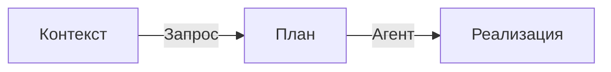
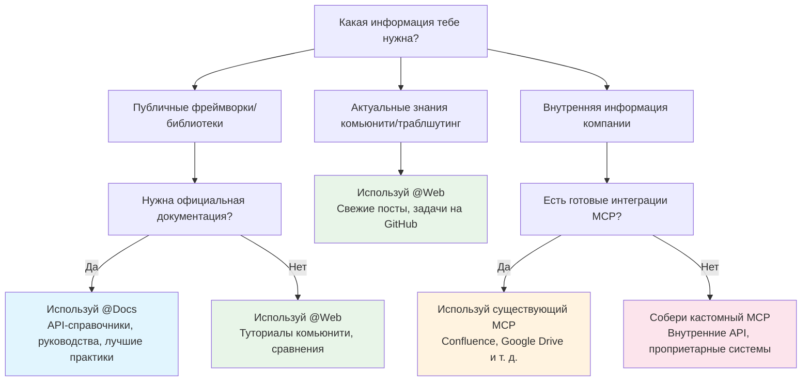
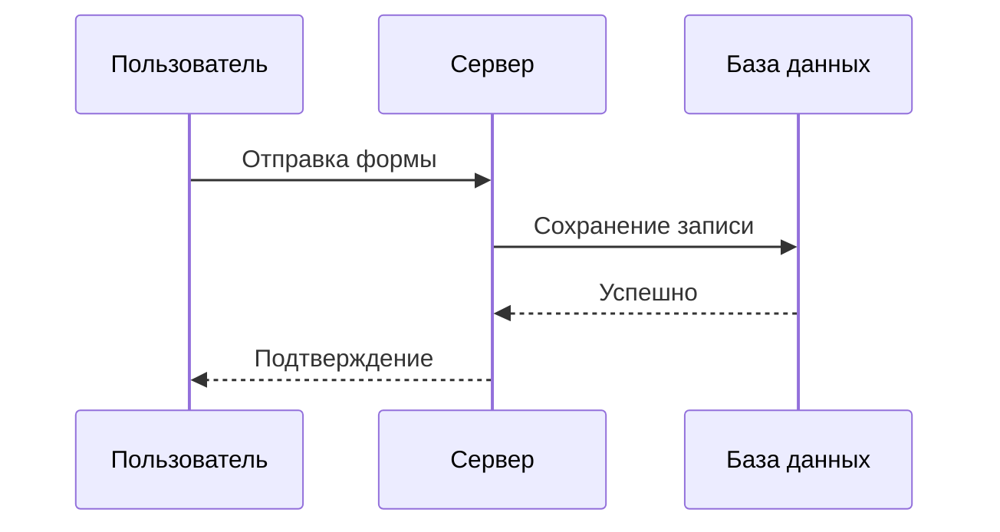
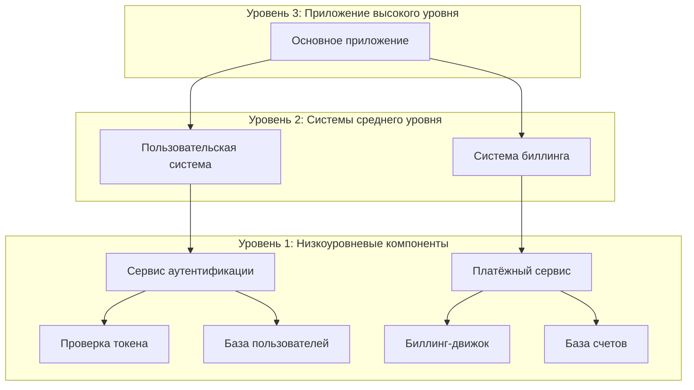
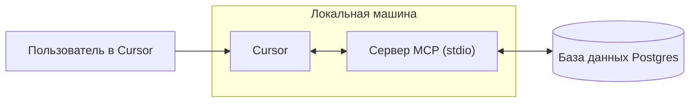
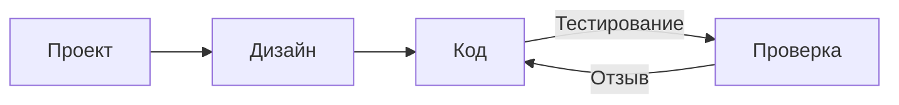
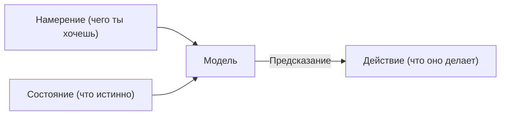

# Cursor Documentation (Russian)

This is the complete formatted documentation for Cursor in Russian, parsed and organized from the official documentation.

**Total Sections:** 112

---


# Безопасность агента
Source: https://docs.cursor.com/ru/account/agent-security

Вопросы безопасности при использовании Cursor Agent

Инъекции подсказок, галлюцинации ИИ и другие проблемы могут приводить к непредсказуемому и потенциально вредоносному поведению ИИ. Пока мы продолжаем работать над решением инъекций подсказок на более базовом уровне, нашей основной защитой в продуктах Cursor являются правила-ограничители того, что агент может делать, включая требование ручного подтверждения по умолчанию для чувствительных действий. Цель этого документа — объяснить наши ограничители и что ты можешь от них ожидать.

Все описанные ниже настройки и поведение — это наши значения по умолчанию и рекомендуемые параметры.

<div id="first-party-tool-calls">
  ## Вызовы встроенных инструментов
</div>

Cursor поставляется с набором инструментов, которые позволяют агенту помогать нашим пользователям писать код. Сюда входят чтение файлов, правки, выполнение команд терминала, поиск документации в интернете и другие.

Инструменты для чтения не требуют одобрения (например, чтение файлов, поиск по коду). Пользователи могут использовать [.cursorignore](/ru/context/ignore-files), чтобы полностью запретить агенту доступ к конкретным файлам, но в остальном операции чтения обычно разрешены без одобрения. Для действий, которые несут риск утечки конфиденциальных данных, мы требуем явного одобрения.

Изменение файлов в текущем рабочем пространстве не требует явного одобрения, за некоторыми исключениями. Когда агент вносит изменения в файлы, они сразу сохраняются на диск. Мы рекомендуем запускать Cursor в рабочих пространствах под управлением системы контроля версий, чтобы содержимое файлов можно было откатить в любой момент. Мы требуем явного одобрения перед изменением файлов, которые влияют на конфигурацию нашего IDE/CLI, например файла настроек рабочего пространства редактора. Однако пользователи с автоматической перезагрузкой при изменении файлов должны учитывать, что изменения, вносимые агентом, могут запустить автоматическое выполнение до того, как у них будет возможность их просмотреть.

Любая команда терминала, предложенная агентом, по умолчанию требует одобрения. Мы рекомендуем просматривать каждую команду перед тем, как агент её выполнит. Пользователи, готовые принять риск, могут включить запуск агентом всех команд без одобрения. В Cursor есть функция [allowlist](/ru/agent/tools), но мы не считаем её средством защиты. Некоторые пользователи разрешают конкретные команды, но это система по принципу best effort, и возможны обходы. Мы не рекомендуем «Run Everything», так как это обход любых настроенных allowlist.

<div id="third-party-tool-calls">
  ## Вызовы сторонних инструментов
</div>

Cursor позволяет подключать внешние инструменты через [MCP](/ru/context/mcp). Все сторонние подключения MCP должны быть явно подтверждены пользователем. После того как пользователь подтвердит MCP, по умолчанию каждый вызов инструмента, предлагаемый в Agent Mode для любой внешней интеграции MCP, должен быть явно подтверждён перед выполнением.

<div id="network-requests">
  ## Сетевые запросы
</div>

Злоумышленник может использовать сетевые запросы для эксфильтрации данных. Сейчас мы не поддерживаем выполнение сетевых запросов нашими собственными инструментами за пределы строго ограниченного набора хостов (например, GitHub), явное получение ссылок, а также поддержку веб‑поиска только у выбранных провайдеров. Произвольные сетевые запросы агентов заблокированы настройками по умолчанию.

<div id="workspace-trust">
  ## Доверие к рабочему пространству
</div>

Cursor IDE поддерживает стандартную функцию [workspace trust](https://code.visualstudio.com/docs/editing/workspaces/workspace-trust), которая по умолчанию *выключена*. При открытии нового рабочего пространства появляется запрос с выбором обычного или ограниченного режима. В ограниченном режиме AI и другие ключевые функции Cursor работать не будут. Для работы с репозиториями, которым не доверяешь, лучше использовать другие инструменты, например простой текстовый редактор.

Доверие к рабочему пространству можно включить в пользовательских настройках так:

1. Открой файл user settings.json
2. Добавь следующую настройку:
   ```json  theme={null}
   "security.workspace.trust.enabled": true
   ```

Эту настройку можно также принудительно применить на уровне организации через решения Mobile Device Management (MDM).

<div id="responsible-disclosure">
  ## Ответственное раскрытие уязвимостей
</div>

Если считаешь, что нашёл уязвимость в Cursor, следуй гайду на нашей странице GitHub Security и отправь отчёт там. Если не можешь использовать GitHub, можно связаться с нами по адресу [security@cursor.com](mailto:security@cursor.com).

Мы обязуемся подтвердить получение отчёта об уязвимости в течение 5 рабочих дней и заняться его обработкой как можно скорее. Мы опубликуем результаты в виде security advisories на нашей странице GitHub Security. О критических инцидентах сообщим и на странице GitHub Security, и по электронной почте всем пользователям.

---


# Billing
Source: https://docs.cursor.com/ru/account/billing

Управление подписками, возвратами и счетами в Cursor 

<div id="how-do-i-access-billing-settings">
  ### Как открыть настройки биллинга?
</div>

Зайди в портал биллинга через [Dashboard](https://cursor.com/dashboard), нажав «Billing» в своём Dashboard. Откроется защищённый портал для всех задач, связанных с биллингом.

<div id="what-are-cursors-billing-cycles">
  ### Какие бывают биллинговые циклы в Cursor?
</div>

Биллинг может быть помесячным или годовым, начиная с даты подписки. Для аккаунтов Teams списание идёт за каждое место с пропорциональным расчётом для новых участников.

<div id="how-do-seats-work-for-teams-accounts">
  ### Как работают места (seats) в аккаунтах Teams?
</div>

В аккаунтах Teams взимается плата за место (по одному на участника Team). При добавлении участников в середине цикла списывается только за оставшееся время. Если участник использовал какие-либо кредиты и его удалили, его место остаётся занятым до конца биллингового цикла — пропорциональные возвраты не предусмотрены. Админы Team могут управлять местами через dashboard.

<div id="can-i-switch-between-monthly-and-annual-billing">
  ### Могу ли я переключаться между помесячной и годовой оплатой?
</div>

Да! Вот как:

**Pro plan**

1. Перейди в [dashboard](https://cursor.com/dashboard) Cursor
2. Нажми «Billing and Invoices» в левой боковой панели, чтобы открыть страницу биллинга
3. Нажми «Manage subscription»
4. Нажми «Update subscription»
5. Выбери «Yearly» или «Monthly», затем нажми «Continue»

**Teams plan**

1. Перейди в [dashboard](https://cursor.com/dashboard) Cursor
2. Нажми «Billing and Invoices» в левой боковой панели, чтобы открыть страницу биллинга
3. Нажми кнопку «Upgrade Now», чтобы переключиться на годовую оплату

<Note>
  Переключиться с помесячной на годовую оплату можно самостоятельно. Чтобы перейти с годовой на помесячную, напиши нам на
  [hi@cursor.com](mailto:hi@cursor.com).
</Note>

<div id="where-can-i-find-my-invoices">
  ### Где найти мои счета?
</div>

Вся история биллинга доступна в портале биллинга. Можно просматривать и скачивать текущие и прошлые счета.

<div id="can-i-get-invoices-automatically-emailed-to-me">
  ### Могу ли я получать счета автоматически на email?
</div>

Счета нужно скачивать вручную из портала биллинга. Мы работаем над автоматической отправкой счетов на email. Когда функция будет доступна, можно будет включить рассылку.

<div id="how-do-i-update-my-billing-information">
  ### Как обновить платёжную информацию?
</div>

Обновляй способ оплаты, название компании, адрес и налоговые данные через портал биллинга. Мы используем Stripe для безопасных транзакций. Изменения влияют только на будущие счета — мы не можем изменять ранее выставленные.

<div id="how-do-i-cancel-my-subscription">
  ### Как отменить подписку?
</div>

Отмени подписку на странице Billing and Invoices, нажав «Manage Subscription», затем кнопку «Cancel subscription». Доступ сохранится до конца текущего биллингового периода.

<div id="im-having-other-billing-issues-how-can-i-get-help">
  ### У меня другие проблемы с биллингом. Как получить помощь?
</div>

По вопросам биллинга, не описанным здесь, напиши на [hi@cursor.com](mailto:hi@cursor.com) с email, привязанного к твоему аккаунту. Пожалуйста, укажи данные аккаунта и суть запроса.

---


# Стоимость
Source: https://docs.cursor.com/ru/account/pricing

Тарифы Cursor и их стоимость

Можно попробовать Cursor бесплатно или выбрать индивидуальный либо командный тариф.

<div id="individual">
  ## Индивидуальные
</div>

Во все индивидуальные планы входит:

* Неограниченные автодополнения (tab completions)
* Расширенные лимиты использования агентом на всех моделях
* Доступ к Bugbot
* Доступ к Background Agents

Каждый план включает использование, тарифицируемое по [ценам API инференса моделей](/ru/models#model-pricing):

* Pro включает \$20 использования агента через API + дополнительный бонусный лимит
* Pro Plus включает \$70 использования агента через API + дополнительный бонусный лимит
* Ultra включает \$400 использования агента через API + дополнительный бонусный лимит

Мы стараемся предоставлять дополнительную бонусную емкость сверх гарантированно включённого лимита. Поскольку у разных моделей разная стоимость API, твой выбор модели влияет на объём токенов и на то, как быстро расходуется включённое использование. Можно посмотреть использование и разбивку по токенам в [своей панели](https://cursor.com/dashboard?tab=usage). Уведомления о достижении лимитов регулярно показываются в редакторе.


<div id="how-much-usage-do-i-need">
  ### Сколько лимита мне нужно?
</div>

По нашим данным, обычно получается так:

* **Ежедневные пользователи Tab**: почти всегда укладываются в \$20
* **Пользователи Limited Agent**: часто укладываются в включённые \$20
* **Ежедневные пользователи Agent**: обычно $60–$100/мес всего
* **Пауэр‑юзеры (несколько агентов/автоматизация)**: часто \$200+/мес всего

По нашим данным, лимиты примерно соответствуют следующему для *пользователя с медианным использованием*:

* Pro: \~225 запросов к Sonnet 4, \~550 к Gemini или \~500 к GPT 5
* Pro+: \~675 запросов к Sonnet 4, \~1 650 к Gemini или \~1 500 к GPT 5
* Ultra: \~4 500 запросов к Sonnet 4, \~11 000 к Gemini или \~10 000 к GPT 5

<div id="what-happens-when-i-reach-my-limit">
  ### Что происходит, когда я достигаю лимита?
</div>

Когда ты превышаешь включённый месячный объём, редактор уведомит тебя, и ты сможешь выбрать:

* **Добавить использование по требованию**: Продолжать работать в Cursor по тем же ставкам API с оплатой по мере использования
* **Обновить план**: Перейти на более высокий тариф с большим объёмом включённого использования

Использование по требованию тарифицируется ежемесячно по тем же ставкам, что и включённое использование. Качество и скорость запросов никогда не снижаются.

<div id="teams">
  ## Teams
</div>

Есть два командных плана: Teams (\$40/польз./мес.) и Enterprise (индивидуально).

Командные планы дают дополнительные возможности:

* Обязательное включение Privacy Mode
* Админ-панель со статистикой использования
* Централизованная оплата для команды
* SAML/OIDC SSO

Рекомендуем Teams всем, кому ок самообслуживание. [Enterprise](/ru/contact-sales) подойдёт тем, кому нужны приоритетная поддержка, общий пул лимитов, выставление счетов, SCIM или расширенные средства безопасности.

Узнай больше о [ценах Teams](/ru/account/teams/pricing).

<div id="auto">
  ## Auto
</div>

Включение Auto позволяет Cursor выбрать премиальную модель, наилучше подходящую для текущей задачи и наиболее надежную с учетом текущего спроса. Эта функция может обнаруживать снижение качества вывода и автоматически переключать модели, чтобы его устранить.

<Frame>
  
</Frame>

<Note>Мы серьезно вложились в качество и общую производительность Auto. Начиная со следующего продления подписки после 15 сентября, Auto списывает использование по следующим ставкам API.</Note>

* **Input + Cache Write**: \$1.25 за 1M токенов
* **Output**: \$6.00 за 1M токенов
* **Cache Read**: \$0.25 за 1M токенов

И редактор, и дашборд показывают твое потребление, включая Auto. Если предпочитаешь выбирать модель напрямую, списание идет по прайс-листу API этой модели.

<div id="max-mode">
  ## Max Mode
</div>

Некоторые модели поддерживают [Max Mode](/ru/models#max-mode), который позволяет дольше рассуждать и работать с увеличенными окнами контекста — до 1 млн токенов. Хотя для большинства задач по программированию Max Mode не нужен, он может помочь с более сложными запросами, особенно при работе с большими файлами или кодовыми базами. Использование Max Mode будет расходовать больше твоей квоты. Все запросы и разбивку по токенам можно посмотреть в [панели управления](https://cursor.com/dashboard?tab=usage).

<div id="bugbot">
  ## Bugbot
</div>

Bugbot — это отдельный продукт, не связанный с подписками Cursor, со своим собственным тарифным планом.

* **Pro** (\$40/мес): Неограниченные ревью — до 200 PR в месяц, безлимитный доступ к Cursor Ask, интеграция с Cursor для исправления багов и доступ к Bugbot Rules
* **Teams** (\$40/польз./мес): Неограниченные код‑ревью для всех PR, безлимитный доступ к Cursor Ask, общий пул использования для команды и расширенные правила и настройки
* **Enterprise** (Индивидуально): Всё из Teams плюс расширенная аналитика и отчётность, приоритетная поддержка и менеджмент аккаунта

Узнай больше о [тарифах Bugbot](https://cursor.com/bugbot#pricing).

<div id="background-agent">
  ## Фоновый агент
</div>

Фоновые агенты оплачиваются по API-тарифам выбранной [модели](/ru/models). Когда впервые начнёшь их использовать, тебя попросят задать лимит расходов для фоновых агентов.

<Info>
  Стоимость вычислений на виртуальных машинах (VM) для фоновых агентов будет объявлена позже.
</Info>

---


# Admin API
Source: https://docs.cursor.com/ru/account/teams/admin-api

Доступ к командным метрикам, данным об использовании и информации о расходах через API

Admin API позволяет программно получать доступ к данным твоей команды, включая сведения об участниках, метрики использования и детали расходов. Собирай кастомные панели, инструменты мониторинга или интегрируй с существующими рабочими процессами.

<Note>
  Это первый релиз API. Мы расширяем возможности на основе фидбэка — напиши, какие эндпоинты тебе нужны!
</Note>

<div id="authentication">
  ## Аутентификация
</div>

Все запросы к API требуют аутентификации с использованием API‑ключа. Создавать и управлять API‑ключами могут только админы команды.

API‑ключи привязаны к организации, видны всем админам и не зависят от статуса учетной записи их первоначального создателя.

<div id="creating-an-api-key">
  ### Создание API-ключа
</div>

1. Перейди в **cursor.com/dashboard** → вкладка **Settings** → **Cursor Admin API Keys**
2. Нажми **Create New API Key**
3. Дай ключу понятное имя (например, «Usage Dashboard Integration»)
4. Сразу скопируй сгенерированный ключ — потом ты его больше не увидишь

Формат: `key_xxxxxxxxxxxxxxxxxxxxxxxxxxxxxxxxxxxxxxxxxxxxxxxxxxxxxxxxxxxxxxxx`

<div id="using-your-api-key">
  ### Использование API-ключа
</div>

Используй свой API-ключ как имя пользователя в базовой аутентификации:

**Использование curl с базовой аутентификацией:**

```bash  theme={null}
curl https://api.cursor.com/{route} -u API_KEY:
```

**Или задай заголовок Authorization вручную:**

```bash  theme={null}
Authorization: Basic {base64_encode('API_KEY:')}
```

<div id="base-url">
  ## Базовый URL
</div>

Все эндпоинты API используют:

```
https://api.cursor.com
```

<div id="endpoints">
  ## Конечные точки
</div>

<div id="get-team-members">
  ### Получение участников команды
</div>

Получить список всех участников команды и их данные.

```
GET /teams/members
```

#### Ответ

Возвращает массив объектов участников команды:

```typescript  theme={null}
{
  teamMembers: {
    name: string;
    email: string;
    role: 'владелец' | 'участник' | 'владелец бесплатного тарифа';
  }[];
}
```

<div id="example-response">
  #### Пример отклика
</div>

```json  theme={null}
{
  "teamMembers": [
    {
      "name": "Alex",
      "email": "developer@company.com",
      "role": "участник"
    },
    {
      "name": "Sam",
      "email": "admin@company.com",
      "role": "владелец"
    }
  ]
}

```

#### Пример запроса

```bash  theme={null}
curl -X GET https://api.cursor.com/teams/members \
  -u ТВОЙ_API_KEY:
```

<div id="get-daily-usage-data">
  ### Получить данные по ежедневному использованию
</div>

Получай подробные метрики по ежедневному использованию для своей команды за заданный период. Дают представление о правках кода, использовании AI‑ассистента и коэффициентах принятия.

```
POST /teams/daily-usage-data
```

#### Тело запроса

<div className="full-width-table">
  | Параметр    | Тип    | Обязательный | Описание                                  |
  | :---------- | :----- | :----------- | :---------------------------------------- |
  | `startDate` | number | Да           | Дата начала в миллисекундах эпохи Unix    |
  | `endDate`   | number | Да           | Дата окончания в миллисекундах эпохи Unix |
</div>

<Note>
  Диапазон дат не может превышать 90 дней. Для более длинных периодов сделай несколько запросов.
</Note>

#### Ответ

```typescript  theme={null}
{
  data: {
    date: number;
    isActive: boolean;
    totalLinesAdded: number;
    totalLinesDeleted: number;
    acceptedLinesAdded: number;
    acceptedLinesDeleted: number;
    totalApplies: number;
    totalAccepts: number;
    totalRejects: number;
    totalTabsShown: number;
    totalTabsAccepted: number;
    composerRequests: number;
    chatRequests: number;
    agentRequests: number;
    cmdkUsages: number;
    subscriptionIncludedReqs: number;
    apiKeyReqs: number;
    usageBasedReqs: number;
    bugbotUsages: number;
    mostUsedModel: string;
    applyMostUsedExtension?: string;
    tabMostUsedExtension?: string;
    clientVersion?: string;
    email?: string;
  }[];
  period: {
    startDate: number;
    endDate: number;
  };
}
```

<div id="response-fields">
  #### Поля ответа
</div>

<div className="full-width-table">
  | Field                      | Description                                   |
  | :------------------------- | :-------------------------------------------- |
  | `date`                     | Дата в миллисекундах с начала эпохи           |
  | `isActive`                 | Пользователь активен в этот день              |
  | `totalLinesAdded`          | Добавленные строки кода                       |
  | `totalLinesDeleted`        | Удалённые строки кода                         |
  | `acceptedLinesAdded`       | Строки, добавленные из принятых AI-подсказок  |
  | `acceptedLinesDeleted`     | Строки, удалённые из принятых AI-подсказок    |
  | `totalApplies`             | Операции Apply                                |
  | `totalAccepts`             | Принятые подсказки                            |
  | `totalRejects`             | Отклонённые подсказки                         |
  | `totalTabsShown`           | Показанные автодополнения Tab                 |
  | `totalTabsAccepted`        | Принятые автодополнения Tab                   |
  | `composerRequests`         | Запросы Composer                              |
  | `chatRequests`             | Запросы Chat                                  |
  | `agentRequests`            | Запросы Agent                                 |
  | `cmdkUsages`               | Использования палитры команд (Cmd+K)          |
  | `subscriptionIncludedReqs` | Запросы, включённые в подписку                |
  | `apiKeyReqs`               | Запросы с API-ключом                          |
  | `usageBasedReqs`           | Запросы с оплатой по факту использования      |
  | `bugbotUsages`             | Использования детектора багов                 |
  | `mostUsedModel`            | Самая часто используемая AI‑модель            |
  | `applyMostUsedExtension`   | Самое используемое расширение файла для Apply |
  | `tabMostUsedExtension`     | Самое используемое расширение файла для Tab   |
  | `clientVersion`            | Версия Cursor                                 |
  | `email`                    | Электронная почта пользователя                |
</div>

#### Пример ответа

```json  theme={null}
{
  "data": [
    {
      "date": 1710720000000,
      "isActive": true,
      "totalLinesAdded": 1543,
      "totalLinesDeleted": 892,
      "acceptedLinesAdded": 1102,
      "acceptedLinesDeleted": 645,
      "totalApplies": 87,
      "totalAccepts": 73,
      "totalRejects": 14,
      "totalTabsShown": 342,
      "totalTabsAccepted": 289,
      "composerRequests": 45,
      "chatRequests": 128,
      "agentRequests": 12,
      "cmdkUsages": 67,
      "subscriptionIncludedReqs": 180,
      "apiKeyReqs": 0,
      "usageBasedReqs": 5,
      "bugbotUsages": 3,
      "mostUsedModel": "gpt-4",
      "applyMostUsedExtension": ".tsx",
      "tabMostUsedExtension": ".ts",
      "clientVersion": "0.25.1",
      "email": "developer@company.com"
    },
    {
      "date": 1710806400000,
      "isActive": true,
      "totalLinesAdded": 2104,
      "totalLinesDeleted": 1203,
      "acceptedLinesAdded": 1876,
      "acceptedLinesDeleted": 987,
      "totalApplies": 102,
      "totalAccepts": 91,
      "totalRejects": 11,
      "totalTabsShown": 456,
      "totalTabsAccepted": 398,
      "composerRequests": 67,
      "chatRequests": 156,
      "agentRequests": 23,
      "cmdkUsages": 89,
      "subscriptionIncludedReqs": 320,
      "apiKeyReqs": 15,
      "usageBasedReqs": 0,
      "bugbotUsages": 5,
      "mostUsedModel": "claude-3-opus",
      "applyMostUsedExtension": ".py",
      "tabMostUsedExtension": ".py",
      "clientVersion": "0.25.1",
      "email": "developer@company.com"
    }
  ],
  "period": {
    "startDate": 1710720000000,
    "endDate": 1710892800000
  }
}
```

#### Пример запроса

```bash  theme={null}
curl -X POST https://api.cursor.com/teams/daily-usage-data \
  -u YOUR_API_KEY: \
  -H "Content-Type: application/json" \
  -d '{
    "startDate": 1710720000000,
    "endDate": 1710892800000
  }'
```

<div id="get-spending-data">
  ### Получить данные о расходах
</div>

Получай информацию о расходах за текущий календарный месяц с поддержкой поиска, сортировки и пагинации.

```
POST /teams/spend
```

#### Тело запроса

<div className="full-width-table">
  | Параметр        | Тип    | Обязательно | Описание                                                        |
  | :-------------- | :----- | :---------- | :-------------------------------------------------------------- |
  | `searchTerm`    | string | Нет         | Поиск по именам пользователей и адресам email                   |
  | `sortBy`        | string | Нет         | Сортировать по: `amount`, `date`, `user`. По умолчанию — `date` |
  | `sortDirection` | string | Нет         | Направление сортировки: `asc`, `desc`. По умолчанию — `desc`    |
  | `page`          | number | Нет         | Номер страницы (начиная с 1). По умолчанию — `1`                |
  | `pageSize`      | number | Нет         | Количество результатов на странице                              |
</div>

#### Ответ

```typescript  theme={null}
{
  teamMemberSpend: {
    spendCents: number;
    fastPremiumRequests: number;
    name: string;
    email: string;
    role: 'owner' | 'member' | 'free-owner';
    hardLimitOverrideDollars: number;
  }[];
  subscriptionCycleStart: number;
  totalMembers: number;
  totalPages: number;
}
```

<div id="response-fields">
  #### Поля ответа
</div>

<div className="full-width-table">
  | Поле                       | Описание                                                     |
  | :------------------------- | :----------------------------------------------------------- |
  | `spendCents`               | Общие траты в центах                                         |
  | `fastPremiumRequests`      | Запросы к быстрой премиум‑модели                             |
  | `name`                     | Имя участника                                                |
  | `email`                    | Email участника                                              |
  | `role`                     | Роль в команде                                               |
  | `hardLimitOverrideDollars` | Пользовательское переопределение лимита трат                 |
  | `subscriptionCycleStart`   | Начало расчетного периода подписки (миллисекунды Unix Epoch) |
  | `totalMembers`             | Общее число участников команды                               |
  | `totalPages`               | Общее число страниц                                          |
</div>

#### Пример ответа

```json  theme={null}
{
  "teamMemberSpend": [
    {
      "spendCents": 2450,
      "fastPremiumRequests": 1250,
      "name": "Alex",
      "email": "developer@company.com",
      "role": "участник",
      "hardLimitOverrideDollars": 100
    },
    {
      "spendCents": 1875,
      "fastPremiumRequests": 980,
      "name": "Sam",
      "email": "admin@company.com",
      "role": "владелец"
      "hardLimitOverrideDollars": 0
    },
  ],
  "subscriptionCycleStart": 1708992000000,
  "totalMembers": 15,
  "totalPages": 1
}
```

<div id="example-requests">
  #### Примеры запросов
</div>

**Основные данные о расходах:**

```bash  theme={null}
curl -X POST https://api.cursor.com/teams/spend \
  -u YOUR_API_KEY: \
  -H "Content-Type: application/json" \
  -d '{}'
```

**Поиск конкретного пользователя с пагинацией:**

```bash  theme={null}
curl -X POST https://api.cursor.com/teams/spend \
  -u YOUR_API_KEY: \
  -H "Content-Type: application/json" \
  -d '{
    "searchTerm": "alex@company.com",
    "page": 2,
    "pageSize": 25
  }'
```

<div id="get-usage-events-data">
  ### Получить данные о событиях использования
</div>

Получи подробные данные о событиях использования для своей команды с расширенной фильтрацией, поиском и пагинацией. Этот эндпоинт дает детализированную информацию по отдельным вызовам API, использованию моделей, расходу токенов и затратам.

```
POST /teams/filtered-usage-events
```

#### Тело запроса

<div className="full-width-table">
  | Параметр    | Тип    | Обязательный | Описание                                               |
  | :---------- | :----- | :----------- | :----------------------------------------------------- |
  | `startDate` | number | Нет          | Дата начала в миллисекундах эпохи Unix                 |
  | `endDate`   | number | Нет          | Дата окончания в миллисекундах эпохи Unix              |
  | `userId`    | number | Нет          | Фильтр по конкретному ID пользователя                  |
  | `page`      | number | Нет          | Номер страницы (начиная с 1). По умолчанию: `1`        |
  | `pageSize`  | number | Нет          | Количество результатов на странице. По умолчанию: `10` |
  | `email`     | string | Нет          | Фильтр по адресу электронной почты пользователя        |
</div>

#### Ответ

```typescript  theme={null}
{
  totalUsageEventsCount: number;
  pagination: {
    numPages: number;
    currentPage: number;
    pageSize: number;
    hasNextPage: boolean;
    hasPreviousPage: boolean;
  };
  usageEvents: {
    timestamp: string;
    model: string;
    kind: string;
    maxMode: boolean;
    requestsCosts: number;
    isTokenBasedCall: boolean;
    tokenUsage?: {
      inputTokens: number;
      outputTokens: number;
      cacheWriteTokens: number;
      cacheReadTokens: number;
      totalCents: number;
    };
    isFreeBugbot: boolean;
    userEmail: string;
  }[];
  period: {
    startDate: number;
    endDate: number;
  };
}
```

<div id="response-fields-explained">
  #### Пояснение полей ответа
</div>

<div className="full-width-table">
  | Field                   | Description                                                                       |
  | :---------------------- | :-------------------------------------------------------------------------------- |
  | `totalUsageEventsCount` | Общее число событий использования, соответствующих запросу                        |
  | `pagination`            | Метаданные пагинации для навигации по результатам                                 |
  | `timestamp`             | Временная метка события в миллисекундах эпохи                                     |
  | `model`                 | Используемая для запроса модель ИИ                                                |
  | `kind`                  | Категория использования (например, «Usage-based», «Included in Business»)         |
  | `maxMode`               | Включён ли max mode                                                               |
  | `requestsCosts`         | Стоимость в единицах запросов                                                     |
  | `isTokenBasedCall`      | True, если событие тарифицируется как основанное на токенах                       |
  | `tokenUsage`            | Детализированное потребление токенов (доступно, если isTokenBasedCall равен true) |
  | `isFreeBugbot`          | Было ли это бесплатное использование bugbot                                       |
  | `userEmail`             | Email пользователя, который сделал запрос                                         |
  | `period`                | Диапазон дат запрошенных данных                                                   |
</div>

#### Пример ответа

```json  theme={null}
{
  "totalUsageEventsCount": 113,
  "pagination": {
    "numPages": 12,
    "currentPage": 1,
    "pageSize": 10,
    "hasNextPage": true,
    "hasPreviousPage": false
  },
  "usageEvents": [
    {
      "timestamp": "1750979225854",
      "model": "claude-4-opus",
      "kind": "Оплата по использованию",
      "maxMode": true,
      "requestsCosts": 5,
      "isTokenBasedCall": true,
      "tokenUsage": {
        "inputTokens": 126,
        "outputTokens": 450,
        "cacheWriteTokens": 6112,
        "cacheReadTokens": 11964,
        "totalCents": 20.18232
      },
      "isFreeBugbot": false,
      "userEmail": "developer@company.com"
    },
    {
      "timestamp": "1750979173824",
      "model": "claude-4-opus",
      "kind": "Оплата по использованию",
      "maxMode": true,
      "requestsCosts": 10,
      "isTokenBasedCall": true,
      "tokenUsage": {
        "inputTokens": 5805,
        "outputTokens": 311,
        "cacheWriteTokens": 11964,
        "cacheReadTokens": 0,
        "totalCents": 40.16699999999999
      },
      "isFreeBugbot": false,
      "userEmail": "developer@company.com"
    },
    {
      "timestamp": "1750978339901",
      "model": "claude-4-sonnet-thinking",
      "kind": "Включено в Business"
      "maxMode": true,
      "requestsCosts": 1.4,
      "isTokenBasedCall": false,
      "isFreeBugbot": false,
      "userEmail": "admin@company.com"
    }
  ],
  "period": {
    "startDate": 1748411762359,
    "endDate": 1751003762359
  }
}
```

<div id="example-requests">
  #### Примеры запросов
</div>

**Получить все события использования с пагинацией по умолчанию:**

```bash  theme={null}
curl -X POST https://api.cursor.com/teams/filtered-usage-events \
  -u YOUR_API_KEY: \
  -H "Content-Type: application/json" \
  -d '{}'
```

**Фильтрация по диапазону дат и конкретному пользователю:**

```bash  theme={null}
curl -X POST https://api.cursor.com/teams/filtered-usage-events \
  -u YOUR_API_KEY: \
  -H "Content-Type: application/json" \
  -d '{
    "startDate": 1748411762359,
    "endDate": 1751003762359,
    "email": "developer@company.com",
    "page": 1,
    "pageSize": 25
  }'
```

**Получай события использования для конкретного пользователя с кастомной пагинацией:**

```bash  theme={null}
curl -X POST https://api.cursor.com/teams/filtered-usage-events \
  -u ТВОЙ_API_KEY: \
  -H "Content-Type: application/json" \
  -d '{
    "userId": 12345,
    "page": 2,
    "pageSize": 50
  }'
```

<div id="set-user-spend-limit">
  ### Установить лимит расходов пользователя
</div>

Настрой лимиты расходов для отдельных участников команды. Это позволит контролировать, сколько каждый пользователь может тратить на использование ИИ в твоей команде.

```
POST /teams/user-spend-limit
```

<Note>
  **Лимит запросов:** 60 запросов в минуту на команду
</Note>

#### Тело запроса

<div className="full-width-table">
  | Параметр            | Тип    | Обязательный | Описание                                                              |
  | :------------------ | :----- | :----------- | :-------------------------------------------------------------------- |
  | `userEmail`         | string | Да           | Email участника команды                                               |
  | `spendLimitDollars` | number | Да           | Лимит расходов в долларах (только целое число, без дробных значений). |
</div>

<Note>
  * Пользователь уже должен быть участником твоей команды
  * Принимаются только целые числа (без дробных сумм)
  * Если установить `spendLimitDollars` в 0, лимит будет \$0
</Note>

#### Ответ

Возвращает унифицированный ответ об успехе или неудаче:

```typescript  theme={null}
{
  outcome: 'success' | 'error';
  message: string;
}
```

<div id="example-responses">
  #### Примеры ответов
</div>

**Лимит успешно задан:**

```json  theme={null}
{
  "outcome": "success",
  "message": "Лимит расходов установлен в $100 для пользователя developer@company.com"
}
```

**Сообщение об ошибке:**

```json  theme={null}
{
  "outcome": "error",
  "message": "Недопустимый формат e-mail"
}
```

<div id="example-requests">
  #### Примеры запросов
</div>

**Задать лимит расходов:**

```bash  theme={null}
curl -X POST https://api.cursor.com/teams/user-spend-limit \
  -u ТВОЙ_API_KEY: \
  -H "Content-Type: application/json" \
  -d '{
    "userEmail": "developer@company.com",
    "spendLimitDollars": 100
  }'
```

<div id="repo-blocklists-api">
  ### API списков блокировки репозиториев
</div>

Добавляй репозитории и настраивай шаблоны, чтобы файлы и директории не индексировались и не использовались как контекст для твоей команды.

<div id="get-team-repo-blocklists">
  #### Получить блоклисты репозиториев команды
</div>

Получить все блоклисты репозиториев, настроенные для твоей команды.

```
GET /settings/repo-blocklists/repos
```

<div id="response">
  ##### Ответ
</div>

Возвращает массив объектов списка блокировок репозиториев:

```typescript  theme={null}
{
  repos: {
    id: string;
    url: string;
    patterns: string[];
  }[];
}
```

##### Пример ответа

```json  theme={null}
{
  "repos": [
    {
      "id": "repo_123",
      "url": "https://github.com/company/sensitive-repo",
      "patterns": ["*.env", "config/*", "secrets/**"]
    },
    {
      "id": "repo_456",
      "url": "https://github.com/company/internal-tools",
      "patterns": ["*"]
    }
  ]
}
```

<div id="example-request">
  ##### Пример запроса
</div>

```bash  theme={null}
curl -X GET https://api.cursor.com/settings/repo-blocklists/repos \
  -u ТВОЙ_API_KEY:
```

<div id="upsert-repo-blocklists">
  #### Обновить/создать блок-листы репозиториев
</div>

Заменяет существующие блок-листы для указанных репозиториев.
*Примечание: этот эндпоинт перезапишет шаблоны только для указанных репозиториев. Все остальные репозитории останутся без изменений.*

```
POST /settings/repo-blocklists/repos/upsert
```

<div id="request-body">
  ##### Тело запроса
</div>

| Параметр | Тип   | Обязателен | Описание                                       |
| -------- | ----- | ---------- | ---------------------------------------------- |
| repos    | array | Да         | Массив объектов списка блокировки репозиториев |

Каждый объект репозитория должен содержать:

| Поле     | Тип       | Обязателен | Описание                                                              |
| -------- | --------- | ---------- | --------------------------------------------------------------------- |
| url      | string    | Да         | URL репозитория для добавления в список блокировки                    |
| patterns | string\[] | Да         | Массив файловых шаблонов для блокировки (поддерживаются glob‑шаблоны) |

<div id="response">
  ##### Ответ
</div>

Возвращает обновлённый список блок-листов репозиториев:

```typescript  theme={null}
{
  repos: {
    id: string;
    url: string;
    patterns: string[];
  }[];
}
```

<div id="example-request">
  ##### Пример запроса
</div>

```bash  theme={null}
curl -X POST https://api.cursor.com/settings/repo-blocklists/repos/upsert \
  -u YOUR_API_KEY: \
  -H "Content-Type: application/json" \
  -d '{
    "repos": [
      {
        "url": "https://github.com/company/sensitive-repo",
        "patterns": ["*.env", "config/*", "secrets/**"]
      },
      {
        "url": "https://github.com/company/internal-tools", 
        "patterns": ["*"]
      }
    ]
  }'
```

<div id="delete-repo-blocklist">
  #### Удалить репозиторий из блоклиста
</div>

Удалить конкретный репозиторий из блоклиста.

```
DELETE /settings/repo-blocklists/repos/:repoId
```

<div id="parameters">
  ##### Параметры
</div>

| Параметр | Тип    | Обязателен | Описание                                      |
| -------- | ------ | ---------- | --------------------------------------------- |
| repoId   | string | Да         | ID списка блокировок репозитория для удаления |

<div id="response">
  ##### Ответ
</div>

Возвращает статус 204 No Content при успешном удалении.

<div id="example-request">
  ##### Пример запроса
</div>

```bash  theme={null}
curl -X DELETE https://api.cursor.com/settings/repo-blocklists/repos/repo_123 \
  -u ТВОЙ_API_КЛЮЧ:
```

<div id="pattern-examples">
  #### Примеры шаблонов
</div>

Распространённые шаблоны блоклиста:

* `*` — Заблокировать весь репозиторий
* `*.env` — Заблокировать все файлы .env
* `config/*` — Заблокировать все файлы в каталоге config
* `**/*.secret` — Заблокировать все файлы .secret в любых подкаталогах
* `src/api/keys.ts` — Заблокировать конкретный файл

---


# API отслеживания AI‑кода
Source: https://docs.cursor.com/ru/account/teams/ai-code-tracking-api

Доступ к аналитике кода, сгенерированной AI, для репозиториев твоей команды

Доступ к аналитике кода, сгенерированной AI, для репозиториев твоей команды. Включает использование AI по каждому коммиту и детализированные принятые изменения, сгенерированные AI.

<Note>
  API в первой версии. Мы расширяем возможности на основе обратной связи — дай знать, какие эндпоинты тебе нужны!
</Note>

* **Доступность**: Только для enterprise‑команд
* **Статус**: Альфа (схемы ответов и поля могут меняться)

<div id="authentication">
  ## Аутентификация
</div>

Все запросы к API требуют аутентификации с помощью ключа API. Этот API использует ту же схему аутентификации Admin API, что и другие эндпоинты.

Подробные инструкции по аутентификации см. в разделе [Admin API authentication](/ru/account/teams/admin-api#authentication).

<div id="base-url">
  ## Базовый URL
</div>

Все эндпоинты API используют:

```
https://api.cursor.com
```

<div id="rate-limits">
  ## Лимиты запросов
</div>

* 5 запросов в минуту на команду на каждый endpoint

<div id="query-parameters">
  ## Параметры запроса
</div>

Все конечные точки ниже принимают одинаковые параметры через строку запроса:

<div className="full-width-table">
  | Parameter   | Type   | Required | Description                                                                                                                                                                                                  |                                                                                                                        |
  | :---------- | :----- | :------- | :----------------------------------------------------------------------------------------------------------------------------------------------------------------------------------------------------------- | ---------------------------------------------------------------------------------------------------------------------- |
  | `startDate` | string | date     | No                                                                                                                                                                                                           | Дата в формате ISO, литерал "now" или относительные дни вроде "7d" (означает now - 7 days). По умолчанию: now - 7 days |
  | `endDate`   | string | date     | No                                                                                                                                                                                                           | Дата в формате ISO, литерал "now" или относительные дни вроде "0d". По умолчанию: now                                  |
  | `page`      | number | No       | Номер страницы (начиная с 1). По умолчанию: 1                                                                                                                                                                |                                                                                                                        |
  | `pageSize`  | number | No       | Количество результатов на страницу. По умолчанию: 100, максимум: 1000                                                                                                                                        |                                                                                                                        |
  | `user`      | string | No       | Необязательный фильтр по одному пользователю. Принимает email (например, [developer@company.com](mailto:developer@company.com)), кодированный ID (например, user\_abc123...), или числовой ID (например, 42) |                                                                                                                        |
</div>

<Note>
  В ответах userId возвращается как кодированный внешний ID с префиксом user\_. Значение стабильно для использования через API.
</Note>

<div id="semantics-and-how-metrics-are-computed">
  ## Семантика и вычисление метрик
</div>

* **Источники**: "TAB" — принятые встроенные автодополнения; "COMPOSER" — принятые диффы из Composer
* **Метрики по строкам**: tabLinesAdded/Deleted и composerLinesAdded/Deleted считаются отдельно; nonAiLinesAdded/Deleted вычисляются как max(0, totalLines - AI lines)
* **Режим приватности**: если включён в клиенте, часть метаданных (например, fileName) может быть опущена
* **Информация о ветке**: isPrimaryBranch имеет значение true, когда текущая ветка совпадает с веткой по умолчанию в репозитории; может быть undefined, если данные о репозитории недоступны

Можешь пролистать этот файл, чтобы понять, как обнаруживаются и отображаются коммиты и изменения.

<div id="endpoints">
  ## Эндпоинты
</div>

<div id="get-ai-commit-metrics-json-paginated">
  ### Получить метрики AI-коммитов (JSON, с пагинацией)
</div>

Получить агрегированные метрики по каждому коммиту с распределением строк между TAB, COMPOSER и non‑AI.

```
GET /analytics/ai-code/commits
```

<div id="response">
  #### Ответ
</div>

```typescript  theme={null}
{
  items: AiCommitMetric[];
  totalCount: number;
  page: number;
  pageSize: number;
}
```

<div id="aicommitmetric-fields">
  #### Поля AiCommitMetric
</div>

<div className="full-width-table">
  | Field                  | Type    | Description                                             |                                      |
  | :--------------------- | :------ | :------------------------------------------------------ | ------------------------------------ |
  | `commitHash`           | string  | Хеш коммита Git                                         |                                      |
  | `userId`               | string  | Закодированный ID пользователя (например, user\_abc123) |                                      |
  | `userEmail`            | string  | Адрес электронной почты пользователя                    |                                      |
  | `repoName`             | string  | null                                                    | Название репозитория                 |
  | `branchName`           | string  | null                                                    | Название ветки                       |
  | `isPrimaryBranch`      | boolean | null                                                    | Является ли это основной веткой      |
  | `totalLinesAdded`      | number  | Всего строк добавлено в коммите                         |                                      |
  | `totalLinesDeleted`    | number  | Всего строк удалено в коммите                           |                                      |
  | `tabLinesAdded`        | number  | Строк добавлено с помощью автодополнения по TAB         |                                      |
  | `tabLinesDeleted`      | number  | Строк удалено с помощью автодополнения по TAB           |                                      |
  | `composerLinesAdded`   | number  | Строк добавлено через Composer                          |                                      |
  | `composerLinesDeleted` | number  | Строк удалено через Composer                            |                                      |
  | `nonAiLinesAdded`      | number  | null                                                    | Строк, добавленных не ИИ             |
  | `nonAiLinesDeleted`    | number  | null                                                    | Строк, удаленных не ИИ               |
  | `message`              | string  | null                                                    | Сообщение коммита                    |
  | `commitTs`             | string  | null                                                    | Временная метка коммита (формат ISO) |
  | `createdAt`            | string  | Временная метка загрузки (формат ISO)                   |                                      |
</div>

<div id="example-response">
  #### Пример ответа
</div>

```json  theme={null}
{
  "items": [
    {
      "commitHash": "a1b2c3d4",
      "userId": "user_3k9x8q...",
      "userEmail": "developer@company.com",
      "repoName": "company/repo",
      "branchName": "main",
      "isPrimaryBranch": true,
      "totalLinesAdded": 120,
      "totalLinesDeleted": 30,
      "tabLinesAdded": 50,
      "tabLinesDeleted": 10,
      "composerLinesAdded": 40,
      "composerLinesDeleted": 5,
      "nonAiLinesAdded": 30,
      "nonAiLinesDeleted": 15,
      "message": "Рефакторинг: вынести клиент аналитики"
      "commitTs": "2025-07-30T14:12:03.000Z",
      "createdAt": "2025-07-30T14:12:30.000Z"
    }
  ],
  "totalCount": 42,
  "page": 1,
  "pageSize": 100
}
```

<div id="example-requests">
  #### Примеры запросов
</div>

**Простой запрос:**

```bash  theme={null}
curl -X GET "https://api.cursor.com/analytics/ai-code/commits?startDate=7d&endDate=now&page=1&pageSize=100" \
  -u ТВОЙ_API_KEY:
```

**Фильтр по пользователю (email):**

```bash  theme={null}
curl -X GET "https://api.cursor.com/analytics/ai-code/commits?startDate=2025-06-01T00:00:00Z&endDate=now&user=developer@company.com" \
  -u ТВОЙ_API_KEY:
```

<div id="download-ai-commit-metrics-csv-streaming">
  ### Скачать метрики AI Commit (CSV, стриминг)
</div>

Скачай метрики коммитов в формате CSV для выгрузки больших объемов данных.

```
GET /analytics/ai-code/commits.csv
```

<div id="response">
  #### Ответ
</div>

Заголовки:

* Content-Type: text/csv; charset=utf-8

<div id="csv-columns">
  #### Колонки CSV
</div>

<div className="full-width-table">
  | Column                   | Type    | Description                         |
  | :----------------------- | :------ | :---------------------------------- |
  | `commit_hash`            | string  | Хеш коммита Git                     |
  | `user_id`                | string  | Кодированный ID пользователя        |
  | `user_email`             | string  | Электронная почта пользователя      |
  | `repo_name`              | string  | Название репозитория                |
  | `branch_name`            | string  | Название ветки                      |
  | `is_primary_branch`      | boolean | Является ли это основной веткой     |
  | `total_lines_added`      | number  | Всего строк добавлено в коммите     |
  | `total_lines_deleted`    | number  | Всего строк удалено в коммите       |
  | `tab_lines_added`        | number  | Строк добавлено через TAB-комплишны |
  | `tab_lines_deleted`      | number  | Строк удалено через TAB-комплишны   |
  | `composer_lines_added`   | number  | Строк добавлено через Composer      |
  | `composer_lines_deleted` | number  | Строк удалено через Composer        |
  | `non_ai_lines_added`     | number  | Строк, добавленных без ИИ           |
  | `non_ai_lines_deleted`   | number  | Строк, удалённых без ИИ             |
  | `message`                | string  | Сообщение коммита                   |
  | `commit_ts`              | string  | Метка времени коммита (ISO)         |
  | `created_at`             | string  | Метка времени загрузки (ISO)        |
</div>

<div id="sample-csv-output">
  #### Пример CSV-вывода
</div>

```csv  theme={null}
commit_hash,user_id,user_email,repo_name,branch_name,is_primary_branch,total_lines_added,total_lines_deleted,tab_lines_added,tab_lines_deleted,composer_lines_added,composer_lines_deleted,non_ai_lines_added,non_ai_lines_deleted,message,commit_ts,created_at
a1b2c3d4,user_3k9x8q...,developer@company.com,company/repo,main,true,120,30,50,10,40,5,30,15,"Рефакторинг: выделить клиент аналитики",2025-07-30T14:12:03.000Z,2025-07-30T14:12:30.000Z
e5f6g7h8,user_3k9x8q...,developer@company.com,company/repo,feature-branch,false,85,15,30,5,25,3,30,7,"Добавить обработку ошибок",2025-07-30T13:45:21.000Z,2025-07-30T13:45:45.000Z
```

<div id="example-request">
  #### Пример запроса
</div>

```bash  theme={null}
curl -L "https://api.cursor.com/analytics/ai-code/commits.csv?startDate=2025-07-01T00:00:00Z&endDate=now&user=user_3k9x8q..." \
  -u ТВОЙ_API_KEY: \
  -o commits.csv
```

<div id="get-ai-code-change-metrics-json-paginated">
  ### Получить метрики изменений кода ИИ (JSON, постранично)
</div>

Получай детальные принятые изменения ИИ, сгруппированные по детерминированному changeId. Полезно для анализа принятых событий ИИ независимо от коммитов.

```
GET /analytics/ai-code/changes
```

<div id="response">
  #### Ответ
</div>

```typescript  theme={null}
{
  items: МетрикаИзмененийКодаИИ[];
  totalCount: number;
  page: number;
  pageSize: number;
}
```

<div id="aicodechangemetric-fields">
  #### Поля AiCodeChangeMetric
</div>

<div className="full-width-table">
  | Поле                | Тип    | Описание                                                           |                        |
  | :------------------ | :----- | :----------------------------------------------------------------- | ---------------------- |
  | `changeId`          | string | Детерминированный идентификатор изменения                          |                        |
  | `userId`            | string | Кодированный идентификатор пользователя (например, user\_abc123)   |                        |
  | `userEmail`         | string | Адрес электронной почты пользователя                               |                        |
  | `source`            | "TAB"  | "COMPOSER"                                                         | Источник AI-изменения  |
  | `model`             | string | null                                                               | Используемая модель ИИ |
  | `totalLinesAdded`   | number | Всего добавленных строк                                            |                        |
  | `totalLinesDeleted` | number | Всего удалённых строк                                              |                        |
  | `createdAt`         | string | Время загрузки (ISO-формат)                                        |                        |
  | `metadata`          | Array  | Метаданные файла (fileName может быть опущен в режиме приватности) |                        |
</div>

<div id="example-response">
  #### Пример ответа
</div>

```json  theme={null}
{
  "items": [
    {
      "changeId": "749356201",
      "userId": "user_3k9x8q...",
      "userEmail": "developer@company.com",
      "source": "COMPOSER",
      "model": null,
      "totalLinesAdded": 18,
      "totalLinesDeleted": 4,
      "createdAt": "2025-07-30T15:10:12.000Z",
      "metadata": [
        { "fileName": "src/analytics/report.ts", "fileExtension": "ts", "linesAdded": 12, "linesDeleted": 3 },
        { "fileName": "src/analytics/ui.tsx", "fileExtension": "tsx", "linesAdded": 6, "linesDeleted": 1 }
      ]
    }
  ],
  "totalCount": 128,
  "page": 1,
  "pageSize": 200
}
```

<div id="example-requests">
  #### Примеры запросов
</div>

**Простой запрос:**

```bash  theme={null}
curl -X GET "https://api.cursor.com/analytics/ai-code/changes?startDate=14d&endDate=now&page=1&pageSize=200" \
  -u ТВОЙ_API_KEY:
```

**Фильтр по пользователю (кодированный ID):**

```bash  theme={null}
curl -X GET "https://api.cursor.com/analytics/ai-code/changes?user=user_3k9x8q..." \
  -u ТВОЙ_API_KEY:
```

**Фильтр по пользователю (email):**

```bash  theme={null}
curl -X GET "https://api.cursor.com/analytics/ai-code/changes?user=developer@company.com" \
  -u ТВОЙ_API_KEY:
```

<div id="download-ai-code-change-metrics-csv-streaming">
  ### Скачать метрики изменений кода ИИ (CSV, стриминг)
</div>

Скачай метрики изменений в формате CSV для больших выгрузок.

```
GET /analytics/ai-code/changes.csv
```

<div id="response">
  #### Ответ
</div>

Заголовки:

* Content-Type: text/csv; charset=utf-8

#### Столбцы CSV

<div className="full-width-table">
  | Column                | Type   | Description                                                        |
  | :-------------------- | :----- | :----------------------------------------------------------------- |
  | `change_id`           | string | Детерминированный идентификатор изменения                          |
  | `user_id`             | string | Кодированный идентификатор пользователя                            |
  | `user_email`          | string | Адрес электронной почты пользователя                               |
  | `source`              | string | Источник AI-изменения (TAB или COMPOSER)                           |
  | `model`               | string | Используемая AI‑модель                                             |
  | `total_lines_added`   | number | Всего добавлено строк                                              |
  | `total_lines_deleted` | number | Всего удалено строк                                                |
  | `created_at`          | string | Время загрузки (формат ISO)                                        |
  | `metadata_json`       | string | Строка JSON со строковым представлением массива записей метаданных |
</div>

<div id="notes">
  #### Примечания
</div>

* metadata\_json — это строка JSON со строковым представлением массива записей метаданных (в режиме приватности может опускаться fileName)
* При чтении CSV обязательно парсь поля в кавычках

#### Пример вывода CSV

```csv  theme={null}
change_id,user_id,user_email,source,model,total_lines_added,total_lines_deleted,created_at,metadata_json
749356201,user_3k9x8q...,developer@company.com,COMPOSER,gpt-4o,18,4,2025-07-30T15:10:12.000Z,"[{""fileName"":""src/analytics/report.ts"",""fileExtension"":""ts"",""linesAdded"":12,""linesDeleted"":3},{""fileName"":""src/analytics/ui.tsx"",""fileExtension"":""tsx"",""linesAdded"":6,""linesDeleted"":1}]"
749356202,user_3k9x8q...,developer@company.com,TAB,,8,2,2025-07-30T15:08:45.000Z,"[{""fileName"":""src/utils/helpers.ts"",""fileExtension"":""ts"",""linesAdded"":8,""linesDeleted"":2}]"
```

<div id="example-request">
  #### Пример запроса
</div>

```bash  theme={null}
curl -L "https://api.cursor.com/analytics/ai-code/changes.csv?startDate=30d&endDate=now" \
  -u YOUR_API_KEY: \
  -o changes.csv
```

<div id="tips">
  ## Советы
</div>

* Используй параметр `user`, чтобы быстро отфильтровать одного пользователя на всех эндпоинтах
* Для больших выгрузок данных предпочитай CSV-эндпоинты — они передают данные потоками по 10 000 записей на стороне сервера
* `isPrimaryBranch` может быть `undefined`, если клиент не смог определить ветку по умолчанию
* `commitTs` — это метка времени коммита; `createdAt` — время приёма данных на наших серверах
* Некоторые поля могут отсутствовать, если на клиенте включён режим конфиденциальности

<div id="changelog">
  ## Журнал изменений
</div>

* **Альфа-релиз**: Первичные эндпоинты для коммитов и изменений. Форматы ответов могут меняться на основе обратной связи

---


# Аналитика
Source: https://docs.cursor.com/ru/account/teams/analytics

Отслеживай использование и метрики активности команды

Админы команды могут отслеживать метрики в [dashboard](/ru/account/teams/dashboard).

<Frame>
  
</Frame>

<div id="total-usage">
  ### Суммарное использование
</div>

Смотри агрегированные метрики по команде, включая общее число вкладок и премиум‑запросов. Для команд младше 30 дней метрики отражают использование с момента создания, включая активность участников до присоединения.

<div id="per-active-user">
  ### На активного пользователя
</div>

Смотри средние метрики на активного пользователя: принятые вкладки, строки кода и премиум‑запросы.

<div id="user-activity">
  ### Активность пользователей
</div>

Отслеживай еженедельных и ежемесячных активных пользователей.

<div id="analytics-report-headers">
  ## Заголовки отчёта по аналитике
</div>

Когда ты экспортируешь данные аналитики из дашборда, отчёт включает подробные метрики о поведении пользователей и использовании функций. Вот что означает каждый заголовок:

<div id="user-information">
  ### Информация о пользователе
</div>

<ResponseField name="Date" type="ISO 8601 timestamp">
  Дата, когда были записаны данные аналитики (например, 2024-01-15T04:30:00.000Z)
</ResponseField>

<ResponseField name="User ID" type="string">
  Уникальный идентификатор каждого пользователя в системе
</ResponseField>

<ResponseField name="Email" type="string">
  Email пользователя, связанный с его аккаунтом
</ResponseField>

<ResponseField name="Is Active" type="boolean">
  Показывает, был ли пользователь активен в этот день
</ResponseField>

<div id="ai-generated-code-metrics">
  ### Метрики AI‑сгенерированного кода
</div>

<ResponseField name="Chat Suggested Lines Added" type="number">
  Общее число строк кода, предложенных функцией AI‑чата
</ResponseField>

<ResponseField name="Chat Suggested Lines Deleted" type="number">
  Общее число строк кода, предложенных AI‑чатом к удалению
</ResponseField>

<ResponseField name="Chat Accepted Lines Added" type="number">
  Строки, предложенные AI, которые пользователь принял и добавил в свой код
</ResponseField>

<ResponseField name="Chat Accepted Lines Deleted" type="number">
  Предложения на удаление от AI, которые пользователь принял
</ResponseField>

<div id="feature-usage-metrics">
  ### Метрики использования функций
</div>

<ResponseField name="Chat Total Applies" type="number">
  Сколько раз пользователь применял AI‑сгенерированные изменения из чата
</ResponseField>

<ResponseField name="Chat Total Accepts" type="number">
  Сколько раз пользователь принимал предложения AI
</ResponseField>

<ResponseField name="Chat Total Rejects" type="number">
  Сколько раз пользователь отклонял предложения AI
</ResponseField>

<ResponseField name="Chat Tabs Shown" type="number">
  Сколько раз пользователю показывались вкладки с предложениями AI
</ResponseField>

<ResponseField name="Tabs Accepted" type="number">
  Вкладки с предложениями AI, которые были приняты пользователем
</ResponseField>

<div id="request-type-metrics">
  ### Метрики по типам запросов
</div>

<ResponseField name="Edit Requests" type="number">
  Запросы, сделанные через composer/edit (инлайн‑правки Cmd+K)
</ResponseField>

<ResponseField name="Ask Requests" type="number">
  Чат‑запросы, где пользователи задавали вопросы AI
</ResponseField>

<ResponseField name="Agent Requests" type="number">
  Запросы к AI‑агентам (специализированным AI‑ассистентам)
</ResponseField>

<ResponseField name="Cmd+K Usages" type="number">
  Сколько раз использовалась командная палитра Cmd+K (или Ctrl+K)
</ResponseField>

<div id="subscription-and-api-metrics">
  ### Метрики подписки и API
</div>

<ResponseField name="Subscription Included Reqs" type="number">
  AI‑запросы, покрытые тарифным планом пользователя
</ResponseField>

<ResponseField name="API Key Reqs" type="number">
  Запросы, сделанные с использованием API‑ключей для программного доступа
</ResponseField>

<ResponseField name="Usage-Based Reqs" type="number">
  Запросы, учитываемые в биллинге по использованию
</ResponseField>

<div id="additional-features">
  ### Дополнительные функции
</div>

<ResponseField name="Bugbot Usages" type="number">
  Сколько раз использовалась функция AI для обнаружения/исправления багов
</ResponseField>

<div id="configuration-information">
  ### Информация о конфигурации
</div>

<ResponseField name="Most Used Model" type="string">
  Модель AI, которую пользователь использовал чаще всего (например, GPT-4, Claude)
</ResponseField>

<ResponseField name="Most Used Apply Extension" type="string">
  Расширение файла, чаще всего используемое при применении предложений AI (например, .ts,
  .py, .java)
</ResponseField>

<ResponseField name="Most Used Tab Extension" type="string">
  Расширение файла, чаще всего используемое с функциями таб‑дополнения
</ResponseField>

<ResponseField name="Client Version" type="string">
  Версия редактора Cursor, которая используется
</ResponseField>

<div id="calculated-metrics">
  ### Рассчитанные метрики
</div>

Отчёт также включает обработанные данные, которые помогают понять вклад AI в код:

* **Total Lines Added/Deleted**: Сырой подсчёт всех изменений кода
* **Accepted Lines Added/Deleted**: Строки из AI‑предложений, которые были приняты
* **Composer Requests**: Запросы, сделанные через встроенный composer
* **Chat Requests**: Запросы, сделанные через интерфейс чата

<Note>
  Все числовые значения по умолчанию равны 0, булевы — false, строковые — пустые строки. Метрики агрегируются на дневном уровне для каждого пользователя.
</Note>

---


# Analytics V2
Source: https://docs.cursor.com/ru/account/teams/analyticsV2

Расширенное отслеживание метрик использования и активности команды

Мы готовим релиз V2 нашей аналитической инфраструктуры. Это включает переработку подхода к отслеживанию различных метрик.

С **1 сентября 2025 года** для пользователей на **Cursor версии 1.5** аналитика будет работать на инфраструктуре V2. В предыдущих версиях некоторые метрики могли учитываться не полностью, в том числе:

* Общее число принятых строк кода
* Общее число предложенных строк кода
* Общее число принятых табов

Оставайся на связи — мы продолжаем развивать аналитику и выпускать новые фичи в этой области.

---


# Панель управления
Source: https://docs.cursor.com/ru/account/teams/dashboard

Управляй биллингом, настраивай оплату по фактическому использованию и управляй своей командой из панели управления

Панель управления позволяет получить доступ к биллингу, настроить оплату по фактическому использованию и управлять своей командой.

<div id="overview">
  ## Обзор
</div>

Быстро взгляни на активность команды, статистику использования и последние изменения. Страница обзора даёт быстрый срез по твоему рабочему пространству.

<Frame>
  
</Frame>

<div id="settings">
  ## Настройки
</div>

<Frame>
  
</Frame>

Настрой общекомандные параметры и настройки безопасности. На странице настроек доступны:

<div id="teams-enterprise-settings">
  ## Настройки для команд и Enterprise
</div>

<AccordionGroup>
  <Accordion title="Privacy Settings">
    Настрой предпочтения обмена данными для своей команды. Включай политику нулевого хранения данных у AI‑провайдеров (OpenAI, Anthropic, Google Vertex AI, xAI Grok) и управляй централизованным соблюдением правил приватности в команде.
  </Accordion>

  {" "}

  <Accordion title="Usage-Based Pricing Settings">
    Включи тарификацию по фактическому использованию и задай лимиты расходов. Настрой месячные лимиты для команды и при необходимости — лимиты на пользователя. Определи, могут ли только админы изменять эти настройки.
  </Accordion>

  {" "}

  <Accordion title="Bedrock IAM Role">
    Настрой роли AWS Bedrock IAM для безопасной интеграции с облаком.
  </Accordion>

  {" "}

  <Accordion title="Single Sign-On (SSO)">
    Настрой SSO‑аутентификацию для enterprise‑команд, чтобы упростить доступ пользователей и повысить безопасность.
  </Accordion>

  {" "}

  <Accordion title="Cursor Admin API Keys">
    Создавай и управляй API‑ключами для программного доступа к административным возможностям Cursor.
  </Accordion>

  {" "}

  <Accordion title="Active Sessions">
    Отслеживай и управляй активными пользовательскими сессиями в команде.
  </Accordion>

  <Accordion title="Invite Code Management">
    Создавай и управляй инвайт‑кодами для добавления новых участников команды.
  </Accordion>

  <Accordion title="API Endpoints">
    Получай доступ к REST‑эндпоинтам Cursor для программной интеграции. Все эндпоинты API доступны на планах Team и Enterprise, за исключением [AI Code Tracking API](/ru/docs/account/teams/ai-code-tracking-api), который требует плана Enterprise.
  </Accordion>
</AccordionGroup>

<div id="enterprise-only-settings">
  ## Настройки только для Enterprise
</div>

<AccordionGroup>
  {" "}

  <Accordion title="Model Access Control">
    Управляй тем, какие AI‑модели доступны участникам команды. Устанавливай ограничения
    на конкретные модели или уровни моделей, чтобы контролировать расходы и обеспечивать
    корректное использование в рамках всей организации.
  </Accordion>

  {" "}

  <Accordion title="Auto Run Configuration (0.49+)">
    Настраивай автозапуск команд для Cursor версии 0.49 и выше. Контролируй, какие
    команды можно выполнять автоматически, и задавай политики безопасности для исполнения кода.
  </Accordion>

  <Accordion title="Repository Blocklist">
    Блокируй доступ к определённым репозиториям по соображениям безопасности или соответствия требованиям.
  </Accordion>

  {" "}

  <Accordion title="MCP Configuration (0.51+)">
    Настраивай параметры Model Context Protocol для Cursor версии 0.51 и выше.
    Управляй тем, как модели получают доступ к контексту твоей среды разработки и обрабатывают его.
  </Accordion>

  {" "}

  <Accordion title="Cursor Ignore Configuration (0.50+)">
    Задавай шаблоны игнорирования для файлов и директорий в Cursor версии 0.50 и
    выше. Контролируй, какие файлы и директории исключаются из AI‑анализа и
    подсказок.
  </Accordion>

  <Accordion title=".cursor Directory Protection (0.51+)">
    Защищай директорию .cursor от несанкционированного доступа в версии 0.51 и выше. Обеспечивай безопасность конфигураций и файлов кэша с чувствительными данными.
  </Accordion>

  <Accordion title="AI Code Tracking API">
    Получай детальную аналитику AI‑сгенерированного кода для репозиториев твоей команды. Извлекай пометочные метрики использования AI и детальные принятые AI‑изменения через REST API. Требуется план Enterprise. Подробнее — [здесь](/ru/account/teams/ai-code-tracking-api).
  </Accordion>
</AccordionGroup>

<Note>
  **SCIM** (System for Cross-domain Identity Management)‑провижининг также
  доступен для планов Enterprise. См. нашу [документацию по SCIM](/ru/account/teams/scim)
  с инструкциями по настройке.
</Note>

<div id="members">
  ## Участники
</div>

Управляй членами команды, приглашай новых пользователей и контролируй доступ. Настраивай роли и следи за активностью участников.

<Frame>
  
</Frame>

<div id="integrations">
  ## Интеграции
</div>

<Frame>
  
</Frame>

{" "}

Подключай Cursor к любимым инструментам и сервисам. Настраивай интеграции с системами контроля версий, инструментами управления проектами и другими сервисами для разработчиков.

<div id="background-agents">
  ## Фоновые агенты
</div>

<Frame>
  
</Frame>

{" "}

Отслеживай и управляй фоновыми агентами в своём рабочем пространстве. Смотри статус, логи и использование ресурсов.

<div id="bugbot">
  ## Bugbot
</div>

Получай автоматическое обнаружение и исправление багов. Bugbot автоматически находит и устраняет распространённые проблемы в кодовой базе.

<Frame>
  
</Frame>

<div id="active-directory-management">
  ## Управление Active Directory
</div>

Для корпоративных команд управляй аутентификацией и доступом пользователей через интеграцию с Active Directory. Настрой SSO и автоматическое предоставление учетных записей.

<div id="usage">
  ## Использование
</div>

Отслеживай подробные метрики, включая AI‑запросы, использование моделей и потребление ресурсов. Контролируй использование по участникам команды и проектам.

<Frame>
  
</Frame>

<div id="billing-invoices">
  ## Оплата и счета
</div>

Управляй подпиской, обновляй способы оплаты и смотри историю платежей. Скачивай счета и настраивай параметры тарифов с оплатой по факту использования.

<Frame>
  
</Frame>

---


# Корпоративные настройки
Source: https://docs.cursor.com/ru/account/teams/enterprise-settings

Централизованное управление настройками Cursor для твоей организации

<div id="enterprise-settings">
  # Настройки для предприятий
</div>

Ты можешь централизованно управлять отдельными возможностями Cursor через решения для управления устройствами, чтобы он соответствовал потребностям твоей организации. Когда ты задаёшь политику Cursor, её значение переопределяет соответствующую настройку Cursor на устройствах пользователей.

В редакторе настроек показано, что параметром «Extensions: Allowed» управляет организация.

Сейчас Cursor предоставляет политики для управления следующими функциями, контролируемыми админом:

| Политика          | Описание                                                                                                               | Настройка Cursor         | Доступно с версии |
| ----------------- | ---------------------------------------------------------------------------------------------------------------------- | ------------------------ | ----------------- |
| AllowedExtensions | Определяет, какие расширения можно устанавливать.                                                                      | extensions.allowed       | 1.2               |
| AllowedTeamId     | Определяет, каким ID команд разрешён вход. Пользователи с неавторизованными ID команд будут принудительно разлогинены. | cursorAuth.allowedTeamId | 1.3               |

<div id="configure-allowed-extensions">
  ## Настройка разрешённых расширений
</div>

Параметр Cursor `extensions.allowed` определяет, какие расширения можно устанавливать. Он принимает JSON-объект, где ключи — имена издателей, а значения — булевы значения, указывающие, разрешены ли расширения от этого издателя.

Например, значение `extensions.allowed` `{"anysphere": true, "github": true}` позволяет устанавливать расширения от издателей Anysphere и GitHub, а `{"anysphere": false}` блокирует расширения Anysphere.

Чтобы централизованно управлять разрешёнными расширениями для твоей организации, настрой политику `AllowedExtensions` в своей системе управления устройствами. Эта политика переопределяет настройку `extensions.allowed` на устройствах пользователей. Значение этой политики — JSON-строка, в которой задаются разрешённые издатели.

Если хочешь узнать больше о расширениях в Cursor, загляни в документацию по расширениям.

<div id="configure-allowed-team-ids">
  ## Настроить разрешённые ID команд
</div>

Параметр Cursor `cursorAuth.allowedTeamId` определяет, каким ID команд разрешён вход в Cursor. Он принимает список ID команд, разделённый запятыми, которым разрешён доступ.

Например, если задать для `cursorAuth.allowedTeamId` значение `"1,3,7"`, пользователи из этих команд смогут войти.

Когда пользователь пытается войти с ID команды, которого нет в списке разрешённых:

* Его немедленно принудительно выходит из системы
* Отображается сообщение об ошибке
* Приложение блокирует дальнейшие попытки аутентификации, пока не будет использован допустимый ID команды

Чтобы централизованно управлять разрешёнными ID команд для своей организации, настрой политику `AllowedTeamId` в своём решении для управления устройствами. Эта политика переопределяет параметр `cursorAuth.allowedTeamId` на устройствах пользователей. Значение политики — строка с разделённым запятыми списком разрешённых ID команд.

<div id="group-policy-on-windows">
  ## Групповая политика в Windows
</div>

Cursor поддерживает групповую политику на базе реестра Windows. Когда установлены определения политик, админы могут использовать Local Group Policy Editor для управления их значениями.

Чтобы добавить политику:

1. Скопируй файлы ADMX и ADML из `AppData\Local\Programs\cursor\policies`.
2. Помести файл ADMX в каталог `C:\Windows\PolicyDefinitions`, а файл ADML — в каталог `C:\Windows\PolicyDefinitions\<your-locale>\`.
3. Перезапусти Local Group Policy Editor.
4. Задай нужные значения политики (например, `{"anysphere": true, "github": true}` для `AllowedExtensions`) в Local Group Policy Editor.

Политики можно задавать как на уровне Computer, так и на уровне User. Если заданы оба, приоритет у уровня Computer. Когда значение политики установлено, оно переопределяет значение настройки Cursor, заданное на любом уровне (default, user, workspace и т. д.).

<div id="configuration-profiles-on-macos">
  ## Профили конфигурации в macOS
</div>

Профили конфигурации управляют настройками на устройствах с macOS. Профиль — это XML‑файл с парами ключ/значение, соответствующими доступным политикам. Эти профили можно развертывать с помощью решений Mobile Device Management (MDM) или устанавливать вручную.

<Accordion title="Пример файла .mobileconfig">
  Ниже приведён пример файла `.mobileconfig` для macOS:

  ```
  <?xml version="1.0" encoding="UTF-8"?>
  <!DOCTYPE plist PUBLIC "-//Apple//DTD PLIST 1.0//EN" "http://www.apple.com/DTDs/PropertyList-1.0.dtd">
  <plist version="1.0">
  	<dict>
  		<key>PayloadContent</key>
  		<array>
  			<dict>
  				<key>PayloadDisplayName</key>
  				<string>Cursor</string>
  				<key>PayloadIdentifier</key>
  				<string>com.todesktop.230313mzl4w4u92.J6B5723A-6539-4F31-8A4E-3CC96E51F48C</string>
  				<key>PayloadType</key>
  				<string>com.todesktop.230313mzl4w4u92</string>
  				<key>PayloadUUID</key>
  				<string>J6B5723A-6539-4F31-8A4E-3CC96E51F48C</string>
  				<key>PayloadVersion</key>
  				<integer>1</integer>
  				<key>AllowedExtensions</key>
  				<string>{"anysphere":true}</string>
  				<key>AllowedTeamId</key>
  				<string>1,2</string>
  			</dict>
  		</array>
  		<key>PayloadDescription</key>
  		<string>This profile manages Cursor.</string>
  		<key>PayloadDisplayName</key>
  		<string>Cursor</string>
  		<key>PayloadIdentifier</key>
  		<string>com.todesktop.230313mzl4w4u92</string>
  		<key>PayloadOrganization</key>
  		<string>Anysphere</string>
  		<key>PayloadType</key>
  		<string>Configuration</string>
  		<key>PayloadUUID</key>
  		<string>F2C1A7B3-9D4E-4B2C-8E1F-7A6C5D4B3E2F</string>
  		<key>PayloadVersion</key>
  		<integer>1</integer>
  		<key>TargetDeviceType</key>
  		<integer>5</integer>
  	</dict>
  </plist>
  ```
</Accordion>

<div id="string-policies">
  ### Строковые политики
</div>

Ниже показана настройка политики `AllowedExtensions`. В примере значение политики изначально пустое (никакие расширения не разрешены).

```
<key>РазрешённыеРасширения</key>
<string></string>
```

Добавь соответствующую JSON-строку, которая определяет твою политику, между тегами `<string>`.

```
<key>Разрешённые расширения</key>
<string>{"anysphere": true, "github": true}</string>
```

Для политики `AllowedTeamId` добавь список ID команд, разделённых запятыми:

```
<key>AllowedTeamId</key>
<string>1,3,7</string>
```

**Важно:** Файл `.mobileconfig` инициализирует **все** политики, доступные в этой версии Cursor. Удали любые ненужные политики.

Если не отредактировать или не удалить политику из примера `.mobileconfig`, она будет применяться со значением по умолчанию (более строгим).

Установи профиль конфигурации вручную: дважды кликни по файлу профиля `.mobileconfig` в Finder, затем включи его в Системных настройках в разделе **General** > **Device Management**. Удаление профиля в Системных настройках уберёт политики из Cursor.

Подробнее о профилях конфигурации см. документацию Apple.

<div id="additional-policies">
  ## Дополнительные политики
</div>

Цель — оформить текущие настройки Cursor как политики и строго им следовать, чтобы названия и поведение были согласованы. Если хочешь добавить новые политики, создай issue в репозитории Cursor на GitHub. Команда решит, есть ли уже соответствующая настройка для этого поведения или нужно создать новую, чтобы им управлять.

<div id="frequently-asked-questions">
  ## Частые вопросы
</div>

<div id="does-cursor-support-configuration-profiles-on-linux">
  ### Поддерживает ли Cursor профили конфигурации в Linux?
</div>

Поддержка Linux пока не в планах. Если тебе нужны профили конфигурации в Linux, создай issue в репозитории Cursor на GitHub и опиши свой кейс.

---


# Участники и роли
Source: https://docs.cursor.com/ru/account/teams/members

Управляй участниками команды и ролями

В командах Cursor есть три роли:

<div id="roles">
  ## Роли
</div>

**Members** — роль по умолчанию с доступом к Pro‑функциям Cursor.

* Полный доступ к Pro‑функциям Cursor
* Нет доступа к настройкам оплаты или админ‑панели
* Видят своё использование и оставшийся бюджет по лимиту

**Admins** управляют командой и настройками безопасности.

* Полный доступ к Pro‑функциям
* Добавляют/удаляют участников, меняют роли, настраивают SSO
* Настраивают оплату по использованию и лимиты расходов
* Доступ к командной аналитике

**Unpaid Admins** управляют командами без оплачиваемого места — идеально для IT‑ или финансовых сотрудников, которым не нужен доступ к Cursor.

* Не тарифицируются, без Pro‑функций
* Те же административные возможности, что у Admins

<Info>Для Unpaid Admins в команде должен быть как минимум один платный пользователь.</Info>

<div id="role-comparison">
  ## Сравнение ролей
</div>

<div className="full-width-table">
  | Возможность                     | Участник | Админ | Админ без платного места |
  | ------------------------------- | :------: | :---: | :----------------------: |
  | Использовать возможности Cursor |     ✓    |   ✓   |                          |
  | Приглашать участников           |     ✓    |   ✓   |             ✓            |
  | Удалять участников              |          |   ✓   |             ✓            |
  | Изменять роли пользователей     |          |   ✓   |             ✓            |
  | Панель администратора           |          |   ✓   |             ✓            |
  | Настройка SSO/безопасности      |          |   ✓   |             ✓            |
  | Управление оплатой              |          |   ✓   |             ✓            |
  | Просмотр аналитики              |          |   ✓   |             ✓            |
  | Управление доступом             |          |   ✓   |             ✓            |
  | Настройка лимитов использования |          |   ✓   |             ✓            |
  | Требуется платное место         |     ✓    |   ✓   |                          |
</div>

<div id="managing-members">
  ## Управление участниками
</div>

Любой участник команды может приглашать других. Сейчас мы не ограничиваем приглашения.

<div id="add-member">
  ### Добавить участника
</div>

Добавить участников можно тремя способами:

1. **Приглашение по email**

   * Нажми `Invite Members`
   * Введи email‑адреса
   * Пользователи получат приглашения на email

2. **Ссылка для приглашения**

   * Нажми `Invite Members`
   * Скопируй `Invite Link`
   * Поделись с участниками команды

3. **SSO**
   * Настрой SSO в [admin dashboard](/ru/account/teams/sso)
   * Пользователи автоматически присоединятся при входе с SSO‑email

<Warning>
  Ссылки для приглашения имеют длительный срок действия — любой, у кого есть ссылка, может присоединиться.
  Отзови их или используй [SSO](/ru/account/teams/sso)
</Warning>

<div id="remove-member">
  ### Удалить участника
</div>

Админы могут удалить участника в любой момент через контекстное меню → «Remove». Если участник израсходовал какие‑то кредиты, его место останется занятым до конца расчетного периода.

<div id="change-role">
  ### Изменить роль
</div>

Админы могут менять роли других участников, нажав на контекстное меню и выбрав «Change role».<br />

В команде всегда должен быть как минимум один админ и один платный участник.

<div id="security-sso">
  ## Безопасность и SSO
</div>

Единый вход (SSO) по SAML 2.0 доступен в тарифах Team. Основные возможности:

* Настройка соединений SSO ([подробнее](/ru/account/teams/sso))
* Настройка подтверждения домена
* Автоматическая регистрация пользователей
* Параметры принудительного использования SSO
* Интеграция с провайдерами идентификации (Okta и др.)

<Note>
  <p className="!mb-0">Для включения SSO требуется подтверждение домена.</p>
</Note>

<Frame>
  
</Frame>

<div id="usage-controls">
  ## Настройки использования
</div>

Зайди в настройки использования, чтобы:

* Включить оплату по факту использования
* Включить для продвинутых моделей
* Разрешить изменения только админам
* Задать месячные лимиты расходов
* Отслеживать использование по всей команде

<Frame>
  
</Frame>

<div id="billing">
  ## Оплата
</div>

Когда добавляешь участников команды:

* Каждый участник или админ занимает платное место (см. [цены](https://cursor.com/pricing))
* Новые участники оплачиваются пропорционально за оставшееся время в биллинговом периоде
* Неоплаченные админские места не учитываются

Добавления в середине месяца списывают оплату только за фактически использованные дни. Если удалить участника, который уже расходовал кредиты, его место останется занятым до конца биллингового цикла — пропорциональные возвраты не делаются.

Изменения ролей (например, Admin → Unpaid Admin) меняют расчёт с даты изменения. Выбери помесячную или годовую оплату.

Автопродление по месяцу/году происходит в дату первоначальной регистрации, независимо от изменений в составе команды.

<div id="switch-to-yearly-billing">
  ### Переключиться на годовую оплату
</div>

Сэкономь **20%**, переключившись с помесячной на годовую:

1. Перейди в [Dashboard](https://cursor.com/dashboard)
2. В разделе аккаунта нажми «Advanced», затем «Upgrade to yearly billing»

<Note>
  Переключиться с помесячной на годовую можно только через Dashboard. Чтобы переключиться с
  годовой на помесячную, напиши на [hi@cursor.com](mailto:hi@cursor.com).
</Note>

---


# SCIM
Source: https://docs.cursor.com/ru/account/teams/scim

Настрой SCIM‑провижининг для автоматического управления пользователями и группами

<div id="overview">
  ## Обзор
</div>

SCIM 2.0 автоматически управляет участниками команды и группами каталога через твоего провайдера идентификации. Доступно на тарифах Enterprise с включённым SSO.

<product_visual type="screenshot">
  Панель настроек SCIM с конфигурацией Active Directory Management
</product_visual>

<div id="prerequisites">
  ## Предварительные требования
</div>

* План Cursor Enterprise
* Сначала нужно настроить SSO — **SCIM работает только при активном подключении SSO**
* Админский доступ к твоему провайдеру идентификации (Okta, Azure AD и т. д.)
* Админский доступ к твоей организации в Cursor

<div id="how-it-works">
  ## Как это работает
</div>

<div id="user-provisioning">
  ### Подключение пользователей
</div>

Пользователи автоматически добавляются в Cursor при назначении на SCIM‑приложение в твоём провайдере идентификации. Когда назначение снимают, они удаляются. Изменения синхронизируются в реальном времени.

<div id="directory-groups">
  ### Группы каталога
</div>

Группы каталога и их состав синхронизируются из твоего провайдера идентификации. Управлять группами и пользователями нужно через провайдера идентификации — в Cursor эта информация отображается только для чтения.

<div id="spend-management">
  ### Управление расходами
</div>

Задавай разные лимиты расходов на пользователя для каждой группы каталога. Лимиты группы каталога имеют приоритет над лимитами на уровне команды. Пользователи, состоящие в нескольких группах, получают максимально применимый лимит расходов.

<div id="setup">
  ## Настройка
</div>

<Steps>
  <Step title="Убедись, что настроен SSO">
    Для SCIM сначала нужно настроить SSO. Если ты ещё не настроил SSO,
    следуй [руководству по настройке SSO](/ru/account/teams/sso) перед тем как продолжить.
  </Step>

  <Step title="Открой Active Directory Management">
    Перейди на
    [cursor.com/dashboard?tab=active-directory](https://www.cursor.com/dashboard?tab=active-directory)
    под админским аккаунтом или открой настройки своей панели и выбери вкладку
    "Active Directory Management".
  </Step>

  <Step title="Запусти настройку SCIM">
    После подтверждения SSO ты увидишь ссылку на пошаговую настройку SCIM. Нажми
    на неё, чтобы запустить мастер настройки.
  </Step>

  <Step title="Настрой SCIM у своего провайдера идентификации">
    В провайдере идентификации: создай или настрой приложение SCIM; используй
    SCIM endpoint и токен, предоставленные Cursor; включи провижининг пользователей и push-групп; протестируй подключение.
  </Step>

  <Step title="Настрой лимиты расходов (опционально)">
    Вернись на страницу Cursor "Active Directory Management": просмотри синхронизированные
    группы каталога; задай лимиты расходов на пользователя для нужных групп;
    проверь, какие лимиты применяются к пользователям, которые входят в несколько групп.
  </Step>
</Steps>

<div id="identity-provider-setup">
  ### Настройка провайдера идентификации
</div>

Инструкции по настройке для конкретных провайдеров:

<Card title="Руководства по провайдерам идентификации" icon="book" href="https://workos.com/docs/integrations">
  Инструкции по настройке для Okta, Azure AD, Google Workspace и других.
</Card>

<div id="managing-users-and-groups">
  ## Управление пользователями и группами
</div>

<Warning>
  Управляй пользователями и группами только через своего провайдера идентификации.
  Изменения, сделанные у провайдера, автоматически синхронизируются с Cursor, но
  напрямую редактировать пользователей или группы в Cursor нельзя.
</Warning>

<div id="user-management">
  ### Управление пользователями
</div>

* Добавляй пользователей, назначая их на SCIM‑приложение у провайдера идентификации
* Удаляй пользователей, снимая их назначение в SCIM‑приложении
* Изменения профиля пользователя (имя, email) автоматически подтягиваются от провайдера идентификации

<div id="group-management">
  ### Управление группами
</div>

* Группы из директории автоматически синхронизируются от провайдера идентификации
* Изменения состава групп отображаются в реальном времени
* Используй группы, чтобы организовывать пользователей и задавать разные лимиты расходов

<div id="spend-limits">
  ### Лимиты расходов
</div>

* Настраивай разные лимиты на пользователя для каждой групповой директории
* Пользователи наследуют максимальный лимит расходов среди своих групп
* Групповые лимиты переопределяют командный базовый лимит на пользователя

<div id="faq">
  ## FAQ
</div>

<div id="why-isnt-scim-management-showing-up-in-my-dashboard">
  ### Почему управление SCIM не отображается в твоей панели?
</div>

Перед настройкой SCIM убедись, что SSO корректно настроен и работает. Для работы SCIM требуется активное подключение SSO.

<div id="why-arent-users-syncing">
  ### Почему пользователи не синхронизируются?
</div>

Проверь, что пользователи назначены приложению SCIM у твоего провайдера идентификации. Пользователи должны быть явно назначены, чтобы появиться в Cursor.

<div id="why-arent-groups-appearing">
  ### Почему группы не отображаются?
</div>

Убедись, что в настройках SCIM у твоего провайдера идентификации включено проталкивание (push) групп. Синхронизация групп настраивается отдельно от синхронизации пользователей.

<div id="why-arent-spend-limits-applying">
  ### Почему не применяются лимиты расходов?
</div>

Проверь, что пользователи состоят в нужных группах у твоего провайдера идентификации. Членство в группах определяет, какие лимиты расходов применяются.

<div id="can-i-manage-scim-users-and-groups-directly-in-cursor">
  ### Можно ли управлять пользователями и группами SCIM напрямую в Cursor?
</div>

Нет. Всеми пользователями и группами нужно управлять через твоего провайдера идентификации. Cursor отображает эту информацию только для чтения.

<div id="how-quickly-do-changes-sync">
  ### Насколько быстро синхронизируются изменения?
</div>

Изменения, внесённые у твоего провайдера идентификации, синхронизируются с Cursor в реальном времени. При массовых операциях может быть небольшая задержка.

---


# Быстрый старт
Source: https://docs.cursor.com/ru/account/teams/setup

Создай и настрой команду в Cursor

<div id="cursor-for-teams">
  ## Cursor для команд
</div>

Cursor подходит как для индивидуальной работы, так и для команд. Тариф Teams предоставляет организациям инструменты: SSO, управление командой, контроль доступа и аналитику использования.

<div id="creating-a-team">
  ## Создание команды
</div>

Создай команду, выполнив следующие шаги:

<Steps>
  <Step title="Set up Teams plan">
    Чтобы создать команду, сделай следующее:

    1. **Для новых пользователей**: перейди на [cursor.com/team/new-team](https://cursor.com/team/new-team), чтобы создать новый аккаунт и команду
    2. **Для текущих пользователей**: открой свою [панель управления](/ru/account/dashboard) и нажми «Upgrade to Teams»
  </Step>

  <Step title="Enter Team details">
    Выбери название команды и цикл оплаты

    <Frame>
      
    </Frame>
  </Step>

  <Step title="Invite members">
    Пригласи участников команды. Количество пользователей рассчитывается пропорционально — ты платишь только за время, когда они состоят в команде.

    <Frame>
      
    </Frame>
  </Step>

  <Step title="Enable SSO (optional)">
    Включи [SSO](/ru/account/teams/sso) для безопасности и автоматизированного онбординга.

    <Frame>
      
    </Frame>
  </Step>
</Steps>

<div id="faq">
  ## Частые вопросы
</div>

<AccordionGroup>
  <Accordion title="Моя команда использует Zscaler / прокси / VPN — будет ли работать Cursor?">
    Cursor по умолчанию использует HTTP/2. Некоторые прокси и VPN его блокируют.

    Включи в настройках откат на HTTP/1.1, чтобы использовать HTTP/1.1.
  </Accordion>

  <Accordion title="Как купить лицензии для моей компании?">
    Cursor выставляет счета за активных пользователей, а не за места. Добавляй или удаляй пользователей в любое время — новые участники оплачиваются пропорционально оставшемуся времени. Если удалённый пользователь уже израсходовал кредиты, его место остаётся занятым до конца платёжного периода.

    Дата продления остаётся прежней.
  </Accordion>

  <Accordion title="Как настроить команду, если я ещё не использую Cursor?">
    Поставь себе роль [Unpaid Admin](/ru/account/teams/members), чтобы управлять без лицензии.

    <Warning>
      В команде должен быть хотя бы один платный участник. Ты можешь настроить команду, пригласить участника, а затем сменить свою роль до выставления счёта.
    </Warning>
  </Accordion>

  <Accordion title="Как добавить Cursor в MDM моей компании?">
    Ссылки на загрузку для всех платформ доступны на [cursor.com/downloads](https://cursor.com/downloads).

    Инструкции по MDM:

    * [Omnissa Workspace ONE](https://docs.omnissa.com/bundle/MobileApplicationManagementVSaaS/page/DeployInternalApplications.html) (ранее VMware)
    * [Microsoft Intune (Windows)](https://learn.microsoft.com/en-us/mem/intune-service/apps/apps-win32-app-management)
    * [Microsoft Intune (Mac)](https://learn.microsoft.com/en-us/mem/intune-service/apps/lob-apps-macos-dmg)
    * [Kandji MDM](https://support.kandji.io/kb/custom-apps-overview)
  </Accordion>
</AccordionGroup>

---


# SSO
Source: https://docs.cursor.com/ru/account/teams/sso

Настрой единый вход для своей команды

<div id="overview">
  ## Обзор
</div>

SAML 2.0 SSO доступен без доплаты в тарифах Business. Используй своего текущего провайдера идентификации (IdP), чтобы аутентифицировать участников команды без отдельных аккаунтов в Cursor.

<Frame>
  
</Frame>

<div id="prerequisites">
  ## Предварительные требования
</div>

* Тариф Cursor Team
* Права администратора в твоём провайдере идентификации (например, Okta)
* Права администратора в твоей организации Cursor

<div id="configuration-steps">
  ## Шаги настройки
</div>

<Steps>
  <Step title="Sign in to your Cursor account">
    Зайди на [cursor.com/dashboard?tab=settings](https://www.cursor.com/dashboard?tab=settings) под админ-аккаунтом.
  </Step>

  <Step title="Locate the SSO configuration">
    Найди раздел «Single Sign-On (SSO)» и разверни его.
  </Step>

  <Step title="Begin the setup process">
    Нажми кнопку «SSO Provider Connection settings», чтобы начать настройку SSO, и следуй мастеру.
  </Step>

  <Step title="Configure your identity provider">
    В своём провайдере идентификации (например, Okta):

    * Создай новое SAML‑приложение
    * Настрой параметры SAML, используя информацию Cursor
    * Включи Just‑in‑Time (JIT) провижнинг
  </Step>

  <Step title="Verify domain">
    Подтверди домен своих пользователей в Cursor, нажав кнопку «Domain verification settings».
  </Step>
</Steps>

<div id="identity-provider-setup-guides">
  ### Руководства по настройке провайдера идентификации
</div>

Для инструкций, специфичных для конкретного провайдера:

<Card title="Identity Provider Guides" icon="book" href="https://workos.com/docs/integrations">
  Инструкции по настройке для Okta, Azure AD, Google Workspace и других.
</Card>

<div id="additional-settings">
  ## Дополнительные настройки
</div>

* Настраивай обязательное использование SSO через админ‑панель
* Новые пользователи автоматически подключаются при входе через SSO
* Управляй пользователями через своего провайдера идентификации

<div id="troubleshooting">
  ## Устранение неполадок
</div>

Если возникают проблемы:

* Проверь, что домен подтверждён в Cursor
* Убедись, что атрибуты SAML корректно сопоставлены
* Проверь, что SSO включён в админ‑панели
* Сверь имя и фамилию между провайдером идентификации и Cursor
* Ознакомься с руководствами по конкретным провайдерам выше
* Напиши на [hi@cursor.com](mailto:hi@cursor.com), если проблема не исчезает

---


# Доступ к обновлениям
Source: https://docs.cursor.com/ru/account/update-access

Выбирай, как часто получать обновления

export const Kbd = ({children, tooltip, os}) => {
  const keysInput = typeof children === 'string' && children.trim() !== '' ? children : null;
  if (!keysInput) {
    return null;
  }
  const isModifier = key => {
    const modifiers = ['⌘', '⇧', '⌥', '⌃', '⏎', '⌫', '⌦', '⎋', '⇥', '⌁', '←', '→', '↑', '↓', 'Ctrl', 'Shift', 'Alt', 'Cmd', 'Opt', 'Return', 'Backspace', 'Delete', 'Escape', 'Tab', 'Space', 'Enter', 'Esc', 'ArrowLeft', 'ArrowRight', 'ArrowUp', 'ArrowDown', 'Left', 'Right', 'Up', 'Down'];
    return modifiers.includes(key.trim());
  };
  const capitalizeFirstLetter = string => {
    return string.charAt(0).toUpperCase() + string.slice(1);
  };
  const isMac = os ? os.toLowerCase() === 'mac' || os.toLowerCase() === 'macos' : typeof navigator !== 'undefined' && (navigator.platform.toUpperCase().indexOf('MAC') >= 0 || navigator.userAgent.toUpperCase().indexOf('MAC') >= 0);
  const convertToSymbols = shortcut => {
    if (isMac) {
      return shortcut.replace(/⌘|Cmd|CMD/gi, '⌘').replace(/⌥|Opt|OPT/gi, '⌥').replace(/⌃|Ctrl/gi, '⌃').replace(/⇧|Shift/gi, '⇧').replace(/⏎|Return/gi, '⏎').replace(/⌫|Backspace/gi, '⌫').replace(/⌦|Delete/gi, '⌦').replace(/␛|Escape/gi, '␛').replace(/⇥|Tab/gi, '⇥').replace(/⌁|Space/gi, '⌁').replace(/←|Arrow\s*Left|ArrowLeft|Left/gi, '←').replace(/→|Arrow\s*Right|ArrowRight|Right/gi, '→').replace(/↑|Arrow\s*Up|ArrowUp|Up/gi, '↑').replace(/↓|Arrow\s*Down|ArrowDown|Down/gi, '↓');
    } else {
      const converted = shortcut.replace(/⌘|Cmd|CMD/gi, 'Ctrl').replace(/⌥|Opt|OPT/gi, 'Alt').replace(/⌃|Ctrl/gi, 'Ctrl').replace(/⇧|Shift/gi, 'Shift').replace(/⏎|Return/gi, 'Enter').replace(/⌫|Backspace/gi, 'Backspace').replace(/⌦|Delete/gi, 'Delete').replace(/⎋|Escape/gi, 'Esc').replace(/⇥|Tab/gi, 'Tab').replace(/⌁|Space/gi, 'Space').replace(/←|Arrow\s*Left|ArrowLeft|Left/gi, 'Arrow-Left').replace(/→|Arrow\s*Right|ArrowRight|Right/gi, 'Arrow-Right').replace(/↑|Arrow\s*Up|ArrowUp|Up/gi, 'Arrow-Up').replace(/↓|Arrow\s*Down|ArrowDown|Down/gi, 'Arrow-Down');
      const keyList = converted.split(/[\+\s]+/).filter(key => key.trim());
      return keyList.join('+');
    }
  };
  const convertToReadableText = shortcut => {
    const converted = shortcut.replace(/⌘|Cmd|CMD/gi, 'Cmd').replace(/⌥|Opt|OPT/gi, 'Opt').replace(/⌃|Ctrl/gi, 'Ctrl').replace(/⇧|Shift/gi, 'Shift').replace(/⏎|Return/gi, 'Return').replace(/⌫|Backspace/gi, 'Backspace').replace(/⌦|Delete/gi, 'Delete').replace(/⎋|Escape/gi, 'Escape').replace(/⇥|Tab/gi, 'Tab').replace(/⌁|Space/gi, 'Space').replace(/←|Arrow\s*Left|ArrowLeft|Left/gi, 'Arrow-Left').replace(/→|Arrow\s*Right|ArrowRight|Right/gi, 'Arrow-Right').replace(/↑|Arrow\s*Up|ArrowUp|Up/gi, 'Arrow-Up').replace(/↓|Arrow\s*Down|ArrowDown|Down/gi, 'Arrow-Down');
    const keyList = converted.split(/[\+\s]+/).filter(key => key.trim());
    return keyList.map(key => {
      const trimmedKey = key.trim();
      return isModifier(trimmedKey) ? trimmedKey : capitalizeFirstLetter(trimmedKey);
    }).join('+');
  };
  const displayShortcut = convertToSymbols(keysInput);
  const tooltipText = isMac ? tooltip ? `${convertToReadableText(keysInput)}: ${tooltip}` : convertToReadableText(keysInput) : tooltip || null;
  const processedKeys = isMac ? displayShortcut.split(/[\+\s]+/).filter(key => key.trim()).map(key => {
    const trimmedKey = key.trim();
    return isModifier(trimmedKey) ? trimmedKey : capitalizeFirstLetter(trimmedKey);
  }).join('') : displayShortcut.split('+').map(key => {
    const trimmedKey = key.trim();
    return isModifier(trimmedKey) ? trimmedKey : capitalizeFirstLetter(trimmedKey);
  }).join('+');
  return tooltipText ? <Tooltip tip={tooltipText}>
      <kbd>
        {processedKeys}
      </kbd>
    </Tooltip> : <kbd>
      {processedKeys}
    </kbd>;
};

У Cursor есть два канала обновлений.

<Tabs>
  <Tab title="Default">
    Канал обновлений по умолчанию с протестированными релизами.

    * Стабильные релизы
    * Исправления ошибок из предрелизного тестирования
    * Значение по умолчанию для всех пользователей
    * Единственный вариант для командных пользователей

    <Note>
      Аккаунты Team и Business используют режим Default.
    </Note>
  </Tab>

  <Tab title="Early Access">
    Предрелизные версии с новыми функциями.

    <Warning>
      Сборки Early Access могут содержать ошибки или проблемы со стабильностью.
    </Warning>

    * Доступ к функциям в разработке
    * Может содержать ошибки
    * Недоступно для командных аккаунтов
  </Tab>
</Tabs>

<div id="change-update-channel">
  ## Изменить канал обновлений
</div>

1. **Открой настройки**: Нажми <Kbd>Cmd+Shift+J</Kbd>
2. **Перейди в Beta**: Выбери Beta в боковой панели
3. **Выбери канал**: Выбери Default или Early Access

<Frame>
  
</Frame>

Сообщай о проблемах Early Access на [форуме](https://forum.cursor.com).

---


# Apply
Source: https://docs.cursor.com/ru/agent/apply

Узнай, как применять, принимать или отклонять предложения кода из чата с помощью Apply

<div id="how-apply-works">
  ## Как работает Apply
</div>

Apply — специализированная модель Cursor, которая берет код, сгенерированный в чате, и интегрирует его в твои файлы. Она обрабатывает блоки кода из чат-диалогов и применяет изменения к твоей кодовой базе.

Apply сама по себе не генерирует код. Код генерирует чат-модель, а Apply отвечает за интеграцию в существующие файлы. Она может обрабатывать изменения в нескольких файлах и в крупных кодовых базах.

<div id="apply-code-blocks">
  ## Применение блоков кода
</div>

Чтобы применить предложенный блок кода, нажми кнопку запуска в правом верхнем углу блока.

<Frame>
  
</Frame>

---


# Контрольные точки
Source: https://docs.cursor.com/ru/agent/chat/checkpoints

Сохраняй и восстанавливай предыдущие состояния после изменений Agent

Контрольные точки — это автоматические снимки изменений Agent в твоей кодовой базе. Они позволяют откатить правки Agent при необходимости.

<Frame>
  <video src="https://mintcdn.com/cursor/BfJOqJ1Wb8EvuXyr/images/chat/restore-checkpoint.mp4?fit=max&auto=format&n=BfJOqJ1Wb8EvuXyr&q=85&s=7cededf7892f15a6342a81953ea0aa38" autoPlay loop muted playsInline controls data-path="images/chat/restore-checkpoint.mp4" />
</Frame>

<div id="restoring-checkpoints">
  ## Восстановление чекпоинтов
</div>

Два способа восстановления:

1. **Из поля ввода**: нажми кнопку `Restore Checkpoint` в предыдущих запросах
2. **Из сообщения**: нажми кнопку + при наведении на сообщение

<Warning>
  Чекпоинты — не система контроля версий. Используй Git для постоянной истории.
</Warning>

<div id="how-they-work">
  ## Как это работает
</div>

* Хранятся локально, отдельно от Git
* Отслеживают только изменения, внесённые Agent (не вручную)
* Автоматически очищаются

<Note>
  Ручные правки не отслеживаются. Используй checkpoints только для изменений от Agent.
</Note>

<div id="faq">
  ## FAQ
</div>

<AccordionGroup>
  <Accordion title="Контрольные точки влияют на Git?">
    Нет. Они не входят в историю Git.
  </Accordion>

  {" "}

  <Accordion title="Как долго они хранятся?">
    В течение текущего сеанса и недавней истории. Удаляются автоматически.
  </Accordion>

  <Accordion title="Можно создавать их вручную?">
    Нет. Cursor создаёт их автоматически.
  </Accordion>
</AccordionGroup>

{" "}

---


# Команды
Source: https://docs.cursor.com/ru/agent/chat/commands

Определи команды для повторно используемых рабочих процессов

Пользовательские команды позволяют создавать повторно используемые рабочие процессы, которые можно запускать с помощью простого префикса `/` в поле ввода чата. Эти команды помогают стандартизировать процессы в твоей команде и ускоряют выполнение типичных задач.

<Frame>
    
</Frame>

<Info>
  Команды сейчас в бета-версии. По мере улучшения функциональности их возможности и синтаксис могут меняться.
</Info>

<div id="how-commands-work">
  ## Как работают команды
</div>

Команды — это обычные Markdown‑файлы, которые можно хранить в двух местах:

1. **Команды проекта**: в каталоге `.cursor/commands` твоего проекта
2. **Глобальные команды**: в каталоге `~/.cursor/commands` в твоём домашнем каталоге

Когда ты вводишь `/` в поле ввода чата, Cursor автоматически находит и показывает доступные команды из обоих каталогов — они сразу становятся доступны в твоём рабочем процессе.

<div id="creating-commands">
  ## Создание команд
</div>

1. Создай директорию `.cursor/commands` в корне проекта
2. Добавь `.md`-файлы с понятными названиями (например, `review-code.md`, `write-tests.md`)
3. Напиши простой текст в Markdown, описывающий, что должна делать команда
4. Команды автоматически появятся в чате, когда ты введёшь `/`

Вот пример того, как может выглядеть структура директории с командами:

```
.cursor/
└── commands/
    ├── обработать-комментарии-github-pr.md
    ├── чеклист-код-ревью.md
    ├── создать-pr.md
    ├── быстрый-обзор-существующих-диффов.md
    ├── онбординг-нового-разработчика.md
    ├── запустить-все-тесты-и-исправить.md
    ├── аудит-безопасности.md
    └── настроить-новую-фичу.md
```

<div id="examples">
  ## Примеры
</div>

Попробуй эти команды в своих проектах, чтобы почувствовать, как они работают.

<AccordionGroup>
  <Accordion title="Чеклист код-ревью">
    ```markdown  theme={null}
    # Чек-лист код-ревью

    ## Обзор
    Подробный чек-лист для проведения тщательных код-ревью, чтобы обеспечить качество, безопасность и поддерживаемость.

    ## Категории проверки

    ### Функциональность
    - [ ] Код делает то, что должен
    - [ ] Обработаны крайние случаи
    - [ ] Корректная обработка ошибок
    - [ ] Нет очевидных багов или логических ошибок

    ### Качество кода
    - [ ] Код читаемый и хорошо структурирован
    - [ ] Функции небольшие и узконаправленные
    - [ ] Имена переменных информативные
    - [ ] Нет дублирования кода
    - [ ] Соблюдаются соглашения проекта

    ### Безопасность
    - [ ] Нет очевидных уязвимостей безопасности
    - [ ] Есть проверка/валидация входных данных
    - [ ] Конфиденциальные данные обрабатываются корректно
    - [ ] Нет захардкоженных секретов
    ```
  </Accordion>

  <Accordion title="Аудит безопасности">
    ```markdown  theme={null}
    # Аудит безопасности

    ## Обзор
    Всесторонняя проверка безопасности для выявления и исправления уязвимостей в кодовой базе.

    ## Шаги
    1. **Аудит зависимостей**
       - Проверить известные уязвимости
       - Обновить устаревшие пакеты
       - Проверить сторонние зависимости

    2. **Ревью безопасности кода**
       - Проверить распространённые уязвимости
       - Проверить аутентификацию/авторизацию
       - Аудит практик обработки данных

    3. **Безопасность инфраструктуры**
       - Проверить переменные окружения
       - Проверить управление доступом
       - Аудит сетевой безопасности

    ## Контрольный список по безопасности
    - [ ] Зависимости обновлены и безопасны
    - [ ] Нет хардкодно прописанных секретов
    - [ ] Реализована проверка входных данных
    - [ ] Аутентификация защищена
    - [ ] Авторизация корректно настроена
    ```
  </Accordion>

  <Accordion title="Настроить новую фичу">
    ```markdown  theme={null}
    # Настройка новой фичи

    ## Обзор
    Системно подготовь новую фичу — от первичного планирования до структуры реализации.

    ## Шаги
    1. **Определи требования**
       - Проясни границы и цели фичи
       - Определи пользовательские истории и критерии приемки
       - Спланируй технический подход

    2. **Создай ветку для фичи**
       - Ответвись от main/develop
       - Настрой локальное окружение разработки
       - Настрой любые новые зависимости

    3. **Спланируй архитектуру**
       - Спроектируй модели данных и API
       - Спланируй UI‑компоненты и пользовательские потоки
       - Продумай стратегию тестирования

    ## Чек-лист настройки фичи
    - [ ] Требования задокументированы
    - [ ] Пользовательские истории написаны
    - [ ] Технический подход спланирован
    - [ ] Ветка для фичи создана
    - [ ] Окружение разработки готово
    ```
  </Accordion>

  <Accordion title="Создать pull request">
    ```markdown  theme={null}
    # Создать PR

    ## Обзор
    Создай хорошо структурированный pull request с понятным описанием, метками и ревьюерами.

    ## Шаги
    1. **Подготовить ветку**
       - Убедись, что все изменения закоммичены
       - Запушь ветку в удалённый репозиторий
       - Проверь, что ветка актуальна относительно main

    2. **Написать описание PR**
       - Чётко опиши изменения
       - Добавь контекст и мотивацию
       - Перечисли любые breaking changes
       - Добавь скриншоты, если есть изменения в UI

    3. **Оформить PR**
       - Создай PR с информативным заголовком
       - Добавь соответствующие метки
       - Назначь ревьюеров
       - Привяжи связанные issues

    ## Шаблон PR
    - [ ] Фича A
    - [ ] Фикс бага B
    - [ ] Unit-тесты проходят
    - [ ] Ручное тестирование завершено
    ```
  </Accordion>

  <Accordion title="Запусти тесты и исправь сбои">
    ```markdown  theme={null}
    # Запусти все тесты и исправь ошибки

    ## Обзор
    Выполни полный набор тестов и последовательно исправляй любые ошибки, поддерживая качество и работоспособность кода.

    ## Шаги
    1. **Запусти тестовый набор**
       - Выполни все тесты в проекте
       - Сохрани вывод и найди ошибки
       - Проверь и модульные, и интеграционные тесты

    2. **Проанализируй ошибки**
       - Разбей по типам: нестабильные (flaky), сломанные, новые
       - Расставь приоритеты исправлений по влиянию
       - Проверь, связаны ли ошибки с недавними изменениями

    3. **Исправляй проблемы системно**
       - Начни с самых критичных ошибок
       - Исправляй по одной задаче за раз
       - Перезапускай тесты после каждого исправления
    ```
  </Accordion>

  <Accordion title="Провести онбординг нового разработчика">
    ```markdown  theme={null}
    # Онбординг нового разработчика

    ## Обзор
    Подробный процесс онбординга, чтобы новый разработчик быстро включился в работу.

    ## Шаги
    1. **Настройка окружения**
       - Установить необходимые инструменты
       - Настроить среду разработки
       - Настроить IDE и расширения
       - Настроить Git и SSH‑ключи

    2. **Знакомство с проектом**
       - Изучить структуру проекта
       - Разобраться с архитектурой
       - Прочитать ключевую документацию
       - Настроить локальную базу данных

    ## Чек‑лист онбординга
    - [ ] Среда разработки готова
    - [ ] Все тесты проходят
    - [ ] Приложение запускается локально
    - [ ] База данных настроена и работает
    - [ ] Отправлен первый PR
    ```
  </Accordion>
</AccordionGroup>

---


# Compact
Source: https://docs.cursor.com/ru/agent/chat/compact

Экономь место в чате с интерфейсом компактного режима

Компактный режим даёт лаконичный интерфейс чата, убирая визуальный шум и освобождая максимум места для переписки.

<div id="overview">
  ## Обзор
</div>

Когда включён, компактный режим меняет интерфейс чата:

* **Скрывает значки** для более чистого, минималистичного вида
* **Автоматически сворачивает diff’ы** чтобы уменьшить визуальный шум
* **Автоматически сворачивает поле ввода** чтобы освободить больше места для переписки

Эта настройка особенно полезна при работе на небольших экранах или когда хочется более сосредоточенного, без отвлекающих элементов общения в чате.

<div id="before-and-after">
  ## До и после
</div>

<div id="default-mode">
  ### Режим по умолчанию
</div>

<Frame>
  
</Frame>

<div id="compact-mode">
  ### Компактный режим
</div>

<Frame>
  
</Frame>

<div id="enabling-compact-mode">
  ## Включение компактного режима
</div>

Чтобы включить компактный режим:

1. Открой Cursor Settings
2. Перейди в раздел **Chat**
3. Включи **Compact Mode**

Интерфейс сразу переключится на более компактный вид, освободив больше места для переписки.

---


# Дублирование
Source: https://docs.cursor.com/ru/agent/chat/duplicate

Создавай ветки из любой точки диалога

Дублируй чаты и создавай ветки, чтобы исследовать альтернативные решения, не теряя текущий диалог.

<Frame>
  <video src="https://mintcdn.com/cursor/BfJOqJ1Wb8EvuXyr/images/chat/duplicate-chat.mp4?fit=max&auto=format&n=BfJOqJ1Wb8EvuXyr&q=85&s=29fdb23214ba3e2c5b94ccefc01f7615" autoPlay loop muted playsInline controls data-path="images/chat/duplicate-chat.mp4" />
</Frame>

<div id="how-to-duplicate">
  ## Как создать дубликат
</div>

1. Найди место, откуда хочешь ответвиться
2. Кликни по трём точкам на сообщении
3. Выбери «Duplicate Chat»

<div id="what-happens">
  ## Что происходит
</div>

* Контекст к этому моменту сохраняется
* Исходный диалог остаётся без изменений
* Оба чата ведут отдельную историю

---


# Экспорт
Source: https://docs.cursor.com/ru/agent/chat/export

Экспорт чатов в формат Markdown

Экспортируй чаты Agent в файлы Markdown для обмена или документации.

<Frame>
  <video src="https://mintcdn.com/cursor/BfJOqJ1Wb8EvuXyr/images/chat/export-chat.mp4?fit=max&auto=format&n=BfJOqJ1Wb8EvuXyr&q=85&s=c6aa9d23a6a80ffae5864cd494907961" autoPlay loop muted playsInline controls data-path="images/chat/export-chat.mp4" />
</Frame>

<div id="whats-exported">
  ## Что экспортируется
</div>

* Все сообщения и ответы
* Блоки кода с подсветкой синтаксиса
* Ссылки на файлы и сопутствующий контекст
* Хронология беседы

<div id="how-to-export">
  ## Как экспортировать
</div>

1. Открой чат, который хочешь экспортировать
2. Открой контекстное меню → «Export Chat»
3. Сохрани файл локально

<Warning>
  Проверь экспорт на наличие конфиденциальных данных: API-ключей, внутренних URL, проприетарного кода,
  персональной информации
</Warning>

---


# История
Source: https://docs.cursor.com/ru/agent/chat/history

Просмотр и управление чат-беседами

export const Kbd = ({children, tooltip, os}) => {
  const keysInput = typeof children === 'string' && children.trim() !== '' ? children : null;
  if (!keysInput) {
    return null;
  }
  const isModifier = key => {
    const modifiers = ['⌘', '⇧', '⌥', '⌃', '⏎', '⌫', '⌦', '⎋', '⇥', '⌁', '←', '→', '↑', '↓', 'Ctrl', 'Shift', 'Alt', 'Cmd', 'Opt', 'Return', 'Backspace', 'Delete', 'Escape', 'Tab', 'Space', 'Enter', 'Esc', 'ArrowLeft', 'ArrowRight', 'ArrowUp', 'ArrowDown', 'Left', 'Right', 'Up', 'Down'];
    return modifiers.includes(key.trim());
  };
  const capitalizeFirstLetter = string => {
    return string.charAt(0).toUpperCase() + string.slice(1);
  };
  const isMac = os ? os.toLowerCase() === 'mac' || os.toLowerCase() === 'macos' : typeof navigator !== 'undefined' && (navigator.platform.toUpperCase().indexOf('MAC') >= 0 || navigator.userAgent.toUpperCase().indexOf('MAC') >= 0);
  const convertToSymbols = shortcut => {
    if (isMac) {
      return shortcut.replace(/⌘|Cmd|CMD/gi, '⌘').replace(/⌥|Opt|OPT/gi, '⌥').replace(/⌃|Ctrl/gi, '⌃').replace(/⇧|Shift/gi, '⇧').replace(/⏎|Return/gi, '⏎').replace(/⌫|Backspace/gi, '⌫').replace(/⌦|Delete/gi, '⌦').replace(/␛|Escape/gi, '␛').replace(/⇥|Tab/gi, '⇥').replace(/⌁|Space/gi, '⌁').replace(/←|Arrow\s*Left|ArrowLeft|Left/gi, '←').replace(/→|Arrow\s*Right|ArrowRight|Right/gi, '→').replace(/↑|Arrow\s*Up|ArrowUp|Up/gi, '↑').replace(/↓|Arrow\s*Down|ArrowDown|Down/gi, '↓');
    } else {
      const converted = shortcut.replace(/⌘|Cmd|CMD/gi, 'Ctrl').replace(/⌥|Opt|OPT/gi, 'Alt').replace(/⌃|Ctrl/gi, 'Ctrl').replace(/⇧|Shift/gi, 'Shift').replace(/⏎|Return/gi, 'Enter').replace(/⌫|Backspace/gi, 'Backspace').replace(/⌦|Delete/gi, 'Delete').replace(/⎋|Escape/gi, 'Esc').replace(/⇥|Tab/gi, 'Tab').replace(/⌁|Space/gi, 'Space').replace(/←|Arrow\s*Left|ArrowLeft|Left/gi, 'Arrow-Left').replace(/→|Arrow\s*Right|ArrowRight|Right/gi, 'Arrow-Right').replace(/↑|Arrow\s*Up|ArrowUp|Up/gi, 'Arrow-Up').replace(/↓|Arrow\s*Down|ArrowDown|Down/gi, 'Arrow-Down');
      const keyList = converted.split(/[\+\s]+/).filter(key => key.trim());
      return keyList.join('+');
    }
  };
  const convertToReadableText = shortcut => {
    const converted = shortcut.replace(/⌘|Cmd|CMD/gi, 'Cmd').replace(/⌥|Opt|OPT/gi, 'Opt').replace(/⌃|Ctrl/gi, 'Ctrl').replace(/⇧|Shift/gi, 'Shift').replace(/⏎|Return/gi, 'Return').replace(/⌫|Backspace/gi, 'Backspace').replace(/⌦|Delete/gi, 'Delete').replace(/⎋|Escape/gi, 'Escape').replace(/⇥|Tab/gi, 'Tab').replace(/⌁|Space/gi, 'Space').replace(/←|Arrow\s*Left|ArrowLeft|Left/gi, 'Arrow-Left').replace(/→|Arrow\s*Right|ArrowRight|Right/gi, 'Arrow-Right').replace(/↑|Arrow\s*Up|ArrowUp|Up/gi, 'Arrow-Up').replace(/↓|Arrow\s*Down|ArrowDown|Down/gi, 'Arrow-Down');
    const keyList = converted.split(/[\+\s]+/).filter(key => key.trim());
    return keyList.map(key => {
      const trimmedKey = key.trim();
      return isModifier(trimmedKey) ? trimmedKey : capitalizeFirstLetter(trimmedKey);
    }).join('+');
  };
  const displayShortcut = convertToSymbols(keysInput);
  const tooltipText = isMac ? tooltip ? `${convertToReadableText(keysInput)}: ${tooltip}` : convertToReadableText(keysInput) : tooltip || null;
  const processedKeys = isMac ? displayShortcut.split(/[\+\s]+/).filter(key => key.trim()).map(key => {
    const trimmedKey = key.trim();
    return isModifier(trimmedKey) ? trimmedKey : capitalizeFirstLetter(trimmedKey);
  }).join('') : displayShortcut.split('+').map(key => {
    const trimmedKey = key.trim();
    return isModifier(trimmedKey) ? trimmedKey : capitalizeFirstLetter(trimmedKey);
  }).join('+');
  return tooltipText ? <Tooltip tip={tooltipText}>
      <kbd>
        {processedKeys}
      </kbd>
    </Tooltip> : <kbd>
      {processedKeys}
    </kbd>;
};

Открывай прошлые беседы с Agent в панели истории.

<Frame>
  
</Frame>

<div id="opening-history">
  ## Открытие истории
</div>

* Нажми на значок истории в боковой панели Agent
* Нажми <Kbd tooltip="Открыть историю чатов">Opt Cmd '</Kbd>

<div id="managing-chats">
  ## Управление чатами
</div>

* **Редактировать названия**: нажми, чтобы переименовать
* **Удалить**: убери ненужные чаты
* **Открыть**: нажми, чтобы просмотреть весь диалог

История чатов хранится локально в базе данных SQLite на твоём компьютере.

<Note>
  Чтобы сохранить чаты, [экспортируй их](/ru/agent/chats/export) в Markdown.
</Note>

<div id="background-agents">
  ## Фоновые агенты
</div>

Чаты фоновых агентов не отображаются в обычной истории — они сохраняются в удалённой базе данных. Нажми <Kbd tooltip="Open background agent control panel">Cmd E</Kbd>, чтобы посмотреть их.

<div id="referencing-past-chats">
  ## Ссылки на прошлые чаты
</div>

Используй [@Past Chats](/ru/context/@-symbols/@-past-chats), чтобы добавить контекст из предыдущих разговоров в текущий чат.

---


# Резюмирование
Source: https://docs.cursor.com/ru/agent/chat/summarization

Управление контекстом для длинных диалогов в чате

<div id="message-summarization">
  ## Суммаризация сообщений
</div>

По мере того как диалоги становятся длиннее, Cursor автоматически резюмирует их и управляет контекстом, чтобы твои чаты оставались эффективными. Узнай, как пользоваться контекстным меню и как файлы конденсируются, чтобы помещаться в контекстные окна модели.

<div id="using-the-summarize-command">
  ### Использование команды /summarize
</div>

Можно вручную запустить суммирование с помощью команды `/summarize` в чате. Эта команда помогает управлять контекстом, когда беседа становится слишком длинной, позволяя продолжать работать эффективно и не терять важную информацию.

<Info>
  Чтобы глубже разобраться, как работает контекст в Cursor, загляни в наше руководство [Работа с контекстом](/ru/guides/working-with-context).
</Info>

<div id="how-summarization-works">
  ### Как работает суммирование
</div>

Когда диалог становится длинным, он превышает лимит контекстного окна модели:

<Frame>
  <div className="font-mono text-xs w-full bg-neutral-100 p-4 rounded-lg">
    <div className="relative">
      <div className="bg-white px-3 py-2 mb-2 rounded border border-dashed border-neutral-400 w-full">
        <div className="text-xs text-neutral-700 font-medium">User</div>
      </div>

      <div className="bg-white px-3 py-2 mb-2 rounded border border-dashed border-neutral-400 w-full">
        <div className="text-xs text-neutral-700 font-medium">Cursor</div>
      </div>

      <div className="bg-white px-3 py-2 mb-2 rounded border border-dashed border-neutral-400 w-full">
        <div className="text-xs text-neutral-700 font-medium">User</div>
      </div>

      <div className="relative my-4">
        <div className="absolute top-0 left-1/2 transform -translate-x-1/2 -translate-y-1/2 text-center text-xs text-black bg-neutral-100 px-2">Лимит контекстного окна</div>

        <div className="w-full h-px bg-black" />
      </div>

      <div className="bg-white px-3 py-2 mb-2 rounded border border-neutral-400 w-full">
        <div className="text-xs text-neutral-700 font-medium">Cursor</div>
      </div>

      <div className="bg-white px-3 py-2 mb-2 rounded border border-neutral-400 w-full">
        <div className="text-xs text-neutral-700 font-medium">User</div>
      </div>

      <div className="bg-white px-3 py-2 mb-2 rounded border border-neutral-400 w-full">
        <div className="text-xs text-neutral-700 font-medium">Cursor</div>
      </div>
    </div>
  </div>
</Frame>

Чтобы справиться с этим, Cursor кратко пересказывает старые сообщения, освобождая место для новых.

<Frame>
  <div className="font-mono text-xs w-full bg-neutral-100 p-4 rounded-lg">
    <div className="relative">
      <div className="relative my-4">
        <div className="absolute top-0 left-1/2 transform -translate-x-1/2 -translate-y-1/2 text-center text-xs text-black bg-neutral-100 px-2">
          Лимит контекстного окна
        </div>

        <div className="w-full h-px bg-black" />
      </div>

      <div className="bg-neutral-100 px-3 py-2 mb-2 rounded border border-dashed border-neutral-400 w-full">
        <div className="text-xs text-neutral-700 font-medium">
          Краткие сводки сообщений
        </div>
      </div>

      <div className="bg-white px-3 py-2 mb-2 rounded border border-neutral-400 w-full">
        <div className="text-xs text-neutral-700 font-medium">Cursor</div>
      </div>

      <div className="bg-white px-3 py-2 mb-2 rounded border border-neutral-400 w-full">
        <div className="text-xs text-neutral-700 font-medium">User</div>
      </div>

      <div className="bg-white px-3 py-2 mb-2 rounded border border-neutral-400 w-full">
        <div className="text-xs text-neutral-700 font-medium">Cursor</div>
      </div>
    </div>
  </div>
</Frame>

<div id="file-folder-condensation">
  ## Сжатие файлов и папок
</div>

Пока чатовая суммаризация справляется с длинными диалогами, Cursor использует иной подход к работе с большими файлами и папками: **умное сжатие**. Когда ты добавляешь файлы в разговор, Cursor определяет оптимальный способ их представления в зависимости от их размера и доступного контекстного пространства.

Вот какие состояния могут иметь файл или папка:

<div id="condensed">
  ### Сжатый вид
</div>

Когда файлы или папки слишком большие для контекстного окна, Cursor автоматически сжимает их. В сжатом виде модель видит ключевые структурные элементы — сигнатуры функций, классы и методы. Из этого представления модель при необходимости может развернуть конкретные файлы. Такой подход максимально эффективно использует доступное контекстное окно.

<Frame>
  
</Frame>

<div id="significantly-condensed">
  ### Сильно сокращено
</div>

Когда рядом с именем файла стоит метка «Сильно сокращено», файл слишком большой, чтобы включать его целиком, даже в сокращённом виде. Модели будет показано только имя файла.

<div id="not-included">
  ### Не включается
</div>

Когда рядом с файлом или папкой появляется значок предупреждения, элемент слишком большой, чтобы его можно было добавить в контекстное окно, даже в сжатом виде. Это помогает понять, какие части твоей кодовой базы доступны модели.

<Frame>
  
</Frame>

---


# Вкладки
Source: https://docs.cursor.com/ru/agent/chat/tabs

Веди несколько разговоров с Agent одновременно

export const Kbd = ({children, tooltip, os}) => {
  const keysInput = typeof children === 'string' && children.trim() !== '' ? children : null;
  if (!keysInput) {
    return null;
  }
  const isModifier = key => {
    const modifiers = ['⌘', '⇧', '⌥', '⌃', '⏎', '⌫', '⌦', '⎋', '⇥', '⌁', '←', '→', '↑', '↓', 'Ctrl', 'Shift', 'Alt', 'Cmd', 'Opt', 'Return', 'Backspace', 'Delete', 'Escape', 'Tab', 'Space', 'Enter', 'Esc', 'ArrowLeft', 'ArrowRight', 'ArrowUp', 'ArrowDown', 'Left', 'Right', 'Up', 'Down'];
    return modifiers.includes(key.trim());
  };
  const capitalizeFirstLetter = string => {
    return string.charAt(0).toUpperCase() + string.slice(1);
  };
  const isMac = os ? os.toLowerCase() === 'mac' || os.toLowerCase() === 'macos' : typeof navigator !== 'undefined' && (navigator.platform.toUpperCase().indexOf('MAC') >= 0 || navigator.userAgent.toUpperCase().indexOf('MAC') >= 0);
  const convertToSymbols = shortcut => {
    if (isMac) {
      return shortcut.replace(/⌘|Cmd|CMD/gi, '⌘').replace(/⌥|Opt|OPT/gi, '⌥').replace(/⌃|Ctrl/gi, '⌃').replace(/⇧|Shift/gi, '⇧').replace(/⏎|Return/gi, '⏎').replace(/⌫|Backspace/gi, '⌫').replace(/⌦|Delete/gi, '⌦').replace(/␛|Escape/gi, '␛').replace(/⇥|Tab/gi, '⇥').replace(/⌁|Space/gi, '⌁').replace(/←|Arrow\s*Left|ArrowLeft|Left/gi, '←').replace(/→|Arrow\s*Right|ArrowRight|Right/gi, '→').replace(/↑|Arrow\s*Up|ArrowUp|Up/gi, '↑').replace(/↓|Arrow\s*Down|ArrowDown|Down/gi, '↓');
    } else {
      const converted = shortcut.replace(/⌘|Cmd|CMD/gi, 'Ctrl').replace(/⌥|Opt|OPT/gi, 'Alt').replace(/⌃|Ctrl/gi, 'Ctrl').replace(/⇧|Shift/gi, 'Shift').replace(/⏎|Return/gi, 'Enter').replace(/⌫|Backspace/gi, 'Backspace').replace(/⌦|Delete/gi, 'Delete').replace(/⎋|Escape/gi, 'Esc').replace(/⇥|Tab/gi, 'Tab').replace(/⌁|Space/gi, 'Space').replace(/←|Arrow\s*Left|ArrowLeft|Left/gi, 'Arrow-Left').replace(/→|Arrow\s*Right|ArrowRight|Right/gi, 'Arrow-Right').replace(/↑|Arrow\s*Up|ArrowUp|Up/gi, 'Arrow-Up').replace(/↓|Arrow\s*Down|ArrowDown|Down/gi, 'Arrow-Down');
      const keyList = converted.split(/[\+\s]+/).filter(key => key.trim());
      return keyList.join('+');
    }
  };
  const convertToReadableText = shortcut => {
    const converted = shortcut.replace(/⌘|Cmd|CMD/gi, 'Cmd').replace(/⌥|Opt|OPT/gi, 'Opt').replace(/⌃|Ctrl/gi, 'Ctrl').replace(/⇧|Shift/gi, 'Shift').replace(/⏎|Return/gi, 'Return').replace(/⌫|Backspace/gi, 'Backspace').replace(/⌦|Delete/gi, 'Delete').replace(/⎋|Escape/gi, 'Escape').replace(/⇥|Tab/gi, 'Tab').replace(/⌁|Space/gi, 'Space').replace(/←|Arrow\s*Left|ArrowLeft|Left/gi, 'Arrow-Left').replace(/→|Arrow\s*Right|ArrowRight|Right/gi, 'Arrow-Right').replace(/↑|Arrow\s*Up|ArrowUp|Up/gi, 'Arrow-Up').replace(/↓|Arrow\s*Down|ArrowDown|Down/gi, 'Arrow-Down');
    const keyList = converted.split(/[\+\s]+/).filter(key => key.trim());
    return keyList.map(key => {
      const trimmedKey = key.trim();
      return isModifier(trimmedKey) ? trimmedKey : capitalizeFirstLetter(trimmedKey);
    }).join('+');
  };
  const displayShortcut = convertToSymbols(keysInput);
  const tooltipText = isMac ? tooltip ? `${convertToReadableText(keysInput)}: ${tooltip}` : convertToReadableText(keysInput) : tooltip || null;
  const processedKeys = isMac ? displayShortcut.split(/[\+\s]+/).filter(key => key.trim()).map(key => {
    const trimmedKey = key.trim();
    return isModifier(trimmedKey) ? trimmedKey : capitalizeFirstLetter(trimmedKey);
  }).join('') : displayShortcut.split('+').map(key => {
    const trimmedKey = key.trim();
    return isModifier(trimmedKey) ? trimmedKey : capitalizeFirstLetter(trimmedKey);
  }).join('+');
  return tooltipText ? <Tooltip tip={tooltipText}>
      <kbd>
        {processedKeys}
      </kbd>
    </Tooltip> : <kbd>
      {processedKeys}
    </kbd>;
};

<Frame>
  <video src="https://mintcdn.com/cursor/GnTEh_6SKR7li-hM/images/chat/chat-tabs.mp4?fit=max&auto=format&n=GnTEh_6SKR7li-hM&q=85&s=57fd5305279dc0a3139055b353ce4b7a" autoPlay loop muted playsInline controls data-path="images/chat/chat-tabs.mp4" />
</Frame>

<div id="overview">
  ## Обзор
</div>

Нажми <Kbd>Cmd+T</Kbd>, чтобы открыть новую вкладку. В каждой вкладке своя история переписки, контекст и выбранная модель.

<Tip>
  Для параллельной работы попробуй [Background Agents](/ru/background-agents)
</Tip>

<div id="managing-tabs">
  ## Управление вкладками
</div>

* Создавай новые вкладки с <Kbd>Cmd+T</Kbd>. В каждой вкладке начинается новая беседа со своим контекстом.

* Переключайся между вкладками, кликая по их заголовкам, или используй <Kbd>Ctrl+Tab</Kbd>, чтобы по очереди переходить между ними.

* Заголовки вкладок автоматически создаются после первого сообщения, но их можно переименовать, кликнув правой кнопкой по заголовку вкладки.

<Tip>
  Держи одну задачу на вкладку, давай чёткие стартовые описания и закрывай
  завершённые вкладки, чтобы рабочее пространство оставалось аккуратным.
</Tip>

<div id="conflicts">
  ### Конфликты
</div>

Cursor не позволяет редактировать одни и те же файлы в нескольких вкладках. Тебе предложат разрешить конфликты.

<div id="reference-other-chats">
  ## Ссылки на другие чаты
</div>

Используй [@Past Chats](/ru/context/@-symbols/@-past-chats), чтобы добавить контекст из других вкладок или прошлых сессий.

---


# Режимы
Source: https://docs.cursor.com/ru/agent/modes

Выбирай подходящий режим под задачу — от автономной разработки до точечных правок

export const Kbd = ({children, tooltip, os}) => {
  const keysInput = typeof children === 'string' && children.trim() !== '' ? children : null;
  if (!keysInput) {
    return null;
  }
  const isModifier = key => {
    const modifiers = ['⌘', '⇧', '⌥', '⌃', '⏎', '⌫', '⌦', '⎋', '⇥', '⌁', '←', '→', '↑', '↓', 'Ctrl', 'Shift', 'Alt', 'Cmd', 'Opt', 'Return', 'Backspace', 'Delete', 'Escape', 'Tab', 'Space', 'Enter', 'Esc', 'ArrowLeft', 'ArrowRight', 'ArrowUp', 'ArrowDown', 'Left', 'Right', 'Up', 'Down'];
    return modifiers.includes(key.trim());
  };
  const capitalizeFirstLetter = string => {
    return string.charAt(0).toUpperCase() + string.slice(1);
  };
  const isMac = os ? os.toLowerCase() === 'mac' || os.toLowerCase() === 'macos' : typeof navigator !== 'undefined' && (navigator.platform.toUpperCase().indexOf('MAC') >= 0 || navigator.userAgent.toUpperCase().indexOf('MAC') >= 0);
  const convertToSymbols = shortcut => {
    if (isMac) {
      return shortcut.replace(/⌘|Cmd|CMD/gi, '⌘').replace(/⌥|Opt|OPT/gi, '⌥').replace(/⌃|Ctrl/gi, '⌃').replace(/⇧|Shift/gi, '⇧').replace(/⏎|Return/gi, '⏎').replace(/⌫|Backspace/gi, '⌫').replace(/⌦|Delete/gi, '⌦').replace(/␛|Escape/gi, '␛').replace(/⇥|Tab/gi, '⇥').replace(/⌁|Space/gi, '⌁').replace(/←|Arrow\s*Left|ArrowLeft|Left/gi, '←').replace(/→|Arrow\s*Right|ArrowRight|Right/gi, '→').replace(/↑|Arrow\s*Up|ArrowUp|Up/gi, '↑').replace(/↓|Arrow\s*Down|ArrowDown|Down/gi, '↓');
    } else {
      const converted = shortcut.replace(/⌘|Cmd|CMD/gi, 'Ctrl').replace(/⌥|Opt|OPT/gi, 'Alt').replace(/⌃|Ctrl/gi, 'Ctrl').replace(/⇧|Shift/gi, 'Shift').replace(/⏎|Return/gi, 'Enter').replace(/⌫|Backspace/gi, 'Backspace').replace(/⌦|Delete/gi, 'Delete').replace(/⎋|Escape/gi, 'Esc').replace(/⇥|Tab/gi, 'Tab').replace(/⌁|Space/gi, 'Space').replace(/←|Arrow\s*Left|ArrowLeft|Left/gi, 'Arrow-Left').replace(/→|Arrow\s*Right|ArrowRight|Right/gi, 'Arrow-Right').replace(/↑|Arrow\s*Up|ArrowUp|Up/gi, 'Arrow-Up').replace(/↓|Arrow\s*Down|ArrowDown|Down/gi, 'Arrow-Down');
      const keyList = converted.split(/[\+\s]+/).filter(key => key.trim());
      return keyList.join('+');
    }
  };
  const convertToReadableText = shortcut => {
    const converted = shortcut.replace(/⌘|Cmd|CMD/gi, 'Cmd').replace(/⌥|Opt|OPT/gi, 'Opt').replace(/⌃|Ctrl/gi, 'Ctrl').replace(/⇧|Shift/gi, 'Shift').replace(/⏎|Return/gi, 'Return').replace(/⌫|Backspace/gi, 'Backspace').replace(/⌦|Delete/gi, 'Delete').replace(/⎋|Escape/gi, 'Escape').replace(/⇥|Tab/gi, 'Tab').replace(/⌁|Space/gi, 'Space').replace(/←|Arrow\s*Left|ArrowLeft|Left/gi, 'Arrow-Left').replace(/→|Arrow\s*Right|ArrowRight|Right/gi, 'Arrow-Right').replace(/↑|Arrow\s*Up|ArrowUp|Up/gi, 'Arrow-Up').replace(/↓|Arrow\s*Down|ArrowDown|Down/gi, 'Arrow-Down');
    const keyList = converted.split(/[\+\s]+/).filter(key => key.trim());
    return keyList.map(key => {
      const trimmedKey = key.trim();
      return isModifier(trimmedKey) ? trimmedKey : capitalizeFirstLetter(trimmedKey);
    }).join('+');
  };
  const displayShortcut = convertToSymbols(keysInput);
  const tooltipText = isMac ? tooltip ? `${convertToReadableText(keysInput)}: ${tooltip}` : convertToReadableText(keysInput) : tooltip || null;
  const processedKeys = isMac ? displayShortcut.split(/[\+\s]+/).filter(key => key.trim()).map(key => {
    const trimmedKey = key.trim();
    return isModifier(trimmedKey) ? trimmedKey : capitalizeFirstLetter(trimmedKey);
  }).join('') : displayShortcut.split('+').map(key => {
    const trimmedKey = key.trim();
    return isModifier(trimmedKey) ? trimmedKey : capitalizeFirstLetter(trimmedKey);
  }).join('+');
  return tooltipText ? <Tooltip tip={tooltipText}>
      <kbd>
        {processedKeys}
      </kbd>
    </Tooltip> : <kbd>
      {processedKeys}
    </kbd>;
};

Agent предлагает разные режимы, оптимизированные под конкретные задачи. У каждого режима свои возможности и включённые инструменты, чтобы подходить под твой рабочий процесс.

<div className="full-width-table">
  | Режим                 | Для                              | Возможности                                           | Инструменты               |
  | :-------------------- | :------------------------------- | :---------------------------------------------------- | :------------------------ |
  | **[Agent](#agent)**   | Сложные возможности, рефакторинг | Автономное исследование, правки в нескольких файлах   | Все инструменты включены  |
  | **[Ask](#ask)**       | Обучение, планирование, вопросы  | Режим только для чтения, без автоматических изменений | Только инструменты поиска |
  | **[Custom](#custom)** | Специализированные сценарии      | Пользовательские возможности                          | Настраиваемые             |
</div>

<div id="agent">
  ## Agent
</div>

Режим по умолчанию для сложных задач кодинга. Agent автономно исследует кодовую базу, редактирует несколько файлов, запускает команды и исправляет ошибки, чтобы выполнить твои запросы.

<Frame>
  
</Frame>

<div id="ask">
  ## Ask
</div>

Режим только для чтения для изучения и исследования. Ask ищет по твоей кодовой базе и отвечает, не внося никаких изменений — идеально, чтобы понять код перед тем, как его править.

<Frame>
  
</Frame>

<div id="custom">
  ## Пользовательские
</div>

Создавай свои режимы с конкретными комбинациями инструментов и инструкциями. Комбинируй возможности так, чтобы они подходили к твоему рабочему процессу.

<Note>
  Пользовательские режимы — в бете. Включи их в `Cursor Settings` → `Chat` → `Custom
      Modes`
</Note>

<div id="examples">
  ### Примеры
</div>

<AccordionGroup>
  <Accordion title="Learn">
    **Инструменты:** All Search\
    **Инструкции:** Сфокусируйся на подробном объяснении концепций и задавай уточняющие вопросы
  </Accordion>

  {" "}

  <Accordion title="Refactor">
    **Инструменты:** Edit & Reapply **Инструкции:** Улучшай структуру кода без
    добавления новой функциональности
  </Accordion>

  {" "}

  <Accordion title="Plan">
    **Инструменты:** Codebase, Read file, Terminal **Инструкции:** Создавай детальные
    планы реализации в `plan.md`
  </Accordion>

  <Accordion title="Debug">
    **Инструменты:** All Search, Terminal, Edit & Reapply\
    **Инструкции:** Тщательно исследуй проблему перед тем, как предлагать исправления
  </Accordion>
</AccordionGroup>

<div id="switching-modes">
  ## Переключение режимов
</div>

* Используй выпадающий список режимов в Agent
* Нажми <Kbd>Cmd+.</Kbd>, чтобы быстро переключаться
* Задай горячие клавиши в [настройках](#settings)

<div id="settings">
  ## Настройки
</div>

Во всех режимах доступны общие параметры:

<div className="full-width-table">
  | Setting            | Description                                      |
  | :----------------- | :----------------------------------------------- |
  | Model              | Выбери модель ИИ                                 |
  | Keyboard shortcuts | Настрой горячие клавиши для переключения режимов |
</div>

Параметры для отдельных режимов:

<div className="full-width-table">
  | Mode       | Settings                      | Description                                           |
  | :--------- | :---------------------------- | :---------------------------------------------------- |
  | **Agent**  | Auto-run and Auto-fix Errors  | Автоматически выполнять команды и исправлять ошибки   |
  | **Ask**    | Search Codebase               | Автоматически находить релевантные файлы              |
  | **Custom** | Tool selection & Instructions | Настрой [инструменты](/ru/agent/tools) и свои промпты |
</div>

---


# Обзор
Source: https://docs.cursor.com/ru/agent/overview

Ассистент для автономных задач по написанию кода, работе с терминалом и редактированию кода

export const Kbd = ({children, tooltip, os}) => {
  const keysInput = typeof children === 'string' && children.trim() !== '' ? children : null;
  if (!keysInput) {
    return null;
  }
  const isModifier = key => {
    const modifiers = ['⌘', '⇧', '⌥', '⌃', '⏎', '⌫', '⌦', '⎋', '⇥', '⌁', '←', '→', '↑', '↓', 'Ctrl', 'Shift', 'Alt', 'Cmd', 'Opt', 'Return', 'Backspace', 'Delete', 'Escape', 'Tab', 'Space', 'Enter', 'Esc', 'ArrowLeft', 'ArrowRight', 'ArrowUp', 'ArrowDown', 'Left', 'Right', 'Up', 'Down'];
    return modifiers.includes(key.trim());
  };
  const capitalizeFirstLetter = string => {
    return string.charAt(0).toUpperCase() + string.slice(1);
  };
  const isMac = os ? os.toLowerCase() === 'mac' || os.toLowerCase() === 'macos' : typeof navigator !== 'undefined' && (navigator.platform.toUpperCase().indexOf('MAC') >= 0 || navigator.userAgent.toUpperCase().indexOf('MAC') >= 0);
  const convertToSymbols = shortcut => {
    if (isMac) {
      return shortcut.replace(/⌘|Cmd|CMD/gi, '⌘').replace(/⌥|Opt|OPT/gi, '⌥').replace(/⌃|Ctrl/gi, '⌃').replace(/⇧|Shift/gi, '⇧').replace(/⏎|Return/gi, '⏎').replace(/⌫|Backspace/gi, '⌫').replace(/⌦|Delete/gi, '⌦').replace(/␛|Escape/gi, '␛').replace(/⇥|Tab/gi, '⇥').replace(/⌁|Space/gi, '⌁').replace(/←|Arrow\s*Left|ArrowLeft|Left/gi, '←').replace(/→|Arrow\s*Right|ArrowRight|Right/gi, '→').replace(/↑|Arrow\s*Up|ArrowUp|Up/gi, '↑').replace(/↓|Arrow\s*Down|ArrowDown|Down/gi, '↓');
    } else {
      const converted = shortcut.replace(/⌘|Cmd|CMD/gi, 'Ctrl').replace(/⌥|Opt|OPT/gi, 'Alt').replace(/⌃|Ctrl/gi, 'Ctrl').replace(/⇧|Shift/gi, 'Shift').replace(/⏎|Return/gi, 'Enter').replace(/⌫|Backspace/gi, 'Backspace').replace(/⌦|Delete/gi, 'Delete').replace(/⎋|Escape/gi, 'Esc').replace(/⇥|Tab/gi, 'Tab').replace(/⌁|Space/gi, 'Space').replace(/←|Arrow\s*Left|ArrowLeft|Left/gi, 'Arrow-Left').replace(/→|Arrow\s*Right|ArrowRight|Right/gi, 'Arrow-Right').replace(/↑|Arrow\s*Up|ArrowUp|Up/gi, 'Arrow-Up').replace(/↓|Arrow\s*Down|ArrowDown|Down/gi, 'Arrow-Down');
      const keyList = converted.split(/[\+\s]+/).filter(key => key.trim());
      return keyList.join('+');
    }
  };
  const convertToReadableText = shortcut => {
    const converted = shortcut.replace(/⌘|Cmd|CMD/gi, 'Cmd').replace(/⌥|Opt|OPT/gi, 'Opt').replace(/⌃|Ctrl/gi, 'Ctrl').replace(/⇧|Shift/gi, 'Shift').replace(/⏎|Return/gi, 'Return').replace(/⌫|Backspace/gi, 'Backspace').replace(/⌦|Delete/gi, 'Delete').replace(/⎋|Escape/gi, 'Escape').replace(/⇥|Tab/gi, 'Tab').replace(/⌁|Space/gi, 'Space').replace(/←|Arrow\s*Left|ArrowLeft|Left/gi, 'Arrow-Left').replace(/→|Arrow\s*Right|ArrowRight|Right/gi, 'Arrow-Right').replace(/↑|Arrow\s*Up|ArrowUp|Up/gi, 'Arrow-Up').replace(/↓|Arrow\s*Down|ArrowDown|Down/gi, 'Arrow-Down');
    const keyList = converted.split(/[\+\s]+/).filter(key => key.trim());
    return keyList.map(key => {
      const trimmedKey = key.trim();
      return isModifier(trimmedKey) ? trimmedKey : capitalizeFirstLetter(trimmedKey);
    }).join('+');
  };
  const displayShortcut = convertToSymbols(keysInput);
  const tooltipText = isMac ? tooltip ? `${convertToReadableText(keysInput)}: ${tooltip}` : convertToReadableText(keysInput) : tooltip || null;
  const processedKeys = isMac ? displayShortcut.split(/[\+\s]+/).filter(key => key.trim()).map(key => {
    const trimmedKey = key.trim();
    return isModifier(trimmedKey) ? trimmedKey : capitalizeFirstLetter(trimmedKey);
  }).join('') : displayShortcut.split('+').map(key => {
    const trimmedKey = key.trim();
    return isModifier(trimmedKey) ? trimmedKey : capitalizeFirstLetter(trimmedKey);
  }).join('+');
  return tooltipText ? <Tooltip tip={tooltipText}>
      <kbd>
        {processedKeys}
      </kbd>
    </Tooltip> : <kbd>
      {processedKeys}
    </kbd>;
};

Agent — это помощник Cursor, который способен самостоятельно выполнять сложные задачи по разработке, запускать команды в терминале и редактировать код. Открой его в боковой панели с помощью <Kbd>Cmd+I</Kbd>.

<Frame caption="Agent в боковой панели">
  <video src="https://mintcdn.com/cursor/BfJOqJ1Wb8EvuXyr/images/chat/overview.mp4?fit=max&auto=format&n=BfJOqJ1Wb8EvuXyr&q=85&s=b17d6a1225b4992ea19978b6a6c259e1" autoPlay loop muted playsInline data-path="images/chat/overview.mp4" />
</Frame>

<div className="mt-24 flex flex-col gap-12">
  <Columns className="gap-4">
    <div>
      <h2 className="text-lg font-medium mb-2">
        <a href="/ru/agent/modes" className="hover:text-primary transition-colors">
          Режимы
        </a>
      </h2>

      <p className="text-sm">
        Выбирай между Agent, Ask или создай свои режимы. У каждого режима
        разные возможности и инструменты под твой рабочий процесс.
      </p>
    </div>

    <Frame>
      
    </Frame>
  </Columns>

  <Columns className="gap-4">
    <div>
      <h3 className="text-lg font-medium mb-2">
        <a href="/ru/agent/tools" className="hover:text-primary transition-colors">
          Инструменты
        </a>
      </h3>

      <p className="text-sm">
        Agent использует инструменты для поиска, редактирования и выполнения команд. От семантического поиска по кодовой базе до запуска команд в терминале — эти инструменты позволяют автоматически выполнять задачи.
      </p>
    </div>

    <div>
      <Frame>
        
      </Frame>
    </div>
  </Columns>

  <Columns className="gap-4">
    <div>
      <h3 className="text-lg font-medium mb-2">
        <a href="/ru/agent/apply" className="hover:text-primary transition-colors">
          Применить изменения
        </a>
      </h3>

      <p className="text-sm">
        Встраивай предлагаемые ИИ блоки кода в свою кодовую базу. Apply эффективно обрабатывает крупные изменения, сохраняя точность.
      </p>
    </div>

    <div>
      <Frame>
        
      </Frame>
    </div>
  </Columns>

  <Columns className="gap-4">
    <div>
      <h3 className="text-lg font-medium mb-2">
        <a href="/ru/agent/review" className="hover:text-primary transition-colors">
          Просмотр диффов
        </a>
      </h3>

      <p className="text-sm">
        Проверь изменения перед принятием. Интерфейс обзора показывает добавления
        и удаления, подсвечивая строки цветом, чтобы ты контролировал изменения.
      </p>
    </div>

    <div>
      <Frame>
        <video src="https://mintcdn.com/cursor/BfJOqJ1Wb8EvuXyr/images/chat/review/review-bar.mp4?fit=max&auto=format&n=BfJOqJ1Wb8EvuXyr&q=85&s=5dca0fe7aba3c79e6760cb264821a617" autoPlay loop muted playsInline controls data-path="images/chat/review/review-bar.mp4" />
      </Frame>
    </div>
  </Columns>

  <Columns className="gap-4">
    <div>
      <h3 className="text-lg font-medium mb-2">
        <a href="/ru/agent/chats/tabs" className="hover:text-primary transition-colors">
          Вкладки чата
        </a>
      </h3>

      <p className="text-sm">
        Веди сразу несколько диалогов с <Kbd>Cmd+T</Kbd>. У каждой вкладки свой контекст, история и выбранная модель.
      </p>
    </div>

    <div>
      <Frame>
        <video src="https://mintcdn.com/cursor/GnTEh_6SKR7li-hM/images/chat/chat-tabs.mp4?fit=max&auto=format&n=GnTEh_6SKR7li-hM&q=85&s=57fd5305279dc0a3139055b353ce4b7a" autoPlay loop muted playsInline controls data-path="images/chat/chat-tabs.mp4" />
      </Frame>
    </div>
  </Columns>

  <Columns className="gap-4">
    <div>
      <h3 className="text-lg font-medium mb-2">
        <a href="/ru/agent/chats/checkpoints" className="hover:text-primary transition-colors">
          Контрольные точки
        </a>
      </h3>

      <p className="text-sm">
        Автоматические снимки фиксируют изменения агента. Восстанавливай предыдущие состояния, если
        что-то работает не так, как ожидалось, или чтобы попробовать другие подходы.
      </p>
    </div>

    <div>
      <Frame>
        <video src="https://mintcdn.com/cursor/BfJOqJ1Wb8EvuXyr/images/chat/restore-checkpoint.mp4?fit=max&auto=format&n=BfJOqJ1Wb8EvuXyr&q=85&s=7cededf7892f15a6342a81953ea0aa38" autoPlay loop muted playsInline controls data-path="images/chat/restore-checkpoint.mp4" />
      </Frame>
    </div>
  </Columns>

  <Columns className="gap-4">
    <div>
      <h3 className="text-lg font-medium mb-2">
        <a href="/ru/agent/terminal" className="hover:text-primary transition-colors">
          Интеграция с терминалом
        </a>
      </h3>

      <p className="text-sm">
        Agent выполняет команды в терминале, следит за выводом и справляется с многошаговыми
        процессами. Включи автозапуск для доверенных сценариев или требуй подтверждение для безопасности.
      </p>
    </div>

    <div>
      <Frame>
        
      </Frame>
    </div>
  </Columns>

  <Columns className="gap-4">
    <div>
      <h3 className="text-lg font-medium mb-2">
        <a href="/ru/agent/chats/history" className="hover:text-primary transition-colors">
          История чатов
        </a>
      </h3>

      <p className="text-sm">
        Открывай прошлые разговоры с помощью <Kbd>Opt Cmd '</Kbd>. Просматривай предыдущие
        обсуждения, отслеживай сеансы кодинга и обращайся к контексту из ранних
        чатов.
      </p>
    </div>

    <div>
      <Frame>
        
      </Frame>
    </div>
  </Columns>

  <Columns className="gap-4">
    <div>
      <h3 className="text-lg font-medium mb-2">
        <a href="/ru/agent/chats/export" className="hover:text-primary transition-colors">
          Экспорт чатов
        </a>
      </h3>

      <p className="text-sm">
        Экспортируй беседы в формат Markdown. Делись решениями с командой, фиксируй принятые решения или создавай базы знаний на основе сессий программирования.
      </p>
    </div>

    <div>
      <Frame>
        <video src="https://mintcdn.com/cursor/BfJOqJ1Wb8EvuXyr/images/chat/export-chat.mp4?fit=max&auto=format&n=BfJOqJ1Wb8EvuXyr&q=85&s=c6aa9d23a6a80ffae5864cd494907961" autoPlay loop muted playsInline controls data-path="images/chat/export-chat.mp4" />
      </Frame>
    </div>
  </Columns>

  <Columns className="gap-4">
    <div>
      <h3 className="text-lg font-medium mb-2">
        <a href="/ru/context/rules" className="hover:text-primary transition-colors">
          Правила
        </a>
      </h3>

      <p className="text-sm">
        Задай собственные инструкции для поведения Agent. Правила помогают поддерживать стандарты кодирования, соблюдать паттерны и настраивать то, как Agent помогает в твоём проекте.
      </p>
    </div>

    <div>
      <Frame>
        
      </Frame>
    </div>
  </Columns>
</div>

---


# Планирование
Source: https://docs.cursor.com/ru/agent/planning

Как Agent планирует и ведёт сложные задачи с помощью списков дел и очередей

export const Kbd = ({children, tooltip, os}) => {
  const keysInput = typeof children === 'string' && children.trim() !== '' ? children : null;
  if (!keysInput) {
    return null;
  }
  const isModifier = key => {
    const modifiers = ['⌘', '⇧', '⌥', '⌃', '⏎', '⌫', '⌦', '⎋', '⇥', '⌁', '←', '→', '↑', '↓', 'Ctrl', 'Shift', 'Alt', 'Cmd', 'Opt', 'Return', 'Backspace', 'Delete', 'Escape', 'Tab', 'Space', 'Enter', 'Esc', 'ArrowLeft', 'ArrowRight', 'ArrowUp', 'ArrowDown', 'Left', 'Right', 'Up', 'Down'];
    return modifiers.includes(key.trim());
  };
  const capitalizeFirstLetter = string => {
    return string.charAt(0).toUpperCase() + string.slice(1);
  };
  const isMac = os ? os.toLowerCase() === 'mac' || os.toLowerCase() === 'macos' : typeof navigator !== 'undefined' && (navigator.platform.toUpperCase().indexOf('MAC') >= 0 || navigator.userAgent.toUpperCase().indexOf('MAC') >= 0);
  const convertToSymbols = shortcut => {
    if (isMac) {
      return shortcut.replace(/⌘|Cmd|CMD/gi, '⌘').replace(/⌥|Opt|OPT/gi, '⌥').replace(/⌃|Ctrl/gi, '⌃').replace(/⇧|Shift/gi, '⇧').replace(/⏎|Return/gi, '⏎').replace(/⌫|Backspace/gi, '⌫').replace(/⌦|Delete/gi, '⌦').replace(/␛|Escape/gi, '␛').replace(/⇥|Tab/gi, '⇥').replace(/⌁|Space/gi, '⌁').replace(/←|Arrow\s*Left|ArrowLeft|Left/gi, '←').replace(/→|Arrow\s*Right|ArrowRight|Right/gi, '→').replace(/↑|Arrow\s*Up|ArrowUp|Up/gi, '↑').replace(/↓|Arrow\s*Down|ArrowDown|Down/gi, '↓');
    } else {
      const converted = shortcut.replace(/⌘|Cmd|CMD/gi, 'Ctrl').replace(/⌥|Opt|OPT/gi, 'Alt').replace(/⌃|Ctrl/gi, 'Ctrl').replace(/⇧|Shift/gi, 'Shift').replace(/⏎|Return/gi, 'Enter').replace(/⌫|Backspace/gi, 'Backspace').replace(/⌦|Delete/gi, 'Delete').replace(/⎋|Escape/gi, 'Esc').replace(/⇥|Tab/gi, 'Tab').replace(/⌁|Space/gi, 'Space').replace(/←|Arrow\s*Left|ArrowLeft|Left/gi, 'Arrow-Left').replace(/→|Arrow\s*Right|ArrowRight|Right/gi, 'Arrow-Right').replace(/↑|Arrow\s*Up|ArrowUp|Up/gi, 'Arrow-Up').replace(/↓|Arrow\s*Down|ArrowDown|Down/gi, 'Arrow-Down');
      const keyList = converted.split(/[\+\s]+/).filter(key => key.trim());
      return keyList.join('+');
    }
  };
  const convertToReadableText = shortcut => {
    const converted = shortcut.replace(/⌘|Cmd|CMD/gi, 'Cmd').replace(/⌥|Opt|OPT/gi, 'Opt').replace(/⌃|Ctrl/gi, 'Ctrl').replace(/⇧|Shift/gi, 'Shift').replace(/⏎|Return/gi, 'Return').replace(/⌫|Backspace/gi, 'Backspace').replace(/⌦|Delete/gi, 'Delete').replace(/⎋|Escape/gi, 'Escape').replace(/⇥|Tab/gi, 'Tab').replace(/⌁|Space/gi, 'Space').replace(/←|Arrow\s*Left|ArrowLeft|Left/gi, 'Arrow-Left').replace(/→|Arrow\s*Right|ArrowRight|Right/gi, 'Arrow-Right').replace(/↑|Arrow\s*Up|ArrowUp|Up/gi, 'Arrow-Up').replace(/↓|Arrow\s*Down|ArrowDown|Down/gi, 'Arrow-Down');
    const keyList = converted.split(/[\+\s]+/).filter(key => key.trim());
    return keyList.map(key => {
      const trimmedKey = key.trim();
      return isModifier(trimmedKey) ? trimmedKey : capitalizeFirstLetter(trimmedKey);
    }).join('+');
  };
  const displayShortcut = convertToSymbols(keysInput);
  const tooltipText = isMac ? tooltip ? `${convertToReadableText(keysInput)}: ${tooltip}` : convertToReadableText(keysInput) : tooltip || null;
  const processedKeys = isMac ? displayShortcut.split(/[\+\s]+/).filter(key => key.trim()).map(key => {
    const trimmedKey = key.trim();
    return isModifier(trimmedKey) ? trimmedKey : capitalizeFirstLetter(trimmedKey);
  }).join('') : displayShortcut.split('+').map(key => {
    const trimmedKey = key.trim();
    return isModifier(trimmedKey) ? trimmedKey : capitalizeFirstLetter(trimmedKey);
  }).join('+');
  return tooltipText ? <Tooltip tip={tooltipText}>
      <kbd>
        {processedKeys}
      </kbd>
    </Tooltip> : <kbd>
      {processedKeys}
    </kbd>;
};

Agent умеет планировать наперёд и управлять сложными задачами с помощью структурированных списков дел и очередей сообщений, что упрощает понимание и отслеживание задач с длинным горизонтом планирования.

<div id="agent-to-dos">
  ## Список задач Agent
</div>

Agent может разбивать большие задачи на выполнимые шаги с зависимостями, создавая структурированный план, который обновляется по мере прогресса.

<video autoPlay loop muted playsInline controls>
  <source src="https://mintcdn.com/cursor/GnTEh_6SKR7li-hM/images/agent/planning/agent-todo.mp4?fit=max&auto=format&n=GnTEh_6SKR7li-hM&q=85&s=b0285913832a3ef123fe149516ee37ea" type="video/mp4" data-path="images/agent/planning/agent-todo.mp4" />
</video>

<div id="how-it-works">
  ### Как это работает
</div>

* Agent автоматически создаёт списки задач для сложных заданий
* Каждый пункт может зависеть от других задач
* Список обновляется в реальном времени по мере прогресса
* Завершённые задачи отмечаются автоматически

<div id="visibility">
  ### Видимость
</div>

* Списки задач отображаются в интерфейсе чата
* Если настроена [интеграция со Slack](/ru/slack), списки задач видны и там
* В любой момент можно посмотреть полный разбор задачи

<Tip>
  Для лучшего планирования чётко опиши конечную цель. Agent создаст более
  точный разбор задач, если понимает полный объём работы.
</Tip>

<Note>Планирование и списки задач сейчас недоступны в авто-режиме.</Note>

<div id="queued-messages">
  ## Сообщения в очереди
</div>

Ставь последующие сообщения в очередь, пока Agent работает над текущей задачей. Твои инструкции ждут своей очереди и выполняются автоматически, когда наступает их очередь.

<video autoPlay loop muted playsInline controls>
  <source src="https://mintcdn.com/cursor/GnTEh_6SKR7li-hM/images/agent/planning/agent-queue.mp4?fit=max&auto=format&n=GnTEh_6SKR7li-hM&q=85&s=4cdd6a7d1e12c67e520bc3ba67a42e0d" type="video/mp4" data-path="images/agent/planning/agent-queue.mp4" />
</video>

<div id="using-the-queue">
  ### Использование очереди
</div>

1. Пока Agent работает, набери следующую инструкцию
2. Нажми <Kbd>Ctrl+Enter</Kbd>, чтобы добавить её в очередь
3. Сообщения появляются по порядку под активной задачей
4. Меняй порядок сообщений в очереди, кликая по стрелке
5. После завершения Agent обработает их по очереди

<div id="override-the-queue">
  ### Обход очереди
</div>

Чтобы поставить сообщение в очередь вместо стандартной отправки, нажми <Kbd>Ctrl+Enter</Kbd>. Чтобы отправить сообщение сразу, без постановки в очередь, нажми <Kbd>Cmd+Enter</Kbd>. Это «форс‑пушит» твоё сообщение, обходя очередь и выполняя его сразу.

<div id="default-messaging">
  ## Сообщения по умолчанию
</div>

По умолчанию сообщения отправляются максимально быстро и обычно появляются сразу после того, как Agent завершит вызов инструмента. Это обеспечивает максимально отзывчивую работу.

<div id="how-default-messaging-works">
  ### Как работают сообщения по умолчанию
</div>

* Твоё сообщение добавляется к самому последнему пользовательскому сообщению в чате
* Сообщения обычно прикрепляются к результатам инструментов и отправляются сразу, как только готовы
* Это создаёт более естественное течение диалога, не прерывая текущую работу Agent
* По умолчанию это происходит, когда ты нажимаешь Enter, пока Agent работает

---


# Diffs & Review
Source: https://docs.cursor.com/ru/agent/review

Просматривай и управляй изменениями кода, сгенерированными AI-агентом

Когда Agent генерирует изменения в коде, они показываются в интерфейсе ревью с цветовой подсветкой строк добавлений и удалений. Это позволяет просмотреть и выбрать, какие изменения применить к твоей кодовой базе.

Интерфейс ревью отображает изменения кода в знакомом формате diff:

<div id="diffs">
  ## Диффы
</div>

<div className="full-width-table">
  | Тип               | Значение                      | Пример                                                                                                |
  | :---------------- | :---------------------------- | :---------------------------------------------------------------------------------------------------- |
  | **Added lines**   | Добавленные строки кода       | <code className="bg-green-100 text-green-800 px-2 py-1 rounded">+ const newVariable = 'hello';</code> |
  | **Deleted lines** | Удалённые строки кода         | <code className="bg-red-100 text-red-800 px-2 py-1 rounded">- const oldVariable = 'goodbye';</code>   |
  | **Context lines** | Непревращённый окружающий код | <code className="bg-gray-100 text-gray-600 px-2 py-1 rounded"> function example() {}</code>           |
</div>

<div id="review">
  ## Review
</div>

После завершения генерации появится предложение просмотреть все изменения перед продолжением. Это даст тебе общий обзор того, что будет изменено.

<Frame>
  
</Frame>

<div id="file-by-file">
  ### По файлам
</div>

Внизу экрана появится плавающая панель обзора, позволяющая:

* **Принять** или **отклонить** изменения для текущего файла
* Перейти к **следующему файлу** с ожидающими изменениями
  <Frame>
    <video src="https://mintcdn.com/cursor/BfJOqJ1Wb8EvuXyr/images/chat/review/review-bar.mp4?fit=max&auto=format&n=BfJOqJ1Wb8EvuXyr&q=85&s=5dca0fe7aba3c79e6760cb264821a617" autoPlay loop muted playsInline controls data-path="images/chat/review/review-bar.mp4">
      Твой браузер не поддерживает тег video.
    </video>
  </Frame>

<div id="selective-acceptance">
  ### Выборочное принятие
</div>

Для более точного контроля:

* Чтобы принять большинство изменений: отклони ненужные строки, затем нажми **Accept all**
* Чтобы отклонить большинство изменений: прими нужные строки, затем нажми **Reject all**

<div id="review-changes">
  ## Просмотр изменений
</div>

В конце ответа агента нажми кнопку **Review changes**, чтобы увидеть полный дифф изменений.

<Frame>
  <video src="https://www.cursor.com/changelog/049/review-ui.mp4" autoPlay loop muted playsInline controls />
</Frame>

---


# Терминал
Source: https://docs.cursor.com/ru/agent/terminal

Автоматический запуск терминальных команд в рамках операций агента

Агент выполняет команды во встроенном терминале Cursor с сохранением истории. Нажми Skip, чтобы отправить <kbd>Ctrl+C</kbd> и прервать выполнение.

<div id="troubleshooting">
  ## Устранение неполадок
</div>

<Info>
  Некоторые темы оболочки (например, Powerlevel9k/Powerlevel10k) могут конфликтовать
  с выводом встроенного терминала. Если вывод команды выглядит обрезанным или
  некорректно отформатированным, отключи тему или переключись на более простой промпт, когда запускается Agent.
</Info>

<div id="disable-heavy-prompts-for-agent-sessions">
  ### Отключай тяжёлые промпты для сессий Agent
</div>

Используй переменную окружения `CURSOR_AGENT` в конфиге оболочки, чтобы определить,
когда запущен Agent, и пропускать инициализацию навороченных промптов/тем.

```zsh  theme={null}

---


# Инструменты
Source: https://docs.cursor.com/ru/agent/tools

Инструменты, доступные агентам для поиска, редактирования и запуска кода

Список всех инструментов, доступных режимам в [Agent](/ru/agent/overview). Их можно включать или отключать при создании собственных [кастомных режимов](/ru/agent/modes#custom).

<Note>
  Нет ограничений на количество вызовов инструментов, которые Agent может сделать в рамках задачи. Agent будет продолжать использовать инструменты по мере необходимости, чтобы выполнить твой запрос.
</Note>

<div id="search">
  ## Поиск
</div>

Инструменты для поиска по твоей кодовой базе и в интернете, чтобы находить нужную информацию.

<AccordionGroup>
  <Accordion title="Read File" icon="file-lines">
    Читает до 250 строк (до 750 в расширенном режиме) из файла.
  </Accordion>

  <Accordion title="List Directory" icon="folder-open">
    Читает структуру директории без чтения содержимого файлов.
  </Accordion>

  <Accordion title="Codebase" icon="database">
    Выполняй семантический поиск по своей [проиндексированной
    кодовой базе](/ru/context/codebase-indexing).
  </Accordion>

  <Accordion title="Grep" icon="magnifying-glass">
    Ищи точные ключевые слова или паттерны в файлах.
  </Accordion>

  <Accordion title="Search Files" icon="file-magnifying-glass">
    Находи файлы по имени с помощью нечеткого сопоставления.
  </Accordion>

  <Accordion title="Web" icon="globe">
    Генерируй поисковые запросы и выполняй поиск в вебе.
  </Accordion>

  <Accordion title="Fetch Rules" icon="gavel">
    Получай конкретные [правила](/ru/context/rules) по типу и описанию.
  </Accordion>
</AccordionGroup>

<div id="edit">
  ## Редактирование
</div>

Инструменты для внесения точечных правок в твои файлы и кодовую базу.

<AccordionGroup>
  <Accordion title="Edit & Reapply" icon="pencil">
    Предлагай правки к файлам и [применяй](/ru/agent/apply) их автоматически.
  </Accordion>

  <Accordion title="Delete File" icon="trash">
    Удаляй файлы автоматически (можно отключить в настройках).
  </Accordion>
</AccordionGroup>

<div id="run">
  ## Запуск
</div>

Чат может взаимодействовать с твоим терминалом.

<AccordionGroup>
  <Accordion title="Терминал" icon="terminal">
    Выполняй команды в терминале и смотри их вывод.
  </Accordion>
</AccordionGroup>

<Note>По умолчанию Cursor использует первый доступный профиль терминала.</Note>

Чтобы выбрать предпочтительный профиль терминала:

1. Открой Command Palette (`Cmd/Ctrl+Shift+P`)
2. Найди "Terminal: Select Default Profile"
3. Выбери нужный профиль

<div id="mcp">
  ## MCP
</div>

Чат может использовать настроенные MCP‑серверы для взаимодействия с внешними сервисами, например базами данных и сторонними API.

<AccordionGroup>
  <Accordion title="Переключение MCP‑серверов" icon="server">
    Переключай доступные MCP‑серверы. Учитывается настройка автостартa.
  </Accordion>
</AccordionGroup>

Узнай больше о [Model Context Protocol](/ru/context/model-context-protocol) и посмотри доступные серверы в [каталоге MCP](/ru/tools).

<div id="advanced-options">
  ## Расширенные настройки
</div>

<AccordionGroup>
  <Accordion title="Автоприменение правок" icon="check">
    Автоматически применять правки без подтверждения вручную.
  </Accordion>

  <Accordion title="Автозапуск" icon="play">
    Автоматически выполнять команды в терминале и принимать правки. Полезно для запуска тестовых наборов и проверки изменений.

    <Frame>
      
    </Frame>
  </Accordion>

  <Accordion title="Защитные рамки" icon="shield">
    Настрой списки разрешений, чтобы указать, какие инструменты можно запускать автоматически. Такие списки повышают безопасность за счёт явного определения разрешённых операций.
  </Accordion>

  <Accordion title="Автоисправление ошибок" icon="wrench">
    Автоматически исправлять ошибки и предупреждения линтера, когда Agent с ними сталкивается.
  </Accordion>
</AccordionGroup>

---


# Фоновые агенты
Source: https://docs.cursor.com/ru/background-agent

Асинхронные удалённые агенты в Cursor

export const Kbd = ({children, tooltip, os}) => {
  const keysInput = typeof children === 'string' && children.trim() !== '' ? children : null;
  if (!keysInput) {
    return null;
  }
  const isModifier = key => {
    const modifiers = ['⌘', '⇧', '⌥', '⌃', '⏎', '⌫', '⌦', '⎋', '⇥', '⌁', '←', '→', '↑', '↓', 'Ctrl', 'Shift', 'Alt', 'Cmd', 'Opt', 'Return', 'Backspace', 'Delete', 'Escape', 'Tab', 'Space', 'Enter', 'Esc', 'ArrowLeft', 'ArrowRight', 'ArrowUp', 'ArrowDown', 'Left', 'Right', 'Up', 'Down'];
    return modifiers.includes(key.trim());
  };
  const capitalizeFirstLetter = string => {
    return string.charAt(0).toUpperCase() + string.slice(1);
  };
  const isMac = os ? os.toLowerCase() === 'mac' || os.toLowerCase() === 'macos' : typeof navigator !== 'undefined' && (navigator.platform.toUpperCase().indexOf('MAC') >= 0 || navigator.userAgent.toUpperCase().indexOf('MAC') >= 0);
  const convertToSymbols = shortcut => {
    if (isMac) {
      return shortcut.replace(/⌘|Cmd|CMD/gi, '⌘').replace(/⌥|Opt|OPT/gi, '⌥').replace(/⌃|Ctrl/gi, '⌃').replace(/⇧|Shift/gi, '⇧').replace(/⏎|Return/gi, '⏎').replace(/⌫|Backspace/gi, '⌫').replace(/⌦|Delete/gi, '⌦').replace(/␛|Escape/gi, '␛').replace(/⇥|Tab/gi, '⇥').replace(/⌁|Space/gi, '⌁').replace(/←|Arrow\s*Left|ArrowLeft|Left/gi, '←').replace(/→|Arrow\s*Right|ArrowRight|Right/gi, '→').replace(/↑|Arrow\s*Up|ArrowUp|Up/gi, '↑').replace(/↓|Arrow\s*Down|ArrowDown|Down/gi, '↓');
    } else {
      const converted = shortcut.replace(/⌘|Cmd|CMD/gi, 'Ctrl').replace(/⌥|Opt|OPT/gi, 'Alt').replace(/⌃|Ctrl/gi, 'Ctrl').replace(/⇧|Shift/gi, 'Shift').replace(/⏎|Return/gi, 'Enter').replace(/⌫|Backspace/gi, 'Backspace').replace(/⌦|Delete/gi, 'Delete').replace(/⎋|Escape/gi, 'Esc').replace(/⇥|Tab/gi, 'Tab').replace(/⌁|Space/gi, 'Space').replace(/←|Arrow\s*Left|ArrowLeft|Left/gi, 'Arrow-Left').replace(/→|Arrow\s*Right|ArrowRight|Right/gi, 'Arrow-Right').replace(/↑|Arrow\s*Up|ArrowUp|Up/gi, 'Arrow-Up').replace(/↓|Arrow\s*Down|ArrowDown|Down/gi, 'Arrow-Down');
      const keyList = converted.split(/[\+\s]+/).filter(key => key.trim());
      return keyList.join('+');
    }
  };
  const convertToReadableText = shortcut => {
    const converted = shortcut.replace(/⌘|Cmd|CMD/gi, 'Cmd').replace(/⌥|Opt|OPT/gi, 'Opt').replace(/⌃|Ctrl/gi, 'Ctrl').replace(/⇧|Shift/gi, 'Shift').replace(/⏎|Return/gi, 'Return').replace(/⌫|Backspace/gi, 'Backspace').replace(/⌦|Delete/gi, 'Delete').replace(/⎋|Escape/gi, 'Escape').replace(/⇥|Tab/gi, 'Tab').replace(/⌁|Space/gi, 'Space').replace(/←|Arrow\s*Left|ArrowLeft|Left/gi, 'Arrow-Left').replace(/→|Arrow\s*Right|ArrowRight|Right/gi, 'Arrow-Right').replace(/↑|Arrow\s*Up|ArrowUp|Up/gi, 'Arrow-Up').replace(/↓|Arrow\s*Down|ArrowDown|Down/gi, 'Arrow-Down');
    const keyList = converted.split(/[\+\s]+/).filter(key => key.trim());
    return keyList.map(key => {
      const trimmedKey = key.trim();
      return isModifier(trimmedKey) ? trimmedKey : capitalizeFirstLetter(trimmedKey);
    }).join('+');
  };
  const displayShortcut = convertToSymbols(keysInput);
  const tooltipText = isMac ? tooltip ? `${convertToReadableText(keysInput)}: ${tooltip}` : convertToReadableText(keysInput) : tooltip || null;
  const processedKeys = isMac ? displayShortcut.split(/[\+\s]+/).filter(key => key.trim()).map(key => {
    const trimmedKey = key.trim();
    return isModifier(trimmedKey) ? trimmedKey : capitalizeFirstLetter(trimmedKey);
  }).join('') : displayShortcut.split('+').map(key => {
    const trimmedKey = key.trim();
    return isModifier(trimmedKey) ? trimmedKey : capitalizeFirstLetter(trimmedKey);
  }).join('+');
  return tooltipText ? <Tooltip tip={tooltipText}>
      <kbd>
        {processedKeys}
      </kbd>
    </Tooltip> : <kbd>
      {processedKeys}
    </kbd>;
};

С фоновыми агентами запускай асинхронные процессы, которые редактируют и выполняют код в удалённой среде. Смотри статус, отправляй дополнительные запросы или в любой момент бери управление на себя.

<div id="how-to-use">
  ## Как пользоваться
</div>

Доступ к фоновым агентам можно получить двумя способами:

1. **Background Agent Sidebar**: Используй вкладку фоновых агентов в нативной боковой панели Cursor, чтобы просматривать всех фоновых агентов, связанных с твоим аккаунтом, искать существующих и запускать новых.
2. **Background Agent Mode**: Нажми <Kbd tooltip="Trigger background agent mode">Cmd E</Kbd>, чтобы включить режим фонового агента в интерфейсе.

После отправки запроса выбери агента из списка, чтобы посмотреть статус и подключиться к машине.

<Note>
  <p className="!mb-0">
    Фоновым агентам требуется хранение данных в течение нескольких дней.
  </p>
</Note>

<div id="setup">
  ## Настройка
</div>

Фоновые агенты по умолчанию запускаются в изолированной среде на базе Ubuntu. У них есть доступ к интернету, и они могут устанавливать пакеты.

<div id="github-connection">
  #### Подключение к GitHub
</div>

Фоновые агенты клонируют твой репозиторий с GitHub, работают в отдельной ветке и отправляют изменения обратно в репозиторий для удобной передачи.

Предоставь права на чтение и запись для репозитория (а также для любых зависимых репозиториев и сабмодулей). В будущем мы добавим поддержку других провайдеров (GitLab, Bitbucket и т. д.).

<div id="ip-allow-list-configuration">
  ##### Настройка списка разрешённых IP
</div>

Если в твоей организации включён список разрешённых IP в GitHub, нужно настроить доступ для фоновых агентов. См. [документацию по интеграции с GitHub](/ru/integrations/github#ip-allow-list-configuration) для полного руководства по настройке, включая контактную информацию и IP-адреса.

<div id="base-environment-setup">
  #### Базовая настройка окружения
</div>

Для продвинутых сценариев настрой окружение сам. Подключи экземпляр IDE к удалённой машине. Подготовь свою машину, установи инструменты и пакеты, затем сделай снапшот. Настрой параметры выполнения:

* Команда install запускается до старта агента и ставит зависимости рантайма. Это может быть `npm install` или `bazel build`.
* Терминалы запускают фоновые процессы, пока агент работает — например, поднимают веб‑сервер или компилируют protobuf‑файлы.

Для максимально продвинутых случаев используй Dockerfile для настройки машины. Dockerfile позволяет настраивать системные зависимости: устанавливать конкретные версии компиляторов, отладчики или менять базовый образ ОС. Не делай `COPY` всего проекта — мы управляем рабочим пространством и чекаутим нужный коммит. Установку зависимостей по‑прежнему выполняй в install‑скрипте.

Введи любые необходимые секреты для своего dev‑окружения — они хранятся зашифрованными на диске (at rest, с использованием KMS) в нашей базе и пробрасываются в окружение фонового агента.

Настройка машины хранится в `.cursor/environment.json`, который можно закоммитить в репозиторий (рекомендуется) или хранить приватно. Мастер настройки проведёт тебя через создание `environment.json`.

<div id="maintenance-commands">
  #### Команды обслуживания
</div>

Когда настраиваем новую машину, начинаем с базового окружения, затем запускаем команду `install` из твоего `environment.json`. Эту команду разработчик запускает при переключении веток — чтобы установить новые зависимости.

Для большинства команда `install` — это `npm install` или `bazel build`.

Чтобы ускорить старт машины, мы кэшируем состояние диска после выполнения команды `install`. Спроектируй её так, чтобы её можно было запускать многократно. Сохраняется только состояние диска после `install` — процессы, запущенные на этом шаге, не будут работать, когда агент стартует.

<div id="startup-commands">
  #### Команды запуска
</div>

После выполнения `install` машина поднимается, мы запускаем команду `start`, а затем любые `terminals`. Это поднимает процессы, которые должны работать, пока запущен агент.

Команду `start` часто можно пропустить. Используй её, если твоя dev‑среда зависит от Docker — добавь `sudo service docker start` в команду `start`.

`terminals` предназначены для кода приложения. Эти терминалы запускаются в сессии `tmux`, доступной тебе и агенту. Например, во многих веб‑репозиториях в качестве терминала указывают `npm run watch`.

<div id="the-environmentjson-spec">
  #### Спецификация `environment.json`
</div>

Файл `environment.json` может выглядеть так:

```json  theme={null}
{
  "snapshot": "POPULATED_FROM_SETTINGS",
  "install": "npm install",
  "terminals": [
    {
      "name": "Запуск Next.js",
      "command": "npm run dev"
    }
  ]
}
```

Формально спецификация [определена здесь](https://www.cursor.com/schemas/environment.schema.json).

<div id="models">
  ## Модели
</div>

Для фоновых агентов доступны только модели, совместимые с [Max Mode](/ru/context/max-mode).

<div id="pricing">
  ## Цены
</div>

Узнай больше о [тарифах Background Agent](/ru/account/pricing#background-agent).

<div id="security">
  ## Безопасность
</div>

Фоновые агенты доступны в режиме конфиденциальности (Privacy). Мы никогда не обучаемся на твоём коде и храним его только на время работы агента. [Подробнее о режиме Privacy](https://www.cursor.com/privacy-overview).

Что важно знать:

1. Дай нашему GitHub‑приложению права чтения и записи для репозиториев, которые хочешь редактировать. Это нужно, чтобы клонировать репозиторий и вносить изменения.
2. Твой код выполняется в нашей инфраструктуре AWS в изолированных виртуальных машинах и хранится на дисках этих VM, пока агент активен.
3. У агента есть доступ к интернету.
4. Агент автоматически запускает все команды терминала, чтобы итеративно прогонять тесты. В отличие от агента на переднем плане, который требует твоего подтверждения для каждой команды. Автозапуск повышает риск утечки данных: злоумышленники могут проводить атаки с внедрением подсказок (prompt injection), заставляя агента загружать код на вредоносные сайты. См. [объяснение OpenAI о рисках prompt injection для фоновых агентов](https://platform.openai.com/docs/codex/agent-network#risks-of-agent-internet-access).
5. Если режим Privacy отключён, мы собираем подсказки (prompts) и данные дев‑сред для улучшения продукта.
6. Если ты отключишь режим Privacy при запуске фонового агента, а затем включишь его во время работы агента, агент продолжит работу с отключённым режимом Privacy до завершения.

<div id="dashboard-settings">
  ## Настройки дашборда
</div>

Админы рабочего пространства могут настроить дополнительные параметры на вкладке Background Agents в дашборде.

<div id="defaults-settings">
  ### Настройки по умолчанию
</div>

* **Модель по умолчанию** – модель, используемая, когда запуск не указывает конкретную. Выбери любую модель, которая поддерживает Max Mode.
* **Репозиторий по умолчанию** – если не задан, агенты попросят выбрать репозиторий. Укажи репозиторий здесь, чтобы пропустить этот шаг.
* **Базовая ветка** – ветка, от которой агенты делают форк при создании pull request’ов. Оставь пустым, чтобы использовать ветку по умолчанию репозитория.

<div id="security-settings">
  ### Настройки безопасности
</div>

Все опции безопасности требуют прав администратора.

* **Ограничения для пользователей** — выбери *None* (все участники могут запускать фоновых агентов) или *Allow list*. При *Allow list* ты указываешь, какие именно участники команды могут создавать агентов.
* **Team follow-ups** — если включено, любой в рабочем пространстве может добавлять последующие сообщения к агенту, запущенному кем-то другим. Выключи, чтобы ограничить follow-ups владельцем агента и администраторами.
* **Display agent summary** — отвечает за то, показывает ли Cursor изображения сравнения файлов (file diff) и фрагменты кода агента. Отключи, если не хочешь показывать пути к файлам или код в боковой панели.
* **Display agent summary in external channels** — распространяет предыдущий переключатель на Slack и любые подключённые внешние каналы.

Изменения сохраняются мгновенно и сразу применяются к новым агентам.

---


# Добавить фоллоуап
Source: https://docs.cursor.com/ru/background-agent/api/add-followup

en/background-agent/api/openapi.yaml post /v0/agents/{id}/followup
Отправь дополнительную инструкцию запущенному фоновому агенту.

---


# Диалог с агентом
Source: https://docs.cursor.com/ru/background-agent/api/agent-conversation

en/background-agent/api/openapi.yaml get /v0/agents/{id}/conversation
Получить историю разговора фонового агента.

Если фоновый агент удалён, доступ к разговору невозможен.

---


# Статус агента
Source: https://docs.cursor.com/ru/background-agent/api/agent-status

en/background-agent/api/openapi.yaml get /v0/agents/{id}
Получить текущий статус и результаты выбранного фонового агента.

---


# Сведения об API‑ключе
Source: https://docs.cursor.com/ru/background-agent/api/api-key-info

en/background-agent/api/openapi.yaml get /v0/me
Получить метаданные об API‑ключе, используемом для аутентификации.

---


# Удаление агента
Source: https://docs.cursor.com/ru/background-agent/api/delete-agent

en/background-agent/api/openapi.yaml delete /v0/agents/{id}
Безвозвратно удалить фонового агента и все связанные с ним ресурсы.

---


# Запустить агента
Source: https://docs.cursor.com/ru/background-agent/api/launch-an-agent

en/background-agent/api/openapi.yaml post /v0/agents
Запусти нового фонового агента для работы с твоим репозиторием.

---


# Список агентов
Source: https://docs.cursor.com/ru/background-agent/api/list-agents

en/background-agent/api/openapi.yaml get /v0/agents
Получить постраничный список всех фоновых агентов для авторизованного пользователя.

---


# Список моделей
Source: https://docs.cursor.com/ru/background-agent/api/list-models

en/background-agent/api/openapi.yaml get /v0/models
Получить список рекомендуемых моделей для фоновых агентов.

Если хочешь указать модель фонового агента при его создании, используй этот эндпоинт, чтобы посмотреть список рекомендуемых моделей.

В таком случае мы также советуем добавить вариант «Auto»: не передавай имя модели в эндпоинт создания — мы подберём наиболее подходящую модель.

---


# Список репозиториев GitHub
Source: https://docs.cursor.com/ru/background-agent/api/list-repositories

en/background-agent/api/openapi.yaml get /v0/repositories
Получи список репозиториев GitHub, доступных аутентифицированному пользователю.

<Warning>
  **У этого endpoint очень строгие лимиты.**

  Ограничь запросы до **1 на пользователя в минуту** и **30 на пользователя в час.**

  Этот запрос может выполняться десятки секунд у пользователей с доступом к большому числу репозиториев.

  Убедись, что корректно обрабатываешь ситуацию, когда эта информация недоступна.
</Warning>

---


# Обзор
Source: https://docs.cursor.com/ru/background-agent/api/overview

Программно создавай и управляй фоновыми агентами, которые работают с твоими репозиториями

<div id="background-agents-api">
  # API Background Agents
</div>

<Badge variant="beta">Бета</Badge>

API Background Agents позволяет программно создавать и управлять автономными AI‑агентами для разработки, которые работают с твоими репозиториями.
С помощью API можно автоматически отвечать на отзывы пользователей, исправлять баги, обновлять документацию и многое другое!

<Info>
  API Background Agents сейчас в бете — будем рады твоим отзывам!
</Info>

<div id="key-features">
  ## Ключевые возможности
</div>

* **Автономная генерация кода** - Создавай агентов, которые понимают твой запрос и вносят изменения в кодовую базу
* **Интеграция с репозиториями** - Работай напрямую с репозиториями GitHub
* Дополнительные запросы - Добавляй инструкции для уже запущенных агентов
* **Оплата по факту использования** - Плати только за использованные токены
* **Масштабируемость** - Поддержка до 256 активных агентов на один API‑ключ

<div id="quick-start">
  ## Быстрый старт
</div>

<div id="1-get-your-api-key">
  ### 1. Получи свой API‑ключ
</div>

**Перейди** в [Cursor Dashboard → Integrations](https://cursor.com/dashboard?tab=integrations), чтобы создать API‑ключ.

<div id="2-start-using-the-api">
  ### 2. Начни использовать API
</div>

Все API‑эндпоинты указываются относительно:

```
https://api.cursor.com
```

Смотри [справочник API](/ru/background-agent/api/launch-an-agent) с подробным списком эндпоинтов.

<div id="authentication">
  ## Аутентификация
</div>

Все запросы к API требуют авторизации с использованием токена Bearer:

```
Authorization: Bearer YOUR_API_KEY
```

API-ключи создаются в [панели управления Cursor](https://cursor.com/dashboard?tab=integrations). Ключи привязаны к твоему аккаунту и позволяют создавать и управлять агентами (с учётом ограничений твоего плана и доступа к репозиториям).

<div id="pricing">
  ## Цены
</div>

Сейчас API в бете и стоит столько же, сколько Background Agents. По мере масштабирования сервиса цены могут измениться. См. [цены Background Agents](/ru/account/pricing#background-agent).

<div id="next-steps">
  ## Что дальше
</div>

* Прочитай основной [обзор Background Agents](/ru/background-agent), чтобы разобраться в средах, разрешениях и рабочих процессах.
* Попробуй Background Agents в [вебе и на мобильных](/ru/background-agent/web-and-mobile).
* Присоединяйся к обсуждению в [Discord #background-agent](https://discord.gg/jfgpZtYpmb) или напиши на [background-agent-feedback@cursor.com](mailto:background-agent-feedback@cursor.com).

---


# Вебхуки
Source: https://docs.cursor.com/ru/background-agent/api/webhooks

Получай уведомления в реальном времени об изменениях статуса фонового агента

<div id="webhooks">
  # Вебхуки
</div>

Когда ты создаёшь агента с URL вебхука, Cursor будет отправлять HTTP POST‑запросы, чтобы уведомлять о сменах статуса. Сейчас поддерживаются только события `statusChange`, в частности, когда агент переходит в состояния `ERROR` или `FINISHED`.

<div id="webhook-verification">
  ## Проверка вебхуков
</div>

Чтобы убедиться, что запросы вебхуков действительно приходят от Cursor, проверь подпись, которая включена в каждый запрос:

<div id="headers">
  ### Заголовки
</div>

Каждый запрос вебхука содержит следующие заголовки:

* **`X-Webhook-Signature`** – подпись HMAC-SHA256 в формате `sha256=<hex_digest>`
* **`X-Webhook-ID`** – уникальный идентификатор этой доставки (полезно для логирования)
* **`X-Webhook-Event`** – тип события (сейчас поддерживается только `statusChange`)
* **`User-Agent`** – всегда `Cursor-Agent-Webhook/1.0`

<div id="signature-verification">
  ### Проверка подписи
</div>

Чтобы проверить подпись вебхука, вычисли ожидаемую подпись и сравни её с полученной:

```javascript  theme={null}
const crypto = require('crypto');

function verifyWebhook(secret, rawBody, signature) {
  const expectedSignature = 'sha256=' + 
    crypto.createHmac('sha256', secret)
          .update(rawBody)
          .digest('hex');
  
  return signature === expectedSignature;
}
```

```python  theme={null}
import hmac
import hashlib

def verify_webhook(secret, raw_body, signature):
    expected_signature = 'sha256=' + hmac.new(
        secret.encode(),
        raw_body,
        hashlib.sha256
    ).hexdigest()
    
    return signature == expected_signature
```

Всегда используй необработанное тело запроса (до любого парсинга) при вычислении подписи.

<div id="payload-format">
  ## Формат полезной нагрузки
</div>

Полезная нагрузка вебхука отправляется в формате JSON со следующей структурой:

```json  theme={null}
{
  "event": "изменениеСтатуса",
  "timestamp": "2024-01-15T10:30:00Z",
  "id": "bc_abc123",
  "status": "ЗАВЕРШЕНО",
  "source": {
    "repository": "https://github.com/your-org/your-repo",
    "ref": "main"
  },
  "target": {
    "url": "https://cursor.com/agents?id=bc_abc123",
    "branchName": "cursor/add-readme-1234",
    "prUrl": "https://github.com/your-org/your-repo/pull/1234"
  },
  "summary": "Добавлен README.md с инструкциями по установке"
}
```

Учти, что некоторые поля необязательны и будут включаться только при наличии.

<div id="best-practices">
  ## Лучшие практики
</div>

* **Проверяй подписи** – всегда проверяй подпись вебхука, чтобы убедиться, что запрос пришёл от Cursor
* **Обрабатывай повторы** – вебхуки могут отправляться повторно, если твой эндпоинт возвращает код ошибки
* **Отвечай быстро** – как можно скорее возвращай код 2xx
* **Используй HTTPS** – в продакшене всегда используй HTTPS‑URL для эндпоинтов вебхуков
* **Сохраняй «сырой» payload** – сохраняй «сырой» payload вебхука для отладки и последующей проверки

---


# Веб и Мобайл
Source: https://docs.cursor.com/ru/background-agent/web-and-mobile

Запускай кодинг-агентов с любого устройства с бесшовной передачей на десктоп

<div id="overview">
  ## Обзор
</div>

Веб‑агент Cursor приносит мощного помощника по коду на любое устройство. Будь ты с телефоном на прогулке или работаешь в браузере, теперь можно запускать мощные кодовые агенты, которые работают в фоновом режиме.
Когда они закончат, продолжай работу с их результатами прямо в Cursor: просматривай и сливай изменения или делись ссылками с командой для совместной работы.

Начни на [cursor.com/agents](https://cursor.com/agents).

<Frame></Frame>

<div id="getting-started">
  ## Начало работы
</div>

<div id="quick-setup">
  ### Быстрая настройка
</div>

1. **Зайди в веб‑приложение**: Открой [cursor.com/agents](https://cursor.com/agents) на любом устройстве
2. **Войди**: Авторизуйся в своём аккаунте Cursor
3. **Подключи GitHub**: Привяжи аккаунт GitHub, чтобы получить доступ к репозиториям
4. **Запусти своего первого агента**: Введи задачу и смотри, как агент берётся за работу

<div id="mobile-installation">
  ### Установка на мобильное устройство
</div>

Для лучшего опыта на телефоне установи Cursor как Progressive Web App (PWA):

* **iOS**: Открой [cursor.com/agents](https://cursor.com/agents) в Safari, нажми кнопку «Поделиться», затем «Добавить на экран «Домой»»
* **Android**: Открой ссылку в Chrome, нажми меню, затем «Добавить на главный экран» или «Установить приложение»

<Tip>
  Installing as a PWA provides a native-feeling experience with: - Full-screen
  interface - Faster startup times - App icon on your home screen
</Tip>

<div id="working-across-devices">
  ## Работа на разных устройствах
</div>

Веб- и мобильный агент создан для работы в связке с твоим десктопным процессом; нажми «Open in Cursor», чтобы продолжить работу агента в своём IDE.

<Frame></Frame>

<div id="team-collaboration">
  ### Командная работа
</div>

* **Совместный доступ**: Делись ссылками с участниками команды, чтобы вместе работать над прогонами агента.
* **Процесс ревью**: Коллабораторы могут просматривать диффы и оставлять отзывы.
* **Управление pull request'ами**: Создавай, просматривай и сливай pull request'ы прямо из веб‑интерфейса.

<div id="slack-integration">
  ### Интеграция со Slack
</div>

Запускай агентов прямо из Slack, упомянув `@Cursor`, а при запуске агентов из веба или с мобильного устройства включай уведомления в Slack по завершении.

<Card title="Use Cursor in Slack" icon="slack" href="/ru/slack">
  Узнай больше о настройке и использовании интеграции со Slack, включая
  запуск агентов и получение уведомлений.
</Card>

<div id="pricing">
  ## Цены
</div>

Веб- и мобильные агенты используют ту же модель ценообразования, что и Background Agents.

Узнай больше о [ценах на Background Agents](/ru/account/pricing#background-agent).

<div id="troubleshooting">
  ## Устранение неполадок
</div>

<AccordionGroup>
  <Accordion title="Agent runs are not starting">
    * Убедись, что ты вошёл в аккаунт и подключил свой аккаунт GitHub. - Проверь,
      что у тебя есть необходимые права на репозиторий. - Тебе также нужен Pro Trial
      или платный план с включённым биллингом по факту использования (usage-based pricing).
      Чтобы включить usage-based pricing, открой вкладку настроек в
      [Dashboard](https://www.cursor.com/dashboard?tab=settings).
  </Accordion>

  <Accordion title="Can't see agent runs on mobile">
    Попробуй обновить страницу или очистить кэш браузера. Убедись, что используешь
    один и тот же аккаунт на всех устройствах.
  </Accordion>

  <Accordion title="Slack integration not working">
    Проверь, что админ твоего рабочего пространства установил приложение Cursor для Slack
    и что у тебя есть необходимые права.
  </Accordion>
</AccordionGroup>

---


# Bugbot
Source: https://docs.cursor.com/ru/bugbot

AI‑ревью кода для pull request’ов

Bugbot проверяет pull request’ы и находит баги, уязвимости и проблемы с качеством кода.

<Tip>
  У Bugbot есть бесплатный тариф: каждый пользователь получает ограниченное число бесплатных ревью PR в месяц. Когда ты достигаешь лимита, ревью приостанавливаются до следующего биллингового цикла. В любой момент можно включить 14‑дневный бесплатный Pro‑триал для безлимитных ревью (с учётом стандартных ограничений против злоупотреблений).
</Tip>

<Frame>
  <video src="https://mintcdn.com/cursor/GnTEh_6SKR7li-hM/images/bugbot/bugbot-report-cropped.mp4?fit=max&auto=format&n=GnTEh_6SKR7li-hM&q=85&s=013060fbd22f397ac81f2c32bb8b6b14" alt="Bugbot оставляет комментарии в PR" autoPlay loop muted playsInline controls data-path="images/bugbot/bugbot-report-cropped.mp4" />
</Frame>

<div id="how-it-works">
  ## Как это работает
</div>

Bugbot анализирует диффы PR и оставляет комментарии с объяснениями и предложениями по исправлению. Он запускается автоматически при каждом обновлении PR или вручную по команде.

* Запускает **автоматические обзоры** при каждом обновлении PR
* **Ручной запуск** — комментарием `cursor review` или `bugbot run` в любом PR
* Ссылки **Fix in Cursor** открывают проблемы прямо в Cursor
* Ссылки **Fix in Web** открывают проблемы прямо на [cursor.com/agents](https://cursor.com/agents)

<div id="setup">
  ## Настройка
</div>

Нужны права администратора в Cursor и права администратора организации в GitHub.

1. Перейди на [cursor.com/dashboard](https://cursor.com/dashboard?tab=bugbot)
2. Открой вкладку Bugbot
3. Нажми `Connect GitHub` (или `Manage Connections`, если уже подключено)
4. Заверши установку GitHub
5. Вернись в дашборд, чтобы включить Bugbot для конкретных репозиториев

<Frame>
  <video src="https://mintcdn.com/cursor/GnTEh_6SKR7li-hM/images/bugbot/bugbot-install.mp4?fit=max&auto=format&n=GnTEh_6SKR7li-hM&q=85&s=75745d4464b183c306a44571db86a0c4" alt="Настройка Bugbot в GitHub" autoPlay loop muted playsInline controls data-path="images/bugbot/bugbot-install.mp4" />
</Frame>

<div id="configuration">
  ## Конфигурация
</div>

<Tabs defaultValue="Team">
  <Tab title="Individual">
    ### Настройки репозитория

    Включай или отключай Bugbot для каждого репозитория в списке установок. Bugbot запускается только на PR, автором которых являешься ты.

    ### Личные настройки

    * Запускать **только по упоминанию**, оставив комментарий `cursor review` или `bugbot run`
    * Запускать **только один раз** на PR, пропуская последующие коммиты
  </Tab>

  <Tab title="Team">
    ### Настройки репозитория

    Админы команды могут включать Bugbot для каждого репозитория, настраивать allow/deny-листы для ревьюеров и задавать:

    * Запуск **только один раз** на PR для каждой установки, пропуская последующие коммиты
    * **Отключить встроенные ревью**, чтобы Bugbot не оставлял комментарии прямо в строках кода

    Bugbot запускается для всех контрибьюторов в включённых репозиториях, независимо от членства в команде.

    ### Личные настройки

    Участники команды могут переопределять настройки для своих PR:

    * Запускать **только по упоминанию**, оставив комментарий `cursor review` или `bugbot run`
    * Запускать **только один раз** на PR, пропуская последующие коммиты
    * **Включить ревью для черновых PR**, чтобы черновые pull request-ы включались в автоматические проверки
  </Tab>
</Tabs>

<div id="analytics">
  ### Аналитика
</div>

<Frame>
  
</Frame>

<div id="rules">
  ## Правила
</div>

Создавай файлы `.cursor/BUGBOT.md`, чтобы добавить проектный контекст для ревью. Bugbot всегда включает корневой `.cursor/BUGBOT.md` и любые дополнительные файлы, найденные при подъёме вверх от изменённых файлов.

```
project/
  .cursor/BUGBOT.md          # Всегда подключается (правила для всего проекта)
  backend/
    .cursor/BUGBOT.md        # Подключается при проверке файлов backend
    api/
      .cursor/BUGBOT.md      # Подключается при проверке файлов API
  frontend/
    .cursor/BUGBOT.md        # Подключается при проверке файлов frontend
```

<AccordionGroup>
  <Accordion title="Пример .cursor/BUGBOT.md">
    ```markdown  theme={null}
    # Рекомендации по ревью проекта

    ## Ключевые аспекты безопасности

    - Валидируй пользовательский ввод в API-эндпоинтах
    - Проверяй уязвимости SQL‑инъекций в запросах к базе данных
    - Обеспечь корректную аутентификацию на защищённых маршрутах

    ## Архитектурные паттерны

    - Используй внедрение зависимостей (dependency injection) для сервисов
    - Следуй паттерну репозитория (repository) для доступа к данным
    - Реализуй корректную обработку ошибок с пользовательскими классами ошибок

    ## Распространённые проблемы

    - Утечки памяти в React‑компонентах (проверь очистку в useEffect)
    - Отсутствуют границы ошибок (error boundaries) в UI‑компонентах
    - Несогласованные соглашения по наименованию (используй camelCase для функций)

    ```
  </Accordion>
</AccordionGroup>

<div id="pricing">
  ## Цены
</div>

Bugbot предлагает два тарифа: **Free** и **Pro**.

<div id="free-tier">
  ### Бесплатный тариф
</div>

Каждый пользователь получает ограниченное число бесплатных PR‑ревью в месяц. В командах у каждого участника есть свои бесплатные ревью. Когда ты достигаешь лимита, ревью приостанавливаются до следующего расчетного периода. В любой момент можно перейти на 14‑дневный бесплатный пробный период Pro с неограниченным числом ревью.

<div id="pro-tier">
  ### Тариф Pro
</div>

<Tabs defaultValue="Teams">
  <Tab title="Individuals">
    ### Фиксированная цена

    \$40 в месяц за неограниченные ревью Bugbot — до 200 PR в месяц по всем репозиториям.

    ### Начало работы

    Оформи подписку в настройках аккаунта.
  </Tab>

  <Tab title="Teams">
    ### Оплата за пользователя

    Команды платят \$40 за пользователя в месяц за неограниченные ревью.

    Под пользователем мы считаем того, кто в течение месяца создал PR, которые ревьюил Bugbot.

    Все лицензии снимаются в начале каждого биллингового цикла и распределяются по принципу «первый пришёл — первый получил». Если пользователь в течение месяца не создал ни одного PR, который ревьюил Bugbot, его место может занять другой.

    ### Лимиты мест

    Админы команды могут задавать максимальное число мест Bugbot в месяц, чтобы контролировать расходы.

    ### Начало работы

    Оформи подписку через командную панель, чтобы включить биллинг.

    ### Защита от злоупотреблений

    Чтобы предотвратить злоупотребления, действует общий лимит — 200 pull request в месяц на каждую лицензию Bugbot. Если тебе нужно больше 200 pull request в месяц, напиши нам на [hi@cursor.com](mailto:hi@cursor.com), и мы с радостью поможем.

    Например, если в твоей команде 100 пользователей, организация изначально сможет ревьюить 20 000 pull request в месяц. Если ты естественным образом достигнешь этого лимита, свяжись с нами — мы с радостью его увеличим.
  </Tab>
</Tabs>

<div id="troubleshooting">
  ## Устранение неполадок
</div>

Если Bugbot не работает:

1. **Включи подробный режим** — оставь комментарий `cursor review verbose=true` или `bugbot run verbose=true`, чтобы получить подробные логи и ID запроса
2. **Проверь права доступа**, чтобы убедиться, что у Bugbot есть доступ к репозиторию
3. **Проверь установку**, чтобы подтвердить, что GitHub‑приложение установлено и включено

Когда сообщаешь о проблемах, обязательно укажи ID запроса из подробного режима.

<div id="faq">
  ## FAQ
</div>

<AccordionGroup>
  <Accordion title="Bugbot поддерживает режим повышенной конфиденциальности?">
    Да, Bugbot соответствует тем же требованиям к конфиденциальности, что и Cursor, и обрабатывает данные так же, как и другие запросы Cursor.
  </Accordion>

  <Accordion title="Что происходит, когда я достигаю лимита бесплатного тарифа?">
    Когда ты достигаешь ежемесячного лимита бесплатного тарифа, проверки Bugbot приостанавливаются до следующего расчетного периода. Ты можешь перейти на 14‑дневную бесплатную пробную версию Pro с неограниченными проверками (с учетом стандартных механизмов защиты от злоупотреблений).
  </Accordion>
</AccordionGroup>

```
```

---


# Code Review
Source: https://docs.cursor.com/ru/cli/cookbook/code-review

Собери workflow GitHub Actions, который использует Cursor CLI для автоматического ревью pull request'ов и публикации обратной связи

В этом руководстве ты настроишь code review с помощью Cursor CLI в GitHub Actions. Workflow будет анализировать pull request'ы, находить проблемы и публиковать фидбек в комментариях.

<Tip>
  Для большинства пользователей мы рекомендуем использовать [Bugbot](/ru/bugbot). Bugbot предоставляет управляемое автоматическое code review без какой-либо настройки. Подход с CLI полезен для изучения возможностей и продвинутой кастомизации.
</Tip>

<div className="space-y-4">
  <Expandable title="полный файл рабочего процесса">
    ```yaml cursor-code-review.yml theme={null}
    name: Code Review

    on:
      pull_request:
        types: [opened, synchronize, reopened, ready_for_review]

    permissions:
      pull-requests: write
      contents: read
      issues: write

    jobs:
      code-review:
        runs-on: ubuntu-latest
        # Пропускай автоматический код‑ревью для черновых PR
        if: github.event.pull_request.draft == false
        steps:
          - name: Checkout repository
            uses: actions/checkout@v4
            with:
              fetch-depth: 0
              ref: ${{ github.event.pull_request.head.sha }}

          - name: Install Cursor CLI
            run: |
              curl https://cursor.com/install -fsS | bash
              echo "$HOME/.cursor/bin" >> $GITHUB_PATH

          - name: Configure git identity
            run: |
              git config user.name "Cursor Agent"
              git config user.email "cursoragent@cursor.com"

          - name: Perform automated code review
            env:
              CURSOR_API_KEY: ${{ secrets.CURSOR_API_KEY }}
              MODEL: gpt-5
              GH_TOKEN: ${{ secrets.GITHUB_TOKEN }}
              BLOCKING_REVIEW: ${{ vars.BLOCKING_REVIEW || 'false' }}
            run: |
              cursor-agent --force --model "$MODEL" --output-format=text --print 'Ты работаешь в раннере GitHub Actions и выполняешь автоматическое код‑ревью. gh CLI доступен и аутентифицирован через GH_TOKEN. Можно комментировать pull request’ы.

              Context:
              - Repo: ${{ github.repository }}
              - PR Number: ${{ github.event.pull_request.number }}
              - PR Head SHA: ${{ github.event.pull_request.head.sha }}
              - PR Base SHA: ${{ github.event.pull_request.base.sha }}
              - Blocking Review: ${{ env.BLOCKING_REVIEW }}

              Objectives:
              1) Перепроверь существующие комментарии к обзору и ответь resolved, когда они учтены.
              2) Просмотри текущий diff PR и отмечай только очевидные, критичные проблемы.
              3) Оставляй очень короткие инлайн‑комментарии (1–2 предложения) только на изменённых строках и короткое резюме в конце.

              Procedure:
              - Получить существующие комментарии: gh pr view --json comments
              - Получить diff: gh pr diff
              - Получить изменённые файлы с патчами для вычисления инлайн‑позиций: gh api repos/${{ github.repository }}/pulls/${{ github.event.pull_request.number }}/files --paginate --jq '.[] | {filename,patch}'
              - Вычисли точные инлайн‑якоря для каждой проблемы (путь к файлу + позиция в diff). Комментарии ДОЛЖНЫ быть размещены инлайн на изменённой строке в diff, а не как верхнеуровневые.
              - Найди предыдущие верхнеуровневые комментарии в стиле «нет проблем», созданные этим ботом (совпадение по тексту типа: "✅ no issues", "No issues found", "LGTM").
              - Если текущий запуск находит проблемы и существуют предыдущие комментарии «нет проблем»:
                - Предпочти удалить их, чтобы избежать путаницы:
                  - Попробуй удалить верхнеуровневые комментарии через: gh api -X DELETE repos/${{ github.repository }}/issues/comments/<comment_id>
                  - Если удалить нельзя, сверни их через GraphQL (minimizeComment) или отредактируй, добавив префикс "[Superseded by new findings]".
                - Если ни удалить, ни свернуть нельзя, ответь на тот комментарий: "⚠️ Superseded: issues were found in newer commits".
              - Если ранее сообщённая проблема выглядит исправленной недавними изменениями, ответь: ✅ This issue appears to be resolved by the recent changes
              - Анализируй ТОЛЬКО:
                - Разыменование null/undefined
                - Утечки ресурсов (незакрытые файлы или соединения)
                - Инъекции (SQL/XSS)
                - Проблемы конкурентности/гонки
                - Отсутствие обработки ошибок для критических операций
                - Очевидные логические ошибки с некорректным поведением
                - Явные анти‑паттерны производительности с измеримым влиянием
                - Однозначные уязвимости безопасности
              - Избегай дублей: пропускай, если похожая обратная связь уже есть на тех же или соседних строках.

              Commenting rules:
              - Максимум 10 инлайн‑комментариев всего; приоритизируй самые критичные проблемы
              - Одна проблема на комментарий; размещай на точной изменённой строке
              - Все комментарии по проблемам ДОЛЖНЫ быть инлайн (привязанными к файлу и строке/позиции в diff PR)
              - Естественный тон, конкретно и по делу; не упоминай автоматизацию или «высокую уверенность»
              - Используй эмодзи: 🚨 Critical 🔒 Security ⚡ Performance ⚠️ Logic ✅ Resolved ✨ Improvement

              Submission:
              - Если НЕТ проблем для отчёта и уже есть верхнеуровневый комментарий «нет проблем» (например, "✅ no issues", "No issues found", "LGTM"), НЕ отправляй ещё один комментарий. Пропусти отправку, чтобы избежать повторов.
              - Если НЕТ проблем для отчёта и НЕТ предыдущего комментария «нет проблем», отправь один короткий сводный комментарий, что проблем нет.
              - Если ЕСТЬ проблемы для отчёта и существует предыдущий комментарий «нет проблем», убедись, что тот комментарий удалён/свёрнут/помечен как устаревший перед отправкой нового ревью.
              - Если ЕСТЬ проблемы для отчёта, отправь ОДНО ревью, содержащее ТОЛЬКО инлайн‑комментарии плюс опциональное короткое сводное тело. Используй GitHub Reviews API, чтобы гарантировать, что комментарии инлайн:
                - Построй JSON‑массив комментариев вида: [{ "path": "<file>", "position": <diff_position>, "body": "..." }]
                - Отправь через: gh api repos/${{ github.repository }}/pulls/${{ github.event.pull_request.number }}/reviews -f event=COMMENT -f body="$SUMMARY" -f comments='[$COMMENTS_JSON]'
              - НЕ используй: gh pr review --approve или --request-changes

              Blocking behavior:
              - Если BLOCKING_REVIEW = true и были опубликованы какие‑либо 🚨 или 🔒 проблемы: echo "CRITICAL_ISSUES_FOUND=true" >> $GITHUB_ENV
              - Иначе: echo "CRITICAL_ISSUES_FOUND=false" >> $GITHUB_ENV
              - Всегда устанавливай CRITICAL_ISSUES_FOUND в конце
              '

          - name: Check blocking review results
            if: env.BLOCKING_REVIEW == 'true'
            run: |
              echo "Проверяем наличие критических проблем..."
              echo "CRITICAL_ISSUES_FOUND: ${CRITICAL_ISSUES_FOUND:-unset}"

              if [ "${CRITICAL_ISSUES_FOUND:-false}" = "true" ]; then
                echo "❌ Обнаружены критические проблемы, и блокирующий обзор включён. Завершаем workflow с ошибкой."
                exit 1
              else
                echo "✅ Блокирующих проблем не найдено."
              fi
    ```
  </Expandable>

  <Frame>
    
  </Frame>
</div>

<div id="configure-authentication">
  ## Настройка аутентификации
</div>

[Настрой свой API‑ключ и секреты репозитория](/ru/cli/github-actions#authentication), чтобы аутентифицировать Cursor CLI в GitHub Actions.

<div id="set-up-agent-permissions">
  ## Настрой разрешения агента
</div>

Создай файл конфигурации, чтобы контролировать, какие действия агент может выполнять. Это предотвратит нежелательные операции, например пуш кода или создание pull request'ов.

Создай `.cursor/cli.json` в корне репозитория:

```json  theme={null}
{
  "permissions": {
    "deny": [
      "Shell(git push)",
      "Shell(gh pr create)",
      "Write(**)"
    ]
  }
}
```

Эта конфигурация позволяет агенту читать файлы и использовать GitHub CLI для комментариев, но не позволяет ему вносить изменения в твой репозиторий. См. [справочник по разрешениям](/ru/cli/reference/permissions) для дополнительных параметров настройки.

<div id="build-the-github-actions-workflow">
  ## Собери рабочий процесс GitHub Actions
</div>

Теперь давай по шагам соберём рабочий процесс.

<div id="set-up-the-workflow-trigger">
  ### Настрой триггер рабочего процесса
</div>

Создай `.github/workflows/cursor-code-review.yml` и настрой его на запуск при pull requests:

```yaml  theme={null}
name: Ревью кода в Cursor

on:
  pull_request:
    types: [opened, synchronize, reopened, ready_for_review]

jobs:
  code-review:
    runs-on: ubuntu-latest
    permissions:
      contents: read
      pull-requests: write
    
    steps:
```

<div id="checkout-the-repository">
  ### Проверь репозиторий
</div>

Добавь шаг checkout, чтобы получить доступ к коду pull request:

```yaml  theme={null}
- name: Получить репозиторий
  uses: actions/checkout@v4
  with:
    fetch-depth: 0
    ref: ${{ github.event.pull_request.head.sha }}
```

<div id="install-cursor-cli">
  ### Установи Cursor CLI
</div>

Добавь шаг установки CLI:

```yaml  theme={null}
- name: Установить Cursor CLI
  run: |
    curl https://cursor.com/install -fsS | bash
    echo "$HOME/.cursor/bin" >> $GITHUB_PATH
```

<div id="configure-the-review-agent">
  ### Настройка агента рецензирования
</div>

Прежде чем внедрять полный шаг рецензии, давай разберём анатомию нашего промпта для рецензии. Этот раздел описывает, как мы хотим, чтобы агент себя вёл:

**Цель**:
Мы хотим, чтобы агент просматривал текущий diff PR и отмечал только очевидные, критичные проблемы, затем оставлял очень короткие инлайн‑комментарии (1–2 предложения) только на изменённых строках, с кратким итоговым резюме в конце. Это сохраняет баланс между сигналом и шумом.

**Формат**:
Нужны комментарии, которые короткие и по делу. Мы используем эмодзи, чтобы упрощать просмотр комментариев, и хотим получить в конце обзор на высоком уровне всей рецензии.

**Отправка**:
Когда рецензия завершена, мы хотим, чтобы агент добавил короткий комментарий на основе найденного в ходе рецензии. Агент должен отправить одну рецензию, содержащую инлайн‑комментарии плюс сжатое резюме.

**Краевые случаи**:
Нужно обработать:

* Существующие комментарии, помеченные как решённые: агент должен отмечать их выполненными, когда они адресованы
* Избегать дубликатов: агент должен пропускать комментарии, если похожий фидбек уже существует на тех же строках или рядом

**Итоговый промпт**:
Полный промпт объединяет все эти поведенческие требования, чтобы создать сфокусированный, прикладной фидбек

Теперь давай реализуем шаг с агентом рецензирования:

```yaml  theme={null}
- name: Провести код‑ревью
  env:
    CURSOR_API_KEY: ${{ secrets.CURSOR_API_KEY }}
    GH_TOKEN: ${{ github.token }}
  run: |
    cursor-agent --force --model "$MODEL" --output-format=text --print "Ты работаешь в GitHub Actions runner и выполняешь автоматическое код‑ревью. gh CLI доступен и аутентифицирован через GH_TOKEN. Можно оставлять комментарии в pull request'ах.
    
    Контекст:
    - Репозиторий: ${{ github.repository }}
    - Номер PR: ${{ github.event.pull_request.number }}
    - PR Head SHA: ${{ github.event.pull_request.head.sha }}
    - PR Base SHA: ${{ github.event.pull_request.base.sha }}
    
    Цели:
    1) Перепроверь существующие комментарии к ревью и отвечай «resolved», когда вопрос закрыт
    2) Просмотри текущий diff PR и отмечай только очевидные, высокосерьёзные проблемы
    3) Оставляй очень короткие инлайн‑комментарии (1–2 предложения) только на изменённых строках и добавь краткое резюме в конце
    
    Процедура:
    - Получить существующие комментарии: gh pr view --json comments
    - Получить diff: gh pr diff
    - Если ранее отмеченная проблема выглядит исправленной близкими изменениями, ответь: ✅ Похоже, эта проблема решена недавними изменениями
    - Избегай дубликатов: пропускай, если похожий фидбек уже есть на этих или соседних строках
    
    Правила комментирования:
    - Не более 10 инлайн‑комментариев всего; приоритезируй самые критичные проблемы
    - Одна проблема на комментарий; ставь на конкретной изменённой строке
    - Естественный тон, конкретика и практичность; не упоминай, что комментарий автоматический, и не заявляй о высокой уверенности
    - Используй эмодзи: 🚨 Критично 🔒 Безопасность ⚡ Производительность ⚠️ Логика ✅ Решено ✨ Улучшение
    
    Отправка:
    - Отправь один обзор с инлайн‑комментариями плюс краткое резюме
    - Используй только: gh pr review --comment
    - Не используй: gh pr review --approve или --request-changes"
```

```text  theme={null}
.
├── .cursor/
│   └── cli.json
├── .github/
│   └── workflows/
│       └── cursor-code-review.yml
```

<div id="test-your-reviewer">
  ## Протестируй своего ревьюера
</div>

Создай тестовый pull request, чтобы убедиться, что workflow работает, а агент оставляет комментарии к ревью с эмодзи и обратной связью.

<Frame>
  
</Frame>

<div id="next-steps">
  ## Следующие шаги
</div>

Теперь у тебя есть рабочая система автоматического code review. Подумай о таких улучшениях:

* Настрой дополнительные workflows для [исправления сбоев CI](/ru/cli/cookbook/fix-ci)
* Настрой разные уровни review для разных веток
* Интегрируйся с существующим процессом code review в твоей команде
* Настрой поведение агента для разных типов файлов или директорий

<Expandable title="Продвинутое: блокирующие review">
  Можно настроить workflow так, чтобы он падал при обнаружении критических проблем, не позволяя смержить pull request, пока они не будут исправлены.

  **Добавь блокирующее поведение в промпт**

  Сначала обнови шаг review-агента, добавив переменную окружения `BLOCKING_REVIEW`, и опиши это блокирующее поведение в промпте:

  ```
  Blocking behavior:
  - If BLOCKING_REVIEW is true and any 🚨 or 🔒 issues were posted: echo "CRITICAL_ISSUES_FOUND=true" >> $GITHUB_ENV
  - Otherwise: echo "CRITICAL_ISSUES_FOUND=false" >> $GITHUB_ENV
  - Always set CRITICAL_ISSUES_FOUND at the end
  ```

  **Добавь шаг проверки блокировки**

  Затем добавь этот новый шаг сразу после шага code review:

  ```yaml  theme={null}
        - name: Check blocking review results
          if: env.BLOCKING_REVIEW == 'true'
          run: |
            echo "Checking for critical issues..."
            echo "CRITICAL_ISSUES_FOUND: ${CRITICAL_ISSUES_FOUND:-unset}"

            if [ "${CRITICAL_ISSUES_FOUND:-false}" = "true" ]; then
              echo "❌ Critical issues found and blocking review is enabled. Failing the workflow."
              exit 1
            else
              echo "✅ No blocking issues found."
            fi
  ```
</Expandable>

---


# Исправление сбоев CI
Source: https://docs.cursor.com/ru/cli/cookbook/fix-ci

Исправляй проблемы CI в репозитории с помощью Cursor CLI в GitHub Actions

Исправляй сбои CI с помощью Cursor CLI в GitHub Actions. Этот workflow анализирует причины, вносит точечные правки и создаёт ветку с исправлением и ссылку для быстрого создания PR.

Этот workflow отслеживает конкретный workflow по имени. Обнови список `workflows`, чтобы он совпадал с фактическим названием твоего CI‑workflow.

<CodeGroup>
  ```yaml auto-fix-ci.yml theme={null}
  name: Fix CI Failures

  on:
    workflow_run:
      workflows: [Test]
      types: [completed]

  permissions:
    contents: write
    pull-requests: write
    actions: read

  jobs:
    attempt-fix:
      if: >-
        ${{ github.event.workflow_run.conclusion == 'failure' && github.event.workflow_run.name != 'Fix CI Failures' }}
      runs-on: ubuntu-latest
      steps:
        - name: Checkout repository
          uses: actions/checkout@v4
          with:
            fetch-depth: 0

        - name: Install Cursor CLI
          run: |
            curl https://cursor.com/install -fsS | bash
            echo "$HOME/.cursor/bin" >> $GITHUB_PATH

        - name: Configure git identity
          run: |
            git config user.name "Cursor Agent"
            git config user.email "cursoragent@cursor.com"

        - name: Fix CI failure
          env:
            CURSOR_API_KEY: ${{ secrets.CURSOR_API_KEY }}
            MODEL: gpt-5
            GH_TOKEN: ${{ secrets.GITHUB_TOKEN }}
            BRANCH_PREFIX: ci-fix
          run: |
            cursor-agent -p "You are operating in a GitHub Actions runner.

            The GitHub CLI is available as `gh` and authenticated via `GH_TOKEN`. Git is available. You have write access to repository contents and can comment on pull requests, but you must not create or edit PRs directly.

            # Context:
            - Repo: ${{ github.repository }}
            - Owner: ${{ github.repository_owner }}
            - Workflow Run ID: ${{ github.event.workflow_run.id }}
            - Workflow Run URL: ${{ github.event.workflow_run.html_url }}
            - Fix Branch Prefix: ${{ env.BRANCH_PREFIX }}

            # Goal:
            - Implement an end-to-end CI fix flow driven by the failing PR, creating a separate persistent fix branch and proposing a quick-create PR back into the original PR's branch.

            # Requirements:
            1) Identify the PR associated with the failed workflow run and determine its base and head branches. Let HEAD_REF be the PR's head branch (the contributor/origin branch).
            2) Maintain a persistent fix branch for this PR head using the Fix Branch Prefix from Context. Create it if missing, update it otherwise, and push changes to origin.
            3) Attempt to resolve the CI failure by making minimal, targeted edits consistent with the repo's style. Keep changes scoped and safe.
            4) You do NOT have permission to create PRs. Instead, post or update a single natural-language PR comment (1–2 sentences) that briefly explains the CI fix and includes an inline compare link to quick-create a PR.

            # Inputs and conventions:
            - Use `gh api`, `gh run view`, `gh pr view`, `gh pr diff`, `gh pr list`, `gh run download`, and git commands as needed to discover the failing PR and branches.
            - Avoid duplicate comments; if a previous bot comment exists, update it instead of posting a new one.
            - If no actionable fix is possible, make no changes and post no comment.

            # Deliverables when updates occur:
            - Pushed commits to the persistent fix branch for this PR head.
            - A single natural-language PR comment on the original PR that includes the inline compare link above.
            " --force --model "$MODEL" --output-format=text

  ```
</CodeGroup>

---


# Аудит секретов
Source: https://docs.cursor.com/ru/cli/cookbook/secret-audit

Аудит секретов в репозитории с помощью Cursor CLI в GitHub Actions

Проведи аудит репозитория на уязвимости и утечки секретов с помощью Cursor CLI. Этот workflow сканирует потенциальные секреты, обнаруживает рискованные паттерны в workflow и предлагает меры по усилению безопасности.

<CodeGroup>
  ```yaml auto-secret-audit.yml theme={null}
  name: Secrets Audit

  on:
    schedule:
      - cron: "0 4 * * *"
    workflow_dispatch:

  permissions:
    contents: write
    pull-requests: write
    actions: read

  jobs:
    secrets-audit:
      runs-on: ubuntu-latest
      steps:
        - name: Checkout repository
          uses: actions/checkout@v4
          with:
            fetch-depth: 0

        - name: Install Cursor CLI
          run: |
            curl https://cursor.com/install -fsS | bash
            echo "$HOME/.cursor/bin" >> $GITHUB_PATH

        - name: Configure git identity
          run: |
            git config user.name "Cursor Agent"
            git config user.email "cursoragent@cursor.com"

        - name: Scan and propose hardening
          env:
            CURSOR_API_KEY: ${{ secrets.CURSOR_API_KEY }}
            MODEL: gpt-5
            GH_TOKEN: ${{ secrets.GITHUB_TOKEN }}
            BRANCH_PREFIX: audit
          run: |
            cursor-agent -p "You are operating in a GitHub Actions runner.

            The GitHub CLI is available as `gh` and authenticated via `GH_TOKEN`. Git is available. You have write access to repository contents and can comment on pull requests, but you must not create or edit PRs directly.

            # Context:
            - Repo: ${{ github.repository }}
             - Hardening Branch Prefix: ${{ env.BRANCH_PREFIX }}

            # Goal:
            - Perform a repository secrets exposure and workflow hardening audit on a schedule, and propose minimal safe fixes.

            # Requirements:
            1) Scan for potential secrets in tracked files and recent history; support allowlist patterns if present (e.g., .gitleaks.toml).
            2) Detect risky workflow patterns: unpinned actions, overbroad permissions, unsafe pull_request_target usage, secrets in forked PR contexts, deprecated insecure commands, missing permissions blocks.
            3) Maintain a persistent branch for this run using the Hardening Branch Prefix from Context. Create it if missing, update it otherwise, and push changes to origin.
            4) Propose minimal edits: redact literals where safe, add ignore rules, pin actions to SHA, reduce permissions, add guardrails to workflows, and add a SECURITY_LOG.md summarizing changes and remediation guidance.
            5) Push to origin.
            6) If there is at least one open PR in the repo, post or update a single natural-language comment (1–2 sentences) on the most recently updated open PR that briefly explains the hardening changes and includes an inline compare link to quick-create a PR.
            7) Avoid duplicate comments; update an existing bot comment if present. If no changes or no open PRs, post nothing.

            # Inputs and conventions:
            - Use `gh` to list PRs and to post comments. Avoid duplicate comments.

            # Deliverables when updates occur:
             - Pushed commits to the persistent hardening branch for this run.
            - A single natural-language PR comment with the compare link above (only if an open PR exists).
            " --force --model "$MODEL" --output-format=text

  ```
</CodeGroup>

---


# Перевод ключей
Source: https://docs.cursor.com/ru/cli/cookbook/translate-keys

Перевод ключей в репозитории с помощью Cursor CLI в GitHub Actions

Управляй ключами переводов для интернационализации с помощью Cursor CLI. Этот workflow обнаруживает новые или изменённые i18n-ключи в pull request’ах и заполняет отсутствующие переводы, не перезаписывая существующие.

<CodeGroup>
  ```yaml auto-translate-keys.yml theme={null}
  name: Translate Keys

  on:
    pull_request:
      types: [opened, synchronize, reopened, ready_for_review]

  permissions:
    contents: write
    pull-requests: write

  jobs:
    i18n:
      if: ${{ !startsWith(github.head_ref, 'translate/') }}
      runs-on: ubuntu-latest
      steps:
        - name: Checkout repository
          uses: actions/checkout@v4
          with:
            fetch-depth: 0

        - name: Install Cursor CLI
          run: |
            curl https://cursor.com/install -fsS | bash
            echo "$HOME/.cursor/bin" >> $GITHUB_PATH

        - name: Configure git identity
          run: |
            git config user.name "Cursor Agent"
            git config user.email "cursoragent@cursor.com"

        - name: Propose i18n updates
          env:
            CURSOR_API_KEY: ${{ secrets.CURSOR_API_KEY }}
            MODEL: gpt-5
            GH_TOKEN: ${{ secrets.GITHUB_TOKEN }}
            BRANCH_PREFIX: translate
          run: |
            cursor-agent -p "You are operating in a GitHub Actions runner.

            The GitHub CLI is available as `gh` and authenticated via `GH_TOKEN`. Git is available. You have write access to repository contents and can comment on pull requests, but you must not create or edit PRs directly.

            # Context:
            - Repo: ${{ github.repository }}
            - PR Number: ${{ github.event.pull_request.number }}
            - Head Ref: ${{ github.head_ref }}
            - Translate Branch Prefix: ${{ env.BRANCH_PREFIX }}

            # Goal:
            - Detect i18n keys added or changed in the PR and fill only missing locales in message files. Never overwrite existing translations.

            # Requirements:
            1) Determine changed keys by inspecting the PR diff (source files and messages files).
            2) Compute missing keys per locale using the source/canonical locale as truth.
            3) Add entries only for missing keys. Preserve all existing values untouched.
            4) Validate JSON formatting and schemas.
            5) Maintain a persistent translate branch for this PR head using the Translate Branch Prefix from Context. Create it if missing, update it otherwise, and push changes to origin.
            6) Post or update a single PR comment on the original PR written in natural language (1–2 sentences) that briefly explains what was updated and why, and includes an inline compare link to quick-create a PR.
            7) Avoid duplicate comments; update a previous bot comment if present.
            8) If no changes are necessary, make no commits and post no comment.

            # Inputs and conventions:
            - Use `gh pr diff` and git history to detect changes.

            # Deliverables when updates occur:
            - Pushed commits to the persistent translate branch for this PR head.
            - A single natural-language PR comment on the original PR with the compare link above.
            " --force --model "$MODEL" --output-format=text

  ```
</CodeGroup>

---


# Update Docs
Source: https://docs.cursor.com/ru/cli/cookbook/update-docs

Обновляй документацию в репозитории с помощью Cursor CLI в GitHub Actions

Обновляй документацию в GitHub Actions с помощью Cursor CLI. Два подхода: полная автономность агента или детерминированный пайплайн, где агент изменяет только файлы.

<CodeGroup>
  ```yaml auto-update-docs.yml theme={null}
  name: Обновление документации

  on:
    pull_request:
      types: [opened, synchronize, reopened, ready_for_review]

  permissions:
    contents: write
    pull-requests: write

  jobs:
    auto-docs:
      if: ${{ !startsWith(github.head_ref, 'docs/') }}
      runs-on: ubuntu-latest
      steps:
        - name: Проверить репозиторий
          uses: actions/checkout@v4
          with:
            fetch-depth: 0

        - name: Установить Cursor CLI
          run: |
            curl https://cursor.com/install -fsS | bash
            echo "$HOME/.cursor/bin" >> $GITHUB_PATH

        - name: Настроить git
          run: |
            git config user.name "Cursor Agent"
            git config user.email "cursoragent@cursor.com"

        - name: Обновить документацию
          env:
            MODEL: gpt-5
            CURSOR_API_KEY: ${{ secrets.CURSOR_API_KEY }}
            GH_TOKEN: ${{ secrets.GITHUB_TOKEN }}
            BRANCH_PREFIX: docs
          run: |
            cursor-agent -p "Ты работаешь в среде GitHub Actions runner.

            GitHub CLI доступен как `gh` и аутентифицирован через `GH_TOKEN`. Git доступен. У тебя есть права на запись в репозиторий и возможность комментировать pull request’ы, но ты не должен создавать или редактировать PR.

            # Контекст:
            - Repo: ${{ github.repository }}
            - Owner: ${{ github.repository_owner }}
            - PR Number: ${{ github.event.pull_request.number }}
            - Base Ref: ${{ github.base_ref }}
            - Head Ref: ${{ github.head_ref }}
            - Docs Branch Prefix: ${{ env.BRANCH_PREFIX }}

            # Цель:
            - Реализовать сквозной процесс обновления документации, управляемый инкрементальными изменениями в исходном PR.

            # Требования:
            1) Определи, что изменилось в исходном PR и, если было несколько пушей, вычисли инкрементальные diff’ы с момента последнего успешного обновления документации.
            2) Обновляй только релевантные разделы документации на основе этих инкрементальных изменений.
            3) Поддерживай постоянную ветку документации для текущего head PR, используя префикс ветки из Контекста. Создай её, если отсутствует; иначе обнови и отправь изменения в origin.
            4) У тебя НЕТ прав создавать PR. Вместо этого оставь или обнови один короткий комментарий к PR (1–2 предложения), который кратко объясняет обновления документации и включает встроенную ссылку сравнения для быстрого создания PR.

            # Входные данные и соглашения:
            - Используй `gh pr diff` и историю git, чтобы обнаружить изменения и получить инкрементальные диапазоны с момента последнего обновления документации.
            - Не пытайся создавать или редактировать PR напрямую. Используй формат ссылки сравнения выше.
            - Держи изменения минимальными и согласованными со стилем репозитория. Если обновления документации не нужны, не вноси изменений и не оставляй комментарий.

            # Результаты при обновлениях:
            - Отправленные коммиты в постоянную ветку документации для текущего head PR.
            - Один комментарий естественным языком в исходном PR, который включает упомянутую встроенную ссылку сравнения. Избегай дублей; обнови предыдущий комментарий бота, если он есть.
            " --force --model "$MODEL" --output-format=text
  ```

  ```yaml auto-update-docs-deterministic.yml theme={null}
  name: Обновление документации

  on:
    pull_request:
      types: [opened, synchronize, reopened, ready_for_review]

  permissions:
    contents: write
    pull-requests: write

  jobs:
    auto-docs:
      if: ${{ !startsWith(github.head_ref, 'docs/') }}
      runs-on: ubuntu-latest
      steps:
        - name: Проверить репозиторий
          uses: actions/checkout@v4
          with:
            fetch-depth: 0

        - name: Установить Cursor CLI
          run: |
            curl https://cursor.com/install -fsS | bash
            echo "$HOME/.cursor/bin" >> $GITHUB_PATH

        - name: Настроить git
          run: |
            git config user.name "Cursor Agent"
            git config user.email "cursoragent@cursor.com"

        - name: Сгенерировать обновления документации (без commit/push/comment)
          env:
            MODEL: gpt-5
            CURSOR_API_KEY: ${{ secrets.CURSOR_API_KEY }}
            GH_TOKEN: ${{ secrets.GITHUB_TOKEN }}
            BRANCH_PREFIX: docs
          run: |
            cursor-agent -p "Ты работаешь в среде GitHub Actions runner.

            GitHub CLI доступен как `gh` и аутентифицирован через `GH_TOKEN`. Git доступен.

            ВАЖНО: не создавай ветки, не выполняй commit, push и не оставляй комментарии в PR. Меняй только файлы в рабочем каталоге по необходимости. Следующий шаг workflow опубликует изменения и оставит комментарий в PR.

            # Контекст:
            - Repo: ${{ github.repository }}
            - Owner: ${{ github.repository_owner }}
            - PR Number: ${{ github.event.pull_request.number }}
            - Base Ref: ${{ github.base_ref }}
            - Head Ref: ${{ github.head_ref }}

            # Цель:
            - Обновить документацию репозитория на основе инкрементальных изменений, внесённых этим PR.

            # Требования:
            1) Определи, что изменилось в исходном PR (используй `gh pr diff` и историю git при необходимости). Если существует постоянная ветка документации `${{ env.BRANCH_PREFIX }}/${{ github.head_ref }}`, можно использовать её как точку только для чтения, чтобы понять предыдущие обновления.
            2) Обновляй только релевантную документацию на основе этих изменений. Сохраняй правки минимальными и согласованными со стилем репозитория.
            3) Не выполняй commit, push, не создавай ветки и не оставляй комментарии в PR. Оставь рабочее дерево только с обновлёнными файлами; следующий шаг их опубликует.

            # Ввод и соглашения:
            - Используй `gh pr diff` и историю git, чтобы выявить изменения и сфокусировать правки в документации соответствующим образом.
            - Если обновления документации не требуются, не вноси изменений и не выводи ничего.

            # Результаты при наличии обновлений:
            - Изменённые файлы документации только в рабочем каталоге (без commit/push/comment).
            " --force --model "$MODEL" --output-format=text

        - name: Опубликовать ветку документации
          id: publish_docs
          env:
            BRANCH_PREFIX: docs
            HEAD_REF: ${{ github.head_ref }}
            PR_NUMBER: ${{ github.event.pull_request.number }}
          run: |
            echo "changes_published=false" >> "$GITHUB_OUTPUT"

            DOCS_BRANCH="${BRANCH_PREFIX}/${HEAD_REF}"

            # Убедись, что мы на локальной ветке, которую можно отправить
            git fetch origin --prune

            # Создать/переключиться на постоянную ветку документации, сохранив текущие изменения в рабочем дереве
            git checkout -B "$DOCS_BRANCH"

            # Проиндексировать и обнаружить изменения
            git add -A
            if git diff --staged --quiet; then
              echo "Нет изменений в документации для публикации. Пропускаем commit/push."
              exit 0
            fi

            COMMIT_MSG="docs: обновление для PR #${PR_NUMBER} (${HEAD_REF} @ $(git rev-parse --short HEAD))"
            git commit -m "$COMMIT_MSG"
            git push --set-upstream origin "$DOCS_BRANCH"

            echo "changes_published=true" >> "$GITHUB_OUTPUT"

        - name: Оставить или обновить комментарий в PR
          if: steps.publish_docs.outputs.changes_published == 'true'
          env:
            GH_TOKEN: ${{ secrets.GITHUB_TOKEN }}
            BRANCH_PREFIX: docs
            REPO: ${{ github.repository }}
            BASE_REF: ${{ github.base_ref }}
            HEAD_REF: ${{ github.head_ref }}
            PR_NUMBER: ${{ github.event.pull_request.number }}
          run: |

            DOCS_BRANCH="${BRANCH_PREFIX}/${HEAD_REF}"
            COMPARE_URL="https://github.com/${REPO}/compare/${BASE_REF}...${DOCS_BRANCH}?quick_pull=1&title=docs%3A+updates+for+PR+%23${PR_NUMBER}"

            COMMENT_FILE="${RUNNER_TEMP}/auto-docs-comment.md"
            {
              echo "Cursor обновил ветку документации: \`${DOCS_BRANCH}\`"
              echo "Теперь можно [посмотреть diff и быстро создать PR, чтобы смержить эти обновления документации](${COMPARE_URL})."
              echo
              echo "_Этот комментарий будет обновляться при последующих запусках по мере изменений в PR._"
              echo
              echo "<!-- auto-update-docs-split -->"
            } > "$COMMENT_FILE"

            # Если редактирование последнего комментария бота не удалось (старый gh), перейти к созданию нового комментария
            if gh pr comment "$PR_NUMBER" --body-file "$COMMENT_FILE" --edit-last; then
              echo "Обновлён существующий комментарий в PR."
            else
              gh pr comment "$PR_NUMBER" --body-file "$COMMENT_FILE"
              gh pr comment "$PR_NUMBER" --body-file "$COMMENT_FILE"
              echo "Опубликован новый комментарий в PR."
  ```
</CodeGroup>

---


# GitHub Actions
Source: https://docs.cursor.com/ru/cli/github-actions

Узнай, как использовать Cursor CLI в GitHub Actions и других системах непрерывной интеграции

Используй Cursor CLI в GitHub Actions и других системах CI/CD, чтобы автоматизировать задачи разработки.

<div id="github-actions-integration">
  ## Интеграция с GitHub Actions
</div>

Базовая конфигурация:

```yaml  theme={null}
- name: Установка Cursor CLI
  run: |
    curl https://cursor.com/install -fsS | bash
    echo "$HOME/.cursor/bin" >> $GITHUB_PATH

- name: Запуск Cursor Agent
  env:
    CURSOR_API_KEY: ${{ secrets.CURSOR_API_KEY }}
  run: |
    cursor-agent -p "Твой промпт здесь" --model gpt-5
```

<div id="cookbook-examples">
  ## Примеры из «книги рецептов»
</div>

Смотри наши примеры с практическими сценариями: [обновление документации](/ru/cli/cookbook/update-docs) и [исправление проблем в CI](/ru/cli/cookbook/fix-ci).

<div id="other-ci-systems">
  ## Другие CI‑системы
</div>

Используй Cursor CLI в любой CI/CD‑системе с:

* **возможностью запускать shell‑скрипты** (bash, zsh и т. д.)
* **переменными окружения** для настройки ключа API
* **доступом в интернет** для обращения к API Cursor

<div id="autonomy-levels">
  ## Уровни автономности
</div>

Выбери уровень автономности агента:

<div id="full-autonomy-approach">
  ### Полная автономность
</div>

Дай агенту полный контроль над операциями с git, API-вызовами и внешними интеграциями. Настройка проще, но требует больше доверия.

**Пример:** В нашем рецепте [Update Documentation](/ru/cli/cookbook/update-docs) первый сценарий позволяет агенту:

* Анализировать изменения в PR
* Создавать и управлять ветками git
* Коммитить и пушить изменения
* Оставлять комментарии в pull request'ах
* Обрабатывать все ошибки

```yaml  theme={null}
- name: Обновить документацию (полная автономность)
  run: |
    cursor-agent -p "У тебя есть полный доступ к git, GitHub CLI и операциям с PR. 
    Веди весь процесс обновления документации, включая коммиты, пуши и комментарии к PR."
```

<div id="restricted-autonomy-approach">
  ### Подход с ограниченной автономией
</div>

<Note>
  Рекомендуем использовать этот подход с **ограничениями на основе разрешений** для продакшен‑CI‑воркфлоу. Это сочетает лучшее из обоих миров: агент может умно выполнять сложный анализ и вносить изменения в файлы, а критически важные операции остаются детерминированными и поддающимися аудиту.
</Note>

Ограничивай операции агента, а критические этапы выноси в отдельные шаги воркфлоу. Больше контроля и предсказуемости.

**Пример:** Второй воркфлоу в этом же сборнике рецептов ограничивает агента только изменениями файлов:

```yaml  theme={null}
- name: Генерация обновлений документации (с ограничениями)
  run: |
    cursor-agent -p "ВАЖНО: не создавай ветки, не выполняй commit, push и не оставляй комментарии в PR. 
    Меняй только файлы в рабочем каталоге. Публикацией займётся следующий шаг workflow."

- name: Публикация ветки документации (детерминированно)
  run: |
    # Детерминированные операции git выполняются CI
    git checkout -B "docs/${{ github.head_ref }}"
    git add -A
    git commit -m "docs: обновление для PR"
    git push origin "docs/${{ github.head_ref }}"

- name: Публикация комментария в PR (детерминированно)  
  run: |
    # Детерминированное комментирование PR выполняется CI
    gh pr comment ${{ github.event.pull_request.number }} --body "Документация обновлена"
```

<div id="permission-based-restrictions">
  ### Ограничения на базе разрешений
</div>

Используй [конфигурации разрешений](/ru/cli/reference/permissions), чтобы применять ограничения на уровне CLI:

```json  theme={null}
{
  "permissions": {
    "allow": [
      "Read(**/*.md)",
      "Write(docs/**/*)",
      "Shell(grep)",
      "Shell(find)"
    ],
    "deny": [
      "Shell(git)",
      "Shell(gh)", 
      "Write(.env*)",
      "Write(package.json)"
    ]
  }
}
```

<div id="authentication">
  ## Аутентификация
</div>

<div id="generate-your-api-key">
  ### Сгенерируй свой API‑ключ
</div>

Сначала [сгенерируй API‑ключ](/ru/cli/reference/authentication#api-key-authentication) в своей панели управления Cursor.

<div id="configure-repository-secrets">
  ### Настрой секреты репозитория
</div>

Надёжно сохрани свой API‑ключ Cursor в репозитории:

1. Перейди в свой репозиторий на GitHub
2. Нажми **Settings** → **Secrets and variables** → **Actions**
3. Нажми **New repository secret**
4. Назови его `CURSOR_API_KEY`
5. Вставь свой API‑ключ в поле значения
6. Нажми **Add secret**

<div id="use-in-workflows">
  ### Использование в workflow
</div>

Установи переменную окружения `CURSOR_API_KEY`:

```yaml  theme={null}
env:
  CURSOR_API_KEY: ${{ secrets.CURSOR_API_KEY }}
```

---


# Использование Headless CLI
Source: https://docs.cursor.com/ru/cli/headless

Узнай, как писать скрипты с помощью Cursor CLI для автоматизированного анализа, генерации и модификации кода

Используй Cursor CLI в скриптах и автоматизации для анализа, генерации и рефакторинга кода.

<div id="how-it-works">
  ## Как это работает
</div>

Используй [режим печати](/ru/cli/using#non-interactive-mode) (`-p, --print`) для неинтерактивных сценариев и автоматизации.

<div id="file-modification-in-scripts">
  ### Изменение файлов в скриптах
</div>

Комбинируй `--print` с `--force`, чтобы изменять файлы в скриптах:

```bash  theme={null}

---


# Установка
Source: https://docs.cursor.com/ru/cli/installation

Установка и обновление Cursor CLI

<div id="installation">
  ## Установка
</div>

<div id="macos-linux-and-windows-wsl">
  ### macOS, Linux и Windows (WSL)
</div>

Установи CLI Cursor одной командой:

```bash  theme={null}
curl https://cursor.com/install -fsS | bash
```

<div id="verification">
  ### Проверка
</div>

После установки убедись, что Cursor CLI работает корректно:

```bash  theme={null}
cursor-agent --version
```

<div id="post-installation-setup">
  ## Настройка после установки
</div>

1. **Добавь \~/.local/bin в PATH:**

   Для bash:

   ```bash  theme={null}
   echo 'export PATH="$HOME/.local/bin:$PATH"' >> ~/.bashrc
   source ~/.bashrc
   ```

   Для zsh:

   ```bash  theme={null}
   echo 'export PATH="$HOME/.local/bin:$PATH"' >> ~/.zshrc
   source ~/.zshrc
   ```

2. **Начинай пользоваться Cursor Agent:**
   ```bash  theme={null}
   cursor-agent
   ```

<div id="updates">
  ## Обновления
</div>

По умолчанию Cursor CLI будет пытаться обновляться автоматически, чтобы у тебя всегда была самая свежая версия.

Чтобы вручную обновить Cursor CLI до последней версии:

```bash  theme={null}
cursor-agent update

---


# MCP
Source: https://docs.cursor.com/ru/cli/mcp

Используй серверы MCP с cursor-agent, чтобы подключать внешние инструменты и источники данных

export const Kbd = ({children, tooltip, os}) => {
  const keysInput = typeof children === 'string' && children.trim() !== '' ? children : null;
  if (!keysInput) {
    return null;
  }
  const isModifier = key => {
    const modifiers = ['⌘', '⇧', '⌥', '⌃', '⏎', '⌫', '⌦', '⎋', '⇥', '⌁', '←', '→', '↑', '↓', 'Ctrl', 'Shift', 'Alt', 'Cmd', 'Opt', 'Return', 'Backspace', 'Delete', 'Escape', 'Tab', 'Space', 'Enter', 'Esc', 'ArrowLeft', 'ArrowRight', 'ArrowUp', 'ArrowDown', 'Left', 'Right', 'Up', 'Down'];
    return modifiers.includes(key.trim());
  };
  const capitalizeFirstLetter = string => {
    return string.charAt(0).toUpperCase() + string.slice(1);
  };
  const isMac = os ? os.toLowerCase() === 'mac' || os.toLowerCase() === 'macos' : typeof navigator !== 'undefined' && (navigator.platform.toUpperCase().indexOf('MAC') >= 0 || navigator.userAgent.toUpperCase().indexOf('MAC') >= 0);
  const convertToSymbols = shortcut => {
    if (isMac) {
      return shortcut.replace(/⌘|Cmd|CMD/gi, '⌘').replace(/⌥|Opt|OPT/gi, '⌥').replace(/⌃|Ctrl/gi, '⌃').replace(/⇧|Shift/gi, '⇧').replace(/⏎|Return/gi, '⏎').replace(/⌫|Backspace/gi, '⌫').replace(/⌦|Delete/gi, '⌦').replace(/␛|Escape/gi, '␛').replace(/⇥|Tab/gi, '⇥').replace(/⌁|Space/gi, '⌁').replace(/←|Arrow\s*Left|ArrowLeft|Left/gi, '←').replace(/→|Arrow\s*Right|ArrowRight|Right/gi, '→').replace(/↑|Arrow\s*Up|ArrowUp|Up/gi, '↑').replace(/↓|Arrow\s*Down|ArrowDown|Down/gi, '↓');
    } else {
      const converted = shortcut.replace(/⌘|Cmd|CMD/gi, 'Ctrl').replace(/⌥|Opt|OPT/gi, 'Alt').replace(/⌃|Ctrl/gi, 'Ctrl').replace(/⇧|Shift/gi, 'Shift').replace(/⏎|Return/gi, 'Enter').replace(/⌫|Backspace/gi, 'Backspace').replace(/⌦|Delete/gi, 'Delete').replace(/⎋|Escape/gi, 'Esc').replace(/⇥|Tab/gi, 'Tab').replace(/⌁|Space/gi, 'Space').replace(/←|Arrow\s*Left|ArrowLeft|Left/gi, 'Arrow-Left').replace(/→|Arrow\s*Right|ArrowRight|Right/gi, 'Arrow-Right').replace(/↑|Arrow\s*Up|ArrowUp|Up/gi, 'Arrow-Up').replace(/↓|Arrow\s*Down|ArrowDown|Down/gi, 'Arrow-Down');
      const keyList = converted.split(/[\+\s]+/).filter(key => key.trim());
      return keyList.join('+');
    }
  };
  const convertToReadableText = shortcut => {
    const converted = shortcut.replace(/⌘|Cmd|CMD/gi, 'Cmd').replace(/⌥|Opt|OPT/gi, 'Opt').replace(/⌃|Ctrl/gi, 'Ctrl').replace(/⇧|Shift/gi, 'Shift').replace(/⏎|Return/gi, 'Return').replace(/⌫|Backspace/gi, 'Backspace').replace(/⌦|Delete/gi, 'Delete').replace(/⎋|Escape/gi, 'Escape').replace(/⇥|Tab/gi, 'Tab').replace(/⌁|Space/gi, 'Space').replace(/←|Arrow\s*Left|ArrowLeft|Left/gi, 'Arrow-Left').replace(/→|Arrow\s*Right|ArrowRight|Right/gi, 'Arrow-Right').replace(/↑|Arrow\s*Up|ArrowUp|Up/gi, 'Arrow-Up').replace(/↓|Arrow\s*Down|ArrowDown|Down/gi, 'Arrow-Down');
    const keyList = converted.split(/[\+\s]+/).filter(key => key.trim());
    return keyList.map(key => {
      const trimmedKey = key.trim();
      return isModifier(trimmedKey) ? trimmedKey : capitalizeFirstLetter(trimmedKey);
    }).join('+');
  };
  const displayShortcut = convertToSymbols(keysInput);
  const tooltipText = isMac ? tooltip ? `${convertToReadableText(keysInput)}: ${tooltip}` : convertToReadableText(keysInput) : tooltip || null;
  const processedKeys = isMac ? displayShortcut.split(/[\+\s]+/).filter(key => key.trim()).map(key => {
    const trimmedKey = key.trim();
    return isModifier(trimmedKey) ? trimmedKey : capitalizeFirstLetter(trimmedKey);
  }).join('') : displayShortcut.split('+').map(key => {
    const trimmedKey = key.trim();
    return isModifier(trimmedKey) ? trimmedKey : capitalizeFirstLetter(trimmedKey);
  }).join('+');
  return tooltipText ? <Tooltip tip={tooltipText}>
      <kbd>
        {processedKeys}
      </kbd>
    </Tooltip> : <kbd>
      {processedKeys}
    </kbd>;
};

<div id="overview">
  ## Обзор
</div>

Cursor CLI поддерживает серверы [Model Context Protocol (MCP)](/ru/context/mcp), позволяя подключать внешние инструменты и источники данных к `cursor-agent`. **MCP в CLI использует ту же конфигурацию, что и редактор** — любые настроенные тобой MCP‑серверы будут одинаково работать и там, и там.

<Card title="Подробнее о MCP" icon="link" href="/ru/context/mcp">
  Впервые слышишь о MCP? Прочитай полный гайд по настройке, аутентификации и доступным серверам
</Card>

<div id="cli-commands">
  ## Команды CLI
</div>

Используй команду `cursor-agent mcp` для управления серверами MCP:

<div id="list-configured-servers">
  ### Список настроенных серверов
</div>

Посмотри все настроенные серверы MCP и их текущий статус:

```bash  theme={null}
cursor-agent mcp list
```

Это отображает:

* Имена и идентификаторы серверов
* Статус подключения (подключено/отключено)
* Источник конфигурации (проект или глобальный)
* Транспорт (stdio, HTTP, SSE)

<div id="list-available-tools">
  ### Список доступных инструментов
</div>

Посмотри инструменты, предоставляемые конкретным сервером MCP:

```bash  theme={null}
cursor-agent mcp list-tools <идентификатор>
```

Это отображает:

* Названия инструментов и их описания
* Обязательные и необязательные параметры
* Типы параметров и ограничения

<div id="login-to-mcp-server">
  ### Вход на MCP‑сервер
</div>

Аутентифицируйся на MCP‑сервере, настроенном в твоём `mcp.json`:

```bash  theme={null}
cursor-agent mcp login <identifier>
```

<div id="disable-mcp-server">
  ### Отключить сервер MCP
</div>

Удалить сервер MCP из локального списка одобренных:

```bash  theme={null}
cursor-agent mcp disable <identifier>
```

<div id="using-mcp-with-agent">
  ## Использование MCP с Agent
</div>

После того как настроишь серверы MCP (см. [основное руководство по MCP](/ru/context/mcp) по настройке), `cursor-agent` автоматически обнаруживает и использует доступные инструменты, когда они уместны для твоих запросов.

```bash  theme={null}

---


# Cursor CLI
Source: https://docs.cursor.com/ru/cli/overview

Начни работу с Cursor CLI и пиши код прямо в терминале

Cursor CLI позволяет общаться с AI-агентами прямо из терминала, чтобы писать, ревьюить и изменять код. Нужен интерактивный интерфейс в терминале или текстовый вывод для автоматизации скриптов и CI-пайплайнов — CLI даёт мощную помощь в программировании там, где ты работаешь.

```bash  theme={null}

---


# Аутентификация
Source: https://docs.cursor.com/ru/cli/reference/authentication

Авторизуй Cursor CLI через вход в браузере или по API‑ключам

CLI Cursor поддерживает два способа авторизации: вход через браузер (рекомендуется) и API‑ключи.

<div id="browser-authentication-recommended">
  ## Аутентификация через браузер (рекомендуется)
</div>

Используй браузерный флоу для самого простого способа аутентификации:

```bash  theme={null}

---


# Конфигурация
Source: https://docs.cursor.com/ru/cli/reference/configuration

Справочник по настройке Agent CLI для cli-config.json

Настрой Agent CLI с помощью файла `cli-config.json`.

<div id="file-location">
  ## Расположение файла
</div>

<div class="full-width-table">
  | Тип        | Платформа   | Путь                                       |
  | :--------- | :---------- | :----------------------------------------- |
  | Глобальный | macOS/Linux | `~/.cursor/cli-config.json`                |
  | Глобальный | Windows     | `$env:USERPROFILE\.cursor\cli-config.json` |
  | Проект     | Все         | `<project>/.cursor/cli.json`               |
</div>

<Note>На уровне проекта можно настроить только разрешения. Все остальные параметры CLI задаются глобально.</Note>

Переопределение через переменные окружения:

* **`CURSOR_CONFIG_DIR`**: путь к пользовательскому каталогу
* **`XDG_CONFIG_HOME`** (Linux/BSD): использует `$XDG_CONFIG_HOME/cursor/cli-config.json`

<div id="schema">
  ## Схема
</div>

<div id="required-fields">
  ### Обязательные поля
</div>

<div class="full-width-table">
  | Поле                | Тип       | Описание                                                                |
  | :------------------ | :-------- | :---------------------------------------------------------------------- |
  | `version`           | number    | Версия схемы конфигурации (текущая: `1`)                                |
  | `editor.vimMode`    | boolean   | Включает хоткеи Vim (по умолчанию: `false`)                             |
  | `permissions.allow` | string\[] | Разрешённые операции (см. [Permissions](/ru/cli/reference/permissions)) |
  | `permissions.deny`  | string\[] | Запрещённые операции (см. [Permissions](/ru/cli/reference/permissions)) |
</div>

<div id="optional-fields">
  ### Необязательные поля
</div>

<div class="full-width-table">
  | Поле                     | Тип     | Описание                                            |
  | :----------------------- | :------ | :-------------------------------------------------- |
  | `model`                  | object  | Конфигурация выбранной модели                       |
  | `hasChangedDefaultModel` | boolean | Флаг переопределения модели, управляемого через CLI |
</div>

<div id="examples">
  ## Примеры
</div>

<div id="minimal-config">
  ### Минимальная конфигурация
</div>

```json  theme={null}
{
  "version": 1,
  "editor": { "vimMode": false },
  "permissions": { "allow": ["Shell(ls)"], "deny": [] }
}
```

<div id="enable-vim-mode">
  ### Включи режим Vim
</div>

```json  theme={null}
{
  "version": 1,
  "editor": { "vimMode": true },
  "permissions": { "allow": ["Shell(ls)"], "deny": [] }
}
```

<div id="configure-permissions">
  ### Настройка прав доступа
</div>

```json  theme={null}
{
  "version": 1,
  "editor": { "vimMode": false },
  "permissions": {
    "allow": ["Shell(ls)", "Shell(echo)"],
    "deny": ["Shell(rm)"]
  }
}
```

См. [Permissions](/ru/cli/reference/permissions) для списка доступных типов разрешений и примеров.

<div id="troubleshooting">
  ## Устранение неполадок
</div>

**Ошибки конфигурации**: Временно переименуй/перемести файл и перезапусти:

```bash  theme={null}
mv ~/.cursor/cli-config.json ~/.cursor/cli-config.json.bad
```

**Изменения не сохраняются**: проверь валидность JSON и права на запись. Некоторые поля управляются через CLI и могут быть перезаписаны.

<div id="notes">
  ## Заметки
</div>

* Чистый JSON-формат (без комментариев)
* CLI автоматически восстанавливает отсутствующие поля
* Повреждённые файлы сохраняются с расширением `.bad` и пересоздаются
* Записи разрешений — это точные строковые значения (см. [Permissions](/ru/cli/reference/permissions) для подробностей)

---


# Формат вывода
Source: https://docs.cursor.com/ru/cli/reference/output-format

Схема вывода для текстового, JSON и stream-JSON форматов

CLI Cursor Agent поддерживает несколько форматов вывода через опцию `--output-format` в сочетании с `--print`. Доступны структурированные форматы для программного использования (`json`, `stream-json`) и упрощённый текстовый формат для наглядного отслеживания прогресса.

<Note>
  Значение `--output-format` по умолчанию — `stream-json`. Эта опция действует только при выводе на экран (`--print`) или когда режим вывода определяется автоматически (stdout без TTY либо stdin, переданный через конвейер).
</Note>

<div id="json-format">
  ## Формат JSON
</div>

Формат `json` выводит один объект JSON (с последующим переводом строки) после успешного завершения выполнения. Дельты и события инструментов не выводятся; текст агрегируется в итоговый результат.

В случае ошибки процесс завершается с ненулевым кодом и записывает сообщение об ошибке в stderr. В таких случаях корректный объект JSON не выводится.

<div id="success-response">
  ### Успешный ответ
</div>

При успешном выполнении CLI выводит объект JSON со следующей структурой:

```json  theme={null}
{
  "type": "result",
  "subtype": "success",
  "is_error": false,
  "duration_ms": 1234,
  "duration_api_ms": 1234,
  "result": "<полный текст помощника>",
  "session_id": "<uuid>",
  "request_id": "<необязательный ID запроса>"
}
```

<div class="full-width-table">
  | Поле              | Описание                                                           |
  | ----------------- | ------------------------------------------------------------------ |
  | `type`            | Всегда `"result"` для итоговых результатов                         |
  | `subtype`         | Всегда `"success"` для успешных завершений                         |
  | `is_error`        | Всегда `false` для успешных ответов                                |
  | `duration_ms`     | Общее время выполнения в миллисекундах                             |
  | `duration_api_ms` | Время запроса к API в миллисекундах (сейчас равно `duration_ms`)   |
  | `result`          | Полный текст ответа ассистента (конкатенация всех текстовых дельт) |
  | `session_id`      | Уникальный идентификатор сеанса                                    |
  | `request_id`      | Необязательный идентификатор запроса (может отсутствовать)         |
</div>

<div id="stream-json-format">
  ## Формат Stream JSON
</div>

Формат вывода `stream-json` эмитирует NDJSON (JSON, разделённый переводами строки). Каждая строка содержит один JSON-объект, представляющий событие в реальном времени во время выполнения.

Поток завершается терминальным событием `result` при успешном завершении. При ошибке процесс завершается с ненулевым кодом, и поток может завершиться раньше без терминального события; сообщение об ошибке выводится в stderr.

<div id="event-types">
  ### Типы событий
</div>

<div id="system-initialization">
  #### Инициализация системы
</div>

Эмитируется один раз в начале каждой сессии:

```json  theme={null}
{
  "type": "system",
  "subtype": "init",
  "apiKeySource": "env|flag|login",
  "cwd": "/absolute/path",
  "session_id": "<uuid>",
  "model": "<название модели для отображения>",
  "permissionMode": "default"
}
```

<Note>
  В будущем к этому событию могут быть добавлены поля `tools` и `mcp_servers`.
</Note>

<div id="user-message">
  #### Сообщение пользователя
</div>

Содержит ввод пользователя:

```json  theme={null}
{
  "type": "user",
  "message": {
    "role": "user",
    "content": [{ "type": "text", "text": "<prompt>" }]
  },
  "session_id": "<uuid>"
}
```

<div id="assistant-text-delta">
  #### Дельта текста ассистента
</div>

Выдаётся несколько раз по мере генерации ответа ассистентом. Эти события содержат поэтапные текстовые фрагменты:

```json  theme={null}
{
  "type": "assistant",
  "message": {
    "role": "assistant",
    "content": [{ "type": "text", "text": "<фрагмент дельты>" }]
  },
  "session_id": "<uuid>"
}
```

<Note>
  Объедини все значения `message.content[].text` по порядку, чтобы восстановить полный ответ ассистента.
</Note>

<div id="tool-call-events">
  #### События вызова инструментов
</div>

Вызовы инструментов отслеживаются событиями начала и завершения:

**Начало вызова инструмента:**

```json  theme={null}
{
  "type": "tool_call",
  "subtype": "started",
  "call_id": "<string id>",
  "tool_call": {
    "readToolCall": {
      "args": { "path": "file.txt" }
    }
  },
  "session_id": "<uuid>"
}
```

**Вызов инструмента выполнен:**

```json  theme={null}
{
  "type": "tool_call",
  "subtype": "completed",
  "call_id": "<string id>",
  "tool_call": {
    "readToolCall": {
      "args": { "path": "file.txt" },
      "result": {
        "success": {
          "content": "содержимое файла...",
          "isEmpty": false,
          "exceededLimit": false
          "totalLines": 54,
          "totalChars": 1254
        }
      }
    }
  },
  "session_id": "<uuid>"
}
```

<div id="tool-call-types">
  #### Типы вызовов инструментов
</div>

**Инструмент чтения файла:**

* **Начало**: `tool_call.readToolCall.args` содержит `{ "path": "file.txt" }`
* **Завершение**: `tool_call.readToolCall.result.success` содержит метаданные файла и его содержимое

**Инструмент записи файла:**

* **Начало**: `tool_call.writeToolCall.args` содержит `{ "path": "file.txt", "fileText": "content...", "toolCallId": "id" }`
* **Завершение**: `tool_call.writeToolCall.result.success` содержит `{ "path": "/absolute/path", "linesCreated": 19, "fileSize": 942 }`

**Другие инструменты:**

* Могут использовать структуру `tool_call.function` вида `{ "name": "tool_name", "arguments": "..." }`

<div id="terminal-result">
  #### Результат терминала
</div>

Финальное событие, эмитируемое при успешном завершении:

```json  theme={null}
{
  "type": "result",
  "subtype": "success",
  "duration_ms": 1234,
  "duration_api_ms": 1234,
  "is_error": false,
  "result": "<полный текст ассистента>",
  "session_id": "<uuid>",
  "request_id": "<необязательный ID запроса>"
}
```

<div id="example-sequence">
  ### Пример последовательности
</div>

Вот типичная последовательность NDJSON, показывающая обычный ход событий:

```json  theme={null}
{"type":"system","subtype":"init","apiKeySource":"login","cwd":"/Users/user/project","session_id":"c6b62c6f-7ead-4fd6-9922-e952131177ff","model":"Claude 4 Sonnet","permissionMode":"default"}
{"type":"user","message":{"role":"user","content":[{"type":"text","text":"Прочитай README.md и сделай краткое резюме"}]},"session_id":"c6b62c6f-7ead-4fd6-9922-e952131177ff"}
{"type":"assistant","message":{"role":"assistant","content":[{"type":"text","text":"Я "}]},"session_id":"c6b62c6f-7ead-4fd6-9922-e952131177ff"}
{"type":"assistant","message":{"role":"assistant","content":[{"type":"text","text":"прочитаю файл README.md"}]},"session_id":"c6b62c6f-7ead-4fd6-9922-e952131177ff"}
{"type":"tool_call","subtype":"started","call_id":"toolu_vrtx_01NnjaR886UcE8whekg2MGJd","tool_call":{"readToolCall":{"args":{"path":"README.md"}}},"session_id":"c6b62c6f-7ead-4fd6-9922-e952131177ff"}
{"type":"tool_call","subtype":"completed","call_id":"toolu_vrtx_01NnjaR886UcE8whekg2MGJd","tool_call":{"readToolCall":{"args":{"path":"README.md"},"result":{"success":{"content":"# Project\n\nThis is a sample project...","isEmpty":false,"exceededLimit":false,"totalLines":54,"totalChars":1254}}}},"session_id":"c6b62c6f-7ead-4fd6-9922-e952131177ff"}
{"type":"assistant","message":{"role":"assistant","content":[{"type":"text","text":" и сделаю краткое резюме"}]},"session_id":"c6b62c6f-7ead-4fd6-9922-e952131177ff"}
{"type":"tool_call","subtype":"started","call_id":"toolu_vrtx_01Q3VHVnWFSKygaRPT7WDxrv","tool_call":{"writeToolCall":{"args":{"path":"summary.txt","fileText":"# README Summary\n\nThis project contains...","toolCallId":"toolu_vrtx_01Q3VHVnWFSKygaRPT7WDxrv"}}},"session_id":"c6b62c6f-7ead-4fd6-9922-e952131177ff"}
{"type":"tool_call","subtype":"completed","call_id":"toolu_vrtx_01Q3VHVnWFSKygaRPT7WDxrv","tool_call":{"writeToolCall":{"args":{"path":"summary.txt","fileText":"# README Summary\n\nThis project contains...","toolCallId":"toolu_vrtx_01Q3VHVnWFSKygaRPT7WDxrv"},"result":{"success":{"path":"/Users/user/project/summary.txt","linesCreated":19,"fileSize":942}}}},"session_id":"c6b62c6f-7ead-4fd6-9922-e952131177ff"}
{"type":"result","subtype":"success","duration_ms":5234,"duration_api_ms":5234,"is_error":false,"result":"Я прочитаю файл README.md и сделаю краткое резюме","session_id":"c6b62c6f-7ead-4fd6-9922-e952131177ff","request_id":"10e11780-df2f-45dc-a1ff-4540af32e9c0"}
```

<div id="text-format">
  ## Текстовый формат
</div>

Формат вывода `text` предоставляет упрощённый, удобочитаемый поток действий агента. Вместо подробных JSON-событий он выдаёт лаконичные текстовые описания того, что агент делает в реальном времени.

Этот формат удобен для мониторинга прогресса агента без накладных расходов на парсинг структурированных данных, что делает его идеальным для логирования, отладки или простого трекинга прогресса.

<div id="example-output">
  ### Пример вывода
</div>

```
Прочтён файл
Изменён файл
Выполнена команда в терминале
Создан новый файл
```

Каждое действие выводится на новой строке по мере выполнения агентом, что даёт мгновенную обратную связь о его прогрессе в выполнении задачи.

<div id="implementation-notes">
  ## Заметки по реализации
</div>

* Каждое событие выводится одной строкой, оканчивающейся символом `\n`
* События `thinking` скрываются в режиме печати и не появляются ни в одном формате вывода
* Со временем могут добавляться новые поля с сохранением обратной совместимости (клиентам следует игнорировать неизвестные поля)
* Потоковый формат предоставляет обновления в реальном времени, тогда как формат JSON дожидается завершения перед выводом результата
* Конкатенируй все дельты сообщений `assistant`, чтобы восстановить полный ответ
* Идентификаторы вызовов инструментов можно использовать для сопоставления событий начала и завершения
* Идентификаторы сессии остаются неизменными на протяжении одного запуска агента

---


# Параметры
Source: https://docs.cursor.com/ru/cli/reference/parameters

Полная справка по командам Cursor Agent CLI

<div id="global-options">
  ## Глобальные опции
</div>

Глобальные опции можно использовать с любой командой:

<div class="full-width-table">
  | Опция                      | Описание                                                                                                                              |
  | -------------------------- | ------------------------------------------------------------------------------------------------------------------------------------- |
  | `-v, --version`            | Вывести номер версии                                                                                                                  |
  | `-a, --api-key <key>`      | API-ключ для аутентификации (можно также использовать переменную окружения `CURSOR_API_KEY`)                                          |
  | `-p, --print`              | Печатать ответы в консоль (для скриптов или неинтерактивного использования). Имеет доступ ко всем инструментам, включая write и bash. |
  | `--output-format <format>` | Формат вывода (работает только с `--print`): `text`, `json` или `stream-json` (по умолчанию — `stream-json`)                          |
  | `-b, --background`         | Запуск в фоновом режиме (при старте откроется выбор композитора)                                                                      |
  | `--fullscreen`             | Включить полноэкранный режим                                                                                                          |
  | `--resume [chatId]`        | Продолжить сессию чата                                                                                                                |
  | `-m, --model <model>`      | Используемая модель                                                                                                                   |
  | `-f, --force`              | Принудительно разрешать команды, если это явно не запрещено                                                                           |
  | `-h, --help`               | Показать справку по команде                                                                                                           |
</div>

<div id="commands">
  ## Команды
</div>

<div class="full-width-table">
  | Command           | Description                                        | Usage                                            |
  | ----------------- | -------------------------------------------------- | ------------------------------------------------ |
  | `login`           | Войти в Cursor                                     | `cursor-agent login`                             |
  | `logout`          | Выйти и очистить сохранённые данные аутентификации | `cursor-agent logout`                            |
  | `status`          | Проверить статус аутентификации                    | `cursor-agent status`                            |
  | `mcp`             | Управлять серверами MCP                            | `cursor-agent mcp`                               |
  | `update\|upgrade` | Обновить Cursor Agent до последней версии          | `cursor-agent update` или `cursor-agent upgrade` |
  | `ls`              | Показать список чатов                              | `cursor-agent ls`                                |
  | `resume`          | Возобновить последний чат                          | `cursor-agent resume`                            |
  | `help [command]`  | Показать справку по команде                        | `cursor-agent help [command]`                    |
</div>

<Note>
  Если команду не указать, Cursor Agent по умолчанию запускается в интерактивном режиме чата.
</Note>

<div id="mcp">
  ## MCP
</div>

Управляй серверами MCP, настроенными для Cursor Agent.

<div class="full-width-table">
  | Подкоманда                | Описание                                                                 | Использование                              |
  | ------------------------- | ------------------------------------------------------------------------ | ------------------------------------------ |
  | `login <identifier>`      | Выполни вход на сервер MCP, указанным в `.cursor/mcp.json`               | `cursor-agent mcp login <identifier>`      |
  | `list`                    | Показать настроенные серверы MCP и их статус                             | `cursor-agent mcp list`                    |
  | `list-tools <identifier>` | Показать доступные инструменты и имена их аргументов для конкретного MCP | `cursor-agent mcp list-tools <identifier>` |
</div>

Все команды MCP поддерживают `-h, --help` для контекстной справки.

<div id="arguments">
  ## Аргументы
</div>

При запуске в режиме чата (по умолчанию) можно указать начальный запрос:

**Аргументы:**

* `prompt` — начальный запрос для агента

<div id="getting-help">
  ## Получение помощи
</div>

Все команды поддерживают глобальную опцию `-h, --help` для вывода справки по конкретной команде.

---


# Permissions
Source: https://docs.cursor.com/ru/cli/reference/permissions

Типы разрешений для управления доступом агента к файлам и командам

Настрой, что агенту разрешено делать, используя токены разрешений в конфигурации CLI. Разрешения задаются в `~/.cursor/cli-config.json` (глобально) или `<project>/.cursor/cli.json` (для конкретного проекта).

<div id="permission-types">
  ## Типы разрешений
</div>

<div id="shell-commands">
  ### Команды shell
</div>

**Формат:** `Shell(commandBase)`

Управляет доступом к командам shell. `commandBase` — это первый токен в командной строке.

<div class="full-width-table">
  | Пример       | Описание                                                   |
  | ------------ | ---------------------------------------------------------- |
  | `Shell(ls)`  | Разрешить выполнение команд `ls`                           |
  | `Shell(git)` | Разрешить любые подкоманды `git`                           |
  | `Shell(npm)` | Разрешить команды менеджера пакетов npm                    |
  | `Shell(rm)`  | Запретить разрушительное удаление файлов (обычно в `deny`) |
</div>

<div id="file-reads">
  ### Чтение файлов
</div>

**Формат:** `Read(pathOrGlob)`

Управляет доступом на чтение файлов и каталогов. Поддерживает glob-шаблоны.

<div class="full-width-table">
  | Пример              | Описание                                    |
  | ------------------- | ------------------------------------------- |
  | `Read(src/**/*.ts)` | Разрешить чтение файлов TypeScript в `src`  |
  | `Read(**/*.md)`     | Разрешить чтение файлов Markdown где угодно |
  | `Read(.env*)`       | Запретить чтение файлов окружения           |
  | `Read(/etc/passwd)` | Запретить чтение системных файлов           |
</div>

<div id="file-writes">
  ### Запись файлов
</div>

**Формат:** `Write(pathOrGlob)`

Управляет доступом на запись файлов и каталогов. Поддерживает glob-шаблоны. В режиме печати для записи файлов требуется `--force`.

<div class="full-width-table">
  | Пример                | Описание                                    |
  | --------------------- | ------------------------------------------- |
  | `Write(src/**)`       | Разрешить запись в любые файлы внутри `src` |
  | `Write(package.json)` | Разрешить изменение package.json            |
  | `Write(**/*.key)`     | Запретить запись файлов закрытых ключей     |
  | `Write(**/.env*)`     | Запретить запись файлов окружения           |
</div>

<div id="configuration">
  ## Конфигурация
</div>

Добавь permissions в объект `permissions` в конфигурационном файле CLI:

```json  theme={null}
{
  "permissions": {
    "allow": [
      "Shell(ls)",
      "Shell(git)", 
      "Read(src/**/*.ts)",
      "Write(package.json)"
    ],
    "deny": [
      "Shell(rm)",
      "Read(.env*)",
      "Write(**/*.key)"
    ]
  }
}
```

<div id="pattern-matching">
  ## Сопоставление шаблонов
</div>

* Шаблоны glob используют маски `**`, `*` и `?`
* Относительные пути относятся к текущему рабочему пространству
* Абсолютные пути могут указывать на файлы вне проекта
* Правила deny имеют приоритет над правилами allow

---


# Slash-команды
Source: https://docs.cursor.com/ru/cli/reference/slash-commands

Быстрые действия, доступные в сессиях Cursor CLI

<div class="full-width-table">
  | Command               | Description                                                         |
  | --------------------- | ------------------------------------------------------------------- |
  | `/model <model>`      | Выбрать модель или вывести список моделей                           |
  | `/auto-run [state]`   | Переключить автозапуск (по умолчанию) или задать \[on\|off\|status] |
  | `/new-chat`           | Начать новый чат                                                    |
  | `/vim`                | Переключить раскладку клавиш Vim                                    |
  | `/help [command]`     | Показать справку (/help \[cmd])                                     |
  | `/feedback <message>` | Оставить отзыв для команды                                          |
  | `/resume <chat>`      | Возобновить предыдущий чат по имени папки                           |
  | `/copy-req-id`        | Скопировать ID последнего запроса                                   |
  | `/logout`             | Выйти из Cursor                                                     |
  | `/quit`               | Выйти                                                               |
</div>

---


# Режим Shell
Source: https://docs.cursor.com/ru/cli/shell-mode

Запускай shell-команды прямо из CLI, не выходя из диалога

export const Kbd = ({children, tooltip, os}) => {
  const keysInput = typeof children === 'string' && children.trim() !== '' ? children : null;
  if (!keysInput) {
    return null;
  }
  const isModifier = key => {
    const modifiers = ['⌘', '⇧', '⌥', '⌃', '⏎', '⌫', '⌦', '⎋', '⇥', '⌁', '←', '→', '↑', '↓', 'Ctrl', 'Shift', 'Alt', 'Cmd', 'Opt', 'Return', 'Backspace', 'Delete', 'Escape', 'Tab', 'Space', 'Enter', 'Esc', 'ArrowLeft', 'ArrowRight', 'ArrowUp', 'ArrowDown', 'Left', 'Right', 'Up', 'Down'];
    return modifiers.includes(key.trim());
  };
  const capitalizeFirstLetter = string => {
    return string.charAt(0).toUpperCase() + string.slice(1);
  };
  const isMac = os ? os.toLowerCase() === 'mac' || os.toLowerCase() === 'macos' : typeof navigator !== 'undefined' && (navigator.platform.toUpperCase().indexOf('MAC') >= 0 || navigator.userAgent.toUpperCase().indexOf('MAC') >= 0);
  const convertToSymbols = shortcut => {
    if (isMac) {
      return shortcut.replace(/⌘|Cmd|CMD/gi, '⌘').replace(/⌥|Opt|OPT/gi, '⌥').replace(/⌃|Ctrl/gi, '⌃').replace(/⇧|Shift/gi, '⇧').replace(/⏎|Return/gi, '⏎').replace(/⌫|Backspace/gi, '⌫').replace(/⌦|Delete/gi, '⌦').replace(/␛|Escape/gi, '␛').replace(/⇥|Tab/gi, '⇥').replace(/⌁|Space/gi, '⌁').replace(/←|Arrow\s*Left|ArrowLeft|Left/gi, '←').replace(/→|Arrow\s*Right|ArrowRight|Right/gi, '→').replace(/↑|Arrow\s*Up|ArrowUp|Up/gi, '↑').replace(/↓|Arrow\s*Down|ArrowDown|Down/gi, '↓');
    } else {
      const converted = shortcut.replace(/⌘|Cmd|CMD/gi, 'Ctrl').replace(/⌥|Opt|OPT/gi, 'Alt').replace(/⌃|Ctrl/gi, 'Ctrl').replace(/⇧|Shift/gi, 'Shift').replace(/⏎|Return/gi, 'Enter').replace(/⌫|Backspace/gi, 'Backspace').replace(/⌦|Delete/gi, 'Delete').replace(/⎋|Escape/gi, 'Esc').replace(/⇥|Tab/gi, 'Tab').replace(/⌁|Space/gi, 'Space').replace(/←|Arrow\s*Left|ArrowLeft|Left/gi, 'Arrow-Left').replace(/→|Arrow\s*Right|ArrowRight|Right/gi, 'Arrow-Right').replace(/↑|Arrow\s*Up|ArrowUp|Up/gi, 'Arrow-Up').replace(/↓|Arrow\s*Down|ArrowDown|Down/gi, 'Arrow-Down');
      const keyList = converted.split(/[\+\s]+/).filter(key => key.trim());
      return keyList.join('+');
    }
  };
  const convertToReadableText = shortcut => {
    const converted = shortcut.replace(/⌘|Cmd|CMD/gi, 'Cmd').replace(/⌥|Opt|OPT/gi, 'Opt').replace(/⌃|Ctrl/gi, 'Ctrl').replace(/⇧|Shift/gi, 'Shift').replace(/⏎|Return/gi, 'Return').replace(/⌫|Backspace/gi, 'Backspace').replace(/⌦|Delete/gi, 'Delete').replace(/⎋|Escape/gi, 'Escape').replace(/⇥|Tab/gi, 'Tab').replace(/⌁|Space/gi, 'Space').replace(/←|Arrow\s*Left|ArrowLeft|Left/gi, 'Arrow-Left').replace(/→|Arrow\s*Right|ArrowRight|Right/gi, 'Arrow-Right').replace(/↑|Arrow\s*Up|ArrowUp|Up/gi, 'Arrow-Up').replace(/↓|Arrow\s*Down|ArrowDown|Down/gi, 'Arrow-Down');
    const keyList = converted.split(/[\+\s]+/).filter(key => key.trim());
    return keyList.map(key => {
      const trimmedKey = key.trim();
      return isModifier(trimmedKey) ? trimmedKey : capitalizeFirstLetter(trimmedKey);
    }).join('+');
  };
  const displayShortcut = convertToSymbols(keysInput);
  const tooltipText = isMac ? tooltip ? `${convertToReadableText(keysInput)}: ${tooltip}` : convertToReadableText(keysInput) : tooltip || null;
  const processedKeys = isMac ? displayShortcut.split(/[\+\s]+/).filter(key => key.trim()).map(key => {
    const trimmedKey = key.trim();
    return isModifier(trimmedKey) ? trimmedKey : capitalizeFirstLetter(trimmedKey);
  }).join('') : displayShortcut.split('+').map(key => {
    const trimmedKey = key.trim();
    return isModifier(trimmedKey) ? trimmedKey : capitalizeFirstLetter(trimmedKey);
  }).join('+');
  return tooltipText ? <Tooltip tip={tooltipText}>
      <kbd>
        {processedKeys}
      </kbd>
    </Tooltip> : <kbd>
      {processedKeys}
    </kbd>;
};

Режим Shell запускает команды оболочки прямо из CLI, не покидая текущий диалог. Используй его для быстрых, неинтерактивных команд: с проверками безопасности и выводом результатов прямо в разговоре.

<Frame>
  <video src="https://mintcdn.com/cursor/BfJOqJ1Wb8EvuXyr/images/cli/shell-mode/cli-shell-mode.mp4?fit=max&auto=format&n=BfJOqJ1Wb8EvuXyr&q=85&s=5194392f1189eb1eba340d731e86bd5f" autoPlay loop muted playsInline controls data-path="images/cli/shell-mode/cli-shell-mode.mp4" />
</Frame>

<div id="command-execution">
  ## Выполнение команд
</div>

Команды выполняются в твоей оболочке входа (`$SHELL`) с рабочей директорией и окружением CLI. Связывай команды, чтобы запускать их в других каталогах:

```bash  theme={null}
cd subdir && npm test
```

<div id="output">
  ## Вывод
</div>

<product_visual type="screenshot">
  Command output showing header with exit code, stdout/stderr display, and truncation controls
</product_visual>

Большие выводы автоматически обрезаются, а долгие процессы прерываются по тайм-ауту, чтобы сохранить производительность.

<div id="limitations">
  ## Ограничения
</div>

* Команды прерываются по тайм-ауту через 30 секунд
* Долгоживущие процессы, серверы и интерактивные запросы не поддерживаются
* Для лучших результатов используй короткие, неинтерактивные команды

<div id="permissions">
  ## Права доступа
</div>

Перед выполнением команды проверяются на соответствие твоим правам доступа и настройкам команды. См. [Permissions](/ru/cli/reference/permissions) для подробной конфигурации.

<product_visual type="screenshot">
  Баннер решений с вариантами: Run, Reject/Propose, Add to allowlist и Auto-run
</product_visual>

Администраторские политики могут блокировать отдельные команды, а команды с перенаправлением нельзя добавить в allowlist прямо в интерфейсе.

<div id="usage-guidelines">
  ## Рекомендации по использованию
</div>

Shell Mode отлично подходит для проверок состояния, быстрых сборок, операций с файлами и анализа окружения.

Избегай долгоживущих серверов, интерактивных приложений и команд, которые требуют ввода.

Каждая команда выполняется отдельно — используй `cd <dir> && ...`, чтобы запускать команды в других каталогах.

<div id="troubleshooting">
  ## Устранение неполадок
</div>

* Если команда зависла, отмени с <Kbd>Ctrl+C</Kbd> и добавь флаги для неинтерактивного режима
* Когда попросят разрешения, один раз подтверди или добавь в allowlist с помощью <Kbd>Tab</Kbd>
* Если вывод обрезан, нажми <Kbd>Ctrl+O</Kbd>, чтобы развернуть
* Чтобы запускать команды в разных каталогах, используй `cd <dir> && ...`, поскольку изменения не сохраняются
* Режим Shell поддерживает zsh и bash на основе значения переменной `$SHELL`

<div id="faq">
  ## FAQ
</div>

<AccordionGroup>
  <Accordion title="Сохраняется ли `cd` между запусками?">
    Нет. Каждая команда выполняется отдельно. Используй `cd <dir> && ...`, чтобы запускать команды в разных каталогах.
  </Accordion>

  <Accordion title="Могу ли я изменить таймаут?">
    Нет. Команды ограничены 30 секундами, и это нельзя настроить.
  </Accordion>

  <Accordion title="Где настраиваются разрешения?">
    Разрешения задаются в конфигурации CLI и команды. Используй баннер с решением, чтобы добавлять команды в allowlist.
  </Accordion>

  <Accordion title="Как выйти из Shell Mode?">
    Нажми <Kbd>Escape</Kbd>, когда поле ввода пустое, <Kbd>Backspace</Kbd>/<Kbd>Delete</Kbd> при пустом вводе или <Kbd>Ctrl+C</Kbd>, чтобы очистить и выйти.
  </Accordion>
</AccordionGroup>

---


# Использование агента в CLI
Source: https://docs.cursor.com/ru/cli/using

Эффективно пиши промпты, пересматривай и улучшай их итерациями с Cursor CLI

export const Kbd = ({children, tooltip, os}) => {
  const keysInput = typeof children === 'string' && children.trim() !== '' ? children : null;
  if (!keysInput) {
    return null;
  }
  const isModifier = key => {
    const modifiers = ['⌘', '⇧', '⌥', '⌃', '⏎', '⌫', '⌦', '⎋', '⇥', '⌁', '←', '→', '↑', '↓', 'Ctrl', 'Shift', 'Alt', 'Cmd', 'Opt', 'Return', 'Backspace', 'Delete', 'Escape', 'Tab', 'Space', 'Enter', 'Esc', 'ArrowLeft', 'ArrowRight', 'ArrowUp', 'ArrowDown', 'Left', 'Right', 'Up', 'Down'];
    return modifiers.includes(key.trim());
  };
  const capitalizeFirstLetter = string => {
    return string.charAt(0).toUpperCase() + string.slice(1);
  };
  const isMac = os ? os.toLowerCase() === 'mac' || os.toLowerCase() === 'macos' : typeof navigator !== 'undefined' && (navigator.platform.toUpperCase().indexOf('MAC') >= 0 || navigator.userAgent.toUpperCase().indexOf('MAC') >= 0);
  const convertToSymbols = shortcut => {
    if (isMac) {
      return shortcut.replace(/⌘|Cmd|CMD/gi, '⌘').replace(/⌥|Opt|OPT/gi, '⌥').replace(/⌃|Ctrl/gi, '⌃').replace(/⇧|Shift/gi, '⇧').replace(/⏎|Return/gi, '⏎').replace(/⌫|Backspace/gi, '⌫').replace(/⌦|Delete/gi, '⌦').replace(/␛|Escape/gi, '␛').replace(/⇥|Tab/gi, '⇥').replace(/⌁|Space/gi, '⌁').replace(/←|Arrow\s*Left|ArrowLeft|Left/gi, '←').replace(/→|Arrow\s*Right|ArrowRight|Right/gi, '→').replace(/↑|Arrow\s*Up|ArrowUp|Up/gi, '↑').replace(/↓|Arrow\s*Down|ArrowDown|Down/gi, '↓');
    } else {
      const converted = shortcut.replace(/⌘|Cmd|CMD/gi, 'Ctrl').replace(/⌥|Opt|OPT/gi, 'Alt').replace(/⌃|Ctrl/gi, 'Ctrl').replace(/⇧|Shift/gi, 'Shift').replace(/⏎|Return/gi, 'Enter').replace(/⌫|Backspace/gi, 'Backspace').replace(/⌦|Delete/gi, 'Delete').replace(/⎋|Escape/gi, 'Esc').replace(/⇥|Tab/gi, 'Tab').replace(/⌁|Space/gi, 'Space').replace(/←|Arrow\s*Left|ArrowLeft|Left/gi, 'Arrow-Left').replace(/→|Arrow\s*Right|ArrowRight|Right/gi, 'Arrow-Right').replace(/↑|Arrow\s*Up|ArrowUp|Up/gi, 'Arrow-Up').replace(/↓|Arrow\s*Down|ArrowDown|Down/gi, 'Arrow-Down');
      const keyList = converted.split(/[\+\s]+/).filter(key => key.trim());
      return keyList.join('+');
    }
  };
  const convertToReadableText = shortcut => {
    const converted = shortcut.replace(/⌘|Cmd|CMD/gi, 'Cmd').replace(/⌥|Opt|OPT/gi, 'Opt').replace(/⌃|Ctrl/gi, 'Ctrl').replace(/⇧|Shift/gi, 'Shift').replace(/⏎|Return/gi, 'Return').replace(/⌫|Backspace/gi, 'Backspace').replace(/⌦|Delete/gi, 'Delete').replace(/⎋|Escape/gi, 'Escape').replace(/⇥|Tab/gi, 'Tab').replace(/⌁|Space/gi, 'Space').replace(/←|Arrow\s*Left|ArrowLeft|Left/gi, 'Arrow-Left').replace(/→|Arrow\s*Right|ArrowRight|Right/gi, 'Arrow-Right').replace(/↑|Arrow\s*Up|ArrowUp|Up/gi, 'Arrow-Up').replace(/↓|Arrow\s*Down|ArrowDown|Down/gi, 'Arrow-Down');
    const keyList = converted.split(/[\+\s]+/).filter(key => key.trim());
    return keyList.map(key => {
      const trimmedKey = key.trim();
      return isModifier(trimmedKey) ? trimmedKey : capitalizeFirstLetter(trimmedKey);
    }).join('+');
  };
  const displayShortcut = convertToSymbols(keysInput);
  const tooltipText = isMac ? tooltip ? `${convertToReadableText(keysInput)}: ${tooltip}` : convertToReadableText(keysInput) : tooltip || null;
  const processedKeys = isMac ? displayShortcut.split(/[\+\s]+/).filter(key => key.trim()).map(key => {
    const trimmedKey = key.trim();
    return isModifier(trimmedKey) ? trimmedKey : capitalizeFirstLetter(trimmedKey);
  }).join('') : displayShortcut.split('+').map(key => {
    const trimmedKey = key.trim();
    return isModifier(trimmedKey) ? trimmedKey : capitalizeFirstLetter(trimmedKey);
  }).join('+');
  return tooltipText ? <Tooltip tip={tooltipText}>
      <kbd>
        {processedKeys}
      </kbd>
    </Tooltip> : <kbd>
      {processedKeys}
    </kbd>;
};

<div id="prompting">
  ## Подсказки
</div>

Лучше всего заранее чётко формулировать намерения. Например, можно использовать подсказку «do not write any code», чтобы агент точно не редактировал файлы. Это особенно полезно при планировании задач перед их выполнением.

Сейчас у агента есть инструменты для работы с файлами, поиска и выполнения команд в оболочке. Постепенно добавляются новые инструменты, похожие на те, что есть у агента IDE.

<div id="mcp">
  ## MCP
</div>

Agent поддерживает [MCP (Model Context Protocol)](/ru/tools/mcp) для расширения функциональности и интеграций. CLI автоматически обнаружит и учтёт твой файл конфигурации `mcp.json`, задействуя те же MCP‑серверы и инструменты, которые ты настроил в IDE.

<div id="rules">
  ## Правила
</div>

CLI-агент поддерживает ту же [систему правил](/ru/context/rules), что и IDE. Ты можешь создавать правила в каталоге `.cursor/rules`, чтобы предоставлять агенту контекст и рекомендации. Эти правила автоматически загружаются и применяются согласно их конфигурации, позволяя настраивать поведение агента для разных частей проекта или конкретных типов файлов.

<Note>
  CLI также читает `AGENTS.md` и `CLAUDE.md` в корне проекта (если они есть) и применяет их как правила вместе с `.cursor/rules`.
</Note>

<div id="working-with-agent">
  ## Работа с Agent
</div>

<div id="navigation">
  ### Навигация
</div>

К предыдущим сообщениям можно перейти стрелкой вверх (<Kbd>ArrowUp</Kbd>) и пролистывать их.

<div id="review">
  ### Просмотр
</div>

Смотри изменения с <Kbd>Cmd+R</Kbd>. Нажми <Kbd>i</Kbd>, чтобы добавить дополнительные инструкции. Используй <Kbd>ArrowUp</Kbd>/<Kbd>ArrowDown</Kbd> для прокрутки и <Kbd>ArrowLeft</Kbd>/<Kbd>ArrowRight</Kbd> для переключения файлов.

<div id="selecting-context">
  ### Выбор контекста
</div>

Выбирай файлы и папки для включения в контекст с помощью <Kbd>@</Kbd>. Освободи место в окне контекста, выполнив `/compress`. См. [Summarization](/ru/agent/chat/summarization) для подробностей.

<div id="history">
  ## История
</div>

Продолжай разговор в существующем треде с `--resume [thread id]`, чтобы подгрузить предыдущий контекст.

Чтобы продолжить самый свежий диалог, используй `cursor-agent resume`.

Ты также можешь выполнить `cursor-agent ls`, чтобы посмотреть список прошлых диалогов.

<div id="command-approval">
  ## Подтверждение команд
</div>

Перед выполнением команд в терминале CLI попросит тебя подтвердить (<Kbd>y</Kbd>) или отклонить (<Kbd>n</Kbd>) их выполнение.

<div id="non-interactive-mode">
  ## Неинтерактивный режим
</div>

Используй `-p` или `--print`, чтобы запустить Agent в неинтерактивном режиме. Ответ будет выведен в консоль.

В неинтерактивном режиме можно вызывать Agent без взаимодействия. Это позволяет встроить его в скрипты, CI-пайплайны и т. п.

Можно комбинировать это с `--output-format`, чтобы управлять форматированием вывода. Например, используй `--output-format json` для структурированного вывода, который проще парсить в скриптах, или `--output-format text` для обычного текстового вывода.

<Note>
  В неинтерактивном режиме Cursor имеет полный доступ на запись.
</Note>

---


# Горячие клавиши
Source: https://docs.cursor.com/ru/configuration/kbd

Горячие клавиши и привязки в Cursor

export const Kbd = ({children, tooltip, os}) => {
  const keysInput = typeof children === 'string' && children.trim() !== '' ? children : null;
  if (!keysInput) {
    return null;
  }
  const isModifier = key => {
    const modifiers = ['⌘', '⇧', '⌥', '⌃', '⏎', '⌫', '⌦', '⎋', '⇥', '⌁', '←', '→', '↑', '↓', 'Ctrl', 'Shift', 'Alt', 'Cmd', 'Opt', 'Return', 'Backspace', 'Delete', 'Escape', 'Tab', 'Space', 'Enter', 'Esc', 'ArrowLeft', 'ArrowRight', 'ArrowUp', 'ArrowDown', 'Left', 'Right', 'Up', 'Down'];
    return modifiers.includes(key.trim());
  };
  const capitalizeFirstLetter = string => {
    return string.charAt(0).toUpperCase() + string.slice(1);
  };
  const isMac = os ? os.toLowerCase() === 'mac' || os.toLowerCase() === 'macos' : typeof navigator !== 'undefined' && (navigator.platform.toUpperCase().indexOf('MAC') >= 0 || navigator.userAgent.toUpperCase().indexOf('MAC') >= 0);
  const convertToSymbols = shortcut => {
    if (isMac) {
      return shortcut.replace(/⌘|Cmd|CMD/gi, '⌘').replace(/⌥|Opt|OPT/gi, '⌥').replace(/⌃|Ctrl/gi, '⌃').replace(/⇧|Shift/gi, '⇧').replace(/⏎|Return/gi, '⏎').replace(/⌫|Backspace/gi, '⌫').replace(/⌦|Delete/gi, '⌦').replace(/␛|Escape/gi, '␛').replace(/⇥|Tab/gi, '⇥').replace(/⌁|Space/gi, '⌁').replace(/←|Arrow\s*Left|ArrowLeft|Left/gi, '←').replace(/→|Arrow\s*Right|ArrowRight|Right/gi, '→').replace(/↑|Arrow\s*Up|ArrowUp|Up/gi, '↑').replace(/↓|Arrow\s*Down|ArrowDown|Down/gi, '↓');
    } else {
      const converted = shortcut.replace(/⌘|Cmd|CMD/gi, 'Ctrl').replace(/⌥|Opt|OPT/gi, 'Alt').replace(/⌃|Ctrl/gi, 'Ctrl').replace(/⇧|Shift/gi, 'Shift').replace(/⏎|Return/gi, 'Enter').replace(/⌫|Backspace/gi, 'Backspace').replace(/⌦|Delete/gi, 'Delete').replace(/⎋|Escape/gi, 'Esc').replace(/⇥|Tab/gi, 'Tab').replace(/⌁|Space/gi, 'Space').replace(/←|Arrow\s*Left|ArrowLeft|Left/gi, 'Arrow-Left').replace(/→|Arrow\s*Right|ArrowRight|Right/gi, 'Arrow-Right').replace(/↑|Arrow\s*Up|ArrowUp|Up/gi, 'Arrow-Up').replace(/↓|Arrow\s*Down|ArrowDown|Down/gi, 'Arrow-Down');
      const keyList = converted.split(/[\+\s]+/).filter(key => key.trim());
      return keyList.join('+');
    }
  };
  const convertToReadableText = shortcut => {
    const converted = shortcut.replace(/⌘|Cmd|CMD/gi, 'Cmd').replace(/⌥|Opt|OPT/gi, 'Opt').replace(/⌃|Ctrl/gi, 'Ctrl').replace(/⇧|Shift/gi, 'Shift').replace(/⏎|Return/gi, 'Return').replace(/⌫|Backspace/gi, 'Backspace').replace(/⌦|Delete/gi, 'Delete').replace(/⎋|Escape/gi, 'Escape').replace(/⇥|Tab/gi, 'Tab').replace(/⌁|Space/gi, 'Space').replace(/←|Arrow\s*Left|ArrowLeft|Left/gi, 'Arrow-Left').replace(/→|Arrow\s*Right|ArrowRight|Right/gi, 'Arrow-Right').replace(/↑|Arrow\s*Up|ArrowUp|Up/gi, 'Arrow-Up').replace(/↓|Arrow\s*Down|ArrowDown|Down/gi, 'Arrow-Down');
    const keyList = converted.split(/[\+\s]+/).filter(key => key.trim());
    return keyList.map(key => {
      const trimmedKey = key.trim();
      return isModifier(trimmedKey) ? trimmedKey : capitalizeFirstLetter(trimmedKey);
    }).join('+');
  };
  const displayShortcut = convertToSymbols(keysInput);
  const tooltipText = isMac ? tooltip ? `${convertToReadableText(keysInput)}: ${tooltip}` : convertToReadableText(keysInput) : tooltip || null;
  const processedKeys = isMac ? displayShortcut.split(/[\+\s]+/).filter(key => key.trim()).map(key => {
    const trimmedKey = key.trim();
    return isModifier(trimmedKey) ? trimmedKey : capitalizeFirstLetter(trimmedKey);
  }).join('') : displayShortcut.split('+').map(key => {
    const trimmedKey = key.trim();
    return isModifier(trimmedKey) ? trimmedKey : capitalizeFirstLetter(trimmedKey);
  }).join('+');
  return tooltipText ? <Tooltip tip={tooltipText}>
      <kbd>
        {processedKeys}
      </kbd>
    </Tooltip> : <kbd>
      {processedKeys}
    </kbd>;
};

Обзор сочетаний клавиш в Cursor. Посмотреть все сочетания можно, нажав <Kbd>Cmd R</Kbd>, затем <Kbd>Cmd S</Kbd>, или открыв палитру команд <Kbd>Cmd Shift P</Kbd> и найдя `Keyboard Shortcuts`.

Узнай больше о сочетаниях клавиш в Cursor, используя [Key Bindings for VS Code](https://code.visualstudio.com/docs/getstarted/keybindings) как базовую схему для привязок клавиш в Cursor.

Все привязки клавиш в Cursor, включая функции, уникальные для Cursor, можно переназначить в настройках Keyboard Shortcuts.

<div id="general">
  ## Общие
</div>

<div className="full-width-table equal-table-columns">
  | Shortcut               | Действие                                                    |
  | ---------------------- | ----------------------------------------------------------- |
  | <Kbd>Cmd I</Kbd>       | Показать/скрыть боковую панель (если не привязана к режиму) |
  | <Kbd>Cmd L</Kbd>       | Показать/скрыть боковую панель (если не привязана к режиму) |
  | <Kbd>Cmd E</Kbd>       | Панель управления фоновым агентом                           |
  | <Kbd>Cmd .</Kbd>       | Меню режимов                                                |
  | <Kbd>Cmd /</Kbd>       | Переключение между моделями ИИ                              |
  | <Kbd>Cmd Shift J</Kbd> | Настройки Cursor                                            |
  | <Kbd>Cmd ,</Kbd>       | Общие настройки                                             |
  | <Kbd>Cmd Shift P</Kbd> | Палитра команд                                              |
</div>

<div id="chat">
  ## Чат
</div>

Горячие клавиши для поля ввода в чате.

<div className="full-width-table equal-table-columns">
  | Shortcut                                             | Действие                                     |
  | ---------------------------------------------------- | -------------------------------------------- |
  | <Kbd>Return</Kbd>                                    | Нажать (по умолчанию)                        |
  | <Kbd>Ctrl Return</Kbd>                               | Поставить сообщение в очередь                |
  | <Kbd>Cmd Return</Kbd> when typing                    | Отправить сообщение принудительно            |
  | <Kbd>Cmd Shift Backspace</Kbd>                       | Отменить генерацию                           |
  | <Kbd>Cmd Shift L</Kbd> with code selected            | Добавить выделенный код в контекст           |
  | <Kbd>Cmd V</Kbd> with code or log in clipboard       | Добавить содержимое буфера обмена в контекст |
  | <Kbd>Cmd Shift V</Kbd> with code or log in clipboard | Вставить из буфера обмена в поле ввода       |
  | <Kbd>Cmd Return</Kbd> with suggested changes         | Принять все изменения                        |
  | <Kbd>Cmd Backspace</Kbd>                             | Отклонить все изменения                      |
  | <Kbd>Tab</Kbd>                                       | Перейти к следующему сообщению               |
  | <Kbd>Shift Tab</Kbd>                                 | Перейти к предыдущему сообщению              |
  | <Kbd>Cmd Opt /</Kbd>                                 | Переключить модель                           |
  | <Kbd>Cmd N</Kbd> / <Kbd>Cmd R</Kbd>                  | Новый чат                                    |
  | <Kbd>Cmd T</Kbd>                                     | Новая вкладка чата                           |
  | <Kbd>Cmd \[</Kbd>                                    | Предыдущий чат                               |
  | <Kbd>Cmd ]</Kbd>                                     | Следующий чат                                |
  | <Kbd>Cmd W</Kbd>                                     | Закрыть чат                                  |
  | <Kbd>Escape</Kbd>                                    | Снять фокус с поля                           |
</div>

<div id="inline-edit">
  ## Встроенное редактирование
</div>

<div className="full-width-table equal-table-columns">
  | Сочетание                      | Действие                |
  | ------------------------------ | ----------------------- |
  | <Kbd>Cmd K</Kbd>               | Открыть                 |
  | <Kbd>Cmd Shift K</Kbd>         | Переключить фокус ввода |
  | <Kbd>Return</Kbd>              | Отправить               |
  | <Kbd>Cmd Shift Backspace</Kbd> | Отменить                |
  | <Kbd>Opt Return</Kbd>          | Задать быстрый вопрос   |
</div>

<div id="code-selection-context">
  ## Выделение кода и контекст
</div>

<div className="full-width-table equal-table-columns">
  | Shortcut                                             | Действие                                          |
  | ---------------------------------------------------- | ------------------------------------------------- |
  | <Kbd>@</Kbd>                                         | [Символы @](/ru/context/@-symbols/)               |
  | <Kbd>#</Kbd>                                         | Файлы                                             |
  | <Kbd>/</Kbd>                                         | Команды быстрого доступа                          |
  | <Kbd>Cmd Shift L</Kbd>                               | Добавить выделение в Chat                         |
  | <Kbd>Cmd Shift K</Kbd>                               | Добавить выделение в Edit                         |
  | <Kbd>Cmd L</Kbd>                                     | Добавить выделение в новый чат                    |
  | <Kbd>Cmd M</Kbd>                                     | Переключать стратегии чтения файлов               |
  | <Kbd>Cmd →</Kbd>                                     | Принять следующее слово подсказки                 |
  | <Kbd>Cmd Return</Kbd>                                | Искать кодовую базу в чате                        |
  | Выдели код, <Kbd>Cmd C</Kbd>, <Kbd>Cmd V</Kbd>       | Добавить скопированный референс‑код как контекст  |
  | Выдели код, <Kbd>Cmd C</Kbd>, <Kbd>Cmd Shift V</Kbd> | Добавить скопированный код как текстовый контекст |
</div>

<div id="tab">
  ## Tab
</div>

<div className="full-width-table equal-table-columns">
  | Shortcut         | Action                  |
  | ---------------- | ----------------------- |
  | <Kbd>Tab</Kbd>   | Принять предложение     |
  | <Kbd>Cmd →</Kbd> | Принять следующее слово |
</div>

<div id="terminal">
  ## Терминал
</div>

<div className="full-width-table equal-table-columns">
  | Shortcut              | Действие                          |
  | --------------------- | --------------------------------- |
  | <Kbd>Cmd K</Kbd>      | Открыть строку запроса терминала  |
  | <Kbd>Cmd Return</Kbd> | Выполнить сгенерированную команду |
  | <Kbd>Escape</Kbd>     | Принять команду                   |
</div>

---


# Shell Commands
Source: https://docs.cursor.com/ru/configuration/shell

Установка и использование shell-команд Cursor

Cursor предоставляет инструменты командной строки для открытия файлов и папок прямо из терминала. Установи команды `cursor` и `code`, чтобы интегрировать Cursor в свой рабочий процесс разработки.

<div id="installing-cli-commands">
  ## Установка CLI-команд
</div>

Поставь CLI-команды через Command Palette:

1. Открой Command Palette (Cmd/Ctrl + P)
2. Введи "Install", чтобы отфильтровать команды установки
3. Выбери и выполни `Install 'cursor' to shell`
4. Повтори и выбери `Install 'code' to shell`

<product_visual type="screenshot">
  Command Palette с вариантами установки CLI
</product_visual>

<div id="using-the-cli-commands">
  ## Использование команд CLI
</div>

После установки используй любую из команд, чтобы открыть файлы или каталоги в Cursor:

```bash  theme={null}

---


# Темы
Source: https://docs.cursor.com/ru/configuration/themes

Настрой внешний вид Cursor

Cursor поддерживает светлую и тёмную темы для твоей рабочей среды. Cursor наследует систему оформления VS Code — используй любые темы VS Code, создавай свои и устанавливай расширения тем из Marketplace.

<div id="changing-theme">
  ## Смена темы
</div>

1. Открой Командную палитру (Cmd/Ctrl + P)
2. Введи «theme», чтобы отфильтровать команды
3. Выбери «Preferences: Color Theme»
4. Выбери тему

<Frame>
  
</Frame>

<div id="faq">
  ## FAQ
</div>

<AccordionGroup>
  <Accordion title="Могу ли я использовать свои темы VS Code в Cursor?">
    Да! Cursor поддерживает темы VS Code. Установи любую тему из VS Code Marketplace или скопируй файлы кастомной темы.
  </Accordion>

  <Accordion title="Как создать свою тему?">
    Создавай темы так же, как в VS Code. Используй команду "Developer: Generate Color Theme From Current Settings", чтобы начать с текущих настроек, или следуй гайду по созданию тем в VS Code.
  </Accordion>
</AccordionGroup>

---


# @Code
Source: https://docs.cursor.com/ru/context/@-symbols/@-code

Ссылайся на конкретные фрагменты кода в Cursor с помощью @Code

Ссылайся на конкретные участки кода с помощью символа `@Code`. Это даёт более точный контроль, чем [`@Files & Folders`](/ru/context/@-symbols/@-files-and-folders), позволяя выбирать конкретные фрагменты кода вместо целых файлов.

<Frame>
  
</Frame>

---


# @Cursor Rules
Source: https://docs.cursor.com/ru/context/@-symbols/@-cursor-rules

Применяй проектные правила и гайды

Символ `@Cursor Rules` даёт доступ к [правилам проекта](/ru/context/rules) и гайдам, которые ты настроил, чтобы явно применять их в своём контексте.

<Frame>
  
</Frame>

---


# @Файлы и папки
Source: https://docs.cursor.com/ru/context/@-symbols/@-files-and-folders

Ссылайся на файлы и папки как на контекст в Chat и Inline Edit

export const Kbd = ({children, tooltip, os}) => {
  const keysInput = typeof children === 'string' && children.trim() !== '' ? children : null;
  if (!keysInput) {
    return null;
  }
  const isModifier = key => {
    const modifiers = ['⌘', '⇧', '⌥', '⌃', '⏎', '⌫', '⌦', '⎋', '⇥', '⌁', '←', '→', '↑', '↓', 'Ctrl', 'Shift', 'Alt', 'Cmd', 'Opt', 'Return', 'Backspace', 'Delete', 'Escape', 'Tab', 'Space', 'Enter', 'Esc', 'ArrowLeft', 'ArrowRight', 'ArrowUp', 'ArrowDown', 'Left', 'Right', 'Up', 'Down'];
    return modifiers.includes(key.trim());
  };
  const capitalizeFirstLetter = string => {
    return string.charAt(0).toUpperCase() + string.slice(1);
  };
  const isMac = os ? os.toLowerCase() === 'mac' || os.toLowerCase() === 'macos' : typeof navigator !== 'undefined' && (navigator.platform.toUpperCase().indexOf('MAC') >= 0 || navigator.userAgent.toUpperCase().indexOf('MAC') >= 0);
  const convertToSymbols = shortcut => {
    if (isMac) {
      return shortcut.replace(/⌘|Cmd|CMD/gi, '⌘').replace(/⌥|Opt|OPT/gi, '⌥').replace(/⌃|Ctrl/gi, '⌃').replace(/⇧|Shift/gi, '⇧').replace(/⏎|Return/gi, '⏎').replace(/⌫|Backspace/gi, '⌫').replace(/⌦|Delete/gi, '⌦').replace(/␛|Escape/gi, '␛').replace(/⇥|Tab/gi, '⇥').replace(/⌁|Space/gi, '⌁').replace(/←|Arrow\s*Left|ArrowLeft|Left/gi, '←').replace(/→|Arrow\s*Right|ArrowRight|Right/gi, '→').replace(/↑|Arrow\s*Up|ArrowUp|Up/gi, '↑').replace(/↓|Arrow\s*Down|ArrowDown|Down/gi, '↓');
    } else {
      const converted = shortcut.replace(/⌘|Cmd|CMD/gi, 'Ctrl').replace(/⌥|Opt|OPT/gi, 'Alt').replace(/⌃|Ctrl/gi, 'Ctrl').replace(/⇧|Shift/gi, 'Shift').replace(/⏎|Return/gi, 'Enter').replace(/⌫|Backspace/gi, 'Backspace').replace(/⌦|Delete/gi, 'Delete').replace(/⎋|Escape/gi, 'Esc').replace(/⇥|Tab/gi, 'Tab').replace(/⌁|Space/gi, 'Space').replace(/←|Arrow\s*Left|ArrowLeft|Left/gi, 'Arrow-Left').replace(/→|Arrow\s*Right|ArrowRight|Right/gi, 'Arrow-Right').replace(/↑|Arrow\s*Up|ArrowUp|Up/gi, 'Arrow-Up').replace(/↓|Arrow\s*Down|ArrowDown|Down/gi, 'Arrow-Down');
      const keyList = converted.split(/[\+\s]+/).filter(key => key.trim());
      return keyList.join('+');
    }
  };
  const convertToReadableText = shortcut => {
    const converted = shortcut.replace(/⌘|Cmd|CMD/gi, 'Cmd').replace(/⌥|Opt|OPT/gi, 'Opt').replace(/⌃|Ctrl/gi, 'Ctrl').replace(/⇧|Shift/gi, 'Shift').replace(/⏎|Return/gi, 'Return').replace(/⌫|Backspace/gi, 'Backspace').replace(/⌦|Delete/gi, 'Delete').replace(/⎋|Escape/gi, 'Escape').replace(/⇥|Tab/gi, 'Tab').replace(/⌁|Space/gi, 'Space').replace(/←|Arrow\s*Left|ArrowLeft|Left/gi, 'Arrow-Left').replace(/→|Arrow\s*Right|ArrowRight|Right/gi, 'Arrow-Right').replace(/↑|Arrow\s*Up|ArrowUp|Up/gi, 'Arrow-Up').replace(/↓|Arrow\s*Down|ArrowDown|Down/gi, 'Arrow-Down');
    const keyList = converted.split(/[\+\s]+/).filter(key => key.trim());
    return keyList.map(key => {
      const trimmedKey = key.trim();
      return isModifier(trimmedKey) ? trimmedKey : capitalizeFirstLetter(trimmedKey);
    }).join('+');
  };
  const displayShortcut = convertToSymbols(keysInput);
  const tooltipText = isMac ? tooltip ? `${convertToReadableText(keysInput)}: ${tooltip}` : convertToReadableText(keysInput) : tooltip || null;
  const processedKeys = isMac ? displayShortcut.split(/[\+\s]+/).filter(key => key.trim()).map(key => {
    const trimmedKey = key.trim();
    return isModifier(trimmedKey) ? trimmedKey : capitalizeFirstLetter(trimmedKey);
  }).join('') : displayShortcut.split('+').map(key => {
    const trimmedKey = key.trim();
    return isModifier(trimmedKey) ? trimmedKey : capitalizeFirstLetter(trimmedKey);
  }).join('+');
  return tooltipText ? <Tooltip tip={tooltipText}>
      <kbd>
        {processedKeys}
      </kbd>
    </Tooltip> : <kbd>
      {processedKeys}
    </kbd>;
};

<div id="files">
  ## Files
</div>

Ссылайся на целые файлы в Chat и Inline Edit: выбери `@Files & Folders`, а потом укажи имя файла для поиска. Можно также перетаскивать файлы из боковой панели прямо в Agent, чтобы добавить их в контекст.

<Frame>
  
</Frame>

<div id="folders">
  ## Папки
</div>

Когда ты ссылаешься на папки через `@Folders`, Cursor передаёт путь к папке и обзор её содержимого, чтобы ИИ понимал, что доступно.

<Tip>
  После выбора папки набери "/" — так можно углубиться и увидеть все вложенные папки.
</Tip>

<Frame>
  
</Frame>

<div id="full-folder-content">
  ### Полное содержимое папки
</div>

Включи **Полное содержимое папки** в настройках. Когда оно включено, Cursor пытается добавить в контекст все файлы из папки.

<Frame>
  
</Frame>

Для больших папок, превышающих размер окна контекста, появляется структурированный обзор с подсказкой, показывающей, сколько файлов было включено, пока Cursor управляет доступным пространством контекста.

<Note>
  Использование полного содержимого папки с [включённым Max Mode](/ru/context/max-mode)
  значительно увеличивает стоимость запросов, поскольку потребляется больше входных токенов.
</Note>

<div id="context-management">
  ## Управление контекстом
</div>

Крупные файлы и папки автоматически конденсируются, чтобы уложиться в лимиты контекста. Подробности смотри в разделе [file & folder condensation](/ru/agent/chats/summarization#file--folder-condensation).

---


# @Git
Source: https://docs.cursor.com/ru/context/@-symbols/@-git

Ссылки на изменения в Git и различия между ветками

<Frame>
  
</Frame>

* `@Commit`: Сослаться на изменения текущего рабочего состояния относительно последнего коммита. Показывает все изменённые, добавленные и удалённые файлы, ещё не закоммиченные.
* `@Branch`: Сравнить изменения твоей текущей ветки с основной. Показывает все коммиты и изменения в твоей ветке, которых нет в main.

---


# @Link
Source: https://docs.cursor.com/ru/context/@-symbols/@-link

Подтягивай веб‑контент, просто вставляя URL

Когда вставляешь URL в Chat, Cursor автоматически помечает его как `@Link` и подтягивает содержимое для контекста. Поддерживаются и PDF: Cursor извлекает и парсит текст из любого публично доступного URL PDF.

<Frame>
  
</Frame>

<div id="unlink">
  ## Убрать привязку
</div>

Чтобы использовать URL как обычный текст без подгрузки его содержимого:

* Кликни по отмеченной ссылке и выбери `Unlink`
* Или вставь текст, удерживая `Shift`, чтобы отключить автоматическую разметку

<Frame>
  
</Frame>

---


# @Linter Errors
Source: https://docs.cursor.com/ru/context/@-symbols/@-linter-errors

Доступ к ошибкам линтинга в кодовой базе и ссылки на них

Символ `@Linter Errors` автоматически собирает и предоставляет контекст об ошибках и предупреждениях линтинга из твоего текущего активного файла. По умолчанию [Agent](/ru/agent/overview) видит ошибки линтера.

<Note>
  Чтобы ошибки линтера были видны, нужен установленный и корректно настроенный подходящий
  сервер языковых функций для твоего языка программирования. Cursor автоматически
  обнаруживает и использует установленные языковые серверы, но для отдельных языков может
  понадобиться поставить дополнительные расширения или инструменты.
</Note>

<Frame>
  
</Frame>

---


# @Past Chats
Source: https://docs.cursor.com/ru/context/@-symbols/@-past-chats

Подключай краткие своды прошлых чатов из истории

Когда работаешь над сложными задачами в [Chat](/ru/chat), может понадобиться сослаться на контекст или решения из предыдущих разговоров. Символ `@Past Chats` добавляет краткие версии прошлых чатов в контекст.

Особенно полезно, когда:

* У тебя длинная сессия в Chat с важным контекстом, к которому нужно обращаться
* Ты начинаешь связанную задачу и хочешь сохранить непрерывность
* Тебе нужно поделиться рассуждениями или решениями из предыдущей сессии

<Frame>
  
</Frame>

---


# @Recent Changes
Source: https://docs.cursor.com/ru/context/@-symbols/@-recent-changes

Добавляй недавно изменённый код в контекст

Символ `@Recent Changes` подмешивает недавние правки кода в контекст AI-диалогов.

* Изменения идут в хронологическом порядке
* В приоритете последние 10 изменений
* Учитывает настройки `.cursorignore`

<Frame>
  
</Frame>

---


# @Web
Source: https://docs.cursor.com/ru/context/@-symbols/@-web

Поиск актуальной информации в интернете

С помощью `@Web` Cursor ищет информацию в интернете через [exa.ai](https://exa.ai), чтобы находить свежие данные и добавлять их в контекст. Поддерживается разбор PDF‑файлов по прямым ссылкам.

<Note>
  По умолчанию веб‑поиск отключён. Включи его в Settings → Features → Web Search.
</Note>

<Frame>
  
</Frame>

---


# Обзор
Source: https://docs.cursor.com/ru/context/@-symbols/overview

Ссылайся на код, файлы и документацию с помощью символов @

Навигируй по предложениям с помощью стрелок. Нажми `Enter`, чтобы выбрать. Если это категория вроде `Files`, список отфильтруется и покажет самые релевантные элементы в ней.

<Frame>
  
</Frame>

Вот список всех доступных символов @:

* [@Files](/ru/context/@-symbols/@-files) - Ссылайся на конкретные файлы в твоём проекте
* [@Folders](/ru/context/@-symbols/@-folders) - Ссылайся на целые папки для более широкого контекста
* [@Code](/ru/context/@-symbols/@-code) - Ссылайся на конкретные фрагменты кода или символы из кодовой базы
* [@Docs](/ru/context/@-symbols/@-docs) - Доступ к документации и руководствам
* [@Git](/ru/context/@-symbols/@-git) - Доступ к истории и изменениям Git
* [@Past Chats](/ru/context/@-symbols/@-past-chats) - Работай с краткими сводками сессий композера
* [@Cursor Rules](/ru/context/@-symbols/@-cursor-rules) - Работай с правилами Cursor
* [@Web](/ru/context/@-symbols/@-web) - Ссылайся на внешние веб-ресурсы и документацию
* [@Link (paste)](/ru/context/@-symbols/@-link) - Создавай ссылки на конкретный код или документацию
* [@Recent Changes](/ru/context/@-symbols/@-recent-changes) - Просматривай недавние изменения в проекте
* [@Lint Errors](/ru/context/@-symbols/@-lint-errors) - Ссылайся на lint-ошибки (только для [Chat](/ru/chat/overview))
* [@Definitions](/ru/context/@-symbols/@-definitions) - Ищи определения символов (только для [Inline Edit](/ru/inline-edit/overview))
* [# Files](/ru/context/@-symbols/pill-files) - Добавляй файлы в контекст без ссылок
* [/ Commands](/ru/context/@-symbols/slash-commands) - Добавляй открытые и активные файлы в контекст

---


# #Файлы
Source: https://docs.cursor.com/ru/context/@-symbols/pill-files

Выбирай конкретные файлы с префиксом #

Используй `#` перед именем файла, чтобы работать с конкретными файлами. Комбинируй с символом `@` для точного контроля контекста.

<Frame>
  
</Frame>

---


# /command
Source: https://docs.cursor.com/ru/context/@-symbols/slash-commands

Быстрые команды для добавления файлов и управления контекстом

Команда `/` дает быстрый доступ к твоим открытым вкладкам редактора и позволяет добавить несколько файлов в контекст.

<Frame>
  
</Frame>

<div id="commands">
  ## Команды
</div>

* **`/Reset Context`**: Сбрасывает контекст до состояния по умолчанию
* **`/Generate Cursor Rules`**: Генерирует правила, которым будет следовать Cursor
* **`/Disable Iterate on Lints`**: Не будет пытаться исправлять ошибки и предупреждения линтера
* **`/Add Open Files to Context`**: Добавляет в контекст все открытые сейчас вкладки редактора
* **`/Add Active Files to Context`**: Добавляет в контекст все вкладки редактора, которые видны на экране (полезно при раздельном отображении)

---


# Индексация кодовой базы
Source: https://docs.cursor.com/ru/context/codebase-indexing

Как Cursor изучает твою кодовую базу для лучшего понимания

Cursor индексирует твою кодовую базу, вычисляя эмбеддинги для каждого файла. Это улучшает ответы ИИ о твоём коде. Когда ты открываешь проект, Cursor автоматически запускает индексацию. Новые файлы индексируются по мере появления.
Статус индексации: `Cursor Settings` > `Indexing & Docs`

<Frame>
  
</Frame>

<div id="configuration">
  ## Конфигурация
</div>

Cursor индексирует все файлы, кроме указанных в [ignore files](/ru/context/ignore-files) (например, `.gitignore`, `.cursorignore`).

Жми `Show Settings`, чтобы:

* Включить автоматическую индексацию для новых репозиториев
* Настроить, какие файлы игнорировать

<Tip>
  [Игнорирование больших файлов контента](/ru/context/ignore-files) повышает
  точность ответов.
</Tip>

<div id="view-indexed-files">
  ### Просмотр проиндексированных файлов
</div>

Чтобы посмотреть индексыруемые пути: `Cursor Settings` > `Indexing & Docs` > `View included files`

Откроется файл `.txt` со списком всех проиндексированных файлов.

<div id="multi-root-workspaces">
  ## Мультикорневые рабочие области
</div>

Cursor поддерживает [мультикорневые рабочие области](https://code.visualstudio.com/docs/editor/workspaces#_multiroot-workspaces), позволяя работать с несколькими кодовыми базами:

* Все кодовые базы индексируются автоматически
* Контекст каждой кодовой базы доступен ИИ
* `.cursor/rules` работают во всех папках

<div id="pr-search">
  ## Поиск по PR
</div>

Поиск по PR помогает понять, как эволюционировала твоя кодовая база, делая прошлые изменения доступными для поиска и работы с ИИ.

<div id="how-it-works">
  ### Как это работает
</div>

Cursor автоматически **индексирует все влитые PR** из истории твоего репозитория. Краткие сводки появляются в семантической выдаче, с умной фильтрацией, которая отдаёт приоритет недавним изменениям.

Agent может **подтягивать PR, коммиты, issues или ветки** в контекст с помощью `@[PR number]`, `@[commit hash]` или `@[branch name]`. При подключении включаются комментарии GitHub и обзоры Bugbot.

**Поддерживаемые платформы**: GitHub, GitHub Enterprise и Bitbucket. GitLab пока не поддерживается.

<Note>
  Пользователи GitHub Enterprise: из‑за ограничений авторизации в VSCode инструмент выборки при необходимости переключается на команды git.
</Note>

<div id="using-pr-search">
  ### Использование поиска по PR
</div>

Задавай вопросы вроде «Как реализованы сервисы в других PR?» — и Agent автоматически подтянет релевантные PR в контекст, чтобы дать исчерпывающие ответы на основе истории твоего репозитория.

<div id="faq">
  ## FAQ
</div>

<AccordionGroup>
  <Accordion title="Где посмотреть все проиндексированные кодовые базы?">
    Глобального списка пока нет. Проверяй каждый проект отдельно: открой его в
    Cursor и загляни в настройки Codebase Indexing.
  </Accordion>

  <Accordion title="Как удалить все проиндексированные кодовые базы?">
    Удали свой аккаунт Cursor в Settings, чтобы убрать все проиндексированные кодовые базы.
    Или удаляй отдельные кодовые базы в настройках Codebase Indexing каждого
    проекта.
  </Accordion>

  <Accordion title="Как долго хранятся проиндексированные кодовые базы?">
    Проиндексированные кодовые базы удаляются после 6 недель без активности. Повторное открытие
    проекта запускает переиндексацию.
  </Accordion>

  <Accordion title="Хранится ли мой исходный код на серверах Cursor?">
    Нет. Cursor создает эмбеддинги, не сохраняя имена файлов или исходный код. Имена файлов обфусцируются, а фрагменты кода шифруются.

    Когда Agent ищет по кодовой базе, Cursor получает эмбеддинги с сервера и расшифровывает фрагменты.
  </Accordion>
</AccordionGroup>

---


# Игнорирование файлов
Source: https://docs.cursor.com/ru/context/ignore-files

Управляй доступом к файлам с помощью .cursorignore и .cursorindexingignore

<div id="overview">
  ## Обзор
</div>

Cursor читает и индексирует кодовую базу твоего проекта, чтобы обеспечивать свои функции. Управляй тем, к каким каталогам и файлам Cursor может обращаться, с помощью файла `.cursorignore` в корне проекта.

Cursor блокирует доступ к файлам, перечисленным в `.cursorignore`, для:

* Индексации кодовой базы
* Кода, доступного через [Tab](/ru/tab/overview), [Agent](/ru/agent/overview) и [Inline Edit](/ru/inline-edit/overview)
* Кода, доступного через [ссылки со знаком @](/ru/context/@-symbols/overview)

<Warning>
  Вызовы инструментов, инициированные Agent, например терминал и MCP‑серверы, не могут заблокировать
  доступ к коду, на который распространяется `.cursorignore`
</Warning>

<div id="why-ignore-files">
  ## Зачем игнорировать файлы?
</div>

**Безопасность**: Ограничь доступ к API‑ключам, учетным данным и секретам. Хотя Cursor блокирует игнорируемые файлы, полной защиты это не гарантирует из‑за непредсказуемости LLM.

**Производительность**: В больших кодовых базах или монорепозиториях исключай не относящиеся к делу части, чтобы ускорить индексирование и повысить точность поиска файлов.

<div id="global-ignore-files">
  ## Глобальные файлы игнорирования
</div>

Задавай шаблоны игнорирования для всех проектов в пользовательских настройках, чтобы исключать конфиденциальные файлы без настройки для каждого проекта.

<Frame>
  
</Frame>

Шаблоны по умолчанию:

* Файлы окружения: `**/.env`, `**/.env.*`
* Учетные данные: `**/credentials.json`, `**/secrets.json`
* Ключи: `**/*.key`, `**/*.pem`, `**/id_rsa`

<div id="configuring-cursorignore">
  ## Настройка `.cursorignore`
</div>

Создай в корне проекта файл `.cursorignore`, используя синтаксис `.gitignore`.

<div id="pattern-examples">
  ### Примеры паттернов
</div>

```sh  theme={null}
config.json      # Конкретный файл
dist/           # Каталог
*.log           # Расширение файлов
**/logs         # Вложенные каталоги
!app/           # Отменить игнорирование (негация)
```

<div id="hierarchical-ignore">
  ### Иерархическое игнорирование
</div>

Включи `Cursor Settings` > `Features` > `Editor` > `Hierarchical Cursor Ignore`, чтобы искать файлы `.cursorignore` в родительских директориях.

**Примечания**: Комментарии начинаются с `#`. Поздние шаблоны переопределяют более ранние. Шаблоны задаются относительно расположения файла.

<div id="limit-indexing-with-cursorindexingignore">
  ## Ограничивай индексацию с помощью `.cursorindexingignore`
</div>

Используй `.cursorindexingignore`, чтобы исключать файлы только из индексации. Эти файлы останутся доступны функциям ИИ, но не будут появляться в поиске по кодовой базе.

<div id="files-ignored-by-default">
  ## Файлы, игнорируемые по умолчанию
</div>

Cursor автоматически игнорирует файлы из `.gitignore` и из списка ниже. Можно переопределить с префиксом `!` в `.cursorignore`.

<Accordion title="Список игнорируемых по умолчанию">
  Только для индексации, помимо файлов в твоих `.gitignore`, `.cursorignore` и `.cursorindexingignore`, также игнорируются следующие файлы:

  ```sh  theme={null}
  package-lock.json
  pnpm-lock.yaml
  yarn.lock
  composer.lock
  Gemfile.lock
  bun.lockb
  .env*
  .git/
  .svn/
  .hg/
  *.lock
  *.bak
  *.tmp
  *.bin
  *.exe
  *.dll
  *.so
  *.lockb
  *.qwoff
  *.isl
  *.csv
  *.pdf
  *.doc
  *.doc
  *.xls
  *.xlsx
  *.ppt
  *.pptx
  *.odt
  *.ods
  *.odp
  *.odg
  *.odf
  *.sxw
  *.sxc
  *.sxi
  *.sxd
  *.sdc
  *.jpg
  *.jpeg
  *.png
  *.gif
  *.bmp
  *.tif
  *.mp3
  *.wav
  *.wma
  *.ogg
  *.flac
  *.aac
  *.mp4
  *.mov
  *.wmv
  *.flv
  *.avi
  *.zip
  *.tar
  *.gz
  *.7z
  *.rar
  *.tgz
  *.dmg
  *.iso
  *.cue
  *.mdf
  *.mds
  *.vcd
  *.toast
  *.img
  *.apk
  *.msi
  *.cab
  *.tar.gz
  *.tar.xz
  *.tar.bz2
  *.tar.lzma
  *.tar.Z
  *.tar.sz
  *.lzma
  *.ttf
  *.otf
  *.pak
  *.woff
  *.woff2
  *.eot
  *.webp
  *.vsix
  *.rmeta
  *.rlib
  *.parquet
  *.svg
  .egg-info/
  .venv/
  node_modules/
  __pycache__/
  .next/
  .nuxt/
  .cache/
  .sass-cache/
  .gradle/
  .DS_Store/
  .ipynb_checkpoints/
  .pytest_cache/
  .mypy_cache/
  .tox/
  .git/
  .hg/
  .svn/
  .bzr/
  .lock-wscript/
  .Python/
  .jupyter/
  .history/
  .yarn/
  .yarn-cache/
  .eslintcache/
  .parcel-cache/
  .cache-loader/
  .nyc_output/
  .node_repl_history/
  .pnp.js/
  .pnp/
  ```
</Accordion>

<div id="negation-pattern-limitations">
  ### Ограничения шаблонов отрицания
</div>

Когда используешь шаблоны отрицания (с префиксом `!`), нельзя повторно включить файл, если родительский каталог исключён с помощью `*`.

```sh  theme={null}

---


# Model Context Protocol (MCP)
Source: https://docs.cursor.com/ru/context/mcp

Подключай внешние инструменты и источники данных к Cursor через MCP

export const Kbd = ({children, tooltip, os}) => {
  const keysInput = typeof children === 'string' && children.trim() !== '' ? children : null;
  if (!keysInput) {
    return null;
  }
  const isModifier = key => {
    const modifiers = ['⌘', '⇧', '⌥', '⌃', '⏎', '⌫', '⌦', '⎋', '⇥', '⌁', '←', '→', '↑', '↓', 'Ctrl', 'Shift', 'Alt', 'Cmd', 'Opt', 'Return', 'Backspace', 'Delete', 'Escape', 'Tab', 'Space', 'Enter', 'Esc', 'ArrowLeft', 'ArrowRight', 'ArrowUp', 'ArrowDown', 'Left', 'Right', 'Up', 'Down'];
    return modifiers.includes(key.trim());
  };
  const capitalizeFirstLetter = string => {
    return string.charAt(0).toUpperCase() + string.slice(1);
  };
  const isMac = os ? os.toLowerCase() === 'mac' || os.toLowerCase() === 'macos' : typeof navigator !== 'undefined' && (navigator.platform.toUpperCase().indexOf('MAC') >= 0 || navigator.userAgent.toUpperCase().indexOf('MAC') >= 0);
  const convertToSymbols = shortcut => {
    if (isMac) {
      return shortcut.replace(/⌘|Cmd|CMD/gi, '⌘').replace(/⌥|Opt|OPT/gi, '⌥').replace(/⌃|Ctrl/gi, '⌃').replace(/⇧|Shift/gi, '⇧').replace(/⏎|Return/gi, '⏎').replace(/⌫|Backspace/gi, '⌫').replace(/⌦|Delete/gi, '⌦').replace(/␛|Escape/gi, '␛').replace(/⇥|Tab/gi, '⇥').replace(/⌁|Space/gi, '⌁').replace(/←|Arrow\s*Left|ArrowLeft|Left/gi, '←').replace(/→|Arrow\s*Right|ArrowRight|Right/gi, '→').replace(/↑|Arrow\s*Up|ArrowUp|Up/gi, '↑').replace(/↓|Arrow\s*Down|ArrowDown|Down/gi, '↓');
    } else {
      const converted = shortcut.replace(/⌘|Cmd|CMD/gi, 'Ctrl').replace(/⌥|Opt|OPT/gi, 'Alt').replace(/⌃|Ctrl/gi, 'Ctrl').replace(/⇧|Shift/gi, 'Shift').replace(/⏎|Return/gi, 'Enter').replace(/⌫|Backspace/gi, 'Backspace').replace(/⌦|Delete/gi, 'Delete').replace(/⎋|Escape/gi, 'Esc').replace(/⇥|Tab/gi, 'Tab').replace(/⌁|Space/gi, 'Space').replace(/←|Arrow\s*Left|ArrowLeft|Left/gi, 'Arrow-Left').replace(/→|Arrow\s*Right|ArrowRight|Right/gi, 'Arrow-Right').replace(/↑|Arrow\s*Up|ArrowUp|Up/gi, 'Arrow-Up').replace(/↓|Arrow\s*Down|ArrowDown|Down/gi, 'Arrow-Down');
      const keyList = converted.split(/[\+\s]+/).filter(key => key.trim());
      return keyList.join('+');
    }
  };
  const convertToReadableText = shortcut => {
    const converted = shortcut.replace(/⌘|Cmd|CMD/gi, 'Cmd').replace(/⌥|Opt|OPT/gi, 'Opt').replace(/⌃|Ctrl/gi, 'Ctrl').replace(/⇧|Shift/gi, 'Shift').replace(/⏎|Return/gi, 'Return').replace(/⌫|Backspace/gi, 'Backspace').replace(/⌦|Delete/gi, 'Delete').replace(/⎋|Escape/gi, 'Escape').replace(/⇥|Tab/gi, 'Tab').replace(/⌁|Space/gi, 'Space').replace(/←|Arrow\s*Left|ArrowLeft|Left/gi, 'Arrow-Left').replace(/→|Arrow\s*Right|ArrowRight|Right/gi, 'Arrow-Right').replace(/↑|Arrow\s*Up|ArrowUp|Up/gi, 'Arrow-Up').replace(/↓|Arrow\s*Down|ArrowDown|Down/gi, 'Arrow-Down');
    const keyList = converted.split(/[\+\s]+/).filter(key => key.trim());
    return keyList.map(key => {
      const trimmedKey = key.trim();
      return isModifier(trimmedKey) ? trimmedKey : capitalizeFirstLetter(trimmedKey);
    }).join('+');
  };
  const displayShortcut = convertToSymbols(keysInput);
  const tooltipText = isMac ? tooltip ? `${convertToReadableText(keysInput)}: ${tooltip}` : convertToReadableText(keysInput) : tooltip || null;
  const processedKeys = isMac ? displayShortcut.split(/[\+\s]+/).filter(key => key.trim()).map(key => {
    const trimmedKey = key.trim();
    return isModifier(trimmedKey) ? trimmedKey : capitalizeFirstLetter(trimmedKey);
  }).join('') : displayShortcut.split('+').map(key => {
    const trimmedKey = key.trim();
    return isModifier(trimmedKey) ? trimmedKey : capitalizeFirstLetter(trimmedKey);
  }).join('+');
  return tooltipText ? <Tooltip tip={tooltipText}>
      <kbd>
        {processedKeys}
      </kbd>
    </Tooltip> : <kbd>
      {processedKeys}
    </kbd>;
};

<div id="what-is-mcp">
  ## Что такое MCP?
</div>

[Model Context Protocol (MCP)](https://modelcontextprotocol.io/introduction) даёт Cursor возможность подключаться к внешним инструментам и источникам данных.

<Frame>
  <video src="https://mintcdn.com/cursor/BfJOqJ1Wb8EvuXyr/images/context/mcp/simple-mcp-call.mp4?fit=max&auto=format&n=BfJOqJ1Wb8EvuXyr&q=85&s=08c642babc501c939ecbec9ef5124ce7" autoPlay loop muted playsInline controls data-path="images/context/mcp/simple-mcp-call.mp4" />
</Frame>

<div id="why-use-mcp">
  ### Зачем использовать MCP?
</div>

MCP подключает Cursor к внешним системам и данным. Вместо того чтобы каждый раз заново объяснять структуру проекта, интегрируйся напрямую со своими инструментами.

Пиши серверы MCP на любом языке, который выводит в `stdout` или поднимает HTTP-эндпоинт — Python, JavaScript, Go и т. д.

<div id="how-it-works">
  ### Как это работает
</div>

Серверы MCP предоставляют возможности через протокол, подключая Cursor к внешним инструментам и источникам данных.

Cursor поддерживает три способа транспорта:

<div className="full-width-table">
  | Транспорт                                                        | Среда выполнения  | Развертывание             | Пользователи            | Ввод               | Аутентификация |
  | :--------------------------------------------------------------- | :---------------- | :------------------------ | :---------------------- | :----------------- | :------------- |
  | **<span className="whitespace-nowrap">`stdio`</span>**           | Локально          | Управляется Cursor        | Один пользователь       | Команда в shell    | Вручную        |
  | **<span className="whitespace-nowrap">`SSE`</span>**             | Локально/удалённо | Развёртывание как сервера | Несколько пользователей | URL SSE-эндпоинта  | OAuth          |
  | **<span className="whitespace-nowrap">`Streamable HTTP`</span>** | Локально/удалённо | Развёртывание как сервера | Несколько пользователей | URL HTTP-эндпоинта | OAuth          |
</div>

<div id="protocol-support">
  ### Поддержка протокола
</div>

Cursor поддерживает следующие возможности протокола MCP:

<div className="full-width-table">
  | Возможность     | Поддержка      | Описание                                                                                   |
  | :-------------- | :------------- | :----------------------------------------------------------------------------------------- |
  | **Tools**       | Поддерживается | Функции, которые выполняет модель ИИ                                                       |
  | **Prompts**     | Поддерживается | Шаблоны сообщений и пользовательские рабочие процессы                                      |
  | **Resources**   | Поддерживается | Структурированные источники данных для чтения и ссылок                                     |
  | **Roots**       | Поддерживается | Запросы сервера к границам URI или файловой системы, в пределах которых выполнять операции |
  | **Elicitation** | Поддерживается | Инициируемые сервером запросы на дополнительную информацию от пользователей                |
</div>

<div id="installing-mcp-servers">
  ## Установка серверов MCP
</div>

<div id="one-click-installation">
  ### Установка в один клик
</div>

Ставь MCP‑серверы из нашей коллекции и входи через OAuth.

<Columns cols={2}>
  <Card title="Browse MCP Tools" icon="table" horizontal href="/ru/tools">
    Просматривай доступные MCP‑серверы
  </Card>

  <Card title="Add to Cursor Button" icon="plus" horizontal href="/ru/deeplinks">
    Создай кнопку «Add to Cursor»
  </Card>
</Columns>

<div id="using-mcpjson">
  ### Использование `mcp.json`
</div>

Настрой свои пользовательские MCP‑серверы с помощью JSON‑файла:

<CodeGroup>
  ```json CLI Server - Node.js theme={null}
  {
    "mcpServers": {
      "server-name": {
        "command": "npx",
        "args": ["-y", "mcp-server"],
        "env": {
          "API_KEY": "value"
        }
      }
    }
  }
  ```

  ```json CLI Server - Python theme={null}
  {
    "mcpServers": {
      "server-name": {
        "command": "python",
        "args": ["mcp-server.py"],
        "env": {
          "API_KEY": "value"
        }
      }
    }
  }
  ```

  ```json Remote Server theme={null}
  // MCP‑сервер по HTTP или SSE — запускается на сервере
  {
    "mcpServers": {
      "server-name": {
        "url": "http://localhost:3000/mcp",
        "headers": {
          "API_KEY": "value"
        }
      }
    }
  }
  ```
</CodeGroup>

<div id="stdio-server-configuration">
  ### Конфигурация STDIO‑сервера
</div>

Для STDIO‑серверов (локальных серверов командной строки) настрой эти поля в `mcp.json`:

<div className="full-width-table">
  | Поле        | Обязательно | Описание                                                                                                   | Примеры                                   |
  | :---------- | :---------- | :--------------------------------------------------------------------------------------------------------- | :---------------------------------------- |
  | **type**    | Да          | Тип подключения сервера                                                                                    | `"stdio"`                                 |
  | **command** | Да          | Команда для запуска исполняемого файла сервера. Должна находиться в PATH системы или содержать полный путь | `"npx"`, `"node"`, `"python"`, `"docker"` |
  | **args**    | Нет         | Массив аргументов, передаваемых команде                                                                    | `["server.py", "--port", "3000"]`         |
  | **env**     | Нет         | Переменные окружения для сервера                                                                           | `{"API_KEY": "${input:api-key}"}`         |
  | **envFile** | Нет         | Путь к файлу окружения для загрузки дополнительных переменных                                              | `".env"`, `"${workspaceFolder}/.env"`     |
</div>

<div id="using-the-extension-api">
  ### Использование Extension API
</div>

Для программной регистрации MCP‑серверов Cursor предоставляет Extension API, который позволяет настраивать их динамически без изменения файлов `mcp.json`. Это особенно полезно для корпоративных сред и автоматизированных сценариев развёртывания.

<Card title="Справочник по MCP Extension API" icon="code" href="/ru/context/mcp-extension-api">
  Узнай, как программно регистрировать MCP‑серверы с помощью `vscode.cursor.mcp.registerServer()`
</Card>

<div id="configuration-locations">
  ### Где хранится конфигурация
</div>

<CardGroup cols={2}>
  <Card title="Конфигурация проекта" icon="folder-tree">
    Создай `.cursor/mcp.json` в своём проекте для проектных инструментов.
  </Card>

  <Card title="Глобальная конфигурация" icon="globe">
    Создай `~/.cursor/mcp.json` в домашнем каталоге, чтобы инструменты были доступны везде.
  </Card>
</CardGroup>

<div id="config-interpolation">
  ### Интерполяция конфигурации
</div>

Используй переменные в значениях `mcp.json`. Cursor подставляет переменные в следующих полях: `command`, `args`, `env`, `url` и `headers`.

Поддерживаемый синтаксис:

* `${env:NAME}` — переменные окружения
* `${userHome}` — путь к твоей домашней папке
* `${workspaceFolder}` — корень проекта (папка, которая содержит `.cursor/mcp.json`)
* `${workspaceFolderBasename}` — имя корневой папки проекта
* `${pathSeparator}` и `${/}` — разделитель путей ОС

Примеры

```json  theme={null}
{
  "mcpServers": {
    "local-server": {
      "command": "python",
      "args": ["${workspaceFolder}/tools/mcp_server.py"],
      "env": {
        "API_KEY": "${env:API_KEY}"
      }
    }
  }
}
```

```json  theme={null}
{
  "mcpServers": {
    "remote-server": {
      "url": "https://api.example.com/mcp",
      "headers": {
        "Authorization": "Bearer ${env:MY_SERVICE_TOKEN}"
      }
    }
  }
}
```

<div id="authentication">
  ### Аутентификация
</div>

Серверы MCP используют переменные окружения для аутентификации. Передавай API‑ключи и токены через конфиг.

Cursor поддерживает OAuth для серверов, которым это нужно.

<div id="using-mcp-in-chat">
  ## Использование MCP в чате
</div>

Агент Composer автоматически использует инструменты MCP из раздела `Available Tools`, когда это уместно. Попроси нужный инструмент по имени или опиши, что тебе нужно. Включай или отключай инструменты в настройках.

<div id="toggling-tools">
  ### Переключение инструментов
</div>

Включай или отключай инструменты MCP прямо из чата. Нажми на название инструмента в списке, чтобы переключить его. Отключённые инструменты не подгружаются в контекст и недоступны для Agent.

<Frame>
  <video src="https://mintcdn.com/cursor/BfJOqJ1Wb8EvuXyr/images/context/mcp/tool-toggle.mp4?fit=max&auto=format&n=BfJOqJ1Wb8EvuXyr&q=85&s=0fa3060f593cae3e5fb7c7d2f041a715" autoPlay loop muted playsInline controls data-path="images/context/mcp/tool-toggle.mp4" />
</Frame>

<div id="tool-approval">
  ### Подтверждение использования инструментов
</div>

По умолчанию Agent запрашивает подтверждение перед использованием инструментов MCP. Нажми на стрелку рядом с названием инструмента, чтобы посмотреть передаваемые аргументы.

<Frame></Frame>

<div id="auto-run">
  #### Автозапуск
</div>

Включи автозапуск, чтобы Agent мог использовать инструменты MCP без подтверждений. Работает как команды терминала. Подробнее о настройках автозапуска читай [здесь](/ru/agent/tools#auto-run).

<div id="tool-response">
  ### Ответ инструмента
</div>

Cursor показывает ответ в чате с разворачиваемыми панелями аргументов и результатов:

<Frame></Frame>

<div id="images-as-context">
  ### Изображения как контекст
</div>

Серверы MCP могут возвращать изображения — скриншоты, диаграммы и т. п. Возвращай их в виде строк в кодировке base64:

```js  theme={null}
const RED_CIRCLE_BASE64 = "/9j/4AAQSkZJRgABAgEASABIAAD/2w...";
// ^ полный base64 обрезан для удобства чтения

server.tool("generate_image", async (params) => {
  return {
    content: [
      {
        type: "image",
        data: RED_CIRCLE_BASE64,
        mimeType: "image/jpeg",
      },
    ],
  };
});
```

См. этот [пример сервера](https://github.com/msfeldstein/mcp-test-servers/blob/main/src/image-server.js) для подробностей реализации. Cursor прикрепляет возвращённые изображения к чату. Если модель поддерживает изображения, она их анализирует.

<div id="security-considerations">
  ## Вопросы безопасности
</div>

Когда устанавливаешь MCP‑серверы, учитывай такие практики безопасности:

* **Проверяй источник**: ставь MCP‑серверы только от доверенных разработчиков и из проверенных репозиториев
* **Проверяй разрешения**: смотри, к каким данным и API сервер будет получать доступ
* **Ограничивай API‑ключи**: используй ограниченные ключи с минимально необходимыми правами
* **Проводи аудит кода**: для критичных интеграций просматривай исходники сервера

Помни, что MCP‑серверы могут обращаться к внешним сервисам и выполнять код от твоего имени. Всегда разбирайся, что именно делает сервер, перед установкой.

<div id="real-world-examples">
  ## Примеры из реальной практики
</div>

Для наглядных примеров MCP в действии загляни в наш [гайд по веб‑разработке](/ru/guides/tutorials/web-development), где показано, как интегрировать Linear, Figma и инструменты браузера в твой рабочий процесс разработки.

<div id="faq">
  ## FAQ
</div>

<AccordionGroup>
  <Accordion title="Зачем нужны MCP‑серверы?">
    MCP‑серверы подключают Cursor к внешним инструментам — Google Drive, Notion и другим сервисам — чтобы подтягивать документы и требования прямо в твой рабочий процесс.
  </Accordion>

  {" "}

  <Accordion title="Как отладить проблемы с MCP‑сервером?">
    Посмотри логи MCP: 1) Открой панель Output в Cursor (<Kbd>Cmd+Shift+U</Kbd>)
    2\) Выбери «MCP Logs» в выпадающем списке 3) Проверь ошибки подключения,
    проблемы с аутентификацией или падения сервера. Логи показывают инициализацию сервера,
    вызовы инструментов и сообщения об ошибках.
  </Accordion>

  {" "}

  <Accordion title="Можно ли временно отключить MCP‑сервер?">
    Да! Переключай серверы вкл/выкл, не удаляя их: 1) Открой Settings (
    <Kbd>Cmd+Shift+J</Kbd>) 2) Перейди в Features → Model Context Protocol 3) Нажми
    тумблер рядом с нужным сервером, чтобы включить/отключить. Отключённые серверы не будут загружаться и
    появляться в чате. Это удобно для отладки или чтобы не захламлять список инструментов.
  </Accordion>

  {" "}

  <Accordion title="Что будет, если MCP‑сервер упадёт или истечёт таймаут?">
    Если MCP‑сервер не отработал: — Cursor покажет сообщение об ошибке в чате — Вызов
    инструмента пометится как неуспешный — Можно повторить операцию или посмотреть логи для
    деталей — Другие MCP‑серверы продолжат работать нормально. Cursor изолирует сбои,
    чтобы один сервер не влиял на другие.
  </Accordion>

  {" "}

  <Accordion title="Как обновить MCP‑сервер?">
    Для серверов на npm: 1) Удали сервер в настройках 2) Очисти кэш npm:
    `npm cache clean --force` 3) Добавь сервер заново, чтобы получить последнюю версию. Для
    кастомных серверов обнови локальные файлы и перезапусти Cursor.
  </Accordion>

  <Accordion title="Можно ли использовать MCP‑серверы с чувствительными данными?">
    Да, но соблюдай лучшие практики безопасности: — Используй переменные окружения для
    секретов, никогда не хардкодь их — Запускай чувствительные серверы локально с транспортом `stdio`
    — Ограничивай права API‑ключей до минимума — Проверяй код сервера перед подключением к чувствительным системам — Рассмотри запуск серверов в изолированных окружениях
  </Accordion>
</AccordionGroup>

---


# Memories
Source: https://docs.cursor.com/ru/context/memories


Memories — это автоматически создаваемые правила на основе твоих диалогов в Chat. Эти Memories привязаны к твоему проекту и сохраняют контекст между сессиями.

<Frame>
  <video src="https://mintcdn.com/cursor/BfJOqJ1Wb8EvuXyr/images/context/rules/memories.mp4?fit=max&auto=format&n=BfJOqJ1Wb8EvuXyr&q=85&s=d10452508d962d7a9ec37de1c22245d1" alt="Memories в Cursor" controls data-path="images/context/rules/memories.mp4" />
</Frame>

<div id="how-memories-are-created">
  ## Как создаются воспоминания
</div>

1. **Наблюдение сайдкаром**: Cursor использует сайдкар-подход, при котором другая модель наблюдает за твоими диалогами и автоматически извлекает релевантные воспоминания. Это происходит пассивно в фоновом режиме, пока ты работаешь. Воспоминания, сгенерированные в фоне, требуют твоего подтверждения перед сохранением, что обеспечивает доверие и контроль над тем, что запоминается.

2. **Вызовы инструментов**: Агент может напрямую создавать воспоминания через вызовы инструментов, когда ты явно просишь его что-то запомнить или когда он замечает важную информацию, которую стоит сохранить для будущих сессий.

<div id="manage-memories">
  ## Управление воспоминаниями
</div>

Ты можешь управлять воспоминаниями в Cursor Settings → Rules.

---


# Rules
Source: https://docs.cursor.com/ru/context/rules

Управляй поведением модели Agent с помощью многоразовых инструкций с ограниченной областью.

Правила задают системные инструкции для Agent и Inline Edit. Думай о них как о постоянном контексте, предпочтениях или рабочих процессах для твоих проектов.

Cursor поддерживает четыре типа правил:

<CardGroup cols={2}>
  <Card title="Project Rules" icon="folder-tree">
    Хранятся в `.cursor/rules`, под версионным контролем и привязаны к твоей кодовой базе.
  </Card>

  <Card title="User Rules" icon="user">
    Глобальные для твоего окружения Cursor. Задаются в настройках и всегда применяются.
  </Card>

  <Card title="AGENTS.md" icon="robot">
    Инструкции для Agent в формате Markdown. Простая альтернатива `.cursor/rules`.
  </Card>

  <Card title=".cursorrules (Legacy)" icon="clock-rotate-left">
    По-прежнему поддерживается, но устарело. Используй Project Rules.
  </Card>
</CardGroup>

<div id="how-rules-work">
  ## Как работают правила
</div>

Большие языковые модели не хранят состояние между ответами. Правила задают постоянный, многократно используемый контекст на уровне промпта.

При применении содержимое правил добавляется в начало контекста модели. Это даёт ИИ стабильные ориентиры для генерации кода, интерпретации правок и помощи с рабочими процессами.

<Frame>
  
</Frame>

<Info>
  Правила работают в [Chat](/ru/chat/overview) и [Inline
  Edit](/ru/inline-edit/overview). Активные правила отображаются в боковой панели Agent.
</Info>

<div id="project-rules">
  ## Правила проекта
</div>

Правила проекта хранятся в `.cursor/rules`. Каждое правило — отдельный файл под контролем версий. Их можно ограничивать шаблонами путей, вызывать вручную или подключать по степени релевантности. Вложенные директории могут иметь собственный `.cursor/rules`, применяемый в пределах этой папки.

Используй правила проекта, чтобы:

* Закодировать предметно-специфичные знания о своей кодовой базе
* Автоматизировать проектные рабочие процессы или шаблоны
* Стандартизировать решения по стилю или архитектуре

<div id="rule-anatomy">
  ### Анатомия правила
</div>

Каждый файл правила пишется в **MDC** (`.mdc`) — формате, который поддерживает метаданные и содержимое. Управляй применением правил через выпадающий список типа — он меняет свойства `description`, `globs`, `alwaysApply`.

| <span class="no-wrap">Тип правила</span>       | Описание                                                                  |
| :--------------------------------------------- | :------------------------------------------------------------------------ |
| <span class="no-wrap">`Always`</span>          | Всегда включается в контекст модели                                       |
| <span class="no-wrap">`Auto Attached`</span>   | Включается, когда упоминаются файлы, совпадающие с glob‑шаблоном          |
| <span class="no-wrap">`Agent Requested`</span> | Доступно ИИ, который решает, включать его или нет. Нужно указать описание |
| <span class="no-wrap">`Manual`</span>          | Включается только при явном упоминании с помощью `@ruleName`              |

```
---
description: Заготовка сервиса RPC
globs:
alwaysApply: false
---

- Используй наш внутренний RPC-паттерн при определении сервисов
- Всегда используй snake_case для названий сервисов.

@service-template.ts
```

<div id="nested-rules">
  ### Вложенные правила
</div>

Организуй правила, размещая их в каталогах `.cursor/rules` по всему проекту. Вложенные правила автоматически подключаются, когда используются файлы из соответствующего каталога.

```
project/
  .cursor/rules/        # Общие правила проекта
  backend/
    server/
      .cursor/rules/    # Правила для backend'а
  frontend/
    .cursor/rules/      # Правила для frontend'а
```

<div id="creating-a-rule">
  ### Создание правила
</div>

Создавай правила с помощью команды `New Cursor Rule` или через `Cursor Settings > Rules`. Это создаст новый файл правила в `.cursor/rules`. В настройках ты можешь увидеть все правила и их статус.

<Frame>
  
</Frame>

<div id="generating-rules">
  ### Генерация правил
</div>

Генерируй правила прямо в чате с помощью команды `/Generate Cursor Rules`. Полезно, когда ты уже решил, как должен вести себя агент, и хочешь повторно использовать эти настройки.

<Frame>
  <video src="https://www.cursor.com/changelog/049/generate-rules.mp4" controls>
    Your browser does not support the video tag.
  </video>
</Frame>

<div id="best-practices">
  ## Рекомендации
</div>

Хорошие правила сфокусированы, применимы на практике и чётко ограничены по области.

* Держи правила короче 500 строк
* Делай крупные правила составными — разбивай их на несколько правил
* Приводи конкретные примеры или ссылки на файлы
* Избегай расплывчатых формулировок. Пиши правила как понятную внутреннюю документацию
* Переиспользуй правила, когда повторяешь подсказки в чате

<div id="examples">
  ## Примеры
</div>

<AccordionGroup>
  <Accordion title="Стандарты для фронтенд‑компонентов и валидации API">
    Это правило задаёт стандарты для фронтенд‑компонентов:

    При работе в директории components:

    * Всегда используй Tailwind для оформления
    * Используй Framer Motion для анимаций
    * Соблюдай соглашения по именованию компонентов

    Это правило требует валидацию для API‑эндпоинтов:

    В директории api:

    * Используй zod для всей валидации
    * Определяй возвращаемые типы с помощью схем zod
    * Экспортируй типы, сгенерированные из схем
  </Accordion>

  <Accordion title="Шаблоны для сервисов Express и компонентов React">
    Это правило предоставляет шаблон для сервисов Express:

    Используй этот шаблон при создании сервиса Express:

    * Следуй принципам REST
    * Подключай middleware для обработки ошибок
    * Настраивай корректное логирование

    @express-service-template.ts

    Это правило определяет структуру компонента React:

    Компоненты React должны придерживаться такой структуры:

    * Интерфейс props сверху
    * Компонент как именованный экспорт
    * Стили внизу

    @component-template.tsx
  </Accordion>

  <Accordion title="Автоматизация рабочих процессов разработки и генерация документации">
    Это правило автоматизирует анализ приложения:

    Когда просят проанализировать приложение:

    1. Запусти dev‑сервер командой `npm run dev`
    2. Собери логи из консоли
    3. Предложи оптимизации производительности

    Это правило помогает генерировать документацию:

    Помоги подготовить документацию, выполняя:

    * Извлечение комментариев из кода
    * Анализ README.md
    * Генерацию документации в Markdown
  </Accordion>

  <Accordion title="Добавление нового параметра настройки в Cursor">
    Сначала создай свойство для переключателя в `@reactiveStorageTypes.ts`.

    Добавь значение по умолчанию в `INIT_APPLICATION_USER_PERSISTENT_STORAGE` в `@reactiveStorageService.tsx`.

    Для бета‑фич добавь переключатель в `@settingsBetaTab.tsx`, иначе — в `@settingsGeneralTab.tsx`. Переключатели можно добавлять как `<SettingsSubSection>` для обычных чекбоксов. Посмотри остальные части файла для примеров.

    ```
    <SettingsSubSection
    				label="Your feature name"
    				description="Your feature description"
    				value={
    					vsContext.reactiveStorageService.applicationUserPersistentStorage
    						.myNewProperty ?? false
    				}
    				onChange={(newVal) => {
    					vsContext.reactiveStorageService.setApplicationUserPersistentStorage(
    						'myNewProperty',
    						newVal
    					);
    				}}
    			/>
    ```

    Чтобы использовать в приложении, импортируй reactiveStorageService и обращайся к свойству:

    ```
    const flagIsEnabled = vsContext.reactiveStorageService.applicationUserPersistentStorage.myNewProperty
    ```
  </Accordion>
</AccordionGroup>

Много примеров доступно от поставщиков и фреймворков. Правила, созданные сообществом, можно найти в краудсорсинговых подборках и репозиториях онлайн.

<div id="agentsmd">
  ## AGENTS.md
</div>

`AGENTS.md` — это простой файл Markdown для задания инструкций агентам. Положи его в корень проекта как альтернативу `.cursor/rules` для прямолинейных сценариев.

В отличие от Project Rules, `AGENTS.md` — это обычный файл Markdown без метаданных и сложных настроек. Он идеально подходит для проектов, где нужны простые, легко читаемые инструкции без лишней сложности структурированных правил.

```markdown  theme={null}

---


# Концепции
Source: https://docs.cursor.com/ru/get-started/concepts

Узнай ключевые функции, которые делают Cursor таким мощным

export const Kbd = ({children, tooltip, os}) => {
  const keysInput = typeof children === 'string' && children.trim() !== '' ? children : null;
  if (!keysInput) {
    return null;
  }
  const isModifier = key => {
    const modifiers = ['⌘', '⇧', '⌥', '⌃', '⏎', '⌫', '⌦', '⎋', '⇥', '⌁', '←', '→', '↑', '↓', 'Ctrl', 'Shift', 'Alt', 'Cmd', 'Opt', 'Return', 'Backspace', 'Delete', 'Escape', 'Tab', 'Space', 'Enter', 'Esc', 'ArrowLeft', 'ArrowRight', 'ArrowUp', 'ArrowDown', 'Left', 'Right', 'Up', 'Down'];
    return modifiers.includes(key.trim());
  };
  const capitalizeFirstLetter = string => {
    return string.charAt(0).toUpperCase() + string.slice(1);
  };
  const isMac = os ? os.toLowerCase() === 'mac' || os.toLowerCase() === 'macos' : typeof navigator !== 'undefined' && (navigator.platform.toUpperCase().indexOf('MAC') >= 0 || navigator.userAgent.toUpperCase().indexOf('MAC') >= 0);
  const convertToSymbols = shortcut => {
    if (isMac) {
      return shortcut.replace(/⌘|Cmd|CMD/gi, '⌘').replace(/⌥|Opt|OPT/gi, '⌥').replace(/⌃|Ctrl/gi, '⌃').replace(/⇧|Shift/gi, '⇧').replace(/⏎|Return/gi, '⏎').replace(/⌫|Backspace/gi, '⌫').replace(/⌦|Delete/gi, '⌦').replace(/␛|Escape/gi, '␛').replace(/⇥|Tab/gi, '⇥').replace(/⌁|Space/gi, '⌁').replace(/←|Arrow\s*Left|ArrowLeft|Left/gi, '←').replace(/→|Arrow\s*Right|ArrowRight|Right/gi, '→').replace(/↑|Arrow\s*Up|ArrowUp|Up/gi, '↑').replace(/↓|Arrow\s*Down|ArrowDown|Down/gi, '↓');
    } else {
      const converted = shortcut.replace(/⌘|Cmd|CMD/gi, 'Ctrl').replace(/⌥|Opt|OPT/gi, 'Alt').replace(/⌃|Ctrl/gi, 'Ctrl').replace(/⇧|Shift/gi, 'Shift').replace(/⏎|Return/gi, 'Enter').replace(/⌫|Backspace/gi, 'Backspace').replace(/⌦|Delete/gi, 'Delete').replace(/⎋|Escape/gi, 'Esc').replace(/⇥|Tab/gi, 'Tab').replace(/⌁|Space/gi, 'Space').replace(/←|Arrow\s*Left|ArrowLeft|Left/gi, 'Arrow-Left').replace(/→|Arrow\s*Right|ArrowRight|Right/gi, 'Arrow-Right').replace(/↑|Arrow\s*Up|ArrowUp|Up/gi, 'Arrow-Up').replace(/↓|Arrow\s*Down|ArrowDown|Down/gi, 'Arrow-Down');
      const keyList = converted.split(/[\+\s]+/).filter(key => key.trim());
      return keyList.join('+');
    }
  };
  const convertToReadableText = shortcut => {
    const converted = shortcut.replace(/⌘|Cmd|CMD/gi, 'Cmd').replace(/⌥|Opt|OPT/gi, 'Opt').replace(/⌃|Ctrl/gi, 'Ctrl').replace(/⇧|Shift/gi, 'Shift').replace(/⏎|Return/gi, 'Return').replace(/⌫|Backspace/gi, 'Backspace').replace(/⌦|Delete/gi, 'Delete').replace(/⎋|Escape/gi, 'Escape').replace(/⇥|Tab/gi, 'Tab').replace(/⌁|Space/gi, 'Space').replace(/←|Arrow\s*Left|ArrowLeft|Left/gi, 'Arrow-Left').replace(/→|Arrow\s*Right|ArrowRight|Right/gi, 'Arrow-Right').replace(/↑|Arrow\s*Up|ArrowUp|Up/gi, 'Arrow-Up').replace(/↓|Arrow\s*Down|ArrowDown|Down/gi, 'Arrow-Down');
    const keyList = converted.split(/[\+\s]+/).filter(key => key.trim());
    return keyList.map(key => {
      const trimmedKey = key.trim();
      return isModifier(trimmedKey) ? trimmedKey : capitalizeFirstLetter(trimmedKey);
    }).join('+');
  };
  const displayShortcut = convertToSymbols(keysInput);
  const tooltipText = isMac ? tooltip ? `${convertToReadableText(keysInput)}: ${tooltip}` : convertToReadableText(keysInput) : tooltip || null;
  const processedKeys = isMac ? displayShortcut.split(/[\+\s]+/).filter(key => key.trim()).map(key => {
    const trimmedKey = key.trim();
    return isModifier(trimmedKey) ? trimmedKey : capitalizeFirstLetter(trimmedKey);
  }).join('') : displayShortcut.split('+').map(key => {
    const trimmedKey = key.trim();
    return isModifier(trimmedKey) ? trimmedKey : capitalizeFirstLetter(trimmedKey);
  }).join('+');
  return tooltipText ? <Tooltip tip={tooltipText}>
      <kbd>
        {processedKeys}
      </kbd>
    </Tooltip> : <kbd>
      {processedKeys}
    </kbd>;
};

<div className="flex flex-col gap-12">
  <Columns className="gap-4">
    <div>
      <h2 className="text-lg font-medium mb-2">
        <a href="/ru/tab/overview" className="hover:text-primary transition-colors">
          Tab
        </a>
      </h2>

      <p className="text-sm">
        Автодополнение кода, которое предсказывает многострочные изменения. Нажми Tab, чтобы принять
        предложения на основе твоего текущего кода и недавних правок.
      </p>
    </div>

    <Frame>
      
    </Frame>
  </Columns>

  <Columns className="gap-4">
    <div>
      <h3 className="text-lg font-medium mb-2">
        <a href="/ru/agent/overview" className="hover:text-primary transition-colors">
          Agent
        </a>
      </h3>

      <p className="text-sm">
        ИИ, который может читать и править код в нескольких файлах. Опиши
        изменения на естественном языке — и Agent их выполнит.
      </p>
    </div>

    <div>
      <Frame>
        
      </Frame>
    </div>
  </Columns>

  <Columns className="gap-4">
    <div>
      <h3 className="text-lg font-medium mb-2">
        <a href="/ru/background-agent" className="hover:text-primary transition-colors">
          Фоновый агент
        </a>
      </h3>

      <p className="text-sm">
        Выполняет задачи асинхронно, пока ты продолжаешь работать. Доступен
        из редактора или через внешние интеграции, например со Slack.
      </p>
    </div>

    <div>
      <Frame>
        
      </Frame>
    </div>
  </Columns>

  <Columns className="gap-4">
    <div>
      <h3 className="text-lg font-medium mb-2">
        <a href="/ru/inline-edit/overview" className="hover:text-primary transition-colors">
          Встроенное редактирование
        </a>
      </h3>

      <p className="text-sm">
        Редактируй выделенный код с помощью естественного языка. Нажми <Kbd>Cmd+K</Kbd>, чтобы
        описать изменения и увидеть, как они сразу применятся на месте.
      </p>
    </div>

    <div>
      <Frame>
        
      </Frame>
    </div>
  </Columns>

  <Columns className="gap-4">
    <div>
      <h3 className="text-lg font-medium mb-2">
        <a href="/ru/agent/chats/tabs" className="hover:text-primary transition-colors">
          Чат
        </a>
      </h3>

      <p className="text-sm">
        Интерфейс для общения с ИИ. Поддерживает несколько вкладок, историю
        диалогов, контрольные точки и экспорт.
      </p>
    </div>

    <div>
      <Frame>
        <video src="https://mintcdn.com/cursor/GnTEh_6SKR7li-hM/images/chat/chat-tabs.mp4?fit=max&auto=format&n=GnTEh_6SKR7li-hM&q=85&s=57fd5305279dc0a3139055b353ce4b7a" autoPlay loop muted playsInline controls data-path="images/chat/chat-tabs.mp4" />
      </Frame>
    </div>
  </Columns>

  <Columns className="gap-4">
    <div>
      <h3 className="text-lg font-medium mb-2">
        <a href="/ru/context/rules" className="hover:text-primary transition-colors">
          Правила
        </a>
      </h3>

      <p className="text-sm">
        Пользовательские инструкции, определяющие поведение ИИ. Задавай стандарты кодирования,
        предпочтения по фреймворкам и проектные соглашения.
      </p>
    </div>

    <div>
      <Frame>
        
      </Frame>
    </div>
  </Columns>

  <Columns className="gap-4">
    <div>
      <h3 className="text-lg font-medium mb-2">
        <a href="/ru/context/memories" className="hover:text-primary transition-colors">
          Память
        </a>
      </h3>

      <p className="text-sm">
        Постоянное хранение контекста проекта и решений из прошлых диалогов. Автоматически учитывается в будущих взаимодействиях.
      </p>
    </div>

    <div>
      <Frame>
        <video src="https://mintcdn.com/cursor/BfJOqJ1Wb8EvuXyr/images/context/rules/memories.mp4?fit=max&auto=format&n=BfJOqJ1Wb8EvuXyr&q=85&s=d10452508d962d7a9ec37de1c22245d1" autoPlay loop muted playsInline controls data-path="images/context/rules/memories.mp4" />
      </Frame>
    </div>
  </Columns>

  <Columns className="gap-4">
    <div>
      <h3 className="text-lg font-medium mb-2">
        <a href="/ru/context/codebase-indexing" className="hover:text-primary transition-colors">
          Индексация кодовой базы
        </a>
      </h3>

      <p className="text-sm">
        Семантический анализ твоей кодовой базы. Даёт возможность искать по коду, находить ссылки и получать контекстные подсказки.
      </p>
    </div>

    <div>
      <Frame>
        
      </Frame>
    </div>
  </Columns>

  <Columns className="gap-4">
    <div>
      <h3 className="text-lg font-medium mb-2">
        <a href="/ru/context/mcp" className="hover:text-primary transition-colors">
          MCP
        </a>
      </h3>

      <p className="text-sm">
        Model Context Protocol для интеграции внешних инструментов. Подключается к
        базам данных, API и источникам документации.
      </p>
    </div>

    <div>
      <Frame>
        <video src="https://mintcdn.com/cursor/BfJOqJ1Wb8EvuXyr/images/context/mcp/simple-mcp-call.mp4?fit=max&auto=format&n=BfJOqJ1Wb8EvuXyr&q=85&s=08c642babc501c939ecbec9ef5124ce7" autoPlay loop muted playsInline controls data-path="images/context/mcp/simple-mcp-call.mp4" />
      </Frame>
    </div>
  </Columns>

  <Columns className="gap-4">
    <div>
      <h3 className="text-lg font-medium mb-2">
        <a href="/ru/guides/working-with-context" className="hover:text-primary transition-colors">
          Контекст
        </a>
      </h3>

      <p className="text-sm">
        Данные, которые передаются моделям ИИ при генерации кода. Включают файлы,
        символы и историю переписки.
      </p>
    </div>

    <div>
      <Frame>
        
      </Frame>
    </div>
  </Columns>

  <Columns className="gap-4">
    <div>
      <h3 className="text-lg font-medium mb-2">
        <a href="/ru/models" className="hover:text-primary transition-colors">
          Модели
        </a>
      </h3>

      <p className="text-sm">
        Доступны разные ИИ‑модели для генерации кода. Каждая отличается скоростью и возможностями.
      </p>
    </div>

    <div>
      <Frame>
        
      </Frame>
    </div>
  </Columns>
</div>

---


# Установка
Source: https://docs.cursor.com/ru/get-started/installation

Установи Cursor на свой компьютер за несколько минут

export const Kbd = ({children, tooltip, os}) => {
  const keysInput = typeof children === 'string' && children.trim() !== '' ? children : null;
  if (!keysInput) {
    return null;
  }
  const isModifier = key => {
    const modifiers = ['⌘', '⇧', '⌥', '⌃', '⏎', '⌫', '⌦', '⎋', '⇥', '⌁', '←', '→', '↑', '↓', 'Ctrl', 'Shift', 'Alt', 'Cmd', 'Opt', 'Return', 'Backspace', 'Delete', 'Escape', 'Tab', 'Space', 'Enter', 'Esc', 'ArrowLeft', 'ArrowRight', 'ArrowUp', 'ArrowDown', 'Left', 'Right', 'Up', 'Down'];
    return modifiers.includes(key.trim());
  };
  const capitalizeFirstLetter = string => {
    return string.charAt(0).toUpperCase() + string.slice(1);
  };
  const isMac = os ? os.toLowerCase() === 'mac' || os.toLowerCase() === 'macos' : typeof navigator !== 'undefined' && (navigator.platform.toUpperCase().indexOf('MAC') >= 0 || navigator.userAgent.toUpperCase().indexOf('MAC') >= 0);
  const convertToSymbols = shortcut => {
    if (isMac) {
      return shortcut.replace(/⌘|Cmd|CMD/gi, '⌘').replace(/⌥|Opt|OPT/gi, '⌥').replace(/⌃|Ctrl/gi, '⌃').replace(/⇧|Shift/gi, '⇧').replace(/⏎|Return/gi, '⏎').replace(/⌫|Backspace/gi, '⌫').replace(/⌦|Delete/gi, '⌦').replace(/␛|Escape/gi, '␛').replace(/⇥|Tab/gi, '⇥').replace(/⌁|Space/gi, '⌁').replace(/←|Arrow\s*Left|ArrowLeft|Left/gi, '←').replace(/→|Arrow\s*Right|ArrowRight|Right/gi, '→').replace(/↑|Arrow\s*Up|ArrowUp|Up/gi, '↑').replace(/↓|Arrow\s*Down|ArrowDown|Down/gi, '↓');
    } else {
      const converted = shortcut.replace(/⌘|Cmd|CMD/gi, 'Ctrl').replace(/⌥|Opt|OPT/gi, 'Alt').replace(/⌃|Ctrl/gi, 'Ctrl').replace(/⇧|Shift/gi, 'Shift').replace(/⏎|Return/gi, 'Enter').replace(/⌫|Backspace/gi, 'Backspace').replace(/⌦|Delete/gi, 'Delete').replace(/⎋|Escape/gi, 'Esc').replace(/⇥|Tab/gi, 'Tab').replace(/⌁|Space/gi, 'Space').replace(/←|Arrow\s*Left|ArrowLeft|Left/gi, 'Arrow-Left').replace(/→|Arrow\s*Right|ArrowRight|Right/gi, 'Arrow-Right').replace(/↑|Arrow\s*Up|ArrowUp|Up/gi, 'Arrow-Up').replace(/↓|Arrow\s*Down|ArrowDown|Down/gi, 'Arrow-Down');
      const keyList = converted.split(/[\+\s]+/).filter(key => key.trim());
      return keyList.join('+');
    }
  };
  const convertToReadableText = shortcut => {
    const converted = shortcut.replace(/⌘|Cmd|CMD/gi, 'Cmd').replace(/⌥|Opt|OPT/gi, 'Opt').replace(/⌃|Ctrl/gi, 'Ctrl').replace(/⇧|Shift/gi, 'Shift').replace(/⏎|Return/gi, 'Return').replace(/⌫|Backspace/gi, 'Backspace').replace(/⌦|Delete/gi, 'Delete').replace(/⎋|Escape/gi, 'Escape').replace(/⇥|Tab/gi, 'Tab').replace(/⌁|Space/gi, 'Space').replace(/←|Arrow\s*Left|ArrowLeft|Left/gi, 'Arrow-Left').replace(/→|Arrow\s*Right|ArrowRight|Right/gi, 'Arrow-Right').replace(/↑|Arrow\s*Up|ArrowUp|Up/gi, 'Arrow-Up').replace(/↓|Arrow\s*Down|ArrowDown|Down/gi, 'Arrow-Down');
    const keyList = converted.split(/[\+\s]+/).filter(key => key.trim());
    return keyList.map(key => {
      const trimmedKey = key.trim();
      return isModifier(trimmedKey) ? trimmedKey : capitalizeFirstLetter(trimmedKey);
    }).join('+');
  };
  const displayShortcut = convertToSymbols(keysInput);
  const tooltipText = isMac ? tooltip ? `${convertToReadableText(keysInput)}: ${tooltip}` : convertToReadableText(keysInput) : tooltip || null;
  const processedKeys = isMac ? displayShortcut.split(/[\+\s]+/).filter(key => key.trim()).map(key => {
    const trimmedKey = key.trim();
    return isModifier(trimmedKey) ? trimmedKey : capitalizeFirstLetter(trimmedKey);
  }).join('') : displayShortcut.split('+').map(key => {
    const trimmedKey = key.trim();
    return isModifier(trimmedKey) ? trimmedKey : capitalizeFirstLetter(trimmedKey);
  }).join('+');
  return tooltipText ? <Tooltip tip={tooltipText}>
      <kbd>
        {processedKeys}
      </kbd>
    </Tooltip> : <kbd>
      {processedKeys}
    </kbd>;
};

<div id="download-cursor">
  ## Скачать Cursor
</div>

Начать очень просто:

1. Зайди на [cursor.com](https://cursor.com) и нажми «Download»
2. Запусти установщик после загрузки
3. Открой Cursor после завершения установки

<Info>
  Нужна определённая версия? Все платформы и способы установки — на
  [cursor.com/downloads](https://cursor.com/downloads)
</Info>

<div id="first-time-setup">
  ## Первоначальная настройка
</div>

Когда ты впервые открываешь Cursor, мы быстро проведём тебя через настройку:

* Выбери привычные сочетания клавиш
* Подбери тему по вкусу
* Настрой параметры терминала

<Frame>
  <video controls width="100%">
    <source src="https://mintcdn.com/cursor/E7JVsKUF5L-IiJRB/images/get-started/cursor-onboarding.mp4?fit=max&auto=format&n=E7JVsKUF5L-IiJRB&q=85&s=cda00fa83569cd85c6b7322c34f4843e" type="video/mp4" data-path="images/get-started/cursor-onboarding.mp4" />

    Твой браузер не поддерживает тег video.
  </video>
</Frame>

<Tip>
  В любой момент можно вернуться к мастеру настройки: нажми <Kbd>Cmd Shift P</Kbd>{" "}
  и найди `Cursor: Start Onboarding`.
</Tip>

Подробнее читай про [Keyboard Shortcuts](/ru/kbd), [Themes](/ru/settings/themes) и [Shell Commands](/ru/settings/shell)

<CardGroup cols={3}>
  <Card title="Keyboard shortcuts" href="/ru/configuration/kbd" arrow>
    Посмотреть сочетания клавиш
  </Card>

  <Card title="Themes" href="/ru/configuration/themes" arrow>
    Выбор темы в Cursor
  </Card>

  <Card title="Shell Commands" href="/ru/configuration/shell" arrow>
    Установить команды оболочки
  </Card>
</CardGroup>

<div id="moving-from-another-editor">
  ## Переходишь с другого редактора?
</div>

Если ты уже пользуешься другим редактором кода, мы сделали переход простым:

<CardGroup cols={2}>
  <Card title="VS Code" href="/ru/guides/migration/vscode" arrow>
    Импортируй настройки VS Code напрямую
  </Card>

  <Card title="Jetbrains" href="/ru/guides/migration/jetbrains" arrow>
    Гайды по миграции для JetBrains, Eclipse, Neovim и Sublime
  </Card>
</CardGroup>

Скоро добавим ещё гайды по миграции.

<div id="language-support">
  ## Поддержка языков
</div>

Cursor работает со всеми основными языками программирования. Вот несколько популярных с расширенной поддержкой ИИ:

<CardGroup cols={4}>
  <Card
    title="TypeScript"
    href="/ru/guides/languages/javascript"
    icon={<svg xmlns="http://www.w3.org/2000/svg" viewBox="0 0 512 512" fill="none">
<rect width={512} height={512} fill="#3178c6" rx={50} />
<rect width={512} height={512} fill="#3178c6" rx={50} />
<path
fill="#fff"
fillRule="evenodd"
d="M316.939 407.424v50.061c8.138 4.172 17.763 7.3 28.875 9.386S368.637 470 380.949 470c11.999 0 23.397-1.147 34.196-3.442 10.799-2.294 20.268-6.075 28.406-11.342 8.138-5.266 14.581-12.15 19.328-20.65S470 415.559 470 403.044c0-9.074-1.356-17.026-4.069-23.857s-6.625-12.906-11.738-18.225c-5.112-5.319-11.242-10.091-18.389-14.315s-15.207-8.213-24.18-11.967c-6.573-2.712-12.468-5.345-17.685-7.9-5.217-2.556-9.651-5.163-13.303-7.822-3.652-2.66-6.469-5.476-8.451-8.448-1.982-2.973-2.974-6.336-2.974-10.091 0-3.441.887-6.544 2.661-9.308s4.278-5.136 7.512-7.118c3.235-1.981 7.199-3.52 11.894-4.615 4.696-1.095 9.912-1.642 15.651-1.642 4.173 0 8.581.313 13.224.938 4.643.626 9.312 1.591 14.008 2.894a97.514 97.514 0 0 1 13.694 4.928c4.434 1.982 8.529 4.276 12.285 6.884v-46.776c-7.616-2.92-15.937-5.084-24.962-6.492S415.797 238 404.112 238c-11.895 0-23.163 1.278-33.805 3.833s-20.006 6.544-28.093 11.967c-8.086 5.424-14.476 12.333-19.171 20.729-4.695 8.395-7.043 18.433-7.043 30.114 0 14.914 4.304 27.638 12.912 38.172 8.607 10.533 21.675 19.45 39.204 26.751 6.886 2.816 13.303 5.579 19.25 8.291s11.086 5.528 15.415 8.448c4.33 2.92 7.747 6.101 10.252 9.543 2.504 3.441 3.756 7.352 3.756 11.733 0 3.233-.783 6.231-2.348 8.995s-3.939 5.162-7.121 7.196-7.147 3.624-11.894 4.771c-4.748 1.148-10.303 1.721-16.668 1.721-10.851 0-21.597-1.903-32.24-5.71-10.642-3.806-20.502-9.516-29.579-17.13zM232.78 284.082H297V243H118v41.082h63.906V467h50.874z"
clipRule="evenodd"
/>
</svg>}
    arrow
  />

  <Card
    title="Java"
    href="/ru/guides/languages/java"
    icon={ <svg
xmlns="http://www.w3.org/2000/svg"
fill="none"
aria-label="Java"
viewBox="0 0 512 512"
width="32"

>

<rect width={512} height={512} fill="#fff" rx="15%" />
<path
fill="#f8981d"
d="M274 235c18 21-5 40-5 40s47-24 25-54-35-42 48-90c0-1-131 32-68 104m20-182s40 40-38 100c-62 49-14 77 0 109-36-33-63-61-45-88 27-40 99-59 83-121"
/>
<path
fill="#5382a1"
d="M206 347s-15 8 10 11 46 3 79-3a137 137 0 0 0 21 10c-74 32-169-1-110-18m-9-42s-16 12 9 15 58 4 102-5a45 45 0 0 0 16 10c-91 26-192 2-127-20m175 73s11 9-12 16c-43 13-179 17-217 1-14-6 15-17 33-17-17-10-98 21-42 30 153 24 278-12 238-30M213 262s-69 16-25 22c19 3 57 2 92-1s57-8 57-8a122 122 0 0 0-17 9c-70 18-206 10-167-9s60-13 60-13m124 69c73-37 39-80 7-66 36-30 101 36-9 68v-2M220 432c69 4 174-2 176-35 0 0-5 12-57 22s-131 10-174 3c1 0 10 7 55 10"
/>

</svg>}
    arrow
  />

  <Card
    title="Python"
    href="/ru/guides/languages/python"
    icon={
<svg
xmlns="http://www.w3.org/2000/svg"
width="24"
height="24"
fill="none"
viewBox="0 0 32 32"
>
<path
fill="url(#a)"
fillRule="evenodd"
d="M13.016 2C10.82 2 9.038 3.725 9.038 5.852v2.667h6.886v.74H5.978C3.781 9.26 2 10.984 2 13.111v5.778c0 2.127 1.781 3.852 3.978 3.852h2.295v-3.26c0-2.127 1.781-3.851 3.978-3.851h7.345c1.859 0 3.366-1.46 3.366-3.26V5.852C22.962 3.725 21.18 2 18.984 2h-5.968Zm-.918 4.74c.76 0 1.377-.596 1.377-1.333 0-.736-.616-1.333-1.377-1.333-.76 0-1.377.597-1.377 1.333 0 .737.617 1.334 1.377 1.334Z"
clipRule="evenodd"
/>
<path
fill="url(#b)"
fillRule="evenodd"
d="M18.983 30c2.197 0 3.979-1.724 3.979-3.852v-2.666h-6.886v-.741h9.946c2.197 0 3.978-1.725 3.978-3.852V13.11c0-2.127-1.781-3.852-3.978-3.852h-2.295v3.26c0 2.127-1.782 3.851-3.979 3.851h-7.344c-1.859 0-3.366 1.46-3.366 3.26v6.518c0 2.128 1.781 3.852 3.978 3.852h5.967Zm.918-4.74c-.76 0-1.377.596-1.377 1.333 0 .736.617 1.333 1.377 1.333.761 0 1.378-.597 1.378-1.333 0-.737-.617-1.334-1.378-1.334Z"
clipRule="evenodd"
/>
<defs>
<linearGradient
id="a"
x1={12.481}
x2={12.481}
y1={2}
y2={22.741}
gradientUnits="userSpaceOnUse"
>
<stop stopColor="#327EBD" />
<stop offset={1} stopColor="#1565A7" />
</linearGradient>
<linearGradient
id="b"
x1={19.519}
x2={19.519}
y1={9.259}
y2={30}
gradientUnits="userSpaceOnUse"
>
<stop stopColor="#FFDA4B" />
<stop offset={1} stopColor="#F9C600" />
</linearGradient>
</defs>
</svg>
}
    arrow
  />

  <Card
    title="Swift"
    href="/ru/guides/languages/swift"
    icon={
<svg
xmlns="http://www.w3.org/2000/svg"
xmlSpace="preserve"
width="24"
height="24"
viewBox="0 0 59.391 59.391"
>
<path
fill="#F05138"
d="M59.387 16.45a82.463 82.463 0 0 0-.027-1.792c-.035-1.301-.112-2.614-.343-3.9-.234-1.307-.618-2.523-1.222-3.71a12.464 12.464 0 0 0-5.453-5.452C51.156.992 49.941.609 48.635.374c-1.288-.232-2.6-.308-3.902-.343a85.714 85.714 0 0 0-1.792-.027C42.23 0 41.52 0 40.813 0H18.578c-.71 0-1.419 0-2.128.004-.597.004-1.195.01-1.792.027-.325.009-.651.02-.978.036-.978.047-1.959.133-2.924.307-.98.176-1.908.436-2.811.81A12.503 12.503 0 0 0 3.89 3.89a12.46 12.46 0 0 0-2.294 3.158C.992 8.235.61 9.45.374 10.758c-.231 1.286-.308 2.599-.343 3.9a85.767 85.767 0 0 0-.027 1.792C-.001 17.16 0 17.869 0 18.578v22.235c0 .71 0 1.418.004 2.128.004.597.01 1.194.027 1.791.035 1.302.112 2.615.343 3.901.235 1.307.618 2.523 1.222 3.71a12.457 12.457 0 0 0 5.453 5.453c1.186.603 2.401.986 3.707 1.22 1.287.232 2.6.31 3.902.344.597.016 1.195.023 1.793.027.709.005 1.417.004 2.127.004h22.235c.709 0 1.418 0 2.128-.004.597-.004 1.194-.011 1.792-.027 1.302-.035 2.614-.112 3.902-.343 1.306-.235 2.521-.618 3.707-1.222a12.461 12.461 0 0 0 5.453-5.452c.604-1.187.987-2.403 1.222-3.71.231-1.286.308-2.6.343-3.9.016-.598.023-1.194.027-1.792.004-.71.004-1.419.004-2.129V18.578c0-.71 0-1.419-.004-2.128z"
/>
<path
fill="#FFF"
d="m47.06 36.66-.004-.004c.066-.224.134-.446.191-.675 2.465-9.821-3.55-21.432-13.731-27.546 4.461 6.048 6.434 13.374 4.681 19.78-.156.571-.344 1.12-.552 1.653-.225-.148-.51-.316-.89-.527 0 0-10.127-6.252-21.103-17.312-.288-.29 5.852 8.777 12.822 16.14-3.284-1.843-12.434-8.5-18.227-13.802.712 1.187 1.558 2.33 2.489 3.43C17.573 23.932 23.882 31.5 31.44 37.314c-5.31 3.25-12.814 3.502-20.285.003a30.646 30.646 0 0 1-5.193-3.098c3.162 5.058 8.033 9.423 13.96 11.97 7.07 3.039 14.1 2.833 19.336.05l-.004.007c.024-.016.055-.032.08-.047.214-.116.428-.234.636-.358 2.516-1.306 7.485-2.63 10.152 2.559.654 1.27 2.041-5.46-3.061-11.74z"
/>
</svg>
}
    arrow
  />
</CardGroup>

Можно добавить поддержку дополнительных языков через расширения — как в VS Code.

<div id="creating-your-account">
  ## Создание аккаунта
</div>

Хотя Cursor работает и без аккаунта, регистрация открывает доступ ко всем AI‑функциям:

1. Во время начальной настройки тебя попросят зарегистрироваться, либо можно сделать это позже в Settings (<Kbd>Cmd Shift J</Kbd>)
2. После регистрации управляй аккаунтом на [cursor.com/dashboard](https://cursor.com/dashboard)

<div id="understanding-codebase-indexing">
  ## Как работает индексация кодовой базы
</div>

Когда ты открываешь проект, Cursor начинает изучать твой код. Это называется «индексация», и именно она делает подсказки ИИ точными.

<Frame>
  
</Frame>

* Индексация запускается автоматически при открытии проекта
* Она занимает примерно 1–15 минут в зависимости от размера проекта
* Чем больше Cursor узнаёт о твоём коде, тем умнее становятся его подсказки
* Команды могут делиться индексами друг с другом, чтобы экономить время
* Ты можешь проверить прогресс индексации в Settings (<Kbd>Cmd Shift J</Kbd>) → Indexing & Docs

Хочешь узнать больше? Смотри раздел [как работает индексация](/ru/context/codebase-indexing)

<div id="next-steps">
  ## Что дальше
</div>

Теперь, когда Cursor установлен, можно попробовать AI‑поддерживаемую разработку:

* Следуй нашему [краткому руководству](/ru/get-started/quickstart), чтобы освоить основы за 5 минут
* Почитай про [ключевые концепции](/ru/get-started/concepts), чтобы понять, как работает Cursor
* [Полистай гайды](/ru/guides), чтобы узнать, что можно сделать с Cursor
* Если столкнёшься с проблемами, [обратись за помощью](/ru/troubleshooting/common-issues) к нашему руководству по устранению неполадок
* [Присоединяйся к нашему комьюнити](https://cursor.com/community), чтобы пообщаться с другими пользователями Cursor

---


# Быстрый старт
Source: https://docs.cursor.com/ru/get-started/quickstart

Начни работать с Cursor за 5 минут

export const Kbd = ({children, tooltip, os}) => {
  const keysInput = typeof children === 'string' && children.trim() !== '' ? children : null;
  if (!keysInput) {
    return null;
  }
  const isModifier = key => {
    const modifiers = ['⌘', '⇧', '⌥', '⌃', '⏎', '⌫', '⌦', '⎋', '⇥', '⌁', '←', '→', '↑', '↓', 'Ctrl', 'Shift', 'Alt', 'Cmd', 'Opt', 'Return', 'Backspace', 'Delete', 'Escape', 'Tab', 'Space', 'Enter', 'Esc', 'ArrowLeft', 'ArrowRight', 'ArrowUp', 'ArrowDown', 'Left', 'Right', 'Up', 'Down'];
    return modifiers.includes(key.trim());
  };
  const capitalizeFirstLetter = string => {
    return string.charAt(0).toUpperCase() + string.slice(1);
  };
  const isMac = os ? os.toLowerCase() === 'mac' || os.toLowerCase() === 'macos' : typeof navigator !== 'undefined' && (navigator.platform.toUpperCase().indexOf('MAC') >= 0 || navigator.userAgent.toUpperCase().indexOf('MAC') >= 0);
  const convertToSymbols = shortcut => {
    if (isMac) {
      return shortcut.replace(/⌘|Cmd|CMD/gi, '⌘').replace(/⌥|Opt|OPT/gi, '⌥').replace(/⌃|Ctrl/gi, '⌃').replace(/⇧|Shift/gi, '⇧').replace(/⏎|Return/gi, '⏎').replace(/⌫|Backspace/gi, '⌫').replace(/⌦|Delete/gi, '⌦').replace(/␛|Escape/gi, '␛').replace(/⇥|Tab/gi, '⇥').replace(/⌁|Space/gi, '⌁').replace(/←|Arrow\s*Left|ArrowLeft|Left/gi, '←').replace(/→|Arrow\s*Right|ArrowRight|Right/gi, '→').replace(/↑|Arrow\s*Up|ArrowUp|Up/gi, '↑').replace(/↓|Arrow\s*Down|ArrowDown|Down/gi, '↓');
    } else {
      const converted = shortcut.replace(/⌘|Cmd|CMD/gi, 'Ctrl').replace(/⌥|Opt|OPT/gi, 'Alt').replace(/⌃|Ctrl/gi, 'Ctrl').replace(/⇧|Shift/gi, 'Shift').replace(/⏎|Return/gi, 'Enter').replace(/⌫|Backspace/gi, 'Backspace').replace(/⌦|Delete/gi, 'Delete').replace(/⎋|Escape/gi, 'Esc').replace(/⇥|Tab/gi, 'Tab').replace(/⌁|Space/gi, 'Space').replace(/←|Arrow\s*Left|ArrowLeft|Left/gi, 'Arrow-Left').replace(/→|Arrow\s*Right|ArrowRight|Right/gi, 'Arrow-Right').replace(/↑|Arrow\s*Up|ArrowUp|Up/gi, 'Arrow-Up').replace(/↓|Arrow\s*Down|ArrowDown|Down/gi, 'Arrow-Down');
      const keyList = converted.split(/[\+\s]+/).filter(key => key.trim());
      return keyList.join('+');
    }
  };
  const convertToReadableText = shortcut => {
    const converted = shortcut.replace(/⌘|Cmd|CMD/gi, 'Cmd').replace(/⌥|Opt|OPT/gi, 'Opt').replace(/⌃|Ctrl/gi, 'Ctrl').replace(/⇧|Shift/gi, 'Shift').replace(/⏎|Return/gi, 'Return').replace(/⌫|Backspace/gi, 'Backspace').replace(/⌦|Delete/gi, 'Delete').replace(/⎋|Escape/gi, 'Escape').replace(/⇥|Tab/gi, 'Tab').replace(/⌁|Space/gi, 'Space').replace(/←|Arrow\s*Left|ArrowLeft|Left/gi, 'Arrow-Left').replace(/→|Arrow\s*Right|ArrowRight|Right/gi, 'Arrow-Right').replace(/↑|Arrow\s*Up|ArrowUp|Up/gi, 'Arrow-Up').replace(/↓|Arrow\s*Down|ArrowDown|Down/gi, 'Arrow-Down');
    const keyList = converted.split(/[\+\s]+/).filter(key => key.trim());
    return keyList.map(key => {
      const trimmedKey = key.trim();
      return isModifier(trimmedKey) ? trimmedKey : capitalizeFirstLetter(trimmedKey);
    }).join('+');
  };
  const displayShortcut = convertToSymbols(keysInput);
  const tooltipText = isMac ? tooltip ? `${convertToReadableText(keysInput)}: ${tooltip}` : convertToReadableText(keysInput) : tooltip || null;
  const processedKeys = isMac ? displayShortcut.split(/[\+\s]+/).filter(key => key.trim()).map(key => {
    const trimmedKey = key.trim();
    return isModifier(trimmedKey) ? trimmedKey : capitalizeFirstLetter(trimmedKey);
  }).join('') : displayShortcut.split('+').map(key => {
    const trimmedKey = key.trim();
    return isModifier(trimmedKey) ? trimmedKey : capitalizeFirstLetter(trimmedKey);
  }).join('+');
  return tooltipText ? <Tooltip tip={tooltipText}>
      <kbd>
        {processedKeys}
      </kbd>
    </Tooltip> : <kbd>
      {processedKeys}
    </kbd>;
};

Этот квикстарт проведёт тебя через проект с использованием ключевых возможностей Cursor. К концу ты разберёшься с Tab, Inline Edit и Agent.

<div id="open-a-project-in-cursor">
  ## Открыть проект в Cursor
</div>

Используй существующий проект или клонируй наш пример:

<Tabs>
  <Tab title="Clone example project">
    1. Убедись, что установлен git
    2. Клонируй пример проекта:

    ```bash  theme={null}
    git clone git@github.com:voxelize/voxelize.git && \
    cd voxelize && \
    cursor .
    ```
  </Tab>

  <Tab title="Use existing project">
    1. Открой Cursor
    2. Открой папку проекта с помощью <Kbd>Cmd O</Kbd> или `cursor <path-to-project>`
  </Tab>
</Tabs>

Мы будем показывать на примере этого проекта, но ты можешь использовать любой локальный проект.

<div id="autocomplete-with-tab">
  ## Автодополнение с [Tab](/ru/kbd#tab)
</div>

Tab — это внутренняя модель автодополнения, которую мы обучили. Отличный способ мягко перейти к AI‑ассистированному кодингу, если ты к нему не привык. С Tab ты можешь:

* Автодополнять **несколько строк и целые блоки** кода
* Прыгать **по месту** и **между** файлами к следующему варианту автодополнения

1. Начни печатать начало функции:
   ```javascript  theme={null}
   function calculate
   ```
2. Подсказки Tab появляются автоматически
3. Нажми Tab, чтобы принять подсказку
4. Cursor предложит параметры и тела функций

<div id="inline-edit-a-selection">
  ## [Inline Edit](/ru/inline-edit) для выделенного фрагмента
</div>

1. Выдели только что созданную функцию
2. Нажми <Kbd>Cmd K</Kbd>
3. Введи «make this function calculate fibonacci numbers»
4. Нажми <Kbd>Return</Kbd>, чтобы применить изменения
5. Cursor добавит импорты и документацию

<div id="chat-with-agent">
  ## Чат с [Agent](/ru/agent)
</div>

1. Открой панель Chat (<Kbd>Cmd I</Kbd>)
2. Скажи: «Add tests for this function and run them»
3. Agent создаст файл с тестами, напишет тесты и запустит их за тебя

<div id="bonus">
  ## Бонус
</div>

Расширенные функции:

<AccordionGroup>
  <Accordion title="Передать работу Background Agent">
    1. Открой панель управления Background Agent (<Kbd>Cmd E</Kbd>)
    2. Спроси: "Find and fix a bug in this project"
    3. [Background Agent](/ru/background-agent) будет:
       * Создать удалённую виртуальную машину (VM)
       * Исследовать твой проект
       * Найти баги
       * Предложить исправления

    Проверь и примени изменения.
  </Accordion>

  {" "}

  <Accordion title="Написать правило">
    1. Открой палитру команд (<Kbd>Cmd Shift P</Kbd>) 2. Найди: "New Cursor
       Rule" 3. Дай ему имя (например, `style-guide`) 4. Выбери тип правила "Always" 5. Определи
       стиль: `Предпочитай camelCase для имён переменных`
  </Accordion>

  <Accordion title="Настроить сервер MCP">
    1. Зайди в наш [каталог MCP](https://docs.cursor.com/tools)
    2. Выбери инструмент
    3. Нажми "Install"

    Серверы можно устанавливать и вручную:

    1. Открой настройки Cursor (<Kbd>Cmd Shift J</Kbd>)
    2. Перейди в "Tools & Integrations"
    3. Нажми "New MCP Server"
  </Accordion>
</AccordionGroup>

<div id="next-steps">
  ## Что дальше
</div>

Изучи эти руководства, чтобы узнать больше:

<CardGroup cols={2}>
  <Card title="Работа с контекстом" href="/ru/guides/working-with-context">
    Давай точный контекст для лучших результатов
  </Card>

  <Card title="Выбор моделей" href="/ru/guides/selecting-models">
    Выбирай подходящую модель для своей задачи
  </Card>
</CardGroup>

Изучи все [концепции Cursor](/ru/get-started/concepts) и начинай создавать!

---


# Data Science
Source: https://docs.cursor.com/ru/guides/advanced/datascience

Узнай, как настроить Cursor для рабочих процессов по data science: Python, R и SQL с ноутбуками, удалёнными средами и анализом на базе ИИ

export const Kbd = ({children, tooltip, os}) => {
  const keysInput = typeof children === 'string' && children.trim() !== '' ? children : null;
  if (!keysInput) {
    return null;
  }
  const isModifier = key => {
    const modifiers = ['⌘', '⇧', '⌥', '⌃', '⏎', '⌫', '⌦', '⎋', '⇥', '⌁', '←', '→', '↑', '↓', 'Ctrl', 'Shift', 'Alt', 'Cmd', 'Opt', 'Return', 'Backspace', 'Delete', 'Escape', 'Tab', 'Space', 'Enter', 'Esc', 'ArrowLeft', 'ArrowRight', 'ArrowUp', 'ArrowDown', 'Left', 'Right', 'Up', 'Down'];
    return modifiers.includes(key.trim());
  };
  const capitalizeFirstLetter = string => {
    return string.charAt(0).toUpperCase() + string.slice(1);
  };
  const isMac = os ? os.toLowerCase() === 'mac' || os.toLowerCase() === 'macos' : typeof navigator !== 'undefined' && (navigator.platform.toUpperCase().indexOf('MAC') >= 0 || navigator.userAgent.toUpperCase().indexOf('MAC') >= 0);
  const convertToSymbols = shortcut => {
    if (isMac) {
      return shortcut.replace(/⌘|Cmd|CMD/gi, '⌘').replace(/⌥|Opt|OPT/gi, '⌥').replace(/⌃|Ctrl/gi, '⌃').replace(/⇧|Shift/gi, '⇧').replace(/⏎|Return/gi, '⏎').replace(/⌫|Backspace/gi, '⌫').replace(/⌦|Delete/gi, '⌦').replace(/␛|Escape/gi, '␛').replace(/⇥|Tab/gi, '⇥').replace(/⌁|Space/gi, '⌁').replace(/←|Arrow\s*Left|ArrowLeft|Left/gi, '←').replace(/→|Arrow\s*Right|ArrowRight|Right/gi, '→').replace(/↑|Arrow\s*Up|ArrowUp|Up/gi, '↑').replace(/↓|Arrow\s*Down|ArrowDown|Down/gi, '↓');
    } else {
      const converted = shortcut.replace(/⌘|Cmd|CMD/gi, 'Ctrl').replace(/⌥|Opt|OPT/gi, 'Alt').replace(/⌃|Ctrl/gi, 'Ctrl').replace(/⇧|Shift/gi, 'Shift').replace(/⏎|Return/gi, 'Enter').replace(/⌫|Backspace/gi, 'Backspace').replace(/⌦|Delete/gi, 'Delete').replace(/⎋|Escape/gi, 'Esc').replace(/⇥|Tab/gi, 'Tab').replace(/⌁|Space/gi, 'Space').replace(/←|Arrow\s*Left|ArrowLeft|Left/gi, 'Arrow-Left').replace(/→|Arrow\s*Right|ArrowRight|Right/gi, 'Arrow-Right').replace(/↑|Arrow\s*Up|ArrowUp|Up/gi, 'Arrow-Up').replace(/↓|Arrow\s*Down|ArrowDown|Down/gi, 'Arrow-Down');
      const keyList = converted.split(/[\+\s]+/).filter(key => key.trim());
      return keyList.join('+');
    }
  };
  const convertToReadableText = shortcut => {
    const converted = shortcut.replace(/⌘|Cmd|CMD/gi, 'Cmd').replace(/⌥|Opt|OPT/gi, 'Opt').replace(/⌃|Ctrl/gi, 'Ctrl').replace(/⇧|Shift/gi, 'Shift').replace(/⏎|Return/gi, 'Return').replace(/⌫|Backspace/gi, 'Backspace').replace(/⌦|Delete/gi, 'Delete').replace(/⎋|Escape/gi, 'Escape').replace(/⇥|Tab/gi, 'Tab').replace(/⌁|Space/gi, 'Space').replace(/←|Arrow\s*Left|ArrowLeft|Left/gi, 'Arrow-Left').replace(/→|Arrow\s*Right|ArrowRight|Right/gi, 'Arrow-Right').replace(/↑|Arrow\s*Up|ArrowUp|Up/gi, 'Arrow-Up').replace(/↓|Arrow\s*Down|ArrowDown|Down/gi, 'Arrow-Down');
    const keyList = converted.split(/[\+\s]+/).filter(key => key.trim());
    return keyList.map(key => {
      const trimmedKey = key.trim();
      return isModifier(trimmedKey) ? trimmedKey : capitalizeFirstLetter(trimmedKey);
    }).join('+');
  };
  const displayShortcut = convertToSymbols(keysInput);
  const tooltipText = isMac ? tooltip ? `${convertToReadableText(keysInput)}: ${tooltip}` : convertToReadableText(keysInput) : tooltip || null;
  const processedKeys = isMac ? displayShortcut.split(/[\+\s]+/).filter(key => key.trim()).map(key => {
    const trimmedKey = key.trim();
    return isModifier(trimmedKey) ? trimmedKey : capitalizeFirstLetter(trimmedKey);
  }).join('') : displayShortcut.split('+').map(key => {
    const trimmedKey = key.trim();
    return isModifier(trimmedKey) ? trimmedKey : capitalizeFirstLetter(trimmedKey);
  }).join('+');
  return tooltipText ? <Tooltip tip={tooltipText}>
      <kbd>
        {processedKeys}
      </kbd>
    </Tooltip> : <kbd>
      {processedKeys}
    </kbd>;
};

Cursor предоставляет интегрированные инструменты для разработки в сфере data science: воспроизводимые окружения, поддержку ноутбуков и AI‑ассистента для кода. В этом руководстве разобраны основные варианты настройки для Python, R и SQL‑пайплайнов.

<div id="notebook-development">
  ## Разработка в ноутбуках
</div>

<Note>
  Для полной поддержки ноутбуков скачай расширение Jupyter (id: ms-toolsai.jupyter), опубликованное ms-toolsai.
</Note>

Cursor поддерживает файлы `.ipynb` и `.py` с встроенным выполнением ячеек. Tab, Inline Edit и Agents
работают в ноутбуках так же, как и в других файлах кода.

Ключевые возможности:

* **Выполнение ячеек inline** запускает код прямо в интерфейсе редактора
* **Tab, Inline Edit и Agent** понимают библиотеки для data science, включая pandas, NumPy, scikit-learn, а также SQL magic-команды

<div id="database-integration">
  ## Интеграция баз данных
</div>

Базы данных можно интегрировать с Cursor двумя основными способами: через MCP‑серверы и расширения.

* **MCP‑серверы** позволяют твоим агентам подключаться к твоим базам данных
* **Расширения** интегрируют твою IDE в целом с твоими базами данных

<div id="via-mcp">
  ### Через MCP
</div>

MCP‑серверы позволяют твоему агенту выполнять запросы напрямую к базе данных. Это даёт агенту возможность по мере необходимости обращаться к базе, писать корректный запрос, запускать команду и анализировать результаты — всё в рамках одной задачи.

Например, ты можешь подключить базу данных Postgres к своему экземпляру Cursor, добавив в Cursor следующую [конфигурацию MCP](https://github.com/modelcontextprotocol/servers-archived/tree/main/src/postgres):

```json  theme={null}
{
  "mcpServers": {
    "postgres": {
      "command": "npx",
      "args": [
        "-y",
        "@modelcontextprotocol/server-postgres",
        "postgresql://localhost/mydb"
      ]
    }
  }
}
```

Подробнее о MCP смотри в нашей [документации по MCP](/ru/tools/mcp).

<Frame>
  <video autoPlay loop muted playsInline controls width="100%">
    <source src="https://mintcdn.com/cursor/E7JVsKUF5L-IiJRB/images/guides/advanced/datascience/postgres-mcp.mp4?fit=max&auto=format&n=E7JVsKUF5L-IiJRB&q=85&s=334439f58b7d88b16d97134cf9c147aa" type="video/mp4" data-path="images/guides/advanced/datascience/postgres-mcp.mp4" />

    Твой браузер не поддерживает тег video.
  </video>
</Frame>

<div id="via-extensions">
  ### Через расширения
</div>

Поставь расширения для конкретных баз данных (PostgreSQL, BigQuery, SQLite, Snowflake), чтобы выполнять запросы прямо из редактора. Это убирает переключение между инструментами и включает помощь ИИ для оптимизации запросов.

```sql  theme={null}
-- Cursor подсказывает индексы, оконные функции и варианты оптимизации запросов
SELECT
    user_id,
    event_type,
    COUNT(*) as event_count,
    RANK() OVER (PARTITION BY user_id ORDER BY COUNT(*) DESC) as frequency_rank
FROM events
WHERE created_at >= NOW() - INTERVAL '7 days'
GROUP BY user_id, event_type;
```

Используй Агентов, чтобы анализировать медленные запросы, предлагать улучшения производительности или генерировать код визуализации для результатов запросов. Cursor понимает контекст SQL и может рекомендовать подходящие типы диаграмм на основе структуры твоих данных.

<Frame>
  
</Frame>

<div id="data-visualization">
  ## Визуализация данных
</div>

AI‑помощник Cursor работает и с библиотеками визуализации данных, включая Matplotlib, Plotly и Seaborn. Агент может генерировать код для визуализации, помогая тебе быстро и удобно исследовать данные и создавая воспроизводимый артефакт, которым легко поделиться.

```python  theme={null}
import plotly.express as px
import pandas as pd

---


# Крупные кодовые базы
Source: https://docs.cursor.com/ru/guides/advanced/large-codebases

Как работать с крупными кодовыми базами в Cursor

Работа с крупными кодовыми базами ставит перед нами иные задачи, чем разработка небольших проектов. Опираясь на наш опыт масштабирования собственной кодовой базы Cursor и на опыт клиентов, управляющих огромными репозиториями, мы выделили несколько полезных шаблонов для работы с растущей сложностью.

В этом гайде мы разберём техники, которые показали себя полезными для крупных кодовых баз.


<div id="use-chat-to-quickly-get-up-to-speed-on-unfamiliar-code">
  # Используй Chat, чтобы быстро разобраться в незнакомом коде
</div>

Ориентироваться в большом кодовом базе, особенно если она для тебя новая, непросто. Часто приходится грепать, искать и щёлкать по файлам, чтобы найти нужные части кодовой базы. С [Chat](/ru/chat/overview) ты можешь просто начать задавать вопросы, чтобы найти то, что нужно, и получить подробное объяснение, как всё устроено.

Здесь мы просим помочь найти детали реализации индексирования кодовой базы в Cursor и даже примеры, чтобы было проще понять.

<Frame>
  <video src="https://mintcdn.com/cursor/E7JVsKUF5L-IiJRB/images/guides/advanced/large-codebases/qa.mp4?fit=max&auto=format&n=E7JVsKUF5L-IiJRB&q=85&s=d749be91cb35a3d13fa9df4210622029" controls data-path="images/guides/advanced/large-codebases/qa.mp4" />
</Frame>

<div id="write-rules-for-domain-specific-knowledge">
  # Пиши правила для знаний, специфичных для домена
</div>

Если бы ты онбордил нового участника в свою кодовую базу, какой контекст ты бы дал, чтобы человек сразу мог вносить осмысленный вклад?

Твой ответ на этот вопрос, скорее всего, тоже ценная информация для Cursor. В каждой организации или проекте есть неявные знания, которые не всегда полностью отражены в документации. Эффективное использование правил — лучший способ обеспечить, что Cursor получает полную картину.

Например, если ты пишешь инструкции по реализации новой фичи или сервиса, добавь короткое правило, чтобы задокументировать это на будущее.

```mdc Шаблон theme={null}
---
description: Добавь новый фронтенд‑сервис VSCode
---

1. **Определение интерфейса:**
   - Определи новый интерфейс сервиса с помощью `createDecorator` и убедись, что `_serviceBrand` добавлен, чтобы избежать ошибок.

2. **Реализация сервиса:**
   - Реализуй сервис в новом файле TypeScript, унаследуй его от `Disposable` и зарегистрируй как singleton через `registerSingleton`.

3. **Подключение сервиса:**
   - Создай contribution‑файл для импорта и загрузки сервиса и зарегистрируй его в главной точке входа.

4. **Интеграция в контекст:**
   - Обнови контекст, чтобы добавить новый сервис и обеспечить к нему доступ во всём приложении.
```

Если есть типовые шаблоны форматирования, которым ты хочешь, чтобы Cursor всегда следовал, подумай о авто‑подключении правил на основе glob‑паттернов.

```mdc Форматирование theme={null}
---
globs: *.ts
---
- Используй bun как менеджер пакетов. Смотри [package.json](mdc:backend/reddit-eval-tool/package.json) со списком скриптов
- Используй kebab-case для названий файлов
- Используй camelCase для названий функций и переменных
- Используй UPPERCASE_SNAKE_CASE для хардкодно заданных констант
- Предпочитай `function foo()` вместо `const foo = () =>`
- Используй `Array<T>` вместо `T[]`
- Используй именованные экспорты вместо экспорта по умолчанию, например (`export const variable ...`, `export function`)
```

<div id="stay-close-to-the-plan-creation-process">
  # Держись ближе к процессу планирования
</div>

Для крупных изменений стоит потратить больше обычного времени на продуманный, точный и хорошо очерченный план — это может заметно улучшить результат Cursor.

Если после нескольких вариантов одного и того же запроса ты всё ещё не получаешь нужный результат, попробуй сделать шаг назад и составить более детальный план с нуля, как будто пишешь PRD для коллеги. Часто **самое сложное — понять, какие** изменения вообще нужно внести — и это как раз задача для людей. С правильными инструкциями часть реализации можно поручить Cursor.

Один из способов использовать ИИ для усиления процесса планирования — режим Ask. Чтобы создать план, включи в Cursor режим Ask и выгрузи любой контекст, который у тебя есть: из систем управления проектами, внутренних документов или разрозненных мыслей. Подумай, какие файлы и зависимости в кодовой базе ты уже точно хочешь включить. Это может быть отдельный файл с фрагментами кода, с которыми нужно интегрироваться, или даже целая папка.

Вот пример запроса:

```mdc Промпт для планирования theme={null}
- составь план, как мы будем реализовывать новую фичу (по аналогии с @existingfeature.ts)
- задай мне вопросы (не более 3), если что-то непонятно
- обязательно проверь кодовую базу

@Прошлые чаты (мои ранние исследовательские промпты)

вот дополнительный контекст из [project management tool]:
[вставленное описание тикета]
```

Мы просим модель составить план и собрать контекст: задавать вопросы человеку, ссылаться на ранние исследовательские промпты и на описания тикетов. Рекомендуется использовать мыслящие модели вроде `claude-3.7-sonnet`, `gemini-2.5-pro` или `o3`, поскольку они лучше понимают намерения изменений и качественнее синтезируют план.

На основе этого ты можешь итеративно проработать план с помощью Cursor перед началом реализации.



<div id="pick-the-right-tool-for-the-job">
  # Выбирай подходящий инструмент под задачу
</div>

Одно из самых важных умений для эффективной работы в Cursor — выбирать правильный инструмент под конкретную задачу. Подумай, чего хочешь добиться, и выбери подход, который не выбьет тебя из потока.

| **Tool**                                    | **Use case**                     | **Strength**                        | **Limitation**               |
| :------------------------------------------ | :------------------------------- | :---------------------------------- | :--------------------------- |
| **[Tab](/ru/tab/overview)**                 | Быстрые ручные изменения         | Полный контроль, высокая скорость   | Один файл                    |
| **[Inline Edit](/ru/inline-edit/overview)** | Точечные изменения в одном файле | Сфокусированные правки              | Один файл                    |
| **[Chat](/ru/chat/overview)**               | Крупные, многофайловые изменения | Автосбор контекста, глубокие правки | Медленнее, требует контекста |

У каждого инструмента есть свои сильные стороны:

* Tab — твой выбор для быстрых правок, когда хочешь сам рулить процессом
* Inline Edit отлично подходит, когда нужно точечно изменить конкретный участок кода
* Chat идеален для крупных изменений, когда важно, чтобы Cursor понимал более широкий контекст

Когда используешь Chat (он может казаться чуть медленнее, но невероятно мощный), помоги ему помочь тебе — дай хороший контекст. Используй [@files](/ru/context/@-symbols/@-files), чтобы указать на похожий код, который хочешь повторить, или [@folder](/ru/context/@-symbols/@-folders), чтобы дать лучшее понимание структуры проекта. И не бойся разбивать крупные изменения на небольшие части — новые чаты помогают держать фокус и работать эффективнее.

<div id="takeaways">
  # Выводы
</div>

* Сужай изменения по объёму и не пытайся охватить всё сразу
* Добавляй уместный контекст, когда это возможно
* Используй Chat, Inline Edit и Tab по их сильным сторонам
* Чаще создавай новые чаты
* Планируй в [Ask mode](/ru/chat/ask), реализуй в [Agent mode](/ru/chat/agent)

---


# Работа с документацией
Source: https://docs.cursor.com/ru/guides/advanced/working-with-documentation

Как эффективно использовать документацию в Cursor с помощью промптов, внешних источников и внутреннего контекста

export const ChatInput = ({content = []}) => {
  const renderContent = () => {
    return content.map((item, index) => {
      if (item.type === 'mention') {
        return <span key={index} className="mention bg-blue-500/20 px-1 py-0.5 rounded-sm">
                        {item.text}
                    </span>;
      }
      return item.text;
    });
  };
  return <>
            <div className="flex flex-col items-stretch border border-neutral-500 rounded-lg p-3 gap-2 bg-neutral-800 relative transition-all duration-100 ease-in-out hover:border-neutral-500">
                <div className="flex flex-col gap-1">
                    <div className="flex flex-col gap-1 outline-none overflow-hidden">
                        <div className="flex-1 flex items-center gap-2">
                            <div className="w-full box-border max-h-10 overflow-hidden">
                                <div className="flex items-center gap-2 w-full flex-nowrap">
                                    <div className="cursor-pointer flex items-center justify-center p-1 h-5 w-5 rounded border border-neutral-600 outline-none flex-shrink-0 hover:bg-neutral-700 bg-neutral-750">
                                        <span className="text-neutral-400 text-sm font-semibold">@</span>
                                    </div>
                                </div>
                            </div>
                        </div>
                    </div>
                </div>

                <div className="relative pt-0">
                    <div className="min-h-6 w-full max-h-60">
                        <div className="relative overflow-y-hidden w-full">
                            <div className="w-full flex flex-wrap overflow-hidden min-h-6">
                                <div className="inline-block w-full min-h-full">
                                    <div className="w-full overflow-visible h-full min-h-6">
                                        <div className="grid relative grid-cols-1 w-full">

                                            <div className="leading-6 text-sm text-neutral-200 bg-transparent block break-words p-0 whitespace-pre-wrap font-medium min-h-6">
                                                {content.length > 0 ? renderContent() : <span className="text-neutral-500">Plan, search, build anything</span>}
                                            </div>

                                        </div>
                                    </div>
                                </div>
                            </div>
                        </div>
                    </div>

                    <div className="flex items-center justify-between gap-3 flex-shrink-0 mt-6">
                        <div className="flex-1 w-full h-full flex items-center flex-col gap-1">
                            <div className="flex items-center justify-between gap-2 flex-shrink-0 w-full">
                                <div className="flex items-center justify-between w-full">
                                    <div className="flex items-center gap-3 flex-shrink min-w-0">
                                        <div className="flex gap-1 text-xs items-center min-w-0 max-w-full px-1.5 py-0.5 flex-shrink-0 cursor-pointer bg-neutral-700 hover:bg-neutral-600 rounded-full">
                                            <div className="flex items-center gap-1 min-w-0 max-w-full overflow-hidden">
                                                <div className="text-xs flex-shrink-0 w-3 h-3 flex items-center justify-center text-neutral-400">
                                                    ∞
                                                </div>
                                                <div className="min-w-0 max-w-full overflow-hidden text-ellipsis whitespace-nowrap flex items-center gap-1 font-medium">
                                                    <span className="text-neutral-300">Agent</span>
                                                    <span className="text-neutral-500 text-[10px]">⌘I</span>
                                                </div>
                                                <Icon icon="chevron-down" size={6} color="currentColor" />
                                            </div>
                                        </div>

                                        <div className="flex gap-2 text-xs items-center cursor-pointer min-w-0 max-w-full px-0 py-1 opacity-90 rounded hover:text-neutral-200">
                                            <div className="flex items-center gap-2 min-w-0 max-w-full overflow-x-hidden">
                                                <div className="min-w-0 text-ellipsis whitespace-nowrap text-neutral-300 flex items-center gap-2 overflow-hidden">
                                                    <div className="overflow-hidden inline-flex gap-2 items-center">
                                                        <span className="whitespace-nowrap overflow-x-hidden text-ellipsis text-xs">
                                                            Auto
                                                        </span>
                                                    </div>
                                                </div>
                                                <Icon icon="chevron-down" size={8} color="currentColor" />
                                            </div>
                                        </div>
                                    </div>

                                    <div className="flex items-center gap-3 justify-end">
                                        <button className="bg-white/80 border-none text-neutral-500 flex w-5 h-5 items-center justify-center hover:text-neutral-400 hover:bg-white/90 rounded-full disabled:opacity-50" disabled={content.length === 0 || !content.some(item => item.text.trim())}>
                                            <span className="text-sm">↑</span>
                                        </button>
                                    </div>
                                </div>
                            </div>
                        </div>
                    </div>
                </div>
            </div>
        </>;
};

<div id="why-documentation-matters">
  # Почему документация важна
</div>

Документация дает актуальный, точный контекст. Без нее модели опираются на устаревшие или неполные обучающие данные. Документация помогает моделям понимать такие вещи, как:

* Актуальные API и параметры
* Рекомендации по лучшим практикам
* Принятые в компании соглашения
* Отраслевая терминология

И многое другое. Читай дальше, чтобы узнать, как использовать документацию прямо в Cursor без переключения контекста.

<div id="model-knowledge-cutoff">
  ## Дата отсечения знаний модели
</div>

Большие языковые модели обучаются на данных до определённого момента времени — это называется «дата отсечения знаний». Это значит:

* Недавние обновления библиотек могут не учитываться
* Новые фреймворки или инструменты могут быть неизвестны
* Изменения в API после даты отсечения не попадут в модель
* Лучшие практики могли измениться с момента обучения

Например, если дата отсечения — начало 2024 года, модель не будет знать о возможностях, выпущенных в конце 2024 года, даже в популярных фреймворках.

<div id="which-tool-should-i-use">
  # Какой инструмент выбрать?
</div>

Используй это дерево решений, чтобы быстро определить лучший подход для своей документации:



<div id="mental-model">
  ## Ментальная модель
</div>

<div className="full-width-table">
  | Инструмент  | Ментальная модель                                    |
  | ----------- | ---------------------------------------------------- |
  | **`@Docs`** | Похоже на просмотр и чтение официальной документации |
  | **`@Web`**  | Похоже на поиск решений в интернете                  |
  | **MCP**     | Похоже на доступ к твоей внутренней документации     |
</div>

<div id="public-documentation">
  # Публичная документация
</div>

Внешняя документация включает общедоступную информацию, по которой у моделей могут быть неполные или устаревшие сведения. Cursor предлагает два основных способа получить доступ к этой информации.

<div id="using-docs">
  ## Использование @Docs
</div>

`@Docs` подключает Cursor к официальной документации популярных инструментов и фреймворков. Пользуйся им, когда нужна актуальная, авторитетная информация о:

* **Справочниках по API**: сигнатуры функций, параметры, типы возвращаемых значений
* **Руководствах для начала работы**: установка, конфигурация, базовое использование
* **Рекомендованных практиках**: рекомендуемые паттерны из первоисточника
* **Отладке, специфичной для фреймворков**: официальные руководства по устранению неполадок

<ChatInput
  content={[
{ type: 'mention', text: '@Docs Next.js' },
{ type: 'text', text: ' How do I set up dynamic routing with catch-all routes?' }
]}
/>

<div id="using-web">
  ## Использование @Web
</div>

`@Web` ищет в интернете актуальную информацию, посты в блогах и обсуждения в сообществе. Используй это, когда нужно:

* **Свежие руководства**: Материалы и примеры от сообщества
* **Сравнения**: Статьи, сопоставляющие разные подходы
* **Недавние обновления**: Самые свежие обновления или анонсы
* **Несколько точек зрения**: Разные подходы к решению задач

<ChatInput
  content={[
{ type: 'mention', text: '@Web' },
{ type: 'text', text: ' latest performance optimizations for React 19' }
]}
/>

<div id="internal-documentation">
  # Внутренняя документация
</div>

Внутренняя документация включает информацию, специфичную для твоей организации, с которой модели ИИ не сталкивались во время обучения. Это может быть:

* **Внутренние API**: Пользовательские сервисы и микросервисы
* **Стандарты компании**: Код-стайл, архитектурные паттерны
* **Закрытые системы**: Собственные инструменты, базы данных, рабочие процессы
* **Отраслевые знания**: Бизнес-логика, требования комплаенса

<div id="accessing-internal-docs-with-mcp">
  ## Доступ к внутренней документации с помощью MCP
</div>

Model Context Protocol (MCP) предоставляет стандартизированный способ подключить твою приватную документацию и системы к Cursor. MCP выступает тонким слоем между Cursor и твоими внутренними ресурсами.

**Почему MCP важен:**

* Модели не знают твоих внутренних соглашений
* Документация по API для собственных сервисов недоступна публично
* Бизнес-логика и доменная экспертиза уникальны для твоей организации
* Требования к комплаенсу и безопасности различаются от компании к компании

<div id="common-mcp-integrations">
  ### Распространённые интеграции MCP
</div>

| Интеграция       | Доступ                                       | Примеры                                                                                                                            |
| ---------------- | -------------------------------------------- | ---------------------------------------------------------------------------------------------------------------------------------- |
| **Confluence**   | Корпоративные пространства Confluence        | Архитектурная документация, спецификации API для внутренних сервисов, стандарты и рекомендации по кодингу, процессная документация |
| **Google Drive** | Общие документы и папки                      | Спецификации, заметки встреч и записи решений, дизайн-документы и требования, командные базы знаний                                |
| **Notion**       | Базы данных и страницы рабочего пространства | Проектная документация, командные вики, базы знаний, продуктовые требования, технические спецификации                              |
| **Custom**       | Внутренние системы и базы данных             | Проприетарные API, легаси-системы документации, кастомные базы знаний, специализированные инструменты и процессы                   |

<div id="custom-solutions">
  #### Кастомные решения
</div>

Под уникальные задачи можно собрать собственные MCP‑серверы, которые:

* Скрейпят внутренние сайты или порталы
* Подключаются к проприетарным базам данных
* Доступаются к кастомным системам документации
* Подтягивают данные из внутренних вики или баз знаний

<Tip>Если ты делаешь кастомный MCP‑сервер, можно также выставить инструменты, чтобы Cursor мог обновлять документацию</Tip>

Пример кастомного MCP‑сервера для скрейпа внутренней документации:

<CodeGroup>
  ```javascript TypeScript theme={null}
  import { McpServer, ResourceTemplate } from "@modelcontextprotocol/sdk/server/mcp.js";
  import { StdioServerTransport } from "@modelcontextprotocol/sdk/server/stdio.js";
  import { z } from "zod";
  import TurndownService from "turndown";

  // Create an MCP server for scraping internal docs
  const server = new McpServer({
    name: "internal-docs",
    version: "1.0.0"
  });

  const turndownService = new TurndownService();

  // Add tool to scrape internal documentation
  server.tool("get_doc",
    { url: z.string() },
    async ({ url }) => {
      try {
        const response = await fetch(url);
        const html = await response.text();
        
        // Convert HTML to markdown
        const markdown = turndownService.turndown(html);
        
        return {
          content: [{ type: "text", text: markdown }]
        };
      } catch (error) {
        return {
          content: [{ type: "text", text: `Error scraping ${url}: ${error.message}` }]
        };
      }
    }
  );

  // Start receiving messages on stdin and sending messages on stdout
  const transport = new StdioServerTransport();
  await server.connect(transport);
  ```

  ```python Python theme={null}
  # server.py
  import os
  import asyncio
  from mcp.server.fastmcp import FastMCP
  import aiohttp
  from markdownify import markdownify as md

  # Create an MCP server for scraping internal docs
  mcp = FastMCP("internal-docs")

  @mcp.tool()
  async def get_doc(url: str) -> dict:
      """Scrape internal documentation from a URL"""
      try:
          async with aiohttp.ClientSession() as session:
              async with session.get(url) as response:
                  html = await response.text()
          
          # Convert HTML to markdown
          markdown = md(html)
          
          return {
              "content": [{"type": "text", "text": markdown}]
          }
      except Exception as error:
          return {
              "content": [{"type": "text", "text": f"Error scraping {url}: {str(error)}"}]
          }
  ```
</CodeGroup>

<div id="keeping-docs-up-to-date">
  # Поддержание актуальности документации
</div>

Документация быстро устаревает. Cursor поможет поддерживать её актуальной и полезной, генерируя и обновляя материалы на основе твоего реального кода и обсуждений в процессе разработки.

<div id="from-existing-code">
  ## Из существующего кода
</div>

Используй Cursor, чтобы генерировать документацию прямо из своей кодовой базы:

<Tabs>
  <Tab title="API Documentation">
    <ChatInput
      content={[
    { type: 'text', text: 'Сгенерируй документацию по API для этого роутера Express, включая все эндпоинты, параметры и форматы ответов' }
  ]}
    />
  </Tab>

  <Tab title="JSDoc Comments">
    <ChatInput
      content={[
    { type: 'text', text: 'Добавь подробные комментарии JSDoc к этому классу, задокументировав все методы и их параметры' }
  ]}
    />
  </Tab>

  <Tab title="README Creation">
    <ChatInput
      content={[
    { type: 'text', text: 'Создай README для этого проекта с инструкциями по настройке, примерами использования и обзором API' }
  ]}
    />
  </Tab>
</Tabs>

<div id="from-chat-sessions">
  ## Из чатов
</div>

Твои разговоры с Cursor содержат ценные намерения, которые можно превратить в документацию.

<Tabs>
  <Tab title="Решение задач">
    **После решения сложной задачи:**

    <ChatInput
      content={[
    { type: 'text', text: 'Summarize our conversation about setting up authentication into a step-by-step guide for the team wiki' }
  ]}
    />
  </Tab>

  <Tab title="Архитектура">
    **После архитектурных решений:**

    <ChatInput
      content={[
    { type: 'text', text: 'Create documentation explaining why we chose this database design, including the trade-offs we discussed' }
  ]}
    />
  </Tab>

  <Tab title="Отладка">
    **После сессий отладки:**

    <ChatInput
      content={[
    { type: 'text', text: 'Write a troubleshooting guide based on this bug we just fixed, including symptoms and resolution steps' }
  ]}
    />
  </Tab>
</Tabs>

<div id="takeaways">
  ## Главное
</div>

* Документация как контекст делает Cursor точнее и актуальнее
* Используй `@Docs` для официальной документации и `@Web` для знаний сообщества
* MCP связывает Cursor с твоими внутренними системами
* Генерируй документацию из кода и диалогов, чтобы поддерживать знания в актуальном состоянии
* Комбинируй внешнюю и внутреннюю документацию для более полного понимания

---


# Java
Source: https://docs.cursor.com/ru/guides/languages/java

Настрой настройку разработки на Java с JDK, расширениями и инструментами сборки

Этот гайд поможет настроить Cursor для разработки на Java: установить JDK и необходимые расширения, настроить отладку, запуск Java‑приложений и интеграцию инструментов сборки, таких как Maven и Gradle. Также он охватывает возможности рабочего процесса, схожие с IntelliJ или VS Code.

<Note>
  Прежде чем начать, убедись, что у тебя установлен Cursor и он обновлён до
  последней версии.
</Note>

<div id="setting-up-java-for-cursor">
  ## Настройка Java для Cursor
</div>

<div id="java-installation">
  ### Установка Java
</div>

Прежде чем настраивать сам Cursor, тебе нужно установить Java на свой компьютер.

<Warning>
  Cursor не включает компилятор Java, так что установи JDK, если ещё не сделал этого.
</Warning>

<CardGroup cols={1}>
  <Card title="Установка на Windows" icon="windows">
    Скачай и установи JDK (например, OpenJDK, Oracle JDK, Microsoft Build of
    OpenJDK).

    <br />

    Задай переменную JAVA\_HOME и добавь JAVA\_HOME\bin в PATH.
  </Card>

  <Card title="Установка на macOS" icon="apple">
    Установи через Homebrew (`brew install openjdk`) или скачай установщик.

    <br />

    Убедись, что JAVA\_HOME указывает на установленный JDK.
  </Card>

  <Card title="Установка на Linux" icon="linux">
    Используй свой менеджер пакетов (`sudo apt install openjdk-17-jdk` или аналог)
    или установи через SDKMAN.
  </Card>
</CardGroup>

Чтобы проверить установку, запусти:

```bash  theme={null}
java -version
javac -version
```

<Info>
  Если Cursor не видит твой JDK, укажи его вручную в settings.json:
</Info>

```json  theme={null}
{
  "java.jdt.ls.java.home": "/path/to/jdk",
  "java.configuration.runtimes": [
    {
      "name": "JavaSE-17",
      "path": "/path/to/jdk-17",
      "default": true
    }
  ]
}
```

<Warning>Перезапусти Cursor, чтобы применить изменения.</Warning>

<div id="cursor-setup">
  ### Настройка Cursor
</div>

<Info>Cursor поддерживает расширения VS Code. Установи вручную следующие:</Info>

<CardGroup cols={2}>
  <Card title="Extension Pack for Java" icon="java" href="cursor:extension/vscjava.vscode-java-pack">
    Включает поддержку языка Java, отладчик, запуск тестов, поддержку Maven и
    менеджер проектов
  </Card>

  <Card title="Gradle for Java" icon="gears" href="cursor:extension/vscjava.vscode-gradle">
    Нужно для работы с системой сборки Gradle
  </Card>

  <Card title="Spring Boot Extension Pack" icon="leaf" href="cursor:extension/vmware.vscode-boot-dev-pack">
    Нужен для разработки на Spring Boot
  </Card>

  <Card title="Kotlin" icon="window" href="cursor:extension/fwcd.kotlin">
    Нужен для разработки приложений на Kotlin
  </Card>
</CardGroup>

<div id="configure-build-tools">
  ### Настройка инструментов сборки
</div>

<div id="maven">
  #### Maven
</div>

Убедись, что Maven установлен (`mvn -version`). При необходимости установи с [maven.apache.org](https://maven.apache.org/download.cgi):

1. Скачай бинарный архив
2. Распакуй в нужное место
3. Установи переменную окружения MAVEN\_HOME на распакованную папку
4. Добавь %MAVEN\_HOME%\bin (Windows) или \$MAVEN\_HOME/bin (Unix) в PATH

<div id="gradle">
  #### Gradle
</div>

Убедись, что Gradle установлен (`gradle -version`). При необходимости установи с [gradle.org](https://gradle.org/install/):

1. Скачай бинарную дистрибуцию
2. Распакуй в нужное место
3. Установи переменную окружения GRADLE\_HOME на распакованную папку
4. Добавь %GRADLE\_HOME%\bin (Windows) или \$GRADLE\_HOME/bin (Unix) в PATH

Либо используй Gradle Wrapper — он автоматически скачает и применит нужную версию Gradle:

<div id="running-and-debugging">
  ## Запуск и отладка
</div>

Всё готово — пора запускать и отлаживать Java‑код.
В зависимости от задач можешь использовать следующие способы:

<CardGroup cols={2}>
  <Card title="Run" icon="play">
    Нажми ссылку «Run», которая появляется над любым методом main, чтобы быстро
    выполнить программу
  </Card>

  <Card title="Debug" icon="bug">
    Открой боковую панель Run and Debug и нажми кнопку Run, чтобы запустить
    приложение
  </Card>
</CardGroup>

<CardGroup cols={1}>
  <Card title="Terminal" icon="terminal">
    Запусти из командной строки с помощью Maven или Gradle
  </Card>

  <Card title="Spring Boot" icon="leaf">
    Запускай приложения Spring Boot прямо из расширения Spring Boot Dashboard
  </Card>
</CardGroup>

<div id="java-x-cursor-workflow">
  ## Java x Cursor: рабочий процесс
</div>

AI‑возможности Cursor могут серьёзно прокачать твой Java‑воркфлоу. Вот как можно использовать возможности Cursor именно для Java:

<CardGroup cols={2}>
  <Card title="Tab Completion" icon="arrow-right">
    <div className="text-sm">
      Умные автодополнения для методов, сигнатур и типового Java‑кода вроде
      геттеров/сеттеров.
    </div>
  </Card>

  <Card title="Agent Mode" icon="pen-to-square">
    <div className="text-sm">
      Реализуй паттерны проектирования, рефактори код или генерируй классы с корректным
      наследованием.
    </div>
  </Card>

  <Card title="Inline Edit" icon="code">
    <div className="text-sm">
      Быстрые правки прямо в коде: обновляй методы, исправляй ошибки или генерируй unit‑тесты —
      без потери рабочего ритма.
    </div>
  </Card>

  <Card title="Chat" icon="message">
    <div className="text-sm">
      Получай помощь по Java‑концептам, разбирай исключения или изучай возможности фреймворков.
    </div>
  </Card>
</CardGroup>

<div id="example-workflows">
  ### Примеры рабочих процессов
</div>

1. **Генерация типового Java‑кода**\
   Используй [Tab completion](/ru/tab/overview), чтобы быстро сгенерировать конструкторы, геттеры/сеттеры, методы equals/hashCode и другие повторяющиеся Java‑шаблоны.

2. **Отладка сложных Java‑исключений**\
   Когда сталкиваешься с нечитаемым Java stack trace, выдели его и используй [Ask](/ru/chat/overview), чтобы понять первопричину и получить варианты исправления.

3. **Рефакторинг легаси‑кода на Java**\
   Используй [Agent mode](/ru/chat/agent), чтобы модернизировать старый Java‑код: переводи анонимные классы в лямбды, переходи на новые возможности языка Java или внедряй паттерны проектирования.

4. **Разработка с фреймворками**\
   Добавь документацию в контекст Cursor с @docs и генерируй код под конкретный фреймворк прямо в Cursor.

---


# JavaScript & TypeScript
Source: https://docs.cursor.com/ru/guides/languages/javascript

Разработка на JavaScript и TypeScript с поддержкой фреймворков

Добро пожаловать в мир JavaScript и TypeScript в Cursor! Редактор отлично поддерживает разработку на JS/TS благодаря экосистеме расширений. Вот что тебе нужно знать, чтобы выжать из Cursor максимум.

<div id="essential-extensions">
  ## Важные расширения
</div>

Хотя Cursor отлично работает с любыми расширениями, которые тебе нравятся, для старта мы рекомендуем следующие:

* **ESLint** — нужен для AI-функций Cursor по автоисправлению проблем линтинга
* **JavaScript and TypeScript Language Features** — расширенная поддержка языков и IntelliSense
* **Path Intellisense** — умное автодополнение путей к файлам

<div id="cursor-features">
  ## Возможности Cursor
</div>

Cursor прокачивает твой текущий рабочий процесс на JavaScript/TypeScript благодаря:

* **Дополнениям по Tab**: Контекстно‑зависимые подсказки кода, понимающие структуру твоего проекта
* **Автоматическим импортам**: Tab может автоматически импортировать библиотеки, как только ты их используешь
* **Встроенному редактированию**: Жми `CMD+K` на любой строке, чтобы редактировать с идеальным синтаксисом
* **Подсказкам Composer**: Планируй и редактируй код в нескольких файлах с помощью Composer

<div id="framework-intelligence-with-docs">
  ### Интеллект фреймворков с @Docs
</div>

Функция @Docs в Cursor позволяет прокачать разработку на JavaScript, добавляя кастомные источники документации, к которым может обращаться ИИ. Добавь документацию из MDN, Node.js или своего любимого фреймворка, чтобы получать более точные и контекстные подсказки кода.

<Card title="Узнай больше про @Docs" icon="book" href="/ru/context/@-symbols/@-docs">
  Узнай, как добавлять и управлять пользовательскими источниками документации в Cursor.
</Card>

<div id="automatic-linting-resolution">
  ### Автоматическое исправление предупреждений линтера
</div>

Одна из ключевых фишек Cursor — бесшовная интеграция с расширениями линтеров.
Убедись, что у тебя настроен линтер, например ESLint, и включена настройка «Iterate on Lints».

Затем, при использовании режима Agent в Composer, после того как ИИ попытается ответить на твой запрос и внесёт изменения в код, он автоматически прочитает вывод линтера и попытается исправить любые ошибки линтинга, о которых мог не знать.

<div id="framework-support">
  ## Поддержка фреймворков
</div>

Cursor без швов работает со всеми основными JavaScript‑фреймворками и библиотеками, такими как:

### React & Next.js

* Полная поддержка JSX/TSX с умными подсказками по компонентам
* Понимание серверных компонентов и API‑маршрутов в Next.js
* Рекомендуется: расширение [**React Developer Tools**](cursor:extension/msjsdiag.vscode-react-native)

<div id="vuejs">
  ### Vue.js
</div>

* Поддержка синтаксиса шаблонов с интеграцией Volar
* Автодополнение компонентов и проверка типов
* Рекомендуется: [**Vue Language Features**](cursor:extension/vue.volar)

<div id="angular">
  ### Angular
</div>

* Проверка шаблонов и поддержка декораторов TypeScript
* Генерация компонентов и сервисов
* Рекомендуется: [**Angular Language Service**](cursor:extension/Angular.ng-template)

<div id="svelte">
  ### Svelte
</div>

* Подсветка синтаксиса компонентов и умные автодополнения
* Подсказки для реактивных выражений и store
* Рекомендуется: [**Svelte for VS Code**](cursor:extension/svelte.svelte-vscode)

<div id="backend-frameworks-expressnestjs">
  ### Серверные фреймворки (Express/NestJS)
</div>

* Понимание маршрутов и middleware
* Поддержка декораторов TypeScript для NestJS
* Интеграция инструментов для тестирования API

Помни, AI‑возможности Cursor отлично работают со всеми этими фреймворками: они понимают их паттерны и лучшие практики и выдают релевантные подсказки. AI поможет со всем — от создания компонентов до сложного рефакторинга, при этом соблюдая существующие паттерны твоего проекта.

---


# Python
Source: https://docs.cursor.com/ru/guides/languages/python

Настрой разработку на Python с расширениями и инструментами для линтинга

<Note>
  Этот гайд во многом вдохновлён работой [Jack Fields](https://x.com/OrdinaryInds)
  и его
  [статьёй](https://medium.com/ordinaryindustries/the-ultimate-vs-code-setup-for-python-538026b34d94)
  о настройке VS Code для разработки на Python. Загляни в его статью для
  подробностей.
</Note>

<div id="prerequisites">
  ## Необходимые условия
</div>

Прежде чем начать, убедись, что у тебя есть:

* Установленный [Python](https://python.org) (рекомендуется версия 3.8 или новее)
* [Git](https://git-scm.com/) для системы контроля версий
* Установленный Cursor, обновлённый до последней версии

<div id="essential-extensions">
  ## Важные расширения
</div>

Следующие расширения настраивают Cursor как полноценную среду для разработки на Python. Они дают подсветку синтаксиса, линтинг, отладку и модульное тестирование.

<CardGroup cols={2}>
  <Card title="Python" icon="python" href="cursor:extension/ms-python.python">
    Базовая поддержка языка от Microsoft
  </Card>

  <Card title="Cursor Pyright" icon="bolt" href="cursor:extension/anysphere.cursorpyright">
    Быстрый сервер языка Python
  </Card>

  <Card title="Python Debugger" icon="bug" href="cursor:extension/ms-python.debugpy">
    Расширенные возможности отладки
  </Card>

  <Card title="Ruff" icon="wand-magic-sparkles" href="cursor:extension/charliermarsh.ruff">
    Линтер и форматтер для Python
  </Card>
</CardGroup>

<div id="advanced-python-tooling">
  ### Продвинутые инструменты для Python
</div>

Хотя перечисленные выше расширения раньше были самыми популярными для разработки на Python в Cursor, мы также добавили дополнительные расширения, которые помогут выжать максимум из разработки на Python.

<div id="uv-python-environment-manager">
  #### `uv` — менеджер Python-окружений
</div>

[uv](https://github.com/astral-sh/uv) — современный менеджер пакетов для Python, который можно использовать для создания и управления виртуальными окружениями, а также как замену pip по умолчанию.

Чтобы установить uv, выполни следующую команду в терминале:

```bash  theme={null}
pip install uv
```

<div id="ruff-python-linter-and-formatter">
  #### `ruff` — линтер и форматтер для Python
</div>

[Ruff](https://docs.astral.sh/ruff/) — современный линтер и форматтер для Python, который помогает находить ошибки, соблюдать код-стайл и подсказывает варианты рефакторинга. Его можно использовать вместе с Black для форматирования кода.

Чтобы установить Ruff, выполни в терминале команду:

```bash  theme={null}
pip install ruff
```

<div id="cursor-configuration">
  ## Настройка Cursor
</div>

<div id="1-python-interpreter">
  ### 1. Интерпретатор Python
</div>

Настрой интерпретатор Python в Cursor:

1. Открой Command Palette (Cmd/Ctrl + Shift + P)
2. Найди «Python: Select Interpreter»
3. Выбери интерпретатор Python (или виртуальное окружение, если ты его используешь)

<div id="2-code-formatting">
  ### 2. Форматирование кода
</div>

Включи автоформатирование кода с помощью Black:

<Note>
  Black — это форматтер кода, который автоматически приводит твой код к
  единому стилю. Он не требует конфигурации и широко используется
  в сообществе Python.
</Note>

Чтобы установить Black, выполни в терминале команду:

```bash  theme={null}
pip install black
```

Далее настрой Cursor на использование Black для форматирования кода, добавив в свой файл `settings.json` следующий блок:

```json  theme={null}
{
  "python.formatting.provider": "black",
  "editor.formatOnSave": true,
  "python.formatting.blackArgs": ["--line-length", "88"]
}
```

<div id="3-linting">
  ### 3. Линтинг
</div>

Мы можем использовать PyLint для поиска ошибок в коде, соблюдения стандартов и предложений по рефакторингу.

Чтобы установить PyLint, запусти в терминале следующую команду:

```bash  theme={null}
pip install pylint
```

```json  theme={null}
{
  "python.linting.enabled": true,
  "python.linting.pylintEnabled": true,
  "python.linting.lintOnSave": true
}
```

<div id="4-type-checking">
  ### 4. Проверка типов
</div>

Помимо линтинга можно использовать MyPy для проверки ошибок типов.

Чтобы установить MyPy, выполни в терминале следующую команду:

```bash  theme={null}
pip install mypy
```

```json  theme={null}
{
  "python.linting.mypyEnabled": true
}
```

<div id="debugging">
  ## Отладка
</div>

В Cursor есть мощные инструменты отладки для Python:

1. Ставь точки останова, кликая по полю слева от номера строки
2. Открывай панель Debug (Cmd/Ctrl + Shift + D)
3. Настрой `launch.json` для кастомных конфигураций отладки

<div id="recommended-features">
  ## Рекомендуемые функции
</div>

<CardGroup cols={3}>
  <Card title="Tab Completion" icon="wand-magic-sparkles" href="/ru/tab/overview">
    Умные подсказки кода, которые понимают, что ты делаешь
  </Card>

  <Card title="Chat" icon="comments" href="/ru/chat/overview">
    Изучай и понимай код через естественные диалоги
  </Card>

  <Card title="Agent" icon="robot" href="/ru/chat/agent">
    Решай сложные задачи разработки с помощью ИИ
  </Card>

  <Card title="Context" icon="network-wired" href="/ru/context/model-context-protocol">
    Подтягивай контекст из сторонних систем
  </Card>

  <Card title="Auto-Imports" icon="file-import" href="/ru/tab/auto-import">
    Автоматически импортируй модули по мере написания кода
  </Card>

  <Card title="AI Review" icon="check-double" href="/ru/tab/overview#quality">
    Cursor постоянно проверяет твой код с помощью ИИ
  </Card>
</CardGroup>

<div id="framework-support">
  ## Поддержка фреймворков
</div>

Cursor без проблем работает с популярными фреймворками для Python:

* **Веб‑фреймворки**: Django, Flask, FastAPI
* **Data Science**: Jupyter, NumPy, Pandas
* **Машинное обучение**: TensorFlow, PyTorch, scikit-learn
* **Тестирование**: pytest, unittest
* **API**: requests, aiohttp
* **Базы данных**: SQLAlchemy, psycopg2

---


# iOS и macOS (Swift)
Source: https://docs.cursor.com/ru/guides/languages/swift

Интегрируй Cursor с Xcode для разработки на Swift

Добро пожаловать в разработку на Swift в Cursor! Делаешь iOS‑приложения, macOS‑аппы или серверные проекты на Swift — мы поможем. Это руководство поможет настроить среду Swift в Cursor: начнём с базы и перейдём к более продвинутым фичам.

<div id="basic-workflow">
  ## Базовый рабочий процесс
</div>

Самый простой способ использовать Cursor со Swift — сделать его своим основным редактором кода, а для сборки и запуска приложений по‑прежнему полагаться на Xcode. Ты получишь крутые возможности:

* Умное автодополнение кода
* AI‑ассистент при написании кода (попробуй [CMD+K](/ru/inline-edit/overview) на любой строке)
* Быстрый доступ к документации через [@Docs](/ru/context/@-symbols/@-docs)
* Подсветка синтаксиса
* Базовая навигация по коду

Когда нужно собрать или запустить приложение, просто переключайся в Xcode. Такой процесс идеален, если хочешь использовать AI‑возможности Cursor и при этом оставаться с привычными инструментами Xcode для отладки и деплоя.

<div id="hot-reloading">
  ### Горячая перезагрузка
</div>

Если ты используешь рабочие области или проекты Xcode (вместо открытия папки напрямую в Xcode), редактор нередко игнорирует изменения в файлах, сделанные в Cursor или вообще вне Xcode.

Можно открыть папку в Xcode, чтобы обойти это, но для рабочего процесса разработки на Swift тебе может понадобиться именно проект.

Отличное решение — использовать [Inject](https://github.com/krzysztofzablocki/Inject), библиотеку горячей перезагрузки для Swift, которая позволяет приложению «горячо перезагружаться» и обновляться сразу по мере внесения изменений в реальном времени. Это не страдает от побочных эффектов проблемы с рабочими областями/проектами в Xcode и позволяет вносить изменения в Cursor и видеть их в приложении мгновенно.

<CardGroup cols={1}>
  <Card title="Inject — горячая перезагрузка для Swift" horizontal icon="fire" href="https://github.com/krzysztofzablocki/Inject">
    Узнай больше об Inject и о том, как использовать его в своих проектах на Swift.
  </Card>
</CardGroup>

<div id="advanced-swift-development">
  ## Продвинутая разработка на Swift
</div>

<Note>
  На создание этого раздела сильно повлияли материалы [Thomas
  Ricouard](https://x.com/Dimillian) и его
  [статья](https://dimillian.medium.com/how-to-use-cursor-for-ios-development-54b912c23941)
  об использовании Cursor для iOS‑разработки. Загляни в статью за подробностями и подпишись на него, если хочешь больше контента по Swift.
</Note>

Если хочешь держать открытым только один редактор и избежать переключения между Xcode и Cursor, можешь использовать расширение вроде [Sweetpad](https://sweetpad.hyzyla.dev/), чтобы интегрировать Cursor напрямую с базовой системой сборки Xcode.

Sweetpad — мощное расширение, которое позволяет собирать, запускать и отлаживать проекты на Swift прямо в Cursor, не теряя возможностей Xcode.

Чтобы начать работу с Sweetpad, Xcode всё равно должен быть установлен на твоём Mac — это фундамент Swift‑разработки. Скачай Xcode из [Mac App Store](https://apps.apple.com/us/app/xcode/id497799835). Как только Xcode настроен, давай прокачаем опыт разработки в Cursor с помощью пары необходимых инструментов.

Открой терминал и выполни:

```bash  theme={null}

---


# JetBrains
Source: https://docs.cursor.com/ru/guides/migration/jetbrains

Переходи с IDE JetBrains на Cursor с привычными инструментами

Cursor — это современная среда для написания кода с ИИ, которая может заменить твои IDE JetBrains. Поначалу переход может показаться непривычным, но основа Cursor на базе VS Code даёт мощные возможности и широкие возможности настройки.

<div id="editor-components">
  ## Компоненты редактора
</div>

<div id="extensions">
  ### Расширения
</div>

IDE от JetBrains — классные инструменты: они уже преднастроены под нужные языки и фреймворки.

Cursor другой — это чистый холст из коробки: настраивай его как хочешь, не ограничиваясь языками и фреймворками, под которые задумывалась IDE.

У Cursor есть доступ к огромной экосистеме расширений, и почти всю функциональность (и даже больше!), которую предлагают IDE от JetBrains, можно воссоздать с их помощью.

Посмотри на некоторые популярные расширения ниже:

<CardGroup cols={4}>
  <Card title="Remote SSH" icon="network-wired" href="cursor:extension/anysphere.remote-ssh">
    Расширение для SSH
  </Card>

  <Card title="Project Manager" icon="folder-tree" href="cursor:extension/alefragnani.project-manager">
    Управляй несколькими проектами
  </Card>

  <Card title="GitLens" icon="git" href="cursor:extension/eamodio.gitlens">
    Расширенная интеграция с Git
  </Card>

  <Card title="Local History" icon="clock-rotate-left" href="cursor:extension/xyz.local-history">
    Отслеживание локальных изменений файлов
  </Card>

  <Card title="Error Lens" icon="bug" href="cursor:extension/usernamehw.errorlens">
    Подсветка ошибок прямо в коде
  </Card>

  <Card title="ESLint" icon="code-compare" href="cursor:extension/dbaeumer.vscode-eslint">
    Линтинг кода
  </Card>

  <Card title="Prettier" icon="wand-magic-sparkles" href="cursor:extension/esbenp.prettier-vscode">
    Форматирование кода
  </Card>

  <Card title="Todo Tree" icon="folder-tree" href="cursor:extension/Gruntfuggly.todo-tree">
    Отслеживание TODO и FIXME
  </Card>
</CardGroup>

<div id="keyboard-shortcuts">
  ### Комбинации клавиш
</div>

В Cursor есть встроенный менеджер сочетаний клавиш, который позволяет привязывать любимые хоткеи к действиям.

С этим расширением можно перенести почти все сочетания клавиш из IDE JetBrains прямо в Cursor!
Обязательно прочитай документацию расширения, чтобы настроить его под себя:

<Card title="IntelliJ IDEA Keybindings" icon="keyboard" href="cursor:extension/k--kato.intellij-idea-keybindings">
  Установи это расширение, чтобы перенести сочетания клавиш IDE JetBrains в Cursor.
</Card>

<Note>
  Распространённые сочетания, которые отличаются:

  * Find Action: ⌘/Ctrl+Shift+P  (vs. ⌘/Ctrl+Shift+A)
  * Quick Fix: ⌘/Ctrl+.  (vs. Alt+Enter)
  * Go to File: ⌘/Ctrl+P  (vs. ⌘/Ctrl+Shift+N)
</Note>

<div id="themes">
  ### Темы
</div>

Воссоздай внешний вид и ощущения от любимых IDE JetBrains в Cursor с помощью этих тем от сообщества.

Выбирай стандартную тему Darcula или подбери тему под подсветку синтаксиса твоих инструментов JetBrains.

<CardGroup cols={1}>
  <Card title="JetBrains - Darcula Theme" icon="moon" horizontal href="cursor:extension/rokoroku.vscode-theme-darcula">
    Ощути классическую тёмную тему JetBrains Darcula
  </Card>
</CardGroup>

<CardGroup cols={2}>
  <Card title="JetBrains PyCharm" icon="python" horizontal href="cursor:extension/gabemahoney.pycharm-dark-theme-for-python" />

  <Card title="IntelliJ" icon="java" horizontal href="cursor:extension/compassak.intellij-idea-new-ui" />

  <Card title="JetBrains Fleet" icon="code" horizontal href="cursor:extension/MichaelZhou.fleet-theme" />

  <Card title="JetBrains Rider" icon="hashtag" horizontal href="cursor:extension/muhammad-sammy.rider-theme" />
</CardGroup>

<CardGroup cols={1}>
  <Card title="JetBrains Icons" icon="icons" horizontal href="cursor:extension/ardonplay.vscode-jetbrains-icon-theme">
    Привычные значки файлов и папок JetBrains
  </Card>
</CardGroup>

<div id="font">
  ### Шрифт
</div>

Чтобы завершить «джетбрейнс-подобный» опыт, можно использовать официальный шрифт JetBrains Mono:

1. Скачай и установи шрифт JetBrains Mono в систему:

<CardGroup cols={1}>
  <Card title="Download JetBrains Mono" icon="link" horizontal href="https://www.jetbrains.com/lp/mono/" />
</CardGroup>

2. Перезапусти Cursor после установки шрифта
3. Открой Settings в Cursor (⌘/Ctrl + ,)
4. Найди "Font Family"
5. Выбери семейство шрифтов `'JetBrains Mono'`

<Note>
  Для лучшего опыта можно включить лигатуры шрифта, установив в настройках «editor.fontLigatures»: true.
</Note>

<div id="ide-specific-migration">
  ## Миграция под конкретные IDE
</div>

Многим нравятся IDE от JetBrains за готовую из коробки поддержку языков и фреймворков, под которые они создавались. Cursor другой — это чистый холст из коробки: ты настраиваешь его под себя и не ограничиваешься наборами языков и фреймворков, на которые изначально рассчитана IDE.

У Cursor уже есть доступ к экосистеме расширений VS Code, и практически весь функционал (и даже больше!), который предлагают IDE от JetBrains, можно воспроизвести через эти расширения.

Ниже посмотри рекомендуемые расширения для каждой IDE JetBrains.

<div id="intellij-idea-java">
  ### IntelliJ IDEA (Java)
</div>

<CardGroup cols={2}>
  <Card title="Language Support for Java" icon="java" href="cursor:extension/redhat.java">
    Базовые возможности языка Java
  </Card>

  <Card title="Debugger for Java" icon="bug" href="cursor:extension/vscjava.vscode-java-debug">
    Поддержка отладки Java
  </Card>

  <Card title="Test Runner for Java" icon="vial" href="cursor:extension/vscjava.vscode-java-test">
    Запуск и отладка тестов Java
  </Card>

  <Card title="Maven for Java" icon="box" href="cursor:extension/vscjava.vscode-maven">
    Поддержка Maven
  </Card>
</CardGroup>

<CardGroup cols={1}>
  <Card title="Project Manager for Java" icon="folder-tree" href="cursor:extension/vscjava.vscode-java-dependency" horizontal>
    Инструменты управления проектами
  </Card>
</CardGroup>

<Warning>
  Ключевые отличия:

  * Конфигурации сборки/запуска управляются через launch.json
  * Инструменты Spring Boot доступны через расширение ["Spring Boot Extension Pack"](cursor:extension/vmware.vscode-boot-dev-pack)
  * Поддержка Gradle через расширение ["Gradle for Java"](cursor:extension/vscjava.vscode-gradle)
</Warning>

<div id="pycharm-python">
  ### PyCharm (Python)
</div>

<CardGroup cols={2}>
  <Card title="Python" icon="python" href="cursor:extension/ms-python.python">
    Базовая поддержка Python
  </Card>

  <Card title="Cursor Pyright" icon="bolt" href="cursor:extension/anysphere.cursorpyright">
    Быстрая проверка типов
  </Card>

  <Card title="Jupyter" icon="notebook" href="cursor:extension/ms-toolsai.jupyter">
    Поддержка ноутбуков
  </Card>

  <Card title="Ruff" icon="wand-magic-sparkles" href="cursor:extension/charliermarsh.ruff">
    Форматтер и линтер для Python
  </Card>
</CardGroup>

<Note>
  Ключевые отличия:

  * Виртуальные окружения управляются через палитру команд
  * Конфигурации отладки в launch.json
  * Управление зависимостями через requirements.txt или Poetry
</Note>

<div id="webstorm-javascripttypescript">
  ### WebStorm (JavaScript/TypeScript)
</div>

<CardGroup cols={2}>
  <Card title="JavaScript and TypeScript Nightly" icon="js" href="cursor:extension/ms-vscode.vscode-typescript-next">
    Самые свежие возможности языка
  </Card>

  <Card title="ES7+ React/Redux Snippets" icon="react" href="cursor:extension/dsznajder.es7-react-js-snippets">
    Разработка на React
  </Card>

  <Card title="Vue Language Features" icon="vuejs" href="cursor:extension/Vue.volar">
    Поддержка Vue.js
  </Card>

  <Card title="Angular Language Service" icon="angular" href="cursor:extension/Angular.ng-template">
    Разработка на Angular
  </Card>
</CardGroup>

<Info>
  Большинство возможностей WebStorm встроены в Cursor/VS Code, включая:

  * просмотр npm-скриптов
  * отладку
  * интеграцию с Git
  * поддержку TypeScript
</Info>

<div id="phpstorm-php">
  ### PhpStorm (PHP)
</div>

<CardGroup cols={2}>
  <Card title="PHP Intelephense" icon="php" href="cursor:extension/bmewburn.vscode-intelephense-client">
    Языковой сервер PHP
  </Card>

  <Card title="PHP Debug" icon="bug" href="cursor:extension/xdebug.php-debug">
    Интеграция с Xdebug
  </Card>

  <Card title="PHP Intellisense" icon="brain" href="cursor:extension/felixfbecker.php-intellisense">
    Интеллектуальные подсказки кода
  </Card>

  <Card title="PHP DocBlocker" icon="comment-dots" href="cursor:extension/neilbrayfield.php-docblocker">
    Инструменты документации
  </Card>
</CardGroup>

<Note>
  Ключевые отличия:

  * Конфигурация Xdebug через launch.json
  * Интеграция Composer через терминал
  * Инструменты работы с базами данных через расширение ["SQLTools"](cursor:extension/mtxr.sqltools)
</Note>

<div id="rider-net">
  ### Rider (.NET)
</div>

<CardGroup cols={2}>
  <Card title="C#" icon="code" href="cursor:extension/anysphere.csharp">
    Базовая поддержка C#
  </Card>

  <Card title="DotRush" icon="toolbox" href="cursor:extension/nromanov.dotrush">
    Открытая среда разработки C#
  </Card>

  <Card title="ReSharper Plugin" icon="box" href="https://www.jetbrains.com/help/resharper-vscode/Get_started.html#installation">
    Плагин JetBrains для C#
  </Card>

  <Card title=".NET Install Tool" icon="box-open" href="cursor:extension/ms-dotnettools.vscode-dotnet-runtime">
    Управление .NET SDK
  </Card>
</CardGroup>

<Warning>
  Ключевые отличия:

  * Обозреватель решений через проводник файлов
  * Управление пакетами NuGet через CLI или расширения
  * Интеграция тест-раннера через обозреватель тестов
</Warning>

<div id="goland-go">
  ### GoLand (Go)
</div>

<CardGroup cols={1}>
  <Card title="Go" icon="golang" href="cursor:extension/golang.Go">
    Официальное расширение Go
  </Card>
</CardGroup>

<Note>
  Ключевые отличия:

  * Установка инструментов Go предлагается автоматически
  * Отладка через launch.json
  * Управление пакетами интегрировано с go.mod
</Note>

<div id="tips-for-a-smooth-transition">
  ## Советы для плавного перехода
</div>

<Steps>
  <Step title="Используй командную палитру">
    Нажми <kbd>⌘</kbd>/<kbd>Ctrl</kbd> + <kbd>Shift</kbd> + <kbd>P</kbd>, чтобы найти команды
  </Step>

  <Step title="AI‑возможности">
    Используй AI‑возможности Cursor для автодополнения кода и рефакторинга
  </Step>

  <Step title="Настройка параметров">
    Точно настрой свой settings.json для оптимального рабочего процесса
  </Step>

  <Step title="Интеграция терминала">
    Пользуйся встроенным терминалом для работы в командной строке
  </Step>

  <Step title="Расширения">
    Просматривай маркетплейс VS Code в поисках дополнительных инструментов
  </Step>
</Steps>

<Info>
  Помни: хотя некоторые сценарии работы могут отличаться, Cursor предлагает мощные AI‑функции для помощи в написании кода, которые повысят твою продуктивность сверх возможностей традиционных IDE.
</Info>

---


# VS Code
Source: https://docs.cursor.com/ru/guides/migration/vscode

Импортируй настройки и расширения VS Code в один клик

Cursor построен на базе кода VS Code, поэтому мы можем сосредоточиться на создании лучшего AI‑опыта разработки, сохраняя знакомую среду редактирования. Это упрощает перенос твоих текущих настроек VS Code в Cursor.

<div id="profile-migration">
  ## Миграция профиля
</div>

<div id="one-click-import">
  ### Импорт в один клик
</div>

Вот как забрать всю твою конфигурацию VS Code в один клик:

1. Открой Cursor Settings (<kbd>⌘</kbd>/<kbd>Ctrl</kbd> + <kbd>Shift</kbd> + <kbd>J</kbd>)
2. Перейди в General > Account
3. В разделе "VS Code Import" нажми кнопку Import

<Frame>
  
</Frame>

Будут перенесены:

* расширения
* темы
* настройки
* сочетания клавиш

<div id="manual-profile-migration">
  ### Ручная миграция профиля
</div>

Если ты переезжаешь на другой компьютер или хочешь больше контроля над настройками, можно вручную перенести профиль.

<div id="exporting-a-profile">
  #### Экспорт профиля
</div>

1. В своём VS Code открой Command Palette (<kbd>⌘</kbd>/<kbd>Ctrl</kbd> + <kbd>Shift</kbd> + <kbd>P</kbd>)
2. Найди "Preferences: Open Profiles (UI)"
3. Найди профиль, который хочешь экспортировать, в левой боковой панели
4. Нажми на меню с тремя точками и выбери "Export Profile"
5. Экспортируй либо на локальный компьютер, либо в GitHub Gist

<div id="importing-a-profile">
  #### Импорт профиля
</div>

1. В своём Cursor открой Command Palette (<kbd>⌘</kbd>/<kbd>Ctrl</kbd> + <kbd>Shift</kbd> + <kbd>P</kbd>)
2. Найди "Preferences: Open Profiles (UI)"
3. Нажми на выпадающее меню рядом с "New Profile" и выбери "Import Profile"
4. Вставь URL GitHub Gist или нажми "Select File", чтобы загрузить локальный файл
5. Нажми "Import" внизу диалога, чтобы сохранить профиль
6. В конце в боковой панели выбери новый профиль и нажми на значок галочки, чтобы активировать его

<div id="settings-and-interface">
  ## Настройки и интерфейс
</div>

<div id="settings-menus">
  ### Меню настроек
</div>

<CardGroup>
  <Card title="Cursor Settings" icon="gear">
    Открой через Command Palette (<kbd>⌘</kbd>/<kbd>Ctrl</kbd> + <kbd>Shift</kbd>{" "}

    * <kbd>P</kbd>), затем введи «Cursor Settings»
  </Card>

  <Card title="VS Code Settings" icon="code">
    Открой через Command Palette (<kbd>⌘</kbd>/<kbd>Ctrl</kbd> + <kbd>Shift</kbd>{" "}

    * <kbd>P</kbd>), затем введи «Preferences: Open Settings (UI)»
  </Card>
</CardGroup>

<div id="version-updates">
  ### Обновления версий
</div>

<Card title="Version Updates" icon="code-merge">
  Мы регулярно обновляем базу Cursor до последней версии VS Code, чтобы оставаться в
  курсе новых функций и исправлений. Для стабильности Cursor часто использует
  чуть более старые версии VS Code.
</Card>

<div id="activity-bar-orientation">
  ### Ориентация Activity Bar
</div>

<Frame>
  
</Frame>

Мы сделали её горизонтальной, чтобы оптимизировать место для интерфейса AI-чата. Если тебе нужна вертикальная:

1. Открой Command Palette (<kbd>⌘</kbd>/<kbd>Ctrl</kbd> + <kbd>Shift</kbd> + <kbd>P</kbd>)
2. Найди «Preferences: Open Settings (UI)»
3. Найди `workbench.activityBar.orientation`
4. Установи значение `vertical`
5. Перезапусти Cursor

---


# Архитектурные диаграммы
Source: https://docs.cursor.com/ru/guides/tutorials/architectural-diagrams

Научись генерировать архитектурные диаграммы с помощью Mermaid, чтобы визуализировать структуру системы и потоки данных

Архитектурные диаграммы помогают понять, как работает твоя система. С их помощью можно исследовать логику, отслеживать данные и наглядно передавать структуру. Cursor умеет генерировать такие диаграммы напрямую с помощью инструментов вроде Mermaid, так что ты можешь перейти от кода к визуализации всего за пару промптов.

<Frame>
  
</Frame>

<div id="why-diagrams-matter">
  ## Почему диаграммы важны
</div>

Диаграммы показывают, как движутся данные и как взаимодействуют компоненты. Они полезны, когда ты:

* Хочешь разобраться с управлением потоком в своей кодовой базе
* Нужно проследить lineage данных от входа до выхода
* Онбордишь других или документируешь свою систему

Они также отлично подходят для отладки и помогают задавать более умные вопросы. Визуализации помогают тебе (и модели) увидеть общую картину.

<div id="two-dimensions-to-consider">
  ## Два аспекта, которые стоит учитывать
</div>

Есть несколько разных ракурсов, с которых можно посмотреть:

* **Цель**: ты отображаешь логику, поток данных, инфраструктуру или что-то ещё?
* **Формат**: нужно что-то быстрое (например, диаграмма Mermaid) или более формальное (например, UML)?

<div id="how-to-prompt">
  ## Как формулировать запросы
</div>

Начни с чёткой цели. Вот несколько типичных формулировок:

* **Потоки выполнения**: "Покажи, как запросы проходят от контроллера до базы данных."
* **Происхождение данных**: "Проследи эту переменную от точки входа до конечного места."
* **Структура**: "Дай компонентный обзор этого сервиса."

Ты можешь указать начальные и конечные точки или попросить Cursor найти полный путь.

<div id="working-with-mermaid">
  ## Работа с Mermaid
</div>

Mermaid легко освоить и он рендерится прямо в Markdown (с нужным расширением). Cursor может генерировать такие диаграммы, как:

* `flowchart` для логики и последовательностей
* `sequenceDiagram` для взаимодействий
* `classDiagram` для структуры объектов
* `graph TD` для простых направленных графов



Можно установить [расширение Mermaid](https://marketplace.cursorapi.com/items?itemName=bierner.markdown-mermaid), чтобы просматривать диаграммы в режиме предварительного просмотра.

1. Открой вкладку Extensions
2. Найди Mermaid
3. Установи

<Frame>
  
</Frame>

<div id="diagram-strategy">
  ## Стратегия работы с диаграммами
</div>

Начни с малого. Не пытайся описать всё сразу.

* Выбери одну функцию, маршрут или процесс
* Попроси Cursor построить диаграмму этой части в Mermaid
* Когда будет несколько диаграмм, попроси его объединить их

Это соответствует **модели C4**: начинаешь с низкого уровня (код или компоненты) и поднимаешься к более высоким уровням обзора.

<div id="recommended-flow">
  ### Рекомендуемый подход
</div>

1. Начни с детализированной низкоуровневой диаграммы
2. Сверни её до среднего уровня
3. Повторяй, пока не достигнешь нужной степени абстракции
4. Попроси Cursor объединить их в одну диаграмму или карту системы



<div id="takeaways">
  ## Выводы
</div>

* Используй диаграммы, чтобы понимать поток, логику и данные
* Начни с небольших подсказок и постепенно развивай диаграмму
* Mermaid — самый удобный формат для работы в Cursor
* Начинай с низкого уровня и поднимайся к абстракции, как в модели C4
* Cursor поможет легко генерировать, улучшать и комбинировать диаграммы

---


# Создание сервера MCP
Source: https://docs.cursor.com/ru/guides/tutorials/building-mcp-server

Узнай, как собрать сервер Model Context Protocol (MCP) с интеграцией PostgreSQL для Cursor

<div id="introduction">
  ## Введение
</div>

Серверы MCP позволяют подключать собственные источники данных и делать их доступными внутри Cursor. Это особенно полезно, когда нужен контекст из браузеров, баз данных или системных и ошибокных логов. Настроить сервер MCP несложно, и в Cursor это делается быстро.

В этом руководстве мы разберём, как создать сервер MCP для Postgres. Наша цель — дать Cursor возможность выполнять SQL‑запросы напрямую к базе данных Postgres и предоставлять схемы таблиц в структурированном виде.

<Note>
  Этот материал предназначен для изучения основ разработки серверов MCP.
</Note>

<video autoPlay loop muted playsInline controls>
  <source src="https://mintcdn.com/cursor/Qpa6MBK62Try_xlf/images/guides/tutorials/building-mcp-server/demo.mp4?fit=max&auto=format&n=Qpa6MBK62Try_xlf&q=85&s=8e02b011bd0956d62135db5779f7ead5" type="video/mp4" data-path="images/guides/tutorials/building-mcp-server/demo.mp4" />
</video>



<div id="what-is-an-mcp-server">
  ## Что такое MCP‑сервер?
</div>

[MCP‑сервер](/ru/context/mcp) — это процесс, который взаимодействует с Cursor и предоставляет доступ к внешним данным и действиям. Его можно реализовать по‑разному, но здесь мы используем самый простой вариант: сервер, который запускается локально на твоём компьютере через [stdio](https://en.wikipedia.org/wiki/Standard_streams) (стандартные потоки ввода/вывода). Это позволяет избежать сложных вопросов безопасности и сосредоточиться на логике MCP.

Один из самых распространённых сценариев для MCP — доступ к базе данных. При создании дашбордов, запуске аналитики или подготовке миграций часто нужно выполнять запросы и изучать базу данных. Наш Postgres MCP‑сервер будет поддерживать две ключевые возможности: выполнение произвольных запросов и вывод схем таблиц.

Хотя обе эти задачи можно решить на чистом SQL, MCP предлагает возможности, которые делают их мощнее и универсальнее. Инструменты позволяют предоставлять действия, такие как выполнение запросов, а ресурсы — делиться стандартизированным контекстом, например сведениями о схемах. Позже в этом гайде мы также рассмотрим промпты, которые позволяют строить более продвинутые рабочие процессы.

Под капотом мы будем использовать пакет postgres из npm для выполнения SQL‑операторов по базе данных. MCP SDK будет служить обёрткой вокруг этих вызовов, позволяя бесшовно интегрировать функциональность Postgres в Cursor.

<div id="how-to-build-the-mcp-server">
  ## Как собрать MCP‑сервер
</div>

Первый шаг в сборке сервера — настроить новый проект. Начнём с создания новой папки и инициализации проекта Bun

```bash  theme={null}
> mkdir postgres-mcp-server
> Bun init
```

Отсюда выберем проект `Blank`. Как только настроен наш боилерплейт, нужно установить необходимые зависимости. `zod` потребуется для определения схем ввода/вывода в MCP SDK

```bash  theme={null}
bun add postgres @modelcontextprotocol/sdk zod
```

Отсюда перейдём в репозитории каждой из библиотек и возьмём ссылки на «сырое» содержимое соответствующих README-файлов. Мы будем использовать их как контекст при разработке сервера

* `postgres`
  * Repo:  [https://github.com/porsager/postgres](https://github.com/porsager/postgres),
  * README: [https://raw.githubusercontent.com/porsager/postgres/refs/heads/master/README.md](https://raw.githubusercontent.com/porsager/postgres/refs/heads/master/README.md)
* `@modelcontextprotocol/sdk`:
  * Repo: [https://github.com/modelcontextprotocol/typescript-sdk](https://github.com/modelcontextprotocol/typescript-sdk)
  * README: [https://raw.githubusercontent.com/modelcontextprotocol/typescript-sdk/refs/heads/main/README.md](https://raw.githubusercontent.com/modelcontextprotocol/typescript-sdk/refs/heads/main/README.md)

Теперь определим, как должен вести себя сервер. Для этого создадим `spec.md` и опишем цели на высоком уровне

```markdown  theme={null}

---


# Веб‑разработка
Source: https://docs.cursor.com/ru/guides/tutorials/web-development

Как настроить Cursor для веб‑разработки

export const McpInstallButtonPrimary = ({server, showIcon = true, prompt = null}) => {
  const [showModal, setShowModal] = useState(false);
  const generateDeepLink = () => {
    if (!server || !server.name || !server.install) {
      return null;
    }
    try {
      if (typeof server.install === 'string') {
        return server.install;
      }
      if (server.install.url) {
        const config = {
          ...server.install
        };
        const jsonString = JSON.stringify(config);
        const utf8Bytes = new TextEncoder().encode(jsonString);
        const base64Config = btoa(Array.from(utf8Bytes).map(b => String.fromCharCode(b)).join(''));
        const safeBase64Config = base64Config.replace(/\+/g, '%2B');
        return `cursor://anysphere.cursor-deeplink/mcp/install?name=${encodeURIComponent(server.name)}&config=${encodeURIComponent(safeBase64Config)}`;
      }
      if (server.install.command) {
        let config = {
          command: server.install.command,
          ...server.install.args && ({
            args: server.install.args
          }),
          ...server.install.env && ({
            env: server.install.env
          })
        };
        if (config.command && config.args) {
          const argsString = config.args.join(" ");
          config.command = `${config.command} ${argsString}`;
          delete config.args;
        }
        const jsonString = JSON.stringify(config);
        const utf8Bytes = new TextEncoder().encode(jsonString);
        const base64Config = btoa(Array.from(utf8Bytes).map(b => String.fromCharCode(b)).join(''));
        const safeBase64Config = base64Config.replace(/\+/g, '%2B');
        return `cursor://anysphere.cursor-deeplink/mcp/install?name=${encodeURIComponent(server.name)}&config=${encodeURIComponent(safeBase64Config)}`;
      }
      return null;
    } catch (e) {
      console.error("Error generating deep link:", e);
      return null;
    }
  };
  const handleButtonClick = () => {
    setShowModal(true);
  };
  const handleClose = () => {
    setShowModal(false);
  };
  const deepLink = generateDeepLink();
  const isDocumentationOnly = typeof server?.install === 'string';
  const hasConfirmation = prompt || isDocumentationOnly;
  const InstallModal = ({isOpen, onClose, deepLink, server, children}) => {
    useEffect(() => {
      const handleKeyDown = event => {
        if (event.key === 'Escape') {
          onClose();
        }
      };
      if (isOpen) {
        document.addEventListener('keydown', handleKeyDown);
      }
      return () => {
        document.removeEventListener('keydown', handleKeyDown);
      };
    }, [isOpen, onClose]);
    if (!isOpen) return null;
    return <div className="fixed inset-0 bg-black bg-opacity-50 flex items-center justify-center z-50 transition-opacity duration-200" onClick={onClose}>
        <div className="bg-white dark:bg-neutral-900 rounded-lg p-6 max-w-md w-full mx-4 border border-neutral-200 dark:border-neutral-700 transition-all duration-200 transform" onClick={e => e.stopPropagation()}>
          <div className="mb-4">
            <h3 className="text-lg font-semibold text-black dark:text-white mb-2">
              Install {server?.name}
            </h3>
            <div className="text-neutral-600 dark:text-neutral-400">
              {children}
            </div>
          </div>
          <div className="flex gap-3 justify-end">
            <button onClick={onClose} className="px-4 py-2 text-sm font-medium rounded-lg transition-colors duration-200 text-neutral-600 dark:text-neutral-400 hover:text-black dark:hover:text-white border border-neutral-200 dark:border-neutral-700 hover:bg-neutral-100 dark:hover:bg-neutral-800">
              Cancel
            </button>
            <a href={deepLink} onClick={onClose} target="_blank" className="px-4 py-2 text-sm font-medium rounded-lg transition-colors duration-200 bg-black text-white hover:bg-neutral-800 dark:bg-white dark:text-black dark:hover:bg-neutral-200 inline-flex items-center justify-center no-underline">
              Continue
            </a>
          </div>
        </div>
      </div>;
  };
  return <>
      {hasConfirmation ? <button onClick={handleButtonClick} className="inline-flex justify-center items-center gap-2 px-4 py-2 text-sm font-medium rounded-lg transition-colors duration-200 not-prose text-white bg-black hover:bg-neutral-800 dark:bg-white dark:text-black dark:hover:bg-neutral-200 border border-black dark:border-white">
          {showIcon && <Icon icon="plus" size={16} color="currentColor" />}
          Add to Cursor
        </button> : <a href={deepLink} className="inline-flex justify-center items-center gap-2 px-4 py-2 text-sm font-medium rounded-lg transition-colors duration-200 not-prose text-white bg-black hover:bg-neutral-800 dark:bg-white dark:text-black dark:hover:bg-neutral-200 border border-black dark:border-white">
          {showIcon && <Icon icon="plus" size={16} color="currentColor" />}
          Add to Cursor
        </a>}

      {hasConfirmation && <InstallModal isOpen={showModal} onClose={handleClose} deepLink={deepLink} server={server}>
          {prompt}
        </InstallModal>}
    </>;
};

Веб‑разработка — это быстрые итерации и тесные циклы обратной связи между Cursor и внешними инструментами вроде Figma или браузера. В Cursor мы нашли рабочие процессы, которые ещё сильнее ускоряют этот цикл. Чёткая постановка задач, повторное использование компонентов и опора на дизайн‑системы помогают держать всё быстро и единообразно.

В этом руководстве — как настроить Cursor для веб‑разработки и ускорить цикл обратной связи.



<div id="start-orchestrating-in-cursor">
  # Начни оркестрацию в Cursor
</div>

**Chat** отлично подходит, чтобы быстро накидать изменения. Когда ключевые части уже на месте, переход на **Inline Edit** и **Tab** помогает не выпадать из потока.

После настройки Cursor ты сможешь оркестрировать рабочие процессы в разных инструментах. Ниже — демонстрация возможностей: игра «Змейка», созданная с помощью связки Linear, Figma и браузера. Хотя реальные проекты обычно сложнее, этот пример показывает потенциал таких интегрированных рабочих процессов.

<Frame>
  <video src="https://mintcdn.com/cursor/E7JVsKUF5L-IiJRB/images/guides/tutorials/web-development/snake.mp4?fit=max&auto=format&n=E7JVsKUF5L-IiJRB&q=85&s=e029fbdff2ec06e1e4393ac580824b5a" controls data-path="images/guides/tutorials/web-development/snake.mp4" />
</Frame>

<div id="connect-to-your-project-management-tools">
  # Подключай свои инструменты для управления проектами
</div>

Ты можешь интегрировать Cursor с уже используемым софтом для управления проектами, используя разные инструменты. В этом гайде мы разберём интеграцию Linear через их MCP‑сервер.

<div id="installation">
  ### Установка
</div>

<McpInstallButtonPrimary
  server={{
name: "Linear",
install: {
command: "npx",
args: ["-y", "mcp-remote", "https://mcp.linear.app/sse"],
},
}}
/>

Или добавь MCP‑сервер Linear вручную в `mcp.json`:

```jsx  theme={null}
{
  "mcpServers": {
    "Linear": {
      "command": "npx",
      "args": [
        "-y",
        "mcp-remote",
        "https://mcp.linear.app/sse"
      ]
    }
  }
}
```

Затем:

1. Убедись, что Linear включён в настройках MCP
2. Откроется браузер, и тебе предложат авторизоваться в Linear
   <Info>
     Из-за текущего состояния MCP настройка может потребовать нескольких попыток.
     Если интеграция не работает, попробуй «Reload» сервера в настройках Cursor.
   </Info>

<div id="using-linear-in-cursor">
  ### Использование Linear в Cursor
</div>

Серверы Linear MCP предоставляют разные инструменты, которые Cursor может использовать для чтения и управления задачами. Зайди в настройки MCP и найди сервер Linear, чтобы увидеть список всех инструментов. Для проверки попробуй этот запрос в Chat:

```jsx  theme={null}
покажи все задачи, связанные с этим проектом
```

<Frame>
  
</Frame>

Если интеграция настроена правильно, должен вернуться список задач.

<div id="bring-in-your-figma-designs">
  # Импортируй свои дизайны из Figma
</div>

Дизайны и макеты — основа веб‑разработки. С официальным MCP‑сервером для Figma ты можешь напрямую получать доступ к файлам дизайна и работать с ними в Cursor. Чтобы начать, следуй инструкциям по настройке на странице [Figma Dev Mode MCP Server](https://help.figma.com/hc/en-us/articles/32132100833559-Guide-to-the-Dev-Mode-MCP-Server).

<div id="installation">
  ### Установка
</div>

Нажми кнопку ниже, чтобы установить MCP‑сервер.

<McpInstallButtonPrimary
  server={{
name: "Figma",
install: {
url: "http://127.0.0.1:3845/sse",
},
}}
/>

Или добавь вручную в свой `mcp.json`:

```jsx  theme={null}
{
  "mcpServers": {
    "Figma": {
      "url": "http://127.0.0.1:3845/sse"
    }
  }
}
```

<div id="usage">
  ### Использование
</div>

Сервер предоставляет несколько инструментов, которые можно использовать в своих подсказках. Например, попробуй запросить дизайн для текущего выделения в Figma. Подробнее — в [документации](https://help.figma.com/hc/en-us/articles/32132100833559-Guide-to-the-Dev-Mode-MCP-Server).

<Frame>
  
</Frame>

<div id="keep-your-code-scaffolding-consistent">
  # Сохраняй единообразие в заготовках кода
</div>

Скорее всего, у тебя уже есть код, дизайн‑система или устоявшиеся соглашения, которые ты хочешь переиспользовать. При работе с моделями полезно отсылать к паттернам, уже используемым в твоей кодовой базе, например к выпадающим спискам или другим типовым компонентам.

Работая сами с крупной веб‑кодовой базой, мы заметили, что декларативный код особенно хорошо подходит, особенно для React и JSX.

Если у тебя есть дизайн‑система, можно помочь агенту её обнаружить, задав для неё правило. Вот файл `ui-components.mdc`, где мы стараемся по возможности обеспечить переиспользование компонентов:

```mdc components.mdc theme={null}
---
description: Реализация дизайна и построение UI
---
- переиспользуй существующие UI‑компоненты из `/src/components/ui`. это примитивы, из которых мы строим интерфейсы
- создавай новые компоненты, комбинируя UI‑компоненты, если не находишь существующих, которые решают задачу
- спроси у человека, как поступить, если не хватает компонентов и макетов
```

По мере роста библиотеки компонентов добавляй новые правила по мере необходимости. Когда правил становится слишком много, подумай о том, чтобы разбить их на более узкие категории, например: «применять только при работе с пользовательским вводом».

<Frame>
  
</Frame>

<div id="give-cursor-access-to-browser">
  # Дай Cursor доступ к браузеру
</div>

Чтобы расширить возможности Cursor, настроь MCP‑сервер browser tools, который предоставляет доступ к консольным логам и сетевым запросам. После настройки ты можешь проверить изменения, отслеживая вывод в консоли и сетевую активность. Такая настройка помогает убедиться, что реализация соответствует твоему замыслу. Следуй инструкциям здесь, чтобы развернуть MCP‑сервер: [https://browsertools.agentdesk.ai/installation](https://browsertools.agentdesk.ai/installation)

<Frame>
  
</Frame>

<Note>
  Мы работаем над тем, чтобы упростить нативную интеграцию в Cursor.
</Note>

<div id="takeaways">
  # Основные выводы
</div>

* Короткие циклы обратной связи — ключ к веб‑разработке. Используй Cursor вместе с инструментами вроде Figma, Linear и браузера, чтобы двигаться быстрее и не выпадать из потока.
* MCP‑серверы позволяют интегрировать внешние системы прямо в Cursor, уменьшая переключение контекста и улучшая выполнение задач.
* Повторное использование компонентов и дизайн‑систем помогает модели выдавать более чистый и единообразный код и результаты.
* Четко сформулированные, ограниченные по объему задачи дают лучшие результаты. Осознанно подходи к формулировке промптов и запросов.
* Если не получаешь хорошие результаты, попробуй настроить:
  * **Instructions:** Используй правила, промпты и давай доступ к большему контексту, например через MCP‑серверы.
  * **Systems:** Паттерны, абстракции и ясная структура упрощают модели понимание, помощь и более автономную работу.
* Можно расширить контекст модели, добавляя данные рантайма — логи консоли, сетевые запросы и данные UI‑элементов.
* Не все нужно автоматизировать. Если система становится слишком сложной, вернись к точечным правкам с Tab и Inline Edit.
* Cursor наиболее силен как ко‑пилот, а не автопилот. Используй его, чтобы усиливать, а не заменять собственное принятие решений.

---


# Работа с контекстом
Source: https://docs.cursor.com/ru/guides/working-with-context

Как работать с контекстом в Cursor

Для начала: что такое окно контекста? И как оно помогает эффективнее писать код в Cursor?

Если чуть отступить, large language model (LLM) — это модель ИИ, обученная предсказывать и генерировать текст, изучая закономерности в огромных наборах данных. Она лежит в основе таких инструментов, как Cursor, понимая твой ввод и предлагая код или текст на основе того, что уже «видела».

Токены — это входные и выходные единицы таких моделей. Это кусочки текста, часто фрагменты слов, которые LLM обрабатывает по одному. Модели не читают сразу целые предложения: они предсказывают следующий токен на основе предыдущих.

Чтобы увидеть, как текст разбивается на токены, можно воспользоваться токенизатором вроде [этого](https://tiktokenizer.vercel.app/).


<div id="what-is-context">
  # Что такое контекст?
</div>

Когда Cursor генерирует предложение кода, «контекст» — это информация, передаваемая модели (в виде «входных токенов»), которую модель затем использует, чтобы предсказать последующую информацию (в виде «выходных токенов»).

Есть два типа контекста:

1. **Контекст намерения** определяет, что пользователь хочет получить от модели. Например, системный промпт обычно служит высокоуровневыми инструкциями о том, как пользователь хочет, чтобы модель себя вела. Большая часть «промптинга» в Cursor — это контекст намерения. «Сделай эту кнопку зелёной вместо синей» — пример явного намерения; это предписывающая формулировка.
2. **Контекст состояния** описывает текущее состояние. Предоставление Cursor сообщений об ошибках, логов консоли, изображений и фрагментов кода — примеры контекста, связанного с состоянием. Он описательный, а не предписывающий.

Вместе эти два типа контекста работают в связке: описывают текущее состояние и желаемое будущее состояние, позволяя Cursor давать полезные предложения по коду.



<div id="providing-context-in-cursor">
  # Предоставление контекста в Cursor
</div>

Чем релевантнее контекст ты даёшь модели, тем полезнее она будет. Если в Cursor контекста недостаточно, модель попытается решить задачу без нужной информации. Обычно это приводит к следующему:

1. Галлюцинациям, когда модель пытается подогнать паттерн (когда его нет), что приводит к неожиданным результатам. Это часто случается с моделями вроде `claude-3.5-sonnet`, если им не хватает контекста.
2. Тому, что Agent пытается собрать контекст самостоятельно: искать по кодовой базе, читать файлы и вызывать инструменты. Сильная «думающая» модель (например, `claude-3.7-sonnet`) может зайти довольно далеко с такой стратегией, и то, какой начальный контекст ты задашь, определит траекторию.

Хорошая новость в том, что Cursor изначально создавался с учётом контекстной осведомлённости и спроектирован так, чтобы требовать минимального участия пользователя. Cursor автоматически подтягивает части твоей кодовой базы, которые, по оценке модели, релевантны, такие как текущий файл, семантически похожие паттерны в других файлах и другая информация из твоей сессии.

Однако источников контекста очень много, поэтому явное указание контекста, который ты считаешь релевантным задаче, — хороший способ направить модели в нужную сторону.

<div id="symbol">
  ## Символ @
</div>

Самый простой способ задать явный контекст — использовать символ @. Он отлично подходит, когда ты точно знаешь, какой файл, папку, сайт или другой кусок контекста нужно включить. Чем точнее, тем лучше. Ниже — разбор, как более адресно работать с контекстом:

| Symbol    | Example              | Use case                                                                                   | Drawback                                                                                 |
| --------- | -------------------- | ------------------------------------------------------------------------------------------ | ---------------------------------------------------------------------------------------- |
| `@code`   | `@LRUCachedFunction` | Ты знаешь, какая функция, константа или символ важны для результата, который ты получаешь  | Требуется глубокое знание кодовой базы                                                   |
| `@file`   | `cache.ts`           | Ты знаешь, какой файл нужно прочитать или отредактировать, но не знаешь точное место в нём | Может включать много лишнего контекста для текущей задачи в зависимости от размера файла |
| `@folder` | `utils/`             | Всё или большинство файлов в папке имеют отношение к задаче                                | Может включать много лишнего контекста для текущей задачи                                |


<div id="rules">
  ## Правила
</div>

Думай о правилах как о долговременной памяти, к которой ты или другие участники твоей команды сможете обращаться. Фиксация контекста предметной области — включая процессы, форматирование и прочие соглашения — отличный старт для написания правил.

Правила можно также сгенерировать из существующих разговоров с помощью `/Generate Cursor Rules`. Если у тебя была длинная переписка с множеством промптов, скорее всего, там есть полезные директивы или общие правила, которые ты захочешь использовать позже.


<div id="mcp">
  ## MCP
</div>

[Model Context Protocol](https://modelcontextprotocol.io/introduction) — это слой расширения, который позволяет дать Cursor возможности выполнять действия и подтягивать внешний контекст.

В зависимости от твоей среды разработки могут подойти разные типы серверов, но особенно полезны две категории:

* **Внутренняя документация**: например, Notion, Confluence, Google Docs
* **Управление проектами**: например, Linear, Jira

Если у тебя уже есть инструменты для доступа к контексту и выполнения действий через API, можно собрать для них MCP‑сервер. Вот краткое руководство по созданию [MCP‑серверов](https://modelcontextprotocol.io/tutorials/building-mcp-with-llms).


<div id="self-gathering-context">
  ## Самосбор контекста
</div>

Сильный прием, который многие используют, — позволять Agent писать краткоживущие утилиты, которые он затем запускает, чтобы собрать больше контекста. Это особенно полезно в сценариях с участием человека (human-in-the-loop), где ты просматриваешь код перед выполнением.

Например, добавление отладочных сообщений в свой код, его запуск и предоставление модели возможности изучить вывод дают ей доступ к динамическому контексту, который невозможно вывести статически.

В Python это можно сделать, попросив Agent:

1. Добавить в нужные части кода выражения print("debugging: ...")
2. Запустить код или тесты через терминал

Agent прочитает вывод терминала и решит, что делать дальше. Главная идея — дать Agent доступ к фактическому поведению во время выполнения, а не только к статическому коду.


<div id="takeaways">
  # Выводы
</div>

* Контекст — основа эффективного AI-кодинга. Он состоит из намерения (что ты хочешь) и состояния (что уже есть). Если указать оба, Cursor будет давать более точные ответы.
* Используй «хирургический» контекст с @-символами (@code, @file, @folder), чтобы направлять Cursor максимально точно, а не полагаться только на автоматический сбор контекста.
* Оформляй повторяемые знания в правила, чтобы переиспользовать их командой, и расширяй возможности Cursor через Model Context Protocol для подключения внешних систем.
* Недостаточный контекст ведёт к галлюцинациям или неэффективности, а избыток нерелевантного контекста размывает сигнал. Держи правильный баланс для оптимальных результатов.

---


# Inline Edit
Source: https://docs.cursor.com/ru/inline-edit/overview

Редактируй и задавай вопросы с помощью Inline Edit (Cmd/Ctrl+K) в Cursor

export const Kbd = ({children, tooltip, os}) => {
  const keysInput = typeof children === 'string' && children.trim() !== '' ? children : null;
  if (!keysInput) {
    return null;
  }
  const isModifier = key => {
    const modifiers = ['⌘', '⇧', '⌥', '⌃', '⏎', '⌫', '⌦', '⎋', '⇥', '⌁', '←', '→', '↑', '↓', 'Ctrl', 'Shift', 'Alt', 'Cmd', 'Opt', 'Return', 'Backspace', 'Delete', 'Escape', 'Tab', 'Space', 'Enter', 'Esc', 'ArrowLeft', 'ArrowRight', 'ArrowUp', 'ArrowDown', 'Left', 'Right', 'Up', 'Down'];
    return modifiers.includes(key.trim());
  };
  const capitalizeFirstLetter = string => {
    return string.charAt(0).toUpperCase() + string.slice(1);
  };
  const isMac = os ? os.toLowerCase() === 'mac' || os.toLowerCase() === 'macos' : typeof navigator !== 'undefined' && (navigator.platform.toUpperCase().indexOf('MAC') >= 0 || navigator.userAgent.toUpperCase().indexOf('MAC') >= 0);
  const convertToSymbols = shortcut => {
    if (isMac) {
      return shortcut.replace(/⌘|Cmd|CMD/gi, '⌘').replace(/⌥|Opt|OPT/gi, '⌥').replace(/⌃|Ctrl/gi, '⌃').replace(/⇧|Shift/gi, '⇧').replace(/⏎|Return/gi, '⏎').replace(/⌫|Backspace/gi, '⌫').replace(/⌦|Delete/gi, '⌦').replace(/␛|Escape/gi, '␛').replace(/⇥|Tab/gi, '⇥').replace(/⌁|Space/gi, '⌁').replace(/←|Arrow\s*Left|ArrowLeft|Left/gi, '←').replace(/→|Arrow\s*Right|ArrowRight|Right/gi, '→').replace(/↑|Arrow\s*Up|ArrowUp|Up/gi, '↑').replace(/↓|Arrow\s*Down|ArrowDown|Down/gi, '↓');
    } else {
      const converted = shortcut.replace(/⌘|Cmd|CMD/gi, 'Ctrl').replace(/⌥|Opt|OPT/gi, 'Alt').replace(/⌃|Ctrl/gi, 'Ctrl').replace(/⇧|Shift/gi, 'Shift').replace(/⏎|Return/gi, 'Enter').replace(/⌫|Backspace/gi, 'Backspace').replace(/⌦|Delete/gi, 'Delete').replace(/⎋|Escape/gi, 'Esc').replace(/⇥|Tab/gi, 'Tab').replace(/⌁|Space/gi, 'Space').replace(/←|Arrow\s*Left|ArrowLeft|Left/gi, 'Arrow-Left').replace(/→|Arrow\s*Right|ArrowRight|Right/gi, 'Arrow-Right').replace(/↑|Arrow\s*Up|ArrowUp|Up/gi, 'Arrow-Up').replace(/↓|Arrow\s*Down|ArrowDown|Down/gi, 'Arrow-Down');
      const keyList = converted.split(/[\+\s]+/).filter(key => key.trim());
      return keyList.join('+');
    }
  };
  const convertToReadableText = shortcut => {
    const converted = shortcut.replace(/⌘|Cmd|CMD/gi, 'Cmd').replace(/⌥|Opt|OPT/gi, 'Opt').replace(/⌃|Ctrl/gi, 'Ctrl').replace(/⇧|Shift/gi, 'Shift').replace(/⏎|Return/gi, 'Return').replace(/⌫|Backspace/gi, 'Backspace').replace(/⌦|Delete/gi, 'Delete').replace(/⎋|Escape/gi, 'Escape').replace(/⇥|Tab/gi, 'Tab').replace(/⌁|Space/gi, 'Space').replace(/←|Arrow\s*Left|ArrowLeft|Left/gi, 'Arrow-Left').replace(/→|Arrow\s*Right|ArrowRight|Right/gi, 'Arrow-Right').replace(/↑|Arrow\s*Up|ArrowUp|Up/gi, 'Arrow-Up').replace(/↓|Arrow\s*Down|ArrowDown|Down/gi, 'Arrow-Down');
    const keyList = converted.split(/[\+\s]+/).filter(key => key.trim());
    return keyList.map(key => {
      const trimmedKey = key.trim();
      return isModifier(trimmedKey) ? trimmedKey : capitalizeFirstLetter(trimmedKey);
    }).join('+');
  };
  const displayShortcut = convertToSymbols(keysInput);
  const tooltipText = isMac ? tooltip ? `${convertToReadableText(keysInput)}: ${tooltip}` : convertToReadableText(keysInput) : tooltip || null;
  const processedKeys = isMac ? displayShortcut.split(/[\+\s]+/).filter(key => key.trim()).map(key => {
    const trimmedKey = key.trim();
    return isModifier(trimmedKey) ? trimmedKey : capitalizeFirstLetter(trimmedKey);
  }).join('') : displayShortcut.split('+').map(key => {
    const trimmedKey = key.trim();
    return isModifier(trimmedKey) ? trimmedKey : capitalizeFirstLetter(trimmedKey);
  }).join('+');
  return tooltipText ? <Tooltip tip={tooltipText}>
      <kbd>
        {processedKeys}
      </kbd>
    </Tooltip> : <kbd>
      {processedKeys}
    </kbd>;
};

Inline Edit позволяет редактировать код и задавать вопросы прямо в редакторе с помощью <Kbd>Cmd+K</Kbd>. Эта команда открывает поле ввода, где выбранный код и твои инструкции формируют запрос.

<Frame>
  
</Frame>

<div id="modes">
  ## Режимы
</div>

<div id="edit-selection">
  ### Редактирование выделенного
</div>

Когда код выделен, <Kbd>Cmd+K</Kbd> редактирует именно этот фрагмент по твоим инструкциям.

<Frame>
  
</Frame>

Без выделения Cursor сгенерирует новый код в позиции курсора. ИИ добавит релевантный окружающий код для контекста. Например, запуск по имени функции захватит всю функцию целиком.

<div id="quick-question">
  ### Быстрый вопрос
</div>

Нажми <Kbd>Opt+Return</Kbd> во встроенном редакторе, чтобы задать вопрос о выделенном коде.

После ответа напиши "do it" или похожую фразу, чтобы превратить подсказку в код. Так можно сначала прикинуть идеи, а потом внедрить.

<Frame>
  
</Frame>

<div id="full-file-edits">
  ### Полное редактирование файла
</div>

Для изменений во всем файле используй <Kbd>Cmd+Shift+Return</Kbd>. Этот режим позволяет вносить масштабные правки, сохраняя контроль.

<Frame>
  
</Frame>

<div id="send-to-chat">
  ### Отправить в чат
</div>

Для многофайловых правок или продвинутых возможностей используй <Kbd>Cmd+L</Kbd>, чтобы отправить выделенный код в [Chat](/ru/agent/modes#agent). Это дает многофайловое редактирование, подробные объяснения и расширенные возможности ИИ.

<Frame>
  <video src="https://mintcdn.com/cursor/E7JVsKUF5L-IiJRB/images/inline-edit/send-to-chat.mp4?fit=max&auto=format&n=E7JVsKUF5L-IiJRB&q=85&s=04a84c73c8736a733f1748fd86ac437f" autoPlay loop muted playsInline controls data-path="images/inline-edit/send-to-chat.mp4" />
</Frame>

<div id="follow-up-instructions">
  ## Дополнительные инструкции
</div>

После каждого изменения улучшай результат: добавь инструкции и нажми <Kbd>Return</Kbd>. ИИ обновит всё с учётом твоей обратной связи.

<div id="default-context">
  ## Контекст по умолчанию
</div>

Inline Edit включает контекст по умолчанию, чтобы улучшать генерацию кода сверх любых [символов @](/ru/context/@-symbols/@-files), которые ты добавляешь.

Сюда входят связанные файлы, недавно просмотренный код и актуальная информация. Cursor отдает приоритет наиболее релевантному контексту для лучшего результата.

---


# Терминал
Source: https://docs.cursor.com/ru/inline-edit/terminal

Генерируй команды для терминала с помощью Cmd/Ctrl+K

export const Kbd = ({children, tooltip, os}) => {
  const keysInput = typeof children === 'string' && children.trim() !== '' ? children : null;
  if (!keysInput) {
    return null;
  }
  const isModifier = key => {
    const modifiers = ['⌘', '⇧', '⌥', '⌃', '⏎', '⌫', '⌦', '⎋', '⇥', '⌁', '←', '→', '↑', '↓', 'Ctrl', 'Shift', 'Alt', 'Cmd', 'Opt', 'Return', 'Backspace', 'Delete', 'Escape', 'Tab', 'Space', 'Enter', 'Esc', 'ArrowLeft', 'ArrowRight', 'ArrowUp', 'ArrowDown', 'Left', 'Right', 'Up', 'Down'];
    return modifiers.includes(key.trim());
  };
  const capitalizeFirstLetter = string => {
    return string.charAt(0).toUpperCase() + string.slice(1);
  };
  const isMac = os ? os.toLowerCase() === 'mac' || os.toLowerCase() === 'macos' : typeof navigator !== 'undefined' && (navigator.platform.toUpperCase().indexOf('MAC') >= 0 || navigator.userAgent.toUpperCase().indexOf('MAC') >= 0);
  const convertToSymbols = shortcut => {
    if (isMac) {
      return shortcut.replace(/⌘|Cmd|CMD/gi, '⌘').replace(/⌥|Opt|OPT/gi, '⌥').replace(/⌃|Ctrl/gi, '⌃').replace(/⇧|Shift/gi, '⇧').replace(/⏎|Return/gi, '⏎').replace(/⌫|Backspace/gi, '⌫').replace(/⌦|Delete/gi, '⌦').replace(/␛|Escape/gi, '␛').replace(/⇥|Tab/gi, '⇥').replace(/⌁|Space/gi, '⌁').replace(/←|Arrow\s*Left|ArrowLeft|Left/gi, '←').replace(/→|Arrow\s*Right|ArrowRight|Right/gi, '→').replace(/↑|Arrow\s*Up|ArrowUp|Up/gi, '↑').replace(/↓|Arrow\s*Down|ArrowDown|Down/gi, '↓');
    } else {
      const converted = shortcut.replace(/⌘|Cmd|CMD/gi, 'Ctrl').replace(/⌥|Opt|OPT/gi, 'Alt').replace(/⌃|Ctrl/gi, 'Ctrl').replace(/⇧|Shift/gi, 'Shift').replace(/⏎|Return/gi, 'Enter').replace(/⌫|Backspace/gi, 'Backspace').replace(/⌦|Delete/gi, 'Delete').replace(/⎋|Escape/gi, 'Esc').replace(/⇥|Tab/gi, 'Tab').replace(/⌁|Space/gi, 'Space').replace(/←|Arrow\s*Left|ArrowLeft|Left/gi, 'Arrow-Left').replace(/→|Arrow\s*Right|ArrowRight|Right/gi, 'Arrow-Right').replace(/↑|Arrow\s*Up|ArrowUp|Up/gi, 'Arrow-Up').replace(/↓|Arrow\s*Down|ArrowDown|Down/gi, 'Arrow-Down');
      const keyList = converted.split(/[\+\s]+/).filter(key => key.trim());
      return keyList.join('+');
    }
  };
  const convertToReadableText = shortcut => {
    const converted = shortcut.replace(/⌘|Cmd|CMD/gi, 'Cmd').replace(/⌥|Opt|OPT/gi, 'Opt').replace(/⌃|Ctrl/gi, 'Ctrl').replace(/⇧|Shift/gi, 'Shift').replace(/⏎|Return/gi, 'Return').replace(/⌫|Backspace/gi, 'Backspace').replace(/⌦|Delete/gi, 'Delete').replace(/⎋|Escape/gi, 'Escape').replace(/⇥|Tab/gi, 'Tab').replace(/⌁|Space/gi, 'Space').replace(/←|Arrow\s*Left|ArrowLeft|Left/gi, 'Arrow-Left').replace(/→|Arrow\s*Right|ArrowRight|Right/gi, 'Arrow-Right').replace(/↑|Arrow\s*Up|ArrowUp|Up/gi, 'Arrow-Up').replace(/↓|Arrow\s*Down|ArrowDown|Down/gi, 'Arrow-Down');
    const keyList = converted.split(/[\+\s]+/).filter(key => key.trim());
    return keyList.map(key => {
      const trimmedKey = key.trim();
      return isModifier(trimmedKey) ? trimmedKey : capitalizeFirstLetter(trimmedKey);
    }).join('+');
  };
  const displayShortcut = convertToSymbols(keysInput);
  const tooltipText = isMac ? tooltip ? `${convertToReadableText(keysInput)}: ${tooltip}` : convertToReadableText(keysInput) : tooltip || null;
  const processedKeys = isMac ? displayShortcut.split(/[\+\s]+/).filter(key => key.trim()).map(key => {
    const trimmedKey = key.trim();
    return isModifier(trimmedKey) ? trimmedKey : capitalizeFirstLetter(trimmedKey);
  }).join('') : displayShortcut.split('+').map(key => {
    const trimmedKey = key.trim();
    return isModifier(trimmedKey) ? trimmedKey : capitalizeFirstLetter(trimmedKey);
  }).join('+');
  return tooltipText ? <Tooltip tip={tooltipText}>
      <kbd>
        {processedKeys}
      </kbd>
    </Tooltip> : <kbd>
      {processedKeys}
    </kbd>;
};

В терминале Cursor нажми <Kbd>Cmd+K</Kbd>, чтобы открыть строку ввода внизу.
Опиши, что хочешь сделать, и Inline Edit сгенерирует команду.

<Frame>
  
</Frame>

Inline Edit в терминале использует твою недавнюю историю команд, инструкции и текст запроса как контекст.

---


# Git
Source: https://docs.cursor.com/ru/integrations/git

Функции Git с поддержкой ИИ: генерация сообщений коммитов и разрешение конфликтов слияния

export const Kbd = ({children, tooltip, os}) => {
  const keysInput = typeof children === 'string' && children.trim() !== '' ? children : null;
  if (!keysInput) {
    return null;
  }
  const isModifier = key => {
    const modifiers = ['⌘', '⇧', '⌥', '⌃', '⏎', '⌫', '⌦', '⎋', '⇥', '⌁', '←', '→', '↑', '↓', 'Ctrl', 'Shift', 'Alt', 'Cmd', 'Opt', 'Return', 'Backspace', 'Delete', 'Escape', 'Tab', 'Space', 'Enter', 'Esc', 'ArrowLeft', 'ArrowRight', 'ArrowUp', 'ArrowDown', 'Left', 'Right', 'Up', 'Down'];
    return modifiers.includes(key.trim());
  };
  const capitalizeFirstLetter = string => {
    return string.charAt(0).toUpperCase() + string.slice(1);
  };
  const isMac = os ? os.toLowerCase() === 'mac' || os.toLowerCase() === 'macos' : typeof navigator !== 'undefined' && (navigator.platform.toUpperCase().indexOf('MAC') >= 0 || navigator.userAgent.toUpperCase().indexOf('MAC') >= 0);
  const convertToSymbols = shortcut => {
    if (isMac) {
      return shortcut.replace(/⌘|Cmd|CMD/gi, '⌘').replace(/⌥|Opt|OPT/gi, '⌥').replace(/⌃|Ctrl/gi, '⌃').replace(/⇧|Shift/gi, '⇧').replace(/⏎|Return/gi, '⏎').replace(/⌫|Backspace/gi, '⌫').replace(/⌦|Delete/gi, '⌦').replace(/␛|Escape/gi, '␛').replace(/⇥|Tab/gi, '⇥').replace(/⌁|Space/gi, '⌁').replace(/←|Arrow\s*Left|ArrowLeft|Left/gi, '←').replace(/→|Arrow\s*Right|ArrowRight|Right/gi, '→').replace(/↑|Arrow\s*Up|ArrowUp|Up/gi, '↑').replace(/↓|Arrow\s*Down|ArrowDown|Down/gi, '↓');
    } else {
      const converted = shortcut.replace(/⌘|Cmd|CMD/gi, 'Ctrl').replace(/⌥|Opt|OPT/gi, 'Alt').replace(/⌃|Ctrl/gi, 'Ctrl').replace(/⇧|Shift/gi, 'Shift').replace(/⏎|Return/gi, 'Enter').replace(/⌫|Backspace/gi, 'Backspace').replace(/⌦|Delete/gi, 'Delete').replace(/⎋|Escape/gi, 'Esc').replace(/⇥|Tab/gi, 'Tab').replace(/⌁|Space/gi, 'Space').replace(/←|Arrow\s*Left|ArrowLeft|Left/gi, 'Arrow-Left').replace(/→|Arrow\s*Right|ArrowRight|Right/gi, 'Arrow-Right').replace(/↑|Arrow\s*Up|ArrowUp|Up/gi, 'Arrow-Up').replace(/↓|Arrow\s*Down|ArrowDown|Down/gi, 'Arrow-Down');
      const keyList = converted.split(/[\+\s]+/).filter(key => key.trim());
      return keyList.join('+');
    }
  };
  const convertToReadableText = shortcut => {
    const converted = shortcut.replace(/⌘|Cmd|CMD/gi, 'Cmd').replace(/⌥|Opt|OPT/gi, 'Opt').replace(/⌃|Ctrl/gi, 'Ctrl').replace(/⇧|Shift/gi, 'Shift').replace(/⏎|Return/gi, 'Return').replace(/⌫|Backspace/gi, 'Backspace').replace(/⌦|Delete/gi, 'Delete').replace(/⎋|Escape/gi, 'Escape').replace(/⇥|Tab/gi, 'Tab').replace(/⌁|Space/gi, 'Space').replace(/←|Arrow\s*Left|ArrowLeft|Left/gi, 'Arrow-Left').replace(/→|Arrow\s*Right|ArrowRight|Right/gi, 'Arrow-Right').replace(/↑|Arrow\s*Up|ArrowUp|Up/gi, 'Arrow-Up').replace(/↓|Arrow\s*Down|ArrowDown|Down/gi, 'Arrow-Down');
    const keyList = converted.split(/[\+\s]+/).filter(key => key.trim());
    return keyList.map(key => {
      const trimmedKey = key.trim();
      return isModifier(trimmedKey) ? trimmedKey : capitalizeFirstLetter(trimmedKey);
    }).join('+');
  };
  const displayShortcut = convertToSymbols(keysInput);
  const tooltipText = isMac ? tooltip ? `${convertToReadableText(keysInput)}: ${tooltip}` : convertToReadableText(keysInput) : tooltip || null;
  const processedKeys = isMac ? displayShortcut.split(/[\+\s]+/).filter(key => key.trim()).map(key => {
    const trimmedKey = key.trim();
    return isModifier(trimmedKey) ? trimmedKey : capitalizeFirstLetter(trimmedKey);
  }).join('') : displayShortcut.split('+').map(key => {
    const trimmedKey = key.trim();
    return isModifier(trimmedKey) ? trimmedKey : capitalizeFirstLetter(trimmedKey);
  }).join('+');
  return tooltipText ? <Tooltip tip={tooltipText}>
      <kbd>
        {processedKeys}
      </kbd>
    </Tooltip> : <kbd>
      {processedKeys}
    </kbd>;
};

Cursor предлагает функции Git на базе ИИ, которые упрощают твой рабочий процесс: автоматическая генерация сообщений коммитов и умное разрешение конфликтов слияния.

<div id="ai-commit-message">
  ## AI Commit Message
</div>

Cursor генерирует сообщения коммитов из подготовленных (staged) изменений.

1. Подготinь (stage) файлы для коммита
2. Открой вкладку Git в боковой панели
3. Нажми на значок искры (✨) рядом с полем ввода сообщения коммита

Сгенерированные сообщения учитывают подготовленные изменения и историю репозитория в Git. Если ты используешь соглашения вроде [Conventional Commits](https://www.conventionalcommits.org/), сообщения будут следовать тому же шаблону.

<div id="add-shortcut">
  ### Добавить шорткат
</div>

Чтобы назначить сочетание клавиш:

1. Открой Keyboard Shortcuts (<Kbd>Cmd+R Cmd+S</Kbd> или <Kbd>Cmd+Shift+P</Kbd> и найди "Open Keyboard Shortcuts (JSON)")
2. Добавь эту привязку для <Kbd>Cmd+M</Kbd>:
   ```json  theme={null}
   {
     "key": "cmd+m",
     "command": "cursor.generateGitCommitMessage"
   }
   ```
3. Сохрани

<Info>
  Нельзя кастомизировать генерацию сообщения коммита. Cursor подстраивается под твой текущий стиль коммитов.
</Info>

<div id="ai-resolve-conflicts">
  ## Разрешение конфликтов с помощью ИИ
</div>

Когда возникают конфликты слияния, Cursor Agent может помочь их решить, понимая обе стороны конфликта и предлагая вариант разрешения.

<div id="how-to-use">
  ### Как пользоваться
</div>

1. При конфликте слияния ты увидишь маркеры конфликта в своем файле
2. Нажми кнопку **Resolve in Chat**, которая появляется в интерфейсе конфликта слияния
3. Agent проанализирует обе версии и предложит решение
4. Просмотри предложенные изменения и примени их

---


# GitHub
Source: https://docs.cursor.com/ru/integrations/github

Официальное приложение Cursor GitHub для фоновых агентов

[Background Agents](/ru/background-agent) и [Bugbot](/ru/bugbot) требуют приложения Cursor GitHub для клонирования репозиториев и отправки изменений.

<div id="installation">
  ## Установка
</div>

1. Перейди в [Integrations в Dashboard](https://cursor.com/dashboard?tab=integrations)
2. Нажми **Connect** рядом с GitHub
3. Выбери: **All repositories** или **Selected repositories**

Чтобы отключить свой аккаунт GitHub, вернись в раздел интеграций в Dashboard и нажми **Disconnect Account**.

<div id="using-agent-in-github">
  ## Использование агента в GitHub
</div>

Интеграция с GitHub позволяет запускать фоновые сценарии агента прямо из pull request'ов и issues. Ты можешь запустить агента, чтобы он прочитал контекст, внес исправления и запушил коммиты, оставив комментарий `@cursor [prompt]` в любом PR или issue.

Если у тебя включён [Bugbot](/ru/bugbot), оставь комментарий `@cursor fix`, чтобы взять предложенное исправление от Bugbot и запустить фонового агента для решения проблемы.

<div id="permissions">
  ## Разрешения
</div>

Приложению GitHub нужны определённые разрешения для работы с фоновыми агентами:

<div className="full-width-table">
  | Разрешение                | Назначение                                                       |
  | ------------------------- | ---------------------------------------------------------------- |
  | **Доступ к репозиторию**  | Клонировать твой код и создавать рабочие ветки                   |
  | **Pull requests**         | Создавать PR с изменениями агента для твоего ревью               |
  | **Issues**                | Отслеживать баги и задачи, которые агенты находят или исправляют |
  | **Checks and statuses**   | Сообщать о качестве кода и результатах тестов                    |
  | **Actions and workflows** | Отслеживать CI/CD‑пайплайны и статус деплоя                      |
</div>

Все разрешения соответствуют принципу наименьших привилегий, необходимых для работы фоновых агентов.

<div id="ip-allow-list-configuration">
  ## Настройка списка разрешённых IP
</div>

Если твоя организация использует функцию GitHub по списку разрешённых IP для ограничения доступа к репозиториям, сначала свяжись с поддержкой, чтобы включить функциональность allowlist IP для вашей команды.

<div id="contact-support">
  ### Связаться с поддержкой
</div>

Перед настройкой allowlist IP свяжись с [hi@cursor.com](mailto:hi@cursor.com), чтобы включить эту функцию для вашей команды. Это требуется для обоих методов ниже.

<div id="enable-ip-allow-list-configuration-for-installed-github-apps-recommended">
  ### Включить список разрешённых IP для установленных GitHub Apps (рекомендуется)
</div>

У приложения Cursor для GitHub список IP уже преднастроен. Ты можешь включить allowlist для установленных приложений, чтобы автоматически унаследовать этот список. Это рекомендованный подход, потому что он позволяет нам обновлять список, а твоя организация будет получать обновления автоматически.

Чтобы включить это:

1. Перейди в раздел Security настроек организации
2. Открой настройки IP allow list
3. Отметь **"Allow access by GitHub Apps"**

Подробные инструкции смотри в [документации GitHub](https://docs.github.com/en/enterprise-cloud@latest/organizations/keeping-your-organization-secure/managing-security-settings-for-your-organization/managing-allowed-ip-addresses-for-your-organization#allowing-access-by-github-apps).

<div id="add-ips-directly-to-your-allowlist">
  ### Добавить IP-адреса напрямую в свой allowlist
</div>

Если твоя организация использует определяемые IdP allowlist в GitHub или по другим причинам не может использовать преднастроенный allowlist, ты можешь вручную добавить IP-адреса:

```
184.73.225.134
3.209.66.12
52.44.113.131
```

<Note>
  Список IP-адресов может изредка меняться. Команды, использующие списки разрешённых IP, получат заблаговременное уведомление перед добавлением или удалением IP-адресов.
</Note>

<div id="troubleshooting">
  ## Устранение неполадок
</div>

<AccordionGroup>
  <Accordion title="Агент не может получить доступ к репозиторию">
    * Установи GitHub‑приложение с доступом к репозиторию
    * Проверь права доступа к приватным репозиториям
    * Проверь свои права в аккаунте GitHub
  </Accordion>

  <Accordion title="Нет прав на создание pull request'ов">
    * Дай приложению права на запись в pull requests
    * Проверь правила защиты веток
    * Переустанови приложение, если срок установки истёк
  </Accordion>

  <Accordion title="Приложение не отображается в настройках GitHub">
    * Проверь, не установлено ли оно на уровне организации
    * Переустанови с [github.com/apps/cursor](https://github.com/apps/cursor)
    * Обратись в поддержку, если установка повреждена
  </Accordion>
</AccordionGroup>

---


# Linear
Source: https://docs.cursor.com/ru/integrations/linear

Работай с Background Agents прямо из Linear

Используй [Background Agents](/ru/background-agent) напрямую в Linear — делегируй задачи Cursor или упоминай `@Cursor` в комментариях.

<Frame>
  <video src="https://mintcdn.com/cursor/E7JVsKUF5L-IiJRB/images/integrations/linear/linear-agent.mp4?fit=max&auto=format&n=E7JVsKUF5L-IiJRB&q=85&s=ac4bacf6bf42c541f45325ba72f8c25f" controls autoPlay muted loop playsInline data-path="images/integrations/linear/linear-agent.mp4" />
</Frame>

<div id="get-started">
  ## Начало работы
</div>

<div id="installation">
  ### Установка
</div>

<Note>
  Ты должен быть админом Cursor, чтобы подключить интеграцию с Linear. Другие настройки команды доступны и для участников без прав админа.
</Note>

1. Перейди в [Cursor integrations](https://www.cursor.com/en/dashboard?tab=integrations)
2. Нажми *Connect* рядом с Linear
3. Подключи своё рабочее пространство Linear и выбери команду
4. Нажми *Authorize*
5. Заверши оставшуюся настройку Background Agent в Cursor:
   * Подключи GitHub и выбери репозиторий по умолчанию
   * Включи тарификацию по использованию
   * Подтверди настройки конфиденциальности

<div id="account-linking">
  ### Связка аккаунтов
</div>

При первом запуске будет предложено связать аккаунты Cursor и Linear. Подключение GitHub требуется для создания PR.

<div id="how-to-use">
  ## Как пользоваться
</div>

Делегируй задачи Cursor или упоминай `@Cursor` в комментариях. Cursor анализирует задачи и автоматически отсекает работу, не связанную с разработкой.

<div id="delegating-issues">
  ### Делегирование задач
</div>

1. Открой задачу в Linear
2. Нажми на поле assignee
3. Выбери «Cursor»

<Frame>
  
</Frame>

<div id="mentioning-cursor">
  ### Упоминание Cursor
</div>

Упомяни `@Cursor` в комментарии, чтобы назначить нового агента или дать дополнительные инструкции, например: `@Cursor исправь описанную выше ошибку аутентификации`.

<div id="workflow">
  ## Процесс работы
</div>

Background Agents показывают статус в реальном времени в Linear и автоматически создают PR по завершении. Отслеживай прогресс в [дашборде Cursor](https://www.cursor.com/dashboard?tab=background-agents).

<Frame>
  
</Frame>

<div id="follow-up-instructions">
  ### Последующие инструкции
</div>

Можешь ответить прямо в сессии агента — это уйдёт к нему как последующий комментарий. Просто упомяни `@Cursor` в комментарии в Linear, чтобы дать дополнительные указания запущенному Background Agent.

<div id="configuration">
  ## Конфигурация
</div>

Настрой параметры Background Agent в [Dashboard → Background Agents](https://www.cursor.com/dashboard?tab=background-agents).

<div className="full-width-table">
  | Setting                | Location         | Description                                                 |
  | :--------------------- | :--------------- | :---------------------------------------------------------- |
  | **Default Repository** | Cursor Dashboard | Основной репозиторий, если репозиторий проекта не задан     |
  | **Default Model**      | Cursor Dashboard | AI‑модель для Background Agents                             |
  | **Base Branch**        | Cursor Dashboard | Базовая ветка для создания PR (обычно `main` или `develop`) |
</div>

<div id="configuration-options">
  ### Параметры конфигурации
</div>

Поведение Background Agent можно настроить несколькими способами:

**Описание issue или комментарии**: используй синтаксис `[key=value]`, например:

* `@cursor please fix [repo=anysphere/everysphere]`
* `@cursor implement feature [model=claude-3.5-sonnet] [branch=feature-branch]`

**Метки issue**: используй иерархию меток родитель → дочерняя, где родительская метка — ключ конфигурации, а дочерняя — значение.

**Метки проекта**: та же иерархия, что и для меток issue, применяется на уровне проекта.

Поддерживаемые ключи конфигурации:

* `repo`: укажи целевой репозиторий (например, `owner/repository`)
* `branch`: укажи базовую ветку для создания PR
* `model`: укажи используемую AI‑модель

<div id="repository-selection">
  ### Выбор репозитория
</div>

Cursor определяет, с каким репозиторием работать, в следующем порядке приоритетов:

1. **Описание issue/комментарии**: синтаксис `[repo=owner/repository]` в тексте issue или комментариях
2. **Метки issue**: метки репозитория, добавленные к конкретному issue в Linear
3. **Метки проекта**: метки репозитория, добавленные к проекту в Linear
4. **Репозиторий по умолчанию**: репозиторий, указанный в настройках Cursor Dashboard

<div id="setting-up-repository-labels">
  #### Настройка меток репозитория
</div>

Чтобы создать метки репозитория в Linear:

1. Перейди в **Settings** своего рабочего пространства Linear
2. Нажми **Labels**
3. Нажми **New group**
4. Назови группу "repo" (регистронезависимо — должно быть именно "repo", не "Repository" и не другие варианты)
5. Внутри этой группы создай метки для каждого репозитория в формате `owner/repo`

Эти метки потом можно назначать issue или проектам, чтобы указать, с каким репозиторием должен работать Background Agent.

<Frame>
  
</Frame>

{/* ### Getting help

  Check [agent activity](https://www.cursor.com/dashboard?tab=background-agents) and include request IDs when contacting support.

  ## Feedback

  Share feedback through Linear comments or your Cursor dashboard support channels. */}

---


# Slack
Source: https://docs.cursor.com/ru/integrations/slack

Работай с Background Agents из Slack

export const SlackThread = ({messages = []}) => {
  const MessageWithMentions = ({text}) => {
    const parts = text.split(/(@\w+)/g);
    return <>
        {parts.map((part, index) => {
      if (part.startsWith('@')) {
        return <span key={index} className="text-[#1264A3] bg-[#1264A3]/10 dark:bg-[#1264A3]/25 px-0.5 py-0.5 rounded hover:bg-[#1264A3]/20 cursor-pointer transition-colors">
                {part}
              </span>;
      }
      return <span key={index}>{part}</span>;
    })}
      </>;
  };
  return <div className="border border-neutral-200 dark:border-neutral-700 rounded-lg bg-neutral-50 dark:bg-neutral-900/50 py-4 overflow-hidden">
      {messages.map((msg, index) => <div key={index} className={`group hover:bg-[#f0f0f0] dark:hover:bg-[#333] px-6 py-2 -mx-2 -my-1 transition-colors`}>
          <div className="flex items-start gap-3">
            <div className="w-9 h-9 rounded-md bg-neutral-300 dark:bg-neutral-800 flex items-center justify-center text-white text-sm font-semibold flex-shrink-0">
              {msg.name ? msg.name.charAt(0).toUpperCase() : 'U'}
            </div>

            <div className="flex-1 min-w-0">
              <div className="flex items-baseline gap-2">
                <span className="font-semibold text-neutral-900 dark:text-neutral-100 text-sm">
                  {msg.name || 'User'}
                </span>
                <span className="text-xs text-neutral-500 dark:text-neutral-400">
                  {msg.timestamp || ''}
                </span>
              </div>
              <div className="text-neutral-900 dark:text-neutral-100 text-[15px] leading-relaxed">
                <MessageWithMentions text={msg.message} />
              </div>

              {msg.reactions && msg.reactions.length > 0 && <div className="flex gap-1 mt-1">
                  {msg.reactions.map((reaction, rIndex) => <div key={rIndex} className="inline-flex items-center gap-0.5 px-1.5 py-0.5 bg-white dark:bg-neutral-800 border border-neutral-200 dark:border-neutral-700 rounded text-xs hover:bg-neutral-100 dark:hover:bg-neutral-700 transition-colors cursor-pointer">
                      <span>{reaction.emoji}</span>
                      <span className="text-neutral-600 dark:text-neutral-400">{reaction.count}</span>
                    </div>)}
                </div>}
            </div>
          </div>
        </div>)}
    </div>;
};

export const SlackInlineMessage = ({message}) => {
  const MessageWithMentions = ({text}) => {
    const parts = text.split(/(@\w+)/g);
    return <>
        {parts.map((part, index) => {
      if (part.startsWith('@')) {
        return <span key={index} className="text-[#1264A3] hover:bg-[#1264A3]/10 dark:hover:bg-[#1264A3]/25 px-0.5 rounded">
                {part}
              </span>;
      }
      return <span key={index}>{part}</span>;
    })}
      </>;
  };
  return <span className="inline rounded p-0.5 bg-neutral-50 dark:bg-neutral-800/30">
      <MessageWithMentions text={message} />
    </span>;
};

export const SlackUserMessage = ({message, reactions = [], replies = null}) => {
  const MessageWithMentions = ({text}) => {
    const parts = text.split(/(@\w+)/g);
    return <>
        {parts.map((part, index) => {
      if (part.startsWith('@')) {
        return <span key={index} className="text-[#1264A3] bg-[#1264A3]/10 dark:bg-[#1264A3]/25 px-0.5 py-0.5 rounded hover:bg-[#1264A3]/20 cursor-pointer transition-colors">
                {part}
              </span>;
      }
      return <span key={index}>{part}</span>;
    })}
      </>;
  };
  return <div className="border border-neutral-200 dark:border-neutral-700 rounded-lg hover:bg-neutral-50 dark:hover:bg-neutral-800/50 transition-colors px-5 py-3 group">
      <div className="text-neutral-900 dark:text-neutral-100 text-[15px] leading-relaxed">
        <MessageWithMentions text={message} />
      </div>

      {reactions.length > 0 && <div className="flex gap-1 mt-1">
          {reactions.map((reaction, index) => <div key={index} className="inline-flex items-center gap-0.5 px-1.5 py-0.5 bg-neutral-100 dark:bg-neutral-800 rounded text-xs hover:bg-neutral-200 dark:hover:bg-neutral-700 transition-colors cursor-pointer">
              <span>{reaction.emoji}</span>
              <span className="text-neutral-600 dark:text-neutral-400">{reaction.count}</span>
            </div>)}
        </div>}

      {replies && <div className="flex items-center gap-1.5 mt-2 text-[#1264A3] hover:underline cursor-pointer">
          <svg className="w-4 h-4" fill="currentColor" viewBox="0 0 20 20">
            <path d="M7.707 10.293a1 1 0 10-1.414 1.414l3 3a1 1 0 001.414 0l3-3a1 1 0 00-1.414-1.414L11 11.586V6h5a2 2 0 012 2v7a2 2 0 01-2 2H4a2 2 0 01-2-2V8a2 2 0 012-2h5v5.586l-1.293-1.293z" />
          </svg>
          <span className="text-sm font-medium">{replies.count} {replies.count === 1 ? 'reply' : 'replies'}</span>
          {replies.lastReplyTime && <span className="text-xs text-neutral-500 dark:text-neutral-400">{replies.lastReplyTime}</span>}
        </div>}
    </div>;
};

С интеграцией Cursor для Slack ты можешь использовать [Background Agents](/ru/background-agent) и выполнять задачи прямо из Slack — просто упомяни <SlackInlineMessage message="@Cursor" /> с промптом.

<Frame>
  <video src="https://mintcdn.com/cursor/GnTEh_6SKR7li-hM/images/background-agent/slack/slack-agent.mp4?fit=max&auto=format&n=GnTEh_6SKR7li-hM&q=85&s=aa7aa2681db1e363047334c6a8e33f72" controls autoplay muted loop data-path="images/background-agent/slack/slack-agent.mp4" />
</Frame>

<div id="get-started">
  ## Начало работы
</div>

<div id="installation">
  ### Установка
</div>

1. Перейди в [Cursor integrations](https://www.cursor.com/en/dashboard?tab=integrations)

2. Нажми *Connect* рядом со Slack или перейди на [installation page](https://cursor.com/api/install-slack-app) отсюда

3. Тебе предложат установить приложение Cursor для Slack в твоё рабочее пространство.

4. После установки в Slack тебя перенаправят обратно в Cursor для завершения настройки

   1. Подключи GitHub (если ещё не подключён) и выбери репозиторий по умолчанию
   2. Включи оплату по фактическому использованию
   3. Подтверди настройки конфиденциальности

5. Начни использовать Background Agents в Slack, упомянув <SlackInlineMessage message="@Cursor" />

<Frame>
  <video src="https://mintcdn.com/cursor/GnTEh_6SKR7li-hM/images/background-agent/slack/cursor-slack-install.mp4?fit=max&auto=format&n=GnTEh_6SKR7li-hM&q=85&s=bd5b3c65b1a0de08b46c90515b6056a6" controls autoplay muted loop data-path="images/background-agent/slack/cursor-slack-install.mp4" />
</Frame>

<div id="how-to-use">
  ## Как использовать
</div>

Упомяни <SlackInlineMessage message="@Cursor" /> и дай свой запрос. Этого хватает для большинства случаев, но можно использовать команды ниже, чтобы тонко настроить агента.

Например, упомяни <SlackInlineMessage message="@Cursor fix the login bug" /> прямо в переписке или используй команды вроде <SlackInlineMessage message="@Cursor [repo=torvalds/linux] fix bug" /> для нацеливания на конкретный репозиторий.

<div id="commands">
  ### Команды
</div>

Запусти <SlackInlineMessage message="@Cursor help" /> для актуального списка команд.

<div className="full-width-table">
  | Команда                                                     | Описание                                                                                         |
  | :---------------------------------------------------------- | :----------------------------------------------------------------------------------------------- |
  | <SlackInlineMessage message="@Cursor [prompt]" />           | Запускает Background Agent. В тредах с уже запущенными агентами добавляет последующие инструкции |
  | <SlackInlineMessage message="@Cursor settings" />           | Настроить значения по умолчанию и репозиторий по умолчанию для канала                            |
  | <SlackInlineMessage message="@Cursor [options] [prompt]" /> | Использовать расширенные опции: `branch`, `model`, `repo`                                        |
  | <SlackInlineMessage message="@Cursor agent [prompt]" />     | Принудительно создать нового агента в треде                                                      |
  | <SlackInlineMessage message="@Cursor list my agents" />     | Показать запущенные агенты                                                                       |
</div>

<div id="options">
  #### Опции
</div>

Настрой поведение Background Agent с помощью этих опций:

<div className="full-width-table">
  | Опция    | Описание                                      | Пример            |
  | :------- | :-------------------------------------------- | :---------------- |
  | `branch` | Указать базовую ветку                         | `branch=main`     |
  | `model`  | Выбрать модель ИИ                             | `model=o3`        |
  | `repo`   | Нацелить на конкретный репозиторий            | `repo=owner/repo` |
  | `autopr` | Включить/выключить автоматическое создание PR | `autopr=false`    |
</div>

<div id="syntax-formats">
  ##### Форматы синтаксиса
</div>

Используй опции несколькими способами:

1. **Формат с квадратными скобками**

   <SlackInlineMessage message="@Cursor [branch=dev, model=o3, repo=owner/repo, autopr=false] Fix the login bug" />

2. **Встроенный формат**
   <SlackInlineMessage message="@Cursor branch=dev model=o3 repo=owner/repo autopr=false Fix the login bug" />

<div id="option-precedence">
  ##### Приоритет опций
</div>

При комбинировании опций:

* **Явные значения** переопределяют значения по умолчанию
* **Более поздние значения** переопределяют более ранние при дублировании
* **Встроенные опции** имеют приоритет над значениями из окна настроек

Бот парсит опции из любого места в сообщении, позволяя писать команды естественно.

<div id="using-thread-context">
  #### Использование контекста треда
</div>

Background Agents понимают и используют контекст из обсуждения в существующем треде. Полезно, когда команда обсуждает проблему, и ты хочешь, чтобы агент реализовал решение на основе этой беседы.

<SlackThread
  messages={[
{
  message:
    "Hey team, we're getting reports that users can't log in after the latest deploy",
  timestamp: "2:30 PM",
  name: "Sarah",
},
{
  message:
    "I checked the logs - looks like the auth token validation is failing on line 247 of auth.js",
  timestamp: "2:32 PM",
  name: "Mike",
},
{
  message:
    "Oh, I think it's because we changed the token format but didn't update the validation regex",
  timestamp: "2:33 PM",
  name: "Alex",
},
{
  message:
    "Yeah, the regex still expects the old format. We need to update it to handle both old and new formats for backwards compatibility",
  timestamp: "2:35 PM",
  name: "Sarah",
},
{
  message: "@Cursor fix this",
  timestamp: "2:36 PM",
  name: "You",
  reactions: [{ emoji: "⏳", count: 1 }],
},
]}
/>

<Note>
  Background Agents читают весь тред для контекста при вызове
  и реализуют решения на основе обсуждения команды.
</Note>

<div id="when-to-use-force-commands">
  #### Когда использовать принудительные команды
</div>

**Когда нужен <SlackInlineMessage message="@Cursor agent" />?**

В тредах с существующими агентами <SlackInlineMessage message="@Cursor [prompt]" /> добавляет последующие инструкции (работает только если агент принадлежит тебе). Используй <SlackInlineMessage message="@Cursor agent [prompt]" /> чтобы запустить отдельного агента.

**Когда нужна `Add follow-up` (из контекстного меню)?**

Используй контекстное меню (⋯) на ответе агента для последующих инструкций. Полезно, когда в треде несколько агентов и нужно указать, к какому из них дать follow-up.

<div id="status-updates-handoff">
  ### Обновления статуса и хендов
</div>

Когда запускается Background Agent, сначала ты получаешь опцию *Open in Cursor*.

<Frame>
  
</Frame>

Когда Background Agent завершит работу, ты получишь уведомление в Slack и сможешь открыть созданный PR на GitHub.

<Frame>
  
</Frame>

<div id="managing-agents">
  ### Управление агентами
</div>

Чтобы посмотреть все запущенные агенты, отправь команду <SlackInlineMessage message="@Cursor list my agents" />.

Управляй Background Agents через контекстное меню: нажми на три точки (⋯) в любом сообщении агента.

<Frame>
  
</Frame>

Доступные действия:

* **Add follow-up**: добавить инструкции существующему агенту
* **Delete**: остановить и архивировать Background Agent
* **View request ID**: посмотреть уникальный ID запроса для диагностики (укажи при обращении в поддержку)
* **Give feedback**: оставить отзыв о работе агента

<div id="configuration">
  ## Конфигурация
</div>

Управляй настройками по умолчанию и параметрами конфиденциальности в [Dashboard → Background Agents](https://www.cursor.com/dashboard?tab=background-agents).

<div id="settings">
  ### Настройки
</div>

<div id="default-model">
  #### Модель по умолчанию
</div>

Используется, когда модель явно не задана через <SlackInlineMessage message="@Cursor [model=...]" />. Смотри доступные варианты в [настройках](https://www.cursor.com/dashboard?tab=background-agents).

<div id="default-repository">
  #### Репозиторий по умолчанию
</div>

Используется, когда репозиторий не указан. Используй такие форматы:

* `https://github.com/org/repository`
* `org/repository`

<Note>
  Если указать несуществующий репозиторий, будет казаться, что у тебя нет доступа.
  Это отразится в сообщении об ошибке при неудачном запуске Background Agent.
</Note>

<div id="base-branch">
  #### Базовая ветка
</div>

Начальная ветка для Background Agent. Оставь пустым, чтобы использовать ветку по умолчанию репозитория (обычно `main`).

<div id="channel-settings">
  ### Настройки канала
</div>

Настраивай значения по умолчанию на уровне канала с помощью <SlackInlineMessage message="@Cursor settings" />. Эти настройки задаются для команды и переопределяют твои личные значения по умолчанию для этого канала.

Особенно полезно, когда:

* Разные каналы работают с разными репозиториями
* Команды хотят единообразные настройки для всех участников
* Хочется не указывать репозиторий в каждой команде

Чтобы настроить параметры канала:

1. Запусти <SlackInlineMessage message="@Cursor settings" /> в нужном канале
2. Задай репозиторий по умолчанию для этого канала
3. Все участники команды, использующие Background Agents в этом канале, будут использовать эти значения по умолчанию

<Note>
  Настройки канала имеют приоритет над личными настройками по умолчанию, но могут быть
  переопределены явными опциями, например{" "}

  <SlackInlineMessage message="@Cursor [repo=...] [prompt]" />
</Note>

<div id="privacy">
  ### Конфиденциальность
</div>

Background Agents поддерживают режим конфиденциальности.

Подробнее о [режиме конфиденциальности](https://www.cursor.com/privacy-overview) или управляй своими [настройками конфиденциальности](https://www.cursor.com/dashboard?tab=background-agents).

<Warning>
  Legacy-режим конфиденциальности не поддерживается. Background Agents требуют временного
  хранения кода во время работы.
</Warning>

<div id="display-agent-summary">
  #### Показывать сводку агента
</div>

Показывать сводки агента и diff-изображения. Может содержать пути к файлам или фрагменты кода. Можно включать/выключать.

<div id="display-agent-summary-in-external-channels">
  #### Показывать сводку агента во внешних каналах
</div>

Для Slack Connect с другими рабочими пространствами или каналами с внешними участниками, например гостями, можно включить показ сводок агента во внешних каналах.

<div id="permissions">
  ## Разрешения
</div>

Cursor запрашивает эти разрешения Slack, чтобы Background Agents могли работать в твоём рабочем пространстве:

<div className="full-width-table">
  | Разрешение          | Описание                                                                                              |
  | :------------------ | :---------------------------------------------------------------------------------------------------- |
  | `app_mentions:read` | Отслеживает @упоминания, чтобы запускать Background Agents и отвечать на запросы                      |
  | `channels:history`  | Читает предыдущие сообщения в тредах для контекста при добавлении последующих инструкций              |
  | `channels:join`     | Автоматически присоединяется к публичным каналам по приглашению или запросу                           |
  | `channels:read`     | Доступ к метаданным каналов (ID и названия), чтобы публиковать ответы и обновления                    |
  | `chat:write`        | Отправляет обновления статуса, уведомления о завершении и ссылки на PR, когда агенты завершили работу |
  | `files:read`        | Скачивает общие файлы (логи, скриншоты, примеры кода) для дополнительного контекста                   |
  | `files:write`       | Загружает визуальные сводки изменений агентов для быстрого просмотра                                  |
  | `groups:history`    | Читает предыдущие сообщения в приватных каналах для контекста в многошаговых диалогах                 |
  | `groups:read`       | Доступ к метаданным приватных каналов, чтобы публиковать ответы и поддерживать ход беседы             |
  | `im:history`        | Доступ к истории личных сообщений для контекста в продолжающихся беседах                              |
  | `im:read`           | Читает метаданные ЛС, чтобы идентифицировать участников и поддерживать корректную нитку обсуждения    |
  | `im:write`          | Инициирует личные сообщения для приватных уведомлений или индивидуального общения                     |
  | `mpim:history`      | Доступ к истории групповых ЛС для бесед с несколькими участниками                                     |
  | `mpim:read`         | Читает метаданные групповых ЛС, чтобы обращаться к участникам и обеспечивать корректную доставку      |
  | `reactions:read`    | Отслеживает эмодзи-реакции для обратной связи и сигналов статуса                                      |
  | `reactions:write`   | Добавляет эмодзи-реакции для отметки статуса — ⏳ выполняется, ✅ завершено, ❌ ошибка                   |
  | `team:read`         | Определяет параметры рабочего пространства, чтобы разделять установки и применять настройки           |
  | `users:read`        | Сопоставляет пользователей Slack с аккаунтами Cursor для прав и безопасного доступа                   |
</div>

---


# Модели
Source: https://docs.cursor.com/ru/models

Доступные в Cursor модели

export const ModelsTable = ({isPricing}) => {
  const MODEL_LIST = [{
    "id": "claude-4-sonnet",
    "name": "Claude 4 Sonnet",
    "provider": "Anthropic",
    "link": "https://www.anthropic.com/claude/sonnet",
    "isAgent": true,
    "requests": 1,
    "tokenInput": 3,
    "tokenInputCached": 0.3,
    "tokenOutput": 15,
    "contextWindow": "200k",
    "maxContextWindow": "-",
    "isMax": false,
    "thinking": true,
    "badges": [],
    "notes": [],
    "subRows": [{
      "id": "claude-4-sonnet-thinking",
      "name": "Thinking",
      "requests": 2
    }]
  }, {
    "id": "claude-4-sonnet-1m",
    "name": "Claude 4 Sonnet 1M",
    "provider": "Anthropic",
    "link": "https://www.anthropic.com/claude/sonnet",
    "isAgent": true,
    "requests": 1,
    "tokenInput": 3,
    "tokenInputCached": 0.3,
    "tokenOutput": 15,
    "contextWindow": "-",
    "maxContextWindow": "1M",
    "isMax": "only",
    "thinking": true,
    "badges": [],
    "notes": ["This model can be very expensive due to the large context window", "The cost is 2x when the input exceeds 200k tokens"],
    "subRows": [{
      "id": "claude-4-sonnet-1m-thinking",
      "name": "Thinking",
      "requests": 2
    }]
  }, {
    "id": "claude-4-opus",
    "name": "Claude 4 Opus",
    "provider": "Anthropic",
    "link": "https://www.anthropic.com/claude/sonnet",
    "isAgent": true,
    "requests": 0.75,
    "tokenInput": 15,
    "tokenInputCached": 1.5,
    "tokenOutput": 75,
    "contextWindow": "-",
    "maxContextWindow": "200k",
    "isMax": "only",
    "thinking": true,
    "hidden": true,
    "badges": [],
    "notes": []
  }, {
    "id": "claude-4.1-opus",
    "name": "Claude 4.1 Opus",
    "provider": "Anthropic",
    "link": "https://www.anthropic.com/claude/opus",
    "isAgent": true,
    "requests": 0.75,
    "tokenInput": 15,
    "tokenInputCached": 1.5,
    "tokenOutput": 75,
    "contextWindow": "-",
    "maxContextWindow": "200k",
    "isMax": "only",
    "thinking": true,
    "badges": [],
    "notes": []
  }, {
    "id": "claude-3.7-sonnet",
    "name": "Claude 3.7 Sonnet",
    "provider": "Anthropic",
    "link": "https://www.anthropic.com/claude/sonnet",
    "isAgent": true,
    "requests": 1,
    "tokenInput": 3,
    "tokenInputCached": 0.3,
    "tokenOutput": 15,
    "contextWindow": "200k",
    "maxContextWindow": "-",
    "isMax": false,
    "thinking": true,
    "badges": [],
    "notes": [],
    "trait": "Powerful but eager to make changes",
    "hidden": true,
    "subRows": [{
      "id": "claude-3.7-sonnet-thinking",
      "name": "Thinking",
      "requests": 2,
      "notes": ["More requests due to token intensive"]
    }]
  }, {
    "id": "claude-3.5-sonnet",
    "name": "Claude 3.5 Sonnet",
    "provider": "Anthropic",
    "link": "https://www.anthropic.com/claude/sonnet",
    "isAgent": true,
    "requests": 1,
    "tokenInput": 3,
    "tokenInputCached": 0.3,
    "tokenOutput": 15,
    "contextWindow": "200k",
    "maxContextWindow": "-",
    "isMax": false,
    "thinking": true,
    "badges": [],
    "notes": [],
    "trait": "Great all rounder for most tasks",
    "hidden": true
  }, {
    "id": "claude-3.5-haiku",
    "name": "Claude 3.5 Haiku",
    "provider": "Anthropic",
    "link": "https://www.anthropic.com/claude/haiku",
    "isAgent": false,
    "requests": 0.3333333333333333,
    "contextWindow": "60k",
    "maxContextWindow": "-",
    "isMax": false,
    "thinking": false,
    "badges": [],
    "notes": [],
    "hidden": true
  }, {
    "id": "claude-3-opus",
    "name": "Claude 3 Opus",
    "provider": "Anthropic",
    "link": "https://www.anthropic.com/news/claude-3-family",
    "isAgent": false,
    "requests": 2.5,
    "contextWindow": "60k",
    "maxContextWindow": "-",
    "isMax": false,
    "thinking": true,
    "badges": [],
    "notes": [],
    "hidden": true
  }, {
    "id": "cursor-small",
    "name": "Cursor Small",
    "provider": "Cursor",
    "link": null,
    "isAgent": false,
    "requests": 0,
    "contextWindow": "60k",
    "maxContextWindow": "-",
    "isMax": false,
    "thinking": false,
    "badges": [],
    "notes": [],
    "hidden": true
  }, {
    "id": "deepseek-v3",
    "name": "Deepseek V3",
    "provider": "DeepSeek",
    "link": "https://www.deepseek.com/",
    "isAgent": true,
    "requests": 0.3333333333333333,
    "contextWindow": "60k",
    "maxContextWindow": "-",
    "isMax": false,
    "thinking": false,
    "badges": [],
    "notes": [],
    "hidden": true
  }, {
    "id": "deepseek-v3-1",
    "name": "Deepseek V3.1",
    "provider": "DeepSeek",
    "link": "https://www.deepseek.com/",
    "isAgent": true,
    "requests": 0.3333333333333333,
    "contextWindow": "60k",
    "maxContextWindow": "-",
    "isMax": false,
    "thinking": false,
    "badges": [],
    "notes": [],
    "hidden": true
  }, {
    "id": "deepseek-r1",
    "name": "Deepseek R1",
    "provider": "DeepSeek",
    "link": "https://www.deepseek.com/",
    "isAgent": false,
    "requests": 1,
    "tokenInput": 1,
    "tokenInputCached": 2,
    "tokenOutput": 1,
    "contextWindow": "60k",
    "maxContextWindow": "-",
    "isMax": false,
    "thinking": true,
    "badges": [],
    "notes": [],
    "hidden": true
  }, {
    "id": "deepseek-r1-0528",
    "name": "Deepseek R1 (05/28)",
    "provider": "DeepSeek",
    "link": "https://www.deepseek.com/",
    "isAgent": false,
    "requests": 1,
    "tokenInput": 1,
    "tokenInputCached": 2,
    "tokenOutput": 1,
    "contextWindow": "60k",
    "maxContextWindow": "-",
    "isMax": false,
    "thinking": true,
    "badges": [],
    "notes": [],
    "hidden": true
  }, {
    "id": "gemini-2.5-pro-exp",
    "name": "Gemini 2.5 Pro",
    "provider": "Google",
    "link": "https://blog.google/technology/google-deepmind/gemini-model-thinking-updates-march-2025/",
    "isAgent": true,
    "requests": 1,
    "tokenInput": 1.25,
    "tokenInputCached": 0.31,
    "tokenOutput": 10,
    "docs": "https://ai.google.dev/gemini-api/docs/pricing",
    "contextWindow": "200k",
    "maxContextWindow": "1M",
    "thinking": true,
    "isMax": true,
    "badges": [],
    "notes": [],
    "trait": "Careful and precise",
    "subRows": [{
      "id": "gemini-2.5-pro-exp-long",
      "name": "Long Context (>200k)",
      "tokenInput": 2.5,
      "tokenInputCached": 0.625,
      "tokenOutput": 15,
      "isMax": true
    }]
  }, {
    "id": "gemini-2.5-flash-preview-5-20",
    "name": "Gemini 2.5 Flash",
    "provider": "Google",
    "link": "https://developers.googleblog.com/en/start-building-with-gemini-25-flash/",
    "isAgent": true,
    "thinking": true,
    "requests": 0,
    "tokenInput": 0.15,
    "tokenInputCached": 0.0375,
    "tokenOutput": 3.5,
    "docs": "https://ai.google.dev/gemini-api/docs/pricing",
    "contextWindow": "-",
    "maxContextWindow": "1M",
    "isMax": "only",
    "badges": [],
    "notes": []
  }, {
    "id": "gemini-2.0-pro-exp",
    "name": "Gemini 2.0 Pro (exp)",
    "provider": "Google",
    "link": "https://blog.google/technology/google-deepmind/gemini-model-updates-february-2025/",
    "isAgent": false,
    "requests": 1,
    "contextWindow": "60k",
    "maxContextWindow": "-",
    "thinking": true,
    "isMax": false,
    "badges": [],
    "notes": [],
    "hidden": true
  }, {
    "id": "gpt-4o",
    "name": "GPT-4o",
    "provider": "OpenAI",
    "link": "https://openai.com/index/hello-gpt-4o/",
    "isAgent": true,
    "requests": 1,
    "tokenInput": 2.5,
    "tokenInputCached": 1.25,
    "tokenOutput": 10,
    "docs": "https://platform.openai.com/docs/models/gpt-4o",
    "contextWindow": "128k",
    "maxContextWindow": "-",
    "isMax": false,
    "thinking": true,
    "badges": [],
    "notes": [],
    "hidden": true
  }, {
    "id": "gpt-4o-mini",
    "name": "GPT-4o mini",
    "provider": "OpenAI",
    "link": "https://openai.com/gpt-4o-mini",
    "isAgent": false,
    "requests": 0,
    "tokenInput": 0.15,
    "tokenInputCached": 0.075,
    "tokenOutput": 0.6,
    "docs": "https://platform.openai.com/docs/models/gpt-4o-mini",
    "contextWindow": "60k",
    "maxContextWindow": "-",
    "isMax": false,
    "thinking": false,
    "badges": [],
    "notes": ["500 requests/day with free plan"],
    "hidden": true
  }, {
    "id": "gpt-4.5-preview",
    "name": "GPT 4.5 Preview",
    "provider": "OpenAI",
    "link": "https://openai.com/index/introducing-gpt-4-5/",
    "isAgent": false,
    "requests": 50,
    "contextWindow": "60k",
    "maxContextWindow": "-",
    "isMax": false,
    "thinking": true,
    "badges": [],
    "notes": [],
    "hidden": true
  }, {
    "id": "gpt-4.1",
    "name": "GPT 4.1",
    "provider": "OpenAI",
    "link": "https://openai.com/index/gpt-4-1/",
    "isAgent": true,
    "requests": 1,
    "tokenInput": 2,
    "tokenInputCached": 0.5,
    "tokenOutput": 8,
    "contextWindow": "200k",
    "maxContextWindow": "1M",
    "thinking": false,
    "isMax": true,
    "badges": [],
    "notes": []
  }, {
    "id": "gpt-5",
    "name": "GPT-5",
    "provider": "OpenAI",
    "link": "https://openai.com/index/gpt-5/",
    "isAgent": true,
    "requests": 1,
    "tokenInput": 3,
    "tokenInputCached": 0.75,
    "tokenOutput": 15,
    "docs": "https://platform.openai.com/docs/models/gpt-5",
    "contextWindow": "272k",
    "maxContextWindow": "-",
    "isMax": false,
    "thinking": true,
    "badges": [],
    "notes": ["Agentic and reasoning capabilities", "Available reasoning effort variant is gpt-5-high"],
    "trait": "Advanced reasoning and agent capabilities"
  }, {
    "id": "gpt-5-nano",
    "name": "GPT-5 Nano",
    "provider": "OpenAI",
    "link": "https://openai.com/index/gpt-5/",
    "isAgent": true,
    "requests": 0.25,
    "tokenInput": 3,
    "tokenInputCached": 0.75,
    "tokenOutput": 15,
    "docs": "https://platform.openai.com/docs/models/gpt-5",
    "contextWindow": "272k",
    "maxContextWindow": "-",
    "isMax": false,
    "thinking": true,
    "hidden": true,
    "badges": [],
    "notes": []
  }, {
    "id": "gpt-5-mini",
    "name": "GPT-5 Mini",
    "provider": "OpenAI",
    "link": "https://openai.com/index/gpt-5/",
    "isAgent": true,
    "requests": 0.5,
    "tokenInput": 3,
    "tokenInputCached": 0.75,
    "tokenOutput": 15,
    "docs": "https://platform.openai.com/docs/models/gpt-5",
    "contextWindow": "272k",
    "maxContextWindow": "-",
    "isMax": false,
    "thinking": true,
    "hidden": true,
    "badges": [],
    "notes": []
  }, {
    "id": "gpt-5-fast",
    "name": "GPT-5 Fast",
    "provider": "OpenAI",
    "link": "https://openai.com/index/gpt-5/",
    "isAgent": true,
    "requests": 0.75,
    "tokenInput": 3,
    "tokenInputCached": 0.75,
    "tokenOutput": 15,
    "docs": "https://platform.openai.com/docs/models/gpt-5",
    "contextWindow": "272k",
    "maxContextWindow": "-",
    "isMax": false,
    "thinking": true,
    "badges": [],
    "notes": ["Faster speed but 2x price", "Available reasoning effort variants are gpt-5-high-fast, gpt-5-low-fast"]
  }, {
    "id": "o1",
    "name": "o1",
    "provider": "OpenAI",
    "link": "https://openai.com/index/learning-to-reason-with-llms/",
    "isAgent": false,
    "requests": 10,
    "contextWindow": "200k",
    "maxContextWindow": "-",
    "thinking": true,
    "badges": [],
    "notes": [],
    "hidden": true
  }, {
    "id": "o1-mini",
    "name": "o1 Mini",
    "provider": "OpenAI",
    "link": "https://openai.com/index/openai-o1-mini-advancing-cost-efficient-reasoning/",
    "isAgent": false,
    "requests": 2.5,
    "contextWindow": "128k",
    "maxContextWindow": "-",
    "thinking": true,
    "badges": [],
    "notes": [],
    "hidden": true
  }, {
    "id": "o3",
    "name": "o3",
    "provider": "OpenAI",
    "link": "https://openai.com/index/introducing-o3-and-o4-mini/",
    "isAgent": true,
    "requests": 1,
    "tokenInput": 2,
    "tokenInputCached": 0.5,
    "tokenOutput": 8,
    "docs": "https://platform.openai.com/docs/models/o3",
    "contextWindow": "200k",
    "maxContextWindow": "-",
    "thinking": true,
    "isMax": true,
    "badges": [],
    "hidden": true,
    "notes": ["High reasoning effort"],
    "description": "For the most complex tasks"
  }, {
    "id": "o3-mini",
    "name": "o3-mini",
    "provider": "OpenAI",
    "link": "https://openai.com/index/openai-o3-mini/",
    "isAgent": true,
    "requests": 0.25,
    "tokenInput": 1.1,
    "tokenInputCached": 0.55,
    "tokenOutput": 4.4,
    "contextWindow": "200k",
    "maxContextWindow": "-",
    "thinking": true,
    "badges": [],
    "notes": ["High reasoning effort"],
    "hidden": true
  }, {
    "id": "o4-mini",
    "name": "o4-mini",
    "provider": "OpenAI",
    "link": "https://openai.com/index/introducing-o3-and-o4-mini/",
    "isAgent": true,
    "requests": 1,
    "tokenInput": 1.1,
    "tokenInputCached": 0.275,
    "tokenOutput": 4.4,
    "contextWindow": "200k",
    "maxContextWindow": "-",
    "isMax": true,
    "hidden": true,
    "thinking": true,
    "badges": [],
    "notes": ["High reasoning effort"]
  }, {
    "id": "grok-2",
    "name": "Grok 2",
    "provider": "xAI",
    "link": "https://x.ai/blog/grok-1212",
    "isAgent": false,
    "requests": 1,
    "contextWindow": "60k",
    "maxContextWindow": "-",
    "thinking": false,
    "badges": [],
    "notes": [],
    "hidden": true
  }, {
    "id": "grok-3-beta",
    "name": "Grok 3 Beta",
    "provider": "xAI",
    "link": "https://x.ai/news/grok-3",
    "isAgent": true,
    "requests": 1,
    "tokenInput": 3,
    "tokenOutput": 15,
    "contextWindow": "132k",
    "maxContextWindow": "-",
    "thinking": true,
    "isMax": true,
    "badges": [],
    "hidden": true,
    "notes": [],
    "docs": "https://docs.x.ai/docs/models#models-and-pricing"
  }, {
    "id": "grok-3-mini",
    "name": "Grok 3 Mini",
    "provider": "xAI",
    "link": "https://x.ai/news/grok-3",
    "isAgent": true,
    "requests": 0,
    "contextWindow": "132k",
    "maxContextWindow": "-",
    "thinking": false,
    "isMax": true,
    "tokenInput": 0.3,
    "tokenInputCached": 0.3,
    "tokenOutput": 1,
    "hidden": true,
    "badges": [],
    "notes": [],
    "docs": "https://docs.x.ai/docs/models#models-and-pricing"
  }, {
    "id": "grok-4",
    "name": "Grok 4",
    "provider": "xAI",
    "link": "https://docs.x.ai/docs/models/grok-4",
    "isAgent": true,
    "requests": 1,
    "tokenInput": 3,
    "tokenInputCached": 0.75,
    "tokenOutput": 15,
    "contextWindow": "256k",
    "maxContextWindow": "-",
    "thinking": true,
    "isMax": true,
    "hidden": true,
    "badges": [],
    "notes": [],
    "docs": "https://docs.x.ai/docs/models/grok-4"
  }, {
    "id": "grok-code-fast-1",
    "name": "Grok Code",
    "provider": "xAI",
    "isAgent": true,
    "link": "https://docs.x.ai/docs/models#models-and-pricing",
    "requests": 1,
    "tokenInput": 0.2,
    "tokenInputCached": 0.02,
    "tokenOutput": 1.5,
    "contextWindow": "256k",
    "maxContextWindow": "-",
    "thinking": true,
    "isMax": false,
    "badges": [],
    "hidden": false,
    "notes": [],
    "docs": "https://docs.x.ai/docs/models#models-and-pricing"
  }];
  const calculateRequestsFromCost = costPerMillionTokens => {
    const margin = 0.2;
    let reqs = costPerMillionTokens / 0.04 * (1 + margin);
    reqs = Number(reqs).toFixed(2);
    reqs = parseFloat(reqs).toString();
    return <><span className="font-medium">{reqs}</span></>;
  };
  const parseContextWindow = contextString => {
    if (!contextString) return 0;
    const value = parseFloat(contextString);
    const unit = contextString.slice(-1).toUpperCase();
    if (unit === 'k') {
      return value * 1000;
    } else if (unit === 'M') {
      return value * 1000000;
    } else {
      return value;
    }
  };
  const [showHidden, setShowHidden] = useState(false);
  const [sortConfig, setSortConfig] = useState({
    key: 'name',
    direction: 'ascending'
  });
  const requestSort = key => {
    let direction = 'ascending';
    if (sortConfig.key === key && sortConfig.direction === 'ascending') {
      direction = 'descending';
    }
    setSortConfig({
      key,
      direction
    });
  };
  const getSortIndicator = key => {
    const isActive = sortConfig.key === key;
    return <span className="inline-flex w-4 h-4 ml-0.5" style={{
      transform: "translateY(4px)"
    }}>
        {isActive ? sortConfig.direction === "ascending" ? <svg className="w-full h-full" viewBox="0 0 24 24" fill="currentColor">
              <path d="M7.41 15.41L12 10.83l4.59 4.58L18 14l-6-6-6 6z"></path>
            </svg> : <svg className="w-full h-full" viewBox="0 0 24 24" fill="currentColor">
              <path d="M7.41 8.59L12 13.17l4.59-4.58L18 10l-6 6-6-6 1.41-1.41z"></path>
            </svg> : <svg className="w-full h-full opacity-0" viewBox="0 0 24 24">
            <path d="M7.41 15.41L12 10.83l4.59 4.58L18 14l-6-6-6 6z"></path>
          </svg>}
      </span>;
  };
  const Badge = ({badge, style}) => {
    return <span key={badge} style={style} className="flex-inline capitalize items-center px-1 py-0.5 rounded-sm text-xs font-medium">{badge}</span>;
  };
  const renderBadge = badge => {
    const badgeLower = badge.toLowerCase();
    const badgeStyles = {
      new: {
        backgroundColor: 'rgb(219 234 254)',
        color: 'rgb(30 64 175)',
        darkBackgroundColor: 'rgb(30 58 138)',
        darkColor: 'rgb(191 219 254)'
      },
      trending: {
        backgroundColor: 'rgb(243 232 255)',
        color: 'rgb(107 33 168)',
        darkBackgroundColor: 'rgb(88 28 135)',
        darkColor: 'rgb(233 213 255)'
      },
      recommended: {
        backgroundColor: 'rgb(197, 41, 176)',
        color: 'rgb(255 255 255)',
        darkBackgroundColor: 'rgb(197, 53, 101)',
        darkColor: 'rgb(255 255 255)'
      }
    };
    const style = badgeStyles[badgeLower] || ({
      backgroundColor: 'rgb(229 229 229)',
      color: 'rgb(38 38 38)',
      darkBackgroundColor: 'rgb(64 64 64)',
      darkColor: 'rgb(229 229 229)'
    });
    return <Badge badge={badge} style={{
      backgroundColor: style.backgroundColor,
      color: style.color,
      '@media (prefers-color-scheme: dark)': {
        backgroundColor: style.darkBackgroundColor,
        color: style.darkColor
      }
    }} />;
  };
  const getProviderSymbol = provider => {
    const urlPrefix = "https://mintlify.s3.us-west-1.amazonaws.com/cursor";
    switch (provider.toLowerCase()) {
      case 'openai':
        return <Tooltip tip="OpenAI">
          
          
        </Tooltip>;
      case 'anthropic':
        return <Tooltip tip="Anthropic">
          
          
        </Tooltip>;
      case 'google':
        return <Tooltip tip="Google">
          
        </Tooltip>;
      case 'deepseek':
        return <Tooltip tip="DeepSeek">
          
        </Tooltip>;
      case 'xai':
        return <Tooltip tip="xAI">
          
          
        </Tooltip>;
      case 'cursor':
        return <Tooltip tip="Cursor"></Tooltip>;
      default:
        return <Tooltip tip={provider}><span>{provider[0]}</span></Tooltip>;
    }
  };
  const renderTableContent = isMaxMode => {
    const COLUMNS = {
      NAME: {
        id: 'name',
        style: {
          minWidth: '200px'
        },
        label: 'Name',
        sortable: true,
        render: model => {
          const isMaxOnly = !isMaxMode && model.isMax === "only";
          return <div className="flex items-center flex-wrap gap-1">
              <span className="mr-1 flex items-center">{getProviderSymbol(model.provider)}</span>
              {model.name}
              {model.notes.length > 0 && !isMaxOnly && <Tooltip tip={model.notes.join(', ')}>
                  <span className="relative inline-block ml-2">
                    <span className="w-4 h-4 bg-neutral-100 dark:bg-neutral-700 rounded-full inline-flex items-center justify-center text-xs font-bold text-neutral-600 dark:text-neutral-300">
                      <Icon icon="info" size={8} />
                    </span>
                  </span>
                </Tooltip>}
            </div>;
        }
      },
      CONTEXT: {
        id: 'contextWindow',
        label: 'Default Context',
        sortable: true,
        render: model => {
          if (model.isMax === "only") {
            return '-';
          }
          return <span>{model.contextWindow}</span>;
        }
      },
      MAX_CONTEXT: {
        id: 'maxContextWindow',
        label: 'Max Mode',
        sortable: true,
        render: model => {
          return <span>{model.maxContextWindow}</span>;
        }
      },
      TOKEN_INPUT: {
        id: 'tokenInput',
        label: `Input (MTok)`,
        tooltip: "Requests / 1M input tokens",
        render: model => model.isMax && model.hasOwnProperty('tokenInput') ? calculateRequestsFromCost(model.tokenInput) : ""
      },
      TOKEN_INPUT_CACHED: {
        id: 'tokenInputCached',
        label: `Cached Input (MTok)`,
        tooltip: "Requests / 1M cached input tokens",
        render: model => model.isMax && model.hasOwnProperty("tokenInputCached") ? calculateRequestsFromCost(model.tokenInputCached) : ""
      },
      TOKEN_OUTPUT: {
        id: 'tokenOutput',
        label: `Output (MTok)`,
        tooltip: "Requests / 1M output tokens",
        render: model => model.isMax ? calculateRequestsFromCost(model.tokenOutput) : ""
      },
      COST: {
        id: 'requests',
        label: `Cost (requests/message)`,
        sortable: true,
        tooltip: 'How resources are counted towards your quota',
        render: model => {
          if (isMaxMode && model.isMax) {
            return null;
          }
          if (!isMaxMode && model.isMax === "only") {
            return null;
          }
          return <>{model.requests === 0 ? 'Free' : `${Number(Number(model.requests).toFixed(2))}`}</>;
        }
      },
      CAPABILITIES: {
        id: 'capabilities',
        label: 'Capabilities',
        sortable: true,
        tooltip: 'Capabilities are the features and functionalities that an AI model can perform. These capabilities are determined by the model\'s design and training data.',
        render: model => {
          return <div className="grid grid-cols-3 gap-1 max-w-16">
              {model.isAgent ? <Tooltip tip="Agent: Can use tools">
                <svg width="14" height="7" viewBox="0 0 14 7" fill="none" className="text-black dark:text-white">
                  <path d="M0.432617 3.47461C0.432617 2.85938 0.55306 2.32389 0.793945 1.86816C1.03809 1.41243 1.37826 1.05924 1.81445 0.808594C2.25065 0.554688 2.75521 0.427734 3.32812 0.427734C3.78711 0.427734 4.2168 0.527018 4.61719 0.725586C5.02083 0.920898 5.42936 1.21712 5.84277 1.61426L7 2.73242L8.15723 1.61426C8.57064 1.21712 8.97917 0.920898 9.38281 0.725586C9.78646 0.527018 10.2161 0.427734 10.6719 0.427734C11.2448 0.427734 11.7493 0.554688 12.1855 0.808594C12.6217 1.05924 12.9603 1.41243 13.2012 1.86816C13.4453 2.32389 13.5674 2.85938 13.5674 3.47461C13.5674 4.08984 13.4453 4.62533 13.2012 5.08105C12.9603 5.53678 12.6217 5.8916 12.1855 6.14551C11.7493 6.39616 11.2448 6.52148 10.6719 6.52148C10.2161 6.52148 9.78646 6.42383 9.38281 6.22852C8.97917 6.02995 8.57064 5.7321 8.15723 5.33496L7 4.2168L5.84277 5.33496C5.42936 5.7321 5.02083 6.02995 4.61719 6.22852C4.2168 6.42383 3.78711 6.52148 3.32812 6.52148C2.75521 6.52148 2.25065 6.39616 1.81445 6.14551C1.37826 5.8916 1.03809 5.53678 0.793945 5.08105C0.55306 4.62533 0.432617 4.08984 0.432617 3.47461ZM1.52637 3.47461C1.52637 3.86849 1.60124 4.21354 1.75098 4.50977C1.90397 4.80273 2.11556 5.02897 2.38574 5.18848C2.65592 5.34798 2.97005 5.42773 3.32812 5.42773C3.6276 5.42773 3.91732 5.35449 4.19727 5.20801C4.47721 5.06152 4.77018 4.84505 5.07617 4.55859L6.2334 3.47461L5.08105 2.39062C4.77181 2.10417 4.47721 1.8877 4.19727 1.74121C3.91732 1.59473 3.6276 1.52148 3.32812 1.52148C2.97005 1.52148 2.65592 1.60124 2.38574 1.76074C2.11556 1.92025 1.90397 2.14648 1.75098 2.43945C1.60124 2.73242 1.52637 3.07747 1.52637 3.47461ZM7.7666 3.47461L8.92383 4.55859C9.22982 4.84505 9.52279 5.06152 9.80273 5.20801C10.0827 5.35449 10.3724 5.42773 10.6719 5.42773C11.0299 5.42773 11.3441 5.34798 11.6143 5.18848C11.8844 5.02897 12.0944 4.80273 12.2441 4.50977C12.3971 4.21354 12.4736 3.86849 12.4736 3.47461C12.4736 3.07747 12.3971 2.73242 12.2441 2.43945C12.0944 2.14648 11.8844 1.92025 11.6143 1.76074C11.3441 1.60124 11.0299 1.52148 10.6719 1.52148C10.3724 1.52148 10.0827 1.59473 9.80273 1.74121C9.52279 1.8877 9.22819 2.10417 8.91895 2.39062L7.7666 3.47461Z" fill="currentColor" />
                  <path d="M0.432617 3.47461C0.432617 2.85938 0.55306 2.32389 0.793945 1.86816C1.03809 1.41243 1.37826 1.05924 1.81445 0.808594C2.25065 0.554688 2.75521 0.427734 3.32812 0.427734C3.78711 0.427734 4.2168 0.527018 4.61719 0.725586C5.02083 0.920898 5.42936 1.21712 5.84277 1.61426L7 2.73242L8.15723 1.61426C8.57064 1.21712 8.97917 0.920898 9.38281 0.725586C9.78646 0.527018 10.2161 0.427734 10.6719 0.427734C11.2448 0.427734 11.7493 0.554688 12.1855 0.808594C12.6217 1.05924 12.9603 1.41243 13.2012 1.86816C13.4453 2.32389 13.5674 2.85938 13.5674 3.47461C13.5674 4.08984 13.4453 4.62533 13.2012 5.08105C12.9603 5.53678 12.6217 5.8916 12.1855 6.14551C11.7493 6.39616 11.2448 6.52148 10.6719 6.52148C10.2161 6.52148 9.78646 6.42383 9.38281 6.22852C8.97917 6.02995 8.57064 5.7321 8.15723 5.33496L7 4.2168L5.84277 5.33496C5.42936 5.7321 5.02083 6.02995 4.61719 6.22852C4.2168 6.42383 3.78711 6.52148 3.32812 6.52148C2.75521 6.52148 2.25065 6.39616 1.81445 6.14551C1.37826 5.8916 1.03809 5.53678 0.793945 5.08105C0.55306 4.62533 0.432617 4.08984 0.432617 3.47461ZM1.52637 3.47461C1.52637 3.86849 1.60124 4.21354 1.75098 4.50977C1.90397 4.80273 2.11556 5.02897 2.38574 5.18848C2.65592 5.34798 2.97005 5.42773 3.32812 5.42773C3.6276 5.42773 3.91732 5.35449 4.19727 5.20801C4.47721 5.06152 4.77018 4.84505 5.07617 4.55859L6.2334 3.47461L5.08105 2.39062C4.77181 2.10417 4.47721 1.8877 4.19727 1.74121C3.91732 1.59473 3.6276 1.52148 3.32812 1.52148C2.97005 1.52148 2.65592 1.60124 2.38574 1.76074C2.11556 1.92025 1.90397 2.14648 1.75098 2.43945C1.60124 2.73242 1.52637 3.07747 1.52637 3.47461ZM7.7666 3.47461L8.92383 4.55859C9.22982 4.84505 9.52279 5.06152 9.80273 5.20801C10.0827 5.35449 10.3724 5.42773 10.6719 5.42773C11.0299 5.42773 11.3441 5.34798 11.6143 5.18848C11.8844 5.02897 12.0944 4.80273 12.2441 4.50977C12.3971 4.21354 12.4736 3.86849 12.4736 3.47461C12.4736 3.07747 12.3971 2.73242 12.2441 2.43945C12.0944 2.14648 11.8844 1.92025 11.6143 1.76074C11.3441 1.60124 11.0299 1.52148 10.6719 1.52148C10.3724 1.52148 10.0827 1.59473 9.80273 1.74121C9.52279 1.8877 9.22819 2.10417 8.91895 2.39062L7.7666 3.47461Z" fill="currentColor" />
                </svg>
              </Tooltip> : <span />}
              {model.thinking ? <Tooltip tip="Thinking: Uses reasoning tokens">
                <svg width="12" height="10" viewBox="0 0 12 10" fill="none" className="text-black dark:text-white">
                  <path opacity="0.65" d="M0.503906 4.95312C0.503906 4.64583 0.55599 4.35156 0.660156 4.07031C0.764323 3.78646 0.91276 3.52995 1.10547 3.30078C1.29818 3.06901 1.52865 2.8776 1.79688 2.72656L2.25781 3.49609C1.98958 3.64193 1.77865 3.84505 1.625 4.10547C1.47396 4.36328 1.39844 4.64453 1.39844 4.94922C1.39844 5.28516 1.47005 5.57812 1.61328 5.82812C1.75911 6.07552 1.96224 6.26823 2.22266 6.40625C2.48307 6.54427 2.78776 6.61328 3.13672 6.61328C3.47526 6.61328 3.77083 6.55469 4.02344 6.4375C4.27604 6.31771 4.47266 6.15104 4.61328 5.9375C4.75391 5.72396 4.82422 5.47396 4.82422 5.1875C4.82422 5.05469 4.80599 4.9375 4.76953 4.83594C4.73307 4.73438 4.67969 4.65104 4.60938 4.58594C4.52083 4.5026 4.45052 4.4375 4.39844 4.39062C4.34635 4.34375 4.30859 4.29688 4.28516 4.25C4.26172 4.20052 4.25 4.13542 4.25 4.05469C4.25 3.9401 4.29036 3.84505 4.37109 3.76953C4.45443 3.69401 4.5599 3.65625 4.6875 3.65625C4.77083 3.65625 4.84635 3.67188 4.91406 3.70312C4.98438 3.73177 5.0638 3.78385 5.15234 3.85938C5.32943 4.00781 5.46484 4.19792 5.55859 4.42969C5.65495 4.65885 5.70312 4.91667 5.70312 5.20312C5.70312 5.66146 5.59505 6.0638 5.37891 6.41016C5.16536 6.75391 4.86458 7.02214 4.47656 7.21484C4.08854 7.40495 3.63672 7.5 3.12109 7.5C2.60026 7.5 2.14323 7.39453 1.75 7.18359C1.35677 6.97005 1.05078 6.67318 0.832031 6.29297C0.613281 5.91016 0.503906 5.46354 0.503906 4.95312ZM1.55859 2.8125C1.55859 2.47917 1.64062 2.1849 1.80469 1.92969C1.96875 1.67188 2.1901 1.47005 2.46875 1.32422C2.75 1.17578 3.0638 1.10156 3.41016 1.10156C3.65495 1.10156 3.89974 1.14323 4.14453 1.22656C4.39193 1.3099 4.6224 1.4349 4.83594 1.60156L4.30859 2.33203C4.16797 2.21745 4.02083 2.13281 3.86719 2.07812C3.71354 2.02083 3.55859 1.99219 3.40234 1.99219C3.22005 1.99219 3.05729 2.02734 2.91406 2.09766C2.77083 2.16797 2.65755 2.26432 2.57422 2.38672C2.49349 2.50911 2.45312 2.65104 2.45312 2.8125C2.45312 2.96094 2.48568 3.09115 2.55078 3.20312C2.61589 3.3151 2.70964 3.40365 2.83203 3.46875C2.95443 3.53125 3.09896 3.5625 3.26562 3.5625C3.38802 3.5625 3.49219 3.60677 3.57812 3.69531C3.66667 3.78125 3.71094 3.88542 3.71094 4.00781C3.71094 4.13021 3.66667 4.23568 3.57812 4.32422C3.49219 4.41016 3.38802 4.45312 3.26562 4.45312C2.92188 4.45312 2.6224 4.38411 2.36719 4.24609C2.11198 4.10807 1.91276 3.91536 1.76953 3.66797C1.62891 3.42057 1.55859 3.13542 1.55859 2.8125ZM3.71875 2.66016C3.72656 2.26172 3.82292 1.91016 4.00781 1.60547C4.19271 1.30078 4.44141 1.0625 4.75391 0.890625C5.06901 0.71875 5.42318 0.632812 5.81641 0.632812C6.09505 0.632812 6.35938 0.6875 6.60938 0.796875C6.85938 0.903646 7.07161 1.05208 7.24609 1.24219C7.29036 1.23438 7.33203 1.22786 7.37109 1.22266C7.41276 1.21745 7.44922 1.21484 7.48047 1.21484C7.76172 1.21484 8.02734 1.26823 8.27734 1.375C8.52734 1.48177 8.7474 1.63281 8.9375 1.82812C9.1276 2.02083 9.27604 2.25 9.38281 2.51562C9.49219 2.77865 9.54688 3.06641 9.54688 3.37891C9.54688 3.77474 9.48568 4.10677 9.36328 4.375C9.24349 4.64062 9.08854 4.86458 8.89844 5.04688C8.70833 5.22917 8.50651 5.38672 8.29297 5.51953C8.07943 5.65234 7.8776 5.77995 7.6875 5.90234C7.4974 6.02214 7.34115 6.15495 7.21875 6.30078C7.09896 6.44661 7.03906 6.625 7.03906 6.83594C7.03906 7.09375 7.14323 7.28776 7.35156 7.41797C7.5625 7.54557 7.84766 7.60938 8.20703 7.60938C8.27734 7.60938 8.33724 7.60938 8.38672 7.60938C8.4362 7.60677 8.47917 7.60547 8.51562 7.60547C8.57031 7.60547 8.61328 7.62109 8.64453 7.65234C8.67839 7.68359 8.69531 7.72526 8.69531 7.77734C8.69531 7.94922 8.71615 8.11589 8.75781 8.27734C8.80208 8.4388 8.86719 8.57031 8.95312 8.67188C9.03906 8.77604 9.14453 8.82812 9.26953 8.82812C9.39714 8.82812 9.51562 8.76562 9.625 8.64062C9.73438 8.51823 9.82292 8.33984 9.89062 8.10547C9.95833 7.87109 9.99219 7.58854 9.99219 7.25781C9.99219 7.04167 9.98307 6.84766 9.96484 6.67578C9.94922 6.5013 9.93099 6.32552 9.91016 6.14844L10.7969 5.90625C10.8203 6.09115 10.8398 6.28776 10.8555 6.49609C10.8711 6.70443 10.8789 6.96224 10.8789 7.26953C10.8789 7.60547 10.8424 7.92188 10.7695 8.21875C10.6966 8.51562 10.5911 8.77604 10.4531 9C10.3151 9.22656 10.1458 9.40365 9.94531 9.53125C9.7474 9.65885 9.52214 9.72266 9.26953 9.72266C9.04297 9.72266 8.83984 9.66276 8.66016 9.54297C8.48047 9.42318 8.33073 9.26302 8.21094 9.0625C8.09375 8.86458 8.01172 8.64583 7.96484 8.40625C7.9362 8.40885 7.90625 8.41016 7.875 8.41016C7.84635 8.41276 7.81771 8.41406 7.78906 8.41406C7.46094 8.41406 7.16927 8.35026 6.91406 8.22266C6.65885 8.09766 6.45833 7.92057 6.3125 7.69141C6.16927 7.45964 6.09766 7.1888 6.09766 6.87891C6.09766 6.56641 6.15885 6.30339 6.28125 6.08984C6.40625 5.8737 6.5651 5.6875 6.75781 5.53125C6.95312 5.375 7.15885 5.22917 7.375 5.09375C7.59375 4.95573 7.79948 4.8112 7.99219 4.66016C8.1875 4.50911 8.34635 4.33203 8.46875 4.12891C8.59375 3.92318 8.65625 3.67318 8.65625 3.37891C8.65625 3.12891 8.59635 2.91016 8.47656 2.72266C8.35938 2.53255 8.20443 2.38411 8.01172 2.27734C7.81901 2.16797 7.61068 2.11198 7.38672 2.10938C7.32161 2.10938 7.25651 2.11328 7.19141 2.12109C7.12891 2.12891 7.06901 2.14062 7.01172 2.15625C6.94922 2.16927 6.89583 2.17057 6.85156 2.16016C6.80729 2.14714 6.77083 2.11458 6.74219 2.0625C6.66927 1.90104 6.54818 1.77083 6.37891 1.67188C6.20964 1.57292 6.02083 1.52344 5.8125 1.52344C5.58333 1.52344 5.37891 1.57422 5.19922 1.67578C5.02214 1.77734 4.88021 1.91667 4.77344 2.09375C4.66927 2.26823 4.61328 2.47005 4.60547 2.69922C4.59766 2.83464 4.55208 2.94271 4.46875 3.02344C4.38802 3.10156 4.28516 3.14062 4.16016 3.14062C4.03255 3.14062 3.92578 3.09635 3.83984 3.00781C3.75651 2.91667 3.71615 2.80078 3.71875 2.66016ZM8.44141 6.63672C8.44141 6.51172 8.48568 6.40365 8.57422 6.3125C8.66536 6.22135 8.77344 6.18099 8.89844 6.19141C9.35677 6.23307 9.72266 6.14062 9.99609 5.91406C10.2695 5.6875 10.4062 5.36719 10.4062 4.95312C10.4062 4.5599 10.2839 4.2487 10.0391 4.01953C9.79688 3.79036 9.47656 3.6888 9.07812 3.71484L9.23047 2.80469C9.63932 2.84896 9.9987 2.96875 10.3086 3.16406C10.6211 3.35938 10.8646 3.61198 11.0391 3.92188C11.2135 4.22917 11.3008 4.57292 11.3008 4.95312C11.3008 5.41146 11.1992 5.80599 10.9961 6.13672C10.793 6.46745 10.5104 6.71615 10.1484 6.88281C9.78646 7.04948 9.36458 7.11589 8.88281 7.08203C8.75781 7.07422 8.65234 7.02865 8.56641 6.94531C8.48307 6.86198 8.44141 6.75911 8.44141 6.63672ZM6.51172 6.98438L6.82031 7.83984C6.61979 7.90755 6.41667 7.95833 6.21094 7.99219C6.00521 8.02344 5.80469 8.03906 5.60938 8.03906C5.19531 8.03906 4.8138 7.97135 4.46484 7.83594C4.11849 7.69792 3.83203 7.51302 3.60547 7.28125L4.46875 6.66406C4.54948 6.76562 4.65495 6.85286 4.78516 6.92578C4.91536 6.99609 5.0599 7.05078 5.21875 7.08984C5.38021 7.12891 5.54427 7.14844 5.71094 7.14844C5.84635 7.14844 5.98307 7.13411 6.12109 7.10547C6.26172 7.07682 6.39193 7.03646 6.51172 6.98438ZM5.00391 4.33203C5.38672 4.29557 5.66016 4.19661 5.82422 4.03516C5.98828 3.87109 6.0638 3.6276 6.05078 3.30469C6.04557 3.18229 6.08594 3.07812 6.17188 2.99219C6.25781 2.90365 6.36198 2.85938 6.48438 2.85938C6.60677 2.85938 6.71354 2.90365 6.80469 2.99219C6.89583 3.07812 6.94271 3.18229 6.94531 3.30469C6.95833 3.82552 6.82552 4.2474 6.54688 4.57031C6.27083 4.89323 5.85807 5.10156 5.30859 5.19531L5.00391 4.33203Z" fill="currentColor" />
                </svg>
              </Tooltip> : <span />}
            </div>;
        }
      },
      TRAIT: {
        id: 'trait',
        label: 'Description',
        sortable: true,
        tooltip: 'Model behaviour and goot to know',
        render: model => {
          return <div className="flex text-sm flex-col items-start gap-2"><p className="text-balance">{model.trait}</p>
            {!isPricing && model.badges.length === 1 && model.badges.map(renderBadge)}</div>;
        }
      }
    };
    const columns = isPricing ? isMaxMode ? [COLUMNS.NAME, COLUMNS.TOKEN_INPUT, COLUMNS.TOKEN_INPUT_CACHED, COLUMNS.TOKEN_OUTPUT] : [COLUMNS.NAME, COLUMNS.COST] : [COLUMNS.NAME, COLUMNS.CONTEXT, COLUMNS.MAX_CONTEXT, COLUMNS.CAPABILITIES];
    const sortedModels = useMemo(() => {
      let sortableItems = [...MODEL_LIST];
      sortableItems.sort((a, b) => {
        const hiddenA = a && a.hasOwnProperty('hidden');
        const hiddenB = b && b.hasOwnProperty('hidden');
        if (!showHidden) {
          if (hiddenA && !hiddenB) {
            return 1;
          }
          if (!hiddenA && hiddenB) {
            return -1;
          }
        }
        if (sortConfig !== null) {
          const aValue = a[sortConfig.key];
          const bValue = b[sortConfig.key];
          let comparison = 0;
          if (sortConfig.key === 'contextWindow' || sortConfig.key === 'maxContextWindow') {
            comparison = parseContextWindow(aValue) - parseContextWindow(bValue);
          } else if (typeof aValue === 'number' && typeof bValue === 'number') {
            comparison = aValue - bValue;
          } else if (typeof aValue === 'boolean' && typeof bValue === 'boolean') {
            comparison = aValue === bValue ? 0 : aValue ? -1 : 1;
          } else {
            comparison = String(aValue).toLowerCase().localeCompare(String(bValue).toLowerCase());
          }
          return sortConfig.direction === 'ascending' ? comparison : comparison * -1;
        }
        return 0;
      });
      return sortableItems.filter(model => {
        if (!showHidden && model.hasOwnProperty('hidden') && model.hidden === true) {
          return false;
        }
        return true;
      });
    }, [MODEL_LIST, sortConfig, showHidden]);
    return <div className="space-y-4">
        {isPricing && <div>
            {isMaxMode ? "Cost in requests per 1M token (MTok) from provider" : "Cost in requests per message"}
          </div>}

        <div className="overflow-x-auto border dark:border-neutral-700 rounded-md">
          <table className="min-w-full divide-y divide-neutral-200 dark:divide-neutral-700 bg-white dark:bg-neutral-900">
            <thead className="dark:text-neutral-300">
              <tr>
                {columns.map(column => <th scope="col" style={column.style} className="px-4 py-3 text-left text-xs font-medium whitespace-nowrap cursor-pointer" onClick={() => requestSort(column.id)}>
                      {column.tooltip ? <Tooltip tip={column.tooltip}>
                          <span>{column.label}</span>
                        </Tooltip> : <span>{column.label}</span>}
                      {getSortIndicator(column.id)}
                    </th>)}
              </tr>
            </thead>
            <tbody className="divide-y divide-neutral-200 dark:divide-neutral-700">
              {sortedModels.map(model => <>
                  <tr key={model.id} className="align-text-top">
                    {columns.map(column => <td key={column.id} className="px-4 py-4 text-sm whitespace-nowrap text-black dark:text-white">
                        {column.id === 'name' && isPricing && model.subRows && model.subRows.some(subRow => subRow.hasOwnProperty(!isMaxMode ? 'requests' : 'tokenInput')) ? <div className="flex flex-col gap-1">
                            <div>{column.render ? column.render(model) : model[column.id]}</div>
                            {model.subRows.map(subRow => <div key={subRow.id} className="flex items-center gap-2 text-neutral-500 dark:text-neutral-400">
                                <span className="ml-6">{subRow.name}</span>
                                {subRow.notes?.map((note, index) => <Tooltip key={index} tip={note}>
                                    <span className="relative inline-block">
                                      <span className="w-4 h-4 bg-neutral-100 dark:bg-neutral-700 rounded-full inline-flex items-center justify-center text-xs font-bold text-neutral-600 dark:text-neutral-300">
                                        <Icon icon="info" size={8} />
                                      </span>
                                    </span>
                                  </Tooltip>)}
                              </div>)}
                          </div> : isPricing && model.subRows && model.subRows.some(subRow => subRow.hasOwnProperty(!isMaxMode ? 'requests' : 'tokenInput')) ? <div className="flex flex-col gap-1">
                            <div>{column.render ? column.render(model) : model[column.id]}</div>
                            {model.subRows.map(subRow => <div key={subRow.id} className="text-neutral-500 dark:text-neutral-400">
                                {column.render ? column.render(subRow) : subRow[column.id]}
                              </div>)}
                          </div> : column.render ? column.render(model) : model[column.id]}
                      </td>)}
                  </tr>
                </>)}
            </tbody>
          </table>
        </div>

        <div className="flex justify-center mt-4">
          <button onClick={() => setShowHidden(!showHidden)} className="px-3 py-1 text-sm text-neutral-800 dark:text-neutral-200 rounded-full hover:bg-neutral-300 dark:hover:bg-neutral-600 transition-colors border border-neutral-200 dark:border-neutral-500">
            {showHidden ? "Hide models" : "Show more models"}
          </button>
        </div>
      </div>;
  };
  return <div className="not-prose space-y-4">{renderTableContent(false)}</div>;
};

Cursor поддерживает все топовые модели для кодинга от всех крупных провайдеров.

<ModelsTable />

<div className="hidden">
  

  

  

  

  

  

  

  

  
</div>

<div id="model-pricing">
  ## Цены на модели
</div>

Тарифы Cursor [plans](/ru/account/pricing) включают использование по ставкам API моделей. Например, \$20 включённого лимита в плане Pro будет расходоваться в зависимости от выбранной модели и её стоимости.

Лимиты использования показываются в редакторе на основе твоего текущего расхода. Чтобы посмотреть все цены API моделей, смотри документацию провайдеров:

* [OpenAI Pricing](https://openai.com/api/pricing/)
* [Anthropic Pricing](https://www.anthropic.com/pricing#api)
* [Google Gemini Pricing](https://ai.google.dev/gemini-api/docs/pricing)
* [xAI Pricing](https://docs.x.ai/docs/models)

<div id="auto">
  ## Auto
</div>

Включение Auto позволяет Cursor выбирать премиальную модель, которая лучше всего подходит для текущей задачи и обеспечивает максимально высокую надежность с учетом текущей загрузки. Эта функция может выявлять падение качества ответов и автоматически переключать модели, чтобы это исправить.

<Frame>
  
</Frame>

<div id="context-windows">
  ## Контекстные окна
</div>

[Контекстное окно](/ru/guides/working-with-context) — это максимальный объём токенов (текста и кода), который LLM может учитывать одновременно, включая и входной запрос, и сгенерированный моделью ответ.

У каждого чата в Cursor своё контекстное окно. Чем больше запросов, прикреплённых файлов и ответов в сессии, тем больше становится контекстное окно.

Узнай больше о [работе с контекстом](/ru/guides/working-with-context) в Cursor.

<div id="max-mode">
  ## Max Mode
</div>

Обычно Cursor использует контекстное окно в 200k токенов (\~15 000 строк кода). Max Mode расширяет контекстное окно до максимально доступного для ряда моделей. Это будет чуть медленнее и дороже. Особенно актуально для Gemini 2.5 Flash, Gemini 2.5 Pro, GPT 4.1 и Grok 4, у которых контекстные окна больше 200k.

<div id="faq">
  ## FAQ
</div>

<AccordionGroup>
  <Accordion title="Где размещаются модели?">
    Модели размещаются на инфраструктуре в США — у провайдера модели, доверенного партнёра или непосредственно у Cursor.

    Когда включён Privacy Mode, ни Cursor, ни провайдеры моделей не сохраняют твои данные. Все данные удаляются после каждого запроса. Подробности см. на страницах [Privacy](/ru/account/privacy), [Privacy Policy](https://cursor.com/privacy) и [Security](https://cursor.com/security).
  </Accordion>
</AccordionGroup>

---


# API Keys
Source: https://docs.cursor.com/ru/settings/api-keys

Используй своего LLM‑провайдера

Используй свои API‑ключи, чтобы отправлять неограниченные AI‑сообщения за свой счёт. После настройки Cursor будет использовать твои API‑ключи для прямых вызовов к LLM‑провайдерам.

Чтобы использовать свой API‑ключ, открой `Cursor Settings` > `Models` и введи свои API‑ключи. Нажми **Verify**. После проверки твой API‑ключ будет активирован.

<Warning>
  Собственные API‑ключи работают только со стандартными чат‑моделями. Функции, которым нужны специализированные модели (например, Tab Completion), продолжат использовать встроенные модели Cursor.
</Warning>

<div id="supported-providers">
  ## Поддерживаемые провайдеры
</div>

* **OpenAI** — только стандартные чат‑модели без reasoning. Переключатель моделей покажет доступные модели OpenAI.
* **Anthropic** — все модели Claude, доступные через Anthropic API.
* **Google** — модели Gemini, доступные через Google AI API.
* **Azure OpenAI** — модели, развернутые в твоем экземпляре Azure OpenAI Service.
* **AWS Bedrock** — используй AWS access keys, secret keys или IAM‑роли. Работает с моделями, доступными в твоей конфигурации Bedrock.

Уникальный внешний ID создается после проверки твоей Bedrock IAM‑роли; его можно добавить в политику доверия IAM‑роли для дополнительной безопасности.

<div id="faq">
  ## FAQ
</div>

<AccordionGroup>
  <Accordion title="Мой API‑ключ будет где-то храниться или покидать моё устройство?">
    Твой API‑ключ не хранится, но отправляется на наш сервер с каждым запросом. Все запросы проходят через наш бэкенд для финальной сборки промпта.
  </Accordion>
</AccordionGroup>

---


# Tab
Source: https://docs.cursor.com/ru/tab/overview

Автодополнение с многострочными правками, предложениями по нескольким файлам и контекстно-осознанными завершениями кода

export const Kbd = ({children, tooltip, os}) => {
  const keysInput = typeof children === 'string' && children.trim() !== '' ? children : null;
  if (!keysInput) {
    return null;
  }
  const isModifier = key => {
    const modifiers = ['⌘', '⇧', '⌥', '⌃', '⏎', '⌫', '⌦', '⎋', '⇥', '⌁', '←', '→', '↑', '↓', 'Ctrl', 'Shift', 'Alt', 'Cmd', 'Opt', 'Return', 'Backspace', 'Delete', 'Escape', 'Tab', 'Space', 'Enter', 'Esc', 'ArrowLeft', 'ArrowRight', 'ArrowUp', 'ArrowDown', 'Left', 'Right', 'Up', 'Down'];
    return modifiers.includes(key.trim());
  };
  const capitalizeFirstLetter = string => {
    return string.charAt(0).toUpperCase() + string.slice(1);
  };
  const isMac = os ? os.toLowerCase() === 'mac' || os.toLowerCase() === 'macos' : typeof navigator !== 'undefined' && (navigator.platform.toUpperCase().indexOf('MAC') >= 0 || navigator.userAgent.toUpperCase().indexOf('MAC') >= 0);
  const convertToSymbols = shortcut => {
    if (isMac) {
      return shortcut.replace(/⌘|Cmd|CMD/gi, '⌘').replace(/⌥|Opt|OPT/gi, '⌥').replace(/⌃|Ctrl/gi, '⌃').replace(/⇧|Shift/gi, '⇧').replace(/⏎|Return/gi, '⏎').replace(/⌫|Backspace/gi, '⌫').replace(/⌦|Delete/gi, '⌦').replace(/␛|Escape/gi, '␛').replace(/⇥|Tab/gi, '⇥').replace(/⌁|Space/gi, '⌁').replace(/←|Arrow\s*Left|ArrowLeft|Left/gi, '←').replace(/→|Arrow\s*Right|ArrowRight|Right/gi, '→').replace(/↑|Arrow\s*Up|ArrowUp|Up/gi, '↑').replace(/↓|Arrow\s*Down|ArrowDown|Down/gi, '↓');
    } else {
      const converted = shortcut.replace(/⌘|Cmd|CMD/gi, 'Ctrl').replace(/⌥|Opt|OPT/gi, 'Alt').replace(/⌃|Ctrl/gi, 'Ctrl').replace(/⇧|Shift/gi, 'Shift').replace(/⏎|Return/gi, 'Enter').replace(/⌫|Backspace/gi, 'Backspace').replace(/⌦|Delete/gi, 'Delete').replace(/⎋|Escape/gi, 'Esc').replace(/⇥|Tab/gi, 'Tab').replace(/⌁|Space/gi, 'Space').replace(/←|Arrow\s*Left|ArrowLeft|Left/gi, 'Arrow-Left').replace(/→|Arrow\s*Right|ArrowRight|Right/gi, 'Arrow-Right').replace(/↑|Arrow\s*Up|ArrowUp|Up/gi, 'Arrow-Up').replace(/↓|Arrow\s*Down|ArrowDown|Down/gi, 'Arrow-Down');
      const keyList = converted.split(/[\+\s]+/).filter(key => key.trim());
      return keyList.join('+');
    }
  };
  const convertToReadableText = shortcut => {
    const converted = shortcut.replace(/⌘|Cmd|CMD/gi, 'Cmd').replace(/⌥|Opt|OPT/gi, 'Opt').replace(/⌃|Ctrl/gi, 'Ctrl').replace(/⇧|Shift/gi, 'Shift').replace(/⏎|Return/gi, 'Return').replace(/⌫|Backspace/gi, 'Backspace').replace(/⌦|Delete/gi, 'Delete').replace(/⎋|Escape/gi, 'Escape').replace(/⇥|Tab/gi, 'Tab').replace(/⌁|Space/gi, 'Space').replace(/←|Arrow\s*Left|ArrowLeft|Left/gi, 'Arrow-Left').replace(/→|Arrow\s*Right|ArrowRight|Right/gi, 'Arrow-Right').replace(/↑|Arrow\s*Up|ArrowUp|Up/gi, 'Arrow-Up').replace(/↓|Arrow\s*Down|ArrowDown|Down/gi, 'Arrow-Down');
    const keyList = converted.split(/[\+\s]+/).filter(key => key.trim());
    return keyList.map(key => {
      const trimmedKey = key.trim();
      return isModifier(trimmedKey) ? trimmedKey : capitalizeFirstLetter(trimmedKey);
    }).join('+');
  };
  const displayShortcut = convertToSymbols(keysInput);
  const tooltipText = isMac ? tooltip ? `${convertToReadableText(keysInput)}: ${tooltip}` : convertToReadableText(keysInput) : tooltip || null;
  const processedKeys = isMac ? displayShortcut.split(/[\+\s]+/).filter(key => key.trim()).map(key => {
    const trimmedKey = key.trim();
    return isModifier(trimmedKey) ? trimmedKey : capitalizeFirstLetter(trimmedKey);
  }).join('') : displayShortcut.split('+').map(key => {
    const trimmedKey = key.trim();
    return isModifier(trimmedKey) ? trimmedKey : capitalizeFirstLetter(trimmedKey);
  }).join('+');
  return tooltipText ? <Tooltip tip={tooltipText}>
      <kbd>
        {processedKeys}
      </kbd>
    </Tooltip> : <kbd>
      {processedKeys}
    </kbd>;
};

Tab — специализированная модель Cursor для автодополнения. Чем больше ты её используешь, тем лучше она становится: ты задаёшь ей намерение, принимая подсказки клавишей <Kbd>Tab</Kbd> или отклоняя их клавишей <Kbd>Escape</Kbd>. С Tab ты можешь:

* Править сразу несколько строк
* Добавлять import-операторы, если их не хватает
* Перемещаться по файлу и между файлами для согласованных правок
* Получать подсказки на основе недавних изменений, ошибок линтера и принятых правок

<Frame>
  <video src="https://mintcdn.com/cursor/kWfPDXl84scQFWmx/images/tab/simple-tab.mp4?fit=max&auto=format&n=kWfPDXl84scQFWmx&q=85&s=0532505f07a7c78595f86d15ea1cae2f" autoPlay loop muted playsInline controls data-path="images/tab/simple-tab.mp4" />
</Frame>

<div id="suggestions">
  ## Подсказки
</div>

При добавлении текста дополнения появляются как полупрозрачный «призрачный» текст. При изменении существующего кода они показываются как всплывающее окно diff справа от текущей строки.

<Frame className="flex items-stretch justify-center">
  

  
</Frame>

Прими подсказку с <Kbd>Tab</Kbd>, отклони с <Kbd>Escape</Kbd> или принимай по одному слову с помощью <Kbd>Cmd+Arrow Right</Kbd>. Продолжай печатать или нажми <Kbd>Escape</Kbd>, чтобы скрыть подсказки.

<div id="jump-in-file">
  ### Переход внутри файла
</div>

Tab предсказывает следующую точку редактирования в файле и предлагает переходы. После принятия правки нажми <Kbd>Tab</Kbd> ещё раз, чтобы перейти к следующей точке.

<Frame>
  
</Frame>

<div id="jump-across-files">
  ### Переход между файлами
</div>

Tab предсказывает контекстно-зависимые правки в разных файлах. Когда предлагается межфайловый переход, внизу появляется окно-портал.

<Frame>
  
</Frame>

<div id="auto-import">
  ### Автоимпорт
</div>

В TypeScript и Python Tab автоматически добавляет операторы импорта, если их не хватает. Используй метод из другого файла — Tab предложит импорт. Принятие добавит его, не выбивая тебя из потока.

Если автоимпорт не работает:

* Убедись, что в проекте настроен подходящий language server или установлены нужные расширения
* Попробуй <Kbd>Cmd .</Kbd>, чтобы проверить, появляется ли импорт в подсказках *Quick Fix*

<Frame>
  
</Frame>

<div id="tab-in-peek">
  ### Tab в Peek
</div>

Tab работает в представлениях *Go to Definition* и *Go to Type Definition* (peek). Полезно для изменения сигнатур функций и исправления мест вызова.

<Frame>
  
</Frame>

В Vim используй с `gd`, чтобы перейти к определениям, внести изменения и поправить ссылки в одном потоке.

<div id="partial-accepts">
  ### Частичное принятие
</div>

Принимай по одному слову с <Kbd>Cmd Right</Kbd> или настрой привязку клавиш через `editor.action.inlineSuggest.acceptNextWord`. Включи в: `Cursor Settings` → `Tab`.

<div id="settings">
  ## Настройки
</div>

<div className="full-width-table">
  | Параметр                          | Описание                                                                    |
  | :-------------------------------- | :-------------------------------------------------------------------------- |
  | **Cursor Tab**                    | Контекстные многострочные подсказки возле курсора на основе недавних правок |
  | **Partial Accepts**               | Принять следующее слово из подсказки с помощью <Kbd>Cmd Right</Kbd>         |
  | **Suggestions While Commenting**  | Включить Tab внутри блоков комментариев                                     |
  | **Whitespace-Only Suggestions**   | Разрешить предложения, меняющие только форматирование                       |
  | **Imports**                       | Включить автоимпорт для TypeScript                                          |
  | **Auto Import for Python (beta)** | Включить автоимпорт для проектов на Python                                  |
</div>

<div id="toggling">
  ### Переключение
</div>

Используй строку состояния (внизу справа), чтобы:

* **Snooze**: временно отключить Tab на выбранный срок
* **Disable globally**: отключить Tab для всех файлов
* **Disable for extensions**: отключить Tab для определённых расширений файлов (например, Markdown или JSON)

<div id="faq">
  ## FAQ
</div>

<AccordionGroup>
  <Accordion title="Tab мешает, когда пишешь комментарии. Что делать?">
    Отключи Tab в комментариях: открой `Cursor Settings` → `Tab Completion` и снимай галочку **Trigger in comments**.
  </Accordion>

  <Accordion title="Можно ли изменить хоткей для подсказок Tab?">
    Переназначь принятие и отклонение подсказок на любые клавиши через действие `Accept Cursor Tab Suggestions` в настройках `Keyboard Shortcuts`.
  </Accordion>

  <Accordion title="Как Tab генерирует подсказки?">
    Cursor добавляет небольшую часть релевантного кода в контекстное окно. Контекст шифруется и отправляется на наш бэкенд. Бэкенд расшифровывает и безопасно обрабатывает контекст. Затем модель Cursor Tab предсказывает подсказку кода и возвращает её клиенту для отображения в редакторе.
  </Accordion>
</AccordionGroup>

---


# Для разработчиков
Source: https://docs.cursor.com/ru/tools/developers

Генерируй ссылки для установки Tools и MCP Servers

export const McpInstallLinkGenerator = () => {
  const [config, setConfig] = useState("");
  const [error, setError] = useState("");
  const [showOverlay, setShowOverlay] = useState(null);
  const [extractedServerName, setExtractedServerName] = useState("");
  const debounceTimerRef = useRef(null);
  useEffect(() => {
    return () => {
      if (debounceTimerRef.current) {
        clearTimeout(debounceTimerRef.current);
      }
    };
  }, []);
  const handleConfigChange = e => {
    const configValue = e.target.value;
    setConfig(configValue);
    setError("");
    setExtractedServerName("");
    if (debounceTimerRef.current) {
      clearTimeout(debounceTimerRef.current);
    }
    if (configValue.trim()) {
      debounceTimerRef.current = setTimeout(() => {
        validateConfigWithValue(configValue);
      }, 500);
    }
  };
  const handleBlur = () => {
    if (debounceTimerRef.current) {
      clearTimeout(debounceTimerRef.current);
      debounceTimerRef.current = null;
    }
    if (config.trim()) {
      validateConfig();
    }
  };
  const validateConfig = () => {
    return validateConfigWithValue(config);
  };
  const validateConfigWithValue = configValue => {
    try {
      if (!configValue.trim()) {
        setError("");
        setExtractedServerName("");
        return false;
      }
      const parsedConfig = JSON.parse(configValue);
      if (typeof parsedConfig !== 'object' || parsedConfig === null) {
        throw new Error("Config must be a JSON object");
      }
      const configToUse = parsedConfig.mcpServers || parsedConfig;
      const serverName = Object.keys(configToUse)[0];
      if (!serverName) {
        throw new Error("No server configuration found");
      }
      const serverConfig = configToUse[serverName];
      if (typeof serverConfig !== 'object' || serverConfig === null) {
        throw new Error("Server config must be an object");
      }
      if (!serverConfig.command && !serverConfig.url) {
        throw new Error("Server config must have either 'command' or 'url' property");
      }
      if (serverConfig.command && typeof serverConfig.command !== 'string') {
        throw new Error("'command' must be a string");
      }
      if (serverConfig.url && typeof serverConfig.url !== 'string') {
        throw new Error("'url' must be a string");
      }
      if (serverConfig.args && !Array.isArray(serverConfig.args)) {
        throw new Error("'args' must be an array");
      }
      if (serverConfig.env && (typeof serverConfig.env !== 'object' || serverConfig.env === null)) {
        throw new Error("'env' must be an object");
      }
      setError("");
      setExtractedServerName(serverName);
      return true;
    } catch (e) {
      setError(e.message || "Invalid JSON configuration");
      setExtractedServerName("");
      return false;
    }
  };
  const INSTALL_BUTTON_IMAGE_URL = {
    DARK: "https://cursor.com/deeplink/mcp-install-dark.svg",
    LIGHT: "https://cursor.com/deeplink/mcp-install-light.svg"
  };
  const generateDeepLink = () => {
    if (!config.trim()) {
      setError("Config is required");
      return null;
    }
    try {
      const parsedConfig = JSON.parse(config);
      const configToUse = parsedConfig.mcpServers || parsedConfig;
      const serverName = Object.keys(configToUse)[0];
      let serverConfig = {
        ...configToUse[serverName]
      };
      if (serverConfig.command && serverConfig.args) {
        const argsString = serverConfig.args.join(" ");
        serverConfig.command = `${serverConfig.command} ${argsString}`;
        delete serverConfig.args;
      }
      const jsonString = JSON.stringify(serverConfig);
      const utf8Bytes = new TextEncoder().encode(jsonString);
      const base64Config = btoa(Array.from(utf8Bytes).map(b => String.fromCharCode(b)).join(''));
      const safeBase64Config = base64Config.replace(/\+/g, '%2B');
      const protocol = window.location.hostname === 'localhost' ? 'cursor-dev' : 'cursor';
      return `${protocol}://anysphere.cursor-deeplink/mcp/install?name=${encodeURIComponent(serverName)}&config=${encodeURIComponent(safeBase64Config)}`;
    } catch (e) {
      setError(e.message || "Invalid JSON configuration");
      return null;
    }
  };
  const generateWebLink = () => {
    if (!config.trim()) {
      setError("Config is required");
      return null;
    }
    try {
      const parsedConfig = JSON.parse(config);
      const configToUse = parsedConfig.mcpServers || parsedConfig;
      const serverName = Object.keys(configToUse)[0];
      let serverConfig = {
        ...configToUse[serverName]
      };
      if (serverConfig.command && serverConfig.args) {
        const argsString = serverConfig.args.join(" ");
        serverConfig.command = `${serverConfig.command} ${argsString}`;
        delete serverConfig.args;
      }
      const jsonString = JSON.stringify(serverConfig);
      const utf8Bytes = new TextEncoder().encode(jsonString);
      const base64Config = btoa(Array.from(utf8Bytes).map(b => String.fromCharCode(b)).join(''));
      return `https://cursor.com/en/install-mcp?name=${encodeURIComponent(serverName)}&config=${encodeURIComponent(base64Config)}`;
    } catch (e) {
      setError(e.message || "Invalid JSON configuration");
      return null;
    }
  };
  const copyDeepLink = () => {
    const link = generateDeepLink();
    if (link) {
      navigator.clipboard.writeText(link);
      setShowOverlay('link');
      setTimeout(() => setShowOverlay(null), 1500);
    }
  };
  const copyWebLink = () => {
    const link = generateWebLink();
    if (link) {
      navigator.clipboard.writeText(link);
      setShowOverlay('weblink');
      setTimeout(() => setShowOverlay(null), 1500);
    }
  };
  const copyHtmlLink = theme => {
    const link = generateWebLink();
    if (link) {
      const imageUrl = INSTALL_BUTTON_IMAGE_URL[theme];
      const htmlLink = `<a href="${link}"></a>`;
      navigator.clipboard.writeText(htmlLink);
      setShowOverlay(theme.toLowerCase());
      setTimeout(() => setShowOverlay(null), 1500);
    }
  };
  const copyMarkdownLink = theme => {
    const link = generateWebLink();
    if (link) {
      const imageUrl = INSTALL_BUTTON_IMAGE_URL[theme];
      const markdownLink = `[](${link})`;
      navigator.clipboard.writeText(markdownLink);
      setShowOverlay(`${theme.toLowerCase()}-md`);
      setTimeout(() => setShowOverlay(null), 1500);
    }
  };
  const copyJsxLink = theme => {
    const link = generateWebLink();
    if (link) {
      const imageUrl = INSTALL_BUTTON_IMAGE_URL[theme];
      const jsxLink = `<a href="${link}"></a>`;
      navigator.clipboard.writeText(jsxLink);
      setShowOverlay(`${theme.toLowerCase()}-jsx`);
      setTimeout(() => setShowOverlay(null), 1500);
    }
  };
  return <div className="flex flex-col gap-3 w-full">
      <div className="relative">
        <textarea value={config} onChange={handleConfigChange} onBlur={handleBlur} placeholder={`{
  "postgres": {
    "command": "npx",
    "args": [
      "-y",
      "@modelcontextprotocol/server-postgres",
      "postgresql://localhost/mydb"
    ]
  }
}`} className="font-mono h-[250px] p-2 rounded border text-sm w-full rounded-t-xl border-neutral-300 dark:border-neutral-600 bg-white dark:bg-neutral-900 text-black dark:text-white placeholder-neutral-400 dark:placeholder-neutral-500" />
        {error && <div className="absolute bottom-5 px-2 py-1 text-red-500 rounded-lg left-3 bg-red-100 text-sm animate-in fade-in-0 slide-in-from-bottom-1 duration-200">
            {error}
          </div>}
      </div>
      <div className="flex flex-col sm:flex-row sm:items-center sm:justify-between gap-2 py-2 px-4 pr-2 border border-neutral-200 dark:border-neutral-500 rounded-lg transition-all duration-200">
        <div className="flex items-center gap-2 font-medium capitalize transition-colors duration-200">
          {extractedServerName.length > 0 ? <span className="animate-in fade-in-0 slide-in-from-left-2 duration-300">
              {extractedServerName}
            </span> : <span className="text-neutral-300">No server detected</span>}
        </div>
        <div className="flex gap-2">
          <div className="relative">
            <button onClick={copyDeepLink} disabled={!extractedServerName} className="border border-neutral-300 dark:border-neutral-600 text-neutral-700 dark:text-neutral-300 py-1 px-2 rounded-lg hover:bg-neutral-100 dark:hover:bg-neutral-800 bg-white dark:bg-neutral-900 text-sm transition-all duration-200 disabled:opacity-50 disabled:cursor-not-allowed">
              Copy deeplink
            </button>
            {showOverlay === 'link' && <div className="absolute inset-0 border border-neutral-300 bg-neutral-100 dark:bg-neutral-800 rounded-lg flex items-center justify-center animate-in fade-in-0 zoom-in-95 duration-200">
                <Icon icon="check" size={16} />
                <span className="text-sm">Copied</span>
              </div>}
          </div>
          <div className="relative">
            <button onClick={copyWebLink} disabled={!extractedServerName} className="border border-neutral-300 dark:border-neutral-600 text-neutral-700 dark:text-neutral-300 py-1 px-2 rounded-lg hover:bg-neutral-100 dark:hover:bg-neutral-800 bg-white dark:bg-neutral-900 text-sm transition-all duration-200 disabled:opacity-50 disabled:cursor-not-allowed">
              Copy web link
            </button>
            {showOverlay === 'weblink' && <div className="absolute inset-0 border border-neutral-300 bg-neutral-100 dark:bg-neutral-800 rounded-lg flex items-center justify-center animate-in fade-in-0 zoom-in-95 duration-200">
                <Icon icon="check" size={16} />
                <span className="text-sm">Copied</span>
              </div>}
          </div>
        </div>
      </div>
      <div className="flex flex-col gap-2 p-1">
        <div className="flex flex-col gap-2">
          <Tabs>
            <Tab title="Markdown">
              <div className="flex flex-col sm:flex-row gap-2 justify-center pt-2">
                <div className="flex flex-col gap-1 items-center">
                  <div className="relative">
                    <button onClick={() => copyMarkdownLink("DARK")} className="p-2 border border-neutral-200 border-dashed rounded hover:opacity-90">
                      <div style={{
    backgroundImage: `url(${INSTALL_BUTTON_IMAGE_URL.DARK})`,
    backgroundSize: "cover",
    backgroundPosition: "center",
    backgroundRepeat: "no-repeat"
  }}>
                        
                      </div>
                    </button>
                    {showOverlay === 'dark-md' && <div className="top-2 right-2 bottom-2 left-2 absolute inset-0 border border-neutral-200 border-dashed bg-neutral-800 rounded flex items-center justify-center animate-in fade-in-0 zoom-in-95 duration-200 gap-2">
                        <Icon icon="check" size={16} color="white" />
                        <span className="text-sm text-white">Copied</span>
                      </div>}
                  </div>
                </div>
                <div className="flex flex-col gap-1 items-center">
                  <div className="relative">
                    <button onClick={() => copyMarkdownLink("LIGHT")} className="p-2 border border-neutral-200 border-dashed rounded hover:opacity-90">
                      <div style={{
    backgroundImage: `url(${INSTALL_BUTTON_IMAGE_URL.LIGHT})`,
    backgroundSize: "cover",
    backgroundPosition: "center",
    backgroundRepeat: "no-repeat"
  }}>
                        
                      </div>
                    </button>
                    {showOverlay === 'light-md' && <div className="absolute top-2 right-2 bottom-2 left-2 inset-0 border border-neutral-200 border-dashed bg-white dark:bg-neutral-800 rounded flex items-center justify-center animate-in fade-in-0 zoom-in-95 duration-200 gap-2">
                        <Icon icon="check" size={16} className="text-black dark:text-white" />
                        <span className="text-sm text-black dark:text-white">Copied</span>
                      </div>}
                  </div>
                </div>
              </div>
              <p className="text-center mt-3 mb-2">Click to copy. Paste in README</p>
            </Tab>
            <Tab title="HTML">
              <div className="flex flex-col sm:flex-row gap-2 justify-center pt-2">
                <div className="flex flex-col gap-1 items-center">
                  <div className="relative">
                    <button onClick={() => copyHtmlLink("DARK")} className="p-2 border border-neutral-200 border-dashed rounded hover:opacity-90">
                      <div style={{
    backgroundImage: `url(${INSTALL_BUTTON_IMAGE_URL.DARK})`,
    backgroundSize: "cover",
    backgroundPosition: "center",
    backgroundRepeat: "no-repeat"
  }}>
                        
                      </div>
                    </button>
                    {showOverlay === 'dark' && <div className="absolute top-2 right-2 bottom-2 left-2 inset-0 border border-neutral-200 border-dashed bg-neutral-800 rounded flex items-center justify-center animate-in fade-in-0 zoom-in-95 duration-200 gap-2">
                        <Icon icon="check" size={16} color="white" />
                        <span className="text-sm text-white">Copied</span>
                      </div>}
                  </div>
                </div>
                <div className="flex flex-col gap-1 items-center">
                  <div className="relative">
                    <button onClick={() => copyHtmlLink("LIGHT")} className="p-2 border border-neutral-200 border-dashed rounded hover:opacity-90">
                      <div style={{
    backgroundImage: `url(${INSTALL_BUTTON_IMAGE_URL.LIGHT})`,
    backgroundSize: "cover",
    backgroundPosition: "center",
    backgroundRepeat: "no-repeat"
  }}>
                        
                      </div>
                    </button>
                    {showOverlay === 'light' && <div className="absolute top-2 right-2 bottom-2 left-2 inset-0 border border-neutral-200 border-dashed bg-white dark:bg-neutral-800 rounded flex items-center justify-center animate-in fade-in-0 zoom-in-95 duration-200 gap-2">
                        <Icon icon="check" size={16} className="text-black dark:text-white" />
                        <span className="text-sm text-black dark:text-white">Copied</span>
                      </div>}
                  </div>
                </div>
              </div>
              <p className="text-center mt-3 mb-2">Click to copy. Paste in README</p>
            </Tab>
            <Tab title="JSX">
              <div className="flex flex-col sm:flex-row gap-2 justify-center pt-2">
                <div className="flex flex-col gap-1 items-center">
                  <div className="relative">
                    <button onClick={() => copyJsxLink("DARK")} className="p-2 border border-neutral-200 border-dashed rounded hover:opacity-90">
                      <div style={{
    backgroundImage: `url(${INSTALL_BUTTON_IMAGE_URL.DARK})`,
    backgroundSize: "cover",
    backgroundPosition: "center",
    backgroundRepeat: "no-repeat"
  }}>
                        
                      </div>
                    </button>
                    {showOverlay === 'dark-jsx' && <div className="absolute top-2 right-2 bottom-2 left-2 inset-0 border border-neutral-200 border-dashed bg-neutral-800 rounded flex items-center justify-center animate-in fade-in-0 zoom-in-95 duration-200 gap-2">
                        <Icon icon="check" size={16} color="white" />
                        <span className="text-sm text-white">Copied</span>
                      </div>}
                  </div>
                </div>
                <div className="flex flex-col gap-1 items-center">
                  <div className="relative">
                    <button onClick={() => copyJsxLink("LIGHT")} className="p-2 border border-neutral-200 border-dashed rounded hover:opacity-90">
                      <div style={{
    backgroundImage: `url(${INSTALL_BUTTON_IMAGE_URL.LIGHT})`,
    backgroundSize: "cover",
    backgroundPosition: "center",
    backgroundRepeat: "no-repeat"
  }}>
                        
                      </div>
                    </button>
                    {showOverlay === 'light-jsx' && <div className="absolute top-2 right-2 bottom-2 left-2 inset-0 border border-neutral-200 border-dashed bg-white dark:bg-neutral-800 rounded flex items-center justify-center animate-in fade-in-0 zoom-in-95 duration-200 gap-2">
                        <Icon icon="check" size={16} className="text-black dark:text-white" />
                        <span className="text-sm text-black dark:text-white">Copied</span>
                      </div>}
                  </div>
                </div>
              </div>
              <p className="text-center mt-3 mb-2">Click to copy. Paste in JSX components</p>
            </Tab>

          </Tabs>
        </div>
      </div>
    </div>;
};

<div id="mcp-servers">
  # MCP-серверы
</div>

MCP-серверы можно устанавливать через deeplinks Cursor. Используется тот же формат, что и у [`mcp.json`](/ru/context/model-context-protocol.mdx): имя и конфигурация транспорта.

Ссылки для установки:

```
cursor://anysphere.cursor-deeplink/mcp/install?name=$NAME&config=$BASE64_ENCODED_CONFIG
```

<div className="full-width-table">
  | Component                   | Description                                                    |
  | :-------------------------- | :------------------------------------------------------------- |
  | `cursor://`                 | Схема протокола                                                |
  | `anysphere.cursor-deeplink` | Обработчик глубоких ссылок (deeplink)                          |
  | `/mcp/install`              | Путь                                                           |
  | `name`                      | Параметр запроса с именем сервера                              |
  | `config`                    | Параметр запроса с JSON‑конфигурацией, закодированной в base64 |
</div>

<div id="generate-install-link">
  ## Сгенерировать ссылку для установки
</div>

1. Получи имя и JSON‑конфигурацию сервера
2. Применяй `JSON.stringify` к конфигурации, затем закодируй результат в base64
3. Подставь `$NAME` и `$BASE64_ENCODED_CONFIG` именем и закодированной конфигурацией

Помощник для генерации ссылок:

<Frame>
  <McpInstallLinkGenerator />
</Frame>

<div id="example">
  ## Пример
</div>

Попробуй этот JSON в генераторе ссылок для установки MCP:

```json Конфигурация одного MCP-сервера theme={null}
{
  "postgres": {
    "command": "npx",
    "args": [
      "-y",
      "@modelcontextprotocol/server-postgres",
      "postgresql://localhost/mydb"
    ]
  }
}
```

Результат:

<div className="full-width-table mcp-install-examples">
  | Формат           | Пример                                                                                                                                                                                                                                                                                                                                                             |
  | ---------------- | ------------------------------------------------------------------------------------------------------------------------------------------------------------------------------------------------------------------------------------------------------------------------------------------------------------------------------------------------------------------ |
  | Текстовая ссылка | [cursor://anysphere.curs...](cursor://anysphere.cursor-deeplink/mcp/install?name=postgres\&config=eyJjb21tYW5kIjoibnB4IiwiYXJncyI6WyIteSIsIkBtb2RlbGNvbnRleHRwcm90b2NvbC9zZXJ2ZXItcG9zdGdyZXMiLCJwb3N0Z3Jlc3FsOi8vbG9jYWxob3N0L215ZGIiXX0=)                                                                                                                        |
  | Темная кнопка    | <a href="cursor://anysphere.cursor-deeplink/mcp/install?name=postgres&config=eyJjb21tYW5kIjoibnB4IiwiYXJncyI6WyIteSIsIkBtb2RlbGNvbnRleHRwcm90b2NvbC9zZXJ2ZXItcG9zdGdyZXMiLCJwb3N0Z3Jlc3FsOi8vbG9jYWxob3N0L215ZGIiXX0=">  </a>  |
  | Светлая кнопка   | <a href="cursor://anysphere.cursor-deeplink/mcp/install?name=postgres&config=eyJjb21tYW5kIjoibnB4IiwiYXJncyI6WyIteSIsIkBtb2RlbGNvbnRleHRwcm90b2NvbC9zZXJ2ZXItcG9zdGdyZXMiLCJwb3N0Z3Jlc3FsOi8vbG9jYWxob3N0L215ZGIiXX0=">  </a> |
</div>

<div id="install-server">
  ## Установка сервера
</div>

1. Перейди по ссылке или вставь её в адресную строку браузера
2. Cursor предложит установить сервер
3. Используй сервер в Cursor

---


# MCP Servers
Source: https://docs.cursor.com/ru/tools/mcp

Исследуй и устанавливай серверы MCP для Cursor

export const McpInstallButton = ({server, showIcon = true, prompt = null}) => {
  const [showModal, setShowModal] = useState(false);
  const InstallModal = ({isOpen, onClose, deepLink, server, children}) => {
    useEffect(() => {
      const handleKeyDown = event => {
        if (event.key === 'Escape') {
          onClose();
        }
      };
      if (isOpen) {
        document.addEventListener('keydown', handleKeyDown);
      }
      return () => {
        document.removeEventListener('keydown', handleKeyDown);
      };
    }, [isOpen, onClose]);
    if (!isOpen) return null;
    return <div className="fixed inset-0 bg-black bg-opacity-50 flex items-center justify-center z-50 transition-opacity duration-200" onClick={onClose}>
        <div className="bg-white dark:bg-neutral-900 rounded-lg p-6 max-w-md w-full mx-4 border border-neutral-200 dark:border-neutral-700 transition-all duration-200 transform" onClick={e => e.stopPropagation()}>
          <div className="mb-4">
            <h3 className="text-lg font-semibold text-black dark:text-white m-0 mb-2">
              Note
            </h3>
            <div className="text-neutral-600 dark:text-neutral-400">
              {children}
            </div>
          </div>
          <div className="flex gap-2 justify-end">
            <button onClick={onClose} className="px-3 py-1.5 text-xs font-medium rounded-md transition-colors duration-200 text-neutral-600 dark:text-neutral-400 hover:text-black dark:hover:text-white border border-neutral-200 dark:border-neutral-700 hover:bg-neutral-100 dark:hover:bg-neutral-800">
              Cancel
            </button>
            <a href={deepLink} onClick={onClose} target="_blank" className="px-3 py-1.5 text-xs font-medium rounded-md transition-colors duration-200 bg-black text-white hover:bg-neutral-800 dark:bg-neutral-800 dark:text-white dark:hover:bg-neutral-700 inline-flex items-center justify-center no-underline border-none !border-none">
              Continue
            </a>
          </div>
        </div>
      </div>;
  };
  const generateDeepLink = () => {
    if (!server || !server.name || !server.install) {
      return null;
    }
    try {
      if (typeof server.install === 'string') {
        return server.install;
      }
      if (server.install.url) {
        const config = {
          ...server.install
        };
        const jsonString = JSON.stringify(config);
        const utf8Bytes = new TextEncoder().encode(jsonString);
        const base64Config = btoa(Array.from(utf8Bytes).map(b => String.fromCharCode(b)).join(''));
        const safeBase64Config = base64Config.replace(/\+/g, '%2B');
        return `cursor://anysphere.cursor-deeplink/mcp/install?name=${encodeURIComponent(server.name)}&config=${encodeURIComponent(safeBase64Config)}`;
      }
      if (server.install.command) {
        let config = {
          command: server.install.command,
          ...server.install.args && ({
            args: server.install.args
          }),
          ...server.install.env && ({
            env: server.install.env
          })
        };
        if (config.command && config.args) {
          const argsString = config.args.join(" ");
          config.command = `${config.command} ${argsString}`;
          delete config.args;
        }
        const jsonString = JSON.stringify(config);
        const utf8Bytes = new TextEncoder().encode(jsonString);
        const base64Config = btoa(Array.from(utf8Bytes).map(b => String.fromCharCode(b)).join(''));
        const safeBase64Config = base64Config.replace(/\+/g, '%2B');
        return `cursor://anysphere.cursor-deeplink/mcp/install?name=${encodeURIComponent(server.name)}&config=${encodeURIComponent(safeBase64Config)}`;
      }
      return null;
    } catch (e) {
      console.error("Error generating deep link:", e);
      return null;
    }
  };
  const handleButtonClick = () => {
    setShowModal(true);
  };
  const handleClose = () => {
    setShowModal(false);
  };
  const deepLink = generateDeepLink();
  const isDocumentationOnly = typeof server?.install === 'string';
  const hasConfirmation = prompt || isDocumentationOnly;
  return <>
      {hasConfirmation ? <button onClick={handleButtonClick} className="inline-flex justify-center items-center gap-2 px-4 py-2 text-sm font-medium rounded-lg transition-colors duration-200 not-prose text-black dark:text-white bg-white dark:bg-black border border-neutral-200 dark:border-neutral-700 hover:bg-neutral-100 dark:hover:bg-neutral-800">
          {showIcon && <Icon icon="plus" size={16} color="currentColor" />}
          Add to Cursor
        </button> : <a href={deepLink} className="inline-flex justify-center items-center gap-2 px-4 py-2 text-sm font-medium rounded-lg transition-colors duration-200 not-prose text-black dark:text-white bg-white dark:bg-black border border-neutral-200 dark:border-neutral-700 hover:bg-neutral-100 dark:hover:bg-neutral-800">
          {showIcon && <Icon icon="plus" size={16} color="currentColor" />}
          Add to Cursor
        </a>}

      {hasConfirmation && <InstallModal isOpen={showModal} onClose={handleClose} deepLink={deepLink} server={server}>
          {prompt}
        </InstallModal>}
    </>;
};

Изучай и устанавливай MCP‑серверы для Cursor
Разработчики могут [создать кнопку Add to Cursor](/ru/tools/developers#generate-install-link) и добавить ссылку в свою документацию, чтобы упростить установку в Cursor

<div id="mcp-servers" className="grid gap-4 md:grid-cols-3">
  <Card>
    <div>
      <div className="size-7 mb-3 text-neutral-900 dark:text-white aspect-square server-icon">
        <svg xmlns="http://www.w3.org/2000/svg" fill="none" viewBox="0 0 32 32" width="auto" height="100%">
          <path fill="#fff" fillRule="evenodd" d="m5.716 29.218-3.44-4.285A5.753 5.753 0 0 1 1 21.33V5.815c0-1.954 1.564-3.576 3.58-3.714l15.952-1.089a5.2 5.2 0 0 1 3.263.873l5.604 3.789A3.59 3.59 0 0 1 31 8.644v17.64c0 1.912-1.537 3.495-3.512 3.617L9.783 30.99c-1.576.097-3.099-.567-4.067-1.773Z" clipRule="evenodd" />

          <path fill="#000" d="M11.248 13.579v-.203c0-.515.413-.942.944-.978l3.871-.258 5.354 7.883v-6.919l-1.378-.184v-.096c0-.521.422-.95.96-.978l3.523-.18v.506a.495.495 0 0 1-.42.483l-.848.143v11.206l-1.063.365c-.89.306-1.879-.021-2.387-.789l-5.198-7.843v7.486l1.6.306-.022.148c-.07.465-.472.817-.957.838l-3.979.178c-.053-.5.322-.947.839-1.002l.523-.055v-9.98l-1.362-.077Z" />

          <path fill="#000" fillRule="evenodd" d="M20.675 2.967 4.723 4.056c-.955.065-1.696.833-1.696 1.759V21.33c0 .87.3 1.715.851 2.402l3.44 4.285a2.778 2.778 0 0 0 2.336 1.018l17.705-1.09c.907-.055 1.613-.783 1.613-1.662V8.644a1.65 1.65 0 0 0-.735-1.364l-5.604-3.79a3.12 3.12 0 0 0-1.958-.523Zm-15.16 3.09c-.222-.164-.117-.506.162-.526l15.105-1.084c.482-.034.96.098 1.349.374l3.03 2.147c.116.082.062.258-.08.265l-15.997.87a2.076 2.076 0 0 1-1.347-.4L5.514 6.056Zm2.819 4.774c0-.52.42-.95.956-.978l16.913-.922c.523-.028.964.374.964.88v15.274c0 .519-.419.948-.954.978l-16.806.957c-.582.033-1.073-.415-1.073-.979v-15.21Z" clipRule="evenodd" />
        </svg>
      </div>

      <div className="flex items-baseline gap-2">
        <h2 className="m-0 text-neutral-900 dark:text-white">Notion</h2>

        <Icon icon="badge-check" iconType="solid" size={14} color="rgb(56, 100, 246)" />
      </div>

      <p className="m-0">Единое рабочее пространство для заметок, документов и управления проектами.</p>
    </div>

    <McpInstallButton full server={{"name":"Notion","install":{"url":"https://mcp.notion.com/mcp"}}} />
  </Card>

  <Card>
    <div>
      <div className="size-7 mb-3 text-neutral-900 dark:text-white aspect-square server-icon">
        <svg xmlns="http://www.w3.org/2000/svg" fill="none" viewBox="0 0 24 24" {...props}>
          <path stroke="currentColor" strokeLinecap="round" strokeLinejoin="round" strokeWidth={2} d="M12 3H9a3 3 0 0 0 0 6m3-6v6m0-6h3a3 3 0 1 1 0 6m-3 0H9m3 0h3m-3 0v6M9 9a3 3 0 1 0 0 6m6-6a3 3 0 1 1 0 6 3 3 0 0 1 0-6Zm-3 6H9m3 0v3a3 3 0 1 1-3-3" />
        </svg>
      </div>

      <div className="flex items-baseline gap-2">
        <h2 className="m-0 text-neutral-900 dark:text-white">Figma</h2>

        <Icon icon="badge-check" iconType="solid" size={14} color="rgb(56, 100, 246)" />
      </div>

      <p className="m-0">Платформа для дизайна и командной коллаборации.</p>
    </div>

    <McpInstallButton
      full
      server={{"name":"Figma","install":{"url":"http://127.0.0.1:3845/mcp"}}}
      prompt={<>
Скачай последнюю версию <a href="https://www.figma.com/downloads/" target="_blank">настольного приложения Figma</a>, чтобы запустить сервер Figma MCP локально. Загляни в официальный <a href="https://help.figma.com/hc/en-us/articles/32132100833559-Guide-to-the-Dev-Mode-MCP-Server" target="_blank">гайд по настройке Figma</a> за инструкциями по установке
</>}
    />
  </Card>

  <Card>
    <div>
      <div className="size-7 mb-3 text-neutral-900 dark:text-white aspect-square server-icon">
        <svg xmlns="http://www.w3.org/2000/svg" fill="none" className="-m-1" viewBox="0 0 24 24" {...props}>
          <path fill="currentColor" d="M3.035 12.943a8.963 8.963 0 0 0 2.587 5.421 8.963 8.963 0 0 0 5.42 2.587l-8.007-8.008ZM3 11.494l9.492 9.492a9.016 9.016 0 0 0 2.378-.459L3.46 9.115A9.016 9.016 0 0 0 3 11.494ZM3.867 8.11l12.009 12.009a8.948 8.948 0 0 0 1.773-1.123L4.99 6.336A8.95 8.95 0 0 0 3.867 8.11ZM5.663 5.595a9 9 0 0 1 12.728 12.728L5.663 5.595Z" />
        </svg>
      </div>

      <div className="flex items-baseline gap-2">
        <h2 className="m-0 text-neutral-900 dark:text-white">Linear</h2>

        <Icon icon="badge-check" iconType="solid" size={14} color="rgb(56, 100, 246)" />
      </div>

      <p className="m-0">Трекер задач и управление проектами для команд разработки.</p>
    </div>

    <McpInstallButton full server={{"name":"Linear","install":{"url":"https://mcp.linear.app/sse"}}} />
  </Card>

  <Card>
    <div>
      <div className="size-7 mb-3 text-neutral-900 dark:text-white aspect-square server-icon">
        <svg xmlns="http://www.w3.org/2000/svg" viewBox="0 0 20 20" width="auto" height="100%">
          <path fill="currentColor" fillRule="evenodd" d="M10 0c5.523 0 10 4.59 10 10.253 0 4.529-2.862 8.371-6.833 9.728-.507.101-.687-.219-.687-.492 0-.338.012-1.442.012-2.814 0-.956-.32-1.58-.679-1.898 2.227-.254 4.567-1.121 4.567-5.059 0-1.12-.388-2.034-1.03-2.752.104-.259.447-1.302-.098-2.714 0 0-.838-.275-2.747 1.051A9.396 9.396 0 0 0 10 4.958a9.375 9.375 0 0 0-2.503.345C5.586 3.977 4.746 4.252 4.746 4.252c-.543 1.412-.2 2.455-.097 2.714-.639.718-1.03 1.632-1.03 2.752 0 3.928 2.335 4.808 4.556 5.067-.286.256-.545.708-.635 1.371-.57.262-2.018.715-2.91-.852 0 0-.529-.985-1.533-1.057 0 0-.975-.013-.068.623 0 0 .655.315 1.11 1.5 0 0 .587 1.83 3.369 1.21.005.857.014 1.665.014 1.909 0 .271-.184.588-.683.493C2.865 18.627 0 14.783 0 10.253 0 4.59 4.478 0 10 0" />
        </svg>
      </div>

      <div className="flex items-baseline gap-2">
        <h2 className="m-0 text-neutral-900 dark:text-white">GitHub</h2>

        <Icon icon="badge-check" iconType="solid" size={14} color="rgb(56, 100, 246)" />
      </div>

      <p className="m-0">Платформа для управления версиями и совместной разработки.</p>
    </div>

    <McpInstallButton full server={{"name":"GitHub","install":{"command":"docker","args":["run","-i","--rm","-e","GITHUB_PERSONAL_ACCESS_TOKEN","ghcr.io/github/github-mcp-server"],"env":{"GITHUB_PERSONAL_ACCESS_TOKEN":""}}}} />
  </Card>

  <Card>
    <div>
      <div className="size-7 mb-3 text-neutral-900 dark:text-white aspect-square server-icon">
        <svg xmlns="http://www.w3.org/2000/svg" fill="none" width="auto" height="auto">
          <path fill="currentColor" opacity={0.8} d="M7.996 13.142c-.877.249-1.453.685-1.832 1.121.363-.317.85-.609 1.506-.795.67-.19 1.243-.189 1.716-.098V13a3.786 3.786 0 0 0-1.39.142Zm-1.872-3.11-3.258.858s.06.084.17.196l2.762-.728s-.04.505-.38.956c.643-.487.706-1.282.706-1.282Zm2.727 7.657c-4.585 1.235-7.01-4.079-7.745-6.837C.766 9.58.62 8.615.58 7.993a1.054 1.054 0 0 1 .002-.169c-.237.015-.351.138-.328.495.04.622.188 1.586.527 2.86.734 2.757 3.16 8.07 7.745 6.836.998-.27 1.747-.759 2.31-1.384a4.75 4.75 0 0 1-1.984 1.058ZM9.713 6.78v.326h1.798c-.037-.115-.074-.22-.111-.326H9.713Z" />

          <path fill="currentColor" opacity={0.8} d="M11.913 9.467c.809.23 1.236.797 1.462 1.299l.902.256s-.123-1.756-1.711-2.207c-1.486-.423-2.4.825-2.512.987.432-.308 1.063-.56 1.859-.335Zm7.178 1.307c-1.487-.424-2.402.826-2.511.986.433-.308 1.063-.56 1.859-.334.807.23 1.234.797 1.461 1.299l.903.257s-.125-1.756-1.712-2.208Zm-.896 4.63-7.501-2.097s.08.412.392.945l6.316 1.766c.52-.301.793-.614.793-.614Zm-5.2 4.514c-5.94-1.592-5.222-9.16-4.261-12.746.396-1.478.802-2.577 1.14-3.313-.201-.041-.368.065-.533.4-.358.726-.816 1.91-1.26 3.565-.96 3.586-1.679 11.154 4.26 12.747 2.8.75 4.981-.39 6.607-2.18-1.543 1.397-3.513 2.181-5.954 1.527Z" />

          <path fill="currentColor" opacity={0.8} d="M9.713 15.915v-1.527l-4.244 1.203s.314-1.822 2.527-2.45c.671-.19 1.244-.188 1.717-.097V6.78h2.124a12.727 12.727 0 0 0-.643-1.647c-.31-.633-.63-.214-1.353.391-.51.426-1.798 1.334-3.736 1.857-1.938.522-3.505.384-4.16.27-.926-.16-1.41-.363-1.365.342.039.622.187 1.586.526 2.86.735 2.757 3.16 8.07 7.745 6.835 1.198-.322 2.043-.96 2.63-1.773H9.712ZM2.866 10.89l3.258-.858s-.095 1.253-1.317 1.575c-1.221.322-1.941-.717-1.941-.717Z" />

          <path fill="currentColor" d="M21.975 6.853c-.847.148-2.879.333-5.39-.34-2.512-.673-4.178-1.85-4.839-2.402-.936-.784-1.347-1.33-1.752-.505-.359.727-.817 1.91-1.26 3.566-.96 3.586-1.679 11.154 4.26 12.746 5.938 1.591 9.1-5.322 10.06-8.908.444-1.656.638-2.91.692-3.718.061-.916-.568-.65-1.77-.44ZM10.042 9.819s.936-1.455 2.523-1.004c1.589.451 1.712 2.207 1.712 2.207L10.042 9.82Zm3.875 6.533c-2.792-.818-3.223-3.045-3.223-3.045l7.501 2.098s-1.514 1.755-4.278.947Zm2.652-4.576s.935-1.455 2.522-1.002c1.587.452 1.712 2.208 1.712 2.208l-4.234-1.206Z" />

          <path fill="currentColor" opacity={0.6} d="m8.23 14.809-2.76.782s.3-1.708 2.333-2.385L6.24 7.34l-.135.04c-1.939.523-3.506.385-4.16.272-.926-.16-1.411-.364-1.366.341.04.622.188 1.586.527 2.86.734 2.757 3.16 8.07 7.745 6.835l.135-.042-.756-2.837ZM2.866 10.89l3.258-.858s-.095 1.253-1.316 1.575c-1.222.322-1.942-.717-1.942-.717Z" />

          <path fill="currentColor" opacity={0.9} d="m14.043 16.383-.126-.031c-2.793-.818-3.223-3.045-3.223-3.045l3.868 1.082 2.048-7.87-.025-.006c-2.512-.673-4.179-1.85-4.839-2.402-.936-.784-1.348-1.33-1.753-.505-.358.727-.816 1.91-1.26 3.566-.96 3.586-1.678 11.154 4.261 12.746l.122.028.927-3.563Zm-4.001-6.564s.936-1.455 2.523-1.004c1.589.451 1.712 2.207 1.712 2.207L10.042 9.82Z" />

          <path fill="currentColor" opacity={0.7} d="m8.37 14.768-.74.21c.175.986.483 1.932.967 2.768.084-.018.168-.034.254-.058.225-.06.433-.136.634-.217-.54-.803-.899-1.727-1.114-2.703Zm-.289-6.944c-.38 1.42-.72 3.464-.627 5.514.168-.073.345-.14.542-.197l.137-.03c-.167-2.19.194-4.421.601-5.94.103-.383.206-.74.31-1.073a9.589 9.589 0 0 1-.549.325c-.137.424-.276.887-.414 1.401Z" />
        </svg>
      </div>

      <div className="flex items-baseline gap-2">
        <h2 className="m-0 text-neutral-900 dark:text-white">Playwright</h2>

        <Icon icon="badge-check" iconType="solid" size={14} color="rgb(56, 100, 246)" />
      </div>

      <p className="m-0">Сквозное тестирование в браузере.</p>
    </div>

    <McpInstallButton full server={{"name":"Playwright","install":{"command":"npx","args":["-y","@playwright/mcp@latest"]}}} />
  </Card>

  <Card>
    <div>
      <div className="size-7 mb-3 text-neutral-900 dark:text-white aspect-square server-icon">
        <svg xmlns="http://www.w3.org/2000/svg" viewBox="0 0 50 44" {...props}>
          <path fill="currentColor" d="M29 2.26a4.67 4.67 0 0 0-8 0l-6.58 11.27a32.21 32.21 0 0 1 17.75 26.66h-4.62a27.68 27.68 0 0 0-15.46-22.72L6 28a15.92 15.92 0 0 1 9.23 12.17H4.62A.76.76 0 0 1 4 39.06l2.94-5a10.74 10.74 0 0 0-3.36-1.9l-2.91 5a4.54 4.54 0 0 0 1.69 6.24 4.66 4.66 0 0 0 2.26.6h14.53a19.4 19.4 0 0 0-8-17.31l2.31-4A23.87 23.87 0 0 1 23.76 44h12.31a35.88 35.88 0 0 0-16.41-31.8l4.67-8a.77.77 0 0 1 1.05-.27c.53.29 20.29 34.77 20.66 35.17a.76.76 0 0 1-.68 1.13H40.6q.09 1.91 0 3.81h4.78A4.59 4.59 0 0 0 50 39.43a4.49 4.49 0 0 0-.62-2.28Z" />
        </svg>
      </div>

      <div className="flex items-baseline gap-2">
        <h2 className="m-0 text-neutral-900 dark:text-white">Sentry</h2>

        <Icon icon="badge-check" iconType="solid" size={14} color="rgb(56, 100, 246)" />
      </div>

      <p className="m-0">Отслеживание ошибок и мониторинг производительности.</p>
    </div>

    <McpInstallButton full server={{"name":"Sentry","install":{"url":"https://mcp.sentry.dev/mcp"}}} />
  </Card>

  <Card>
    <div>
      <div className="size-7 mb-3 text-neutral-900 dark:text-white aspect-square server-icon">
        <svg width="100%" height="auto" viewBox="0 0 141 103" fill="none" xmlns="http://www.w3.org/2000/svg">
          <path d="M3.55765 71.4015C3.55765 71.4015 43.0229 99.6146 45.4222 101.021C47.7389 102.428 51.1311 102.759 54.1096 101.6C57.0881 100.442 59.3219 97.7944 59.9838 95.1468C60.7285 92.4993 69.7467 44.8431 69.7467 44.8431C69.8295 44.1812 70.0777 42.2783 69.0848 40.4581C67.6783 37.976 64.5343 36.6522 61.7213 37.4796C59.4874 38.1415 58.3291 39.7962 57.9982 40.3753C57.5018 41.2854 56.5917 42.7747 54.9369 44.0985C53.6959 45.0913 52.4548 45.6705 51.8757 45.9187C46.8288 47.9871 41.2027 46.2496 37.976 42.1128C35.9903 39.548 32.4326 38.5551 29.2887 39.7962C26.1447 41.0372 24.3245 44.264 24.5727 47.4907C25.1518 52.6203 22.2561 57.75 17.1264 59.8184C14.3961 60.894 11.5003 60.894 8.93551 60.0666C8.35636 59.9011 6.28795 59.4047 4.21954 60.563C1.65471 61.8868 0.330932 65.0308 0.992823 67.8438C1.48924 69.7468 2.9785 70.9878 3.55765 71.4015Z" fill="currentColor" />

          <path d="M69.3329 9.59742C69.3329 9.59742 83.3981 56.0953 84.3909 58.5773C85.3837 61.1422 87.8658 63.4588 90.9271 64.3689C93.9883 65.279 97.3805 64.5344 99.5317 62.8796C101.683 61.2249 138.004 29.0405 138.004 29.0405C138.5 28.6268 139.824 27.2203 140.155 25.1519C140.569 22.3388 138.831 19.3603 136.184 18.2847C134.033 17.4574 132.047 18.0365 131.468 18.2847C130.558 18.6984 128.903 19.2776 126.835 19.3603C125.18 19.443 123.939 19.1121 123.277 18.9466C118.065 17.4574 114.59 12.6587 114.59 7.44627C114.507 4.21956 112.356 1.24105 109.129 0.330947C105.82 -0.579153 102.427 0.827365 100.69 3.55767C97.9597 8.02543 92.5818 10.2593 87.2867 8.77006C84.4736 7.94269 82.157 6.20523 80.6678 3.97135C80.2541 3.47493 78.9303 1.8202 76.6137 1.40652C73.8007 0.910102 70.7394 2.56483 69.5811 5.12966C68.671 7.11533 69.1674 8.93553 69.3329 9.59742Z" fill="currentColor" />
        </svg>
      </div>

      <div className="flex items-baseline gap-2">
        <h2 className="m-0 text-neutral-900 dark:text-white">DuckDB</h2>

        <Icon icon="badge-check" iconType="solid" size={14} color="rgb(56, 100, 246)" />
      </div>

      <p className="m-0">Внутрипроцессная SQL OLAP-база данных для локальной аналитики.</p>
    </div>

    <McpInstallButton full server={{"name":"DuckDB","install":{"command":"uvx","args":["mcp-server-motherduck","--db-path",":memory:"],"env":{"motherduck_token":""}}}} />
  </Card>

  <Card>
    <div>
      <div className="size-7 mb-3 text-neutral-900 dark:text-white aspect-square server-icon">
        <svg width="auto" height="100%" viewBox="0 0 256 256" xmlns="http://www.w3.org/2000/svg" fill="currentColor">
          <path d="M128 32L240 224H16L128 32z" />
        </svg>
      </div>

      <div className="flex items-baseline gap-2">
        <h2 className="m-0 text-neutral-900 dark:text-white">Vercel</h2>

        <Icon icon="badge-check" iconType="solid" size={14} color="rgb(56, 100, 246)" />
      </div>

      <p className="m-0">Управляй проектами и деплоями на Vercel.</p>
    </div>

    <McpInstallButton full server={{"name":"Vercel","install":{"url":"https://mcp.vercel.com"}}} />
  </Card>

  <Card>
    <div>
      <div className="size-7 mb-3 text-neutral-900 dark:text-white aspect-square server-icon">
        <svg height="100%" viewBox="0 0 380 380" width="auto" xmlns="http://www.w3.org/2000/svg">
          <path d="m265.26416 174.37243-.2134-.55822-21.19899-55.30908c-.4236-1.08359-1.18542-1.99642-2.17699-2.62689-.98837-.63373-2.14749-.93253-3.32305-.87014-1.1689.06239-2.29195.48925-3.20809 1.21821-.90957.73554-1.56629 1.73047-1.87493 2.85346l-14.31327 43.80662h-57.90965l-14.31327-43.80662c-.30864-1.12299-.96536-2.11791-1.87493-2.85346-.91614-.72895-2.03911-1.15582-3.20809-1.21821-1.17548-.06239-2.33468.23641-3.32297.87014-.99166.63047-1.75348 1.5433-2.17707 2.62689l-21.19891 55.31237-.21348.55493c-6.28158 16.38521-.92929 34.90803 13.05891 45.48782.02621.01641.04922.03611.07552.05582l.18719.14119 32.29094 24.17392 15.97151 12.09024 9.71951 7.34871c2.34117 1.77316 5.57877 1.77316 7.92002 0l9.71943-7.34871 15.96822-12.09024 32.48142-24.31511c.02958-.02299.05588-.04269.08538-.06568 13.97834-10.57977 19.32735-29.09604 13.04905-45.47796z" fill="#374151" />

          <path d="m265.26416 174.37243-.2134-.55822c-10.5174 2.16062-20.20405 6.6099-28.49844 12.81593-.1346.0985-25.20497 19.05805-46.55171 35.19699 15.84998 11.98517 29.6477 22.40405 29.6477 22.40405l32.48142-24.31511c.02958-.02299.05588-.04269.08538-.06568 13.97834-10.57977 19.32735-29.09604 13.04905-45.47796z" fill="#374151" />

          <path d="m160.34962 244.23117 15.97151 12.09024 9.71951 7.34871c2.34117 1.77316 5.57877 1.77316 7.92002 0l9.71943-7.34871 15.96822-12.09024s-13.79772-10.41888-29.6477-22.40405c-15.85327 11.98517-29.65099 22.40405-29.65099 22.40405z" fill="#374151" />

          <path d="m143.44561 186.63014c-8.29111-6.20274-17.97446-10.65531-28.49507-12.81264l-.21348.55493c-6.28158 16.38521-.92929 34.90803 13.05891 45.48782.02621.01641.04922.03611.07552.05582l.18719.14119 32.29094 24.17392s13.79772-10.41888 29.65099-22.40405c-21.34673-16.13894-46.42031-35.09848-46.55499-35.19699z" fill="#374151" />
        </svg>
      </div>

      <div className="flex items-baseline gap-2">
        <h2 className="m-0 text-neutral-900 dark:text-white">GitLab</h2>

        <Icon icon="badge-check" iconType="solid" size={14} color="rgb(56, 100, 246)" />
      </div>

      <p className="m-0">Платформа DevSecOps для разработки, CI/CD и безопасности.</p>
    </div>

    <McpInstallButton full server={{"name":"GitLab","install":{"command":"npx","args":["mcp-remote","https://your-gitlab-instance.com/api/v4/mcp"]}}} />
  </Card>

  <Card>
    <div>
      <div className="size-7 mb-3 text-neutral-900 dark:text-white aspect-square server-icon">
        <svg xmlns="http://www.w3.org/2000/svg" viewBox="0 0 24 24" fill="currentColor" width="auto" height="100%">
          <path d="M19.31 23.957h-3.6a1.26 1.26 0 0 1-1.312-.792c-1.332-2.665-2.78-5.288-3.987-8.046a15.25 15.25 0 0 1 .885-14.47c.166-.281.52-.625.791-.625s.593.375.74.666q5.444 10.89 10.898 21.788c.542 1.041.292 1.468-.905 1.479zm-14.573 0H1.04c-1.041 0-1.27-.417-.812-1.333q2.8-5.538 5.549-11.055c.5-1.041.895-1.041 1.592-.177a12.221 12.221 0 0 1 2.51 11.17c-.344 1.322-.532 1.405-1.864 1.405z" />
        </svg>
      </div>

      <div className="flex items-baseline gap-2">
        <h2 className="m-0 text-neutral-900 dark:text-white">Atlassian</h2>

        <Icon icon="badge-check" iconType="solid" size={14} color="rgb(56, 100, 246)" />
      </div>

      <p className="m-0">Инструменты для управления проектами и командной работы, включая Jira и Confluence.</p>
    </div>

    <McpInstallButton full server={{"name":"Atlassian","install":{"command":"npx","args":["mcp-remote","https://mcp.atlassian.com/v1/sse"]}}} />
  </Card>

  <Card>
    <div>
      <div className="size-7 mb-3 text-neutral-900 dark:text-white aspect-square server-icon">
        <svg width="100%" height="auto" viewBox="0 0 50 30" fill="none" xmlns="http://www.w3.org/2000/svg">
          <path d="M10.8914 17.2057c-.3685.7371-1.42031.7371-1.78884 0L8.2212 15.443c-.14077-.2815-.14077-.6129 0-.8944l.88136-1.7627c.36853-.7371 1.42034-.7371 1.78884 0l.8814 1.7627c.1407.2815.1407.6129 0 .8944l-.8814 1.7627zM10.8914 27.2028c-.3685.737-1.42031.737-1.78884 0L8.2212 25.44c-.14077-.2815-.14077-.6129 0-.8944l.88136-1.7627c.36853-.7371 1.42034-.7371 1.78884 0l.8814 1.7627c.1407.2815.1407.6129 0 .8944l-.8814 1.7628z" fill="currentColor" />

          <path d="M0 23.4082c0-.8909 1.07714-1.3371 1.70711-.7071l4.58338 4.5834c.62997.63.1838 1.7071-.7071 1.7071H.999999c-.552284 0-.999999-.4477-.999999-1v-4.5834zm0-4.8278c0 .2652.105357.5196.292893.7071l9.411217 9.4112c.18753.1875.44189.2929.70709.2929h5.1692c.8909 0 1.3371-1.0771.7071-1.7071L1.70711 12.7041C1.07714 12.0741 0 12.5203 0 13.4112v5.1692zm0-9.99701c0 .26521.105357.51957.292893.7071L19.7011 28.6987c.1875.1875.4419.2929.7071.2929h5.1692c.8909 0 1.3371-1.0771.7071-1.7071L1.70711 2.70711C1.07715 2.07715 0 2.52331 0 3.41421v5.16918zm9.997 0c0 .26521.1054.51957.2929.7071l17.994 17.99401c.63.63 1.7071.1838 1.7071-.7071v-5.1692c0-.2652-.1054-.5196-.2929-.7071l-17.994-17.994c-.63-.62996-1.7071-.18379-1.7071.70711v5.16918zm11.7041-5.87628c-.63-.62997-1.7071-.1838-1.7071.7071v5.16918c0 .26521.1054.51957.2929.7071l7.997 7.99701c.63.63 1.7071.1838 1.7071-.7071v-5.1692c0-.2652-.1054-.5196-.2929-.7071l-7.997-7.99699z" fill="currentColor" />

          <path d="M42.5248 23.5308l-9.4127-9.4127c-.63-.63-1.7071-.1838-1.7071.7071v13.1664c0 .5523.4477 1 1 1h14.5806c.5523 0 1-.4477 1-1v-1.199c0-.5523-.4496-.9934-.9973-1.0647-1.6807-.2188-3.2528-.9864-4.4635-2.1971zm-6.3213 2.2618c-.8829 0-1.5995-.7166-1.5995-1.5996 0-.8829.7166-1.5995 1.5995-1.5995.883 0 1.5996.7166 1.5996 1.5995 0 .883-.7166 1.5996-1.5996 1.5996z" fill="currentColor" />

          <path d="M0 27.9916c0 .5523.447715 1 1 1h4.58339c.8909 0 1.33707-1.0771.70711-1.7071l-4.58339-4.5834C1.07714 22.0711 0 22.5173 0 23.4082v4.5834zM9.997 10.997L1.70711 2.70711C1.07714 2.07714 0 2.52331 0 3.41421v5.16918c0 .26521.105357.51957.292893.7071L9.997 18.9946V10.997zM1.70711 12.7041C1.07714 12.0741 0 12.5203 0 13.4112v5.1692c0 .2652.105357.5196.292893.7071L9.997 28.9916V20.994l-8.28989-8.2899z" fill="currentColor" />

          <path d="M19.994 11.4112c0-.2652-.1053-.5196-.2929-.7071l-7.997-7.99699c-.6299-.62997-1.70709-.1838-1.70709.7071v5.16918c0 .26521.10539.51957.29289.7071l9.7041 9.70411v-7.5834zM9.99701 28.9916h5.58339c.8909 0 1.3371-1.0771.7071-1.7071L9.99701 20.994v7.9976zM9.99701 10.997v7.5834c0 .2652.10539.5196.29289.7071l9.7041 9.7041v-7.5834c0-.2652-.1053-.5196-.2929-.7071L9.99701 10.997z" fill="currentColor" />
        </svg>
      </div>

      <div className="flex items-baseline gap-2">
        <h2 className="m-0 text-neutral-900 dark:text-white">PostHog</h2>

        <Icon icon="badge-check" iconType="solid" size={14} color="rgb(56, 100, 246)" />
      </div>

      <p className="m-0">Аналитика, отслеживание ошибок и фича-флаги.</p>
    </div>

    <McpInstallButton full server={{"name":"PostHog","install":{"command":"npx","args":["-y","mcp-remote@latest","https://mcp.posthog.com/sse","--header","Authorization:${POSTHOG_AUTH_HEADER}"],"env":{"POSTHOG_AUTH_HEADER":"Bearer {INSERT_YOUR_PERSONAL_API_KEY_HERE}"}}}} />
  </Card>

  <Card>
    <div>
      <div className="size-7 mb-3 text-neutral-900 dark:text-white aspect-square server-icon">
        <svg width="auto" height="100%" viewBox="0 0 1024 1024" fill="none" xmlns="http://www.w3.org/2000/svg">
          <path d="M100,0 L924,0 A100,100 0 0,1 1024,100 L1024,924 A100,100 0 0,1 924,1024 L100,1024 A100,100 0 0,1 0,924 L0,100 A100,100 0 0,1 100,0 Z" fill="currentColor" />

          <path fillRule="evenodd" clipRule="evenodd" d="M472.75 400.75C472.75 377.25 492 368 524 368C570 368 628 382 674 406.75V264.75C623.75 244.75 574.25 237 524.25 237C401.5 237 320 301 320 408C320 574.75 549.75 548.25 549.75 620.25C549.75 648 525.5 657 491.75 657C441.5 657 377.5 636.5 326.75 608.75V752.5C383 776.75 439.75 787 491.75 787C617.5 787 704 724.75 704 616.5C703 436.5 472.75 468.5 472.75 400.75Z" fill="white" />
        </svg>
      </div>

      <div className="flex items-baseline gap-2">
        <h2 className="m-0 text-neutral-900 dark:text-white">Stripe</h2>

        <Icon icon="badge-check" iconType="solid" size={14} color="rgb(56, 100, 246)" />
      </div>

      <p className="m-0">API для приема и обработки платежей.</p>
    </div>

    <McpInstallButton full server={{"name":"Stripe","install":{"url":"https://mcp.stripe.com/"}}} />
  </Card>

  <Card>
    <div>
      <div className="size-7 mb-3 text-neutral-900 dark:text-white aspect-square server-icon">
        <svg fill="currentColor" width="auto" height="100%" viewBox="0 0 512 512" id="Layer_1" data-name="Layer 1" xmlns="http://www.w3.org/2000/svg">
          <path d="M424.81,148.79c-.43,2.76-.93,5.58-1.49,8.48-19.17,98-84.76,131.8-168.54,131.8H212.13a20.67,20.67,0,0,0-20.47,17.46L169.82,444.37l-6.18,39.07a10.86,10.86,0,0,0,9.07,12.42,10.72,10.72,0,0,0,1.7.13h75.65a18.18,18.18,0,0,0,18-15.27l.74-3.83,14.24-90,.91-4.94a18.16,18.16,0,0,1,18-15.3h11.31c73.3,0,130.67-29.62,147.44-115.32,7-35.8,3.38-65.69-15.16-86.72A72.27,72.27,0,0,0,424.81,148.79Z" />

          <path d="M385.52,51.09C363.84,26.52,324.71,16,274.63,16H129.25a20.75,20.75,0,0,0-20.54,17.48l-60.55,382a12.43,12.43,0,0,0,10.39,14.22,12.58,12.58,0,0,0,1.94.15h89.76l22.54-142.29-.7,4.46a20.67,20.67,0,0,1,20.47-17.46h42.65c83.77,0,149.36-33.86,168.54-131.8.57-2.9,1.05-5.72,1.49-8.48h0C410.94,98.06,405.19,73.41,385.52,51.09Z" />
        </svg>
      </div>

      <div className="flex items-baseline gap-2">
        <h2 className="m-0 text-neutral-900 dark:text-white">PayPal</h2>

        <Icon icon="badge-check" iconType="solid" size={14} color="rgb(56, 100, 246)" />
      </div>

      <p className="m-0">API для платежей.</p>
    </div>

    <McpInstallButton full server={{"name":"PayPal","install":{"command":"npx","args":["-y","mcp-remote","https://mcp.paypal.com/sse"]}}} />
  </Card>

  <Card>
    <div>
      <div className="size-7 mb-3 text-neutral-900 dark:text-white aspect-square server-icon">
        <svg width="100%" height="auto" viewBox="0 0 205 190" fill="none" xmlns="http://www.w3.org/2000/svg">
          <path d="M196.416 158.896C193.808 158.896 192 157.056 192 154.448C192 151.856 193.824 150 196.416 150C199.008 150 200.832 151.856 200.832 154.448C200.832 157.056 199.024 158.896 196.416 158.896ZM196.416 158.112C198.528 158.112 199.952 156.56 199.952 154.448C199.952 152.336 198.528 150.8 196.416 150.8C194.304 150.8 192.88 152.336 192.88 154.448C192.88 156.56 194.304 158.112 196.416 158.112ZM194.944 156.64V152.192H196.72C197.648 152.192 198.128 152.72 198.128 153.504C198.128 154.224 197.648 154.736 196.896 154.736H196.864L198.4 156.624V156.64H197.344L195.792 154.688H195.776V156.64H194.944ZM195.776 154.144H196.608C197.04 154.144 197.28 153.888 197.28 153.52C197.28 153.168 197.024 152.928 196.608 152.928H195.776V154.144Z" fill="currentColor" />

          <path d="M158.184 2.16438C166.564 -2.6797 175.59 1.19557 182.359 7.97729C189.45 15.082 192.351 22.8325 187.839 31.5518C186.227 34.7812 167.209 67.721 161.407 77.0863C158.184 82.2533 156.572 88.7121 156.572 94.8479C156.572 100.984 158.184 107.443 161.407 112.933C167.209 121.975 186.227 155.238 187.839 158.467C192.351 167.509 189.128 174.291 182.681 181.396C175.267 188.823 167.854 192.698 158.828 187.854C155.605 185.917 65.3511 133.924 65.3511 133.924C66.9627 144.581 72.7648 154.269 80.1785 160.082C79.2115 160.405 34.5761 186.232 31.5058 187.854C23.0444 192.326 15.3286 189.336 8.62001 183.01C1.04465 175.867 -2.66173 167.509 2.1733 158.79C3.78498 155.56 22.8028 122.298 28.2825 113.255C31.5058 107.765 33.4398 101.63 33.4398 95.1709C33.4398 88.7121 31.5058 82.5762 28.2825 77.4092C22.8028 67.721 3.78498 34.1354 2.1733 31.2289C-2.66173 22.5096 1.22016 13.1436 7.97534 7.00847C15.6327 0.0538926 22.8028 -2.03382 31.5058 2.16438C34.0845 3.1332 124.016 56.4182 124.016 56.4182C123.049 46.0841 117.892 36.7189 109.511 30.2601C110.156 29.9372 154.96 3.45614 158.184 2.16438ZM98.2293 110.995L111.123 98.0773C112.734 96.4626 112.734 93.8791 111.123 91.9415L98.2293 79.0239C96.2953 77.0863 93.7166 77.0863 91.7826 79.0239L78.8892 91.9415C77.2775 93.5562 77.2775 96.4626 78.8892 98.0773L91.7826 110.995C93.3942 112.61 96.2953 112.61 98.2293 110.995Z" fill="currentColor" />
        </svg>
      </div>

      <div className="flex items-baseline gap-2">
        <h2 className="m-0 text-neutral-900 dark:text-white">dbt Labs</h2>

        <Icon icon="badge-check" iconType="solid" size={14} color="rgb(56, 100, 246)" />
      </div>

      <p className="m-0">dbt CLI, Semantic Layer и Discovery API.</p>
    </div>

    <McpInstallButton full server={{"name":"dbt Labs","install":{"command":"uvx","args":["dbt-mcp"],"env":{"DBT_MCP_HOST":"cloud.getdbt.com","MULTICELL_ACCOUNT_PREFIX":"optional-account-prefix","DBT_TOKEN":"your-service-token","DBT_PROD_ENV_ID":"your-production-environment-id","DBT_DEV_ENV_ID":"your-development-environment-id","DBT_USER_ID":"your-user-id","DBT_PROJECT_DIR":"/path/to/your/dbt/project","DBT_PATH":"/path/to/your/dbt/executable","DISABLE_DBT_CLI":"false","DISABLE_SEMANTIC_LAYER":"false","DISABLE_DISCOVERY":"false","DISABLE_REMOTE":"false"}}}} />
  </Card>

  <Card>
    <div>
      <div className="size-7 mb-3 text-neutral-900 dark:text-white aspect-square server-icon">
        <svg width="auto" height="100%" viewBox="0 0 100 100" fill="none" xmlns="http://www.w3.org/2000/svg">
          <path d="M0 0H100V100H0V0Z" fill="currentColor" />

          <path d="M36 72.2222V27.7778H51.2381C57.5873 27.7778 62.6667 32.8571 62.6667 39.2063V41.746C62.6667 44.6667 61.5873 47.3968 59.7461 49.3651C62.2858 51.4603 63.9366 54.6349 63.9366 58.254V60.7936C63.9366 67.1428 58.8572 72.2222 52.508 72.2222H36ZM42.3493 65.873H52.508C55.3651 65.873 57.5873 63.6508 57.5873 60.7936V58.254C57.5873 55.3968 55.3651 53.1746 52.508 53.1746H42.3493V65.873ZM42.3493 46.8254H51.2381C54.0953 46.8254 56.3175 44.6032 56.3175 41.746V39.2063C56.3175 36.3492 54.0953 34.127 51.2381 34.127H42.3493V46.8254Z" fill="white" />
        </svg>
      </div>

      <div className="flex items-baseline gap-2">
        <h2 className="m-0 text-neutral-900 dark:text-white">Browserbase</h2>

        <Icon icon="badge-check" iconType="solid" size={14} color="rgb(56, 100, 246)" />
      </div>

      <p className="m-0">Безголовые браузерные сессии для агентов.</p>
    </div>

    <McpInstallButton full server={{"name":"Browserbase","install":{"command":"npx","args":["@browserbasehq/mcp"],"env":{"BROWSERBASE_API_KEY":"","BROWSERBASE_PROJECT_ID":""}}}} />
  </Card>

  <Card>
    <div>
      <div className="size-7 mb-3 text-neutral-900 dark:text-white aspect-square server-icon">
        <svg width="auto" height="100%" viewBox="0 0 128 128" fill="none" xmlns="http://www.w3.org/2000/svg">
          <path d="M125.189 54.7739L73.2261 2.81074L71.2959 0.885028L69.1612 0H58.8388L56.7041 0.885028L54.7739 2.81074L2.81074 54.7739L0.885028 56.7041L0 58.8388V69.1612L0.885028 71.2959L2.81074 73.2261L54.7739 125.189L56.7041 127.115L58.8388 128H69.1612L71.2959 127.115L73.2261 125.189L125.189 73.2261L127.115 71.2959L128 69.1612V58.8388L127.115 56.7041L125.189 54.7739Z" fill="white" />

          <path d="M59.3681 116.019V91.0556L60.0307 90.393H67.9737L68.6364 91.0556V116.019L67.9737 116.681H60.0307L59.3681 116.019Z" fill="currentColor" opacity={0.7} />

          <path d="M59.3681 36.9444V11.9812L60.0307 11.3186H67.9737L68.6364 11.9812V36.9444L67.9737 37.607H60.0307L59.3681 36.9444Z" fill="currentColor" opacity={0.7} />

          <path d="M38.3898 97.5221H37.2957L31.8388 92.0652V90.9711L39.1102 83.6952L44.8874 83.6997L45.6612 84.4691V90.2462L38.3898 97.5221Z" fill="currentColor" opacity={0.7} />

          <path d="M31.8388 37.3046V36.215L37.2957 30.7536H38.3853L45.6612 38.0295V43.8022L44.8918 44.5805H39.1147L31.8388 37.3046Z" fill="currentColor" opacity={0.7} />

          <path d="M9.85984 59.3547H37.9361L38.5988 60.0174V67.9693L37.9361 68.632H9.85984L9.19718 67.9693V60.0174L9.85984 59.3547Z" fill="currentColor" opacity={0.7} />

          <path d="M78.8831 80.5376H70.9446L70.2819 79.8749V61.2938C70.2864 57.9849 68.9877 55.4232 64.994 55.3387C62.9437 55.2854 60.5911 55.3387 58.0828 55.441L57.7047 55.8279L57.7092 79.8749L57.0465 80.5376H49.108L48.4453 79.8749V48.1251L49.108 47.4624H66.9686C73.911 47.4624 79.5369 53.0884 79.5369 60.0307V79.8749L78.8743 80.5376H78.8831Z" fill="currentColor" opacity={0.9} />

          <path d="M118.14 68.6453H90.0639L89.4012 67.9826V60.0307L90.0639 59.3681H118.14L118.803 60.0307V67.9826L118.14 68.6453Z" fill="currentColor" opacity={0.7} />
        </svg>
      </div>

      <div className="flex items-baseline gap-2">
        <h2 className="m-0 text-neutral-900 dark:text-white">Netlify</h2>

        <Icon icon="badge-check" iconType="solid" size={14} color="rgb(56, 100, 246)" />
      </div>

      <p className="m-0">Собирай и деплой веб‑проекты.</p>
    </div>

    <McpInstallButton full server={{"name":"Netlify","install":{"command":"npx","args":["-y","@netlify/mcp"]}}} />
  </Card>

  <Card>
    <div>
      <div className="size-7 mb-3 text-neutral-900 dark:text-white aspect-square server-icon">
        <svg width="100%" height="auto" viewBox="0 0 54 24" fill="none" xmlns="http://www.w3.org/2000/svg">
          <path d="M15.1276 23.942L21.2027 22.4322C21.2027 22.4322 18.5871 4.74835 18.5704 4.62703C18.5538 4.50572 18.4478 4.4384 18.3598 4.43106C18.2725 4.42373 16.5621 4.39773 16.5621 4.39773C16.5621 4.39773 15.5196 3.38523 15.1276 3.00195V23.942Z" fill="currentColor" />

          <path d="M14.4664 2.79999C14.4651 2.80065 14.1978 2.88331 13.7478 3.02262C13.6725 2.77866 13.5619 2.4787 13.4039 2.17742C12.8946 1.20557 12.1488 0.69165 11.2476 0.690317C11.2462 0.690317 11.2456 0.690317 11.2442 0.690317C11.1816 0.690317 11.1196 0.696316 11.0569 0.701649C11.0303 0.669654 11.0036 0.638325 10.9756 0.607663C10.583 0.187729 10.0798 -0.0169056 9.47652 0.00109163C8.3127 0.0344197 7.15355 0.874955 6.21369 2.36805C5.55246 3.41856 5.04921 4.73835 4.90657 5.76019C3.57011 6.17413 2.63559 6.46341 2.61492 6.47008C1.94036 6.68205 1.91903 6.70271 1.83105 7.33861C1.76506 7.8192 0 21.4677 0 21.4677L14.6437 24V2.76999C14.5717 2.77466 14.5071 2.78799 14.4664 2.79999ZM11.0849 3.84716C10.3097 4.08712 9.46385 4.34908 8.61532 4.6117C8.85395 3.69785 9.30654 2.78799 9.86246 2.19142C10.0691 1.96945 10.3584 1.72216 10.701 1.58084C11.0229 2.25274 11.0929 3.20392 11.0849 3.84716ZM9.49918 0.775637C9.77247 0.769638 10.0024 0.829629 10.1991 0.958942C9.88445 1.12225 9.5805 1.35688 9.29521 1.66283C8.55599 2.45604 7.98942 3.68718 7.76345 4.875C7.0589 5.09296 6.36967 5.30693 5.7351 5.5029C6.13571 3.63319 7.70279 0.827629 9.49918 0.775637ZM7.23487 11.4266C7.31352 12.6724 10.591 12.9444 10.775 15.8626C10.9196 18.1582 9.55717 19.7287 7.59415 19.8526C5.23785 20.0013 3.94072 18.6108 3.94072 18.6108L4.43997 16.4865C4.43997 16.4865 5.74577 17.4717 6.79094 17.4057C7.4735 17.3624 7.71746 16.8071 7.6928 16.4145C7.59015 14.7894 4.92123 14.8854 4.75259 12.2152C4.61061 9.9682 6.08638 7.69122 9.34254 7.48592C10.597 7.4066 11.2396 7.72722 11.2396 7.72722L10.495 10.5128C10.495 10.5128 9.66449 10.1348 8.67998 10.1968C7.23553 10.2881 7.2202 11.1987 7.23487 11.4266ZM11.8588 3.60786C11.8501 3.01862 11.7802 2.19875 11.5055 1.49019C12.3887 1.6575 12.8233 2.65668 13.0073 3.25258C12.6667 3.35723 12.2787 3.47721 11.8588 3.60786Z" fill="currentColor" />

          <path d="M30.8618 17.1243C30.2818 17.1243 29.7564 16.9751 29.2858 16.6768C28.8185 16.3752 28.4473 15.9328 28.1722 15.3494C27.9004 14.7628 27.7645 14.0436 27.7645 13.1918C27.7645 12.3168 27.9053 11.5893 28.1871 11.0092C28.4688 10.4259 28.8433 9.99006 29.3107 9.7017C29.7813 9.41004 30.2967 9.2642 30.8568 9.2642C31.2844 9.2642 31.6407 9.33712 31.9257 9.48295C32.2141 9.62547 32.4461 9.80445 32.6217 10.0199C32.8007 10.232 32.9366 10.4408 33.0294 10.6463H33.094V6.81818H35.207V17H33.1189V15.777H33.0294C32.93 15.9891 32.7891 16.1996 32.6068 16.4084C32.4278 16.6139 32.1942 16.7846 31.9058 16.9205C31.6208 17.0563 31.2728 17.1243 30.8618 17.1243ZM31.533 15.4389C31.8743 15.4389 32.1627 15.3461 32.398 15.1605C32.6366 14.9716 32.8189 14.7081 32.9449 14.37C33.0741 14.032 33.1388 13.6359 33.1388 13.1818C33.1388 12.7277 33.0758 12.3333 32.9499 11.9986C32.8239 11.6638 32.6416 11.4053 32.403 11.223C32.1643 11.0407 31.8743 10.9496 31.533 10.9496C31.1849 10.9496 30.8916 11.044 30.653 11.233C30.4143 11.4219 30.2337 11.6837 30.1111 12.0185C29.9884 12.3532 29.9271 12.741 29.9271 13.1818C29.9271 13.6259 29.9884 14.0187 30.1111 14.3601C30.237 14.6982 30.4177 14.9633 30.653 15.1555C30.8916 15.3445 31.1849 15.4389 31.533 15.4389ZM40.4284 17.1491C39.6429 17.1491 38.9667 16.9901 38.4 16.6719C37.8365 16.3504 37.4023 15.8963 37.0974 15.3097C36.7925 14.7197 36.64 14.022 36.64 13.2166C36.64 12.4311 36.7925 11.7417 37.0974 11.1484C37.4023 10.5552 37.8315 10.0928 38.385 9.76136C38.9419 9.42992 39.5948 9.2642 40.3439 9.2642C40.8476 9.2642 41.3166 9.34541 41.7508 9.50781C42.1883 9.6669 42.5695 9.9072 42.8943 10.2287C43.2224 10.5502 43.4776 10.9545 43.6599 11.4418C43.8422 11.9257 43.9333 12.4924 43.9333 13.142V13.7237H37.4852V12.4112H41.9397C41.9397 12.1063 41.8734 11.8362 41.7409 11.6009C41.6083 11.3655 41.4243 11.1816 41.189 11.049C40.957 10.9131 40.6869 10.8452 40.3787 10.8452C40.0572 10.8452 39.7721 10.9197 39.5235 11.0689C39.2783 11.2147 39.086 11.4119 38.9468 11.6605C38.8076 11.9058 38.7364 12.1792 38.7331 12.4808V13.7287C38.7331 14.1065 38.8027 14.433 38.9419 14.7081C39.0844 14.9832 39.2849 15.1953 39.5434 15.3445C39.802 15.4936 40.1085 15.5682 40.4632 15.5682C40.6985 15.5682 40.9139 15.535 41.1095 15.4688C41.305 15.4025 41.4724 15.303 41.6116 15.1705C41.7508 15.0379 41.8569 14.8755 41.9298 14.6832L43.8886 14.8125C43.7892 15.2831 43.5853 15.6941 43.2771 16.0455C42.9722 16.3935 42.5778 16.6652 42.0939 16.8608C41.6133 17.053 41.0581 17.1491 40.4284 17.1491ZM52.2297 9.36364L49.5599 17H47.1736L44.5038 9.36364H46.7411L48.327 14.8274H48.4065L49.9875 9.36364H52.2297Z" fill="currentColor" />
        </svg>
      </div>

      <div className="flex items-baseline gap-2">
        <h2 className="m-0 text-neutral-900 dark:text-white">Shopify</h2>

        <Icon icon="badge-check" iconType="solid" size={14} color="rgb(56, 100, 246)" />
      </div>

      <p className="m-0">Инструменты разработки приложений для Shopify.</p>
    </div>

    <McpInstallButton full server={{"name":"Shopify","install":{"command":"npx","args":["-y","@shopify/dev-mcp@latest"]}}} />
  </Card>

  <Card>
    <div>
      <div className="size-7 mb-3 text-neutral-900 dark:text-white aspect-square server-icon">
        <svg width="100%" height="auto" viewBox="0 0 108 49" fill="none" xmlns="http://www.w3.org/2000/svg">
          <path d="M29.6881 10.8457C29.2898 10.7342 28.873 10.6226 28.4378 10.5164C28.5752 11.0368 28.6513 11.5718 28.6646 12.1102V12.4927L26.8446 17.4282C27.7678 25.9736 27.3167 27.1398 27.169 27.5223C26.9343 28.1306 26.3065 29.1161 25.254 30.5505L26.288 40.1718L30.0494 37.457C30.2029 37.3463 30.328 37.2004 30.4142 37.0313C30.5004 36.8622 30.5454 36.6749 30.5453 36.4848V11.9933C30.5443 11.7345 30.4603 11.483 30.3058 11.2762C30.1514 11.0694 29.9347 10.9184 29.6881 10.8457V10.8457Z" fill="currentColor" />

          <path d="M30.5453 36.4875C30.5454 36.6775 30.5004 36.8649 30.4142 37.034C30.328 37.2031 30.2029 37.349 30.0494 37.4597L26.288 40.1745L25.254 30.5532C26.3091 29.1241 26.9343 28.1333 27.169 27.525C27.3167 27.1424 27.7678 25.9763 26.8446 17.4308L28.6646 12.4954V12.1128C28.6513 11.5745 28.5752 11.0395 28.4378 10.519C28.873 10.6253 29.2898 10.7369 29.6881 10.8484C29.9351 10.9213 30.1521 11.0727 30.3066 11.28C30.4612 11.4873 30.5449 11.7394 30.5453 11.9986V36.4875Z" fill="currentColor" />

          <path d="M12.1863 11.3505C14.2016 10.7573 16.3434 10.7573 18.3587 11.3505L18.5934 10.9627L18.8572 9.16436C17.9577 9.12186 16.4067 9.05811 15.3015 9.05811C14.096 9.05811 12.8906 9.09264 11.7036 9.15639L11.9674 10.9627L12.1863 11.3505Z" fill="currentColor" />

          <path d="M15.2936 9.06079C16.3989 9.06079 17.9499 9.12455 18.8493 9.16705L18.5856 10.9654L18.3508 11.3532C16.3355 10.76 14.1937 10.76 12.1785 11.3532L11.9437 10.9681L11.6799 9.16173C12.8827 9.09532 14.0882 9.06079 15.2936 9.06079Z" fill="currentColor" />

          <path d="M3.70073 17.4308L1.88596 12.498V12.1128C1.89919 11.5746 1.97443 11.0398 2.11017 10.519C1.67758 10.6253 1.25818 10.7369 0.862517 10.8484C0.615259 10.9209 0.398021 11.0722 0.243438 11.2796C0.0888543 11.487 0.00527281 11.7393 0.00524908 11.9986V36.4875C0.00519177 36.6775 0.0501517 36.8649 0.136396 37.034C0.22264 37.2031 0.347683 37.349 0.501147 37.4597L4.2784 40.1931L5.31503 30.5824C4.25993 29.1374 3.61896 28.1386 3.38156 27.525C3.22858 27.1398 2.77752 25.9737 3.70073 17.4308Z" fill="currentColor" />

          <path d="M4.27842 40.1931L0.495894 37.4623C0.34243 37.3517 0.217387 37.2057 0.131143 37.0366C0.0448986 36.8676 -5.72526e-05 36.6802 5.47205e-08 36.4901V11.9986C2.37898e-05 11.7393 0.0836052 11.487 0.238188 11.2796C0.392772 11.0722 0.610009 10.9209 0.857267 10.8484C1.25293 10.7369 1.67233 10.6253 2.10492 10.519C1.96917 11.0398 1.89393 11.5746 1.88071 12.1128V12.498L3.70076 17.4308C2.77755 25.9737 3.2286 27.1398 3.37631 27.525C3.61371 28.1386 4.24677 29.1374 5.30978 30.5824L4.27842 40.1931Z" fill="currentColor" />

          <path d="M25.7123 26.9565C26.0077 26.1941 25.8389 22.5895 25.2586 17.3113V17.2316L27.105 12.2138V12.1129C27.105 9.92404 24.2905 4.0668 22.6208 0.956219L22.1883 0.159316C22.162 0.110132 22.1209 0.0705487 22.071 0.0461972C22.0211 0.0218457 21.9648 0.0139612 21.9102 0.0236692C21.8556 0.0333772 21.8054 0.060187 21.7667 0.100276C21.7281 0.140365 21.703 0.191693 21.695 0.246971L20.086 11.5046L19.0546 13.2126L18.7908 13.1249C17.6513 12.7293 16.4585 12.5107 15.2536 12.4768C14.0525 12.5054 12.8633 12.7241 11.7296 13.1249L11.4658 13.2126L10.4503 11.5046L8.84654 0.225724C8.83928 0.169606 8.81442 0.117286 8.77557 0.076394C8.73673 0.0355016 8.68593 0.00816903 8.63058 -0.00161504C8.57523 -0.0113991 8.51822 -0.00312518 8.46787 0.0219992C8.41751 0.0471237 8.37644 0.0877858 8.35064 0.13806L7.92069 0.934963C6.25627 4.05085 3.43652 9.90809 3.43652 12.0916V12.1926L5.28295 17.2104V17.2901C4.70264 22.5682 4.53383 26.1729 4.82925 26.9353C5.09303 27.6179 6.14812 29.0816 7.02386 30.2477L5.7551 42.0552L7.01858 42.9663L7.96553 43.649L14.1959 48.1621C14.5094 48.3881 14.8852 48.5097 15.2708 48.5097C15.6563 48.5097 16.0322 48.3881 16.3457 48.1621L24.0426 42.6157L24.8102 42.0605L23.5414 30.2424C24.4145 29.0816 25.4511 27.6365 25.7123 26.9565ZM22.6077 7.29957L22.8081 5.8917C22.8154 5.84699 22.8364 5.80572 22.8683 5.77376C22.9002 5.7418 22.9413 5.72079 22.9857 5.71372C23.0301 5.70666 23.0756 5.7139 23.1157 5.73441C23.1559 5.75492 23.1885 5.78766 23.2091 5.82795C24.2299 7.97162 25.2138 10.3198 25.3193 11.393C25.3215 11.4246 25.3171 11.4563 25.3061 11.486L24.8128 12.8141C24.7993 12.8515 24.7756 12.8844 24.7444 12.9089C24.7133 12.9334 24.6759 12.9485 24.6366 12.9527C24.5973 12.9569 24.5576 12.9498 24.522 12.9323C24.4865 12.9149 24.4566 12.8877 24.4356 12.854C23.2091 10.9095 22.729 8.14163 22.6129 7.35269C22.609 7.33437 22.6072 7.31565 22.6077 7.29691V7.29957ZM17.712 21.1365C18.2765 20.5733 19.2947 19.7897 20.574 19.7897C22.2779 19.7897 21.2967 21.1019 20.9643 21.4951C20.9396 21.5242 20.9088 21.5476 20.8742 21.5637C20.8396 21.5797 20.802 21.588 20.7639 21.588H17.8966C17.845 21.5873 17.7947 21.5713 17.752 21.5421C17.7093 21.5129 17.6761 21.4716 17.6564 21.4236C17.6368 21.3755 17.6316 21.3227 17.6414 21.2716C17.6513 21.2206 17.6759 21.1736 17.712 21.1365ZM19.1786 23.575C19.2219 23.6846 19.2937 23.7805 19.3866 23.8525C19.4794 23.9245 19.5898 23.9699 19.7061 23.9841C19.871 24.0074 20.0386 23.9674 20.1755 23.8719C20.3124 23.7764 20.4085 23.6324 20.4447 23.4687C20.3488 23.4672 20.2566 23.4314 20.1846 23.3676C20.1126 23.3038 20.0655 23.2163 20.0517 23.1207C20.043 23.0585 20.049 22.995 20.0691 22.9355C20.0893 22.876 20.1231 22.822 20.1677 22.7781L20.1493 22.7621H21.302V22.8206C21.3085 23.0235 21.2742 23.2256 21.2011 23.4148C21.1281 23.604 21.0179 23.7764 20.877 23.9216C20.7362 24.0668 20.5676 24.1818 20.3815 24.2598C20.1954 24.3377 19.9955 24.377 19.794 24.3752C19.5924 24.3734 19.3933 24.3306 19.2085 24.2494C19.0238 24.1681 18.8573 24.0501 18.719 23.9024C18.5807 23.7547 18.4735 23.5804 18.4038 23.3899C18.3341 23.1995 18.3034 22.9968 18.3134 22.794V22.7621H19.4503C19.3163 22.843 19.2151 22.9689 19.1644 23.1176C19.1137 23.2664 19.1169 23.4284 19.1733 23.575H19.1786ZM9.98077 19.7897C11.2654 19.7897 12.2782 20.5733 12.8427 21.1365C12.8792 21.1739 12.9038 21.2214 12.9135 21.2729C12.9232 21.3245 12.9176 21.3777 12.8972 21.426C12.8769 21.4743 12.8429 21.5155 12.7994 21.5443C12.7559 21.5731 12.7049 21.5884 12.6528 21.588H9.79877C9.76067 21.588 9.72302 21.5797 9.68841 21.5637C9.65381 21.5476 9.62306 21.5242 9.5983 21.4951C9.25275 21.1019 8.27151 19.7897 9.97549 19.7897H9.98077ZM10.5083 23.1207C10.4923 23.2144 10.4442 23.2994 10.3724 23.361C10.3006 23.4227 10.2096 23.457 10.1153 23.4581C10.1474 23.6251 10.242 23.7732 10.3794 23.8721C10.5168 23.9709 10.6866 24.0129 10.8539 23.9894C10.9614 23.975 11.0636 23.9333 11.1508 23.8682C11.238 23.8032 11.3074 23.7169 11.3524 23.6175C11.4203 23.47 11.4326 23.3027 11.3869 23.1468C11.3413 22.9908 11.2409 22.857 11.1044 22.7701H12.2097C12.2179 22.7707 12.2256 22.7743 12.2314 22.7801C12.2372 22.786 12.2407 22.7937 12.2413 22.802C12.2514 23.0047 12.2206 23.2074 12.1509 23.3979C12.0812 23.5884 11.974 23.7627 11.8357 23.9104C11.6974 24.0581 11.5309 24.1761 11.3462 24.2573C11.1615 24.3386 10.9623 24.3814 10.7608 24.3832C10.5592 24.385 10.3594 24.3457 10.1732 24.2678C9.98713 24.1898 9.81858 24.0748 9.67772 23.9296C9.53687 23.7844 9.42661 23.612 9.35358 23.4228C9.28055 23.2336 9.24625 23.0314 9.25275 22.8286V22.7701H10.4054L10.387 22.786C10.4314 22.8286 10.4655 22.881 10.4866 22.9391C10.5076 22.9972 10.5151 23.0593 10.5083 23.1207V23.1207ZM6.15076 12.8593C6.12941 12.8929 6.0992 12.9199 6.06351 12.9372C6.02782 12.9545 5.98805 12.9615 5.94864 12.9574C5.90923 12.9532 5.87175 12.9381 5.84036 12.9138C5.80898 12.8894 5.78494 12.8568 5.77093 12.8195L5.28031 11.4913C5.26808 11.4619 5.26354 11.4299 5.26712 11.3983C5.36735 10.3358 6.35123 7.97693 7.37732 5.83326C7.39721 5.79249 7.42955 5.75922 7.4696 5.73832C7.50964 5.71741 7.55528 5.70998 7.59983 5.71711C7.64437 5.72424 7.68548 5.74556 7.71711 5.77794C7.74875 5.81031 7.76925 5.85205 7.77561 5.89702L7.97608 7.30488C7.97871 7.32516 7.97871 7.3457 7.97608 7.36598C7.85475 8.14694 7.37468 10.9149 6.15076 12.8593ZM9.8779 36.6601C9.0391 34.3465 9.02854 31.1084 9.02854 30.9703V30.7498L8.89138 30.5771C8.53001 30.1282 8.10006 29.573 7.65955 28.9833C7.63336 28.9491 7.61586 28.909 7.60854 28.8664C7.60123 28.8238 7.60433 28.7801 7.61758 28.739C7.63083 28.698 7.65383 28.6608 7.68459 28.6306C7.71534 28.6005 7.75292 28.5784 7.79408 28.5662L10.0546 27.9022C10.1026 27.888 10.1456 27.8603 10.1786 27.8225L12.3363 25.3441C12.3709 25.3044 12.4165 25.276 12.4673 25.2625C12.5181 25.2491 12.5717 25.2512 12.6213 25.2686C12.6708 25.286 12.7141 25.3179 12.7456 25.3602C12.777 25.4025 12.7953 25.4534 12.7979 25.5062L13.1751 32.6092C13.1772 32.667 13.1605 32.7239 13.1276 32.7712C12.9772 32.9944 12.5473 33.6691 12.5473 34.0835C12.5473 34.6148 13.3254 35.3107 14.093 35.8659C14.1016 35.8433 14.1113 35.8211 14.122 35.7995C14.3858 35.316 14.7419 35.2284 14.9134 35.6003C14.9719 35.875 14.9923 36.1566 14.974 36.437H14.9872V37.0905C14.9874 37.1309 14.9784 37.1709 14.9608 37.2073C14.821 37.4916 14.1431 38.7082 12.7003 38.7082C12.0699 38.7268 10.5558 38.5249 9.8779 36.6601V36.6601ZM16.3087 39.3563C16.3307 39.3559 16.3522 39.3624 16.3703 39.3749C16.3884 39.3874 16.4022 39.4053 16.4097 39.426C16.4173 39.4468 16.4182 39.4694 16.4124 39.4907C16.4066 39.512 16.3943 39.531 16.3773 39.5449C16.0601 39.7896 15.6717 39.9222 15.2721 39.9222C14.8725 39.9222 14.4841 39.7896 14.1669 39.5449C14.15 39.5311 14.1379 39.5124 14.132 39.4913C14.1261 39.4703 14.1268 39.4479 14.134 39.4273C14.1412 39.4067 14.1546 39.3888 14.1723 39.3761C14.19 39.3634 14.2111 39.3565 14.2328 39.3563H16.3087ZM18.2369 40.1346C17.9486 40.6741 17.5206 41.1249 16.9984 41.4391C16.4761 41.7533 15.8791 41.9192 15.2708 41.9192C14.6624 41.9192 14.0654 41.7533 13.5432 41.4391C13.0209 41.1249 12.5929 40.6741 12.3046 40.1346C12.2818 40.0929 12.2706 40.0458 12.2721 39.9982C12.2736 39.9507 12.2877 39.9044 12.3131 39.8642C12.3384 39.824 12.374 39.7914 12.4161 39.7698C12.4583 39.7482 12.5054 39.7385 12.5526 39.7415H12.7108C12.8777 39.7427 13.0442 39.724 13.2067 39.6857C13.2579 39.6732 13.3116 39.6763 13.361 39.6948C13.4103 39.7133 13.4531 39.7462 13.4837 39.7893C13.6861 40.0782 13.9544 40.3139 14.2661 40.4765C14.5778 40.6392 14.9237 40.7241 15.2747 40.7241C15.6258 40.7241 15.9717 40.6392 16.2834 40.4765C16.595 40.3139 16.8634 40.0782 17.0658 39.7893C17.0964 39.7462 17.1391 39.7133 17.1885 39.6948C17.2378 39.6763 17.2916 39.6732 17.3427 39.6857C17.5154 39.7276 17.6926 39.7482 17.8703 39.7468H17.9942C18.0405 39.7448 18.0864 39.7551 18.1274 39.7767C18.1684 39.7982 18.2031 39.8302 18.2279 39.8695C18.2528 39.9088 18.2669 39.954 18.269 40.0005C18.271 40.047 18.2609 40.0933 18.2396 40.1346H18.2369ZM22.9189 28.9939C22.481 29.573 22.0485 30.1282 21.6871 30.5877L21.5499 30.7604V30.9809C21.5499 31.119 21.5499 34.3571 20.7006 36.6708C20.0253 38.5302 18.5086 38.7374 17.8887 38.7374C16.4459 38.7374 15.7785 37.5208 15.6308 37.2366C15.6124 37.2004 15.6025 37.1604 15.6018 37.1197V36.4662H15.615C15.5967 36.1858 15.6171 35.9042 15.6757 35.6295C15.8366 35.2576 16.1874 35.3452 16.467 35.8287C16.467 35.85 16.4855 35.8739 16.496 35.8951C17.2636 35.3399 18.0417 34.644 18.0417 34.1127C18.0417 33.6983 17.6091 33.0236 17.4588 32.8005C17.4268 32.7528 17.4111 32.6959 17.4139 32.6384L17.7885 25.5354C17.7911 25.4826 17.8093 25.4318 17.8408 25.3894C17.8723 25.3471 17.9155 25.3152 17.9651 25.2978C18.0147 25.2804 18.0683 25.2783 18.1191 25.2918C18.1698 25.3052 18.2155 25.3336 18.2501 25.3733L20.4078 27.8517C20.4415 27.89 20.4855 27.9177 20.5344 27.9314L22.7923 28.5955C22.8298 28.6095 22.8637 28.6319 22.8914 28.661C22.9191 28.6902 22.9398 28.6952 22.952 28.7636C22.9642 28.802 22.9676 28.8427 22.9618 28.8826C22.9561 28.9225 22.9414 28.9606 22.9189 28.9939V28.9939Z" fill="currentColor" />

          <path d="M96.6754 24.7701H96.2365V32.262H90.7899V13.6089L96.2365 5.19971V22.6041C97.3207 21.2918 100.973 16.31 100.973 16.31H107.698L101.322 22.9736L107.917 32.2747H101.038L96.6754 24.7701ZM81.4969 23.547L83.7298 16.361H89.1249L82.8005 32.211C80.9161 36.9762 78.2186 40.1997 74.1916 40.1997C72.6428 40.1997 71.3392 39.8047 70.6552 39.4225L72.8235 36.1098C73.1462 36.148 73.4818 36.1608 73.8173 36.1608C75.6759 36.1608 77.0699 34.377 77.9734 32.262L71.3392 16.361H77.4442L79.8319 23.4578C80.2966 24.8084 80.6322 27.3821 80.6322 27.3821C80.6322 27.3821 81.0581 24.8976 81.4969 23.547ZM65.0407 23.1775C65.0407 21.1007 64.1114 20.1196 62.3432 20.1196C61.4784 20.1196 60.5749 20.3617 59.9554 20.7312V32.262H54.5087V16.5139L59.8392 16.0807L59.7102 18.6544H59.8909C61.0396 17.1254 62.9885 15.966 65.3117 15.966C68.0996 15.966 70.5132 17.6733 70.5132 21.7123V32.262H65.0407V23.1775ZM38.9172 31.4465L39.4077 27.7771C41.1114 28.6052 43.0345 29.0002 44.6479 29.0002C45.8224 29.0002 46.5968 28.6052 46.5968 27.9045C46.5968 25.8914 39.2528 26.3755 39.2528 21.1134C39.2528 17.7498 42.3763 15.9787 46.287 15.9787C48.236 15.9787 50.2494 16.5011 51.553 16.9598L51.0239 20.5656C49.6557 20.0432 47.7971 19.559 46.2483 19.559C45.2932 19.559 44.5188 19.8903 44.5188 20.5019C44.5188 22.4895 52.0177 22.0945 52.0177 27.2292C52.0177 30.6438 48.9459 32.606 44.7382 32.606C42.415 32.606 40.5306 32.211 38.9172 31.4465Z" fill="currentColor" />
        </svg>
      </div>

      <div className="flex items-baseline gap-2">
        <h2 className="m-0 text-neutral-900 dark:text-white">Snyk</h2>

        <Icon icon="badge-check" iconType="solid" size={14} color="rgb(56, 100, 246)" />
      </div>

      <p className="m-0">Сканирование уязвимостей в вашем репозитории кода.</p>
    </div>

    <McpInstallButton full server={{"name":"snyk","install":{"command":"npx","args":["-y","snyk@latest","mcp","-t","stdio"]}}} />
  </Card>

  <Card>
    <div>
      <div className="size-7 mb-3 text-neutral-900 dark:text-white aspect-square server-icon">
        <svg width="100%" height="auto" viewBox="0 0 401 400" fill="none" xmlns="http://www.w3.org/2000/svg">
          <path d="M0.526367 0h400v400h-400z" fill="currentColor" />

          <path d="M200.526367 0c110.457 0 200 89.543 200 200s-89.543 200-200 200c-110.457 0-200-89.543-200-200S90.069367 0 200.526367 0z" fill="currentColor" />

          <path d="M56.8003 220.362L56.7432 220.181L92.8062 187.166V171.258H34.9491V187.166H69.5072L69.5643 187.318L33.8536 220.362V236.269H93.3873V220.362H56.8003Z" fill="white" opacity={0.9} />

          <path d="M128.897 169.748C122.223 169.748 116.784 170.754 112.58 172.767C108.664 174.522 105.365 177.412 103.112 181.064C100.956 184.74 99.6023 188.83 99.1397 193.066L116.695 195.533C117.33 191.793 118.6 189.142 120.505 187.579C122.671 185.946 125.339 185.12 128.049 185.246C131.612 185.246 134.196 186.198 135.803 188.103C137.394 190.008 138.203 192.647 138.203 196.124V197.857H121.324C112.732 197.857 106.56 199.762 102.807 203.573C99.0539 207.383 97.1806 212.412 97.1869 218.661C97.1869 225.062 99.0603 229.825 102.807 232.949C106.554 236.073 111.265 237.626 116.943 237.607C123.985 237.607 129.402 235.184 133.193 230.339C135.432 227.361 137.031 223.953 137.889 220.328H138.527L140.947 236.235H156.854V195.952C156.854 187.627 154.66 181.178 150.272 176.606C145.884 172.034 138.759 169.748 128.897 169.748ZM134.46 219.404C131.935 221.509 128.63 222.557 124.515 222.557C121.124 222.557 118.768 221.963 117.447 220.775C116.804 220.214 116.292 219.517 115.948 218.735C115.604 217.953 115.436 217.105 115.457 216.251C115.419 215.445 115.546 214.641 115.829 213.886C116.112 213.131 116.546 212.442 117.105 211.86C117.708 211.294 118.42 210.856 119.198 210.572C119.976 210.289 120.803 210.166 121.629 210.212H138.232V211.307C138.265 212.856 137.943 214.391 137.289 215.795C136.635 217.199 135.667 218.433 134.46 219.404Z" fill="white" opacity={0.9} />

          <path d="M253.012 171.258H234.218V236.279H253.012V171.258Z" fill="white" opacity={0.9} />

          <path d="M364.046 171.258C358.738 171.258 354.553 173.132 351.492 176.878C349.295 179.571 347.625 183.549 346.482 188.814H345.929L343.472 171.258H327.421V236.269H346.215V202.93C346.215 198.726 347.199 195.504 349.168 193.262C351.136 191.02 354.769 189.9 360.065 189.9H367.199V171.258H364.046Z" fill="white" opacity={0.9} />

          <path d="M308.708 173.379C304.32 170.769 298.786 169.468 292.106 169.474C281.59 169.474 273.36 172.468 267.416 178.456C261.472 184.445 258.5 192.7 258.5 203.222C258.349 209.584 259.738 215.888 262.548 221.597C265.121 226.684 269.128 230.906 274.074 233.742C279.053 236.618 284.974 238.06 291.839 238.066C297.777 238.066 302.736 237.152 306.718 235.323C310.461 233.68 313.721 231.106 316.186 227.845C318.533 224.645 320.277 221.042 321.33 217.215L305.136 212.681C304.455 215.17 303.143 217.44 301.326 219.273C299.497 221.101 296.433 222.016 292.134 222.016C287.022 222.016 283.212 220.552 280.704 217.625C278.884 215.51 277.741 212.491 277.237 208.576H321.577C321.758 206.747 321.853 205.213 321.853 203.975V199.927C321.961 194.488 320.837 189.096 318.567 184.152C316.442 179.649 313.006 175.894 308.708 173.379ZM291.563 184.972C299.183 184.972 303.504 188.721 304.527 196.221H277.57C277.998 193.719 279.035 191.36 280.589 189.353C283.06 186.426 286.717 184.965 291.563 184.972Z" fill="white" opacity={0.9} />

          <path d="M243.839 145.056C242.425 145.007 241.016 145.244 239.695 145.751C238.374 146.259 237.169 147.026 236.151 148.009C235.147 149 234.36 150.19 233.841 151.502C233.321 152.814 233.079 154.22 233.131 155.63C233.081 157.049 233.323 158.464 233.843 159.785C234.364 161.107 235.151 162.307 236.155 163.311C237.16 164.315 238.361 165.101 239.683 165.62C241.005 166.139 242.42 166.38 243.839 166.328C245.249 166.381 246.655 166.14 247.967 165.62C249.28 165.1 250.469 164.313 251.46 163.308C252.443 162.293 253.211 161.089 253.717 159.77C254.222 158.45 254.456 157.042 254.404 155.63C254.469 154.226 254.24 152.824 253.733 151.513C253.226 150.203 252.451 149.012 251.457 148.018C250.464 147.024 249.274 146.248 247.964 145.74C246.654 145.231 245.243 144.992 243.839 145.056Z" fill="white" opacity={0.9} />

          <path d="M205.013 169.474C198.612 169.474 193.469 171.484 189.582 175.503C186.706 178.482 184.594 182.927 183.248 188.839H182.648L180.19 171.284H164.14V254.955H182.934V220.492H183.619C184.193 222.79 184.997 225.024 186.02 227.16C187.61 230.639 190.217 233.555 193.497 235.523C196.899 237.379 200.73 238.302 204.604 238.199C212.472 238.199 218.463 235.135 222.578 229.008C226.693 222.88 228.751 214.329 228.751 203.356C228.751 192.757 226.76 184.46 222.778 178.466C218.797 172.471 212.875 169.474 205.013 169.474ZM206.919 216.586C204.728 219.761 201.299 221.349 196.631 221.349C194.707 221.438 192.789 221.067 191.036 220.267C189.284 219.467 187.747 218.261 186.553 216.748C184.121 213.694 182.908 209.512 182.915 204.203V202.965C182.915 197.574 184.127 193.446 186.553 190.582C188.979 187.718 192.338 186.302 196.631 186.334C201.381 186.334 204.832 187.842 206.985 190.858C209.138 193.875 210.214 198.082 210.214 203.479C210.227 209.061 209.135 213.43 206.938 216.586H206.919Z" fill="white" opacity={0.9} />
        </svg>
      </div>

      <div className="flex items-baseline gap-2">
        <h2 className="m-0 text-neutral-900 dark:text-white">Zapier</h2>

        <Icon icon="badge-check" iconType="solid" size={14} color="rgb(56, 100, 246)" />
      </div>

      <p className="m-0">Автоматизируй процессы между приложениями.</p>
    </div>

    <McpInstallButton full server={{"name":"Zapier","install":"https://help.zapier.com/hc/en-us/articles/36265392843917-Use-Zapier-MCP-with-your-client#h_01JT58SDFENNA3R8906YD3T820"}} prompt={"У каждого пользователя свой сервер, и его нужно настроить. Нажми «Continue», чтобы перейти на страницу настройки Zapier и начать."} />
  </Card>

  <Card>
    <div>
      <div className="size-7 mb-3 text-neutral-900 dark:text-white aspect-square server-icon">
        <svg xmlns="http://www.w3.org/2000/svg" viewBox="290 280 150 150" width="auto" height="100%">
          <path fill="currentColor" d="M405.32,297.05h-90.64c-6.26,0-11.33,5.07-11.33,11.33v103.23c0,6.26,5.07,11.33,11.33,11.33h90.64c6.26,0,11.33-5.07,11.33-11.33v-103.23c0-6.26-5.07-11.33-11.33-11.33ZM410.36,411.62c0,2.78-2.26,5.04-5.04,5.04h-90.64c-2.78,0-5.04-2.26-5.04-5.04v-103.23c0-2.78,2.26-5.04,5.04-5.04h90.64c2.78,0,5.04,2.26,5.04,5.04v103.23Z" />

          <polygon fill="currentColor" points="331.67 404.06 345.84 391.47 331.67 378.88 331.67 404.06" />

          <path fill="currentColor" d="M382.85,353.04c-2.54-2.57-7.2-5.63-14.98-5.63-8.53,0-17.32,2.22-23.61,4.27v-35.74h-12.59v54.59l8.89-4.03c.14-.07,14.5-6.5,27.3-6.5,6.39,0,7.81,3.53,7.87,6.47v37.6h12.59v-37.77c0-.81-.07-7.78-5.48-13.26Z" />

          <path fill="currentColor" d="M366.29,336.39h12.59c5.69-6.45,8.59-13.31,9.44-20.46h-12.59c-1.39,7.14-4.49,13.97-9.44,20.46Z" />
        </svg>
      </div>

      <div className="flex items-baseline gap-2">
        <h2 className="m-0 text-neutral-900 dark:text-white">Heroku</h2>

        <Icon icon="badge-check" iconType="solid" size={14} color="rgb(56, 100, 246)" />
      </div>

      <p className="m-0">Управляй приложениями и ресурсами в Heroku.</p>
    </div>

    <McpInstallButton full server={{"name":"Heroku","install":{"command":"npx","args":["-y","@heroku/mcp-server"],"env":{"HEROKU_API_KEY":""}}}} />
  </Card>

  <Card>
    <div>
      <div className="size-7 mb-3 text-neutral-900 dark:text-white aspect-square server-icon">
        <svg xmlns="http://www.w3.org/2000/svg" width="100%" height="auto" viewBox="0 0 500 463" fill="none" className="no-invert">
          <path d="M496.592 369.699C500.563 381.093 499.61 393.227 494.315 403.778C490.503 411.48 485.05 417.441 478.379 422.769C470.331 429.099 460.324 434.48 448.253 439.65C433.852 445.77 416.274 451.52 408.226 453.63C387.63 458.958 367.829 462.334 347.762 462.493C319.066 462.756 294.34 456.004 276.762 438.753C267.656 439.861 258.443 440.494 249.178 440.494C240.389 440.494 231.706 439.967 223.076 438.912C205.445 456.057 180.825 462.756 152.234 462.493C132.168 462.334 112.366 458.958 91.7177 453.63C83.7229 451.52 66.145 445.77 51.7439 439.65C39.6723 434.48 29.6656 429.099 21.6708 422.769C14.9467 417.441 9.49334 411.48 5.68127 403.778C0.439661 393.227 -0.566304 381.093 3.45755 369.699C-0.248631 360.994 -1.20165 351.024 1.71035 339.998C3.03399 334.987 5.20476 330.344 7.95792 326.229C7.37552 324.067 6.89901 321.851 6.58134 319.424C4.56941 304.97 9.59923 291.781 19.0765 281.547C23.7357 276.43 28.7655 272.895 34.0071 270.627C30.1421 254.273 28.1302 237.445 28.1302 220.247C28.1302 98.5969 127.085 0 249.178 0C291.111 0 330.343 11.6058 363.805 31.8633C369.84 35.5561 375.77 39.5126 381.436 43.7329C384.242 45.8431 387.048 48.006 389.748 50.2744C392.501 52.49 395.201 54.8112 397.796 57.1851C405.632 64.3069 412.991 71.9562 419.715 80.133C421.992 82.8235 424.163 85.6194 426.28 88.4681C430.569 94.1128 434.54 99.9685 438.193 106.035C443.752 115.109 448.623 124.604 452.859 134.469C455.665 141.064 458.101 147.816 460.271 154.727C463.501 165.067 465.99 175.723 467.684 186.696C468.213 190.336 468.69 194.028 469.06 197.721C469.802 205.107 470.225 212.598 470.225 220.247C470.225 237.234 468.213 253.904 464.454 269.994C470.278 272.262 475.784 275.955 480.92 281.547C490.397 291.781 495.427 305.022 493.415 319.477C493.098 321.851 492.621 324.067 492.039 326.229C494.792 330.344 496.963 334.987 498.286 339.998C501.198 351.024 500.245 360.994 496.592 369.699Z" fill="white" />

          <path d="M433.839 221.75C433.839 120.838 351.531 39.0323 250 39.0323C148.469 39.0323 66.1613 120.838 66.1613 221.75C66.1613 322.662 148.469 404.468 250 404.468C351.531 404.468 433.839 322.662 433.839 221.75ZM45 221.75C45 109.222 136.782 18 250 18C363.218 18 455 109.222 455 221.75C455 334.278 363.218 425.5 250 425.5C136.782 425.5 45 334.278 45 221.75Z" fill="black" />

          <path d="M250 405.5C352.173 405.5 435 323.232 435 221.75C435 120.268 352.173 38 250 38C147.827 38 65 120.268 65 221.75C65 323.232 147.827 405.5 250 405.5Z" fill="white" />

          <path d="M202.198 404.174C216.789 383.118 215.755 367.316 195.735 347.627C175.715 327.943 164.062 299.145 164.062 299.145C164.062 299.145 159.709 282.419 149.794 283.958C139.88 285.497 132.6 310.492 153.368 325.783C174.135 341.069 149.232 351.456 141.242 337.099C133.252 322.741 111.435 285.831 100.121 278.772C88.8117 271.713 80.8483 275.668 83.5151 290.218C86.182 304.769 133.48 340.036 128.878 347.668C124.276 355.296 108.058 338.7 108.058 338.7C108.058 338.7 57.3079 293.255 46.2587 305.097C35.2096 316.94 54.641 326.863 82.3328 343.359C110.03 359.85 112.177 364.206 108.248 370.446C104.314 376.685 43.1836 325.971 37.4417 347.47C31.705 368.969 99.8291 375.209 95.6247 390.051C91.4203 404.899 47.6372 361.958 38.6823 378.689C29.7221 395.425 100.465 415.088 101.038 415.234C123.889 421.067 181.924 433.426 202.198 404.174Z" fill="white" />

          <path d="M90.9935 255C82.4744 255 74.8603 258.477 69.551 264.784C66.2675 268.69 62.8367 274.986 62.5578 284.414C58.985 283.394 55.5489 282.824 52.3391 282.824C44.183 282.824 36.8163 285.93 31.6069 291.573C24.9137 298.815 21.9407 307.715 23.2351 316.62C23.8508 320.861 25.2768 324.663 27.4079 328.182C22.9142 331.795 19.6044 336.826 18.0047 342.876C16.7524 347.619 15.4685 357.497 22.1722 367.673C21.746 368.337 21.3461 369.027 20.9725 369.733C16.9418 377.336 16.684 385.927 20.2411 393.928C25.6346 406.054 39.0368 415.608 65.0625 425.863C81.2536 432.242 96.0661 436.321 96.1976 436.357C117.603 441.874 136.962 444.677 153.721 444.677C184.525 444.677 206.578 435.301 219.27 416.811C239.697 387.036 236.776 359.803 210.346 333.552C195.717 319.026 185.993 297.607 183.967 292.906C179.884 278.986 169.086 263.513 151.138 263.513H151.133C149.622 263.513 148.096 263.633 146.592 263.869C138.73 265.097 131.858 269.595 126.949 276.361C121.65 269.814 116.504 264.606 111.847 261.667C104.827 257.243 97.813 255 90.9935 255ZM90.9935 275.917C93.6771 275.917 96.9553 277.051 100.57 279.331C111.794 286.406 133.452 323.403 141.382 337.793C144.039 342.614 148.581 344.654 152.669 344.654C160.783 344.654 167.118 336.638 153.411 326.451C132.8 311.124 140.03 286.072 149.87 284.529C150.301 284.461 150.727 284.43 151.138 284.43C160.083 284.43 164.03 299.751 164.03 299.751C164.03 299.751 175.595 328.616 195.465 348.346C215.334 368.08 216.36 383.919 201.879 405.024C192.002 419.415 173.096 421.292 153.721 421.292C133.626 421.292 112.99 417.772 101.445 414.796C100.877 414.65 30.7019 396.255 39.5946 379.48C41.089 376.661 43.5516 375.532 46.6509 375.532C59.1744 375.532 81.9535 394.054 91.746 394.054C93.935 394.054 95.5662 392.371 96.1976 390.112C100.555 374.522 32.6646 369.738 38.3633 348.189C39.3683 344.377 42.094 342.829 45.9248 342.834C62.4737 342.834 99.6021 371.756 107.385 371.756C107.979 371.756 108.405 371.584 108.637 371.218C112.536 364.964 110.74 359.872 83.257 343.343C55.7738 326.808 36.1428 317.588 47.114 305.718C48.3768 304.347 50.1659 303.741 52.3391 303.741C69.0248 303.746 108.447 339.398 108.447 339.398C108.447 339.398 119.087 350.395 125.523 350.395C127.001 350.395 128.259 349.815 129.111 348.382C133.673 340.737 86.7366 305.388 84.0898 290.804C82.2955 280.921 85.3474 275.917 90.9935 275.917Z" fill="black" />

          <path d="M296.9 404.174C282.31 383.118 283.343 367.316 303.363 347.627C323.383 327.943 335.037 299.145 335.037 299.145C335.037 299.145 339.39 282.419 349.304 283.958C359.219 285.497 366.498 310.492 345.731 325.783C324.963 341.069 349.866 351.456 357.856 337.099C365.846 322.741 387.663 285.831 398.978 278.772C410.287 271.713 418.25 275.668 415.583 290.218C412.916 304.769 365.618 340.036 370.22 347.668C374.822 355.296 391.041 338.7 391.041 338.7C391.041 338.7 441.791 293.255 452.84 305.097C463.889 316.94 444.457 326.863 416.766 343.359C389.068 359.85 386.921 364.206 390.85 370.446C394.784 376.685 455.915 325.971 461.657 347.47C467.393 368.969 399.269 375.209 403.474 390.051C407.678 404.899 451.461 361.958 460.416 378.689C469.376 395.425 398.633 415.088 398.06 415.234C375.209 421.067 317.175 433.426 296.9 404.174Z" fill="white" />

          <path d="M408.105 255C416.624 255 424.238 258.477 429.547 264.784C432.831 268.69 436.262 274.986 436.541 284.414C440.113 283.394 443.549 282.824 446.759 282.824C454.915 282.824 462.282 285.93 467.491 291.573C474.185 298.815 477.158 307.715 475.863 316.62C475.248 320.861 473.822 324.663 471.69 328.182C476.184 331.795 479.494 336.826 481.094 342.876C482.346 347.619 483.63 357.497 476.926 367.673C477.352 368.337 477.752 369.027 478.126 369.733C482.157 377.336 482.414 385.927 478.857 393.928C473.464 406.054 460.062 415.608 434.036 425.863C417.845 432.242 403.032 436.321 402.901 436.357C381.495 441.874 362.136 444.677 345.377 444.677C314.573 444.677 292.52 435.301 279.829 416.811C259.402 387.036 262.322 359.803 288.753 333.552C303.381 319.026 313.105 297.607 315.131 292.906C319.214 278.986 330.012 263.513 347.961 263.513H347.966C349.476 263.513 351.002 263.633 352.507 263.869C360.368 265.097 367.24 269.595 372.15 276.361C377.449 269.814 382.595 264.606 387.252 261.667C394.271 257.243 401.285 255 408.105 255ZM408.105 275.917C405.421 275.917 402.143 277.051 398.528 279.331C387.304 286.406 365.646 323.403 357.716 337.793C355.059 342.614 350.518 344.654 346.429 344.654C338.315 344.654 331.98 336.638 345.687 326.451C366.299 311.124 359.069 286.072 349.229 284.529C348.797 284.461 348.371 284.43 347.961 284.43C339.015 284.43 335.069 299.751 335.069 299.751C335.069 299.751 323.503 328.616 303.634 348.346C283.764 368.08 282.738 383.919 297.219 405.024C307.096 419.415 326.002 421.292 345.377 421.292C365.472 421.292 386.108 417.772 397.653 414.796C398.221 414.65 468.397 396.255 459.504 379.48C458.009 376.661 455.547 375.532 452.447 375.532C439.924 375.532 417.145 394.054 407.352 394.054C405.163 394.054 403.532 392.371 402.901 390.112C398.543 374.522 466.434 369.738 460.735 348.189C459.73 344.377 457.004 342.829 453.174 342.834C436.625 342.834 399.496 371.756 391.714 371.756C391.119 371.756 390.693 371.584 390.461 371.218C386.562 364.964 388.358 359.872 415.841 343.343C443.325 326.808 462.956 317.588 451.984 305.718C450.722 304.347 448.932 303.741 446.759 303.741C430.074 303.746 390.651 339.398 390.651 339.398C390.651 339.398 380.011 350.395 373.576 350.395C372.097 350.395 370.84 349.815 369.987 348.382C365.425 340.737 412.362 305.388 415.009 290.804C416.803 280.921 413.751 275.917 408.105 275.917Z" fill="black" />

          <path d="M319.277 228.901C319.277 205.236 288.585 241.304 250.637 241.465C212.692 241.306 182 205.238 182 228.901C182 244.591 189.507 270.109 209.669 285.591C213.681 271.787 235.726 260.729 238.877 262.317C243.364 264.578 243.112 270.844 250.637 276.365C258.163 270.844 257.911 264.58 262.398 262.317C265.551 260.729 287.594 271.787 291.605 285.591C311.767 270.109 319.275 244.591 319.275 228.903L319.277 228.901Z" fill="#0E1116" />

          <path d="M262.4 262.315C257.913 264.576 258.165 270.842 250.639 276.363C243.114 270.842 243.366 264.578 238.879 262.315C235.726 260.727 213.683 271.785 209.672 285.589C219.866 293.417 233.297 298.678 250.627 298.806C250.631 298.806 250.635 298.806 250.641 298.806C250.646 298.806 250.65 298.806 250.656 298.806C267.986 298.68 281.417 293.417 291.611 285.589C287.6 271.785 265.555 260.727 262.404 262.315H262.4Z" fill="#FF323D" />

          <path d="M373 196C382.389 196 390 188.389 390 179C390 169.611 382.389 162 373 162C363.611 162 356 169.611 356 179C356 188.389 363.611 196 373 196Z" fill="black" />

          <path d="M128 196C137.389 196 145 188.389 145 179C145 169.611 137.389 162 128 162C118.611 162 111 169.611 111 179C111 188.389 118.611 196 128 196Z" fill="black" />

          <path d="M313.06 171.596C319.796 173.968 322.476 187.779 329.281 184.171C342.167 177.337 347.06 161.377 340.208 148.524C333.356 135.671 317.354 130.792 304.467 137.626C291.58 144.46 286.688 160.419 293.54 173.272C296.774 179.339 307.039 169.475 313.06 171.596Z" fill="#0E1116" />

          <path d="M188.554 171.596C181.818 173.968 179.138 187.779 172.334 184.171C159.447 177.337 154.555 161.377 161.407 148.524C168.259 135.671 184.26 130.792 197.147 137.626C210.034 144.46 214.926 160.419 208.074 173.272C204.84 179.339 194.575 169.475 188.554 171.596Z" fill="#0E1116" />
        </svg>
      </div>

      <div className="flex items-baseline gap-2">
        <h2 className="m-0 text-neutral-900 dark:text-white">Hugging Face</h2>

        <Icon icon="badge-check" iconType="solid" size={14} color="rgb(56, 100, 246)" />
      </div>

      <p className="m-0">Получай доступ к Hugging Face Hub и серверам Gradio MCP.</p>
    </div>

    <McpInstallButton full server={{"name":"Hugging Face","install":{"url":"https://hf.co/mcp"}}} />
  </Card>

  <Card>
    <div>
      <div className="size-7 mb-3 text-neutral-900 dark:text-white aspect-square server-icon">
        <svg xmlns="http://www.w3.org/2000/svg" viewBox="0 0 400.000000 400.000000" preserveAspectRatio="xMidYMid meet" width="auto" height="100%">
          <g transform="translate(0.000000,400.000000) scale(0.100000,-0.100000)" fill="currentColor" stroke="none">
            <path d="M823 2423 c3 -10 50 -215 104 -455 l98 -438 52 0 c83 0 143 33 165 90 5 14 40 168 77 343 38 175 71 321 75 324 3 4 10 2 15 -3 5 -5 41 -156 79 -336 75 -350 83 -372 146 -402 27 -13 146 -24 146 -13 0 1 45 200 100 442 55 241 100 445 100 452 0 9 -15 13 -49 13 -54 0 -92 -23 -115 -68 -7 -15 -39 -145 -72 -289 -32 -145 -61 -263 -64 -263 -4 0 -31 116 -60 257 -36 170 -61 267 -75 286 -33 49 -69 70 -129 75 -65 5 -125 -23 -157 -74 -16 -26 -128 -504 -129 -548 0 -32 -17 31 -71 269 -33 148 -67 281 -75 296 -19 38 -62 59 -119 59 -39 0 -46 -3 -42 -17z" />

            <path d="M2126 2409 l-26 -31 0 -424 0 -424 40 0 c21 0 51 5 65 12 54 25 55 32 55 483 l0 415 -54 0 c-48 0 -57 -3 -80 -31z" />

            <path d="M2526 2214 c84 -125 150 -232 147 -238 -4 -6 -70 -103 -146 -216 -77 -112 -141 -210 -144 -217 -7 -18 132 -18 167 0 14 7 66 73 117 147 51 73 97 138 102 143 5 5 47 -48 100 -126 50 -75 103 -145 117 -156 22 -17 41 -21 105 -21 44 0 79 2 79 5 0 3 -67 105 -150 226 -82 122 -150 223 -150 225 0 1 68 102 150 223 83 122 150 223 150 226 0 10 -149 5 -172 -6 -13 -5 -68 -75 -122 -154 -54 -80 -101 -143 -105 -141 -4 3 -47 64 -96 136 -48 72 -100 140 -113 151 -20 15 -41 19 -108 19 l-82 0 154 -226z" />
          </g>
        </svg>
      </div>

      <div className="flex items-baseline gap-2">
        <h2 className="m-0 text-neutral-900 dark:text-white">Wix</h2>

        <Icon icon="badge-check" iconType="solid" size={14} color="rgb(56, 100, 246)" />
      </div>

      <p className="m-0">Создавай и управляй сайтами на Wix.</p>
    </div>

    <McpInstallButton full server={{"name":"Wix","install":{"url":"https://mcp.wix.com/mcp"}}} />
  </Card>

  <Card>
    <div>
      <div className="size-7 mb-3 text-neutral-900 dark:text-white aspect-square server-icon">
        <svg role="img" xmlns="http://www.w3.org/2000/svg" viewBox="0 0 24 24" fill="currentColor" width="auto" height="100%">
          <path d="M4.6875 7.3125C2.0987 7.3125 0 9.4112 0 12s2.0987 4.6875 4.6875 4.6875c1.4821 0 2.8027-.6886 3.6617-1.7625l.0015.002c.0265-.0332.0514-.0677.0768-.1017.009-.0118.018-.0236.0268-.0355.009-.012.0183-.0238.027-.036.176-.2303.303-.4317.4228-.7047a4.6657 4.6657 0 0 0 .0797-.1741h.1568c-.034.14-.0816.2773-.1403.4165a8.5776 8.5776 0 0 1-.4594.8488c-.0027.0043-.0048.0081-.0075.0125A4.6875 4.6875 0 0 0 12 16.6875a4.6875 4.6875 0 0 0 3.4666-1.5347c-.0027-.0043-.0047-.0081-.0074-.0124a8.5745 8.5745 0 0 1-.4595-.849c-.0587-.139-.1064-.2764-.1403-.4164h.1568c.0256.0586.0518.1168.0797.1741.1198.273.2468.4744.4227.7048.0088.0121.0182.0238.027.0359.0089.012.018.0237.0269.0355.0254.034.0503.0685.0768.1017l.0016-.002c.859 1.074 2.1795 1.7625 3.6616 1.7625C21.9013 16.6875 24 14.5888 24 12s-2.0987-4.6875-4.6875-4.6875a4.6875 4.6875 0 0 0-3.4811 1.5487c.287.4639.5002.8121.6452 1.17h-.1641c-.2862-.4674-.3844-.6523-.656-.9645-.0003.0002-.0005.0006-.0007.0009-.8591-1.0697-2.177-1.7551-3.6558-1.7551s-2.7967.6854-3.6558 1.755l-.0006-.0008c-.2717.3122-.37.4971-.6561.9645h-.164c.1449-.3579.358-.7061.6451-1.17a4.6875 4.6875 0 0 0-3.4811-1.5487zm0 2.0625c1.4497 0 2.625 1.1753 2.625 2.625s-1.1753 2.625-2.625 2.625-2.625-1.1753-2.625-2.625 1.1753-2.625 2.625-2.625zm7.3125 0c1.4497 0 2.625 1.1753 2.625 2.625S13.4497 14.625 12 14.625 9.375 13.4497 9.375 12c0-.0453.0011-.0903.0034-.135.0703-1.387 1.2172-2.49 2.6216-2.49zm7.3125 0c1.4497 0 2.625 1.1753 2.625 2.625s-1.1753 2.625-2.625 2.625-2.625-1.1753-2.625-2.625 1.1753-2.625 2.625-2.625z" />
        </svg>
      </div>

      <div className="flex items-baseline gap-2">
        <h2 className="m-0 text-neutral-900 dark:text-white">Semgrep</h2>

        <Icon icon="badge-check" iconType="solid" size={14} color="rgb(56, 100, 246)" />
      </div>

      <p className="m-0">Сканируй код на уязвимости безопасности.</p>
    </div>

    <McpInstallButton full server={{"name":"Semgrep","install":{"url":"https://mcp.semgrep.ai/mcp"}}} />
  </Card>

  <Card>
    <div>
      <div className="size-7 mb-3 text-neutral-900 dark:text-white aspect-square server-icon">
        <svg id="Layer_1" xmlns="http://www.w3.org/2000/svg" viewBox="0 0 1080 1080" fill="currentColor" width="auto" height="100%">
          <path d="M943.45,943.21l76.8-299.53-103.68-103.68,103.68-104.16-76.8-299.53-299.53-76.8-103.68,104.16-104.16-103.68-299.53,76.8L59.75,436.32l104.16,103.68-104.16,104.16,76.8,299.53,299.53,76.8,104.16-104.16,103.68,103.68,299.53-76.8ZM599.28,856.33l98.88-98.88,125.76,125.76-157.44,40.32-67.2-67.2h0ZM440.88,381.12l98.88-98.88,98.88,98.88-98.88,98.88-98.88-98.88h0ZM480.72,539.52l-98.88,98.88-98.88-98.88,98.88-98.88,98.88,98.88ZM698.16,440.64l98.88,98.88-98.88,98.88-98.88-98.88,98.88-98.88ZM639.12,697.92l-98.88,98.88-98.88-98.88,98.88-98.88,98.88,98.88ZM413.04,923.53l-157.44-40.32,125.76-125.76,98.88,98.88-67.2,67.2h0ZM223.43,599.04l98.88,98.88-125.76,125.76-40.32-157.44,67.2-67.2ZM196.07,255.36l125.76,125.76-98.4,99.36-67.2-67.2,39.84-157.92ZM480.72,223.19l-98.88,98.88-125.76-125.76,157.44-40.32,67.2,67.2ZM666.48,155.51l157.44,40.32-125.76,125.76-98.88-98.4,67.2-67.68ZM856.57,480.48l-98.88-98.88,125.76-125.76,40.32,157.44-67.2,67.2h0ZM883.45,824.16l-125.76-125.76,98.88-98.88,67.2,67.2-40.32,157.44h0Z" />
        </svg>
      </div>

      <div className="flex items-baseline gap-2">
        <h2 className="m-0 text-neutral-900 dark:text-white">Plaid</h2>

        <Icon icon="badge-check" iconType="solid" size={14} color="rgb(56, 100, 246)" />
      </div>

      <p className="m-0">Доступ к данным банковских счетов.</p>
    </div>

    <McpInstallButton full server={{"name":"Plaid","install":{"url":"https://api.dashboard.plaid.com/mcp/sse"}}} />
  </Card>

  <Card>
    <div>
      <div className="size-7 mb-3 text-neutral-900 dark:text-white aspect-square server-icon">
        <svg viewBox="0 0 74 53" xmlnsXlink="http://www.w3.org/1999/xlink" xmlns="http://www.w3.org/2000/svg" width="100%" height="auto" fill="none">
          <path fill="#000000" d="M74 26.079v-1.441C74 11.068 57.433 0 37 0S0 11.067 0 24.638v1.441c0 14.402 14.48 26.06 37 26.06 22.656 0 37-11.658 37-26.06Zm-1.67-4.176c-8.038 1.82-14.035 4.462-15.542 5.146-3.51-3.122-11.622-10.3-13.818-11.982-1.252-.96-2.114-1.469-2.867-1.7a4.729 4.729 0 0 0-1.406-.221c-.563 0-1.162.101-1.788.305-1.424.461-2.84 1.598-4.2 2.706l-.073.056c-1.27 1.034-2.595 2.097-3.593 2.328-.436.101-.88.148-1.325.148-1.116 0-2.123-.333-2.495-.823-.063-.083-.018-.212.127-.397l.018-.028 3.085-3.39c2.423-2.466 4.7-4.785 9.962-4.915h.264c3.275 0 6.541 1.497 6.913 1.663 3.067 1.524 6.233 2.3 9.418 2.3 3.312 0 6.732-.83 10.316-2.512 3.766 3.233 6.252 7.104 7.005 11.316ZM37.01 1.45c10.841 0 20.55 3.169 27.073 8.148-3.157 1.386-6.16 2.088-9.064 2.088-2.967 0-5.934-.73-8.819-2.162-.154-.073-3.765-1.81-7.522-1.81h-.299c-4.418.101-6.904 1.7-8.574 3.104-1.624.037-3.03.443-4.282.794-1.116.314-2.078.591-3.013.591-.39 0-1.08-.037-1.143-.037-1.08-.036-6.487-1.385-10.806-3.048 6.515-4.711 15.95-7.668 26.448-7.668ZM9.281 10.106c4.51 1.876 9.99 3.335 11.722 3.446.481.037.998.093 1.515.093 1.153 0 2.296-.324 3.403-.647a26.08 26.08 0 0 1 2.141-.536c-.2.203-.408.407-.608.62l-3.14 3.454c-.244.25-.78.933-.426 1.765.137.332.427.655.826.933.744.508 2.087.859 3.33.859.472 0 .916-.046 1.324-.139 1.316-.295 2.695-1.422 4.156-2.605 1.161-.942 2.822-2.134 4.083-2.485.354-.102.79-.157 1.143-.157.109 0 .2 0 .29.018.835.111 1.643.398 3.094 1.497 2.577 1.968 13.973 12.12 14.082 12.222.009.01.735.647.68 1.709-.027.591-.354 1.118-.907 1.478-.49.314-.989.471-1.497.471-.762 0-1.288-.36-1.325-.388-.045-.037-3.947-3.676-5.38-4.905-.227-.194-.454-.37-.671-.37a.38.38 0 0 0-.3.148c-.227.287.027.675.327.933l4.563 4.665c.01.01.572.545.636 1.257.036.776-.327 1.422-1.08 1.921-.535.36-1.08.545-1.615.545a2.255 2.255 0 0 1-1.298-.406l-.653-.656c-1.198-1.201-2.431-2.439-3.339-3.206-.217-.184-.453-.36-.68-.36a.37.37 0 0 0-.29.13c-.1.12-.173.323.081.674.1.138.227.258.227.258l3.33 3.806c.027.037.69.832.072 1.626l-.118.148c-.1.111-.208.213-.308.305-.572.471-1.325.527-1.624.527-.163 0-.318-.019-.454-.037-.327-.056-.553-.157-.653-.277l-.046-.047c-.18-.194-1.86-1.93-3.248-3.113-.181-.157-.408-.35-.644-.35a.384.384 0 0 0-.3.138c-.271.305.137.766.318.933l2.84 3.187c0 .027-.036.092-.109.194-.1.138-.444.49-1.479.628a2.64 2.64 0 0 1-.38.028c-1.062 0-2.196-.527-2.777-.84a4.406 4.406 0 0 0 .408-1.83c0-2.384-1.896-4.314-4.228-4.314h-.154c.073-1.09-.073-3.141-2.15-4.047-.6-.258-1.189-.397-1.77-.397-.453 0-.889.083-1.297.24-.427-.85-1.143-1.468-2.069-1.792a4.495 4.495 0 0 0-1.524-.268c-.862 0-1.66.259-2.368.776a3.566 3.566 0 0 0-2.785-1.367c-.944 0-1.851.388-2.532 1.063-.88-.684-4.391-2.957-13.773-5.128-.444-.101-1.46-.397-2.105-.59.871-4.306 3.548-8.223 7.513-11.438Zm17.402 24.87-.1-.093h-.1c-.081 0-.172.037-.29.12-.48.342-.935.508-1.406.508-.254 0-.518-.055-.78-.157-2.178-.86-2.006-2.956-1.897-3.584.018-.13-.018-.231-.09-.296l-.155-.13-.145.14a2.23 2.23 0 0 1-1.56.646c-1.244 0-2.26-1.035-2.26-2.3 0-1.266 1.016-2.3 2.26-2.3 1.124 0 2.086.858 2.222 2.004l.082.619.336-.527c.036-.064.952-1.468 2.63-1.468.318 0 .645.055.98.157 1.334.415 1.561 1.653 1.598 2.161.027.296.235.314.272.314.118 0 .2-.073.263-.138a2.258 2.258 0 0 1 1.66-.712c.39 0 .817.093 1.243.287 2.123.933 1.162 3.677 1.153 3.704-.182.453-.191.656-.019.776l.082.037h.064c.09 0 .217-.037.408-.11.29-.102.726-.26 1.134-.26 1.597.02 2.903 1.35 2.903 2.957 0 1.626-1.306 2.947-2.903 2.947a2.901 2.901 0 0 1-2.894-2.818c0-.138-.018-.499-.318-.499-.118 0-.227.074-.354.185-.345.323-.78.656-1.424.656-.29 0-.608-.065-.935-.203-1.651-.684-1.67-1.838-1.606-2.3.028-.102.028-.231-.054-.324ZM1.434 24.618c0-.517.036-1.025.081-1.533.154.037 1.715.416 2.042.49 9.58 2.17 12.747 4.424 13.283 4.85a3.718 3.718 0 0 0-.273 1.404c0 2.014 1.606 3.658 3.593 3.658.218 0 .445-.019.663-.065.3 1.488 1.252 2.605 2.713 3.187a3.5 3.5 0 0 0 1.279.25c.272 0 .544-.037.816-.102.273.693.871 1.561 2.232 2.125a3.73 3.73 0 0 0 1.407.296c.372 0 .744-.065 1.098-.204.644 1.608 2.195 2.68 3.91 2.68a4.172 4.172 0 0 0 3.03-1.312c.681.388 2.124 1.09 3.584 1.09.19 0 .363-.01.545-.037 1.442-.185 2.123-.767 2.431-1.21.055-.074.11-.157.154-.25.345.102.717.185 1.153.185.79 0 1.551-.277 2.314-.84.753-.555 1.288-1.35 1.37-2.024v-.028c.254.056.517.084.77.084.817 0 1.616-.26 2.378-.767 1.479-.989 1.733-2.273 1.706-3.114.263.056.526.084.789.084.762 0 1.515-.231 2.232-.703.916-.59 1.47-1.505 1.551-2.568a3.566 3.566 0 0 0-.49-2.078c2.468-1.081 8.112-3.178 14.753-4.702.028.378.046.766.046 1.154 0 12.795-15.933 23.17-35.576 23.17-19.661.009-35.584-10.375-35.584-23.17Z" />
        </svg>
      </div>

      <div className="flex items-baseline gap-2">
        <h2 className="m-0 text-neutral-900 dark:text-white">Mercado Pago</h2>

        <Icon icon="badge-check" iconType="solid" size={14} color="rgb(56, 100, 246)" />
      </div>

      <p className="m-0">Открой документацию по Mercado Pago.</p>
    </div>

    <McpInstallButton full server={{"name":"Mercado Pago","install":{"url":"https://mcp.mercadopago.com/mcp","headers":{"Authorization":"Bearer <ACCESS_TOKEN>"}}}} />
  </Card>

  <Card>
    <div>
      <div className="size-7 mb-3 text-neutral-900 dark:text-white aspect-square server-icon">
        <svg preserveAspectRatio="xMidYMid" viewBox="-.00348466 0 256.88728835 255.31014671" xmlns="http://www.w3.org/2000/svg" width="100%" height="auto">
          <path fill="currentColor" d="m129.865 255.306a5.637 5.637 0 0 1 -5.073-3.157 5.355 5.355 0 0 1 .507-5.637l59.98-82.584-105.02 42.899a5.778 5.778 0 0 1 -2.255.479 5.637 5.637 0 0 1 -5.384-4.059 5.412 5.412 0 0 1 2.311-6.172l92.365-54.54-162.632-9.357a5.637 5.637 0 0 1 0-11.106l162.717-9.33-92.393-54.538a5.412 5.412 0 0 1 -2.311-6.173 5.637 5.637 0 0 1 5.355-4.059c.78-.003 1.55.17 2.255.507l105.048 42.955-59.98-82.555a5.355 5.355 0 0 1 -.507-5.638 5.637 5.637 0 0 1 5.046-3.241c1.48.01 2.894.62 3.917 1.691l119.536 119.509a9.076 9.076 0 0 1 0 12.824l-119.592 119.648a5.442 5.442 0 0 1 -3.89 1.634z" />
        </svg>
      </div>

      <div className="flex items-baseline gap-2">
        <h2 className="m-0 text-neutral-900 dark:text-white">LaunchDarkly</h2>

        <Icon icon="badge-check" iconType="solid" size={14} color="rgb(56, 100, 246)" />
      </div>

      <p className="m-0">Флаги функций как сервис.</p>
    </div>

    <McpInstallButton full server={{"name":"LaunchDarkly","install":{"command":"npx","args":["-y","--package","@launchdarkly/mcp-server","--","mcp","start","--api-key","api-xxxxxxxx-xxxx-xxxx-xxxx-xxxxxxxxxxxx"]}}} />
  </Card>

  <Card>
    <div>
      <div className="size-7 mb-3 text-neutral-900 dark:text-white aspect-square server-icon">
        <svg viewBox="0 0 74 75" fill="none" xmlns="http://www.w3.org/2000/svg" width="auto" height="100%">
          <rect width={74} height={74} transform="translate(0 0.27832)" fill="currentColor" />

          <path d="M27.9415 40.599C27.9415 46.535 25.5335 51.491 21.6135 56.055H30.7415L30.7415 60.479H16.7415V56.279C21.0255 51.435 22.6775 47.487 22.6775 40.599L27.9415 40.599Z" fill="white" />

          <path d="M46.0586 40.599C46.0586 46.535 48.4666 51.491 52.3866 56.055H43.2586V60.479H57.2586V56.279C52.9746 51.435 51.3226 47.487 51.3226 40.599H46.0586Z" fill="white" />

          <path d="M27.9415 33.9576C27.9415 28.0216 25.5335 23.0656 21.6135 18.5016L30.7415 18.5016V14.0776L16.7415 14.0776V18.2776C21.0255 23.1216 22.6775 27.0696 22.6775 33.9576L27.9415 33.9576Z" fill="white" />

          <path d="M46.0586 33.9576C46.0586 28.0216 48.4667 23.0656 52.3867 18.5016L43.2586 18.5016L43.2587 14.0776L57.2586 14.0776V18.2776C52.9746 23.1216 51.3226 27.0696 51.3226 33.9576H46.0586Z" fill="white" />
        </svg>
      </div>

      <div className="flex items-baseline gap-2">
        <h2 className="m-0 text-neutral-900 dark:text-white">Context7</h2>

        <Icon icon="badge-check" iconType="solid" size={14} color="rgb(56, 100, 246)" />
      </div>

      <p className="m-0">Актуальная документация по коду.</p>
    </div>

    <McpInstallButton full server={{"name":"Context7","install":{"url":"https://mcp.context7.com/mcp"}}} />
  </Card>

  <Card>
    <div>
      <div className="size-7 mb-3 text-neutral-900 dark:text-white aspect-square server-icon">
        <svg id="Layer_1" xmlns="http://www.w3.org/2000/svg" viewBox="0 0 320 320" width="auto" height="100%">
          <path fill="currentColor" d="M94.4,135.4c0,3.7.4,6.7,1.1,8.9.8,2.2,1.8,4.6,3.2,7.2.5.8.7,1.6.7,2.3,0,1.1-.6,2-1.9,3l-6.3,4.2c-.9.6-1.8.9-2.6.9s-2-.5-3-1.4c-1.4-1.4-2.6-2.9-3.6-4.6s-2-3.6-3.1-5.9c-7.8,9.2-17.6,13.8-29.4,13.8s-15-2.4-20-7.2c-4.9-4.8-7.4-11.2-7.4-19.2s3-15.4,9.1-20.6c6.1-5.2,14.2-7.8,24.5-7.8s6.9.3,10.6.8c3.7.5,7.5,1.3,11.5,2.2v-7.3c0-7.6-1.6-12.9-4.7-16-3.2-3.1-8.6-4.6-16.3-4.6s-7.1.4-10.8,1.3c-3.7.9-7.3,2-10.8,3.4-1.6.7-2.8,1.1-3.5,1.3s-1.2.3-1.6.3c-1.4,0-2.1-1-2.1-3.1v-4.9c0-1.6.2-2.8.7-3.5.5-.7,1.4-1.4,2.8-2.1,3.5-1.8,7.7-3.3,12.6-4.6,4.9-1.3,10.1-1.9,15.6-1.9,11.9,0,20.6,2.7,26.2,8.1,5.5,5.4,8.3,13.6,8.3,24.6v32.5h0ZM53.8,150.6c3.3,0,6.7-.6,10.3-1.8,3.6-1.2,6.8-3.3,9.5-6.4,1.6-1.9,2.8-4,3.4-6.4s1-5.3,1-8.7v-4.2c-2.9-.7-6-1.2-9.2-1.7s-6.3-.6-9.4-.6c-6.7,0-11.6,1.3-14.9,4-3.3,2.7-4.9,6.5-4.9,11.6s1.2,8.2,3.7,10.6c2.5,2.4,6,3.6,10.5,3.6h0ZM134.1,161.4c-1.8,0-3-.3-3.8-1-.8-.6-1.5-1.9-2.1-3.9l-23.5-77.3c-.6-2-.9-3.3-.9-4,0-1.6.8-2.5,2.4-2.5h9.8c1.9,0,3.2.3,3.9,1s1.4,2,2,3.9l16.8,66.1,15.6-66.2c.5-2,1.1-3.3,1.9-3.9.8-.6,2.2-1,4-1h8.1c1.9,0,3.2.3,4,1,.8.6,1.5,2,1.9,3.9l15.8,67,17.3-67c.6-2,1.2-3.3,2-3.9.8-.6,2.1-1,3.9-1h9.3c1.6,0,2.4.8,2.4,2.4s0,1-.2,1.6c-.1.6-.4,1.4-.7,2.5l-24.1,77.4c-.6,2-1.3,3.3-2.1,3.9-.8.6-2.1,1-3.9,1h-8.6c-1.9,0-3.2-.3-4-1.1-.8-.7-1.5-2-1.9-4l-15.6-64.4-15.4,64.4c-.5,2-1.1,3.3-1.9,4-.8.7-2.2,1.1-4,1.1h-8.6,0ZM262.6,164.1c-5.2,0-10.4-.6-15.4-1.8-5-1.2-8.9-2.5-11.6-4-1.6-.9-2.7-1.9-3.1-2.8-.4-.9-.6-1.9-.6-2.8v-5.1c0-2.1.8-3.2,2.3-3.2s1.2.1,1.8.3c.6.2,1.5.6,2.5,1.1,3.4,1.5,7.1,2.7,11,3.5,4,.8,7.9,1.2,11.9,1.2,6.3,0,11.2-1.1,14.6-3.3,3.4-2.2,5.2-5.4,5.2-9.4s-.9-5.1-2.7-7-5.2-3.6-10.1-5.2l-14.5-4.5c-7.4-2.3-12.7-5.7-16-10.1-3.3-4.4-5-9.3-5-14.5s.9-7.9,2.7-11.1c1.8-3.2,4.2-5.9,7.2-8.2,3-2.3,6.4-4,10.4-5.2,4-1.2,8.2-1.8,12.6-1.8s4.5.2,6.7.4c2.3.3,4.4.7,6.5,1.1,2,.5,3.9,1,5.7,1.6,1.8.6,3.1,1.2,4.2,1.8,1.4.8,2.4,1.6,3,2.5.6.8.9,1.9.9,3.3v4.7c0,2.1-.8,3.1-2.3,3.1s-2.1-.4-3.9-1.2c-5.7-2.6-12.1-3.9-19.2-3.9s-10.1.9-13.3,2.8c-3.1,1.9-4.7,4.8-4.7,8.9s1,5.2,3,7.1c2,1.9,5.7,3.8,11,5.5l14.2,4.5c7.2,2.3,12.4,5.5,15.5,9.6,3.1,4.1,4.6,8.8,4.6,14s-.9,8.2-2.6,11.6-4.2,6.4-7.3,8.8c-3.1,2.4-6.8,4.3-11.1,5.6-4.3,1.3-9,1.9-14.2,1.9h0ZM276.7,205c-36.9,15.7-77,23.2-113.5,23.2-54.1,0-106.5-14.8-148.8-39.5-3.7-2.2-6.4,1.7-3.4,4.4,39.3,35.5,91.1,56.7,148.7,56.7s88.8-12.9,121.8-37.2c5.5-4,.8-10.1-4.8-7.7h0ZM286.5,234.6c-1.2,3,1.4,4.2,4.1,1.9,17.7-14.8,22.2-45.7,18.6-50.2-3.6-4.4-34.5-8.2-53.3,5-2.9,2-2.4,4.8.8,4.5,10.6-1.3,34.2-4.1,38.5,1.3,4.2,5.4-4.7,27.6-8.7,37.5h0Z" />
        </svg>
      </div>

      <div className="flex items-baseline gap-2">
        <h2 className="m-0 text-neutral-900 dark:text-white">Документация по AWS</h2>

        <Icon icon="badge-check" iconType="solid" size={14} color="rgb(56, 100, 246)" />
      </div>

      <p className="m-0">
        Получай доступ к документации AWS, ищи и получай рекомендации.
      </p>
    </div>

    <McpInstallButton full server={{"name":"AWS Documentation","install":{"command":"uvx","args":["awslabs.aws-documentation-mcp-server@latest"],"env":{"FASTMCP_LOG_LEVEL":"ERROR","AWS_DOCUMENTATION_PARTITION":"aws"}}}} />
  </Card>

  <Card>
    <div>
      <div className="size-7 mb-3 text-neutral-900 dark:text-white aspect-square server-icon">
        <svg id="Layer_1" data-name="Layer 1" xmlns="http://www.w3.org/2000/svg" viewBox="0 0 193 245" width="auto" height="100%">
          <path fill="currentColor" d="M88.28,132.23h26.38v-19.79h-26.38v-9.84h40.45v-20.03h-64.08v49.68h23.63Z" />

          <path fill="currentColor" d="M128.74,143.18h-40.39v20.03h40.39v-20.03Z" />

          <path fill="white" d="M82.2,153.2c0-6.55-5.3-11.86-11.86-11.86s-11.85,5.3-11.85,11.86,5.3,11.86,11.85,11.86h.01c6.55,0,11.86-5.32,11.86-11.86h-.01Z" />
        </svg>
      </div>

      <div className="flex items-baseline gap-2">
        <h2 className="m-0 text-neutral-900 dark:text-white">Endor Labs</h2>

        <Icon icon="badge-check" iconType="solid" size={14} color="rgb(56, 100, 246)" />
      </div>

      <p className="m-0">Аналитика рисков для безопасности кода.</p>
    </div>

    <McpInstallButton full server={{"name":"Endor Labs","install":{"command":"endorctl","args":["ai-tools","mcp-server"]}}} />
  </Card>

  <Card>
    <div>
      <div className="size-7 mb-3 text-neutral-900 dark:text-white aspect-square server-icon">
        <svg viewBox="0 0 512 512" fill="none" xmlns="http://www.w3.org/2000/svg" width="auto" height="100%">
          <rect width={512} height={512} fill="currentColor" />

          <rect x={97.0973} y={91.3297} width={140} height={330} fill="white" />
        </svg>
      </div>

      <div className="flex items-baseline gap-2">
        <h2 className="m-0 text-neutral-900 dark:text-white">InstantDB</h2>

        <Icon icon="badge-check" iconType="solid" size={14} color="rgb(56, 100, 246)" />
      </div>

      <p className="m-0">Выполняй запросы и управляй InstantDB.</p>
    </div>

    <McpInstallButton full server={{"name":"InstantDB","install":{"url":"https://mcp.instantdb.com/mcp"}}} />
  </Card>

  <Card>
    <div>
      <div className="size-7 mb-3 text-neutral-900 dark:text-white aspect-square server-icon">
        <svg viewBox="0 0 192 192" fill="none" xmlns="http://www.w3.org/2000/svg" width="auto" height="100%">
          <rect width={192} height={192} fill="currentColor" />

          <path opacity={0.6} d="M140 56.2176L110.031 48L99.4904 71.5584L140 56.2176ZM111.336 114.317L83.9011 104.506L67.7935 144L111.336 114.317Z" fill="white" />

          <path d="M44.0002 90.2144L111.33 114.31L122.369 62.816L44.0002 90.2144Z" fill="white" />
        </svg>
      </div>

      <div className="flex items-baseline gap-2">
        <h2 className="m-0 text-neutral-900 dark:text-white">Tinybird</h2>

        <Icon icon="badge-check" iconType="solid" size={14} color="rgb(56, 100, 246)" />
      </div>

      <p className="m-0">API для потоковой аналитики в реальном времени.</p>
    </div>

    <McpInstallButton full server={{"name":"Tinybird","install":{"command":"npx","args":["-y","mcp-remote","https://cloud.tinybird.co/mcp?token=TB_TOKEN"]}}} />
  </Card>

  <Card>
    <div>
      <div className="size-7 mb-3 text-neutral-900 dark:text-white aspect-square server-icon">
        <svg viewBox="-8 0 31 32" fill="none" xmlns="http://www.w3.org/2000/svg" role="img" aria-hidden="true" width="auto" height="100%">
          <path d="M10.2779 3.56801C8.93285 1.97392 7.76219 0.354933 7.52557 0.0186807C7.50066 -0.00622689 7.4633 -0.00622689 7.43839 0.0186807C7.20177 0.354933 6.04357 1.97392 4.69856 3.56801C-6.8461 18.2759 6.51681 28.1891 6.51681 28.1891L6.6289 28.2639C6.72853 29.7957 6.9776 32 6.9776 32H7.47576H7.97391C7.97391 32 8.22298 29.8081 8.32261 28.2639L8.4347 28.1767C8.44715 28.1891 21.8225 18.2759 10.2779 3.56801ZM7.48821 27.9774C7.48821 27.9774 6.89043 27.4668 6.72853 27.2053V27.1804L7.45085 11.1648C7.45085 11.115 7.52557 11.115 7.52557 11.1648L8.24789 27.1804V27.2053C8.08599 27.4668 7.48821 27.9774 7.48821 27.9774Z" fill="currentColor" />
        </svg>
      </div>

      <div className="flex items-baseline gap-2">
        <h2 className="m-0 text-neutral-900 dark:text-white">MongoDB</h2>

        <Icon icon="badge-check" iconType="solid" size={14} color="rgb(56, 100, 246)" />
      </div>

      <p className="m-0">Управляй данными и развёртываниями в MongoDB.</p>
    </div>

    <McpInstallButton full server={{"name":"MongoDB","install":{"command":"npx","args":["-y","mongodb-mcp-server"]}}} />
  </Card>

  <Card>
    <div>
      <div className="size-7 mb-3 text-neutral-900 dark:text-white aspect-square server-icon">
        <svg width="auto" height="100%" viewBox="0 0 58 58" fill="none" xmlns="http://www.w3.org/2000/svg" role="img" aria-hidden="true">
          <path fillRule="evenodd" clipRule="evenodd" d="M0 10C0 4.47715 4.47705 0 9.99976 0H47.9989C53.5216 0 57.9986 4.47715 57.9986 10V42.3189C57.9986 48.0326 50.7684 50.5124 47.2618 46.0014L36.2991 31.8988V49C36.2991 53.9706 32.2698 58 27.2993 58H9.99976C4.47705 58 0 53.5228 0 48V10ZM9.99976 8C8.89522 8 7.99981 8.89543 7.99981 10V48C7.99981 49.1046 8.89522 50 9.99976 50H27.5993C28.1516 50 28.2993 49.5523 28.2993 49V26.0673C28.2993 20.3536 35.5295 17.8738 39.0361 22.3848L49.9988 36.4874V10C49.9988 8.89543 50.1034 8 48.9988 8H9.99976Z" fill="currentColor" />
        </svg>
      </div>

      <div className="flex items-baseline gap-2">
        <h2 className="m-0 text-neutral-900 dark:text-white">Neon</h2>

        <Icon icon="badge-check" iconType="solid" size={14} color="rgb(56, 100, 246)" />
      </div>

      <p className="m-0">Управляй Postgres в Neon.</p>
    </div>

    <McpInstallButton full server={{"name":"Neon","install":{"command":"npx","args":["-y","mcp-remote","https://mcp.neon.tech/mcp"]}}} />
  </Card>

  <Card>
    <div>
      <div className="size-7 mb-3 text-neutral-900 dark:text-white aspect-square server-icon">
        <svg xmlns="http://www.w3.org/2000/svg" viewBox="0 0 76.32 76.32" role="img" aria-hidden="true" width="auto" height="100%">
          <path d="M51.48,35.35c0-3.5-.64-6.86-1.9-9.99-.25.11-.45.21-.59.27,0,0,0,0-.01,0-.57.29-.89.92-.82,1.55.15,1.3.25,2.82.25,4.19,0,6.4-2.07,12.54-5.82,17.29-3.55,4.49-8.31,7.38-13.49,8.2.01,0,.03.02.04.02,3.03,1.73,6.73,1.83,9.86.3,7.32-3.6,12.47-12.03,12.47-21.84Z" fill="currentColor" opacity={1} />

          <path d="M52.9,24.7c-.48-.02-.94.02-1.36.09,1.31,3.32,1.97,6.88,1.97,10.56,0,11-6.13,20.76-15.08,24.32.45.03.91.05,1.37.05.02,0,.04,0,.07,0,4.31-.01,8.4-1.98,11.11-5.34,3.43-4.24,5.53-9.95,5.53-16.22,0-4.85-1.24-9.49-3.6-13.46Z" fill="currentColor" opacity={0.7} />

          <path d="M61.36,38.16c0-2.93-.58-5.72-1.64-8.26-.49-1.17-1.17-2.25-2.07-3.14-.5-.5-1.05-.92-1.63-1.22-.15-.08-.3-.15-.46-.22,1.95,3.89,2.98,8.31,2.98,12.84,0,6.37-2.07,12.5-5.75,17.2,5.2-3.93,8.57-10.17,8.57-17.2Z" fill="currentColor" opacity={0.7} />

          <path d="M55.27,23.14c-3.92-4.03-9.4-6.54-15.46-6.54-11.91,0-21.68,9.87-21.55,21.78.03,2.91.64,5.69,1.71,8.21-.35-.05-.71-.06-1.07-.05-.97.05-2.33-.3-2.95-.48-.6-.17-1.17.32-.92.9,0,0,0,.01,0,.02,2.14,4.9,6.88,8.09,11.41,8.08,0,0,0,0,0,0,0,0,0,0,0,0,.3,0,.6-.02.9-.05,10.6-.81,19.02-11.1,19.02-23.65,0-.79-.03-1.58-.1-2.36-.04-.43-.58-.58-.84-.24,0,0,0,0,0,0-2.93,3.88-7.28,10.71-12.71,7.15-2.08-1.36-3.21-4.3-2.58-7.29,1.13-5.37,7.39-8.89,10.14-7.79.21.09.99.4,1.25,1.1.4,1.08-.81,1.97-1.43,3.88-.67,2.07-.29,4.26.18,4.36.52.11,1.4-1.81,3.56-3.56,1.57-1.27,2.76-1.62,3.5-2.96.72-1.3-.56-2.69-.13-2.81.44-.12.84,1.38,2.13,2.13,1.08.63,2.05.23,3.47.18,0,0,.61-.02,1.58.12,0,0,.28.04.72.13.16.03.26-.16.15-.27ZM39.2,39.76c.16-.19.47-.54.98-.59.1-.01.61-.06.96.27.51.48.37,1.42-.08,1.96-.42.5-1.24.83-1.82.45-.49-.32-.51-.98-.51-1.04,0-.52.3-.87.46-1.06Z" fill="currentColor" opacity={0.9} />
        </svg>
      </div>

      <div className="flex items-baseline gap-2">
        <h2 className="m-0 text-neutral-900 dark:text-white">SonarQube</h2>

        <Icon icon="badge-check" iconType="solid" size={14} color="rgb(56, 100, 246)" />
      </div>

      <p className="m-0">Анализируй код с помощью SonarQube.</p>
    </div>

    <McpInstallButton full server={{"name":"SonarQube","install":{"command":"docker","args":["run","-i","--rm","-e","SONARQUBE_TOKEN","-e","SONARQUBE_URL","mcp/sonarqube"],"env":{"SONARQUBE_TOKEN":"","SONARQUBE_URL":""}}}} />
  </Card>

  <Card>
    <div>
      <div className="size-7 mb-3 text-neutral-900 dark:text-white aspect-square server-icon">
        <svg clipRule="evenodd" fillRule="evenodd" strokeLinejoin="round" strokeMiterlimit={2} viewBox="0 0 1000 1000" xmlns="http://www.w3.org/2000/svg" width="auto" height="100%">
          <path d="m309.906 170.343h355.43v653.648h-355.43z" fill="#fff" />

          <path d="m122.03 465.44c0 246.666 157.434 456.53 377.69 534.53 109.84-38.788 204.467-110.833 271.395-203.758 67.352-93.197 106.855-207.303 106.855-330.772v-329.061l-378.114-136.409-377.689 136.409v329.061zm312.186-253.758h175.344l-53.716 182.864h95.491л-261.031 393.575 61.958-285.742h-103.733z" fill="currentColor" />
        </svg>
      </div>

      <div className="flex items-baseline gap-2">
        <h2 className="m-0 text-neutral-900 dark:text-white">Socket</h2>

        <Icon icon="badge-check" iconType="solid" size={14} color="rgb(56, 100, 246)" />
      </div>

      <p className="m-0">Анализируй и защищай зависимости.</p>
    </div>

    <McpInstallButton full server={{"name":"Socket","install":{"url":"https://mcp.socket.dev/"}}} />
  </Card>

  <Card>
    <div>
      <div className="size-7 mb-3 text-neutral-900 dark:text-white aspect-square server-icon">
        <svg width="auto" height="100%" viewBox="0 0 80 80" fill="none" xmlns="http://www.w3.org/2000/svg">
          <path d="M40.4502 51.801L27.5534 73.5895L16.9014 67.5893L29.7961 45.7916H4V33.7979H29.7961L16.9014 12.0002L27.5534 6L40.4502 27.7885L53.3421 6.00028L63.9936 12.0002L51.0989 33.7979H76.8906V45.7916H51.0989L63.9936 67.5893Л53.3421 73.5892L40.4502 51.801Z" fill="currentColor" />
        </svg>
      </div>

      <div className="flex items-baseline gap-2">
        <h2 className="m-0 text-neutral-900 dark:text-white">Select Star</h2>

        <Icon icon="badge-check" iconType="solid" size={14} color="rgb(56, 100, 246)" />
      </div>

      <p className="m-0">Каталог данных, родословная данных и контекст.</p>
    </div>

    <McpInstallButton full server={{"name":"Select Star","install":{"command":"npx","args":["-y","mcp-remote@latest","https://mcp.production.selectstar.com/mcp","--header","Authorization:${SELECT_STAR_TOKEN}"],"env":{"SELECT_STAR_TOKEN":""}}}} />
  </Card>

  <Card>
    <div>
      <div className="size-7 mb-3 text-neutral-900 dark:text-white aspect-square server-icon">
        <svg xmlns="http://www.w3.org/2000/svg" viewBox="0 0 600 600" fill="none" width="auto" height="100%">
          <path fill="currentColor" fillRule="evenodd" d="M456.472 259.345c0 29.698-3.165 55.523-9.47 77.423-6.33 21.9-15.142 40.104-26.46 54.586-11.319 14.482-25.068 25.242-41.223 32.306-16.155 7.064-34.082 10.583-53.757 10.583-14.393.11-28.734-1.764-42.615-5.57-13.167-3.722-25.169-10.963-35.931-21.723l-1.671.557 1.114 45.117v61.827H159V93.3588l60.72-3.899 16.712 29.5212c12.046-10.868 26.03-19.3709 41.223-25.0652 16.024-6.0179 33.019-9.0388 50.135-8.912 20.789 0 39.172 3.0635 55.15 9.1905 15.952 6.1267 29.423 15.9507 40.387 29.5207 10.964 13.546 19.219 31.471 24.789 53.751 5.571 22.28 8.356 49.573 8.356 81.879Zm-89.687-.557c0-19.318-1.215-35.268-3.621-47.902-2.405-12.634-6.128-22.559-11.141-29.8-4.695-6.996-11.538-12.274-19.497-15.039-9.079-2.953-18.587-4.365-28.132-4.177-11.643-.219-23.178 2.259-33.703 7.241-9.85 4.81-17.927 11.52-24.232 20.052v144.82c5.191 8.178 12.433 15.039 21.726 20.609 9.292 5.57 20.788 8.355 34.538 8.355 8.902.122 17.759-1.291 26.182-4.178 7.799-2.785 14.483-7.975 20.054-15.596 5.571-7.595 9.926-18.203 13.091-31.749 3.165-13.545 4.735-31.09 4.735-52.636Z" clipRule="evenodd" />
        </svg>
      </div>

      <div className="flex items-baseline gap-2">
        <h2 className="m-0 text-neutral-900 dark:text-white">Pipedream</h2>

        <Icon icon="badge-check" iconType="solid" size={14} color="rgb(56, 100, 246)" />
      </div>

      <p className="m-0">Подключайся к API и автоматизациям.</p>
    </div>

    <McpInstallButton full server={{"name":"Pipedream","install":{"url":"https://mcp.pipedream.net/<uuid>/<app>"}}} />
  </Card>

  <Card>
    <div>
      <div className="size-7 mb-3 text-neutral-900 dark:text-white aspect-square server-icon">
        <svg xmlns="http://www.w3.org/2000/svg" width="auto" height="100%" viewBox="0 0 400 400">
          <path d="M0 0 C0.90943359 0.0932959 1.81886719 0.1865918 2.75585938 0.28271484 C31.61000655 3.55291518 59.91605469 10.98351239 87.25 20.625 C88.93452271 21.21812988 88.93452271 21.21812988 90.65307617 21.82324219 C115.5361531 30.87299028 115.5361531 30.87299028 122.109375 43.12109375 C124.98485252 49.4658974 125.48463246 54.77627492 125.47802734 61.64868164 C125.48474457 62.65589767 125.49146179 63.66311371 125.49838257 64.70085144 C125.51733653 68.02067025 125.52128493 71.34028675 125.5234375 74.66015625 C125.52986529 76.97130923 125.53659363 79.2824614 125.54360962 81.59361267 C125.55557447 86.43295174 125.55929105 91.27221945 125.55810547 96.11157227 C125.55790188 102.31472548 125.58524891 108.5174226 125.61964989 114.72046757 C125.64187225 119.49110522 125.6459445 124.26163209 125.64488602 129.03231621 C125.64724728 131.31968196 125.6561002 133.60705052 125.67155075 135.89436531 C125.69112356 139.09014171 125.68540735 142.2849208 125.67333984 145.48071289 C125.68457886 146.42578705 125.69581787 147.37086121 125.70739746 148.34457397 C125.66653168 152.59861311 125.56481136 154.88996835 123.28344727 158.57844543 C119.85640177 161.72034458 116.6903814 161.59466589 112.1875 161.5 C108.92079925 161.17968222 105.76667769 160.57871686 102.5625 159.875 C101.69004639 159.68969727 100.81759277 159.50439453 99.91870117 159.31347656 C62.97663623 151.17708406 30.35181881 128.73593705 9.8046875 96.86328125 C-6.23043106 71.23807078 -14.81657335 42.02626747 -15 11.6875 C-15.01417969 10.60855469 -15.02835938 9.52960937 -15.04296875 8.41796875 C-14.81067329 5.47687205 -14.51456898 3.88933974 -12.8125 1.5 C-9.07949436 -1.53827755 -4.47941659 -0.47192031 0 0 Z " fill="currentColor" transform="translate(225.8125,16.5)" />

          <path d="M0 0 C4.04489294 4.85387153 2.16838693 12.04378931 1.66308594 18.00292969 C-2.40438485 61.88274701 -19.36477597 100.087181 -53.46044922 128.94873047 C-71.09730505 143.15139888 -91.52799339 152.4237592 -113.54296875 157.2109375 C-114.549646 157.43483154 -115.55632324 157.65872559 -116.59350586 157.8894043 C-128.83332039 160.37794678 -128.83332039 160.37794678 -134.10546875 158.2734375 C-137.3091449 155.31999482 -138.37338979 153.03677103 -138.61340332 148.79121399 C-138.63712418 146.96683635 -138.63878261 145.14209094 -138.62304688 143.31762695 C-138.63005615 142.31858841 -138.63706543 141.31954987 -138.64428711 140.29023743 C-138.66188508 136.98878131 -138.65023299 133.68818357 -138.63671875 130.38671875 C-138.6394142 128.08611385 -138.64329705 125.78551006 -138.64831543 123.48490906 C-138.65421384 118.66048346 -138.64564011 113.83635405 -138.62695312 109.01196289 C-138.60422786 102.8462133 -138.61724423 96.68116266 -138.64124298 90.51543903 C-138.65574624 85.76172185 -138.65107306 81.00816833 -138.64073181 76.25444603 C-138.63807371 73.98239241 -138.64130183 71.71032367 -138.65065002 69.43828773 C-138.66088272 66.25053644 -138.6452172 63.06389036 -138.62304688 59.8762207 C-138.6311438 58.94755188 -138.63924072 58.01888306 -138.64758301 57.06207275 C-138.52343919 47.35895834 -135.05925931 38.19611279 -128.10546875 31.2734375 C-121.23354556 26.29312833 -113.60197799 23.2516114 -105.66796875 20.3984375 C-104.49492188 19.97208008 -103.321875 19.54572266 -102.11328125 19.10644531 C-14.79736479 -12.13438819 -14.79736479 -12.13438819 0 0 Z " fill="currentColor" transform="translate(187.10546875,18.7265625)" />

          <path d="M0 0 C1.00426025 0.22260498 2.00852051 0.44520996 3.04321289 0.67456055 C38.2236404 8.79738145 70.42236018 27.03702033 90.25 57.9375 C109.99094624 90.52499142 116.16870111 128.29776247 116.75 165.9375 C116.7960437 167.65598145 116.7960437 167.65598145 116.84301758 169.40917969 C116.84478823 177.18354308 116.84478823 177.18354308 114.03125 180.75 C111.25 181.9375 111.25 181.9375 108.92578125 182.015625 C105.02449607 180.44372032 101.82888456 178.15227464 98.4375 175.6875 C97.69266357 175.15318359 96.94782715 174.61886719 96.18041992 174.06835938 C88.27894351 168.33759991 80.72528808 162.20909088 73.25 155.9375 C72.65622559 155.44282227 72.06245117 154.94814453 71.45068359 154.43847656 C52.8392074 138.90383488 35.10458303 122.16107804 20.25 102.9375 C19.84249512 102.41317383 19.43499023 101.88884766 19.01513672 101.34863281 C-2.41579482 73.58418902 -22.42757949 39.12400255 -23.24609375 3.109375 C-22.75 0.9375 -22.75 0.9375 -21.22265625 -0.859375 C-14.71650979 -4.02508292 -6.7231324 -1.49459836 0 0 Z " fill="currentColor" transform="translate(72.75,202.0625)" />

          <path d="M0 0 C2.44617953 2.79563375 2.07097822 4.83889938 1.9140625 8.4375 C-3.17644225 52.48594924 -28.24698278 89.76597617 -57.46875 121.75 C-58.68111328 123.11898437 -58.68111328 123.11898437 -59.91796875 124.515625 C-69.92489734 135.70423873 -80.82907724 146.10697921 -92.58203125 155.453125 C-94.79079344 157.21057042 -96.9690873 158.98986719 -99.13671875 160.796875 C-105.9609401 166.46426355 -112.87782526 171.92406789 -120.15625 177 C-120.81520264 177.46583496 -121.47415527 177.93166992 -122.15307617 178.41162109 C-128.61380297 182.82671536 -128.61380297 182.82671536 -132.46875 182.75 C-135.25 181.5625 -135.25 181.5625 -137.46875 178.75 C-138.20092578 174.74571121 -138.07748057 170.80813293 -137.96875 166.75 C-137.95030029 165.55536133 -137.93185059 164.36072266 -137.9128418 163.12988281 C-136.95485457 122.70968332 -129.427837 78.50073801 -102.46875 46.75 C-101.74042969 45.88375 -101.01210937 45.0175 -100.26171875 44.125 C-83.15258768 24.46897551 -27.86313604 -14.10791698 0 0 Z " fill="currentColor" transform="translate(348.46875,201.25)" />
        </svg>
      </div>

      <div className="flex items-baseline gap-2">
        <h2 className="m-0 text-neutral-900 dark:text-white">Auth0</h2>

        <Icon icon="badge-check" iconType="solid" size={14} color="rgb(56, 100, 246)" />
      </div>

      <p className="m-0">Управляй ресурсами в Auth0.</p>
    </div>

    <McpInstallButton full server={{"name":"Auth0","install":{"command":"npx","args":["-y","@auth0/auth0-mcp-server","run"],"env":{"DEBUG":"auth0-mcp"}}}} />
  </Card>

  <Card>
    <div>
      <div className="size-7 mb-3 text-neutral-900 dark:text-white aspect-square server-icon">
        <svg xmlns="http://www.w3.org/2000/svg" viewBox="0 0 23 23" width="auto" height="100%">
          <path fill="currentColor" d="M1 1h10v10H1zM12 1h10v10H12zM1 12h10v10H1zM12 12h10v10H12z" />
        </svg>
      </div>

      <div className="flex items-baseline gap-2">
        <h2 className="m-0 text-neutral-900 dark:text-white">MS Learn Docs</h2>

        <Icon icon="badge-check" iconType="solid" size={14} color="rgb(56, 100, 246)" />
      </div>

      <p className="m-0">Ищи по документации Microsoft.</p>
    </div>

    <McpInstallButton full server={{"name":"MS Learn Docs","install":{"url":"https://learn.microsoft.com/api/mcp"}}} />
  </Card>

  <Card>
    <div>
      <div className="size-7 mb-3 text-neutral-900 dark:text-white aspect-square server-icon">
        <svg viewBox="0 0 74 53" xmlnsXlink="http://www.w3.org/1999/xlink" xmlns="http://www.w3.org/2000/svg" width="100%" height="auto" fill="none">
          <path fill="#000000" d="M74 26.079v-1.441C74 11.068 57.433 0 37 0S0 11.067 0 24.638v1.441c0 14.402 14.48 26.06 37 26.06 22.656 0 37-11.658 37-26.06Zm-1.67-4.176c-8.038 1.82-14.035 4.462-15.542 5.146-3.51-3.122-11.622-10.3-13.818-11.982-1.252-.96-2.114-1.469-2.867-1.7a4.729 4.729 0 0 0-1.406-.221c-.563 0-1.162.101-1.788.305-1.424.461-2.84 1.598-4.2 2.706l-.073.056c-1.27 1.034-2.595 2.097-3.593 2.328-.436.101-.88.148-1.325.148-1.116 0-2.123-.333-2.495-.823-.063-.083-.018-.212.127-.397l.018-.028 3.085-3.39c2.423-2.466 4.7-4.785 9.962-4.915h.264c3.275 0 6.541 1.497 6.913 1.663 3.067 1.524 6.233 2.3 9.418 2.3 3.312 0 6.732-.83 10.316-2.512 3.766 3.233 6.252 7.104 7.005 11.316ZM37.01 1.45c10.841 0 20.55 3.169 27.073 8.148-3.157 1.386-6.16 2.088-9.064 2.088-2.967 0-5.934-.73-8.819-2.162-.154-.073-3.765-1.81-7.522-1.81h-.299c-4.418.101-6.904 1.7-8.574 3.104-1.624.037-3.03.443-4.282.794-1.116.314-2.078.591-3.013.591-.39 0-1.08-.037-1.143-.037-1.08-.036-6.487-1.385-10.806-3.048 6.515-4.711 15.95-7.668 26.448-7.668ZM9.281 10.106c4.51 1.876 9.99 3.335 11.722 3.446.481.037.998.093 1.515.093 1.153 0 2.296-.324 3.403-.647a26.08 26.08 0 0 1 2.141-.536c-.2.203-.408.407-.608.62l-3.14 3.454c-.244.25-.78.933-.426 1.765.137.332.427.655.826.933.744.508 2.087.859 3.33.859.472 0 .916-.046 1.324-.139 1.316-.295 2.695-1.422 4.156-2.605 1.161-.942 2.822-2.134 4.083-2.485.354-.102.79-.157 1.143-.157.109 0 .2 0 .29.018.835.111 1.643.398 3.094 1.497 2.577 1.968 13.973 12.12 14.082 12.222.009.01.735.647.68 1.709-.027.591-.354 1.118-.907 1.478-.49.314-.989.471-1.497.471-.762 0-1.288-.36-1.325-.388-.045-.037-3.947-3.676-5.38-4.905-.227-.194-.454-.37-.671-.37a.38.38 0 0 0-.3.148c-.227.287.027.675.327.933l4.563 4.665c.01.01.572.545.636 1.257.036.776-.327 1.422-1.08 1.921-.535.36-1.08.545-1.615.545a2.255 2.255 0 0 1-1.298-.406l-.653-.656c-1.198-1.201-2.431-2.439-3.339-3.206-.217-.184-.453-.36-.68-.36a.37.37 0 0 0-.29.13c-.1.12-.173.323.081.674.1.138.227.258.227.258l3.33 3.806c.027.037.69.832.072 1.626l-.118.148c-.1.111-.208.213-.308.305-.572.471-1.325.527-1.624.527-.163 0-.318-.019-.454-.037-.327-.056-.553-.157-.653-.277l-.046-.047c-.18-.194-1.86-1.93-3.248-3.113-.181-.157-.408-.35-.644-.35a.384.384 0 0 0-.3.138c-.271.305.137.766.318.933l2.84 3.187c0 .027-.036.092-.109.194-.1.138-.444.49-1.479.628a2.64 2.64 0 0 1-.38.028c-1.062 0-2.196-.527-2.777-.84a4.406 4.406 0 0 0 .408-1.83c0-2.384-1.896-4.314-4.228-4.314h-.154c.073-1.09-.073-3.141-2.15-4.047-.6-.258-1.189-.397-1.77-.397-.453 0-.889.083-1.297.24-.427-.85-1.143-1.468-2.069-1.792a4.495 4.495 0 0 0-1.524-.268c-.862 0-1.66.259-2.368.776a3.566 3.566 0 0 0-2.785-1.367c-.944 0-1.851.388-2.532 1.063-.88-.684-4.391-2.957-13.773-5.128-.444-.101-1.46-.397-2.105-.59.871-4.306 3.548-8.223 7.513-11.438Zm17.402 24.87-.1-.093h-.1c-.081 0-.172.037-.29.12-.48.342-.935.508-1.406.508-.254 0-.518-.055-.78-.157-2.178-.86-2.006-2.956-1.897-3.584.018-.13-.018-.231-.09-.296l-.155-.13-.145.14a2.23 2.23 0 0 1-1.56.646c-1.244 0-2.26-1.035-2.26-2.3 0-1.266 1.016-2.3 2.26-2.3 1.124 0 2.086.858 2.222 2.004l.082.619.336-.527c.036-.064.952-1.468 2.63-1.468.318 0 .645.055.98.157 1.334.415 1.561 1.653 1.598 2.161.027.296.235.314.272.314.118 0 .2-.073.263-.138a2.258 2.258 0 0 1 1.66-.712c.39 0 .817.093 1.243.287 2.123.933 1.162 3.677 1.153 3.704-.182.453-.191.656-.019.776l.082.037h.064c.09 0 .217-.037.408-.11.29-.102.726-.26 1.134-.26 1.597.02 2.903 1.35 2.903 2.957 0 1.626-1.306 2.947-2.903 2.947a2.901 2.901 0 0 1-2.894-2.818c0-.138-.018-.499-.318-.499-.118 0-.227.074-.354.185-.345.323-.78.656-1.424.656-.29 0-.608-.065-.935-.203-1.651-.684-1.67-1.838-1.606-2.3.028-.102.028-.231-.054-.324ZM1.434 24.618c0-.517.036-1.025.081-1.533.154.037 1.715.416 2.042.49 9.58 2.17 12.747 4.424 13.283 4.85a3.718 3.718 0 0 0-.273 1.404c0 2.014 1.606 3.658 3.593 3.658.218 0 .445-.019.663-.065.3 1.488 1.252 2.605 2.713 3.187a3.5 3.5 0 0 0 1.279.25c.272 0 .544-.037.816-.102.273.693.871 1.561 2.232 2.125a3.73 3.73 0 0 0 1.407.296c.372 0 .744-.065 1.098-.204.644 1.608 2.195 2.68 3.91 2.68a4.172 4.172 0 0 0 3.03-1.312c.681.388 2.124 1.09 3.584 1.09.19 0 .363-.01.545-.037 1.442-.185 2.123-.767 2.431-1.21.055-.074.11-.157.154-.25.345.102.717.185 1.153.185.79 0 1.551-.277 2.314-.84.753-.555 1.288-1.35 1.37-2.024v-.028c.254.056.517.084.77.084.817 0 1.616-.26 2.378-.767 1.479-.989 1.733-2.273 1.706-3.114.263.056.526.084.789.084.762 0 1.515-.231 2.232-.703.916-.59 1.47-1.505 1.551-2.568a3.566 3.566 0 0 0-.49-2.078c2.468-1.081 8.112-3.178 14.753-4.702.028.378.046.766.046 1.154 0 12.795-15.933 23.17-35.576 23.17-19.661.009-35.584-10.375-35.584-23.17Z" />
        </svg>
      </div>

      <div className="flex items-baseline gap-2">
        <h2 className="m-0 text-neutral-900 dark:text-white">Mercado Libre</h2>

        <Icon icon="badge-check" iconType="solid" size={14} color="rgb(56, 100, 246)" />
      </div>

      <p className="m-0">Открой документацию Mercado Libre.</p>
    </div>

    <McpInstallButton full server={{"name":"Mercado Libre","install":{"url":"https://mcp.mercadolibre.com/mcp","headers":{"Authorization":"Bearer AUTH_TOKEN"}}}} />
  </Card>

  <Card>
    <div>
      <div className="size-7 mb-3 text-neutral-900 dark:text-white aspect-square server-icon">
        <svg width="100%" height="auto" viewBox="0 0 116 110" fill="none" xmlns="http://www.w3.org/2000/svg">
          <g clipPath="url(#clip0_108_382)">
            <path d="M93.8703 66.1834H86.803C85.7337 66.1468 84.6704 66.3571 83.6956 66.7981C82.8223 67.0827 82.0177 67.5454 81.3327 68.1569V56.9304H78.4734V91.6667H81.4621V75.6736C81.4842 73.8755 82.1947 72.1543 83.4474 70.8638C84.7076 69.6191 86.4018 68.9116 88.1733 68.8902H92.4029C93.2786 68.8921 94.1453 69.0675 94.9527 69.4062C95.7602 69.745 96.4925 70.2404 97.1072 70.8638C97.7381 71.4958 98.2381 72.2459 98.5787 73.0712C98.9194 73.8965 99.094 74.7808 99.0925 75.6736V91.5804H102.081V74.3255C102.093 73.2398 101.878 72.1636 101.449 71.1661C101.019 70.1687 100.386 69.2722 99.5888 68.5343C98.8638 67.7507 97.9766 67.1344 96.989 66.7283C96.0014 66.3223 94.9371 66.1363 93.8703 66.1834Z" fill="currentColor" />

            <path d="M59.6778 74.9402L69.6906 92.4647L59.6778 110H39.7708L29.7687 92.4647L39.7708 74.9402H59.6778Z" fill="currentColor" />

            <path d="M59.6778 32.6334L69.6906 50.1579L59.6778 67.6932H39.7708L29.7687 50.1579L39.7708 32.6334H59.6778Z" fill="currentColor" />

            <path d="M24.4387 56.8118L32.5957 71.3059L24.4387 85.8216H8.15701L0 71.3059L8.15701 56.8118Х24.4387Z" fill="currentColor" />

            <path d="M103.009 0L115.957 22.949L103.009 45.9304H76.9845L64.0369 22.949L76.9845 0H103.009Z" fill="currentColor" />
          </g>

          <defs>
            <clipPath id="clip0_108_382">
              <rect width={116} height={110} fill="white" />
            </clipPath>
          </defs>
        </svg>
      </div>

      <div className="flex items-baseline gap-2">
        <h2 className="m-0 text-neutral-900 dark:text-white">Honeycomb</h2>

        <Icon icon="badge-check" iconType="solid" size={14} color="rgb(56, 100, 246)" />
      </div>

      <p className="m-0">Запрашивай данные наблюдаемости и SLO-метрики.</p>
    </div>

    <McpInstallButton full server={{"name":"Honeycomb","install":{"url":"https://mcp.honeycomb.io/mcp"}}} />
  </Card>

  <Card>
    <div>
      <div className="size-7 mb-3 text-neutral-900 dark:text-white aspect-square server-icon">
        <svg xmlns="http://www.w3.org/2000/svg" xmlnsXlink="http://www.w3.org/1999/xlink" width="auto" height="100%" viewBox="0 0 1080 1080" xmlSpace="preserve">
          <desc>
            {"Created with Fabric.js 5.2.4"}
          </desc>

          <defs />

          <rect x={0} y={0} width="100%" height="100%" fill="transparent" />

          <g transform="matrix(1 0 0 1 540 540)" id="8bd1325b-6f95-4ff2-93f6-fbfaffbd41d0">
            <rect style={{ stroke: "none", strokeWidth: 1, strokeDasharray: "none", strokeLinecap: "butt", strokeDashoffset: 0, strokeLinejoin: "miter", strokeMiterlimit: 4, fill: "rgb(255,255,255)", fillRule: "nonzero", opacity: 1, visibility: "hidden" }} vectorEffect="non-scaling-stroke" x={-540} y={-540} rx={0} ry={0} width={1080} height={1080} />
          </g>

          <g transform="matrix(1 0 0 1 540 540)" id="983c6776-0d2f-47f1-94b2-3beeaebd5099" />

          <g transform="matrix(5.73 0 0 5.73 562.95 540)">
            <g style={{}} vectorEffect="non-scaling-stroke">
              <g transform="matrix(1 0 0 1 -47.45 64.2)">
                <rect style={{ stroke: "none", strokeWidth: 1, strokeDasharray: "none", strokeLinecap: "butt", strokeDashoffset: 0, strokeLinejoin: "miter", strokeMiterlimit: 4, fill: "currentColor", fillRule: "nonzero", opacity: 1 }} vectorEffect="non-scaling-stroke" x={-12.85} y={-23.3} rx={0} ry={0} width={25.7} height={46.6} />
              </g>

              <g transform="matrix(1 0 0 1 0 -34.45)">
                <path style={{ stroke: "none", strokeWidth: 1, strokeDasharray: "none", strokeLinecap: "butt", strokeDashoffset: 0, strokeLinejoin: "miter", strokeMiterlimit: 4, fill: "currentColor", fillRule: "nonzero", opacity: 1 }} vectorEffect="non-scaling-stroke" transform=" translate(-60.3, -53.05)" d="M 96.5 8.6 C 82.8 1.2 73.2 0 50.7 0 L 0 0 L 0 106.1 L 25.7 106.1 L 29 106.1 L 50.5 106.1 C 70.5 106.1 85.5 104.89999999999999 98.7 96.1 C 113.10000000000001 86.6 120.6 70.69999999999999 120.6 52.3 C 120.6 32.5 111.4 16.6 96.5 8.6 z M 56.4 83.9 L 25.7 83.9 L 25.7 22.7 L 54.7 22.5 C 81.1 22.3 94.30000000000001 31.5 94.30000000000001 52.6 C 94.3 75.3 77.9 83.9 56.4 83.9 z" strokeLinecap="round" />
              </g>
            </g>
          </g>
        </svg>
      </div>

      <div className="flex items-baseline gap-2">
        <h2 className="m-0 text-neutral-900 dark:text-white">PagerDuty</h2>

        <Icon icon="badge-check" iconType="solid" size={14} color="rgb(56, 100, 246)" />
      </div>

      <p className="m-0">Управляй инцидентами и уведомлениями.</p>
    </div>

    <McpInstallButton full server={{"name":"PagerDuty","install":{"command":"uvx","args":["pagerduty-mcp","--enable-write-tools"],"env":{"PAGERDUTY_USER_API_KEY":"","PAGERDUTY_API_HOST":"https://api.pagerduty.com"}}}} />
  </Card>

  <Card>
    <div>
      <div className="size-7 mb-3 text-neutral-900 dark:text-white aspect-square server-icon">
        <svg xmlns="http://www.w3.org/2000/svg" viewBox="0 0 600 600" width="auto" height="100%">
          <g>
            <path fill="currentColor" d="M353.7945,99.2365l-200.7635,53.7944-53.7945,200.7635,146.9691,146.9691,200.7635-53.7944,53.7945-200.7635-146.969-146.9691ZM386.6024,449.9997h-173.2048l-86.6023-149.9997,86.6023-149.9997h173.2048l86.6023,149.9997-86.6023,149.9997Z" />

            <polygon fill="currentColor" points="400.5128 199.4872 263.2098 162.697 162.697 263.2098 199.4873 400.5128 336.7903 437.3029 437.303 336.7902 400.5128 199.4872" />
          </g>
        </svg>
      </div>

      <div className="flex items-baseline gap-2">
        <h2 className="m-0 text-neutral-900 dark:text-white">Graphite</h2>

        <Icon icon="badge-check" iconType="solid" size={14} color="rgb(56, 100, 246)" />
      </div>

      <p className="m-0">Создавай и управляй стековыми PR.</p>
    </div>

    <McpInstallButton full server={{"name":"Graphite","install":{"command":"gt","args":["mcp"]}}} />
  </Card>

  <Card>
    <div>
      <div className="size-7 mb-3 text-neutral-900 dark:text-white aspect-square server-icon">
        <svg xmlns="http://www.w3.org/2000/svg" fill="none" viewBox="0 0 1024 1024" width="auto" height="100%">
          <path fill="currentColor" d="M4.8 438.2A520.7 520.7 0 0 0 0 489.7h777.8c-2.7-5.3-6.4-10-10-14.7-133-171.8-204.5-157-306.9-161.3-34-1.4-57.2-2-193-2-72.7 0-151.7.2-228.6.4A621 621 0 0 0 15 386.3h398.6v51.9H4.8zm779.1 103.5H.4c.8 13.8 2.1 27.5 4 41h723.4c32.2 0 50.3-18.3 56.1-41zM45 724.3s120 294.5 466.5 299.7c207 0 385-123 465.9-299.7H45z" />

          <path fill="currentColor" d="M511.5 0A512.2 512.2 0 0 0 65.3 260.6l202.7-.2c158.4 0 164.2.6 195.2 2l19.1.6c66.7 2.3 148.7 9.4 213.2 58.2 35 26.5 85.6 85 115.7 126.5 27.9 38.5 35.9 82.8 17 125.2-17.5 39-55 62.2-100.4 62.2H16.7s4.2 18 10.6 37.8h970.6a510.4 510.4 0 0 0 26.1-160.7A512.4 512.4 0 0 0 511.5 0z" />
        </svg>
      </div>

      <div className="flex items-baseline gap-2">
        <h2 className="m-0 text-neutral-900 dark:text-white">Railway</h2>

        <Icon icon="badge-check" iconType="solid" size={14} color="rgb(56, 100, 246)" />
      </div>

      <p className="m-0">Развёртывай приложения, базы данных и сервисы.</p>
    </div>

    <McpInstallButton full server={{"name":"Railway","install":{"command":"npx","args":["-y","@railway/mcp-server"]}}} />
  </Card>

  <Card>
    <div>
      <div className="size-7 mb-3 text-neutral-900 dark:text-white aspect-square server-icon">
        <svg xmlns="http://www.w3.org/2000/svg" width="auto" height="100%" viewBox="0 0 64 64">
          <path d="M57.327 12.44a32 32 0 1 0-5.761 44.88c13.98-10.804 16.56-30.895 5.76-44.88z" fill="currentColor" />

          <path d="M42.793 20.388L29.3 33.988l-3.813-3.92c13.28-13.28 14.613-12.08 17.307-9.68z" fill="white" />

          <path d="M29.3 34.36a.48.48 0 0 1-.32-.133l-3.84-3.84a.48.48 0 0 1 0-.667c13.093-13.093 14.88-12.48 17.973-9.68.105.084.164.212.16.347.02.13-.03.263-.133.347L29.647 34.228c-.095.087-.218.134-.347.133zm-3.147-4.293l3.147 3.147 12.8-12.8a2.88 2.88 0 0 0-3.787-.64c-2.32 1.04-6.053 4.213-12.16 10.293z" fill="currentColor" />

          <path d="M33.167 37.748l-3.68-3.76L42.98 20.654c3.627 3.547-1.76 9.467-9.813 17.093z" fill="white" />

          <path d="M33.167 38.228a.56.56 0 0 1-.32-.133l-3.76-3.68a.56.56 0 0 1 0-.427c-.04-.112-.04-.235 0-.347L42.58 20.148c.195-.183.498-.183.693 0 .885.814 1.37 1.972 1.333 3.173 0 3.6-4.107 8.133-11.093 14.747a.56.56 0 0 1-.347.16zm-2.987-4.24L33.193 37c5.333-5.04 10.427-10.24 10.453-13.76a3.04 3.04 0 0 0-.693-2.053z" fill="currentColor" />

          <path d="M25.593 30.148l2.667 2.667a.16.16 0 0 1 0 .24l-5.627 1.2c-.233.05-.47-.062-.582-.272s-.07-.47.102-.635l3.28-3.253s.107 0 .16.053z" fill="white" />

          <path d="M22.5 34.788a1.04 1.04 0 0 1-.88-.507c-.21-.397-.135-.886.187-1.2l3.253-3.28a.64.64 0 0 1 .853 0l2.667 2.667c.158.15.22.377.16.587s-.236.377-.453.427l-5.627 1.2zm2.987-4.053l-3.013 3.013 4.987-1.067zm.24-.24z" fill="currentColor" />

          <path d="M49.967 12.894c-1.93-1.862-4.962-1.94-6.986-.183s-2.37 4.773-.794 6.943 4.547 2.778 6.847 1.4l-3.627-3.627z" fill="white" />

          <path d="M46.367 22.28a5.65 5.65 0 0 1-5.156-3.508c-.86-2.098-.384-4.506 1.2-6.118a5.71 5.71 0 0 1 8 0c.102.086.16.213.16.347a.46.46 0 0 1-.16.347l-4.32 4.08 3.28 3.227a.45.45 0 0 1 .133.4.48.48 0 0 1-.213.347 5.8 5.8 0 0 1-2.933.88zm0-10.347c-1.9.01-3.6 1.153-4.313 2.9s-.325 3.758 1.007 5.1c1.356 1.363 3.4 1.755 5.173.987l-3.147-3.147c-.105-.084-.164-.212-.16-.347.004-.125.062-.242.16-.32l4.16-4.187c-.827-.634-1.838-.98-2.88-.987z" fill="currentColor" />

          <path d="M50.047 12.974l-4.56 4.533 3.627 3.627a5.52 5.52 0 0 0 1.013-.747c1.976-2.1 1.94-5.368-.08-7.413z" fill="white" />

          <path d="M49.033 21.534a.4.4 0 0 1-.32-.133l-3.627-3.627c-.105-.084-.164-.212-.16-.347.004-.125.062-.242.16-.32l4.533-4.453a.48.48 0 0 1 .8 0 5.6 5.6 0 0 1 0 8 4.88 4.88 0 0 1-1.067.853.43.43 0 0 1-.32.027zM46.1 17.428l3.013 3.013a5.12 5.12 0 0 0 .587-.48 4.72 4.72 0 0 0 1.387-3.333 4.58 4.58 0 0 0-1.147-3.04z" fill="currentColor" />

          <path d="M43.353 20.948c-.75-.704-1.917-.704-2.667 0L28.607 33l2 2.027 12.773-11.2c.395-.377.616-.9.61-1.446s-.236-1.065-.637-1.434z" fill="white" />

          <path d="M30.5 35.508a.48.48 0 0 1-.32-.133l-2.027-2.027a.48.48 0 0 1 0-.667l12.08-12.027c.958-.956 2.51-.956 3.467 0 .48.48.74 1.135.72 1.813-.028.674-.326 1.308-.827 1.76l-12.773 11.2c-.093.066-.207.094-.32.08zM29.087 33l1.333 1.36 12.533-10.907c.31-.27.495-.656.507-1.067s-.15-.813-.453-1.093c-.583-.58-1.524-.58-2.107 0z" fill="currentColor" />

          <path d="M19.247 46.734a.27.27 0 0 0 0 .32l.533 2.32c.046.277-.087.553-.332.7a.65.65 0 0 1-.762-.077l-3.653-3.52L26.42 35h3.947l2.667 2.667a60.54 60.54 0 0 1-13.787 9.067z" fill="white" />

          <path d="M19.007 50.654c-.302-.006-.6-.13-.8-.347l-3.493-3.493c-.105-.084-.164-.212-.16-.347.004-.125.062-.242.16-.32L26.18 34.654a.45.45 0 0 1 .24-.133h3.973a.48.48 0 0 1 .32 0l2.667 2.667c.103.095.153.235.133.373a.43.43 0 0 1-.16.347l-.213.187a65.33 65.33 0 0 1-13.68 8.773l.507 2.16a1.15 1.15 0 0 1-1.093 1.413zm-3.253-4.187L18.9 49.64a.16.16 0 0 0 .213 0 .16.16 0 0 0 0-.187l-.533-2.32c-.086-.343.08-.7.4-.853a65.56 65.56 0 0 0 13.333-8.587l-2.187-2.187h-3.573zm3.84.48z" fill="currentColor" />

          <path d="M12.287 49.214l2.667-2.667 4.107 4.107-6.533-.453c-.23-.017-.425-.18-.48-.406s.042-.46.24-.58z" fill="white" />

          <path d="M19.14 51.054l-6.507-.453c-.386-.036-.718-.3-.854-.653s-.053-.772.214-1.054l2.667-2.667a.48.48 0 0 1 .667 0l4.08 4.08c.116.16.116.374 0 .533-.062.1-.156.175-.267.213zm-6.507-1.493l5.333.347-2.933-2.747z" fill="currentColor" />

          <path d="M30.74 35.322l-5.387.827 3.12-3.093z" fill="white" />

          <path d="M25.353 36.654c-.183.005-.35-.1-.427-.267a.45.45 0 0 1 0-.533l3.093-3.12c.195-.183.498-.183.693 0L30.98 35a.45.45 0 0 1 0 .48.47.47 0 0 1-.373.347l-5.333.827zm3.12-2.907L26.74 35.48l2.987-.453z" fill="currentColor" />

          <path d="M30.74 35.32l-3.76.48a.48.48 0 0 1-.453-.8l1.947-1.947z" fill="white" />

          <path d="M26.873 36.308c-.355-.003-.68-.197-.853-.507a.96.96 0 0 1 .16-1.147l1.947-1.947c.195-.183.498-.183.693 0l2.267 2.267a.48.48 0 0 1-.293.827l-3.733.48zm0-.987l2.827-.347-1.253-1.253-1.6 1.6zm23.2-19.28a.4.4 0 0 0-.507-.16.37.37 0 0 0-.186.22c-.03.095-.02.198.026.287.187.393.135.858-.133 1.2-.07.066-.1.157-.1.253a.38.38 0 0 0 .1.253.29.29 0 0 0 .213 0 .35.35 0 0 0 .347-.107 1.84 1.84 0 0 0 .24-1.947z" fill="currentColor" />
        </svg>
      </div>

      <div className="flex items-baseline gap-2">
        <h2 className="m-0 text-neutral-900 dark:text-white">Postman</h2>

        <Icon icon="badge-check" iconType="solid" size={14} color="rgb(56, 100, 246)" />
      </div>

      <p className="m-0">Совместная работа над API и тестирование.</p>
    </div>

    <McpInstallButton full server={{"name":"Postman","install":{"url":"https://mcp.postman.com/minimal","headers":{"Authorization":"Bearer YOUR_API_KEY"}}}} />
  </Card>
</div>

<div className="text-left mb-16 mt-4 max-w-[52rem] mx-auto flex flex-col gap-3 px-4 items-start text-sm">
  <p className="text-neutral-600 dark:text-neutral-400">
    Это подборка MCP‑инструментов для разработчиков от официальных поставщиков.
    Если твоя компания или инструмент предоставляет официальный MCP‑сервер и ты хочешь,
    чтобы он был включён, пожалуйста{" "}

    <a target="_blank" href="https://github.com/cursor/mcp-servers" className="text-black dark:text-white inline underline decoration-neutral-200 underline-offset-4 font-medium hover:decoration-neutral-400 transition-colors">
      создай PR или issue на GitHub
    </a>

    {" "}

    и мы рассмотрим его для включения.
  </p>
</div>

---


# Common Issues
Source: https://docs.cursor.com/ru/troubleshooting/common-issues

Solutions for common problems and FAQs

Ниже — распространённые проблемы и их решения.

<div id="networking-issues">
  ### Проблемы с сетью
</div>

Сначала проверь подключение к сети. Перейди в `Cursor Settings` > `Network` и нажми `Run Diagnostics`. Это протестирует подключение к серверам Cursor и поможет выявить любые сетевые проблемы, которые могут влиять на AI‑функции, обновления или другую онлайн‑функциональность.

Cursor полагается на HTTP/2 для AI‑функций, потому что он эффективно обрабатывает потоковые ответы. Если твоя сеть не поддерживает HTTP/2, возможны сбои индексирования и проблемы с AI‑функциями.

Это часто случается в корпоративных сетях, при использовании VPN или прокси вроде Zscaler.

Чтобы это исправить, включи откат на HTTP/1.1 в настройках приложения (не в Cursor Settings): нажми `CMD/CTRL + ,`, найди `HTTP/2`, затем включи `Disable HTTP/2`. Это принудительно переключит на HTTP/1.1 и устранит проблему.

Мы планируем добавить автоматическое определение и откат.

<div id="resource-issues-cpu-ram-etc">
  ### Проблемы с ресурсами (CPU, RAM и т. д.)
</div>

Высокая нагрузка на CPU или RAM может замедлять компьютер или вызывать предупреждения о нехватке ресурсов.

Хотя большие кодовые базы требуют больше ресурсов, повышенная нагрузка обычно связана с расширениями или настройками.

<Note>
  Если ты видишь предупреждение о низкой RAM на **macOS**, учти, что у некоторых пользователей есть баг, который может показывать сильно некорректные значения. Если это происходит, открой Activity Monitor и посмотри вкладку Memory, чтобы увидеть корректное использование памяти.
</Note>

Если у тебя высокая нагрузка на CPU или RAM, попробуй следующие шаги:

<AccordionGroup>
  <Accordion title="Check Your Extensions">
    Расширения могут влиять на производительность.

    Extension Monitor показывает потребление ресурсов всеми установленными и встроенными расширениями.

    Включи монитор расширений в `Settings` > `Application` > `Experimental` и переключи `Extension Monitor: Enabled`. После этого потребуется перезапустить Cursor.

    Открой его: `Cmd/Ctrl + Shift + P` → `Developer: Open Extension Monitor`.

    Cursor запускает твои расширения в одном или нескольких **extension hosts**. Обычно большинство расширений работают в одном и том же extension host, что означает, что расширение, потребляющее много CPU, может «душить» соседние расширения!

    Extension Monitor покажет:

    * Каждый долгоживущий процесс, запущенный расширением (только macOS и Linux).
    * **% Ext Host**: процент общего времени extension host, потреблённый этим расширением. Помогает понять, какие расширения используют больше всего времени относительно остальных.
    * **Max Blocking**: самый длинный непрерывный блок выполнения у расширения за интервал мониторинга.
    * **% CPU**:
      * Для расширений: процент общего использования CPU, приходящийся на код расширения.
      * Для процессов: процент общего использования CPU, приходящийся на запущенный процесс (только macOS и Linux).
    * **Memory**:
      * Для расширений: объём памяти кучи JS, используемый кодом расширения (внешние выделения не учитываются).
      * Для процессов: объём системной памяти, используемый запущенным процессом (только macOS и Linux).

    Ты также можешь протестировать, запустив `cursor --disable-extensions` из командной строки. Если производительность улучшится, включай расширения по одному, чтобы найти проблемные.

    Попробуй Extension Bisect, чтобы выявить проблемные расширения. Подробнее — [здесь](https://code.visualstudio.com/blogs/2021/02/16/extension-bisect#_welcome-extension-bisect). Примечание: это лучше всего работает для мгновенных проблем, а не для постепенной деградации производительности.
  </Accordion>

  <Accordion title="Use the Process Explorer">
    Process Explorer показывает, какие процессы потребляют ресурсы.

    Открой его: Command Palette (`Cmd/Ctrl + Shift + P`) → `Developer: Open Process Explorer`.

    Проверь процессы:

    * **`extensionHost`**: проблемы, связанные с расширениями
    * **`ptyHost`**: потребление ресурсов терминалом

    Process Explorer отображает каждый терминал и выполняемые в нём команды для диагностики.

    По другим ресурсоёмким процессам напиши на [форум](https://forum.cursor.com/).
  </Accordion>

  <Accordion title="Monitor System Resources">
    Используй системные инструменты мониторинга своей ОС, чтобы понять, локальна ли проблема в Cursor или системная.
  </Accordion>

  <Accordion title="Testing a Minimal Installation">
    Если проблемы сохраняются, протестируй минимальную установку Cursor.
  </Accordion>
</AccordionGroup>

<div id="general-faqs">
  ## Общие вопросы
</div>

<AccordionGroup>
  <Accordion title="В changelog есть обновление, но Cursor не обновляется">
    Мы выкатываем обновления поэтапно — сначала их получают случайно выбранные пользователи. Жди обновление в течение нескольких дней.
  </Accordion>

  <Accordion title="Проблемы с входом через GitHub в Cursor / Как выйти из GitHub в Cursor?">
    Используй команду `Sign Out of GitHub` в командной палитре `Ctrl/⌘ + Shift + P`.
  </Accordion>

  <Accordion title="Не получается использовать GitHub Codespaces">
    GitHub Codespaces пока не поддерживается.
  </Accordion>

  <Accordion title="Ошибки при подключении к Remote SSH">
    SSH к машинам на Mac или Windows не поддерживается. По другим проблемам напиши на [форум](https://forum.cursor.com/), приложив логи.
  </Accordion>

  <Accordion title="Проблемы с подключением по SSH на Windows">
    Если видишь "SSH is only supported in Microsoft versions of VS Code":

    1. Удали Remote-SSH:
       * Открой Extensions (`Ctrl + Shift + X`)
       * Найди "Remote-SSH"
       * Нажми на значок шестерёнки → "Uninstall"

    2. Установи Anysphere Remote SSH:

    * Открой маркетплейс Cursor
    * Найди "SSH"
    * Установи расширение Anysphere Remote SSH

    3. После установки:

    * Закрой все экземпляры VS Code с активными SSH-подключениями
    * Перезапусти Cursor
    * Подключись по SSH заново

    Убедись, что твоя конфигурация SSH и ключи настроены корректно.
  </Accordion>

  <Accordion title="Cursor Tab и Inline Edit не работают за корпоративным прокси">
    Cursor Tab и Inline Edit используют HTTP/2 для меньшей задержки и снижения потребления ресурсов. Некоторые корпоративные прокси (например, Zscaler) блокируют HTTP/2. Исправь, установив `"cursor.general.disableHttp2": true` в настройках (`Cmd/Ctrl + ,`, поищи `http2`).
  </Accordion>

  <Accordion title="Я только что оформил подписку Pro, но в приложении всё ещё бесплатный план">
    Выйди из аккаунта и войди снова в настройках Cursor.
  </Accordion>

  <Accordion title="Когда снова сбросятся лимиты использования?">
    Подписчики Pro: нажми `Manage Subscription` в [Dashboard](https://cursor.com/dashboard), чтобы посмотреть дату продления.

    Бесплатные пользователи: посмотри дату первого письма от Cursor. Лимиты сбрасываются ежемесячно, отсчитывая от этой даты.
  </Accordion>

  <Accordion title="История Chat/Composer пропала после обновления">
    Нехватка свободного места на диске может привести к очистке истории при обновлении. Чтобы избежать этого:

    1. Держи достаточно свободного места на диске перед обновлением
    2. Регулярно очищай ненужные системные файлы
    3. Делай бэкапы важных разговоров перед обновлением
  </Accordion>

  <Accordion title="Как удалить Cursor?">
    Следуй [этой инструкции](https://code.visualstudio.com/docs/setup/uninstall). Замени "VS Code" или "Code" на "Cursor", а ".vscode" на ".cursor".
  </Accordion>

  <Accordion title="Как удалить аккаунт?">
    Нажми `Delete Account` в [Dashboard](https://cursor.com/dashboard). Это навсегда удалит твой аккаунт и все связанные данные.
  </Accordion>

  <Accordion title="Как открыть Cursor из командной строки?">
    Запусти `cursor` в терминале. Если команда не найдена:

    1. Открой командную палитру `⌘⇧P`
    2. Введи `install command`
    3. Выбери `Install 'cursor' command` (при желании установи команду `code`, чтобы перезаписать команду VS Code)
  </Accordion>

  <Accordion title="Не удаётся войти в Cursor">
    Если клик по Sign In отправляет на cursor.com, но вход не происходит, отключи брандмауэр или антивирус — они могут блокировать процесс входа.
  </Accordion>

  <Accordion title="Сообщение о подозрительной активности">
    Из-за участившихся случаев неправильного использования системы твой запрос мог быть заблокирован в целях безопасности. Что можно сделать:

    Сначала проверь VPN. Если он включён, попробуй отключить — VPN иногда триггерит наши системы безопасности.

    Если это не помогло, попробуй:

    * создать новый чат
    * немного подождать и попробовать позже
    * создать новый аккаунт с входом через Google или GitHub
    * перейти на Cursor Pro
  </Accordion>
</AccordionGroup>

---


# Получение ID запроса
Source: https://docs.cursor.com/ru/troubleshooting/request-reporting

Найди ID запросов для техподдержки

Когда команда Cursor разбирается с технической проблемой, мы можем попросить «ID запроса».

<div id="what-is-a-request-id">
  ## Что такое ID запроса?
</div>

ID запроса уникально идентифицирует каждый запрос к Cursor во внутренних системах.

Пример: `8f2a5b91-4d3e-47c6-9f12-5e8d94ca7d23`

<div id="how-do-i-find-a-request-id">
  ## Как найти request ID?
</div>

<Warning>
  Количество request ID ограничено, когда включён Privacy Mode. Отключи Privacy Mode при отправке отчётов о проблемах.

  Примечание: у пользователей тарифного плана Business Privacy Mode по умолчанию включён администратором их организации.
</Warning>

<div id="getting-your-current-request-id">
  ### Получение текущего request ID
</div>

Чтобы сообщить о проблеме в текущем или недавнем диалоге:

С открытой беседой в боковой панели Chat открой контекстное меню (вверху справа) и выбери `Copy Request ID`.

<Frame>
  
</Frame>

Отправь скопированный request ID нам через форум или по email, как указано.

<div id="getting-a-request-id-from-a-previous-action">
  ### Получение request ID из предыдущего действия
</div>

Получай прошлые request ID с помощью команды `Report AI Action`:

1. Открой командную палитру `⌘⇧P`
2. Введи `Report AI Action`
3. Выбери пункт `Report AI Action`

Появится список недавних AI-действий в Chat, CMD+K и Apply.

<Frame>
  
</Frame>

Выбери действие, сопоставив время и функцию. Скопируй request ID и отправь его нам.

---


# Руководство по устранению неполадок
Source: https://docs.cursor.com/ru/troubleshooting/troubleshooting-guide

Шаги по исправлению проблем и отправке отчётов об ошибках

Проблемы в Cursor могут возникать из‑за расширений, данных приложения или системных сбоев. Попробуй эти шаги по устранению неполадок.

<CardGroup cols={1}>
  <Card horizontal title="Сообщить о проблеме" icon="bug" href="#reporting-an-issue">
    Шаги по отправке отчёта о проблеме команде Cursor
  </Card>
</CardGroup>

<div id="troubleshooting">
  ## Диагностика и устранение неполадок
</div>

<Steps>
  <Step title="Проверь сетевое подключение">
    Сначала проверь, может ли Cursor подключаться к своим сервисам.

    **Запусти сетевую диагностику:** Открой `Cursor Settings` > `Network` и нажми `Run Diagnostics`. Это протестирует подключение к серверам Cursor и выявит сетевые проблемы, влияющие на AI-функции, обновления или другие онлайн-возможности.

    Если диагностика покажет проблемы с подключением, проверь настройки брандмауэра, конфигурацию прокси или сетевые ограничения, которые блокируют доступ Cursor.
  </Step>

  <Step title="Очистка данных расширений">
    Если есть проблемы с расширениями:

    **Временно отключи все расширения:** Выполни `cursor --disable-extensions` в командной строке. Если проблема исчезла, включай расширения по одному, чтобы найти проблемное.

    **Сбрось данные расширения:** Удали и заново установи проблемные расширения, чтобы сбросить их сохранённые данные. Проверь настройки на параметры расширения, которые сохраняются после переустановки.
  </Step>

  <Step title="Очистка данных приложения">
    <Warning>
      Это удалит данные приложения, включая расширения, темы, сниппеты и данные, связанные с установкой. Сначала экспортируй свой профиль, чтобы сохранить эти данные.
    </Warning>

    Cursor хранит данные приложения вне самого приложения, чтобы их можно было восстановить между обновлениями и переустановками.

    Чтобы очистить данные приложения:

    **Windows:** Выполни эти команды в Командной строке:

    ```txt  theme={null}
    rd /s /q "%USERPROFILE%\AppData\Local\Programs\Cursor"
    rd /s /q "%USERPROFILE%\AppData\Local\Cursor"
    rd /s /q "%USERPROFILE%\AppData\Roaming\Cursor"
    del /f /q "%USERPROFILE%\.cursor*"
    rd /s /q "%USERPROFILE%\.cursor"
    ```

    **macOS:** Выполни `sudo rm -rf ~/Library/Application\ Support/Cursor` и `rm -f ~/.cursor.json` в Терминале.

    **Linux:** Выполни `rm -rf ~/.cursor ~/.config/Cursor/` в Терминале.
  </Step>

  <Step title="Удаление Cursor">
    Чтобы удалить Cursor:

    <CardGroup cols={1}>
      <Card horizontal title="Windows" icon="windows">
        Найди «Add or Remove Programs» в меню «Пуск», открой, найди «Cursor», нажми «Uninstall».
      </Card>

      <Card horizontal title="macOS" icon="apple">
        Открой папку Applications, кликни правой кнопкой по «Cursor», выбери «Move to Trash».
      </Card>

      <Card horizontal title="Linux" icon="linux">
        **Для .deb-пакетов:** `sudo apt remove cursor`

        **Для .rpm-пакетов:** `sudo dnf remove cursor` или `sudo yum remove cursor`

        **Для AppImage:** Удали файл Cursor.appimage из его расположения.
      </Card>
    </CardGroup>
  </Step>

  <Step title="Переустановка Cursor">
    Переустанови со [страницы загрузок](https://www.cursor.com/downloads). Если данные приложения не очищены, Cursor восстановится в прежнее состояние. Иначе получишь чистую установку.
  </Step>
</Steps>

<div id="reporting-an-issue">
  ## Сообщение о проблеме
</div>

Если эти шаги не помогли, напиши на [форум](https://forum.cursor.com/).

<Card horizontal title="Cursor Forum" icon="message" href="https://forum.cursor.com/">
  Сообщи об ошибке или проблеме на форуме Cursor
</Card>

Чтобы быстрее разобраться, укажи:

<CardGroup cols={2}>
  <Card title="Screenshot of Issue" icon="image">
    Сделай скриншот, замажь конфиденциальные данные.
  </Card>

  <Card title="Steps to Reproduce" icon="list-check">
    Опиши точные шаги для воспроизведения проблемы.
  </Card>

  <Card title="System Information" icon="computer">
    Получи информацию о системе здесь:

    <br />

    `Cursor` > `Help` > `About`
  </Card>

  <Card title="Request IDs" icon="shield-halved" href="/ru/troubleshooting/request-reporting">
    Нажми, чтобы открыть гайд по сбору Request IDs
  </Card>

  <Card title="Console Errors" icon="bug">
    Проверь консоль разработчика: <br />
    `Developer: Toggle Developer Tools`
  </Card>

  <Card title="Logs" icon="file-lines">
    Открой журнал логов: <br />
    `Developer: Open Logs Folder`
  </Card>
</CardGroup>

---


# Welcome
Source: https://docs.cursor.com/ru/welcome

Узнай о Cursor и как начать

Cursor — это редактор кода с ИИ, который понимает твою кодовую базу и помогает писать быстрее с помощью естественного языка. Просто опиши, что хочешь сделать или изменить, и Cursor сгенерирует код за тебя.

<Frame>
  
</Frame>

<CardGroup cols={3}>
  <Card title="Get started" icon="rocket" href="/ru/get-started/installation">
    <div>
      Скачай, установи и начни работать с Cursor за пару минут
    </div>
  </Card>

  <Card title="Changelog" icon="sparkles" href="https://www.cursor.com/changelog">
    <div>
      Будь в курсе последних фич и улучшений
    </div>
  </Card>

  <Card title="CLI" icon="terminal" href="/ru/cli/overview">
    <div>
      Используй Cursor в терминале
    </div>
  </Card>

  <Card title="Concepts" icon="lightbulb" href="/ru/get-started/concepts">
    <div>
      Разбери ключевые концепции и функции, на которых работает Cursor
    </div>
  </Card>

  <Card title="Models" icon="brain" href="/ru/models">
    <div>
      Изучи доступные модели ИИ и как выбрать подходящую
    </div>
  </Card>

  <Card title="Guides" icon="book" href="/ru/guides/working-with-context">
    <div>
      Узнай лучшие практики и рабочие процессы для разных задач
    </div>
  </Card>

  <Card title="Downloads" icon="download" href="https://cursor.com/downloads" arrow>
    <div>
      Установи Cursor на свой компьютер
    </div>
  </Card>

  <Card title="Forum" icon="message" href="https://forum.cursor.com">
    <div>
      Для техвопросов и обмена опытом заходи на наш форум
    </div>
  </Card>

  <Card title="Support" icon="headset" href="mailto:hi@cursor.com">
    <div>
      По вопросам аккаунта и оплаты напиши в поддержку
    </div>
  </Card>
</CardGroup>

---
