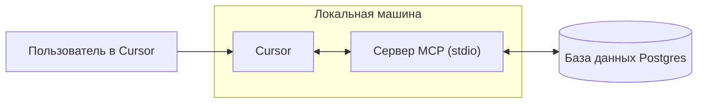

# Создание сервера MCP
Source: https://docs.cursor.com/ru/guides/tutorials/building-mcp-server

Узнай, как собрать сервер Model Context Protocol (MCP) с интеграцией PostgreSQL для Cursor

<div id="introduction">
  ## Введение
</div>

Серверы MCP позволяют подключать собственные источники данных и делать их доступными внутри Cursor. Это особенно полезно, когда нужен контекст из браузеров, баз данных или системных и ошибокных логов. Настроить сервер MCP несложно, и в Cursor это делается быстро.

В этом руководстве мы разберём, как создать сервер MCP для Postgres. Наша цель — дать Cursor возможность выполнять SQL‑запросы напрямую к базе данных Postgres и предоставлять схемы таблиц в структурированном виде.

<Note>
  Этот материал предназначен для изучения основ разработки серверов MCP.
</Note>

<video autoPlay loop muted playsInline controls>
  <source src="https://mintcdn.com/cursor/Qpa6MBK62Try_xlf/images/guides/tutorials/building-mcp-server/demo.mp4?fit=max&auto=format&n=Qpa6MBK62Try_xlf&q=85&s=8e02b011bd0956d62135db5779f7ead5" type="video/mp4" data-path="images/guides/tutorials/building-mcp-server/demo.mp4" />
</video>



<div id="what-is-an-mcp-server">
  ## Что такое MCP‑сервер?
</div>

[MCP‑сервер](/ru/context/mcp) — это процесс, который взаимодействует с Cursor и предоставляет доступ к внешним данным и действиям. Его можно реализовать по‑разному, но здесь мы используем самый простой вариант: сервер, который запускается локально на твоём компьютере через [stdio](https://en.wikipedia.org/wiki/Standard_streams) (стандартные потоки ввода/вывода). Это позволяет избежать сложных вопросов безопасности и сосредоточиться на логике MCP.

Один из самых распространённых сценариев для MCP — доступ к базе данных. При создании дашбордов, запуске аналитики или подготовке миграций часто нужно выполнять запросы и изучать базу данных. Наш Postgres MCP‑сервер будет поддерживать две ключевые возможности: выполнение произвольных запросов и вывод схем таблиц.

Хотя обе эти задачи можно решить на чистом SQL, MCP предлагает возможности, которые делают их мощнее и универсальнее. Инструменты позволяют предоставлять действия, такие как выполнение запросов, а ресурсы — делиться стандартизированным контекстом, например сведениями о схемах. Позже в этом гайде мы также рассмотрим промпты, которые позволяют строить более продвинутые рабочие процессы.

Под капотом мы будем использовать пакет postgres из npm для выполнения SQL‑операторов по базе данных. MCP SDK будет служить обёрткой вокруг этих вызовов, позволяя бесшовно интегрировать функциональность Postgres в Cursor.

<div id="how-to-build-the-mcp-server">
  ## Как собрать MCP‑сервер
</div>

Первый шаг в сборке сервера — настроить новый проект. Начнём с создания новой папки и инициализации проекта Bun

```bash  theme={null}
> mkdir postgres-mcp-server
> Bun init
```

Отсюда выберем проект `Blank`. Как только настроен наш боилерплейт, нужно установить необходимые зависимости. `zod` потребуется для определения схем ввода/вывода в MCP SDK

```bash  theme={null}
bun add postgres @modelcontextprotocol/sdk zod
```

Отсюда перейдём в репозитории каждой из библиотек и возьмём ссылки на «сырое» содержимое соответствующих README-файлов. Мы будем использовать их как контекст при разработке сервера

* `postgres`
  * Repo:  [https://github.com/porsager/postgres](https://github.com/porsager/postgres),
  * README: [https://raw.githubusercontent.com/porsager/postgres/refs/heads/master/README.md](https://raw.githubusercontent.com/porsager/postgres/refs/heads/master/README.md)
* `@modelcontextprotocol/sdk`:
  * Repo: [https://github.com/modelcontextprotocol/typescript-sdk](https://github.com/modelcontextprotocol/typescript-sdk)
  * README: [https://raw.githubusercontent.com/modelcontextprotocol/typescript-sdk/refs/heads/main/README.md](https://raw.githubusercontent.com/modelcontextprotocol/typescript-sdk/refs/heads/main/README.md)

Теперь определим, как должен вести себя сервер. Для этого создадим `spec.md` и опишем цели на высоком уровне

```markdown  theme={null}

---

← Previous: [Архитектурные диаграммы](./section.md) | [Index](./index.md) | Next: [Веб‑разработка](./section.md) →