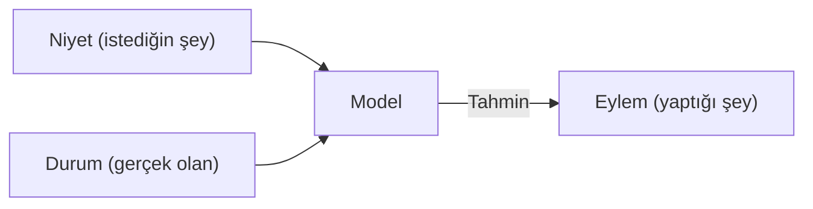

# Bağlamla Çalışmak
Source: https://docs.cursor.com/tr/guides/working-with-context

Cursor'da bağlamla nasıl çalışılır

Önce, bağlam penceresi nedir? Ve Cursor’la verimli kod yazmayla nasıl ilişkili?

Biraz geniş açıdan bakarsak, büyük dil modeli (LLM), devasa veri kümelerinden kalıpları öğrenerek metin tahmin edip üreten bir yapay zeka modelidir. Girdini anlayıp daha önce gördüklerine dayanarak kod veya metin önererek Cursor gibi araçlara güç verir.

Token’lar bu modellerin giriş ve çıkışlarıdır. Bir LLM’nin tek tek işlediği, genellikle bir kelime parçası olan metin parçacıklarıdır. Modeller tüm cümleleri bir kerede okumaz; önceki token’lara bakarak bir sonrakini tahmin eder.

Bir metnin nasıl token’lara bölündüğünü görmek için [şu araç gibi bir tokenizer](https://tiktokenizer.vercel.app/) kullanabilirsin.

  # Bağlam nedir?

Cursor’da bir kod önerisi üretirken “bağlam”, modele sağlanan ("girdi token"ları şeklinde) ve modelin ardından ("çıktı token"ları şeklinde) sonraki bilgiyi tahmin etmek için kullandığı bilgiyi ifade eder.

İki tür bağlam vardır:

1. **Niyet bağlamı**, kullanıcının modelden ne elde etmek istediğini tanımlar. Örneğin, bir sistem istemi genellikle kullanıcının modelin nasıl davranmasını istediğine dair üst düzey talimatlar olarak kullanılır. Cursor’da yapılan "prompting"in çoğu niyet bağlamıdır. “Şu düğmeyi maviden yeşile çevir” ifade edilmiş niyete bir örnektir; yönlendiricidir.
2. **Durum bağlamı**, mevcut durumun kendisini açıklar. Cursor’a hata mesajları, konsol log’ları, görseller ve kod parçaları sağlamak durumla ilgili bağlam örnekleridir. Tanımlayıcıdır, yönerge vermez.

Bu iki bağlam türü birlikte, mevcut durumu ve istenen gelecekteki durumu tanımlayarak uyum içinde çalışır ve Cursor’ın işe yarar kod önerileri yapmasını sağlar.

  # Cursor'da bağlam sağlama

Bir modele ne kadar ilgili bağlam sağlarsan, o kadar faydalı olur. Cursor’da yeterli bağlam verilmezse, model ilgili bilgi olmadan çözmeye çalışır. Bu genelde şunlarla sonuçlanır:

1. Modelin (ortada bir desen yokken) desen eşleştirmeye çalışıp halüsinasyon görmesi ve beklenmedik sonuçlar üretmesi. Bu, `claude-3.5-sonnet` gibi modellere yeterli bağlam verilmediğinde sık yaşanabilir.
2. Agent’ın kod tabanını arayarak, dosyaları okuyarak ve araçları çağırarak bağlamı kendi başına toplamaya çalışması. Güçlü muhakeme yeteneğine sahip bir model (örn. `claude-3.7-sonnet`) bu stratejiyle epey ilerleyebilir ve doğru başlangıç bağlamını vermek gidişatı belirler.

İyi haber şu ki Cursor, özünde bağlamsal farkındalıkla inşa edildi ve kullanıcıdan minimum müdahale gerektirecek şekilde tasarlandı. Cursor, modelin ilgili olduğunu tahmin ettiği kod tabanının parçalarını—mevcut dosya, diğer dosyalardaki semantik olarak benzer örüntüler ve oturumundan diğer bilgiler gibi—otomatik olarak içeri çeker.

Yine de çekilebilecek çok fazla bağlam var, o yüzden göreve ilgili olduğunu bildiğin bağlamı elle belirtmek, modelleri doğru yöne yönlendirmenin iyi bir yoludur.

  ## @-sembolü

Açık bağlam vermenin en kolay yolu @-sembolünü kullanmak. Hangi dosyayı, klasörü, web sitesini ya da eklemek istediğin diğer bağlam parçasını özellikle bildiğinde harika. Ne kadar net olursan o kadar iyi. İşte bağlamı daha nokta atışı kullanmanın bir özeti:

| Sembol    | Örnek                | Kullanım durumu                                                                                                              | Dezavantaj                                                                        |
| --------- | -------------------- | ---------------------------------------------------------------------------------------------------------------------------- | --------------------------------------------------------------------------------- |
| `@code`   | `@LRUCachedFunction` | Ürettiğin çıktıyla ilgili olan fonksiyonun, sabitin veya sembolün hangisi olduğunu biliyorsun                                | Kod tabanı hakkında çok fazla bilgi gerektirir                                    |
| `@file`   | `cache.ts`           | Hangi dosyanın okunması veya düzenlenmesi gerektiğini biliyorsun, ama dosyanın içinde tam olarak neresi olduğunu bilmiyorsun | Dosya boyutuna bağlı olarak eldeki görev için çok fazla ilgisiz bağlam içerebilir |
| `@folder` | `utils/`             | Bir klasördeki her şey veya dosyaların çoğu ilgili                                                                           | Eldeki görev için çok fazla ilgisiz bağlam içerebilir                             |

  ## Kurallar

Kuralları, senin ya da ekibindeki diğer üyelerin erişebilmesini istediğin uzun vadeli bir bellek olarak düşün. İş akışları, biçimlendirme ve diğer teamüller de dahil olmak üzere alana özgü bağlamı yakalamak, kurallar yazmak için harika bir başlangıç noktasıdır.

Kurallar, `/Generate Cursor Rules` komutuyla mevcut konuşmalardan da oluşturulabilir. Eğer çok sayıda yönerge içeren uzun bir ileri-geri sohbet yaptıysan, muhtemelen daha sonra yeniden kullanmak isteyebileceğin bazı faydalı direktifler veya genel kurallar vardır.

  ## MCP

[Model Context Protocol](https://modelcontextprotocol.io/introduction), Cursor’a eylemler gerçekleştirme ve harici bağlamı içeri alma yetenekleri kazandırabileceğin bir genişletilebilirlik katmanıdır.

Geliştirme kurulumuna bağlı olarak farklı türde sunuculardan yararlanmak isteyebilirsin, ancak özellikle faydalı olduğunu gördüğümüz iki kategori şunlar:

* **Dahili dokümantasyon**: ör. Notion, Confluence, Google Docs
* **Proje yönetimi**: ör. Linear, Jira

Bir API üzerinden bağlama erişmek ve eylemler gerçekleştirmek için mevcut araçların varsa, bunun için bir MCP sunucusu oluşturabilirsin. İşte [MCP sunucuları](https://modelcontextprotocol.io/tutorials/building-mcp-with-llms) oluşturma konusunda kısa bir rehber.

  ## Kendi kendine bağlam toplama

Birçok kullanıcının benimsediği güçlü bir kalıp, Agent’in daha fazla bağlam toplamak için çalıştırabileceği kısa ömürlü araçlar yazmasına izin vermek. Bu, kod çalıştırılmadan önce onu gözden aldığın insanın döngüde olduğu iş akışlarında özellikle etkili.

Örneğin, koduna hata ayıklama ifadeleri eklemek, kodu çalıştırmak ve modelin çıktıyı incelemesine izin vermek, statik olarak çıkaramayacağı dinamik bağlama erişmesini sağlar.

Python’da bunu Agent’i şu şekilde yönlendirerek yapabilirsin:

1. Kodun ilgili kısımlarına print("debugging: ...") ifadeleri ekle
2. Terminali kullanarak kodu veya testleri çalıştır

Agent terminal çıktısını okuyacak ve sırada ne yapılacağına karar verecek. Temel fikir, Agent’e yalnızca statik koda değil, gerçek çalışma zamanı davranışına erişim vermek.

  # Özetler

* Bağlam, etkili AI kodlamanın temelidir; niyet (ne istediğin) ve durumdan (ne mevcut) oluşur. İkisini de vermen, Cursor’ın doğru tahminler yapmasına yardımcı olur.
* Yalnızca otomatik bağlam toplamaya güvenmek yerine, Cursor’ı nokta atışı yönlendirmek için @-sembollerini (@code, @file, @folder) kullanarak cerrahi bağlam ver.
* Tekrarlanabilir bilgiyi ekip genelinde yeniden kullanılacak kurallara dök ve harici sistemlere bağlanmak için Model Context Protocol ile Cursor’ın yeteneklerini genişlet.
* Yetersiz bağlam halüsinasyonlara veya verimsizliğe yol açar; aşırı ve alakasız bağlam ise sinyali zayıflatır. En iyi sonuçlar için doğru dengeyi kur.

---

← Previous: [Web Geliştirme](./web-gelitirme.md) | [Index](./index.md) | Next: [Satır İçi Düzenleme](./satr-ii-dzenleme.md) →