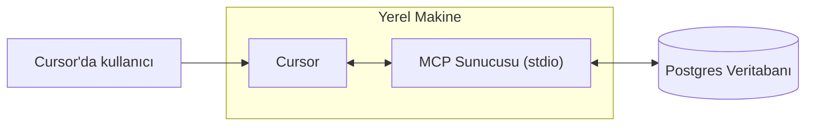

# Bir MCP Sunucusu Oluşturma
Source: https://docs.cursor.com/tr/guides/tutorials/building-mcp-server

Cursor için PostgreSQL entegrasyonuna sahip bir Model Context Protocol (MCP) sunucusunun nasıl oluşturulacağını öğren

<div id="introduction">
  ## Giriş
</div>

MCP sunucuları, özel veri kaynaklarına bağlanmana ve bunları Cursor içinde kullanmana olanak tanır. Bu, özellikle tarayıcılar, veritabanları ya da hata ve sistem günlükleri gibi yerlerden bağlama ihtiyaç duyduğunda işe yarar. Bir MCP sunucusu kurmak basittir ve Cursor ile hızlıca yapılabilir.

Bu rehberde, Postgres için bir MCP sunucusunun nasıl oluşturulacağını adım adım göstereceğiz. Amacımız, Cursor’ın SQL sorgularını doğrudan bir Postgres veritabanında çalıştırabilmesini ve tablo şemalarını yapılandırılmış bir şekilde sunmasını sağlamak.

<Note>
  Bu eğitim, MCP sunucuları oluşturmanın temellerini öğretmek üzere tasarlandı.
</Note>

<video autoPlay loop muted playsInline controls>
  <source src="https://mintcdn.com/cursor/Qpa6MBK62Try_xlf/images/guides/tutorials/building-mcp-server/demo.mp4?fit=max&auto=format&n=Qpa6MBK62Try_xlf&q=85&s=8e02b011bd0956d62135db5779f7ead5" type="video/mp4" data-path="images/guides/tutorials/building-mcp-server/demo.mp4" />
</video>



<div id="what-is-an-mcp-server">
  ## MCP Sunucusu nedir?
</div>

Bir [MCP sunucusu](/tr/context/mcp), Cursor’la iletişim kuran ve harici verilere ya da işlemlere erişim sağlayan bir süreçtir. Birkaç farklı şekilde uygulanabilir, ama burada en basit yöntemi kullanacağız: [stdio](https://en.wikipedia.org/wiki/Standard_streams) (standart giriş/çıkış akışları) üzerinden bilgisayarında yerel olarak çalışan bir sunucu. Bu, karmaşık güvenlik konularından kaçınmamıza ve doğrudan MCP mantığına odaklanmamıza imkan tanır.

MCP’nin en yaygın kullanım alanlarından biri veritabanı erişimidir. Dashboard’lar oluştururken, analizler çalıştırırken veya migration’lar yazarken sık sık bir veritabanını sorgulamak ve incelemek gerekir. Postgres MCP sunucumuz iki temel yetenek sunacak: keyfi sorgular çalıştırma ve tablo şemalarını listeleme.

Her iki görev de düz SQL ile yapılabilse de, MCP bunları daha güçlü ve genel olarak daha kullanışlı hale getiren özellikler sunar. Tools, sorgu yürütme gibi eylemleri araçlar olarak dışa açmanın bir yolunu sağlarken; resources, şema bilgisi gibi standartlaştırılmış bağlamı paylaşmamıza imkan tanır. Bu rehberin ilerleyen bölümlerinde, daha gelişmiş iş akışlarını mümkün kılan prompts kavramına da bakacağız.

Kaputun altında, veritabanında SQL ifadelerini yürütmek için postgres npm paketini kullanacağız. MCP SDK, bu çağrıların etrafında bir sarmalayıcı görevi görerek Postgres işlevselliğini Cursor’a sorunsuz şekilde entegre etmemizi sağlayacak.

<div id="how-to-build-the-mcp-server">
  ## MCP Sunucusunu Nasıl Kurarsın
</div>

Sunucu oluşturmaya başlamanın ilk adımı yeni bir proje ayarlamak. Yeni bir klasör oluşturup bir Bun projesi başlatarak başlayacağız

```bash  theme={null}
> mkdir postgres-mcp-server
> Bun init
```

Buradan `Blank` projeyi seçeceğiz. Boilerplate kurulduktan sonra gerekli bağımlılıkları yüklememiz lazım. MCP SDK’de G/Ç şemalarını tanımlamak için `zod` gerekli

```bash  theme={null}
bun add postgres @modelcontextprotocol/sdk zod
```

Buradan, her bir kütüphanenin deposuna gidip ilgili README dosyalarının ham içerik bağlantılarını alacağız. Sunucuyu kurarken bunları bağlam olarak kullanacağız.

* `postgres`
  * Repo:  [https://github.com/porsager/postgres](https://github.com/porsager/postgres),
  * README: [https://raw.githubusercontent.com/porsager/postgres/refs/heads/master/README.md](https://raw.githubusercontent.com/porsager/postgres/refs/heads/master/README.md)
* `@modelcontextprotocol/sdk`:
  * Repo: [https://github.com/modelcontextprotocol/typescript-sdk](https://github.com/modelcontextprotocol/typescript-sdk)
  * README: [https://raw.githubusercontent.com/modelcontextprotocol/typescript-sdk/refs/heads/main/README.md](https://raw.githubusercontent.com/modelcontextprotocol/typescript-sdk/refs/heads/main/README.md)

Şimdi sunucunun nasıl davranmasını istediğimizi tanımlayacağız. Bunu yapmak için bir `spec.md` oluşturup üst düzey hedefleri yazacağız.

```markdown  theme={null}

---

← Previous: [Mimari Diyagramlar](./mimari-diyagramlar.md) | [Index](./index.md) | Next: [Web Geliştirme](./web-gelitirme.md) →