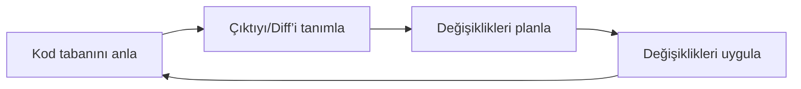
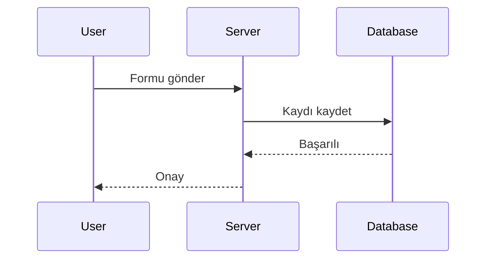
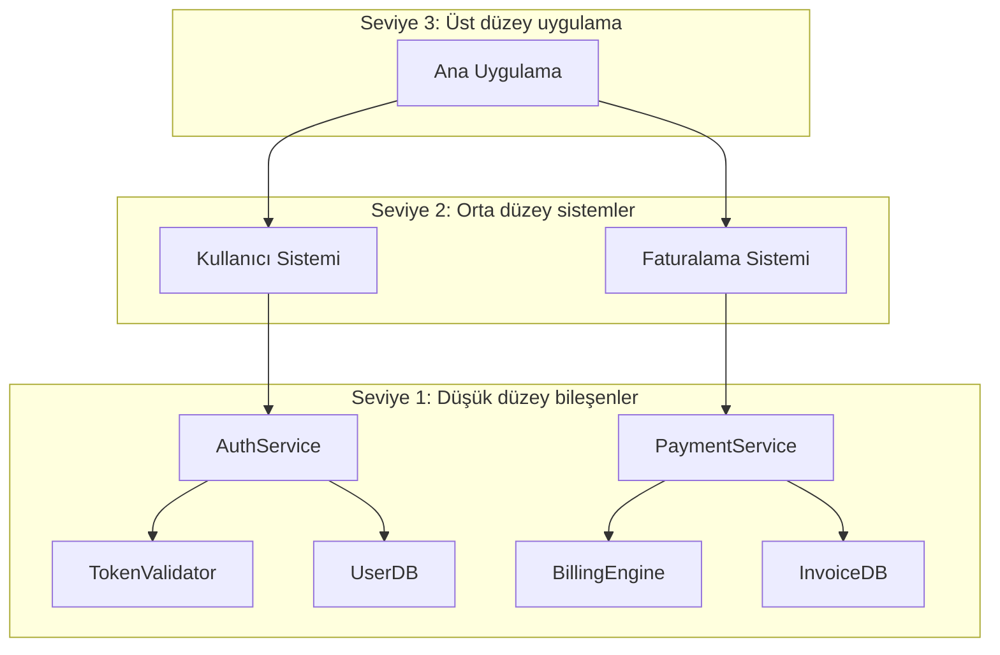
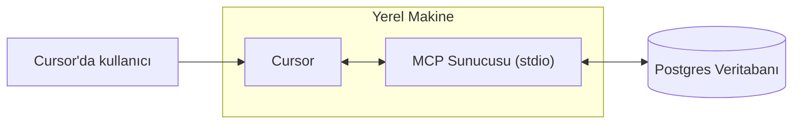
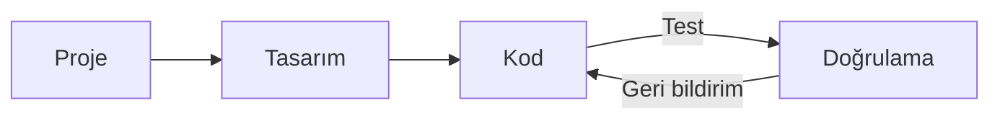
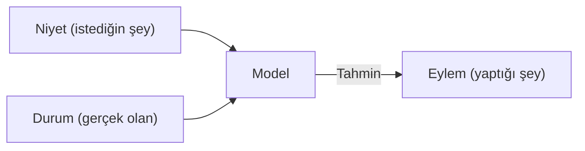

# Cursor Documentation (Turkish)

This is the complete formatted documentation for Cursor in Turkish, parsed and organized from the official documentation.

**Total Sections:** 112

---


# Agent Güvenliği
Source: https://docs.cursor.com/tr/account/agent-security

Cursor Agent kullanımı için güvenlik değerlendirmeleri

Prompt injection, AI halüsinasyonları ve diğer sorunlar, yapay zekanın beklenmedik ve potansiyel olarak kötü niyetli davranmasına yol açabilir. Prompt injection sorununu daha temel bir düzeyde çözmek için çalışmaya devam ederken, Cursor ürünlerindeki birincil korumamız, bir agent’ın yapabileceklerine konulan koruma sınırlarıdır; buna varsayılan olarak hassas işlemler için manuel onay gerektirilmesi de dahildir. Bu belgenin amacı, bu koruma sınırlarını ve kullanıcıların bunlardan ne bekleyebileceğini açıklamaktır.

Aşağıda yer alan tüm kontrol ve davranışlar varsayılan ve önerilen ayarlarımızdır.

<div id="first-party-tool-calls">
  ## Birinci taraf araç çağrıları
</div>

Cursor, ajanın kullanıcılarımıza kod yazmada yardımcı olmasını sağlayan yerleşik araçlarla birlikte gelir. Bunlara dosya okuma, düzenleme, terminal komutları çalıştırma, dokümantasyon için web’de arama ve diğerleri dahildir.

Okuma araçları onay gerektirmez (ör. dosya okuma, kod genelinde arama). Ajanın belirli dosyalara hiç erişmesini engellemek için [.cursorignore](/tr/context/ignore-files) kullanabilirsin; bunun dışında okumalar genellikle onaysız olarak serbesttir. Hassas verilerin dışa sızması riskini taşıyan eylemler içinse açık onay isteriz.

Geçerli çalışma alanındaki dosyaları değiştirmek, bazı istisnalar dışında açık onay gerektirmez. Bir ajan dosyalarda değişiklik yaptığında bunlar anında diske kaydedilir. Dosyaların içeriğini istediğin zaman geri alabilmek için Cursor’ı sürüm kontrollü çalışma alanlarında çalıştırmanı öneririz. IDE/CLI yapılandırmamızı değiştiren dosyalarda, örneğin editörün çalışma alanı ayar dosyasında değişiklik yapmadan önce açık onay isteriz. Ancak, dosya değiştiğinde otomatik yeniden yükleme yapan kullanıcılar, ajanın dosyalarda yaptığı değişikliklerin, sen gözden geçiremeden otomatik yürütmeyi tetikleyebileceğinin farkında olmalı.

Ajanlar tarafından önerilen herhangi bir terminal komutu varsayılan olarak onay gerektirir. Ajan çalıştırmadan önce her komutu gözden geçirmeni öneririz. Riski kabul ediyorsan, ajanın tüm komutları onay olmadan çalıştırmasını etkinleştirmeyi seçebilirsin. Cursor’da bir [allowlist](/tr/agent/tools) özelliği sunuyoruz, ancak bunu bir güvenlik kontrolü olarak görmüyoruz. Bazı kullanıcılar belirli komutlara izin vermeyi seçiyor; bu “best-effort” bir sistemdir ve baypas edilebilir. Herhangi bir yapılandırılmış allowlist’i baypas eden “Run Everything” seçeneğini önermiyoruz.

<div id="third-party-tool-calls">
  ## Üçüncü taraf araç çağrıları
</div>

Cursor, [MCP](/tr/context/mcp) üzerinden harici araçları bağlamanı sağlar. Tüm üçüncü taraf MCP bağlantılarının, kullanıcı tarafından açıkça onaylanması gerekir. Bir kullanıcı bir MCP’yi onayladıktan sonra, varsayılan olarak her harici MCP entegrasyonu için Agent Mode’da önerilen her araç çağrısı, çalıştırılmadan önce açıkça onaylanmalıdır.

<div id="network-requests">
  ## Ağ istekleri
</div>

Ağ istekleri, bir saldırgan tarafından veri sızdırmak için kullanılabilir. Şu anda çok sınırlı bir ana makine kümesi (örn. GitHub), açıkça talep edilen bağlantı alma ve seçili sağlayıcılarla web aramasını destekleme dışında, ağ isteği yapan herhangi bir birinci taraf aracı desteklemiyoruz. Keyfi aracının ağ istekleri varsayılan ayarlarla engellenir.

<div id="workspace-trust">
  ## Workspace trust
</div>

Cursor IDE, varsayılan olarak devre dışı olan standart [workspace trust](https://code.visualstudio.com/docs/editing/workspaces/workspace-trust) özelliğini destekliyor. Workspace trust, yeni bir workspace açtığında normal ya da kısıtlı mod arasında seçim yapman için bir bildirim gösterir. Kısıtlı mod, AI ve kullanıcılarımızın Cursor’da genelde kullandığı diğer özellikleri çalışmaz hâle getirir. Güvenmediğin repolarla çalışırken basit bir metin düzenleyici gibi başka araçları kullanmanı öneriyoruz.

Workspace trust, şu adımları izleyerek kullanıcı ayarlarında etkinleştirilebilir:

1. user settings.json dosyanı aç
2. Şu yapılandırmayı ekle:
   ```json  theme={null}
   "security.workspace.trust.enabled": true
   ```

Bu ayar, Mobile Device Management (MDM) çözümleri aracılığıyla kurum genelinde de zorunlu kılınabilir.

<div id="responsible-disclosure">
  ## Sorumlu açıklama
</div>

Cursor’da bir güvenlik açığı bulduğunu düşünüyorsan, GitHub Security sayfamızdaki kılavuzu takip et ve raporunu oradan gönder. GitHub’ı kullanamıyorsan, bize [security@cursor.com](mailto:security@cursor.com) adresinden de ulaşabilirsin.

Güvenlik açığı raporlarını 5 iş günü içinde aldığımızı teyit etmeyi ve onları mümkün olan en kısa sürede ele almayı taahhüt ediyoruz. Sonuçları GitHub Security sayfamızda güvenlik duyuruları olarak yayımlayacağız. Kritik olayları hem GitHub Security sayfasında hem de tüm kullanıcılara e-posta yoluyla duyuracağız.

---


# Faturalandırma
Source: https://docs.cursor.com/tr/account/billing

Cursor aboneliklerini, geri ödemeleri ve faturaları yönetme

<div id="how-do-i-access-billing-settings">
  ### Faturalandırma ayarlarına nasıl erişirim?
</div>

[Dashboard](https://cursor.com/dashboard) üzerinden dashboard’ında “Billing”e tıklayarak faturalandırma portalına eriş. Bu, tüm faturalandırma işlemleri için güvenli bir portal açar.

<div id="what-are-cursors-billing-cycles">
  ### Cursor’ın faturalandırma döngüleri nedir?
</div>

Faturalandırma döngüleri, aboneliğinin başladığı tarihten itibaren aylık veya yıllık olarak işler. Teams hesapları, yeni üyeler için orantılı (pro-rata) faturalandırmayla koltuk başına ücretlendirilir.

<div id="how-do-seats-work-for-teams-accounts">
  ### Teams hesaplarında koltuklar nasıl çalışır?
</div>

Teams hesapları koltuk başına ücretlendirir (her takım üyesi için bir koltuk). Üyeleri döngünün ortasında eklediğinde, yalnızca kalan süreleri için ücretlendirilirsin. Bir üye kredi kullandıysa ve kaldırıldıysa, koltuğu faturalandırma döngüsü bitene kadar dolu sayılır — orantılı geri ödeme yapılmaz. Takım yöneticileri koltukları dashboard üzerinden yönetebilir.

<div id="can-i-switch-between-monthly-and-annual-billing">
  ### Aylık ve yıllık faturalandırma arasında geçiş yapabilir miyim?
</div>

Evet! İşte nasıl:

**Pro plan**

1. Cursor [dashboard](https://cursor.com/dashboard)’a git
2. Sol kenar çubuğundan “Billing and Invoices”a tıklayarak faturalandırma sayfasına git
3. “Manage subscription”a tıkla
4. “Update subscription”a tıkla
5. “Yearly” veya “Monthly”yi seç, ardından “Continue”a tıkla

**Teams plan**

1. Cursor [dashboard](https://cursor.com/dashboard)’a git
2. Sol kenar çubuğundan “Billing and Invoices”a tıklayarak faturalandırma sayfasına git
3. Yıllık faturalandırmaya geçmek için “Upgrade Now” düğmesine tıkla

<Note>
  Yalnızca aylıktan yıllığa faturalandırmaya self-serve geçiş yapabilirsin. Yıllıktan aylığa geçmek için bizimle
  [hi@cursor.com](mailto:hi@cursor.com) üzerinden iletişime geç.
</Note>

<div id="where-can-i-find-my-invoices">
  ### Faturalarımı nerede bulabilirim?
</div>

Tüm faturalandırma geçmişini faturalandırma portalında bulabilirsin. Mevcut ve geçmiş faturaları görüntüleyip indirebilirsin.

<div id="can-i-get-invoices-automatically-emailed-to-me">
  ### Faturalar otomatik olarak e-postayla gönderilebilir mi?
</div>

Faturalar faturalandırma portalından manuel olarak indirilir. Otomatik fatura e-postaları üzerinde çalışıyoruz. Kullanıma sunulduğunda katılabileceksin.

<div id="how-do-i-update-my-billing-information">
  ### Faturalandırma bilgilerimi nasıl güncellerim?
</div>

Ödeme yöntemi, şirket adı, adres ve vergi bilgilerini faturalandırma portalı üzerinden güncelle. Güvenli işlemler için Stripe kullanıyoruz. Değişiklikler yalnızca gelecekteki faturaları etkiler; geçmiş faturaları değiştiremeyiz.

<div id="how-do-i-cancel-my-subscription">
  ### Aboneliğimi nasıl iptal ederim?
</div>

Billing and Invoices sayfasında “Manage Subscription”a, ardından “Cancel subscription” düğmesine tıklayarak aboneliğini iptal et. Erişimin, mevcut faturalandırma dönemin sona erene kadar devam eder.

<div id="im-having-other-billing-issues-how-can-i-get-help">
  ### Başka faturalandırma sorunları yaşıyorum. Nasıl yardım alabilirim?
</div>

Burada yer almayan faturalandırma soruları için, hesabına bağlı e-postadan [hi@cursor.com](mailto:hi@cursor.com) adresine yaz. Lütfen hesap bilgilerini ve konunu ekle.

---


# Fiyatlandırma
Source: https://docs.cursor.com/tr/account/pricing

Cursor’ın planları ve fiyatları

Cursor’ı ücretsiz deneyebilir ya da bireysel veya ekip planı satın alabilirsin.

<div id="individual">
  ## Bireysel
</div>

Tüm bireysel planlar şunları içerir:

* Sınırsız tab tamamlama
* Tüm modellerde genişletilmiş agent kullanım limitleri
* Bugbot’a erişim
* Background Agents’e erişim

Her plan, model çıkarımı [API fiyatlarına](/tr/models#model-pricing) göre ücretlendirilir:

* Pro, \$20 API agent kullanımı + ek bonus kullanım içerir
* Pro Plus, \$70 API agent kullanımı + ek bonus kullanım içerir
* Ultra, \$400 API agent kullanımı + ek bonus kullanım içerir

Garantili dahil kullanımın ötesinde ek bonus kapasite sağlamak için çok çalışıyoruz. Farklı modellerin API maliyetleri değiştiğinden, model seçimin hem token çıktısını hem de dahil kullanımının ne kadar hızlı tükeneceğini etkiler. Kullanımını ve token dökümlerini [panelinde](https://cursor.com/dashboard?tab=usage) görüntüleyebilirsin. Limit bildirimleri düzenli olarak editörde gösterilir.


<div id="how-much-usage-do-i-need">
  ### Ne kadar kullanıma ihtiyacım var?
</div>

Kullanım verilerimize göre aşağıdaki kullanım düzeylerini bekleyebilirsin:

* **Günlük Tab kullanıcıları**: Her zaman \$20 içinde kalır
* **Sınırlı Agent kullanıcıları**: Çoğu zaman dahilindeki \$20 içinde kalır
* **Günlük Agent kullanıcıları**: Genelde toplam kullanım $60–$100/ay
* **Power kullanıcıları (birden çok agent/otomasyon)**: Sıklıkla toplam kullanım \$200+/ay

Kullanım verilerimize göre, limitler bir “medyan kullanıcı” için kabaca şunlara denktir:

* Pro: \~225 Sonnet 4 isteği, \~550 Gemini isteği veya \~500 GPT 5 isteği
* Pro+: \~675 Sonnet 4 isteği, \~1.650 Gemini isteği veya \~1.500 GPT 5 isteği
* Ultra: \~4.500 Sonnet 4 isteği, \~11.000 Gemini isteği veya \~10.000 GPT 5 isteği

<div id="what-happens-when-i-reach-my-limit">
  ### Sınırıma ulaştığımda ne olur?
</div>

Dahil aylık kullanımını aştığında, editörde bilgilendirileceksin ve şunları tercih edebilirsin:

* **İsteğe bağlı kullanım ekle**: Kullanım kadar öde faturalandırmayla aynı API oranlarında Cursor’ı kullanmaya devam et
* **Planını yükselt**: Daha fazla dahil kullanım için daha yüksek bir katmana geç

İsteğe bağlı kullanım, dahil kullanımınla aynı oranlarda aylık olarak faturalandırılır. İsteklerin kalitesi veya hızı asla düşürülmez.

<div id="teams">
  ## Teams
</div>

İki takım planı var: Teams (\$40/kullanıcı/ay) ve Enterprise (Özel).

Teams planları şu ek özellikleri sunar:

* Gizlilik Modu zorlaması
* Kullanım istatistikleriyle Admin Panosu
* Merkezi takım faturalandırması
* SAML/OIDC SSO

Kendi kendine yönetmekten memnun olan herkes için Teams’i öneriyoruz. Öncelikli destek, havuzlu kullanım, faturalandırma, SCIM veya gelişmiş güvenlik kontrollerine ihtiyaç duyanlar için [Enterprise](/tr/contact-sales) öneriyoruz.

[Teams ücretlendirmesi](/tr/account/teams/pricing) hakkında daha fazla bilgi al.

<div id="auto">
  ## Auto
</div>

Auto'yu etkinleştirmek, Cursor’ın mevcut talebe göre en yüksek güvenilirliğe sahip ve o anki göreve en uygun premium modeli seçmesini sağlar. Bu özellik, çıktılarda performans düşüşünü tespit edebilir ve bunu gidermek için modeller arasında otomatik olarak geçiş yapabilir.

<Frame>
  
</Frame>

<Note>Auto’nun kalite ve genel performansına ciddi yatırımlar yaptık. 15 Eylül’den sonraki bir sonraki faturalandırma yenilemenden itibaren, Auto aşağıdaki API ücretlendirme oranlarıyla kullanım tüketir.</Note>

* **Girdi + Cache Yazma**: 1M token başına \$1.25
* **Çıktı**: 1M token başına \$6.00
* **Cache Okuma**: 1M token başına \$0.25

Hem editör hem de dashboard, Auto dahil kullanımını gösterir. Bir modeli doğrudan seçmeyi tercih edersen, kullanım o modelin liste API fiyatı üzerinden hesaplanır.

<div id="max-mode">
  ## Max Mode
</div>

Bazı modeller [Max Mode](/tr/models#max-mode) kullanabilir; bu, daha uzun akıl yürütme ve 1M tokene kadar daha büyük bağlam pencereleri sağlar. Çoğu kodlama işi Max Mode gerektirmese de, özellikle büyük dosyalar veya kod tabanlarıyla ilgili daha karmaşık sorgularda faydalı olabilir. Max Mode’u kullanmak daha fazla kullanım tüketecektir. Tüm isteklerini ve token dökümlerini [panelinde](https://cursor.com/dashboard?tab=usage) görebilirsin.

<div id="bugbot">
  ## Bugbot
</div>

Bugbot, Cursor aboneliklerinden ayrı bir üründür ve kendi fiyatlandırma planına sahiptir.

* **Pro** (40\$/ay): Ayda en fazla 200 PR için sınırsız inceleme, Cursor Ask’e sınırsız erişim, hataları düzeltmek için Cursor entegrasyonu ve Bugbot Rules erişimi
* **Teams** (kullanıcı başına 40\$/ay): Tüm PR’ler için sınırsız kod incelemesi, Cursor Ask’e sınırsız erişim, ekip genelinde havuzlanmış kullanım ve gelişmiş kurallar ile ayarlar
* **Enterprise** (Özel): Teams’in sunduklarının tümüne ek olarak gelişmiş analiz ve raporlama, öncelikli destek ve hesap yönetimi

[Bugbot fiyatlandırması](https://cursor.com/bugbot#pricing) hakkında daha fazla bilgi edin.

<div id="background-agent">
  ## Arka Plan Agenti
</div>

Arka Plan Agentleri, seçilen [model](/tr/models) için API fiyatlandırmasına göre ücretlendirilir. İlk kez kullanmaya başladığında Arka Plan Agentleri için bir harcama limiti belirlemen istenecek.

<Info>
  Arka Plan Agentleri için Sanal Makine (VM) hesaplama maliyeti gelecekte fiyatlandırılacak.
</Info>

---


# Admin API
Source: https://docs.cursor.com/tr/account/teams/admin-api

API aracılığıyla ekip metriklerine, kullanım verilerine ve harcama bilgilerine eriş

Admin API, üye bilgileri, kullanım metrikleri ve harcama detayları dahil olmak üzere ekibinin verilerine programatik olarak erişmeni sağlar. Özel panolar, izleme araçları oluştur ya da mevcut iş akışlarınla entegre et.

<Note>
  API ilk sürümünde. Yetenekleri geri bildirimlere göre genişletiyoruz — hangi endpoint’lere ihtiyacın olduğunu bize söyle!
</Note>

<div id="authentication">
  ## Kimlik doğrulama
</div>

Tüm API istekleri bir API anahtarıyla kimlik doğrulamayı gerektirir. API anahtarlarını yalnızca ekip yöneticileri oluşturabilir ve yönetebilir.

API anahtarları kuruluşa bağlıdır, tüm yöneticiler tarafından görüntülenebilir ve ilk oluşturanın hesap durumundan etkilenmez.

<div id="creating-an-api-key">
  ### Bir API Anahtarı Oluşturma
</div>

1. **cursor.com/dashboard** → **Settings** sekmesi → **Cursor Admin API Keys** bölümüne git
2. **Create New API Key**’e tıkla
3. Anahtarına açıklayıcı bir ad ver (ör. “Usage Dashboard Integration”)
4. Oluşturulan anahtarı hemen kopyala — bir daha gösterilmeyecek

Biçim: `key_xxxxxxxxxxxxxxxxxxxxxxxxxxxxxxxxxxxxxxxxxxxxxxxxxxxxxxxxxxxxxxxx`

<div id="using-your-api-key">
  ### API Anahtarını Kullanma
</div>

API anahtarını temel kimlik doğrulamada kullanıcı adı olarak kullan:

**Temel kimlik doğrulamayla curl kullanma:**

```bash  theme={null}
curl https://api.cursor.com/{route} -u API_KEY:
```

**Ya da Authorization başlığını doğrudan ayarla:**

```bash  theme={null}
Authorization: Basic {base64_encode('API_KEY:')}
```

<div id="base-url">
  ## Temel URL
</div>

Tüm API uç noktaları şu adresi kullanır:

```
https://api.cursor.com
```

<div id="endpoints">
  ## Uç Noktalar
</div>

<div id="get-team-members">
  ### Ekip Üyelerini Getir
</div>

Tüm ekip üyelerini ve ayrıntılarını al.

```
GET /teams/members
```

#### Yanıt

Ekip üyesi nesnelerinden oluşan bir dizi döndürür:

```typescript  theme={null}
{
  teamMembers: {
    name: string;
    email: string;
    role: 'owner' | 'member' | 'free-owner';
  }[];
}
```

#### Örnek Yanıt

```json  theme={null}
{
  "teamMembers": [
    {
      "name": "Alex",
      "email": "developer@company.com",
      "role": "üye"
    },
    {
      "name": "Sam",
      "email": "admin@company.com",
      "role": "sahip"
    }
  ]
}

```

#### Örnek İstek

```bash  theme={null}
curl -X GET https://api.cursor.com/teams/members \
  -u API_ANAHTARIN:
```

<div id="get-daily-usage-data">
  ### Günlük Kullanım Verilerini Al
</div>

Belirli bir tarih aralığında ekibin için ayrıntılı günlük kullanım metriklerini getir. Kod düzenlemeleri, yapay zeka yardımı kullanımı ve kabul oranları hakkında içgörüler sunar.

```
POST /teams/daily-usage-data
```

#### İstek Gövdesi

<div className="full-width-table">
  | Parametre   | Tür    | Gerekli | Açıklama                                    |
  | :---------- | :----- | :------ | :------------------------------------------ |
  | `startDate` | number | Evet    | Epoch milisaniye cinsinden başlangıç tarihi |
  | `endDate`   | number | Evet    | Epoch milisaniye cinsinden bitiş tarihi     |
</div>

<Note>
  Tarih aralığı 90 günü geçemez. Daha uzun dönemler için birden fazla istek gönder.
</Note>

#### Yanıt

```typescript  theme={null}
{
  data: {
    date: number;
    isActive: boolean;
    totalLinesAdded: number;
    totalLinesDeleted: number;
    acceptedLinesAdded: number;
    acceptedLinesDeleted: number;
    totalApplies: number;
    totalAccepts: number;
    totalRejects: number;
    totalTabsShown: number;
    totalTabsAccepted: number;
    composerRequests: number;
    chatRequests: number;
    agentRequests: number;
    cmdkUsages: number;
    subscriptionIncludedReqs: number;
    apiKeyReqs: number;
    usageBasedReqs: number;
    bugbotUsages: number;
    mostUsedModel: string;
    applyMostUsedExtension?: string;
    tabMostUsedExtension?: string;
    clientVersion?: string;
    email?: string;
  }[];
  period: {
    startDate: number;
    endDate: number;
  };
}
```

<div id="response-fields">
  #### Yanıt Alanları
</div>

<div className="full-width-table">
  | Field                      | Description                                 |
  | :------------------------- | :------------------------------------------ |
  | `date`                     | Epoch milisaniye cinsinden tarih            |
  | `isActive`                 | Kullanıcı bu gün aktif mi                   |
  | `totalLinesAdded`          | Eklenen kod satırı                          |
  | `totalLinesDeleted`        | Silinen kod satırı                          |
  | `acceptedLinesAdded`       | Kabul edilen AI önerilerinden eklenen satır |
  | `acceptedLinesDeleted`     | Kabul edilen AI önerilerinden silinen satır |
  | `totalApplies`             | Apply işlemleri                             |
  | `totalAccepts`             | Kabul edilen öneriler                       |
  | `totalRejects`             | Reddedilen öneriler                         |
  | `totalTabsShown`           | Gösterilen sekme tamamlama sayısı           |
  | `totalTabsAccepted`        | Kabul edilen sekme tamamlama sayısı         |
  | `composerRequests`         | Composer istekleri                          |
  | `chatRequests`             | Sohbet istekleri                            |
  | `agentRequests`            | Agent istekleri                             |
  | `cmdkUsages`               | Komut paleti (Cmd+K) kullanımı              |
  | `subscriptionIncludedReqs` | Abonelik kapsamındaki istekler              |
  | `apiKeyReqs`               | API anahtarı istekleri                      |
  | `usageBasedReqs`           | Kullanım başına ödeme istekleri             |
  | `bugbotUsages`             | Hata bulma kullanımları                     |
  | `mostUsedModel`            | En sık kullanılan yapay zeka modeli         |
  | `applyMostUsedExtension`   | Apply için en çok kullanılan dosya uzantısı |
  | `tabMostUsedExtension`     | Sekme için en çok kullanılan dosya uzantısı |
  | `clientVersion`            | Cursor sürümü                               |
  | `email`                    | Kullanıcı e-postası                         |
</div>

#### Örnek Yanıt

```json  theme={null}
{
  "data": [
    {
      "date": 1710720000000,
      "isActive": true,
      "totalLinesAdded": 1543,
      "totalLinesDeleted": 892,
      "acceptedLinesAdded": 1102,
      "acceptedLinesDeleted": 645,
      "totalApplies": 87,
      "totalAccepts": 73,
      "totalRejects": 14,
      "totalTabsShown": 342,
      "totalTabsAccepted": 289,
      "composerRequests": 45,
      "chatRequests": 128,
      "agentRequests": 12,
      "cmdkUsages": 67,
      "subscriptionIncludedReqs": 180,
      "apiKeyReqs": 0,
      "usageBasedReqs": 5,
      "bugbotUsages": 3,
      "enCokKullanilanModel": "gpt-4",
      "applyEnCokKullanilanUzanti": ".tsx",
      "tabEnCokKullanilanUzanti": ".ts",
      "istemciSurumu": "0.25.1",
      "ePosta": "developer@company.com"
    },
    {
      "date": 1710806400000,
      "isActive": true,
      "totalLinesAdded": 2104,
      "totalLinesDeleted": 1203,
      "acceptedLinesAdded": 1876,
      "acceptedLinesDeleted": 987,
      "totalApplies": 102,
      "totalAccepts": 91,
      "totalRejects": 11,
      "totalTabsShown": 456,
      "totalTabsAccepted": 398,
      "composerRequests": 67,
      "chatRequests": 156,
      "agentRequests": 23,
      "cmdkUsages": 89,
      "subscriptionIncludedReqs": 320,
      "apiKeyReqs": 15,
      "usageBasedReqs": 0,
      "bugbotUsages": 5,
      "enCokKullanilanModel": "claude-3-opus",
      "applyEnCokKullanilanUzanti": ".py",
      "tabEnCokKullanilanUzanti": ".py",
      "istemciSurumu": "0.25.1",
      "ePosta": "developer@company.com"
    }
  ],
  "period": {
    "startDate": 1710720000000,
    "endDate": 1710892800000
  }
}
```

#### Örnek İstek

```bash  theme={null}
curl -X POST https://api.cursor.com/teams/daily-usage-data \
  -u API_ANAHTARIN: \
  -H "Content-Type: application/json" \
  -d '{
    "startDate": 1710720000000,
    "endDate": 1710892800000
  }'
```

<div id="get-spending-data">
  ### Harcama Verilerini Al
</div>

Geçerli takvim ayı için arama, sıralama ve sayfalama ile harcama bilgilerini getir.

```
POST /teams/spend
```

#### İstek Gövdesi

<div className="full-width-table">
  | Parametre       | Tür    | Gerekli | Açıklama                                                       |
  | :-------------- | :----- | :------ | :------------------------------------------------------------- |
  | `searchTerm`    | string | Hayır   | Kullanıcı adları ve e-postalarda ara                           |
  | `sortBy`        | string | Hayır   | Şuna göre sırala: `amount`, `date`, `user`. Varsayılan: `date` |
  | `sortDirection` | string | Hayır   | Sıralama yönü: `asc`, `desc`. Varsayılan: `desc`               |
  | `page`          | number | Hayır   | Sayfa numarası (1’den başlayarak). Varsayılan: `1`             |
  | `pageSize`      | number | Hayır   | Sayfa başına sonuç sayısı                                      |
</div>

#### Yanıt

```typescript  theme={null}
{
  teamMemberSpend: {
    spendCents: number;
    fastPremiumRequests: number;
    name: string;
    email: string;
    role: 'owner' | 'member' | 'free-owner';
    hardLimitOverrideDollars: number;
  }[];
  subscriptionCycleStart: number;
  totalMembers: number;
  totalPages: number;
}
```

<div id="response-fields">
  #### Yanıt Alanları
</div>

<div className="full-width-table">
  | Alan                       | Açıklama                                       |
  | :------------------------- | :--------------------------------------------- |
  | `spendCents`               | Toplam harcama (sent)                          |
  | `fastPremiumRequests`      | Hızlı premium model istekleri                  |
  | `name`                     | Üye adı                                        |
  | `email`                    | Üye e-postası                                  |
  | `role`                     | Ekipteki rol                                   |
  | `hardLimitOverrideDollars` | Özel harcama sınırı geçersiz kılma             |
  | `subscriptionCycleStart`   | Abonelik döngüsü başlangıcı (epoch milisaniye) |
  | `totalMembers`             | Toplam ekip üyesi sayısı                       |
  | `totalPages`               | Toplam sayfa sayısı                            |
</div>

#### Örnek Yanıt

```json  theme={null}
{
  "teamMemberSpend": [
    {
      "spendCents": 2450,
      "fastPremiumRequests": 1250,
      "name": "Alex",
      "email": "developer@company.com",
      "role": "member",
      "hardLimitOverrideDollars": 100
    },
    {
      "spendCents": 1875,
      "fastPremiumRequests": 980,
      "name": "Sam",
      "email": "admin@company.com",
      "role": "owner",
      "hardLimitOverrideDollars": 0
    },
  ],
  "subscriptionCycleStart": 1708992000000,
  "totalMembers": 15,
  "totalPages": 1
}
```

<div id="example-requests">
  #### Örnek istekler
</div>

**Temel harcama verileri:**

```bash  theme={null}
curl -X POST https://api.cursor.com/teams/spend \
  -u API_ANAHTARIN: \
  -H "İçerik Türü: application/json" \
  -d '{}'
```

**Belirli bir kullanıcıyı sayfalamayla ara:**

```bash  theme={null}
curl -X POST https://api.cursor.com/teams/spend \
  -u API_ANAHTARIN: \
  -H "İçerik-Tipi: application/json" \
  -d '{
    "searchTerm": "alex@company.com",
    "page": 2,
    "pageSize": 25
  }'
```

<div id="get-usage-events-data">
  ### Kullanım Olayları Verilerini Al
</div>

Takımın için kapsamlı filtreleme, arama ve sayfalama seçenekleriyle ayrıntılı kullanım olaylarını getir. Bu uç nokta, tekil API çağrıları, model kullanımı, token tüketimi ve maliyetler hakkında daha ayrıntılı içgörüler sunar.

```
POST /teams/filtered-usage-events
```

#### İstek Gövdesi

<div className="full-width-table">
  | Parametre   | Tip    | Gerekli | Açıklama                                       |
  | :---------- | :----- | :------ | :--------------------------------------------- |
  | `startDate` | number | Hayır   | Epoch milisaniye cinsinden başlangıç tarihi    |
  | `endDate`   | number | Hayır   | Epoch milisaniye cinsinden bitiş tarihi        |
  | `userId`    | number | Hayır   | Belirli kullanıcı kimliğine göre filtrele      |
  | `page`      | number | Hayır   | Sayfa numarası (1’den başlar). Varsayılan: `1` |
  | `pageSize`  | number | Hayır   | Sayfa başına sonuç sayısı. Varsayılan: `10`    |
  | `email`     | string | Hayır   | Kullanıcı e-posta adresine göre filtrele       |
</div>

#### Yanıt

```typescript  theme={null}
{
  totalUsageEventsCount: number;
  pagination: {
    numPages: number;
    currentPage: number;
    pageSize: number;
    hasNextPage: boolean;
    hasPreviousPage: boolean;
  };
  usageEvents: {
    zamanDamgasi: string;
    model: string;
    tur: string;
    maxMode: boolean;
    istekMaliyetleri: number;
    isTokenBasedCall: boolean;
    belirteçKullanimi?: {
      girisBelirtecleri: number;
      cikisBelirtecleri: number;
      önbellekYazmaBelirtecleri: number;
      önbellekOkumaBelirtecleri: number;
      toplamSent: number;
    };
    isFreeBugbot: boolean;
    kullaniciEpostasi: string;
  }[];
  period: {
    baslangicTarihi: number;
    bitisTarihi: number;
  };
}
```

<div id="response-fields-explained">
  #### Yanıt Alanlarının Açıklaması
</div>

<div className="full-width-table">
  | Alan                    | Açıklama                                                           |
  | :---------------------- | :----------------------------------------------------------------- |
  | `totalUsageEventsCount` | Sorguyla eşleşen kullanım olaylarının toplam sayısı                |
  | `pagination`            | Sonuçlar arasında gezinmeye yönelik sayfalama üst verisi           |
  | `timestamp`             | Olay zaman damgası (epoch milisaniyeler)                           |
  | `model`                 | İstek için kullanılan yapay zeka modeli                            |
  | `kind`                  | Kullanım kategorisi (ör. "Usage-based", "Included in Business")    |
  | `maxMode`               | Maks modun etkin olup olmadığı                                     |
  | `requestsCosts`         | İstek birimleri cinsinden maliyet                                  |
  | `isTokenBasedCall`      | Olay kullanım bazlı olarak ücretlendirildiğinde true               |
  | `tokenUsage`            | Ayrıntılı token kullanımı (isTokenBasedCall true olduğunda mevcut) |
  | `isFreeBugbot`          | Bunun ücretsiz bugbot kullanımı olup olmadığı                      |
  | `userEmail`             | İsteği yapan kullanıcının e-posta adresi                           |
  | `period`                | Sorgulanan verinin tarih aralığı                                   |
</div>

#### Örnek Yanıt

```json  theme={null}
{
  "totalUsageEventsCount": 113,
  "pagination": {
    "numPages": 12,
    "currentPage": 1,
    "pageSize": 10,
    "hasNextPage": true,
    "hasPreviousPage": false
  },
  "usageEvents": [
    {
      "timestamp": "1750979225854",
      "model": "claude-4-opus",
      "kind": "Kullanıma göre",
      "maxMode": true,
      "requestsCosts": 5,
      "isTokenBasedCall": true,
      "tokenUsage": {
        "inputTokens": 126,
        "outputTokens": 450,
        "cacheWriteTokens": 6112,
        "cacheReadTokens": 11964,
        "totalCents": 20.18232
      },
      "isFreeBugbot": false,
      "userEmail": "developer@company.com"
    },
    {
      "timestamp": "1750979173824",
      "model": "claude-4-opus",
      "kind": "Kullanıma göre",
      "maxMode": true,
      "requestsCosts": 10,
      "isTokenBasedCall": true,
      "tokenUsage": {
        "inputTokens": 5805,
        "outputTokens": 311,
        "cacheWriteTokens": 11964,
        "cacheReadTokens": 0,
        "totalCents": 40.16699999999999
      },
      "isFreeBugbot": false,
      "userEmail": "developer@company.com"
    },
    {
      "timestamp": "1750978339901",
      "model": "claude-4-sonnet-thinking",
      "kind": "Business’a dahil",
      "maxMode": true,
      "requestsCosts": 1.4,
      "isTokenBasedCall": false,
      "isFreeBugbot": false
      "userEmail": "admin@company.com"
    }
  ],
  "period": {
    "startDate": 1748411762359,
    "endDate": 1751003762359
  }
}
```

#### Örnek İstekler

**Varsayılan sayfalamayla tüm kullanım etkinliklerini getir:**

```bash  theme={null}
curl -X POST https://api.cursor.com/teams/filtered-usage-events \
  -u YOUR_API_KEY: \
  -H "Content-Type: application/json" \
  -d '{}'
```

**Tarih aralığına ve belirli bir kullanıcıya göre filtrele:**

```bash  theme={null}
curl -X POST https://api.cursor.com/teams/filtered-usage-events \
  -u YOUR_API_KEY: \
  -H "İçerik-Türü: application/json" \
  -d '{
    "startDate": 1748411762359,
    "endDate": 1751003762359,
    "email": "developer@company.com",
    "page": 1,
    "pageSize": 25
  }'
```

**Özel sayfalama ile belirli bir kullanıcının kullanım etkinliklerini al:**

```bash  theme={null}
curl -X POST https://api.cursor.com/teams/filtered-usage-events \
  -u API_ANAHTARIN: \
  -H "İçerik Türü: application/json" \
  -d '{
    "userId": 12345,
    "page": 2,
    "pageSize": 50
  }'
```

<div id="set-user-spend-limit">
  ### Kullanıcı Harcama Limitini Ayarla
</div>

Tek tek ekip üyeleri için harcama limitleri belirle. Böylece ekibindeki her kullanıcının AI kullanımı için ne kadar harcayabileceğini kontrol edebilirsin.

```
POST /teams/user-spend-limit
```

<Note>
  **Oran sınırlaması:** ekip başına dakikada 60 istek
</Note>

#### İstek Gövdesi

<div className="full-width-table">
  | Parametre           | Tür    | Gerekli | Açıklama                                                         |
  | :------------------ | :----- | :------ | :--------------------------------------------------------------- |
  | `userEmail`         | string | Evet    | Ekip üyesinin e-posta adresi                                     |
  | `spendLimitDollars` | number | Evet    | Dolar cinsinden harcama limiti (yalnızca tam sayı, ondalık yok). |
</div>

<Note>
  * Kullanıcı zaten senin ekibinin bir üyesi olmalı
  * Yalnızca tam sayı değerleri kabul edilir (ondalık tutar kabul edilmez)
  * `spendLimitDollars` değerini 0 olarak ayarlamak limiti \$0 yapar
</Note>

#### Yanıt

Başarı ya da başarısızlığı belirten standart bir yanıt döndürür:

```typescript  theme={null}
{
  outcome: 'başarılı' | 'hata';
  message: string;
}
```

<div id="example-responses">
  #### Örnek Yanıtlar
</div>

**Limit başarıyla belirlendi:**

```json  theme={null}
{
  "outcome": "başarılı",
  "message": "developer@company.com kullanıcısının harcama limiti $100 olarak ayarlandı"
}
```

**Hata yanıtı:**

```json  theme={null}
{
  "outcome": "error",
  "message": "Geçersiz e-posta formatı"
}
```

#### Örnek İstekler

**Harcama limiti belirle:**

```bash  theme={null}
curl -X POST https://api.cursor.com/teams/user-spend-limit \
  -u API_ANAHTARIN: \
  -H "Content-Type: application/json" \
  -d '{
    "userEmail": "developer@company.com",
    "spendLimitDollars": 100
  }'
```

<div id="repo-blocklists-api">
  ### Repo Blocklists API
</div>

Takımın için dosya veya dizinlerin dizine alınmasını ya da bağlam olarak kullanılmasını önlemek üzere depolar ve eşleşme kalıpları ekle.

<div id="get-team-repo-blocklists">
  #### Takım Depo Engelleme Listelerini Al
</div>

Takımın için yapılandırılmış tüm depo engelleme listelerini al.

```
GET /settings/repo-blocklists/repos
```

<div id="response">
  ##### Yanıt
</div>

Bir dizi depo engelleme listesi (blocklist) nesnesi döndürür:

```typescript  theme={null}
{
  repos: {
    id: string;
    url: string;
    patterns: string[];
  }[];
}
```

<div id="example-response">
  ##### Örnek Yanıt
</div>

```json  theme={null}
{
  "repos": [
    {
      "id": "repo_123",
      "url": "https://github.com/company/sensitive-repo",
      "patterns": ["*.env", "config/*", "secrets/**"]
    },
    {
      "id": "repo_456",
      "url": "https://github.com/company/internal-tools",
      "patterns": ["*"]
    }
  ]
}
```

<div id="example-request">
  ##### Örnek İstek
</div>

```bash  theme={null}
curl -X GET https://api.cursor.com/settings/repo-blocklists/repos \
  -u API_ANAHTARIN:
```

<div id="upsert-repo-blocklists">
  #### Repo Engelleme Listelerini (Blocklist) Yükselt/İçer
</div>

Sağlanan repolar için mevcut repo engelleme listelerini (blocklist) yenisiyle değiştir.
*Not: Bu uç nokta yalnızca sağlanan repoların desenlerini (pattern) geçersiz kılar. Diğer tüm repolar etkilenmeden kalır.*

```
POST /settings/repo-blocklists/repos/upsert
```

<div id="request-body">
  ##### İstek Gövdesi
</div>

| Parametre | Tür   | Gerekli | Açıklama                                     |
| --------- | ----- | ------- | -------------------------------------------- |
| repos     | array | Evet    | Depo engel listesi nesnelerinden oluşan dizi |

Her depo nesnesi şunları içermelidir:

| Alan     | Tür       | Gerekli | Açıklama                                                            |
| -------- | --------- | ------- | ------------------------------------------------------------------- |
| url      | string    | Evet    | Engel listesine eklenecek depo URL’si                               |
| patterns | string\[] | Evet    | Engellenecek dosya kalıplarının dizisi (glob kalıpları desteklenir) |

<div id="response">
  ##### Yanıt
</div>

Güncellenmiş depo engel listelerinin listesini döndürür:

```typescript  theme={null}
{
  repos: {
    id: string;
    url: string;
    patterns: string[];
  }[];
}
```

<div id="example-request">
  ##### Örnek İstek
</div>

```bash  theme={null}
curl -X POST https://api.cursor.com/settings/repo-blocklists/repos/upsert \
  -u YOUR_API_KEY: \
  -H "Content-Type: application/json" \
  -d '{
    "repos": [
      {
        "url": "https://github.com/company/sensitive-repo",
        "patterns": ["*.env", "config/*", "secrets/**"]
      },
      {
        "url": "https://github.com/company/internal-tools", 
        "patterns": ["*"]
      }
    ]
  }'
```

<div id="delete-repo-blocklist">
  #### Depo Engelleme Listesinden Kaldır
</div>

Engelleme listesinden belirli bir depoyu kaldır.

```
DELETE /settings/repo-blocklists/repos/:repoId
```

<div id="parameters">
  ##### Parametreler
</div>

| Parametre | Tür    | Gerekli | Açıklama                                            |
| --------- | ------ | ------- | --------------------------------------------------- |
| repoId    | string | Evet    | Silinecek depo engel listesinin (blocklist) kimliği |

<div id="response">
  ##### Yanıt
</div>

Başarıyla silindiğinde 204 No Content döndürür.

<div id="example-request">
  ##### Örnek İstek
</div>

```bash  theme={null}
curl -X DELETE https://api.cursor.com/settings/repo-blocklists/repos/repo_123 \
  -u YOUR_API_KEY:
```

<div id="pattern-examples">
  #### Kalıp Örnekleri
</div>

Yaygın blocklist kalıpları:

* `*` - Tüm depoyu engelle
* `*.env` - Tüm .env dosyalarını engelle
* `config/*` - config dizinindeki tüm dosyaları engelle
* `**/*.secret` - Herhangi bir alt dizindeki tüm .secret dosyalarını engelle
* `src/api/keys.ts` - Belirli bir dosyayı engelle

---


# AI Kod Takip API'si
Source: https://docs.cursor.com/tr/account/teams/ai-code-tracking-api

Ekibinin depoları için yapay zekâ tarafından üretilen kod analizlerine eriş

Ekibinin depoları için yapay zekâ tarafından üretilen kod analizlerine eriş. Buna commit başına yapay zekâ kullanımı ve ayrıntılı düzeyde kabul edilen yapay zekâ değişiklikleri de dâhil.

<Note>
  API ilk sürümünde. Geri bildirimlere göre yetenekleri genişletiyoruz — hangi endpoint'lere ihtiyaç duyduğunu bize söyle!
</Note>

* **Kullanılabilirlik**: Yalnızca kurumsal ekipler için
* **Durum**: Alfa (yanıt yapı ve alanları değişebilir)

<div id="authentication">
  ## Kimlik Doğrulama
</div>

Tüm API istekleri, bir API anahtarıyla kimlik doğrulaması gerektirir. Bu API, diğer uç noktalarla aynı Admin API kimlik doğrulamasını kullanır.

Ayrıntılı kimlik doğrulama yönergeleri için bkz. [Admin API kimlik doğrulama](/tr/account/teams/admin-api#authentication).

<div id="base-url">
  ## Temel URL
</div>

Tüm API uç noktaları şu adresi kullanır:

```
https://api.cursor.com
```

<div id="rate-limits">
  ## Oran Sınırları
</div>

* Her ekip için, her uç nokta için dakikada 5 istek

<div id="query-parameters">
  ## Sorgu Parametreleri
</div>

Aşağıdaki tüm uç noktalar, aynı sorgu parametrelerini sorgu dizesiyle kabul eder:

<div className="full-width-table">
  | Parametre   | Tür    | Gerekli | Açıklama                                                                                                                                                                                             |                                                                                                         |
  | :---------- | :----- | :------ | :--------------------------------------------------------------------------------------------------------------------------------------------------------------------------------------------------- | ------------------------------------------------------------------------------------------------------- |
  | `startDate` | string | date    | Hayır                                                                                                                                                                                                | ISO tarih dizesi, birebir "now" veya "7d" gibi göreli günler (şu an - 7 gün). Varsayılan: şu an - 7 gün |
  | `endDate`   | string | date    | Hayır                                                                                                                                                                                                | ISO tarih dizesi, birebir "now" veya "0d" gibi göreli günler. Varsayılan: şu an                         |
  | `page`      | number | Hayır   | Sayfa numarası (1 tabanlı). Varsayılan: 1                                                                                                                                                            |                                                                                                         |
  | `pageSize`  | number | Hayır   | Sayfa başına sonuç sayısı. Varsayılan: 100, Maks: 1000                                                                                                                                               |                                                                                                         |
  | `user`      | string | Hayır   | Tek bir kullanıcıya göre isteğe bağlı filtre. E-posta (örn. [developer@company.com](mailto:developer@company.com)), kodlanmış kimlik (örn. user\_abc123...) veya sayısal kimlik (örn. 42) kabul eder |                                                                                                         |
</div>

<Note>
  Yanıtlarda userId, user\_ önekiyle kodlanmış harici bir kimlik olarak döner. Bu, API kullanımı için kararlıdır.
</Note>

<div id="semantics-and-how-metrics-are-computed">
  ## Anlambilim ve Metriklerin Nasıl Hesaplandığı
</div>

* **Kaynaklar**: "TAB", kabul edilen satır içi tamamlamaları temsil eder; "COMPOSER", Composer’dan kabul edilen diff’leri temsil eder
* **Satır metrikleri**: tabLinesAdded/Deleted ve composerLinesAdded/Deleted ayrı ayrı sayılır; nonAiLinesAdded/Deleted, max(0, totalLines - AI lines) olarak türetilir
* **Gizlilik modu**: İstemcide etkinleştirilirse, bazı meta veriler (örn. fileName) atlanabilir
* **Dal bilgisi**: isPrimaryBranch, geçerli dal repo’nun varsayılan dalına eşitse true olur; repo bilgisi yoksa undefined olabilir

Commit’lerin ve değişikliklerin nasıl algılanıp raporlandığını anlamak için o dosyayı inceleyebilirsin.

<div id="endpoints">
  ## Uç Noktalar
</div>

<div id="get-ai-commit-metrics-json-paginated">
  ### AI Commit Metriklerini Getir (JSON, sayfalı)
</div>

Commit başına, satırları TAB, COMPOSER ve AI dışı kaynaklara atfeden toplu metrikleri al.

```
GET /analytics/ai-code/commits
```

<div id="response">
  #### Yanıt
</div>

```typescript  theme={null}
{
  items: AiCommitMetric[];
  totalCount: number;
  page: number;
  pageSize: number;
}
```

<div id="aicommitmetric-fields">
  #### AiCommitMetric Alanları
</div>

<div className="full-width-table">
  | Alan                   | Tür     | Açıklama                                        |                                              |
  | :--------------------- | :------ | :---------------------------------------------- | -------------------------------------------- |
  | `commitHash`           | string  | Git commit karma değeri                         |                                              |
  | `userId`               | string  | Kodlanmış kullanıcı kimliği (örn. user\_abc123) |                                              |
  | `userEmail`            | string  | Kullanıcının e‑posta adresi                     |                                              |
  | `repoName`             | string  | null                                            | Depo adı                                     |
  | `branchName`           | string  | null                                            | Dal adı                                      |
  | `isPrimaryBranch`      | boolean | null                                            | Birincil dal olup olmadığı                   |
  | `totalLinesAdded`      | number  | Commit’te eklenen toplam satır                  |                                              |
  | `totalLinesDeleted`    | number  | Commit’te silinen toplam satır                  |                                              |
  | `tabLinesAdded`        | number  | TAB tamamlamalarıyla eklenen satırlar           |                                              |
  | `tabLinesDeleted`      | number  | TAB tamamlamalarıyla silinen satırlar           |                                              |
  | `composerLinesAdded`   | number  | Composer ile eklenen satırlar                   |                                              |
  | `composerLinesDeleted` | number  | Composer ile silinen satırlar                   |                                              |
  | `nonAiLinesAdded`      | number  | null                                            | Yapay zekâ kaynaklı olmayan eklenen satırlar |
  | `nonAiLinesDeleted`    | number  | null                                            | Yapay zekâ kaynaklı olmayan silinen satırlar |
  | `message`              | string  | null                                            | Commit mesajı                                |
  | `commitTs`             | string  | null                                            | Commit zaman damgası (ISO biçimi)            |
  | `createdAt`            | string  | Alım zaman damgası (ISO biçimi)                 |                                              |
</div>

<div id="example-response">
  #### Örnek Yanıt
</div>

```json  theme={null}
{
  "items": [
    {
      "commitHash": "a1b2c3d4",
      "userId": "user_3k9x8q...",
      "userEmail": "developer@company.com",
      "repoName": "company/repo",
      "branchName": "main",
      "isPrimaryBranch": true,
      "totalLinesAdded": 120,
      "totalLinesDeleted": 30,
      "tabLinesAdded": 50,
      "tabLinesDeleted": 10,
      "composerLinesAdded": 40,
      "composerLinesDeleted": 5,
      "nonAiLinesAdded": 30,
      "nonAiLinesDeleted": 15,
      "message": "Refactor: analytics istemcisini ayır"
      "commitTs": "2025-07-30T14:12:03.000Z",
      "createdAt": "2025-07-30T14:12:30.000Z"
    }
  ],
  "totalCount": 42,
  "page": 1,
  "pageSize": 100
}
```

<div id="example-requests">
  #### Örnek İstekler
</div>

**Basit istek:**

```bash  theme={null}
curl -X GET "https://api.cursor.com/analytics/ai-code/commits?startDate=7d&endDate=now&page=1&pageSize=100" \
  -u API_ANAHTARIN:
```

**Kullanıcıya göre filtrele (e‑posta):**

```bash  theme={null}
curl -X GET "https://api.cursor.com/analytics/ai-code/commits?startDate=2025-06-01T00:00:00Z&endDate=now&user=developer@company.com" \
  -u API_ANAHTARIN:
```

<div id="download-ai-commit-metrics-csv-streaming">
  ### AI Commit Metrics’i indir (CSV, akış)
</div>

Büyük hacimli veri çıkarımları için commit metriklerini CSV formatında indir.

```
GET /analytics/ai-code/commits.csv
```

<div id="response">
  #### Yanıt
</div>

Üstbilgiler:

* Content-Type: text/csv; charset=utf-8

<div id="csv-columns">
  #### CSV Sütunları
</div>

<div className="full-width-table">
  | Sütun                    | Tür     | Açıklama                           |
  | :----------------------- | :------ | :--------------------------------- |
  | `commit_hash`            | string  | Git commit özeti (hash)            |
  | `user_id`                | string  | Kodlanmış kullanıcı kimliği        |
  | `user_email`             | string  | Kullanıcının e‑posta adresi        |
  | `repo_name`              | string  | Depo adı                           |
  | `branch_name`            | string  | Dal adı                            |
  | `is_primary_branch`      | boolean | Birincil dal olup olmadığı         |
  | `total_lines_added`      | number  | Commit’te eklenen toplam satır     |
  | `total_lines_deleted`    | number  | Commit’te silinen toplam satır     |
  | `tab_lines_added`        | number  | TAB tamamlamalarıyla eklenen satır |
  | `tab_lines_deleted`      | number  | TAB tamamlamalarıyla silinen satır |
  | `composer_lines_added`   | number  | Composer ile eklenen satır         |
  | `composer_lines_deleted` | number  | Composer ile silinen satır         |
  | `non_ai_lines_added`     | number  | Yapay zekâ dışı eklenen satır      |
  | `non_ai_lines_deleted`   | number  | Yapay zekâ dışı silinen satır      |
  | `message`                | string  | Commit mesajı                      |
  | `commit_ts`              | string  | Commit zaman damgası (ISO biçimi)  |
  | `created_at`             | string  | Alım zaman damgası (ISO biçimi)    |
</div>

<div id="sample-csv-output">
  #### Örnek CSV Çıktısı
</div>

```csv  theme={null}
commit_hash,user_id,user_email,repo_name,branch_name,is_primary_branch,total_lines_added,total_lines_deleted,tab_lines_added,tab_lines_deleted,composer_lines_added,composer_lines_deleted,non_ai_lines_added,non_ai_lines_deleted,message,commit_ts,created_at
a1b2c3d4,user_3k9x8q...,developer@company.com,company/repo,main,true,120,30,50,10,40,5,30,15,"Refactor: analytics istemcisini ayır",2025-07-30T14:12:03.000Z,2025-07-30T14:12:30.000Z
e5f6g7h8,user_3k9x8q...,developer@company.com,company/repo,feature-branch,false,85,15,30,5,25,3,30,7,"Hata işleme ekle",2025-07-30T13:45:21.000Z,2025-07-30T13:45:45.000Z
```

<div id="example-request">
  #### Örnek İstek
</div>

```bash  theme={null}
curl -L "https://api.cursor.com/analytics/ai-code/commits.csv?startDate=2025-07-01T00:00:00Z&endDate=now&user=user_3k9x8q..." \
  -u YOUR_API_KEY: \
  -o commits.csv
```

<div id="get-ai-code-change-metrics-json-paginated">
  ### AI Kod Değişikliği Metriğini Al (JSON, sayfalı)
</div>

Deterministik changeId ile gruplanmış, ayrıntılı olarak kabul edilmiş AI değişikliklerini al. Commit’lerden bağımsız kabul edilmiş AI olaylarını analiz etmek için işe yarar.

```
GET /analytics/ai-code/changes
```

<div id="response">
  #### Yanıt
</div>

```typescript  theme={null}
{
  items: AiCodeChangeMetric[];
  totalCount: number;
  page: number;
  pageSize: number;
}
```

<div id="aicodechangemetric-fields">
  #### AiCodeChangeMetric Alanları
</div>

<div className="full-width-table">
  | Alan                | Tür    | Açıklama                                                   |                           |
  | :------------------ | :----- | :--------------------------------------------------------- | ------------------------- |
  | `changeId`          | string | Değişikliğe ait deterministik kimlik                       |                           |
  | `userId`            | string | Kodlanmış kullanıcı kimliği (ör. user\_abc123)             |                           |
  | `userEmail`         | string | Kullanıcının e-posta adresi                                |                           |
  | `source`            | "TAB"  | "COMPOSER"                                                 | AI değişikliğinin kaynağı |
  | `model`             | string | null                                                       | Kullanılan AI modeli      |
  | `totalLinesAdded`   | number | Eklenen toplam satır                                       |                           |
  | `totalLinesDeleted` | number | Silinen toplam satır                                       |                           |
  | `createdAt`         | string | İçeri aktarma zaman damgası (ISO biçimi)                   |                           |
  | `metadata`          | Array  | Dosya üst verileri (gizlilik modunda fileName atlanabilir) |                           |
</div>

<div id="example-response">
  #### Örnek Yanıt
</div>

```json  theme={null}
{
  "items": [
    {
      "changeId": "749356201",
      "userId": "user_3k9x8q...",
      "userEmail": "developer@company.com",
      "source": "COMPOSER",
      "model": null,
      "totalLinesAdded": 18,
      "totalLinesDeleted": 4,
      "createdAt": "2025-07-30T15:10:12.000Z",
        { "fileName": "src/analytics/report.ts", "fileExtension": "ts", "linesAdded": 12, "linesDeleted": 3 },
        { "fileName": "src/analytics/ui.tsx", "fileExtension": "tsx", "linesAdded": 6, "linesDeleted": 1 }
        { "fileName": "src/analytics/ui.tsx", "fileExtension": "tsx", "linesAdded": 6, "linesDeleted": 1 }
      ]
    }
  ],
  "totalCount": 128,
  "page": 1,
  "pageSize": 200
}
```

<div id="example-requests">
  #### Örnek İstekler
</div>

**Basit istek:**

```bash  theme={null}
curl -X GET "https://api.cursor.com/analytics/ai-code/changes?startDate=14d&endDate=now&page=1&pageSize=200" \
  -u API_ANAHTARIN:
```

**Kullanıcıya göre filtrele (kodlanmış kimlik):**

```bash  theme={null}
curl -X GET "https://api.cursor.com/analytics/ai-code/changes?user=user_3k9x8q..." \
  -u API_ANAHTARIN:
```

**Kullanıcıya göre filtrele (e-posta):**

```bash  theme={null}
curl -X GET "https://api.cursor.com/analytics/ai-code/changes?user=developer@company.com" \
  -u YOUR_API_KEY:
```

<div id="download-ai-code-change-metrics-csv-streaming">
  ### AI Kod Değişikliği Metriklerini İndir (CSV, akış)
</div>

Büyük veri çıkarımları için değişiklik metriklerini CSV formatında indir.

```
GET /analytics/ai-code/changes.csv
```

<div id="response">
  #### Yanıt
</div>

Başlıklar:

* Content-Type: text/csv; charset=utf-8

<div id="csv-columns">
  #### CSV Sütunları
</div>

<div className="full-width-table">
  | Sütun                 | Tür    | Açıklama                                               |
  | :-------------------- | :----- | :----------------------------------------------------- |
  | `change_id`           | string | Değişiklik için deterministik kimlik                   |
  | `user_id`             | string | Kodlanmış kullanıcı kimliği                            |
  | `user_email`          | string | Kullanıcının e-posta adresi                            |
  | `source`              | string | AI değişikliğinin kaynağı (TAB veya COMPOSER)          |
  | `model`               | string | Kullanılan AI modeli                                   |
  | `total_lines_added`   | number | Eklenen toplam satır sayısı                            |
  | `total_lines_deleted` | number | Silinen toplam satır sayısı                            |
  | `created_at`          | string | Alım zaman damgası (ISO biçimi)                        |
  | `metadata_json`       | string | JSON olarak dizgeleştirilmiş metadata girdileri dizisi |
</div>

<div id="notes">
  #### Notlar
</div>

* metadata\_json, JSON olarak dizgeleştirilmiş metadata girdileri dizisidir (gizlilik modunda fileName atlanabilir)
* CSV’yi işlerken tırnak içindeki alanları ayrıştırdığından emin ol

<div id="sample-csv-output">
  #### Örnek CSV Çıktısı
</div>

```csv  theme={null}
change_id,user_id,user_email,kaynak,model,toplam_eklenen_satır,toplam_silinen_satır,oluşturulma_tarihi,metadata_json
749356201,user_3k9x8q...,developer@company.com,COMPOSER,gpt-4o,18,4,2025-07-30T15:10:12.000Z,"[{""fileName"":""src/analytics/report.ts"",""fileExtension"":""ts"",""linesAdded"":12,""linesDeleted"":3},{""fileName"":""src/analytics/ui.tsx"",""fileExtension"":""tsx"",""linesAdded"":6,""linesDeleted"":1}]"
749356202,user_3k9x8q...,developer@company.com,TAB,,8,2,2025-07-30T15:08:45.000Z,"[{""fileName"":""src/utils/helpers.ts"",""fileExtension"":""ts"",""linesAdded"":8,""linesDeleted"":2}]"
```

<div id="example-request">
  #### Örnek İstek
</div>

```bash  theme={null}
curl -L "https://api.cursor.com/analytics/ai-code/changes.csv?startDate=30d&endDate=now" \
  -u YOUR_API_KEY: \
  -o changes.csv
```

<div id="tips">
  ## İpuçları
</div>

* Tüm endpoint’ler genelinde tek bir kullanıcıyı hızlıca filtrelemek için `user` parametresini kullan
* Büyük veri çıkarımları için CSV endpoint’lerini tercih et — sunucu tarafında 10.000 kayıttan oluşan sayfalar halinde akış (stream) olarak iletilir
* Varsayılan branch çözülemediyse `isPrimaryBranch` tanımsız olabilir
* `commitTs` commit zaman damgasıdır; `createdAt` sunucularımızda işlenme (ingestion) zamanıdır
* İstemcide gizlilik modu etkinse bazı alanlar bulunmayabilir

<div id="changelog">
  ## Değişiklik Günlüğü
</div>

* **Alfa sürümü**: Commit ve değişiklikler için başlangıç uç noktaları. Geri bildirimlere göre yanıt biçimleri değişebilir

---


# Analytics
Source: https://docs.cursor.com/tr/account/teams/analytics

Takım kullanımını ve etkinlik metriklerini takip et

Takım adminleri metrikleri [dashboard](/tr/account/teams/dashboard) üzerinden takip edebilir.

<Frame>
  
</Frame>

<div id="total-usage">
  ### Total Usage
</div>

Takım genelinde toplam sekmeler ve premium istekler dahil olmak üzere toplu metrikleri görüntüle. 30 günden küçük takımlar için metrikler, oluşturulduğu tarihten itibaren kullanımı yansıtır ve takım üyelerinin katılmadan önceki etkinliklerini de içerir.

<div id="per-active-user">
  ### Per Active User
</div>

Aktif kullanıcı başına ortalama metrikleri gör: kabul edilen sekmeler, kod satırları ve premium istekler.

<div id="user-activity">
  ### User Activity
</div>

Haftalık ve aylık aktif kullanıcıları takip et.

<div id="analytics-report-headers">
  ## Analitik Rapor Başlıkları
</div>

Kontrol panelinden analitik verileri dışa aktardığında, rapor kullanıcı davranışı ve özellik kullanımı hakkında ayrıntılı metrikler içerir. İşte her başlığın anlamı:

<div id="user-information">
  ### Kullanıcı Bilgileri
</div>

<ResponseField name="Date" type="ISO 8601 timestamp">
  Analitik verilerinin kaydedildiği tarih (örn. 2024-01-15T04:30:00.000Z)
</ResponseField>

<ResponseField name="User ID" type="string">
  Sistemindeki her kullanıcı için benzersiz tanımlayıcı
</ResponseField>

<ResponseField name="Email" type="string">
  Kullanıcının hesabıyla ilişkili e‑posta adresi
</ResponseField>

<ResponseField name="Is Active" type="boolean">
  Kullanıcının bu tarihte aktif olup olmadığını belirtir
</ResponseField>

<div id="ai-generated-code-metrics">
  ### AI Tarafından Üretilen Kod Metrikleri
</div>

<ResponseField name="Chat Suggested Lines Added" type="number">
  AI sohbet özelliği tarafından önerilen toplam eklenen kod satırı
</ResponseField>

<ResponseField name="Chat Suggested Lines Deleted" type="number">
  AI sohbet tarafından silinmesi önerilen toplam kod satırı
</ResponseField>

<ResponseField name="Chat Accepted Lines Added" type="number">
  Kullanıcının kabul edip koduna eklediği AI önerili satırlar
</ResponseField>

<ResponseField name="Chat Accepted Lines Deleted" type="number">
  Kullanıcının kabul ettiği AI önerili silmeler
</ResponseField>

<div id="feature-usage-metrics">
  ### Özellik Kullanım Metrikleri
</div>

<ResponseField name="Chat Total Applies" type="number">
  Bir kullanıcının sohbette AI tarafından üretilen değişiklikleri uygulama sayısı
</ResponseField>

<ResponseField name="Chat Total Accepts" type="number">
  Bir kullanıcının AI önerilerini kabul etme sayısı
</ResponseField>

<ResponseField name="Chat Total Rejects" type="number">
  Bir kullanıcının AI önerilerini reddetme sayısı
</ResponseField>

<ResponseField name="Chat Tabs Shown" type="number">
  AI öneri sekmelerinin kullanıcıya gösterilme sayısı
</ResponseField>

<ResponseField name="Tabs Accepted" type="number">
  Kullanıcı tarafından kabul edilen AI öneri sekmeleri
</ResponseField>

<div id="request-type-metrics">
  ### İstek Türü Metrikleri
</div>

<ResponseField name="Edit Requests" type="number">
  composer/edit özelliğiyle yapılan istekler (Cmd+K satır içi düzenlemeler)
</ResponseField>

<ResponseField name="Ask Requests" type="number">
  Kullanıcıların AI’ye soru sorduğu sohbet istekleri
</ResponseField>

<ResponseField name="Agent Requests" type="number">
  AI ajanlarına yapılan istekler (uzmanlaşmış AI asistanları)
</ResponseField>

<ResponseField name="Cmd+K Usages" type="number">
  Cmd+K (veya Ctrl+K) komut paletinin kullanılma sayısı
</ResponseField>

<div id="subscription-and-api-metrics">
  ### Abonelik ve API Metrikleri
</div>

<ResponseField name="Subscription Included Reqs" type="number">
  Kullanıcının abonelik planı kapsamında karşılanan AI istekleri
</ResponseField>

<ResponseField name="API Key Reqs" type="number">
  Programatik erişim için API anahtarları kullanılarak yapılan istekler
</ResponseField>

<ResponseField name="Usage-Based Reqs" type="number">
  Kullanıma dayalı faturalamaya dahil olan istekler
</ResponseField>

<div id="additional-features">
  ### Ek Özellikler
</div>

<ResponseField name="Bugbot Usages" type="number">
  Hata tespit/düzeltme AI özelliğinin kullanılma sayısı
</ResponseField>

<div id="configuration-information">
  ### Yapılandırma Bilgileri
</div>

<ResponseField name="Most Used Model" type="string">
  Kullanıcının en sık kullandığı AI modeli (örn. GPT-4, Claude)
</ResponseField>

<ResponseField name="Most Used Apply Extension" type="string">
  AI önerilerini uygularken en sık kullanılan dosya uzantısı (örn. .ts,
  .py, .java)
</ResponseField>

<ResponseField name="Most Used Tab Extension" type="string">
  Sekme tamamlama özellikleriyle en sık kullanılan dosya uzantısı
</ResponseField>

<ResponseField name="Client Version" type="string">
  Kullanılan Cursor editörünün sürümü
</ResponseField>

<div id="calculated-metrics">
  ### Hesaplanmış Metrikler
</div>

Rapor ayrıca AI kod katkısını anlamaya yardımcı olan işlenmiş veriler de içerir:

* Total Lines Added/Deleted: Tüm kod değişikliklerinin ham sayımı
* Accepted Lines Added/Deleted: AI önerilerinden kaynaklanıp kabul edilen satırlar
* Composer Requests: Satır içi composer özelliğiyle yapılan istekler
* Chat Requests: Sohbet arayüzü üzerinden yapılan istekler

<Note>
  Tüm sayısal değerler yoksa varsayılan olarak 0, boolean değerler false ve string değerler boş string olarak kabul edilir. Metrikler kullanıcı başına günlük düzeyde toplanır.
</Note>

---


# Analytics V2
Source: https://docs.cursor.com/tr/account/teams/analyticsV2

Gelişmiş ekip kullanımı ve etkinlik metrikleri takibi

Analytics altyapımızın V2 sürümü üzerinde çalışıyoruz. Bu, çeşitli metrikleri nasıl izlediğimizi yeniden düzenlemeyi içeriyor.

**1 Eylül 2025** itibarıyla ve **Cursor 1.5** kullananlar için analytics V2 altyapımıza geçecek. Önceki sürümler, aşağıdakiler de dahil olmak üzere çeşitli metrikleri eksik sayıyordu:

* Toplam Kabul Edilen Kod Satırı
* Toplam Önerilen Kod Satırı
* Toplam Kabul Edilen Sekmeler

Analytics’e yatırım yapmaya ve bu alanda yeni özellikler yayınlamaya devam ederken bizi takipte kal.

---


# Kontrol Paneli
Source: https://docs.cursor.com/tr/account/teams/dashboard

Faturalandırmayı, kullanımı ve ekip ayarlarını kontrol panelinden yönet

Kontrol paneli, faturalandırmaya erişmeni, kullanım bazlı fiyatlandırmayı kurmanı ve ekibini yönetmeni sağlar.

<div id="overview">
  ## Genel Bakış
</div>

Ekibinin aktivitesinin, kullanım istatistiklerinin ve son değişikliklerin hızlı bir özetini al. Genel bakış sayfası, çalışma alanına dair anlık içgörüler sunar.

<Frame>
  
</Frame>

<div id="settings">
  ## Ayarlar
</div>

<Frame>
  
</Frame>

Tüm takım için tercihleri ve güvenlik ayarlarını yapılandır. Ayarlar sayfasında şunlar bulunur:

<div id="teams-enterprise-settings">
  ## Takım ve Kurumsal Ayarlar
</div>

<AccordionGroup>
  <Accordion title="Gizlilik Ayarları">
    Takımının veri paylaşımı tercihlerini kontrol et. Yapay zeka sağlayıcılarıyla (OpenAI, Anthropic, Google Vertex AI, xAI Grok) sıfır veri saklama politikalarını yapılandır ve takım genelinde gizlilik uygulamasını yönet.
  </Accordion>

  {" "}

  <Accordion title="Kullanıma Dayalı Fiyatlandırma Ayarları">
    Kullanıma dayalı fiyatlandırmayı etkinleştir ve harcama limitlerini belirle. Aylık takım
    harcama limitlerini ve isteğe bağlı kişi başı limitleri yapılandır. Bu ayarları yalnızca yöneticilerin
    değiştirip değiştiremeyeceğini kontrol et.
  </Accordion>

  {" "}

  <Accordion title="Bedrock IAM Rolü">
    Güvenli bulut entegrasyonu için AWS Bedrock IAM rollerini yapılandır.
  </Accordion>

  {" "}

  <Accordion title="Tek Oturum Açma (SSO)">
    Kurumsal takımlar için SSO kimlik doğrulamasını kurarak kullanıcı erişimini kolaylaştır
    ve güvenliği artır.
  </Accordion>

  {" "}

  <Accordion title="Cursor Yönetici API Anahtarları">
    Cursor'ın yönetici özelliklerine programatik erişim için API anahtarları oluştur ve yönet.
  </Accordion>

  {" "}

  <Accordion title="Aktif Oturumlar">
    Takım genelindeki aktif kullanıcı oturumlarını izle ve yönet.
  </Accordion>

  <Accordion title="Davet Kodu Yönetimi">
    Yeni takım üyeleri eklemek için davet kodları oluştur ve yönet.
  </Accordion>

  <Accordion title="API Uç Noktaları">
    Cursor'ın REST API uç noktalarına programatik entegrasyon için eriş. Tüm API uç noktaları Team ve Enterprise planlarında kullanılabilir, yalnızca [AI Code Tracking API](/tr/docs/account/teams/ai-code-tracking-api) için Enterprise üyeliği gerekir.
  </Accordion>
</AccordionGroup>

<div id="enterprise-only-settings">
  ## Yalnızca Enterprise Ayarları
</div>

<AccordionGroup>
  {" "}

  <Accordion title="Model Erişim Kontrolü">
    Hangi AI modellerinin ekip üyelerine açık olacağını kontrol et. Maliyetleri yönetmek ve organizasyon genelinde uygun kullanımı sağlamak için belirli modellere veya model katmanlarına kısıtlamalar ayarla.
  </Accordion>

  {" "}

  <Accordion title="Otomatik Çalıştırma Yapılandırması (0.49+)">
    Cursor 0.49 ve üzeri sürümler için otomatik komut yürütme ayarlarını yapılandır. Hangi komutların otomatik çalıştırılabileceğini kontrol et ve kod yürütme için güvenlik politikaları belirle.
  </Accordion>

  <Accordion title="Depo Engelleme Listesi">
    Güvenlik veya uyumluluk nedenleriyle belirli depolara erişimi engelle.
  </Accordion>

  {" "}

  <Accordion title="MCP Yapılandırması (0.51+)">
    Cursor 0.51 ve üzeri sürümler için Model Context Protocol ayarlarını yapılandır. Modellerin geliştirme ortamından bağlama nasıl erişip onu nasıl işleyeceğini yönet.
  </Accordion>

  {" "}

  <Accordion title="Cursor Ignore Yapılandırması (0.50+)">
    Cursor 0.50 ve üzeri sürümlerde dosya ve dizinler için yok sayma kalıplarını ayarla. Hangi dosya ve dizinlerin AI analizinden ve önerilerinden hariç tutulacağını kontrol et.
  </Accordion>

  <Accordion title=".cursor Dizin Koruması (0.51+)">
    .cursor dizinini 0.51 ve üzeri sürümlerde yetkisiz erişime karşı koru. Hassas yapılandırma ve önbellek dosyalarının güvende kalmasını sağla.
  </Accordion>

  <Accordion title="AI Kod Takip API'si">
    Ekibinin depoları için ayrıntılı AI kaynaklı kod analizlerine eriş. REST API uç noktaları üzerinden commit başına AI kullanım metriklerini ve ayrıntılı, kabul edilen AI değişikliklerini al. Enterprise plan gerektirir. Daha fazla bilgi için [buraya](/tr/account/teams/ai-code-tracking-api) bak.
  </Accordion>
</AccordionGroup>

<Note>
  **SCIM** (System for Cross-domain Identity Management) provizyonu ayrıca Enterprise planlarda mevcut. Kurulum talimatları için [SCIM dokümantasyonumuza](/tr/account/teams/scim) bak.
</Note>

<div id="members">
  ## Üyeler
</div>

Ekip üyelerini yönet, yeni kullanıcılar davet et ve erişim izinlerini kontrol et. Role dayalı izinler ayarla ve üye etkinliğini takip et.

<Frame>
  
</Frame>

<div id="integrations">
  ## Entegrasyonlar
</div>

<Frame>
  
</Frame>

{" "}

Cursor’ı favori araç ve hizmetlerinle bağla. Sürüm kontrol sistemleri, proje yönetim araçları ve diğer geliştirici hizmetleriyle entegrasyonları yapılandır.

<div id="background-agents">
  ## Arka Plan Ajanları
</div>

<Frame>
  
</Frame>

{" "}

Çalışma alanında çalışan arka plan ajanlarını izle ve yönet. Ajan durumunu, günlükleri ve kaynak kullanımını görüntüle.

<div id="bugbot">
  ## Bugbot
</div>

Otomatik hata tespiti ve düzeltme özelliklerine eriş. Bugbot, kod tabanındaki yaygın sorunları otomatik olarak belirleyip çözmene yardımcı olur.

<Frame>
  
</Frame>

<div id="active-directory-management">
  ## Active Directory Yönetimi
</div>

Kurumsal ekipler için, Active Directory entegrasyonuyla kullanıcı kimlik doğrulamasını ve erişimi yönet. SSO’yu ve kullanıcı provizyonunu yapılandır.

<div id="usage">
  ## Kullanım
</div>

AI istekleri, model kullanımı ve kaynak tüketimi de dahil ayrıntılı kullanım metriklerini izle. Kullanımı ekip üyeleri ve projeler genelinde takip et.

<Frame>
  
</Frame>

<div id="billing-invoices">
  ## Faturalandırma ve Faturalar
</div>

Aboneliğini yönet, ödeme yöntemlerini güncelle ve faturalandırma geçmişine eriş. Faturaları indir ve kullanım bazlı fiyatlandırma ayarlarını yönet.

<Frame>
  
</Frame>

---


# Kurumsal Ayarlar
Source: https://docs.cursor.com/tr/account/teams/enterprise-settings

Kuruluşun için Cursor ayarlarını merkezi olarak yönet

<div id="enterprise-settings">
  # Kurumsal ayarlar
</div>

Cursor’ın belirli özelliklerini cihaz yönetimi çözümleriyle merkezi olarak yöneterek kuruluşunun ihtiyaçlarını karşıladığından emin olabilirsin. Bir Cursor ilkesi belirlediğinde, bu değeri kullanıcıların cihazlarındaki ilgili Cursor ayarının yerini alır.

Ayarlar düzenleyicisi, 'Extensions: Allowed' ayarının kuruluş tarafından yönetildiğini gösteriyor.

Cursor şu anda aşağıdaki yönetici kontrolündeki özellikleri yönetmek için ilkeler sunar:

| Policy            | Description                                                                                                                                             | Cursor setting           | Available since |
| ----------------- | ------------------------------------------------------------------------------------------------------------------------------------------------------- | ------------------------ | --------------- |
| AllowedExtensions | Hangi uzantıların kurulabileceğini kontrol eder.                                                                                                        | extensions.allowed       | 1.2             |
| AllowedTeamId     | Hangi takım kimliklerinin (ID) giriş yapmasına izin verildiğini kontrol eder. Yetkisiz takım kimliklerine sahip kullanıcıların oturumu zorla kapatılır. | cursorAuth.allowedTeamId | 1.3             |

<div id="configure-allowed-extensions">
  ## İzin verilen uzantıları yapılandır
</div>

`extensions.allowed` Cursor ayarı, hangi uzantıların kurulabileceğini kontrol eder. Bu ayar, anahtarların yayıncı adları, değerlerin ise o yayıncıdan gelen uzantıların izinli olup olmadığını belirten boolean olduğu bir JSON nesnesi kabul eder.

Örneğin, `extensions.allowed` değerini `{"anysphere": true, "github": true}` olarak ayarlamak Anysphere ve GitHub yayıncılarından uzantılara izin verirken, `{"anysphere": false}` olarak ayarlamak Anysphere uzantılarını engeller.

Kuruluşun için izin verilen uzantıları merkezi olarak yönetmek istiyorsan, cihaz yönetimi çözümünü kullanarak `AllowedExtensions` ilkesini yapılandır. Bu ilke, kullanıcıların cihazlarındaki `extensions.allowed` ayarının üzerine yazar. Bu ilkenin değeri, izin verilen yayıncıları tanımlayan bir JSON dizesidir.

Cursor’daki uzantılar hakkında daha fazla bilgi edinmek istiyorsan, uzantılar dokümantasyonuna göz at.

<div id="configure-allowed-team-ids">
  ## İzin verilen takım ID’lerini yapılandır
</div>

`cursorAuth.allowedTeamId` Cursor ayarı, Cursor’a hangi takım ID’leriyle giriş yapılabileceğini kontrol eder. Bu ayar, erişim yetkisi olan takım ID’lerinin virgülle ayrılmış bir listesini kabul eder.

Örneğin, `cursorAuth.allowedTeamId` değerini `"1,3,7"` olarak ayarlamak, bu belirli takım ID’lerindeki kullanıcıların giriş yapmasına izin verir.

Bir kullanıcı, izin verilen listede olmayan bir takım ID’siyle giriş yapmaya çalıştığında:

* Oturumu anında zorla kapatılır
* Bir hata mesajı gösterilir
* Uygulama, geçerli bir takım ID’si kullanılana kadar daha fazla kimlik doğrulama denemesini engeller

Kuruluşun için izin verilen takım ID’lerini merkezi olarak yönetmek istiyorsan, cihaz yönetimi çözümünü kullanarak `AllowedTeamId` ilkesini yapılandır. Bu ilke, kullanıcıların cihazlarındaki `cursorAuth.allowedTeamId` ayarını geçersiz kılar. Bu ilkenin değeri, yetkilendirilmiş takım ID’lerinin virgülle ayrılmış listesini içeren bir string’dir.

<div id="group-policy-on-windows">
  ## Windows'ta Grup İlkesi
</div>

Cursor, Windows Kayıt Defteri tabanlı Grup İlkesi'ni (Group Policy) destekler. İlke tanımları yüklendiğinde, yöneticiler ilke değerlerini yönetmek için Yerel Grup İlkesi Düzenleyicisi'ni kullanabilir.

Bir ilke eklemek için:

1. `AppData\Local\Programs\cursor\policies` konumundan ADMX ve ADML ilke dosyalarını kopyala.
2. ADMX dosyasını `C:\Windows\PolicyDefinitions` dizinine, ADML dosyasını ise `C:\Windows\PolicyDefinitions\<your-locale>\` dizinine yapıştır.
3. Yerel Grup İlkesi Düzenleyicisi'ni yeniden başlat.
4. Uygun ilke değerlerini ayarla (ör. `AllowedExtensions` ilkesi için `{"anysphere": true, "github": true}`) Yerel Grup İlkesi Düzenleyicisi içinde.

İlkeler hem Bilgisayar düzeyinde hem de Kullanıcı düzeyinde ayarlanabilir. İkisi de ayarlandıysa, Bilgisayar düzeyi önceliklidir. Bir ilke değeri ayarlandığında, bu değer herhangi bir düzeyde (varsayılan, kullanıcı, çalışma alanı vb.) yapılandırılmış Cursor ayarını geçersiz kılar.

## macOS'ta yapılandırma profilleri

Yapılandırma profilleri, macOS cihazlarındaki ayarları yönetir. Profil, mevcut ilkelere karşılık gelen anahtar/değer çiftlerini içeren bir XML dosyasıdır. Bu profiller, Mobile Device Management (MDM) çözümleriyle dağıtılabilir veya manuel olarak yüklenebilir.

<Accordion title="Örnek .mobileconfig dosyası">
  macOS için bir `.mobileconfig` dosyası örneği aşağıda gösterilmiştir:

  ```
  <?xml version="1.0" encoding="UTF-8"?>
  <!DOCTYPE plist PUBLIC "-//Apple//DTD PLIST 1.0//EN" "http://www.apple.com/DTDs/PropertyList-1.0.dtd">
  <plist version="1.0">
  	<dict>
  		<key>PayloadContent</key>
  		<array>
  			<dict>
  				<key>PayloadDisplayName</key>
  				<string>Cursor</string>
  				<key>PayloadIdentifier</key>
  				<string>com.todesktop.230313mzl4w4u92.J6B5723A-6539-4F31-8A4E-3CC96E51F48C</string>
  				<key>PayloadType</key>
  				<string>com.todesktop.230313mzl4w4u92</string>
  				<key>PayloadUUID</key>
  				<string>J6B5723A-6539-4F31-8A4E-3CC96E51F48C</string>
  				<key>PayloadVersion</key>
  				<integer>1</integer>
  				<key>AllowedExtensions</key>
  				<string>{"anysphere":true}</string>
  				<key>AllowedTeamId</key>
  				<string>1,2</string>
  			</dict>
  		</array>
  		<key>PayloadDescription</key>
  		<string>This profile manages Cursor.</string>
  		<key>PayloadDisplayName</key>
  		<string>Cursor</string>
  		<key>PayloadIdentifier</key>
  		<string>com.todesktop.230313mzl4w4u92</string>
  		<key>PayloadOrganization</key>
  		<string>Anysphere</string>
  		<key>PayloadType</key>
  		<string>Configuration</string>
  		<key>PayloadUUID</key>
  		<string>F2C1A7B3-9D4E-4B2C-8E1F-7A6C5D4B3E2F</string>
  		<key>PayloadVersion</key>
  		<integer>1</integer>
  		<key>TargetDeviceType</key>
  		<integer>5</integer>
  	</dict>
  </plist>
  ```
</Accordion>

<div id="string-policies">
  ### Dize ilkeleri
</div>

Aşağıdaki örnek, `AllowedExtensions` ilkesinin yapılandırılmasını gösterir. Örnek dosyada ilke değeri başlangıçta boştur (hiçbir uzantıya izin verilmez).

```
<key>AllowedExtensions</key>
<string></string>
```

İlkeni tanımlayan uygun JSON dizgesini `<string>` etiketlerinin arasına ekle.

```
<key>AllowedExtensions</key>
<string>{"anysphere": true, "github": true}</string>
```

`AllowedTeamId` policy'si için takım kimliklerinin (ID) virgülle ayrılmış listesini ekle:

```
<key>AllowedTeamId</key>
<string>1,3,7</string>
```

**Önemli:** Sağlanan `.mobileconfig` dosyası, Cursor’ın o sürümünde bulunan **tüm** ilkeleri uygular. Gerekmeyen ilkeleri sil.

Örnek `.mobileconfig` içindeki bir ilkeyi düzenlemez veya kaldırmazsan, o ilke varsayılan (kısıtlayıcı) değeriyle zorunlu kılınır.

Bir yapılandırma profilini elle yüklemek için Finder’da `.mobileconfig` profilini çift tıkla ve ardından Sistem Ayarları’nda **Genel** > **Aygıt Yönetimi** altında etkinleştir. Profili Sistem Ayarları’ndan kaldırmak, ilke(leri) Cursor’dan da kaldırır.

Yapılandırma profilleri hakkında daha fazla bilgi için Apple’ın belgelerine bak.

<div id="additional-policies">
  ## Ek politikalar
</div>

Amaç, mevcut Cursor ayarlarını politikalar olarak öne çıkarmak ve adlandırma ile davranışın tutarlı olması için bu ayarları yakından izlemek. Daha fazla politika eklenmesine yönelik taleplerin varsa, lütfen Cursor’un GitHub deposunda bir issue aç. Ekip, söz konusu davranış için zaten karşılık gelen bir ayar olup olmadığını ya da istenen davranışı kontrol etmek üzere yeni bir ayar oluşturulması gerekip gerekmediğini belirleyecek.

<div id="frequently-asked-questions">
  ## Sık sorulan sorular
</div>

<div id="does-cursor-support-configuration-profiles-on-linux">
  ### Cursor, Linux'ta yapılandırma profillerini destekliyor mu?
</div>

Linux desteği yol haritasında yok. Linux'ta yapılandırma profilleriyle ilgileniyorsan, Cursor GitHub deposunda bir issue açıp senaryonla ilgili ayrıntıları paylaş.

---


# Üyeler ve Roller
Source: https://docs.cursor.com/tr/account/teams/members

Ekip üyelerini ve rolleri yönet

Cursor ekiplerinde üç rol bulunur:

<div id="roles">
  ## Roller
</div>

**Members**, Cursor’ın Pro özelliklerine erişimi olan varsayılan roldür.

* Cursor’ın Pro özelliklerine tam erişim
* Faturalandırma ayarlarına veya yönetici paneline erişim yok
* Kendi kullanımlarını ve kalan kullanım bazlı bütçelerini görebilirler

**Admins** ekip yönetimi ve güvenlik ayarlarını kontrol eder.

* Pro özelliklere tam erişim
* Üye ekleme/çıkarma, rol değiştirme, SSO kurulumu
* Kullanım bazlı fiyatlandırma ve harcama limitlerini yapılandırma
* Ekip analizlerine erişim

**Unpaid Admins**, ücretli bir koltuk kullanmadan ekipleri yönetir — Cursor’a erişime ihtiyaç duymayan BT veya finans ekibi için idealdir.

* Faturalandırılmaz, Pro özelliklere erişim yok
* Admins ile aynı yönetim yetkileri

<Info>Unpaid Admins için ekipte en az bir ücretli kullanıcı bulunmalıdır.</Info>

<div id="role-comparison">
  ## Rol Karşılaştırması
</div>

<div className="full-width-table">
  | Yetkinlik                     | Üye | Admin | Ücretsiz Admin |
  | ----------------------------- | :-: | :---: | :------------: |
  | Cursor özelliklerini kullanma |  ✓  |   ✓   |                |
  | Üye davet etme                |  ✓  |   ✓   |        ✓       |
  | Üye kaldırma                  |     |   ✓   |        ✓       |
  | Kullanıcı rolü değiştirme     |     |   ✓   |        ✓       |
  | Admin paneli                  |     |   ✓   |        ✓       |
  | SSO/Güvenlik yapılandırma     |     |   ✓   |        ✓       |
  | Faturalandırma yönetimi       |     |   ✓   |        ✓       |
  | Analitikleri görüntüleme      |     |   ✓   |        ✓       |
  | Erişim yönetimi               |     |   ✓   |        ✓       |
  | Kullanım denetimleri ayarlama |     |   ✓   |        ✓       |
  | Ücretli koltuk gerekir        |  ✓  |   ✓   |                |
</div>

<div id="managing-members">
  ## Üyeleri yönetme
</div>

Tüm ekip üyeleri başkalarını davet edebilir. Şu anda davetleri kısıtlamıyoruz.

<div id="add-member">
  ### Üye ekle
</div>

Üyeleri üç yolla ekleyebilirsin:

1. **E-posta daveti**

   * `Invite Members`'a tıkla
   * E-posta adreslerini gir
   * Kullanıcılar e-posta daveti alır

2. **Davet bağlantısı**

   * `Invite Members`'a tıkla
   * `Invite Link`'i kopyala
   * Ekip üyeleriyle paylaş

3. **SSO**
   * [admin dashboard](/tr/account/teams/sso)'da SSO'yu yapılandır
   * Kullanıcılar SSO e-postasıyla giriş yaptığında otomatik katılır

<Warning>
  Davet bağlantılarının süresi uzundur — bağlantıya sahip olan herkes katılabilir.
  Bunları iptal et veya [SSO](/tr/account/teams/sso) kullan
</Warning>

<div id="remove-member">
  ### Üye kaldır
</div>

Yöneticiler, bağlam menüsü → "Remove" üzerinden istedikleri zaman üyeleri kaldırabilir. Bir üye herhangi bir kredi kullandıysa, koltuğu faturalama döngüsünün sonuna kadar dolu kalır.

<div id="change-role">
  ### Rol değiştir
</div>

Yöneticiler, bağlam menüsüne tıklayıp "Change role" seçeneğini kullanarak diğer üyelerin rollerini değiştirebilir.<br />

Ekipte her zaman en az bir Yönetici ve en az bir ücretli üye olmalıdır.

## Güvenlik & SSO

SAML 2.0 Single Sign-On (SSO) Team planlarında sunulur. Öne çıkan özellikler:

* SSO bağlantılarını yapılandır ([daha fazlasını öğren](/tr/account/teams/sso))
* Alan doğrulamasını ayarla
* Otomatik kullanıcı kaydı
* SSO zorunluluğu seçenekleri
* Kimlik sağlayıcı entegrasyonu (Okta vb.)

<Note>
  <p className="!mb-0">SSO’yu etkinleştirmek için alan doğrulaması zorunludur.</p>
</Note>

<Frame>
  
</Frame>

<div id="usage-controls">
  ## Kullanım Kontrolleri
</div>

Kullanım ayarlarına erişerek şunları yapabilirsin:

* Kullanım bazlı fiyatlandırmayı etkinleştir
* Premium modeller için etkinleştir
* Yalnızca adminin düzenleyebileceği değişiklikleri ayarla
* Aylık harcama limitleri belirle
* Ekip genelindeki kullanımı izle

<Frame>
  
</Frame>

<div id="billing">
  ## Faturalandırma
</div>

Takım üyeleri eklerken:

* Her üye veya admin, faturalandırılabilir bir koltuk ekler (bkz. [pricing](https://cursor.com/pricing))
* Yeni üyeler, faturalandırma döneminde kalan süre için orantılı (pro-rata) ücretlendirilir
* Ücretsiz admin koltukları sayılmaz

Ay ortasında yapılan eklemelerde yalnızca kullanılan günler için ücret alınır. Kredilerini kullanmış üyeleri kaldırdığında, koltukları faturalandırma döngüsü sonuna kadar dolu kalır — orantılı geri ödeme yapılmaz.

Rol değişiklikleri (ör. Admin’den Ücretsiz Admin’e) faturalandırmayı değişiklik tarihinden itibaren günceller. Aylık veya yıllık faturalandırmayı seç.

Aylık/yıllık yenileme, üye değişikliklerinden bağımsız olarak, ilk kayıt olduğun tarihte gerçekleşir.

<div id="switch-to-yearly-billing">
  ### Yıllık faturalandırmaya geç
</div>

Aylıktan yıllığa geçerek **%20** tasarruf et:

1. [Dashboard](https://cursor.com/dashboard)’a git
2. Hesap bölümünde “Advanced”e tıkla, ardından “Upgrade to yearly billing”

<Note>
  Aylıktan yıllığa yalnızca dashboard üzerinden geçebilirsin. Yıllıktan
  aylığa geçmek için [hi@cursor.com](mailto:hi@cursor.com) ile iletişime geç.
</Note>

---


# SCIM
Source: https://docs.cursor.com/tr/account/teams/scim

Otomatik kullanıcı ve grup yönetimi için SCIM provizyonunu kur

<div id="overview">
  ## Genel Bakış
</div>

SCIM 2.0 provizyonu, kimlik sağlayıcın üzerinden ekip üyelerini ve dizin gruplarını otomatik olarak yönetir. SSO’nun etkin olduğu Enterprise planlarında kullanılabilir.

<product_visual type="screenshot">
  SCIM ayarları kontrol paneli, Active Directory Management yapılandırmasını gösteriyor
</product_visual>

<div id="prerequisites">
  ## Önkoşullar
</div>

* Cursor Enterprise planı
* SSO önce yapılandırılmalı — **SCIM için etkin bir SSO bağlantısı gerekir**
* Kimlik sağlayıcında (Okta, Azure AD, vb.) yönetici erişimi
* Cursor organizasyonunda yönetici erişimi

<div id="how-it-works">
  ## Nasıl çalışır
</div>

<div id="user-provisioning">
  ### Kullanıcı sağlama
</div>

Kullanıcılar, kimlik sağlayıcındaki SCIM uygulamasına atandığında otomatik olarak Cursor’a eklenir. Atama kaldırıldığında kaldırılırlar. Değişiklikler gerçek zamanlı olarak senkronize edilir.

<div id="directory-groups">
  ### Dizin grupları
</div>

Dizin grupları ve bu grupların üyelikleri kimlik sağlayıcından senkronize edilir. Grup ve kullanıcı yönetimi kimlik sağlayıcın üzerinden yapılmalıdır — Cursor bu bilgileri salt okunur olarak gösterir.

<div id="spend-management">
  ### Harcama yönetimi
</div>

Her dizin grubu için kullanıcı başına farklı harcama limitleri belirle. Dizin grubu limitleri, takım düzeyi limitlere göre önceliklidir. Birden fazla grupta olan kullanıcılar, geçerli en yüksek harcama limitini alır.

<div id="setup">
  ## Kurulum
</div>

<Steps>
  <Step title="SSO'nun yapılandırıldığından emin ol">
    SCIM'in çalışması için önce SSO kurulmalı. Henüz SSO'yu yapılandırmadıysan,
    devam etmeden önce [SSO kurulum rehberi](/tr/account/teams/sso)
    adımlarını takip et.
  </Step>

  <Step title="Active Directory Yönetimine eriş">
    Yönetici hesabınla
    [cursor.com/dashboard?tab=active-directory](https://www.cursor.com/dashboard?tab=active-directory)
    adresine git ya da kontrol paneli ayarlarına gidip "Active Directory Management"
    sekmesini seç.
  </Step>

  <Step title="SCIM kurulumunu başlat">
    SSO doğrulandıktan sonra, adım adım SCIM kurulumu için bir bağlantı göreceksin.
    Yapılandırma sihirbazını başlatmak için buna tıkla.
  </Step>

  <Step title="Kimlik sağlayıcında SCIM'i yapılandır">
    Kimlik sağlayıcında: - SCIM uygulamasını oluştur ya da yapılandır - Cursor'ın
    sağladığı SCIM uç noktasını ve token'ını kullan - Kullanıcı ve grup sağlama
    (provisioning) özelliğini etkinleştir - Bağlantıyı test et
  </Step>

  <Step title="Harcama limitlerini yapılandır (opsiyonel)">
    Cursor'ın Active Directory Yönetimi sayfasına geri dön: - Senkronize edilmiş
    dizin gruplarını görüntüle - Gerektiğinde belirli gruplar için kullanıcı başına
    harcama limitleri belirle - Birden fazla grupta olan kullanıcılara hangi
    limitlerin uygulandığını gözden geçir
  </Step>
</Steps>

<div id="identity-provider-setup">
  ### Kimlik sağlayıcı kurulumu
</div>

Sağlayıcıya özel kurulum talimatları için:

<Card title="Kimlik Sağlayıcı Rehberleri" icon="book" href="https://workos.com/docs/integrations">
  Okta, Azure AD, Google Workspace ve daha fazlası için kurulum talimatları.
</Card>

<div id="managing-users-and-groups">
  ## Kullanıcı ve grup yönetimi
</div>

<Warning>
  Tüm kullanıcı ve grup yönetimini kimlik sağlayıcın üzerinden yapmalısın.
  Kimlik sağlayıcında yaptığın değişiklikler otomatik olarak Cursor’a senkronize edilir, ama
  kullanıcıları veya grupları doğrudan Cursor’da değiştiremezsin.
</Warning>

<div id="user-management">
  ### Kullanıcı yönetimi
</div>

* Kimlik sağlayıcında SCIM uygulamana atayarak kullanıcı ekle
* SCIM uygulamasındaki atamasını kaldırarak kullanıcıyı çıkar
* Kullanıcı profili değişiklikleri (ad, e‑posta) kimlik sağlayıcından otomatik olarak senkronize edilir

<div id="group-management">
  ### Grup yönetimi
</div>

* Dizin grupları kimlik sağlayıcından otomatik olarak senkronize edilir
* Grup üyeliği değişiklikleri gerçek zamanlı yansır
* Kullanıcıları düzenlemek ve farklı harcama limitleri belirlemek için grupları kullan

<div id="spend-limits">
  ### Harcama limitleri
</div>

* Her dizin grubu için kullanıcı başına farklı limitler ayarla
* Kullanıcılar, gruplarından en yüksek harcama limitini devralır
* Grup limitleri, varsayılan ekip genelindeki kullanıcı başına limiti geçersiz kılar

<div id="faq">
  ## SSS
</div>

<div id="why-isnt-scim-management-showing-up-in-my-dashboard">
  ### SCIM yönetimi neden kontrol panelimde görünmüyor?
</div>

SCIM’i kurmadan önce SSO’nun doğru yapılandırıldığından ve çalıştığından emin ol. SCIM’in çalışması için etkin bir SSO bağlantısı gerekir.

<div id="why-arent-users-syncing">
  ### Kullanıcılar neden senkronize olmuyor?
</div>

Kimlik sağlayıcında kullanıcıların SCIM uygulamasına atandığını doğrula. Kullanıcıların Cursor’da görünmesi için açıkça atanmış olmaları gerekir.

<div id="why-arent-groups-appearing">
  ### Gruplar neden görünmüyor?
</div>

Kimlik sağlayıcının SCIM ayarlarında grup itme (push group provisioning) özelliğinin etkin olduğundan emin ol. Grup senkronizasyonu, kullanıcı senkronizasyonundan ayrı yapılandırılır.

<div id="why-arent-spend-limits-applying">
  ### Harcama limitleri neden uygulanmıyor?
</div>

Kullanıcıların kimlik sağlayıcında ilgili gruplara doğru şekilde atandığını doğrula. Hangi harcama limitlerinin geçerli olacağını grup üyeliği belirler.

<div id="can-i-manage-scim-users-and-groups-directly-in-cursor">
  ### SCIM kullanıcılarını ve gruplarını doğrudan Cursor’da yönetebilir miyim?
</div>

Hayır. Tüm kullanıcı ve grup yönetimi kimlik sağlayıcın üzerinden yapılmalı. Cursor bu bilgileri yalnızca salt okunur olarak gösterir.

<div id="how-quickly-do-changes-sync">
  ### Değişiklikler ne kadar hızlı senkronize olur?
</div>

Kimlik sağlayıcında yapılan değişiklikler gerçek zamanlı olarak Cursor’a senkronize edilir. Büyük toplu işlemlerde kısa bir gecikme olabilir.

---


# Başlarken
Source: https://docs.cursor.com/tr/account/teams/setup

Bir Cursor ekibi oluştur ve kur

<div id="cursor-for-teams">
  ## Ekipler için Cursor
</div>

Cursor hem bireysel hem de ekip kullanımı için uygundur. Teams planı, kurumlara yönelik şu araçları sunar: SSO, ekip yönetimi, erişim kontrolleri ve kullanım analizleri.

<div id="creating-a-team">
  ## Bir Takım Oluşturma
</div>

Şu adımları izleyerek bir takım oluştur:

<Steps>
  <Step title="Teams planını ayarla">
    Bir takım oluşturmak için şu adımları izle:

    1. **Yeni kullanıcılar için**: Yeni bir hesap ve takım oluşturmak için [cursor.com/team/new-team](https://cursor.com/team/new-team) adresine git
    2. **Mevcut kullanıcılar için**: [dashboard](/tr/account/dashboard) sayfana git ve "Upgrade to Teams"e tıkla
  </Step>

  <Step title="Takım bilgilerini gir">
    Bir takım adı ve faturalama döngüsü seç

    <Frame>
      
    </Frame>
  </Step>

  <Step title="Üyeleri davet et">
    Takım üyelerini davet et. Kullanıcı sayıları oransal olarak hesaplanır — sadece kullanıcıların üye olduğu süre için ödeme yaparsın.

    <Frame>
      
    </Frame>
  </Step>

  <Step title="SSO'yu etkinleştir (opsiyonel)">
    Güvenlik ve otomatik onboarding için [SSO](/tr/account/teams/sso)'yu etkinleştir.

    <Frame>
      
    </Frame>
  </Step>
</Steps>

<div id="faq">
  ## SSS
</div>

<AccordionGroup>
  <Accordion title="Ekibim Zscaler / proxy / VPN kullanıyor, Cursor çalışır mı?">
    Cursor varsayılan olarak HTTP/2 kullanır. Bazı proxy’ler ve VPN’ler bunu engelleyebilir.

    Bunun yerine HTTP/1.1 kullanmak için ayarlardan HTTP/1.1 geri dönüşünü etkinleştir.
  </Accordion>

  <Accordion title="Şirketim için lisansları nasıl satın alabilirim?">
    Cursor, koltuk yerine aktif kullanıcı başına ücretlendirir. Kullanıcıları istediğin zaman ekleyip kaldırabilirsin — yeni üyeler kalan süreleri için orantılı ücretlendirilir. Kaldırılan bir kullanıcı herhangi bir kredi kullandıysa, koltuğu fatura dönemi sonuna kadar dolu kalır.

    Yenileme tarihin aynı kalır.
  </Accordion>

  <Accordion title="Cursor’ı kullanmıyorken bir ekibi nasıl kurabilirim?">
    Lisans olmadan yönetebilmek için kendini [Unpaid Admin](/tr/account/teams/members) olarak ayarla.

    <Warning>
      Ekiplerin en az bir ücretli üyeye ihtiyacı var. Kurulumu yapabilir, bir üyeyi davet edebilir, sonra faturalandırmadan önce rolünü değiştirebilirsin.
    </Warning>
  </Accordion>

  <Accordion title="Cursor’ı şirketimin MDM’ine nasıl ekleyebilirim?">
    Tüm platformlar için indirme bağlantıları [cursor.com/downloads](https://cursor.com/downloads) adresinde.

    MDM yönergeleri:

    * [Omnissa Workspace ONE](https://docs.omnissa.com/bundle/MobileApplicationManagementVSaaS/page/DeployInternalApplications.html) (eski adıyla VMware)
    * [Microsoft Intune (Windows)](https://learn.microsoft.com/en-us/mem/intune-service/apps/apps-win32-app-management)
    * [Microsoft Intune (Mac)](https://learn.microsoft.com/en-us/mem/intune-service/apps/lob-apps-macos-dmg)
    * [Kandji MDM](https://support.kandji.io/kb/custom-apps-overview)
  </Accordion>
</AccordionGroup>

---


# SSO
Source: https://docs.cursor.com/tr/account/teams/sso

Ekibin için tek oturum açmayı ayarla

<div id="overview">
  ## Genel Bakış
</div>

SAML 2.0 SSO, Business planlarında ek ücret olmadan sunulur. Ayrı Cursor hesaplarına gerek kalmadan ekip üyelerini kimlik doğrulamak için mevcut kimlik sağlayıcını (IdP) kullan.

<Frame>
  
</Frame>

<div id="prerequisites">
  ## Önkoşullar
</div>

* Cursor Team planı
* Kimlik sağlayıcında (örn. Okta) yönetici erişimi
* Cursor organizasyonunda yönetici erişimi

<div id="configuration-steps">
  ## Yapılandırma Adımları
</div>

<Steps>
  <Step title="Cursor hesabında oturum aç">
    Yönetici hesabınla [cursor.com/dashboard?tab=settings](https://www.cursor.com/dashboard?tab=settings) adresine git.
  </Step>

  <Step title="SSO yapılandırmasını bul">
    "Single Sign-On (SSO)" bölümünü bul ve genişlet.
  </Step>

  <Step title="Kurulumu başlat">
    SSO kurulumunu başlatmak için "SSO Provider Connection settings" düğmesine tıkla ve sihirbazı izle.
  </Step>

  <Step title="Kimlik sağlayıcını yapılandır">
    Kimlik sağlayıcında (örn. Okta):

    * Yeni bir SAML uygulaması oluştur
    * SAML ayarlarını Cursor’ın bilgilerini kullanarak yapılandır
    * Just-in-Time (JIT) sağlama (provisioning) ayarını yap
  </Step>

  <Step title="Etki alanını doğrula">
    Cursor’da kullanıcılarının etki alanını doğrulamak için "Domain verification settings" düğmesine tıkla.
  </Step>
</Steps>

<div id="identity-provider-setup-guides">
  ### Kimlik Sağlayıcı Kurulum Kılavuzları
</div>

Sağlayıcıya özel kurulum talimatları için:

<Card title="Kimlik Sağlayıcı Kılavuzları" icon="book" href="https://workos.com/docs/integrations">
  Okta, Azure AD, Google Workspace ve daha fazlası için kurulum talimatları.
</Card>

<div id="additional-settings">
  ## Ek Ayarlar
</div>

* SSO zorlamasını admin panosundan yönet
* Yeni kullanıcılar SSO ile giriş yaptığında otomatik kaydolur
* Kullanıcı yönetimini kimlik sağlayıcın üzerinden yap

<div id="troubleshooting">
  ## Sorun Giderme
</div>

Sorun yaşarsan:

* Alan adının Cursor’da doğrulandığını kontrol et
* SAML özniteliklerinin doğru eşlendiğinden emin ol
* Yönetici panelinde SSO’nun etkin olduğunu kontrol et
* Kimlik sağlayıcıyla Cursor’daki ad ve soyadların eşleştiğinden emin ol
* Yukarıdaki sağlayıcıya özel kılavuzları gözden geçir
* Sorun devam ederse [hi@cursor.com](mailto:hi@cursor.com) adresine yaz

---


# Güncelleme Erişimi
Source: https://docs.cursor.com/tr/account/update-access

Güncellemeleri ne sıklıkla almak istediğini seç

export const Kbd = ({children, tooltip, os}) => {
  const keysInput = typeof children === 'string' && children.trim() !== '' ? children : null;
  if (!keysInput) {
    return null;
  }
  const isModifier = key => {
    const modifiers = ['⌘', '⇧', '⌥', '⌃', '⏎', '⌫', '⌦', '⎋', '⇥', '⌁', '←', '→', '↑', '↓', 'Ctrl', 'Shift', 'Alt', 'Cmd', 'Opt', 'Return', 'Backspace', 'Delete', 'Escape', 'Tab', 'Space', 'Enter', 'Esc', 'ArrowLeft', 'ArrowRight', 'ArrowUp', 'ArrowDown', 'Left', 'Right', 'Up', 'Down'];
    return modifiers.includes(key.trim());
  };
  const capitalizeFirstLetter = string => {
    return string.charAt(0).toUpperCase() + string.slice(1);
  };
  const isMac = os ? os.toLowerCase() === 'mac' || os.toLowerCase() === 'macos' : typeof navigator !== 'undefined' && (navigator.platform.toUpperCase().indexOf('MAC') >= 0 || navigator.userAgent.toUpperCase().indexOf('MAC') >= 0);
  const convertToSymbols = shortcut => {
    if (isMac) {
      return shortcut.replace(/⌘|Cmd|CMD/gi, '⌘').replace(/⌥|Opt|OPT/gi, '⌥').replace(/⌃|Ctrl/gi, '⌃').replace(/⇧|Shift/gi, '⇧').replace(/⏎|Return/gi, '⏎').replace(/⌫|Backspace/gi, '⌫').replace(/⌦|Delete/gi, '⌦').replace(/␛|Escape/gi, '␛').replace(/⇥|Tab/gi, '⇥').replace(/⌁|Space/gi, '⌁').replace(/←|Arrow\s*Left|ArrowLeft|Left/gi, '←').replace(/→|Arrow\s*Right|ArrowRight|Right/gi, '→').replace(/↑|Arrow\s*Up|ArrowUp|Up/gi, '↑').replace(/↓|Arrow\s*Down|ArrowDown|Down/gi, '↓');
    } else {
      const converted = shortcut.replace(/⌘|Cmd|CMD/gi, 'Ctrl').replace(/⌥|Opt|OPT/gi, 'Alt').replace(/⌃|Ctrl/gi, 'Ctrl').replace(/⇧|Shift/gi, 'Shift').replace(/⏎|Return/gi, 'Enter').replace(/⌫|Backspace/gi, 'Backspace').replace(/⌦|Delete/gi, 'Delete').replace(/⎋|Escape/gi, 'Esc').replace(/⇥|Tab/gi, 'Tab').replace(/⌁|Space/gi, 'Space').replace(/←|Arrow\s*Left|ArrowLeft|Left/gi, 'Arrow-Left').replace(/→|Arrow\s*Right|ArrowRight|Right/gi, 'Arrow-Right').replace(/↑|Arrow\s*Up|ArrowUp|Up/gi, 'Arrow-Up').replace(/↓|Arrow\s*Down|ArrowDown|Down/gi, 'Arrow-Down');
      const keyList = converted.split(/[\+\s]+/).filter(key => key.trim());
      return keyList.join('+');
    }
  };
  const convertToReadableText = shortcut => {
    const converted = shortcut.replace(/⌘|Cmd|CMD/gi, 'Cmd').replace(/⌥|Opt|OPT/gi, 'Opt').replace(/⌃|Ctrl/gi, 'Ctrl').replace(/⇧|Shift/gi, 'Shift').replace(/⏎|Return/gi, 'Return').replace(/⌫|Backspace/gi, 'Backspace').replace(/⌦|Delete/gi, 'Delete').replace(/⎋|Escape/gi, 'Escape').replace(/⇥|Tab/gi, 'Tab').replace(/⌁|Space/gi, 'Space').replace(/←|Arrow\s*Left|ArrowLeft|Left/gi, 'Arrow-Left').replace(/→|Arrow\s*Right|ArrowRight|Right/gi, 'Arrow-Right').replace(/↑|Arrow\s*Up|ArrowUp|Up/gi, 'Arrow-Up').replace(/↓|Arrow\s*Down|ArrowDown|Down/gi, 'Arrow-Down');
    const keyList = converted.split(/[\+\s]+/).filter(key => key.trim());
    return keyList.map(key => {
      const trimmedKey = key.trim();
      return isModifier(trimmedKey) ? trimmedKey : capitalizeFirstLetter(trimmedKey);
    }).join('+');
  };
  const displayShortcut = convertToSymbols(keysInput);
  const tooltipText = isMac ? tooltip ? `${convertToReadableText(keysInput)}: ${tooltip}` : convertToReadableText(keysInput) : tooltip || null;
  const processedKeys = isMac ? displayShortcut.split(/[\+\s]+/).filter(key => key.trim()).map(key => {
    const trimmedKey = key.trim();
    return isModifier(trimmedKey) ? trimmedKey : capitalizeFirstLetter(trimmedKey);
  }).join('') : displayShortcut.split('+').map(key => {
    const trimmedKey = key.trim();
    return isModifier(trimmedKey) ? trimmedKey : capitalizeFirstLetter(trimmedKey);
  }).join('+');
  return tooltipText ? <Tooltip tip={tooltipText}>
      <kbd>
        {processedKeys}
      </kbd>
    </Tooltip> : <kbd>
      {processedKeys}
    </kbd>;
};

Cursor'ın iki güncelleme kanalı var.

<Tabs>
  <Tab title="Default">
    Test edilmiş sürümlerle varsayılan güncelleme kanalı.

    * Kararlı sürümler
    * Ön sürüm testlerinden gelen hata düzeltmeleri
    * Tüm kullanıcılar için varsayılan
    * Ekip kullanıcıları için tek seçenek

    <Note>
      Ekip ve kurumsal hesaplar Default modunu kullanır.
    </Note>
  </Tab>

  <Tab title="Early Access">
    Yeni özellikler içeren ön sürüm sürümleri.

    <Warning>
      Early Access derlemeleri hatalar veya kararlılık sorunları içerebilir.
    </Warning>

    * Geliştirme aşamasındaki özelliklere erişim
    * Hata içerebilir
    * Ekip hesapları için kullanılamaz
  </Tab>
</Tabs>

<div id="change-update-channel">
  ## Güncelleme kanalını değiştir
</div>

1. **Ayarları aç**: <Kbd>Cmd+Shift+J</Kbd> tuşlarına bas
2. **Beta'ya git**: Kenar çubuğundan Beta'yı seç
3. **Kanalı seç**: Default veya Early Access'i seç

<Frame>
  
</Frame>

Early Access sorunlarını [Forum](https://forum.cursor.com) üzerinden bildir.

---


# Uygula
Source: https://docs.cursor.com/tr/agent/apply

Apply ile sohbetteki kod önerilerini nasıl uygular, kabul eder ya da reddedersin öğren

<div id="how-apply-works">
  ## Apply nasıl çalışır
</div>

Apply, sohbetin ürettiği kodu alıp dosyalarına entegre eden, Cursor’a özel bir modeldir. Sohbet içindeki kod bloklarını işler ve değişiklikleri kod tabanına uygular.

Apply kendi başına kod üretmez. Kodu sohbet modeli üretir, Apply ise entegrasyonunu mevcut dosyalara üstlenir. Birden fazla dosya ve büyük kod tabanları genelinde değişiklikleri işleyebilir.

<div id="apply-code-blocks">
  ## Kod bloklarını uygulama
</div>

Bir kod bloğu önerisini uygulamak için kod bloğunun sağ üst köşesindeki oynat düğmesine bas.

<Frame>
  
</Frame>

---


# Checkpoints
Source: https://docs.cursor.com/tr/agent/chat/checkpoints

Agent değişikliklerinden sonra önceki durumları kaydet ve geri yükle

Checkpoints, Agent'in kod tabanında yaptığı değişikliklerin otomatik anlık görüntüleridir. Gerekirse Agent’in yaptığı değişiklikleri geri almanı sağlar.

<Frame>
  <video src="https://mintcdn.com/cursor/BfJOqJ1Wb8EvuXyr/images/chat/restore-checkpoint.mp4?fit=max&auto=format&n=BfJOqJ1Wb8EvuXyr&q=85&s=7cededf7892f15a6342a81953ea0aa38" autoPlay loop muted playsInline controls data-path="images/chat/restore-checkpoint.mp4" />
</Frame>

<div id="restoring-checkpoints">
  ## Checkpoint’leri geri yükleme
</div>

Geri yüklemenin iki yolu var:

1. **Girdi kutusundan**: Önceki isteklerde `Restore Checkpoint` düğmesine tıkla
2. **Mesajdan**: Bir mesajın üzerine geldiğinde + düğmesine tıkla

<Warning>
  Checkpoint’ler sürüm kontrolü değildir. Kalıcı geçmiş için Git kullan.
</Warning>

<div id="how-they-work">
  ## Nasıl çalışır
</div>

* Yerelde saklanır, Git’ten ayrı
* Yalnızca Agent değişikliklerini izler (manuel düzenlemeleri değil)
* Otomatik olarak temizlenir

<Note>
  Manuel düzenlemeler izlenmez. Checkpoint’leri sadece Agent değişiklikleri için kullan.
</Note>

<div id="faq">
  ## SSS
</div>

<AccordionGroup>
  <Accordion title="Kontrol noktaları Git'i etkiler mi?">
    Hayır. Git geçmişinden bağımsızdır.
  </Accordion>

  {" "}

  <Accordion title="Ne kadar süre saklanır?">
    Geçerli oturum ve yakın geçmiş için. Otomatik olarak temizlenir.
  </Accordion>

  <Accordion title="Bunları elle oluşturabilir miyim?">
    Hayır. Cursor bunları otomatik olarak oluşturur.
  </Accordion>
</AccordionGroup>

{" "}

---


# Komutlar
Source: https://docs.cursor.com/tr/agent/chat/commands

Yeniden kullanılabilir iş akışları için komutlar tanımla

Özel komutlar, sohbet giriş kutusunda basit bir `/` önekiyle tetikleyebileceğin, yeniden kullanılabilir iş akışları oluşturmanı sağlar. Bu komutlar, ekip genelinde süreçleri standartlaştırmana yardımcı olur ve yaygın görevleri daha verimli hale getirir.

<Frame>
    
</Frame>

<Info>
  Komutlar şu anda beta aşamasında. Geliştirmeye devam ettikçe özellikler ve sözdizimi değişebilir.
</Info>

<div id="how-commands-work">
  ## Komutlar nasıl çalışır
</div>

Komutlar, iki konumda saklanabilen düz Markdown dosyaları olarak tanımlanır:

1. **Proje komutları**: Projendeki `.cursor/commands` dizininde saklanır
2. **Genel komutlar**: Ev dizinindeki `~/.cursor/commands` dizininde saklanır

Sohbet giriş kutusuna `/` yazdığında, Cursor her iki dizindeki mevcut komutları otomatik olarak algılar ve görüntüler; böylece bunlara iş akışın boyunca anında erişebilirsin.

<div id="creating-commands">
  ## Komut oluşturma
</div>

1. Proje kökünde `.cursor/commands` dizini oluştur
2. Açıklayıcı adlara sahip `.md` dosyaları ekle (ör. `review-code.md`, `write-tests.md`)
3. Komutun ne yapması gerektiğini anlatan düz Markdown içeriği yaz
4. Sohbette `/` yazdığında komutlar otomatik olarak görünecek

Komutlar dizin yapısının nasıl görünebileceğine dair bir örnek:

```
.cursor/
└── commands/
    ├── address-github-pr-comments.md
    ├── code-review-checklist.md
    ├── create-pr.md
    ├── light-review-existing-diffs.md
    ├── onboard-new-developer.md
    ├── run-all-tests-and-fix.md
    ├── security-audit.md
    └── setup-new-feature.md
```

<div id="examples">
  ## Örnekler
</div>

Bu komutları projelerinde deneyerek nasıl çalıştıklarını gör.

<AccordionGroup>
  <Accordion title="Kod inceleme kontrol listesi">
    ```markdown  theme={null}
    # Kod İnceleme Kontrol Listesi

    ## Genel Bakış
    Kalite, güvenlik ve sürdürülebilirliği sağlamak için kapsamlı kod incelemeleri yapmak üzere hazırlanmış ayrıntılı kontrol listesi.

    ## İnceleme Kategorileri

    ### İşlevsellik
    - [ ] Kod bekleneni yapıyor
    - [ ] Sınır durumları ele alınmış
    - [ ] Hata yönetimi uygun
    - [ ] Bariz bug veya mantık hatası yok

    ### Kod Kalitesi
    - [ ] Kod okunabilir ve iyi yapılandırılmış
    - [ ] Fonksiyonlar küçük ve odaklı
    - [ ] Değişken adları açıklayıcı
    - [ ] Kod tekrarı yok
    - [ ] Proje kurallarına uyuyor

    ### Güvenlik
    - [ ] Bariz güvenlik açıkları yok
    - [ ] Girdi doğrulaması mevcut
    - [ ] Hassas veriler doğru şekilde işleniyor
    - [ ] Hardcoded sırlar yok
    ```
  </Accordion>

  <Accordion title="Güvenlik denetimi">
    ```markdown  theme={null}
    # Güvenlik Denetimi

    ## Genel Bakış
    Kod tabanındaki güvenlik açıklarını tespit edip gidermek için kapsamlı bir güvenlik incelemesi.

    ## Adımlar
    1. **Bağımlılık denetimi**
       - Bilinen güvenlik açıklarını kontrol et
       - Güncelliğini yitirmiş paketleri güncelle
       - Üçüncü taraf bağımlılıkları gözden geçir

    2. **Kod güvenliği incelemesi**
       - Yaygın güvenlik açıklarını kontrol et
       - Kimlik doğrulama/yetkilendirmeyi gözden geçir
       - Veri işleme uygulamalarını denetle

    3. **Altyapı güvenliği**
       - Ortam değişkenlerini gözden geçir
       - Erişim kontrollerini denetle
       - Ağ güvenliğini denetle

    ## Güvenlik Kontrol Listesi
    - [ ] Bağımlılıklar güncel ve güvenli
    - [ ] Sabit kodlanmış sırlar yok
    - [ ] Girdi doğrulama uygulanmış
    - [ ] Kimlik doğrulama güvenli
    - [ ] Yetkilendirme doğru şekilde yapılandırılmış
    ```
  </Accordion>

  <Accordion title="Yeni özelliği kur">
    ```markdown  theme={null}
    # Yeni Özellik Kurulumu

    ## Genel Bakış
    Yeni bir özelliği ilk planlamadan uygulama yapısına kadar sistematik şekilde hazırla.

    ## Adımlar
    1. **Gereksinimleri tanımla**
       - Özelliğin kapsamını ve hedeflerini netleştir
       - Kullanıcı hikâyelerini ve kabul kriterlerini belirle
       - Teknik yaklaşımı planla

    2. **Özellik dalı oluştur**
       - main/develop’tan dal çıkar
       - Yerel geliştirme ortamını kur
       - Yeni bağımlılıkları yapılandır

    3. **Mimariyi planla**
       - Veri modellerini ve API’leri tasarla
       - UI bileşenlerini ve akışı planla
       - Test stratejisini belirle

    ## Özellik Kurulum Kontrol Listesi
    - [ ] Gereksinimler belgelendi
    - [ ] Kullanıcı hikâyeleri yazıldı
    - [ ] Teknik yaklaşım planlandı
    - [ ] Özellik dalı oluşturuldu
    - [ ] Geliştirme ortamı hazır
    ```
  </Accordion>

  <Accordion title="Pull request oluştur">
    ```markdown  theme={null}
    # PR Oluştur

    ## Genel Bakış
    Uygun açıklama, etiketler ve gözden geçirenlerle iyi yapılandırılmış bir pull request oluştur.

    ## Adımlar
    1. **Branşı hazırla**
       - Tüm değişikliklerin commit’lendiğinden emin ol
       - Branşı remote’a pushla
       - Branşın main ile güncel olduğunu doğrula

    2. **PR açıklamasını yaz**
       - Değişiklikleri net şekilde özetle
       - Bağlam ve motivasyonu ekle
       - Herhangi bir breaking change’i listele
       - UI değişiklikleri varsa ekran görüntüleri ekle

    3. **PR’ı ayarla**
       - Açıklayıcı bir başlıkla PR oluştur
       - Uygun etiketleri ekle
       - Gözden geçirenler ata
       - İlgili issue’ları bağla

    ## PR Şablonu
    - [ ] Feature A
    - [ ] Bug fix B
    - [ ] Unit test’ler geçiyor
    - [ ] Manuel test tamamlandı
    ```
  </Accordion>

  <Accordion title="Testleri çalıştır ve hataları düzelt">
    ```markdown  theme={null}
    # Tüm Testleri Çalıştır ve Hataları Düzelt

    ## Genel Bakış
    Tüm test süitini çalıştır ve olası hataları sistematik olarak gider, kod kalitesini ve işlevselliği güvence altına al.

    ## Adımlar
    1. **Test süitini çalıştır**
       - Projedeki tüm testleri çalıştır
       - Çıktıyı kaydet ve hataları tespit et
       - Hem birim hem de entegrasyon testlerini kontrol et

    2. **Hataları analiz et**
       - Türe göre sınıflandır: flaky, bozuk, yeni hatalar
       - Etkisine göre düzeltmelere öncelik ver
       - Hataların yakın zamanda yapılan değişikliklerle ilişkili olup olmadığını kontrol et

    3. **Sorunları sistematik olarak gider**
       - En kritik hatalardan başla
       - Her seferinde tek bir sorunu düzelt
       - Her düzeltmeden sonra testleri yeniden çalıştır
    ```
  </Accordion>

  <Accordion title="Yeni geliştireni işe al">
    ```markdown  theme={null}
    # Yeni Geliştiriciyi Ekibe Kazandır

    ## Genel Bakış
    Yeni bir geliştiriciyi hızlıca üretken hale getirmek için kapsamlı bir işe alıştırma süreci.

    ## Adımlar
    1. **Ortam kurulumu**
       - Gerekli araçları yükle
       - Geliştirme ortamını kur
       - IDE ve eklentileri yapılandır
       - Git ve SSH anahtarlarını ayarla

    2. **Projeye alışma**
       - Proje yapısını gözden geçir
       - Mimarinin anlaşılmasını sağla
       - Temel dökümantasyonu oku
       - Yerel veritabanını kur

    ## İse Alıştırma Kontrol Listesi
    - [ ] Geliştirme ortamı hazır
    - [ ] Tüm testler geçiyor
    - [ ] Uygulama yerelde çalıştırılabiliyor
    - [ ] Veritabanı kuruldu ve çalışıyor
    - [ ] İlk PR gönderildi
    ```
  </Accordion>
</AccordionGroup>

---


# Compact
Source: https://docs.cursor.com/tr/agent/chat/compact

Kompakt mod arayüzüyle sohbette yerden tasarruf et

Kompakt mod, görsel karmaşayı azaltarak ve sohbetler için kullanılabilir alanı en üst düzeye çıkararak yalın bir sohbet arayüzü sunar.

<div id="overview">
  ## Genel Bakış
</div>

Etkinleştirildiğinde, kompakt mod sohbet arayüzünü şöyle dönüştürür:

* Daha temiz, minimalist bir görünüm için **simgeleri gizler**
* Görsel karmaşayı azaltmak için **diff’leri otomatik olarak daraltır**
* Sohbet alanını en üst düzeye çıkarmak için **girdiyi otomatik olarak daraltır**

Bu ayar özellikle daha küçük ekranlarda çalışırken ya da odaklı, dikkat dağıtmayan bir sohbet deneyimi tercih ettiğinde işine yarar.

<div id="before-and-after">
  ## Önce ve Sonra
</div>

<div id="default-mode">
  ### Varsayılan mod
</div>

<Frame>
  
</Frame>

<div id="compact-mode">
  ### Kompakt mod
</div>

<Frame>
  
</Frame>

<div id="enabling-compact-mode">
  ## Compact Mode’u etkinleştirme
</div>

Compact Mode’u etkinleştirmek için:

1. Cursor Settings’i aç
2. **Chat** ayarlarına git
3. **Compact Mode** anahtarını aç

Arayüz anında sadeleştirilmiş görünüme geçecek ve sohbetlerine odaklanman için daha fazla alan sunacak.

---


# Çoğalt
Source: https://docs.cursor.com/tr/agent/chat/duplicate

Bir konuşmanın herhangi bir noktasından dallar oluştur

Geçerli konuşmanı kaybetmeden alternatif çözümleri keşfetmek için sohbetleri çoğalt ya da çatalla.

<Frame>
  <video src="https://mintcdn.com/cursor/BfJOqJ1Wb8EvuXyr/images/chat/duplicate-chat.mp4?fit=max&auto=format&n=BfJOqJ1Wb8EvuXyr&q=85&s=29fdb23214ba3e2c5b94ccefc01f7615" autoPlay loop muted playsInline controls data-path="images/chat/duplicate-chat.mp4" />
</Frame>

<div id="how-to-duplicate">
  ## Nasıl kopyalanır
</div>

1. Ayrılmak istediğin yeri bul
2. Mesajdaki üç noktaya tıkla
3. "Duplicate Chat" seçeneğini seç

<div id="what-happens">
  ## Ne olur
</div>

* O ana kadarki bağlam korunur
* Orijinal konuşma değişmeden kalır
* Her iki sohbetin geçmişi ayrı ayrı tutulur

---


# Dışa Aktar
Source: https://docs.cursor.com/tr/agent/chat/export

Sohbetleri markdown formatına dışa aktar

Paylaşmak veya dokümantasyon için Agent sohbetlerini markdown dosyaları olarak dışa aktar.

<Frame>
  <video src="https://mintcdn.com/cursor/BfJOqJ1Wb8EvuXyr/images/chat/export-chat.mp4?fit=max&auto=format&n=BfJOqJ1Wb8EvuXyr&q=85&s=c6aa9d23a6a80ffae5864cd494907961" autoPlay loop muted playsInline controls data-path="images/chat/export-chat.mp4" />
</Frame>

<div id="whats-exported">
  ## Neler dışa aktarılır
</div>

* Tüm mesajlar ve yanıtlar
* Sözdizimi vurgulamalı kod blokları
* Dosya başvuruları ve bağlam
* Kronolojik sohbet akışı

<div id="how-to-export">
  ## Nasıl dışa aktarılır
</div>

1. Dışa aktaracağın sohbete git
2. Bağlam menüsüne tıkla → "Sohbeti Dışa Aktar"
3. Dosyayı yerel olarak kaydet

<Warning>
  Dışa aktarımları hassas veriler için gözden geçir: API anahtarları, dahili URL'ler, tescilli kod,
  kişisel bilgiler
</Warning>

---


# Geçmiş
Source: https://docs.cursor.com/tr/agent/chat/history

Sohbetleri görüntüle ve yönet

export const Kbd = ({children, tooltip, os}) => {
  const keysInput = typeof children === 'string' && children.trim() !== '' ? children : null;
  if (!keysInput) {
    return null;
  }
  const isModifier = key => {
    const modifiers = ['⌘', '⇧', '⌥', '⌃', '⏎', '⌫', '⌦', '⎋', '⇥', '⌁', '←', '→', '↑', '↓', 'Ctrl', 'Shift', 'Alt', 'Cmd', 'Opt', 'Return', 'Backspace', 'Delete', 'Escape', 'Tab', 'Space', 'Enter', 'Esc', 'ArrowLeft', 'ArrowRight', 'ArrowUp', 'ArrowDown', 'Left', 'Right', 'Up', 'Down'];
    return modifiers.includes(key.trim());
  };
  const capitalizeFirstLetter = string => {
    return string.charAt(0).toUpperCase() + string.slice(1);
  };
  const isMac = os ? os.toLowerCase() === 'mac' || os.toLowerCase() === 'macos' : typeof navigator !== 'undefined' && (navigator.platform.toUpperCase().indexOf('MAC') >= 0 || navigator.userAgent.toUpperCase().indexOf('MAC') >= 0);
  const convertToSymbols = shortcut => {
    if (isMac) {
      return shortcut.replace(/⌘|Cmd|CMD/gi, '⌘').replace(/⌥|Opt|OPT/gi, '⌥').replace(/⌃|Ctrl/gi, '⌃').replace(/⇧|Shift/gi, '⇧').replace(/⏎|Return/gi, '⏎').replace(/⌫|Backspace/gi, '⌫').replace(/⌦|Delete/gi, '⌦').replace(/␛|Escape/gi, '␛').replace(/⇥|Tab/gi, '⇥').replace(/⌁|Space/gi, '⌁').replace(/←|Arrow\s*Left|ArrowLeft|Left/gi, '←').replace(/→|Arrow\s*Right|ArrowRight|Right/gi, '→').replace(/↑|Arrow\s*Up|ArrowUp|Up/gi, '↑').replace(/↓|Arrow\s*Down|ArrowDown|Down/gi, '↓');
    } else {
      const converted = shortcut.replace(/⌘|Cmd|CMD/gi, 'Ctrl').replace(/⌥|Opt|OPT/gi, 'Alt').replace(/⌃|Ctrl/gi, 'Ctrl').replace(/⇧|Shift/gi, 'Shift').replace(/⏎|Return/gi, 'Enter').replace(/⌫|Backspace/gi, 'Backspace').replace(/⌦|Delete/gi, 'Delete').replace(/⎋|Escape/gi, 'Esc').replace(/⇥|Tab/gi, 'Tab').replace(/⌁|Space/gi, 'Space').replace(/←|Arrow\s*Left|ArrowLeft|Left/gi, 'Arrow-Left').replace(/→|Arrow\s*Right|ArrowRight|Right/gi, 'Arrow-Right').replace(/↑|Arrow\s*Up|ArrowUp|Up/gi, 'Arrow-Up').replace(/↓|Arrow\s*Down|ArrowDown|Down/gi, 'Arrow-Down');
      const keyList = converted.split(/[\+\s]+/).filter(key => key.trim());
      return keyList.join('+');
    }
  };
  const convertToReadableText = shortcut => {
    const converted = shortcut.replace(/⌘|Cmd|CMD/gi, 'Cmd').replace(/⌥|Opt|OPT/gi, 'Opt').replace(/⌃|Ctrl/gi, 'Ctrl').replace(/⇧|Shift/gi, 'Shift').replace(/⏎|Return/gi, 'Return').replace(/⌫|Backspace/gi, 'Backspace').replace(/⌦|Delete/gi, 'Delete').replace(/⎋|Escape/gi, 'Escape').replace(/⇥|Tab/gi, 'Tab').replace(/⌁|Space/gi, 'Space').replace(/←|Arrow\s*Left|ArrowLeft|Left/gi, 'Arrow-Left').replace(/→|Arrow\s*Right|ArrowRight|Right/gi, 'Arrow-Right').replace(/↑|Arrow\s*Up|ArrowUp|Up/gi, 'Arrow-Up').replace(/↓|Arrow\s*Down|ArrowDown|Down/gi, 'Arrow-Down');
    const keyList = converted.split(/[\+\s]+/).filter(key => key.trim());
    return keyList.map(key => {
      const trimmedKey = key.trim();
      return isModifier(trimmedKey) ? trimmedKey : capitalizeFirstLetter(trimmedKey);
    }).join('+');
  };
  const displayShortcut = convertToSymbols(keysInput);
  const tooltipText = isMac ? tooltip ? `${convertToReadableText(keysInput)}: ${tooltip}` : convertToReadableText(keysInput) : tooltip || null;
  const processedKeys = isMac ? displayShortcut.split(/[\+\s]+/).filter(key => key.trim()).map(key => {
    const trimmedKey = key.trim();
    return isModifier(trimmedKey) ? trimmedKey : capitalizeFirstLetter(trimmedKey);
  }).join('') : displayShortcut.split('+').map(key => {
    const trimmedKey = key.trim();
    return isModifier(trimmedKey) ? trimmedKey : capitalizeFirstLetter(trimmedKey);
  }).join('+');
  return tooltipText ? <Tooltip tip={tooltipText}>
      <kbd>
        {processedKeys}
      </kbd>
    </Tooltip> : <kbd>
      {processedKeys}
    </kbd>;
};

Geçmiş panelinden önceki Agent sohbetlerine eriş.

<Frame>
  
</Frame>

<div id="opening-history">
  ## Geçmişi açma
</div>

* Agent yan panelinde geçmiş simgesine tıkla
* Sohbet geçmişini açmak için <Kbd tooltip="Open chat history">Opt Cmd '</Kbd> tuşlarına bas

<div id="managing-chats">
  ## Sohbetleri yönetme
</div>

* **Başlıkları düzenle**: Yeniden adlandırmak için tıkla
* **Sil**: Gereksiz sohbetleri kaldır
* **Aç**: Tüm konuşmayı görmek için tıkla

Sohbet geçmişi, makinenizdeki bir SQLite veritabanında yerel olarak saklanır.

<Note>
  Sohbetleri saklamak için [markdown olarak dışa aktar](/tr/agent/chats/export).
</Note>

## Arka Plan Agent'ları

Arka plan agent sohbetleri normal geçmişte görünmez; bunun yerine uzak bir veritabanında saklanır. Görüntülemek için <Kbd tooltip="Arka plan agent kontrol panelini aç">Cmd E</Kbd> kullan.

<div id="referencing-past-chats">
  ## Geçmiş sohbetlere referans verme
</div>

Önceki konuşmalardaki bağlamı mevcut sohbetine eklemek için [@Past Chats](/tr/context/@-symbols/@-past-chats)’i kullan.

---


# Özetleme
Source: https://docs.cursor.com/tr/agent/chat/summarization

Sohbette uzun konuşmalar için bağlam yönetimi

<div id="message-summarization">
  ## Mesaj özetleme
</div>

Sohbetler uzadıkça, Cursor sohbetlerini verimli tutmak için bağlamı otomatik olarak özetleyip yönetir. Bağlam menüsünü nasıl kullanacağını ve dosyaların modelin bağlam pencerelerine sığması için nasıl yoğunlaştırıldığını öğren.

<div id="using-the-summarize-command">
  ### /summarize komutunu kullanma
</div>

Sohbette `/summarize` komutunu kullanarak özetlemeyi manuel olarak tetikleyebilirsin. Bu komut, konuşmalar çok uzadığında bağlamı yönetmene yardımcı olur; böylece önemli bilgileri kaybetmeden verimli şekilde çalışmaya devam edebilirsin.

<Info>
  Cursor'da bağlamın nasıl çalıştığını daha ayrıntılı öğrenmek için [Working with
  Context](/tr/guides/working-with-context) rehberimize göz at.
</Info>

<div id="how-summarization-works">
  ### Özetleme nasıl çalışır
</div>

Sohbet uzadıkça, modelin bağlam penceresi sınırını aşabilir:

<Frame>
  <div className="font-mono text-xs w-full bg-neutral-100 p-4 rounded-lg">
    <div className="relative">
      <div className="bg-white px-3 py-2 mb-2 rounded border border-dashed border-neutral-400 w-full">
        <div className="text-xs text-neutral-700 font-medium">User</div>
      </div>

      <div className="bg-white px-3 py-2 mb-2 rounded border border-dashed border-neutral-400 w-full">
        <div className="text-xs text-neutral-700 font-medium">Cursor</div>
      </div>

      <div className="bg-white px-3 py-2 mb-2 rounded border border-dashed border-neutral-400 w-full">
        <div className="text-xs text-neutral-700 font-medium">User</div>
      </div>

      <div className="relative my-4">
        <div className="absolute top-0 left-1/2 transform -translate-x-1/2 -translate-y-1/2 text-center text-xs text-black bg-neutral-100 px-2">Bağlam penceresi sınırı</div>

        <div className="w-full h-px bg-black" />
      </div>

      <div className="bg-white px-3 py-2 mb-2 rounded border border-neutral-400 w-full">
        <div className="text-xs text-neutral-700 font-medium">Cursor</div>
      </div>

      <div className="bg-white px-3 py-2 mb-2 rounded border border-neutral-400 w-full">
        <div className="text-xs text-neutral-700 font-medium">User</div>
      </div>

      <div className="bg-white px-3 py-2 mb-2 rounded border border-neutral-400 w-full">
        <div className="text-xs text-neutral-700 font-medium">Cursor</div>
      </div>
    </div>
  </div>
</Frame>

Bunu aşmak için Cursor, yeni mesajlara yer açmak amacıyla eski mesajları özetler.

<Frame>
  <div className="font-mono text-xs w-full bg-neutral-100 p-4 rounded-lg">
    <div className="relative">
      <div className="relative my-4">
        <div className="absolute top-0 left-1/2 transform -translate-x-1/2 -translate-y-1/2 text-center text-xs text-black bg-neutral-100 px-2">
          Bağlam penceresi sınırı
        </div>

        <div className="w-full h-px bg-black" />
      </div>

      <div className="bg-neutral-100 px-3 py-2 mb-2 rounded border border-dashed border-neutral-400 w-full">
        <div className="text-xs text-neutral-700 font-medium">
          Özetlenen Mesajlar
        </div>
      </div>

      <div className="bg-white px-3 py-2 mb-2 rounded border border-neutral-400 w-full">
        <div className="text-xs text-neutral-700 font-medium">Cursor</div>
      </div>

      <div className="bg-white px-3 py-2 mb-2 rounded border border-neutral-400 w-full">
        <div className="text-xs text-neutral-700 font-medium">User</div>
      </div>

      <div className="bg-white px-3 py-2 mb-2 rounded border border-neutral-400 w-full">
        <div className="text-xs text-neutral-700 font-medium">Cursor</div>
      </div>
    </div>
  </div>
</Frame>

<div id="file-folder-condensation">
  ## Dosya ve klasör yoğunlaştırma
</div>

Sohbet özetleme uzun konuşmaları ele alırken, Cursor büyük dosya ve klasörleri yönetmek için farklı bir strateji kullanır: **akıllı yoğunlaştırma**. Sohbetine dosya eklediğinde, Cursor bunları boyutlarına ve kullanılabilir bağlam alanına göre sunmanın en iyi yolunu belirler.

Bir dosya/klasörün alabileceği farklı durumlar şunlardır:

<div id="condensed">
  ### Özetlenmiş
</div>

Dosya veya klasörler bağlam penceresine sığmayacak kadar büyük olduğunda, Cursor bunları otomatik olarak özetler. Özetleme, modele işlev imzaları, sınıflar ve yöntemler gibi temel yapısal öğeleri gösterir. Bu özet görünümden model, gerekirse belirli dosyaları genişletmeyi seçebilir. Bu yaklaşım, mevcut bağlam penceresinin etkin kullanımını en üst düzeye çıkarır.

<Frame>
  
</Frame>

<div id="significantly-condensed">
  ### Önemli ölçüde kısaltıldı
</div>

Bir dosya adı "Önemli ölçüde kısaltıldı" etiketini taşıyorsa, dosya tam hâliyle, hatta kısaltılmış biçimde bile dahil edilemeyecek kadar büyüktü. Modele yalnızca dosya adı gösterilecek.

<div id="not-included">
  ### Kapsama alınmadı
</div>

Bir dosya veya klasörün yanında bir uyarı simgesi belirdiğinde, öğe, yoğunlaştırılmış biçimde bile bağlam penceresine sığmayacak kadar büyük demektir. Bu, kod tabanının hangi kısımlarının modele erişilebilir olduğunu anlamana yardımcı olur.

<Frame>
  
</Frame>

---


# Sekmeler
Source: https://docs.cursor.com/tr/agent/chat/tabs

Birden fazla Agent sohbetini aynı anda yürüt

export const Kbd = ({children, tooltip, os}) => {
  const keysInput = typeof children === 'string' && children.trim() !== '' ? children : null;
  if (!keysInput) {
    return null;
  }
  const isModifier = key => {
    const modifiers = ['⌘', '⇧', '⌥', '⌃', '⏎', '⌫', '⌦', '⎋', '⇥', '⌁', '←', '→', '↑', '↓', 'Ctrl', 'Shift', 'Alt', 'Cmd', 'Opt', 'Return', 'Backspace', 'Delete', 'Escape', 'Tab', 'Space', 'Enter', 'Esc', 'ArrowLeft', 'ArrowRight', 'ArrowUp', 'ArrowDown', 'Left', 'Right', 'Up', 'Down'];
    return modifiers.includes(key.trim());
  };
  const capitalizeFirstLetter = string => {
    return string.charAt(0).toUpperCase() + string.slice(1);
  };
  const isMac = os ? os.toLowerCase() === 'mac' || os.toLowerCase() === 'macos' : typeof navigator !== 'undefined' && (navigator.platform.toUpperCase().indexOf('MAC') >= 0 || navigator.userAgent.toUpperCase().indexOf('MAC') >= 0);
  const convertToSymbols = shortcut => {
    if (isMac) {
      return shortcut.replace(/⌘|Cmd|CMD/gi, '⌘').replace(/⌥|Opt|OPT/gi, '⌥').replace(/⌃|Ctrl/gi, '⌃').replace(/⇧|Shift/gi, '⇧').replace(/⏎|Return/gi, '⏎').replace(/⌫|Backspace/gi, '⌫').replace(/⌦|Delete/gi, '⌦').replace(/␛|Escape/gi, '␛').replace(/⇥|Tab/gi, '⇥').replace(/⌁|Space/gi, '⌁').replace(/←|Arrow\s*Left|ArrowLeft|Left/gi, '←').replace(/→|Arrow\s*Right|ArrowRight|Right/gi, '→').replace(/↑|Arrow\s*Up|ArrowUp|Up/gi, '↑').replace(/↓|Arrow\s*Down|ArrowDown|Down/gi, '↓');
    } else {
      const converted = shortcut.replace(/⌘|Cmd|CMD/gi, 'Ctrl').replace(/⌥|Opt|OPT/gi, 'Alt').replace(/⌃|Ctrl/gi, 'Ctrl').replace(/⇧|Shift/gi, 'Shift').replace(/⏎|Return/gi, 'Enter').replace(/⌫|Backspace/gi, 'Backspace').replace(/⌦|Delete/gi, 'Delete').replace(/⎋|Escape/gi, 'Esc').replace(/⇥|Tab/gi, 'Tab').replace(/⌁|Space/gi, 'Space').replace(/←|Arrow\s*Left|ArrowLeft|Left/gi, 'Arrow-Left').replace(/→|Arrow\s*Right|ArrowRight|Right/gi, 'Arrow-Right').replace(/↑|Arrow\s*Up|ArrowUp|Up/gi, 'Arrow-Up').replace(/↓|Arrow\s*Down|ArrowDown|Down/gi, 'Arrow-Down');
      const keyList = converted.split(/[\+\s]+/).filter(key => key.trim());
      return keyList.join('+');
    }
  };
  const convertToReadableText = shortcut => {
    const converted = shortcut.replace(/⌘|Cmd|CMD/gi, 'Cmd').replace(/⌥|Opt|OPT/gi, 'Opt').replace(/⌃|Ctrl/gi, 'Ctrl').replace(/⇧|Shift/gi, 'Shift').replace(/⏎|Return/gi, 'Return').replace(/⌫|Backspace/gi, 'Backspace').replace(/⌦|Delete/gi, 'Delete').replace(/⎋|Escape/gi, 'Escape').replace(/⇥|Tab/gi, 'Tab').replace(/⌁|Space/gi, 'Space').replace(/←|Arrow\s*Left|ArrowLeft|Left/gi, 'Arrow-Left').replace(/→|Arrow\s*Right|ArrowRight|Right/gi, 'Arrow-Right').replace(/↑|Arrow\s*Up|ArrowUp|Up/gi, 'Arrow-Up').replace(/↓|Arrow\s*Down|ArrowDown|Down/gi, 'Arrow-Down');
    const keyList = converted.split(/[\+\s]+/).filter(key => key.trim());
    return keyList.map(key => {
      const trimmedKey = key.trim();
      return isModifier(trimmedKey) ? trimmedKey : capitalizeFirstLetter(trimmedKey);
    }).join('+');
  };
  const displayShortcut = convertToSymbols(keysInput);
  const tooltipText = isMac ? tooltip ? `${convertToReadableText(keysInput)}: ${tooltip}` : convertToReadableText(keysInput) : tooltip || null;
  const processedKeys = isMac ? displayShortcut.split(/[\+\s]+/).filter(key => key.trim()).map(key => {
    const trimmedKey = key.trim();
    return isModifier(trimmedKey) ? trimmedKey : capitalizeFirstLetter(trimmedKey);
  }).join('') : displayShortcut.split('+').map(key => {
    const trimmedKey = key.trim();
    return isModifier(trimmedKey) ? trimmedKey : capitalizeFirstLetter(trimmedKey);
  }).join('+');
  return tooltipText ? <Tooltip tip={tooltipText}>
      <kbd>
        {processedKeys}
      </kbd>
    </Tooltip> : <kbd>
      {processedKeys}
    </kbd>;
};

<Frame>
  <video src="https://mintcdn.com/cursor/GnTEh_6SKR7li-hM/images/chat/chat-tabs.mp4?fit=max&auto=format&n=GnTEh_6SKR7li-hM&q=85&s=57fd5305279dc0a3139055b353ce4b7a" autoPlay loop muted playsInline controls data-path="images/chat/chat-tabs.mp4" />
</Frame>

<div id="overview">
  ## Genel Bakış
</div>

Yeni sekmeler oluşturmak için <Kbd>Cmd+T</Kbd> tuşlarına bas. Her sekme kendi konuşma geçmişini, bağlamını ve model seçimini ayrı ayrı tutar.

<Tip>
  Paralel iş akışları için [Background Agents](/tr/background-agents)'ı deneyebilirsin
</Tip>

<div id="managing-tabs">
  ## Sekmeleri yönetme
</div>

* <Kbd>Cmd+T</Kbd> ile yeni sekmeler oluştur. Her sekme yeni bir konuşmayla başlar ve kendi bağlamını korur.

* Sekmeler arasında başlıklarına tıklayarak ya da <Kbd>Ctrl+Tab</Kbd> ile aralarında dolaşarak geçiş yap.

* Sekme başlıkları ilk mesajdan sonra otomatik oluşturulur, ancak sekme başlığına sağ tıklayarak yeniden adlandırabilirsin.

<Tip>
  Her sekmede tek bir görev yürüt, net bir başlangıç açıklaması ver ve çalışma alanını düzenli tutmak için tamamlanan
  sekmeleri kapat.
</Tip>

<div id="conflicts">
  ### Çakışmalar
</div>

Cursor, birden fazla sekmenin aynı dosyaları düzenlemesini engeller. Çakışmaları çözmen için uyarı alırsın.

<div id="reference-other-chats">
  ## Diğer sohbetlere başvur
</div>

Diğer sekmelerden veya önceki oturumlardan bağlam eklemek için [@Past Chats](/tr/context/@-symbols/@-past-chats) kullan.

---


# Modlar
Source: https://docs.cursor.com/tr/agent/modes

Görevine uygun modu seç — otonom kodlamadan odaklı düzenlemelere

export const Kbd = ({children, tooltip, os}) => {
  const keysInput = typeof children === 'string' && children.trim() !== '' ? children : null;
  if (!keysInput) {
    return null;
  }
  const isModifier = key => {
    const modifiers = ['⌘', '⇧', '⌥', '⌃', '⏎', '⌫', '⌦', '⎋', '⇥', '⌁', '←', '→', '↑', '↓', 'Ctrl', 'Shift', 'Alt', 'Cmd', 'Opt', 'Return', 'Backspace', 'Delete', 'Escape', 'Tab', 'Space', 'Enter', 'Esc', 'ArrowLeft', 'ArrowRight', 'ArrowUp', 'ArrowDown', 'Left', 'Right', 'Up', 'Down'];
    return modifiers.includes(key.trim());
  };
  const capitalizeFirstLetter = string => {
    return string.charAt(0).toUpperCase() + string.slice(1);
  };
  const isMac = os ? os.toLowerCase() === 'mac' || os.toLowerCase() === 'macos' : typeof navigator !== 'undefined' && (navigator.platform.toUpperCase().indexOf('MAC') >= 0 || navigator.userAgent.toUpperCase().indexOf('MAC') >= 0);
  const convertToSymbols = shortcut => {
    if (isMac) {
      return shortcut.replace(/⌘|Cmd|CMD/gi, '⌘').replace(/⌥|Opt|OPT/gi, '⌥').replace(/⌃|Ctrl/gi, '⌃').replace(/⇧|Shift/gi, '⇧').replace(/⏎|Return/gi, '⏎').replace(/⌫|Backspace/gi, '⌫').replace(/⌦|Delete/gi, '⌦').replace(/␛|Escape/gi, '␛').replace(/⇥|Tab/gi, '⇥').replace(/⌁|Space/gi, '⌁').replace(/←|Arrow\s*Left|ArrowLeft|Left/gi, '←').replace(/→|Arrow\s*Right|ArrowRight|Right/gi, '→').replace(/↑|Arrow\s*Up|ArrowUp|Up/gi, '↑').replace(/↓|Arrow\s*Down|ArrowDown|Down/gi, '↓');
    } else {
      const converted = shortcut.replace(/⌘|Cmd|CMD/gi, 'Ctrl').replace(/⌥|Opt|OPT/gi, 'Alt').replace(/⌃|Ctrl/gi, 'Ctrl').replace(/⇧|Shift/gi, 'Shift').replace(/⏎|Return/gi, 'Enter').replace(/⌫|Backspace/gi, 'Backspace').replace(/⌦|Delete/gi, 'Delete').replace(/⎋|Escape/gi, 'Esc').replace(/⇥|Tab/gi, 'Tab').replace(/⌁|Space/gi, 'Space').replace(/←|Arrow\s*Left|ArrowLeft|Left/gi, 'Arrow-Left').replace(/→|Arrow\s*Right|ArrowRight|Right/gi, 'Arrow-Right').replace(/↑|Arrow\s*Up|ArrowUp|Up/gi, 'Arrow-Up').replace(/↓|Arrow\s*Down|ArrowDown|Down/gi, 'Arrow-Down');
      const keyList = converted.split(/[\+\s]+/).filter(key => key.trim());
      return keyList.join('+');
    }
  };
  const convertToReadableText = shortcut => {
    const converted = shortcut.replace(/⌘|Cmd|CMD/gi, 'Cmd').replace(/⌥|Opt|OPT/gi, 'Opt').replace(/⌃|Ctrl/gi, 'Ctrl').replace(/⇧|Shift/gi, 'Shift').replace(/⏎|Return/gi, 'Return').replace(/⌫|Backspace/gi, 'Backspace').replace(/⌦|Delete/gi, 'Delete').replace(/⎋|Escape/gi, 'Escape').replace(/⇥|Tab/gi, 'Tab').replace(/⌁|Space/gi, 'Space').replace(/←|Arrow\s*Left|ArrowLeft|Left/gi, 'Arrow-Left').replace(/→|Arrow\s*Right|ArrowRight|Right/gi, 'Arrow-Right').replace(/↑|Arrow\s*Up|ArrowUp|Up/gi, 'Arrow-Up').replace(/↓|Arrow\s*Down|ArrowDown|Down/gi, 'Arrow-Down');
    const keyList = converted.split(/[\+\s]+/).filter(key => key.trim());
    return keyList.map(key => {
      const trimmedKey = key.trim();
      return isModifier(trimmedKey) ? trimmedKey : capitalizeFirstLetter(trimmedKey);
    }).join('+');
  };
  const displayShortcut = convertToSymbols(keysInput);
  const tooltipText = isMac ? tooltip ? `${convertToReadableText(keysInput)}: ${tooltip}` : convertToReadableText(keysInput) : tooltip || null;
  const processedKeys = isMac ? displayShortcut.split(/[\+\s]+/).filter(key => key.trim()).map(key => {
    const trimmedKey = key.trim();
    return isModifier(trimmedKey) ? trimmedKey : capitalizeFirstLetter(trimmedKey);
  }).join('') : displayShortcut.split('+').map(key => {
    const trimmedKey = key.trim();
    return isModifier(trimmedKey) ? trimmedKey : capitalizeFirstLetter(trimmedKey);
  }).join('+');
  return tooltipText ? <Tooltip tip={tooltipText}>
      <kbd>
        {processedKeys}
      </kbd>
    </Tooltip> : <kbd>
      {processedKeys}
    </kbd>;
};

Agent, belirli görevler için optimize edilmiş farklı modlar sunar. Her mod, iş akışı ihtiyaçlarına uygun olacak şekilde etkinleştirilen farklı yeteneklere ve araçlara sahiptir.

<div className="full-width-table">
  | Mod                   | Kullanım amacı                   | Yetenekler                                 | Araçlar                 |
  | :-------------------- | :------------------------------- | :----------------------------------------- | :---------------------- |
  | **[Agent](#agent)**   | Karmaşık özellikler, refactoring | Otonom keşif, çok dosyalı düzenlemeler     | Tüm araçlar etkin       |
  | **[Ask](#ask)**       | Öğrenme, planlama, sorular       | Salt okunur keşif, otomatik değişiklik yok | Yalnızca arama araçları |
  | **[Custom](#custom)** | Özelleşmiş iş akışları           | Kullanıcı tanımlı yetenekler               | Yapılandırılabilir      |
</div>

<div id="agent">
  ## Agent
</div>

Karmaşık kodlama görevleri için varsayılan mod. Agent, isteklerini tamamlamak için kod tabanını kendi kendine keşfeder, birden fazla dosyayı düzenler, komutlar çalıştırır ve hataları düzeltir.

<Frame>
  
</Frame>

<div id="ask">
  ## Ask
</div>

Öğrenme ve keşif için salt okunur mod. Ask, kod tabanında arama yapar ve hiçbir değişiklik yapmadan yanıtlar verir — kodu değiştirmeden önce anlamak için ideal.

<Frame>
  
</Frame>

<div id="custom">
  ## Özel
</div>

Belirli araç kombinasyonları ve yönergelerle kendi modlarını oluştur. Yetenekleri karıştırıp eşleştirerek iş akışına uydur.

<Note>
  Özel modlar beta aşamasında. `Cursor Settings` → `Chat` → `Custom
      Modes` yolundan etkinleştir
</Note>

<div id="examples">
  ### Örnekler
</div>

<AccordionGroup>
  <Accordion title="Learn">
    **Tools:** All Search\
    **Instructions:** Kavramları kapsamlı biçimde açıklamaya odaklan ve netleştirici sorular sor
  </Accordion>

  {" "}

  <Accordion title="Refactor">
    **Tools:** Edit & Reapply **Instructions:** Yeni işlev eklemeden kod yapısını iyileştir
  </Accordion>

  {" "}

  <Accordion title="Plan">
    **Tools:** Codebase, Read file, Terminal **Instructions:** `plan.md` içinde ayrıntılı uygulama planları oluştur
  </Accordion>

  <Accordion title="Debug">
    **Tools:** All Search, Terminal, Edit & Reapply\
    **Instructions:** Düzeltmeler önermeden önce sorunları kapsamlı şekilde araştır
  </Accordion>
</AccordionGroup>

<div id="switching-modes">
  ## Modlar arasında geçiş
</div>

* Agent’ta mod seçici açılır menüsünü kullan
* Hızlı geçiş için <Kbd>Cmd+.</Kbd> tuşlarına bas
* Klavye kısayollarını [ayarlar](#settings) bölümünden belirle

<div id="settings">
  ## Ayarlar
</div>

Tüm modlar ortak yapılandırma seçeneklerini paylaşır:

<div className="full-width-table">
  | Ayar               | Açıklama                                      |
  | :----------------- | :-------------------------------------------- |
  | Model              | Hangi yapay zeka modelini kullanacağını seç   |
  | Klavye kısayolları | Modlar arasında geçiş için kısayolları ayarla |
</div>

Moda özel ayarlar:

<div className="full-width-table">
  | Mod        | Ayarlar                              | Açıklama                                              |
  | :--------- | :----------------------------------- | :---------------------------------------------------- |
  | **Agent**  | Otomatik çalıştır ve otomatik düzelt | Komutları otomatik çalıştır ve hataları düzelt        |
  | **Ask**    | Kod tabanında ara                    | İlgili dosyaları otomatik olarak bul                  |
  | **Custom** | Araç seçimi ve yönergeler            | [tools](/tr/agent/tools) ve özel istemleri yapılandır |
</div>

---


# Genel Bakış
Source: https://docs.cursor.com/tr/agent/overview

Otonom kodlama görevleri, terminal komutları ve kod düzenleme için asistan

export const Kbd = ({children, tooltip, os}) => {
  const keysInput = typeof children === 'string' && children.trim() !== '' ? children : null;
  if (!keysInput) {
    return null;
  }
  const isModifier = key => {
    const modifiers = ['⌘', '⇧', '⌥', '⌃', '⏎', '⌫', '⌦', '⎋', '⇥', '⌁', '←', '→', '↑', '↓', 'Ctrl', 'Shift', 'Alt', 'Cmd', 'Opt', 'Return', 'Backspace', 'Delete', 'Escape', 'Tab', 'Space', 'Enter', 'Esc', 'ArrowLeft', 'ArrowRight', 'ArrowUp', 'ArrowDown', 'Left', 'Right', 'Up', 'Down'];
    return modifiers.includes(key.trim());
  };
  const capitalizeFirstLetter = string => {
    return string.charAt(0).toUpperCase() + string.slice(1);
  };
  const isMac = os ? os.toLowerCase() === 'mac' || os.toLowerCase() === 'macos' : typeof navigator !== 'undefined' && (navigator.platform.toUpperCase().indexOf('MAC') >= 0 || navigator.userAgent.toUpperCase().indexOf('MAC') >= 0);
  const convertToSymbols = shortcut => {
    if (isMac) {
      return shortcut.replace(/⌘|Cmd|CMD/gi, '⌘').replace(/⌥|Opt|OPT/gi, '⌥').replace(/⌃|Ctrl/gi, '⌃').replace(/⇧|Shift/gi, '⇧').replace(/⏎|Return/gi, '⏎').replace(/⌫|Backspace/gi, '⌫').replace(/⌦|Delete/gi, '⌦').replace(/␛|Escape/gi, '␛').replace(/⇥|Tab/gi, '⇥').replace(/⌁|Space/gi, '⌁').replace(/←|Arrow\s*Left|ArrowLeft|Left/gi, '←').replace(/→|Arrow\s*Right|ArrowRight|Right/gi, '→').replace(/↑|Arrow\s*Up|ArrowUp|Up/gi, '↑').replace(/↓|Arrow\s*Down|ArrowDown|Down/gi, '↓');
    } else {
      const converted = shortcut.replace(/⌘|Cmd|CMD/gi, 'Ctrl').replace(/⌥|Opt|OPT/gi, 'Alt').replace(/⌃|Ctrl/gi, 'Ctrl').replace(/⇧|Shift/gi, 'Shift').replace(/⏎|Return/gi, 'Enter').replace(/⌫|Backspace/gi, 'Backspace').replace(/⌦|Delete/gi, 'Delete').replace(/⎋|Escape/gi, 'Esc').replace(/⇥|Tab/gi, 'Tab').replace(/⌁|Space/gi, 'Space').replace(/←|Arrow\s*Left|ArrowLeft|Left/gi, 'Arrow-Left').replace(/→|Arrow\s*Right|ArrowRight|Right/gi, 'Arrow-Right').replace(/↑|Arrow\s*Up|ArrowUp|Up/gi, 'Arrow-Up').replace(/↓|Arrow\s*Down|ArrowDown|Down/gi, 'Arrow-Down');
      const keyList = converted.split(/[\+\s]+/).filter(key => key.trim());
      return keyList.join('+');
    }
  };
  const convertToReadableText = shortcut => {
    const converted = shortcut.replace(/⌘|Cmd|CMD/gi, 'Cmd').replace(/⌥|Opt|OPT/gi, 'Opt').replace(/⌃|Ctrl/gi, 'Ctrl').replace(/⇧|Shift/gi, 'Shift').replace(/⏎|Return/gi, 'Return').replace(/⌫|Backspace/gi, 'Backspace').replace(/⌦|Delete/gi, 'Delete').replace(/⎋|Escape/gi, 'Escape').replace(/⇥|Tab/gi, 'Tab').replace(/⌁|Space/gi, 'Space').replace(/←|Arrow\s*Left|ArrowLeft|Left/gi, 'Arrow-Left').replace(/→|Arrow\s*Right|ArrowRight|Right/gi, 'Arrow-Right').replace(/↑|Arrow\s*Up|ArrowUp|Up/gi, 'Arrow-Up').replace(/↓|Arrow\s*Down|ArrowDown|Down/gi, 'Arrow-Down');
    const keyList = converted.split(/[\+\s]+/).filter(key => key.trim());
    return keyList.map(key => {
      const trimmedKey = key.trim();
      return isModifier(trimmedKey) ? trimmedKey : capitalizeFirstLetter(trimmedKey);
    }).join('+');
  };
  const displayShortcut = convertToSymbols(keysInput);
  const tooltipText = isMac ? tooltip ? `${convertToReadableText(keysInput)}: ${tooltip}` : convertToReadableText(keysInput) : tooltip || null;
  const processedKeys = isMac ? displayShortcut.split(/[\+\s]+/).filter(key => key.trim()).map(key => {
    const trimmedKey = key.trim();
    return isModifier(trimmedKey) ? trimmedKey : capitalizeFirstLetter(trimmedKey);
  }).join('') : displayShortcut.split('+').map(key => {
    const trimmedKey = key.trim();
    return isModifier(trimmedKey) ? trimmedKey : capitalizeFirstLetter(trimmedKey);
  }).join('+');
  return tooltipText ? <Tooltip tip={tooltipText}>
      <kbd>
        {processedKeys}
      </kbd>
    </Tooltip> : <kbd>
      {processedKeys}
    </kbd>;
};

Agent, Cursor’ın karmaşık kodlama görevlerini kendi başına tamamlayabilen, terminal komutları çalıştırabilen ve kod düzenleyebilen asistanı. Yan panelden <Kbd>Cmd+I</Kbd> ile eriş.

<Frame caption="Yan panelde Agent">
  <video src="https://mintcdn.com/cursor/BfJOqJ1Wb8EvuXyr/images/chat/overview.mp4?fit=max&auto=format&n=BfJOqJ1Wb8EvuXyr&q=85&s=b17d6a1225b4992ea19978b6a6c259e1" autoPlay loop muted playsInline data-path="images/chat/overview.mp4" />
</Frame>

<div className="mt-24 flex flex-col gap-12">
  <Columns className="gap-4">
    <div>
      <h2 className="text-lg font-medium mb-2">
        <a href="/tr/agent/modes" className="hover:text-primary transition-colors">
          Modlar
        </a>
      </h2>

      <p className="text-sm">
        Agent, Ask arasında seçim yap ya da özel modlar oluştur. Her mod,
        iş akışına uyan farklı yetenekler ve araçlar sunar.
      </p>
    </div>

    <Frame>
      
    </Frame>
  </Columns>

  <Columns className="gap-4">
    <div>
      <h3 className="text-lg font-medium mb-2">
        <a href="/tr/agent/tools" className="hover:text-primary transition-colors">
          Araçlar
        </a>
      </h3>

      <p className="text-sm">
        Agent, arama yapma, düzenleme ve komut çalıştırma için araçlar kullanır. Anlamsal kod tabanı
        aramadan terminalde çalıştırmaya kadar bu araçlar, görevleri
        kendi başına tamamlamasını sağlar.
      </p>
    </div>

    <div>
      <Frame>
        
      </Frame>
    </div>
  </Columns>

  <Columns className="gap-4">
    <div>
      <h3 className="text-lg font-medium mb-2">
        <a href="/tr/agent/apply" className="hover:text-primary transition-colors">
          Değişiklikleri Uygula
        </a>
      </h3>

      <p className="text-sm">
        Yapay zekânın önerdiği kod bloklarını kod tabanına entegre et. Apply,
        hassasiyeti korurken geniş kapsamlı değişiklikleri verimli şekilde uygular.
      </p>
    </div>

    <div>
      <Frame>
        
      </Frame>
    </div>
  </Columns>

  <Columns className="gap-4">
    <div>
      <h3 className="text-lg font-medium mb-2">
        <a href="/tr/agent/review" className="hover:text-primary transition-colors">
          Farkları Gözden Geçir
        </a>
      </h3>

      <p className="text-sm">
        Kabul etmeden önce değişiklikleri gözden geçir. İnceleme arayüzü, ekleme ve silmeleri renk kodlu satırlarla göstererek değişiklikler üzerinde kontrol sağlar.
      </p>
    </div>

    <div>
      <Frame>
        <video src="https://mintcdn.com/cursor/BfJOqJ1Wb8EvuXyr/images/chat/review/review-bar.mp4?fit=max&auto=format&n=BfJOqJ1Wb8EvuXyr&q=85&s=5dca0fe7aba3c79e6760cb264821a617" autoPlay loop muted playsInline controls data-path="images/chat/review/review-bar.mp4" />
      </Frame>
    </div>
  </Columns>

  <Columns className="gap-4">
    <div>
      <h3 className="text-lg font-medium mb-2">
        <a href="/tr/agent/chats/tabs" className="hover:text-primary transition-colors">
          Sohbet Sekmeleri
        </a>
      </h3>

      <p className="text-sm">
        <Kbd>Cmd+T</Kbd> ile aynı anda birden fazla sohbeti çalıştır. Her sekme
        kendi bağlamını, geçmişini ve model seçimini korur.
      </p>
    </div>

    <div>
      <Frame>
        <video src="https://mintcdn.com/cursor/GnTEh_6SKR7li-hM/images/chat/chat-tabs.mp4?fit=max&auto=format&n=GnTEh_6SKR7li-hM&q=85&s=57fd5305279dc0a3139055b353ce4b7a" autoPlay loop muted playsInline controls data-path="images/chat/chat-tabs.mp4" />
      </Frame>
    </div>
  </Columns>

  <Columns className="gap-4">
    <div>
      <h3 className="text-lg font-medium mb-2">
        <a href="/tr/agent/chats/checkpoints" className="hover:text-primary transition-colors">
          Kontrol Noktaları
        </a>
      </h3>

      <p className="text-sm">
        Otomatik anlık görüntüler Agent'ın yaptığı değişiklikleri takip eder. Değişiklikler beklediğin gibi çalışmadığında ya da farklı yaklaşımlar denemek istediğinde önceki durumlara geri dön.
      </p>
    </div>

    <div>
      <Frame>
        <video src="https://mintcdn.com/cursor/BfJOqJ1Wb8EvuXyr/images/chat/restore-checkpoint.mp4?fit=max&auto=format&n=BfJOqJ1Wb8EvuXyr&q=85&s=7cededf7892f15a6342a81953ea0aa38" autoPlay loop muted playsInline controls data-path="images/chat/restore-checkpoint.mp4" />
      </Frame>
    </div>
  </Columns>

  <Columns className="gap-4">
    <div>
      <h3 className="text-lg font-medium mb-2">
        <a href="/tr/agent/terminal" className="hover:text-primary transition-colors">
          Terminal Entegrasyonu
        </a>
      </h3>

      <p className="text-sm">
        Agent terminal komutlarını çalıştırır, çıktıyı izler ve çok adımlı
        süreçleri yönetir. Güvenilir iş akışları için otomatik çalıştırmayı yapılandırabilir ya da güvenlik için
        onay gerektirebilirsin.
      </p>
    </div>

    <div>
      <Frame>
        
      </Frame>
    </div>
  </Columns>

  <Columns className="gap-4">
    <div>
      <h3 className="text-lg font-medium mb-2">
        <a href="/tr/agent/chats/history" className="hover:text-primary transition-colors">
          Sohbet Geçmişi
        </a>
      </h3>

      <p className="text-sm">
        <Kbd>Opt Cmd '</Kbd> ile geçmiş konuşmalarına eriş. Önceki
        sohbetleri gözden geçir, kodlama oturumlarını takip et ve önceki
        konuşmalardaki bağlama başvur.
      </p>
    </div>

    <div>
      <Frame>
        
      </Frame>
    </div>
  </Columns>

  <Columns className="gap-4">
    <div>
      <h3 className="text-lg font-medium mb-2">
        <a href="/tr/agent/chats/export" className="hover:text-primary transition-colors">
          Sohbetleri Dışa Aktar
        </a>
      </h3>

      <p className="text-sm">
        Konuşmaları Markdown formatında dışa aktar. Çözümleri ekip
        üyeleriyle paylaş, kararları belgele veya kodlama
        oturumlarından bilgi tabanları oluştur.
      </p>
    </div>

    <div>
      <Frame>
        <video src="https://mintcdn.com/cursor/BfJOqJ1Wb8EvuXyr/images/chat/export-chat.mp4?fit=max&auto=format&n=BfJOqJ1Wb8EvuXyr&q=85&s=c6aa9d23a6a80ffae5864cd494907961" autoPlay loop muted playsInline controls data-path="images/chat/export-chat.mp4" />
      </Frame>
    </div>
  </Columns>

  <Columns className="gap-4">
    <div>
      <h3 className="text-lg font-medium mb-2">
        <a href="/tr/context/rules" className="hover:text-primary transition-colors">
          Kurallar
        </a>
      </h3>

      <p className="text-sm">
        Agent’ın davranışları için özel yönergeler tanımla. Kurallar, kodlama standartlarını korumayı, kalıpları dayatmayı ve Agent’ın projene nasıl yardımcı olacağını kişiselleştirmeyi sağlar.
      </p>
    </div>

    <div>
      <Frame>
        
      </Frame>
    </div>
  </Columns>
</div>

---


# Planlama
Source: https://docs.cursor.com/tr/agent/planning

Agent, yapılacak listeleri ve kuyruklama ile karmaşık görevleri nasıl planlar ve yönetir

export const Kbd = ({children, tooltip, os}) => {
  const keysInput = typeof children === 'string' && children.trim() !== '' ? children : null;
  if (!keysInput) {
    return null;
  }
  const isModifier = key => {
    const modifiers = ['⌘', '⇧', '⌥', '⌃', '⏎', '⌫', '⌦', '⎋', '⇥', '⌁', '←', '→', '↑', '↓', 'Ctrl', 'Shift', 'Alt', 'Cmd', 'Opt', 'Return', 'Backspace', 'Delete', 'Escape', 'Tab', 'Space', 'Enter', 'Esc', 'ArrowLeft', 'ArrowRight', 'ArrowUp', 'ArrowDown', 'Left', 'Right', 'Up', 'Down'];
    return modifiers.includes(key.trim());
  };
  const capitalizeFirstLetter = string => {
    return string.charAt(0).toUpperCase() + string.slice(1);
  };
  const isMac = os ? os.toLowerCase() === 'mac' || os.toLowerCase() === 'macos' : typeof navigator !== 'undefined' && (navigator.platform.toUpperCase().indexOf('MAC') >= 0 || navigator.userAgent.toUpperCase().indexOf('MAC') >= 0);
  const convertToSymbols = shortcut => {
    if (isMac) {
      return shortcut.replace(/⌘|Cmd|CMD/gi, '⌘').replace(/⌥|Opt|OPT/gi, '⌥').replace(/⌃|Ctrl/gi, '⌃').replace(/⇧|Shift/gi, '⇧').replace(/⏎|Return/gi, '⏎').replace(/⌫|Backspace/gi, '⌫').replace(/⌦|Delete/gi, '⌦').replace(/␛|Escape/gi, '␛').replace(/⇥|Tab/gi, '⇥').replace(/⌁|Space/gi, '⌁').replace(/←|Arrow\s*Left|ArrowLeft|Left/gi, '←').replace(/→|Arrow\s*Right|ArrowRight|Right/gi, '→').replace(/↑|Arrow\s*Up|ArrowUp|Up/gi, '↑').replace(/↓|Arrow\s*Down|ArrowDown|Down/gi, '↓');
    } else {
      const converted = shortcut.replace(/⌘|Cmd|CMD/gi, 'Ctrl').replace(/⌥|Opt|OPT/gi, 'Alt').replace(/⌃|Ctrl/gi, 'Ctrl').replace(/⇧|Shift/gi, 'Shift').replace(/⏎|Return/gi, 'Enter').replace(/⌫|Backspace/gi, 'Backspace').replace(/⌦|Delete/gi, 'Delete').replace(/⎋|Escape/gi, 'Esc').replace(/⇥|Tab/gi, 'Tab').replace(/⌁|Space/gi, 'Space').replace(/←|Arrow\s*Left|ArrowLeft|Left/gi, 'Arrow-Left').replace(/→|Arrow\s*Right|ArrowRight|Right/gi, 'Arrow-Right').replace(/↑|Arrow\s*Up|ArrowUp|Up/gi, 'Arrow-Up').replace(/↓|Arrow\s*Down|ArrowDown|Down/gi, 'Arrow-Down');
      const keyList = converted.split(/[\+\s]+/).filter(key => key.trim());
      return keyList.join('+');
    }
  };
  const convertToReadableText = shortcut => {
    const converted = shortcut.replace(/⌘|Cmd|CMD/gi, 'Cmd').replace(/⌥|Opt|OPT/gi, 'Opt').replace(/⌃|Ctrl/gi, 'Ctrl').replace(/⇧|Shift/gi, 'Shift').replace(/⏎|Return/gi, 'Return').replace(/⌫|Backspace/gi, 'Backspace').replace(/⌦|Delete/gi, 'Delete').replace(/⎋|Escape/gi, 'Escape').replace(/⇥|Tab/gi, 'Tab').replace(/⌁|Space/gi, 'Space').replace(/←|Arrow\s*Left|ArrowLeft|Left/gi, 'Arrow-Left').replace(/→|Arrow\s*Right|ArrowRight|Right/gi, 'Arrow-Right').replace(/↑|Arrow\s*Up|ArrowUp|Up/gi, 'Arrow-Up').replace(/↓|Arrow\s*Down|ArrowDown|Down/gi, 'Arrow-Down');
    const keyList = converted.split(/[\+\s]+/).filter(key => key.trim());
    return keyList.map(key => {
      const trimmedKey = key.trim();
      return isModifier(trimmedKey) ? trimmedKey : capitalizeFirstLetter(trimmedKey);
    }).join('+');
  };
  const displayShortcut = convertToSymbols(keysInput);
  const tooltipText = isMac ? tooltip ? `${convertToReadableText(keysInput)}: ${tooltip}` : convertToReadableText(keysInput) : tooltip || null;
  const processedKeys = isMac ? displayShortcut.split(/[\+\s]+/).filter(key => key.trim()).map(key => {
    const trimmedKey = key.trim();
    return isModifier(trimmedKey) ? trimmedKey : capitalizeFirstLetter(trimmedKey);
  }).join('') : displayShortcut.split('+').map(key => {
    const trimmedKey = key.trim();
    return isModifier(trimmedKey) ? trimmedKey : capitalizeFirstLetter(trimmedKey);
  }).join('+');
  return tooltipText ? <Tooltip tip={tooltipText}>
      <kbd>
        {processedKeys}
      </kbd>
    </Tooltip> : <kbd>
      {processedKeys}
    </kbd>;
};

Agent, yapılandırılmış yapılacak listeleri ve mesaj kuyruğa alma sayesinde önceden plan yapıp karmaşık görevleri yönetebilir; böylece uzun soluklu görevleri anlamak ve takip etmek kolaylaşır.

<div id="agent-to-dos">
  ## Agent yapılacaklar
</div>

Agent, daha uzun görevleri bağımlılıkları olan yönetilebilir adımlara ayırarak, iş ilerledikçe güncellenen yapılandırılmış bir plan oluşturur.

<video autoPlay loop muted playsInline controls>
  <source src="https://mintcdn.com/cursor/GnTEh_6SKR7li-hM/images/agent/planning/agent-todo.mp4?fit=max&auto=format&n=GnTEh_6SKR7li-hM&q=85&s=b0285913832a3ef123fe149516ee37ea" type="video/mp4" data-path="images/agent/planning/agent-todo.mp4" />
</video>

<div id="how-it-works">
  ### Nasıl çalışır
</div>

* Agent karmaşık görevler için otomatik olarak yapılacaklar listeleri oluşturur
* Her öğe diğer görevlere bağımlılıklar içerebilir
* Liste, iş ilerledikçe gerçek zamanlı olarak güncellenir
* Tamamlanan görevler otomatik olarak işaretlenir

<div id="visibility">
  ### Görünürlük
</div>

* Yapılacaklar sohbet arayüzünde görünür
* [Slack entegrasyonu](/tr/slack) kuruluysa, yapılacaklar orada da görünür
* İstediğin zaman tam görev dökümünü görebilirsin

<Tip>
  Daha iyi planlama için nihai hedefini net şekilde anlat. Agent, kapsamın tamamını
  anladığında daha doğru görev dökümleri oluşturur.
</Tip>

<Note>Planlama ve yapılacaklar şu anda otomatik mod için desteklenmiyor.</Note>

<div id="queued-messages">
  ## Kuyruğa alınan mesajlar
</div>

Agent mevcut görev üzerinde çalışırken takip mesajlarını kuyruğa al. Talimatların sırada bekler ve hazır olduğunda otomatik olarak yürütülür.

<video autoPlay loop muted playsInline controls>
  <source src="https://mintcdn.com/cursor/GnTEh_6SKR7li-hM/images/agent/planning/agent-queue.mp4?fit=max&auto=format&n=GnTEh_6SKR7li-hM&q=85&s=4cdd6a7d1e12c67e520bc3ba67a42e0d" type="video/mp4" data-path="images/agent/planning/agent-queue.mp4" />
</video>

<div id="using-the-queue">
  ### Kuyruğu kullanma
</div>

1. Agent çalışırken bir sonraki talimatını yaz
2. Kuyruğa eklemek için <Kbd>Ctrl+Enter</Kbd> tuşuna bas
3. Mesajlar, etkin görevin altında sırayla görünür
4. Ok simgesine tıklayarak kuyruğa alınan mesajların sırasını değiştir
5. Agent, bitirdikten sonra onları sırayla işler

<div id="override-the-queue">
  ### Kuyruğu geçersiz kılma
</div>

Varsayılan mesajlaşma yerine mesajını kuyruğa almak için <Kbd>Ctrl+Enter</Kbd> kullan. Kuyruğa almadan mesajı anında göndermek için <Kbd>Cmd+Enter</Kbd> kullan. Bu, mesajını “zorla gönderir” ve kuyruğu atlayarak hemen çalıştırır.

<div id="default-messaging">
  ## Varsayılan mesajlaşma
</div>

Mesajlar varsayılan olarak mümkün olduğunca hızlı gönderilir; genellikle Agent bir araç çağrısını tamamlar tamamlamaz görünür. Bu, en hızlı tepki veren deneyimi sağlar.

<div id="how-default-messaging-works">
  ### Varsayılan mesajlaşma nasıl çalışır
</div>

* Mesajın, sohbetteki en son kullanıcı mesajına eklenir
* Mesajlar genellikle araç sonuçlarına iliştirilir ve hazır olur olmaz gönderilir
* Bu, Agent’ın mevcut işini bölmeden daha doğal bir sohbet akışı sağlar
* Varsayılan olarak, Agent çalışırken Enter’a bastığında bu gerçekleşir

---


# Diff’ler & İnceleme
Source: https://docs.cursor.com/tr/agent/review

AI ajanının oluşturduğu kod değişikliklerini incele ve yönet

Agent kod değişiklikleri oluşturduğunda, eklemeleri ve silmeleri renk kodlu satırlarla gösteren bir inceleme arayüzünde sunulur. Bu, kod tabanına hangi değişiklikleri uygulayacağını incelemene ve kontrol etmene olanak tanır.

İnceleme arayüzü, kod değişikliklerini tanıdık bir diff formatında gösterir:

<div id="diffs">
  ## Farklar
</div>

<div className="full-width-table">
  | Tür               | Anlam                          | Örnek                                                                                                 |
  | :---------------- | :----------------------------- | :---------------------------------------------------------------------------------------------------- |
  | **Added lines**   | Yeni eklenen kod satırları     | <code className="bg-green-100 text-green-800 px-2 py-1 rounded">+ const newVariable = 'hello';</code> |
  | **Deleted lines** | Silinen kod satırları          | <code className="bg-red-100 text-red-800 px-2 py-1 rounded">- const oldVariable = 'goodbye';</code>   |
  | **Context lines** | Değişmeyen çevreleyen satırlar | <code className="bg-gray-100 text-gray-600 px-2 py-1 rounded"> function example() {}</code>           |
</div>

<div id="review">
  ## İnceleme
</div>

Oluşturma tamamlandıktan sonra, devam etmeden önce tüm değişiklikleri gözden geçirmen için bir istem göreceksin. Bu, nelerin değiştirileceğine dair genel bir bakış sunar.

<Frame>
  
</Frame>

<div id="file-by-file">
  ### Dosya dosya
</div>

Ekranın altında kayan bir inceleme çubuğu belirir ve şunları yapmana olanak tanır:

* Geçerli dosyadaki değişiklikleri **kabul et** veya **reddet**
* Bekleyen değişiklikleri olan **sonraki dosyaya** git
  <Frame>
    <video src="https://mintcdn.com/cursor/BfJOqJ1Wb8EvuXyr/images/chat/review/review-bar.mp4?fit=max&auto=format&n=BfJOqJ1Wb8EvuXyr&q=85&s=5dca0fe7aba3c79e6760cb264821a617" autoPlay loop muted playsInline controls data-path="images/chat/review/review-bar.mp4">
      Tarayıcın video etiketini desteklemiyor.
    </video>
  </Frame>

<div id="selective-acceptance">
  ### Seçimli kabul
</div>

Daha ince ayarlı kontrol için:

* Çoğu değişikliği kabul etmek için: istemediğin satırları reddet, ardından **Tümünü kabul et**’e tıkla
* Çoğu değişikliği reddetmek için: istediğin satırları kabul et, ardından **Tümünü reddet**’e tıkla

<div id="review-changes">
  ## Değişiklikleri gözden geçir
</div>

Agent yanıtının sonunda, yapılan değişikliklerin tüm diff’ini görmek için **Değişiklikleri gözden geçir** düğmesine tıkla.

<Frame>
  <video src="https://www.cursor.com/changelog/049/review-ui.mp4" autoPlay loop muted playsInline controls />
</Frame>

---


# Terminal
Source: https://docs.cursor.com/tr/agent/terminal

Aracın işlemlerinin bir parçası olarak terminal komutlarını otomatik çalıştır

Agent, geçmişi korunarak Cursor’un yerel terminalinde komutları çalıştırır. Komutları kesmek için Atla’ya tıklayıp <kbd>Ctrl+C</kbd> gönder.

<div id="troubleshooting">
  ## Sorun Giderme
</div>

<Info>
  Bazı shell temaları (örneğin Powerlevel9k/Powerlevel10k) satır içi terminal çıktısını
  etkileyebilir. Komut çıktın kesilmiş ya da yanlış biçimlendirilmiş görünüyorsa,
  temayı devre dışı bırak ya da Agent çalışırken daha basit bir prompt’a geç.
</Info>

<div id="disable-heavy-prompts-for-agent-sessions">
  ### Agent oturumları için ağır prompt’ları devre dışı bırak
</div>

Agent’ın çalıştığını algılamak ve süslü prompt/tema başlatmayı atlamak için shell yapılandırmanda `CURSOR_AGENT` ortam değişkenini kullan.

```zsh  theme={null}

---


# Araçlar
Source: https://docs.cursor.com/tr/agent/tools

Kod arama, düzenleme ve çalıştırma için ajanlara sunulan araçlar

[Agent](/tr/agent/overview) içindeki modlarda kullanılabilen tüm araçların listesi; kendi [özel modlarını](/tr/agent/modes#custom) oluştururken bunları etkinleştirip devre dışı bırakabilirsin.

<Note>
  Bir görev sırasında Agent’ın yapabileceği araç çağrılarının sayısında bir sınır yok. İsteğini tamamlamak için gerektiği kadar araç kullanmaya devam edecek.
</Note>

<div id="search">
  ## Arama
</div>

Kod tabanında ve web'de ilgili bilgiyi bulmak için kullanılan araçlar.

<AccordionGroup>
  <Accordion title="Read File" icon="file-lines">
    Bir dosyadan en fazla 250 satır (maks modda 750) okur.
  </Accordion>

  <Accordion title="List Directory" icon="folder-open">
    Dosya içeriklerini okumadan bir dizinin yapısını okur.
  </Accordion>

  <Accordion title="Codebase" icon="database">
    [indekslenmiş
    kod tabanında](/tr/context/codebase-indexing) semantik aramalar yapar.
  </Accordion>

  <Accordion title="Grep" icon="magnifying-glass">
    Dosyalar içinde tam anahtar kelimeleri veya desenleri arar.
  </Accordion>

  <Accordion title="Search Files" icon="file-magnifying-glass">
    Bulanık eşleştirme kullanarak dosyaları ada göre bulur.
  </Accordion>

  <Accordion title="Web" icon="globe">
    Arama sorguları üretir ve web aramaları yapar.
  </Accordion>

  <Accordion title="Fetch Rules" icon="gavel">
    Türe ve açıklamaya göre belirli [kuralları](/tr/context/rules) getirir.
  </Accordion>
</AccordionGroup>

<div id="edit">
  ## Düzenle
</div>

Dosyalarında ve kod tabanında belirli düzenlemeler yapmana yardımcı olan araçlar.

<AccordionGroup>
  <Accordion title="Düzenle & Yeniden Uygula" icon="pencil">
    Dosyalara düzenleme öner ve bunları otomatik olarak [uygula](/tr/agent/apply).
  </Accordion>

  <Accordion title="Dosyayı Sil" icon="trash">
    Dosyaları kendi kendine sil (ayarlar bölümünde devre dışı bırakılabilir).
  </Accordion>
</AccordionGroup>

<div id="run">
  ## Çalıştır
</div>

Chat terminalinle etkileşime geçebilir.

<AccordionGroup>
  <Accordion title="Terminal" icon="terminal">
    Terminal komutlarını çalıştır ve çıktıyı izle.
  </Accordion>
</AccordionGroup>

<Note>Varsayılan olarak, Cursor mevcut ilk terminal profilini kullanır.</Note>

Tercih ettiğin terminal profilini ayarlamak için:

1. Komut Paletini aç (`Cmd/Ctrl+Shift+P`)
2. "Terminal: Select Default Profile" ara
3. İstediğin profili seç

<div id="mcp">
  ## MCP
</div>

Sohbet, veritabanları veya üçüncü taraf API’ler gibi harici hizmetlerle etkileşim kurmak için yapılandırılmış MCP sunucularını kullanabilir.

<AccordionGroup>
  <Accordion title="MCP Sunucularını Aç/Kapat" icon="server">
    Kullanılabilir MCP sunucularını aç/kapat. Otomatik çalıştırma yapılandırmasına uyar.
  </Accordion>
</AccordionGroup>

[Model Context Protocol](/tr/context/model-context-protocol) hakkında daha fazlasını öğren ve [MCP dizini](/tr/tools)nde mevcut sunucuları keşfet.

<div id="advanced-options">
  ## Gelişmiş seçenekler
</div>

<AccordionGroup>
  <Accordion title="Auto-apply Edits" icon="check">
    Düzenlemeleri manuel onay olmadan otomatik uygula.
  </Accordion>

  <Accordion title="Auto-run" icon="play">
    Terminal komutlarını otomatik çalıştır ve düzenlemeleri kabul et. Test paketlerini (test suite) çalıştırmak ve değişiklikleri doğrulamak için kullanışlıdır.

    <Frame>
      
    </Frame>
  </Accordion>

  <Accordion title="Guardrails" icon="shield">
    Hangi araçların otomatik çalıştırılabileceğini belirtmek için izin listelerini yapılandır. İzin listeleri, izin verilen işlemleri açıkça tanımlayarak daha iyi güvenlik sağlar.
  </Accordion>

  <Accordion title="Auto-fix Errors" icon="wrench">
    Agent tarafından karşılaşıldığında linter hatalarını ve uyarılarını otomatik olarak gider.
  </Accordion>
</AccordionGroup>

---


# Arka Plan Aracıları
Source: https://docs.cursor.com/tr/background-agent

Cursor'da asenkron uzaktan aracıları

export const Kbd = ({children, tooltip, os}) => {
  const keysInput = typeof children === 'string' && children.trim() !== '' ? children : null;
  if (!keysInput) {
    return null;
  }
  const isModifier = key => {
    const modifiers = ['⌘', '⇧', '⌥', '⌃', '⏎', '⌫', '⌦', '⎋', '⇥', '⌁', '←', '→', '↑', '↓', 'Ctrl', 'Shift', 'Alt', 'Cmd', 'Opt', 'Return', 'Backspace', 'Delete', 'Escape', 'Tab', 'Space', 'Enter', 'Esc', 'ArrowLeft', 'ArrowRight', 'ArrowUp', 'ArrowDown', 'Left', 'Right', 'Up', 'Down'];
    return modifiers.includes(key.trim());
  };
  const capitalizeFirstLetter = string => {
    return string.charAt(0).toUpperCase() + string.slice(1);
  };
  const isMac = os ? os.toLowerCase() === 'mac' || os.toLowerCase() === 'macos' : typeof navigator !== 'undefined' && (navigator.platform.toUpperCase().indexOf('MAC') >= 0 || navigator.userAgent.toUpperCase().indexOf('MAC') >= 0);
  const convertToSymbols = shortcut => {
    if (isMac) {
      return shortcut.replace(/⌘|Cmd|CMD/gi, '⌘').replace(/⌥|Opt|OPT/gi, '⌥').replace(/⌃|Ctrl/gi, '⌃').replace(/⇧|Shift/gi, '⇧').replace(/⏎|Return/gi, '⏎').replace(/⌫|Backspace/gi, '⌫').replace(/⌦|Delete/gi, '⌦').replace(/␛|Escape/gi, '␛').replace(/⇥|Tab/gi, '⇥').replace(/⌁|Space/gi, '⌁').replace(/←|Arrow\s*Left|ArrowLeft|Left/gi, '←').replace(/→|Arrow\s*Right|ArrowRight|Right/gi, '→').replace(/↑|Arrow\s*Up|ArrowUp|Up/gi, '↑').replace(/↓|Arrow\s*Down|ArrowDown|Down/gi, '↓');
    } else {
      const converted = shortcut.replace(/⌘|Cmd|CMD/gi, 'Ctrl').replace(/⌥|Opt|OPT/gi, 'Alt').replace(/⌃|Ctrl/gi, 'Ctrl').replace(/⇧|Shift/gi, 'Shift').replace(/⏎|Return/gi, 'Enter').replace(/⌫|Backspace/gi, 'Backspace').replace(/⌦|Delete/gi, 'Delete').replace(/⎋|Escape/gi, 'Esc').replace(/⇥|Tab/gi, 'Tab').replace(/⌁|Space/gi, 'Space').replace(/←|Arrow\s*Left|ArrowLeft|Left/gi, 'Arrow-Left').replace(/→|Arrow\s*Right|ArrowRight|Right/gi, 'Arrow-Right').replace(/↑|Arrow\s*Up|ArrowUp|Up/gi, 'Arrow-Up').replace(/↓|Arrow\s*Down|ArrowDown|Down/gi, 'Arrow-Down');
      const keyList = converted.split(/[\+\s]+/).filter(key => key.trim());
      return keyList.join('+');
    }
  };
  const convertToReadableText = shortcut => {
    const converted = shortcut.replace(/⌘|Cmd|CMD/gi, 'Cmd').replace(/⌥|Opt|OPT/gi, 'Opt').replace(/⌃|Ctrl/gi, 'Ctrl').replace(/⇧|Shift/gi, 'Shift').replace(/⏎|Return/gi, 'Return').replace(/⌫|Backspace/gi, 'Backspace').replace(/⌦|Delete/gi, 'Delete').replace(/⎋|Escape/gi, 'Escape').replace(/⇥|Tab/gi, 'Tab').replace(/⌁|Space/gi, 'Space').replace(/←|Arrow\s*Left|ArrowLeft|Left/gi, 'Arrow-Left').replace(/→|Arrow\s*Right|ArrowRight|Right/gi, 'Arrow-Right').replace(/↑|Arrow\s*Up|ArrowUp|Up/gi, 'Arrow-Up').replace(/↓|Arrow\s*Down|ArrowDown|Down/gi, 'Arrow-Down');
    const keyList = converted.split(/[\+\s]+/).filter(key => key.trim());
    return keyList.map(key => {
      const trimmedKey = key.trim();
      return isModifier(trimmedKey) ? trimmedKey : capitalizeFirstLetter(trimmedKey);
    }).join('+');
  };
  const displayShortcut = convertToSymbols(keysInput);
  const tooltipText = isMac ? tooltip ? `${convertToReadableText(keysInput)}: ${tooltip}` : convertToReadableText(keysInput) : tooltip || null;
  const processedKeys = isMac ? displayShortcut.split(/[\+\s]+/).filter(key => key.trim()).map(key => {
    const trimmedKey = key.trim();
    return isModifier(trimmedKey) ? trimmedKey : capitalizeFirstLetter(trimmedKey);
  }).join('') : displayShortcut.split('+').map(key => {
    const trimmedKey = key.trim();
    return isModifier(trimmedKey) ? trimmedKey : capitalizeFirstLetter(trimmedKey);
  }).join('+');
  return tooltipText ? <Tooltip tip={tooltipText}>
      <kbd>
        {processedKeys}
      </kbd>
    </Tooltip> : <kbd>
      {processedKeys}
    </kbd>;
};

Background agents ile, uzak bir ortamda kod düzenleyip çalıştıran asenkron ajanlar başlat. Durumlarını görüntüle, takip mesajları gönder ya da istediğin zaman kontrolü devral.

<div id="how-to-use">
  ## Nasıl Kullanılır
</div>

Arka plan ajanlarına iki şekilde erişebilirsin:

1. **Background Agent Sidebar**: Hesabınla ilişkili tüm arka plan ajanlarını görüntülemek, mevcut ajanları aramak ve yenilerini başlatmak için yerel Cursor kenar çubuğundaki background agent sekmesini kullan.
2. **Background Agent Mode**: Arayüzde background agent modunu tetiklemek için <Kbd tooltip="Trigger background agent mode">Cmd E</Kbd> tuşlarına bas.

Bir istem gönderdikten sonra, durumunu görmek ve makineye girmek için listeden ajanını seç.

<Note>
  <p className="!mb-0">
    Arka plan ajanları birkaç gün seviyesinde veri saklama gerektirir.
  </p>
</Note>

<div id="setup">
  ## Kurulum
</div>

Arka plan ajanları varsayılan olarak izole bir Ubuntu tabanlı makinede çalışır. Ajanların internet erişimi vardır ve paketleri yükleyebilir.

<div id="github-connection">
  #### GitHub bağlantısı
</div>

Arka plan ajanları repoyu GitHub’dan klonlar, ayrı bir branch’te çalışır ve kolay devretme için repoya push’lar.

Repoya (ve bağımlı repolara ya da submodule’lere) okuma-yazma yetkisi ver. Gelecekte diğer sağlayıcıları (GitLab, Bitbucket, vb.) da destekleyeceğiz.

<div id="ip-allow-list-configuration">
  ##### IP Allow List Yapılandırması
</div>

Kuruluşun GitHub’ın IP allow list özelliğini kullanıyorsa, arka plan agent’ları için erişimi yapılandırman gerekir. İletişim bilgileri ve IP adresleri de dahil eksiksiz kurulum talimatları için [GitHub entegrasyon dökümantasyonuna](/tr/integrations/github#ip-allow-list-configuration) bak.

<div id="base-environment-setup">
  #### Temel Ortam Kurulumu
</div>

Gelişmiş senaryolar için ortamı kendin kur. Uzak makineye bağlı bir IDE instance’ı edin. Makinenin kurulumunu yap, araçları ve paketleri yükle, sonra bir snapshot al. Çalışma zamanı ayarlarını yapılandır:

* Install komutu, agent başlamadan önce çalışır ve runtime bağımlılıklarını yükler. Bu, `npm install` veya `bazel build` çalıştırmak olabilir.
* Terminals, agent çalışırken arka planda süreçler yürütür — bir web sunucusu başlatmak ya da protobuf dosyalarını derlemek gibi.

Daha da ileri senaryolar için makine kurulumunda bir Dockerfile kullan. Dockerfile, sistem düzeyinde bağımlılıkları ayarlamana olanak tanır: belirli derleyici sürümlerini, hata ayıklayıcıları yüklemek veya temel OS imajını değiştirmek. Tüm projeyi `COPY` etme — çalışma alanını biz yönetiyoruz ve doğru commit’i checkout ediyoruz. Yine de bağımlılık kurulumunu install script’inde yap.

Geliştirme ortamın için gereken tüm secrets’ları gir — veritabanımızda at-rest şifreli (KMS kullanarak) olarak saklanır ve arka plandaki agent ortamına sağlanır.

Makine kurulumu `.cursor/environment.json` içinde bulunur; repoya commit edebilirsin (önerilir) ya da özel olarak saklayabilirsin. Kurulum akışı, `environment.json` oluşturma sürecinde sana rehberlik eder.

<div id="maintenance-commands">
  #### Bakım Komutları
</div>

Yeni bir makine kurarken temel ortamdan başlarız, ardından `environment.json` içindeki `install` komutunu çalıştırırız. Bu komut, bir geliştiricinin dallar arasında geçiş yaparken çalıştıracağı komuttur — yeni bağımlılıkları kurar.

Çoğu kişi için `install` komutu `npm install` veya `bazel build`’dür.

Makinenin hızlı açılmasını sağlamak için, `install` komutu çalıştıktan sonra disk durumunu önbelleğe alırız. Birden fazla kez çalışacak şekilde tasarlayın. `install` komutundan yalnızca disk durumu kalıcıdır — burada başlatılan süreçler, agent başladığında çalışır durumda olmayacaktır.

<div id="startup-commands">
  #### Başlangıç Komutları
</div>

`install` çalıştırıldıktan sonra makine başlar, biz de `start` komutunu çalıştırır ve ardından varsa `terminals`’ı başlatırız. Bu, ajan çalışırken ayakta kalması gereken süreçleri başlatır.

`start` komutu çoğu zaman atlanabilir. Geliştirme ortamın docker’a bağlıysa kullan—`start` komutuna `sudo service docker start` ekle.

`terminals` uygulama kodu içindir. Bu terminaller, senin ve ajanın erişebileceği bir `tmux` oturumunda çalışır. Örneğin, birçok web sitesi reposu `npm run watch` komutunu bir terminal olarak ekler.

<div id="the-environmentjson-spec">
  #### `environment.json` Özellikleri
</div>

`environment.json` dosyası şu şekilde görünebilir:

```json  theme={null}
{
  "snapshot": "POPULATED_FROM_SETTINGS",
  "install": "npm install",
  "terminals": [
    {
      "name": "Next.js'i çalıştır"
      "command": "npm run dev"
    }
  ]
}
```

Resmî olarak, özellikler [burada tanımlanmıştır](https://www.cursor.com/schemas/environment.schema.json).

<div id="models">
  ## Modeller
</div>

Arka plan ajanlarında yalnızca [Max Mode](/tr/context/max-mode) ile uyumlu modeller kullanılabilir.

<div id="pricing">
  ## Fiyatlandırma
</div>

[Background Agent fiyatlandırması](/tr/account/pricing#background-agent) hakkında daha fazla bilgi edin.

<div id="security">
  ## Güvenlik
</div>

Background Agents, Privacy Mode’da kullanılabilir. Kodun üzerinde asla eğitim yapmıyoruz ve kodu yalnızca agent’ı çalıştırmak için tutuyoruz. [Privacy Mode hakkında daha fazla bilgi al](https://www.cursor.com/privacy-overview).

Bilmen gerekenler:

1. Düzenlemek istediğin repolar için GitHub uygulamamıza okuma-yazma yetkisi ver. Bunu repoyu klonlamak ve değişiklik yapmak için kullanıyoruz.
2. Kodun, AWS altyapımızda izole VM’ler içinde çalışır ve agent erişilebilir olduğu sürece VM disklerinde saklanır.
3. Agent’ın internet erişimi vardır.
4. Agent tüm terminal komutlarını otomatik olarak çalıştırır; bu da testler üzerinde yineleme yapmasını sağlar. Bu, her komut için kullanıcı onayı gerektiren foreground agent’tan farklıdır. Otomatik çalıştırma, veri sızdırma riski doğurur: saldırganlar prompt injection saldırılarıyla agent’ı kandırıp kodu kötü niyetli web sitelerine yükletmeye çalışabilir. [Arka plan agent’ları için prompt injection riskleri hakkında OpenAI’nin açıklamasına bak](https://platform.openai.com/docs/codex/agent-network#risks-of-agent-internet-access).
5. Privacy Mode kapalıysa, ürünü geliştirmek için prompt’ları ve dev environment’larını toplarız.
6. Bir background agent başlatırken Privacy Mode’u kapatır, agent çalışırken tekrar açarsan, agent tamamlanana kadar Privacy Mode kapalı kalmaya devam eder.

<div id="dashboard-settings">
  ## Dashboard ayarları
</div>

Workspace yöneticileri, Dashboard’daki Background Agents sekmesinden ek ayarları yapılandırabilir.

<div id="defaults-settings">
  ### Varsayılan Ayarları
</div>

* **Varsayılan model** – bir çalıştırmada model belirtilmediğinde kullanılan model. Max Mode’u destekleyen herhangi bir modeli seç.
* **Varsayılan depo** – boşsa, ajanlar kullanıcıya bir repo seçmesini sorar. Buraya bir repo girerek bu adımı atlayabilirsin.
* **Temel branch** – ajanların pull request oluştururken çatalladığı branch. Depodaki varsayılan branch’i kullanmak için boş bırak.

<div id="security-settings">
  ### Güvenlik Ayarları
</div>

Tüm güvenlik seçenekleri yönetici ayrıcalıkları gerektirir.

* **Kullanıcı kısıtlamaları** – *None* (tüm üyeler arka planda ajan başlatabilir) veya *Allow list* seç. *Allow list* olarak ayarlandığında, hangi ekip arkadaşlarının ajan oluşturabileceğini tam olarak belirlersin.
* **Ekip takipleri** – açıkken, çalışma alanındaki herkes başkası tarafından başlatılan bir ajana takip mesajı ekleyebilir. Bunu kapatarak takipleri yalnızca ajan sahibine ve yöneticilere kısıtlayabilirsin.
* **Ajan özetini göster** – Cursor’ın ajanın dosya diff görsellerini ve kod parçacıklarını gösterip göstermeyeceğini kontrol eder. Kenar çubuğunda dosya yollarını veya kodu göstermek istemiyorsan bunu devre dışı bırak.
* **Ajan özetini harici kanallarda göster** – önceki ayarı Slack’e veya bağladığın diğer harici kanallara genişletir.

Değişiklikler anında kaydedilir ve yeni ajanları hemen etkiler.

---


# Takip Ekle
Source: https://docs.cursor.com/tr/background-agent/api/add-followup

en/background-agent/api/openapi.yaml post /v0/agents/{id}/followup
Arka planda çalışan bir ajana ek bir komut gönder.

---


# Ajan Konuşması
Source: https://docs.cursor.com/tr/background-agent/api/agent-conversation

en/background-agent/api/openapi.yaml get /v0/agents/{id}/conversation
Arka plan ajanının konuşma geçmişini getir.

Arka plan ajanı silindiyse konuşmaya erişemezsin.

---


# Aracı Durumu
Source: https://docs.cursor.com/tr/background-agent/api/agent-status

en/background-agent/api/openapi.yaml get /v0/agents/{id}
Belirli bir arka plan aracının geçerli durumunu ve sonuçlarını al.

---


# API Anahtarı Bilgileri
Source: https://docs.cursor.com/tr/background-agent/api/api-key-info

en/background-agent/api/openapi.yaml get /v0/me
Kimlik doğrulamada kullanılan API anahtarına ait üst verileri getir.

---


# Bir Aracıyı Sil
Source: https://docs.cursor.com/tr/background-agent/api/delete-agent

en/background-agent/api/openapi.yaml delete /v0/agents/{id}
Bir arka plan aracısını ve ilişkili kaynaklarını kalıcı olarak sil.

---


# Bir Agent Başlat
Source: https://docs.cursor.com/tr/background-agent/api/launch-an-agent

en/background-agent/api/openapi.yaml post /v0/agents
Depoda çalışacak yeni bir arka plan agent'ı başlat.

---


# Aracıları Listele
Source: https://docs.cursor.com/tr/background-agent/api/list-agents

en/background-agent/api/openapi.yaml get /v0/agents
Kimliği doğrulanmış kullanıcı için tüm arka plan aracıların sayfalı listesini al.

---


# Modelleri Listele
Source: https://docs.cursor.com/tr/background-agent/api/list-models

en/background-agent/api/openapi.yaml get /v0/models
Arka plan ajanları için önerilen modellerin listesini al.

Oluşturma sırasında arka plan ajanın modelini belirtmek istiyorsan, önerilen modellerin listesini görmek için bu endpoint’i kullanabilirsin.

Bu durumda ayrıca bir "Auto" seçeneği bulundurmanı öneriyoruz. Bu seçenekle oluşturma endpoint’ine bir model adı vermezsin, en uygun modeli biz seçeriz.

---


# GitHub Depolarını Listele
Source: https://docs.cursor.com/tr/background-agent/api/list-repositories

en/background-agent/api/openapi.yaml get /v0/repositories
Kimliği doğrulanmış kullanıcının erişebildiği GitHub depolarının listesini al.

<Warning>
  **Bu endpoint’in hız limitleri çok katı.**

  İstekleri **kullanıcı başına 1/dakika** ve **kullanıcı başına 30/saat** ile sınırla.

  Birçok depoya erişimi olan kullanıcılar için bu isteğin yanıtı onlarca saniye sürebilir.

  Bu bilginin mevcut olmadığı durumları sorunsuzca ele aldığından emin ol.
</Warning>

---


# Genel Bakış
Source: https://docs.cursor.com/tr/background-agent/api/overview

Depolarında çalışan arka plan ajanlarını programatik olarak oluştur ve yönet

<div id="background-agents-api">
  # Background Agents API
</div>

<Badge variant="beta">Beta</Badge>

Background Agents API, depolarında otonom çalışan yapay zekâ destekli kodlama ajanlarını programatik olarak oluşturup yönetmeni sağlar.
API’yi kullanıcı geri bildirimlerine otomatik yanıt vermek, hataları düzeltmek, dokümanları güncellemek ve çok daha fazlası için kullanabilirsin!

<Info>
  Background Agents API şu anda beta aşamasında; bununla ilgili geri bildirimlerini çok isteriz!
</Info>

<div id="key-features">
  ## Temel özellikler
</div>

* **Otonom kod üretimi** - Prompt'unu anlayıp kod tabanında değişiklik yapabilen agent'lar oluştur
* **Depo entegrasyonu** - GitHub depolarıyla doğrudan çalış
* Takip prompt'ları - Çalışan agent'lara ek talimatlar ekle
* **Kullanıma göre fiyatlandırma** - Yalnızca kullandığın token'lar için öde
* **Ölçeklenebilir** - API anahtarı başına 256 aktif agent'a kadar destek

<div id="quick-start">
  ## Hızlı başlangıç
</div>

<div id="1-get-your-api-key">
  ### 1. API anahtarını al
</div>

API anahtarı oluşturmak için [Cursor Dashboard → Integrations](https://cursor.com/dashboard?tab=integrations) sayfasına **git**.

<div id="2-start-using-the-api">
  ### 2. API’yi kullanmaya başla
</div>

Tüm API uç noktaları şu temele göredir:

```
https://api.cursor.com
```

Uç noktaların ayrıntılı listesi için [API referansına](/tr/background-agent/api/launch-an-agent) göz at.

<div id="authentication">
  ## Kimlik Doğrulama
</div>

Tüm API isteği için Bearer belirteciyle kimlik doğrulaması gerekir:

```
Authorization: Bearer SENİN_API_ANAHTARIN
```

API anahtarları [Cursor Dashboard](https://cursor.com/dashboard?tab=integrations)’da oluşturulur. Anahtarlar hesabına özeldir ve ajanlar oluşturup yönetmene izin verir (plan sınırların ve depo erişimin doğrultusunda).

<div id="pricing">
  ## Fiyatlandırma
</div>

API şu anda beta aşamasında ve Background Agents ile aynı fiyatlandırmaya sahip. Hizmeti ölçeklendirdikçe fiyatlandırma değişebilir. [Background Agent fiyatlandırmasına](/tr/account/pricing#background-agent) göz at.

<div id="next-steps">
  ## Sonraki adımlar
</div>

* Ortamları, izinleri ve iş akışlarını anlamak için [Background Agents genel bakış](/tr/background-agent) ana belgesini oku.
* Background Agents'ı [web ve mobil](/tr/background-agent/web-and-mobile) üzerinden dene.
* [Discord #background-agent](https://discord.gg/jfgpZtYpmb) kanalında sohbete katıl ya da [background-agent-feedback@cursor.com](mailto:background-agent-feedback@cursor.com) adresine e‑posta gönder.

---


# Webhook’lar
Source: https://docs.cursor.com/tr/background-agent/api/webhooks

Arka plan aracısı durum değişiklikleri için gerçek zamanlı bildirimler al

<div id="webhooks">
  # Webhook'lar
</div>

Bir agent'i bir webhook URL'siyle oluşturduğunda, Cursor durum değişiklikleri hakkında seni bilgilendirmek için HTTP POST istekleri gönderir. Şu anda yalnızca `statusChange` olayları destekleniyor; özellikle bir agent `ERROR` veya `FINISHED` durumuna geçtiğinde.

<div id="webhook-verification">
  ## Webhook doğrulama
</div>

Webhook isteklerinin gerçekten Cursor’dan geldiğinden emin olmak için, her isteğe eklenen imzayı doğrula:

<div id="headers">
  ### Headers
</div>

Her webhook isteği aşağıdaki header’ları içerir:

* **`X-Webhook-Signature`** – `sha256=<hex_digest>` formatında HMAC-SHA256 imzasını içerir
* **`X-Webhook-ID`** – Bu teslimat için benzersiz bir tanımlayıcı (loglama için yararlı)
* **`X-Webhook-Event`** – Olay türü (şu anda yalnızca `statusChange`)
* **`User-Agent`** – Her zaman `Cursor-Agent-Webhook/1.0` olarak ayarlanır

<div id="signature-verification">
  ### İmza doğrulama
</div>

Webhook imzasını doğrulamak için beklenen imzayı hesapla ve alınan imzayla karşılaştır:

```javascript  theme={null}
const crypto = require('crypto');

function verifyWebhook(secret, rawBody, signature) {
  const expectedSignature = 'sha256=' + 
    crypto.createHmac('sha256', secret)
          .update(rawBody)
          .digest('hex');
  
  return signature === expectedSignature;
}
```

```python  theme={null}
import hmac
import hashlib

def webhooku_dogrula(gizli_anahtar, ham_govde, imza):
    beklenen_imza = 'sha256=' + hmac.new(
        gizli_anahtar.encode(),
        ham_govde,
        hashlib.sha256
    ).hexdigest()
    
    return imza == beklenen_imza
```

İmzayı hesaplarken her zaman pars edilmeden önceki ham istek gövdesini kullan.

<div id="payload-format">
  ## Yük biçimi
</div>

Webhook yükü, aşağıdaki yapıda JSON olarak gönderilir:

```json  theme={null}
{
  "event": "statusChange",
  "timestamp": "2024-01-15T10:30:00Z",
  "id": "bc_abc123",
  "status": "FINISHED",
  "source": {
    "repository": "https://github.com/your-org/your-repo",
    "ref": "main"
  },
  "target": {
    "url": "https://cursor.com/agents?id=bc_abc123",
    "branchName": "cursor/add-readme-1234",
    "prUrl": "https://github.com/your-org/your-repo/pull/1234"
  },
  "summary": "Kurulum talimatlarını içeren README.md eklendi"
}
```

Bazı alanların isteğe bağlı olduğunu ve yalnızca mevcut olduklarında dahil edileceğini unutma.

<div id="best-practices">
  ## En iyi uygulamalar
</div>

* **İmzaları doğrula** – İsteğin Cursor’dan geldiğinden emin olmak için webhook imzasını her zaman doğrula
* **Yeniden denemeleri ele al** – Uç noktan hata durum kodu döndürürse webhooks yeniden denenebilir
* **Hızlı yanıt ver** – Mümkün olan en kısa sürede 2xx durum kodu döndür
* **HTTPS kullan** – Üretimde webhook uç noktaları için her zaman HTTPS URL’leri kullan
* **Ham payload’ları sakla** – Hata ayıklama ve ilerideki doğrulamalar için ham webhook payload’ını sakla

---


# Web ve Mobil
Source: https://docs.cursor.com/tr/background-agent/web-and-mobile

Herhangi bir cihazdan kodlama agent'larını çalıştır; masaüstüne sorunsuz aktar

<div id="overview">
  ## Genel Bakış
</div>

Cursor’ın webdeki Agent özelliği, güçlü bir kodlama asistanını her cihaza getiriyor. İster yürürken telefondasın, ister web tarayıcında çalışıyorsun, artık arka planda çalışacak güçlü kodlama agent’larını başlatabilirsin.
İşleri bittiğinde, çalışmalarını Cursor içinde devral, değişiklikleri gözden geçirip birleştir ya da ekibinle iş birliği yapmak için bağlantılar paylaş.

Başlamak için [cursor.com/agents](https://cursor.com/agents).

<Frame></Frame>

<div id="getting-started">
  ## Başlarken
</div>

<div id="quick-setup">
  ### Hızlı kurulum
</div>

1. **Web uygulamasını ziyaret et**: Herhangi bir cihazdan [cursor.com/agents](https://cursor.com/agents) adresine git
2. **Giriş yap**: Cursor hesabınla oturum aç
3. **GitHub’ı bağla**: Depolara erişmek için GitHub hesabını bağla
4. **İlk agent’ını çalıştır**: Bir görev yaz ve agent’ın işe koyulmasını izle

<div id="mobile-installation">
  ### Mobil kurulum
</div>

En iyi mobil deneyim için Cursor’ı Bir İlerlemeli Web Uygulaması (PWA) olarak yükle:

* **iOS**: Safari’de [cursor.com/agents](https://cursor.com/agents) adresini aç, paylaş düğmesine dokun, ardından “Ana Ekrana Ekle”
* **Android**: URL’yi Chrome’da aç, menüye dokun, ardından “Ana Ekrana Ekle” veya “Uygulamayı Yükle”

<Tip>
  PWA olarak yüklemek şu avantajlarla yerel bir deneyim sunar: - Tam ekran
  arayüz - Daha hızlı açılış - Ana ekranında uygulama simgesi
</Tip>

<div id="working-across-devices">
  ## Cihazlar arasında çalışma
</div>

Web ve Mobil Agent, masaüstü iş akışınla uyumlu olacak şekilde tasarlandı; ajanın işini IDE'nde sürdürmek için "Open in Cursor"a tıkla.

<Frame></Frame>

<div id="team-collaboration">
  ### Takım iş birliği
</div>

* **Paylaşılan erişim**: Ajan çalıştırmalarında birlikte çalışmak için takım üyeleriyle bağlantılar paylaş.
* **Gözden geçirme süreci**: İş arkadaşların diff'leri inceleyip geri bildirim verebilir.
* **Pull request yönetimi**: Pull request'leri doğrudan web arayüzünden oluştur, gözden geçir ve birleştir.

<div id="slack-integration">
  ### Slack entegrasyonu
</div>

Slack’te `@Cursor`dan bahsederek ajanları doğrudan tetikle; web veya mobilden ajan başlatırken tamamlandığında Slack bildirimleri almayı da seçebilirsin.

<Card title="Slack’te Cursor kullan" icon="slack" href="/tr/slack">
  Slack entegrasyonunu kurma ve kullanma hakkında daha fazla bilgi edin,
  ajan tetikleme ve bildirim alma dahil.
</Card>

<div id="pricing">
  ## Fiyatlandırma
</div>

Web ve mobil ajanlar, Background Agents ile aynı fiyatlandırma modelini kullanır.

[Background Agent fiyatlandırması](/tr/account/pricing#background-agent) hakkında daha fazla bilgi edin.

<div id="troubleshooting">
  ## Sorun Giderme
</div>

<AccordionGroup>
  <Accordion title="Agent çalışmaları başlamıyor">
    * Giriş yaptığından ve GitHub hesabını bağladığından emin ol. - Gerekli
      depo izinlerine sahip olduğunu kontrol et. - Kullanım bazlı fiyatlandırma
      etkin olan bir Pro Denemesi veya ücretli planda olman gerekir. Kullanım
      bazlı fiyatlandırmayı etkinleştirmek için
      [Dashboard](https://www.cursor.com/dashboard?tab=settings) bölümünde Ayarlar sekmesine git.
  </Accordion>

  <Accordion title="Mobilde agent çalışmalarını göremiyorum">
    Sayfayı yenilemeyi veya tarayıcı önbelleğini temizlemeyi dene. Cihazlar
    arasında aynı hesabı kullandığından emin ol.
  </Accordion>

  <Accordion title="Slack entegrasyonu çalışmıyor">
    Çalışma alanı yöneticinin Cursor Slack uygulamasını yüklediğini ve gerekli
    izinlere sahip olduğunu doğrula.
  </Accordion>
</AccordionGroup>

---


# Bugbot
Source: https://docs.cursor.com/tr/bugbot

Pull request’ler için yapay zekâ kod incelemesi

Bugbot, pull request’leri inceleyip hataları, güvenlik açıklarını ve kod kalitesi sorunlarını tespit eder.

<Tip>
  Bugbot’ta ücretsiz bir katman var: her kullanıcı her ay sınırlı sayıda ücretsiz PR incelemesi alır. Bu sınıra ulaştığında, bir sonraki faturalandırma döngüne kadar incelemeler durur. Sınırsız inceleme için istediğin zaman 14 günlük ücretsiz Pro denemesine geçebilirsin (standart kötüye kullanım korumaları geçerlidir).
</Tip>

<Frame>
  <video src="https://mintcdn.com/cursor/GnTEh_6SKR7li-hM/images/bugbot/bugbot-report-cropped.mp4?fit=max&auto=format&n=GnTEh_6SKR7li-hM&q=85&s=013060fbd22f397ac81f2c32bb8b6b14" alt="Bugbot bir PR’da yorum bırakıyor" autoPlay loop muted playsInline controls data-path="images/bugbot/bugbot-report-cropped.mp4" />
</Frame>

<div id="how-it-works">
  ## Nasıl çalışır
</div>

Bugbot, PR diff’lerini analiz eder ve açıklamalarla birlikte düzeltme önerileri içeren yorumlar bırakır. Her PR güncellemesinde otomatik olarak çalışır ya da elle tetiklendiğinde devreye girer.

* Her PR güncellemesinde **otomatik inceleme** çalıştırır
* Herhangi bir PR’da `cursor review` veya `bugbot run` yorumunu yazarak **elle tetikle**
* **Cursor’da Düzelt** bağlantıları sorunları doğrudan Cursor’da açar
* **Web’de Düzelt** bağlantıları sorunları doğrudan [cursor.com/agents](https://cursor.com/agents) üzerinde açar

<div id="setup">
  ## Kurulum
</div>

Cursor admin erişimi ve GitHub org admin erişimi gerekir.

1. [cursor.com/dashboard](https://cursor.com/dashboard?tab=bugbot) adresine git
2. Bugbot sekmesine geç
3. `Connect GitHub`’a tıkla (zaten bağlıysa `Manage Connections`)
4. GitHub kurulum akışını izle
5. Belirli depolarda Bugbot’u etkinleştirmek için panele geri dön

<Frame>
  <video src="https://mintcdn.com/cursor/GnTEh_6SKR7li-hM/images/bugbot/bugbot-install.mp4?fit=max&auto=format&n=GnTEh_6SKR7li-hM&q=85&s=75745d4464b183c306a44571db86a0c4" alt="Bugbot GitHub kurulumu" autoPlay loop muted playsInline controls data-path="images/bugbot/bugbot-install.mp4" />
</Frame>

<div id="configuration">
  ## Yapılandırma
</div>

<Tabs defaultValue="Team">
  <Tab title="Individual">
    ### Depo ayarları

    Kurulumlar listenden depo bazında Bugbot'u etkinleştir ya da devre dışı bırak. Bugbot yalnızca senin açtığın PR'larda çalışır.

    ### Kişisel ayarlar

    * Yalnızca `cursor review` ya da `bugbot run` yorumuyla anıldığında çalıştır
    * PR başına yalnızca bir kez çalıştır, sonraki commit'leri atla
  </Tab>

  <Tab title="Team">
    ### Depo ayarları

    Takım yöneticileri, depo bazında Bugbot'u etkinleştirip, inceleyiciler için izin/reddet listeleri yapılandırabilir ve şunları ayarlayabilir:

    * Kurulum başına PR başına yalnızca bir kez çalıştır, sonraki commit'leri atla
    * Bugbot'un doğrudan kod satırlarına yorum bırakmasını önlemek için satır içi incelemeleri devre dışı bırak

    Takım üyeliğinden bağımsız olarak, etkinleştirilmiş depolardaki tüm katkıda bulunanlar için Bugbot çalışır.

    ### Kişisel ayarlar

    Takım üyeleri kendi PR'ları için ayarları geçersiz kılabilir:

    * Yalnızca `cursor review` ya da `bugbot run` yorumuyla anıldığında çalıştır
    * PR başına yalnızca bir kez çalıştır, sonraki commit'leri atla
    * Taslak çekme isteklerini otomatik incelemelere dahil etmek için taslak PR'larda incelemeleri etkinleştir
  </Tab>
</Tabs>

<div id="analytics">
  ### Analitikler
</div>

<Frame>
  
</Frame>

<div id="rules">
  ## Kurallar
</div>

İncelemelere proje özelinde bağlam sağlamak için `.cursor/BUGBOT.md` dosyaları oluştur. Bugbot, her zaman kök dizindeki `.cursor/BUGBOT.md` dosyasını ve değişen dosyalardan yukarı doğru çıkarken bulunan tüm ek dosyaları dahil eder.

```
project/
  .cursor/BUGBOT.md          # Her zaman dahil (proje genelinde kurallar)
  backend/
    .cursor/BUGBOT.md        # Backend dosyaları gözden geçirilirken dahil edilir
    api/
      .cursor/BUGBOT.md      # API dosyaları gözden geçirilirken dahil edilir
  frontend/
    .cursor/BUGBOT.md        # Frontend dosyaları gözden geçirilirken dahil edilir
```

<AccordionGroup>
  <Accordion title="Örnek .cursor/BUGBOT.md">
    ```markdown  theme={null}
    # Proje inceleme yönergeleri

    ## Güvenlik odaklı alanlar

    - API uç noktalarında kullanıcı girdisini doğrula
    - Veritabanı sorgularında SQL enjeksiyonu açıklarını kontrol et
    - Korumalı rotalarda doğru kimlik doğrulamasını sağla

    ## Mimari desenler

    - Servisler için bağımlılık enjeksiyonu kullan
    - Veri erişimi için repository desenini uygula
    - Özel hata sınıflarıyla doğru hata yönetimi uygula

    ## Yaygın sorunlar

    - React bileşenlerinde bellek sızıntıları (useEffect temizliğini kontrol et)
    - UI bileşenlerinde eksik error boundary'ler
    - Tutarsız adlandırma kuralları (fonksiyonlar için camelCase kullan)

    ```
  </Accordion>
</AccordionGroup>

<div id="pricing">
  ## Fiyatlandırma
</div>

Bugbot iki plan sunar: **Free** ve **Pro**.

<div id="free-tier">
  ### Ücretsiz katman
</div>

Her kullanıcı her ay sınırlı sayıda ücretsiz PR incelemesi alır. Takımlarda, her takım üyesinin kendi ücretsiz incelemeleri olur. Sınıra ulaştığında incelemeler bir sonraki faturalandırma döngüne kadar duraklatılır. Sınırsız inceleme için istediğin zaman 14 günlük ücretsiz Pro denemesine geçebilirsin.

<div id="pro-tier">
  ### Pro katmanı
</div>

<Tabs defaultValue="Teams">
  <Tab title="Individuals">
    ### Sabit ücret

    Tüm depolarda ayda en fazla 200 PR için sınırsız Bugbot incelemesi: ayda \$40.

    ### Başlarken

    Hesap ayarların üzerinden abone ol.
  </Tab>

  <Tab title="Teams">
    ### Kullanıcı başına faturalandırma

    Takımlar, sınırsız inceleme için kullanıcı başına ayda \$40 öder.

    Bir kullanıcıyı, o ay içinde Bugbot tarafından incelenen PR’leri yazmış biri olarak sayıyoruz.

    Tüm lisanslar her faturalandırma döngüsünün başında boşa çıkar ve ilk gelen ilk alır esasına göre atanır. Bir kullanıcı bir ay içinde Bugbot tarafından incelenen herhangi bir PR yazmazsa, koltuk başka bir kullanıcı tarafından kullanılabilir.

    ### Koltuk limitleri

    Takım yöneticileri maliyetleri kontrol etmek için aylık maksimum Bugbot koltuğu belirleyebilir.

    ### Başlarken

    Faturalandırmayı etkinleştirmek için takım panon üzerinden abone ol.

    ### Kötüye kullanım önlemleri

    Kötüye kullanımı önlemek için, her Bugbot lisansı için ayda 200 pull request’lik ortak bir üst sınırımız var. Ayda 200’den fazla pull request’e ihtiyacın varsa, lütfen [hi@cursor.com](mailto:hi@cursor.com) adresinden bizimle iletişime geç, sana yardımcı olmaktan memnun oluruz.

    Örneğin, takımında 100 kullanıcı varsa, organizasyonun başlangıçta ayda 20.000 pull request’i inceleyebilir. Bu sınıra doğal olarak ulaşırsan, lütfen bize ulaş, limiti artırmaktan memnun oluruz.
  </Tab>
</Tabs>

<div id="troubleshooting">
  ## Sorun Giderme
</div>

Bugbot çalışmıyorsa:

1. Ayrıntılı günlükler ve istek kimliği için `cursor review verbose=true` veya `bugbot run verbose=true` satırını yorum olarak ekleyerek **ayrıntılı modu etkinleştir**
2. Bugbot’un depoya erişimi olduğundan emin olmak için **izinleri kontrol et**
3. GitHub uygulamasının kurulu ve etkin olduğundan emin olmak için **kurulumu doğrula**

Sorun bildirirken ayrıntılı moddaki istek kimliğini ekle.

<div id="faq">
  ## SSS
</div>

<AccordionGroup>
  <Accordion title="Bugbot gizlilik moduna uygun mu?">
    Evet, Bugbot Cursor’la aynı gizlilik uyumluluğunu izler ve verileri diğer Cursor istekleriyle aynı şekilde işler.
  </Accordion>

  <Accordion title="Ücretsiz katman limitine ulaştığımda ne olur?">
    Aylık ücretsiz katman limitine ulaştığında, Bugbot incelemeleri bir sonraki faturalama döngüne kadar duraklar. Sınırsız inceleme için (standart kötüye kullanım önlemlerine tabi) 14 günlük ücretsiz Pro denemesine geçebilirsin.
  </Accordion>
</AccordionGroup>

```
```

---


# Kod İncelemesi
Source: https://docs.cursor.com/tr/cli/cookbook/code-review

Cursor CLI kullanarak pull request'leri otomatik inceleyip geri bildirim veren bir GitHub Actions iş akışı oluştur

Bu eğitim, GitHub Actions içinde Cursor CLI ile kod incelemeyi nasıl kuracağını gösterir. İş akışı pull request'leri analiz eder, sorunları tespit eder ve yorum olarak geri bildirim paylaşır.

<Tip>
  Çoğu kullanıcı için bunun yerine [Bugbot](/tr/bugbot) kullanmanı öneririz. Bugbot, herhangi bir kurulum gerektirmeden yönetilen otomatik kod incelemesi sunar. Bu CLI yaklaşımı, yetenekleri keşfetmek ve ileri düzey özelleştirme için faydalıdır.
</Tip>

<div className="space-y-4">
  <Expandable title="tam iş akışı dosyası">
    ```yaml cursor-code-review.yml theme={null}
    name: Kod İncelemesi

    on:
      pull_request:
        types: [opened, synchronize, reopened, ready_for_review]

    permissions:
      pull-requests: write
      contents: read
      issues: write

    jobs:
      code-review:
        runs-on: ubuntu-latest
        # Taslak PR'ler için otomatik kod incelemesini atla
        if: github.event.pull_request.draft == false
        steps:
          - name: Depoyu checkout et
            uses: actions/checkout@v4
            with:
              fetch-depth: 0
              ref: ${{ github.event.pull_request.head.sha }}

          - name: Cursor CLI'yi yükle
            run: |
              curl https://cursor.com/install -fsS | bash
              echo "$HOME/.cursor/bin" >> $GITHUB_PATH

          - name: Git kimliğini yapılandır
            run: |
              git config user.name "Cursor Agent"
              git config user.email "cursoragent@cursor.com"

          - name: Otomatik kod incelemesi yap
            env:
              CURSOR_API_KEY: ${{ secrets.CURSOR_API_KEY }}
              MODEL: gpt-5
              GH_TOKEN: ${{ secrets.GITHUB_TOKEN }}
              BLOCKING_REVIEW: ${{ vars.BLOCKING_REVIEW || 'false' }}
            run: |
              cursor-agent --force --model "$MODEL" --output-format=text --print 'Bir GitHub Actions runner’ında otomatik kod incelemesi yapıyorsun. gh CLI mevcut ve GH_TOKEN ile kimliği doğrulanmış. Pull request’lere yorum yapabilirsin.

              Bağlam:
              - Depo: ${{ github.repository }}
              - PR numarası: ${{ github.event.pull_request.number }}
              - PR Head SHA: ${{ github.event.pull_request.head.sha }}
              - PR Base SHA: ${{ github.event.pull_request.base.sha }}
              - Engelleyici inceleme: ${{ env.BLOCKING_REVIEW }}

              Hedefler:
              1) Mevcut inceleme yorumlarını tekrar kontrol et ve ele alındığında “resolved” diyerek yanıtla.
              2) Geçerli PR diff’ini incele ve yalnızca net, yüksek önem dereceli sorunları işaretle.
              3) Yalnızca değişen satırlara çok kısa satır içi yorumlar (1-2 cümle) bırak ve sonunda kısa bir özet ver.

              Prosedür:
              - Mevcut yorumları al: gh pr view --json comments
              - Diff’i al: gh pr diff
              - Satır içi pozisyonları hesaplamak için yamalarla değişen dosyaları al: gh api repos/${{ github.repository }}/pulls/${{ github.event.pull_request.number }}/files --paginate --jq '.[] | {filename,patch}'
              - Her sorun için tam satır içi çapalayıcıları (dosya yolu + diff pozisyonu) hesapla. Yorumlar, diff’te değişen satırın satır içi olarak yerleştirilmeli, üst düzey yorum olmamalı.
              - Bu bot tarafından yazılmış önceki üst düzey “sorun yok” tarzı yorumları tespit et (şu gövdelere benzer: "✅ no issues", "No issues found", "LGTM").
              - MEVCUT çalıştırma sorun buluyor ve önceki “sorun yok” yorumları varsa:
                - Karışıklığı önlemek için bunları kaldırmayı tercih et:
                  - Üst düzey “sorun yok” yorumlarını şu komutla silmeyi dene: gh api -X DELETE repos/${{ github.repository }}/issues/comments/<comment_id>
                  - Silme mümkün değilse, GraphQL ile küçült (minimizeComment) veya “[Yeni bulgular tarafından geçersiz kılındı]” önekiyle düzenle.
                - Ne silme ne küçültme mümkünse, o yoruma şu şekilde yanıt ver: "⚠️ Geçersiz kılındı: yeni commit’lerde sorunlar bulundu"
              - Daha önce bildirilen bir sorun, yakınlardaki değişikliklerle düzelmiş görünüyorsa şöyle yanıtla: ✅ Bu sorun son değişikliklerle çözümlenmiş görünüyor
              - SADECE şunları analiz et:
                - Null/undefined dereference’ları
                - Kaynak sızıntıları (kapatılmamış dosyalar veya bağlantılar)
                - Enjeksiyon (SQL/XSS)
                - Eşzamanlılık/yariș durumları
                - Kritik işlemler için eksik hata işleme
                - Yanlış davranışa yol açan bariz mantık hataları
                - Ölçülebilir etkisi olan belirgin performans karşı örüntüleri
                - Kesin güvenlik açıkları
              - Yinelemelerden kaçın: aynı satırlarda veya yakınında benzer geri bildirim varsa atla.

              Yorum kuralları:
              - Toplam en fazla 10 satır içi yorum; en kritik sorunlara öncelik ver
              - Yorum başına bir sorun; tam değişen satıra yerleştir
              - Tüm sorun yorumları satır içi olmalı (PR diff’inde bir dosyaya ve satıra/pozisyona sabitlenmiş)
              - Doğal ton, spesifik ve eyleme dönük; otomatik veya yüksek güven ibarelerinden bahsetme
              - Emojileri kullan: 🚨 Kritik 🔒 Güvenlik ⚡ Performans ⚠️ Mantık ✅ Çözüldü ✨ İyileştirme

              Gönderim:
              - Raporlanacak HİÇ sorun yoksa ve “sorun yok” belirten mevcut bir üst düzey yorum zaten varsa (örn. "✅ no issues", "No issues found", "LGTM"), yinelenmeyi önlemek için başka bir yorum gönderme. Göndermeyi atla.
              - Raporlanacak HİÇ sorun yoksa ve önceki “sorun yok” yorumu yoksa, sorun olmadığını belirten kısa bir özet yorum gönder.
              - Raporlanacak sorunlar VARSA ve önceki bir “sorun yok” yorumu varsa, yeni incelemeyi göndermeden önce o önceki yorumu sil/küçült/geçersiz kılındı olarak işaretle.
              - Raporlanacak sorunlar VARSA, SADECE satır içi yorumlar ve isteğe bağlı kısa bir özet gövdesi içeren TEK bir inceleme gönder. Yorumların satır içi olduğundan emin olmak için GitHub Reviews API’yi kullan:
                - Build a JSON array of comments like: [{ "path": "<file>", "position": <diff_position>, "body": "..." }]
                - Submit via: gh api repos/${{ github.repository }}/pulls/${{ github.event.pull_request.number }}/reviews -f event=COMMENT -f body="$SUMMARY" -f comments='[$COMMENTS_JSON]'
              - Şunları KULLANMA: gh pr review --approve veya --request-changes

              Engelleme davranışı:
              - BLOCKING_REVIEW true ise ve herhangi bir 🚨 veya 🔒 sorun gönderildiyse: echo "CRITICAL_ISSUES_FOUND=true" >> $GITHUB_ENV
              - Aksi halde: echo "CRITICAL_ISSUES_FOUND=false" >> $GITHUB_ENV
              - Her zaman sonunda CRITICAL_ISSUES_FOUND değerini ayarla
              '

          - name: Engelleyici inceleme sonuçlarını kontrol et
            if: env.BLOCKING_REVIEW == 'true'
            run: |
              echo "Kritik sorunlar kontrol ediliyor..."
              echo "CRITICAL_ISSUES_FOUND: ${CRITICAL_ISSUES_FOUND:-unset}"

              if [ "${CRITICAL_ISSUES_FOUND:-false}" = "true" ]; then
                echo "❌ Kritik sorunlar bulundu ve engelleyici inceleme etkin. İş akışı başarısız oluyor."
                exit 1
              else
                echo "✅ Engelleyici sorun bulunamadı."
              fi
    ```
  </Expandable>

  <Frame>
    
  </Frame>
</div>

<div id="configure-authentication">
  ## Kimlik doğrulamayı yapılandır
</div>

GitHub Actions’ta Cursor CLI’yi kimlik doğrulamak için [API anahtarını ve depo gizlerini ayarla](/tr/cli/github-actions#authentication).

<div id="set-up-agent-permissions">
  ## Aracı izinlerini ayarla
</div>

Aracın hangi işlemleri yapabileceğini kontrol etmek için bir yapılandırma dosyası oluştur. Bu, koda push atmak veya pull request açmak gibi istenmeyen işlemleri önler.

Depo kök dizininde `.cursor/cli.json` dosyasını oluştur:

```json  theme={null}
{
  "permissions": {
    "deny": [
      "Shell(git push)",
      "Shell(gh pr create)",
      "Write(**)"
    ]
  }
}
```

Bu yapılandırma, agent’in dosyaları okumasına ve yorum eklemek için GitHub CLI’yi kullanmasına izin verir, ama depoda değişiklik yapmasını engeller. Daha fazla yapılandırma seçeneği için [izinler referansı](/tr/cli/reference/permissions) sayfasına bak.

<div id="build-the-github-actions-workflow">
  ## GitHub Actions iş akışını oluştur
</div>

Şimdi iş akışını adım adım kuralım.

<div id="set-up-the-workflow-trigger">
  ### İş akışı tetikleyicisini ayarla
</div>

`.github/workflows/cursor-code-review.yml` dosyasını oluştur ve pull request’lerde çalışacak şekilde yapılandır:

```yaml  theme={null}
name: Cursor Kod İncelemesi

on:
  pull_request:
    types: [opened, synchronize, reopened, ready_for_review]

jobs:
  code-review:
    runs-on: ubuntu-latest
    permissions:
      contents: read
      pull-requests: write
    
    steps:
```

<div id="checkout-the-repository">
  ### Depoyu checkout et
</div>

Pull request koduna erişmek için checkout adımını ekle:

```yaml  theme={null}
- name: Depoyu çek
  uses: actions/checkout@v4
  with:
    fetch-depth: 0
    ref: ${{ github.event.pull_request.head.sha }}
```

### Cursor CLI'yi yükle

CLI kurulum adımını ekle:

```yaml  theme={null}
- name: Cursor CLI'yi yükle
  run: |
    curl https://cursor.com/install -fsS | bash
    echo "$HOME/.cursor/bin" >> $GITHUB_PATH
```

<div id="configure-the-review-agent">
  ### İnceleme aracını yapılandır
</div>

Tam inceleme adımına geçmeden önce, inceleme istemimizin yapısını anlayalım. Bu bölüm, agent’ın nasıl davranmasını istediğimizi özetliyor:

**Amaç**:
Agent’ın mevcut PR diff’ini gözden geçirip yalnızca net ve yüksek önem dereceli sorunları işaretlemesini, ardından sadece değişen satırlara çok kısa satır içi yorumlar (1-2 cümle) bırakmasını ve sonda kısa bir özet vermesini istiyoruz. Bu, sinyal-gürültü oranını dengede tutar.

**Biçim**:
Yorumların kısa ve direkt olmasını istiyoruz. Yorumları taramayı kolaylaştırmak için emoji kullanıyoruz ve sonda tüm incelemenin yüksek seviyeli bir özetini istiyoruz.

**Gönderim**:
İnceleme bittiğinde, agent incelemede bulunanlara dayalı kısa bir yorum eklemeli. Agent, satır içi yorumları ve özlü bir özeti içeren tek bir inceleme göndermeli.

**Köşe durumları**:
Şunları ele almamız gerekiyor:

* Mevcut yorumların çözümlenmesi: Ele alındıklarında agent bunları tamamlandı olarak işaretlemeli
* Mükerrelerden kaçınma: Aynı veya yakın satırlarda benzer geri bildirim zaten varsa agent yorum yapmayı atlamalı

**Nihai istem**:
Tam istem, odaklı ve uygulanabilir geri bildirim üretmek için bu davranışsal gereksinimlerin tümünü birleştirir

Şimdi inceleme agent’ı adımını uygulayalım:

```yaml  theme={null}
- name: Kod incelemesi yap
  env:
    CURSOR_API_KEY: ${{ secrets.CURSOR_API_KEY }}
    GH_TOKEN: ${{ github.token }}
  run: |
    cursor-agent --force --model "$MODEL" --output-format=text --print "GitHub Actions runner’ında otomatik kod incelemesi yapıyorsun. gh CLI mevcut ve GH_TOKEN ile kimliği doğrulanmış. Pull request’lere yorum yapabilirsin.
    
    Bağlam:
    - Depo: ${{ github.repository }}
    - PR Numarası: ${{ github.event.pull_request.number }}
    - PR Head SHA: ${{ github.event.pull_request.head.sha }}
    - PR Base SHA: ${{ github.event.pull_request.base.sha }}
    
    Hedefler:
    1) Mevcut inceleme yorumlarını yeniden kontrol et ve ele alındıysa resolved diye yanıtla
    2) Mevcut PR diff’ini incele ve yalnızca net, yüksek önem dereceli sorunları işaretle
    3) Yalnızca değişen satırlara çok kısa satır içi yorumlar (1-2 cümle) bırak ve sonunda kısa bir özet ekle
    
    Prosedür:
    - Mevcut yorumları getir: gh pr view --json comments
    - Diff’i al: gh pr diff
    - Daha önce bildirilen bir sorun yakın değişikliklerle düzelmiş görünüyorsa şu şekilde yanıtla: ✅ Bu sorun son değişikliklerle çözülmüş görünüyor
    - Yinelenenleri önle: aynı veya benzer geri bildirim aynı satırlarda veya yakınında zaten varsa atla
    
    Yorum kuralları:
    - Toplam en fazla 10 satır içi yorum; en kritik sorunlara öncelik ver
    - Yorum başına tek sorun; tam olarak değişen satıra yerleştir
    - Doğal, spesifik ve uygulanabilir bir ton kullan; otomasyon veya yüksek güven ifadesinden bahsetme
    - Emojileri kullan: 🚨 Kritik 🔒 Güvenlik ⚡ Performans ⚠️ Mantık ✅ Çözüldü ✨ İyileştirme
    
    Gönderim:
    - Satır içi yorumlar artı özlü bir özet içeren tek bir inceleme gönder
    - Yalnızca şunu kullan: gh pr review --comment
    - Şunları kullanma: gh pr review --approve veya --request-changes"
```

```text  theme={null}
.
├── .cursor/
│   └── cli.json
├── .github/
│   └── workflows/
│       └── cursor-code-review.yml
```

<div id="test-your-reviewer">
  ## İnceleyicini test et
</div>

İş akışının çalıştığını ve agent’ın emojiyle geri bildirim veren inceleme yorumları paylaştığını doğrulamak için bir test pull request’i oluştur.

<Frame>
  
</Frame>

<div id="next-steps">
  ## Sonraki adımlar
</div>

Artık çalışan bir otomatik kod inceleme sistemin var. Şunları da eklemeyi düşün:

* [CI hatalarını düzeltmek](/tr/cli/cookbook/fix-ci) için ek iş akışları kur
* Farklı dallar için farklı inceleme seviyeleri yapılandır
* Ekibinin mevcut kod inceleme süreciyle entegre et
* Farklı dosya türleri veya dizinler için agent'ın davranışını özelleştir

<Expandable title="Gelişmiş: Engelleyici incelemeler">
  Kritik sorunlar bulunduğunda iş akışını başarısız olacak şekilde yapılandırabilir, böylece ele alınıncaya kadar pull request'in birleştirilmesini engelleyebilirsin.

  **İsteme engelleyici davranış ekle**

  Önce, `BLOCKING_REVIEW` ortam değişkenini eklemek için inceleme agent'ı adımını güncelle ve bu engelleyici davranışı isteme ekle:

  ```
  Engelleyici davranış:
  - Eğer BLOCKING_REVIEW true ise ve herhangi bir 🚨 veya 🔒 sorun paylaşıldıysa: echo "CRITICAL_ISSUES_FOUND=true" >> $GITHUB_ENV
  - Aksi halde: echo "CRITICAL_ISSUES_FOUND=false" >> $GITHUB_ENV
  - Her zaman sonunda CRITICAL_ISSUES_FOUND değişkenini ayarla
  ```

  **Engelleyici kontrol adımını ekle**

  Ardından bu yeni adımı kod inceleme adımının sonrasına ekle:

  ```yaml  theme={null}
        - name: Check blocking review results
          if: env.BLOCKING_REVIEW == 'true'
          run: |
            echo "Checking for critical issues..."
            echo "CRITICAL_ISSUES_FOUND: ${CRITICAL_ISSUES_FOUND:-unset}"

            if [ "${CRITICAL_ISSUES_FOUND:-false}" = "true" ]; then
              echo "❌ Critical issues found and blocking review is enabled. Failing the workflow."
              exit 1
            else
              echo "✅ No blocking issues found."
            fi
  ```
</Expandable>

---


# CI Hatalarını Düzelt
Source: https://docs.cursor.com/tr/cli/cookbook/fix-ci

GitHub Actions'ta Cursor CLI kullanarak bir depodaki CI sorunlarını düzelt

GitHub Actions'ta Cursor CLI ile CI hatalarını düzelt. Bu iş akışı hataları analiz eder, nokta atışı düzeltmeler yapar ve hızlı PR oluşturma bağlantısıyla bir düzeltme dalı (fix branch) açar.

Bu iş akışı, adıyla belirttiğin belirli bir iş akışını izler. Gerçek CI iş akışı adınla eşleşmesi için `workflows` listesini güncelle.

<CodeGroup>
  ```yaml auto-fix-ci.yml theme={null}
  name: Fix CI Failures

  on:
    workflow_run:
      workflows: [Test]
      types: [completed]

  permissions:
    contents: write
    pull-requests: write
    actions: read

  jobs:
    attempt-fix:
      if: >-
        ${{ github.event.workflow_run.conclusion == 'failure' && github.event.workflow_run.name != 'Fix CI Failures' }}
      runs-on: ubuntu-latest
      steps:
        - name: Checkout repository
          uses: actions/checkout@v4
          with:
            fetch-depth: 0

        - name: Install Cursor CLI
          run: |
            curl https://cursor.com/install -fsS | bash
            echo "$HOME/.cursor/bin" >> $GITHUB_PATH

        - name: Configure git identity
          run: |
            git config user.name "Cursor Agent"
            git config user.email "cursoragent@cursor.com"

        - name: Fix CI failure
          env:
            CURSOR_API_KEY: ${{ secrets.CURSOR_API_KEY }}
            MODEL: gpt-5
            GH_TOKEN: ${{ secrets.GITHUB_TOKEN }}
            BRANCH_PREFIX: ci-fix
          run: |
            cursor-agent -p "You are operating in a GitHub Actions runner.

            The GitHub CLI is available as `gh` and authenticated via `GH_TOKEN`. Git is available. You have write access to repository contents and can comment on pull requests, but you must not create or edit PRs directly.

            # Context:
            - Repo: ${{ github.repository }}
            - Owner: ${{ github.repository_owner }}
            - Workflow Run ID: ${{ github.event.workflow_run.id }}
            - Workflow Run URL: ${{ github.event.workflow_run.html_url }}
            - Fix Branch Prefix: ${{ env.BRANCH_PREFIX }}

            # Goal:
            - Implement an end-to-end CI fix flow driven by the failing PR, creating a separate persistent fix branch and proposing a quick-create PR back into the original PR's branch.

            # Requirements:
            1) Identify the PR associated with the failed workflow run and determine its base and head branches. Let HEAD_REF be the PR's head branch (the contributor/origin branch).
            2) Maintain a persistent fix branch for this PR head using the Fix Branch Prefix from Context. Create it if missing, update it otherwise, and push changes to origin.
            3) Attempt to resolve the CI failure by making minimal, targeted edits consistent with the repo's style. Keep changes scoped and safe.
            4) You do NOT have permission to create PRs. Instead, post or update a single natural-language PR comment (1–2 sentences) that briefly explains the CI fix and includes an inline compare link to quick-create a PR.

            # Inputs and conventions:
            - Use `gh api`, `gh run view`, `gh pr view`, `gh pr diff`, `gh pr list`, `gh run download`, and git commands as needed to discover the failing PR and branches.
            - Avoid duplicate comments; if a previous bot comment exists, update it instead of posting a new one.
            - If no actionable fix is possible, make no changes and post no comment.

            # Deliverables when updates occur:
            - Pushed commits to the persistent fix branch for this PR head.
            - A single natural-language PR comment on the original PR that includes the inline compare link above.
            " --force --model "$MODEL" --output-format=text

  ```
</CodeGroup>

---


# Gizli Denetimi
Source: https://docs.cursor.com/tr/cli/cookbook/secret-audit

GitHub Actions'ta Cursor CLI kullanarak bir depodaki gizlileri denetle

Depo'nu Cursor CLI ile güvenlik açıkları ve gizli bilgilerin ifşası açısından denetle. Bu iş akışı potansiyel gizlileri tarar, riskli iş akışı kalıplarını tespit eder ve güvenlik düzeltmeleri önerir.

<CodeGroup>
  ```yaml auto-secret-audit.yml theme={null}
  name: Secrets Audit

  on:
    schedule:
      - cron: "0 4 * * *"
    workflow_dispatch:

  permissions:
    contents: write
    pull-requests: write
    actions: read

  jobs:
    secrets-audit:
      runs-on: ubuntu-latest
      steps:
        - name: Checkout repository
          uses: actions/checkout@v4
          with:
            fetch-depth: 0

        - name: Install Cursor CLI
          run: |
            curl https://cursor.com/install -fsS | bash
            echo "$HOME/.cursor/bin" >> $GITHUB_PATH

        - name: Configure git identity
          run: |
            git config user.name "Cursor Agent"
            git config user.email "cursoragent@cursor.com"

        - name: Scan and propose hardening
          env:
            CURSOR_API_KEY: ${{ secrets.CURSOR_API_KEY }}
            MODEL: gpt-5
            GH_TOKEN: ${{ secrets.GITHUB_TOKEN }}
            BRANCH_PREFIX: audit
          run: |
            cursor-agent -p "You are operating in a GitHub Actions runner.

            The GitHub CLI is available as `gh` and authenticated via `GH_TOKEN`. Git is available. You have write access to repository contents and can comment on pull requests, but you must not create or edit PRs directly.

            # Context:
            - Repo: ${{ github.repository }}
             - Hardening Branch Prefix: ${{ env.BRANCH_PREFIX }}

            # Goal:
            - Perform a repository secrets exposure and workflow hardening audit on a schedule, and propose minimal safe fixes.

            # Requirements:
            1) Scan for potential secrets in tracked files and recent history; support allowlist patterns if present (e.g., .gitleaks.toml).
            2) Detect risky workflow patterns: unpinned actions, overbroad permissions, unsafe pull_request_target usage, secrets in forked PR contexts, deprecated insecure commands, missing permissions blocks.
            3) Maintain a persistent branch for this run using the Hardening Branch Prefix from Context. Create it if missing, update it otherwise, and push changes to origin.
            4) Propose minimal edits: redact literals where safe, add ignore rules, pin actions to SHA, reduce permissions, add guardrails to workflows, and add a SECURITY_LOG.md summarizing changes and remediation guidance.
            5) Push to origin.
            6) If there is at least one open PR in the repo, post or update a single natural-language comment (1–2 sentences) on the most recently updated open PR that briefly explains the hardening changes and includes an inline compare link to quick-create a PR.
            7) Avoid duplicate comments; update an existing bot comment if present. If no changes or no open PRs, post nothing.

            # Inputs and conventions:
            - Use `gh` to list PRs and to post comments. Avoid duplicate comments.

            # Deliverables when updates occur:
             - Pushed commits to the persistent hardening branch for this run.
            - A single natural-language PR comment with the compare link above (only if an open PR exists).
            " --force --model "$MODEL" --output-format=text

  ```
</CodeGroup>

---


# Anahtarları Çevir
Source: https://docs.cursor.com/tr/cli/cookbook/translate-keys

GitHub Actions’ta Cursor CLI kullanarak bir depo için anahtarları çevir

Uluslararasılaştırma için çeviri anahtarlarını Cursor CLI ile yönet. Bu iş akışı, pull request’lerde yeni ya da değişen i18n anahtarlarını algılar ve mevcutları hiç değiştirmeden eksik çevirileri tamamlar.

<CodeGroup>
  ```yaml auto-translate-keys.yml theme={null}
  name: Translate Keys

  on:
    pull_request:
      types: [opened, synchronize, reopened, ready_for_review]

  permissions:
    contents: write
    pull-requests: write

  jobs:
    i18n:
      if: ${{ !startsWith(github.head_ref, 'translate/') }}
      runs-on: ubuntu-latest
      steps:
        - name: Checkout repository
          uses: actions/checkout@v4
          with:
            fetch-depth: 0

        - name: Install Cursor CLI
          run: |
            curl https://cursor.com/install -fsS | bash
            echo "$HOME/.cursor/bin" >> $GITHUB_PATH

        - name: Configure git identity
          run: |
            git config user.name "Cursor Agent"
            git config user.email "cursoragent@cursor.com"

        - name: Propose i18n updates
          env:
            CURSOR_API_KEY: ${{ secrets.CURSOR_API_KEY }}
            MODEL: gpt-5
            GH_TOKEN: ${{ secrets.GITHUB_TOKEN }}
            BRANCH_PREFIX: translate
          run: |
            cursor-agent -p "You are operating in a GitHub Actions runner.

            The GitHub CLI is available as `gh` and authenticated via `GH_TOKEN`. Git is available. You have write access to repository contents and can comment on pull requests, but you must not create or edit PRs directly.

            # Context:
            - Repo: ${{ github.repository }}
            - PR Number: ${{ github.event.pull_request.number }}
            - Head Ref: ${{ github.head_ref }}
            - Translate Branch Prefix: ${{ env.BRANCH_PREFIX }}

            # Goal:
            - Detect i18n keys added or changed in the PR and fill only missing locales in message files. Never overwrite existing translations.

            # Requirements:
            1) Determine changed keys by inspecting the PR diff (source files and messages files).
            2) Compute missing keys per locale using the source/canonical locale as truth.
            3) Add entries only for missing keys. Preserve all existing values untouched.
            4) Validate JSON formatting and schemas.
            5) Maintain a persistent translate branch for this PR head using the Translate Branch Prefix from Context. Create it if missing, update it otherwise, and push changes to origin.
            6) Post or update a single PR comment on the original PR written in natural language (1–2 sentences) that briefly explains what was updated and why, and includes an inline compare link to quick-create a PR.
            7) Avoid duplicate comments; update a previous bot comment if present.
            8) If no changes are necessary, make no commits and post no comment.

            # Inputs and conventions:
            - Use `gh pr diff` and git history to detect changes.

            # Deliverables when updates occur:
            - Pushed commits to the persistent translate branch for this PR head.
            - A single natural-language PR comment on the original PR with the compare link above.
            " --force --model "$MODEL" --output-format=text

  ```
</CodeGroup>

---


# Dokümanları Güncelle
Source: https://docs.cursor.com/tr/cli/cookbook/update-docs

GitHub Actions’ta Cursor CLI kullanarak bir depo için dokümanları güncelle

GitHub Actions’ta Cursor CLI kullanarak dokümantasyonu güncelle. İki yaklaşım var: tam ajan özerkliği ya da yalnızca ajanın dosya değişiklikleri yaptığı deterministik bir iş akışı.

<CodeGroup>
  ```yaml auto-update-docs.yml theme={null}
  name: Belgeleri Güncelle

  on:
    pull_request:
      types: [opened, synchronize, reopened, ready_for_review]

  permissions:
    contents: write
    pull-requests: write

  jobs:
    auto-docs:
      if: ${{ !startsWith(github.head_ref, 'docs/') }}
      runs-on: ubuntu-latest
      steps:
        - name: Depoyu Checkout et
          uses: actions/checkout@v4
          with:
            fetch-depth: 0

        - name: Cursor CLI'yi Yükle
          run: |
            curl https://cursor.com/install -fsS | bash
            echo "$HOME/.cursor/bin" >> $GITHUB_PATH

        - name: Git'i Yapılandır
          run: |
            git config user.name "Cursor Agent"
            git config user.email "cursoragent@cursor.com"

        - name: Belgeleri Güncelle
          env:
            MODEL: gpt-5
            CURSOR_API_KEY: ${{ secrets.CURSOR_API_KEY }}
            GH_TOKEN: ${{ secrets.GITHUB_TOKEN }}
            BRANCH_PREFIX: docs
          run: |
            cursor-agent -p "GitHub Actions runner'ında çalışıyorsun.

            GitHub CLI `gh` olarak mevcut ve `GH_TOKEN` ile kimliği doğrulanmış. Git mevcut. Depo içeriğine yazma erişimin var ve PR'lere yorum yapabilirsin, ama PR oluşturamaz veya düzenleyemezsin.

            # Bağlam:
            - Repo: ${{ github.repository }}
            - Owner: ${{ github.repository_owner }}
            - PR Number: ${{ github.event.pull_request.number }}
            - Base Ref: ${{ github.base_ref }}
            - Head Ref: ${{ github.head_ref }}
            - Docs Branch Prefix: ${{ env.BRANCH_PREFIX }}

            # Amaç:
            - Orijinal PR'deki artımlı değişikliklerle yönlendirilen uçtan uca bir dokümantasyon güncelleme akışını uygula.

            # Gereksinimler:
            1) Orijinal PR'de nelerin değiştiğini belirle ve birden fazla push olduysa, son başarılı dokümantasyon güncellemesinden bu yana artımlı diff'leri hesapla.
            2) Yalnızca bu artımlı değişikliklere göre ilgili dokümanları güncelle.
            3) Bu PR head'i için Bağlamdaki Docs Branch Prefix'i kullanarak kalıcı dokümantasyon dalını koru. Eksikse oluştur, aksi halde güncelle ve değişiklikleri origin'e push et.
            4) PR oluşturma iznin YOK. Bunun yerine, dokümantasyon güncellemelerini kısaca açıklayan ve hızlı PR oluşturmak için satır içi bir karşılaştırma bağlantısı içeren tek bir doğal dil PR yorumu (1–2 cümle) gönder veya güncelle.

            # Girdiler ve kurallar:
            - Değişiklikleri tespit etmek ve son dokümantasyon güncellemesinden bu yana artımlı aralıkları çıkarmak için `gh pr diff` ve git geçmişini kullan.
            - PR'leri doğrudan oluşturmayı veya düzenlemeyi deneme. Yukarıdaki karşılaştırma bağlantısı biçimini kullan.
            - Değişiklikleri minimumda tut ve depo stiline uygun davran. Doküman güncellemesi gerekmiyorsa, değişiklik yapma ve yorum gönderme.

            # Güncellemeler gerçekleştiğinde teslimatlar:
            - Bu PR head'i için kalıcı dokümantasyon dalına push'lanmış commit'ler.
            - Orijinal PR üzerinde, yukarıdaki satır içi karşılaştırma bağlantısını içeren tek bir doğal dil PR yorumu. Yinelenen yorumlardan kaçın; varsa önceki bot yorumunu güncelle.
            " --force --model "$MODEL" --output-format=text
  ```

  ```yaml auto-update-docs-deterministic.yml theme={null}
  name: Belgeleri Güncelle

  on:
    pull_request:
      types: [opened, synchronize, reopened, ready_for_review]

  permissions:
    contents: write
    pull-requests: write

  jobs:
    auto-docs:
      if: ${{ !startsWith(github.head_ref, 'docs/') }}
      runs-on: ubuntu-latest
      steps:
        - name: Depoyu getir
          uses: actions/checkout@v4
          with:
            fetch-depth: 0

        - name: Cursor CLI'yi yükle
          run: |
            curl https://cursor.com/install -fsS | bash
            echo "$HOME/.cursor/bin" >> $GITHUB_PATH

        - name: Git’i yapılandır
          run: |
            git config user.name "Cursor Agent"
            git config user.email "cursoragent@cursor.com"

        - name: Belge güncellemelerini oluştur (commit/push/yorum yok)
          env:
            MODEL: gpt-5
            CURSOR_API_KEY: ${{ secrets.CURSOR_API_KEY }}
            GH_TOKEN: ${{ secrets.GITHUB_TOKEN }}
            BRANCH_PREFIX: docs
          run: |
            cursor-agent -p "GitHub Actions runner’ında çalışıyorsun.

            GitHub CLI `gh` olarak mevcut ve `GH_TOKEN` ile kimliği doğrulanmış. Git mevcut.

            ÖNEMLİ: Dal oluşturma, commit, push yapma veya PR yorumu gönderme. Yalnızca gerektiğinde çalışma dizinindeki dosyaları değiştir. Yayınlama ve PR’a yorum yapma, ilerideki bir iş akışı adımının sorumluluğunda.

            # Bağlam:
            - Repo: ${{ github.repository }}
            - Owner: ${{ github.repository_owner }}
            - PR Number: ${{ github.event.pull_request.number }}
            - Base Ref: ${{ github.base_ref }}
            - Head Ref: ${{ github.head_ref }}

            # Hedef:
            - Bu PR’nin getirdiği artımlı değişikliklere göre depo belgelerini güncelle.

            # Gereksinimler:
            1) Orijinal PR’de neyin değiştiğini belirle (gerektiğinde `gh pr diff` ve git geçmişini kullan). Mevcut kalıcı bir docs dalı `${{ env.BRANCH_PREFIX }}/${{ github.head_ref }}` varsa, önceki güncellemeleri anlamak için salt okunur referans olarak kullanabilirsin.
            2) Yalnızca bu değişikliklere bağlı ilgili belgeleri güncelle. Düzenlemeleri minimumda tut ve depo tarzıyla tutarlı ol.
            3) Commit, push yapma, dal oluşturma veya PR yorumu gönderme. Çalışma ağacını yalnızca güncellenmiş dosyalarla bırak; sonraki adım yayınlayacak.

            # Girdiler ve kurallar:
            - Değişiklikleri tespit etmek ve belge düzenlemelerini buna göre odaklamak için `gh pr diff` ve git geçmişini kullan.
            - Eğer belge güncellemesi gerekmiyorsa, değişiklik yapma ve çıktı üretme.

            # Güncellemeler olduğunda çıktı:
            - Yalnızca çalışma dizininde değiştirilmiş belge dosyaları (commit/push/yorum yok).
            " --force --model "$MODEL" --output-format=text

        - name: Belgeler dalını yayınla
          id: publish_docs
          env:
            BRANCH_PREFIX: docs
            HEAD_REF: ${{ github.head_ref }}
            PR_NUMBER: ${{ github.event.pull_request.number }}
          run: |
            echo "changes_published=false" >> "$GITHUB_OUTPUT"

            DOCS_BRANCH="${BRANCH_PREFIX}/${HEAD_REF}"

            # Ensure we are on a local branch that we can push
            git fetch origin --prune

            # Create/switch to the persistent docs branch, keeping current working tree changes
            git checkout -B "$DOCS_BRANCH"

            # Stage and detect changes
            git add -A
            if git diff --staged --quiet; then
              echo "Yayınlanacak belge değişikliği yok. Commit/push atlanıyor."
              exit 0
            fi

            COMMIT_MSG="docs: update for PR #${PR_NUMBER} (${HEAD_REF} @ $(git rev-parse --short HEAD))"
            git commit -m "$COMMIT_MSG"
            git push --set-upstream origin "$DOCS_BRANCH"

            echo "changes_published=true" >> "$GITHUB_OUTPUT"

        - name: PR yorumunu gönder veya güncelle
          if: steps.publish_docs.outputs.changes_published == 'true'
          env:
            GH_TOKEN: ${{ secrets.GITHUB_TOKEN }}
            BRANCH_PREFIX: docs
            REPO: ${{ github.repository }}
            BASE_REF: ${{ github.base_ref }}
            HEAD_REF: ${{ github.head_ref }}
            PR_NUMBER: ${{ github.event.pull_request.number }}
          run: |

            DOCS_BRANCH="${BRANCH_PREFIX}/${HEAD_REF}"
            COMPARE_URL="https://github.com/${REPO}/compare/${BASE_REF}...${DOCS_BRANCH}?quick_pull=1&title=docs%3A+updates+for+PR+%23${PR_NUMBER}"

            COMMENT_FILE="${RUNNER_TEMP}/auto-docs-comment.md"
            {
              echo "Cursor belgeler dalını güncelledi: \`${DOCS_BRANCH}\`"
              echo "Artık [farkı görüntüleyebilir ve bu belge güncellemelerini birleştirmek için hızlıca bir PR oluşturabilirsin](${COMPARE_URL})."
              echo
              echo "_Bu yorum, PR değiştikçe sonraki çalıştırmalarda güncellenecek._"
              echo
              echo "<!-- auto-update-docs-split -->"
            } > "$COMMENT_FILE"

            # Son bot yorumunu düzenlemek başarısız olursa (daha eski gh), yeni bir yorum oluşturmaya geri dön
            if gh pr comment "$PR_NUMBER" --body-file "$COMMENT_FILE" --edit-last; then
              echo "Mevcut PR yorumu güncellendi."
            else
              gh pr comment "$PR_NUMBER" --body-file "$COMMENT_FILE"
              echo "Yeni PR yorumu gönderildi."
            fi
  ```
</CodeGroup>

---


# GitHub Actions
Source: https://docs.cursor.com/tr/cli/github-actions

GitHub Actions ve diğer sürekli entegrasyon sistemlerinde Cursor CLI'yi nasıl kullanacağını öğren

GitHub Actions ve diğer CI/CD sistemlerinde Cursor CLI'yi kullanarak geliştirme görevlerini otomatikleştir.

<div id="github-actions-integration">
  ## GitHub Actions ile entegrasyon
</div>

Temel kurulum:

```yaml  theme={null}
- name: Cursor CLI'yi Yükle
  run: |
    curl https://cursor.com/install -fsS | bash
    echo "$HOME/.cursor/bin" >> $GITHUB_PATH

- name: Cursor Agent'ı Çalıştır
  env:
    CURSOR_API_KEY: ${{ secrets.CURSOR_API_KEY }}
  run: |
    cursor-agent -p "İstemini buraya yaz" --model gpt-5
```

<div id="cookbook-examples">
  ## Cookbook örnekleri
</div>

Pratik iş akışları için cookbook örneklerimize göz at: [dokümantasyonu güncelleme](/tr/cli/cookbook/update-docs) ve [CI sorunlarını düzeltme](/tr/cli/cookbook/fix-ci).

<div id="other-ci-systems">
  ## Diğer CI sistemleri
</div>

Cursor CLI'yi herhangi bir CI/CD sisteminde şöyle kullan:

* **Kabuk betiği çalıştırma** (bash, zsh, vb.)
* API anahtarını yapılandırmak için **ortam değişkenleri**
* Cursor'un API'sine erişmek için **internet bağlantısı**

<div id="autonomy-levels">
  ## Otonomi seviyeleri
</div>

Agent'inin otonomi seviyesini seç:

<div id="full-autonomy-approach">
  ### Tam otonomi yaklaşımı
</div>

Agente git işlemleri, API çağrıları ve harici etkileşimler üzerinde tam kontrol ver. Kurulumu daha basit, daha fazla güven gerektirir.

**Örnek:** [Update Documentation](/tr/cli/cookbook/update-docs) rehberimizde, ilk iş akışı agente şunları yapma olanağı verir:

* PR değişikliklerini analiz et
* Git branch’leri oluştur ve yönet
* Değişiklikleri commit’le ve push et
* Pull request’lere yorum yap
* Tüm hata senaryolarını yönet

```yaml  theme={null}
- name: Belgeleri güncelle (tam özerklik)
  run: |
    cursor-agent -p "Git, GitHub CLI ve PR işlemlerine tam erişimin var. 
    Commit’ler, push’lar ve PR yorumları dahil tüm belge güncelleme iş akışını yönet."
```

<div id="restricted-autonomy-approach">
  ### Kısıtlı özerklik yaklaşımı
</div>

<Note>
  Üretim CI iş akışları için bu yaklaşımı **izin tabanlı kısıtlamalarla** kullanmanı öneriyoruz. Böylece en iyi dengeyi yakalarsın: ajan karmaşık analizleri ve dosya değişikliklerini akıllıca yönetebilirken kritik işlemler deterministik ve denetlenebilir kalır.
</Note>

Ajanın yapabileceklerini sınırla; kritik adımları ayrı iş akışı adımlarında yürüt. Daha iyi kontrol ve öngörülebilirlik.

**Örnek:** Aynı cookbook’taki ikinci iş akışı, ajanı yalnızca dosya değişiklikleriyle sınırlar:

```yaml  theme={null}
- name: Doküman güncellemeleri oluştur (kısıtlı)
  run: |
    cursor-agent -p "ÖNEMLİ: Branch oluşturma, commit, push yapma veya PR yorumu yazma. 
    Sadece çalışma dizinindeki dosyaları değiştir. Yayınlama daha sonraki bir iş akışı adımında yapılır."

- name: Docs dalını yayınla (deterministik)
  run: |
    # Deterministik git işlemleri CI tarafından yönetilir
    git checkout -B "docs/${{ github.head_ref }}"
    git add -A
    git commit -m "docs: PR için güncelleme"
    git push origin "docs/${{ github.head_ref }}"

- name: PR yorumunu paylaş (deterministik)  
  run: |
    # Deterministik PR yorumları CI tarafından yönetilir
    gh pr comment ${{ github.event.pull_request.number }} --body "Docs güncellendi"
```

<div id="permission-based-restrictions">
  ### İzne dayalı kısıtlamalar
</div>

Kısıtlamaları CLI düzeyinde zorunlu kılmak için [izin yapılandırmalarını](/tr/cli/reference/permissions) kullan:

```json  theme={null}
{
  "permissions": {
    "allow": [
      "Read(**/*.md)",
      "Write(docs/**/*)",
      "Shell(grep)",
      "Shell(find)"
    ],
    "deny": [
      "Shell(git)",
      "Shell(gh)", 
      "Write(.env*)",
      "Write(package.json)"
    ]
  }
}
```

<div id="authentication">
  ## Kimlik doğrulama
</div>

<div id="generate-your-api-key">
  ### API anahtarını oluştur
</div>

Önce Cursor panenden [bir API anahtarı oluştur](/tr/cli/reference/authentication#api-key-authentication).

<div id="configure-repository-secrets">
  ### Depo sırlarını yapılandır
</div>

Cursor API anahtarını deponda güvenli şekilde sakla:

1. GitHub depona git
2. **Settings** → **Secrets and variables** → **Actions**’a tıkla
3. **New repository secret**’a tıkla
4. Adını `CURSOR_API_KEY` koy
5. Değer olarak API anahtarını yapıştır
6. **Add secret**’a tıkla

<div id="use-in-workflows">
  ### İş akışlarında kullan
</div>

`CURSOR_API_KEY` ortam değişkenini ayarla:

```yaml  theme={null}
env:
  CURSOR_API_KEY: ${{ secrets.CURSOR_API_KEY }}
```

---


# Headless CLI Kullanımı
Source: https://docs.cursor.com/tr/cli/headless

Otomatik kod analizi, üretimi ve değiştirme için Cursor CLI ile nasıl script yazacağını öğren

Kod analizi, üretimi ve refaktörleme işleri için script’lerde ve otomasyon iş akışlarında Cursor CLI kullan.

<div id="how-it-works">
  ## Nasıl çalışır
</div>

Etkileşimsiz betikleme ve otomasyon için [print mode](/tr/cli/using#non-interactive-mode) (`-p, --print`) kullan.

<div id="file-modification-in-scripts">
  ### Betiklerde dosya değiştirme
</div>

Betiklerde dosyaları değiştirmek için `--print` ile `--force`’u birleştir:

```bash  theme={null}

---


# Kurulum
Source: https://docs.cursor.com/tr/cli/installation

Cursor CLI'yi yükleyip güncelle

<div id="installation">
  ## Kurulum
</div>

<div id="macos-linux-and-windows-wsl">
  ### macOS, Linux ve Windows (WSL)
</div>

Tek komutla Cursor CLI'yi yükle:

```bash  theme={null}
curl https://cursor.com/install -fsS | bash
```

<div id="verification">
  ### Doğrulama
</div>

Kurulumdan sonra, Cursor CLI'nin düzgün çalıştığını kontrol et:

```bash  theme={null}
cursor-agent --version
```

<div id="post-installation-setup">
  ## Kurulum sonrası yapılandırma
</div>

1. **\~/.local/bin yolunu PATH değişkenine ekle:**

   bash için:

   ```bash  theme={null}
   echo 'export PATH="$HOME/.local/bin:$PATH"' >> ~/.bashrc
   source ~/.bashrc
   ```

   zsh için:

   ```bash  theme={null}
   echo 'export PATH="$HOME/.local/bin:$PATH"' >> ~/.zshrc
   source ~/.zshrc
   ```

2. **Cursor Agent'ı kullanmaya başla:**
   ```bash  theme={null}
   cursor-agent
   ```

<div id="updates">
  ## Güncellemeler
</div>

Cursor CLI, her zaman en güncel sürüme sahip olmanı sağlamak için varsayılan olarak otomatik güncellemeyi dener.

Cursor CLI’yi en son sürüme elle güncellemek için:

```bash  theme={null}
cursor-agent update

---


# MCP
Source: https://docs.cursor.com/tr/cli/mcp

MCP sunucularını cursor-agent ile kullanarak harici araçlara ve veri kaynaklarına bağlan

export const Kbd = ({children, tooltip, os}) => {
  const keysInput = typeof children === 'string' && children.trim() !== '' ? children : null;
  if (!keysInput) {
    return null;
  }
  const isModifier = key => {
    const modifiers = ['⌘', '⇧', '⌥', '⌃', '⏎', '⌫', '⌦', '⎋', '⇥', '⌁', '←', '→', '↑', '↓', 'Ctrl', 'Shift', 'Alt', 'Cmd', 'Opt', 'Return', 'Backspace', 'Delete', 'Escape', 'Tab', 'Space', 'Enter', 'Esc', 'ArrowLeft', 'ArrowRight', 'ArrowUp', 'ArrowDown', 'Left', 'Right', 'Up', 'Down'];
    return modifiers.includes(key.trim());
  };
  const capitalizeFirstLetter = string => {
    return string.charAt(0).toUpperCase() + string.slice(1);
  };
  const isMac = os ? os.toLowerCase() === 'mac' || os.toLowerCase() === 'macos' : typeof navigator !== 'undefined' && (navigator.platform.toUpperCase().indexOf('MAC') >= 0 || navigator.userAgent.toUpperCase().indexOf('MAC') >= 0);
  const convertToSymbols = shortcut => {
    if (isMac) {
      return shortcut.replace(/⌘|Cmd|CMD/gi, '⌘').replace(/⌥|Opt|OPT/gi, '⌥').replace(/⌃|Ctrl/gi, '⌃').replace(/⇧|Shift/gi, '⇧').replace(/⏎|Return/gi, '⏎').replace(/⌫|Backspace/gi, '⌫').replace(/⌦|Delete/gi, '⌦').replace(/␛|Escape/gi, '␛').replace(/⇥|Tab/gi, '⇥').replace(/⌁|Space/gi, '⌁').replace(/←|Arrow\s*Left|ArrowLeft|Left/gi, '←').replace(/→|Arrow\s*Right|ArrowRight|Right/gi, '→').replace(/↑|Arrow\s*Up|ArrowUp|Up/gi, '↑').replace(/↓|Arrow\s*Down|ArrowDown|Down/gi, '↓');
    } else {
      const converted = shortcut.replace(/⌘|Cmd|CMD/gi, 'Ctrl').replace(/⌥|Opt|OPT/gi, 'Alt').replace(/⌃|Ctrl/gi, 'Ctrl').replace(/⇧|Shift/gi, 'Shift').replace(/⏎|Return/gi, 'Enter').replace(/⌫|Backspace/gi, 'Backspace').replace(/⌦|Delete/gi, 'Delete').replace(/⎋|Escape/gi, 'Esc').replace(/⇥|Tab/gi, 'Tab').replace(/⌁|Space/gi, 'Space').replace(/←|Arrow\s*Left|ArrowLeft|Left/gi, 'Arrow-Left').replace(/→|Arrow\s*Right|ArrowRight|Right/gi, 'Arrow-Right').replace(/↑|Arrow\s*Up|ArrowUp|Up/gi, 'Arrow-Up').replace(/↓|Arrow\s*Down|ArrowDown|Down/gi, 'Arrow-Down');
      const keyList = converted.split(/[\+\s]+/).filter(key => key.trim());
      return keyList.join('+');
    }
  };
  const convertToReadableText = shortcut => {
    const converted = shortcut.replace(/⌘|Cmd|CMD/gi, 'Cmd').replace(/⌥|Opt|OPT/gi, 'Opt').replace(/⌃|Ctrl/gi, 'Ctrl').replace(/⇧|Shift/gi, 'Shift').replace(/⏎|Return/gi, 'Return').replace(/⌫|Backspace/gi, 'Backspace').replace(/⌦|Delete/gi, 'Delete').replace(/⎋|Escape/gi, 'Escape').replace(/⇥|Tab/gi, 'Tab').replace(/⌁|Space/gi, 'Space').replace(/←|Arrow\s*Left|ArrowLeft|Left/gi, 'Arrow-Left').replace(/→|Arrow\s*Right|ArrowRight|Right/gi, 'Arrow-Right').replace(/↑|Arrow\s*Up|ArrowUp|Up/gi, 'Arrow-Up').replace(/↓|Arrow\s*Down|ArrowDown|Down/gi, 'Arrow-Down');
    const keyList = converted.split(/[\+\s]+/).filter(key => key.trim());
    return keyList.map(key => {
      const trimmedKey = key.trim();
      return isModifier(trimmedKey) ? trimmedKey : capitalizeFirstLetter(trimmedKey);
    }).join('+');
  };
  const displayShortcut = convertToSymbols(keysInput);
  const tooltipText = isMac ? tooltip ? `${convertToReadableText(keysInput)}: ${tooltip}` : convertToReadableText(keysInput) : tooltip || null;
  const processedKeys = isMac ? displayShortcut.split(/[\+\s]+/).filter(key => key.trim()).map(key => {
    const trimmedKey = key.trim();
    return isModifier(trimmedKey) ? trimmedKey : capitalizeFirstLetter(trimmedKey);
  }).join('') : displayShortcut.split('+').map(key => {
    const trimmedKey = key.trim();
    return isModifier(trimmedKey) ? trimmedKey : capitalizeFirstLetter(trimmedKey);
  }).join('+');
  return tooltipText ? <Tooltip tip={tooltipText}>
      <kbd>
        {processedKeys}
      </kbd>
    </Tooltip> : <kbd>
      {processedKeys}
    </kbd>;
};

<div id="overview">
  ## Genel Bakış
</div>

Cursor CLI, `cursor-agent`e harici araçlar ve veri kaynaklarını bağlamanı sağlayan [Model Context Protocol (MCP)](/tr/context/mcp) sunucularını destekler. **CLI’deki MCP, düzenleyiciyle aynı yapılandırmayı kullanır** — yapılandırdığın tüm MCP sunucuları her ikisinde de sorunsuz çalışır.

<Card title="MCP hakkında bilgi edin" icon="link" href="/tr/context/mcp">
  MCP’ye yeni misin? Yapılandırma, kimlik doğrulama ve mevcut sunuculara dair kapsamlı kılavuzu oku
</Card>

<div id="cli-commands">
  ## CLI komutları
</div>

MCP sunucularını yönetmek için `cursor-agent mcp` komutunu kullan:

<div id="list-configured-servers">
  ### Yapılandırılmış sunucuları listele
</div>

Yapılandırılmış tüm MCP sunucularını ve mevcut durumlarını görüntüle:

```bash  theme={null}
cursor-agent mcp list
```

Bu şunları gösterir:

* Sunucu adları ve tanımlayıcıları
* Bağlantı durumu (bağlı/bağlantı kesik)
* Yapılandırma kaynağı (proje veya genel)
* Taşıma yöntemi (stdio, HTTP, SSE)

<div id="list-available-tools">
  ### Kullanılabilir araçları listele
</div>

Belirli bir MCP sunucusunun sunduğu araçları görüntüle:

```bash  theme={null}
cursor-agent mcp list-tools <kimlik>
```

Bu şunları gösterir:

* Araç adları ve açıklamaları
* Zorunlu ve isteğe bağlı parametreler
* Parametre türleri ve kısıtlamaları

<div id="login-to-mcp-server">
  ### MCP sunucusuna giriş yap
</div>

`mcp.json` içinde yapılandırılmış bir MCP sunucusunda kimlik doğrula:

```bash  theme={null}
cursor-agent mcp login <kimlik>
```

<div id="disable-mcp-server">
  ### MCP sunucusunu devre dışı bırak
</div>

Yerel onaylı listeden bir MCP sunucusunu kaldır:

```bash  theme={null}
cursor-agent mcp disable <tanımlayıcı>
```

<div id="using-mcp-with-agent">
  ## Agent ile MCP kullanma
</div>

MCP sunucularını yapılandırdıktan sonra (kurulum için [ana MCP kılavuzuna](/tr/context/mcp) bak), `cursor-agent` isteklerinle ilgili olduğunda uygun araçları otomatik olarak bulur ve kullanır.

```bash  theme={null}

---


# Cursor CLI
Source: https://docs.cursor.com/tr/cli/overview

Terminalinde kod yazmaya Cursor CLI ile başla

Cursor CLI, terminalinden doğrudan yapay zeka ajanlarıyla etkileşime geçerek kod yazmanı, gözden geçirmeni ve değiştirmeni sağlar. İster etkileşimli bir terminal arayüzünü, ister betikler ve CI hatları için çıktı otomasyonunu tercih et, CLI tam çalıştığın yerde güçlü kodlama desteği sunar.

```bash  theme={null}

---


# Kimlik Doğrulama
Source: https://docs.cursor.com/tr/cli/reference/authentication

Cursor CLI’yi tarayıcı tabanlı akış veya API anahtarlarıyla kimlik doğrula

Cursor CLI iki kimlik doğrulama yöntemi destekler: tarayıcı tabanlı giriş (önerilir) ve API anahtarları.

<div id="browser-authentication-recommended">
  ## Tarayıcıyla kimlik doğrulama (önerilir)
</div>

En kolay kimlik doğrulama deneyimi için tarayıcı akışını kullan:

```bash  theme={null}

---


# Yapılandırma
Source: https://docs.cursor.com/tr/cli/reference/configuration

cli-config.json için Agent CLI yapılandırma başvuru rehberi

Agent CLI'yi `cli-config.json` dosyasıyla yapılandır.

<div id="file-location">
  ## Dosya konumu
</div>

<div class="full-width-table">
  | Tür   | Platform    | Yol                                        |
  | :---- | :---------- | :----------------------------------------- |
  | Genel | macOS/Linux | `~/.cursor/cli-config.json`                |
  | Genel | Windows     | `$env:USERPROFILE\.cursor\cli-config.json` |
  | Proje | Tümü        | `<project>/.cursor/cli.json`               |
</div>

<Note>Yalnızca izinler proje düzeyinde yapılandırılabilir. Diğer tüm CLI ayarları global olarak ayarlanmalı.</Note>

Ortam değişkenleriyle geçersiz kılma:

* **`CURSOR_CONFIG_DIR`**: özel dizin yolu
* **`XDG_CONFIG_HOME`** (Linux/BSD): `$XDG_CONFIG_HOME/cursor/cli-config.json` kullanır

<div id="schema">
  ## Şema
</div>

<div id="required-fields">
  ### Zorunlu alanlar
</div>

<div class="full-width-table">
  | Alan                | Tür       | Açıklama                                                                  |
  | :------------------ | :-------- | :------------------------------------------------------------------------ |
  | `version`           | number    | Yapılandırma şema sürümü (mevcut: `1`)                                    |
  | `editor.vimMode`    | boolean   | Vim kısayollarını etkinleştir (varsayılan: `false`)                       |
  | `permissions.allow` | string\[] | İzin verilen işlemler (bkz. [Permissions](/tr/cli/reference/permissions)) |
  | `permissions.deny`  | string\[] | Yasaklanan işlemler (bkz. [Permissions](/tr/cli/reference/permissions))   |
</div>

<div id="optional-fields">
  ### İsteğe bağlı alanlar
</div>

<div class="full-width-table">
  | Alan                     | Tür     | Açıklama                                              |
  | :----------------------- | :------ | :---------------------------------------------------- |
  | `model`                  | object  | Seçilen model yapılandırması                          |
  | `hasChangedDefaultModel` | boolean | CLI tarafından yönetilen model geçersiz kılma bayrağı |
</div>

<div id="examples">
  ## Örnekler
</div>

<div id="minimal-config">
  ### En basit yapılandırma
</div>

```json  theme={null}
{
  "version": 1,
  "editor": { "vimMode": false },
  "permissions": { "allow": ["Shell(ls)"], "deny": [] }
}
```

<div id="enable-vim-mode">
  ### Vim modunu aç
</div>

```json  theme={null}
{
  "version": 1,
  "editor": { "vimMode": true },
  "permissions": { "allow": ["Shell(ls)"], "deny": [] }
}
```

<div id="configure-permissions">
  ### İzinleri yapılandırma
</div>

```json  theme={null}
{
  "version": 1,
  "editor": { "vimMode": false },
  "permissions": {
    "allow": ["Shell(ls)", "Shell(echo)"],
    "deny": ["Shell(rm)"]
  }
}
```

Kullanılabilir izin türleri ve örnekler için [Permissions](/tr/cli/reference/permissions) sayfasına bak.

<div id="troubleshooting">
  ## Sorun Giderme
</div>

**Yapılandırma hataları**: Dosyayı bir kenara alıp yeniden başlat:

```bash  theme={null}
mv ~/.cursor/cli-config.json ~/.cursor/cli-config.json.bad
```

**Değişiklikler kalıcı değil**: JSON’un geçerli olduğundan ve yazma iznin bulunduğundan emin ol. Bazı alanlar CLI tarafından yönetilir ve üzerine yazılabilir.

<div id="notes">
  ## Notlar
</div>

* Yalın JSON formatı (yorum yok)
* CLI, eksik alanları kendi kendine onarır
* Bozulmuş dosyalar `.bad` olarak yedeklenir ve yeniden oluşturulur
* İzin girişleri birebir dizelerdir (ayrıntılar için [Permissions](/tr/cli/reference/permissions) sayfasına bak)

---


# Çıktı formatı
Source: https://docs.cursor.com/tr/cli/reference/output-format

Metin, JSON ve stream-JSON formatları için çıktı şeması

Cursor Agent CLI, `--print` ile birlikte kullanıldığında `--output-format` seçeneğiyle birden fazla çıktı formatı sunar. Bu formatlar, programatik kullanım için yapılandırılmış formatları (`json`, `stream-json`) ve insan tarafından okunabilir ilerleme takibi için sadeleştirilmiş bir metin formatını içerir.

<Note>
  Varsayılan `--output-format` `stream-json`'dır. Bu seçenek yalnızca yazdırma (`--print`) yapılırken veya yazdırma modu çıkarımsal olarak belirlendiğinde (TTY olmayan stdout ya da pipe edilen stdin) geçerlidir.
</Note>

<div id="json-format">
  ## JSON format
</div>

`json` çıktı formatı, çalıştırma başarıyla tamamlandığında tek bir JSON nesnesi (ardından bir yeni satır) üretir. Delta’lar ve araç olayları yayınlanmaz; metin nihai sonuca birleştirilir.

Hata durumunda, işlem sıfırdan farklı bir kodla sonlanır ve stderr’e bir hata mesajı yazar. Hata durumlarında iyi biçimlendirilmiş bir JSON nesnesi üretilmez.

<div id="success-response">
  ### Başarılı yanıt
</div>

Başarılı olduğunda, CLI aşağıdaki yapıda bir JSON nesnesi üretir:

```json  theme={null}
{
  "type": "result",
  "subtype": "success",
  "is_error": false,
  "duration_ms": 1234,
  "duration_api_ms": 1234,
  "result": "<asistanın tam metni>",
  "session_id": "<uuid>",
  "request_id": "<isteğe bağlı istek kimliği>"
}
```

<div class="full-width-table">
  | Alan              | Açıklama                                                                    |
  | ----------------- | --------------------------------------------------------------------------- |
  | `type`            | Terminal sonuçları için her zaman `"result"`                                |
  | `subtype`         | Başarılı tamamlamalar için her zaman `"success"`                            |
  | `is_error`        | Başarılı yanıtlar için her zaman `false`                                    |
  | `duration_ms`     | Toplam yürütme süresi (milisaniye)                                          |
  | `duration_api_ms` | API istek süresi (milisaniye) (şu anda `duration_ms` ile aynı)              |
  | `result`          | Asistanın eksiksiz yanıt metni (tüm metin deltalarının birleştirilmiş hâli) |
  | `session_id`      | Benzersiz oturum tanımlayıcısı                                              |
  | `request_id`      | İsteğe bağlı istek tanımlayıcısı (bulunmayabilir)                           |
</div>

<div id="stream-json-format">
  ## Stream JSON formatı
</div>

`stream-json` çıktı formatı, satır sonlarıyla ayrılmış JSON (NDJSON) üretir. Her satır, yürütme sırasında gerçekleşen gerçek zamanlı bir olayı temsil eden tek bir JSON nesnesi içerir.

Akış, başarıyla tamamlandığında sonlandırıcı bir `result` olayıyla biter. Başarısızlık durumunda süreç sıfırdan farklı bir kodla sonlanır ve akış, sonlandırıcı bir olay olmadan erken bitebilir; bir hata mesajı stderr’e yazılır.

<div id="event-types">
  ### Olay türleri
</div>

<div id="system-initialization">
  #### Sistem başlatma
</div>

Her oturumun başında bir kez yayımlanır:

```json  theme={null}
{
  "type": "system",
  "subtype": "init",
  "apiKeySource": "env|flag|login",
  "cwd": "/mutlak/yol",
  "session_id": "<uuid>",
  "model": "<model görüntü adı>",
  "permissionMode": "varsayılan"
}
```

<Note>
  Gelecekte `tools` ve `mcp_servers` gibi alanlar bu olaya eklenebilir.
</Note>

<div id="user-message">
  #### Kullanıcı mesajı
</div>

Kullanıcının girdi istemini içerir:

```json  theme={null}
{
  "type": "user",
  "message": {
    "role": "user",
    "content": [{ "type": "text", "text": "<prompt>" }]
  },
  "session_id": "<uuid>"
}
```

<div id="assistant-text-delta">
  #### Asistan metin deltası
</div>

Asistan yanıtını üretirken birden çok kez yayımlanır. Bu olaylar artımlı metin parçaları içerir:

```json  theme={null}
{
  "type": "assistant",
  "message": {
    "role": "assistant",
    "content": [{ "type": "text", "text": "<delta parçacığı>" }]
  },
  "session_id": "<uuid>"
}
```

<Note>
  Tam asistan yanıtını yeniden oluşturmak için tüm `message.content[].text` değerlerini sırayla birleştir.
</Note>

<div id="tool-call-events">
  #### Araç çağrısı olayları
</div>

Araç çağrıları başlangıç ve tamamlanma olaylarıyla izlenir:

**Araç çağrısı başlatıldı:**

```json  theme={null}
{
  "type": "tool_call",
  "subtype": "started",
  "call_id": "<string id>",
  "tool_call": {
    "readToolCall": {
      "args": { "path": "file.txt" }
    }
  },
  "session_id": "<uuid>"
}
```

**Araç çağrısı tamamlandı:**

```json  theme={null}
{
  "type": "tool_call",
  "subtype": "completed",
  "call_id": "<string id>",
  "tool_call": {
    "readToolCall": {
      "args": { "path": "file.txt" },
      "result": {
        "success": {
          "content": "dosya içeriği...",
          "isEmpty": false,
          "exceededLimit": false,
          "totalLines": 54,
          "totalChars": 1254
        }
      }
    }
  },
  "session_id": "<uuid>"
}
```

<div id="tool-call-types">
  #### Araç çağrısı türleri
</div>

**Dosya okuma aracı:**

* **Başlatıldı**: `tool_call.readToolCall.args` `{ "path": "file.txt" }` içerir
* **Tamamlandı**: `tool_call.readToolCall.result.success` dosya üstverisini ve içeriğini içerir

**Dosya yazma aracı:**

* **Başlatıldı**: `tool_call.writeToolCall.args` `{ "path": "file.txt", "fileText": "content...", "toolCallId": "id" }` içerir
* **Tamamlandı**: `tool_call.writeToolCall.result.success` `{ "path": "/absolute/path", "linesCreated": 19, "fileSize": 942 }` içerir

**Diğer araçlar:**

* `tool_call.function` yapısını `{ "name": "tool_name", "arguments": "..." }` ile kullanabilir

<div id="terminal-result">
  #### Terminal sonucu
</div>

Başarıyla tamamlandığında yayımlanan son olay:

```json  theme={null}
{
  "type": "result",
  "subtype": "success",
  "duration_ms": 1234,
  "duration_api_ms": 1234,
  "is_error": false,
  "result": "<tam asistan metni>",
  "session_id": "<uuid>",
  "request_id": "<opsiyonel istek kimliği>"
}
```

<div id="example-sequence">
  ### Örnek dizisi
</div>

İşte tipik olay akışını gösteren örnek bir NDJSON dizisi:

```json  theme={null}
{"type":"system","subtype":"init","apiKeySource":"login","cwd":"/Users/user/project","session_id":"c6b62c6f-7ead-4fd6-9922-e952131177ff","model":"Claude 4 Sonnet","permissionMode":"default"}
{"type":"user","message":{"role":"user","content":[{"type":"text","text":"README.md dosyasını oku ve bir özet çıkar"}]},"session_id":"c6b62c6f-7ead-4fd6-9922-e952131177ff"}
{"type":"assistant","message":{"role":"assistant","content":[{"type":"text","text":"Ben "}]},"session_id":"c6b62c6f-7ead-4fd6-9922-e952131177ff"}
{"type":"assistant","message":{"role":"assistant","content":[{"type":"text","text":"README.md dosyasını okuyacağım"}]},"session_id":"c6b62c6f-7ead-4fd6-9922-e952131177ff"}
{"type":"tool_call","subtype":"started","call_id":"toolu_vrtx_01NnjaR886UcE8whekg2MGJd","tool_call":{"readToolCall":{"args":{"path":"README.md"}}},"session_id":"c6b62c6f-7ead-4fd6-9922-e952131177ff"}
{"type":"tool_call","subtype":"completed","call_id":"toolu_vrtx_01NnjaR886UcE8whekg2MGJd","tool_call":{"readToolCall":{"args":{"path":"README.md"},"result":{"success":{"content":"# Proje\n\nBu bir örnek proje...","isEmpty":false,"exceededLimit":false,"totalLines":54,"totalChars":1254}}}},"session_id":"c6b62c6f-7ead-4fd6-9922-e952131177ff"}
{"type":"assistant","message":{"role":"assistant","content":[{"type":"text","text":" ve bir özet çıkaracağım"}]},"session_id":"c6b62c6f-7ead-4fd6-9922-e952131177ff"}
{"type":"tool_call","subtype":"started","call_id":"toolu_vrtx_01Q3VHVnWFSKygaRPT7WDxrv","tool_call":{"writeToolCall":{"args":{"path":"summary.txt","fileText":"# README Özeti\n\nBu proje şu öğeleri içeriyor...","toolCallId":"toolu_vrtx_01Q3VHVnWFSKygaRPT7WDxrv"}}},"session_id":"c6b62c6f-7ead-4fd6-9922-e952131177ff"}
{"type":"tool_call","subtype":"completed","call_id":"toolu_vrtx_01Q3VHVnWFSKygaRPT7WDxrv","tool_call":{"writeToolCall":{"args":{"path":"summary.txt","fileText":"# README Özeti\n\nBu proje şu öğeleri içeriyor...","toolCallId":"toolu_vrtx_01Q3VHVnWFSKygaRPT7WDxrv"},"result":{"success":{"path":"/Users/user/project/summary.txt","linesCreated":19,"fileSize":942}}}},"session_id":"c6b62c6f-7ead-4fd6-9922-e952131177ff"}
{"type":"result","subtype":"success","duration_ms":5234,"duration_api_ms":5234,"is_error":false,"result":"README.md dosyasını okuyup bir özet çıkaracağım","session_id":"c6b62c6f-7ead-4fd6-9922-e952131177ff","request_id":"10e11780-df2f-45dc-a1ff-4540af32e9c0"}
```

<div id="text-format">
  ## Metin formatı
</div>

`text` çıktı formatı, ajanın eylemlerinin basitleştirilmiş, insan tarafından okunabilir bir akışını sunar. Ayrıntılı JSON olayları yerine, ajanın gerçek zamanlı olarak ne yaptığını özlü metin açıklamalarıyla verir.

Bu format, yapılandırılmış verileri ayrıştırma yükü olmadan ajanın ilerlemesini izlemek için kullanışlıdır; bu da onu günlükleme, hata ayıklama veya basit ilerleme takibi için ideal kılar.

<div id="example-output">
  ### Örnek çıktı
</div>

```
Dosya okundu
Dosya düzenlendi
Terminal komutu çalıştırıldı
Yeni dosya oluşturuldu
```

Aracının her adımı, gerçekleştirildikçe yeni bir satırda görünür ve görevin ilerleyişine dair anında geri bildirim sağlar.

<div id="implementation-notes">
  ## Uygulama notları
</div>

* Her olay, `\n` ile sonlandırılan tek bir satır olarak yayımlanır
* `thinking` olayları yazdırma modunda bastırılır ve hiçbir çıktı biçiminde görünmez
* Alan eklemeleri zaman içinde geriye dönük uyumlu şekilde yapılabilir (tüketiciler bilinmeyen alanları yok saymalı)
* Akış biçimi gerçek zamanlı güncellemeler sağlar, JSON biçimi ise sonuçları yazdırmadan önce tamamlanmayı bekler
* Tam yanıtı yeniden oluşturmak için tüm `assistant` mesaj deltalarını birleştir
* Araç çağrısı kimlikleri, başlangıç/tamamlama olaylarını ilişkilendirmek için kullanılabilir
* Oturum kimlikleri tek bir ajan yürütümü boyunca tutarlı kalır

---


# Parametreler
Source: https://docs.cursor.com/tr/cli/reference/parameters

Cursor Agent CLI için eksiksiz komut başvuru kılavuzu

<div id="global-options">
  ## Global options
</div>

Global options herhangi bir komutla kullanılabilir:

<div class="full-width-table">
  | Option                     | Description                                                                                                   |
  | -------------------------- | ------------------------------------------------------------------------------------------------------------- |
  | `-v, --version`            | Sürüm numarasını göster                                                                                       |
  | `-a, --api-key <key>`      | Kimlik doğrulama için API anahtarı (`CURSOR_API_KEY` ortam değişkeni de kullanılabilir)                       |
  | `-p, --print`              | Yanıtları konsola yazdır (betikler veya etkileşimsiz kullanım için). write ve bash dahil tüm araçlara erişir. |
  | `--output-format <format>` | Çıktı biçimi (yalnızca `--print` ile çalışır): `text`, `json` veya `stream-json` (varsayılan: `stream-json`)  |
  | `-b, --background`         | Arka plan modunda başlat (başlangıçta composer seçicisini aç)                                                 |
  | `--fullscreen`             | Tam ekran modunu etkinleştir                                                                                  |
  | `--resume [chatId]`        | Bir sohbet oturumunu devam ettir                                                                              |
  | `-m, --model <model>`      | Kullanılacak model                                                                                            |
  | `-f, --force`              | Açıkça reddedilmedikçe komutlara zorla izin ver                                                               |
  | `-h, --help`               | Komut için yardımı görüntüle                                                                                  |
</div>

<div id="commands">
  ## Komutlar
</div>

<div class="full-width-table">
  | Komut             | Açıklama                                              | Kullanım                                          |
  | ----------------- | ----------------------------------------------------- | ------------------------------------------------- |
  | `login`           | Cursor'a kimlik doğrulamayla giriş yap                | `cursor-agent login`                              |
  | `logout`          | Oturumu kapat ve kayıtlı kimlik doğrulamasını temizle | `cursor-agent logout`                             |
  | `status`          | Kimlik doğrulama durumunu kontrol et                  | `cursor-agent status`                             |
  | `mcp`             | MCP sunucularını yönet                                | `cursor-agent mcp`                                |
  | `update\|upgrade` | Cursor Agent'ı en son sürüme güncelle                 | `cursor-agent update` veya `cursor-agent upgrade` |
  | `ls`              | Bir sohbet oturumunu listele                          | `cursor-agent ls`                                 |
  | `resume`          | Son sohbet oturumunu sürdür                           | `cursor-agent resume`                             |
  | `help [command]`  | Komut için yardımı göster                             | `cursor-agent help [command]`                     |
</div>

<Note>
  Herhangi bir komut belirtilmezse, Cursor Agent varsayılan olarak etkileşimli sohbet modunda başlar.
</Note>

<div id="mcp">
  ## MCP
</div>

Cursor Agent için yapılandırılmış MCP sunucularını yönet.

<div class="full-width-table">
  | Alt komut                 | Açıklama                                                                          | Kullanım                                   |
  | ------------------------- | --------------------------------------------------------------------------------- | ------------------------------------------ |
  | `login <identifier>`      | `.cursor/mcp.json` içinde yapılandırılmış bir MCP sunucusunda kimlik doğrula      | `cursor-agent mcp login <identifier>`      |
  | `list`                    | Yapılandırılmış MCP sunucularını ve durumlarını listele                           | `cursor-agent mcp list`                    |
  | `list-tools <identifier>` | Belirli bir MCP için kullanılabilir araçları ve bunların argüman adlarını listele | `cursor-agent mcp list-tools <identifier>` |
</div>

Tüm MCP komutları, komuta özel yardım için `-h, --help` seçeneklerini destekler.

<div id="arguments">
  ## Argümanlar
</div>

Sohbet modunda başlarken (varsayılan), başlangıç istemi verebilirsin:

**Argümanlar:**

* `prompt` — Aracın için başlangıç istemi

<div id="getting-help">
  ## Yardım alma
</div>

Tüm komutlar, komuta özgü yardımı göstermek için genel `-h, --help` seçeneğini destekler.

---


# İzinler
Source: https://docs.cursor.com/tr/cli/reference/permissions

Ajanın dosya ve komutlara erişimini kontrol etmek için izin türleri

CLI yapılandırmanda izin belirteçlerini kullanarak ajanın neleri yapmasına izin verildiğini ayarla. İzinler `~/.cursor/cli-config.json` (genel) veya `<project>/.cursor/cli.json` (projeye özel) içinde belirlenir.

<div id="permission-types">
  ## İzin türleri
</div>

<div id="shell-commands">
  ### Shell komutları
</div>

**Biçim:** `Shell(commandBase)`

Shell komutlarına erişimi kontrol eder. `commandBase`, komut satırındaki ilk tokendir.

<div class="full-width-table">
  | Örnek        | Açıklama                                                |
  | ------------ | ------------------------------------------------------- |
  | `Shell(ls)`  | `ls` komutlarının çalıştırılmasına izin ver             |
  | `Shell(git)` | Herhangi bir `git` alt komutuna izin ver                |
  | `Shell(npm)` | npm paket yöneticisi komutlarına izin ver               |
  | `Shell(rm)`  | Yıkıcı dosya silmeyi engelle (genellikle `deny` içinde) |
</div>

<div id="file-reads">
  ### Dosya okuma
</div>

**Biçim:** `Read(pathOrGlob)`

Dosya ve dizinler için okuma erişimini kontrol eder. Glob desenlerini destekler.

<div class="full-width-table">
  | Örnek               | Açıklama                                               |
  | ------------------- | ------------------------------------------------------ |
  | `Read(src/**/*.ts)` | `src` içindeki TypeScript dosyalarını okumaya izin ver |
  | `Read(**/*.md)`     | Her yerdeki markdown dosyalarını okumaya izin ver      |
  | `Read(.env*)`       | Ortam dosyalarını okumaya izin verme                   |
  | `Read(/etc/passwd)` | Sistem dosyalarını okumaya izin verme                  |
</div>

<div id="file-writes">
  ### Dosya yazma
</div>

**Biçim:** `Write(pathOrGlob)`

Dosya ve dizinler için yazma erişimini kontrol eder. Glob desenlerini destekler. Print modunda kullanırken dosya yazmak için `--force` gerekir.

<div class="full-width-table">
  | Örnek                 | Açıklama                                              |
  | --------------------- | ----------------------------------------------------- |
  | `Write(src/**)`       | `src` altındaki herhangi bir dosyaya yazmaya izin ver |
  | `Write(package.json)` | package.json'ı değiştirmeye izin ver                  |
  | `Write(**/*.key)`     | Özel anahtar dosyalarına yazmaya izin verme           |
  | `Write(**/.env*)`     | Ortam dosyalarına yazmaya izin verme                  |
</div>

<div id="configuration">
  ## Yapılandırma
</div>

CLI yapılandırma dosyandaki `permissions` nesnesine izinler ekle:

```json  theme={null}
{
  "permissions": {
    "allow": [
      "Shell(ls)",
      "Shell(git)", 
      "Read(src/**/*.ts)",
      "Write(package.json)"
    ],
    "deny": [
      "Shell(rm)",
      "Read(.env*)",
      "Write(**/*.key)"
    ]
  }
}
```

<div id="pattern-matching">
  ## Desen eşleştirme
</div>

* Glob desenleri `**`, `*` ve `?` joker karakterlerini kullanır
* Göreli yollar geçerli çalışma alanıyla sınırlıdır
* Mutlak yollar projedeki kapsamın dışındaki dosyaları hedefleyebilir
* Reddetme kuralları, izin verme kurallarına göre önceliklidir

---


# Slash komutları
Source: https://docs.cursor.com/tr/cli/reference/slash-commands

Cursor CLI oturumlarında kullanılabilen hızlı işlemler

<div class="full-width-table">
  | Command               | Description                                                                        |
  | --------------------- | ---------------------------------------------------------------------------------- |
  | `/model <model>`      | Modelleri ayarla veya listele                                                      |
  | `/auto-run [state]`   | Otomatik çalıştırmayı aç/kapat (varsayılan) ya da \[on\|off\|status] olarak ayarla |
  | `/new-chat`           | Yeni bir sohbet oturumu başlat                                                     |
  | `/vim`                | Vim tuşlarını aç/kapat                                                             |
  | `/help [command]`     | Yardımı göster (/help \[cmd])                                                      |
  | `/feedback <message>` | Ekiple geri bildirimini paylaş                                                     |
  | `/resume <chat>`      | Klasör adına göre önceki bir sohbeti sürdür                                        |
  | `/copy-req-id`        | Son istek kimliğini kopyala                                                        |
  | `/logout`             | Cursor'dan çıkış yap                                                               |
  | `/quit`               | Çık                                                                                |
</div>

---


# Shell Modu
Source: https://docs.cursor.com/tr/cli/shell-mode

Sohbetten çıkmadan CLI üzerinden doğrudan shell komutları çalıştır

export const Kbd = ({children, tooltip, os}) => {
  const keysInput = typeof children === 'string' && children.trim() !== '' ? children : null;
  if (!keysInput) {
    return null;
  }
  const isModifier = key => {
    const modifiers = ['⌘', '⇧', '⌥', '⌃', '⏎', '⌫', '⌦', '⎋', '⇥', '⌁', '←', '→', '↑', '↓', 'Ctrl', 'Shift', 'Alt', 'Cmd', 'Opt', 'Return', 'Backspace', 'Delete', 'Escape', 'Tab', 'Space', 'Enter', 'Esc', 'ArrowLeft', 'ArrowRight', 'ArrowUp', 'ArrowDown', 'Left', 'Right', 'Up', 'Down'];
    return modifiers.includes(key.trim());
  };
  const capitalizeFirstLetter = string => {
    return string.charAt(0).toUpperCase() + string.slice(1);
  };
  const isMac = os ? os.toLowerCase() === 'mac' || os.toLowerCase() === 'macos' : typeof navigator !== 'undefined' && (navigator.platform.toUpperCase().indexOf('MAC') >= 0 || navigator.userAgent.toUpperCase().indexOf('MAC') >= 0);
  const convertToSymbols = shortcut => {
    if (isMac) {
      return shortcut.replace(/⌘|Cmd|CMD/gi, '⌘').replace(/⌥|Opt|OPT/gi, '⌥').replace(/⌃|Ctrl/gi, '⌃').replace(/⇧|Shift/gi, '⇧').replace(/⏎|Return/gi, '⏎').replace(/⌫|Backspace/gi, '⌫').replace(/⌦|Delete/gi, '⌦').replace(/␛|Escape/gi, '␛').replace(/⇥|Tab/gi, '⇥').replace(/⌁|Space/gi, '⌁').replace(/←|Arrow\s*Left|ArrowLeft|Left/gi, '←').replace(/→|Arrow\s*Right|ArrowRight|Right/gi, '→').replace(/↑|Arrow\s*Up|ArrowUp|Up/gi, '↑').replace(/↓|Arrow\s*Down|ArrowDown|Down/gi, '↓');
    } else {
      const converted = shortcut.replace(/⌘|Cmd|CMD/gi, 'Ctrl').replace(/⌥|Opt|OPT/gi, 'Alt').replace(/⌃|Ctrl/gi, 'Ctrl').replace(/⇧|Shift/gi, 'Shift').replace(/⏎|Return/gi, 'Enter').replace(/⌫|Backspace/gi, 'Backspace').replace(/⌦|Delete/gi, 'Delete').replace(/⎋|Escape/gi, 'Esc').replace(/⇥|Tab/gi, 'Tab').replace(/⌁|Space/gi, 'Space').replace(/←|Arrow\s*Left|ArrowLeft|Left/gi, 'Arrow-Left').replace(/→|Arrow\s*Right|ArrowRight|Right/gi, 'Arrow-Right').replace(/↑|Arrow\s*Up|ArrowUp|Up/gi, 'Arrow-Up').replace(/↓|Arrow\s*Down|ArrowDown|Down/gi, 'Arrow-Down');
      const keyList = converted.split(/[\+\s]+/).filter(key => key.trim());
      return keyList.join('+');
    }
  };
  const convertToReadableText = shortcut => {
    const converted = shortcut.replace(/⌘|Cmd|CMD/gi, 'Cmd').replace(/⌥|Opt|OPT/gi, 'Opt').replace(/⌃|Ctrl/gi, 'Ctrl').replace(/⇧|Shift/gi, 'Shift').replace(/⏎|Return/gi, 'Return').replace(/⌫|Backspace/gi, 'Backspace').replace(/⌦|Delete/gi, 'Delete').replace(/⎋|Escape/gi, 'Escape').replace(/⇥|Tab/gi, 'Tab').replace(/⌁|Space/gi, 'Space').replace(/←|Arrow\s*Left|ArrowLeft|Left/gi, 'Arrow-Left').replace(/→|Arrow\s*Right|ArrowRight|Right/gi, 'Arrow-Right').replace(/↑|Arrow\s*Up|ArrowUp|Up/gi, 'Arrow-Up').replace(/↓|Arrow\s*Down|ArrowDown|Down/gi, 'Arrow-Down');
    const keyList = converted.split(/[\+\s]+/).filter(key => key.trim());
    return keyList.map(key => {
      const trimmedKey = key.trim();
      return isModifier(trimmedKey) ? trimmedKey : capitalizeFirstLetter(trimmedKey);
    }).join('+');
  };
  const displayShortcut = convertToSymbols(keysInput);
  const tooltipText = isMac ? tooltip ? `${convertToReadableText(keysInput)}: ${tooltip}` : convertToReadableText(keysInput) : tooltip || null;
  const processedKeys = isMac ? displayShortcut.split(/[\+\s]+/).filter(key => key.trim()).map(key => {
    const trimmedKey = key.trim();
    return isModifier(trimmedKey) ? trimmedKey : capitalizeFirstLetter(trimmedKey);
  }).join('') : displayShortcut.split('+').map(key => {
    const trimmedKey = key.trim();
    return isModifier(trimmedKey) ? trimmedKey : capitalizeFirstLetter(trimmedKey);
  }).join('+');
  return tooltipText ? <Tooltip tip={tooltipText}>
      <kbd>
        {processedKeys}
      </kbd>
    </Tooltip> : <kbd>
      {processedKeys}
    </kbd>;
};

Shell Mode, sohbetten çıkmadan komut satırından doğrudan shell komutları çalıştırır. Güvenlik kontrolleriyle birlikte çıktısı sohbette gösterilen hızlı, etkileşimsiz komutlar için kullan.

<Frame>
  <video src="https://mintcdn.com/cursor/BfJOqJ1Wb8EvuXyr/images/cli/shell-mode/cli-shell-mode.mp4?fit=max&auto=format&n=BfJOqJ1Wb8EvuXyr&q=85&s=5194392f1189eb1eba340d731e86bd5f" autoPlay loop muted playsInline controls data-path="images/cli/shell-mode/cli-shell-mode.mp4" />
</Frame>

<div id="command-execution">
  ## Komut yürütme
</div>

Komutlar, oturum açtığın kabukta (`$SHELL`), CLI’nin çalışma dizini ve ortamıyla çalıştırılır. Başka dizinlerde çalıştırmak için komutları zincirle:

```bash  theme={null}
cd subdir && npm test
```

<div id="output">
  ## Çıktı
</div>

<product_visual type="screenshot">
  Komut çıktısı; çıkış kodunu gösteren başlık, stdout/stderr görüntüleme ve kırpma denetimlerini gösteriyor
</product_visual>

Büyük çıktılar otomatik olarak kırpılır ve uzun süre çalışan işlemler performansı korumak için zaman aşımına uğratılır.

<div id="limitations">
  ## Sınırlamalar
</div>

* Komutlar 30 saniye sonra zaman aşımına uğrar
* Uzun süre çalışan işlemler, sunucular ve etkileşimli istemler desteklenmez
* En iyi sonuçlar için kısa, etkileşime girmeyen komutlar kullan

<div id="permissions">
  ## İzinler
</div>

Komutlar, çalıştırılmadan önce izinlerin ve takım ayarlarınla karşılaştırılarak kontrol edilir. Ayrıntılı yapılandırma için [Permissions](/tr/cli/reference/permissions) sayfasına bak.

<product_visual type="screenshot">
  Onay seçeneklerini gösteren karar bandı: Run, Reject/Propose, Add to allowlist ve Auto-run
</product_visual>

Yönetici ilkeleri bazı komutları engelleyebilir ve yönlendirme içeren komutlar satır içinde allowlist’e eklenemez.

<div id="usage-guidelines">
  ## Kullanım yönergeleri
</div>

Shell Mode, durum kontrolleri, hızlı derlemeler, dosya işlemleri ve ortam incelemesi için iyi çalışır.

Uzun süre çalışan sunuculardan, etkileşimli uygulamalardan ve girdi gerektiren komutlardan kaçın.

Her komut bağımsız çalışır — başka dizinlerde komut çalıştırmak için `cd <dir> && ...` kullan.

<div id="troubleshooting">
  ## Sorun Giderme
</div>

* Bir komut takılırsa, <Kbd>Ctrl+C</Kbd> ile iptal et ve etkileşimsiz bayraklar ekle
* İzin istendiğinde, bir kez onayla ya da <Kbd>Tab</Kbd> ile allowlist’e ekle
* Kırpılmış çıktıyı genişletmek için <Kbd>Ctrl+O</Kbd> kullan
* Farklı dizinlerde çalıştırmak için, değişiklikler kalmadığından `cd <dir> && ...` kullan
* Shell Mode, `$SHELL` değişkenine göre zsh ve bash’i destekler

<div id="faq">
  ## SSS
</div>

<AccordionGroup>
  <Accordion title="`cd` oturumlar arasında kalıcı mı?">
    Hayır. Her komut bağımsız çalışır. Farklı dizinlerde komutları çalıştırmak için `cd <dir> && ...` kullan.
  </Accordion>

  <Accordion title="Zaman aşımını değiştirebilir miyim?">
    Hayır. Komutlar 30 saniyeyle sınırlıdır ve bu ayar değiştirilemez.
  </Accordion>

  <Accordion title="İzinler nerede yapılandırılıyor?">
    İzinler CLI ve ekip yapılandırması üzerinden yönetilir. İzin verilecek komutları eklemek için karar bandını kullan.
  </Accordion>

  <Accordion title="Shell Mode'dan nasıl çıkarım?">
    Girdi boşken <Kbd>Escape</Kbd>'e bas, girdi boşken <Kbd>Backspace</Kbd>/<Kbd>Delete</Kbd> tuşlarını kullan, ya da temizleyip çıkmak için <Kbd>Ctrl+C</Kbd> bas.
  </Accordion>
</AccordionGroup>

---


# CLI’de Agent Kullanımı
Source: https://docs.cursor.com/tr/cli/using

Cursor CLI ile etkili şekilde prompt yaz, gözden geçir ve yinele

export const Kbd = ({children, tooltip, os}) => {
  const keysInput = typeof children === 'string' && children.trim() !== '' ? children : null;
  if (!keysInput) {
    return null;
  }
  const isModifier = key => {
    const modifiers = ['⌘', '⇧', '⌥', '⌃', '⏎', '⌫', '⌦', '⎋', '⇥', '⌁', '←', '→', '↑', '↓', 'Ctrl', 'Shift', 'Alt', 'Cmd', 'Opt', 'Return', 'Backspace', 'Delete', 'Escape', 'Tab', 'Space', 'Enter', 'Esc', 'ArrowLeft', 'ArrowRight', 'ArrowUp', 'ArrowDown', 'Left', 'Right', 'Up', 'Down'];
    return modifiers.includes(key.trim());
  };
  const capitalizeFirstLetter = string => {
    return string.charAt(0).toUpperCase() + string.slice(1);
  };
  const isMac = os ? os.toLowerCase() === 'mac' || os.toLowerCase() === 'macos' : typeof navigator !== 'undefined' && (navigator.platform.toUpperCase().indexOf('MAC') >= 0 || navigator.userAgent.toUpperCase().indexOf('MAC') >= 0);
  const convertToSymbols = shortcut => {
    if (isMac) {
      return shortcut.replace(/⌘|Cmd|CMD/gi, '⌘').replace(/⌥|Opt|OPT/gi, '⌥').replace(/⌃|Ctrl/gi, '⌃').replace(/⇧|Shift/gi, '⇧').replace(/⏎|Return/gi, '⏎').replace(/⌫|Backspace/gi, '⌫').replace(/⌦|Delete/gi, '⌦').replace(/␛|Escape/gi, '␛').replace(/⇥|Tab/gi, '⇥').replace(/⌁|Space/gi, '⌁').replace(/←|Arrow\s*Left|ArrowLeft|Left/gi, '←').replace(/→|Arrow\s*Right|ArrowRight|Right/gi, '→').replace(/↑|Arrow\s*Up|ArrowUp|Up/gi, '↑').replace(/↓|Arrow\s*Down|ArrowDown|Down/gi, '↓');
    } else {
      const converted = shortcut.replace(/⌘|Cmd|CMD/gi, 'Ctrl').replace(/⌥|Opt|OPT/gi, 'Alt').replace(/⌃|Ctrl/gi, 'Ctrl').replace(/⇧|Shift/gi, 'Shift').replace(/⏎|Return/gi, 'Enter').replace(/⌫|Backspace/gi, 'Backspace').replace(/⌦|Delete/gi, 'Delete').replace(/⎋|Escape/gi, 'Esc').replace(/⇥|Tab/gi, 'Tab').replace(/⌁|Space/gi, 'Space').replace(/←|Arrow\s*Left|ArrowLeft|Left/gi, 'Arrow-Left').replace(/→|Arrow\s*Right|ArrowRight|Right/gi, 'Arrow-Right').replace(/↑|Arrow\s*Up|ArrowUp|Up/gi, 'Arrow-Up').replace(/↓|Arrow\s*Down|ArrowDown|Down/gi, 'Arrow-Down');
      const keyList = converted.split(/[\+\s]+/).filter(key => key.trim());
      return keyList.join('+');
    }
  };
  const convertToReadableText = shortcut => {
    const converted = shortcut.replace(/⌘|Cmd|CMD/gi, 'Cmd').replace(/⌥|Opt|OPT/gi, 'Opt').replace(/⌃|Ctrl/gi, 'Ctrl').replace(/⇧|Shift/gi, 'Shift').replace(/⏎|Return/gi, 'Return').replace(/⌫|Backspace/gi, 'Backspace').replace(/⌦|Delete/gi, 'Delete').replace(/⎋|Escape/gi, 'Escape').replace(/⇥|Tab/gi, 'Tab').replace(/⌁|Space/gi, 'Space').replace(/←|Arrow\s*Left|ArrowLeft|Left/gi, 'Arrow-Left').replace(/→|Arrow\s*Right|ArrowRight|Right/gi, 'Arrow-Right').replace(/↑|Arrow\s*Up|ArrowUp|Up/gi, 'Arrow-Up').replace(/↓|Arrow\s*Down|ArrowDown|Down/gi, 'Arrow-Down');
    const keyList = converted.split(/[\+\s]+/).filter(key => key.trim());
    return keyList.map(key => {
      const trimmedKey = key.trim();
      return isModifier(trimmedKey) ? trimmedKey : capitalizeFirstLetter(trimmedKey);
    }).join('+');
  };
  const displayShortcut = convertToSymbols(keysInput);
  const tooltipText = isMac ? tooltip ? `${convertToReadableText(keysInput)}: ${tooltip}` : convertToReadableText(keysInput) : tooltip || null;
  const processedKeys = isMac ? displayShortcut.split(/[\+\s]+/).filter(key => key.trim()).map(key => {
    const trimmedKey = key.trim();
    return isModifier(trimmedKey) ? trimmedKey : capitalizeFirstLetter(trimmedKey);
  }).join('') : displayShortcut.split('+').map(key => {
    const trimmedKey = key.trim();
    return isModifier(trimmedKey) ? trimmedKey : capitalizeFirstLetter(trimmedKey);
  }).join('+');
  return tooltipText ? <Tooltip tip={tooltipText}>
      <kbd>
        {processedKeys}
      </kbd>
    </Tooltip> : <kbd>
      {processedKeys}
    </kbd>;
};

<div id="prompting">
  ## Komut Yazımı
</div>

En iyi sonuçlar için niyetini net belirtmen önerilir. Örneğin, "hiç kod yazma" şeklinde bir komut kullanarak agent'ın hiçbir dosyayı düzenlememesini garanti edebilirsin. Bu, genelde bir şeyi hayata geçirmeden önce görevleri planlarken işe yarar.

Agent şu anda dosya işlemleri, arama ve kabuk komutlarını çalıştırma için araçlara sahip. IDE agent'ına benzer şekilde daha fazla araç ekleniyor.

<div id="mcp">
  ## MCP
</div>

Agent, genişletilmiş işlevsellik ve entegrasyonlar için [MCP (Model Context Protocol)](/tr/tools/mcp) destekler. CLI, `mcp.json` yapılandırma dosyanı otomatik olarak algılar ve buna uyar; böylece IDE’de yapılandırdığın aynı MCP sunucuları ve araçları etkinleştirilir.

<div id="rules">
  ## Kurallar
</div>

CLI agent, IDE ile aynı [kural sistemini](/tr/context/rules) destekler. Ajana bağlam ve yönlendirme sağlamak için `.cursor/rules` dizininde kurallar oluşturabilirsin. Bu kurallar yapılandırmalarına göre otomatik olarak yüklenir ve uygulanır; böylece projenin farklı bölümleri ya da belirli dosya türleri için ajanın davranışını özelleştirebilirsin.

<Note>
  CLI ayrıca proje kökünde (varsa) `AGENTS.md` ve `CLAUDE.md` dosyalarını da okur ve bunları `.cursor/rules` ile birlikte kurallar olarak uygular.
</Note>

<div id="working-with-agent">
  ## Agent ile çalışma
</div>

<div id="navigation">
  ### Gezinme
</div>

Önceki mesajlara yukarı ok (<Kbd>ArrowUp</Kbd>) ile erişebilir, aralarında dolaşabilirsin.

<div id="review">
  ### İnceleme
</div>

Değişiklikleri <Kbd>Cmd+R</Kbd> ile gözden geçir. Takip talimatı eklemek için <Kbd>i</Kbd>’ye bas. Kaydırmak için <Kbd>ArrowUp</Kbd>/<Kbd>ArrowDown</Kbd>, dosyalar arasında geçiş yapmak için <Kbd>ArrowLeft</Kbd>/<Kbd>ArrowRight</Kbd> kullan.

<div id="selecting-context">
  ### Bağlam seçme
</div>

Bağlama dahil etmek için dosya ve klasörleri <Kbd>@</Kbd> ile seç. Bağlam penceresinde yer açmak için `/compress` komutunu çalıştır. Ayrıntılar için [Özetleme](/tr/agent/chat/summarization) sayfasına bak.

<div id="history">
  ## Geçmiş
</div>

Önceki bağlamı yüklemek için mevcut bir ileti dizisinden `--resume [thread id]` ile devam et.

En son sohbeti sürdürmek için `cursor-agent resume` kullan.

Ayrıca önceki sohbetlerin listesini görmek için `cursor-agent ls` komutunu çalıştırabilirsin.

<div id="command-approval">
  ## Komut onayı
</div>

Terminal komutlarını çalıştırmadan önce CLI, yürütmeyi onaylamanı (<Kbd>y</Kbd>) ya da reddetmeni (<Kbd>n</Kbd>) isteyecek.

<div id="non-interactive-mode">
  ## Etkileşimsiz mod
</div>

Agent’i etkileşimsiz modda çalıştırmak için `-p` veya `--print` kullan. Bu, yanıtı konsola yazdırır.

Etkileşimsiz modda, Agent’i etkileşime girmeden çağırabilirsin. Böylece onu betiklere, CI hatlarına vb. entegre edebilirsin.

Çıktının biçimini kontrol etmek için bunu `--output-format` ile birleştirebilirsin. Örneğin, betiklerde ayrıştırması daha kolay olan yapılandırılmış çıktı için `--output-format json`, düz metin çıktısı için `--output-format text` kullan.

<Note>
  Cursor’ın etkileşimsiz modda tam yazma yetkisi vardır.
</Note>

---


# Klavye Kısayolları
Source: https://docs.cursor.com/tr/configuration/kbd

Cursor'da klavye kısayolları ve tuş bağları

export const Kbd = ({children, tooltip, os}) => {
  const keysInput = typeof children === 'string' && children.trim() !== '' ? children : null;
  if (!keysInput) {
    return null;
  }
  const isModifier = key => {
    const modifiers = ['⌘', '⇧', '⌥', '⌃', '⏎', '⌫', '⌦', '⎋', '⇥', '⌁', '←', '→', '↑', '↓', 'Ctrl', 'Shift', 'Alt', 'Cmd', 'Opt', 'Return', 'Backspace', 'Delete', 'Escape', 'Tab', 'Space', 'Enter', 'Esc', 'ArrowLeft', 'ArrowRight', 'ArrowUp', 'ArrowDown', 'Left', 'Right', 'Up', 'Down'];
    return modifiers.includes(key.trim());
  };
  const capitalizeFirstLetter = string => {
    return string.charAt(0).toUpperCase() + string.slice(1);
  };
  const isMac = os ? os.toLowerCase() === 'mac' || os.toLowerCase() === 'macos' : typeof navigator !== 'undefined' && (navigator.platform.toUpperCase().indexOf('MAC') >= 0 || navigator.userAgent.toUpperCase().indexOf('MAC') >= 0);
  const convertToSymbols = shortcut => {
    if (isMac) {
      return shortcut.replace(/⌘|Cmd|CMD/gi, '⌘').replace(/⌥|Opt|OPT/gi, '⌥').replace(/⌃|Ctrl/gi, '⌃').replace(/⇧|Shift/gi, '⇧').replace(/⏎|Return/gi, '⏎').replace(/⌫|Backspace/gi, '⌫').replace(/⌦|Delete/gi, '⌦').replace(/␛|Escape/gi, '␛').replace(/⇥|Tab/gi, '⇥').replace(/⌁|Space/gi, '⌁').replace(/←|Arrow\s*Left|ArrowLeft|Left/gi, '←').replace(/→|Arrow\s*Right|ArrowRight|Right/gi, '→').replace(/↑|Arrow\s*Up|ArrowUp|Up/gi, '↑').replace(/↓|Arrow\s*Down|ArrowDown|Down/gi, '↓');
    } else {
      const converted = shortcut.replace(/⌘|Cmd|CMD/gi, 'Ctrl').replace(/⌥|Opt|OPT/gi, 'Alt').replace(/⌃|Ctrl/gi, 'Ctrl').replace(/⇧|Shift/gi, 'Shift').replace(/⏎|Return/gi, 'Enter').replace(/⌫|Backspace/gi, 'Backspace').replace(/⌦|Delete/gi, 'Delete').replace(/⎋|Escape/gi, 'Esc').replace(/⇥|Tab/gi, 'Tab').replace(/⌁|Space/gi, 'Space').replace(/←|Arrow\s*Left|ArrowLeft|Left/gi, 'Arrow-Left').replace(/→|Arrow\s*Right|ArrowRight|Right/gi, 'Arrow-Right').replace(/↑|Arrow\s*Up|ArrowUp|Up/gi, 'Arrow-Up').replace(/↓|Arrow\s*Down|ArrowDown|Down/gi, 'Arrow-Down');
      const keyList = converted.split(/[\+\s]+/).filter(key => key.trim());
      return keyList.join('+');
    }
  };
  const convertToReadableText = shortcut => {
    const converted = shortcut.replace(/⌘|Cmd|CMD/gi, 'Cmd').replace(/⌥|Opt|OPT/gi, 'Opt').replace(/⌃|Ctrl/gi, 'Ctrl').replace(/⇧|Shift/gi, 'Shift').replace(/⏎|Return/gi, 'Return').replace(/⌫|Backspace/gi, 'Backspace').replace(/⌦|Delete/gi, 'Delete').replace(/⎋|Escape/gi, 'Escape').replace(/⇥|Tab/gi, 'Tab').replace(/⌁|Space/gi, 'Space').replace(/←|Arrow\s*Left|ArrowLeft|Left/gi, 'Arrow-Left').replace(/→|Arrow\s*Right|ArrowRight|Right/gi, 'Arrow-Right').replace(/↑|Arrow\s*Up|ArrowUp|Up/gi, 'Arrow-Up').replace(/↓|Arrow\s*Down|ArrowDown|Down/gi, 'Arrow-Down');
    const keyList = converted.split(/[\+\s]+/).filter(key => key.trim());
    return keyList.map(key => {
      const trimmedKey = key.trim();
      return isModifier(trimmedKey) ? trimmedKey : capitalizeFirstLetter(trimmedKey);
    }).join('+');
  };
  const displayShortcut = convertToSymbols(keysInput);
  const tooltipText = isMac ? tooltip ? `${convertToReadableText(keysInput)}: ${tooltip}` : convertToReadableText(keysInput) : tooltip || null;
  const processedKeys = isMac ? displayShortcut.split(/[\+\s]+/).filter(key => key.trim()).map(key => {
    const trimmedKey = key.trim();
    return isModifier(trimmedKey) ? trimmedKey : capitalizeFirstLetter(trimmedKey);
  }).join('') : displayShortcut.split('+').map(key => {
    const trimmedKey = key.trim();
    return isModifier(trimmedKey) ? trimmedKey : capitalizeFirstLetter(trimmedKey);
  }).join('+');
  return tooltipText ? <Tooltip tip={tooltipText}>
      <kbd>
        {processedKeys}
      </kbd>
    </Tooltip> : <kbd>
      {processedKeys}
    </kbd>;
};

Cursor’daki klavye kısayollarına genel bakış. Tüm kısayolları görmek için <Kbd>Cmd R</Kbd> ardından <Kbd>Cmd S</Kbd>’ye bas veya komut paletini <Kbd>Cmd Shift P</Kbd> ile açıp `Keyboard Shortcuts` arat.

Cursor’daki klavye kısayolları hakkında daha fazla bilgi için, Cursor’ın tuş eşlemeleri için temel olarak [VS Code için Key Bindings](https://code.visualstudio.com/docs/getstarted/keybindings) dokümanını kullan.

Cursor’a özgü özellikler de dahil tüm Cursor tuş eşlemelerini, Keyboard Shortcuts ayarlarında yeniden eşleyebilirsin.

<div id="general">
  ## Genel
</div>

<div className="full-width-table equal-table-columns">
  | Kısayol                | Eylem                                          |
  | ---------------------- | ---------------------------------------------- |
  | <Kbd>Cmd I</Kbd>       | Kenar paneli aç/kapat (bir moda bağlı değilse) |
  | <Kbd>Cmd L</Kbd>       | Kenar paneli aç/kapat (bir moda bağlı değilse) |
  | <Kbd>Cmd E</Kbd>       | Arka plan ajanı kontrol paneli                 |
  | <Kbd>Cmd .</Kbd>       | Mod menüsü                                     |
  | <Kbd>Cmd /</Kbd>       | Yapay zeka modelleri arasında geçiş yap        |
  | <Kbd>Cmd Shift J</Kbd> | Cursor ayarları                                |
  | <Kbd>Cmd ,</Kbd>       | Genel ayarlar                                  |
  | <Kbd>Cmd Shift P</Kbd> | Komut paleti                                   |
</div>

<div id="chat">
  ## Sohbet
</div>

Sohbet giriş kutusu için kısayollar.

<div className="full-width-table equal-table-columns">
  | Kısayol                                             | Eylem                          |
  | --------------------------------------------------- | ------------------------------ |
  | <Kbd>Return</Kbd>                                   | Hafif it (varsayılan)          |
  | <Kbd>Ctrl Return</Kbd>                              | Mesajı kuyruğa al              |
  | <Kbd>Cmd Return</Kbd> yazarken                      | Mesajı zorla gönder            |
  | <Kbd>Cmd Shift Backspace</Kbd>                      | Oluşturmayı iptal et           |
  | <Kbd>Cmd Shift L</Kbd> kod seçiliyken               | Seçili kodu bağlam olarak ekle |
  | <Kbd>Cmd V</Kbd> panoda kod veya log varken         | Panoyu bağlam olarak ekle      |
  | <Kbd>Cmd Shift V</Kbd> panoda kod veya log varken   | Panodakini giriş kutusuna ekle |
  | <Kbd>Cmd Return</Kbd> önerilen değişiklikler varken | Tüm değişiklikleri kabul et    |
  | <Kbd>Cmd Backspace</Kbd>                            | Tüm değişiklikleri reddet      |
  | <Kbd>Tab</Kbd>                                      | Sonraki mesaja geç             |
  | <Kbd>Shift Tab</Kbd>                                | Önceki mesaja geç              |
  | <Kbd>Cmd Opt /</Kbd>                                | Modeli değiştir                |
  | <Kbd>Cmd N</Kbd> / <Kbd>Cmd R</Kbd>                 | Yeni sohbet                    |
  | <Kbd>Cmd T</Kbd>                                    | Yeni sohbet sekmesi            |
  | <Kbd>Cmd \[</Kbd>                                   | Önceki sohbet                  |
  | <Kbd>Cmd ]</Kbd>                                    | Sonraki sohbet                 |
  | <Kbd>Cmd W</Kbd>                                    | Sohbeti kapat                  |
  | <Kbd>Escape</Kbd>                                   | Alanın odağını kaldır          |
</div>

<div id="inline-edit">
  ## Satır İçi Düzenleme
</div>

<div className="full-width-table equal-table-columns">
  | Kısayol                        | İşlem                   |
  | ------------------------------ | ----------------------- |
  | <Kbd>Cmd K</Kbd>               | Aç                      |
  | <Kbd>Cmd Shift K</Kbd>         | Odak arasında geçiş yap |
  | <Kbd>Return</Kbd>              | Gönder                  |
  | <Kbd>Cmd Shift Backspace</Kbd> | İptal et                |
  | <Kbd>Opt Return</Kbd>          | Hızlı soru sor          |
</div>

<div id="code-selection-context">
  ## Kod Seçimi ve Bağlam
</div>

<div className="full-width-table equal-table-columns">
  | Kısayol                                            | Eylem                                         |
  | -------------------------------------------------- | --------------------------------------------- |
  | <Kbd>@</Kbd>                                       | [@-sembolleri](/tr/context/@-symbols/)        |
  | <Kbd>#</Kbd>                                       | Dosyalar                                      |
  | <Kbd>/</Kbd>                                       | Kısayol komutları                             |
  | <Kbd>Cmd Shift L</Kbd>                             | Seçimi Sohbet’e ekle                          |
  | <Kbd>Cmd Shift K</Kbd>                             | Seçimi Düzenle’ye ekle                        |
  | <Kbd>Cmd L</Kbd>                                   | Seçimi yeni sohbete ekle                      |
  | <Kbd>Cmd M</Kbd>                                   | Dosya okuma stratejilerini aç/kapat           |
  | <Kbd>Cmd →</Kbd>                                   | Önerinin bir sonraki kelimesini kabul et      |
  | <Kbd>Cmd Return</Kbd>                              | Sohbette kod tabanında ara                    |
  | Kodu seç, <Kbd>Cmd C</Kbd>, <Kbd>Cmd V</Kbd>       | Kopyalanan referans kodunu bağlam olarak ekle |
  | Kodu seç, <Kbd>Cmd C</Kbd>, <Kbd>Cmd Shift V</Kbd> | Kopyalanan kodu metin bağlamı olarak ekle     |
</div>

<div id="tab">
  ## Tab
</div>

<div className="full-width-table equal-table-columns">
  | Kısayol          | İşlem                     |
  | ---------------- | ------------------------- |
  | <Kbd>Tab</Kbd>   | Öneriyi kabul et          |
  | <Kbd>Cmd →</Kbd> | Sonraki kelimeyi kabul et |
</div>

<div id="terminal">
  ## Terminal
</div>

<div className="full-width-table equal-table-columns">
  | Kısayol               | İşlem                             |
  | --------------------- | --------------------------------- |
  | <Kbd>Cmd K</Kbd>      | Terminal komut istemi çubuğunu aç |
  | <Kbd>Cmd Return</Kbd> | Üretilen komutu çalıştır          |
  | <Kbd>Escape</Kbd>     | Komutu onayla                     |
</div>

---


# Shell Komutları
Source: https://docs.cursor.com/tr/configuration/shell

Cursor shell komutlarını yükle ve kullan

Cursor, terminalinden dosya ve klasör açmanı sağlayan komut satırı araçları sunar. Cursor’ı geliştirme iş akışına entegre etmek için `cursor` ve `code` komutlarını yükle.

<div id="installing-cli-commands">
  ## CLI komutlarını yükleme
</div>

CLI komutlarını Komut Paleti üzerinden yükle:

1. Komut Paleti'ni aç (Cmd/Ctrl + P)
2. Yükleme komutlarını filtrelemek için "Install" yaz
3. `Install 'cursor' to shell` komutunu seç ve çalıştır
4. Aynısını tekrarla ve `Install 'code' to shell` komutunu seç

<product_visual type="screenshot">
  CLI yükleme seçeneklerini gösteren Komut Paleti
</product_visual>

<div id="using-the-cli-commands">
  ## CLI komutlarını kullanma
</div>

Kurulumdan sonra, Cursor’da dosya veya klasör açmak için aşağıdaki komutlardan birini kullan:

```bash  theme={null}

---


# Temalar
Source: https://docs.cursor.com/tr/configuration/themes

Cursor'ın görünümünü özelleştir

Cursor, kodlama ortamın için hem aydınlık hem de koyu temaları destekler. Cursor, VS Code’un tema altyapısını kullanır — herhangi bir VS Code temasını kullan, kendi temalarını oluştur ve Marketplace’ten tema uzantıları kur.

<div id="changing-theme">
  ## Temayı değiştirme
</div>

1. Komut Paleti'ni aç (Cmd/Ctrl + P)
2. Komutları filtrelemek için "theme" yaz
3. "Preferences: Color Theme" seçeneğini seç
4. Bir tema seç

<Frame>
  
</Frame>

<div id="faq">
  ## SSS
</div>

<AccordionGroup>
  <Accordion title="VS Code temalarımı Cursor'da kullanabilir miyim?">
    Evet! Cursor, VS Code temalarıyla uyumlu. İstediğin herhangi bir VS Code Marketplace temasını yükleyebilir ya da özel tema dosyalarını kopyalayabilirsin.
  </Accordion>

  <Accordion title="Özel bir tema nasıl oluştururum?">
    VS Code'da olduğu gibi özel temalar oluşturabilirsin. Mevcut ayarlarından başlamak için "Developer: Generate Color Theme From Current Settings" komutunu kullan ya da VS Code tema geliştirme kılavuzunu takip et.
  </Accordion>
</AccordionGroup>

---


# @Code
Source: https://docs.cursor.com/tr/context/@-symbols/@-code

Cursor'da @Code kullanarak belirli kod parçalarını referans al

Belirli kod bölümlerini `@Code` sembolünü kullanarak referans al. Bu, [`@Files & Folders`](/tr/context/@-symbols/@-files-and-folders)'a kıyasla daha ayrıntılı kontrol sağlar; tüm dosyalar yerine nokta atışı kod parçalarını seçmene olanak tanır.

<Frame>
  
</Frame>

---


# @Cursor Kuralları
Source: https://docs.cursor.com/tr/context/@-symbols/@-cursor-rules

Projeye özel kural ve yönergeleri uygula

`@Cursor Rules` sembolü, oluşturduğun [proje kuralları](/tr/context/rules) ve yönergelere erişim sağlar; bunları bağlamına açıkça uygulamana olanak tanır.

<Frame>
  
</Frame>

---


# @Files & Folders
Source: https://docs.cursor.com/tr/context/@-symbols/@-files-and-folders

Chat ve Inline Edit’te bağlam olarak dosya ve klasörlere atıfta bulun

export const Kbd = ({children, tooltip, os}) => {
  const keysInput = typeof children === 'string' && children.trim() !== '' ? children : null;
  if (!keysInput) {
    return null;
  }
  const isModifier = key => {
    const modifiers = ['⌘', '⇧', '⌥', '⌃', '⏎', '⌫', '⌦', '⎋', '⇥', '⌁', '←', '→', '↑', '↓', 'Ctrl', 'Shift', 'Alt', 'Cmd', 'Opt', 'Return', 'Backspace', 'Delete', 'Escape', 'Tab', 'Space', 'Enter', 'Esc', 'ArrowLeft', 'ArrowRight', 'ArrowUp', 'ArrowDown', 'Left', 'Right', 'Up', 'Down'];
    return modifiers.includes(key.trim());
  };
  const capitalizeFirstLetter = string => {
    return string.charAt(0).toUpperCase() + string.slice(1);
  };
  const isMac = os ? os.toLowerCase() === 'mac' || os.toLowerCase() === 'macos' : typeof navigator !== 'undefined' && (navigator.platform.toUpperCase().indexOf('MAC') >= 0 || navigator.userAgent.toUpperCase().indexOf('MAC') >= 0);
  const convertToSymbols = shortcut => {
    if (isMac) {
      return shortcut.replace(/⌘|Cmd|CMD/gi, '⌘').replace(/⌥|Opt|OPT/gi, '⌥').replace(/⌃|Ctrl/gi, '⌃').replace(/⇧|Shift/gi, '⇧').replace(/⏎|Return/gi, '⏎').replace(/⌫|Backspace/gi, '⌫').replace(/⌦|Delete/gi, '⌦').replace(/␛|Escape/gi, '␛').replace(/⇥|Tab/gi, '⇥').replace(/⌁|Space/gi, '⌁').replace(/←|Arrow\s*Left|ArrowLeft|Left/gi, '←').replace(/→|Arrow\s*Right|ArrowRight|Right/gi, '→').replace(/↑|Arrow\s*Up|ArrowUp|Up/gi, '↑').replace(/↓|Arrow\s*Down|ArrowDown|Down/gi, '↓');
    } else {
      const converted = shortcut.replace(/⌘|Cmd|CMD/gi, 'Ctrl').replace(/⌥|Opt|OPT/gi, 'Alt').replace(/⌃|Ctrl/gi, 'Ctrl').replace(/⇧|Shift/gi, 'Shift').replace(/⏎|Return/gi, 'Enter').replace(/⌫|Backspace/gi, 'Backspace').replace(/⌦|Delete/gi, 'Delete').replace(/⎋|Escape/gi, 'Esc').replace(/⇥|Tab/gi, 'Tab').replace(/⌁|Space/gi, 'Space').replace(/←|Arrow\s*Left|ArrowLeft|Left/gi, 'Arrow-Left').replace(/→|Arrow\s*Right|ArrowRight|Right/gi, 'Arrow-Right').replace(/↑|Arrow\s*Up|ArrowUp|Up/gi, 'Arrow-Up').replace(/↓|Arrow\s*Down|ArrowDown|Down/gi, 'Arrow-Down');
      const keyList = converted.split(/[\+\s]+/).filter(key => key.trim());
      return keyList.join('+');
    }
  };
  const convertToReadableText = shortcut => {
    const converted = shortcut.replace(/⌘|Cmd|CMD/gi, 'Cmd').replace(/⌥|Opt|OPT/gi, 'Opt').replace(/⌃|Ctrl/gi, 'Ctrl').replace(/⇧|Shift/gi, 'Shift').replace(/⏎|Return/gi, 'Return').replace(/⌫|Backspace/gi, 'Backspace').replace(/⌦|Delete/gi, 'Delete').replace(/⎋|Escape/gi, 'Escape').replace(/⇥|Tab/gi, 'Tab').replace(/⌁|Space/gi, 'Space').replace(/←|Arrow\s*Left|ArrowLeft|Left/gi, 'Arrow-Left').replace(/→|Arrow\s*Right|ArrowRight|Right/gi, 'Arrow-Right').replace(/↑|Arrow\s*Up|ArrowUp|Up/gi, 'Arrow-Up').replace(/↓|Arrow\s*Down|ArrowDown|Down/gi, 'Arrow-Down');
    const keyList = converted.split(/[\+\s]+/).filter(key => key.trim());
    return keyList.map(key => {
      const trimmedKey = key.trim();
      return isModifier(trimmedKey) ? trimmedKey : capitalizeFirstLetter(trimmedKey);
    }).join('+');
  };
  const displayShortcut = convertToSymbols(keysInput);
  const tooltipText = isMac ? tooltip ? `${convertToReadableText(keysInput)}: ${tooltip}` : convertToReadableText(keysInput) : tooltip || null;
  const processedKeys = isMac ? displayShortcut.split(/[\+\s]+/).filter(key => key.trim()).map(key => {
    const trimmedKey = key.trim();
    return isModifier(trimmedKey) ? trimmedKey : capitalizeFirstLetter(trimmedKey);
  }).join('') : displayShortcut.split('+').map(key => {
    const trimmedKey = key.trim();
    return isModifier(trimmedKey) ? trimmedKey : capitalizeFirstLetter(trimmedKey);
  }).join('+');
  return tooltipText ? <Tooltip tip={tooltipText}>
      <kbd>
        {processedKeys}
      </kbd>
    </Tooltip> : <kbd>
      {processedKeys}
    </kbd>;
};

<div id="files">
  ## Dosyalar
</div>

Chat ve Inline Edit’te tüm dosyalara başvurmak için `@Files & Folders`ı seçip ardından aramak istediğin dosya adını seç. Dosyaları bağlam olarak eklemek için kenar çubuğundan sürükleyip doğrudan Agent’ın içine de bırakabilirsin.

<Frame>
  
</Frame>

<div id="folders">
  ## Klasörler
</div>

`@Folders` kullanarak klasörlere referans verdiğinde, Cursor AI'nin nelerin mevcut olduğunu anlamasına yardımcı olmak için klasör yolunu ve içeriğinin bir özetini sağlar.

<Tip>
  Bir klasörü seçtikten sonra, daha derine gitmek ve tüm alt klasörleri görmek için `/` yaz.
</Tip>

<Frame>
  
</Frame>

<div id="full-folder-content">
  ### Tam klasör içeriği
</div>

Ayarlar bölümünde **Full Folder Content** özelliğini etkinleştir. Etkinleştirildiğinde, Cursor bağlama klasördeki tüm dosyaları dahil etmeye çalışır.

<Frame>
  
</Frame>

Bağlam penceresini aşan büyük klasörlerde, bir özet görünümü belirir ve Cursor mevcut bağlam alanını yönetirken kaç dosyanın dahil edildiğini gösteren bir araç ipucu görünür.

<Note>
  Tam klasör içeriğini [Max mode enabled](/tr/context/max-mode) ile kullanmak,
  daha fazla giriş token’ı tüketildiği için istek maliyetlerini önemli ölçüde artırır.
</Note>

<div id="context-management">
  ## Bağlam yönetimi
</div>

Büyük dosyalar ve klasörler, bağlam sınırlarına sığacak şekilde otomatik olarak özetlenir. Ayrıntılar için [dosya ve klasör özetleme](/tr/agent/chats/summarization#file--folder-condensation) bölümüne bak.

---


# @Git
Source: https://docs.cursor.com/tr/context/@-symbols/@-git

Git değişikliklerini ve dal farklarını referans al

<Frame>
  
</Frame>

* `@Commit`: Geçerli çalışma durumundaki değişiklikleri son commit ile karşılaştırarak referans alır. Henüz commitlenmemiş tüm değiştirilmiş, eklenmiş ve silinmiş dosyaları gösterir.
* `@Branch`: Geçerli dalındaki değişiklikleri main dalıyla karşılaştırır. Dalında olup main’de olmayan tüm commit’leri ve değişiklikleri gösterir.

---


# @Link
Source: https://docs.cursor.com/tr/context/@-symbols/@-link

URL yapıştırarak web içeriği ekle

Chat’e bir URL yapıştırdığında, Cursor bunu otomatik olarak `@Link` olarak etiketler ve içeriği bağlam olarak kullanmak üzere getirir. Bu, PDF belgeleri için de geçerli — Cursor, herkese açık herhangi bir PDF URL’sinden metin içeriğini çıkarır ve ayrıştırır.

<Frame>
  
</Frame>

<div id="unlink">
  ## Bağlantıyı Kaldır
</div>

Bir URL'yi içeriğini çekmeden düz metin olarak kullanmak için:

* Etiketli bağlantıya tıkla ve `Unlink`i seç
* Ya da otomatik etiketlemeyi önlemek için yapıştırırken `Shift` tuşunu basılı tut

<Frame>
  
</Frame>

---


# @Linter Errors
Source: https://docs.cursor.com/tr/context/@-symbols/@-linter-errors

Kod tabanındaki linting hatalarına eriş ve bunlara referans ver

`@Linter Errors` sembolü, aktif dosyandaki linting hataları ve uyarılarıyla ilgili bağlamı otomatik olarak yakalar ve sunar. [Agent](/tr/agent/overview) varsayılan olarak lint hatalarını görebilir.

<Note>
  Linter hatalarının görünür olması için, programlama dilin için uygun dil sunucusunun
  kurulu ve yapılandırılmış olması gerekir. Cursor, kurulu dil sunucularını
  otomatik olarak algılar ve kullanır; ancak belirli diller için ek uzantılar
  veya araçlar yüklemen gerekebilir.
</Note>

<Frame>
  
</Frame>

---


# @Geçmiş Sohbetler
Source: https://docs.cursor.com/tr/context/@-symbols/@-past-chats

Geçmişten özetlenmiş sohbetleri dahil et

[Chat](/tr/chat) içinde karmaşık görevlerde çalışırken, önceki konuşmalardaki bağlama veya kararlara referans vermen gerekebilir. `@Past Chats` sembolü, önceki sohbetlerin özetlenmiş sürümlerini bağlam olarak ekler.

Özellikle şu durumlarda faydalı:

* Referans vermen gereken önemli bağlamın bulunduğu uzun bir Chat oturumun varsa
* İlgili yeni bir göreve başlıyor ve süreklilik istiyorsan
* Önceki bir oturumdan akıl yürütme veya kararları paylaşmak istiyorsan

<Frame>
  
</Frame>

---


# @Recent Changes
Source: https://docs.cursor.com/tr/context/@-symbols/@-recent-changes

Yakın zamanda değişen kodu bağlam olarak ekle

`@Recent Changes` sembolü, AI sohbetlerinde bağlam olarak yakın zamanda yapılan kod değişikliklerini ekler.

* Değişiklikler kronolojik sırayla listelenir
* En son 10 değişikliğe öncelik verir
* `.cursorignore` ayarlarına saygı duyar

<Frame>
  
</Frame>

---


# @Web
Source: https://docs.cursor.com/tr/context/@-symbols/@-web

Güncel bilgileri bulmak için webde ara

`@Web` ile Cursor, [exa.ai](https://exa.ai) kullanarak webde arama yapar, güncel bilgileri bulur ve bunları bağlam olarak ekler. Buna doğrudan bağlantılardan PDF dosyalarını ayrıştırma özelliği de dahildir.

<Note>
  Web araması varsayılan olarak kapalıdır. Ayarlar → Özellikler → Web
  Araması'ndan etkinleştir.
</Note>

<Frame>
  
</Frame>

---


# Genel Bakış
Source: https://docs.cursor.com/tr/context/@-symbols/overview

@ sembolleriyle koda, dosyalara ve belgelere referans ver

Ok tuşlarıyla öneriler arasında gez. Seçmek için `Enter`a bas. Öneri `Files` gibi bir kategori ise, öneriler o kategorideki en alakalı öğeleri gösterecek şekilde filtrelenir.

<Frame>
  
</Frame>

Kullanılabilir tüm @ sembollerinin listesi:

* [@Files](/tr/context/@-symbols/@-files) - Projendeki belirli dosyalara referans ver
* [@Folders](/tr/context/@-symbols/@-folders) - Daha geniş bağlam için tüm klasörlere referans ver
* [@Code](/tr/context/@-symbols/@-code) - Kod tabanındaki belirli kod parçalarına veya sembollere referans ver
* [@Docs](/tr/context/@-symbols/@-docs) - Dokümantasyon ve kılavuzlara eriş
* [@Git](/tr/context/@-symbols/@-git) - Git geçmişine ve değişikliklere eriş
* [@Past Chats](/tr/context/@-symbols/@-past-chats) - Özetlenmiş composer oturumlarıyla çalış
* [@Cursor Rules](/tr/context/@-symbols/@-cursor-rules) - Cursor kurallarıyla çalış
* [@Web](/tr/context/@-symbols/@-web) - Harici web kaynaklarına ve dokümantasyona referans ver
* [@Link (paste)](/tr/context/@-symbols/@-link) - Belirli koda veya dokümantasyona bağlantılar oluştur
* [@Recent Changes](/tr/context/@-symbols/@-recent-changes) - Son değişikliklere referans ver
* [@Lint Errors](/tr/context/@-symbols/@-lint-errors) - Lint hatalarına referans ver (yalnızca [Chat](/tr/chat/overview))
* [@Definitions](/tr/context/@-symbols/@-definitions) - Sembol tanımlarını ara (yalnızca [Inline Edit](/tr/inline-edit/overview))
* [# Files](/tr/context/@-symbols/pill-files) - Referans vermeden dosyaları bağlama ekle
* [/ Commands](/tr/context/@-symbols/slash-commands) - Açık ve aktif dosyaları bağlama ekle

---


# #Files
Source: https://docs.cursor.com/tr/context/@-symbols/pill-files

---


# /command
Source: https://docs.cursor.com/tr/context/@-symbols/slash-commands

Dosya eklemek ve bağlamı kontrol etmek için hızlı komutlar

`/` komutu, açık editör sekmelerine hızlı erişim sağlar ve birden fazla dosyayı bağlam olarak eklemene olanak tanır.

<Frame>
  
</Frame>

<div id="commands">
  ## Komutlar
</div>

* **`/Reset Context`**: Bağlamı varsayılan duruma döndürür
* **`/Generate Cursor Rules`**: Cursor’ın izlemesi için kurallar üretir
* **`/Disable Iterate on Lints`**: Linter hatalarını ve uyarılarını düzeltmeye çalışmaz
* **`/Add Open Files to Context`**: Şu anda açık olan tüm editör sekmelerini bağlama ekler
* **`/Add Active Files to Context`**: Şu anda görünümde olan tüm editör sekmelerini bağlama ekler (bölünmüş düzenlerde kullanışlı)

---


# Kod Tabanı İndeksleme
Source: https://docs.cursor.com/tr/context/codebase-indexing

Cursor'ın kod tabanını daha iyi anlamak için nasıl öğrendiği

Cursor, her dosya için gömme vektörleri (embeddings) hesaplayarak kod tabanını indeksler. Bu, kodunla ilgili AI tarafından üretilen yanıtları iyileştirir. Bir projeyi açtığında Cursor otomatik olarak indekslemeye başlar. Yeni dosyalar artımlı olarak indekslenir.
İndeksleme durumunu şuradan kontrol et: `Cursor Settings` > `Indexing & Docs`

<Frame>
  
</Frame>

<div id="configuration">
  ## Yapılandırma
</div>

Cursor, [yoksayma dosyaları](/tr/context/ignore-files) içindekiler (ör. `.gitignore`, `.cursorignore`) dışında tüm dosyaları indeksler.

`Show Settings`'e tıkla ve şunları yap:

* Yeni depolar için otomatik indekslemeyi etkinleştir
* Hangi dosyaların yoksayılacağını yapılandır

<Tip>
  [Büyük içerik dosyalarını yoksaymak](/tr/context/ignore-files) yanıt
  doğruluğunu artırır.
</Tip>

<div id="view-indexed-files">
  ### İndekslenen dosyaları görüntüle
</div>

İndekslenen dosya yollarını görmek için: `Cursor Settings` > `Indexing & Docs` > `View included files`

Bu, tüm indekslenen dosyaları listeleyen bir `.txt` dosyası açar.

<div id="multi-root-workspaces">
  ## Çok köklü çalışma alanları
</div>

Cursor, birden fazla kod tabanıyla çalışmana olanak tanıyan [çok köklü çalışma alanları](https://code.visualstudio.com/docs/editor/workspaces#_multiroot-workspaces) desteğini sunar:

* Tüm kod tabanları otomatik olarak dizine eklenir
* Her kod tabanının bağlamı AI tarafından kullanılabilir
* `.cursor/rules` tüm klasörlerde çalışır

<div id="pr-search">
  ## PR araması
</div>

PR araması, geçmiş değişiklikleri aranabilir ve AI aracılığıyla erişilebilir hale getirerek kod tabanının evrimini anlamana yardımcı olur.

<div id="how-it-works">
  ### Nasıl çalışır
</div>

Cursor, depo geçmişinden **birleşmiş tüm PR'leri otomatik olarak indeksler**. Özetler, yakın zamandaki değişiklikleri önceliklendiren akıllı filtreleme ile semantik arama sonuçlarında görünür.

Agent, `@[PR number]`, `@[commit hash]` veya `@[branch name]` kullanarak bağlama **PR’leri, commit’leri, issue’ları veya branch’leri** getirebilir. Bağlandığında GitHub yorumlarını ve Bugbot incelemelerini de içerir.

**Platform desteği** GitHub, GitHub Enterprise ve Bitbucket'ı kapsar. GitLab şu anda desteklenmiyor.

<Note>
  GitHub Enterprise kullanıcıları: Fetch aracı, VSCode kimlik doğrulama sınırlamaları nedeniyle
  git komutlarına geri döner.
</Note>

<div id="using-pr-search">
  ### PR aramasını kullanma
</div>

"Diğer PR’lerde servisler nasıl uygulanmış?" gibi sorular sor ve Agent, deponun geçmişine dayanarak kapsamlı yanıtlar sağlamak için ilgili PR’leri otomatik olarak bağlama getirir.

<div id="faq">
  ## SSS
</div>

<AccordionGroup>
  <Accordion title="İndekslenen tüm kod tabanlarını nerede görebilirim?">
    Henüz genel bir liste yok. Her projeyi tek tek Cursor’da açıp Codebase Indexing ayarlarını kontrol et.
  </Accordion>

  <Accordion title="İndekslenen tüm kod tabanlarını nasıl silerim?">
    Tüm indekslenen kod tabanlarını kaldırmak için Settings’ten Cursor hesabını sil.
    Yoksa, her projenin Codebase Indexing
    ayarlarından kod tabanlarını tek tek sil.
  </Accordion>

  <Accordion title="İndekslenen kod tabanları ne kadar süre saklanır?">
    İndekslenen kod tabanları, 6 hafta boyunca etkinlik olmazsa silinir. Projeyi
    yeniden açman yeniden indekslemeyi tetikler.
  </Accordion>

  <Accordion title="Kaynak kodum Cursor sunucularında saklanıyor mu?">
    Hayır. Cursor, dosya adlarını veya kaynak kodu saklamadan embedding’ler oluşturur. Dosya adları bulanıklaştırılır ve kod parçaları şifrelenir.

    Agent kod tabanında arama yaptığında, Cursor embedding’leri sunucudan alır ve parçaların şifresini çözer.
  </Accordion>
</AccordionGroup>

---


# Dosyaları yoksay
Source: https://docs.cursor.com/tr/context/ignore-files

.cursorignore ve .cursorindexingignore ile dosya erişimini kontrol et

<div id="overview">
  ## Genel Bakış
</div>

Cursor, özelliklerini çalıştırmak için projenin kod tabanını okur ve indeksler. Kök dizindeki `.cursorignore` dosyasını kullanarak Cursor’un hangi dizin ve dosyalara erişebileceğini kontrol et.

Cursor, `.cursorignore` içinde listelenen dosyalara erişimi şuralardan engeller:

* Kod tabanı indeksleme
* [Tab](/tr/tab/overview), [Agent](/tr/agent/overview) ve [Inline Edit](/tr/inline-edit/overview) tarafından erişilebilen kod
* [@ sembol referansları](/tr/context/@-symbols/overview) aracılığıyla erişilebilen kod

<Warning>
  Agent tarafından başlatılan araç çağrıları — terminal ve MCP sunucuları gibi — `.cursorignore` kapsamındaki koda erişimi engelleyemez
</Warning>

<div id="why-ignore-files">
  ## Neden dosyaları yok sayasın?
</div>

**Güvenlik**: API anahtarlarına, kimlik bilgilerine ve sırlarına erişimi kısıtla. Cursor yok sayılan dosyaları engellese de, LLM’lerin öngörülemezliği nedeniyle tam koruma garanti edilemez.

**Performans**: Büyük kod tabanlarında veya monorepo’larda, daha hızlı indeksleme ve daha isabetli dosya keşfi için alakasız kısımları dışarıda tut.

<div id="global-ignore-files">
  ## Global ignore dosyaları
</div>

Her proje için ayrı ayrı yapılandırma yapmana gerek kalmadan, kullanıcı ayarlarında tüm projeler için ignore desenleri belirleyerek hassas dosyaları hariç tut.

<Frame>
  
</Frame>

Varsayılan desenler şunlardır:

* Ortam dosyaları: `**/.env`, `**/.env.*`
* Kimlik bilgileri: `**/credentials.json`, `**/secrets.json`
* Anahtarlar: `**/*.key`, `**/*.pem`, `**/id_rsa`

<div id="configuring-cursorignore">
  ## `.cursorignore` yapılandırması
</div>

Kök dizininde, `.gitignore` sözdizimini kullanarak bir `.cursorignore` dosyası oluştur.

<div id="pattern-examples">
  ### Örnek kalıplar
</div>

```sh  theme={null}
config.json      # Belirli dosya
dist/           # Dizin
*.log           # Dosya uzantısı
**/logs         # İç içe dizinler
!app/           # Yoksayılandan çıkar (negasyon)
```

<div id="hierarchical-ignore">
  ### Hiyerarşik yok sayma
</div>

Üst dizinlerde `.cursorignore` dosyalarını aramak için `Cursor Settings` > `Features` > `Editor` > `Hierarchical Cursor Ignore` özelliğini etkinleştir.

**Notlar**: Yorumlar `#` ile başlar. Sonraki kalıplar önceki olanların üzerine yazar. Kalıplar dosyanın konumuna göredir.

<div id="limit-indexing-with-cursorindexingignore">
  ## `.cursorindexingignore` ile indekslemeyi sınırla
</div>

Yalnızca indekslemeden dosyaları hariç tutmak için `.cursorindexingignore` kullan. Bu dosyalar AI özellikleriyle erişilebilir kalır ama kod tabanı aramalarında görünmez.

<div id="files-ignored-by-default">
  ## Varsayılan olarak yok sayılan dosyalar
</div>

Cursor, `.gitignore` ve aşağıdaki varsayılan yok sayma listesindeki dosyaları otomatik olarak yok sayar. `.cursorignore` içinde `!` önekiyle geçersiz kılabilirsin.

<Accordion title="Varsayılan Yok Sayma Listesi">
  Yalnızca indeksleme için, `.gitignore`, `.cursorignore` ve `.cursorindexingignore` dosyalarındakilere ek olarak şu dosyalar da yok sayılır:

  ```sh  theme={null}
  package-lock.json
  pnpm-lock.yaml
  yarn.lock
  composer.lock
  Gemfile.lock
  bun.lockb
  .env*
  .git/
  .svn/
  .hg/
  *.lock
  *.bak
  *.tmp
  *.bin
  *.exe
  *.dll
  *.so
  *.lockb
  *.qwoff
  *.isl
  *.csv
  *.pdf
  *.doc
  *.doc
  *.xls
  *.xlsx
  *.ppt
  *.pptx
  *.odt
  *.ods
  *.odp
  *.odg
  *.odf
  *.sxw
  *.sxc
  *.sxi
  *.sxd
  *.sdc
  *.jpg
  *.jpeg
  *.png
  *.gif
  *.bmp
  *.tif
  *.mp3
  *.wav
  *.wma
  *.ogg
  *.flac
  *.aac
  *.mp4
  *.mov
  *.wmv
  *.flv
  *.avi
  *.zip
  *.tar
  *.gz
  *.7z
  *.rar
  *.tgz
  *.dmg
  *.iso
  *.cue
  *.mdf
  *.mds
  *.vcd
  *.toast
  *.img
  *.apk
  *.msi
  *.cab
  *.tar.gz
  *.tar.xz
  *.tar.bz2
  *.tar.lzma
  *.tar.Z
  *.tar.sz
  *.lzma
  *.ttf
  *.otf
  *.pak
  *.woff
  *.woff2
  *.eot
  *.webp
  *.vsix
  *.rmeta
  *.rlib
  *.parquet
  *.svg
  .egg-info/
  .venv/
  node_modules/
  __pycache__/
  .next/
  .nuxt/
  .cache/
  .sass-cache/
  .gradle/
  .DS_Store/
  .ipynb_checkpoints/
  .pytest_cache/
  .mypy_cache/
  .tox/
  .git/
  .hg/
  .svn/
  .bzr/
  .lock-wscript/
  .Python/
  .jupyter/
  .history/
  .yarn/
  .yarn-cache/
  .eslintcache/
  .parcel-cache/
  .cache-loader/
  .nyc_output/
  .node_repl_history/
  .pnp.js/
  .pnp/
  ```
</Accordion>

<div id="negation-pattern-limitations">
  ### Olumsuzlama deseni sınırlamaları
</div>

Olumsuzlama desenlerini (`!` ile başlayan) kullanırken, bir üst dizin `*` ile hariç tutulduysa bir dosyayı yeniden dahil edemezsin.

```sh  theme={null}

---


# Model Context Protocol (MCP)
Source: https://docs.cursor.com/tr/context/mcp

MCP ile harici araçları ve veri kaynaklarını Cursor’a bağla

export const Kbd = ({children, tooltip, os}) => {
  const keysInput = typeof children === 'string' && children.trim() !== '' ? children : null;
  if (!keysInput) {
    return null;
  }
  const isModifier = key => {
    const modifiers = ['⌘', '⇧', '⌥', '⌃', '⏎', '⌫', '⌦', '⎋', '⇥', '⌁', '←', '→', '↑', '↓', 'Ctrl', 'Shift', 'Alt', 'Cmd', 'Opt', 'Return', 'Backspace', 'Delete', 'Escape', 'Tab', 'Space', 'Enter', 'Esc', 'ArrowLeft', 'ArrowRight', 'ArrowUp', 'ArrowDown', 'Left', 'Right', 'Up', 'Down'];
    return modifiers.includes(key.trim());
  };
  const capitalizeFirstLetter = string => {
    return string.charAt(0).toUpperCase() + string.slice(1);
  };
  const isMac = os ? os.toLowerCase() === 'mac' || os.toLowerCase() === 'macos' : typeof navigator !== 'undefined' && (navigator.platform.toUpperCase().indexOf('MAC') >= 0 || navigator.userAgent.toUpperCase().indexOf('MAC') >= 0);
  const convertToSymbols = shortcut => {
    if (isMac) {
      return shortcut.replace(/⌘|Cmd|CMD/gi, '⌘').replace(/⌥|Opt|OPT/gi, '⌥').replace(/⌃|Ctrl/gi, '⌃').replace(/⇧|Shift/gi, '⇧').replace(/⏎|Return/gi, '⏎').replace(/⌫|Backspace/gi, '⌫').replace(/⌦|Delete/gi, '⌦').replace(/␛|Escape/gi, '␛').replace(/⇥|Tab/gi, '⇥').replace(/⌁|Space/gi, '⌁').replace(/←|Arrow\s*Left|ArrowLeft|Left/gi, '←').replace(/→|Arrow\s*Right|ArrowRight|Right/gi, '→').replace(/↑|Arrow\s*Up|ArrowUp|Up/gi, '↑').replace(/↓|Arrow\s*Down|ArrowDown|Down/gi, '↓');
    } else {
      const converted = shortcut.replace(/⌘|Cmd|CMD/gi, 'Ctrl').replace(/⌥|Opt|OPT/gi, 'Alt').replace(/⌃|Ctrl/gi, 'Ctrl').replace(/⇧|Shift/gi, 'Shift').replace(/⏎|Return/gi, 'Enter').replace(/⌫|Backspace/gi, 'Backspace').replace(/⌦|Delete/gi, 'Delete').replace(/⎋|Escape/gi, 'Esc').replace(/⇥|Tab/gi, 'Tab').replace(/⌁|Space/gi, 'Space').replace(/←|Arrow\s*Left|ArrowLeft|Left/gi, 'Arrow-Left').replace(/→|Arrow\s*Right|ArrowRight|Right/gi, 'Arrow-Right').replace(/↑|Arrow\s*Up|ArrowUp|Up/gi, 'Arrow-Up').replace(/↓|Arrow\s*Down|ArrowDown|Down/gi, 'Arrow-Down');
      const keyList = converted.split(/[\+\s]+/).filter(key => key.trim());
      return keyList.join('+');
    }
  };
  const convertToReadableText = shortcut => {
    const converted = shortcut.replace(/⌘|Cmd|CMD/gi, 'Cmd').replace(/⌥|Opt|OPT/gi, 'Opt').replace(/⌃|Ctrl/gi, 'Ctrl').replace(/⇧|Shift/gi, 'Shift').replace(/⏎|Return/gi, 'Return').replace(/⌫|Backspace/gi, 'Backspace').replace(/⌦|Delete/gi, 'Delete').replace(/⎋|Escape/gi, 'Escape').replace(/⇥|Tab/gi, 'Tab').replace(/⌁|Space/gi, 'Space').replace(/←|Arrow\s*Left|ArrowLeft|Left/gi, 'Arrow-Left').replace(/→|Arrow\s*Right|ArrowRight|Right/gi, 'Arrow-Right').replace(/↑|Arrow\s*Up|ArrowUp|Up/gi, 'Arrow-Up').replace(/↓|Arrow\s*Down|ArrowDown|Down/gi, 'Arrow-Down');
    const keyList = converted.split(/[\+\s]+/).filter(key => key.trim());
    return keyList.map(key => {
      const trimmedKey = key.trim();
      return isModifier(trimmedKey) ? trimmedKey : capitalizeFirstLetter(trimmedKey);
    }).join('+');
  };
  const displayShortcut = convertToSymbols(keysInput);
  const tooltipText = isMac ? tooltip ? `${convertToReadableText(keysInput)}: ${tooltip}` : convertToReadableText(keysInput) : tooltip || null;
  const processedKeys = isMac ? displayShortcut.split(/[\+\s]+/).filter(key => key.trim()).map(key => {
    const trimmedKey = key.trim();
    return isModifier(trimmedKey) ? trimmedKey : capitalizeFirstLetter(trimmedKey);
  }).join('') : displayShortcut.split('+').map(key => {
    const trimmedKey = key.trim();
    return isModifier(trimmedKey) ? trimmedKey : capitalizeFirstLetter(trimmedKey);
  }).join('+');
  return tooltipText ? <Tooltip tip={tooltipText}>
      <kbd>
        {processedKeys}
      </kbd>
    </Tooltip> : <kbd>
      {processedKeys}
    </kbd>;
};

<div id="what-is-mcp">
  ## MCP nedir?
</div>

[Model Context Protocol (MCP)](https://modelcontextprotocol.io/introduction), Cursor’ın dış araçlara ve veri kaynaklarına bağlanmasına olanak tanır.

<Frame>
  <video src="https://mintcdn.com/cursor/BfJOqJ1Wb8EvuXyr/images/context/mcp/simple-mcp-call.mp4?fit=max&auto=format&n=BfJOqJ1Wb8EvuXyr&q=85&s=08c642babc501c939ecbec9ef5124ce7" autoPlay loop muted playsInline controls data-path="images/context/mcp/simple-mcp-call.mp4" />
</Frame>

<div id="why-use-mcp">
  ### Neden MCP kullanmalı?
</div>

MCP, Cursor’ı harici sistemlere ve verilere bağlar. Proje yapını tekrar tekrar açıklamak yerine, doğrudan araçlarınla entegre ol.

`stdout`’a yazdırabilen ya da bir HTTP endpoint’i sunabilen herhangi bir dille MCP sunucuları yaz — Python, JavaScript, Go vb.

<div id="how-it-works">
  ### Nasıl çalışır
</div>

MCP sunucuları, protokol üzerinden yeteneklerini sunarak Cursor’ı harici araçlara veya veri kaynaklarına bağlar.

Cursor üç aktarım yöntemini destekler:

<div className="full-width-table">
  | Aktarım                                                          | Çalışma ortamı | Dağıtım             | Kullanıcılar         | Girdi                     | Kimlik doğrulama |
  | :--------------------------------------------------------------- | :------------- | :------------------ | :------------------- | :------------------------ | :--------------- |
  | **<span className="whitespace-nowrap">`stdio`</span>**           | Yerel          | Cursor yönetir      | Tek kullanıcı        | Kabuk komutu              | Manuel           |
  | **<span className="whitespace-nowrap">`SSE`</span>**             | Yerel/Uzak     | Sunucu olarak dağıt | Birden çok kullanıcı | Bir SSE uç noktasına URL  | OAuth            |
  | **<span className="whitespace-nowrap">`Streamable HTTP`</span>** | Yerel/Uzak     | Sunucu olarak dağıt | Birden çok kullanıcı | Bir HTTP uç noktasına URL | OAuth            |
</div>

<div id="protocol-support">
  ### Protokol desteği
</div>

Cursor, şu MCP protokol yeteneklerini destekler:

<div className="full-width-table">
  | Özellik         | Destek        | Açıklama                                                                                            |
  | :-------------- | :------------ | :-------------------------------------------------------------------------------------------------- |
  | **Tools**       | Destekleniyor | Yapay zeka modelinin çalıştıracağı işlevler                                                         |
  | **Prompts**     | Destekleniyor | Kullanıcılar için şablon mesajlar ve iş akışları                                                    |
  | **Resources**   | Destekleniyor | Okunup referans verilebilen yapılandırılmış veri kaynakları                                         |
  | **Roots**       | Destekleniyor | Çalışma alanını belirlemek için sunucu tarafından başlatılan URI veya dosya sistemi sınır sorguları |
  | **Elicitation** | Destekleniyor | Kullanıcılardan ek bilgi almak için sunucu tarafından başlatılan talepler                           |
</div>

<div id="installing-mcp-servers">
  ## MCP sunucularını yükleme
</div>

<div id="one-click-installation">
  ### Tek tıkla kurulum
</div>

Koleksiyonumuzdan MCP sunucularını yükle ve OAuth ile oturum açıp doğrula.

<Columns cols={2}>
  <Card title="MCP Araçlarına Göz At" icon="table" horizontal href="/tr/tools">
    Kullanılabilir MCP sunucularına göz at
  </Card>

  <Card title="Cursor’a Ekle Butonu" icon="plus" horizontal href="/tr/deeplinks">
    “Cursor’a Ekle” butonu oluştur
  </Card>
</Columns>

<div id="using-mcpjson">
  ### `mcp.json` kullanımı
</div>

Özel MCP sunucularını bir JSON dosyasıyla yapılandır:

<CodeGroup>
  ```json CLI Server - Node.js theme={null}
  {
    "mcpServers": {
      "server-name": {
        "command": "npx",
        "args": ["-y", "mcp-server"],
        "env": {
          "API_KEY": "value"
        }
      }
    }
  }
  ```

  ```json CLI Server - Python theme={null}
  {
    "mcpServers": {
      "server-name": {
        "command": "python",
        "args": ["mcp-server.py"],
        "env": {
          "API_KEY": "value"
        }
      }
    }
  }
  ```

  ```json Remote Server theme={null}
  // HTTP veya SSE kullanan MCP sunucusu — bir sunucuda çalışır
  {
    "mcpServers": {
      "server-name": {
        "url": "http://localhost:3000/mcp",
        "headers": {
          "API_KEY": "value"
        }
      }
    }
  }
  ```
</CodeGroup>

<div id="stdio-server-configuration">
  ### STDIO sunucu yapılandırması
</div>

STDIO sunucuları (yerel komut satırı sunucuları) için `mcp.json` dosyanda şu alanları yapılandır:

<div className="full-width-table">
  | Field       | Required | Description                                                                                     | Examples                                  |
  | :---------- | :------- | :---------------------------------------------------------------------------------------------- | :---------------------------------------- |
  | **type**    | Evet     | Sunucu bağlantı türü                                                                            | `"stdio"`                                 |
  | **command** | Evet     | Sunucu çalıştırılabilirini başlatacak komut. Sistem PATH’inde bulunmalı ya da tam yol içermeli. | `"npx"`, `"node"`, `"python"`, `"docker"` |
  | **args**    | Hayır    | Komuta iletilecek argümanlar dizisi                                                             | `["server.py", "--port", "3000"]`         |
  | **env**     | Hayır    | Sunucu için ortam değişkenleri                                                                  | `{"API_KEY": "${input:api-key}"}`         |
  | **envFile** | Hayır    | Ek değişkenleri yüklemek için ortam dosyasının yolu                                             | `".env"`, `"${workspaceFolder}/.env"`     |
</div>

### Extension API'yi kullanma

Programatik MCP sunucusu kaydı için Cursor, `mcp.json` dosyalarını değiştirmeden dinamik yapılandırmaya olanak tanıyan bir Extension API sunar. Bu, özellikle kurumsal ortamlar ve otomatik kurulum iş akışları için kullanışlıdır.

<Card title="MCP Extension API Referansı" icon="code" href="/tr/context/mcp-extension-api">
  `vscode.cursor.mcp.registerServer()` kullanarak MCP sunucularını programatik olarak nasıl kaydedebileceğini öğren
</Card>

<div id="configuration-locations">
  ### Yapılandırma konumları
</div>

<CardGroup cols={2}>
  <Card title="Proje Yapılandırması" icon="folder-tree">
    Projene özel araçlar için projende `.cursor/mcp.json` oluştur.
  </Card>

  <Card title="Genel Yapılandırma" icon="globe">
    Her yerden kullanılabilen araçlar için ana dizininde `~/.cursor/mcp.json` oluştur.
  </Card>
</CardGroup>

<div id="config-interpolation">
  ### Yapılandırma interpolasyonu
</div>

`mcp.json` değerlerinde değişken kullan. Cursor şu alanlardaki değişkenleri çözümler: `command`, `args`, `env`, `url` ve `headers`.

Desteklenen sözdizimi:

* `${env:NAME}` ortam değişkenleri
* `${userHome}` ana klasörünün yolu
* `${workspaceFolder}` proje kökü (`.cursor/mcp.json` dosyasını içeren klasör)
* `${workspaceFolderBasename}` proje kökünün adı
* `${pathSeparator}` ve `${/}` işletim sistemi yol ayırıcıları

Örnekler

```json  theme={null}
{
  "mcpServers": {
    "local-server": {
      "command": "python",
      "args": ["${workspaceFolder}/tools/mcp_server.py"],
      "env": {
        "API_KEY": "${env:API_KEY}"
      }
    }
  }
}
```

```json  theme={null}
{
  "mcpServers": {
    "remote-server": {
      "url": "https://api.example.com/mcp",
      "headers": {
        "Authorization": "Bearer ${env:MY_SERVICE_TOKEN}"
      }
    }
  }
}
```

<div id="authentication">
  ### Kimlik doğrulama
</div>

MCP sunucuları kimlik doğrulama için ortam değişkenlerini kullanır. API anahtarlarını ve access token’ları config üzerinden ilet.

Cursor, bunu gerektiren sunucular için OAuth’u destekler.

<div id="using-mcp-in-chat">
  ## Sohbette MCP kullanma
</div>

Composer Agent, uygun olduğunda `Available Tools` altında listelenen MCP araçlarını otomatik olarak kullanır. Belirli bir aracı adıyla iste ya da neye ihtiyacın olduğunu anlat. Araçları ayarlardan etkinleştirip devre dışı bırakabilirsin.

<div id="toggling-tools">
  ### Araçları açma/kapama
</div>

MCP araçlarını doğrudan sohbet arayüzünden etkinleştir veya devre dışı bırak. Araçlar listesindeki araç adına tıklayarak açıp kapatabilirsin. Devre dışı bırakılan araçlar bağlama yüklenmez ve Agent tarafından kullanılamaz.

<Frame>
  <video src="https://mintcdn.com/cursor/BfJOqJ1Wb8EvuXyr/images/context/mcp/tool-toggle.mp4?fit=max&auto=format&n=BfJOqJ1Wb8EvuXyr&q=85&s=0fa3060f593cae3e5fb7c7d2f041a715" autoPlay loop muted playsInline controls data-path="images/context/mcp/tool-toggle.mp4" />
</Frame>

<div id="tool-approval">
  ### Araç onayı
</div>

Agent, varsayılan olarak MCP araçlarını kullanmadan önce onay ister. Argümanları görmek için araç adının yanındaki oka tıkla.

<Frame></Frame>

<div id="auto-run">
  #### Otomatik çalıştırma
</div>

Agent’in MCP araçlarını senden onay istemeden kullanabilmesi için otomatik çalıştırmayı etkinleştir. Terminal komutları gibi çalışır. Otomatik çalıştırma ayarları hakkında daha fazla bilgiyi [buradan](/tr/agent/tools#auto-run) edinebilirsin.

<div id="tool-response">
  ### Araç yanıtı
</div>

Cursor, sohbette argümanlar ve yanıtların açılabilir görünümleriyle yanıtı gösterir:

<Frame></Frame>

<div id="images-as-context">
  ### Bağlam olarak görseller
</div>

MCP sunucuları görseller döndürebilir — ekran görüntüleri, diyagramlar vb. Bunları base64 kodlu dizeler olarak döndür:

```js  theme={null}
const RED_CIRCLE_BASE64 = "/9j/4AAQSkZJRgABAgEASABIAAD/2w...";
// ^ okunabilirlik için tam base64 kısaltıldı

server.tool("generate_image", async (params) => {
  return {
    content: [
      {
        type: "image",
        data: RED_CIRCLE_BASE64,
        mimeType: "image/jpeg",
      },
    ],
  };
});
```

Uygulama ayrıntıları için şu [örnek sunucuya](https://github.com/msfeldstein/mcp-test-servers/blob/main/src/image-server.js) bak. Cursor, dönen görselleri sohbete ekler. Model görselleri destekliyorsa onları analiz eder.

<div id="security-considerations">
  ## Güvenlik hususları
</div>

MCP sunucularını kurarken şu güvenlik uygulamalarını göz önünde bulundur:

* **Kaynağı doğrula**: MCP sunucularını yalnızca güvenilir geliştiricilerden ve depolardan kur
* **İzinleri incele**: Sunucunun hangi verilere ve API’lere erişeceğini kontrol et
* **API anahtarlarını sınırla**: Yalnızca minimum gerekli izinlere sahip kısıtlı API anahtarları kullan
* **Kodu denetle**: Kritik entegrasyonlar için sunucunun kaynak kodunu incele

MCP sunucularının harici hizmetlere erişebileceğini ve senin adına kod çalıştırabileceğini unutma. Kurmadan önce bir sunucunun ne yaptığını mutlaka anla.

<div id="real-world-examples">
  ## Gerçek dünya örnekleri
</div>

MCP’nin gerçek hayattaki kullanımına dair pratik örnekler için, Linear, Figma ve tarayıcı araçlarını geliştirme iş akışına entegre etmeyi gösteren [Web Development guide](/tr/guides/tutorials/web-development) sayfasına göz at.

<div id="faq">
  ## SSS
</div>

<AccordionGroup>
  <Accordion title="MCP sunucularının amacı nedir?">
    MCP sunucuları Cursor'ı Google Drive, Notion ve diğer hizmetler gibi harici araçlara bağlayarak dokümanları ve gereksinimleri kodlama iş akışına dahil eder.
  </Accordion>

  {" "}

  <Accordion title="MCP sunucu sorunlarını nasıl debug ederim?">
    MCP loglarını görüntülemek için: 1. Cursor'da Output panelini aç (<Kbd>Cmd+Shift+U</Kbd>)
    2\. Dropdown'dan "MCP Logs" seç 3. Bağlantı hatalarını, kimlik doğrulama sorunlarını veya sunucu çökmelerini kontrol et Loglar sunucu başlatma, araç çağrıları ve hata mesajlarını gösterir.
  </Accordion>

  {" "}

  <Accordion title="Bir MCP sunucusunu geçici olarak devre dışı bırakabilir miyim?">
    Evet! Sunucuları kaldırmadan açıp kapatabilirsin: 1. Ayarları aç (
    <Kbd>Cmd+Shift+J</Kbd>) 2. Features → Model Context Protocol'e git 3. Herhangi bir sunucunun yanındaki toggle'a tıklayarak etkinleştir/devre dışı bırak Devre dışı bırakılan sunucular yüklenmez veya chat'te görünmez. Bu, sorun giderme veya araç karmaşasını azaltmak için kullanışlıdır.
  </Accordion>

  {" "}

  <Accordion title="Bir MCP sunucusu çökerse veya zaman aşımına uğrarsa ne olur?">
    Bir MCP sunucusu başarısız olursa: - Cursor chat'te bir hata mesajı gösterir - Araç çağrısı başarısız olarak işaretlenir - İşlemi yeniden deneyebilir veya ayrıntılar için logları kontrol edebilirsin - Diğer MCP sunucuları normal şekilde çalışmaya devam eder Cursor, bir sunucunun diğerlerini etkilemesini önlemek için sunucu başarısızlıklarını izole eder.
  </Accordion>

  {" "}

  <Accordion title="Bir MCP sunucusunu nasıl güncellerim?">
    npm tabanlı sunucular için: 1. Sunucuyu ayarlardan kaldır 2. npm cache'ini temizle:
    `npm cache clean --force` 3. En son sürümü almak için sunucuyu yeniden ekle Özel sunucular için, yerel dosyalarını güncelle ve Cursor'ı yeniden başlat.
  </Accordion>

  <Accordion title="MCP sunucularını hassas verilerle kullanabilir miyim?">
    Evet, ancak güvenlik best practice'lerini takip et: - Gizli bilgiler için environment variable'ları kullan, asla hardcode etme - Hassas sunucuları `stdio`
    transport ile yerel olarak çalıştır - API key izinlerini gerekli minimum ile sınırla - Hassas sistemlere bağlanmadan önce sunucu kodunu incele - Sunucuları izole edilmiş ortamlarda çalıştırmayı düşün
  </Accordion>
</AccordionGroup>

---


# Anılar
Source: https://docs.cursor.com/tr/context/memories


Anılar, Chat’teki sohbetlerinden otomatik olarak türetilen kurallardır. Bu anılar proje düzeyinde geçerlidir ve oturumlar arasında bağlamı korur.

<Frame>
  <video src="https://mintcdn.com/cursor/BfJOqJ1Wb8EvuXyr/images/context/rules/memories.mp4?fit=max&auto=format&n=BfJOqJ1Wb8EvuXyr&q=85&s=d10452508d962d7a9ec37de1c22245d1" alt="Cursor’da Anılar" controls data-path="images/context/rules/memories.mp4" />
</Frame>

<div id="how-memories-are-created">
  ## Anılar nasıl oluşturuluyor
</div>

1. **Sidecar gözlemi**: Cursor, konuşmalarını başka bir modelin izleyip ilgili anıları otomatik olarak çıkardığı bir sidecar yaklaşımı kullanır. Bu, çalışırken arka planda pasif şekilde gerçekleşir. Arka planda oluşturulan anılar, kaydedilmeden önce kullanıcı onayı ister; böylece neyin hatırlandığı üzerinde güven ve kontrol sağlanır.

2. **Araç çağrıları**: Agent, ondan bir şeyi açıkça hatırlamasını istediğinde veya gelecekteki oturumlar için saklanması gereken önemli bilgiler fark ettiğinde araç çağrılarını kullanarak doğrudan anılar oluşturabilir.

<div id="manage-memories">
  ## Anıları yönet
</div>

Anıları Cursor Settings → Rules üzerinden yönetebilirsin.

---


# Kurallar
Source: https://docs.cursor.com/tr/context/rules

Agent modelinin yeniden kullanılabilir, kapsamlı talimatlarla nasıl davrandığını kontrol et.

Kurallar, Agent ve Inline Edit için sistem düzeyinde talimatlar sağlar. Bunları projelerin için kalıcı bağlam, tercihler veya iş akışları olarak düşün.

Cursor dört tür kuralı destekler:

<CardGroup cols={2}>
  <Card title="Project Rules" icon="folder-tree">
    `.cursor/rules` içinde saklanır, sürüm kontrolünde tutulur ve kod tabanına özelleştirilir.
  </Card>

  <Card title="User Rules" icon="user">
    Cursor ortamında geneldir. Ayarlarda tanımlanır ve her zaman uygulanır.
  </Card>

  <Card title="AGENTS.md" icon="robot">
    Agent talimatları markdown formatında. `.cursor/rules` için basit bir alternatif.
  </Card>

  <Card title=".cursorrules (Legacy)" icon="clock-rotate-left">
    Hâlâ destekleniyor ama kullanım dışı. Bunun yerine Project Rules kullan.
  </Card>
</CardGroup>

<div id="how-rules-work">
  ## Kurallar nasıl çalışır
</div>

Büyük dil modelleri tamamlamalar arasında belleği korumaz. Kurallar, istem düzeyinde kalıcı ve yeniden kullanılabilir bağlam sağlar.

Uygulandığında, kural içeriği model bağlamının başına eklenir. Bu, yapay zekâya kod üretme, düzenlemeleri yorumlama veya iş akışlarına yardımcı olma konusunda tutarlı yönlendirme sağlar.

<Frame>
  
</Frame>

<Info>
  Kurallar [Chat](/tr/chat/overview) ve [Inline
  Edit](/tr/inline-edit/overview) için geçerlidir. Etkin kurallar Agent kenar çubuğunda görünür.
</Info>

<div id="project-rules">
  ## Proje kuralları
</div>

Proje kuralları `.cursor/rules` içinde bulunur. Her kural bir dosyadır ve sürüm kontrolü altındadır. Yol kalıplarıyla kapsamlanabilir, elle tetiklenebilir ya da ilgililik durumuna göre dahil edilebilir. Alt dizinler, yalnızca o klasöre uygulanacak şekilde kapsamlanan kendi `.cursor/rules` dizinlerini barındırabilir.

Proje kurallarını şunlar için kullan:

* Kod tabanına ilişkin alan-özel bilgiyi kodlamak
* Projeye özgü iş akışlarını veya şablonları otomatikleştirmek
* Stil veya mimari kararları standartlaştırmak

<div id="rule-anatomy">
  ### Kural yapısı
</div>

Her kural dosyası, meta veriler ve içeriği destekleyen **MDC** (`.mdc`) formatında yazılır. `description`, `globs`, `alwaysApply` özelliklerini değiştiren tür açılır menüsünden kuralların nasıl uygulanacağını kontrol et.

| <span class="no-wrap">Kural Türü</span>        | Açıklama                                                               |
| :--------------------------------------------- | :--------------------------------------------------------------------- |
| <span class="no-wrap">`Always`</span>          | Model bağlamına her zaman eklenir                                      |
| <span class="no-wrap">`Auto Attached`</span>   | Glob desenini eşleyen dosyalara referans verildiğinde eklenir          |
| <span class="no-wrap">`Agent Requested`</span> | Dahil edilip edilmeyeceğine AI karar verir. Bir açıklama sağlanmalıdır |
| <span class="no-wrap">`Manual`</span>          | Yalnızca `@ruleName` kullanılarak açıkça belirtildiğinde eklenir       |

```
---
description: RPC Servis kalıbı
globs:
alwaysApply: false
---

- Servisleri tanımlarken dahili RPC kalıbımızı kullan
- Servis adları için her zaman snake_case kullan

@service-template.ts
```

<div id="nested-rules">
  ### İç içe kurallar
</div>

Kuralları proje genelinde `.cursor/rules` dizinlerine yerleştirerek düzenle. Kendi dizinlerindeki dosyalar referans alındığında, iç içe kurallar otomatik olarak uygulanır.

```
project/
  .cursor/rules/        # Proje genelinde geçerli kurallar
  backend/
    server/
      .cursor/rules/    # Backend’e özel kurallar
  frontend/
    .cursor/rules/      # Frontend’e özel kurallar
```

<div id="creating-a-rule">
  ### Kural oluşturma
</div>

`New Cursor Rule` komutunu kullanarak veya `Cursor Settings > Rules` bölümüne giderek kural oluştur. Bu, `.cursor/rules` içinde yeni bir kural dosyası oluşturur. Ayarlardan tüm kuralları ve durumlarını görebilirsin.

<Frame>
  
</Frame>

<div id="generating-rules">
  ### Kurallar oluşturma
</div>

Sohbetlerde `/Generate Cursor Rules` komutunu kullanarak kuralları doğrudan oluştur. Aracın davranışıyla ilgili kararlar verdiğinde ve bunları yeniden kullanmak istediğinde işine yarar.

<Frame>
  <video src="https://www.cursor.com/changelog/049/generate-rules.mp4" controls>
    Tarayıcın video etiketini desteklemiyor.
  </video>
</Frame>

<div id="best-practices">
  ## En iyi uygulamalar
</div>

İyi kurallar odaklı, uygulanabilir ve iyi tanımlanmış kapsamda olmalı.

* Kuralları 500 satırın altında tut
* Büyük kuralları birden çok, birleştirilebilir kurala böl
* Somut örnekler ya da referans verilen dosyalar ekle
* Belirsiz yönlendirmelerden kaçın. Kuralları net iç dokümanlar gibi yaz
* Sohbette tekrarlayan istemlerde kuralları yeniden kullan

<div id="examples">
  ## Örnekler
</div>

<AccordionGroup>
  <Accordion title="Frontend bileşenleri ve API doğrulaması için standartlar">
    Bu kural, frontend bileşenleri için standartlar sunar:

    components dizininde çalışırken:

    * Stil için her zaman Tailwind kullan
    * Animasyonlar için Framer Motion kullan
    * Bileşen adlandırma kurallarına uy

    Bu kural, API uç noktaları için doğrulamayı zorunlu kılar:

    API dizininde:

    * Tüm doğrulamalar için zod kullan
    * Dönüş tiplerini zod şemalarıyla tanımla
    * Şemalardan üretilen tipleri dışa aktar
  </Accordion>

  <Accordion title="Express servisleri ve React bileşenleri için şablonlar">
    Bu kural, Express servisleri için bir şablon sağlar:

    Express servisi oluştururken bu şablonu kullan:

    * RESTful ilkeleri takip et
    * Hata yakalama middleware’i ekle
    * Doğru loglamayı yapılandır

    @express-service-template.ts

    Bu kural, React bileşen yapısını tanımlar:

    React bileşenleri şu düzeni takip etmeli:

    * En üstte Props arayüzü
    * Bileşen named export olarak
    * En altta stiller

    @component-template.tsx
  </Accordion>

  <Accordion title="Geliştirme iş akışlarının otomasyonu ve dokümantasyon üretimi">
    Bu kural, uygulama analizini otomatikleştirir:

    Uygulamayı analiz etmen istendiğinde:

    1. `npm run dev` ile geliştirme sunucusunu çalıştır
    2. Konsoldan logları al
    3. Performans iyileştirmeleri öner

    Bu kural, dokümantasyon üretimine yardımcı olur:

    Dokümantasyon taslağı hazırlarken:

    * Kod yorumlarını çıkar
    * README.md dosyasını analiz et
    * Markdown dokümantasyonu üret
  </Accordion>

  <Accordion title="Cursor’da yeni bir ayar ekleme">
    İlk olarak `@reactiveStorageTypes.ts` içinde aç/kapa yapılacak bir özellik (property) oluştur.

    `@reactiveStorageService.tsx` içindeki `INIT_APPLICATION_USER_PERSISTENT_STORAGE` içine varsayılan değeri ekle.

    Beta özellikleri için toggle’ı `@settingsBetaTab.tsx` içine, diğer durumlarda `@settingsGeneralTab.tsx` içine ekle. Toggle’lar, genel onay kutuları için `<SettingsSubSection>` olarak eklenebilir. Örnekler için dosyanın geri kalanına bak.

    ```
    <SettingsSubSection
    				label="Özellik adı"
    				description="Özellik açıklaması"
    				value={
    					vsContext.reactiveStorageService.applicationUserPersistentStorage
    						.myNewProperty ?? false
    				}
    				onChange={(newVal) => {
    					vsContext.reactiveStorageService.setApplicationUserPersistentStorage(
    						'myNewProperty',
    						newVal
    					);
    				}}
    			/>
    ```

    Uygulamada kullanmak için reactiveStorageService’i içe aktar ve özelliği kullan:

    ```
    const flagIsEnabled = vsContext.reactiveStorageService.applicationUserPersistentStorage.myNewProperty
    ```
  </Accordion>
</AccordionGroup>

Sağlayıcılar ve framework’lerden birçok örnek mevcut. Topluluk katkılı kurallar, çevrimiçi kitle kaynaklı koleksiyonlar ve depolarda bulunur.

<div id="agentsmd">
  ## AGENTS.md
</div>

`AGENTS.md`, ajan talimatlarını tanımlamak için basit bir markdown dosyasıdır. Basit kullanım senaryoları için `.cursor/rules`’a alternatif olarak proje kök dizinine yerleştir.

Project Rules’dan farklı olarak `AGENTS.md`, meta veri veya karmaşık yapılandırmalar içermeyen düz bir markdown dosyasıdır. Yapılandırılmış kuralların ek yükü olmadan basit ve okunabilir talimatlara ihtiyaç duyan projeler için idealdir.

```markdown  theme={null}

---


# Kavramlar
Source: https://docs.cursor.com/tr/get-started/concepts

Cursor’ı güçlü kılan temel özellikleri öğren

export const Kbd = ({children, tooltip, os}) => {
  const keysInput = typeof children === 'string' && children.trim() !== '' ? children : null;
  if (!keysInput) {
    return null;
  }
  const isModifier = key => {
    const modifiers = ['⌘', '⇧', '⌥', '⌃', '⏎', '⌫', '⌦', '⎋', '⇥', '⌁', '←', '→', '↑', '↓', 'Ctrl', 'Shift', 'Alt', 'Cmd', 'Opt', 'Return', 'Backspace', 'Delete', 'Escape', 'Tab', 'Space', 'Enter', 'Esc', 'ArrowLeft', 'ArrowRight', 'ArrowUp', 'ArrowDown', 'Left', 'Right', 'Up', 'Down'];
    return modifiers.includes(key.trim());
  };
  const capitalizeFirstLetter = string => {
    return string.charAt(0).toUpperCase() + string.slice(1);
  };
  const isMac = os ? os.toLowerCase() === 'mac' || os.toLowerCase() === 'macos' : typeof navigator !== 'undefined' && (navigator.platform.toUpperCase().indexOf('MAC') >= 0 || navigator.userAgent.toUpperCase().indexOf('MAC') >= 0);
  const convertToSymbols = shortcut => {
    if (isMac) {
      return shortcut.replace(/⌘|Cmd|CMD/gi, '⌘').replace(/⌥|Opt|OPT/gi, '⌥').replace(/⌃|Ctrl/gi, '⌃').replace(/⇧|Shift/gi, '⇧').replace(/⏎|Return/gi, '⏎').replace(/⌫|Backspace/gi, '⌫').replace(/⌦|Delete/gi, '⌦').replace(/␛|Escape/gi, '␛').replace(/⇥|Tab/gi, '⇥').replace(/⌁|Space/gi, '⌁').replace(/←|Arrow\s*Left|ArrowLeft|Left/gi, '←').replace(/→|Arrow\s*Right|ArrowRight|Right/gi, '→').replace(/↑|Arrow\s*Up|ArrowUp|Up/gi, '↑').replace(/↓|Arrow\s*Down|ArrowDown|Down/gi, '↓');
    } else {
      const converted = shortcut.replace(/⌘|Cmd|CMD/gi, 'Ctrl').replace(/⌥|Opt|OPT/gi, 'Alt').replace(/⌃|Ctrl/gi, 'Ctrl').replace(/⇧|Shift/gi, 'Shift').replace(/⏎|Return/gi, 'Enter').replace(/⌫|Backspace/gi, 'Backspace').replace(/⌦|Delete/gi, 'Delete').replace(/⎋|Escape/gi, 'Esc').replace(/⇥|Tab/gi, 'Tab').replace(/⌁|Space/gi, 'Space').replace(/←|Arrow\s*Left|ArrowLeft|Left/gi, 'Arrow-Left').replace(/→|Arrow\s*Right|ArrowRight|Right/gi, 'Arrow-Right').replace(/↑|Arrow\s*Up|ArrowUp|Up/gi, 'Arrow-Up').replace(/↓|Arrow\s*Down|ArrowDown|Down/gi, 'Arrow-Down');
      const keyList = converted.split(/[\+\s]+/).filter(key => key.trim());
      return keyList.join('+');
    }
  };
  const convertToReadableText = shortcut => {
    const converted = shortcut.replace(/⌘|Cmd|CMD/gi, 'Cmd').replace(/⌥|Opt|OPT/gi, 'Opt').replace(/⌃|Ctrl/gi, 'Ctrl').replace(/⇧|Shift/gi, 'Shift').replace(/⏎|Return/gi, 'Return').replace(/⌫|Backspace/gi, 'Backspace').replace(/⌦|Delete/gi, 'Delete').replace(/⎋|Escape/gi, 'Escape').replace(/⇥|Tab/gi, 'Tab').replace(/⌁|Space/gi, 'Space').replace(/←|Arrow\s*Left|ArrowLeft|Left/gi, 'Arrow-Left').replace(/→|Arrow\s*Right|ArrowRight|Right/gi, 'Arrow-Right').replace(/↑|Arrow\s*Up|ArrowUp|Up/gi, 'Arrow-Up').replace(/↓|Arrow\s*Down|ArrowDown|Down/gi, 'Arrow-Down');
    const keyList = converted.split(/[\+\s]+/).filter(key => key.trim());
    return keyList.map(key => {
      const trimmedKey = key.trim();
      return isModifier(trimmedKey) ? trimmedKey : capitalizeFirstLetter(trimmedKey);
    }).join('+');
  };
  const displayShortcut = convertToSymbols(keysInput);
  const tooltipText = isMac ? tooltip ? `${convertToReadableText(keysInput)}: ${tooltip}` : convertToReadableText(keysInput) : tooltip || null;
  const processedKeys = isMac ? displayShortcut.split(/[\+\s]+/).filter(key => key.trim()).map(key => {
    const trimmedKey = key.trim();
    return isModifier(trimmedKey) ? trimmedKey : capitalizeFirstLetter(trimmedKey);
  }).join('') : displayShortcut.split('+').map(key => {
    const trimmedKey = key.trim();
    return isModifier(trimmedKey) ? trimmedKey : capitalizeFirstLetter(trimmedKey);
  }).join('+');
  return tooltipText ? <Tooltip tip={tooltipText}>
      <kbd>
        {processedKeys}
      </kbd>
    </Tooltip> : <kbd>
      {processedKeys}
    </kbd>;
};

<div className="flex flex-col gap-12">
  <Columns className="gap-4">
    <div>
      <h2 className="text-lg font-medium mb-2">
        <a href="/tr/tab/overview" className="hover:text-primary transition-colors">
          Tab
        </a>
      </h2>

      <p className="text-sm">
        Birden çok satırlık düzenlemeleri tahmin eden kod tamamlama. Geçerli kod ve son değişikliklere göre önerileri kabul etmek için Tab tuşuna bas.
      </p>
    </div>

    <Frame>
      
    </Frame>
  </Columns>

  <Columns className="gap-4">
    <div>
      <h3 className="text-lg font-medium mb-2">
        <a href="/tr/agent/overview" className="hover:text-primary transition-colors">
          Agent
        </a>
      </h3>

      <p className="text-sm">
        Birden fazla dosyada kodu okuyup düzenleyebilen bir yapay zekâ. Değişiklikleri doğal dille anlat, Agent onları uygulasın.
      </p>
    </div>

    <div>
      <Frame>
        
      </Frame>
    </div>
  </Columns>

  <Columns className="gap-4">
    <div>
      <h3 className="text-lg font-medium mb-2">
        <a href="/tr/background-agent" className="hover:text-primary transition-colors">
          Arka Plan Aracı
        </a>
      </h3>

      <p className="text-sm">
        Sen çalışmaya devam ederken görevleri eşzamanlı olmayan şekilde yürütür. Editörden
        ya da Slack gibi harici entegrasyonlar üzerinden erişebilirsin.
      </p>
    </div>

    <div>
      <Frame>
        
      </Frame>
    </div>
  </Columns>

  <Columns className="gap-4">
    <div>
      <h3 className="text-lg font-medium mb-2">
        <a href="/tr/inline-edit/overview" className="hover:text-primary transition-colors">
          Satır İçi Düzenleme
        </a>
      </h3>

      <p className="text-sm">
        Seçili kodu doğal dille düzenle. Değişiklikleri tarif etmek ve anında yerinde uygulanmış hâlini görmek için <Kbd>Cmd+K</Kbd> tuşuna bas.
      </p>
    </div>

    <div>
      <Frame>
        
      </Frame>
    </div>
  </Columns>

  <Columns className="gap-4">
    <div>
      <h3 className="text-lg font-medium mb-2">
        <a href="/tr/agent/chats/tabs" className="hover:text-primary transition-colors">
          Chat
        </a>
      </h3>

      <p className="text-sm">
        AI ile sohbetler için arayüz. Birden fazla sekme, konuşma geçmişi,
        checkpoint’ler ve dışa aktarma özelliğini destekler.
      </p>
    </div>

    <div>
      <Frame>
        <video src="https://mintcdn.com/cursor/GnTEh_6SKR7li-hM/images/chat/chat-tabs.mp4?fit=max&auto=format&n=GnTEh_6SKR7li-hM&q=85&s=57fd5305279dc0a3139055b353ce4b7a" autoPlay loop muted playsInline controls data-path="images/chat/chat-tabs.mp4" />
      </Frame>
    </div>
  </Columns>

  <Columns className="gap-4">
    <div>
      <h3 className="text-lg font-medium mb-2">
        <a href="/tr/context/rules" className="hover:text-primary transition-colors">
          Kurallar
        </a>
      </h3>

      <p className="text-sm">
        Yapay zekâ davranışını tanımlayan özel yönergeler. Kodlama standartlarını,
        framework tercihlerini ve projeye özgü kuralları belirle.
      </p>
    </div>

    <div>
      <Frame>
        
      </Frame>
    </div>
  </Columns>

  <Columns className="gap-4">
    <div>
      <h3 className="text-lg font-medium mb-2">
        <a href="/tr/context/memories" className="hover:text-primary transition-colors">
          Anılar
        </a>
      </h3>

      <p className="text-sm">
        Geçmiş konuşmalardaki proje bağlamı ve alınan kararların kalıcı olarak saklanması. Gelecekteki etkileşimlerde otomatik olarak başvurulur.
      </p>
    </div>

    <div>
      <Frame>
        <video src="https://mintcdn.com/cursor/BfJOqJ1Wb8EvuXyr/images/context/rules/memories.mp4?fit=max&auto=format&n=BfJOqJ1Wb8EvuXyr&q=85&s=d10452508d962d7a9ec37de1c22245d1" autoPlay loop muted playsInline controls data-path="images/context/rules/memories.mp4" />
      </Frame>
    </div>
  </Columns>

  <Columns className="gap-4">
    <div>
      <h3 className="text-lg font-medium mb-2">
        <a href="/tr/context/codebase-indexing" className="hover:text-primary transition-colors">
          Kod Tabanı Dizini
        </a>
      </h3>

      <p className="text-sm">
        Kod tabanının anlamsal analizi. Kod arama, referans bulma ve bağlamı dikkate alan önerileri sağlar.
      </p>
    </div>

    <div>
      <Frame>
        
      </Frame>
    </div>
  </Columns>

  <Columns className="gap-4">
    <div>
      <h3 className="text-lg font-medium mb-2">
        <a href="/tr/context/mcp" className="hover:text-primary transition-colors">
          MCP
        </a>
      </h3>

      <p className="text-sm">
        Harici araçları entegre etmek için Model Context Protocol. Veritabanlarına, API’lere ve dokümantasyon kaynaklarına bağlanır.
      </p>
    </div>

    <div>
      <Frame>
        <video src="https://mintcdn.com/cursor/BfJOqJ1Wb8EvuXyr/images/context/mcp/simple-mcp-call.mp4?fit=max&auto=format&n=BfJOqJ1Wb8EvuXyr&q=85&s=08c642babc501c939ecbec9ef5124ce7" autoPlay loop muted playsInline controls data-path="images/context/mcp/simple-mcp-call.mp4" />
      </Frame>
    </div>
  </Columns>

  <Columns className="gap-4">
    <div>
      <h3 className="text-lg font-medium mb-2">
        <a href="/tr/guides/working-with-context" className="hover:text-primary transition-colors">
          Bağlam
        </a>
      </h3>

      <p className="text-sm">
        Kod üretimi sırasında yapay zeka modellere sağlanan bilgiler. Dosyalar,
        semboller ve sohbet geçmişi dahildir.
      </p>
    </div>

    <div>
      <Frame>
        
      </Frame>
    </div>
  </Columns>

  <Columns className="gap-4">
    <div>
      <h3 className="text-lg font-medium mb-2">
        <a href="/tr/models" className="hover:text-primary transition-colors">
          Modeller
        </a>
      </h3>

      <p className="text-sm">
        Kod üretimi için kullanılabilen farklı yapay zeka modelleri. Her modelin
        hız ve yetenekleri farklıdır.
      </p>
    </div>

    <div>
      <Frame>
        
      </Frame>
    </div>
  </Columns>
</div>

---


# Kurulum
Source: https://docs.cursor.com/tr/get-started/installation

Cursor’ı bilgisayarına sadece birkaç dakikada kur

export const Kbd = ({children, tooltip, os}) => {
  const keysInput = typeof children === 'string' && children.trim() !== '' ? children : null;
  if (!keysInput) {
    return null;
  }
  const isModifier = key => {
    const modifiers = ['⌘', '⇧', '⌥', '⌃', '⏎', '⌫', '⌦', '⎋', '⇥', '⌁', '←', '→', '↑', '↓', 'Ctrl', 'Shift', 'Alt', 'Cmd', 'Opt', 'Return', 'Backspace', 'Delete', 'Escape', 'Tab', 'Space', 'Enter', 'Esc', 'ArrowLeft', 'ArrowRight', 'ArrowUp', 'ArrowDown', 'Left', 'Right', 'Up', 'Down'];
    return modifiers.includes(key.trim());
  };
  const capitalizeFirstLetter = string => {
    return string.charAt(0).toUpperCase() + string.slice(1);
  };
  const isMac = os ? os.toLowerCase() === 'mac' || os.toLowerCase() === 'macos' : typeof navigator !== 'undefined' && (navigator.platform.toUpperCase().indexOf('MAC') >= 0 || navigator.userAgent.toUpperCase().indexOf('MAC') >= 0);
  const convertToSymbols = shortcut => {
    if (isMac) {
      return shortcut.replace(/⌘|Cmd|CMD/gi, '⌘').replace(/⌥|Opt|OPT/gi, '⌥').replace(/⌃|Ctrl/gi, '⌃').replace(/⇧|Shift/gi, '⇧').replace(/⏎|Return/gi, '⏎').replace(/⌫|Backspace/gi, '⌫').replace(/⌦|Delete/gi, '⌦').replace(/␛|Escape/gi, '␛').replace(/⇥|Tab/gi, '⇥').replace(/⌁|Space/gi, '⌁').replace(/←|Arrow\s*Left|ArrowLeft|Left/gi, '←').replace(/→|Arrow\s*Right|ArrowRight|Right/gi, '→').replace(/↑|Arrow\s*Up|ArrowUp|Up/gi, '↑').replace(/↓|Arrow\s*Down|ArrowDown|Down/gi, '↓');
    } else {
      const converted = shortcut.replace(/⌘|Cmd|CMD/gi, 'Ctrl').replace(/⌥|Opt|OPT/gi, 'Alt').replace(/⌃|Ctrl/gi, 'Ctrl').replace(/⇧|Shift/gi, 'Shift').replace(/⏎|Return/gi, 'Enter').replace(/⌫|Backspace/gi, 'Backspace').replace(/⌦|Delete/gi, 'Delete').replace(/⎋|Escape/gi, 'Esc').replace(/⇥|Tab/gi, 'Tab').replace(/⌁|Space/gi, 'Space').replace(/←|Arrow\s*Left|ArrowLeft|Left/gi, 'Arrow-Left').replace(/→|Arrow\s*Right|ArrowRight|Right/gi, 'Arrow-Right').replace(/↑|Arrow\s*Up|ArrowUp|Up/gi, 'Arrow-Up').replace(/↓|Arrow\s*Down|ArrowDown|Down/gi, 'Arrow-Down');
      const keyList = converted.split(/[\+\s]+/).filter(key => key.trim());
      return keyList.join('+');
    }
  };
  const convertToReadableText = shortcut => {
    const converted = shortcut.replace(/⌘|Cmd|CMD/gi, 'Cmd').replace(/⌥|Opt|OPT/gi, 'Opt').replace(/⌃|Ctrl/gi, 'Ctrl').replace(/⇧|Shift/gi, 'Shift').replace(/⏎|Return/gi, 'Return').replace(/⌫|Backspace/gi, 'Backspace').replace(/⌦|Delete/gi, 'Delete').replace(/⎋|Escape/gi, 'Escape').replace(/⇥|Tab/gi, 'Tab').replace(/⌁|Space/gi, 'Space').replace(/←|Arrow\s*Left|ArrowLeft|Left/gi, 'Arrow-Left').replace(/→|Arrow\s*Right|ArrowRight|Right/gi, 'Arrow-Right').replace(/↑|Arrow\s*Up|ArrowUp|Up/gi, 'Arrow-Up').replace(/↓|Arrow\s*Down|ArrowDown|Down/gi, 'Arrow-Down');
    const keyList = converted.split(/[\+\s]+/).filter(key => key.trim());
    return keyList.map(key => {
      const trimmedKey = key.trim();
      return isModifier(trimmedKey) ? trimmedKey : capitalizeFirstLetter(trimmedKey);
    }).join('+');
  };
  const displayShortcut = convertToSymbols(keysInput);
  const tooltipText = isMac ? tooltip ? `${convertToReadableText(keysInput)}: ${tooltip}` : convertToReadableText(keysInput) : tooltip || null;
  const processedKeys = isMac ? displayShortcut.split(/[\+\s]+/).filter(key => key.trim()).map(key => {
    const trimmedKey = key.trim();
    return isModifier(trimmedKey) ? trimmedKey : capitalizeFirstLetter(trimmedKey);
  }).join('') : displayShortcut.split('+').map(key => {
    const trimmedKey = key.trim();
    return isModifier(trimmedKey) ? trimmedKey : capitalizeFirstLetter(trimmedKey);
  }).join('+');
  return tooltipText ? <Tooltip tip={tooltipText}>
      <kbd>
        {processedKeys}
      </kbd>
    </Tooltip> : <kbd>
      {processedKeys}
    </kbd>;
};

<div id="download-cursor">
  ## Cursor’ı indir
</div>

Başlamak çok kolay:

1. [cursor.com](https://cursor.com) adresine git ve “Download”a tıkla
2. İndirme tamamlandığında yükleyiciyi çalıştır
3. Kurulum bittiğinde Cursor’ı aç

<Info>
  Belirli bir sürüme mi ihtiyacın var? Tüm platformlar ve kurulum yöntemlerini
  [cursor.com/downloads](https://cursor.com/downloads) adresinde bulabilirsin
</Info>

<div id="first-time-setup">
  ## İlk kurulum
</div>

Cursor'ı ilk kez açtığında, seni hızlı bir kurulumdan geçireceğiz:

* Alışık olduğun klavye kısayollarını seç
* Beğendiğin bir tema seç
* Terminal tercihlerini ayarla

<Frame>
  <video controls width="100%">
    <source src="https://mintcdn.com/cursor/E7JVsKUF5L-IiJRB/images/get-started/cursor-onboarding.mp4?fit=max&auto=format&n=E7JVsKUF5L-IiJRB&q=85&s=cda00fa83569cd85c6b7322c34f4843e" type="video/mp4" data-path="images/get-started/cursor-onboarding.mp4" />

    Tarayıcın video etiketini desteklemiyor.
  </video>
</Frame>

<Tip>
  Kurulum sihirbazını istediğin zaman <Kbd>Cmd Shift P</Kbd>{" "}
  tuşlarına basıp `Cursor: Start Onboarding` arayarak yeniden açabilirsin.
</Tip>

[Keyboard Shortcuts](/tr/kbd), [Themes](/tr/settings/themes) ve [Shell Commands](/tr/settings/shell) hakkında daha fazla bilgi edin

<CardGroup cols={3}>
  <Card title="Keyboard shortcuts" href="/tr/configuration/kbd" arrow>
    Klavye kısayollarını gör
  </Card>

  <Card title="Themes" href="/tr/configuration/themes" arrow>
    Cursor'da tema seçme
  </Card>

  <Card title="Shell Commands" href="/tr/configuration/shell" arrow>
    Shell komutlarını yükle
  </Card>
</CardGroup>

<div id="moving-from-another-editor">
  ## Başka bir editörden mi geçiyorsun?
</div>

Zaten başka bir kod editörü kullanıyorsan, geçişi kolaylaştırıyoruz:

<CardGroup cols={2}>
  <Card title="VS Code" href="/tr/guides/migration/vscode" arrow>
    VS Code ayarlarını doğrudan içe aktar
  </Card>

  <Card title="Jetbrains" href="/tr/guides/migration/jetbrains" arrow>
    JetBrains, Eclipse, Neovim ve Sublime için geçiş kılavuzları
  </Card>
</CardGroup>

Yakında daha fazla geçiş kılavuzu geliyor.

<div id="language-support">
  ## Dil desteği
</div>

Cursor tüm yaygın programlama dilleriyle çalışır. Gelişmiş yapay zeka desteğine sahip bazı popüler diller şunlardır:

<CardGroup cols={4}>
  <Card
    title="TypeScript"
    href="/tr/guides/languages/javascript"
    icon={<svg xmlns="http://www.w3.org/2000/svg" viewBox="0 0 512 512" fill="none">
<rect width={512} height={512} fill="#3178c6" rx={50} />
<rect width={512} height={512} fill="#3178c6" rx={50} />
<path
fill="#fff"
fillRule="evenodd"
d="M316.939 407.424v50.061c8.138 4.172 17.763 7.3 28.875 9.386S368.637 470 380.949 470c11.999 0 23.397-1.147 34.196-3.442 10.799-2.294 20.268-6.075 28.406-11.342 8.138-5.266 14.581-12.15 19.328-20.65S470 415.559 470 403.044c0-9.074-1.356-17.026-4.069-23.857s-6.625-12.906-11.738-18.225c-5.112-5.319-11.242-10.091-18.389-14.315s-15.207-8.213-24.18-11.967c-6.573-2.712-12.468-5.345-17.685-7.9-5.217-2.556-9.651-5.163-13.303-7.822-3.652-2.66-6.469-5.476-8.451-8.448-1.982-2.973-2.974-6.336-2.974-10.091 0-3.441.887-6.544 2.661-9.308s4.278-5.136 7.512-7.118c3.235-1.981 7.199-3.52 11.894-4.615 4.696-1.095 9.912-1.642 15.651-1.642 4.173 0 8.581.313 13.224.938 4.643.626 9.312 1.591 14.008 2.894a97.514 97.514 0 0 1 13.694 4.928c4.434 1.982 8.529 4.276 12.285 6.884v-46.776c-7.616-2.92-15.937-5.084-24.962-6.492S415.797 238 404.112 238c-11.895 0-23.163 1.278-33.805 3.833s-20.006 6.544-28.093 11.967c-8.086 5.424-14.476 12.333-19.171 20.729-4.695 8.395-7.043 18.433-7.043 30.114 0 14.914 4.304 27.638 12.912 38.172 8.607 10.533 21.675 19.45 39.204 26.751 6.886 2.816 13.303 5.579 19.25 8.291s11.086 5.528 15.415 8.448c4.33 2.92 7.747 6.101 10.252 9.543 2.504 3.441 3.756 7.352 3.756 11.733 0 3.233-.783 6.231-2.348 8.995s-3.939 5.162-7.121 7.196-7.147 3.624-11.894 4.771c-4.748 1.148-10.303 1.721-16.668 1.721-10.851 0-21.597-1.903-32.24-5.71-10.642-3.806-20.502-9.516-29.579-17.13zM232.78 284.082H297V243H118v41.082h63.906V467h50.874z"
clipRule="evenodd"
/>
</svg>}
    arrow
  />

  <Card
    title="Java"
    href="/tr/guides/languages/java"
    icon={ <svg
xmlns="http://www.w3.org/2000/svg"
fill="none"
aria-label="Java"
viewBox="0 0 512 512"
width="32"

>

<rect width={512} height={512} fill="#fff" rx="15%" />
<path
fill="#f8981d"
d="M274 235c18 21-5 40-5 40s47-24 25-54-35-42 48-90c0-1-131 32-68 104m20-182s40 40-38 100c-62 49-14 77 0 109-36-33-63-61-45-88 27-40 99-59 83-121"
/>
<path
fill="#5382a1"
d="M206 347s-15 8 10 11 46 3 79-3a137 137 0 0 0 21 10c-74 32-169-1-110-18m-9-42s-16 12 9 15 58 4 102-5a45 45 0 0 0 16 10c-91 26-192 2-127-20m175 73s11 9-12 16c-43 13-179 17-217 1-14-6 15-17 33-17-17-10-98 21-42 30 153 24 278-12 238-30M213 262s-69 16-25 22c19 3 57 2 92-1s57-8 57-8a122 122 0 0 0-17 9c-70 18-206 10-167-9s60-13 60-13m124 69c73-37 39-80 7-66 36-30 101 36-9 68v-2M220 432c69 4 174-2 176-35 0 0-5 12-57 22s-131 10-174 3c1 0 10 7 55 10"
/>

</svg>}
    arrow
  />

  <Card
    title="Python"
    href="/tr/guides/languages/python"
    icon={
<svg
xmlns="http://www.w3.org/2000/svg"
width="24"
height="24"
fill="none"
viewBox="0 0 32 32"
>
<path
fill="url(#a)"
fillRule="evenodd"
d="M13.016 2C10.82 2 9.038 3.725 9.038 5.852v2.667h6.886v.74H5.978C3.781 9.26 2 10.984 2 13.111v5.778c0 2.127 1.781 3.852 3.978 3.852h2.295v-3.26c0-2.127 1.781-3.851 3.978-3.851h7.345c1.859 0 3.366-1.46 3.366-3.26V5.852C22.962 3.725 21.18 2 18.984 2h-5.968Zm-.918 4.74c.76 0 1.377-.596 1.377-1.333 0-.736-.616-1.333-1.377-1.333-.76 0-1.377.597-1.377 1.333 0 .737.617 1.334 1.377 1.334Z"
clipRule="evenodd"
/>
<path
fill="url(#b)"
fillRule="evenodd"
d="M18.983 30c2.197 0 3.979-1.724 3.979-3.852v-2.666h-6.886v-.741h9.946c2.197 0 3.978-1.725 3.978-3.852V13.11c0-2.127-1.781-3.852-3.978-3.852h-2.295v3.26c0 2.127-1.782 3.851-3.979 3.851h-7.344c-1.859 0-3.366 1.46-3.366 3.26v6.518c0 2.128 1.781 3.852 3.978 3.852h5.967Zm.918-4.74c-.76 0-1.377.596-1.377 1.333 0 .736.617 1.333 1.377 1.333.761 0 1.378-.597 1.378-1.333 0-.737-.617-1.334-1.378-1.334Z"
clipRule="evenodd"
/>
<defs>
<linearGradient
id="a"
x1={12.481}
x2={12.481}
y1={2}
y2={22.741}
gradientUnits="userSpaceOnUse"
>
<stop stopColor="#327EBD" />
<stop offset={1} stopColor="#1565A7" />
</linearGradient>
<linearGradient
id="b"
x1={19.519}
x2={19.519}
y1={9.259}
y2={30}
gradientUnits="userSpaceOnUse"
>
<stop stopColor="#FFDA4B" />
<stop offset={1} stopColor="#F9C600" />
</linearGradient>
</defs>
</svg>
}
    arrow
  />

  <Card
    title="Swift"
    href="/tr/guides/languages/swift"
    icon={
<svg
xmlns="http://www.w3.org/2000/svg"
xmlSpace="preserve"
width="24"
height="24"
viewBox="0 0 59.391 59.391"
>
<path
fill="#F05138"
d="M59.387 16.45a82.463 82.463 0 0 0-.027-1.792c-.035-1.301-.112-2.614-.343-3.9-.234-1.307-.618-2.523-1.222-3.71a12.464 12.464 0 0 0-5.453-5.452C51.156.992 49.941.609 48.635.374c-1.288-.232-2.6-.308-3.902-.343a85.714 85.714 0 0 0-1.792-.027C42.23 0 41.52 0 40.813 0H18.578c-.71 0-1.419 0-2.128.004-.597.004-1.195.01-1.792.027-.325.009-.651.02-.978.036-.978.047-1.959.133-2.924.307-.98.176-1.908.436-2.811.81A12.503 12.503 0 0 0 3.89 3.89a12.46 12.46 0 0 0-2.294 3.158C.992 8.235.61 9.45.374 10.758c-.231 1.286-.308 2.599-.343 3.9a85.767 85.767 0 0 0-.027 1.792C-.001 17.16 0 17.869 0 18.578v22.235c0 .71 0 1.418.004 2.128.004.597.01 1.194.027 1.791.035 1.302.112 2.615.343 3.901.235 1.307.618 2.523 1.222 3.71a12.457 12.457 0 0 0 5.453 5.453c1.186.603 2.401.986 3.707 1.22 1.287.232 2.6.31 3.902.344.597.016 1.195.023 1.793.027.709.005 1.417.004 2.127.004h22.235c.709 0 1.418 0 2.128-.004.597-.004 1.194-.011 1.792-.027 1.302-.035 2.614-.112 3.902-.343 1.306-.235 2.521-.618 3.707-1.222a12.461 12.461 0 0 0 5.453-5.452c.604-1.187.987-2.403 1.222-3.71.231-1.286.308-2.6.343-3.9.016-.598.023-1.194.027-1.792.004-.71.004-1.419.004-2.129V18.578c0-.71 0-1.419-.004-2.128z"
/>
<path
fill="#FFF"
d="m47.06 36.66-.004-.004c.066-.224.134-.446.191-.675 2.465-9.821-3.55-21.432-13.731-27.546 4.461 6.048 6.434 13.374 4.681 19.78-.156.571-.344 1.12-.552 1.653-.225-.148-.51-.316-.89-.527 0 0-10.127-6.252-21.103-17.312-.288-.29 5.852 8.777 12.822 16.14-3.284-1.843-12.434-8.5-18.227-13.802.712 1.187 1.558 2.33 2.489 3.43C17.573 23.932 23.882 31.5 31.44 37.314c-5.31 3.25-12.814 3.502-20.285.003a30.646 30.646 0 0 1-5.193-3.098c3.162 5.058 8.033 9.423 13.96 11.97 7.07 3.039 14.1 2.833 19.336.05l-.004.007c.024-.016.055-.032.08-.047.214-.116.428-.234.636-.358 2.516-1.306 7.485-2.63 10.152 2.559.654 1.27 2.041-5.46-3.061-11.74z"
/>
</svg>
}
    arrow
  />
</CardGroup>

Daha fazla dil desteğini, tıpkı VS Code’da olduğu gibi, uzantılarla ekleyebilirsin.

<div id="creating-your-account">
  ## Hesabını oluşturma
</div>

Cursor hesabın olmadan da çalışır, ama kaydolmak tüm AI özelliklerinin kilidini açar:

1. Kurulum sırasında kaydolman istenir; istersen bunu daha sonra Settings’ten de yapabilirsin (<Kbd>Cmd Shift J</Kbd>)
2. Kaydolduktan sonra hesabını [cursor.com/dashboard](https://cursor.com/dashboard) üzerinden yönetebilirsin

<div id="understanding-codebase-indexing">
  ## Codebase indekslemeyi anlama
</div>

Bir proje açtığında, Cursor kodun hakkında bilgi toplamaya başlar. Buna "indeksleme" denir ve AI önerilerinin isabetli olmasını sağlar.

<Frame>
  
</Frame>

* Bir proje açtığında indeksleme otomatik olarak başlar
* Proje boyutuna bağlı olarak yaklaşık 1-15 dakika sürer
* Cursor kodun hakkında ne kadar çok şey öğrenirse, önerileri o kadar isabetli olur
* Takımlar zaman kazanmak için indeksleri birbirleriyle paylaşabilir
* İndeksleme ilerlemesini Ayarlar’dan (<Kbd>Cmd Shift J</Kbd>) → Indexing & Docs bölümünden kontrol edebilirsin

Daha fazlasını öğrenmek ister misin? [İndeksleme nasıl çalışır](/tr/context/codebase-indexing) sayfasına göz at

<div id="next-steps">
  ## Sonraki adımlar
</div>

Artık Cursor kurulduğuna göre, yapay zekâ destekli kodlamayı deneyimlemeye hazırsın:

* 5 dakikada temelleri öğrenmek için [hızlı başlangıç rehberini](/tr/get-started/quickstart) izle
* Cursor’ın nasıl çalıştığını anlamak için [temel kavramları](/tr/get-started/concepts) oku
* Cursor ile neler geliştirebileceğini keşfetmek için [rehberlere göz at](/tr/guides)
* Sorun yaşarsan [sorun giderme rehberimizden](/tr/troubleshooting/common-issues) yardım al
* Diğer Cursor kullanıcılarıyla bağ kurmak için [topluluğumuza katıl](https://cursor.com/community)

---


# Hızlı Başlangıç
Source: https://docs.cursor.com/tr/get-started/quickstart

Cursor’la 5 dakikada başlayın

export const Kbd = ({children, tooltip, os}) => {
  const keysInput = typeof children === 'string' && children.trim() !== '' ? children : null;
  if (!keysInput) {
    return null;
  }
  const isModifier = key => {
    const modifiers = ['⌘', '⇧', '⌥', '⌃', '⏎', '⌫', '⌦', '⎋', '⇥', '⌁', '←', '→', '↑', '↓', 'Ctrl', 'Shift', 'Alt', 'Cmd', 'Opt', 'Return', 'Backspace', 'Delete', 'Escape', 'Tab', 'Space', 'Enter', 'Esc', 'ArrowLeft', 'ArrowRight', 'ArrowUp', 'ArrowDown', 'Left', 'Right', 'Up', 'Down'];
    return modifiers.includes(key.trim());
  };
  const capitalizeFirstLetter = string => {
    return string.charAt(0).toUpperCase() + string.slice(1);
  };
  const isMac = os ? os.toLowerCase() === 'mac' || os.toLowerCase() === 'macos' : typeof navigator !== 'undefined' && (navigator.platform.toUpperCase().indexOf('MAC') >= 0 || navigator.userAgent.toUpperCase().indexOf('MAC') >= 0);
  const convertToSymbols = shortcut => {
    if (isMac) {
      return shortcut.replace(/⌘|Cmd|CMD/gi, '⌘').replace(/⌥|Opt|OPT/gi, '⌥').replace(/⌃|Ctrl/gi, '⌃').replace(/⇧|Shift/gi, '⇧').replace(/⏎|Return/gi, '⏎').replace(/⌫|Backspace/gi, '⌫').replace(/⌦|Delete/gi, '⌦').replace(/␛|Escape/gi, '␛').replace(/⇥|Tab/gi, '⇥').replace(/⌁|Space/gi, '⌁').replace(/←|Arrow\s*Left|ArrowLeft|Left/gi, '←').replace(/→|Arrow\s*Right|ArrowRight|Right/gi, '→').replace(/↑|Arrow\s*Up|ArrowUp|Up/gi, '↑').replace(/↓|Arrow\s*Down|ArrowDown|Down/gi, '↓');
    } else {
      const converted = shortcut.replace(/⌘|Cmd|CMD/gi, 'Ctrl').replace(/⌥|Opt|OPT/gi, 'Alt').replace(/⌃|Ctrl/gi, 'Ctrl').replace(/⇧|Shift/gi, 'Shift').replace(/⏎|Return/gi, 'Enter').replace(/⌫|Backspace/gi, 'Backspace').replace(/⌦|Delete/gi, 'Delete').replace(/⎋|Escape/gi, 'Esc').replace(/⇥|Tab/gi, 'Tab').replace(/⌁|Space/gi, 'Space').replace(/←|Arrow\s*Left|ArrowLeft|Left/gi, 'Arrow-Left').replace(/→|Arrow\s*Right|ArrowRight|Right/gi, 'Arrow-Right').replace(/↑|Arrow\s*Up|ArrowUp|Up/gi, 'Arrow-Up').replace(/↓|Arrow\s*Down|ArrowDown|Down/gi, 'Arrow-Down');
      const keyList = converted.split(/[\+\s]+/).filter(key => key.trim());
      return keyList.join('+');
    }
  };
  const convertToReadableText = shortcut => {
    const converted = shortcut.replace(/⌘|Cmd|CMD/gi, 'Cmd').replace(/⌥|Opt|OPT/gi, 'Opt').replace(/⌃|Ctrl/gi, 'Ctrl').replace(/⇧|Shift/gi, 'Shift').replace(/⏎|Return/gi, 'Return').replace(/⌫|Backspace/gi, 'Backspace').replace(/⌦|Delete/gi, 'Delete').replace(/⎋|Escape/gi, 'Escape').replace(/⇥|Tab/gi, 'Tab').replace(/⌁|Space/gi, 'Space').replace(/←|Arrow\s*Left|ArrowLeft|Left/gi, 'Arrow-Left').replace(/→|Arrow\s*Right|ArrowRight|Right/gi, 'Arrow-Right').replace(/↑|Arrow\s*Up|ArrowUp|Up/gi, 'Arrow-Up').replace(/↓|Arrow\s*Down|ArrowDown|Down/gi, 'Arrow-Down');
    const keyList = converted.split(/[\+\s]+/).filter(key => key.trim());
    return keyList.map(key => {
      const trimmedKey = key.trim();
      return isModifier(trimmedKey) ? trimmedKey : capitalizeFirstLetter(trimmedKey);
    }).join('+');
  };
  const displayShortcut = convertToSymbols(keysInput);
  const tooltipText = isMac ? tooltip ? `${convertToReadableText(keysInput)}: ${tooltip}` : convertToReadableText(keysInput) : tooltip || null;
  const processedKeys = isMac ? displayShortcut.split(/[\+\s]+/).filter(key => key.trim()).map(key => {
    const trimmedKey = key.trim();
    return isModifier(trimmedKey) ? trimmedKey : capitalizeFirstLetter(trimmedKey);
  }).join('') : displayShortcut.split('+').map(key => {
    const trimmedKey = key.trim();
    return isModifier(trimmedKey) ? trimmedKey : capitalizeFirstLetter(trimmedKey);
  }).join('+');
  return tooltipText ? <Tooltip tip={tooltipText}>
      <kbd>
        {processedKeys}
      </kbd>
    </Tooltip> : <kbd>
      {processedKeys}
    </kbd>;
};

Bu hızlı başlangıç, Cursor’ın temel özelliklerini kullanan bir projeyi adım adım gösterecek. Sonunda Tab, Inline Edit ve Agent’a aşina olacaksın.

## Cursor'da bir proje aç

Mevcut bir projeyi kullan ya da örneğimizi klonla:

<Tabs>
  <Tab title="Örnek projeyi klonla">
    1. Git'in kurulu olduğundan emin ol
    2. Örnek projeyi klonla:

    ```bash  theme={null}
    git clone git@github.com:voxelize/voxelize.git && \
    cd voxelize && \
    cursor .
    ```
  </Tab>

  <Tab title="Mevcut projeyi kullan">
    1. Cursor'ı aç
    2. <Kbd>Cmd O</Kbd> ile ya da `cursor <path-to-project>` komutuyla bir proje klasörü aç
  </Tab>
</Tabs>

Örnek projeyi kullanarak göstereceğiz, ama yerelde sahip olduğun herhangi bir projeyi de kullanabilirsin.

<div id="autocomplete-with-tab">
  ## [Tab](/tr/kbd#tab) ile otomatik tamamlama
</div>

Tab, dahili olarak eğittiğimiz otomatik tamamlama modeli. Buna alışık değilsen AI destekli kodlamaya ısınmanın harika bir yolu. Tab ile şunları yapabilirsin:

* Kodun **birden çok satırını ve bloğunu** otomatik tamamla
* Sonraki otomatik tamamlama önerisine **dosya içinde** ve **dosyalar arasında** atla

1. Bir fonksiyonun başlangıcını yazmaya başla:
   ```javascript  theme={null}
   function calculate
   ```
2. Tab önerileri otomatik olarak görünür
3. Öneriyi kabul etmek için Tab tuşuna bas
4. Cursor parametreleri ve fonksiyon gövdelerini önerir

<div id="inline-edit-a-selection">
  ## [Inline Edit](/tr/inline-edit) ile bir seçimi düzenle
</div>

1. Az önce oluşturduğun fonksiyonu seç
2. <Kbd>Cmd K</Kbd> tuşlarına bas
3. "bu fonksiyon Fibonacci sayıları hesaplasın" yaz
4. Değişiklikleri uygulamak için <Kbd>Return</Kbd> tuşuna bas
5. Cursor gerekli importları ve dokümantasyonu ekler

<div id="chat-with-agent">
  ## [Agent](/tr/agent) ile sohbet et
</div>

1. Chat panelini aç (<Kbd>Cmd I</Kbd>)
2. Şunu sor: "Bu fonksiyon için testler ekle ve çalıştır"
3. Agent senin için bir test dosyası oluşturacak, test senaryoları yazacak ve onları çalıştıracak

<div id="bonus">
  ## Bonus
</div>

Gelişmiş özellikler:

<AccordionGroup>
  <Accordion title="Çalışmayı Background Agent’a devret">
    1. Background Agent kontrol panelini aç (<Kbd>Cmd E</Kbd>)
    2. Şunu sor: "Bu projede bir bug bul ve düzelt"
    3. [Background Agent](/tr/background-agent) şunları yapar:
       * Uzak bir Sanal Makine (VM) oluşturur
       * Projeni inceler
       * Hataları tespit eder
       * Düzeltmeler önerir

    Değişiklikleri gözden geçir ve uygula.
  </Accordion>

  {" "}

  <Accordion title="Kural yaz">
    1. Komut paletini aç (<Kbd>Cmd Shift P</Kbd>) 2. Şunu ara: "New Cursor
       Rule" 3. Ad ver (örn. `style-guide`) 4. Kural Türü olarak "Always" seç 5. Stilini
       tanımla: `Değişken adları için camelCase kullanmayı tercih et`
  </Accordion>

  <Accordion title="MCP sunucusu kur">
    1. [MCP dizinimizi](https://docs.cursor.com/tools) ziyaret et
    2. Bir araç seç
    3. "Install"a tıkla

    Sunucular manuel olarak da kurulabilir:

    1. Cursor Ayarlarını aç (<Kbd>Cmd Shift J</Kbd>)
    2. "Tools & Integrations" bölümüne git
    3. "New MCP Server"a tıkla
  </Accordion>
</AccordionGroup>

<div id="next-steps">
  ## Sonraki adımlar
</div>

Daha fazlasını öğrenmek için bu kılavuzlara göz at:

<CardGroup cols={2}>
  <Card title="Working with Context" href="/tr/guides/working-with-context">
    Daha iyi sonuçlar için etkili bağlam ver
  </Card>

  <Card title="Selecting Models" href="/tr/guides/selecting-models">
    Görevin için doğru modeli seç
  </Card>
</CardGroup>

Tüm [Cursor kavramlarını](/tr/get-started/concepts) öğren ve üretmeye başla!

---


# Veri Bilimi
Source: https://docs.cursor.com/tr/guides/advanced/datascience

Python, R ve SQL için defterler, uzak ortamlar ve yapay zekâ destekli analizle veri bilimi iş akışlarına uygun şekilde Cursor’ı nasıl kuracağını öğren

export const Kbd = ({children, tooltip, os}) => {
  const keysInput = typeof children === 'string' && children.trim() !== '' ? children : null;
  if (!keysInput) {
    return null;
  }
  const isModifier = key => {
    const modifiers = ['⌘', '⇧', '⌥', '⌃', '⏎', '⌫', '⌦', '⎋', '⇥', '⌁', '←', '→', '↑', '↓', 'Ctrl', 'Shift', 'Alt', 'Cmd', 'Opt', 'Return', 'Backspace', 'Delete', 'Escape', 'Tab', 'Space', 'Enter', 'Esc', 'ArrowLeft', 'ArrowRight', 'ArrowUp', 'ArrowDown', 'Left', 'Right', 'Up', 'Down'];
    return modifiers.includes(key.trim());
  };
  const capitalizeFirstLetter = string => {
    return string.charAt(0).toUpperCase() + string.slice(1);
  };
  const isMac = os ? os.toLowerCase() === 'mac' || os.toLowerCase() === 'macos' : typeof navigator !== 'undefined' && (navigator.platform.toUpperCase().indexOf('MAC') >= 0 || navigator.userAgent.toUpperCase().indexOf('MAC') >= 0);
  const convertToSymbols = shortcut => {
    if (isMac) {
      return shortcut.replace(/⌘|Cmd|CMD/gi, '⌘').replace(/⌥|Opt|OPT/gi, '⌥').replace(/⌃|Ctrl/gi, '⌃').replace(/⇧|Shift/gi, '⇧').replace(/⏎|Return/gi, '⏎').replace(/⌫|Backspace/gi, '⌫').replace(/⌦|Delete/gi, '⌦').replace(/␛|Escape/gi, '␛').replace(/⇥|Tab/gi, '⇥').replace(/⌁|Space/gi, '⌁').replace(/←|Arrow\s*Left|ArrowLeft|Left/gi, '←').replace(/→|Arrow\s*Right|ArrowRight|Right/gi, '→').replace(/↑|Arrow\s*Up|ArrowUp|Up/gi, '↑').replace(/↓|Arrow\s*Down|ArrowDown|Down/gi, '↓');
    } else {
      const converted = shortcut.replace(/⌘|Cmd|CMD/gi, 'Ctrl').replace(/⌥|Opt|OPT/gi, 'Alt').replace(/⌃|Ctrl/gi, 'Ctrl').replace(/⇧|Shift/gi, 'Shift').replace(/⏎|Return/gi, 'Enter').replace(/⌫|Backspace/gi, 'Backspace').replace(/⌦|Delete/gi, 'Delete').replace(/⎋|Escape/gi, 'Esc').replace(/⇥|Tab/gi, 'Tab').replace(/⌁|Space/gi, 'Space').replace(/←|Arrow\s*Left|ArrowLeft|Left/gi, 'Arrow-Left').replace(/→|Arrow\s*Right|ArrowRight|Right/gi, 'Arrow-Right').replace(/↑|Arrow\s*Up|ArrowUp|Up/gi, 'Arrow-Up').replace(/↓|Arrow\s*Down|ArrowDown|Down/gi, 'Arrow-Down');
      const keyList = converted.split(/[\+\s]+/).filter(key => key.trim());
      return keyList.join('+');
    }
  };
  const convertToReadableText = shortcut => {
    const converted = shortcut.replace(/⌘|Cmd|CMD/gi, 'Cmd').replace(/⌥|Opt|OPT/gi, 'Opt').replace(/⌃|Ctrl/gi, 'Ctrl').replace(/⇧|Shift/gi, 'Shift').replace(/⏎|Return/gi, 'Return').replace(/⌫|Backspace/gi, 'Backspace').replace(/⌦|Delete/gi, 'Delete').replace(/⎋|Escape/gi, 'Escape').replace(/⇥|Tab/gi, 'Tab').replace(/⌁|Space/gi, 'Space').replace(/←|Arrow\s*Left|ArrowLeft|Left/gi, 'Arrow-Left').replace(/→|Arrow\s*Right|ArrowRight|Right/gi, 'Arrow-Right').replace(/↑|Arrow\s*Up|ArrowUp|Up/gi, 'Arrow-Up').replace(/↓|Arrow\s*Down|ArrowDown|Down/gi, 'Arrow-Down');
    const keyList = converted.split(/[\+\s]+/).filter(key => key.trim());
    return keyList.map(key => {
      const trimmedKey = key.trim();
      return isModifier(trimmedKey) ? trimmedKey : capitalizeFirstLetter(trimmedKey);
    }).join('+');
  };
  const displayShortcut = convertToSymbols(keysInput);
  const tooltipText = isMac ? tooltip ? `${convertToReadableText(keysInput)}: ${tooltip}` : convertToReadableText(keysInput) : tooltip || null;
  const processedKeys = isMac ? displayShortcut.split(/[\+\s]+/).filter(key => key.trim()).map(key => {
    const trimmedKey = key.trim();
    return isModifier(trimmedKey) ? trimmedKey : capitalizeFirstLetter(trimmedKey);
  }).join('') : displayShortcut.split('+').map(key => {
    const trimmedKey = key.trim();
    return isModifier(trimmedKey) ? trimmedKey : capitalizeFirstLetter(trimmedKey);
  }).join('+');
  return tooltipText ? <Tooltip tip={tooltipText}>
      <kbd>
        {processedKeys}
      </kbd>
    </Tooltip> : <kbd>
      {processedKeys}
    </kbd>;
};

Cursor, tekrarlanabilir ortamlar, notebook desteği ve yapay zekâ destekli kod yardımıyla veri bilimi geliştirme için entegre araçlar sunar. Bu kılavuz, Python, R ve SQL iş akışları için temel kurulum örüntülerini kapsar.

<div id="notebook-development">
  ## Notebook geliştirme
</div>

<Note>
  Tam notebook desteği için, ms-toolsai tarafından yayımlanan Jupyter (id: ms-toolsai.jupyter) uzantısını indir.
</Note>

Cursor, entegre hücre çalıştırma ile hem `.ipynb` hem de `.py` dosyalarını destekler. Tab, Inline Edit ve Agent’lar,
diğer kod dosyalarında olduğu gibi notebook’larda da çalışır.

Temel yetenekler:

* **Satır içi hücre çalıştırma**, kodu doğrudan editör arayüzünde çalıştırır
* **Tab, Inline Edit ve Agent**; pandas, NumPy, scikit-learn ve SQL magic komutları dahil olmak üzere veri bilimi kütüphanelerini anlar

<div id="database-integration">
  ## Veritabanı entegrasyonu
</div>

Veritabanları, Cursor’a iki ana mekanizma üzerinden entegre edilebilir: MCP sunucuları ve uzantılar.

* **MCP Sunucuları**, agent’larının veritabanlarına bağlanmasını sağlar
* **Uzantılar**, IDE’ni veritabanlarınla entegre eder

<div id="via-mcp">
  ### MCP aracılığıyla
</div>

MCP sunucuları, agent’ının sorguları doğrudan veritabanına karşı çalıştırmasına izin verir. Bu sayede agent’ın, veritabanını sorgulamayı seçebilir, uygun sorguyu yazabilir, komutu çalıştırabilir ve çıktıları analiz edebilir; tüm bunları devam eden bir görevin parçası olarak yapar.

Örneğin, aşağıdaki [MCP config](https://github.com/modelcontextprotocol/servers-archived/tree/main/src/postgres)’i Cursor’a ekleyerek bir Postgres veritabanını Cursor kurulumuna bağlayabilirsin:

```json  theme={null}
{
  "mcpServers": {
    "postgres": {
      "command": "npx",
      "args": [
        "-y",
        "@modelcontextprotocol/server-postgres",
        "postgresql://localhost/mydb"
      ]
    }
  }
}
```

MCP hakkında daha fazlası için [MCP dokümantasyonumuza](/tr/tools/mcp) göz at.

<Frame>
  <video autoPlay loop muted playsInline controls width="100%">
    <source src="https://mintcdn.com/cursor/E7JVsKUF5L-IiJRB/images/guides/advanced/datascience/postgres-mcp.mp4?fit=max&auto=format&n=E7JVsKUF5L-IiJRB&q=85&s=334439f58b7d88b16d97134cf9c147aa" type="video/mp4" data-path="images/guides/advanced/datascience/postgres-mcp.mp4" />

    Tarayıcın video etiketini desteklemiyor.
  </video>
</Frame>

<div id="via-extensions">
  ### Uzantılarla
</div>

Sorguları doğrudan editörden çalıştırmak için veritabanına özel uzantıları (PostgreSQL, BigQuery, SQLite, Snowflake) yükle. Bu, araçlar arasında bağlam değiştirmeyi ortadan kaldırır ve sorgu optimizasyonu için yapay zekâ desteğini etkinleştirir.

```sql  theme={null}
-- Cursor, dizinler, pencere işlevleri ve sorgu optimizasyonu için öneriler sunar
SELECT
    user_id,
    event_type,
    COUNT(*) as event_count,
    RANK() OVER (PARTITION BY user_id ORDER BY COUNT(*) DESC) as frequency_rank
FROM events
WHERE created_at >= NOW() - INTERVAL '7 days'
GROUP BY user_id, event_type;
```

Yavaş sorguları analiz etmek, performans iyileştirmeleri önermek ya da sorgu sonuçları için görselleştirme kodu üretmek için Agents kullan. Cursor SQL bağlamını anlar ve veri yapına göre uygun grafik türlerini önerebilir.

<Frame>
  
</Frame>

<div id="data-visualization">
  ## Veri görselleştirme
</div>

Cursor'ın yapay zeka desteği, Matplotlib, Plotly ve Seaborn gibi veri görselleştirme kütüphanelerini de kapsar. Aracı, veri görselleştirme için kod üretebilir; böylece verileri hızlı ve kolayca keşfetmene yardımcı olurken, yeniden üretilebilir ve paylaşılabilir bir çıktı oluşturur.

```python  theme={null}
import plotly.express as px
import pandas as pd

---


# Large Codebases
Source: https://docs.cursor.com/tr/guides/advanced/large-codebases

Cursor'da büyük kod tabanlarıyla nasıl çalışılır

Büyük kod tabanlarıyla çalışmak, küçük projelere göre bambaşka türden zorluklar getirir. Cursor’un kendi kod tabanını ölçeklerken edindiğimiz deneyimlerden ve devasa kod tabanlarını yöneten müşterilerden aldığımız içgörülerden yola çıkarak, artan karmaşıklığı yönetmeye yardımcı bazı faydalı örüntüler keşfettik.

Bu rehberde, büyük kod tabanları için faydalı bulduğumuz bazı teknikleri birlikte inceleyeceğiz.



---


# Dokümantasyonla Çalışma
Source: https://docs.cursor.com/tr/guides/advanced/working-with-documentation

Cursor'da istemler, harici kaynaklar ve dahili bağlam aracılığıyla dokümantasyondan etkili şekilde nasıl yararlanılır

export const ChatInput = ({content = []}) => {
  const renderContent = () => {
    return content.map((item, index) => {
      if (item.type === 'mention') {
        return <span key={index} className="mention bg-blue-500/20 px-1 py-0.5 rounded-sm">
                        {item.text}
                    </span>;
      }
      return item.text;
    });
  };
  return <>
            <div className="flex flex-col items-stretch border border-neutral-500 rounded-lg p-3 gap-2 bg-neutral-800 relative transition-all duration-100 ease-in-out hover:border-neutral-500">
                <div className="flex flex-col gap-1">
                    <div className="flex flex-col gap-1 outline-none overflow-hidden">
                        <div className="flex-1 flex items-center gap-2">
                            <div className="w-full box-border max-h-10 overflow-hidden">
                                <div className="flex items-center gap-2 w-full flex-nowrap">
                                    <div className="cursor-pointer flex items-center justify-center p-1 h-5 w-5 rounded border border-neutral-600 outline-none flex-shrink-0 hover:bg-neutral-700 bg-neutral-750">
                                        <span className="text-neutral-400 text-sm font-semibold">@</span>
                                    </div>
                                </div>
                            </div>
                        </div>
                    </div>
                </div>

                <div className="relative pt-0">
                    <div className="min-h-6 w-full max-h-60">
                        <div className="relative overflow-y-hidden w-full">
                            <div className="w-full flex flex-wrap overflow-hidden min-h-6">
                                <div className="inline-block w-full min-h-full">
                                    <div className="w-full overflow-visible h-full min-h-6">
                                        <div className="grid relative grid-cols-1 w-full">

                                            <div className="leading-6 text-sm text-neutral-200 bg-transparent block break-words p-0 whitespace-pre-wrap font-medium min-h-6">
                                                {content.length > 0 ? renderContent() : <span className="text-neutral-500">Plan, search, build anything</span>}
                                            </div>

                                        </div>
                                    </div>
                                </div>
                            </div>
                        </div>
                    </div>

                    <div className="flex items-center justify-between gap-3 flex-shrink-0 mt-6">
                        <div className="flex-1 w-full h-full flex items-center flex-col gap-1">
                            <div className="flex items-center justify-between gap-2 flex-shrink-0 w-full">
                                <div className="flex items-center justify-between w-full">
                                    <div className="flex items-center gap-3 flex-shrink min-w-0">
                                        <div className="flex gap-1 text-xs items-center min-w-0 max-w-full px-1.5 py-0.5 flex-shrink-0 cursor-pointer bg-neutral-700 hover:bg-neutral-600 rounded-full">
                                            <div className="flex items-center gap-1 min-w-0 max-w-full overflow-hidden">
                                                <div className="text-xs flex-shrink-0 w-3 h-3 flex items-center justify-center text-neutral-400">
                                                    ∞
                                                </div>
                                                <div className="min-w-0 max-w-full overflow-hidden text-ellipsis whitespace-nowrap flex items-center gap-1 font-medium">
                                                    <span className="text-neutral-300">Agent</span>
                                                    <span className="text-neutral-500 text-[10px]">⌘I</span>
                                                </div>
                                                <Icon icon="chevron-down" size={6} color="currentColor" />
                                            </div>
                                        </div>

                                        <div className="flex gap-2 text-xs items-center cursor-pointer min-w-0 max-w-full px-0 py-1 opacity-90 rounded hover:text-neutral-200">
                                            <div className="flex items-center gap-2 min-w-0 max-w-full overflow-x-hidden">
                                                <div className="min-w-0 text-ellipsis whitespace-nowrap text-neutral-300 flex items-center gap-2 overflow-hidden">
                                                    <div className="overflow-hidden inline-flex gap-2 items-center">
                                                        <span className="whitespace-nowrap overflow-x-hidden text-ellipsis text-xs">
                                                            Auto
                                                        </span>
                                                    </div>
                                                </div>
                                                <Icon icon="chevron-down" size={8} color="currentColor" />
                                            </div>
                                        </div>
                                    </div>

                                    <div className="flex items-center gap-3 justify-end">
                                        <button className="bg-white/80 border-none text-neutral-500 flex w-5 h-5 items-center justify-center hover:text-neutral-400 hover:bg-white/90 rounded-full disabled:opacity-50" disabled={content.length === 0 || !content.some(item => item.text.trim())}>
                                            <span className="text-sm">↑</span>
                                        </button>
                                    </div>
                                </div>
                            </div>
                        </div>
                    </div>
                </div>
            </div>
        </>;
};

<div id="why-documentation-matters">
  # Belgelendirme neden önemlidir
</div>

Belgelendirme güncel ve doğru bağlam sağlar. Olmadan modeller eski ya da eksik eğitim verilerini kullanır. Belgelendirme, modellerin şunları anlamasına yardımcı olur:

* Güncel API’ler ve parametreler
* En iyi uygulamalar
* Organizasyon gelenekleri
* Alan terminolojisi

Ve çok daha fazlası. Bağlam değiştirmeden belgelendirmeyi doğrudan Cursor’da nasıl kullanacağını öğrenmek için okumaya devam et.

<div id="model-knowledge-cutoff">
  ## Model bilgi kesim tarihi
</div>

Büyük dil modelleri, "bilgi kesim tarihi" denilen belirli bir zamana kadar olan verilerle eğitilir. Bu şu anlama gelir:

* En son kütüphane güncellemeleri yansımamış olabilir
* Yeni çatı (framework) veya araçlar bilinmeyebilir
* Kesim tarihinden sonra yapılan API değişiklikleri atlanır
* En iyi uygulamalar eğitimden bu yana değişmiş olabilir

Örneğin, bir modelin bilgi kesim tarihi 2024’ün başıysa, 2024’ün sonlarında çıkan özelliklerden, popüler çatı (framework)lar için bile haberdar olmaz.

<div id="which-tool-should-i-use">
  # Hangi aracı kullanmalıyım?
</div>

Dokümantasyon ihtiyaçların için en iyi yaklaşımı hızlıca belirlemek için bu karar ağacını kullan:

```mermaid  theme={null}
flowchart TD
    A[Hangi bilgiye ihtiyacın var?] --> B[Herkese açık framework’ler/kütüphaneler]
    A --> C[Yakın dönem topluluk bilgisi/sorun giderme]
    A --> D[Dahili şirket bilgileri]
    
    B --> E[Resmî dokümantasyon gerekiyor mu?]
    E -->|Evet| F[@Docs kullan<br/>API referansları, kılavuzlar, en iyi uygulamalar]
    E -->|Hayır| G[@Web kullan<br/>Topluluk eğitimleri, karşılaştırmalar]
    
    C --> H[@Web kullan<br/>Güncel paylaşımlar, GitHub issue’ları]
    
    D --> I[Mevcut MCP entegrasyonları var mı?]
    I -->|Evet| J[Mevcut MCP’yi kullan<br/>Confluence, Google Drive, vb.]
    I -->|Hayır| K[Özel MCP oluştur<br/>Dahili API’ler, mülkiyet sistemleri]
    
    style F fill:#e1f5fe
    style G fill:#e8f5e8  
    style H fill:#e8f5e8
    style J fill:#fff3e0
    style K fill:#fce4ec
```

<div id="mental-model">
  ## Zihinsel model
</div>

<div className="full-width-table">
  | Araç        | Zihinsel model                             |
  | ----------- | ------------------------------------------ |
  | **`@Docs`** | Resmi dokümantasyonda gezinip okumak gibi  |
  | **`@Web`**  | İnternette çözüm aramak gibi               |
  | **MCP**     | Kendi dahili dokümantasyonuna erişmek gibi |
</div>

<div id="public-documentation">
  # Public documentation
</div>

Harici dokümantasyon, modellerin sınırlı ya da güncelliğini yitirmiş bilgiye sahip olabileceği, herkese açık bilgileri kapsar. Cursor, bu bilgilere erişmek için iki ana yol sunar.

<div id="using-docs">
  ## @Docs'u kullanma
</div>

`@Docs`, Cursor'ı popüler araç ve framework'lerin resmi dokümantasyonuna bağlar. Şu konularda güncel ve yetkili bilgiye ihtiyaç duyduğunda kullan:

* **API referansları**: Fonksiyon imzaları, parametreler, dönüş tipleri
* **Başlangıç rehberleri**: Kurulum, yapılandırma, temel kullanım
* **En iyi uygulamalar**: Kaynaktan önerilen kalıplar
* **Framework'e özel hata ayıklama**: Resmi sorun giderme rehberleri

<ChatInput
  content={[
{ type: 'mention', text: '@Docs Next.js' },
{ type: 'text', text: ' Catch-all rotalarla dinamik yönlendirmeyi nasıl kurarım?' }
]}
/>

<div id="using-web">
  ## @Web'i kullanma
</div>

`@Web`, güncel bilgiler, blog yazıları ve topluluk tartışmaları için canlı internette arama yapar. Şunlara ihtiyacın olduğunda kullan:

* **Güncel eğitimler**: Topluluk kaynaklı içerikler ve örnekler
* **Karşılaştırmalar**: Farklı yaklaşımları karşılaştıran yazılar
* **En son güncellemeler**: Çok yeni güncellemeler veya duyurular
* **Birden fazla bakış açısı**: Sorunlara farklı yaklaşımlar

<ChatInput
  content={[
{ type: 'mention', text: '@Web' },
{ type: 'text', text: ' React 19 için en yeni performans optimizasyonları' }
]}
/>

<div id="internal-documentation">
  # İç dokümantasyon
</div>

İç dokümantasyon, AI modellerinin eğitim sırasında hiç görmediği, organizasyonuna özgü bilgileri içerir. Şunları kapsayabilir:

* **Dahili API'ler**: Özel servisler ve mikroservisler
* **Şirket standartları**: Kodlama kuralları, mimari desenler
* **Mülkiyet sistemler**: Özel araçlar, veritabanları, iş akışları
* **Alan bilgisi**: İş mantığı, uyumluluk gereksinimleri

<div id="accessing-internal-docs-with-mcp">
  ## MCP ile dahili dökümanlara erişim
</div>

Model Context Protocol (MCP), özel dökümanlarını ve sistemlerini Cursor’a getirmenin standart bir yolunu sağlar. MCP, Cursor ile dahili kaynakların arasında ince bir katman olarak çalışır.

**MCP neden önemli:**

* Modeller dahili uygulamalarını/alışkanlıklarını tahmin edemez
* Özel servisler için API dökümantasyonu herkese açık değildir
* İş mantığı ve alan bilgisi organizasyonuna özeldir
* Uyum ve güvenlik gereksinimleri şirkete göre değişir

<div id="common-mcp-integrations">
  ### Yaygın MCP entegrasyonları
</div>

| Entegrasyon      | Erişim                                  | Örnekler                                                                                                                   |
| ---------------- | --------------------------------------- | -------------------------------------------------------------------------------------------------------------------------- |
| **Confluence**   | Şirket Confluence alanları              | Mimari dökümantasyon, dahili servisler için API spesifikasyonları, kod standartları ve yönergeler, süreç dökümantasyonu    |
| **Google Drive** | Paylaşılan belgeler ve klasörler        | Spesifikasyon dokümanları, toplantı notları ve karar kayıtları, tasarım dokümanları ve gereksinimler, ekip bilgi tabanları |
| **Notion**       | Çalışma alanı veritabanları ve sayfalar | Proje dökümantasyonu, ekip vikileri, bilgi tabanları, ürün gereksinimleri, teknik spesifikasyonlar                         |
| **Custom**       | Dahili sistemler ve veritabanları       | Tescilli API’ler, legacy dökümantasyon sistemleri, özel bilgi tabanları, uzmanlaşmış araçlar ve iş akışları                |

<div id="custom-solutions">
  #### Özel çözümler
</div>

Benzersiz ihtiyaçlar için, şunları yapabilen özel MCP sunucuları geliştirebilirsin:

* Dahili web sitelerini veya portalları taramak
* Tescilli veritabanlarına bağlanmak
* Özel dökümantasyon sistemlerine erişmek
* Dahili vikilerden veya bilgi tabanlarından veri çekmek

<Tip>Özel bir MCP sunucusu geliştirirsen, Cursor’ın dökümantasyonu güncellemesi için araçlar da expose edebilirsin</Tip>

Dahili dökümanları taramak için örnek özel MCP sunucusu:

<CodeGroup>
  ```javascript TypeScript theme={null}
  import { McpServer, ResourceTemplate } from "@modelcontextprotocol/sdk/server/mcp.js";
  import { StdioServerTransport } from "@modelcontextprotocol/sdk/server/stdio.js";
  import { z } from "zod";
  import TurndownService from "turndown";

  // Dahili dökümanları taramak için bir MCP sunucusu oluştur
  const server = new McpServer({
    name: "internal-docs",
    version: "1.0.0"
  });

  const turndownService = new TurndownService();

  // Dahili dökümantasyonu taramak için tool ekle
  server.tool("get_doc",
    { url: z.string() },
    async ({ url }) => {
      try {
        const response = await fetch(url);
        const html = await response.text();
        
        // HTML’i markdown’a dönüştür
        const markdown = turndownService.turndown(html);
        
        return {
          content: [{ type: "text", text: markdown }]
        };
      } catch (error) {
        return {
          content: [{ type: "text", text: `Error scraping ${url}: ${error.message}` }]
        };
      }
    }
  );

  // stdin üzerinden mesaj almayı ve stdout üzerinden mesaj göndermeyi başlat
  const transport = new StdioServerTransport();
  await server.connect(transport);
  ```

  ```python Python theme={null}
  # server.py
  import os
  import asyncio
  from mcp.server.fastmcp import FastMCP
  import aiohttp
  from markdownify import markdownify as md

  # Dahili dökümanları taramak için bir MCP sunucusu oluştur
  mcp = FastMCP("internal-docs")

  @mcp.tool()
  async def get_doc(url: str) -> dict:
      """Bir URL’den dahili dökümantasyonu tara"""
      try:
          async with aiohttp.ClientSession() as session:
              async with session.get(url) as response:
                  html = await response.text()
          
          # HTML’i markdown’a dönüştür
          markdown = md(html)
          
          return {
              "content": [{"type": "text", "text": markdown}]
          }
      except Exception as error:
          return {
              "content": [{"type": "text", "text": f"Error scraping {url}: {str(error)}"}]
          }
  ```
</CodeGroup>

<div id="keeping-docs-up-to-date">
  # Dokümanları güncel tutmak
</div>

Dokümantasyon hızla eskir. Cursor, gerçek koduna ve geliştirme konuşmalarına dayanarak dokümantasyonu oluşturup güncelleyerek onu güncel ve faydalı tutmana yardımcı olur.

<div id="from-existing-code">
  ## Mevcut koddan
</div>

Cursor’ı kullanarak dokümantasyonu doğrudan kod tabanından oluştur:

<Tabs>
  <Tab title="API Documentation">
    <ChatInput
      content={[
    { type: 'text', text: 'Bu Express router için, tüm uç noktalar, parametreler ve yanıt formatları dahil olmak üzere API dokümantasyonu oluştur' }
  ]}
    />
  </Tab>

  <Tab title="JSDoc Comments">
    <ChatInput
      content={[
    { type: 'text', text: 'Bu sınıfa kapsamlı JSDoc açıklamaları ekle; tüm yöntemleri ve bunların parametrelerini belgele' }
  ]}
    />
  </Tab>

  <Tab title="README Creation">
    <ChatInput
      content={[
    { type: 'text', text: 'Kurulum yönergeleri, kullanım örnekleri ve API genel bakışını içeren bu proje için bir README oluştur' }
  ]}
    />
  </Tab>
</Tabs>

<div id="from-chat-sessions">
  ## Sohbet oturumlarından
</div>

Cursor’la yaptığın sohbetlerde, dokümantasyona dönüştürülebilecek değerli niyetler var.

<Tabs>
  <Tab title="Problem Solving">
    **Karmaşık bir sorun çözüldükten sonra:**

    <ChatInput
      content={[
    { type: 'text', text: 'Kimlik doğrulamayı kurma üzerine sohbetimizi ekip wikisi için adım adım bir rehbere özetle' }
  ]}
    />
  </Tab>

  <Tab title="Architecture">
    **Mimari kararların ardından:**

    <ChatInput
      content={[
    { type: 'text', text: 'Tartıştığımız ödünleri de dahil ederek bu veritabanı tasarımını neden seçtiğimizi açıklayan bir dokümantasyon hazırla' }
  ]}
    />
  </Tab>

  <Tab title="Debugging">
    **Hata ayıklama oturumlarından sonra:**

    <ChatInput
      content={[
    { type: 'text', text: 'Az önce düzelttiğimiz bu hataya dayanarak, belirtiler ve çözüm adımlarını içeren bir sorun giderme rehberi yaz' }
  ]}
    />
  </Tab>
</Tabs>

<div id="takeaways">
  ## Özet
</div>

* Belgeleri bağlam olarak kullanmak, Cursor’ı daha isabetli ve güncel yapar
* Resmi dokümantasyon için `@Docs`, topluluk bilgisi için `@Web` kullan
* MCP, Cursor ile dahili sistemlerin arasındaki boşluğu kapatır
* Bilgiyi güncel tutmak için koddan ve sohbetlerden dokümantasyon üret
* Kapsamlı bir anlayış için harici ve dahili dokümantasyon kaynaklarını birleştir

---


# Java
Source: https://docs.cursor.com/tr/guides/languages/java

JDK, uzantılar ve derleme araçlarıyla Java geliştirmeyi kur

Bu rehber, JDK’yi ayarlama, gerekli uzantıları yükleme, hata ayıklama, Java uygulamalarını çalıştırma ve Maven ile Gradle gibi derleme araçlarını entegre etme dahil Java geliştirme için Cursor’ı yapılandırmana yardımcı olur. Ayrıca IntelliJ veya VS Code’a benzer iş akışı özelliklerini de kapsar.

<Note>
  Başlamadan önce, Cursor’ın kurulu olduğundan ve en son
  sürüme güncellendiğinden emin ol.
</Note>

<div id="setting-up-java-for-cursor">
  ## Cursor için Java kurulumu
</div>

<div id="java-installation">
  ### Java kurulumu
</div>

Cursor’ı kurmadan önce, makinene Java yüklü olmalı.

<Warning>
  Cursor bir Java derleyicisiyle gelmez, bu yüzden eğer henüz yüklü değilse bir JDK kurman gerekir.
</Warning>

<CardGroup cols={1}>
  <Card title="Windows Kurulumu" icon="windows">
    Bir JDK indirip kur (örn. OpenJDK, Oracle JDK, Microsoft Build of
    OpenJDK).

    <br />

    JAVA\_HOME’u ayarla ve JAVA\_HOME\bin klasörünü PATH’ine ekle.
  </Card>

  <Card title="macOS Kurulumu" icon="apple">
    Homebrew ile kur (`brew install openjdk`) ya da bir yükleyici indir.

    <br />

    JAVA\_HOME’un kurulu JDK’yi işaret ettiğinden emin ol.
  </Card>

  <Card title="Linux Kurulumu" icon="linux">
    Paket yöneticini kullan (`sudo apt install openjdk-17-jdk` veya muadili)
    ya da SDKMAN ile kur.
  </Card>
</CardGroup>

Kurulumu doğrulamak için şunu çalıştır:

```bash  theme={null}
java -version
javac -version
```

<Info>
  Cursor JDK’yi algılamazsa, settings.json içinde elle yapılandır:
</Info>

```json  theme={null}
{
  "java.jdt.ls.java.home": "/jdk/yolu",
  "java.configuration.runtimes": [
    {
      "name": "JavaSE-17",
      "path": "/jdk-17/yolu"
      "default": true
    }
  ]
}
```

<Warning>Değişiklikleri uygulamak için Cursor’ı yeniden başlat.</Warning>

<div id="cursor-setup">
  ### Cursor Kurulumu
</div>

<Info>Cursor, VS Code eklentilerini destekler. Aşağıdakileri elle yükle:</Info>

<CardGroup cols={2}>
  <Card title="Extension Pack for Java" icon="java" href="cursor:extension/vscjava.vscode-java-pack">
    Java dil desteği, hata ayıklayıcı, test çalıştırıcı, Maven desteği ve
    proje yöneticisi içerir
  </Card>

  <Card title="Gradle for Java" icon="gears" href="cursor:extension/vscjava.vscode-gradle">
    Gradle derleme sistemiyle çalışmak için gerekli
  </Card>

  <Card title="Spring Boot Extension Pack" icon="leaf" href="cursor:extension/vmware.vscode-boot-dev-pack">
    Spring Boot geliştirme için gerekli
  </Card>

  <Card title="Kotlin" icon="window" href="cursor:extension/fwcd.kotlin">
    Kotlin uygulamaları geliştirmek için gerekli
  </Card>
</CardGroup>

<div id="configure-build-tools">
  ### Derleme Araçlarını Yapılandır
</div>

<div id="maven">
  #### Maven
</div>

Maven’ın kurulu olduğundan emin ol (`mvn -version`). Gerekirse [maven.apache.org](https://maven.apache.org/download.cgi) adresinden yükle:

1. İkili arşivi indir
2. İstediğin konuma çıkar
3. MAVEN\_HOME ortam değişkenini çıkarılan klasöre ayarla
4. PATH’e %MAVEN\_HOME%\bin (Windows) veya \$MAVEN\_HOME/bin (Unix) ekle

<div id="gradle">
  #### Gradle
</div>

Gradle’ın kurulu olduğundan emin ol (`gradle -version`). Gerekirse [gradle.org](https://gradle.org/install/) adresinden yükle:

1. İkili dağıtımı indir
2. İstediğin konuma çıkar
3. GRADLE\_HOME ortam değişkenini çıkarılan klasöre ayarla
4. PATH’e %GRADLE\_HOME%\bin (Windows) veya \$GRADLE\_HOME/bin (Unix) ekle

Alternatif olarak, doğru Gradle sürümünü otomatik olarak indirip kullanacak Gradle Wrapper’ı kullan:

<div id="running-and-debugging">
  ## Çalıştırma ve Hata Ayıklama
</div>

Artık her şey hazır, Java kodunu çalıştırıp hata ayıklama zamanı.
İhtiyaçlarına göre aşağıdaki yöntemleri kullanabilirsin:

<CardGroup cols={2}>
  <Card title="Run" icon="play">
    Herhangi bir main metodunun üstünde görünen "Run" bağlantısına tıklayarak
    programını hızlıca çalıştır
  </Card>

  <Card title="Debug" icon="bug">
    Run and Debug kenar çubuğu panelini aç ve uygulamanı başlatmak için Run
    düğmesini kullan
  </Card>
</CardGroup>

<CardGroup cols={1}>
  <Card title="Terminal" icon="terminal">
    Komut satırından Maven veya Gradle komutlarıyla çalıştır
  </Card>

  <Card title="Spring Boot" icon="leaf">
    Spring Boot uygulamalarını Spring Boot Dashboard
    uzantısından doğrudan başlat
  </Card>
</CardGroup>

<div id="java-x-cursor-workflow">
  ## Java x Cursor İş Akışı
</div>

Cursor’ın yapay zekâ destekli özellikleri, Java geliştirme iş akışını ciddi şekilde hızlandırır. İşte özellikle Java için Cursor’ın yeteneklerinden yararlanmanın bazı yolları:

<CardGroup cols={2}>
  <Card title="Sekme Tamamlama" icon="arrow-right">
    <div className="text-sm">
      Metotlar, imzalar ve getter/setter gibi Java kalıpları için akıllı tamamlamalar.
    </div>
  </Card>

  <Card title="Agent Mode" icon="pen-to-square">
    <div className="text-sm">
      Tasarım kalıplarını uygula, kodu refaktör et veya doğru kalıtımla sınıflar oluştur.
    </div>
  </Card>

  <Card title="Satır İçi Düzenleme" icon="code">
    <div className="text-sm">
      Metotlarda hızlı satır içi düzenlemeler yap, hataları düzelt veya akışı bozmadan birim testleri üret.
    </div>
  </Card>

  <Card title="Sohbet" icon="message">
    <div className="text-sm">
      Java kavramlarında yardım al, istisnaları hata ayıkla veya framework özelliklerini öğren.
    </div>
  </Card>
</CardGroup>

<div id="example-workflows">
  ### Örnek İş Akışları
</div>

1. **Java Kalıbı Oluştur**\
   [Sekme tamamlama](/tr/tab/overview) kullanarak constructor’lar, getter/setter’lar, equals/hashCode metotları ve diğer tekrarlayan Java kalıplarını hızlıca oluştur.

2. **Karmaşık Java İstisnalarını Hata Ayıkla**\
   Anlaşılması güç bir Java stack trace’ine denk geldiğinde, onu seç ve kök nedeni açıklayıp olası düzeltmeleri önermesi için [Ask](/tr/chat/overview) kullan.

3. **Eski Java Kodunu Refaktör Et**\
   Daha eski Java kodunu modernleştirmek için [Agent mode](/tr/chat/agent) kullan — anonim sınıfları lambda’lara çevir, daha yeni Java dil özelliklerine yükselt veya tasarım kalıplarını uygula.

4. **Framework Geliştirme**\
   Belgelerini @docs ile Cursor’ın bağlamına ekle ve Cursor genelinde framework’e özel kod üret.

---


# JavaScript & TypeScript
Source: https://docs.cursor.com/tr/guides/languages/javascript

Framework desteğiyle JavaScript ve TypeScript geliştirme

Cursor’da JavaScript ve TypeScript geliştirmeye hoş geldin! Editör, eklenti ekosistemi sayesinde JS/TS geliştirme için olağanüstü destek sunuyor. Cursor’dan en iyi şekilde yararlanman için bilmen gerekenler:

<div id="essential-extensions">
  ## Temel Uzantılar
</div>

Cursor, tercih ettiğin herhangi bir uzantıyla harika çalışır; yine de yeni başlıyorsan şunları öneriyoruz:

* **ESLint** - Cursor’ın yapay zekâ destekli lint düzeltme özellikleri için gerekli
* **JavaScript and TypeScript Language Features** - Geliştirilmiş dil desteği ve IntelliSense
* **Path Intellisense** - Dosya yolları için akıllı otomatik tamamlama

<div id="cursor-features">
  ## Cursor Özellikleri
</div>

Cursor, mevcut JavaScript/TypeScript çalışma akışını şu özelliklerle güçlendirir:

* **Sekmeyle Tamamlama**: Proje yapını anlayan, bağlama duyarlı kod tamamlama
* **Otomatik İçe Aktarmalar**: Tab, bir kütüphaneyi kullanır kullanmaz onu otomatik olarak içe aktarır
* **Satır İçi Düzenleme**: Herhangi bir satırda `CMD+K` kullanarak kusursuz sözdizimiyle düzenle
* **Composer Yönlendirmesi**: Composer ile birden fazla dosyada kodunu planla ve düzenle

<div id="framework-intelligence-with-docs">
  ### @Docs ile Framework Zekâsı
</div>

Cursor’ın @Docs özelliği, yapay zekânın başvurabileceği özel dokümantasyon kaynakları ekleyerek JavaScript geliştirmeyi turbo besler. Daha doğru ve bağlamsal kod önerileri almak için MDN, Node.js veya favori framework’ünün dokümantasyonunu ekle.

<Card title="Learn more about @Docs" icon="book" href="/tr/context/@-symbols/@-docs">
  Cursor’da özel dokümantasyon kaynaklarını nasıl ekleyip yöneteceğini keşfet.
</Card>

<div id="automatic-linting-resolution">
  ### Otomatik Lint Çözümü
</div>

Cursor’ın öne çıkan özelliklerinden biri, linter uzantılarıyla kusursuz entegrasyonudur.
ESLint gibi bir linter kurduğundan emin ol ve 'Iterate on Lints' ayarını etkinleştir.

Ardından, Composer’da Agent modunu kullanırken, yapay zekâ sorguna yanıtlamaya çalışıp kodda değişiklik yaptıktan sonra, linter çıktısını otomatik olarak okuyacak ve o anda farkında olmadığı lint hatalarını düzeltmeye çalışacak.

<div id="framework-support">
  ## Framework Desteği
</div>

Cursor, tüm başlıca JavaScript framework’leri ve kütüphaneleriyle aşağıdaki gibi sorunsuz çalışır:

### React & Next.js

* Akıllı bileşen önerileriyle tam JSX/TSX desteği
* Next.js için server components ve API routes zekâsı
* Önerilen: [**React Developer Tools**](cursor:extension/msjsdiag.vscode-react-native) eklentisi

<div id="vuejs">
  ### Vue.js
</div>

* Volar entegrasyonuyla şablon sözdizimi desteği
* Bileşen otomatik tamamlama ve tür denetimi
* Önerilen: [**Vue Language Features**](cursor:extension/vue.volar)

<div id="angular">
  ### Angular
</div>

* Şablon doğrulama ve TypeScript decorator desteği
* Bileşen ve servis üretimi
* Önerilen: [**Angular Language Service**](cursor:extension/Angular.ng-template)

<div id="svelte">
  ### Svelte
</div>

* Bileşen sözdizimi vurgulama ve akıllı tamamlama
* Reaktif ifadeler ve store önerileri
* Önerilen: [**Svelte for VS Code**](cursor:extension/svelte.svelte-vscode)

<div id="backend-frameworks-expressnestjs">
  ### Backend Framework’leri (Express/NestJS)
</div>

* Route ve middleware zekâsı
* NestJS için TypeScript decorator desteği
* API test araçlarıyla entegrasyon

Unutma, Cursor’ın yapay zekâ özellikleri bu framework’lerin tümüyle uyumlu çalışır; kalıplarını ve en iyi uygulamalarını anlayarak ilgili öneriler sunar. Yapay zekâ, bileşen oluşturmadan karmaşık refaktoring görevlerine kadar her konuda, projenin mevcut kalıplarına saygı duyarak yardımcı olabilir.

---


# Python
Source: https://docs.cursor.com/tr/guides/languages/python

Python geliştirmeyi eklentiler ve linting araçlarıyla ayarla

<Note>
  Bu rehber, [Jack Fields](https://x.com/OrdinaryInds) ve onun
  Python geliştirme için VS Code kurulumunu anlatan
  [makalesinden](https://medium.com/ordinaryindustries/the-ultimate-vs-code-setup-for-python-538026b34d94)
  epey ilham aldı. Daha fazla detay için lütfen makalesine göz at.
</Note>

<div id="prerequisites">
  ## Önkoşullar
</div>

Başlamadan önce şunların olduğundan emin ol:

* [Python](https://python.org) kurulu (3.8 veya üzeri önerilir)
* Sürüm kontrolü için [Git](https://git-scm.com/)
* Cursor kurulu ve en son sürüme güncellenmiş

<div id="essential-extensions">
  ## Gerekli Uzantılar
</div>

Aşağıdaki uzantılar, Cursor’ı Python geliştirme için tam donanımlı hale getirir. Sözdizimi renklendirme, linting, hata ayıklama ve birim testleri sağlar.

<CardGroup cols={2}>
  <Card title="Python" icon="python" href="cursor:extension/ms-python.python">
    Microsoft’tan temel dil desteği
  </Card>

  <Card title="Cursor Pyright" icon="bolt" href="cursor:extension/anysphere.cursorpyright">
    Hızlı Python dil sunucusu
  </Card>

  <Card title="Python Debugger" icon="bug" href="cursor:extension/ms-python.debugpy">
    Gelişmiş hata ayıklama özellikleri
  </Card>

  <Card title="Ruff" icon="wand-magic-sparkles" href="cursor:extension/charliermarsh.ruff">
    Python linter’ı ve biçimlendirici
  </Card>
</CardGroup>

<div id="advanced-python-tooling">
  ### Gelişmiş Python Araçları
</div>

Yukarıdaki uzantılar bugüne kadar Cursor’da Python geliştirme için en popüler uzantılar olsa da, Python geliştirmenden en iyi şekilde yararlanmanı sağlayacak bazı ek uzantılar da ekledik.

<div id="uv-python-environment-manager">
  #### `uv` - Python Ortam Yöneticisi
</div>

[uv](https://github.com/astral-sh/uv), pip’in varsayılan paket yöneticisi olarak yerini almasının yanı sıra sanal ortamlar oluşturup yönetmek için kullanılabilen modern bir Python paket yöneticisidir.

uv’yi yüklemek için terminalinde şu komutu çalıştır:

```bash  theme={null}
pip install uv
```

<div id="ruff-python-linter-and-formatter">
  #### `ruff` - Python Linter ve Biçimlendirici
</div>

[Ruff](https://docs.astral.sh/ruff/), programlama hatalarını yakalamak, kodlama standartlarını uygulamaya yardımcı olmak ve yeniden düzenleme (refactoring) önerilerinde bulunmak için kullanılabilen modern bir Python linter’ı ve biçimlendiricisidir. Kod biçimlendirme için Black’le birlikte kullanılabilir.

Ruff’u kurmak için terminalinde aşağıdaki komutu çalıştır:

```bash  theme={null}
pip install ruff
```

<div id="cursor-configuration">
  ## Cursor Yapılandırması
</div>

<div id="1-python-interpreter">
  ### 1. Python Yorumlayıcısı
</div>

Cursor’da Python yorumlayıcını yapılandır:

1. Komut Paleti’ni aç (Cmd/Ctrl + Shift + P)
2. "Python: Select Interpreter" komutunu ara
3. Python yorumlayıcını (veya bir sanal ortam kullanıyorsan onu) seç

<div id="2-code-formatting">
  ### 2. Kod Biçimlendirme
</div>

Black ile otomatik kod biçimlendirmeyi ayarla:

<Note>
  Black, kodunu tutarlı bir stille otomatik olarak biçimlendiren bir kod
  biçimlendiricisidir. Yapılandırma gerektirmez ve Python topluluğunda
  yaygın olarak kullanılır.
</Note>

Black’i yüklemek için terminalinde aşağıdaki komutu çalıştır:

```bash  theme={null}
pip install black
```

Ardından, kod biçimlendirme için Black’i kullanması için Cursor’ı yapılandırmak üzere `settings.json` dosyana şunu ekle:

```json  theme={null}
{
  "python.formatting.provider": "black",
  "editor.formatOnSave": true,
  "python.formatting.blackArgs": ["--line-length", "88"]
}
```

<div id="3-linting">
  ### 3. Linting
</div>

Programlama hatalarını kontrol etmek, kodlama standartlarını sağlamaya yardımcı olmak ve yeniden düzenleme (refactoring) önermek için PyLint kullanabiliriz.

PyLint’i yüklemek için terminalinde şu komutu çalıştır:

```bash  theme={null}
pip install pylint
```

```json  theme={null}
{
  "python.linting.enabled": true,
  "python.linting.pylintEnabled": true,
  "python.linting.lintOnSave": true
}
```

<div id="4-type-checking">
  ### 4. Tür Denetimi
</div>

Linting’e ek olarak, tür hatalarını kontrol etmek için MyPy kullanabiliriz.

MyPy’yi yüklemek için terminalinde aşağıdaki komutu çalıştır:

```bash  theme={null}
pip install mypy
```

```json  theme={null}
{
  "python.linting.mypyEnabled": true
}
```

<div id="debugging">
  ## Hata ayıklama
</div>

Cursor, Python için güçlü hata ayıklama özellikleri sunar:

1. Oluk (gutter) alanına tıklayarak kesme noktaları ayarla
2. Hata Ayıklama (Debug) panelini kullan (Cmd/Ctrl + Shift + D)
3. Özel hata ayıklama yapılandırmaları için `launch.json` dosyasını yapılandır

<div id="recommended-features">
  ## Önerilen Özellikler
</div>

<CardGroup cols={3}>
  <Card title="Tab Completion" icon="wand-magic-sparkles" href="/tr/tab/overview">
    Hareketlerini anlayan akıllı kod önerileri
  </Card>

  <Card title="Chat" icon="comments" href="/tr/chat/overview">
    Doğal konuşmalar yoluyla kodu keşfet ve anla
  </Card>

  <Card title="Agent" icon="robot" href="/tr/chat/agent">
    AI yardımıyla karmaşık geliştirme görevlerini halledebilir
  </Card>

  <Card title="Context" icon="network-wired" href="/tr/context/model-context-protocol">
    Üçüncü parti sistemlerden context çek
  </Card>

  <Card title="Auto-Imports" icon="file-import" href="/tr/tab/auto-import">
    Kod yazarken modülleri otomatik olarak import et
  </Card>

  <Card title="AI Review" icon="check-double" href="/tr/tab/overview#quality">
    Cursor kodunu sürekli AI ile gözden geçirir
  </Card>
</CardGroup>

<div id="framework-support">
  ## Framework Desteği
</div>

Cursor, popüler Python frameworkleriyle sorunsuz çalışır:

* **Web Frameworkleri**: Django, Flask, FastAPI
* **Veri Bilimi**: Jupyter, NumPy, Pandas
* **Makine Öğrenimi**: TensorFlow, PyTorch, scikit-learn
* **Test**: pytest, unittest
* **API**: requests, aiohttp
* **Veritabanı**: SQLAlchemy, psycopg2

---


# iOS & macOS (Swift)
Source: https://docs.cursor.com/tr/guides/languages/swift

Swift geliştirme için Cursor’ı Xcode’la entegre et

Cursor’da Swift geliştirmeye hoş geldin! iOS uygulamaları, macOS uygulamaları ya da sunucu tarafı Swift projeleri geliştiriyor ol, yanındayız. Bu rehber, temellerden başlayıp daha gelişmiş özelliklere geçerek Cursor’da Swift ortamını kurmana yardımcı olacak.

<div id="basic-workflow">
  ## Temel Çalışma Akışı
</div>

Cursor’ı Swift ile kullanmanın en kolay yolu, onu birincil kod editörün olarak kullanıp uygulamalarını derlemek ve çalıştırmak için Xcode’dan yararlanmaya devam etmek. Şu gibi harika özellikler elde edersin:

* Akıllı kod tamamlama
* Yapay zekâ destekli kodlama desteği (herhangi bir satırda [CMD+K](/tr/inline-edit/overview) dene)
* [@Docs](/tr/context/@-symbols/@-docs) ile belgelere hızlı erişim
* Sözdizimi vurgulama
* Temel kod gezinme

Uygulamanı derlemen veya çalıştırman gerektiğinde sadece Xcode’a geç. Bu çalışma akışı, hata ayıklama ve dağıtım için alışık olduğun Xcode araçlarını kullanırken Cursor’ın yapay zekâ yeteneklerinden yararlanmak isteyen geliştiriciler için ideal.

<div id="hot-reloading">
  ### Hot Reloading
</div>

Xcode çalışma alanları veya projeleri kullanırken (Xcode’da bir klasörü doğrudan açmak yerine), Xcode bazen Cursor’da ya da genel olarak Xcode dışında yapılan dosya değişikliklerini görmezden gelebilir.

Bunu çözmek için klasörü Xcode’da açabilsen de, Swift geliştirme çalışma akışın için bir projeye ihtiyaç duyabilirsin.

Buna harika bir çözüm, Swift için bir hot reloading kütüphanesi olan ve uygulamanın değişiklikler yapılır yapılmaz gerçek zamanlı olarak “hot reload” edip güncellenmesini sağlayan [Inject](https://github.com/krzysztofzablocki/Inject)’i kullanmak. Bu yaklaşım, Xcode çalışma alanı/proje sorunlarının yan etkilerinden etkilenmez ve Cursor’da yaptığın değişikliklerin uygulamanda anında görünmesini sağlar.

<CardGroup cols={1}>
  <Card title="Inject - Swift için Hot Reloading" horizontal icon="fire" href="https://github.com/krzysztofzablocki/Inject">
    Inject hakkında daha fazla bilgi edin ve Swift projelerinde nasıl kullanacağını öğren.
  </Card>
</CardGroup>

<div id="advanced-swift-development">
  ## İleri Seviye Swift Geliştirme
</div>

<Note>
  Bu bölüm, [Thomas
  Ricouard](https://x.com/Dimillian) ve iOS geliştirme için Cursor kullanımıyla ilgili
  [makalesinden](https://dimillian.medium.com/how-to-use-cursor-for-ios-development-54b912c23941)
  büyük ölçüde ilham alınarak hazırlandı. Daha fazla ayrıntı için makalesine göz at ve daha fazla Swift içeriği için onu takip et.
</Note>

Aynı anda yalnızca tek bir editörü açık tutmak ve Xcode’la Cursor arasında gidip gelmekten kaçınmak istiyorsan, Cursor’ı doğrudan Xcode’un temel derleme sistemine entegre etmek için [Sweetpad](https://sweetpad.hyzyla.dev/) gibi bir uzantı kullanabilirsin.

Sweetpad, Xcode’un özelliklerinden ödün vermeden Swift projelerini doğrudan Cursor’da derlemeni, çalıştırmanı ve hata ayıklamanı sağlayan güçlü bir uzantıdır.

Sweetpad ile başlamadan önce, Mac’inde Xcode kurulu olmalı — Swift geliştirmenin temeli bu. Xcode’u [Mac App Store](https://apps.apple.com/us/app/xcode/id497799835) üzerinden indirebilirsin. Xcode’u kurduktan sonra Cursor’daki geliştirme deneyimini birkaç önemli araçla güçlendirelim.

Terminalini aç ve şunu çalıştır:

```bash  theme={null}

---


# JetBrains
Source: https://docs.cursor.com/tr/guides/migration/jetbrains

Tanıdık araçlarla JetBrains IDE'lerinden Cursor'a geç

Cursor, JetBrains IDE'lerinin yerini alabilecek modern, yapay zekâ destekli bir kodlama deneyimi sunar. Geçiş ilk başta farklı hissettirse de, Cursor’ın VS Code tabanlı altyapısı güçlü özellikler ve kapsamlı özelleştirme seçenekleri sunar.

<div id="editor-components">
  ## Editör Bileşenleri
</div>

<div id="extensions">
  ### Uzantılar
</div>

JetBrains IDE’leri, hedefledikleri dil ve framework’ler için önceden yapılandırılmış geldikleri için harika araçlar.

Cursor farklı — kutudan çıktığı haliyle boş bir tuval; IDE’nin hedeflediği dil ve framework’lerle sınırlı kalmadan zevkine göre özelleştirebilirsin.

Cursor’ın geniş bir uzantı ekosistemine erişimi var ve JetBrains IDE’lerinin sunduğu işlevlerin neredeyse tamamı (ve daha fazlası!) bu uzantılarla yeniden oluşturulabiliyor.

Aşağıdaki popüler uzantılara göz at:

<CardGroup cols={4}>
  <Card title="Remote SSH" icon="network-wired" href="cursor:extension/anysphere.remote-ssh">
    SSH uzantısı
  </Card>

  <Card title="Project Manager" icon="folder-tree" href="cursor:extension/alefragnani.project-manager">
    Birden fazla projeyi yönet
  </Card>

  <Card title="GitLens" icon="git" href="cursor:extension/eamodio.gitlens">
    Gelişmiş Git entegrasyonu
  </Card>

  <Card title="Local History" icon="clock-rotate-left" href="cursor:extension/xyz.local-history">
    Yerel dosya değişikliklerini izle
  </Card>

  <Card title="Error Lens" icon="bug" href="cursor:extension/usernamehw.errorlens">
    Satır içi hata vurgulama
  </Card>

  <Card title="ESLint" icon="code-compare" href="cursor:extension/dbaeumer.vscode-eslint">
    Kod lintleme
  </Card>

  <Card title="Prettier" icon="wand-magic-sparkles" href="cursor:extension/esbenp.prettier-vscode">
    Kod biçimlendirme
  </Card>

  <Card title="Todo Tree" icon="folder-tree" href="cursor:extension/Gruntfuggly.todo-tree">
    TODO ve FIXME’leri takip et
  </Card>
</CardGroup>

<div id="keyboard-shortcuts">
  ### Klavye Kısayolları
</div>

Cursor, favori klavye kısayollarını eylemlerle eşlemeni sağlayan yerleşik bir kısayol yöneticisine sahip.

Bu uzantıyla JetBrains IDE kısayollarının neredeyse tamamını doğrudan Cursor’a taşıyabilirsin!
Nasıl yapılandıracağını öğrenmek için uzantının dokümantasyonunu mutlaka oku:

<Card title="IntelliJ IDEA Keybindings" icon="keyboard" href="cursor:extension/k--kato.intellij-idea-keybindings">
  JetBrains IDE klavye kısayollarını Cursor’a taşımak için bu uzantıyı kur.
</Card>

<Note>
  Farklı olan yaygın kısayollar:

  * Find Action: ⌘/Ctrl+Shift+P  (⌘/Ctrl+Shift+A yerine)
  * Quick Fix: ⌘/Ctrl+.  (Alt+Enter yerine)
  * Go to File: ⌘/Ctrl+P  (⌘/Ctrl+Shift+N yerine)
</Note>

<div id="themes">
  ### Temalar
</div>

Bu topluluk temalarıyla Cursor’da favori JetBrains IDE’lerinin görünüm ve hissini yeniden oluştur.

Standart Darcula temasını seçebilir ya da JetBrains araçlarının sözdizimi vurgulamasına uyan bir tema tercih edebilirsin.

<CardGroup cols={1}>
  <Card title="JetBrains - Darcula Theme" icon="moon" horizontal href="cursor:extension/rokoroku.vscode-theme-darcula">
    Klasik JetBrains Darcula koyu temasını deneyimle
  </Card>
</CardGroup>

<CardGroup cols={2}>
  <Card title="JetBrains PyCharm" icon="python" horizontal href="cursor:extension/gabemahoney.pycharm-dark-theme-for-python" />

  <Card title="IntelliJ" icon="java" horizontal href="cursor:extension/compassak.intellij-idea-new-ui" />

  <Card title="JetBrains Fleet" icon="code" horizontal href="cursor:extension/MichaelZhou.fleet-theme" />

  <Card title="JetBrains Rider" icon="hashtag" horizontal href="cursor:extension/muhammad-sammy.rider-theme" />
</CardGroup>

<CardGroup cols={1}>
  <Card title="JetBrains Icons" icon="icons" horizontal href="cursor:extension/ardonplay.vscode-jetbrains-icon-theme">
    Tanıdık JetBrains dosya ve klasör simgelerini edin
  </Card>
</CardGroup>

<div id="font">
  ### Yazı tipi
</div>

JetBrains benzeri deneyimi tamamlamak için resmi JetBrains Mono yazı tipini kullanabilirsin:

1. JetBrains Mono yazı tipini indir ve sistemine kur:

<CardGroup cols={1}>
  <Card title="Download JetBrains Mono" icon="link" horizontal href="https://www.jetbrains.com/lp/mono/" />
</CardGroup>

2. Yazı tipini kurduktan sonra Cursor’ı yeniden başlat
3. Cursor’da Ayarlar’ı aç (⌘/Ctrl + ,)
4. “Font Family” için ara
5. Yazı tipi ailesini ‘JetBrains Mono’ olarak ayarla

<Note>
  En iyi deneyim için, ayarlarında `"editor.fontLigatures": true` olarak ayarlayarak yazı tipi birleşimlerini (ligature) da etkinleştirebilirsin.
</Note>

<div id="ide-specific-migration">
  ## IDE'ye Özgü Geçiş
</div>

Birçok kullanıcı, hedeflendiği dil ve framework’ler için kutudan çıkar çıkmaz destek sunan JetBrains IDE’lerini seviyordu. Cursor farklı — kutudan çıktığı haliyle boş bir tuval; dilediğin gibi özelleştirebilirsin, IDE’nin hedeflendiği dil ve framework’lerle sınırlı kalmazsın.

Cursor zaten VS Code’un eklenti ekosistemine erişiyor ve JetBrains IDE’lerinin sunduğu neredeyse tüm işlevler (ve daha fazlası!) bu eklentilerle yeniden oluşturulabilir.

Aşağıda her JetBrains IDE için önerilen eklentilere göz at.

<div id="intellij-idea-java">
  ### IntelliJ IDEA (Java)
</div>

<CardGroup cols={2}>
  <Card title="Language Support for Java" icon="java" href="cursor:extension/redhat.java">
    Temel Java dil özellikleri
  </Card>

  <Card title="Debugger for Java" icon="bug" href="cursor:extension/vscjava.vscode-java-debug">
    Java hata ayıklama desteği
  </Card>

  <Card title="Test Runner for Java" icon="vial" href="cursor:extension/vscjava.vscode-java-test">
    Java testlerini çalıştırma ve hata ayıklama
  </Card>

  <Card title="Maven for Java" icon="box" href="cursor:extension/vscjava.vscode-maven">
    Maven desteği
  </Card>
</CardGroup>

<CardGroup cols={1}>
  <Card title="Project Manager for Java" icon="folder-tree" href="cursor:extension/vscjava.vscode-java-dependency" horizontal>
    Proje yönetim araçları
  </Card>
</CardGroup>

<Warning>
  Önemli farklar:

  * Build/Run yapılandırmaları launch.json üzerinden yönetilir
  * Spring Boot araçları ["Spring Boot Extension Pack"](cursor:extension/vmware.vscode-boot-dev-pack) eklentisiyle sunulur
  * Gradle desteği ["Gradle for Java"](cursor:extension/vscjava.vscode-gradle) eklentisiyle sağlanır
</Warning>

<div id="pycharm-python">
  ### PyCharm (Python)
</div>

<CardGroup cols={2}>
  <Card title="Python" icon="python" href="cursor:extension/ms-python.python">
    Temel Python desteği
  </Card>

  <Card title="Cursor Pyright" icon="bolt" href="cursor:extension/anysphere.cursorpyright">
    Hızlı tip denetimi
  </Card>

  <Card title="Jupyter" icon="notebook" href="cursor:extension/ms-toolsai.jupyter">
    Notebook desteği
  </Card>

  <Card title="Ruff" icon="wand-magic-sparkles" href="cursor:extension/charliermarsh.ruff">
    Python biçimlendirici ve linter
  </Card>
</CardGroup>

<Note>
  Önemli farklar:

  * Sanal ortamlar komut paleti üzerinden yönetilir
  * Hata ayıklama yapılandırmaları launch.json içinde
  * Gereksinim yönetimi requirements.txt veya Poetry ile
</Note>

<div id="webstorm-javascripttypescript">
  ### WebStorm (JavaScript/TypeScript)
</div>

<CardGroup cols={2}>
  <Card title="JavaScript and TypeScript Nightly" icon="js" href="cursor:extension/ms-vscode.vscode-typescript-next">
    En yeni dil özellikleri
  </Card>

  <Card title="ES7+ React/Redux Snippets" icon="react" href="cursor:extension/dsznajder.es7-react-js-snippets">
    React geliştirme
  </Card>

  <Card title="Vue Language Features" icon="vuejs" href="cursor:extension/Vue.volar">
    Vue.js desteği
  </Card>

  <Card title="Angular Language Service" icon="angular" href="cursor:extension/Angular.ng-template">
    Angular geliştirme
  </Card>
</CardGroup>

<Info>
  WebStorm özelliklerinin çoğu Cursor/VS Code’da yerleşik olarak bulunur, şunlar dahil:

  * npm script’leri görünümü
  * Hata ayıklama
  * Git entegrasyonu
  * TypeScript desteği
</Info>

<div id="phpstorm-php">
  ### PhpStorm (PHP)
</div>

<CardGroup cols={2}>
  <Card title="PHP Intelephense" icon="php" href="cursor:extension/bmewburn.vscode-intelephense-client">
    PHP dil sunucusu
  </Card>

  <Card title="PHP Debug" icon="bug" href="cursor:extension/xdebug.php-debug">
    Xdebug entegrasyonu
  </Card>

  <Card title="PHP Intellisense" icon="brain" href="cursor:extension/felixfbecker.php-intellisense">
    Kod zekâsı
  </Card>

  <Card title="PHP DocBlocker" icon="comment-dots" href="cursor:extension/neilbrayfield.php-docblocker">
    Dokümantasyon araçları
  </Card>
</CardGroup>

<Note>
  Önemli farklar:

  * Xdebug yapılandırması launch.json üzerinden
  * Composer entegrasyonu terminal aracılığıyla
  * Veritabanı araçları ["SQLTools"](cursor:extension/mtxr.sqltools) eklentisiyle
</Note>

<div id="rider-net">
  ### Rider (.NET)
</div>

<CardGroup cols={2}>
  <Card title="C#" icon="code" href="cursor:extension/anysphere.csharp">
    Temel C# desteği
  </Card>

  <Card title="DotRush" icon="toolbox" href="cursor:extension/nromanov.dotrush">
    Açık kaynak C# geliştirme ortamı
  </Card>

  <Card title="ReSharper Plugin" icon="box" href="https://www.jetbrains.com/help/resharper-vscode/Get_started.html#installation">
    JetBrains C# eklentisi
  </Card>

  <Card title=".NET Install Tool" icon="box-open" href="cursor:extension/ms-dotnettools.vscode-dotnet-runtime">
    .NET SDK yönetimi
  </Card>
</CardGroup>

<Warning>
  Temel farklar:

  * Çözüm gezgini, dosya gezgini üzerinden
  * NuGet paket yönetimi, CLI veya eklentilerle
  * Test koşucu entegrasyonu, test gezgini üzerinden
</Warning>

<div id="goland-go">
  ### GoLand (Go)
</div>

<CardGroup cols={1}>
  <Card title="Go" icon="golang" href="cursor:extension/golang.Go">
    Resmi Go uzantısı
  </Card>
</CardGroup>

<Note>
  Temel farklar:

  * Go araçlarının kurulumu otomatik olarak tetiklenir
  * Hata ayıklama launch.json üzerinden yapılır
  * Paket yönetimi go.mod ile entegredir
</Note>

<div id="tips-for-a-smooth-transition">
  ## Sorunsuz Geçiş İçin İpuçları
</div>

<Steps>
  <Step title="Komut Paletini Kullan">
    Komutları bulmak için <kbd>⌘</kbd>/<kbd>Ctrl</kbd> + <kbd>Shift</kbd> + <kbd>P</kbd> tuşlarına bas
  </Step>

  <Step title="Yapay Zekâ Özellikleri">
    Kod tamamlama ve yeniden düzenleme için Cursor’ın yapay zekâ özelliklerinden yararlan
  </Step>

  <Step title="Ayarları Özelleştir">
    İş akışını en iyi hale getirmek için settings.json dosyanı ince ayar yap
  </Step>

  <Step title="Terminal Entegrasyonu">
    Komut satırı işlemleri için yerleşik terminali kullan
  </Step>

  <Step title="Eklentiler">
    Ek araçlar için VS Code Marketplace’te göz at
  </Step>
</Steps>

<Info>
  Bazı iş akışları farklı olsa da, Cursor, geleneksel IDE yeteneklerinin ötesine geçen ve verimliliği artıran güçlü yapay zekâ destekli kodlama özellikleri sunar.
</Info>

---


# VS Code
Source: https://docs.cursor.com/tr/guides/migration/vscode

Tek tıkla VS Code ayarlarını ve uzantılarını içe aktar

Cursor, VS Code kod tabanını temel alır; bu sayede tanıdık bir düzenleme ortamını korurken en iyi yapay zeka destekli kodlama deneyimine odaklanabiliyoruz. Bu da mevcut VS Code ayarlarını Cursor’a taşımanı kolaylaştırır.

<div id="profile-migration">
  ## Profil Taşıma
</div>

<div id="one-click-import">
  ### Tek tıkla içe aktarma
</div>

Tüm VS Code kurulumunu tek tıkla şöyle alırsın:

1. Cursor Settings’i aç (<kbd>⌘</kbd>/<kbd>Ctrl</kbd> + <kbd>Shift</kbd> + <kbd>J</kbd>)
2. General > Account’a git
3. "VS Code Import" altında Import butonuna tıkla

<Frame>
  
</Frame>

Bu işlem şunları taşır:

* Extensions
* Themes
* Settings
* Keybindings

<div id="manual-profile-migration">
  ### Manuel profil taşıma
</div>

Makineler arasında geçiş yapıyorsan ya da ayarların üzerinde daha fazla kontrol istiyorsan, profilini manuel olarak taşıyabilirsin.

<div id="exporting-a-profile">
  #### Profil dışa aktarma
</div>

1. VS Code örneğinde Command Palette’i aç (<kbd>⌘</kbd>/<kbd>Ctrl</kbd> + <kbd>Shift</kbd> + <kbd>P</kbd>)
2. "Preferences: Open Profiles (UI)" ifadesini ara
3. Sol kenar çubuğunda dışa aktarmak istediğin profili bul
4. 3 noktalı menüye tıkla ve "Export Profile"’ı seç
5. Yerel makineye ya da bir GitHub Gist’e dışa aktarmayı seç

<div id="importing-a-profile">
  #### Profil içe aktarma
</div>

1. Cursor örneğinde Command Palette’i aç (<kbd>⌘</kbd>/<kbd>Ctrl</kbd> + <kbd>Shift</kbd> + <kbd>P</kbd>)
2. "Preferences: Open Profiles (UI)" ifadesini ara
3. 'New Profile' yanındaki açılır menüye tıkla ve 'Import Profile'ı seç
4. GitHub Gist’in URL’sini yapıştır ya da yerel bir dosya yüklemek için 'Select File'ı seç
5. Profili kaydetmek için ileti penceresinin altındaki 'Import' butonuna tıkla
6. Son olarak, kenar çubuğunda yeni profili seç ve etkinleştirmek için onay işareti simgesine tıkla

<div id="settings-and-interface">
  ## Ayarlar ve Arayüz
</div>

<div id="settings-menus">
  ### Ayar Menüler
</div>

<CardGroup>
  <Card title="Cursor Settings" icon="gear">
    Komut Paletinden eriş (<kbd>⌘</kbd>/<kbd>Ctrl</kbd> + <kbd>Shift</kbd>{" "}

    * <kbd>P</kbd>), ardından "Cursor Settings" yaz
  </Card>

  <Card title="VS Code Settings" icon="code">
    Komut Paletinden eriş (<kbd>⌘</kbd>/<kbd>Ctrl</kbd> + <kbd>Shift</kbd>{" "}

    * <kbd>P</kbd>), ardından "Preferences: Open Settings (UI)" yaz
  </Card>
</CardGroup>

<div id="version-updates">
  ### Sürüm Güncellemeleri
</div>

<Card title="Version Updates" icon="code-merge">
  Güncel özellikler ve düzeltmelerle uyumlu kalmak için Cursor’ı düzenli olarak
  en yeni VS Code sürümüne yeniden temellendiriyoruz (rebase). Kararlılığı sağlamak için Cursor sık sık
  biraz daha eski VS Code sürümlerini kullanır.
</Card>

<div id="activity-bar-orientation">
  ### Etkinlik Çubuğu Yönü
</div>

<Frame>
  
</Frame>

AI sohbet arayüzü için alanı optimize etmek adına yatay yaptık. Dikey istiyorsan:

1. Komut Paletini aç (<kbd>⌘</kbd>/<kbd>Ctrl</kbd> + <kbd>Shift</kbd> + <kbd>P</kbd>)
2. "Preferences: Open Settings (UI)" ara
3. `workbench.activityBar.orientation` ara
4. Değeri `vertical` olarak ayarla
5. Cursor’ı yeniden başlat

---


# Mimari Diyagramlar
Source: https://docs.cursor.com/tr/guides/tutorials/architectural-diagrams

Sistemin yapısını ve veri akışını görselleştirmek için Mermaid kullanarak mimari diyagramlar üretmeyi öğren

Mimari diyagramlar, sisteminin nasıl çalıştığını anlamana yardımcı olur. Mantığı keşfetmek, veriyi izlemek ve yapıyı net bir şekilde aktarmak için kullanabilirsin. Cursor, Mermaid gibi araçlarla bu diyagramları doğrudan üretmeyi destekler; böylece yalnızca birkaç prompt ile koddan görsele geçebilirsin.

<Frame>
  
</Frame>

<div id="why-diagrams-matter">
  ## Diyagramlar neden önemli
</div>

Diyagramlar verinin nasıl aktığını ve bileşenlerin nasıl etkileştiğini netleştirir. Şu durumlarda işine yarar:

* Kod tabanında akış kontrolünü anlamak istediğinde
* Verinin girdiden çıktıya izini sürmen gerektiğinde
* Başkalarını ekibe alırken ya da sistemini belgelerken

Ayrıca hata ayıklamak ve daha akıllı sorular sormak için de harikadır. Görseller hem sana (hem de modele) büyük resmi görmende yardımcı olur.

<div id="two-dimensions-to-consider">
  ## Dikkate alınacak iki boyut
</div>

Birkaç farklı açıdan düşünebilirsin:

* **Amaç**: Mantık, veri akışı, altyapı ya da başka bir şeyi mi modellemek istiyorsun?
* **Biçim**: Hızlı bir şey mi (Mermaid diyagramı gibi) yoksa daha resmi bir şey mi (UML gibi) istiyorsun?

<div id="how-to-prompt">
  ## Prompt nasıl yazılır
</div>

Net bir hedefle başla. İşte sorman için bazı yaygın yollar:

* **Akış kontrolü**: "İstekler controller'dan veritabanına nasıl gidiyor, göster."
* **Veri soygeçmişi**: "Bu değişkeni girdiği yerden sonlandığı yere kadar izle."
* **Yapı**: "Bu servisin bileşen düzeyindeki görünümünü ver."

Başlangıç ve bitiş noktalarını ekleyebilir ya da Cursor'dan tüm yolu bulmasını isteyebilirsin.

<div id="working-with-mermaid">
  ## Mermaid ile çalışmak
</div>

Mermaid öğrenmesi kolaydır ve doğru uzantıyla Markdown içinde doğrudan render edilir. Cursor şu tür diyagramlar üretebilir:

* Mantık ve akışlar için `flowchart`
* Etkileşimler için `sequenceDiagram`
* Nesne yapısı için `classDiagram`
* Basit yönlü grafikler için `graph TD`



Diyagramları önizlemek için [Mermaid uzantısını](https://marketplace.cursorapi.com/items?itemName=bierner.markdown-mermaid) yükleyebilirsin.

1. Extensions sekmesine git
2. Mermaid'i ara
3. Yükle

<Frame>
  
</Frame>

<div id="diagram-strategy">
  ## Diyagram stratejisi
</div>

Küçük başla. Her şeyi aynı anda haritalamaya çalışma.

* Tek bir fonksiyon, route veya süreç seç
* Cursor’dan o kısmı Mermaid kullanarak diyagramlamasını iste
* Birkaç tane olduğunda, bunları birleştirmesini iste

Bu, **C4 modelini** yansıtır – düşük düzeyden (kod veya bileşenler) başlayıp daha yüksek düzeyli genel görünümlere doğru ilerlersin.

<div id="recommended-flow">
  ### Önerilen akış
</div>

1. Ayrıntılı, düşük düzeyli bir diyagramla başla
2. Bunu orta düzeyli bir görünüme özetle
3. İstediğin soyutlama düzeyine ulaşana kadar tekrarla
4. Cursor’dan bunları tek bir diyagram veya sistem haritasında birleştirmesini iste



<div id="takeaways">
  ## Kazanımlar
</div>

* Akış, mantık ve veriyi anlamak için diyagramları kullan
* Küçük istemlerle başla ve diyagramını buradan büyüt
* Mermaid, Cursor’da çalışması en kolay format
* C4 modelinde olduğu gibi düşük seviyeden başlayıp yukarı doğru soyutla
* Cursor, diyagramları üretmene, iyileştirip geliştirmeni ve birleştirmeni kolaylaştırır

---


# Bir MCP Sunucusu Oluşturma
Source: https://docs.cursor.com/tr/guides/tutorials/building-mcp-server

Cursor için PostgreSQL entegrasyonuna sahip bir Model Context Protocol (MCP) sunucusunun nasıl oluşturulacağını öğren

<div id="introduction">
  ## Giriş
</div>

MCP sunucuları, özel veri kaynaklarına bağlanmana ve bunları Cursor içinde kullanmana olanak tanır. Bu, özellikle tarayıcılar, veritabanları ya da hata ve sistem günlükleri gibi yerlerden bağlama ihtiyaç duyduğunda işe yarar. Bir MCP sunucusu kurmak basittir ve Cursor ile hızlıca yapılabilir.

Bu rehberde, Postgres için bir MCP sunucusunun nasıl oluşturulacağını adım adım göstereceğiz. Amacımız, Cursor’ın SQL sorgularını doğrudan bir Postgres veritabanında çalıştırabilmesini ve tablo şemalarını yapılandırılmış bir şekilde sunmasını sağlamak.

<Note>
  Bu eğitim, MCP sunucuları oluşturmanın temellerini öğretmek üzere tasarlandı.
</Note>

<video autoPlay loop muted playsInline controls>
  <source src="https://mintcdn.com/cursor/Qpa6MBK62Try_xlf/images/guides/tutorials/building-mcp-server/demo.mp4?fit=max&auto=format&n=Qpa6MBK62Try_xlf&q=85&s=8e02b011bd0956d62135db5779f7ead5" type="video/mp4" data-path="images/guides/tutorials/building-mcp-server/demo.mp4" />
</video>



<div id="what-is-an-mcp-server">
  ## MCP Sunucusu nedir?
</div>

Bir [MCP sunucusu](/tr/context/mcp), Cursor’la iletişim kuran ve harici verilere ya da işlemlere erişim sağlayan bir süreçtir. Birkaç farklı şekilde uygulanabilir, ama burada en basit yöntemi kullanacağız: [stdio](https://en.wikipedia.org/wiki/Standard_streams) (standart giriş/çıkış akışları) üzerinden bilgisayarında yerel olarak çalışan bir sunucu. Bu, karmaşık güvenlik konularından kaçınmamıza ve doğrudan MCP mantığına odaklanmamıza imkan tanır.

MCP’nin en yaygın kullanım alanlarından biri veritabanı erişimidir. Dashboard’lar oluştururken, analizler çalıştırırken veya migration’lar yazarken sık sık bir veritabanını sorgulamak ve incelemek gerekir. Postgres MCP sunucumuz iki temel yetenek sunacak: keyfi sorgular çalıştırma ve tablo şemalarını listeleme.

Her iki görev de düz SQL ile yapılabilse de, MCP bunları daha güçlü ve genel olarak daha kullanışlı hale getiren özellikler sunar. Tools, sorgu yürütme gibi eylemleri araçlar olarak dışa açmanın bir yolunu sağlarken; resources, şema bilgisi gibi standartlaştırılmış bağlamı paylaşmamıza imkan tanır. Bu rehberin ilerleyen bölümlerinde, daha gelişmiş iş akışlarını mümkün kılan prompts kavramına da bakacağız.

Kaputun altında, veritabanında SQL ifadelerini yürütmek için postgres npm paketini kullanacağız. MCP SDK, bu çağrıların etrafında bir sarmalayıcı görevi görerek Postgres işlevselliğini Cursor’a sorunsuz şekilde entegre etmemizi sağlayacak.

<div id="how-to-build-the-mcp-server">
  ## MCP Sunucusunu Nasıl Kurarsın
</div>

Sunucu oluşturmaya başlamanın ilk adımı yeni bir proje ayarlamak. Yeni bir klasör oluşturup bir Bun projesi başlatarak başlayacağız

```bash  theme={null}
> mkdir postgres-mcp-server
> Bun init
```

Buradan `Blank` projeyi seçeceğiz. Boilerplate kurulduktan sonra gerekli bağımlılıkları yüklememiz lazım. MCP SDK’de G/Ç şemalarını tanımlamak için `zod` gerekli

```bash  theme={null}
bun add postgres @modelcontextprotocol/sdk zod
```

Buradan, her bir kütüphanenin deposuna gidip ilgili README dosyalarının ham içerik bağlantılarını alacağız. Sunucuyu kurarken bunları bağlam olarak kullanacağız.

* `postgres`
  * Repo:  [https://github.com/porsager/postgres](https://github.com/porsager/postgres),
  * README: [https://raw.githubusercontent.com/porsager/postgres/refs/heads/master/README.md](https://raw.githubusercontent.com/porsager/postgres/refs/heads/master/README.md)
* `@modelcontextprotocol/sdk`:
  * Repo: [https://github.com/modelcontextprotocol/typescript-sdk](https://github.com/modelcontextprotocol/typescript-sdk)
  * README: [https://raw.githubusercontent.com/modelcontextprotocol/typescript-sdk/refs/heads/main/README.md](https://raw.githubusercontent.com/modelcontextprotocol/typescript-sdk/refs/heads/main/README.md)

Şimdi sunucunun nasıl davranmasını istediğimizi tanımlayacağız. Bunu yapmak için bir `spec.md` oluşturup üst düzey hedefleri yazacağız.

```markdown  theme={null}

---


# Web Geliştirme
Source: https://docs.cursor.com/tr/guides/tutorials/web-development

Web geliştirme için Cursor’ı nasıl ayarlarsın

export const McpInstallButtonPrimary = ({server, showIcon = true, prompt = null}) => {
  const [showModal, setShowModal] = useState(false);
  const generateDeepLink = () => {
    if (!server || !server.name || !server.install) {
      return null;
    }
    try {
      if (typeof server.install === 'string') {
        return server.install;
      }
      if (server.install.url) {
        const config = {
          ...server.install
        };
        const jsonString = JSON.stringify(config);
        const utf8Bytes = new TextEncoder().encode(jsonString);
        const base64Config = btoa(Array.from(utf8Bytes).map(b => String.fromCharCode(b)).join(''));
        const safeBase64Config = base64Config.replace(/\+/g, '%2B');
        return `cursor://anysphere.cursor-deeplink/mcp/install?name=${encodeURIComponent(server.name)}&config=${encodeURIComponent(safeBase64Config)}`;
      }
      if (server.install.command) {
        let config = {
          command: server.install.command,
          ...server.install.args && ({
            args: server.install.args
          }),
          ...server.install.env && ({
            env: server.install.env
          })
        };
        if (config.command && config.args) {
          const argsString = config.args.join(" ");
          config.command = `${config.command} ${argsString}`;
          delete config.args;
        }
        const jsonString = JSON.stringify(config);
        const utf8Bytes = new TextEncoder().encode(jsonString);
        const base64Config = btoa(Array.from(utf8Bytes).map(b => String.fromCharCode(b)).join(''));
        const safeBase64Config = base64Config.replace(/\+/g, '%2B');
        return `cursor://anysphere.cursor-deeplink/mcp/install?name=${encodeURIComponent(server.name)}&config=${encodeURIComponent(safeBase64Config)}`;
      }
      return null;
    } catch (e) {
      console.error("Error generating deep link:", e);
      return null;
    }
  };
  const handleButtonClick = () => {
    setShowModal(true);
  };
  const handleClose = () => {
    setShowModal(false);
  };
  const deepLink = generateDeepLink();
  const isDocumentationOnly = typeof server?.install === 'string';
  const hasConfirmation = prompt || isDocumentationOnly;
  const InstallModal = ({isOpen, onClose, deepLink, server, children}) => {
    useEffect(() => {
      const handleKeyDown = event => {
        if (event.key === 'Escape') {
          onClose();
        }
      };
      if (isOpen) {
        document.addEventListener('keydown', handleKeyDown);
      }
      return () => {
        document.removeEventListener('keydown', handleKeyDown);
      };
    }, [isOpen, onClose]);
    if (!isOpen) return null;
    return <div className="fixed inset-0 bg-black bg-opacity-50 flex items-center justify-center z-50 transition-opacity duration-200" onClick={onClose}>
        <div className="bg-white dark:bg-neutral-900 rounded-lg p-6 max-w-md w-full mx-4 border border-neutral-200 dark:border-neutral-700 transition-all duration-200 transform" onClick={e => e.stopPropagation()}>
          <div className="mb-4">
            <h3 className="text-lg font-semibold text-black dark:text-white mb-2">
              Install {server?.name}
            </h3>
            <div className="text-neutral-600 dark:text-neutral-400">
              {children}
            </div>
          </div>
          <div className="flex gap-3 justify-end">
            <button onClick={onClose} className="px-4 py-2 text-sm font-medium rounded-lg transition-colors duration-200 text-neutral-600 dark:text-neutral-400 hover:text-black dark:hover:text-white border border-neutral-200 dark:border-neutral-700 hover:bg-neutral-100 dark:hover:bg-neutral-800">
              Cancel
            </button>
            <a href={deepLink} onClick={onClose} target="_blank" className="px-4 py-2 text-sm font-medium rounded-lg transition-colors duration-200 bg-black text-white hover:bg-neutral-800 dark:bg-white dark:text-black dark:hover:bg-neutral-200 inline-flex items-center justify-center no-underline">
              Continue
            </a>
          </div>
        </div>
      </div>;
  };
  return <>
      {hasConfirmation ? <button onClick={handleButtonClick} className="inline-flex justify-center items-center gap-2 px-4 py-2 text-sm font-medium rounded-lg transition-colors duration-200 not-prose text-white bg-black hover:bg-neutral-800 dark:bg-white dark:text-black dark:hover:bg-neutral-200 border border-black dark:border-white">
          {showIcon && <Icon icon="plus" size={16} color="currentColor" />}
          Add to Cursor
        </button> : <a href={deepLink} className="inline-flex justify-center items-center gap-2 px-4 py-2 text-sm font-medium rounded-lg transition-colors duration-200 not-prose text-white bg-black hover:bg-neutral-800 dark:bg-white dark:text-black dark:hover:bg-neutral-200 border border-black dark:border-white">
          {showIcon && <Icon icon="plus" size={16} color="currentColor" />}
          Add to Cursor
        </a>}

      {hasConfirmation && <InstallModal isOpen={showModal} onClose={handleClose} deepLink={deepLink} server={server}>
          {prompt}
        </InstallModal>}
    </>;
};

Web geliştirme, Cursor ile Figma ya da tarayıcı gibi harici araçlar arasında hızlı yinelemeler ve sıkı geri bildirim döngülerine dayanır. Cursor’da bu döngüyü daha da sıkılaştıran iş akışları bulduk. Görev kapsamını net tutmak, bileşenleri yeniden kullanmak ve tasarım sistemlerinden yararlanmak işleri hızlı ve tutarlı kılar.

Bu kılavuz, web geliştirmeyi desteklemek ve geri bildirim döngüsünü sıkılaştırmak için Cursor’ı nasıl kuracağını anlatır.



<div id="start-orchestrating-in-cursor">
  # Cursor'da orkestrasyona başla
</div>

**Chat**, değişiklikleri başlatmak için harika. Ana parçalar yerine oturduğunda, **Inline Edit** ve **Tab**'e geçmek akışını korumana yardımcı olur.

Cursor'ı kurduktan sonra farklı araçlar arasında iş akışlarını orkestre edebileceksin. Aşağıda nelerin mümkün olduğuna dair bir demo var: Linear, Figma ve tarayıcı araçlarını bir araya getirerek oluşturulmuş bir yılan oyunu. Gerçek dünyadaki projeler genelde daha karmaşık olsa da, bu örnek bu entegre iş akışlarının potansiyelini ortaya koyuyor.

<Frame>
  <video src="https://mintcdn.com/cursor/E7JVsKUF5L-IiJRB/images/guides/tutorials/web-development/snake.mp4?fit=max&auto=format&n=E7JVsKUF5L-IiJRB&q=85&s=e029fbdff2ec06e1e4393ac580824b5a" controls data-path="images/guides/tutorials/web-development/snake.mp4" />
</Frame>

<div id="connect-to-your-project-management-tools">
  # Proje yönetim araçlarına bağlan
</div>

Cursor'ı farklı araçlar üzerinden mevcut proje yönetimi yazılımına entegre edebilirsin. Bu kılavuzda, Linear'ı MCP sunucusuyla entegre etmeyi inceleyeceğiz.

<div id="installation">
  ### Kurulum
</div>

<McpInstallButtonPrimary
  server={{
name: "Linear",
install: {
command: "npx",
args: ["-y", "mcp-remote", "https://mcp.linear.app/sse"],
},
}}
/>

Ya da Linear MCP sunucusunu `mcp.json` dosyasına elle ekle:

```jsx  theme={null}
{
  "mcpServers": {
    "Linear": {
      "command": "npx",
      "args": [
        "-y",
        "mcp-remote",
        "https://mcp.linear.app/sse"
      ]
    }
  }
}
```

Ardından:

1. MCP ayarlarından Linear'ı etkinleştirdiğinden emin ol
2. Bir web tarayıcısı açılacak ve Linear ile yetkilendirmen istenecek
   <Info>
     MCP'nin mevcut durumu nedeniyle kurulum birden fazla deneme gerektirebilir.
     Entegrasyon çalışmıyorsa, Cursor ayarlarından sunucuyu “Reload” etmeyi dene.
   </Info>

### Cursor'da Linear kullanma

Linear MCP sunucuları, Cursor'ın sorunları okumak ve yönetmek için kullanabileceği farklı araçlar sunar. Tüm araçların listesini görmek için MCP ayarlarına git ve Linear sunucusunu bul. Doğrulamak için, Chat'te şu istemi dene:

```jsx  theme={null}
bu projeyle ilgili tüm issue’ları listele
```

<Frame>
  
</Frame>

Entegrasyon doğru şekilde kurulduysa bir sorun listesi döndürmesi gerekir.

<div id="bring-in-your-figma-designs">
  # Figma tasarımlarını içeri aktar
</div>

Tasarım ve maketler (mockup’lar) web geliştirmede temel unsurlardır. Resmi Figma MCP sunucusunu kullanarak tasarım dosyalarına Cursor içinde doğrudan erişebilir ve onlarla çalışabilirsin. Başlamak için [Figma Dev Mode MCP Server](https://help.figma.com/hc/en-us/articles/32132100833559-Guide-to-the-Dev-Mode-MCP-Server) sayfasındaki kurulum talimatlarını izle.

<div id="installation">
  ### Kurulum
</div>

MCP sunucusunu yüklemek için aşağıdaki butona tıklayabilirsin.

<McpInstallButtonPrimary
  server={{
name: "Figma",
install: {
url: "http://127.0.0.1:3845/sse",
},
}}
/>

Ya da `mcp.json` dosyana el ile ekle:

```jsx  theme={null}
{
  "mcpServers": {
    "Figma": {
      "url": "http://127.0.0.1:3845/sse"
    }
  }
}
```

<div id="usage">
  ### Kullanım
</div>

Sunucu, istemlerinde kullanabileceğin birden çok aracı ortaya çıkarır. Örneğin, Figma’daki mevcut seçimin tasarımlarını isteyerek sor. Daha fazlasını [dokümantasyonda](https://help.figma.com/hc/en-us/articles/32132100833559-Guide-to-the-Dev-Mode-MCP-Server) oku.

<Frame>
  
</Frame>

<div id="keep-your-code-scaffolding-consistent">
  # Kod iskeletini tutarlı tut
</div>

Muhtemelen yeniden kullanmak istediğin mevcut kodun, bir tasarım sistemin ya da yerleşik konvansiyonların vardır. Modellerle çalışırken, kod tabanında hâlihazırda bulunan açılır menüler ya da diğer yaygın bileşenler gibi örüntülere atıfta bulunmak faydalı olur.

Biz de büyük, web tabanlı bir kod tabanında çalışırken deklaratif kodun özellikle iyi işlediğini, özellikle de React ve JSX için çok uygun olduğunu gördük.

Bir tasarım sistemin varsa, buna yönelik bir kural sağlayarak ajanın bunu keşfetmesine yardımcı olabilirsin. İşte, mümkün olduğunda bileşenlerin yeniden kullanımını dayatmaya çalıştığımız bir `ui-components.mdc` dosyası:

```mdc components.mdc theme={null}
---
description: Tasarımları hayata geçirmek ve arayüz (UI) oluşturmak
---
- `/src/components/ui` içindeki mevcut UI bileşenlerini yeniden kullan. bunlar üzerine inşa edebileceğimiz temel yapı taşları
- problemi çözen mevcut bir bileşen bulamazsan, UI bileşenlerini bir araya getirerek yeni bileşenler oluştur
- eksik bileşenler ve tasarımlar varsa, nasıl ilerlemek istediğini insana sor
```

Bileşen kitaplığın büyüdükçe, buna uygun şekilde yeni kurallar ekle. Kurallar çok fazla olduğunda, bunları “yalnızca kullanıcı girdileriyle çalışırken uygula” gibi daha spesifik kategorilere ayırmayı düşün.

<Frame>
  
</Frame>

<div id="give-cursor-access-to-browser">
  # Cursor'a tarayıcı erişimi ver
</div>

Cursor’ın yeteneklerini genişletmek için, konsol günlüklerine ve ağ isteklerine erişim sağlayan Browser Tools MCP sunucusunu kurabilirsin. Yapılandırdıktan sonra, konsol çıktısını ve ağ etkinliğini izleyerek yaptığın değişiklikleri doğrulayabilirsin. Bu kurulum, uygulamanın niyetinle uyumlu olduğundan emin olmana yardımcı olur. MCP sunucusunu kurmak için şu talimatları izle: [https://browsertools.agentdesk.ai/installation](https://browsertools.agentdesk.ai/installation)

<Frame>
  
</Frame>

<Note>
  Bunu Cursor’a yerleşik olarak entegre etmeyi daha kolay hale getirmek için çalışıyoruz.
</Note>

<div id="takeaways">
  # Çıkarımlar
</div>

* Web geliştirmede sıkı geri bildirim döngüleri kritik. Hızlı ilerlemek ve akışta kalmak için Cursor’ı Figma, Linear ve tarayıcı gibi araçlarla birlikte kullan.
* MCP sunucuları, harici sistemleri doğrudan Cursor’a entegre etmene izin verir; bağlam değiştirmeyi azaltır ve görev yürütmeyi iyileştirir.
* Bileşenleri ve tasarım sistemlerini yeniden kullanmak, modelin daha temiz ve daha tutarlı kod ve çıktılar üretmesine yardımcı olur.
* Net, kapsamı belirlenmiş görevler daha iyi sonuç verir. Ne istediğini ve nasıl yönlendirdiğini bilinçli yap.
* İyi çıktılar alamıyorsan, şunları ayarlamayı dene:
  * **Talimatlar:** Kurallar kullan, istemler yaz ve ör. MCP sunucularıyla daha fazla bağlama erişim ver.
  * **Sistemler:** Kalıplar, soyutlamalar ve açıklık; modelin anlamasını, yardımcı olmasını ve daha özerk çalışmasını kolaylaştırır.
* Çalışma zamanı bilgilerini (konsol log’ları, ağ istekleri ve UI öğe verileri gibi) ekleyerek modelin bağlamını genişletebilirsin.
* Her şeyin otomatikleştirilmesine gerek yok. Sistem çok karmaşıklaşırsa, Tab ve Inline Edit ile daha cerrahi düzenlemelere geri dön.
* Cursor en güçlü halini yardımcı pilotken gösterir, otomatik pilotken değil. Kendi karar verme sürecini değiştirmek yerine geliştirmek için kullan.

---


# Bağlamla Çalışmak
Source: https://docs.cursor.com/tr/guides/working-with-context

Cursor'da bağlamla nasıl çalışılır

Önce, bağlam penceresi nedir? Ve Cursor’la verimli kod yazmayla nasıl ilişkili?

Biraz geniş açıdan bakarsak, büyük dil modeli (LLM), devasa veri kümelerinden kalıpları öğrenerek metin tahmin edip üreten bir yapay zeka modelidir. Girdini anlayıp daha önce gördüklerine dayanarak kod veya metin önererek Cursor gibi araçlara güç verir.

Token’lar bu modellerin giriş ve çıkışlarıdır. Bir LLM’nin tek tek işlediği, genellikle bir kelime parçası olan metin parçacıklarıdır. Modeller tüm cümleleri bir kerede okumaz; önceki token’lara bakarak bir sonrakini tahmin eder.

Bir metnin nasıl token’lara bölündüğünü görmek için [şu araç gibi bir tokenizer](https://tiktokenizer.vercel.app/) kullanabilirsin.


<div id="what-is-context">
  # Bağlam nedir?
</div>

Cursor’da bir kod önerisi üretirken “bağlam”, modele sağlanan ("girdi token"ları şeklinde) ve modelin ardından ("çıktı token"ları şeklinde) sonraki bilgiyi tahmin etmek için kullandığı bilgiyi ifade eder.

İki tür bağlam vardır:

1. **Niyet bağlamı**, kullanıcının modelden ne elde etmek istediğini tanımlar. Örneğin, bir sistem istemi genellikle kullanıcının modelin nasıl davranmasını istediğine dair üst düzey talimatlar olarak kullanılır. Cursor’da yapılan "prompting"in çoğu niyet bağlamıdır. “Şu düğmeyi maviden yeşile çevir” ifade edilmiş niyete bir örnektir; yönlendiricidir.
2. **Durum bağlamı**, mevcut durumun kendisini açıklar. Cursor’a hata mesajları, konsol log’ları, görseller ve kod parçaları sağlamak durumla ilgili bağlam örnekleridir. Tanımlayıcıdır, yönerge vermez.

Bu iki bağlam türü birlikte, mevcut durumu ve istenen gelecekteki durumu tanımlayarak uyum içinde çalışır ve Cursor’ın işe yarar kod önerileri yapmasını sağlar.



<div id="providing-context-in-cursor">
  # Cursor'da bağlam sağlama
</div>

Bir modele ne kadar ilgili bağlam sağlarsan, o kadar faydalı olur. Cursor’da yeterli bağlam verilmezse, model ilgili bilgi olmadan çözmeye çalışır. Bu genelde şunlarla sonuçlanır:

1. Modelin (ortada bir desen yokken) desen eşleştirmeye çalışıp halüsinasyon görmesi ve beklenmedik sonuçlar üretmesi. Bu, `claude-3.5-sonnet` gibi modellere yeterli bağlam verilmediğinde sık yaşanabilir.
2. Agent’ın kod tabanını arayarak, dosyaları okuyarak ve araçları çağırarak bağlamı kendi başına toplamaya çalışması. Güçlü muhakeme yeteneğine sahip bir model (örn. `claude-3.7-sonnet`) bu stratejiyle epey ilerleyebilir ve doğru başlangıç bağlamını vermek gidişatı belirler.

İyi haber şu ki Cursor, özünde bağlamsal farkındalıkla inşa edildi ve kullanıcıdan minimum müdahale gerektirecek şekilde tasarlandı. Cursor, modelin ilgili olduğunu tahmin ettiği kod tabanının parçalarını—mevcut dosya, diğer dosyalardaki semantik olarak benzer örüntüler ve oturumundan diğer bilgiler gibi—otomatik olarak içeri çeker.

Yine de çekilebilecek çok fazla bağlam var, o yüzden göreve ilgili olduğunu bildiğin bağlamı elle belirtmek, modelleri doğru yöne yönlendirmenin iyi bir yoludur.

<div id="symbol">
  ## @-sembolü
</div>

Açık bağlam vermenin en kolay yolu @-sembolünü kullanmak. Hangi dosyayı, klasörü, web sitesini ya da eklemek istediğin diğer bağlam parçasını özellikle bildiğinde harika. Ne kadar net olursan o kadar iyi. İşte bağlamı daha nokta atışı kullanmanın bir özeti:

| Sembol    | Örnek                | Kullanım durumu                                                                                                              | Dezavantaj                                                                        |
| --------- | -------------------- | ---------------------------------------------------------------------------------------------------------------------------- | --------------------------------------------------------------------------------- |
| `@code`   | `@LRUCachedFunction` | Ürettiğin çıktıyla ilgili olan fonksiyonun, sabitin veya sembolün hangisi olduğunu biliyorsun                                | Kod tabanı hakkında çok fazla bilgi gerektirir                                    |
| `@file`   | `cache.ts`           | Hangi dosyanın okunması veya düzenlenmesi gerektiğini biliyorsun, ama dosyanın içinde tam olarak neresi olduğunu bilmiyorsun | Dosya boyutuna bağlı olarak eldeki görev için çok fazla ilgisiz bağlam içerebilir |
| `@folder` | `utils/`             | Bir klasördeki her şey veya dosyaların çoğu ilgili                                                                           | Eldeki görev için çok fazla ilgisiz bağlam içerebilir                             |


<div id="rules">
  ## Kurallar
</div>

Kuralları, senin ya da ekibindeki diğer üyelerin erişebilmesini istediğin uzun vadeli bir bellek olarak düşün. İş akışları, biçimlendirme ve diğer teamüller de dahil olmak üzere alana özgü bağlamı yakalamak, kurallar yazmak için harika bir başlangıç noktasıdır.

Kurallar, `/Generate Cursor Rules` komutuyla mevcut konuşmalardan da oluşturulabilir. Eğer çok sayıda yönerge içeren uzun bir ileri-geri sohbet yaptıysan, muhtemelen daha sonra yeniden kullanmak isteyebileceğin bazı faydalı direktifler veya genel kurallar vardır.


<div id="mcp">
  ## MCP
</div>

[Model Context Protocol](https://modelcontextprotocol.io/introduction), Cursor’a eylemler gerçekleştirme ve harici bağlamı içeri alma yetenekleri kazandırabileceğin bir genişletilebilirlik katmanıdır.

Geliştirme kurulumuna bağlı olarak farklı türde sunuculardan yararlanmak isteyebilirsin, ancak özellikle faydalı olduğunu gördüğümüz iki kategori şunlar:

* **Dahili dokümantasyon**: ör. Notion, Confluence, Google Docs
* **Proje yönetimi**: ör. Linear, Jira

Bir API üzerinden bağlama erişmek ve eylemler gerçekleştirmek için mevcut araçların varsa, bunun için bir MCP sunucusu oluşturabilirsin. İşte [MCP sunucuları](https://modelcontextprotocol.io/tutorials/building-mcp-with-llms) oluşturma konusunda kısa bir rehber.


<div id="self-gathering-context">
  ## Kendi kendine bağlam toplama
</div>

Birçok kullanıcının benimsediği güçlü bir kalıp, Agent’in daha fazla bağlam toplamak için çalıştırabileceği kısa ömürlü araçlar yazmasına izin vermek. Bu, kod çalıştırılmadan önce onu gözden aldığın insanın döngüde olduğu iş akışlarında özellikle etkili.

Örneğin, koduna hata ayıklama ifadeleri eklemek, kodu çalıştırmak ve modelin çıktıyı incelemesine izin vermek, statik olarak çıkaramayacağı dinamik bağlama erişmesini sağlar.

Python’da bunu Agent’i şu şekilde yönlendirerek yapabilirsin:

1. Kodun ilgili kısımlarına print("debugging: ...") ifadeleri ekle
2. Terminali kullanarak kodu veya testleri çalıştır

Agent terminal çıktısını okuyacak ve sırada ne yapılacağına karar verecek. Temel fikir, Agent’e yalnızca statik koda değil, gerçek çalışma zamanı davranışına erişim vermek.


<div id="takeaways">
  # Özetler
</div>

* Bağlam, etkili AI kodlamanın temelidir; niyet (ne istediğin) ve durumdan (ne mevcut) oluşur. İkisini de vermen, Cursor’ın doğru tahminler yapmasına yardımcı olur.
* Yalnızca otomatik bağlam toplamaya güvenmek yerine, Cursor’ı nokta atışı yönlendirmek için @-sembollerini (@code, @file, @folder) kullanarak cerrahi bağlam ver.
* Tekrarlanabilir bilgiyi ekip genelinde yeniden kullanılacak kurallara dök ve harici sistemlere bağlanmak için Model Context Protocol ile Cursor’ın yeteneklerini genişlet.
* Yetersiz bağlam halüsinasyonlara veya verimsizliğe yol açar; aşırı ve alakasız bağlam ise sinyali zayıflatır. En iyi sonuçlar için doğru dengeyi kur.

---


# Satır İçi Düzenleme
Source: https://docs.cursor.com/tr/inline-edit/overview

Cursor'da Satır İçi Düzenleme (Cmd/Ctrl+K) ile düzenle ve soru sor

export const Kbd = ({children, tooltip, os}) => {
  const keysInput = typeof children === 'string' && children.trim() !== '' ? children : null;
  if (!keysInput) {
    return null;
  }
  const isModifier = key => {
    const modifiers = ['⌘', '⇧', '⌥', '⌃', '⏎', '⌫', '⌦', '⎋', '⇥', '⌁', '←', '→', '↑', '↓', 'Ctrl', 'Shift', 'Alt', 'Cmd', 'Opt', 'Return', 'Backspace', 'Delete', 'Escape', 'Tab', 'Space', 'Enter', 'Esc', 'ArrowLeft', 'ArrowRight', 'ArrowUp', 'ArrowDown', 'Left', 'Right', 'Up', 'Down'];
    return modifiers.includes(key.trim());
  };
  const capitalizeFirstLetter = string => {
    return string.charAt(0).toUpperCase() + string.slice(1);
  };
  const isMac = os ? os.toLowerCase() === 'mac' || os.toLowerCase() === 'macos' : typeof navigator !== 'undefined' && (navigator.platform.toUpperCase().indexOf('MAC') >= 0 || navigator.userAgent.toUpperCase().indexOf('MAC') >= 0);
  const convertToSymbols = shortcut => {
    if (isMac) {
      return shortcut.replace(/⌘|Cmd|CMD/gi, '⌘').replace(/⌥|Opt|OPT/gi, '⌥').replace(/⌃|Ctrl/gi, '⌃').replace(/⇧|Shift/gi, '⇧').replace(/⏎|Return/gi, '⏎').replace(/⌫|Backspace/gi, '⌫').replace(/⌦|Delete/gi, '⌦').replace(/␛|Escape/gi, '␛').replace(/⇥|Tab/gi, '⇥').replace(/⌁|Space/gi, '⌁').replace(/←|Arrow\s*Left|ArrowLeft|Left/gi, '←').replace(/→|Arrow\s*Right|ArrowRight|Right/gi, '→').replace(/↑|Arrow\s*Up|ArrowUp|Up/gi, '↑').replace(/↓|Arrow\s*Down|ArrowDown|Down/gi, '↓');
    } else {
      const converted = shortcut.replace(/⌘|Cmd|CMD/gi, 'Ctrl').replace(/⌥|Opt|OPT/gi, 'Alt').replace(/⌃|Ctrl/gi, 'Ctrl').replace(/⇧|Shift/gi, 'Shift').replace(/⏎|Return/gi, 'Enter').replace(/⌫|Backspace/gi, 'Backspace').replace(/⌦|Delete/gi, 'Delete').replace(/⎋|Escape/gi, 'Esc').replace(/⇥|Tab/gi, 'Tab').replace(/⌁|Space/gi, 'Space').replace(/←|Arrow\s*Left|ArrowLeft|Left/gi, 'Arrow-Left').replace(/→|Arrow\s*Right|ArrowRight|Right/gi, 'Arrow-Right').replace(/↑|Arrow\s*Up|ArrowUp|Up/gi, 'Arrow-Up').replace(/↓|Arrow\s*Down|ArrowDown|Down/gi, 'Arrow-Down');
      const keyList = converted.split(/[\+\s]+/).filter(key => key.trim());
      return keyList.join('+');
    }
  };
  const convertToReadableText = shortcut => {
    const converted = shortcut.replace(/⌘|Cmd|CMD/gi, 'Cmd').replace(/⌥|Opt|OPT/gi, 'Opt').replace(/⌃|Ctrl/gi, 'Ctrl').replace(/⇧|Shift/gi, 'Shift').replace(/⏎|Return/gi, 'Return').replace(/⌫|Backspace/gi, 'Backspace').replace(/⌦|Delete/gi, 'Delete').replace(/⎋|Escape/gi, 'Escape').replace(/⇥|Tab/gi, 'Tab').replace(/⌁|Space/gi, 'Space').replace(/←|Arrow\s*Left|ArrowLeft|Left/gi, 'Arrow-Left').replace(/→|Arrow\s*Right|ArrowRight|Right/gi, 'Arrow-Right').replace(/↑|Arrow\s*Up|ArrowUp|Up/gi, 'Arrow-Up').replace(/↓|Arrow\s*Down|ArrowDown|Down/gi, 'Arrow-Down');
    const keyList = converted.split(/[\+\s]+/).filter(key => key.trim());
    return keyList.map(key => {
      const trimmedKey = key.trim();
      return isModifier(trimmedKey) ? trimmedKey : capitalizeFirstLetter(trimmedKey);
    }).join('+');
  };
  const displayShortcut = convertToSymbols(keysInput);
  const tooltipText = isMac ? tooltip ? `${convertToReadableText(keysInput)}: ${tooltip}` : convertToReadableText(keysInput) : tooltip || null;
  const processedKeys = isMac ? displayShortcut.split(/[\+\s]+/).filter(key => key.trim()).map(key => {
    const trimmedKey = key.trim();
    return isModifier(trimmedKey) ? trimmedKey : capitalizeFirstLetter(trimmedKey);
  }).join('') : displayShortcut.split('+').map(key => {
    const trimmedKey = key.trim();
    return isModifier(trimmedKey) ? trimmedKey : capitalizeFirstLetter(trimmedKey);
  }).join('+');
  return tooltipText ? <Tooltip tip={tooltipText}>
      <kbd>
        {processedKeys}
      </kbd>
    </Tooltip> : <kbd>
      {processedKeys}
    </kbd>;
};

Inline Edit, editöründe <Kbd>Cmd+K</Kbd> ile doğrudan kodu düzenlemeni ya da soru sormanı sağlar; seçtiğin kod ve talimatların, isteğini oluşturduğun bir giriş alanı açılır.

<Frame>
  
</Frame>

<div id="modes">
  ## Modlar
</div>

<div id="edit-selection">
  ### Seçimi Düzenle
</div>

Kod seçiliyken, <Kbd>Cmd+K</Kbd> talimatlarına göre seçili kodu düzenler.

<Frame>
  
</Frame>

Seçim yoksa, Cursor imleç konumunda yeni kod üretir. Yapay zeka, bağlam için ilgili çevredeki kodu da ekler. Örneğin, bir fonksiyon adında tetiklersen tüm fonksiyonu dahil eder.

<div id="quick-question">
  ### Hızlı Soru
</div>

Seçili kod hakkında soru sormak için satır içi editörde <Kbd>Opt+Return</Kbd> tuşuna bas.

Yanıtı aldıktan sonra, öneriyi koda dönüştürmek için "do it" veya benzeri bir ifade yaz. Bu, uygulamadan önce fikirleri keşfetmene olanak tanır.

<Frame>
  
</Frame>

<div id="full-file-edits">
  ### Tüm Dosyayı Düzenle
</div>

Dosya genelinde değişiklikler için <Kbd>Cmd+Shift+Return</Kbd> kullan. Bu mod, kontrolü korurken kapsamlı değişiklikler yapmanı sağlar.

<Frame>
  
</Frame>

<div id="send-to-chat">
  ### Sohbete Gönder
</div>

Birden fazla dosyada düzenleme veya gelişmiş özellikler için, seçili kodu [Chat](/tr/agent/modes#agent)'e göndermek üzere <Kbd>Cmd+L</Kbd> kullan. Bu sayede çoklu dosya düzenleme, detaylı açıklamalar ve gelişmiş yapay zeka yeteneklerinden yararlanırsın.

<Frame>
  <video src="https://mintcdn.com/cursor/E7JVsKUF5L-IiJRB/images/inline-edit/send-to-chat.mp4?fit=max&auto=format&n=E7JVsKUF5L-IiJRB&q=85&s=04a84c73c8736a733f1748fd86ac437f" autoPlay loop muted playsInline controls data-path="images/inline-edit/send-to-chat.mp4" />
</Frame>

<div id="follow-up-instructions">
  ## Takip talimatları
</div>

Her düzenlemeden sonra talimatlar ekleyip <Kbd>Return</Kbd> tuşuna basarak sonuçları iyileştir. Yapay zeka, geri bildirimine göre değişiklikleri günceller.

<div id="default-context">
  ## Varsayılan bağlam
</div>

Inline Edit, eklediğin herhangi bir [@ sembolleri](/tr/context/@-symbols/@-files) dışında da kod üretimini iyileştirmek için varsayılan bir bağlam sağlar.

Buna ilişkili dosyalar, son görüntülediğin kod ve ilgili bilgiler dahildir. Cursor, daha iyi sonuçlar için en alakalı bağlama öncelik verir.

---


# Terminal
Source: https://docs.cursor.com/tr/inline-edit/terminal

Cmd/Ctrl+K ile terminal komutları üret

export const Kbd = ({children, tooltip, os}) => {
  const keysInput = typeof children === 'string' && children.trim() !== '' ? children : null;
  if (!keysInput) {
    return null;
  }
  const isModifier = key => {
    const modifiers = ['⌘', '⇧', '⌥', '⌃', '⏎', '⌫', '⌦', '⎋', '⇥', '⌁', '←', '→', '↑', '↓', 'Ctrl', 'Shift', 'Alt', 'Cmd', 'Opt', 'Return', 'Backspace', 'Delete', 'Escape', 'Tab', 'Space', 'Enter', 'Esc', 'ArrowLeft', 'ArrowRight', 'ArrowUp', 'ArrowDown', 'Left', 'Right', 'Up', 'Down'];
    return modifiers.includes(key.trim());
  };
  const capitalizeFirstLetter = string => {
    return string.charAt(0).toUpperCase() + string.slice(1);
  };
  const isMac = os ? os.toLowerCase() === 'mac' || os.toLowerCase() === 'macos' : typeof navigator !== 'undefined' && (navigator.platform.toUpperCase().indexOf('MAC') >= 0 || navigator.userAgent.toUpperCase().indexOf('MAC') >= 0);
  const convertToSymbols = shortcut => {
    if (isMac) {
      return shortcut.replace(/⌘|Cmd|CMD/gi, '⌘').replace(/⌥|Opt|OPT/gi, '⌥').replace(/⌃|Ctrl/gi, '⌃').replace(/⇧|Shift/gi, '⇧').replace(/⏎|Return/gi, '⏎').replace(/⌫|Backspace/gi, '⌫').replace(/⌦|Delete/gi, '⌦').replace(/␛|Escape/gi, '␛').replace(/⇥|Tab/gi, '⇥').replace(/⌁|Space/gi, '⌁').replace(/←|Arrow\s*Left|ArrowLeft|Left/gi, '←').replace(/→|Arrow\s*Right|ArrowRight|Right/gi, '→').replace(/↑|Arrow\s*Up|ArrowUp|Up/gi, '↑').replace(/↓|Arrow\s*Down|ArrowDown|Down/gi, '↓');
    } else {
      const converted = shortcut.replace(/⌘|Cmd|CMD/gi, 'Ctrl').replace(/⌥|Opt|OPT/gi, 'Alt').replace(/⌃|Ctrl/gi, 'Ctrl').replace(/⇧|Shift/gi, 'Shift').replace(/⏎|Return/gi, 'Enter').replace(/⌫|Backspace/gi, 'Backspace').replace(/⌦|Delete/gi, 'Delete').replace(/⎋|Escape/gi, 'Esc').replace(/⇥|Tab/gi, 'Tab').replace(/⌁|Space/gi, 'Space').replace(/←|Arrow\s*Left|ArrowLeft|Left/gi, 'Arrow-Left').replace(/→|Arrow\s*Right|ArrowRight|Right/gi, 'Arrow-Right').replace(/↑|Arrow\s*Up|ArrowUp|Up/gi, 'Arrow-Up').replace(/↓|Arrow\s*Down|ArrowDown|Down/gi, 'Arrow-Down');
      const keyList = converted.split(/[\+\s]+/).filter(key => key.trim());
      return keyList.join('+');
    }
  };
  const convertToReadableText = shortcut => {
    const converted = shortcut.replace(/⌘|Cmd|CMD/gi, 'Cmd').replace(/⌥|Opt|OPT/gi, 'Opt').replace(/⌃|Ctrl/gi, 'Ctrl').replace(/⇧|Shift/gi, 'Shift').replace(/⏎|Return/gi, 'Return').replace(/⌫|Backspace/gi, 'Backspace').replace(/⌦|Delete/gi, 'Delete').replace(/⎋|Escape/gi, 'Escape').replace(/⇥|Tab/gi, 'Tab').replace(/⌁|Space/gi, 'Space').replace(/←|Arrow\s*Left|ArrowLeft|Left/gi, 'Arrow-Left').replace(/→|Arrow\s*Right|ArrowRight|Right/gi, 'Arrow-Right').replace(/↑|Arrow\s*Up|ArrowUp|Up/gi, 'Arrow-Up').replace(/↓|Arrow\s*Down|ArrowDown|Down/gi, 'Arrow-Down');
    const keyList = converted.split(/[\+\s]+/).filter(key => key.trim());
    return keyList.map(key => {
      const trimmedKey = key.trim();
      return isModifier(trimmedKey) ? trimmedKey : capitalizeFirstLetter(trimmedKey);
    }).join('+');
  };
  const displayShortcut = convertToSymbols(keysInput);
  const tooltipText = isMac ? tooltip ? `${convertToReadableText(keysInput)}: ${tooltip}` : convertToReadableText(keysInput) : tooltip || null;
  const processedKeys = isMac ? displayShortcut.split(/[\+\s]+/).filter(key => key.trim()).map(key => {
    const trimmedKey = key.trim();
    return isModifier(trimmedKey) ? trimmedKey : capitalizeFirstLetter(trimmedKey);
  }).join('') : displayShortcut.split('+').map(key => {
    const trimmedKey = key.trim();
    return isModifier(trimmedKey) ? trimmedKey : capitalizeFirstLetter(trimmedKey);
  }).join('+');
  return tooltipText ? <Tooltip tip={tooltipText}>
      <kbd>
        {processedKeys}
      </kbd>
    </Tooltip> : <kbd>
      {processedKeys}
    </kbd>;
};

Cursor terminalinde, altta bir komut çubuğu açmak için <Kbd>Cmd+K</Kbd> tuşuna bas.
Ne yapmak istediğini anlat, Inline Edit komutu oluştursun.

<Frame>
  
</Frame>

Terminalde Inline Edit, bağlam olarak son terminal geçmişini, talimatlarını ve prompt içeriğini kullanır.

---


# Git
Source: https://docs.cursor.com/tr/integrations/git

Commit mesajı oluşturma ve birleştirme çatışmalarını çözme dahil, yapay zekâ destekli Git özellikleri

export const Kbd = ({children, tooltip, os}) => {
  const keysInput = typeof children === 'string' && children.trim() !== '' ? children : null;
  if (!keysInput) {
    return null;
  }
  const isModifier = key => {
    const modifiers = ['⌘', '⇧', '⌥', '⌃', '⏎', '⌫', '⌦', '⎋', '⇥', '⌁', '←', '→', '↑', '↓', 'Ctrl', 'Shift', 'Alt', 'Cmd', 'Opt', 'Return', 'Backspace', 'Delete', 'Escape', 'Tab', 'Space', 'Enter', 'Esc', 'ArrowLeft', 'ArrowRight', 'ArrowUp', 'ArrowDown', 'Left', 'Right', 'Up', 'Down'];
    return modifiers.includes(key.trim());
  };
  const capitalizeFirstLetter = string => {
    return string.charAt(0).toUpperCase() + string.slice(1);
  };
  const isMac = os ? os.toLowerCase() === 'mac' || os.toLowerCase() === 'macos' : typeof navigator !== 'undefined' && (navigator.platform.toUpperCase().indexOf('MAC') >= 0 || navigator.userAgent.toUpperCase().indexOf('MAC') >= 0);
  const convertToSymbols = shortcut => {
    if (isMac) {
      return shortcut.replace(/⌘|Cmd|CMD/gi, '⌘').replace(/⌥|Opt|OPT/gi, '⌥').replace(/⌃|Ctrl/gi, '⌃').replace(/⇧|Shift/gi, '⇧').replace(/⏎|Return/gi, '⏎').replace(/⌫|Backspace/gi, '⌫').replace(/⌦|Delete/gi, '⌦').replace(/␛|Escape/gi, '␛').replace(/⇥|Tab/gi, '⇥').replace(/⌁|Space/gi, '⌁').replace(/←|Arrow\s*Left|ArrowLeft|Left/gi, '←').replace(/→|Arrow\s*Right|ArrowRight|Right/gi, '→').replace(/↑|Arrow\s*Up|ArrowUp|Up/gi, '↑').replace(/↓|Arrow\s*Down|ArrowDown|Down/gi, '↓');
    } else {
      const converted = shortcut.replace(/⌘|Cmd|CMD/gi, 'Ctrl').replace(/⌥|Opt|OPT/gi, 'Alt').replace(/⌃|Ctrl/gi, 'Ctrl').replace(/⇧|Shift/gi, 'Shift').replace(/⏎|Return/gi, 'Enter').replace(/⌫|Backspace/gi, 'Backspace').replace(/⌦|Delete/gi, 'Delete').replace(/⎋|Escape/gi, 'Esc').replace(/⇥|Tab/gi, 'Tab').replace(/⌁|Space/gi, 'Space').replace(/←|Arrow\s*Left|ArrowLeft|Left/gi, 'Arrow-Left').replace(/→|Arrow\s*Right|ArrowRight|Right/gi, 'Arrow-Right').replace(/↑|Arrow\s*Up|ArrowUp|Up/gi, 'Arrow-Up').replace(/↓|Arrow\s*Down|ArrowDown|Down/gi, 'Arrow-Down');
      const keyList = converted.split(/[\+\s]+/).filter(key => key.trim());
      return keyList.join('+');
    }
  };
  const convertToReadableText = shortcut => {
    const converted = shortcut.replace(/⌘|Cmd|CMD/gi, 'Cmd').replace(/⌥|Opt|OPT/gi, 'Opt').replace(/⌃|Ctrl/gi, 'Ctrl').replace(/⇧|Shift/gi, 'Shift').replace(/⏎|Return/gi, 'Return').replace(/⌫|Backspace/gi, 'Backspace').replace(/⌦|Delete/gi, 'Delete').replace(/⎋|Escape/gi, 'Escape').replace(/⇥|Tab/gi, 'Tab').replace(/⌁|Space/gi, 'Space').replace(/←|Arrow\s*Left|ArrowLeft|Left/gi, 'Arrow-Left').replace(/→|Arrow\s*Right|ArrowRight|Right/gi, 'Arrow-Right').replace(/↑|Arrow\s*Up|ArrowUp|Up/gi, 'Arrow-Up').replace(/↓|Arrow\s*Down|ArrowDown|Down/gi, 'Arrow-Down');
    const keyList = converted.split(/[\+\s]+/).filter(key => key.trim());
    return keyList.map(key => {
      const trimmedKey = key.trim();
      return isModifier(trimmedKey) ? trimmedKey : capitalizeFirstLetter(trimmedKey);
    }).join('+');
  };
  const displayShortcut = convertToSymbols(keysInput);
  const tooltipText = isMac ? tooltip ? `${convertToReadableText(keysInput)}: ${tooltip}` : convertToReadableText(keysInput) : tooltip || null;
  const processedKeys = isMac ? displayShortcut.split(/[\+\s]+/).filter(key => key.trim()).map(key => {
    const trimmedKey = key.trim();
    return isModifier(trimmedKey) ? trimmedKey : capitalizeFirstLetter(trimmedKey);
  }).join('') : displayShortcut.split('+').map(key => {
    const trimmedKey = key.trim();
    return isModifier(trimmedKey) ? trimmedKey : capitalizeFirstLetter(trimmedKey);
  }).join('+');
  return tooltipText ? <Tooltip tip={tooltipText}>
      <kbd>
        {processedKeys}
      </kbd>
    </Tooltip> : <kbd>
      {processedKeys}
    </kbd>;
};

Cursor, iş akışını hızlandırmak için otomatik commit mesajı oluşturma ve akıllı merge çatışmalarını çözme gibi yapay zeka destekli Git özellikleri sunar.

<div id="ai-commit-message">
  ## AI Commit Message
</div>

Cursor, aşamaya alınmış değişikliklerden commit mesajları üretir.

1. Commit için dosyaları aşamaya al
2. Kenar çubuğunda Git sekmesini aç
3. Commit mesajı alanının yanındaki parıltı (✨) simgesine tıkla

Oluşturulan mesajlar, aşamaya alınmış değişiklikleri ve depo git geçmişini baz alır. [Conventional Commits](https://www.conventionalcommits.org/) gibi kurallar kullanıyorsan, mesajlar aynı desene uyar.

<div id="add-shortcut">
  ### Kısayol ekle
</div>

Bir klavye kısayoluna atamak için:

1. Keyboard Shortcuts’a git (<Kbd>Cmd+R Cmd+S</Kbd> veya <Kbd>Cmd+Shift+P</Kbd> ile "Open Keyboard Shortcuts (JSON)" ara)
2. <Kbd>Cmd+M</Kbd> için şu eşlemeyi ekle:
   ```json  theme={null}
   {
     "key": "cmd+m",
     "command": "cursor.generateGitCommitMessage"
   }
   ```
3. Kaydet

<Info>
  Commit mesajı üretimini özelleştiremezsin. Cursor mevcut commit stiline uyum sağlar.
</Info>

<div id="ai-resolve-conflicts">
  ## AI Çakışmalarını Çöz
</div>

Birleştirme çakışmaları olduğunda, Cursor Agent çakışmanın her iki tarafını da anlayıp bir çözüm önererek bunları çözmene yardımcı olur.

<div id="how-to-use">
  ### Nasıl kullanılır
</div>

1. Bir birleştirme çakışması oluştuğunda, dosyanda çakışma işaretleyicilerini görürsün
2. Birleştirme çakışması arayüzünde görünen **Sohbette Çöz** düğmesine tıkla
3. Agent her iki sürümü analiz eder ve bir çözüm önerir
4. Önerilen değişiklikleri gözden geçir ve uygula

---


# GitHub
Source: https://docs.cursor.com/tr/integrations/github

Arka plan ajanları için resmi Cursor GitHub uygulaması

[Background Agents](/tr/background-agent) ve [Bugbot](/tr/bugbot), depoları klonlamak ve değişiklikleri push'lamak için Cursor GitHub uygulamasını gerektirir.

<div id="installation">
  ## Kurulum
</div>

1. [Dashboard'da Integrations](https://cursor.com/dashboard?tab=integrations) sayfasına git
2. GitHub’ın yanındaki **Connect**’e tıkla
3. Depoları seç: **All repositories** veya **Selected repositories**

GitHub hesabının bağlantısını kesmek için Integrations dashboard’a dön ve **Disconnect Account**’a tıkla.

## GitHub'da Agent kullanma

GitHub entegrasyonu, arka planda çalışan agent iş akışlarını doğrudan pull request'ler ve issue'lar üzerinden etkinleştirir. Herhangi bir PR veya issue'ya `@cursor [prompt]` yorumunu yazarak bir agent'ın bağlamı okumasını, düzeltmeleri uygulamasını ve commit'leri push etmesini tetikleyebilirsin.

[Bugbot](/tr/bugbot) etkinse, Bugbot'un önerdiği düzeltmeyi okuyup sorunu ele alacak arka plan agent'ını tetiklemek için `@cursor fix` yorumunu yazabilirsin.

<div id="permissions">
  ## İzinler
</div>

GitHub uygulaması, arka plandaki agent'larla çalışmak için belirli izinler gerektirir:

<div className="full-width-table">
  | İzin                       | Amaç                                                                |
  | -------------------------- | ------------------------------------------------------------------- |
  | **Depo erişimi**           | Kodunu klonlamak ve çalışma branch’leri oluşturmak                  |
  | **Pull request’ler**       | İncelemene sunulmak üzere agent değişiklikleriyle PR’ler oluşturmak |
  | **Issues**                 | Agent’ların bulduğu veya düzelttiği hata ve görevleri takip etmek   |
  | **Kontroller ve durumlar** | Kod kalitesi ve test sonuçlarını raporlamak                         |
  | **Actions ve iş akışları** | CI/CD pipeline’larını ve dağıtım durumunu izlemek                   |
</div>

Tüm izinler, arka plandaki agent işlevselliği için gereken asgari ayrıcalık ilkesine göre belirlenir.

<div id="ip-allow-list-configuration">
  ## IP Allow List Yapılandırması
</div>

Kuruluşun, depolarına erişimi kısıtlamak için GitHub’ın IP allow list özelliğini kullanıyorsa, ekibin için IP allowlist işlevini etkinleştirmek adına önce destekle iletişime geçmen gerekir.

<div id="contact-support">
  ### Destekle İletişime Geç
</div>

IP allowlist’leri yapılandırmadan önce, bu özelliği ekibin için etkinleştirmek üzere [hi@cursor.com](mailto:hi@cursor.com) adresiyle iletişime geç. Aşağıdaki her iki yapılandırma yöntemi için de bu gereklidir.

<div id="enable-ip-allow-list-configuration-for-installed-github-apps-recommended">
  ### Yüklü GitHub Uygulamaları için IP allow list yapılandırmasını etkinleştir (Önerilir)
</div>

Cursor GitHub uygulaması, IP listesini zaten önceden yapılandırılmış olarak içerir. Bu listeyi otomatik olarak devralmak için yüklü uygulamalar için allowlist’i etkinleştirebilirsin. Bu **önerilen yaklaşım**, çünkü listeyi bizim güncellememize olanak tanır ve kuruluşun güncellemeleri otomatik olarak alır.

Bunu etkinleştirmek için:

1. Kuruluşunun Security ayarlarına git
2. IP allow list ayarlarına ilerle
3. **“Allow access by GitHub Apps”** seçeneğini işaretle

Ayrıntılı talimatlar için [GitHub’ın belgelerine](https://docs.github.com/en/enterprise-cloud@latest/organizations/keeping-your-organization-secure/managing-security-settings-for-your-organization/managing-allowed-ip-addresses-for-your-organization#allowing-access-by-github-apps) bak.

<div id="add-ips-directly-to-your-allowlist">
  ### IP’leri allowlist’ine doğrudan ekle
</div>

Kuruluşun GitHub’da IdP tanımlı allowlist’ler kullanıyorsa veya önceden yapılandırılmış allowlist’i kullanamıyorsa, IP adreslerini manuel olarak ekleyebilirsin:

```
184.73.225.134
3.209.66.12
52.44.113.131
```

<Note>
  IP adresleri listesi ara sıra değişebilir. IP allow list kullanan takımlara, IP adresleri eklenmeden veya kaldırılmadan önce önceden haber verilir.
</Note>

<div id="troubleshooting">
  ## Sorun Giderme
</div>

<AccordionGroup>
  <Accordion title="Aracı depoya erişemiyor">
    * Depoya erişim yetkisiyle GitHub uygulamasını yükle
    * Özel depolar için depo izinlerini kontrol et
    * GitHub hesabı izinlerini doğrula
  </Accordion>

  <Accordion title="Pull request'ler için izin reddedildi">
    * Uygulamaya pull request'lere yazma izni ver
    * Dal koruma kurallarını kontrol et
    * Uygulamanın kurulumu süresi dolduysa yeniden yükle
  </Accordion>

  <Accordion title="Uygulama GitHub ayarlarında görünmüyor">
    * Organizasyon düzeyinde kurulup kurulmadığını kontrol et
    * [github.com/apps/cursor](https://github.com/apps/cursor) üzerinden yeniden yükle
    * Kurulum bozulduysa destekle iletişime geç
  </Accordion>
</AccordionGroup>

---


# Linear
Source: https://docs.cursor.com/tr/integrations/linear

Linear üzerinden Arka Plan Ajanlarıyla çalış

[Arka Plan Ajanları](/tr/background-agent)'nı Linear'dan doğrudan kullan; işleri Cursor'a devret ya da yorumlarda `@Cursor`'ı mentionla.

<Frame>
  <video src="https://mintcdn.com/cursor/E7JVsKUF5L-IiJRB/images/integrations/linear/linear-agent.mp4?fit=max&auto=format&n=E7JVsKUF5L-IiJRB&q=85&s=ac4bacf6bf42c541f45325ba72f8c25f" controls autoPlay muted loop playsInline data-path="images/integrations/linear/linear-agent.mp4" />
</Frame>

<div id="get-started">
  ## Başlarken
</div>

<div id="installation">
  ### Kurulum
</div>

<Note>
  Linear entegrasyonunu bağlamak için Cursor yöneticisi olman gerekiyor. Diğer ekip ayarları yönetici olmayan üyeler için de kullanılabilir.
</Note>

1. [Cursor integrations](https://www.cursor.com/en/dashboard?tab=integrations) sayfasına git
2. Linear’ın yanındaki *Connect* düğmesine tıkla
3. Linear çalışma alanını bağla ve ekibi seç
4. *Authorize* düğmesine tıkla
5. Cursor’da kalan Background Agent kurulumunu tamamla:
   * GitHub’ı bağla ve varsayılan depoyu seç
   * Kullanım tabanlı fiyatlandırmayı etkinleştir
   * Gizlilik ayarlarını onayla

<div id="account-linking">
  ### Hesap bağlantısı
</div>

İlk kullanımda Cursor ile Linear arasında hesap bağlantısı gerekir. PR oluşturmak için GitHub bağlantısı zorunludur.

<div id="how-to-use">
  ## Nasıl kullanılır
</div>

İşleri Cursor’a devret ya da yorumlarda `@Cursor`’dan bahset. Cursor, işleri analiz eder ve geliştirme dışı işleri otomatik olarak filtreler.

<div id="delegating-issues">
  ### İşleri devretme
</div>

1. Linear’da ilgili işi aç
2. Atanan kişi (assignee) alanına tıkla
3. "Cursor"ı seç

<Frame>
  
</Frame>

<div id="mentioning-cursor">
  ### Cursor’dan bahsetme
</div>

Yeni bir agent atamak ya da ek talimat vermek için bir yorumda `@Cursor`’dan bahset, örneğin: `@Cursor yukarıda açıklanan kimlik doğrulama hatasını düzelt`.

<div id="workflow">
  ## İş Akışı
</div>

Background Agents, Linear’da gerçek zamanlı durum gösterir ve tamamlandığında PR’leri otomatik olarak açar. İlerlemeyi [Cursor panosunda](https://www.cursor.com/dashboard?tab=background-agents) takip et.

<Frame>
  
</Frame>

<div id="follow-up-instructions">
  ### Takip talimatları
</div>

Agent oturumunda yanıt verebilirsin; bu yanıt agent’a takip olarak iletilir. Çalışan bir Background Agent’a ek yönlendirme vermek için Linear yorumunda `@Cursor`’ı mention’la.

<div id="configuration">
  ## Yapılandırma
</div>

[Dashboard → Background Agents](https://www.cursor.com/dashboard?tab=background-agents) üzerinden Background Agent ayarlarını yapılandır.

<div className="full-width-table">
  | Ayar                 | Konum            | Açıklama                                                               |
  | :------------------- | :--------------- | :--------------------------------------------------------------------- |
  | **Varsayılan Depo**  | Cursor Dashboard | Herhangi bir proje deposu tanımlanmadığında kullanılacak birincil depo |
  | **Varsayılan Model** | Cursor Dashboard | Background Agents için kullanılacak AI modeli                          |
  | **Temel Dal**        | Cursor Dashboard | PR’lerin oluşturulacağı dal (genellikle `main` veya `develop`)         |
</div>

<div id="configuration-options">
  ### Yapılandırma seçenekleri
</div>

Background Agent davranışını birkaç yöntemle ayarlayabilirsin:

**Issue açıklaması veya yorumlar**: `[key=value]` sözdizimini kullan, örneğin:

* `@cursor please fix [repo=anysphere/everysphere]`
* `@cursor implement feature [model=claude-3.5-sonnet] [branch=feature-branch]`

**Issue etiketleri**: Üst etiketin yapılandırma anahtarı, alt etiketin değer olduğu ebeveyn-çocuk etiket yapısını kullan.

**Proje etiketleri**: Issue etiketleriyle aynı ebeveyn-çocuk yapı, proje düzeyinde uygulanır.

Desteklenen yapılandırma anahtarları:

* `repo`: Hedef depoyu belirt (ör. `owner/repository`)
* `branch`: PR oluşturmak için temel dalı belirt
* `model`: Kullanılacak AI modelini belirt

<div id="repository-selection">
  ### Depo seçimi
</div>

Cursor, çalışılacak depoyu şu öncelik sırasıyla belirler:

1. **Issue açıklaması/yorumları**: Issue metninde veya yorumlarda `[repo=owner/repository]` sözdizimi
2. **Issue etiketleri**: İlgili Linear issue’una ekli depo etiketleri
3. **Proje etiketleri**: Linear projesine ekli depo etiketleri
4. **Varsayılan depo**: Cursor dashboard ayarlarında belirtilen depo

<div id="setting-up-repository-labels">
  #### Depo etiketlerini ayarlama
</div>

Linear’da depo etiketleri oluşturmak için:

1. Linear çalışma alanında **Settings**’e git
2. **Labels**’a tıkla
3. **New group**’a tıkla
4. Gruba “repo” adını ver (büyük/küçük harfe duyarsız — tam olarak “repo” olmalı, “Repository” veya diğer varyasyonlar değil)
5. Bu grubun içinde her depo için `owner/repo` formatını kullanarak etiketler oluştur

Bu etiketler, Background Agent’ın hangi depoda çalışması gerektiğini belirtmek için issue’lara veya projelere atanabilir.

<Frame>
  
</Frame>

{/* ### Getting help

  Check [agent activity](https://www.cursor.com/dashboard?tab=background-agents) and include request IDs when contacting support.

  ## Feedback

  Share feedback through Linear comments or your Cursor dashboard support channels. */}

---


# Slack
Source: https://docs.cursor.com/tr/integrations/slack

Slack üzerinden Background Agents ile çalış

export const SlackThread = ({messages = []}) => {
  const MessageWithMentions = ({text}) => {
    const parts = text.split(/(@\w+)/g);
    return <>
        {parts.map((part, index) => {
      if (part.startsWith('@')) {
        return <span key={index} className="text-[#1264A3] bg-[#1264A3]/10 dark:bg-[#1264A3]/25 px-0.5 py-0.5 rounded hover:bg-[#1264A3]/20 cursor-pointer transition-colors">
                {part}
              </span>;
      }
      return <span key={index}>{part}</span>;
    })}
      </>;
  };
  return <div className="border border-neutral-200 dark:border-neutral-700 rounded-lg bg-neutral-50 dark:bg-neutral-900/50 py-4 overflow-hidden">
      {messages.map((msg, index) => <div key={index} className={`group hover:bg-[#f0f0f0] dark:hover:bg-[#333] px-6 py-2 -mx-2 -my-1 transition-colors`}>
          <div className="flex items-start gap-3">
            <div className="w-9 h-9 rounded-md bg-neutral-300 dark:bg-neutral-800 flex items-center justify-center text-white text-sm font-semibold flex-shrink-0">
              {msg.name ? msg.name.charAt(0).toUpperCase() : 'U'}
            </div>

            <div className="flex-1 min-w-0">
              <div className="flex items-baseline gap-2">
                <span className="font-semibold text-neutral-900 dark:text-neutral-100 text-sm">
                  {msg.name || 'User'}
                </span>
                <span className="text-xs text-neutral-500 dark:text-neutral-400">
                  {msg.timestamp || ''}
                </span>
              </div>
              <div className="text-neutral-900 dark:text-neutral-100 text-[15px] leading-relaxed">
                <MessageWithMentions text={msg.message} />
              </div>

              {msg.reactions && msg.reactions.length > 0 && <div className="flex gap-1 mt-1">
                  {msg.reactions.map((reaction, rIndex) => <div key={rIndex} className="inline-flex items-center gap-0.5 px-1.5 py-0.5 bg-white dark:bg-neutral-800 border border-neutral-200 dark:border-neutral-700 rounded text-xs hover:bg-neutral-100 dark:hover:bg-neutral-700 transition-colors cursor-pointer">
                      <span>{reaction.emoji}</span>
                      <span className="text-neutral-600 dark:text-neutral-400">{reaction.count}</span>
                    </div>)}
                </div>}
            </div>
          </div>
        </div>)}
    </div>;
};

export const SlackInlineMessage = ({message}) => {
  const MessageWithMentions = ({text}) => {
    const parts = text.split(/(@\w+)/g);
    return <>
        {parts.map((part, index) => {
      if (part.startsWith('@')) {
        return <span key={index} className="text-[#1264A3] hover:bg-[#1264A3]/10 dark:hover:bg-[#1264A3]/25 px-0.5 rounded">
                {part}
              </span>;
      }
      return <span key={index}>{part}</span>;
    })}
      </>;
  };
  return <span className="inline rounded p-0.5 bg-neutral-50 dark:bg-neutral-800/30">
      <MessageWithMentions text={message} />
    </span>;
};

export const SlackUserMessage = ({message, reactions = [], replies = null}) => {
  const MessageWithMentions = ({text}) => {
    const parts = text.split(/(@\w+)/g);
    return <>
        {parts.map((part, index) => {
      if (part.startsWith('@')) {
        return <span key={index} className="text-[#1264A3] bg-[#1264A3]/10 dark:bg-[#1264A3]/25 px-0.5 py-0.5 rounded hover:bg-[#1264A3]/20 cursor-pointer transition-colors">
                {part}
              </span>;
      }
      return <span key={index}>{part}</span>;
    })}
      </>;
  };
  return <div className="border border-neutral-200 dark:border-neutral-700 rounded-lg hover:bg-neutral-50 dark:hover:bg-neutral-800/50 transition-colors px-5 py-3 group">
      <div className="text-neutral-900 dark:text-neutral-100 text-[15px] leading-relaxed">
        <MessageWithMentions text={message} />
      </div>

      {reactions.length > 0 && <div className="flex gap-1 mt-1">
          {reactions.map((reaction, index) => <div key={index} className="inline-flex items-center gap-0.5 px-1.5 py-0.5 bg-neutral-100 dark:bg-neutral-800 rounded text-xs hover:bg-neutral-200 dark:hover:bg-neutral-700 transition-colors cursor-pointer">
              <span>{reaction.emoji}</span>
              <span className="text-neutral-600 dark:text-neutral-400">{reaction.count}</span>
            </div>)}
        </div>}

      {replies && <div className="flex items-center gap-1.5 mt-2 text-[#1264A3] hover:underline cursor-pointer">
          <svg className="w-4 h-4" fill="currentColor" viewBox="0 0 20 20">
            <path d="M7.707 10.293a1 1 0 10-1.414 1.414l3 3a1 1 0 001.414 0l3-3a1 1 0 00-1.414-1.414L11 11.586V6h5a2 2 0 012 2v7a2 2 0 01-2 2H4a2 2 0 01-2-2V8a2 2 0 012-2h5v5.586l-1.293-1.293z" />
          </svg>
          <span className="text-sm font-medium">{replies.count} {replies.count === 1 ? 'reply' : 'replies'}</span>
          {replies.lastReplyTime && <span className="text-xs text-neutral-500 dark:text-neutral-400">{replies.lastReplyTime}</span>}
        </div>}
    </div>;
};

Cursor'ın Slack entegrasyonuyla, [Background Agents](/tr/background-agent) sayesinde Slack’ten doğrudan görevlerinde çalışmak için bir istemle <SlackInlineMessage message="@Cursor" /> etiketleyebilirsin.

<Frame>
  <video src="https://mintcdn.com/cursor/GnTEh_6SKR7li-hM/images/background-agent/slack/slack-agent.mp4?fit=max&auto=format&n=GnTEh_6SKR7li-hM&q=85&s=aa7aa2681db1e363047334c6a8e33f72" controls autoplay muted loop data-path="images/background-agent/slack/slack-agent.mp4" />
</Frame>

<div id="get-started">
  ## Başlarken
</div>

<div id="installation">
  ### Kurulum
</div>

1. [Cursor integrations](https://www.cursor.com/en/dashboard?tab=integrations) sayfasına git

2. Slack’in yanındaki *Connect* düğmesine tıkla ya da buradan [installation page](https://cursor.com/api/install-slack-app) sayfasına geç

3. Çalışma alanında Slack için Cursor uygulamasını yüklemen istenecek.

4. Slack’te yükledikten sonra kurulumu tamamlamak için Cursor’a geri yönlendirileceksin

   1. GitHub’ı bağla (henüz bağlı değilse) ve varsayılan bir repository seç
   2. Kullanıma dayalı fiyatlandırmayı etkinleştir
   3. Gizlilik ayarlarını onayla

5. <SlackInlineMessage message="@Cursor" /> şeklinde bahsederek Slack’te Background Agents kullanmaya başla

<Frame>
  <video src="https://mintcdn.com/cursor/GnTEh_6SKR7li-hM/images/background-agent/slack/cursor-slack-install.mp4?fit=max&auto=format&n=GnTEh_6SKR7li-hM&q=85&s=bd5b3c65b1a0de08b46c90515b6056a6" controls autoplay muted loop data-path="images/background-agent/slack/cursor-slack-install.mp4" />
</Frame>

<div id="how-to-use">
  ## Nasıl kullanılır
</div>

<SlackInlineMessage message="@Cursor" /> diye bahset ve prompt’unu yaz. Bu çoğu kullanım durumunu karşılar, ama ajanını özelleştirmek için aşağıdaki komutları da kullanabilirsin.

Örneğin, sohbetin içinde doğrudan <SlackInlineMessage message="@Cursor fix the login bug" /> diyebilir ya da belirli bir depoyu hedeflemek için <SlackInlineMessage message="@Cursor [repo=torvalds/linux] fix bug" /> gibi spesifik komutlar kullanabilirsin.

<div id="commands">
  ### Komutlar
</div>

Güncel komut listesi için <SlackInlineMessage message="@Cursor help" /> çalıştır.

<div className="full-width-table">
  | Komut                                                       | Açıklama                                                                                              |
  | :---------------------------------------------------------- | :---------------------------------------------------------------------------------------------------- |
  | <SlackInlineMessage message="@Cursor [prompt]" />           | Bir Background Agent başlatır. İlgili ajanların bulunduğu konuşma dizilerinde takip talimatları ekler |
  | <SlackInlineMessage message="@Cursor settings" />           | Varsayılanları ve kanalın varsayılan deposunu yapılandırır                                            |
  | <SlackInlineMessage message="@Cursor [options] [prompt]" /> | Gelişmiş seçenekleri kullan: `branch`, `model`, `repo`                                                |
  | <SlackInlineMessage message="@Cursor agent [prompt]" />     | Bir dizide yeni bir ajan oluşturmayı zorlar                                                           |
  | <SlackInlineMessage message="@Cursor list my agents" />     | Çalışan ajanlarını gösterir                                                                           |
</div>

<div id="options">
  #### Seçenekler
</div>

Background Agent davranışını şu seçeneklerle özelleştir:

<div className="full-width-table">
  | Seçenek  | Açıklama                         | Örnek             |
  | :------- | :------------------------------- | :---------------- |
  | `branch` | Temel branch’i belirt            | `branch=main`     |
  | `model`  | AI modelini seç                  | `model=o3`        |
  | `repo`   | Belirli bir depoyu hedefle       | `repo=owner/repo` |
  | `autopr` | Otomatik PR oluşturmayı aç/kapat | `autopr=false`    |
</div>

<div id="syntax-formats">
  ##### Söz dizimi biçimleri
</div>

Seçenekleri birkaç şekilde kullan:

1. **Köşeli parantez biçimi**

   <SlackInlineMessage message="@Cursor [branch=dev, model=o3, repo=owner/repo, autopr=false] Fix the login bug" />

2. **Satır içi biçim**
   <SlackInlineMessage message="@Cursor branch=dev model=o3 repo=owner/repo autopr=false Fix the login bug" />

<div id="option-precedence">
  ##### Seçenek önceliği
</div>

Seçenekleri birleştirirken:

* **Açıkça belirtilen değerler** varsayılanları geçersiz kılar
* **Sonraki değerler**, yinelenmişse önceki değerleri geçersiz kılar
* **Satır içi seçenekler**, ayarlar modalindeki varsayılanlara üstün gelir

Bot, doğal komut yazımına izin vererek mesajın herhangi bir yerinden seçenekleri ayrıştırır.

<div id="using-thread-context">
  #### Konu (thread) bağlamını kullanma
</div>

Background Agent’lar mevcut konu tartışmalarının bağlamını anlar ve kullanır. Ekibin bir sorunu tartıştığı ve ajanın çözümü o konuşmaya dayanarak uygulamasını istediğin durumlarda işine yarar.

<SlackThread
  messages={[
{
  message:
    "Hey team, we're getting reports that users can't log in after the latest deploy",
  timestamp: "2:30 PM",
  name: "Sarah",
},
{
  message:
    "I checked the logs - looks like the auth token validation is failing on line 247 of auth.js",
  timestamp: "2:32 PM",
  name: "Mike",
},
{
  message:
    "Oh, I think it's because we changed the token format but didn't update the validation regex",
  timestamp: "2:33 PM",
  name: "Alex",
},
{
  message:
    "Yeah, the regex still expects the old format. We need to update it to handle both old and new formats for backwards compatibility",
  timestamp: "2:35 PM",
  name: "Sarah",
},
{
  message: "@Cursor fix this",
  timestamp: "2:36 PM",
  name: "You",
  reactions: [{ emoji: "⏳", count: 1 }],
},
]}
/>

<Note>
  Background Agent’lar çağrıldığında bağlam için tüm konuyu okur,
  ekibin tartışmasına dayanarak çözümleri anlar ve uygular.
</Note>

<div id="when-to-use-force-commands">
  #### Zorlama komutları ne zaman kullanılır
</div>

**Ne zaman <SlackInlineMessage message="@Cursor agent" /> gerekir?**

Var olan ajanların bulunduğu konularda <SlackInlineMessage message="@Cursor [prompt]" /> takip talimatları ekler (sadece ajanın sahibiyse çalışır). Ayrı bir ajan başlatmak için <SlackInlineMessage message="@Cursor agent [prompt]" /> kullan.

**Ne zaman `Add follow-up` (bağlam menüsünden) gerekir?**

Takip talimatları için bir ajanın yanıtındaki bağlam menüsünü (⋯) kullan. Bir konuda birden fazla ajan olduğunda ve hangisine takip yapılacağını belirtmen gerektiğinde kullanışlıdır.

<div id="status-updates-handoff">
  ### Durum güncellemeleri ve devretme
</div>

Background Agent çalıştığında, önce *Cursor’da Aç* seçeneği gelir.

<Frame>
  
</Frame>

Background Agent tamamlandığında, Slack’te bir bildirim alırsın ve GitHub’da oluşturulan PR’ı görüntüleyebilirsin.

<Frame>
  
</Frame>

<div id="managing-agents">
  ### Agent’leri yönetme
</div>

Çalışan tüm agent’leri görmek için <SlackInlineMessage message="@Cursor list my agents" /> komutunu çalıştır.

Herhangi bir agent mesajındaki üç noktaya (⋯) tıklayarak bağlam menüsünden Background Agent’leri yönet.

<Frame>
  
</Frame>

Kullanılabilir seçenekler:

* **Add follow-up**: Var olan bir agent’e talimat ekle
* **Delete**: Background Agent’i durdur ve arşivle
* **View request ID**: Sorun gidermeye yönelik benzersiz istek kimliğini görüntüle (destekle iletişime geçerken ekle)
* **Give feedback**: Agent performansı hakkında geri bildirim ver

<div id="configuration">
  ## Yapılandırma
</div>

Varsayılan ayarları ve gizlilik seçeneklerini [Dashboard → Background Agents](https://www.cursor.com/dashboard?tab=background-agents) üzerinden yönet.

<div id="settings">
  ### Ayarlar
</div>

<div id="default-model">
  #### Varsayılan Model
</div>

<SlackInlineMessage message="@Cursor [model=...]" /> ile açıkça bir model belirtilmediğinde kullanılır. Mevcut seçenekler için [settings](https://www.cursor.com/dashboard?tab=background-agents) sayfasına bak.

<div id="default-repository">
  #### Varsayılan Depo
</div>

Herhangi bir depo belirtilmediğinde kullanılır. Şu biçimleri kullan:

* `https://github.com/org/repository`
* `org/repository`

<Note>
  Var olmayan bir depoya referans verirsen, sanki erişimin yokmuş gibi
  görünür. Bu, Background Agent başlatılamadığında hata mesajında gösterilir.
</Note>

<div id="base-branch">
  #### Temel Dal
</div>

Background Agent için başlangıç dalı. Depodaki varsayılan dalı (genellikle `main`) kullanmak için boş bırak.

<div id="channel-settings">
  ### Kanal Ayarları
</div>

<SlackInlineMessage message="@Cursor settings" /> kullanarak kanal düzeyinde varsayılan ayarları yapılandır. Bu ayarlar ekip bazındadır ve o kanal için kişisel varsayılanlarını geçersiz kılar.

Şu durumlarda özellikle kullanışlıdır:

* Farklı kanallar farklı depolar üzerinde çalışıyorsa
* Ekipler tüm üyelerde tutarlı ayarlar istiyorsa
* Her komutta depoyu belirtmekten kaçınmak istiyorsan

Kanal ayarlarını yapılandırmak için:

1. İstediğin kanalda <SlackInlineMessage message="@Cursor settings" /> çalıştır
2. O kanal için varsayılan depoyu ayarla
3. O kanalda Background Agents kullanan tüm ekip üyeleri bu varsayılanları kullanır

<Note>
  Kanal ayarları kişisel varsayılanlardan daha önceliklidir ancak{" "}
  <SlackInlineMessage message="@Cursor [repo=...] [prompt]" /> gibi açık seçeneklerle
  geçersiz kılınabilir
</Note>

<div id="privacy">
  ### Gizlilik
</div>

Background Agents, Privacy Mode'u destekler.

[Privacy Mode](https://www.cursor.com/privacy-overview) hakkında daha fazla bilgi al veya [privacy settings](https://www.cursor.com/dashboard?tab=background-agents) ayarlarını yönet.

<Warning>
  Eski Privacy Mode (Legacy) desteklenmez. Background Agents çalışırken geçici
  kod depolamasına ihtiyaç duyar.
</Warning>

<div id="display-agent-summary">
  #### Agent Özetini Göster
</div>

Agent özetlerini ve diff görsellerini gösterir. Dosya yolları veya kod parçacıkları içerebilir. Açık/Kapalı yapılabilir.

<div id="display-agent-summary-in-external-channels">
  #### Dış Kanallarda Agent Özetini Göster
</div>

Diğer çalışma alanlarıyla Slack Connect üzerinden veya Misafir gibi dış üyelerin bulunduğu kanallar için, agent özetlerinin dış kanallarda gösterilip gösterilmeyeceğini seç.

<div id="permissions">
  ## İzinler
</div>

Background Agents'ın çalışma alanında çalışabilmesi için Cursor şu Slack izinlerini ister:

<div className="full-width-table">
  | Permission          | Açıklama                                                                                         |
  | :------------------ | :----------------------------------------------------------------------------------------------- |
  | `app_mentions:read` | Background Agents'ı başlatmak ve isteklere yanıt vermek için @bahsetmeleri algılar               |
  | `channels:history`  | Ek takip talimatları eklerken bağlam sağlamak için dizilerdeki önceki mesajları okur             |
  | `channels:join`     | Davet edildiğinde veya istendiğinde herkese açık kanallara otomatik olarak katılır               |
  | `channels:read`     | Yanıt ve güncelleme göndermek için kanal meta verilerine (kimlikler ve adlar) erişir             |
  | `chat:write`        | Ajanlar tamamladığında durum güncellemeleri, tamamlanma bildirimleri ve PR bağlantıları gönderir |
  | `files:read`        | Ek bağlam için paylaşılan dosyaları (loglar, ekran görüntüleri, kod örnekleri) indirir           |
  | `files:write`       | Hızlı inceleme için ajan değişikliklerinin görsel özetlerini yükler                              |
  | `groups:history`    | Çok turlu konuşmalarda bağlam sağlamak için özel kanallardaki önceki mesajları okur              |
  | `groups:read`       | Yanıt göndermek ve konuşma akışını sürdürmek için özel kanal meta verilerine erişir              |
  | `im:history`        | Devam eden konuşmalarda bağlam sağlamak için direkt mesaj geçmişine erişir                       |
  | `im:read`           | Katılımcıları belirlemek ve doğru iş parçacığı düzenini korumak için DM meta verilerini okur     |
  | `im:write`          | Özel bildirimler veya bire bir iletişim için direkt mesaj başlatır                               |
  | `mpim:history`      | Çok katılımcılı konuşmalar için grup DM geçmişine erişir                                         |
  | `mpim:read`         | Katılımcılara hitap etmek ve doğru iletimi sağlamak için grup DM meta verilerini okur            |
  | `reactions:read`    | Kullanıcı geri bildirimi ve durum sinyalleri için emoji tepkilerini gözlemler                    |
  | `reactions:write`   | Durumu belirtmek için emoji tepkileri ekler — ⏳ çalışıyor, ✅ tamamlandı, ❌ başarısız             |
  | `team:read`         | Kurulumları ayırmak ve ayarları uygulamak için çalışma alanı ayrıntılarını belirler              |
  | `users:read`        | İzinler ve güvenli erişim için Slack kullanıcılarını Cursor hesaplarıyla eşleştirir              |
</div>

---


# Modeller
Source: https://docs.cursor.com/tr/models

Cursor’daki kullanılabilir modeller

export const ModelsTable = ({isPricing}) => {
  const MODEL_LIST = [{
    "id": "claude-4-sonnet",
    "name": "Claude 4 Sonnet",
    "provider": "Anthropic",
    "link": "https://www.anthropic.com/claude/sonnet",
    "isAgent": true,
    "requests": 1,
    "tokenInput": 3,
    "tokenInputCached": 0.3,
    "tokenOutput": 15,
    "contextWindow": "200k",
    "maxContextWindow": "-",
    "isMax": false,
    "thinking": true,
    "badges": [],
    "notes": [],
    "subRows": [{
      "id": "claude-4-sonnet-thinking",
      "name": "Thinking",
      "requests": 2
    }]
  }, {
    "id": "claude-4-sonnet-1m",
    "name": "Claude 4 Sonnet 1M",
    "provider": "Anthropic",
    "link": "https://www.anthropic.com/claude/sonnet",
    "isAgent": true,
    "requests": 1,
    "tokenInput": 3,
    "tokenInputCached": 0.3,
    "tokenOutput": 15,
    "contextWindow": "-",
    "maxContextWindow": "1M",
    "isMax": "only",
    "thinking": true,
    "badges": [],
    "notes": ["This model can be very expensive due to the large context window", "The cost is 2x when the input exceeds 200k tokens"],
    "subRows": [{
      "id": "claude-4-sonnet-1m-thinking",
      "name": "Thinking",
      "requests": 2
    }]
  }, {
    "id": "claude-4-opus",
    "name": "Claude 4 Opus",
    "provider": "Anthropic",
    "link": "https://www.anthropic.com/claude/sonnet",
    "isAgent": true,
    "requests": 0.75,
    "tokenInput": 15,
    "tokenInputCached": 1.5,
    "tokenOutput": 75,
    "contextWindow": "-",
    "maxContextWindow": "200k",
    "isMax": "only",
    "thinking": true,
    "hidden": true,
    "badges": [],
    "notes": []
  }, {
    "id": "claude-4.1-opus",
    "name": "Claude 4.1 Opus",
    "provider": "Anthropic",
    "link": "https://www.anthropic.com/claude/opus",
    "isAgent": true,
    "requests": 0.75,
    "tokenInput": 15,
    "tokenInputCached": 1.5,
    "tokenOutput": 75,
    "contextWindow": "-",
    "maxContextWindow": "200k",
    "isMax": "only",
    "thinking": true,
    "badges": [],
    "notes": []
  }, {
    "id": "claude-3.7-sonnet",
    "name": "Claude 3.7 Sonnet",
    "provider": "Anthropic",
    "link": "https://www.anthropic.com/claude/sonnet",
    "isAgent": true,
    "requests": 1,
    "tokenInput": 3,
    "tokenInputCached": 0.3,
    "tokenOutput": 15,
    "contextWindow": "200k",
    "maxContextWindow": "-",
    "isMax": false,
    "thinking": true,
    "badges": [],
    "notes": [],
    "trait": "Powerful but eager to make changes",
    "hidden": true,
    "subRows": [{
      "id": "claude-3.7-sonnet-thinking",
      "name": "Thinking",
      "requests": 2,
      "notes": ["More requests due to token intensive"]
    }]
  }, {
    "id": "claude-3.5-sonnet",
    "name": "Claude 3.5 Sonnet",
    "provider": "Anthropic",
    "link": "https://www.anthropic.com/claude/sonnet",
    "isAgent": true,
    "requests": 1,
    "tokenInput": 3,
    "tokenInputCached": 0.3,
    "tokenOutput": 15,
    "contextWindow": "200k",
    "maxContextWindow": "-",
    "isMax": false,
    "thinking": true,
    "badges": [],
    "notes": [],
    "trait": "Great all rounder for most tasks",
    "hidden": true
  }, {
    "id": "claude-3.5-haiku",
    "name": "Claude 3.5 Haiku",
    "provider": "Anthropic",
    "link": "https://www.anthropic.com/claude/haiku",
    "isAgent": false,
    "requests": 0.3333333333333333,
    "contextWindow": "60k",
    "maxContextWindow": "-",
    "isMax": false,
    "thinking": false,
    "badges": [],
    "notes": [],
    "hidden": true
  }, {
    "id": "claude-3-opus",
    "name": "Claude 3 Opus",
    "provider": "Anthropic",
    "link": "https://www.anthropic.com/news/claude-3-family",
    "isAgent": false,
    "requests": 2.5,
    "contextWindow": "60k",
    "maxContextWindow": "-",
    "isMax": false,
    "thinking": true,
    "badges": [],
    "notes": [],
    "hidden": true
  }, {
    "id": "cursor-small",
    "name": "Cursor Small",
    "provider": "Cursor",
    "link": null,
    "isAgent": false,
    "requests": 0,
    "contextWindow": "60k",
    "maxContextWindow": "-",
    "isMax": false,
    "thinking": false,
    "badges": [],
    "notes": [],
    "hidden": true
  }, {
    "id": "deepseek-v3",
    "name": "Deepseek V3",
    "provider": "DeepSeek",
    "link": "https://www.deepseek.com/",
    "isAgent": true,
    "requests": 0.3333333333333333,
    "contextWindow": "60k",
    "maxContextWindow": "-",
    "isMax": false,
    "thinking": false,
    "badges": [],
    "notes": [],
    "hidden": true
  }, {
    "id": "deepseek-v3-1",
    "name": "Deepseek V3.1",
    "provider": "DeepSeek",
    "link": "https://www.deepseek.com/",
    "isAgent": true,
    "requests": 0.3333333333333333,
    "contextWindow": "60k",
    "maxContextWindow": "-",
    "isMax": false,
    "thinking": false,
    "badges": [],
    "notes": [],
    "hidden": true
  }, {
    "id": "deepseek-r1",
    "name": "Deepseek R1",
    "provider": "DeepSeek",
    "link": "https://www.deepseek.com/",
    "isAgent": false,
    "requests": 1,
    "tokenInput": 1,
    "tokenInputCached": 2,
    "tokenOutput": 1,
    "contextWindow": "60k",
    "maxContextWindow": "-",
    "isMax": false,
    "thinking": true,
    "badges": [],
    "notes": [],
    "hidden": true
  }, {
    "id": "deepseek-r1-0528",
    "name": "Deepseek R1 (05/28)",
    "provider": "DeepSeek",
    "link": "https://www.deepseek.com/",
    "isAgent": false,
    "requests": 1,
    "tokenInput": 1,
    "tokenInputCached": 2,
    "tokenOutput": 1,
    "contextWindow": "60k",
    "maxContextWindow": "-",
    "isMax": false,
    "thinking": true,
    "badges": [],
    "notes": [],
    "hidden": true
  }, {
    "id": "gemini-2.5-pro-exp",
    "name": "Gemini 2.5 Pro",
    "provider": "Google",
    "link": "https://blog.google/technology/google-deepmind/gemini-model-thinking-updates-march-2025/",
    "isAgent": true,
    "requests": 1,
    "tokenInput": 1.25,
    "tokenInputCached": 0.31,
    "tokenOutput": 10,
    "docs": "https://ai.google.dev/gemini-api/docs/pricing",
    "contextWindow": "200k",
    "maxContextWindow": "1M",
    "thinking": true,
    "isMax": true,
    "badges": [],
    "notes": [],
    "trait": "Careful and precise",
    "subRows": [{
      "id": "gemini-2.5-pro-exp-long",
      "name": "Long Context (>200k)",
      "tokenInput": 2.5,
      "tokenInputCached": 0.625,
      "tokenOutput": 15,
      "isMax": true
    }]
  }, {
    "id": "gemini-2.5-flash-preview-5-20",
    "name": "Gemini 2.5 Flash",
    "provider": "Google",
    "link": "https://developers.googleblog.com/en/start-building-with-gemini-25-flash/",
    "isAgent": true,
    "thinking": true,
    "requests": 0,
    "tokenInput": 0.15,
    "tokenInputCached": 0.0375,
    "tokenOutput": 3.5,
    "docs": "https://ai.google.dev/gemini-api/docs/pricing",
    "contextWindow": "-",
    "maxContextWindow": "1M",
    "isMax": "only",
    "badges": [],
    "notes": []
  }, {
    "id": "gemini-2.0-pro-exp",
    "name": "Gemini 2.0 Pro (exp)",
    "provider": "Google",
    "link": "https://blog.google/technology/google-deepmind/gemini-model-updates-february-2025/",
    "isAgent": false,
    "requests": 1,
    "contextWindow": "60k",
    "maxContextWindow": "-",
    "thinking": true,
    "isMax": false,
    "badges": [],
    "notes": [],
    "hidden": true
  }, {
    "id": "gpt-4o",
    "name": "GPT-4o",
    "provider": "OpenAI",
    "link": "https://openai.com/index/hello-gpt-4o/",
    "isAgent": true,
    "requests": 1,
    "tokenInput": 2.5,
    "tokenInputCached": 1.25,
    "tokenOutput": 10,
    "docs": "https://platform.openai.com/docs/models/gpt-4o",
    "contextWindow": "128k",
    "maxContextWindow": "-",
    "isMax": false,
    "thinking": true,
    "badges": [],
    "notes": [],
    "hidden": true
  }, {
    "id": "gpt-4o-mini",
    "name": "GPT-4o mini",
    "provider": "OpenAI",
    "link": "https://openai.com/gpt-4o-mini",
    "isAgent": false,
    "requests": 0,
    "tokenInput": 0.15,
    "tokenInputCached": 0.075,
    "tokenOutput": 0.6,
    "docs": "https://platform.openai.com/docs/models/gpt-4o-mini",
    "contextWindow": "60k",
    "maxContextWindow": "-",
    "isMax": false,
    "thinking": false,
    "badges": [],
    "notes": ["500 requests/day with free plan"],
    "hidden": true
  }, {
    "id": "gpt-4.5-preview",
    "name": "GPT 4.5 Preview",
    "provider": "OpenAI",
    "link": "https://openai.com/index/introducing-gpt-4-5/",
    "isAgent": false,
    "requests": 50,
    "contextWindow": "60k",
    "maxContextWindow": "-",
    "isMax": false,
    "thinking": true,
    "badges": [],
    "notes": [],
    "hidden": true
  }, {
    "id": "gpt-4.1",
    "name": "GPT 4.1",
    "provider": "OpenAI",
    "link": "https://openai.com/index/gpt-4-1/",
    "isAgent": true,
    "requests": 1,
    "tokenInput": 2,
    "tokenInputCached": 0.5,
    "tokenOutput": 8,
    "contextWindow": "200k",
    "maxContextWindow": "1M",
    "thinking": false,
    "isMax": true,
    "badges": [],
    "notes": []
  }, {
    "id": "gpt-5",
    "name": "GPT-5",
    "provider": "OpenAI",
    "link": "https://openai.com/index/gpt-5/",
    "isAgent": true,
    "requests": 1,
    "tokenInput": 3,
    "tokenInputCached": 0.75,
    "tokenOutput": 15,
    "docs": "https://platform.openai.com/docs/models/gpt-5",
    "contextWindow": "272k",
    "maxContextWindow": "-",
    "isMax": false,
    "thinking": true,
    "badges": [],
    "notes": ["Agentic and reasoning capabilities", "Available reasoning effort variant is gpt-5-high"],
    "trait": "Advanced reasoning and agent capabilities"
  }, {
    "id": "gpt-5-nano",
    "name": "GPT-5 Nano",
    "provider": "OpenAI",
    "link": "https://openai.com/index/gpt-5/",
    "isAgent": true,
    "requests": 0.25,
    "tokenInput": 3,
    "tokenInputCached": 0.75,
    "tokenOutput": 15,
    "docs": "https://platform.openai.com/docs/models/gpt-5",
    "contextWindow": "272k",
    "maxContextWindow": "-",
    "isMax": false,
    "thinking": true,
    "hidden": true,
    "badges": [],
    "notes": []
  }, {
    "id": "gpt-5-mini",
    "name": "GPT-5 Mini",
    "provider": "OpenAI",
    "link": "https://openai.com/index/gpt-5/",
    "isAgent": true,
    "requests": 0.5,
    "tokenInput": 3,
    "tokenInputCached": 0.75,
    "tokenOutput": 15,
    "docs": "https://platform.openai.com/docs/models/gpt-5",
    "contextWindow": "272k",
    "maxContextWindow": "-",
    "isMax": false,
    "thinking": true,
    "hidden": true,
    "badges": [],
    "notes": []
  }, {
    "id": "gpt-5-fast",
    "name": "GPT-5 Fast",
    "provider": "OpenAI",
    "link": "https://openai.com/index/gpt-5/",
    "isAgent": true,
    "requests": 0.75,
    "tokenInput": 3,
    "tokenInputCached": 0.75,
    "tokenOutput": 15,
    "docs": "https://platform.openai.com/docs/models/gpt-5",
    "contextWindow": "272k",
    "maxContextWindow": "-",
    "isMax": false,
    "thinking": true,
    "badges": [],
    "notes": ["Faster speed but 2x price", "Available reasoning effort variants are gpt-5-high-fast, gpt-5-low-fast"]
  }, {
    "id": "o1",
    "name": "o1",
    "provider": "OpenAI",
    "link": "https://openai.com/index/learning-to-reason-with-llms/",
    "isAgent": false,
    "requests": 10,
    "contextWindow": "200k",
    "maxContextWindow": "-",
    "thinking": true,
    "badges": [],
    "notes": [],
    "hidden": true
  }, {
    "id": "o1-mini",
    "name": "o1 Mini",
    "provider": "OpenAI",
    "link": "https://openai.com/index/openai-o1-mini-advancing-cost-efficient-reasoning/",
    "isAgent": false,
    "requests": 2.5,
    "contextWindow": "128k",
    "maxContextWindow": "-",
    "thinking": true,
    "badges": [],
    "notes": [],
    "hidden": true
  }, {
    "id": "o3",
    "name": "o3",
    "provider": "OpenAI",
    "link": "https://openai.com/index/introducing-o3-and-o4-mini/",
    "isAgent": true,
    "requests": 1,
    "tokenInput": 2,
    "tokenInputCached": 0.5,
    "tokenOutput": 8,
    "docs": "https://platform.openai.com/docs/models/o3",
    "contextWindow": "200k",
    "maxContextWindow": "-",
    "thinking": true,
    "isMax": true,
    "badges": [],
    "hidden": true,
    "notes": ["High reasoning effort"],
    "description": "For the most complex tasks"
  }, {
    "id": "o3-mini",
    "name": "o3-mini",
    "provider": "OpenAI",
    "link": "https://openai.com/index/openai-o3-mini/",
    "isAgent": true,
    "requests": 0.25,
    "tokenInput": 1.1,
    "tokenInputCached": 0.55,
    "tokenOutput": 4.4,
    "contextWindow": "200k",
    "maxContextWindow": "-",
    "thinking": true,
    "badges": [],
    "notes": ["High reasoning effort"],
    "hidden": true
  }, {
    "id": "o4-mini",
    "name": "o4-mini",
    "provider": "OpenAI",
    "link": "https://openai.com/index/introducing-o3-and-o4-mini/",
    "isAgent": true,
    "requests": 1,
    "tokenInput": 1.1,
    "tokenInputCached": 0.275,
    "tokenOutput": 4.4,
    "contextWindow": "200k",
    "maxContextWindow": "-",
    "isMax": true,
    "hidden": true,
    "thinking": true,
    "badges": [],
    "notes": ["High reasoning effort"]
  }, {
    "id": "grok-2",
    "name": "Grok 2",
    "provider": "xAI",
    "link": "https://x.ai/blog/grok-1212",
    "isAgent": false,
    "requests": 1,
    "contextWindow": "60k",
    "maxContextWindow": "-",
    "thinking": false,
    "badges": [],
    "notes": [],
    "hidden": true
  }, {
    "id": "grok-3-beta",
    "name": "Grok 3 Beta",
    "provider": "xAI",
    "link": "https://x.ai/news/grok-3",
    "isAgent": true,
    "requests": 1,
    "tokenInput": 3,
    "tokenOutput": 15,
    "contextWindow": "132k",
    "maxContextWindow": "-",
    "thinking": true,
    "isMax": true,
    "badges": [],
    "hidden": true,
    "notes": [],
    "docs": "https://docs.x.ai/docs/models#models-and-pricing"
  }, {
    "id": "grok-3-mini",
    "name": "Grok 3 Mini",
    "provider": "xAI",
    "link": "https://x.ai/news/grok-3",
    "isAgent": true,
    "requests": 0,
    "contextWindow": "132k",
    "maxContextWindow": "-",
    "thinking": false,
    "isMax": true,
    "tokenInput": 0.3,
    "tokenInputCached": 0.3,
    "tokenOutput": 1,
    "hidden": true,
    "badges": [],
    "notes": [],
    "docs": "https://docs.x.ai/docs/models#models-and-pricing"
  }, {
    "id": "grok-4",
    "name": "Grok 4",
    "provider": "xAI",
    "link": "https://docs.x.ai/docs/models/grok-4",
    "isAgent": true,
    "requests": 1,
    "tokenInput": 3,
    "tokenInputCached": 0.75,
    "tokenOutput": 15,
    "contextWindow": "256k",
    "maxContextWindow": "-",
    "thinking": true,
    "isMax": true,
    "hidden": true,
    "badges": [],
    "notes": [],
    "docs": "https://docs.x.ai/docs/models/grok-4"
  }, {
    "id": "grok-code-fast-1",
    "name": "Grok Code",
    "provider": "xAI",
    "isAgent": true,
    "link": "https://docs.x.ai/docs/models#models-and-pricing",
    "requests": 1,
    "tokenInput": 0.2,
    "tokenInputCached": 0.02,
    "tokenOutput": 1.5,
    "contextWindow": "256k",
    "maxContextWindow": "-",
    "thinking": true,
    "isMax": false,
    "badges": [],
    "hidden": false,
    "notes": [],
    "docs": "https://docs.x.ai/docs/models#models-and-pricing"
  }];
  const calculateRequestsFromCost = costPerMillionTokens => {
    const margin = 0.2;
    let reqs = costPerMillionTokens / 0.04 * (1 + margin);
    reqs = Number(reqs).toFixed(2);
    reqs = parseFloat(reqs).toString();
    return <><span className="font-medium">{reqs}</span></>;
  };
  const parseContextWindow = contextString => {
    if (!contextString) return 0;
    const value = parseFloat(contextString);
    const unit = contextString.slice(-1).toUpperCase();
    if (unit === 'k') {
      return value * 1000;
    } else if (unit === 'M') {
      return value * 1000000;
    } else {
      return value;
    }
  };
  const [showHidden, setShowHidden] = useState(false);
  const [sortConfig, setSortConfig] = useState({
    key: 'name',
    direction: 'ascending'
  });
  const requestSort = key => {
    let direction = 'ascending';
    if (sortConfig.key === key && sortConfig.direction === 'ascending') {
      direction = 'descending';
    }
    setSortConfig({
      key,
      direction
    });
  };
  const getSortIndicator = key => {
    const isActive = sortConfig.key === key;
    return <span className="inline-flex w-4 h-4 ml-0.5" style={{
      transform: "translateY(4px)"
    }}>
        {isActive ? sortConfig.direction === "ascending" ? <svg className="w-full h-full" viewBox="0 0 24 24" fill="currentColor">
              <path d="M7.41 15.41L12 10.83l4.59 4.58L18 14l-6-6-6 6z"></path>
            </svg> : <svg className="w-full h-full" viewBox="0 0 24 24" fill="currentColor">
              <path d="M7.41 8.59L12 13.17l4.59-4.58L18 10l-6 6-6-6 1.41-1.41z"></path>
            </svg> : <svg className="w-full h-full opacity-0" viewBox="0 0 24 24">
            <path d="M7.41 15.41L12 10.83l4.59 4.58L18 14l-6-6-6 6z"></path>
          </svg>}
      </span>;
  };
  const Badge = ({badge, style}) => {
    return <span key={badge} style={style} className="flex-inline capitalize items-center px-1 py-0.5 rounded-sm text-xs font-medium">{badge}</span>;
  };
  const renderBadge = badge => {
    const badgeLower = badge.toLowerCase();
    const badgeStyles = {
      new: {
        backgroundColor: 'rgb(219 234 254)',
        color: 'rgb(30 64 175)',
        darkBackgroundColor: 'rgb(30 58 138)',
        darkColor: 'rgb(191 219 254)'
      },
      trending: {
        backgroundColor: 'rgb(243 232 255)',
        color: 'rgb(107 33 168)',
        darkBackgroundColor: 'rgb(88 28 135)',
        darkColor: 'rgb(233 213 255)'
      },
      recommended: {
        backgroundColor: 'rgb(197, 41, 176)',
        color: 'rgb(255 255 255)',
        darkBackgroundColor: 'rgb(197, 53, 101)',
        darkColor: 'rgb(255 255 255)'
      }
    };
    const style = badgeStyles[badgeLower] || ({
      backgroundColor: 'rgb(229 229 229)',
      color: 'rgb(38 38 38)',
      darkBackgroundColor: 'rgb(64 64 64)',
      darkColor: 'rgb(229 229 229)'
    });
    return <Badge badge={badge} style={{
      backgroundColor: style.backgroundColor,
      color: style.color,
      '@media (prefers-color-scheme: dark)': {
        backgroundColor: style.darkBackgroundColor,
        color: style.darkColor
      }
    }} />;
  };
  const getProviderSymbol = provider => {
    const urlPrefix = "https://mintlify.s3.us-west-1.amazonaws.com/cursor";
    switch (provider.toLowerCase()) {
      case 'openai':
        return <Tooltip tip="OpenAI">
          
          
        </Tooltip>;
      case 'anthropic':
        return <Tooltip tip="Anthropic">
          
          
        </Tooltip>;
      case 'google':
        return <Tooltip tip="Google">
          
        </Tooltip>;
      case 'deepseek':
        return <Tooltip tip="DeepSeek">
          
        </Tooltip>;
      case 'xai':
        return <Tooltip tip="xAI">
          
          
        </Tooltip>;
      case 'cursor':
        return <Tooltip tip="Cursor"></Tooltip>;
      default:
        return <Tooltip tip={provider}><span>{provider[0]}</span></Tooltip>;
    }
  };
  const renderTableContent = isMaxMode => {
    const COLUMNS = {
      NAME: {
        id: 'name',
        style: {
          minWidth: '200px'
        },
        label: 'Name',
        sortable: true,
        render: model => {
          const isMaxOnly = !isMaxMode && model.isMax === "only";
          return <div className="flex items-center flex-wrap gap-1">
              <span className="mr-1 flex items-center">{getProviderSymbol(model.provider)}</span>
              {model.name}
              {model.notes.length > 0 && !isMaxOnly && <Tooltip tip={model.notes.join(', ')}>
                  <span className="relative inline-block ml-2">
                    <span className="w-4 h-4 bg-neutral-100 dark:bg-neutral-700 rounded-full inline-flex items-center justify-center text-xs font-bold text-neutral-600 dark:text-neutral-300">
                      <Icon icon="info" size={8} />
                    </span>
                  </span>
                </Tooltip>}
            </div>;
        }
      },
      CONTEXT: {
        id: 'contextWindow',
        label: 'Default Context',
        sortable: true,
        render: model => {
          if (model.isMax === "only") {
            return '-';
          }
          return <span>{model.contextWindow}</span>;
        }
      },
      MAX_CONTEXT: {
        id: 'maxContextWindow',
        label: 'Max Mode',
        sortable: true,
        render: model => {
          return <span>{model.maxContextWindow}</span>;
        }
      },
      TOKEN_INPUT: {
        id: 'tokenInput',
        label: `Input (MTok)`,
        tooltip: "Requests / 1M input tokens",
        render: model => model.isMax && model.hasOwnProperty('tokenInput') ? calculateRequestsFromCost(model.tokenInput) : ""
      },
      TOKEN_INPUT_CACHED: {
        id: 'tokenInputCached',
        label: `Cached Input (MTok)`,
        tooltip: "Requests / 1M cached input tokens",
        render: model => model.isMax && model.hasOwnProperty("tokenInputCached") ? calculateRequestsFromCost(model.tokenInputCached) : ""
      },
      TOKEN_OUTPUT: {
        id: 'tokenOutput',
        label: `Output (MTok)`,
        tooltip: "Requests / 1M output tokens",
        render: model => model.isMax ? calculateRequestsFromCost(model.tokenOutput) : ""
      },
      COST: {
        id: 'requests',
        label: `Cost (requests/message)`,
        sortable: true,
        tooltip: 'How resources are counted towards your quota',
        render: model => {
          if (isMaxMode && model.isMax) {
            return null;
          }
          if (!isMaxMode && model.isMax === "only") {
            return null;
          }
          return <>{model.requests === 0 ? 'Free' : `${Number(Number(model.requests).toFixed(2))}`}</>;
        }
      },
      CAPABILITIES: {
        id: 'capabilities',
        label: 'Capabilities',
        sortable: true,
        tooltip: 'Capabilities are the features and functionalities that an AI model can perform. These capabilities are determined by the model\'s design and training data.',
        render: model => {
          return <div className="grid grid-cols-3 gap-1 max-w-16">
              {model.isAgent ? <Tooltip tip="Agent: Can use tools">
                <svg width="14" height="7" viewBox="0 0 14 7" fill="none" className="text-black dark:text-white">
                  <path d="M0.432617 3.47461C0.432617 2.85938 0.55306 2.32389 0.793945 1.86816C1.03809 1.41243 1.37826 1.05924 1.81445 0.808594C2.25065 0.554688 2.75521 0.427734 3.32812 0.427734C3.78711 0.427734 4.2168 0.527018 4.61719 0.725586C5.02083 0.920898 5.42936 1.21712 5.84277 1.61426L7 2.73242L8.15723 1.61426C8.57064 1.21712 8.97917 0.920898 9.38281 0.725586C9.78646 0.527018 10.2161 0.427734 10.6719 0.427734C11.2448 0.427734 11.7493 0.554688 12.1855 0.808594C12.6217 1.05924 12.9603 1.41243 13.2012 1.86816C13.4453 2.32389 13.5674 2.85938 13.5674 3.47461C13.5674 4.08984 13.4453 4.62533 13.2012 5.08105C12.9603 5.53678 12.6217 5.8916 12.1855 6.14551C11.7493 6.39616 11.2448 6.52148 10.6719 6.52148C10.2161 6.52148 9.78646 6.42383 9.38281 6.22852C8.97917 6.02995 8.57064 5.7321 8.15723 5.33496L7 4.2168L5.84277 5.33496C5.42936 5.7321 5.02083 6.02995 4.61719 6.22852C4.2168 6.42383 3.78711 6.52148 3.32812 6.52148C2.75521 6.52148 2.25065 6.39616 1.81445 6.14551C1.37826 5.8916 1.03809 5.53678 0.793945 5.08105C0.55306 4.62533 0.432617 4.08984 0.432617 3.47461ZM1.52637 3.47461C1.52637 3.86849 1.60124 4.21354 1.75098 4.50977C1.90397 4.80273 2.11556 5.02897 2.38574 5.18848C2.65592 5.34798 2.97005 5.42773 3.32812 5.42773C3.6276 5.42773 3.91732 5.35449 4.19727 5.20801C4.47721 5.06152 4.77018 4.84505 5.07617 4.55859L6.2334 3.47461L5.08105 2.39062C4.77181 2.10417 4.47721 1.8877 4.19727 1.74121C3.91732 1.59473 3.6276 1.52148 3.32812 1.52148C2.97005 1.52148 2.65592 1.60124 2.38574 1.76074C2.11556 1.92025 1.90397 2.14648 1.75098 2.43945C1.60124 2.73242 1.52637 3.07747 1.52637 3.47461ZM7.7666 3.47461L8.92383 4.55859C9.22982 4.84505 9.52279 5.06152 9.80273 5.20801C10.0827 5.35449 10.3724 5.42773 10.6719 5.42773C11.0299 5.42773 11.3441 5.34798 11.6143 5.18848C11.8844 5.02897 12.0944 4.80273 12.2441 4.50977C12.3971 4.21354 12.4736 3.86849 12.4736 3.47461C12.4736 3.07747 12.3971 2.73242 12.2441 2.43945C12.0944 2.14648 11.8844 1.92025 11.6143 1.76074C11.3441 1.60124 11.0299 1.52148 10.6719 1.52148C10.3724 1.52148 10.0827 1.59473 9.80273 1.74121C9.52279 1.8877 9.22819 2.10417 8.91895 2.39062L7.7666 3.47461Z" fill="currentColor" />
                  <path d="M0.432617 3.47461C0.432617 2.85938 0.55306 2.32389 0.793945 1.86816C1.03809 1.41243 1.37826 1.05924 1.81445 0.808594C2.25065 0.554688 2.75521 0.427734 3.32812 0.427734C3.78711 0.427734 4.2168 0.527018 4.61719 0.725586C5.02083 0.920898 5.42936 1.21712 5.84277 1.61426L7 2.73242L8.15723 1.61426C8.57064 1.21712 8.97917 0.920898 9.38281 0.725586C9.78646 0.527018 10.2161 0.427734 10.6719 0.427734C11.2448 0.427734 11.7493 0.554688 12.1855 0.808594C12.6217 1.05924 12.9603 1.41243 13.2012 1.86816C13.4453 2.32389 13.5674 2.85938 13.5674 3.47461C13.5674 4.08984 13.4453 4.62533 13.2012 5.08105C12.9603 5.53678 12.6217 5.8916 12.1855 6.14551C11.7493 6.39616 11.2448 6.52148 10.6719 6.52148C10.2161 6.52148 9.78646 6.42383 9.38281 6.22852C8.97917 6.02995 8.57064 5.7321 8.15723 5.33496L7 4.2168L5.84277 5.33496C5.42936 5.7321 5.02083 6.02995 4.61719 6.22852C4.2168 6.42383 3.78711 6.52148 3.32812 6.52148C2.75521 6.52148 2.25065 6.39616 1.81445 6.14551C1.37826 5.8916 1.03809 5.53678 0.793945 5.08105C0.55306 4.62533 0.432617 4.08984 0.432617 3.47461ZM1.52637 3.47461C1.52637 3.86849 1.60124 4.21354 1.75098 4.50977C1.90397 4.80273 2.11556 5.02897 2.38574 5.18848C2.65592 5.34798 2.97005 5.42773 3.32812 5.42773C3.6276 5.42773 3.91732 5.35449 4.19727 5.20801C4.47721 5.06152 4.77018 4.84505 5.07617 4.55859L6.2334 3.47461L5.08105 2.39062C4.77181 2.10417 4.47721 1.8877 4.19727 1.74121C3.91732 1.59473 3.6276 1.52148 3.32812 1.52148C2.97005 1.52148 2.65592 1.60124 2.38574 1.76074C2.11556 1.92025 1.90397 2.14648 1.75098 2.43945C1.60124 2.73242 1.52637 3.07747 1.52637 3.47461ZM7.7666 3.47461L8.92383 4.55859C9.22982 4.84505 9.52279 5.06152 9.80273 5.20801C10.0827 5.35449 10.3724 5.42773 10.6719 5.42773C11.0299 5.42773 11.3441 5.34798 11.6143 5.18848C11.8844 5.02897 12.0944 4.80273 12.2441 4.50977C12.3971 4.21354 12.4736 3.86849 12.4736 3.47461C12.4736 3.07747 12.3971 2.73242 12.2441 2.43945C12.0944 2.14648 11.8844 1.92025 11.6143 1.76074C11.3441 1.60124 11.0299 1.52148 10.6719 1.52148C10.3724 1.52148 10.0827 1.59473 9.80273 1.74121C9.52279 1.8877 9.22819 2.10417 8.91895 2.39062L7.7666 3.47461Z" fill="currentColor" />
                </svg>
              </Tooltip> : <span />}
              {model.thinking ? <Tooltip tip="Thinking: Uses reasoning tokens">
                <svg width="12" height="10" viewBox="0 0 12 10" fill="none" className="text-black dark:text-white">
                  <path opacity="0.65" d="M0.503906 4.95312C0.503906 4.64583 0.55599 4.35156 0.660156 4.07031C0.764323 3.78646 0.91276 3.52995 1.10547 3.30078C1.29818 3.06901 1.52865 2.8776 1.79688 2.72656L2.25781 3.49609C1.98958 3.64193 1.77865 3.84505 1.625 4.10547C1.47396 4.36328 1.39844 4.64453 1.39844 4.94922C1.39844 5.28516 1.47005 5.57812 1.61328 5.82812C1.75911 6.07552 1.96224 6.26823 2.22266 6.40625C2.48307 6.54427 2.78776 6.61328 3.13672 6.61328C3.47526 6.61328 3.77083 6.55469 4.02344 6.4375C4.27604 6.31771 4.47266 6.15104 4.61328 5.9375C4.75391 5.72396 4.82422 5.47396 4.82422 5.1875C4.82422 5.05469 4.80599 4.9375 4.76953 4.83594C4.73307 4.73438 4.67969 4.65104 4.60938 4.58594C4.52083 4.5026 4.45052 4.4375 4.39844 4.39062C4.34635 4.34375 4.30859 4.29688 4.28516 4.25C4.26172 4.20052 4.25 4.13542 4.25 4.05469C4.25 3.9401 4.29036 3.84505 4.37109 3.76953C4.45443 3.69401 4.5599 3.65625 4.6875 3.65625C4.77083 3.65625 4.84635 3.67188 4.91406 3.70312C4.98438 3.73177 5.0638 3.78385 5.15234 3.85938C5.32943 4.00781 5.46484 4.19792 5.55859 4.42969C5.65495 4.65885 5.70312 4.91667 5.70312 5.20312C5.70312 5.66146 5.59505 6.0638 5.37891 6.41016C5.16536 6.75391 4.86458 7.02214 4.47656 7.21484C4.08854 7.40495 3.63672 7.5 3.12109 7.5C2.60026 7.5 2.14323 7.39453 1.75 7.18359C1.35677 6.97005 1.05078 6.67318 0.832031 6.29297C0.613281 5.91016 0.503906 5.46354 0.503906 4.95312ZM1.55859 2.8125C1.55859 2.47917 1.64062 2.1849 1.80469 1.92969C1.96875 1.67188 2.1901 1.47005 2.46875 1.32422C2.75 1.17578 3.0638 1.10156 3.41016 1.10156C3.65495 1.10156 3.89974 1.14323 4.14453 1.22656C4.39193 1.3099 4.6224 1.4349 4.83594 1.60156L4.30859 2.33203C4.16797 2.21745 4.02083 2.13281 3.86719 2.07812C3.71354 2.02083 3.55859 1.99219 3.40234 1.99219C3.22005 1.99219 3.05729 2.02734 2.91406 2.09766C2.77083 2.16797 2.65755 2.26432 2.57422 2.38672C2.49349 2.50911 2.45312 2.65104 2.45312 2.8125C2.45312 2.96094 2.48568 3.09115 2.55078 3.20312C2.61589 3.3151 2.70964 3.40365 2.83203 3.46875C2.95443 3.53125 3.09896 3.5625 3.26562 3.5625C3.38802 3.5625 3.49219 3.60677 3.57812 3.69531C3.66667 3.78125 3.71094 3.88542 3.71094 4.00781C3.71094 4.13021 3.66667 4.23568 3.57812 4.32422C3.49219 4.41016 3.38802 4.45312 3.26562 4.45312C2.92188 4.45312 2.6224 4.38411 2.36719 4.24609C2.11198 4.10807 1.91276 3.91536 1.76953 3.66797C1.62891 3.42057 1.55859 3.13542 1.55859 2.8125ZM3.71875 2.66016C3.72656 2.26172 3.82292 1.91016 4.00781 1.60547C4.19271 1.30078 4.44141 1.0625 4.75391 0.890625C5.06901 0.71875 5.42318 0.632812 5.81641 0.632812C6.09505 0.632812 6.35938 0.6875 6.60938 0.796875C6.85938 0.903646 7.07161 1.05208 7.24609 1.24219C7.29036 1.23438 7.33203 1.22786 7.37109 1.22266C7.41276 1.21745 7.44922 1.21484 7.48047 1.21484C7.76172 1.21484 8.02734 1.26823 8.27734 1.375C8.52734 1.48177 8.7474 1.63281 8.9375 1.82812C9.1276 2.02083 9.27604 2.25 9.38281 2.51562C9.49219 2.77865 9.54688 3.06641 9.54688 3.37891C9.54688 3.77474 9.48568 4.10677 9.36328 4.375C9.24349 4.64062 9.08854 4.86458 8.89844 5.04688C8.70833 5.22917 8.50651 5.38672 8.29297 5.51953C8.07943 5.65234 7.8776 5.77995 7.6875 5.90234C7.4974 6.02214 7.34115 6.15495 7.21875 6.30078C7.09896 6.44661 7.03906 6.625 7.03906 6.83594C7.03906 7.09375 7.14323 7.28776 7.35156 7.41797C7.5625 7.54557 7.84766 7.60938 8.20703 7.60938C8.27734 7.60938 8.33724 7.60938 8.38672 7.60938C8.4362 7.60677 8.47917 7.60547 8.51562 7.60547C8.57031 7.60547 8.61328 7.62109 8.64453 7.65234C8.67839 7.68359 8.69531 7.72526 8.69531 7.77734C8.69531 7.94922 8.71615 8.11589 8.75781 8.27734C8.80208 8.4388 8.86719 8.57031 8.95312 8.67188C9.03906 8.77604 9.14453 8.82812 9.26953 8.82812C9.39714 8.82812 9.51562 8.76562 9.625 8.64062C9.73438 8.51823 9.82292 8.33984 9.89062 8.10547C9.95833 7.87109 9.99219 7.58854 9.99219 7.25781C9.99219 7.04167 9.98307 6.84766 9.96484 6.67578C9.94922 6.5013 9.93099 6.32552 9.91016 6.14844L10.7969 5.90625C10.8203 6.09115 10.8398 6.28776 10.8555 6.49609C10.8711 6.70443 10.8789 6.96224 10.8789 7.26953C10.8789 7.60547 10.8424 7.92188 10.7695 8.21875C10.6966 8.51562 10.5911 8.77604 10.4531 9C10.3151 9.22656 10.1458 9.40365 9.94531 9.53125C9.7474 9.65885 9.52214 9.72266 9.26953 9.72266C9.04297 9.72266 8.83984 9.66276 8.66016 9.54297C8.48047 9.42318 8.33073 9.26302 8.21094 9.0625C8.09375 8.86458 8.01172 8.64583 7.96484 8.40625C7.9362 8.40885 7.90625 8.41016 7.875 8.41016C7.84635 8.41276 7.81771 8.41406 7.78906 8.41406C7.46094 8.41406 7.16927 8.35026 6.91406 8.22266C6.65885 8.09766 6.45833 7.92057 6.3125 7.69141C6.16927 7.45964 6.09766 7.1888 6.09766 6.87891C6.09766 6.56641 6.15885 6.30339 6.28125 6.08984C6.40625 5.8737 6.5651 5.6875 6.75781 5.53125C6.95312 5.375 7.15885 5.22917 7.375 5.09375C7.59375 4.95573 7.79948 4.8112 7.99219 4.66016C8.1875 4.50911 8.34635 4.33203 8.46875 4.12891C8.59375 3.92318 8.65625 3.67318 8.65625 3.37891C8.65625 3.12891 8.59635 2.91016 8.47656 2.72266C8.35938 2.53255 8.20443 2.38411 8.01172 2.27734C7.81901 2.16797 7.61068 2.11198 7.38672 2.10938C7.32161 2.10938 7.25651 2.11328 7.19141 2.12109C7.12891 2.12891 7.06901 2.14062 7.01172 2.15625C6.94922 2.16927 6.89583 2.17057 6.85156 2.16016C6.80729 2.14714 6.77083 2.11458 6.74219 2.0625C6.66927 1.90104 6.54818 1.77083 6.37891 1.67188C6.20964 1.57292 6.02083 1.52344 5.8125 1.52344C5.58333 1.52344 5.37891 1.57422 5.19922 1.67578C5.02214 1.77734 4.88021 1.91667 4.77344 2.09375C4.66927 2.26823 4.61328 2.47005 4.60547 2.69922C4.59766 2.83464 4.55208 2.94271 4.46875 3.02344C4.38802 3.10156 4.28516 3.14062 4.16016 3.14062C4.03255 3.14062 3.92578 3.09635 3.83984 3.00781C3.75651 2.91667 3.71615 2.80078 3.71875 2.66016ZM8.44141 6.63672C8.44141 6.51172 8.48568 6.40365 8.57422 6.3125C8.66536 6.22135 8.77344 6.18099 8.89844 6.19141C9.35677 6.23307 9.72266 6.14062 9.99609 5.91406C10.2695 5.6875 10.4062 5.36719 10.4062 4.95312C10.4062 4.5599 10.2839 4.2487 10.0391 4.01953C9.79688 3.79036 9.47656 3.6888 9.07812 3.71484L9.23047 2.80469C9.63932 2.84896 9.9987 2.96875 10.3086 3.16406C10.6211 3.35938 10.8646 3.61198 11.0391 3.92188C11.2135 4.22917 11.3008 4.57292 11.3008 4.95312C11.3008 5.41146 11.1992 5.80599 10.9961 6.13672C10.793 6.46745 10.5104 6.71615 10.1484 6.88281C9.78646 7.04948 9.36458 7.11589 8.88281 7.08203C8.75781 7.07422 8.65234 7.02865 8.56641 6.94531C8.48307 6.86198 8.44141 6.75911 8.44141 6.63672ZM6.51172 6.98438L6.82031 7.83984C6.61979 7.90755 6.41667 7.95833 6.21094 7.99219C6.00521 8.02344 5.80469 8.03906 5.60938 8.03906C5.19531 8.03906 4.8138 7.97135 4.46484 7.83594C4.11849 7.69792 3.83203 7.51302 3.60547 7.28125L4.46875 6.66406C4.54948 6.76562 4.65495 6.85286 4.78516 6.92578C4.91536 6.99609 5.0599 7.05078 5.21875 7.08984C5.38021 7.12891 5.54427 7.14844 5.71094 7.14844C5.84635 7.14844 5.98307 7.13411 6.12109 7.10547C6.26172 7.07682 6.39193 7.03646 6.51172 6.98438ZM5.00391 4.33203C5.38672 4.29557 5.66016 4.19661 5.82422 4.03516C5.98828 3.87109 6.0638 3.6276 6.05078 3.30469C6.04557 3.18229 6.08594 3.07812 6.17188 2.99219C6.25781 2.90365 6.36198 2.85938 6.48438 2.85938C6.60677 2.85938 6.71354 2.90365 6.80469 2.99219C6.89583 3.07812 6.94271 3.18229 6.94531 3.30469C6.95833 3.82552 6.82552 4.2474 6.54688 4.57031C6.27083 4.89323 5.85807 5.10156 5.30859 5.19531L5.00391 4.33203Z" fill="currentColor" />
                </svg>
              </Tooltip> : <span />}
            </div>;
        }
      },
      TRAIT: {
        id: 'trait',
        label: 'Description',
        sortable: true,
        tooltip: 'Model behaviour and goot to know',
        render: model => {
          return <div className="flex text-sm flex-col items-start gap-2"><p className="text-balance">{model.trait}</p>
            {!isPricing && model.badges.length === 1 && model.badges.map(renderBadge)}</div>;
        }
      }
    };
    const columns = isPricing ? isMaxMode ? [COLUMNS.NAME, COLUMNS.TOKEN_INPUT, COLUMNS.TOKEN_INPUT_CACHED, COLUMNS.TOKEN_OUTPUT] : [COLUMNS.NAME, COLUMNS.COST] : [COLUMNS.NAME, COLUMNS.CONTEXT, COLUMNS.MAX_CONTEXT, COLUMNS.CAPABILITIES];
    const sortedModels = useMemo(() => {
      let sortableItems = [...MODEL_LIST];
      sortableItems.sort((a, b) => {
        const hiddenA = a && a.hasOwnProperty('hidden');
        const hiddenB = b && b.hasOwnProperty('hidden');
        if (!showHidden) {
          if (hiddenA && !hiddenB) {
            return 1;
          }
          if (!hiddenA && hiddenB) {
            return -1;
          }
        }
        if (sortConfig !== null) {
          const aValue = a[sortConfig.key];
          const bValue = b[sortConfig.key];
          let comparison = 0;
          if (sortConfig.key === 'contextWindow' || sortConfig.key === 'maxContextWindow') {
            comparison = parseContextWindow(aValue) - parseContextWindow(bValue);
          } else if (typeof aValue === 'number' && typeof bValue === 'number') {
            comparison = aValue - bValue;
          } else if (typeof aValue === 'boolean' && typeof bValue === 'boolean') {
            comparison = aValue === bValue ? 0 : aValue ? -1 : 1;
          } else {
            comparison = String(aValue).toLowerCase().localeCompare(String(bValue).toLowerCase());
          }
          return sortConfig.direction === 'ascending' ? comparison : comparison * -1;
        }
        return 0;
      });
      return sortableItems.filter(model => {
        if (!showHidden && model.hasOwnProperty('hidden') && model.hidden === true) {
          return false;
        }
        return true;
      });
    }, [MODEL_LIST, sortConfig, showHidden]);
    return <div className="space-y-4">
        {isPricing && <div>
            {isMaxMode ? "Cost in requests per 1M token (MTok) from provider" : "Cost in requests per message"}
          </div>}

        <div className="overflow-x-auto border dark:border-neutral-700 rounded-md">
          <table className="min-w-full divide-y divide-neutral-200 dark:divide-neutral-700 bg-white dark:bg-neutral-900">
            <thead className="dark:text-neutral-300">
              <tr>
                {columns.map(column => <th scope="col" style={column.style} className="px-4 py-3 text-left text-xs font-medium whitespace-nowrap cursor-pointer" onClick={() => requestSort(column.id)}>
                      {column.tooltip ? <Tooltip tip={column.tooltip}>
                          <span>{column.label}</span>
                        </Tooltip> : <span>{column.label}</span>}
                      {getSortIndicator(column.id)}
                    </th>)}
              </tr>
            </thead>
            <tbody className="divide-y divide-neutral-200 dark:divide-neutral-700">
              {sortedModels.map(model => <>
                  <tr key={model.id} className="align-text-top">
                    {columns.map(column => <td key={column.id} className="px-4 py-4 text-sm whitespace-nowrap text-black dark:text-white">
                        {column.id === 'name' && isPricing && model.subRows && model.subRows.some(subRow => subRow.hasOwnProperty(!isMaxMode ? 'requests' : 'tokenInput')) ? <div className="flex flex-col gap-1">
                            <div>{column.render ? column.render(model) : model[column.id]}</div>
                            {model.subRows.map(subRow => <div key={subRow.id} className="flex items-center gap-2 text-neutral-500 dark:text-neutral-400">
                                <span className="ml-6">{subRow.name}</span>
                                {subRow.notes?.map((note, index) => <Tooltip key={index} tip={note}>
                                    <span className="relative inline-block">
                                      <span className="w-4 h-4 bg-neutral-100 dark:bg-neutral-700 rounded-full inline-flex items-center justify-center text-xs font-bold text-neutral-600 dark:text-neutral-300">
                                        <Icon icon="info" size={8} />
                                      </span>
                                    </span>
                                  </Tooltip>)}
                              </div>)}
                          </div> : isPricing && model.subRows && model.subRows.some(subRow => subRow.hasOwnProperty(!isMaxMode ? 'requests' : 'tokenInput')) ? <div className="flex flex-col gap-1">
                            <div>{column.render ? column.render(model) : model[column.id]}</div>
                            {model.subRows.map(subRow => <div key={subRow.id} className="text-neutral-500 dark:text-neutral-400">
                                {column.render ? column.render(subRow) : subRow[column.id]}
                              </div>)}
                          </div> : column.render ? column.render(model) : model[column.id]}
                      </td>)}
                  </tr>
                </>)}
            </tbody>
          </table>
        </div>

        <div className="flex justify-center mt-4">
          <button onClick={() => setShowHidden(!showHidden)} className="px-3 py-1 text-sm text-neutral-800 dark:text-neutral-200 rounded-full hover:bg-neutral-300 dark:hover:bg-neutral-600 transition-colors border border-neutral-200 dark:border-neutral-500">
            {showHidden ? "Hide models" : "Show more models"}
          </button>
        </div>
      </div>;
  };
  return <div className="not-prose space-y-4">{renderTableContent(false)}</div>;
};

Cursor, tüm büyük sağlayıcılardaki en ileri düzey kodlama modellerini destekler.

<ModelsTable />

<div className="hidden">
  

  

  

  

  

  

  

  

  
</div>

<div id="model-pricing">
  ## Model fiyatlandırması
</div>

Cursor [planları](/tr/account/pricing), model API oranları üzerinden kullanım içerir. Örneğin, Pro planda yer alan 20 \$’lık dahil kullanım, seçtiğin modele ve onun fiyatına göre tüketilir.

Kullanım limitleri, mevcut tüketimine göre editörde gösterilir. Tüm model API fiyatlarını görmek için sağlayıcı dokümantasyonuna göz at:

* [OpenAI Pricing](https://openai.com/api/pricing/)
* [Anthropic Pricing](https://www.anthropic.com/pricing#api)
* [Google Gemini Pricing](https://ai.google.dev/gemini-api/docs/pricing)
* [xAI Pricing](https://docs.x.ai/docs/models)

<div id="auto">
  ## Auto
</div>

Auto'yu açtığında, Cursor mevcut talebe göre anlık göreve en uygun ve en güvenilir premium modeli seçer. Bu özellik, çıktı performansındaki düşüşü algılayıp sorunu çözmek için modeli otomatik olarak değiştirebilir.

<Frame>
  
</Frame>

<div id="context-windows">
  ## Bağlam pencereleri
</div>

[Bağlam penceresi](/tr/guides/working-with-context), bir LLM’in aynı anda dikkate alabileceği maksimum token (metin ve kod) kapsamıdır; buna hem giriş istemi hem de modelin ürettiği çıktı dahildir.

Cursor’daki her sohbet kendi bağlam penceresini tutar. Bir oturuma dahil ettiğin istemler, ekli dosyalar ve yanıtlar arttıkça bağlam penceresi büyür.

Cursor’da [bağlamla çalışma](/tr/guides/working-with-context) hakkında daha fazla bilgi edin.

<div id="max-mode">
  ## Max Mode
</div>

Normalde Cursor, 200k tokenlık (\~15.000 satır kod) bir bağlam penceresi kullanır. Max Mode, bazı modeller için bağlam penceresini kullanılabilir en yüksek seviyeye çıkarır. Bu biraz daha yavaş ve daha pahalı olur. 200k’tan büyük bağlam pencerelerine sahip Gemini 2.5 Flash, Gemini 2.5 Pro, GPT 4.1 ve Grok 4 için en alakalı seçenektir.

<div id="faq">
  ## SSS
</div>

<AccordionGroup>
  <Accordion title="Modeller nerede barındırılıyor?">
    Modeller, modelin sağlayıcısı, güvenilir bir partner ya da doğrudan Cursor tarafından ABD merkezli altyapıda barındırılır.

    Gizlilik Modu açıkken ne Cursor ne de model sağlayıcıları verilerini saklar. Tüm veriler her isteğin ardından silinir. Ayrıntılar için [Gizlilik](/tr/account/privacy), [Gizlilik Politikası](https://cursor.com/privacy) ve [Güvenlik](https://cursor.com/security) sayfalarımıza göz at.
  </Accordion>
</AccordionGroup>

---


# API Anahtarları
Source: https://docs.cursor.com/tr/settings/api-keys

Kendi LLM sağlayıcını kullan

Kendi API anahtarlarını kullanarak, maliyeti sana ait olacak şekilde sınırsız AI mesajı gönderebilirsin. Yapılandırdığında, Cursor LLM sağlayıcılarını doğrudan çağırmak için senin API anahtarlarını kullanır.

API anahtarını kullanmak için `Cursor Settings` > `Models` bölümüne git ve anahtarını gir. **Verify**’a tıkla. Doğrulandıktan sonra API anahtarın etkinleşir.

<Warning>
  Özel API anahtarları yalnızca standart sohbet modelleriyle çalışır. Özel modeller gerektiren özellikler (ör. Tab Completion) Cursor’un yerleşik modellerini kullanmaya devam eder.
</Warning>

<div id="supported-providers">
  ## Desteklenen sağlayıcılar
</div>

* **OpenAI** - Yalnızca standart, akıl yürütme içermeyen sohbet modelleri. Model seçicide kullanılabilir OpenAI modellerini göreceksin.
* **Anthropic** - Anthropic API üzerinden sunulan tüm Claude modelleri.
* **Google** - Google AI API üzerinden sunulan Gemini modelleri.
* **Azure OpenAI** - Azure OpenAI Service örneğinde dağıtılmış modeller.
* **AWS Bedrock** - AWS access key, secret key veya IAM role’leri kullan. Bedrock yapılandırmandaki mevcut modellerle çalışır.

Bedrock IAM role’un doğrulandıktan sonra benzersiz bir external ID oluşturulur; ek güvenlik için bunu IAM role trust policy’ne ekleyebilirsin.

<div id="faq">
  ## SSS
</div>

<AccordionGroup>
  <Accordion title="API anahtarım cihazımda saklanacak mı ya da cihazımdan çıkacak mı?">
    API anahtarın saklanmaz ama her istekte sunucumuza gönderilir. Tüm istekler, son prompt oluşturma aşaması için backend’imiz üzerinden yönlendirilir.
  </Accordion>
</AccordionGroup>

---


# Sekme
Source: https://docs.cursor.com/tr/tab/overview

Çok satırlı düzenlemeler, dosyalar arası öneriler ve bağlamı dikkate alan kod tamamlama ile otomatik tamamlama

export const Kbd = ({children, tooltip, os}) => {
  const keysInput = typeof children === 'string' && children.trim() !== '' ? children : null;
  if (!keysInput) {
    return null;
  }
  const isModifier = key => {
    const modifiers = ['⌘', '⇧', '⌥', '⌃', '⏎', '⌫', '⌦', '⎋', '⇥', '⌁', '←', '→', '↑', '↓', 'Ctrl', 'Shift', 'Alt', 'Cmd', 'Opt', 'Return', 'Backspace', 'Delete', 'Escape', 'Tab', 'Space', 'Enter', 'Esc', 'ArrowLeft', 'ArrowRight', 'ArrowUp', 'ArrowDown', 'Left', 'Right', 'Up', 'Down'];
    return modifiers.includes(key.trim());
  };
  const capitalizeFirstLetter = string => {
    return string.charAt(0).toUpperCase() + string.slice(1);
  };
  const isMac = os ? os.toLowerCase() === 'mac' || os.toLowerCase() === 'macos' : typeof navigator !== 'undefined' && (navigator.platform.toUpperCase().indexOf('MAC') >= 0 || navigator.userAgent.toUpperCase().indexOf('MAC') >= 0);
  const convertToSymbols = shortcut => {
    if (isMac) {
      return shortcut.replace(/⌘|Cmd|CMD/gi, '⌘').replace(/⌥|Opt|OPT/gi, '⌥').replace(/⌃|Ctrl/gi, '⌃').replace(/⇧|Shift/gi, '⇧').replace(/⏎|Return/gi, '⏎').replace(/⌫|Backspace/gi, '⌫').replace(/⌦|Delete/gi, '⌦').replace(/␛|Escape/gi, '␛').replace(/⇥|Tab/gi, '⇥').replace(/⌁|Space/gi, '⌁').replace(/←|Arrow\s*Left|ArrowLeft|Left/gi, '←').replace(/→|Arrow\s*Right|ArrowRight|Right/gi, '→').replace(/↑|Arrow\s*Up|ArrowUp|Up/gi, '↑').replace(/↓|Arrow\s*Down|ArrowDown|Down/gi, '↓');
    } else {
      const converted = shortcut.replace(/⌘|Cmd|CMD/gi, 'Ctrl').replace(/⌥|Opt|OPT/gi, 'Alt').replace(/⌃|Ctrl/gi, 'Ctrl').replace(/⇧|Shift/gi, 'Shift').replace(/⏎|Return/gi, 'Enter').replace(/⌫|Backspace/gi, 'Backspace').replace(/⌦|Delete/gi, 'Delete').replace(/⎋|Escape/gi, 'Esc').replace(/⇥|Tab/gi, 'Tab').replace(/⌁|Space/gi, 'Space').replace(/←|Arrow\s*Left|ArrowLeft|Left/gi, 'Arrow-Left').replace(/→|Arrow\s*Right|ArrowRight|Right/gi, 'Arrow-Right').replace(/↑|Arrow\s*Up|ArrowUp|Up/gi, 'Arrow-Up').replace(/↓|Arrow\s*Down|ArrowDown|Down/gi, 'Arrow-Down');
      const keyList = converted.split(/[\+\s]+/).filter(key => key.trim());
      return keyList.join('+');
    }
  };
  const convertToReadableText = shortcut => {
    const converted = shortcut.replace(/⌘|Cmd|CMD/gi, 'Cmd').replace(/⌥|Opt|OPT/gi, 'Opt').replace(/⌃|Ctrl/gi, 'Ctrl').replace(/⇧|Shift/gi, 'Shift').replace(/⏎|Return/gi, 'Return').replace(/⌫|Backspace/gi, 'Backspace').replace(/⌦|Delete/gi, 'Delete').replace(/⎋|Escape/gi, 'Escape').replace(/⇥|Tab/gi, 'Tab').replace(/⌁|Space/gi, 'Space').replace(/←|Arrow\s*Left|ArrowLeft|Left/gi, 'Arrow-Left').replace(/→|Arrow\s*Right|ArrowRight|Right/gi, 'Arrow-Right').replace(/↑|Arrow\s*Up|ArrowUp|Up/gi, 'Arrow-Up').replace(/↓|Arrow\s*Down|ArrowDown|Down/gi, 'Arrow-Down');
    const keyList = converted.split(/[\+\s]+/).filter(key => key.trim());
    return keyList.map(key => {
      const trimmedKey = key.trim();
      return isModifier(trimmedKey) ? trimmedKey : capitalizeFirstLetter(trimmedKey);
    }).join('+');
  };
  const displayShortcut = convertToSymbols(keysInput);
  const tooltipText = isMac ? tooltip ? `${convertToReadableText(keysInput)}: ${tooltip}` : convertToReadableText(keysInput) : tooltip || null;
  const processedKeys = isMac ? displayShortcut.split(/[\+\s]+/).filter(key => key.trim()).map(key => {
    const trimmedKey = key.trim();
    return isModifier(trimmedKey) ? trimmedKey : capitalizeFirstLetter(trimmedKey);
  }).join('') : displayShortcut.split('+').map(key => {
    const trimmedKey = key.trim();
    return isModifier(trimmedKey) ? trimmedKey : capitalizeFirstLetter(trimmedKey);
  }).join('+');
  return tooltipText ? <Tooltip tip={tooltipText}>
      <kbd>
        {processedKeys}
      </kbd>
    </Tooltip> : <kbd>
      {processedKeys}
    </kbd>;
};

Tab, otomatik tamamlama için özelleştirilmiş bir Cursor modelidir. Onu ne kadar çok kullanırsan, önerileri <Kbd>Tab</Kbd> ile kabul edip <Kbd>Escape</Kbd> ile reddederek niyetini yansıttığın için o kadar iyi hale gelir. Tab ile şunları yapabilirsin:

* Aynı anda birden fazla satırı düzenle
* Eksikse import ifadeleri ekle
* Koordineli düzenlemeler için dosya içinde ve dosyalar arasında gezin
* Son değişiklikler, linter hataları ve kabul edilen düzenlemelere göre öneriler al

<Frame>
  <video src="https://mintcdn.com/cursor/kWfPDXl84scQFWmx/images/tab/simple-tab.mp4?fit=max&auto=format&n=kWfPDXl84scQFWmx&q=85&s=0532505f07a7c78595f86d15ea1cae2f" autoPlay loop muted playsInline controls data-path="images/tab/simple-tab.mp4" />
</Frame>

<div id="suggestions">
  ## Öneriler
</div>

Metin eklerken, tamamlamalar yarı saydam hayalet metin olarak görünür. Mevcut kodu değiştirirken, geçerli satırının sağında bir diff açılır penceresi olarak gösterilir.

<Frame className="flex items-stretch justify-center">
  

  
</Frame>

Önerileri <Kbd>Tab</Kbd> ile kabul et, <Kbd>Escape</Kbd> ile reddet veya <Kbd>Cmd+Arrow Right</Kbd> ile kelime kelime kabul et. Yazmaya devam et ya da önerileri gizlemek için <Kbd>Escape</Kbd>’e bas.

<div id="jump-in-file">
  ### Dosyada atlama
</div>

Tab, dosyada bir sonraki düzenleme konumunu tahmin eder ve atlamalar önerir. Bir düzenlemeyi kabul ettikten sonra, bir sonraki konuma atlamak için tekrar <Kbd>Tab</Kbd>’e bas.

<Frame>
  
</Frame>

<div id="jump-across-files">
  ### Dosyalar arasında atlama
</div>

Tab, dosyalar arasında bağlama duyarlı düzenlemeler tahmin eder. Dosyalar arası bir atlama önerildiğinde altta bir portal penceresi görünür.

<Frame>
  
</Frame>

<div id="auto-import">
  ### Otomatik içe aktarma
</div>

TypeScript ve Python’da Tab, eksik olduğunda import ifadelerini otomatik olarak ekler. Başka bir dosyadan bir method kullan ve Tab import’u önersin. Kabul etmek, akışını bozmadan ekler.

Otomatik içe aktarma çalışmıyorsa:

* Projenin doğru dil sunucusuna veya uzantılara sahip olduğundan emin ol
* *Quick Fix* önerilerinde import görünüyor mu kontrol etmek için <Kbd>Cmd .</Kbd> ile test et

<Frame>
  
</Frame>

<div id="tab-in-peek">
  ### Peek içinde Tab
</div>

Tab, *Go to Definition* veya *Go to Type Definition* peek görünümlerinde çalışır. Fonksiyon imzalarını değiştirmek ve çağrı noktalarını düzeltmek için kullanışlıdır.

<Frame>
  
</Frame>

Vim’de, tanımlara atlamak, değiştirmek ve tek bir akışta referansları çözmek için `gd` ile kullan.

<div id="partial-accepts">
  ### Kısmi kabul
</div>

Her seferinde bir kelimeyi <Kbd>Cmd Right</Kbd> ile kabul et veya kendi kısayolunu `editor.action.inlineSuggest.acceptNextWord` üzerinden ayarla. Şuradan etkinleştir: `Cursor Settings` → `Tab`.

<div id="settings">
  ## Ayarlar
</div>

<div className="full-width-table">
  | Ayar                                   | Açıklama                                                                          |
  | :------------------------------------- | :-------------------------------------------------------------------------------- |
  | **Cursor Tab**                         | Son düzenlemelere göre imlecinin çevresinde bağlama duyarlı, çok satırlı öneriler |
  | **Kısmi Kabul**                        | <Kbd>Cmd Right</Kbd> ile bir önerinin sonraki kelimesini kabul et                 |
  | **Yorum Yaparken Öneriler**            | Yorum blokları içinde Tab’i etkinleştir                                           |
  | **Yalnızca Boşluk Önerileri**          | Yalnızca biçimlendirmeyi etkileyen düzenlemelere izin ver                         |
  | **Imports**                            | TypeScript için otomatik import’u etkinleştir                                     |
  | **Python için Otomatik Import (beta)** | Python projeleri için otomatik import’u etkinleştir                               |
</div>

<div id="toggling">
  ### Açıp kapatma
</div>

Durum çubuğunu (sağ alt) kullanarak:

* **Ertele**: Belirli bir süre için Tab’i geçici olarak devre dışı bırak
* **Genel olarak devre dışı bırak**: Tüm dosyalar için Tab’i devre dışı bırak
* **Uzantılar için devre dışı bırak**: Belirli dosya uzantıları için Tab’i devre dışı bırak (ör. Markdown veya JSON)

<div id="faq">
  ## SSS
</div>

<AccordionGroup>
  <Accordion title="Yorum yazarken Tab araya giriyor, ne yapabilirim?">
    `Cursor Settings` → `Tab Completion` bölümüne gidip **Trigger in comments** seçeneğinin işaretini kaldırarak yorumlarda Tab’ı devre dışı bırak.
  </Accordion>

  <Accordion title="Tab önerileri için klavye kısayolunu değiştirebilir miyim?">
    `Keyboard Shortcuts` ayarlarında `Accept Cursor Tab Suggestions` komutunu kullanarak kabul etme ve reddetmeyi istediğin herhangi bir tuşa yeniden eşle.
  </Accordion>

  <Accordion title="Tab önerileri nasıl üretiyor?">
    Cursor, bağlam penceresine ilgili kodun küçük bir kısmını dahil eder. Bu bağlam şifrelenir ve arka uca gönderilir. Arka uç çözerek bağlamı güvenli şekilde okur. Sonrasında Cursor Tab modeli bir kod önerisi üretir ve düzenleyicide gösterilmek üzere istemciye geri gönderir.
  </Accordion>
</AccordionGroup>

---


# Geliştiriciler
Source: https://docs.cursor.com/tr/tools/developers

Araçlar ve MCP Sunucuları için kurulum bağlantıları oluştur

export const McpInstallLinkGenerator = () => {
  const [config, setConfig] = useState("");
  const [error, setError] = useState("");
  const [showOverlay, setShowOverlay] = useState(null);
  const [extractedServerName, setExtractedServerName] = useState("");
  const debounceTimerRef = useRef(null);
  useEffect(() => {
    return () => {
      if (debounceTimerRef.current) {
        clearTimeout(debounceTimerRef.current);
      }
    };
  }, []);
  const handleConfigChange = e => {
    const configValue = e.target.value;
    setConfig(configValue);
    setError("");
    setExtractedServerName("");
    if (debounceTimerRef.current) {
      clearTimeout(debounceTimerRef.current);
    }
    if (configValue.trim()) {
      debounceTimerRef.current = setTimeout(() => {
        validateConfigWithValue(configValue);
      }, 500);
    }
  };
  const handleBlur = () => {
    if (debounceTimerRef.current) {
      clearTimeout(debounceTimerRef.current);
      debounceTimerRef.current = null;
    }
    if (config.trim()) {
      validateConfig();
    }
  };
  const validateConfig = () => {
    return validateConfigWithValue(config);
  };
  const validateConfigWithValue = configValue => {
    try {
      if (!configValue.trim()) {
        setError("");
        setExtractedServerName("");
        return false;
      }
      const parsedConfig = JSON.parse(configValue);
      if (typeof parsedConfig !== 'object' || parsedConfig === null) {
        throw new Error("Config must be a JSON object");
      }
      const configToUse = parsedConfig.mcpServers || parsedConfig;
      const serverName = Object.keys(configToUse)[0];
      if (!serverName) {
        throw new Error("No server configuration found");
      }
      const serverConfig = configToUse[serverName];
      if (typeof serverConfig !== 'object' || serverConfig === null) {
        throw new Error("Server config must be an object");
      }
      if (!serverConfig.command && !serverConfig.url) {
        throw new Error("Server config must have either 'command' or 'url' property");
      }
      if (serverConfig.command && typeof serverConfig.command !== 'string') {
        throw new Error("'command' must be a string");
      }
      if (serverConfig.url && typeof serverConfig.url !== 'string') {
        throw new Error("'url' must be a string");
      }
      if (serverConfig.args && !Array.isArray(serverConfig.args)) {
        throw new Error("'args' must be an array");
      }
      if (serverConfig.env && (typeof serverConfig.env !== 'object' || serverConfig.env === null)) {
        throw new Error("'env' must be an object");
      }
      setError("");
      setExtractedServerName(serverName);
      return true;
    } catch (e) {
      setError(e.message || "Invalid JSON configuration");
      setExtractedServerName("");
      return false;
    }
  };
  const INSTALL_BUTTON_IMAGE_URL = {
    DARK: "https://cursor.com/deeplink/mcp-install-dark.svg",
    LIGHT: "https://cursor.com/deeplink/mcp-install-light.svg"
  };
  const generateDeepLink = () => {
    if (!config.trim()) {
      setError("Config is required");
      return null;
    }
    try {
      const parsedConfig = JSON.parse(config);
      const configToUse = parsedConfig.mcpServers || parsedConfig;
      const serverName = Object.keys(configToUse)[0];
      let serverConfig = {
        ...configToUse[serverName]
      };
      if (serverConfig.command && serverConfig.args) {
        const argsString = serverConfig.args.join(" ");
        serverConfig.command = `${serverConfig.command} ${argsString}`;
        delete serverConfig.args;
      }
      const jsonString = JSON.stringify(serverConfig);
      const utf8Bytes = new TextEncoder().encode(jsonString);
      const base64Config = btoa(Array.from(utf8Bytes).map(b => String.fromCharCode(b)).join(''));
      const safeBase64Config = base64Config.replace(/\+/g, '%2B');
      const protocol = window.location.hostname === 'localhost' ? 'cursor-dev' : 'cursor';
      return `${protocol}://anysphere.cursor-deeplink/mcp/install?name=${encodeURIComponent(serverName)}&config=${encodeURIComponent(safeBase64Config)}`;
    } catch (e) {
      setError(e.message || "Invalid JSON configuration");
      return null;
    }
  };
  const generateWebLink = () => {
    if (!config.trim()) {
      setError("Config is required");
      return null;
    }
    try {
      const parsedConfig = JSON.parse(config);
      const configToUse = parsedConfig.mcpServers || parsedConfig;
      const serverName = Object.keys(configToUse)[0];
      let serverConfig = {
        ...configToUse[serverName]
      };
      if (serverConfig.command && serverConfig.args) {
        const argsString = serverConfig.args.join(" ");
        serverConfig.command = `${serverConfig.command} ${argsString}`;
        delete serverConfig.args;
      }
      const jsonString = JSON.stringify(serverConfig);
      const utf8Bytes = new TextEncoder().encode(jsonString);
      const base64Config = btoa(Array.from(utf8Bytes).map(b => String.fromCharCode(b)).join(''));
      return `https://cursor.com/en/install-mcp?name=${encodeURIComponent(serverName)}&config=${encodeURIComponent(base64Config)}`;
    } catch (e) {
      setError(e.message || "Invalid JSON configuration");
      return null;
    }
  };
  const copyDeepLink = () => {
    const link = generateDeepLink();
    if (link) {
      navigator.clipboard.writeText(link);
      setShowOverlay('link');
      setTimeout(() => setShowOverlay(null), 1500);
    }
  };
  const copyWebLink = () => {
    const link = generateWebLink();
    if (link) {
      navigator.clipboard.writeText(link);
      setShowOverlay('weblink');
      setTimeout(() => setShowOverlay(null), 1500);
    }
  };
  const copyHtmlLink = theme => {
    const link = generateWebLink();
    if (link) {
      const imageUrl = INSTALL_BUTTON_IMAGE_URL[theme];
      const htmlLink = `<a href="${link}"></a>`;
      navigator.clipboard.writeText(htmlLink);
      setShowOverlay(theme.toLowerCase());
      setTimeout(() => setShowOverlay(null), 1500);
    }
  };
  const copyMarkdownLink = theme => {
    const link = generateWebLink();
    if (link) {
      const imageUrl = INSTALL_BUTTON_IMAGE_URL[theme];
      const markdownLink = `[](${link})`;
      navigator.clipboard.writeText(markdownLink);
      setShowOverlay(`${theme.toLowerCase()}-md`);
      setTimeout(() => setShowOverlay(null), 1500);
    }
  };
  const copyJsxLink = theme => {
    const link = generateWebLink();
    if (link) {
      const imageUrl = INSTALL_BUTTON_IMAGE_URL[theme];
      const jsxLink = `<a href="${link}"></a>`;
      navigator.clipboard.writeText(jsxLink);
      setShowOverlay(`${theme.toLowerCase()}-jsx`);
      setTimeout(() => setShowOverlay(null), 1500);
    }
  };
  return <div className="flex flex-col gap-3 w-full">
      <div className="relative">
        <textarea value={config} onChange={handleConfigChange} onBlur={handleBlur} placeholder={`{
  "postgres": {
    "command": "npx",
    "args": [
      "-y",
      "@modelcontextprotocol/server-postgres",
      "postgresql://localhost/mydb"
    ]
  }
}`} className="font-mono h-[250px] p-2 rounded border text-sm w-full rounded-t-xl border-neutral-300 dark:border-neutral-600 bg-white dark:bg-neutral-900 text-black dark:text-white placeholder-neutral-400 dark:placeholder-neutral-500" />
        {error && <div className="absolute bottom-5 px-2 py-1 text-red-500 rounded-lg left-3 bg-red-100 text-sm animate-in fade-in-0 slide-in-from-bottom-1 duration-200">
            {error}
          </div>}
      </div>
      <div className="flex flex-col sm:flex-row sm:items-center sm:justify-between gap-2 py-2 px-4 pr-2 border border-neutral-200 dark:border-neutral-500 rounded-lg transition-all duration-200">
        <div className="flex items-center gap-2 font-medium capitalize transition-colors duration-200">
          {extractedServerName.length > 0 ? <span className="animate-in fade-in-0 slide-in-from-left-2 duration-300">
              {extractedServerName}
            </span> : <span className="text-neutral-300">No server detected</span>}
        </div>
        <div className="flex gap-2">
          <div className="relative">
            <button onClick={copyDeepLink} disabled={!extractedServerName} className="border border-neutral-300 dark:border-neutral-600 text-neutral-700 dark:text-neutral-300 py-1 px-2 rounded-lg hover:bg-neutral-100 dark:hover:bg-neutral-800 bg-white dark:bg-neutral-900 text-sm transition-all duration-200 disabled:opacity-50 disabled:cursor-not-allowed">
              Copy deeplink
            </button>
            {showOverlay === 'link' && <div className="absolute inset-0 border border-neutral-300 bg-neutral-100 dark:bg-neutral-800 rounded-lg flex items-center justify-center animate-in fade-in-0 zoom-in-95 duration-200">
                <Icon icon="check" size={16} />
                <span className="text-sm">Copied</span>
              </div>}
          </div>
          <div className="relative">
            <button onClick={copyWebLink} disabled={!extractedServerName} className="border border-neutral-300 dark:border-neutral-600 text-neutral-700 dark:text-neutral-300 py-1 px-2 rounded-lg hover:bg-neutral-100 dark:hover:bg-neutral-800 bg-white dark:bg-neutral-900 text-sm transition-all duration-200 disabled:opacity-50 disabled:cursor-not-allowed">
              Copy web link
            </button>
            {showOverlay === 'weblink' && <div className="absolute inset-0 border border-neutral-300 bg-neutral-100 dark:bg-neutral-800 rounded-lg flex items-center justify-center animate-in fade-in-0 zoom-in-95 duration-200">
                <Icon icon="check" size={16} />
                <span className="text-sm">Copied</span>
              </div>}
          </div>
        </div>
      </div>
      <div className="flex flex-col gap-2 p-1">
        <div className="flex flex-col gap-2">
          <Tabs>
            <Tab title="Markdown">
              <div className="flex flex-col sm:flex-row gap-2 justify-center pt-2">
                <div className="flex flex-col gap-1 items-center">
                  <div className="relative">
                    <button onClick={() => copyMarkdownLink("DARK")} className="p-2 border border-neutral-200 border-dashed rounded hover:opacity-90">
                      <div style={{
    backgroundImage: `url(${INSTALL_BUTTON_IMAGE_URL.DARK})`,
    backgroundSize: "cover",
    backgroundPosition: "center",
    backgroundRepeat: "no-repeat"
  }}>
                        
                      </div>
                    </button>
                    {showOverlay === 'dark-md' && <div className="top-2 right-2 bottom-2 left-2 absolute inset-0 border border-neutral-200 border-dashed bg-neutral-800 rounded flex items-center justify-center animate-in fade-in-0 zoom-in-95 duration-200 gap-2">
                        <Icon icon="check" size={16} color="white" />
                        <span className="text-sm text-white">Copied</span>
                      </div>}
                  </div>
                </div>
                <div className="flex flex-col gap-1 items-center">
                  <div className="relative">
                    <button onClick={() => copyMarkdownLink("LIGHT")} className="p-2 border border-neutral-200 border-dashed rounded hover:opacity-90">
                      <div style={{
    backgroundImage: `url(${INSTALL_BUTTON_IMAGE_URL.LIGHT})`,
    backgroundSize: "cover",
    backgroundPosition: "center",
    backgroundRepeat: "no-repeat"
  }}>
                        
                      </div>
                    </button>
                    {showOverlay === 'light-md' && <div className="absolute top-2 right-2 bottom-2 left-2 inset-0 border border-neutral-200 border-dashed bg-white dark:bg-neutral-800 rounded flex items-center justify-center animate-in fade-in-0 zoom-in-95 duration-200 gap-2">
                        <Icon icon="check" size={16} className="text-black dark:text-white" />
                        <span className="text-sm text-black dark:text-white">Copied</span>
                      </div>}
                  </div>
                </div>
              </div>
              <p className="text-center mt-3 mb-2">Click to copy. Paste in README</p>
            </Tab>
            <Tab title="HTML">
              <div className="flex flex-col sm:flex-row gap-2 justify-center pt-2">
                <div className="flex flex-col gap-1 items-center">
                  <div className="relative">
                    <button onClick={() => copyHtmlLink("DARK")} className="p-2 border border-neutral-200 border-dashed rounded hover:opacity-90">
                      <div style={{
    backgroundImage: `url(${INSTALL_BUTTON_IMAGE_URL.DARK})`,
    backgroundSize: "cover",
    backgroundPosition: "center",
    backgroundRepeat: "no-repeat"
  }}>
                        
                      </div>
                    </button>
                    {showOverlay === 'dark' && <div className="absolute top-2 right-2 bottom-2 left-2 inset-0 border border-neutral-200 border-dashed bg-neutral-800 rounded flex items-center justify-center animate-in fade-in-0 zoom-in-95 duration-200 gap-2">
                        <Icon icon="check" size={16} color="white" />
                        <span className="text-sm text-white">Copied</span>
                      </div>}
                  </div>
                </div>
                <div className="flex flex-col gap-1 items-center">
                  <div className="relative">
                    <button onClick={() => copyHtmlLink("LIGHT")} className="p-2 border border-neutral-200 border-dashed rounded hover:opacity-90">
                      <div style={{
    backgroundImage: `url(${INSTALL_BUTTON_IMAGE_URL.LIGHT})`,
    backgroundSize: "cover",
    backgroundPosition: "center",
    backgroundRepeat: "no-repeat"
  }}>
                        
                      </div>
                    </button>
                    {showOverlay === 'light' && <div className="absolute top-2 right-2 bottom-2 left-2 inset-0 border border-neutral-200 border-dashed bg-white dark:bg-neutral-800 rounded flex items-center justify-center animate-in fade-in-0 zoom-in-95 duration-200 gap-2">
                        <Icon icon="check" size={16} className="text-black dark:text-white" />
                        <span className="text-sm text-black dark:text-white">Copied</span>
                      </div>}
                  </div>
                </div>
              </div>
              <p className="text-center mt-3 mb-2">Click to copy. Paste in README</p>
            </Tab>
            <Tab title="JSX">
              <div className="flex flex-col sm:flex-row gap-2 justify-center pt-2">
                <div className="flex flex-col gap-1 items-center">
                  <div className="relative">
                    <button onClick={() => copyJsxLink("DARK")} className="p-2 border border-neutral-200 border-dashed rounded hover:opacity-90">
                      <div style={{
    backgroundImage: `url(${INSTALL_BUTTON_IMAGE_URL.DARK})`,
    backgroundSize: "cover",
    backgroundPosition: "center",
    backgroundRepeat: "no-repeat"
  }}>
                        
                      </div>
                    </button>
                    {showOverlay === 'dark-jsx' && <div className="absolute top-2 right-2 bottom-2 left-2 inset-0 border border-neutral-200 border-dashed bg-neutral-800 rounded flex items-center justify-center animate-in fade-in-0 zoom-in-95 duration-200 gap-2">
                        <Icon icon="check" size={16} color="white" />
                        <span className="text-sm text-white">Copied</span>
                      </div>}
                  </div>
                </div>
                <div className="flex flex-col gap-1 items-center">
                  <div className="relative">
                    <button onClick={() => copyJsxLink("LIGHT")} className="p-2 border border-neutral-200 border-dashed rounded hover:opacity-90">
                      <div style={{
    backgroundImage: `url(${INSTALL_BUTTON_IMAGE_URL.LIGHT})`,
    backgroundSize: "cover",
    backgroundPosition: "center",
    backgroundRepeat: "no-repeat"
  }}>
                        
                      </div>
                    </button>
                    {showOverlay === 'light-jsx' && <div className="absolute top-2 right-2 bottom-2 left-2 inset-0 border border-neutral-200 border-dashed bg-white dark:bg-neutral-800 rounded flex items-center justify-center animate-in fade-in-0 zoom-in-95 duration-200 gap-2">
                        <Icon icon="check" size={16} className="text-black dark:text-white" />
                        <span className="text-sm text-black dark:text-white">Copied</span>
                      </div>}
                  </div>
                </div>
              </div>
              <p className="text-center mt-3 mb-2">Click to copy. Paste in JSX components</p>
            </Tab>

          </Tabs>
        </div>
      </div>
    </div>;
};

<div id="mcp-servers">
  # MCP Sunucuları
</div>

MCP sunucuları Cursor deeplink’leriyle kurulabilir. Bu, ad ve aktarım yapılandırması içeren [`mcp.json`](/tr/context/model-context-protocol.mdx) ile aynı biçimi kullanır.

Yükleme bağlantıları:

```
cursor://anysphere.cursor-deeplink/mcp/install?name=$NAME&config=$BASE64_ENCODED_CONFIG
```

<div className="full-width-table">
  | Bileşen                     | Açıklama                                                        |
  | :-------------------------- | :-------------------------------------------------------------- |
  | `cursor://`                 | Protokol düzeni                                                 |
  | `anysphere.cursor-deeplink` | Derin bağlantı işleyicisi                                       |
  | `/mcp/install`              | Yol                                                             |
  | `name`                      | Sunucu adı için sorgu parametresi                               |
  | `config`                    | Base64 ile kodlanmış JSON yapılandırması için sorgu parametresi |
</div>

<div id="generate-install-link">
  ## Yükleme bağlantısı oluştur
</div>

1. Sunucunun adını ve JSON yapılandırmasını al
2. Yapılandırmayı `JSON.stringify` ile dizeye çevir, ardından base64 ile kodla
3. `$NAME` ve `$BASE64_ENCODED_CONFIG` yerlerini ad ve base64 kodlu yapılandırma ile değiştir

Bağlantı oluşturma yardımcısı:

<Frame>
  <McpInstallLinkGenerator />
</Frame>

<div id="example">
  ## Örnek
</div>

Bu JSON’u MCP install link generator’da dene:

```json Tek MCP sunucusu yapılandırması theme={null}
{
  "postgres": {
    "command": "npx",
    "args": [
      "-y",
      "@modelcontextprotocol/server-postgres",
      "postgresql://localhost/veritabani"
    ]
  }
}
```

Result:

<div className="full-width-table mcp-install-examples">
  | Format       | Örnek                                                                                                                                                                                                                                                                                                                                                              |
  | ------------ | ------------------------------------------------------------------------------------------------------------------------------------------------------------------------------------------------------------------------------------------------------------------------------------------------------------------------------------------------------------------ |
  | Text link    | [cursor://anysphere.curs...](cursor://anysphere.cursor-deeplink/mcp/install?name=postgres\&config=eyJjb21tYW5kIjoibnB4IiwiYXJncyI6WyIteSIsIkBtb2RlbGNvbnRleHRwcm90b2NvbC9zZXJ2ZXItcG9zdGdyZXMiLCJwb3N0Z3Jlc3FsOi8vbG9jYWxob3N0L215ZGIiXX0=)                                                                                                                        |
  | Dark button  | <a href="cursor://anysphere.cursor-deeplink/mcp/install?name=postgres&config=eyJjb21tYW5kIjoibnB4IiwiYXJncyI6WyIteSIsIkBtb2RlbGNvbnRleHRwcm90b2NvbC9zZXJ2ZXItcG9zdGdyZXMiLCJwb3N0Z3Jlc3FsOi8vbG9jYWxob3N0L215ZGIiXX0=">  </a>  |
  | Light button | <a href="cursor://anysphere.cursor-deeplink/mcp/install?name=postgres&config=eyJjb21tYW5kIjoibnB4IiwiYXJncyI6WyIteSIsIkBtb2RlbGNvbnRleHRwcm90b2NvbC9zZXJ2ZXItcG9zdGryZXMiLCJwb3N0Z3Jlc3FsOi8vbG9jYWxob3N0L215ZGIiXX0=">  </a> |
</div>

<div id="install-server">
  ## Sunucuyu yükle
</div>

1. Bağlantıya tıkla ya da tarayıcıya yapıştır
2. Cursor sunucuyu yüklemeni ister
3. Sunucuyu Cursor’da kullan

---


# MCP Sunucuları
Source: https://docs.cursor.com/tr/tools/mcp

Cursor için MCP sunucularını keşfet ve kur

export const McpInstallButton = ({server, showIcon = true, prompt = null}) => {
  const [showModal, setShowModal] = useState(false);
  const InstallModal = ({isOpen, onClose, deepLink, server, children}) => {
    useEffect(() => {
      const handleKeyDown = event => {
        if (event.key === 'Escape') {
          onClose();
        }
      };
      if (isOpen) {
        document.addEventListener('keydown', handleKeyDown);
      }
      return () => {
        document.removeEventListener('keydown', handleKeyDown);
      };
    }, [isOpen, onClose]);
    if (!isOpen) return null;
    return <div className="fixed inset-0 bg-black bg-opacity-50 flex items-center justify-center z-50 transition-opacity duration-200" onClick={onClose}>
        <div className="bg-white dark:bg-neutral-900 rounded-lg p-6 max-w-md w-full mx-4 border border-neutral-200 dark:border-neutral-700 transition-all duration-200 transform" onClick={e => e.stopPropagation()}>
          <div className="mb-4">
            <h3 className="text-lg font-semibold text-black dark:text-white m-0 mb-2">
              Note
            </h3>
            <div className="text-neutral-600 dark:text-neutral-400">
              {children}
            </div>
          </div>
          <div className="flex gap-2 justify-end">
            <button onClick={onClose} className="px-3 py-1.5 text-xs font-medium rounded-md transition-colors duration-200 text-neutral-600 dark:text-neutral-400 hover:text-black dark:hover:text-white border border-neutral-200 dark:border-neutral-700 hover:bg-neutral-100 dark:hover:bg-neutral-800">
              Cancel
            </button>
            <a href={deepLink} onClick={onClose} target="_blank" className="px-3 py-1.5 text-xs font-medium rounded-md transition-colors duration-200 bg-black text-white hover:bg-neutral-800 dark:bg-neutral-800 dark:text-white dark:hover:bg-neutral-700 inline-flex items-center justify-center no-underline border-none !border-none">
              Continue
            </a>
          </div>
        </div>
      </div>;
  };
  const generateDeepLink = () => {
    if (!server || !server.name || !server.install) {
      return null;
    }
    try {
      if (typeof server.install === 'string') {
        return server.install;
      }
      if (server.install.url) {
        const config = {
          ...server.install
        };
        const jsonString = JSON.stringify(config);
        const utf8Bytes = new TextEncoder().encode(jsonString);
        const base64Config = btoa(Array.from(utf8Bytes).map(b => String.fromCharCode(b)).join(''));
        const safeBase64Config = base64Config.replace(/\+/g, '%2B');
        return `cursor://anysphere.cursor-deeplink/mcp/install?name=${encodeURIComponent(server.name)}&config=${encodeURIComponent(safeBase64Config)}`;
      }
      if (server.install.command) {
        let config = {
          command: server.install.command,
          ...server.install.args && ({
            args: server.install.args
          }),
          ...server.install.env && ({
            env: server.install.env
          })
        };
        if (config.command && config.args) {
          const argsString = config.args.join(" ");
          config.command = `${config.command} ${argsString}`;
          delete config.args;
        }
        const jsonString = JSON.stringify(config);
        const utf8Bytes = new TextEncoder().encode(jsonString);
        const base64Config = btoa(Array.from(utf8Bytes).map(b => String.fromCharCode(b)).join(''));
        const safeBase64Config = base64Config.replace(/\+/g, '%2B');
        return `cursor://anysphere.cursor-deeplink/mcp/install?name=${encodeURIComponent(server.name)}&config=${encodeURIComponent(safeBase64Config)}`;
      }
      return null;
    } catch (e) {
      console.error("Error generating deep link:", e);
      return null;
    }
  };
  const handleButtonClick = () => {
    setShowModal(true);
  };
  const handleClose = () => {
    setShowModal(false);
  };
  const deepLink = generateDeepLink();
  const isDocumentationOnly = typeof server?.install === 'string';
  const hasConfirmation = prompt || isDocumentationOnly;
  return <>
      {hasConfirmation ? <button onClick={handleButtonClick} className="inline-flex justify-center items-center gap-2 px-4 py-2 text-sm font-medium rounded-lg transition-colors duration-200 not-prose text-black dark:text-white bg-white dark:bg-black border border-neutral-200 dark:border-neutral-700 hover:bg-neutral-100 dark:hover:bg-neutral-800">
          {showIcon && <Icon icon="plus" size={16} color="currentColor" />}
          Add to Cursor
        </button> : <a href={deepLink} className="inline-flex justify-center items-center gap-2 px-4 py-2 text-sm font-medium rounded-lg transition-colors duration-200 not-prose text-black dark:text-white bg-white dark:bg-black border border-neutral-200 dark:border-neutral-700 hover:bg-neutral-100 dark:hover:bg-neutral-800">
          {showIcon && <Icon icon="plus" size={16} color="currentColor" />}
          Add to Cursor
        </a>}

      {hasConfirmation && <InstallModal isOpen={showModal} onClose={handleClose} deepLink={deepLink} server={server}>
          {prompt}
        </InstallModal>}
    </>;
};

Cursor için MCP sunucularını keşfet ve yükle
Geliştiriciler [Cursor’a Ekle düğmesi oluşturup](/tr/tools/developers#generate-install-link) bunu geliştirici dokümantasyonuna ekleyerek Cursor’da kolay kurulum için bağlantı sağlayabilir

<div id="mcp-servers" className="grid gap-4 md:grid-cols-3">
  <Card>
    <div>
      <div className="size-7 mb-3 text-neutral-900 dark:text-white aspect-square server-icon">
        <svg xmlns="http://www.w3.org/2000/svg" fill="none" viewBox="0 0 32 32" width="auto" height="100%">
          <path fill="#fff" fillRule="evenodd" d="m5.716 29.218-3.44-4.285A5.753 5.753 0 0 1 1 21.33V5.815c0-1.954 1.564-3.576 3.58-3.714l15.952-1.089a5.2 5.2 0 0 1 3.263.873l5.604 3.789A3.59 3.59 0 0 1 31 8.644v17.64c0 1.912-1.537 3.495-3.512 3.617L9.783 30.99c-1.576.097-3.099-.567-4.067-1.773Z" clipRule="evenodd" />

          <path fill="#000" d="M11.248 13.579v-.203c0-.515.413-.942.944-.978l3.871-.258 5.354 7.883v-6.919l-1.378-.184v-.096c0-.521.422-.95.96-.978l3.523-.18v.506a.495.495 0 0 1-.42.483l-.848.143v11.206l-1.063.365c-.89.306-1.879-.021-2.387-.789l-5.198-7.843v7.486l1.6.306-.022.148c-.07.465-.472.817-.957.838l-3.979.178c-.053-.5.322-.947.839-1.002l.523-.055v-9.98l-1.362-.077Z" />

          <path fill="#000" fillRule="evenodd" d="M20.675 2.967 4.723 4.056c-.955.065-1.696.833-1.696 1.759V21.33c0 .87.3 1.715.851 2.402l3.44 4.285a2.778 2.778 0 0 0 2.336 1.018l17.705-1.09c.907-.055 1.613-.783 1.613-1.662V8.644a1.65 1.65 0 0 0-.735-1.364l-5.604-3.79a3.12 3.12 0 0 0-1.958-.523Zm-15.16 3.09c-.222-.164-.117-.506.162-.526l15.105-1.084c.482-.034.96.098 1.349.374l3.03 2.147c.116.082.062.258-.08.265l-15.997.87a2.076 2.076 0 0 1-1.347-.4L5.514 6.056Zm2.819 4.774c0-.52.42-.95.956-.978l16.913-.922c.523-.028.964.374.964.88v15.274c0 .519-.419.948-.954.978l-16.806.957c-.582.033-1.073-.415-1.073-.979v-15.21Z" clipRule="evenodd" />
        </svg>
      </div>

      <div className="flex items-baseline gap-2">
        <h2 className="m-0 text-neutral-900 dark:text-white">Notion</h2>

        <Icon icon="badge-check" iconType="solid" size={14} color="rgb(56, 100, 246)" />
      </div>

      <p className="m-0">Notlar, belgeler ve proje yönetimi için hepsi bir arada çalışma alanı.</p>
    </div>

    <McpInstallButton full server={{"name":"Notion","install":{"url":"https://mcp.notion.com/mcp"}}} />
  </Card>

  <Card>
    <div>
      <div className="size-7 mb-3 text-neutral-900 dark:text-white aspect-square server-icon">
        <svg xmlns="http://www.w3.org/2000/svg" fill="none" viewBox="0 0 24 24" {...props}>
          <path stroke="currentColor" strokeLinecap="round" strokeLinejoin="round" strokeWidth={2} d="M12 3H9a3 3 0 0 0 0 6m3-6v6m0-6h3a3 3 0 1 1 0 6m-3 0H9m3 0h3m-3 0v6M9 9a3 3 0 1 0 0 6m6-6a3 3 0 1 1 0 6 3 3 0 0 1 0-6Zm-3 6H9m3 0v3a3 3 0 1 1-3-3" />
        </svg>
      </div>

      <div className="flex items-baseline gap-2">
        <h2 className="m-0 text-neutral-900 dark:text-white">Figma</h2>

        <Icon icon="badge-check" iconType="solid" size={14} color="rgb(56, 100, 246)" />
      </div>

      <p className="m-0">Ekipler için tasarım ve işbirliği platformu.</p>
    </div>

    <McpInstallButton
      full
      server={{"name":"Figma","install":{"url":"http://127.0.0.1:3845/mcp"}}}
      prompt={<>
Figma MCP sunucusunu çalıştırmak için <a href="https://www.figma.com/downloads/" target="_blank">Figma masaüstü uygulamasının</a> en güncel sürümünü indir. Kurulum adımları için resmi <a href="https://help.figma.com/hc/en-us/articles/32132100833559-Guide-to-the-Dev-Mode-MCP-Server" target="_blank">Figma kurulum rehberine</a> göz at
</>}
    />
  </Card>

  <Card>
    <div>
      <div className="size-7 mb-3 text-neutral-900 dark:text-white aspect-square server-icon">
        <svg xmlns="http://www.w3.org/2000/svg" fill="none" className="-m-1" viewBox="0 0 24 24" {...props}>
          <path fill="currentColor" d="M3.035 12.943a8.963 8.963 0 0 0 2.587 5.421 8.963 8.963 0 0 0 5.42 2.587l-8.007-8.008ZM3 11.494l9.492 9.492a9.016 9.016 0 0 0 2.378-.459L3.46 9.115A9.016 9.016 0 0 0 3 11.494ZM3.867 8.11l12.009 12.009a8.948 8.948 0 0 0 1.773-1.123L4.99 6.336A8.95 8.95 0 0 0 3.867 8.11ZM5.663 5.595a9 9 0 0 1 12.728 12.728L5.663 5.595Z" />
        </svg>
      </div>

      <div className="flex items-baseline gap-2">
        <h2 className="m-0 text-neutral-900 dark:text-white">Linear</h2>

        <Icon icon="badge-check" iconType="solid" size={14} color="rgb(56, 100, 246)" />
      </div>

      <p className="m-0">Geliştirme ekipleri için issue takibi ve proje yönetimi.</p>
    </div>

    <McpInstallButton full server={{"name":"Linear","install":{"url":"https://mcp.linear.app/sse"}}} />
  </Card>

  <Card>
    <div>
      <div className="size-7 mb-3 text-neutral-900 dark:text-white aspect-square server-icon">
        <svg xmlns="http://www.w3.org/2000/svg" viewBox="0 0 20 20" width="auto" height="100%">
          <path fill="currentColor" fillRule="evenodd" d="M10 0c5.523 0 10 4.59 10 10.253 0 4.529-2.862 8.371-6.833 9.728-.507.101-.687-.219-.687-.492 0-.338.012-1.442.012-2.814 0-.956-.32-1.58-.679-1.898 2.227-.254 4.567-1.121 4.567-5.059 0-1.12-.388-2.034-1.03-2.752.104-.259.447-1.302-.098-2.714 0 0-.838-.275-2.747 1.051A9.396 9.396 0 0 0 10 4.958a9.375 9.375 0 0 0-2.503.345C5.586 3.977 4.746 4.252 4.746 4.252c-.543 1.412-.2 2.455-.097 2.714-.639.718-1.03 1.632-1.03 2.752 0 3.928 2.335 4.808 4.556 5.067-.286.256-.545.708-.635 1.371-.57.262-2.018.715-2.91-.852 0 0-.529-.985-1.533-1.057 0 0-.975-.013-.068.623 0 0 .655.315 1.11 1.5 0 0 .587 1.83 3.369 1.21.005.857.014 1.665.014 1.909 0 .271-.184.588-.683.493C2.865 18.627 0 14.783 0 10.253 0 4.59 4.478 0 10 0" />
        </svg>
      </div>

      <div className="flex items-baseline gap-2">
        <h2 className="m-0 text-neutral-900 dark:text-white">GitHub</h2>

        <Icon icon="badge-check" iconType="solid" size={14} color="rgb(56, 100, 246)" />
      </div>

      <p className="m-0">Sürüm kontrolü ve işbirliğine dayalı geliştirme platformu.</p>
    </div>

    <McpInstallButton full server={{"name":"GitHub","install":{"command":"docker","args":["run","-i","--rm","-e","GITHUB_PERSONAL_ACCESS_TOKEN","ghcr.io/github/github-mcp-server"],"env":{"GITHUB_PERSONAL_ACCESS_TOKEN":""}}}} />
  </Card>

  <Card>
    <div>
      <div className="size-7 mb-3 text-neutral-900 dark:text-white aspect-square server-icon">
        <svg xmlns="http://www.w3.org/2000/svg" fill="none" width="auto" height="auto">
          <path fill="currentColor" opacity={0.8} d="M7.996 13.142c-.877.249-1.453.685-1.832 1.121.363-.317.85-.609 1.506-.795.67-.19 1.243-.189 1.716-.098V13a3.786 3.786 0 0 0-1.39.142Zm-1.872-3.11-3.258.858s.06.084.17.196l2.762-.728s-.04.505-.38.956c.643-.487.706-1.282.706-1.282Zm2.727 7.657c-4.585 1.235-7.01-4.079-7.745-6.837C.766 9.58.62 8.615.58 7.993a1.054 1.054 0 0 1 .002-.169c-.237.015-.351.138-.328.495.04.622.188 1.586.527 2.86.734 2.757 3.16 8.07 7.745 6.836.998-.27 1.747-.759 2.31-1.384a4.75 4.75 0 0 1-1.984 1.058ZM9.713 6.78v.326h1.798c-.037-.115-.074-.22-.111-.326H9.713Z" />

          <path fill="currentColor" opacity={0.8} d="M11.913 9.467c.809.23 1.236.797 1.462 1.299l.902.256s-.123-1.756-1.711-2.207c-1.486-.423-2.4.825-2.512.987.432-.308 1.063-.56 1.859-.335Zm7.178 1.307c-1.487-.424-2.402.826-2.511.986.433-.308 1.063-.56 1.859-.334.807.23 1.234.797 1.461 1.299l.903.257s-.125-1.756-1.712-2.208Zm-.896 4.63-7.501-2.097s.08.412.392.945l6.316 1.766c.52-.301.793-.614.793-.614Zm-5.2 4.514c-5.94-1.592-5.222-9.16-4.261-12.746.396-1.478.802-2.577 1.14-3.313-.201-.041-.368.065-.533.4-.358.726-.816 1.91-1.26 3.565-.96 3.586-1.679 11.154 4.26 12.747 2.8.75 4.981-.39 6.607-2.18-1.543 1.397-3.513 2.181-5.954 1.527Z" />

          <path fill="currentColor" opacity={0.8} d="M9.713 15.915v-1.527l-4.244 1.203s.314-1.822 2.527-2.45c.671-.19 1.244-.188 1.717-.097V6.78h2.124a12.727 12.727 0 0 0-.643-1.647c-.31-.633-.63-.214-1.353.391-.51.426-1.798 1.334-3.736 1.857-1.938.522-3.505.384-4.16.27-.926-.16-1.41-.363-1.365.342.039.622.187 1.586.526 2.86.735 2.757 3.16 8.07 7.745 6.835 1.198-.322 2.043-.96 2.63-1.773H9.712ZM2.866 10.89l3.258-.858s-.095 1.253-1.317 1.575c-1.221.322-1.941-.717-1.941-.717Z" />

          <path fill="currentColor" d="M21.975 6.853c-.847.148-2.879.333-5.39-.34-2.512-.673-4.178-1.85-4.839-2.402-.936-.784-1.347-1.33-1.752-.505-.359.727-.817 1.91-1.26 3.566-.96 3.586-1.679 11.154 4.26 12.746 5.938 1.591 9.1-5.322 10.06-8.908.444-1.656.638-2.91.692-3.718.061-.916-.568-.65-1.77-.44ZM10.042 9.819s.936-1.455 2.523-1.004c1.589.451 1.712 2.207 1.712 2.207L10.042 9.82Zm3.875 6.533c-2.792-.818-3.223-3.045-3.223-3.045l7.501 2.098s-1.514 1.755-4.278.947Zm2.652-4.576s.935-1.455 2.522-1.002c1.587.452 1.712 2.208 1.712 2.208l-4.234-1.206Z" />

          <path fill="currentColor" opacity={0.6} d="m8.23 14.809-2.76.782s.3-1.708 2.333-2.385L6.24 7.34l-.135.04c-1.939.523-3.506.385-4.16.272-.926-.16-1.411-.364-1.366.341.04.622.188 1.586.527 2.86.734 2.757 3.16 8.07 7.745 6.835l.135-.042-.756-2.837ZM2.866 10.89l3.258-.858s-.095 1.253-1.316 1.575c-1.222.322-1.942-.717-1.942-.717Z" />

          <path fill="currentColor" opacity={0.9} d="m14.043 16.383-.126-.031c-2.793-.818-3.223-3.045-3.223-3.045l3.868 1.082 2.048-7.87-.025-.006c-2.512-.673-4.179-1.85-4.839-2.402-.936-.784-1.348-1.33-1.753-.505-.358.727-.816 1.91-1.26 3.566-.96 3.586-1.678 11.154 4.261 12.746l.122.028.927-3.563Zm-4.001-6.564s.936-1.455 2.523-1.004c1.589.451 1.712 2.207 1.712 2.207L10.042 9.82Z" />

          <path fill="currentColor" opacity={0.7} d="m8.37 14.768-.74.21c.175.986.483 1.932.967 2.768.084-.018.168-.034.254-.058.225-.06.433-.136.634-.217-.54-.803-.899-1.727-1.114-2.703Zm-.289-6.944c-.38 1.42-.72 3.464-.627 5.514.168-.073.345-.14.542-.197l.137-.03c-.167-2.19.194-4.421.601-5.94.103-.383.206-.74.31-1.073a9.589 9.589 0 0 1-.549.325c-.137.424-.276.887-.414 1.401Z" />
        </svg>
      </div>

      <div className="flex items-baseline gap-2">
        <h2 className="m-0 text-neutral-900 dark:text-white">Playwright</h2>

        <Icon icon="badge-check" iconType="solid" size={14} color="rgb(56, 100, 246)" />
      </div>

      <p className="m-0">Uçtan uca tarayıcı testi.</p>
    </div>

    <McpInstallButton full server={{"name":"Playwright","install":{"command":"npx","args":["-y","@playwright/mcp@latest"]}}} />
  </Card>

  <Card>
    <div>
      <div className="size-7 mb-3 text-neutral-900 dark:text-white aspect-square server-icon">
        <svg xmlns="http://www.w3.org/2000/svg" viewBox="0 0 50 44" {...props}>
          <path fill="currentColor" d="M29 2.26a4.67 4.67 0 0 0-8 0l-6.58 11.27a32.21 32.21 0 0 1 17.75 26.66h-4.62a27.68 27.68 0 0 0-15.46-22.72L6 28a15.92 15.92 0 0 1 9.23 12.17H4.62A.76.76 0 0 1 4 39.06l2.94-5a10.74 10.74 0 0 0-3.36-1.9l-2.91 5a4.54 4.54 0 0 0 1.69 6.24 4.66 4.66 0 0 0 2.26.6h14.53a19.4 19.4 0 0 0-8-17.31l2.31-4A23.87 23.87 0 0 1 23.76 44h12.31a35.88 35.88 0 0 0-16.41-31.8l4.67-8a.77.77 0 0 1 1.05-.27c.53.29 20.29 34.77 20.66 35.17a.76.76 0 0 1-.68 1.13H40.6q.09 1.91 0 3.81h4.78A4.59 4.59 0 0 0 50 39.43a4.49 4.49 0 0 0-.62-2.28Z" />
        </svg>
      </div>

      <div className="flex items-baseline gap-2">
        <h2 className="m-0 text-neutral-900 dark:text-white">Sentry</h2>

        <Icon icon="badge-check" iconType="solid" size={14} color="rgb(56, 100, 246)" />
      </div>

      <p className="m-0">Hata takibi ve performans izleme.</p>
    </div>

    <McpInstallButton full server={{"name":"Sentry","install":{"url":"https://mcp.sentry.dev/mcp"}}} />
  </Card>

  <Card>
    <div>
      <div className="size-7 mb-3 text-neutral-900 dark:text-white aspect-square server-icon">
        <svg width="100%" height="auto" viewBox="0 0 141 103" fill="none" xmlns="http://www.w3.org/2000/svg">
          <path d="M3.55765 71.4015C3.55765 71.4015 43.0229 99.6146 45.4222 101.021C47.7389 102.428 51.1311 102.759 54.1096 101.6C57.0881 100.442 59.3219 97.7944 59.9838 95.1468C60.7285 92.4993 69.7467 44.8431 69.7467 44.8431C69.8295 44.1812 70.0777 42.2783 69.0848 40.4581C67.6783 37.976 64.5343 36.6522 61.7213 37.4796C59.4874 38.1415 58.3291 39.7962 57.9982 40.3753C57.5018 41.2854 56.5917 42.7747 54.9369 44.0985C53.6959 45.0913 52.4548 45.6705 51.8757 45.9187C46.8288 47.9871 41.2027 46.2496 37.976 42.1128C35.9903 39.548 32.4326 38.5551 29.2887 39.7962C26.1447 41.0372 24.3245 44.264 24.5727 47.4907C25.1518 52.6203 22.2561 57.75 17.1264 59.8184C14.3961 60.894 11.5003 60.894 8.93551 60.0666C8.35636 59.9011 6.28795 59.4047 4.21954 60.563C1.65471 61.8868 0.330932 65.0308 0.992823 67.8438C1.48924 69.7468 2.9785 70.9878 3.55765 71.4015Z" fill="currentColor" />

          <path d="M69.3329 9.59742C69.3329 9.59742 83.3981 56.0953 84.3909 58.5773C85.3837 61.1422 87.8658 63.4588 90.9271 64.3689C93.9883 65.279 97.3805 64.5344 99.5317 62.8796C101.683 61.2249 138.004 29.0405 138.004 29.0405C138.5 28.6268 139.824 27.2203 140.155 25.1519C140.569 22.3388 138.831 19.3603 136.184 18.2847C134.033 17.4574 132.047 18.0365 131.468 18.2847C130.558 18.6984 128.903 19.2776 126.835 19.3603C125.18 19.443 123.939 19.1121 123.277 18.9466C118.065 17.4574 114.59 12.6587 114.59 7.44627C114.507 4.21956 112.356 1.24105 109.129 0.330947C105.82 -0.579153 102.427 0.827365 100.69 3.55767C97.9597 8.02543 92.5818 10.2593 87.2867 8.77006C84.4736 7.94269 82.157 6.20523 80.6678 3.97135C80.2541 3.47493 78.9303 1.8202 76.6137 1.40652C73.8007 0.910102 70.7394 2.56483 69.5811 5.12966C68.671 7.11533 69.1674 8.93553 69.3329 9.59742Z" fill="currentColor" />
        </svg>
      </div>

      <div className="flex items-baseline gap-2">
        <h2 className="m-0 text-neutral-900 dark:text-white">DuckDB</h2>

        <Icon icon="badge-check" iconType="solid" size={14} color="rgb(56, 100, 246)" />
      </div>

      <p className="m-0">Yerel analiz için işlem içi SQL OLAP veritabanı.</p>
    </div>

    <McpInstallButton full server={{"name":"DuckDB","install":{"command":"uvx","args":["mcp-server-motherduck","--db-path",":memory:"],"env":{"motherduck_token":""}}}} />
  </Card>

  <Card>
    <div>
      <div className="size-7 mb-3 text-neutral-900 dark:text-white aspect-square server-icon">
        <svg width="auto" height="100%" viewBox="0 0 256 256" xmlns="http://www.w3.org/2000/svg" fill="currentColor">
          <path d="M128 32L240 224H16L128 32z" />
        </svg>
      </div>

      <div className="flex items-baseline gap-2">
        <h2 className="m-0 text-neutral-900 dark:text-white">Vercel</h2>

        <Icon icon="badge-check" iconType="solid" size={14} color="rgb(56, 100, 246)" />
      </div>

      <p className="m-0">Vercel üzerinde projeleri ve dağıtımları yönet.</p>
    </div>

    <McpInstallButton full server={{"name":"Vercel","install":{"url":"https://mcp.vercel.com"}}} />
  </Card>

  <Card>
    <div>
      <div className="size-7 mb-3 text-neutral-900 dark:text-white aspect-square server-icon">
        <svg height="100%" viewBox="0 0 380 380" width="auto" xmlns="http://www.w3.org/2000/svg">
          <path d="m265.26416 174.37243-.2134-.55822-21.19899-55.30908c-.4236-1.08359-1.18542-1.99642-2.17699-2.62689-.98837-.63373-2.14749-.93253-3.32305-.87014-1.1689.06239-2.29195.48925-3.20809 1.21821-.90957.73554-1.56629 1.73047-1.87493 2.85346l-14.31327 43.80662h-57.90965l-14.31327-43.80662c-.30864-1.12299-.96536-2.11791-1.87493-2.85346-.91614-.72895-2.03911-1.15582-3.20809-1.21821-1.17548-.06239-2.33468.23641-3.32297.87014-.99166.63047-1.75348 1.5433-2.17707 2.62689l-21.19891 55.31237-.21348.55493c-6.28158 16.38521-.92929 34.90803 13.05891 45.48782.02621.01641.04922.03611.07552.05582l.18719.14119 32.29094 24.17392 15.97151 12.09024 9.71951 7.34871c2.34117 1.77316 5.57877 1.77316 7.92002 0l9.71943-7.34871 15.96822-12.09024 32.48142-24.31511c.02958-.02299.05588-.04269.08538-.06568 13.97834-10.57977 19.32735-29.09604 13.04905-45.47796z" fill="#374151" />

          <path d="m265.26416 174.37243-.2134-.55822c-10.5174 2.16062-20.20405 6.6099-28.49844 12.81593-.1346.0985-25.20497 19.05805-46.55171 35.19699 15.84998 11.98517 29.6477 22.40405 29.6477 22.40405l32.48142-24.31511c.02958-.02299.05588-.04269.08538-.06568 13.97834-10.57977 19.32735-29.09604 13.04905-45.47796z" fill="#374151" />

          <path d="m160.34962 244.23117 15.97151 12.09024 9.71951 7.34871c2.34117 1.77316 5.57877 1.77316 7.92002 0l9.71943-7.34871 15.96822-12.09024s-13.79772-10.41888-29.6477-22.40405c-15.85327 11.98517-29.65099 22.40405-29.65099 22.40405z" fill="#374151" />

          <path d="m143.44561 186.63014c-8.29111-6.20274-17.97446-10.65531-28.49507-12.81264l-.21348.55493c-6.28158 16.38521-.92929 34.90803 13.05891 45.48782.02621.01641.04922.03611.07552.05582l.18719.14119 32.29094 24.17392s13.79772-10.41888 29.65099-22.40405c-21.34673-16.13894-46.42031-35.09848-46.55499-35.19699z" fill="#374151" />
        </svg>
      </div>

      <div className="flex items-baseline gap-2">
        <h2 className="m-0 text-neutral-900 dark:text-white">GitLab</h2>

        <Icon icon="badge-check" iconType="solid" size={14} color="rgb(56, 100, 246)" />
      </div>

      <p className="m-0">Kod, CI/CD ve güvenlik için bir DevSecOps platformu.</p>
    </div>

    <McpInstallButton full server={{"name":"GitLab","install":{"command":"npx","args":["mcp-remote","https://your-gitlab-instance.com/api/v4/mcp"]}}} />
  </Card>

  <Card>
    <div>
      <div className="size-7 mb-3 text-neutral-900 dark:text-white aspect-square server-icon">
        <svg xmlns="http://www.w3.org/2000/svg" viewBox="0 0 24 24" fill="currentColor" width="auto" height="100%">
          <path d="M19.31 23.957h-3.6a1.26 1.26 0 0 1-1.312-.792c-1.332-2.665-2.78-5.288-3.987-8.046a15.25 15.25 0 0 1 .885-14.47c.166-.281.52-.625.791-.625s.593.375.74.666q5.444 10.89 10.898 21.788c.542 1.041.292 1.468-.905 1.479zm-14.573 0H1.04c-1.041 0-1.27-.417-.812-1.333q2.8-5.538 5.549-11.055c.5-1.041.895-1.041 1.592-.177a12.221 12.221 0 0 1 2.51 11.17c-.344 1.322-.532 1.405-1.864 1.405z" />
        </svg>
      </div>

      <div className="flex items-baseline gap-2">
        <h2 className="m-0 text-neutral-900 dark:text-white">Atlassian</h2>

        <Icon icon="badge-check" iconType="solid" size={14} color="rgb(56, 100, 246)" />
      </div>

      <p className="m-0">Jira ve Confluence dahil proje yönetimi ve ekip içi iş birliği araçları.</p>
    </div>

    <McpInstallButton full server={{"name":"Atlassian","install":{"command":"npx","args":["mcp-remote","https://mcp.atlassian.com/v1/sse"]}}} />
  </Card>

  <Card>
    <div>
      <div className="size-7 mb-3 text-neutral-900 dark:text-white aspect-square server-icon">
        <svg width="100%" height="auto" viewBox="0 0 50 30" fill="none" xmlns="http://www.w3.org/2000/svg">
          <path d="M10.8914 17.2057c-.3685.7371-1.42031.7371-1.78884 0L8.2212 15.443c-.14077-.2815-.14077-.6129 0-.8944l.88136-1.7627c.36853-.7371 1.42034-.7371 1.78884 0l.8814 1.7627c.1407.2815.1407.6129 0 .8944l-.8814 1.7627zM10.8914 27.2028c-.3685.737-1.42031.737-1.78884 0L8.2212 25.44c-.14077-.2815-.14077-.6129 0-.8944l.88136-1.7627c.36853-.7371 1.42034-.7371 1.78884 0l.8814 1.7627c.1407.2815.1407.6129 0 .8944l-.8814 1.7628z" fill="currentColor" />

          <path d="M0 23.4082c0-.8909 1.07714-1.3371 1.70711-.7071l4.58338 4.5834c.62997.63.1838 1.7071-.7071 1.7071H.999999c-.552284 0-.999999-.4477-.999999-1v-4.5834zm0-4.8278c0 .2652.105357.5196.292893.7071l9.411217 9.4112c.18753.1875.44189.2929.70709.2929h5.1692c.8909 0 1.3371-1.0771.7071-1.7071L1.70711 12.7041C1.07714 12.0741 0 12.5203 0 13.4112v5.1692zm0-9.99701c0 .26521.105357.51957.292893.7071L19.7011 28.6987c.1875.1875.4419.2929.7071.2929h5.1692c.8909 0 1.3371-1.0771.7071-1.7071L1.70711 2.70711C1.07715 2.07715 0 2.52331 0 3.41421v5.16918zm9.997 0c0 .26521.1054.51957.2929.7071l17.994 17.99401c.63.63 1.7071.1838 1.7071-.7071v-5.1692c0-.2652-.1054-.5196-.2929-.7071l-17.994-17.994c-.63-.62996-1.7071-.18379-1.7071.70711v5.16918zm11.7041-5.87628c-.63-.62997-1.7071-.1838-1.7071.7071v5.16918c0 .26521.1054.51957.2929.7071l7.997 7.99701c.63.63 1.7071.1838 1.7071-.7071v-5.1692c0-.2652-.1054-.5196-.2929-.7071l-7.997-7.99699z" fill="currentColor" />

          <path d="M42.5248 23.5308l-9.4127-9.4127c-.63-.63-1.7071-.1838-1.7071.7071v13.1664c0 .5523.4477 1 1 1h14.5806c.5523 0 1-.4477 1-1v-1.199c0-.5523-.4496-.9934-.9973-1.0647-1.6807-.2188-3.2528-.9864-4.4635-2.1971zm-6.3213 2.2618c-.8829 0-1.5995-.7166-1.5995-1.5996 0-.8829.7166-1.5995 1.5995-1.5995.883 0 1.5996.7166 1.5996 1.5995 0 .883-.7166 1.5996-1.5996 1.5996z" fill="currentColor" />

          <path d="M0 27.9916c0 .5523.447715 1 1 1h4.58339c.8909 0 1.33707-1.0771.70711-1.7071l-4.58339-4.5834C1.07714 22.0711 0 22.5173 0 23.4082v4.5834zM9.997 10.997L1.70711 2.70711C1.07714 2.07714 0 2.52331 0 3.41421v5.16918c0 .26521.105357.51957.292893.7071L9.997 18.9946V10.997zM1.70711 12.7041C1.07714 12.0741 0 12.5203 0 13.4112v5.1692c0 .2652.105357.5196.292893.7071L9.997 28.9916V20.994l-8.28989-8.2899z" fill="currentColor" />

          <path d="M19.994 11.4112c0-.2652-.1053-.5196-.2929-.7071l-7.997-7.99699c-.6299-.62997-1.70709-.1838-1.70709.7071v5.16918c0 .26521.10539.51957.29289.7071l9.7041 9.70411v-7.5834zM9.99701 28.9916h5.58339c.8909 0 1.3371-1.0771.7071-1.7071L9.99701 20.994v7.9976zM9.99701 10.997v7.5834c0 .2652.10539.5196.29289.7071l9.7041 9.7041v-7.5834c0-.2652-.1053-.5196-.2929-.7071L9.99701 10.997z" fill="currentColor" />
        </svg>
      </div>

      <div className="flex items-baseline gap-2">
        <h2 className="m-0 text-neutral-900 dark:text-white">PostHog</h2>

        <Icon icon="badge-check" iconType="solid" size={14} color="rgb(56, 100, 246)" />
      </div>

      <p className="m-0">Analitikler, hata izleme ve özellik bayrakları.</p>
    </div>

    <McpInstallButton full server={{"name":"PostHog","install":{"command":"npx","args":["-y","mcp-remote@latest","https://mcp.posthog.com/sse","--header","Authorization:${POSTHOG_AUTH_HEADER}"],"env":{"POSTHOG_AUTH_HEADER":"Bearer {INSERT_YOUR_PERSONAL_API_KEY_HERE}"}}}} />
  </Card>

  <Card>
    <div>
      <div className="size-7 mb-3 text-neutral-900 dark:text-white aspect-square server-icon">
        <svg width="auto" height="100%" viewBox="0 0 1024 1024" fill="none" xmlns="http://www.w3.org/2000/svg">
          <path d="M100,0 L924,0 A100,100 0 0,1 1024,100 L1024,924 A100,100 0 0,1 924,1024 L100,1024 A100,100 0 0,1 0,924 L0,100 A100,100 0 0,1 100,0 Z" fill="currentColor" />

          <path fillRule="evenodd" clipRule="evenodd" d="M472.75 400.75C472.75 377.25 492 368 524 368C570 368 628 382 674 406.75V264.75C623.75 244.75 574.25 237 524.25 237C401.5 237 320 301 320 408C320 574.75 549.75 548.25 549.75 620.25C549.75 648 525.5 657 491.75 657C441.5 657 377.5 636.5 326.75 608.75V752.5C383 776.75 439.75 787 491.75 787C617.5 787 704 724.75 704 616.5C703 436.5 472.75 468.5 472.75 400.75Z" fill="white" />
        </svg>
      </div>

      <div className="flex items-baseline gap-2">
        <h2 className="m-0 text-neutral-900 dark:text-white">Stripe</h2>

        <Icon icon="badge-check" iconType="solid" size={14} color="rgb(56, 100, 246)" />
      </div>

      <p className="m-0">Ödeme işlemleri için API'ler.</p>
    </div>

    <McpInstallButton full server={{"name":"Stripe","install":{"url":"https://mcp.stripe.com/"}}} />
  </Card>

  <Card>
    <div>
      <div className="size-7 mb-3 text-neutral-900 dark:text-white aspect-square server-icon">
        <svg fill="currentColor" width="auto" height="100%" viewBox="0 0 512 512" id="Layer_1" data-name="Layer 1" xmlns="http://www.w3.org/2000/svg">
          <path d="M424.81,148.79c-.43,2.76-.93,5.58-1.49,8.48-19.17,98-84.76,131.8-168.54,131.8H212.13a20.67,20.67,0,0,0-20.47,17.46L169.82,444.37l-6.18,39.07a10.86,10.86,0,0,0,9.07,12.42,10.72,10.72,0,0,0,1.7.13h75.65a18.18,18.18,0,0,0,18-15.27l.74-3.83,14.24-90,.91-4.94a18.16,18.16,0,0,1,18-15.3h11.31c73.3,0,130.67-29.62,147.44-115.32,7-35.8,3.38-65.69-15.16-86.72A72.27,72.27,0,0,0,424.81,148.79Z" />

          <path d="M385.52,51.09C363.84,26.52,324.71,16,274.63,16H129.25a20.75,20.75,0,0,0-20.54,17.48l-60.55,382a12.43,12.43,0,0,0,10.39,14.22,12.58,12.58,0,0,0,1.94.15h89.76l22.54-142.29-.7,4.46a20.67,20.67,0,0,1,20.47-17.46h42.65c83.77,0,149.36-33.86,168.54-131.8.57-2.9,1.05-5.72,1.49-8.48h0C410.94,98.06,405.19,73.41,385.52,51.09Z" />
        </svg>
      </div>

      <div className="flex items-baseline gap-2">
        <h2 className="m-0 text-neutral-900 dark:text-white">PayPal</h2>

        <Icon icon="badge-check" iconType="solid" size={14} color="rgb(56, 100, 246)" />
      </div>

      <p className="m-0">Ödeme API’leri.</p>
    </div>

    <McpInstallButton full server={{"name":"PayPal","install":{"command":"npx","args":["-y","mcp-remote","https://mcp.paypal.com/sse"]}}} />
  </Card>

  <Card>
    <div>
      <div className="size-7 mb-3 text-neutral-900 dark:text-white aspect-square server-icon">
        <svg width="100%" height="auto" viewBox="0 0 205 190" fill="none" xmlns="http://www.w3.org/2000/svg">
          <path d="M196.416 158.896C193.808 158.896 192 157.056 192 154.448C192 151.856 193.824 150 196.416 150C199.008 150 200.832 151.856 200.832 154.448C200.832 157.056 199.024 158.896 196.416 158.896ZM196.416 158.112C198.528 158.112 199.952 156.56 199.952 154.448C199.952 152.336 198.528 150.8 196.416 150.8C194.304 150.8 192.88 152.336 192.88 154.448C192.88 156.56 194.304 158.112 196.416 158.112ZM194.944 156.64V152.192H196.72C197.648 152.192 198.128 152.72 198.128 153.504C198.128 154.224 197.648 154.736 196.896 154.736H196.864L198.4 156.624V156.64H197.344L195.792 154.688H195.776V156.64H194.944ZM195.776 154.144H196.608C197.04 154.144 197.28 153.888 197.28 153.52C197.28 153.168 197.024 152.928 196.608 152.928H195.776V154.144Z" fill="currentColor" />

          <path d="M158.184 2.16438C166.564 -2.6797 175.59 1.19557 182.359 7.97729C189.45 15.082 192.351 22.8325 187.839 31.5518C186.227 34.7812 167.209 67.721 161.407 77.0863C158.184 82.2533 156.572 88.7121 156.572 94.8479C156.572 100.984 158.184 107.443 161.407 112.933C167.209 121.975 186.227 155.238 187.839 158.467C192.351 167.509 189.128 174.291 182.681 181.396C175.267 188.823 167.854 192.698 158.828 187.854C155.605 185.917 65.3511 133.924 65.3511 133.924C66.9627 144.581 72.7648 154.269 80.1785 160.082C79.2115 160.405 34.5761 186.232 31.5058 187.854C23.0444 192.326 15.3286 189.336 8.62001 183.01C1.04465 175.867 -2.66173 167.509 2.1733 158.79C3.78498 155.56 22.8028 122.298 28.2825 113.255C31.5058 107.765 33.4398 101.63 33.4398 95.1709C33.4398 88.7121 31.5058 82.5762 28.2825 77.4092C22.8028 67.721 3.78498 34.1354 2.1733 31.2289C-2.66173 22.5096 1.22016 13.1436 7.97534 7.00847C15.6327 0.0538926 22.8028 -2.03382 31.5058 2.16438C34.0845 3.1332 124.016 56.4182 124.016 56.4182C123.049 46.0841 117.892 36.7189 109.511 30.2601C110.156 29.9372 154.96 3.45614 158.184 2.16438ZM98.2293 110.995L111.123 98.0773C112.734 96.4626 112.734 93.8791 111.123 91.9415L98.2293 79.0239C96.2953 77.0863 93.7166 77.0863 91.7826 79.0239L78.8892 91.9415C77.2775 93.5562 77.2775 96.4626 78.8892 98.0773L91.7826 110.995C93.3942 112.61 96.2953 112.61 98.2293 110.995Z" fill="currentColor" />
        </svg>
      </div>

      <div className="flex items-baseline gap-2">
        <h2 className="m-0 text-neutral-900 dark:text-white">dbt Labs</h2>

        <Icon icon="badge-check" iconType="solid" size={14} color="rgb(56, 100, 246)" />
      </div>

      <p className="m-0">dbt CLI, Semantic Layer ve Discovery API.</p>
    </div>

    <McpInstallButton full server={{"name":"dbt Labs","install":{"command":"uvx","args":["dbt-mcp"],"env":{"DBT_MCP_HOST":"cloud.getdbt.com","MULTICELL_ACCOUNT_PREFIX":"optional-account-prefix","DBT_TOKEN":"your-service-token","DBT_PROD_ENV_ID":"your-production-environment-id","DBT_DEV_ENV_ID":"your-development-environment-id","DBT_USER_ID":"your-user-id","DBT_PROJECT_DIR":"/path/to/your/dbt/project","DBT_PATH":"/path/to/your/dbt/executable","DISABLE_DBT_CLI":"false","DISABLE_SEMANTIC_LAYER":"false","DISABLE_DISCOVERY":"false","DISABLE_REMOTE":"false"}}}} />
  </Card>

  <Card>
    <div>
      <div className="size-7 mb-3 text-neutral-900 dark:text-white aspect-square server-icon">
        <svg width="auto" height="100%" viewBox="0 0 100 100" fill="none" xmlns="http://www.w3.org/2000/svg">
          <path d="M0 0H100V100H0V0Z" fill="currentColor" />

          <path d="M36 72.2222V27.7778H51.2381C57.5873 27.7778 62.6667 32.8571 62.6667 39.2063V41.746C62.6667 44.6667 61.5873 47.3968 59.7461 49.3651C62.2858 51.4603 63.9366 54.6349 63.9366 58.254V60.7936C63.9366 67.1428 58.8572 72.2222 52.508 72.2222H36ZM42.3493 65.873H52.508C55.3651 65.873 57.5873 63.6508 57.5873 60.7936V58.254C57.5873 55.3968 55.3651 53.1746 52.508 53.1746H42.3493V65.873ZM42.3493 46.8254H51.2381C54.0953 46.8254 56.3175 44.6032 56.3175 41.746V39.2063C56.3175 36.3492 54.0953 34.127 51.2381 34.127H42.3493V46.8254Z" fill="white" />
        </svg>
      </div>

      <div className="flex items-baseline gap-2">
        <h2 className="m-0 text-neutral-900 dark:text-white">Browserbase</h2>

        <Icon icon="badge-check" iconType="solid" size={14} color="rgb(56, 100, 246)" />
      </div>

      <p className="m-0">Agent'ler için headless tarayıcı oturumları.</p>
    </div>

    <McpInstallButton full server={{"name":"Browserbase","install":{"command":"npx","args":["@browserbasehq/mcp"],"env":{"BROWSERBASE_API_KEY":"","BROWSERBASE_PROJECT_ID":""}}}} />
  </Card>

  <Card>
    <div>
      <div className="size-7 mb-3 text-neutral-900 dark:text-white aspect-square server-icon">
        <svg width="auto" height="100%" viewBox="0 0 128 128" fill="none" xmlns="http://www.w3.org/2000/svg">
          <path d="M125.189 54.7739L73.2261 2.81074L71.2959 0.885028L69.1612 0H58.8388L56.7041 0.885028L54.7739 2.81074L2.81074 54.7739L0.885028 56.7041L0 58.8388V69.1612L0.885028 71.2959L2.81074 73.2261L54.7739 125.189L56.7041 127.115L58.8388 128H69.1612L71.2959 127.115L73.2261 125.189L125.189 73.2261L127.115 71.2959L128 69.1612V58.8388L127.115 56.7041L125.189 54.7739Z" fill="white" />

          <path d="M59.3681 116.019V91.0556L60.0307 90.393H67.9737L68.6364 91.0556V116.019L67.9737 116.681H60.0307L59.3681 116.019Z" fill="currentColor" opacity={0.7} />

          <path d="M59.3681 36.9444V11.9812L60.0307 11.3186H67.9737L68.6364 11.9812V36.9444L67.9737 37.607H60.0307L59.3681 36.9444Z" fill="currentColor" opacity={0.7} />

          <path d="M38.3898 97.5221H37.2957L31.8388 92.0652V90.9711L39.1102 83.6952L44.8874 83.6997L45.6612 84.4691V90.2462L38.3898 97.5221Z" fill="currentColor" opacity={0.7} />

          <path d="M31.8388 37.3046V36.215L37.2957 30.7536H38.3853L45.6612 38.0295V43.8022L44.8918 44.5805H39.1147L31.8388 37.3046Z" fill="currentColor" opacity={0.7} />

          <path d="M9.85984 59.3547H37.9361L38.5988 60.0174V67.9693L37.9361 68.632H9.85984L9.19718 67.9693V60.0174L9.85984 59.3547Z" fill="currentColor" opacity={0.7} />

          <path d="M78.8831 80.5376H70.9446L70.2819 79.8749V61.2938C70.2864 57.9849 68.9877 55.4232 64.994 55.3387C62.9437 55.2854 60.5911 55.3387 58.0828 55.441L57.7047 55.8279L57.7092 79.8749L57.0465 80.5376H49.108L48.4453 79.8749V48.1251L49.108 47.4624H66.9686C73.911 47.4624 79.5369 53.0884 79.5369 60.0307V79.8749L78.8743 80.5376H78.8831Z" fill="currentColor" opacity={0.9} />

          <path d="M118.14 68.6453H90.0639L89.4012 67.9826V60.0307L90.0639 59.3681H118.14L118.803 60.0307V67.9826L118.14 68.6453Z" fill="currentColor" opacity={0.7} />
        </svg>
      </div>

      <div className="flex items-baseline gap-2">
        <h2 className="m-0 text-neutral-900 dark:text-white">Netlify</h2>

        <Icon icon="badge-check" iconType="solid" size={14} color="rgb(56, 100, 246)" />
      </div>

      <p className="m-0">Web projeleri oluştur ve yayına al.</p>
    </div>

    <McpInstallButton full server={{"name":"Netlify","install":{"command":"npx","args":["-y","@netlify/mcp"]}}} />
  </Card>

  <Card>
    <div>
      <div className="size-7 mb-3 text-neutral-900 dark:text-white aspect-square server-icon">
        <svg width="100%" height="auto" viewBox="0 0 54 24" fill="none" xmlns="http://www.w3.org/2000/svg">
          <path d="M15.1276 23.942L21.2027 22.4322C21.2027 22.4322 18.5871 4.74835 18.5704 4.62703C18.5538 4.50572 18.4478 4.4384 18.3598 4.43106C18.2725 4.42373 16.5621 4.39773 16.5621 4.39773C16.5621 4.39773 15.5196 3.38523 15.1276 3.00195V23.942Z" fill="currentColor" />

          <path d="M14.4664 2.79999C14.4651 2.80065 14.1978 2.88331 13.7478 3.02262C13.6725 2.77866 13.5619 2.4787 13.4039 2.17742C12.8946 1.20557 12.1488 0.69165 11.2476 0.690317C11.2462 0.690317 11.2456 0.690317 11.2442 0.690317C11.1816 0.690317 11.1196 0.696316 11.0569 0.701649C11.0303 0.669654 11.0036 0.638325 10.9756 0.607663C10.583 0.187729 10.0798 -0.0169056 9.47652 0.00109163C8.3127 0.0344197 7.15355 0.874955 6.21369 2.36805C5.55246 3.41856 5.04921 4.73835 4.90657 5.76019C3.57011 6.17413 2.63559 6.46341 2.61492 6.47008C1.94036 6.68205 1.91903 6.70271 1.83105 7.33861C1.76506 7.8192 0 21.4677 0 21.4677L14.6437 24V2.76999C14.5717 2.77466 14.5071 2.78799 14.4664 2.79999ZM11.0849 3.84716C10.3097 4.08712 9.46385 4.34908 8.61532 4.6117C8.85395 3.69785 9.30654 2.78799 9.86246 2.19142C10.0691 1.96945 10.3584 1.72216 10.701 1.58084C11.0229 2.25274 11.0929 3.20392 11.0849 3.84716ZM9.49918 0.775637C9.77247 0.769638 10.0024 0.829629 10.1991 0.958942C9.88445 1.12225 9.5805 1.35688 9.29521 1.66283C8.55599 2.45604 7.98942 3.68718 7.76345 4.875C7.0589 5.09296 6.36967 5.30693 5.7351 5.5029C6.13571 3.63319 7.70279 0.827629 9.49918 0.775637ZM7.23487 11.4266C7.31352 12.6724 10.591 12.9444 10.775 15.8626C10.9196 18.1582 9.55717 19.7287 7.59415 19.8526C5.23785 20.0013 3.94072 18.6108 3.94072 18.6108L4.43997 16.4865C4.43997 16.4865 5.74577 17.4717 6.79094 17.4057C7.4735 17.3624 7.71746 16.8071 7.6928 16.4145C7.59015 14.7894 4.92123 14.8854 4.75259 12.2152C4.61061 9.9682 6.08638 7.69122 9.34254 7.48592C10.597 7.4066 11.2396 7.72722 11.2396 7.72722L10.495 10.5128C10.495 10.5128 9.66449 10.1348 8.67998 10.1968C7.23553 10.2881 7.2202 11.1987 7.23487 11.4266ZM11.8588 3.60786C11.8501 3.01862 11.7802 2.19875 11.5055 1.49019C12.3887 1.6575 12.8233 2.65668 13.0073 3.25258C12.6667 3.35723 12.2787 3.47721 11.8588 3.60786Z" fill="currentColor" />

          <path d="M30.8618 17.1243C30.2818 17.1243 29.7564 16.9751 29.2858 16.6768C28.8185 16.3752 28.4473 15.9328 28.1722 15.3494C27.9004 14.7628 27.7645 14.0436 27.7645 13.1918C27.7645 12.3168 27.9053 11.5893 28.1871 11.0092C28.4688 10.4259 28.8433 9.99006 29.3107 9.7017C29.7813 9.41004 30.2967 9.2642 30.8568 9.2642C31.2844 9.2642 31.6407 9.33712 31.9257 9.48295C32.2141 9.62547 32.4461 9.80445 32.6217 10.0199C32.8007 10.232 32.9366 10.4408 33.0294 10.6463H33.094V6.81818H35.207V17H33.1189V15.777H33.0294C32.93 15.9891 32.7891 16.1996 32.6068 16.4084C32.4278 16.6139 32.1942 16.7846 31.9058 16.9205C31.6208 17.0563 31.2728 17.1243 30.8618 17.1243ZM31.533 15.4389C31.8743 15.4389 32.1627 15.3461 32.398 15.1605C32.6366 14.9716 32.8189 14.7081 32.9449 14.37C33.0741 14.032 33.1388 13.6359 33.1388 13.1818C33.1388 12.7277 33.0758 12.3333 32.9499 11.9986C32.8239 11.6638 32.6416 11.4053 32.403 11.223C32.1643 11.0407 31.8743 10.9496 31.533 10.9496C31.1849 10.9496 30.8916 11.044 30.653 11.233C30.4143 11.4219 30.2337 11.6837 30.1111 12.0185C29.9884 12.3532 29.9271 12.741 29.9271 13.1818C29.9271 13.6259 29.9884 14.0187 30.1111 14.3601C30.237 14.6982 30.4177 14.9633 30.653 15.1555C30.8916 15.3445 31.1849 15.4389 31.533 15.4389ZM40.4284 17.1491C39.6429 17.1491 38.9667 16.9901 38.4 16.6719C37.8365 16.3504 37.4023 15.8963 37.0974 15.3097C36.7925 14.7197 36.64 14.022 36.64 13.2166C36.64 12.4311 36.7925 11.7417 37.0974 11.1484C37.4023 10.5552 37.8315 10.0928 38.385 9.76136C38.9419 9.42992 39.5948 9.2642 40.3439 9.2642C40.8476 9.2642 41.3166 9.34541 41.7508 9.50781C42.1883 9.6669 42.5695 9.9072 42.8943 10.2287C43.2224 10.5502 43.4776 10.9545 43.6599 11.4418C43.8422 11.9257 43.9333 12.4924 43.9333 13.142V13.7237H37.4852V12.4112H41.9397C41.9397 12.1063 41.8734 11.8362 41.7409 11.6009C41.6083 11.3655 41.4243 11.1816 41.189 11.049C40.957 10.9131 40.6869 10.8452 40.3787 10.8452C40.0572 10.8452 39.7721 10.9197 39.5235 11.0689C39.2783 11.2147 39.086 11.4119 38.9468 11.6605C38.8076 11.9058 38.7364 12.1792 38.7331 12.4808V13.7287C38.7331 14.1065 38.8027 14.433 38.9419 14.7081C39.0844 14.9832 39.2849 15.1953 39.5434 15.3445C39.802 15.4936 40.1085 15.5682 40.4632 15.5682C40.6985 15.5682 40.9139 15.535 41.1095 15.4688C41.305 15.4025 41.4724 15.303 41.6116 15.1705C41.7508 15.0379 41.8569 14.8755 41.9298 14.6832L43.8886 14.8125C43.7892 15.2831 43.5853 15.6941 43.2771 16.0455C42.9722 16.3935 42.5778 16.6652 42.0939 16.8608C41.6133 17.053 41.0581 17.1491 40.4284 17.1491ZM52.2297 9.36364L49.5599 17H47.1736L44.5038 9.36364H46.7411L48.327 14.8274H48.4065L49.9875 9.36364H52.2297Z" fill="currentColor" />
        </svg>
      </div>

      <div className="flex items-baseline gap-2">
        <h2 className="m-0 text-neutral-900 dark:text-white">Shopify</h2>

        <Icon icon="badge-check" iconType="solid" size={14} color="rgb(56, 100, 246)" />
      </div>

      <p className="m-0">Shopify uygulaması geliştirme araçları.</p>
    </div>

    <McpInstallButton full server={{"name":"Shopify","install":{"command":"npx","args":["-y","@shopify/dev-mcp@latest"]}}} />
  </Card>

  <Card>
    <div>
      <div className="size-7 mb-3 text-neutral-900 dark:text-white aspect-square server-icon">
        <svg width="100%" height="auto" viewBox="0 0 108 49" fill="none" xmlns="http://www.w3.org/2000/svg">
          <path d="M29.6881 10.8457C29.2898 10.7342 28.873 10.6226 28.4378 10.5164C28.5752 11.0368 28.6513 11.5718 28.6646 12.1102V12.4927L26.8446 17.4282C27.7678 25.9736 27.3167 27.1398 27.169 27.5223C26.9343 28.1306 26.3065 29.1161 25.254 30.5505L26.288 40.1718L30.0494 37.457C30.2029 37.3463 30.328 37.2004 30.4142 37.0313C30.5004 36.8622 30.5454 36.6749 30.5453 36.4848V11.9933C30.5443 11.7345 30.4603 11.483 30.3058 11.2762C30.1514 11.0694 29.9347 10.9184 29.6881 10.8457V10.8457Z" fill="currentColor" />

          <path d="M30.5453 36.4875C30.5454 36.6775 30.5004 36.8649 30.4142 37.034C30.328 37.2031 30.2029 37.349 30.0494 37.4597L26.288 40.1745L25.254 30.5532C26.3091 29.1241 26.9343 28.1333 27.169 27.525C27.3167 27.1424 27.7678 25.9763 26.8446 17.4308L28.6646 12.4954V12.1128C28.6513 11.5745 28.5752 11.0395 28.4378 10.519C28.873 10.6253 29.2898 10.7369 29.6881 10.8484C29.9351 10.9213 30.1521 11.0727 30.3066 11.28C30.4612 11.4873 30.5449 11.7394 30.5453 11.9986V36.4875Z" fill="currentColor" />

          <path d="M12.1863 11.3505C14.2016 10.7573 16.3434 10.7573 18.3587 11.3505L18.5934 10.9627L18.8572 9.16436C17.9577 9.12186 16.4067 9.05811 15.3015 9.05811C14.096 9.05811 12.8906 9.09264 11.7036 9.15639L11.9674 10.9627L12.1863 11.3505Z" fill="currentColor" />

          <path d="M15.2936 9.06079C16.3989 9.06079 17.9499 9.12455 18.8493 9.16705L18.5856 10.9654L18.3508 11.3532C16.3355 10.76 14.1937 10.76 12.1785 11.3532L11.9437 10.9681L11.6799 9.16173C12.8827 9.09532 14.0882 9.06079 15.2936 9.06079Z" fill="currentColor" />

          <path d="M3.70073 17.4308L1.88596 12.498V12.1128C1.89919 11.5746 1.97443 11.0398 2.11017 10.519C1.67758 10.6253 1.25818 10.7369 0.862517 10.8484C0.615259 10.9209 0.398021 11.0722 0.243438 11.2796C0.0888543 11.487 0.00527281 11.7393 0.00524908 11.9986V36.4875C0.00519177 36.6775 0.0501517 36.8649 0.136396 37.034C0.22264 37.2031 0.347683 37.349 0.501147 37.4597L4.2784 40.1931L5.31503 30.5824C4.25993 29.1374 3.61896 28.1386 3.38156 27.525C3.22858 27.1398 2.77752 25.9737 3.70073 17.4308Z" fill="currentColor" />

          <path d="M4.27842 40.1931L0.495894 37.4623C0.34243 37.3517 0.217387 37.2057 0.131143 37.0366C0.0448986 36.8676 -5.72526e-05 36.6802 5.47205e-08 36.4901V11.9986C2.37898e-05 11.7393 0.0836052 11.487 0.238188 11.2796C0.392772 11.0722 0.610009 10.9209 0.857267 10.8484C1.25293 10.7369 1.67233 10.6253 2.10492 10.519C1.96917 11.0398 1.89393 11.5746 1.88071 12.1128V12.498L3.70076 17.4308C2.77755 25.9737 3.2286 27.1398 3.37631 27.525C3.61371 28.1386 4.24677 29.1374 5.30978 30.5824L4.27842 40.1931Z" fill="currentColor" />

          <path d="M25.7123 26.9565C26.0077 26.1941 25.8389 22.5895 25.2586 17.3113V17.2316L27.105 12.2138V12.1129C27.105 9.92404 24.2905 4.0668 22.6208 0.956219L22.1883 0.159316C22.162 0.110132 22.1209 0.0705487 22.071 0.0461972C22.0211 0.0218457 21.9648 0.0139612 21.9102 0.0236692C21.8556 0.0333772 21.8054 0.060187 21.7667 0.100276C21.7281 0.140365 21.703 0.191693 21.695 0.246971L20.086 11.5046L19.0546 13.2126L18.7908 13.1249C17.6513 12.7293 16.4585 12.5107 15.2536 12.4768C14.0525 12.5054 12.8633 12.7241 11.7296 13.1249L11.4658 13.2126L10.4503 11.5046L8.84654 0.225724C8.83928 0.169606 8.81442 0.117286 8.77557 0.076394C8.73673 0.0355016 8.68593 0.00816903 8.63058 -0.00161504C8.57523 -0.0113991 8.51822 -0.00312518 8.46787 0.0219992C8.41751 0.0471237 8.37644 0.0877858 8.35064 0.13806L7.92069 0.934963C6.25627 4.05085 3.43652 9.90809 3.43652 12.0916V12.1926L5.28295 17.2104V17.2901C4.70264 22.5682 4.53383 26.1729 4.82925 26.9353C5.09303 27.6179 6.14812 29.0816 7.02386 30.2477L5.7551 42.0552L7.01858 42.9663L7.96553 43.649L14.1959 48.1621C14.5094 48.3881 14.8852 48.5097 15.2708 48.5097C15.6563 48.5097 16.0322 48.3881 16.3457 48.1621L24.0426 42.6157L24.8102 42.0605L23.5414 30.2424C24.4145 29.0816 25.4511 27.6365 25.7123 26.9565ZM22.6077 7.29957L22.8081 5.8917C22.8154 5.84699 22.8364 5.80572 22.8683 5.77376C22.9002 5.7418 22.9413 5.72079 22.9857 5.71372C23.0301 5.70666 23.0756 5.7139 23.1157 5.73441C23.1559 5.75492 23.1885 5.78766 23.2091 5.82795C24.2299 7.97162 25.2138 10.3198 25.3193 11.393C25.3215 11.4246 25.3171 11.4563 25.3061 11.486L24.8128 12.8141C24.7993 12.8515 24.7756 12.8844 24.7444 12.9089C24.7133 12.9334 24.6759 12.9485 24.6366 12.9527C24.5973 12.9569 24.5576 12.9498 24.522 12.9323C24.4865 12.9149 24.4566 12.8877 24.4356 12.854C23.2091 10.9095 22.729 8.14163 22.6129 7.35269C22.609 7.33437 22.6072 7.31565 22.6077 7.29691V7.29957ZM17.712 21.1365C18.2765 20.5733 19.2947 19.7897 20.574 19.7897C22.2779 19.7897 21.2967 21.1019 20.9643 21.4951C20.9396 21.5242 20.9088 21.5476 20.8742 21.5637C20.8396 21.5797 20.802 21.588 20.7639 21.588H17.8966C17.845 21.5873 17.7947 21.5713 17.752 21.5421C17.7093 21.5129 17.6761 21.4716 17.6564 21.4236C17.6368 21.3755 17.6316 21.3227 17.6414 21.2716C17.6513 21.2206 17.6759 21.1736 17.712 21.1365ZM19.1786 23.575C19.2219 23.6846 19.2937 23.7805 19.3866 23.8525C19.4794 23.9245 19.5898 23.9699 19.7061 23.9841C19.871 24.0074 20.0386 23.9674 20.1755 23.8719C20.3124 23.7764 20.4085 23.6324 20.4447 23.4687C20.3488 23.4672 20.2566 23.4314 20.1846 23.3676C20.1126 23.3038 20.0655 23.2163 20.0517 23.1207C20.043 23.0585 20.049 22.995 20.0691 22.9355C20.0893 22.876 20.1231 22.822 20.1677 22.7781L20.1493 22.7621H21.302V22.8206C21.3085 23.0235 21.2742 23.2256 21.2011 23.4148C21.1281 23.604 21.0179 23.7764 20.877 23.9216C20.7362 24.0668 20.5676 24.1818 20.3815 24.2598C20.1954 24.3377 19.9955 24.377 19.794 24.3752C19.5924 24.3734 19.3933 24.3306 19.2085 24.2494C19.0238 24.1681 18.8573 24.0501 18.719 23.9024C18.5807 23.7547 18.4735 23.5804 18.4038 23.3899C18.3341 23.1995 18.3034 22.9968 18.3134 22.794V22.7621H19.4503C19.3163 22.843 19.2151 22.9689 19.1644 23.1176C19.1137 23.2664 19.1169 23.4284 19.1733 23.575H19.1786ZM9.98077 19.7897C11.2654 19.7897 12.2782 20.5733 12.8427 21.1365C12.8792 21.1739 12.9038 21.2214 12.9135 21.2729C12.9232 21.3245 12.9176 21.3777 12.8972 21.426C12.8769 21.4743 12.8429 21.5155 12.7994 21.5443C12.7559 21.5731 12.7049 21.5884 12.6528 21.588H9.79877C9.76067 21.588 9.72302 21.5797 9.68841 21.5637C9.65381 21.5476 9.62306 21.5242 9.5983 21.4951C9.25275 21.1019 8.27151 19.7897 9.97549 19.7897H9.98077ZM10.5083 23.1207C10.4923 23.2144 10.4442 23.2994 10.3724 23.361C10.3006 23.4227 10.2096 23.457 10.1153 23.4581C10.1474 23.6251 10.242 23.7732 10.3794 23.8721C10.5168 23.9709 10.6866 24.0129 10.8539 23.9894C10.9614 23.975 11.0636 23.9333 11.1508 23.8682C11.238 23.8032 11.3074 23.7169 11.3524 23.6175C11.4203 23.47 11.4326 23.3027 11.3869 23.1468C11.3413 22.9908 11.2409 22.857 11.1044 22.7701H12.2097C12.2179 22.7707 12.2256 22.7743 12.2314 22.7801C12.2372 22.786 12.2407 22.7937 12.2413 22.802C12.2514 23.0047 12.2206 23.2074 12.1509 23.3979C12.0812 23.5884 11.974 23.7627 11.8357 23.9104C11.6974 24.0581 11.5309 24.1761 11.3462 24.2573C11.1615 24.3386 10.9623 24.3814 10.7608 24.3832C10.5592 24.385 10.3594 24.3457 10.1732 24.2678C9.98713 24.1898 9.81858 24.0748 9.67772 23.9296C9.53687 23.7844 9.42661 23.612 9.35358 23.4228C9.28055 23.2336 9.24625 23.0314 9.25275 22.8286V22.7701H10.4054L10.387 22.786C10.4314 22.8286 10.4655 22.881 10.4866 22.9391C10.5076 22.9972 10.5151 23.0593 10.5083 23.1207V23.1207ZM6.15076 12.8593C6.12941 12.8929 6.0992 12.9199 6.06351 12.9372C6.02782 12.9545 5.98805 12.9615 5.94864 12.9574C5.90923 12.9532 5.87175 12.9381 5.84036 12.9138C5.80898 12.8894 5.78494 12.8568 5.77093 12.8195L5.28031 11.4913C5.26808 11.4619 5.26354 11.4299 5.26712 11.3983C5.36735 10.3358 6.35123 7.97693 7.37732 5.83326C7.39721 5.79249 7.42955 5.75922 7.4696 5.73832C7.50964 5.71741 7.55528 5.70998 7.59983 5.71711C7.64437 5.72424 7.68548 5.74556 7.71711 5.77794C7.74875 5.81031 7.76925 5.85205 7.77561 5.89702L7.97608 7.30488C7.97871 7.32516 7.97871 7.3457 7.97608 7.36598C7.85475 8.14694 7.37468 10.9149 6.15076 12.8593ZM9.8779 36.6601C9.0391 34.3465 9.02854 31.1084 9.02854 30.9703V30.7498L8.89138 30.5771C8.53001 30.1282 8.10006 29.573 7.65955 28.9833C7.63336 28.9491 7.61586 28.909 7.60854 28.8664C7.60123 28.8238 7.60433 28.7801 7.61758 28.739C7.63083 28.698 7.65383 28.6608 7.68459 28.6306C7.71534 28.6005 7.75292 28.5784 7.79408 28.5662L10.0546 27.9022C10.1026 27.888 10.1456 27.8603 10.1786 27.8225L12.3363 25.3441C12.3709 25.3044 12.4165 25.276 12.4673 25.2625C12.5181 25.2491 12.5717 25.2512 12.6213 25.2686C12.6708 25.286 12.7141 25.3179 12.7456 25.3602C12.777 25.4025 12.7953 25.4534 12.7979 25.5062L13.1751 32.6092C13.1772 32.667 13.1605 32.7239 13.1276 32.7712C12.9772 32.9944 12.5473 33.6691 12.5473 34.0835C12.5473 34.6148 13.3254 35.3107 14.093 35.8659C14.1016 35.8433 14.1113 35.8211 14.122 35.7995C14.3858 35.316 14.7419 35.2284 14.9134 35.6003C14.9719 35.875 14.9923 36.1566 14.974 36.437H14.9872V37.0905C14.9874 37.1309 14.9784 37.1709 14.9608 37.2073C14.821 37.4916 14.1431 38.7082 12.7003 38.7082C12.0699 38.7268 10.5558 38.5249 9.8779 36.6601V36.6601ZM16.3087 39.3563C16.3307 39.3559 16.3522 39.3624 16.3703 39.3749C16.3884 39.3874 16.4022 39.4053 16.4097 39.426C16.4173 39.4468 16.4182 39.4694 16.4124 39.4907C16.4066 39.512 16.3943 39.531 16.3773 39.5449C16.0601 39.7896 15.6717 39.9222 15.2721 39.9222C14.8725 39.9222 14.4841 39.7896 14.1669 39.5449C14.15 39.5311 14.1379 39.5124 14.132 39.4913C14.1261 39.4703 14.1268 39.4479 14.134 39.4273C14.1412 39.4067 14.1546 39.3888 14.1723 39.3761C14.19 39.3634 14.2111 39.3565 14.2328 39.3563H16.3087ZM18.2369 40.1346C17.9486 40.6741 17.5206 41.1249 16.9984 41.4391C16.4761 41.7533 15.8791 41.9192 15.2708 41.9192C14.6624 41.9192 14.0654 41.7533 13.5432 41.4391C13.0209 41.1249 12.5929 40.6741 12.3046 40.1346C12.2818 40.0929 12.2706 40.0458 12.2721 39.9982C12.2736 39.9507 12.2877 39.9044 12.3131 39.8642C12.3384 39.824 12.374 39.7914 12.4161 39.7698C12.4583 39.7482 12.5054 39.7385 12.5526 39.7415H12.7108C12.8777 39.7427 13.0442 39.724 13.2067 39.6857C13.2579 39.6732 13.3116 39.6763 13.361 39.6948C13.4103 39.7133 13.4531 39.7462 13.4837 39.7893C13.6861 40.0782 13.9544 40.3139 14.2661 40.4765C14.5778 40.6392 14.9237 40.7241 15.2747 40.7241C15.6258 40.7241 15.9717 40.6392 16.2834 40.4765C16.595 40.3139 16.8634 40.0782 17.0658 39.7893C17.0964 39.7462 17.1391 39.7133 17.1885 39.6948C17.2378 39.6763 17.2916 39.6732 17.3427 39.6857C17.5154 39.7276 17.6926 39.7482 17.8703 39.7468H17.9942C18.0405 39.7448 18.0864 39.7551 18.1274 39.7767C18.1684 39.7982 18.2031 39.8302 18.2279 39.8695C18.2528 39.9088 18.2669 39.954 18.269 40.0005C18.271 40.047 18.2609 40.0933 18.2396 40.1346H18.2369ZM22.9189 28.9939C22.481 29.573 22.0485 30.1282 21.6871 30.5877L21.5499 30.7604V30.9809C21.5499 31.119 21.5499 34.3571 20.7006 36.6708C20.0253 38.5302 18.5086 38.7374 17.8887 38.7374C16.4459 38.7374 15.7785 37.5208 15.6308 37.2366C15.6124 37.2004 15.6025 37.1604 15.6018 37.1197V36.4662H15.615C15.5967 36.1858 15.6171 35.9042 15.6757 35.6295C15.8366 35.2576 16.1874 35.3452 16.467 35.8287C16.467 35.85 16.4855 35.8739 16.496 35.8951C17.2636 35.3399 18.0417 34.644 18.0417 34.1127C18.0417 33.6983 17.6091 33.0236 17.4588 32.8005C17.4268 32.7528 17.4111 32.6959 17.4139 32.6384L17.7885 25.5354C17.7911 25.4826 17.8093 25.4318 17.8408 25.3894C17.8723 25.3471 17.9155 25.3152 17.9651 25.2978C18.0147 25.2804 18.0683 25.2783 18.1191 25.2918C18.1698 25.3052 18.2155 25.3336 18.2501 25.3733L20.4078 27.8517C20.4415 27.89 20.4855 27.9177 20.5344 27.9314L22.7923 28.5955C22.8298 28.6095 22.8637 28.6319 22.8914 28.661C22.9191 28.6902 22.9398 28.6952 22.952 28.7636C22.9642 28.802 22.9676 28.8427 22.9618 28.8826C22.9561 28.9225 22.9414 28.9606 22.9189 28.9939V28.9939Z" fill="currentColor" />

          <path d="M96.6754 24.7701H96.2365V32.262H90.7899V13.6089L96.2365 5.19971V22.6041C97.3207 21.2918 100.973 16.31 100.973 16.31H107.698L101.322 22.9736L107.917 32.2747H101.038L96.6754 24.7701ZM81.4969 23.547L83.7298 16.361H89.1249L82.8005 32.211C80.9161 36.9762 78.2186 40.1997 74.1916 40.1997C72.6428 40.1997 71.3392 39.8047 70.6552 39.4225L72.8235 36.1098C73.1462 36.148 73.4818 36.1608 73.8173 36.1608C75.6759 36.1608 77.0699 34.377 77.9734 32.262L71.3392 16.361H77.4442L79.8319 23.4578C80.2966 24.8084 80.6322 27.3821 80.6322 27.3821C80.6322 27.3821 81.0581 24.8976 81.4969 23.547ZM65.0407 23.1775C65.0407 21.1007 64.1114 20.1196 62.3432 20.1196C61.4784 20.1196 60.5749 20.3617 59.9554 20.7312V32.262H54.5087V16.5139L59.8392 16.0807L59.7102 18.6544H59.8909C61.0396 17.1254 62.9885 15.966 65.3117 15.966C68.0996 15.966 70.5132 17.6733 70.5132 21.7123V32.262H65.0407V23.1775ZM38.9172 31.4465L39.4077 27.7771C41.1114 28.6052 43.0345 29.0002 44.6479 29.0002C45.8224 29.0002 46.5968 28.6052 46.5968 27.9045C46.5968 25.8914 39.2528 26.3755 39.2528 21.1134C39.2528 17.7498 42.3763 15.9787 46.287 15.9787C48.236 15.9787 50.2494 16.5011 51.553 16.9598L51.0239 20.5656C49.6557 20.0432 47.7971 19.559 46.2483 19.559C45.2932 19.559 44.5188 19.8903 44.5188 20.5019C44.5188 22.4895 52.0177 22.0945 52.0177 27.2292C52.0177 30.6438 48.9459 32.606 44.7382 32.606C42.415 32.606 40.5306 32.211 38.9172 31.4465Z" fill="currentColor" />
        </svg>
      </div>

      <div className="flex items-baseline gap-2">
        <h2 className="m-0 text-neutral-900 dark:text-white">snyk</h2>

        <Icon icon="badge-check" iconType="solid" size={14} color="rgb(56, 100, 246)" />
      </div>

      <p className="m-0">Kod tabanında güvenlik açığı taraması.</p>
    </div>

    <McpInstallButton full server={{"name":"snyk","install":{"command":"npx","args":["-y","snyk@latest","mcp","-t","stdio"]}}} />
  </Card>

  <Card>
    <div>
      <div className="size-7 mb-3 text-neutral-900 dark:text-white aspect-square server-icon">
        <svg width="100%" height="auto" viewBox="0 0 401 400" fill="none" xmlns="http://www.w3.org/2000/svg">
          <path d="M0.526367 0h400v400h-400z" fill="currentColor" />

          <path d="M200.526367 0c110.457 0 200 89.543 200 200s-89.543 200-200 200c-110.457 0-200-89.543-200-200S90.069367 0 200.526367 0z" fill="currentColor" />

          <path d="M56.8003 220.362L56.7432 220.181L92.8062 187.166V171.258H34.9491V187.166H69.5072L69.5643 187.318L33.8536 220.362V236.269H93.3873V220.362H56.8003Z" fill="white" opacity={0.9} />

          <path d="M128.897 169.748C122.223 169.748 116.784 170.754 112.58 172.767C108.664 174.522 105.365 177.412 103.112 181.064C100.956 184.74 99.6023 188.83 99.1397 193.066L116.695 195.533C117.33 191.793 118.6 189.142 120.505 187.579C122.671 185.946 125.339 185.12 128.049 185.246C131.612 185.246 134.196 186.198 135.803 188.103C137.394 190.008 138.203 192.647 138.203 196.124V197.857H121.324C112.732 197.857 106.56 199.762 102.807 203.573C99.0539 207.383 97.1806 212.412 97.1869 218.661C97.1869 225.062 99.0603 229.825 102.807 232.949C106.554 236.073 111.265 237.626 116.943 237.607C123.985 237.607 129.402 235.184 133.193 230.339C135.432 227.361 137.031 223.953 137.889 220.328H138.527L140.947 236.235H156.854V195.952C156.854 187.627 154.66 181.178 150.272 176.606C145.884 172.034 138.759 169.748 128.897 169.748ZM134.46 219.404C131.935 221.509 128.63 222.557 124.515 222.557C121.124 222.557 118.768 221.963 117.447 220.775C116.804 220.214 116.292 219.517 115.948 218.735C115.604 217.953 115.436 217.105 115.457 216.251C115.419 215.445 115.546 214.641 115.829 213.886C116.112 213.131 116.546 212.442 117.105 211.86C117.708 211.294 118.42 210.856 119.198 210.572C119.976 210.289 120.803 210.166 121.629 210.212H138.232V211.307C138.265 212.856 137.943 214.391 137.289 215.795C136.635 217.199 135.667 218.433 134.46 219.404Z" fill="white" opacity={0.9} />

          <path d="M253.012 171.258H234.218V236.279H253.012V171.258Z" fill="white" opacity={0.9} />

          <path d="M364.046 171.258C358.738 171.258 354.553 173.132 351.492 176.878C349.295 179.571 347.625 183.549 346.482 188.814H345.929L343.472 171.258H327.421V236.269H346.215V202.93C346.215 198.726 347.199 195.504 349.168 193.262C351.136 191.02 354.769 189.9 360.065 189.9H367.199V171.258H364.046Z" fill="white" opacity={0.9} />

          <path d="M308.708 173.379C304.32 170.769 298.786 169.468 292.106 169.474C281.59 169.474 273.36 172.468 267.416 178.456C261.472 184.445 258.5 192.7 258.5 203.222C258.349 209.584 259.738 215.888 262.548 221.597C265.121 226.684 269.128 230.906 274.074 233.742C279.053 236.618 284.974 238.06 291.839 238.066C297.777 238.066 302.736 237.152 306.718 235.323C310.461 233.68 313.721 231.106 316.186 227.845C318.533 224.645 320.277 221.042 321.33 217.215L305.136 212.681C304.455 215.17 303.143 217.44 301.326 219.273C299.497 221.101 296.433 222.016 292.134 222.016C287.022 222.016 283.212 220.552 280.704 217.625C278.884 215.51 277.741 212.491 277.237 208.576H321.577C321.758 206.747 321.853 205.213 321.853 203.975V199.927C321.961 194.488 320.837 189.096 318.567 184.152C316.442 179.649 313.006 175.894 308.708 173.379ZM291.563 184.972C299.183 184.972 303.504 188.721 304.527 196.221H277.57C277.998 193.719 279.035 191.36 280.589 189.353C283.06 186.426 286.717 184.965 291.563 184.972Z" fill="white" opacity={0.9} />

          <path d="M243.839 145.056C242.425 145.007 241.016 145.244 239.695 145.751C238.374 146.259 237.169 147.026 236.151 148.009C235.147 149 234.36 150.19 233.841 151.502C233.321 152.814 233.079 154.22 233.131 155.63C233.081 157.049 233.323 158.464 233.843 159.785C234.364 161.107 235.151 162.307 236.155 163.311C237.16 164.315 238.361 165.101 239.683 165.62C241.005 166.139 242.42 166.38 243.839 166.328C245.249 166.381 246.655 166.14 247.967 165.62C249.28 165.1 250.469 164.313 251.46 163.308C252.443 162.293 253.211 161.089 253.717 159.77C254.222 158.45 254.456 157.042 254.404 155.63C254.469 154.226 254.24 152.824 253.733 151.513C253.226 150.203 252.451 149.012 251.457 148.018C250.464 147.024 249.274 146.248 247.964 145.74C246.654 145.231 245.243 144.992 243.839 145.056Z" fill="white" opacity={0.9} />

          <path d="M205.013 169.474C198.612 169.474 193.469 171.484 189.582 175.503C186.706 178.482 184.594 182.927 183.248 188.839H182.648L180.19 171.284H164.14V254.955H182.934V220.492H183.619C184.193 222.79 184.997 225.024 186.02 227.16C187.61 230.639 190.217 233.555 193.497 235.523C196.899 237.379 200.73 238.302 204.604 238.199C212.472 238.199 218.463 235.135 222.578 229.008C226.693 222.88 228.751 214.329 228.751 203.356C228.751 192.757 226.76 184.46 222.778 178.466C218.797 172.471 212.875 169.474 205.013 169.474ZM206.919 216.586C204.728 219.761 201.299 221.349 196.631 221.349C194.707 221.438 192.789 221.067 191.036 220.267C189.284 219.467 187.747 218.261 186.553 216.748C184.121 213.694 182.908 209.512 182.915 204.203V202.965C182.915 197.574 184.127 193.446 186.553 190.582C188.979 187.718 192.338 186.302 196.631 186.334C201.381 186.334 204.832 187.842 206.985 190.858C209.138 193.875 210.214 198.082 210.214 203.479C210.227 209.061 209.135 213.43 206.938 216.586H206.919Z" fill="white" opacity={0.9} />
        </svg>
      </div>

      <div className="flex items-baseline gap-2">
        <h2 className="m-0 text-neutral-900 dark:text-white">Zapier</h2>

        <Icon icon="badge-check" iconType="solid" size={14} color="rgb(56, 100, 246)" />
      </div>

      <p className="m-0">Uygulamalar arasında iş akışlarını otomatikleştir.</p>
    </div>

    <McpInstallButton full server={{"name":"Zapier","install":"https://help.zapier.com/hc/en-us/articles/36265392843917-Use-Zapier-MCP-with-your-client#h_01JT58SDFENNA3R8906YD3T820"}} prompt={"Her sunucu, oturum açmış kullanıcıya özeldir ve kurulum gerektirir. Başlamak için 'Devam et'e tıkla; Zapier kurulum sayfasına gideceksin."} />
  </Card>

  <Card>
    <div>
      <div className="size-7 mb-3 text-neutral-900 dark:text-white aspect-square server-icon">
        <svg xmlns="http://www.w3.org/2000/svg" viewBox="290 280 150 150" width="auto" height="100%">
          <path fill="currentColor" d="M405.32,297.05h-90.64c-6.26,0-11.33,5.07-11.33,11.33v103.23c0,6.26,5.07,11.33,11.33,11.33h90.64c6.26,0,11.33-5.07,11.33-11.33v-103.23c0-6.26-5.07-11.33-11.33-11.33ZM410.36,411.62c0,2.78-2.26,5.04-5.04,5.04h-90.64c-2.78,0-5.04-2.26-5.04-5.04v-103.23c0-2.78,2.26-5.04,5.04-5.04h90.64c2.78,0,5.04,2.26,5.04,5.04v103.23Z" />

          <polygon fill="currentColor" points="331.67 404.06 345.84 391.47 331.67 378.88 331.67 404.06" />

          <path fill="currentColor" d="M382.85,353.04c-2.54-2.57-7.2-5.63-14.98-5.63-8.53,0-17.32,2.22-23.61,4.27v-35.74h-12.59v54.59l8.89-4.03c.14-.07,14.5-6.5,27.3-6.5,6.39,0,7.81,3.53,7.87,6.47v37.6h12.59v-37.77c0-.81-.07-7.78-5.48-13.26Z" />

          <path fill="currentColor" d="M366.29,336.39h12.59c5.69-6.45,8.59-13.31,9.44-20.46h-12.59c-1.39,7.14-4.49,13.97-9.44,20.46Z" />
        </svg>
      </div>

      <div className="flex items-baseline gap-2">
        <h2 className="m-0 text-neutral-900 dark:text-white">Heroku</h2>

        <Icon icon="badge-check" iconType="solid" size={14} color="rgb(56, 100, 246)" />
      </div>

      <p className="m-0">Heroku uygulamalarını ve kaynaklarını yönet.</p>
    </div>

    <McpInstallButton full server={{"name":"Heroku","install":{"command":"npx","args":["-y","@heroku/mcp-server"],"env":{"HEROKU_API_KEY":""}}}} />
  </Card>

  <Card>
    <div>
      <div className="size-7 mb-3 text-neutral-900 dark:text-white aspect-square server-icon">
        <svg xmlns="http://www.w3.org/2000/svg" width="100%" height="auto" viewBox="0 0 500 463" fill="none" className="no-invert">
          <path d="M496.592 369.699C500.563 381.093 499.61 393.227 494.315 403.778C490.503 411.48 485.05 417.441 478.379 422.769C470.331 429.099 460.324 434.48 448.253 439.65C433.852 445.77 416.274 451.52 408.226 453.63C387.63 458.958 367.829 462.334 347.762 462.493C319.066 462.756 294.34 456.004 276.762 438.753C267.656 439.861 258.443 440.494 249.178 440.494C240.389 440.494 231.706 439.967 223.076 438.912C205.445 456.057 180.825 462.756 152.234 462.493C132.168 462.334 112.366 458.958 91.7177 453.63C83.7229 451.52 66.145 445.77 51.7439 439.65C39.6723 434.48 29.6656 429.099 21.6708 422.769C14.9467 417.441 9.49334 411.48 5.68127 403.778C0.439661 393.227 -0.566304 381.093 3.45755 369.699C-0.248631 360.994 -1.20165 351.024 1.71035 339.998C3.03399 334.987 5.20476 330.344 7.95792 326.229C7.37552 324.067 6.89901 321.851 6.58134 319.424C4.56941 304.97 9.59923 291.781 19.0765 281.547C23.7357 276.43 28.7655 272.895 34.0071 270.627C30.1421 254.273 28.1302 237.445 28.1302 220.247C28.1302 98.5969 127.085 0 249.178 0C291.111 0 330.343 11.6058 363.805 31.8633C369.84 35.5561 375.77 39.5126 381.436 43.7329C384.242 45.8431 387.048 48.006 389.748 50.2744C392.501 52.49 395.201 54.8112 397.796 57.1851C405.632 64.3069 412.991 71.9562 419.715 80.133C421.992 82.8235 424.163 85.6194 426.28 88.4681C430.569 94.1128 434.54 99.9685 438.193 106.035C443.752 115.109 448.623 124.604 452.859 134.469C455.665 141.064 458.101 147.816 460.271 154.727C463.501 165.067 465.99 175.723 467.684 186.696C468.213 190.336 468.69 194.028 469.06 197.721C469.802 205.107 470.225 212.598 470.225 220.247C470.225 237.234 468.213 253.904 464.454 269.994C470.278 272.262 475.784 275.955 480.92 281.547C490.397 291.781 495.427 305.022 493.415 319.477C493.098 321.851 492.621 324.067 492.039 326.229C494.792 330.344 496.963 334.987 498.286 339.998C501.198 351.024 500.245 360.994 496.592 369.699Z" fill="white" />

          <path d="M433.839 221.75C433.839 120.838 351.531 39.0323 250 39.0323C148.469 39.0323 66.1613 120.838 66.1613 221.75C66.1613 322.662 148.469 404.468 250 404.468C351.531 404.468 433.839 322.662 433.839 221.75ZM45 221.75C45 109.222 136.782 18 250 18C363.218 18 455 109.222 455 221.75C455 334.278 363.218 425.5 250 425.5C136.782 425.5 45 334.278 45 221.75Z" fill="black" />

          <path d="M250 405.5C352.173 405.5 435 323.232 435 221.75C435 120.268 352.173 38 250 38C147.827 38 65 120.268 65 221.75C65 323.232 147.827 405.5 250 405.5Z" fill="white" />

          <path d="M202.198 404.174C216.789 383.118 215.755 367.316 195.735 347.627C175.715 327.943 164.062 299.145 164.062 299.145C164.062 299.145 159.709 282.419 149.794 283.958C139.88 285.497 132.6 310.492 153.368 325.783C174.135 341.069 149.232 351.456 141.242 337.099C133.252 322.741 111.435 285.831 100.121 278.772C88.8117 271.713 80.8483 275.668 83.5151 290.218C86.182 304.769 133.48 340.036 128.878 347.668C124.276 355.296 108.058 338.7 108.058 338.7C108.058 338.7 57.3079 293.255 46.2587 305.097C35.2096 316.94 54.641 326.863 82.3328 343.359C110.03 359.85 112.177 364.206 108.248 370.446C104.314 376.685 43.1836 325.971 37.4417 347.47C31.705 368.969 99.8291 375.209 95.6247 390.051C91.4203 404.899 47.6372 361.958 38.6823 378.689C29.7221 395.425 100.465 415.088 101.038 415.234C123.889 421.067 181.924 433.426 202.198 404.174Z" fill="white" />

          <path d="M90.9935 255C82.4744 255 74.8603 258.477 69.551 264.784C66.2675 268.69 62.8367 274.986 62.5578 284.414C58.985 283.394 55.5489 282.824 52.3391 282.824C44.183 282.824 36.8163 285.93 31.6069 291.573C24.9137 298.815 21.9407 307.715 23.2351 316.62C23.8508 320.861 25.2768 324.663 27.4079 328.182C22.9142 331.795 19.6044 336.826 18.0047 342.876C16.7524 347.619 15.4685 357.497 22.1722 367.673C21.746 368.337 21.3461 369.027 20.9725 369.733C16.9418 377.336 16.684 385.927 20.2411 393.928C25.6346 406.054 39.0368 415.608 65.0625 425.863C81.2536 432.242 96.0661 436.321 96.1976 436.357C117.603 441.874 136.962 444.677 153.721 444.677C184.525 444.677 206.578 435.301 219.27 416.811C239.697 387.036 236.776 359.803 210.346 333.552C195.717 319.026 185.993 297.607 183.967 292.906C179.884 278.986 169.086 263.513 151.138 263.513H151.133C149.622 263.513 148.096 263.633 146.592 263.869C138.73 265.097 131.858 269.595 126.949 276.361C121.65 269.814 116.504 264.606 111.847 261.667C104.827 257.243 97.813 255 90.9935 255ZM90.9935 275.917C93.6771 275.917 96.9553 277.051 100.57 279.331C111.794 286.406 133.452 323.403 141.382 337.793C144.039 342.614 148.581 344.654 152.669 344.654C160.783 344.654 167.118 336.638 153.411 326.451C132.8 311.124 140.03 286.072 149.87 284.529C150.301 284.461 150.727 284.43 151.138 284.43C160.083 284.43 164.03 299.751 164.03 299.751C164.03 299.751 175.595 328.616 195.465 348.346C215.334 368.08 216.36 383.919 201.879 405.024C192.002 419.415 173.096 421.292 153.721 421.292C133.626 421.292 112.99 417.772 101.445 414.796C100.877 414.65 30.7019 396.255 39.5946 379.48C41.089 376.661 43.5516 375.532 46.6509 375.532C59.1744 375.532 81.9535 394.054 91.746 394.054C93.935 394.054 95.5662 392.371 96.1976 390.112C100.555 374.522 32.6646 369.738 38.3633 348.189C39.3683 344.377 42.094 342.829 45.9248 342.834C62.4737 342.834 99.6021 371.756 107.385 371.756C107.979 371.756 108.405 371.584 108.637 371.218C112.536 364.964 110.74 359.872 83.257 343.343C55.7738 326.808 36.1428 317.588 47.114 305.718C48.3768 304.347 50.1659 303.741 52.3391 303.741C69.0248 303.746 108.447 339.398 108.447 339.398C108.447 339.398 119.087 350.395 125.523 350.395C127.001 350.395 128.259 349.815 129.111 348.382C133.673 340.737 86.7366 305.388 84.0898 290.804C82.2955 280.921 85.3474 275.917 90.9935 275.917Z" fill="black" />

          <path d="M296.9 404.174C282.31 383.118 283.343 367.316 303.363 347.627C323.383 327.943 335.037 299.145 335.037 299.145C335.037 299.145 339.39 282.419 349.304 283.958C359.219 285.497 366.498 310.492 345.731 325.783C324.963 341.069 349.866 351.456 357.856 337.099C365.846 322.741 387.663 285.831 398.978 278.772C410.287 271.713 418.25 275.668 415.583 290.218C412.916 304.769 365.618 340.036 370.22 347.668C374.822 355.296 391.041 338.7 391.041 338.7C391.041 338.7 441.791 293.255 452.84 305.097C463.889 316.94 444.457 326.863 416.766 343.359C389.068 359.85 386.921 364.206 390.85 370.446C394.784 376.685 455.915 325.971 461.657 347.47C467.393 368.969 399.269 375.209 403.474 390.051C407.678 404.899 451.461 361.958 460.416 378.689C469.376 395.425 398.633 415.088 398.06 415.234C375.209 421.067 317.175 433.426 296.9 404.174Z" fill="white" />

          <path d="M408.105 255C416.624 255 424.238 258.477 429.547 264.784C432.831 268.69 436.262 274.986 436.541 284.414C440.113 283.394 443.549 282.824 446.759 282.824C454.915 282.824 462.282 285.93 467.491 291.573C474.185 298.815 477.158 307.715 475.863 316.62C475.248 320.861 473.822 324.663 471.69 328.182C476.184 331.795 479.494 336.826 481.094 342.876C482.346 347.619 483.63 357.497 476.926 367.673C477.352 368.337 477.752 369.027 478.126 369.733C482.157 377.336 482.414 385.927 478.857 393.928C473.464 406.054 460.062 415.608 434.036 425.863C417.845 432.242 403.032 436.321 402.901 436.357C381.495 441.874 362.136 444.677 345.377 444.677C314.573 444.677 292.52 435.301 279.829 416.811C259.402 387.036 262.322 359.803 288.753 333.552C303.381 319.026 313.105 297.607 315.131 292.906C319.214 278.986 330.012 263.513 347.961 263.513H347.966C349.476 263.513 351.002 263.633 352.507 263.869C360.368 265.097 367.24 269.595 372.15 276.361C377.449 269.814 382.595 264.606 387.252 261.667C394.271 257.243 401.285 255 408.105 255ZM408.105 275.917C405.421 275.917 402.143 277.051 398.528 279.331C387.304 286.406 365.646 323.403 357.716 337.793C355.059 342.614 350.518 344.654 346.429 344.654C338.315 344.654 331.98 336.638 345.687 326.451C366.299 311.124 359.069 286.072 349.229 284.529C348.797 284.461 348.371 284.43 347.961 284.43C339.015 284.43 335.069 299.751 335.069 299.751C335.069 299.751 323.503 328.616 303.634 348.346C283.764 368.08 282.738 383.919 297.219 405.024C307.096 419.415 326.002 421.292 345.377 421.292C365.472 421.292 386.108 417.772 397.653 414.796C398.221 414.65 468.397 396.255 459.504 379.48C458.009 376.661 455.547 375.532 452.447 375.532C439.924 375.532 417.145 394.054 407.352 394.054C405.163 394.054 403.532 392.371 402.901 390.112C398.543 374.522 466.434 369.738 460.735 348.189C459.73 344.377 457.004 342.829 453.174 342.834C436.625 342.834 399.496 371.756 391.714 371.756C391.119 371.756 390.693 371.584 390.461 371.218C386.562 364.964 388.358 359.872 415.841 343.343C443.325 326.808 462.956 317.588 451.984 305.718C450.722 304.347 448.932 303.741 446.759 303.741C430.074 303.746 390.651 339.398 390.651 339.398C390.651 339.398 380.011 350.395 373.576 350.395C372.097 350.395 370.84 349.815 369.987 348.382C365.425 340.737 412.362 305.388 415.009 290.804C416.803 280.921 413.751 275.917 408.105 275.917Z" fill="black" />

          <path d="M319.277 228.901C319.277 205.236 288.585 241.304 250.637 241.465C212.692 241.306 182 205.238 182 228.901C182 244.591 189.507 270.109 209.669 285.591C213.681 271.787 235.726 260.729 238.877 262.317C243.364 264.578 243.112 270.844 250.637 276.365C258.163 270.844 257.911 264.58 262.398 262.317C265.551 260.729 287.594 271.787 291.605 285.591C311.767 270.109 319.275 244.591 319.275 228.903L319.277 228.901Z" fill="#0E1116" />

          <path d="M262.4 262.315C257.913 264.576 258.165 270.842 250.639 276.363C243.114 270.842 243.366 264.578 238.879 262.315C235.726 260.727 213.683 271.785 209.672 285.589C219.866 293.417 233.297 298.678 250.627 298.806C250.631 298.806 250.635 298.806 250.641 298.806C250.646 298.806 250.65 298.806 250.656 298.806C267.986 298.68 281.417 293.417 291.611 285.589C287.6 271.785 265.555 260.727 262.404 262.315H262.4Z" fill="#FF323D" />

          <path d="M373 196C382.389 196 390 188.389 390 179C390 169.611 382.389 162 373 162C363.611 162 356 169.611 356 179C356 188.389 363.611 196 373 196Z" fill="black" />

          <path d="M128 196C137.389 196 145 188.389 145 179C145 169.611 137.389 162 128 162C118.611 162 111 169.611 111 179C111 188.389 118.611 196 128 196Z" fill="black" />

          <path d="M313.06 171.596C319.796 173.968 322.476 187.779 329.281 184.171C342.167 177.337 347.06 161.377 340.208 148.524C333.356 135.671 317.354 130.792 304.467 137.626C291.58 144.46 286.688 160.419 293.54 173.272C296.774 179.339 307.039 169.475 313.06 171.596Z" fill="#0E1116" />

          <path d="M188.554 171.596C181.818 173.968 179.138 187.779 172.334 184.171C159.447 177.337 154.555 161.377 161.407 148.524C168.259 135.671 184.26 130.792 197.147 137.626C210.034 144.46 214.926 160.419 208.074 173.272C204.84 179.339 194.575 169.475 188.554 171.596Z" fill="#0E1116" />
        </svg>
      </div>

      <div className="flex items-baseline gap-2">
        <h2 className="m-0 text-neutral-900 dark:text-white">Hugging Face</h2>

        <Icon icon="badge-check" iconType="solid" size={14} color="rgb(56, 100, 246)" />
      </div>

      <p className="m-0">Hugging Face Hub’a ve Gradio MCP sunucularına eriş.</p>
    </div>

    <McpInstallButton full server={{"name":"Hugging Face","install":{"url":"https://hf.co/mcp"}}} />
  </Card>

  <Card>
    <div>
      <div className="size-7 mb-3 text-neutral-900 dark:text-white aspect-square server-icon">
        <svg xmlns="http://www.w3.org/2000/svg" viewBox="0 0 400.000000 400.000000" preserveAspectRatio="xMidYMid meet" width="auto" height="100%">
          <g transform="translate(0.000000,400.000000) scale(0.100000,-0.100000)" fill="currentColor" stroke="none">
            <path d="M823 2423 c3 -10 50 -215 104 -455 l98 -438 52 0 c83 0 143 33 165 90 5 14 40 168 77 343 38 175 71 321 75 324 3 4 10 2 15 -3 5 -5 41 -156 79 -336 75 -350 83 -372 146 -402 27 -13 146 -24 146 -13 0 1 45 200 100 442 55 241 100 445 100 452 0 9 -15 13 -49 13 -54 0 -92 -23 -115 -68 -7 -15 -39 -145 -72 -289 -32 -145 -61 -263 -64 -263 -4 0 -31 116 -60 257 -36 170 -61 267 -75 286 -33 49 -69 70 -129 75 -65 5 -125 -23 -157 -74 -16 -26 -128 -504 -129 -548 0 -32 -17 31 -71 269 -33 148 -67 281 -75 296 -19 38 -62 59 -119 59 -39 0 -46 -3 -42 -17z" />

            <path d="M2126 2409 l-26 -31 0 -424 0 -424 40 0 c21 0 51 5 65 12 54 25 55 32 55 483 l0 415 -54 0 c-48 0 -57 -3 -80 -31z" />

            <path d="M2526 2214 c84 -125 150 -232 147 -238 -4 -6 -70 -103 -146 -216 -77 -112 -141 -210 -144 -217 -7 -18 132 -18 167 0 14 7 66 73 117 147 51 73 97 138 102 143 5 5 47 -48 100 -126 50 -75 103 -145 117 -156 22 -17 41 -21 105 -21 44 0 79 2 79 5 0 3 -67 105 -150 226 -82 122 -150 223 -150 225 0 1 68 102 150 223 83 122 150 223 150 226 0 10 -149 5 -172 -6 -13 -5 -68 -75 -122 -154 -54 -80 -101 -143 -105 -141 -4 3 -47 64 -96 136 -48 72 -100 140 -113 151 -20 15 -41 19 -108 19 l-82 0 154 -226z" />
          </g>
        </svg>
      </div>

      <div className="flex items-baseline gap-2">
        <h2 className="m-0 text-neutral-900 dark:text-white">Wix</h2>

        <Icon icon="badge-check" iconType="solid" size={14} color="rgb(56, 100, 246)" />
      </div>

      <p className="m-0">Wix siteleri oluştur ve yönet.</p>
    </div>

    <McpInstallButton full server={{"name":"Wix","install":{"url":"https://mcp.wix.com/mcp"}}} />
  </Card>

  <Card>
    <div>
      <div className="size-7 mb-3 text-neutral-900 dark:text-white aspect-square server-icon">
        <svg role="img" xmlns="http://www.w3.org/2000/svg" viewBox="0 0 24 24" fill="currentColor" width="auto" height="100%">
          <path d="M4.6875 7.3125C2.0987 7.3125 0 9.4112 0 12s2.0987 4.6875 4.6875 4.6875c1.4821 0 2.8027-.6886 3.6617-1.7625l.0015.002c.0265-.0332.0514-.0677.0768-.1017.009-.0118.018-.0236.0268-.0355.009-.012.0183-.0238.027-.036.176-.2303.303-.4317.4228-.7047a4.6657 4.6657 0 0 0 .0797-.1741h.1568c-.034.14-.0816.2773-.1403.4165a8.5776 8.5776 0 0 1-.4594.8488c-.0027.0043-.0048.0081-.0075.0125A4.6875 4.6875 0 0 0 12 16.6875a4.6875 4.6875 0 0 0 3.4666-1.5347c-.0027-.0043-.0047-.0081-.0074-.0124a8.5745 8.5745 0 0 1-.4595-.849c-.0587-.139-.1064-.2764-.1403-.4164h.1568c.0256.0586.0518.1168.0797.1741.1198.273.2468.4744.4227.7048.0088.0121.0182.0238.027.0359.0089.012.018.0237.0269.0355.0254.034.0503.0685.0768.1017l.0016-.002c.859 1.074 2.1795 1.7625 3.6616 1.7625C21.9013 16.6875 24 14.5888 24 12s-2.0987-4.6875-4.6875-4.6875a4.6875 4.6875 0 0 0-3.4811 1.5487c.287.4639.5002.8121.6452 1.17h-.1641c-.2862-.4674-.3844-.6523-.656-.9645-.0003.0002-.0005.0006-.0007.0009-.8591-1.0697-2.177-1.7551-3.6558-1.7551s-2.7967.6854-3.6558 1.755l-.0006-.0008c-.2717.3122-.37.4971-.6561.9645h-.164c.1449-.3579.358-.7061.6451-1.17a4.6875 4.6875 0 0 0-3.4811-1.5487zm0 2.0625c1.4497 0 2.625 1.1753 2.625 2.625s-1.1753 2.625-2.625 2.625-2.625-1.1753-2.625-2.625 1.1753-2.625 2.625-2.625zm7.3125 0c1.4497 0 2.625 1.1753 2.625 2.625S13.4497 14.625 12 14.625 9.375 13.4497 9.375 12c0-.0453.0011-.0903.0034-.135.0703-1.387 1.2172-2.49 2.6216-2.49zm7.3125 0c1.4497 0 2.625 1.1753 2.625 2.625s-1.1753 2.625-2.625 2.625-2.625-1.1753-2.625-2.625 1.1753-2.625 2.625-2.625z" />
        </svg>
      </div>

      <div className="flex items-baseline gap-2">
        <h2 className="m-0 text-neutral-900 dark:text-white">Semgrep</h2>

        <Icon icon="badge-check" iconType="solid" size={14} color="rgb(56, 100, 246)" />
      </div>

      <p className="m-0">Kodu güvenlik açıklarına karşı tara.</p>
    </div>

    <McpInstallButton full server={{"name":"Semgrep","install":{"url":"https://mcp.semgrep.ai/mcp"}}} />
  </Card>

  <Card>
    <div>
      <div className="size-7 mb-3 text-neutral-900 dark:text-white aspect-square server-icon">
        <svg id="Layer_1" xmlns="http://www.w3.org/2000/svg" viewBox="0 0 1080 1080" fill="currentColor" width="auto" height="100%">
          <path d="M943.45,943.21l76.8-299.53-103.68-103.68,103.68-104.16-76.8-299.53-299.53-76.8-103.68,104.16-104.16-103.68-299.53,76.8L59.75,436.32l104.16,103.68-104.16,104.16,76.8,299.53,299.53,76.8,104.16-104.16,103.68,103.68,299.53-76.8ZM599.28,856.33l98.88-98.88,125.76,125.76-157.44,40.32-67.2-67.2h0ZM440.88,381.12l98.88-98.88,98.88,98.88-98.88,98.88-98.88-98.88h0ZM480.72,539.52l-98.88,98.88-98.88-98.88,98.88-98.88,98.88,98.88ZM698.16,440.64l98.88,98.88-98.88,98.88-98.88-98.88,98.88-98.88ZM639.12,697.92l-98.88,98.88-98.88-98.88,98.88-98.88,98.88,98.88ZM413.04,923.53l-157.44-40.32,125.76-125.76,98.88,98.88-67.2,67.2h0ZM223.43,599.04l98.88,98.88-125.76,125.76-40.32-157.44,67.2-67.2ZM196.07,255.36l125.76,125.76-98.4,99.36-67.2-67.2,39.84-157.92ZM480.72,223.19l-98.88,98.88-125.76-125.76,157.44-40.32,67.2,67.2ZM666.48,155.51l157.44,40.32-125.76,125.76-98.88-98.4,67.2-67.68ZM856.57,480.48l-98.88-98.88,125.76-125.76,40.32,157.44-67.2,67.2h0ZM883.45,824.16l-125.76-125.76,98.88-98.88,67.2,67.2-40.32,157.44h0Z" />
        </svg>
      </div>

      <div className="flex items-baseline gap-2">
        <h2 className="m-0 text-neutral-900 dark:text-white">Plaid</h2>

        <Icon icon="badge-check" iconType="solid" size={14} color="rgb(56, 100, 246)" />
      </div>

      <p className="m-0">Finansal hesap verilerine eriş.</p>
    </div>

    <McpInstallButton full server={{"name":"Plaid","install":{"url":"https://api.dashboard.plaid.com/mcp/sse"}}} />
  </Card>

  <Card>
    <div>
      <div className="size-7 mb-3 text-neutral-900 dark:text-white aspect-square server-icon">
        <svg viewBox="0 0 74 53" xmlnsXlink="http://www.w3.org/1999/xlink" xmlns="http://www.w3.org/2000/svg" width="100%" height="auto" fill="none">
          <path fill="#000000" d="M74 26.079v-1.441C74 11.068 57.433 0 37 0S0 11.067 0 24.638v1.441c0 14.402 14.48 26.06 37 26.06 22.656 0 37-11.658 37-26.06Zm-1.67-4.176c-8.038 1.82-14.035 4.462-15.542 5.146-3.51-3.122-11.622-10.3-13.818-11.982-1.252-.96-2.114-1.469-2.867-1.7a4.729 4.729 0 0 0-1.406-.221c-.563 0-1.162.101-1.788.305-1.424.461-2.84 1.598-4.2 2.706l-.073.056c-1.27 1.034-2.595 2.097-3.593 2.328-.436.101-.88.148-1.325.148-1.116 0-2.123-.333-2.495-.823-.063-.083-.018-.212.127-.397l.018-.028 3.085-3.39c2.423-2.466 4.7-4.785 9.962-4.915h.264c3.275 0 6.541 1.497 6.913 1.663 3.067 1.524 6.233 2.3 9.418 2.3 3.312 0 6.732-.83 10.316-2.512 3.766 3.233 6.252 7.104 7.005 11.316ZM37.01 1.45c10.841 0 20.55 3.169 27.073 8.148-3.157 1.386-6.16 2.088-9.064 2.088-2.967 0-5.934-.73-8.819-2.162-.154-.073-3.765-1.81-7.522-1.81h-.299c-4.418.101-6.904 1.7-8.574 3.104-1.624.037-3.03.443-4.282.794-1.116.314-2.078.591-3.013.591-.39 0-1.08-.037-1.143-.037-1.08-.036-6.487-1.385-10.806-3.048 6.515-4.711 15.95-7.668 26.448-7.668ZM9.281 10.106c4.51 1.876 9.99 3.335 11.722 3.446.481.037.998.093 1.515.093 1.153 0 2.296-.324 3.403-.647a26.08 26.08 0 0 1 2.141-.536c-.2.203-.408.407-.608.62l-3.14 3.454c-.244.25-.78.933-.426 1.765.137.332.427.655.826.933.744.508 2.087.859 3.33.859.472 0 .916-.046 1.324-.139 1.316-.295 2.695-1.422 4.156-2.605 1.161-.942 2.822-2.134 4.083-2.485.354-.102.79-.157 1.143-.157.109 0 .2 0 .29.018.835.111 1.643.398 3.094 1.497 2.577 1.968 13.973 12.12 14.082 12.222.009.01.735.647.68 1.709-.027.591-.354 1.118-.907 1.478-.49.314-.989.471-1.497.471-.762 0-1.288-.36-1.325-.388-.045-.037-3.947-3.676-5.38-4.905-.227-.194-.454-.37-.671-.37a.38.38 0 0 0-.3.148c-.227.287.027.675.327.933l4.563 4.665c.01.01.572.545.636 1.257.036.776-.327 1.422-1.08 1.921-.535.36-1.08.545-1.615.545a2.255 2.255 0 0 1-1.298-.406l-.653-.656c-1.198-1.201-2.431-2.439-3.339-3.206-.217-.184-.453-.36-.68-.36a.37.37 0 0 0-.29.13c-.1.12-.173.323.081.674.1.138.227.258.227.258l3.33 3.806c.027.037.69.832.072 1.626l-.118.148c-.1.111-.208.213-.308.305-.572.471-1.325.527-1.624.527-.163 0-.318-.019-.454-.037-.327-.056-.553-.157-.653-.277l-.046-.047c-.18-.194-1.86-1.93-3.248-3.113-.181-.157-.408-.35-.644-.35a.384.384 0 0 0-.3.138c-.271.305.137.766.318.933l2.84 3.187c0 .027-.036.092-.109.194-.1.138-.444.49-1.479.628a2.64 2.64 0 0 1-.38.028c-1.062 0-2.196-.527-2.777-.84a4.406 4.406 0 0 0 .408-1.83c0-2.384-1.896-4.314-4.228-4.314h-.154c.073-1.09-.073-3.141-2.15-4.047-.6-.258-1.189-.397-1.77-.397-.453 0-.889.083-1.297.24-.427-.85-1.143-1.468-2.069-1.792a4.495 4.495 0 0 0-1.524-.268c-.862 0-1.66.259-2.368.776a3.566 3.566 0 0 0-2.785-1.367c-.944 0-1.851.388-2.532 1.063-.88-.684-4.391-2.957-13.773-5.128-.444-.101-1.46-.397-2.105-.59.871-4.306 3.548-8.223 7.513-11.438Zm17.402 24.87-.1-.093h-.1c-.081 0-.172.037-.29.12-.48.342-.935.508-1.406.508-.254 0-.518-.055-.78-.157-2.178-.86-2.006-2.956-1.897-3.584.018-.13-.018-.231-.09-.296l-.155-.13-.145.14a2.23 2.23 0 0 1-1.56.646c-1.244 0-2.26-1.035-2.26-2.3 0-1.266 1.016-2.3 2.26-2.3 1.124 0 2.086.858 2.222 2.004l.082.619.336-.527c.036-.064.952-1.468 2.63-1.468.318 0 .645.055.98.157 1.334.415 1.561 1.653 1.598 2.161.027.296.235.314.272.314.118 0 .2-.073.263-.138a2.258 2.258 0 0 1 1.66-.712c.39 0 .817.093 1.243.287 2.123.933 1.162 3.677 1.153 3.704-.182.453-.191.656-.019.776l.082.037h.064c.09 0 .217-.037.408-.11.29-.102.726-.26 1.134-.26 1.597.02 2.903 1.35 2.903 2.957 0 1.626-1.306 2.947-2.903 2.947a2.901 2.901 0 0 1-2.894-2.818c0-.138-.018-.499-.318-.499-.118 0-.227.074-.354.185-.345.323-.78.656-1.424.656-.29 0-.608-.065-.935-.203-1.651-.684-1.67-1.838-1.606-2.3.028-.102.028-.231-.054-.324ZM1.434 24.618c0-.517.036-1.025.081-1.533.154.037 1.715.416 2.042.49 9.58 2.17 12.747 4.424 13.283 4.85a3.718 3.718 0 0 0-.273 1.404c0 2.014 1.606 3.658 3.593 3.658.218 0 .445-.019.663-.065.3 1.488 1.252 2.605 2.713 3.187a3.5 3.5 0 0 0 1.279.25c.272 0 .544-.037.816-.102.273.693.871 1.561 2.232 2.125a3.73 3.73 0 0 0 1.407.296c.372 0 .744-.065 1.098-.204.644 1.608 2.195 2.68 3.91 2.68a4.172 4.172 0 0 0 3.03-1.312c.681.388 2.124 1.09 3.584 1.09.19 0 .363-.01.545-.037 1.442-.185 2.123-.767 2.431-1.21.055-.074.11-.157.154-.25.345.102.717.185 1.153.185.79 0 1.551-.277 2.314-.84.753-.555 1.288-1.35 1.37-2.024v-.028c.254.056.517.084.77.084.817 0 1.616-.26 2.378-.767 1.479-.989 1.733-2.273 1.706-3.114.263.056.526.084.789.084.762 0 1.515-.231 2.232-.703.916-.59 1.47-1.505 1.551-2.568a3.566 3.566 0 0 0-.49-2.078c2.468-1.081 8.112-3.178 14.753-4.702.028.378.046.766.046 1.154 0 12.795-15.933 23.17-35.576 23.17-19.661.009-35.584-10.375-35.584-23.17Z" />
        </svg>
      </div>

      <div className="flex items-baseline gap-2">
        <h2 className="m-0 text-neutral-900 dark:text-white">Mercado Pago</h2>

        <Icon icon="badge-check" iconType="solid" size={14} color="rgb(56, 100, 246)" />
      </div>

      <p className="m-0">Mercado Pago dokümanlarına göz at.</p>
    </div>

    <McpInstallButton full server={{"name":"Mercado Pago","install":{"url":"https://mcp.mercadopago.com/mcp","headers":{"Authorization":"Bearer <ACCESS_TOKEN>"}}}} />
  </Card>

  <Card>
    <div>
      <div className="size-7 mb-3 text-neutral-900 dark:text-white aspect-square server-icon">
        <svg preserveAspectRatio="xMidYMid" viewBox="-.00348466 0 256.88728835 255.31014671" xmlns="http://www.w3.org/2000/svg" width="100%" height="auto">
          <path fill="currentColor" d="m129.865 255.306a5.637 5.637 0 0 1 -5.073-3.157 5.355 5.355 0 0 1 .507-5.637l59.98-82.584-105.02 42.899a5.778 5.778 0 0 1 -2.255.479 5.637 5.637 0 0 1 -5.384-4.059 5.412 5.412 0 0 1 2.311-6.172l92.365-54.54-162.632-9.357a5.637 5.637 0 0 1 0-11.106l162.717-9.33-92.393-54.538a5.412 5.412 0 0 1 -2.311-6.173 5.637 5.637 0 0 1 5.355-4.059c.78-.003 1.55.17 2.255.507l105.048 42.955-59.98-82.555a5.355 5.355 0 0 1 -.507-5.638 5.637 5.637 0 0 1 5.046-3.241c1.48.01 2.894.62 3.917 1.691l119.536 119.509a9.076 9.076 0 0 1 0 12.824l-119.592 119.648a5.442 5.442 0 0 1 -3.89 1.634z" />
        </svg>
      </div>

      <div className="flex items-baseline gap-2">
        <h2 className="m-0 text-neutral-900 dark:text-white">LaunchDarkly</h2>

        <Icon icon="badge-check" iconType="solid" size={14} color="rgb(56, 100, 246)" />
      </div>

      <p className="m-0">Hizmet olarak feature flag’ler.</p>
    </div>

    <McpInstallButton full server={{"name":"LaunchDarkly","install":{"command":"npx","args":["-y","--package","@launchdarkly/mcp-server","--","mcp","start","--api-key","api-xxxxxxxx-xxxx-xxxx-xxxx-xxxxxxxxxxxx"]}}} />
  </Card>

  <Card>
    <div>
      <div className="size-7 mb-3 text-neutral-900 dark:text-white aspect-square server-icon">
        <svg viewBox="0 0 74 75" fill="none" xmlns="http://www.w3.org/2000/svg" width="auto" height="100%">
          <rect width={74} height={74} transform="translate(0 0.27832)" fill="currentColor" />

          <path d="M27.9415 40.599C27.9415 46.535 25.5335 51.491 21.6135 56.055H30.7415L30.7415 60.479H16.7415V56.279C21.0255 51.435 22.6775 47.487 22.6775 40.599L27.9415 40.599Z" fill="white" />

          <path d="M46.0586 40.599C46.0586 46.535 48.4666 51.491 52.3866 56.055H43.2586V60.479H57.2586V56.279C52.9746 51.435 51.3226 47.487 51.3226 40.599H46.0586Z" fill="white" />

          <path d="M27.9415 33.9576C27.9415 28.0216 25.5335 23.0656 21.6135 18.5016L30.7415 18.5016V14.0776L16.7415 14.0776V18.2776C21.0255 23.1216 22.6775 27.0696 22.6775 33.9576L27.9415 33.9576Z" fill="white" />

          <path d="M46.0586 33.9576C46.0586 28.0216 48.4667 23.0656 52.3867 18.5016L43.2586 18.5016L43.2587 14.0776L57.2586 14.0776V18.2776C52.9746 23.1216 51.3226 27.0696 51.3226 33.9576H46.0586Z" fill="white" />
        </svg>
      </div>

      <div className="flex items-baseline gap-2">
        <h2 className="m-0 text-neutral-900 dark:text-white">Context7</h2>

        <Icon icon="badge-check" iconType="solid" size={14} color="rgb(56, 100, 246)" />
      </div>

      <p className="m-0">Güncel kod belgeleri.</p>
    </div>

    <McpInstallButton full server={{"name":"Context7","install":{"url":"https://mcp.context7.com/mcp"}}} />
  </Card>

  <Card>
    <div>
      <div className="size-7 mb-3 text-neutral-900 dark:text-white aspect-square server-icon">
        <svg id="Layer_1" xmlns="http://www.w3.org/2000/svg" viewBox="0 0 320 320" width="auto" height="100%">
          <path fill="currentColor" d="M94.4,135.4c0,3.7.4,6.7,1.1,8.9.8,2.2,1.8,4.6,3.2,7.2.5.8.7,1.6.7,2.3,0,1.1-.6,2-1.9,3l-6.3,4.2c-.9.6-1.8.9-2.6.9s-2-.5-3-1.4c-1.4-1.4-2.6-2.9-3.6-4.6s-2-3.6-3.1-5.9c-7.8,9.2-17.6,13.8-29.4,13.8s-15-2.4-20-7.2c-4.9-4.8-7.4-11.2-7.4-19.2s3-15.4,9.1-20.6c6.1-5.2,14.2-7.8,24.5-7.8s6.9.3,10.6.8c3.7.5,7.5,1.3,11.5,2.2v-7.3c0-7.6-1.6-12.9-4.7-16-3.2-3.1-8.6-4.6-16.3-4.6s-7.1.4-10.8,1.3c-3.7.9-7.3,2-10.8,3.4-1.6.7-2.8,1.1-3.5,1.3s-1.2.3-1.6.3c-1.4,0-2.1-1-2.1-3.1v-4.9c0-1.6.2-2.8.7-3.5.5-.7,1.4-1.4,2.8-2.1,3.5-1.8,7.7-3.3,12.6-4.6,4.9-1.3,10.1-1.9,15.6-1.9,11.9,0,20.6,2.7,26.2,8.1,5.5,5.4,8.3,13.6,8.3,24.6v32.5h0ZM53.8,150.6c3.3,0,6.7-.6,10.3-1.8,3.6-1.2,6.8-3.3,9.5-6.4,1.6-1.9,2.8-4,3.4-6.4s1-5.3,1-8.7v-4.2c-2.9-.7-6-1.2-9.2-1.7s-6.3-.6-9.4-.6c-6.7,0-11.6,1.3-14.9,4-3.3,2.7-4.9,6.5-4.9,11.6s1.2,8.2,3.7,10.6c2.5,2.4,6,3.6,10.5,3.6h0ZM134.1,161.4c-1.8,0-3-.3-3.8-1-.8-.6-1.5-1.9-2.1-3.9l-23.5-77.3c-.6-2-.9-3.3-.9-4,0-1.6.8-2.5,2.4-2.5h9.8c1.9,0,3.2.3,3.9,1s1.4,2,2,3.9l16.8,66.1,15.6-66.2c.5-2,1.1-3.3,1.9-3.9.8-.6,2.2-1,4-1h8.1c1.9,0,3.2.3,4,1,.8.6,1.5,2,1.9,3.9l15.8,67,17.3-67c.6-2,1.2-3.3,2-3.9.8-.6,2.1-1,3.9-1h9.3c1.6,0,2.4.8,2.4,2.4s0,1-.2,1.6c-.1.6-.4,1.4-.7,2.5l-24.1,77.4c-.6,2-1.3,3.3-2.1,3.9-.8.6-2.1,1-3.9,1h-8.6c-1.9,0-3.2-.3-4-1.1-.8-.7-1.5-2-1.9-4l-15.6-64.4-15.4,64.4c-.5,2-1.1,3.3-1.9,4-.8.7-2.2,1.1-4,1.1h-8.6,0ZM262.6,164.1c-5.2,0-10.4-.6-15.4-1.8-5-1.2-8.9-2.5-11.6-4-1.6-.9-2.7-1.9-3.1-2.8-.4-.9-.6-1.9-.6-2.8v-5.1c0-2.1.8-3.2,2.3-3.2s1.2.1,1.8.3c.6.2,1.5.6,2.5,1.1,3.4,1.5,7.1,2.7,11,3.5,4,.8,7.9,1.2,11.9,1.2,6.3,0,11.2-1.1,14.6-3.3,3.4-2.2,5.2-5.4,5.2-9.4s-.9-5.1-2.7-7-5.2-3.6-10.1-5.2l-14.5-4.5c-7.4-2.3-12.7-5.7-16-10.1-3.3-4.4-5-9.3-5-14.5s.9-7.9,2.7-11.1c1.8-3.2,4.2-5.9,7.2-8.2,3-2.3,6.4-4,10.4-5.2,4-1.2,8.2-1.8,12.6-1.8s4.5.2,6.7.4c2.3.3,4.4.7,6.5,1.1,2,.5,3.9,1,5.7,1.6,1.8.6,3.1,1.2,4.2,1.8,1.4.8,2.4,1.6,3,2.5.6.8.9,1.9.9,3.3v4.7c0,2.1-.8,3.1-2.3,3.1s-2.1-.4-3.9-1.2c-5.7-2.6-12.1-3.9-19.2-3.9s-10.1.9-13.3,2.8c-3.1,1.9-4.7,4.8-4.7,8.9s1,5.2,3,7.1c2,1.9,5.7,3.8,11,5.5l14.2,4.5c7.2,2.3,12.4,5.5,15.5,9.6,3.1,4.1,4.6,8.8,4.6,14s-.9,8.2-2.6,11.6-4.2,6.4-7.3,8.8c-3.1,2.4-6.8,4.3-11.1,5.6-4.3,1.3-9,1.9-14.2,1.9h0ZM276.7,205c-36.9,15.7-77,23.2-113.5,23.2-54.1,0-106.5-14.8-148.8-39.5-3.7-2.2-6.4,1.7-3.4,4.4,39.3,35.5,91.1,56.7,148.7,56.7s88.8-12.9,121.8-37.2c5.5-4,.8-10.1-4.8-7.7h0ZM286.5,234.6c-1.2,3,1.4,4.2,4.1,1.9,17.7-14.8,22.2-45.7,18.6-50.2-3.6-4.4-34.5-8.2-53.3,5-2.9,2-2.4,4.8.8,4.5,10.6-1.3,34.2-4.1,38.5,1.3,4.2,5.4-4.7,27.6-8.7,37.5h0Z" />
        </svg>
      </div>

      <div className="flex items-baseline gap-2">
        <h2 className="m-0 text-neutral-900 dark:text-white">AWS Belgeleri</h2>

        <Icon icon="badge-check" iconType="solid" size={14} color="rgb(56, 100, 246)" />
      </div>

      <p className="m-0">
        AWS belgelerine eriş, ara ve öneriler al.
      </p>
    </div>

    <McpInstallButton full server={{"name":"AWS Documentation","install":{"command":"uvx","args":["awslabs.aws-documentation-mcp-server@latest"],"env":{"FASTMCP_LOG_LEVEL":"ERROR","AWS_DOCUMENTATION_PARTITION":"aws"}}}} />
  </Card>

  <Card>
    <div>
      <div className="size-7 mb-3 text-neutral-900 dark:text-white aspect-square server-icon">
        <svg id="Layer_1" data-name="Layer 1" xmlns="http://www.w3.org/2000/svg" viewBox="0 0 193 245" width="auto" height="100%">
          <path fill="currentColor" d="M88.28,132.23h26.38v-19.79h-26.38v-9.84h40.45v-20.03h-64.08v49.68h23.63Z" />

          <path fill="currentColor" d="M128.74,143.18h-40.39v20.03h40.39v-20.03Z" />

          <path fill="white" d="M82.2,153.2c0-6.55-5.3-11.86-11.86-11.86s-11.85,5.3-11.85,11.86,5.3,11.86,11.85,11.86h.01c6.55,0,11.86-5.32,11.86-11.86h-.01Z" />
        </svg>
      </div>

      <div className="flex items-baseline gap-2">
        <h2 className="m-0 text-neutral-900 dark:text-white">Endor Labs</h2>

        <Icon icon="badge-check" iconType="solid" size={14} color="rgb(56, 100, 246)" />
      </div>

      <p className="m-0">Kodun güvenlik risklerine dair içgörüler.</p>
    </div>

    <McpInstallButton full server={{"name":"Endor Labs","install":{"command":"endorctl","args":["ai-tools","mcp-server"]}}} />
  </Card>

  <Card>
    <div>
      <div className="size-7 mb-3 text-neutral-900 dark:text-white aspect-square server-icon">
        <svg viewBox="0 0 512 512" fill="none" xmlns="http://www.w3.org/2000/svg" width="auto" height="100%">
          <rect width={512} height={512} fill="currentColor" />

          <rect x={97.0973} y={91.3297} width={140} height={330} fill="white" />
        </svg>
      </div>

      <div className="flex items-baseline gap-2">
        <h2 className="m-0 text-neutral-900 dark:text-white">InstantDB</h2>

        <Icon icon="badge-check" iconType="solid" size={14} color="rgb(56, 100, 246)" />
      </div>

      <p className="m-0">InstantDB'yi sorgula ve yönet.</p>
    </div>

    <McpInstallButton full server={{"name":"InstantDB","install":{"url":"https://mcp.instantdb.com/mcp"}}} />
  </Card>

  <Card>
    <div>
      <div className="size-7 mb-3 text-neutral-900 dark:text-white aspect-square server-icon">
        <svg viewBox="0 0 192 192" fill="none" xmlns="http://www.w3.org/2000/svg" width="auto" height="100%">
          <rect width={192} height={192} fill="currentColor" />

          <path opacity={0.6} d="M140 56.2176L110.031 48L99.4904 71.5584L140 56.2176ZM111.336 114.317L83.9011 104.506L67.7935 144L111.336 114.317Z" fill="white" />

          <path d="M44.0002 90.2144L111.33 114.31L122.369 62.816L44.0002 90.2144Z" fill="white" />
        </svg>
      </div>

      <div className="flex items-baseline gap-2">
        <h2 className="m-0 text-neutral-900 dark:text-white">Tinybird</h2>

        <Icon icon="badge-check" iconType="solid" size={14} color="rgb(56, 100, 246)" />
      </div>

      <p className="m-0">Gerçek zamanlı analytics API’leri.</p>
    </div>

    <McpInstallButton full server={{"name":"Tinybird","install":{"command":"npx","args":["-y","mcp-remote","https://cloud.tinybird.co/mcp?token=TB_TOKEN"]}}} />
  </Card>

  <Card>
    <div>
      <div className="size-7 mb-3 text-neutral-900 dark:text-white aspect-square server-icon">
        <svg viewBox="-8 0 31 32" fill="none" xmlns="http://www.w3.org/2000/svg" role="img" aria-hidden="true" width="auto" height="100%">
          <path d="M10.2779 3.56801C8.93285 1.97392 7.76219 0.354933 7.52557 0.0186807C7.50066 -0.00622689 7.4633 -0.00622689 7.43839 0.0186807C7.20177 0.354933 6.04357 1.97392 4.69856 3.56801C-6.8461 18.2759 6.51681 28.1891 6.51681 28.1891L6.6289 28.2639C6.72853 29.7957 6.9776 32 6.9776 32H7.47576H7.97391C7.97391 32 8.22298 29.8081 8.32261 28.2639L8.4347 28.1767C8.44715 28.1891 21.8225 18.2759 10.2779 3.56801ZM7.48821 27.9774C7.48821 27.9774 6.89043 27.4668 6.72853 27.2053V27.1804L7.45085 11.1648C7.45085 11.115 7.52557 11.115 7.52557 11.1648L8.24789 27.1804V27.2053C8.08599 27.4668 7.48821 27.9774 7.48821 27.9774Z" fill="currentColor" />
        </svg>
      </div>

      <div className="flex items-baseline gap-2">
        <h2 className="m-0 text-neutral-900 dark:text-white">MongoDB</h2>

        <Icon icon="badge-check" iconType="solid" size={14} color="rgb(56, 100, 246)" />
      </div>

      <p className="m-0">MongoDB verilerini ve dağıtımları yönet.</p>
    </div>

    <McpInstallButton full server={{"name":"MongoDB","install":{"command":"npx","args":["-y","mongodb-mcp-server"]}}} />
  </Card>

  <Card>
    <div>
      <div className="size-7 mb-3 text-neutral-900 dark:text-white aspect-square server-icon">
        <svg width="auto" height="100%" viewBox="0 0 58 58" fill="none" xmlns="http://www.w3.org/2000/svg" role="img" aria-hidden="true">
          <path fillRule="evenodd" clipRule="evenodd" d="M0 10C0 4.47715 4.47705 0 9.99976 0H47.9989C53.5216 0 57.9986 4.47715 57.9986 10V42.3189C57.9986 48.0326 50.7684 50.5124 47.2618 46.0014L36.2991 31.8988V49C36.2991 53.9706 32.2698 58 27.2993 58H9.99976C4.47705 58 0 53.5228 0 48V10ZM9.99976 8C8.89522 8 7.99981 8.89543 7.99981 10V48C7.99981 49.1046 8.89522 50 9.99976 50H27.5993C28.1516 50 28.2993 49.5523 28.2993 49V26.0673C28.2993 20.3536 35.5295 17.8738 39.0361 22.3848L49.9988 36.4874V10C49.9988 8.89543 50.1034 8 48.9988 8H9.99976Z" fill="currentColor" />
        </svg>
      </div>

      <div className="flex items-baseline gap-2">
        <h2 className="m-0 text-neutral-900 dark:text-white">Neon</h2>

        <Icon icon="badge-check" iconType="solid" size={14} color="rgb(56, 100, 246)" />
      </div>

      <p className="m-0">Neon Postgres'i yönet.</p>
    </div>

    <McpInstallButton full server={{"name":"Neon","install":{"command":"npx","args":["-y","mcp-remote","https://mcp.neon.tech/mcp"]}}} />
  </Card>

  <Card>
    <div>
      <div className="size-7 mb-3 text-neutral-900 dark:text-white aspect-square server-icon">
        <svg xmlns="http://www.w3.org/2000/svg" viewBox="0 0 76.32 76.32" role="img" aria-hidden="true" width="auto" height="100%">
          <path d="M51.48,35.35c0-3.5-.64-6.86-1.9-9.99-.25.11-.45.21-.59.27,0,0,0,0-.01,0-.57.29-.89.92-.82,1.55.15,1.3.25,2.82.25,4.19,0,6.4-2.07,12.54-5.82,17.29-3.55,4.49-8.31,7.38-13.49,8.2.01,0,.03.02.04.02,3.03,1.73,6.73,1.83,9.86.3,7.32-3.6,12.47-12.03,12.47-21.84Z" fill="currentColor" opacity={1} />

          <path d="M52.9,24.7c-.48-.02-.94.02-1.36.09,1.31,3.32,1.97,6.88,1.97,10.56,0,11-6.13,20.76-15.08,24.32.45.03.91.05,1.37.05.02,0,.04,0,.07,0,4.31-.01,8.4-1.98,11.11-5.34,3.43-4.24,5.53-9.95,5.53-16.22,0-4.85-1.24-9.49-3.6-13.46Z" fill="currentColor" opacity={0.7} />

          <path d="M61.36,38.16c0-2.93-.58-5.72-1.64-8.26-.49-1.17-1.17-2.25-2.07-3.14-.5-.5-1.05-.92-1.63-1.22-.15-.08-.3-.15-.46-.22,1.95,3.89,2.98,8.31,2.98,12.84,0,6.37-2.07,12.5-5.75,17.2,5.2-3.93,8.57-10.17,8.57-17.2Z" fill="currentColor" opacity={0.7} />

          <path d="M55.27,23.14c-3.92-4.03-9.4-6.54-15.46-6.54-11.91,0-21.68,9.87-21.55,21.78.03,2.91.64,5.69,1.71,8.21-.35-.05-.71-.06-1.07-.05-.97.05-2.33-.3-2.95-.48-.6-.17-1.17.32-.92.9,0,0,0,.01,0,.02,2.14,4.9,6.88,8.09,11.41,8.08,0,0,0,0,0,0,0,0,0,0,0,0,.3,0,.6-.02.9-.05,10.6-.81,19.02-11.1,19.02-23.65,0-.79-.03-1.58-.1-2.36-.04-.43-.58-.58-.84-.24,0,0,0,0,0,0-2.93,3.88-7.28,10.71-12.71,7.15-2.08-1.36-3.21-4.3-2.58-7.29,1.13-5.37,7.39-8.89,10.14-7.79.21.09.99.4,1.25,1.1.4,1.08-.81,1.97-1.43,3.88-.67,2.07-.29,4.26.18,4.36.52.11,1.4-1.81,3.56-3.56,1.57-1.27,2.76-1.62,3.5-2.96.72-1.3-.56-2.69-.13-2.81.44-.12.84,1.38,2.13,2.13,1.08.63,2.05.23,3.47.18,0,0,.61-.02,1.58.12,0,0,.28.04.72.13.16.03.26-.16.15-.27ZM39.2,39.76c.16-.19.47-.54.98-.59.1-.01.61-.06.96.27.51.48.37,1.42-.08,1.96-.42.5-1.24.83-1.82.45-.49-.32-.51-.98-.51-1.04,0-.52.3-.87.46-1.06Z" fill="currentColor" opacity={0.9} />
        </svg>
      </div>

      <div className="flex items-baseline gap-2">
        <h2 className="m-0 text-neutral-900 dark:text-white">SonarQube</h2>

        <Icon icon="badge-check" iconType="solid" size={14} color="rgb(56, 100, 246)" />
      </div>

      <p className="m-0">Kodu SonarQube ile analiz et.</p>
    </div>

    <McpInstallButton full server={{"name":"SonarQube","install":{"command":"docker","args":["run","-i","--rm","-e","SONARQUBE_TOKEN","-e","SONARQUBE_URL","mcp/sonarqube"],"env":{"SONARQUBE_TOKEN":"","SONARQUBE_URL":""}}}} />
  </Card>

  <Card>
    <div>
      <div className="size-7 mb-3 text-neutral-900 dark:text-white aspect-square server-icon">
        <svg clipRule="evenodd" fillRule="evenodd" strokeLinejoin="round" strokeMiterlimit={2} viewBox="0 0 1000 1000" xmlns="http://www.w3.org/2000/svg" width="auto" height="100%">
          <path d="m309.906 170.343h355.43v653.648h-355.43z" fill="#fff" />

          <path d="m122.03 465.44c0 246.666 157.434 456.53 377.69 534.53 109.84-38.788 204.467-110.833 271.395-203.758 67.352-93.197 106.855-207.303 106.855-330.772v-329.061l-378.114-136.409-377.689 136.409v329.061zm312.186-253.758h175.344l-53.716 182.864h95.491l-261.031 393.575 61.958-285.742h-103.733z" fill="currentColor" />
        </svg>
      </div>

      <div className="flex items-baseline gap-2">
        <h2 className="m-0 text-neutral-900 dark:text-white">Socket</h2>

        <Icon icon="badge-check" iconType="solid" size={14} color="rgb(56, 100, 246)" />
      </div>

      <p className="m-0">Bağımlılıkları analiz et ve güvenli hale getir.</p>
    </div>

    <McpInstallButton full server={{"name":"Socket","install":{"url":"https://mcp.socket.dev/"}}} />
  </Card>

  <Card>
    <div>
      <div className="size-7 mb-3 text-neutral-900 dark:text-white aspect-square server-icon">
        <svg width="auto" height="100%" viewBox="0 0 80 80" fill="none" xmlns="http://www.w3.org/2000/svg">
          <path d="M40.4502 51.801L27.5534 73.5895L16.9014 67.5893L29.7961 45.7916H4V33.7979H29.7961L16.9014 12.0002L27.5534 6L40.4502 27.7885L53.3421 6.00028L63.9936 12.0002L51.0989 33.7979H76.8906V45.7916H51.0989L63.9936 67.5893L53.3421 73.5892L40.4502 51.801Z" fill="currentColor" />
        </svg>
      </div>

      <div className="flex items-baseline gap-2">
        <h2 className="m-0 text-neutral-900 dark:text-white">Select Star</h2>

        <Icon icon="badge-check" iconType="solid" size={14} color="rgb(56, 100, 246)" />
      </div>

      <p className="m-0">Veri kataloğu, köken ve bağlam.</p>
    </div>

    <McpInstallButton full server={{"name":"Select Star","install":{"command":"npx","args":["-y","mcp-remote@latest","https://mcp.production.selectstar.com/mcp","--header","Authorization:${SELECT_STAR_TOKEN}"],"env":{"SELECT_STAR_TOKEN":""}}}} />
  </Card>

  <Card>
    <div>
      <div className="size-7 mb-3 text-neutral-900 dark:text-white aspect-square server-icon">
        <svg xmlns="http://www.w3.org/2000/svg" viewBox="0 0 600 600" fill="none" width="auto" height="100%">
          <path fill="currentColor" fillRule="evenodd" d="M456.472 259.345c0 29.698-3.165 55.523-9.47 77.423-6.33 21.9-15.142 40.104-26.46 54.586-11.319 14.482-25.068 25.242-41.223 32.306-16.155 7.064-34.082 10.583-53.757 10.583-14.393.11-28.734-1.764-42.615-5.57-13.167-3.722-25.169-10.963-35.931-21.723l-1.671.557 1.114 45.117v61.827H159V93.3588l60.72-3.899 16.712 29.5212c12.046-10.868 26.03-19.3709 41.223-25.0652 16.024-6.0179 33.019-9.0388 50.135-8.912 20.789 0 39.172 3.0635 55.15 9.1905 15.952 6.1267 29.423 15.9507 40.387 29.5207 10.964 13.546 19.219 31.471 24.789 53.751 5.571 22.28 8.356 49.573 8.356 81.879Zm-89.687-.557c0-19.318-1.215-35.268-3.621-47.902-2.405-12.634-6.128-22.559-11.141-29.8-4.695-6.996-11.538-12.274-19.497-15.039-9.079-2.953-18.587-4.365-28.132-4.177-11.643-.219-23.178 2.259-33.703 7.241-9.85 4.81-17.927 11.52-24.232 20.052v144.82c5.191 8.178 12.433 15.039 21.726 20.609 9.292 5.57 20.788 8.355 34.538 8.355 8.902.122 17.759-1.291 26.182-4.178 7.799-2.785 14.483-7.975 20.054-15.596 5.571-7.595 9.926-18.203 13.091-31.749 3.165-13.545 4.735-31.09 4.735-52.636Z" clipRule="evenodd" />
        </svg>
      </div>

      <div className="flex items-baseline gap-2">
        <h2 className="m-0 text-neutral-900 dark:text-white">Pipedream</h2>

        <Icon icon="badge-check" iconType="solid" size={14} color="rgb(56, 100, 246)" />
      </div>

      <p className="m-0">API’lere ve iş akışlarına bağlan.</p>
    </div>

    <McpInstallButton full server={{"name":"Pipedream","install":{"url":"https://mcp.pipedream.net/<uuid>/<app>"}}} />
  </Card>

  <Card>
    <div>
      <div className="size-7 mb-3 text-neutral-900 dark:text-white aspect-square server-icon">
        <svg xmlns="http://www.w3.org/2000/svg" width="auto" height="100%" viewBox="0 0 400 400">
          <path d="M0 0 C0.90943359 0.0932959 1.81886719 0.1865918 2.75585938 0.28271484 C31.61000655 3.55291518 59.91605469 10.98351239 87.25 20.625 C88.93452271 21.21812988 88.93452271 21.21812988 90.65307617 21.82324219 C115.5361531 30.87299028 115.5361531 30.87299028 122.109375 43.12109375 C124.98485252 49.4658974 125.48463246 54.77627492 125.47802734 61.64868164 C125.48474457 62.65589767 125.49146179 63.66311371 125.49838257 64.70085144 C125.51733653 68.02067025 125.52128493 71.34028675 125.5234375 74.66015625 C125.52986529 76.97130923 125.53659363 79.2824614 125.54360962 81.59361267 C125.55557447 86.43295174 125.55929105 91.27221945 125.55810547 96.11157227 C125.55790188 102.31472548 125.58524891 108.5174226 125.61964989 114.72046757 C125.64187225 119.49110522 125.6459445 124.26163209 125.64488602 129.03231621 C125.64724728 131.31968196 125.6561002 133.60705052 125.67155075 135.89436531 C125.69112356 139.09014171 125.68540735 142.2849208 125.67333984 145.48071289 C125.68457886 146.42578705 125.69581787 147.37086121 125.70739746 148.34457397 C125.66653168 152.59861311 125.56481136 154.88996835 123.28344727 158.57844543 C119.85640177 161.72034458 116.6903814 161.59466589 112.1875 161.5 C108.92079925 161.17968222 105.76667769 160.57871686 102.5625 159.875 C101.69004639 159.68969727 100.81759277 159.50439453 99.91870117 159.31347656 C62.97663623 151.17708406 30.35181881 128.73593705 9.8046875 96.86328125 C-6.23043106 71.23807078 -14.81657335 42.02626747 -15 11.6875 C-15.01417969 10.60855469 -15.02835938 9.52960937 -15.04296875 8.41796875 C-14.81067329 5.47687205 -14.51456898 3.88933974 -12.8125 1.5 C-9.07949436 -1.53827755 -4.47941659 -0.47192031 0 0 Z " fill="currentColor" transform="translate(225.8125,16.5)" />

          <path d="M0 0 C4.04489294 4.85387153 2.16838693 12.04378931 1.66308594 18.00292969 C-2.40438485 61.88274701 -19.36477597 100.087181 -53.46044922 128.94873047 C-71.09730505 143.15139888 -91.52799339 152.4237592 -113.54296875 157.2109375 C-114.549646 157.43483154 -115.55632324 157.65872559 -116.59350586 157.8894043 C-128.83332039 160.37794678 -128.83332039 160.37794678 -134.10546875 158.2734375 C-137.3091449 155.31999482 -138.37338979 153.03677103 -138.61340332 148.79121399 C-138.63712418 146.96683635 -138.63878261 145.14209094 -138.62304688 143.31762695 C-138.63005615 142.31858841 -138.63706543 141.31954987 -138.64428711 140.29023743 C-138.66188508 136.98878131 -138.65023299 133.68818357 -138.63671875 130.38671875 C-138.6394142 128.08611385 -138.64329705 125.78551006 -138.64831543 123.48490906 C-138.65421384 118.66048346 -138.64564011 113.83635405 -138.62695312 109.01196289 C-138.60422786 102.8462133 -138.61724423 96.68116266 -138.64124298 90.51543903 C-138.65574624 85.76172185 -138.65107306 81.00816833 -138.64073181 76.25444603 C-138.63807371 73.98239241 -138.64130183 71.71032367 -138.65065002 69.43828773 C-138.66088272 66.25053644 -138.6452172 63.06389036 -138.62304688 59.8762207 C-138.6311438 58.94755188 -138.63924072 58.01888306 -138.64758301 57.06207275 C-138.52343919 47.35895834 -135.05925931 38.19611279 -128.10546875 31.2734375 C-121.23354556 26.29312833 -113.60197799 23.2516114 -105.66796875 20.3984375 C-104.49492188 19.97208008 -103.321875 19.54572266 -102.11328125 19.10644531 C-14.79736479 -12.13438819 -14.79736479 -12.13438819 0 0 Z " fill="currentColor" transform="translate(187.10546875,18.7265625)" />

          <path d="M0 0 C1.00426025 0.22260498 2.00852051 0.44520996 3.04321289 0.67456055 C38.2236404 8.79738145 70.42236018 27.03702033 90.25 57.9375 C109.99094624 90.52499142 116.16870111 128.29776247 116.75 165.9375 C116.7960437 167.65598145 116.7960437 167.65598145 116.84301758 169.40917969 C116.84478823 177.18354308 116.84478823 177.18354308 114.03125 180.75 C111.25 181.9375 111.25 181.9375 108.92578125 182.015625 C105.02449607 180.44372032 101.82888456 178.15227464 98.4375 175.6875 C97.69266357 175.15318359 96.94782715 174.61886719 96.18041992 174.06835938 C88.27894351 168.33759991 80.72528808 162.20909088 73.25 155.9375 C72.65622559 155.44282227 72.06245117 154.94814453 71.45068359 154.43847656 C52.8392074 138.90383488 35.10458303 122.16107804 20.25 102.9375 C19.84249512 102.41317383 19.43499023 101.88884766 19.01513672 101.34863281 C-2.41579482 73.58418902 -22.42757949 39.12400255 -23.24609375 3.109375 C-22.75 0.9375 -22.75 0.9375 -21.22265625 -0.859375 C-14.71650979 -4.02508292 -6.7231324 -1.49459836 0 0 Z " fill="currentColor" transform="translate(72.75,202.0625)" />

          <path d="M0 0 C2.44617953 2.79563375 2.07097822 4.83889938 1.9140625 8.4375 C-3.17644225 52.48594924 -28.24698278 89.76597617 -57.46875 121.75 C-58.68111328 123.11898437 -58.68111328 123.11898437 -59.91796875 124.515625 C-69.92489734 135.70423873 -80.82907724 146.10697921 -92.58203125 155.453125 C-94.79079344 157.21057042 -96.9690873 158.98986719 -99.13671875 160.796875 C-105.9609401 166.46426355 -112.87782526 171.92406789 -120.15625 177 C-120.81520264 177.46583496 -121.47415527 177.93166992 -122.15307617 178.41162109 C-128.61380297 182.82671536 -128.61380297 182.82671536 -132.46875 182.75 C-135.25 181.5625 -135.25 181.5625 -137.46875 178.75 C-138.20092578 174.74571121 -138.07748057 170.80813293 -137.96875 166.75 C-137.95030029 165.55536133 -137.93185059 164.36072266 -137.9128418 163.12988281 C-136.95485457 122.70968332 -129.427837 78.50073801 -102.46875 46.75 C-101.74042969 45.88375 -101.01210937 45.0175 -100.26171875 44.125 C-83.15258768 24.46897551 -27.86313604 -14.10791698 0 0 Z " fill="currentColor" transform="translate(348.46875,201.25)" />
        </svg>
      </div>

      <div className="flex items-baseline gap-2">
        <h2 className="m-0 text-neutral-900 dark:text-white">Auth0</h2>

        <Icon icon="badge-check" iconType="solid" size={14} color="rgb(56, 100, 246)" />
      </div>

      <p className="m-0">Auth0 kaynaklarını yönet.</p>
    </div>

    <McpInstallButton full server={{"name":"Auth0","install":{"command":"npx","args":["-y","@auth0/auth0-mcp-server","run"],"env":{"DEBUG":"auth0-mcp"}}}} />
  </Card>

  <Card>
    <div>
      <div className="size-7 mb-3 text-neutral-900 dark:text-white aspect-square server-icon">
        <svg xmlns="http://www.w3.org/2000/svg" viewBox="0 0 23 23" width="auto" height="100%">
          <path fill="currentColor" d="M1 1h10v10H1zM12 1h10v10H12zM1 12h10v10H1zM12 12h10v10H12z" />
        </svg>
      </div>

      <div className="flex items-baseline gap-2">
        <h2 className="m-0 text-neutral-900 dark:text-white">MS Learn Docs</h2>

        <Icon icon="badge-check" iconType="solid" size={14} color="rgb(56, 100, 246)" />
      </div>

      <p className="m-0">Microsoft Docs’ta ara.</p>
    </div>

    <McpInstallButton full server={{"name":"MS Learn Docs","install":{"url":"https://learn.microsoft.com/api/mcp"}}} />
  </Card>

  <Card>
    <div>
      <div className="size-7 mb-3 text-neutral-900 dark:text-white aspect-square server-icon">
        <svg viewBox="0 0 74 53" xmlnsXlink="http://www.w3.org/1999/xlink" xmlns="http://www.w3.org/2000/svg" width="100%" height="auto" fill="none">
          <path fill="#000000" d="M74 26.079v-1.441C74 11.068 57.433 0 37 0S0 11.067 0 24.638v1.441c0 14.402 14.48 26.06 37 26.06 22.656 0 37-11.658 37-26.06Zm-1.67-4.176c-8.038 1.82-14.035 4.462-15.542 5.146-3.51-3.122-11.622-10.3-13.818-11.982-1.252-.96-2.114-1.469-2.867-1.7a4.729 4.729 0 0 0-1.406-.221c-.563 0-1.162.101-1.788.305-1.424.461-2.84 1.598-4.2 2.706l-.073.056c-1.27 1.034-2.595 2.097-3.593 2.328-.436.101-.88.148-1.325.148-1.116 0-2.123-.333-2.495-.823-.063-.083-.018-.212.127-.397l.018-.028 3.085-3.39c2.423-2.466 4.7-4.785 9.962-4.915h.264c3.275 0 6.541 1.497 6.913 1.663 3.067 1.524 6.233 2.3 9.418 2.3 3.312 0 6.732-.83 10.316-2.512 3.766 3.233 6.252 7.104 7.005 11.316ZM37.01 1.45c10.841 0 20.55 3.169 27.073 8.148-3.157 1.386-6.16 2.088-9.064 2.088-2.967 0-5.934-.73-8.819-2.162-.154-.073-3.765-1.81-7.522-1.81h-.299c-4.418.101-6.904 1.7-8.574 3.104-1.624.037-3.03.443-4.282.794-1.116.314-2.078.591-3.013.591-.39 0-1.08-.037-1.143-.037-1.08-.036-6.487-1.385-10.806-3.048 6.515-4.711 15.95-7.668 26.448-7.668ZM9.281 10.106c4.51 1.876 9.99 3.335 11.722 3.446.481.037.998.093 1.515.093 1.153 0 2.296-.324 3.403-.647a26.08 26.08 0 0 1 2.141-.536c-.2.203-.408.407-.608.62l-3.14 3.454c-.244.25-.78.933-.426 1.765.137.332.427.655.826.933.744.508 2.087.859 3.33.859.472 0 .916-.046 1.324-.139 1.316-.295 2.695-1.422 4.156-2.605 1.161-.942 2.822-2.134 4.083-2.485.354-.102.79-.157 1.143-.157.109 0 .2 0 .29.018.835.111 1.643.398 3.094 1.497 2.577 1.968 13.973 12.12 14.082 12.222.009.01.735.647.68 1.709-.027.591-.354 1.118-.907 1.478-.49.314-.989.471-1.497.471-.762 0-1.288-.36-1.325-.388-.045-.037-3.947-3.676-5.38-4.905-.227-.194-.454-.37-.671-.37a.38.38 0 0 0-.3.148c-.227.287.027.675.327.933l4.563 4.665c.01.01.572.545.636 1.257.036.776-.327 1.422-1.08 1.921-.535.36-1.08.545-1.615.545a2.255 2.255 0 0 1-1.298-.406l-.653-.656c-1.198-1.201-2.431-2.439-3.339-3.206-.217-.184-.453-.36-.68-.36a.37.37 0 0 0-.29.13c-.1.12-.173.323.081.674.1.138.227.258.227.258l3.33 3.806c.027.037.69.832.072 1.626l-.118.148c-.1.111-.208.213-.308.305-.572.471-1.325.527-1.624.527-.163 0-.318-.019-.454-.037-.327-.056-.553-.157-.653-.277l-.046-.047c-.18-.194-1.86-1.93-3.248-3.113-.181-.157-.408-.35-.644-.35a.384.384 0 0 0-.3.138c-.271.305.137.766.318.933l2.84 3.187c0 .027-.036.092-.109.194-.1.138-.444.49-1.479.628a2.64 2.64 0 0 1-.38.028c-1.062 0-2.196-.527-2.777-.84a4.406 4.406 0 0 0 .408-1.83c0-2.384-1.896-4.314-4.228-4.314h-.154c.073-1.09-.073-3.141-2.15-4.047-.6-.258-1.189-.397-1.77-.397-.453 0-.889.083-1.297.24-.427-.85-1.143-1.468-2.069-1.792a4.495 4.495 0 0 0-1.524-.268c-.862 0-1.66.259-2.368.776a3.566 3.566 0 0 0-2.785-1.367c-.944 0-1.851.388-2.532 1.063-.88-.684-4.391-2.957-13.773-5.128-.444-.101-1.46-.397-2.105-.59.871-4.306 3.548-8.223 7.513-11.438Zm17.402 24.87-.1-.093h-.1c-.081 0-.172.037-.29.12-.48.342-.935.508-1.406.508-.254 0-.518-.055-.78-.157-2.178-.86-2.006-2.956-1.897-3.584.018-.13-.018-.231-.09-.296l-.155-.13-.145.14a2.23 2.23 0 0 1-1.56.646c-1.244 0-2.26-1.035-2.26-2.3 0-1.266 1.016-2.3 2.26-2.3 1.124 0 2.086.858 2.222 2.004l.082.619.336-.527c.036-.064.952-1.468 2.63-1.468.318 0 .645.055.98.157 1.334.415 1.561 1.653 1.598 2.161.027.296.235.314.272.314.118 0 .2-.073.263-.138a2.258 2.258 0 0 1 1.66-.712c.39 0 .817.093 1.243.287 2.123.933 1.162 3.677 1.153 3.704-.182.453-.191.656-.019.776l.082.037h.064c.09 0 .217-.037.408-.11.29-.102.726-.26 1.134-.26 1.597.02 2.903 1.35 2.903 2.957 0 1.626-1.306 2.947-2.903 2.947a2.901 2.901 0 0 1-2.894-2.818c0-.138-.018-.499-.318-.499-.118 0-.227.074-.354.185-.345.323-.78.656-1.424.656-.29 0-.608-.065-.935-.203-1.651-.684-1.67-1.838-1.606-2.3.028-.102.028-.231-.054-.324ZM1.434 24.618c0-.517.036-1.025.081-1.533.154.037 1.715.416 2.042.49 9.58 2.17 12.747 4.424 13.283 4.85a3.718 3.718 0 0 0-.273 1.404c0 2.014 1.606 3.658 3.593 3.658.218 0 .445-.019.663-.065.3 1.488 1.252 2.605 2.713 3.187a3.5 3.5 0 0 0 1.279.25c.272 0 .544-.037.816-.102.273.693.871 1.561 2.232 2.125a3.73 3.73 0 0 0 1.407.296c.372 0 .744-.065 1.098-.204.644 1.608 2.195 2.68 3.91 2.68a4.172 4.172 0 0 0 3.03-1.312c.681.388 2.124 1.09 3.584 1.09.19 0 .363-.01.545-.037 1.442-.185 2.123-.767 2.431-1.21.055-.074.11-.157.154-.25.345.102.717.185 1.153.185.79 0 1.551-.277 2.314-.84.753-.555 1.288-1.35 1.37-2.024v-.028c.254.056.517.084.77.084.817 0 1.616-.26 2.378-.767 1.479-.989 1.733-2.273 1.706-3.114.263.056.526.084.789.084.762 0 1.515-.231 2.232-.703.916-.59 1.47-1.505 1.551-2.568a3.566 3.566 0 0 0-.49-2.078c2.468-1.081 8.112-3.178 14.753-4.702.028.378.046.766.046 1.154 0 12.795-15.933 23.17-35.576 23.17-19.661.009-35.584-10.375-35.584-23.17Z" />
        </svg>
      </div>

      <div className="flex items-baseline gap-2">
        <h2 className="m-0 text-neutral-900 dark:text-white">Mercado Libre</h2>

        <Icon icon="badge-check" iconType="solid" size={14} color="rgb(56, 100, 246)" />
      </div>

      <p className="m-0">Mercado Libre dokümanlarına eriş</p>
    </div>

    <McpInstallButton full server={{"name":"Mercado Libre","install":{"url":"https://mcp.mercadolibre.com/mcp","headers":{"Authorization":"Bearer AUTH_TOKEN"}}}} />
  </Card>

  <Card>
    <div>
      <div className="size-7 mb-3 text-neutral-900 dark:text-white aspect-square server-icon">
        <svg width="100%" height="auto" viewBox="0 0 116 110" fill="none" xmlns="http://www.w3.org/2000/svg">
          <g clipPath="url(#clip0_108_382)">
            <path d="M93.8703 66.1834H86.803C85.7337 66.1468 84.6704 66.3571 83.6956 66.7981C82.8223 67.0827 82.0177 67.5454 81.3327 68.1569V56.9304H78.4734V91.6667H81.4621V75.6736C81.4842 73.8755 82.1947 72.1543 83.4474 70.8638C84.7076 69.6191 86.4018 68.9116 88.1733 68.8902H92.4029C93.2786 68.8921 94.1453 69.0675 94.9527 69.4062C95.7602 69.745 96.4925 70.2404 97.1072 70.8638C97.7381 71.4958 98.2381 72.2459 98.5787 73.0712C98.9194 73.8965 99.094 74.7808 99.0925 75.6736V91.5804H102.081V74.3255C102.093 73.2398 101.878 72.1636 101.449 71.1661C101.019 70.1687 100.386 69.2722 99.5888 68.5343C98.8638 67.7507 97.9766 67.1344 96.989 66.7283C96.0014 66.3223 94.9371 66.1363 93.8703 66.1834Z" fill="currentColor" />

            <path d="M59.6778 74.9402L69.6906 92.4647L59.6778 110H39.7708L29.7687 92.4647L39.7708 74.9402H59.6778Z" fill="currentColor" />

            <path d="M59.6778 32.6334L69.6906 50.1579L59.6778 67.6932H39.7708L29.7687 50.1579L39.7708 32.6334H59.6778Z" fill="currentColor" />

            <path d="M24.4387 56.8118L32.5957 71.3059L24.4387 85.8216H8.15701L0 71.3059L8.15701 56.8118H24.4387Z" fill="currentColor" />

            <path d="M103.009 0L115.957 22.949L103.009 45.9304H76.9845L64.0369 22.949L76.9845 0H103.009Z" fill="currentColor" />
          </g>

          <defs>
            <clipPath id="clip0_108_382">
              <rect width={116} height={110} fill="white" />
            </clipPath>
          </defs>
        </svg>
      </div>

      <div className="flex items-baseline gap-2">
        <h2 className="m-0 text-neutral-900 dark:text-white">Honeycomb</h2>

        <Icon icon="badge-check" iconType="solid" size={14} color="rgb(56, 100, 246)" />
      </div>

      <p className="m-0">Gözlemlenebilirlik verilerini ve SLO’ları sorgula.</p>
    </div>

    <McpInstallButton full server={{"name":"Honeycomb","install":{"url":"https://mcp.honeycomb.io/mcp"}}} />
  </Card>

  <Card>
    <div>
      <div className="size-7 mb-3 text-neutral-900 dark:text-white aspect-square server-icon">
        <svg xmlns="http://www.w3.org/2000/svg" xmlnsXlink="http://www.w3.org/1999/xlink" width="auto" height="100%" viewBox="0 0 1080 1080" xmlSpace="preserve">
          <desc>
            {"Created with Fabric.js 5.2.4"}
          </desc>

          <defs />

          <rect x={0} y={0} width="100%" height="100%" fill="transparent" />

          <g transform="matrix(1 0 0 1 540 540)" id="8bd1325b-6f95-4ff2-93f6-fbfaffbd41d0">
            <rect style={{ stroke: "none", strokeWidth: 1, strokeDasharray: "none", strokeLinecap: "butt", strokeDashoffset: 0, strokeLinejoin: "miter", strokeMiterlimit: 4, fill: "rgb(255,255,255)", fillRule: "nonzero", opacity: 1, visibility: "hidden" }} vectorEffect="non-scaling-stroke" x={-540} y={-540} rx={0} ry={0} width={1080} height={1080} />
          </g>

          <g transform="matrix(1 0 0 1 540 540)" id="983c6776-0d2f-47f1-94b2-3beeaebd5099" />

          <g transform="matrix(5.73 0 0 5.73 562.95 540)">
            <g style={{}} vectorEffect="non-scaling-stroke">
              <g transform="matrix(1 0 0 1 -47.45 64.2)">
                <rect style={{ stroke: "none", strokeWidth: 1, strokeDasharray: "none", strokeLinecap: "butt", strokeDashoffset: 0, strokeLinejoin: "miter", strokeMiterlimit: 4, fill: "currentColor", fillRule: "nonzero", opacity: 1 }} vectorEffect="non-scaling-stroke" x={-12.85} y={-23.3} rx={0} ry={0} width={25.7} height={46.6} />
              </g>

              <g transform="matrix(1 0 0 1 0 -34.45)">
                <path style={{ stroke: "none", strokeWidth: 1, strokeDasharray: "none", strokeLinecap: "butt", strokeDashoffset: 0, strokeLinejoin: "miter", strokeMiterlimit: 4, fill: "currentColor", fillRule: "nonzero", opacity: 1 }} vectorEffect="non-scaling-stroke" transform=" translate(-60.3, -53.05)" d="M 96.5 8.6 C 82.8 1.2 73.2 0 50.7 0 L 0 0 L 0 106.1 L 25.7 106.1 L 29 106.1 L 50.5 106.1 C 70.5 106.1 85.5 104.89999999999999 98.7 96.1 C 113.10000000000001 86.6 120.6 70.69999999999999 120.6 52.3 C 120.6 32.5 111.4 16.6 96.5 8.6 z M 56.4 83.9 L 25.7 83.9 L 25.7 22.7 L 54.7 22.5 C 81.1 22.3 94.30000000000001 31.5 94.30000000000001 52.6 C 94.3 75.3 77.9 83.9 56.4 83.9 z" strokeLinecap="round" />
              </g>
            </g>
          </g>
        </svg>
      </div>

      <div className="flex items-baseline gap-2">
        <h2 className="m-0 text-neutral-900 dark:text-white">PagerDuty</h2>

        <Icon icon="badge-check" iconType="solid" size={14} color="rgb(56, 100, 246)" />
      </div>

      <p className="m-0">Olayları ve uyarıları yönet.</p>
    </div>

    <McpInstallButton full server={{"name":"PagerDuty","install":{"command":"uvx","args":["pagerduty-mcp","--enable-write-tools"],"env":{"PAGERDUTY_USER_API_KEY":"","PAGERDUTY_API_HOST":"https://api.pagerduty.com"}}}} />
  </Card>

  <Card>
    <div>
      <div className="size-7 mb-3 text-neutral-900 dark:text-white aspect-square server-icon">
        <svg xmlns="http://www.w3.org/2000/svg" viewBox="0 0 600 600" width="auto" height="100%">
          <g>
            <path fill="currentColor" d="M353.7945,99.2365l-200.7635,53.7944-53.7945,200.7635,146.9691,146.9691,200.7635-53.7944,53.7945-200.7635-146.969-146.9691ZM386.6024,449.9997h-173.2048l-86.6023-149.9997,86.6023-149.9997h173.2048l86.6023,149.9997-86.6023,149.9997Z" />

            <polygon fill="currentColor" points="400.5128 199.4872 263.2098 162.697 162.697 263.2098 199.4873 400.5128 336.7903 437.3029 437.303 336.7902 400.5128 199.4872" />
          </g>
        </svg>
      </div>

      <div className="flex items-baseline gap-2">
        <h2 className="m-0 text-neutral-900 dark:text-white">Graphite</h2>

        <Icon icon="badge-check" iconType="solid" size={14} color="rgb(56, 100, 246)" />
      </div>

      <p className="m-0">Zincirlenmiş PR’ler oluştur ve yönet.</p>
    </div>

    <McpInstallButton full server={{"name":"Graphite","install":{"command":"gt","args":["mcp"]}}} />
  </Card>

  <Card>
    <div>
      <div className="size-7 mb-3 text-neutral-900 dark:text-white aspect-square server-icon">
        <svg xmlns="http://www.w3.org/2000/svg" fill="none" viewBox="0 0 1024 1024" width="auto" height="100%">
          <path fill="currentColor" d="M4.8 438.2A520.7 520.7 0 0 0 0 489.7h777.8c-2.7-5.3-6.4-10-10-14.7-133-171.8-204.5-157-306.9-161.3-34-1.4-57.2-2-193-2-72.7 0-151.7.2-228.6.4A621 621 0 0 0 15 386.3h398.6v51.9H4.8zm779.1 103.5H.4c.8 13.8 2.1 27.5 4 41h723.4c32.2 0 50.3-18.3 56.1-41zM45 724.3s120 294.5 466.5 299.7c207 0 385-123 465.9-299.7H45z" />

          <path fill="currentColor" d="M511.5 0A512.2 512.2 0 0 0 65.3 260.6l202.7-.2c158.4 0 164.2.6 195.2 2l19.1.6c66.7 2.3 148.7 9.4 213.2 58.2 35 26.5 85.6 85 115.7 126.5 27.9 38.5 35.9 82.8 17 125.2-17.5 39-55 62.2-100.4 62.2H16.7s4.2 18 10.6 37.8h970.6a510.4 510.4 0 0 0 26.1-160.7A512.4 512.4 0 0 0 511.5 0z" />
        </svg>
      </div>

      <div className="flex items-baseline gap-2">
        <h2 className="m-0 text-neutral-900 dark:text-white">Railway</h2>

        <Icon icon="badge-check" iconType="solid" size={14} color="rgb(56, 100, 246)" />
      </div>

      <p className="m-0">Uygulamaları, veritabanlarını ve servisleri yayına al.</p>
    </div>

    <McpInstallButton full server={{"name":"Railway","install":{"command":"npx","args":["-y","@railway/mcp-server"]}}} />
  </Card>

  <Card>
    <div>
      <div className="size-7 mb-3 text-neutral-900 dark:text-white aspect-square server-icon">
        <svg xmlns="http://www.w3.org/2000/svg" width="auto" height="100%" viewBox="0 0 64 64">
          <path d="M57.327 12.44a32 32 0 1 0-5.761 44.88c13.98-10.804 16.56-30.895 5.76-44.88z" fill="currentColor" />

          <path d="M42.793 20.388L29.3 33.988l-3.813-3.92c13.28-13.28 14.613-12.08 17.307-9.68z" fill="white" />

          <path d="M29.3 34.36a.48.48 0 0 1-.32-.133l-3.84-3.84a.48.48 0 0 1 0-.667c13.093-13.093 14.88-12.48 17.973-9.68.105.084.164.212.16.347.02.13-.03.263-.133.347L29.647 34.228c-.095.087-.218.134-.347.133zm-3.147-4.293l3.147 3.147 12.8-12.8a2.88 2.88 0 0 0-3.787-.64c-2.32 1.04-6.053 4.213-12.16 10.293z" fill="currentColor" />

          <path d="M33.167 37.748l-3.68-3.76L42.98 20.654c3.627 3.547-1.76 9.467-9.813 17.093z" fill="white" />

          <path d="M33.167 38.228a.56.56 0 0 1-.32-.133l-3.76-3.68a.56.56 0 0 1 0-.427c-.04-.112-.04-.235 0-.347L42.58 20.148c.195-.183.498-.183.693 0 .885.814 1.37 1.972 1.333 3.173 0 3.6-4.107 8.133-11.093 14.747a.56.56 0 0 1-.347.16zm-2.987-4.24L33.193 37c5.333-5.04 10.427-10.24 10.453-13.76a3.04 3.04 0 0 0-.693-2.053z" fill="currentColor" />

          <path d="M25.593 30.148l2.667 2.667a.16.16 0 0 1 0 .24l-5.627 1.2c-.233.05-.47-.062-.582-.272s-.07-.47.102-.635l3.28-3.253s.107 0 .16.053z" fill="white" />

          <path d="M22.5 34.788a1.04 1.04 0 0 1-.88-.507c-.21-.397-.135-.886.187-1.2l3.253-3.28a.64.64 0 0 1 .853 0l2.667 2.667c.158.15.22.377.16.587s-.236.377-.453.427l-5.627 1.2zm2.987-4.053l-3.013 3.013 4.987-1.067zm.24-.24z" fill="currentColor" />

          <path d="M49.967 12.894c-1.93-1.862-4.962-1.94-6.986-.183s-2.37 4.773-.794 6.943 4.547 2.778 6.847 1.4l-3.627-3.627z" fill="white" />

          <path d="M46.367 22.28a5.65 5.65 0 0 1-5.156-3.508c-.86-2.098-.384-4.506 1.2-6.118a5.71 5.71 0 0 1 8 0c.102.086.16.213.16.347a.46.46 0 0 1-.16.347l-4.32 4.08 3.28 3.227a.45.45 0 0 1 .133.4.48.48 0 0 1-.213.347 5.8 5.8 0 0 1-2.933.88zm0-10.347c-1.9.01-3.6 1.153-4.313 2.9s-.325 3.758 1.007 5.1c1.356 1.363 3.4 1.755 5.173.987l-3.147-3.147c-.105-.084-.164-.212-.16-.347.004-.125.062-.242.16-.32l4.16-4.187c-.827-.634-1.838-.98-2.88-.987z" fill="currentColor" />

          <path d="M50.047 12.974l-4.56 4.533 3.627 3.627a5.52 5.52 0 0 0 1.013-.747c1.976-2.1 1.94-5.368-.08-7.413z" fill="white" />

          <path d="M49.033 21.534a.4.4 0 0 1-.32-.133l-3.627-3.627c-.105-.084-.164-.212-.16-.347.004-.125.062-.242.16-.32l4.533-4.453a.48.48 0 0 1 .8 0 5.6 5.6 0 0 1 0 8 4.88 4.88 0 0 1-1.067.853.43.43 0 0 1-.32.027zM46.1 17.428l3.013 3.013a5.12 5.12 0 0 0 .587-.48 4.72 4.72 0 0 0 1.387-3.333 4.58 4.58 0 0 0-1.147-3.04z" fill="currentColor" />

          <path d="M43.353 20.948c-.75-.704-1.917-.704-2.667 0L28.607 33l2 2.027 12.773-11.2c.395-.377.616-.9.61-1.446s-.236-1.065-.637-1.434z" fill="white" />

          <path d="M30.5 35.508a.48.48 0 0 1-.32-.133l-2.027-2.027a.48.48 0 0 1 0-.667l12.08-12.027c.958-.956 2.51-.956 3.467 0 .48.48.74 1.135.72 1.813-.028.674-.326 1.308-.827 1.76l-12.773 11.2c-.093.066-.207.094-.32.08zM29.087 33l1.333 1.36 12.533-10.907c.31-.27.495-.656.507-1.067s-.15-.813-.453-1.093c-.583-.58-1.524-.58-2.107 0z" fill="currentColor" />

          <path d="M19.247 46.734a.27.27 0 0 0 0 .32l.533 2.32c.046.277-.087.553-.332.7a.65.65 0 0 1-.762-.077l-3.653-3.52L26.42 35h3.947l2.667 2.667a60.54 60.54 0 0 1-13.787 9.067z" fill="white" />

          <path d="M19.007 50.654c-.302-.006-.6-.13-.8-.347l-3.493-3.493c-.105-.084-.164-.212-.16-.347.004-.125.062-.242.16-.32L26.18 34.654a.45.45 0 0 1 .24-.133h3.973a.48.48 0 0 1 .32 0l2.667 2.667c.103.095.153.235.133.373a.43.43 0 0 1-.16.347l-.213.187a65.33 65.33 0 0 1-13.68 8.773l.507 2.16a1.15 1.15 0 0 1-1.093 1.413zm-3.253-4.187L18.9 49.64a.16.16 0 0 0 .213 0 .16.16 0 0 0 0-.187l-.533-2.32c-.086-.343.08-.7.4-.853a65.56 65.56 0 0 0 13.333-8.587l-2.187-2.187h-3.573zm3.84.48z" fill="currentColor" />

          <path d="M12.287 49.214l2.667-2.667 4.107 4.107-6.533-.453c-.23-.017-.425-.18-.48-.406s.042-.46.24-.58z" fill="white" />

          <path d="M19.14 51.054l-6.507-.453c-.386-.036-.718-.3-.854-.653s-.053-.772.214-1.054l2.667-2.667a.48.48 0 0 1 .667 0l4.08 4.08c.116.16.116.374 0 .533-.062.1-.156.175-.267.213zm-6.507-1.493l5.333.347-2.933-2.747z" fill="currentColor" />

          <path d="M30.74 35.322l-5.387.827 3.12-3.093z" fill="white" />

          <path d="M25.353 36.654c-.183.005-.35-.1-.427-.267a.45.45 0 0 1 0-.533l3.093-3.12c.195-.183.498-.183.693 0L30.98 35a.45.45 0 0 1 0 .48.47.47 0 0 1-.373.347l-5.333.827zm3.12-2.907L26.74 35.48l2.987-.453z" fill="currentColor" />

          <path d="M30.74 35.32l-3.76.48a.48.48 0 0 1-.453-.8l1.947-1.947z" fill="white" />

          <path d="M26.873 36.308c-.355-.003-.68-.197-.853-.507a.96.96 0 0 1 .16-1.147l1.947-1.947c.195-.183.498-.183.693 0l2.267 2.267a.48.48 0 0 1-.293.827l-3.733.48zm0-.987l2.827-.347-1.253-1.253-1.6 1.6zm23.2-19.28a.4.4 0 0 0-.507-.16.37.37 0 0 0-.186.22c-.03.095-.02.198.026.287.187.393.135.858-.133 1.2-.07.066-.1.157-.1.253a.38.38 0 0 0 .1.253.29.29 0 0 0 .213 0 .35.35 0 0 0 .347-.107 1.84 1.84 0 0 0 .24-1.947z" fill="currentColor" />
        </svg>
      </div>

      <div className="flex items-baseline gap-2">
        <h2 className="m-0 text-neutral-900 dark:text-white">Postman</h2>

        <Icon icon="badge-check" iconType="solid" size={14} color="rgb(56, 100, 246)" />
      </div>

      <p className="m-0">API işbirliği ve test etme.</p>
    </div>

    <McpInstallButton full server={{"name":"Postman","install":{"url":"https://mcp.postman.com/minimal","headers":{"Authorization":"Bearer YOUR_API_KEY"}}}} />
  </Card>
</div>

<div className="text-left mb-16 mt-4 max-w-[52rem] mx-auto flex flex-col gap-3 px-4 items-start text-sm">
  <p className="text-neutral-600 dark:text-neutral-400">
    Bu, resmi sağlayıcılardan geliştiriciler için derlenmiş bir MCP araç seti.
    Şirketin veya aracın resmi bir MCP sunucusu varsa ve bunun eklenmesini
    istiyorsan, lütfen{" "}

    <a target="_blank" href="https://github.com/cursor/mcp-servers" className="text-black dark:text-white inline underline decoration-neutral-200 underline-offset-4 font-medium hover:decoration-neutral-400 transition-colors">
      GitHub’da bir PR veya issue oluştur
    </a>

    {" "}

    biz de eklenmesi için inceleyelim.
  </p>
</div>

---


# Yaygın Sorunlar
Source: https://docs.cursor.com/tr/troubleshooting/common-issues

Yaygın sorunlar ve SSS için çözümler

Aşağıda yaygın sorunlar ve çözümleri bulunuyor.

<div id="networking-issues">
  ### Ağ Sorunları
</div>

Önce ağ bağlantını kontrol et. `Cursor Settings` > `Network` bölümüne git ve `Run Diagnostics`'e tıkla. Bu, Cursor’ın sunucularına olan bağlantını test eder ve yapay zeka özelliklerini, güncellemeleri veya diğer çevrimiçi işlevleri etkileyebilecek ağ kaynaklı sorunları belirlemeye yardımcı olur.

Cursor, akışlı yanıtları verimli yönettiği için yapay zeka özelliklerinde HTTP/2 kullanır. Ağın HTTP/2’yi desteklemiyorsa, indeksleme hataları ve yapay zeka özelliklerinde sorunlar yaşayabilirsin.

Bu durum kurumsal ağlarda, VPN’lerde veya Zscaler gibi proxy’ler kullanılırken görülebilir.

Bunu çözmek için uygulama ayarlarında (Cursor ayarları değil) HTTP/1.1 geri dönüşünü etkinleştir: `CMD/CTRL + ,` tuşlarına bas, `HTTP/2` ara, ardından `Disable HTTP/2`’yi etkinleştir. Bu, HTTP/1.1 kullanımını zorlar ve sorunu çözer.

Otomatik algılama ve geri dönüş eklemeyi planlıyoruz.

<div id="resource-issues-cpu-ram-etc">
  ### Kaynak Sorunları (CPU, RAM, vb.)
</div>

Yüksek CPU veya RAM kullanımı makinenin yavaşlamasına ya da kaynak uyarılarının çıkmasına neden olabilir.

Büyük kod tabanları daha fazla kaynak gerektirse de, yüksek kullanım genellikle uzantılardan veya ayar kaynaklı sorunlardan kaynaklanır.

<Note>
  **MacOS**’ta düşük RAM uyarısı görüyorsan, bazı kullanıcılar için aşırı hatalı değerler gösterebilen bir bug olduğunu unutma. Bunu görüyorsan, lütfen Activity Monitor’ü aç ve doğru bellek kullanımını görmek için “Memory” sekmesine bak.
</Note>

Yüksek CPU veya RAM kullanımı yaşıyorsan, şu adımları dene:

<AccordionGroup>
  <Accordion title="Uzantılarını Kontrol Et">
    Uzantılar performansı etkileyebilir.

    Extension Monitor, yüklü ve yerleşik tüm uzantıların kaynak tüketimini gösterir.

    `Settings` > `Application` > `Experimental` yolundan Extension Monitor’ü etkinleştir ve `Extension Monitor: Enabled`’ı aç. Bu, Cursor’ı yeniden başlatmanı isteyecek.

    Aç: `Cmd/Ctrl + Shift + P` → `Developer: Open Extension Monitor`.

    Cursor, uzantılarını bir veya daha fazla **extension host** içinde çalıştırır. Genellikle uzantılarının çoğu aynı extension host içinde çalışır; bu da çok CPU zamanı tüketen bir uzantının komşu uzantıları boğabileceği anlamına gelir!

    Extension Monitor şunları gösterir:

    * Bir uzantı tarafından başlatılan tüm uzun ömürlü süreçler (yalnızca MacOS ve Linux).
    * **% Ext Host**: Bu uzantının tükettiği toplam extension host süresinin yüzdesi. Diğerlerine göre en çok zamanı hangi uzantıların kullandığını belirlemeye yardımcı olur.
    * **Max Blocking**: İzleme aralığı başına bir uzantının en uzun kesintisiz yürütme bloğu.
    * **% CPU**:
      * Uzantılar için: Uzantının koduna atfedilen toplam CPU kullanım yüzdesi.
      * Süreçler için: Başlatılan sürece atfedilen toplam CPU kullanım yüzdesi (yalnızca MacOS ve Linux).
    * **Memory**:
      * Uzantılar için: Uzantının kodu tarafından kullanılan JS heap belleği miktarı (harici ayırmalar dahil değil).
      * Süreçler için: Başlatılan sürecin kullandığı sistem belleği miktarı (yalnızca MacOS ve Linux).

    Komut satırından `cursor --disable-extensions` çalıştırarak da test edebilirsin. Performans iyileşirse, sorunlu uzantıyı bulmak için uzantıları teker teker yeniden etkinleştir.

    Sorunlu uzantıları belirlemek için Extension Bisect’i dene. Daha fazlasını [buradan](https://code.visualstudio.com/blogs/2021/02/16/extension-bisect#_welcome-extension-bisect) oku. Not: Bu yöntem, kademeli performans düşüşlerinden ziyade anlık sorunlarda en iyi çalışır.
  </Accordion>

  <Accordion title="Process Explorer'ı Kullan">
    Process Explorer, hangi süreçlerin kaynak tükettiğini gösterir.

    Aç: Komut Paleti (`Cmd/Ctrl + Shift + P`) → `Developer: Open Process Explorer`.

    Şu başlıklar altındaki süreçleri incele:

    * **`extensionHost`**: Uzantı kaynaklı sorunlar
    * **`ptyHost`**: Terminal kaynak tüketimi

    Process Explorer, teşhis için her terminali ve çalışan komutlarını gösterir.

    Diğer yüksek kullanım gösteren süreçler için [forum](https://forum.cursor.com/)'a bildir.
  </Accordion>

  <Accordion title="Sistem Kaynaklarını İzle">
    Sorunun Cursor’a özgü mü yoksa sistem genelinde mi olduğunu belirlemek için işletim sisteminin izleme araçlarını kullan.
  </Accordion>

  <Accordion title="Minimal Bir Kurulumu Test Et">
    Sorunlar sürerse, minimal bir Cursor kurulumunu test et.
  </Accordion>
</AccordionGroup>

<div id="general-faqs">
  ## Genel SSS
</div>

<AccordionGroup>
  <Accordion title="Değişiklik günlüğünde güncelleme görüyorum ama Cursor güncellenmiyor">
    Yeni güncellemeler kademeli olarak yayınlanır — rastgele seçilen kullanıcılar önce alır. Güncellemenin birkaç gün içinde gelmesini bekle.
  </Accordion>

  <Accordion title="Cursor'da GitHub girişimde sorun var / Cursor'da GitHub'dan nasıl çıkış yaparım?">
    Komut paletinde `Ctrl/⌘ + Shift + P` ile `Sign Out of GitHub` komutunu kullan.
  </Accordion>

  <Accordion title="GitHub Codespaces'ı kullanamıyorum">
    GitHub Codespaces henüz desteklenmiyor.
  </Accordion>

  <Accordion title="Remote SSH'ye bağlanırken hatalar alıyorum">
    Mac veya Windows makinelerine SSH desteklenmiyor. Diğer sorunlar için günlüklerle birlikte [forum](https://forum.cursor.com/)'a bildirim yap.
  </Accordion>

  <Accordion title="Windows'ta SSH Bağlantı Sorunları">
    "SSH is only supported in Microsoft versions of VS Code" uyarısını görüyorsan:

    1. Remote-SSH'yi kaldır:
       * Uzantılar görünümünü aç (`Ctrl + Shift + X`)
       * "Remote-SSH" ara
       * Dişli simgesine tıkla → "Uninstall"

    2. Anysphere Remote SSH'yi yükle:
       * Cursor marketplace'i aç
       * "SSH" ara
       * Anysphere Remote SSH uzantısını yükle

    3. Kurulumdan sonra:
       * Aktif SSH bağlantıları olan tüm VS Code örneklerini kapat
       * Cursor'ı yeniden başlat
       * SSH ile yeniden bağlan

    SSH yapılandırmanın ve anahtarlarının doğru şekilde ayarlı olduğundan emin ol.
  </Accordion>

  <Accordion title="Cursor Tab ve Inline Edit kurumsal proxy arkasında çalışmıyor">
    Cursor Tab ve Inline Edit, daha düşük gecikme ve kaynak kullanımı için HTTP/2 kullanır. Bazı kurumsal proxy'ler (örn. Zscaler) HTTP/2'yi engeller. Ayarlarda `"cursor.general.disableHttp2": true` yaparak düzelt (`Cmd/Ctrl + ,`, `http2` ara).
  </Accordion>

  <Accordion title="Az önce Pro'ya abone oldum ama uygulamada hâlâ ücretsiz plandayım">
    Cursor Ayarları'ndan çıkış yapıp tekrar giriş yap.
  </Accordion>

  <Accordion title="Kullanımım ne zaman sıfırlanacak?">
    Pro aboneleri: Yenileme tarihini görmek için [Dashboard](https://cursor.com/dashboard) içinde `Manage Subscription`'a tıkla.

    Ücretsiz kullanıcılar: İlk Cursor e-postanın tarihini kontrol et. Kullanım her ay o tarihte sıfırlanır.
  </Accordion>

  <Accordion title="Güncellemeden sonra Chat/Composer geçmişim kayboldu">
    Düşük disk alanı, güncellemeler sırasında Cursor'ın geçmiş verileri temizlemesine neden olabilir. Bunu önlemek için:

    1. Güncellemeden önce yeterli boş disk alanı bulundur
    2. Gereksiz sistem dosyalarını düzenli olarak temizle
    3. Güncellemeden önce önemli konuşmaları yedekle
  </Accordion>

  <Accordion title="Cursor'ı nasıl kaldırırım?">
    [Bu kılavuzu](https://code.visualstudio.com/docs/setup/uninstall) izle. "VS Code" veya "Code"u "Cursor" ile, ".vscode"u ".cursor" ile değiştir.
  </Accordion>

  <Accordion title="Hesabımı nasıl silerim?">
    [Dashboard](https://cursor.com/dashboard) içinde `Delete Account`'a tıkla. Bu işlem hesabını ve ilişkili tüm verileri kalıcı olarak siler.
  </Accordion>

  <Accordion title="Cursor'ı komut satırından nasıl açarım?">
    Terminalinde `cursor` çalıştır. Komut yoksa:

    1. Komut paletini aç `⌘⇧P`
    2. `install command` yaz
    3. `Install 'cursor' command` seç (isteğe bağlı olarak VS Code'un komutunun yerine geçmesi için `code` komutunu da yükleyebilirsin)
  </Accordion>

  <Accordion title="Cursor'a giriş yapılamıyor">
    Sign In'a tıklayınca cursor.com'a yönlendiriyor ama giriş yapmıyorsa, güvenlik duvarını veya antivirüs yazılımını devre dışı bırak — oturum açma işlemini engelliyor olabilirler.
  </Accordion>

  <Accordion title="Şüpheli Aktivite Mesajı">
    Sistemimizin son dönemde artan kötüye kullanımından dolayı isteğin bir güvenlik önlemi olarak engellenmiş olabilir. Bunu çözmek için:

    Önce VPN'ini kontrol et. VPN kullanıyorsan kapatmayı dene; VPN'ler bazen güvenlik sistemlerimizi tetikleyebilir.

    Bu da işe yaramazsa şunları deneyebilirsin:

    * Yeni bir sohbet oluşturmak
    * Biraz bekleyip sonra tekrar denemek
    * Google veya GitHub kimlik doğrulamasıyla yeni bir hesap oluşturmak
    * Cursor Pro'ya yükseltmek
  </Accordion>
</AccordionGroup>

---


# İstek Kimliği Alma
Source: https://docs.cursor.com/tr/troubleshooting/request-reporting

Teknik destek için istek kimliklerini bul

Cursor ekibi bir teknik sorunu incelerken senden bir “request ID” isteyebilir.

<div id="what-is-a-request-id">
  ## Request ID nedir?
</div>

Request ID, iç sistemlerimizde Cursor’a gönderilen her isteği benzersiz şekilde tanımlar.

Biçim örneği: `8f2a5b91-4d3e-47c6-9f12-5e8d94ca7d23`

<div id="how-do-i-find-a-request-id">
  ## Bir request ID’yi nasıl bulurum?
</div>

<Warning>
  Privacy Mode etkin olduğunda request ID’ler kısıtlanır. Sorun bildirirken Privacy Mode’u devre dışı bırak.

  Not: Business plan kullanıcılarında Privacy Mode, kurumlarının yöneticisi tarafından varsayılan olarak etkindir.
</Warning>

<div id="getting-your-current-request-id">
  ### Geçerli request ID’ni alma
</div>

Şu anki ya da yakın tarihli konuşmanla ilgili bir sorun bildirmek için:

Konuşma Chat kenar çubuğunda açıkken, bağlam menüsünü (sağ üst) aç ve `Copy Request ID` seçeneğini seç.

<Frame>
  
</Frame>

Kopyaladığın request ID’yi talep edildiği şekilde forum ya da e‑posta üzerinden bize gönder.

<div id="getting-a-request-id-from-a-previous-action">
  ### Önceki bir işlemden request ID alma
</div>

Geçmiş request ID’lerini `Report AI Action` komutunu kullanarak al:

1. Komut paletini aç `⌘⇧P`
2. `Report AI Action` yaz
3. `Report AI Action` seçeneğini seç

Bu, Chat, CMD+K ve Apply genelindeki son AI işlemlerini gösterir.

<Frame>
  
</Frame>

Zamanını ve özelliğini eşleştirerek işlemi seç. Request ID’yi kopyalayıp bize gönder.

---


# Sorun Giderme Kılavuzu
Source: https://docs.cursor.com/tr/troubleshooting/troubleshooting-guide

Sorunları çözme ve hataları bildirme adımları

Cursor’daki sorunlar eklentilerden, uygulama verilerinden veya sistem kaynaklı problemlerden kaynaklanabilir. Şu sorun giderme adımlarını dene.

<CardGroup cols={1}>
  <Card horizontal title="Sorun Bildirme" icon="bug" href="#reporting-an-issue">
    Cursor ekibine bir sorunu bildirme adımları
  </Card>
</CardGroup>

<div id="troubleshooting">
  ## Sorun Giderme
</div>

<Steps>
  <Step title="Ağ bağlantısını kontrol et">
    Önce Cursor’ın servislerine bağlanabildiğini kontrol et.

    **Ağ tanılamasını çalıştır:** `Cursor Settings` > `Network` bölümüne git ve `Run Diagnostics`’e tıkla. Bu, Cursor’ın sunucularına bağlantını test eder ve yapay zeka özelliklerini, güncellemeleri ya da diğer çevrimiçi işlevleri etkileyen ağ sorunlarını belirler.

    Tanılama bağlantı sorunları gösteriyorsa, Cursor’ın erişimini engelleyebilecek güvenlik duvarı ayarlarını, proxy yapılandırmasını ya da ağ kısıtlamalarını kontrol et.
  </Step>

  <Step title="Eklenti verilerini temizleme">
    Eklenti sorunları için:

    **Tüm eklentileri geçici olarak devre dışı bırak:** Komut satırında `cursor --disable-extensions` çalıştır. Sorunlar çözülürse, sorunlu olanı bulmak için eklentileri tek tek yeniden etkinleştir.

    **Eklenti verilerini sıfırla:** Depolanan verileri sıfırlamak için sorunlu eklentileri kaldırıp yeniden yükle. Yeniden yüklemeden sonra da kalabilen eklenti yapılandırmaları için ayarları kontrol et.
  </Step>

  <Step title="Uygulama verilerini temizleme">
    <Warning>
      Bu işlem eklentiler, temalar, snippet’ler ve kurulumla ilgili veriler dahil olmak üzere uygulama verilerini siler. Bu verileri korumak için önce profilini dışa aktar.
    </Warning>

    Cursor, güncellemeler ve yeniden yüklemeler arasında geri yükleyebilmek için uygulama verilerini uygulamanın dışında saklar.

    Uygulama verilerini temizlemek için:

    **Windows:** Komut İstemi’nde şu komutları çalıştır:

    ```txt  theme={null}
    rd /s /q "%USERPROFILE%\AppData\Local\Programs\Cursor"
    rd /s /q "%USERPROFILE%\AppData\Local\Cursor"
    rd /s /q "%USERPROFILE%\AppData\Roaming\Cursor"
    del /f /q "%USERPROFILE%\.cursor*"
    rd /s /q "%USERPROFILE%\.cursor"
    ```

    **macOS:** Terminal’de `sudo rm -rf ~/Library/Application\ Support/Cursor` ve `rm -f ~/.cursor.json` komutlarını çalıştır.

    **Linux:** Terminal’de `rm -rf ~/.cursor ~/.config/Cursor/` komutunu çalıştır.
  </Step>

  <Step title="Cursor’ı kaldırma">
    Cursor’ı kaldırmak için:

    <CardGroup cols={1}>
      <Card horizontal title="Windows" icon="windows">
        Başlat Menüsü’nde “Add or Remove Programs”ı ara, “Cursor”ı bul, “Uninstall”a tıkla.
      </Card>

      <Card horizontal title="macOS" icon="apple">
        Applications klasörünü aç, “Cursor”a sağ tıkla, “Move to Trash”ı seç.
      </Card>

      <Card horizontal title="Linux" icon="linux">
        **.deb paketleri için:** `sudo apt remove cursor`

        **.rpm paketleri için:** `sudo dnf remove cursor` veya `sudo yum remove cursor`

        **AppImage için:** Bulunduğu konumdan Cursor.appimage dosyasını sil.
      </Card>
    </CardGroup>
  </Step>

  <Step title="Cursor’ı yeniden yükleme">
    [Downloads sayfası](https://www.cursor.com/downloads) üzerinden yeniden yükle. Uygulama verileri temizlenmediyse Cursor önceki durumuna geri döner. Temizlendiyse tertemiz bir kurulum alırsın.
  </Step>
</Steps>

<div id="reporting-an-issue">
  ## Bir Sorun Bildirme
</div>

Bu adımlar işe yaramazsa, [forum](https://forum.cursor.com/)'a bildir.

<Card horizontal title="Cursor Forum" icon="message" href="https://forum.cursor.com/">
  Cursor forumunda bir hata ya da sorun bildir
</Card>

Hızlı çözüm için şunları sağla:

<CardGroup cols={2}>
  <Card title="Sorunun Ekran Görüntüsü" icon="image">
    Bir ekran görüntüsü al, hassas bilgileri karart.
  </Card>

  <Card title="Tekrarlama Adımları" icon="list-check">
    Sorunu yeniden üretmek için tam adımları belgele.
  </Card>

  <Card title="Sistem Bilgileri" icon="computer">
    Sistem bilgilerini şuradan al:

    <br />

    `Cursor` > `Help` > `About`
  </Card>

  <Card title="İstek Kimlikleri" icon="shield-halved" href="/tr/troubleshooting/request-reporting">
    İstek kimliklerini toplama rehberimizi görmek için tıkla
  </Card>

  <Card title="Konsol Hataları" icon="bug">
    Geliştirici konsolunu kontrol et: <br />
    `Developer: Toggle Developer Tools`
  </Card>

  <Card title="Günlükler" icon="file-lines">
    Günlüklere eriş: <br />
    `Developer: Open Logs Folder`
  </Card>
</CardGroup>

---


# Welcome
Source: https://docs.cursor.com/tr/welcome

Cursor hakkında bilgi edin ve hızlıca işe başla

Cursor, kod tabanını anlayan ve doğal dille daha hızlı kod yazmana yardımcı olan yapay zekâ destekli bir kod düzenleyici. Ne geliştirmek ya da neyi değiştirmek istediğini anlat, Cursor kodu senin için üretsin.

<Frame>
  
</Frame>

<CardGroup cols={3}>
  <Card title="Get started" icon="rocket" href="/tr/get-started/installation">
    <div>
      Cursor’ı indir, kur ve dakikalar içinde üretmeye başla
    </div>
  </Card>

  <Card title="Changelog" icon="sparkles" href="https://www.cursor.com/changelog">
    <div>
      En yeni özellikler ve iyileştirmelerden haberdar ol
    </div>
  </Card>

  <Card title="CLI" icon="terminal" href="/tr/cli/overview">
    <div>
      Cursor’ı terminalinde kullan
    </div>
  </Card>

  <Card title="Concepts" icon="lightbulb" href="/tr/get-started/concepts">
    <div>
      Cursor’ı mümkün kılan temel kavram ve özellikleri öğren
    </div>
  </Card>

  <Card title="Models" icon="brain" href="/tr/models">
    <div>
      Mevcut yapay zekâ modellerini keşfet ve doğru olanı nasıl seçeceğini öğren
    </div>
  </Card>

  <Card title="Guides" icon="book" href="/tr/guides/working-with-context">
    <div>
      Farklı kullanım senaryoları için en iyi uygulamaları ve iş akışlarını öğren
    </div>
  </Card>

  <Card title="Downloads" icon="download" href="https://cursor.com/downloads" arrow>
    <div>
      Cursor’ı bilgisayarına indir
    </div>
  </Card>

  <Card title="Forum" icon="message" href="https://forum.cursor.com">
    <div>
      Teknik sorular ve deneyim paylaşımı için forumumuzu ziyaret et
    </div>
  </Card>

  <Card title="Support" icon="headset" href="mailto:hi@cursor.com">
    <div>
      Hesap ve faturalandırma soruları için destek ekibimize e‑posta gönder
    </div>
  </Card>
</CardGroup>

---
