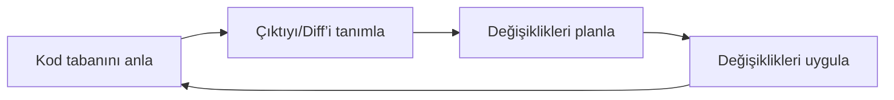

# Large Codebases
Source: https://docs.cursor.com/tr/guides/advanced/large-codebases

Cursor'da büyük kod tabanlarıyla nasıl çalışılır

Büyük kod tabanlarıyla çalışmak, küçük projelere göre bambaşka türden zorluklar getirir. Cursor’un kendi kod tabanını ölçeklerken edindiğimiz deneyimlerden ve devasa kod tabanlarını yöneten müşterilerden aldığımız içgörülerden yola çıkarak, artan karmaşıklığı yönetmeye yardımcı bazı faydalı örüntüler keşfettik.

Bu rehberde, büyük kod tabanları için faydalı bulduğumuz bazı teknikleri birlikte inceleyeceğiz.

---

← Previous: [Veri Bilimi](./veri-bilimi.md) | [Index](./index.md) | Next: [Dokümantasyonla Çalışma](./dokmantasyonla-alma.md) →