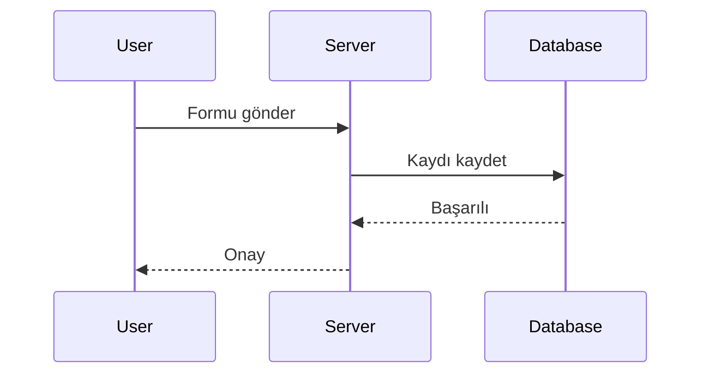
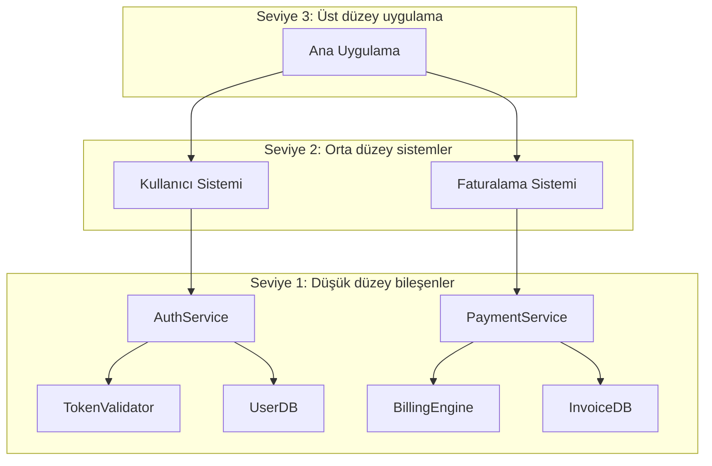

# Mimari Diyagramlar
Source: https://docs.cursor.com/tr/guides/tutorials/architectural-diagrams

Sistemin yapısını ve veri akışını görselleştirmek için Mermaid kullanarak mimari diyagramlar üretmeyi öğren

Mimari diyagramlar, sisteminin nasıl çalıştığını anlamana yardımcı olur. Mantığı keşfetmek, veriyi izlemek ve yapıyı net bir şekilde aktarmak için kullanabilirsin. Cursor, Mermaid gibi araçlarla bu diyagramları doğrudan üretmeyi destekler; böylece yalnızca birkaç prompt ile koddan görsele geçebilirsin.

<Frame>
  
</Frame>

  ## Diyagramlar neden önemli

Diyagramlar verinin nasıl aktığını ve bileşenlerin nasıl etkileştiğini netleştirir. Şu durumlarda işine yarar:

* Kod tabanında akış kontrolünü anlamak istediğinde
* Verinin girdiden çıktıya izini sürmen gerektiğinde
* Başkalarını ekibe alırken ya da sistemini belgelerken

Ayrıca hata ayıklamak ve daha akıllı sorular sormak için de harikadır. Görseller hem sana (hem de modele) büyük resmi görmende yardımcı olur.

  ## Dikkate alınacak iki boyut

Birkaç farklı açıdan düşünebilirsin:

* **Amaç**: Mantık, veri akışı, altyapı ya da başka bir şeyi mi modellemek istiyorsun?
* **Biçim**: Hızlı bir şey mi (Mermaid diyagramı gibi) yoksa daha resmi bir şey mi (UML gibi) istiyorsun?

  ## Prompt nasıl yazılır

Net bir hedefle başla. İşte sorman için bazı yaygın yollar:

* **Akış kontrolü**: "İstekler controller'dan veritabanına nasıl gidiyor, göster."
* **Veri soygeçmişi**: "Bu değişkeni girdiği yerden sonlandığı yere kadar izle."
* **Yapı**: "Bu servisin bileşen düzeyindeki görünümünü ver."

Başlangıç ve bitiş noktalarını ekleyebilir ya da Cursor'dan tüm yolu bulmasını isteyebilirsin.

  ## Mermaid ile çalışmak

Mermaid öğrenmesi kolaydır ve doğru uzantıyla Markdown içinde doğrudan render edilir. Cursor şu tür diyagramlar üretebilir:

* Mantık ve akışlar için `flowchart`
* Etkileşimler için `sequenceDiagram`
* Nesne yapısı için `classDiagram`
* Basit yönlü grafikler için `graph TD`

Diyagramları önizlemek için [Mermaid uzantısını](https://marketplace.cursorapi.com/items?itemName=bierner.markdown-mermaid) yükleyebilirsin.

1. Extensions sekmesine git
2. Mermaid'i ara
3. Yükle

<Frame>
  
</Frame>

  ## Diyagram stratejisi

Küçük başla. Her şeyi aynı anda haritalamaya çalışma.

* Tek bir fonksiyon, route veya süreç seç
* Cursor’dan o kısmı Mermaid kullanarak diyagramlamasını iste
* Birkaç tane olduğunda, bunları birleştirmesini iste

Bu, **C4 modelini** yansıtır – düşük düzeyden (kod veya bileşenler) başlayıp daha yüksek düzeyli genel görünümlere doğru ilerlersin.

  ### Önerilen akış

1. Ayrıntılı, düşük düzeyli bir diyagramla başla
2. Bunu orta düzeyli bir görünüme özetle
3. İstediğin soyutlama düzeyine ulaşana kadar tekrarla
4. Cursor’dan bunları tek bir diyagram veya sistem haritasında birleştirmesini iste

  ## Kazanımlar

* Akış, mantık ve veriyi anlamak için diyagramları kullan
* Küçük istemlerle başla ve diyagramını buradan büyüt
* Mermaid, Cursor’da çalışması en kolay format
* C4 modelinde olduğu gibi düşük seviyeden başlayıp yukarı doğru soyutla
* Cursor, diyagramları üretmene, iyileştirip geliştirmeni ve birleştirmeni kolaylaştırır

---

← Previous: [VS Code](./vs-code.md) | [Index](./index.md) | Next: [Bir MCP Sunucusu Oluşturma](./bir-mcp-sunucusu-oluturma.md) →