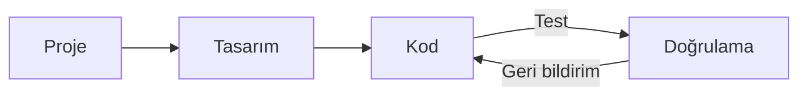

# Web Geliştirme
Source: https://docs.cursor.com/tr/guides/tutorials/web-development

Web geliştirme için Cursor’ı nasıl ayarlarsın

export const McpInstallButtonPrimary = ({server, showIcon = true, prompt = null}) => {
  const [showModal, setShowModal] = useState(false);
  const generateDeepLink = () => {
    if (!server || !server.name || !server.install) {
      return null;
    }
    try {
      if (typeof server.install === 'string') {
        return server.install;
      }
      if (server.install.url) {
        const config = {
          ...server.install
        };
        const jsonString = JSON.stringify(config);
        const utf8Bytes = new TextEncoder().encode(jsonString);
        const base64Config = btoa(Array.from(utf8Bytes).map(b => String.fromCharCode(b)).join(''));
        const safeBase64Config = base64Config.replace(/\+/g, '%2B');
        return `cursor://anysphere.cursor-deeplink/mcp/install?name=${encodeURIComponent(server.name)}&config=${encodeURIComponent(safeBase64Config)}`;
      }
      if (server.install.command) {
        let config = {
          command: server.install.command,
          ...server.install.args && ({
            args: server.install.args
          }),
          ...server.install.env && ({
            env: server.install.env
          })
        };
        if (config.command && config.args) {
          const argsString = config.args.join(" ");
          config.command = `${config.command} ${argsString}`;
          delete config.args;
        }
        const jsonString = JSON.stringify(config);
        const utf8Bytes = new TextEncoder().encode(jsonString);
        const base64Config = btoa(Array.from(utf8Bytes).map(b => String.fromCharCode(b)).join(''));
        const safeBase64Config = base64Config.replace(/\+/g, '%2B');
        return `cursor://anysphere.cursor-deeplink/mcp/install?name=${encodeURIComponent(server.name)}&config=${encodeURIComponent(safeBase64Config)}`;
      }
      return null;
    } catch (e) {
      console.error("Error generating deep link:", e);
      return null;
    }
  };
  const handleButtonClick = () => {
    setShowModal(true);
  };
  const handleClose = () => {
    setShowModal(false);
  };
  const deepLink = generateDeepLink();
  const isDocumentationOnly = typeof server?.install === 'string';
  const hasConfirmation = prompt || isDocumentationOnly;
  const InstallModal = ({isOpen, onClose, deepLink, server, children}) => {
    useEffect(() => {
      const handleKeyDown = event => {
        if (event.key === 'Escape') {
          onClose();
        }
      };
      if (isOpen) {
        document.addEventListener('keydown', handleKeyDown);
      }
      return () => {
        document.removeEventListener('keydown', handleKeyDown);
      };
    }, [isOpen, onClose]);
    if (!isOpen) return null;
    return <div className="fixed inset-0 bg-black bg-opacity-50 flex items-center justify-center z-50 transition-opacity duration-200" onClick={onClose}>
        <div className="bg-white dark:bg-neutral-900 rounded-lg p-6 max-w-md w-full mx-4 border border-neutral-200 dark:border-neutral-700 transition-all duration-200 transform" onClick={e => e.stopPropagation()}>
          <div className="mb-4">
            <h3 className="text-lg font-semibold text-black dark:text-white mb-2">
              Install {server?.name}
            </h3>
            <div className="text-neutral-600 dark:text-neutral-400">
              {children}
            </div>
          </div>
          <div className="flex gap-3 justify-end">
            <button onClick={onClose} className="px-4 py-2 text-sm font-medium rounded-lg transition-colors duration-200 text-neutral-600 dark:text-neutral-400 hover:text-black dark:hover:text-white border border-neutral-200 dark:border-neutral-700 hover:bg-neutral-100 dark:hover:bg-neutral-800">
              Cancel
            </button>
            <a href={deepLink} onClick={onClose} target="_blank" className="px-4 py-2 text-sm font-medium rounded-lg transition-colors duration-200 bg-black text-white hover:bg-neutral-800 dark:bg-white dark:text-black dark:hover:bg-neutral-200 inline-flex items-center justify-center no-underline">
              Continue
            </a>
          </div>
        </div>
      </div>;
  };
  return <>
      {hasConfirmation ? <button onClick={handleButtonClick} className="inline-flex justify-center items-center gap-2 px-4 py-2 text-sm font-medium rounded-lg transition-colors duration-200 not-prose text-white bg-black hover:bg-neutral-800 dark:bg-white dark:text-black dark:hover:bg-neutral-200 border border-black dark:border-white">
          {showIcon && <Icon icon="plus" size={16} color="currentColor" />}
          Add to Cursor
        </button> : <a href={deepLink} className="inline-flex justify-center items-center gap-2 px-4 py-2 text-sm font-medium rounded-lg transition-colors duration-200 not-prose text-white bg-black hover:bg-neutral-800 dark:bg-white dark:text-black dark:hover:bg-neutral-200 border border-black dark:border-white">
          {showIcon && <Icon icon="plus" size={16} color="currentColor" />}
          Add to Cursor
        </a>}

      {hasConfirmation && <InstallModal isOpen={showModal} onClose={handleClose} deepLink={deepLink} server={server}>
          {prompt}
        </InstallModal>}
    </>;
};

Web geliştirme, Cursor ile Figma ya da tarayıcı gibi harici araçlar arasında hızlı yinelemeler ve sıkı geri bildirim döngülerine dayanır. Cursor’da bu döngüyü daha da sıkılaştıran iş akışları bulduk. Görev kapsamını net tutmak, bileşenleri yeniden kullanmak ve tasarım sistemlerinden yararlanmak işleri hızlı ve tutarlı kılar.

Bu kılavuz, web geliştirmeyi desteklemek ve geri bildirim döngüsünü sıkılaştırmak için Cursor’ı nasıl kuracağını anlatır.



<div id="start-orchestrating-in-cursor">
  # Cursor'da orkestrasyona başla
</div>

**Chat**, değişiklikleri başlatmak için harika. Ana parçalar yerine oturduğunda, **Inline Edit** ve **Tab**'e geçmek akışını korumana yardımcı olur.

Cursor'ı kurduktan sonra farklı araçlar arasında iş akışlarını orkestre edebileceksin. Aşağıda nelerin mümkün olduğuna dair bir demo var: Linear, Figma ve tarayıcı araçlarını bir araya getirerek oluşturulmuş bir yılan oyunu. Gerçek dünyadaki projeler genelde daha karmaşık olsa da, bu örnek bu entegre iş akışlarının potansiyelini ortaya koyuyor.

<Frame>
  <video src="https://mintcdn.com/cursor/E7JVsKUF5L-IiJRB/images/guides/tutorials/web-development/snake.mp4?fit=max&auto=format&n=E7JVsKUF5L-IiJRB&q=85&s=e029fbdff2ec06e1e4393ac580824b5a" controls data-path="images/guides/tutorials/web-development/snake.mp4" />
</Frame>

<div id="connect-to-your-project-management-tools">
  # Proje yönetim araçlarına bağlan
</div>

Cursor'ı farklı araçlar üzerinden mevcut proje yönetimi yazılımına entegre edebilirsin. Bu kılavuzda, Linear'ı MCP sunucusuyla entegre etmeyi inceleyeceğiz.

<div id="installation">
  ### Kurulum
</div>

<McpInstallButtonPrimary
  server={{
name: "Linear",
install: {
command: "npx",
args: ["-y", "mcp-remote", "https://mcp.linear.app/sse"],
},
}}
/>

Ya da Linear MCP sunucusunu `mcp.json` dosyasına elle ekle:

```jsx  theme={null}
{
  "mcpServers": {
    "Linear": {
      "command": "npx",
      "args": [
        "-y",
        "mcp-remote",
        "https://mcp.linear.app/sse"
      ]
    }
  }
}
```

Ardından:

1. MCP ayarlarından Linear'ı etkinleştirdiğinden emin ol
2. Bir web tarayıcısı açılacak ve Linear ile yetkilendirmen istenecek
   <Info>
     MCP'nin mevcut durumu nedeniyle kurulum birden fazla deneme gerektirebilir.
     Entegrasyon çalışmıyorsa, Cursor ayarlarından sunucuyu “Reload” etmeyi dene.
   </Info>

### Cursor'da Linear kullanma

Linear MCP sunucuları, Cursor'ın sorunları okumak ve yönetmek için kullanabileceği farklı araçlar sunar. Tüm araçların listesini görmek için MCP ayarlarına git ve Linear sunucusunu bul. Doğrulamak için, Chat'te şu istemi dene:

```jsx  theme={null}
bu projeyle ilgili tüm issue’ları listele
```

<Frame>
  
</Frame>

Entegrasyon doğru şekilde kurulduysa bir sorun listesi döndürmesi gerekir.

<div id="bring-in-your-figma-designs">
  # Figma tasarımlarını içeri aktar
</div>

Tasarım ve maketler (mockup’lar) web geliştirmede temel unsurlardır. Resmi Figma MCP sunucusunu kullanarak tasarım dosyalarına Cursor içinde doğrudan erişebilir ve onlarla çalışabilirsin. Başlamak için [Figma Dev Mode MCP Server](https://help.figma.com/hc/en-us/articles/32132100833559-Guide-to-the-Dev-Mode-MCP-Server) sayfasındaki kurulum talimatlarını izle.

<div id="installation">
  ### Kurulum
</div>

MCP sunucusunu yüklemek için aşağıdaki butona tıklayabilirsin.

<McpInstallButtonPrimary
  server={{
name: "Figma",
install: {
url: "http://127.0.0.1:3845/sse",
},
}}
/>

Ya da `mcp.json` dosyana el ile ekle:

```jsx  theme={null}
{
  "mcpServers": {
    "Figma": {
      "url": "http://127.0.0.1:3845/sse"
    }
  }
}
```

<div id="usage">
  ### Kullanım
</div>

Sunucu, istemlerinde kullanabileceğin birden çok aracı ortaya çıkarır. Örneğin, Figma’daki mevcut seçimin tasarımlarını isteyerek sor. Daha fazlasını [dokümantasyonda](https://help.figma.com/hc/en-us/articles/32132100833559-Guide-to-the-Dev-Mode-MCP-Server) oku.

<Frame>
  
</Frame>

<div id="keep-your-code-scaffolding-consistent">
  # Kod iskeletini tutarlı tut
</div>

Muhtemelen yeniden kullanmak istediğin mevcut kodun, bir tasarım sistemin ya da yerleşik konvansiyonların vardır. Modellerle çalışırken, kod tabanında hâlihazırda bulunan açılır menüler ya da diğer yaygın bileşenler gibi örüntülere atıfta bulunmak faydalı olur.

Biz de büyük, web tabanlı bir kod tabanında çalışırken deklaratif kodun özellikle iyi işlediğini, özellikle de React ve JSX için çok uygun olduğunu gördük.

Bir tasarım sistemin varsa, buna yönelik bir kural sağlayarak ajanın bunu keşfetmesine yardımcı olabilirsin. İşte, mümkün olduğunda bileşenlerin yeniden kullanımını dayatmaya çalıştığımız bir `ui-components.mdc` dosyası:

```mdc components.mdc theme={null}
---
description: Tasarımları hayata geçirmek ve arayüz (UI) oluşturmak
---
- `/src/components/ui` içindeki mevcut UI bileşenlerini yeniden kullan. bunlar üzerine inşa edebileceğimiz temel yapı taşları
- problemi çözen mevcut bir bileşen bulamazsan, UI bileşenlerini bir araya getirerek yeni bileşenler oluştur
- eksik bileşenler ve tasarımlar varsa, nasıl ilerlemek istediğini insana sor
```

Bileşen kitaplığın büyüdükçe, buna uygun şekilde yeni kurallar ekle. Kurallar çok fazla olduğunda, bunları “yalnızca kullanıcı girdileriyle çalışırken uygula” gibi daha spesifik kategorilere ayırmayı düşün.

<Frame>
  
</Frame>

<div id="give-cursor-access-to-browser">
  # Cursor'a tarayıcı erişimi ver
</div>

Cursor’ın yeteneklerini genişletmek için, konsol günlüklerine ve ağ isteklerine erişim sağlayan Browser Tools MCP sunucusunu kurabilirsin. Yapılandırdıktan sonra, konsol çıktısını ve ağ etkinliğini izleyerek yaptığın değişiklikleri doğrulayabilirsin. Bu kurulum, uygulamanın niyetinle uyumlu olduğundan emin olmana yardımcı olur. MCP sunucusunu kurmak için şu talimatları izle: [https://browsertools.agentdesk.ai/installation](https://browsertools.agentdesk.ai/installation)

<Frame>
  
</Frame>

<Note>
  Bunu Cursor’a yerleşik olarak entegre etmeyi daha kolay hale getirmek için çalışıyoruz.
</Note>

<div id="takeaways">
  # Çıkarımlar
</div>

* Web geliştirmede sıkı geri bildirim döngüleri kritik. Hızlı ilerlemek ve akışta kalmak için Cursor’ı Figma, Linear ve tarayıcı gibi araçlarla birlikte kullan.
* MCP sunucuları, harici sistemleri doğrudan Cursor’a entegre etmene izin verir; bağlam değiştirmeyi azaltır ve görev yürütmeyi iyileştirir.
* Bileşenleri ve tasarım sistemlerini yeniden kullanmak, modelin daha temiz ve daha tutarlı kod ve çıktılar üretmesine yardımcı olur.
* Net, kapsamı belirlenmiş görevler daha iyi sonuç verir. Ne istediğini ve nasıl yönlendirdiğini bilinçli yap.
* İyi çıktılar alamıyorsan, şunları ayarlamayı dene:
  * **Talimatlar:** Kurallar kullan, istemler yaz ve ör. MCP sunucularıyla daha fazla bağlama erişim ver.
  * **Sistemler:** Kalıplar, soyutlamalar ve açıklık; modelin anlamasını, yardımcı olmasını ve daha özerk çalışmasını kolaylaştırır.
* Çalışma zamanı bilgilerini (konsol log’ları, ağ istekleri ve UI öğe verileri gibi) ekleyerek modelin bağlamını genişletebilirsin.
* Her şeyin otomatikleştirilmesine gerek yok. Sistem çok karmaşıklaşırsa, Tab ve Inline Edit ile daha cerrahi düzenlemelere geri dön.
* Cursor en güçlü halini yardımcı pilotken gösterir, otomatik pilotken değil. Kendi karar verme sürecini değiştirmek yerine geliştirmek için kullan.

---

← Previous: [Bir MCP Sunucusu Oluşturma](./bir-mcp-sunucusu-oluturma.md) | [Index](./index.md) | Next: [Bağlamla Çalışmak](./balamla-almak.md) →