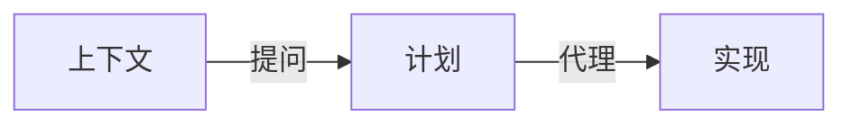
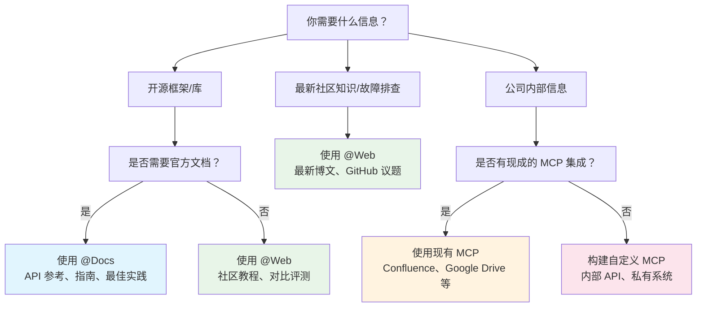
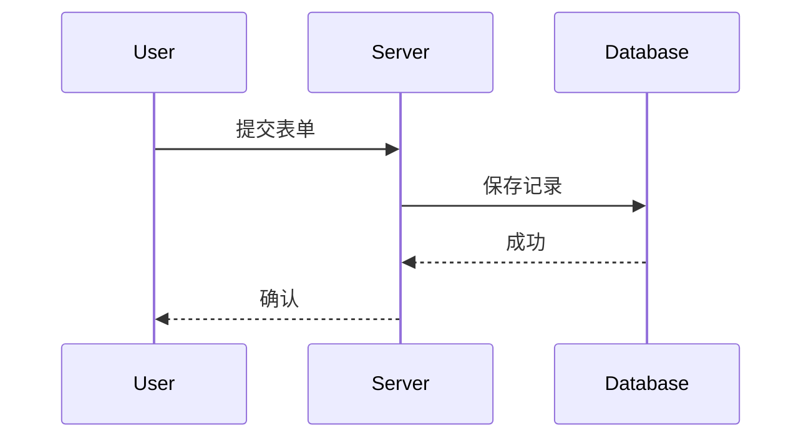
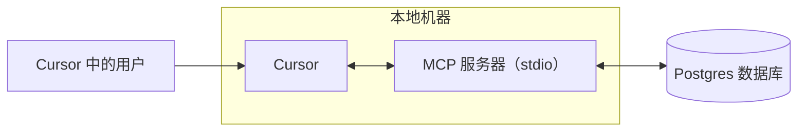
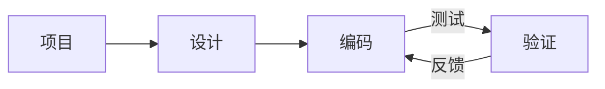
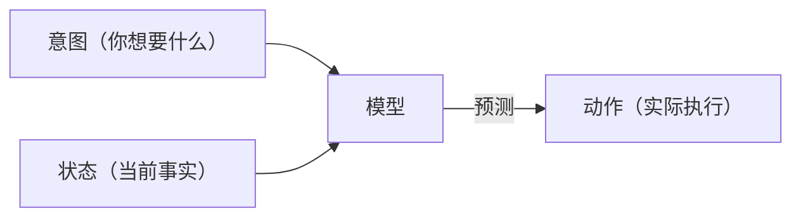

# Cursor Documentation (Chinese)

This is the complete formatted documentation for Cursor in Chinese, parsed and organized from the official documentation.

**Total Sections:** 112

---


# 代理安全
Source: https://docs.cursor.com/zh/account/agent-security

使用 Cursor Agent 的安全注意事项

提示注入、AI 幻觉等问题可能会让 AI 出现出乎意料、甚至潜在恶意的行为。我们正从更底层持续应对提示注入，但在 Cursor 的产品里，当前的主要防护是对代理可执行的操作设置护栏，包括默认对敏感操作要求手动批准。本文档旨在说明这些护栏，以及你可以期待它们做到什么。

以下所有控制与行为均为我们的默认且推荐设置。

<div id="first-party-tool-calls">
  ## 第一方工具调用
</div>

Cursor 内置了一些工具，能让 agent 帮你写代码。这些工具包括读取文件、编辑、调用终端命令、上网查文档等。

读取类工具不需要批准（比如读取文件、跨代码库搜索）。你可以用 [.cursorignore](/zh/context/ignore-files) 完全阻止 agent 访问特定文件；除此之外，读取一般无需批准。对存在敏感数据外泄风险的操作，我们要求明确批准。

在当前工作区内修改文件通常不需要明确批准，但有一些例外。agent 对文件的更改会立刻写入磁盘。我们建议在受版本控制的工作区中使用 Cursor，这样可以随时回滚文件内容。对于会修改我们 IDE/CLI 配置的文件（例如编辑器的工作区设置文件），在变更前我们要求明确批准。另外，如果启用了文件变更自动重载，需要注意，agent 的修改可能会在你审阅之前触发自动执行。

任何由 agent 建议的终端命令默认都需要批准。我们建议你在执行前审查每条命令。愿意承担风险的用户可以选择允许 agent 无需批准执行所有命令。Cursor 提供了一个 [allowlist](/zh/agent/tools) 功能，但它不属于安全控制。有些用户会允许特定命令，但这只是尽力而为的机制，可能存在被绕过的情况。我们不建议使用“Run Everything”，它会绕过任何已配置的 allowlist。

<div id="third-party-tool-calls">
  ## 第三方工具调用
</div>

Cursor 支持通过 [MCP](/zh/context/mcp) 连接外部工具。所有第三方 MCP 连接都必须由用户明确批准。用户一旦批准某个 MCP，默认情况下，Agent Mode 中每个外部 MCP 集成所建议的每一次工具调用，在执行前都必须再次得到明确批准。

<div id="network-requests">
  ## 网络请求
</div>

攻击者可能会利用网络请求窃取数据。我们目前只允许第一方工具对极少数主机（如 GitHub）发起网络请求、进行显式链接检索，以及使用有限的提供商进行网页搜索；除此之外均不支持。默认设置会阻止代理发起任意网络请求。

<div id="workspace-trust">
  ## 工作区信任
</div>

Cursor IDE 支持标准的 [workspace trust](https://code.visualstudio.com/docs/editing/workspaces/workspace-trust) 功能，默认是「已禁用」。打开新工作区时，工作区信任会提示你选择正常模式或受限模式。受限模式会导致 AI 等你常用的 Cursor 功能无法正常工作。对于不信任的代码仓库，建议使用其他工具，例如基础文本编辑器。

你可以按以下步骤在用户设置中启用工作区信任：

1. 打开你的 user settings.json 文件
2. 添加以下配置：
   ```json  theme={null}
   "security.workspace.trust.enabled": true
   ```

也可以通过移动设备管理（MDM）方案在组织范围内强制启用此设置。

<div id="responsible-disclosure">
  ## 负责任披露
</div>

如果你认为在 Cursor 中发现了安全漏洞，请按照我们 GitHub 安全页面上的指南在那里提交报告。无法使用 GitHub 的话，也可以发邮件到 [security@cursor.com](mailto:security@cursor.com) 联系我们。

我们承诺在 5 个工作日内确认收到漏洞报告，并会尽快处理。处理结果将以安全公告的形式发布在我们的 GitHub 安全页面。对于严重事件，我们会同时在 GitHub 安全页面发布公告，并向所有用户发送邮件通知。

---


# Billing
Source: https://docs.cursor.com/zh/account/billing

管理 Cursor 订阅、退款和发票

<div id="how-do-i-access-billing-settings">
  ### 怎么进入结算设置？
</div>

通过 [Dashboard](https://cursor.com/dashboard) 打开结算门户，在 Dashboard 里点击“Billing”。这会打开一个用于所有结算任务的安全门户。

<div id="what-are-cursors-billing-cycles">
  ### Cursor 的结算周期是怎样的？
</div>

结算周期按月或按年，从订阅日开始计算。Teams 账户按席位计费，并对新增成员进行按比例计费。

<div id="how-do-seats-work-for-teams-accounts">
  ### Teams 账户的席位如何计费？
</div>

Teams 账户按席位收费（每位团队成员一个席位）。在周期中途添加成员时，只会为其剩余时间收费。若成员已使用过任何额度并被移除，其席位会保留到本结算周期结束——不提供按比例退款。团队管理员可通过 dashboard 管理席位。

<div id="can-i-switch-between-monthly-and-annual-billing">
  ### 我可以在月付和年付之间切换吗？
</div>

可以！步骤如下：

**Pro 方案**

1. 前往 Cursor [dashboard](https://cursor.com/dashboard)
2. 在左侧边栏点击“Billing and Invoices”进入结算页面
3. 点击“Manage subscription”
4. 点击“Update subscription”
5. 选择“Yearly”或“Monthly”，然后点击“Continue”

**Teams 方案**

1. 前往 Cursor [dashboard](https://cursor.com/dashboard)
2. 在左侧边栏点击“Billing and Invoices”进入结算页面
3. 点击“Upgrade Now”按钮切换到年付

<Note>
  只能自行从月付切换到年付。若要从年付切换到月付，请通过
  [hi@cursor.com](mailto:hi@cursor.com) 联系我们。
</Note>

<div id="where-can-i-find-my-invoices">
  ### 哪里能找到我的发票？
</div>

在结算门户可查看全部结算历史。支持查看并下载当前和历史发票。

<div id="can-i-get-invoices-automatically-emailed-to-me">
  ### 可以自动把发票通过邮件发送给我吗？
</div>

目前需要在结算门户手动下载发票。我们正在开发发票自动邮件功能，上线后你可以选择开启。

<div id="how-do-i-update-my-billing-information">
  ### 怎么更新我的结算信息？
</div>

通过结算门户更新支付方式、公司名称、地址和税务信息。我们使用 Stripe 保障交易安全。变更只影响后续发票，历史发票无法修改。

<div id="how-do-i-cancel-my-subscription">
  ### 怎么取消我的订阅？
</div>

在 Billing and Invoices 页面点击“Manage Subscription”，然后点击“Cancel subscription”取消订阅。取消后可继续使用到当前结算周期结束。

<div id="im-having-other-billing-issues-how-can-i-get-help">
  ### 我还有其他结算问题，如何获取帮助？
</div>

对于此处未涵盖的结算问题，请使用与你账户关联的邮箱发送邮件至 [hi@cursor.com](mailto:hi@cursor.com)。请附上你的账户信息和问题描述。

---


# 定价
Source: https://docs.cursor.com/zh/account/pricing

Cursor 的方案与定价

你可以免费试用 Cursor，或购买个人版或团队版。

<div id="individual">
  ## 个人
</div>

所有个人方案包含：

* 无限次 Tab 补全
* 对所有模型的扩展代理（Agent）使用上限
* 可使用 Bugbot
* 可使用后台代理（Background Agents）

每个方案都按模型推理的 [API 价格](/zh/models#model-pricing)计费其用量：

* Pro 含 \$20 的 API 代理用量 + 额外奖励用量
* Pro Plus 含 \$70 的 API 代理用量 + 额外奖励用量
* Ultra 含 \$400 的 API 代理用量 + 额外奖励用量

我们会努力在保证包含用量之外赠送额外奖励容量。由于不同模型的 API 成本不同，你选择的模型会影响 token 输出以及包含用量的消耗速度。你可以在[你的仪表盘](https://cursor.com/dashboard?tab=usage)查看用量和 token 明细。编辑器里也会常规显示限额通知。


<div id="how-much-usage-do-i-need">
  ### 我需要大概多少用量？
</div>

根据我们的用量数据，你可以参考以下用量水平：

* **每日使用 Tab 的用户**：基本都能控制在 \$20 以内
* **偶尔用 Agent 的用户**：通常不超出包含的 \$20
* **每天用 Agent 的用户**：一般每月总用量 $60–$100
* **重度用户（多个 agent/自动化）**：通常每月总用量 \$200 起

根据我们的用量数据，对*中位数用户*来说，额度大致相当于：

* Pro：约 225 次 Sonnet 4 请求、约 550 次 Gemini 请求，或约 500 次 GPT 5 请求
* Pro+：约 675 次 Sonnet 4 请求、约 1,650 次 Gemini 请求，或约 1,500 次 GPT 5 请求
* Ultra：约 4,500 次 Sonnet 4 请求、约 11,000 次 Gemini 请求，或约 10,000 次 GPT 5 请求

<div id="what-happens-when-i-reach-my-limit">
  ### 达到限额后会怎样？
</div>

当你超出每月包含的用量时，编辑器会提醒你，你可以选择：

* **添加按需用量**：按使用量付费，按照相同的 API 费率继续使用 Cursor
* **升级套餐**：升到更高档位，获得更多包含用量

按需用量按月结算，费率与包含用量相同。请求的质量和速度绝不会被降级。

<div id="teams">
  ## Teams
</div>

有两种 Teams 方案：Teams（\$40/用户/月）和 Enterprise（自定义）。

Teams 方案提供的附加功能包括：

* 强制开启隐私模式（Privacy Mode）
* 带使用统计的管理面板（Admin Dashboard）
* 团队统一计费
* 基于 SAML/OIDC 的单点登录（SSO）

如果你更喜欢自助使用，推荐选 Teams。需要优先支持、共享用量、发票结算、SCIM 或更高级安全控制的，推荐使用[Enterprise](/zh/contact-sales)。

了解更多[Teams 定价](/zh/account/teams/pricing)。

<div id="auto">
  ## Auto
</div>

启用 Auto 后，Cursor 会根据当前需求选择最适合当下任务、且在当下负载下可靠性最高的高端模型。该功能可检测到输出性能退化，并自动切换模型加以解决。

<Frame>
  
</Frame>

<Note>我们在 Auto 的质量和整体性能上投入很大。自 9 月 15 日之后的下一次账单续期起，Auto 将按以下 API 费率计费。</Note>

* **Input + Cache Write**：每 1M tokens 收费 \$1.25
* **Output**：每 1M tokens 收费 \$6.00
* **Cache Read**：每 1M tokens 收费 \$0.25

编辑器和控制台都会显示你的用量（包括 Auto）。如果更倾向于直接选择某个模型，用量将按该模型的公开 API 价格计费。

<div id="max-mode">
  ## Max 模式
</div>

部分模型支持 [Max 模式](/zh/models#max-mode)，可启用更长的推理过程，并将上下文窗口扩展至最多 1M 个 token。虽然大多数编码任务不需要 Max 模式，但在处理更复杂的查询，尤其是大型文件或代码库时，它会很有帮助。启用 Max 模式会消耗更多用量。你可以在 [你的控制台](https://cursor.com/dashboard?tab=usage) 查看所有请求与 token 使用明细。

<div id="bugbot">
  ## Bugbot
</div>

Bugbot 是与 Cursor 订阅分开的独立产品，并有自己的定价方案。

* **Pro**（\$40/月）：对每月最多 200 个 PR 提供不限次数审查、无限访问 Cursor Ask、与 Cursor 集成以修复 bug，并可使用 Bugbot Rules
* **Teams**（\$40/用户/月）：对所有 PR 提供不限次数的代码审查、无限访问 Cursor Ask、团队用量共享，以及高级规则和设置
* **Enterprise**（自定义）：包含 Teams 的全部功能，外加高级分析与报告、优先支持和账户管理

了解更多 [Bugbot 定价](https://cursor.com/bugbot#pricing)。

<div id="background-agent">
  ## 后台代理
</div>

后台代理按所选的[模型](/zh/models)的 API 定价计费。首次使用后台代理时，会提示你设置支出上限。

<Info>
  后台代理的虚拟机（VM）计算费用将于日后公布。
</Info>

---


# Admin API
Source: https://docs.cursor.com/zh/account/teams/admin-api

通过 API 访问团队指标、使用数据和支出信息

Admin API 让你以编程方式访问团队数据，包括成员信息、使用指标和支出详情。你可以构建自定义仪表盘、监控工具，或与现有工作流集成。

<Note>
  该 API 为首个发布版本。我们会根据反馈逐步扩展功能——告诉我们你需要哪些端点！
</Note>

<div id="authentication">
  ## 身份验证
</div>

所有 API 请求都需要使用 API 密钥进行身份验证。只有团队管理员可以创建和管理 API 密钥。

API 密钥与组织绑定，对所有管理员可见，且不受原始创建者账号状态影响。

<div id="creating-an-api-key">
  ### 创建 API Key
</div>

1. 前往 **cursor.com/dashboard** → **Settings** 标签页 → **Cursor Admin API Keys**
2. 点击 **Create New API Key**
3. 给密钥起个清晰易懂的名字（例如：“Usage Dashboard Integration”）
4. 立刻复制生成的密钥——之后将无法再次查看

格式：`key_xxxxxxxxxxxxxxxxxxxxxxxxxxxxxxxxxxxxxxxxxxxxxxxxxxxxxxxxxxxxxxxx`

<div id="using-your-api-key">
  ### 使用你的 API 密钥
</div>

在基本身份验证中，将你的 API 密钥作为用户名：

**使用 curl 进行基本身份验证：**

```bash  theme={null}
curl https://api.cursor.com/{route} -u API_KEY:
```

**或者直接设置 Authorization 标头：**

```bash  theme={null}
Authorization: Basic {base64_encode('API_KEY:')}
```

<div id="base-url">
  ## 基础 URL
</div>

所有 API 端点都使用：

```
https://api.cursor.com
```

<div id="endpoints">
  ## 端点
</div>

<div id="get-team-members">
  ### 获取团队成员
</div>

获取所有团队成员及其详细信息。

```
GET /teams/members
```

#### 响应

返回一个团队成员对象的数组：

```typescript  theme={null}
{
  teamMembers: {
    name: string;
    email: string;
    role: '拥有者' | '成员' | '免费拥有者';
  }[];
}
```

<div id="example-responses">
  #### 示例回复
</div>

```json  theme={null}
{
  "teamMembers": [
    {
      "name": "Alex",
      "email": "developer@company.com",
      "role": "成员"
    },
    {
      "name": "Sam",
      "email": "admin@company.com",
      "role": "拥有者"
    }
  ]
}

```

<div id="example-requests">
  #### 示例请求
</div>

```bash  theme={null}
curl -X GET https://api.cursor.com/teams/members \
  -u 你的API密钥：
```

<div id="get-daily-usage-data">
  ### 获取每日用量数据
</div>

在指定日期范围内获取你团队的每日用量指标，了解代码编辑、AI 协作使用情况与接受率等详细洞察。

```
POST /teams/daily-usage-data
```

#### 请求体

<div className="full-width-table">
  | 参数          | 类型     | 必填 | 描述             |
  | :---------- | :----- | :- | :------------- |
  | `startDate` | number | 是  | 起始日期（Epoch 毫秒） |
  | `endDate`   | number | 是  | 结束日期（Epoch 毫秒） |
</div>

<Note>
  日期范围不能超过 90 天。更长的时间段请分多次发起请求。
</Note>

#### 返回

```typescript  theme={null}
{
  data: {
    date: number;
    isActive: boolean;
    totalLinesAdded: number;
    totalLinesDeleted: number;
    acceptedLinesAdded: number;
    acceptedLinesDeleted: number;
    totalApplies: number;
    totalAccepts: number;
    totalRejects: number;
    totalTabsShown: number;
    totalTabsAccepted: number;
    composerRequests: number;
    chatRequests: number;
    agentRequests: number;
    cmdkUsages: number;
    subscriptionIncludedReqs: number;
    apiKeyReqs: number;
    usageBasedReqs: number;
    bugbotUsages: number;
    mostUsedModel: string;
    applyMostUsedExtension?: string;
    tabMostUsedExtension?: string;
    clientVersion?: string;
    email?: string;
  }[];
  period: {
    startDate: number;
    endDate: number;
  };
}
```

<div id="response-fields">
  #### 响应字段
</div>

<div className="full-width-table">
  | 字段                         | 描述                |
  | :------------------------- | :---------------- |
  | `date`                     | 以 epoch 毫秒表示的日期   |
  | `isActive`                 | 该日用户是否活跃          |
  | `totalLinesAdded`          | 新增代码行数            |
  | `totalLinesDeleted`        | 删除代码行数            |
  | `acceptedLinesAdded`       | 来自已接受 AI 建议的新增行数  |
  | `acceptedLinesDeleted`     | 来自已接受 AI 建议的删除行数  |
  | `totalApplies`             | Apply 操作次数        |
  | `totalAccepts`             | 接受的建议数            |
  | `totalRejects`             | 拒绝的建议数            |
  | `totalTabsShown`           | 显示的 Tab 补全次数      |
  | `totalTabsAccepted`        | 接受的 Tab 补全次数      |
  | `composerRequests`         | Composer 请求数      |
  | `chatRequests`             | Chat 请求数          |
  | `agentRequests`            | Agent 请求数         |
  | `cmdkUsages`               | 命令面板（Cmd+K）使用次数   |
  | `subscriptionIncludedReqs` | 订阅内请求数            |
  | `apiKeyReqs`               | API Key 请求数       |
  | `usageBasedReqs`           | 按用量计费请求数          |
  | `bugbotUsages`             | Bug 检测使用次数        |
  | `mostUsedModel`            | 最常用的 AI 模型        |
  | `applyMostUsedExtension`   | Apply 使用最频繁的文件扩展名 |
  | `tabMostUsedExtension`     | Tab 使用最频繁的文件扩展名   |
  | `clientVersion`            | Cursor 版本         |
  | `email`                    | 用户邮箱              |
</div>

<div id="example-responses">
  #### 示例回复
</div>

```json  theme={null}
{
  "data": [
    {
      "date": 1710720000000,
      "isActive": true,
      "totalLinesAdded": 1543,
      "totalLinesDeleted": 892,
      "acceptedLinesAdded": 1102,
      "acceptedLinesDeleted": 645,
      "totalApplies": 87,
      "totalAccepts": 73,
      "totalRejects": 14,
      "totalTabsShown": 342,
      "totalTabsAccepted": 289,
      "composerRequests": 45,
      "chatRequests": 128,
      "agentRequests": 12,
      "cmdkUsages": 67,
      "subscriptionIncludedReqs": 180,
      "apiKeyReqs": 0,
      "usageBasedReqs": 5,
      "bugbotUsages": 3,
      "mostUsedModel": "gpt-4",
      "applyMostUsedExtension": ".tsx",
      "tabMostUsedExtension": ".ts",
      "clientVersion": "0.25.1",
      "email": "developer@company.com"
    },
    {
      "date": 1710806400000,
      "isActive": true,
      "totalLinesAdded": 2104,
      "totalLinesDeleted": 1203,
      "acceptedLinesAdded": 1876,
      "acceptedLinesDeleted": 987,
      "totalApplies": 102,
      "totalAccepts": 91,
      "totalRejects": 11,
      "totalTabsShown": 456,
      "totalTabsAccepted": 398,
      "composerRequests": 67,
      "chatRequests": 156,
      "agentRequests": 23,
      "cmdkUsages": 89,
      "subscriptionIncludedReqs": 320,
      "apiKeyReqs": 15,
      "usageBasedReqs": 0,
      "bugbotUsages": 5,
      "mostUsedModel": "claude-3-opus",
      "applyMostUsedExtension": ".py",
      "tabMostUsedExtension": ".py",
      "clientVersion": "0.25.1",
      "email": "developer@company.com"
    }
  ],
  "period": {
    "startDate": 1710720000000,
    "endDate": 1710892800000
  }
}
```

<div id="example-requests">
  #### 示例请求
</div>

```bash  theme={null}
curl -X POST https://api.cursor.com/teams/daily-usage-data \
  -u 你的_API_KEY: \
  -H "Content-Type: application/json" \
  -d '{
    "startDate": 1710720000000,
    "endDate": 1710892800000
  }'
```

<div id="get-spending-data">
  ### 获取支出数据
</div>

支持通过搜索、排序和分页检索本日历月的支出信息。

```
POST /teams/spend
```

#### 请求体

<div className="full-width-table">
  | 参数              | 类型     | 必填 | 描述                                     |
  | :-------------- | :----- | :- | :------------------------------------- |
  | `searchTerm`    | string | 否  | 在用户名和邮箱中搜索                             |
  | `sortBy`        | string | 否  | 排序字段：`amount`、`date`、`user`。默认值：`date` |
  | `sortDirection` | string | 否  | 排序方向：`asc`、`desc`。默认值：`desc`           |
  | `page`          | number | 否  | 页码（从 1 开始）。默认值：`1`                     |
  | `pageSize`      | number | 否  | 每页结果数                                  |
</div>

#### 返回

```typescript  theme={null}
{
  teamMemberSpend: {
    spendCents: number;
    fastPremiumRequests: number;
    name: string;
    email: string;
    role: 'owner' | 'member' | 'free-owner';
    hardLimitOverrideDollars: number;
  }[];
  subscriptionCycleStart: number;
  totalMembers: number;
  totalPages: number;
}
```

<div id="response-fields">
  #### 响应字段
</div>

<div className="full-width-table">
  | 字段                         | 描述                 |
  | :------------------------- | :----------------- |
  | `spendCents`               | 总花费（单位：美分）         |
  | `fastPremiumRequests`      | Fast 高级模型请求数       |
  | `name`                     | 成员名称               |
  | `email`                    | 成员邮箱               |
  | `role`                     | 团队角色               |
  | `hardLimitOverrideDollars` | 自定义支出上限（美元）        |
  | `subscriptionCycleStart`   | 订阅周期起始时间（Epoch 毫秒） |
  | `totalMembers`             | 团队成员总数             |
  | `totalPages`               | 总页数                |
</div>

<div id="example-responses">
  #### 示例回复
</div>

```json  theme={null}
{
  "teamMemberSpend": [
    {
      "spendCents": 2450,
      "fastPremiumRequests": 1250,
      "name": "Alex",
      "email": "developer@company.com",
      "role": "member",
      "hardLimitOverrideDollars": 100
    },
    {
      "spendCents": 1875,
      "fastPremiumRequests": 980,
      "name": "Sam",
      "email": "admin@company.com",
      "role": "owner",
      "hardLimitOverrideDollars": 0
    },
  ],
  "subscriptionCycleStart": 1708992000000,
  "totalMembers": 15,
  "totalPages": 1
}
```

<div id="example-requests">
  #### 示例请求
</div>

**基础消费数据：**

```bash  theme={null}
curl -X POST https://api.cursor.com/teams/spend \
  -u YOUR_API_KEY: \
  -H "Content-Type: application/json" \
  -d '{}'
```

**分页搜索指定用户：**

```bash  theme={null}
curl -X POST https://api.cursor.com/teams/spend \
  -u YOUR_API_KEY: \
  -H "Content-Type: application/json" \
  -d '{
    "searchTerm": "alex@company.com",
    "page": 2,
    "pageSize": 25
  }'
```

<div id="get-usage-events-data">
  ### 获取使用事件数据
</div>

通过完整的筛选、搜索和分页选项，为你的团队获取详细的使用事件数据。这个端点提供关于单次 API 调用、模型使用、令牌（token）消耗和成本的细粒度洞察。

```
POST /teams/filtered-usage-events
```

#### 请求体

<div className="full-width-table">
  | 参数          | 类型     | 必填 | 描述                 |
  | :---------- | :----- | :- | :----------------- |
  | `startDate` | number | 否  | 起始日期（epoch 毫秒）     |
  | `endDate`   | number | 否  | 结束日期（epoch 毫秒）     |
  | `userId`    | number | 否  | 按指定用户 ID 过滤        |
  | `page`      | number | 否  | 页码（从 1 开始）。默认值：`1` |
  | `pageSize`  | number | 否  | 每页返回数量。默认值：`10`    |
  | `email`     | string | 否  | 按用户邮箱地址过滤          |
</div>

#### 返回

```typescript  theme={null}
{
  totalUsageEventsCount: number; // 使用事件总数
  pagination: {
    numPages: number; // 总页数
    currentPage: number; // 当前页
    pageSize: number; // 每页大小
    hasNextPage: boolean; // 是否有下一页
    hasPreviousPage: boolean; // 是否有上一页
  };
  usageEvents: {
    timestamp: string; // 时间戳
    model: string; // 模型
    kind: string; // 类型
    maxMode: boolean; // 是否为最大模式
    requestsCosts: number; // 请求成本
    isTokenBasedCall: boolean; // 是否为按 Token 计费调用
    tokenUsage?: {
      inputTokens: number; // 输入 Token
      outputTokens: number; // 输出 Token
      cacheWriteTokens: number; // 缓存写入 Token
      cacheReadTokens: number; // 缓存读取 Token
      totalCents: number; // 总费用（美分）
    };
    isFreeBugbot: boolean; // 是否为免费 Bugbot
    userEmail: string; // 用户邮箱
  }[];
  period: {
    startDate: number; // 开始日期（时间戳）
    endDate: number; // 结束日期（时间戳）
  };
}
```

<div id="response-fields-explained">
  #### 响应字段说明
</div>

<div className="full-width-table">
  | 字段                      | 说明                                    |
  | :---------------------- | :------------------------------------ |
  | `totalUsageEventsCount` | 与查询匹配的使用事件总数                          |
  | `pagination`            | 用于浏览结果的分页元数据                          |
  | `timestamp`             | 事件时间戳（自纪元起的毫秒数）                       |
  | `model`                 | 此请求使用的 AI 模型                          |
  | `kind`                  | 使用类别（例如，“按用量计费”、“商用版包含”）              |
  | `maxMode`               | 是否启用了 Max 模式                          |
  | `requestsCosts`         | 按请求计量单位计算的成本                          |
  | `isTokenBasedCall`      | 当事件按令牌用量计费时为 true                     |
  | `tokenUsage`            | 令牌用量明细（当 isTokenBasedCall 为 true 时可用） |
  | `isFreeBugbot`          | 是否为免费 Bugbot 使用                       |
  | `userEmail`             | 发起请求的用户邮箱                             |
  | `period`                | 查询数据的日期范围                             |
</div>

<div id="example-responses">
  #### 示例回复
</div>

```json  theme={null}
{
  "totalUsageEventsCount": 113,
  "pagination": {
    "numPages": 12,
    "currentPage": 1,
    "pageSize": 10,
    "hasNextPage": true,
    "hasPreviousPage": false
  },
  "usageEvents": [
    {
      "timestamp": "1750979225854",
      "model": "claude-4-opus",
      "kind": "按用量计费",
      "maxMode": true,
      "requestsCosts": 5,
      "isTokenBasedCall": true,
      "tokenUsage": {
        "inputTokens": 126,
        "outputTokens": 450,
        "cacheWriteTokens": 6112,
        "cacheReadTokens": 11964,
        "totalCents": 20.18232
      },
      "isFreeBugbot": false,
      "userEmail": "developer@company.com"
    },
    {
      "timestamp": "1750979173824",
      "model": "claude-4-opus",
      "kind": "Usage-based",
      "maxMode": true,
      "requestsCosts": 10,
      "isTokenBasedCall": true,
      "tokenUsage": {
        "inputTokens": 5805,
        "outputTokens": 311,
        "cacheWriteTokens": 11964,
        "cacheReadTokens": 0,
        "totalCents": 40.16699999999999
      },
      "isFreeBugbot": false,
      "userEmail": "developer@company.com"
    },
    {
      "timestamp": "1750978339901",
      "model": "claude-4-sonnet-thinking",
      "kind": "包含在商务版中"
      "maxMode": true,
      "requestsCosts": 1.4,
      "isTokenBasedCall": false,
      "isFreeBugbot": false,
      "userEmail": "admin@company.com"
    }
  ],
  "period": {
    "startDate": 1748411762359,
    "endDate": 1751003762359
  }
}
```

<div id="example-requests">
  #### 示例请求
</div>

**使用默认分页获取所有使用事件：**

```bash  theme={null}
curl -X POST https://api.cursor.com/teams/filtered-usage-events \
  -u YOUR_API_KEY: \
  -H "Content-Type: application/json" \
  -d '{}'
```

**按日期范围和指定用户筛选：**

```bash  theme={null}
curl -X POST https://api.cursor.com/teams/filtered-usage-events \
  -u YOUR_API_KEY: \
  -H "Content-Type: application/json" \
  -d '{
    "startDate": 1748411762359,
    "endDate": 1751003762359,
    "email": "developer@company.com",
    "page": 1,
    "pageSize": 25
  }'
```

**获取特定用户的使用事件（支持自定义分页）：**

```bash  theme={null}
curl -X POST https://api.cursor.com/teams/filtered-usage-events \
  -u YOUR_API_KEY: \
  -H "Content-Type: application/json" \
  -d '{
    "userId": 12345,
    "page": 2,
    "pageSize": 50
  }'
```

<div id="set-user-spend-limit">
  ### 设置用户花费上限
</div>

为各个团队成员设置花费上限。这样就能控制每个用户在团队内使用 AI 的花费额度。

```
POST /teams/user-spend-limit
```

<Note>
  **速率限制：** 每个团队每分钟最多 60 次请求
</Note>

#### 请求体

<div className="full-width-table">
  | 参数                  | 类型     | 必填 | 说明                    |
  | :------------------ | :----- | :- | :-------------------- |
  | `userEmail`         | string | 是  | 团队成员的邮箱地址             |
  | `spendLimitDollars` | number | 是  | 以美元计的花费上限（仅限整数，不含小数）。 |
</div>

<Note>
  * 该用户必须已是你团队的成员
  * 只接受整数值（不含小数金额）
  * 将 `spendLimitDollars` 设为 0 会把上限设为 \$0
</Note>

#### 响应

返回一个标准化的响应，用于指示成功或失败：

```typescript  theme={null}
{
  outcome: 'success' | 'error';
  message: string;
}
```

<div id="example-responses">
  #### 示例回复
</div>

**已成功设置限制：**

```json  theme={null}
{
  "outcome": "success",
  "message": "已将用户 developer@company.com 的支出上限设为 $100"
}
```

**错误响应：**

```json  theme={null}
{
  "outcome": "error",
  "message": "邮箱格式无效"
}
```

<div id="example-requests">
  #### 示例请求
</div>

**设置消费上限：**

```bash  theme={null}
curl -X POST https://api.cursor.com/teams/user-spend-limit \
  -u YOUR_API_KEY: \
  -H "Content-Type: application/json" \
  -d '{
    "userEmail": "developer@company.com",
    "spendLimitDollars": 100
  }'
```

<div id="repo-blocklists-api">
  ### Repo Blocklists API
</div>

添加仓库并使用匹配规则，防止文件或目录被索引，或被用作你团队的上下文。

<div id="get-team-repo-blocklists">
  #### 获取团队仓库黑名单
</div>

检索你团队配置的所有仓库黑名单。

```
GET /settings/repo-blocklists/repos
```

<div id="response">
  ##### 响应
</div>

返回一个仓库封禁列表对象的数组：

```typescript  theme={null}
{
  repos: {
    id: string;
    url: string;
    patterns: string[];
  }[];
}
```

<div id="example-response">
  ##### 示例回复
</div>

```json  theme={null}
{
  "repos": [
    {
      "id": "repo_123",
      "url": "https://github.com/company/sensitive-repo",
      "patterns": ["*.env", "config/*", "secrets/**"]
    },
    {
      "id": "repo_456",
      "url": "https://github.com/company/internal-tools",
      "patterns": ["*"]
    }
  ]
}
```

<div id="example-request">
  ##### 示例请求
</div>

```bash  theme={null}
curl -X GET https://api.cursor.com/settings/repo-blocklists/repos \
  -u 你的_API_KEY:
```

<div id="upsert-repo-blocklists">
  #### 覆盖更新 Repo 阻止列表
</div>

为提供的仓库替换其现有的阻止列表。
*注意：此端点只会覆盖所提供仓库的匹配模式，其他仓库不受影响。*

```
POST /settings/repo-blocklists/repos/upsert
```

<div id="request-body">
  ##### 请求体
</div>

| 参数    | 类型    | 必填 | 说明         |
| ----- | ----- | -- | ---------- |
| repos | array | 是  | 仓库阻止列表对象数组 |

每个仓库对象必须包含：

| 字段       | 类型        | 必填 | 说明                      |
| -------- | --------- | -- | ----------------------- |
| url      | string    | 是  | 要加入阻止列表的仓库 URL          |
| patterns | string\[] | 是  | 要阻止的文件模式数组（支持 glob 通配符） |

<div id="response">
  ##### 响应
</div>

返回更新后的仓库封锁列表：

```typescript  theme={null}
{
  repos: {
    id: string;
    url: string;
    patterns: string[];
  }[];
}
```

<div id="example-request">
  ##### 示例请求
</div>

```bash  theme={null}
curl -X POST https://api.cursor.com/settings/repo-blocklists/repos/upsert \
  -u YOUR_API_KEY: \
  -H "Content-Type: application/json" \
  -d '{
    "repos": [
      {
        "url": "https://github.com/company/sensitive-repo",
        "patterns": ["*.env", "config/*", "secrets/**"]
      },
      {
        "url": "https://github.com/company/internal-tools", 
        "patterns": ["*"]
      }
    ]
  }'
```

<div id="delete-repo-blocklist">
  #### 删除仓库封锁列表
</div>

从封锁列表中移除指定仓库。

```
DELETE /settings/repo-blocklists/repos/:repoId
```

<div id="parameters">
  ##### 参数
</div>

| 参数     | 类型     | 必填 | 描述            |
| ------ | ------ | -- | ------------- |
| repoId | string | 是  | 要删除的仓库黑名单的 ID |

<div id="response">
  ##### 响应
</div>

删除成功时返回 204 No Content。

<div id="example-request">
  ##### 示例请求
</div>

```bash  theme={null}
curl -X DELETE https://api.cursor.com/settings/repo-blocklists/repos/repo_123 \
  -u 你的_API_KEY:
```

<div id="pattern-examples">
  #### 模式示例
</div>

常见的 blocklist 模式：

* `*` - 屏蔽整个仓库
* `*.env` - 屏蔽所有 .env 文件
* `config/*` - 屏蔽 config 目录中的所有文件
* `**/*.secret` - 屏蔽任意子目录中的所有 .secret 文件
* `src/api/keys.ts` - 屏蔽指定文件

---


# AI Code Tracking API
Source: https://docs.cursor.com/zh/account/teams/ai-code-tracking-api

获取你团队代码库的 AI 生成代码分析

获取你团队代码库的 AI 生成代码分析。支持按提交查看 AI 使用情况，以及精细到变更级别的已接受 AI 修改。

<Note>
  该 API 为首个发布版本。我们会根据反馈持续扩展能力——告诉我们你需要哪些接口！
</Note>

* **Availability**: 仅限企业团队
* **Status**: Alpha（响应结构和字段可能变动）

<div id="authentication">
  ## 身份验证
</div>

所有 API 请求都需要使用 API 密钥进行身份验证。该 API 使用与其他端点相同的 Admin API 身份验证方式。

想了解更详细的身份验证说明，去看 [Admin API 身份验证](/zh/account/teams/admin-api#authentication)。

<div id="base-url">
  ## 基础 URL
</div>

所有 API 端点均使用：

```
https://api.cursor.com
```

<div id="rate-limits">
  ## 速率限制
</div>

* 每个团队在每个端点上每分钟最多 5 次请求

<div id="query-parameters">
  ## 查询参数
</div>

以下所有端点都通过查询字符串接受相同的查询参数：

<div className="full-width-table">
  | 参数          | 类型     | 是否必填 | 描述                                                                                                               |                                                              |
  | :---------- | :----- | :--- | :--------------------------------------------------------------------------------------------------------------- | ------------------------------------------------------------ |
  | `startDate` | string | date | 否                                                                                                                | ISO 日期字符串、字面量 "now"，或相对天数（例如 "7d"，表示 now - 7 天）。默认：now - 7 天 |
  | `endDate`   | string | date | 否                                                                                                                | ISO 日期字符串、字面量 "now"，或相对天数（例如 "0d"）。默认：now                    |
  | `page`      | number | 否    | 页码（从 1 开始）。默认：1                                                                                                  |                                                              |
  | `pageSize`  | number | 否    | 每页结果数。默认：100，最大：1000                                                                                             |                                                              |
  | `user`      | string | 否    | 可选的单用户过滤。可填写邮箱（例如 [developer@company.com](mailto:developer@company.com)）、编码 ID（例如 user\_abc123...），或数值 ID（例如 42） |                                                              |
</div>

<Note>
  响应中的 userId 会以带有前缀 user\_ 的外部编码 ID 返回，供 API 稳定使用。
</Note>

<div id="semantics-and-how-metrics-are-computed">
  ## 语义与指标的计算方式
</div>

* **Sources**："TAB" 表示接受的内联补全；"COMPOSER" 表示来自 Composer 的已接受差异（diff）
* **Lines metrics**：tabLinesAdded/Deleted 和 composerLinesAdded/Deleted 分别统计；nonAiLinesAdded/Deleted 计算为 max(0, totalLines - AI lines)
* **Privacy mode**：如果在客户端启用，某些元数据（例如 fileName）可能会被省略
* **Branch info**：当当前分支等于仓库的默认分支时，isPrimaryBranch 为 true；如果仓库信息不可用，可能为 undefined

你可以查看该文件，了解如何检测并上报提交与变更。

<div id="endpoints">
  ## 端点
</div>

<div id="get-ai-commit-metrics-json-paginated">
  ### 获取 AI 提交指标（JSON，分页）
</div>

获取按提交聚合的指标，将代码行归因于 TAB、COMPOSER 和非 AI。

```
GET /analytics/ai-code/commits
```

<div id="response">
  #### 返回
</div>

```typescript  theme={null}
{
  items: AiCommitMetric[];
  totalCount: number;
  page: number;
  pageSize: number;
}
```

<div id="aicommitmetric-fields">
  #### AiCommitMetric 字段
</div>

<div className="full-width-table">
  | 字段                     | 类型      | 描述                         |               |
  | :--------------------- | :------ | :------------------------- | ------------- |
  | `commitHash`           | string  | Git 提交哈希                   |               |
  | `userId`               | string  | 编码后的用户 ID（例如：user\_abc123） |               |
  | `userEmail`            | string  | 用户邮箱地址                     |               |
  | `repoName`             | string  | null                       | 仓库名称          |
  | `branchName`           | string  | null                       | 分支名称          |
  | `isPrimaryBranch`      | boolean | null                       | 是否为主分支        |
  | `totalLinesAdded`      | number  | 提交中新增加的总行数                 |               |
  | `totalLinesDeleted`    | number  | 提交中删除的总行数                  |               |
  | `tabLinesAdded`        | number  | 通过 Tab 补全新增的行数             |               |
  | `tabLinesDeleted`      | number  | 通过 Tab 补全删除的行数             |               |
  | `composerLinesAdded`   | number  | 通过 Composer 新增的行数          |               |
  | `composerLinesDeleted` | number  | 通过 Composer 删除的行数          |               |
  | `nonAiLinesAdded`      | number  | null                       | 非 AI 新增的行数    |
  | `nonAiLinesDeleted`    | number  | null                       | 非 AI 删除的行数    |
  | `message`              | string  | null                       | 提交说明          |
  | `commitTs`             | string  | null                       | 提交时间戳（ISO 格式） |
  | `createdAt`            | string  | 写入时间戳（ISO 格式）              |               |
</div>

<div id="example-response">
  #### 示例响应
</div>

```json  theme={null}
{
  "items": [
    {
      "commitHash": "a1b2c3d4",
      "userId": "user_3k9x8q...",
      "userEmail": "developer@company.com",
      "repoName": "company/repo",
      "branchName": "main",
      "isPrimaryBranch": true,
      "totalLinesAdded": 120,
      "totalLinesDeleted": 30,
      "tabLinesAdded": 50,
      "tabLinesDeleted": 10,
      "composerLinesAdded": 40,
      "composerLinesDeleted": 5,
      "nonAiLinesAdded": 30,
      "nonAiLinesDeleted": 15,
      "message": "重构：提取 analytics 客户端"
      "commitTs": "2025-07-30T14:12:03.000Z",
      "createdAt": "2025-07-30T14:12:30.000Z"
    }
  ],
  "totalCount": 42,
  "page": 1,
  "pageSize": 100
}
```

<div id="example-requests">
  #### 示例请求
</div>

**基本请求：**

```bash  theme={null}
curl -X GET "https://api.cursor.com/analytics/ai-code/commits?startDate=7d&endDate=now&page=1&pageSize=100" \
  -u 你的_API_KEY:
```

**按用户（邮箱）筛选：**

```bash  theme={null}
curl -X GET "https://api.cursor.com/analytics/ai-code/commits?startDate=2025-06-01T00:00:00Z&endDate=now&user=developer@company.com" \
  -u 你的API密钥：
```

<div id="download-ai-commit-metrics-csv-streaming">
  ### 下载 AI Commit 指标（CSV，流式）
</div>

以 CSV 格式下载提交指标数据，适用于大批量数据导出。

```
GET /analytics/ai-code/commits.csv
```

#### 响应

请求头：

* Content-Type: text/csv; charset=utf-8

<div id="csv-columns">
  #### CSV 列
</div>

<div className="full-width-table">
  | 列                        | 类型      | 描述                |
  | :----------------------- | :------ | :---------------- |
  | `commit_hash`            | string  | Git 提交哈希值         |
  | `user_id`                | string  | 编码后的用户 ID         |
  | `user_email`             | string  | 用户邮箱地址            |
  | `repo_name`              | string  | 仓库名称              |
  | `branch_name`            | string  | 分支名称              |
  | `is_primary_branch`      | boolean | 是否为主分支            |
  | `total_lines_added`      | number  | 此次提交新增的总行数        |
  | `total_lines_deleted`    | number  | 此次提交删除的总行数        |
  | `tab_lines_added`        | number  | 通过 Tab 补全新增的行数    |
  | `tab_lines_deleted`      | number  | 通过 Tab 补全删除的行数    |
  | `composer_lines_added`   | number  | 通过 Composer 新增的行数 |
  | `composer_lines_deleted` | number  | 通过 Composer 删除的行数 |
  | `non_ai_lines_added`     | number  | 非 AI 新增的行数        |
  | `non_ai_lines_deleted`   | number  | 非 AI 删除的行数        |
  | `message`                | string  | 提交消息              |
  | `commit_ts`              | string  | 提交时间戳（ISO 格式）     |
  | `created_at`             | string  | 导入时间戳（ISO 格式）     |
</div>

<div id="sample-csv-output">
  #### 示例 CSV 输出
</div>

```csv  theme={null}
commit_hash,user_id,user_email,repo_name,branch_name,is_primary_branch,total_lines_added,total_lines_deleted,tab_lines_added,tab_lines_deleted,composer_lines_added,composer_lines_deleted,non_ai_lines_added,non_ai_lines_deleted,message,commit_ts,created_at
a1b2c3d4,user_3k9x8q...,developer@company.com,company/repo,main,true,120,30,50,10,40,5,30,15,"重构：抽取 Analytics 客户端",2025-07-30T14:12:03.000Z,2025-07-30T14:12:30.000Z
e5f6g7h8,user_3k9x8q...,developer@company.com,company/repo,feature-branch,false,85,15,30,5,25,3,30,7,"添加错误处理",2025-07-30T13:45:21.000Z,2025-07-30T13:45:45.000Z
```

<div id="example-requests">
  #### 示例请求
</div>

```bash  theme={null}
curl -L "https://api.cursor.com/analytics/ai-code/commits.csv?startDate=2025-07-01T00:00:00Z&endDate=now&user=user_3k9x8q..." \
  -u 你的 API 密钥: \
  -o commits.csv
```

<div id="get-ai-code-change-metrics-json-paginated">
  ### 获取 AI 代码变更指标（JSON，分页）
</div>

检索按确定性 changeId 分组的细粒度已接受 AI 变更。可用于在不依赖提交的情况下分析已接受的 AI 事件。

```
GET /analytics/ai-code/changes
```

<div id="response">
  #### 返回
</div>

```typescript  theme={null}
{
  items: AiCodeChangeMetric[];
  totalCount: number;
  page: number;
  pageSize: number;
}
```

<div id="aicodechangemetric-fields">
  #### AiCodeChangeMetric 字段
</div>

<div className="full-width-table">
  | 字段                  | 类型     | 描述                         |          |
  | :------------------ | :----- | :------------------------- | -------- |
  | `changeId`          | string | 更改的确定性 ID                  |          |
  | `userId`            | string | 编码后的用户 ID（例如：user\_abc123） |          |
  | `userEmail`         | string | 用户邮箱地址                     |          |
  | `source`            | "TAB"  | "COMPOSER"                 | AI 更改来源  |
  | `model`             | string | null                       | 所用 AI 模型 |
  | `totalLinesAdded`   | number | 新增总行数                      |          |
  | `totalLinesDeleted` | number | 删除总行数                      |          |
  | `createdAt`         | string | 写入时间戳（ISO 格式）              |          |
  | `metadata`          | Array  | 文件元数据（隐私模式下 fileName 可能省略） |          |
</div>

<div id="example-response">
  #### 示例响应
</div>

```json  theme={null}
{
  "items": [
    {
      "changeId": "749356201",
      "userId": "user_3k9x8q...",
      "userEmail": "developer@company.com",
      "source": "Composer",
      "model": null,
      "totalLinesAdded": 18,
      "totalLinesDeleted": 4,
      "createdAt": "2025-07-30T15:10:12.000Z",
      "metadata": [
        { "fileName": "src/analytics/report.ts", "fileExtension": "ts", "linesAdded": 12, "linesDeleted": 3 },
        { "fileName": "src/analytics/ui.tsx", "fileExtension": "tsx", "linesAdded": 6, "linesDeleted": 1 }
      ]
    }
  ],
  "totalCount": 128,
  "page": 1,
  "pageSize": 200
}
```

<div id="example-requests">
  #### 示例请求
</div>

**基本请求：**

```bash  theme={null}
curl -X GET "https://api.cursor.com/analytics/ai-code/changes?startDate=14d&endDate=now&page=1&pageSize=200" \
  -u 你的_API_KEY:
```

**按用户（编码后的 ID）筛选：**

```bash  theme={null}
curl -X GET "https://api.cursor.com/analytics/ai-code/changes?user=user_3k9x8q..." \
  -u YOUR_API_KEY:
```

**按用户（邮箱）筛选：**

```bash  theme={null}
curl -X GET "https://api.cursor.com/analytics/ai-code/changes?user=developer@company.com" \
  -u YOUR_API_KEY:
```

<div id="download-ai-code-change-metrics-csv-streaming">
  ### 下载 AI 代码变更指标（CSV，流式）
</div>

以 CSV 格式下载变更指标数据，适用于大规模数据抽取。

```
GET /analytics/ai-code/changes.csv
```

#### 响应

Headers:

* Content-Type: text/csv; charset=utf-8

<div id="csv-columns">
  #### CSV 列
</div>

<div className="full-width-table">
  | 列                     | 类型     | 描述                      |
  | :-------------------- | :----- | :---------------------- |
  | `change_id`           | string | 该变更的确定性 ID              |
  | `user_id`             | string | 编码后的用户 ID               |
  | `user_email`          | string | 用户的电子邮箱地址               |
  | `source`              | string | AI 变更来源（TAB 或 COMPOSER） |
  | `model`               | string | 使用的 AI 模型               |
  | `total_lines_added`   | number | 新增行总数                   |
  | `total_lines_deleted` | number | 删除行总数                   |
  | `created_at`          | string | 摄取时间戳（ISO 格式）           |
  | `metadata_json`       | string | JSON 字符串化的元数据条目数组       |
</div>

<div id="notes">
  #### 备注
</div>

* metadata\_json 是 JSON 字符串化的元数据条目数组（隐私模式下可能省略 fileName）
* 处理 CSV 时，务必解析带引号的字段

<div id="sample-csv-output">
  #### 示例 CSV 输出
</div>

```csv  theme={null}
change_id,user_id,user_email,source,model,total_lines_added,total_lines_deleted,created_at,metadata_json
749356201,user_3k9x8q...,developer@company.com,COMPOSER,gpt-4o,18,4,2025-07-30T15:10:12.000Z,"[{""fileName"":""src/analytics/report.ts"",""fileExtension"":""ts"",""linesAdded"":12,""linesDeleted"":3},{""fileName"":""src/analytics/ui.tsx"",""fileExtension"":""tsx"",""linesAdded"":6,""linesDeleted"":1}]"
749356202,user_3k9x8q...,developer@company.com,TAB,,8,2,2025-07-30T15:08:45.000Z,"[{""fileName"":""src/utils/helpers.ts"",""fileExtension"":""ts"",""linesAdded"":8,""linesDeleted"":2}]"
```

<div id="example-requests">
  #### 示例请求
</div>

```bash  theme={null}
curl -L "https://api.cursor.com/analytics/ai-code/changes.csv?startDate=30d&endDate=now" \
  -u YOUR_API_KEY: \
  -o changes.csv
```

<div id="tips">
  ## 提示
</div>

* 使用 `user` 参数可在所有端点中快速筛选单个用户
* 对于大规模数据抽取，优先使用 CSV 端点——它们会在服务器端以每页 10,000 条记录的方式进行流式传输
* 如果客户端无法解析默认分支，`isPrimaryBranch` 可能为 undefined
* `commitTs` 是提交时间戳；`createdAt` 是我们服务器上的摄取时间
* 当客户端启用隐私模式时，某些字段可能不会返回

<div id="changelog">
  ## 更新日志
</div>

* **Alpha 版本发布**：提供用于提交（commits）和变更（changes）的初始端点（endpoints）。响应结构可能会根据反馈而调整

---


# Analytics
Source: https://docs.cursor.com/zh/account/teams/analytics

跟踪团队使用情况和活动指标

团队管理员可以在[仪表盘](/zh/account/teams/dashboard)中查看并跟踪各项指标。

<Frame>
  
</Frame>

<div id="total-usage">
  ### Total Usage
</div>

查看团队层面的汇总指标，包括总标签页数和高级请求数。对于创建未满 30 天的团队，指标反映自创建以来的使用情况，并包含成员加入前的个人活动。

<div id="per-active-user">
  ### Per Active User
</div>

查看每位活跃用户的平均指标：接受的标签页数、代码行数以及高级请求数。

<div id="user-activity">
  ### User Activity
</div>

跟踪每周和每月的活跃用户数。

<div id="analytics-report-headers">
  ## 分析报告表头
</div>

当你从控制台导出分析数据时，报告会包含关于用户行为和功能使用的详细指标。下面是每个表头的含义：

<div id="user-information">
  ### 用户信息
</div>

<ResponseField name="Date" type="ISO 8601 timestamp">
  记录分析数据的日期（例如：2024-01-15T04:30:00.000Z）
</ResponseField>

<ResponseField name="User ID" type="string">
  系统中每个用户的唯一标识符
</ResponseField>

<ResponseField name="Email" type="string">
  与用户账号关联的邮箱地址
</ResponseField>

<ResponseField name="Is Active" type="boolean">
  表示用户在该日期是否处于活跃状态
</ResponseField>

<div id="ai-generated-code-metrics">
  ### AI 生成代码指标
</div>

<ResponseField name="Chat Suggested Lines Added" type="number">
  AI 聊天功能建议添加的代码行总数
</ResponseField>

<ResponseField name="Chat Suggested Lines Deleted" type="number">
  AI 聊天功能建议删除的代码行总数
</ResponseField>

<ResponseField name="Chat Accepted Lines Added" type="number">
  用户接受并添加到代码中的 AI 建议行数
</ResponseField>

<ResponseField name="Chat Accepted Lines Deleted" type="number">
  用户接受的 AI 建议删除行数
</ResponseField>

<div id="feature-usage-metrics">
  ### 功能使用指标
</div>

<ResponseField name="Chat Total Applies" type="number">
  用户从聊天中应用 AI 生成改动的次数
</ResponseField>

<ResponseField name="Chat Total Accepts" type="number">
  用户接受 AI 建议的次数
</ResponseField>

<ResponseField name="Chat Total Rejects" type="number">
  用户拒绝 AI 建议的次数
</ResponseField>

<ResponseField name="Chat Tabs Shown" type="number">
  向用户展示 AI 建议标签页的次数
</ResponseField>

<ResponseField name="Tabs Accepted" type="number">
  被用户接受的 AI 建议标签页数
</ResponseField>

<div id="request-type-metrics">
  ### 请求类型指标
</div>

<ResponseField name="Edit Requests" type="number">
  通过 composer/edit 功能发起的请求（Cmd+K 内联编辑）
</ResponseField>

<ResponseField name="Ask Requests" type="number">
  用户向 AI 提问的聊天请求
</ResponseField>

<ResponseField name="Agent Requests" type="number">
  发给 AI 代理（专用 AI 助手）的请求
</ResponseField>

<ResponseField name="Cmd+K Usages" type="number">
  使用 Cmd+K（或 Ctrl+K）命令面板的次数
</ResponseField>

<div id="subscription-and-api-metrics">
  ### 订阅与 API 指标
</div>

<ResponseField name="Subscription Included Reqs" type="number">
  由用户订阅计划覆盖的 AI 请求
</ResponseField>

<ResponseField name="API Key Reqs" type="number">
  使用 API 密钥进行编程访问的请求
</ResponseField>

<ResponseField name="Usage-Based Reqs" type="number">
  计入按用量计费的请求
</ResponseField>

<div id="additional-features">
  ### 其他功能
</div>

<ResponseField name="Bugbot Usages" type="number">
  使用缺陷检测/修复 AI 功能的次数
</ResponseField>

<div id="configuration-information">
  ### 配置信息
</div>

<ResponseField name="Most Used Model" type="string">
  用户最常使用的 AI 模型（例如：GPT-4、Claude）
</ResponseField>

<ResponseField name="Most Used Apply Extension" type="string">
  应用 AI 建议时最常用的文件扩展名（例如：.ts、.py、.java）
</ResponseField>

<ResponseField name="Most Used Tab Extension" type="string">
  使用 Tab 补全功能时最常用的文件扩展名
</ResponseField>

<ResponseField name="Client Version" type="string">
  使用中的 Cursor 编辑器版本
</ResponseField>

<div id="calculated-metrics">
  ### 计算指标
</div>

报告还包含有助于理解 AI 代码贡献的加工数据：

* Total Lines Added/Deleted：所有代码变更的原始计数
* Accepted Lines Added/Deleted：源自 AI 建议并被接受的行数
* Composer Requests：通过内联 composer 功能发起的请求
* Chat Requests：通过聊天界面发起的请求

<Note>
  若未提供，所有数值型字段默认为 0，布尔型字段默认为 false，字符串字段默认为空字符串。指标按日按用户聚合。
</Note>

---


# Analytics V2
Source: https://docs.cursor.com/zh/account/teams/analyticsV2

高级团队使用与活动指标跟踪

我们正在推出分析基础设施的 V2 版本，其中包含对各类指标采集方式的重构。

自**2025 年 9 月 1 日**起，且对于使用**Cursor 1.5 版本**的用户，分析功能将切换至我们的 V2 基础设施。较早版本会对多项指标低估计数，包括：

* 接受的代码行总数
* 建议的代码行总数
* 接受的补全总数

请持续关注，我们会继续投入分析能力，并在这一领域发布新功能。

---


# Dashboard
Source: https://docs.cursor.com/zh/account/teams/dashboard

在你的控制面板中管理账单、用量和团队设置

控制面板让你查看账单、设置按用量计费，并管理你的团队。

<div id="overview">
  ## 概览
</div>

快速了解团队活动、使用统计和最新变更。概览页为你的工作区提供开箱即看的关键信息。

<Frame>
  
</Frame>

<div id="settings">
  ## 设置
</div>

<Frame>
  
</Frame>

配置团队级的偏好和安全设置。设置页面包括：

<div id="teams-enterprise-settings">
  ## 团队与企业设置
</div>

<AccordionGroup>
  <Accordion title="隐私设置">
    管理团队的数据共享偏好。为 AI 提供商（OpenAI、Anthropic、Google Vertex AI、xAi Grok）配置零数据保留策略，并在团队范围内强制执行隐私策略。
  </Accordion>

  {" "}

  <Accordion title="按用量计费设置">
    启用按用量计费并设置支出上限。可配置团队月度总上限和可选的按用户上限。还可控制是否仅管理员可以修改这些设置。
  </Accordion>

  {" "}

  <Accordion title="Bedrock IAM 角色">
    配置 AWS Bedrock IAM 角色，实现安全的云端集成。
  </Accordion>

  {" "}

  <Accordion title="单点登录（SSO）">
    为企业团队设置 SSO 身份验证，简化用户访问并提升安全性。
  </Accordion>

  {" "}

  <Accordion title="Cursor 管理 API 密钥">
    创建和管理用于以编程方式访问 Cursor 管理功能的 API 密钥。
  </Accordion>

  {" "}

  <Accordion title="活动会话">
    监控并管理团队范围内的活动用户会话。
  </Accordion>

  <Accordion title="邀请码管理">
    创建和管理用于添加新团队成员的的邀请码。
  </Accordion>

  <Accordion title="API 端点">
    访问 Cursor 的 REST API 端点以进行程序化集成。所有 API 端点在 Team 和 Enterprise 方案中均可使用，唯独 [AI Code Tracking API](/zh/docs/account/teams/ai-code-tracking-api) 需要 Enterprise 订阅。
  </Accordion>
</AccordionGroup>

<div id="enterprise-only-settings">
  ## 仅限 Enterprise 的设置
</div>

<AccordionGroup>
  {" "}

  <Accordion title="Model Access Control">
    控制团队成员可用的 AI 模型。可对特定模型或模型等级设置限制，以管理成本并确保在组织内合规、适度地使用。
  </Accordion>

  {" "}

  <Accordion title="Auto Run Configuration (0.49+)">
    为 Cursor 0.49 及以上版本配置自动命令执行。控制可自动执行的命令，并为代码执行设定安全策略。
  </Accordion>

  <Accordion title="Repository Blocklist">
    因安全或合规需求，阻止访问特定代码仓库。
  </Accordion>

  {" "}

  <Accordion title="MCP Configuration (0.51+)">
    为 Cursor 0.51 及以上版本配置 Model Context Protocol。管理模型如何从开发环境访问与处理上下文。
  </Accordion>

  {" "}

  <Accordion title="Cursor Ignore Configuration (0.50+)">
    为 Cursor 0.50 及以上版本设置文件与目录的忽略规则。控制哪些文件和目录会被排除在 AI 分析与建议之外。
  </Accordion>

  <Accordion title=".cursor Directory Protection (0.51+)">
    在 0.51 及以上版本中保护 .cursor 目录免受未授权访问。确保敏感的配置与缓存文件安全。
  </Accordion>

  <Accordion title="AI Code Tracking API">
    获取团队仓库的 AI 生成代码详尽分析。通过 REST API 端点检索按提交划分的 AI 使用指标，以及更细粒度的已接受 AI 变更。需 Enterprise 方案。更多信息见[此处](/zh/account/teams/ai-code-tracking-api)。
  </Accordion>
</AccordionGroup>

<Note>
  **SCIM**（跨域身份管理系统）配置同样适用于 Enterprise 方案。设置说明参见我们的[SCIM 文档](/zh/account/teams/scim)。
</Note>

<div id="members">
  ## 成员
</div>

管理团队成员、邀请新用户并控制访问权限。设置基于角色的权限，监控成员活动。

<Frame>
  
</Frame>

<div id="integrations">
  ## 集成
</div>

<Frame>
  
</Frame>

{" "}

把 Cursor 跟常用的工具和服务连起来。配置与版本控制系统、项目管理工具，以及其他开发者服务的集成。

<div id="background-agents">
  ## 后台代理
</div>

<Frame>
  
</Frame>

{" "}

在工作区中监控并管理后台代理。查看代理状态、日志和资源占用。

<div id="bugbot">
  ## Bugbot
</div>

使用自动化的缺陷检测与修复功能。Bugbot 会自动识别并修复代码库中的常见问题。

<Frame>
  
</Frame>

<div id="active-directory-management">
  ## Active Directory 管理
</div>

面向企业团队，通过集成 Active Directory 管理用户身份验证和访问。配置 SSO 和用户预配。

<div id="usage">
  ## 使用
</div>

跟踪详细的使用指标，包括 AI 请求、模型用量和资源消耗。按团队成员和项目维度监控使用情况。

<Frame>
  
</Frame>

<div id="billing-invoices">
  ## 结算与发票
</div>

管理订阅、更新付款方式、查看结算历史。可下载发票，并配置按用量计费设置。

<Frame>
  
</Frame>

---


# 企业设置
Source: https://docs.cursor.com/zh/account/teams/enterprise-settings

为你的组织集中管理 Cursor 设置

<div id="enterprise-settings">
  # 企业设置
</div>

可以通过设备管理方案对 Cursor 的特定功能进行集中管理，确保满足组织需求。当你指定 Cursor 策略时，其取值会覆盖用户设备上相应的 Cursor 设置。

设置编辑器显示“Extensions: Allowed”设置由组织统一管理。

Cursor 目前提供以下可由管理员控制的功能策略：

| Policy            | Description                          | Cursor setting           | Available since |
| ----------------- | ------------------------------------ | ------------------------ | --------------- |
| AllowedExtensions | 控制哪些扩展可以安装。                          | extensions.allowed       | 1.2             |
| AllowedTeamId     | 控制允许登录的团队 ID。使用未授权团队 ID 的用户会被强制退出登录。 | cursorAuth.allowedTeamId | 1.3             |

<div id="configure-allowed-extensions">
  ## 配置允许的扩展
</div>

`extensions.allowed` 是 Cursor 的一个设置项，用来控制哪些扩展可以安装。它接受一个 JSON 对象，其中键为发布者名称，值为布尔类型，表示是否允许该发布者的扩展。

例如，将 `extensions.allowed` 设置为 `{"anysphere": true, "github": true}` 会允许来自 Anysphere 和 GitHub 的扩展；而设置为 `{"anysphere": false}` 则会禁止 Anysphere 的扩展。

如果想在组织层面集中管理允许的扩展，可以通过你的设备管理方案配置 `AllowedExtensions` 策略。该策略会覆盖用户设备上的 `extensions.allowed` 设置。此策略的值是一个 JSON 字符串，用于定义被允许的发布者。

想了解更多 Cursor 的扩展信息，去看看扩展文档。

<div id="configure-allowed-team-ids">
  ## 配置允许的团队 ID
</div>

`cursorAuth.allowedTeamId` 是 Cursor 的一个设置项，用于控制哪些团队 ID 可以登录 Cursor。该设置接受以逗号分隔的团队 ID 列表，只有列表中的团队 ID 才有访问权限。

例如，将 `cursorAuth.allowedTeamId` 设置为 `"1,3,7"` 时，来自这些团队 ID 的用户可以登录。

当用户尝试使用不在允许列表中的团队 ID 登录时：

* 会被立即强制登出
* 会显示错误消息
* 应用会阻止继续进行身份验证，直到使用有效的团队 ID

想要在组织层面集中管理允许的团队 ID，可以通过你的设备管理解决方案配置 `AllowedTeamId` 策略。该策略会覆盖用户设备上的 `cursorAuth.allowedTeamId` 设置。该策略的值为一个字符串，包含以逗号分隔的授权团队 ID 列表。

<div id="group-policy-on-windows">
  ## Windows 上的组策略
</div>

Cursor 支持基于 Windows 注册表的组策略。安装策略定义后，管理员可以使用本地组策略编辑器管理策略值。

要添加策略：

1. 从 `AppData\Local\Programs\cursor\policies` 复制 ADMX 和 ADML 策略文件。
2. 将 ADMX 文件放入 `C:\Windows\PolicyDefinitions` 目录，将 ADML 文件放入 `C:\Windows\PolicyDefinitions\<your-locale>\` 目录。
3. 重启本地组策略编辑器。
4. 在本地组策略编辑器中设置相应的策略值（例如，在 `AllowedExtensions` 策略中设置 `{"anysphere": true, "github": true}`）。

策略既可以在计算机级别设置，也可以在用户级别设置。如果两者都设置，计算机级别将优先生效。当策略值被设置后，该值会覆盖在任何级别（默认、用户、工作区等）配置的 Cursor 设置。

<div id="configuration-profiles-on-macos">
  ## macOS 上的配置描述文件
</div>

配置描述文件用于管理 macOS 设备上的设置。配置描述文件是一个包含与可用策略相对应键值对的 XML 文件。这些描述文件可以通过移动设备管理（MDM）方案部署，或手动安装。

<Accordion title="示例 .mobileconfig 文件">
  下面是一个适用于 macOS 的 `.mobileconfig` 文件示例：

  ```
  <?xml version="1.0" encoding="UTF-8"?>
  <!DOCTYPE plist PUBLIC "-//Apple//DTD PLIST 1.0//EN" "http://www.apple.com/DTDs/PropertyList-1.0.dtd">
  <plist version="1.0">
  	<dict>
  		<key>PayloadContent</key>
  		<array>
  			<dict>
  				<key>PayloadDisplayName</key>
  				<string>Cursor</string>
  				<key>PayloadIdentifier</key>
  				<string>com.todesktop.230313mzl4w4u92.J6B5723A-6539-4F31-8A4E-3CC96E51F48C</string>
  				<key>PayloadType</key>
  				<string>com.todesktop.230313mzl4w4u92</string>
  				<key>PayloadUUID</key>
  				<string>J6B5723A-6539-4F31-8A4E-3CC96E51F48C</string>
  				<key>PayloadVersion</key>
  				<integer>1</integer>
  				<key>AllowedExtensions</key>
  				<string>{"anysphere":true}</string>
  				<key>AllowedTeamId</key>
  				<string>1,2</string>
  			</dict>
  		</array>
  		<key>PayloadDescription</key>
  		<string>This profile manages Cursor.</string>
  		<key>PayloadDisplayName</key>
  		<string>Cursor</string>
  		<key>PayloadIdentifier</key>
  		<string>com.todesktop.230313mzl4w4u92</string>
  		<key>PayloadOrganization</key>
  		<string>Anysphere</string>
  		<key>PayloadType</key>
  		<string>Configuration</string>
  		<key>PayloadUUID</key>
  		<string>F2C1A7B3-9D4E-4B2C-8E1F-7A6C5D4B3E2F</string>
  		<key>PayloadVersion</key>
  		<integer>1</integer>
  		<key>TargetDeviceType</key>
  		<integer>5</integer>
  	</dict>
  </plist>
  ```
</Accordion>

<div id="string-policies">
  ### 字符串类策略
</div>

下面的示例演示如何配置 `AllowedExtensions` 策略。示例文件中该策略的值初始为空（不允许任何扩展）。

```
<key>允许的扩展名</key>
<string></string>
```

在 `<string>` 标签之间添加用于定义策略的相应 JSON 字符串。

```
<key>AllowedExtensions</key>
<string>{"anysphere": true, "github": true}</string>
```

对于 `AllowedTeamId` 策略，添加以逗号分隔的团队 ID 列表：

```
<key>AllowedTeamId</key>
<string>1,3,7</string>
```

**重要：** 提供的 `.mobileconfig` 文件会初始化该版本 Cursor 中可用的**所有**策略。请删除任何不需要的策略。

如果你没有在示例 `.mobileconfig` 中编辑或移除某个策略，该策略将按其默认（更为严格）的值被强制执行。

要手动安装配置描述文件，在 Finder 中双击该 `.mobileconfig` 文件，然后在“系统设置”的 **通用** > **设备管理** 中启用它。从“系统设置”中移除该描述文件会同时从 Cursor 中移除这些策略。

关于配置描述文件的更多信息，请参阅 Apple 的文档。

<div id="additional-policies">
  ## 其他策略
</div>

我们的目标是把当前的 Cursor 设置上升为策略，并尽可能与现有设置保持一致，从而确保命名和行为一致。如果需要新增策略，请在 Cursor 的 GitHub 仓库里提交 issue。团队会评估是否已有对应该行为的设置，或是否需要创建一个新设置来控制所需的行为。

<div id="frequently-asked-questions">
  ## 常见问题
</div>

<div id="does-cursor-support-configuration-profiles-on-linux">
  ### Cursor 在 Linux 上是否支持配置档案？
</div>

对 Linux 的支持不在当前路线图中。如果你对在 Linux 上使用配置档案感兴趣，欢迎在 Cursor 的 GitHub 仓库提交 issue，并分享你的具体使用场景。

---


# 成员与角色
Source: https://docs.cursor.com/zh/account/teams/members

管理团队成员和角色

Cursor 团队有三种角色：

<div id="roles">
  ## 角色
</div>

**Members** 是默认角色，能使用 Cursor 的 Pro 功能。

* 完整使用 Cursor 的 Pro 功能
* 无法访问账单设置或管理控制台
* 可以查看自己的使用情况和剩余额度（基于用量的预算）

**Admins** 负责团队管理和安全设置。

* 完整使用 Pro 功能
* 添加/移除成员、修改角色、配置 SSO
* 配置按用量计费与支出上限
* 访问团队分析数据

**Unpaid Admins** 可在不占用付费席位的情况下管理团队——非常适合不需要使用 Cursor 的 IT 或财务人员。

* 不计费，无法使用 Pro 功能
* 拥有与 Admins 相同的管理权限

<Info>使用 Unpaid Admins 前，团队中至少需要有一名付费用户。</Info>

<div id="role-comparison">
  ## 角色对比
</div>

<div className="full-width-table">
  | 能力           |  成员 | 管理员 | 未付费管理员 |
  | ------------ | :-: | :-: | :----: |
  | 使用 Cursor 功能 |  ✓  |  ✓  |        |
  | 邀请成员         |  ✓  |  ✓  |    ✓   |
  | 移除成员         |     |  ✓  |    ✓   |
  | 更改用户角色       |     |  ✓  |    ✓   |
  | 管理员仪表板       |     |  ✓  |    ✓   |
  | 配置 SSO/安全    |     |  ✓  |    ✓   |
  | 管理账务         |     |  ✓  |    ✓   |
  | 查看分析数据       |     |  ✓  |    ✓   |
  | 管理访问权限       |     |  ✓  |    ✓   |
  | 设置使用限制       |     |  ✓  |    ✓   |
  | 需要付费席位       |  ✓  |  ✓  |        |
</div>

<div id="managing-members">
  ## 管理成员
</div>

所有团队成员都可以邀请他人。我们目前不限制邀请。

<div id="add-member">
  ### 添加成员
</div>

有三种方式添加成员：

1. **邮件邀请**

   * 点击 `Invite Members`
   * 输入邮箱地址
   * 用户会收到邮件邀请

2. **邀请链接**

   * 点击 `Invite Members`
   * 复制 `Invite Link`
   * 分享给团队成员

3. **SSO**
   * 在 [admin dashboard](/zh/account/teams/sso) 配置 SSO
   * 用户使用 SSO 邮箱登录时会自动加入

<Warning>
  邀请链接的有效期很长——任何拿到链接的人都能加入。
  请撤销这些链接，或改用 [SSO](/zh/account/teams/sso)
</Warning>

<div id="remove-member">
  ### 移除成员
</div>

管理员可以随时通过上下文菜单 → “Remove” 移除成员。如果成员已使用过任何额度，其席位会在当前计费周期结束前保持占用。

<div id="change-role">
  ### 更改角色
</div>

管理员可以点击上下文菜单，然后使用 “Change role” 选项更改其他成员的角色。<br />

团队中始终至少需要一名管理员和一名付费成员。

<div id="security-sso">
  ## 安全与 SSO
</div>

SAML 2.0 单点登录（SSO）适用于 Team 计划。主要功能包括：

* 配置 SSO 连接（[了解更多](/zh/account/teams/sso)）
* 设置域名验证
* 自动为用户开通
* SSO 强制策略选项
* 身份提供商集成（如 Okta）

<Note>
  <p className="!mb-0">启用 SSO 前需要完成域名验证。</p>
</Note>

<Frame>
  
</Frame>

<div id="usage-controls">
  ## 使用控制
</div>

打开“使用”设置以：

* 启用按用量计费
* 启用高级模型
* 仅允许管理员修改
* 设定每月支出上限
* 监控全队使用情况

<Frame>
  
</Frame>

<div id="billing">
  ## 计费
</div>

添加团队成员时：

* 每位成员或管理员都会占用一个可计费席位（参见[pricing](https://cursor.com/pricing)）
* 新成员会按当前计费周期剩余时长按比例计费
* 未付费管理员的席位不计入

在月中添加成员只按实际使用天数计费。移除已使用过额度的成员时，其席位会保留至本计费周期结束——不提供按比例退款。

角色变更（例如从 Admin 变更为 Unpaid Admin）会从变更当日起调整计费。可选择按月或按年计费。

按月/按年续订会在你最初注册的日期进行，与成员变更无关。

<div id="switch-to-yearly-billing">
  ### 切换为按年计费
</div>

从按月切换为按年可节省**20%**：

1. 前往[Dashboard](https://cursor.com/dashboard)
2. 在账户部分，点击“Advanced”，然后点击“Upgrade to yearly billing”

<Note>
  只能通过 dashboard 从按月切换为按年。若要从
  按年切换为按月，请联系 [hi@cursor.com](mailto:hi@cursor.com)。
</Note>

---


# SCIM
Source: https://docs.cursor.com/zh/account/teams/scim

设置 SCIM 供应以自动化管理用户和群组

<div id="overview">
  ## 概述
</div>

SCIM 2.0 预配可通过你的身份提供商自动管理团队成员和目录组。适用于启用 SSO 的 Enterprise 方案。

<product_visual type="screenshot">
  SCIM 设置面板，显示 Active Directory Management 配置
</product_visual>

<div id="prerequisites">
  ## 前提条件
</div>

* Cursor Enterprise 订阅
* 必须先完成 SSO 配置——**SCIM 需要处于活动状态的 SSO 连接**
* 拥有身份提供商（Okta、Azure AD 等）的管理员权限
* 拥有 Cursor 组织的管理员权限

<div id="how-it-works">
  ## 工作原理
</div>

<div id="user-provisioning">
  ### 用户供应
</div>

当用户在身份提供商中被分配到 SCIM 应用时，会自动添加到 Cursor；取消分配时会被移除。更改会实时同步。

<div id="directory-groups">
  ### 目录组
</div>

目录组及其成员关系会从身份提供商同步。组和用户的管理必须在身份提供商中进行，Cursor 仅以只读方式展示这些信息。

<div id="spend-management">
  ### 花费管理
</div>

可以为每个目录组设置不同的按用户花费上限。目录组的上限优先于团队级上限。属于多个组的用户将获得其中最高的适用上限。

<div id="setup">
  ## 设置
</div>

<Steps>
  <Step title="确保已配置 SSO">
    SCIM 需要先完成 SSO 设置。如果你还没配置 SSO，
    先按照 [SSO 设置指南](/zh/account/teams/sso) 操作再继续。
  </Step>

  <Step title="进入 Active Directory 管理">
    使用管理员账号前往
    [cursor.com/dashboard?tab=active-directory](https://www.cursor.com/dashboard?tab=active-directory)，
    或进入你的仪表盘设置并选择
    “Active Directory Management” 选项卡。
  </Step>

  <Step title="开始 SCIM 设置">
    完成 SSO 验证后，你会看到一个分步 SCIM 设置的链接。点击开始配置向导。
  </Step>

  <Step title="在身份提供商中配置 SCIM">
    在你的身份提供商中：- 创建或配置 SCIM 应用 - 使用 Cursor 提供的 SCIM 端点与令牌 - 启用用户与群组推送配置 - 测试连接
  </Step>

  <Step title="配置支出上限（可选）">
    返回 Cursor 的 Active Directory Management 页面：- 查看已同步的目录群组 - 按需为特定群组设置每用户支出上限 - 查看适用于属于多个群组用户的限额
  </Step>
</Steps>

<div id="identity-provider-setup">
  ### 身份提供商设置
</div>

不同提供商的设置指南：

<Card title="身份提供商指南" icon="book" href="https://workos.com/docs/integrations">
  Okta、Azure AD、Google Workspace 等的设置说明。
</Card>

<div id="managing-users-and-groups">
  ## 管理用户和群组
</div>

<Warning>
  所有用户和群组的管理都必须通过你的身份提供商完成。
  在身份提供商中所做的更改会自动同步到 Cursor，但
  你无法直接在 Cursor 中修改用户或群组。
</Warning>

<div id="user-management">
  ### 用户管理
</div>

* 在身份提供商中将用户分配到你的 SCIM 应用以添加用户
* 在身份提供商中将用户从 SCIM 应用取消分配以移除用户
* 用户资料变更（姓名、邮箱）会从身份提供商自动同步

<div id="group-management">
  ### 群组管理
</div>

* 目录群组会从身份提供商自动同步
* 群组成员变更会实时生效
* 使用群组来组织用户并设置不同的消费限额

<div id="spend-limits">
  ### 消费限额
</div>

* 为每个目录群组设置不同的单用户限额
* 用户会继承其所属群组中的最高消费限额
* 群组限额会覆盖默认的团队范围内的单用户限额

<div id="faq">
  ## 常见问题
</div>

<div id="why-isnt-scim-management-showing-up-in-my-dashboard">
  ### 为什么我的控制台里没有显示 SCIM 管理？
</div>

在设置 SCIM 之前，先确认 SSO 已正确配置并正常运行。SCIM 需要一个有效的 SSO 连接才能工作。

<div id="why-arent-users-syncing">
  ### 为什么用户没有同步？
</div>

确认用户已在你的身份提供商中被分配到 SCIM 应用。只有明确分配的用户才会在 Cursor 中显示。

<div id="why-arent-groups-appearing">
  ### 为什么群组没有出现？
</div>

检查你的身份提供商的 SCIM 设置里是否启用了群组推送配置。群组同步需要独立于用户同步单独配置。

<div id="why-arent-spend-limits-applying">
  ### 为什么支出上限没有生效？
</div>

确认用户在你的身份提供商中被正确分配到预期的群组。群组成员关系决定适用的支出上限。

<div id="can-i-manage-scim-users-and-groups-directly-in-cursor">
  ### 我能在 Cursor 里直接管理 SCIM 的用户和群组吗？
</div>

不能。所有用户和群组的管理都需要通过你的身份提供商完成。Cursor 仅以只读的方式展示这些信息。

<div id="how-quickly-do-changes-sync">
  ### 变更同步有多快？
</div>

你在身份提供商中的变更会实时同步到 Cursor。对于大规模的批量操作，可能会有短暂的延迟。

---


# 入门
Source: https://docs.cursor.com/zh/account/teams/setup

创建并设置 Cursor 团队

<div id="cursor-for-teams">
  ## Cursor 团队版
</div>

Cursor 适用于个人和团队。团队版为组织提供一整套工具：SSO、团队管理、访问控制和使用分析。

<div id="creating-a-team">
  ## 创建团队
</div>

按下面的步骤创建团队：

<Steps>
  <Step title="设置 Teams 订阅">
    要创建团队，请这样做：

    1. **新用户**：访问 [cursor.com/team/new-team](https://cursor.com/team/new-team) 创建新账号和团队
    2. **已有用户**：前往你的[控制台](/zh/account/dashboard)，点击“Upgrade to Teams”
  </Step>

  <Step title="填写团队信息">
    选择团队名称和计费周期

    <Frame>
      
    </Frame>
  </Step>

  <Step title="邀请成员">
    邀请团队成员。成员人数按比例计费——只为他们处于成员期间的时间付费。

    <Frame>
      
    </Frame>
  </Step>

  <Step title="启用 SSO（可选）">
    为了安全性与自动化入职，启用 [SSO](/zh/account/teams/sso)。

    <Frame>
      
    </Frame>
  </Step>
</Steps>

<div id="faq">
  ## 常见问题
</div>

<AccordionGroup>
  <Accordion title="我的团队使用 Zscaler / 代理 / VPN，Cursor 能正常工作吗？">
    Cursor 默认使用 HTTP/2。某些代理和 VPN 会拦截该协议。

    在设置中启用 HTTP/1.1 回退，以改用 HTTP/1.1。
  </Accordion>

  <Accordion title="如何为公司购买授权？">
    Cursor 按活跃用户计费，而非按席位。你可以随时添加或移除用户——新成员会按剩余时间按比例计费。若移除的用户已使用过任意额度，其席位会一直占用到本计费周期结束。

    续订日期保持不变。
  </Accordion>

  <Accordion title="不使用 Cursor 的情况下，如何设置团队？">
    将自己设置为[未付费管理员](/zh/account/teams/members)，即可在无授权的情况下进行管理。

    <Warning>
      团队至少需要一名付费成员。你可以先完成设置、邀请成员，然后在扣费前更改你的角色。
    </Warning>
  </Accordion>

  <Accordion title="如何将 Cursor 加入公司的 MDM？">
    各平台的下载链接见 [cursor.com/downloads](https://cursor.com/downloads)。

    MDM 指南：

    * [Omnissa Workspace ONE](https://docs.omnissa.com/bundle/MobileApplicationManagementVSaaS/page/DeployInternalApplications.html)（原 VMware）
    * [Microsoft Intune（Windows）](https://learn.microsoft.com/en-us/mem/intune-service/apps/apps-win32-app-management)
    * [Microsoft Intune（Mac）](https://learn.microsoft.com/en-us/mem/intune-service/apps/lob-apps-macos-dmg)
    * [Kandji MDM](https://support.kandji.io/kb/custom-apps-overview)
  </Accordion>
</AccordionGroup>

---


# SSO
Source: https://docs.cursor.com/zh/account/teams/sso

为你的团队配置单点登录

<div id="overview">
  ## 概览
</div>

Business 方案包含 SAML 2.0 SSO，无需额外费用。用现有的身份提供商（IdP）为团队成员进行身份验证，无需单独创建 Cursor 账户。

<Frame>
  
</Frame>

<div id="prerequisites">
  ## 前置条件
</div>

* Cursor Team 订阅
* 你在身份提供商（如 Okta）中的管理员权限
* 你在 Cursor 组织中的管理员权限

<div id="configuration-steps">
  ## 配置步骤
</div>

<Steps>
  <Step title="登录到你的 Cursor 账户">
    使用管理员账号前往 [cursor.com/dashboard?tab=settings](https://www.cursor.com/dashboard?tab=settings)。
  </Step>

  <Step title="找到 SSO 配置">
    找到“Single Sign-On (SSO)”部分并展开。
  </Step>

  <Step title="开始设置流程">
    点击“SSO Provider Connection settings”按钮开始进行 SSO 设置，并按照向导操作。
  </Step>

  <Step title="配置你的身份提供商">
    在你的身份提供商（例如 Okta）中：

    * 创建新的 SAML 应用
    * 使用 Cursor 提供的信息配置 SAML 设置
    * 设置 Just-in-Time（JIT）即时预配
  </Step>

  <Step title="验证域名">
    在 Cursor 中点击“Domain verification settings”按钮验证你用户的域名。
  </Step>
</Steps>

<div id="identity-provider-setup-guides">
  ### 身份提供商设置指南
</div>

查看针对特定提供商的设置说明：

<Card title="身份提供商指南" icon="book" href="https://workos.com/docs/integrations">
  Okta、Azure AD、Google Workspace 等的设置说明。
</Card>

<div id="additional-settings">
  ## 其他设置
</div>

* 在管理控制台里管理 SSO 强制策略
* 新用户通过 SSO 登录时将自动加入
* 在你的身份提供商中进行用户管理

<div id="troubleshooting">
  ## 疑难解答
</div>

如果遇到问题：

* 确认你的域名已在 Cursor 中完成验证
* 确保已正确映射 SAML 属性
* 在管理员控制台检查是否已启用 SSO
* 确认身份提供商与 Cursor 中的名字和姓氏一致
* 查看上面的各提供商专属指南
* 如果问题仍未解决，联系 [hi@cursor.com](mailto:hi@cursor.com)

---


# 更新获取
Source: https://docs.cursor.com/zh/account/update-access

选择接收更新的频率

export const Kbd = ({children, tooltip, os}) => {
  const keysInput = typeof children === 'string' && children.trim() !== '' ? children : null;
  if (!keysInput) {
    return null;
  }
  const isModifier = key => {
    const modifiers = ['⌘', '⇧', '⌥', '⌃', '⏎', '⌫', '⌦', '⎋', '⇥', '⌁', '←', '→', '↑', '↓', 'Ctrl', 'Shift', 'Alt', 'Cmd', 'Opt', 'Return', 'Backspace', 'Delete', 'Escape', 'Tab', 'Space', 'Enter', 'Esc', 'ArrowLeft', 'ArrowRight', 'ArrowUp', 'ArrowDown', 'Left', 'Right', 'Up', 'Down'];
    return modifiers.includes(key.trim());
  };
  const capitalizeFirstLetter = string => {
    return string.charAt(0).toUpperCase() + string.slice(1);
  };
  const isMac = os ? os.toLowerCase() === 'mac' || os.toLowerCase() === 'macos' : typeof navigator !== 'undefined' && (navigator.platform.toUpperCase().indexOf('MAC') >= 0 || navigator.userAgent.toUpperCase().indexOf('MAC') >= 0);
  const convertToSymbols = shortcut => {
    if (isMac) {
      return shortcut.replace(/⌘|Cmd|CMD/gi, '⌘').replace(/⌥|Opt|OPT/gi, '⌥').replace(/⌃|Ctrl/gi, '⌃').replace(/⇧|Shift/gi, '⇧').replace(/⏎|Return/gi, '⏎').replace(/⌫|Backspace/gi, '⌫').replace(/⌦|Delete/gi, '⌦').replace(/␛|Escape/gi, '␛').replace(/⇥|Tab/gi, '⇥').replace(/⌁|Space/gi, '⌁').replace(/←|Arrow\s*Left|ArrowLeft|Left/gi, '←').replace(/→|Arrow\s*Right|ArrowRight|Right/gi, '→').replace(/↑|Arrow\s*Up|ArrowUp|Up/gi, '↑').replace(/↓|Arrow\s*Down|ArrowDown|Down/gi, '↓');
    } else {
      const converted = shortcut.replace(/⌘|Cmd|CMD/gi, 'Ctrl').replace(/⌥|Opt|OPT/gi, 'Alt').replace(/⌃|Ctrl/gi, 'Ctrl').replace(/⇧|Shift/gi, 'Shift').replace(/⏎|Return/gi, 'Enter').replace(/⌫|Backspace/gi, 'Backspace').replace(/⌦|Delete/gi, 'Delete').replace(/⎋|Escape/gi, 'Esc').replace(/⇥|Tab/gi, 'Tab').replace(/⌁|Space/gi, 'Space').replace(/←|Arrow\s*Left|ArrowLeft|Left/gi, 'Arrow-Left').replace(/→|Arrow\s*Right|ArrowRight|Right/gi, 'Arrow-Right').replace(/↑|Arrow\s*Up|ArrowUp|Up/gi, 'Arrow-Up').replace(/↓|Arrow\s*Down|ArrowDown|Down/gi, 'Arrow-Down');
      const keyList = converted.split(/[\+\s]+/).filter(key => key.trim());
      return keyList.join('+');
    }
  };
  const convertToReadableText = shortcut => {
    const converted = shortcut.replace(/⌘|Cmd|CMD/gi, 'Cmd').replace(/⌥|Opt|OPT/gi, 'Opt').replace(/⌃|Ctrl/gi, 'Ctrl').replace(/⇧|Shift/gi, 'Shift').replace(/⏎|Return/gi, 'Return').replace(/⌫|Backspace/gi, 'Backspace').replace(/⌦|Delete/gi, 'Delete').replace(/⎋|Escape/gi, 'Escape').replace(/⇥|Tab/gi, 'Tab').replace(/⌁|Space/gi, 'Space').replace(/←|Arrow\s*Left|ArrowLeft|Left/gi, 'Arrow-Left').replace(/→|Arrow\s*Right|ArrowRight|Right/gi, 'Arrow-Right').replace(/↑|Arrow\s*Up|ArrowUp|Up/gi, 'Arrow-Up').replace(/↓|Arrow\s*Down|ArrowDown|Down/gi, 'Arrow-Down');
    const keyList = converted.split(/[\+\s]+/).filter(key => key.trim());
    return keyList.map(key => {
      const trimmedKey = key.trim();
      return isModifier(trimmedKey) ? trimmedKey : capitalizeFirstLetter(trimmedKey);
    }).join('+');
  };
  const displayShortcut = convertToSymbols(keysInput);
  const tooltipText = isMac ? tooltip ? `${convertToReadableText(keysInput)}: ${tooltip}` : convertToReadableText(keysInput) : tooltip || null;
  const processedKeys = isMac ? displayShortcut.split(/[\+\s]+/).filter(key => key.trim()).map(key => {
    const trimmedKey = key.trim();
    return isModifier(trimmedKey) ? trimmedKey : capitalizeFirstLetter(trimmedKey);
  }).join('') : displayShortcut.split('+').map(key => {
    const trimmedKey = key.trim();
    return isModifier(trimmedKey) ? trimmedKey : capitalizeFirstLetter(trimmedKey);
  }).join('+');
  return tooltipText ? <Tooltip tip={tooltipText}>
      <kbd>
        {processedKeys}
      </kbd>
    </Tooltip> : <kbd>
      {processedKeys}
    </kbd>;
};

Cursor 有两个更新渠道。

<Tabs>
  <Tab title="Default">
    默认更新渠道，提供经过充分测试的版本。

    * 稳定版本
    * 预发布测试阶段的缺陷修复
    * 所有用户的默认选项
    * 团队用户的唯一选项

    <Note>
      团队和企业账号使用 Default 模式。
    </Note>
  </Tab>

  <Tab title="Early Access">
    含有新功能的预发布版本。

    <Warning>
      Early Access 构建可能存在缺陷或稳定性问题。
    </Warning>

    * 访问开发中的功能
    * 可能包含缺陷
    * 不适用于团队账号
  </Tab>
</Tabs>

<div id="change-update-channel">
  ## 更改更新渠道
</div>

1. **打开设置**：按 <Kbd>Cmd+Shift+J</Kbd>
2. **前往 Beta**：在侧边栏选择 Beta
3. **选择渠道**：选择 Default 或 Early Access

<Frame>
  
</Frame>

在 [论坛](https://forum.cursor.com) 上报告 Early Access 问题。

---


# Apply
Source: https://docs.cursor.com/zh/agent/apply

了解如何使用 Apply 从聊天中应用、接受或拒绝代码建议

<div id="how-apply-works">
  ## Apply 的工作原理
</div>

Apply 是 Cursor 的一个专用模型，用于把聊天生成的代码集成进你的文件。它会处理聊天对话里的代码块，并把这些改动应用到你的代码库中。

Apply 本身不生成代码。代码由聊天模型生成，Apply 负责把它集成到现有文件。它可以处理跨多个文件和大型代码库的改动。

<div id="apply-code-blocks">
  ## 应用代码块
</div>

要采纳代码块中的建议，点击代码块右上角的播放按钮。

<Frame>
  
</Frame>

---


# Checkpoints
Source: https://docs.cursor.com/zh/agent/chat/checkpoints

在 Agent 更改后保存并恢复先前状态

Checkpoints 会自动为 Agent 对你代码库的更改创建快照。需要时，你可以用它们撤销 Agent 的修改。

<Frame>
  <video src="https://mintcdn.com/cursor/BfJOqJ1Wb8EvuXyr/images/chat/restore-checkpoint.mp4?fit=max&auto=format&n=BfJOqJ1Wb8EvuXyr&q=85&s=7cededf7892f15a6342a81953ea0aa38" autoPlay loop muted playsInline controls data-path="images/chat/restore-checkpoint.mp4" />
</Frame>

<div id="restoring-checkpoints">
  ## 恢复检查点
</div>

有两种恢复方式：

1. **从输入框**：在之前的请求上点击 `Restore Checkpoint` 按钮
2. **从消息**：鼠标悬停在消息上时点击“+”按钮

<Warning>
  检查点不是版本控制。需要永久历史请用 Git。
</Warning>

<div id="how-they-work">
  ## 工作原理
</div>

* 本地存储，独立于 Git
* 仅跟踪 Agent 的变更（不包含手动编辑）
* 自动清理

<Note>
  手动编辑不会被跟踪。检查点只用于记录 Agent 的变更。
</Note>

<div id="faq">
  ## 常见问题
</div>

<AccordionGroup>
  <Accordion title="检查点会影响 Git 吗？">
    不会。它们独立于 Git 历史。
  </Accordion>

  {" "}

  <Accordion title="会保存多久？">
    仅在当前会话和近期历史中保存，并会自动清理。
  </Accordion>

  <Accordion title="可以手动创建吗？">
    不行。它们由 Cursor 自动创建。
  </Accordion>
</AccordionGroup>

{" "}

---


# Commands
Source: https://docs.cursor.com/zh/agent/chat/commands

为可复用的工作流定义命令

自定义命令让你创建可复用的工作流，并可在聊天输入框中通过简单的 `/` 前缀触发。这些命令有助于在团队内标准化流程并提升常见任务的效率。

<Frame>
    
</Frame>

<Info>
  命令目前处于 beta 阶段。随着我们持续改进，功能与语法可能会发生变化。
</Info>

<div id="how-commands-work">
  ## 命令的工作方式
</div>

命令是以纯 Markdown 文件的形式定义的，可以存放在两个位置：

1. **项目命令**：位于项目的 `.cursor/commands` 目录
2. **全局命令**：位于用户主目录的 `~/.cursor/commands` 目录

当你在聊天输入框中输入 `/` 时，Cursor 会自动检测并显示这两个目录中的可用命令，让它们在整个工作流程中随取随用。

<div id="creating-commands">
  ## 创建命令
</div>

1. 在项目根目录下创建一个 `.cursor/commands` 目录
2. 添加带有描述性名称的 `.md` 文件（例如 `review-code.md`、`write-tests.md`）
3. 用纯 Markdown 编写该命令应执行的说明
4. 当你输入 `/` 时，命令会自动出现在聊天中

下面是你的 commands 目录结构可能的样子：

```
.cursor/
└── commands/
    ├── 处理 GitHub PR 评论.md
    ├── 代码审查清单.md
    ├── 创建 PR.md
    ├── 轻量审阅现有改动.md
    ├── 新开发者入职.md
    ├── 运行全部测试并修复.md
    ├── 安全审计.md
    └── 新功能设置.md
```

<div id="examples">
  ## 示例
</div>

在项目里试试这些命令，感受一下它们是如何工作的。

<AccordionGroup>
  <Accordion title="代码评审清单">
    ```markdown  theme={null}
    # 代码评审清单

    ## 概览
    用于开展全面代码评审的完整清单，确保质量、安全性和可维护性。

    ## 评审类别

    ### 功能
    - [ ] 代码按预期工作
    - [ ] 已覆盖边界情况
    - [ ] 错误处理得当
    - [ ] 无明显缺陷或逻辑错误

    ### 代码质量
    - [ ] 代码可读、结构清晰
    - [ ] 函数小而专注
    - [ ] 变量命名清晰且具描述性
    - [ ] 无重复代码
    - [ ] 遵循项目约定

    ### 安全
    - [ ] 无明显安全漏洞
    - [ ] 具备输入验证
    - [ ] 正确处理敏感数据
    - [ ] 未硬编码敏感信息/密钥
    ```
  </Accordion>

  <Accordion title="安全审计">
    ```markdown  theme={null}
    # 安全审计

    ## 概览
    对代码库进行全面安全审查，识别并修复漏洞。

    ## 步骤
    1. **依赖审计**
       - 检查已知漏洞
       - 更新过时包
       - 审查第三方依赖

    2. **代码安全审查**
       - 检查常见漏洞
       - 审查认证/授权
       - 审计数据处理实践

    3. **基础设施安全**
       - 审查环境变量
       - 检查访问控制
       - 审计网络安全

    ## 安全清单
    - [ ] 依赖已更新且安全
    - [ ] 无硬编码机密
    - [ ] 已实施输入校验
    - [ ] 认证安全
    - [ ] 授权配置正确
    ```
  </Accordion>

  <Accordion title="设置新功能">
    ```markdown  theme={null}
    # 设置新特性

    ## 概览
    从前期规划到实现结构，系统化地搭建一个新特性。

    ## 步骤
    1. **定义需求**
       - 明确特性范围和目标
       - 梳理用户故事和验收标准
       - 制定技术方案

    2. **创建特性分支**
       - 从 main/develop 派生分支
       - 搭建本地开发环境
       - 配置新增依赖

    3. **规划架构**
       - 设计数据模型和 API
       - 规划 UI 组件与流程
       - 制定测试策略

    ## 特性设置清单
    - [ ] 需求已记录
    - [ ] 用户故事已编写
    - [ ] 技术方案已制定
    - [ ] 特性分支已创建
    - [ ] 开发环境已就绪
    ```
  </Accordion>

  <Accordion title="创建 pull request">
    ```markdown  theme={null}
    # 创建 PR

    ## 概览
    创建一个结构清晰的 pull request，包含完善的描述、标签和评审人。

    ## 步骤
    1. **准备分支**
       - 确保所有更改已提交
       - 将分支推送到远程仓库
       - 确认分支与 main 同步最新

    2. **撰写 PR 描述**
       - 清晰总结更改
       - 包含背景与动机
       - 列出任何破坏性变更
       - 如果涉及 UI 变更，附上截图

    3. **设置 PR**
       - 使用具描述性的标题创建 PR
       - 添加合适的标签
       - 指定评审人
       - 关联相关 issue

    ## PR 模板
    - [ ] 功能 A
    - [ ] Bug 修复 B
    - [ ] 单元测试通过
    - [ ] 手动测试完成
    ```
  </Accordion>

  <Accordion title="运行测试并修复失败">
    ```markdown  theme={null}
    # 运行全部测试并修复失败

    ## 概览
    执行完整测试套件，并系统化地修复任何失败，确保代码质量与功能正确性。

    ## 步骤
    1. **运行测试套件**
       - 运行项目中的所有测试
       - 捕获输出并定位失败
       - 同时检查单元测试和集成测试

    2. **分析失败**
       - 按类型分类：不稳定（flaky）、已损坏、新增失败
       - 按影响优先级进行修复
       - 检查是否与近期改动相关

    3. **系统化地修复问题**
       - 先从最关键的失败着手
       - 一次修复一个问题
       - 每次修复后重新运行测试
    ```
  </Accordion>

  <Accordion title="引导新开发者上手">
    ```markdown  theme={null}
    # 新开发者上手指南

    ## 概览
    完整的入职流程，帮新开发者快速上手并开始工作。

    ## 步骤
    1. **环境搭建**
       - 安装必需工具
       - 搭建开发环境
       - 配置 IDE 与扩展
       - 配置 Git 和 SSH 密钥

    2. **项目熟悉**
       - 查看项目结构
       - 理解架构
       - 阅读关键文档
       - 配置本地数据库

    ## 入职清单
    - [ ] 开发环境就绪
    - [ ] 所有测试通过
    - [ ] 能在本地运行应用
    - [ ] 数据库已配置且可用
    - [ ] 已提交首个 PR
    ```
  </Accordion>
</AccordionGroup>

---


# 紧凑
Source: https://docs.cursor.com/zh/agent/chat/compact

通过紧凑模式界面在聊天中节省空间

紧凑模式通过减少视觉干扰并最大化对话区域，为你提供更精简的聊天界面。

<div id="overview">
  ## 概览
</div>

启用后，紧凑模式会这样优化聊天界面：

* **隐藏图标**，让界面更干净、极简
* **自动折叠差异视图（diff）**，减少视觉干扰
* **自动折叠输入框**，最大化对话空间

这个设置在用小屏设备，或者想要更专注、无干扰的聊天体验时特别好用。

<div id="before-and-after">
  ## 前后对比
</div>

<div id="default-mode">
  ### 默认模式
</div>

<Frame>
  
</Frame>

<div id="compact-mode">
  ### 紧凑模式
</div>

<Frame>
  
</Frame>

<div id="enabling-compact-mode">
  ## 启用紧凑模式
</div>

要启用紧凑模式：

1. 打开 Cursor 设置
2. 前往 **Chat** 设置
3. 打开 **Compact Mode**

界面会立即切换到精简视图，让你有更多空间专注对话。

---


# 复制
Source: https://docs.cursor.com/zh/agent/chat/duplicate

从对话的任意节点创建分支

复制或分叉聊天，在不丢失当前对话的前提下探索替代解决方案。

<Frame>
  <video src="https://mintcdn.com/cursor/BfJOqJ1Wb8EvuXyr/images/chat/duplicate-chat.mp4?fit=max&auto=format&n=BfJOqJ1Wb8EvuXyr&q=85&s=29fdb23214ba3e2c5b94ccefc01f7615" autoPlay loop muted playsInline controls data-path="images/chat/duplicate-chat.mp4" />
</Frame>

<div id="how-to-duplicate">
  ## 如何复制
</div>

1. 找到你想要分叉的位置
2. 点击消息上的省略号
3. 选择“Duplicate Chat”

<div id="what-happens">
  ## 会发生什么
</div>

* 之前的上下文会被保留
* 原始对话不会被更改
* 两个聊天各自有独立的历史记录

---


# 导出
Source: https://docs.cursor.com/zh/agent/chat/export

将聊天导出为 Markdown 格式

将 Agent 聊天导出为 Markdown 文件，便于分享或撰写文档。

<Frame>
  <video src="https://mintcdn.com/cursor/BfJOqJ1Wb8EvuXyr/images/chat/export-chat.mp4?fit=max&auto=format&n=BfJOqJ1Wb8EvuXyr&q=85&s=c6aa9d23a6a80ffae5864cd494907961" autoPlay loop muted playsInline controls data-path="images/chat/export-chat.mp4" />
</Frame>

<div id="whats-exported">
  ## 导出内容
</div>

* 所有消息与回复
* 语法高亮的代码块
* 文件引用与上下文
* 按时间顺序排列的对话流

<div id="how-to-export">
  ## 如何导出
</div>

1. 打开想要导出的聊天
2. 点击更多菜单 → “导出聊天”
3. 将文件保存到本地

<Warning>
  导出前请检查是否包含敏感信息：API 密钥、内部 URL、专有代码、
  个人信息
</Warning>

---


# 历史记录
Source: https://docs.cursor.com/zh/agent/chat/history

查看并管理聊天会话

export const Kbd = ({children, tooltip, os}) => {
  const keysInput = typeof children === 'string' && children.trim() !== '' ? children : null;
  if (!keysInput) {
    return null;
  }
  const isModifier = key => {
    const modifiers = ['⌘', '⇧', '⌥', '⌃', '⏎', '⌫', '⌦', '⎋', '⇥', '⌁', '←', '→', '↑', '↓', 'Ctrl', 'Shift', 'Alt', 'Cmd', 'Opt', 'Return', 'Backspace', 'Delete', 'Escape', 'Tab', 'Space', 'Enter', 'Esc', 'ArrowLeft', 'ArrowRight', 'ArrowUp', 'ArrowDown', 'Left', 'Right', 'Up', 'Down'];
    return modifiers.includes(key.trim());
  };
  const capitalizeFirstLetter = string => {
    return string.charAt(0).toUpperCase() + string.slice(1);
  };
  const isMac = os ? os.toLowerCase() === 'mac' || os.toLowerCase() === 'macos' : typeof navigator !== 'undefined' && (navigator.platform.toUpperCase().indexOf('MAC') >= 0 || navigator.userAgent.toUpperCase().indexOf('MAC') >= 0);
  const convertToSymbols = shortcut => {
    if (isMac) {
      return shortcut.replace(/⌘|Cmd|CMD/gi, '⌘').replace(/⌥|Opt|OPT/gi, '⌥').replace(/⌃|Ctrl/gi, '⌃').replace(/⇧|Shift/gi, '⇧').replace(/⏎|Return/gi, '⏎').replace(/⌫|Backspace/gi, '⌫').replace(/⌦|Delete/gi, '⌦').replace(/␛|Escape/gi, '␛').replace(/⇥|Tab/gi, '⇥').replace(/⌁|Space/gi, '⌁').replace(/←|Arrow\s*Left|ArrowLeft|Left/gi, '←').replace(/→|Arrow\s*Right|ArrowRight|Right/gi, '→').replace(/↑|Arrow\s*Up|ArrowUp|Up/gi, '↑').replace(/↓|Arrow\s*Down|ArrowDown|Down/gi, '↓');
    } else {
      const converted = shortcut.replace(/⌘|Cmd|CMD/gi, 'Ctrl').replace(/⌥|Opt|OPT/gi, 'Alt').replace(/⌃|Ctrl/gi, 'Ctrl').replace(/⇧|Shift/gi, 'Shift').replace(/⏎|Return/gi, 'Enter').replace(/⌫|Backspace/gi, 'Backspace').replace(/⌦|Delete/gi, 'Delete').replace(/⎋|Escape/gi, 'Esc').replace(/⇥|Tab/gi, 'Tab').replace(/⌁|Space/gi, 'Space').replace(/←|Arrow\s*Left|ArrowLeft|Left/gi, 'Arrow-Left').replace(/→|Arrow\s*Right|ArrowRight|Right/gi, 'Arrow-Right').replace(/↑|Arrow\s*Up|ArrowUp|Up/gi, 'Arrow-Up').replace(/↓|Arrow\s*Down|ArrowDown|Down/gi, 'Arrow-Down');
      const keyList = converted.split(/[\+\s]+/).filter(key => key.trim());
      return keyList.join('+');
    }
  };
  const convertToReadableText = shortcut => {
    const converted = shortcut.replace(/⌘|Cmd|CMD/gi, 'Cmd').replace(/⌥|Opt|OPT/gi, 'Opt').replace(/⌃|Ctrl/gi, 'Ctrl').replace(/⇧|Shift/gi, 'Shift').replace(/⏎|Return/gi, 'Return').replace(/⌫|Backspace/gi, 'Backspace').replace(/⌦|Delete/gi, 'Delete').replace(/⎋|Escape/gi, 'Escape').replace(/⇥|Tab/gi, 'Tab').replace(/⌁|Space/gi, 'Space').replace(/←|Arrow\s*Left|ArrowLeft|Left/gi, 'Arrow-Left').replace(/→|Arrow\s*Right|ArrowRight|Right/gi, 'Arrow-Right').replace(/↑|Arrow\s*Up|ArrowUp|Up/gi, 'Arrow-Up').replace(/↓|Arrow\s*Down|ArrowDown|Down/gi, 'Arrow-Down');
    const keyList = converted.split(/[\+\s]+/).filter(key => key.trim());
    return keyList.map(key => {
      const trimmedKey = key.trim();
      return isModifier(trimmedKey) ? trimmedKey : capitalizeFirstLetter(trimmedKey);
    }).join('+');
  };
  const displayShortcut = convertToSymbols(keysInput);
  const tooltipText = isMac ? tooltip ? `${convertToReadableText(keysInput)}: ${tooltip}` : convertToReadableText(keysInput) : tooltip || null;
  const processedKeys = isMac ? displayShortcut.split(/[\+\s]+/).filter(key => key.trim()).map(key => {
    const trimmedKey = key.trim();
    return isModifier(trimmedKey) ? trimmedKey : capitalizeFirstLetter(trimmedKey);
  }).join('') : displayShortcut.split('+').map(key => {
    const trimmedKey = key.trim();
    return isModifier(trimmedKey) ? trimmedKey : capitalizeFirstLetter(trimmedKey);
  }).join('+');
  return tooltipText ? <Tooltip tip={tooltipText}>
      <kbd>
        {processedKeys}
      </kbd>
    </Tooltip> : <kbd>
      {processedKeys}
    </kbd>;
};

在历史面板里查看以往的 Agent 对话。

<Frame>
  
</Frame>

<div id="opening-history">
  ## 打开历史
</div>

* 点击 Agent 侧边栏中的历史图标
* 按下 <Kbd tooltip="Open chat history">Opt Cmd '</Kbd>

<div id="managing-chats">
  ## 管理聊天
</div>

* **编辑标题**：点击即可重命名
* **删除**：移除不需要的聊天
* **打开**：点击查看完整对话

聊天历史会以 SQLite 数据库存储在本机。

<Note>
  想保留聊天的话，把它们[导出](/zh/agent/chats/export)为 Markdown。
</Note>

<div id="background-agents">
  ## 后台代理
</div>

后台代理的聊天不会出现在常规历史中，而是会存储在远程数据库里。按下 <Kbd tooltip="Open background agent control panel">Cmd E</Kbd> 查看。

<div id="referencing-past-chats">
  ## 引用历史聊天
</div>

在当前聊天中使用 [@Past Chats](/zh/context/@-symbols/@-past-chats) 把之前对话的上下文带进来。

---


# 摘要
Source: https://docs.cursor.com/zh/agent/chat/summarization

管理聊天中的长对话上下文

<div id="message-summarization">
  ## 消息总结
</div>

随着对话拉长，Cursor 会自动总结并管理上下文，帮你保持聊天高效。了解如何使用上下文菜单，以及文件如何被压缩以适配模型的上下文窗口。

<div id="using-the-summarize-command">
  ### 使用 /summarize 命令
</div>

你可以在聊天中手动输入 `/summarize` 命令来触发摘要。当对话变得过长时，这个命令能帮助管理上下文，让你在不丢失重要信息的情况下高效继续工作。

<Info>
  想更深入了解 Cursor 中上下文的工作原理？查看我们的 [Working with
  Context](/zh/guides/working-with-context) 指南。
</Info>

<div id="how-summarization-works">
  ### 摘要机制如何运作
</div>

当对话变长时，它会超过模型的上下文窗口上限：

<Frame>
  <div className="font-mono text-xs w-full bg-neutral-100 p-4 rounded-lg">
    <div className="relative">
      <div className="bg-white px-3 py-2 mb-2 rounded border border-dashed border-neutral-400 w-full">
        <div className="text-xs text-neutral-700 font-medium">User</div>
      </div>

      <div className="bg-white px-3 py-2 mb-2 rounded border border-dashed border-neutral-400 w-full">
        <div className="text-xs text-neutral-700 font-medium">Cursor</div>
      </div>

      <div className="bg-white px-3 py-2 mb-2 rounded border border-dashed border-neutral-400 w-full">
        <div className="text-xs text-neutral-700 font-medium">User</div>
      </div>

      <div className="relative my-4">
        <div className="absolute top-0 left-1/2 transform -translate-x-1/2 -translate-y-1/2 text-center text-xs text-black bg-neutral-100 px-2">上下文窗口上限</div>

        <div className="w-full h-px bg-black" />
      </div>

      <div className="bg-white px-3 py-2 mb-2 rounded border border-neutral-400 w-full">
        <div className="text-xs text-neutral-700 font-medium">Cursor</div>
      </div>

      <div className="bg-white px-3 py-2 mb-2 rounded border border-neutral-400 w-full">
        <div className="text-xs text-neutral-700 font-medium">User</div>
      </div>

      <div className="bg-white px-3 py-2 mb-2 rounded border border-neutral-400 w-full">
        <div className="text-xs text-neutral-700 font-medium">Cursor</div>
      </div>
    </div>
  </div>
</Frame>

为了解决这个问题，Cursor 会把较早的消息压缩成摘要，为新的对话腾出空间。

<Frame>
  <div className="font-mono text-xs w-full bg-neutral-100 p-4 rounded-lg">
    <div className="relative">
      <div className="relative my-4">
        <div className="absolute top-0 left-1/2 transform -translate-x-1/2 -translate-y-1/2 text-center text-xs text-black bg-neutral-100 px-2">
          上下文窗口上限
        </div>

        <div className="w-full h-px bg-black" />
      </div>

      <div className="bg-neutral-100 px-3 py-2 mb-2 rounded border border-dashed border-neutral-400 w-full">
        <div className="text-xs text-neutral-700 font-medium">
          摘要消息
        </div>
      </div>

      <div className="bg-white px-3 py-2 mb-2 rounded border border-dashed border-neutral-400 w-full">
        <div className="text-xs text-neutral-700 font-medium">Cursor</div>
      </div>

      <div className="bg-white px-3 py-2 mb-2 rounded border border-dashed border-neutral-400 w-full">
        <div className="text-xs text-neutral-700 font-medium">User</div>
      </div>

      <div className="bg-white px-3 py-2 mb-2 rounded border border-dashed border-neutral-400 w-full">
        <div className="text-xs text-neutral-700 font-medium">Cursor</div>
      </div>
    </div>
  </div>
</Frame>

<div id="file-folder-condensation">
  ## 文件与文件夹压缩呈现
</div>

虽然聊天摘要可以处理长对话，但在管理大型文件和文件夹时，Cursor 采取了不同的策略：**智能压缩**。当你在对话中包含文件时，Cursor 会根据文件大小和可用的上下文空间来决定最佳的呈现方式。

文件/文件夹可能处于以下几种状态：

<div id="condensed">
  ### 摘要视图
</div>

当文件或文件夹过大，超出上下文窗口容量时，Cursor 会自动将其摘要化。摘要会向模型提供关键的结构信息，例如函数签名、类和方法。基于这个摘要视图，模型可以在需要时选择展开特定文件。这样可以最大化地高效利用可用的上下文窗口。

<Frame>
  
</Frame>

<div id="significantly-condensed">
  ### 大幅精简
</div>

当文件名标注为“大幅精简”时，说明该文件过大，即便精简后也无法完整包含。模型只能看到文件名。

<div id="not-included">
  ### 未包含
</div>

当文件或文件夹旁出现警告图标时，表示该项过大，即使经过压缩也无法纳入上下文窗口。这样有助于你了解代码库中哪些部分对模型可访问。

<Frame>
  
</Frame>

---


# 标签页
Source: https://docs.cursor.com/zh/agent/chat/tabs

同时运行多个 Agent 对话

export const Kbd = ({children, tooltip, os}) => {
  const keysInput = typeof children === 'string' && children.trim() !== '' ? children : null;
  if (!keysInput) {
    return null;
  }
  const isModifier = key => {
    const modifiers = ['⌘', '⇧', '⌥', '⌃', '⏎', '⌫', '⌦', '⎋', '⇥', '⌁', '←', '→', '↑', '↓', 'Ctrl', 'Shift', 'Alt', 'Cmd', 'Opt', 'Return', 'Backspace', 'Delete', 'Escape', 'Tab', 'Space', 'Enter', 'Esc', 'ArrowLeft', 'ArrowRight', 'ArrowUp', 'ArrowDown', 'Left', 'Right', 'Up', 'Down'];
    return modifiers.includes(key.trim());
  };
  const capitalizeFirstLetter = string => {
    return string.charAt(0).toUpperCase() + string.slice(1);
  };
  const isMac = os ? os.toLowerCase() === 'mac' || os.toLowerCase() === 'macos' : typeof navigator !== 'undefined' && (navigator.platform.toUpperCase().indexOf('MAC') >= 0 || navigator.userAgent.toUpperCase().indexOf('MAC') >= 0);
  const convertToSymbols = shortcut => {
    if (isMac) {
      return shortcut.replace(/⌘|Cmd|CMD/gi, '⌘').replace(/⌥|Opt|OPT/gi, '⌥').replace(/⌃|Ctrl/gi, '⌃').replace(/⇧|Shift/gi, '⇧').replace(/⏎|Return/gi, '⏎').replace(/⌫|Backspace/gi, '⌫').replace(/⌦|Delete/gi, '⌦').replace(/␛|Escape/gi, '␛').replace(/⇥|Tab/gi, '⇥').replace(/⌁|Space/gi, '⌁').replace(/←|Arrow\s*Left|ArrowLeft|Left/gi, '←').replace(/→|Arrow\s*Right|ArrowRight|Right/gi, '→').replace(/↑|Arrow\s*Up|ArrowUp|Up/gi, '↑').replace(/↓|Arrow\s*Down|ArrowDown|Down/gi, '↓');
    } else {
      const converted = shortcut.replace(/⌘|Cmd|CMD/gi, 'Ctrl').replace(/⌥|Opt|OPT/gi, 'Alt').replace(/⌃|Ctrl/gi, 'Ctrl').replace(/⇧|Shift/gi, 'Shift').replace(/⏎|Return/gi, 'Enter').replace(/⌫|Backspace/gi, 'Backspace').replace(/⌦|Delete/gi, 'Delete').replace(/⎋|Escape/gi, 'Esc').replace(/⇥|Tab/gi, 'Tab').replace(/⌁|Space/gi, 'Space').replace(/←|Arrow\s*Left|ArrowLeft|Left/gi, 'Arrow-Left').replace(/→|Arrow\s*Right|ArrowRight|Right/gi, 'Arrow-Right').replace(/↑|Arrow\s*Up|ArrowUp|Up/gi, 'Arrow-Up').replace(/↓|Arrow\s*Down|ArrowDown|Down/gi, 'Arrow-Down');
      const keyList = converted.split(/[\+\s]+/).filter(key => key.trim());
      return keyList.join('+');
    }
  };
  const convertToReadableText = shortcut => {
    const converted = shortcut.replace(/⌘|Cmd|CMD/gi, 'Cmd').replace(/⌥|Opt|OPT/gi, 'Opt').replace(/⌃|Ctrl/gi, 'Ctrl').replace(/⇧|Shift/gi, 'Shift').replace(/⏎|Return/gi, 'Return').replace(/⌫|Backspace/gi, 'Backspace').replace(/⌦|Delete/gi, 'Delete').replace(/⎋|Escape/gi, 'Escape').replace(/⇥|Tab/gi, 'Tab').replace(/⌁|Space/gi, 'Space').replace(/←|Arrow\s*Left|ArrowLeft|Left/gi, 'Arrow-Left').replace(/→|Arrow\s*Right|ArrowRight|Right/gi, 'Arrow-Right').replace(/↑|Arrow\s*Up|ArrowUp|Up/gi, 'Arrow-Up').replace(/↓|Arrow\s*Down|ArrowDown|Down/gi, 'Arrow-Down');
    const keyList = converted.split(/[\+\s]+/).filter(key => key.trim());
    return keyList.map(key => {
      const trimmedKey = key.trim();
      return isModifier(trimmedKey) ? trimmedKey : capitalizeFirstLetter(trimmedKey);
    }).join('+');
  };
  const displayShortcut = convertToSymbols(keysInput);
  const tooltipText = isMac ? tooltip ? `${convertToReadableText(keysInput)}: ${tooltip}` : convertToReadableText(keysInput) : tooltip || null;
  const processedKeys = isMac ? displayShortcut.split(/[\+\s]+/).filter(key => key.trim()).map(key => {
    const trimmedKey = key.trim();
    return isModifier(trimmedKey) ? trimmedKey : capitalizeFirstLetter(trimmedKey);
  }).join('') : displayShortcut.split('+').map(key => {
    const trimmedKey = key.trim();
    return isModifier(trimmedKey) ? trimmedKey : capitalizeFirstLetter(trimmedKey);
  }).join('+');
  return tooltipText ? <Tooltip tip={tooltipText}>
      <kbd>
        {processedKeys}
      </kbd>
    </Tooltip> : <kbd>
      {processedKeys}
    </kbd>;
};

<Frame>
  <video src="https://mintcdn.com/cursor/GnTEh_6SKR7li-hM/images/chat/chat-tabs.mp4?fit=max&auto=format&n=GnTEh_6SKR7li-hM&q=85&s=57fd5305279dc0a3139055b353ce4b7a" autoPlay loop muted playsInline controls data-path="images/chat/chat-tabs.mp4" />
</Frame>

<div id="overview">
  ## 概览
</div>

按 <Kbd>Cmd+T</Kbd> 新建标签页。每个标签页都有独立的对话历史、上下文和模型选择。

<Tip>
  想并行处理任务，试试 [Background Agents](/zh/background-agents)
</Tip>

<div id="managing-tabs">
  ## 管理标签页
</div>

* 使用 <Kbd>Cmd+T</Kbd> 新建标签页。每个标签页都会从全新的对话开始，并维护自己的上下文。

* 通过点击标签页标题，或使用 <Kbd>Ctrl+Tab</Kbd> 在标签页之间切换。

* 标签页标题会在第一条消息后自动生成，你也可以右键点击标签页标题进行重命名。

<Tip>
  一页一事，开头把需求说明清楚，完成后及时关闭标签页，保持工作区干净有序。
</Tip>

<div id="conflicts">
  ### 冲突
</div>

Cursor 会防止多个标签页同时编辑同一文件，并提示你解决冲突。

<div id="reference-other-chats">
  ## 引用其他聊天
</div>

使用 [@Past Chats](/zh/context/@-symbols/@-past-chats) 把其他标签页或之前会话的上下文带进来。

---


# 模式
Source: https://docs.cursor.com/zh/agent/modes

为任务选择合适的模式——从自主编码到精准编辑

export const Kbd = ({children, tooltip, os}) => {
  const keysInput = typeof children === 'string' && children.trim() !== '' ? children : null;
  if (!keysInput) {
    return null;
  }
  const isModifier = key => {
    const modifiers = ['⌘', '⇧', '⌥', '⌃', '⏎', '⌫', '⌦', '⎋', '⇥', '⌁', '←', '→', '↑', '↓', 'Ctrl', 'Shift', 'Alt', 'Cmd', 'Opt', 'Return', 'Backspace', 'Delete', 'Escape', 'Tab', 'Space', 'Enter', 'Esc', 'ArrowLeft', 'ArrowRight', 'ArrowUp', 'ArrowDown', 'Left', 'Right', 'Up', 'Down'];
    return modifiers.includes(key.trim());
  };
  const capitalizeFirstLetter = string => {
    return string.charAt(0).toUpperCase() + string.slice(1);
  };
  const isMac = os ? os.toLowerCase() === 'mac' || os.toLowerCase() === 'macos' : typeof navigator !== 'undefined' && (navigator.platform.toUpperCase().indexOf('MAC') >= 0 || navigator.userAgent.toUpperCase().indexOf('MAC') >= 0);
  const convertToSymbols = shortcut => {
    if (isMac) {
      return shortcut.replace(/⌘|Cmd|CMD/gi, '⌘').replace(/⌥|Opt|OPT/gi, '⌥').replace(/⌃|Ctrl/gi, '⌃').replace(/⇧|Shift/gi, '⇧').replace(/⏎|Return/gi, '⏎').replace(/⌫|Backspace/gi, '⌫').replace(/⌦|Delete/gi, '⌦').replace(/␛|Escape/gi, '␛').replace(/⇥|Tab/gi, '⇥').replace(/⌁|Space/gi, '⌁').replace(/←|Arrow\s*Left|ArrowLeft|Left/gi, '←').replace(/→|Arrow\s*Right|ArrowRight|Right/gi, '→').replace(/↑|Arrow\s*Up|ArrowUp|Up/gi, '↑').replace(/↓|Arrow\s*Down|ArrowDown|Down/gi, '↓');
    } else {
      const converted = shortcut.replace(/⌘|Cmd|CMD/gi, 'Ctrl').replace(/⌥|Opt|OPT/gi, 'Alt').replace(/⌃|Ctrl/gi, 'Ctrl').replace(/⇧|Shift/gi, 'Shift').replace(/⏎|Return/gi, 'Enter').replace(/⌫|Backspace/gi, 'Backspace').replace(/⌦|Delete/gi, 'Delete').replace(/⎋|Escape/gi, 'Esc').replace(/⇥|Tab/gi, 'Tab').replace(/⌁|Space/gi, 'Space').replace(/←|Arrow\s*Left|ArrowLeft|Left/gi, 'Arrow-Left').replace(/→|Arrow\s*Right|ArrowRight|Right/gi, 'Arrow-Right').replace(/↑|Arrow\s*Up|ArrowUp|Up/gi, 'Arrow-Up').replace(/↓|Arrow\s*Down|ArrowDown|Down/gi, 'Arrow-Down');
      const keyList = converted.split(/[\+\s]+/).filter(key => key.trim());
      return keyList.join('+');
    }
  };
  const convertToReadableText = shortcut => {
    const converted = shortcut.replace(/⌘|Cmd|CMD/gi, 'Cmd').replace(/⌥|Opt|OPT/gi, 'Opt').replace(/⌃|Ctrl/gi, 'Ctrl').replace(/⇧|Shift/gi, 'Shift').replace(/⏎|Return/gi, 'Return').replace(/⌫|Backspace/gi, 'Backspace').replace(/⌦|Delete/gi, 'Delete').replace(/⎋|Escape/gi, 'Escape').replace(/⇥|Tab/gi, 'Tab').replace(/⌁|Space/gi, 'Space').replace(/←|Arrow\s*Left|ArrowLeft|Left/gi, 'Arrow-Left').replace(/→|Arrow\s*Right|ArrowRight|Right/gi, 'Arrow-Right').replace(/↑|Arrow\s*Up|ArrowUp|Up/gi, 'Arrow-Up').replace(/↓|Arrow\s*Down|ArrowDown|Down/gi, 'Arrow-Down');
    const keyList = converted.split(/[\+\s]+/).filter(key => key.trim());
    return keyList.map(key => {
      const trimmedKey = key.trim();
      return isModifier(trimmedKey) ? trimmedKey : capitalizeFirstLetter(trimmedKey);
    }).join('+');
  };
  const displayShortcut = convertToSymbols(keysInput);
  const tooltipText = isMac ? tooltip ? `${convertToReadableText(keysInput)}: ${tooltip}` : convertToReadableText(keysInput) : tooltip || null;
  const processedKeys = isMac ? displayShortcut.split(/[\+\s]+/).filter(key => key.trim()).map(key => {
    const trimmedKey = key.trim();
    return isModifier(trimmedKey) ? trimmedKey : capitalizeFirstLetter(trimmedKey);
  }).join('') : displayShortcut.split('+').map(key => {
    const trimmedKey = key.trim();
    return isModifier(trimmedKey) ? trimmedKey : capitalizeFirstLetter(trimmedKey);
  }).join('+');
  return tooltipText ? <Tooltip tip={tooltipText}>
      <kbd>
        {processedKeys}
      </kbd>
    </Tooltip> : <kbd>
      {processedKeys}
    </kbd>;
};

Agent 提供多种针对特定任务优化的模式。每种模式启用的能力和工具各不相同，以满足你的工作流需求。

<div className="full-width-table">
  | 模式                    | 适用场景     | 能力          | 工具     |
  | :-------------------- | :------- | :---------- | :----- |
  | **[Agent](#agent)**   | 复杂功能、重构  | 自主探索、跨文件编辑  | 启用全部工具 |
  | **[Ask](#ask)**       | 学习、规划、提问 | 只读探索，不会自动更改 | 仅搜索工具  |
  | **[Custom](#custom)** | 专业化工作流   | 用户自定义能力     | 可配置    |
</div>

<div id="agent">
  ## Agent
</div>

处理复杂编码任务的默认模式。Agent 会自主探索你的代码库、编辑多个文件、运行命令并修复错误，来完成你的请求。

<Frame>
  
</Frame>

<div id="ask">
  ## Ask
</div>

用于学习和探索的只读模式。Ask 会在你的代码库中搜索并给出答案，且不会进行任何更改——非常适合在修改前先理解代码。

<Frame>
  
</Frame>

<div id="custom">
  ## 自定义
</div>

用特定的工具组合和指令创建你自己的模式。按需混搭能力，贴合你的工作流。

<Note>
  自定义模式目前为测试版。可在 `Cursor Settings` → `Chat` → `Custom
      Modes` 中启用
</Note>

<div id="examples">
  ### 示例
</div>

<AccordionGroup>
  <Accordion title="Learn">
    **Tools:** All Search\
    **Instructions:** 重点把概念讲清楚，并主动提出澄清性问题
  </Accordion>

  {" "}

  <Accordion title="Refactor">
    **Tools:** Edit & Reapply **Instructions:** 优化代码结构，不新增任何功能
  </Accordion>

  {" "}

  <Accordion title="Plan">
    **Tools:** Codebase, Read file, Terminal **Instructions:** 在 `plan.md` 中制定详细的实现计划
  </Accordion>

  <Accordion title="Debug">
    **Tools:** All Search, Terminal, Edit & Reapply\
    **Instructions:** 在提出修复方案前先充分排查问题
  </Accordion>
</AccordionGroup>

<div id="switching-modes">
  ## 切换模式
</div>

* 在 Agent 中使用模式选择器下拉菜单
* 按 <Kbd>Cmd+.</Kbd> 快速切换
* 在[设置](#settings)中自定义键盘快捷键

<div id="settings">
  ## 设置
</div>

所有模式都有通用的配置项：

<div className="full-width-table">
  | 设置    | 描述            |
  | :---- | :------------ |
  | 模型    | 选择要使用的 AI 模型  |
  | 键盘快捷键 | 设置在各模式间切换的快捷键 |
</div>

特定模式的设置：

<div className="full-width-table">
  | 模式         | 设置        | 描述                                  |
  | :--------- | :-------- | :---------------------------------- |
  | **Agent**  | 自动运行与自动修错 | 自动执行命令并修复错误                         |
  | **Ask**    | 搜索代码库     | 自动查找相关文件                            |
  | **Custom** | 工具选择与指令   | 配置 [tools](/zh/agent/tools) 和自定义提示词 |
</div>

---


# 概览
Source: https://docs.cursor.com/zh/agent/overview

面向自主编码任务、终端命令与代码编辑的助手

export const Kbd = ({children, tooltip, os}) => {
  const keysInput = typeof children === 'string' && children.trim() !== '' ? children : null;
  if (!keysInput) {
    return null;
  }
  const isModifier = key => {
    const modifiers = ['⌘', '⇧', '⌥', '⌃', '⏎', '⌫', '⌦', '⎋', '⇥', '⌁', '←', '→', '↑', '↓', 'Ctrl', 'Shift', 'Alt', 'Cmd', 'Opt', 'Return', 'Backspace', 'Delete', 'Escape', 'Tab', 'Space', 'Enter', 'Esc', 'ArrowLeft', 'ArrowRight', 'ArrowUp', 'ArrowDown', 'Left', 'Right', 'Up', 'Down'];
    return modifiers.includes(key.trim());
  };
  const capitalizeFirstLetter = string => {
    return string.charAt(0).toUpperCase() + string.slice(1);
  };
  const isMac = os ? os.toLowerCase() === 'mac' || os.toLowerCase() === 'macos' : typeof navigator !== 'undefined' && (navigator.platform.toUpperCase().indexOf('MAC') >= 0 || navigator.userAgent.toUpperCase().indexOf('MAC') >= 0);
  const convertToSymbols = shortcut => {
    if (isMac) {
      return shortcut.replace(/⌘|Cmd|CMD/gi, '⌘').replace(/⌥|Opt|OPT/gi, '⌥').replace(/⌃|Ctrl/gi, '⌃').replace(/⇧|Shift/gi, '⇧').replace(/⏎|Return/gi, '⏎').replace(/⌫|Backspace/gi, '⌫').replace(/⌦|Delete/gi, '⌦').replace(/␛|Escape/gi, '␛').replace(/⇥|Tab/gi, '⇥').replace(/⌁|Space/gi, '⌁').replace(/←|Arrow\s*Left|ArrowLeft|Left/gi, '←').replace(/→|Arrow\s*Right|ArrowRight|Right/gi, '→').replace(/↑|Arrow\s*Up|ArrowUp|Up/gi, '↑').replace(/↓|Arrow\s*Down|ArrowDown|Down/gi, '↓');
    } else {
      const converted = shortcut.replace(/⌘|Cmd|CMD/gi, 'Ctrl').replace(/⌥|Opt|OPT/gi, 'Alt').replace(/⌃|Ctrl/gi, 'Ctrl').replace(/⇧|Shift/gi, 'Shift').replace(/⏎|Return/gi, 'Enter').replace(/⌫|Backspace/gi, 'Backspace').replace(/⌦|Delete/gi, 'Delete').replace(/⎋|Escape/gi, 'Esc').replace(/⇥|Tab/gi, 'Tab').replace(/⌁|Space/gi, 'Space').replace(/←|Arrow\s*Left|ArrowLeft|Left/gi, 'Arrow-Left').replace(/→|Arrow\s*Right|ArrowRight|Right/gi, 'Arrow-Right').replace(/↑|Arrow\s*Up|ArrowUp|Up/gi, 'Arrow-Up').replace(/↓|Arrow\s*Down|ArrowDown|Down/gi, 'Arrow-Down');
      const keyList = converted.split(/[\+\s]+/).filter(key => key.trim());
      return keyList.join('+');
    }
  };
  const convertToReadableText = shortcut => {
    const converted = shortcut.replace(/⌘|Cmd|CMD/gi, 'Cmd').replace(/⌥|Opt|OPT/gi, 'Opt').replace(/⌃|Ctrl/gi, 'Ctrl').replace(/⇧|Shift/gi, 'Shift').replace(/⏎|Return/gi, 'Return').replace(/⌫|Backspace/gi, 'Backspace').replace(/⌦|Delete/gi, 'Delete').replace(/⎋|Escape/gi, 'Escape').replace(/⇥|Tab/gi, 'Tab').replace(/⌁|Space/gi, 'Space').replace(/←|Arrow\s*Left|ArrowLeft|Left/gi, 'Arrow-Left').replace(/→|Arrow\s*Right|ArrowRight|Right/gi, 'Arrow-Right').replace(/↑|Arrow\s*Up|ArrowUp|Up/gi, 'Arrow-Up').replace(/↓|Arrow\s*Down|ArrowDown|Down/gi, 'Arrow-Down');
    const keyList = converted.split(/[\+\s]+/).filter(key => key.trim());
    return keyList.map(key => {
      const trimmedKey = key.trim();
      return isModifier(trimmedKey) ? trimmedKey : capitalizeFirstLetter(trimmedKey);
    }).join('+');
  };
  const displayShortcut = convertToSymbols(keysInput);
  const tooltipText = isMac ? tooltip ? `${convertToReadableText(keysInput)}: ${tooltip}` : convertToReadableText(keysInput) : tooltip || null;
  const processedKeys = isMac ? displayShortcut.split(/[\+\s]+/).filter(key => key.trim()).map(key => {
    const trimmedKey = key.trim();
    return isModifier(trimmedKey) ? trimmedKey : capitalizeFirstLetter(trimmedKey);
  }).join('') : displayShortcut.split('+').map(key => {
    const trimmedKey = key.trim();
    return isModifier(trimmedKey) ? trimmedKey : capitalizeFirstLetter(trimmedKey);
  }).join('+');
  return tooltipText ? <Tooltip tip={tooltipText}>
      <kbd>
        {processedKeys}
      </kbd>
    </Tooltip> : <kbd>
      {processedKeys}
    </kbd>;
};

Agent 是 Cursor 的助手，能独立完成复杂的编码任务、运行终端命令并编辑代码。可在侧边栏按 <Kbd>Cmd+I</Kbd> 打开。

<Frame caption="侧边栏中的 Agent">
  <video src="https://mintcdn.com/cursor/BfJOqJ1Wb8EvuXyr/images/chat/overview.mp4?fit=max&auto=format&n=BfJOqJ1Wb8EvuXyr&q=85&s=b17d6a1225b4992ea19978b6a6c259e1" autoPlay loop muted playsInline data-path="images/chat/overview.mp4" />
</Frame>

<div className="mt-24 flex flex-col gap-12">
  <Columns className="gap-4">
    <div>
      <h2 className="text-lg font-medium mb-2">
        <a href="/zh/agent/modes" className="hover:text-primary transition-colors">
          模式
        </a>
      </h2>

      <p className="text-sm">
        选择 Agent、Ask，或创建自定义模式。每种模式都提供
        不同的功能和工具，贴合你的工作流程。
      </p>
    </div>

    <Frame>
      
    </Frame>
  </Columns>

  <Columns className="gap-4">
    <div>
      <h3 className="text-lg font-medium mb-2">
        <a href="/zh/agent/tools" className="hover:text-primary transition-colors">
          工具
        </a>
      </h3>

      <p className="text-sm">
        Agent 通过工具来搜索、编辑并运行命令。从语义代码库搜索到终端执行，这些工具让任务能够自动完成。
      </p>
    </div>

    <div>
      <Frame>
        
      </Frame>
    </div>
  </Columns>

  <Columns className="gap-4">
    <div>
      <h3 className="text-lg font-medium mb-2">
        <a href="/zh/agent/apply" className="hover:text-primary transition-colors">
          应用更改
        </a>
      </h3>

      <p className="text-sm">
        把 AI 推荐的代码块集成进你的代码库。Apply 在保证精确的同时，能高效处理大规模改动。
      </p>
    </div>

    <div>
      <Frame>
        
      </Frame>
    </div>
  </Columns>

  <Columns className="gap-4">
    <div>
      <h3 className="text-lg font-medium mb-2">
        <a href="/zh/agent/review" className="hover:text-primary transition-colors">
          审查差异
        </a>
      </h3>

      <p className="text-sm">
        在接受更改前先仔细查看。Review 界面用不同颜色标注的行显示新增和删除，帮你精确掌控修改。
      </p>
    </div>

    <div>
      <Frame>
        <video src="https://mintcdn.com/cursor/BfJOqJ1Wb8EvuXyr/images/chat/review/review-bar.mp4?fit=max&auto=format&n=BfJOqJ1Wb8EvuXyr&q=85&s=5dca0fe7aba3c79e6760cb264821a617" autoPlay loop muted playsInline controls data-path="images/chat/review/review-bar.mp4" />
      </Frame>
    </div>
  </Columns>

  <Columns className="gap-4">
    <div>
      <h3 className="text-lg font-medium mb-2">
        <a href="/zh/agent/chats/tabs" className="hover:text-primary transition-colors">
          聊天标签页
        </a>
      </h3>

      <p className="text-sm">
        使用 <Kbd>Cmd+T</Kbd> 同时开启多条对话。每个标签页
        都维护各自的上下文、历史记录和模型选择。
      </p>
    </div>

    <div>
      <Frame>
        <video src="https://mintcdn.com/cursor/GnTEh_6SKR7li-hM/images/chat/chat-tabs.mp4?fit=max&auto=format&n=GnTEh_6SKR7li-hM&q=85&s=57fd5305279dc0a3139055b353ce4b7a" autoPlay loop muted playsInline controls data-path="images/chat/chat-tabs.mp4" />
      </Frame>
    </div>
  </Columns>

  <Columns className="gap-4">
    <div>
      <h3 className="text-lg font-medium mb-2">
        <a href="/zh/agent/chats/checkpoints" className="hover:text-primary transition-colors">
          检查点
        </a>
      </h3>

      <p className="text-sm">
        系统会自动生成快照来追踪 Agent 的更改。若更改不符合预期，或想尝试不同思路，可以恢复到之前的状态。
      </p>
    </div>

    <div>
      <Frame>
        <video src="https://mintcdn.com/cursor/BfJOqJ1Wb8EvuXyr/images/chat/restore-checkpoint.mp4?fit=max&auto=format&n=BfJOqJ1Wb8EvuXyr&q=85&s=7cededf7892f15a6342a81953ea0aa38" autoPlay loop muted playsInline controls data-path="images/chat/restore-checkpoint.mp4" />
      </Frame>
    </div>
  </Columns>

  <Columns className="gap-4">
    <div>
      <h3 className="text-lg font-medium mb-2">
        <a href="/zh/agent/terminal" className="hover:text-primary transition-colors">
          终端集成
        </a>
      </h3>

      <p className="text-sm">
        Agent 可执行终端命令、监控输出并处理多步流程。你可以为可信工作流配置自动运行，或为安全起见启用确认。
      </p>
    </div>

    <div>
      <Frame>
        
      </Frame>
    </div>
  </Columns>

  <Columns className="gap-4">
    <div>
      <h3 className="text-lg font-medium mb-2">
        <a href="/zh/agent/chats/history" className="hover:text-primary transition-colors">
          聊天记录
        </a>
      </h3>

      <p className="text-sm">
        按下 <Kbd>Opt Cmd '</Kbd> 查看过往对话。回顾之前的讨论、跟踪编码会话，并便捷引用更早聊天中的上下文。
      </p>
    </div>

    <div>
      <Frame>
        
      </Frame>
    </div>
  </Columns>

  <Columns className="gap-4">
    <div>
      <h3 className="text-lg font-medium mb-2">
        <a href="/zh/agent/chats/export" className="hover:text-primary transition-colors">
          导出聊天
        </a>
      </h3>

      <p className="text-sm">
        将对话导出为 Markdown 格式。把解决方案分享给团队成员、记录决策，或基于编码会话创建知识库。
      </p>
    </div>

    <div>
      <Frame>
        <video src="https://mintcdn.com/cursor/BfJOqJ1Wb8EvuXyr/images/chat/export-chat.mp4?fit=max&auto=format&n=BfJOqJ1Wb8EvuXyr&q=85&s=c6aa9d23a6a80ffae5864cd494907961" autoPlay loop muted playsInline controls data-path="images/chat/export-chat.mp4" />
      </Frame>
    </div>
  </Columns>

  <Columns className="gap-4">
    <div>
      <h3 className="text-lg font-medium mb-2">
        <a href="/zh/context/rules" className="hover:text-primary transition-colors">
          规则
        </a>
      </h3>

      <p className="text-sm">
        为 Agent 的行为定义自定义指令。规则有助于维护编码标准、落实约定，并让 Agent 的协作方式更贴合你的项目。
      </p>
    </div>

    <div>
      <Frame>
        
      </Frame>
    </div>
  </Columns>
</div>

---


# 规划
Source: https://docs.cursor.com/zh/agent/planning

Agent 如何通过待办事项与队列来规划并管理复杂任务

export const Kbd = ({children, tooltip, os}) => {
  const keysInput = typeof children === 'string' && children.trim() !== '' ? children : null;
  if (!keysInput) {
    return null;
  }
  const isModifier = key => {
    const modifiers = ['⌘', '⇧', '⌥', '⌃', '⏎', '⌫', '⌦', '⎋', '⇥', '⌁', '←', '→', '↑', '↓', 'Ctrl', 'Shift', 'Alt', 'Cmd', 'Opt', 'Return', 'Backspace', 'Delete', 'Escape', 'Tab', 'Space', 'Enter', 'Esc', 'ArrowLeft', 'ArrowRight', 'ArrowUp', 'ArrowDown', 'Left', 'Right', 'Up', 'Down'];
    return modifiers.includes(key.trim());
  };
  const capitalizeFirstLetter = string => {
    return string.charAt(0).toUpperCase() + string.slice(1);
  };
  const isMac = os ? os.toLowerCase() === 'mac' || os.toLowerCase() === 'macos' : typeof navigator !== 'undefined' && (navigator.platform.toUpperCase().indexOf('MAC') >= 0 || navigator.userAgent.toUpperCase().indexOf('MAC') >= 0);
  const convertToSymbols = shortcut => {
    if (isMac) {
      return shortcut.replace(/⌘|Cmd|CMD/gi, '⌘').replace(/⌥|Opt|OPT/gi, '⌥').replace(/⌃|Ctrl/gi, '⌃').replace(/⇧|Shift/gi, '⇧').replace(/⏎|Return/gi, '⏎').replace(/⌫|Backspace/gi, '⌫').replace(/⌦|Delete/gi, '⌦').replace(/␛|Escape/gi, '␛').replace(/⇥|Tab/gi, '⇥').replace(/⌁|Space/gi, '⌁').replace(/←|Arrow\s*Left|ArrowLeft|Left/gi, '←').replace(/→|Arrow\s*Right|ArrowRight|Right/gi, '→').replace(/↑|Arrow\s*Up|ArrowUp|Up/gi, '↑').replace(/↓|Arrow\s*Down|ArrowDown|Down/gi, '↓');
    } else {
      const converted = shortcut.replace(/⌘|Cmd|CMD/gi, 'Ctrl').replace(/⌥|Opt|OPT/gi, 'Alt').replace(/⌃|Ctrl/gi, 'Ctrl').replace(/⇧|Shift/gi, 'Shift').replace(/⏎|Return/gi, 'Enter').replace(/⌫|Backspace/gi, 'Backspace').replace(/⌦|Delete/gi, 'Delete').replace(/⎋|Escape/gi, 'Esc').replace(/⇥|Tab/gi, 'Tab').replace(/⌁|Space/gi, 'Space').replace(/←|Arrow\s*Left|ArrowLeft|Left/gi, 'Arrow-Left').replace(/→|Arrow\s*Right|ArrowRight|Right/gi, 'Arrow-Right').replace(/↑|Arrow\s*Up|ArrowUp|Up/gi, 'Arrow-Up').replace(/↓|Arrow\s*Down|ArrowDown|Down/gi, 'Arrow-Down');
      const keyList = converted.split(/[\+\s]+/).filter(key => key.trim());
      return keyList.join('+');
    }
  };
  const convertToReadableText = shortcut => {
    const converted = shortcut.replace(/⌘|Cmd|CMD/gi, 'Cmd').replace(/⌥|Opt|OPT/gi, 'Opt').replace(/⌃|Ctrl/gi, 'Ctrl').replace(/⇧|Shift/gi, 'Shift').replace(/⏎|Return/gi, 'Return').replace(/⌫|Backspace/gi, 'Backspace').replace(/⌦|Delete/gi, 'Delete').replace(/⎋|Escape/gi, 'Escape').replace(/⇥|Tab/gi, 'Tab').replace(/⌁|Space/gi, 'Space').replace(/←|Arrow\s*Left|ArrowLeft|Left/gi, 'Arrow-Left').replace(/→|Arrow\s*Right|ArrowRight|Right/gi, 'Arrow-Right').replace(/↑|Arrow\s*Up|ArrowUp|Up/gi, 'Arrow-Up').replace(/↓|Arrow\s*Down|ArrowDown|Down/gi, 'Arrow-Down');
    const keyList = converted.split(/[\+\s]+/).filter(key => key.trim());
    return keyList.map(key => {
      const trimmedKey = key.trim();
      return isModifier(trimmedKey) ? trimmedKey : capitalizeFirstLetter(trimmedKey);
    }).join('+');
  };
  const displayShortcut = convertToSymbols(keysInput);
  const tooltipText = isMac ? tooltip ? `${convertToReadableText(keysInput)}: ${tooltip}` : convertToReadableText(keysInput) : tooltip || null;
  const processedKeys = isMac ? displayShortcut.split(/[\+\s]+/).filter(key => key.trim()).map(key => {
    const trimmedKey = key.trim();
    return isModifier(trimmedKey) ? trimmedKey : capitalizeFirstLetter(trimmedKey);
  }).join('') : displayShortcut.split('+').map(key => {
    const trimmedKey = key.trim();
    return isModifier(trimmedKey) ? trimmedKey : capitalizeFirstLetter(trimmedKey);
  }).join('+');
  return tooltipText ? <Tooltip tip={tooltipText}>
      <kbd>
        {processedKeys}
      </kbd>
    </Tooltip> : <kbd>
      {processedKeys}
    </kbd>;
};

Agent 可以通过结构化的待办列表和消息队列进行前瞻性规划并管理复杂任务，让长周期任务更容易理解与跟踪。

<div id="agent-to-dos">
  ## Agent 待办
</div>

Agent 会把较长的任务拆分成带有依赖关系的可管理步骤，生成一个会随进度更新的结构化计划。

<video autoPlay loop muted playsInline controls>
  <source src="https://mintcdn.com/cursor/GnTEh_6SKR7li-hM/images/agent/planning/agent-todo.mp4?fit=max&auto=format&n=GnTEh_6SKR7li-hM&q=85&s=b0285913832a3ef123fe149516ee37ea" type="video/mp4" data-path="images/agent/planning/agent-todo.mp4" />
</video>

<div id="how-it-works">
  ### 工作原理
</div>

* Agent 会自动为复杂任务生成待办列表
* 每个条目都可以设置对其他任务的依赖
* 随着进度推进，列表会实时更新
* 已完成的任务会自动勾选

<div id="visibility">
  ### 可见性
</div>

* 待办会显示在聊天界面里
* 如果已设置 [Slack 集成](/zh/slack)，待办也会在那边显示
* 随时都能查看完整的任务拆解

<Tip>
  想要更好地规划，清晰描述你的最终目标。当 Agent 理解了完整范围时，会生成更准确的任务拆解。
</Tip>

<Note>自动模式目前不支持规划和待办。</Note>

<div id="queued-messages">
  ## 排队消息
</div>

在 Agent 处理当前任务时，把后续消息先排到队列里。你的指令会依次等待，并在就绪后自动执行。

<video autoPlay loop muted playsInline controls>
  <source src="https://mintcdn.com/cursor/GnTEh_6SKR7li-hM/images/agent/planning/agent-queue.mp4?fit=max&auto=format&n=GnTEh_6SKR7li-hM&q=85&s=4cdd6a7d1e12c67e520bc3ba67a42e0d" type="video/mp4" data-path="images/agent/planning/agent-queue.mp4" />
</video>

<div id="using-the-queue">
  ### 使用队列
</div>

1. 当 Agent 正在工作时，输入你的下一条指令
2. 按 <Kbd>Ctrl+Enter</Kbd> 添加到队列
3. 消息会按顺序显示在当前任务下方
4. 点击箭头可调整已排队消息的顺序
5. Agent 完成后会按序处理它们

<div id="override-the-queue">
  ### 覆盖队列
</div>

想把消息加入队列而不是按默认方式发送，按 <Kbd>Ctrl+Enter</Kbd>。想跳过排队、立刻发送，按 <Kbd>Cmd+Enter</Kbd>。这会“强制推送”消息，绕过队列立即执行。

<div id="default-messaging">
  ## 默认消息
</div>

默认情况下，消息会尽可能快地发送，通常会在 Agent 完成一次工具调用后立刻出现。这样能带来最敏捷的体验。

<div id="how-default-messaging-works">
  ### 默认消息的工作方式
</div>

* 你的消息会被追加到聊天中最近的一条用户消息后
* 消息通常会附着在工具结果上，并在就绪后立即发送
* 这能在不打断 Agent 当前工作的情况下，让对话更自然地衔接
* 默认情况下，当 Agent 正在工作时，你按下 Enter 就会触发这一行为

---


# 差异与评审
Source: https://docs.cursor.com/zh/agent/review

评审并管理由 AI Agent 生成的代码更改

当 Agent 生成代码更改时，会在评审界面中展示：新增与删除以不同颜色标注的行显示。这样你就能检查并控制要应用到代码库的更改。

评审界面以熟悉的 diff 格式展示代码更改：

<div id="diffs">
  ## 差异
</div>

<div className="full-width-table">
  | 类型       | 含义        | 示例                                                                                                    |
  | :------- | :-------- | :---------------------------------------------------------------------------------------------------- |
  | **新增行**  | 新增的代码     | <code className="bg-green-100 text-green-800 px-2 py-1 rounded">+ const newVariable = 'hello';</code> |
  | **删除行**  | 删除的代码     | <code className="bg-red-100 text-red-800 px-2 py-1 rounded">- const oldVariable = 'goodbye';</code>   |
  | **上下文行** | 未更改的上下文代码 | <code className="bg-gray-100 text-gray-600 px-2 py-1 rounded"> function example() {}</code>           |
</div>

<div id="review">
  ## 审阅
</div>

生成完成后，你会看到一个提示，先审阅所有更改再继续。这样你可以先总览即将被修改的内容。

<Frame>
  
</Frame>

<div id="file-by-file">
  ### 按文件
</div>

屏幕底部会出现一个悬浮审阅栏，你可以：

* 对当前文件的更改**接受**或**拒绝**
* 跳转到有待更改的**下一个文件**
  <Frame>
    <video src="https://mintcdn.com/cursor/BfJOqJ1Wb8EvuXyr/images/chat/review/review-bar.mp4?fit=max&auto=format&n=BfJOqJ1Wb8EvuXyr&q=85&s=5dca0fe7aba3c79e6760cb264821a617" autoPlay loop muted playsInline controls data-path="images/chat/review/review-bar.mp4">
      你的浏览器不支持 video 标签。
    </video>
  </Frame>

<div id="selective-acceptance">
  ### 选择性接受
</div>

需要更细粒度的控制时：

* 想接受大部分更改：先拒绝不需要的行，然后点击**全部接受**
* 想拒绝大部分更改：先接受需要的行，然后点击**全部拒绝**

<div id="review-changes">
  ## 查看更改
</div>

在 agent 的回复末尾，点击 **Review changes** 按钮以查看完整的差异对比。

<Frame>
  <video src="https://www.cursor.com/changelog/049/review-ui.mp4" autoPlay loop muted playsInline controls />
</Frame>

---


# Terminal
Source: https://docs.cursor.com/zh/agent/terminal

将终端命令作为代理操作的一部分自动运行

Agent 会在 Cursor 的原生终端中执行命令，并保留命令历史。点击“跳过”以发送 <kbd>Ctrl+C</kbd> 并中断命令。

<div id="troubleshooting">
  ## 故障排除
</div>

<Info>
  某些 shell 主题（比如 Powerlevel9k/Powerlevel10k）可能会干扰
  内联终端的输出。如果你的命令输出出现截断或
  格式错乱，Agent 运行时请禁用该主题，或切换到更简洁的提示符。
</Info>

<div id="disable-heavy-prompts-for-agent-sessions">
  ### 在 Agent 会话中禁用重量级提示符
</div>

在你的 shell 配置中使用 `CURSOR_AGENT` 环境变量来检测
Agent 是否正在运行，并跳过初始化花哨的提示符/主题。

```zsh  theme={null}

---


# 工具
Source: https://docs.cursor.com/zh/agent/tools

Agent 可用于搜索、编辑和运行代码的工具

[Agent](/zh/agent/overview) 中各个模式可用的全部工具列表。构建自己的[自定义模式](/zh/agent/modes#custom)时，你可以选择启用或禁用这些工具。

<Note>
  在执行任务时，Agent 的工具调用次数没有上限。Agent 会按需持续使用工具来完成你的请求。
</Note>

<div id="search">
  ## 搜索
</div>

用于在你的代码库和网页中查找相关信息的工具。

<AccordionGroup>
  <Accordion title="Read File" icon="file-lines">
    读取单个文件的最多 250 行（在最大模式下可达 750 行）。
  </Accordion>

  <Accordion title="List Directory" icon="folder-open">
    在不读取文件内容的情况下查看目录结构。
  </Accordion>

  <Accordion title="Codebase" icon="database">
    在你的[已索引代码库](/zh/context/codebase-indexing)中执行语义搜索。
  </Accordion>

  <Accordion title="Grep" icon="magnifying-glass">
    在文件中搜索精确的关键词或模式。
  </Accordion>

  <Accordion title="Search Files" icon="file-magnifying-glass">
    通过模糊匹配按名称查找文件。
  </Accordion>

  <Accordion title="Web" icon="globe">
    生成搜索查询并进行网页搜索。
  </Accordion>

  <Accordion title="Fetch Rules" icon="gavel">
    按类型和描述检索特定[规则](/zh/context/rules)。
  </Accordion>
</AccordionGroup>

<div id="edit">
  ## 编辑
</div>

用于对你的文件和代码库进行特定修改的工具。

<AccordionGroup>
  <Accordion title="编辑并重新应用" icon="pencil">
    给文件提出修改建议，并自动[应用](/zh/agent/apply)这些更改。
  </Accordion>

  <Accordion title="删除文件" icon="trash">
    自动删除文件（可在设置中关闭）。
  </Accordion>
</AccordionGroup>

<div id="run">
  ## 运行
</div>

Chat 可以和你的终端交互。

<AccordionGroup>
  <Accordion title="Terminal" icon="terminal">
    执行终端命令并查看输出。
  </Accordion>
</AccordionGroup>

<Note>默认情况下，Cursor 使用第一个可用的终端配置文件。</Note>

设置你偏好的终端配置文件：

1. 打开 Command Palette（`Cmd/Ctrl+Shift+P`）
2. 搜索 “Terminal: Select Default Profile”
3. 选择你想要的配置文件

<div id="mcp">
  ## MCP
</div>

Chat 可以使用已配置的 MCP 服务器与外部服务交互，比如数据库或第三方 API。

<AccordionGroup>
  <Accordion title="切换 MCP 服务器" icon="server">
    切换可用的 MCP 服务器。遵循自动运行设置。
  </Accordion>
</AccordionGroup>

进一步了解 [Model Context Protocol](/zh/context/model-context-protocol)，并在 [MCP 目录](/zh/tools) 中探索可用服务器。

<div id="advanced-options">
  ## 高级选项
</div>

<AccordionGroup>
  <Accordion title="Auto-apply Edits" icon="check">
    自动应用修改，无需手动确认。
  </Accordion>

  <Accordion title="Auto-run" icon="play">
    自动执行终端命令并接受修改。适合运行测试套件和验证变更。

    <Frame>
      
    </Frame>
  </Accordion>

  <Accordion title="Guardrails" icon="shield">
    配置允许列表，指定哪些工具可以自动执行。通过明确定义允许的操作来提升安全性。
  </Accordion>

  <Accordion title="Auto-fix Errors" icon="wrench">
    当 Agent 遇到时，自动修复 linter 的错误和警告。
  </Accordion>
</AccordionGroup>

---


# 后台智能体
Source: https://docs.cursor.com/zh/background-agent

Cursor 中的异步远程智能体

export const Kbd = ({children, tooltip, os}) => {
  const keysInput = typeof children === 'string' && children.trim() !== '' ? children : null;
  if (!keysInput) {
    return null;
  }
  const isModifier = key => {
    const modifiers = ['⌘', '⇧', '⌥', '⌃', '⏎', '⌫', '⌦', '⎋', '⇥', '⌁', '←', '→', '↑', '↓', 'Ctrl', 'Shift', 'Alt', 'Cmd', 'Opt', 'Return', 'Backspace', 'Delete', 'Escape', 'Tab', 'Space', 'Enter', 'Esc', 'ArrowLeft', 'ArrowRight', 'ArrowUp', 'ArrowDown', 'Left', 'Right', 'Up', 'Down'];
    return modifiers.includes(key.trim());
  };
  const capitalizeFirstLetter = string => {
    return string.charAt(0).toUpperCase() + string.slice(1);
  };
  const isMac = os ? os.toLowerCase() === 'mac' || os.toLowerCase() === 'macos' : typeof navigator !== 'undefined' && (navigator.platform.toUpperCase().indexOf('MAC') >= 0 || navigator.userAgent.toUpperCase().indexOf('MAC') >= 0);
  const convertToSymbols = shortcut => {
    if (isMac) {
      return shortcut.replace(/⌘|Cmd|CMD/gi, '⌘').replace(/⌥|Opt|OPT/gi, '⌥').replace(/⌃|Ctrl/gi, '⌃').replace(/⇧|Shift/gi, '⇧').replace(/⏎|Return/gi, '⏎').replace(/⌫|Backspace/gi, '⌫').replace(/⌦|Delete/gi, '⌦').replace(/␛|Escape/gi, '␛').replace(/⇥|Tab/gi, '⇥').replace(/⌁|Space/gi, '⌁').replace(/←|Arrow\s*Left|ArrowLeft|Left/gi, '←').replace(/→|Arrow\s*Right|ArrowRight|Right/gi, '→').replace(/↑|Arrow\s*Up|ArrowUp|Up/gi, '↑').replace(/↓|Arrow\s*Down|ArrowDown|Down/gi, '↓');
    } else {
      const converted = shortcut.replace(/⌘|Cmd|CMD/gi, 'Ctrl').replace(/⌥|Opt|OPT/gi, 'Alt').replace(/⌃|Ctrl/gi, 'Ctrl').replace(/⇧|Shift/gi, 'Shift').replace(/⏎|Return/gi, 'Enter').replace(/⌫|Backspace/gi, 'Backspace').replace(/⌦|Delete/gi, 'Delete').replace(/⎋|Escape/gi, 'Esc').replace(/⇥|Tab/gi, 'Tab').replace(/⌁|Space/gi, 'Space').replace(/←|Arrow\s*Left|ArrowLeft|Left/gi, 'Arrow-Left').replace(/→|Arrow\s*Right|ArrowRight|Right/gi, 'Arrow-Right').replace(/↑|Arrow\s*Up|ArrowUp|Up/gi, 'Arrow-Up').replace(/↓|Arrow\s*Down|ArrowDown|Down/gi, 'Arrow-Down');
      const keyList = converted.split(/[\+\s]+/).filter(key => key.trim());
      return keyList.join('+');
    }
  };
  const convertToReadableText = shortcut => {
    const converted = shortcut.replace(/⌘|Cmd|CMD/gi, 'Cmd').replace(/⌥|Opt|OPT/gi, 'Opt').replace(/⌃|Ctrl/gi, 'Ctrl').replace(/⇧|Shift/gi, 'Shift').replace(/⏎|Return/gi, 'Return').replace(/⌫|Backspace/gi, 'Backspace').replace(/⌦|Delete/gi, 'Delete').replace(/⎋|Escape/gi, 'Escape').replace(/⇥|Tab/gi, 'Tab').replace(/⌁|Space/gi, 'Space').replace(/←|Arrow\s*Left|ArrowLeft|Left/gi, 'Arrow-Left').replace(/→|Arrow\s*Right|ArrowRight|Right/gi, 'Arrow-Right').replace(/↑|Arrow\s*Up|ArrowUp|Up/gi, 'Arrow-Up').replace(/↓|Arrow\s*Down|ArrowDown|Down/gi, 'Arrow-Down');
    const keyList = converted.split(/[\+\s]+/).filter(key => key.trim());
    return keyList.map(key => {
      const trimmedKey = key.trim();
      return isModifier(trimmedKey) ? trimmedKey : capitalizeFirstLetter(trimmedKey);
    }).join('+');
  };
  const displayShortcut = convertToSymbols(keysInput);
  const tooltipText = isMac ? tooltip ? `${convertToReadableText(keysInput)}: ${tooltip}` : convertToReadableText(keysInput) : tooltip || null;
  const processedKeys = isMac ? displayShortcut.split(/[\+\s]+/).filter(key => key.trim()).map(key => {
    const trimmedKey = key.trim();
    return isModifier(trimmedKey) ? trimmedKey : capitalizeFirstLetter(trimmedKey);
  }).join('') : displayShortcut.split('+').map(key => {
    const trimmedKey = key.trim();
    return isModifier(trimmedKey) ? trimmedKey : capitalizeFirstLetter(trimmedKey);
  }).join('+');
  return tooltipText ? <Tooltip tip={tooltipText}>
      <kbd>
        {processedKeys}
      </kbd>
    </Tooltip> : <kbd>
      {processedKeys}
    </kbd>;
};

借助后台代理，可在远程环境中启动异步代理来编辑和运行代码。随时查看它们的状态、发送后续指令，或随时接管。

<div id="how-to-use">
  ## 使用方法
</div>

你可以通过两种方式访问后台代理：

1. **后台代理侧边栏**：在原生 Cursor 侧边栏中使用“后台代理”标签页，查看与你账号关联的所有后台代理、搜索现有代理，并新建代理。
2. **后台代理模式**：按下 <Kbd tooltip="Trigger background agent mode">Cmd E</Kbd>，在 UI 中触发后台代理模式。

提交提示词后，从列表中选择你的代理以查看状态并进入该机器。

<Note>
  <p className="!mb-0">
    后台代理需要保留数据数天。
  </p>
</Note>

<div id="setup">
  ## 设置
</div>

后台代理默认在隔离的 Ubuntu 基础环境中运行。代理可联网并安装软件包。

<div id="github-connection">
  #### 连接 GitHub
</div>

后台智能体会从 GitHub 克隆你的仓库，在单独的分支上工作，并推送到你的仓库，方便交接。

请为你的仓库（以及任何依赖的仓库或子模块）授予读写权限。我们未来也会支持其他提供商（GitLab、Bitbucket 等）。

<div id="ip-allow-list-configuration">
  ##### IP 允许列表配置
</div>

如果你的组织启用了 GitHub 的 IP 允许列表功能，需要为后台代理配置访问权限。完整的设置步骤（包含联系方式和 IP 地址）请查看 [GitHub 集成文档](/zh/integrations/github#ip-allow-list-configuration)。

<div id="base-environment-setup">
  #### 基础环境设置
</div>

在更高级的场景中，自己配置环境。先获取一个连接远程机器的 IDE 实例。配置你的机器、安装工具和包，然后创建快照。接着配置运行时设置：

* Install 命令会在代理启动前运行，用于安装运行时依赖，比如执行 `npm install` 或 `bazel build`。
* Terminals 会在代理工作期间运行后台进程——例如启动 Web 服务器或编译 protobuf 文件。

在最复杂的场景下，用 Dockerfile 来进行机器配置。Dockerfile 允许你设置系统级依赖：安装特定版本的编译器、调试器，或切换基础 OS 镜像。不要 `COPY` 整个项目——我们会管理工作区并检出正确的提交。依赖安装仍然放在 install 脚本中处理。

输入开发环境所需的任意密钥（secrets）——它们会以静态加密（使用 KMS）的方式存储在我们的数据库中，并在后台代理的环境中提供。

机器配置保存在 `.cursor/environment.json` 中，可以提交到你的仓库（推荐）或私下存储。设置流程会引导你创建 `environment.json`。

<div id="maintenance-commands">
  #### 维护命令
</div>

在设置新机器时，我们从基础环境开始，然后运行你在 `environment.json` 中的 `install` 命令。这个命令等同于开发者在切换分支时会运行的操作——用于安装新增依赖。

对大多数人来说，`install` 命令是 `npm install` 或 `bazel build`。

为确保机器能快速启动，我们会在 `install` 命令运行完成后缓存磁盘状态。把它设计成可重复运行。只有由 `install` 命令产生的磁盘状态会被保留——在这里启动的进程在代理启动时不会继续存在。

<div id="startup-commands">
  #### 启动命令
</div>

运行 `install` 之后，机器会启动，我们会先运行 `start` 命令，再启动所有 `terminals`。这会拉起在代理运行期间需要常驻的进程。

`start` 命令通常可以省略。如果你的开发环境依赖 Docker，可以在 `start` 命令里加上 `sudo service docker start`。

`terminals` 用于应用代码。这些终端会在一个你和代理都能访问的 `tmux` 会话中运行。比如，很多网站仓库会把 `npm run watch` 配成一个 terminal。

<div id="the-environmentjson-spec">
  #### `environment.json` 规范
</div>

`environment.json` 文件可能如下：

```json  theme={null}
{
  "snapshot": "POPULATED_FROM_SETTINGS",
  "install": "npm install",
  "terminals": [
    {
      "name": "运行 Next.js",
      "command": "npm run dev"
    }
  ]
}
```

严格来说，规范[定义在这里](https://www.cursor.com/schemas/environment.schema.json)。

<div id="models">
  ## 模型
</div>

只有与 [Max Mode](/zh/context/max-mode) 兼容的模型才能用于后台代理。

<div id="pricing">
  ## 定价
</div>

进一步了解 [Background Agent 的定价](/zh/account/pricing#background-agent)。

<div id="security">
  ## 安全性
</div>

Background Agents 可在隐私模式下使用。我们绝不会用你的代码进行训练，只会在运行 agent 时临时保留代码。[了解更多隐私模式](https://www.cursor.com/privacy-overview)。

你需要知道：

1. 为你想编辑的仓库授予我们 GitHub 应用的读写权限。我们会用它来克隆仓库并进行更改。
2. 你的代码会在我们基于 AWS 的隔离 VM 中运行，并在 agent 可用期间存储在 VM 磁盘上。
3. agent 可以访问互联网。
4. agent 会自动执行所有终端命令，方便它循环运行测试。这和前台 agent 不同，前台每条命令都需要用户批准。自动执行会带来数据外泄风险：攻击者可能通过提示注入攻击，诱使 agent 将代码上传到恶意网站。参见 [OpenAI 关于后台 agent 提示注入风险的说明](https://platform.openai.com/docs/codex/agent-network#risks-of-agent-internet-access)。
5. 如果关闭隐私模式，我们会收集提示词和开发环境信息，用于改进产品。
6. 如果在启动后台 agent 时禁用隐私模式，且在其运行过程中再启用，agent 会在完成前一直以禁用的隐私模式继续运行。

<div id="dashboard-settings">
  ## 仪表板设置
</div>

Workspace 管理员可以在仪表板的 Background Agents 选项卡中配置更多设置。

<div id="defaults-settings">
  ### 默认设置
</div>

* **默认模型** – 运行未指定模型时使用的模型。选择任一支持 Max Mode 的模型。
* **默认仓库** – 留空时，agent 会让你选择仓库。在这里填上仓库就能跳过这一步。
* **基础分支** – agent 在创建拉取请求时进行 fork 的源分支。留空则使用仓库的默认分支。

<div id="security-settings">
  ### 安全设置
</div>

所有安全选项都需要管理员权限。

* **用户限制** – 选择 *None*（所有成员都可以启动后台 agent）或 *Allow list*。当设置为 *Allow list* 时，你需要明确指定哪些队友可以创建 agent。
* **团队跟进** – 开启后，工作区内的任何人都可以给他人启动的 agent 添加跟进消息。关闭后，跟进仅限该 agent 的所有者和管理员。
* **显示 agent 摘要** – 控制 Cursor 是否显示该 agent 的文件差异图和代码片段。如果不想在侧边栏暴露文件路径或代码，就把它关掉。
* **在外部渠道显示 agent 摘要** – 将上一个开关扩展到 Slack 或你已连接的任何外部渠道。

更改会即时保存，并立即作用于新创建的 agent。

---


# 添加后续操作
Source: https://docs.cursor.com/zh/background-agent/api/add-followup

en/background-agent/api/openapi.yaml post /v0/agents/{id}/followup
向正在运行的后台代理发送额外指令。

---


# 代理会话
Source: https://docs.cursor.com/zh/background-agent/api/agent-conversation

en/background-agent/api/openapi.yaml get /v0/agents/{id}/conversation
获取后台代理的会话历史。

如果该后台代理已被删除，则无法访问其会话。

---


# 代理状态
Source: https://docs.cursor.com/zh/background-agent/api/agent-status

en/background-agent/api/openapi.yaml get /v0/agents/{id}
获取指定后台代理的当前状态与结果。

---


# API 密钥信息
Source: https://docs.cursor.com/zh/background-agent/api/api-key-info

en/background-agent/api/openapi.yaml get /v0/me
获取用于认证的 API 密钥的元数据。

---


# 删除 Agent
Source: https://docs.cursor.com/zh/background-agent/api/delete-agent

en/background-agent/api/openapi.yaml delete /v0/agents/{id}
永久删除后台代理及其关联资源。

---


# 启动 Agent
Source: https://docs.cursor.com/zh/background-agent/api/launch-an-agent

en/background-agent/api/openapi.yaml post /v0/agents
启动新的后台 Agent，为你的代码仓库工作。

---


# 列出代理
Source: https://docs.cursor.com/zh/background-agent/api/list-agents

en/background-agent/api/openapi.yaml get /v0/agents
为已认证用户获取其所有后台代理的分页列表。

---


# 列出模型
Source: https://docs.cursor.com/zh/background-agent/api/list-models

en/background-agent/api/openapi.yaml get /v0/models
获取后台代理的推荐模型列表。

如果你想在创建时指定后台代理使用的模型，可以用这个端点查看推荐的模型列表。

同时也推荐提供一个“Auto”选项。选择该选项时，你无需向创建端点提供模型名称，
我们会自动选择最合适的模型。

---


# 列出 GitHub 仓库
Source: https://docs.cursor.com/zh/background-agent/api/list-repositories

en/background-agent/api/openapi.yaml get /v0/repositories
获取已认证用户可访问的 GitHub 仓库列表。

<Warning>
  **此端点的速率限制非常严格。**

  将请求限制为**每位用户每分钟 1 次**，以及**每位用户每小时 30 次**。

  对于能访问许多仓库的用户，请求可能需要几十秒才能返回。

  请确保在该信息暂不可用时进行友好处理。
</Warning>

---


# 概览
Source: https://docs.cursor.com/zh/background-agent/api/overview

通过编程方式创建并管理在你仓库中运行的后台代理

<div id="background-agents-api">
  # Background Agents API
</div>

<Badge variant="beta">Beta</Badge>

Background Agents API 让你可以以编程方式创建和管理在你仓库中自主运行的 AI 驱动编码代理。
你可以用这个 API 自动回应用户反馈、修复 bug、更新文档，等等！

<Info>
  Background Agents API 目前处于 beta，期待你的反馈！
</Info>

<div id="key-features">
  ## 关键功能
</div>

* **自主代码生成** - 创建能理解你的提示并对代码库进行修改的代理
* **仓库集成** - 可直接对接 GitHub 仓库
* 后续提示 - 为正在运行的代理追加指令
* **按用量计费** - 只为你使用的 token 付费
* **可扩展** - 每个 API key 最多支持 256 个活跃代理

<div id="quick-start">
  ## 快速上手
</div>

<div id="1-get-your-api-key">
  ### 1. 获取 API 密钥
</div>

**前往** [Cursor Dashboard → Integrations](https://cursor.com/dashboard?tab=integrations) 创建你的 API 密钥。

<div id="2-start-using-the-api">
  ### 2. 开始使用 API
</div>

所有 API 端点都基于以下相对路径：

```
https://api.cursor.com
```

查看 [API 参考](/zh/background-agent/api/launch-an-agent) 以获取端点的详细列表。

<div id="authentication">
  ## 身份验证
</div>

所有 API 请求都需要使用 Bearer 令牌进行身份验证：

```
Authorization: Bearer YOUR_API_KEY
```

API 密钥可在 [Cursor Dashboard](https://cursor.com/dashboard?tab=integrations) 创建。密钥以你的账户为作用域，并授予创建和管理智能体的权限（受你的套餐限制和代码仓库访问权限约束）。

<div id="pricing">
  ## 定价
</div>

API 目前处于测试阶段，价格与 Background Agents 相同。随着服务扩容，价格可能会调整。查看 [Background Agent 价格](/zh/account/pricing#background-agent)。

<div id="next-steps">
  ## 接下来
</div>

* 阅读主要的 [Background Agents 概览](/zh/background-agent)，了解环境、权限和工作流。
* 通过 [Web 与移动端](/zh/background-agent/web-and-mobile) 试用 Background Agents。
* 加入 [Discord #background-agent](https://discord.gg/jfgpZtYpmb) 频道讨论，或发送邮件至 [background-agent-feedback@cursor.com](mailto:background-agent-feedback@cursor.com)。

---


# Webhooks
Source: https://docs.cursor.com/zh/background-agent/api/webhooks

实时接收后台代理状态变更通知

<div id="webhooks">
  # Webhooks
</div>

当你创建带有 webhook URL 的 agent 时，Cursor 会通过 HTTP POST 请求通知你状态变更。目前仅支持 `statusChange` 事件，具体在 agent 进入 `ERROR` 或 `FINISHED` 状态时触发。

<div id="webhook-verification">
  ## Webhook 验证
</div>

为了确保 webhook 请求确实来自 Cursor，需要验证每个请求所带的签名：

<div id="headers">
  ### 请求头
</div>

每个 webhook 请求都会包含以下请求头：

* **`X-Webhook-Signature`** – 以 `sha256=<hex_digest>` 格式携带 HMAC-SHA256 签名
* **`X-Webhook-ID`** – 本次投递的唯一标识（便于日志记录）
* **`X-Webhook-Event`** – 事件类型（目前仅支持 `statusChange`）
* **`User-Agent`** – 固定为 `Cursor-Agent-Webhook/1.0`

<div id="signature-verification">
  ### 签名验证
</div>

要验证 webhook 签名，先计算期望的签名，再与接收到的签名进行比对：

```javascript  theme={null}
const crypto = require('crypto');

function verifyWebhook(secret, rawBody, signature) {
  const expectedSignature = 'sha256=' +
    crypto.createHmac('sha256', secret)
          .update(rawBody)
          .digest('hex');
  
  return signature === expectedSignature;
}
```

```python  theme={null}
import hmac
import hashlib

def verify_webhook(secret, raw_body, signature):
    expected_signature = 'sha256=' + hmac.new(
        secret.encode(),
        raw_body,
        hashlib.sha256
    ).hexdigest()
    
    return signature == expected_signature
```

计算签名时，一定要使用原始请求体（在任何解析之前）。

<div id="payload-format">
  ## 载荷格式
</div>

Webhook 载荷以 JSON 形式发送，结构如下：

```json  theme={null}
{
  "event": "状态更改",
  "timestamp": "2024-01-15T10:30:00Z",
  "id": "bc_abc123",
  "status": "已完成",
  "source": {
    "repository": "https://github.com/your-org/your-repo",
    "ref": "main"
  },
  "target": {
    "url": "https://cursor.com/agents?id=bc_abc123",
    "branchName": "cursor/add-readme-1234",
    "prUrl": "https://github.com/your-org/your-repo/pull/1234"
  },
  "summary": "添加了包含安装说明的 README.md"
}
```

请注意：部分字段为可选，仅在有数据时才会包含。

<div id="best-practices">
  ## 最佳实践
</div>

* **验证签名** – 始终校验 webhook 签名，确保请求来自 Cursor
* **处理重试** – 如果你的端点返回错误状态码，webhook 可能会被重试
* **快速返回** – 尽快返回 2xx 状态码
* **使用 HTTPS** – 在生产环境中始终为 webhook 端点使用 HTTPS URL
* **存储原始载荷** – 保存原始 webhook 载荷，以便调试和后续验签

---


# Web 与移动端
Source: https://docs.cursor.com/zh/background-agent/web-and-mobile

在任意设备上运行代码代理，且可无缝切换到桌面端

<div id="overview">
  ## 概览
</div>

Cursor 的 Web 版 Agent 将强大的编码助手带到每一台设备。无论是散步时用手机，还是在浏览器中工作，现在都能启动在后台运行的强大编码代理。
完成后，可在 Cursor 中接续它们的工作、审查并合并更改，或与团队共享链接进行协作。

前往 [cursor.com/agents](https://cursor.com/agents) 开始使用。

<Frame></Frame>

<div id="getting-started">
  ## 入门
</div>

<div id="quick-setup">
  ### 快速设置
</div>

1. **访问网页版**：在任意设备上打开 [cursor.com/agents](https://cursor.com/agents)
2. **登录**：使用你的 Cursor 账号登录
3. **连接 GitHub**：关联你的 GitHub 账号以访问仓库
4. **启动第一个 Agent**：输入一个任务，看看 Agent 如何开始工作

<div id="mobile-installation">
  ### 移动端安装
</div>

为了获得更好的移动端体验，把 Cursor 安装为渐进式 Web 应用（PWA）：

* **iOS**：在 Safari 中打开 [cursor.com/agents](https://cursor.com/agents)，点分享按钮，然后选择“添加到主屏幕”
* **Android**：在 Chrome 中打开该链接，点菜单，然后选择“添加到主屏幕”或“安装应用”

<Tip>
  以 PWA 方式安装可带来接近原生的体验，包括：- 全屏界面 - 更快的启动 - 主屏幕上的应用图标
</Tip>

<div id="working-across-devices">
  ## 跨设备协同
</div>

Web 和 Mobile Agent 专为配合你的桌面端工作流而设计；点击“Open in Cursor”，即可在 IDE 中继续代理的工作。

<Frame></Frame>

<div id="team-collaboration">
  ### 团队协作
</div>

* **共享访问**：把链接分享给团队成员，共同协作运行代理。
* **评审流程**：协作者可以查看代码差异并给出反馈。
* **Pull Request 管理**：直接在网页端创建、评审并合并 Pull Request。

<div id="slack-integration">
  ### Slack 集成
</div>

在 Slack 中 @`Cursor` 直接触发代理；从 Web 或移动端启动代理时，还可以选择在完成后接收 Slack 通知。

<Card title="在 Slack 中使用 Cursor" icon="slack" href="/zh/slack">
  了解如何设置并使用 Slack 集成功能，包括
  触发代理和接收通知。
</Card>

<div id="pricing">
  ## 定价
</div>

Web 和移动端代理与 Background Agents 采用相同的计费模式。

想了解更多[Background Agent 的计费](/zh/account/pricing#background-agent)。

<div id="troubleshooting">
  ## 疑难解答
</div>

<AccordionGroup>
  <Accordion title="代理运行未启动">
    * 确保你已登录并已连接 GitHub 账号。
    * 检查你是否具备所需的仓库权限。
    * 你还需要处于 Pro 试用或付费计划，并启用按用量计费。要启用按用量计费，请前往
      [Dashboard](https://www.cursor.com/dashboard?tab=settings) 的设置页。
  </Accordion>

  <Accordion title="在移动端看不到代理运行">
    试着刷新页面或清除浏览器缓存。确保你在各设备上使用的是同一账号。
  </Accordion>

  <Accordion title="Slack 集成不可用">
    确认你的工作区管理员已安装 Cursor Slack 应用，并且你拥有相应的权限。
  </Accordion>
</AccordionGroup>

---


# Bugbot
Source: https://docs.cursor.com/zh/bugbot

面向拉取请求的 AI 代码评审

Bugbot 会评审拉取请求，定位缺陷、安全漏洞以及代码质量问题。

<Tip>
  Bugbot 提供免费层：每位用户每月可享有限次数的免费 PR 评审。达到上限后，评审将暂停至下一个计费周期。你可以随时升级到 14 天免费 Pro 试用，享受不限次数评审（受标准滥用防护约束）。
</Tip>

<Frame>
  <video src="https://mintcdn.com/cursor/GnTEh_6SKR7li-hM/images/bugbot/bugbot-report-cropped.mp4?fit=max&auto=format&n=GnTEh_6SKR7li-hM&q=85&s=013060fbd22f397ac81f2c32bb8b6b14" alt="Bugbot 在 PR 上留下评论" autoPlay loop muted playsInline controls data-path="images/bugbot/bugbot-report-cropped.mp4" />
</Frame>

<div id="how-it-works">
  ## 运行机制
</div>

Bugbot 会分析 PR diff，并留下包含解释和修复建议的评论。它会在每次 PR 更新时自动运行，或在手动触发时运行。

* 在每次 PR 更新时执行**自动审查**
* 在任意 PR 下评论 `cursor review` 或 `bugbot run` 即可**手动触发**
* 点击**在 Cursor 中修复**会直接在 Cursor 中打开相关问题
* 点击**在 Web 中修复**会直接在 [cursor.com/agents](https://cursor.com/agents) 打开相关问题

<div id="setup">
  ## 设置
</div>

需要 Cursor 管理员权限和 GitHub 组织管理员权限。

1. 前往 [cursor.com/dashboard](https://cursor.com/dashboard?tab=bugbot)
2. 打开 Bugbot 标签页
3. 点击 `Connect GitHub`（如果已连接则点击 `Manage Connections`）
4. 按照 GitHub 的安装流程完成配置
5. 返回仪表盘，在指定仓库启用 Bugbot

<Frame>
  <video src="https://mintcdn.com/cursor/GnTEh_6SKR7li-hM/images/bugbot/bugbot-install.mp4?fit=max&auto=format&n=GnTEh_6SKR7li-hM&q=85&s=75745d4464b183c306a44571db86a0c4" alt="Bugbot GitHub 设置" autoPlay loop muted playsInline controls data-path="images/bugbot/bugbot-install.mp4" />
</Frame>

<div id="configuration">
  ## 配置
</div>

<Tabs defaultValue="Team">
  <Tab title="Individual">
    ### 仓库设置

    在安装列表中按仓库启用或禁用 Bugbot。Bugbot 只在你作为作者的 PR 上运行。

    ### 个人设置

    * 仅在被 @ 时运行：评论 `cursor review` 或 `bugbot run`
    * 每个 PR 只运行一次，跳过后续提交
  </Tab>

  <Tab title="Team">
    ### 仓库设置

    团队管理员可以按仓库启用 Bugbot、为审查者配置允许/拒绝列表，并设置：

    * 每个安装在每个 PR 上只运行一次，跳过后续提交
    * 禁用行内评审，防止 Bugbot 直接在代码行上留下评论

    无论是否属于团队，Bugbot 都会为已启用仓库的所有贡献者运行。

    ### 个人设置

    团队成员可以为自己的 PR 覆盖这些设置：

    * 仅在被 @ 时运行：评论 `cursor review` 或 `bugbot run`
    * 每个 PR 只运行一次，跳过后续提交
    * 启用草稿 PR 的评审，将草稿 Pull Request 纳入自动评审
  </Tab>
</Tabs>

<div id="analytics">
  ### 分析
</div>

<Frame>
  
</Frame>

<div id="rules">
  ## 规则
</div>

创建 `.cursor/BUGBOT.md` 文件，为审查提供项目特定的上下文。Bugbot 始终会包含根目录下的 `.cursor/BUGBOT.md` 文件，以及在从变更文件向上遍历时找到的任何其他文件。

```
project/
  .cursor/BUGBOT.md          # 始终包含（适用于整个项目的规则）
  backend/
    .cursor/BUGBOT.md        # 审阅后端文件时包含
    api/
      .cursor/BUGBOT.md      # 审阅 API 文件时包含
  frontend/
    .cursor/BUGBOT.md        # 审阅前端文件时包含
```

<AccordionGroup>
  <Accordion title="示例 .cursor/BUGBOT.md">
    ```markdown  theme={null}
    # 项目审查指南

    ## 安全关注重点

    - 在 API 端点对用户输入进行校验
    - 检查数据库查询是否存在 SQL 注入风险
    - 确保受保护路由已正确实施身份验证

    ## 架构模式

    - 对服务使用依赖注入
    - 在数据访问层采用仓储（Repository）模式
    - 使用自定义错误类实现健全的错误处理

    ## 常见问题

    - React 组件内存泄漏（检查 useEffect 的清理逻辑）
    - UI 组件缺少错误边界
    - 命名约定不一致（函数使用 camelCase）

    ```
  </Accordion>
</AccordionGroup>

<div id="pricing">
  ## 价格
</div>

Bugbot 提供两个档位：**免费** 和 **专业版**。

<div id="free-tier">
  ### 免费方案
</div>

每位用户每月都有一定数量的免费 PR 审查。团队中每位成员都有各自的免费审查配额。达到上限后，审查会暂停，直到下一个计费周期。你可以随时升级到 14 天免费 Pro 试用，获取无限次审查。

<div id="pro-tier">
  ### 专业版
</div>

<Tabs defaultValue="Teams">
  <Tab title="Individuals">
    ### 统一定价

    每月 \$40，可在所有仓库中对每月最多 200 个 PR 进行不限次数的 Bugbot 审查。

    ### 入门

    在账户设置中订阅。
  </Tab>

  <Tab title="Teams">
    ### 按用户计费

    团队按每位用户每月 \$40 计费，享受不限次数的审查。

    我们将当月有 PR 被 Bugbot 审查过的作者计为一个用户。

    每个计费周期开始时，所有许可都会被释放，并按先到先得的方式重新分配。如果某位用户当月没有提交任何由 Bugbot 审查的 PR，该席位就可以给其他用户使用。

    ### 席位上限

    团队管理员可以设置每月的 Bugbot 席位上限来控制成本。

    ### 入门

    通过团队控制台订阅以启用计费。

    ### 滥用防护

    为防止滥用，我们为每个 Bugbot 许可设置了每月 200 个 pull request 的共享上限。如果每月需要超过 200 个 pull request，欢迎通过 [hi@cursor.com](mailto:hi@cursor.com) 联系我们，我们很乐意帮你解决。

    比如，如果你的团队有 100 位用户，你的组织起初每月可以审查 20,000 个 pull request。如果你自然达到了该上限，欢迎联系到我们，我们很乐意提高限额。
  </Tab>
</Tabs>

<div id="troubleshooting">
  ## 疑难排查
</div>

如果 Bugbot 不工作：

1. 通过在评论中加入 `cursor review verbose=true` 或 `bugbot run verbose=true` 来**启用详细模式**，以获取详细日志和请求 ID
2. **检查权限**，确认 Bugbot 具有仓库访问权限
3. **核实安装**，确认 GitHub 应用已安装并启用

在反馈问题时，请附上详细模式中的请求 ID。

<div id="faq">
  ## 常见问题
</div>

<AccordionGroup>
  <Accordion title="Bugbot 是否符合隐私模式要求？">
    是的，Bugbot 遵循与 Cursor 相同的隐私合规标准，数据处理方式也与其他 Cursor 请求完全一致。
  </Accordion>

  <Accordion title="触及免费档额度后会怎样？">
    当你达到每月的免费档额度时，Bugbot 的评审会暂停，直到下一个结算周期。你可以升级到 Pro 的 14 天免费试用，享受不限次数的评审（受标准滥用防护约束）。
  </Accordion>
</AccordionGroup>

```
```

---


# 代码评审
Source: https://docs.cursor.com/zh/cli/cookbook/code-review

构建一个使用 Cursor CLI 的 GitHub Actions 工作流程，自动评审 pull request 并提供反馈

本教程演示如何在 GitHub Actions 中使用 Cursor CLI 设置代码评审。该工作流程会分析 pull request、定位问题，并以评论形式发布反馈。

<Tip>
  对于大多数用户，推荐直接使用 [Bugbot](/zh/bugbot)。Bugbot 提供托管的自动化代码评审，无需任何配置。CLI 方案适合用来探索能力和进行高级自定义。
</Tip>

<div className="space-y-4">
  <Expandable title="完整的工作流文件">
    ```yaml cursor-code-review.yml theme={null}
    name: 代码评审

    on:
      pull_request:
        types: [opened, synchronize, reopened, ready_for_review]

    permissions:
      pull-requests: write
      contents: read
      issues: write

    jobs:
      code-review:
        runs-on: ubuntu-latest
        # 对草稿 PR 跳过自动代码评审
        if: github.event.pull_request.draft == false
        steps:
          - name: 检出仓库
            uses: actions/checkout@v4
            with:
              fetch-depth: 0
              ref: ${{ github.event.pull_request.head.sha }}

          - name: 安装 Cursor CLI
            run: |
              curl https://cursor.com/install -fsS | bash
              echo "$HOME/.cursor/bin" >> $GITHUB_PATH

          - name: 配置 git 身份
            run: |
              git config user.name "Cursor Agent"
              git config user.email "cursoragent@cursor.com"

          - name: 执行自动代码评审
            env:
              CURSOR_API_KEY: ${{ secrets.CURSOR_API_KEY }}
              MODEL: gpt-5
              GH_TOKEN: ${{ secrets.GITHUB_TOKEN }}
              BLOCKING_REVIEW: ${{ vars.BLOCKING_REVIEW || 'false' }}
            run: |
              cursor-agent --force --model "$MODEL" --output-format=text --print '你正在 GitHub Actions 运行器中执行自动代码评审。gh CLI 可用并已通过 GH_TOKEN 认证。你可以在拉取请求上发表评论。

              上下文：
              - 仓库：${{ github.repository }}
              - PR 编号：${{ github.event.pull_request.number }}
              - PR Head SHA：${{ github.event.pull_request.head.sha }}
              - PR Base SHA：${{ github.event.pull_request.base.sha }}
              - 阻塞评审：${{ env.BLOCKING_REVIEW }}

              目标：
              1) 复查已有评审评论，对已处理的标记为 resolved。
              2) 审查当前 PR diff，只标记明确且高严重度的问题。
              3) 仅在变更行留下非常简短的行内评论（1-2 句），并在末尾附上简要总结。

              流程：
              - 获取现有评论：gh pr view --json comments
              - 获取 diff：gh pr diff
              - 获取带补丁的变更文件以计算行内位置：gh api repos/${{ github.repository }}/pulls/${{ github.event.pull_request.number }}/files --paginate --jq '.[] | {filename,patch}'
              - 为每个问题计算精确的行内锚点（文件路径 + diff 位置）。评论必须放在 diff 的变更行内，而不是作为顶层评论。
              - 检测由该机器人撰写的此前顶层“无问题”类评论（匹配正文如："✅ no issues"、"No issues found"、"LGTM"）。
              - 如果本次运行发现问题，且存在此前“无问题”评论：
                - 优先移除它们以避免混淆：
                  - 尝试通过以下方式删除顶层评论：gh api -X DELETE repos/${{ github.repository }}/issues/comments/<comment_id>
                  - 若无法删除，通过 GraphQL（minimizeComment）最小化，或编辑为添加前缀"[已被新发现取代]"。
                - 若既不能删除也不能最小化，则回复该评论："⚠️ 已被取代：在较新的提交中发现了问题"
              - 若此前报告的问题看起来已被附近的变更修复，回复：✅ 此问题似乎已被近期变更解决
              - 仅分析以下内容：
                - null/undefined 解引用
                - 资源泄漏（未关闭的文件或连接）
                - 注入（SQL/XSS）
                - 并发/竞态条件
                - 对关键操作缺少错误处理
                - 明显的逻辑错误导致不正确行为
                - 明确的性能反模式且具有可衡量影响
                - 明确的安全漏洞
              - 避免重复：如果相似反馈已在相同或相邻行存在则跳过。

              评论规则：
              - 最多 10 条行内评论；优先最关键问题
              - 一条评论只包含一个问题；放在精确的变更行上
              - 所有问题评论必须是行内的（锚定到 PR diff 中的文件与行/位置）
              - 语气自然、具体且可执行；不要提及“自动化”或“高置信度”
              - 使用表情：🚨 严重 🔒 安全 ⚡ 性能 ⚠️ 逻辑 ✅ 已解决 ✨ 改进

              提交：
              - 如果没有可报告的问题，且已存在指示“无问题”的顶层评论（例如："✅ no issues"、"No issues found"、"LGTM"），不要再提交新评论。跳过提交以避免冗余。
              - 如果没有可报告的问题，且不存在此前“无问题”评论，提交一条简短摘要评论说明无问题。
              - 如果存在可报告的问题，且此前存在“无问题”评论，确保在提交新的评审前删除/最小化/标记为已被取代该评论。
              - 若存在可报告问题，提交一份评审，仅包含行内评论以及可选的精炼摘要正文。使用 GitHub Reviews API 以确保评论为行内：
                - 构建如下的评论 JSON 数组：[{ "path": "<file>", "position": <diff_position>, "body": "..." }]
                - 通过以下方式提交：gh api repos/${{ github.repository }}/pulls/${{ github.event.pull_request.number }}/reviews -f event=COMMENT -f body="$SUMMARY" -f comments='[$COMMENTS_JSON]'
              - 不要使用：gh pr review --approve 或 --request-changes

              阻塞策略：
              - 如果 BLOCKING_REVIEW 为 true 且发布了任何 🚨 或 🔒 问题：echo "CRITICAL_ISSUES_FOUND=true" >> $GITHUB_ENV
              - 否则：echo "CRITICAL_ISSUES_FOUND=false" >> $GITHUB_ENV
              - 最后务必设置 CRITICAL_ISSUES_FOUND
              '

          - name: 检查阻塞评审结果
            if: env.BLOCKING_REVIEW == 'true'
            run: |
              echo "正在检查严重问题..."
              echo "CRITICAL_ISSUES_FOUND: ${CRITICAL_ISSUES_FOUND:-unset}"

              if [ "${CRITICAL_ISSUES_FOUND:-false}" = "true" ]; then
                echo "❌ 发现严重问题，且启用了阻塞评审。工作流失败。"
                exit 1
              else
                echo "✅ 未发现阻塞性问题。"
              fi
    ```
  </Expandable>

  <Frame>
    
  </Frame>
</div>

<div id="configure-authentication">
  ## 配置身份验证
</div>

[设置你的 API 密钥和仓库密钥](/zh/cli/github-actions#authentication)，以在 GitHub Actions 中对 Cursor CLI 进行身份验证。

<div id="set-up-agent-permissions">
  ## 配置代理权限
</div>

创建一个配置文件来限制代理可执行的操作，避免发生像推送代码或创建 Pull Request 这样的意外操作。

在仓库根目录创建 `.cursor/cli.json`：

```json  theme={null}
{
  "permissions": {
    "deny": [
      "Shell(git push)",
      "Shell(gh pr create)",
      "Write(**)"
    ]
  }
}
```

此配置允许 agent 读取文件并使用 GitHub CLI 发表评论，但会阻止它修改你的仓库。查看[权限参考](/zh/cli/reference/permissions)以了解更多配置选项。

<div id="build-the-github-actions-workflow">
  ## 构建 GitHub Actions 工作流
</div>

现在我们来一步一步搭建这个工作流。

<div id="set-up-the-workflow-trigger">
  ### 设置工作流触发器
</div>

创建 `.github/workflows/cursor-code-review.yml`，并将其配置为在 pull request 上运行：

```yaml  theme={null}
name: Cursor 代码评审

on:
  pull_request:
    types: [opened, synchronize, reopened, ready_for_review]

jobs:
  code-review:
    runs-on: ubuntu-latest
    permissions:
      contents: read
      pull-requests: write
    
    steps:
```

<div id="checkout-the-repository">
  ### 检出仓库
</div>

添加检出步骤以获取 pull request 的代码：

```yaml  theme={null}
- name: 检出仓库
  uses: actions/checkout@v4
  with:
    fetch-depth: 0
    ref: ${{ github.event.pull_request.head.sha }}
```

<div id="install-cursor-cli">
  ### 安装 Cursor CLI
</div>

添加 CLI 的安装步骤：

```yaml  theme={null}
- name: 安装 Cursor CLI
  run: |
    curl https://cursor.com/install -fsS | bash
    echo "$HOME/.cursor/bin" >> $GITHUB_PATH
```

<div id="configure-the-review-agent">
  ### 配置审查代理
</div>

在实现完整的审查步骤之前，先弄清我们的审查提示词是怎么构成的。本节会说明我们希望代理的行为方式：

**目标**：
我们希望代理审查当前 PR 的 diff，只标注明确且高严重度的问题；仅在变更的行上留下非常简短的行内评论（1-2 句），并在末尾附上一段简要总结。这样可以保持良好的信噪比。

**格式**：
评论要简短且直击要点。我们会用表情符号便于快速扫描，并在末尾给出一次高层级的完整审查总结。

**提交**：
审查完成后，代理需要根据审查结果附上一段简短评论。代理应提交一次包含行内评论和精炼总结的单次审查。

**边界情况**：
需要处理：

* 既有评论已被解决：当问题已修复时，代理应将其标记为已完成
* 避免重复：如果同类反馈已存在于相同或相邻行，代理应跳过评论

**最终提示词**：
完整的提示词将上述行为要求组合起来，产出聚焦且可执行的反馈

现在让我们实现审查代理步骤：

```yaml  theme={null}
- name: 执行代码审查
  env:
    CURSOR_API_KEY: ${{ secrets.CURSOR_API_KEY }}
    GH_TOKEN: ${{ github.token }}
  run: |
    cursor-agent --force --model "$MODEL" --output-format=text --print "你当前在 GitHub Actions runner 中执行自动化代码审查。gh CLI 可用并已通过 GH_TOKEN 认证。你可以在拉取请求上发表评论。
    
    上下文：
    - 仓库：${{ github.repository }}
    - PR 编号：${{ github.event.pull_request.number }}
    - PR Head SHA：${{ github.event.pull_request.head.sha }}
    - PR Base SHA：${{ github.event.pull_request.base.sha }}
    
    目标：
    1) 复核已有审查评论，若已处理则回复：已解决
    2) 审查当前 PR diff，仅标注明确且高严重度的问题
    3) 只在变更的行留下非常简短的行内评论（1-2 句），并在末尾给出简要总结
    
    流程：
    - 获取已有评论：gh pr view --json comments
    - 获取 diff：gh pr diff
    - 若先前报告的问题似乎已被附近的更改修复，回复：✅ 此问题似乎已被最近的更改解决
    - 避免重复：如果同类反馈已在相同行或附近存在，则跳过
    
    评论规则：
    - 最多 10 条行内评论；优先处理最关键的问题
    - 每条评论只包含一个问题；放在准确的变更行
    - 语气自然，具体且可执行；不要提及自动化或高置信度
    - 使用表情：🚨 严重 🔒 安全 ⚡ 性能 ⚠️ 逻辑 ✅ 已解决 ✨ 改进
    
    提交：
    - 提交一次审查，包含行内评论与简明总结
    - 仅使用：gh pr review --comment
    - 不要使用：gh pr review --approve 或 --request-changes"
```

```text  theme={null}
.
├── .cursor/
│   └── cli.json
├── .github/
│   └── workflows/
│       └── cursor-code-review.yml
```

<div id="test-your-reviewer">
  ## 测试你的审阅器
</div>

创建一个测试 Pull Request，确认工作流正常运行，并且代理会发布带有表情反馈的审阅评论。

<Frame>
  
</Frame>

<div id="next-steps">
  ## 后续步骤
</div>

现在你已经有了一个可用的自动化代码审查系统。可以考虑进一步优化：

* 为[修复 CI 失败](/zh/cli/cookbook/fix-ci)设置额外的工作流
* 为不同分支配置不同的审查等级
* 与团队现有的代码审查流程集成
* 针对不同的文件类型或目录自定义 agent 的行为

<Expandable title="高级：阻塞式审查">
  你可以配置在发现关键问题时让工作流失败，在问题被处理之前阻止合并该 pull request。

  **为提示添加阻塞行为**

  首先，更新你的审查 agent 步骤以包含 `BLOCKING_REVIEW` 环境变量，并把这种阻塞行为加入提示：

  ```
  Blocking behavior:
  - If BLOCKING_REVIEW is true and any 🚨 or 🔒 issues were posted: echo "CRITICAL_ISSUES_FOUND=true" >> $GITHUB_ENV
  - Otherwise: echo "CRITICAL_ISSUES_FOUND=false" >> $GITHUB_ENV
  - Always set CRITICAL_ISSUES_FOUND at the end
  ```

  **添加阻塞检查步骤**

  然后在代码审查步骤之后添加这个新步骤：

  ```yaml  theme={null}
        - name: Check blocking review results
          if: env.BLOCKING_REVIEW == 'true'
          run: |
            echo "Checking for critical issues..."
            echo "CRITICAL_ISSUES_FOUND: ${CRITICAL_ISSUES_FOUND:-unset}"

            if [ "${CRITICAL_ISSUES_FOUND:-false}" = "true" ]; then
              echo "❌ Critical issues found and blocking review is enabled. Failing the workflow."
              exit 1
            else
              echo "✅ No blocking issues found."
            fi
  ```
</Expandable>

---


# 修复 CI 失败
Source: https://docs.cursor.com/zh/cli/cookbook/fix-ci

在 GitHub Actions 中使用 Cursor CLI 为仓库修复 CI 问题

在 GitHub Actions 中使用 Cursor CLI 修复 CI 失败。该工作流会分析失败、进行有针对性的修复，并创建一个修复分支和一个可快速创建 PR 的链接。

该工作流会按名称监控指定的工作流。把 `workflows` 列表更新为你实际的 CI 工作流名称。

<CodeGroup>
  ```yaml auto-fix-ci.yml theme={null}
  name: Fix CI Failures

  on:
    workflow_run:
      workflows: [Test]
      types: [completed]

  permissions:
    contents: write
    pull-requests: write
    actions: read

  jobs:
    attempt-fix:
      if: >-
        ${{ github.event.workflow_run.conclusion == 'failure' && github.event.workflow_run.name != 'Fix CI Failures' }}
      runs-on: ubuntu-latest
      steps:
        - name: Checkout repository
          uses: actions/checkout@v4
          with:
            fetch-depth: 0

        - name: Install Cursor CLI
          run: |
            curl https://cursor.com/install -fsS | bash
            echo "$HOME/.cursor/bin" >> $GITHUB_PATH

        - name: Configure git identity
          run: |
            git config user.name "Cursor Agent"
            git config user.email "cursoragent@cursor.com"

        - name: Fix CI failure
          env:
            CURSOR_API_KEY: ${{ secrets.CURSOR_API_KEY }}
            MODEL: gpt-5
            GH_TOKEN: ${{ secrets.GITHUB_TOKEN }}
            BRANCH_PREFIX: ci-fix
          run: |
            cursor-agent -p "You are operating in a GitHub Actions runner.

            The GitHub CLI is available as `gh` and authenticated via `GH_TOKEN`. Git is available. You have write access to repository contents and can comment on pull requests, but you must not create or edit PRs directly.

            # Context:
            - Repo: ${{ github.repository }}
            - Owner: ${{ github.repository_owner }}
            - Workflow Run ID: ${{ github.event.workflow_run.id }}
            - Workflow Run URL: ${{ github.event.workflow_run.html_url }}
            - Fix Branch Prefix: ${{ env.BRANCH_PREFIX }}

            # Goal:
            - Implement an end-to-end CI fix flow driven by the failing PR, creating a separate persistent fix branch and proposing a quick-create PR back into the original PR's branch.

            # Requirements:
            1) Identify the PR associated with the failed workflow run and determine its base and head branches. Let HEAD_REF be the PR's head branch (the contributor/origin branch).
            2) Maintain a persistent fix branch for this PR head using the Fix Branch Prefix from Context. Create it if missing, update it otherwise, and push changes to origin.
            3) Attempt to resolve the CI failure by making minimal, targeted edits consistent with the repo's style. Keep changes scoped and safe.
            4) You do NOT have permission to create PRs. Instead, post or update a single natural-language PR comment (1–2 sentences) that briefly explains the CI fix and includes an inline compare link to quick-create a PR.

            # Inputs and conventions:
            - Use `gh api`, `gh run view`, `gh pr view`, `gh pr diff`, `gh pr list`, `gh run download`, and git commands as needed to discover the failing PR and branches.
            - Avoid duplicate comments; if a previous bot comment exists, update it instead of posting a new one.
            - If no actionable fix is possible, make no changes and post no comment.

            # Deliverables when updates occur:
            - Pushed commits to the persistent fix branch for this PR head.
            - A single natural-language PR comment on the original PR that includes the inline compare link above.
            " --force --model "$MODEL" --output-format=text

  ```
</CodeGroup>

---


# Secret Audit
Source: https://docs.cursor.com/zh/cli/cookbook/secret-audit

使用 Cursor CLI 在 GitHub Actions 中审计仓库敏感信息

用 Cursor CLI 审计你的仓库，发现安全漏洞与敏感信息泄露。这个工作流会扫描潜在敏感信息、检测高风险的工作流模式，并给出安全加固建议。

<CodeGroup>
  ```yaml auto-secret-audit.yml theme={null}
  name: Secrets Audit

  on:
    schedule:
      - cron: "0 4 * * *"
    workflow_dispatch:

  permissions:
    contents: write
    pull-requests: write
    actions: read

  jobs:
    secrets-audit:
      runs-on: ubuntu-latest
      steps:
        - name: Checkout repository
          uses: actions/checkout@v4
          with:
            fetch-depth: 0

        - name: Install Cursor CLI
          run: |
            curl https://cursor.com/install -fsS | bash
            echo "$HOME/.cursor/bin" >> $GITHUB_PATH

        - name: Configure git identity
          run: |
            git config user.name "Cursor Agent"
            git config user.email "cursoragent@cursor.com"

        - name: Scan and propose hardening
          env:
            CURSOR_API_KEY: ${{ secrets.CURSOR_API_KEY }}
            MODEL: gpt-5
            GH_TOKEN: ${{ secrets.GITHUB_TOKEN }}
            BRANCH_PREFIX: audit
          run: |
            cursor-agent -p "You are operating in a GitHub Actions runner.

            The GitHub CLI is available as `gh` and authenticated via `GH_TOKEN`. Git is available. You have write access to repository contents and can comment on pull requests, but you must not create or edit PRs directly.

            # Context:
            - Repo: ${{ github.repository }}
             - Hardening Branch Prefix: ${{ env.BRANCH_PREFIX }}

            # Goal:
            - Perform a repository secrets exposure and workflow hardening audit on a schedule, and propose minimal safe fixes.

            # Requirements:
            1) Scan for potential secrets in tracked files and recent history; support allowlist patterns if present (e.g., .gitleaks.toml).
            2) Detect risky workflow patterns: unpinned actions, overbroad permissions, unsafe pull_request_target usage, secrets in forked PR contexts, deprecated insecure commands, missing permissions blocks.
            3) Maintain a persistent branch for this run using the Hardening Branch Prefix from Context. Create it if missing, update it otherwise, and push changes to origin.
            4) Propose minimal edits: redact literals where safe, add ignore rules, pin actions to SHA, reduce permissions, add guardrails to workflows, and add a SECURITY_LOG.md summarizing changes and remediation guidance.
            5) Push to origin.
            6) If there is at least one open PR in the repo, post or update a single natural-language comment (1–2 sentences) on the most recently updated open PR that briefly explains the hardening changes and includes an inline compare link to quick-create a PR.
            7) Avoid duplicate comments; update an existing bot comment if present. If no changes or no open PRs, post nothing.

            # Inputs and conventions:
            - Use `gh` to list PRs and to post comments. Avoid duplicate comments.

            # Deliverables when updates occur:
             - Pushed commits to the persistent hardening branch for this run.
            - A single natural-language PR comment with the compare link above (only if an open PR exists).
            " --force --model "$MODEL" --output-format=text

  ```
</CodeGroup>

---


# 翻译键
Source: https://docs.cursor.com/zh/cli/cookbook/translate-keys

使用 Cursor CLI 在 GitHub Actions 中为仓库翻译键

使用 Cursor CLI 管理国际化的翻译键。该工作流会在 Pull Request 中检测新增或变更的 i18n 键，并仅补全缺失的翻译，绝不覆盖现有内容。

<CodeGroup>
  ```yaml auto-translate-keys.yml theme={null}
  name: Translate Keys

  on:
    pull_request:
      types: [opened, synchronize, reopened, ready_for_review]

  permissions:
    contents: write
    pull-requests: write

  jobs:
    i18n:
      if: ${{ !startsWith(github.head_ref, 'translate/') }}
      runs-on: ubuntu-latest
      steps:
        - name: Checkout repository
          uses: actions/checkout@v4
          with:
            fetch-depth: 0

        - name: Install Cursor CLI
          run: |
            curl https://cursor.com/install -fsS | bash
            echo "$HOME/.cursor/bin" >> $GITHUB_PATH

        - name: Configure git identity
          run: |
            git config user.name "Cursor Agent"
            git config user.email "cursoragent@cursor.com"

        - name: Propose i18n updates
          env:
            CURSOR_API_KEY: ${{ secrets.CURSOR_API_KEY }}
            MODEL: gpt-5
            GH_TOKEN: ${{ secrets.GITHUB_TOKEN }}
            BRANCH_PREFIX: translate
          run: |
            cursor-agent -p "You are operating in a GitHub Actions runner.

            The GitHub CLI is available as `gh` and authenticated via `GH_TOKEN`. Git is available. You have write access to repository contents and can comment on pull requests, but you must not create or edit PRs directly.

            # Context:
            - Repo: ${{ github.repository }}
            - PR Number: ${{ github.event.pull_request.number }}
            - Head Ref: ${{ github.head_ref }}
            - Translate Branch Prefix: ${{ env.BRANCH_PREFIX }}

            # Goal:
            - Detect i18n keys added or changed in the PR and fill only missing locales in message files. Never overwrite existing translations.

            # Requirements:
            1) Determine changed keys by inspecting the PR diff (source files and messages files).
            2) Compute missing keys per locale using the source/canonical locale as truth.
            3) Add entries only for missing keys. Preserve all existing values untouched.
            4) Validate JSON formatting and schemas.
            5) Maintain a persistent translate branch for this PR head using the Translate Branch Prefix from Context. Create it if missing, update it otherwise, and push changes to origin.
            6) Post or update a single PR comment on the original PR written in natural language (1–2 sentences) that briefly explains what was updated and why, and includes an inline compare link to quick-create a PR.
            7) Avoid duplicate comments; update a previous bot comment if present.
            8) If no changes are necessary, make no commits and post no comment.

            # Inputs and conventions:
            - Use `gh pr diff` and git history to detect changes.

            # Deliverables when updates occur:
            - Pushed commits to the persistent translate branch for this PR head.
            - A single natural-language PR comment on the original PR with the compare link above.
            " --force --model "$MODEL" --output-format=text

  ```
</CodeGroup>

---


# 更新文档
Source: https://docs.cursor.com/zh/cli/cookbook/update-docs

使用 Cursor CLI 在 GitHub Actions 中为仓库更新文档

在 GitHub Actions 中使用 Cursor CLI 更新文档。提供两种方案：完全由代理自主执行，或采用确定性工作流，仅允许代理修改文件。

<CodeGroup>
  ```yaml auto-update-docs.yml theme={null}
  name: 更新文档

  on:
    pull_request:
      types: [opened, synchronize, reopened, ready_for_review]

  permissions:
    contents: write
    pull-requests: write

  jobs:
    auto-docs:
      if: ${{ !startsWith(github.head_ref, 'docs/') }}
      runs-on: ubuntu-latest
      steps:
        - name: 检出仓库
          uses: actions/checkout@v4
          with:
            fetch-depth: 0

        - name: 安装 Cursor CLI
          run: |
            curl https://cursor.com/install -fsS | bash
            echo "$HOME/.cursor/bin" >> $GITHUB_PATH

        - name: 配置 git
          run: |
            git config user.name "Cursor Agent"
            git config user.email "cursoragent@cursor.com"

        - name: 更新文档
          env:
            MODEL: gpt-5
            CURSOR_API_KEY: ${{ secrets.CURSOR_API_KEY }}
            GH_TOKEN: ${{ secrets.GITHUB_TOKEN }}
            BRANCH_PREFIX: docs
          run: |
            cursor-agent -p "你正在 GitHub Actions 运行器中操作。

            GitHub CLI 可通过 `gh` 使用，并已使用 `GH_TOKEN` 完成认证。Git 可用。你对仓库内容有写入权限，也可以在拉取请求上发表评论，但不得创建或编辑 PR。

            # 上下文：
            - Repo: ${{ github.repository }}
            - Owner: ${{ github.repository_owner }}
            - PR Number: ${{ github.event.pull_request.number }}
            - Base Ref: ${{ github.base_ref }}
            - Head Ref: ${{ github.head_ref }}
            - Docs Branch Prefix: ${{ env.BRANCH_PREFIX }}

            # 目标：
            - 基于原始 PR 的增量变更，实施端到端的文档更新流程。

            # 要求：
            1) 确定原始 PR 中的变更内容；如有多次推送，自上次文档成功更新以来计算增量差异。
            2) 仅根据这些增量变更更新相关文档。
            3) 使用上下文中的文档分支前缀，为该 PR 的 head 维护一个持久化的文档分支；若不存在则创建，存在则更新，并将变更推送至 origin。
            4) 你无权创建 PR。请改为发布或更新一条自然语言 PR 评论（1–2 句），简要说明本次文档更新，并包含一个内联对比链接以便快速创建 PR。

            # 输入与约定：
            - 使用 `gh pr diff` 与 git 历史记录检测变更，并据此推导自上次文档更新以来的增量范围。
            - 不要尝试直接创建或编辑 PR。请使用上述对比链接格式。
            - 将变更保持最小且符合仓库风格。若无需更新文档，则不要做任何变更，也不要发布评论。

            # 更新发生时的交付物：
            - 将提交推送到该 PR head 的持久化文档分支。
            - 在原始 PR 上发布一条自然语言评论，包含上述内联对比链接。避免重复发布；如已有先前的机器人评论，请更新它。
            " --force --model "$MODEL" --output-format=text
  ```

  ```yaml auto-update-docs-deterministic.yml theme={null}
  name: 更新文档

  on:
    pull_request:
      types: [opened, synchronize, reopened, ready_for_review]

  permissions:
    contents: write
    pull-requests: write

  jobs:
    auto-docs:
      if: ${{ !startsWith(github.head_ref, 'docs/') }}
      runs-on: ubuntu-latest
      steps:
        - name: 检出仓库
          uses: actions/checkout@v4
          with:
            fetch-depth: 0

        - name: 安装 Cursor CLI
          run: |
            curl https://cursor.com/install -fsS | bash
            echo "$HOME/.cursor/bin" >> $GITHUB_PATH

        - name: 配置 git
          run: |
            git config user.name "Cursor Agent"
            git config user.email "cursoragent@cursor.com"

        - name: 生成文档更新（不进行提交/推送/评论）
          env:
            MODEL: gpt-5
            CURSOR_API_KEY: ${{ secrets.CURSOR_API_KEY }}
            GH_TOKEN: ${{ secrets.GITHUB_TOKEN }}
            BRANCH_PREFIX: docs
          run: |
            cursor-agent -p "你正在 GitHub Actions 的 runner 中运行。

            GitHub CLI（命令为 `gh`）已可用，并通过 `GH_TOKEN` 完成鉴权。Git 也已可用。

            重要：不要创建分支、不要提交、不要推送、不要在 PR 中发表评论。只在需要时修改工作目录中的文件。后续的工作流步骤会负责发布更改并在 PR 上评论。

            # 上下文：
            - Repo: ${{ github.repository }}
            - Owner: ${{ github.repository_owner }}
            - PR Number: ${{ github.event.pull_request.number }}
            - Base Ref: ${{ github.base_ref }}
            - Head Ref: ${{ github.head_ref }}

            # 目标：
            - 基于此 PR 引入的增量更改更新仓库文档。

            # 要求：
            1) 确定原始 PR 中的变更内容（按需使用 `gh pr diff` 和 git 历史）。如果存在持久化的文档分支 `${{ env.BRANCH_PREFIX }}/${{ github.head_ref }}`，可将其作为只读参考点以理解之前的更新。
            2) 仅依据这些更改更新相关文档。保持改动最小，并与仓库风格一致。
            3) 不要提交、推送、创建分支或发表 PR 评论。仅保留已更新文件在工作树中；后续步骤会负责发布。

            # 输入与约定：
            - 使用 `gh pr diff` 和 git 历史来检测变更，并据此聚焦文档编辑。
            - 如不需要文档更新，则不要做任何更改，也不要产生任何输出。

            # 有更新时的交付物：
            - 仅在工作目录中的已修改文档文件（不提交/不推送/不评论）。
            " --force --model "$MODEL" --output-format=text

        - name: 发布文档分支
          id: publish_docs
          env:
            BRANCH_PREFIX: docs
            HEAD_REF: ${{ github.head_ref }}
            PR_NUMBER: ${{ github.event.pull_request.number }}
          run: |
            echo "changes_published=false" >> "$GITHUB_OUTPUT"

            DOCS_BRANCH="${BRANCH_PREFIX}/${HEAD_REF}"

            # 确保当前位于可推送的本地分支上
            git fetch origin --prune

            # 创建/切换到持久化文档分支，同时保留当前工作树的更改
            git checkout -B "$DOCS_BRANCH"

            # 暂存并检测更改
            git add -A
            if git diff --staged --quiet; then
              echo "没有可发布的文档更改。跳过提交/推送。"
              exit 0
            fi

            COMMIT_MSG="docs: update for PR #${PR_NUMBER} (${HEAD_REF} @ $(git rev-parse --short HEAD))"
            git commit -m "$COMMIT_MSG"
            git push --set-upstream origin "$DOCS_BRANCH"

            echo "changes_published=true" >> "$GITHUB_OUTPUT"

        - name: 发布或更新 PR 评论
          if: steps.publish_docs.outputs.changes_published == 'true'
          env:
            GH_TOKEN: ${{ secrets.GITHUB_TOKEN }}
            BRANCH_PREFIX: docs
            REPO: ${{ github.repository }}
            BASE_REF: ${{ github.base_ref }}
            HEAD_REF: ${{ github.head_ref }}
            PR_NUMBER: ${{ github.event.pull_request.number }}
          run: |

            DOCS_BRANCH="${BRANCH_PREFIX}/${HEAD_REF}"
            COMPARE_URL="https://github.com/${REPO}/compare/${BASE_REF}...${DOCS_BRANCH}?quick_pull=1&title=docs%3A+updates+for+PR+%23${PR_NUMBER}"

            COMMENT_FILE="${RUNNER_TEMP}/auto-docs-comment.md"
            {
              echo "Cursor 已更新文档分支：\`${DOCS_BRANCH}\`"
              echo "现在可以[查看 diff 并快速创建一个 PR 来合并这些文档更新](${COMPARE_URL})。"
              echo
              echo "_随着 PR 的变动，后续运行会更新此评论。_"
              echo
              echo "<!-- auto-update-docs-split -->"
            } > "$COMMENT_FILE"

            # 如果编辑最后一条机器人评论失败（较旧版本的 gh），则回退为创建新评论
            if gh pr comment "$PR_NUMBER" --body-file "$COMMENT_FILE" --edit-last; then
              echo "已更新现有 PR 评论。"
            else
              gh pr comment "$PR_NUMBER" --body-file "$COMMENT_FILE"
              echo "已发布新的 PR 评论。"
            fi
  ```
</CodeGroup>

---


# GitHub Actions
Source: https://docs.cursor.com/zh/cli/github-actions

了解如何在 GitHub Actions 和其他持续集成系统中使用 Cursor CLI

在 GitHub Actions 和其他 CI/CD 系统中使用 Cursor CLI，自动化开发任务。

<div id="github-actions-integration">
  ## 集成 GitHub Actions
</div>

基础配置：

```yaml  theme={null}
- name: 安装 Cursor CLI
  run: |
    curl https://cursor.com/install -fsS | bash
    echo "$HOME/.cursor/bin" >> $GITHUB_PATH

- name: 运行 Cursor Agent
  env:
    CURSOR_API_KEY: ${{ secrets.CURSOR_API_KEY }}
  run: |
    cursor-agent -p "你的提示词" --model gpt-5
```

<div id="cookbook-examples">
  ## 实用示例
</div>

查看我们的实用示例，了解具体工作流：[更新文档](/zh/cli/cookbook/update-docs) 和 [修复 CI 问题](/zh/cli/cookbook/fix-ci)。

<div id="other-ci-systems">
  ## 其他 CI 系统
</div>

只要满足以下条件，就能在任何 CI/CD 系统中使用 Cursor CLI：

* 支持**Shell 脚本执行**（bash、zsh 等）
* 通过**环境变量**配置 API key
* 具备**互联网连接**以访问 Cursor 的 API

<div id="autonomy-levels">
  ## 自主性级别
</div>

选择 agent 的自主性级别：

<div id="full-autonomy-approach">
  ### 完全自主方案
</div>

让 agent 全权控制 git 操作、API 调用和外部交互。设置更简单，但需要更多信任。

**示例：** 在我们的 [Update Documentation](/zh/cli/cookbook/update-docs) cookbook 中，第一个工作流让 agent 可以：

* 分析 PR 变更
* 创建并管理 git 分支
* 提交并推送更改
* 在 pull request 下发布评论
* 处理所有错误情形

```yaml  theme={null}
- name: 更新文档（完全自治）
  run: |
    cursor-agent -p "你拥有对 git、GitHub CLI 以及 PR 操作的完全访问权限。
    负责处理整个文档更新流程，包括提交、推送和 PR 评论。"
```

<div id="restricted-autonomy-approach">
  ### 受限自治方案
</div>

<Note>
  我们建议在生产 CI 工作流中，将此方案与**基于权限的约束**一起使用。这样你能两全其美：agent 可智能处理复杂分析与文件修改，而关键操作仍保持确定且可审计。
</Note>

将关键步骤放到独立的工作流步骤中处理，同时限制 agent 的操作。更可控、更可预测。

**示例：** 同一份 cookbook 中的第二个工作流将 agent 限制为仅进行文件修改：

```yaml  theme={null}
- name: 生成文档更新（受限）
  run: |
    cursor-agent -p "重要：不要创建分支、提交、推送，或在 PR 中发表评论。
    只修改工作目录中的文件。发布由后续的工作流步骤处理。"

- name: 发布文档分支（确定性）
  run: |
    # 由 CI 处理的确定性 git 操作
    git checkout -B "docs/${{ github.head_ref }}"
    git add -A
    git commit -m "docs: 更新此 PR"
    git push origin "docs/${{ github.head_ref }}"

- name: 发布 PR 评论（确定性）  
  run: |
    # 由 CI 处理的确定性 PR 评论
    gh pr comment ${{ github.event.pull_request.number }} --body "文档已更新"
```

<div id="permission-based-restrictions">
  ### 基于权限的限制
</div>

使用[权限配置](/zh/cli/reference/permissions)在 CLI 层面强制执行限制：

```json  theme={null}
{
  "permissions": {
    "allow": [
      "读取(**/*.md)",
      "写入(docs/**/*)",
      "Shell(grep)",
      "Shell(find)"
    ],
    "deny": [
      "Shell(git)",
      "Shell(gh)", 
      "写入(.env*)",
      "写入(package.json)"
    ]
  }
}
```

<div id="authentication">
  ## 身份验证
</div>

<div id="generate-your-api-key">
  ### 生成你的 API 密钥
</div>

先在 Cursor 控制台[生成一个 API 密钥](/zh/cli/reference/authentication#api-key-authentication)。

<div id="configure-repository-secrets">
  ### 配置仓库机密
</div>

把你的 Cursor API 密钥安全地存到仓库里：

1. 打开你的 GitHub 仓库
2. 点击 **Settings** → **Secrets and variables** → **Actions**
3. 点击 **New repository secret**
4. 将名称设为 `CURSOR_API_KEY`
5. 将你的 API 密钥粘贴到值中
6. 点击 **Add secret**

<div id="use-in-workflows">
  ### 在工作流中使用
</div>

设置你的 `CURSOR_API_KEY` 环境变量：

```yaml  theme={null}
env:
  CURSOR_API_KEY: ${{ secrets.CURSOR_API_KEY }}
```

---


# 使用无头 CLI
Source: https://docs.cursor.com/zh/cli/headless

了解如何使用 Cursor CLI 编写脚本，实现代码分析、生成与修改的自动化

在脚本与自动化流程中使用 Cursor CLI，执行代码分析、生成与重构等任务。

<div id="how-it-works">
  ## 工作原理
</div>

在非交互式脚本和自动化场景中使用 [print 模式](/zh/cli/using#non-interactive-mode)（`-p, --print`）。

<div id="file-modification-in-scripts">
  ### 在脚本中修改文件
</div>

将 `--print` 与 `--force` 一起使用，在脚本中修改文件：

```bash  theme={null}

---


# 安装
Source: https://docs.cursor.com/zh/cli/installation

安装与更新 Cursor CLI

<div id="installation">
  ## 安装
</div>

<div id="macos-linux-and-windows-wsl">
  ### macOS、Linux 和 Windows（WSL）
</div>

一条命令即可安装 Cursor CLI：

```bash  theme={null}
curl https://cursor.com/install -fsS | bash
```

<div id="verification">
  ### 验证
</div>

安装完成后，检查 Cursor CLI 是否正常运行：

```bash  theme={null}
cursor-agent --version
```

<div id="post-installation-setup">
  ## 安装后设置
</div>

1. **将 \~/.local/bin 添加到你的 PATH：**

   适用于 bash：

   ```bash  theme={null}
   echo 'export PATH="$HOME/.local/bin:$PATH"' >> ~/.bashrc
   source ~/.bashrc
   ```

   适用于 zsh：

   ```bash  theme={null}
   echo 'export PATH="$HOME/.local/bin:$PATH"' >> ~/.zshrc
   source ~/.zshrc
   ```

2. **开始使用 Cursor Agent：**
   ```bash  theme={null}
   cursor-agent
   ```

<div id="updates">
  ## 更新
</div>

Cursor CLI 默认会自动尝试更新，确保你始终使用最新版本。

要手动将 Cursor CLI 更新到最新版本：

```bash  theme={null}
cursor-agent update

---


# MCP
Source: https://docs.cursor.com/zh/cli/mcp

使用 MCP 服务器配合 cursor-agent 连接外部工具和数据源

export const Kbd = ({children, tooltip, os}) => {
  const keysInput = typeof children === 'string' && children.trim() !== '' ? children : null;
  if (!keysInput) {
    return null;
  }
  const isModifier = key => {
    const modifiers = ['⌘', '⇧', '⌥', '⌃', '⏎', '⌫', '⌦', '⎋', '⇥', '⌁', '←', '→', '↑', '↓', 'Ctrl', 'Shift', 'Alt', 'Cmd', 'Opt', 'Return', 'Backspace', 'Delete', 'Escape', 'Tab', 'Space', 'Enter', 'Esc', 'ArrowLeft', 'ArrowRight', 'ArrowUp', 'ArrowDown', 'Left', 'Right', 'Up', 'Down'];
    return modifiers.includes(key.trim());
  };
  const capitalizeFirstLetter = string => {
    return string.charAt(0).toUpperCase() + string.slice(1);
  };
  const isMac = os ? os.toLowerCase() === 'mac' || os.toLowerCase() === 'macos' : typeof navigator !== 'undefined' && (navigator.platform.toUpperCase().indexOf('MAC') >= 0 || navigator.userAgent.toUpperCase().indexOf('MAC') >= 0);
  const convertToSymbols = shortcut => {
    if (isMac) {
      return shortcut.replace(/⌘|Cmd|CMD/gi, '⌘').replace(/⌥|Opt|OPT/gi, '⌥').replace(/⌃|Ctrl/gi, '⌃').replace(/⇧|Shift/gi, '⇧').replace(/⏎|Return/gi, '⏎').replace(/⌫|Backspace/gi, '⌫').replace(/⌦|Delete/gi, '⌦').replace(/␛|Escape/gi, '␛').replace(/⇥|Tab/gi, '⇥').replace(/⌁|Space/gi, '⌁').replace(/←|Arrow\s*Left|ArrowLeft|Left/gi, '←').replace(/→|Arrow\s*Right|ArrowRight|Right/gi, '→').replace(/↑|Arrow\s*Up|ArrowUp|Up/gi, '↑').replace(/↓|Arrow\s*Down|ArrowDown|Down/gi, '↓');
    } else {
      const converted = shortcut.replace(/⌘|Cmd|CMD/gi, 'Ctrl').replace(/⌥|Opt|OPT/gi, 'Alt').replace(/⌃|Ctrl/gi, 'Ctrl').replace(/⇧|Shift/gi, 'Shift').replace(/⏎|Return/gi, 'Enter').replace(/⌫|Backspace/gi, 'Backspace').replace(/⌦|Delete/gi, 'Delete').replace(/⎋|Escape/gi, 'Esc').replace(/⇥|Tab/gi, 'Tab').replace(/⌁|Space/gi, 'Space').replace(/←|Arrow\s*Left|ArrowLeft|Left/gi, 'Arrow-Left').replace(/→|Arrow\s*Right|ArrowRight|Right/gi, 'Arrow-Right').replace(/↑|Arrow\s*Up|ArrowUp|Up/gi, 'Arrow-Up').replace(/↓|Arrow\s*Down|ArrowDown|Down/gi, 'Arrow-Down');
      const keyList = converted.split(/[\+\s]+/).filter(key => key.trim());
      return keyList.join('+');
    }
  };
  const convertToReadableText = shortcut => {
    const converted = shortcut.replace(/⌘|Cmd|CMD/gi, 'Cmd').replace(/⌥|Opt|OPT/gi, 'Opt').replace(/⌃|Ctrl/gi, 'Ctrl').replace(/⇧|Shift/gi, 'Shift').replace(/⏎|Return/gi, 'Return').replace(/⌫|Backspace/gi, 'Backspace').replace(/⌦|Delete/gi, 'Delete').replace(/⎋|Escape/gi, 'Escape').replace(/⇥|Tab/gi, 'Tab').replace(/⌁|Space/gi, 'Space').replace(/←|Arrow\s*Left|ArrowLeft|Left/gi, 'Arrow-Left').replace(/→|Arrow\s*Right|ArrowRight|Right/gi, 'Arrow-Right').replace(/↑|Arrow\s*Up|ArrowUp|Up/gi, 'Arrow-Up').replace(/↓|Arrow\s*Down|ArrowDown|Down/gi, 'Arrow-Down');
    const keyList = converted.split(/[\+\s]+/).filter(key => key.trim());
    return keyList.map(key => {
      const trimmedKey = key.trim();
      return isModifier(trimmedKey) ? trimmedKey : capitalizeFirstLetter(trimmedKey);
    }).join('+');
  };
  const displayShortcut = convertToSymbols(keysInput);
  const tooltipText = isMac ? tooltip ? `${convertToReadableText(keysInput)}: ${tooltip}` : convertToReadableText(keysInput) : tooltip || null;
  const processedKeys = isMac ? displayShortcut.split(/[\+\s]+/).filter(key => key.trim()).map(key => {
    const trimmedKey = key.trim();
    return isModifier(trimmedKey) ? trimmedKey : capitalizeFirstLetter(trimmedKey);
  }).join('') : displayShortcut.split('+').map(key => {
    const trimmedKey = key.trim();
    return isModifier(trimmedKey) ? trimmedKey : capitalizeFirstLetter(trimmedKey);
  }).join('+');
  return tooltipText ? <Tooltip tip={tooltipText}>
      <kbd>
        {processedKeys}
      </kbd>
    </Tooltip> : <kbd>
      {processedKeys}
    </kbd>;
};

<div id="overview">
  ## 概览
</div>

Cursor CLI 支持 [Model Context Protocol（MCP）](/zh/context/mcp) 服务器，让你把外部工具和数据源接入 `cursor-agent`。**CLI 中的 MCP 与编辑器共用同一套配置**——你配置的任何 MCP 服务器都能在两者间无缝使用。

<Card title="了解 MCP" icon="link" href="/zh/context/mcp">
  第一次接触 MCP？阅读完整指南，了解配置、身份验证和可用服务器
</Card>

<div id="cli-commands">
  ## CLI 命令
</div>

用 `cursor-agent mcp` 命令管理 MCP 服务器：

<div id="list-configured-servers">
  ### 列出已配置的服务器
</div>

查看所有已配置的 MCP 服务器及其当前状态：

```bash  theme={null}
cursor-agent mcp list
```

这会显示：

* 服务器名称和标识符
* 连接状态（已连接/未连接）
* 配置来源（项目或全局）
* 传输方式（stdio、HTTP、SSE）

<div id="list-available-tools">
  ### 列出可用工具
</div>

查看某个特定 MCP 服务器提供的工具：

```bash  theme={null}
cursor-agent mcp list-tools <identifier>
```

这将显示：

* 工具名称和描述
* 必填和可选参数
* 参数类型和约束

<div id="login-to-mcp-server">
  ### 登录 MCP 服务器
</div>

使用在 `mcp.json` 中配置的 MCP 服务器进行认证：

```bash  theme={null}
cursor-agent mcp login <identifier>
```

<div id="disable-mcp-server">
  ### 禁用 MCP 服务器
</div>

将 MCP 服务器从本地的已批准列表中移除：

```bash  theme={null}
cursor-agent mcp disable <标识符>
```

<div id="using-mcp-with-agent">
  ## 在 Agent 中使用 MCP
</div>

配置好 MCP 服务器后（参见[主要 MCP 指南](/zh/context/mcp)了解设置），`cursor-agent` 会在与你的请求相关时自动发现并使用可用的工具。

```bash  theme={null}

---


# Cursor CLI
Source: https://docs.cursor.com/zh/cli/overview

开始使用 Cursor CLI，在终端中编写代码

Cursor CLI 让你可以直接在终端与 AI 智能体交互，用于编写、审查和修改代码。无论你偏好交互式终端界面，还是要为脚本和 CI 流水线进行无输出的自动化运行，CLI 都能在你的工作流中提供强大的编码助力。

```bash  theme={null}

---


# 身份验证
Source: https://docs.cursor.com/zh/cli/reference/authentication

通过浏览器登录流程或 API 密钥对 Cursor CLI 进行身份验证

Cursor CLI 支持两种身份验证方式：浏览器登录（推荐）和 API 密钥。

<div id="browser-authentication-recommended">
  ## 浏览器认证（推荐）
</div>

使用浏览器流程，获得最简便的认证体验：

```bash  theme={null}

---


# 配置
Source: https://docs.cursor.com/zh/cli/reference/configuration

Agent CLI 的 cli-config.json 配置参考

使用 `cli-config.json` 文件配置 Agent CLI。

<div id="file-location">
  ## 文件位置
</div>

<div class="full-width-table">
  | 类型 | 平台          | 路径                                         |
  | :- | :---------- | :----------------------------------------- |
  | 全局 | macOS/Linux | `~/.cursor/cli-config.json`                |
  | 全局 | Windows     | `$env:USERPROFILE\.cursor\cli-config.json` |
  | 项目 | 全平台         | `<project>/.cursor/cli.json`               |
</div>

<Note>只有权限可以在项目级配置。其他所有 CLI 设置必须全局配置。</Note>

可通过环境变量覆盖：

* **`CURSOR_CONFIG_DIR`**：自定义目录路径
* **`XDG_CONFIG_HOME`**（Linux/BSD）：使用 `$XDG_CONFIG_HOME/cursor/cli-config.json`

<div id="schema">
  ## 架构
</div>

<div id="required-fields">
  ### 必填字段
</div>

<div class="full-width-table">
  | 字段                  | 类型        | 描述                                                     |
  | :------------------ | :-------- | :----------------------------------------------------- |
  | `version`           | number    | 配置模式版本（当前：`1`）                                         |
  | `editor.vimMode`    | boolean   | 启用 Vim 按键绑定（默认：`false`）                                |
  | `permissions.allow` | string\[] | 允许的操作（参见 [Permissions](/zh/cli/reference/permissions)） |
  | `permissions.deny`  | string\[] | 禁止的操作（参见 [Permissions](/zh/cli/reference/permissions)） |
</div>

<div id="optional-fields">
  ### 可选字段
</div>

<div class="full-width-table">
  | 字段                       | 类型      | 描述              |
  | :----------------------- | :------ | :-------------- |
  | `model`                  | object  | 选定的模型配置         |
  | `hasChangedDefaultModel` | boolean | CLI 管理的默认模型覆盖标记 |
</div>

<div id="examples">
  ## 示例
</div>

<div id="minimal-config">
  ### 最简配置
</div>

```json  theme={null}
{
  "version": 1,
  "editor": { "vimMode": false },
  "permissions": { "allow": ["Shell(ls)"], "deny": [] }
}
```

<div id="enable-vim-mode">
  ### 开启 Vim 模式
</div>

```json  theme={null}
{
  "version": 1,
  "editor": { "vimMode": true },
  "permissions": { "allow": ["Shell(ls)"], "deny": [] }
}
```

<div id="configure-permissions">
  ### 配置权限
</div>

```json  theme={null}
{
  "version": 1,
  "editor": { "vimMode": false },
  "permissions": {
    "allow": ["Shell(ls)", "Shell(echo)"],
    "deny": ["Shell(rm)"]
  }
}
```

参见 [Permissions](/zh/cli/reference/permissions) 以了解可用的权限类型和示例。

<div id="troubleshooting">
  ## 故障排查
</div>

**配置错误**：先把该文件移开，然后重启：

```bash  theme={null}
mv ~/.cursor/cli-config.json ~/.cursor/cli-config.json.bad
```

**更改未生效**：确保 JSON 格式有效并拥有写入权限。某些字段由 CLI 管理，可能会被覆盖。

<div id="notes">
  ## 注意事项
</div>

* 仅支持纯 JSON 格式（不含注释）
* CLI 会自动修复缺失字段
* 损坏的文件会备份为 `.bad` 并重新生成
* 权限项必须为精确匹配的字符串（详见 [Permissions](/zh/cli/reference/permissions)）

---


# 输出格式
Source: https://docs.cursor.com/zh/cli/reference/output-format

文本、JSON 和 stream-JSON 格式的输出架构

将 `--output-format` 与 `--print` 搭配使用时，Cursor Agent CLI 提供多种输出格式。这些格式包括用于编程场景的结构化格式（`json`、`stream-json`），以及用于人类可读进度跟踪的简化文本格式。

<Note>
  `--output-format` 的默认值是 `stream-json`。该选项仅在打印（`--print`）时有效，或在推断为打印模式（非 TTY 的 stdout 或通过管道的 stdin）时有效。
</Note>

<div id="json-format">
  ## JSON 格式
</div>

当运行成功完成时，`json` 输出格式会输出单个 JSON 对象（后跟换行符）。不会输出增量数据或工具事件；文本会汇总到最终结果中。

发生失败时，进程会以非零退出码结束，并将错误消息写到 stderr。失败情况下不会输出任何格式正确的 JSON 对象。

<div id="success-response">
  ### 成功响应
</div>

成功时，CLI 会输出一个具有以下结构的 JSON 对象：

```json  theme={null}
{
  "type": "result",
  "subtype": "success",
  "is_error": false,
  "duration_ms": 1234,
  "duration_api_ms": 1234,
  "result": "<完整助手文本>",
  "session_id": "<uuid>",
  "request_id": "<可选请求ID>"
}
```

<div class="full-width-table">
  | 字段                | 描述                                |
  | ----------------- | --------------------------------- |
  | `type`            | 终端结果的取值始终为 `"result"`             |
  | `subtype`         | 成功完成时的取值始终为 `"success"`           |
  | `is_error`        | 成功响应时始终为 `false`                  |
  | `duration_ms`     | 总执行时长（毫秒）                         |
  | `duration_api_ms` | API 请求时长（毫秒）（当前等同于 `duration_ms`） |
  | `result`          | 助手完整响应文本（将所有文本增量拼接而成）             |
  | `session_id`      | 唯一会话 ID                           |
  | `request_id`      | 可选的请求 ID（可能省略）                    |
</div>

<div id="stream-json-format">
  ## 流式 JSON 格式
</div>

`stream-json` 输出格式会产生以换行分隔的 JSON（NDJSON）。每一行都是一个 JSON 对象，表示执行过程中的实时事件。

成功时，流以终止的 `result` 事件结束。失败时，进程以非零退出码退出，流可能在未产生终止事件的情况下提前结束；错误信息会写入 stderr。

<div id="event-types">
  ### 事件类型
</div>

<div id="system-initialization">
  #### 系统初始化
</div>

在每个会话开始时发出一次：

```json  theme={null}
{
  "type": "system",
  "subtype": "init",
  "apiKeySource": "环境变量|标志位|登录",
  "cwd": "/绝对路径",
  "session_id": "<uuid>",
  "model": "<模型展示名称>",
  "permissionMode": "默认",
}
```

<Note>
  未来可能会为此事件新增 `tools` 和 `mcp_servers` 等字段。
</Note>

<div id="user-message">
  #### 用户消息
</div>

包含用户的输入提示词：

```json  theme={null}
{
  "type": "user",
  "message": {
    "role": "user",
    "content": [{ "type": "text", "text": "<prompt>" }]
  },
  "session_id": "<uuid>"
}
```

<div id="assistant-text-delta">
  #### 助手文本增量
</div>

在助手生成回复的过程中会多次触发。这些事件包含逐步生成的文本片段：

```json  theme={null}
{
  "type": "assistant",
  "message": {
    "role": "assistant",
    "content": [{ "type": "text", "text": "<delta chunk>" }]
  },
  "session_id": "<uuid>"
}
```

<Note>
  按顺序串联所有 `message.content[].text` 的值，以重建完整的助手回复。
</Note>

<div id="tool-call-events">
  #### 工具调用事件
</div>

工具调用通过开始和完成事件进行追踪：

**工具调用开始：**

```json  theme={null}
{
  "type": "tool_call",
  "subtype": "started",
  "call_id": "<字符串ID>",
  "tool_call": {
    "readToolCall": {
      "args": { "path": "file.txt" }
    }
  },
  "session_id": "<uuid>"
}
```

**工具调用完成：**

```json  theme={null}
{
  "type": "tool_call",
  "subtype": "completed",
  "call_id": "<string id>",
  "tool_call": {
    "readToolCall": {
      "args": { "path": "file.txt" },
      "result": {
        "success": {
          "content": "文件内容…",
          "isEmpty": false,
          "exceededLimit": false,
          "totalLines": 54,
          "totalChars": 1254
        }
      }
    }
  },
  "session_id": "<uuid>"
}
```

<div id="tool-call-types">
  #### 工具调用类型
</div>

**读取文件工具：**

* **开始**：`tool_call.readToolCall.args` 包含 `{ "path": "file.txt" }`
* **完成**：`tool_call.readToolCall.result.success` 包含文件元数据和内容

**写入文件工具：**

* **开始**：`tool_call.writeToolCall.args` 包含 `{ "path": "file.txt", "fileText": "content...", "toolCallId": "id" }`
* **完成**：`tool_call.writeToolCall.result.success` 包含 `{ "path": "/absolute/path", "linesCreated": 19, "fileSize": 942 }`

**其他工具：**

* 可能使用 `tool_call.function` 结构，形如 `{ "name": "tool_name", "arguments": "..." }`

<div id="terminal-result">
  #### 终端结果
</div>

成功完成时发出的最后一个事件：

```json  theme={null}
{
  "type": "result",
  "subtype": "success",
  "duration_ms": 1234,
  "duration_api_ms": 1234,
  "is_error": false,
  "result": "<完整助手文本>",
  "session_id": "<uuid>",
  "request_id": "<可选请求 ID>"
}
```

<div id="example-sequence">
  ### 示例序列
</div>

下面展示了一个具有代表性的 NDJSON 序列，体现了事件的典型流转：

```json  theme={null}
{"type":"system","subtype":"init","apiKeySource":"login","cwd":"/Users/user/project","session_id":"c6b62c6f-7ead-4fd6-9922-e952131177ff","model":"Claude 4 Sonnet","permissionMode":"default"}
{"type":"user","message":{"role":"user","content":[{"type":"text","text":"阅读 README.md 并创建摘要"}]},"session_id":"c6b62c6f-7ead-4fd6-9922-e952131177ff"}
{"type":"assistant","message":{"role":"assistant","content":[{"type":"text","text":"我会"}]},"session_id":"c6b62c6f-7ead-4fd6-9922-e952131177ff"}
{"type":"assistant","message":{"role":"assistant","content":[{"type":"text","text":"阅读 README.md 文件"}]},"session_id":"c6b62c6f-7ead-4fd6-9922-e952131177ff"}
{"type":"tool_call","subtype":"started","call_id":"toolu_vrtx_01NnjaR886UcE8whekg2MGJd","tool_call":{"readToolCall":{"args":{"path":"README.md"}}},"session_id":"c6b62c6f-7ead-4fd6-9922-e952131177ff"}
{"type":"tool_call","subtype":"completed","call_id":"toolu_vrtx_01NnjaR886UcE8whekg2MGJd","tool_call":{"readToolCall":{"args":{"path":"README.md"},"result":{"success":{"content":"# Project\n\nThis is a sample project...","isEmpty":false,"exceededLimit":false,"totalLines":54,"totalChars":1254}}}},"session_id":"c6b62c6f-7ead-4fd6-9922-e952131177ff"}
{"type":"assistant","message":{"role":"assistant","content":[{"type":"text","text":"并创建摘要"}]},"session_id":"c6b62c6f-7ead-4fd6-9922-e952131177ff"}
{"type":"tool_call","subtype":"started","call_id":"toolu_vrtx_01Q3VHVnWFSKygaRPT7WDxrv","tool_call":{"writeToolCall":{"args":{"path":"summary.txt","fileText":"# README 概要\n\n该项目包含...","toolCallId":"toolu_vrtx_01Q3VHVnWFSKygaRPT7WDxrv"}}},"session_id":"c6b62c6f-7ead-4fd6-9922-e952131177ff"}
{"type":"tool_call","subtype":"completed","call_id":"toolu_vrtx_01Q3VHVnWFSKygaRPT7WDxrv","tool_call":{"writeToolCall":{"args":{"path":"summary.txt","fileText":"# README 概要\n\n该项目包含...","toolCallId":"toolu_vrtx_01Q3VHVnWFSKygaRPT7WDxrv"},"result":{"success":{"path":"/Users/user/project/summary.txt","linesCreated":19,"fileSize":942}}}},"session_id":"c6b62c6f-7ead-4fd6-9922-e952131177ff"}
{"type":"result","subtype":"success","duration_ms":5234,"duration_api_ms":5234,"is_error":false,"result":"我会阅读 README.md 文件并创建摘要","session_id":"c6b62c6f-7ead-4fd6-9922-e952131177ff","request_id":"10e11780-df2f-45dc-a1ff-4540af32e9c0"}
```

<div id="text-format">
  ## 文本格式
</div>

`text` 输出格式以简洁、易读的方式呈现代理的动作流。它不会输出详尽的 JSON 事件，而是实时给出代理正在执行的操作的简明文字描述。

这种格式适合在不需解析结构化数据的前提下监控代理进度，非常适用于日志记录、调试或简单的进度跟踪。

<div id="example-output">
  ### 示例输出
</div>

```
读取了文件
编辑了文件
运行了终端命令
创建了新文件
```

随着代理执行操作，每个动作都会以新行显示，并即时反馈其任务进度。

<div id="implementation-notes">
  ## 实现说明
</div>

* 每个事件以单行形式发出，并以`\n`结尾
* 打印模式下会抑制`thinking`事件，它不会出现在任一输出格式中
* 字段可能会随时间以向后兼容的方式增加（使用方应忽略未知字段）
* 流式格式提供实时更新，而 JSON 格式会在完成后再输出结果
* 将所有 `assistant` 消息增量拼接以重建完整响应
* 工具调用 ID 可用于关联开始/完成事件
* 会话 ID 在单次代理执行期间保持一致

---


# 参数
Source: https://docs.cursor.com/zh/cli/reference/parameters

Cursor Agent CLI 全面命令参考

<div id="global-options">
  ## 全局选项
</div>

全局选项可用于任何命令：

<div class="full-width-table">
  | 选项                         | 描述                                                                       |
  | -------------------------- | ------------------------------------------------------------------------ |
  | `-v, --version`            | 输出版本号                                                                    |
  | `-a, --api-key <key>`      | 用于认证的 API 密钥（也可使用环境变量 `CURSOR_API_KEY`）                                  |
  | `-p, --print`              | 将响应打印到控制台（适用于脚本或非交互式场景）。可使用所有工具，包括 write 和 bash。                         |
  | `--output-format <format>` | 输出格式（仅在使用 `--print` 时生效）：`text`、`json` 或 `stream-json`（默认：`stream-json`） |
  | `-b, --background`         | 以后台模式启动（启动时打开 composer 选择器）                                              |
  | `--fullscreen`             | 启用全屏模式                                                                   |
  | `--resume [chatId]`        | 恢复聊天会话                                                                   |
  | `-m, --model <model>`      | 使用的模型                                                                    |
  | `-f, --force`              | 强制允许执行命令，除非被明确拒绝                                                         |
  | `-h, --help`               | 显示命令帮助                                                                   |
</div>

<div id="commands">
  ## 命令
</div>

<div class="full-width-table">
  | 命令                | 描述                     | 用法                                             |
  | ----------------- | ---------------------- | ---------------------------------------------- |
  | `login`           | 通过 Cursor 进行身份验证       | `cursor-agent login`                           |
  | `logout`          | 登出并清除已存储的认证信息          | `cursor-agent logout`                          |
  | `status`          | 查看认证状态                 | `cursor-agent status`                          |
  | `mcp`             | 管理 MCP 服务器             | `cursor-agent mcp`                             |
  | `update\|upgrade` | 将 Cursor Agent 更新到最新版本 | `cursor-agent update` 或 `cursor-agent upgrade` |
  | `ls`              | 列出并选择要恢复的聊天会话          | `cursor-agent ls`                              |
  | `resume`          | 恢复最近的聊天会话              | `cursor-agent resume`                          |
  | `help [command]`  | 显示命令帮助                 | `cursor-agent help [command]`                  |
</div>

<Note>
  当未指定命令时，Cursor Agent 默认以交互式聊天模式启动。
</Note>

<div id="mcp">
  ## MCP
</div>

管理为 Cursor Agent 配置的 MCP 服务器。

<div class="full-width-table">
  | Subcommand                | Description                             | Usage                                      |
  | ------------------------- | --------------------------------------- | ------------------------------------------ |
  | `login <identifier>`      | 与 `.cursor/mcp.json` 中配置的 MCP 服务器进行身份验证 | `cursor-agent mcp login <identifier>`      |
  | `list`                    | 列出已配置的 MCP 服务器及其状态                      | `cursor-agent mcp list`                    |
  | `list-tools <identifier>` | 列出指定 MCP 的可用工具及其参数名                     | `cursor-agent mcp list-tools <identifier>` |
</div>

所有 MCP 命令均支持使用 `-h, --help` 查看特定命令的帮助。

<div id="arguments">
  ## 参数
</div>

在以聊天模式启动（默认行为）时，可以提供一个初始提示：

**参数：**

* `prompt` — 代理的初始提示词

<div id="getting-help">
  ## 获取帮助
</div>

所有命令都支持全局选项 `-h, --help`，用于显示该命令的专属帮助信息。

---


# Permissions
Source: https://docs.cursor.com/zh/cli/reference/permissions

用于控制智能体访问文件和命令的权限类型

在 CLI 配置中通过权限令牌控制智能体可执行的操作。可在 `~/.cursor/cli-config.json`（全局）或 `<project>/.cursor/cli.json`（项目级）中设置权限。

<div id="permission-types">
  ## 权限类型
</div>

<div id="shell-commands">
  ### Shell 命令
</div>

**格式：** `Shell(commandBase)`

控制对 shell 命令的访问。`commandBase` 是命令行中的第一个标记（token）。

<div class="full-width-table">
  | 示例           | 描述                        |
  | ------------ | ------------------------- |
  | `Shell(ls)`  | 允许运行 `ls` 命令              |
  | `Shell(git)` | 允许使用任意 `git` 子命令          |
  | `Shell(npm)` | 允许使用 npm 包管理器命令           |
  | `Shell(rm)`  | 拒绝具有破坏性的文件删除（通常用于 `deny`） |
</div>

<div id="file-reads">
  ### 文件读取
</div>

**格式：** `Read(pathOrGlob)`

控制对文件和目录的读取权限。支持 glob 模式。

<div class="full-width-table">
  | 示例                  | 描述                          |
  | ------------------- | --------------------------- |
  | `Read(src/**/*.ts)` | 允许读取 `src` 中的 TypeScript 文件 |
  | `Read(**/*.md)`     | 允许在任意位置读取 Markdown 文件       |
  | `Read(.env*)`       | 拒绝读取环境变量文件                  |
  | `Read(/etc/passwd)` | 拒绝读取系统文件                    |
</div>

<div id="file-writes">
  ### 文件写入
</div>

**格式：** `Write(pathOrGlob)`

控制对文件和目录的写入权限。支持 glob 模式。在打印模式下使用时，写入文件需要加上 `--force`。

<div class="full-width-table">
  | 示例                    | 描述                  |
  | --------------------- | ------------------- |
  | `Write(src/**)`       | 允许写入 `src` 下的任意文件   |
  | `Write(package.json)` | 允许修改 `package.json` |
  | `Write(**/*.key)`     | 拒绝写入私钥文件            |
  | `Write(**/.env*)`     | 拒绝写入环境变量文件          |
</div>

<div id="configuration">
  ## 配置
</div>

在 CLI 配置文件的 `permissions` 对象中添加权限：

```json  theme={null}
{
  "permissions": {
    "allow": [
      "Shell(ls)",
      "Shell(git)", 
      "Read(src/**/*.ts)",
      "Write(package.json)"
    ],
    "deny": [
      "Shell(rm)",
      "Read(.env*)",
      "Write(**/*.key)"
    ]
  }
}
```

<div id="pattern-matching">
  ## 模式匹配
</div>

* Glob 模式支持 `**`、`*` 和 `?` 通配符
* 相对路径作用域限定为当前工作区
* 绝对路径可指向项目之外的文件
* 拒绝规则优先生效于允许规则

---


# 斜杠命令
Source: https://docs.cursor.com/zh/cli/reference/slash-commands

可在 Cursor CLI 会话中使用的快速操作

<div class="full-width-table">
  | 命令                    | 描述                                |
  | --------------------- | --------------------------------- |
  | `/model <model>`      | 设置或列出模型                           |
  | `/auto-run [state]`   | 切换自动运行（默认）或设置为 \[on\|off\|status] |
  | `/new-chat`           | 开启新的聊天会话                          |
  | `/vim`                | 切换 Vim 键位                         |
  | `/help [command]`     | 显示帮助（/help \[cmd]）                |
  | `/feedback <message>` | 向团队提交反馈                           |
  | `/resume <chat>`      | 按文件夹名称恢复先前的聊天                     |
  | `/copy-req-id`        | 复制上一次请求的 ID                       |
  | `/logout`             | 退出 Cursor 登录                      |
  | `/quit`               | 退出                                |
</div>

---


# Shell 模式
Source: https://docs.cursor.com/zh/cli/shell-mode

在 CLI 中直接运行 shell 命令，无需离开对话

export const Kbd = ({children, tooltip, os}) => {
  const keysInput = typeof children === 'string' && children.trim() !== '' ? children : null;
  if (!keysInput) {
    return null;
  }
  const isModifier = key => {
    const modifiers = ['⌘', '⇧', '⌥', '⌃', '⏎', '⌫', '⌦', '⎋', '⇥', '⌁', '←', '→', '↑', '↓', 'Ctrl', 'Shift', 'Alt', 'Cmd', 'Opt', 'Return', 'Backspace', 'Delete', 'Escape', 'Tab', 'Space', 'Enter', 'Esc', 'ArrowLeft', 'ArrowRight', 'ArrowUp', 'ArrowDown', 'Left', 'Right', 'Up', 'Down'];
    return modifiers.includes(key.trim());
  };
  const capitalizeFirstLetter = string => {
    return string.charAt(0).toUpperCase() + string.slice(1);
  };
  const isMac = os ? os.toLowerCase() === 'mac' || os.toLowerCase() === 'macos' : typeof navigator !== 'undefined' && (navigator.platform.toUpperCase().indexOf('MAC') >= 0 || navigator.userAgent.toUpperCase().indexOf('MAC') >= 0);
  const convertToSymbols = shortcut => {
    if (isMac) {
      return shortcut.replace(/⌘|Cmd|CMD/gi, '⌘').replace(/⌥|Opt|OPT/gi, '⌥').replace(/⌃|Ctrl/gi, '⌃').replace(/⇧|Shift/gi, '⇧').replace(/⏎|Return/gi, '⏎').replace(/⌫|Backspace/gi, '⌫').replace(/⌦|Delete/gi, '⌦').replace(/␛|Escape/gi, '␛').replace(/⇥|Tab/gi, '⇥').replace(/⌁|Space/gi, '⌁').replace(/←|Arrow\s*Left|ArrowLeft|Left/gi, '←').replace(/→|Arrow\s*Right|ArrowRight|Right/gi, '→').replace(/↑|Arrow\s*Up|ArrowUp|Up/gi, '↑').replace(/↓|Arrow\s*Down|ArrowDown|Down/gi, '↓');
    } else {
      const converted = shortcut.replace(/⌘|Cmd|CMD/gi, 'Ctrl').replace(/⌥|Opt|OPT/gi, 'Alt').replace(/⌃|Ctrl/gi, 'Ctrl').replace(/⇧|Shift/gi, 'Shift').replace(/⏎|Return/gi, 'Enter').replace(/⌫|Backspace/gi, 'Backspace').replace(/⌦|Delete/gi, 'Delete').replace(/⎋|Escape/gi, 'Esc').replace(/⇥|Tab/gi, 'Tab').replace(/⌁|Space/gi, 'Space').replace(/←|Arrow\s*Left|ArrowLeft|Left/gi, 'Arrow-Left').replace(/→|Arrow\s*Right|ArrowRight|Right/gi, 'Arrow-Right').replace(/↑|Arrow\s*Up|ArrowUp|Up/gi, 'Arrow-Up').replace(/↓|Arrow\s*Down|ArrowDown|Down/gi, 'Arrow-Down');
      const keyList = converted.split(/[\+\s]+/).filter(key => key.trim());
      return keyList.join('+');
    }
  };
  const convertToReadableText = shortcut => {
    const converted = shortcut.replace(/⌘|Cmd|CMD/gi, 'Cmd').replace(/⌥|Opt|OPT/gi, 'Opt').replace(/⌃|Ctrl/gi, 'Ctrl').replace(/⇧|Shift/gi, 'Shift').replace(/⏎|Return/gi, 'Return').replace(/⌫|Backspace/gi, 'Backspace').replace(/⌦|Delete/gi, 'Delete').replace(/⎋|Escape/gi, 'Escape').replace(/⇥|Tab/gi, 'Tab').replace(/⌁|Space/gi, 'Space').replace(/←|Arrow\s*Left|ArrowLeft|Left/gi, 'Arrow-Left').replace(/→|Arrow\s*Right|ArrowRight|Right/gi, 'Arrow-Right').replace(/↑|Arrow\s*Up|ArrowUp|Up/gi, 'Arrow-Up').replace(/↓|Arrow\s*Down|ArrowDown|Down/gi, 'Arrow-Down');
    const keyList = converted.split(/[\+\s]+/).filter(key => key.trim());
    return keyList.map(key => {
      const trimmedKey = key.trim();
      return isModifier(trimmedKey) ? trimmedKey : capitalizeFirstLetter(trimmedKey);
    }).join('+');
  };
  const displayShortcut = convertToSymbols(keysInput);
  const tooltipText = isMac ? tooltip ? `${convertToReadableText(keysInput)}: ${tooltip}` : convertToReadableText(keysInput) : tooltip || null;
  const processedKeys = isMac ? displayShortcut.split(/[\+\s]+/).filter(key => key.trim()).map(key => {
    const trimmedKey = key.trim();
    return isModifier(trimmedKey) ? trimmedKey : capitalizeFirstLetter(trimmedKey);
  }).join('') : displayShortcut.split('+').map(key => {
    const trimmedKey = key.trim();
    return isModifier(trimmedKey) ? trimmedKey : capitalizeFirstLetter(trimmedKey);
  }).join('+');
  return tooltipText ? <Tooltip tip={tooltipText}>
      <kbd>
        {processedKeys}
      </kbd>
    </Tooltip> : <kbd>
      {processedKeys}
    </kbd>;
};

Shell 模式可在 CLI 中直接运行 shell 命令，无需离开对话。用它来执行快速、非交互式的命令；带有安全检查，输出会显示在对话中。

<Frame>
  <video src="https://mintcdn.com/cursor/BfJOqJ1Wb8EvuXyr/images/cli/shell-mode/cli-shell-mode.mp4?fit=max&auto=format&n=BfJOqJ1Wb8EvuXyr&q=85&s=5194392f1189eb1eba340d731e86bd5f" autoPlay loop muted playsInline controls data-path="images/cli/shell-mode/cli-shell-mode.mp4" />
</Frame>

<div id="command-execution">
  ## 命令执行
</div>

命令会在你的登录 shell（`$SHELL`）中运行，并继承 CLI 的工作目录与环境。可通过串联命令在其他目录下运行：

```bash  theme={null}
cd subdir && npm test
```

<div id="output">
  ## 输出
</div>

<product_visual type="screenshot">
  命令输出显示带有退出码的页眉、stdout/stderr 面板，以及截断控制
</product_visual>

超大输出会自动截断，长时间运行的进程会超时以保证性能。

<div id="limitations">
  ## 限制
</div>

* 命令在 30 秒后会超时
* 不支持长时间运行的进程、服务器或交互式提示
* 建议使用简短且非交互式的命令以获得最佳效果

<div id="permissions">
  ## 权限
</div>

在执行之前，系统会根据你的权限和团队设置校验命令。查看 [Permissions](/zh/cli/reference/permissions) 了解详细配置。

<product_visual type="screenshot">
  决策横幅显示的审批选项：Run、Reject/Propose、Add to allowlist 和 Auto-run
</product_visual>

管理员策略可能会阻止某些命令，且带有重定向的命令无法在行内加入 allowlist。

<div id="usage-guidelines">
  ## 使用指南
</div>

Shell 模式适合用于状态检查、快速构建、文件操作和环境查看。

避免运行长时间驻留的服务器、交互式应用，以及需要用户输入的命令。

每条命令都是独立执行的——若要在其他目录下运行命令，请使用 `cd <dir> && ...`。

<div id="troubleshooting">
  ## 疑难排查
</div>

* 如果命令卡住，按 <Kbd>Ctrl+C</Kbd> 取消，并添加非交互式参数
* 当出现权限提示时，可批准一次，或按 <Kbd>Tab</Kbd> 将其加入允许列表
* 输出被截断时，按 <Kbd>Ctrl+O</Kbd> 展开
* 需要在不同目录运行时，使用 `cd <dir> && ...`，因为目录变更不会持久化
* Shell 模式会根据 `$SHELL` 变量使用 zsh 或 bash

<div id="faq">
  ## 常见问题
</div>

<AccordionGroup>
  <Accordion title="`cd` 会在多次运行之间保留吗？">
    不会。每条命令都是独立运行的。用 `cd <dir> && ...` 在不同目录里执行命令。
  </Accordion>

  <Accordion title="我可以更改超时时间吗？">
    不行。命令限定为 30 秒，且不可配置。
  </Accordion>

  <Accordion title="权限在哪里配置？">
    权限由 CLI 和团队配置一起管理。用决策横幅把命令加入允许列表。
  </Accordion>

  <Accordion title="怎么退出 Shell 模式？">
    当输入为空时按 <Kbd>Escape</Kbd>，在空输入时按 <Kbd>Backspace</Kbd>/<Kbd>Delete</Kbd>，或按 <Kbd>Ctrl+C</Kbd> 清除并退出。
  </Accordion>
</AccordionGroup>

---


# 在 CLI 中使用 Agent
Source: https://docs.cursor.com/zh/cli/using

使用 Cursor CLI 高效地进行提示、审阅与迭代

export const Kbd = ({children, tooltip, os}) => {
  const keysInput = typeof children === 'string' && children.trim() !== '' ? children : null;
  if (!keysInput) {
    return null;
  }
  const isModifier = key => {
    const modifiers = ['⌘', '⇧', '⌥', '⌃', '⏎', '⌫', '⌦', '⎋', '⇥', '⌁', '←', '→', '↑', '↓', 'Ctrl', 'Shift', 'Alt', 'Cmd', 'Opt', 'Return', 'Backspace', 'Delete', 'Escape', 'Tab', 'Space', 'Enter', 'Esc', 'ArrowLeft', 'ArrowRight', 'ArrowUp', 'ArrowDown', 'Left', 'Right', 'Up', 'Down'];
    return modifiers.includes(key.trim());
  };
  const capitalizeFirstLetter = string => {
    return string.charAt(0).toUpperCase() + string.slice(1);
  };
  const isMac = os ? os.toLowerCase() === 'mac' || os.toLowerCase() === 'macos' : typeof navigator !== 'undefined' && (navigator.platform.toUpperCase().indexOf('MAC') >= 0 || navigator.userAgent.toUpperCase().indexOf('MAC') >= 0);
  const convertToSymbols = shortcut => {
    if (isMac) {
      return shortcut.replace(/⌘|Cmd|CMD/gi, '⌘').replace(/⌥|Opt|OPT/gi, '⌥').replace(/⌃|Ctrl/gi, '⌃').replace(/⇧|Shift/gi, '⇧').replace(/⏎|Return/gi, '⏎').replace(/⌫|Backspace/gi, '⌫').replace(/⌦|Delete/gi, '⌦').replace(/␛|Escape/gi, '␛').replace(/⇥|Tab/gi, '⇥').replace(/⌁|Space/gi, '⌁').replace(/←|Arrow\s*Left|ArrowLeft|Left/gi, '←').replace(/→|Arrow\s*Right|ArrowRight|Right/gi, '→').replace(/↑|Arrow\s*Up|ArrowUp|Up/gi, '↑').replace(/↓|Arrow\s*Down|ArrowDown|Down/gi, '↓');
    } else {
      const converted = shortcut.replace(/⌘|Cmd|CMD/gi, 'Ctrl').replace(/⌥|Opt|OPT/gi, 'Alt').replace(/⌃|Ctrl/gi, 'Ctrl').replace(/⇧|Shift/gi, 'Shift').replace(/⏎|Return/gi, 'Enter').replace(/⌫|Backspace/gi, 'Backspace').replace(/⌦|Delete/gi, 'Delete').replace(/⎋|Escape/gi, 'Esc').replace(/⇥|Tab/gi, 'Tab').replace(/⌁|Space/gi, 'Space').replace(/←|Arrow\s*Left|ArrowLeft|Left/gi, 'Arrow-Left').replace(/→|Arrow\s*Right|ArrowRight|Right/gi, 'Arrow-Right').replace(/↑|Arrow\s*Up|ArrowUp|Up/gi, 'Arrow-Up').replace(/↓|Arrow\s*Down|ArrowDown|Down/gi, 'Arrow-Down');
      const keyList = converted.split(/[\+\s]+/).filter(key => key.trim());
      return keyList.join('+');
    }
  };
  const convertToReadableText = shortcut => {
    const converted = shortcut.replace(/⌘|Cmd|CMD/gi, 'Cmd').replace(/⌥|Opt|OPT/gi, 'Opt').replace(/⌃|Ctrl/gi, 'Ctrl').replace(/⇧|Shift/gi, 'Shift').replace(/⏎|Return/gi, 'Return').replace(/⌫|Backspace/gi, 'Backspace').replace(/⌦|Delete/gi, 'Delete').replace(/⎋|Escape/gi, 'Escape').replace(/⇥|Tab/gi, 'Tab').replace(/⌁|Space/gi, 'Space').replace(/←|Arrow\s*Left|ArrowLeft|Left/gi, 'Arrow-Left').replace(/→|Arrow\s*Right|ArrowRight|Right/gi, 'Arrow-Right').replace(/↑|Arrow\s*Up|ArrowUp|Up/gi, 'Arrow-Up').replace(/↓|Arrow\s*Down|ArrowDown|Down/gi, 'Arrow-Down');
    const keyList = converted.split(/[\+\s]+/).filter(key => key.trim());
    return keyList.map(key => {
      const trimmedKey = key.trim();
      return isModifier(trimmedKey) ? trimmedKey : capitalizeFirstLetter(trimmedKey);
    }).join('+');
  };
  const displayShortcut = convertToSymbols(keysInput);
  const tooltipText = isMac ? tooltip ? `${convertToReadableText(keysInput)}: ${tooltip}` : convertToReadableText(keysInput) : tooltip || null;
  const processedKeys = isMac ? displayShortcut.split(/[\+\s]+/).filter(key => key.trim()).map(key => {
    const trimmedKey = key.trim();
    return isModifier(trimmedKey) ? trimmedKey : capitalizeFirstLetter(trimmedKey);
  }).join('') : displayShortcut.split('+').map(key => {
    const trimmedKey = key.trim();
    return isModifier(trimmedKey) ? trimmedKey : capitalizeFirstLetter(trimmedKey);
  }).join('+');
  return tooltipText ? <Tooltip tip={tooltipText}>
      <kbd>
        {processedKeys}
      </kbd>
    </Tooltip> : <kbd>
      {processedKeys}
    </kbd>;
};

<div id="prompting">
  ## 提示编写
</div>

清晰表达意图能带来更好的结果。比如，可以用提示词“do not write any code”来确保代理不会修改任何文件。这在动手实现前做任务规划时很有帮助。

Agent 目前具备文件操作、搜索和运行 shell 命令的工具。我们正在不断加入更多工具，类似 IDE agent。

<div id="mcp">
  ## MCP
</div>

Agent 支持 [MCP（Model Context Protocol）](/zh/tools/mcp)，用于扩展功能和集成。CLI 会自动检测并遵循你的 `mcp.json` 配置文件，从而启用你在 IDE 中配置的同一套 MCP 服务器和工具。

<div id="rules">
  ## 规则
</div>

CLI 代理支持与 IDE 相同的[规则系统](/zh/context/rules)。你可以在 `.cursor/rules` 目录中创建规则，为代理提供上下文和指导。这些规则会根据其配置自动加载并应用，让你可以针对项目的不同部分或特定文件类型自定义代理的行为。

<Note>
  CLI 还会读取项目根目录下的 `AGENTS.md` 和 `CLAUDE.md`（如果存在），并将其与 `.cursor/rules` 一并作为规则生效。
</Note>

<div id="working-with-agent">
  ## 使用 Agent
</div>

<div id="navigation">
  ### 导航
</div>

按向上箭头（<Kbd>ArrowUp</Kbd>）查看之前的消息，并在它们之间循环切换。

<div id="review">
  ### 审查
</div>

用 <Kbd>Cmd+R</Kbd> 审查更改。按 <Kbd>i</Kbd> 添加后续指令。用 <Kbd>ArrowUp</Kbd>/<Kbd>ArrowDown</Kbd> 滚动，用 <Kbd>ArrowLeft</Kbd>/<Kbd>ArrowRight</Kbd> 切换文件。

<div id="selecting-context">
  ### 选择上下文
</div>

按 <Kbd>@</Kbd> 选择要包含在上下文中的文件和文件夹。运行 `/compress` 释放上下文窗口的空间。详见 [Summarization](/zh/agent/chat/summarization)。

<div id="history">
  ## 历史
</div>

使用 `--resume [thread id]` 从现有线程继续，以加载先前的上下文。

要恢复最近的对话，使用 `cursor-agent resume`。

你也可以运行 `cursor-agent ls` 查看以往对话的列表。

<div id="command-approval">
  ## 命令确认
</div>

在运行终端命令前，CLI 会提示你确认（<Kbd>y</Kbd>）或取消（<Kbd>n</Kbd>）执行。

<div id="non-interactive-mode">
  ## 非交互模式
</div>

使用 `-p` 或 `--print` 以非交互模式运行 Agent。它会把响应打印到控制台。

开启非交互模式后，可以以非交互方式调用 Agent，便于集成到脚本、CI 流水线等。

你也可以配合 `--output-format` 控制输出格式。比如，用 `--output-format json` 获取更易在脚本中解析的结构化输出，或者用 `--output-format text` 获取纯文本输出。

<Note>
  在非交互模式下，Cursor 具有完整的写入权限。
</Note>

---


# 键盘快捷键
Source: https://docs.cursor.com/zh/configuration/kbd

Cursor 的键盘快捷键与按键绑定

export const Kbd = ({children, tooltip, os}) => {
  const keysInput = typeof children === 'string' && children.trim() !== '' ? children : null;
  if (!keysInput) {
    return null;
  }
  const isModifier = key => {
    const modifiers = ['⌘', '⇧', '⌥', '⌃', '⏎', '⌫', '⌦', '⎋', '⇥', '⌁', '←', '→', '↑', '↓', 'Ctrl', 'Shift', 'Alt', 'Cmd', 'Opt', 'Return', 'Backspace', 'Delete', 'Escape', 'Tab', 'Space', 'Enter', 'Esc', 'ArrowLeft', 'ArrowRight', 'ArrowUp', 'ArrowDown', 'Left', 'Right', 'Up', 'Down'];
    return modifiers.includes(key.trim());
  };
  const capitalizeFirstLetter = string => {
    return string.charAt(0).toUpperCase() + string.slice(1);
  };
  const isMac = os ? os.toLowerCase() === 'mac' || os.toLowerCase() === 'macos' : typeof navigator !== 'undefined' && (navigator.platform.toUpperCase().indexOf('MAC') >= 0 || navigator.userAgent.toUpperCase().indexOf('MAC') >= 0);
  const convertToSymbols = shortcut => {
    if (isMac) {
      return shortcut.replace(/⌘|Cmd|CMD/gi, '⌘').replace(/⌥|Opt|OPT/gi, '⌥').replace(/⌃|Ctrl/gi, '⌃').replace(/⇧|Shift/gi, '⇧').replace(/⏎|Return/gi, '⏎').replace(/⌫|Backspace/gi, '⌫').replace(/⌦|Delete/gi, '⌦').replace(/␛|Escape/gi, '␛').replace(/⇥|Tab/gi, '⇥').replace(/⌁|Space/gi, '⌁').replace(/←|Arrow\s*Left|ArrowLeft|Left/gi, '←').replace(/→|Arrow\s*Right|ArrowRight|Right/gi, '→').replace(/↑|Arrow\s*Up|ArrowUp|Up/gi, '↑').replace(/↓|Arrow\s*Down|ArrowDown|Down/gi, '↓');
    } else {
      const converted = shortcut.replace(/⌘|Cmd|CMD/gi, 'Ctrl').replace(/⌥|Opt|OPT/gi, 'Alt').replace(/⌃|Ctrl/gi, 'Ctrl').replace(/⇧|Shift/gi, 'Shift').replace(/⏎|Return/gi, 'Enter').replace(/⌫|Backspace/gi, 'Backspace').replace(/⌦|Delete/gi, 'Delete').replace(/⎋|Escape/gi, 'Esc').replace(/⇥|Tab/gi, 'Tab').replace(/⌁|Space/gi, 'Space').replace(/←|Arrow\s*Left|ArrowLeft|Left/gi, 'Arrow-Left').replace(/→|Arrow\s*Right|ArrowRight|Right/gi, 'Arrow-Right').replace(/↑|Arrow\s*Up|ArrowUp|Up/gi, 'Arrow-Up').replace(/↓|Arrow\s*Down|ArrowDown|Down/gi, 'Arrow-Down');
      const keyList = converted.split(/[\+\s]+/).filter(key => key.trim());
      return keyList.join('+');
    }
  };
  const convertToReadableText = shortcut => {
    const converted = shortcut.replace(/⌘|Cmd|CMD/gi, 'Cmd').replace(/⌥|Opt|OPT/gi, 'Opt').replace(/⌃|Ctrl/gi, 'Ctrl').replace(/⇧|Shift/gi, 'Shift').replace(/⏎|Return/gi, 'Return').replace(/⌫|Backspace/gi, 'Backspace').replace(/⌦|Delete/gi, 'Delete').replace(/⎋|Escape/gi, 'Escape').replace(/⇥|Tab/gi, 'Tab').replace(/⌁|Space/gi, 'Space').replace(/←|Arrow\s*Left|ArrowLeft|Left/gi, 'Arrow-Left').replace(/→|Arrow\s*Right|ArrowRight|Right/gi, 'Arrow-Right').replace(/↑|Arrow\s*Up|ArrowUp|Up/gi, 'Arrow-Up').replace(/↓|Arrow\s*Down|ArrowDown|Down/gi, 'Arrow-Down');
    const keyList = converted.split(/[\+\s]+/).filter(key => key.trim());
    return keyList.map(key => {
      const trimmedKey = key.trim();
      return isModifier(trimmedKey) ? trimmedKey : capitalizeFirstLetter(trimmedKey);
    }).join('+');
  };
  const displayShortcut = convertToSymbols(keysInput);
  const tooltipText = isMac ? tooltip ? `${convertToReadableText(keysInput)}: ${tooltip}` : convertToReadableText(keysInput) : tooltip || null;
  const processedKeys = isMac ? displayShortcut.split(/[\+\s]+/).filter(key => key.trim()).map(key => {
    const trimmedKey = key.trim();
    return isModifier(trimmedKey) ? trimmedKey : capitalizeFirstLetter(trimmedKey);
  }).join('') : displayShortcut.split('+').map(key => {
    const trimmedKey = key.trim();
    return isModifier(trimmedKey) ? trimmedKey : capitalizeFirstLetter(trimmedKey);
  }).join('+');
  return tooltipText ? <Tooltip tip={tooltipText}>
      <kbd>
        {processedKeys}
      </kbd>
    </Tooltip> : <kbd>
      {processedKeys}
    </kbd>;
};

Cursor 的键盘快捷键概览。按下 <Kbd>Cmd R</Kbd>，再按 <Kbd>Cmd S</Kbd>，或打开命令面板 <Kbd>Cmd Shift P</Kbd> 并搜索 `Keyboard Shortcuts`，即可查看所有键盘快捷键。

想进一步了解 Cursor 的键盘快捷键，可以参考 [VS Code 的按键绑定](https://code.visualstudio.com/docs/getstarted/keybindings)，这是 Cursor 按键绑定的基础。

包括 Cursor 专属功能在内的所有按键绑定，都可以在 Keyboard Shortcuts 设置中重新映射。

<div id="general">
  ## 通用
</div>

<div className="full-width-table equal-table-columns">
  | Shortcut               | 操作               |
  | ---------------------- | ---------------- |
  | <Kbd>Cmd I</Kbd>       | 切换侧边栏（除非已绑定到某模式） |
  | <Kbd>Cmd L</Kbd>       | 切换侧边栏（除非已绑定到某模式） |
  | <Kbd>Cmd E</Kbd>       | 后台代理控制面板         |
  | <Kbd>Cmd .</Kbd>       | 模式菜单             |
  | <Kbd>Cmd /</Kbd>       | 在 AI 模型间循环切换     |
  | <Kbd>Cmd Shift J</Kbd> | Cursor 设置        |
  | <Kbd>Cmd ,</Kbd>       | 常规设置             |
  | <Kbd>Cmd Shift P</Kbd> | 命令面板             |
</div>

<div id="chat">
  ## Chat
</div>

聊天输入框的快捷键。

<div className="full-width-table equal-table-columns">
  | Shortcut                                             | Action       |
  | ---------------------------------------------------- | ------------ |
  | <Kbd>Return</Kbd>                                    | 轻推（默认）       |
  | <Kbd>Ctrl Return</Kbd>                               | 将消息入队        |
  | <Kbd>Cmd Return</Kbd> when typing                    | 强制发送消息       |
  | <Kbd>Cmd Shift Backspace</Kbd>                       | 取消生成         |
  | <Kbd>Cmd Shift L</Kbd> with code selected            | 将所选代码添加为上下文  |
  | <Kbd>Cmd V</Kbd> with code or log in clipboard       | 将剪贴板内容添加为上下文 |
  | <Kbd>Cmd Shift V</Kbd> with code or log in clipboard | 将剪贴板内容插入输入框  |
  | <Kbd>Cmd Return</Kbd> with suggested changes         | 接受所有建议更改     |
  | <Kbd>Cmd Backspace</Kbd>                             | 拒绝所有建议更改     |
  | <Kbd>Tab</Kbd>                                       | 切换到下一条消息     |
  | <Kbd>Shift Tab</Kbd>                                 | 切换到上一条消息     |
  | <Kbd>Cmd Opt /</Kbd>                                 | 切换模型         |
  | <Kbd>Cmd N</Kbd> / <Kbd>Cmd R</Kbd>                  | 新建聊天         |
  | <Kbd>Cmd T</Kbd>                                     | 新建聊天标签页      |
  | <Kbd>Cmd \[</Kbd>                                    | 上一个聊天        |
  | <Kbd>Cmd ]</Kbd>                                     | 下一个聊天        |
  | <Kbd>Cmd W</Kbd>                                     | 关闭聊天         |
  | <Kbd>Escape</Kbd>                                    | 移除输入焦点       |
</div>

<div id="inline-edit">
  ## 内联编辑
</div>

<div className="full-width-table equal-table-columns">
  | 快捷键                            | 操作     |
  | ------------------------------ | ------ |
  | <Kbd>Cmd K</Kbd>               | 打开     |
  | <Kbd>Cmd Shift K</Kbd>         | 切换输入焦点 |
  | <Kbd>Return</Kbd>              | 提交     |
  | <Kbd>Cmd Shift Backspace</Kbd> | 取消     |
  | <Kbd>Opt Return</Kbd>          | 快速提问   |
</div>

<div id="code-selection-context">
  ## 代码选区与上下文
</div>

<div className="full-width-table equal-table-columns">
  | 快捷键                                          | 操作                             |
  | -------------------------------------------- | ------------------------------ |
  | <Kbd>@</Kbd>                                 | [@ 符号](/zh/context/@-symbols/) |
  | <Kbd>#</Kbd>                                 | 文件                             |
  | <Kbd>/</Kbd>                                 | 快捷命令                           |
  | <Kbd>Cmd Shift L</Kbd>                       | 将选区添加到 Chat                    |
  | <Kbd>Cmd Shift K</Kbd>                       | 将选区添加到 Edit                    |
  | <Kbd>Cmd L</Kbd>                             | 将选区添加到新 Chat                   |
  | <Kbd>Cmd M</Kbd>                             | 切换文件读取策略                       |
  | <Kbd>Cmd →</Kbd>                             | 接受建议的下一个单词                     |
  | <Kbd>Cmd Return</Kbd>                        | 在 Chat 中搜索代码库                  |
  | 选中代码，<Kbd>Cmd C</Kbd>，<Kbd>Cmd V</Kbd>       | 将复制的参考代码作为上下文添加                |
  | 选中代码，<Kbd>Cmd C</Kbd>，<Kbd>Cmd Shift V</Kbd> | 将复制的代码作为文本上下文添加                |
</div>

<div id="tab">
  ## Tab
</div>

<div className="full-width-table equal-table-columns">
  | Shortcut         | Action |
  | ---------------- | ------ |
  | <Kbd>Tab</Kbd>   | 接受补全   |
  | <Kbd>Cmd →</Kbd> | 接受下一个词 |
</div>

<div id="terminal">
  ## 终端
</div>

<div className="full-width-table equal-table-columns">
  | Shortcut              | Action  |
  | --------------------- | ------- |
  | <Kbd>Cmd K</Kbd>      | 打开终端命令栏 |
  | <Kbd>Cmd Return</Kbd> | 运行生成的命令 |
  | <Kbd>Escape</Kbd>     | 确认命令    |
</div>

---


# Shell Commands
Source: https://docs.cursor.com/zh/configuration/shell

安装并使用 Cursor Shell 命令

Cursor 提供命令行工具，方便你直接在终端打开文件或文件夹。安装 `cursor` 和 `code` 两个命令，把 Cursor 无缝集成到你的开发工作流中。

<div id="installing-cli-commands">
  ## 安装 CLI 命令
</div>

通过命令面板安装 CLI 命令：

1. 打开命令面板（Cmd/Ctrl + P）
2. 输入“Install”以筛选安装命令
3. 选择并运行 `Install 'cursor' to shell`
4. 重复操作并选择 `Install 'code' to shell`

<product_visual type="screenshot">
  命令面板显示 CLI 安装选项
</product_visual>

<div id="using-the-cli-commands">
  ## 使用 CLI 命令
</div>

安装完成后，可使用以下任一命令在 Cursor 中打开文件或文件夹：

```bash  theme={null}

---


# 主题
Source: https://docs.cursor.com/zh/configuration/themes

自定义 Cursor 的外观

Cursor 支持浅色和深色主题，为你的编码环境提供更好的视觉体验。Cursor 继承了 VS Code 的主题系统——你可以使用任何 VS Code 主题、创建自定义主题，并从 Marketplace 安装主题扩展。

<div id="changing-theme">
  ## 更改主题
</div>

1. 打开命令面板（Cmd/Ctrl + P）
2. 输入“theme”来筛选命令
3. 选择“Preferences: Color Theme”
4. 选择一个主题

<Frame>
  
</Frame>

<div id="faq">
  ## 常见问题
</div>

<AccordionGroup>
  <Accordion title="我可以在 Cursor 里用我的 VS Code 主题吗？">
    当然可以！Cursor 兼容 VS Code 主题。你可以安装 VS Code 市场里的任何主题，或复制自定义主题文件。
  </Accordion>

  <Accordion title="怎么创建自定义主题？">
    和在 VS Code 里一样创建自定义主题。使用“Developer: Generate Color Theme From Current Settings”从当前设置生成，或者参考 VS Code 的主题创作指南。
  </Accordion>
</AccordionGroup>

---


# @Code
Source: https://docs.cursor.com/zh/context/@-symbols/@-code

在 Cursor 中使用 @Code 引用特定代码片段

使用 `@Code` 符号引用特定代码片段。相较于 [`@Files & Folders`](/zh/context/@-symbols/@-files-and-folders)，它能提供更细粒度的控制，让你选取精确的代码片段而不是整个文件。

<Frame>
  
</Frame>

---


# @Cursor 规则
Source: https://docs.cursor.com/zh/context/@-symbols/@-cursor-rules

应用项目特定的规则与指南

`@Cursor Rules` 符号可让你访问已设置的[项目规则](/zh/context/rules)与指南，并将其明确应用到当前上下文。

<Frame>
  
</Frame>

---


# @Files & Folders
Source: https://docs.cursor.com/zh/context/@-symbols/@-files-and-folders

在 Chat 与 Inline Edit 中将文件和文件夹作为上下文引用

export const Kbd = ({children, tooltip, os}) => {
  const keysInput = typeof children === 'string' && children.trim() !== '' ? children : null;
  if (!keysInput) {
    return null;
  }
  const isModifier = key => {
    const modifiers = ['⌘', '⇧', '⌥', '⌃', '⏎', '⌫', '⌦', '⎋', '⇥', '⌁', '←', '→', '↑', '↓', 'Ctrl', 'Shift', 'Alt', 'Cmd', 'Opt', 'Return', 'Backspace', 'Delete', 'Escape', 'Tab', 'Space', 'Enter', 'Esc', 'ArrowLeft', 'ArrowRight', 'ArrowUp', 'ArrowDown', 'Left', 'Right', 'Up', 'Down'];
    return modifiers.includes(key.trim());
  };
  const capitalizeFirstLetter = string => {
    return string.charAt(0).toUpperCase() + string.slice(1);
  };
  const isMac = os ? os.toLowerCase() === 'mac' || os.toLowerCase() === 'macos' : typeof navigator !== 'undefined' && (navigator.platform.toUpperCase().indexOf('MAC') >= 0 || navigator.userAgent.toUpperCase().indexOf('MAC') >= 0);
  const convertToSymbols = shortcut => {
    if (isMac) {
      return shortcut.replace(/⌘|Cmd|CMD/gi, '⌘').replace(/⌥|Opt|OPT/gi, '⌥').replace(/⌃|Ctrl/gi, '⌃').replace(/⇧|Shift/gi, '⇧').replace(/⏎|Return/gi, '⏎').replace(/⌫|Backspace/gi, '⌫').replace(/⌦|Delete/gi, '⌦').replace(/␛|Escape/gi, '␛').replace(/⇥|Tab/gi, '⇥').replace(/⌁|Space/gi, '⌁').replace(/←|Arrow\s*Left|ArrowLeft|Left/gi, '←').replace(/→|Arrow\s*Right|ArrowRight|Right/gi, '→').replace(/↑|Arrow\s*Up|ArrowUp|Up/gi, '↑').replace(/↓|Arrow\s*Down|ArrowDown|Down/gi, '↓');
    } else {
      const converted = shortcut.replace(/⌘|Cmd|CMD/gi, 'Ctrl').replace(/⌥|Opt|OPT/gi, 'Alt').replace(/⌃|Ctrl/gi, 'Ctrl').replace(/⇧|Shift/gi, 'Shift').replace(/⏎|Return/gi, 'Enter').replace(/⌫|Backspace/gi, 'Backspace').replace(/⌦|Delete/gi, 'Delete').replace(/⎋|Escape/gi, 'Esc').replace(/⇥|Tab/gi, 'Tab').replace(/⌁|Space/gi, 'Space').replace(/←|Arrow\s*Left|ArrowLeft|Left/gi, 'Arrow-Left').replace(/→|Arrow\s*Right|ArrowRight|Right/gi, 'Arrow-Right').replace(/↑|Arrow\s*Up|ArrowUp|Up/gi, 'Arrow-Up').replace(/↓|Arrow\s*Down|ArrowDown|Down/gi, 'Arrow-Down');
      const keyList = converted.split(/[\+\s]+/).filter(key => key.trim());
      return keyList.join('+');
    }
  };
  const convertToReadableText = shortcut => {
    const converted = shortcut.replace(/⌘|Cmd|CMD/gi, 'Cmd').replace(/⌥|Opt|OPT/gi, 'Opt').replace(/⌃|Ctrl/gi, 'Ctrl').replace(/⇧|Shift/gi, 'Shift').replace(/⏎|Return/gi, 'Return').replace(/⌫|Backspace/gi, 'Backspace').replace(/⌦|Delete/gi, 'Delete').replace(/⎋|Escape/gi, 'Escape').replace(/⇥|Tab/gi, 'Tab').replace(/⌁|Space/gi, 'Space').replace(/←|Arrow\s*Left|ArrowLeft|Left/gi, 'Arrow-Left').replace(/→|Arrow\s*Right|ArrowRight|Right/gi, 'Arrow-Right').replace(/↑|Arrow\s*Up|ArrowUp|Up/gi, 'Arrow-Up').replace(/↓|Arrow\s*Down|ArrowDown|Down/gi, 'Arrow-Down');
    const keyList = converted.split(/[\+\s]+/).filter(key => key.trim());
    return keyList.map(key => {
      const trimmedKey = key.trim();
      return isModifier(trimmedKey) ? trimmedKey : capitalizeFirstLetter(trimmedKey);
    }).join('+');
  };
  const displayShortcut = convertToSymbols(keysInput);
  const tooltipText = isMac ? tooltip ? `${convertToReadableText(keysInput)}: ${tooltip}` : convertToReadableText(keysInput) : tooltip || null;
  const processedKeys = isMac ? displayShortcut.split(/[\+\s]+/).filter(key => key.trim()).map(key => {
    const trimmedKey = key.trim();
    return isModifier(trimmedKey) ? trimmedKey : capitalizeFirstLetter(trimmedKey);
  }).join('') : displayShortcut.split('+').map(key => {
    const trimmedKey = key.trim();
    return isModifier(trimmedKey) ? trimmedKey : capitalizeFirstLetter(trimmedKey);
  }).join('+');
  return tooltipText ? <Tooltip tip={tooltipText}>
      <kbd>
        {processedKeys}
      </kbd>
    </Tooltip> : <kbd>
      {processedKeys}
    </kbd>;
};

<div id="files">
  ## 文件
</div>

在 Chat 和 Inline Edit 中，选择 `@Files & Folders`，然后选取要搜索的文件名即可引用整个文件。你也可以把侧边栏中的文件直接拖到 Agent 里作为上下文。

<Frame>
  
</Frame>

<div id="folders">
  ## 文件夹
</div>

当使用 `@Folders` 引用文件夹时，Cursor 会提供该文件夹的路径和内容概览，帮助 AI 了解可用内容。

<Tip>
  选中文件夹后，输入 `/` 可继续深入浏览并查看所有子文件夹。
</Tip>

<Frame>
  
</Frame>

<div id="full-folder-content">
  ### 完整文件夹内容
</div>

在设置中启用 **完整文件夹内容（Full Folder Content）**。开启后，Cursor 会尽可能将该文件夹中的所有文件纳入上下文。

<Frame>
  
</Frame>

对于超出上下文窗口的大型文件夹，会显示大纲视图，并通过悬浮提示显示已包含的文件数量；同时 Cursor 会自动管理可用的上下文空间。

<Note>
  在使用完整文件夹内容并[启用 Max 模式](/zh/context/max-mode)时，
  由于会消耗更多输入 tokens，请求成本会显著增加。
</Note>

<div id="context-management">
  ## 上下文管理
</div>

大型文件和文件夹会自动进行凝练，以适配上下文限制。详见[文件与文件夹凝练](/zh/agent/chats/summarization#file--folder-condensation)。

---


# @Git
Source: https://docs.cursor.com/zh/context/@-symbols/@-git

引用 Git 变更与分支差异

<Frame>
  
</Frame>

* `@Commit`: 引用相对上一次提交的当前工作区变更。显示所有尚未提交的修改、新增和删除的文件。
* `@Branch`: 将你当前分支与 main 分支对比。显示你分支中而不在 main 中的所有提交和变更。

---


# @Link
Source: https://docs.cursor.com/zh/context/@-symbols/@-link

通过粘贴 URL 引入网页内容

在聊天中粘贴 URL 时，Cursor 会自动将其标记为 `@Link`，并抓取内容作为上下文使用。也支持 PDF 文档——Cursor 会从任何可公开访问的 PDF URL 中提取并解析文本内容。

<Frame>
  
</Frame>

<div id="unlink">
  ## 取消链接
</div>

想把 URL 当作纯文本使用，而不抓取其内容：

* 点击带标签的链接，选择 `Unlink`
* 或者按住 `Shift` 再粘贴，避免自动加标签

<Frame>
  
</Frame>

---


# @Linter Errors
Source: https://docs.cursor.com/zh/context/@-symbols/@-linter-errors

在代码库中访问并引用 Lint 错误

`@Linter Errors` 符号会自动捕获并提供当前活动文件中的 Lint 错误和警告的上下文。[Agent](/zh/agent/overview) 默认可以看到 Lint 错误。

<Note>
  要让 Lint 错误可见，需要为所用编程语言安装并配置相应的语言服务器。Cursor 会自动检测并使用已安装的语言服务器，但针对特定语言，你可能需要额外安装扩展或工具。
</Note>

<Frame>
  
</Frame>

---


# @Past Chats
Source: https://docs.cursor.com/zh/context/@-symbols/@-past-chats

从历史记录中纳入对话摘要

在处理 [Chat](/zh/chat) 中的复杂任务时，可能需要引用此前对话中的上下文或决策。`@Past Chats` 符号会将以往对话的摘要纳入当前上下文。

特别适用于以下情况：

* 你有一段较长的 Chat 会话，需要引用其中的重要上下文
* 你正在开始一个相关的新任务，并希望保持上下文连续
* 你想分享上一段会话中的推理或决策

<Frame>
  
</Frame>

---


# @Recent Changes
Source: https://docs.cursor.com/zh/context/@-symbols/@-recent-changes

将最近修改的代码作为上下文

`@Recent Changes` 符号会在与 AI 的对话中把最近的代码修改作为上下文提供。

* 变更按时间顺序排列
* 优先包含最近 10 次变更
* 遵循 `.cursorignore` 设置

<Frame>
  
</Frame>

---


# @Web
Source: https://docs.cursor.com/zh/context/@-symbols/@-web

在网页上搜索最新信息

使用 `@Web`，Cursor 会通过 [exa.ai](https://exa.ai) 搜索全网的最新信息，并将其作为上下文加入进来。还支持从直链解析 PDF 文件。

<Note>
  Web 搜索默认关闭。到 Settings → Features → Web Search 打开它。
</Note>

<Frame>
  
</Frame>

---


# Overview
Source: https://docs.cursor.com/zh/context/@-symbols/overview

使用 @ 符号引用代码、文件和文档

用方向键浏览建议，按下 `Enter` 选择。如果建议是 `Files` 这类分类，列表会筛选为该分类中最相关的项目。

<Frame>
  
</Frame>

以下是所有可用的 @ 符号：

* [@Files](/zh/context/@-symbols/@-files) - 引用项目中的指定文件
* [@Folders](/zh/context/@-symbols/@-folders) - 引用整个文件夹以提供更广的上下文
* [@Code](/zh/context/@-symbols/@-code) - 引用代码库中的特定代码片段或符号
* [@Docs](/zh/context/@-symbols/@-docs) - 访问文档与指南
* [@Git](/zh/context/@-symbols/@-git) - 访问 Git 历史与变更
* [@Past Chats](/zh/context/@-symbols/@-past-chats) - 使用已汇总的 Composer 会话
* [@Cursor Rules](/zh/context/@-symbols/@-cursor-rules) - 使用 Cursor 规则
* [@Web](/zh/context/@-symbols/@-web) - 引用外部网页资源与文档
* [@Link (paste)](/zh/context/@-symbols/@-link) - 创建指向特定代码或文档的链接
* [@Recent Changes](/zh/context/@-symbols/@-recent-changes) - 引用最近的变更
* [@Lint Errors](/zh/context/@-symbols/@-lint-errors) - 引用 lint 错误（仅限 [Chat](/zh/chat/overview)）
* [@Definitions](/zh/context/@-symbols/@-definitions) - 查找符号定义（仅限 [Inline Edit](/zh/inline-edit/overview)）
* [# Files](/zh/context/@-symbols/pill-files) - 将文件添加到上下文而不引用
* [/ Commands](/zh/context/@-symbols/slash-commands) - 将已打开和活动的文件添加到上下文

---


# #Files
Source: https://docs.cursor.com/zh/context/@-symbols/pill-files

使用 # 前缀选择特定文件

使用 `#` 加文件名来聚焦到某个文件。可与 `@` 符号配合，实现更精确的上下文控制。

<Frame>
  
</Frame>

---


# /command
Source: https://docs.cursor.com/zh/context/@-symbols/slash-commands

用于添加文件并控制上下文的快捷命令

`/` 命令可快速访问你已打开的编辑器标签，让你将多个文件添加为上下文。

<Frame>
  
</Frame>

<div id="commands">
  ## Commands
</div>

* **`/Reset Context`**: 将上下文重置为默认状态
* **`/Generate Cursor Rules`**: 生成供 Cursor 遵循的规则
* **`/Disable Iterate on Lints`**: 不再尝试修复 linter 的错误和警告
* **`/Add Open Files to Context`**: 将当前打开的所有编辑器标签页加入上下文
* **`/Add Active Files to Context`**: 将当前视图中的所有编辑器标签页加入上下文（在分屏布局下很有用）

---


# 代码库索引
Source: https://docs.cursor.com/zh/context/codebase-indexing

Cursor 如何学习你的代码库以便更好地理解

Cursor 会为每个文件计算向量嵌入（embedding），从而为你的代码库建立索引，这能让关于你代码的 AI 回答更准确。打开项目后，Cursor 会自动开始索引；新文件会按需增量索引。
在这里查看索引状态：`Cursor Settings` > `Indexing & Docs`

<Frame>
  
</Frame>

<div id="configuration">
  ## 配置
</div>

Cursor 会索引除[忽略文件](/zh/context/ignore-files)（如 `.gitignore`、`.cursorignore`）中列出的文件外的所有文件。

点击 `Show Settings` 以：

* 为新仓库启用自动索引
* 配置要忽略的文件

<Tip>
  [忽略大型内容文件](/zh/context/ignore-files)有助于提升回答
  准确性。
</Tip>

<div id="view-indexed-files">
  ### 查看已索引的文件
</div>

查看已索引的文件路径：`Cursor Settings` > `Indexing & Docs` > `View included files`

这会打开一个 `.txt` 文件，列出所有已索引的文件。

<div id="multi-root-workspaces">
  ## 多根工作区
</div>

Cursor 支持[多根工作区](https://code.visualstudio.com/docs/editor/workspaces#_multiroot-workspaces)，让你可以同时处理多个代码库：

* 所有代码库都会自动建立索引
* 每个代码库的上下文都可供 AI 使用
* `.cursor/rules` 在所有文件夹中生效

<div id="pr-search">
  ## PR search
</div>

PR search 通过让历史变更可被 AI 搜索和访问，帮助你理解代码库的演进。

<div id="how-it-works">
  ### How it works
</div>

Cursor 会自动**索引仓库历史中所有已合并的 PR**。摘要会出现在语义搜索结果中，并通过智能筛选优先展示最近的变更。

Agent 可以使用 `@[PR number]`、`@[commit hash]` 或 `@[branch name]` 将**PR、commit、issue 或分支**拉取到上下文中。连接后还会包含 GitHub 评论和 Bugbot 评审。

**平台支持**包括 GitHub、GitHub Enterprise 和 Bitbucket。目前不支持 GitLab。

<Note>
  GitHub Enterprise 用户：由于 VSCode 认证限制，fetch 工具会回退为使用 git 命令。
</Note>

<div id="using-pr-search">
  ### Using PR search
</div>

问比如“其他 PR 里服务是怎么实现的？”这样的问题，Agent 会自动把相关 PR 拉取到上下文中，并基于你的仓库历史提供全面的答案。

<div id="faq">
  ## 常见问题
</div>

<AccordionGroup>
  <Accordion title="哪里可以查看所有已索引的代码库？">
    目前还没有全局列表。请逐个在 Cursor 中打开项目，
    然后查看 Codebase Indexing 设置。
  </Accordion>

  <Accordion title="如何删除所有已索引的代码库？">
    在 Settings 中删除你的 Cursor 账户即可移除所有已索引的代码库。
    否则，请在各项目的 Codebase Indexing
    设置中分别删除对应的代码库。
  </Accordion>

  <Accordion title="已索引的代码库会保留多久？">
    已索引的代码库在 6 周无活动后会被删除。重新打开
    项目会触发重新索引。
  </Accordion>

  <Accordion title="我的源代码会存储在 Cursor 的服务器上吗？">
    不会。Cursor 会创建向量嵌入（embeddings），但不会存储文件名或源代码。文件名会被混淆，代码片段会被加密。

    当 Agent 搜索代码库时，Cursor 会从服务器检索嵌入并解密这些片段。
  </Accordion>
</AccordionGroup>

---


# 忽略文件
Source: https://docs.cursor.com/zh/context/ignore-files

通过 .cursorignore 和 .cursorindexingignore 控制文件访问

<div id="overview">
  ## 概览
</div>

Cursor 会读取并索引你的项目代码库来驱动各项功能。用根目录下的 `.cursorignore` 文件控制 Cursor 能访问哪些目录和文件。

`.cursorignore` 中列出的文件会被排除在以下范围之外：

* 代码库索引
* [Tab](/zh/tab/overview)、[Agent](/zh/agent/overview) 和 [Inline Edit](/zh/inline-edit/overview) 可访问的代码
* 通过 [@ 符号引用](/zh/context/@-symbols/overview) 可访问的代码

<Warning>
  由 Agent 发起的工具调用（比如 terminal 和 MCP servers）无法阻止
  访问受 `.cursorignore` 约束的代码
</Warning>

<div id="why-ignore-files">
  ## 为什么要忽略文件？
</div>

**安全**：限制对 API 密钥、凭证和敏感信息的访问。虽然 Cursor 会阻止访问被忽略的文件，但由于 LLM 的不可预测性，无法保证绝对防护。

**性能**：在大型代码库或 monorepo 中，排除无关部分，以加快索引并提高文件检索的准确性。

<div id="global-ignore-files">
  ## 全局忽略文件
</div>

在用户设置中为所有项目配置忽略模式，这样就能无需逐个项目设置就排除敏感文件。

<Frame>
  
</Frame>

默认模式包括：

* 环境文件：`**/.env`、`**/.env.*`
* 凭据：`**/credentials.json`、`**/secrets.json`
* 密钥：`**/*.key`、`**/*.pem`、`**/id_rsa`

<div id="configuring-cursorignore">
  ## 配置 `.cursorignore`
</div>

在项目根目录创建一个遵循 `.gitignore` 语法的 `.cursorignore` 文件。

<div id="pattern-examples">
  ### 模式示例
</div>

```sh  theme={null}
config.json      # 特定文件
dist/           # 目录
*.log           # 文件扩展名
**/logs         # 嵌套目录
!app/           # 取消忽略（取反）
```

<div id="hierarchical-ignore">
  ### 分层忽略
</div>

启用 `Cursor Settings` > `Features` > `Editor` > `Hierarchical Cursor Ignore`，即可在父级目录中搜索 `.cursorignore` 文件。

**注意**：注释以 `#` 开头。后面的模式会覆盖前面的模式。模式以文件所在位置为相对路径。

<div id="limit-indexing-with-cursorindexingignore">
  ## 使用 `.cursorindexingignore` 限制索引
</div>

使用 `.cursorindexingignore` 将文件仅排除在索引之外。这些文件仍可被 AI 功能使用，但不会出现在代码库搜索结果中。

<div id="files-ignored-by-default">
  ## 默认忽略的文件
</div>

Cursor 会自动忽略 `.gitignore` 中的文件以及下方的默认忽略列表。可以在 `.cursorignore` 中用 `!` 前缀进行覆盖。

<Accordion title="默认忽略列表">
  仅用于索引时，除 `.gitignore`、`.cursorignore` 和 `.cursorindexingignore` 中指定的文件外，还会忽略以下文件：

  ```sh  theme={null}
  package-lock.json
  pnpm-lock.yaml
  yarn.lock
  composer.lock
  Gemfile.lock
  bun.lockb
  .env*
  .git/
  .svn/
  .hg/
  *.lock
  *.bak
  *.tmp
  *.bin
  *.exe
  *.dll
  *.so
  *.lockb
  *.qwoff
  *.isl
  *.csv
  *.pdf
  *.doc
  *.doc
  *.xls
  *.xlsx
  *.ppt
  *.pptx
  *.odt
  *.ods
  *.odp
  *.odg
  *.odf
  *.sxw
  *.sxc
  *.sxi
  *.sxd
  *.sdc
  *.jpg
  *.jpeg
  *.png
  *.gif
  *.bmp
  *.tif
  *.mp3
  *.wav
  *.wma
  *.ogg
  *.flac
  *.aac
  *.mp4
  *.mov
  *.wmv
  *.flv
  *.avi
  *.zip
  *.tar
  *.gz
  *.7z
  *.rar
  *.tgz
  *.dmg
  *.iso
  *.cue
  *.mdf
  *.mds
  *.vcd
  *.toast
  *.img
  *.apk
  *.msi
  *.cab
  *.tar.gz
  *.tar.xz
  *.tar.bz2
  *.tar.lzma
  *.tar.Z
  *.tar.sz
  *.lzma
  *.ttf
  *.otf
  *.pak
  *.woff
  *.woff2
  *.eot
  *.webp
  *.vsix
  *.rmeta
  *.rlib
  *.parquet
  *.svg
  .egg-info/
  .venv/
  node_modules/
  __pycache__/
  .next/
  .nuxt/
  .cache/
  .sass-cache/
  .gradle/
  .DS_Store/
  .ipynb_checkpoints/
  .pytest_cache/
  .mypy_cache/
  .tox/
  .git/
  .hg/
  .svn/
  .bzr/
  .lock-wscript/
  .Python/
  .jupyter/
  .history/
  .yarn/
  .yarn-cache/
  .eslintcache/
  .parcel-cache/
  .cache-loader/
  .nyc_output/
  .node_repl_history/
  .pnp.js/
  .pnp/
  ```
</Accordion>

<div id="negation-pattern-limitations">
  ### 取反模式的限制
</div>

使用取反模式（以 `!` 开头）时，如果父目录通过 `*` 被排除，就无法重新包含某个文件。

```sh  theme={null}

---


# 模型上下文协议（MCP）
Source: https://docs.cursor.com/zh/context/mcp

使用 MCP 将外部工具和数据源连接到 Cursor

export const Kbd = ({children, tooltip, os}) => {
  const keysInput = typeof children === 'string' && children.trim() !== '' ? children : null;
  if (!keysInput) {
    return null;
  }
  const isModifier = key => {
    const modifiers = ['⌘', '⇧', '⌥', '⌃', '⏎', '⌫', '⌦', '⎋', '⇥', '⌁', '←', '→', '↑', '↓', 'Ctrl', 'Shift', 'Alt', 'Cmd', 'Opt', 'Return', 'Backspace', 'Delete', 'Escape', 'Tab', 'Space', 'Enter', 'Esc', 'ArrowLeft', 'ArrowRight', 'ArrowUp', 'ArrowDown', 'Left', 'Right', 'Up', 'Down'];
    return modifiers.includes(key.trim());
  };
  const capitalizeFirstLetter = string => {
    return string.charAt(0).toUpperCase() + string.slice(1);
  };
  const isMac = os ? os.toLowerCase() === 'mac' || os.toLowerCase() === 'macos' : typeof navigator !== 'undefined' && (navigator.platform.toUpperCase().indexOf('MAC') >= 0 || navigator.userAgent.toUpperCase().indexOf('MAC') >= 0);
  const convertToSymbols = shortcut => {
    if (isMac) {
      return shortcut.replace(/⌘|Cmd|CMD/gi, '⌘').replace(/⌥|Opt|OPT/gi, '⌥').replace(/⌃|Ctrl/gi, '⌃').replace(/⇧|Shift/gi, '⇧').replace(/⏎|Return/gi, '⏎').replace(/⌫|Backspace/gi, '⌫').replace(/⌦|Delete/gi, '⌦').replace(/␛|Escape/gi, '␛').replace(/⇥|Tab/gi, '⇥').replace(/⌁|Space/gi, '⌁').replace(/←|Arrow\s*Left|ArrowLeft|Left/gi, '←').replace(/→|Arrow\s*Right|ArrowRight|Right/gi, '→').replace(/↑|Arrow\s*Up|ArrowUp|Up/gi, '↑').replace(/↓|Arrow\s*Down|ArrowDown|Down/gi, '↓');
    } else {
      const converted = shortcut.replace(/⌘|Cmd|CMD/gi, 'Ctrl').replace(/⌥|Opt|OPT/gi, 'Alt').replace(/⌃|Ctrl/gi, 'Ctrl').replace(/⇧|Shift/gi, 'Shift').replace(/⏎|Return/gi, 'Enter').replace(/⌫|Backspace/gi, 'Backspace').replace(/⌦|Delete/gi, 'Delete').replace(/⎋|Escape/gi, 'Esc').replace(/⇥|Tab/gi, 'Tab').replace(/⌁|Space/gi, 'Space').replace(/←|Arrow\s*Left|ArrowLeft|Left/gi, 'Arrow-Left').replace(/→|Arrow\s*Right|ArrowRight|Right/gi, 'Arrow-Right').replace(/↑|Arrow\s*Up|ArrowUp|Up/gi, 'Arrow-Up').replace(/↓|Arrow\s*Down|ArrowDown|Down/gi, 'Arrow-Down');
      const keyList = converted.split(/[\+\s]+/).filter(key => key.trim());
      return keyList.join('+');
    }
  };
  const convertToReadableText = shortcut => {
    const converted = shortcut.replace(/⌘|Cmd|CMD/gi, 'Cmd').replace(/⌥|Opt|OPT/gi, 'Opt').replace(/⌃|Ctrl/gi, 'Ctrl').replace(/⇧|Shift/gi, 'Shift').replace(/⏎|Return/gi, 'Return').replace(/⌫|Backspace/gi, 'Backspace').replace(/⌦|Delete/gi, 'Delete').replace(/⎋|Escape/gi, 'Escape').replace(/⇥|Tab/gi, 'Tab').replace(/⌁|Space/gi, 'Space').replace(/←|Arrow\s*Left|ArrowLeft|Left/gi, 'Arrow-Left').replace(/→|Arrow\s*Right|ArrowRight|Right/gi, 'Arrow-Right').replace(/↑|Arrow\s*Up|ArrowUp|Up/gi, 'Arrow-Up').replace(/↓|Arrow\s*Down|ArrowDown|Down/gi, 'Arrow-Down');
    const keyList = converted.split(/[\+\s]+/).filter(key => key.trim());
    return keyList.map(key => {
      const trimmedKey = key.trim();
      return isModifier(trimmedKey) ? trimmedKey : capitalizeFirstLetter(trimmedKey);
    }).join('+');
  };
  const displayShortcut = convertToSymbols(keysInput);
  const tooltipText = isMac ? tooltip ? `${convertToReadableText(keysInput)}: ${tooltip}` : convertToReadableText(keysInput) : tooltip || null;
  const processedKeys = isMac ? displayShortcut.split(/[\+\s]+/).filter(key => key.trim()).map(key => {
    const trimmedKey = key.trim();
    return isModifier(trimmedKey) ? trimmedKey : capitalizeFirstLetter(trimmedKey);
  }).join('') : displayShortcut.split('+').map(key => {
    const trimmedKey = key.trim();
    return isModifier(trimmedKey) ? trimmedKey : capitalizeFirstLetter(trimmedKey);
  }).join('+');
  return tooltipText ? <Tooltip tip={tooltipText}>
      <kbd>
        {processedKeys}
      </kbd>
    </Tooltip> : <kbd>
      {processedKeys}
    </kbd>;
};

<div id="what-is-mcp">
  ## 什么是 MCP？
</div>

[模型上下文协议（MCP）](https://modelcontextprotocol.io/introduction) 使 Cursor 能够连接外部工具和数据源。

<Frame>
  <video src="https://mintcdn.com/cursor/BfJOqJ1Wb8EvuXyr/images/context/mcp/simple-mcp-call.mp4?fit=max&auto=format&n=BfJOqJ1Wb8EvuXyr&q=85&s=08c642babc501c939ecbec9ef5124ce7" autoPlay loop muted playsInline controls data-path="images/context/mcp/simple-mcp-call.mp4" />
</Frame>

<div id="why-use-mcp">
  ### 为什么使用 MCP？
</div>

MCP 将 Cursor 连接到外部系统和数据。与其一遍遍解释你的项目结构，不如直接和你的工具集成。

用任何能向 `stdout` 输出或提供 HTTP 端点的语言编写 MCP 服务器——比如 Python、JavaScript、Go 等。

<div id="how-it-works">
  ### 工作原理
</div>

MCP 服务器通过协议暴露能力，将 Cursor 连接到外部工具或数据源。

Cursor 支持三种传输方式：

<div className="full-width-table">
  | 传输方式                                                             | 执行环境  | 部署          | 用户  | 输入              | 认证    |
  | :--------------------------------------------------------------- | :---- | :---------- | :-- | :-------------- | :---- |
  | **<span className="whitespace-nowrap">`stdio`</span>**           | 本地    | 由 Cursor 管理 | 单用户 | Shell 命令        | 手动    |
  | **<span className="whitespace-nowrap">`SSE`</span>**             | 本地/远程 | 以服务器形式部署    | 多用户 | 指向 SSE 端点的 URL  | OAuth |
  | **<span className="whitespace-nowrap">`Streamable HTTP`</span>** | 本地/远程 | 以服务器形式部署    | 多用户 | 指向 HTTP 端点的 URL | OAuth |
</div>

<div id="protocol-support">
  ### 协议支持
</div>

Cursor 支持以下 MCP 协议能力：

<div className="full-width-table">
  | 功能              | 支持情况 | 描述                              |
  | :-------------- | :--- | :------------------------------ |
  | **Tools**       | 已支持  | 供 AI 模型调用执行的函数                  |
  | **Prompts**     | 已支持  | 面向用户的模板化消息与工作流                  |
  | **Resources**   | 已支持  | 可读取并引用的结构化数据源                   |
  | **Roots**       | 已支持  | 服务器发起的对 URI 或文件系统边界的查询，用于确定操作范围 |
  | **Elicitation** | 已支持  | 服务器发起的向用户补充信息的请求                |
</div>

<div id="installing-mcp-servers">
  ## 安装 MCP 服务端
</div>

<div id="one-click-installation">
  ### 一键安装
</div>

从我们的库中安装 MCP 服务器，并通过 OAuth 完成认证。

<Columns cols={2}>
  <Card title="Browse MCP Tools" icon="table" horizontal href="/zh/tools">
    浏览可用的 MCP 服务器
  </Card>

  <Card title="Add to Cursor Button" icon="plus" horizontal href="/zh/deeplinks">
    创建 “Add to Cursor” 按钮
  </Card>
</Columns>

<div id="using-mcpjson">
  ### 使用 `mcp.json`
</div>

通过 JSON 文件配置自定义 MCP 服务器：

<CodeGroup>
  ```json CLI Server - Node.js theme={null}
  {
    "mcpServers": {
      "server-name": {
        "command": "npx",
        "args": ["-y", "mcp-server"],
        "env": {
          "API_KEY": "value"
        }
      }
    }
  }
  ```

  ```json CLI Server - Python theme={null}
  {
    "mcpServers": {
      "server-name": {
        "command": "python",
        "args": ["mcp-server.py"],
        "env": {
          "API_KEY": "value"
        }
      }
    }
  }
  ```

  ```json Remote Server theme={null}
  // 使用 HTTP 或 SSE 的 MCP 服务器——运行在服务器上
  {
    "mcpServers": {
      "server-name": {
        "url": "http://localhost:3000/mcp",
        "headers": {
          "API_KEY": "value"
        }
      }
    }
  }
  ```
</CodeGroup>

<div id="stdio-server-configuration">
  ### STDIO 服务器配置
</div>

对于 STDIO 服务器（本地命令行服务器），在你的 `mcp.json` 中配置以下字段：

<div className="full-width-table">
  | Field       | Required | Description                            | Examples                                  |
  | :---------- | :------- | :------------------------------------- | :---------------------------------------- |
  | **type**    | Yes      | 服务器连接类型                                | `"stdio"`                                 |
  | **command** | Yes      | 启动服务器可执行文件的命令。必须在系统 PATH 中可用，或包含其绝对路径。 | `"npx"`, `"node"`, `"python"`, `"docker"` |
  | **args**    | No       | 传给该命令的参数数组                             | `["server.py", "--port", "3000"]`         |
  | **env**     | No       | 服务器的环境变量                               | `{"API_KEY": "${input:api-key}"}`         |
  | **envFile** | No       | 用于加载更多变量的环境文件路径                        | `".env"`, `"${workspaceFolder}/.env"`     |
</div>

<div id="using-the-extension-api">
  ### 使用扩展 API
</div>

为了以编程方式注册 MCP 服务器，Cursor 提供了扩展 API，可在不修改 `mcp.json` 文件的前提下进行动态配置。这对企业环境和自动化部署流程尤其有用。

<Card title="MCP 扩展 API 参考" icon="code" href="/zh/context/mcp-extension-api">
  了解如何通过 `vscode.cursor.mcp.registerServer()` 以编程方式注册 MCP 服务器
</Card>

<div id="configuration-locations">
  ### 配置位置
</div>

<CardGroup cols={2}>
  <Card title="项目配置" icon="folder-tree">
    在项目中创建 `.cursor/mcp.json`，为该项目配置专用工具。
  </Card>

  <Card title="全局配置" icon="globe">
    在主目录创建 `~/.cursor/mcp.json`，让这些工具在任何地方可用。
  </Card>
</CardGroup>

<div id="config-interpolation">
  ### 配置插值
</div>

在 `mcp.json` 的值中使用变量。Cursor 会在这些字段中解析变量：`command`、`args`、`env`、`url` 和 `headers`。

支持的语法：

* `${env:NAME}` 环境变量
* `${userHome}` 你的主目录路径
* `${workspaceFolder}` 项目根目录（包含 `.cursor/mcp.json` 的文件夹）
* `${workspaceFolderBasename}` 项目根目录的名称
* `${pathSeparator}` 和 `${/}` 操作系统的路径分隔符

示例

```json  theme={null}
{
  "mcpServers": {
    "local-server": {
      "command": "python",
      "args": ["${workspaceFolder}/tools/mcp_server.py"],
      "env": {
        "API_KEY": "${env:API_KEY}"
      }
    }
  }
}
```

```json  theme={null}
{
  "mcpServers": {
    "remote-server": {
      "url": "https://api.example.com/mcp",
      "headers": {
        "Authorization": "Bearer ${env:MY_SERVICE_TOKEN}"
      }
    }
  }
}
```

<div id="authentication">
  ### 身份验证
</div>

MCP 服务器通过环境变量进行身份验证。把 API key 和 token 写在配置里传递。

Cursor 也支持需要 OAuth 的服务器。

<div id="using-mcp-in-chat">
  ## 在聊天中使用 MCP
</div>

Composer Agent 会在合适的情况下自动调用列在 `Available Tools` 下的 MCP 工具。可以按名称点名某个工具，或直接描述你需要的功能。你也可以在设置里启用或禁用工具。

<div id="toggling-tools">
  ### 切换工具
</div>

可以直接在聊天界面启用或禁用 MCP 工具。点开工具列表里的工具名就能切换。被禁用的工具不会加载到上下文里，Agent 也用不了它们。

<Frame>
  <video src="https://mintcdn.com/cursor/BfJOqJ1Wb8EvuXyr/images/context/mcp/tool-toggle.mp4?fit=max&auto=format&n=BfJOqJ1Wb8EvuXyr&q=85&s=0fa3060f593cae3e5fb7c7d2f041a715" autoPlay loop muted playsInline controls data-path="images/context/mcp/tool-toggle.mp4" />
</Frame>

<div id="tool-approval">
  ### 工具许可
</div>

Agent 默认会在使用 MCP 工具前请求确认。点击工具名称旁的箭头即可查看参数。

<Frame></Frame>

<div id="auto-run">
  #### 自动运行
</div>

启用自动运行后，Agent 可以在不确认的情况下使用 MCP 工具。用法和终端命令类似。关于自动运行设置的更多信息请看[这里](/zh/agent/tools#auto-run)。

<div id="tool-response">
  ### 工具响应
</div>

Cursor 会在聊天中显示工具的返回结果，并提供可展开的参数与响应视图：

<Frame></Frame>

<div id="images-as-context">
  ### 将图像用作上下文
</div>

MCP 服务器可以返回图像（如截图、示意图等）。请以 base64 编码的字符串返回：

```js  theme={null}
const RED_CIRCLE_BASE64 = "/9j/4AAQSkZJRgABAgEASABIAAD/2w...";
// ^ 为便于阅读，已截断完整的 base64

server.tool("generate_image", async (params) => {
  return {
    content: [
      {
        type: "image",
        data: RED_CIRCLE_BASE64,
        mimeType: "image/jpeg",
      },
    ],
  };
});
```

请参考这个[示例服务器](https://github.com/msfeldstein/mcp-test-servers/blob/main/src/image-server.js)以了解实现细节。Cursor 会将返回的图片附加到对话中。如果模型支持图片，它会对图片进行分析。

<div id="security-considerations">
  ## 安全注意事项
</div>

安装 MCP 服务器时，请参考以下安全做法：

* **验证来源**：只从可信的开发者和代码仓库安装 MCP 服务器
* **审查权限**：确认服务器会访问哪些数据和 API
* **限制 API 密钥**：使用受限的 API 密钥，并仅授予最低必要权限
* **审计代码**：对于关键集成，审查服务器的源代码

记住，MCP 服务器可以替你访问外部服务并执行代码。安装前一定要搞清楚服务器具体会做什么。

<div id="real-world-examples">
  ## 真实案例
</div>

想看 MCP 的实际用法，看看我们的 [Web Development 指南](/zh/guides/tutorials/web-development)，里面演示了如何把 Linear、Figma 和浏览器工具集成到你的开发流程中。

<div id="faq">
  ## 常见问题
</div>

<AccordionGroup>
  <Accordion title="MCP 服务器有什么用？">
    MCP 服务器把 Cursor 连接到 Google Drive、Notion 等外部工具和服务，把文档和需求直接带进你的编码流程。
  </Accordion>

  {" "}

  <Accordion title="怎么调试 MCP 服务器的问题？">
    这样查看 MCP 日志：1. 在 Cursor 中打开 Output 面板（<Kbd>Cmd+Shift+U</Kbd>）
    2\. 在下拉菜单选择 "MCP Logs" 3. 检查连接错误、认证问题或服务器崩溃
    日志会显示服务器初始化、工具调用和错误信息。
  </Accordion>

  {" "}

  <Accordion title="可以暂时禁用某个 MCP 服务器吗？">
    可以！不用移除就能开/关服务器：1. 打开 Settings（
    <Kbd>Cmd+Shift+J</Kbd>）2. 前往 Features → Model Context Protocol 3. 点击任一服务器旁的开关启用/禁用
    被禁用的服务器不会加载，也不会出现在聊天里。适合排查问题或减少工具干扰。
  </Accordion>

  {" "}

  <Accordion title="如果 MCP 服务器崩溃或超时会怎样？">
    如果某个 MCP 服务器失败：- Cursor 会在聊天里显示错误信息 - 工具调用会被标记为失败 - 你可以重试操作或查看日志获取详情 - 其他 MCP 服务器会照常工作
    Cursor 会隔离服务器故障，避免一个服务器影响其他服务器。
  </Accordion>

  {" "}

  <Accordion title="怎么更新 MCP 服务器？">
    对于基于 npm 的服务器：1. 在设置里移除该服务器 2. 清理 npm 缓存：
    `npm cache clean --force` 3. 重新添加该服务器以获取最新版本 对于自定义服务器，更新本地文件并重启 Cursor。
  </Accordion>

  <Accordion title="涉及敏感数据时能用 MCP 服务器吗？">
    可以，但请遵循安全最佳实践：- 用环境变量存放密钥，别硬编码 - 在本地用 `stdio` 传输运行敏感服务器 - 将 API key 权限限制到最低必要 - 在连接敏感系统前先审查服务器代码 - 考虑在隔离环境中运行服务器
  </Accordion>
</AccordionGroup>

---


# 记忆
Source: https://docs.cursor.com/zh/context/memories


记忆会根据在 Chat 中的对话自动生成规则。它们作用于当前项目，并能在不同会话间保持上下文。

<Frame>
  <video src="https://mintcdn.com/cursor/BfJOqJ1Wb8EvuXyr/images/context/rules/memories.mp4?fit=max&auto=format&n=BfJOqJ1Wb8EvuXyr&q=85&s=d10452508d962d7a9ec37de1c22245d1" alt="Cursor 的记忆功能" controls data-path="images/context/rules/memories.mp4" />
</Frame>

<div id="how-memories-are-created">
  ## 记忆是如何创建的
</div>

1. **Sidecar 观察**：Cursor 采用 sidecar 方案，由另一个模型旁路观察你的对话，并自动提取相关记忆。这一过程在你工作时于后台被动运行。后台生成的记忆在保存前需要用户确认，确保你对被记录内容拥有信任与控制。

2. **工具调用**：Agent 可以通过工具调用直接创建记忆：当你明确让它记住某件事，或当它察觉到需要为未来会话保留的重要信息时，就会创建相应记忆。

<div id="manage-memories">
  ## 管理记忆
</div>

可以在 Cursor 设置 → 规则 中管理记忆。

---


# 规则
Source: https://docs.cursor.com/zh/context/rules

用可复用、具备作用域的指令控制 Agent 模型的行为。

规则为 Agent 和 Inline Edit 提供系统级指令。可以把它们看作项目的持久化上下文、偏好或工作流。

Cursor 支持四种类型的规则：

<CardGroup cols={2}>
  <Card title="Project Rules" icon="folder-tree">
    存放在 `.cursor/rules` 中，纳入版本控制，作用域限定于你的代码库。
  </Card>

  <Card title="User Rules" icon="user">
    全局作用于你的 Cursor 环境。在设置中定义，并始终生效。
  </Card>

  <Card title="AGENTS.md" icon="robot">
    以 Markdown 格式编写的 Agent 指令，是 `.cursor/rules` 的简洁替代方案。
  </Card>

  <Card title=".cursorrules (Legacy)" icon="clock-rotate-left">
    仍受支持，但已弃用。请改用 Project Rules。
  </Card>
</CardGroup>

<div id="how-rules-work">
  ## 规则如何运作
</div>

大型语言模型在不同补全之间不会保留记忆。规则在提示层面提供持久且可复用的上下文。

启用后，规则内容会被放在模型上下文的开头。这能为 AI 在生成代码、理解编辑或协助工作流时提供一致的指引。

<Frame>
  
</Frame>

<Info>
  规则适用于 [Chat](/zh/chat/overview) 和 [Inline
  Edit](/zh/inline-edit/overview)。启用的规则会显示在 Agent 侧边栏。
</Info>

<div id="project-rules">
  ## 项目规则
</div>

项目规则位于 `.cursor/rules`。每条规则都是一个文件，并纳入版本控制。它们可以通过路径模式限定作用范围、手动调用，或按相关性自动包含。子目录可以包含各自的 `.cursor/rules` 目录，仅作用于该文件夹。

使用项目规则来：

* 编码与你的代码库相关的领域知识
* 自动化项目特定的工作流或模板
* 统一风格或架构决策

<div id="rule-anatomy">
  ### 规则结构
</div>

每个规则文件使用 **MDC**（`.mdc`）编写，这是一种同时支持元数据与内容的格式。通过类型下拉菜单控制规则的应用方式，该菜单会修改 `description`、`globs`、`alwaysApply` 属性。

| <span class="no-wrap">规则类型</span>              | 描述                         |
| :--------------------------------------------- | :------------------------- |
| <span class="no-wrap">`Always`</span>          | 始终包含在模型上下文中                |
| <span class="no-wrap">`Auto Attached`</span>   | 当引用匹配某个 glob 模式的文件时自动包含    |
| <span class="no-wrap">`Agent Requested`</span> | 对 AI 可用，由其自行决定是否包含。必须提供描述  |
| <span class="no-wrap">`Manual`</span>          | 仅在使用 `@ruleName` 明确提及时才会包含 |

```
---
description: RPC 服务模板
globs:
alwaysApply: false
---

- 定义服务时请使用我们的内部 RPC 模式
- 服务名一律使用 snake_case。

@service-template.ts
```

<div id="nested-rules">
  ### 嵌套规则
</div>

把规则放在项目各处的 `.cursor/rules` 目录中进行组织。当引用某个目录中的文件时，该目录下的嵌套规则会自动生效。

```
project/
  .cursor/rules/        # 项目级规则
  backend/
    server/
      .cursor/rules/    # 后端专用规则
  frontend/
    .cursor/rules/      # 前端专用规则
```

<div id="creating-a-rule">
  ### 创建规则
</div>

通过执行 `New Cursor Rule` 命令，或前往 `Cursor Settings > Rules` 创建规则。这样会在 `.cursor/rules` 中生成一个新的规则文件。你可以在设置里查看所有规则及其状态。

<Frame>
  
</Frame>

<div id="generating-rules">
  ### 生成规则
</div>

在对话中直接使用 `/Generate Cursor Rules` 命令来生成规则。适合在你已经确定了代理的行为并想要复用这些设置时使用。

<Frame>
  <video src="https://www.cursor.com/changelog/049/generate-rules.mp4" controls>
    Your browser does not support the video tag.
  </video>
</Frame>

<div id="best-practices">
  ## 最佳实践
</div>

好的规则应当聚焦、可执行、范围清晰。

* 将规则控制在 500 行以内
* 把大型规则拆分成多个可组合的小规则
* 提供具体示例或引用文件
* 避免模糊的指导；像清晰的内部文档那样写规则
* 在聊天里重复使用提示时复用这些规则

<div id="examples">
  ## 示例
</div>

<AccordionGroup>
  <Accordion title="前端组件与 API 校验规范">
    该规则为前端组件提供规范：

    在 components 目录开发时：

    * 样式统一使用 Tailwind
    * 动效使用 Framer Motion
    * 遵循组件命名约定

    该规则同时强制 API 端点的校验：

    在 API 目录：

    * 所有校验使用 zod
    * 使用 zod schema 定义返回类型
    * 导出由 schema 生成的类型
  </Accordion>

  <Accordion title="Express 服务与 React 组件模板">
    该规则提供 Express 服务模板：

    创建 Express 服务时使用该模板：

    * 遵循 RESTful 原则
    * 包含错误处理中间件
    * 配置完善的日志记录

    @express-service-template.ts

    该规则定义 React 组件的结构：

    React 组件应遵循以下布局：

    * 顶部定义 Props 接口
    * 组件以具名导出
    * 样式置于底部

    @component-template.tsx
  </Accordion>

  <Accordion title="自动化开发流程与文档生成">
    该规则用于自动化应用分析：

    当被要求分析应用时：

    1. 使用 `npm run dev` 启动开发服务器
    2. 从控制台获取日志
    3. 提出性能优化建议

    该规则也有助于生成文档：

    协助起草文档时请：

    * 提取代码注释
    * 分析 README.md
    * 生成 Markdown 文档
  </Accordion>

  <Accordion title="在 Cursor 中添加新设置">
    先在 `@reactiveStorageTypes.ts` 中创建一个可切换的属性。

    在 `@reactiveStorageService.tsx` 的 `INIT_APPLICATION_USER_PERSISTENT_STORAGE` 中添加默认值。

    对于 beta 功能，在 `@settingsBetaTab.tsx` 中添加开关；否则在 `@settingsGeneralTab.tsx` 中添加。通用复选框可作为 `<SettingsSubSection>` 添加。参考文件其余部分的示例。

    ```
    <SettingsSubSection
    				label="Your feature name"
    				description="Your feature description"
    				value={
    					vsContext.reactiveStorageService.applicationUserPersistentStorage
    						.myNewProperty ?? false
    				}
    				onChange={(newVal) => {
    					vsContext.reactiveStorageService.setApplicationUserPersistentStorage(
    						'myNewProperty',
    						newVal
    					);
    				}}
    			/>
    ```

    在应用中使用时，导入 reactiveStorageService 并读取该属性：

    ```
    const flagIsEnabled = vsContext.reactiveStorageService.applicationUserPersistentStorage.myNewProperty
    ```
  </Accordion>
</AccordionGroup>

来自各类服务商与框架的示例非常多。社区贡献的规则可在众包合集与在线仓库中找到。

<div id="agentsmd">
  ## AGENTS.md
</div>

`AGENTS.md` 是一个用于定义 Agent 指令的简单 Markdown 文件。把它放在项目根目录，作为 `.cursor/rules` 的替代方案，适合简单直观的用法。

与 Project Rules 不同，`AGENTS.md` 只是一个纯 Markdown 文件，没有元数据或复杂配置。对那些只需要简单、易读的指令、又不想承担结构化规则开销的项目来说，它再合适不过了。

```markdown  theme={null}

---


# 概念
Source: https://docs.cursor.com/zh/get-started/concepts

了解让 Cursor 强大的关键功能

export const Kbd = ({children, tooltip, os}) => {
  const keysInput = typeof children === 'string' && children.trim() !== '' ? children : null;
  if (!keysInput) {
    return null;
  }
  const isModifier = key => {
    const modifiers = ['⌘', '⇧', '⌥', '⌃', '⏎', '⌫', '⌦', '⎋', '⇥', '⌁', '←', '→', '↑', '↓', 'Ctrl', 'Shift', 'Alt', 'Cmd', 'Opt', 'Return', 'Backspace', 'Delete', 'Escape', 'Tab', 'Space', 'Enter', 'Esc', 'ArrowLeft', 'ArrowRight', 'ArrowUp', 'ArrowDown', 'Left', 'Right', 'Up', 'Down'];
    return modifiers.includes(key.trim());
  };
  const capitalizeFirstLetter = string => {
    return string.charAt(0).toUpperCase() + string.slice(1);
  };
  const isMac = os ? os.toLowerCase() === 'mac' || os.toLowerCase() === 'macos' : typeof navigator !== 'undefined' && (navigator.platform.toUpperCase().indexOf('MAC') >= 0 || navigator.userAgent.toUpperCase().indexOf('MAC') >= 0);
  const convertToSymbols = shortcut => {
    if (isMac) {
      return shortcut.replace(/⌘|Cmd|CMD/gi, '⌘').replace(/⌥|Opt|OPT/gi, '⌥').replace(/⌃|Ctrl/gi, '⌃').replace(/⇧|Shift/gi, '⇧').replace(/⏎|Return/gi, '⏎').replace(/⌫|Backspace/gi, '⌫').replace(/⌦|Delete/gi, '⌦').replace(/␛|Escape/gi, '␛').replace(/⇥|Tab/gi, '⇥').replace(/⌁|Space/gi, '⌁').replace(/←|Arrow\s*Left|ArrowLeft|Left/gi, '←').replace(/→|Arrow\s*Right|ArrowRight|Right/gi, '→').replace(/↑|Arrow\s*Up|ArrowUp|Up/gi, '↑').replace(/↓|Arrow\s*Down|ArrowDown|Down/gi, '↓');
    } else {
      const converted = shortcut.replace(/⌘|Cmd|CMD/gi, 'Ctrl').replace(/⌥|Opt|OPT/gi, 'Alt').replace(/⌃|Ctrl/gi, 'Ctrl').replace(/⇧|Shift/gi, 'Shift').replace(/⏎|Return/gi, 'Enter').replace(/⌫|Backspace/gi, 'Backspace').replace(/⌦|Delete/gi, 'Delete').replace(/⎋|Escape/gi, 'Esc').replace(/⇥|Tab/gi, 'Tab').replace(/⌁|Space/gi, 'Space').replace(/←|Arrow\s*Left|ArrowLeft|Left/gi, 'Arrow-Left').replace(/→|Arrow\s*Right|ArrowRight|Right/gi, 'Arrow-Right').replace(/↑|Arrow\s*Up|ArrowUp|Up/gi, 'Arrow-Up').replace(/↓|Arrow\s*Down|ArrowDown|Down/gi, 'Arrow-Down');
      const keyList = converted.split(/[\+\s]+/).filter(key => key.trim());
      return keyList.join('+');
    }
  };
  const convertToReadableText = shortcut => {
    const converted = shortcut.replace(/⌘|Cmd|CMD/gi, 'Cmd').replace(/⌥|Opt|OPT/gi, 'Opt').replace(/⌃|Ctrl/gi, 'Ctrl').replace(/⇧|Shift/gi, 'Shift').replace(/⏎|Return/gi, 'Return').replace(/⌫|Backspace/gi, 'Backspace').replace(/⌦|Delete/gi, 'Delete').replace(/⎋|Escape/gi, 'Escape').replace(/⇥|Tab/gi, 'Tab').replace(/⌁|Space/gi, 'Space').replace(/←|Arrow\s*Left|ArrowLeft|Left/gi, 'Arrow-Left').replace(/→|Arrow\s*Right|ArrowRight|Right/gi, 'Arrow-Right').replace(/↑|Arrow\s*Up|ArrowUp|Up/gi, 'Arrow-Up').replace(/↓|Arrow\s*Down|ArrowDown|Down/gi, 'Arrow-Down');
    const keyList = converted.split(/[\+\s]+/).filter(key => key.trim());
    return keyList.map(key => {
      const trimmedKey = key.trim();
      return isModifier(trimmedKey) ? trimmedKey : capitalizeFirstLetter(trimmedKey);
    }).join('+');
  };
  const displayShortcut = convertToSymbols(keysInput);
  const tooltipText = isMac ? tooltip ? `${convertToReadableText(keysInput)}: ${tooltip}` : convertToReadableText(keysInput) : tooltip || null;
  const processedKeys = isMac ? displayShortcut.split(/[\+\s]+/).filter(key => key.trim()).map(key => {
    const trimmedKey = key.trim();
    return isModifier(trimmedKey) ? trimmedKey : capitalizeFirstLetter(trimmedKey);
  }).join('') : displayShortcut.split('+').map(key => {
    const trimmedKey = key.trim();
    return isModifier(trimmedKey) ? trimmedKey : capitalizeFirstLetter(trimmedKey);
  }).join('+');
  return tooltipText ? <Tooltip tip={tooltipText}>
      <kbd>
        {processedKeys}
      </kbd>
    </Tooltip> : <kbd>
      {processedKeys}
    </kbd>;
};

<div className="flex flex-col gap-12">
  <Columns className="gap-4">
    <div>
      <h2 className="text-lg font-medium mb-2">
        <a href="/zh/tab/overview" className="hover:text-primary transition-colors">
          Tab
        </a>
      </h2>

      <p className="text-sm">
        支持多行变更预测的代码补全。按 Tab 接受
        基于你当前代码和最近修改的建议。
      </p>
    </div>

    <Frame>
      
    </Frame>
  </Columns>

  <Columns className="gap-4">
    <div>
      <h3 className="text-lg font-medium mb-2">
        <a href="/zh/agent/overview" className="hover:text-primary transition-colors">
          Agent
        </a>
      </h3>

      <p className="text-sm">
        一个能在多个文件中读取并修改代码的 AI。用自然语言描述想要的更改，Agent 会帮你执行。
      </p>
    </div>

    <div>
      <Frame>
        
      </Frame>
    </div>
  </Columns>

  <Columns className="gap-4">
    <div>
      <h3 className="text-lg font-medium mb-2">
        <a href="/zh/background-agent" className="hover:text-primary transition-colors">
          后台代理
        </a>
      </h3>

      <p className="text-sm">
        在你继续工作的同时异步执行任务。可通过编辑器或 Slack 等外部集成访问。
      </p>
    </div>

    <div>
      <Frame>
        
      </Frame>
    </div>
  </Columns>

  <Columns className="gap-4">
    <div>
      <h3 className="text-lg font-medium mb-2">
        <a href="/zh/inline-edit/overview" className="hover:text-primary transition-colors">
          内联编辑
        </a>
      </h3>

      <p className="text-sm">
        用自然语言编辑选中的代码。按下 <Kbd>Cmd+K</Kbd>，描述你想要的更改，并立即在原处查看应用结果。
      </p>
    </div>

    <div>
      <Frame>
        
      </Frame>
    </div>
  </Columns>

  <Columns className="gap-4">
    <div>
      <h3 className="text-lg font-medium mb-2">
        <a href="/zh/agent/chats/tabs" className="hover:text-primary transition-colors">
          Chat
        </a>
      </h3>

      <p className="text-sm">
        AI 对话界面。支持多标签、对话历史、检查点和导出功能。
      </p>
    </div>

    <div>
      <Frame>
        <video src="https://mintcdn.com/cursor/GnTEh_6SKR7li-hM/images/chat/chat-tabs.mp4?fit=max&auto=format&n=GnTEh_6SKR7li-hM&q=85&s=57fd5305279dc0a3139055b353ce4b7a" autoPlay loop muted playsInline controls data-path="images/chat/chat-tabs.mp4" />
      </Frame>
    </div>
  </Columns>

  <Columns className="gap-4">
    <div>
      <h3 className="text-lg font-medium mb-2">
        <a href="/zh/context/rules" className="hover:text-primary transition-colors">
          规则
        </a>
      </h3>

      <p className="text-sm">
        用于定义 AI 行为的自定义指令。设置代码规范、
        框架偏好和项目特定约定。
      </p>
    </div>

    <div>
      <Frame>
        
      </Frame>
    </div>
  </Columns>

  <Columns className="gap-4">
    <div>
      <h3 className="text-lg font-medium mb-2">
        <a href="/zh/context/memories" className="hover:text-primary transition-colors">
          Memories
        </a>
      </h3>

      <p className="text-sm">
        持久化保存项目上下文以及过往对话中的决策，
        并在后续交互中自动引用。
      </p>
    </div>

    <div>
      <Frame>
        <video src="https://mintcdn.com/cursor/BfJOqJ1Wb8EvuXyr/images/context/rules/memories.mp4?fit=max&auto=format&n=BfJOqJ1Wb8EvuXyr&q=85&s=d10452508d962d7a9ec37de1c22245d1" autoPlay loop muted playsInline controls data-path="images/context/rules/memories.mp4" />
      </Frame>
    </div>
  </Columns>

  <Columns className="gap-4">
    <div>
      <h3 className="text-lg font-medium mb-2">
        <a href="/zh/context/codebase-indexing" className="hover:text-primary transition-colors">
          代码库索引
        </a>
      </h3>

      <p className="text-sm">
        对你的代码库进行语义分析，驱动代码搜索、引用定位和上下文感知的智能补全。
      </p>
    </div>

    <div>
      <Frame>
        
      </Frame>
    </div>
  </Columns>

  <Columns className="gap-4">
    <div>
      <h3 className="text-lg font-medium mb-2">
        <a href="/zh/context/mcp" className="hover:text-primary transition-colors">
          MCP
        </a>
      </h3>

      <p className="text-sm">
        用于集成外部工具的 Model Context Protocol。可连接
        数据库、API 和文档源。
      </p>
    </div>

    <div>
      <Frame>
        <video src="https://mintcdn.com/cursor/BfJOqJ1Wb8EvuXyr/images/context/mcp/simple-mcp-call.mp4?fit=max&auto=format&n=BfJOqJ1Wb8EvuXyr&q=85&s=08c642babc501c939ecbec9ef5124ce7" autoPlay loop muted playsInline controls data-path="images/context/mcp/simple-mcp-call.mp4" />
      </Frame>
    </div>
  </Columns>

  <Columns className="gap-4">
    <div>
      <h3 className="text-lg font-medium mb-2">
        <a href="/zh/guides/working-with-context" className="hover:text-primary transition-colors">
          上下文
        </a>
      </h3>

      <p className="text-sm">
        在代码生成时提供给 AI 模型的信息，包括文件、符号和对话历史。
      </p>
    </div>

    <div>
      <Frame>
        
      </Frame>
    </div>
  </Columns>

  <Columns className="gap-4">
    <div>
      <h3 className="text-lg font-medium mb-2">
        <a href="/zh/models" className="hover:text-primary transition-colors">
          模型
        </a>
      </h3>

      <p className="text-sm">
        支持代码生成的多种 AI 模型。每个模型在速度和能力上各有侧重。
      </p>
    </div>

    <div>
      <Frame>
        
      </Frame>
    </div>
  </Columns>
</div>

---


# 安装
Source: https://docs.cursor.com/zh/get-started/installation

几分钟内在电脑上安装 Cursor

export const Kbd = ({children, tooltip, os}) => {
  const keysInput = typeof children === 'string' && children.trim() !== '' ? children : null;
  if (!keysInput) {
    return null;
  }
  const isModifier = key => {
    const modifiers = ['⌘', '⇧', '⌥', '⌃', '⏎', '⌫', '⌦', '⎋', '⇥', '⌁', '←', '→', '↑', '↓', 'Ctrl', 'Shift', 'Alt', 'Cmd', 'Opt', 'Return', 'Backspace', 'Delete', 'Escape', 'Tab', 'Space', 'Enter', 'Esc', 'ArrowLeft', 'ArrowRight', 'ArrowUp', 'ArrowDown', 'Left', 'Right', 'Up', 'Down'];
    return modifiers.includes(key.trim());
  };
  const capitalizeFirstLetter = string => {
    return string.charAt(0).toUpperCase() + string.slice(1);
  };
  const isMac = os ? os.toLowerCase() === 'mac' || os.toLowerCase() === 'macos' : typeof navigator !== 'undefined' && (navigator.platform.toUpperCase().indexOf('MAC') >= 0 || navigator.userAgent.toUpperCase().indexOf('MAC') >= 0);
  const convertToSymbols = shortcut => {
    if (isMac) {
      return shortcut.replace(/⌘|Cmd|CMD/gi, '⌘').replace(/⌥|Opt|OPT/gi, '⌥').replace(/⌃|Ctrl/gi, '⌃').replace(/⇧|Shift/gi, '⇧').replace(/⏎|Return/gi, '⏎').replace(/⌫|Backspace/gi, '⌫').replace(/⌦|Delete/gi, '⌦').replace(/␛|Escape/gi, '␛').replace(/⇥|Tab/gi, '⇥').replace(/⌁|Space/gi, '⌁').replace(/←|Arrow\s*Left|ArrowLeft|Left/gi, '←').replace(/→|Arrow\s*Right|ArrowRight|Right/gi, '→').replace(/↑|Arrow\s*Up|ArrowUp|Up/gi, '↑').replace(/↓|Arrow\s*Down|ArrowDown|Down/gi, '↓');
    } else {
      const converted = shortcut.replace(/⌘|Cmd|CMD/gi, 'Ctrl').replace(/⌥|Opt|OPT/gi, 'Alt').replace(/⌃|Ctrl/gi, 'Ctrl').replace(/⇧|Shift/gi, 'Shift').replace(/⏎|Return/gi, 'Enter').replace(/⌫|Backspace/gi, 'Backspace').replace(/⌦|Delete/gi, 'Delete').replace(/⎋|Escape/gi, 'Esc').replace(/⇥|Tab/gi, 'Tab').replace(/⌁|Space/gi, 'Space').replace(/←|Arrow\s*Left|ArrowLeft|Left/gi, 'Arrow-Left').replace(/→|Arrow\s*Right|ArrowRight|Right/gi, 'Arrow-Right').replace(/↑|Arrow\s*Up|ArrowUp|Up/gi, 'Arrow-Up').replace(/↓|Arrow\s*Down|ArrowDown|Down/gi, 'Arrow-Down');
      const keyList = converted.split(/[\+\s]+/).filter(key => key.trim());
      return keyList.join('+');
    }
  };
  const convertToReadableText = shortcut => {
    const converted = shortcut.replace(/⌘|Cmd|CMD/gi, 'Cmd').replace(/⌥|Opt|OPT/gi, 'Opt').replace(/⌃|Ctrl/gi, 'Ctrl').replace(/⇧|Shift/gi, 'Shift').replace(/⏎|Return/gi, 'Return').replace(/⌫|Backspace/gi, 'Backspace').replace(/⌦|Delete/gi, 'Delete').replace(/⎋|Escape/gi, 'Escape').replace(/⇥|Tab/gi, 'Tab').replace(/⌁|Space/gi, 'Space').replace(/←|Arrow\s*Left|ArrowLeft|Left/gi, 'Arrow-Left').replace(/→|Arrow\s*Right|ArrowRight|Right/gi, 'Arrow-Right').replace(/↑|Arrow\s*Up|ArrowUp|Up/gi, 'Arrow-Up').replace(/↓|Arrow\s*Down|ArrowDown|Down/gi, 'Arrow-Down');
    const keyList = converted.split(/[\+\s]+/).filter(key => key.trim());
    return keyList.map(key => {
      const trimmedKey = key.trim();
      return isModifier(trimmedKey) ? trimmedKey : capitalizeFirstLetter(trimmedKey);
    }).join('+');
  };
  const displayShortcut = convertToSymbols(keysInput);
  const tooltipText = isMac ? tooltip ? `${convertToReadableText(keysInput)}: ${tooltip}` : convertToReadableText(keysInput) : tooltip || null;
  const processedKeys = isMac ? displayShortcut.split(/[\+\s]+/).filter(key => key.trim()).map(key => {
    const trimmedKey = key.trim();
    return isModifier(trimmedKey) ? trimmedKey : capitalizeFirstLetter(trimmedKey);
  }).join('') : displayShortcut.split('+').map(key => {
    const trimmedKey = key.trim();
    return isModifier(trimmedKey) ? trimmedKey : capitalizeFirstLetter(trimmedKey);
  }).join('+');
  return tooltipText ? <Tooltip tip={tooltipText}>
      <kbd>
        {processedKeys}
      </kbd>
    </Tooltip> : <kbd>
      {processedKeys}
    </kbd>;
};

<div id="download-cursor">
  ## 下载 Cursor
</div>

上手很简单：

1. 打开 [cursor.com](https://cursor.com) 并点击“Download”
2. 下载完成后运行安装程序
3. 安装完成后打开 Cursor

<Info>
  需要特定版本？去
  [cursor.com/downloads](https://cursor.com/downloads)
  查看所有平台和安装方式
</Info>

<div id="first-time-setup">
  ## 初次设置
</div>

第一次打开 Cursor 时，我们会带你快速完成一些设置：

* 选择顺手的键盘快捷键
* 挑一个喜欢的主题
* 配置终端偏好

<Frame>
  <video controls width="100%">
    <source src="https://mintcdn.com/cursor/E7JVsKUF5L-IiJRB/images/get-started/cursor-onboarding.mp4?fit=max&auto=format&n=E7JVsKUF5L-IiJRB&q=85&s=cda00fa83569cd85c6b7322c34f4843e" type="video/mp4" data-path="images/get-started/cursor-onboarding.mp4" />

    你的浏览器不支持 video 标签。
  </video>
</Frame>

<Tip>
  随时可以按 <Kbd>Cmd Shift P</Kbd>{" "}
  并搜索 `Cursor: Start Onboarding` 重新打开设置向导。
</Tip>

进一步了解 [键盘快捷键](/zh/kbd)、[主题](/zh/settings/themes) 和 [Shell 命令](/zh/settings/shell)

<CardGroup cols={3}>
  <Card title="Keyboard shortcuts" href="/zh/configuration/kbd" arrow>
    查看键盘快捷键
  </Card>

  <Card title="Themes" href="/zh/configuration/themes" arrow>
    在 Cursor 中选择主题
  </Card>

  <Card title="Shell Commands" href="/zh/configuration/shell" arrow>
    安装 Shell 命令
  </Card>
</CardGroup>

<div id="moving-from-another-editor">
  ## 正在从其他编辑器切换？
</div>

如果你已经在用其他代码编辑器，我们让迁移变得很简单：

<CardGroup cols={2}>
  <Card title="VS Code" href="/zh/guides/migration/vscode" arrow>
    直接导入 VS Code 设置
  </Card>

  <Card title="Jetbrains" href="/zh/guides/migration/jetbrains" arrow>
    JetBrains、Eclipse、Neovim 和 Sublime 的迁移指南
  </Card>
</CardGroup>

更多迁移指南即将上线。

<div id="language-support">
  ## 语言支持
</div>

Cursor 支持所有主流编程语言。下面是一些拥有增强型 AI 支持的热门语言：

<CardGroup cols={4}>
  <Card
    title="TypeScript"
    href="/zh/guides/languages/javascript"
    icon={<svg xmlns="http://www.w3.org/2000/svg" viewBox="0 0 512 512" fill="none">
<rect width={512} height={512} fill="#3178c6" rx={50} />
<rect width={512} height={512} fill="#3178c6" rx={50} />
<path
fill="#fff"
fillRule="evenodd"
d="M316.939 407.424v50.061c8.138 4.172 17.763 7.3 28.875 9.386S368.637 470 380.949 470c11.999 0 23.397-1.147 34.196-3.442 10.799-2.294 20.268-6.075 28.406-11.342 8.138-5.266 14.581-12.15 19.328-20.65S470 415.559 470 403.044c0-9.074-1.356-17.026-4.069-23.857s-6.625-12.906-11.738-18.225c-5.112-5.319-11.242-10.091-18.389-14.315s-15.207-8.213-24.18-11.967c-6.573-2.712-12.468-5.345-17.685-7.9-5.217-2.556-9.651-5.163-13.303-7.822-3.652-2.66-6.469-5.476-8.451-8.448-1.982-2.973-2.974-6.336-2.974-10.091 0-3.441.887-6.544 2.661-9.308s4.278-5.136 7.512-7.118c3.235-1.981 7.199-3.52 11.894-4.615 4.696-1.095 9.912-1.642 15.651-1.642 4.173 0 8.581.313 13.224.938 4.643.626 9.312 1.591 14.008 2.894a97.514 97.514 0 0 1 13.694 4.928c4.434 1.982 8.529 4.276 12.285 6.884v-46.776c-7.616-2.92-15.937-5.084-24.962-6.492S415.797 238 404.112 238c-11.895 0-23.163 1.278-33.805 3.833s-20.006 6.544-28.093 11.967c-8.086 5.424-14.476 12.333-19.171 20.729-4.695 8.395-7.043 18.433-7.043 30.114 0 14.914 4.304 27.638 12.912 38.172 8.607 10.533 21.675 19.45 39.204 26.751 6.886 2.816 13.303 5.579 19.25 8.291s11.086 5.528 15.415 8.448c4.33 2.92 7.747 6.101 10.252 9.543 2.504 3.441 3.756 7.352 3.756 11.733 0 3.233-.783 6.231-2.348 8.995s-3.939 5.162-7.121 7.196-7.147 3.624-11.894 4.771c-4.748 1.148-10.303 1.721-16.668 1.721-10.851 0-21.597-1.903-32.24-5.71-10.642-3.806-20.502-9.516-29.579-17.13zM232.78 284.082H297V243H118v41.082h63.906V467h50.874z"
clipRule="evenodd"
/>
</svg>}
    arrow
  />

  <Card
    title="Java"
    href="/zh/guides/languages/java"
    icon={ <svg
xmlns="http://www.w3.org/2000/svg"
fill="none"
aria-label="Java"
viewBox="0 0 512 512"
width="32"

>

<rect width={512} height={512} fill="#fff" rx="15%" />
<path
fill="#f8981d"
d="M274 235c18 21-5 40-5 40s47-24 25-54-35-42 48-90c0-1-131 32-68 104m20-182s40 40-38 100c-62 49-14 77 0 109-36-33-63-61-45-88 27-40 99-59 83-121"
/>
<path
fill="#5382a1"
d="M206 347s-15 8 10 11 46 3 79-3a137 137 0 0 0 21 10c-74 32-169-1-110-18m-9-42s-16 12 9 15 58 4 102-5a45 45 0 0 0 16 10c-91 26-192 2-127-20m175 73s11 9-12 16c-43 13-179 17-217 1-14-6 15-17 33-17-17-10-98 21-42 30 153 24 278-12 238-30M213 262s-69 16-25 22c19 3 57 2 92-1s57-8 57-8a122 122 0 0 0-17 9c-70 18-206 10-167-9s60-13 60-13m124 69c73-37 39-80 7-66 36-30 101 36-9 68v-2M220 432c69 4 174-2 176-35 0 0-5 12-57 22s-131 10-174 3c1 0 10 7 55 10"
/>

</svg>}
    arrow
  />

  <Card
    title="Python"
    href="/zh/guides/languages/python"
    icon={
<svg
xmlns="http://www.w3.org/2000/svg"
width="24"
height="24"
fill="none"
viewBox="0 0 32 32"
>
<path
fill="url(#a)"
fillRule="evenodd"
d="M13.016 2C10.82 2 9.038 3.725 9.038 5.852v2.667h6.886v.74H5.978C3.781 9.26 2 10.984 2 13.111v5.778c0 2.127 1.781 3.852 3.978 3.852h2.295v-3.26c0-2.127 1.781-3.851 3.978-3.851h7.345c1.859 0 3.366-1.46 3.366-3.26V5.852C22.962 3.725 21.18 2 18.984 2h-5.968Zm-.918 4.74c.76 0 1.377-.596 1.377-1.333 0-.736-.616-1.333-1.377-1.333-.76 0-1.377.597-1.377 1.333 0 .737.617 1.334 1.377 1.334Z"
clipRule="evenodd"
/>
<path
fill="url(#b)"
fillRule="evenodd"
d="M18.983 30c2.197 0 3.979-1.724 3.979-3.852v-2.666h-6.886v-.741h9.946c2.197 0 3.978-1.725 3.978-3.852V13.11c0-2.127-1.781-3.852-3.978-3.852h-2.295v3.26c0 2.127-1.782 3.851-3.979 3.851h-7.344c-1.859 0-3.366 1.46-3.366 3.26v6.518c0 2.128 1.781 3.852 3.978 3.852h5.967Zm.918-4.74c-.76 0-1.377.596-1.377 1.333 0 .736.617 1.333 1.377 1.333.761 0 1.378-.597 1.378-1.333 0-.737-.617-1.334-1.378-1.334Z"
clipRule="evenodd"
/>
<defs>
<linearGradient
id="a"
x1={12.481}
x2={12.481}
y1={2}
y2={22.741}
gradientUnits="userSpaceOnUse"
>
<stop stopColor="#327EBD" />
<stop offset={1} stopColor="#1565A7" />
</linearGradient>
<linearGradient
id="b"
x1={19.519}
x2={19.519}
y1={9.259}
y2={30}
gradientUnits="userSpaceOnUse"
>
<stop stopColor="#FFDA4B" />
<stop offset={1} stopColor="#F9C600" />
</linearGradient>
</defs>
</svg>
}
    arrow
  />

  <Card
    title="Swift"
    href="/zh/guides/languages/swift"
    icon={
<svg
xmlns="http://www.w3.org/2000/svg"
xmlSpace="preserve"
width="24"
height="24"
viewBox="0 0 59.391 59.391"
>
<path
fill="#F05138"
d="M59.387 16.45a82.463 82.463 0 0 0-.027-1.792c-.035-1.301-.112-2.614-.343-3.9-.234-1.307-.618-2.523-1.222-3.71a12.464 12.464 0 0 0-5.453-5.452C51.156.992 49.941.609 48.635.374c-1.288-.232-2.6-.308-3.902-.343a85.714 85.714 0 0 0-1.792-.027C42.23 0 41.52 0 40.813 0H18.578c-.71 0-1.419 0-2.128.004-.597.004-1.195.01-1.792.027-.325.009-.651.02-.978.036-.978.047-1.959.133-2.924.307-.98.176-1.908.436-2.811.81A12.503 12.503 0 0 0 3.89 3.89a12.46 12.46 0 0 0-2.294 3.158C.992 8.235.61 9.45.374 10.758c-.231 1.286-.308 2.599-.343 3.9a85.767 85.767 0 0 0-.027 1.792C-.001 17.16 0 17.869 0 18.578v22.235c0 .71 0 1.418.004 2.128.004.597.01 1.194.027 1.791.035 1.302.112 2.615.343 3.901.235 1.307.618 2.523 1.222 3.71a12.457 12.457 0 0 0 5.453 5.453c1.186.603 2.401.986 3.707 1.22 1.287.232 2.6.31 3.902.344.597.016 1.195.023 1.793.027.709.005 1.417.004 2.127.004h22.235c.709 0 1.418 0 2.128-.004.597-.004 1.194-.011 1.792-.027 1.302-.035 2.614-.112 3.902-.343 1.306-.235 2.521-.618 3.707-1.222a12.461 12.461 0 0 0 5.453-5.452c.604-1.187.987-2.403 1.222-3.71.231-1.286.308-2.6.343-3.9.016-.598.023-1.194.027-1.792.004-.71.004-1.419.004-2.129V18.578c0-.71 0-1.419-.004-2.128z"
/>
<path
fill="#FFF"
d="m47.06 36.66-.004-.004c.066-.224.134-.446.191-.675 2.465-9.821-3.55-21.432-13.731-27.546 4.461 6.048 6.434 13.374 4.681 19.78-.156.571-.344 1.12-.552 1.653-.225-.148-.51-.316-.89-.527 0 0-10.127-6.252-21.103-17.312-.288-.29 5.852 8.777 12.822 16.14-3.284-1.843-12.434-8.5-18.227-13.802.712 1.187 1.558 2.33 2.489 3.43C17.573 23.932 23.882 31.5 31.44 37.314c-5.31 3.25-12.814 3.502-20.285.003a30.646 30.646 0 0 1-5.193-3.098c3.162 5.058 8.033 9.423 13.96 11.97 7.07 3.039 14.1 2.833 19.336.05l-.004.007c.024-.016.055-.032.08-.047.214-.116.428-.234.636-.358 2.516-1.306 7.485-2.63 10.152 2.559.654 1.27 2.041-5.46-3.061-11.74z"
/>
</svg>
}
    arrow
  />
</CardGroup>

你可以像在 VS Code 里那样，通过扩展来添加更多语言支持。

<div id="creating-your-account">
  ## 创建你的账号
</div>

虽然 Cursor 不登录也能用，但注册后会解锁所有 AI 功能：

1. 安装/设置时会提示你注册，也可以稍后在 Settings（<Kbd>Cmd Shift J</Kbd>）里完成
2. 注册后，去 [cursor.com/dashboard](https://cursor.com/dashboard) 管理你的账号

<div id="understanding-codebase-indexing">
  ## 了解代码库索引
</div>

当你打开项目时，Cursor 会开始了解你的代码。这称为“索引”，它能让 AI 的建议更准确。

<Frame>
  
</Frame>

* 打开项目后会自动开始索引
* 具体耗时取决于项目规模，通常为 1–15 分钟
* Cursor 了解你的代码越多，给出的建议就越智能
* 团队之间可以共享索引以节省时间
* 你可以在 Settings（<Kbd>Cmd Shift J</Kbd>）→ Indexing & Docs 中查看索引进度

想了解更多？查看[索引的工作原理](/zh/context/codebase-indexing)

<div id="next-steps">
  ## 接下来
</div>

Cursor 已经安装好，现在就来体验 AI 驱动的编码吧：

* 按照我们的[快速上手指南](/zh/get-started/quickstart)，5 分钟掌握基础用法
* 阅读[关键概念](/zh/get-started/concepts)，了解 Cursor 的工作原理
* [浏览指南](/zh/guides)，探索用 Cursor 能构建什么
* 如果遇到问题，查看我们的故障排查指南以[获取帮助](/zh/troubleshooting/common-issues)
* [加入我们的社区](https://cursor.com/community)，和其他 Cursor 用户交流

---


# 快速上手
Source: https://docs.cursor.com/zh/get-started/quickstart

5 分钟上手 Cursor

export const Kbd = ({children, tooltip, os}) => {
  const keysInput = typeof children === 'string' && children.trim() !== '' ? children : null;
  if (!keysInput) {
    return null;
  }
  const isModifier = key => {
    const modifiers = ['⌘', '⇧', '⌥', '⌃', '⏎', '⌫', '⌦', '⎋', '⇥', '⌁', '←', '→', '↑', '↓', 'Ctrl', 'Shift', 'Alt', 'Cmd', 'Opt', 'Return', 'Backspace', 'Delete', 'Escape', 'Tab', 'Space', 'Enter', 'Esc', 'ArrowLeft', 'ArrowRight', 'ArrowUp', 'ArrowDown', 'Left', 'Right', 'Up', 'Down'];
    return modifiers.includes(key.trim());
  };
  const capitalizeFirstLetter = string => {
    return string.charAt(0).toUpperCase() + string.slice(1);
  };
  const isMac = os ? os.toLowerCase() === 'mac' || os.toLowerCase() === 'macos' : typeof navigator !== 'undefined' && (navigator.platform.toUpperCase().indexOf('MAC') >= 0 || navigator.userAgent.toUpperCase().indexOf('MAC') >= 0);
  const convertToSymbols = shortcut => {
    if (isMac) {
      return shortcut.replace(/⌘|Cmd|CMD/gi, '⌘').replace(/⌥|Opt|OPT/gi, '⌥').replace(/⌃|Ctrl/gi, '⌃').replace(/⇧|Shift/gi, '⇧').replace(/⏎|Return/gi, '⏎').replace(/⌫|Backspace/gi, '⌫').replace(/⌦|Delete/gi, '⌦').replace(/␛|Escape/gi, '␛').replace(/⇥|Tab/gi, '⇥').replace(/⌁|Space/gi, '⌁').replace(/←|Arrow\s*Left|ArrowLeft|Left/gi, '←').replace(/→|Arrow\s*Right|ArrowRight|Right/gi, '→').replace(/↑|Arrow\s*Up|ArrowUp|Up/gi, '↑').replace(/↓|Arrow\s*Down|ArrowDown|Down/gi, '↓');
    } else {
      const converted = shortcut.replace(/⌘|Cmd|CMD/gi, 'Ctrl').replace(/⌥|Opt|OPT/gi, 'Alt').replace(/⌃|Ctrl/gi, 'Ctrl').replace(/⇧|Shift/gi, 'Shift').replace(/⏎|Return/gi, 'Enter').replace(/⌫|Backspace/gi, 'Backspace').replace(/⌦|Delete/gi, 'Delete').replace(/⎋|Escape/gi, 'Esc').replace(/⇥|Tab/gi, 'Tab').replace(/⌁|Space/gi, 'Space').replace(/←|Arrow\s*Left|ArrowLeft|Left/gi, 'Arrow-Left').replace(/→|Arrow\s*Right|ArrowRight|Right/gi, 'Arrow-Right').replace(/↑|Arrow\s*Up|ArrowUp|Up/gi, 'Arrow-Up').replace(/↓|Arrow\s*Down|ArrowDown|Down/gi, 'Arrow-Down');
      const keyList = converted.split(/[\+\s]+/).filter(key => key.trim());
      return keyList.join('+');
    }
  };
  const convertToReadableText = shortcut => {
    const converted = shortcut.replace(/⌘|Cmd|CMD/gi, 'Cmd').replace(/⌥|Opt|OPT/gi, 'Opt').replace(/⌃|Ctrl/gi, 'Ctrl').replace(/⇧|Shift/gi, 'Shift').replace(/⏎|Return/gi, 'Return').replace(/⌫|Backspace/gi, 'Backspace').replace(/⌦|Delete/gi, 'Delete').replace(/⎋|Escape/gi, 'Escape').replace(/⇥|Tab/gi, 'Tab').replace(/⌁|Space/gi, 'Space').replace(/←|Arrow\s*Left|ArrowLeft|Left/gi, 'Arrow-Left').replace(/→|Arrow\s*Right|ArrowRight|Right/gi, 'Arrow-Right').replace(/↑|Arrow\s*Up|ArrowUp|Up/gi, 'Arrow-Up').replace(/↓|Arrow\s*Down|ArrowDown|Down/gi, 'Arrow-Down');
    const keyList = converted.split(/[\+\s]+/).filter(key => key.trim());
    return keyList.map(key => {
      const trimmedKey = key.trim();
      return isModifier(trimmedKey) ? trimmedKey : capitalizeFirstLetter(trimmedKey);
    }).join('+');
  };
  const displayShortcut = convertToSymbols(keysInput);
  const tooltipText = isMac ? tooltip ? `${convertToReadableText(keysInput)}: ${tooltip}` : convertToReadableText(keysInput) : tooltip || null;
  const processedKeys = isMac ? displayShortcut.split(/[\+\s]+/).filter(key => key.trim()).map(key => {
    const trimmedKey = key.trim();
    return isModifier(trimmedKey) ? trimmedKey : capitalizeFirstLetter(trimmedKey);
  }).join('') : displayShortcut.split('+').map(key => {
    const trimmedKey = key.trim();
    return isModifier(trimmedKey) ? trimmedKey : capitalizeFirstLetter(trimmedKey);
  }).join('+');
  return tooltipText ? <Tooltip tip={tooltipText}>
      <kbd>
        {processedKeys}
      </kbd>
    </Tooltip> : <kbd>
      {processedKeys}
    </kbd>;
};

这个快速入门会带你通过一个项目体验 Cursor 的核心功能。完成后，你就会熟悉 Tab、Inline Edit 和 Agent。

<div id="open-a-project-in-cursor">
  ## 在 Cursor 中打开项目
</div>

使用现有项目，或克隆我们的示例项目：

<Tabs>
  <Tab title="克隆示例项目">
    1. 确保已安装 git
    2. 克隆示例项目：

    ```bash  theme={null}
    git clone git@github.com:voxelize/voxelize.git && \
    cd voxelize && \
    cursor .
    ```
  </Tab>

  <Tab title="使用现有项目">
    1. 打开 Cursor
    2. 使用 <Kbd>Cmd O</Kbd> 或 `cursor <path-to-project>` 打开项目文件夹
  </Tab>
</Tabs>

我们会用示例项目进行演示，但你也可以使用本地的任何项目。

<div id="autocomplete-with-tab">
  ## 使用 [Tab](/zh/kbd#tab) 自动补全
</div>

Tab 是我们自研的自动补全模型。要是还不太习惯用 AI 辅助写代码，用 Tab 入门挺合适。用 Tab 你可以：

* 补全**多行和整段**代码
* 在文件**内**或**跨文件**跳转到下一个补全建议

1. 开始输入函数的开头：
   ```javascript  theme={null}
   function calculate
   ```
2. Tab 的建议会自动出现
3. 按 Tab 接受建议
4. Cursor 会继续补全参数和函数体

<div id="inline-edit-a-selection">
  ## [内联编辑](/zh/inline-edit) 所选内容
</div>

1. 选中你刚创建的函数
2. 按下 <Kbd>Cmd K</Kbd>
3. 输入 "make this function calculate fibonacci numbers"
4. 按下 <Kbd>Return</Kbd> 以应用更改
5. Cursor 会自动添加 import 和文档

<div id="chat-with-agent">
  ## 与 [Agent](/zh/agent) 对话
</div>

1. 打开 Chat 面板（<Kbd>Cmd I</Kbd>）
2. 输入：“Add tests for this function and run them”
3. Agent 会为你创建测试文件、编写测试用例，并运行它们

<div id="bonus">
  ## 进阶加分
</div>

高级功能：

<AccordionGroup>
  <Accordion title="将工作交给 Background Agent">
    1. 打开 Background Agent 控制面板（<Kbd>Cmd E</Kbd>）
    2. 询问："Find and fix a bug in this project"
    3. [Background Agent](/zh/background-agent) 将：
       * 创建远程虚拟机（VM）
       * 探索你的项目
       * 检测 bug
       * 提出修复方案

    查看并应用更改。
  </Accordion>

  {" "}

  <Accordion title="编写规则">
    1. 打开命令面板（<Kbd>Cmd Shift P</Kbd>） 2. 搜索："New Cursor
       Rule" 3. 命名（例如 `style-guide`） 4. 选择 Rule Type "Always" 5. 定义
       你的规范： `Prefer using camelCase for variable names`
  </Accordion>

  <Accordion title="设置 MCP 服务器">
    1. 访问我们的 [MCP directory](https://docs.cursor.com/tools)
    2. 选择一个工具
    3. 点击 "Install"

    也可以手动安装服务器：

    1. 打开 Cursor 设置（<Kbd>Cmd Shift J</Kbd>）
    2. 前往 "Tools & Integrations"
    3. 点击 "New MCP Server"
  </Accordion>
</AccordionGroup>

<div id="next-steps">
  ## 下一步
</div>

看看这些指南，了解更多：

<CardGroup cols={2}>
  <Card title="Working with Context" href="/zh/guides/working-with-context">
    提供高质量的上下文，拿到更好的结果
  </Card>

  <Card title="Selecting Models" href="/zh/guides/selecting-models">
    为你的任务挑对模型
  </Card>
</CardGroup>

了解所有 [Cursor 概念](/zh/get-started/concepts)，开始动手构建吧！

---


# 数据科学
Source: https://docs.cursor.com/zh/guides/advanced/datascience

了解如何为数据科学工作流程配置 Cursor，涵盖 Python、R 和 SQL，并结合笔记本、远程环境与 AI 驱动的分析

export const Kbd = ({children, tooltip, os}) => {
  const keysInput = typeof children === 'string' && children.trim() !== '' ? children : null;
  if (!keysInput) {
    return null;
  }
  const isModifier = key => {
    const modifiers = ['⌘', '⇧', '⌥', '⌃', '⏎', '⌫', '⌦', '⎋', '⇥', '⌁', '←', '→', '↑', '↓', 'Ctrl', 'Shift', 'Alt', 'Cmd', 'Opt', 'Return', 'Backspace', 'Delete', 'Escape', 'Tab', 'Space', 'Enter', 'Esc', 'ArrowLeft', 'ArrowRight', 'ArrowUp', 'ArrowDown', 'Left', 'Right', 'Up', 'Down'];
    return modifiers.includes(key.trim());
  };
  const capitalizeFirstLetter = string => {
    return string.charAt(0).toUpperCase() + string.slice(1);
  };
  const isMac = os ? os.toLowerCase() === 'mac' || os.toLowerCase() === 'macos' : typeof navigator !== 'undefined' && (navigator.platform.toUpperCase().indexOf('MAC') >= 0 || navigator.userAgent.toUpperCase().indexOf('MAC') >= 0);
  const convertToSymbols = shortcut => {
    if (isMac) {
      return shortcut.replace(/⌘|Cmd|CMD/gi, '⌘').replace(/⌥|Opt|OPT/gi, '⌥').replace(/⌃|Ctrl/gi, '⌃').replace(/⇧|Shift/gi, '⇧').replace(/⏎|Return/gi, '⏎').replace(/⌫|Backspace/gi, '⌫').replace(/⌦|Delete/gi, '⌦').replace(/␛|Escape/gi, '␛').replace(/⇥|Tab/gi, '⇥').replace(/⌁|Space/gi, '⌁').replace(/←|Arrow\s*Left|ArrowLeft|Left/gi, '←').replace(/→|Arrow\s*Right|ArrowRight|Right/gi, '→').replace(/↑|Arrow\s*Up|ArrowUp|Up/gi, '↑').replace(/↓|Arrow\s*Down|ArrowDown|Down/gi, '↓');
    } else {
      const converted = shortcut.replace(/⌘|Cmd|CMD/gi, 'Ctrl').replace(/⌥|Opt|OPT/gi, 'Alt').replace(/⌃|Ctrl/gi, 'Ctrl').replace(/⇧|Shift/gi, 'Shift').replace(/⏎|Return/gi, 'Enter').replace(/⌫|Backspace/gi, 'Backspace').replace(/⌦|Delete/gi, 'Delete').replace(/⎋|Escape/gi, 'Esc').replace(/⇥|Tab/gi, 'Tab').replace(/⌁|Space/gi, 'Space').replace(/←|Arrow\s*Left|ArrowLeft|Left/gi, 'Arrow-Left').replace(/→|Arrow\s*Right|ArrowRight|Right/gi, 'Arrow-Right').replace(/↑|Arrow\s*Up|ArrowUp|Up/gi, 'Arrow-Up').replace(/↓|Arrow\s*Down|ArrowDown|Down/gi, 'Arrow-Down');
      const keyList = converted.split(/[\+\s]+/).filter(key => key.trim());
      return keyList.join('+');
    }
  };
  const convertToReadableText = shortcut => {
    const converted = shortcut.replace(/⌘|Cmd|CMD/gi, 'Cmd').replace(/⌥|Opt|OPT/gi, 'Opt').replace(/⌃|Ctrl/gi, 'Ctrl').replace(/⇧|Shift/gi, 'Shift').replace(/⏎|Return/gi, 'Return').replace(/⌫|Backspace/gi, 'Backspace').replace(/⌦|Delete/gi, 'Delete').replace(/⎋|Escape/gi, 'Escape').replace(/⇥|Tab/gi, 'Tab').replace(/⌁|Space/gi, 'Space').replace(/←|Arrow\s*Left|ArrowLeft|Left/gi, 'Arrow-Left').replace(/→|Arrow\s*Right|ArrowRight|Right/gi, 'Arrow-Right').replace(/↑|Arrow\s*Up|ArrowUp|Up/gi, 'Arrow-Up').replace(/↓|Arrow\s*Down|ArrowDown|Down/gi, 'Arrow-Down');
    const keyList = converted.split(/[\+\s]+/).filter(key => key.trim());
    return keyList.map(key => {
      const trimmedKey = key.trim();
      return isModifier(trimmedKey) ? trimmedKey : capitalizeFirstLetter(trimmedKey);
    }).join('+');
  };
  const displayShortcut = convertToSymbols(keysInput);
  const tooltipText = isMac ? tooltip ? `${convertToReadableText(keysInput)}: ${tooltip}` : convertToReadableText(keysInput) : tooltip || null;
  const processedKeys = isMac ? displayShortcut.split(/[\+\s]+/).filter(key => key.trim()).map(key => {
    const trimmedKey = key.trim();
    return isModifier(trimmedKey) ? trimmedKey : capitalizeFirstLetter(trimmedKey);
  }).join('') : displayShortcut.split('+').map(key => {
    const trimmedKey = key.trim();
    return isModifier(trimmedKey) ? trimmedKey : capitalizeFirstLetter(trimmedKey);
  }).join('+');
  return tooltipText ? <Tooltip tip={tooltipText}>
      <kbd>
        {processedKeys}
      </kbd>
    </Tooltip> : <kbd>
      {processedKeys}
    </kbd>;
};

Cursor 通过可复现环境、Notebook 支持和 AI 驱动的代码辅助，为数据科学开发提供一体化工具链。本指南介绍 Python、R 和 SQL 工作流的核心设置范式。

<div id="notebook-development">
  ## 笔记本开发
</div>

<Note>
  若要获得完整的笔记本支持，请下载由 ms-toolsai 发布的 Jupyter（id: ms-toolsai.jupyter）扩展。
</Note>

Cursor 支持在 `.ipynb` 和 `.py` 文件中集成执行单元格。Tab、Inline Edit 和 Agents
在笔记本中与在其他代码文件中一样工作。

关键功能：

* **内联单元格执行** 可直接在编辑器界面中运行代码
* **Tab、Inline Edit 和 Agents** 都能理解数据科学库，包括 pandas、NumPy、scikit-learn，以及 SQL 魔法命令

<div id="database-integration">
  ## 数据库集成
</div>

可以通过两种主要机制将数据库与 Cursor 集成：MCP 服务器和扩展。

* **MCP Servers** 让你的 Agents 能连接到你的数据库
* **Extensions** 将你的 IDE 更广泛地与数据库集成

<div id="via-mcp">
  ### 通过 MCP
</div>

MCP 服务器允许你的 agent 直接对数据库执行查询。这样一来，agent 可以自行决定是否查询数据库、编写合适的查询、运行命令并分析输出，以上都作为一个持续任务的一部分完成。

例如，你可以通过将以下 [MCP 配置](https://github.com/modelcontextprotocol/servers-archived/tree/main/src/postgres) 添加到 Cursor，把一个 Postgres 数据库连接到你的 Cursor 实例：

```json  theme={null}
{
  "mcpServers": {
    "postgres": {
      "command": "npx",
      "args": [
        "-y",
        "@modelcontextprotocol/server-postgres",
        "postgresql://localhost/mydb"
      ]
    }
  }
}
```

想进一步了解 MCP，请查看我们的 [MCP 文档](/zh/tools/mcp)。

<Frame>
  <video autoPlay loop muted playsInline controls width="100%">
    <source src="https://mintcdn.com/cursor/E7JVsKUF5L-IiJRB/images/guides/advanced/datascience/postgres-mcp.mp4?fit=max&auto=format&n=E7JVsKUF5L-IiJRB&q=85&s=334439f58b7d88b16d97134cf9c147aa" type="video/mp4" data-path="images/guides/advanced/datascience/postgres-mcp.mp4" />

    你的浏览器不支持 video 标签。
  </video>
</Frame>

<div id="via-extensions">
  ### 通过扩展
</div>

安装对应数据库的扩展（PostgreSQL、BigQuery、SQLite、Snowflake），即可直接在编辑器中执行查询。这样就不用在不同工具间来回切换，还能获得 AI 对查询优化的辅助。

```sql  theme={null}
-- Cursor 会就索引、窗口函数和查询优化给出建议
SELECT
    user_id,
    event_type,
    COUNT(*) as event_count,
    RANK() OVER (PARTITION BY user_id ORDER BY COUNT(*) DESC) as frequency_rank
FROM events
WHERE created_at >= NOW() - INTERVAL '7 days'
GROUP BY user_id, event_type;
```

使用 Agents 来分析慢查询、给出性能优化建议，或为查询结果生成可视化代码。Cursor 能理解 SQL 上下文，并能根据你的数据结构推荐合适的图表类型。

<Frame>
  
</Frame>

<div id="data-visualization">
  ## 数据可视化
</div>

Cursor 的 AI 助手也覆盖了 Matplotlib、Plotly、Seaborn 等数据可视化库。Agent 能生成可视化代码，帮你快速、轻松地探索数据，同时产出可复现、可分享的成果。

```python  theme={null}
import plotly.express as px
import pandas as pd

---


# 大型代码库
Source: https://docs.cursor.com/zh/guides/advanced/large-codebases

如何在 Cursor 中处理大型代码库

处理大型代码库与做小型项目相比，会遇到一套全新的挑战。基于我们在扩展 Cursor 自身代码库的实践，以及来自管理超大代码库客户的经验，我们归纳出了一些应对复杂度提升的实用模式。

在本指南中，我们会带你了解这些我们在大型代码库场景下行之有效的技巧。


<div id="use-chat-to-quickly-get-up-to-speed-on-unfamiliar-code">
  # 使用 Chat 快速上手不熟悉的代码
</div>

浏览大型代码库，尤其是对你来说是新的代码库时，可能会很有挑战。你经常需要用 grep、搜索、到处点来定位你要找的具体代码部分。借助 [Chat](/zh/chat/overview)，你可以直接提问来找到目标内容，并拿到其工作原理的详细解释。

这里我们在寻找 Cursor 中代码库索引的实现细节时得到了帮助，甚至还让它给出一些示例，方便理解。

<Frame>
  <video src="https://mintcdn.com/cursor/E7JVsKUF5L-IiJRB/images/guides/advanced/large-codebases/qa.mp4?fit=max&auto=format&n=E7JVsKUF5L-IiJRB&q=85&s=d749be91cb35a3d13fa9df4210622029" controls data-path="images/guides/advanced/large-codebases/qa.mp4" />
</Frame>

<div id="write-rules-for-domain-specific-knowledge">
  # 为领域知识编写规则
</div>

如果你要让一位新伙伴上手你的代码库，你会给 TA 哪些背景信息，才能让 TA 立刻开始做出有价值的贡献？

你对这个问题的回答，同样是 Cursor 很需要了解的内容。每个组织或项目都有一些文档里未必完整覆盖的隐性知识。善用规则，是确保 Cursor 看清全貌的最佳方式。

比如，当你在写如何实现某个新功能或服务的指引时，不妨顺手写一条简短的规则，把它记录下来以备后查。

```mdc 样板 theme={null}
---
description: 添加一个新的 VSCode 前端服务
---

1. **接口定义：**
   - 使用 `createDecorator` 定义一个新的服务接口，并确保包含 `_serviceBrand` 以避免报错。

2. **服务实现：**
   - 在新的 TypeScript 文件中实现该服务，继承 `Disposable`，并使用 `registerSingleton` 将其注册为单例。

3. **服务接入：**
   - 创建一个 contribution 文件用于导入并加载该服务，并在主入口进行注册。

4. **上下文集成：**
   - 更新上下文以纳入该新服务，使其可在整个应用中访问。
```

如果你有想让 Cursor 一定遵循的常见格式约定，可以考虑基于 glob 模式自动附加规则。

```mdc 格式 theme={null}
---
globs: *.ts
---
- 使用 bun 作为包管理器。脚本见 [package.json](mdc:backend/reddit-eval-tool/package.json)
- 文件名使用 kebab-case
- 函数和变量名使用 camelCase
- 硬编码常量使用 UPPERCASE_SNAKE_CASE
- 优先使用 `function foo()`，而非 `const foo = () =>`
- 使用 `Array<T>`，而非 `T[]`
- 使用具名导出而非默认导出，例如（`export const variable ...`、`export function`）
```

<div id="stay-close-to-the-plan-creation-process">
  # 紧贴计划制定流程
</div>

对于较大的改动，在制定精确且范围清晰的计划上投入比平时更多的思考，能显著提升 Cursor 的输出质量。

如果针对同一个提示尝试了几种不同的变体后仍然得不到理想结果，可以试着拉高视角，从零开始制定一个更详细的计划，就像给同事写一份 PRD 一样。很多时候，**难点在于先弄清楚应该做什么**样的改动——这更适合人来把关。有了正确的指令，我们就能把部分实现工作交给 Cursor。

用 AI 强化计划制定流程的一种方式是使用 Ask 模式。要创建计划，在 Cursor 中开启 Ask 模式，把你从项目管理系统、内部文档或零散想法中掌握的任何上下文都丢进去。想一想代码库里有哪些文件和依赖是你已经确定要包含的。可能是一个包含你想集成的代码片段的文件，或甚至是整个文件夹。

下面是一个示例提示：

```mdc 规划提示 theme={null}
- 制定一个计划，说明我们该如何开发一个新特性（参照 @existingfeature.ts）
- 如果有不清楚的地方，向我提问（最多 3 个问题）
- 记得在代码库里搜索相关内容

@Past Chats（我之前的探索性提示）

这里还有一些来自 [project management tool] 的上下文：
[工单描述（已粘贴）]
```

我们让模型先拟定计划，并通过向人类提问来收集上下文，同时参考之前的探索性提示和工单描述。建议使用像 `claude-3.7-sonnet`、`gemini-2.5-pro` 或 `o3` 这样的思维型模型，因为它们能理解此次改动的意图，并更好地综合制定计划。

基于此，你可以在开始实现之前，借助 Cursor 迭代完善这份计划。



<div id="pick-the-right-tool-for-the-job">
  # 为任务选择合适的工具
</div>

高效使用 Cursor 的关键之一是为任务选对工具。想清楚你要达成什么目标，然后选择能让你保持心流的方式。

| **Tool**                                    | **Use case** | **Strength** | **Limitation** |
| :------------------------------------------ | :----------- | :----------- | :------------- |
| **[Tab](/zh/tab/overview)**                 | 快速、手动修改      | 完全掌控，速度快     | 仅限单文件          |
| **[Inline Edit](/zh/inline-edit/overview)** | 在单个文件内的局部修改  | 聚焦编辑         | 仅限单文件          |
| **[Chat](/zh/chat/overview)**               | 更大规模的多文件修改   | 自动汇集上下文，深度编辑 | 更慢、上下文重        |

每个工具都有它的最佳适用场景：

* 需要快速编辑并亲自把控时，用 Tab
* 需要对特定代码片段做聚焦修改时，Inline Edit 更合适
* 需要 Cursor 理解更广泛上下文、进行更大改动时，用 Chat

使用 Chat 模式时（可能感觉更慢，但非常强大），通过提供充分的上下文来帮它更好地帮你。使用 [@files](/zh/context/@-symbols/@-files) 指向你想要仿照的相似代码，或用 [@folder](/zh/context/@-symbols/@-folders) 帮它更好地理解项目结构。也别怕把大改动拆成更小的块——开启新的对话能让事情更聚焦、更高效。

<div id="takeaways">
  # 要点总结
</div>

* 缩小改动范围，别一次塞太多
* 能给上下文就尽量给
* 让 Chat、Inline Edit 和 Tab 各做擅长的事
* 多开新对话
* 规划用 [Ask 模式](/zh/chat/ask)，实现用 [Agent 模式](/zh/chat/agent)

---


# 高效使用文档
Source: https://docs.cursor.com/zh/guides/advanced/working-with-documentation

如何通过提示、外部资料和内部上下文在 Cursor 中高效利用文档

export const ChatInput = ({content = []}) => {
  const renderContent = () => {
    return content.map((item, index) => {
      if (item.type === 'mention') {
        return <span key={index} className="mention bg-blue-500/20 px-1 py-0.5 rounded-sm">
                        {item.text}
                    </span>;
      }
      return item.text;
    });
  };
  return <>
            <div className="flex flex-col items-stretch border border-neutral-500 rounded-lg p-3 gap-2 bg-neutral-800 relative transition-all duration-100 ease-in-out hover:border-neutral-500">
                <div className="flex flex-col gap-1">
                    <div className="flex flex-col gap-1 outline-none overflow-hidden">
                        <div className="flex-1 flex items-center gap-2">
                            <div className="w-full box-border max-h-10 overflow-hidden">
                                <div className="flex items-center gap-2 w-full flex-nowrap">
                                    <div className="cursor-pointer flex items-center justify-center p-1 h-5 w-5 rounded border border-neutral-600 outline-none flex-shrink-0 hover:bg-neutral-700 bg-neutral-750">
                                        <span className="text-neutral-400 text-sm font-semibold">@</span>
                                    </div>
                                </div>
                            </div>
                        </div>
                    </div>
                </div>

                <div className="relative pt-0">
                    <div className="min-h-6 w-full max-h-60">
                        <div className="relative overflow-y-hidden w-full">
                            <div className="w-full flex flex-wrap overflow-hidden min-h-6">
                                <div className="inline-block w-full min-h-full">
                                    <div className="w-full overflow-visible h-full min-h-6">
                                        <div className="grid relative grid-cols-1 w-full">

                                            <div className="leading-6 text-sm text-neutral-200 bg-transparent block break-words p-0 whitespace-pre-wrap font-medium min-h-6">
                                                {content.length > 0 ? renderContent() : <span className="text-neutral-500">Plan, search, build anything</span>}
                                            </div>

                                        </div>
                                    </div>
                                </div>
                            </div>
                        </div>
                    </div>

                    <div className="flex items-center justify-between gap-3 flex-shrink-0 mt-6">
                        <div className="flex-1 w-full h-full flex items-center flex-col gap-1">
                            <div className="flex items-center justify-between gap-2 flex-shrink-0 w-full">
                                <div className="flex items-center justify-between w-full">
                                    <div className="flex items-center gap-3 flex-shrink min-w-0">
                                        <div className="flex gap-1 text-xs items-center min-w-0 max-w-full px-1.5 py-0.5 flex-shrink-0 cursor-pointer bg-neutral-700 hover:bg-neutral-600 rounded-full">
                                            <div className="flex items-center gap-1 min-w-0 max-w-full overflow-hidden">
                                                <div className="text-xs flex-shrink-0 w-3 h-3 flex items-center justify-center text-neutral-400">
                                                    ∞
                                                </div>
                                                <div className="min-w-0 max-w-full overflow-hidden text-ellipsis whitespace-nowrap flex items-center gap-1 font-medium">
                                                    <span className="text-neutral-300">Agent</span>
                                                    <span className="text-neutral-500 text-[10px]">⌘I</span>
                                                </div>
                                                <Icon icon="chevron-down" size={6} color="currentColor" />
                                            </div>
                                        </div>

                                        <div className="flex gap-2 text-xs items-center cursor-pointer min-w-0 max-w-full px-0 py-1 opacity-90 rounded hover:text-neutral-200">
                                            <div className="flex items-center gap-2 min-w-0 max-w-full overflow-x-hidden">
                                                <div className="min-w-0 text-ellipsis whitespace-nowrap text-neutral-300 flex items-center gap-2 overflow-hidden">
                                                    <div className="overflow-hidden inline-flex gap-2 items-center">
                                                        <span className="whitespace-nowrap overflow-x-hidden text-ellipsis text-xs">
                                                            Auto
                                                        </span>
                                                    </div>
                                                </div>
                                                <Icon icon="chevron-down" size={8} color="currentColor" />
                                            </div>
                                        </div>
                                    </div>

                                    <div className="flex items-center gap-3 justify-end">
                                        <button className="bg-white/80 border-none text-neutral-500 flex w-5 h-5 items-center justify-center hover:text-neutral-400 hover:bg-white/90 rounded-full disabled:opacity-50" disabled={content.length === 0 || !content.some(item => item.text.trim())}>
                                            <span className="text-sm">↑</span>
                                        </button>
                                    </div>
                                </div>
                            </div>
                        </div>
                    </div>
                </div>
            </div>
        </>;
};

<div id="why-documentation-matters">
  # 为什么文档很重要
</div>

文档提供最新、准确的上下文。没有文档，模型只能依赖过时或不完整的训练数据。文档能帮助模型理解：

* 最新的 API 和参数
* 最佳实践
* 团队/组织的约定
* 领域术语

以及更多。继续往下看，了解怎么在 Cursor 里直接用文档，不用来回切换上下文。

<div id="model-knowledge-cutoff">
  ## 模型知识截止点
</div>

大型语言模型只在某个时间点之前的数据上训练，这个时间点称为“知识截止点”。这意味着：

* 最近的库更新可能不会体现
* 新出现的框架或工具可能不被认识
* 截止日期之后的 API 变更会被遗漏
* 最佳实践可能在训练后已发生变化

比如，如果一个模型的知识截止点在 2024 年初，它就不了解 2024 年底发布的功能，即便这些功能属于非常流行的框架。

<div id="which-tool-should-i-use">
  # 我该用哪种工具？
</div>

用这份决策树快速确定最适合你文档需求的做法：



<div id="mental-model">
  ## 心智模型
</div>

<div className="full-width-table">
  | 工具          | 心智模型         |
  | ----------- | ------------ |
  | **`@Docs`** | 就像在浏览和阅读官方文档 |
  | **`@Web`**  | 就像在网上搜索解决方案  |
  | **MCP**     | 就像访问你的内部文档   |
</div>

<div id="public-documentation">
  # 公共文档
</div>

外部文档指的是公开可用、而模型对其了解可能有限或已过时的信息。Cursor 提供两种主要方式来获取这些信息。

<div id="using-docs">
  ## 使用 @Docs
</div>

`@Docs` 会把 Cursor 连接到主流工具和框架的官方文档。需要最新、权威的信息时就用它，适用于：

* **API 参考**：函数签名、参数、返回类型
* **入门指南**：安装与设置、配置、基础用法
* **最佳实践**：官方推荐的模式
* **框架相关调试**：官方故障排查指南

<ChatInput
  content={[
{ type: 'mention', text: '@Docs Next.js' },
{ type: 'text', text: ' How do I set up dynamic routing with catch-all routes?' }
]}
/>

<div id="using-web">
  ## 使用 @Web
</div>

`@Web` 会在实时互联网中搜索最新资讯、博客文章和社区讨论。需要时用它来查找：

* **最新教程**：社区产出的内容与示例
* **对比**：比较不同方案的文章
* **最新动态**：刚发布的更新或公告
* **多元视角**：解决问题的不同思路

<ChatInput
  content={[
{ type: 'mention', text: '@Web' },
{ type: 'text', text: ' latest performance optimizations for React 19' }
]}
/>

<div id="internal-documentation">
  # 内部文档
</div>

内部文档包含你组织特有的信息，AI 模型在训练时从未接触过。这可能包括：

* **内部 API**：自定义服务与微服务
* **公司规范**：编码约定、架构模式
* **专有系统**：自定义工具、数据库、工作流
* **领域知识**：业务逻辑、合规要求

<div id="accessing-internal-docs-with-mcp">
  ## 使用 MCP 访问内部文档
</div>

Model Context Protocol（MCP）提供了一种标准化方式，把你的私有文档和系统接入 Cursor。MCP 充当 Cursor 与内部资源之间的轻量中间层。

**为什么 MCP 很重要：**

* 模型无法揣测你的内部约定
* 自定义服务的 API 文档并不公开
* 业务逻辑和领域知识对你的组织来说是独有的
* 合规与安全要求因公司而异

<div id="common-mcp-integrations">
  ### 常见 MCP 集成
</div>

| Integration      | Access           | Examples                       |
| ---------------- | ---------------- | ------------------------------ |
| **Confluence**   | 公司 Confluence 空间 | 架构文档、内部服务的 API 规范、编码标准与指南、流程文档 |
| **Google Drive** | 共享文档与文件夹         | 规格说明、会议纪要与决策记录、设计文档与需求、团队知识库   |
| **Notion**       | 工作区数据库与页面        | 项目文档、团队 wiki、知识库、产品需求、技术规范     |
| **Custom**       | 内部系统与数据库         | 专有 API、遗留文档系统、自定义知识库、专项工具与工作流  |

<div id="custom-solutions">
  #### 自定义方案
</div>

如果有特殊需求，你可以构建自定义 MCP 服务器来：

* 抓取内部网站或门户
* 连接专有数据库
* 访问自定义文档系统
* 从内部 wiki 或知识库拉取内容

<Tip>如果你构建了自定义 MCP 服务器，也可以暴露工具让 Cursor 更新文档</Tip>

用于抓取内部文档的自定义 MCP 服务器示例：

<CodeGroup>
  ```javascript TypeScript theme={null}
  import { McpServer, ResourceTemplate } from "@modelcontextprotocol/sdk/server/mcp.js";
  import { StdioServerTransport } from "@modelcontextprotocol/sdk/server/stdio.js";
  import { z } from "zod";
  import TurndownService from "turndown";

  // Create an MCP server for scraping internal docs
  const server = new McpServer({
    name: "internal-docs",
    version: "1.0.0"
  });

  const turndownService = new TurndownService();

  // Add tool to scrape internal documentation
  server.tool("get_doc",
    { url: z.string() },
    async ({ url }) => {
      try {
        const response = await fetch(url);
        const html = await response.text();
        
        // Convert HTML to markdown
        const markdown = turndownService.turndown(html);
        
        return {
          content: [{ type: "text", text: markdown }]
        };
      } catch (error) {
        return {
          content: [{ type: "text", text: `Error scraping ${url}: ${error.message}` }]
        };
      }
    }
  );

  // Start receiving messages on stdin and sending messages on stdout
  const transport = new StdioServerTransport();
  await server.connect(transport);
  ```

  ```python Python theme={null}
  # server.py
  import os
  import asyncio
  from mcp.server.fastmcp import FastMCP
  import aiohttp
  from markdownify import markdownify as md

  # Create an MCP server for scraping internal docs
  mcp = FastMCP("internal-docs")

  @mcp.tool()
  async def get_doc(url: str) -> dict:
      """Scrape internal documentation from a URL"""
      try:
          async with aiohttp.ClientSession() as session:
              async with session.get(url) as response:
                  html = await response.text()
          
          # Convert HTML to markdown
          markdown = md(html)
          
          return {
              "content": [{"type": "text", "text": markdown}]
          }
      except Exception as error:
          return {
              "content": [{"type": "text", "text": f"Error scraping {url}: {str(error)}"}]
          }
  ```
</CodeGroup>

<div id="keeping-docs-up-to-date">
  # 保持文档及时更新
</div>

文档很容易过时。Cursor 能基于实际代码和开发对话生成并更新内容，帮你维护最新且有用的文档。

<div id="from-existing-code">
  ## 基于现有代码
</div>

用 Cursor 直接从代码库生成文档：

<Tabs>
  <Tab title="API 文档">
    <ChatInput
      content={[
    { type: 'text', text: '为这个 Express 路由器生成 API 文档，包含所有端点、参数和响应格式' }
  ]}
    />
  </Tab>

  <Tab title="JSDoc 注释">
    <ChatInput
      content={[
    { type: 'text', text: '为这个类补充完整的 JSDoc 注释，覆盖所有方法及其参数' }
  ]}
    />
  </Tab>

  <Tab title="README 创建">
    <ChatInput
      content={[
    { type: 'text', text: '为这个项目创建 README，包含安装配置说明、使用示例和 API 概览' }
  ]}
    />
  </Tab>
</Tabs>

<div id="from-chat-sessions">
  ## 来自聊天会话
</div>

你和 Cursor 的对话里有很多有价值的意图，都可以转成文档。

<Tabs>
  <Tab title="Problem Solving">
    **在解决复杂问题之后：**

    <ChatInput
      content={[
    { type: 'text', text: '把我们关于设置身份验证的对话整理成团队 wiki 的分步指南' }
  ]}
    />
  </Tab>

  <Tab title="Architecture">
    **在做出架构决策之后：**

    <ChatInput
      content={[
    { type: 'text', text: '写一份文档，说明我们为什么选择这个数据库设计，并包含我们讨论过的取舍' }
  ]}
    />
  </Tab>

  <Tab title="Debugging">
    **在调试结束之后：**

    <ChatInput
      content={[
    { type: 'text', text: '基于我们刚修好的这个 bug 写一份故障排查指南，包含症状和处理步骤' }
  ]}
    />
  </Tab>
</Tabs>

<div id="takeaways">
  ## 要点
</div>

* 把文档作为上下文能让 Cursor 更准确、更及时
* 用 `@Docs` 查官方文档，用 `@Web` 获取社区知识
* MCP 架起 Cursor 与你内部系统之间的桥梁
* 从代码和对话生成文档，保持知识最新
* 结合外部与内部文档来源，获得更全面的理解

---


# Java
Source: https://docs.cursor.com/zh/guides/languages/java

使用 JDK、扩展与构建工具设置 Java 开发环境

本指南将帮你为 Java 开发配置 Cursor，涵盖设置 JDK、安装所需扩展、调试、运行 Java 应用，以及集成 Maven、Gradle 等构建工具。还会介绍与 IntelliJ 或 VS Code 类似的工作流特性。

<Note>
  开始之前，先确保你已安装 Cursor 并更新到最新版本。
</Note>

<div id="setting-up-java-for-cursor">
  ## 为 Cursor 配置 Java
</div>

<div id="java-installation">
  ### 安装 Java
</div>

在开始设置 Cursor 之前，需要先在你的机器上安装 Java。

<Warning>
  Cursor 不自带 Java 编译器，如果还没装，需要先安装一个 JDK。
</Warning>

<CardGroup cols={1}>
  <Card title="Windows 安装" icon="windows">
    下载并安装一个 JDK（例如 OpenJDK、Oracle JDK、Microsoft Build of
    OpenJDK）。

    <br />

    设置 JAVA\_HOME，并把 JAVA\_HOME\bin 加到你的 PATH。
  </Card>

  <Card title="macOS 安装" icon="apple">
    通过 Homebrew 安装（`brew install openjdk`），或下载安装包进行安装。

    <br />

    确保 JAVA\_HOME 指向已安装的 JDK。
  </Card>

  <Card title="Linux 安装" icon="linux">
    使用你的包管理器（例如 `sudo apt install openjdk-17-jdk` 或等效命令），
    或通过 SDKMAN 安装。
  </Card>
</CardGroup>

要检查是否安装成功，运行：

```bash  theme={null}
java -version
javac -version
```

<Info>
  如果 Cursor 未检测到你的 JDK，请在 settings.json 中手动配置：
</Info>

```json  theme={null}
{
  "java.jdt.ls.java.home": "/path/to/jdk",
  "java.configuration.runtimes": [
    {
      "name": "JavaSE-17",
      "path": "/path/to/jdk-17",
      "default": true
    }
  ]
}
```

<Warning>重启 Cursor 以应用更改。</Warning>

<div id="cursor-setup">
  ### Cursor 设置
</div>

<Info>Cursor 兼容 VS Code 扩展。请手动安装以下扩展：</Info>

<CardGroup cols={2}>
  <Card title="Extension Pack for Java" icon="java" href="cursor:extension/vscjava.vscode-java-pack">
    包含 Java 语言支持、调试器、测试运行器、Maven 支持和
    项目管理器
  </Card>

  <Card title="Gradle for Java" icon="gears" href="cursor:extension/vscjava.vscode-gradle">
    使用 Gradle 构建系统所必需
  </Card>

  <Card title="Spring Boot Extension Pack" icon="leaf" href="cursor:extension/vmware.vscode-boot-dev-pack">
    Spring Boot 开发必备
  </Card>

  <Card title="Kotlin" icon="window" href="cursor:extension/fwcd.kotlin">
    Kotlin 应用开发必需
  </Card>
</CardGroup>

<div id="configure-build-tools">
  ### 配置构建工具
</div>

<div id="maven">
  #### Maven
</div>

确保已安装 Maven（`mvn -version`）。如需安装，请从 [maven.apache.org](https://maven.apache.org/download.cgi) 获取：

1. 下载二进制包
2. 解压到目标位置
3. 将 MAVEN\_HOME 环境变量设置为解压后的目录
4. 将 %MAVEN\_HOME%\bin（Windows）或 \$MAVEN\_HOME/bin（Unix）添加到 PATH

<div id="gradle">
  #### Gradle
</div>

确保已安装 Gradle（`gradle -version`）。如需安装，请从 [gradle.org](https://gradle.org/install/) 获取：

1. 下载二进制发行版
2. 解压到目标位置
3. 将 GRADLE\_HOME 环境变量设置为解压后的目录
4. 将 %GRADLE\_HOME%\bin（Windows）或 \$GRADLE\_HOME/bin（Unix）添加到 PATH

或者使用 Gradle Wrapper，它会自动下载并使用正确的 Gradle 版本：

<div id="running-and-debugging">
  ## 运行与调试
</div>

现在一切都准备好了，该运行并调试你的 Java 代码了。
根据你的需求，可以用以下方式：

<CardGroup cols={2}>
  <Card title="Run" icon="play">
    点击任意 main 方法上方出现的“Run”链接，快速运行
    你的程序
  </Card>

  <Card title="Debug" icon="bug">
    打开“Run and Debug”侧边栏面板，使用“Run”按钮启动
    你的应用
  </Card>
</CardGroup>

<CardGroup cols={1}>
  <Card title="Terminal" icon="terminal">
    在命令行中使用 Maven 或 Gradle 命令执行
  </Card>

  <Card title="Spring Boot" icon="leaf">
    直接从 Spring Boot Dashboard 扩展
    启动 Spring Boot 应用
  </Card>
</CardGroup>

<div id="java-x-cursor-workflow">
  ## Java x Cursor 工作流
</div>

Cursor 的 AI 功能可以显著提升你的 Java 开发效率。下面是一些在 Java 场景下用好 Cursor 的方式：

<CardGroup cols={2}>
  <Card title="Tab Completion" icon="arrow-right">
    <div className="text-sm">
      为方法、方法签名，以及 getters/setters 等 Java 模板代码提供智能补全。
    </div>
  </Card>

  <Card title="Agent Mode" icon="pen-to-square">
    <div className="text-sm">
      实现设计模式、重构代码，或生成具备正确继承层次的类。
    </div>
  </Card>

  <Card title="Inline Edit" icon="code">
    <div className="text-sm">
      快速内联修改方法、修复错误，或在不中断工作流的情况下生成单元测试。
    </div>
  </Card>

  <Card title="Chat" icon="message">
    <div className="text-sm">
      获取 Java 概念支持、调试异常，或理解各类框架特性。
    </div>
  </Card>
</CardGroup>

<div id="example-workflows">
  ### 示例工作流
</div>

1. **生成 Java 模板代码**\
   使用 [Tab completion](/zh/tab/overview) 快速生成构造函数、getters/setters、equals/hashCode 方法，以及其他重复性的 Java 模式。

2. **调试复杂的 Java 异常**\
   遇到晦涩的 Java 堆栈跟踪时，选中它并用 [Ask](/zh/chat/overview) 解释根因并给出可能的修复方案。

3. **重构遗留 Java 代码**\
   使用 [Agent mode](/zh/chat/agent) 现代化旧 Java 代码——将匿名类改为 lambda，升级到更新的 Java 语言特性，或实现设计模式。

4. **框架开发**\
   用 @docs 把你的文档加入 Cursor 上下文，在 Cursor 中生成特定框架的代码。

---


# JavaScript 与 TypeScript
Source: https://docs.cursor.com/zh/guides/languages/javascript

支持框架的 JavaScript 和 TypeScript 开发

欢迎在 Cursor 中进行 JavaScript 和 TypeScript 开发！编辑器通过其扩展生态为 JS/TS 开发提供了卓越支持。下面是让你充分利用 Cursor 的要点。

<div id="essential-extensions">
  ## 必备扩展
</div>

虽然 Cursor 能很好地配合你喜欢的任何扩展使用，但如果你刚入门，我们推荐先安装这些：

* **ESLint** - 启用 Cursor 基于 AI 的 lint 自动修复所必需
* **JavaScript and TypeScript Language Features** - 提供更强的语言支持与 IntelliSense
* **Path Intellisense** - 智能文件路径补全

<div id="cursor-features">
  ## Cursor 功能
</div>

Cursor 通过以下方式增强你现有的 JavaScript/TypeScript 工作流：

* **Tab 补全**：具备上下文感知的代码补全，理解你的项目结构
* **自动导入**：在你使用库时，Tab 会自动为你导入
* **行内编辑**：在任意行使用 `CMD+K`，即可以完美语法进行编辑
* **Composer 指引**：用 Composer 在多个文件间规划并编辑代码

<div id="framework-intelligence-with-docs">
  ### 搭配 @Docs 的框架智能
</div>

Cursor 的 @Docs 功能允许你添加可供 AI 参考的自定义文档源，进一步加速 JavaScript 开发。把 MDN、Node.js 或你常用框架的文档接入进来，就能获得更准确、更具上下文的代码建议。

<Card title="深入了解 @Docs" icon="book" href="/zh/context/@-symbols/@-docs">
  了解如何在 Cursor 中添加和管理自定义文档源。
</Card>

<div id="automatic-linting-resolution">
  ### 自动修复 Lint 问题
</div>

Cursor 的一大亮点是与 Linter 扩展的无缝集成。
确保你已配置好 linter（例如 ESLint），并启用“Iterate on Lints”设置。

随后，在 Composer 中使用 Agent 模式时，一旦 AI 回答了你的问题并进行了代码更改，它会自动读取 linter 的输出，并尝试修复那些它之前可能未发现的 lint 错误。

<div id="framework-support">
  ## 框架支持
</div>

Cursor 可与所有主流 JavaScript 框架和库无缝配合，例如：

### React & Next.js

* 完整的 JSX/TSX 支持与智能组件提示
* 面向 Next.js 的 Server Component 与 API 路由智能
* 推荐：[**React Developer Tools**](cursor:extension/msjsdiag.vscode-react-native) 扩展

<div id="vuejs">
  ### Vue.js
</div>

* 基于 Volar 的模板语法支持
* 组件自动补全与类型检查
* 推荐：[**Vue Language Features**](cursor:extension/vue.volar)

<div id="angular">
  ### Angular
</div>

* 模板校验与 TypeScript 装饰器支持
* 组件与服务生成
* 推荐：[**Angular Language Service**](cursor:extension/Angular.ng-template)

<div id="svelte">
  ### Svelte
</div>

* 组件语法高亮与智能补全
* 响应式语句与 store 提示
* 推荐：[**Svelte for VS Code**](cursor:extension/svelte.svelte-vscode)

<div id="backend-frameworks-expressnestjs">
  ### 后端框架（Express/NestJS）
</div>

* 路由与中间件智能
* 面向 NestJS 的 TypeScript 装饰器支持
* 集成 API 测试工具

记得，Cursor 的 AI 功能可良好适配以上所有框架，理解它们的模式与最佳实践，从而提供相关建议。AI 能帮上忙的范围涵盖从组件创建到复杂重构，同时会尊重你项目的既有模式。

---


# Python
Source: https://docs.cursor.com/zh/guides/languages/python

使用扩展和代码检查工具配置 Python 开发环境

<Note>
  本指南受 [Jack Fields](https://x.com/OrdinaryInds)
  及其关于为 Python 开发配置 VS Code 的
  [文章](https://medium.com/ordinaryindustries/the-ultimate-vs-code-setup-for-python-538026b34d94)
  启发良多。想了解更多细节，去看看他的文章吧。
</Note>

<div id="prerequisites">
  ## 前置条件
</div>

开始之前，先确认你已经：

* 安装了 [Python](https://python.org)（建议 3.8 或更高版本）
* 安装了用于版本控制的 [Git](https://git-scm.com/)
* 安装了 Cursor，并更新到最新版本

<div id="essential-extensions">
  ## 必备扩展
</div>

以下扩展可将 Cursor 打造成功能齐全的 Python 开发环境。它们提供语法高亮、代码静态检查、调试以及单元测试能力。

<CardGroup cols={2}>
  <Card title="Python" icon="python" href="cursor:extension/ms-python.python">
    Microsoft 提供的核心语言支持
  </Card>

  <Card title="Cursor Pyright" icon="bolt" href="cursor:extension/anysphere.cursorpyright">
    高性能 Python 语言服务器
  </Card>

  <Card title="Python Debugger" icon="bug" href="cursor:extension/ms-python.debugpy">
    更强大的调试功能
  </Card>

  <Card title="Ruff" icon="wand-magic-sparkles" href="cursor:extension/charliermarsh.ruff">
    Python 代码静态检查与格式化工具
  </Card>
</CardGroup>

<div id="advanced-python-tooling">
  ### 高级 Python 工具链
</div>

虽然以上扩展一直是 Cursor 中最受欢迎的 Python 开发扩展，我们也新增了一些扩展，能帮你更充分地发挥 Python 开发效能。

<div id="uv-python-environment-manager">
  #### `uv` - Python 环境管理器
</div>

[uv](https://github.com/astral-sh/uv) 是一款现代的 Python 包管理器，除创建与管理虚拟环境外，还可替代 pip 作为默认包管理器。

要安装 uv，请在终端运行以下命令：

```bash  theme={null}
pip install uv
```

<div id="ruff-python-linter-and-formatter">
  #### `ruff` - Python 代码静态检查与格式化工具
</div>

[Ruff](https://docs.astral.sh/ruff/) 是一款现代的 Python 代码静态检查与格式化工具，可用于检查编程错误、帮助遵循编码规范，并给出重构建议。它可以与 Black 搭配用于代码格式化。

要安装 Ruff，在终端中运行以下命令：

```bash  theme={null}
pip install ruff
```

<div id="cursor-configuration">
  ## Cursor 配置
</div>

<div id="1-python-interpreter">
  ### 1. Python 解释器
</div>

在 Cursor 中配置你的 Python 解释器：

1. 打开命令面板（Cmd/Ctrl + Shift + P）
2. 搜索“Python: Select Interpreter”
3. 选择你的 Python 解释器（如果用的是虚拟环境，就选对应的环境）

<div id="2-code-formatting">
  ### 2. 代码格式化
</div>

用 Black 设置自动代码格式化：

<Note>
  Black 是一个代码格式化器，会自动把你的代码整理成
  一致的风格。它零配置，并在 Python 社区被广泛采用。
</Note>

要安装 Black，在终端运行以下命令：

```bash  theme={null}
pip install black
```

然后，在你的 `settings.json` 文件里添加下面这段配置，把 Cursor 设为使用 Black 进行代码格式化：

```json  theme={null}
{
  "python.formatting.provider": "black",
  "editor.formatOnSave": true,
  "python.formatting.blackArgs": ["--line-length", "88"]
}
```

<div id="3-linting">
  ### 3. Linting
</div>

可以用 PyLint 来检查编程错误、强制执行编码规范，并给出重构建议。

要安装 PyLint，在终端里运行以下命令：

```bash  theme={null}
pip install pylint
```

```json  theme={null}
{
  "python.linting.enabled": true,
  "python.linting.pylintEnabled": true,
  "python.linting.lintOnSave": true
}
```

<div id="4-type-checking">
  ### 4. 类型检查
</div>

除了进行 lint 检查，我们还可以用 MyPy 来检测类型错误。

安装 MyPy 时，在终端运行以下命令：

```bash  theme={null}
pip install mypy
```

```json  theme={null}
{
  "python.linting.mypyEnabled": true
}
```

<div id="debugging">
  ## 调试
</div>

Cursor 为 Python 提供强大的调试功能：

1. 点击行号栏设置断点
2. 使用 Debug 面板（Cmd/Ctrl + Shift + D）
3. 配置 `launch.json` 以自定义调试配置

<div id="recommended-features">
  ## 推荐功能
</div>

<CardGroup cols={3}>
  <Card title="Tab Completion" icon="wand-magic-sparkles" href="/zh/tab/overview">
    贴合你操作意图的智能代码补全
  </Card>

  <Card title="Chat" icon="comments" href="/zh/chat/overview">
    用自然对话来探索并理解代码
  </Card>

  <Card title="Agent" icon="robot" href="/zh/chat/agent">
    借助 AI 处理复杂的开发任务
  </Card>

  <Card title="Context" icon="network-wired" href="/zh/context/model-context-protocol">
    从第三方系统引入上下文
  </Card>

  <Card title="Auto-Imports" icon="file-import" href="/zh/tab/auto-import">
    编写代码时自动导入模块
  </Card>

  <Card title="AI Review" icon="check-double" href="/zh/tab/overview#quality">
    Cursor 持续用 AI 审查你的代码
  </Card>
</CardGroup>

<div id="framework-support">
  ## 框架支持
</div>

Cursor 可无缝配合主流 Python 框架：

* **Web 框架**：Django、Flask、FastAPI
* **数据科学**：Jupyter、NumPy、Pandas
* **机器学习**：TensorFlow、PyTorch、scikit-learn
* **测试**：pytest、unittest
* **API**：requests、aiohttp
* **数据库**：SQLAlchemy、psycopg2

---


# iOS 与 macOS（Swift）
Source: https://docs.cursor.com/zh/guides/languages/swift

将 Cursor 与 Xcode 集成开展 Swift 开发

欢迎在 Cursor 中进行 Swift 开发！不管是构建 iOS 应用、macOS 应用，还是服务端 Swift 项目，我们都能帮上忙。本指南会带你在 Cursor 中设置 Swift 开发环境，从基础入门，到进阶功能逐步深入。

<div id="basic-workflow">
  ## 基本工作流
</div>

在 Swift 开发里，最简单的用法是把 Cursor 当作主力代码编辑器，同时继续用 Xcode 来构建和运行 app。你能享受到这些功能：

* 智能补全
* AI 编码辅助（在任意一行试试 [CMD+K](/zh/inline-edit/overview)）
* 用 [@Docs](/zh/context/@-symbols/@-docs) 快速看文档
* 语法高亮
* 基础代码导航

需要构建或运行 app 时，直接切回 Xcode。这个工作流很适合想利用 Cursor 的 AI 能力，同时在调试和部署上继续用熟悉的 Xcode 工具的开发者。

<div id="hot-reloading">
  ### 热重载
</div>

当使用 Xcode 的 workspace 或 project（而不是直接在 Xcode 里打开文件夹）时，Xcode 往往会忽略你在 Cursor 或任何 Xcode 之外对文件做的更改。

虽然把文件夹直接在 Xcode 里打开可以缓解这个问题，但在 Swift 的开发工作流中，你可能需要使用 project。

一个很棒的解决方案是用 [Inject](https://github.com/krzysztofzablocki/Inject)，这是一个 Swift 的热重载库，能让你的 app 在代码变更后实时“热重载”并立即更新。它不会受到 Xcode workspace/project 机制带来的副作用影响，你在 Cursor 里的更改会立刻反映到 app 中。

<CardGroup cols={1}>
  <Card title="Inject - Swift 的热重载" horizontal icon="fire" href="https://github.com/krzysztofzablocki/Inject">
    了解 Inject，并学习如何在 Swift 项目中使用它。
  </Card>
</CardGroup>

<div id="advanced-swift-development">
  ## 高级 Swift 开发
</div>

<Note>
  本指南的这一部分深受 [Thomas
  Ricouard](https://x.com/Dimillian) 及其关于在 iOS 开发中使用 Cursor 的
  [文章](https://dimillian.medium.com/how-to-use-cursor-for-ios-development-54b912c23941)
  启发。想了解更多细节，请查看他的文章，并关注他获取更多 Swift 内容。
</Note>

如果你想只开一个编辑器，避免在 Xcode 和 Cursor 之间来回切换，可以使用像 [Sweetpad](https://sweetpad.hyzyla.dev/) 这样的扩展，把 Cursor 直接集成到 Xcode 的底层构建系统中。

Sweetpad 是一个功能强大的扩展，让你可以在不牺牲 Xcode 功能的前提下，直接在 Cursor 中构建、运行和调试 Swift 项目。

要开始使用 Sweetpad，你仍然需要在 Mac 上安装 Xcode——它是 Swift 开发的基础。你可以从 [Mac App Store](https://apps.apple.com/us/app/xcode/id497799835) 下载 Xcode。完成 Xcode 的安装后，我们再用一些必备工具来增强你在 Cursor 中的开发体验。

打开终端并运行：

```bash  theme={null}

---


# JetBrains
Source: https://docs.cursor.com/zh/guides/migration/jetbrains

使用熟悉的工具从 JetBrains IDE 迁移到 Cursor

Cursor 提供现代、由 AI 驱动的编码体验，足以替代你的 JetBrains 系列 IDE。虽然一开始的迁移可能有些不适应，但基于 VS Code 的底座让 Cursor 具备强大的功能和高度可定制性。

<div id="editor-components">
  ## 编辑器组件
</div>

<div id="extensions">
  ### 扩展
</div>

JetBrains IDE 是很棒的工具，自带针对目标语言和框架的预设配置。

Cursor 不同——开箱就是一块空白画布，你可以按自己喜好自由定制，不受原本面向的语言和框架限制。

Cursor 拥有庞大的扩展生态，JetBrains IDE 提供的几乎所有功能（甚至更多！）都能通过这些扩展实现。

看看下面这些热门扩展：

<CardGroup cols={4}>
  <Card title="Remote SSH" icon="network-wired" href="cursor:extension/anysphere.remote-ssh">
    SSH 扩展
  </Card>

  <Card title="Project Manager" icon="folder-tree" href="cursor:extension/alefragnani.project-manager">
    管理多个项目
  </Card>

  <Card title="GitLens" icon="git" href="cursor:extension/eamodio.gitlens">
    增强的 Git 集成
  </Card>

  <Card title="Local History" icon="clock-rotate-left" href="cursor:extension/xyz.local-history">
    跟踪本地文件变更
  </Card>

  <Card title="Error Lens" icon="bug" href="cursor:extension/usernamehw.errorlens">
    内联错误高亮
  </Card>

  <Card title="ESLint" icon="code-compare" href="cursor:extension/dbaeumer.vscode-eslint">
    代码静态检查
  </Card>

  <Card title="Prettier" icon="wand-magic-sparkles" href="cursor:extension/esbenp.prettier-vscode">
    代码格式化
  </Card>

  <Card title="Todo Tree" icon="folder-tree" href="cursor:extension/Gruntfuggly.todo-tree">
    跟踪 TODO 和 FIXME
  </Card>
</CardGroup>

<div id="keyboard-shortcuts">
  ### 键盘快捷键
</div>

Cursor 内置快捷键管理器，可以把你喜欢的快捷键映射到相应的操作。

用这个扩展，几乎所有 JetBrains IDE 的快捷键都能直接带到 Cursor！
记得查看扩展文档，了解如何按你的偏好进行配置：

<Card title="IntelliJ IDEA Keybindings" icon="keyboard" href="cursor:extension/k--kato.intellij-idea-keybindings">
  安装此扩展，把 JetBrains IDE 的快捷键带到 Cursor。
</Card>

<Note>
  常见但不同的快捷键：

  * 查找动作：⌘/Ctrl+Shift+P（对比 ⌘/Ctrl+Shift+A）
  * 快速修复：⌘/Ctrl+.（对比 Alt+Enter）
  * 转到文件：⌘/Ctrl+P（对比 ⌘/Ctrl+Shift+N）
</Note>

<div id="themes">
  ### 主题
</div>

用这些社区主题，在 Cursor 中复刻你最喜欢的 JetBrains IDE 的外观与体验。

可以选择标准的 Darcula 主题，或挑一个能匹配你 JetBrains 工具语法高亮的主题。

<CardGroup cols={1}>
  <Card title="JetBrains - Darcula Theme" icon="moon" horizontal href="cursor:extension/rokoroku.vscode-theme-darcula">
    体验经典的 JetBrains Darcula 深色主题
  </Card>
</CardGroup>

<CardGroup cols={2}>
  <Card title="JetBrains PyCharm" icon="python" horizontal href="cursor:extension/gabemahoney.pycharm-dark-theme-for-python" />

  <Card title="IntelliJ" icon="java" horizontal href="cursor:extension/compassak.intellij-idea-new-ui" />

  <Card title="JetBrains Fleet" icon="code" horizontal href="cursor:extension/MichaelZhou.fleet-theme" />

  <Card title="JetBrains Rider" icon="hashtag" horizontal href="cursor:extension/muhammad-sammy.rider-theme" />
</CardGroup>

<CardGroup cols={1}>
  <Card title="JetBrains Icons" icon="icons" horizontal href="cursor:extension/ardonplay.vscode-jetbrains-icon-theme">
    获取熟悉的 JetBrains 文件与文件夹图标
  </Card>
</CardGroup>

<div id="font">
  ### 字体
</div>

想要完整的 JetBrains 风格体验，可以使用官方的 JetBrains Mono 字体：

1. 下载并在系统中安装 JetBrains Mono 字体：

<CardGroup cols={1}>
  <Card title="Download JetBrains Mono" icon="link" horizontal href="https://www.jetbrains.com/lp/mono/" />
</CardGroup>

2. 安装字体后重启 Cursor
3. 在 Cursor 中打开设置（⌘/Ctrl + ,）
4. 搜索“Font Family”
5. 将字体族设置为 `'JetBrains Mono'`

<Note>
  想要获得更好的体验，也可以在设置中将 `"editor.fontLigatures": true` 设为启用以开启字体连字。
</Note>

<div id="ide-specific-migration">
  ## 针对特定 IDE 的迁移
</div>

很多用户喜欢 JetBrains 系列 IDE，因为它们对目标语言和框架提供了开箱即用的支持。Cursor 不同——开箱即用就是一块空白画布，你可以随心定制，不受限于 IDE 预设的语言和框架。

Cursor 已经接入了 VS Code 的扩展生态，几乎所有（甚至更多！）JetBrains IDE 的功能都能通过这些扩展复现。

下面是针对各个 JetBrains IDE 的推荐扩展。

<div id="intellij-idea-java">
  ### IntelliJ IDEA (Java)
</div>

<CardGroup cols={2}>
  <Card title="Language Support for Java" icon="java" href="cursor:extension/redhat.java">
    核心 Java 语言特性
  </Card>

  <Card title="Debugger for Java" icon="bug" href="cursor:extension/vscjava.vscode-java-debug">
    Java 调试支持
  </Card>

  <Card title="Test Runner for Java" icon="vial" href="cursor:extension/vscjava.vscode-java-test">
    运行与调试 Java 测试
  </Card>

  <Card title="Maven for Java" icon="box" href="cursor:extension/vscjava.vscode-maven">
    Maven 支持
  </Card>
</CardGroup>

<CardGroup cols={1}>
  <Card title="Project Manager for Java" icon="folder-tree" href="cursor:extension/vscjava.vscode-java-dependency" horizontal>
    项目管理工具
  </Card>
</CardGroup>

<Warning>
  关键差异：

  * 构建/运行配置通过 launch.json 管理
  * Spring Boot 工具通过 ["Spring Boot Extension Pack"](cursor:extension/vmware.vscode-boot-dev-pack) 扩展提供
  * Gradle 支持通过 ["Gradle for Java"](cursor:extension/vscjava.vscode-gradle) 扩展提供
</Warning>

<div id="pycharm-python">
  ### PyCharm (Python)
</div>

<CardGroup cols={2}>
  <Card title="Python" icon="python" href="cursor:extension/ms-python.python">
    核心 Python 支持
  </Card>

  <Card title="Cursor Pyright" icon="bolt" href="cursor:extension/anysphere.cursorpyright">
    快速类型检查
  </Card>

  <Card title="Jupyter" icon="notebook" href="cursor:extension/ms-toolsai.jupyter">
    Notebook 支持
  </Card>

  <Card title="Ruff" icon="wand-magic-sparkles" href="cursor:extension/charliermarsh.ruff">
    Python 格式化与代码规范检查
  </Card>
</CardGroup>

<Note>
  关键差异：

  * 虚拟环境通过命令面板管理
  * 调试配置在 launch.json 中
  * 依赖管理通过 requirements.txt 或 Poetry
</Note>

<div id="webstorm-javascripttypescript">
  ### WebStorm (JavaScript/TypeScript)
</div>

<CardGroup cols={2}>
  <Card title="JavaScript and TypeScript Nightly" icon="js" href="cursor:extension/ms-vscode.vscode-typescript-next">
    最新语言特性
  </Card>

  <Card title="ES7+ React/Redux Snippets" icon="react" href="cursor:extension/dsznajder.es7-react-js-snippets">
    React 开发
  </Card>

  <Card title="Vue Language Features" icon="vuejs" href="cursor:extension/Vue.volar">
    Vue.js 支持
  </Card>

  <Card title="Angular Language Service" icon="angular" href="cursor:extension/Angular.ng-template">
    Angular 开发
  </Card>
</CardGroup>

<Info>
  大多数 WebStorm 功能已内置于 Cursor/VS Code，包括：

  * npm scripts 视图
  * 调试
  * Git 集成
  * TypeScript 支持
</Info>

<div id="phpstorm-php">
  ### PhpStorm (PHP)
</div>

<CardGroup cols={2}>
  <Card title="PHP Intelephense" icon="php" href="cursor:extension/bmewburn.vscode-intelephense-client">
    PHP 语言服务器
  </Card>

  <Card title="PHP Debug" icon="bug" href="cursor:extension/xdebug.php-debug">
    Xdebug 集成
  </Card>

  <Card title="PHP Intellisense" icon="brain" href="cursor:extension/felixfbecker.php-intellisense">
    代码智能
  </Card>

  <Card title="PHP DocBlocker" icon="comment-dots" href="cursor:extension/neilbrayfield.php-docblocker">
    文档工具
  </Card>
</CardGroup>

<Note>
  关键差异：

  * Xdebug 通过 launch.json 配置
  * Composer 在终端中集成使用
  * 数据库工具通过 ["SQLTools"](cursor:extension/mtxr.sqltools) 扩展提供
</Note>

<div id="rider-net">
  ### Rider (.NET)
</div>

<CardGroup cols={2}>
  <Card title="C#" icon="code" href="cursor:extension/anysphere.csharp">
    C# 核心支持
  </Card>

  <Card title="DotRush" icon="toolbox" href="cursor:extension/nromanov.dotrush">
    开源 C# 开发环境
  </Card>

  <Card title="ReSharper Plugin" icon="box" href="https://www.jetbrains.com/help/resharper-vscode/Get_started.html#installation">
    JetBrains C# 插件
  </Card>

  <Card title=".NET Install Tool" icon="box-open" href="cursor:extension/ms-dotnettools.vscode-dotnet-runtime">
    .NET SDK 管理
  </Card>
</CardGroup>

<Warning>
  主要差异：

  * 通过文件资源管理器使用解决方案资源管理器
  * 通过 CLI 或扩展进行 NuGet 包管理
  * 通过测试资源管理器集成测试运行器
</Warning>

<div id="goland-go">
  ### GoLand（Go）
</div>

<CardGroup cols={1}>
  <Card title="Go" icon="golang" href="cursor:extension/golang.Go">
    官方 Go 扩展
  </Card>
</CardGroup>

<Note>
  主要差异：

  * 自动提示安装 Go 工具链
  * 通过 launch.json 进行调试
  * 包管理与 go.mod 集成
</Note>

<div id="tips-for-a-smooth-transition">
  ## 平滑过渡小贴士
</div>

<Steps>
  <Step title="使用命令面板">
    按 <kbd>⌘</kbd>/<kbd>Ctrl</kbd> + <kbd>Shift</kbd> + <kbd>P</kbd> 查找命令
  </Step>

  <Step title="AI 功能">
    利用 Cursor 的 AI 功能完成代码补全和重构
  </Step>

  <Step title="自定义设置">
    调整你的 settings.json，优化工作流
  </Step>

  <Step title="终端集成">
    使用内置终端执行命令行操作
  </Step>

  <Step title="扩展">
    在 VS Code 扩展市场浏览更多工具
  </Step>
</Steps>

<Info>
  记住，虽然有些工作流可能不同，但 Cursor 提供强大的 AI 辅助编码能力，能让你的效率超越传统 IDE。
</Info>

---


# VS Code
Source: https://docs.cursor.com/zh/guides/migration/vscode

一键导入 VS Code 设置和扩展

Cursor 基于 VS Code 代码库构建，让我们在保留熟悉的编辑环境的同时，专注打造最佳的 AI 驱动编码体验。这样你就能轻松将现有的 VS Code 设置迁移到 Cursor。

<div id="profile-migration">
  ## 配置迁移
</div>

<div id="one-click-import">
  ### 一键导入
</div>

一键把你的 VS Code 整套配置带过来：

1. 打开 Cursor 设置（<kbd>⌘</kbd>/<kbd>Ctrl</kbd> + <kbd>Shift</kbd> + <kbd>J</kbd>）
2. 前往 General > Account
3. 在“VS Code Import”下，点击 Import 按钮

<Frame>
  
</Frame>

这会迁移你的：

* 扩展
* 主题
* 设置
* 按键绑定

<div id="manual-profile-migration">
  ### 手动配置迁移
</div>

如果在不同机器间切换，或想更细致地掌控设置，可以手动迁移配置。

<div id="exporting-a-profile">
  #### 导出配置
</div>

1. 在 VS Code 中打开命令面板（<kbd>⌘</kbd>/<kbd>Ctrl</kbd> + <kbd>Shift</kbd> + <kbd>P</kbd>）
2. 搜索“Preferences: Open Profiles (UI)”
3. 在左侧边栏找到要导出的配置
4. 点击三点菜单并选择“Export Profile”
5. 选择导出到本机或导出到 GitHub Gist

<div id="importing-a-profile">
  #### 导入配置
</div>

1. 在 Cursor 中打开命令面板（<kbd>⌘</kbd>/<kbd>Ctrl</kbd> + <kbd>Shift</kbd> + <kbd>P</kbd>）
2. 搜索“Preferences: Open Profiles (UI)”
3. 点击“New Profile”旁的下拉菜单并选择“Import Profile”
4. 粘贴 GitHub Gist 的 URL，或选择“Select File”上传本地文件
5. 在对话框底部点击“Import”保存配置
6. 最后在侧边栏选择新配置并点击勾选图标以启用

<div id="settings-and-interface">
  ## 设置与界面
</div>

<div id="settings-menus">
  ### 设置菜单
</div>

<CardGroup>
  <Card title="Cursor Settings" icon="gear">
    通过命令面板（<kbd>⌘</kbd>/<kbd>Ctrl</kbd> + <kbd>Shift</kbd>{" "}

    * <kbd>P</kbd>）打开，然后输入 "Cursor Settings"
  </Card>

  <Card title="VS Code Settings" icon="code">
    通过命令面板（<kbd>⌘</kbd>/<kbd>Ctrl</kbd> + <kbd>Shift</kbd>{" "}

    * <kbd>P</kbd>）打开，然后输入 "Preferences: Open Settings (UI)"
  </Card>
</CardGroup>

<div id="version-updates">
  ### 版本更新
</div>

<Card title="Version Updates" icon="code-merge">
  我们会定期将 Cursor rebase 到最新的 VS Code 版本，以保持与其最新功能与修复同步。为确保稳定性，Cursor 通常会使用略旧的 VS Code 版本。
</Card>

<div id="activity-bar-orientation">
  ### Activity Bar 方向
</div>

<Frame>
  
</Frame>

我们将其设置为横向，以便为 AI 聊天界面节省空间。如果你更喜欢纵向：

1. 打开命令面板（<kbd>⌘</kbd>/<kbd>Ctrl</kbd> + <kbd>Shift</kbd> + <kbd>P</kbd>）
2. 搜索 "Preferences: Open Settings (UI)"
3. 搜索 `workbench.activityBar.orientation`
4. 将其设置为 `vertical`
5. 重启 Cursor

---


# 架构图
Source: https://docs.cursor.com/zh/guides/tutorials/architectural-diagrams

学习使用 Mermaid 生成架构图，以可视化系统结构与数据流

架构图能帮你理解系统如何运作。你可以用它们来梳理逻辑、跟踪数据，并清晰传达结构。Cursor 支持直接用 Mermaid 等工具生成这些图表，只需几条提示就能把代码变成可视化。

<Frame>
  
</Frame>

<div id="why-diagrams-matter">
  ## 为什么图示很重要
</div>

图示能更清晰地展示数据如何流动、组件如何交互。在这些场景里尤其有用：

* 想理清代码库里的流程控制
* 需要追踪数据从输入到输出的来龙去脉
* 在为他人做上手引导或为系统写文档

它们也很适合用来调试、以及提出更有洞察的问题。可视化能帮你（和模型）看清全局。

<div id="two-dimensions-to-consider">
  ## 需要考虑的两个维度
</div>

可以从几个不同的角度来想：

* **目的**：是在表达/梳理逻辑、数据流、基础设施，还是别的？
* **格式**：是想要快速上手的（比如 Mermaid 图），还是更正式的（比如 UML）？

<div id="how-to-prompt">
  ## 如何编写提示
</div>

先确定一个明确的目标。以下是一些常见的问法：

* **流程**：”告诉我请求是如何从控制器走到数据库的。“
* **数据沿袭**：”从进入到最终落点，追踪这个变量。“
* **结构**：”给我这个服务的组件级视图。“

你可以给出起点和终点，或者让 Cursor 自己找出完整路径。

<div id="working-with-mermaid">
  ## 使用 Mermaid
</div>

Mermaid 上手简单，并且可以直接在 Markdown 中渲染（需要合适的扩展）。Cursor 可以生成如下图表：

* `flowchart`：逻辑流程和顺序
* `sequenceDiagram`：交互时序
* `classDiagram`：对象结构
* `graph TD`：简单的有向图



你可以安装 [Mermaid 扩展](https://marketplace.cursorapi.com/items?itemName=bierner.markdown-mermaid) 来预览图表。

1. 打开 Extensions 选项卡
2. 搜索 Mermaid
3. 点击安装

<Frame>
  
</Frame>

<div id="diagram-strategy">
  ## 图表策略
</div>

从小处着手。别试图一次性把一切都映射出来。

* 先选一个函数、路由或流程
* 让 Cursor 用 Mermaid 为这部分出图
* 有了几个之后，再让它把它们合并

这和 **C4 模型** 的做法一致——从低层级（代码或组件）起步，逐步上升到更高层级的概览。

<div id="recommended-flow">
  ### 推荐流程
</div>

1. 先从一个细致的低层级图表开始
2. 把它提炼成一个中层视图
3. 重复，直到达到你想要的抽象层级
4. 让 Cursor 把它们合并成一张图或系统示意图

```mermaid  theme={null}
graph TD
    subgraph 第 1 层：底层组件
        A1[AuthService] --> A2[TokenValidator]
        A1 --> A3[UserDB]
        B1[PaymentService] --> B2[BillingEngine]
        B1 --> B3[InvoiceDB]
    end

    subgraph 第 2 层：中层系统
        A[用户系统] --> A1
        B[计费系统] --> B1
    end

    subgraph 第 3 层：高层应用
        App[主应用] --> A
        App --> B
    end

```

<div id="takeaways">
  ## 关键要点
</div>

* 用图示来理解流程、逻辑和数据
* 从小提示起步，再逐步扩展你的图表
* 在 Cursor 里，Mermaid 是最好用的格式
* 先从底层细节开始，再向上抽象，就像 C4 模型那样
* Cursor 能轻松帮你生成、打磨、并组合图表

---


# 构建 MCP 服务器
Source: https://docs.cursor.com/zh/guides/tutorials/building-mcp-server

了解如何为 Cursor 构建集成 PostgreSQL 的 Model Context Protocol（MCP）服务器

<div id="introduction">
  ## 介绍
</div>

MCP 服务器可以让你接入自定义数据源，并在 Cursor 内直接使用它们。当你需要来自浏览器、数据库，或错误与系统日志等来源的上下文时，这尤其有用。设置 MCP 服务器很简单，配合 Cursor 可以快速完成。

在本指南中，我们会带你一步步构建一个面向 Postgres 的 MCP 服务器。我们的目标是让 Cursor 能直接对 Postgres 数据库运行 SQL 查询，并以结构化方式公开表的 schema。

<Note>
  本教程旨在讲解构建 MCP 服务器的核心基础。
</Note>

<video autoPlay loop muted playsInline controls>
  <source src="https://mintcdn.com/cursor/Qpa6MBK62Try_xlf/images/guides/tutorials/building-mcp-server/demo.mp4?fit=max&auto=format&n=Qpa6MBK62Try_xlf&q=85&s=8e02b011bd0956d62135db5779f7ead5" type="video/mp4" data-path="images/guides/tutorials/building-mcp-server/demo.mp4" />
</video>



<div id="what-is-an-mcp-server">
  ## 什么是 MCP 服务器？
</div>

[MCP server](/zh/context/mcp) 是一个与 Cursor 通信并提供外部数据或操作访问的进程。实现方式有很多，不过这里我们会用最简单的办法：在你电脑本地通过 [stdio](https://en.wikipedia.org/wiki/Standard_streams)（标准输入/输出流）运行的服务器。这样可以避免复杂的安全问题，让我们把精力放在 MCP 的核心逻辑上。

MCP 最常见的用例之一是访问数据库。构建仪表盘、跑分析或做迁移时，通常需要查询并检查数据库。我们的 Postgres MCP 服务器会支持两项核心能力：执行任意查询和列出表的模式（schema）。

虽然这两件事用纯 SQL 也能做，但 MCP 提供的功能让它们更强大、更通用。工具（tools）提供了一种暴露执行查询等操作的方式，而资源（resources）让我们能共享标准化的上下文，比如模式信息。后面我们还会看看提示（prompts），它们能解锁更高级的工作流。

在底层，我们会依赖 postgres npm 包来对数据库执行 SQL 语句。MCP SDK 会作为这些调用的封装层，让我们把 Postgres 的功能无缝集成进 Cursor。

<div id="how-to-build-the-mcp-server">
  ## 如何构建 MCP 服务器
</div>

构建服务器的第一步是新建一个项目。我们先创建一个新文件夹，并初始化一个 Bun 项目

```bash  theme={null}
> mkdir postgres-mcp-server
> Bun init
```

从这里开始，我们选择 `Blank` 项目。样板搭好后，需要安装必要的依赖。`zod` 用于在 MCP SDK 中为输入/输出定义模式（schema）

```bash  theme={null}
bun add postgres @modelcontextprotocol/sdk zod
```

接下来，我们会前往每个库的仓库，获取各自 README 文件的原始内容链接。构建服务器时，我们会把这些作为上下文使用

* `postgres`
  * Repo:  [https://github.com/porsager/postgres](https://github.com/porsager/postgres),
  * README: [https://raw.githubusercontent.com/porsager/postgres/refs/heads/master/README.md](https://raw.githubusercontent.com/porsager/postgres/refs/heads/master/README.md)
* `@modelcontextprotocol/sdk`:
  * Repo: [https://github.com/modelcontextprotocol/typescript-sdk](https://github.com/modelcontextprotocol/typescript-sdk)
  * README: [https://raw.githubusercontent.com/modelcontextprotocol/typescript-sdk/refs/heads/main/README.md](https://raw.githubusercontent.com/modelcontextprotocol/typescript-sdk/refs/heads/main/README.md)

现在，我们来定义服务器的预期行为。为此，我们会创建一个 `spec.md` 文件，并写出总体目标

```markdown  theme={null}

---


# Web 开发
Source: https://docs.cursor.com/zh/guides/tutorials/web-development

如何为 Web 开发配置 Cursor

export const McpInstallButtonPrimary = ({server, showIcon = true, prompt = null}) => {
  const [showModal, setShowModal] = useState(false);
  const generateDeepLink = () => {
    if (!server || !server.name || !server.install) {
      return null;
    }
    try {
      if (typeof server.install === 'string') {
        return server.install;
      }
      if (server.install.url) {
        const config = {
          ...server.install
        };
        const jsonString = JSON.stringify(config);
        const utf8Bytes = new TextEncoder().encode(jsonString);
        const base64Config = btoa(Array.from(utf8Bytes).map(b => String.fromCharCode(b)).join(''));
        const safeBase64Config = base64Config.replace(/\+/g, '%2B');
        return `cursor://anysphere.cursor-deeplink/mcp/install?name=${encodeURIComponent(server.name)}&config=${encodeURIComponent(safeBase64Config)}`;
      }
      if (server.install.command) {
        let config = {
          command: server.install.command,
          ...server.install.args && ({
            args: server.install.args
          }),
          ...server.install.env && ({
            env: server.install.env
          })
        };
        if (config.command && config.args) {
          const argsString = config.args.join(" ");
          config.command = `${config.command} ${argsString}`;
          delete config.args;
        }
        const jsonString = JSON.stringify(config);
        const utf8Bytes = new TextEncoder().encode(jsonString);
        const base64Config = btoa(Array.from(utf8Bytes).map(b => String.fromCharCode(b)).join(''));
        const safeBase64Config = base64Config.replace(/\+/g, '%2B');
        return `cursor://anysphere.cursor-deeplink/mcp/install?name=${encodeURIComponent(server.name)}&config=${encodeURIComponent(safeBase64Config)}`;
      }
      return null;
    } catch (e) {
      console.error("Error generating deep link:", e);
      return null;
    }
  };
  const handleButtonClick = () => {
    setShowModal(true);
  };
  const handleClose = () => {
    setShowModal(false);
  };
  const deepLink = generateDeepLink();
  const isDocumentationOnly = typeof server?.install === 'string';
  const hasConfirmation = prompt || isDocumentationOnly;
  const InstallModal = ({isOpen, onClose, deepLink, server, children}) => {
    useEffect(() => {
      const handleKeyDown = event => {
        if (event.key === 'Escape') {
          onClose();
        }
      };
      if (isOpen) {
        document.addEventListener('keydown', handleKeyDown);
      }
      return () => {
        document.removeEventListener('keydown', handleKeyDown);
      };
    }, [isOpen, onClose]);
    if (!isOpen) return null;
    return <div className="fixed inset-0 bg-black bg-opacity-50 flex items-center justify-center z-50 transition-opacity duration-200" onClick={onClose}>
        <div className="bg-white dark:bg-neutral-900 rounded-lg p-6 max-w-md w-full mx-4 border border-neutral-200 dark:border-neutral-700 transition-all duration-200 transform" onClick={e => e.stopPropagation()}>
          <div className="mb-4">
            <h3 className="text-lg font-semibold text-black dark:text-white mb-2">
              Install {server?.name}
            </h3>
            <div className="text-neutral-600 dark:text-neutral-400">
              {children}
            </div>
          </div>
          <div className="flex gap-3 justify-end">
            <button onClick={onClose} className="px-4 py-2 text-sm font-medium rounded-lg transition-colors duration-200 text-neutral-600 dark:text-neutral-400 hover:text-black dark:hover:text-white border border-neutral-200 dark:border-neutral-700 hover:bg-neutral-100 dark:hover:bg-neutral-800">
              Cancel
            </button>
            <a href={deepLink} onClick={onClose} target="_blank" className="px-4 py-2 text-sm font-medium rounded-lg transition-colors duration-200 bg-black text-white hover:bg-neutral-800 dark:bg-white dark:text-black dark:hover:bg-neutral-200 inline-flex items-center justify-center no-underline">
              Continue
            </a>
          </div>
        </div>
      </div>;
  };
  return <>
      {hasConfirmation ? <button onClick={handleButtonClick} className="inline-flex justify-center items-center gap-2 px-4 py-2 text-sm font-medium rounded-lg transition-colors duration-200 not-prose text-white bg-black hover:bg-neutral-800 dark:bg-white dark:text-black dark:hover:bg-neutral-200 border border-black dark:border-white">
          {showIcon && <Icon icon="plus" size={16} color="currentColor" />}
          Add to Cursor
        </button> : <a href={deepLink} className="inline-flex justify-center items-center gap-2 px-4 py-2 text-sm font-medium rounded-lg transition-colors duration-200 not-prose text-white bg-black hover:bg-neutral-800 dark:bg-white dark:text-black dark:hover:bg-neutral-200 border border-black dark:border-white">
          {showIcon && <Icon icon="plus" size={16} color="currentColor" />}
          Add to Cursor
        </a>}

      {hasConfirmation && <InstallModal isOpen={showModal} onClose={handleClose} deepLink={deepLink} server={server}>
          {prompt}
        </InstallModal>}
    </>;
};

Web 开发需要在 Cursor 与 Figma 或浏览器等外部工具之间实现快速迭代和紧密的反馈循环。我们在 Cursor 总结出了一些能进一步缩短这个循环的工作流。明确划定任务范围、复用组件、充分利用设计系统，都有助于提升速度并保持一致性。

本指南将介绍如何配置 Cursor 以支持 Web 开发，并进一步缩短反馈循环。



<div id="start-orchestrating-in-cursor">
  # 在 Cursor 中开始编排
</div>

**Chat** 非常适合启动改动。等主要部分到位后，切换到 **Inline Edit** 和 **Tab** 能帮你保持心流。

设置好 Cursor 之后，你就能在不同工具间编排工作流。下面是一个示例，展示了可实现的效果：把 Linear、Figma 和浏览器工具结合起来做的一个贪吃蛇游戏。虽然真实项目通常更复杂，但这个示例体现了这些集成工作流的潜力。

<Frame>
  <video src="https://mintcdn.com/cursor/E7JVsKUF5L-IiJRB/images/guides/tutorials/web-development/snake.mp4?fit=max&auto=format&n=E7JVsKUF5L-IiJRB&q=85&s=e029fbdff2ec06e1e4393ac580824b5a" controls data-path="images/guides/tutorials/web-development/snake.mp4" />
</Frame>

<div id="connect-to-your-project-management-tools">
  # 连接你的项目管理工具
</div>

你可以用多种方式把 Cursor 集成进现有的项目管理软件。这个指南会讲怎么通过它们的 MCP 服务器集成 Linear。

<div id="installation">
  ### 安装
</div>

<McpInstallButtonPrimary
  server={{
name: "Linear",
install: {
command: "npx",
args: ["-y", "mcp-remote", "https://mcp.linear.app/sse"],
},
}}
/>

或者手动把 Linear 的 MCP 服务器加到 `mcp.json` 里：

```jsx  theme={null}
{
  "mcpServers": {
    "Linear": {
      "command": "npx",
      "args": [
        "-y",
        "mcp-remote",
        "https://mcp.linear.app/sse"
      ]
    }
  }
}
```

然后：

1. 确保在 MCP 设置里启用 Linear
2. 浏览器会打开，并提示你使用 Linear 进行授权
   <Info>
     由于 MCP 的当前状态，设置可能需要多次重试。
     如果集成不可用，试着在 Cursor 设置中“Reload”服务器。
   </Info>

<div id="using-linear-in-cursor">
  ### 在 Cursor 中使用 Linear
</div>

Linear 的 MCP 服务器会提供多种工具，Cursor 可以用它们来读取和管理问题（issues）。前往 MCP 设置并找到 Linear 服务器即可查看所有工具列表。要验证的话，在 Chat 里试试这个提示：

```jsx  theme={null}
列出与此项目相关的所有 issue
```

<Frame>
  
</Frame>

如果集成配置正确，它会返回一个工单列表。

<div id="bring-in-your-figma-designs">
  # 导入你的 Figma 设计
</div>

设计稿和原型是 Web 开发的核心。通过使用 Figma 的官方 MCP 服务器，你可以在 Cursor 中直接访问并处理设计文件。开始使用前，请按照 [Figma Dev Mode MCP Server](https://help.figma.com/hc/en-us/articles/32132100833559-Guide-to-the-Dev-Mode-MCP-Server) 的设置指南进行配置。

<div id="installation">
  ### 安装
</div>

点击下面的按钮即可安装 MCP 服务器。

<McpInstallButtonPrimary
  server={{
name: "Figma",
install: {
url: "http://127.0.0.1:3845/sse",
},
}}
/>

或者将其手动添加到你的 `mcp.json`：

```jsx  theme={null}
{
  "mcpServers": {
    "Figma": {
      "url": "http://127.0.0.1:3845/sse"
    }
  }
}
```

<div id="usage">
  ### 使用方法
</div>

服务器提供了多种可在提示词中调用的工具。比如，试着让它获取 Figma 中当前选中内容的设计。更多信息参见[文档](https://help.figma.com/hc/en-us/articles/32132100833559-Guide-to-the-Dev-Mode-MCP-Server)。

<Frame>
  
</Frame>

<div id="keep-your-code-scaffolding-consistent">
  # 保持代码脚手架一致
</div>

你可能已经有现成的代码、设计系统或既定规范想要复用。与模型协作时，参考代码库中已存在的模式会很有帮助，比如下拉菜单或其他常见组件。

我们自己在一个大型 Web 端代码库中工作时发现，声明式代码效果尤其好，特别是在 React 和 JSX 中。

如果你有设计系统，可以通过提供相应规则来帮助 agent 发现并遵循它。下面是一个 `ui-components.mdc` 文件，我们尝试在可行时强制复用组件：

```mdc components.mdc theme={null}
---
description: 实现设计并构建 UI
---
- 复用 `/src/components/ui` 中的现有 UI 组件；这些是我们可用的基础构件
- 如果没有能解决问题的现有组件，就通过组合这些 UI 组件来创建新组件
- 当缺少组件或设计时，询问人类希望如何推进
```

随着你的组件库不断扩大，按需添加新规则。规则过多时，考虑按更具体的类别拆分，例如「仅在处理用户输入时生效」。

<Frame>
  
</Frame>

<div id="give-cursor-access-to-browser">
  # 让 Cursor 访问浏览器
</div>

为了扩展 Cursor 的能力，可以设置 Browser Tools 的 MCP 服务器，它能访问控制台日志和网络请求。完成配置后，可以通过监控控制台输出和网络活动来验证更改。这样能确保实现与你的意图一致。按照这里的说明设置 MCP 服务器：[https://browsertools.agentdesk.ai/installation](https://browsertools.agentdesk.ai/installation)

<Frame>
  
</Frame>

<Note>
  我们正努力把这项功能原生集成到 Cursor，让集成更简单。
</Note>

<div id="takeaways">
  # 关键要点
</div>

* 紧凑的反馈回路对 Web 开发至关重要。把 Cursor 和 Figma、Linear、浏览器等工具搭配使用，行动更快、思路更顺。
* MCP 服务器能把外部系统直接接入 Cursor，减少上下文切换，提升任务执行效率。
* 复用组件和设计系统有助于模型产出更整洁、更一致的代码和结果。
* 明确且范围清晰的任务能带来更好的效果。要有意识地设计你的提示和诉求。
* 如果输出不理想，可以尝试调整：
  * **Instructions：** 使用规则、提示，并通过（例如 MCP 服务器）提供更多上下文。
  * **Systems：** 良好的模式、抽象和清晰度能让模型更易理解、更好协助，并更自主地工作。
* 通过纳入运行时信息（如控制台日志、网络请求、UI 元素数据）可以扩展模型的上下文。
* 并非一切都需要自动化。如果系统变得过于复杂，就回到用 Tab 和 Inline Edit 做更精细的手动编辑。
* 当把 Cursor 当作副驾驶而不是自动驾驶时，它的力量最大。用它来增强，而不是取代，你自己的决策。

---


# 使用上下文
Source: https://docs.cursor.com/zh/guides/working-with-context

如何在 Cursor 中使用上下文

先说，上下文窗口到底是什么？它和在 Cursor 里高效写代码有什么关系？

从更宏观的角度看，大型语言模型（LLM）是一种通过从海量数据中学习模式来预测并生成文本的人工智能模型。它支撑了像 Cursor 这样的工具：理解你的输入，并基于过往见过的内容给出代码或文本建议。

Token 是这些模型的输入和输出单位。它们是文本的片段，通常是词的一部分，LLM 会逐个处理。模型不会一次读完整个句子，而是根据已经出现的 token 预测下一个 token。

想看看一段文本如何被切分成 token，可以用 tokenizer，比如[这个](https://tiktokenizer.vercel.app/)。


<div id="what-is-context">
  # 什么是 context？
</div>

在 Cursor 里生成代码建议时，“context”指的是提供给模型的信息（以“输入 token”的形式），模型再用这些信息去预测后续内容（以“输出 token”的形式）。

context 有两种类型：

1. **Intent context** 用来定义用户想让模型达成的目标。比如，system prompt 通常作为高层级指令，规定模型应该如何行为。在 Cursor 里，大多数“prompting”都属于 intent context。“把那个按钮从蓝色改成绿色”就是一个明确的意图示例；它是规定性的。
2. **State context** 用来描述当前的状态。把错误信息、控制台日志、图片以及代码片段提供给 Cursor，都是与状态相关的 context 示例。它是描述性的，而非规定性的。

这两种 context 协同作用：既描述当前状态，也明确期望的未来状态，帮助 Cursor 给出更有用的编码建议。



<div id="providing-context-in-cursor">
  # 在 Cursor 中提供上下文
</div>

提供给模型的相关上下文越多，它就越有用。如果在 Cursor 中提供的上下文不足，模型会在缺少关键信息的情况下尝试解决问题，通常会导致：

1. 幻觉：在不存在规律时盲目进行模式匹配，从而产生意外结果。对于像 `claude-3.5-sonnet` 这样的模型，如果缺少足够的上下文，这种情况会更常见。
2. Agent 会尝试自行收集上下文，比如搜索代码库、读取文件、调用工具。一个推理能力强的模型（例如 `claude-3.7-sonnet`）在这种策略下也能走得很远，而是否提供了正确的初始上下文将决定其后续走向。

好消息是，Cursor 以上下文感知为核心构建，旨在尽量减少用户干预。Cursor 会自动拉取模型判断为相关的代码库部分，比如当前文件、其他文件中语义相似的片段，以及你本次会话中的其他信息。

不过，可用的上下文来源很多，因此手动指定你确定与任务相关的上下文，是把模型引导到正确方向的有效方式。

<div id="symbol">
  ## @-symbol
</div>

提供明确上下文最简单的方式就是用 @-symbol。当你清楚要包含哪一个文件、文件夹、网站或其他上下文时，这招特别好用。越具体越好。下面是更「精准投喂」上下文的方法拆解：

| Symbol    | Example              | Use case                     | Drawback                |
| --------- | -------------------- | ---------------------------- | ----------------------- |
| `@code`   | `@LRUCachedFunction` | 你知道哪个函数、常量或符号和你要生成的输出最相关     | 需要对代码库有很深的了解            |
| `@file`   | `cache.ts`           | 你知道应该读取或编辑哪个文件，但不确定在文件中的具体位置 | 可能会根据文件大小为当前任务引入大量无关上下文 |
| `@folder` | `utils/`             | 该文件夹中的全部或大部分文件都相关            | 可能会为当前任务引入大量无关上下文       |


<div id="rules">
  ## 规则
</div>

可以把规则当作你希望自己或团队成员长期可用的“长期记忆”。把领域相关的上下文（包括工作流、格式规范和其他约定）沉淀成规则，是很好的起点。

也可以使用 `/Generate Cursor Rules` 从现有对话生成规则。如果有一段往返很多、提示很密集的长对话，里面很可能有以后想复用的有用指令或通用规则。


<div id="mcp">
  ## MCP
</div>

[Model Context Protocol](https://modelcontextprotocol.io/introduction) 是一层可扩展能力，让 Cursor 能执行操作并引入外部上下文。

根据你的开发环境，你可能会希望接入不同类型的服务器，但我们发现特别有用的两类是：

* 内部文档：如 Notion、Confluence、Google Docs
* 项目管理：如 Linear、Jira

如果你已经有通过 API 访问上下文并执行操作的工具，可以为它构建一个 MCP 服务器。这里有一份简短指南，介绍如何构建 [MCP 服务器](https://modelcontextprotocol.io/tutorials/building-mcp-with-llms)。


<div id="self-gathering-context">
  ## 自主收集上下文
</div>

许多用户采用的一个强大模式，是让 Agent 编写一次性的小工具，然后运行它们以收集更多上下文。在人类参与的工作流中，这种方式尤其有效，因为你会在代码执行前进行审查。

例如，向代码中添加调试语句、运行代码，并让模型检查输出，这能让它获取到无法通过静态分析推断的动态上下文。

在 Python 中，你可以通过提示 Agent 来：

1. 在代码的相关位置添加 print("debugging: ...") 语句
2. 使用终端运行代码或测试

Agent 会读取终端输出并决定下一步的操作。核心思想是让 Agent 接触到真实的运行时行为，而不仅仅是静态代码。


<div id="takeaways">
  # 关键要点
</div>

* 上下文是高效 AI 编码的基础，由意图（想做什么）和状态（现有内容）构成，同时提供两者能帮助 Cursor 做出更准确的预测。
* 使用带 @ 的精确上下文（@code、@file、@folder）来有的放矢地引导 Cursor，而不是只依赖自动上下文收集。
* 将可复用的知识沉淀为规则，便于团队范围内复用，并通过 Model Context Protocol 扩展 Cursor 的能力以连接外部系统。
* 上下文不足会导致幻觉或低效，过多无关上下文会稀释信号；把握合适的平衡以获得最佳效果。

---


# 内联编辑
Source: https://docs.cursor.com/zh/inline-edit/overview

在 Cursor 中使用内联编辑（Cmd/Ctrl+K）进行编辑和提问

export const Kbd = ({children, tooltip, os}) => {
  const keysInput = typeof children === 'string' && children.trim() !== '' ? children : null;
  if (!keysInput) {
    return null;
  }
  const isModifier = key => {
    const modifiers = ['⌘', '⇧', '⌥', '⌃', '⏎', '⌫', '⌦', '⎋', '⇥', '⌁', '←', '→', '↑', '↓', 'Ctrl', 'Shift', 'Alt', 'Cmd', 'Opt', 'Return', 'Backspace', 'Delete', 'Escape', 'Tab', 'Space', 'Enter', 'Esc', 'ArrowLeft', 'ArrowRight', 'ArrowUp', 'ArrowDown', 'Left', 'Right', 'Up', 'Down'];
    return modifiers.includes(key.trim());
  };
  const capitalizeFirstLetter = string => {
    return string.charAt(0).toUpperCase() + string.slice(1);
  };
  const isMac = os ? os.toLowerCase() === 'mac' || os.toLowerCase() === 'macos' : typeof navigator !== 'undefined' && (navigator.platform.toUpperCase().indexOf('MAC') >= 0 || navigator.userAgent.toUpperCase().indexOf('MAC') >= 0);
  const convertToSymbols = shortcut => {
    if (isMac) {
      return shortcut.replace(/⌘|Cmd|CMD/gi, '⌘').replace(/⌥|Opt|OPT/gi, '⌥').replace(/⌃|Ctrl/gi, '⌃').replace(/⇧|Shift/gi, '⇧').replace(/⏎|Return/gi, '⏎').replace(/⌫|Backspace/gi, '⌫').replace(/⌦|Delete/gi, '⌦').replace(/␛|Escape/gi, '␛').replace(/⇥|Tab/gi, '⇥').replace(/⌁|Space/gi, '⌁').replace(/←|Arrow\s*Left|ArrowLeft|Left/gi, '←').replace(/→|Arrow\s*Right|ArrowRight|Right/gi, '→').replace(/↑|Arrow\s*Up|ArrowUp|Up/gi, '↑').replace(/↓|Arrow\s*Down|ArrowDown|Down/gi, '↓');
    } else {
      const converted = shortcut.replace(/⌘|Cmd|CMD/gi, 'Ctrl').replace(/⌥|Opt|OPT/gi, 'Alt').replace(/⌃|Ctrl/gi, 'Ctrl').replace(/⇧|Shift/gi, 'Shift').replace(/⏎|Return/gi, 'Enter').replace(/⌫|Backspace/gi, 'Backspace').replace(/⌦|Delete/gi, 'Delete').replace(/⎋|Escape/gi, 'Esc').replace(/⇥|Tab/gi, 'Tab').replace(/⌁|Space/gi, 'Space').replace(/←|Arrow\s*Left|ArrowLeft|Left/gi, 'Arrow-Left').replace(/→|Arrow\s*Right|ArrowRight|Right/gi, 'Arrow-Right').replace(/↑|Arrow\s*Up|ArrowUp|Up/gi, 'Arrow-Up').replace(/↓|Arrow\s*Down|ArrowDown|Down/gi, 'Arrow-Down');
      const keyList = converted.split(/[\+\s]+/).filter(key => key.trim());
      return keyList.join('+');
    }
  };
  const convertToReadableText = shortcut => {
    const converted = shortcut.replace(/⌘|Cmd|CMD/gi, 'Cmd').replace(/⌥|Opt|OPT/gi, 'Opt').replace(/⌃|Ctrl/gi, 'Ctrl').replace(/⇧|Shift/gi, 'Shift').replace(/⏎|Return/gi, 'Return').replace(/⌫|Backspace/gi, 'Backspace').replace(/⌦|Delete/gi, 'Delete').replace(/⎋|Escape/gi, 'Escape').replace(/⇥|Tab/gi, 'Tab').replace(/⌁|Space/gi, 'Space').replace(/←|Arrow\s*Left|ArrowLeft|Left/gi, 'Arrow-Left').replace(/→|Arrow\s*Right|ArrowRight|Right/gi, 'Arrow-Right').replace(/↑|Arrow\s*Up|ArrowUp|Up/gi, 'Arrow-Up').replace(/↓|Arrow\s*Down|ArrowDown|Down/gi, 'Arrow-Down');
    const keyList = converted.split(/[\+\s]+/).filter(key => key.trim());
    return keyList.map(key => {
      const trimmedKey = key.trim();
      return isModifier(trimmedKey) ? trimmedKey : capitalizeFirstLetter(trimmedKey);
    }).join('+');
  };
  const displayShortcut = convertToSymbols(keysInput);
  const tooltipText = isMac ? tooltip ? `${convertToReadableText(keysInput)}: ${tooltip}` : convertToReadableText(keysInput) : tooltip || null;
  const processedKeys = isMac ? displayShortcut.split(/[\+\s]+/).filter(key => key.trim()).map(key => {
    const trimmedKey = key.trim();
    return isModifier(trimmedKey) ? trimmedKey : capitalizeFirstLetter(trimmedKey);
  }).join('') : displayShortcut.split('+').map(key => {
    const trimmedKey = key.trim();
    return isModifier(trimmedKey) ? trimmedKey : capitalizeFirstLetter(trimmedKey);
  }).join('+');
  return tooltipText ? <Tooltip tip={tooltipText}>
      <kbd>
        {processedKeys}
      </kbd>
    </Tooltip> : <kbd>
      {processedKeys}
    </kbd>;
};

Inline Edit 让你在编辑器中直接按下 <Kbd>Cmd+K</Kbd> 来编辑代码或提问。它会打开一个输入框，将你选中的代码和指令一起打包成请求。

<Frame>
  
</Frame>

<div id="modes">
  ## 模式
</div>

<div id="edit-selection">
  ### 编辑所选内容
</div>

选中代码后，按 <Kbd>Cmd+K</Kbd> 会根据你的指令编辑这段代码。

<Frame>
  
</Frame>

未选中时，Cursor 会在你的光标处生成新代码。AI 会自动引用相关的上下文代码。比如，在函数名上触发会包含整个函数。

<div id="quick-question">
  ### 快速提问
</div>

在内联编辑器中按 <Kbd>Opt+Return</Kbd>，即可就所选代码提问。

拿到回答后，输入 "do it" 或类似指令即可把建议落实为代码。这样可以在实现前先探索想法。

<Frame>
  
</Frame>

<div id="full-file-edits">
  ### 全文件编辑
</div>

对整个文件进行修改时，使用 <Kbd>Cmd+Shift+Return</Kbd>。此模式支持全面更改，同时保持可控。

<Frame>
  
</Frame>

<div id="send-to-chat">
  ### 发送到 Chat
</div>

针对多文件编辑或高级功能，使用 <Kbd>Cmd+L</Kbd> 将所选代码发送到 [Chat](/zh/agent/modes#agent)。这将提供多文件编辑、详细讲解，以及更强大的 AI 能力。

<Frame>
  <video src="https://mintcdn.com/cursor/E7JVsKUF5L-IiJRB/images/inline-edit/send-to-chat.mp4?fit=max&auto=format&n=E7JVsKUF5L-IiJRB&q=85&s=04a84c73c8736a733f1748fd86ac437f" autoPlay loop muted playsInline controls data-path="images/inline-edit/send-to-chat.mp4" />
</Frame>

<div id="follow-up-instructions">
  ## 后续指令
</div>

每次编辑后，补充指令并按下 <Kbd>Return</Kbd> 来进一步优化结果。AI 会根据你的反馈更新修改。

<div id="default-context">
  ## 默认上下文
</div>

Inline Edit 会包含默认上下文，用于在你添加的任何 [@ symbols](/zh/context/@-symbols/@-files) 之外进一步提升代码生成质量。

这些上下文包括相关文件、最近查看过的代码以及其他相关信息。Cursor 会优先选取最相关的上下文，以获得更好的结果。

---


# Terminal
Source: https://docs.cursor.com/zh/inline-edit/terminal

用 Cmd/Ctrl+K 生成终端命令

export const Kbd = ({children, tooltip, os}) => {
  const keysInput = typeof children === 'string' && children.trim() !== '' ? children : null;
  if (!keysInput) {
    return null;
  }
  const isModifier = key => {
    const modifiers = ['⌘', '⇧', '⌥', '⌃', '⏎', '⌫', '⌦', '⎋', '⇥', '⌁', '←', '→', '↑', '↓', 'Ctrl', 'Shift', 'Alt', 'Cmd', 'Opt', 'Return', 'Backspace', 'Delete', 'Escape', 'Tab', 'Space', 'Enter', 'Esc', 'ArrowLeft', 'ArrowRight', 'ArrowUp', 'ArrowDown', 'Left', 'Right', 'Up', 'Down'];
    return modifiers.includes(key.trim());
  };
  const capitalizeFirstLetter = string => {
    return string.charAt(0).toUpperCase() + string.slice(1);
  };
  const isMac = os ? os.toLowerCase() === 'mac' || os.toLowerCase() === 'macos' : typeof navigator !== 'undefined' && (navigator.platform.toUpperCase().indexOf('MAC') >= 0 || navigator.userAgent.toUpperCase().indexOf('MAC') >= 0);
  const convertToSymbols = shortcut => {
    if (isMac) {
      return shortcut.replace(/⌘|Cmd|CMD/gi, '⌘').replace(/⌥|Opt|OPT/gi, '⌥').replace(/⌃|Ctrl/gi, '⌃').replace(/⇧|Shift/gi, '⇧').replace(/⏎|Return/gi, '⏎').replace(/⌫|Backspace/gi, '⌫').replace(/⌦|Delete/gi, '⌦').replace(/␛|Escape/gi, '␛').replace(/⇥|Tab/gi, '⇥').replace(/⌁|Space/gi, '⌁').replace(/←|Arrow\s*Left|ArrowLeft|Left/gi, '←').replace(/→|Arrow\s*Right|ArrowRight|Right/gi, '→').replace(/↑|Arrow\s*Up|ArrowUp|Up/gi, '↑').replace(/↓|Arrow\s*Down|ArrowDown|Down/gi, '↓');
    } else {
      const converted = shortcut.replace(/⌘|Cmd|CMD/gi, 'Ctrl').replace(/⌥|Opt|OPT/gi, 'Alt').replace(/⌃|Ctrl/gi, 'Ctrl').replace(/⇧|Shift/gi, 'Shift').replace(/⏎|Return/gi, 'Enter').replace(/⌫|Backspace/gi, 'Backspace').replace(/⌦|Delete/gi, 'Delete').replace(/⎋|Escape/gi, 'Esc').replace(/⇥|Tab/gi, 'Tab').replace(/⌁|Space/gi, 'Space').replace(/←|Arrow\s*Left|ArrowLeft|Left/gi, 'Arrow-Left').replace(/→|Arrow\s*Right|ArrowRight|Right/gi, 'Arrow-Right').replace(/↑|Arrow\s*Up|ArrowUp|Up/gi, 'Arrow-Up').replace(/↓|Arrow\s*Down|ArrowDown|Down/gi, 'Arrow-Down');
      const keyList = converted.split(/[\+\s]+/).filter(key => key.trim());
      return keyList.join('+');
    }
  };
  const convertToReadableText = shortcut => {
    const converted = shortcut.replace(/⌘|Cmd|CMD/gi, 'Cmd').replace(/⌥|Opt|OPT/gi, 'Opt').replace(/⌃|Ctrl/gi, 'Ctrl').replace(/⇧|Shift/gi, 'Shift').replace(/⏎|Return/gi, 'Return').replace(/⌫|Backspace/gi, 'Backspace').replace(/⌦|Delete/gi, 'Delete').replace(/⎋|Escape/gi, 'Escape').replace(/⇥|Tab/gi, 'Tab').replace(/⌁|Space/gi, 'Space').replace(/←|Arrow\s*Left|ArrowLeft|Left/gi, 'Arrow-Left').replace(/→|Arrow\s*Right|ArrowRight|Right/gi, 'Arrow-Right').replace(/↑|Arrow\s*Up|ArrowUp|Up/gi, 'Arrow-Up').replace(/↓|Arrow\s*Down|ArrowDown|Down/gi, 'Arrow-Down');
    const keyList = converted.split(/[\+\s]+/).filter(key => key.trim());
    return keyList.map(key => {
      const trimmedKey = key.trim();
      return isModifier(trimmedKey) ? trimmedKey : capitalizeFirstLetter(trimmedKey);
    }).join('+');
  };
  const displayShortcut = convertToSymbols(keysInput);
  const tooltipText = isMac ? tooltip ? `${convertToReadableText(keysInput)}: ${tooltip}` : convertToReadableText(keysInput) : tooltip || null;
  const processedKeys = isMac ? displayShortcut.split(/[\+\s]+/).filter(key => key.trim()).map(key => {
    const trimmedKey = key.trim();
    return isModifier(trimmedKey) ? trimmedKey : capitalizeFirstLetter(trimmedKey);
  }).join('') : displayShortcut.split('+').map(key => {
    const trimmedKey = key.trim();
    return isModifier(trimmedKey) ? trimmedKey : capitalizeFirstLetter(trimmedKey);
  }).join('+');
  return tooltipText ? <Tooltip tip={tooltipText}>
      <kbd>
        {processedKeys}
      </kbd>
    </Tooltip> : <kbd>
      {processedKeys}
    </kbd>;
};

在 Cursor 终端里，按 <Kbd>Cmd+K</Kbd>，在底部打开提示栏。
描述你想执行的操作，Inline Edit 会为你生成命令。

<Frame>
  
</Frame>

终端中的 Inline Edit 会将你最近的终端历史、指令以及提示内容作为上下文。

---


# Git
Source: https://docs.cursor.com/zh/integrations/git

AI 驱动的 Git 功能，包括提交信息生成与合并冲突解决

export const Kbd = ({children, tooltip, os}) => {
  const keysInput = typeof children === 'string' && children.trim() !== '' ? children : null;
  if (!keysInput) {
    return null;
  }
  const isModifier = key => {
    const modifiers = ['⌘', '⇧', '⌥', '⌃', '⏎', '⌫', '⌦', '⎋', '⇥', '⌁', '←', '→', '↑', '↓', 'Ctrl', 'Shift', 'Alt', 'Cmd', 'Opt', 'Return', 'Backspace', 'Delete', 'Escape', 'Tab', 'Space', 'Enter', 'Esc', 'ArrowLeft', 'ArrowRight', 'ArrowUp', 'ArrowDown', 'Left', 'Right', 'Up', 'Down'];
    return modifiers.includes(key.trim());
  };
  const capitalizeFirstLetter = string => {
    return string.charAt(0).toUpperCase() + string.slice(1);
  };
  const isMac = os ? os.toLowerCase() === 'mac' || os.toLowerCase() === 'macos' : typeof navigator !== 'undefined' && (navigator.platform.toUpperCase().indexOf('MAC') >= 0 || navigator.userAgent.toUpperCase().indexOf('MAC') >= 0);
  const convertToSymbols = shortcut => {
    if (isMac) {
      return shortcut.replace(/⌘|Cmd|CMD/gi, '⌘').replace(/⌥|Opt|OPT/gi, '⌥').replace(/⌃|Ctrl/gi, '⌃').replace(/⇧|Shift/gi, '⇧').replace(/⏎|Return/gi, '⏎').replace(/⌫|Backspace/gi, '⌫').replace(/⌦|Delete/gi, '⌦').replace(/␛|Escape/gi, '␛').replace(/⇥|Tab/gi, '⇥').replace(/⌁|Space/gi, '⌁').replace(/←|Arrow\s*Left|ArrowLeft|Left/gi, '←').replace(/→|Arrow\s*Right|ArrowRight|Right/gi, '→').replace(/↑|Arrow\s*Up|ArrowUp|Up/gi, '↑').replace(/↓|Arrow\s*Down|ArrowDown|Down/gi, '↓');
    } else {
      const converted = shortcut.replace(/⌘|Cmd|CMD/gi, 'Ctrl').replace(/⌥|Opt|OPT/gi, 'Alt').replace(/⌃|Ctrl/gi, 'Ctrl').replace(/⇧|Shift/gi, 'Shift').replace(/⏎|Return/gi, 'Enter').replace(/⌫|Backspace/gi, 'Backspace').replace(/⌦|Delete/gi, 'Delete').replace(/⎋|Escape/gi, 'Esc').replace(/⇥|Tab/gi, 'Tab').replace(/⌁|Space/gi, 'Space').replace(/←|Arrow\s*Left|ArrowLeft|Left/gi, 'Arrow-Left').replace(/→|Arrow\s*Right|ArrowRight|Right/gi, 'Arrow-Right').replace(/↑|Arrow\s*Up|ArrowUp|Up/gi, 'Arrow-Up').replace(/↓|Arrow\s*Down|ArrowDown|Down/gi, 'Arrow-Down');
      const keyList = converted.split(/[\+\s]+/).filter(key => key.trim());
      return keyList.join('+');
    }
  };
  const convertToReadableText = shortcut => {
    const converted = shortcut.replace(/⌘|Cmd|CMD/gi, 'Cmd').replace(/⌥|Opt|OPT/gi, 'Opt').replace(/⌃|Ctrl/gi, 'Ctrl').replace(/⇧|Shift/gi, 'Shift').replace(/⏎|Return/gi, 'Return').replace(/⌫|Backspace/gi, 'Backspace').replace(/⌦|Delete/gi, 'Delete').replace(/⎋|Escape/gi, 'Escape').replace(/⇥|Tab/gi, 'Tab').replace(/⌁|Space/gi, 'Space').replace(/←|Arrow\s*Left|ArrowLeft|Left/gi, 'Arrow-Left').replace(/→|Arrow\s*Right|ArrowRight|Right/gi, 'Arrow-Right').replace(/↑|Arrow\s*Up|ArrowUp|Up/gi, 'Arrow-Up').replace(/↓|Arrow\s*Down|ArrowDown|Down/gi, 'Arrow-Down');
    const keyList = converted.split(/[\+\s]+/).filter(key => key.trim());
    return keyList.map(key => {
      const trimmedKey = key.trim();
      return isModifier(trimmedKey) ? trimmedKey : capitalizeFirstLetter(trimmedKey);
    }).join('+');
  };
  const displayShortcut = convertToSymbols(keysInput);
  const tooltipText = isMac ? tooltip ? `${convertToReadableText(keysInput)}: ${tooltip}` : convertToReadableText(keysInput) : tooltip || null;
  const processedKeys = isMac ? displayShortcut.split(/[\+\s]+/).filter(key => key.trim()).map(key => {
    const trimmedKey = key.trim();
    return isModifier(trimmedKey) ? trimmedKey : capitalizeFirstLetter(trimmedKey);
  }).join('') : displayShortcut.split('+').map(key => {
    const trimmedKey = key.trim();
    return isModifier(trimmedKey) ? trimmedKey : capitalizeFirstLetter(trimmedKey);
  }).join('+');
  return tooltipText ? <Tooltip tip={tooltipText}>
      <kbd>
        {processedKeys}
      </kbd>
    </Tooltip> : <kbd>
      {processedKeys}
    </kbd>;
};

Cursor 提供 AI 驱动的 Git 功能，帮你简化工作流，包括自动生成提交消息和智能解决合并冲突。

<div id="ai-commit-message">
  ## AI 提交信息
</div>

Cursor 会基于已暂存的更改生成提交信息。

1. 暂存要提交的文件
2. 打开侧边栏中的 Git 选项卡
3. 点击提交信息输入框旁的闪光（✨）图标

生成的信息会参考已暂存的更改和仓库的 Git 历史。如果你使用诸如 [Conventional Commits](https://www.conventionalcommits.org/) 之类的规范，生成的信息会遵循相同的格式。

<div id="add-shortcut">
  ### 添加快捷键
</div>

要绑定键盘快捷键：

1. 前往 Keyboard Shortcuts（<Kbd>Cmd+R Cmd+S</Kbd> 或 <Kbd>Cmd+Shift+P</Kbd>，搜索 “Open Keyboard Shortcuts (JSON)”）
2. 为 <Kbd>Cmd+M</Kbd> 添加以下绑定：
   ```json  theme={null}
   {
     "key": "cmd+m",
     "command": "cursor.generateGitCommitMessage"
   }
   ```
3. 保存

<Info>
  不能自定义提交信息的生成。Cursor 会自动适配你现有的提交风格。
</Info>

<div id="ai-resolve-conflicts">
  ## AI 解决冲突
</div>

遇到合并冲突时，Cursor Agent 会理解冲突的双方并提出解决方案，帮你完成处理。

<div id="how-to-use">
  ### 使用方法
</div>

1. 发生合并冲突后，你会在文件中看到冲突标记
2. 点击合并冲突界面中的 **Resolve in Chat** 按钮
3. Agent 会分析两个版本并给出解决方案
4. 查看并应用建议的更改

---


# GitHub
Source: https://docs.cursor.com/zh/integrations/github

面向后台代理的官方 Cursor GitHub 应用

[Background Agents](/zh/background-agent) 和 [Bugbot](/zh/bugbot) 需要安装 Cursor GitHub 应用，才能克隆仓库并推送变更。

<div id="installation">
  ## 安装
</div>

1. 前往 [Dashboard 的 Integrations](https://cursor.com/dashboard?tab=integrations)
2. 点击 GitHub 旁的 **Connect**
3. 选择仓库：**All repositories** 或 **Selected repositories**

要断开 GitHub 账户，回到 integrations 仪表盘并点击 **Disconnect Account**。

<div id="using-agent-in-github">
  ## 在 GitHub 中使用 Agent
</div>

GitHub 集成让你可以直接在拉取请求和 issue 中运行后台 agent 工作流。只需在任意 PR 或 issue 里评论 `@cursor [prompt]`，就能触发 agent 读取上下文、应用修复并推送提交。

如果你启用了 [Bugbot](/zh/bugbot)，可以评论 `@cursor fix`，让后台 agent 读取 Bugbot 给出的修复建议并自动处理该 issue。

<div id="permissions">
  ## 权限
</div>

GitHub 应用需要特定权限才能与后台代理配合工作：

<div className="full-width-table">
  | 权限                        | 用途                   |
  | ------------------------- | -------------------- |
  | **Repository access**     | 克隆你的代码并创建工作分支        |
  | **Pull requests**         | 基于代理的更改创建 PR 供你查看与审核 |
  | **Issues**                | 追踪代理发现或修复的缺陷与任务      |
  | **Checks and statuses**   | 汇报代码质量与测试结果          |
  | **Actions and workflows** | 监控 CI/CD 流水线与部署状态    |
</div>

所有权限都遵循最小必要权限原则，仅限于后台代理运行所需。

<div id="ip-allow-list-configuration">
  ## IP 允许列表配置
</div>

如果你们的组织使用 GitHub 的 IP 允许列表来限制对代码仓库的访问，先联系支持为你的团队开启 IP 允许列表功能。

<div id="contact-support">
  ### 联系支持
</div>

在配置 IP 允许列表之前，先联系 [hi@cursor.com](mailto:hi@cursor.com) 为你的团队启用该功能。下面两种配置方式都需要先完成这一步。

<div id="enable-ip-allow-list-configuration-for-installed-github-apps-recommended">
  ### 为已安装的 GitHub App 启用 IP 允许列表（推荐）
</div>

Cursor 的 GitHub App 已预先配置了 IP 列表。你可以为已安装的应用启用允许列表，这样就会自动继承这份列表。我们推荐这种方式，因为我们会维护并更新该列表，你们的组织也会自动获得更新。

要启用：

1. 前往组织的 Security 设置
2. 进入 IP allow list 设置
3. 勾选 “Allow access by GitHub Apps”

详细步骤请参阅 [GitHub 文档](https://docs.github.com/en/enterprise-cloud@latest/organizations/keeping-your-organization-secure/managing-security-settings-for-your-organization/managing-allowed-ip-addresses-for-your-organization#allowing-access-by-github-apps)。

<div id="add-ips-directly-to-your-allowlist">
  ### 直接将 IP 添加到允许列表
</div>

如果你们的组织在 GitHub 中使用由 IdP 定义的允许列表，或无法使用预配置的允许列表，也可以手动添加 IP 地址：

```
184.73.225.134
3.209.66.12
52.44.113.131
```

<Note>
  IP 地址列表可能会不定期变更。使用 IP 允许列表的团队会在添加或移除 IP 地址前提前收到通知。
</Note>

<div id="troubleshooting">
  ## 疑难解答
</div>

<AccordionGroup>
  <Accordion title="Agent 无法访问仓库">
    * 安装具备仓库访问权限的 GitHub 应用
    * 检查私有仓库的权限设置
    * 确认你的 GitHub 账号权限
  </Accordion>

  <Accordion title="无法对 Pull Request 执行操作（权限被拒）">
    * 为应用授予对 Pull Request 的写入权限
    * 检查分支保护规则
    * 如果应用安装已过期，重新安装
  </Accordion>

  <Accordion title="GitHub 设置中看不到应用">
    * 检查是否安装在组织层级
    * 从 [github.com/apps/cursor](https://github.com/apps/cursor) 重新安装
    * 如果安装损坏，联系支持
  </Accordion>
</AccordionGroup>

---


# Linear
Source: https://docs.cursor.com/zh/integrations/linear

在 Linear 中使用 Background Agents

在 Linear 里直接用 [Background Agents](/zh/background-agent)：把 issue 分配给 Cursor，或在评论里提及 `@Cursor`。

<Frame>
  <video src="https://mintcdn.com/cursor/E7JVsKUF5L-IiJRB/images/integrations/linear/linear-agent.mp4?fit=max&auto=format&n=E7JVsKUF5L-IiJRB&q=85&s=ac4bacf6bf42c541f45325ba72f8c25f" controls autoPlay muted loop playsInline data-path="images/integrations/linear/linear-agent.mp4" />
</Frame>

<div id="get-started">
  ## 入门
</div>

<div id="installation">
  ### 安装
</div>

<Note>
  只有 Cursor 管理员才能连接 Linear 集成。其他团队设置对非管理员成员也可用。
</Note>

1. 前往 [Cursor 集成](https://www.cursor.com/en/dashboard?tab=integrations)
2. 点击 Linear 旁边的 *Connect*
3. 连接你的 Linear 工作区并选择团队
4. 点击 *Authorize*
5. 在 Cursor 中完成剩余的 Background Agent 设置：
   * 连接 GitHub 并选择默认仓库
   * 启用按用量计费
   * 确认隐私设置

<div id="account-linking">
  ### 账户关联
</div>

首次使用时会在 Cursor 和 Linear 之间触发账户关联。创建 PR 需要已连接 GitHub。

<div id="how-to-use">
  ## 使用方式
</div>

把 issue 委派给 Cursor，或在评论中 @`@Cursor`。Cursor 会分析 issue，并自动过滤非开发类工作。

<div id="delegating-issues">
  ### 委派 issue
</div>

1. 打开 Linear issue
2. 点击 assignee 字段
3. 选择 “Cursor”

<Frame>
  
</Frame>

<div id="mentioning-cursor">
  ### 提及 Cursor
</div>

在评论中提及 `@Cursor` 来指派新的代理，或补充进一步指令，例如：`@Cursor 修复上面提到的身份验证 bug`。

<div id="workflow">
  ## 工作流程
</div>

Background Agents 会在 Linear 中显示实时状态，并在完成后自动创建 PR。你可以在 [Cursor dashboard](https://www.cursor.com/dashboard?tab=background-agents) 跟踪进度。

<Frame>
  
</Frame>

<div id="follow-up-instructions">
  ### 后续指令
</div>

你可以在 agent 会话中直接回复，消息会作为后续内容发送给 agent。只需在 Linear 的评论里 @`Cursor`，就能为正在运行的 Background Agent 提供更多指导。

<div id="configuration">
  ## 配置
</div>

在 [Dashboard → Background Agents](https://www.cursor.com/dashboard?tab=background-agents) 配置 Background Agent。

<div className="full-width-table">
  | Setting                | Location         | Description                           |
  | :--------------------- | :--------------- | :------------------------------------ |
  | **Default Repository** | Cursor Dashboard | 未配置项目仓库时使用的默认仓库                       |
  | **Default Model**      | Cursor Dashboard | Background Agents 使用的 AI 模型           |
  | **Base Branch**        | Cursor Dashboard | 用于创建 PR 的基础分支（通常是 `main` 或 `develop`） |
</div>

<div id="configuration-options">
  ### 配置选项
</div>

可以通过多种方式配置 Background Agent 的行为：

**Issue 描述或评论**：使用 `[key=value]` 语法，例如：

* `@cursor please fix [repo=anysphere/everysphere]`
* `@cursor implement feature [model=claude-3.5-sonnet] [branch=feature-branch]`

**Issue 标签**：使用父子标签结构，父标签为配置键，子标签为取值。

**Project 标签**：与 issue 标签相同的父子结构，在项目级应用。

支持的配置键：

* `repo`：指定目标仓库（例如 `owner/repository`）
* `branch`：指定创建 PR 的基础分支
* `model`：指定要使用的 AI 模型

<div id="repository-selection">
  ### 仓库选择
</div>

Cursor 按以下优先级确定要处理的仓库：

1. **Issue 描述/评论**：issue 文本或评论中的 `[repo=owner/repository]` 语法
2. **Issue 标签**：附加到具体 Linear issue 的仓库标签
3. **Project 标签**：附加到 Linear 项目的仓库标签
4. **默认仓库**：在 Cursor Dashboard 设置中指定的仓库

<div id="setting-up-repository-labels">
  #### 设置仓库标签
</div>

在 Linear 中创建仓库标签：

1. 进入 Linear 工作区的 **Settings**
2. 点击 **Labels**
3. 点击 **New group**
4. 将分组命名为 "repo"（不区分大小写——必须是 "repo"，不能是 "Repository" 或其他变体）
5. 在该分组下，为每个仓库按 `owner/repo` 格式创建标签

随后可以将这些标签分配给 issue 或项目，用于指定 Background Agent 应处理的仓库。

<Frame>
  
</Frame>

{/* ### Getting help

  Check [agent activity](https://www.cursor.com/dashboard?tab=background-agents) and include request IDs when contacting support.

  ## Feedback

  Share feedback through Linear comments or your Cursor dashboard support channels. */}

---


# Slack
Source: https://docs.cursor.com/zh/integrations/slack

直接在 Slack 中与后台代理协作

export const SlackThread = ({messages = []}) => {
  const MessageWithMentions = ({text}) => {
    const parts = text.split(/(@\w+)/g);
    return <>
        {parts.map((part, index) => {
      if (part.startsWith('@')) {
        return <span key={index} className="text-[#1264A3] bg-[#1264A3]/10 dark:bg-[#1264A3]/25 px-0.5 py-0.5 rounded hover:bg-[#1264A3]/20 cursor-pointer transition-colors">
                {part}
              </span>;
      }
      return <span key={index}>{part}</span>;
    })}
      </>;
  };
  return <div className="border border-neutral-200 dark:border-neutral-700 rounded-lg bg-neutral-50 dark:bg-neutral-900/50 py-4 overflow-hidden">
      {messages.map((msg, index) => <div key={index} className={`group hover:bg-[#f0f0f0] dark:hover:bg-[#333] px-6 py-2 -mx-2 -my-1 transition-colors`}>
          <div className="flex items-start gap-3">
            <div className="w-9 h-9 rounded-md bg-neutral-300 dark:bg-neutral-800 flex items-center justify-center text-white text-sm font-semibold flex-shrink-0">
              {msg.name ? msg.name.charAt(0).toUpperCase() : 'U'}
            </div>

            <div className="flex-1 min-w-0">
              <div className="flex items-baseline gap-2">
                <span className="font-semibold text-neutral-900 dark:text-neutral-100 text-sm">
                  {msg.name || 'User'}
                </span>
                <span className="text-xs text-neutral-500 dark:text-neutral-400">
                  {msg.timestamp || ''}
                </span>
              </div>
              <div className="text-neutral-900 dark:text-neutral-100 text-[15px] leading-relaxed">
                <MessageWithMentions text={msg.message} />
              </div>

              {msg.reactions && msg.reactions.length > 0 && <div className="flex gap-1 mt-1">
                  {msg.reactions.map((reaction, rIndex) => <div key={rIndex} className="inline-flex items-center gap-0.5 px-1.5 py-0.5 bg-white dark:bg-neutral-800 border border-neutral-200 dark:border-neutral-700 rounded text-xs hover:bg-neutral-100 dark:hover:bg-neutral-700 transition-colors cursor-pointer">
                      <span>{reaction.emoji}</span>
                      <span className="text-neutral-600 dark:text-neutral-400">{reaction.count}</span>
                    </div>)}
                </div>}
            </div>
          </div>
        </div>)}
    </div>;
};

export const SlackInlineMessage = ({message}) => {
  const MessageWithMentions = ({text}) => {
    const parts = text.split(/(@\w+)/g);
    return <>
        {parts.map((part, index) => {
      if (part.startsWith('@')) {
        return <span key={index} className="text-[#1264A3] hover:bg-[#1264A3]/10 dark:hover:bg-[#1264A3]/25 px-0.5 rounded">
                {part}
              </span>;
      }
      return <span key={index}>{part}</span>;
    })}
      </>;
  };
  return <span className="inline rounded p-0.5 bg-neutral-50 dark:bg-neutral-800/30">
      <MessageWithMentions text={message} />
    </span>;
};

export const SlackUserMessage = ({message, reactions = [], replies = null}) => {
  const MessageWithMentions = ({text}) => {
    const parts = text.split(/(@\w+)/g);
    return <>
        {parts.map((part, index) => {
      if (part.startsWith('@')) {
        return <span key={index} className="text-[#1264A3] bg-[#1264A3]/10 dark:bg-[#1264A3]/25 px-0.5 py-0.5 rounded hover:bg-[#1264A3]/20 cursor-pointer transition-colors">
                {part}
              </span>;
      }
      return <span key={index}>{part}</span>;
    })}
      </>;
  };
  return <div className="border border-neutral-200 dark:border-neutral-700 rounded-lg hover:bg-neutral-50 dark:hover:bg-neutral-800/50 transition-colors px-5 py-3 group">
      <div className="text-neutral-900 dark:text-neutral-100 text-[15px] leading-relaxed">
        <MessageWithMentions text={message} />
      </div>

      {reactions.length > 0 && <div className="flex gap-1 mt-1">
          {reactions.map((reaction, index) => <div key={index} className="inline-flex items-center gap-0.5 px-1.5 py-0.5 bg-neutral-100 dark:bg-neutral-800 rounded text-xs hover:bg-neutral-200 dark:hover:bg-neutral-700 transition-colors cursor-pointer">
              <span>{reaction.emoji}</span>
              <span className="text-neutral-600 dark:text-neutral-400">{reaction.count}</span>
            </div>)}
        </div>}

      {replies && <div className="flex items-center gap-1.5 mt-2 text-[#1264A3] hover:underline cursor-pointer">
          <svg className="w-4 h-4" fill="currentColor" viewBox="0 0 20 20">
            <path d="M7.707 10.293a1 1 0 10-1.414 1.414l3 3a1 1 0 001.414 0l3-3a1 1 0 00-1.414-1.414L11 11.586V6h5a2 2 0 012 2v7a2 2 0 01-2 2H4a2 2 0 01-2-2V8a2 2 0 012-2h5v5.586l-1.293-1.293z" />
          </svg>
          <span className="text-sm font-medium">{replies.count} {replies.count === 1 ? 'reply' : 'replies'}</span>
          {replies.lastReplyTime && <span className="text-xs text-neutral-500 dark:text-neutral-400">{replies.lastReplyTime}</span>}
        </div>}
    </div>;
};

通过 Cursor 的 Slack 集成，只需在 Slack 里提及 <SlackInlineMessage message="@Cursor" /> 并附上提示词，就能直接用 [Background Agents](/zh/background-agent) 处理你的任务。

<Frame>
  <video src="https://mintcdn.com/cursor/GnTEh_6SKR7li-hM/images/background-agent/slack/slack-agent.mp4?fit=max&auto=format&n=GnTEh_6SKR7li-hM&q=85&s=aa7aa2681db1e363047334c6a8e33f72" controls autoplay muted loop data-path="images/background-agent/slack/slack-agent.mp4" />
</Frame>

<div id="get-started">
  ## 快速开始
</div>

<div id="installation">
  ### 安装
</div>

1. 前往 [Cursor 集成](https://www.cursor.com/en/dashboard?tab=integrations)

2. 点击 Slack 旁的 *Connect*，或从这里进入[安装页面](https://cursor.com/api/install-slack-app)

3. 系统会提示在你的工作区安装 Slack 版 Cursor 应用

4. 在 Slack 中安装完成后，你会被重定向回 Cursor 以完成最后的配置

   1. 连接 GitHub（如尚未连接）并选择一个默认仓库
   2. 启用按用量计费
   3. 确认隐私设置

5. 在 Slack 中通过提及 <SlackInlineMessage message="@Cursor" /> 开始使用 Background Agents

<Frame>
  <video src="https://mintcdn.com/cursor/GnTEh_6SKR7li-hM/images/background-agent/slack/cursor-slack-install.mp4?fit=max&auto=format&n=GnTEh_6SKR7li-hM&q=85&s=bd5b3c65b1a0de08b46c90515b6056a6" controls autoplay muted loop data-path="images/background-agent/slack/cursor-slack-install.mp4" />
</Frame>

<div id="how-to-use">
  ## 使用方法
</div>

在消息中提及 <SlackInlineMessage message="@Cursor" /> 并给出你的指令。这能覆盖大多数场景，但也可以用下面的命令来自定义你的 agent。

比如，直接在对话里提及 <SlackInlineMessage message="@Cursor fix the login bug" />，或者用 <SlackInlineMessage message="@Cursor [repo=torvalds/linux] fix bug" /> 这样的命令来指定某个仓库。

<div id="commands">
  ### 命令
</div>

运行 <SlackInlineMessage message="@Cursor help" /> 获取最新命令列表。

<div className="full-width-table">
  | Command                                                     | Description                                 |
  | :---------------------------------------------------------- | :------------------------------------------ |
  | <SlackInlineMessage message="@Cursor [prompt]" />           | 启动一个 Background Agent。在已有 agent 的线程中会添加后续指令 |
  | <SlackInlineMessage message="@Cursor settings" />           | 配置默认值和频道的默认仓库                               |
  | <SlackInlineMessage message="@Cursor [options] [prompt]" /> | 使用高级选项：`branch`、`model`、`repo`              |
  | <SlackInlineMessage message="@Cursor agent [prompt]" />     | 在线程中强制创建一个新 agent                           |
  | <SlackInlineMessage message="@Cursor list my agents" />     | 显示你正在运行的 agents                             |
</div>

<div id="options">
  #### 选项
</div>

用这些选项自定义 Background Agent 的行为：

<div className="full-width-table">
  | Option   | Description  | Example           |
  | :------- | :----------- | :---------------- |
  | `branch` | 指定基准分支       | `branch=main`     |
  | `model`  | 选择 AI 模型     | `model=o3`        |
  | `repo`   | 指定目标仓库       | `repo=owner/repo` |
  | `autopr` | 启用/禁用自动创建 PR | `autopr=false`    |
</div>

<div id="syntax-formats">
  ##### 语法格式
</div>

选项有多种写法：

1. **方括号格式**

   <SlackInlineMessage message="@Cursor [branch=dev, model=o3, repo=owner/repo, autopr=false] Fix the login bug" />

2. **内联格式**
   <SlackInlineMessage message="@Cursor branch=dev model=o3 repo=owner/repo autopr=false Fix the login bug" />

<div id="option-precedence">
  ##### 选项优先级
</div>

当同时使用多个选项时：

* 显式给定的值会覆盖默认值
* 如果重复，后面的值会覆盖前面的值
* 内联选项优先于设置面板中的默认值

机器人会从消息中的任意位置解析选项，方便你用自然语言编写命令。

<div id="using-thread-context">
  #### 使用线程上下文
</div>

Background Agents 会理解并利用现有线程讨论的上下文。当团队在讨论一个问题、而你想让 agent 基于那段对话来实现解决方案时，这就很有用。

<SlackThread
  messages={[
{
  message:
    "Hey team, we're getting reports that users can't log in after the latest deploy",
  timestamp: "2:30 PM",
  name: "Sarah",
},
{
  message:
    "I checked the logs - looks like the auth token validation is failing on line 247 of auth.js",
  timestamp: "2:32 PM",
  name: "Mike",
},
{
  message:
    "Oh, I think it's because we changed the token format but didn't update the validation regex",
  timestamp: "2:33 PM",
  name: "Alex",
},
{
  message:
    "Yeah, the regex still expects the old format. We need to update it to handle both old and new formats for backwards compatibility",
  timestamp: "2:35 PM",
  name: "Sarah",
},
{
  message: "@Cursor fix this",
  timestamp: "2:36 PM",
  name: "You",
  reactions: [{ emoji: "⏳", count: 1 }],
},
]}
/>

<Note>
  Background Agents 在被调用时会读取整条线程的上下文，
  并基于团队的讨论来理解并实现解决方案。
</Note>

<div id="when-to-use-force-commands">
  #### 何时使用强制命令
</div>

什么时候需要 <SlackInlineMessage message="@Cursor agent" />？

在已有 agent 的线程中，<SlackInlineMessage message="@Cursor [prompt]" /> 会添加后续指令（仅当你是该 agent 的所有者时生效）。用 <SlackInlineMessage message="@Cursor agent [prompt]" /> 来启动一个独立的 agent。

什么时候需要使用 `Add follow-up`（上下文菜单中）？

在某个 agent 的回复上使用上下文菜单（⋯）来添加后续指令。当一个线程里有多个 agents、且你需要指定要跟进哪一个时，这很有用。

<div id="status-updates-handoff">
  ### 状态更新与交接
</div>

当 Background Agent 运行时，你首先会看到一个 Open in Cursor 选项。

<Frame>
  
</Frame>

当 Background Agent 完成后，你会在 Slack 收到通知，并可选择在 GitHub 查看创建的 PR。

<Frame>
  
</Frame>

<div id="managing-agents">
  ### 管理 agents
</div>

要查看所有正在运行的 agents，运行 <SlackInlineMessage message="@Cursor list my agents" />。

在任意 agent 消息上点击三点（⋯）打开上下文菜单来管理 Background Agents。

<Frame>
  
</Frame>

可用选项：

* **Add follow-up**: 为现有 agent 添加后续指令
* **Delete**: 停止并归档 Background Agent
* **View request ID**: 查看用于故障排查的唯一请求 ID（联系支持时请附上）
* **Give feedback**: 提供关于 agent 表现的反馈

<div id="configuration">
  ## 配置
</div>

在 [Dashboard → Background Agents](https://www.cursor.com/dashboard?tab=background-agents) 管理默认设置和隐私选项。

<div id="settings">
  ### 设置
</div>

<div id="default-model">
  #### 默认模型
</div>

当没有通过 <SlackInlineMessage message="@Cursor [model=...]" /> 明确指定模型时使用。可用选项见 [settings](https://www.cursor.com/dashboard?tab=background-agents)。

<div id="default-repository">
  #### 默认仓库
</div>

在未指定仓库时使用。请使用以下格式：

* `https://github.com/org/repository`
* `org/repository`

<Note>
  如果引用了一个不存在的仓库，会看起来像是你没有访问权限。
  当 Background Agent 启动失败时，这会体现在错误信息中。
</Note>

<div id="base-branch">
  #### 基础分支
</div>

Background Agent 的起始分支。留空则使用仓库的默认分支（通常为 `main`）。

<div id="channel-settings">
  ### 频道设置
</div>

使用 <SlackInlineMessage message="@Cursor settings" /> 在频道级配置默认设置。这些设置按团队生效，并会覆盖你在该频道的个人默认值。

在以下情况下尤其有用：

* 不同频道处理不同的仓库
* 团队希望所有成员使用一致的设置
* 你想避免在每条命令中都指定仓库

配置频道设置：

1. 在目标频道运行 <SlackInlineMessage message="@Cursor settings" />
2. 为该频道设置默认仓库
3. 在该频道使用 Background Agents 的所有团队成员都会使用这些默认值

<Note>
  频道设置优先于个人默认值，但可以被显式选项覆盖，例如{" "}

  <SlackInlineMessage message="@Cursor [repo=...] [prompt]" />
</Note>

<div id="privacy">
  ### 隐私
</div>

Background Agents 支持隐私模式。

进一步了解 [Privacy Mode](https://www.cursor.com/privacy-overview) 或管理你的[隐私设置](https://www.cursor.com/dashboard?tab=background-agents)。

<Warning>
  不支持隐私模式（旧版）。Background Agents 在运行期间需要临时代码存储。
</Warning>

<div id="display-agent-summary">
  #### 显示 Agent 摘要
</div>

显示 Agent 摘要和差异图片。可能包含文件路径或代码片段。可开启/关闭。

<div id="display-agent-summary-in-external-channels">
  #### 在外部频道显示 Agent 摘要
</div>

对于与其他工作区的 Slack Connect，或包含外部成员（如 Guests）的频道，可选择是否在外部频道显示 Agent 摘要。

<div id="permissions">
  ## 权限
</div>

为让 Background Agents 在你的工作区内正常工作，Cursor 需要以下 Slack 权限：

<div className="full-width-table">
  | Permission          | Description                             |
  | :------------------ | :-------------------------------------- |
  | `app_mentions:read` | 监听 @mention，以启动 Background Agents 并响应请求 |
  | `channels:history`  | 在添加后续指令时读取线程历史消息，获取上下文                  |
  | `channels:join`     | 被邀请或请求时自动加入公共频道                         |
  | `channels:read`     | 访问频道元数据（ID 和名称），用于发布回复和更新               |
  | `chat:write`        | 在代理完成任务时发送状态更新、完成通知和 PR 链接              |
  | `files:read`        | 下载共享文件（日志、截图、代码示例）以补充上下文                |
  | `files:write`       | 上传代理变更的可视化摘要，便于快速审阅                     |
  | `groups:history`    | 在多轮对话中读取私有频道的历史消息以获取上下文                 |
  | `groups:read`       | 访问私有频道元数据，用于发布回复并维持对话连续性                |
  | `im:history`        | 访问私信历史，以便在持续对话中获取上下文                    |
  | `im:read`           | 读取私信元数据，以识别参与者并保持正确的线程关联                |
  | `im:write`          | 发起私信，用于私密通知或一对一沟通                       |
  | `mpim:history`      | 访问群组私信历史，以支持多参与者对话                      |
  | `mpim:read`         | 读取群组私信元数据，以定位参与者并确保正确送达                 |
  | `reactions:read`    | 读取表情回复，用于用户反馈和状态信号                      |
  | `reactions:write`   | 添加表情回复标记状态：⏳ 运行中，✅ 已完成，❌ 失败             |
  | `team:read`         | 识别工作区详情，以区分不同安装并应用设置                    |
  | `users:read`        | 将 Slack 用户与 Cursor 账号匹配，用于权限和安全访问       |
</div>

---


# 模型
Source: https://docs.cursor.com/zh/models

Cursor 可用模型

export const ModelsTable = ({isPricing}) => {
  const MODEL_LIST = [{
    "id": "claude-4-sonnet",
    "name": "Claude 4 Sonnet",
    "provider": "Anthropic",
    "link": "https://www.anthropic.com/claude/sonnet",
    "isAgent": true,
    "requests": 1,
    "tokenInput": 3,
    "tokenInputCached": 0.3,
    "tokenOutput": 15,
    "contextWindow": "200k",
    "maxContextWindow": "-",
    "isMax": false,
    "thinking": true,
    "badges": [],
    "notes": [],
    "subRows": [{
      "id": "claude-4-sonnet-thinking",
      "name": "Thinking",
      "requests": 2
    }]
  }, {
    "id": "claude-4-sonnet-1m",
    "name": "Claude 4 Sonnet 1M",
    "provider": "Anthropic",
    "link": "https://www.anthropic.com/claude/sonnet",
    "isAgent": true,
    "requests": 1,
    "tokenInput": 3,
    "tokenInputCached": 0.3,
    "tokenOutput": 15,
    "contextWindow": "-",
    "maxContextWindow": "1M",
    "isMax": "only",
    "thinking": true,
    "badges": [],
    "notes": ["This model can be very expensive due to the large context window", "The cost is 2x when the input exceeds 200k tokens"],
    "subRows": [{
      "id": "claude-4-sonnet-1m-thinking",
      "name": "Thinking",
      "requests": 2
    }]
  }, {
    "id": "claude-4-opus",
    "name": "Claude 4 Opus",
    "provider": "Anthropic",
    "link": "https://www.anthropic.com/claude/sonnet",
    "isAgent": true,
    "requests": 0.75,
    "tokenInput": 15,
    "tokenInputCached": 1.5,
    "tokenOutput": 75,
    "contextWindow": "-",
    "maxContextWindow": "200k",
    "isMax": "only",
    "thinking": true,
    "hidden": true,
    "badges": [],
    "notes": []
  }, {
    "id": "claude-4.1-opus",
    "name": "Claude 4.1 Opus",
    "provider": "Anthropic",
    "link": "https://www.anthropic.com/claude/opus",
    "isAgent": true,
    "requests": 0.75,
    "tokenInput": 15,
    "tokenInputCached": 1.5,
    "tokenOutput": 75,
    "contextWindow": "-",
    "maxContextWindow": "200k",
    "isMax": "only",
    "thinking": true,
    "badges": [],
    "notes": []
  }, {
    "id": "claude-3.7-sonnet",
    "name": "Claude 3.7 Sonnet",
    "provider": "Anthropic",
    "link": "https://www.anthropic.com/claude/sonnet",
    "isAgent": true,
    "requests": 1,
    "tokenInput": 3,
    "tokenInputCached": 0.3,
    "tokenOutput": 15,
    "contextWindow": "200k",
    "maxContextWindow": "-",
    "isMax": false,
    "thinking": true,
    "badges": [],
    "notes": [],
    "trait": "Powerful but eager to make changes",
    "hidden": true,
    "subRows": [{
      "id": "claude-3.7-sonnet-thinking",
      "name": "Thinking",
      "requests": 2,
      "notes": ["More requests due to token intensive"]
    }]
  }, {
    "id": "claude-3.5-sonnet",
    "name": "Claude 3.5 Sonnet",
    "provider": "Anthropic",
    "link": "https://www.anthropic.com/claude/sonnet",
    "isAgent": true,
    "requests": 1,
    "tokenInput": 3,
    "tokenInputCached": 0.3,
    "tokenOutput": 15,
    "contextWindow": "200k",
    "maxContextWindow": "-",
    "isMax": false,
    "thinking": true,
    "badges": [],
    "notes": [],
    "trait": "Great all rounder for most tasks",
    "hidden": true
  }, {
    "id": "claude-3.5-haiku",
    "name": "Claude 3.5 Haiku",
    "provider": "Anthropic",
    "link": "https://www.anthropic.com/claude/haiku",
    "isAgent": false,
    "requests": 0.3333333333333333,
    "contextWindow": "60k",
    "maxContextWindow": "-",
    "isMax": false,
    "thinking": false,
    "badges": [],
    "notes": [],
    "hidden": true
  }, {
    "id": "claude-3-opus",
    "name": "Claude 3 Opus",
    "provider": "Anthropic",
    "link": "https://www.anthropic.com/news/claude-3-family",
    "isAgent": false,
    "requests": 2.5,
    "contextWindow": "60k",
    "maxContextWindow": "-",
    "isMax": false,
    "thinking": true,
    "badges": [],
    "notes": [],
    "hidden": true
  }, {
    "id": "cursor-small",
    "name": "Cursor Small",
    "provider": "Cursor",
    "link": null,
    "isAgent": false,
    "requests": 0,
    "contextWindow": "60k",
    "maxContextWindow": "-",
    "isMax": false,
    "thinking": false,
    "badges": [],
    "notes": [],
    "hidden": true
  }, {
    "id": "deepseek-v3",
    "name": "Deepseek V3",
    "provider": "DeepSeek",
    "link": "https://www.deepseek.com/",
    "isAgent": true,
    "requests": 0.3333333333333333,
    "contextWindow": "60k",
    "maxContextWindow": "-",
    "isMax": false,
    "thinking": false,
    "badges": [],
    "notes": [],
    "hidden": true
  }, {
    "id": "deepseek-v3-1",
    "name": "Deepseek V3.1",
    "provider": "DeepSeek",
    "link": "https://www.deepseek.com/",
    "isAgent": true,
    "requests": 0.3333333333333333,
    "contextWindow": "60k",
    "maxContextWindow": "-",
    "isMax": false,
    "thinking": false,
    "badges": [],
    "notes": [],
    "hidden": true
  }, {
    "id": "deepseek-r1",
    "name": "Deepseek R1",
    "provider": "DeepSeek",
    "link": "https://www.deepseek.com/",
    "isAgent": false,
    "requests": 1,
    "tokenInput": 1,
    "tokenInputCached": 2,
    "tokenOutput": 1,
    "contextWindow": "60k",
    "maxContextWindow": "-",
    "isMax": false,
    "thinking": true,
    "badges": [],
    "notes": [],
    "hidden": true
  }, {
    "id": "deepseek-r1-0528",
    "name": "Deepseek R1 (05/28)",
    "provider": "DeepSeek",
    "link": "https://www.deepseek.com/",
    "isAgent": false,
    "requests": 1,
    "tokenInput": 1,
    "tokenInputCached": 2,
    "tokenOutput": 1,
    "contextWindow": "60k",
    "maxContextWindow": "-",
    "isMax": false,
    "thinking": true,
    "badges": [],
    "notes": [],
    "hidden": true
  }, {
    "id": "gemini-2.5-pro-exp",
    "name": "Gemini 2.5 Pro",
    "provider": "Google",
    "link": "https://blog.google/technology/google-deepmind/gemini-model-thinking-updates-march-2025/",
    "isAgent": true,
    "requests": 1,
    "tokenInput": 1.25,
    "tokenInputCached": 0.31,
    "tokenOutput": 10,
    "docs": "https://ai.google.dev/gemini-api/docs/pricing",
    "contextWindow": "200k",
    "maxContextWindow": "1M",
    "thinking": true,
    "isMax": true,
    "badges": [],
    "notes": [],
    "trait": "Careful and precise",
    "subRows": [{
      "id": "gemini-2.5-pro-exp-long",
      "name": "Long Context (>200k)",
      "tokenInput": 2.5,
      "tokenInputCached": 0.625,
      "tokenOutput": 15,
      "isMax": true
    }]
  }, {
    "id": "gemini-2.5-flash-preview-5-20",
    "name": "Gemini 2.5 Flash",
    "provider": "Google",
    "link": "https://developers.googleblog.com/en/start-building-with-gemini-25-flash/",
    "isAgent": true,
    "thinking": true,
    "requests": 0,
    "tokenInput": 0.15,
    "tokenInputCached": 0.0375,
    "tokenOutput": 3.5,
    "docs": "https://ai.google.dev/gemini-api/docs/pricing",
    "contextWindow": "-",
    "maxContextWindow": "1M",
    "isMax": "only",
    "badges": [],
    "notes": []
  }, {
    "id": "gemini-2.0-pro-exp",
    "name": "Gemini 2.0 Pro (exp)",
    "provider": "Google",
    "link": "https://blog.google/technology/google-deepmind/gemini-model-updates-february-2025/",
    "isAgent": false,
    "requests": 1,
    "contextWindow": "60k",
    "maxContextWindow": "-",
    "thinking": true,
    "isMax": false,
    "badges": [],
    "notes": [],
    "hidden": true
  }, {
    "id": "gpt-4o",
    "name": "GPT-4o",
    "provider": "OpenAI",
    "link": "https://openai.com/index/hello-gpt-4o/",
    "isAgent": true,
    "requests": 1,
    "tokenInput": 2.5,
    "tokenInputCached": 1.25,
    "tokenOutput": 10,
    "docs": "https://platform.openai.com/docs/models/gpt-4o",
    "contextWindow": "128k",
    "maxContextWindow": "-",
    "isMax": false,
    "thinking": true,
    "badges": [],
    "notes": [],
    "hidden": true
  }, {
    "id": "gpt-4o-mini",
    "name": "GPT-4o mini",
    "provider": "OpenAI",
    "link": "https://openai.com/gpt-4o-mini",
    "isAgent": false,
    "requests": 0,
    "tokenInput": 0.15,
    "tokenInputCached": 0.075,
    "tokenOutput": 0.6,
    "docs": "https://platform.openai.com/docs/models/gpt-4o-mini",
    "contextWindow": "60k",
    "maxContextWindow": "-",
    "isMax": false,
    "thinking": false,
    "badges": [],
    "notes": ["500 requests/day with free plan"],
    "hidden": true
  }, {
    "id": "gpt-4.5-preview",
    "name": "GPT 4.5 Preview",
    "provider": "OpenAI",
    "link": "https://openai.com/index/introducing-gpt-4-5/",
    "isAgent": false,
    "requests": 50,
    "contextWindow": "60k",
    "maxContextWindow": "-",
    "isMax": false,
    "thinking": true,
    "badges": [],
    "notes": [],
    "hidden": true
  }, {
    "id": "gpt-4.1",
    "name": "GPT 4.1",
    "provider": "OpenAI",
    "link": "https://openai.com/index/gpt-4-1/",
    "isAgent": true,
    "requests": 1,
    "tokenInput": 2,
    "tokenInputCached": 0.5,
    "tokenOutput": 8,
    "contextWindow": "200k",
    "maxContextWindow": "1M",
    "thinking": false,
    "isMax": true,
    "badges": [],
    "notes": []
  }, {
    "id": "gpt-5",
    "name": "GPT-5",
    "provider": "OpenAI",
    "link": "https://openai.com/index/gpt-5/",
    "isAgent": true,
    "requests": 1,
    "tokenInput": 3,
    "tokenInputCached": 0.75,
    "tokenOutput": 15,
    "docs": "https://platform.openai.com/docs/models/gpt-5",
    "contextWindow": "272k",
    "maxContextWindow": "-",
    "isMax": false,
    "thinking": true,
    "badges": [],
    "notes": ["Agentic and reasoning capabilities", "Available reasoning effort variant is gpt-5-high"],
    "trait": "Advanced reasoning and agent capabilities"
  }, {
    "id": "gpt-5-nano",
    "name": "GPT-5 Nano",
    "provider": "OpenAI",
    "link": "https://openai.com/index/gpt-5/",
    "isAgent": true,
    "requests": 0.25,
    "tokenInput": 3,
    "tokenInputCached": 0.75,
    "tokenOutput": 15,
    "docs": "https://platform.openai.com/docs/models/gpt-5",
    "contextWindow": "272k",
    "maxContextWindow": "-",
    "isMax": false,
    "thinking": true,
    "hidden": true,
    "badges": [],
    "notes": []
  }, {
    "id": "gpt-5-mini",
    "name": "GPT-5 Mini",
    "provider": "OpenAI",
    "link": "https://openai.com/index/gpt-5/",
    "isAgent": true,
    "requests": 0.5,
    "tokenInput": 3,
    "tokenInputCached": 0.75,
    "tokenOutput": 15,
    "docs": "https://platform.openai.com/docs/models/gpt-5",
    "contextWindow": "272k",
    "maxContextWindow": "-",
    "isMax": false,
    "thinking": true,
    "hidden": true,
    "badges": [],
    "notes": []
  }, {
    "id": "gpt-5-fast",
    "name": "GPT-5 Fast",
    "provider": "OpenAI",
    "link": "https://openai.com/index/gpt-5/",
    "isAgent": true,
    "requests": 0.75,
    "tokenInput": 3,
    "tokenInputCached": 0.75,
    "tokenOutput": 15,
    "docs": "https://platform.openai.com/docs/models/gpt-5",
    "contextWindow": "272k",
    "maxContextWindow": "-",
    "isMax": false,
    "thinking": true,
    "badges": [],
    "notes": ["Faster speed but 2x price", "Available reasoning effort variants are gpt-5-high-fast, gpt-5-low-fast"]
  }, {
    "id": "o1",
    "name": "o1",
    "provider": "OpenAI",
    "link": "https://openai.com/index/learning-to-reason-with-llms/",
    "isAgent": false,
    "requests": 10,
    "contextWindow": "200k",
    "maxContextWindow": "-",
    "thinking": true,
    "badges": [],
    "notes": [],
    "hidden": true
  }, {
    "id": "o1-mini",
    "name": "o1 Mini",
    "provider": "OpenAI",
    "link": "https://openai.com/index/openai-o1-mini-advancing-cost-efficient-reasoning/",
    "isAgent": false,
    "requests": 2.5,
    "contextWindow": "128k",
    "maxContextWindow": "-",
    "thinking": true,
    "badges": [],
    "notes": [],
    "hidden": true
  }, {
    "id": "o3",
    "name": "o3",
    "provider": "OpenAI",
    "link": "https://openai.com/index/introducing-o3-and-o4-mini/",
    "isAgent": true,
    "requests": 1,
    "tokenInput": 2,
    "tokenInputCached": 0.5,
    "tokenOutput": 8,
    "docs": "https://platform.openai.com/docs/models/o3",
    "contextWindow": "200k",
    "maxContextWindow": "-",
    "thinking": true,
    "isMax": true,
    "badges": [],
    "hidden": true,
    "notes": ["High reasoning effort"],
    "description": "For the most complex tasks"
  }, {
    "id": "o3-mini",
    "name": "o3-mini",
    "provider": "OpenAI",
    "link": "https://openai.com/index/openai-o3-mini/",
    "isAgent": true,
    "requests": 0.25,
    "tokenInput": 1.1,
    "tokenInputCached": 0.55,
    "tokenOutput": 4.4,
    "contextWindow": "200k",
    "maxContextWindow": "-",
    "thinking": true,
    "badges": [],
    "notes": ["High reasoning effort"],
    "hidden": true
  }, {
    "id": "o4-mini",
    "name": "o4-mini",
    "provider": "OpenAI",
    "link": "https://openai.com/index/introducing-o3-and-o4-mini/",
    "isAgent": true,
    "requests": 1,
    "tokenInput": 1.1,
    "tokenInputCached": 0.275,
    "tokenOutput": 4.4,
    "contextWindow": "200k",
    "maxContextWindow": "-",
    "isMax": true,
    "hidden": true,
    "thinking": true,
    "badges": [],
    "notes": ["High reasoning effort"]
  }, {
    "id": "grok-2",
    "name": "Grok 2",
    "provider": "xAI",
    "link": "https://x.ai/blog/grok-1212",
    "isAgent": false,
    "requests": 1,
    "contextWindow": "60k",
    "maxContextWindow": "-",
    "thinking": false,
    "badges": [],
    "notes": [],
    "hidden": true
  }, {
    "id": "grok-3-beta",
    "name": "Grok 3 Beta",
    "provider": "xAI",
    "link": "https://x.ai/news/grok-3",
    "isAgent": true,
    "requests": 1,
    "tokenInput": 3,
    "tokenOutput": 15,
    "contextWindow": "132k",
    "maxContextWindow": "-",
    "thinking": true,
    "isMax": true,
    "badges": [],
    "hidden": true,
    "notes": [],
    "docs": "https://docs.x.ai/docs/models#models-and-pricing"
  }, {
    "id": "grok-3-mini",
    "name": "Grok 3 Mini",
    "provider": "xAI",
    "link": "https://x.ai/news/grok-3",
    "isAgent": true,
    "requests": 0,
    "contextWindow": "132k",
    "maxContextWindow": "-",
    "thinking": false,
    "isMax": true,
    "tokenInput": 0.3,
    "tokenInputCached": 0.3,
    "tokenOutput": 1,
    "hidden": true,
    "badges": [],
    "notes": [],
    "docs": "https://docs.x.ai/docs/models#models-and-pricing"
  }, {
    "id": "grok-4",
    "name": "Grok 4",
    "provider": "xAI",
    "link": "https://docs.x.ai/docs/models/grok-4",
    "isAgent": true,
    "requests": 1,
    "tokenInput": 3,
    "tokenInputCached": 0.75,
    "tokenOutput": 15,
    "contextWindow": "256k",
    "maxContextWindow": "-",
    "thinking": true,
    "isMax": true,
    "hidden": true,
    "badges": [],
    "notes": [],
    "docs": "https://docs.x.ai/docs/models/grok-4"
  }, {
    "id": "grok-code-fast-1",
    "name": "Grok Code",
    "provider": "xAI",
    "isAgent": true,
    "link": "https://docs.x.ai/docs/models#models-and-pricing",
    "requests": 1,
    "tokenInput": 0.2,
    "tokenInputCached": 0.02,
    "tokenOutput": 1.5,
    "contextWindow": "256k",
    "maxContextWindow": "-",
    "thinking": true,
    "isMax": false,
    "badges": [],
    "hidden": false,
    "notes": [],
    "docs": "https://docs.x.ai/docs/models#models-and-pricing"
  }];
  const calculateRequestsFromCost = costPerMillionTokens => {
    const margin = 0.2;
    let reqs = costPerMillionTokens / 0.04 * (1 + margin);
    reqs = Number(reqs).toFixed(2);
    reqs = parseFloat(reqs).toString();
    return <><span className="font-medium">{reqs}</span></>;
  };
  const parseContextWindow = contextString => {
    if (!contextString) return 0;
    const value = parseFloat(contextString);
    const unit = contextString.slice(-1).toUpperCase();
    if (unit === 'k') {
      return value * 1000;
    } else if (unit === 'M') {
      return value * 1000000;
    } else {
      return value;
    }
  };
  const [showHidden, setShowHidden] = useState(false);
  const [sortConfig, setSortConfig] = useState({
    key: 'name',
    direction: 'ascending'
  });
  const requestSort = key => {
    let direction = 'ascending';
    if (sortConfig.key === key && sortConfig.direction === 'ascending') {
      direction = 'descending';
    }
    setSortConfig({
      key,
      direction
    });
  };
  const getSortIndicator = key => {
    const isActive = sortConfig.key === key;
    return <span className="inline-flex w-4 h-4 ml-0.5" style={{
      transform: "translateY(4px)"
    }}>
        {isActive ? sortConfig.direction === "ascending" ? <svg className="w-full h-full" viewBox="0 0 24 24" fill="currentColor">
              <path d="M7.41 15.41L12 10.83l4.59 4.58L18 14l-6-6-6 6z"></path>
            </svg> : <svg className="w-full h-full" viewBox="0 0 24 24" fill="currentColor">
              <path d="M7.41 8.59L12 13.17l4.59-4.58L18 10l-6 6-6-6 1.41-1.41z"></path>
            </svg> : <svg className="w-full h-full opacity-0" viewBox="0 0 24 24">
            <path d="M7.41 15.41L12 10.83l4.59 4.58L18 14l-6-6-6 6z"></path>
          </svg>}
      </span>;
  };
  const Badge = ({badge, style}) => {
    return <span key={badge} style={style} className="flex-inline capitalize items-center px-1 py-0.5 rounded-sm text-xs font-medium">{badge}</span>;
  };
  const renderBadge = badge => {
    const badgeLower = badge.toLowerCase();
    const badgeStyles = {
      new: {
        backgroundColor: 'rgb(219 234 254)',
        color: 'rgb(30 64 175)',
        darkBackgroundColor: 'rgb(30 58 138)',
        darkColor: 'rgb(191 219 254)'
      },
      trending: {
        backgroundColor: 'rgb(243 232 255)',
        color: 'rgb(107 33 168)',
        darkBackgroundColor: 'rgb(88 28 135)',
        darkColor: 'rgb(233 213 255)'
      },
      recommended: {
        backgroundColor: 'rgb(197, 41, 176)',
        color: 'rgb(255 255 255)',
        darkBackgroundColor: 'rgb(197, 53, 101)',
        darkColor: 'rgb(255 255 255)'
      }
    };
    const style = badgeStyles[badgeLower] || ({
      backgroundColor: 'rgb(229 229 229)',
      color: 'rgb(38 38 38)',
      darkBackgroundColor: 'rgb(64 64 64)',
      darkColor: 'rgb(229 229 229)'
    });
    return <Badge badge={badge} style={{
      backgroundColor: style.backgroundColor,
      color: style.color,
      '@media (prefers-color-scheme: dark)': {
        backgroundColor: style.darkBackgroundColor,
        color: style.darkColor
      }
    }} />;
  };
  const getProviderSymbol = provider => {
    const urlPrefix = "https://mintlify.s3.us-west-1.amazonaws.com/cursor";
    switch (provider.toLowerCase()) {
      case 'openai':
        return <Tooltip tip="OpenAI">
          
          
        </Tooltip>;
      case 'anthropic':
        return <Tooltip tip="Anthropic">
          
          
        </Tooltip>;
      case 'google':
        return <Tooltip tip="Google">
          
        </Tooltip>;
      case 'deepseek':
        return <Tooltip tip="DeepSeek">
          
        </Tooltip>;
      case 'xai':
        return <Tooltip tip="xAI">
          
          
        </Tooltip>;
      case 'cursor':
        return <Tooltip tip="Cursor"></Tooltip>;
      default:
        return <Tooltip tip={provider}><span>{provider[0]}</span></Tooltip>;
    }
  };
  const renderTableContent = isMaxMode => {
    const COLUMNS = {
      NAME: {
        id: 'name',
        style: {
          minWidth: '200px'
        },
        label: 'Name',
        sortable: true,
        render: model => {
          const isMaxOnly = !isMaxMode && model.isMax === "only";
          return <div className="flex items-center flex-wrap gap-1">
              <span className="mr-1 flex items-center">{getProviderSymbol(model.provider)}</span>
              {model.name}
              {model.notes.length > 0 && !isMaxOnly && <Tooltip tip={model.notes.join(', ')}>
                  <span className="relative inline-block ml-2">
                    <span className="w-4 h-4 bg-neutral-100 dark:bg-neutral-700 rounded-full inline-flex items-center justify-center text-xs font-bold text-neutral-600 dark:text-neutral-300">
                      <Icon icon="info" size={8} />
                    </span>
                  </span>
                </Tooltip>}
            </div>;
        }
      },
      CONTEXT: {
        id: 'contextWindow',
        label: 'Default Context',
        sortable: true,
        render: model => {
          if (model.isMax === "only") {
            return '-';
          }
          return <span>{model.contextWindow}</span>;
        }
      },
      MAX_CONTEXT: {
        id: 'maxContextWindow',
        label: 'Max Mode',
        sortable: true,
        render: model => {
          return <span>{model.maxContextWindow}</span>;
        }
      },
      TOKEN_INPUT: {
        id: 'tokenInput',
        label: `Input (MTok)`,
        tooltip: "Requests / 1M input tokens",
        render: model => model.isMax && model.hasOwnProperty('tokenInput') ? calculateRequestsFromCost(model.tokenInput) : ""
      },
      TOKEN_INPUT_CACHED: {
        id: 'tokenInputCached',
        label: `Cached Input (MTok)`,
        tooltip: "Requests / 1M cached input tokens",
        render: model => model.isMax && model.hasOwnProperty("tokenInputCached") ? calculateRequestsFromCost(model.tokenInputCached) : ""
      },
      TOKEN_OUTPUT: {
        id: 'tokenOutput',
        label: `Output (MTok)`,
        tooltip: "Requests / 1M output tokens",
        render: model => model.isMax ? calculateRequestsFromCost(model.tokenOutput) : ""
      },
      COST: {
        id: 'requests',
        label: `Cost (requests/message)`,
        sortable: true,
        tooltip: 'How resources are counted towards your quota',
        render: model => {
          if (isMaxMode && model.isMax) {
            return null;
          }
          if (!isMaxMode && model.isMax === "only") {
            return null;
          }
          return <>{model.requests === 0 ? 'Free' : `${Number(Number(model.requests).toFixed(2))}`}</>;
        }
      },
      CAPABILITIES: {
        id: 'capabilities',
        label: 'Capabilities',
        sortable: true,
        tooltip: 'Capabilities are the features and functionalities that an AI model can perform. These capabilities are determined by the model\'s design and training data.',
        render: model => {
          return <div className="grid grid-cols-3 gap-1 max-w-16">
              {model.isAgent ? <Tooltip tip="Agent: Can use tools">
                <svg width="14" height="7" viewBox="0 0 14 7" fill="none" className="text-black dark:text-white">
                  <path d="M0.432617 3.47461C0.432617 2.85938 0.55306 2.32389 0.793945 1.86816C1.03809 1.41243 1.37826 1.05924 1.81445 0.808594C2.25065 0.554688 2.75521 0.427734 3.32812 0.427734C3.78711 0.427734 4.2168 0.527018 4.61719 0.725586C5.02083 0.920898 5.42936 1.21712 5.84277 1.61426L7 2.73242L8.15723 1.61426C8.57064 1.21712 8.97917 0.920898 9.38281 0.725586C9.78646 0.527018 10.2161 0.427734 10.6719 0.427734C11.2448 0.427734 11.7493 0.554688 12.1855 0.808594C12.6217 1.05924 12.9603 1.41243 13.2012 1.86816C13.4453 2.32389 13.5674 2.85938 13.5674 3.47461C13.5674 4.08984 13.4453 4.62533 13.2012 5.08105C12.9603 5.53678 12.6217 5.8916 12.1855 6.14551C11.7493 6.39616 11.2448 6.52148 10.6719 6.52148C10.2161 6.52148 9.78646 6.42383 9.38281 6.22852C8.97917 6.02995 8.57064 5.7321 8.15723 5.33496L7 4.2168L5.84277 5.33496C5.42936 5.7321 5.02083 6.02995 4.61719 6.22852C4.2168 6.42383 3.78711 6.52148 3.32812 6.52148C2.75521 6.52148 2.25065 6.39616 1.81445 6.14551C1.37826 5.8916 1.03809 5.53678 0.793945 5.08105C0.55306 4.62533 0.432617 4.08984 0.432617 3.47461ZM1.52637 3.47461C1.52637 3.86849 1.60124 4.21354 1.75098 4.50977C1.90397 4.80273 2.11556 5.02897 2.38574 5.18848C2.65592 5.34798 2.97005 5.42773 3.32812 5.42773C3.6276 5.42773 3.91732 5.35449 4.19727 5.20801C4.47721 5.06152 4.77018 4.84505 5.07617 4.55859L6.2334 3.47461L5.08105 2.39062C4.77181 2.10417 4.47721 1.8877 4.19727 1.74121C3.91732 1.59473 3.6276 1.52148 3.32812 1.52148C2.97005 1.52148 2.65592 1.60124 2.38574 1.76074C2.11556 1.92025 1.90397 2.14648 1.75098 2.43945C1.60124 2.73242 1.52637 3.07747 1.52637 3.47461ZM7.7666 3.47461L8.92383 4.55859C9.22982 4.84505 9.52279 5.06152 9.80273 5.20801C10.0827 5.35449 10.3724 5.42773 10.6719 5.42773C11.0299 5.42773 11.3441 5.34798 11.6143 5.18848C11.8844 5.02897 12.0944 4.80273 12.2441 4.50977C12.3971 4.21354 12.4736 3.86849 12.4736 3.47461C12.4736 3.07747 12.3971 2.73242 12.2441 2.43945C12.0944 2.14648 11.8844 1.92025 11.6143 1.76074C11.3441 1.60124 11.0299 1.52148 10.6719 1.52148C10.3724 1.52148 10.0827 1.59473 9.80273 1.74121C9.52279 1.8877 9.22819 2.10417 8.91895 2.39062L7.7666 3.47461Z" fill="currentColor" />
                  <path d="M0.432617 3.47461C0.432617 2.85938 0.55306 2.32389 0.793945 1.86816C1.03809 1.41243 1.37826 1.05924 1.81445 0.808594C2.25065 0.554688 2.75521 0.427734 3.32812 0.427734C3.78711 0.427734 4.2168 0.527018 4.61719 0.725586C5.02083 0.920898 5.42936 1.21712 5.84277 1.61426L7 2.73242L8.15723 1.61426C8.57064 1.21712 8.97917 0.920898 9.38281 0.725586C9.78646 0.527018 10.2161 0.427734 10.6719 0.427734C11.2448 0.427734 11.7493 0.554688 12.1855 0.808594C12.6217 1.05924 12.9603 1.41243 13.2012 1.86816C13.4453 2.32389 13.5674 2.85938 13.5674 3.47461C13.5674 4.08984 13.4453 4.62533 13.2012 5.08105C12.9603 5.53678 12.6217 5.8916 12.1855 6.14551C11.7493 6.39616 11.2448 6.52148 10.6719 6.52148C10.2161 6.52148 9.78646 6.42383 9.38281 6.22852C8.97917 6.02995 8.57064 5.7321 8.15723 5.33496L7 4.2168L5.84277 5.33496C5.42936 5.7321 5.02083 6.02995 4.61719 6.22852C4.2168 6.42383 3.78711 6.52148 3.32812 6.52148C2.75521 6.52148 2.25065 6.39616 1.81445 6.14551C1.37826 5.8916 1.03809 5.53678 0.793945 5.08105C0.55306 4.62533 0.432617 4.08984 0.432617 3.47461ZM1.52637 3.47461C1.52637 3.86849 1.60124 4.21354 1.75098 4.50977C1.90397 4.80273 2.11556 5.02897 2.38574 5.18848C2.65592 5.34798 2.97005 5.42773 3.32812 5.42773C3.6276 5.42773 3.91732 5.35449 4.19727 5.20801C4.47721 5.06152 4.77018 4.84505 5.07617 4.55859L6.2334 3.47461L5.08105 2.39062C4.77181 2.10417 4.47721 1.8877 4.19727 1.74121C3.91732 1.59473 3.6276 1.52148 3.32812 1.52148C2.97005 1.52148 2.65592 1.60124 2.38574 1.76074C2.11556 1.92025 1.90397 2.14648 1.75098 2.43945C1.60124 2.73242 1.52637 3.07747 1.52637 3.47461ZM7.7666 3.47461L8.92383 4.55859C9.22982 4.84505 9.52279 5.06152 9.80273 5.20801C10.0827 5.35449 10.3724 5.42773 10.6719 5.42773C11.0299 5.42773 11.3441 5.34798 11.6143 5.18848C11.8844 5.02897 12.0944 4.80273 12.2441 4.50977C12.3971 4.21354 12.4736 3.86849 12.4736 3.47461C12.4736 3.07747 12.3971 2.73242 12.2441 2.43945C12.0944 2.14648 11.8844 1.92025 11.6143 1.76074C11.3441 1.60124 11.0299 1.52148 10.6719 1.52148C10.3724 1.52148 10.0827 1.59473 9.80273 1.74121C9.52279 1.8877 9.22819 2.10417 8.91895 2.39062L7.7666 3.47461Z" fill="currentColor" />
                </svg>
              </Tooltip> : <span />}
              {model.thinking ? <Tooltip tip="Thinking: Uses reasoning tokens">
                <svg width="12" height="10" viewBox="0 0 12 10" fill="none" className="text-black dark:text-white">
                  <path opacity="0.65" d="M0.503906 4.95312C0.503906 4.64583 0.55599 4.35156 0.660156 4.07031C0.764323 3.78646 0.91276 3.52995 1.10547 3.30078C1.29818 3.06901 1.52865 2.8776 1.79688 2.72656L2.25781 3.49609C1.98958 3.64193 1.77865 3.84505 1.625 4.10547C1.47396 4.36328 1.39844 4.64453 1.39844 4.94922C1.39844 5.28516 1.47005 5.57812 1.61328 5.82812C1.75911 6.07552 1.96224 6.26823 2.22266 6.40625C2.48307 6.54427 2.78776 6.61328 3.13672 6.61328C3.47526 6.61328 3.77083 6.55469 4.02344 6.4375C4.27604 6.31771 4.47266 6.15104 4.61328 5.9375C4.75391 5.72396 4.82422 5.47396 4.82422 5.1875C4.82422 5.05469 4.80599 4.9375 4.76953 4.83594C4.73307 4.73438 4.67969 4.65104 4.60938 4.58594C4.52083 4.5026 4.45052 4.4375 4.39844 4.39062C4.34635 4.34375 4.30859 4.29688 4.28516 4.25C4.26172 4.20052 4.25 4.13542 4.25 4.05469C4.25 3.9401 4.29036 3.84505 4.37109 3.76953C4.45443 3.69401 4.5599 3.65625 4.6875 3.65625C4.77083 3.65625 4.84635 3.67188 4.91406 3.70312C4.98438 3.73177 5.0638 3.78385 5.15234 3.85938C5.32943 4.00781 5.46484 4.19792 5.55859 4.42969C5.65495 4.65885 5.70312 4.91667 5.70312 5.20312C5.70312 5.66146 5.59505 6.0638 5.37891 6.41016C5.16536 6.75391 4.86458 7.02214 4.47656 7.21484C4.08854 7.40495 3.63672 7.5 3.12109 7.5C2.60026 7.5 2.14323 7.39453 1.75 7.18359C1.35677 6.97005 1.05078 6.67318 0.832031 6.29297C0.613281 5.91016 0.503906 5.46354 0.503906 4.95312ZM1.55859 2.8125C1.55859 2.47917 1.64062 2.1849 1.80469 1.92969C1.96875 1.67188 2.1901 1.47005 2.46875 1.32422C2.75 1.17578 3.0638 1.10156 3.41016 1.10156C3.65495 1.10156 3.89974 1.14323 4.14453 1.22656C4.39193 1.3099 4.6224 1.4349 4.83594 1.60156L4.30859 2.33203C4.16797 2.21745 4.02083 2.13281 3.86719 2.07812C3.71354 2.02083 3.55859 1.99219 3.40234 1.99219C3.22005 1.99219 3.05729 2.02734 2.91406 2.09766C2.77083 2.16797 2.65755 2.26432 2.57422 2.38672C2.49349 2.50911 2.45312 2.65104 2.45312 2.8125C2.45312 2.96094 2.48568 3.09115 2.55078 3.20312C2.61589 3.3151 2.70964 3.40365 2.83203 3.46875C2.95443 3.53125 3.09896 3.5625 3.26562 3.5625C3.38802 3.5625 3.49219 3.60677 3.57812 3.69531C3.66667 3.78125 3.71094 3.88542 3.71094 4.00781C3.71094 4.13021 3.66667 4.23568 3.57812 4.32422C3.49219 4.41016 3.38802 4.45312 3.26562 4.45312C2.92188 4.45312 2.6224 4.38411 2.36719 4.24609C2.11198 4.10807 1.91276 3.91536 1.76953 3.66797C1.62891 3.42057 1.55859 3.13542 1.55859 2.8125ZM3.71875 2.66016C3.72656 2.26172 3.82292 1.91016 4.00781 1.60547C4.19271 1.30078 4.44141 1.0625 4.75391 0.890625C5.06901 0.71875 5.42318 0.632812 5.81641 0.632812C6.09505 0.632812 6.35938 0.6875 6.60938 0.796875C6.85938 0.903646 7.07161 1.05208 7.24609 1.24219C7.29036 1.23438 7.33203 1.22786 7.37109 1.22266C7.41276 1.21745 7.44922 1.21484 7.48047 1.21484C7.76172 1.21484 8.02734 1.26823 8.27734 1.375C8.52734 1.48177 8.7474 1.63281 8.9375 1.82812C9.1276 2.02083 9.27604 2.25 9.38281 2.51562C9.49219 2.77865 9.54688 3.06641 9.54688 3.37891C9.54688 3.77474 9.48568 4.10677 9.36328 4.375C9.24349 4.64062 9.08854 4.86458 8.89844 5.04688C8.70833 5.22917 8.50651 5.38672 8.29297 5.51953C8.07943 5.65234 7.8776 5.77995 7.6875 5.90234C7.4974 6.02214 7.34115 6.15495 7.21875 6.30078C7.09896 6.44661 7.03906 6.625 7.03906 6.83594C7.03906 7.09375 7.14323 7.28776 7.35156 7.41797C7.5625 7.54557 7.84766 7.60938 8.20703 7.60938C8.27734 7.60938 8.33724 7.60938 8.38672 7.60938C8.4362 7.60677 8.47917 7.60547 8.51562 7.60547C8.57031 7.60547 8.61328 7.62109 8.64453 7.65234C8.67839 7.68359 8.69531 7.72526 8.69531 7.77734C8.69531 7.94922 8.71615 8.11589 8.75781 8.27734C8.80208 8.4388 8.86719 8.57031 8.95312 8.67188C9.03906 8.77604 9.14453 8.82812 9.26953 8.82812C9.39714 8.82812 9.51562 8.76562 9.625 8.64062C9.73438 8.51823 9.82292 8.33984 9.89062 8.10547C9.95833 7.87109 9.99219 7.58854 9.99219 7.25781C9.99219 7.04167 9.98307 6.84766 9.96484 6.67578C9.94922 6.5013 9.93099 6.32552 9.91016 6.14844L10.7969 5.90625C10.8203 6.09115 10.8398 6.28776 10.8555 6.49609C10.8711 6.70443 10.8789 6.96224 10.8789 7.26953C10.8789 7.60547 10.8424 7.92188 10.7695 8.21875C10.6966 8.51562 10.5911 8.77604 10.4531 9C10.3151 9.22656 10.1458 9.40365 9.94531 9.53125C9.7474 9.65885 9.52214 9.72266 9.26953 9.72266C9.04297 9.72266 8.83984 9.66276 8.66016 9.54297C8.48047 9.42318 8.33073 9.26302 8.21094 9.0625C8.09375 8.86458 8.01172 8.64583 7.96484 8.40625C7.9362 8.40885 7.90625 8.41016 7.875 8.41016C7.84635 8.41276 7.81771 8.41406 7.78906 8.41406C7.46094 8.41406 7.16927 8.35026 6.91406 8.22266C6.65885 8.09766 6.45833 7.92057 6.3125 7.69141C6.16927 7.45964 6.09766 7.1888 6.09766 6.87891C6.09766 6.56641 6.15885 6.30339 6.28125 6.08984C6.40625 5.8737 6.5651 5.6875 6.75781 5.53125C6.95312 5.375 7.15885 5.22917 7.375 5.09375C7.59375 4.95573 7.79948 4.8112 7.99219 4.66016C8.1875 4.50911 8.34635 4.33203 8.46875 4.12891C8.59375 3.92318 8.65625 3.67318 8.65625 3.37891C8.65625 3.12891 8.59635 2.91016 8.47656 2.72266C8.35938 2.53255 8.20443 2.38411 8.01172 2.27734C7.81901 2.16797 7.61068 2.11198 7.38672 2.10938C7.32161 2.10938 7.25651 2.11328 7.19141 2.12109C7.12891 2.12891 7.06901 2.14062 7.01172 2.15625C6.94922 2.16927 6.89583 2.17057 6.85156 2.16016C6.80729 2.14714 6.77083 2.11458 6.74219 2.0625C6.66927 1.90104 6.54818 1.77083 6.37891 1.67188C6.20964 1.57292 6.02083 1.52344 5.8125 1.52344C5.58333 1.52344 5.37891 1.57422 5.19922 1.67578C5.02214 1.77734 4.88021 1.91667 4.77344 2.09375C4.66927 2.26823 4.61328 2.47005 4.60547 2.69922C4.59766 2.83464 4.55208 2.94271 4.46875 3.02344C4.38802 3.10156 4.28516 3.14062 4.16016 3.14062C4.03255 3.14062 3.92578 3.09635 3.83984 3.00781C3.75651 2.91667 3.71615 2.80078 3.71875 2.66016ZM8.44141 6.63672C8.44141 6.51172 8.48568 6.40365 8.57422 6.3125C8.66536 6.22135 8.77344 6.18099 8.89844 6.19141C9.35677 6.23307 9.72266 6.14062 9.99609 5.91406C10.2695 5.6875 10.4062 5.36719 10.4062 4.95312C10.4062 4.5599 10.2839 4.2487 10.0391 4.01953C9.79688 3.79036 9.47656 3.6888 9.07812 3.71484L9.23047 2.80469C9.63932 2.84896 9.9987 2.96875 10.3086 3.16406C10.6211 3.35938 10.8646 3.61198 11.0391 3.92188C11.2135 4.22917 11.3008 4.57292 11.3008 4.95312C11.3008 5.41146 11.1992 5.80599 10.9961 6.13672C10.793 6.46745 10.5104 6.71615 10.1484 6.88281C9.78646 7.04948 9.36458 7.11589 8.88281 7.08203C8.75781 7.07422 8.65234 7.02865 8.56641 6.94531C8.48307 6.86198 8.44141 6.75911 8.44141 6.63672ZM6.51172 6.98438L6.82031 7.83984C6.61979 7.90755 6.41667 7.95833 6.21094 7.99219C6.00521 8.02344 5.80469 8.03906 5.60938 8.03906C5.19531 8.03906 4.8138 7.97135 4.46484 7.83594C4.11849 7.69792 3.83203 7.51302 3.60547 7.28125L4.46875 6.66406C4.54948 6.76562 4.65495 6.85286 4.78516 6.92578C4.91536 6.99609 5.0599 7.05078 5.21875 7.08984C5.38021 7.12891 5.54427 7.14844 5.71094 7.14844C5.84635 7.14844 5.98307 7.13411 6.12109 7.10547C6.26172 7.07682 6.39193 7.03646 6.51172 6.98438ZM5.00391 4.33203C5.38672 4.29557 5.66016 4.19661 5.82422 4.03516C5.98828 3.87109 6.0638 3.6276 6.05078 3.30469C6.04557 3.18229 6.08594 3.07812 6.17188 2.99219C6.25781 2.90365 6.36198 2.85938 6.48438 2.85938C6.60677 2.85938 6.71354 2.90365 6.80469 2.99219C6.89583 3.07812 6.94271 3.18229 6.94531 3.30469C6.95833 3.82552 6.82552 4.2474 6.54688 4.57031C6.27083 4.89323 5.85807 5.10156 5.30859 5.19531L5.00391 4.33203Z" fill="currentColor" />
                </svg>
              </Tooltip> : <span />}
            </div>;
        }
      },
      TRAIT: {
        id: 'trait',
        label: 'Description',
        sortable: true,
        tooltip: 'Model behaviour and goot to know',
        render: model => {
          return <div className="flex text-sm flex-col items-start gap-2"><p className="text-balance">{model.trait}</p>
            {!isPricing && model.badges.length === 1 && model.badges.map(renderBadge)}</div>;
        }
      }
    };
    const columns = isPricing ? isMaxMode ? [COLUMNS.NAME, COLUMNS.TOKEN_INPUT, COLUMNS.TOKEN_INPUT_CACHED, COLUMNS.TOKEN_OUTPUT] : [COLUMNS.NAME, COLUMNS.COST] : [COLUMNS.NAME, COLUMNS.CONTEXT, COLUMNS.MAX_CONTEXT, COLUMNS.CAPABILITIES];
    const sortedModels = useMemo(() => {
      let sortableItems = [...MODEL_LIST];
      sortableItems.sort((a, b) => {
        const hiddenA = a && a.hasOwnProperty('hidden');
        const hiddenB = b && b.hasOwnProperty('hidden');
        if (!showHidden) {
          if (hiddenA && !hiddenB) {
            return 1;
          }
          if (!hiddenA && hiddenB) {
            return -1;
          }
        }
        if (sortConfig !== null) {
          const aValue = a[sortConfig.key];
          const bValue = b[sortConfig.key];
          let comparison = 0;
          if (sortConfig.key === 'contextWindow' || sortConfig.key === 'maxContextWindow') {
            comparison = parseContextWindow(aValue) - parseContextWindow(bValue);
          } else if (typeof aValue === 'number' && typeof bValue === 'number') {
            comparison = aValue - bValue;
          } else if (typeof aValue === 'boolean' && typeof bValue === 'boolean') {
            comparison = aValue === bValue ? 0 : aValue ? -1 : 1;
          } else {
            comparison = String(aValue).toLowerCase().localeCompare(String(bValue).toLowerCase());
          }
          return sortConfig.direction === 'ascending' ? comparison : comparison * -1;
        }
        return 0;
      });
      return sortableItems.filter(model => {
        if (!showHidden && model.hasOwnProperty('hidden') && model.hidden === true) {
          return false;
        }
        return true;
      });
    }, [MODEL_LIST, sortConfig, showHidden]);
    return <div className="space-y-4">
        {isPricing && <div>
            {isMaxMode ? "Cost in requests per 1M token (MTok) from provider" : "Cost in requests per message"}
          </div>}

        <div className="overflow-x-auto border dark:border-neutral-700 rounded-md">
          <table className="min-w-full divide-y divide-neutral-200 dark:divide-neutral-700 bg-white dark:bg-neutral-900">
            <thead className="dark:text-neutral-300">
              <tr>
                {columns.map(column => <th scope="col" style={column.style} className="px-4 py-3 text-left text-xs font-medium whitespace-nowrap cursor-pointer" onClick={() => requestSort(column.id)}>
                      {column.tooltip ? <Tooltip tip={column.tooltip}>
                          <span>{column.label}</span>
                        </Tooltip> : <span>{column.label}</span>}
                      {getSortIndicator(column.id)}
                    </th>)}
              </tr>
            </thead>
            <tbody className="divide-y divide-neutral-200 dark:divide-neutral-700">
              {sortedModels.map(model => <>
                  <tr key={model.id} className="align-text-top">
                    {columns.map(column => <td key={column.id} className="px-4 py-4 text-sm whitespace-nowrap text-black dark:text-white">
                        {column.id === 'name' && isPricing && model.subRows && model.subRows.some(subRow => subRow.hasOwnProperty(!isMaxMode ? 'requests' : 'tokenInput')) ? <div className="flex flex-col gap-1">
                            <div>{column.render ? column.render(model) : model[column.id]}</div>
                            {model.subRows.map(subRow => <div key={subRow.id} className="flex items-center gap-2 text-neutral-500 dark:text-neutral-400">
                                <span className="ml-6">{subRow.name}</span>
                                {subRow.notes?.map((note, index) => <Tooltip key={index} tip={note}>
                                    <span className="relative inline-block">
                                      <span className="w-4 h-4 bg-neutral-100 dark:bg-neutral-700 rounded-full inline-flex items-center justify-center text-xs font-bold text-neutral-600 dark:text-neutral-300">
                                        <Icon icon="info" size={8} />
                                      </span>
                                    </span>
                                  </Tooltip>)}
                              </div>)}
                          </div> : isPricing && model.subRows && model.subRows.some(subRow => subRow.hasOwnProperty(!isMaxMode ? 'requests' : 'tokenInput')) ? <div className="flex flex-col gap-1">
                            <div>{column.render ? column.render(model) : model[column.id]}</div>
                            {model.subRows.map(subRow => <div key={subRow.id} className="text-neutral-500 dark:text-neutral-400">
                                {column.render ? column.render(subRow) : subRow[column.id]}
                              </div>)}
                          </div> : column.render ? column.render(model) : model[column.id]}
                      </td>)}
                  </tr>
                </>)}
            </tbody>
          </table>
        </div>

        <div className="flex justify-center mt-4">
          <button onClick={() => setShowHidden(!showHidden)} className="px-3 py-1 text-sm text-neutral-800 dark:text-neutral-200 rounded-full hover:bg-neutral-300 dark:hover:bg-neutral-600 transition-colors border border-neutral-200 dark:border-neutral-500">
            {showHidden ? "Hide models" : "Show more models"}
          </button>
        </div>
      </div>;
  };
  return <div className="not-prose space-y-4">{renderTableContent(false)}</div>;
};

Cursor 支持各大模型提供商的所有顶尖代码模型。

<ModelsTable />

<div className="hidden">
  

  

  

  

  

  

  

  

  
</div>

<div id="model-pricing">
  ## 模型定价
</div>

Cursor 的[订阅方案](/zh/account/pricing)包含按模型 API 费率计算的使用量。例如，Pro 订阅中包含的 \$20 使用额会根据你选择的模型及其价格消耗。

编辑器会根据你当前的用量显示使用限制。要查看所有模型 API 价格，请参阅各提供商的文档：

* [OpenAI Pricing](https://openai.com/api/pricing/)
* [Anthropic Pricing](https://www.anthropic.com/pricing#api)
* [Google Gemini Pricing](https://ai.google.dev/gemini-api/docs/pricing)
* [xAI Pricing](https://docs.x.ai/docs/models)

<div id="auto">
  ## Auto
</div>

开启 Auto 后，Cursor 会根据当前负载与需求，自动选择最适合当前任务且可靠性最高的高级模型。该功能可检测输出性能下降，并自动切换模型以恢复表现。

<Frame>
  
</Frame>

<div id="context-windows">
  ## 上下文窗口
</div>

[上下文窗口](/zh/guides/working-with-context) 指的是 LLM 在一次交互中能同时考虑的最大 token（文本和代码）跨度，既包括输入的提示词（prompt），也包括模型生成的输出。

Cursor 里的每个聊天都有自己的上下文窗口。会话中包含的提示词、附件文件和回复越多，上下文窗口就越大。

在 Cursor 中进一步了解[如何使用上下文](/zh/guides/working-with-context)。

<div id="max-mode">
  ## Max Mode
</div>

通常情况下，Cursor 使用 200k 个 token（约 15,000 行代码）的上下文窗口。Max Mode 会把上下文窗口扩展到部分模型所支持的最大上限。这样会稍慢一些、费用也更高。它最适用于上下文窗口大于 200k 的 Gemini 2.5 Flash、Gemini 2.5 Pro、GPT 4.1 和 Grok 4。

<div id="faq">
  ## 常见问题
</div>

<AccordionGroup>
  <Accordion title="模型托管在哪里？">
    模型托管在位于美国的基础设施上，由模型提供方、可信赖的合作伙伴，或由 Cursor 直接托管。

    启用隐私模式后，Cursor 和模型提供方都不会存储你的数据。所有数据会在每次请求完成后被删除。详情请查看我们的 [Privacy](/zh/account/privacy)、[Privacy Policy](https://cursor.com/privacy) 和 [Security](https://cursor.com/security) 页面。
  </Accordion>
</AccordionGroup>

---


# API Keys
Source: https://docs.cursor.com/zh/settings/api-keys

自带你的 LLM 提供商

用你自己的 API key，以你自己的费用无限发送 AI 消息。配置好后，Cursor 会直接用你的 API key 调用对应的 LLM 提供商。

要使用你的 API key，前往 `Cursor Settings` > `Models`，输入你的 API key 并点击 **Verify**。验证通过后，你的 API key 就会启用。

<Warning>
  自定义 API key 仅适用于标准聊天模型。需要专用模型的功能（例如 Tab Completion）会继续使用 Cursor 的内置模型。
</Warning>

<div id="supported-providers">
  ## 支持的提供商
</div>

* **OpenAI** - 仅支持标准的非推理型聊天模型。模型选择器会显示可用的 OpenAI 模型。
* **Anthropic** - 通过 Anthropic API 提供的所有 Claude 模型。
* **Google** - 通过 Google AI API 提供的 Gemini 模型。
* **Azure OpenAI** - 部署在你 Azure OpenAI Service 实例中的模型。
* **AWS Bedrock** - 使用 AWS 访问密钥、私密密钥或 IAM 角色。适用于你 Bedrock 配置中可用的模型。

在验证你的 Bedrock IAM 角色后，会生成一个唯一的 external ID；你可以把它添加到 IAM 角色的信任策略中以增强安全性。

<div id="faq">
  ## 常见问题
</div>

<AccordionGroup>
  <Accordion title="我的 API Key 会被存储或离开我的设备吗？">
    你的 API Key 不会被存储，但每次请求都会随请求发送到我们的服务器。所有请求都会通过我们的后端进行最终的提示构建。
  </Accordion>
</AccordionGroup>

---


# Tab
Source: https://docs.cursor.com/zh/tab/overview

支持多行编辑、跨文件建议与上下文感知的代码补全

export const Kbd = ({children, tooltip, os}) => {
  const keysInput = typeof children === 'string' && children.trim() !== '' ? children : null;
  if (!keysInput) {
    return null;
  }
  const isModifier = key => {
    const modifiers = ['⌘', '⇧', '⌥', '⌃', '⏎', '⌫', '⌦', '⎋', '⇥', '⌁', '←', '→', '↑', '↓', 'Ctrl', 'Shift', 'Alt', 'Cmd', 'Opt', 'Return', 'Backspace', 'Delete', 'Escape', 'Tab', 'Space', 'Enter', 'Esc', 'ArrowLeft', 'ArrowRight', 'ArrowUp', 'ArrowDown', 'Left', 'Right', 'Up', 'Down'];
    return modifiers.includes(key.trim());
  };
  const capitalizeFirstLetter = string => {
    return string.charAt(0).toUpperCase() + string.slice(1);
  };
  const isMac = os ? os.toLowerCase() === 'mac' || os.toLowerCase() === 'macos' : typeof navigator !== 'undefined' && (navigator.platform.toUpperCase().indexOf('MAC') >= 0 || navigator.userAgent.toUpperCase().indexOf('MAC') >= 0);
  const convertToSymbols = shortcut => {
    if (isMac) {
      return shortcut.replace(/⌘|Cmd|CMD/gi, '⌘').replace(/⌥|Opt|OPT/gi, '⌥').replace(/⌃|Ctrl/gi, '⌃').replace(/⇧|Shift/gi, '⇧').replace(/⏎|Return/gi, '⏎').replace(/⌫|Backspace/gi, '⌫').replace(/⌦|Delete/gi, '⌦').replace(/␛|Escape/gi, '␛').replace(/⇥|Tab/gi, '⇥').replace(/⌁|Space/gi, '⌁').replace(/←|Arrow\s*Left|ArrowLeft|Left/gi, '←').replace(/→|Arrow\s*Right|ArrowRight|Right/gi, '→').replace(/↑|Arrow\s*Up|ArrowUp|Up/gi, '↑').replace(/↓|Arrow\s*Down|ArrowDown|Down/gi, '↓');
    } else {
      const converted = shortcut.replace(/⌘|Cmd|CMD/gi, 'Ctrl').replace(/⌥|Opt|OPT/gi, 'Alt').replace(/⌃|Ctrl/gi, 'Ctrl').replace(/⇧|Shift/gi, 'Shift').replace(/⏎|Return/gi, 'Enter').replace(/⌫|Backspace/gi, 'Backspace').replace(/⌦|Delete/gi, 'Delete').replace(/⎋|Escape/gi, 'Esc').replace(/⇥|Tab/gi, 'Tab').replace(/⌁|Space/gi, 'Space').replace(/←|Arrow\s*Left|ArrowLeft|Left/gi, 'Arrow-Left').replace(/→|Arrow\s*Right|ArrowRight|Right/gi, 'Arrow-Right').replace(/↑|Arrow\s*Up|ArrowUp|Up/gi, 'Arrow-Up').replace(/↓|Arrow\s*Down|ArrowDown|Down/gi, 'Arrow-Down');
      const keyList = converted.split(/[\+\s]+/).filter(key => key.trim());
      return keyList.join('+');
    }
  };
  const convertToReadableText = shortcut => {
    const converted = shortcut.replace(/⌘|Cmd|CMD/gi, 'Cmd').replace(/⌥|Opt|OPT/gi, 'Opt').replace(/⌃|Ctrl/gi, 'Ctrl').replace(/⇧|Shift/gi, 'Shift').replace(/⏎|Return/gi, 'Return').replace(/⌫|Backspace/gi, 'Backspace').replace(/⌦|Delete/gi, 'Delete').replace(/⎋|Escape/gi, 'Escape').replace(/⇥|Tab/gi, 'Tab').replace(/⌁|Space/gi, 'Space').replace(/←|Arrow\s*Left|ArrowLeft|Left/gi, 'Arrow-Left').replace(/→|Arrow\s*Right|ArrowRight|Right/gi, 'Arrow-Right').replace(/↑|Arrow\s*Up|ArrowUp|Up/gi, 'Arrow-Up').replace(/↓|Arrow\s*Down|ArrowDown|Down/gi, 'Arrow-Down');
    const keyList = converted.split(/[\+\s]+/).filter(key => key.trim());
    return keyList.map(key => {
      const trimmedKey = key.trim();
      return isModifier(trimmedKey) ? trimmedKey : capitalizeFirstLetter(trimmedKey);
    }).join('+');
  };
  const displayShortcut = convertToSymbols(keysInput);
  const tooltipText = isMac ? tooltip ? `${convertToReadableText(keysInput)}: ${tooltip}` : convertToReadableText(keysInput) : tooltip || null;
  const processedKeys = isMac ? displayShortcut.split(/[\+\s]+/).filter(key => key.trim()).map(key => {
    const trimmedKey = key.trim();
    return isModifier(trimmedKey) ? trimmedKey : capitalizeFirstLetter(trimmedKey);
  }).join('') : displayShortcut.split('+').map(key => {
    const trimmedKey = key.trim();
    return isModifier(trimmedKey) ? trimmedKey : capitalizeFirstLetter(trimmedKey);
  }).join('+');
  return tooltipText ? <Tooltip tip={tooltipText}>
      <kbd>
        {processedKeys}
      </kbd>
    </Tooltip> : <kbd>
      {processedKeys}
    </kbd>;
};

Tab 是专为自动补全打造的 Cursor 模型。你用得越多，它表现就越好——通过接受 <Kbd>Tab</Kbd> 或用 <Kbd>Escape</Kbd> 拒绝建议来传达你的意图。使用 Tab，你可以：

* 一次性修改多行
* 在缺失时自动添加 import 语句
* 在文件内和跨文件跳转，进行协同编辑
* 基于最近的更改、linter 错误以及已接受的编辑获取建议

<Frame>
  <video src="https://mintcdn.com/cursor/kWfPDXl84scQFWmx/images/tab/simple-tab.mp4?fit=max&auto=format&n=kWfPDXl84scQFWmx&q=85&s=0532505f07a7c78595f86d15ea1cae2f" autoPlay loop muted playsInline controls data-path="images/tab/simple-tab.mp4" />
</Frame>

<div id="suggestions">
  ## 建议
</div>

输入新文本时，补全会以半透明的幽灵文本出现。修改现有代码时，会在当前行右侧弹出差异对比窗口。

<Frame className="flex items-stretch justify-center">
  

  
</Frame>

用 <Kbd>Tab</Kbd> 接受建议，用 <Kbd>Escape</Kbd> 拒绝，或用 <Kbd>Cmd+Arrow Right</Kbd> 按词接受。继续打字或按 <Kbd>Escape</Kbd> 可隐藏建议。

<div id="jump-in-file">
  ### 在文件中跳转
</div>

Tab 会预测你在文件中的下一个编辑位置并给出跳转建议。接受一次编辑后，再按 <Kbd>Tab</Kbd> 跳到下一个位置。

<Frame>
  
</Frame>

<div id="jump-across-files">
  ### 跨文件跳转
</div>

Tab 会预测跨文件的上下文感知编辑。当建议跨文件跳转时，底部会出现一个“门户”窗口。

<Frame>
  
</Frame>

<div id="auto-import">
  ### 自动导入
</div>

在 TypeScript 和 Python 中，Tab 会在缺失时自动添加 import 语句。你在其他文件调用方法时，Tab 会建议导入。接受后会直接添加，不打断你的节奏。

如果自动导入不起作用：

* 确保你的项目安装了正确的语言服务器或扩展
* 用 <Kbd>Cmd .</Kbd> 测试，查看导入是否出现在 *Quick Fix* 建议中

<Frame>
  
</Frame>

<div id="tab-in-peek">
  ### Peek 中使用 Tab
</div>

Tab 可在 *Go to Definition* 或 *Go to Type Definition* 的 Peek 视图中使用。很适合修改函数签名并修复调用点。

<Frame>
  
</Frame>

在 Vim 中，配合 `gd` 使用，可在一个流程里跳转到定义、修改并解决引用。

<div id="partial-accepts">
  ### 部分接受
</div>

用 <Kbd>Cmd Right</Kbd> 按词接受，或通过 `editor.action.inlineSuggest.acceptNextWord` 自定义按键绑定。启用位置：`Cursor Settings` → `Tab`。

<div id="settings">
  ## 设置
</div>

<div className="full-width-table">
  | Setting                           | Description                        |
  | :-------------------------------- | :--------------------------------- |
  | **Cursor Tab**                    | 基于最近编辑记录、围绕光标提供的上下文感知多行建议          |
  | **Partial Accepts**               | 通过 <Kbd>Cmd Right</Kbd> 接受建议中的下一个词 |
  | **Suggestions While Commenting**  | 在注释块内启用 Tab                        |
  | **Whitespace-Only Suggestions**   | 允许仅影响排版/空白的编辑                      |
  | **Imports**                       | 为 TypeScript 启用自动导入                |
  | **Auto Import for Python (beta)** | 为 Python 项目启用自动导入                  |
</div>

<div id="toggling">
  ### 切换
</div>

用状态栏（右下角）可以：

* **Snooze**：在选定时长内临时禁用 Tab
* **Disable globally**：对所有文件禁用 Tab
* **Disable for extensions**：对特定文件扩展名禁用 Tab（例如 markdown 或 JSON）

<div id="faq">
  ## 常见问题
</div>

<AccordionGroup>
  <Accordion title="写注释时 Tab 老是碍事，怎么办？">
    进入 `Cursor Settings` → `Tab Completion`，取消勾选 **Trigger in comments**，就能在注释里禁用 Tab。
  </Accordion>

  <Accordion title="可以改 Tab 建议的快捷键吗？">
    打开 `Keyboard Shortcuts` 设置，用 `Accept Cursor Tab Suggestions` 把“接受/拒绝建议”重新绑定到任意按键。
  </Accordion>

  <Accordion title="Tab 是怎么生成建议的？">
    Cursor 会把一小段相关代码放进上下文窗口。上下文会加密后发送到我们的后端，后端解密并安全读取上下文，然后由 Cursor Tab 模型生成代码建议，返回给客户端在编辑器里显示。
  </Accordion>
</AccordionGroup>

---


# 开发者
Source: https://docs.cursor.com/zh/tools/developers

生成用于 Tools 和 MCP 服务器的安装链接

export const McpInstallLinkGenerator = () => {
  const [config, setConfig] = useState("");
  const [error, setError] = useState("");
  const [showOverlay, setShowOverlay] = useState(null);
  const [extractedServerName, setExtractedServerName] = useState("");
  const debounceTimerRef = useRef(null);
  useEffect(() => {
    return () => {
      if (debounceTimerRef.current) {
        clearTimeout(debounceTimerRef.current);
      }
    };
  }, []);
  const handleConfigChange = e => {
    const configValue = e.target.value;
    setConfig(configValue);
    setError("");
    setExtractedServerName("");
    if (debounceTimerRef.current) {
      clearTimeout(debounceTimerRef.current);
    }
    if (configValue.trim()) {
      debounceTimerRef.current = setTimeout(() => {
        validateConfigWithValue(configValue);
      }, 500);
    }
  };
  const handleBlur = () => {
    if (debounceTimerRef.current) {
      clearTimeout(debounceTimerRef.current);
      debounceTimerRef.current = null;
    }
    if (config.trim()) {
      validateConfig();
    }
  };
  const validateConfig = () => {
    return validateConfigWithValue(config);
  };
  const validateConfigWithValue = configValue => {
    try {
      if (!configValue.trim()) {
        setError("");
        setExtractedServerName("");
        return false;
      }
      const parsedConfig = JSON.parse(configValue);
      if (typeof parsedConfig !== 'object' || parsedConfig === null) {
        throw new Error("Config must be a JSON object");
      }
      const configToUse = parsedConfig.mcpServers || parsedConfig;
      const serverName = Object.keys(configToUse)[0];
      if (!serverName) {
        throw new Error("No server configuration found");
      }
      const serverConfig = configToUse[serverName];
      if (typeof serverConfig !== 'object' || serverConfig === null) {
        throw new Error("Server config must be an object");
      }
      if (!serverConfig.command && !serverConfig.url) {
        throw new Error("Server config must have either 'command' or 'url' property");
      }
      if (serverConfig.command && typeof serverConfig.command !== 'string') {
        throw new Error("'command' must be a string");
      }
      if (serverConfig.url && typeof serverConfig.url !== 'string') {
        throw new Error("'url' must be a string");
      }
      if (serverConfig.args && !Array.isArray(serverConfig.args)) {
        throw new Error("'args' must be an array");
      }
      if (serverConfig.env && (typeof serverConfig.env !== 'object' || serverConfig.env === null)) {
        throw new Error("'env' must be an object");
      }
      setError("");
      setExtractedServerName(serverName);
      return true;
    } catch (e) {
      setError(e.message || "Invalid JSON configuration");
      setExtractedServerName("");
      return false;
    }
  };
  const INSTALL_BUTTON_IMAGE_URL = {
    DARK: "https://cursor.com/deeplink/mcp-install-dark.svg",
    LIGHT: "https://cursor.com/deeplink/mcp-install-light.svg"
  };
  const generateDeepLink = () => {
    if (!config.trim()) {
      setError("Config is required");
      return null;
    }
    try {
      const parsedConfig = JSON.parse(config);
      const configToUse = parsedConfig.mcpServers || parsedConfig;
      const serverName = Object.keys(configToUse)[0];
      let serverConfig = {
        ...configToUse[serverName]
      };
      if (serverConfig.command && serverConfig.args) {
        const argsString = serverConfig.args.join(" ");
        serverConfig.command = `${serverConfig.command} ${argsString}`;
        delete serverConfig.args;
      }
      const jsonString = JSON.stringify(serverConfig);
      const utf8Bytes = new TextEncoder().encode(jsonString);
      const base64Config = btoa(Array.from(utf8Bytes).map(b => String.fromCharCode(b)).join(''));
      const safeBase64Config = base64Config.replace(/\+/g, '%2B');
      const protocol = window.location.hostname === 'localhost' ? 'cursor-dev' : 'cursor';
      return `${protocol}://anysphere.cursor-deeplink/mcp/install?name=${encodeURIComponent(serverName)}&config=${encodeURIComponent(safeBase64Config)}`;
    } catch (e) {
      setError(e.message || "Invalid JSON configuration");
      return null;
    }
  };
  const generateWebLink = () => {
    if (!config.trim()) {
      setError("Config is required");
      return null;
    }
    try {
      const parsedConfig = JSON.parse(config);
      const configToUse = parsedConfig.mcpServers || parsedConfig;
      const serverName = Object.keys(configToUse)[0];
      let serverConfig = {
        ...configToUse[serverName]
      };
      if (serverConfig.command && serverConfig.args) {
        const argsString = serverConfig.args.join(" ");
        serverConfig.command = `${serverConfig.command} ${argsString}`;
        delete serverConfig.args;
      }
      const jsonString = JSON.stringify(serverConfig);
      const utf8Bytes = new TextEncoder().encode(jsonString);
      const base64Config = btoa(Array.from(utf8Bytes).map(b => String.fromCharCode(b)).join(''));
      return `https://cursor.com/en/install-mcp?name=${encodeURIComponent(serverName)}&config=${encodeURIComponent(base64Config)}`;
    } catch (e) {
      setError(e.message || "Invalid JSON configuration");
      return null;
    }
  };
  const copyDeepLink = () => {
    const link = generateDeepLink();
    if (link) {
      navigator.clipboard.writeText(link);
      setShowOverlay('link');
      setTimeout(() => setShowOverlay(null), 1500);
    }
  };
  const copyWebLink = () => {
    const link = generateWebLink();
    if (link) {
      navigator.clipboard.writeText(link);
      setShowOverlay('weblink');
      setTimeout(() => setShowOverlay(null), 1500);
    }
  };
  const copyHtmlLink = theme => {
    const link = generateWebLink();
    if (link) {
      const imageUrl = INSTALL_BUTTON_IMAGE_URL[theme];
      const htmlLink = `<a href="${link}"></a>`;
      navigator.clipboard.writeText(htmlLink);
      setShowOverlay(theme.toLowerCase());
      setTimeout(() => setShowOverlay(null), 1500);
    }
  };
  const copyMarkdownLink = theme => {
    const link = generateWebLink();
    if (link) {
      const imageUrl = INSTALL_BUTTON_IMAGE_URL[theme];
      const markdownLink = `[](${link})`;
      navigator.clipboard.writeText(markdownLink);
      setShowOverlay(`${theme.toLowerCase()}-md`);
      setTimeout(() => setShowOverlay(null), 1500);
    }
  };
  const copyJsxLink = theme => {
    const link = generateWebLink();
    if (link) {
      const imageUrl = INSTALL_BUTTON_IMAGE_URL[theme];
      const jsxLink = `<a href="${link}"></a>`;
      navigator.clipboard.writeText(jsxLink);
      setShowOverlay(`${theme.toLowerCase()}-jsx`);
      setTimeout(() => setShowOverlay(null), 1500);
    }
  };
  return <div className="flex flex-col gap-3 w-full">
      <div className="relative">
        <textarea value={config} onChange={handleConfigChange} onBlur={handleBlur} placeholder={`{
  "postgres": {
    "command": "npx",
    "args": [
      "-y",
      "@modelcontextprotocol/server-postgres",
      "postgresql://localhost/mydb"
    ]
  }
}`} className="font-mono h-[250px] p-2 rounded border text-sm w-full rounded-t-xl border-neutral-300 dark:border-neutral-600 bg-white dark:bg-neutral-900 text-black dark:text-white placeholder-neutral-400 dark:placeholder-neutral-500" />
        {error && <div className="absolute bottom-5 px-2 py-1 text-red-500 rounded-lg left-3 bg-red-100 text-sm animate-in fade-in-0 slide-in-from-bottom-1 duration-200">
            {error}
          </div>}
      </div>
      <div className="flex flex-col sm:flex-row sm:items-center sm:justify-between gap-2 py-2 px-4 pr-2 border border-neutral-200 dark:border-neutral-500 rounded-lg transition-all duration-200">
        <div className="flex items-center gap-2 font-medium capitalize transition-colors duration-200">
          {extractedServerName.length > 0 ? <span className="animate-in fade-in-0 slide-in-from-left-2 duration-300">
              {extractedServerName}
            </span> : <span className="text-neutral-300">No server detected</span>}
        </div>
        <div className="flex gap-2">
          <div className="relative">
            <button onClick={copyDeepLink} disabled={!extractedServerName} className="border border-neutral-300 dark:border-neutral-600 text-neutral-700 dark:text-neutral-300 py-1 px-2 rounded-lg hover:bg-neutral-100 dark:hover:bg-neutral-800 bg-white dark:bg-neutral-900 text-sm transition-all duration-200 disabled:opacity-50 disabled:cursor-not-allowed">
              Copy deeplink
            </button>
            {showOverlay === 'link' && <div className="absolute inset-0 border border-neutral-300 bg-neutral-100 dark:bg-neutral-800 rounded-lg flex items-center justify-center animate-in fade-in-0 zoom-in-95 duration-200">
                <Icon icon="check" size={16} />
                <span className="text-sm">Copied</span>
              </div>}
          </div>
          <div className="relative">
            <button onClick={copyWebLink} disabled={!extractedServerName} className="border border-neutral-300 dark:border-neutral-600 text-neutral-700 dark:text-neutral-300 py-1 px-2 rounded-lg hover:bg-neutral-100 dark:hover:bg-neutral-800 bg-white dark:bg-neutral-900 text-sm transition-all duration-200 disabled:opacity-50 disabled:cursor-not-allowed">
              Copy web link
            </button>
            {showOverlay === 'weblink' && <div className="absolute inset-0 border border-neutral-300 bg-neutral-100 dark:bg-neutral-800 rounded-lg flex items-center justify-center animate-in fade-in-0 zoom-in-95 duration-200">
                <Icon icon="check" size={16} />
                <span className="text-sm">Copied</span>
              </div>}
          </div>
        </div>
      </div>
      <div className="flex flex-col gap-2 p-1">
        <div className="flex flex-col gap-2">
          <Tabs>
            <Tab title="Markdown">
              <div className="flex flex-col sm:flex-row gap-2 justify-center pt-2">
                <div className="flex flex-col gap-1 items-center">
                  <div className="relative">
                    <button onClick={() => copyMarkdownLink("DARK")} className="p-2 border border-neutral-200 border-dashed rounded hover:opacity-90">
                      <div style={{
    backgroundImage: `url(${INSTALL_BUTTON_IMAGE_URL.DARK})`,
    backgroundSize: "cover",
    backgroundPosition: "center",
    backgroundRepeat: "no-repeat"
  }}>
                        
                      </div>
                    </button>
                    {showOverlay === 'dark-md' && <div className="top-2 right-2 bottom-2 left-2 absolute inset-0 border border-neutral-200 border-dashed bg-neutral-800 rounded flex items-center justify-center animate-in fade-in-0 zoom-in-95 duration-200 gap-2">
                        <Icon icon="check" size={16} color="white" />
                        <span className="text-sm text-white">Copied</span>
                      </div>}
                  </div>
                </div>
                <div className="flex flex-col gap-1 items-center">
                  <div className="relative">
                    <button onClick={() => copyMarkdownLink("LIGHT")} className="p-2 border border-neutral-200 border-dashed rounded hover:opacity-90">
                      <div style={{
    backgroundImage: `url(${INSTALL_BUTTON_IMAGE_URL.LIGHT})`,
    backgroundSize: "cover",
    backgroundPosition: "center",
    backgroundRepeat: "no-repeat"
  }}>
                        
                      </div>
                    </button>
                    {showOverlay === 'light-md' && <div className="absolute top-2 right-2 bottom-2 left-2 inset-0 border border-neutral-200 border-dashed bg-white dark:bg-neutral-800 rounded flex items-center justify-center animate-in fade-in-0 zoom-in-95 duration-200 gap-2">
                        <Icon icon="check" size={16} className="text-black dark:text-white" />
                        <span className="text-sm text-black dark:text-white">Copied</span>
                      </div>}
                  </div>
                </div>
              </div>
              <p className="text-center mt-3 mb-2">Click to copy. Paste in README</p>
            </Tab>
            <Tab title="HTML">
              <div className="flex flex-col sm:flex-row gap-2 justify-center pt-2">
                <div className="flex flex-col gap-1 items-center">
                  <div className="relative">
                    <button onClick={() => copyHtmlLink("DARK")} className="p-2 border border-neutral-200 border-dashed rounded hover:opacity-90">
                      <div style={{
    backgroundImage: `url(${INSTALL_BUTTON_IMAGE_URL.DARK})`,
    backgroundSize: "cover",
    backgroundPosition: "center",
    backgroundRepeat: "no-repeat"
  }}>
                        
                      </div>
                    </button>
                    {showOverlay === 'dark' && <div className="absolute top-2 right-2 bottom-2 left-2 inset-0 border border-neutral-200 border-dashed bg-neutral-800 rounded flex items-center justify-center animate-in fade-in-0 zoom-in-95 duration-200 gap-2">
                        <Icon icon="check" size={16} color="white" />
                        <span className="text-sm text-white">Copied</span>
                      </div>}
                  </div>
                </div>
                <div className="flex flex-col gap-1 items-center">
                  <div className="relative">
                    <button onClick={() => copyHtmlLink("LIGHT")} className="p-2 border border-neutral-200 border-dashed rounded hover:opacity-90">
                      <div style={{
    backgroundImage: `url(${INSTALL_BUTTON_IMAGE_URL.LIGHT})`,
    backgroundSize: "cover",
    backgroundPosition: "center",
    backgroundRepeat: "no-repeat"
  }}>
                        
                      </div>
                    </button>
                    {showOverlay === 'light' && <div className="absolute top-2 right-2 bottom-2 left-2 inset-0 border border-neutral-200 border-dashed bg-white dark:bg-neutral-800 rounded flex items-center justify-center animate-in fade-in-0 zoom-in-95 duration-200 gap-2">
                        <Icon icon="check" size={16} className="text-black dark:text-white" />
                        <span className="text-sm text-black dark:text-white">Copied</span>
                      </div>}
                  </div>
                </div>
              </div>
              <p className="text-center mt-3 mb-2">Click to copy. Paste in README</p>
            </Tab>
            <Tab title="JSX">
              <div className="flex flex-col sm:flex-row gap-2 justify-center pt-2">
                <div className="flex flex-col gap-1 items-center">
                  <div className="relative">
                    <button onClick={() => copyJsxLink("DARK")} className="p-2 border border-neutral-200 border-dashed rounded hover:opacity-90">
                      <div style={{
    backgroundImage: `url(${INSTALL_BUTTON_IMAGE_URL.DARK})`,
    backgroundSize: "cover",
    backgroundPosition: "center",
    backgroundRepeat: "no-repeat"
  }}>
                        
                      </div>
                    </button>
                    {showOverlay === 'dark-jsx' && <div className="absolute top-2 right-2 bottom-2 left-2 inset-0 border border-neutral-200 border-dashed bg-neutral-800 rounded flex items-center justify-center animate-in fade-in-0 zoom-in-95 duration-200 gap-2">
                        <Icon icon="check" size={16} color="white" />
                        <span className="text-sm text-white">Copied</span>
                      </div>}
                  </div>
                </div>
                <div className="flex flex-col gap-1 items-center">
                  <div className="relative">
                    <button onClick={() => copyJsxLink("LIGHT")} className="p-2 border border-neutral-200 border-dashed rounded hover:opacity-90">
                      <div style={{
    backgroundImage: `url(${INSTALL_BUTTON_IMAGE_URL.LIGHT})`,
    backgroundSize: "cover",
    backgroundPosition: "center",
    backgroundRepeat: "no-repeat"
  }}>
                        
                      </div>
                    </button>
                    {showOverlay === 'light-jsx' && <div className="absolute top-2 right-2 bottom-2 left-2 inset-0 border border-neutral-200 border-dashed bg-white dark:bg-neutral-800 rounded flex items-center justify-center animate-in fade-in-0 zoom-in-95 duration-200 gap-2">
                        <Icon icon="check" size={16} className="text-black dark:text-white" />
                        <span className="text-sm text-black dark:text-white">Copied</span>
                      </div>}
                  </div>
                </div>
              </div>
              <p className="text-center mt-3 mb-2">Click to copy. Paste in JSX components</p>
            </Tab>

          </Tabs>
        </div>
      </div>
    </div>;
};

<div id="mcp-servers">
  # MCP 服务器
</div>

可以通过 Cursor 深链安装 MCP 服务器。它使用与 [`mcp.json`](/zh/context/model-context-protocol.mdx) 相同的格式，包含名称和传输配置。

安装链接：

```
cursor://anysphere.cursor-deeplink/mcp/install?name=$NAME&config=$BASE64_ENCODED_CONFIG
```

<div className="full-width-table">
  | Component                   | Description               |
  | :-------------------------- | :------------------------ |
  | `cursor://`                 | 协议方案                      |
  | `anysphere.cursor-deeplink` | 深度链接处理程序                  |
  | `/mcp/install`              | 路径                        |
  | `name`                      | 服务器名称的查询参数                |
  | `config`                    | 以 base64 编码的 JSON 配置的查询参数 |
</div>

<div id="generate-install-link">
  ## 生成安装链接
</div>

1. 获取服务器名称和 JSON 配置
2. 将配置用 `JSON.stringify` 序列化后，再进行 base64 编码
3. 用名称和编码后的配置分别替换 `$NAME` 和 `$BASE64_ENCODED_CONFIG`

生成链接的辅助工具：

<Frame>
  <McpInstallLinkGenerator />
</Frame>

<div id="example">
  ## 示例
</div>

在 MCP 安装链接生成器中试试这个 JSON：

```json 单个 MCP 服务器配置 theme={null}
{
  "postgres": {
    "command": "npx",
    "args": [
      "-y",
      "@modelcontextprotocol/server-postgres",
      "postgresql://localhost/mydb"
    ]
  }
}
```

Result:

<div className="full-width-table mcp-install-examples">
  | 格式   | 示例                                                                                                                                                                                                                                                                                                                                                        |
  | ---- | --------------------------------------------------------------------------------------------------------------------------------------------------------------------------------------------------------------------------------------------------------------------------------------------------------------------------------------------------------- |
  | 文本链接 | [cursor://anysphere.curs...](cursor://anysphere.cursor-deeplink/mcp/install?name=postgres\&config=eyJjb21tYW5kIjoibnB4IiwiYXJncyI6WyIteSIsIkBtb2RlbGNvbnRleHRwcm90b2NvbC9zZXJ2ZXItcG9zdGdyZXMiLCJwb3N0Z3Jlc3FsOi8vbG9jYWxob3N0L215ZGIiXX0=)                                                                                                               |
  | 深色按钮 | <a href="cursor://anysphere.cursor-deeplink/mcp/install?name=postgres&config=eyJjb21tYW5kIjoibnB4IiwiYXJncyI6WyIteSIsIkBtb2RlbGNvbnRleHRwcm90b2NvbC9zZXJ2ZXItcG9zdGdyZXMiLCJwb3N0Z3Jlc3FsOi8vbG9jYWxob3N0L215ZGIiXX0=">  </a>  |
  | 浅色按钮 | <a href="cursor://anysphere.cursor-deeplink/mcp/install?name=postgres&config=eyJjb21tYW5kIjoibnB4IiwiYXJncyI6WyIteSIsIkBtb2RlbGNvbnRleHRwcm90b2NvbC9zZXJ2ZXItcG9zdGdyZXMiLCJwb3N0Z3Jlc3FsOi8vbG9jYWxob3N0L215ZGIiXX0=">  </a> |
</div>

<div id="install-server">
  ## 安装服务器
</div>

1. 点击链接或将其粘贴到浏览器
2. Cursor 会提示你安装服务器
3. 在 Cursor 中使用该服务器

---


# MCP 服务器
Source: https://docs.cursor.com/zh/tools/mcp

探索并为 Cursor 安装 MCP 服务器

export const McpInstallButton = ({server, showIcon = true, prompt = null}) => {
  const [showModal, setShowModal] = useState(false);
  const InstallModal = ({isOpen, onClose, deepLink, server, children}) => {
    useEffect(() => {
      const handleKeyDown = event => {
        if (event.key === 'Escape') {
          onClose();
        }
      };
      if (isOpen) {
        document.addEventListener('keydown', handleKeyDown);
      }
      return () => {
        document.removeEventListener('keydown', handleKeyDown);
      };
    }, [isOpen, onClose]);
    if (!isOpen) return null;
    return <div className="fixed inset-0 bg-black bg-opacity-50 flex items-center justify-center z-50 transition-opacity duration-200" onClick={onClose}>
        <div className="bg-white dark:bg-neutral-900 rounded-lg p-6 max-w-md w-full mx-4 border border-neutral-200 dark:border-neutral-700 transition-all duration-200 transform" onClick={e => e.stopPropagation()}>
          <div className="mb-4">
            <h3 className="text-lg font-semibold text-black dark:text-white m-0 mb-2">
              Note
            </h3>
            <div className="text-neutral-600 dark:text-neutral-400">
              {children}
            </div>
          </div>
          <div className="flex gap-2 justify-end">
            <button onClick={onClose} className="px-3 py-1.5 text-xs font-medium rounded-md transition-colors duration-200 text-neutral-600 dark:text-neutral-400 hover:text-black dark:hover:text-white border border-neutral-200 dark:border-neutral-700 hover:bg-neutral-100 dark:hover:bg-neutral-800">
              Cancel
            </button>
            <a href={deepLink} onClick={onClose} target="_blank" className="px-3 py-1.5 text-xs font-medium rounded-md transition-colors duration-200 bg-black text-white hover:bg-neutral-800 dark:bg-neutral-800 dark:text-white dark:hover:bg-neutral-700 inline-flex items-center justify-center no-underline border-none !border-none">
              Continue
            </a>
          </div>
        </div>
      </div>;
  };
  const generateDeepLink = () => {
    if (!server || !server.name || !server.install) {
      return null;
    }
    try {
      if (typeof server.install === 'string') {
        return server.install;
      }
      if (server.install.url) {
        const config = {
          ...server.install
        };
        const jsonString = JSON.stringify(config);
        const utf8Bytes = new TextEncoder().encode(jsonString);
        const base64Config = btoa(Array.from(utf8Bytes).map(b => String.fromCharCode(b)).join(''));
        const safeBase64Config = base64Config.replace(/\+/g, '%2B');
        return `cursor://anysphere.cursor-deeplink/mcp/install?name=${encodeURIComponent(server.name)}&config=${encodeURIComponent(safeBase64Config)}`;
      }
      if (server.install.command) {
        let config = {
          command: server.install.command,
          ...server.install.args && ({
            args: server.install.args
          }),
          ...server.install.env && ({
            env: server.install.env
          })
        };
        if (config.command && config.args) {
          const argsString = config.args.join(" ");
          config.command = `${config.command} ${argsString}`;
          delete config.args;
        }
        const jsonString = JSON.stringify(config);
        const utf8Bytes = new TextEncoder().encode(jsonString);
        const base64Config = btoa(Array.from(utf8Bytes).map(b => String.fromCharCode(b)).join(''));
        const safeBase64Config = base64Config.replace(/\+/g, '%2B');
        return `cursor://anysphere.cursor-deeplink/mcp/install?name=${encodeURIComponent(server.name)}&config=${encodeURIComponent(safeBase64Config)}`;
      }
      return null;
    } catch (e) {
      console.error("Error generating deep link:", e);
      return null;
    }
  };
  const handleButtonClick = () => {
    setShowModal(true);
  };
  const handleClose = () => {
    setShowModal(false);
  };
  const deepLink = generateDeepLink();
  const isDocumentationOnly = typeof server?.install === 'string';
  const hasConfirmation = prompt || isDocumentationOnly;
  return <>
      {hasConfirmation ? <button onClick={handleButtonClick} className="inline-flex justify-center items-center gap-2 px-4 py-2 text-sm font-medium rounded-lg transition-colors duration-200 not-prose text-black dark:text-white bg-white dark:bg-black border border-neutral-200 dark:border-neutral-700 hover:bg-neutral-100 dark:hover:bg-neutral-800">
          {showIcon && <Icon icon="plus" size={16} color="currentColor" />}
          Add to Cursor
        </button> : <a href={deepLink} className="inline-flex justify-center items-center gap-2 px-4 py-2 text-sm font-medium rounded-lg transition-colors duration-200 not-prose text-black dark:text-white bg-white dark:bg-black border border-neutral-200 dark:border-neutral-700 hover:bg-neutral-100 dark:hover:bg-neutral-800">
          {showIcon && <Icon icon="plus" size={16} color="currentColor" />}
          Add to Cursor
        </a>}

      {hasConfirmation && <InstallModal isOpen={showModal} onClose={handleClose} deepLink={deepLink} server={server}>
          {prompt}
        </InstallModal>}
    </>;
};

探索并安装适用于 Cursor 的 MCP 服务器
开发者可以[创建“Add to Cursor”按钮](/zh/tools/developers#generate-install-link)，并将链接添加到你的开发者文档中，便于用户在 Cursor 中一键安装

<div id="mcp-servers" className="grid gap-4 md:grid-cols-3">
  <Card>
    <div>
      <div className="size-7 mb-3 text-neutral-900 dark:text-white aspect-square server-icon">
        <svg xmlns="http://www.w3.org/2000/svg" fill="none" viewBox="0 0 32 32" width="auto" height="100%">
          <path fill="#fff" fillRule="evenodd" d="m5.716 29.218-3.44-4.285A5.753 5.753 0 0 1 1 21.33V5.815c0-1.954 1.564-3.576 3.58-3.714l15.952-1.089a5.2 5.2 0 0 1 3.263.873l5.604 3.789A3.59 3.59 0 0 1 31 8.644v17.64c0 1.912-1.537 3.495-3.512 3.617L9.783 30.99c-1.576.097-3.099-.567-4.067-1.773Z" clipRule="evenodd" />

          <path fill="#000" d="M11.248 13.579v-.203c0-.515.413-.942.944-.978l3.871-.258 5.354 7.883v-6.919l-1.378-.184v-.096c0-.521.422-.95.96-.978l3.523-.18v.506a.495.495 0 0 1-.42.483l-.848.143v11.206l-1.063.365c-.89.306-1.879-.021-2.387-.789l-5.198-7.843v7.486l1.6.306-.022.148c-.07.465-.472.817-.957.838l-3.979.178c-.053-.5.322-.947.839-1.002l.523-.055v-9.98l-1.362-.077Z" />

          <path fill="#000" fillRule="evenodd" d="M20.675 2.967 4.723 4.056c-.955.065-1.696.833-1.696 1.759V21.33c0 .87.3 1.715.851 2.402l3.44 4.285a2.778 2.778 0 0 0 2.336 1.018l17.705-1.09c.907-.055 1.613-.783 1.613-1.662V8.644a1.65 1.65 0 0 0-.735-1.364l-5.604-3.79a3.12 3.12 0 0 0-1.958-.523Zm-15.16 3.09c-.222-.164-.117-.506.162-.526l15.105-1.084c.482-.034.96.098 1.349.374l3.03 2.147c.116.082.062.258-.08.265l-15.997.87a2.076 2.076 0 0 1-1.347-.4L5.514 6.056Zm2.819 4.774c0-.52.42-.95.956-.978l16.913-.922c.523-.028.964.374.964.88v15.274c0 .519-.419.948-.954.978l-16.806.957c-.582.033-1.073-.415-1.073-.979v-15.21Z" clipRule="evenodd" />
        </svg>
      </div>

      <div className="flex items-baseline gap-2">
        <h2 className="m-0 text-neutral-900 dark:text-white">Notion</h2>

        <Icon icon="badge-check" iconType="solid" size={14} color="rgb(56, 100, 246)" />
      </div>

      <p className="m-0">面向笔记、文档和项目管理的一体化工作区。</p>
    </div>

    <McpInstallButton full server={{"name":"Notion","install":{"url":"https://mcp.notion.com/mcp"}}} />
  </Card>

  <Card>
    <div>
      <div className="size-7 mb-3 text-neutral-900 dark:text-white aspect-square server-icon">
        <svg xmlns="http://www.w3.org/2000/svg" fill="none" viewBox="0 0 24 24" {...props}>
          <path stroke="currentColor" strokeLinecap="round" strokeLinejoin="round" strokeWidth={2} d="M12 3H9a3 3 0 0 0 0 6m3-6v6m0-6h3a3 3 0 1 1 0 6m-3 0H9m3 0h3m-3 0v6M9 9a3 3 0 1 0 0 6m6-6a3 3 0 1 1 0 6 3 3 0 0 1 0-6Zm-3 6H9m3 0v3a3 3 0 1 1-3-3" />
        </svg>
      </div>

      <div className="flex items-baseline gap-2">
        <h2 className="m-0 text-neutral-900 dark:text-white">Figma</h2>

        <Icon icon="badge-check" iconType="solid" size={14} color="rgb(56, 100, 246)" />
      </div>

      <p className="m-0">面向团队的设计与协作平台。</p>
    </div>

    <McpInstallButton
      full
      server={{"name":"Figma","install":{"url":"http://127.0.0.1:3845/mcp"}}}
      prompt={<>
下载最新版的 <a href="https://www.figma.com/downloads/" target="_blank">Figma 桌面应用</a> 来托管 Figma MCP 服务器。查看官方的 <a href="https://help.figma.com/hc/en-us/articles/32132100833559-Guide-to-the-Dev-Mode-MCP-Server" target="_blank">Figma 设置指南</a> 获取安装说明
</>}
    />
  </Card>

  <Card>
    <div>
      <div className="size-7 mb-3 text-neutral-900 dark:text-white aspect-square server-icon">
        <svg xmlns="http://www.w3.org/2000/svg" fill="none" className="-m-1" viewBox="0 0 24 24" {...props}>
          <path fill="currentColor" d="M3.035 12.943a8.963 8.963 0 0 0 2.587 5.421 8.963 8.963 0 0 0 5.42 2.587l-8.007-8.008ZM3 11.494l9.492 9.492a9.016 9.016 0 0 0 2.378-.459L3.46 9.115A9.016 9.016 0 0 0 3 11.494ZM3.867 8.11l12.009 12.009a8.948 8.948 0 0 0 1.773-1.123L4.99 6.336A8.95 8.95 0 0 0 3.867 8.11ZM5.663 5.595a9 9 0 0 1 12.728 12.728L5.663 5.595Z" />
        </svg>
      </div>

      <div className="flex items-baseline gap-2">
        <h2 className="m-0 text-neutral-900 dark:text-white">Linear</h2>

        <Icon icon="badge-check" iconType="solid" size={14} color="rgb(56, 100, 246)" />
      </div>

      <p className="m-0">为开发团队提供问题跟踪与项目管理。</p>
    </div>

    <McpInstallButton full server={{"name":"Linear","install":{"url":"https://mcp.linear.app/sse"}}} />
  </Card>

  <Card>
    <div>
      <div className="size-7 mb-3 text-neutral-900 dark:text-white aspect-square server-icon">
        <svg xmlns="http://www.w3.org/2000/svg" viewBox="0 0 20 20" width="auto" height="100%">
          <path fill="currentColor" fillRule="evenodd" d="M10 0c5.523 0 10 4.59 10 10.253 0 4.529-2.862 8.371-6.833 9.728-.507.101-.687-.219-.687-.492 0-.338.012-1.442.012-2.814 0-.956-.32-1.58-.679-1.898 2.227-.254 4.567-1.121 4.567-5.059 0-1.12-.388-2.034-1.03-2.752.104-.259.447-1.302-.098-2.714 0 0-.838-.275-2.747 1.051A9.396 9.396 0 0 0 10 4.958a9.375 9.375 0 0 0-2.503.345C5.586 3.977 4.746 4.252 4.746 4.252c-.543 1.412-.2 2.455-.097 2.714-.639.718-1.03 1.632-1.03 2.752 0 3.928 2.335 4.808 4.556 5.067-.286.256-.545.708-.635 1.371-.57.262-2.018.715-2.91-.852 0 0-.529-.985-1.533-1.057 0 0-.975-.013-.068.623 0 0 .655.315 1.11 1.5 0 0 .587 1.83 3.369 1.21.005.857.014 1.665.014 1.909 0 .271-.184.588-.683.493C2.865 18.627 0 14.783 0 10.253 0 4.59 4.478 0 10 0" />
        </svg>
      </div>

      <div className="flex items-baseline gap-2">
        <h2 className="m-0 text-neutral-900 dark:text-white">GitHub</h2>

        <Icon icon="badge-check" iconType="solid" size={14} color="rgb(56, 100, 246)" />
      </div>

      <p className="m-0">版本控制与协同开发平台。</p>
    </div>

    <McpInstallButton full server={{"name":"GitHub","install":{"command":"docker","args":["run","-i","--rm","-e","GITHUB_PERSONAL_ACCESS_TOKEN","ghcr.io/github/github-mcp-server"],"env":{"GITHUB_PERSONAL_ACCESS_TOKEN":""}}}} />
  </Card>

  <Card>
    <div>
      <div className="size-7 mb-3 text-neutral-900 dark:text-white aspect-square server-icon">
        <svg xmlns="http://www.w3.org/2000/svg" fill="none" width="auto" height="auto">
          <path fill="currentColor" opacity={0.8} d="M7.996 13.142c-.877.249-1.453.685-1.832 1.121.363-.317.85-.609 1.506-.795.67-.19 1.243-.189 1.716-.098V13a3.786 3.786 0 0 0-1.39.142Zm-1.872-3.11-3.258.858s.06.084.17.196l2.762-.728s-.04.505-.38.956c.643-.487.706-1.282.706-1.282Zm2.727 7.657c-4.585 1.235-7.01-4.079-7.745-6.837C.766 9.58.62 8.615.58 7.993a1.054 1.054 0 0 1 .002-.169c-.237.015-.351.138-.328.495.04.622.188 1.586.527 2.86.734 2.757 3.16 8.07 7.745 6.836.998-.27 1.747-.759 2.31-1.384a4.75 4.75 0 0 1-1.984 1.058ZM9.713 6.78v.326h1.798c-.037-.115-.074-.22-.111-.326H9.713Z" />

          <path fill="currentColor" opacity={0.8} d="M11.913 9.467c.809.23 1.236.797 1.462 1.299l.902.256s-.123-1.756-1.711-2.207c-1.486-.423-2.4.825-2.512.987.432-.308 1.063-.56 1.859-.335Zm7.178 1.307c-1.487-.424-2.402.826-2.511.986.433-.308 1.063-.56 1.859-.334.807.23 1.234.797 1.461 1.299l.903.257s-.125-1.756-1.712-2.208Zm-.896 4.63-7.501-2.097s.08.412.392.945l6.316 1.766c.52-.301.793-.614.793-.614Zm-5.2 4.514c-5.94-1.592-5.222-9.16-4.261-12.746.396-1.478.802-2.577 1.14-3.313-.201-.041-.368.065-.533.4-.358.726-.816 1.91-1.26 3.565-.96 3.586-1.679 11.154 4.26 12.747 2.8.75 4.981-.39 6.607-2.18-1.543 1.397-3.513 2.181-5.954 1.527Z" />

          <path fill="currentColor" opacity={0.8} d="M9.713 15.915v-1.527l-4.244 1.203s.314-1.822 2.527-2.45c.671-.19 1.244-.188 1.717-.097V6.78h2.124a12.727 12.727 0 0 0-.643-1.647c-.31-.633-.63-.214-1.353.391-.51.426-1.798 1.334-3.736 1.857-1.938.522-3.505.384-4.16.27-.926-.16-1.41-.363-1.365.342.039.622.187 1.586.526 2.86.735 2.757 3.16 8.07 7.745 6.835 1.198-.322 2.043-.96 2.63-1.773H9.712ZM2.866 10.89l3.258-.858s-.095 1.253-1.317 1.575c-1.221.322-1.941-.717-1.941-.717Z" />

          <path fill="currentColor" d="M21.975 6.853c-.847.148-2.879.333-5.39-.34-2.512-.673-4.178-1.85-4.839-2.402-.936-.784-1.347-1.33-1.752-.505-.359.727-.817 1.91-1.26 3.566-.96 3.586-1.679 11.154 4.26 12.746 5.938 1.591 9.1-5.322 10.06-8.908.444-1.656.638-2.91.692-3.718.061-.916-.568-.65-1.77-.44ZM10.042 9.819s.936-1.455 2.523-1.004c1.589.451 1.712 2.207 1.712 2.207L10.042 9.82Zm3.875 6.533c-2.792-.818-3.223-3.045-3.223-3.045l7.501 2.098s-1.514 1.755-4.278.947Zm2.652-4.576s.935-1.455 2.522-1.002c1.587.452 1.712 2.208 1.712 2.208l-4.234-1.206Z" />

          <path fill="currentColor" opacity={0.6} d="m8.23 14.809-2.76.782s.3-1.708 2.333-2.385L6.24 7.34l-.135.04c-1.939.523-3.506.385-4.16.272-.926-.16-1.411-.364-1.366.341.04.622.188 1.586.527 2.86.734 2.757 3.16 8.07 7.745 6.835l.135-.042-.756-2.837ZM2.866 10.89l3.258-.858s-.095 1.253-1.316 1.575c-1.222.322-1.942-.717-1.942-.717Z" />

          <path fill="currentColor" opacity={0.9} d="m14.043 16.383-.126-.031c-2.793-.818-3.223-3.045-3.223-3.045l3.868 1.082 2.048-7.87-.025-.006c-2.512-.673-4.179-1.85-4.839-2.402-.936-.784-1.348-1.33-1.753-.505-.358.727-.816 1.91-1.26 3.566-.96 3.586-1.678 11.154 4.261 12.746l.122.028.927-3.563Zm-4.001-6.564s.936-1.455 2.523-1.004c1.589.451 1.712 2.207 1.712 2.207L10.042 9.82Z" />

          <path fill="currentColor" opacity={0.7} d="m8.37 14.768-.74.21c.175.986.483 1.932.967 2.768.084-.018.168-.034.254-.058.225-.06.433-.136.634-.217-.54-.803-.899-1.727-1.114-2.703Zm-.289-6.944c-.38 1.42-.72 3.464-.627 5.514.168-.073.345-.14.542-.197l.137-.03c-.167-2.19.194-4.421.601-5.94.103-.383.206-.74.31-1.073a9.589 9.589 0 0 1-.549.325c-.137.424-.276.887-.414 1.401Z" />
        </svg>
      </div>

      <div className="flex items-baseline gap-2">
        <h2 className="m-0 text-neutral-900 dark:text-white">Playwright</h2>

        <Icon icon="badge-check" iconType="solid" size={14} color="rgb(56, 100, 246)" />
      </div>

      <p className="m-0">端到端的浏览器测试。</p>
    </div>

    <McpInstallButton full server={{"name":"Playwright","install":{"command":"npx","args":["-y","@playwright/mcp@latest"]}}} />
  </Card>

  <Card>
    <div>
      <div className="size-7 mb-3 text-neutral-900 dark:text-white aspect-square server-icon">
        <svg xmlns="http://www.w3.org/2000/svg" viewBox="0 0 50 44" {...props}>
          <path fill="currentColor" d="M29 2.26a4.67 4.67 0 0 0-8 0l-6.58 11.27a32.21 32.21 0 0 1 17.75 26.66h-4.62a27.68 27.68 0 0 0-15.46-22.72L6 28a15.92 15.92 0 0 1 9.23 12.17H4.62A.76.76 0 0 1 4 39.06l2.94-5a10.74 10.74 0 0 0-3.36-1.9l-2.91 5a4.54 4.54 0 0 0 1.69 6.24 4.66 4.66 0 0 0 2.26.6h14.53a19.4 19.4 0 0 0-8-17.31l2.31-4A23.87 23.87 0 0 1 23.76 44h12.31a35.88 35.88 0 0 0-16.41-31.8l4.67-8a.77.77 0 0 1 1.05-.27c.53.29 20.29 34.77 20.66 35.17a.76.76 0 0 1-.68 1.13H40.6q.09 1.91 0 3.81h4.78A4.59 4.59 0 0 0 50 39.43a4.49 4.49 0 0 0-.62-2.28Z" />
        </svg>
      </div>

      <div className="flex items-baseline gap-2">
        <h2 className="m-0 text-neutral-900 dark:text-white">Sentry</h2>

        <Icon icon="badge-check" iconType="solid" size={14} color="rgb(56, 100, 246)" />
      </div>

      <p className="m-0">错误监控与性能追踪。</p>
    </div>

    <McpInstallButton full server={{"name":"Sentry","install":{"url":"https://mcp.sentry.dev/mcp"}}} />
  </Card>

  <Card>
    <div>
      <div className="size-7 mb-3 text-neutral-900 dark:text-white aspect-square server-icon">
        <svg width="100%" height="auto" viewBox="0 0 141 103" fill="none" xmlns="http://www.w3.org/2000/svg">
          <path d="M3.55765 71.4015C3.55765 71.4015 43.0229 99.6146 45.4222 101.021C47.7389 102.428 51.1311 102.759 54.1096 101.6C57.0881 100.442 59.3219 97.7944 59.9838 95.1468C60.7285 92.4993 69.7467 44.8431 69.7467 44.8431C69.8295 44.1812 70.0777 42.2783 69.0848 40.4581C67.6783 37.976 64.5343 36.6522 61.7213 37.4796C59.4874 38.1415 58.3291 39.7962 57.9982 40.3753C57.5018 41.2854 56.5917 42.7747 54.9369 44.0985C53.6959 45.0913 52.4548 45.6705 51.8757 45.9187C46.8288 47.9871 41.2027 46.2496 37.976 42.1128C35.9903 39.548 32.4326 38.5551 29.2887 39.7962C26.1447 41.0372 24.3245 44.264 24.5727 47.4907C25.1518 52.6203 22.2561 57.75 17.1264 59.8184C14.3961 60.894 11.5003 60.894 8.93551 60.0666C8.35636 59.9011 6.28795 59.4047 4.21954 60.563C1.65471 61.8868 0.330932 65.0308 0.992823 67.8438C1.48924 69.7468 2.9785 70.9878 3.55765 71.4015Z" fill="currentColor" />

          <path d="M69.3329 9.59742C69.3329 9.59742 83.3981 56.0953 84.3909 58.5773C85.3837 61.1422 87.8658 63.4588 90.9271 64.3689C93.9883 65.279 97.3805 64.5344 99.5317 62.8796C101.683 61.2249 138.004 29.0405 138.004 29.0405C138.5 28.6268 139.824 27.2203 140.155 25.1519C140.569 22.3388 138.831 19.3603 136.184 18.2847C134.033 17.4574 132.047 18.0365 131.468 18.2847C130.558 18.6984 128.903 19.2776 126.835 19.3603C125.18 19.443 123.939 19.1121 123.277 18.9466C118.065 17.4574 114.59 12.6587 114.59 7.44627C114.507 4.21956 112.356 1.24105 109.129 0.330947C105.82 -0.579153 102.427 0.827365 100.69 3.55767C97.9597 8.02543 92.5818 10.2593 87.2867 8.77006C84.4736 7.94269 82.157 6.20523 80.6678 3.97135C80.2541 3.47493 78.9303 1.8202 76.6137 1.40652C73.8007 0.910102 70.7394 2.56483 69.5811 5.12966C68.671 7.11533 69.1674 8.93553 69.3329 9.59742Z" fill="currentColor" />
        </svg>
      </div>

      <div className="flex items-baseline gap-2">
        <h2 className="m-0 text-neutral-900 dark:text-white">DuckDB</h2>

        <Icon icon="badge-check" iconType="solid" size={14} color="rgb(56, 100, 246)" />
      </div>

      <p className="m-0">面向本地分析的进程内 SQL OLAP 数据库。</p>
    </div>

    <McpInstallButton full server={{"name":"DuckDB","install":{"command":"uvx","args":["mcp-server-motherduck","--db-path",":memory:"],"env":{"motherduck_token":""}}}} />
  </Card>

  <Card>
    <div>
      <div className="size-7 mb-3 text-neutral-900 dark:text-white aspect-square server-icon">
        <svg width="auto" height="100%" viewBox="0 0 256 256" xmlns="http://www.w3.org/2000/svg" fill="currentColor">
          <path d="M128 32L240 224H16L128 32z" />
        </svg>
      </div>

      <div className="flex items-baseline gap-2">
        <h2 className="m-0 text-neutral-900 dark:text-white">Vercel</h2>

        <Icon icon="badge-check" iconType="solid" size={14} color="rgb(56, 100, 246)" />
      </div>

      <p className="m-0">在 Vercel 上管理项目与部署。</p>
    </div>

    <McpInstallButton full server={{"name":"Vercel","install":{"url":"https://mcp.vercel.com"}}} />
  </Card>

  <Card>
    <div>
      <div className="size-7 mb-3 text-neutral-900 dark:text-white aspect-square server-icon">
        <svg height="100%" viewBox="0 0 380 380" width="auto" xmlns="http://www.w3.org/2000/svg">
          <path d="m265.26416 174.37243-.2134-.55822-21.19899-55.30908c-.4236-1.08359-1.18542-1.99642-2.17699-2.62689-.98837-.63373-2.14749-.93253-3.32305-.87014-1.1689.06239-2.29195.48925-3.20809 1.21821-.90957.73554-1.56629 1.73047-1.87493 2.85346l-14.31327 43.80662h-57.90965l-14.31327-43.80662c-.30864-1.12299-.96536-2.11791-1.87493-2.85346-.91614-.72895-2.03911-1.15582-3.20809-1.21821-1.17548-.06239-2.33468.23641-3.32297.87014-.99166.63047-1.75348 1.5433-2.17707 2.62689l-21.19891 55.31237-.21348.55493c-6.28158 16.38521-.92929 34.90803 13.05891 45.48782.02621.01641.04922.03611.07552.05582l.18719.14119 32.29094 24.17392 15.97151 12.09024 9.71951 7.34871c2.34117 1.77316 5.57877 1.77316 7.92002 0l9.71943-7.34871 15.96822-12.09024 32.48142-24.31511c.02958-.02299.05588-.04269.08538-.06568 13.97834-10.57977 19.32735-29.09604 13.04905-45.47796z" fill="#374151" />

          <path d="m265.26416 174.37243-.2134-.55822c-10.5174 2.16062-20.20405 6.6099-28.49844 12.81593-.1346.0985-25.20497 19.05805-46.55171 35.19699 15.84998 11.98517 29.6477 22.40405 29.6477 22.40405l32.48142-24.31511c.02958-.02299.05588-.04269.08538-.06568 13.97834-10.57977 19.32735-29.09604 13.04905-45.47796z" fill="#374151" />

          <path d="m160.34962 244.23117 15.97151 12.09024 9.71951 7.34871c2.34117 1.77316 5.57877 1.77316 7.92002 0l9.71943-7.34871 15.96822-12.09024s-13.79772-10.41888-29.6477-22.40405c-15.85327 11.98517-29.65099 22.40405-29.65099 22.40405z" fill="#374151" />

          <path d="m143.44561 186.63014c-8.29111-6.20274-17.97446-10.65531-28.49507-12.81264l-.21348.55493c-6.28158 16.38521-.92929 34.90803 13.05891 45.48782.02621.01641.04922.03611.07552.05582l.18719.14119 32.29094 24.17392s13.79772-10.41888 29.65099-22.40405c-21.34673-16.13894-46.42031-35.09848-46.55499-35.19699z" fill="#374151" />
        </svg>
      </div>

      <div className="flex items-baseline gap-2">
        <h2 className="m-0 text-neutral-900 dark:text-white">GitLab</h2>

        <Icon icon="badge-check" iconType="solid" size={14} color="rgb(56, 100, 246)" />
      </div>

      <p className="m-0">面向代码、CI/CD 与安全的 DevSecOps 平台。</p>
    </div>

    <McpInstallButton full server={{"name":"GitLab","install":{"command":"npx","args":["mcp-remote","https://your-gitlab-instance.com/api/v4/mcp"]}}} />
  </Card>

  <Card>
    <div>
      <div className="size-7 mb-3 text-neutral-900 dark:text-white aspect-square server-icon">
        <svg xmlns="http://www.w3.org/2000/svg" viewBox="0 0 24 24" fill="currentColor" width="auto" height="100%">
          <path d="M19.31 23.957h-3.6a1.26 1.26 0 0 1-1.312-.792c-1.332-2.665-2.78-5.288-3.987-8.046a15.25 15.25 0 0 1 .885-14.47c.166-.281.52-.625.791-.625s.593.375.74.666q5.444 10.89 10.898 21.788c.542 1.041.292 1.468-.905 1.479zm-14.573 0H1.04c-1.041 0-1.27-.417-.812-1.333q2.8-5.538 5.549-11.055c.5-1.041.895-1.041 1.592-.177a12.221 12.221 0 0 1 2.51 11.17c-.344 1.322-.532 1.405-1.864 1.405z" />
        </svg>
      </div>

      <div className="flex items-baseline gap-2">
        <h2 className="m-0 text-neutral-900 dark:text-white">Atlassian</h2>

        <Icon icon="badge-check" iconType="solid" size={14} color="rgb(56, 100, 246)" />
      </div>

      <p className="m-0">项目管理与协作工具，涵盖 Jira 和 Confluence。</p>
    </div>

    <McpInstallButton full server={{"name":"Atlassian","install":{"command":"npx","args":["mcp-remote","https://mcp.atlassian.com/v1/sse"]}}} />
  </Card>

  <Card>
    <div>
      <div className="size-7 mb-3 text-neutral-900 dark:text-white aspect-square server-icon">
        <svg width="100%" height="auto" viewBox="0 0 50 30" fill="none" xmlns="http://www.w3.org/2000/svg">
          <path d="M10.8914 17.2057c-.3685.7371-1.42031.7371-1.78884 0L8.2212 15.443c-.14077-.2815-.14077-.6129 0-.8944l.88136-1.7627c.36853-.7371 1.42034-.7371 1.78884 0l.8814 1.7627c.1407.2815.1407.6129 0 .8944l-.8814 1.7627zM10.8914 27.2028c-.3685.737-1.42031.737-1.78884 0L8.2212 25.44c-.14077-.2815-.14077-.6129 0-.8944l.88136-1.7627c.36853-.7371 1.42034-.7371 1.78884 0l.8814 1.7627c.1407.2815.1407.6129 0 .8944l-.8814 1.7628z" fill="currentColor" />

          <path d="M0 23.4082c0-.8909 1.07714-1.3371 1.70711-.7071l4.58338 4.5834c.62997.63.1838 1.7071-.7071 1.7071H.999999c-.552284 0-.999999-.4477-.999999-1v-4.5834zm0-4.8278c0 .2652.105357.5196.292893.7071l9.411217 9.4112c.18753.1875.44189.2929.70709.2929h5.1692c.8909 0 1.3371-1.0771.7071-1.7071L1.70711 12.7041C1.07714 12.0741 0 12.5203 0 13.4112v5.1692zm0-9.99701c0 .26521.105357.51957.292893.7071L19.7011 28.6987c.1875.1875.4419.2929.7071.2929h5.1692c.8909 0 1.3371-1.0771.7071-1.7071L1.70711 2.70711C1.07715 2.07715 0 2.52331 0 3.41421v5.16918zm9.997 0c0 .26521.1054.51957.2929.7071l17.994 17.99401c.63.63 1.7071.1838 1.7071-.7071v-5.1692c0-.2652-.1054-.5196-.2929-.7071l-17.994-17.994c-.63-.62996-1.7071-.18379-1.7071.70711v5.16918zm11.7041-5.87628c-.63-.62997-1.7071-.1838-1.7071.7071v5.16918c0 .26521.1054.51957.2929.7071l7.997 7.99701c.63.63 1.7071.1838 1.7071-.7071v-5.1692c0-.2652-.1054-.5196-.2929-.7071l-7.997-7.99699z" fill="currentColor" />

          <path d="M42.5248 23.5308l-9.4127-9.4127c-.63-.63-1.7071-.1838-1.7071.7071v13.1664c0 .5523.4477 1 1 1h14.5806c.5523 0 1-.4477 1-1v-1.199c0-.5523-.4496-.9934-.9973-1.0647-1.6807-.2188-3.2528-.9864-4.4635-2.1971zm-6.3213 2.2618c-.8829 0-1.5995-.7166-1.5995-1.5996 0-.8829.7166-1.5995 1.5995-1.5995.883 0 1.5996.7166 1.5996 1.5995 0 .883-.7166 1.5996-1.5996 1.5996z" fill="currentColor" />

          <path d="M0 27.9916c0 .5523.447715 1 1 1h4.58339c.8909 0 1.33707-1.0771.70711-1.7071l-4.58339-4.5834C1.07714 22.0711 0 22.5173 0 23.4082v4.5834zM9.997 10.997L1.70711 2.70711C1.07714 2.07714 0 2.52331 0 3.41421v5.16918c0 .26521.105357.51957.292893.7071L9.997 18.9946V10.997zM1.70711 12.7041C1.07714 12.0741 0 12.5203 0 13.4112v5.1692c0 .2652.105357.5196.292893.7071L9.997 28.9916V20.994l-8.28989-8.2899z" fill="currentColor" />

          <path d="M19.994 11.4112c0-.2652-.1053-.5196-.2929-.7071l-7.997-7.99699c-.6299-.62997-1.70709-.1838-1.70709.7071v5.16918c0 .26521.10539.51957.29289.7071l9.7041 9.70411v-7.5834zM9.99701 28.9916h5.58339c.8909 0 1.3371-1.0771.7071-1.7071L9.99701 20.994v7.9976zM9.99701 10.997v7.5834c0 .2652.10539.5196.29289.7071l9.7041 9.7041v-7.5834c0-.2652-.1053-.5196-.2929-.7071L9.99701 10.997z" fill="currentColor" />
        </svg>
      </div>

      <div className="flex items-baseline gap-2">
        <h2 className="m-0 text-neutral-900 dark:text-white">PostHog</h2>

        <Icon icon="badge-check" iconType="solid" size={14} color="rgb(56, 100, 246)" />
      </div>

      <p className="m-0">分析、错误追踪和功能开关。</p>
    </div>

    <McpInstallButton full server={{"name":"PostHog","install":{"command":"npx","args":["-y","mcp-remote@latest","https://mcp.posthog.com/sse","--header","Authorization:${POSTHOG_AUTH_HEADER}"],"env":{"POSTHOG_AUTH_HEADER":"Bearer {INSERT_YOUR_PERSONAL_API_KEY_HERE}"}}}} />
  </Card>

  <Card>
    <div>
      <div className="size-7 mb-3 text-neutral-900 dark:text-white aspect-square server-icon">
        <svg width="auto" height="100%" viewBox="0 0 1024 1024" fill="none" xmlns="http://www.w3.org/2000/svg">
          <path d="M100,0 L924,0 A100,100 0 0,1 1024,100 L1024,924 A100,100 0 0,1 924,1024 L100,1024 A100,100 0 0,1 0,924 L0,100 A100,100 0 0,1 100,0 Z" fill="currentColor" />

          <path fillRule="evenodd" clipRule="evenodd" d="M472.75 400.75C472.75 377.25 492 368 524 368C570 368 628 382 674 406.75V264.75C623.75 244.75 574.25 237 524.25 237C401.5 237 320 301 320 408C320 574.75 549.75 548.25 549.75 620.25C549.75 648 525.5 657 491.75 657C441.5 657 377.5 636.5 326.75 608.75V752.5C383 776.75 439.75 787 491.75 787C617.5 787 704 724.75 704 616.5C703 436.5 472.75 468.5 472.75 400.75Z" fill="white" />
        </svg>
      </div>

      <div className="flex items-baseline gap-2">
        <h2 className="m-0 text-neutral-900 dark:text-white">Stripe</h2>

        <Icon icon="badge-check" iconType="solid" size={14} color="rgb(56, 100, 246)" />
      </div>

      <p className="m-0">支付处理 API 接口。</p>
    </div>

    <McpInstallButton full server={{"name":"Stripe","install":{"url":"https://mcp.stripe.com/"}}} />
  </Card>

  <Card>
    <div>
      <div className="size-7 mb-3 text-neutral-900 dark:text-white aspect-square server-icon">
        <svg fill="currentColor" width="auto" height="100%" viewBox="0 0 512 512" id="Layer_1" data-name="Layer 1" xmlns="http://www.w3.org/2000/svg">
          <path d="M424.81,148.79c-.43,2.76-.93,5.58-1.49,8.48-19.17,98-84.76,131.8-168.54,131.8H212.13a20.67,20.67,0,0,0-20.47,17.46L169.82,444.37l-6.18,39.07a10.86,10.86,0,0,0,9.07,12.42,10.72,10.72,0,0,0,1.7.13h75.65a18.18,18.18,0,0,0,18-15.27l.74-3.83,14.24-90,.91-4.94a18.16,18.16,0,0,1,18-15.3h11.31c73.3,0,130.67-29.62,147.44-115.32,7-35.8,3.38-65.69-15.16-86.72A72.27,72.27,0,0,0,424.81,148.79Z" />

          <path d="M385.52,51.09C363.84,26.52,324.71,16,274.63,16H129.25a20.75,20.75,0,0,0-20.54,17.48l-60.55,382a12.43,12.43,0,0,0,10.39,14.22,12.58,12.58,0,0,0,1.94.15h89.76l22.54-142.29-.7,4.46a20.67,20.67,0,0,1,20.47-17.46h42.65c83.77,0,149.36-33.86,168.54-131.8.57-2.9,1.05-5.72,1.49-8.48h0C410.94,98.06,405.19,73.41,385.52,51.09Z" />
        </svg>
      </div>

      <div className="flex items-baseline gap-2">
        <h2 className="m-0 text-neutral-900 dark:text-white">PayPal</h2>

        <Icon icon="badge-check" iconType="solid" size={14} color="rgb(56, 100, 246)" />
      </div>

      <p className="m-0">支付 API</p>
    </div>

    <McpInstallButton full server={{"name":"PayPal","install":{"command":"npx","args":["-y","mcp-remote","https://mcp.paypal.com/sse"]}}} />
  </Card>

  <Card>
    <div>
      <div className="size-7 mb-3 text-neutral-900 dark:text-white aspect-square server-icon">
        <svg width="100%" height="auto" viewBox="0 0 205 190" fill="none" xmlns="http://www.w3.org/2000/svg">
          <path d="M196.416 158.896C193.808 158.896 192 157.056 192 154.448C192 151.856 193.824 150 196.416 150C199.008 150 200.832 151.856 200.832 154.448C200.832 157.056 199.024 158.896 196.416 158.896ZM196.416 158.112C198.528 158.112 199.952 156.56 199.952 154.448C199.952 152.336 198.528 150.8 196.416 150.8C194.304 150.8 192.88 152.336 192.88 154.448C192.88 156.56 194.304 158.112 196.416 158.112ZM194.944 156.64V152.192H196.72C197.648 152.192 198.128 152.72 198.128 153.504C198.128 154.224 197.648 154.736 196.896 154.736H196.864L198.4 156.624V156.64H197.344L195.792 154.688H195.776V156.64H194.944ZM195.776 154.144H196.608C197.04 154.144 197.28 153.888 197.28 153.52C197.28 153.168 197.024 152.928 196.608 152.928H195.776V154.144Z" fill="currentColor" />

          <path d="M158.184 2.16438C166.564 -2.6797 175.59 1.19557 182.359 7.97729C189.45 15.082 192.351 22.8325 187.839 31.5518C186.227 34.7812 167.209 67.721 161.407 77.0863C158.184 82.2533 156.572 88.7121 156.572 94.8479C156.572 100.984 158.184 107.443 161.407 112.933C167.209 121.975 186.227 155.238 187.839 158.467C192.351 167.509 189.128 174.291 182.681 181.396C175.267 188.823 167.854 192.698 158.828 187.854C155.605 185.917 65.3511 133.924 65.3511 133.924C66.9627 144.581 72.7648 154.269 80.1785 160.082C79.2115 160.405 34.5761 186.232 31.5058 187.854C23.0444 192.326 15.3286 189.336 8.62001 183.01C1.04465 175.867 -2.66173 167.509 2.1733 158.79C3.78498 155.56 22.8028 122.298 28.2825 113.255C31.5058 107.765 33.4398 101.63 33.4398 95.1709C33.4398 88.7121 31.5058 82.5762 28.2825 77.4092C22.8028 67.721 3.78498 34.1354 2.1733 31.2289C-2.66173 22.5096 1.22016 13.1436 7.97534 7.00847C15.6327 0.0538926 22.8028 -2.03382 31.5058 2.16438C34.0845 3.1332 124.016 56.4182 124.016 56.4182C123.049 46.0841 117.892 36.7189 109.511 30.2601C110.156 29.9372 154.96 3.45614 158.184 2.16438ZM98.2293 110.995L111.123 98.0773C112.734 96.4626 112.734 93.8791 111.123 91.9415L98.2293 79.0239C96.2953 77.0863 93.7166 77.0863 91.7826 79.0239L78.8892 91.9415C77.2775 93.5562 77.2775 96.4626 78.8892 98.0773L91.7826 110.995C93.3942 112.61 96.2953 112.61 98.2293 110.995Z" fill="currentColor" />
        </svg>
      </div>

      <div className="flex items-baseline gap-2">
        <h2 className="m-0 text-neutral-900 dark:text-white">dbt Labs</h2>

        <Icon icon="badge-check" iconType="solid" size={14} color="rgb(56, 100, 246)" />
      </div>

      <p className="m-0">dbt CLI、Semantic Layer 和 Discovery API。</p>
    </div>

    <McpInstallButton full server={{"name":"dbt Labs","install":{"command":"uvx","args":["dbt-mcp"],"env":{"DBT_MCP_HOST":"cloud.getdbt.com","MULTICELL_ACCOUNT_PREFIX":"optional-account-prefix","DBT_TOKEN":"your-service-token","DBT_PROD_ENV_ID":"your-production-environment-id","DBT_DEV_ENV_ID":"your-development-environment-id","DBT_USER_ID":"your-user-id","DBT_PROJECT_DIR":"/path/to/your/dbt/project","DBT_PATH":"/path/to/your/dbt/executable","DISABLE_DBT_CLI":"false","DISABLE_SEMANTIC_LAYER":"false","DISABLE_DISCOVERY":"false","DISABLE_REMOTE":"false"}}}} />
  </Card>

  <Card>
    <div>
      <div className="size-7 mb-3 text-neutral-900 dark:text-white aspect-square server-icon">
        <svg width="auto" height="100%" viewBox="0 0 100 100" fill="none" xmlns="http://www.w3.org/2000/svg">
          <path d="M0 0H100V100H0V0Z" fill="currentColor" />

          <path d="M36 72.2222V27.7778H51.2381C57.5873 27.7778 62.6667 32.8571 62.6667 39.2063V41.746C62.6667 44.6667 61.5873 47.3968 59.7461 49.3651C62.2858 51.4603 63.9366 54.6349 63.9366 58.254V60.7936C63.9366 67.1428 58.8572 72.2222 52.508 72.2222H36ZM42.3493 65.873H52.508C55.3651 65.873 57.5873 63.6508 57.5873 60.7936V58.254C57.5873 55.3968 55.3651 53.1746 52.508 53.1746H42.3493V65.873ZM42.3493 46.8254H51.2381C54.0953 46.8254 56.3175 44.6032 56.3175 41.746V39.2063C56.3175 36.3492 54.0953 34.127 51.2381 34.127H42.3493V46.8254Z" fill="white" />
        </svg>
      </div>

      <div className="flex items-baseline gap-2">
        <h2 className="m-0 text-neutral-900 dark:text-white">Browserbase</h2>

        <Icon icon="badge-check" iconType="solid" size={14} color="rgb(56, 100, 246)" />
      </div>

      <p className="m-0">为智能体提供的无头浏览器会话。</p>
    </div>

    <McpInstallButton full server={{"name":"Browserbase","install":{"command":"npx","args":["@browserbasehq/mcp"],"env":{"BROWSERBASE_API_KEY":"","BROWSERBASE_PROJECT_ID":""}}}} />
  </Card>

  <Card>
    <div>
      <div className="size-7 mb-3 text-neutral-900 dark:text-white aspect-square server-icon">
        <svg width="auto" height="100%" viewBox="0 0 128 128" fill="none" xmlns="http://www.w3.org/2000/svg">
          <path d="M125.189 54.7739L73.2261 2.81074L71.2959 0.885028L69.1612 0H58.8388L56.7041 0.885028L54.7739 2.81074L2.81074 54.7739L0.885028 56.7041L0 58.8388V69.1612L0.885028 71.2959L2.81074 73.2261L54.7739 125.189L56.7041 127.115L58.8388 128H69.1612L71.2959 127.115L73.2261 125.189L125.189 73.2261L127.115 71.2959L128 69.1612V58.8388L127.115 56.7041L125.189 54.7739Z" fill="white" />

          <path d="M59.3681 116.019V91.0556L60.0307 90.393H67.9737L68.6364 91.0556V116.019L67.9737 116.681H60.0307L59.3681 116.019Z" fill="currentColor" opacity={0.7} />

          <path d="M59.3681 36.9444V11.9812L60.0307 11.3186H67.9737L68.6364 11.9812V36.9444L67.9737 37.607H60.0307L59.3681 36.9444Z" fill="currentColor" opacity={0.7} />

          <path d="M38.3898 97.5221H37.2957L31.8388 92.0652V90.9711L39.1102 83.6952L44.8874 83.6997L45.6612 84.4691V90.2462L38.3898 97.5221Z" fill="currentColor" opacity={0.7} />

          <path d="M31.8388 37.3046V36.215L37.2957 30.7536H38.3853L45.6612 38.0295V43.8022L44.8918 44.5805H39.1147L31.8388 37.3046Z" fill="currentColor" opacity={0.7} />

          <path d="M9.85984 59.3547H37.9361L38.5988 60.0174V67.9693L37.9361 68.632H9.85984L9.19718 67.9693V60.0174L9.85984 59.3547Z" fill="currentColor" opacity={0.7} />

          <path d="M78.8831 80.5376H70.9446L70.2819 79.8749V61.2938C70.2864 57.9849 68.9877 55.4232 64.994 55.3387C62.9437 55.2854 60.5911 55.3387 58.0828 55.441L57.7047 55.8279L57.7092 79.8749L57.0465 80.5376H49.108L48.4453 79.8749V48.1251L49.108 47.4624H66.9686C73.911 47.4624 79.5369 53.0884 79.5369 60.0307V79.8749L78.8743 80.5376H78.8831Z" fill="currentColor" opacity={0.9} />

          <path d="M118.14 68.6453H90.0639L89.4012 67.9826V60.0307L90.0639 59.3681H118.14L118.803 60.0307V67.9826L118.14 68.6453Z" fill="currentColor" opacity={0.7} />
        </svg>
      </div>

      <div className="flex items-baseline gap-2">
        <h2 className="m-0 text-neutral-900 dark:text-white">Netlify</h2>

        <Icon icon="badge-check" iconType="solid" size={14} color="rgb(56, 100, 246)" />
      </div>

      <p className="m-0">构建并部署 Web 项目。</p>
    </div>

    <McpInstallButton full server={{"name":"Netlify","install":{"command":"npx","args":["-y","@netlify/mcp"]}}} />
  </Card>

  <Card>
    <div>
      <div className="size-7 mb-3 text-neutral-900 dark:text-white aspect-square server-icon">
        <svg width="100%" height="auto" viewBox="0 0 54 24" fill="none" xmlns="http://www.w3.org/2000/svg">
          <path d="M15.1276 23.942L21.2027 22.4322C21.2027 22.4322 18.5871 4.74835 18.5704 4.62703C18.5538 4.50572 18.4478 4.4384 18.3598 4.43106C18.2725 4.42373 16.5621 4.39773 16.5621 4.39773C16.5621 4.39773 15.5196 3.38523 15.1276 3.00195V23.942Z" fill="currentColor" />

          <path d="M14.4664 2.79999C14.4651 2.80065 14.1978 2.88331 13.7478 3.02262C13.6725 2.77866 13.5619 2.4787 13.4039 2.17742C12.8946 1.20557 12.1488 0.69165 11.2476 0.690317C11.2462 0.690317 11.2456 0.690317 11.2442 0.690317C11.1816 0.690317 11.1196 0.696316 11.0569 0.701649C11.0303 0.669654 11.0036 0.638325 10.9756 0.607663C10.583 0.187729 10.0798 -0.0169056 9.47652 0.00109163C8.3127 0.0344197 7.15355 0.874955 6.21369 2.36805C5.55246 3.41856 5.04921 4.73835 4.90657 5.76019C3.57011 6.17413 2.63559 6.46341 2.61492 6.47008C1.94036 6.68205 1.91903 6.70271 1.83105 7.33861C1.76506 7.8192 0 21.4677 0 21.4677L14.6437 24V2.76999C14.5717 2.77466 14.5071 2.78799 14.4664 2.79999ZM11.0849 3.84716C10.3097 4.08712 9.46385 4.34908 8.61532 4.6117C8.85395 3.69785 9.30654 2.78799 9.86246 2.19142C10.0691 1.96945 10.3584 1.72216 10.701 1.58084C11.0229 2.25274 11.0929 3.20392 11.0849 3.84716ZM9.49918 0.775637C9.77247 0.769638 10.0024 0.829629 10.1991 0.958942C9.88445 1.12225 9.5805 1.35688 9.29521 1.66283C8.55599 2.45604 7.98942 3.68718 7.76345 4.875C7.0589 5.09296 6.36967 5.30693 5.7351 5.5029C6.13571 3.63319 7.70279 0.827629 9.49918 0.775637ZM7.23487 11.4266C7.31352 12.6724 10.591 12.9444 10.775 15.8626C10.9196 18.1582 9.55717 19.7287 7.59415 19.8526C5.23785 20.0013 3.94072 18.6108 3.94072 18.6108L4.43997 16.4865C4.43997 16.4865 5.74577 17.4717 6.79094 17.4057C7.4735 17.3624 7.71746 16.8071 7.6928 16.4145C7.59015 14.7894 4.92123 14.8854 4.75259 12.2152C4.61061 9.9682 6.08638 7.69122 9.34254 7.48592C10.597 7.4066 11.2396 7.72722 11.2396 7.72722L10.495 10.5128C10.495 10.5128 9.66449 10.1348 8.67998 10.1968C7.23553 10.2881 7.2202 11.1987 7.23487 11.4266ZM11.8588 3.60786C11.8501 3.01862 11.7802 2.19875 11.5055 1.49019C12.3887 1.6575 12.8233 2.65668 13.0073 3.25258C12.6667 3.35723 12.2787 3.47721 11.8588 3.60786Z" fill="currentColor" />

          <path d="M30.8618 17.1243C30.2818 17.1243 29.7564 16.9751 29.2858 16.6768C28.8185 16.3752 28.4473 15.9328 28.1722 15.3494C27.9004 14.7628 27.7645 14.0436 27.7645 13.1918C27.7645 12.3168 27.9053 11.5893 28.1871 11.0092C28.4688 10.4259 28.8433 9.99006 29.3107 9.7017C29.7813 9.41004 30.2967 9.2642 30.8568 9.2642C31.2844 9.2642 31.6407 9.33712 31.9257 9.48295C32.2141 9.62547 32.4461 9.80445 32.6217 10.0199C32.8007 10.232 32.9366 10.4408 33.0294 10.6463H33.094V6.81818H35.207V17H33.1189V15.777H33.0294C32.93 15.9891 32.7891 16.1996 32.6068 16.4084C32.4278 16.6139 32.1942 16.7846 31.9058 16.9205C31.6208 17.0563 31.2728 17.1243 30.8618 17.1243ZM31.533 15.4389C31.8743 15.4389 32.1627 15.3461 32.398 15.1605C32.6366 14.9716 32.8189 14.7081 32.9449 14.37C33.0741 14.032 33.1388 13.6359 33.1388 13.1818C33.1388 12.7277 33.0758 12.3333 32.9499 11.9986C32.8239 11.6638 32.6416 11.4053 32.403 11.223C32.1643 11.0407 31.8743 10.9496 31.533 10.9496C31.1849 10.9496 30.8916 11.044 30.653 11.233C30.4143 11.4219 30.2337 11.6837 30.1111 12.0185C29.9884 12.3532 29.9271 12.741 29.9271 13.1818C29.9271 13.6259 29.9884 14.0187 30.1111 14.3601C30.237 14.6982 30.4177 14.9633 30.653 15.1555C30.8916 15.3445 31.1849 15.4389 31.533 15.4389ZM40.4284 17.1491C39.6429 17.1491 38.9667 16.9901 38.4 16.6719C37.8365 16.3504 37.4023 15.8963 37.0974 15.3097C36.7925 14.7197 36.64 14.022 36.64 13.2166C36.64 12.4311 36.7925 11.7417 37.0974 11.1484C37.4023 10.5552 37.8315 10.0928 38.385 9.76136C38.9419 9.42992 39.5948 9.2642 40.3439 9.2642C40.8476 9.2642 41.3166 9.34541 41.7508 9.50781C42.1883 9.6669 42.5695 9.9072 42.8943 10.2287C43.2224 10.5502 43.4776 10.9545 43.6599 11.4418C43.8422 11.9257 43.9333 12.4924 43.9333 13.142V13.7237H37.4852V12.4112H41.9397C41.9397 12.1063 41.8734 11.8362 41.7409 11.6009C41.6083 11.3655 41.4243 11.1816 41.189 11.049C40.957 10.9131 40.6869 10.8452 40.3787 10.8452C40.0572 10.8452 39.7721 10.9197 39.5235 11.0689C39.2783 11.2147 39.086 11.4119 38.9468 11.6605C38.8076 11.9058 38.7364 12.1792 38.7331 12.4808V13.7287C38.7331 14.1065 38.8027 14.433 38.9419 14.7081C39.0844 14.9832 39.2849 15.1953 39.5434 15.3445C39.802 15.4936 40.1085 15.5682 40.4632 15.5682C40.6985 15.5682 40.9139 15.535 41.1095 15.4688C41.305 15.4025 41.4724 15.303 41.6116 15.1705C41.7508 15.0379 41.8569 14.8755 41.9298 14.6832L43.8886 14.8125C43.7892 15.2831 43.5853 15.6941 43.2771 16.0455C42.9722 16.3935 42.5778 16.6652 42.0939 16.8608C41.6133 17.053 41.0581 17.1491 40.4284 17.1491ZM52.2297 9.36364L49.5599 17H47.1736L44.5038 9.36364H46.7411L48.327 14.8274H48.4065L49.9875 9.36364H52.2297Z" fill="currentColor" />
        </svg>
      </div>

      <div className="flex items-baseline gap-2">
        <h2 className="m-0 text-neutral-900 dark:text-white">Shopify</h2>

        <Icon icon="badge-check" iconType="solid" size={14} color="rgb(56, 100, 246)" />
      </div>

      <p className="m-0">Shopify 应用的开发工具。</p>
    </div>

    <McpInstallButton full server={{"name":"Shopify","install":{"command":"npx","args":["-y","@shopify/dev-mcp@latest"]}}} />
  </Card>

  <Card>
    <div>
      <div className="size-7 mb-3 text-neutral-900 dark:text-white aspect-square server-icon">
        <svg width="100%" height="auto" viewBox="0 0 108 49" fill="none" xmlns="http://www.w3.org/2000/svg">
          <path d="M29.6881 10.8457C29.2898 10.7342 28.873 10.6226 28.4378 10.5164C28.5752 11.0368 28.6513 11.5718 28.6646 12.1102V12.4927L26.8446 17.4282C27.7678 25.9736 27.3167 27.1398 27.169 27.5223C26.9343 28.1306 26.3065 29.1161 25.254 30.5505L26.288 40.1718L30.0494 37.457C30.2029 37.3463 30.328 37.2004 30.4142 37.0313C30.5004 36.8622 30.5454 36.6749 30.5453 36.4848V11.9933C30.5443 11.7345 30.4603 11.483 30.3058 11.2762C30.1514 11.0694 29.9347 10.9184 29.6881 10.8457V10.8457Z" fill="currentColor" />

          <path d="M30.5453 36.4875C30.5454 36.6775 30.5004 36.8649 30.4142 37.034C30.328 37.2031 30.2029 37.349 30.0494 37.4597L26.288 40.1745L25.254 30.5532C26.3091 29.1241 26.9343 28.1333 27.169 27.525C27.3167 27.1424 27.7678 25.9763 26.8446 17.4308L28.6646 12.4954V12.1128C28.6513 11.5745 28.5752 11.0395 28.4378 10.519C28.873 10.6253 29.2898 10.7369 29.6881 10.8484C29.9351 10.9213 30.1521 11.0727 30.3066 11.28C30.4612 11.4873 30.5449 11.7394 30.5453 11.9986V36.4875Z" fill="currentColor" />

          <path d="M12.1863 11.3505C14.2016 10.7573 16.3434 10.7573 18.3587 11.3505L18.5934 10.9627L18.8572 9.16436C17.9577 9.12186 16.4067 9.05811 15.3015 9.05811C14.096 9.05811 12.8906 9.09264 11.7036 9.15639L11.9674 10.9627L12.1863 11.3505Z" fill="currentColor" />

          <path d="M15.2936 9.06079C16.3989 9.06079 17.9499 9.12455 18.8493 9.16705L18.5856 10.9654L18.3508 11.3532C16.3355 10.76 14.1937 10.76 12.1785 11.3532L11.9437 10.9681L11.6799 9.16173C12.8827 9.09532 14.0882 9.06079 15.2936 9.06079Z" fill="currentColor" />

          <path d="M3.70073 17.4308L1.88596 12.498V12.1128C1.89919 11.5746 1.97443 11.0398 2.11017 10.519C1.67758 10.6253 1.25818 10.7369 0.862517 10.8484C0.615259 10.9209 0.398021 11.0722 0.243438 11.2796C0.0888543 11.487 0.00527281 11.7393 0.00524908 11.9986V36.4875C0.00519177 36.6775 0.0501517 36.8649 0.136396 37.034C0.22264 37.2031 0.347683 37.349 0.501147 37.4597L4.2784 40.1931L5.31503 30.5824C4.25993 29.1374 3.61896 28.1386 3.38156 27.525C3.22858 27.1398 2.77752 25.9737 3.70073 17.4308Z" fill="currentColor" />

          <path d="M4.27842 40.1931L0.495894 37.4623C0.34243 37.3517 0.217387 37.2057 0.131143 37.0366C0.0448986 36.8676 -5.72526e-05 36.6802 5.47205e-08 36.4901V11.9986C2.37898e-05 11.7393 0.0836052 11.487 0.238188 11.2796C0.392772 11.0722 0.610009 10.9209 0.857267 10.8484C1.25293 10.7369 1.67233 10.6253 2.10492 10.519C1.96917 11.0398 1.89393 11.5746 1.88071 12.1128V12.498L3.70076 17.4308C2.77755 25.9737 3.2286 27.1398 3.37631 27.525C3.61371 28.1386 4.24677 29.1374 5.30978 30.5824L4.27842 40.1931Z" fill="currentColor" />

          <path d="M25.7123 26.9565C26.0077 26.1941 25.8389 22.5895 25.2586 17.3113V17.2316L27.105 12.2138V12.1129C27.105 9.92404 24.2905 4.0668 22.6208 0.956219L22.1883 0.159316C22.162 0.110132 22.1209 0.0705487 22.071 0.0461972C22.0211 0.0218457 21.9648 0.0139612 21.9102 0.0236692C21.8556 0.0333772 21.8054 0.060187 21.7667 0.100276C21.7281 0.140365 21.703 0.191693 21.695 0.246971L20.086 11.5046L19.0546 13.2126L18.7908 13.1249C17.6513 12.7293 16.4585 12.5107 15.2536 12.4768C14.0525 12.5054 12.8633 12.7241 11.7296 13.1249L11.4658 13.2126L10.4503 11.5046L8.84654 0.225724C8.83928 0.169606 8.81442 0.117286 8.77557 0.076394C8.73673 0.0355016 8.68593 0.00816903 8.63058 -0.00161504C8.57523 -0.0113991 8.51822 -0.00312518 8.46787 0.0219992C8.41751 0.0471237 8.37644 0.0877858 8.35064 0.13806L7.92069 0.934963C6.25627 4.05085 3.43652 9.90809 3.43652 12.0916V12.1926L5.28295 17.2104V17.2901C4.70264 22.5682 4.53383 26.1729 4.82925 26.9353C5.09303 27.6179 6.14812 29.0816 7.02386 30.2477L5.7551 42.0552L7.01858 42.9663L7.96553 43.649L14.1959 48.1621C14.5094 48.3881 14.8852 48.5097 15.2708 48.5097C15.6563 48.5097 16.0322 48.3881 16.3457 48.1621L24.0426 42.6157L24.8102 42.0605L23.5414 30.2424C24.4145 29.0816 25.4511 27.6365 25.7123 26.9565ZM22.6077 7.29957L22.8081 5.8917C22.8154 5.84699 22.8364 5.80572 22.8683 5.77376C22.9002 5.7418 22.9413 5.72079 22.9857 5.71372C23.0301 5.70666 23.0756 5.7139 23.1157 5.73441C23.1559 5.75492 23.1885 5.78766 23.2091 5.82795C24.2299 7.97162 25.2138 10.3198 25.3193 11.393C25.3215 11.4246 25.3171 11.4563 25.3061 11.486L24.8128 12.8141C24.7993 12.8515 24.7756 12.8844 24.7444 12.9089C24.7133 12.9334 24.6759 12.9485 24.6366 12.9527C24.5973 12.9569 24.5576 12.9498 24.522 12.9323C24.4865 12.9149 24.4566 12.8877 24.4356 12.854C23.2091 10.9095 22.729 8.14163 22.6129 7.35269C22.609 7.33437 22.6072 7.31565 22.6077 7.29691V7.29957ZM17.712 21.1365C18.2765 20.5733 19.2947 19.7897 20.574 19.7897C22.2779 19.7897 21.2967 21.1019 20.9643 21.4951C20.9396 21.5242 20.9088 21.5476 20.8742 21.5637C20.8396 21.5797 20.802 21.588 20.7639 21.588H17.8966C17.845 21.5873 17.7947 21.5713 17.752 21.5421C17.7093 21.5129 17.6761 21.4716 17.6564 21.4236C17.6368 21.3755 17.6316 21.3227 17.6414 21.2716C17.6513 21.2206 17.6759 21.1736 17.712 21.1365ZM19.1786 23.575C19.2219 23.6846 19.2937 23.7805 19.3866 23.8525C19.4794 23.9245 19.5898 23.9699 19.7061 23.9841C19.871 24.0074 20.0386 23.9674 20.1755 23.8719C20.3124 23.7764 20.4085 23.6324 20.4447 23.4687C20.3488 23.4672 20.2566 23.4314 20.1846 23.3676C20.1126 23.3038 20.0655 23.2163 20.0517 23.1207C20.043 23.0585 20.049 22.995 20.0691 22.9355C20.0893 22.876 20.1231 22.822 20.1677 22.7781L20.1493 22.7621H21.302V22.8206C21.3085 23.0235 21.2742 23.2256 21.2011 23.4148C21.1281 23.604 21.0179 23.7764 20.877 23.9216C20.7362 24.0668 20.5676 24.1818 20.3815 24.2598C20.1954 24.3377 19.9955 24.377 19.794 24.3752C19.5924 24.3734 19.3933 24.3306 19.2085 24.2494C19.0238 24.1681 18.8573 24.0501 18.719 23.9024C18.5807 23.7547 18.4735 23.5804 18.4038 23.3899C18.3341 23.1995 18.3034 22.9968 18.3134 22.794V22.7621H19.4503C19.3163 22.843 19.2151 22.9689 19.1644 23.1176C19.1137 23.2664 19.1169 23.4284 19.1733 23.575H19.1786ZM9.98077 19.7897C11.2654 19.7897 12.2782 20.5733 12.8427 21.1365C12.8792 21.1739 12.9038 21.2214 12.9135 21.2729C12.9232 21.3245 12.9176 21.3777 12.8972 21.426C12.8769 21.4743 12.8429 21.5155 12.7994 21.5443C12.7559 21.5731 12.7049 21.5884 12.6528 21.588H9.79877C9.76067 21.588 9.72302 21.5797 9.68841 21.5637C9.65381 21.5476 9.62306 21.5242 9.5983 21.4951C9.25275 21.1019 8.27151 19.7897 9.97549 19.7897H9.98077ZM10.5083 23.1207C10.4923 23.2144 10.4442 23.2994 10.3724 23.361C10.3006 23.4227 10.2096 23.457 10.1153 23.4581C10.1474 23.6251 10.242 23.7732 10.3794 23.8721C10.5168 23.9709 10.6866 24.0129 10.8539 23.9894C10.9614 23.975 11.0636 23.9333 11.1508 23.8682C11.238 23.8032 11.3074 23.7169 11.3524 23.6175C11.4203 23.47 11.4326 23.3027 11.3869 23.1468C11.3413 22.9908 11.2409 22.857 11.1044 22.7701H12.2097C12.2179 22.7707 12.2256 22.7743 12.2314 22.7801C12.2372 22.786 12.2407 22.7937 12.2413 22.802C12.2514 23.0047 12.2206 23.2074 12.1509 23.3979C12.0812 23.5884 11.974 23.7627 11.8357 23.9104C11.6974 24.0581 11.5309 24.1761 11.3462 24.2573C11.1615 24.3386 10.9623 24.3814 10.7608 24.3832C10.5592 24.385 10.3594 24.3457 10.1732 24.2678C9.98713 24.1898 9.81858 24.0748 9.67772 23.9296C9.53687 23.7844 9.42661 23.612 9.35358 23.4228C9.28055 23.2336 9.24625 23.0314 9.25275 22.8286V22.7701H10.4054L10.387 22.786C10.4314 22.8286 10.4655 22.881 10.4866 22.9391C10.5076 22.9972 10.5151 23.0593 10.5083 23.1207V23.1207ZM6.15076 12.8593C6.12941 12.8929 6.0992 12.9199 6.06351 12.9372C6.02782 12.9545 5.98805 12.9615 5.94864 12.9574C5.90923 12.9532 5.87175 12.9381 5.84036 12.9138C5.80898 12.8894 5.78494 12.8568 5.77093 12.8195L5.28031 11.4913C5.26808 11.4619 5.26354 11.4299 5.26712 11.3983C5.36735 10.3358 6.35123 7.97693 7.37732 5.83326C7.39721 5.79249 7.42955 5.75922 7.4696 5.73832C7.50964 5.71741 7.55528 5.70998 7.59983 5.71711C7.64437 5.72424 7.68548 5.74556 7.71711 5.77794C7.74875 5.81031 7.76925 5.85205 7.77561 5.89702L7.97608 7.30488C7.97871 7.32516 7.97871 7.3457 7.97608 7.36598C7.85475 8.14694 7.37468 10.9149 6.15076 12.8593ZM9.8779 36.6601C9.0391 34.3465 9.02854 31.1084 9.02854 30.9703V30.7498L8.89138 30.5771C8.53001 30.1282 8.10006 29.573 7.65955 28.9833C7.63336 28.9491 7.61586 28.909 7.60854 28.8664C7.60123 28.8238 7.60433 28.7801 7.61758 28.739C7.63083 28.698 7.65383 28.6608 7.68459 28.6306C7.71534 28.6005 7.75292 28.5784 7.79408 28.5662L10.0546 27.9022C10.1026 27.888 10.1456 27.8603 10.1786 27.8225L12.3363 25.3441C12.3709 25.3044 12.4165 25.276 12.4673 25.2625C12.5181 25.2491 12.5717 25.2512 12.6213 25.2686C12.6708 25.286 12.7141 25.3179 12.7456 25.3602C12.777 25.4025 12.7953 25.4534 12.7979 25.5062L13.1751 32.6092C13.1772 32.667 13.1605 32.7239 13.1276 32.7712C12.9772 32.9944 12.5473 33.6691 12.5473 34.0835C12.5473 34.6148 13.3254 35.3107 14.093 35.8659C14.1016 35.8433 14.1113 35.8211 14.122 35.7995C14.3858 35.316 14.7419 35.2284 14.9134 35.6003C14.9719 35.875 14.9923 36.1566 14.974 36.437H14.9872V37.0905C14.9874 37.1309 14.9784 37.1709 14.9608 37.2073C14.821 37.4916 14.1431 38.7082 12.7003 38.7082C12.0699 38.7268 10.5558 38.5249 9.8779 36.6601V36.6601ZM16.3087 39.3563C16.3307 39.3559 16.3522 39.3624 16.3703 39.3749C16.3884 39.3874 16.4022 39.4053 16.4097 39.426C16.4173 39.4468 16.4182 39.4694 16.4124 39.4907C16.4066 39.512 16.3943 39.531 16.3773 39.5449C16.0601 39.7896 15.6717 39.9222 15.2721 39.9222C14.8725 39.9222 14.4841 39.7896 14.1669 39.5449C14.15 39.5311 14.1379 39.5124 14.132 39.4913C14.1261 39.4703 14.1268 39.4479 14.134 39.4273C14.1412 39.4067 14.1546 39.3888 14.1723 39.3761C14.19 39.3634 14.2111 39.3565 14.2328 39.3563H16.3087ZM18.2369 40.1346C17.9486 40.6741 17.5206 41.1249 16.9984 41.4391C16.4761 41.7533 15.8791 41.9192 15.2708 41.9192C14.6624 41.9192 14.0654 41.7533 13.5432 41.4391C13.0209 41.1249 12.5929 40.6741 12.3046 40.1346C12.2818 40.0929 12.2706 40.0458 12.2721 39.9982C12.2736 39.9507 12.2877 39.9044 12.3131 39.8642C12.3384 39.824 12.374 39.7914 12.4161 39.7698C12.4583 39.7482 12.5054 39.7385 12.5526 39.7415H12.7108C12.8777 39.7427 13.0442 39.724 13.2067 39.6857C13.2579 39.6732 13.3116 39.6763 13.361 39.6948C13.4103 39.7133 13.4531 39.7462 13.4837 39.7893C13.6861 40.0782 13.9544 40.3139 14.2661 40.4765C14.5778 40.6392 14.9237 40.7241 15.2747 40.7241C15.6258 40.7241 15.9717 40.6392 16.2834 40.4765C16.595 40.3139 16.8634 40.0782 17.0658 39.7893C17.0964 39.7462 17.1391 39.7133 17.1885 39.6948C17.2378 39.6763 17.2916 39.6732 17.3427 39.6857C17.5154 39.7276 17.6926 39.7482 17.8703 39.7468H17.9942C18.0405 39.7448 18.0864 39.7551 18.1274 39.7767C18.1684 39.7982 18.2031 39.8302 18.2279 39.8695C18.2528 39.9088 18.2669 39.954 18.269 40.0005C18.271 40.047 18.2609 40.0933 18.2396 40.1346H18.2369ZM22.9189 28.9939C22.481 29.573 22.0485 30.1282 21.6871 30.5877L21.5499 30.7604V30.9809C21.5499 31.119 21.5499 34.3571 20.7006 36.6708C20.0253 38.5302 18.5086 38.7374 17.8887 38.7374C16.4459 38.7374 15.7785 37.5208 15.6308 37.2366C15.6124 37.2004 15.6025 37.1604 15.6018 37.1197V36.4662H15.615C15.5967 36.1858 15.6171 35.9042 15.6757 35.6295C15.8366 35.2576 16.1874 35.3452 16.467 35.8287C16.467 35.85 16.4855 35.8739 16.496 35.8951C17.2636 35.3399 18.0417 34.644 18.0417 34.1127C18.0417 33.6983 17.6091 33.0236 17.4588 32.8005C17.4268 32.7528 17.4111 32.6959 17.4139 32.6384L17.7885 25.5354C17.7911 25.4826 17.8093 25.4318 17.8408 25.3894C17.8723 25.3471 17.9155 25.3152 17.9651 25.2978C18.0147 25.2804 18.0683 25.2783 18.1191 25.2918C18.1698 25.3052 18.2155 25.3336 18.2501 25.3733L20.4078 27.8517C20.4415 27.89 20.4855 27.9177 20.5344 27.9314L22.7923 28.5955C22.8298 28.6095 22.8637 28.6319 22.8914 28.661C22.9191 28.6902 22.9398 28.6952 22.952 28.7636C22.9642 28.802 22.9676 28.8427 22.9618 28.8826C22.9561 28.9225 22.9414 28.9606 22.9189 28.9939V28.9939Z" fill="currentColor" />

          <path d="M96.6754 24.7701H96.2365V32.262H90.7899V13.6089L96.2365 5.19971V22.6041C97.3207 21.2918 100.973 16.31 100.973 16.31H107.698L101.322 22.9736L107.917 32.2747H101.038L96.6754 24.7701ZM81.4969 23.547L83.7298 16.361H89.1249L82.8005 32.211C80.9161 36.9762 78.2186 40.1997 74.1916 40.1997C72.6428 40.1997 71.3392 39.8047 70.6552 39.4225L72.8235 36.1098C73.1462 36.148 73.4818 36.1608 73.8173 36.1608C75.6759 36.1608 77.0699 34.377 77.9734 32.262L71.3392 16.361H77.4442L79.8319 23.4578C80.2966 24.8084 80.6322 27.3821 80.6322 27.3821C80.6322 27.3821 81.0581 24.8976 81.4969 23.547ZM65.0407 23.1775C65.0407 21.1007 64.1114 20.1196 62.3432 20.1196C61.4784 20.1196 60.5749 20.3617 59.9554 20.7312V32.262H54.5087V16.5139L59.8392 16.0807L59.7102 18.6544H59.8909C61.0396 17.1254 62.9885 15.966 65.3117 15.966C68.0996 15.966 70.5132 17.6733 70.5132 21.7123V32.262H65.0407V23.1775ZM38.9172 31.4465L39.4077 27.7771C41.1114 28.6052 43.0345 29.0002 44.6479 29.0002C45.8224 29.0002 46.5968 28.6052 46.5968 27.9045C46.5968 25.8914 39.2528 26.3755 39.2528 21.1134C39.2528 17.7498 42.3763 15.9787 46.287 15.9787C48.236 15.9787 50.2494 16.5011 51.553 16.9598L51.0239 20.5656C49.6557 20.0432 47.7971 19.559 46.2483 19.559C45.2932 19.559 44.5188 19.8903 44.5188 20.5019C44.5188 22.4895 52.0177 22.0945 52.0177 27.2292C52.0177 30.6438 48.9459 32.606 44.7382 32.606C42.415 32.606 40.5306 32.211 38.9172 31.4465Z" fill="currentColor" />
        </svg>
      </div>

      <div className="flex items-baseline gap-2">
        <h2 className="m-0 text-neutral-900 dark:text-white">Snyk</h2>

        <Icon icon="badge-check" iconType="solid" size={14} color="rgb(56, 100, 246)" />
      </div>

      <p className="m-0">对代码库进行漏洞扫描。</p>
    </div>

    <McpInstallButton full server={{"name":"snyk","install":{"command":"npx","args":["-y","snyk@latest","mcp","-t","stdio"]}}} />
  </Card>

  <Card>
    <div>
      <div className="size-7 mb-3 text-neutral-900 dark:text-white aspect-square server-icon">
        <svg width="100%" height="auto" viewBox="0 0 401 400" fill="none" xmlns="http://www.w3.org/2000/svg">
          <path d="M0.526367 0h400v400h-400z" fill="currentColor" />

          <path d="M200.526367 0c110.457 0 200 89.543 200 200s-89.543 200-200 200c-110.457 0-200-89.543-200-200S90.069367 0 200.526367 0z" fill="currentColor" />

          <path d="M56.8003 220.362L56.7432 220.181L92.8062 187.166V171.258H34.9491V187.166H69.5072L69.5643 187.318L33.8536 220.362V236.269H93.3873V220.362H56.8003Z" fill="white" opacity={0.9} />

          <path d="M128.897 169.748C122.223 169.748 116.784 170.754 112.58 172.767C108.664 174.522 105.365 177.412 103.112 181.064C100.956 184.74 99.6023 188.83 99.1397 193.066L116.695 195.533C117.33 191.793 118.6 189.142 120.505 187.579C122.671 185.946 125.339 185.12 128.049 185.246C131.612 185.246 134.196 186.198 135.803 188.103C137.394 190.008 138.203 192.647 138.203 196.124V197.857H121.324C112.732 197.857 106.56 199.762 102.807 203.573C99.0539 207.383 97.1806 212.412 97.1869 218.661C97.1869 225.062 99.0603 229.825 102.807 232.949C106.554 236.073 111.265 237.626 116.943 237.607C123.985 237.607 129.402 235.184 133.193 230.339C135.432 227.361 137.031 223.953 137.889 220.328H138.527L140.947 236.235H156.854V195.952C156.854 187.627 154.66 181.178 150.272 176.606C145.884 172.034 138.759 169.748 128.897 169.748ZM134.46 219.404C131.935 221.509 128.63 222.557 124.515 222.557C121.124 222.557 118.768 221.963 117.447 220.775C116.804 220.214 116.292 219.517 115.948 218.735C115.604 217.953 115.436 217.105 115.457 216.251C115.419 215.445 115.546 214.641 115.829 213.886C116.112 213.131 116.546 212.442 117.105 211.86C117.708 211.294 118.42 210.856 119.198 210.572C119.976 210.289 120.803 210.166 121.629 210.212H138.232V211.307C138.265 212.856 137.943 214.391 137.289 215.795C136.635 217.199 135.667 218.433 134.46 219.404Z" fill="white" opacity={0.9} />

          <path d="M253.012 171.258H234.218V236.279H253.012V171.258Z" fill="white" opacity={0.9} />

          <path d="M364.046 171.258C358.738 171.258 354.553 173.132 351.492 176.878C349.295 179.571 347.625 183.549 346.482 188.814H345.929L343.472 171.258H327.421V236.269H346.215V202.93C346.215 198.726 347.199 195.504 349.168 193.262C351.136 191.02 354.769 189.9 360.065 189.9H367.199V171.258H364.046Z" fill="white" opacity={0.9} />

          <path d="M308.708 173.379C304.32 170.769 298.786 169.468 292.106 169.474C281.59 169.474 273.36 172.468 267.416 178.456C261.472 184.445 258.5 192.7 258.5 203.222C258.349 209.584 259.738 215.888 262.548 221.597C265.121 226.684 269.128 230.906 274.074 233.742C279.053 236.618 284.974 238.06 291.839 238.066C297.777 238.066 302.736 237.152 306.718 235.323C310.461 233.68 313.721 231.106 316.186 227.845C318.533 224.645 320.277 221.042 321.33 217.215L305.136 212.681C304.455 215.17 303.143 217.44 301.326 219.273C299.497 221.101 296.433 222.016 292.134 222.016C287.022 222.016 283.212 220.552 280.704 217.625C278.884 215.51 277.741 212.491 277.237 208.576H321.577C321.758 206.747 321.853 205.213 321.853 203.975V199.927C321.961 194.488 320.837 189.096 318.567 184.152C316.442 179.649 313.006 175.894 308.708 173.379ZM291.563 184.972C299.183 184.972 303.504 188.721 304.527 196.221H277.57C277.998 193.719 279.035 191.36 280.589 189.353C283.06 186.426 286.717 184.965 291.563 184.972Z" fill="white" opacity={0.9} />

          <path d="M243.839 145.056C242.425 145.007 241.016 145.244 239.695 145.751C238.374 146.259 237.169 147.026 236.151 148.009C235.147 149 234.36 150.19 233.841 151.502C233.321 152.814 233.079 154.22 233.131 155.63C233.081 157.049 233.323 158.464 233.843 159.785C234.364 161.107 235.151 162.307 236.155 163.311C237.16 164.315 238.361 165.101 239.683 165.62C241.005 166.139 242.42 166.38 243.839 166.328C245.249 166.381 246.655 166.14 247.967 165.62C249.28 165.1 250.469 164.313 251.46 163.308C252.443 162.293 253.211 161.089 253.717 159.77C254.222 158.45 254.456 157.042 254.404 155.63C254.469 154.226 254.24 152.824 253.733 151.513C253.226 150.203 252.451 149.012 251.457 148.018C250.464 147.024 249.274 146.248 247.964 145.74C246.654 145.231 245.243 144.992 243.839 145.056Z" fill="white" opacity={0.9} />

          <path d="M205.013 169.474C198.612 169.474 193.469 171.484 189.582 175.503C186.706 178.482 184.594 182.927 183.248 188.839H182.648L180.19 171.284H164.14V254.955H182.934V220.492H183.619C184.193 222.79 184.997 225.024 186.02 227.16C187.61 230.639 190.217 233.555 193.497 235.523C196.899 237.379 200.73 238.302 204.604 238.199C212.472 238.199 218.463 235.135 222.578 229.008C226.693 222.88 228.751 214.329 228.751 203.356C228.751 192.757 226.76 184.46 222.778 178.466C218.797 172.471 212.875 169.474 205.013 169.474ZM206.919 216.586C204.728 219.761 201.299 221.349 196.631 221.349C194.707 221.438 192.789 221.067 191.036 220.267C189.284 219.467 187.747 218.261 186.553 216.748C184.121 213.694 182.908 209.512 182.915 204.203V202.965C182.915 197.574 184.127 193.446 186.553 190.582C188.979 187.718 192.338 186.302 196.631 186.334C201.381 186.334 204.832 187.842 206.985 190.858C209.138 193.875 210.214 198.082 210.214 203.479C210.227 209.061 209.135 213.43 206.938 216.586H206.919Z" fill="white" opacity={0.9} />
        </svg>
      </div>

      <div className="flex items-baseline gap-2">
        <h2 className="m-0 text-neutral-900 dark:text-white">Zapier</h2>

        <Icon icon="badge-check" iconType="solid" size={14} color="rgb(56, 100, 246)" />
      </div>

      <p className="m-0">在应用之间自动化协作流程。</p>
    </div>

    <McpInstallButton full server={{"name":"Zapier","install":"https://help.zapier.com/hc/en-us/articles/36265392843917-Use-Zapier-MCP-with-your-client#h_01JT58SDFENNA3R8906YD3T820"}} prompt={"每个服务器都专属于当前已登录的用户，需要先进行设置。点击“Continue”前往 Zapier 设置页面开始上手。"} />
  </Card>

  <Card>
    <div>
      <div className="size-7 mb-3 text-neutral-900 dark:text-white aspect-square server-icon">
        <svg xmlns="http://www.w3.org/2000/svg" viewBox="290 280 150 150" width="auto" height="100%">
          <path fill="currentColor" d="M405.32,297.05h-90.64c-6.26,0-11.33,5.07-11.33,11.33v103.23c0,6.26,5.07,11.33,11.33,11.33h90.64c6.26,0,11.33-5.07,11.33-11.33v-103.23c0-6.26-5.07-11.33-11.33-11.33ZM410.36,411.62c0,2.78-2.26,5.04-5.04,5.04h-90.64c-2.78,0-5.04-2.26-5.04-5.04v-103.23c0-2.78,2.26-5.04,5.04-5.04h90.64c2.78,0,5.04,2.26,5.04,5.04v103.23Z" />

          <polygon fill="currentColor" points="331.67 404.06 345.84 391.47 331.67 378.88 331.67 404.06" />

          <path fill="currentColor" d="M382.85,353.04c-2.54-2.57-7.2-5.63-14.98-5.63-8.53,0-17.32,2.22-23.61,4.27v-35.74h-12.59v54.59l8.89-4.03c.14-.07,14.5-6.5,27.3-6.5,6.39,0,7.81,3.53,7.87,6.47v37.6h12.59v-37.77c0-.81-.07-7.78-5.48-13.26Z" />

          <path fill="currentColor" d="M366.29,336.39h12.59c5.69-6.45,8.59-13.31,9.44-20.46h-12.59c-1.39,7.14-4.49,13.97-9.44,20.46Z" />
        </svg>
      </div>

      <div className="flex items-baseline gap-2">
        <h2 className="m-0 text-neutral-900 dark:text-white">Heroku</h2>

        <Icon icon="badge-check" iconType="solid" size={14} color="rgb(56, 100, 246)" />
      </div>

      <p className="m-0">管理 Heroku 应用与资源。</p>
    </div>

    <McpInstallButton full server={{"name":"Heroku","install":{"command":"npx","args":["-y","@heroku/mcp-server"],"env":{"HEROKU_API_KEY":""}}}} />
  </Card>

  <Card>
    <div>
      <div className="size-7 mb-3 text-neutral-900 dark:text-white aspect-square server-icon">
        <svg xmlns="http://www.w3.org/2000/svg" width="100%" height="auto" viewBox="0 0 500 463" fill="none" className="no-invert">
          <path d="M496.592 369.699C500.563 381.093 499.61 393.227 494.315 403.778C490.503 411.48 485.05 417.441 478.379 422.769C470.331 429.099 460.324 434.48 448.253 439.65C433.852 445.77 416.274 451.52 408.226 453.63C387.63 458.958 367.829 462.334 347.762 462.493C319.066 462.756 294.34 456.004 276.762 438.753C267.656 439.861 258.443 440.494 249.178 440.494C240.389 440.494 231.706 439.967 223.076 438.912C205.445 456.057 180.825 462.756 152.234 462.493C132.168 462.334 112.366 458.958 91.7177 453.63C83.7229 451.52 66.145 445.77 51.7439 439.65C39.6723 434.48 29.6656 429.099 21.6708 422.769C14.9467 417.441 9.49334 411.48 5.68127 403.778C0.439661 393.227 -0.566304 381.093 3.45755 369.699C-0.248631 360.994 -1.20165 351.024 1.71035 339.998C3.03399 334.987 5.20476 330.344 7.95792 326.229C7.37552 324.067 6.89901 321.851 6.58134 319.424C4.56941 304.97 9.59923 291.781 19.0765 281.547C23.7357 276.43 28.7655 272.895 34.0071 270.627C30.1421 254.273 28.1302 237.445 28.1302 220.247C28.1302 98.5969 127.085 0 249.178 0C291.111 0 330.343 11.6058 363.805 31.8633C369.84 35.5561 375.77 39.5126 381.436 43.7329C384.242 45.8431 387.048 48.006 389.748 50.2744C392.501 52.49 395.201 54.8112 397.796 57.1851C405.632 64.3069 412.991 71.9562 419.715 80.133C421.992 82.8235 424.163 85.6194 426.28 88.4681C430.569 94.1128 434.54 99.9685 438.193 106.035C443.752 115.109 448.623 124.604 452.859 134.469C455.665 141.064 458.101 147.816 460.271 154.727C463.501 165.067 465.99 175.723 467.684 186.696C468.213 190.336 468.69 194.028 469.06 197.721C469.802 205.107 470.225 212.598 470.225 220.247C470.225 237.234 468.213 253.904 464.454 269.994C470.278 272.262 475.784 275.955 480.92 281.547C490.397 291.781 495.427 305.022 493.415 319.477C493.098 321.851 492.621 324.067 492.039 326.229C494.792 330.344 496.963 334.987 498.286 339.998C501.198 351.024 500.245 360.994 496.592 369.699Z" fill="white" />

          <path d="M433.839 221.75C433.839 120.838 351.531 39.0323 250 39.0323C148.469 39.0323 66.1613 120.838 66.1613 221.75C66.1613 322.662 148.469 404.468 250 404.468C351.531 404.468 433.839 322.662 433.839 221.75ZM45 221.75C45 109.222 136.782 18 250 18C363.218 18 455 109.222 455 221.75C455 334.278 363.218 425.5 250 425.5C136.782 425.5 45 334.278 45 221.75Z" fill="black" />

          <path d="M250 405.5C352.173 405.5 435 323.232 435 221.75C435 120.268 352.173 38 250 38C147.827 38 65 120.268 65 221.75C65 323.232 147.827 405.5 250 405.5Z" fill="white" />

          <path d="M202.198 404.174C216.789 383.118 215.755 367.316 195.735 347.627C175.715 327.943 164.062 299.145 164.062 299.145C164.062 299.145 159.709 282.419 149.794 283.958C139.88 285.497 132.6 310.492 153.368 325.783C174.135 341.069 149.232 351.456 141.242 337.099C133.252 322.741 111.435 285.831 100.121 278.772C88.8117 271.713 80.8483 275.668 83.5151 290.218C86.182 304.769 133.48 340.036 128.878 347.668C124.276 355.296 108.058 338.7 108.058 338.7C108.058 338.7 57.3079 293.255 46.2587 305.097C35.2096 316.94 54.641 326.863 82.3328 343.359C110.03 359.85 112.177 364.206 108.248 370.446C104.314 376.685 43.1836 325.971 37.4417 347.47C31.705 368.969 99.8291 375.209 95.6247 390.051C91.4203 404.899 47.6372 361.958 38.6823 378.689C29.7221 395.425 100.465 415.088 101.038 415.234C123.889 421.067 181.924 433.426 202.198 404.174Z" fill="white" />

          <path d="M90.9935 255C82.4744 255 74.8603 258.477 69.551 264.784C66.2675 268.69 62.8367 274.986 62.5578 284.414C58.985 283.394 55.5489 282.824 52.3391 282.824C44.183 282.824 36.8163 285.93 31.6069 291.573C24.9137 298.815 21.9407 307.715 23.2351 316.62C23.8508 320.861 25.2768 324.663 27.4079 328.182C22.9142 331.795 19.6044 336.826 18.0047 342.876C16.7524 347.619 15.4685 357.497 22.1722 367.673C21.746 368.337 21.3461 369.027 20.9725 369.733C16.9418 377.336 16.684 385.927 20.2411 393.928C25.6346 406.054 39.0368 415.608 65.0625 425.863C81.2536 432.242 96.0661 436.321 96.1976 436.357C117.603 441.874 136.962 444.677 153.721 444.677C184.525 444.677 206.578 435.301 219.27 416.811C239.697 387.036 236.776 359.803 210.346 333.552C195.717 319.026 185.993 297.607 183.967 292.906C179.884 278.986 169.086 263.513 151.138 263.513H151.133C149.622 263.513 148.096 263.633 146.592 263.869C138.73 265.097 131.858 269.595 126.949 276.361C121.65 269.814 116.504 264.606 111.847 261.667C104.827 257.243 97.813 255 90.9935 255ZM90.9935 275.917C93.6771 275.917 96.9553 277.051 100.57 279.331C111.794 286.406 133.452 323.403 141.382 337.793C144.039 342.614 148.581 344.654 152.669 344.654C160.783 344.654 167.118 336.638 153.411 326.451C132.8 311.124 140.03 286.072 149.87 284.529C150.301 284.461 150.727 284.43 151.138 284.43C160.083 284.43 164.03 299.751 164.03 299.751C164.03 299.751 175.595 328.616 195.465 348.346C215.334 368.08 216.36 383.919 201.879 405.024C192.002 419.415 173.096 421.292 153.721 421.292C133.626 421.292 112.99 417.772 101.445 414.796C100.877 414.65 30.7019 396.255 39.5946 379.48C41.089 376.661 43.5516 375.532 46.6509 375.532C59.1744 375.532 81.9535 394.054 91.746 394.054C93.935 394.054 95.5662 392.371 96.1976 390.112C100.555 374.522 32.6646 369.738 38.3633 348.189C39.3683 344.377 42.094 342.829 45.9248 342.834C62.4737 342.834 99.6021 371.756 107.385 371.756C107.979 371.756 108.405 371.584 108.637 371.218C112.536 364.964 110.74 359.872 83.257 343.343C55.7738 326.808 36.1428 317.588 47.114 305.718C48.3768 304.347 50.1659 303.741 52.3391 303.741C69.0248 303.746 108.447 339.398 108.447 339.398C108.447 339.398 119.087 350.395 125.523 350.395C127.001 350.395 128.259 349.815 129.111 348.382C133.673 340.737 86.7366 305.388 84.0898 290.804C82.2955 280.921 85.3474 275.917 90.9935 275.917Z" fill="black" />

          <path d="M296.9 404.174C282.31 383.118 283.343 367.316 303.363 347.627C323.383 327.943 335.037 299.145 335.037 299.145C335.037 299.145 339.39 282.419 349.304 283.958C359.219 285.497 366.498 310.492 345.731 325.783C324.963 341.069 349.866 351.456 357.856 337.099C365.846 322.741 387.663 285.831 398.978 278.772C410.287 271.713 418.25 275.668 415.583 290.218C412.916 304.769 365.618 340.036 370.22 347.668C374.822 355.296 391.041 338.7 391.041 338.7C391.041 338.7 441.791 293.255 452.84 305.097C463.889 316.94 444.457 326.863 416.766 343.359C389.068 359.85 386.921 364.206 390.85 370.446C394.784 376.685 455.915 325.971 461.657 347.47C467.393 368.969 399.269 375.209 403.474 390.051C407.678 404.899 451.461 361.958 460.416 378.689C469.376 395.425 398.633 415.088 398.06 415.234C375.209 421.067 317.175 433.426 296.9 404.174Z" fill="white" />

          <path d="M408.105 255C416.624 255 424.238 258.477 429.547 264.784C432.831 268.69 436.262 274.986 436.541 284.414C440.113 283.394 443.549 282.824 446.759 282.824C454.915 282.824 462.282 285.93 467.491 291.573C474.185 298.815 477.158 307.715 475.863 316.62C475.248 320.861 473.822 324.663 471.69 328.182C476.184 331.795 479.494 336.826 481.094 342.876C482.346 347.619 483.63 357.497 476.926 367.673C477.352 368.337 477.752 369.027 478.126 369.733C482.157 377.336 482.414 385.927 478.857 393.928C473.464 406.054 460.062 415.608 434.036 425.863C417.845 432.242 403.032 436.321 402.901 436.357C381.495 441.874 362.136 444.677 345.377 444.677C314.573 444.677 292.52 435.301 279.829 416.811C259.402 387.036 262.322 359.803 288.753 333.552C303.381 319.026 313.105 297.607 315.131 292.906C319.214 278.986 330.012 263.513 347.961 263.513H347.966C349.476 263.513 351.002 263.633 352.507 263.869C360.368 265.097 367.24 269.595 372.15 276.361C377.449 269.814 382.595 264.606 387.252 261.667C394.271 257.243 401.285 255 408.105 255ZM408.105 275.917C405.421 275.917 402.143 277.051 398.528 279.331C387.304 286.406 365.646 323.403 357.716 337.793C355.059 342.614 350.518 344.654 346.429 344.654C338.315 344.654 331.98 336.638 345.687 326.451C366.299 311.124 359.069 286.072 349.229 284.529C348.797 284.461 348.371 284.43 347.961 284.43C339.015 284.43 335.069 299.751 335.069 299.751C335.069 299.751 323.503 328.616 303.634 348.346C283.764 368.08 282.738 383.919 297.219 405.024C307.096 419.415 326.002 421.292 345.377 421.292C365.472 421.292 386.108 417.772 397.653 414.796C398.221 414.65 468.397 396.255 459.504 379.48C458.009 376.661 455.547 375.532 452.447 375.532C439.924 375.532 417.145 394.054 407.352 394.054C405.163 394.054 403.532 392.371 402.901 390.112C398.543 374.522 466.434 369.738 460.735 348.189C459.73 344.377 457.004 342.829 453.174 342.834C436.625 342.834 399.496 371.756 391.714 371.756C391.119 371.756 390.693 371.584 390.461 371.218C386.562 364.964 388.358 359.872 415.841 343.343C443.325 326.808 462.956 317.588 451.984 305.718C450.722 304.347 448.932 303.741 446.759 303.741C430.074 303.746 390.651 339.398 390.651 339.398C390.651 339.398 380.011 350.395 373.576 350.395C372.097 350.395 370.84 349.815 369.987 348.382C365.425 340.737 412.362 305.388 415.009 290.804C416.803 280.921 413.751 275.917 408.105 275.917Z" fill="black" />

          <path d="M319.277 228.901C319.277 205.236 288.585 241.304 250.637 241.465C212.692 241.306 182 205.238 182 228.901C182 244.591 189.507 270.109 209.669 285.591C213.681 271.787 235.726 260.729 238.877 262.317C243.364 264.578 243.112 270.844 250.637 276.365C258.163 270.844 257.911 264.58 262.398 262.317C265.551 260.729 287.594 271.787 291.605 285.591C311.767 270.109 319.275 244.591 319.275 228.903L319.277 228.901Z" fill="#0E1116" />

          <path d="M262.4 262.315C257.913 264.576 258.165 270.842 250.639 276.363C243.114 270.842 243.366 264.578 238.879 262.315C235.726 260.727 213.683 271.785 209.672 285.589C219.866 293.417 233.297 298.678 250.627 298.806C250.631 298.806 250.635 298.806 250.641 298.806C250.646 298.806 250.65 298.806 250.656 298.806C267.986 298.68 281.417 293.417 291.611 285.589C287.6 271.785 265.555 260.727 262.404 262.315H262.4Z" fill="#FF323D" />

          <path d="M373 196C382.389 196 390 188.389 390 179C390 169.611 382.389 162 373 162C363.611 162 356 169.611 356 179C356 188.389 363.611 196 373 196Z" fill="black" />

          <path d="M128 196C137.389 196 145 188.389 145 179C145 169.611 137.389 162 128 162C118.611 162 111 169.611 111 179C111 188.389 118.611 196 128 196Z" fill="black" />

          <path d="M313.06 171.596C319.796 173.968 322.476 187.779 329.281 184.171C342.167 177.337 347.06 161.377 340.208 148.524C333.356 135.671 317.354 130.792 304.467 137.626C291.58 144.46 286.688 160.419 293.54 173.272C296.774 179.339 307.039 169.475 313.06 171.596Z" fill="#0E1116" />

          <path d="M188.554 171.596C181.818 173.968 179.138 187.779 172.334 184.171C159.447 177.337 154.555 161.377 161.407 148.524C168.259 135.671 184.26 130.792 197.147 137.626C210.034 144.46 214.926 160.419 208.074 173.272C204.84 179.339 194.575 169.475 188.554 171.596Z" fill="#0E1116" />
        </svg>
      </div>

      <div className="flex items-baseline gap-2">
        <h2 className="m-0 text-neutral-900 dark:text-white">Hugging Face</h2>

        <Icon icon="badge-check" iconType="solid" size={14} color="rgb(56, 100, 246)" />
      </div>

      <p className="m-0">访问 Hugging Face Hub 和 Gradio MCP 服务器。</p>
    </div>

    <McpInstallButton full server={{"name":"Hugging Face","install":{"url":"https://hf.co/mcp"}}} />
  </Card>

  <Card>
    <div>
      <div className="size-7 mb-3 text-neutral-900 dark:text-white aspect-square server-icon">
        <svg xmlns="http://www.w3.org/2000/svg" viewBox="0 0 400.000000 400.000000" preserveAspectRatio="xMidYMid meet" width="auto" height="100%">
          <g transform="translate(0.000000,400.000000) scale(0.100000,-0.100000)" fill="currentColor" stroke="none">
            <path d="M823 2423 c3 -10 50 -215 104 -455 l98 -438 52 0 c83 0 143 33 165 90 5 14 40 168 77 343 38 175 71 321 75 324 3 4 10 2 15 -3 5 -5 41 -156 79 -336 75 -350 83 -372 146 -402 27 -13 146 -24 146 -13 0 1 45 200 100 442 55 241 100 445 100 452 0 9 -15 13 -49 13 -54 0 -92 -23 -115 -68 -7 -15 -39 -145 -72 -289 -32 -145 -61 -263 -64 -263 -4 0 -31 116 -60 257 -36 170 -61 267 -75 286 -33 49 -69 70 -129 75 -65 5 -125 -23 -157 -74 -16 -26 -128 -504 -129 -548 0 -32 -17 31 -71 269 -33 148 -67 281 -75 296 -19 38 -62 59 -119 59 -39 0 -46 -3 -42 -17z" />

            <path d="M2126 2409 l-26 -31 0 -424 0 -424 40 0 c21 0 51 5 65 12 54 25 55 32 55 483 l0 415 -54 0 c-48 0 -57 -3 -80 -31z" />

            <path d="M2526 2214 c84 -125 150 -232 147 -238 -4 -6 -70 -103 -146 -216 -77 -112 -141 -210 -144 -217 -7 -18 132 -18 167 0 14 7 66 73 117 147 51 73 97 138 102 143 5 5 47 -48 100 -126 50 -75 103 -145 117 -156 22 -17 41 -21 105 -21 44 0 79 2 79 5 0 3 -67 105 -150 226 -82 122 -150 223 -150 225 0 1 68 102 150 223 83 122 150 223 150 226 0 10 -149 5 -172 -6 -13 -5 -68 -75 -122 -154 -54 -80 -101 -143 -105 -141 -4 3 -47 64 -96 136 -48 72 -100 140 -113 151 -20 15 -41 19 -108 19 l-82 0 154 -226z" />
          </g>
        </svg>
      </div>

      <div className="flex items-baseline gap-2">
        <h2 className="m-0 text-neutral-900 dark:text-white">Wix</h2>

        <Icon icon="badge-check" iconType="solid" size={14} color="rgb(56, 100, 246)" />
      </div>

      <p className="m-0">创建和管理 Wix 网站。</p>
    </div>

    <McpInstallButton full server={{"name":"Wix","install":{"url":"https://mcp.wix.com/mcp"}}} />
  </Card>

  <Card>
    <div>
      <div className="size-7 mb-3 text-neutral-900 dark:text-white aspect-square server-icon">
        <svg role="img" xmlns="http://www.w3.org/2000/svg" viewBox="0 0 24 24" fill="currentColor" width="auto" height="100%">
          <path d="M4.6875 7.3125C2.0987 7.3125 0 9.4112 0 12s2.0987 4.6875 4.6875 4.6875c1.4821 0 2.8027-.6886 3.6617-1.7625l.0015.002c.0265-.0332.0514-.0677.0768-.1017.009-.0118.018-.0236.0268-.0355.009-.012.0183-.0238.027-.036.176-.2303.303-.4317.4228-.7047a4.6657 4.6657 0 0 0 .0797-.1741h.1568c-.034.14-.0816.2773-.1403.4165a8.5776 8.5776 0 0 1-.4594.8488c-.0027.0043-.0048.0081-.0075.0125A4.6875 4.6875 0 0 0 12 16.6875a4.6875 4.6875 0 0 0 3.4666-1.5347c-.0027-.0043-.0047-.0081-.0074-.0124a8.5745 8.5745 0 0 1-.4595-.849c-.0587-.139-.1064-.2764-.1403-.4164h.1568c.0256.0586.0518.1168.0797.1741.1198.273.2468.4744.4227.7048.0088.0121.0182.0238.027.0359.0089.012.018.0237.0269.0355.0254.034.0503.0685.0768.1017l.0016-.002c.859 1.074 2.1795 1.7625 3.6616 1.7625C21.9013 16.6875 24 14.5888 24 12s-2.0987-4.6875-4.6875-4.6875a4.6875 4.6875 0 0 0-3.4811 1.5487c.287.4639.5002.8121.6452 1.17h-.1641c-.2862-.4674-.3844-.6523-.656-.9645-.0003.0002-.0005.0006-.0007.0009-.8591-1.0697-2.177-1.7551-3.6558-1.7551s-2.7967.6854-3.6558 1.755l-.0006-.0008c-.2717.3122-.37.4971-.6561.9645h-.164c.1449-.3579.358-.7061.6451-1.17a4.6875 4.6875 0 0 0-3.4811-1.5487zm0 2.0625c1.4497 0 2.625 1.1753 2.625 2.625s-1.1753 2.625-2.625 2.625-2.625-1.1753-2.625-2.625 1.1753-2.625 2.625-2.625zm7.3125 0c1.4497 0 2.625 1.1753 2.625 2.625S13.4497 14.625 12 14.625 9.375 13.4497 9.375 12c0-.0453.0011-.0903.0034-.135.0703-1.387 1.2172-2.49 2.6216-2.49zm7.3125 0c1.4497 0 2.625 1.1753 2.625 2.625s-1.1753 2.625-2.625 2.625-2.625-1.1753-2.625-2.625 1.1753-2.625 2.625-2.625z" />
        </svg>
      </div>

      <div className="flex items-baseline gap-2">
        <h2 className="m-0 text-neutral-900 dark:text-white">Semgrep</h2>

        <Icon icon="badge-check" iconType="solid" size={14} color="rgb(56, 100, 246)" />
      </div>

      <p className="m-0">扫描代码，发现安全漏洞。</p>
    </div>

    <McpInstallButton full server={{"name":"Semgrep","install":{"url":"https://mcp.semgrep.ai/mcp"}}} />
  </Card>

  <Card>
    <div>
      <div className="size-7 mb-3 text-neutral-900 dark:text-white aspect-square server-icon">
        <svg id="Layer_1" xmlns="http://www.w3.org/2000/svg" viewBox="0 0 1080 1080" fill="currentColor" width="auto" height="100%">
          <path d="M943.45,943.21l76.8-299.53-103.68-103.68,103.68-104.16-76.8-299.53-299.53-76.8-103.68,104.16-104.16-103.68-299.53,76.8L59.75,436.32l104.16,103.68-104.16,104.16,76.8,299.53,299.53,76.8,104.16-104.16,103.68,103.68,299.53-76.8ZM599.28,856.33l98.88-98.88,125.76,125.76-157.44,40.32-67.2-67.2h0ZM440.88,381.12l98.88-98.88,98.88,98.88-98.88,98.88-98.88-98.88h0ZM480.72,539.52l-98.88,98.88-98.88-98.88,98.88-98.88,98.88,98.88ZM698.16,440.64l98.88,98.88-98.88,98.88-98.88-98.88,98.88-98.88ZM639.12,697.92l-98.88,98.88-98.88-98.88,98.88-98.88,98.88,98.88ZM413.04,923.53l-157.44-40.32,125.76-125.76,98.88,98.88-67.2,67.2h0ZM223.43,599.04l98.88,98.88-125.76,125.76-40.32-157.44,67.2-67.2ZM196.07,255.36l125.76,125.76-98.4,99.36-67.2-67.2,39.84-157.92ZM480.72,223.19l-98.88,98.88-125.76-125.76,157.44-40.32,67.2,67.2ZM666.48,155.51l157.44,40.32-125.76,125.76-98.88-98.4,67.2-67.68ZM856.57,480.48l-98.88-98.88,125.76-125.76,40.32,157.44-67.2,67.2h0ZM883.45,824.16l-125.76-125.76,98.88-98.88,67.2,67.2-40.32,157.44h0Z" />
        </svg>
      </div>

      <div className="flex items-baseline gap-2">
        <h2 className="m-0 text-neutral-900 dark:text-white">Plaid</h2>

        <Icon icon="badge-check" iconType="solid" size={14} color="rgb(56, 100, 246)" />
      </div>

      <p className="m-0">访问金融账户数据</p>
    </div>

    <McpInstallButton full server={{"name":"Plaid","install":{"url":"https://api.dashboard.plaid.com/mcp/sse"}}} />
  </Card>

  <Card>
    <div>
      <div className="size-7 mb-3 text-neutral-900 dark:text-white aspect-square server-icon">
        <svg viewBox="0 0 74 53" xmlnsXlink="http://www.w3.org/1999/xlink" xmlns="http://www.w3.org/2000/svg" width="100%" height="auto" fill="none">
          <path fill="#000000" d="M74 26.079v-1.441C74 11.068 57.433 0 37 0S0 11.067 0 24.638v1.441c0 14.402 14.48 26.06 37 26.06 22.656 0 37-11.658 37-26.06Zm-1.67-4.176c-8.038 1.82-14.035 4.462-15.542 5.146-3.51-3.122-11.622-10.3-13.818-11.982-1.252-.96-2.114-1.469-2.867-1.7a4.729 4.729 0 0 0-1.406-.221c-.563 0-1.162.101-1.788.305-1.424.461-2.84 1.598-4.2 2.706l-.073.056c-1.27 1.034-2.595 2.097-3.593 2.328-.436.101-.88.148-1.325.148-1.116 0-2.123-.333-2.495-.823-.063-.083-.018-.212.127-.397l.018-.028 3.085-3.39c2.423-2.466 4.7-4.785 9.962-4.915h.264c3.275 0 6.541 1.497 6.913 1.663 3.067 1.524 6.233 2.3 9.418 2.3 3.312 0 6.732-.83 10.316-2.512 3.766 3.233 6.252 7.104 7.005 11.316ZM37.01 1.45c10.841 0 20.55 3.169 27.073 8.148-3.157 1.386-6.16 2.088-9.064 2.088-2.967 0-5.934-.73-8.819-2.162-.154-.073-3.765-1.81-7.522-1.81h-.299c-4.418.101-6.904 1.7-8.574 3.104-1.624.037-3.03.443-4.282.794-1.116.314-2.078.591-3.013.591-.39 0-1.08-.037-1.143-.037-1.08-.036-6.487-1.385-10.806-3.048 6.515-4.711 15.95-7.668 26.448-7.668ZM9.281 10.106c4.51 1.876 9.99 3.335 11.722 3.446.481.037.998.093 1.515.093 1.153 0 2.296-.324 3.403-.647a26.08 26.08 0 0 1 2.141-.536c-.2.203-.408.407-.608.62l-3.14 3.454c-.244.25-.78.933-.426 1.765.137.332.427.655.826.933.744.508 2.087.859 3.33.859.472 0 .916-.046 1.324-.139 1.316-.295 2.695-1.422 4.156-2.605 1.161-.942 2.822-2.134 4.083-2.485.354-.102.79-.157 1.143-.157.109 0 .2 0 .29.018.835.111 1.643.398 3.094 1.497 2.577 1.968 13.973 12.12 14.082 12.222.009.01.735.647.68 1.709-.027.591-.354 1.118-.907 1.478-.49.314-.989.471-1.497.471-.762 0-1.288-.36-1.325-.388-.045-.037-3.947-3.676-5.38-4.905-.227-.194-.454-.37-.671-.37a.38.38 0 0 0-.3.148c-.227.287.027.675.327.933l4.563 4.665c.01.01.572.545.636 1.257.036.776-.327 1.422-1.08 1.921-.535.36-1.08.545-1.615.545a2.255 2.255 0 0 1-1.298-.406l-.653-.656c-1.198-1.201-2.431-2.439-3.339-3.206-.217-.184-.453-.36-.68-.36a.37.37 0 0 0-.29.13c-.1.12-.173.323.081.674.1.138.227.258.227.258l3.33 3.806c.027.037.69.832.072 1.626l-.118.148c-.1.111-.208.213-.308.305-.572.471-1.325.527-1.624.527-.163 0-.318-.019-.454-.037-.327-.056-.553-.157-.653-.277l-.046-.047c-.18-.194-1.86-1.93-3.248-3.113-.181-.157-.408-.35-.644-.35a.384.384 0 0 0-.3.138c-.271.305.137.766.318.933l2.84 3.187c0 .027-.036.092-.109.194-.1.138-.444.49-1.479.628a2.64 2.64 0 0 1-.38.028c-1.062 0-2.196-.527-2.777-.84a4.406 4.406 0 0 0 .408-1.83c0-2.384-1.896-4.314-4.228-4.314h-.154c.073-1.09-.073-3.141-2.15-4.047-.6-.258-1.189-.397-1.77-.397-.453 0-.889.083-1.297.24-.427-.85-1.143-1.468-2.069-1.792a4.495 4.495 0 0 0-1.524-.268c-.862 0-1.66.259-2.368.776a3.566 3.566 0 0 0-2.785-1.367c-.944 0-1.851.388-2.532 1.063-.88-.684-4.391-2.957-13.773-5.128-.444-.101-1.46-.397-2.105-.59.871-4.306 3.548-8.223 7.513-11.438Zm17.402 24.87-.1-.093h-.1c-.081 0-.172.037-.29.12-.48.342-.935.508-1.406.508-.254 0-.518-.055-.78-.157-2.178-.86-2.006-2.956-1.897-3.584.018-.13-.018-.231-.09-.296l-.155-.13-.145.14a2.23 2.23 0 0 1-1.56.646c-1.244 0-2.26-1.035-2.26-2.3 0-1.266 1.016-2.3 2.26-2.3 1.124 0 2.086.858 2.222 2.004l.082.619.336-.527c.036-.064.952-1.468 2.63-1.468.318 0 .645.055.98.157 1.334.415 1.561 1.653 1.598 2.161.027.296.235.314.272.314.118 0 .2-.073.263-.138a2.258 2.258 0 0 1 1.66-.712c.39 0 .817.093 1.243.287 2.123.933 1.162 3.677 1.153 3.704-.182.453-.191.656-.019.776l.082.037h.064c.09 0 .217-.037.408-.11.29-.102.726-.26 1.134-.26 1.597.02 2.903 1.35 2.903 2.957 0 1.626-1.306 2.947-2.903 2.947a2.901 2.901 0 0 1-2.894-2.818c0-.138-.018-.499-.318-.499-.118 0-.227.074-.354.185-.345.323-.78.656-1.424.656-.29 0-.608-.065-.935-.203-1.651-.684-1.67-1.838-1.606-2.3.028-.102.028-.231-.054-.324ZM1.434 24.618c0-.517.036-1.025.081-1.533.154.037 1.715.416 2.042.49 9.58 2.17 12.747 4.424 13.283 4.85a3.718 3.718 0 0 0-.273 1.404c0 2.014 1.606 3.658 3.593 3.658.218 0 .445-.019.663-.065.3 1.488 1.252 2.605 2.713 3.187a3.5 3.5 0 0 0 1.279.25c.272 0 .544-.037.816-.102.273.693.871 1.561 2.232 2.125a3.73 3.73 0 0 0 1.407.296c.372 0 .744-.065 1.098-.204.644 1.608 2.195 2.68 3.91 2.68a4.172 4.172 0 0 0 3.03-1.312c.681.388 2.124 1.09 3.584 1.09.19 0 .363-.01.545-.037 1.442-.185 2.123-.767 2.431-1.21.055-.074.11-.157.154-.25.345.102.717.185 1.153.185.79 0 1.551-.277 2.314-.84.753-.555 1.288-1.35 1.37-2.024v-.028c.254.056.517.084.77.084.817 0 1.616-.26 2.378-.767 1.479-.989 1.733-2.273 1.706-3.114.263.056.526.084.789.084.762 0 1.515-.231 2.232-.703.916-.59 1.47-1.505 1.551-2.568a3.566 3.566 0 0 0-.49-2.078c2.468-1.081 8.112-3.178 14.753-4.702.028.378.046.766.046 1.154 0 12.795-15.933 23.17-35.576 23.17-19.661.009-35.584-10.375-35.584-23.17Z" />
        </svg>
      </div>

      <div className="flex items-baseline gap-2">
        <h2 className="m-0 text-neutral-900 dark:text-white">Mercado Pago（美客多支付）</h2>

        <Icon icon="badge-check" iconType="solid" size={14} color="rgb(56, 100, 246)" />
      </div>

      <p className="m-0">查看 Mercado Pago 文档。</p>
    </div>

    <McpInstallButton full server={{"name":"Mercado Pago","install":{"url":"https://mcp.mercadopago.com/mcp","headers":{"Authorization":"Bearer <ACCESS_TOKEN>"}}}} />
  </Card>

  <Card>
    <div>
      <div className="size-7 mb-3 text-neutral-900 dark:text-white aspect-square server-icon">
        <svg preserveAspectRatio="xMidYMid" viewBox="-.00348466 0 256.88728835 255.31014671" xmlns="http://www.w3.org/2000/svg" width="100%" height="auto">
          <path fill="currentColor" d="m129.865 255.306a5.637 5.637 0 0 1 -5.073-3.157 5.355 5.355 0 0 1 .507-5.637l59.98-82.584-105.02 42.899a5.778 5.778 0 0 1 -2.255.479 5.637 5.637 0 0 1 -5.384-4.059 5.412 5.412 0 0 1 2.311-6.172l92.365-54.54-162.632-9.357a5.637 5.637 0 0 1 0-11.106l162.717-9.33-92.393-54.538a5.412 5.412 0 0 1 -2.311-6.173 5.637 5.637 0 0 1 5.355-4.059c.78-.003 1.55.17 2.255.507l105.048 42.955-59.98-82.555a5.355 5.355 0 0 1 -.507-5.638 5.637 5.637 0 0 1 5.046-3.241c1.48.01 2.894.62 3.917 1.691l119.536 119.509a9.076 9.076 0 0 1 0 12.824l-119.592 119.648a5.442 5.442 0 0 1 -3.89 1.634z" />
        </svg>
      </div>

      <div className="flex items-baseline gap-2">
        <h2 className="m-0 text-neutral-900 dark:text-white">LaunchDarkly</h2>

        <Icon icon="badge-check" iconType="solid" size={14} color="rgb(56, 100, 246)" />
      </div>

      <p className="m-0">功能开关即服务。</p>
    </div>

    <McpInstallButton full server={{"name":"LaunchDarkly","install":{"command":"npx","args":["-y","--package","@launchdarkly/mcp-server","--","mcp","start","--api-key","api-xxxxxxxx-xxxx-xxxx-xxxx-xxxxxxxxxxxx"]}}} />
  </Card>

  <Card>
    <div>
      <div className="size-7 mb-3 text-neutral-900 dark:text-white aspect-square server-icon">
        <svg viewBox="0 0 74 75" fill="none" xmlns="http://www.w3.org/2000/svg" width="auto" height="100%">
          <rect width={74} height={74} transform="translate(0 0.27832)" fill="currentColor" />

          <path d="M27.9415 40.599C27.9415 46.535 25.5335 51.491 21.6135 56.055H30.7415L30.7415 60.479H16.7415V56.279C21.0255 51.435 22.6775 47.487 22.6775 40.599L27.9415 40.599Z" fill="white" />

          <path d="M46.0586 40.599C46.0586 46.535 48.4666 51.491 52.3866 56.055H43.2586V60.479H57.2586V56.279C52.9746 51.435 51.3226 47.487 51.3226 40.599H46.0586Z" fill="white" />

          <path d="M27.9415 33.9576C27.9415 28.0216 25.5335 23.0656 21.6135 18.5016L30.7415 18.5016V14.0776L16.7415 14.0776V18.2776C21.0255 23.1216 22.6775 27.0696 22.6775 33.9576L27.9415 33.9576Z" fill="white" />

          <path d="M46.0586 33.9576C46.0586 28.0216 48.4667 23.0656 52.3867 18.5016L43.2586 18.5016L43.2587 14.0776L57.2586 14.0776V18.2776C52.9746 23.1216 51.3226 27.0696 51.3226 33.9576H46.0586Z" fill="white" />
        </svg>
      </div>

      <div className="flex items-baseline gap-2">
        <h2 className="m-0 text-neutral-900 dark:text-white">Context7</h2>

        <Icon icon="badge-check" iconType="solid" size={14} color="rgb(56, 100, 246)" />
      </div>

      <p className="m-0">最新代码文档。</p>
    </div>

    <McpInstallButton full server={{"name":"Context7","install":{"url":"https://mcp.context7.com/mcp"}}} />
  </Card>

  <Card>
    <div>
      <div className="size-7 mb-3 text-neutral-900 dark:text-white aspect-square server-icon">
        <svg id="Layer_1" xmlns="http://www.w3.org/2000/svg" viewBox="0 0 320 320" width="auto" height="100%">
          <path fill="currentColor" d="M94.4,135.4c0,3.7.4,6.7,1.1,8.9.8,2.2,1.8,4.6,3.2,7.2.5.8.7,1.6.7,2.3,0,1.1-.6,2-1.9,3l-6.3,4.2c-.9.6-1.8.9-2.6.9s-2-.5-3-1.4c-1.4-1.4-2.6-2.9-3.6-4.6s-2-3.6-3.1-5.9c-7.8,9.2-17.6,13.8-29.4,13.8s-15-2.4-20-7.2c-4.9-4.8-7.4-11.2-7.4-19.2s3-15.4,9.1-20.6c6.1-5.2,14.2-7.8,24.5-7.8s6.9.3,10.6.8c3.7.5,7.5,1.3,11.5,2.2v-7.3c0-7.6-1.6-12.9-4.7-16-3.2-3.1-8.6-4.6-16.3-4.6s-7.1.4-10.8,1.3c-3.7.9-7.3,2-10.8,3.4-1.6.7-2.8,1.1-3.5,1.3s-1.2.3-1.6.3c-1.4,0-2.1-1-2.1-3.1v-4.9c0-1.6.2-2.8.7-3.5.5-.7,1.4-1.4,2.8-2.1,3.5-1.8,7.7-3.3,12.6-4.6,4.9-1.3,10.1-1.9,15.6-1.9,11.9,0,20.6,2.7,26.2,8.1,5.5,5.4,8.3,13.6,8.3,24.6v32.5h0ZM53.8,150.6c3.3,0,6.7-.6,10.3-1.8,3.6-1.2,6.8-3.3,9.5-6.4,1.6-1.9,2.8-4,3.4-6.4s1-5.3,1-8.7v-4.2c-2.9-.7-6-1.2-9.2-1.7s-6.3-.6-9.4-.6c-6.7,0-11.6,1.3-14.9,4-3.3,2.7-4.9,6.5-4.9,11.6s1.2,8.2,3.7,10.6c2.5,2.4,6,3.6,10.5,3.6h0ZM134.1,161.4c-1.8,0-3-.3-3.8-1-.8-.6-1.5-1.9-2.1-3.9l-23.5-77.3c-.6-2-.9-3.3-.9-4,0-1.6.8-2.5,2.4-2.5h9.8c1.9,0,3.2.3,3.9,1s1.4,2,2,3.9l16.8,66.1,15.6-66.2c.5-2,1.1-3.3,1.9-3.9.8-.6,2.2-1,4-1h8.1c1.9,0,3.2.3,4,1,.8.6,1.5,2,1.9,3.9l15.8,67,17.3-67c.6-2,1.2-3.3,2-3.9.8-.6,2.1-1,3.9-1h9.3c1.6,0,2.4.8,2.4,2.4s0,1-.2,1.6c-.1.6-.4,1.4-.7,2.5l-24.1,77.4c-.6,2-1.3,3.3-2.1,3.9-.8.6-2.1,1-3.9,1h-8.6c-1.9,0-3.2-.3-4-1.1-.8-.7-1.5-2-1.9-4l-15.6-64.4-15.4,64.4c-.5,2-1.1,3.3-1.9,4-.8.7-2.2,1.1-4,1.1h-8.6,0ZM262.6,164.1c-5.2,0-10.4-.6-15.4-1.8-5-1.2-8.9-2.5-11.6-4-1.6-.9-2.7-1.9-3.1-2.8-.4-.9-.6-1.9-.6-2.8v-5.1c0-2.1.8-3.2,2.3-3.2s1.2.1,1.8.3c.6.2,1.5.6,2.5,1.1,3.4,1.5,7.1,2.7,11,3.5,4,.8,7.9,1.2,11.9,1.2,6.3,0,11.2-1.1,14.6-3.3,3.4-2.2,5.2-5.4,5.2-9.4s-.9-5.1-2.7-7-5.2-3.6-10.1-5.2l-14.5-4.5c-7.4-2.3-12.7-5.7-16-10.1-3.3-4.4-5-9.3-5-14.5s.9-7.9,2.7-11.1c1.8-3.2,4.2-5.9,7.2-8.2,3-2.3,6.4-4,10.4-5.2,4-1.2,8.2-1.8,12.6-1.8s4.5.2,6.7.4c2.3.3,4.4.7,6.5,1.1,2,.5,3.9,1,5.7,1.6,1.8.6,3.1,1.2,4.2,1.8,1.4.8,2.4,1.6,3,2.5.6.8.9,1.9.9,3.3v4.7c0,2.1-.8,3.1-2.3,3.1s-2.1-.4-3.9-1.2c-5.7-2.6-12.1-3.9-19.2-3.9s-10.1.9-13.3,2.8c-3.1,1.9-4.7,4.8-4.7,8.9s1,5.2,3,7.1c2,1.9,5.7,3.8,11,5.5l14.2,4.5c7.2,2.3,12.4,5.5,15.5,9.6,3.1,4.1,4.6,8.8,4.6,14s-.9,8.2-2.6,11.6-4.2,6.4-7.3,8.8c-3.1,2.4-6.8,4.3-11.1,5.6-4.3,1.3-9,1.9-14.2,1.9h0ZM276.7,205c-36.9,15.7-77,23.2-113.5,23.2-54.1,0-106.5-14.8-148.8-39.5-3.7-2.2-6.4,1.7-3.4,4.4,39.3,35.5,91.1,56.7,148.7,56.7s88.8-12.9,121.8-37.2c5.5-4,.8-10.1-4.8-7.7h0ZM286.5,234.6c-1.2,3,1.4,4.2,4.1,1.9,17.7-14.8,22.2-45.7,18.6-50.2-3.6-4.4-34.5-8.2-53.3,5-2.9,2-2.4,4.8.8,4.5,10.6-1.3,34.2-4.1,38.5,1.3,4.2,5.4-4.7,27.6-8.7,37.5h0Z" />
        </svg>
      </div>

      <div className="flex items-baseline gap-2">
        <h2 className="m-0 text-neutral-900 dark:text-white">AWS 文档</h2>

        <Icon icon="badge-check" iconType="solid" size={14} color="rgb(56, 100, 246)" />
      </div>

      <p className="m-0">
        访问 AWS 文档、执行搜索，并获取推荐内容。
      </p>
    </div>

    <McpInstallButton full server={{"name":"AWS Documentation","install":{"command":"uvx","args":["awslabs.aws-documentation-mcp-server@latest"],"env":{"FASTMCP_LOG_LEVEL":"ERROR","AWS_DOCUMENTATION_PARTITION":"aws"}}}} />
  </Card>

  <Card>
    <div>
      <div className="size-7 mb-3 text-neutral-900 dark:text-white aspect-square server-icon">
        <svg id="Layer_1" data-name="Layer 1" xmlns="http://www.w3.org/2000/svg" viewBox="0 0 193 245" width="auto" height="100%">
          <path fill="currentColor" d="M88.28,132.23h26.38v-19.79h-26.38v-9.84h40.45v-20.03h-64.08v49.68h23.63Z" />

          <path fill="currentColor" d="M128.74,143.18h-40.39v20.03h40.39v-20.03Z" />

          <path fill="white" d="M82.2,153.2c0-6.55-5.3-11.86-11.86-11.86s-11.85,5.3-11.85,11.86,5.3,11.86,11.85,11.86h.01c6.55,0,11.86-5.32,11.86-11.86h-.01Z" />
        </svg>
      </div>

      <div className="flex items-baseline gap-2">
        <h2 className="m-0 text-neutral-900 dark:text-white">Endor Labs</h2>

        <Icon icon="badge-check" iconType="solid" size={14} color="rgb(56, 100, 246)" />
      </div>

      <p className="m-0">代码安全风险洞察。</p>
    </div>

    <McpInstallButton full server={{"name":"Endor Labs","install":{"command":"endorctl","args":["ai-tools","mcp-server"]}}} />
  </Card>

  <Card>
    <div>
      <div className="size-7 mb-3 text-neutral-900 dark:text-white aspect-square server-icon">
        <svg viewBox="0 0 512 512" fill="none" xmlns="http://www.w3.org/2000/svg" width="auto" height="100%">
          <rect width={512} height={512} fill="currentColor" />

          <rect x={97.0973} y={91.3297} width={140} height={330} fill="white" />
        </svg>
      </div>

      <div className="flex items-baseline gap-2">
        <h2 className="m-0 text-neutral-900 dark:text-white">InstantDB</h2>

        <Icon icon="badge-check" iconType="solid" size={14} color="rgb(56, 100, 246)" />
      </div>

      <p className="m-0">查询与管理 InstantDB。</p>
    </div>

    <McpInstallButton full server={{"name":"InstantDB","install":{"url":"https://mcp.instantdb.com/mcp"}}} />
  </Card>

  <Card>
    <div>
      <div className="size-7 mb-3 text-neutral-900 dark:text-white aspect-square server-icon">
        <svg viewBox="0 0 192 192" fill="none" xmlns="http://www.w3.org/2000/svg" width="auto" height="100%">
          <rect width={192} height={192} fill="currentColor" />

          <path opacity={0.6} d="M140 56.2176L110.031 48L99.4904 71.5584L140 56.2176ZM111.336 114.317L83.9011 104.506L67.7935 144L111.336 114.317Z" fill="white" />

          <path d="M44.0002 90.2144L111.33 114.31L122.369 62.816L44.0002 90.2144Z" fill="white" />
        </svg>
      </div>

      <div className="flex items-baseline gap-2">
        <h2 className="m-0 text-neutral-900 dark:text-white">Tinybird</h2>

        <Icon icon="badge-check" iconType="solid" size={14} color="rgb(56, 100, 246)" />
      </div>

      <p className="m-0">实时数据分析 API。</p>
    </div>

    <McpInstallButton full server={{"name":"Tinybird","install":{"command":"npx","args":["-y","mcp-remote","https://cloud.tinybird.co/mcp?token=TB_TOKEN"]}}} />
  </Card>

  <Card>
    <div>
      <div className="size-7 mb-3 text-neutral-900 dark:text-white aspect-square server-icon">
        <svg viewBox="-8 0 31 32" fill="none" xmlns="http://www.w3.org/2000/svg" role="img" aria-hidden="true" width="auto" height="100%">
          <path d="M10.2779 3.56801C8.93285 1.97392 7.76219 0.354933 7.52557 0.0186807C7.50066 -0.00622689 7.4633 -0.00622689 7.43839 0.0186807C7.20177 0.354933 6.04357 1.97392 4.69856 3.56801C-6.8461 18.2759 6.51681 28.1891 6.51681 28.1891L6.6289 28.2639C6.72853 29.7957 6.9776 32 6.9776 32H7.47576H7.97391C7.97391 32 8.22298 29.8081 8.32261 28.2639L8.4347 28.1767C8.44715 28.1891 21.8225 18.2759 10.2779 3.56801ZM7.48821 27.9774C7.48821 27.9774 6.89043 27.4668 6.72853 27.2053V27.1804L7.45085 11.1648C7.45085 11.115 7.52557 11.115 7.52557 11.1648L8.24789 27.1804V27.2053C8.08599 27.4668 7.48821 27.9774 7.48821 27.9774Z" fill="currentColor" />
        </svg>
      </div>

      <div className="flex items-baseline gap-2">
        <h2 className="m-0 text-neutral-900 dark:text-white">MongoDB</h2>

        <Icon icon="badge-check" iconType="solid" size={14} color="rgb(56, 100, 246)" />
      </div>

      <p className="m-0">管理 MongoDB 的数据和部署。</p>
    </div>

    <McpInstallButton full server={{"name":"MongoDB","install":{"command":"npx","args":["-y","mongodb-mcp-server"]}}} />
  </Card>

  <Card>
    <div>
      <div className="size-7 mb-3 text-neutral-900 dark:text-white aspect-square server-icon">
        <svg width="auto" height="100%" viewBox="0 0 58 58" fill="none" xmlns="http://www.w3.org/2000/svg" role="img" aria-hidden="true">
          <path fillRule="evenodd" clipRule="evenodd" d="M0 10C0 4.47715 4.47705 0 9.99976 0H47.9989C53.5216 0 57.9986 4.47715 57.9986 10V42.3189C57.9986 48.0326 50.7684 50.5124 47.2618 46.0014L36.2991 31.8988V49C36.2991 53.9706 32.2698 58 27.2993 58H9.99976C4.47705 58 0 53.5228 0 48V10ZM9.99976 8C8.89522 8 7.99981 8.89543 7.99981 10V48C7.99981 49.1046 8.89522 50 9.99976 50H27.5993C28.1516 50 28.2993 49.5523 28.2993 49V26.0673C28.2993 20.3536 35.5295 17.8738 39.0361 22.3848L49.9988 36.4874V10C49.9988 8.89543 50.1034 8 48.9988 8H9.99976Z" fill="currentColor" />
        </svg>
      </div>

      <div className="flex items-baseline gap-2">
        <h2 className="m-0 text-neutral-900 dark:text-white">Neon</h2>

        <Icon icon="badge-check" iconType="solid" size={14} color="rgb(56, 100, 246)" />
      </div>

      <p className="m-0">管理 Neon Postgres 数据库。</p>
    </div>

    <McpInstallButton full server={{"name":"Neon","install":{"command":"npx","args":["-y","mcp-remote","https://mcp.neon.tech/mcp"]}}} />
  </Card>

  <Card>
    <div>
      <div className="size-7 mb-3 text-neutral-900 dark:text-white aspect-square server-icon">
        <svg xmlns="http://www.w3.org/2000/svg" viewBox="0 0 76.32 76.32" role="img" aria-hidden="true" width="auto" height="100%">
          <path d="M51.48,35.35c0-3.5-.64-6.86-1.9-9.99-.25.11-.45.21-.59.27,0,0,0,0-.01,0-.57.29-.89.92-.82,1.55.15,1.3.25,2.82.25,4.19,0,6.4-2.07,12.54-5.82,17.29-3.55,4.49-8.31,7.38-13.49,8.2.01,0,.03.02.04.02,3.03,1.73,6.73,1.83,9.86.3,7.32-3.6,12.47-12.03,12.47-21.84Z" fill="currentColor" opacity={1} />

          <path d="M52.9,24.7c-.48-.02-.94.02-1.36.09,1.31,3.32,1.97,6.88,1.97,10.56,0,11-6.13,20.76-15.08,24.32.45.03.91.05,1.37.05.02,0,.04,0,.07,0,4.31-.01,8.4-1.98,11.11-5.34,3.43-4.24,5.53-9.95,5.53-16.22,0-4.85-1.24-9.49-3.6-13.46Z" fill="currentColor" opacity={0.7} />

          <path d="M61.36,38.16c0-2.93-.58-5.72-1.64-8.26-.49-1.17-1.17-2.25-2.07-3.14-.5-.5-1.05-.92-1.63-1.22-.15-.08-.3-.15-.46-.22,1.95,3.89,2.98,8.31,2.98,12.84,0,6.37-2.07,12.5-5.75,17.2,5.2-3.93,8.57-10.17,8.57-17.2Z" fill="currentColor" opacity={0.7} />

          <path d="M55.27,23.14c-3.92-4.03-9.4-6.54-15.46-6.54-11.91,0-21.68,9.87-21.55,21.78.03,2.91.64,5.69,1.71,8.21-.35-.05-.71-.06-1.07-.05-.97.05-2.33-.3-2.95-.48-.6-.17-1.17.32-.92.9,0,0,0,.01,0,.02,2.14,4.9,6.88,8.09,11.41,8.08,0,0,0,0,0,0,0,0,0,0,0,0,.3,0,.6-.02.9-.05,10.6-.81,19.02-11.1,19.02-23.65,0-.79-.03-1.58-.1-2.36-.04-.43-.58-.58-.84-.24,0,0,0,0,0,0-2.93,3.88-7.28,10.71-12.71,7.15-2.08-1.36-3.21-4.3-2.58-7.29,1.13-5.37,7.39-8.89,10.14-7.79.21.09.99.4,1.25,1.1.4,1.08-.81,1.97-1.43,3.88-.67,2.07-.29,4.26.18,4.36.52.11,1.4-1.81,3.56-3.56,1.57-1.27,2.76-1.62,3.5-2.96.72-1.3-.56-2.69-.13-2.81.44-.12.84,1.38,2.13,2.13,1.08.63,2.05.23,3.47.18,0,0,.61-.02,1.58.12,0,0,.28.04.72.13.16.03.26-.16.15-.27ZM39.2,39.76c.16-.19.47-.54.98-.59.1-.01.61-.06.96.27.51.48.37,1.42-.08,1.96-.42.5-1.24.83-1.82.45-.49-.32-.51-.98-.51-1.04,0-.52.3-.87.46-1.06Z" fill="currentColor" opacity={0.9} />
        </svg>
      </div>

      <div className="flex items-baseline gap-2">
        <h2 className="m-0 text-neutral-900 dark:text-white">SonarQube</h2>

        <Icon icon="badge-check" iconType="solid" size={14} color="rgb(56, 100, 246)" />
      </div>

      <p className="m-0">用 SonarQube 分析代码。</p>
    </div>

    <McpInstallButton full server={{"name":"SonarQube","install":{"command":"docker","args":["run","-i","--rm","-e","SONARQUBE_TOKEN","-e","SONARQUBE_URL","mcp/sonarqube"],"env":{"SONARQUBE_TOKEN":"","SONARQUBE_URL":""}}}} />
  </Card>

  <Card>
    <div>
      <div className="size-7 mb-3 text-neutral-900 dark:text-white aspect-square server-icon">
        <svg clipRule="evenodd" fillRule="evenodd" strokeLinejoin="round" strokeMiterlimit={2} viewBox="0 0 1000 1000" xmlns="http://www.w3.org/2000/svg" width="auto" height="100%">
          <path d="m309.906 170.343h355.43v653.648h-355.43z" fill="#fff" />

          <path d="m122.03 465.44c0 246.666 157.434 456.53 377.69 534.53 109.84-38.788 204.467-110.833 271.395-203.758 67.352-93.197 106.855-207.303 106.855-330.772v-329.061l-378.114-136.409-377.689 136.409v329.061zm312.186-253.758h175.344l-53.716 182.864h95.491l-261.031 393.575 61.958-285.742h-103.733z" fill="currentColor" />
        </svg>
      </div>

      <div className="flex items-baseline gap-2">
        <h2 className="m-0 text-neutral-900 dark:text-white">Socket</h2>

        <Icon icon="badge-check" iconType="solid" size={14} color="rgb(56, 100, 246)" />
      </div>

      <p className="m-0">分析并保护依赖安全。</p>
    </div>

    <McpInstallButton full server={{"name":"Socket","install":{"url":"https://mcp.socket.dev/"}}} />
  </Card>

  <Card>
    <div>
      <div className="size-7 mb-3 text-neutral-900 dark:text-white aspect-square server-icon">
        <svg width="auto" height="100%" viewBox="0 0 80 80" fill="none" xmlns="http://www.w3.org/2000/svg">
          <path d="M40.4502 51.801L27.5534 73.5895L16.9014 67.5893L29.7961 45.7916H4V33.7979H29.7961L16.9014 12.0002L27.5534 6L40.4502 27.7885L53.3421 6.00028L63.9936 12.0002L51.0989 33.7979H76.8906V45.7916H51.0989L63.9936 67.5893L53.3421 73.5892L40.4502 51.801Z" fill="currentColor" />
        </svg>
      </div>

      <div className="flex items-baseline gap-2">
        <h2 className="m-0 text-neutral-900 dark:text-white">Select Star</h2>

        <Icon icon="badge-check" iconType="solid" size={14} color="rgb(56, 100, 246)" />
      </div>

      <p className="m-0">数据目录、数据血缘与上下文。</p>
    </div>

    <McpInstallButton full server={{"name":"Select Star","install":{"command":"npx","args":["-y","mcp-remote@latest","https://mcp.production.selectstar.com/mcp","--header","Authorization:${SELECT_STAR_TOKEN}"],"env":{"SELECT_STAR_TOKEN":""}}}} />
  </Card>

  <Card>
    <div>
      <div className="size-7 mb-3 text-neutral-900 dark:text-white aspect-square server-icon">
        <svg xmlns="http://www.w3.org/2000/svg" viewBox="0 0 600 600" fill="none" width="auto" height="100%">
          <path fill="currentColor" fillRule="evenodd" d="M456.472 259.345c0 29.698-3.165 55.523-9.47 77.423-6.33 21.9-15.142 40.104-26.46 54.586-11.319 14.482-25.068 25.242-41.223 32.306-16.155 7.064-34.082 10.583-53.757 10.583-14.393.11-28.734-1.764-42.615-5.57-13.167-3.722-25.169-10.963-35.931-21.723l-1.671.557 1.114 45.117v61.827H159V93.3588l60.72-3.899 16.712 29.5212c12.046-10.868 26.03-19.3709 41.223-25.0652 16.024-6.0179 33.019-9.0388 50.135-8.912 20.789 0 39.172 3.0635 55.15 9.1905 15.952 6.1267 29.423 15.9507 40.387 29.5207 10.964 13.546 19.219 31.471 24.789 53.751 5.571 22.28 8.356 49.573 8.356 81.879Zm-89.687-.557c0-19.318-1.215-35.268-3.621-47.902-2.405-12.634-6.128-22.559-11.141-29.8-4.695-6.996-11.538-12.274-19.497-15.039-9.079-2.953-18.587-4.365-28.132-4.177-11.643-.219-23.178 2.259-33.703 7.241-9.85 4.81-17.927 11.52-24.232 20.052v144.82c5.191 8.178 12.433 15.039 21.726 20.609 9.292 5.57 20.788 8.355 34.538 8.355 8.902.122 17.759-1.291 26.182-4.178 7.799-2.785 14.483-7.975 20.054-15.596 5.571-7.595 9.926-18.203 13.091-31.749 3.165-13.545 4.735-31.09 4.735-52.636Z" clipRule="evenodd" />
        </svg>
      </div>

      <div className="flex items-baseline gap-2">
        <h2 className="m-0 text-neutral-900 dark:text-white">Pipedream</h2>

        <Icon icon="badge-check" iconType="solid" size={14} color="rgb(56, 100, 246)" />
      </div>

      <p className="m-0">连接 API 与工作流。</p>
    </div>

    <McpInstallButton full server={{"name":"Pipedream","install":{"url":"https://mcp.pipedream.net/<uuid>/<app>"}}} />
  </Card>

  <Card>
    <div>
      <div className="size-7 mb-3 text-neutral-900 dark:text-white aspect-square server-icon">
        <svg xmlns="http://www.w3.org/2000/svg" width="auto" height="100%" viewBox="0 0 400 400">
          <path d="M0 0 C0.90943359 0.0932959 1.81886719 0.1865918 2.75585938 0.28271484 C31.61000655 3.55291518 59.91605469 10.98351239 87.25 20.625 C88.93452271 21.21812988 88.93452271 21.21812988 90.65307617 21.82324219 C115.5361531 30.87299028 115.5361531 30.87299028 122.109375 43.12109375 C124.98485252 49.4658974 125.48463246 54.77627492 125.47802734 61.64868164 C125.48474457 62.65589767 125.49146179 63.66311371 125.49838257 64.70085144 C125.51733653 68.02067025 125.52128493 71.34028675 125.5234375 74.66015625 C125.52986529 76.97130923 125.53659363 79.2824614 125.54360962 81.59361267 C125.55557447 86.43295174 125.55929105 91.27221945 125.55810547 96.11157227 C125.55790188 102.31472548 125.58524891 108.5174226 125.61964989 114.72046757 C125.64187225 119.49110522 125.6459445 124.26163209 125.64488602 129.03231621 C125.64724728 131.31968196 125.6561002 133.60705052 125.67155075 135.89436531 C125.69112356 139.09014171 125.68540735 142.2849208 125.67333984 145.48071289 C125.68457886 146.42578705 125.69581787 147.37086121 125.70739746 148.34457397 C125.66653168 152.59861311 125.56481136 154.88996835 123.28344727 158.57844543 C119.85640177 161.72034458 116.6903814 161.59466589 112.1875 161.5 C108.92079925 161.17968222 105.76667769 160.57871686 102.5625 159.875 C101.69004639 159.68969727 100.81759277 159.50439453 99.91870117 159.31347656 C62.97663623 151.17708406 30.35181881 128.73593705 9.8046875 96.86328125 C-6.23043106 71.23807078 -14.81657335 42.02626747 -15 11.6875 C-15.01417969 10.60855469 -15.02835938 9.52960937 -15.04296875 8.41796875 C-14.81067329 5.47687205 -14.51456898 3.88933974 -12.8125 1.5 C-9.07949436 -1.53827755 -4.47941659 -0.47192031 0 0 Z " fill="currentColor" transform="translate(225.8125,16.5)" />

          <path d="M0 0 C4.04489294 4.85387153 2.16838693 12.04378931 1.66308594 18.00292969 C-2.40438485 61.88274701 -19.36477597 100.087181 -53.46044922 128.94873047 C-71.09730505 143.15139888 -91.52799339 152.4237592 -113.54296875 157.2109375 C-114.549646 157.43483154 -115.55632324 157.65872559 -116.59350586 157.8894043 C-128.83332039 160.37794678 -128.83332039 160.37794678 -134.10546875 158.2734375 C-137.3091449 155.31999482 -138.37338979 153.03677103 -138.61340332 148.79121399 C-138.63712418 146.96683635 -138.63878261 145.14209094 -138.62304688 143.31762695 C-138.63005615 142.31858841 -138.63706543 141.31954987 -138.64428711 140.29023743 C-138.66188508 136.98878131 -138.65023299 133.68818357 -138.63671875 130.38671875 C-138.6394142 128.08611385 -138.64329705 125.78551006 -138.64831543 123.48490906 C-138.65421384 118.66048346 -138.64564011 113.83635405 -138.62695312 109.01196289 C-138.60422786 102.8462133 -138.61724423 96.68116266 -138.64124298 90.51543903 C-138.65574624 85.76172185 -138.65107306 81.00816833 -138.64073181 76.25444603 C-138.63807371 73.98239241 -138.64130183 71.71032367 -138.65065002 69.43828773 C-138.66088272 66.25053644 -138.6452172 63.06389036 -138.62304688 59.8762207 C-138.6311438 58.94755188 -138.63924072 58.01888306 -138.64758301 57.06207275 C-138.52343919 47.35895834 -135.05925931 38.19611279 -128.10546875 31.2734375 C-121.23354556 26.29312833 -113.60197799 23.2516114 -105.66796875 20.3984375 C-104.49492188 19.97208008 -103.321875 19.54572266 -102.11328125 19.10644531 C-14.79736479 -12.13438819 -14.79736479 -12.13438819 0 0 Z " fill="currentColor" transform="translate(187.10546875,18.7265625)" />

          <path d="M0 0 C1.00426025 0.22260498 2.00852051 0.44520996 3.04321289 0.67456055 C38.2236404 8.79738145 70.42236018 27.03702033 90.25 57.9375 C109.99094624 90.52499142 116.16870111 128.29776247 116.75 165.9375 C116.7960437 167.65598145 116.7960437 167.65598145 116.84301758 169.40917969 C116.84478823 177.18354308 116.84478823 177.18354308 114.03125 180.75 C111.25 181.9375 111.25 181.9375 108.92578125 182.015625 C105.02449607 180.44372032 101.82888456 178.15227464 98.4375 175.6875 C97.69266357 175.15318359 96.94782715 174.61886719 96.18041992 174.06835938 C88.27894351 168.33759991 80.72528808 162.20909088 73.25 155.9375 C72.65622559 155.44282227 72.06245117 154.94814453 71.45068359 154.43847656 C52.8392074 138.90383488 35.10458303 122.16107804 20.25 102.9375 C19.84249512 102.41317383 19.43499023 101.88884766 19.01513672 101.34863281 C-2.41579482 73.58418902 -22.42757949 39.12400255 -23.24609375 3.109375 C-22.75 0.9375 -22.75 0.9375 -21.22265625 -0.859375 C-14.71650979 -4.02508292 -6.7231324 -1.49459836 0 0 Z " fill="currentColor" transform="translate(72.75,202.0625)" />

          <path d="M0 0 C2.44617953 2.79563375 2.07097822 4.83889938 1.9140625 8.4375 C-3.17644225 52.48594924 -28.24698278 89.76597617 -57.46875 121.75 C-58.68111328 123.11898437 -58.68111328 123.11898437 -59.91796875 124.515625 C-69.92489734 135.70423873 -80.82907724 146.10697921 -92.58203125 155.453125 C-94.79079344 157.21057042 -96.9690873 158.98986719 -99.13671875 160.796875 C-105.9609401 166.46426355 -112.87782526 171.92406789 -120.15625 177 C-120.81520264 177.46583496 -121.47415527 177.93166992 -122.15307617 178.41162109 C-128.61380297 182.82671536 -128.61380297 182.82671536 -132.46875 182.75 C-135.25 181.5625 -135.25 181.5625 -137.46875 178.75 C-138.20092578 174.74571121 -138.07748057 170.80813293 -137.96875 166.75 C-137.95030029 165.55536133 -137.93185059 164.36072266 -137.9128418 163.12988281 C-136.95485457 122.70968332 -129.427837 78.50073801 -102.46875 46.75 C-101.74042969 45.88375 -101.01210937 45.0175 -100.26171875 44.125 C-83.15258768 24.46897551 -27.86313604 -14.10791698 0 0 Z " fill="currentColor" transform="translate(348.46875,201.25)" />
        </svg>
      </div>

      <div className="flex items-baseline gap-2">
        <h2 className="m-0 text-neutral-900 dark:text-white">Auth0</h2>

        <Icon icon="badge-check" iconType="solid" size={14} color="rgb(56, 100, 246)" />
      </div>

      <p className="m-0">管理 Auth0 资源。</p>
    </div>

    <McpInstallButton full server={{"name":"Auth0","install":{"command":"npx","args":["-y","@auth0/auth0-mcp-server","run"],"env":{"DEBUG":"auth0-mcp"}}}} />
  </Card>

  <Card>
    <div>
      <div className="size-7 mb-3 text-neutral-900 dark:text-white aspect-square server-icon">
        <svg xmlns="http://www.w3.org/2000/svg" viewBox="0 0 23 23" width="auto" height="100%">
          <path fill="currentColor" d="M1 1h10v10H1zM12 1h10v10H12zM1 12h10v10H1zM12 12h10v10H12z" />
        </svg>
      </div>

      <div className="flex items-baseline gap-2">
        <h2 className="m-0 text-neutral-900 dark:text-white">MS Learn Docs</h2>

        <Icon icon="badge-check" iconType="solid" size={14} color="rgb(56, 100, 246)" />
      </div>

      <p className="m-0">搜索 Microsoft 文档</p>
    </div>

    <McpInstallButton full server={{"name":"MS Learn Docs","install":{"url":"https://learn.microsoft.com/api/mcp"}}} />
  </Card>

  <Card>
    <div>
      <div className="size-7 mb-3 text-neutral-900 dark:text-white aspect-square server-icon">
        <svg viewBox="0 0 74 53" xmlnsXlink="http://www.w3.org/1999/xlink" xmlns="http://www.w3.org/2000/svg" width="100%" height="auto" fill="none">
          <path fill="#000000" d="M74 26.079v-1.441C74 11.068 57.433 0 37 0S0 11.067 0 24.638v1.441c0 14.402 14.48 26.06 37 26.06 22.656 0 37-11.658 37-26.06Zm-1.67-4.176c-8.038 1.82-14.035 4.462-15.542 5.146-3.51-3.122-11.622-10.3-13.818-11.982-1.252-.96-2.114-1.469-2.867-1.7a4.729 4.729 0 0 0-1.406-.221c-.563 0-1.162.101-1.788.305-1.424.461-2.84 1.598-4.2 2.706l-.073.056c-1.27 1.034-2.595 2.097-3.593 2.328-.436.101-.88.148-1.325.148-1.116 0-2.123-.333-2.495-.823-.063-.083-.018-.212.127-.397l.018-.028 3.085-3.39c2.423-2.466 4.7-4.785 9.962-4.915h.264c3.275 0 6.541 1.497 6.913 1.663 3.067 1.524 6.233 2.3 9.418 2.3 3.312 0 6.732-.83 10.316-2.512 3.766 3.233 6.252 7.104 7.005 11.316ZM37.01 1.45c10.841 0 20.55 3.169 27.073 8.148-3.157 1.386-6.16 2.088-9.064 2.088-2.967 0-5.934-.73-8.819-2.162-.154-.073-3.765-1.81-7.522-1.81h-.299c-4.418.101-6.904 1.7-8.574 3.104-1.624.037-3.03.443-4.282.794-1.116.314-2.078.591-3.013.591-.39 0-1.08-.037-1.143-.037-1.08-.036-6.487-1.385-10.806-3.048 6.515-4.711 15.95-7.668 26.448-7.668ZM9.281 10.106c4.51 1.876 9.99 3.335 11.722 3.446.481.037.998.093 1.515.093 1.153 0 2.296-.324 3.403-.647a26.08 26.08 0 0 1 2.141-.536c-.2.203-.408.407-.608.62l-3.14 3.454c-.244.25-.78.933-.426 1.765.137.332.427.655.826.933.744.508 2.087.859 3.33.859.472 0 .916-.046 1.324-.139 1.316-.295 2.695-1.422 4.156-2.605 1.161-.942 2.822-2.134 4.083-2.485.354-.102.79-.157 1.143-.157.109 0 .2 0 .29.018.835.111 1.643.398 3.094 1.497 2.577 1.968 13.973 12.12 14.082 12.222.009.01.735.647.68 1.709-.027.591-.354 1.118-.907 1.478-.49.314-.989.471-1.497.471-.762 0-1.288-.36-1.325-.388-.045-.037-3.947-3.676-5.38-4.905-.227-.194-.454-.37-.671-.37a.38.38 0 0 0-.3.148c-.227.287.027.675.327.933l4.563 4.665c.01.01.572.545.636 1.257.036.776-.327 1.422-1.08 1.921-.535.36-1.08.545-1.615.545a2.255 2.255 0 0 1-1.298-.406l-.653-.656c-1.198-1.201-2.431-2.439-3.339-3.206-.217-.184-.453-.36-.68-.36a.37.37 0 0 0-.29.13c-.1.12-.173.323.081.674.1.138.227.258.227.258l3.33 3.806c.027.037.69.832.072 1.626l-.118.148c-.1.111-.208.213-.308.305-.572.471-1.325.527-1.624.527-.163 0-.318-.019-.454-.037-.327-.056-.553-.157-.653-.277l-.046-.047c-.18-.194-1.86-1.93-3.248-3.113-.181-.157-.408-.35-.644-.35a.384.384 0 0 0-.3.138c-.271.305.137.766.318.933l2.84 3.187c0 .027-.036.092-.109.194-.1.138-.444.49-1.479.628a2.64 2.64 0 0 1-.38.028c-1.062 0-2.196-.527-2.777-.84a4.406 4.406 0 0 0 .408-1.83c0-2.384-1.896-4.314-4.228-4.314h-.154c.073-1.09-.073-3.141-2.15-4.047-.6-.258-1.189-.397-1.77-.397-.453 0-.889.083-1.297.24-.427-.85-1.143-1.468-2.069-1.792a4.495 4.495 0 0 0-1.524-.268c-.862 0-1.66.259-2.368.776a3.566 3.566 0 0 0-2.785-1.367c-.944 0-1.851.388-2.532 1.063-.88-.684-4.391-2.957-13.773-5.128-.444-.101-1.46-.397-2.105-.59.871-4.306 3.548-8.223 7.513-11.438Zm17.402 24.87-.1-.093h-.1c-.081 0-.172.037-.29.12-.48.342-.935.508-1.406.508-.254 0-.518-.055-.78-.157-2.178-.86-2.006-2.956-1.897-3.584.018-.13-.018-.231-.09-.296l-.155-.13-.145.14a2.23 2.23 0 0 1-1.56.646c-1.244 0-2.26-1.035-2.26-2.3 0-1.266 1.016-2.3 2.26-2.3 1.124 0 2.086.858 2.222 2.004l.082.619.336-.527c.036-.064.952-1.468 2.63-1.468.318 0 .645.055.98.157 1.334.415 1.561 1.653 1.598 2.161.027.296.235.314.272.314.118 0 .2-.073.263-.138a2.258 2.258 0 0 1 1.66-.712c.39 0 .817.093 1.243.287 2.123.933 1.162 3.677 1.153 3.704-.182.453-.191.656-.019.776l.082.037h.064c.09 0 .217-.037.408-.11.29-.102.726-.26 1.134-.26 1.597.02 2.903 1.35 2.903 2.957 0 1.626-1.306 2.947-2.903 2.947a2.901 2.901 0 0 1-2.894-2.818c0-.138-.018-.499-.318-.499-.118 0-.227.074-.354.185-.345.323-.78.656-1.424.656-.29 0-.608-.065-.935-.203-1.651-.684-1.67-1.838-1.606-2.3.028-.102.028-.231-.054-.324ZM1.434 24.618c0-.517.036-1.025.081-1.533.154.037 1.715.416 2.042.49 9.58 2.17 12.747 4.424 13.283 4.85a3.718 3.718 0 0 0-.273 1.404c0 2.014 1.606 3.658 3.593 3.658.218 0 .445-.019.663-.065.3 1.488 1.252 2.605 2.713 3.187a3.5 3.5 0 0 0 1.279.25c.272 0 .544-.037.816-.102.273.693.871 1.561 2.232 2.125a3.73 3.73 0 0 0 1.407.296c.372 0 .744-.065 1.098-.204.644 1.608 2.195 2.68 3.91 2.68a4.172 4.172 0 0 0 3.03-1.312c.681.388 2.124 1.09 3.584 1.09.19 0 .363-.01.545-.037 1.442-.185 2.123-.767 2.431-1.21.055-.074.11-.157.154-.25.345.102.717.185 1.153.185.79 0 1.551-.277 2.314-.84.753-.555 1.288-1.35 1.37-2.024v-.028c.254.056.517.084.77.084.817 0 1.616-.26 2.378-.767 1.479-.989 1.733-2.273 1.706-3.114.263.056.526.084.789.084.762 0 1.515-.231 2.232-.703.916-.59 1.47-1.505 1.551-2.568a3.566 3.566 0 0 0-.49-2.078c2.468-1.081 8.112-3.178 14.753-4.702.028.378.046.766.046 1.154 0 12.795-15.933 23.17-35.576 23.17-19.661.009-35.584-10.375-35.584-23.17Z" />
        </svg>
      </div>

      <div className="flex items-baseline gap-2">
        <h2 className="m-0 text-neutral-900 dark:text-white">Mercado Libre</h2>

        <Icon icon="badge-check" iconType="solid" size={14} color="rgb(56, 100, 246)" />
      </div>

      <p className="m-0">查看 Mercado Libre 文档。</p>
    </div>

    <McpInstallButton full server={{"name":"Mercado Libre","install":{"url":"https://mcp.mercadolibre.com/mcp","headers":{"Authorization":"Bearer AUTH_TOKEN"}}}} />
  </Card>

  <Card>
    <div>
      <div className="size-7 mb-3 text-neutral-900 dark:text-white aspect-square server-icon">
        <svg width="100%" height="auto" viewBox="0 0 116 110" fill="none" xmlns="http://www.w3.org/2000/svg">
          <g clipPath="url(#clip0_108_382)">
            <path d="M93.8703 66.1834H86.803C85.7337 66.1468 84.6704 66.3571 83.6956 66.7981C82.8223 67.0827 82.0177 67.5454 81.3327 68.1569V56.9304H78.4734V91.6667H81.4621V75.6736C81.4842 73.8755 82.1947 72.1543 83.4474 70.8638C84.7076 69.6191 86.4018 68.9116 88.1733 68.8902H92.4029C93.2786 68.8921 94.1453 69.0675 94.9527 69.4062C95.7602 69.745 96.4925 70.2404 97.1072 70.8638C97.7381 71.4958 98.2381 72.2459 98.5787 73.0712C98.9194 73.8965 99.094 74.7808 99.0925 75.6736V91.5804H102.081V74.3255C102.093 73.2398 101.878 72.1636 101.449 71.1661C101.019 70.1687 100.386 69.2722 99.5888 68.5343C98.8638 67.7507 97.9766 67.1344 96.989 66.7283C96.0014 66.3223 94.9371 66.1363 93.8703 66.1834Z" fill="currentColor" />

            <path d="M59.6778 74.9402L69.6906 92.4647L59.6778 110H39.7708L29.7687 92.4647L39.7708 74.9402H59.6778Z" fill="currentColor" />

            <path d="M59.6778 32.6334L69.6906 50.1579L59.6778 67.6932H39.7708L29.7687 50.1579L39.7708 32.6334H59.6778Z" fill="currentColor" />

            <path d="M24.4387 56.8118L32.5957 71.3059L24.4387 85.8216H8.15701L0 71.3059L8.15701 56.8118H24.4387Z" fill="currentColor" />

            <path d="M103.009 0L115.957 22.949L103.009 45.9304H76.9845L64.0369 22.949L76.9845 0H103.009Z" fill="currentColor" />
          </g>

          <defs>
            <clipPath id="clip0_108_382">
              <rect width={116} height={110} fill="white" />
            </clipPath>
          </defs>
        </svg>
      </div>

      <div className="flex items-baseline gap-2">
        <h2 className="m-0 text-neutral-900 dark:text-white">Honeycomb</h2>

        <Icon icon="badge-check" iconType="solid" size={14} color="rgb(56, 100, 246)" />
      </div>

      <p className="m-0">查询可观测性数据与 SLO。</p>
    </div>

    <McpInstallButton full server={{"name":"Honeycomb","install":{"url":"https://mcp.honeycomb.io/mcp"}}} />
  </Card>

  <Card>
    <div>
      <div className="size-7 mb-3 text-neutral-900 dark:text-white aspect-square server-icon">
        <svg xmlns="http://www.w3.org/2000/svg" xmlnsXlink="http://www.w3.org/1999/xlink" width="auto" height="100%" viewBox="0 0 1080 1080" xmlSpace="preserve">
          <desc>
            {"Created with Fabric.js 5.2.4"}
          </desc>

          <defs />

          <rect x={0} y={0} width="100%" height="100%" fill="transparent" />

          <g transform="matrix(1 0 0 1 540 540)" id="8bd1325b-6f95-4ff2-93f6-fbfaffbd41d0">
            <rect style={{ stroke: "none", strokeWidth: 1, strokeDasharray: "none", strokeLinecap: "butt", strokeDashoffset: 0, strokeLinejoin: "miter", strokeMiterlimit: 4, fill: "rgb(255,255,255)", fillRule: "nonzero", opacity: 1, visibility: "hidden" }} vectorEffect="non-scaling-stroke" x={-540} y={-540} rx={0} ry={0} width={1080} height={1080} />
          </g>

          <g transform="matrix(1 0 0 1 540 540)" id="983c6776-0d2f-47f1-94b2-3beeaebd5099" />

          <g transform="matrix(5.73 0 0 5.73 562.95 540)">
            <g style={{}} vectorEffect="non-scaling-stroke">
              <g transform="matrix(1 0 0 1 -47.45 64.2)">
                <rect style={{ stroke: "none", strokeWidth: 1, strokeDasharray: "none", strokeLinecap: "butt", strokeDashoffset: 0, strokeLinejoin: "miter", strokeMiterlimit: 4, fill: "currentColor", fillRule: "nonzero", opacity: 1 }} vectorEffect="non-scaling-stroke" x={-12.85} y={-23.3} rx={0} ry={0} width={25.7} height={46.6} />
              </g>

              <g transform="matrix(1 0 0 1 0 -34.45)">
                <path style={{ stroke: "none", strokeWidth: 1, strokeDasharray: "none", strokeLinecap: "butt", strokeDashoffset: 0, strokeLinejoin: "miter", strokeMiterlimit: 4, fill: "currentColor", fillRule: "nonzero", opacity: 1 }} vectorEffect="non-scaling-stroke" transform=" translate(-60.3, -53.05)" d="M 96.5 8.6 C 82.8 1.2 73.2 0 50.7 0 L 0 0 L 0 106.1 L 25.7 106.1 L 29 106.1 L 50.5 106.1 C 70.5 106.1 85.5 104.89999999999999 98.7 96.1 C 113.10000000000001 86.6 120.6 70.69999999999999 120.6 52.3 C 120.6 32.5 111.4 16.6 96.5 8.6 z M 56.4 83.9 L 25.7 83.9 L 25.7 22.7 L 54.7 22.5 C 81.1 22.3 94.30000000000001 31.5 94.30000000000001 52.6 C 94.3 75.3 77.9 83.9 56.4 83.9 z" strokeLinecap="round" />
              </g>
            </g>
          </g>
        </svg>
      </div>

      <div className="flex items-baseline gap-2">
        <h2 className="m-0 text-neutral-900 dark:text-white">PagerDuty</h2>

        <Icon icon="badge-check" iconType="solid" size={14} color="rgb(56, 100, 246)" />
      </div>

      <p className="m-0">管理事件与告警。</p>
    </div>

    <McpInstallButton full server={{"name":"PagerDuty","install":{"command":"uvx","args":["pagerduty-mcp","--enable-write-tools"],"env":{"PAGERDUTY_USER_API_KEY":"","PAGERDUTY_API_HOST":"https://api.pagerduty.com"}}}} />
  </Card>

  <Card>
    <div>
      <div className="size-7 mb-3 text-neutral-900 dark:text-white aspect-square server-icon">
        <svg xmlns="http://www.w3.org/2000/svg" viewBox="0 0 600 600" width="auto" height="100%">
          <g>
            <path fill="currentColor" d="M353.7945,99.2365l-200.7635,53.7944-53.7945,200.7635,146.9691,146.9691,200.7635-53.7944,53.7945-200.7635-146.969-146.9691ZM386.6024,449.9997h-173.2048l-86.6023-149.9997,86.6023-149.9997h173.2048l86.6023,149.9997-86.6023,149.9997Z" />

            <polygon fill="currentColor" points="400.5128 199.4872 263.2098 162.697 162.697 263.2098 199.4873 400.5128 336.7903 437.3029 437.303 336.7902 400.5128 199.4872" />
          </g>
        </svg>
      </div>

      <div className="flex items-baseline gap-2">
        <h2 className="m-0 text-neutral-900 dark:text-white">Graphite</h2>

        <Icon icon="badge-check" iconType="solid" size={14} color="rgb(56, 100, 246)" />
      </div>

      <p className="m-0">创建并管理分层 PR。</p>
    </div>

    <McpInstallButton full server={{"name":"Graphite","install":{"command":"gt","args":["mcp"]}}} />
  </Card>

  <Card>
    <div>
      <div className="size-7 mb-3 text-neutral-900 dark:text-white aspect-square server-icon">
        <svg xmlns="http://www.w3.org/2000/svg" fill="none" viewBox="0 0 1024 1024" width="auto" height="100%">
          <path fill="currentColor" d="M4.8 438.2A520.7 520.7 0 0 0 0 489.7h777.8c-2.7-5.3-6.4-10-10-14.7-133-171.8-204.5-157-306.9-161.3-34-1.4-57.2-2-193-2-72.7 0-151.7.2-228.6.4A621 621 0 0 0 15 386.3h398.6v51.9H4.8zm779.1 103.5H.4c.8 13.8 2.1 27.5 4 41h723.4c32.2 0 50.3-18.3 56.1-41zM45 724.3s120 294.5 466.5 299.7c207 0 385-123 465.9-299.7H45z" />

          <path fill="currentColor" d="M511.5 0A512.2 512.2 0 0 0 65.3 260.6l202.7-.2c158.4 0 164.2.6 195.2 2l19.1.6c66.7 2.3 148.7 9.4 213.2 58.2 35 26.5 85.6 85 115.7 126.5 27.9 38.5 35.9 82.8 17 125.2-17.5 39-55 62.2-100.4 62.2H16.7s4.2 18 10.6 37.8h970.6a510.4 510.4 0 0 0 26.1-160.7A512.4 512.4 0 0 0 511.5 0z" />
        </svg>
      </div>

      <div className="flex items-baseline gap-2">
        <h2 className="m-0 text-neutral-900 dark:text-white">Railway</h2>

        <Icon icon="badge-check" iconType="solid" size={14} color="rgb(56, 100, 246)" />
      </div>

      <p className="m-0">部署应用、数据库和各类服务。</p>
    </div>

    <McpInstallButton full server={{"name":"Railway","install":{"command":"npx","args":["-y","@railway/mcp-server"]}}} />
  </Card>

  <Card>
    <div>
      <div className="size-7 mb-3 text-neutral-900 dark:text-white aspect-square server-icon">
        <svg xmlns="http://www.w3.org/2000/svg" width="auto" height="100%" viewBox="0 0 64 64">
          <path d="M57.327 12.44a32 32 0 1 0-5.761 44.88c13.98-10.804 16.56-30.895 5.76-44.88z" fill="currentColor" />

          <path d="M42.793 20.388L29.3 33.988l-3.813-3.92c13.28-13.28 14.613-12.08 17.307-9.68z" fill="white" />

          <path d="M29.3 34.36a.48.48 0 0 1-.32-.133l-3.84-3.84a.48.48 0 0 1 0-.667c13.093-13.093 14.88-12.48 17.973-9.68.105.084.164.212.16.347.02.13-.03.263-.133.347L29.647 34.228c-.095.087-.218.134-.347.133zm-3.147-4.293l3.147 3.147 12.8-12.8a2.88 2.88 0 0 0-3.787-.64c-2.32 1.04-6.053 4.213-12.16 10.293z" fill="currentColor" />

          <path d="M33.167 37.748l-3.68-3.76L42.98 20.654c3.627 3.547-1.76 9.467-9.813 17.093z" fill="white" />

          <path d="M33.167 38.228a.56.56 0 0 1-.32-.133l-3.76-3.68a.56.56 0 0 1 0-.427c-.04-.112-.04-.235 0-.347L42.58 20.148c.195-.183.498-.183.693 0 .885.814 1.37 1.972 1.333 3.173 0 3.6-4.107 8.133-11.093 14.747a.56.56 0 0 1-.347.16zm-2.987-4.24L33.193 37c5.333-5.04 10.427-10.24 10.453-13.76a3.04 3.04 0 0 0-.693-2.053z" fill="currentColor" />

          <path d="M25.593 30.148l2.667 2.667a.16.16 0 0 1 0 .24l-5.627 1.2c-.233.05-.47-.062-.582-.272s-.07-.47.102-.635l3.28-3.253s.107 0 .16.053z" fill="white" />

          <path d="M22.5 34.788a1.04 1.04 0 0 1-.88-.507c-.21-.397-.135-.886.187-1.2l3.253-3.28a.64.64 0 0 1 .853 0l2.667 2.667c.158.15.22.377.16.587s-.236.377-.453.427l-5.627 1.2zm2.987-4.053l-3.013 3.013 4.987-1.067zm.24-.24z" fill="currentColor" />

          <path d="M49.967 12.894c-1.93-1.862-4.962-1.94-6.986-.183s-2.37 4.773-.794 6.943 4.547 2.778 6.847 1.4l-3.627-3.627z" fill="white" />

          <path d="M46.367 22.28a5.65 5.65 0 0 1-5.156-3.508c-.86-2.098-.384-4.506 1.2-6.118a5.71 5.71 0 0 1 8 0c.102.086.16.213.16.347a.46.46 0 0 1-.16.347l-4.32 4.08 3.28 3.227a.45.45 0 0 1 .133.4.48.48 0 0 1-.213.347 5.8 5.8 0 0 1-2.933.88zm0-10.347c-1.9.01-3.6 1.153-4.313 2.9s-.325 3.758 1.007 5.1c1.356 1.363 3.4 1.755 5.173.987l-3.147-3.147c-.105-.084-.164-.212-.16-.347.004-.125.062-.242.16-.32l4.16-4.187c-.827-.634-1.838-.98-2.88-.987z" fill="currentColor" />

          <path d="M50.047 12.974l-4.56 4.533 3.627 3.627a5.52 5.52 0 0 0 1.013-.747c1.976-2.1 1.94-5.368-.08-7.413z" fill="white" />

          <path d="M49.033 21.534a.4.4 0 0 1-.32-.133l-3.627-3.627c-.105-.084-.164-.212-.16-.347.004-.125.062-.242.16-.32l4.533-4.453a.48.48 0 0 1 .8 0 5.6 5.6 0 0 1 0 8 4.88 4.88 0 0 1-1.067.853.43.43 0 0 1-.32.027zM46.1 17.428l3.013 3.013a5.12 5.12 0 0 0 .587-.48 4.72 4.72 0 0 0 1.387-3.333 4.58 4.58 0 0 0-1.147-3.04z" fill="currentColor" />

          <path d="M43.353 20.948c-.75-.704-1.917-.704-2.667 0L28.607 33l2 2.027 12.773-11.2c.395-.377.616-.9.61-1.446s-.236-1.065-.637-1.434z" fill="white" />

          <path d="M30.5 35.508a.48.48 0 0 1-.32-.133l-2.027-2.027a.48.48 0 0 1 0-.667l12.08-12.027c.958-.956 2.51-.956 3.467 0 .48.48.74 1.135.72 1.813-.028.674-.326 1.308-.827 1.76l-12.773 11.2c-.093.066-.207.094-.32.08zM29.087 33l1.333 1.36 12.533-10.907c.31-.27.495-.656.507-1.067s-.15-.813-.453-1.093c-.583-.58-1.524-.58-2.107 0z" fill="currentColor" />

          <path d="M19.247 46.734a.27.27 0 0 0 0 .32l.533 2.32c.046.277-.087.553-.332.7a.65.65 0 0 1-.762-.077l-3.653-3.52L26.42 35h3.947l2.667 2.667a60.54 60.54 0 0 1-13.787 9.067z" fill="white" />

          <path d="M19.007 50.654c-.302-.006-.6-.13-.8-.347l-3.493-3.493c-.105-.084-.164-.212-.16-.347.004-.125.062-.242.16-.32L26.18 34.654a.45.45 0 0 1 .24-.133h3.973a.48.48 0 0 1 .32 0l2.667 2.667c.103.095.153.235.133.373a.43.43 0 0 1-.16.347l-.213.187a65.33 65.33 0 0 1-13.68 8.773l.507 2.16a1.15 1.15 0 0 1-1.093 1.413zm-3.253-4.187L18.9 49.64a.16.16 0 0 0 .213 0 .16.16 0 0 0 0-.187l-.533-2.32c-.086-.343.08-.7.4-.853a65.56 65.56 0 0 0 13.333-8.587l-2.187-2.187h-3.573zm3.84.48z" fill="currentColor" />

          <path d="M12.287 49.214l2.667-2.667 4.107 4.107-6.533-.453c-.23-.017-.425-.18-.48-.406s.042-.46.24-.58z" fill="white" />

          <path d="M19.14 51.054l-6.507-.453c-.386-.036-.718-.3-.854-.653s-.053-.772.214-1.054l2.667-2.667a.48.48 0 0 1 .667 0l4.08 4.08c.116.16.116.374 0 .533-.062.1-.156.175-.267.213zm-6.507-1.493l5.333.347-2.933-2.747z" fill="currentColor" />

          <path d="M30.74 35.322l-5.387.827 3.12-3.093z" fill="white" />

          <path d="M25.353 36.654c-.183.005-.35-.1-.427-.267a.45.45 0 0 1 0-.533l3.093-3.12c.195-.183.498-.183.693 0L30.98 35a.45.45 0 0 1 0 .48.47.47 0 0 1-.373.347l-5.333.827zm3.12-2.907L26.74 35.48l2.987-.453z" fill="currentColor" />

          <path d="M30.74 35.32l-3.76.48a.48.48 0 0 1-.453-.8l1.947-1.947z" fill="white" />

          <path d="M26.873 36.308c-.355-.003-.68-.197-.853-.507a.96.96 0 0 1 .16-1.147l1.947-1.947c.195-.183.498-.183.693 0l2.267 2.267a.48.48 0 0 1-.293.827l-3.733.48zm0-.987l2.827-.347-1.253-1.253-1.6 1.6zm23.2-19.28a.4.4 0 0 0-.507-.16.37.37 0 0 0-.186.22c-.03.095-.02.198.026.287.187.393.135.858-.133 1.2-.07.066-.1.157-.1.253a.38.38 0 0 0 .1.253.29.29 0 0 0 .213 0 .35.35 0 0 0 .347-.107 1.84 1.84 0 0 0 .24-1.947z" fill="currentColor" />
        </svg>
      </div>

      <div className="flex items-baseline gap-2">
        <h2 className="m-0 text-neutral-900 dark:text-white">Postman</h2>

        <Icon icon="badge-check" iconType="solid" size={14} color="rgb(56, 100, 246)" />
      </div>

      <p className="m-0">API 协作与测试。</p>
    </div>

    <McpInstallButton full server={{"name":"Postman","install":{"url":"https://mcp.postman.com/minimal","headers":{"Authorization":"Bearer YOUR_API_KEY"}}}} />
  </Card>
</div>

<div className="text-left mb-16 mt-4 max-w-[52rem] mx-auto flex flex-col gap-3 px-4 items-start text-sm">
  <p className="text-neutral-600 dark:text-neutral-400">
    这是由官方提供方面向开发者精选的 MCP 工具集。
    如果你所在的公司或你的工具提供了官方 MCP 服务器，并希望被收录，请{" "}

    <a target="_blank" href="https://github.com/cursor/mcp-servers" className="text-black dark:text-white inline underline decoration-neutral-200 underline-offset-4 font-medium hover:decoration-neutral-400 transition-colors">
      在 GitHub 上创建 PR 或 issue
    </a>

    {" "}

    我们会审核后决定是否收录。
  </p>
</div>

---


# 常见问题
Source: https://docs.cursor.com/zh/troubleshooting/common-issues

常见问题与解答

下面是常见问题及其解决方案。

<div id="networking-issues">
  ### 网络问题
</div>

先检查网络连接。前往 `Cursor Settings` > `Network` 并点击 `Run Diagnostics`。这会测试到 Cursor 服务器的连通性，帮助识别可能影响 AI 功能、更新或其他在线功能的网络问题。

Cursor 的 AI 功能依赖 HTTP/2，因为它能高效处理流式响应。如果网络不支持 HTTP/2，可能会遇到索引失败和 AI 功能异常。

这在企业网络、VPN 或使用 Zscaler 等代理时很常见。

要解决此问题，请在应用设置中启用 HTTP/1.1 回退（不是 Cursor 设置）：按 `CMD/CTRL + ,`，搜索 `HTTP/2`，然后启用 `Disable HTTP/2`。这会强制使用 HTTP/1.1 并解决问题。

我们计划加入自动检测和回退。

<div id="resource-issues-cpu-ram-etc">
  ### 资源问题（CPU、RAM 等）
</div>

高 CPU 或 RAM 使用率可能会拖慢机器或触发资源警告。

大型代码库会需要更多资源，但高占用通常源自扩展或设置问题。

<Note>
  如果在 **macOS** 上看到低内存警告，请注意有个 bug 会让部分用户看到极其不准确的数值。如果遇到这种情况，请打开活动监视器并查看“内存”标签以获取正确的内存使用情况。
</Note>

如果遇到高 CPU 或 RAM 使用率，试试这些步骤：

<AccordionGroup>
  <Accordion title="检查扩展">
    扩展会影响性能。

    Extension Monitor 会显示所有已安装和内置扩展的资源消耗。

    在 `Settings` > `Application` > `Experimental` 中启用扩展监视器，切换 `Extension Monitor: Enabled`。这会提示你重启 Cursor。

    打开方式：`Cmd/Ctrl + Shift + P` → `Developer: Open Extension Monitor`。

    Cursor 会在一个或多个 **extension host** 中运行扩展。通常，大多数扩展会运行在同一个 extension host 中，这意味着某个扩展占用大量 CPU 时间会“卡住”旁边的扩展！

    Extension Monitor 会显示：

    * 每个由扩展启动的长生命周期进程（仅限 macOS 和 Linux）。
    * **% Ext Host**：该扩展消耗的扩展宿主总时间百分比。用于识别相对其他扩展占用时间最多的扩展。
    * **Max Blocking**：每个监控区间内该扩展最长的连续阻塞执行时长。
    * **% CPU**：
      * 对于扩展：归因于该扩展代码的 CPU 使用百分比。
      * 对于进程：归因于该进程的 CPU 使用百分比（仅限 macOS 和 Linux）。
    * **Memory**：
      * 对于扩展：该扩展代码占用的 JS 堆内存（不含外部分配）。
      * 对于进程：该进程占用的系统内存（仅限 macOS 和 Linux）。

    你也可以在命令行运行 `cursor --disable-extensions` 进行测试。如果性能改善，逐个重新启用扩展以定位问题扩展。

    试试 Extension Bisect 来定位问题扩展。更多说明见[这里](https://code.visualstudio.com/blogs/2021/02/16/extension-bisect#_welcome-extension-bisect)。注意：这对立即出现的问题最有效，不适合逐渐性的性能下降。
  </Accordion>

  <Accordion title="使用进程资源管理器">
    Process Explorer 会显示哪些进程在消耗资源。

    打开方式：命令面板（`Cmd/Ctrl + Shift + P`）→ `Developer: Open Process Explorer`。

    重点查看：

    * **`extensionHost`**：扩展相关问题
    * **`ptyHost`**：终端资源消耗

    Process Explorer 会显示每个终端及其正在运行的命令，便于诊断。

    对于其他高占用进程，请到[论坛](https://forum.cursor.com/)反馈。
  </Accordion>

  <Accordion title="监控系统资源">
    使用操作系统自带的监控工具判断问题是 Cursor 特有还是系统范围的。
  </Accordion>

  <Accordion title="测试最小化安装">
    如果问题仍然存在，尝试一个最小化的 Cursor 安装进行测试。
  </Accordion>
</AccordionGroup>

<div id="general-faqs">
  ## 常见问题
</div>

<AccordionGroup>
  <Accordion title="我在更新日志里看到了更新，但 Cursor 迟迟不更新">
    新版本采用分阶段灰度发布——会先随机向部分用户推送。一般几天内就会轮到你。
  </Accordion>

  <Accordion title="我在 Cursor 中的 GitHub 登录有问题 / 如何在 Cursor 中登出 GitHub？">
    在命令面板 `Ctrl/⌘ + Shift + P` 中使用 `Sign Out of GitHub`。
  </Accordion>

  <Accordion title="我无法使用 GitHub Codespaces">
    目前还不支持 GitHub Codespaces。
  </Accordion>

  <Accordion title="连接 Remote SSH 时出现错误">
    暂不支持连接到 Mac 或 Windows 机器的 SSH。其他问题请携带日志到[论坛](https://forum.cursor.com/)反馈。
  </Accordion>

  <Accordion title="Windows 上的 SSH 连接问题">
    如果你看到 "SSH is only supported in Microsoft versions of VS Code"：

    1. 卸载 Remote-SSH：
       * 打开扩展视图（`Ctrl + Shift + X`）
       * 搜索 "Remote-SSH"
       * 点击齿轮图标 → "Uninstall"

    2. 安装 Anysphere Remote SSH：
       * 打开 Cursor marketplace
       * 搜索 "SSH"
       * 安装 Anysphere Remote SSH 扩展

    3. 安装完成后：
       * 关闭所有存在活跃 SSH 连接的 VS Code 实例
       * 重启 Cursor
       * 通过 SSH 重新连接

    确认你的 SSH 配置和密钥已正确设置。
  </Accordion>

  <Accordion title="公司代理下 Cursor Tab 和 Inline Edit 无法使用">
    Cursor Tab 和 Inline Edit 使用 HTTP/2 以降低延迟和资源占用。部分公司代理（例如 Zscaler）会阻止 HTTP/2。可在设置中将 `"cursor.general.disableHttp2": true` 设为开启（`Cmd/Ctrl + ,`，搜索 `http2`）进行修复。
  </Accordion>

  <Accordion title="我刚订阅了 Pro，但应用里仍显示是免费计划">
    在 Cursor 设置里先登出，再重新登录。
  </Accordion>

  <Accordion title="我的使用额度什么时候会重置？">
    Pro 订阅者：在[仪表板](https://cursor.com/dashboard)点击 `Manage Subscription` 查看续订日期。

    免费用户：查看你收到的第一封 Cursor 邮件的日期。使用额度会从该日期起每月重置。
  </Accordion>

  <Accordion title="更新后我的 Chat/Composer 历史记录消失了">
    磁盘空间不足可能导致 Cursor 在更新时清理历史数据。为避免这种情况：

    1. 更新前确保有足够的可用磁盘空间
    2. 定期清理不必要的系统文件
    3. 更新前备份重要对话
  </Accordion>

  <Accordion title="如何卸载 Cursor？">
    按照[此指南](https://code.visualstudio.com/docs/setup/uninstall)操作。将其中的 “VS Code” 或 “Code” 替换为 “Cursor”，并将 “.vscode” 替换为 “.cursor”。
  </Accordion>

  <Accordion title="如何删除我的账户？">
    在[仪表板](https://cursor.com/dashboard)点击 `Delete Account`。这会永久删除你的账户及所有相关数据。
  </Accordion>

  <Accordion title="如何通过命令行打开 Cursor？">
    在终端运行 `cursor`。如果没有该命令：

    1. 打开命令面板 `⌘⇧P`
    2. 输入 `install command`
    3. 选择 `Install 'cursor' command`（也可选择安装 `code` 命令以覆盖 VS Code）
  </Accordion>

  <Accordion title="无法登录 Cursor">
    如果点击 Sign In 跳转到 cursor.com 但没有完成登录，先禁用你的防火墙或杀毒软件——它们可能拦截了登录流程。
  </Accordion>

  <Accordion title="可疑活动提示">
    由于近期系统被滥用的情况增多，你的请求可能被安全措施拦截。解决方法如下：

    先检查你的 VPN。如果在使用，尝试关闭，VPN 有时会触发我们的安全系统。

    如果仍未解决，可以尝试：

    * 新建一个聊天
    * 等一会儿再试
    * 使用 Google 或 GitHub 认证创建新账户
    * 升级到 Cursor Pro
  </Accordion>
</AccordionGroup>

---


# 获取请求 ID
Source: https://docs.cursor.com/zh/troubleshooting/request-reporting

查找用于技术支持的请求 ID

当 Cursor 团队排查技术问题时，可能会向你索要一个“请求 ID”。

<div id="what-is-a-request-id">
  ## 什么是 request ID？
</div>

request ID 用于在我们的内部系统中唯一标识发往 Cursor 的每个请求。

格式示例：`8f2a5b91-4d3e-47c6-9f12-5e8d94ca7d23`

<div id="how-do-i-find-a-request-id">
  ## 怎么找到请求 ID？
</div>

<Warning>
  启用隐私模式时，请求 ID 的可用性会受限。上报问题时先关闭隐私模式。

  注意：Business 版用户的隐私模式由其组织管理员默认开启。
</Warning>

<div id="getting-your-current-request-id">
  ### 获取当前请求 ID
</div>

要上报当前或最近会话的问题：

在 Chat 侧边栏打开会话，点击右上角的菜单，选择 `Copy Request ID`。

<Frame>
  
</Frame>

按要求通过论坛或邮箱把复制的请求 ID 发给我们。

<div id="getting-a-request-id-from-a-previous-action">
  ### 从过往操作中获取请求 ID
</div>

使用 `Report AI Action` 命令获取历史请求 ID：

1. 打开命令面板 `⌘⇧P`
2. 输入 `Report AI Action`
3. 选择 `Report AI Action` 选项

这会显示你在 Chat、CMD+K 和 Apply 中的最近 AI 操作。

<Frame>
  
</Frame>

根据时间和功能匹配并选中对应操作。复制请求 ID 并发给我们。

---


# 疑难排查指南
Source: https://docs.cursor.com/zh/troubleshooting/troubleshooting-guide

修复问题与提交错误报告的步骤

Cursor 的问题可能来自扩展、应用数据或系统层面的故障。先试试这些疑难排查步骤。

<CardGroup cols={1}>
  <Card horizontal title="报告问题" icon="bug" href="#reporting-an-issue">
    向 Cursor 团队报告问题的步骤
  </Card>
</CardGroup>

<div id="troubleshooting">
  ## 疑难解答
</div>

<Steps>
  <Step title="检查网络连接">
    先确认 Cursor 能否连接到其服务。

    **运行网络诊断：** 前往 `Cursor Settings` > `Network`，点击 `Run Diagnostics`。这会测试你与 Cursor 服务器的连接，并定位影响 AI 功能、更新或其他联机功能的网络问题。

    如果诊断显示连接异常，检查防火墙设置、代理配置或可能阻止 Cursor 访问的网络限制。
  </Step>

  <Step title="清理扩展数据">
    针对扩展相关问题：

    **暂时禁用所有扩展：** 在命令行运行 `cursor --disable-extensions`。如果问题消失，逐个重新启用扩展以定位有问题的那个。

    **重置扩展数据：** 卸载并重装有问题的扩展以重置其存储的数据。查看扩展设置中重装后仍会保留的配置。
  </Step>

  <Step title="清理应用数据">
    <Warning>
      这会删除你的应用数据，包括扩展、主题、代码片段以及与安装相关的数据。先导出你的个人资料以保留这些数据。
    </Warning>

    为了在更新或重装后恢复，Cursor 会在应用外部存储应用数据。

    清理应用数据的方法：

    **Windows：** 在命令提示符中运行以下命令：

    ```txt  theme={null}
    rd /s /q "%USERPROFILE%\AppData\Local\Programs\Cursor"
    rd /s /q "%USERPROFILE%\AppData\Local\Cursor"
    rd /s /q "%USERPROFILE%\AppData\Roaming\Cursor"
    del /f /q "%USERPROFILE%\.cursor*"
    rd /s /q "%USERPROFILE%\.cursor"
    ```

    **macOS：** 在终端运行 `sudo rm -rf ~/Library/Application\ Support/Cursor` 和 `rm -f ~/.cursor.json`。

    **Linux：** 在终端运行 `rm -rf ~/.cursor ~/.config/Cursor/`。
  </Step>

  <Step title="卸载 Cursor">
    卸载 Cursor：

    <CardGroup cols={1}>
      <Card horizontal title="Windows" icon="windows">
        在开始菜单搜索“Add or Remove Programs”，找到“Cursor”，点击“Uninstall”。
      </Card>

      <Card horizontal title="macOS" icon="apple">
        打开“应用程序”文件夹，右键点击“Cursor”，选择“移到废纸篓”。
      </Card>

      <Card horizontal title="Linux" icon="linux">
        **对于 .deb 包：** `sudo apt remove cursor`

        **对于 .rpm 包：** `sudo dnf remove cursor` 或 `sudo yum remove cursor`

        **对于 AppImage：** 删除所在位置的 Cursor.appimage 文件。
      </Card>
    </CardGroup>
  </Step>

  <Step title="重新安装 Cursor">
    从[下载页面](https://www.cursor.com/downloads)重新安装。未清理应用数据时，Cursor 会恢复到之前的状态；否则将获得全新安装。
  </Step>
</Steps>

<div id="reporting-an-issue">
  ## 报告问题
</div>

如果这些步骤仍然无效，去[论坛](https://forum.cursor.com/)反馈。

<Card horizontal title="Cursor Forum" icon="message" href="https://forum.cursor.com/">
  在 Cursor 论坛报告 Bug 或问题
</Card>

为便于快速排查，请提供：

<CardGroup cols={2}>
  <Card title="问题截图" icon="image">
    截取屏幕，并打码/遮盖敏感信息。
  </Card>

  <Card title="复现步骤" icon="list-check">
    记录能复现问题的具体步骤。
  </Card>

  <Card title="系统信息" icon="computer">
    从以下路径获取系统信息：

    <br />

    `Cursor` > `Help` > `About`
  </Card>

  <Card title="请求 ID" icon="shield-halved" href="/zh/troubleshooting/request-reporting">
    点击查看如何收集请求 ID 的指南
  </Card>

  <Card title="控制台错误" icon="bug">
    检查开发者控制台：<br />
    `Developer: Toggle Developer Tools`
  </Card>

  <Card title="日志" icon="file-lines">
    打开日志：<br />
    `Developer: Open Logs Folder`
  </Card>
</CardGroup>

---


# Welcome
Source: https://docs.cursor.com/zh/welcome

了解 Cursor 并快速上手

Cursor 是一款由 AI 驱动的代码编辑器，能理解你的代码库，并通过自然语言帮你更快地写代码。只要描述你想构建或修改的内容，Cursor 就会为你生成代码。

<Frame>
  
</Frame>

<CardGroup cols={3}>
  <Card title="Get started" icon="rocket" href="/zh/get-started/installation">
    <div>
      下载、安装，用几分钟就能用 Cursor 开始构建
    </div>
  </Card>

  <Card title="Changelog" icon="sparkles" href="https://www.cursor.com/changelog">
    <div>
      随时掌握最新功能和改进
    </div>
  </Card>

  <Card title="CLI" icon="terminal" href="/zh/cli/overview">
    <div>
      在终端里使用 Cursor
    </div>
  </Card>

  <Card title="Concepts" icon="lightbulb" href="/zh/get-started/concepts">
    <div>
      理解驱动 Cursor 的核心概念与特性
    </div>
  </Card>

  <Card title="Models" icon="brain" href="/zh/models">
    <div>
      了解可用的 AI 模型以及如何选对模型
    </div>
  </Card>

  <Card title="Guides" icon="book" href="/zh/guides/working-with-context">
    <div>
      学习不同场景的最佳实践与工作流
    </div>
  </Card>

  <Card title="Downloads" icon="download" href="https://cursor.com/downloads" arrow>
    <div>
      在你的电脑上获取 Cursor
    </div>
  </Card>

  <Card title="Forum" icon="message" href="https://forum.cursor.com">
    <div>
      有技术问题或想分享经验？来论坛看看
    </div>
  </Card>

  <Card title="Support" icon="headset" href="mailto:hi@cursor.com">
    <div>
      账号与账单问题，给我们的支持团队发邮件
    </div>
  </Card>
</CardGroup>

---
