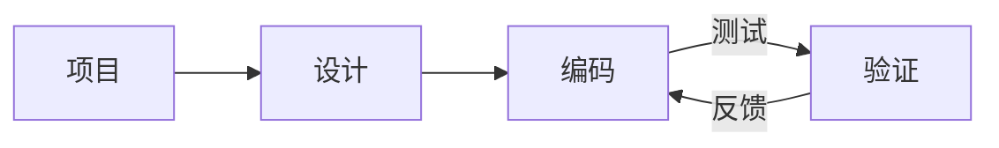

# Web 开发
Source: https://docs.cursor.com/zh/guides/tutorials/web-development

如何为 Web 开发配置 Cursor

export const McpInstallButtonPrimary = ({server, showIcon = true, prompt = null}) => {
  const [showModal, setShowModal] = useState(false);
  const generateDeepLink = () => {
    if (!server || !server.name || !server.install) {
      return null;
    }
    try {
      if (typeof server.install === 'string') {
        return server.install;
      }
      if (server.install.url) {
        const config = {
          ...server.install
        };
        const jsonString = JSON.stringify(config);
        const utf8Bytes = new TextEncoder().encode(jsonString);
        const base64Config = btoa(Array.from(utf8Bytes).map(b => String.fromCharCode(b)).join(''));
        const safeBase64Config = base64Config.replace(/\+/g, '%2B');
        return `cursor://anysphere.cursor-deeplink/mcp/install?name=${encodeURIComponent(server.name)}&config=${encodeURIComponent(safeBase64Config)}`;
      }
      if (server.install.command) {
        let config = {
          command: server.install.command,
          ...server.install.args && ({
            args: server.install.args
          }),
          ...server.install.env && ({
            env: server.install.env
          })
        };
        if (config.command && config.args) {
          const argsString = config.args.join(" ");
          config.command = `${config.command} ${argsString}`;
          delete config.args;
        }
        const jsonString = JSON.stringify(config);
        const utf8Bytes = new TextEncoder().encode(jsonString);
        const base64Config = btoa(Array.from(utf8Bytes).map(b => String.fromCharCode(b)).join(''));
        const safeBase64Config = base64Config.replace(/\+/g, '%2B');
        return `cursor://anysphere.cursor-deeplink/mcp/install?name=${encodeURIComponent(server.name)}&config=${encodeURIComponent(safeBase64Config)}`;
      }
      return null;
    } catch (e) {
      console.error("Error generating deep link:", e);
      return null;
    }
  };
  const handleButtonClick = () => {
    setShowModal(true);
  };
  const handleClose = () => {
    setShowModal(false);
  };
  const deepLink = generateDeepLink();
  const isDocumentationOnly = typeof server?.install === 'string';
  const hasConfirmation = prompt || isDocumentationOnly;
  const InstallModal = ({isOpen, onClose, deepLink, server, children}) => {
    useEffect(() => {
      const handleKeyDown = event => {
        if (event.key === 'Escape') {
          onClose();
        }
      };
      if (isOpen) {
        document.addEventListener('keydown', handleKeyDown);
      }
      return () => {
        document.removeEventListener('keydown', handleKeyDown);
      };
    }, [isOpen, onClose]);
    if (!isOpen) return null;
    return <div className="fixed inset-0 bg-black bg-opacity-50 flex items-center justify-center z-50 transition-opacity duration-200" onClick={onClose}>
        <div className="bg-white dark:bg-neutral-900 rounded-lg p-6 max-w-md w-full mx-4 border border-neutral-200 dark:border-neutral-700 transition-all duration-200 transform" onClick={e => e.stopPropagation()}>
          <div className="mb-4">
            <h3 className="text-lg font-semibold text-black dark:text-white mb-2">
              Install {server?.name}
            </h3>
            <div className="text-neutral-600 dark:text-neutral-400">
              {children}
            </div>
          </div>
          <div className="flex gap-3 justify-end">
            <button onClick={onClose} className="px-4 py-2 text-sm font-medium rounded-lg transition-colors duration-200 text-neutral-600 dark:text-neutral-400 hover:text-black dark:hover:text-white border border-neutral-200 dark:border-neutral-700 hover:bg-neutral-100 dark:hover:bg-neutral-800">
              Cancel
            </button>
            <a href={deepLink} onClick={onClose} target="_blank" className="px-4 py-2 text-sm font-medium rounded-lg transition-colors duration-200 bg-black text-white hover:bg-neutral-800 dark:bg-white dark:text-black dark:hover:bg-neutral-200 inline-flex items-center justify-center no-underline">
              Continue
            </a>
          </div>
        </div>
      </div>;
  };
  return <>
      {hasConfirmation ? <button onClick={handleButtonClick} className="inline-flex justify-center items-center gap-2 px-4 py-2 text-sm font-medium rounded-lg transition-colors duration-200 not-prose text-white bg-black hover:bg-neutral-800 dark:bg-white dark:text-black dark:hover:bg-neutral-200 border border-black dark:border-white">
          {showIcon && <Icon icon="plus" size={16} color="currentColor" />}
          Add to Cursor
        </button> : <a href={deepLink} className="inline-flex justify-center items-center gap-2 px-4 py-2 text-sm font-medium rounded-lg transition-colors duration-200 not-prose text-white bg-black hover:bg-neutral-800 dark:bg-white dark:text-black dark:hover:bg-neutral-200 border border-black dark:border-white">
          {showIcon && <Icon icon="plus" size={16} color="currentColor" />}
          Add to Cursor
        </a>}

      {hasConfirmation && <InstallModal isOpen={showModal} onClose={handleClose} deepLink={deepLink} server={server}>
          {prompt}
        </InstallModal>}
    </>;
};

Web 开发需要在 Cursor 与 Figma 或浏览器等外部工具之间实现快速迭代和紧密的反馈循环。我们在 Cursor 总结出了一些能进一步缩短这个循环的工作流。明确划定任务范围、复用组件、充分利用设计系统，都有助于提升速度并保持一致性。

本指南将介绍如何配置 Cursor 以支持 Web 开发，并进一步缩短反馈循环。



<div id="start-orchestrating-in-cursor">
  # 在 Cursor 中开始编排
</div>

**Chat** 非常适合启动改动。等主要部分到位后，切换到 **Inline Edit** 和 **Tab** 能帮你保持心流。

设置好 Cursor 之后，你就能在不同工具间编排工作流。下面是一个示例，展示了可实现的效果：把 Linear、Figma 和浏览器工具结合起来做的一个贪吃蛇游戏。虽然真实项目通常更复杂，但这个示例体现了这些集成工作流的潜力。

<Frame>
  <video src="https://mintcdn.com/cursor/E7JVsKUF5L-IiJRB/images/guides/tutorials/web-development/snake.mp4?fit=max&auto=format&n=E7JVsKUF5L-IiJRB&q=85&s=e029fbdff2ec06e1e4393ac580824b5a" controls data-path="images/guides/tutorials/web-development/snake.mp4" />
</Frame>

<div id="connect-to-your-project-management-tools">
  # 连接你的项目管理工具
</div>

你可以用多种方式把 Cursor 集成进现有的项目管理软件。这个指南会讲怎么通过它们的 MCP 服务器集成 Linear。

<div id="installation">
  ### 安装
</div>

<McpInstallButtonPrimary
  server={{
name: "Linear",
install: {
command: "npx",
args: ["-y", "mcp-remote", "https://mcp.linear.app/sse"],
},
}}
/>

或者手动把 Linear 的 MCP 服务器加到 `mcp.json` 里：

```jsx  theme={null}
{
  "mcpServers": {
    "Linear": {
      "command": "npx",
      "args": [
        "-y",
        "mcp-remote",
        "https://mcp.linear.app/sse"
      ]
    }
  }
}
```

然后：

1. 确保在 MCP 设置里启用 Linear
2. 浏览器会打开，并提示你使用 Linear 进行授权
   <Info>
     由于 MCP 的当前状态，设置可能需要多次重试。
     如果集成不可用，试着在 Cursor 设置中“Reload”服务器。
   </Info>

<div id="using-linear-in-cursor">
  ### 在 Cursor 中使用 Linear
</div>

Linear 的 MCP 服务器会提供多种工具，Cursor 可以用它们来读取和管理问题（issues）。前往 MCP 设置并找到 Linear 服务器即可查看所有工具列表。要验证的话，在 Chat 里试试这个提示：

```jsx  theme={null}
列出与此项目相关的所有 issue
```

<Frame>
  
</Frame>

如果集成配置正确，它会返回一个工单列表。

<div id="bring-in-your-figma-designs">
  # 导入你的 Figma 设计
</div>

设计稿和原型是 Web 开发的核心。通过使用 Figma 的官方 MCP 服务器，你可以在 Cursor 中直接访问并处理设计文件。开始使用前，请按照 [Figma Dev Mode MCP Server](https://help.figma.com/hc/en-us/articles/32132100833559-Guide-to-the-Dev-Mode-MCP-Server) 的设置指南进行配置。

<div id="installation">
  ### 安装
</div>

点击下面的按钮即可安装 MCP 服务器。

<McpInstallButtonPrimary
  server={{
name: "Figma",
install: {
url: "http://127.0.0.1:3845/sse",
},
}}
/>

或者将其手动添加到你的 `mcp.json`：

```jsx  theme={null}
{
  "mcpServers": {
    "Figma": {
      "url": "http://127.0.0.1:3845/sse"
    }
  }
}
```

<div id="usage">
  ### 使用方法
</div>

服务器提供了多种可在提示词中调用的工具。比如，试着让它获取 Figma 中当前选中内容的设计。更多信息参见[文档](https://help.figma.com/hc/en-us/articles/32132100833559-Guide-to-the-Dev-Mode-MCP-Server)。

<Frame>
  
</Frame>

<div id="keep-your-code-scaffolding-consistent">
  # 保持代码脚手架一致
</div>

你可能已经有现成的代码、设计系统或既定规范想要复用。与模型协作时，参考代码库中已存在的模式会很有帮助，比如下拉菜单或其他常见组件。

我们自己在一个大型 Web 端代码库中工作时发现，声明式代码效果尤其好，特别是在 React 和 JSX 中。

如果你有设计系统，可以通过提供相应规则来帮助 agent 发现并遵循它。下面是一个 `ui-components.mdc` 文件，我们尝试在可行时强制复用组件：

```mdc components.mdc theme={null}
---
description: 实现设计并构建 UI
---
- 复用 `/src/components/ui` 中的现有 UI 组件；这些是我们可用的基础构件
- 如果没有能解决问题的现有组件，就通过组合这些 UI 组件来创建新组件
- 当缺少组件或设计时，询问人类希望如何推进
```

随着你的组件库不断扩大，按需添加新规则。规则过多时，考虑按更具体的类别拆分，例如「仅在处理用户输入时生效」。

<Frame>
  
</Frame>

<div id="give-cursor-access-to-browser">
  # 让 Cursor 访问浏览器
</div>

为了扩展 Cursor 的能力，可以设置 Browser Tools 的 MCP 服务器，它能访问控制台日志和网络请求。完成配置后，可以通过监控控制台输出和网络活动来验证更改。这样能确保实现与你的意图一致。按照这里的说明设置 MCP 服务器：[https://browsertools.agentdesk.ai/installation](https://browsertools.agentdesk.ai/installation)

<Frame>
  
</Frame>

<Note>
  我们正努力把这项功能原生集成到 Cursor，让集成更简单。
</Note>

<div id="takeaways">
  # 关键要点
</div>

* 紧凑的反馈回路对 Web 开发至关重要。把 Cursor 和 Figma、Linear、浏览器等工具搭配使用，行动更快、思路更顺。
* MCP 服务器能把外部系统直接接入 Cursor，减少上下文切换，提升任务执行效率。
* 复用组件和设计系统有助于模型产出更整洁、更一致的代码和结果。
* 明确且范围清晰的任务能带来更好的效果。要有意识地设计你的提示和诉求。
* 如果输出不理想，可以尝试调整：
  * **Instructions：** 使用规则、提示，并通过（例如 MCP 服务器）提供更多上下文。
  * **Systems：** 良好的模式、抽象和清晰度能让模型更易理解、更好协助，并更自主地工作。
* 通过纳入运行时信息（如控制台日志、网络请求、UI 元素数据）可以扩展模型的上下文。
* 并非一切都需要自动化。如果系统变得过于复杂，就回到用 Tab 和 Inline Edit 做更精细的手动编辑。
* 当把 Cursor 当作副驾驶而不是自动驾驶时，它的力量最大。用它来增强，而不是取代，你自己的决策。

---

← Previous: [构建 MCP 服务器](./mcp.md) | [Index](./index.md) | Next: [使用上下文](./section.md) →