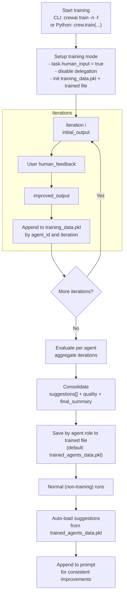

# src/latest_ai_development/crew.py

**Navigation:** [← Previous](./02-generalist-gets-crewknowledge-only.md) | [Index](./index.md) | [Next →](./04-mastering-flow-state-management.md)

---

# src/latest_ai_development/crew.py

from crewai import Agent, Crew, Process, Task
from crewai.project import CrewBase, agent, crew, task
from crewai_tools import SerperDevTool

@CrewBase
class LatestAiDevelopmentCrew():
  """LatestAiDevelopment crew"""

  @agent
  def researcher(self) -> Agent:
    return Agent(
      config=self.agents_config['researcher'], # type: ignore[index]
      verbose=True,
      tools=[SerperDevTool()]
    )

  @agent
  def reporting_analyst(self) -> Agent:
    return Agent(
      config=self.agents_config['reporting_analyst'], # type: ignore[index]
      verbose=True
    )

  @task
  def research_task(self) -> Task:
    return Task(
      config=self.tasks_config['research_task'] # type: ignore[index]
    )

  @task
  def reporting_task(self) -> Task:
    return Task(
      config=self.tasks_config['reporting_task'] # type: ignore[index]
    )

  @crew
  def crew(self) -> Crew:
    return Crew(
      agents=[
        self.researcher(),
        self.reporting_analyst()
      ],
      tasks=[
        self.research_task(),
        self.reporting_task()
      ],
      process=Process.sequential
    )
```

<Note>
  The names you use in your YAML files (`agents.yaml` and `tasks.yaml`) should match the method names in your Python code.
</Note>

### Direct Code Definition (Alternative)

Alternatively, you can define tasks directly in your code without using YAML configuration:

```python task.py theme={null}
from crewai import Task

research_task = Task(
    description="""
        Conduct a thorough research about AI Agents.
        Make sure you find any interesting and relevant information given
        the current year is 2025.
    """,
    expected_output="""
        A list with 10 bullet points of the most relevant information about AI Agents
    """,
    agent=researcher
)

reporting_task = Task(
    description="""
        Review the context you got and expand each topic into a full section for a report.
        Make sure the report is detailed and contains any and all relevant information.
    """,
    expected_output="""
        A fully fledge reports with the mains topics, each with a full section of information.
    """,
    agent=reporting_analyst,
    markdown=True,  # Enable markdown formatting for the final output
    output_file="report.md"
)
```

<Tip>
  Directly specify an `agent` for assignment or let the `hierarchical` CrewAI's process decide based on roles, availability, etc.
</Tip>


## Task Output

Understanding task outputs is crucial for building effective AI workflows. CrewAI provides a structured way to handle task results through the `TaskOutput` class, which supports multiple output formats and can be easily passed between tasks.

The output of a task in CrewAI framework is encapsulated within the `TaskOutput` class. This class provides a structured way to access results of a task, including various formats such as raw output, JSON, and Pydantic models.

By default, the `TaskOutput` will only include the `raw` output. A `TaskOutput` will only include the `pydantic` or `json_dict` output if the original `Task` object was configured with `output_pydantic` or `output_json`, respectively.

### Task Output Attributes

| Attribute         | Parameters      | Type                       | Description                                                                                        |
| :---------------- | :-------------- | :------------------------- | :------------------------------------------------------------------------------------------------- |
| **Description**   | `description`   | `str`                      | Description of the task.                                                                           |
| **Summary**       | `summary`       | `Optional[str]`            | Summary of the task, auto-generated from the first 10 words of the description.                    |
| **Raw**           | `raw`           | `str`                      | The raw output of the task. This is the default format for the output.                             |
| **Pydantic**      | `pydantic`      | `Optional[BaseModel]`      | A Pydantic model object representing the structured output of the task.                            |
| **JSON Dict**     | `json_dict`     | `Optional[Dict[str, Any]]` | A dictionary representing the JSON output of the task.                                             |
| **Agent**         | `agent`         | `str`                      | The agent that executed the task.                                                                  |
| **Output Format** | `output_format` | `OutputFormat`             | The format of the task output, with options including RAW, JSON, and Pydantic. The default is RAW. |

### Task Methods and Properties

| Method/Property | Description                                                                                       |
| :-------------- | :------------------------------------------------------------------------------------------------ |
| **json**        | Returns the JSON string representation of the task output if the output format is JSON.           |
| **to\_dict**    | Converts the JSON and Pydantic outputs to a dictionary.                                           |
| **str**         | Returns the string representation of the task output, prioritizing Pydantic, then JSON, then raw. |

### Accessing Task Outputs

Once a task has been executed, its output can be accessed through the `output` attribute of the `Task` object. The `TaskOutput` class provides various ways to interact with and present this output.

#### Example

```python Code theme={null}

# Example task
task = Task(
    description='Find and summarize the latest AI news',
    expected_output='A bullet list summary of the top 5 most important AI news',
    agent=research_agent,
    tools=[search_tool]
)


# Execute the crew
crew = Crew(
    agents=[research_agent],
    tasks=[task],
    verbose=True
)

result = crew.kickoff()


# Accessing the task output
task_output = task.output

print(f"Task Description: {task_output.description}")
print(f"Task Summary: {task_output.summary}")
print(f"Raw Output: {task_output.raw}")
if task_output.json_dict:
    print(f"JSON Output: {json.dumps(task_output.json_dict, indent=2)}")
if task_output.pydantic:
    print(f"Pydantic Output: {task_output.pydantic}")
```


## Markdown Output Formatting

The `markdown` parameter enables automatic markdown formatting for task outputs. When set to `True`, the task will instruct the agent to format the final answer using proper Markdown syntax.

### Using Markdown Formatting

```python Code theme={null}

# Example task with markdown formatting enabled
formatted_task = Task(
    description="Create a comprehensive report on AI trends",
    expected_output="A well-structured report with headers, sections, and bullet points",
    agent=reporter_agent,
    markdown=True  # Enable automatic markdown formatting
)
```

When `markdown=True`, the agent will receive additional instructions to format the output using:

* `#` for headers
* `**text**` for bold text
* `*text*` for italic text
* `-` or `*` for bullet points
* `` `code` `` for inline code
* ` `language \`\`\` for code blocks

### YAML Configuration with Markdown

```yaml tasks.yaml theme={null}
analysis_task:
  description: >
    Analyze the market data and create a detailed report
  expected_output: >
    A comprehensive analysis with charts and key findings
  agent: analyst
  markdown: true  # Enable markdown formatting
  output_file: analysis.md
```

### Benefits of Markdown Output

* **Consistent Formatting**: Ensures all outputs follow proper markdown conventions
* **Better Readability**: Structured content with headers, lists, and emphasis
* **Documentation Ready**: Output can be directly used in documentation systems
* **Cross-Platform Compatibility**: Markdown is universally supported

<Note>
  The markdown formatting instructions are automatically added to the task prompt when `markdown=True`, so you don't need to specify formatting requirements in your task description.
</Note>


## Task Dependencies and Context

Tasks can depend on the output of other tasks using the `context` attribute. For example:

```python Code theme={null}
research_task = Task(
    description="Research the latest developments in AI",
    expected_output="A list of recent AI developments",
    agent=researcher
)

analysis_task = Task(
    description="Analyze the research findings and identify key trends",
    expected_output="Analysis report of AI trends",
    agent=analyst,
    context=[research_task]  # This task will wait for research_task to complete
)
```


## Task Guardrails

Task guardrails provide a way to validate and transform task outputs before they
are passed to the next task. This feature helps ensure data quality and provides
feedback to agents when their output doesn't meet specific criteria.

Guardrails are implemented as Python functions that contain custom validation logic, giving you complete control over the validation process and ensuring reliable, deterministic results.

### Function-Based Guardrails

To add a function-based guardrail to a task, provide a validation function through the `guardrail` parameter:

```python Code theme={null}
from typing import Tuple, Union, Dict, Any
from crewai import TaskOutput

def validate_blog_content(result: TaskOutput) -> Tuple[bool, Any]:
    """Validate blog content meets requirements."""
    try:
        # Check word count
        word_count = len(result.split())
        if word_count > 200:
            return (False, "Blog content exceeds 200 words")

        # Additional validation logic here
        return (True, result.strip())
    except Exception as e:
        return (False, "Unexpected error during validation")

blog_task = Task(
    description="Write a blog post about AI",
    expected_output="A blog post under 200 words",
    agent=blog_agent,
    guardrail=validate_blog_content  # Add the guardrail function
)
```

### Guardrail Function Requirements

1. **Function Signature**:
   * Must accept exactly one parameter (the task output)
   * Should return a tuple of `(bool, Any)`
   * Type hints are recommended but optional

2. **Return Values**:
   * On success: it returns a tuple of `(bool, Any)`. For example: `(True, validated_result)`
   * On Failure: it returns a tuple of `(bool, str)`. For example: `(False, "Error message explain the failure")`

### Error Handling Best Practices

1. **Structured Error Responses**:

```python Code theme={null}
from crewai import TaskOutput, LLMGuardrail

def validate_with_context(result: TaskOutput) -> Tuple[bool, Any]:
    try:
        # Main validation logic
        validated_data = perform_validation(result)
        return (True, validated_data)
    except ValidationError as e:
        return (False, f"VALIDATION_ERROR: {str(e)}")
    except Exception as e:
        return (False, str(e))
```

2. **Error Categories**:
   * Use specific error codes
   * Include relevant context
   * Provide actionable feedback

3. **Validation Chain**:

```python Code theme={null}
from typing import Any, Dict, List, Tuple, Union
from crewai import TaskOutput

def complex_validation(result: TaskOutput) -> Tuple[bool, Any]:
    """Chain multiple validation steps."""
    # Step 1: Basic validation
    if not result:
        return (False, "Empty result")

    # Step 2: Content validation
    try:
        validated = validate_content(result)
        if not validated:
            return (False, "Invalid content")

        # Step 3: Format validation
        formatted = format_output(validated)
        return (True, formatted)
    except Exception as e:
        return (False, str(e))
```

### Handling Guardrail Results

When a guardrail returns `(False, error)`:

1. The error is sent back to the agent
2. The agent attempts to fix the issue
3. The process repeats until:
   * The guardrail returns `(True, result)`
   * Maximum retries are reached (`guardrail_max_retries`)

Example with retry handling:

```python Code theme={null}
from typing import Optional, Tuple, Union
from crewai import TaskOutput, Task

def validate_json_output(result: TaskOutput) -> Tuple[bool, Any]:
    """Validate and parse JSON output."""
    try:
        # Try to parse as JSON
        data = json.loads(result)
        return (True, data)
    except json.JSONDecodeError as e:
        return (False, "Invalid JSON format")

task = Task(
    description="Generate a JSON report",
    expected_output="A valid JSON object",
    agent=analyst,
    guardrail=validate_json_output,
    guardrail_max_retries=3  # Limit retry attempts
)
```


## Getting Structured Consistent Outputs from Tasks

<Note>
  It's also important to note that the output of the final task of a crew becomes the final output of the actual crew itself.
</Note>

### Using `output_pydantic`

The `output_pydantic` property allows you to define a Pydantic model that the task output should conform to. This ensures that the output is not only structured but also validated according to the Pydantic model.

Here's an example demonstrating how to use output\_pydantic:

```python Code theme={null}
import json

from crewai import Agent, Crew, Process, Task
from pydantic import BaseModel


class Blog(BaseModel):
    title: str
    content: str


blog_agent = Agent(
    role="Blog Content Generator Agent",
    goal="Generate a blog title and content",
    backstory="""You are an expert content creator, skilled in crafting engaging and informative blog posts.""",
    verbose=False,
    allow_delegation=False,
    llm="gpt-4o",
)

task1 = Task(
    description="""Create a blog title and content on a given topic. Make sure the content is under 200 words.""",
    expected_output="A compelling blog title and well-written content.",
    agent=blog_agent,
    output_pydantic=Blog,
)


# Instantiate your crew with a sequential process
crew = Crew(
    agents=[blog_agent],
    tasks=[task1],
    verbose=True,
    process=Process.sequential,
)

result = crew.kickoff()


# Option 1: Accessing Properties Using Dictionary-Style Indexing
print("Accessing Properties - Option 1")
title = result["title"]
content = result["content"]
print("Title:", title)
print("Content:", content)


# Option 2: Accessing Properties Directly from the Pydantic Model
print("Accessing Properties - Option 2")
title = result.pydantic.title
content = result.pydantic.content
print("Title:", title)
print("Content:", content)


# Option 3: Accessing Properties Using the to_dict() Method
print("Accessing Properties - Option 3")
output_dict = result.to_dict()
title = output_dict["title"]
content = output_dict["content"]
print("Title:", title)
print("Content:", content)


# Option 4: Printing the Entire Blog Object
print("Accessing Properties - Option 5")
print("Blog:", result)

```

In this example:

* A Pydantic model Blog is defined with title and content fields.
* The task task1 uses the output\_pydantic property to specify that its output should conform to the Blog model.
* After executing the crew, you can access the structured output in multiple ways as shown.

#### Explanation of Accessing the Output

1. Dictionary-Style Indexing: You can directly access the fields using result\["field\_name"]. This works because the CrewOutput class implements the **getitem** method.
2. Directly from Pydantic Model: Access the attributes directly from the result.pydantic object.
3. Using to\_dict() Method: Convert the output to a dictionary and access the fields.
4. Printing the Entire Object: Simply print the result object to see the structured output.

### Using `output_json`

The `output_json` property allows you to define the expected output in JSON format. This ensures that the task's output is a valid JSON structure that can be easily parsed and used in your application.

Here's an example demonstrating how to use `output_json`:

```python Code theme={null}
import json

from crewai import Agent, Crew, Process, Task
from pydantic import BaseModel


# Define the Pydantic model for the blog
class Blog(BaseModel):
    title: str
    content: str


# Define the agent
blog_agent = Agent(
    role="Blog Content Generator Agent",
    goal="Generate a blog title and content",
    backstory="""You are an expert content creator, skilled in crafting engaging and informative blog posts.""",
    verbose=False,
    allow_delegation=False,
    llm="gpt-4o",
)


# Define the task with output_json set to the Blog model
task1 = Task(
    description="""Create a blog title and content on a given topic. Make sure the content is under 200 words.""",
    expected_output="A JSON object with 'title' and 'content' fields.",
    agent=blog_agent,
    output_json=Blog,
)


# Instantiate the crew with a sequential process
crew = Crew(
    agents=[blog_agent],
    tasks=[task1],
    verbose=True,
    process=Process.sequential,
)


# Kickoff the crew to execute the task
result = crew.kickoff()


# Option 1: Accessing Properties Using Dictionary-Style Indexing
print("Accessing Properties - Option 1")
title = result["title"]
content = result["content"]
print("Title:", title)
print("Content:", content)


# Option 2: Printing the Entire Blog Object
print("Accessing Properties - Option 2")
print("Blog:", result)
```

In this example:

* A Pydantic model Blog is defined with title and content fields, which is used to specify the structure of the JSON output.
* The task task1 uses the output\_json property to indicate that it expects a JSON output conforming to the Blog model.
* After executing the crew, you can access the structured JSON output in two ways as shown.

#### Explanation of Accessing the Output

1. Accessing Properties Using Dictionary-Style Indexing: You can access the fields directly using result\["field\_name"]. This is possible because the CrewOutput class implements the **getitem** method, allowing you to treat the output like a dictionary. In this option, we're retrieving the title and content from the result.
2. Printing the Entire Blog Object: By printing result, you get the string representation of the CrewOutput object. Since the **str** method is implemented to return the JSON output, this will display the entire output as a formatted string representing the Blog object.

***

By using output\_pydantic or output\_json, you ensure that your tasks produce outputs in a consistent and structured format, making it easier to process and utilize the data within your application or across multiple tasks.


## Integrating Tools with Tasks

Leverage tools from the [CrewAI Toolkit](https://github.com/joaomdmoura/crewai-tools) and [LangChain Tools](https://python.langchain.com/docs/integrations/tools) for enhanced task performance and agent interaction.


## Creating a Task with Tools

```python Code theme={null}
import os
os.environ["OPENAI_API_KEY"] = "Your Key"
os.environ["SERPER_API_KEY"] = "Your Key" # serper.dev API key

from crewai import Agent, Task, Crew
from crewai_tools import SerperDevTool

research_agent = Agent(
  role='Researcher',
  goal='Find and summarize the latest AI news',
  backstory="""You're a researcher at a large company.
  You're responsible for analyzing data and providing insights
  to the business.""",
  verbose=True
)


# to perform a semantic search for a specified query from a text's content across the internet
search_tool = SerperDevTool()

task = Task(
  description='Find and summarize the latest AI news',
  expected_output='A bullet list summary of the top 5 most important AI news',
  agent=research_agent,
  tools=[search_tool]
)

crew = Crew(
    agents=[research_agent],
    tasks=[task],
    verbose=True
)

result = crew.kickoff()
print(result)
```

This demonstrates how tasks with specific tools can override an agent's default set for tailored task execution.


## Referring to Other Tasks

In CrewAI, the output of one task is automatically relayed into the next one, but you can specifically define what tasks' output, including multiple, should be used as context for another task.

This is useful when you have a task that depends on the output of another task that is not performed immediately after it. This is done through the `context` attribute of the task:

```python Code theme={null}

# ...

research_ai_task = Task(
    description="Research the latest developments in AI",
    expected_output="A list of recent AI developments",
    async_execution=True,
    agent=research_agent,
    tools=[search_tool]
)

research_ops_task = Task(
    description="Research the latest developments in AI Ops",
    expected_output="A list of recent AI Ops developments",
    async_execution=True,
    agent=research_agent,
    tools=[search_tool]
)

write_blog_task = Task(
    description="Write a full blog post about the importance of AI and its latest news",
    expected_output="Full blog post that is 4 paragraphs long",
    agent=writer_agent,
    context=[research_ai_task, research_ops_task]
)

#...
```


## Asynchronous Execution

You can define a task to be executed asynchronously. This means that the crew will not wait for it to be completed to continue with the next task. This is useful for tasks that take a long time to be completed, or that are not crucial for the next tasks to be performed.

You can then use the `context` attribute to define in a future task that it should wait for the output of the asynchronous task to be completed.

```python Code theme={null}
#...

list_ideas = Task(
    description="List of 5 interesting ideas to explore for an article about AI.",
    expected_output="Bullet point list of 5 ideas for an article.",
    agent=researcher,
    async_execution=True # Will be executed asynchronously
)

list_important_history = Task(
    description="Research the history of AI and give me the 5 most important events.",
    expected_output="Bullet point list of 5 important events.",
    agent=researcher,
    async_execution=True # Will be executed asynchronously
)

write_article = Task(
    description="Write an article about AI, its history, and interesting ideas.",
    expected_output="A 4 paragraph article about AI.",
    agent=writer,
    context=[list_ideas, list_important_history] # Will wait for the output of the two tasks to be completed
)

#...
```


## Callback Mechanism

The callback function is executed after the task is completed, allowing for actions or notifications to be triggered based on the task's outcome.

```python Code theme={null}

# ...

def callback_function(output: TaskOutput):
    # Do something after the task is completed
    # Example: Send an email to the manager
    print(f"""
        Task completed!
        Task: {output.description}
        Output: {output.raw}
    """)

research_task = Task(
    description='Find and summarize the latest AI news',
    expected_output='A bullet list summary of the top 5 most important AI news',
    agent=research_agent,
    tools=[search_tool],
    callback=callback_function
)

#...
```


## Accessing a Specific Task Output

Once a crew finishes running, you can access the output of a specific task by using the `output` attribute of the task object:

```python Code theme={null}

# ...
task1 = Task(
    description='Find and summarize the latest AI news',
    expected_output='A bullet list summary of the top 5 most important AI news',
    agent=research_agent,
    tools=[search_tool]
)

#...

crew = Crew(
    agents=[research_agent],
    tasks=[task1, task2, task3],
    verbose=True
)

result = crew.kickoff()


# Returns a TaskOutput object with the description and results of the task
print(f"""
    Task completed!
    Task: {task1.output.description}
    Output: {task1.output.raw}
""")
```


## Tool Override Mechanism

Specifying tools in a task allows for dynamic adaptation of agent capabilities, emphasizing CrewAI's flexibility.


## Error Handling and Validation Mechanisms

While creating and executing tasks, certain validation mechanisms are in place to ensure the robustness and reliability of task attributes. These include but are not limited to:

* Ensuring only one output type is set per task to maintain clear output expectations.
* Preventing the manual assignment of the `id` attribute to uphold the integrity of the unique identifier system.

These validations help in maintaining the consistency and reliability of task executions within the crewAI framework.


## Creating Directories when Saving Files

The `create_directory` parameter controls whether CrewAI should automatically create directories when saving task outputs to files. This feature is particularly useful for organizing outputs and ensuring that file paths are correctly structured, especially when working with complex project hierarchies.

### Default Behavior

By default, `create_directory=True`, which means CrewAI will automatically create any missing directories in the output file path:

```python Code theme={null}

# Default behavior - directories are created automatically
report_task = Task(
    description='Generate a comprehensive market analysis report',
    expected_output='A detailed market analysis with charts and insights',
    agent=analyst_agent,
    output_file='reports/2025/market_analysis.md',  # Creates 'reports/2025/' if it doesn't exist
    markdown=True
)
```

### Disabling Directory Creation

If you want to prevent automatic directory creation and ensure that the directory already exists, set `create_directory=False`:

```python Code theme={null}

# Strict mode - directory must already exist
strict_output_task = Task(
    description='Save critical data that requires existing infrastructure',
    expected_output='Data saved to pre-configured location',
    agent=data_agent,
    output_file='secure/vault/critical_data.json',
    create_directory=False  # Will raise RuntimeError if 'secure/vault/' doesn't exist
)
```

### YAML Configuration

You can also configure this behavior in your YAML task definitions:

```yaml tasks.yaml theme={null}
analysis_task:
  description: >
    Generate quarterly financial analysis
  expected_output: >
    A comprehensive financial report with quarterly insights
  agent: financial_analyst
  output_file: reports/quarterly/q4_2024_analysis.pdf
  create_directory: true  # Automatically create 'reports/quarterly/' directory

audit_task:
  description: >
    Perform compliance audit and save to existing audit directory
  expected_output: >
    A compliance audit report
  agent: auditor
  output_file: audit/compliance_report.md
  create_directory: false  # Directory must already exist
```

### Use Cases

**Automatic Directory Creation (`create_directory=True`):**

* Development and prototyping environments
* Dynamic report generation with date-based folders
* Automated workflows where directory structure may vary
* Multi-tenant applications with user-specific folders

**Manual Directory Management (`create_directory=False`):**

* Production environments with strict file system controls
* Security-sensitive applications where directories must be pre-configured
* Systems with specific permission requirements
* Compliance environments where directory creation is audited

### Error Handling

When `create_directory=False` and the directory doesn't exist, CrewAI will raise a `RuntimeError`:

```python Code theme={null}
try:
    result = crew.kickoff()
except RuntimeError as e:
    # Handle missing directory error
    print(f"Directory creation failed: {e}")
    # Create directory manually or use fallback location
```

Check out the video below to see how to use structured outputs in CrewAI:

<iframe className="w-full aspect-video rounded-xl" src="https://www.youtube.com/embed/dNpKQk5uxHw" title="Structured outputs in CrewAI" frameBorder="0" allow="accelerometer; autoplay; clipboard-write; encrypted-media; gyroscope; picture-in-picture; web-share" referrerPolicy="strict-origin-when-cross-origin" allowFullScreen />


## Conclusion

Tasks are the driving force behind the actions of agents in CrewAI.
By properly defining tasks and their outcomes, you set the stage for your AI agents to work effectively, either independently or as a collaborative unit.
Equipping tasks with appropriate tools, understanding the execution process, and following robust validation practices are crucial for maximizing CrewAI's potential,
ensuring agents are effectively prepared for their assignments and that tasks are executed as intended.


# Testing
Source: https://docs.crewai.com/en/concepts/testing

Learn how to test your CrewAI Crew and evaluate their performance.


## Overview

Testing is a crucial part of the development process, and it is essential to ensure that your crew is performing as expected. With crewAI, you can easily test your crew and evaluate its performance using the built-in testing capabilities.

### Using the Testing Feature

We added the CLI command `crewai test` to make it easy to test your crew. This command will run your crew for a specified number of iterations and provide detailed performance metrics. The parameters are `n_iterations` and `model`, which are optional and default to 2 and `gpt-4o-mini` respectively. For now, the only provider available is OpenAI.

```bash  theme={null}
crewai test
```

If you want to run more iterations or use a different model, you can specify the parameters like this:

```bash  theme={null}
crewai test --n_iterations 5 --model gpt-4o
```

or using the short forms:

```bash  theme={null}
crewai test -n 5 -m gpt-4o
```

When you run the `crewai test` command, the crew will be executed for the specified number of iterations, and the performance metrics will be displayed at the end of the run.

A table of scores at the end will show the performance of the crew in terms of the following metrics:

<center>**Tasks Scores (1-10 Higher is better)**</center>

| Tasks/Crew/Agents  | Run 1 | Run 2 | Avg. Total |            Agents            | Additional Info                |
| :----------------- | :---: | :---: | :--------: | :--------------------------: | :----------------------------- |
| Task 1             |  9.0  |  9.5  |   **9.2**  |     Professional Insights    |                                |
|                    |       |       |            |          Researcher          |                                |
| Task 2             |  9.0  |  10.0 |   **9.5**  | Company Profile Investigator |                                |
| Task 3             |  9.0  |  9.0  |   **9.0**  |      Automation Insights     |                                |
|                    |       |       |            |          Specialist          |                                |
| Task 4             |  9.0  |  9.0  |   **9.0**  |     Final Report Compiler    | Automation Insights Specialist |
| Crew               |  9.00 |  9.38 |   **9.2**  |                              |                                |
| Execution Time (s) |  126  |  145  |   **135**  |                              |                                |

The example above shows the test results for two runs of the crew with two tasks, with the average total score for each task and the crew as a whole.


# Tools
Source: https://docs.crewai.com/en/concepts/tools

Understanding and leveraging tools within the CrewAI framework for agent collaboration and task execution.


## Overview

CrewAI tools empower agents with capabilities ranging from web searching and data analysis to collaboration and delegating tasks among coworkers.
This documentation outlines how to create, integrate, and leverage these tools within the CrewAI framework, including a new focus on collaboration tools.


## What is a Tool?

A tool in CrewAI is a skill or function that agents can utilize to perform various actions.
This includes tools from the [CrewAI Toolkit](https://github.com/joaomdmoura/crewai-tools) and [LangChain Tools](https://python.langchain.com/docs/integrations/tools),
enabling everything from simple searches to complex interactions and effective teamwork among agents.

<Note type="info" title="Enterprise Enhancement: Tools Repository">
  CrewAI AMP provides a comprehensive Tools Repository with pre-built integrations for common business systems and APIs. Deploy agents with enterprise tools in minutes instead of days.

  The Enterprise Tools Repository includes:

  * Pre-built connectors for popular enterprise systems
  * Custom tool creation interface
  * Version control and sharing capabilities
  * Security and compliance features
</Note>


## Key Characteristics of Tools

* **Utility**: Crafted for tasks such as web searching, data analysis, content generation, and agent collaboration.
* **Integration**: Boosts agent capabilities by seamlessly integrating tools into their workflow.
* **Customizability**: Provides the flexibility to develop custom tools or utilize existing ones, catering to the specific needs of agents.
* **Error Handling**: Incorporates robust error handling mechanisms to ensure smooth operation.
* **Caching Mechanism**: Features intelligent caching to optimize performance and reduce redundant operations.
* **Asynchronous Support**: Handles both synchronous and asynchronous tools, enabling non-blocking operations.


## Using CrewAI Tools

To enhance your agents' capabilities with crewAI tools, begin by installing our extra tools package:

```bash  theme={null}
pip install 'crewai[tools]'
```

Here's an example demonstrating their use:

```python Code theme={null}
import os
from crewai import Agent, Task, Crew

# Importing crewAI tools
from crewai_tools import (
    DirectoryReadTool,
    FileReadTool,
    SerperDevTool,
    WebsiteSearchTool
)


# Set up API keys
os.environ["SERPER_API_KEY"] = "Your Key" # serper.dev API key
os.environ["OPENAI_API_KEY"] = "Your Key"


# Instantiate tools
docs_tool = DirectoryReadTool(directory='./blog-posts')
file_tool = FileReadTool()
search_tool = SerperDevTool()
web_rag_tool = WebsiteSearchTool()


# Create agents
researcher = Agent(
    role='Market Research Analyst',
    goal='Provide up-to-date market analysis of the AI industry',
    backstory='An expert analyst with a keen eye for market trends.',
    tools=[search_tool, web_rag_tool],
    verbose=True
)

writer = Agent(
    role='Content Writer',
    goal='Craft engaging blog posts about the AI industry',
    backstory='A skilled writer with a passion for technology.',
    tools=[docs_tool, file_tool],
    verbose=True
)


# Define tasks
research = Task(
    description='Research the latest trends in the AI industry and provide a summary.',
    expected_output='A summary of the top 3 trending developments in the AI industry with a unique perspective on their significance.',
    agent=researcher
)

write = Task(
    description='Write an engaging blog post about the AI industry, based on the research analyst's summary. Draw inspiration from the latest blog posts in the directory.',
    expected_output='A 4-paragraph blog post formatted in markdown with engaging, informative, and accessible content, avoiding complex jargon.',
    agent=writer,
    output_file='blog-posts/new_post.md'  # The final blog post will be saved here
)


# Assemble a crew with planning enabled
crew = Crew(
    agents=[researcher, writer],
    tasks=[research, write],
    verbose=True,
    planning=True,  # Enable planning feature
)


# Execute tasks
crew.kickoff()
```


## Available CrewAI Tools

* **Error Handling**: All tools are built with error handling capabilities, allowing agents to gracefully manage exceptions and continue their tasks.
* **Caching Mechanism**: All tools support caching, enabling agents to efficiently reuse previously obtained results, reducing the load on external resources and speeding up the execution time. You can also define finer control over the caching mechanism using the `cache_function` attribute on the tool.

Here is a list of the available tools and their descriptions:

| Tool                             | Description                                                                                    |
| :------------------------------- | :--------------------------------------------------------------------------------------------- |
| **ApifyActorsTool**              | A tool that integrates Apify Actors with your workflows for web scraping and automation tasks. |
| **BrowserbaseLoadTool**          | A tool for interacting with and extracting data from web browsers.                             |
| **CodeDocsSearchTool**           | A RAG tool optimized for searching through code documentation and related technical documents. |
| **CodeInterpreterTool**          | A tool for interpreting python code.                                                           |
| **ComposioTool**                 | Enables use of Composio tools.                                                                 |
| **CSVSearchTool**                | A RAG tool designed for searching within CSV files, tailored to handle structured data.        |
| **DALL-E Tool**                  | A tool for generating images using the DALL-E API.                                             |
| **DirectorySearchTool**          | A RAG tool for searching within directories, useful for navigating through file systems.       |
| **DOCXSearchTool**               | A RAG tool aimed at searching within DOCX documents, ideal for processing Word files.          |
| **DirectoryReadTool**            | Facilitates reading and processing of directory structures and their contents.                 |
| **EXASearchTool**                | A tool designed for performing exhaustive searches across various data sources.                |
| **FileReadTool**                 | Enables reading and extracting data from files, supporting various file formats.               |
| **FirecrawlSearchTool**          | A tool to search webpages using Firecrawl and return the results.                              |
| **FirecrawlCrawlWebsiteTool**    | A tool for crawling webpages using Firecrawl.                                                  |
| **FirecrawlScrapeWebsiteTool**   | A tool for scraping webpages URL using Firecrawl and returning its contents.                   |
| **GithubSearchTool**             | A RAG tool for searching within GitHub repositories, useful for code and documentation search. |
| **SerperDevTool**                | A specialized tool for development purposes, with specific functionalities under development.  |
| **TXTSearchTool**                | A RAG tool focused on searching within text (.txt) files, suitable for unstructured data.      |
| **JSONSearchTool**               | A RAG tool designed for searching within JSON files, catering to structured data handling.     |
| **LlamaIndexTool**               | Enables the use of LlamaIndex tools.                                                           |
| **MDXSearchTool**                | A RAG tool tailored for searching within Markdown (MDX) files, useful for documentation.       |
| **PDFSearchTool**                | A RAG tool aimed at searching within PDF documents, ideal for processing scanned documents.    |
| **PGSearchTool**                 | A RAG tool optimized for searching within PostgreSQL databases, suitable for database queries. |
| **Vision Tool**                  | A tool for generating images using the DALL-E API.                                             |
| **RagTool**                      | A general-purpose RAG tool capable of handling various data sources and types.                 |
| **ScrapeElementFromWebsiteTool** | Enables scraping specific elements from websites, useful for targeted data extraction.         |
| **ScrapeWebsiteTool**            | Facilitates scraping entire websites, ideal for comprehensive data collection.                 |
| **WebsiteSearchTool**            | A RAG tool for searching website content, optimized for web data extraction.                   |
| **XMLSearchTool**                | A RAG tool designed for searching within XML files, suitable for structured data formats.      |
| **YoutubeChannelSearchTool**     | A RAG tool for searching within YouTube channels, useful for video content analysis.           |
| **YoutubeVideoSearchTool**       | A RAG tool aimed at searching within YouTube videos, ideal for video data extraction.          |


## Creating your own Tools

<Tip>
  Developers can craft `custom tools` tailored for their agent's needs or
  utilize pre-built options.
</Tip>

There are two main ways for one to create a CrewAI tool:

### Subclassing `BaseTool`

```python Code theme={null}
from crewai.tools import BaseTool
from pydantic import BaseModel, Field

class MyToolInput(BaseModel):
    """Input schema for MyCustomTool."""
    argument: str = Field(..., description="Description of the argument.")

class MyCustomTool(BaseTool):
    name: str = "Name of my tool"
    description: str = "What this tool does. It's vital for effective utilization."
    args_schema: Type[BaseModel] = MyToolInput

    def _run(self, argument: str) -> str:
        # Your tool's logic here
        return "Tool's result"
```


## Asynchronous Tool Support

CrewAI supports asynchronous tools, allowing you to implement tools that perform non-blocking operations like network requests, file I/O, or other async operations without blocking the main execution thread.

### Creating Async Tools

You can create async tools in two ways:

#### 1. Using the `tool` Decorator with Async Functions

```python Code theme={null}
from crewai.tools import tool

@tool("fetch_data_async")
async def fetch_data_async(query: str) -> str:
    """Asynchronously fetch data based on the query."""
    # Simulate async operation
    await asyncio.sleep(1)
    return f"Data retrieved for {query}"
```

#### 2. Implementing Async Methods in Custom Tool Classes

```python Code theme={null}
from crewai.tools import BaseTool

class AsyncCustomTool(BaseTool):
    name: str = "async_custom_tool"
    description: str = "An asynchronous custom tool"

    async def _run(self, query: str = "") -> str:
        """Asynchronously run the tool"""
        # Your async implementation here
        await asyncio.sleep(1)
        return f"Processed {query} asynchronously"
```

### Using Async Tools

Async tools work seamlessly in both standard Crew workflows and Flow-based workflows:

```python Code theme={null}

# In standard Crew
agent = Agent(role="researcher", tools=[async_custom_tool])


# In Flow
class MyFlow(Flow):
    @start()
    async def begin(self):
        crew = Crew(agents=[agent])
        result = await crew.kickoff_async()
        return result
```

The CrewAI framework automatically handles the execution of both synchronous and asynchronous tools, so you don't need to worry about how to call them differently.

### Utilizing the `tool` Decorator

```python Code theme={null}
from crewai.tools import tool
@tool("Name of my tool")
def my_tool(question: str) -> str:
    """Clear description for what this tool is useful for, your agent will need this information to use it."""
    # Function logic here
    return "Result from your custom tool"
```

### Custom Caching Mechanism

<Tip>
  Tools can optionally implement a `cache_function` to fine-tune caching
  behavior. This function determines when to cache results based on specific
  conditions, offering granular control over caching logic.
</Tip>

```python Code theme={null}
from crewai.tools import tool

@tool
def multiplication_tool(first_number: int, second_number: int) -> str:
    """Useful for when you need to multiply two numbers together."""
    return first_number * second_number

def cache_func(args, result):
    # In this case, we only cache the result if it's a multiple of 2
    cache = result % 2 == 0
    return cache

multiplication_tool.cache_function = cache_func

writer1 = Agent(
        role="Writer",
        goal="You write lessons of math for kids.",
        backstory="You're an expert in writing and you love to teach kids but you know nothing of math.",
        tools=[multiplication_tool],
        allow_delegation=False,
    )
    #...
```


## Conclusion

Tools are pivotal in extending the capabilities of CrewAI agents, enabling them to undertake a broad spectrum of tasks and collaborate effectively.
When building solutions with CrewAI, leverage both custom and existing tools to empower your agents and enhance the AI ecosystem. Consider utilizing error handling,
caching mechanisms, and the flexibility of tool arguments to optimize your agents' performance and capabilities.


# Training
Source: https://docs.crewai.com/en/concepts/training

Learn how to train your CrewAI agents by giving them feedback early on and get consistent results.


## Overview

The training feature in CrewAI allows you to train your AI agents using the command-line interface (CLI).
By running the command `crewai train -n <n_iterations>`, you can specify the number of iterations for the training process.

During training, CrewAI utilizes techniques to optimize the performance of your agents along with human feedback.
This helps the agents improve their understanding, decision-making, and problem-solving abilities.

### Training Your Crew Using the CLI

To use the training feature, follow these steps:

1. Open your terminal or command prompt.
2. Navigate to the directory where your CrewAI project is located.
3. Run the following command:

```shell  theme={null}
crewai train -n <n_iterations> -f <filename.pkl>
```

<Tip>
  Replace `<n_iterations>` with the desired number of training iterations and `<filename>` with the appropriate filename ending with `.pkl`.
</Tip>

<Note>
  If you omit `-f`, the output defaults to `trained_agents_data.pkl` in the current working directory. You can pass an absolute path to control where the file is written.
</Note>

### Training your Crew programmatically

To train your crew programmatically, use the following steps:

1. Define the number of iterations for training.
2. Specify the input parameters for the training process.
3. Execute the training command within a try-except block to handle potential errors.

```python Code theme={null}
n_iterations = 2
inputs = {"topic": "CrewAI Training"}
filename = "your_model.pkl"

try:
    YourCrewName_Crew().crew().train(
      n_iterations=n_iterations,
      inputs=inputs,
      filename=filename
    )

except Exception as e:
    raise Exception(f"An error occurred while training the crew: {e}")
```


## How trained data is used by agents

CrewAI uses the training artifacts in two ways: during training to incorporate your human feedback, and after training to guide agents with consolidated suggestions.

### Training data flow



### During training runs

* On each iteration, the system records for every agent:
  * `initial_output`: the agent’s first answer
  * `human_feedback`: your inline feedback when prompted
  * `improved_output`: the agent’s follow-up answer after feedback
* This data is stored in a working file named `training_data.pkl` keyed by the agent’s internal ID and iteration.
* While training is active, the agent automatically appends your prior human feedback to its prompt to enforce those instructions on subsequent attempts within the training session.
  Training is interactive: tasks set `human_input = true`, so running in a non-interactive environment will block on user input.

### After training completes

* When `train(...)` finishes, CrewAI evaluates the collected training data per agent and produces a consolidated result containing:
  * `suggestions`: clear, actionable instructions distilled from your feedback and the difference between initial/improved outputs
  * `quality`: a 0–10 score capturing improvement
  * `final_summary`: a step-by-step set of action items for future tasks
* These consolidated results are saved to the filename you pass to `train(...)` (default via CLI is `trained_agents_data.pkl`). Entries are keyed by the agent’s `role` so they can be applied across sessions.
* During normal (non-training) execution, each agent automatically loads its consolidated `suggestions` and appends them to the task prompt as mandatory instructions. This gives you consistent improvements without changing your agent definitions.

### File summary

* `training_data.pkl` (ephemeral, per-session):
  * Structure: `agent_id -> { iteration_number: { initial_output, human_feedback, improved_output } }`
  * Purpose: capture raw data and human feedback during training
  * Location: saved in the current working directory (CWD)
* `trained_agents_data.pkl` (or your custom filename):
  * Structure: `agent_role -> { suggestions: string[], quality: number, final_summary: string }`
  * Purpose: persist consolidated guidance for future runs
  * Location: written to the CWD by default; use `-f` to set a custom (including absolute) path


## Small Language Model Considerations

<Warning>
  When using smaller language models (≤7B parameters) for training data evaluation, be aware that they may face challenges with generating structured outputs and following complex instructions.
</Warning>

### Limitations of Small Models in Training Evaluation

<CardGroup cols={2}>
  <Card title="JSON Output Accuracy" icon="triangle-exclamation">
    Smaller models often struggle with producing valid JSON responses needed for structured training evaluations, leading to parsing errors and incomplete data.
  </Card>

  <Card title="Evaluation Quality" icon="chart-line">
    Models under 7B parameters may provide less nuanced evaluations with limited reasoning depth compared to larger models.
  </Card>

  <Card title="Instruction Following" icon="list-check">
    Complex training evaluation criteria may not be fully followed or considered by smaller models.
  </Card>

  <Card title="Consistency" icon="rotate">
    Evaluations across multiple training iterations may lack consistency with smaller models.
  </Card>
</CardGroup>

### Recommendations for Training

<Tabs>
  <Tab title="Best Practice">
    For optimal training quality and reliable evaluations, we strongly recommend using models with at least 7B parameters or larger:

    ```python  theme={null}
    from crewai import Agent, Crew, Task, LLM

    # Recommended minimum for training evaluation
    llm = LLM(model="mistral/open-mistral-7b")

    # Better options for reliable training evaluation
    llm = LLM(model="anthropic/claude-3-sonnet-20240229-v1:0")
    llm = LLM(model="gpt-4o")

    # Use this LLM with your agents
    agent = Agent(
        role="Training Evaluator",
        goal="Provide accurate training feedback",
        llm=llm
    )
    ```

    <Tip>
      More powerful models provide higher quality feedback with better reasoning, leading to more effective training iterations.
    </Tip>
  </Tab>

  <Tab title="Small Model Usage">
    If you must use smaller models for training evaluation, be aware of these constraints:

    ```python  theme={null}
    # Using a smaller model (expect some limitations)
    llm = LLM(model="huggingface/microsoft/Phi-3-mini-4k-instruct")
    ```

    <Warning>
      While CrewAI includes optimizations for small models, expect less reliable and less nuanced evaluation results that may require more human intervention during training.
    </Warning>
  </Tab>
</Tabs>

### Key Points to Note

* **Positive Integer Requirement:** Ensure that the number of iterations (`n_iterations`) is a positive integer. The code will raise a `ValueError` if this condition is not met.
* **Filename Requirement:** Ensure that the filename ends with `.pkl`. The code will raise a `ValueError` if this condition is not met.
* **Error Handling:** The code handles subprocess errors and unexpected exceptions, providing error messages to the user.
* Trained guidance is applied at prompt time; it does not modify your Python/YAML agent configuration.
* Agents automatically load trained suggestions from a file named `trained_agents_data.pkl` located in the current working directory. If you trained to a different filename, either rename it to `trained_agents_data.pkl` before running, or adjust the loader in code.
* You can change the output filename when calling `crewai train` with `-f/--filename`. Absolute paths are supported if you want to save outside the CWD.

It is important to note that the training process may take some time, depending on the complexity of your agents and will also require your feedback on each iteration.

Once the training is complete, your agents will be equipped with enhanced capabilities and knowledge, ready to tackle complex tasks and provide more consistent and valuable insights.

Remember to regularly update and retrain your agents to ensure they stay up-to-date with the latest information and advancements in the field.


# Customizing Prompts
Source: https://docs.crewai.com/en/guides/advanced/customizing-prompts

Dive deeper into low-level prompt customization for CrewAI, enabling super custom and complex use cases for different models and languages.


## Why Customize Prompts?

Although CrewAI's default prompts work well for many scenarios, low-level customization opens the door to significantly more flexible and powerful agent behavior. Here's why you might want to take advantage of this deeper control:

1. **Optimize for specific LLMs** – Different models (such as GPT-4, Claude, or Llama) thrive with prompt formats tailored to their unique architectures.
2. **Change the language** – Build agents that operate exclusively in languages beyond English, handling nuances with precision.
3. **Specialize for complex domains** – Adapt prompts for highly specialized industries like healthcare, finance, or legal.
4. **Adjust tone and style** – Make agents more formal, casual, creative, or analytical.
5. **Support super custom use cases** – Utilize advanced prompt structures and formatting to meet intricate, project-specific requirements.

This guide explores how to tap into CrewAI's prompts at a lower level, giving you fine-grained control over how agents think and interact.


## Understanding CrewAI's Prompt System

Under the hood, CrewAI employs a modular prompt system that you can customize extensively:

* **Agent templates** – Govern each agent's approach to their assigned role.
* **Prompt slices** – Control specialized behaviors such as tasks, tool usage, and output structure.
* **Error handling** – Direct how agents respond to failures, exceptions, or timeouts.
* **Tool-specific prompts** – Define detailed instructions for how tools are invoked or utilized.

Check out the [original prompt templates in CrewAI's repository](https://github.com/crewAIInc/crewAI/blob/main/src/crewai/translations/en.json) to see how these elements are organized. From there, you can override or adapt them as needed to unlock advanced behaviors.


## Understanding Default System Instructions

<Warning>
  **Production Transparency Issue**: CrewAI automatically injects default instructions into your prompts that you might not be aware of. This section explains what's happening under the hood and how to gain full control.
</Warning>

When you define an agent with `role`, `goal`, and `backstory`, CrewAI automatically adds additional system instructions that control formatting and behavior. Understanding these default injections is crucial for production systems where you need full prompt transparency.

### What CrewAI Automatically Injects

Based on your agent configuration, CrewAI adds different default instructions:

#### For Agents Without Tools

```text  theme={null}
"I MUST use these formats, my job depends on it!"
```

#### For Agents With Tools

```text  theme={null}
"IMPORTANT: Use the following format in your response:

Thought: you should always think about what to do
Action: the action to take, only one name of [tool_names]
Action Input: the input to the action, just a simple JSON object...
```

#### For Structured Outputs (JSON/Pydantic)

````text  theme={null}
"Ensure your final answer contains only the content in the following format: {output_format}
Ensure the final output does not include any code block markers like ```json or ```python."
````

### Viewing the Complete System Prompt

To see exactly what prompt is being sent to your LLM, you can inspect the generated prompt:

```python  theme={null}
from crewai import Agent, Crew, Task
from crewai.utilities.prompts import Prompts


# Create your agent
agent = Agent(
    role="Data Analyst",
    goal="Analyze data and provide insights",
    backstory="You are an expert data analyst with 10 years of experience.",
    verbose=True
)


# Create a sample task
task = Task(
    description="Analyze the sales data and identify trends",
    expected_output="A detailed analysis with key insights and trends",
    agent=agent
)


# Create the prompt generator
prompt_generator = Prompts(
    agent=agent,
    has_tools=len(agent.tools) > 0,
    use_system_prompt=agent.use_system_prompt
)


# Generate and inspect the actual prompt
generated_prompt = prompt_generator.task_execution()


# Print the complete system prompt that will be sent to the LLM
if "system" in generated_prompt:
    print("=== SYSTEM PROMPT ===")
    print(generated_prompt["system"])
    print("\n=== USER PROMPT ===")
    print(generated_prompt["user"])
else:
    print("=== COMPLETE PROMPT ===")
    print(generated_prompt["prompt"])


# You can also see how the task description gets formatted
print("\n=== TASK CONTEXT ===")
print(f"Task Description: {task.description}")
print(f"Expected Output: {task.expected_output}")
```

### Overriding Default Instructions

You have several options to gain full control over the prompts:

#### Option 1: Custom Templates (Recommended)

```python  theme={null}
from crewai import Agent


# Define your own system template without default instructions
custom_system_template = """You are {role}. {backstory}
Your goal is: {goal}

Respond naturally and conversationally. Focus on providing helpful, accurate information."""

custom_prompt_template = """Task: {input}

Please complete this task thoughtfully."""

agent = Agent(
    role="Research Assistant",
    goal="Help users find accurate information",
    backstory="You are a helpful research assistant.",
    system_template=custom_system_template,
    prompt_template=custom_prompt_template,
    use_system_prompt=True  # Use separate system/user messages
)
```

#### Option 2: Custom Prompt File

Create a `custom_prompts.json` file to override specific prompt slices:

```json  theme={null}
{
  "slices": {
    "no_tools": "\nProvide your best answer in a natural, conversational way.",
    "tools": "\nYou have access to these tools: {tools}\n\nUse them when helpful, but respond naturally.",
    "formatted_task_instructions": "Format your response as: {output_format}"
  }
}
```

Then use it in your crew:

```python  theme={null}
crew = Crew(
    agents=[agent],
    tasks=[task],
    prompt_file="custom_prompts.json",
    verbose=True
)
```

#### Option 3: Disable System Prompts for o1 Models

```python  theme={null}
agent = Agent(
    role="Analyst",
    goal="Analyze data",
    backstory="Expert analyst",
    use_system_prompt=False  # Disables system prompt separation
)
```

### Debugging with Observability Tools

For production transparency, integrate with observability platforms to monitor all prompts and LLM interactions. This allows you to see exactly what prompts (including default instructions) are being sent to your LLMs.

See our [Observability documentation](/en/observability/overview) for detailed integration guides with various platforms including Langfuse, MLflow, Weights & Biases, and custom logging solutions.

### Best Practices for Production

1. **Always inspect generated prompts** before deploying to production
2. **Use custom templates** when you need full control over prompt content
3. **Integrate observability tools** for ongoing prompt monitoring (see [Observability docs](/en/observability/overview))
4. **Test with different LLMs** as default instructions may work differently across models
5. **Document your prompt customizations** for team transparency

<Tip>
  The default instructions exist to ensure consistent agent behavior, but they can interfere with domain-specific requirements. Use the customization options above to maintain full control over your agent's behavior in production systems.
</Tip>


## Best Practices for Managing Prompt Files

When engaging in low-level prompt customization, follow these guidelines to keep things organized and maintainable:

1. **Keep files separate** – Store your customized prompts in dedicated JSON files outside your main codebase.
2. **Version control** – Track changes within your repository, ensuring clear documentation of prompt adjustments over time.
3. **Organize by model or language** – Use naming schemes like `prompts_llama.json` or `prompts_es.json` to quickly identify specialized configurations.
4. **Document changes** – Provide comments or maintain a README detailing the purpose and scope of your customizations.
5. **Minimize alterations** – Only override the specific slices you genuinely need to adjust, keeping default functionality intact for everything else.


## The Simplest Way to Customize Prompts

One straightforward approach is to create a JSON file for the prompts you want to override and then point your Crew at that file:

1. Craft a JSON file with your updated prompt slices.
2. Reference that file via the `prompt_file` parameter in your Crew.

CrewAI then merges your customizations with the defaults, so you don't have to redefine every prompt. Here's how:

### Example: Basic Prompt Customization

Create a `custom_prompts.json` file with the prompts you want to modify. Ensure you list all top-level prompts it should contain, not just your changes:

```json  theme={null}
{
  "slices": {
    "format": "When responding, follow this structure:\n\nTHOUGHTS: Your step-by-step thinking\nACTION: Any tool you're using\nRESULT: Your final answer or conclusion"
  }
}
```

Then integrate it like so:

```python  theme={null}
from crewai import Agent, Crew, Task, Process


# Create agents and tasks as normal
researcher = Agent(
    role="Research Specialist",
    goal="Find information on quantum computing",
    backstory="You are a quantum physics expert",
    verbose=True
)

research_task = Task(
    description="Research quantum computing applications",
    expected_output="A summary of practical applications",
    agent=researcher
)


# Create a crew with your custom prompt file
crew = Crew(
    agents=[researcher],
    tasks=[research_task],
    prompt_file="path/to/custom_prompts.json",
    verbose=True
)


# Run the crew
result = crew.kickoff()
```

With these few edits, you gain low-level control over how your agents communicate and solve tasks.


## Optimizing for Specific Models

Different models thrive on differently structured prompts. Making deeper adjustments can significantly boost performance by aligning your prompts with a model's nuances.

### Example: Llama 3.3 Prompting Template

For instance, when dealing with Meta's Llama 3.3, deeper-level customization may reflect the recommended structure described at:
[https://www.llama.com/docs/model-cards-and-prompt-formats/llama3\_1/#prompt-template](https://www.llama.com/docs/model-cards-and-prompt-formats/llama3_1/#prompt-template)

Here's an example to highlight how you might fine-tune an Agent to leverage Llama 3.3 in code:

```python  theme={null}
from crewai import Agent, Crew, Task, Process
from crewai_tools import DirectoryReadTool, FileReadTool


# Define templates for system, user (prompt), and assistant (response) messages
system_template = """<|begin_of_text|><|start_header_id|>system<|end_header_id|>{{ .System }}<|eot_id|>"""
prompt_template = """<|start_header_id|>user<|end_header_id|>{{ .Prompt }}<|eot_id|>"""
response_template = """<|start_header_id|>assistant<|end_header_id|>{{ .Response }}<|eot_id|>"""


# Create an Agent using Llama-specific layouts
principal_engineer = Agent(
    role="Principal Engineer",
    goal="Oversee AI architecture and make high-level decisions",
    backstory="You are the lead engineer responsible for critical AI systems",
    verbose=True,
    llm="groq/llama-3.3-70b-versatile",  # Using the Llama 3 model
    system_template=system_template,
    prompt_template=prompt_template,
    response_template=response_template,
    tools=[DirectoryReadTool(), FileReadTool()]
)


# Define a sample task
engineering_task = Task(
    description="Review AI implementation files for potential improvements",
    expected_output="A summary of key findings and recommendations",
    agent=principal_engineer
)


# Create a Crew for the task
llama_crew = Crew(
    agents=[principal_engineer],
    tasks=[engineering_task],
    process=Process.sequential,
    verbose=True
)


# Execute the crew
result = llama_crew.kickoff()
print(result.raw)
```

Through this deeper configuration, you can exercise comprehensive, low-level control over your Llama-based workflows without needing a separate JSON file.


## Conclusion

Low-level prompt customization in CrewAI opens the door to super custom, complex use cases. By establishing well-organized prompt files (or direct inline templates), you can accommodate various models, languages, and specialized domains. This level of flexibility ensures you can craft precisely the AI behavior you need, all while knowing CrewAI still provides reliable defaults when you don't override them.

<Check>
  You now have the foundation for advanced prompt customizations in CrewAI. Whether you're adapting for model-specific structures or domain-specific constraints, this low-level approach lets you shape agent interactions in highly specialized ways.
</Check>


# Fingerprinting
Source: https://docs.crewai.com/en/guides/advanced/fingerprinting

Learn how to use CrewAI's fingerprinting system to uniquely identify and track components throughout their lifecycle.


## Overview

Fingerprints in CrewAI provide a way to uniquely identify and track components throughout their lifecycle. Each `Agent`, `Crew`, and `Task` automatically receives a unique fingerprint when created, which cannot be manually overridden.

These fingerprints can be used for:

* Auditing and tracking component usage
* Ensuring component identity integrity
* Attaching metadata to components
* Creating a traceable chain of operations


## How Fingerprints Work

A fingerprint is an instance of the `Fingerprint` class from the `crewai.security` module. Each fingerprint contains:

* A UUID string: A unique identifier for the component that is automatically generated and cannot be manually set
* A creation timestamp: When the fingerprint was generated, automatically set and cannot be manually modified
* Metadata: A dictionary of additional information that can be customized

Fingerprints are automatically generated and assigned when a component is created. Each component exposes its fingerprint through a read-only property.


## Basic Usage

### Accessing Fingerprints

```python  theme={null}
from crewai import Agent, Crew, Task


# Create components - fingerprints are automatically generated
agent = Agent(
    role="Data Scientist",
    goal="Analyze data",
    backstory="Expert in data analysis"
)

crew = Crew(
    agents=[agent],
    tasks=[]
)

task = Task(
    description="Analyze customer data",
    expected_output="Insights from data analysis",
    agent=agent
)


# Access the fingerprints
agent_fingerprint = agent.fingerprint
crew_fingerprint = crew.fingerprint
task_fingerprint = task.fingerprint


# Print the UUID strings
print(f"Agent fingerprint: {agent_fingerprint.uuid_str}")
print(f"Crew fingerprint: {crew_fingerprint.uuid_str}")
print(f"Task fingerprint: {task_fingerprint.uuid_str}")
```

### Working with Fingerprint Metadata

You can add metadata to fingerprints for additional context:

```python  theme={null}

# Add metadata to the agent's fingerprint
agent.security_config.fingerprint.metadata = {
    "version": "1.0",
    "department": "Data Science",
    "project": "Customer Analysis"
}


# Access the metadata
print(f"Agent metadata: {agent.fingerprint.metadata}")
```


## Fingerprint Persistence

Fingerprints are designed to persist and remain unchanged throughout a component's lifecycle. If you modify a component, the fingerprint remains the same:

```python  theme={null}
original_fingerprint = agent.fingerprint.uuid_str


# Modify the agent
agent.goal = "New goal for analysis"


# The fingerprint remains unchanged
assert agent.fingerprint.uuid_str == original_fingerprint
```


## Deterministic Fingerprints

While you cannot directly set the UUID and creation timestamp, you can create deterministic fingerprints using the `generate` method with a seed:

```python  theme={null}
from crewai.security import Fingerprint


# Create a deterministic fingerprint using a seed string
deterministic_fingerprint = Fingerprint.generate(seed="my-agent-id")


# The same seed always produces the same fingerprint
same_fingerprint = Fingerprint.generate(seed="my-agent-id")
assert deterministic_fingerprint.uuid_str == same_fingerprint.uuid_str


# You can also set metadata
custom_fingerprint = Fingerprint.generate(
    seed="my-agent-id",
    metadata={"version": "1.0"}
)
```


## Advanced Usage

### Fingerprint Structure

Each fingerprint has the following structure:

```python  theme={null}
from crewai.security import Fingerprint

fingerprint = agent.fingerprint


# UUID string - the unique identifier (auto-generated)
uuid_str = fingerprint.uuid_str  # e.g., "123e4567-e89b-12d3-a456-426614174000"


# Creation timestamp (auto-generated)
created_at = fingerprint.created_at  # A datetime object


# Metadata - for additional information (can be customized)
metadata = fingerprint.metadata  # A dictionary, defaults to {}
```


# Crafting Effective Agents
Source: https://docs.crewai.com/en/guides/agents/crafting-effective-agents

Learn best practices for designing powerful, specialized AI agents that collaborate effectively to solve complex problems.


## The Art and Science of Agent Design

At the heart of CrewAI lies the agent - a specialized AI entity designed to perform specific roles within a collaborative framework. While creating basic agents is simple, crafting truly effective agents that produce exceptional results requires understanding key design principles and best practices.

This guide will help you master the art of agent design, enabling you to create specialized AI personas that collaborate effectively, think critically, and produce high-quality outputs tailored to your specific needs.

### Why Agent Design Matters

The way you define your agents significantly impacts:

1. **Output quality**: Well-designed agents produce more relevant, high-quality results
2. **Collaboration effectiveness**: Agents with complementary skills work together more efficiently
3. **Task performance**: Agents with clear roles and goals execute tasks more effectively
4. **System scalability**: Thoughtfully designed agents can be reused across multiple crews and contexts

Let's explore best practices for creating agents that excel in these dimensions.


## The 80/20 Rule: Focus on Tasks Over Agents

When building effective AI systems, remember this crucial principle: **80% of your effort should go into designing tasks, and only 20% into defining agents**.

Why? Because even the most perfectly defined agent will fail with poorly designed tasks, but well-designed tasks can elevate even a simple agent. This means:

* Spend most of your time writing clear task instructions
* Define detailed inputs and expected outputs
* Add examples and context to guide execution
* Dedicate the remaining time to agent role, goal, and backstory

This doesn't mean agent design isn't important - it absolutely is. But task design is where most execution failures occur, so prioritize accordingly.


## Core Principles of Effective Agent Design

### 1. The Role-Goal-Backstory Framework

The most powerful agents in CrewAI are built on a strong foundation of three key elements:

#### Role: The Agent's Specialized Function

The role defines what the agent does and their area of expertise. When crafting roles:

* **Be specific and specialized**: Instead of "Writer," use "Technical Documentation Specialist" or "Creative Storyteller"
* **Align with real-world professions**: Base roles on recognizable professional archetypes
* **Include domain expertise**: Specify the agent's field of knowledge (e.g., "Financial Analyst specializing in market trends")

**Examples of effective roles:**

```yaml  theme={null}
role: "Senior UX Researcher specializing in user interview analysis"
role: "Full-Stack Software Architect with expertise in distributed systems"
role: "Corporate Communications Director specializing in crisis management"
```

#### Goal: The Agent's Purpose and Motivation

The goal directs the agent's efforts and shapes their decision-making process. Effective goals should:

* **Be clear and outcome-focused**: Define what the agent is trying to achieve
* **Emphasize quality standards**: Include expectations about the quality of work
* **Incorporate success criteria**: Help the agent understand what "good" looks like

**Examples of effective goals:**

```yaml  theme={null}
goal: "Uncover actionable user insights by analyzing interview data and identifying recurring patterns, unmet needs, and improvement opportunities"
goal: "Design robust, scalable system architectures that balance performance, maintainability, and cost-effectiveness"
goal: "Craft clear, empathetic crisis communications that address stakeholder concerns while protecting organizational reputation"
```

#### Backstory: The Agent's Experience and Perspective

The backstory gives depth to the agent, influencing how they approach problems and interact with others. Good backstories:

* **Establish expertise and experience**: Explain how the agent gained their skills
* **Define working style and values**: Describe how the agent approaches their work
* **Create a cohesive persona**: Ensure all elements of the backstory align with the role and goal

**Examples of effective backstories:**

```yaml  theme={null}
backstory: "You have spent 15 years conducting and analyzing user research for top tech companies. You have a talent for reading between the lines and identifying patterns that others miss. You believe that good UX is invisible and that the best insights come from listening to what users don't say as much as what they do say."

backstory: "With 20+ years of experience building distributed systems at scale, you've developed a pragmatic approach to software architecture. You've seen both successful and failed systems and have learned valuable lessons from each. You balance theoretical best practices with practical constraints and always consider the maintenance and operational aspects of your designs."

backstory: "As a seasoned communications professional who has guided multiple organizations through high-profile crises, you understand the importance of transparency, speed, and empathy in crisis response. You have a methodical approach to crafting messages that address concerns while maintaining organizational credibility."
```

### 2. Specialists Over Generalists

Agents perform significantly better when given specialized roles rather than general ones. A highly focused agent delivers more precise, relevant outputs:

**Generic (Less Effective):**

```yaml  theme={null}
role: "Writer"
```

**Specialized (More Effective):**

```yaml  theme={null}
role: "Technical Blog Writer specializing in explaining complex AI concepts to non-technical audiences"
```

**Specialist Benefits:**

* Clearer understanding of expected output
* More consistent performance
* Better alignment with specific tasks
* Improved ability to make domain-specific judgments

### 3. Balancing Specialization and Versatility

Effective agents strike the right balance between specialization (doing one thing extremely well) and versatility (being adaptable to various situations):

* **Specialize in role, versatile in application**: Create agents with specialized skills that can be applied across multiple contexts
* **Avoid overly narrow definitions**: Ensure agents can handle variations within their domain of expertise
* **Consider the collaborative context**: Design agents whose specializations complement the other agents they'll work with

### 4. Setting Appropriate Expertise Levels

The expertise level you assign to your agent shapes how they approach tasks:

* **Novice agents**: Good for straightforward tasks, brainstorming, or initial drafts
* **Intermediate agents**: Suitable for most standard tasks with reliable execution
* **Expert agents**: Best for complex, specialized tasks requiring depth and nuance
* **World-class agents**: Reserved for critical tasks where exceptional quality is needed

Choose the appropriate expertise level based on task complexity and quality requirements. For most collaborative crews, a mix of expertise levels often works best, with higher expertise assigned to core specialized functions.


## Practical Examples: Before and After

Let's look at some examples of agent definitions before and after applying these best practices:

### Example 1: Content Creation Agent

**Before:**

```yaml  theme={null}
role: "Writer"
goal: "Write good content"
backstory: "You are a writer who creates content for websites."
```

**After:**

```yaml  theme={null}
role: "B2B Technology Content Strategist"
goal: "Create compelling, technically accurate content that explains complex topics in accessible language while driving reader engagement and supporting business objectives"
backstory: "You have spent a decade creating content for leading technology companies, specializing in translating technical concepts for business audiences. You excel at research, interviewing subject matter experts, and structuring information for maximum clarity and impact. You believe that the best B2B content educates first and sells second, building trust through genuine expertise rather than marketing hype."
```

### Example 2: Research Agent

**Before:**

```yaml  theme={null}
role: "Researcher"
goal: "Find information"
backstory: "You are good at finding information online."
```

**After:**

```yaml  theme={null}
role: "Academic Research Specialist in Emerging Technologies"
goal: "Discover and synthesize cutting-edge research, identifying key trends, methodologies, and findings while evaluating the quality and reliability of sources"
backstory: "With a background in both computer science and library science, you've mastered the art of digital research. You've worked with research teams at prestigious universities and know how to navigate academic databases, evaluate research quality, and synthesize findings across disciplines. You're methodical in your approach, always cross-referencing information and tracing claims to primary sources before drawing conclusions."
```


## Crafting Effective Tasks for Your Agents

While agent design is important, task design is critical for successful execution. Here are best practices for designing tasks that set your agents up for success:

### The Anatomy of an Effective Task

A well-designed task has two key components that serve different purposes:

#### Task Description: The Process

The description should focus on what to do and how to do it, including:

* Detailed instructions for execution
* Context and background information
* Scope and constraints
* Process steps to follow

#### Expected Output: The Deliverable

The expected output should define what the final result should look like:

* Format specifications (markdown, JSON, etc.)
* Structure requirements
* Quality criteria
* Examples of good outputs (when possible)

### Task Design Best Practices

#### 1. Single Purpose, Single Output

Tasks perform best when focused on one clear objective:

**Bad Example (Too Broad):**

```yaml  theme={null}
task_description: "Research market trends, analyze the data, and create a visualization."
```

**Good Example (Focused):**

```yaml  theme={null}

# Task 1
research_task:
  description: "Research the top 5 market trends in the AI industry for 2024."
  expected_output: "A markdown list of the 5 trends with supporting evidence."


# Task 2
analysis_task:
  description: "Analyze the identified trends to determine potential business impacts."
  expected_output: "A structured analysis with impact ratings (High/Medium/Low)."


# Task 3
visualization_task:
  description: "Create a visual representation of the analyzed trends."
  expected_output: "A description of a chart showing trends and their impact ratings."
```

#### 2. Be Explicit About Inputs and Outputs

Always clearly specify what inputs the task will use and what the output should look like:

**Example:**

```yaml  theme={null}
analysis_task:
  description: >
    Analyze the customer feedback data from the CSV file.
    Focus on identifying recurring themes related to product usability.
    Consider sentiment and frequency when determining importance.
  expected_output: >
    A markdown report with the following sections:
    1. Executive summary (3-5 bullet points)
    2. Top 3 usability issues with supporting data
    3. Recommendations for improvement
```

#### 3. Include Purpose and Context

Explain why the task matters and how it fits into the larger workflow:

**Example:**

```yaml  theme={null}
competitor_analysis_task:
  description: >
    Analyze our three main competitors' pricing strategies.
    This analysis will inform our upcoming pricing model revision.
    Focus on identifying patterns in how they price premium features
    and how they structure their tiered offerings.
```

#### 4. Use Structured Output Tools

For machine-readable outputs, specify the format clearly:

**Example:**

```yaml  theme={null}
data_extraction_task:
  description: "Extract key metrics from the quarterly report."
  expected_output: "JSON object with the following keys: revenue, growth_rate, customer_acquisition_cost, and retention_rate."
```


## Common Mistakes to Avoid

Based on lessons learned from real-world implementations, here are the most common pitfalls in agent and task design:

### 1. Unclear Task Instructions

**Problem:** Tasks lack sufficient detail, making it difficult for agents to execute effectively.

**Example of Poor Design:**

```yaml  theme={null}
research_task:
  description: "Research AI trends."
  expected_output: "A report on AI trends."
```

**Improved Version:**

```yaml  theme={null}
research_task:
  description: >
    Research the top emerging AI trends for 2024 with a focus on:
    1. Enterprise adoption patterns
    2. Technical breakthroughs in the past 6 months
    3. Regulatory developments affecting implementation

    For each trend, identify key companies, technologies, and potential business impacts.
  expected_output: >
    A comprehensive markdown report with:
    - Executive summary (5 bullet points)
    - 5-7 major trends with supporting evidence
    - For each trend: definition, examples, and business implications
    - References to authoritative sources
```

### 2. "God Tasks" That Try to Do Too Much

**Problem:** Tasks that combine multiple complex operations into one instruction set.

**Example of Poor Design:**

```yaml  theme={null}
comprehensive_task:
  description: "Research market trends, analyze competitor strategies, create a marketing plan, and design a launch timeline."
```

**Improved Version:**
Break this into sequential, focused tasks:

```yaml  theme={null}

# Task 1: Research
market_research_task:
  description: "Research current market trends in the SaaS project management space."
  expected_output: "A markdown summary of key market trends."


# Task 2: Competitive Analysis
competitor_analysis_task:
  description: "Analyze strategies of the top 3 competitors based on the market research."
  expected_output: "A comparison table of competitor strategies."
  context: [market_research_task]


# Continue with additional focused tasks...
```

### 3. Misaligned Description and Expected Output

**Problem:** The task description asks for one thing while the expected output specifies something different.

**Example of Poor Design:**

```yaml  theme={null}
analysis_task:
  description: "Analyze customer feedback to find areas of improvement."
  expected_output: "A marketing plan for the next quarter."
```

**Improved Version:**

```yaml  theme={null}
analysis_task:
  description: "Analyze customer feedback to identify the top 3 areas for product improvement."
  expected_output: "A report listing the 3 priority improvement areas with supporting customer quotes and data points."
```

### 4. Not Understanding the Process Yourself

**Problem:** Asking agents to execute tasks that you yourself don't fully understand.

**Solution:**

1. Try to perform the task manually first
2. Document your process, decision points, and information sources
3. Use this documentation as the basis for your task description

### 5. Premature Use of Hierarchical Structures

**Problem:** Creating unnecessarily complex agent hierarchies where sequential processes would work better.

**Solution:** Start with sequential processes and only move to hierarchical models when the workflow complexity truly requires it.

### 6. Vague or Generic Agent Definitions

**Problem:** Generic agent definitions lead to generic outputs.

**Example of Poor Design:**

```yaml  theme={null}
agent:
  role: "Business Analyst"
  goal: "Analyze business data"
  backstory: "You are good at business analysis."
```

**Improved Version:**

```yaml  theme={null}
agent:
  role: "SaaS Metrics Specialist focusing on growth-stage startups"
  goal: "Identify actionable insights from business data that can directly impact customer retention and revenue growth"
  backstory: "With 10+ years analyzing SaaS business models, you've developed a keen eye for the metrics that truly matter for sustainable growth. You've helped numerous companies identify the leverage points that turned around their business trajectory. You believe in connecting data to specific, actionable recommendations rather than general observations."
```


## Advanced Agent Design Strategies

### Designing for Collaboration

When creating agents that will work together in a crew, consider:

* **Complementary skills**: Design agents with distinct but complementary abilities
* **Handoff points**: Define clear interfaces for how work passes between agents
* **Constructive tension**: Sometimes, creating agents with slightly different perspectives can lead to better outcomes through productive dialogue

For example, a content creation crew might include:

```yaml  theme={null}

# Research Agent
role: "Research Specialist for technical topics"
goal: "Gather comprehensive, accurate information from authoritative sources"
backstory: "You are a meticulous researcher with a background in library science..."


# Writer Agent
role: "Technical Content Writer"
goal: "Transform research into engaging, clear content that educates and informs"
backstory: "You are an experienced writer who excels at explaining complex concepts..."


# Editor Agent
role: "Content Quality Editor"
goal: "Ensure content is accurate, well-structured, and polished while maintaining consistency"
backstory: "With years of experience in publishing, you have a keen eye for detail..."
```

### Creating Specialized Tool Users

Some agents can be designed specifically to leverage certain tools effectively:

```yaml  theme={null}
role: "Data Analysis Specialist"
goal: "Derive meaningful insights from complex datasets through statistical analysis"
backstory: "With a background in data science, you excel at working with structured and unstructured data..."
tools: [PythonREPLTool, DataVisualizationTool, CSVAnalysisTool]
```

### Tailoring Agents to LLM Capabilities

Different LLMs have different strengths. Design your agents with these capabilities in mind:

```yaml  theme={null}

# For complex reasoning tasks
analyst:
  role: "Data Insights Analyst"
  goal: "..."
  backstory: "..."
  llm: openai/gpt-4o


# For creative content
writer:
  role: "Creative Content Writer"
  goal: "..."
  backstory: "..."
  llm: anthropic/claude-3-opus
```


## Testing and Iterating on Agent Design

Agent design is often an iterative process. Here's a practical approach:

1. **Start with a prototype**: Create an initial agent definition
2. **Test with sample tasks**: Evaluate performance on representative tasks
3. **Analyze outputs**: Identify strengths and weaknesses
4. **Refine the definition**: Adjust role, goal, and backstory based on observations
5. **Test in collaboration**: Evaluate how the agent performs in a crew setting


## Conclusion

Crafting effective agents is both an art and a science. By carefully defining roles, goals, and backstories that align with your specific needs, and combining them with well-designed tasks, you can create specialized AI collaborators that produce exceptional results.

Remember that agent and task design is an iterative process. Start with these best practices, observe your agents in action, and refine your approach based on what you learn. And always keep in mind the 80/20 rule - focus most of your effort on creating clear, focused tasks to get the best results from your agents.

<Check>
  Congratulations! You now understand the principles and practices of effective agent design. Apply these techniques to create powerful, specialized agents that work together seamlessly to accomplish complex tasks.
</Check>


## Next Steps

* Experiment with different agent configurations for your specific use case
* Learn about [building your first crew](/en/guides/crews/first-crew) to see how agents work together
* Explore [CrewAI Flows](/en/guides/flows/first-flow) for more advanced orchestration


# Evaluating Use Cases for CrewAI
Source: https://docs.crewai.com/en/guides/concepts/evaluating-use-cases

Learn how to assess your AI application needs and choose the right approach between Crews and Flows based on complexity and precision requirements.


## Understanding the Decision Framework

When building AI applications with CrewAI, one of the most important decisions you'll make is choosing the right approach for your specific use case. Should you use a Crew? A Flow? A combination of both? This guide will help you evaluate your requirements and make informed architectural decisions.

At the heart of this decision is understanding the relationship between **complexity** and **precision** in your application:

<Frame caption="Complexity vs. Precision Matrix for CrewAI Applications">
  
</Frame>

This matrix helps visualize how different approaches align with varying requirements for complexity and precision. Let's explore what each quadrant means and how it guides your architectural choices.


## The Complexity-Precision Matrix Explained

### What is Complexity?

In the context of CrewAI applications, **complexity** refers to:

* The number of distinct steps or operations required
* The diversity of tasks that need to be performed
* The interdependencies between different components
* The need for conditional logic and branching
* The sophistication of the overall workflow

### What is Precision?

**Precision** in this context refers to:

* The accuracy required in the final output
* The need for structured, predictable results
* The importance of reproducibility
* The level of control needed over each step
* The tolerance for variation in outputs

### The Four Quadrants

#### 1. Low Complexity, Low Precision

**Characteristics:**

* Simple, straightforward tasks
* Tolerance for some variation in outputs
* Limited number of steps
* Creative or exploratory applications

**Recommended Approach:** Simple Crews with minimal agents

**Example Use Cases:**

* Basic content generation
* Idea brainstorming
* Simple summarization tasks
* Creative writing assistance

#### 2. Low Complexity, High Precision

**Characteristics:**

* Simple workflows that require exact, structured outputs
* Need for reproducible results
* Limited steps but high accuracy requirements
* Often involves data processing or transformation

**Recommended Approach:** Flows with direct LLM calls or simple Crews with structured outputs

**Example Use Cases:**

* Data extraction and transformation
* Form filling and validation
* Structured content generation (JSON, XML)
* Simple classification tasks

#### 3. High Complexity, Low Precision

**Characteristics:**

* Multi-stage processes with many steps
* Creative or exploratory outputs
* Complex interactions between components
* Tolerance for variation in final results

**Recommended Approach:** Complex Crews with multiple specialized agents

**Example Use Cases:**

* Research and analysis
* Content creation pipelines
* Exploratory data analysis
* Creative problem-solving

#### 4. High Complexity, High Precision

**Characteristics:**

* Complex workflows requiring structured outputs
* Multiple interdependent steps with strict accuracy requirements
* Need for both sophisticated processing and precise results
* Often mission-critical applications

**Recommended Approach:** Flows orchestrating multiple Crews with validation steps

**Example Use Cases:**

* Enterprise decision support systems
* Complex data processing pipelines
* Multi-stage document processing
* Regulated industry applications


## Choosing Between Crews and Flows

### When to Choose Crews

Crews are ideal when:

1. **You need collaborative intelligence** - Multiple agents with different specializations need to work together
2. **The problem requires emergent thinking** - The solution benefits from different perspectives and approaches
3. **The task is primarily creative or analytical** - The work involves research, content creation, or analysis
4. **You value adaptability over strict structure** - The workflow can benefit from agent autonomy
5. **The output format can be somewhat flexible** - Some variation in output structure is acceptable

```python  theme={null}

# Example: Research Crew for market analysis
from crewai import Agent, Crew, Process, Task


# Create specialized agents
researcher = Agent(
    role="Market Research Specialist",
    goal="Find comprehensive market data on emerging technologies",
    backstory="You are an expert at discovering market trends and gathering data."
)

analyst = Agent(
    role="Market Analyst",
    goal="Analyze market data and identify key opportunities",
    backstory="You excel at interpreting market data and spotting valuable insights."
)


# Define their tasks
research_task = Task(
    description="Research the current market landscape for AI-powered healthcare solutions",
    expected_output="Comprehensive market data including key players, market size, and growth trends",
    agent=researcher
)

analysis_task = Task(
    description="Analyze the market data and identify the top 3 investment opportunities",
    expected_output="Analysis report with 3 recommended investment opportunities and rationale",
    agent=analyst,
    context=[research_task]
)


# Create the crew
market_analysis_crew = Crew(
    agents=[researcher, analyst],
    tasks=[research_task, analysis_task],
    process=Process.sequential,
    verbose=True
)


# Run the crew
result = market_analysis_crew.kickoff()
```

### When to Choose Flows

Flows are ideal when:

1. **You need precise control over execution** - The workflow requires exact sequencing and state management
2. **The application has complex state requirements** - You need to maintain and transform state across multiple steps
3. **You need structured, predictable outputs** - The application requires consistent, formatted results
4. **The workflow involves conditional logic** - Different paths need to be taken based on intermediate results
5. **You need to combine AI with procedural code** - The solution requires both AI capabilities and traditional programming

```python  theme={null}

# Example: Customer Support Flow with structured processing
from crewai.flow.flow import Flow, listen, router, start
from pydantic import BaseModel
from typing import List, Dict


# Define structured state
class SupportTicketState(BaseModel):
    ticket_id: str = ""
    customer_name: str = ""
    issue_description: str = ""
    category: str = ""
    priority: str = "medium"
    resolution: str = ""
    satisfaction_score: int = 0

class CustomerSupportFlow(Flow[SupportTicketState]):
    @start()
    def receive_ticket(self):
        # In a real app, this might come from an API
        self.state.ticket_id = "TKT-12345"
        self.state.customer_name = "Alex Johnson"
        self.state.issue_description = "Unable to access premium features after payment"
        return "Ticket received"

    @listen(receive_ticket)
    def categorize_ticket(self, _):
        # Use a direct LLM call for categorization
        from crewai import LLM
        llm = LLM(model="openai/gpt-4o-mini")

        prompt = f"""
        Categorize the following customer support issue into one of these categories:
        - Billing
        - Account Access
        - Technical Issue
        - Feature Request
        - Other

        Issue: {self.state.issue_description}

        Return only the category name.
        """

        self.state.category = llm.call(prompt).strip()
        return self.state.category

    @router(categorize_ticket)
    def route_by_category(self, category):
        # Route to different handlers based on category
        return category.lower().replace(" ", "_")

    @listen("billing")
    def handle_billing_issue(self):
        # Handle billing-specific logic
        self.state.priority = "high"
        # More billing-specific processing...
        return "Billing issue handled"

    @listen("account_access")
    def handle_access_issue(self):
        # Handle access-specific logic
        self.state.priority = "high"
        # More access-specific processing...
        return "Access issue handled"

    # Additional category handlers...

    @listen("billing", "account_access", "technical_issue", "feature_request", "other")
    def resolve_ticket(self, resolution_info):
        # Final resolution step
        self.state.resolution = f"Issue resolved: {resolution_info}"
        return self.state.resolution


# Run the flow
support_flow = CustomerSupportFlow()
result = support_flow.kickoff()
```

### When to Combine Crews and Flows

The most sophisticated applications often benefit from combining Crews and Flows:

1. **Complex multi-stage processes** - Use Flows to orchestrate the overall process and Crews for complex subtasks
2. **Applications requiring both creativity and structure** - Use Crews for creative tasks and Flows for structured processing
3. **Enterprise-grade AI applications** - Use Flows to manage state and process flow while leveraging Crews for specialized work

```python  theme={null}

# Example: Content Production Pipeline combining Crews and Flows
from crewai.flow.flow import Flow, listen, start
from crewai import Agent, Crew, Process, Task
from pydantic import BaseModel
from typing import List, Dict

class ContentState(BaseModel):
    topic: str = ""
    target_audience: str = ""
    content_type: str = ""
    outline: Dict = {}
    draft_content: str = ""
    final_content: str = ""
    seo_score: int = 0

class ContentProductionFlow(Flow[ContentState]):
    @start()
    def initialize_project(self):
        # Set initial parameters
        self.state.topic = "Sustainable Investing"
        self.state.target_audience = "Millennial Investors"
        self.state.content_type = "Blog Post"
        return "Project initialized"

    @listen(initialize_project)
    def create_outline(self, _):
        # Use a research crew to create an outline
        researcher = Agent(
            role="Content Researcher",
            goal=f"Research {self.state.topic} for {self.state.target_audience}",
            backstory="You are an expert researcher with deep knowledge of content creation."
        )

        outliner = Agent(
            role="Content Strategist",
            goal=f"Create an engaging outline for a {self.state.content_type}",
            backstory="You excel at structuring content for maximum engagement."
        )

        research_task = Task(
            description=f"Research {self.state.topic} focusing on what would interest {self.state.target_audience}",
            expected_output="Comprehensive research notes with key points and statistics",
            agent=researcher
        )

        outline_task = Task(
            description=f"Create an outline for a {self.state.content_type} about {self.state.topic}",
            expected_output="Detailed content outline with sections and key points",
            agent=outliner,
            context=[research_task]
        )

        outline_crew = Crew(
            agents=[researcher, outliner],
            tasks=[research_task, outline_task],
            process=Process.sequential,
            verbose=True
        )

        # Run the crew and store the result
        result = outline_crew.kickoff()

        # Parse the outline (in a real app, you might use a more robust parsing approach)
        import json
        try:
            self.state.outline = json.loads(result.raw)
        except:
            # Fallback if not valid JSON
            self.state.outline = {"sections": result.raw}

        return "Outline created"

    @listen(create_outline)
    def write_content(self, _):
        # Use a writing crew to create the content
        writer = Agent(
            role="Content Writer",
            goal=f"Write engaging content for {self.state.target_audience}",
            backstory="You are a skilled writer who creates compelling content."
        )

        editor = Agent(
            role="Content Editor",
            goal="Ensure content is polished, accurate, and engaging",
            backstory="You have a keen eye for detail and a talent for improving content."
        )

        writing_task = Task(
            description=f"Write a {self.state.content_type} about {self.state.topic} following this outline: {self.state.outline}",
            expected_output="Complete draft content in markdown format",
            agent=writer
        )

        editing_task = Task(
            description="Edit and improve the draft content for clarity, engagement, and accuracy",
            expected_output="Polished final content in markdown format",
            agent=editor,
            context=[writing_task]
        )

        writing_crew = Crew(
            agents=[writer, editor],
            tasks=[writing_task, editing_task],
            process=Process.sequential,
            verbose=True
        )

        # Run the crew and store the result
        result = writing_crew.kickoff()
        self.state.final_content = result.raw

        return "Content created"

    @listen(write_content)
    def optimize_for_seo(self, _):
        # Use a direct LLM call for SEO optimization
        from crewai import LLM
        llm = LLM(model="openai/gpt-4o-mini")

        prompt = f"""
        Analyze this content for SEO effectiveness for the keyword "{self.state.topic}".
        Rate it on a scale of 1-100 and provide 3 specific recommendations for improvement.

        Content: {self.state.final_content[:1000]}... (truncated for brevity)

        Format your response as JSON with the following structure:
        {{
            "score": 85,
            "recommendations": [
                "Recommendation 1",
                "Recommendation 2",
                "Recommendation 3"
            ]
        }}
        """

        seo_analysis = llm.call(prompt)

        # Parse the SEO analysis
        import json
        try:
            analysis = json.loads(seo_analysis)
            self.state.seo_score = analysis.get("score", 0)
            return analysis
        except:
            self.state.seo_score = 50
            return {"score": 50, "recommendations": ["Unable to parse SEO analysis"]}


# Run the flow
content_flow = ContentProductionFlow()
result = content_flow.kickoff()
```


## Practical Evaluation Framework

To determine the right approach for your specific use case, follow this step-by-step evaluation framework:

### Step 1: Assess Complexity

Rate your application's complexity on a scale of 1-10 by considering:

1. **Number of steps**: How many distinct operations are required?
   * 1-3 steps: Low complexity (1-3)
   * 4-7 steps: Medium complexity (4-7)
   * 8+ steps: High complexity (8-10)

2. **Interdependencies**: How interconnected are the different parts?
   * Few dependencies: Low complexity (1-3)
   * Some dependencies: Medium complexity (4-7)
   * Many complex dependencies: High complexity (8-10)

3. **Conditional logic**: How much branching and decision-making is needed?
   * Linear process: Low complexity (1-3)
   * Some branching: Medium complexity (4-7)
   * Complex decision trees: High complexity (8-10)

4. **Domain knowledge**: How specialized is the knowledge required?
   * General knowledge: Low complexity (1-3)
   * Some specialized knowledge: Medium complexity (4-7)
   * Deep expertise in multiple domains: High complexity (8-10)

Calculate your average score to determine overall complexity.

### Step 2: Assess Precision Requirements

Rate your precision requirements on a scale of 1-10 by considering:

1. **Output structure**: How structured must the output be?
   * Free-form text: Low precision (1-3)
   * Semi-structured: Medium precision (4-7)
   * Strictly formatted (JSON, XML): High precision (8-10)

2. **Accuracy needs**: How important is factual accuracy?
   * Creative content: Low precision (1-3)
   * Informational content: Medium precision (4-7)
   * Critical information: High precision (8-10)

3. **Reproducibility**: How consistent must results be across runs?
   * Variation acceptable: Low precision (1-3)
   * Some consistency needed: Medium precision (4-7)
   * Exact reproducibility required: High precision (8-10)

4. **Error tolerance**: What is the impact of errors?
   * Low impact: Low precision (1-3)
   * Moderate impact: Medium precision (4-7)
   * High impact: High precision (8-10)

Calculate your average score to determine overall precision requirements.

### Step 3: Map to the Matrix

Plot your complexity and precision scores on the matrix:

* **Low Complexity (1-4), Low Precision (1-4)**: Simple Crews
* **Low Complexity (1-4), High Precision (5-10)**: Flows with direct LLM calls
* **High Complexity (5-10), Low Precision (1-4)**: Complex Crews
* **High Complexity (5-10), High Precision (5-10)**: Flows orchestrating Crews

### Step 4: Consider Additional Factors

Beyond complexity and precision, consider:

1. **Development time**: Crews are often faster to prototype
2. **Maintenance needs**: Flows provide better long-term maintainability
3. **Team expertise**: Consider your team's familiarity with different approaches
4. **Scalability requirements**: Flows typically scale better for complex applications
5. **Integration needs**: Consider how the solution will integrate with existing systems


## Conclusion

Choosing between Crews and Flows—or combining them—is a critical architectural decision that impacts the effectiveness, maintainability, and scalability of your CrewAI application. By evaluating your use case along the dimensions of complexity and precision, you can make informed decisions that align with your specific requirements.

Remember that the best approach often evolves as your application matures. Start with the simplest solution that meets your needs, and be prepared to refine your architecture as you gain experience and your requirements become clearer.

<Check>
  You now have a framework for evaluating CrewAI use cases and choosing the right approach based on complexity and precision requirements. This will help you build more effective, maintainable, and scalable AI applications.
</Check>


## Next Steps

* Learn more about [crafting effective agents](/en/guides/agents/crafting-effective-agents)
* Explore [building your first crew](/en/guides/crews/first-crew)
* Dive into [mastering flow state management](/en/guides/flows/mastering-flow-state)
* Check out the [core concepts](/en/concepts/agents) for deeper understanding


# Build Your First Crew
Source: https://docs.crewai.com/en/guides/crews/first-crew

Step-by-step tutorial to create a collaborative AI team that works together to solve complex problems.


## Unleashing the Power of Collaborative AI

Imagine having a team of specialized AI agents working together seamlessly to solve complex problems, each contributing their unique skills to achieve a common goal. This is the power of CrewAI - a framework that enables you to create collaborative AI systems that can accomplish tasks far beyond what a single AI could achieve alone.

In this guide, we'll walk through creating a research crew that will help us research and analyze a topic, then create a comprehensive report. This practical example demonstrates how AI agents can collaborate to accomplish complex tasks, but it's just the beginning of what's possible with CrewAI.

### What You'll Build and Learn

By the end of this guide, you'll have:

1. **Created a specialized AI research team** with distinct roles and responsibilities
2. **Orchestrated collaboration** between multiple AI agents
3. **Automated a complex workflow** that involves gathering information, analysis, and report generation
4. **Built foundational skills** that you can apply to more ambitious projects

While we're building a simple research crew in this guide, the same patterns and techniques can be applied to create much more sophisticated teams for tasks like:

* Multi-stage content creation with specialized writers, editors, and fact-checkers
* Complex customer service systems with tiered support agents
* Autonomous business analysts that gather data, create visualizations, and generate insights
* Product development teams that ideate, design, and plan implementation

Let's get started building your first crew!

### Prerequisites

Before starting, make sure you have:

1. Installed CrewAI following the [installation guide](/en/installation)
2. Set up your LLM API key in your environment, following the [LLM setup
   guide](/en/concepts/llms#setting-up-your-llm)
3. Basic understanding of Python


## Step 1: Create a New CrewAI Project

First, let's create a new CrewAI project using the CLI. This command will set up a complete project structure with all the necessary files, allowing you to focus on defining your agents and their tasks rather than setting up boilerplate code.

```bash  theme={null}
crewai create crew research_crew
cd research_crew
```

This will generate a project with the basic structure needed for your crew. The CLI automatically creates:

* A project directory with the necessary files
* Configuration files for agents and tasks
* A basic crew implementation
* A main script to run the crew

<Frame caption="CrewAI Framework Overview">
  
</Frame>


## Step 2: Explore the Project Structure

Let's take a moment to understand the project structure created by the CLI. CrewAI follows best practices for Python projects, making it easy to maintain and extend your code as your crews become more complex.

```
research_crew/
├── .gitignore
├── pyproject.toml
├── README.md
├── .env
└── src/
    └── research_crew/
        ├── __init__.py
        ├── main.py
        ├── crew.py
        ├── tools/
        │   ├── custom_tool.py
        │   └── __init__.py
        └── config/
            ├── agents.yaml
            └── tasks.yaml
```

This structure follows best practices for Python projects and makes it easy to organize your code. The separation of configuration files (in YAML) from implementation code (in Python) makes it easy to modify your crew's behavior without changing the underlying code.


## Step 3: Configure Your Agents

Now comes the fun part - defining your AI agents! In CrewAI, agents are specialized entities with specific roles, goals, and backstories that shape their behavior. Think of them as characters in a play, each with their own personality and purpose.

For our research crew, we'll create two agents:

1. A **researcher** who excels at finding and organizing information
2. An **analyst** who can interpret research findings and create insightful reports

Let's modify the `agents.yaml` file to define these specialized agents. Be sure
to set `llm` to the provider you are using.

```yaml  theme={null}

# src/research_crew/config/agents.yaml
researcher:
  role: >
    Senior Research Specialist for {topic}
  goal: >
    Find comprehensive and accurate information about {topic}
    with a focus on recent developments and key insights
  backstory: >
    You are an experienced research specialist with a talent for
    finding relevant information from various sources. You excel at
    organizing information in a clear and structured manner, making
    complex topics accessible to others.
  llm: provider/model-id  # e.g. openai/gpt-4o, google/gemini-2.0-flash, anthropic/claude...

analyst:
  role: >
    Data Analyst and Report Writer for {topic}
  goal: >
    Analyze research findings and create a comprehensive, well-structured
    report that presents insights in a clear and engaging way
  backstory: >
    You are a skilled analyst with a background in data interpretation
    and technical writing. You have a talent for identifying patterns
    and extracting meaningful insights from research data, then
    communicating those insights effectively through well-crafted reports.
  llm: provider/model-id  # e.g. openai/gpt-4o, google/gemini-2.0-flash, anthropic/claude...
```

Notice how each agent has a distinct role, goal, and backstory. These elements aren't just descriptive - they actively shape how the agent approaches its tasks. By crafting these carefully, you can create agents with specialized skills and perspectives that complement each other.


## Step 4: Define Your Tasks

With our agents defined, we now need to give them specific tasks to perform. Tasks in CrewAI represent the concrete work that agents will perform, with detailed instructions and expected outputs.

For our research crew, we'll define two main tasks:

1. A **research task** for gathering comprehensive information
2. An **analysis task** for creating an insightful report

Let's modify the `tasks.yaml` file:

```yaml  theme={null}

# src/research_crew/config/tasks.yaml
research_task:
  description: >
    Conduct thorough research on {topic}. Focus on:
    1. Key concepts and definitions
    2. Historical development and recent trends
    3. Major challenges and opportunities
    4. Notable applications or case studies
    5. Future outlook and potential developments

    Make sure to organize your findings in a structured format with clear sections.
  expected_output: >
    A comprehensive research document with well-organized sections covering
    all the requested aspects of {topic}. Include specific facts, figures,
    and examples where relevant.
  agent: researcher

analysis_task:
  description: >
    Analyze the research findings and create a comprehensive report on {topic}.
    Your report should:
    1. Begin with an executive summary
    2. Include all key information from the research
    3. Provide insightful analysis of trends and patterns
    4. Offer recommendations or future considerations
    5. Be formatted in a professional, easy-to-read style with clear headings
  expected_output: >
    A polished, professional report on {topic} that presents the research
    findings with added analysis and insights. The report should be well-structured
    with an executive summary, main sections, and conclusion.
  agent: analyst
  context:
    - research_task
  output_file: output/report.md
```

Note the `context` field in the analysis task - this is a powerful feature that allows the analyst to access the output of the research task. This creates a workflow where information flows naturally between agents, just as it would in a human team.


## Step 5: Configure Your Crew

Now it's time to bring everything together by configuring our crew. The crew is the container that orchestrates how agents work together to complete tasks.

Let's modify the `crew.py` file:

```python  theme={null}

# src/research_crew/crew.py
from crewai import Agent, Crew, Process, Task
from crewai.project import CrewBase, agent, crew, task
from crewai_tools import SerperDevTool
from crewai.agents.agent_builder.base_agent import BaseAgent
from typing import List

@CrewBase
class ResearchCrew():
    """Research crew for comprehensive topic analysis and reporting"""

    agents: List[BaseAgent]
    tasks: List[Task]

    @agent
    def researcher(self) -> Agent:
        return Agent(
            config=self.agents_config['researcher'], # type: ignore[index]
            verbose=True,
            tools=[SerperDevTool()]
        )

    @agent
    def analyst(self) -> Agent:
        return Agent(
            config=self.agents_config['analyst'], # type: ignore[index]
            verbose=True
        )

    @task
    def research_task(self) -> Task:
        return Task(
            config=self.tasks_config['research_task'] # type: ignore[index]
        )

    @task
    def analysis_task(self) -> Task:
        return Task(
            config=self.tasks_config['analysis_task'], # type: ignore[index]
            output_file='output/report.md'
        )

    @crew
    def crew(self) -> Crew:
        """Creates the research crew"""
        return Crew(
            agents=self.agents,
            tasks=self.tasks,
            process=Process.sequential,
            verbose=True,
        )
```

In this code, we're:

1. Creating the researcher agent and equipping it with the SerperDevTool to search the web
2. Creating the analyst agent
3. Setting up the research and analysis tasks
4. Configuring the crew to run tasks sequentially (the analyst will wait for the researcher to finish)

This is where the magic happens - with just a few lines of code, we've defined a collaborative AI system where specialized agents work together in a coordinated process.


## Step 6: Set Up Your Main Script

Now, let's set up the main script that will run our crew. This is where we provide the specific topic we want our crew to research.

```python  theme={null}
#!/usr/bin/env python

# src/research_crew/main.py
import os
from research_crew.crew import ResearchCrew


# Create output directory if it doesn't exist
os.makedirs('output', exist_ok=True)

def run():
    """
    Run the research crew.
    """
    inputs = {
        'topic': 'Artificial Intelligence in Healthcare'
    }

    # Create and run the crew
    result = ResearchCrew().crew().kickoff(inputs=inputs)

    # Print the result
    print("\n\n=== FINAL REPORT ===\n\n")
    print(result.raw)

    print("\n\nReport has been saved to output/report.md")

if __name__ == "__main__":
    run()
```

This script prepares the environment, specifies our research topic, and kicks off the crew's work. The power of CrewAI is evident in how simple this code is - all the complexity of managing multiple AI agents is handled by the framework.


## Step 7: Set Up Your Environment Variables

Create a `.env` file in your project root with your API keys:

```sh  theme={null}
SERPER_API_KEY=your_serper_api_key

# Add your provider's API key here too.
```

See the [LLM Setup guide](/en/concepts/llms#setting-up-your-llm) for details on configuring your provider of choice. You can get a Serper API key from [Serper.dev](https://serper.dev/).


## Step 8: Install Dependencies

Install the required dependencies using the CrewAI CLI:

```bash  theme={null}
crewai install
```

This command will:

1. Read the dependencies from your project configuration
2. Create a virtual environment if needed
3. Install all required packages


## Step 9: Run Your Crew

Now for the exciting moment - it's time to run your crew and see AI collaboration in action!

```bash  theme={null}
crewai run
```

When you run this command, you'll see your crew spring to life. The researcher will gather information about the specified topic, and the analyst will then create a comprehensive report based on that research. You'll see the agents' thought processes, actions, and outputs in real-time as they work together to complete their tasks.


## Step 10: Review the Output

Once the crew completes its work, you'll find the final report in the `output/report.md` file. The report will include:

1. An executive summary
2. Detailed information about the topic
3. Analysis and insights
4. Recommendations or future considerations

Take a moment to appreciate what you've accomplished - you've created a system where multiple AI agents collaborated on a complex task, each contributing their specialized skills to produce a result that's greater than what any single agent could achieve alone.


## Exploring Other CLI Commands

CrewAI offers several other useful CLI commands for working with crews:

```bash  theme={null}

# View all available commands
crewai --help


# Run the crew
crewai run


# Test the crew
crewai test


# Reset crew memories
crewai reset-memories


# Replay from a specific task
crewai replay -t <task_id>
```


## The Art of the Possible: Beyond Your First Crew

What you've built in this guide is just the beginning. The skills and patterns you've learned can be applied to create increasingly sophisticated AI systems. Here are some ways you could extend this basic research crew:

### Expanding Your Crew

You could add more specialized agents to your crew:

* A **fact-checker** to verify research findings
* A **data visualizer** to create charts and graphs
* A **domain expert** with specialized knowledge in a particular area
* A **critic** to identify weaknesses in the analysis

### Adding Tools and Capabilities

You could enhance your agents with additional tools:

* Web browsing tools for real-time research
* CSV/database tools for data analysis
* Code execution tools for data processing
* API connections to external services

### Creating More Complex Workflows

You could implement more sophisticated processes:

* Hierarchical processes where manager agents delegate to worker agents
* Iterative processes with feedback loops for refinement
* Parallel processes where multiple agents work simultaneously
* Dynamic processes that adapt based on intermediate results

### Applying to Different Domains

The same patterns can be applied to create crews for:

* **Content creation**: Writers, editors, fact-checkers, and designers working together
* **Customer service**: Triage agents, specialists, and quality control working together
* **Product development**: Researchers, designers, and planners collaborating
* **Data analysis**: Data collectors, analysts, and visualization specialists


## Next Steps

Now that you've built your first crew, you can:

1. Experiment with different agent configurations and personalities
2. Try more complex task structures and workflows
3. Implement custom tools to give your agents new capabilities
4. Apply your crew to different topics or problem domains
5. Explore [CrewAI Flows](/en/guides/flows/first-flow) for more advanced workflows with procedural programming

<Check>
  Congratulations! You've successfully built your first CrewAI crew that can research and analyze any topic you provide. This foundational experience has equipped you with the skills to create increasingly sophisticated AI systems that can tackle complex, multi-stage problems through collaborative intelligence.
</Check>


# Build Your First Flow
Source: https://docs.crewai.com/en/guides/flows/first-flow

Learn how to create structured, event-driven workflows with precise control over execution.


## Taking Control of AI Workflows with Flows

CrewAI Flows represent the next level in AI orchestration - combining the collaborative power of AI agent crews with the precision and flexibility of procedural programming. While crews excel at agent collaboration, flows give you fine-grained control over exactly how and when different components of your AI system interact.

In this guide, we'll walk through creating a powerful CrewAI Flow that generates a comprehensive learning guide on any topic. This tutorial will demonstrate how Flows provide structured, event-driven control over your AI workflows by combining regular code, direct LLM calls, and crew-based processing.

### What Makes Flows Powerful

Flows enable you to:

1. **Combine different AI interaction patterns** - Use crews for complex collaborative tasks, direct LLM calls for simpler operations, and regular code for procedural logic
2. **Build event-driven systems** - Define how components respond to specific events and data changes
3. **Maintain state across components** - Share and transform data between different parts of your application
4. **Integrate with external systems** - Seamlessly connect your AI workflow with databases, APIs, and user interfaces
5. **Create complex execution paths** - Design conditional branches, parallel processing, and dynamic workflows

### What You'll Build and Learn

By the end of this guide, you'll have:

1. **Created a sophisticated content generation system** that combines user input, AI planning, and multi-agent content creation
2. **Orchestrated the flow of information** between different components of your system
3. **Implemented event-driven architecture** where each step responds to the completion of previous steps
4. **Built a foundation for more complex AI applications** that you can expand and customize

This guide creator flow demonstrates fundamental patterns that can be applied to create much more advanced applications, such as:

* Interactive AI assistants that combine multiple specialized subsystems
* Complex data processing pipelines with AI-enhanced transformations
* Autonomous agents that integrate with external services and APIs
* Multi-stage decision-making systems with human-in-the-loop processes

Let's dive in and build your first flow!


## Prerequisites

Before starting, make sure you have:

1. Installed CrewAI following the [installation guide](/en/installation)
2. Set up your LLM API key in your environment, following the [LLM setup
   guide](/en/concepts/llms#setting-up-your-llm)
3. Basic understanding of Python


## Step 1: Create a New CrewAI Flow Project

First, let's create a new CrewAI Flow project using the CLI. This command sets up a scaffolded project with all the necessary directories and template files for your flow.

```bash  theme={null}
crewai create flow guide_creator_flow
cd guide_creator_flow
```

This will generate a project with the basic structure needed for your flow.

<Frame caption="CrewAI Framework Overview">
  
</Frame>


## Step 2: Understanding the Project Structure

The generated project has the following structure. Take a moment to familiarize yourself with it, as understanding this structure will help you create more complex flows in the future.

```
guide_creator_flow/
├── .gitignore
├── pyproject.toml
├── README.md
├── .env
├── main.py
├── crews/
│   └── poem_crew/
│       ├── config/
│       │   ├── agents.yaml
│       │   └── tasks.yaml
│       └── poem_crew.py
└── tools/
    └── custom_tool.py
```

This structure provides a clear separation between different components of your flow:

* The main flow logic in the `main.py` file
* Specialized crews in the `crews` directory
* Custom tools in the `tools` directory

We'll modify this structure to create our guide creator flow, which will orchestrate the process of generating comprehensive learning guides.


## Step 3: Add a Content Writer Crew

Our flow will need a specialized crew to handle the content creation process. Let's use the CrewAI CLI to add a content writer crew:

```bash  theme={null}
crewai flow add-crew content-crew
```

This command automatically creates the necessary directories and template files for your crew. The content writer crew will be responsible for writing and reviewing sections of our guide, working within the overall flow orchestrated by our main application.


## Step 4: Configure the Content Writer Crew

Now, let's modify the generated files for the content writer crew. We'll set up two specialized agents - a writer and a reviewer - that will collaborate to create high-quality content for our guide.

1. First, update the agents configuration file to define our content creation team:

   Remember to set `llm` to the provider you are using.

```yaml  theme={null}

# src/guide_creator_flow/crews/content_crew/config/agents.yaml
content_writer:
  role: >
    Educational Content Writer
  goal: >
    Create engaging, informative content that thoroughly explains the assigned topic
    and provides valuable insights to the reader
  backstory: >
    You are a talented educational writer with expertise in creating clear, engaging
    content. You have a gift for explaining complex concepts in accessible language
    and organizing information in a way that helps readers build their understanding.
  llm: provider/model-id  # e.g. openai/gpt-4o, google/gemini-2.0-flash, anthropic/claude...

content_reviewer:
  role: >
    Educational Content Reviewer and Editor
  goal: >
    Ensure content is accurate, comprehensive, well-structured, and maintains
    consistency with previously written sections
  backstory: >
    You are a meticulous editor with years of experience reviewing educational
    content. You have an eye for detail, clarity, and coherence. You excel at
    improving content while maintaining the original author's voice and ensuring
    consistent quality across multiple sections.
  llm: provider/model-id  # e.g. openai/gpt-4o, google/gemini-2.0-flash, anthropic/claude...
```

These agent definitions establish the specialized roles and perspectives that will shape how our AI agents approach content creation. Notice how each agent has a distinct purpose and expertise.

2. Next, update the tasks configuration file to define the specific writing and reviewing tasks:

```yaml  theme={null}

# src/guide_creator_flow/crews/content_crew/config/tasks.yaml
write_section_task:
  description: >
    Write a comprehensive section on the topic: "{section_title}"

    Section description: {section_description}
    Target audience: {audience_level} level learners

    Your content should:
    1. Begin with a brief introduction to the section topic
    2. Explain all key concepts clearly with examples
    3. Include practical applications or exercises where appropriate
    4. End with a summary of key points
    5. Be approximately 500-800 words in length

    Format your content in Markdown with appropriate headings, lists, and emphasis.

    Previously written sections:
    {previous_sections}

    Make sure your content maintains consistency with previously written sections
    and builds upon concepts that have already been explained.
  expected_output: >
    A well-structured, comprehensive section in Markdown format that thoroughly
    explains the topic and is appropriate for the target audience.
  agent: content_writer

review_section_task:
  description: >
    Review and improve the following section on "{section_title}":

    {draft_content}

    Target audience: {audience_level} level learners

    Previously written sections:
    {previous_sections}

    Your review should:
    1. Fix any grammatical or spelling errors
    2. Improve clarity and readability
    3. Ensure content is comprehensive and accurate
    4. Verify consistency with previously written sections
    5. Enhance the structure and flow
    6. Add any missing key information

    Provide the improved version of the section in Markdown format.
  expected_output: >
    An improved, polished version of the section that maintains the original
    structure but enhances clarity, accuracy, and consistency.
  agent: content_reviewer
  context:
    - write_section_task
```

These task definitions provide detailed instructions to our agents, ensuring they produce content that meets our quality standards. Note how the `context` parameter in the review task creates a workflow where the reviewer has access to the writer's output.

3. Now, update the crew implementation file to define how our agents and tasks work together:

```python  theme={null}

# src/guide_creator_flow/crews/content_crew/content_crew.py
from crewai import Agent, Crew, Process, Task
from crewai.project import CrewBase, agent, crew, task
from crewai.agents.agent_builder.base_agent import BaseAgent
from typing import List

@CrewBase
class ContentCrew():
    """Content writing crew"""

    agents: List[BaseAgent]
    tasks: List[Task]

    @agent
    def content_writer(self) -> Agent:
        return Agent(
            config=self.agents_config['content_writer'], # type: ignore[index]
            verbose=True
        )

    @agent
    def content_reviewer(self) -> Agent:
        return Agent(
            config=self.agents_config['content_reviewer'], # type: ignore[index]
            verbose=True
        )

    @task
    def write_section_task(self) -> Task:
        return Task(
            config=self.tasks_config['write_section_task'] # type: ignore[index]
        )

    @task
    def review_section_task(self) -> Task:
        return Task(
            config=self.tasks_config['review_section_task'], # type: ignore[index]
            context=[self.write_section_task()]
        )

    @crew
    def crew(self) -> Crew:
        """Creates the content writing crew"""
        return Crew(
            agents=self.agents,
            tasks=self.tasks,
            process=Process.sequential,
            verbose=True,
        )
```

This crew definition establishes the relationship between our agents and tasks, setting up a sequential process where the content writer creates a draft and then the reviewer improves it. While this crew can function independently, in our flow it will be orchestrated as part of a larger system.


## Step 5: Create the Flow

Now comes the exciting part - creating the flow that will orchestrate the entire guide creation process. This is where we'll combine regular Python code, direct LLM calls, and our content creation crew into a cohesive system.

Our flow will:

1. Get user input for a topic and audience level
2. Make a direct LLM call to create a structured guide outline
3. Process each section sequentially using the content writer crew
4. Combine everything into a final comprehensive document

Let's create our flow in the `main.py` file:

```python  theme={null}
#!/usr/bin/env python
import json
import os
from typing import List, Dict
from pydantic import BaseModel, Field
from crewai import LLM
from crewai.flow.flow import Flow, listen, start
from guide_creator_flow.crews.content_crew.content_crew import ContentCrew


# Define our models for structured data
class Section(BaseModel):
    title: str = Field(description="Title of the section")
    description: str = Field(description="Brief description of what the section should cover")

class GuideOutline(BaseModel):
    title: str = Field(description="Title of the guide")
    introduction: str = Field(description="Introduction to the topic")
    target_audience: str = Field(description="Description of the target audience")
    sections: List[Section] = Field(description="List of sections in the guide")
    conclusion: str = Field(description="Conclusion or summary of the guide")


# Define our flow state
class GuideCreatorState(BaseModel):
    topic: str = ""
    audience_level: str = ""
    guide_outline: GuideOutline = None
    sections_content: Dict[str, str] = {}

class GuideCreatorFlow(Flow[GuideCreatorState]):
    """Flow for creating a comprehensive guide on any topic"""

    @start()
    def get_user_input(self):
        """Get input from the user about the guide topic and audience"""
        print("\n=== Create Your Comprehensive Guide ===\n")

        # Get user input
        self.state.topic = input("What topic would you like to create a guide for? ")

        # Get audience level with validation
        while True:
            audience = input("Who is your target audience? (beginner/intermediate/advanced) ").lower()
            if audience in ["beginner", "intermediate", "advanced"]:
                self.state.audience_level = audience
                break
            print("Please enter 'beginner', 'intermediate', or 'advanced'")

        print(f"\nCreating a guide on {self.state.topic} for {self.state.audience_level} audience...\n")
        return self.state

    @listen(get_user_input)
    def create_guide_outline(self, state):
        """Create a structured outline for the guide using a direct LLM call"""
        print("Creating guide outline...")

        # Initialize the LLM
        llm = LLM(model="openai/gpt-4o-mini", response_format=GuideOutline)

        # Create the messages for the outline
        messages = [
            {"role": "system", "content": "You are a helpful assistant designed to output JSON."},
            {"role": "user", "content": f"""
            Create a detailed outline for a comprehensive guide on "{state.topic}" for {state.audience_level} level learners.

            The outline should include:
            1. A compelling title for the guide
            2. An introduction to the topic
            3. 4-6 main sections that cover the most important aspects of the topic
            4. A conclusion or summary

            For each section, provide a clear title and a brief description of what it should cover.
            """}
        ]

        # Make the LLM call with JSON response format
        response = llm.call(messages=messages)

        # Parse the JSON response
        outline_dict = json.loads(response)
        self.state.guide_outline = GuideOutline(**outline_dict)

        # Ensure output directory exists before saving
        os.makedirs("output", exist_ok=True)

        # Save the outline to a file
        with open("output/guide_outline.json", "w") as f:
            json.dump(outline_dict, f, indent=2)

        print(f"Guide outline created with {len(self.state.guide_outline.sections)} sections")
        return self.state.guide_outline

    @listen(create_guide_outline)
    def write_and_compile_guide(self, outline):
        """Write all sections and compile the guide"""
        print("Writing guide sections and compiling...")
        completed_sections = []

        # Process sections one by one to maintain context flow
        for section in outline.sections:
            print(f"Processing section: {section.title}")

            # Build context from previous sections
            previous_sections_text = ""
            if completed_sections:
                previous_sections_text = "# Previously Written Sections\n\n"
                for title in completed_sections:
                    previous_sections_text += f"## {title}\n\n"
                    previous_sections_text += self.state.sections_content.get(title, "") + "\n\n"
            else:
                previous_sections_text = "No previous sections written yet."

            # Run the content crew for this section
            result = ContentCrew().crew().kickoff(inputs={
                "section_title": section.title,
                "section_description": section.description,
                "audience_level": self.state.audience_level,
                "previous_sections": previous_sections_text,
                "draft_content": ""
            })

            # Store the content
            self.state.sections_content[section.title] = result.raw
            completed_sections.append(section.title)
            print(f"Section completed: {section.title}")

        # Compile the final guide
        guide_content = f"# {outline.title}\n\n"
        guide_content += f"## Introduction\n\n{outline.introduction}\n\n"

        # Add each section in order
        for section in outline.sections:
            section_content = self.state.sections_content.get(section.title, "")
            guide_content += f"\n\n{section_content}\n\n"

        # Add conclusion
        guide_content += f"## Conclusion\n\n{outline.conclusion}\n\n"

        # Save the guide
        with open("output/complete_guide.md", "w") as f:
            f.write(guide_content)

        print("\nComplete guide compiled and saved to output/complete_guide.md")
        return "Guide creation completed successfully"

def kickoff():
    """Run the guide creator flow"""
    GuideCreatorFlow().kickoff()
    print("\n=== Flow Complete ===")
    print("Your comprehensive guide is ready in the output directory.")
    print("Open output/complete_guide.md to view it.")

def plot():
    """Generate a visualization of the flow"""
    flow = GuideCreatorFlow()
    flow.plot("guide_creator_flow")
    print("Flow visualization saved to guide_creator_flow.html")

if __name__ == "__main__":
    kickoff()
```

Let's analyze what's happening in this flow:

1. We define Pydantic models for structured data, ensuring type safety and clear data representation
2. We create a state class to maintain data across different steps of the flow
3. We implement three main flow steps:
   * Getting user input with the `@start()` decorator
   * Creating a guide outline with a direct LLM call
   * Processing sections with our content crew
4. We use the `@listen()` decorator to establish event-driven relationships between steps

This is the power of flows - combining different types of processing (user interaction, direct LLM calls, crew-based tasks) into a coherent, event-driven system.


## Step 6: Set Up Your Environment Variables

Create a `.env` file in your project root with your API keys. See the [LLM setup
guide](/en/concepts/llms#setting-up-your-llm) for details on configuring a provider.

```sh .env theme={null}
OPENAI_API_KEY=your_openai_api_key

# or
GEMINI_API_KEY=your_gemini_api_key

# or
ANTHROPIC_API_KEY=your_anthropic_api_key
```


## Step 7: Install Dependencies

Install the required dependencies:

```bash  theme={null}
crewai install
```


## Step 8: Run Your Flow

Now it's time to see your flow in action! Run it using the CrewAI CLI:

```bash  theme={null}
crewai flow kickoff
```

When you run this command, you'll see your flow spring to life:

1. It will prompt you for a topic and audience level
2. It will create a structured outline for your guide
3. It will process each section, with the content writer and reviewer collaborating on each
4. Finally, it will compile everything into a comprehensive guide

This demonstrates the power of flows to orchestrate complex processes involving multiple components, both AI and non-AI.


## Step 9: Visualize Your Flow

One of the powerful features of flows is the ability to visualize their structure:

```bash  theme={null}
crewai flow plot
```

This will create an HTML file that shows the structure of your flow, including the relationships between different steps and the data that flows between them. This visualization can be invaluable for understanding and debugging complex flows.


## Step 10: Review the Output

Once the flow completes, you'll find two files in the `output` directory:

1. `guide_outline.json`: Contains the structured outline of the guide
2. `complete_guide.md`: The comprehensive guide with all sections

Take a moment to review these files and appreciate what you've built - a system that combines user input, direct AI interactions, and collaborative agent work to produce a complex, high-quality output.


## The Art of the Possible: Beyond Your First Flow

What you've learned in this guide provides a foundation for creating much more sophisticated AI systems. Here are some ways you could extend this basic flow:

### Enhancing User Interaction

You could create more interactive flows with:

* Web interfaces for input and output
* Real-time progress updates
* Interactive feedback and refinement loops
* Multi-stage user interactions

### Adding More Processing Steps

You could expand your flow with additional steps for:

* Research before outline creation
* Image generation for illustrations
* Code snippet generation for technical guides
* Final quality assurance and fact-checking

### Creating More Complex Flows

You could implement more sophisticated flow patterns:

* Conditional branching based on user preferences or content type
* Parallel processing of independent sections
* Iterative refinement loops with feedback
* Integration with external APIs and services

### Applying to Different Domains

The same patterns can be applied to create flows for:

* **Interactive storytelling**: Create personalized stories based on user input
* **Business intelligence**: Process data, generate insights, and create reports
* **Product development**: Facilitate ideation, design, and planning
* **Educational systems**: Create personalized learning experiences


## Key Features Demonstrated

This guide creator flow demonstrates several powerful features of CrewAI:

1. **User interaction**: The flow collects input directly from the user
2. **Direct LLM calls**: Uses the LLM class for efficient, single-purpose AI interactions
3. **Structured data with Pydantic**: Uses Pydantic models to ensure type safety
4. **Sequential processing with context**: Writes sections in order, providing previous sections for context
5. **Multi-agent crews**: Leverages specialized agents (writer and reviewer) for content creation
6. **State management**: Maintains state across different steps of the process
7. **Event-driven architecture**: Uses the `@listen` decorator to respond to events


## Understanding the Flow Structure

Let's break down the key components of flows to help you understand how to build your own:

### 1. Direct LLM Calls

Flows allow you to make direct calls to language models when you need simple, structured responses:

```python  theme={null}
llm = LLM(
    model="model-id-here",  # gpt-4o, gemini-2.0-flash, anthropic/claude...
    response_format=GuideOutline
)
response = llm.call(messages=messages)
```

This is more efficient than using a crew when you need a specific, structured output.

### 2. Event-Driven Architecture

Flows use decorators to establish relationships between components:

```python  theme={null}
@start()
def get_user_input(self):
    # First step in the flow
    # ...

@listen(get_user_input)
def create_guide_outline(self, state):
    # This runs when get_user_input completes
    # ...
```

This creates a clear, declarative structure for your application.

### 3. State Management

Flows maintain state across steps, making it easy to share data:

```python  theme={null}
class GuideCreatorState(BaseModel):
    topic: str = ""
    audience_level: str = ""
    guide_outline: GuideOutline = None
    sections_content: Dict[str, str] = {}
```

This provides a type-safe way to track and transform data throughout your flow.

### 4. Crew Integration

Flows can seamlessly integrate with crews for complex collaborative tasks:

```python  theme={null}
result = ContentCrew().crew().kickoff(inputs={
    "section_title": section.title,
    # ...
})
```

This allows you to use the right tool for each part of your application - direct LLM calls for simple tasks and crews for complex collaboration.


## Next Steps

Now that you've built your first flow, you can:

1. Experiment with more complex flow structures and patterns
2. Try using `@router()` to create conditional branches in your flows
3. Explore the `and_` and `or_` functions for more complex parallel execution
4. Connect your flow to external APIs, databases, or user interfaces
5. Combine multiple specialized crews in a single flow

<Check>
  Congratulations! You've successfully built your first CrewAI Flow that combines regular code, direct LLM calls, and crew-based processing to create a comprehensive guide. These foundational skills enable you to create increasingly sophisticated AI applications that can tackle complex, multi-stage problems through a combination of procedural control and collaborative intelligence.
</Check>


---

**Navigation:** [← Previous](./02-generalist-gets-crewknowledge-only.md) | [Index](./index.md) | [Next →](./04-mastering-flow-state-management.md)
