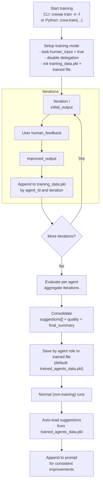

## How trained data is used by agents

CrewAI uses the training artifacts in two ways: during training to incorporate your human feedback, and after training to guide agents with consolidated suggestions.

### Training data flow

### During training runs

* On each iteration, the system records for every agent:
  * `initial_output`: the agent’s first answer
  * `human_feedback`: your inline feedback when prompted
  * `improved_output`: the agent’s follow-up answer after feedback
* This data is stored in a working file named `training_data.pkl` keyed by the agent’s internal ID and iteration.
* While training is active, the agent automatically appends your prior human feedback to its prompt to enforce those instructions on subsequent attempts within the training session.
  Training is interactive: tasks set `human_input = true`, so running in a non-interactive environment will block on user input.

### After training completes

* When `train(...)` finishes, CrewAI evaluates the collected training data per agent and produces a consolidated result containing:
  * `suggestions`: clear, actionable instructions distilled from your feedback and the difference between initial/improved outputs
  * `quality`: a 0–10 score capturing improvement
  * `final_summary`: a step-by-step set of action items for future tasks
* These consolidated results are saved to the filename you pass to `train(...)` (default via CLI is `trained_agents_data.pkl`). Entries are keyed by the agent’s `role` so they can be applied across sessions.
* During normal (non-training) execution, each agent automatically loads its consolidated `suggestions` and appends them to the task prompt as mandatory instructions. This gives you consistent improvements without changing your agent definitions.

### File summary

* `training_data.pkl` (ephemeral, per-session):
  * Structure: `agent_id -> { iteration_number: { initial_output, human_feedback, improved_output } }`
  * Purpose: capture raw data and human feedback during training
  * Location: saved in the current working directory (CWD)
* `trained_agents_data.pkl` (or your custom filename):
  * Structure: `agent_role -> { suggestions: string[], quality: number, final_summary: string }`
  * Purpose: persist consolidated guidance for future runs
  * Location: written to the CWD by default; use `-f` to set a custom (including absolute) path

---

## Navigation

- [📑 Back to Index](./index.md)
- [📄 Full Documentation](./documentation.md)
- [📝 Original Source](../llms-full.txt)

**Previous:** [← Overview](./350-overview.md)

**Next:** [Small Language Model Considerations →](./352-small-language-model-considerations.md)
