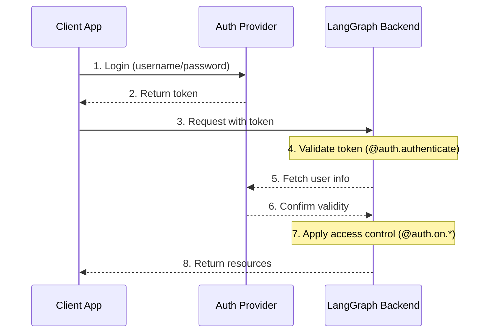
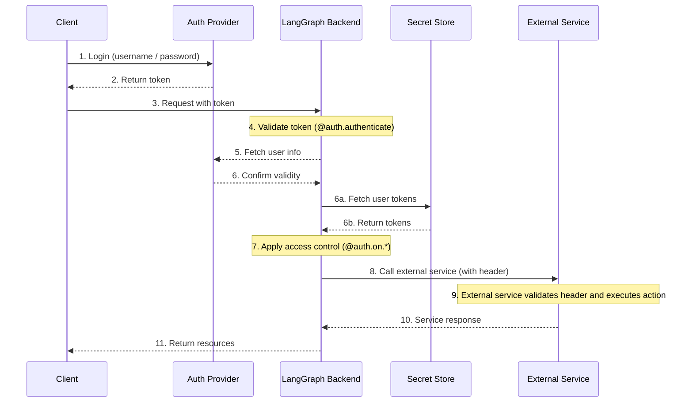

# Node that *uses* the instructions

**Navigation:** [← Previous](./03-abbreviated-list-of-sp-500-companies-for-demonstration.md) | [Index](./index.md) | [Next →](./05-find-memories-about-food-preferences.md)

---

# Node that *uses* the instructions
def call_model(state: State, store: BaseStore):
    namespace = ("agent_instructions", )
    instructions = store.get(namespace, key="agent_a")[0]
    # Application logic
    prompt = prompt_template.format(instructions=instructions.value["instructions"])
    ...


# Node that updates instructions
def update_instructions(state: State, store: BaseStore):
    namespace = ("instructions",)
    current_instructions = store.search(namespace)[0]
    # Memory logic
    prompt = prompt_template.format(instructions=current_instructions.value["instructions"], conversation=state["messages"])
    output = llm.invoke(prompt)
    new_instructions = output['new_instructions']
    store.put(("agent_instructions",), "agent_a", {"instructions": new_instructions})
    ...
```


### Writing memories

There are two primary methods for agents to write memories: ["in the hot path"](#in-the-hot-path) and ["in the background"](#in-the-background).


#### In the hot path

Creating memories during runtime offers both advantages and challenges. On the positive side, this approach allows for real-time updates, making new memories immediately available for use in subsequent interactions. It also enables transparency, as users can be notified when memories are created and stored.

However, this method also presents challenges. It may increase complexity if the agent requires a new tool to decide what to commit to memory. In addition, the process of reasoning about what to save to memory can impact agent latency. Finally, the agent must multitask between memory creation and its other responsibilities, potentially affecting the quantity and quality of memories created.

As an example, ChatGPT uses a [save_memories](https://openai.com/index/memory-and-new-controls-for-chatgpt/) tool to upsert memories as content strings, deciding whether and how to use this tool with each user message. See our [memory-agent](https://github.com/langchain-ai/memory-agent) template as an reference implementation.

#### In the background

Creating memories as a separate background task offers several advantages. It eliminates latency in the primary application, separates application logic from memory management, and allows for more focused task completion by the agent. This approach also provides flexibility in timing memory creation to avoid redundant work.

However, this method has its own challenges. Determining the frequency of memory writing becomes crucial, as infrequent updates may leave other threads without new context. Deciding when to trigger memory formation is also important. Common strategies include scheduling after a set time period (with rescheduling if new events occur), using a cron schedule, or allowing manual triggers by users or the application logic.

See our [memory-service](https://github.com/langchain-ai/memory-template) template as an reference implementation.

### Memory storage

LangGraph stores long-term memories as JSON documents in a [store](persistence.md#memory-store). Each memory is organized under a custom `namespace` (similar to a folder) and a distinct `key` (like a file name). Namespaces often include user or org IDs or other labels that makes it easier to organize information. This structure enables hierarchical organization of memories. Cross-namespace searching is then supported through content filters.

```python
from langgraph.store.memory import InMemoryStore


def embed(texts: list[str]) -> list[list[float]]:
    # Replace with an actual embedding function or LangChain embeddings object
    return [[1.0, 2.0] * len(texts)]


# InMemoryStore saves data to an in-memory dictionary. Use a DB-backed store in production use.
store = InMemoryStore(index={"embed": embed, "dims": 2})
user_id = "my-user"
application_context = "chitchat"
namespace = (user_id, application_context)
store.put(
    namespace,
    "a-memory",
    {
        "rules": [
            "User likes short, direct language",
            "User only speaks English & python",
        ],
        "my-key": "my-value",
    },
)

# get the "memory" by ID
item = store.get(namespace, "a-memory")

# search for "memories" within this namespace, filtering on content equivalence, sorted by vector similarity
items = store.search(
    namespace, filter={"my-key": "my-value"}, query="language preferences"
)
```


For more information about the memory store, see the [Persistence](persistence.md#memory-store) guide.


---
concepts/agentic_concepts.md
---

---
search:
  boost: 2
---


# Agent architectures

Many LLM applications implement a particular control flow of steps before and / or after LLM calls. As an example, [RAG](https://github.com/langchain-ai/rag-from-scratch) performs retrieval of documents relevant to a user question, and passes those documents to an LLM in order to ground the model's response in the provided document context. 

Instead of hard-coding a fixed control flow, we sometimes want LLM systems that can pick their own control flow to solve more complex problems! This is one definition of an [agent](https://blog.langchain.dev/what-is-an-agent/): *an agent is a system that uses an LLM to decide the control flow of an application.* There are many ways that an LLM can control application:

- An LLM can route between two potential paths
- An LLM can decide which of many tools to call
- An LLM can decide whether the generated answer is sufficient or more work is needed

As a result, there are many different types of [agent architectures](https://blog.langchain.dev/what-is-a-cognitive-architecture/), which give an LLM varying levels of control. 


## Router

A router allows an LLM to select a single step from a specified set of options. This is an agent architecture that exhibits a relatively limited level of control because the LLM usually focuses on making a single decision and produces a specific output from a limited set of pre-defined options. Routers typically employ a few different concepts to achieve this.

### Structured Output

Structured outputs with LLMs work by providing a specific format or schema that the LLM should follow in its response. This is similar to tool calling, but more general. While tool calling typically involves selecting and using predefined functions, structured outputs can be used for any type of formatted response. Common methods to achieve structured outputs include:

1. Prompt engineering: Instructing the LLM to respond in a specific format via the system prompt.
2. Output parsers: Using post-processing to extract structured data from LLM responses.
3. Tool calling: Leveraging built-in tool calling capabilities of some LLMs to generate structured outputs.

Structured outputs are crucial for routing as they ensure the LLM's decision can be reliably interpreted and acted upon by the system. Learn more about [structured outputs in this how-to guide](https://python.langchain.com/docs/how_to/structured_output/).


## Tool-calling agent

While a router allows an LLM to make a single decision, more complex agent architectures expand the LLM's control in two key ways:

1. Multi-step decision making: The LLM can make a series of decisions, one after another, instead of just one.
2. Tool access: The LLM can choose from and use a variety of tools to accomplish tasks.

[ReAct](https://arxiv.org/abs/2210.03629) is a popular general purpose agent architecture that combines these expansions, integrating three core concepts. 

1. [Tool calling](#tool-calling): Allowing the LLM to select and use various tools as needed.
2. [Memory](#memory): Enabling the agent to retain and use information from previous steps.
3. [Planning](#planning): Empowering the LLM to create and follow multi-step plans to achieve goals.

This architecture allows for more complex and flexible agent behaviors, going beyond simple routing to enable dynamic problem-solving with multiple steps. Unlike the original [paper](https://arxiv.org/abs/2210.03629), today's agents rely on LLMs' [tool calling](#tool-calling) capabilities and operate on a list of [messages](./low_level.md#why-use-messages).

In LangGraph, you can use the prebuilt [agent](../agents/agents.md#2-create-an-agent) to get started with tool-calling agents.

### Tool calling

Tools are useful whenever you want an agent to interact with external systems. External systems (e.g., APIs) often require a particular input schema or payload, rather than natural language. When we bind an API, for example, as a tool, we give the model awareness of the required input schema. The model will choose to call a tool based upon the natural language input from the user and it will return an output that adheres to the tool's required schema. 

[Many LLM providers support tool calling](https://python.langchain.com/docs/integrations/chat/) and [tool calling interface](https://blog.langchain.dev/improving-core-tool-interfaces-and-docs-in-langchain/) in LangChain is simple: you can simply pass any Python `function` into `ChatModel.bind_tools(function)`.


### Memory

[Memory](../how-tos/memory/add-memory.md) is crucial for agents, enabling them to retain and utilize information across multiple steps of problem-solving. It operates on different scales:

1. [Short-term memory](../how-tos/memory/add-memory.md#add-short-term-memory): Allows the agent to access information acquired during earlier steps in a sequence.
2. [Long-term memory](../how-tos/memory/add-memory.md#add-long-term-memory): Enables the agent to recall information from previous interactions, such as past messages in a conversation.

LangGraph provides full control over memory implementation:

- [`State`](./low_level.md#state): User-defined schema specifying the exact structure of memory to retain.
- [`Checkpointer`](./persistence.md#checkpoints): Mechanism to store state at every step across different interactions within a session.
- [`Store`](./persistence.md#memory-store): Mechanism to store user-specific or application-level data across sessions.

This flexible approach allows you to tailor the memory system to your specific agent architecture needs. Effective memory management enhances an agent's ability to maintain context, learn from past experiences, and make more informed decisions over time. For a practical guide on adding and managing memory, see [Memory](../how-tos/memory/add-memory.md).

### Planning

In a tool-calling [agent](../agents/overview.md#what-is-an-agent), an LLM is called repeatedly in a while-loop. At each step the agent decides which tools to call, and what the inputs to those tools should be. Those tools are then executed, and the outputs are fed back into the LLM as observations. The while-loop terminates when the agent decides it has enough information to solve the user request and it is not worth calling any more tools.


## Custom agent architectures

While routers and tool-calling agents (like ReAct) are common, [customizing agent architectures](https://blog.langchain.dev/why-you-should-outsource-your-agentic-infrastructure-but-own-your-cognitive-architecture/) often leads to better performance for specific tasks. LangGraph offers several powerful features for building tailored agent systems:

### Human-in-the-loop

Human involvement can significantly enhance agent reliability, especially for sensitive tasks. This can involve:

- Approving specific actions
- Providing feedback to update the agent's state
- Offering guidance in complex decision-making processes

Human-in-the-loop patterns are crucial when full automation isn't feasible or desirable. Learn more in our [human-in-the-loop guide](./human_in_the_loop.md).

### Parallelization 

Parallel processing is vital for efficient multi-agent systems and complex tasks. LangGraph supports parallelization through its [Send](./low_level.md#send) API, enabling:

- Concurrent processing of multiple states
- Implementation of map-reduce-like operations
- Efficient handling of independent subtasks

For practical implementation, see our [map-reduce tutorial](../how-tos/graph-api.md#map-reduce-and-the-send-api)

### Subgraphs

[Subgraphs](./subgraphs.md) are essential for managing complex agent architectures, particularly in [multi-agent systems](./multi_agent.md). They allow:

- Isolated state management for individual agents
- Hierarchical organization of agent teams
- Controlled communication between agents and the main system

Subgraphs communicate with the parent graph through overlapping keys in the state schema. This enables flexible, modular agent design. For implementation details, refer to our [subgraph how-to guide](../how-tos/subgraph.md).

### Reflection

Reflection mechanisms can significantly improve agent reliability by:

1. Evaluating task completion and correctness
2. Providing feedback for iterative improvement
3. Enabling self-correction and learning

While often LLM-based, reflection can also use deterministic methods. For instance, in coding tasks, compilation errors can serve as feedback. This approach is demonstrated in [this video using LangGraph for self-corrective code generation](https://www.youtube.com/watch?v=MvNdgmM7uyc).

By leveraging these features, LangGraph enables the creation of sophisticated, task-specific agent architectures that can handle complex workflows, collaborate effectively, and continuously improve their performance.


---
concepts/auth.md
---

---
search:
  boost: 2
---


# Authentication & Access Control

LangGraph Platform provides a flexible authentication and authorization system that can integrate with most authentication schemes.


## Core Concepts

### Authentication vs Authorization

While often used interchangeably, these terms represent distinct security concepts:

- [**Authentication**](#authentication) ("AuthN") verifies _who_ you are. This runs as middleware for every request.
- [**Authorization**](#authorization) ("AuthZ") determines _what you can do_. This validates the user's privileges and roles on a per-resource basis.

In LangGraph Platform, authentication is handled by your [`@auth.authenticate`](../cloud/reference/sdk/python_sdk_ref.md#langgraph_sdk.auth.Auth.authenticate) handler, and authorization is handled by your [`@auth.on`](../cloud/reference/sdk/python_sdk_ref.md#langgraph_sdk.auth.Auth.on) handlers.


## Default Security Models

LangGraph Platform provides different security defaults:

### LangGraph Platform

- Uses LangSmith API keys by default
- Requires valid API key in `x-api-key` header
- Can be customized with your auth handler

!!! note "Custom auth"

   Custom auth **is supported** for all plans in LangGraph Platform.

### Self-Hosted

- No default authentication
- Complete flexibility to implement your security model
- You control all aspects of authentication and authorization


## System Architecture

A typical authentication setup involves three main components:

1. **Authentication Provider** (Identity Provider/IdP)

   - A dedicated service that manages user identities and credentials
   - Handles user registration, login, password resets, etc.
   - Issues tokens (JWT, session tokens, etc.) after successful authentication
   - Examples: Auth0, Supabase Auth, Okta, or your own auth server

2. **LangGraph Backend** (Resource Server)

   - Your LangGraph application that contains business logic and protected resources
   - Validates tokens with the auth provider
   - Enforces access control based on user identity and permissions
   - Doesn't store user credentials directly

3. **Client Application** (Frontend)

   - Web app, mobile app, or API client
   - Collects time-sensitive user credentials and sends to auth provider
   - Receives tokens from auth provider
   - Includes these tokens in requests to LangGraph backend

Here's how these components typically interact:



Your [`@auth.authenticate`](../cloud/reference/sdk/python_sdk_ref.md#langgraph_sdk.auth.Auth.authenticate) handler in LangGraph handles steps 4-6, while your [`@auth.on`](../cloud/reference/sdk/python_sdk_ref.md#langgraph_sdk.auth.Auth.on) handlers implement step 7.


## Authentication

Authentication in LangGraph runs as middleware on every request. Your [`@auth.authenticate`](../cloud/reference/sdk/python_sdk_ref.md#langgraph_sdk.auth.Auth.authenticate) handler receives request information and should:

1. Validate the credentials
2. Return [user info](../cloud/reference/sdk/python_sdk_ref.md#langgraph_sdk.auth.types.MinimalUserDict) containing the user's identity and user information if valid
3. Raise an [HTTPException](../cloud/reference/sdk/python_sdk_ref.md#langgraph_sdk.auth.exceptions.HTTPException) or AssertionError if invalid

```python
from langgraph_sdk import Auth

auth = Auth()

@auth.authenticate
async def authenticate(headers: dict) -> Auth.types.MinimalUserDict:
    # Validate credentials (e.g., API key, JWT token)
    api_key = headers.get("x-api-key")
    if not api_key or not is_valid_key(api_key):
        raise Auth.exceptions.HTTPException(
            status_code=401,
            detail="Invalid API key"
        )

    # Return user info - only identity and is_authenticated are required
    # Add any additional fields you need for authorization
    return {
        "identity": "user-123",        # Required: unique user identifier
        "is_authenticated": True,      # Optional: assumed True by default
        "permissions": ["read", "write"] # Optional: for permission-based auth
        # You can add more custom fields if you want to implement other auth patterns
        "role": "admin",
        "org_id": "org-456"

    }
```

The returned user information is available:

- To your authorization handlers via [`ctx.user`](../cloud/reference/sdk/python_sdk_ref.md#langgraph_sdk.auth.types.AuthContext)
- In your application via `config["configuration"]["langgraph_auth_user"]`


??? tip "Supported Parameters"

    The [`@auth.authenticate`](../cloud/reference/sdk/python_sdk_ref.md#langgraph_sdk.auth.Auth.authenticate) handler can accept any of the following parameters by name:

    * request (Request): The raw ASGI request object
    * body (dict): The parsed request body
    * path (str): The request path, e.g., "/threads/abcd-1234-abcd-1234/runs/abcd-1234-abcd-1234/stream"
    * method (str): The HTTP method, e.g., "GET"
    * path_params (dict[str, str]): URL path parameters, e.g., {"thread_id": "abcd-1234-abcd-1234", "run_id": "abcd-1234-abcd-1234"}
    * query_params (dict[str, str]): URL query parameters, e.g., {"stream": "true"}
    * headers (dict[bytes, bytes]): Request headers
    * authorization (str | None): The Authorization header value (e.g., "Bearer <token>")


    In many of our tutorials, we will just show the "authorization" parameter to be concise, but you can opt to accept more information as needed
    to implement your custom authentication scheme.

### Agent authentication

Custom authentication permits delegated access. The values you return in `@auth.authenticate` are added to the run context, giving agents user-scoped credentials lets them access resources on the user’s behalf.



After authentication, the platform creates a special configuration object that is passed to your graph and all nodes via the configurable context.
This object contains information about the current user, including any custom fields you return from your [`@auth.authenticate`](../cloud/reference/sdk/python_sdk_ref.md#langgraph_sdk.auth.Auth.authenticate) handler.

To enable an agent to act on behalf of the user, use [custom authentication middleware](../how-tos/auth/custom_auth.md). This will allow the agent to interact with external systems like MCP servers, external databases, and even other agents on behalf of the user.

For more information, see the [Use custom auth](../how-tos/auth/custom_auth.md#enable-agent-authentication) guide.

### Agent authentication with MCP

For information on how to authenticate an agent to an MCP server, see the [MCP conceptual guide](../concepts/mcp.md).


## Authorization

After authentication, LangGraph calls your authorization handlers to control access to specific resources (e.g., threads, assistants, crons). These handlers can:

1. Add metadata to be saved during resource creation by mutating the metadata. See the [supported actions table](#supported-actions) for the list of types the value can take for each action.
2. Filter resources by metadata during search/list or read operations by returning a [filter](#filter-operations).
3. Raise an HTTP exception if access is denied.

If you want to just implement simple user-scoped access control, you can use a single authorization handler for all resources and actions. If you want to have different control depending on the resource and action, you can use [resource-specific handlers](#resource-specific-handlers). See the [Supported Resources](#supported-resources) section for a full list of the resources that support access control.

Your [`@auth.on`](../cloud/reference/sdk/python_sdk_ref.md#langgraph_sdk.auth.Auth.on) handlers control access by mutating the `value["metadata"]` dictionary directly and returning a [filter dictionary](#filter-operations).

```python
@auth.on
async def add_owner(
    ctx: Auth.types.AuthContext,
    value: dict  # The payload being sent to this access method
) -> dict:  # Returns a filter dict that restricts access to resources
    """Authorize all access to threads, runs, crons, and assistants.

    This handler does two things:
        - Adds a value to resource metadata (to persist with the resource so it can be filtered later)
        - Returns a filter (to restrict access to existing resources)

    Args:
        ctx: Authentication context containing user info, permissions, the path, and
        value: The request payload sent to the endpoint. For creation
              operations, this contains the resource parameters. For read
              operations, this contains the resource being accessed.

    Returns:
        A filter dictionary that LangGraph uses to restrict access to resources.
        See [Filter Operations](#filter-operations) for supported operators.
    """
    # Create filter to restrict access to just this user's resources
    filters = {"owner": ctx.user.identity}

    # Get or create the metadata dictionary in the payload
    # This is where we store persistent info about the resource
    metadata = value.setdefault("metadata", {})

    # Add owner to metadata - if this is a create or update operation,
    # this information will be saved with the resource
    # So we can filter by it later in read operations
    metadata.update(filters)

    # Return filters to restrict access
    # These filters are applied to ALL operations (create, read, update, search, etc.)
    # to ensure users can only access their own resources
    return filters
```


### Resource-Specific Handlers {#resource-specific-handlers}

You can register handlers for specific resources and actions by chaining the resource and action names together with the authorization decorator.
When a request is made, the most specific handler that matches that resource and action is called. Below is an example of how to register handlers for specific resources and actions. For the following setup:

1. Authenticated users are able to create threads, read threads, and create runs on threads
2. Only users with the "assistants:create" permission are allowed to create new assistants
3. All other endpoints (e.g., e.g., delete assistant, crons, store) are disabled for all users.

!!! tip "Supported Handlers"

    For a full list of supported resources and actions, see the [Supported Resources](#supported-resources) section below.

```python

# Generic / global handler catches calls that aren't handled by more specific handlers
@auth.on
async def reject_unhandled_requests(ctx: Auth.types.AuthContext, value: Any) -> False:
    print(f"Request to {ctx.path} by {ctx.user.identity}")
    raise Auth.exceptions.HTTPException(
        status_code=403,
        detail="Forbidden"
    )


# Matches the "thread" resource and all actions - create, read, update, delete, search

# Since this is **more specific** than the generic @auth.on handler, it will take precedence

# over the generic handler for all actions on the "threads" resource
@auth.on.threads
async def on_thread_create(
    ctx: Auth.types.AuthContext,
    value: Auth.types.threads.create.value
):
    if "write" not in ctx.permissions:
        raise Auth.exceptions.HTTPException(
            status_code=403,
            detail="User lacks the required permissions."
        )
    # Setting metadata on the thread being created
    # will ensure that the resource contains an "owner" field
    # Then any time a user tries to access this thread or runs within the thread,
    # we can filter by owner
    metadata = value.setdefault("metadata", {})
    metadata["owner"] = ctx.user.identity
    return {"owner": ctx.user.identity}


# Thread creation. This will match only on thread create actions

# Since this is **more specific** than both the generic @auth.on handler and the @auth.on.threads handler,

# it will take precedence for any "create" actions on the "threads" resources
@auth.on.threads.create
async def on_thread_create(
    ctx: Auth.types.AuthContext,
    value: Auth.types.threads.create.value
):
    # Setting metadata on the thread being created
    # will ensure that the resource contains an "owner" field
    # Then any time a user tries to access this thread or runs within the thread,
    # we can filter by owner
    metadata = value.setdefault("metadata", {})
    metadata["owner"] = ctx.user.identity
    return {"owner": ctx.user.identity}


# Reading a thread. Since this is also more specific than the generic @auth.on handler, and the @auth.on.threads handler,

# it will take precedence for any "read" actions on the "threads" resource
@auth.on.threads.read
async def on_thread_read(
    ctx: Auth.types.AuthContext,
    value: Auth.types.threads.read.value
):
    # Since we are reading (and not creating) a thread,
    # we don't need to set metadata. We just need to
    # return a filter to ensure users can only see their own threads
    return {"owner": ctx.user.identity}


# Run creation, streaming, updates, etc.

# This takes precedenceover the generic @auth.on handler and the @auth.on.threads handler
@auth.on.threads.create_run
async def on_run_create(
    ctx: Auth.types.AuthContext,
    value: Auth.types.threads.create_run.value
):
    metadata = value.setdefault("metadata", {})
    metadata["owner"] = ctx.user.identity
    # Inherit thread's access control
    return {"owner": ctx.user.identity}


# Assistant creation
@auth.on.assistants.create
async def on_assistant_create(
    ctx: Auth.types.AuthContext,
    value: Auth.types.assistants.create.value
):
    if "assistants:create" not in ctx.permissions:
        raise Auth.exceptions.HTTPException(
            status_code=403,
            detail="User lacks the required permissions."
        )
```


Notice that we are mixing global and resource-specific handlers in the above example. Since each request is handled by the most specific handler, a request to create a `thread` would match the `on_thread_create` handler but NOT the `reject_unhandled_requests` handler. A request to `update` a thread, however would be handled by the global handler, since we don't have a more specific handler for that resource and action.

### Filter Operations {#filter-operations}

Authorization handlers can return different types of values:

- `None` and `True` mean "authorize access to all underling resources"
- `False` means "deny access to all underling resources (raises a 403 exception)"
- A metadata filter dictionary will restrict access to resources

A filter dictionary is a dictionary with keys that match the resource metadata. It supports three operators:

- The default value is a shorthand for exact match, or "$eq", below. For example, `{"owner": user_id}` will include only resources with metadata containing `{"owner": user_id}`
- `$eq`: Exact match (e.g., `{"owner": {"$eq": user_id}}`) - this is equivalent to the shorthand above, `{"owner": user_id}`
- `$contains`: List membership (e.g., `{"allowed_users": {"$contains": user_id}}`) The value here must be an element of the list. The metadata in the stored resource must be a list/container type.

A dictionary with multiple keys is treated using a logical `AND` filter. For example, `{"owner": org_id, "allowed_users": {"$contains": user_id}}` will only match resources with metadata whose "owner" is `org_id` and whose "allowed_users" list contains `user_id`.
See the reference [here](../cloud/reference/sdk/python_sdk_ref.md#langgraph_sdk.auth.types.FilterType) for more information.


## Common Access Patterns

Here are some typical authorization patterns:

### Single-Owner Resources

This common pattern lets you scope all threads, assistants, crons, and runs to a single user. It's useful for common single-user use cases like regular chatbot-style apps.

```python
@auth.on
async def owner_only(ctx: Auth.types.AuthContext, value: dict):
    metadata = value.setdefault("metadata", {})
    metadata["owner"] = ctx.user.identity
    return {"owner": ctx.user.identity}
```


### Permission-based Access

This pattern lets you control access based on **permissions**. It's useful if you want certain roles to have broader or more restricted access to resources.

```python

# In your auth handler:
@auth.authenticate
async def authenticate(headers: dict) -> Auth.types.MinimalUserDict:
    ...
    return {
        "identity": "user-123",
        "is_authenticated": True,
        "permissions": ["threads:write", "threads:read"]  # Define permissions in auth
    }

def _default(ctx: Auth.types.AuthContext, value: dict):
    metadata = value.setdefault("metadata", {})
    metadata["owner"] = ctx.user.identity
    return {"owner": ctx.user.identity}

@auth.on.threads.create
async def create_thread(ctx: Auth.types.AuthContext, value: dict):
    if "threads:write" not in ctx.permissions:
        raise Auth.exceptions.HTTPException(
            status_code=403,
            detail="Unauthorized"
        )
    return _default(ctx, value)


@auth.on.threads.read
async def rbac_create(ctx: Auth.types.AuthContext, value: dict):
    if "threads:read" not in ctx.permissions and "threads:write" not in ctx.permissions:
        raise Auth.exceptions.HTTPException(
            status_code=403,
            detail="Unauthorized"
        )
    return _default(ctx, value)
```


## Supported Resources

LangGraph provides three levels of authorization handlers, from most general to most specific:

1. **Global Handler** (`@auth.on`): Matches all resources and actions
2. **Resource Handler** (e.g., `@auth.on.threads`, `@auth.on.assistants`, `@auth.on.crons`): Matches all actions for a specific resource
3. **Action Handler** (e.g., `@auth.on.threads.create`, `@auth.on.threads.read`): Matches a specific action on a specific resource

The most specific matching handler will be used. For example, `@auth.on.threads.create` takes precedence over `@auth.on.threads` for thread creation.
If a more specific handler is registered, the more general handler will not be called for that resource and action.


???+ tip "Type Safety"
Each handler has type hints available for its `value` parameter. For example:

    ```python
    @auth.on.threads.create
    async def on_thread_create(
        ctx: Auth.types.AuthContext,
        value: Auth.types.on.threads.create.value  # Specific type for thread creation
    ):
        ...

    @auth.on.threads
    async def on_threads(
        ctx: Auth.types.AuthContext,
        value: Auth.types.on.threads.value  # Union type of all thread actions
    ):
        ...

    @auth.on
    async def on_all(
        ctx: Auth.types.AuthContext,
        value: dict  # Union type of all possible actions
    ):
        ...
    ```

    More specific handlers provide better type hints since they handle fewer action types.


#### Supported actions and types {#supported-actions}

Here are all the supported action handlers:

| Resource | Handler | Description | Value Type |
|----------|---------|-------------|------------|
| **Threads** | `@auth.on.threads.create` | Thread creation | [`ThreadsCreate`](../cloud/reference/sdk/python_sdk_ref.md#langgraph_sdk.auth.types.ThreadsCreate) |
| | `@auth.on.threads.read` | Thread retrieval | [`ThreadsRead`](../cloud/reference/sdk/python_sdk_ref.md#langgraph_sdk.auth.types.ThreadsRead) |
| | `@auth.on.threads.update` | Thread updates | [`ThreadsUpdate`](../cloud/reference/sdk/python_sdk_ref.md#langgraph_sdk.auth.types.ThreadsUpdate) |
| | `@auth.on.threads.delete` | Thread deletion | [`ThreadsDelete`](../cloud/reference/sdk/python_sdk_ref.md#langgraph_sdk.auth.types.ThreadsDelete) |
| | `@auth.on.threads.search` | Listing threads | [`ThreadsSearch`](../cloud/reference/sdk/python_sdk_ref.md#langgraph_sdk.auth.types.ThreadsSearch) |
| | `@auth.on.threads.create_run` | Creating or updating a run | [`RunsCreate`](../cloud/reference/sdk/python_sdk_ref.md#langgraph_sdk.auth.types.RunsCreate) |
| **Assistants** | `@auth.on.assistants.create` | Assistant creation | [`AssistantsCreate`](../cloud/reference/sdk/python_sdk_ref.md#langgraph_sdk.auth.types.AssistantsCreate) |
| | `@auth.on.assistants.read` | Assistant retrieval | [`AssistantsRead`](../cloud/reference/sdk/python_sdk_ref.md#langgraph_sdk.auth.types.AssistantsRead) |
| | `@auth.on.assistants.update` | Assistant updates | [`AssistantsUpdate`](../cloud/reference/sdk/python_sdk_ref.md#langgraph_sdk.auth.types.AssistantsUpdate) |
| | `@auth.on.assistants.delete` | Assistant deletion | [`AssistantsDelete`](../cloud/reference/sdk/python_sdk_ref.md#langgraph_sdk.auth.types.AssistantsDelete) |
| | `@auth.on.assistants.search` | Listing assistants | [`AssistantsSearch`](../cloud/reference/sdk/python_sdk_ref.md#langgraph_sdk.auth.types.AssistantsSearch) |
| **Crons** | `@auth.on.crons.create` | Cron job creation | [`CronsCreate`](../cloud/reference/sdk/python_sdk_ref.md#langgraph_sdk.auth.types.CronsCreate) |
| | `@auth.on.crons.read` | Cron job retrieval | [`CronsRead`](../cloud/reference/sdk/python_sdk_ref.md#langgraph_sdk.auth.types.CronsRead) |
| | `@auth.on.crons.update` | Cron job updates | [`CronsUpdate`](../cloud/reference/sdk/python_sdk_ref.md#langgraph_sdk.auth.types.CronsUpdate) |
| | `@auth.on.crons.delete` | Cron job deletion | [`CronsDelete`](../cloud/reference/sdk/python_sdk_ref.md#langgraph_sdk.auth.types.CronsDelete) |
| | `@auth.on.crons.search` | Listing cron jobs | [`CronsSearch`](../cloud/reference/sdk/python_sdk_ref.md#langgraph_sdk.auth.types.CronsSearch) |


???+ note "About Runs"

    Runs are scoped to their parent thread for access control. This means permissions are typically inherited from the thread, reflecting the conversational nature of the data model. All run operations (reading, listing) except creation are controlled by the thread's handlers.

    There is a specific `create_run` handler for creating new runs because it had more arguments that you can view in the handler.


## Next Steps

For implementation details:

- Check out the introductory tutorial on [setting up authentication](../tutorials/auth/getting_started.md)
- See the how-to guide on implementing a [custom auth handlers](../how-tos/auth/custom_auth.md)


---
concepts/faq.md
---

---
search:
  boost: 2
---


# FAQ

Common questions and their answers!


## Do I need to use LangChain to use LangGraph? What’s the difference?

No. LangGraph is an orchestration framework for complex agentic systems and is more low-level and controllable than LangChain agents. LangChain provides a standard interface to interact with models and other components, useful for straight-forward chains and retrieval flows.


## How is LangGraph different from other agent frameworks?

Other agentic frameworks can work for simple, generic tasks but fall short for complex tasks. LangGraph provides a more expressive framework to handle your unique tasks without restricting you to a single black-box cognitive architecture.


## Does LangGraph impact the performance of my app?

LangGraph will not add any overhead to your code and is specifically designed with streaming workflows in mind.


## Is LangGraph open source? Is it free?

Yes. LangGraph is an MIT-licensed open-source library and is free to use.


## How are LangGraph and LangGraph Platform different?

LangGraph is a stateful, orchestration framework that brings added control to agent workflows. LangGraph Platform is a service for deploying and scaling LangGraph applications, with an opinionated API for building agent UXs, plus an integrated developer studio.

| Features            | LangGraph (open source)                                   | LangGraph Platform                                                                                     |
| ------------------- | --------------------------------------------------------- | ------------------------------------------------------------------------------------------------------ |
| Description         | Stateful orchestration framework for agentic applications | Scalable infrastructure for deploying LangGraph applications                                           |
| SDKs                | Python and JavaScript                                     | Python and JavaScript                                                                                  |
| HTTP APIs           | None                                                      | Yes - useful for retrieving & updating state or long-term memory, or creating a configurable assistant |
| Streaming           | Basic                                                     | Dedicated mode for token-by-token messages                                                             |
| Checkpointer        | Community contributed                                     | Supported out-of-the-box                                                                               |
| Persistence Layer   | Self-managed                                              | Managed Postgres with efficient storage                                                                |
| Deployment          | Self-managed                                              | • Cloud SaaS <br> • Free self-hosted <br> • Enterprise (paid self-hosted)                              |
| Scalability         | Self-managed                                              | Auto-scaling of task queues and servers                                                                |
| Fault-tolerance     | Self-managed                                              | Automated retries                                                                                      |
| Concurrency Control | Simple threading                                          | Supports double-texting                                                                                |
| Scheduling          | None                                                      | Cron scheduling                                                                                        |
| Monitoring          | None                                                      | Integrated with LangSmith for observability                                                            |
| IDE integration     | LangGraph Studio                                          | LangGraph Studio                                                                                       |


## Is LangGraph Platform open source?

No. LangGraph Platform is proprietary software.

There is a free, self-hosted version of LangGraph Platform with access to basic features. The Cloud SaaS deployment option and the Self-Hosted deployment options are paid services. [Contact our sales team](https://www.langchain.com/contact-sales) to learn more.

For more information, see our [LangGraph Platform pricing page](https://www.langchain.com/pricing-langgraph-platform).


## Does LangGraph work with LLMs that don't support tool calling?

Yes! You can use LangGraph with any LLMs. The main reason we use LLMs that support tool calling is that this is often the most convenient way to have the LLM make its decision about what to do. If your LLM does not support tool calling, you can still use it - you just need to write a bit of logic to convert the raw LLM string response to a decision about what to do.


## Does LangGraph work with OSS LLMs?

Yes! LangGraph is totally ambivalent to what LLMs are used under the hood. The main reason we use closed LLMs in most of the tutorials is that they seamlessly support tool calling, while OSS LLMs often don't. But tool calling is not necessary (see [this section](#does-langgraph-work-with-llms-that-dont-support-tool-calling)) so you can totally use LangGraph with OSS LLMs.


## Can I use LangGraph Studio without logging in to LangSmith

Yes! You can use the [development version of LangGraph Server](../tutorials/langgraph-platform/local-server.md) to run the backend locally.
This will connect to the studio frontend hosted as part of LangSmith.
If you set an environment variable of `LANGSMITH_TRACING=false`, then no traces will be sent to LangSmith.


## What does "nodes executed" mean for LangGraph Platform usage?

**Nodes Executed** is the aggregate number of nodes in a LangGraph application that are called and completed successfully during an invocation of the application. If a node in the graph is not called during execution or ends in an error state, these nodes will not be counted. If a node is called and completes successfully multiple times, each occurrence will be counted.


---
concepts/mcp.md
---


# MCP

[Model Context Protocol (MCP)](https://modelcontextprotocol.io/introduction) is an open protocol that standardizes how applications provide tools and context to language models. LangGraph agents can use tools defined on MCP servers through the `langchain-mcp-adapters` library.


Install the `langchain-mcp-adapters` library to use MCP tools in LangGraph:

```bash
pip install langchain-mcp-adapters
```


---
concepts/multi_agent.md
---


# Multi-agent systems

An [agent](./agentic_concepts.md#agent-architectures) is _a system that uses an LLM to decide the control flow of an application_. As you develop these systems, they might grow more complex over time, making them harder to manage and scale. For example, you might run into the following problems:

- agent has too many tools at its disposal and makes poor decisions about which tool to call next
- context grows too complex for a single agent to keep track of
- there is a need for multiple specialization areas in the system (e.g. planner, researcher, math expert, etc.)

To tackle these, you might consider breaking your application into multiple smaller, independent agents and composing them into a **multi-agent system**. These independent agents can be as simple as a prompt and an LLM call, or as complex as a [ReAct](./agentic_concepts.md#tool-calling-agent) agent (and more!).

The primary benefits of using multi-agent systems are:

- **Modularity**: Separate agents make it easier to develop, test, and maintain agentic systems.
- **Specialization**: You can create expert agents focused on specific domains, which helps with the overall system performance.
- **Control**: You can explicitly control how agents communicate (as opposed to relying on function calling).


## Multi-agent architectures


There are several ways to connect agents in a multi-agent system:

- **Network**: each agent can communicate with [every other agent](../tutorials/multi_agent/multi-agent-collaboration.ipynb/). Any agent can decide which other agent to call next.
- **Supervisor**: each agent communicates with a single [supervisor](../tutorials/multi_agent/agent_supervisor.md/) agent. Supervisor agent makes decisions on which agent should be called next.
- **Supervisor (tool-calling)**: this is a special case of supervisor architecture. Individual agents can be represented as tools. In this case, a supervisor agent uses a tool-calling LLM to decide which of the agent tools to call, as well as the arguments to pass to those agents.
- **Hierarchical**: you can define a multi-agent system with [a supervisor of supervisors](../tutorials/multi_agent/hierarchical_agent_teams.ipynb/). This is a generalization of the supervisor architecture and allows for more complex control flows.
- **Custom multi-agent workflow**: each agent communicates with only a subset of agents. Parts of the flow are deterministic, and only some agents can decide which other agents to call next.

### Handoffs

In multi-agent architectures, agents can be represented as graph nodes. Each agent node executes its step(s) and decides whether to finish execution or route to another agent, including potentially routing to itself (e.g., running in a loop). A common pattern in multi-agent interactions is **handoffs**, where one agent _hands off_ control to another. Handoffs allow you to specify:

- **destination**: target agent to navigate to (e.g., name of the node to go to)
- **payload**: [information to pass to that agent](#communication-and-state-management) (e.g., state update)

To implement handoffs in LangGraph, agent nodes can return [`Command`](./low_level.md#command) object that allows you to combine both control flow and state updates:

```python
def agent(state) -> Command[Literal["agent", "another_agent"]]:
    # the condition for routing/halting can be anything, e.g. LLM tool call / structured output, etc.
    goto = get_next_agent(...)  # 'agent' / 'another_agent'
    return Command(
        # Specify which agent to call next
        goto=goto,
        # Update the graph state
        update={"my_state_key": "my_state_value"}
    )
```


In a more complex scenario where each agent node is itself a graph (i.e., a [subgraph](./subgraphs.md)), a node in one of the agent subgraphs might want to navigate to a different agent. For example, if you have two agents, `alice` and `bob` (subgraph nodes in a parent graph), and `alice` needs to navigate to `bob`, you can set `graph=Command.PARENT` in the `Command` object:

```python
def some_node_inside_alice(state):
    return Command(
        goto="bob",
        update={"my_state_key": "my_state_value"},
        # specify which graph to navigate to (defaults to the current graph)
        graph=Command.PARENT,
    )
```


!!! note

    If you need to support visualization for subgraphs communicating using `Command(graph=Command.PARENT)` you would need to wrap them in a node function with `Command` annotation:
    Instead of this:

    ```python
    builder.add_node(alice)
    ```

    you would need to do this:

    ```python
    def call_alice(state) -> Command[Literal["bob"]]:
        return alice.invoke(state)

    builder.add_node("alice", call_alice)
    ```


#### Handoffs as tools

One of the most common agent types is a [tool-calling agent](../agents/overview.md). For those types of agents, a common pattern is wrapping a handoff in a tool call:

```python
from langchain_core.tools import tool

@tool
def transfer_to_bob():
    """Transfer to bob."""
    return Command(
        # name of the agent (node) to go to
        goto="bob",
        # data to send to the agent
        update={"my_state_key": "my_state_value"},
        # indicate to LangGraph that we need to navigate to
        # agent node in a parent graph
        graph=Command.PARENT,
    )
```


This is a special case of updating the graph state from tools where, in addition to the state update, the control flow is included as well.

!!! important

      If you want to use tools that return `Command`, you can use the prebuilt [`create_react_agent`](https://langchain-ai.github.io/langgraph/reference/prebuilt/#langgraph.prebuilt.chat_agent_executor.create_react_agent) / [`ToolNode`](https://langchain-ai.github.io/langgraph/reference/agents/#langgraph.prebuilt.tool_node.ToolNode) components, or else implement your own logic:

      ```python
      def call_tools(state):
          ...
          commands = [tools_by_name[tool_call["name"]].invoke(tool_call) for tool_call in tool_calls]
          return commands
      ```


Let's now take a closer look at the different multi-agent architectures.

### Network

In this architecture, agents are defined as graph nodes. Each agent can communicate with every other agent (many-to-many connections) and can decide which agent to call next. This architecture is good for problems that do not have a clear hierarchy of agents or a specific sequence in which agents should be called.

```python
from typing import Literal
from langchain_openai import ChatOpenAI
from langgraph.types import Command
from langgraph.graph import StateGraph, MessagesState, START, END

model = ChatOpenAI()

def agent_1(state: MessagesState) -> Command[Literal["agent_2", "agent_3", END]]:
    # you can pass relevant parts of the state to the LLM (e.g., state["messages"])
    # to determine which agent to call next. a common pattern is to call the model
    # with a structured output (e.g. force it to return an output with a "next_agent" field)
    response = model.invoke(...)
    # route to one of the agents or exit based on the LLM's decision
    # if the LLM returns "__end__", the graph will finish execution
    return Command(
        goto=response["next_agent"],
        update={"messages": [response["content"]]},
    )

def agent_2(state: MessagesState) -> Command[Literal["agent_1", "agent_3", END]]:
    response = model.invoke(...)
    return Command(
        goto=response["next_agent"],
        update={"messages": [response["content"]]},
    )

def agent_3(state: MessagesState) -> Command[Literal["agent_1", "agent_2", END]]:
    ...
    return Command(
        goto=response["next_agent"],
        update={"messages": [response["content"]]},
    )

builder = StateGraph(MessagesState)
builder.add_node(agent_1)
builder.add_node(agent_2)
builder.add_node(agent_3)

builder.add_edge(START, "agent_1")
network = builder.compile()
```


### Supervisor

In this architecture, we define agents as nodes and add a supervisor node (LLM) that decides which agent nodes should be called next. We use [`Command`](./low_level.md#command) to route execution to the appropriate agent node based on supervisor's decision. This architecture also lends itself well to running multiple agents in parallel or using [map-reduce](../how-tos/graph-api.md#map-reduce-and-the-send-api) pattern.

```python
from typing import Literal
from langchain_openai import ChatOpenAI
from langgraph.types import Command
from langgraph.graph import StateGraph, MessagesState, START, END

model = ChatOpenAI()

def supervisor(state: MessagesState) -> Command[Literal["agent_1", "agent_2", END]]:
    # you can pass relevant parts of the state to the LLM (e.g., state["messages"])
    # to determine which agent to call next. a common pattern is to call the model
    # with a structured output (e.g. force it to return an output with a "next_agent" field)
    response = model.invoke(...)
    # route to one of the agents or exit based on the supervisor's decision
    # if the supervisor returns "__end__", the graph will finish execution
    return Command(goto=response["next_agent"])

def agent_1(state: MessagesState) -> Command[Literal["supervisor"]]:
    # you can pass relevant parts of the state to the LLM (e.g., state["messages"])
    # and add any additional logic (different models, custom prompts, structured output, etc.)
    response = model.invoke(...)
    return Command(
        goto="supervisor",
        update={"messages": [response]},
    )

def agent_2(state: MessagesState) -> Command[Literal["supervisor"]]:
    response = model.invoke(...)
    return Command(
        goto="supervisor",
        update={"messages": [response]},
    )

builder = StateGraph(MessagesState)
builder.add_node(supervisor)
builder.add_node(agent_1)
builder.add_node(agent_2)

builder.add_edge(START, "supervisor")

supervisor = builder.compile()
```


Check out this [tutorial](../tutorials/multi_agent/agent_supervisor.md) for an example of supervisor multi-agent architecture.

### Supervisor (tool-calling)

In this variant of the [supervisor](#supervisor) architecture, we define a supervisor [agent](./agentic_concepts.md#agent-architectures) which is responsible for calling sub-agents. The sub-agents are exposed to the supervisor as tools, and the supervisor agent decides which tool to call next. The supervisor agent follows a [standard implementation](./agentic_concepts.md#tool-calling-agent) as an LLM running in a while loop calling tools until it decides to stop.

```python
from typing import Annotated
from langchain_openai import ChatOpenAI
from langgraph.prebuilt import InjectedState, create_react_agent

model = ChatOpenAI()


# this is the agent function that will be called as tool

# notice that you can pass the state to the tool via InjectedState annotation
def agent_1(state: Annotated[dict, InjectedState]):
    # you can pass relevant parts of the state to the LLM (e.g., state["messages"])
    # and add any additional logic (different models, custom prompts, structured output, etc.)
    response = model.invoke(...)
    # return the LLM response as a string (expected tool response format)
    # this will be automatically turned to ToolMessage
    # by the prebuilt create_react_agent (supervisor)
    return response.content

def agent_2(state: Annotated[dict, InjectedState]):
    response = model.invoke(...)
    return response.content

tools = [agent_1, agent_2]

# the simplest way to build a supervisor w/ tool-calling is to use prebuilt ReAct agent graph

# that consists of a tool-calling LLM node (i.e. supervisor) and a tool-executing node
supervisor = create_react_agent(model, tools)
```


### Hierarchical

As you add more agents to your system, it might become too hard for the supervisor to manage all of them. The supervisor might start making poor decisions about which agent to call next, or the context might become too complex for a single supervisor to keep track of. In other words, you end up with the same problems that motivated the multi-agent architecture in the first place.

To address this, you can design your system _hierarchically_. For example, you can create separate, specialized teams of agents managed by individual supervisors, and a top-level supervisor to manage the teams.

```python
from typing import Literal
from langchain_openai import ChatOpenAI
from langgraph.graph import StateGraph, MessagesState, START, END
from langgraph.types import Command
model = ChatOpenAI()


# define team 1 (same as the single supervisor example above)

def team_1_supervisor(state: MessagesState) -> Command[Literal["team_1_agent_1", "team_1_agent_2", END]]:
    response = model.invoke(...)
    return Command(goto=response["next_agent"])

def team_1_agent_1(state: MessagesState) -> Command[Literal["team_1_supervisor"]]:
    response = model.invoke(...)
    return Command(goto="team_1_supervisor", update={"messages": [response]})

def team_1_agent_2(state: MessagesState) -> Command[Literal["team_1_supervisor"]]:
    response = model.invoke(...)
    return Command(goto="team_1_supervisor", update={"messages": [response]})

team_1_builder = StateGraph(Team1State)
team_1_builder.add_node(team_1_supervisor)
team_1_builder.add_node(team_1_agent_1)
team_1_builder.add_node(team_1_agent_2)
team_1_builder.add_edge(START, "team_1_supervisor")
team_1_graph = team_1_builder.compile()


# define team 2 (same as the single supervisor example above)
class Team2State(MessagesState):
    next: Literal["team_2_agent_1", "team_2_agent_2", "__end__"]

def team_2_supervisor(state: Team2State):
    ...

def team_2_agent_1(state: Team2State):
    ...

def team_2_agent_2(state: Team2State):
    ...

team_2_builder = StateGraph(Team2State)
...
team_2_graph = team_2_builder.compile()


# define top-level supervisor

builder = StateGraph(MessagesState)
def top_level_supervisor(state: MessagesState) -> Command[Literal["team_1_graph", "team_2_graph", END]]:
    # you can pass relevant parts of the state to the LLM (e.g., state["messages"])
    # to determine which team to call next. a common pattern is to call the model
    # with a structured output (e.g. force it to return an output with a "next_team" field)
    response = model.invoke(...)
    # route to one of the teams or exit based on the supervisor's decision
    # if the supervisor returns "__end__", the graph will finish execution
    return Command(goto=response["next_team"])

builder = StateGraph(MessagesState)
builder.add_node(top_level_supervisor)
builder.add_node("team_1_graph", team_1_graph)
builder.add_node("team_2_graph", team_2_graph)
builder.add_edge(START, "top_level_supervisor")
builder.add_edge("team_1_graph", "top_level_supervisor")
builder.add_edge("team_2_graph", "top_level_supervisor")
graph = builder.compile()
```


### Custom multi-agent workflow

In this architecture we add individual agents as graph nodes and define the order in which agents are called ahead of time, in a custom workflow. In LangGraph the workflow can be defined in two ways:

- **Explicit control flow (normal edges)**: LangGraph allows you to explicitly define the control flow of your application (i.e. the sequence of how agents communicate) explicitly, via [normal graph edges](./low_level.md#normal-edges). This is the most deterministic variant of this architecture above — we always know which agent will be called next ahead of time.

- **Dynamic control flow (Command)**: in LangGraph you can allow LLMs to decide parts of your application control flow. This can be achieved by using [`Command`](./low_level.md#command). A special case of this is a [supervisor tool-calling](#supervisor-tool-calling) architecture. In that case, the tool-calling LLM powering the supervisor agent will make decisions about the order in which the tools (agents) are being called.

```python
from langchain_openai import ChatOpenAI
from langgraph.graph import StateGraph, MessagesState, START

model = ChatOpenAI()

def agent_1(state: MessagesState):
    response = model.invoke(...)
    return {"messages": [response]}

def agent_2(state: MessagesState):
    response = model.invoke(...)
    return {"messages": [response]}

builder = StateGraph(MessagesState)
builder.add_node(agent_1)
builder.add_node(agent_2)

# define the flow explicitly
builder.add_edge(START, "agent_1")
builder.add_edge("agent_1", "agent_2")
```


## Communication and state management

The most important thing when building multi-agent systems is figuring out how the agents communicate.

A common, generic way for agents to communicate is via a list of messages. This opens up the following questions:

- Do agents communicate [**via handoffs or via tool calls**](#handoffs-vs-tool-calls)?
- What messages are [**passed from one agent to the next**](#message-passing-between-agents)?
- How are [**handoffs represented in the list of messages**](#representing-handoffs-in-message-history)?
- How do you [**manage state for subagents**](#state-management-for-subagents)?

Additionally, if you are dealing with more complex agents or wish to keep individual agent state separate from the multi-agent system state, you may need to use [**different state schemas**](#using-different-state-schemas).

### Handoffs vs tool calls

What is the "payload" that is being passed around between agents? In most of the architectures discussed above, the agents communicate via [handoffs](#handoffs) and pass the [graph state](./low_level.md#state) as part of the handoff payload. Specifically, agents pass around lists of messages as part of the graph state. In the case of the [supervisor with tool-calling](#supervisor-tool-calling), the payloads are tool call arguments.


### Message passing between agents

The most common way for agents to communicate is via a shared state channel, typically a list of messages. This assumes that there is always at least a single channel (key) in the state that is shared by the agents (e.g., `messages`). When communicating via a shared message list, there is an additional consideration: should the agents [share the full history](#sharing-full-thought-process) of their thought process or only [the final result](#sharing-only-final-results)?


#### Sharing full thought process

Agents can **share the full history** of their thought process (i.e., "scratchpad") with all other agents. This "scratchpad" would typically look like a [list of messages](./low_level.md#why-use-messages). The benefit of sharing the full thought process is that it might help other agents make better decisions and improve reasoning ability for the system as a whole. The downside is that as the number of agents and their complexity grows, the "scratchpad" will grow quickly and might require additional strategies for [memory management](../how-tos/memory/add-memory.md).

#### Sharing only final results

Agents can have their own private "scratchpad" and only **share the final result** with the rest of the agents. This approach might work better for systems with many agents or agents that are more complex. In this case, you would need to define agents with [different state schemas](#using-different-state-schemas).

For agents called as tools, the supervisor determines the inputs based on the tool schema. Additionally, LangGraph allows [passing state](../how-tos/tool-calling.md#short-term-memory) to individual tools at runtime, so subordinate agents can access parent state, if needed.

#### Indicating agent name in messages

It can be helpful to indicate which agent a particular AI message is from, especially for long message histories. Some LLM providers (like OpenAI) support adding a `name` parameter to messages — you can use that to attach the agent name to the message. If that is not supported, you can consider manually injecting the agent name into the message content, e.g., `<agent>alice</agent><message>message from alice</message>`.

### Representing handoffs in message history

Handoffs are typically done via the LLM calling a dedicated [handoff tool](#handoffs-as-tools). This is represented as an [AI message](https://python.langchain.com/docs/concepts/messages/#aimessage) with tool calls that is passed to the next agent (LLM). Most LLM providers don't support receiving AI messages with tool calls **without** corresponding tool messages.


You therefore have two options:

1. Add an extra [tool message](https://python.langchain.com/docs/concepts/messages/#toolmessage) to the message list, e.g., "Successfully transferred to agent X"
2. Remove the AI message with the tool calls


In practice, we see that most developers opt for option (1).

### State management for subagents

A common practice is to have multiple agents communicating on a shared message list, but only [adding their final messages to the list](#sharing-only-final-results). This means that any intermediate messages (e.g., tool calls) are not saved in this list.

What if you **do** want to save these messages so that if this particular subagent is invoked in the future you can pass those back in?

There are two high-level approaches to achieve that:

1. Store these messages in the shared message list, but filter the list before passing it to the subagent LLM. For example, you can choose to filter out all tool calls from **other** agents.
2. Store a separate message list for each agent (e.g., `alice_messages`) in the subagent's graph state. This would be their "view" of what the message history looks like.


### Using different state schemas

An agent might need to have a different state schema from the rest of the agents. For example, a search agent might only need to keep track of queries and retrieved documents. There are two ways to achieve this in LangGraph:

- Define [subgraph](./subgraphs.md) agents with a separate state schema. If there are no shared state keys (channels) between the subgraph and the parent graph, it's important to [add input / output transformations](../how-tos/subgraph.md#different-state-schemas) so that the parent graph knows how to communicate with the subgraphs.
- Define agent node functions with a [private input state schema](../how-tos/graph-api.md#pass-private-state-between-nodes) that is distinct from the overall graph state schema. This allows passing information that is only needed for executing that particular agent.


---
concepts/scalability_and_resilience.md
---

---
search:
  boost: 2
---


# Scalability & Resilience

LangGraph Platform is designed to scale horizontally with your workload. Each instance of the service is stateless, and keeps no resources in memory. The service is designed to gracefully handle new instances being added or removed, including hard shutdown cases.


## Server scalability

As you add more instances to a service, they will share the HTTP load as long as an appropriate load balancer mechanism is placed in front of them. In most deployment modalities we configure a load balancer for the service automatically. In the “self-hosted without control plane” modality it’s your responsibility to add a load balancer. Since the instances are stateless any load balancing strategy will work, no session stickiness is needed, or recommended. Any instance of the server can communicate with any queue instance (through Redis PubSub), meaning that requests to cancel or stream an in-progress run can be handled by any arbitrary instance.


## Queue scalability

As you add more instances to a service, they will increase run throughput linearly, as each instance is configured to handle a set number of concurrent runs (by default 10). Each attempt for each run will be handled by a single instance, with exactly-once semantics enforced through Postgres’s MVCC model (refer to section below for crash resilience details). Attempts that fail due to transient database errors are retried up to 3 times. We do not make use of long-lived transactions or locks, this enables us to make more efficient use of Postgres resources.


## Resilience

While a run is being handled by a queue instance, a periodic heartbeat timestamp will be recorded in Redis by that queue worker.

When a graceful shutdown request is received (SIGINT) an instance enters shutdown mode, which

- stops accepting new HTTP requests
- gives any in-progress runs a limited number of seconds to finish (if not finished it will be put back in the queue)
- stops the instance from picking up more runs from the queue

If a hard shutdown occurs due to a server crash or an infrastructure failure, any runs that were in progress will be picked up by an internal sweeper task that looks for in-progress runs that have breached their heartbeat window. The sweeper runs every 2 minutes and will put the runs back in the queue for another instance to pick them up.


## Postgres resilience

For deployment modalities where we manage the Postgres database, we have periodic backups and continuously replicated standby replicas for automatic failover. This Postgres configuration is available in the [Cloud SaaS deployment option](../concepts/langgraph_cloud.md) for [`Production` deployment types](../concepts/langgraph_control_plane.md#deployment-types) only.

All communication with Postgres implements retries for retry-able errors. If Postgres is momentarily unavailable, such as during a database restart, most/all traffic should continue to succeed. Prolonged failure of Postgres will render the LangGraph Server unavailable.


## Redis resilience

All data that requires durable storage is stored in Postgres, not Redis. Redis is used only for ephemeral metadata, and communication between instances. Therefore we place no durability requirements on Redis.

All communication with Redis implements retries for retry-able errors. If Redis is momentarily unavailable, such as during a database restart, most/all traffic should continue to succeed. Prolonged failure of Redis will render the LangGraph Server unavailable.


---
concepts/low_level.md
---

---
search:
  boost: 2
---


# Graph API concepts


## Graphs

At its core, LangGraph models agent workflows as graphs. You define the behavior of your agents using three key components:

1. [`State`](#state): A shared data structure that represents the current snapshot of your application. It can be any data type, but is typically defined using a shared state schema.

2. [`Nodes`](#nodes): Functions that encode the logic of your agents. They receive the current state as input, perform some computation or side-effect, and return an updated state.

3. [`Edges`](#edges): Functions that determine which `Node` to execute next based on the current state. They can be conditional branches or fixed transitions.

By composing `Nodes` and `Edges`, you can create complex, looping workflows that evolve the state over time. The real power, though, comes from how LangGraph manages that state. To emphasize: `Nodes` and `Edges` are nothing more than functions - they can contain an LLM or just good ol' code.

In short: _nodes do the work, edges tell what to do next_.

LangGraph's underlying graph algorithm uses [message passing](https://en.wikipedia.org/wiki/Message_passing) to define a general program. When a Node completes its operation, it sends messages along one or more edges to other node(s). These recipient nodes then execute their functions, pass the resulting messages to the next set of nodes, and the process continues. Inspired by Google's [Pregel](https://research.google/pubs/pregel-a-system-for-large-scale-graph-processing/) system, the program proceeds in discrete "super-steps."

A super-step can be considered a single iteration over the graph nodes. Nodes that run in parallel are part of the same super-step, while nodes that run sequentially belong to separate super-steps. At the start of graph execution, all nodes begin in an `inactive` state. A node becomes `active` when it receives a new message (state) on any of its incoming edges (or "channels"). The active node then runs its function and responds with updates. At the end of each super-step, nodes with no incoming messages vote to `halt` by marking themselves as `inactive`. The graph execution terminates when all nodes are `inactive` and no messages are in transit.

### StateGraph

The `StateGraph` class is the main graph class to use. This is parameterized by a user defined `State` object.

### Compiling your graph

To build your graph, you first define the [state](#state), you then add [nodes](#nodes) and [edges](#edges), and then you compile it. What exactly is compiling your graph and why is it needed?

Compiling is a pretty simple step. It provides a few basic checks on the structure of your graph (no orphaned nodes, etc). It is also where you can specify runtime args like [checkpointers](./persistence.md) and breakpoints. You compile your graph by just calling the `.compile` method:

```python
graph = graph_builder.compile(...)
```


You **MUST** compile your graph before you can use it.


## State

The first thing you do when you define a graph is define the `State` of the graph. The `State` consists of the [schema of the graph](#schema) as well as [`reducer` functions](#reducers) which specify how to apply updates to the state. The schema of the `State` will be the input schema to all `Nodes` and `Edges` in the graph, and can be either a `TypedDict` or a `Pydantic` model. All `Nodes` will emit updates to the `State` which are then applied using the specified `reducer` function.


### Schema

The main documented way to specify the schema of a graph is by using a [`TypedDict`](https://docs.python.org/3/library/typing.html#typing.TypedDict). If you want to provide default values in your state, use a [`dataclass`](https://docs.python.org/3/library/dataclasses.html). We also support using a Pydantic [BaseModel](../how-tos/graph-api.md#use-pydantic-models-for-graph-state) as your graph state if you want recursive data validation (though note that pydantic is less performant than a `TypedDict` or `dataclass`).

By default, the graph will have the same input and output schemas. If you want to change this, you can also specify explicit input and output schemas directly. This is useful when you have a lot of keys, and some are explicitly for input and others for output. See the [guide here](../how-tos/graph-api.md#define-input-and-output-schemas) for how to use.


#### Multiple schemas

Typically, all graph nodes communicate with a single schema. This means that they will read and write to the same state channels. But, there are cases where we want more control over this:

- Internal nodes can pass information that is not required in the graph's input / output.
- We may also want to use different input / output schemas for the graph. The output might, for example, only contain a single relevant output key.

It is possible to have nodes write to private state channels inside the graph for internal node communication. We can simply define a private schema, `PrivateState`.

It is also possible to define explicit input and output schemas for a graph. In these cases, we define an "internal" schema that contains _all_ keys relevant to graph operations. But, we also define `input` and `output` schemas that are sub-sets of the "internal" schema to constrain the input and output of the graph. See [this guide](../how-tos/graph-api.md#define-input-and-output-schemas) for more detail.

Let's look at an example:

```python
class InputState(TypedDict):
    user_input: str

class OutputState(TypedDict):
    graph_output: str

class OverallState(TypedDict):
    foo: str
    user_input: str
    graph_output: str

class PrivateState(TypedDict):
    bar: str

def node_1(state: InputState) -> OverallState:
    # Write to OverallState
    return {"foo": state["user_input"] + " name"}

def node_2(state: OverallState) -> PrivateState:
    # Read from OverallState, write to PrivateState
    return {"bar": state["foo"] + " is"}

def node_3(state: PrivateState) -> OutputState:
    # Read from PrivateState, write to OutputState
    return {"graph_output": state["bar"] + " Lance"}

builder = StateGraph(OverallState,input_schema=InputState,output_schema=OutputState)
builder.add_node("node_1", node_1)
builder.add_node("node_2", node_2)
builder.add_node("node_3", node_3)
builder.add_edge(START, "node_1")
builder.add_edge("node_1", "node_2")
builder.add_edge("node_2", "node_3")
builder.add_edge("node_3", END)

graph = builder.compile()
graph.invoke({"user_input":"My"})

# {'graph_output': 'My name is Lance'}
```


There are two subtle and important points to note here:

1. We pass `state: InputState` as the input schema to `node_1`. But, we write out to `foo`, a channel in `OverallState`. How can we write out to a state channel that is not included in the input schema? This is because a node _can write to any state channel in the graph state._ The graph state is the union of the state channels defined at initialization, which includes `OverallState` and the filters `InputState` and `OutputState`.

2. We initialize the graph with `StateGraph(OverallState,input_schema=InputState,output_schema=OutputState)`. So, how can we write to `PrivateState` in `node_2`? How does the graph gain access to this schema if it was not passed in the `StateGraph` initialization? We can do this because _nodes can also declare additional state channels_ as long as the state schema definition exists. In this case, the `PrivateState` schema is defined, so we can add `bar` as a new state channel in the graph and write to it.


### Reducers

Reducers are key to understanding how updates from nodes are applied to the `State`. Each key in the `State` has its own independent reducer function. If no reducer function is explicitly specified then it is assumed that all updates to that key should override it. There are a few different types of reducers, starting with the default type of reducer:

#### Default Reducer

These two examples show how to use the default reducer:

**Example A:**

```python
from typing_extensions import TypedDict

class State(TypedDict):
    foo: int
    bar: list[str]
```


In this example, no reducer functions are specified for any key. Let's assume the input to the graph is:

`{"foo": 1, "bar": ["hi"]}`. Let's then assume the first `Node` returns `{"foo": 2}`. This is treated as an update to the state. Notice that the `Node` does not need to return the whole `State` schema - just an update. After applying this update, the `State` would then be `{"foo": 2, "bar": ["hi"]}`. If the second node returns `{"bar": ["bye"]}` then the `State` would then be `{"foo": 2, "bar": ["bye"]}`


**Example B:**

```python
from typing import Annotated
from typing_extensions import TypedDict
from operator import add

class State(TypedDict):
    foo: int
    bar: Annotated[list[str], add]
```

In this example, we've used the `Annotated` type to specify a reducer function (`operator.add`) for the second key (`bar`). Note that the first key remains unchanged. Let's assume the input to the graph is `{"foo": 1, "bar": ["hi"]}`. Let's then assume the first `Node` returns `{"foo": 2}`. This is treated as an update to the state. Notice that the `Node` does not need to return the whole `State` schema - just an update. After applying this update, the `State` would then be `{"foo": 2, "bar": ["hi"]}`. If the second node returns `{"bar": ["bye"]}` then the `State` would then be `{"foo": 2, "bar": ["hi", "bye"]}`. Notice here that the `bar` key is updated by adding the two lists together.


### Working with Messages in Graph State

#### Why use messages?

Most modern LLM providers have a chat model interface that accepts a list of messages as input. LangChain's [`ChatModel`](https://python.langchain.com/docs/concepts/#chat-models) in particular accepts a list of `Message` objects as inputs. These messages come in a variety of forms such as `HumanMessage` (user input) or `AIMessage` (LLM response). To read more about what message objects are, please refer to [this](https://python.langchain.com/docs/concepts/#messages) conceptual guide.


#### Using Messages in your Graph

In many cases, it is helpful to store prior conversation history as a list of messages in your graph state. To do so, we can add a key (channel) to the graph state that stores a list of `Message` objects and annotate it with a reducer function (see `messages` key in the example below). The reducer function is vital to telling the graph how to update the list of `Message` objects in the state with each state update (for example, when a node sends an update). If you don't specify a reducer, every state update will overwrite the list of messages with the most recently provided value. If you wanted to simply append messages to the existing list, you could use `operator.add` as a reducer.

However, you might also want to manually update messages in your graph state (e.g. human-in-the-loop). If you were to use `operator.add`, the manual state updates you send to the graph would be appended to the existing list of messages, instead of updating existing messages. To avoid that, you need a reducer that can keep track of message IDs and overwrite existing messages, if updated. To achieve this, you can use the prebuilt `add_messages` function. For brand new messages, it will simply append to existing list, but it will also handle the updates for existing messages correctly.


#### Serialization

In addition to keeping track of message IDs, the `add_messages` function will also try to deserialize messages into LangChain `Message` objects whenever a state update is received on the `messages` channel. See more information on LangChain serialization/deserialization [here](https://python.langchain.com/docs/how_to/serialization/). This allows sending graph inputs / state updates in the following format:

```python

# this is supported
{"messages": [HumanMessage(content="message")]}


# and this is also supported
{"messages": [{"type": "human", "content": "message"}]}
```

Since the state updates are always deserialized into LangChain `Messages` when using `add_messages`, you should use dot notation to access message attributes, like `state["messages"][-1].content`. Below is an example of a graph that uses `add_messages` as its reducer function.

```python
from langchain_core.messages import AnyMessage
from langgraph.graph.message import add_messages
from typing import Annotated
from typing_extensions import TypedDict

class GraphState(TypedDict):
    messages: Annotated[list[AnyMessage], add_messages]
```


#### MessagesState

Since having a list of messages in your state is so common, there exists a prebuilt state called `MessagesState` which makes it easy to use messages. `MessagesState` is defined with a single `messages` key which is a list of `AnyMessage` objects and uses the `add_messages` reducer. Typically, there is more state to track than just messages, so we see people subclass this state and add more fields, like:

```python
from langgraph.graph import MessagesState

class State(MessagesState):
    documents: list[str]
```


## Nodes

In LangGraph, nodes are Python functions (either synchronous or asynchronous) that accept the following arguments:

1. `state`: The [state](#state) of the graph
2. `config`: A `RunnableConfig` object that contains configuration information like `thread_id` and tracing information like `tags`
3. `runtime`: A `Runtime` object that contains [runtime `context`](#runtime-context) and other information like `store` and `stream_writer`

Similar to `NetworkX`, you add these nodes to a graph using the [add_node](https://langchain-ai.github.io/langgraph/reference/graphs/#langgraph.graph.state.StateGraph.add_node) method:

```python
from dataclasses import dataclass
from typing_extensions import TypedDict

from langchain_core.runnables import RunnableConfig
from langgraph.graph import StateGraph
from langgraph.runtime import Runtime

class State(TypedDict):
    input: str
    results: str

@dataclass
class Context:
    user_id: str

builder = StateGraph(State)

def plain_node(state: State):
    return state

def node_with_runtime(state: State, runtime: Runtime[Context]):
    print("In node: ", runtime.context.user_id)
    return {"results": f"Hello, {state['input']}!"}

def node_with_config(state: State, config: RunnableConfig):
    print("In node with thread_id: ", config["configurable"]["thread_id"])
    return {"results": f"Hello, {state['input']}!"}


builder.add_node("plain_node", plain_node)
builder.add_node("node_with_runtime", node_with_runtime)
builder.add_node("node_with_config", node_with_config)
...
```


Behind the scenes, functions are converted to [RunnableLambda](https://python.langchain.com/api_reference/core/runnables/langchain_core.runnables.base.RunnableLambda.html)s, which add batch and async support to your function, along with native tracing and debugging.

If you add a node to a graph without specifying a name, it will be given a default name equivalent to the function name.

```python
builder.add_node(my_node)

# You can then create edges to/from this node by referencing it as `"my_node"`
```


### `START` Node

The `START` Node is a special node that represents the node that sends user input to the graph. The main purpose for referencing this node is to determine which nodes should be called first.

```python
from langgraph.graph import START

graph.add_edge(START, "node_a")
```


### `END` Node

The `END` Node is a special node that represents a terminal node. This node is referenced when you want to denote which edges have no actions after they are done.

```python
from langgraph.graph import END

graph.add_edge("node_a", END)
```


### Node Caching

LangGraph supports caching of tasks/nodes based on the input to the node. To use caching:

- Specify a cache when compiling a graph (or specifying an entrypoint)
- Specify a cache policy for nodes. Each cache policy supports:
  - `key_func` used to generate a cache key based on the input to a node, which defaults to a `hash` of the input with pickle.
  - `ttl`, the time to live for the cache in seconds. If not specified, the cache will never expire.

For example:

```python
import time
from typing_extensions import TypedDict
from langgraph.graph import StateGraph
from langgraph.cache.memory import InMemoryCache
from langgraph.types import CachePolicy


class State(TypedDict):
    x: int
    result: int


builder = StateGraph(State)


def expensive_node(state: State) -> dict[str, int]:
    # expensive computation
    time.sleep(2)
    return {"result": state["x"] * 2}


builder.add_node("expensive_node", expensive_node, cache_policy=CachePolicy(ttl=3))
builder.set_entry_point("expensive_node")
builder.set_finish_point("expensive_node")

graph = builder.compile(cache=InMemoryCache())

print(graph.invoke({"x": 5}, stream_mode='updates'))  # (1)!
[{'expensive_node': {'result': 10}}]
print(graph.invoke({"x": 5}, stream_mode='updates'))  # (2)!
[{'expensive_node': {'result': 10}, '__metadata__': {'cached': True}}]
```

1. First run takes two seconds to run (due to mocked expensive computation).
2. Second run utilizes cache and returns quickly.


## Edges

Edges define how the logic is routed and how the graph decides to stop. This is a big part of how your agents work and how different nodes communicate with each other. There are a few key types of edges:

- Normal Edges: Go directly from one node to the next.
- Conditional Edges: Call a function to determine which node(s) to go to next.
- Entry Point: Which node to call first when user input arrives.
- Conditional Entry Point: Call a function to determine which node(s) to call first when user input arrives.

A node can have MULTIPLE outgoing edges. If a node has multiple out-going edges, **all** of those destination nodes will be executed in parallel as a part of the next superstep.

### Normal Edges

If you **always** want to go from node A to node B, you can use the [add_edge](https://langchain-ai.github.io/langgraph/reference/graphs/#langgraph.graph.state.StateGraph.add_edge) method directly.

```python
graph.add_edge("node_a", "node_b")
```


### Conditional Edges

If you want to **optionally** route to 1 or more edges (or optionally terminate), you can use the [add_conditional_edges](https://langchain-ai.github.io/langgraph/reference/graphs/#langgraph.graph.state.StateGraph.add_conditional_edges) method. This method accepts the name of a node and a "routing function" to call after that node is executed:

```python
graph.add_conditional_edges("node_a", routing_function)
```

Similar to nodes, the `routing_function` accepts the current `state` of the graph and returns a value.

By default, the return value `routing_function` is used as the name of the node (or list of nodes) to send the state to next. All those nodes will be run in parallel as a part of the next superstep.

You can optionally provide a dictionary that maps the `routing_function`'s output to the name of the next node.

```python
graph.add_conditional_edges("node_a", routing_function, {True: "node_b", False: "node_c"})
```


!!! tip

    Use [`Command`](#command) instead of conditional edges if you want to combine state updates and routing in a single function.

### Entry Point

The entry point is the first node(s) that are run when the graph starts. You can use the [`add_edge`](https://langchain-ai.github.io/langgraph/reference/graphs/#langgraph.graph.state.StateGraph.add_edge) method from the virtual [`START`](https://langchain-ai.github.io/langgraph/reference/constants/#langgraph.constants.START) node to the first node to execute to specify where to enter the graph.

```python
from langgraph.graph import START

graph.add_edge(START, "node_a")
```


### Conditional Entry Point

A conditional entry point lets you start at different nodes depending on custom logic. You can use [`add_conditional_edges`](https://langchain-ai.github.io/langgraph/reference/graphs/#langgraph.graph.state.StateGraph.add_conditional_edges) from the virtual [`START`](https://langchain-ai.github.io/langgraph/reference/constants/#langgraph.constants.START) node to accomplish this.

```python
from langgraph.graph import START

graph.add_conditional_edges(START, routing_function)
```

You can optionally provide a dictionary that maps the `routing_function`'s output to the name of the next node.

```python
graph.add_conditional_edges(START, routing_function, {True: "node_b", False: "node_c"})
```


## `Send`

By default, `Nodes` and `Edges` are defined ahead of time and operate on the same shared state. However, there can be cases where the exact edges are not known ahead of time and/or you may want different versions of `State` to exist at the same time. A common example of this is with [map-reduce](https://langchain-ai.github.io/langgraph/how-tos/map-reduce/) design patterns. In this design pattern, a first node may generate a list of objects, and you may want to apply some other node to all those objects. The number of objects may be unknown ahead of time (meaning the number of edges may not be known) and the input `State` to the downstream `Node` should be different (one for each generated object).

To support this design pattern, LangGraph supports returning [`Send`](https://langchain-ai.github.io/langgraph/reference/types/#langgraph.types.Send) objects from conditional edges. `Send` takes two arguments: first is the name of the node, and second is the state to pass to that node.

```python
def continue_to_jokes(state: OverallState):
    return [Send("generate_joke", {"subject": s}) for s in state['subjects']]

graph.add_conditional_edges("node_a", continue_to_jokes)
```


## `Command`

It can be useful to combine control flow (edges) and state updates (nodes). For example, you might want to BOTH perform state updates AND decide which node to go to next in the SAME node. LangGraph provides a way to do so by returning a [`Command`](https://langchain-ai.github.io/langgraph/reference/types/#langgraph.types.Command) object from node functions:

```python
def my_node(state: State) -> Command[Literal["my_other_node"]]:
    return Command(
        # state update
        update={"foo": "bar"},
        # control flow
        goto="my_other_node"
    )
```

With `Command` you can also achieve dynamic control flow behavior (identical to [conditional edges](#conditional-edges)):

```python
def my_node(state: State) -> Command[Literal["my_other_node"]]:
    if state["foo"] == "bar":
        return Command(update={"foo": "baz"}, goto="my_other_node")
```


!!! important

    When returning `Command` in your node functions, you must add return type annotations with the list of node names the node is routing to, e.g. `Command[Literal["my_other_node"]]`. This is necessary for the graph rendering and tells LangGraph that `my_node` can navigate to `my_other_node`.

Check out this [how-to guide](../how-tos/graph-api.md#combine-control-flow-and-state-updates-with-command) for an end-to-end example of how to use `Command`.

### When should I use Command instead of conditional edges?

- Use `Command` when you need to **both** update the graph state **and** route to a different node. For example, when implementing [multi-agent handoffs](./multi_agent.md#handoffs) where it's important to route to a different agent and pass some information to that agent.
- Use [conditional edges](#conditional-edges) to route between nodes conditionally without updating the state.

### Navigating to a node in a parent graph

If you are using [subgraphs](./subgraphs.md), you might want to navigate from a node within a subgraph to a different subgraph (i.e. a different node in the parent graph). To do so, you can specify `graph=Command.PARENT` in `Command`:

```python
def my_node(state: State) -> Command[Literal["other_subgraph"]]:
    return Command(
        update={"foo": "bar"},
        goto="other_subgraph",  # where `other_subgraph` is a node in the parent graph
        graph=Command.PARENT
    )
```

!!! note

    Setting `graph` to `Command.PARENT` will navigate to the closest parent graph.

!!! important "State updates with `Command.PARENT`"

    When you send updates from a subgraph node to a parent graph node for a key that's shared by both parent and subgraph [state schemas](#schema), you **must** define a [reducer](#reducers) for the key you're updating in the parent graph state. See this [example](../how-tos/graph-api.md#navigate-to-a-node-in-a-parent-graph).


This is particularly useful when implementing [multi-agent handoffs](./multi_agent.md#handoffs).

Check out [this guide](../how-tos/graph-api.md#navigate-to-a-node-in-a-parent-graph) for detail.

### Using inside tools

A common use case is updating graph state from inside a tool. For example, in a customer support application you might want to look up customer information based on their account number or ID in the beginning of the conversation.

Refer to [this guide](../how-tos/graph-api.md#use-inside-tools) for detail.

### Human-in-the-loop

`Command` is an important part of human-in-the-loop workflows: when using `interrupt()` to collect user input, `Command` is then used to supply the input and resume execution via `Command(resume="User input")`. Check out [this conceptual guide](./human_in_the_loop.md) for more information.


## Graph Migrations

LangGraph can easily handle migrations of graph definitions (nodes, edges, and state) even when using a checkpointer to track state.

- For threads at the end of the graph (i.e. not interrupted) you can change the entire topology of the graph (i.e. all nodes and edges, remove, add, rename, etc)
- For threads currently interrupted, we support all topology changes other than renaming / removing nodes (as that thread could now be about to enter a node that no longer exists) -- if this is a blocker please reach out and we can prioritize a solution.
- For modifying state, we have full backwards and forwards compatibility for adding and removing keys
- State keys that are renamed lose their saved state in existing threads
- State keys whose types change in incompatible ways could currently cause issues in threads with state from before the change -- if this is a blocker please reach out and we can prioritize a solution.


## Runtime Context

When creating a graph, you can specify a `context_schema` for runtime context passed to nodes. This is useful for passing
information to nodes that is not part of the graph state. For example, you might want to pass dependencies such as model name or a database connection.

```python
@dataclass
class ContextSchema:
    llm_provider: str = "openai"

graph = StateGraph(State, context_schema=ContextSchema)
```


You can then pass this context into the graph using the `context` parameter of the `invoke` method.

```python
graph.invoke(inputs, context={"llm_provider": "anthropic"})
```


You can then access and use this context inside a node or conditional edge:

```python
from langgraph.runtime import Runtime

def node_a(state: State, runtime: Runtime[ContextSchema]):
    llm = get_llm(runtime.context.llm_provider)
    ...
```

See [this guide](../how-tos/graph-api.md#add-runtime-configuration) for a full breakdown on configuration.
:::


### Recursion Limit

The recursion limit sets the maximum number of [super-steps](#graphs) the graph can execute during a single execution. Once the limit is reached, LangGraph will raise `GraphRecursionError`. By default this value is set to 25 steps. The recursion limit can be set on any graph at runtime, and is passed to `.invoke`/`.stream` via the config dictionary. Importantly, `recursion_limit` is a standalone `config` key and should not be passed inside the `configurable` key as all other user-defined configuration. See the example below:

```python
graph.invoke(inputs, config={"recursion_limit": 5}, context={"llm": "anthropic"})
```

Read [this how-to](https://langchain-ai.github.io/langgraph/how-tos/recursion-limit/) to learn more about how the recursion limit works.


## Visualization

It's often nice to be able to visualize graphs, especially as they get more complex. LangGraph comes with several built-in ways to visualize graphs. See [this how-to guide](../how-tos/graph-api.md#visualize-your-graph) for more info.


---
concepts/langgraph_control_plane.md
---

---
search:
  boost: 2
---


# LangGraph Control Plane

The term "control plane" is used broadly to refer to the control plane UI where users create and update [LangGraph Servers](./langgraph_server.md) (deployments) and the control plane APIs that support the UI experience.

When a user makes an update through the control plane UI, the update is stored in the control plane state. The [LangGraph Data Plane](./langgraph_data_plane.md) "listener" application polls for these updates by calling the control plane APIs.


## Control Plane UI

From the control plane UI, you can:

- View a list of outstanding deployments.
- View details of an individual deployment.
- Create a new deployment.
- Update a deployment.
- Update environment variables for a deployment.
- View build and server logs of a deployment.
- View deployment metrics such as CPU and memory usage.
- Delete a deployment.

The Control Plane UI is embedded in [LangSmith](https://docs.smith.langchain.com/langgraph_cloud).


## Control Plane API

This section describes the data model of the control plane API. The API is used to create, update, and delete deployments. See the [control plane API reference](../cloud/reference/api/api_ref_control_plane.md) for more details.

### Deployment

A deployment is an instance of a LangGraph Server. A single deployment can have many revisions.

### Revision

A revision is an iteration of a deployment. When a new deployment is created, an initial revision is automatically created. To deploy code changes or update secrets for a deployment, a new revision must be created.


## Control Plane Features

This section describes various features of the control plane.

### Deployment Types

For simplicity, the control plane offers two deployment types with different resource allocations: `Development` and `Production`.

| **Deployment Type** | **CPU/Memory**  | **Scaling**       | **Database**                                                                     |
| ------------------- | --------------- | ----------------- | -------------------------------------------------------------------------------- |
| Development         | 1 CPU, 1 GB RAM | Up to 1 replica   | 10 GB disk, no backups                                                           |
| Production          | 2 CPU, 2 GB RAM | Up to 10 replicas | Autoscaling disk, automatic backups, highly available (multi-zone configuration) |

CPU and memory resources are per replica.

!!! warning "Immutable Deployment Type"

    Once a deployment is created, the deployment type cannot be changed.

!!! info "Self-Hosted Deployment"
Resources for [Self-Hosted Data Plane](../concepts/langgraph_self_hosted_data_plane.md) and [Self-Hosted Control Plane](../concepts/langgraph_self_hosted_control_plane.md) deployments can be fully customized. Deployment types are only applicable for [Cloud SaaS](../concepts/langgraph_cloud.md) deployments.

#### Production

`Production` type deployments are suitable for "production" workloads. For example, select `Production` for customer-facing applications in the critical path.

Resources for `Production` type deployments can be manually increased on a case-by-case basis depending on use case and capacity constraints. Contact support@langchain.dev to request an increase in resources.

#### Development

`Development` type deployments are suitable development and testing. For example, select `Development` for internal testing environments. `Development` type deployments are not suitable for "production" workloads.

!!! danger "Preemptible Compute Infrastructure"
`Development` type deployments (API server, queue server, and database) are provisioned on preemptible compute infrastructure. This means the compute infrastructure **may be terminated at any time without notice**. This may result in intermittent...

    - Redis connection timeouts/errors
    - Postgres connection timeouts/errors
    - Failed or retrying background runs

    This behavior is expected. Preemptible compute infrastructure **significantly reduces the cost to provision a `Development` type deployment**. By design, LangGraph Server is fault-tolerant. The implementation will automatically attempt to recover from Redis/Postgres connection errors and retry failed background runs.

    `Production` type deployments are provisioned on durable compute infrastructure, not preemptible compute infrastructure.

Database disk size for `Development` type deployments can be manually increased on a case-by-case basis depending on use case and capacity constraints. For most use cases, [TTLs](../how-tos/ttl/configure_ttl.md) should be configured to manage disk usage. Contact support@langchain.dev to request an increase in resources.

### Database Provisioning

The control plane and [LangGraph Data Plane](./langgraph_data_plane.md) "listener" application coordinate to automatically create a Postgres database for each deployment. The database serves as the [persistence layer](../concepts/persistence.md) for the deployment.

When implementing a LangGraph application, a [checkpointer](../concepts/persistence.md#checkpointer-libraries) does not need to be configured by the developer. Instead, a checkpointer is automatically configured for the graph. Any checkpointer configured for a graph will be replaced by the one that is automatically configured.

There is no direct access to the database. All access to the database occurs through the [LangGraph Server](../concepts/langgraph_server.md).

The database is never deleted until the deployment itself is deleted.

!!! info
A custom Postgres instance can be configured for [Self-Hosted Data Plane](../concepts/langgraph_self_hosted_data_plane.md) and [Self-Hosted Control Plane](../concepts/langgraph_self_hosted_control_plane.md) deployments.

### Asynchronous Deployment

Infrastructure for deployments and revisions are provisioned and deployed asynchronously. They are not deployed immediately after submission. Currently, deployment can take up to several minutes.

- When a new deployment is created, a new database is created for the deployment. Database creation is a one-time step. This step contributes to a longer deployment time for the initial revision of the deployment.
- When a subsequent revision is created for a deployment, there is no database creation step. The deployment time for a subsequent revision is significantly faster compared to the deployment time of the initial revision.
- The deployment process for each revision contains a build step, which can take up to a few minutes.

The control plane and [LangGraph Data Plane](./langgraph_data_plane.md) "listener" application coordinate to achieve asynchronous deployments.

### Monitoring

After a deployment is ready, the control plane monitors the deployment and records various metrics, such as:

- CPU and memory usage of the deployment.
- Number of container restarts.
- Number of replicas (this will increase with [autoscaling](../concepts/langgraph_data_plane.md#autoscaling)).
- [Postgres](../concepts/langgraph_data_plane.md#postgres) CPU, memory usage, and disk usage.
- [LangGraph Server queue](../concepts/langgraph_server.md#persistence-and-task-queue) pending/active run count.
- [LangGraph Server API](../concepts/langgraph_server.md) success response count, error response count, and latency.

These metrics are displayed as charts in the Control Plane UI.

### LangSmith Integration

A [LangSmith](https://docs.smith.langchain.com/) tracing project and LangSmith API key are automatically created for each deployment. The deployment uses the API key to automatically send traces to LangSmith.

- The tracing project has the same name as the deployment.
- The API key has the description `LangGraph Platform: <deployment_name>`.
- The API key is never revealed and cannot be deleted manually.
- When creating a deployment, the `LANGCHAIN_TRACING` and `LANGSMITH_API_KEY`/`LANGCHAIN_API_KEY` environment variables do not need to be specified; they are set automatically by the control plane.

When a deployment is deleted, the traces and the tracing project are not deleted. However, the API will be deleted when the deployment is deleted.


---
concepts/durable_execution.md
---

---
search:
  boost: 2
---


# Durable Execution

**Durable execution** is a technique in which a process or workflow saves its progress at key points, allowing it to pause and later resume exactly where it left off. This is particularly useful in scenarios that require [human-in-the-loop](./human_in_the_loop.md), where users can inspect, validate, or modify the process before continuing, and in long-running tasks that might encounter interruptions or errors (e.g., calls to an LLM timing out). By preserving completed work, durable execution enables a process to resume without reprocessing previous steps -- even after a significant delay (e.g., a week later).

LangGraph's built-in [persistence](./persistence.md) layer provides durable execution for workflows, ensuring that the state of each execution step is saved to a durable store. This capability guarantees that if a workflow is interrupted -- whether by a system failure or for [human-in-the-loop](./human_in_the_loop.md) interactions -- it can be resumed from its last recorded state.

!!! tip

    If you are using LangGraph with a checkpointer, you already have durable execution enabled. You can pause and resume workflows at any point, even after interruptions or failures.
    To make the most of durable execution, ensure that your workflow is designed to be [deterministic](#determinism-and-consistent-replay) and [idempotent](#determinism-and-consistent-replay) and wrap any side effects or non-deterministic operations inside [tasks](./functional_api.md#task). You can use [tasks](./functional_api.md#task) from both the [StateGraph (Graph API)](./low_level.md) and the [Functional API](./functional_api.md).


## Requirements

To leverage durable execution in LangGraph, you need to:

1. Enable [persistence](./persistence.md) in your workflow by specifying a [checkpointer](./persistence.md#checkpointer-libraries) that will save workflow progress.
2. Specify a [thread identifier](./persistence.md#threads) when executing a workflow. This will track the execution history for a particular instance of the workflow.

3. Wrap any non-deterministic operations (e.g., random number generation) or operations with side effects (e.g., file writes, API calls) inside [tasks](https://langchain-ai.github.io/langgraph/reference/func/#langgraph.func.task) to ensure that when a workflow is resumed, these operations are not repeated for the particular run, and instead their results are retrieved from the persistence layer. For more information, see [Determinism and Consistent Replay](#determinism-and-consistent-replay).


## Determinism and Consistent Replay

When you resume a workflow run, the code does **NOT** resume from the **same line of code** where execution stopped; instead, it will identify an appropriate [starting point](#starting-points-for-resuming-workflows) from which to pick up where it left off. This means that the workflow will replay all steps from the [starting point](#starting-points-for-resuming-workflows) until it reaches the point where it was stopped.

As a result, when you are writing a workflow for durable execution, you must wrap any non-deterministic operations (e.g., random number generation) and any operations with side effects (e.g., file writes, API calls) inside [tasks](./functional_api.md#task) or [nodes](./low_level.md#nodes).

To ensure that your workflow is deterministic and can be consistently replayed, follow these guidelines:

- **Avoid Repeating Work**: If a [node](./low_level.md#nodes) contains multiple operations with side effects (e.g., logging, file writes, or network calls), wrap each operation in a separate **task**. This ensures that when the workflow is resumed, the operations are not repeated, and their results are retrieved from the persistence layer.
- **Encapsulate Non-Deterministic Operations:** Wrap any code that might yield non-deterministic results (e.g., random number generation) inside **tasks** or **nodes**. This ensures that, upon resumption, the workflow follows the exact recorded sequence of steps with the same outcomes.
- **Use Idempotent Operations**: When possible ensure that side effects (e.g., API calls, file writes) are idempotent. This means that if an operation is retried after a failure in the workflow, it will have the same effect as the first time it was executed. This is particularly important for operations that result in data writes. In the event that a **task** starts but fails to complete successfully, the workflow's resumption will re-run the **task**, relying on recorded outcomes to maintain consistency. Use idempotency keys or verify existing results to avoid unintended duplication, ensuring a smooth and predictable workflow execution.

For some examples of pitfalls to avoid, see the [Common Pitfalls](./functional_api.md#common-pitfalls) section in the functional API, which shows
how to structure your code using **tasks** to avoid these issues. The same principles apply to the [StateGraph (Graph API)](https://langchain-ai.github.io/langgraph/reference/graphs/#langgraph.graph.StateGraph).


## Durability modes

LangGraph supports three durability modes that allow you to balance performance and data consistency based on your application's requirements. The durability modes, from least to most durable, are as follows:

- [`"exit"`](#exit)
- [`"async"`](#async)
- [`"sync"`](#sync)

A higher durability mode add more overhead to the workflow execution.

!!! version-added "Added in version 0.6.0"

    Use the `durability` parameter instead of `checkpoint_during` (deprecated in v0.6.0) for persistence policy management:
    
    * `durability="async"` replaces `checkpoint_during=True`
    * `durability="exit"` replaces `checkpoint_during=False`
    
    for persistence policy management, with the following mapping:

    * `checkpoint_during=True` -> `durability="async"`
    * `checkpoint_during=False` -> `durability="exit"`

### `"exit"`

Changes are persisted only when graph execution completes (either successfully or with an error). This provides the best performance for long-running graphs but means intermediate state is not saved, so you cannot recover from mid-execution failures or interrupt the graph execution.

### `"async"`

Changes are persisted asynchronously while the next step executes. This provides good performance and durability, but there's a small risk that checkpoints might not be written if the process crashes during execution.

### `"sync"`

Changes are persisted synchronously before the next step starts. This ensures that every checkpoint is written before continuing execution, providing high durability at the cost of some performance overhead.

You can specify the durability mode when calling any graph execution method:

```python
graph.stream(
    {"input": "test"}, 
    durability="sync"
)
```


## Using tasks in nodes

If a [node](./low_level.md#nodes) contains multiple operations, you may find it easier to convert each operation into a **task** rather than refactor the operations into individual nodes.

=== "Original"

    ```python hl_lines="16"
    from typing import NotRequired
    from typing_extensions import TypedDict
    import uuid

    from langgraph.checkpoint.memory import InMemorySaver
    from langgraph.graph import StateGraph, START, END
    import requests

    # Define a TypedDict to represent the state
    class State(TypedDict):
        url: str
        result: NotRequired[str]

    def call_api(state: State):
        """Example node that makes an API request."""
        result = requests.get(state['url']).text[:100]  # Side-effect
        return {
            "result": result
        }

    # Create a StateGraph builder and add a node for the call_api function
    builder = StateGraph(State)
    builder.add_node("call_api", call_api)

    # Connect the start and end nodes to the call_api node
    builder.add_edge(START, "call_api")
    builder.add_edge("call_api", END)

    # Specify a checkpointer
    checkpointer = InMemorySaver()

    # Compile the graph with the checkpointer
    graph = builder.compile(checkpointer=checkpointer)

    # Define a config with a thread ID.
    thread_id = uuid.uuid4()
    config = {"configurable": {"thread_id": thread_id}}

    # Invoke the graph
    graph.invoke({"url": "https://www.example.com"}, config)
    ```

=== "With task"

    ```python hl_lines="19 23"
    from typing import NotRequired
    from typing_extensions import TypedDict
    import uuid

    from langgraph.checkpoint.memory import InMemorySaver
    from langgraph.func import task
    from langgraph.graph import StateGraph, START, END
    import requests

    # Define a TypedDict to represent the state
    class State(TypedDict):
        urls: list[str]
        result: NotRequired[list[str]]


    @task
    def _make_request(url: str):
        """Make a request."""
        return requests.get(url).text[:100]

    def call_api(state: State):
        """Example node that makes an API request."""
        requests = [_make_request(url) for url in state['urls']]
        results = [request.result() for request in requests]
        return {
            "results": results
        }

    # Create a StateGraph builder and add a node for the call_api function
    builder = StateGraph(State)
    builder.add_node("call_api", call_api)

    # Connect the start and end nodes to the call_api node
    builder.add_edge(START, "call_api")
    builder.add_edge("call_api", END)

    # Specify a checkpointer
    checkpointer = InMemorySaver()

    # Compile the graph with the checkpointer
    graph = builder.compile(checkpointer=checkpointer)

    # Define a config with a thread ID.
    thread_id = uuid.uuid4()
    config = {"configurable": {"thread_id": thread_id}}

    # Invoke the graph
    graph.invoke({"urls": ["https://www.example.com"]}, config)
    ```


## Resuming Workflows

Once you have enabled durable execution in your workflow, you can resume execution for the following scenarios:

- **Pausing and Resuming Workflows:** Use the [interrupt](https://langchain-ai.github.io/langgraph/reference/types/#langgraph.types.Interrupt) function to pause a workflow at specific points and the [Command](https://langchain-ai.github.io/langgraph/reference/types/#langgraph.types.Command) primitive to resume it with updated state. See [**Human-in-the-Loop**](./human_in_the_loop.md) for more details.
- **Recovering from Failures:** Automatically resume workflows from the last successful checkpoint after an exception (e.g., LLM provider outage). This involves executing the workflow with the same thread identifier by providing it with a `None` as the input value (see this [example](../how-tos/use-functional-api.md#resuming-after-an-error) with the functional API).


## Starting Points for Resuming Workflows

- If you're using a [StateGraph (Graph API)](https://langchain-ai.github.io/langgraph/reference/graphs/#langgraph.graph.StateGraph), the starting point is the beginning of the [**node**](./low_level.md#nodes) where execution stopped.
- If you're making a subgraph call inside a node, the starting point will be the **parent** node that called the subgraph that was halted.
  Inside the subgraph, the starting point will be the specific [**node**](./low_level.md#nodes) where execution stopped.
- If you're using the Functional API, the starting point is the beginning of the [**entrypoint**](./functional_api.md#entrypoint) where execution stopped.


---
concepts/langgraph_data_plane.md
---

---
search:
  boost: 2
---


# LangGraph Data Plane

The term "data plane" is used broadly to refer to [LangGraph Servers](./langgraph_server.md) (deployments), the corresponding infrastructure for each server, and the "listener" application that continuously polls for updates from the [LangGraph Control Plane](./langgraph_control_plane.md).


## Server Infrastructure

In addition to the [LangGraph Server](./langgraph_server.md) itself, the following infrastructure components for each server are also included in the broad definition of "data plane":

- Postgres
- Redis
- Secrets store
- Autoscalers


## "Listener" Application

The data plane "listener" application periodically calls [control plane APIs](../concepts/langgraph_control_plane.md#control-plane-api) to:

- Determine if new deployments should be created.
- Determine if existing deployments should be updated (i.e. new revisions).
- Determine if existing deployments should be deleted.

In other words, the data plane "listener" reads the latest state of the control plane (desired state) and takes action to reconcile outstanding deployments (current state) to match the latest state.


## Postgres

Postgres is the persistence layer for all user, run, and long-term memory data in a LangGraph Server. This stores both checkpoints (see more info [here](./persistence.md)), server resources (threads, runs, assistants and crons), as well as items saved in the long-term memory store (see more info [here](./persistence.md#memory-store)).


## Redis

Redis is used in each LangGraph Server as a way for server and queue workers to communicate, and to store ephemeral metadata. No user or run data is stored in Redis.

### Communication

All runs in a LangGraph Server are executed by a pool of background workers that are part of each deployment. In order to enable some features for those runs (such as cancellation and output streaming) we need a channel for two-way communication between the server and the worker handling a particular run. We use Redis to organize that communication.

1. A Redis list is used as a mechanism to wake up a worker as soon as a new run is created. Only a sentinel value is stored in this list, no actual run information. The run information is then retrieved from Postgres by the worker.
2. A combination of a Redis string and Redis PubSub channel is used for the server to communicate a run cancellation request to the appropriate worker.
3. A Redis PubSub channel is used by the worker to broadcast streaming output from an agent while the run is being handled. Any open `/stream` request in the server will subscribe to that channel and forward any events to the response as they arrive. No events are stored in Redis at any time.

### Ephemeral metadata

Runs in a LangGraph Server may be retried for specific failures (currently only for transient Postgres errors encountered during the run). In order to limit the number of retries (currently limited to 3 attempts per run) we record the attempt number in a Redis string when it is picked up. This contains no run-specific info other than its ID, and expires after a short delay.


## Data Plane Features

This section describes various features of the data plane.

### Data Region

!!! info "Only for Cloud SaaS"
    Data regions are only applicable for [Cloud SaaS](../concepts/langgraph_cloud.md) deployments.

Deployments can be created in 2 data regions: US and EU

The data region for a deployment is implied by the data region of the LangSmith organization where the deployment is created. Deployments and the underlying database for the deployments cannot be migrated between data regions.

### Autoscaling

[`Production` type](../concepts/langgraph_control_plane.md#deployment-types) deployments automatically scale up to 10 containers. Scaling is based on 3 metrics:

1. CPU utilization
1. Memory utilization
1. Number of pending (in progress) [runs](./assistants.md#execution)

For CPU utilization, the autoscaler targets 75% utilization. This means the autoscaler will scale the number of containers up or down to ensure that CPU utilization is at or near 75%. For memory utilization, the autoscaler targets 75% utilization as well.

For number of pending runs, the autoscaler targets 10 pending runs. For example, if the current number of containers is 1, but the number of pending runs in 20, the autoscaler will scale up the deployment to 2 containers (20 pending runs / 2 containers = 10 pending runs per container).

Each metric is computed independently and the autoscaler will determine the scaling action based on the metric that results in the largest number of containers.

Scale down actions are delayed for 30 minutes before any action is taken. In other words, if the autoscaler decides to scale down a deployment, it will first wait for 30 minutes before scaling down. After 30 minutes, the metrics are recomputed and the deployment will scale down if the recomputed metrics result in a lower number of containers than the current number. Otherwise, the deployment remains scaled up. This "cool down" period ensures that deployments do not scale up and down too frequently.

### Static IP Addresses

!!! info "Only for Cloud SaaS"
Static IP addresses are only available for [Cloud SaaS](../concepts/langgraph_cloud.md) deployments.

All traffic from deployments created after January 6th 2025 will come through a NAT gateway. This NAT gateway will have several static IP addresses depending on the data region. Refer to the table below for the list of static IP addresses:

| US             | EU             |
| -------------- | -------------- |
| 35.197.29.146  | 34.13.192.67   |
| 34.145.102.123 | 34.147.105.64  |
| 34.169.45.153  | 34.90.22.166   |
| 34.82.222.17   | 34.147.36.213  |
| 35.227.171.135 | 34.32.137.113  |
| 34.169.88.30   | 34.91.238.184  |
| 34.19.93.202   | 35.204.101.241 |
| 34.19.34.50    | 35.204.48.32   |

### Custom Postgres

!!! info
Custom Postgres instances are only available for [Self-Hosted Data Plane](../concepts/langgraph_self_hosted_data_plane.md) and [Self-Hosted Control Plane](../concepts/langgraph_self_hosted_control_plane.md) deployments.

A custom Postgres instance can be used instead of the [one automatically created by the control plane](./langgraph_control_plane.md#database-provisioning). Specify the [`POSTGRES_URI_CUSTOM`](../cloud/reference/env_var.md#postgres_uri_custom) environment variable to use a custom Postgres instance.

Multiple deployments can share the same Postgres instance. For example, for `Deployment A`, `POSTGRES_URI_CUSTOM` can be set to `postgres://<user>:<password>@/<database_name_1>?host=<hostname_1>` and for `Deployment B`, `POSTGRES_URI_CUSTOM` can be set to `postgres://<user>:<password>@/<database_name_2>?host=<hostname_1>`. `<database_name_1>` and `database_name_2` are different databases within the same instance, but `<hostname_1>` is shared. **The same database cannot be used for separate deployments**.

### Custom Redis

!!! info
Custom Redis instances are only available for [Self-Hosted Data Plane](../concepts/langgraph_self_hosted_control_plane.md) and [Self-Hosted Control Plane](../concepts/langgraph_self_hosted_control_plane.md) deployments.

A custom Redis instance can be used instead of the one automatically created by the control plane. Specify the [REDIS_URI_CUSTOM](../cloud/reference/env_var.md#redis_uri_custom) environment variable to use a custom Redis instance.

Multiple deployments can share the same Redis instance. For example, for `Deployment A`, `REDIS_URI_CUSTOM` can be set to `redis://<hostname_1>:<port>/1` and for `Deployment B`, `REDIS_URI_CUSTOM` can be set to `redis://<hostname_1>:<port>/2`. `1` and `2` are different database numbers within the same instance, but `<hostname_1>` is shared. **The same database number cannot be used for separate deployments**.

### LangSmith Tracing

LangGraph Server is automatically configured to send traces to LangSmith. See the table below for details with respect to each deployment option.

| Cloud SaaS                               | Self-Hosted Data Plane                                      | Self-Hosted Control Plane                                          | Standalone Container                                                                         |
| ---------------------------------------- | ----------------------------------------------------------- | ------------------------------------------------------------------ | -------------------------------------------------------------------------------------------- |
| Required<br><br>Trace to LangSmith SaaS. | Optional<br><br>Disable tracing or trace to LangSmith SaaS. | Optional<br><br>Disable tracing or trace to Self-Hosted LangSmith. | Optional<br><br>Disable tracing, trace to LangSmith SaaS, or trace to Self-Hosted LangSmith. |

### Telemetry

LangGraph Server is automatically configured to report telemetry metadata for billing purposes. See the table below for details with respect to each deployment option.

| Cloud SaaS                        | Self-Hosted Data Plane            | Self-Hosted Control Plane                                                                                                           | Standalone Container                                                                                                                |
| --------------------------------- | --------------------------------- | ----------------------------------------------------------------------------------------------------------------------------------- | ----------------------------------------------------------------------------------------------------------------------------------- |
| Telemetry sent to LangSmith SaaS. | Telemetry sent to LangSmith SaaS. | Self-reported usage (audit) for air-gapped license key.<br><br>Telemetry sent to LangSmith SaaS for LangGraph Platform License Key. | Self-reported usage (audit) for air-gapped license key.<br><br>Telemetry sent to LangSmith SaaS for LangGraph Platform License Key. |

### Licensing

LangGraph Server is automatically configured to perform license key validation. See the table below for details with respect to each deployment option.

| Cloud SaaS                                          | Self-Hosted Data Plane                              | Self-Hosted Control Plane                                                                  | Standalone Container                                                                       |
| --------------------------------------------------- | --------------------------------------------------- | ------------------------------------------------------------------------------------------ | ------------------------------------------------------------------------------------------ |
| LangSmith API Key validated against LangSmith SaaS. | LangSmith API Key validated against LangSmith SaaS. | Air-gapped license key or LangGraph Platform License Key validated against LangSmith SaaS. | Air-gapped license key or LangGraph Platform License Key validated against LangSmith SaaS. |


---
concepts/why-langgraph.md
---


# Overview

LangGraph is built for developers who want to build powerful, adaptable AI agents. Developers choose LangGraph for:

- **Reliability and controllability.** Steer agent actions with moderation checks and human-in-the-loop approvals. LangGraph persists context for long-running workflows, keeping your agents on course.
- **Low-level and extensible.** Build custom agents with fully descriptive, low-level primitives free from rigid abstractions that limit customization. Design scalable multi-agent systems, with each agent serving a specific role tailored to your use case.
- **First-class streaming support.** With token-by-token streaming and streaming of intermediate steps, LangGraph gives users clear visibility into agent reasoning and actions as they unfold in real time.


## Learn LangGraph basics

To get acquainted with LangGraph's key concepts and features, complete the following LangGraph basics tutorials series:

1. [Build a basic chatbot](../tutorials/get-started/1-build-basic-chatbot.md)
2. [Add tools](../tutorials/get-started/2-add-tools.md)
3. [Add memory](../tutorials/get-started/3-add-memory.md)
4. [Add human-in-the-loop controls](../tutorials/get-started/4-human-in-the-loop.md)
5. [Customize state](../tutorials/get-started/5-customize-state.md)
6. [Time travel](../tutorials/get-started/6-time-travel.md)

In completing this series of tutorials, you will build a support chatbot in LangGraph that can:

* ✅ **Answer common questions** by searching the web
* ✅ **Maintain conversation state** across calls  
* ✅ **Route complex queries** to a human for review  
* ✅ **Use custom state** to control its behavior  
* ✅ **Rewind and explore** alternative conversation paths  


---
concepts/langgraph_self_hosted_control_plane.md
---


# Self-Hosted Control Plane

There are two versions of the self-hosted deployment: [Self-Hosted Data Plane](./deployment_options.md#self-hosted-data-plane) and [Self-Hosted Control Plane](./deployment_options.md#self-hosted-control-plane).

!!! info "Important"

    The Self-Hosted Control Plane deployment option requires an [Enterprise](plans.md) plan.


## Requirements

- You use the [LangGraph CLI](./langgraph_cli.md) and/or [LangGraph Studio](./langgraph_studio.md) app to test graph locally.
- You use `langgraph build` command to build image.
- You have a Self-Hosted LangSmith instance deployed.
- You are using Ingress for your LangSmith instance. All agents will be deployed as Kubernetes services behind this ingress.


## Self-Hosted Control Plane

The [Self-Hosted Control Plane](./langgraph_self_hosted_control_plane.md) deployment option is a fully self-hosted model for deployment where you manage the [control plane](./langgraph_control_plane.md) and [data plane](./langgraph_data_plane.md) in your cloud. This option gives you full control and responsibility of the control plane and data plane infrastructure.

|                                    | [Control plane](../concepts/langgraph_control_plane.md)                                                                                     | [Data plane](../concepts/langgraph_data_plane.md)                                                                                                   |
| ---------------------------------- | ------------------------------------------------------------------------------------------------------------------------------------------- | --------------------------------------------------------------------------------------------------------------------------------------------------- |
| **What is it?**                    | <ul><li>Control plane UI for creating deployments and revisions</li><li>Control plane APIs for creating deployments and revisions</li></ul> | <ul><li>Data plane "listener" for reconciling deployments with control plane state</li><li>LangGraph Servers</li><li>Postgres, Redis, etc</li></ul> |
| **Where is it hosted?**            | Your cloud                                                                                                                                  | Your cloud                                                                                                                                          |
| **Who provisions and manages it?** | You                                                                                                                                         | You                                                                                                                                                 |

### Architecture


### Compute Platforms

- **Kubernetes**: The Self-Hosted Control Plane deployment option supports deploying control plane and data plane infrastructure to any Kubernetes cluster.

!!! tip
If you would like to enable this on your LangSmith instance, please follow the [Self-Hosted Control Plane deployment guide](../cloud/deployment/self_hosted_control_plane.md).


---
concepts/langgraph_cli.md
---

---
search:
  boost: 2
---


# LangGraph CLI

**LangGraph CLI** is a multi-platform command-line tool for building and running the [LangGraph API server](./langgraph_server.md) locally. The resulting server includes all API endpoints for your graph's runs, threads, assistants, etc. as well as the other services required to run your agent, including a managed database for checkpointing and storage.


## Installation

The LangGraph CLI can be installed via pip or [Homebrew](https://brew.sh/):

=== "pip"

    ```bash
    pip install langgraph-cli
    ```

=== "Homebrew"

    ```bash
    brew install langgraph-cli
    ```


## Commands

LangGraph CLI provides the following core functionality:

| Command                                                        | Description                                                                                                                                                                                                                                                                            |
| -------------------------------------------------------------- | -------------------------------------------------------------------------------------------------------------------------------------------------------------------------------------------------------------------------------------------------------------------------------------- |
| [`langgraph build`](../cloud/reference/cli.md#build)           | Builds a Docker image for the [LangGraph API server](./langgraph_server.md) that can be directly deployed.                                                                                                                                                                             |
| [`langgraph dev`](../cloud/reference/cli.md#dev)               | Starts a lightweight development server that requires no Docker installation. This server is ideal for rapid development and testing.                                                                                                                                                  |
| [`langgraph dockerfile`](../cloud/reference/cli.md#dockerfile) | Generates a [Dockerfile](https://docs.docker.com/reference/dockerfile/) that can be used to build images for and deploy instances of the [LangGraph API server](./langgraph_server.md). This is useful if you want to further customize the dockerfile or deploy in a more custom way. |
| [`langgraph up`](../cloud/reference/cli.md#up)                 | Starts an instance of the [LangGraph API server](./langgraph_server.md) locally in a docker container. This requires the docker server to be running locally. It also requires a LangSmith API key for local development or a license key for production use.                          |

For more information, see the [LangGraph CLI Reference](../cloud/reference/cli.md).


---
concepts/persistence.md
---

---
search:
  boost: 2
---


# Persistence

LangGraph has a built-in persistence layer, implemented through checkpointers. When you compile a graph with a checkpointer, the checkpointer saves a `checkpoint` of the graph state at every super-step. Those checkpoints are saved to a `thread`, which can be accessed after graph execution. Because `threads` allow access to graph's state after execution, several powerful capabilities including human-in-the-loop, memory, time travel, and fault-tolerance are all possible. Below, we'll discuss each of these concepts in more detail.


!!! info "LangGraph API handles checkpointing automatically"

    When using the LangGraph API, you don't need to implement or configure checkpointers manually. The API handles all persistence infrastructure for you behind the scenes.


## Threads

A thread is a unique ID or thread identifier assigned to each checkpoint saved by a checkpointer. It contains the accumulated state of a sequence of [runs](./assistants.md#execution). When a run is executed, the [state](../concepts/low_level.md#state) of the underlying graph of the assistant will be persisted to the thread.

When invoking a graph with a checkpointer, you **must** specify a `thread_id` as part of the `configurable` portion of the config:

```python
{"configurable": {"thread_id": "1"}}
```


A thread's current and historical state can be retrieved. To persist state, a thread must be created prior to executing a run. The LangGraph Platform API provides several endpoints for creating and managing threads and thread state. See the [API reference](../cloud/reference/api/api_ref.html#tag/threads) for more details.


## Checkpoints

The state of a thread at a particular point in time is called a checkpoint. Checkpoint is a snapshot of the graph state saved at each super-step and is represented by `StateSnapshot` object with the following key properties:

- `config`: Config associated with this checkpoint.
- `metadata`: Metadata associated with this checkpoint.
- `values`: Values of the state channels at this point in time.
- `next` A tuple of the node names to execute next in the graph.
- `tasks`: A tuple of `PregelTask` objects that contain information about next tasks to be executed. If the step was previously attempted, it will include error information. If a graph was interrupted [dynamically](../how-tos/human_in_the_loop/add-human-in-the-loop.md#pause-using-interrupt) from within a node, tasks will contain additional data associated with interrupts.

Checkpoints are persisted and can be used to restore the state of a thread at a later time.

Let's see what checkpoints are saved when a simple graph is invoked as follows:

```python
from langgraph.graph import StateGraph, START, END
from langgraph.checkpoint.memory import InMemorySaver
from typing import Annotated
from typing_extensions import TypedDict
from operator import add

class State(TypedDict):
    foo: str
    bar: Annotated[list[str], add]

def node_a(state: State):
    return {"foo": "a", "bar": ["a"]}

def node_b(state: State):
    return {"foo": "b", "bar": ["b"]}


workflow = StateGraph(State)
workflow.add_node(node_a)
workflow.add_node(node_b)
workflow.add_edge(START, "node_a")
workflow.add_edge("node_a", "node_b")
workflow.add_edge("node_b", END)

checkpointer = InMemorySaver()
graph = workflow.compile(checkpointer=checkpointer)

config = {"configurable": {"thread_id": "1"}}
graph.invoke({"foo": ""}, config)
```


After we run the graph, we expect to see exactly 4 checkpoints:

- empty checkpoint with `START` as the next node to be executed
- checkpoint with the user input `{'foo': '', 'bar': []}` and `node_a` as the next node to be executed
- checkpoint with the outputs of `node_a` `{'foo': 'a', 'bar': ['a']}` and `node_b` as the next node to be executed
- checkpoint with the outputs of `node_b` `{'foo': 'b', 'bar': ['a', 'b']}` and no next nodes to be executed

Note that we `bar` channel values contain outputs from both nodes as we have a reducer for `bar` channel.


### Get state

When interacting with the saved graph state, you **must** specify a [thread identifier](#threads). You can view the _latest_ state of the graph by calling `graph.get_state(config)`. This will return a `StateSnapshot` object that corresponds to the latest checkpoint associated with the thread ID provided in the config or a checkpoint associated with a checkpoint ID for the thread, if provided.

```python

# get the latest state snapshot
config = {"configurable": {"thread_id": "1"}}
graph.get_state(config)


# get a state snapshot for a specific checkpoint_id
config = {"configurable": {"thread_id": "1", "checkpoint_id": "1ef663ba-28fe-6528-8002-5a559208592c"}}
graph.get_state(config)
```


In our example, the output of `get_state` will look like this:

```
StateSnapshot(
    values={'foo': 'b', 'bar': ['a', 'b']},
    next=(),
    config={'configurable': {'thread_id': '1', 'checkpoint_ns': '', 'checkpoint_id': '1ef663ba-28fe-6528-8002-5a559208592c'}},
    metadata={'source': 'loop', 'writes': {'node_b': {'foo': 'b', 'bar': ['b']}}, 'step': 2},
    created_at='2024-08-29T19:19:38.821749+00:00',
    parent_config={'configurable': {'thread_id': '1', 'checkpoint_ns': '', 'checkpoint_id': '1ef663ba-28f9-6ec4-8001-31981c2c39f8'}}, tasks=()
)
```


### Get state history

You can get the full history of the graph execution for a given thread by calling `graph.get_state_history(config)`. This will return a list of `StateSnapshot` objects associated with the thread ID provided in the config. Importantly, the checkpoints will be ordered chronologically with the most recent checkpoint / `StateSnapshot` being the first in the list.

```python
config = {"configurable": {"thread_id": "1"}}
list(graph.get_state_history(config))
```


In our example, the output of `get_state_history` will look like this:

```
[
    StateSnapshot(
        values={'foo': 'b', 'bar': ['a', 'b']},
        next=(),
        config={'configurable': {'thread_id': '1', 'checkpoint_ns': '', 'checkpoint_id': '1ef663ba-28fe-6528-8002-5a559208592c'}},
        metadata={'source': 'loop', 'writes': {'node_b': {'foo': 'b', 'bar': ['b']}}, 'step': 2},
        created_at='2024-08-29T19:19:38.821749+00:00',
        parent_config={'configurable': {'thread_id': '1', 'checkpoint_ns': '', 'checkpoint_id': '1ef663ba-28f9-6ec4-8001-31981c2c39f8'}},
        tasks=(),
    ),
    StateSnapshot(
        values={'foo': 'a', 'bar': ['a']},
        next=('node_b',),
        config={'configurable': {'thread_id': '1', 'checkpoint_ns': '', 'checkpoint_id': '1ef663ba-28f9-6ec4-8001-31981c2c39f8'}},
        metadata={'source': 'loop', 'writes': {'node_a': {'foo': 'a', 'bar': ['a']}}, 'step': 1},
        created_at='2024-08-29T19:19:38.819946+00:00',
        parent_config={'configurable': {'thread_id': '1', 'checkpoint_ns': '', 'checkpoint_id': '1ef663ba-28f4-6b4a-8000-ca575a13d36a'}},
        tasks=(PregelTask(id='6fb7314f-f114-5413-a1f3-d37dfe98ff44', name='node_b', error=None, interrupts=()),),
    ),
    StateSnapshot(
        values={'foo': '', 'bar': []},
        next=('node_a',),
        config={'configurable': {'thread_id': '1', 'checkpoint_ns': '', 'checkpoint_id': '1ef663ba-28f4-6b4a-8000-ca575a13d36a'}},
        metadata={'source': 'loop', 'writes': None, 'step': 0},
        created_at='2024-08-29T19:19:38.817813+00:00',
        parent_config={'configurable': {'thread_id': '1', 'checkpoint_ns': '', 'checkpoint_id': '1ef663ba-28f0-6c66-bfff-6723431e8481'}},
        tasks=(PregelTask(id='f1b14528-5ee5-579c-949b-23ef9bfbed58', name='node_a', error=None, interrupts=()),),
    ),
    StateSnapshot(
        values={'bar': []},
        next=('__start__',),
        config={'configurable': {'thread_id': '1', 'checkpoint_ns': '', 'checkpoint_id': '1ef663ba-28f0-6c66-bfff-6723431e8481'}},
        metadata={'source': 'input', 'writes': {'foo': ''}, 'step': -1},
        created_at='2024-08-29T19:19:38.816205+00:00',
        parent_config=None,
        tasks=(PregelTask(id='6d27aa2e-d72b-5504-a36f-8620e54a76dd', name='__start__', error=None, interrupts=()),),
    )
]
```


### Replay

It's also possible to play-back a prior graph execution. If we `invoke` a graph with a `thread_id` and a `checkpoint_id`, then we will _re-play_ the previously executed steps _before_ a checkpoint that corresponds to the `checkpoint_id`, and only execute the steps _after_ the checkpoint.

- `thread_id` is the ID of a thread.
- `checkpoint_id` is an identifier that refers to a specific checkpoint within a thread.

You must pass these when invoking the graph as part of the `configurable` portion of the config:

```python
config = {"configurable": {"thread_id": "1", "checkpoint_id": "0c62ca34-ac19-445d-bbb0-5b4984975b2a"}}
graph.invoke(None, config=config)
```


Importantly, LangGraph knows whether a particular step has been executed previously. If it has, LangGraph simply _re-plays_ that particular step in the graph and does not re-execute the step, but only for the steps _before_ the provided `checkpoint_id`. All of the steps _after_ `checkpoint_id` will be executed (i.e., a new fork), even if they have been executed previously. See this [how to guide on time-travel to learn more about replaying](../how-tos/human_in_the_loop/time-travel.md).


### Update state

In addition to re-playing the graph from specific `checkpoints`, we can also _edit_ the graph state. We do this using `graph.update_state()`. This method accepts three different arguments:


#### `config`

The config should contain `thread_id` specifying which thread to update. When only the `thread_id` is passed, we update (or fork) the current state. Optionally, if we include `checkpoint_id` field, then we fork that selected checkpoint.

#### `values`

These are the values that will be used to update the state. Note that this update is treated exactly as any update from a node is treated. This means that these values will be passed to the [reducer](./low_level.md#reducers) functions, if they are defined for some of the channels in the graph state. This means that `update_state` does NOT automatically overwrite the channel values for every channel, but only for the channels without reducers. Let's walk through an example.

Let's assume you have defined the state of your graph with the following schema (see full example above):

```python
from typing import Annotated
from typing_extensions import TypedDict
from operator import add

class State(TypedDict):
    foo: int
    bar: Annotated[list[str], add]
```


Let's now assume the current state of the graph is

```
{"foo": 1, "bar": ["a"]}
```


If you update the state as below:

```python
graph.update_state(config, {"foo": 2, "bar": ["b"]})
```


Then the new state of the graph will be:

```
{"foo": 2, "bar": ["a", "b"]}
```

The `foo` key (channel) is completely changed (because there is no reducer specified for that channel, so `update_state` overwrites it). However, there is a reducer specified for the `bar` key, and so it appends `"b"` to the state of `bar`.


#### `as_node`

The final thing you can optionally specify when calling `update_state` is `as_node`. If you provided it, the update will be applied as if it came from node `as_node`. If `as_node` is not provided, it will be set to the last node that updated the state, if not ambiguous. The reason this matters is that the next steps to execute depend on the last node to have given an update, so this can be used to control which node executes next. See this [how to guide on time-travel to learn more about forking state](../how-tos/human_in_the_loop/time-travel.md).


## Memory Store


A [state schema](low_level.md#schema) specifies a set of keys that are populated as a graph is executed. As discussed above, state can be written by a checkpointer to a thread at each graph step, enabling state persistence.

But, what if we want to retain some information _across threads_? Consider the case of a chatbot where we want to retain specific information about the user across _all_ chat conversations (e.g., threads) with that user!

With checkpointers alone, we cannot share information across threads. This motivates the need for the [`Store`](../reference/store.md#langgraph.store.base.BaseStore) interface. As an illustration, we can define an `InMemoryStore` to store information about a user across threads. We simply compile our graph with a checkpointer, as before, and with our new `in_memory_store` variable.

!!! info "LangGraph API handles stores automatically"

    When using the LangGraph API, you don't need to implement or configure stores manually. The API handles all storage infrastructure for you behind the scenes.

### Basic Usage

First, let's showcase this in isolation without using LangGraph.

```python
from langgraph.store.memory import InMemoryStore
in_memory_store = InMemoryStore()
```


Memories are namespaced by a `tuple`, which in this specific example will be `(<user_id>, "memories")`. The namespace can be any length and represent anything, does not have to be user specific.

```python
user_id = "1"
namespace_for_memory = (user_id, "memories")
```


We use the `store.put` method to save memories to our namespace in the store. When we do this, we specify the namespace, as defined above, and a key-value pair for the memory: the key is simply a unique identifier for the memory (`memory_id`) and the value (a dictionary) is the memory itself.

```python
memory_id = str(uuid.uuid4())
memory = {"food_preference" : "I like pizza"}
in_memory_store.put(namespace_for_memory, memory_id, memory)
```


We can read out memories in our namespace using the `store.search` method, which will return all memories for a given user as a list. The most recent memory is the last in the list.

```python
memories = in_memory_store.search(namespace_for_memory)
memories[-1].dict()
{'value': {'food_preference': 'I like pizza'},
 'key': '07e0caf4-1631-47b7-b15f-65515d4c1843',
 'namespace': ['1', 'memories'],
 'created_at': '2024-10-02T17:22:31.590602+00:00',
 'updated_at': '2024-10-02T17:22:31.590605+00:00'}
```

Each memory type is a Python class ([`Item`](https://langchain-ai.github.io/langgraph/reference/store/#langgraph.store.base.Item)) with certain attributes. We can access it as a dictionary by converting via `.dict` as above.

The attributes it has are:

- `value`: The value (itself a dictionary) of this memory
- `key`: A unique key for this memory in this namespace
- `namespace`: A list of strings, the namespace of this memory type
- `created_at`: Timestamp for when this memory was created
- `updated_at`: Timestamp for when this memory was updated


### Semantic Search

Beyond simple retrieval, the store also supports semantic search, allowing you to find memories based on meaning rather than exact matches. To enable this, configure the store with an embedding model:

```python
from langchain.embeddings import init_embeddings

store = InMemoryStore(
    index={
        "embed": init_embeddings("openai:text-embedding-3-small"),  # Embedding provider
        "dims": 1536,                              # Embedding dimensions
        "fields": ["food_preference", "$"]              # Fields to embed
    }
)
```


Now when searching, you can use natural language queries to find relevant memories:

```python

---

**Navigation:** [← Previous](./03-abbreviated-list-of-sp-500-companies-for-demonstration.md) | [Index](./index.md) | [Next →](./05-find-memories-about-food-preferences.md)
