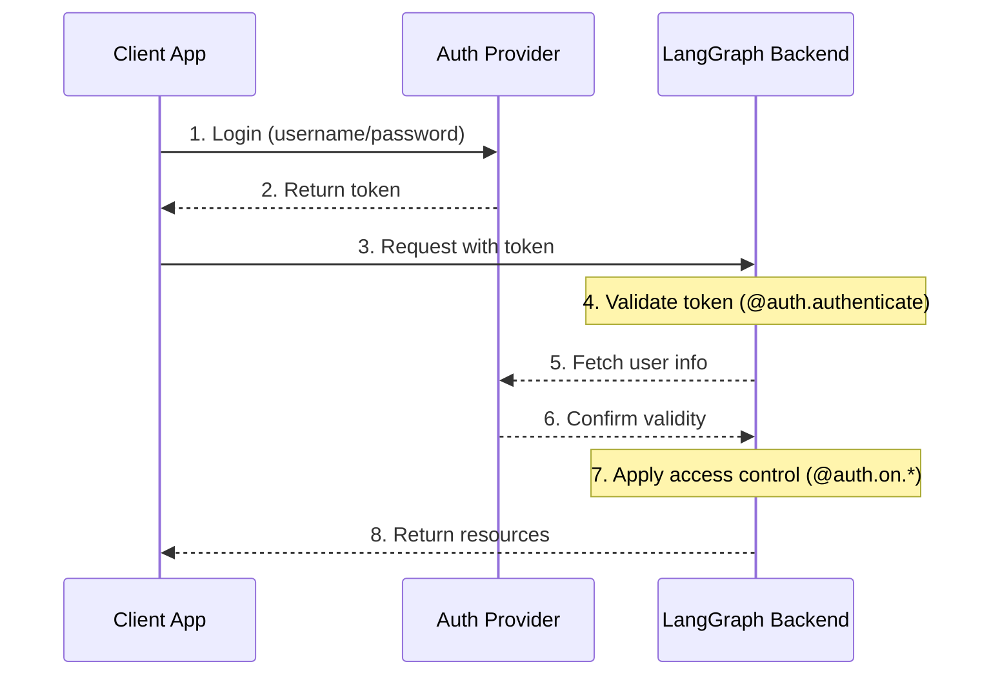

## System Architecture

A typical authentication setup involves three main components:

1. **Authentication Provider** (Identity Provider/IdP)

   - A dedicated service that manages user identities and credentials
   - Handles user registration, login, password resets, etc.
   - Issues tokens (JWT, session tokens, etc.) after successful authentication
   - Examples: Auth0, Supabase Auth, Okta, or your own auth server

2. **LangGraph Backend** (Resource Server)

   - Your LangGraph application that contains business logic and protected resources
   - Validates tokens with the auth provider
   - Enforces access control based on user identity and permissions
   - Doesn't store user credentials directly

3. **Client Application** (Frontend)

   - Web app, mobile app, or API client
   - Collects time-sensitive user credentials and sends to auth provider
   - Receives tokens from auth provider
   - Includes these tokens in requests to LangGraph backend

Here's how these components typically interact:

Your [`@auth.authenticate`](../cloud/reference/sdk/python_sdk_ref.md#langgraph_sdk.auth.Auth.authenticate) handler in LangGraph handles steps 4-6, while your [`@auth.on`](../cloud/reference/sdk/python_sdk_ref.md#langgraph_sdk.auth.Auth.on) handlers implement step 7.

---

## Navigation

- [📑 Back to Index](./index.md)
- [📄 Full Documentation](./documentation.md)
- [📝 Original Source](../llms-full.txt)

**Previous:** [← Default Security Models](./353-default-security-models.md)

**Next:** [Authentication →](./355-authentication.md)
