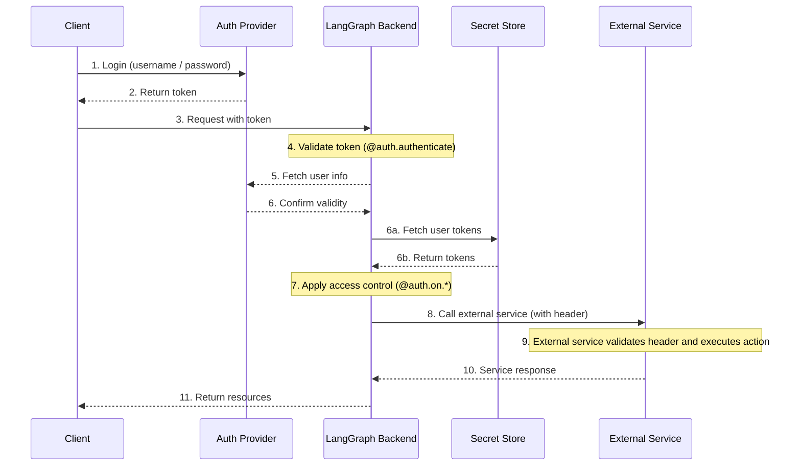

## Authentication


Authentication in LangGraph runs as middleware on every request. Your [`@auth.authenticate`](../cloud/reference/sdk/python_sdk_ref.md#langgraph_sdk.auth.Auth.authenticate) handler receives request information and should:

1. Validate the credentials
2. Return [user info](../cloud/reference/sdk/python_sdk_ref.md#langgraph_sdk.auth.types.MinimalUserDict) containing the user's identity and user information if valid
3. Raise an [HTTPException](../cloud/reference/sdk/python_sdk_ref.md#langgraph_sdk.auth.exceptions.HTTPException) or AssertionError if invalid

```python
from langgraph_sdk import Auth

auth = Auth()

@auth.authenticate
async def authenticate(headers: dict) -> Auth.types.MinimalUserDict:
    # Validate credentials (e.g., API key, JWT token)
    api_key = headers.get("x-api-key")
    if not api_key or not is_valid_key(api_key):
        raise Auth.exceptions.HTTPException(
            status_code=401,
            detail="Invalid API key"
        )

    # Return user info - only identity and is_authenticated are required
    # Add any additional fields you need for authorization
    return {
        "identity": "user-123",        # Required: unique user identifier
        "is_authenticated": True,      # Optional: assumed True by default
        "permissions": ["read", "write"] # Optional: for permission-based auth
        # You can add more custom fields if you want to implement other auth patterns
        "role": "admin",
        "org_id": "org-456"

    }
```

The returned user information is available:

- To your authorization handlers via [`ctx.user`](../cloud/reference/sdk/python_sdk_ref.md#langgraph_sdk.auth.types.AuthContext)
- In your application via `config["configuration"]["langgraph_auth_user"]`

??? tip "Supported Parameters"

    The [`@auth.authenticate`](../cloud/reference/sdk/python_sdk_ref.md#langgraph_sdk.auth.Auth.authenticate) handler can accept any of the following parameters by name:

    * request (Request): The raw ASGI request object
    * body (dict): The parsed request body
    * path (str): The request path, e.g., "/threads/abcd-1234-abcd-1234/runs/abcd-1234-abcd-1234/stream"
    * method (str): The HTTP method, e.g., "GET"
    * path_params (dict[str, str]): URL path parameters, e.g., {"thread_id": "abcd-1234-abcd-1234", "run_id": "abcd-1234-abcd-1234"}
    * query_params (dict[str, str]): URL query parameters, e.g., {"stream": "true"}
    * headers (dict[bytes, bytes]): Request headers
    * authorization (str | None): The Authorization header value (e.g., "Bearer <token>")

    In many of our tutorials, we will just show the "authorization" parameter to be concise, but you can opt to accept more information as needed
    to implement your custom authentication scheme.

### Agent authentication

Custom authentication permits delegated access. The values you return in `@auth.authenticate` are added to the run context, giving agents user-scoped credentials lets them access resources on the user’s behalf.



After authentication, the platform creates a special configuration object that is passed to your graph and all nodes via the configurable context.
This object contains information about the current user, including any custom fields you return from your [`@auth.authenticate`](../cloud/reference/sdk/python_sdk_ref.md#langgraph_sdk.auth.Auth.authenticate) handler.

To enable an agent to act on behalf of the user, use [custom authentication middleware](../how-tos/auth/custom_auth.md). This will allow the agent to interact with external systems like MCP servers, external databases, and even other agents on behalf of the user.

For more information, see the [Use custom auth](../how-tos/auth/custom_auth.md#enable-agent-authentication) guide.

### Agent authentication with MCP

For information on how to authenticate an agent to an MCP server, see the [MCP conceptual guide](../concepts/mcp.md).

---

## Navigation

- [📑 Back to Index](./index.md)
- [📄 Full Documentation](./documentation.md)
- [📝 Original Source](../llms-full.txt)

**Previous:** [← System Architecture](./354-system-architecture.md)

**Next:** [Authorization →](./356-authorization.md)
