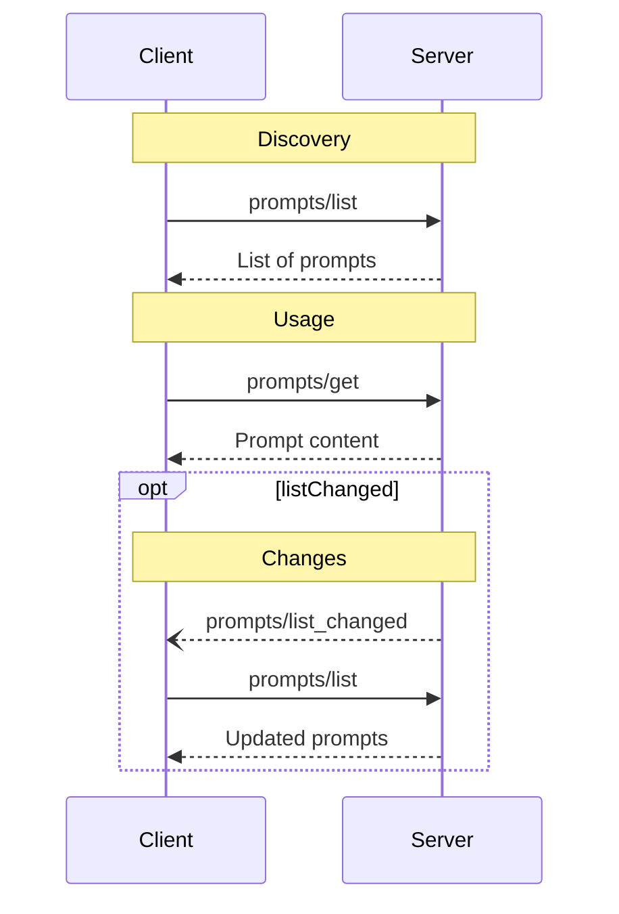
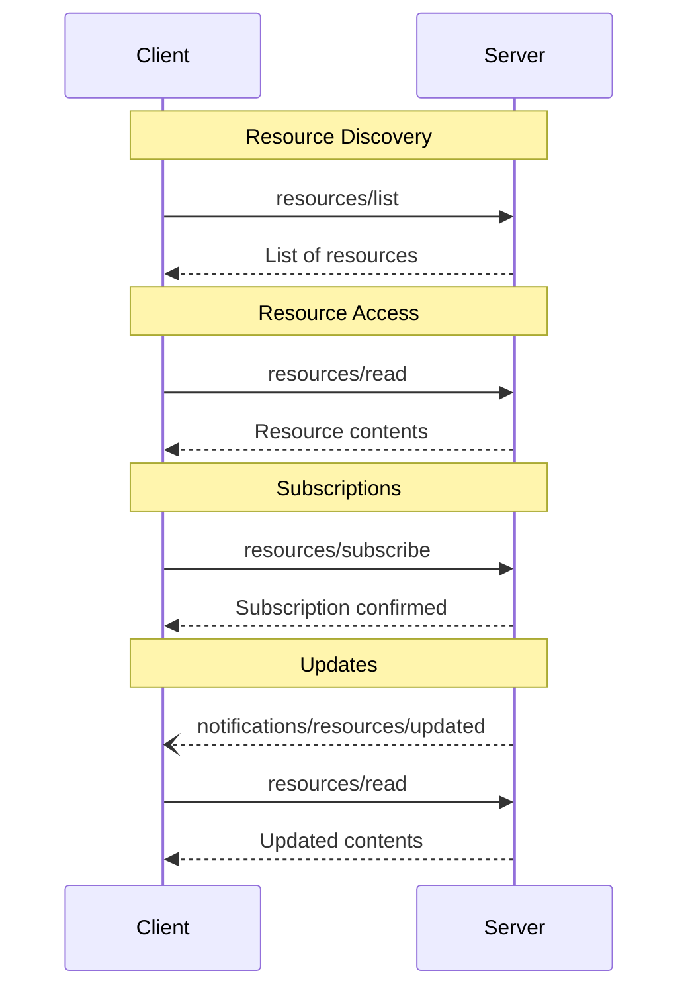
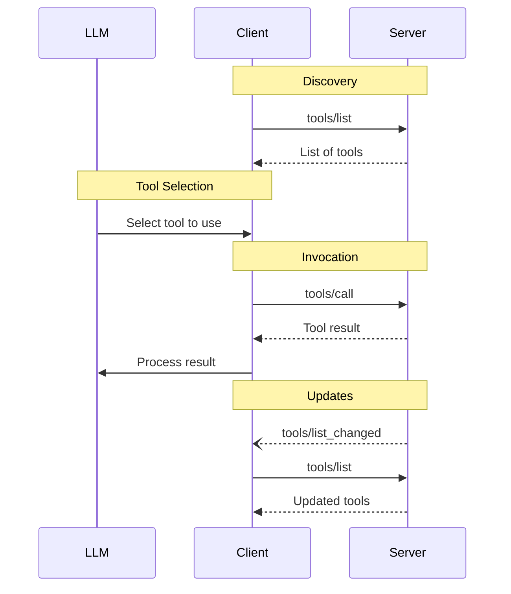
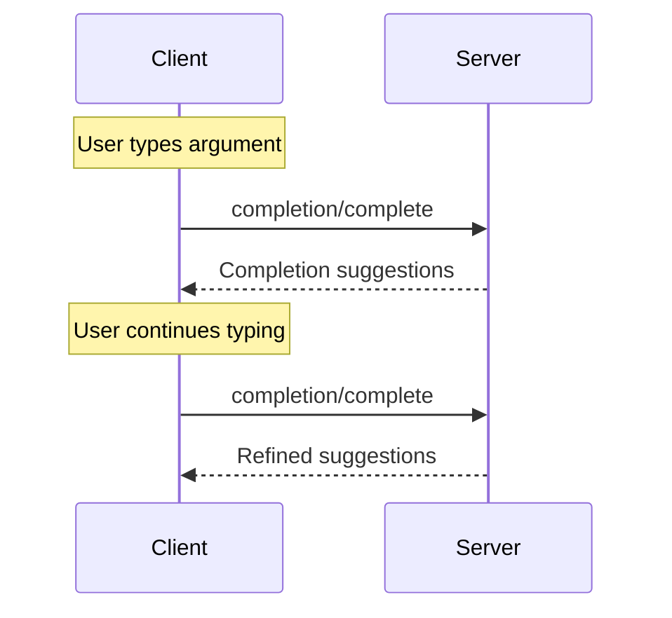
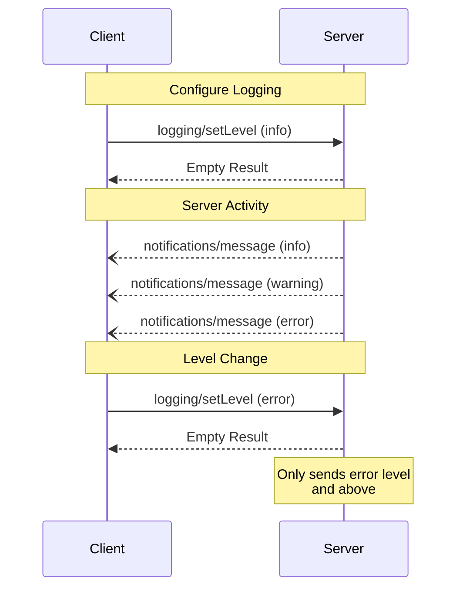
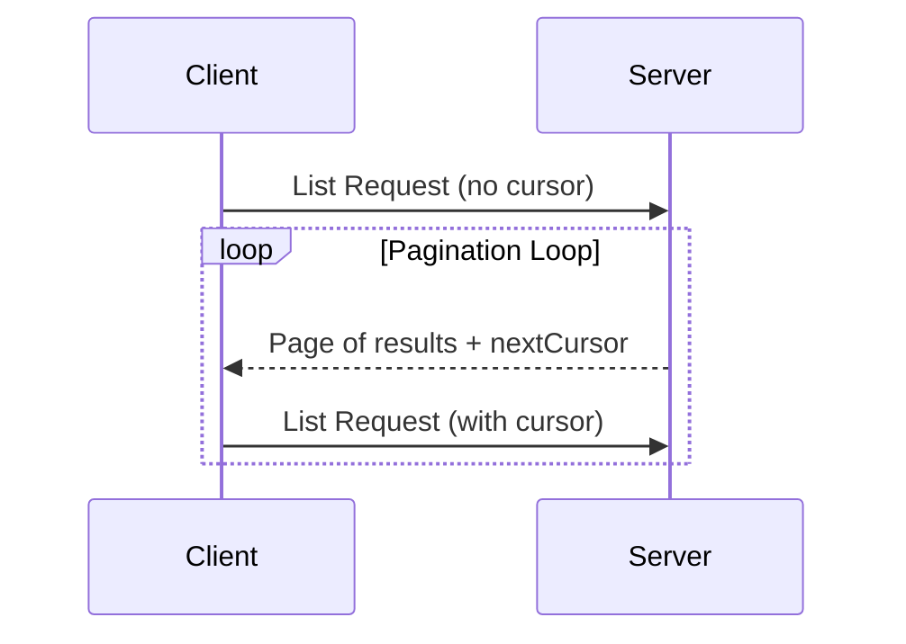

# Overview

**Navigation:** [← Previous](./04-sampling.md) | [Index](./index.md)

---

# Overview
Source: https://modelcontextprotocol.io/specification/2025-06-18/server/index


<Info>**Protocol Revision**: 2025-06-18</Info>

Servers provide the fundamental building blocks for adding context to language models via
MCP. These primitives enable rich interactions between clients, servers, and language
models:

* **Prompts**: Pre-defined templates or instructions that guide language model
  interactions
* **Resources**: Structured data or content that provides additional context to the model
* **Tools**: Executable functions that allow models to perform actions or retrieve
  information

Each primitive can be summarized in the following control hierarchy:

| Primitive | Control                | Description                                        | Example                         |
| --------- | ---------------------- | -------------------------------------------------- | ------------------------------- |
| Prompts   | User-controlled        | Interactive templates invoked by user choice       | Slash commands, menu options    |
| Resources | Application-controlled | Contextual data attached and managed by the client | File contents, git history      |
| Tools     | Model-controlled       | Functions exposed to the LLM to take actions       | API POST requests, file writing |

Explore these key primitives in more detail below:

<CardGroup cols={3}>
  <Card title="Prompts" icon="message" href="/specification/2025-06-18/server/prompts" />

  <Card title="Resources" icon="file-lines" href="/specification/2025-06-18/server/resources" />

  <Card title="Tools" icon="wrench" href="/specification/2025-06-18/server/tools" />
</CardGroup>


# Prompts
Source: https://modelcontextprotocol.io/specification/2025-06-18/server/prompts


<div id="enable-section-numbers" />

<Info>**Protocol Revision**: 2025-06-18</Info>

The Model Context Protocol (MCP) provides a standardized way for servers to expose prompt
templates to clients. Prompts allow servers to provide structured messages and
instructions for interacting with language models. Clients can discover available
prompts, retrieve their contents, and provide arguments to customize them.


## User Interaction Model

Prompts are designed to be **user-controlled**, meaning they are exposed from servers to
clients with the intention of the user being able to explicitly select them for use.

Typically, prompts would be triggered through user-initiated commands in the user
interface, which allows users to naturally discover and invoke available prompts.

For example, as slash commands:


However, implementors are free to expose prompts through any interface pattern that suits
their needs—the protocol itself does not mandate any specific user interaction
model.


## Capabilities

Servers that support prompts **MUST** declare the `prompts` capability during
[initialization](/specification/2025-06-18/basic/lifecycle#initialization):

```json  theme={null}
{
  "capabilities": {
    "prompts": {
      "listChanged": true
    }
  }
}
```

`listChanged` indicates whether the server will emit notifications when the list of
available prompts changes.


## Protocol Messages

### Listing Prompts

To retrieve available prompts, clients send a `prompts/list` request. This operation
supports [pagination](/specification/2025-06-18/server/utilities/pagination).

**Request:**

```json  theme={null}
{
  "jsonrpc": "2.0",
  "id": 1,
  "method": "prompts/list",
  "params": {
    "cursor": "optional-cursor-value"
  }
}
```

**Response:**

```json  theme={null}
{
  "jsonrpc": "2.0",
  "id": 1,
  "result": {
    "prompts": [
      {
        "name": "code_review",
        "title": "Request Code Review",
        "description": "Asks the LLM to analyze code quality and suggest improvements",
        "arguments": [
          {
            "name": "code",
            "description": "The code to review",
            "required": true
          }
        ]
      }
    ],
    "nextCursor": "next-page-cursor"
  }
}
```

### Getting a Prompt

To retrieve a specific prompt, clients send a `prompts/get` request. Arguments may be
auto-completed through [the completion API](/specification/2025-06-18/server/utilities/completion).

**Request:**

```json  theme={null}
{
  "jsonrpc": "2.0",
  "id": 2,
  "method": "prompts/get",
  "params": {
    "name": "code_review",
    "arguments": {
      "code": "def hello():\n    print('world')"
    }
  }
}
```

**Response:**

```json  theme={null}
{
  "jsonrpc": "2.0",
  "id": 2,
  "result": {
    "description": "Code review prompt",
    "messages": [
      {
        "role": "user",
        "content": {
          "type": "text",
          "text": "Please review this Python code:\ndef hello():\n    print('world')"
        }
      }
    ]
  }
}
```

### List Changed Notification

When the list of available prompts changes, servers that declared the `listChanged`
capability **SHOULD** send a notification:

```json  theme={null}
{
  "jsonrpc": "2.0",
  "method": "notifications/prompts/list_changed"
}
```


## Message Flow




## Data Types

### Prompt

A prompt definition includes:

* `name`: Unique identifier for the prompt
* `title`: Optional human-readable name of the prompt for display purposes.
* `description`: Optional human-readable description
* `arguments`: Optional list of arguments for customization

### PromptMessage

Messages in a prompt can contain:

* `role`: Either "user" or "assistant" to indicate the speaker
* `content`: One of the following content types:

<Note>
  All content types in prompt messages support optional
  [annotations](/specification/2025-06-18/server/resources#annotations) for
  metadata about audience, priority, and modification times.
</Note>

#### Text Content

Text content represents plain text messages:

```json  theme={null}
{
  "type": "text",
  "text": "The text content of the message"
}
```

This is the most common content type used for natural language interactions.

#### Image Content

Image content allows including visual information in messages:

```json  theme={null}
{
  "type": "image",
  "data": "base64-encoded-image-data",
  "mimeType": "image/png"
}
```

The image data **MUST** be base64-encoded and include a valid MIME type. This enables
multi-modal interactions where visual context is important.

#### Audio Content

Audio content allows including audio information in messages:

```json  theme={null}
{
  "type": "audio",
  "data": "base64-encoded-audio-data",
  "mimeType": "audio/wav"
}
```

The audio data MUST be base64-encoded and include a valid MIME type. This enables
multi-modal interactions where audio context is important.

#### Embedded Resources

Embedded resources allow referencing server-side resources directly in messages:

```json  theme={null}
{
  "type": "resource",
  "resource": {
    "uri": "resource://example",
    "mimeType": "text/plain",
    "text": "Resource content"
  }
}
```

Resources can contain either text or binary (blob) data and **MUST** include:

* A valid resource URI
* The appropriate MIME type
* Either text content or base64-encoded blob data

Embedded resources enable prompts to seamlessly incorporate server-managed content like
documentation, code samples, or other reference materials directly into the conversation
flow.


## Error Handling

Servers **SHOULD** return standard JSON-RPC errors for common failure cases:

* Invalid prompt name: `-32602` (Invalid params)
* Missing required arguments: `-32602` (Invalid params)
* Internal errors: `-32603` (Internal error)


## Implementation Considerations

1. Servers **SHOULD** validate prompt arguments before processing
2. Clients **SHOULD** handle pagination for large prompt lists
3. Both parties **SHOULD** respect capability negotiation


## Security

Implementations **MUST** carefully validate all prompt inputs and outputs to prevent
injection attacks or unauthorized access to resources.


# Resources
Source: https://modelcontextprotocol.io/specification/2025-06-18/server/resources


<div id="enable-section-numbers" />

<Info>**Protocol Revision**: 2025-06-18</Info>

The Model Context Protocol (MCP) provides a standardized way for servers to expose
resources to clients. Resources allow servers to share data that provides context to
language models, such as files, database schemas, or application-specific information.
Each resource is uniquely identified by a
[URI](https://datatracker.ietf.org/doc/html/rfc3986).


## User Interaction Model

Resources in MCP are designed to be **application-driven**, with host applications
determining how to incorporate context based on their needs.

For example, applications could:

* Expose resources through UI elements for explicit selection, in a tree or list view
* Allow the user to search through and filter available resources
* Implement automatic context inclusion, based on heuristics or the AI model's selection


However, implementations are free to expose resources through any interface pattern that
suits their needs—the protocol itself does not mandate any specific user
interaction model.


## Capabilities

Servers that support resources **MUST** declare the `resources` capability:

```json  theme={null}
{
  "capabilities": {
    "resources": {
      "subscribe": true,
      "listChanged": true
    }
  }
}
```

The capability supports two optional features:

* `subscribe`: whether the client can subscribe to be notified of changes to individual
  resources.
* `listChanged`: whether the server will emit notifications when the list of available
  resources changes.

Both `subscribe` and `listChanged` are optional—servers can support neither,
either, or both:

```json  theme={null}
{
  "capabilities": {
    "resources": {} // Neither feature supported
  }
}
```

```json  theme={null}
{
  "capabilities": {
    "resources": {
      "subscribe": true // Only subscriptions supported
    }
  }
}
```

```json  theme={null}
{
  "capabilities": {
    "resources": {
      "listChanged": true // Only list change notifications supported
    }
  }
}
```


## Protocol Messages

### Listing Resources

To discover available resources, clients send a `resources/list` request. This operation
supports [pagination](/specification/2025-06-18/server/utilities/pagination).

**Request:**

```json  theme={null}
{
  "jsonrpc": "2.0",
  "id": 1,
  "method": "resources/list",
  "params": {
    "cursor": "optional-cursor-value"
  }
}
```

**Response:**

```json  theme={null}
{
  "jsonrpc": "2.0",
  "id": 1,
  "result": {
    "resources": [
      {
        "uri": "file:///project/src/main.rs",
        "name": "main.rs",
        "title": "Rust Software Application Main File",
        "description": "Primary application entry point",
        "mimeType": "text/x-rust"
      }
    ],
    "nextCursor": "next-page-cursor"
  }
}
```

### Reading Resources

To retrieve resource contents, clients send a `resources/read` request:

**Request:**

```json  theme={null}
{
  "jsonrpc": "2.0",
  "id": 2,
  "method": "resources/read",
  "params": {
    "uri": "file:///project/src/main.rs"
  }
}
```

**Response:**

```json  theme={null}
{
  "jsonrpc": "2.0",
  "id": 2,
  "result": {
    "contents": [
      {
        "uri": "file:///project/src/main.rs",
        "mimeType": "text/x-rust",
        "text": "fn main() {\n    println!(\"Hello world!\");\n}"
      }
    ]
  }
}
```

### Resource Templates

Resource templates allow servers to expose parameterized resources using
[URI templates](https://datatracker.ietf.org/doc/html/rfc6570). Arguments may be
auto-completed through [the completion API](/specification/2025-06-18/server/utilities/completion).

**Request:**

```json  theme={null}
{
  "jsonrpc": "2.0",
  "id": 3,
  "method": "resources/templates/list"
}
```

**Response:**

```json  theme={null}
{
  "jsonrpc": "2.0",
  "id": 3,
  "result": {
    "resourceTemplates": [
      {
        "uriTemplate": "file:///{path}",
        "name": "Project Files",
        "title": "📁 Project Files",
        "description": "Access files in the project directory",
        "mimeType": "application/octet-stream"
      }
    ]
  }
}
```

### List Changed Notification

When the list of available resources changes, servers that declared the `listChanged`
capability **SHOULD** send a notification:

```json  theme={null}
{
  "jsonrpc": "2.0",
  "method": "notifications/resources/list_changed"
}
```

### Subscriptions

The protocol supports optional subscriptions to resource changes. Clients can subscribe
to specific resources and receive notifications when they change:

**Subscribe Request:**

```json  theme={null}
{
  "jsonrpc": "2.0",
  "id": 4,
  "method": "resources/subscribe",
  "params": {
    "uri": "file:///project/src/main.rs"
  }
}
```

**Update Notification:**

```json  theme={null}
{
  "jsonrpc": "2.0",
  "method": "notifications/resources/updated",
  "params": {
    "uri": "file:///project/src/main.rs"
  }
}
```


## Message Flow




## Data Types

### Resource

A resource definition includes:

* `uri`: Unique identifier for the resource
* `name`: The name of the resource.
* `title`: Optional human-readable name of the resource for display purposes.
* `description`: Optional description
* `mimeType`: Optional MIME type
* `size`: Optional size in bytes

### Resource Contents

Resources can contain either text or binary data:

#### Text Content

```json  theme={null}
{
  "uri": "file:///example.txt",
  "mimeType": "text/plain",
  "text": "Resource content"
}
```

#### Binary Content

```json  theme={null}
{
  "uri": "file:///example.png",
  "mimeType": "image/png",
  "blob": "base64-encoded-data"
}
```

### Annotations

Resources, resource templates and content blocks support optional annotations that provide hints to clients about how to use or display the resource:

* **`audience`**: An array indicating the intended audience(s) for this resource. Valid values are `"user"` and `"assistant"`. For example, `["user", "assistant"]` indicates content useful for both.
* **`priority`**: A number from 0.0 to 1.0 indicating the importance of this resource. A value of 1 means "most important" (effectively required), while 0 means "least important" (entirely optional).
* **`lastModified`**: An ISO 8601 formatted timestamp indicating when the resource was last modified (e.g., `"2025-01-12T15:00:58Z"`).

Example resource with annotations:

```json  theme={null}
{
  "uri": "file:///project/README.md",
  "name": "README.md",
  "title": "Project Documentation",
  "mimeType": "text/markdown",
  "annotations": {
    "audience": ["user"],
    "priority": 0.8,
    "lastModified": "2025-01-12T15:00:58Z"
  }
}
```

Clients can use these annotations to:

* Filter resources based on their intended audience
* Prioritize which resources to include in context
* Display modification times or sort by recency


## Common URI Schemes

The protocol defines several standard URI schemes. This list not
exhaustive—implementations are always free to use additional, custom URI schemes.

### https\://

Used to represent a resource available on the web.

Servers **SHOULD** use this scheme only when the client is able to fetch and load the
resource directly from the web on its own—that is, it doesn’t need to read the resource
via the MCP server.

For other use cases, servers **SHOULD** prefer to use another URI scheme, or define a
custom one, even if the server will itself be downloading resource contents over the
internet.

### file://

Used to identify resources that behave like a filesystem. However, the resources do not
need to map to an actual physical filesystem.

MCP servers **MAY** identify file:// resources with an
[XDG MIME type](https://specifications.freedesktop.org/shared-mime-info-spec/0.14/ar01s02.html#id-1.3.14),
like `inode/directory`, to represent non-regular files (such as directories) that don’t
otherwise have a standard MIME type.

### git://

Git version control integration.

### Custom URI Schemes

Custom URI schemes **MUST** be in accordance with [RFC3986](https://datatracker.ietf.org/doc/html/rfc3986),
taking the above guidance in to account.


## Error Handling

Servers **SHOULD** return standard JSON-RPC errors for common failure cases:

* Resource not found: `-32002`
* Internal errors: `-32603`

Example error:

```json  theme={null}
{
  "jsonrpc": "2.0",
  "id": 5,
  "error": {
    "code": -32002,
    "message": "Resource not found",
    "data": {
      "uri": "file:///nonexistent.txt"
    }
  }
}
```


## Security Considerations

1. Servers **MUST** validate all resource URIs
2. Access controls **SHOULD** be implemented for sensitive resources
3. Binary data **MUST** be properly encoded
4. Resource permissions **SHOULD** be checked before operations


# Tools
Source: https://modelcontextprotocol.io/specification/2025-06-18/server/tools


<div id="enable-section-numbers" />

<Info>**Protocol Revision**: 2025-06-18</Info>

The Model Context Protocol (MCP) allows servers to expose tools that can be invoked by
language models. Tools enable models to interact with external systems, such as querying
databases, calling APIs, or performing computations. Each tool is uniquely identified by
a name and includes metadata describing its schema.


## User Interaction Model

Tools in MCP are designed to be **model-controlled**, meaning that the language model can
discover and invoke tools automatically based on its contextual understanding and the
user's prompts.

However, implementations are free to expose tools through any interface pattern that
suits their needs—the protocol itself does not mandate any specific user
interaction model.

<Warning>
  For trust & safety and security, there **SHOULD** always
  be a human in the loop with the ability to deny tool invocations.

  Applications **SHOULD**:

  * Provide UI that makes clear which tools are being exposed to the AI model
  * Insert clear visual indicators when tools are invoked
  * Present confirmation prompts to the user for operations, to ensure a human is in the
    loop
</Warning>


## Capabilities

Servers that support tools **MUST** declare the `tools` capability:

```json  theme={null}
{
  "capabilities": {
    "tools": {
      "listChanged": true
    }
  }
}
```

`listChanged` indicates whether the server will emit notifications when the list of
available tools changes.


## Protocol Messages

### Listing Tools

To discover available tools, clients send a `tools/list` request. This operation supports
[pagination](/specification/2025-06-18/server/utilities/pagination).

**Request:**

```json  theme={null}
{
  "jsonrpc": "2.0",
  "id": 1,
  "method": "tools/list",
  "params": {
    "cursor": "optional-cursor-value"
  }
}
```

**Response:**

```json  theme={null}
{
  "jsonrpc": "2.0",
  "id": 1,
  "result": {
    "tools": [
      {
        "name": "get_weather",
        "title": "Weather Information Provider",
        "description": "Get current weather information for a location",
        "inputSchema": {
          "type": "object",
          "properties": {
            "location": {
              "type": "string",
              "description": "City name or zip code"
            }
          },
          "required": ["location"]
        }
      }
    ],
    "nextCursor": "next-page-cursor"
  }
}
```

### Calling Tools

To invoke a tool, clients send a `tools/call` request:

**Request:**

```json  theme={null}
{
  "jsonrpc": "2.0",
  "id": 2,
  "method": "tools/call",
  "params": {
    "name": "get_weather",
    "arguments": {
      "location": "New York"
    }
  }
}
```

**Response:**

```json  theme={null}
{
  "jsonrpc": "2.0",
  "id": 2,
  "result": {
    "content": [
      {
        "type": "text",
        "text": "Current weather in New York:\nTemperature: 72°F\nConditions: Partly cloudy"
      }
    ],
    "isError": false
  }
}
```

### List Changed Notification

When the list of available tools changes, servers that declared the `listChanged`
capability **SHOULD** send a notification:

```json  theme={null}
{
  "jsonrpc": "2.0",
  "method": "notifications/tools/list_changed"
}
```


## Message Flow




## Data Types

### Tool

A tool definition includes:

* `name`: Unique identifier for the tool
* `title`: Optional human-readable name of the tool for display purposes.
* `description`: Human-readable description of functionality
* `inputSchema`: JSON Schema defining expected parameters
* `outputSchema`: Optional JSON Schema defining expected output structure
* `annotations`: optional properties describing tool behavior

<Warning>
  For trust & safety and security, clients **MUST** consider
  tool annotations to be untrusted unless they come from trusted servers.
</Warning>

### Tool Result

Tool results may contain [**structured**](#structured-content) or **unstructured** content.

**Unstructured** content is returned in the `content` field of a result, and can contain multiple content items of different types:

<Note>
  All content types (text, image, audio, resource links, and embedded resources)
  support optional
  [annotations](/specification/2025-06-18/server/resources#annotations) that
  provide metadata about audience, priority, and modification times. This is the
  same annotation format used by resources and prompts.
</Note>

#### Text Content

```json  theme={null}
{
  "type": "text",
  "text": "Tool result text"
}
```

#### Image Content

```json  theme={null}
{
  "type": "image",
  "data": "base64-encoded-data",
  "mimeType": "image/png"
  "annotations": {
    "audience": ["user"],
    "priority": 0.9
  }

}
```

This example demonstrates the use of an optional Annotation.

#### Audio Content

```json  theme={null}
{
  "type": "audio",
  "data": "base64-encoded-audio-data",
  "mimeType": "audio/wav"
}
```

#### Resource Links

A tool **MAY** return links to [Resources](/specification/2025-06-18/server/resources), to provide additional context
or data. In this case, the tool will return a URI that can be subscribed to or fetched by the client:

```json  theme={null}
{
  "type": "resource_link",
  "uri": "file:///project/src/main.rs",
  "name": "main.rs",
  "description": "Primary application entry point",
  "mimeType": "text/x-rust",
  "annotations": {
    "audience": ["assistant"],
    "priority": 0.9
  }
}
```

Resource links support the same [Resource annotations](/specification/2025-06-18/server/resources#annotations) as regular resources to help clients understand how to use them.

<Info>
  Resource links returned by tools are not guaranteed to appear in the results
  of a `resources/list` request.
</Info>

#### Embedded Resources

[Resources](/specification/2025-06-18/server/resources) **MAY** be embedded to provide additional context
or data using a suitable [URI scheme](./resources#common-uri-schemes). Servers that use embedded resources **SHOULD** implement the `resources` capability:

```json  theme={null}
{
  "type": "resource",
  "resource": {
    "uri": "file:///project/src/main.rs",
    "mimeType": "text/x-rust",
    "text": "fn main() {\n    println!(\"Hello world!\");\n}",
    "annotations": {
      "audience": ["user", "assistant"],
      "priority": 0.7,
      "lastModified": "2025-05-03T14:30:00Z"
    }
  }
}
```

Embedded resources support the same [Resource annotations](/specification/2025-06-18/server/resources#annotations) as regular resources to help clients understand how to use them.

#### Structured Content

**Structured** content is returned as a JSON object in the `structuredContent` field of a result.

For backwards compatibility, a tool that returns structured content SHOULD also return the serialized JSON in a TextContent block.

#### Output Schema

Tools may also provide an output schema for validation of structured results.
If an output schema is provided:

* Servers **MUST** provide structured results that conform to this schema.
* Clients **SHOULD** validate structured results against this schema.

Example tool with output schema:

```json  theme={null}
{
  "name": "get_weather_data",
  "title": "Weather Data Retriever",
  "description": "Get current weather data for a location",
  "inputSchema": {
    "type": "object",
    "properties": {
      "location": {
        "type": "string",
        "description": "City name or zip code"
      }
    },
    "required": ["location"]
  },
  "outputSchema": {
    "type": "object",
    "properties": {
      "temperature": {
        "type": "number",
        "description": "Temperature in celsius"
      },
      "conditions": {
        "type": "string",
        "description": "Weather conditions description"
      },
      "humidity": {
        "type": "number",
        "description": "Humidity percentage"
      }
    },
    "required": ["temperature", "conditions", "humidity"]
  }
}
```

Example valid response for this tool:

```json  theme={null}
{
  "jsonrpc": "2.0",
  "id": 5,
  "result": {
    "content": [
      {
        "type": "text",
        "text": "{\"temperature\": 22.5, \"conditions\": \"Partly cloudy\", \"humidity\": 65}"
      }
    ],
    "structuredContent": {
      "temperature": 22.5,
      "conditions": "Partly cloudy",
      "humidity": 65
    }
  }
}
```

Providing an output schema helps clients and LLMs understand and properly handle structured tool outputs by:

* Enabling strict schema validation of responses
* Providing type information for better integration with programming languages
* Guiding clients and LLMs to properly parse and utilize the returned data
* Supporting better documentation and developer experience


## Error Handling

Tools use two error reporting mechanisms:

1. **Protocol Errors**: Standard JSON-RPC errors for issues like:
   * Unknown tools
   * Invalid arguments
   * Server errors

2. **Tool Execution Errors**: Reported in tool results with `isError: true`:
   * API failures
   * Invalid input data
   * Business logic errors

Example protocol error:

```json  theme={null}
{
  "jsonrpc": "2.0",
  "id": 3,
  "error": {
    "code": -32602,
    "message": "Unknown tool: invalid_tool_name"
  }
}
```

Example tool execution error:

```json  theme={null}
{
  "jsonrpc": "2.0",
  "id": 4,
  "result": {
    "content": [
      {
        "type": "text",
        "text": "Failed to fetch weather data: API rate limit exceeded"
      }
    ],
    "isError": true
  }
}
```


## Security Considerations

1. Servers **MUST**:
   * Validate all tool inputs
   * Implement proper access controls
   * Rate limit tool invocations
   * Sanitize tool outputs

2. Clients **SHOULD**:
   * Prompt for user confirmation on sensitive operations
   * Show tool inputs to the user before calling the server, to avoid malicious or
     accidental data exfiltration
   * Validate tool results before passing to LLM
   * Implement timeouts for tool calls
   * Log tool usage for audit purposes


# Completion
Source: https://modelcontextprotocol.io/specification/2025-06-18/server/utilities/completion


<div id="enable-section-numbers" />

<Info>**Protocol Revision**: 2025-06-18</Info>

The Model Context Protocol (MCP) provides a standardized way for servers to offer
argument autocompletion suggestions for prompts and resource URIs. This enables rich,
IDE-like experiences where users receive contextual suggestions while entering argument
values.


## User Interaction Model

Completion in MCP is designed to support interactive user experiences similar to IDE code
completion.

For example, applications may show completion suggestions in a dropdown or popup menu as
users type, with the ability to filter and select from available options.

However, implementations are free to expose completion through any interface pattern that
suits their needs—the protocol itself does not mandate any specific user
interaction model.


## Capabilities

Servers that support completions **MUST** declare the `completions` capability:

```json  theme={null}
{
  "capabilities": {
    "completions": {}
  }
}
```


## Protocol Messages

### Requesting Completions

To get completion suggestions, clients send a `completion/complete` request specifying
what is being completed through a reference type:

**Request:**

```json  theme={null}
{
  "jsonrpc": "2.0",
  "id": 1,
  "method": "completion/complete",
  "params": {
    "ref": {
      "type": "ref/prompt",
      "name": "code_review"
    },
    "argument": {
      "name": "language",
      "value": "py"
    }
  }
}
```

**Response:**

```json  theme={null}
{
  "jsonrpc": "2.0",
  "id": 1,
  "result": {
    "completion": {
      "values": ["python", "pytorch", "pyside"],
      "total": 10,
      "hasMore": true
    }
  }
}
```

For prompts or URI templates with multiple arguments, clients should include previous completions in the `context.arguments` object to provide context for subsequent requests.

**Request:**

```json  theme={null}
{
  "jsonrpc": "2.0",
  "id": 1,
  "method": "completion/complete",
  "params": {
    "ref": {
      "type": "ref/prompt",
      "name": "code_review"
    },
    "argument": {
      "name": "framework",
      "value": "fla"
    },
    "context": {
      "arguments": {
        "language": "python"
      }
    }
  }
}
```

**Response:**

```json  theme={null}
{
  "jsonrpc": "2.0",
  "id": 1,
  "result": {
    "completion": {
      "values": ["flask"],
      "total": 1,
      "hasMore": false
    }
  }
}
```

### Reference Types

The protocol supports two types of completion references:

| Type           | Description                 | Example                                             |
| -------------- | --------------------------- | --------------------------------------------------- |
| `ref/prompt`   | References a prompt by name | `{"type": "ref/prompt", "name": "code_review"}`     |
| `ref/resource` | References a resource URI   | `{"type": "ref/resource", "uri": "file:///{path}"}` |

### Completion Results

Servers return an array of completion values ranked by relevance, with:

* Maximum 100 items per response
* Optional total number of available matches
* Boolean indicating if additional results exist


## Message Flow




## Data Types

### CompleteRequest

* `ref`: A `PromptReference` or `ResourceReference`
* `argument`: Object containing:
  * `name`: Argument name
  * `value`: Current value
* `context`: Object containing:
  * `arguments`: A mapping of already-resolved argument names to their values.

### CompleteResult

* `completion`: Object containing:
  * `values`: Array of suggestions (max 100)
  * `total`: Optional total matches
  * `hasMore`: Additional results flag


## Error Handling

Servers **SHOULD** return standard JSON-RPC errors for common failure cases:

* Method not found: `-32601` (Capability not supported)
* Invalid prompt name: `-32602` (Invalid params)
* Missing required arguments: `-32602` (Invalid params)
* Internal errors: `-32603` (Internal error)


## Implementation Considerations

1. Servers **SHOULD**:
   * Return suggestions sorted by relevance
   * Implement fuzzy matching where appropriate
   * Rate limit completion requests
   * Validate all inputs

2. Clients **SHOULD**:
   * Debounce rapid completion requests
   * Cache completion results where appropriate
   * Handle missing or partial results gracefully


## Security

Implementations **MUST**:

* Validate all completion inputs
* Implement appropriate rate limiting
* Control access to sensitive suggestions
* Prevent completion-based information disclosure


# Logging
Source: https://modelcontextprotocol.io/specification/2025-06-18/server/utilities/logging


<div id="enable-section-numbers" />

<Info>**Protocol Revision**: 2025-06-18</Info>

The Model Context Protocol (MCP) provides a standardized way for servers to send
structured log messages to clients. Clients can control logging verbosity by setting
minimum log levels, with servers sending notifications containing severity levels,
optional logger names, and arbitrary JSON-serializable data.


## User Interaction Model

Implementations are free to expose logging through any interface pattern that suits their
needs—the protocol itself does not mandate any specific user interaction model.


## Capabilities

Servers that emit log message notifications **MUST** declare the `logging` capability:

```json  theme={null}
{
  "capabilities": {
    "logging": {}
  }
}
```


## Log Levels

The protocol follows the standard syslog severity levels specified in
[RFC 5424](https://datatracker.ietf.org/doc/html/rfc5424#section-6.2.1):

| Level     | Description                      | Example Use Case           |
| --------- | -------------------------------- | -------------------------- |
| debug     | Detailed debugging information   | Function entry/exit points |
| info      | General informational messages   | Operation progress updates |
| notice    | Normal but significant events    | Configuration changes      |
| warning   | Warning conditions               | Deprecated feature usage   |
| error     | Error conditions                 | Operation failures         |
| critical  | Critical conditions              | System component failures  |
| alert     | Action must be taken immediately | Data corruption detected   |
| emergency | System is unusable               | Complete system failure    |


## Protocol Messages

### Setting Log Level

To configure the minimum log level, clients **MAY** send a `logging/setLevel` request:

**Request:**

```json  theme={null}
{
  "jsonrpc": "2.0",
  "id": 1,
  "method": "logging/setLevel",
  "params": {
    "level": "info"
  }
}
```

### Log Message Notifications

Servers send log messages using `notifications/message` notifications:

```json  theme={null}
{
  "jsonrpc": "2.0",
  "method": "notifications/message",
  "params": {
    "level": "error",
    "logger": "database",
    "data": {
      "error": "Connection failed",
      "details": {
        "host": "localhost",
        "port": 5432
      }
    }
  }
}
```


## Message Flow




## Error Handling

Servers **SHOULD** return standard JSON-RPC errors for common failure cases:

* Invalid log level: `-32602` (Invalid params)
* Configuration errors: `-32603` (Internal error)


## Implementation Considerations

1. Servers **SHOULD**:
   * Rate limit log messages
   * Include relevant context in data field
   * Use consistent logger names
   * Remove sensitive information

2. Clients **MAY**:
   * Present log messages in the UI
   * Implement log filtering/search
   * Display severity visually
   * Persist log messages


## Security

1. Log messages **MUST NOT** contain:
   * Credentials or secrets
   * Personal identifying information
   * Internal system details that could aid attacks

2. Implementations **SHOULD**:
   * Rate limit messages
   * Validate all data fields
   * Control log access
   * Monitor for sensitive content


# Pagination
Source: https://modelcontextprotocol.io/specification/2025-06-18/server/utilities/pagination


<div id="enable-section-numbers" />

<Info>**Protocol Revision**: 2025-06-18</Info>

The Model Context Protocol (MCP) supports paginating list operations that may return
large result sets. Pagination allows servers to yield results in smaller chunks rather
than all at once.

Pagination is especially important when connecting to external services over the
internet, but also useful for local integrations to avoid performance issues with large
data sets.


## Pagination Model

Pagination in MCP uses an opaque cursor-based approach, instead of numbered pages.

* The **cursor** is an opaque string token, representing a position in the result set
* **Page size** is determined by the server, and clients **MUST NOT** assume a fixed page
  size


## Response Format

Pagination starts when the server sends a **response** that includes:

* The current page of results
* An optional `nextCursor` field if more results exist

```json  theme={null}
{
  "jsonrpc": "2.0",
  "id": "123",
  "result": {
    "resources": [...],
    "nextCursor": "eyJwYWdlIjogM30="
  }
}
```


## Request Format

After receiving a cursor, the client can *continue* paginating by issuing a request
including that cursor:

```json  theme={null}
{
  "jsonrpc": "2.0",
  "id": "124",
  "method": "resources/list",
  "params": {
    "cursor": "eyJwYWdlIjogMn0="
  }
}
```


## Pagination Flow




## Operations Supporting Pagination

The following MCP operations support pagination:

* `resources/list` - List available resources
* `resources/templates/list` - List resource templates
* `prompts/list` - List available prompts
* `tools/list` - List available tools


## Implementation Guidelines

1. Servers **SHOULD**:
   * Provide stable cursors
   * Handle invalid cursors gracefully

2. Clients **SHOULD**:
   * Treat a missing `nextCursor` as the end of results
   * Support both paginated and non-paginated flows

3. Clients **MUST** treat cursors as opaque tokens:
   * Don't make assumptions about cursor format
   * Don't attempt to parse or modify cursors
   * Don't persist cursors across sessions


## Error Handling

Invalid cursors **SHOULD** result in an error with code -32602 (Invalid params).


# Versioning
Source: https://modelcontextprotocol.io/specification/versioning


The Model Context Protocol uses string-based version identifiers following the format
`YYYY-MM-DD`, to indicate the last date backwards incompatible changes were made.

<Info>
  The protocol version will *not* be incremented when the
  protocol is updated, as long as the changes maintain backwards compatibility. This allows
  for incremental improvements while preserving interoperability.
</Info>


## Revisions

Revisions may be marked as:

* **Draft**: in-progress specifications, not yet ready for consumption.
* **Current**: the current protocol version, which is ready for use and may continue to
  receive backwards compatible changes.
* **Final**: past, complete specifications that will not be changed.

The **current** protocol version is [**2025-06-18**](/specification/2025-06-18/).


## Negotiation

Version negotiation happens during
[initialization](/specification/2025-06-18/basic/lifecycle#initialization). Clients and
servers **MAY** support multiple protocol versions simultaneously, but they **MUST**
agree on a single version to use for the session.

The protocol provides appropriate error handling if version negotiation fails, allowing
clients to gracefully terminate connections when they cannot find a version compatible
with the server.


# Model Context Protocol
Source: https://modelcontextprotocol.io/about/index

The open protocol that connects AI applications to the systems where context lives

<div className="landing-page">
  <section className="intro-video-section">
    <div className="intro-logo">
      
    </div>

    <div className="intro-content">
      <h2 className="intro-title">Connect your AI applications to the world</h2>

      <p className="intro-description">
        AI-enabled tools are powerful, but they're often limited to the
        information you manually provide or require bespoke integrations.
      </p>

      <p className="intro-description">
        Whether it's reading files from your computer, searching through an
        internal or external knowledge base, or updating tasks in an project
        management tool, MCP provides a secure, standardized, *simple* way to
        give AI systems the context they need.
      </p>
    </div>
  </section>

  <section className="how-section">
    <h2 className="section-title">How it works</h2>

    <div className="steps-container">
      <div className="step-number">1</div>

      <div className="step-content">
        <h3>Choose MCP servers</h3>

        <p>
          Pick from pre-built servers for popular tools like GitHub, Google
          Drive, Slack and hundreds of others. Combine multiple servers for
          complete workflows, or easily build your own for custom integrations.
        </p>
      </div>

      <div className="step-number">2</div>

      <div className="step-content">
        <h3>Connect your AI application</h3>

        <p>
          Configure your AI application (like Claude, VS Code, or ChatGPT) to
          connect to your MCP servers. The application can now see available
          tools, resources and prompts from all connected servers.
        </p>
      </div>

      <div className="step-number">3</div>

      <div className="step-content">
        <h3>Work with context</h3>

        <p>
          Your AI-powered application can now access real data, execute actions,
          and provide more helpful responses based on your actual context.
        </p>
      </div>
    </div>
  </section>

  <section className="ecosystem-section">
    <h2 className="section-title">Join a growing ecosystem</h2>

    <div className="stats-grid">
      <a href="/docs/sdk" target="_blank" className="stat-card">
        <div className="stat-number">10</div>
        <div className="stat-label">Official SDKs</div>
      </a>

      <a href="/clients" target="_blank" className="stat-card">
        <div className="stat-number">90+</div>
        <div className="stat-label">Compatible Clients</div>
      </a>

      <a href="https://github.com/modelcontextprotocol/servers?tab=readme-ov-file#%EF%B8%8F-official-integrations" target="_blank" rel="noopener noreferrer" className="stat-card">
        <div className="stat-number">1000+</div>
        <div className="stat-label">Available Servers</div>
      </a>
    </div>
  </section>

  <section className="cta-buttons">
    <a href="/docs/getting-started/intro" className="cta-primary">
      Get Started
    </a>
  </section>
</div>


# Example Servers
Source: https://modelcontextprotocol.io/examples

A list of example servers and implementations

This page showcases various Model Context Protocol (MCP) servers that demonstrate the protocol's capabilities and versatility. These servers enable Large Language Models (LLMs) to securely access tools and data sources.


## Reference implementations

These official reference servers demonstrate core MCP features and SDK usage:

### Current reference servers

* **[Everything](https://github.com/modelcontextprotocol/servers/tree/main/src/everything)** - Reference / test server with prompts, resources, and tools
* **[Fetch](https://github.com/modelcontextprotocol/servers/tree/main/src/fetch)** - Web content fetching and conversion for efficient LLM usage
* **[Filesystem](https://github.com/modelcontextprotocol/servers/tree/main/src/filesystem)** - Secure file operations with configurable access controls
* **[Git](https://github.com/modelcontextprotocol/servers/tree/main/src/git)** - Tools to read, search, and manipulate Git repositories
* **[Memory](https://github.com/modelcontextprotocol/servers/tree/main/src/memory)** - Knowledge graph-based persistent memory system
* **[Sequential Thinking](https://github.com/modelcontextprotocol/servers/tree/main/src/sequentialthinking)** - Dynamic and reflective problem-solving through thought sequences
* **[Time](https://github.com/modelcontextprotocol/servers/tree/main/src/time)** - Time and timezone conversion capabilities

### Archived servers (historical reference)

⚠️ **Note**: The following servers have been moved to the [servers-archived repository](https://github.com/modelcontextprotocol/servers-archived) and are no longer actively maintained. They are provided for historical reference only.

#### Data and file systems

* **[PostgreSQL](https://github.com/modelcontextprotocol/servers-archived/tree/main/src/postgres)** - Read-only database access with schema inspection capabilities
* **[SQLite](https://github.com/modelcontextprotocol/servers-archived/tree/main/src/sqlite)** - Database interaction and business intelligence features
* **[Google Drive](https://github.com/modelcontextprotocol/servers-archived/tree/main/src/gdrive)** - File access and search capabilities for Google Drive

#### Development tools

* **[Git](https://github.com/modelcontextprotocol/servers-archived/tree/main/src/git)** - Tools to read, search, and manipulate Git repositories
* **[GitHub](https://github.com/modelcontextprotocol/servers-archived/tree/main/src/github)** - Repository management, file operations, and GitHub API integration
* **[GitLab](https://github.com/modelcontextprotocol/servers-archived/tree/main/src/gitlab)** - GitLab API integration enabling project management
* **[Sentry](https://github.com/modelcontextprotocol/servers-archived/tree/main/src/sentry)** - Retrieving and analyzing issues from Sentry.io

#### Web and browser automation

* **[Brave Search](https://github.com/modelcontextprotocol/servers-archived/tree/main/src/brave-search)** - Web and local search using Brave's Search API
* **[Puppeteer](https://github.com/modelcontextprotocol/servers-archived/tree/main/src/puppeteer)** - Browser automation and web scraping capabilities

#### Productivity and communication

* **[Slack](https://github.com/modelcontextprotocol/servers-archived/tree/main/src/slack)** - Channel management and messaging capabilities
* **[Google Maps](https://github.com/modelcontextprotocol/servers-archived/tree/main/src/google-maps)** - Location services, directions, and place details

#### AI and specialized tools

* **[EverArt](https://github.com/modelcontextprotocol/servers-archived/tree/main/src/everart)** - AI image generation using various models
* **[AWS KB Retrieval](https://github.com/modelcontextprotocol/servers-archived/tree/main/src/aws-kb-retrieval-server)** - Retrieval from AWS Knowledge Base using Bedrock Agent Runtime


## Official integrations

Visit the [MCP Servers Repository (Official Integrations section)](https://github.com/modelcontextprotocol/servers?tab=readme-ov-file#%EF%B8%8F-official-integrations) for a list of MCP servers maintained by companies for their platforms.


## Community implementations

Visit the [MCP Servers Repository (Community section)](https://github.com/modelcontextprotocol/servers?tab=readme-ov-file#-community-servers) for a list of MCP servers maintained by community members.


## Getting started

### Using reference servers

TypeScript-based servers can be used directly with `npx`:

```bash  theme={null}
npx -y @modelcontextprotocol/server-memory
```

Python-based servers can be used with `uvx` (recommended) or `pip`:

```bash  theme={null}

# Using uvx
uvx mcp-server-git


# Using pip
pip install mcp-server-git
python -m mcp_server_git
```

### Configuring with Claude

To use an MCP server with Claude, add it to your configuration:

```json  theme={null}
{
  "mcpServers": {
    "memory": {
      "command": "npx",
      "args": ["-y", "@modelcontextprotocol/server-memory"]
    },
    "filesystem": {
      "command": "npx",
      "args": [
        "-y",
        "@modelcontextprotocol/server-filesystem",
        "/path/to/allowed/files"
      ]
    },
    "github": {
      "command": "npx",
      "args": ["-y", "@modelcontextprotocol/server-github"],
      "env": {
        "GITHUB_PERSONAL_ACCESS_TOKEN": "<YOUR_TOKEN>"
      }
    }
  }
}
```


## Additional resources

Visit the [MCP Servers Repository (Resources section)](https://github.com/modelcontextprotocol/servers?tab=readme-ov-file#-resources) for a collection of other resources and projects related to MCP.

Visit our [GitHub Discussions](https://github.com/orgs/modelcontextprotocol/discussions) to engage with the MCP community.


---

**Navigation:** [← Previous](./04-sampling.md) | [Index](./index.md)
