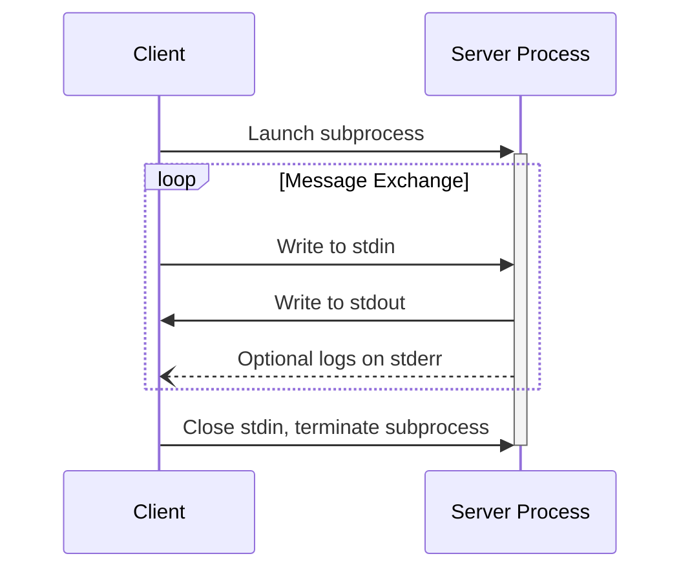

## stdio

In the **stdio** transport:

* The client launches the MCP server as a subprocess.
* The server reads JSON-RPC messages from its standard input (`stdin`) and sends messages
  to its standard output (`stdout`).
* Messages are individual JSON-RPC requests, notifications, or responses.
* Messages are delimited by newlines, and **MUST NOT** contain embedded newlines.
* The server **MAY** write UTF-8 strings to its standard error (`stderr`) for logging
  purposes. Clients **MAY** capture, forward, or ignore this logging.
* The server **MUST NOT** write anything to its `stdout` that is not a valid MCP message.
* The client **MUST NOT** write anything to the server's `stdin` that is not a valid MCP
  message.

---

## Navigation

- [📑 Back to Index](./index.md)
- [📄 Full Documentation](./documentation.md)
- [📝 Original Source](../llms-full.txt)

**Previous:** [← Transports](./107-transports.md)

**Next:** [Streamable HTTP →](./109-streamable-http.md)
