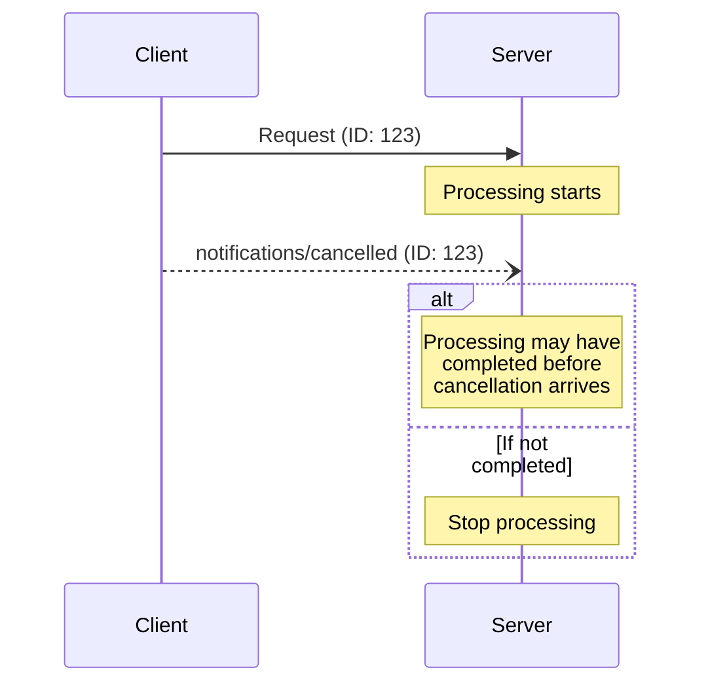

## Timing Considerations

Due to network latency, cancellation notifications may arrive after request processing
has completed, and potentially after a response has already been sent.

Both parties **MUST** handle these race conditions gracefully:

---

## Navigation

- [📑 Back to Index](./index.md)
- [📄 Full Documentation](./documentation.md)
- [📝 Original Source](../llms-full.txt)

**Previous:** [← Behavior Requirements](./113-behavior-requirements.md)

**Next:** [Implementation Notes →](./115-implementation-notes.md)
