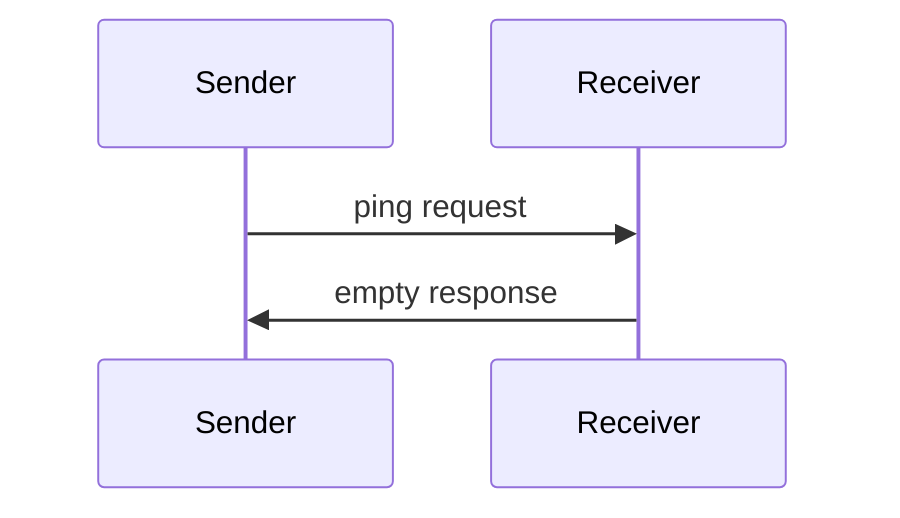

## Usage Patterns

---

## Navigation

- [📑 Back to Index](./index.md)
- [📄 Full Documentation](./documentation.md)
- [📝 Original Source](../llms-full.txt)

**Previous:** [← Behavior Requirements](./120-behavior-requirements.md)

**Next:** [Implementation Considerations →](./122-implementation-considerations.md)
