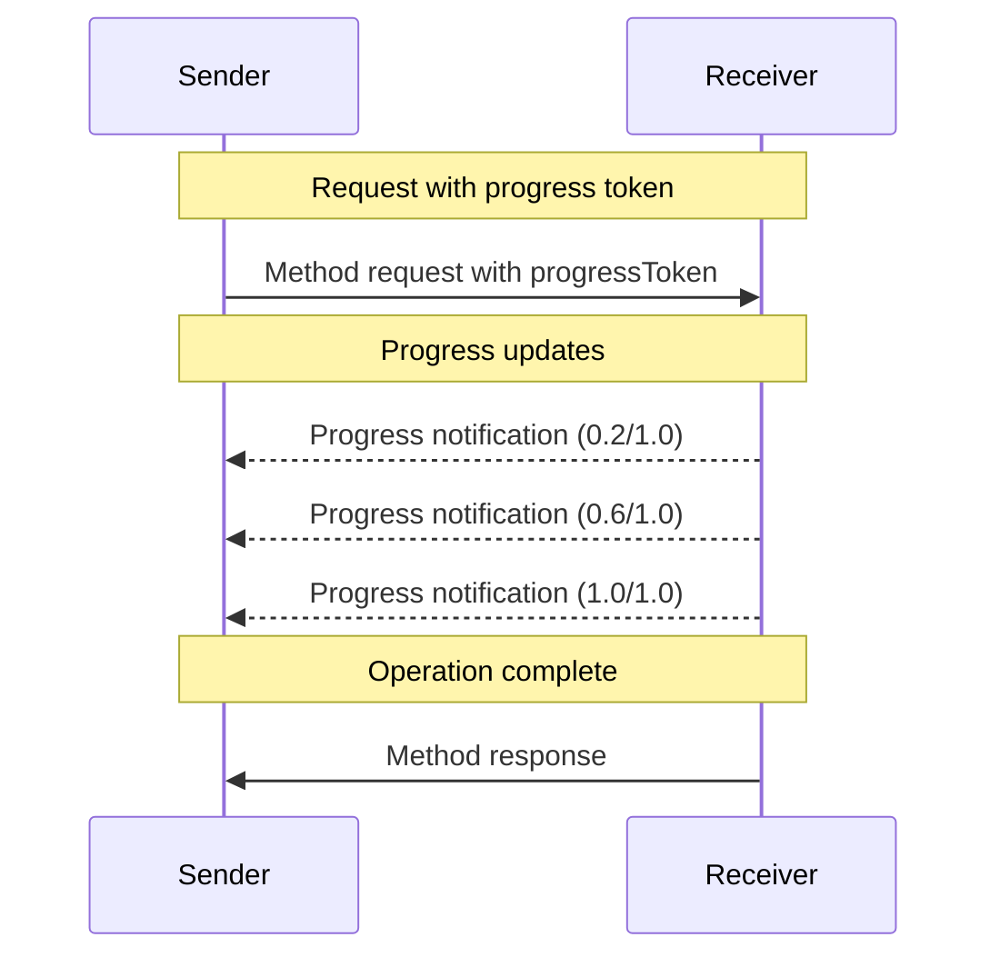

## Behavior Requirements

1. Progress notifications **MUST** only reference tokens that:
   * Were provided in an active request
   * Are associated with an in-progress operation

2. Receivers of progress requests **MAY**:
   * Choose not to send any progress notifications
   * Send notifications at whatever frequency they deem appropriate
   * Omit the total value if unknown

---

## Navigation

- [📑 Back to Index](./index.md)
- [📄 Full Documentation](./documentation.md)
- [📝 Original Source](../llms-full.txt)

**Previous:** [← Progress Flow](./125-progress-flow.md)

**Next:** [Implementation Notes →](./127-implementation-notes.md)
