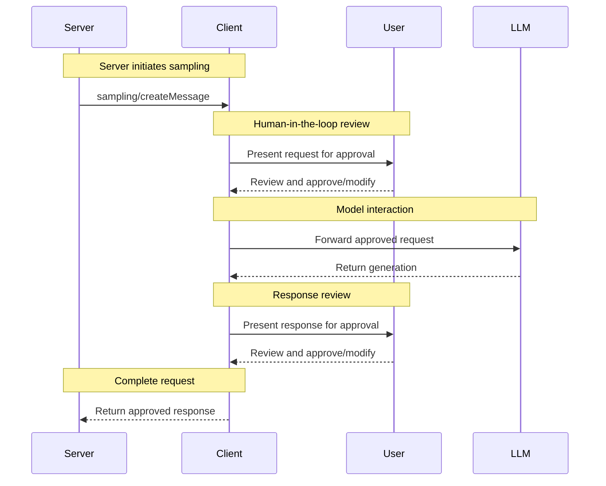

## Message Flow

---

## Navigation

- [📑 Back to Index](./index.md)
- [📄 Full Documentation](./documentation.md)
- [📝 Original Source](../llms-full.txt)

**Previous:** [← Protocol Messages](./152-protocol-messages.md)

**Next:** [Data Types →](./154-data-types.md)
