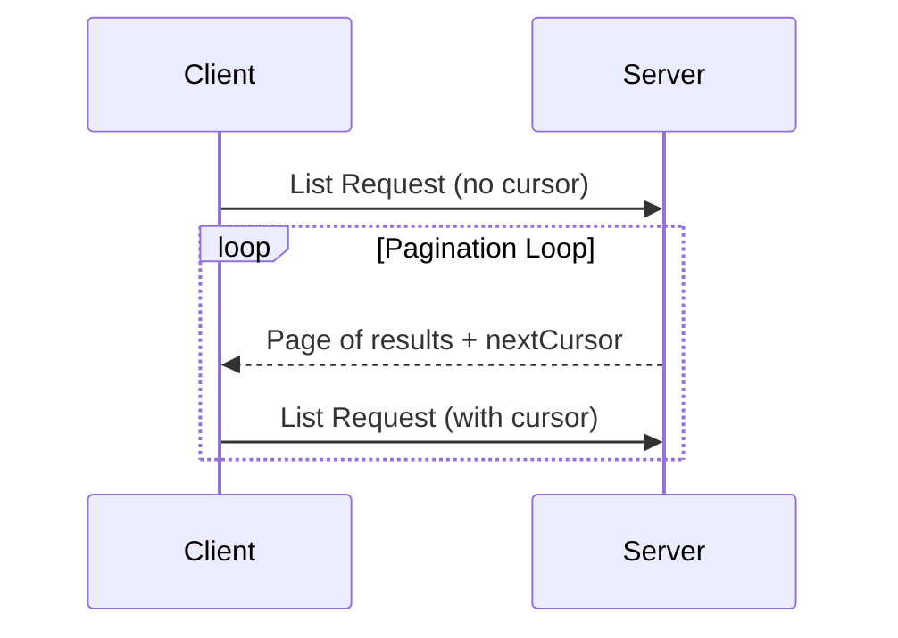

## Pagination Flow

---

## Navigation

- [📑 Back to Index](./index.md)
- [📄 Full Documentation](./documentation.md)
- [📝 Original Source](../llms-full.txt)

**Previous:** [← Request Format](./237-request-format.md)

**Next:** [Operations Supporting Pagination →](./239-operations-supporting-pagination.md)
