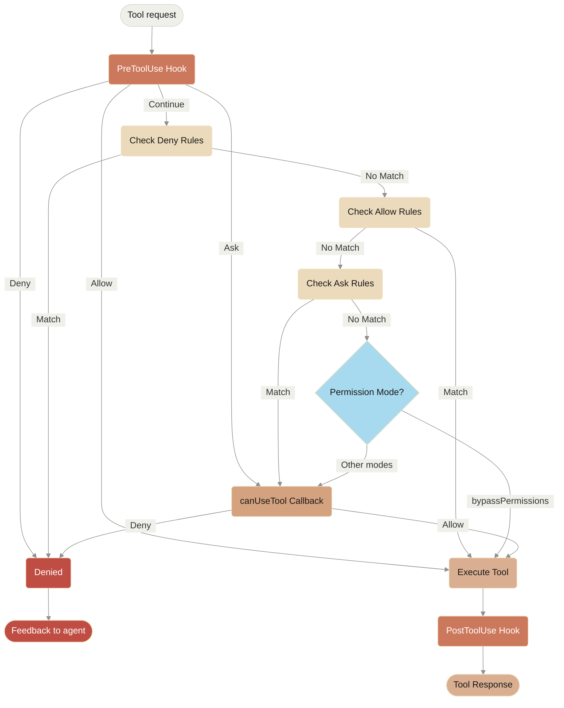

**Navigation:** [← Previous](./01-beta-headers.md) | [Index](./index.md) | [Next →](./03-streaming-input.md)

---

# Hosting the Agent SDK
Source: https://docs.claude.com/en/docs/agent-sdk/hosting

Deploy and host Claude Agent SDK in production environments

The Claude Agent SDK differs from traditional stateless LLM APIs in that it maintains conversational state and executes commands in a persistent environment. This guide covers the architecture, hosting considerations, and best practices for deploying SDK-based agents in production.

## Hosting Requirements

### Container-Based Sandboxing

For security and isolation, the SDK should run inside a **sandboxed container environment**. This provides:

* **Process isolation** - Separate execution environment per session
* **Resource limits** - CPU, memory, and storage constraints
* **Network control** - Restrict outbound connections
* **Ephemeral filesystems** - Clean state for each session

### System Requirements

Each SDK instance requires:

* **Runtime dependencies**
  * Python 3.10+ (for Python SDK) or Node.js 18+ (for TypeScript SDK)
  * Node.js (required by Claude Code CLI)
  * Claude Code CLI: `npm install -g @anthropic-ai/claude-code`

* **Resource allocation**
  * Recommended: 1GiB RAM, 5GiB of disk, and 1 CPU (vary this based on your task as needed)

* **Network access**
  * Outbound HTTPS to `api.anthropic.com`
  * Optional: Access to MCP servers or external tools

## Understanding the SDK Architecture

Unlike stateless API calls, the Claude Agent SDK operates as a **long-running process** that:

* **Executes commands** in a persistent shell environment
* **Manages file operations** within a working directory
* **Handles tool execution** with context from previous interactions

## Sandbox Provider Options

Several providers specialize in secure container environments for AI code execution:

* **[Cloudflare Sandboxes](https://github.com/cloudflare/sandbox-sdk)**
* **[Modal Sandboxes](https://modal.com/docs/guide/sandbox)**
* **[Daytona](https://www.daytona.io/)**
* **[E2B](https://e2b.dev/)**
* **[Fly Machines](https://fly.io/docs/machines/)**
* **[Vercel Sandbox](https://vercel.com/docs/functions/sandbox)**

## Production Deployment Patterns

### Pattern 1: Ephemeral Sessions

Create a new container for each user task, then destroy it when complete.

Best for one-off tasks, the user may still interact with the AI while the task is completing, but once completed the container is destroyed.

**Examples:**

* Bug Investigation & Fix: Debug and resolve a specific issue with relevant context
* Invoice Processing: Extract and structure data from receipts/invoices for accounting systems
* Translation Tasks: Translate documents or content batches between languages
* Image/Video Processing: Apply transformations, optimizations, or extract metadata from media files

### Pattern 2: Long-Running Sessions

Maintain persistent container instances for long running tasks. Often times running *multiple* Claude Agent processes inside of the container based on demand.

Best for proactive agents that take action without the users input, agents that serve content or agents that process high amounts of messages.

**Examples:**

* Email Agent: Monitors incoming emails and autonomously triages, responds, or takes actions based on content
* Site Builder: Hosts custom websites per user with live editing capabilities served through container ports
* High-Frequency Chat Bots: Handles continuous message streams from platforms like Slack where rapid response times are critical

### Pattern 3: Hybrid Sessions

Ephemeral containers that are hydrated with history and state, possibly from a database or from the SDK's session resumption features.

Best for containers with intermittent interaction from the user that kicks off work and spins down when the work is completed but can be continued.

**Examples:**

* Personal Project Manager: Helps manage ongoing projects with intermittent check-ins, maintains context of tasks, decisions, and progress
* Deep Research: Conducts multi-hour research tasks, saves findings and resumes investigation when user returns
* Customer Support Agent: Handles support tickets that span multiple interactions, loads ticket history and customer context

### Pattern 4: Single Containers

Run multiple Claude Agent SDK processes in one global container.

Best for agents that must collaborate closely together. This is likely the least popular pattern because you will have to prevent agents from overwriting each other.

**Examples:**

* **Simulations**: Agents that interact with each other in simulations such as video games.

# FAQ

### How do I communicate with my sandboxes?

When hosting in containers, expose ports to communicate with your SDK instances. Your application can expose HTTP/WebSocket endpoints for external clients while the SDK runs internally within the container.

### What is the cost of hosting a container?

We have found that the dominant cost of serving agents is the tokens, containers vary based on what you provision but a minimum cost is roughly 5 cents per hour running.

### When should I shut down idle containers vs. keeping them warm?

This is likely provider dependent, different sandbox providers will let you set different criteria for idle timeouts after which a sandbox might spin down.
You will want to tune this timeout based on how frequent you think user response might be.

### How often should I update the Claude Code CLI?

The Claude Code CLI is versioned with semver, so any breaking changes will be versioned.

### How do I monitor container health and agent performance?

Since containers are just servers the same logging infrastructure you use for the backend will work for containers.

### How long can an agent session run before timing out?

An agent session will not timeout, but we recommend setting a 'maxTurns' property to prevent Claude from getting stuck in a loop.

## Next Steps

* [Sessions Guide](/en/docs/agent-sdk/sessions) - Learn about session management
* [Permissions](/en/docs/agent-sdk/permissions) - Configure tool permissions
* [Cost Tracking](/en/docs/agent-sdk/cost-tracking) - Monitor API usage
* [MCP Integration](/en/docs/agent-sdk/mcp) - Extend with custom tools


# MCP in the SDK
Source: https://docs.claude.com/en/docs/agent-sdk/mcp

Extend Claude Code with custom tools using Model Context Protocol servers

## Overview

Model Context Protocol (MCP) servers extend Claude Code with custom tools and capabilities. MCPs can run as external processes, connect via HTTP/SSE, or execute directly within your SDK application.

## Configuration

### Basic Configuration

Configure MCP servers in `.mcp.json` at your project root:

<CodeGroup>
  ```json TypeScript theme={null}
  {
    "mcpServers": {
      "filesystem": {
        "command": "npx",
        "args": ["@modelcontextprotocol/server-filesystem"],
        "env": {
          "ALLOWED_PATHS": "/Users/me/projects"
        }
      }
    }
  }
  ```

  ```json Python theme={null}
  {
    "mcpServers": {
      "filesystem": {
        "command": "python",
        "args": ["-m", "mcp_server_filesystem"],
        "env": {
          "ALLOWED_PATHS": "/Users/me/projects"
        }
      }
    }
  }
  ```
</CodeGroup>

### Using MCP Servers in SDK

<CodeGroup>
  ```typescript TypeScript theme={null}
  import { query } from "@anthropic-ai/claude-agent-sdk";

  for await (const message of query({
    prompt: "List files in my project",
    options: {
      mcpServers: {
        "filesystem": {
          command: "npx",
          args: ["@modelcontextprotocol/server-filesystem"],
          env: {
            ALLOWED_PATHS: "/Users/me/projects"
          }
        }
      },
      allowedTools: ["mcp__filesystem__list_files"]
    }
  })) {
    if (message.type === "result" && message.subtype === "success") {
      console.log(message.result);
    }
  }
  ```

  ```python Python theme={null}
  from claude_agent_sdk import query

  async for message in query(
      prompt="List files in my project",
      options={
          "mcpServers": {
              "filesystem": {
                  "command": "python",
                  "args": ["-m", "mcp_server_filesystem"],
                  "env": {
                      "ALLOWED_PATHS": "/Users/me/projects"
                  }
              }
          },
          "allowedTools": ["mcp__filesystem__list_files"]
      }
  ):
      if message["type"] == "result" and message["subtype"] == "success":
          print(message["result"])
  ```
</CodeGroup>

## Transport Types

### stdio Servers

External processes communicating via stdin/stdout:

<CodeGroup>
  ```typescript TypeScript theme={null}
  // .mcp.json configuration
  {
    "mcpServers": {
      "my-tool": {
        "command": "node",
        "args": ["./my-mcp-server.js"],
        "env": {
          "DEBUG": "${DEBUG:-false}"
        }
      }
    }
  }
  ```

  ```python Python theme={null}
  # .mcp.json configuration
  {
    "mcpServers": {
      "my-tool": {
        "command": "python",
        "args": ["./my_mcp_server.py"],
        "env": {
          "DEBUG": "${DEBUG:-false}"
        }
      }
    }
  }
  ```
</CodeGroup>

### HTTP/SSE Servers

Remote servers with network communication:

<CodeGroup>
  ```typescript TypeScript theme={null}
  // SSE server configuration
  {
    "mcpServers": {
      "remote-api": {
        "type": "sse",
        "url": "https://api.example.com/mcp/sse",
        "headers": {
          "Authorization": "Bearer ${API_TOKEN}"
        }
      }
    }
  }

  // HTTP server configuration
  {
    "mcpServers": {
      "http-service": {
        "type": "http",
        "url": "https://api.example.com/mcp",
        "headers": {
          "X-API-Key": "${API_KEY}"
        }
      }
    }
  }
  ```

  ```python Python theme={null}
  # SSE server configuration
  {
    "mcpServers": {
      "remote-api": {
        "type": "sse",
        "url": "https://api.example.com/mcp/sse",
        "headers": {
          "Authorization": "Bearer ${API_TOKEN}"
        }
      }
    }
  }

  # HTTP server configuration
  {
    "mcpServers": {
      "http-service": {
        "type": "http",
        "url": "https://api.example.com/mcp",
        "headers": {
          "X-API-Key": "${API_KEY}"
        }
      }
    }
  }
  ```
</CodeGroup>

### SDK MCP Servers

In-process servers running within your application. For detailed information on creating custom tools, see the [Custom Tools guide](/en/docs/agent-sdk/custom-tools):

## Resource Management

MCP servers can expose resources that Claude can list and read:

<CodeGroup>
  ```typescript TypeScript theme={null}
  import { query } from "@anthropic-ai/claude-agent-sdk";

  // List available resources
  for await (const message of query({
    prompt: "What resources are available from the database server?",
    options: {
      mcpServers: {
        "database": {
          command: "npx",
          args: ["@modelcontextprotocol/server-database"]
        }
      },
      allowedTools: ["mcp__list_resources", "mcp__read_resource"]
    }
  })) {
    if (message.type === "result") console.log(message.result);
  }
  ```

  ```python Python theme={null}
  from claude_agent_sdk import query

  # List available resources
  async for message in query(
      prompt="What resources are available from the database server?",
      options={
          "mcpServers": {
              "database": {
                  "command": "python",
                  "args": ["-m", "mcp_server_database"]
              }
          },
          "allowedTools": ["mcp__list_resources", "mcp__read_resource"]
      }
  ):
      if message["type"] == "result":
          print(message["result"])
  ```
</CodeGroup>

## Authentication

### Environment Variables

<CodeGroup>
  ```typescript TypeScript theme={null}
  // .mcp.json with environment variables
  {
    "mcpServers": {
      "secure-api": {
        "type": "sse",
        "url": "https://api.example.com/mcp",
        "headers": {
          "Authorization": "Bearer ${API_TOKEN}",
          "X-API-Key": "${API_KEY:-default-key}"
        }
      }
    }
  }

  // Set environment variables
  process.env.API_TOKEN = "your-token";
  process.env.API_KEY = "your-key";
  ```

  ```python Python theme={null}
  # .mcp.json with environment variables
  {
    "mcpServers": {
      "secure-api": {
        "type": "sse",
        "url": "https://api.example.com/mcp",
        "headers": {
          "Authorization": "Bearer ${API_TOKEN}",
          "X-API-Key": "${API_KEY:-default-key}"
        }
      }
    }
  }

  # Set environment variables
  import os
  os.environ["API_TOKEN"] = "your-token"
  os.environ["API_KEY"] = "your-key"
  ```
</CodeGroup>

### OAuth2 Authentication

OAuth2 MCP authentication in-client is not currently supported.

## Error Handling

Handle MCP connection failures gracefully:

<CodeGroup>
  ```typescript TypeScript theme={null}
  import { query } from "@anthropic-ai/claude-agent-sdk";

  for await (const message of query({
    prompt: "Process data",
    options: {
      mcpServers: {
        "data-processor": dataServer
      }
    }
  })) {
    if (message.type === "system" && message.subtype === "init") {
      // Check MCP server status
      const failedServers = message.mcp_servers.filter(
        s => s.status !== "connected"
      );
      
      if (failedServers.length > 0) {
        console.warn("Failed to connect:", failedServers);
      }
    }
    
    if (message.type === "result" && message.subtype === "error_during_execution") {
      console.error("Execution failed");
    }
  }
  ```

  ```python Python theme={null}
  from claude_agent_sdk import query

  async for message in query(
      prompt="Process data",
      options={
          "mcpServers": {
              "data-processor": data_server
          }
      }
  ):
      if message["type"] == "system" and message["subtype"] == "init":
          # Check MCP server status
          failed_servers = [
              s for s in message["mcp_servers"]
              if s["status"] != "connected"
          ]
          
          if failed_servers:
              print(f"Failed to connect: {failed_servers}")
      
      if message["type"] == "result" and message["subtype"] == "error_during_execution":
          print("Execution failed")
  ```
</CodeGroup>

## Related Resources

* [Custom Tools Guide](/en/docs/agent-sdk/custom-tools) - Detailed guide on creating SDK MCP servers
* [TypeScript SDK Reference](/en/docs/agent-sdk/typescript)
* [Python SDK Reference](/en/docs/agent-sdk/python)
* [SDK Permissions](/en/docs/agent-sdk/permissions)
* [Common Workflows](https://code.claude.com/docs/common-workflows)


# Modifying system prompts
Source: https://docs.claude.com/en/docs/agent-sdk/modifying-system-prompts

Learn how to customize Claude's behavior by modifying system prompts using three approaches - output styles, systemPrompt with append, and custom system prompts.

System prompts define Claude's behavior, capabilities, and response style. The Claude Agent SDK provides three ways to customize system prompts: using output styles (persistent, file-based configurations), appending to Claude Code's prompt, or using a fully custom prompt.

## Understanding system prompts

A system prompt is the initial instruction set that shapes how Claude behaves throughout a conversation.

<Note>
  **Default behavior:** The Agent SDK uses an **empty system prompt** by default for maximum flexibility. To use Claude Code's system prompt (tool instructions, code guidelines, etc.), specify `systemPrompt: { preset: "claude_code" }` in TypeScript or `system_prompt="claude_code"` in Python.
</Note>

Claude Code's system prompt includes:

* Tool usage instructions and available tools
* Code style and formatting guidelines
* Response tone and verbosity settings
* Security and safety instructions
* Context about the current working directory and environment

## Methods of modification

### Method 1: CLAUDE.md files (project-level instructions)

CLAUDE.md files provide project-specific context and instructions that are automatically read by the Agent SDK when it runs in a directory. They serve as persistent "memory" for your project.

#### How CLAUDE.md works with the SDK

**Location and discovery:**

* **Project-level:** `CLAUDE.md` or `.claude/CLAUDE.md` in your working directory
* **User-level:** `~/.claude/CLAUDE.md` for global instructions across all projects

**IMPORTANT:** The SDK only reads CLAUDE.md files when you explicitly configure `settingSources` (TypeScript) or `setting_sources` (Python):

* Include `'project'` to load project-level CLAUDE.md
* Include `'user'` to load user-level CLAUDE.md (`~/.claude/CLAUDE.md`)

The `claude_code` system prompt preset does NOT automatically load CLAUDE.md - you must also specify setting sources.

**Content format:**
CLAUDE.md files use plain markdown and can contain:

* Coding guidelines and standards
* Project-specific context
* Common commands or workflows
* API conventions
* Testing requirements

#### Example CLAUDE.md

```markdown  theme={null}
# Project Guidelines

## Code Style

- Use TypeScript strict mode
- Prefer functional components in React
- Always include JSDoc comments for public APIs

## Testing

- Run `npm test` before committing
- Maintain >80% code coverage
- Use jest for unit tests, playwright for E2E

## Commands

- Build: `npm run build`
- Dev server: `npm run dev`
- Type check: `npm run typecheck`
```

#### Using CLAUDE.md with the SDK

<CodeGroup>
  ```typescript TypeScript theme={null}
  import { query } from "@anthropic-ai/claude-agent-sdk";

  // IMPORTANT: You must specify settingSources to load CLAUDE.md
  // The claude_code preset alone does NOT load CLAUDE.md files
  const messages = [];

  for await (const message of query({
    prompt: "Add a new React component for user profiles",
    options: {
      systemPrompt: {
        type: "preset",
        preset: "claude_code", // Use Claude Code's system prompt
      },
      settingSources: ["project"], // Required to load CLAUDE.md from project
    },
  })) {
    messages.push(message);
  }

  // Now Claude has access to your project guidelines from CLAUDE.md
  ```

  ```python Python theme={null}
  from claude_agent_sdk import query, ClaudeAgentOptions

  # IMPORTANT: You must specify setting_sources to load CLAUDE.md
  # The claude_code preset alone does NOT load CLAUDE.md files
  messages = []

  async for message in query(
      prompt="Add a new React component for user profiles",
      options=ClaudeAgentOptions(
          system_prompt={
              "type": "preset",
              "preset": "claude_code"  # Use Claude Code's system prompt
          },
          setting_sources=["project"]  # Required to load CLAUDE.md from project
      )
  ):
      messages.append(message)

  # Now Claude has access to your project guidelines from CLAUDE.md
  ```
</CodeGroup>

#### When to use CLAUDE.md

**Best for:**

* **Team-shared context** - Guidelines everyone should follow
* **Project conventions** - Coding standards, file structure, naming patterns
* **Common commands** - Build, test, deploy commands specific to your project
* **Long-term memory** - Context that should persist across all sessions
* **Version-controlled instructions** - Commit to git so the team stays in sync

**Key characteristics:**

* ✅ Persistent across all sessions in a project
* ✅ Shared with team via git
* ✅ Automatic discovery (no code changes needed)
* ⚠️ Requires loading settings via `settingSources`

### Method 2: Output styles (persistent configurations)

Output styles are saved configurations that modify Claude's system prompt. They're stored as markdown files and can be reused across sessions and projects.

#### Creating an output style

<CodeGroup>
  ```typescript TypeScript theme={null}
  import { writeFile, mkdir } from "fs/promises";
  import { join } from "path";
  import { homedir } from "os";

  async function createOutputStyle(
    name: string,
    description: string,
    prompt: string
  ) {
    // User-level: ~/.claude/output-styles
    // Project-level: .claude/output-styles
    const outputStylesDir = join(homedir(), ".claude", "output-styles");

    await mkdir(outputStylesDir, { recursive: true });

    const content = `---
  name: ${name}
  description: ${description}
  ---

  ${prompt}`;

    const filePath = join(
      outputStylesDir,
      `${name.toLowerCase().replace(/\s+/g, "-")}.md`
    );
    await writeFile(filePath, content, "utf-8");
  }

  // Example: Create a code review specialist
  await createOutputStyle(
    "Code Reviewer",
    "Thorough code review assistant",
    `You are an expert code reviewer.

  For every code submission:
  1. Check for bugs and security issues
  2. Evaluate performance
  3. Suggest improvements
  4. Rate code quality (1-10)`
  );
  ```

  ```python Python theme={null}
  from pathlib import Path

  async def create_output_style(name: str, description: str, prompt: str):
      # User-level: ~/.claude/output-styles
      # Project-level: .claude/output-styles
      output_styles_dir = Path.home() / '.claude' / 'output-styles'

      output_styles_dir.mkdir(parents=True, exist_ok=True)

      content = f"""---
  name: {name}
  description: {description}
  ---

  {prompt}"""

      file_name = name.lower().replace(' ', '-') + '.md'
      file_path = output_styles_dir / file_name
      file_path.write_text(content, encoding='utf-8')

  # Example: Create a code review specialist
  await create_output_style(
      'Code Reviewer',
      'Thorough code review assistant',
      """You are an expert code reviewer.

  For every code submission:
  1. Check for bugs and security issues
  2. Evaluate performance
  3. Suggest improvements
  4. Rate code quality (1-10)"""
  )
  ```
</CodeGroup>

#### Using output styles

Once created, activate output styles via:

* **CLI**: `/output-style [style-name]`
* **Settings**: `.claude/settings.local.json`
* **Create new**: `/output-style:new [description]`

**Note for SDK users:** Output styles are loaded when you include `settingSources: ['user']` or `settingSources: ['project']` (TypeScript) / `setting_sources=["user"]` or `setting_sources=["project"]` (Python) in your options.

### Method 3: Using `systemPrompt` with append

You can use the Claude Code preset with an `append` property to add your custom instructions while preserving all built-in functionality.

<CodeGroup>
  ```typescript TypeScript theme={null}
  import { query } from "@anthropic-ai/claude-agent-sdk";

  const messages = [];

  for await (const message of query({
    prompt: "Help me write a Python function to calculate fibonacci numbers",
    options: {
      systemPrompt: {
        type: "preset",
        preset: "claude_code",
        append:
          "Always include detailed docstrings and type hints in Python code.",
      },
    },
  })) {
    messages.push(message);
    if (message.type === "assistant") {
      console.log(message.message.content);
    }
  }
  ```

  ```python Python theme={null}
  from claude_agent_sdk import query, ClaudeAgentOptions

  messages = []

  async for message in query(
      prompt="Help me write a Python function to calculate fibonacci numbers",
      options=ClaudeAgentOptions(
          system_prompt={
              "type": "preset",
              "preset": "claude_code",
              "append": "Always include detailed docstrings and type hints in Python code."
          }
      )
  ):
      messages.append(message)
      if message.type == 'assistant':
          print(message.message.content)
  ```
</CodeGroup>

### Method 4: Custom system prompts

You can provide a custom string as `systemPrompt` to replace the default entirely with your own instructions.

<CodeGroup>
  ```typescript TypeScript theme={null}
  import { query } from "@anthropic-ai/claude-agent-sdk";

  const customPrompt = `You are a Python coding specialist.
  Follow these guidelines:
  - Write clean, well-documented code
  - Use type hints for all functions
  - Include comprehensive docstrings
  - Prefer functional programming patterns when appropriate
  - Always explain your code choices`;

  const messages = [];

  for await (const message of query({
    prompt: "Create a data processing pipeline",
    options: {
      systemPrompt: customPrompt,
    },
  })) {
    messages.push(message);
    if (message.type === "assistant") {
      console.log(message.message.content);
    }
  }
  ```

  ```python Python theme={null}
  from claude_agent_sdk import query, ClaudeAgentOptions

  custom_prompt = """You are a Python coding specialist.
  Follow these guidelines:
  - Write clean, well-documented code
  - Use type hints for all functions
  - Include comprehensive docstrings
  - Prefer functional programming patterns when appropriate
  - Always explain your code choices"""

  messages = []

  async for message in query(
      prompt="Create a data processing pipeline",
      options=ClaudeAgentOptions(
          system_prompt=custom_prompt
      )
  ):
      messages.append(message)
      if message.type == 'assistant':
          print(message.message.content)
  ```
</CodeGroup>

## Comparison of all four approaches

| Feature                 | CLAUDE.md        | Output Styles   | `systemPrompt` with append | Custom `systemPrompt`  |
| ----------------------- | ---------------- | --------------- | -------------------------- | ---------------------- |
| **Persistence**         | Per-project file | Saved as files  | Session only               | Session only           |
| **Reusability**         | Per-project      | Across projects | Code duplication           | Code duplication       |
| **Management**          | On filesystem    | CLI + files     | In code                    | In code                |
| **Default tools**       | Preserved        | Preserved       | Preserved                  | Lost (unless included) |
| **Built-in safety**     | Maintained       | Maintained      | Maintained                 | Must be added          |
| **Environment context** | Automatic        | Automatic       | Automatic                  | Must be provided       |
| **Customization level** | Additions only   | Replace default | Additions only             | Complete control       |
| **Version control**     | With project     | Yes             | With code                  | With code              |
| **Scope**               | Project-specific | User or project | Code session               | Code session           |

**Note:** "With append" means using `systemPrompt: { type: "preset", preset: "claude_code", append: "..." }` in TypeScript or `system_prompt={"type": "preset", "preset": "claude_code", "append": "..."}` in Python.

## Use cases and best practices

### When to use CLAUDE.md

**Best for:**

* Project-specific coding standards and conventions
* Documenting project structure and architecture
* Listing common commands (build, test, deploy)
* Team-shared context that should be version controlled
* Instructions that apply to all SDK usage in a project

**Examples:**

* "All API endpoints should use async/await patterns"
* "Run `npm run lint:fix` before committing"
* "Database migrations are in the `migrations/` directory"

**Important:** To load CLAUDE.md files, you must explicitly set `settingSources: ['project']` (TypeScript) or `setting_sources=["project"]` (Python). The `claude_code` system prompt preset does NOT automatically load CLAUDE.md without this setting.

### When to use output styles

**Best for:**

* Persistent behavior changes across sessions
* Team-shared configurations
* Specialized assistants (code reviewer, data scientist, DevOps)
* Complex prompt modifications that need versioning

**Examples:**

* Creating a dedicated SQL optimization assistant
* Building a security-focused code reviewer
* Developing a teaching assistant with specific pedagogy

### When to use `systemPrompt` with append

**Best for:**

* Adding specific coding standards or preferences
* Customizing output formatting
* Adding domain-specific knowledge
* Modifying response verbosity
* Enhancing Claude Code's default behavior without losing tool instructions

### When to use custom `systemPrompt`

**Best for:**

* Complete control over Claude's behavior
* Specialized single-session tasks
* Testing new prompt strategies
* Situations where default tools aren't needed
* Building specialized agents with unique behavior

## Combining approaches

You can combine these methods for maximum flexibility:

### Example: Output style with session-specific additions

<CodeGroup>
  ```typescript TypeScript theme={null}
  import { query } from "@anthropic-ai/claude-agent-sdk";

  // Assuming "Code Reviewer" output style is active (via /output-style)
  // Add session-specific focus areas
  const messages = [];

  for await (const message of query({
    prompt: "Review this authentication module",
    options: {
      systemPrompt: {
        type: "preset",
        preset: "claude_code",
        append: `
          For this review, prioritize:
          - OAuth 2.0 compliance
          - Token storage security
          - Session management
        `,
      },
    },
  })) {
    messages.push(message);
  }
  ```

  ```python Python theme={null}
  from claude_agent_sdk import query, ClaudeAgentOptions

  # Assuming "Code Reviewer" output style is active (via /output-style)
  # Add session-specific focus areas
  messages = []

  async for message in query(
      prompt="Review this authentication module",
      options=ClaudeAgentOptions(
          system_prompt={
              "type": "preset",
              "preset": "claude_code",
              "append": """
              For this review, prioritize:
              - OAuth 2.0 compliance
              - Token storage security
              - Session management
              """
          }
      )
  ):
      messages.append(message)
  ```
</CodeGroup>

## See also

* [Output styles](https://code.claude.com/docs/output-styles) - Complete output styles documentation
* [TypeScript SDK guide](/en/docs/agent-sdk/typescript) - Complete SDK usage guide
* [Configuration guide](https://code.claude.com/docs/settings) - General configuration options


# Agent SDK overview
Source: https://docs.claude.com/en/docs/agent-sdk/overview

Build custom AI agents with the Claude Agent SDK

<Note>
  The Claude Code SDK has been renamed to the **Claude Agent SDK**. If you're migrating from the old SDK, see the [Migration Guide](https://code.claude.com/docs/sdk/migration-guide).
</Note>

## Installation

<CodeGroup>
  ```bash TypeScript theme={null}
  npm install @anthropic-ai/claude-agent-sdk
  ```

  ```bash Python theme={null}
  pip install claude-agent-sdk
  ```
</CodeGroup>

## SDK Options

The Claude Agent SDK is available in multiple forms to suit different use cases:

* **[TypeScript SDK](/en/docs/agent-sdk/typescript)** - For Node.js and web applications
* **[Python SDK](/en/docs/agent-sdk/python)** - For Python applications and data science
* **[Streaming vs Single Mode](/en/docs/agent-sdk/streaming-vs-single-mode)** - Understanding input modes and best practices

## Why use the Claude Agent SDK?

Built on top of the agent harness that powers Claude Code, the Claude Agent SDK provides all the building blocks you need to build production-ready agents.

Taking advantage of the work we've done on Claude Code including:

* **Context Management**: Automatic compaction and context management to ensure your agent doesn't run out of context.
* **Rich tool ecosystem**: File operations, code execution, web search, and MCP extensibility
* **Advanced permissions**: Fine-grained control over agent capabilities
* **Production essentials**: Built-in error handling, session management, and monitoring
* **Optimized Claude integration**: Automatic prompt caching and performance optimizations

## What can you build with the SDK?

Here are some example agent types you can create:

**Coding agents:**

* SRE agents that diagnose and fix production issues
* Security review bots that audit code for vulnerabilities
* Oncall engineering assistants that triage incidents
* Code review agents that enforce style and best practices

**Business agents:**

* Legal assistants that review contracts and compliance
* Finance advisors that analyze reports and forecasts
* Customer support agents that resolve technical issues
* Content creation assistants for marketing teams

## Core Concepts

### Authentication

For basic authentication, retrieve an Claude API key from the [Claude Console](https://console.anthropic.com/) and set the `ANTHROPIC_API_KEY` environment variable.

The SDK also supports authentication via third-party API providers:

* **Amazon Bedrock**: Set `CLAUDE_CODE_USE_BEDROCK=1` environment variable and configure AWS credentials
* **Google Vertex AI**: Set `CLAUDE_CODE_USE_VERTEX=1` environment variable and configure Google Cloud credentials

For detailed configuration instructions for third-party providers, see the [Amazon Bedrock](https://code.claude.com/docs/amazon-bedrock) and [Google Vertex AI](https://code.claude.com/docs/google-vertex-ai) documentation.

<Note>
  Unless previously approved, we do not allow third party developers to apply Claude.ai rate limits for their products, including agents built on the Claude Agent SDK. Please use the API key authentication methods described in this document instead.
</Note>

### Full Claude Code Feature Support

The SDK provides access to all the default features available in Claude Code, leveraging the same file system-based configuration:

* **Subagents**: Launch specialized agents stored as Markdown files in `./.claude/agents/`
* **Agent Skills**: Extend Claude with specialized capabilities stored as `SKILL.md` files in `./.claude/skills/`
* **Hooks**: Execute custom commands configured in `./.claude/settings.json` that respond to tool events
* **Slash Commands**: Use custom commands defined as Markdown files in `./.claude/commands/`
* **Plugins**: Load custom plugins programmatically using the `plugins` option to extend Claude Code with custom commands, agents, skills, hooks, and MCP servers. See [Plugins](/en/docs/agent-sdk/plugins) for details.
* **Memory (CLAUDE.md)**: Maintain project context through `CLAUDE.md` or `.claude/CLAUDE.md` files in your project directory, or `~/.claude/CLAUDE.md` for user-level instructions. To load these files, you must explicitly set `settingSources: ['project']` (TypeScript) or `setting_sources=["project"]` (Python) in your options. See [Modifying system prompts](/en/docs/agent-sdk/modifying-system-prompts#method-1-claudemd-files-project-level-instructions) for details.

These features work identically to their Claude Code counterparts by reading from the same file system locations.

### System Prompts

System prompts define your agent's role, expertise, and behavior. This is where you specify what kind of agent you're building.

### Tool Permissions

Control which tools your agent can use with fine-grained permissions:

* `allowedTools` - Explicitly allow specific tools
* `disallowedTools` - Block specific tools
* `permissionMode` - Set overall permission strategy

### Model Context Protocol (MCP)

Extend your agents with custom tools and integrations through MCP servers. This allows you to connect to databases, APIs, and other external services.

## Building with the Claude Agent SDK

If you're building coding agents powered by the Claude Agent SDK, please note that **Claude Code** refers specifically to Anthropic's official product including the CLI, VS Code extension, web experience, and future integrations we build.

### For partners integrating Claude Agent SDK:

<Note>
  The use of Claude branding for products built on Claude is optional.
</Note>

When referencing Claude in your agent selector or product:

**Allowed naming options:**

* **Claude Agent** (preferred for dropdown menus)
* **Claude** (when within a menu already labeled "Agents")
* **{YourAgentName} Powered by Claude** (if you have an existing agent name)

**Not permitted:**

* "Claude Code" or "Claude Code Agent"
* Claude Code-branded ASCII art or visual elements that mimic Claude Code

Your product should maintain its own branding and not appear to be Claude Code or any Anthropic product.

For questions about branding compliance or to discuss your product's Claude integration, [contact our sales team](https://claude.com/contact-sales).

## Reporting Bugs

If you encounter bugs or issues with the Agent SDK:

* **TypeScript SDK**: [Report issues on GitHub](https://github.com/anthropics/claude-agent-sdk-typescript/issues)
* **Python SDK**: [Report issues on GitHub](https://github.com/anthropics/claude-agent-sdk-python/issues)

## Changelog

View the full changelog for SDK updates, bug fixes, and new features:

* **TypeScript SDK**: [View CHANGELOG.md](https://github.com/anthropics/claude-agent-sdk-typescript/blob/main/CHANGELOG.md)
* **Python SDK**: [View CHANGELOG.md](https://github.com/anthropics/claude-agent-sdk-python/blob/main/CHANGELOG.md)

## Related Resources

* [CLI Reference](https://code.claude.com/docs/cli-reference) - Complete CLI documentation
* [GitHub Actions Integration](https://code.claude.com/docs/github-actions) - Automate your GitHub workflow
* [MCP Documentation](https://code.claude.com/docs/mcp) - Extend Claude with custom tools
* [Common Workflows](https://code.claude.com/docs/common-workflows) - Step-by-step guides
* [Troubleshooting](https://code.claude.com/docs/troubleshooting) - Common issues and solutions


# Handling Permissions
Source: https://docs.claude.com/en/docs/agent-sdk/permissions

Control tool usage and permissions in the Claude Agent SDK

<style>
  {`
    .edgeLabel {
      padding: 8px 12px !important;
    }
    .edgeLabel rect {
      rx: 4;
      ry: 4;
      stroke: #D9D8D5 !important;
      stroke-width: 1px !important;
    }
    /* Add rounded corners to flowchart nodes */
    .node rect {
      rx: 8 !important;
      ry: 8 !important;
    }
    `}
</style>

# SDK Permissions

The Claude Agent SDK provides powerful permission controls that allow you to manage how Claude uses tools in your application.

This guide covers how to implement permission systems using the `canUseTool` callback, hooks, and settings.json permission rules. For complete API documentation, see the [TypeScript SDK reference](https://code.claude.com/docs/typescript).

## Overview

The Claude Agent SDK provides four complementary ways to control tool usage:

1. **[Permission Modes](#permission-modes)** - Global permission behavior settings that affect all tools
2. **[canUseTool callback](https://code.claude.com/docs/typescript#canusetool)** - Runtime permission handler for cases not covered by other rules
3. **[Hooks](https://code.claude.com/docs/typescript#hook-types)** - Fine-grained control over every tool execution with custom logic
4. **[Permission rules (settings.json)](https://code.claude.com/docs/settings#permission-settings)** - Declarative allow/deny rules with integrated bash command parsing

Use cases for each approach:

* Permission modes - Set overall permission behavior (planning, auto-accepting edits, bypassing checks)
* `canUseTool` - Dynamic approval for uncovered cases, prompts user for permission
* Hooks - Programmatic control over all tool executions
* Permission rules - Static policies with intelligent bash command parsing

## Permission Flow Diagram



**Processing Order:** PreToolUse Hook → Deny Rules → Allow Rules → Ask Rules → Permission Mode Check → canUseTool Callback → PostToolUse Hook

## Permission Modes

Permission modes provide global control over how Claude uses tools. You can set the permission mode when calling `query()` or change it dynamically during streaming sessions.

### Available Modes

The SDK supports four permission modes, each with different behavior:

| Mode                | Description                  | Tool Behavior                                                                                              |
| :------------------ | :--------------------------- | :--------------------------------------------------------------------------------------------------------- |
| `default`           | Standard permission behavior | Normal permission checks apply                                                                             |
| `plan`              | Planning mode - no execution | Claude can only use read-only tools; presents a plan before execution **(Not currently supported in SDK)** |
| `acceptEdits`       | Auto-accept file edits       | File edits and filesystem operations are automatically approved                                            |
| `bypassPermissions` | Bypass all permission checks | All tools run without permission prompts (use with caution)                                                |

### Setting Permission Mode

You can set the permission mode in two ways:

#### 1. Initial Configuration

Set the mode when creating a query:

<CodeGroup>
  ```typescript TypeScript theme={null}
  import { query } from "@anthropic-ai/claude-agent-sdk";

  const result = await query({
    prompt: "Help me refactor this code",
    options: {
      permissionMode: 'default'  // Standard permission mode
    }
  });
  ```

  ```python Python theme={null}
  from claude_agent_sdk import query

  result = await query(
      prompt="Help me refactor this code",
      options={
          "permission_mode": "default"  # Standard permission mode
      }
  )
  ```
</CodeGroup>

#### 2. Dynamic Mode Changes (Streaming Only)

Change the mode during a streaming session:

<CodeGroup>
  ```typescript TypeScript theme={null}
  import { query } from "@anthropic-ai/claude-agent-sdk";

  // Create an async generator for streaming input
  async function* streamInput() {
    yield { 
      type: 'user',
      message: { 
        role: 'user', 
        content: "Let's start with default permissions" 
      }
    };
    
    // Later in the conversation...
    yield {
      type: 'user',
      message: {
        role: 'user',
        content: "Now let's speed up development"
      }
    };
  }

  const q = query({
    prompt: streamInput(),
    options: {
      permissionMode: 'default'  // Start in default mode
    }
  });

  // Change mode dynamically
  await q.setPermissionMode('acceptEdits');

  // Process messages
  for await (const message of q) {
    console.log(message);
  }
  ```

  ```python Python theme={null}
  from claude_agent_sdk import query

  async def stream_input():
      """Async generator for streaming input"""
      yield {
          "type": "user",
          "message": {
              "role": "user",
              "content": "Let's start with default permissions"
          }
      }
      
      # Later in the conversation...
      yield {
          "type": "user",
          "message": {
              "role": "user",
              "content": "Now let's speed up development"
          }
      }

  q = query(
      prompt=stream_input(),
      options={
          "permission_mode": "default"  # Start in default mode
      }
  )

  # Change mode dynamically
  await q.set_permission_mode("acceptEdits")

  # Process messages
  async for message in q:
      print(message)
  ```
</CodeGroup>

### Mode-Specific Behaviors

#### Accept Edits Mode (`acceptEdits`)

In accept edits mode:

* All file edits are automatically approved
* Filesystem operations (mkdir, touch, rm, etc.) are auto-approved
* Other tools still require normal permissions
* Speeds up development when you trust Claude's edits
* Useful for rapid prototyping and iterations

Auto-approved operations:

* File edits (Edit, Write tools)
* Bash filesystem commands (mkdir, touch, rm, mv, cp)
* File creation and deletion

#### Bypass Permissions Mode (`bypassPermissions`)

In bypass permissions mode:

* **ALL tool uses are automatically approved**
* No permission prompts appear
* Hooks still execute (can still block operations)
* **Use with extreme caution** - Claude has full system access
* Recommended only for controlled environments

### Mode Priority in Permission Flow

Permission modes are evaluated at a specific point in the permission flow:

1. **Hooks execute first** - Can allow, deny, ask, or continue
2. **Deny rules** are checked - Block tools regardless of mode
3. **Allow rules** are checked - Permit tools if matched
4. **Ask rules** are checked - Prompt for permission if matched
5. **Permission mode** is evaluated:
   * **`bypassPermissions` mode** - If active, allows all remaining tools
   * **Other modes** - Defer to `canUseTool` callback
6. **`canUseTool` callback** - Handles remaining cases

This means:

* Hooks can always control tool use, even in `bypassPermissions` mode
* Explicit deny rules override all permission modes
* Ask rules are evaluated before permission modes
* `bypassPermissions` mode overrides the `canUseTool` callback for unmatched tools

### Best Practices

1. **Use default mode** for controlled execution with normal permission checks
2. **Use acceptEdits mode** when working on isolated files or directories
3. **Avoid bypassPermissions** in production or on systems with sensitive data
4. **Combine modes with hooks** for fine-grained control
5. **Switch modes dynamically** based on task progress and confidence

Example of mode progression:

```typescript  theme={null}
// Start in default mode for controlled execution
permissionMode: 'default'

// Switch to acceptEdits for rapid iteration
await q.setPermissionMode('acceptEdits')
```

## canUseTool

The `canUseTool` callback is passed as an option when calling the `query` function. It receives the tool name and input parameters, and must return a decision- either allow or deny.

canUseTool fires whenever Claude Code would show a permission prompt to a user, e.g. hooks and permission rules do not cover it and it is not in acceptEdits mode.

Here's a complete example showing how to implement interactive tool approval:

<CodeGroup>
  ```typescript TypeScript theme={null}
  import { query } from "@anthropic-ai/claude-agent-sdk";

  async function promptForToolApproval(toolName: string, input: any) {
    console.log("\n🔧 Tool Request:");
    console.log(`   Tool: ${toolName}`);
    
    // Display tool parameters
    if (input && Object.keys(input).length > 0) {
      console.log("   Parameters:");
      for (const [key, value] of Object.entries(input)) {
        let displayValue = value;
        if (typeof value === 'string' && value.length > 100) {
          displayValue = value.substring(0, 100) + "...";
        } else if (typeof value === 'object') {
          displayValue = JSON.stringify(value, null, 2);
        }
        console.log(`     ${key}: ${displayValue}`);
      }
    }
    
    // Get user approval (replace with your UI logic)
    const approved = await getUserApproval();
    
    if (approved) {
      console.log("   ✅ Approved\n");
      return {
        behavior: "allow",
        updatedInput: input
      };
    } else {
      console.log("   ❌ Denied\n");
      return {
        behavior: "deny",
        message: "User denied permission for this tool"
      };
    }
  }

  // Use the permission callback
  const result = await query({
    prompt: "Help me analyze this codebase",
    options: {
      canUseTool: async (toolName, input) => {
        return promptForToolApproval(toolName, input);
      }
    }
  });
  ```

  ```python Python theme={null}
  from claude_agent_sdk import query

  async def prompt_for_tool_approval(tool_name: str, input_params: dict):
      print(f"\n🔧 Tool Request:")
      print(f"   Tool: {tool_name}")

      # Display parameters
      if input_params:
          print("   Parameters:")
          for key, value in input_params.items():
              display_value = value
              if isinstance(value, str) and len(value) > 100:
                  display_value = value[:100] + "..."
              elif isinstance(value, (dict, list)):
                  display_value = json.dumps(value, indent=2)
              print(f"     {key}: {display_value}")

      # Get user approval
      answer = input("\n   Approve this tool use? (y/n): ")

      if answer.lower() in ['y', 'yes']:
          print("   ✅ Approved\n")
          return {
              "behavior": "allow",
              "updatedInput": input_params
          }
      else:
          print("   ❌ Denied\n")
          return {
              "behavior": "deny",
              "message": "User denied permission for this tool"
          }

  # Use the permission callback
  result = await query(
      prompt="Help me analyze this codebase",
      options={
          "can_use_tool": prompt_for_tool_approval
      }
  )
  ```
</CodeGroup>

## Related Resources

* [Hooks Guide](https://code.claude.com/docs/hooks-guide) - Learn how to implement hooks for fine-grained control over tool execution
* [Settings: Permission Rules](https://code.claude.com/docs/settings#permission-settings) - Configure declarative allow/deny rules with bash command parsing


# Plugins in the SDK
Source: https://docs.claude.com/en/docs/agent-sdk/plugins

Load custom plugins to extend Claude Code with commands, agents, skills, and hooks through the Agent SDK

Plugins allow you to extend Claude Code with custom functionality that can be shared across projects. Through the Agent SDK, you can programmatically load plugins from local directories to add custom slash commands, agents, skills, hooks, and MCP servers to your agent sessions.

## What are plugins?

Plugins are packages of Claude Code extensions that can include:

* **Commands**: Custom slash commands
* **Agents**: Specialized subagents for specific tasks
* **Skills**: Model-invoked capabilities that Claude uses autonomously
* **Hooks**: Event handlers that respond to tool use and other events
* **MCP servers**: External tool integrations via Model Context Protocol

For complete information on plugin structure and how to create plugins, see [Plugins](https://code.claude.com/docs/plugins).

## Loading plugins

Load plugins by providing their local file system paths in your options configuration. The SDK supports loading multiple plugins from different locations.

<CodeGroup>
  ```typescript TypeScript theme={null}
  import { query } from "@anthropic-ai/claude-agent-sdk";

  for await (const message of query({
    prompt: "Hello",
    options: {
      plugins: [
        { type: "local", path: "./my-plugin" },
        { type: "local", path: "/absolute/path/to/another-plugin" }
      ]
    }
  })) {
    // Plugin commands, agents, and other features are now available
  }
  ```

  ```python Python theme={null}
  import asyncio
  from claude_agent_sdk import query

  async def main():
      async for message in query(
          prompt="Hello",
          options={
              "plugins": [
                  {"type": "local", "path": "./my-plugin"},
                  {"type": "local", "path": "/absolute/path/to/another-plugin"}
              ]
          }
      ):
          # Plugin commands, agents, and other features are now available
          pass

  asyncio.run(main())
  ```
</CodeGroup>

### Path specifications

Plugin paths can be:

* **Relative paths**: Resolved relative to your current working directory (e.g., `"./plugins/my-plugin"`)
* **Absolute paths**: Full file system paths (e.g., `"/home/user/plugins/my-plugin"`)

<Note>
  The path should point to the plugin's root directory (the directory containing `.claude-plugin/plugin.json`).
</Note>

## Verifying plugin installation

When plugins load successfully, they appear in the system initialization message. You can verify that your plugins are available:

<CodeGroup>
  ```typescript TypeScript theme={null}
  import { query } from "@anthropic-ai/claude-agent-sdk";

  for await (const message of query({
    prompt: "Hello",
    options: {
      plugins: [{ type: "local", path: "./my-plugin" }]
    }
  })) {
    if (message.type === "system" && message.subtype === "init") {
      // Check loaded plugins
      console.log("Plugins:", message.plugins);
      // Example: [{ name: "my-plugin", path: "./my-plugin" }]

      // Check available commands from plugins
      console.log("Commands:", message.slash_commands);
      // Example: ["/help", "/compact", "my-plugin:custom-command"]
    }
  }
  ```

  ```python Python theme={null}
  import asyncio
  from claude_agent_sdk import query

  async def main():
      async for message in query(
          prompt="Hello",
          options={"plugins": [{"type": "local", "path": "./my-plugin"}]}
      ):
          if message.type == "system" and message.subtype == "init":
              # Check loaded plugins
              print("Plugins:", message.data.get("plugins"))
              # Example: [{"name": "my-plugin", "path": "./my-plugin"}]

              # Check available commands from plugins
              print("Commands:", message.data.get("slash_commands"))
              # Example: ["/help", "/compact", "my-plugin:custom-command"]

  asyncio.run(main())
  ```
</CodeGroup>

## Using plugin commands

Commands from plugins are automatically namespaced with the plugin name to avoid conflicts. The format is `plugin-name:command-name`.

<CodeGroup>
  ```typescript TypeScript theme={null}
  import { query } from "@anthropic-ai/claude-agent-sdk";

  // Load a plugin with a custom /greet command
  for await (const message of query({
    prompt: "/my-plugin:greet",  // Use plugin command with namespace
    options: {
      plugins: [{ type: "local", path: "./my-plugin" }]
    }
  })) {
    // Claude executes the custom greeting command from the plugin
    if (message.type === "assistant") {
      console.log(message.content);
    }
  }
  ```

  ```python Python theme={null}
  import asyncio
  from claude_agent_sdk import query, AssistantMessage, TextBlock

  async def main():
      # Load a plugin with a custom /greet command
      async for message in query(
          prompt="/demo-plugin:greet",  # Use plugin command with namespace
          options={"plugins": [{"type": "local", "path": "./plugins/demo-plugin"}]}
      ):
          # Claude executes the custom greeting command from the plugin
          if isinstance(message, AssistantMessage):
              for block in message.content:
                  if isinstance(block, TextBlock):
                      print(f"Claude: {block.text}")

  asyncio.run(main())
  ```
</CodeGroup>

<Note>
  If you installed a plugin via the CLI (e.g., `/plugin install my-plugin@marketplace`), you can still use it in the SDK by providing its installation path. Check `~/.claude/plugins/` for CLI-installed plugins.
</Note>

## Complete example

Here's a full example demonstrating plugin loading and usage:

<CodeGroup>
  ```typescript TypeScript theme={null}
  import { query } from "@anthropic-ai/claude-agent-sdk";
  import * as path from "path";

  async function runWithPlugin() {
    const pluginPath = path.join(__dirname, "plugins", "my-plugin");

    console.log("Loading plugin from:", pluginPath);

    for await (const message of query({
      prompt: "What custom commands do you have available?",
      options: {
        plugins: [
          { type: "local", path: pluginPath }
        ],
        maxTurns: 3
      }
    })) {
      if (message.type === "system" && message.subtype === "init") {
        console.log("Loaded plugins:", message.plugins);
        console.log("Available commands:", message.slash_commands);
      }

      if (message.type === "assistant") {
        console.log("Assistant:", message.content);
      }
    }
  }

  runWithPlugin().catch(console.error);
  ```

  ```python Python theme={null}
  #!/usr/bin/env python3
  """Example demonstrating how to use plugins with the Agent SDK."""

  from pathlib import Path
  import anyio
  from claude_agent_sdk import (
      AssistantMessage,
      ClaudeAgentOptions,
      TextBlock,
      query,
  )


  async def run_with_plugin():
      """Example using a custom plugin."""
      plugin_path = Path(__file__).parent / "plugins" / "demo-plugin"

      print(f"Loading plugin from: {plugin_path}")

      options = ClaudeAgentOptions(
          plugins=[
              {"type": "local", "path": str(plugin_path)}
          ],
          max_turns=3,
      )

      async for message in query(
          prompt="What custom commands do you have available?",
          options=options
      ):
          if message.type == "system" and message.subtype == "init":
              print(f"Loaded plugins: {message.data.get('plugins')}")
              print(f"Available commands: {message.data.get('slash_commands')}")

          if isinstance(message, AssistantMessage):
              for block in message.content:
                  if isinstance(block, TextBlock):
                      print(f"Assistant: {block.text}")


  if __name__ == "__main__":
      anyio.run(run_with_plugin)
  ```
</CodeGroup>

## Plugin structure reference

A plugin directory must contain a `.claude-plugin/plugin.json` manifest file. It can optionally include:

```
my-plugin/
├── .claude-plugin/
│   └── plugin.json          # Required: plugin manifest
├── commands/                 # Custom slash commands
│   └── custom-cmd.md
├── agents/                   # Custom agents
│   └── specialist.md
├── skills/                   # Agent Skills
│   └── my-skill/
│       └── SKILL.md
├── hooks/                    # Event handlers
│   └── hooks.json
└── .mcp.json                # MCP server definitions
```

For detailed information on creating plugins, see:

* [Plugins](https://code.claude.com/docs/plugins) - Complete plugin development guide
* [Plugins reference](https://code.claude.com/docs/plugins-reference) - Technical specifications and schemas

## Common use cases

### Development and testing

Load plugins during development without installing them globally:

```typescript  theme={null}
plugins: [
  { type: "local", path: "./dev-plugins/my-plugin" }
]
```

### Project-specific extensions

Include plugins in your project repository for team-wide consistency:

```typescript  theme={null}
plugins: [
  { type: "local", path: "./project-plugins/team-workflows" }
]
```

### Multiple plugin sources

Combine plugins from different locations:

```typescript  theme={null}
plugins: [
  { type: "local", path: "./local-plugin" },
  { type: "local", path: "~/.claude/custom-plugins/shared-plugin" }
]
```

## Troubleshooting

### Plugin not loading

If your plugin doesn't appear in the init message:

1. **Check the path**: Ensure the path points to the plugin root directory (containing `.claude-plugin/`)
2. **Validate plugin.json**: Ensure your manifest file has valid JSON syntax
3. **Check file permissions**: Ensure the plugin directory is readable

### Commands not available

If plugin commands don't work:

1. **Use the namespace**: Plugin commands require the `plugin-name:command-name` format
2. **Check init message**: Verify the command appears in `slash_commands` with the correct namespace
3. **Validate command files**: Ensure command markdown files are in the `commands/` directory

### Path resolution issues

If relative paths don't work:

1. **Check working directory**: Relative paths are resolved from your current working directory
2. **Use absolute paths**: For reliability, consider using absolute paths
3. **Normalize paths**: Use path utilities to construct paths correctly

## See also

* [Plugins](https://code.claude.com/docs/plugins) - Complete plugin development guide
* [Plugins reference](https://code.claude.com/docs/plugins-reference) - Technical specifications
* [Slash Commands](/en/docs/agent-sdk/slash-commands) - Using slash commands in the SDK
* [Subagents](/en/docs/agent-sdk/subagents) - Working with specialized agents
* [Skills](/en/docs/agent-sdk/skills) - Using Agent Skills


# Agent SDK reference - Python
Source: https://docs.claude.com/en/docs/agent-sdk/python

Complete API reference for the Python Agent SDK, including all functions, types, and classes.

## Installation

```bash  theme={null}
pip install claude-agent-sdk
```

## Choosing Between `query()` and `ClaudeSDKClient`

The Python SDK provides two ways to interact with Claude Code:

### Quick Comparison

| Feature             | `query()`                     | `ClaudeSDKClient`                  |
| :------------------ | :---------------------------- | :--------------------------------- |
| **Session**         | Creates new session each time | Reuses same session                |
| **Conversation**    | Single exchange               | Multiple exchanges in same context |
| **Connection**      | Managed automatically         | Manual control                     |
| **Streaming Input** | ✅ Supported                   | ✅ Supported                        |
| **Interrupts**      | ❌ Not supported               | ✅ Supported                        |
| **Hooks**           | ❌ Not supported               | ✅ Supported                        |
| **Custom Tools**    | ❌ Not supported               | ✅ Supported                        |
| **Continue Chat**   | ❌ New session each time       | ✅ Maintains conversation           |
| **Use Case**        | One-off tasks                 | Continuous conversations           |

### When to Use `query()` (New Session Each Time)

**Best for:**

* One-off questions where you don't need conversation history
* Independent tasks that don't require context from previous exchanges
* Simple automation scripts
* When you want a fresh start each time

### When to Use `ClaudeSDKClient` (Continuous Conversation)

**Best for:**

* **Continuing conversations** - When you need Claude to remember context
* **Follow-up questions** - Building on previous responses
* **Interactive applications** - Chat interfaces, REPLs
* **Response-driven logic** - When next action depends on Claude's response
* **Session control** - Managing conversation lifecycle explicitly

## Functions

### `query()`

Creates a new session for each interaction with Claude Code. Returns an async iterator that yields messages as they arrive. Each call to `query()` starts fresh with no memory of previous interactions.

```python  theme={null}
async def query(
    *,
    prompt: str | AsyncIterable[dict[str, Any]],
    options: ClaudeAgentOptions | None = None
) -> AsyncIterator[Message]
```

#### Parameters

| Parameter | Type                         | Description                                                                |
| :-------- | :--------------------------- | :------------------------------------------------------------------------- |
| `prompt`  | `str \| AsyncIterable[dict]` | The input prompt as a string or async iterable for streaming mode          |
| `options` | `ClaudeAgentOptions \| None` | Optional configuration object (defaults to `ClaudeAgentOptions()` if None) |

#### Returns

Returns an `AsyncIterator[Message]` that yields messages from the conversation.

#### Example - With options

```python  theme={null}

import asyncio
from claude_agent_sdk import query, ClaudeAgentOptions

async def main():
    options = ClaudeAgentOptions(
        system_prompt="You are an expert Python developer",
        permission_mode='acceptEdits',
        cwd="/home/user/project"
    )

    async for message in query(
        prompt="Create a Python web server",
        options=options
    ):
        print(message)


asyncio.run(main())
```

### `tool()`

Decorator for defining MCP tools with type safety.

```python  theme={null}
def tool(
    name: str,
    description: str,
    input_schema: type | dict[str, Any]
) -> Callable[[Callable[[Any], Awaitable[dict[str, Any]]]], SdkMcpTool[Any]]
```

#### Parameters

| Parameter      | Type                     | Description                                             |
| :------------- | :----------------------- | :------------------------------------------------------ |
| `name`         | `str`                    | Unique identifier for the tool                          |
| `description`  | `str`                    | Human-readable description of what the tool does        |
| `input_schema` | `type \| dict[str, Any]` | Schema defining the tool's input parameters (see below) |

#### Input Schema Options

1. **Simple type mapping** (recommended):

   ```python  theme={null}
   {"text": str, "count": int, "enabled": bool}
   ```

2. **JSON Schema format** (for complex validation):
   ```python  theme={null}
   {
       "type": "object",
       "properties": {
           "text": {"type": "string"},
           "count": {"type": "integer", "minimum": 0}
       },
       "required": ["text"]
   }
   ```

#### Returns

A decorator function that wraps the tool implementation and returns an `SdkMcpTool` instance.

#### Example

```python  theme={null}
from claude_agent_sdk import tool
from typing import Any

@tool("greet", "Greet a user", {"name": str})
async def greet(args: dict[str, Any]) -> dict[str, Any]:
    return {
        "content": [{
            "type": "text",
            "text": f"Hello, {args['name']}!"
        }]
    }
```

### `create_sdk_mcp_server()`

Create an in-process MCP server that runs within your Python application.

```python  theme={null}
def create_sdk_mcp_server(
    name: str,
    version: str = "1.0.0",
    tools: list[SdkMcpTool[Any]] | None = None
) -> McpSdkServerConfig
```

#### Parameters

| Parameter | Type                            | Default   | Description                                           |
| :-------- | :------------------------------ | :-------- | :---------------------------------------------------- |
| `name`    | `str`                           | -         | Unique identifier for the server                      |
| `version` | `str`                           | `"1.0.0"` | Server version string                                 |
| `tools`   | `list[SdkMcpTool[Any]] \| None` | `None`    | List of tool functions created with `@tool` decorator |

#### Returns

Returns an `McpSdkServerConfig` object that can be passed to `ClaudeAgentOptions.mcp_servers`.

#### Example

```python  theme={null}
from claude_agent_sdk import tool, create_sdk_mcp_server

@tool("add", "Add two numbers", {"a": float, "b": float})
async def add(args):
    return {
        "content": [{
            "type": "text",
            "text": f"Sum: {args['a'] + args['b']}"
        }]
    }

@tool("multiply", "Multiply two numbers", {"a": float, "b": float})
async def multiply(args):
    return {
        "content": [{
            "type": "text",
            "text": f"Product: {args['a'] * args['b']}"
        }]
    }

calculator = create_sdk_mcp_server(
    name="calculator",
    version="2.0.0",
    tools=[add, multiply]  # Pass decorated functions
)

# Use with Claude
options = ClaudeAgentOptions(
    mcp_servers={"calc": calculator},
    allowed_tools=["mcp__calc__add", "mcp__calc__multiply"]
)
```

## Classes

### `ClaudeSDKClient`

**Maintains a conversation session across multiple exchanges.** This is the Python equivalent of how the TypeScript SDK's `query()` function works internally - it creates a client object that can continue conversations.

#### Key Features

* **Session Continuity**: Maintains conversation context across multiple `query()` calls
* **Same Conversation**: Claude remembers previous messages in the session
* **Interrupt Support**: Can stop Claude mid-execution
* **Explicit Lifecycle**: You control when the session starts and ends
* **Response-driven Flow**: Can react to responses and send follow-ups
* **Custom Tools & Hooks**: Supports custom tools (created with `@tool` decorator) and hooks

```python  theme={null}
class ClaudeSDKClient:
    def __init__(self, options: ClaudeAgentOptions | None = None)
    async def connect(self, prompt: str | AsyncIterable[dict] | None = None) -> None
    async def query(self, prompt: str | AsyncIterable[dict], session_id: str = "default") -> None
    async def receive_messages(self) -> AsyncIterator[Message]
    async def receive_response(self) -> AsyncIterator[Message]
    async def interrupt(self) -> None
    async def disconnect(self) -> None
```

#### Methods

| Method                      | Description                                                         |
| :-------------------------- | :------------------------------------------------------------------ |
| `__init__(options)`         | Initialize the client with optional configuration                   |
| `connect(prompt)`           | Connect to Claude with an optional initial prompt or message stream |
| `query(prompt, session_id)` | Send a new request in streaming mode                                |
| `receive_messages()`        | Receive all messages from Claude as an async iterator               |
| `receive_response()`        | Receive messages until and including a ResultMessage                |
| `interrupt()`               | Send interrupt signal (only works in streaming mode)                |
| `disconnect()`              | Disconnect from Claude                                              |

#### Context Manager Support

The client can be used as an async context manager for automatic connection management:

```python  theme={null}
async with ClaudeSDKClient() as client:
    await client.query("Hello Claude")
    async for message in client.receive_response():
        print(message)
```

> **Important:** When iterating over messages, avoid using `break` to exit early as this can cause asyncio cleanup issues. Instead, let the iteration complete naturally or use flags to track when you've found what you need.

#### Example - Continuing a conversation

```python  theme={null}
import asyncio
from claude_agent_sdk import ClaudeSDKClient, AssistantMessage, TextBlock, ResultMessage

async def main():
    async with ClaudeSDKClient() as client:
        # First question
        await client.query("What's the capital of France?")

        # Process response
        async for message in client.receive_response():
            if isinstance(message, AssistantMessage):
                for block in message.content:
                    if isinstance(block, TextBlock):
                        print(f"Claude: {block.text}")

        # Follow-up question - Claude remembers the previous context
        await client.query("What's the population of that city?")

        async for message in client.receive_response():
            if isinstance(message, AssistantMessage):
                for block in message.content:
                    if isinstance(block, TextBlock):
                        print(f"Claude: {block.text}")

        # Another follow-up - still in the same conversation
        await client.query("What are some famous landmarks there?")

        async for message in client.receive_response():
            if isinstance(message, AssistantMessage):
                for block in message.content:
                    if isinstance(block, TextBlock):
                        print(f"Claude: {block.text}")

asyncio.run(main())
```

#### Example - Streaming input with ClaudeSDKClient

```python  theme={null}
import asyncio
from claude_agent_sdk import ClaudeSDKClient

async def message_stream():
    """Generate messages dynamically."""
    yield {"type": "text", "text": "Analyze the following data:"}
    await asyncio.sleep(0.5)
    yield {"type": "text", "text": "Temperature: 25°C"}
    await asyncio.sleep(0.5)
    yield {"type": "text", "text": "Humidity: 60%"}
    await asyncio.sleep(0.5)
    yield {"type": "text", "text": "What patterns do you see?"}

async def main():
    async with ClaudeSDKClient() as client:
        # Stream input to Claude
        await client.query(message_stream())

        # Process response
        async for message in client.receive_response():
            print(message)

        # Follow-up in same session
        await client.query("Should we be concerned about these readings?")

        async for message in client.receive_response():
            print(message)

asyncio.run(main())
```

#### Example - Using interrupts

```python  theme={null}
import asyncio
from claude_agent_sdk import ClaudeSDKClient, ClaudeAgentOptions

async def interruptible_task():
    options = ClaudeAgentOptions(
        allowed_tools=["Bash"],
        permission_mode="acceptEdits"
    )

    async with ClaudeSDKClient(options=options) as client:
        # Start a long-running task
        await client.query("Count from 1 to 100 slowly")

        # Let it run for a bit
        await asyncio.sleep(2)

        # Interrupt the task
        await client.interrupt()
        print("Task interrupted!")

        # Send a new command
        await client.query("Just say hello instead")

        async for message in client.receive_response():
            # Process the new response
            pass

asyncio.run(interruptible_task())
```

#### Example - Advanced permission control

```python  theme={null}
from claude_agent_sdk import (
    ClaudeSDKClient,
    ClaudeAgentOptions
)

async def custom_permission_handler(
    tool_name: str,
    input_data: dict,
    context: dict
):
    """Custom logic for tool permissions."""

    # Block writes to system directories
    if tool_name == "Write" and input_data.get("file_path", "").startswith("/system/"):
        return {
            "behavior": "deny",
            "message": "System directory write not allowed",
            "interrupt": True
        }

    # Redirect sensitive file operations
    if tool_name in ["Write", "Edit"] and "config" in input_data.get("file_path", ""):
        safe_path = f"./sandbox/{input_data['file_path']}"
        return {
            "behavior": "allow",
            "updatedInput": {**input_data, "file_path": safe_path}
        }

    # Allow everything else
    return {
        "behavior": "allow",
        "updatedInput": input_data
    }

async def main():
    options = ClaudeAgentOptions(
        can_use_tool=custom_permission_handler,
        allowed_tools=["Read", "Write", "Edit"]
    )

    async with ClaudeSDKClient(options=options) as client:
        await client.query("Update the system config file")

        async for message in client.receive_response():
            # Will use sandbox path instead
            print(message)

asyncio.run(main())
```

## Types

### `SdkMcpTool`

Definition for an SDK MCP tool created with the `@tool` decorator.

```python  theme={null}
@dataclass
class SdkMcpTool(Generic[T]):
    name: str
    description: str
    input_schema: type[T] | dict[str, Any]
    handler: Callable[[T], Awaitable[dict[str, Any]]]
```

| Property       | Type                                       | Description                                |
| :------------- | :----------------------------------------- | :----------------------------------------- |
| `name`         | `str`                                      | Unique identifier for the tool             |
| `description`  | `str`                                      | Human-readable description                 |
| `input_schema` | `type[T] \| dict[str, Any]`                | Schema for input validation                |
| `handler`      | `Callable[[T], Awaitable[dict[str, Any]]]` | Async function that handles tool execution |

### `ClaudeAgentOptions`

Configuration dataclass for Claude Code queries.

```python  theme={null}
@dataclass
class ClaudeAgentOptions:
    allowed_tools: list[str] = field(default_factory=list)
    system_prompt: str | SystemPromptPreset | None = None
    mcp_servers: dict[str, McpServerConfig] | str | Path = field(default_factory=dict)
    permission_mode: PermissionMode | None = None
    continue_conversation: bool = False
    resume: str | None = None
    max_turns: int | None = None
    disallowed_tools: list[str] = field(default_factory=list)
    model: str | None = None
    permission_prompt_tool_name: str | None = None
    cwd: str | Path | None = None
    settings: str | None = None
    add_dirs: list[str | Path] = field(default_factory=list)
    env: dict[str, str] = field(default_factory=dict)
    extra_args: dict[str, str | None] = field(default_factory=dict)
    max_buffer_size: int | None = None
    debug_stderr: Any = sys.stderr  # Deprecated
    stderr: Callable[[str], None] | None = None
    can_use_tool: CanUseTool | None = None
    hooks: dict[HookEvent, list[HookMatcher]] | None = None
    user: str | None = None
    include_partial_messages: bool = False
    fork_session: bool = False
    agents: dict[str, AgentDefinition] | None = None
    setting_sources: list[SettingSource] | None = None
```

| Property                      | Type                                         | Default              | Description                                                                                                                                                                             |
| :---------------------------- | :------------------------------------------- | :------------------- | :-------------------------------------------------------------------------------------------------------------------------------------------------------------------------------------- |
| `allowed_tools`               | `list[str]`                                  | `[]`                 | List of allowed tool names                                                                                                                                                              |
| `system_prompt`               | `str \| SystemPromptPreset \| None`          | `None`               | System prompt configuration. Pass a string for custom prompt, or use `{"type": "preset", "preset": "claude_code"}` for Claude Code's system prompt. Add `"append"` to extend the preset |
| `mcp_servers`                 | `dict[str, McpServerConfig] \| str \| Path`  | `{}`                 | MCP server configurations or path to config file                                                                                                                                        |
| `permission_mode`             | `PermissionMode \| None`                     | `None`               | Permission mode for tool usage                                                                                                                                                          |
| `continue_conversation`       | `bool`                                       | `False`              | Continue the most recent conversation                                                                                                                                                   |
| `resume`                      | `str \| None`                                | `None`               | Session ID to resume                                                                                                                                                                    |
| `max_turns`                   | `int \| None`                                | `None`               | Maximum conversation turns                                                                                                                                                              |
| `disallowed_tools`            | `list[str]`                                  | `[]`                 | List of disallowed tool names                                                                                                                                                           |
| `model`                       | `str \| None`                                | `None`               | Claude model to use                                                                                                                                                                     |
| `permission_prompt_tool_name` | `str \| None`                                | `None`               | MCP tool name for permission prompts                                                                                                                                                    |
| `cwd`                         | `str \| Path \| None`                        | `None`               | Current working directory                                                                                                                                                               |
| `settings`                    | `str \| None`                                | `None`               | Path to settings file                                                                                                                                                                   |
| `add_dirs`                    | `list[str \| Path]`                          | `[]`                 | Additional directories Claude can access                                                                                                                                                |
| `env`                         | `dict[str, str]`                             | `{}`                 | Environment variables                                                                                                                                                                   |
| `extra_args`                  | `dict[str, str \| None]`                     | `{}`                 | Additional CLI arguments to pass directly to the CLI                                                                                                                                    |
| `max_buffer_size`             | `int \| None`                                | `None`               | Maximum bytes when buffering CLI stdout                                                                                                                                                 |
| `debug_stderr`                | `Any`                                        | `sys.stderr`         | *Deprecated* - File-like object for debug output. Use `stderr` callback instead                                                                                                         |
| `stderr`                      | `Callable[[str], None] \| None`              | `None`               | Callback function for stderr output from CLI                                                                                                                                            |
| `can_use_tool`                | `CanUseTool \| None`                         | `None`               | Tool permission callback function                                                                                                                                                       |
| `hooks`                       | `dict[HookEvent, list[HookMatcher]] \| None` | `None`               | Hook configurations for intercepting events                                                                                                                                             |
| `user`                        | `str \| None`                                | `None`               | User identifier                                                                                                                                                                         |
| `include_partial_messages`    | `bool`                                       | `False`              | Include partial message streaming events                                                                                                                                                |
| `fork_session`                | `bool`                                       | `False`              | When resuming with `resume`, fork to a new session ID instead of continuing the original session                                                                                        |
| `agents`                      | `dict[str, AgentDefinition] \| None`         | `None`               | Programmatically defined subagents                                                                                                                                                      |
| `plugins`                     | `list[SdkPluginConfig]`                      | `[]`                 | Load custom plugins from local paths. See [Plugins](/en/docs/agent-sdk/plugins) for details                                                                                             |
| `setting_sources`             | `list[SettingSource] \| None`                | `None` (no settings) | Control which filesystem settings to load. When omitted, no settings are loaded. **Note:** Must include `"project"` to load CLAUDE.md files                                             |

### `SystemPromptPreset`

Configuration for using Claude Code's preset system prompt with optional additions.

```python  theme={null}
class SystemPromptPreset(TypedDict):
    type: Literal["preset"]
    preset: Literal["claude_code"]
    append: NotRequired[str]
```

| Field    | Required | Description                                                   |
| :------- | :------- | :------------------------------------------------------------ |
| `type`   | Yes      | Must be `"preset"` to use a preset system prompt              |
| `preset` | Yes      | Must be `"claude_code"` to use Claude Code's system prompt    |
| `append` | No       | Additional instructions to append to the preset system prompt |

### `SettingSource`

Controls which filesystem-based configuration sources the SDK loads settings from.

```python  theme={null}
SettingSource = Literal["user", "project", "local"]
```

| Value       | Description                                  | Location                      |
| :---------- | :------------------------------------------- | :---------------------------- |
| `"user"`    | Global user settings                         | `~/.claude/settings.json`     |
| `"project"` | Shared project settings (version controlled) | `.claude/settings.json`       |
| `"local"`   | Local project settings (gitignored)          | `.claude/settings.local.json` |

#### Default behavior

When `setting_sources` is **omitted** or **`None`**, the SDK does **not** load any filesystem settings. This provides isolation for SDK applications.

#### Why use setting\_sources?

**Load all filesystem settings (legacy behavior):**

```python  theme={null}
# Load all settings like SDK v0.0.x did
from claude_agent_sdk import query, ClaudeAgentOptions

async for message in query(
    prompt="Analyze this code",
    options=ClaudeAgentOptions(
        setting_sources=["user", "project", "local"]  # Load all settings
    )
):
    print(message)
```

**Load only specific setting sources:**

```python  theme={null}
# Load only project settings, ignore user and local
async for message in query(
    prompt="Run CI checks",
    options=ClaudeAgentOptions(
        setting_sources=["project"]  # Only .claude/settings.json
    )
):
    print(message)
```

**Testing and CI environments:**

```python  theme={null}
# Ensure consistent behavior in CI by excluding local settings
async for message in query(
    prompt="Run tests",
    options=ClaudeAgentOptions(
        setting_sources=["project"],  # Only team-shared settings
        permission_mode="bypassPermissions"
    )
):
    print(message)
```

**SDK-only applications:**

```python  theme={null}
# Define everything programmatically (default behavior)
# No filesystem dependencies - setting_sources defaults to None
async for message in query(
    prompt="Review this PR",
    options=ClaudeAgentOptions(
        # setting_sources=None is the default, no need to specify
        agents={ /* ... */ },
        mcp_servers={ /* ... */ },
        allowed_tools=["Read", "Grep", "Glob"]
    )
):
    print(message)
```

**Loading CLAUDE.md project instructions:**

```python  theme={null}
# Load project settings to include CLAUDE.md files
async for message in query(
    prompt="Add a new feature following project conventions",
    options=ClaudeAgentOptions(
        system_prompt={
            "type": "preset",
            "preset": "claude_code"  # Use Claude Code's system prompt
        },
        setting_sources=["project"],  # Required to load CLAUDE.md from project
        allowed_tools=["Read", "Write", "Edit"]
    )
):
    print(message)
```

#### Settings precedence

When multiple sources are loaded, settings are merged with this precedence (highest to lowest):

1. Local settings (`.claude/settings.local.json`)
2. Project settings (`.claude/settings.json`)
3. User settings (`~/.claude/settings.json`)

Programmatic options (like `agents`, `allowed_tools`) always override filesystem settings.

### `AgentDefinition`

Configuration for a subagent defined programmatically.

```python  theme={null}
@dataclass
class AgentDefinition:
    description: str
    prompt: str
    tools: list[str] | None = None
    model: Literal["sonnet", "opus", "haiku", "inherit"] | None = None
```

| Field         | Required | Description                                                    |
| :------------ | :------- | :------------------------------------------------------------- |
| `description` | Yes      | Natural language description of when to use this agent         |
| `tools`       | No       | Array of allowed tool names. If omitted, inherits all tools    |
| `prompt`      | Yes      | The agent's system prompt                                      |
| `model`       | No       | Model override for this agent. If omitted, uses the main model |

### `PermissionMode`

Permission modes for controlling tool execution.

```python  theme={null}
PermissionMode = Literal[
    "default",           # Standard permission behavior
    "acceptEdits",       # Auto-accept file edits
    "plan",              # Planning mode - no execution
    "bypassPermissions"  # Bypass all permission checks (use with caution)
]
```

### `McpSdkServerConfig`

Configuration for SDK MCP servers created with `create_sdk_mcp_server()`.

```python  theme={null}
class McpSdkServerConfig(TypedDict):
    type: Literal["sdk"]
    name: str
    instance: Any  # MCP Server instance
```

### `McpServerConfig`

Union type for MCP server configurations.

```python  theme={null}
McpServerConfig = McpStdioServerConfig | McpSSEServerConfig | McpHttpServerConfig | McpSdkServerConfig
```

#### `McpStdioServerConfig`

```python  theme={null}
class McpStdioServerConfig(TypedDict):
    type: NotRequired[Literal["stdio"]]  # Optional for backwards compatibility
    command: str
    args: NotRequired[list[str]]
    env: NotRequired[dict[str, str]]
```

#### `McpSSEServerConfig`

```python  theme={null}
class McpSSEServerConfig(TypedDict):
    type: Literal["sse"]
    url: str
    headers: NotRequired[dict[str, str]]
```

#### `McpHttpServerConfig`

```python  theme={null}
class McpHttpServerConfig(TypedDict):
    type: Literal["http"]
    url: str
    headers: NotRequired[dict[str, str]]
```

### `SdkPluginConfig`

Configuration for loading plugins in the SDK.

```python  theme={null}
class SdkPluginConfig(TypedDict):
    type: Literal["local"]
    path: str
```

| Field  | Type               | Description                                                |
| :----- | :----------------- | :--------------------------------------------------------- |
| `type` | `Literal["local"]` | Must be `"local"` (only local plugins currently supported) |
| `path` | `str`              | Absolute or relative path to the plugin directory          |

**Example:**

```python  theme={null}
plugins=[
    {"type": "local", "path": "./my-plugin"},
    {"type": "local", "path": "/absolute/path/to/plugin"}
]
```

For complete information on creating and using plugins, see [Plugins](/en/docs/agent-sdk/plugins).

## Message Types

### `Message`

Union type of all possible messages.

```python  theme={null}
Message = UserMessage | AssistantMessage | SystemMessage | ResultMessage
```

### `UserMessage`

User input message.

```python  theme={null}
@dataclass
class UserMessage:
    content: str | list[ContentBlock]
```

### `AssistantMessage`

Assistant response message with content blocks.

```python  theme={null}
@dataclass
class AssistantMessage:
    content: list[ContentBlock]
    model: str
```

### `SystemMessage`

System message with metadata.

```python  theme={null}
@dataclass
class SystemMessage:
    subtype: str
    data: dict[str, Any]
```

### `ResultMessage`

Final result message with cost and usage information.

```python  theme={null}
@dataclass
class ResultMessage:
    subtype: str
    duration_ms: int
    duration_api_ms: int
    is_error: bool
    num_turns: int
    session_id: str
    total_cost_usd: float | None = None
    usage: dict[str, Any] | None = None
    result: str | None = None
```

## Content Block Types

### `ContentBlock`

Union type of all content blocks.

```python  theme={null}
ContentBlock = TextBlock | ThinkingBlock | ToolUseBlock | ToolResultBlock
```

### `TextBlock`

Text content block.

```python  theme={null}
@dataclass
class TextBlock:
    text: str
```

### `ThinkingBlock`

Thinking content block (for models with thinking capability).

```python  theme={null}
@dataclass
class ThinkingBlock:
    thinking: str
    signature: str
```

### `ToolUseBlock`

Tool use request block.

```python  theme={null}
@dataclass
class ToolUseBlock:
    id: str
    name: str
    input: dict[str, Any]
```

### `ToolResultBlock`

Tool execution result block.

```python  theme={null}
@dataclass
class ToolResultBlock:
    tool_use_id: str
    content: str | list[dict[str, Any]] | None = None
    is_error: bool | None = None
```

## Error Types

### `ClaudeSDKError`

Base exception class for all SDK errors.

```python  theme={null}
class ClaudeSDKError(Exception):
    """Base error for Claude SDK."""
```

### `CLINotFoundError`

Raised when Claude Code CLI is not installed or not found.

```python  theme={null}
class CLINotFoundError(CLIConnectionError):
    def __init__(self, message: str = "Claude Code not found", cli_path: str | None = None):
        """
        Args:
            message: Error message (default: "Claude Code not found")
            cli_path: Optional path to the CLI that was not found
        """
```

### `CLIConnectionError`

Raised when connection to Claude Code fails.

```python  theme={null}
class CLIConnectionError(ClaudeSDKError):
    """Failed to connect to Claude Code."""
```

### `ProcessError`

Raised when the Claude Code process fails.

```python  theme={null}
class ProcessError(ClaudeSDKError):
    def __init__(self, message: str, exit_code: int | None = None, stderr: str | None = None):
        self.exit_code = exit_code
        self.stderr = stderr
```

### `CLIJSONDecodeError`

Raised when JSON parsing fails.

```python  theme={null}
class CLIJSONDecodeError(ClaudeSDKError):
    def __init__(self, line: str, original_error: Exception):
        """
        Args:
            line: The line that failed to parse
            original_error: The original JSON decode exception
        """
        self.line = line
        self.original_error = original_error
```

## Hook Types

### `HookEvent`

Supported hook event types. Note that due to setup limitations, the Python SDK does not support SessionStart, SessionEnd, and Notification hooks.

```python  theme={null}
HookEvent = Literal[
    "PreToolUse",      # Called before tool execution
    "PostToolUse",     # Called after tool execution
    "UserPromptSubmit", # Called when user submits a prompt
    "Stop",            # Called when stopping execution
    "SubagentStop",    # Called when a subagent stops
    "PreCompact"       # Called before message compaction
]
```

### `HookCallback`

Type definition for hook callback functions.

```python  theme={null}
HookCallback = Callable[
    [dict[str, Any], str | None, HookContext],
    Awaitable[dict[str, Any]]
]
```

Parameters:

* `input_data`: Hook-specific input data (see [hook documentation](https://docs.claude.comhttps://code.claude.com/docs/hooks#hook-input))
* `tool_use_id`: Optional tool use identifier (for tool-related hooks)
* `context`: Hook context with additional information

Returns a dictionary that may contain:

* `decision`: `"block"` to block the action
* `systemMessage`: System message to add to the transcript
* `hookSpecificOutput`: Hook-specific output data

### `HookContext`

Context information passed to hook callbacks.

```python  theme={null}
@dataclass
class HookContext:
    signal: Any | None = None  # Future: abort signal support
```

### `HookMatcher`

Configuration for matching hooks to specific events or tools.

```python  theme={null}
@dataclass
class HookMatcher:
    matcher: str | None = None        # Tool name or pattern to match (e.g., "Bash", "Write|Edit")
    hooks: list[HookCallback] = field(default_factory=list)  # List of callbacks to execute
```

### Hook Usage Example

```python  theme={null}
from claude_agent_sdk import query, ClaudeAgentOptions, HookMatcher, HookContext
from typing import Any

async def validate_bash_command(
    input_data: dict[str, Any],
    tool_use_id: str | None,
    context: HookContext
) -> dict[str, Any]:
    """Validate and potentially block dangerous bash commands."""
    if input_data['tool_name'] == 'Bash':
        command = input_data['tool_input'].get('command', '')
        if 'rm -rf /' in command:
            return {
                'hookSpecificOutput': {
                    'hookEventName': 'PreToolUse',
                    'permissionDecision': 'deny',
                    'permissionDecisionReason': 'Dangerous command blocked'
                }
            }
    return {}

async def log_tool_use(
    input_data: dict[str, Any],
    tool_use_id: str | None,
    context: HookContext
) -> dict[str, Any]:
    """Log all tool usage for auditing."""
    print(f"Tool used: {input_data.get('tool_name')}")
    return {}

options = ClaudeAgentOptions(
    hooks={
        'PreToolUse': [
            HookMatcher(matcher='Bash', hooks=[validate_bash_command]),
            HookMatcher(hooks=[log_tool_use])  # Applies to all tools
        ],
        'PostToolUse': [
            HookMatcher(hooks=[log_tool_use])
        ]
    }
)

async for message in query(
    prompt="Analyze this codebase",
    options=options
):
    print(message)
```

## Tool Input/Output Types

Documentation of input/output schemas for all built-in Claude Code tools. While the Python SDK doesn't export these as types, they represent the structure of tool inputs and outputs in messages.

### Task

**Tool name:** `Task`

**Input:**

```python  theme={null}
{
    "description": str,      # A short (3-5 word) description of the task
    "prompt": str,           # The task for the agent to perform
    "subagent_type": str     # The type of specialized agent to use
}
```

**Output:**

```python  theme={null}
{
    "result": str,                    # Final result from the subagent
    "usage": dict | None,             # Token usage statistics
    "total_cost_usd": float | None,  # Total cost in USD
    "duration_ms": int | None         # Execution duration in milliseconds
}
```

### Bash

**Tool name:** `Bash`

**Input:**

```python  theme={null}
{
    "command": str,                  # The command to execute
    "timeout": int | None,           # Optional timeout in milliseconds (max 600000)
    "description": str | None,       # Clear, concise description (5-10 words)
    "run_in_background": bool | None # Set to true to run in background
}
```

**Output:**

```python  theme={null}
{
    "output": str,              # Combined stdout and stderr output
    "exitCode": int,            # Exit code of the command
    "killed": bool | None,      # Whether command was killed due to timeout
    "shellId": str | None       # Shell ID for background processes
}
```

### Edit

**Tool name:** `Edit`

**Input:**

```python  theme={null}
{
    "file_path": str,           # The absolute path to the file to modify
    "old_string": str,          # The text to replace
    "new_string": str,          # The text to replace it with
    "replace_all": bool | None  # Replace all occurrences (default False)
}
```

**Output:**

```python  theme={null}
{
    "message": str,      # Confirmation message
    "replacements": int, # Number of replacements made
    "file_path": str     # File path that was edited
}
```

### Read

**Tool name:** `Read`

**Input:**

```python  theme={null}
{
    "file_path": str,       # The absolute path to the file to read
    "offset": int | None,   # The line number to start reading from
    "limit": int | None     # The number of lines to read
}
```

**Output (Text files):**

```python  theme={null}
{
    "content": str,         # File contents with line numbers
    "total_lines": int,     # Total number of lines in file
    "lines_returned": int   # Lines actually returned
}
```

**Output (Images):**

```python  theme={null}
{
    "image": str,       # Base64 encoded image data
    "mime_type": str,   # Image MIME type
    "file_size": int    # File size in bytes
}
```

### Write

**Tool name:** `Write`

**Input:**

```python  theme={null}
{
    "file_path": str,  # The absolute path to the file to write
    "content": str     # The content to write to the file
}
```

**Output:**

```python  theme={null}
{
    "message": str,        # Success message
    "bytes_written": int,  # Number of bytes written
    "file_path": str       # File path that was written
}
```

### Glob

**Tool name:** `Glob`

**Input:**

```python  theme={null}
{
    "pattern": str,       # The glob pattern to match files against
    "path": str | None    # The directory to search in (defaults to cwd)
}
```

**Output:**

```python  theme={null}
{
    "matches": list[str],  # Array of matching file paths
    "count": int,          # Number of matches found
    "search_path": str     # Search directory used
}
```

### Grep

**Tool name:** `Grep`

**Input:**

```python  theme={null}
{
    "pattern": str,                    # The regular expression pattern
    "path": str | None,                # File or directory to search in
    "glob": str | None,                # Glob pattern to filter files
    "type": str | None,                # File type to search
    "output_mode": str | None,         # "content", "files_with_matches", or "count"
    "-i": bool | None,                 # Case insensitive search
    "-n": bool | None,                 # Show line numbers
    "-B": int | None,                  # Lines to show before each match
    "-A": int | None,                  # Lines to show after each match
    "-C": int | None,                  # Lines to show before and after
    "head_limit": int | None,          # Limit output to first N lines/entries
    "multiline": bool | None           # Enable multiline mode
}
```

**Output (content mode):**

```python  theme={null}
{
    "matches": [
        {
            "file": str,
            "line_number": int | None,
            "line": str,
            "before_context": list[str] | None,
            "after_context": list[str] | None
        }
    ],
    "total_matches": int
}
```

**Output (files\_with\_matches mode):**

```python  theme={null}
{
    "files": list[str],  # Files containing matches
    "count": int         # Number of files with matches
}
```

### NotebookEdit

**Tool name:** `NotebookEdit`

**Input:**

```python  theme={null}
{
    "notebook_path": str,                     # Absolute path to the Jupyter notebook
    "cell_id": str | None,                    # The ID of the cell to edit
    "new_source": str,                        # The new source for the cell
    "cell_type": "code" | "markdown" | None,  # The type of the cell
    "edit_mode": "replace" | "insert" | "delete" | None  # Edit operation type
}
```

**Output:**

```python  theme={null}
{
    "message": str,                              # Success message
    "edit_type": "replaced" | "inserted" | "deleted",  # Type of edit performed
    "cell_id": str | None,                       # Cell ID that was affected
    "total_cells": int                           # Total cells in notebook after edit
}
```

### WebFetch

**Tool name:** `WebFetch`

**Input:**

```python  theme={null}
{
    "url": str,     # The URL to fetch content from
    "prompt": str   # The prompt to run on the fetched content
}
```

**Output:**

```python  theme={null}
{
    "response": str,           # AI model's response to the prompt
    "url": str,                # URL that was fetched
    "final_url": str | None,   # Final URL after redirects
    "status_code": int | None  # HTTP status code
}
```

### WebSearch

**Tool name:** `WebSearch`

**Input:**

```python  theme={null}
{
    "query": str,                        # The search query to use
    "allowed_domains": list[str] | None, # Only include results from these domains
    "blocked_domains": list[str] | None  # Never include results from these domains
}
```

**Output:**

```python  theme={null}
{
    "results": [
        {
            "title": str,
            "url": str,
            "snippet": str,
            "metadata": dict | None
        }
    ],
    "total_results": int,
    "query": str
}
```

### TodoWrite

**Tool name:** `TodoWrite`

**Input:**

```python  theme={null}
{
    "todos": [
        {
            "content": str,                              # The task description
            "status": "pending" | "in_progress" | "completed",  # Task status
            "activeForm": str                            # Active form of the description
        }
    ]
}
```

**Output:**

```python  theme={null}
{
    "message": str,  # Success message
    "stats": {
        "total": int,
        "pending": int,
        "in_progress": int,
        "completed": int
    }
}
```

### BashOutput

**Tool name:** `BashOutput`

**Input:**

```python  theme={null}
{
    "bash_id": str,       # The ID of the background shell
    "filter": str | None  # Optional regex to filter output lines
}
```

**Output:**

```python  theme={null}
{
    "output": str,                                      # New output since last check
    "status": "running" | "completed" | "failed",       # Current shell status
    "exitCode": int | None                              # Exit code when completed
}
```

### KillBash

**Tool name:** `KillBash`

**Input:**

```python  theme={null}
{
    "shell_id": str  # The ID of the background shell to kill
}
```

**Output:**

```python  theme={null}
{
    "message": str,  # Success message
    "shell_id": str  # ID of the killed shell
}
```

### ExitPlanMode

**Tool name:** `ExitPlanMode`

**Input:**

```python  theme={null}
{
    "plan": str  # The plan to run by the user for approval
}
```

**Output:**

```python  theme={null}
{
    "message": str,          # Confirmation message
    "approved": bool | None  # Whether user approved the plan
}
```

### ListMcpResources

**Tool name:** `ListMcpResources`

**Input:**

```python  theme={null}
{
    "server": str | None  # Optional server name to filter resources by
}
```

**Output:**

```python  theme={null}
{
    "resources": [
        {
            "uri": str,
            "name": str,
            "description": str | None,
            "mimeType": str | None,
            "server": str
        }
    ],
    "total": int
}
```

### ReadMcpResource

**Tool name:** `ReadMcpResource`

**Input:**

```python  theme={null}
{
    "server": str,  # The MCP server name
    "uri": str      # The resource URI to read
}
```

**Output:**

```python  theme={null}
{
    "contents": [
        {
            "uri": str,
            "mimeType": str | None,
            "text": str | None,
            "blob": str | None
        }
    ],
    "server": str
}
```

## Advanced Features with ClaudeSDKClient

### Building a Continuous Conversation Interface

```python  theme={null}
from claude_agent_sdk import ClaudeSDKClient, ClaudeAgentOptions, AssistantMessage, TextBlock
import asyncio

class ConversationSession:
    """Maintains a single conversation session with Claude."""

    def __init__(self, options: ClaudeAgentOptions = None):
        self.client = ClaudeSDKClient(options)
        self.turn_count = 0

    async def start(self):
        await self.client.connect()
        print("Starting conversation session. Claude will remember context.")
        print("Commands: 'exit' to quit, 'interrupt' to stop current task, 'new' for new session")

        while True:
            user_input = input(f"\n[Turn {self.turn_count + 1}] You: ")

            if user_input.lower() == 'exit':
                break
            elif user_input.lower() == 'interrupt':
                await self.client.interrupt()
                print("Task interrupted!")
                continue
            elif user_input.lower() == 'new':
                # Disconnect and reconnect for a fresh session
                await self.client.disconnect()
                await self.client.connect()
                self.turn_count = 0
                print("Started new conversation session (previous context cleared)")
                continue

            # Send message - Claude remembers all previous messages in this session
            await self.client.query(user_input)
            self.turn_count += 1

            # Process response
            print(f"[Turn {self.turn_count}] Claude: ", end="")
            async for message in self.client.receive_response():
                if isinstance(message, AssistantMessage):
                    for block in message.content:
                        if isinstance(block, TextBlock):
                            print(block.text, end="")
            print()  # New line after response

        await self.client.disconnect()
        print(f"Conversation ended after {self.turn_count} turns.")

async def main():
    options = ClaudeAgentOptions(
        allowed_tools=["Read", "Write", "Bash"],
        permission_mode="acceptEdits"
    )
    session = ConversationSession(options)
    await session.start()

# Example conversation:
# Turn 1 - You: "Create a file called hello.py"
# Turn 1 - Claude: "I'll create a hello.py file for you..."
# Turn 2 - You: "What's in that file?"
# Turn 2 - Claude: "The hello.py file I just created contains..." (remembers!)
# Turn 3 - You: "Add a main function to it"
# Turn 3 - Claude: "I'll add a main function to hello.py..." (knows which file!)

asyncio.run(main())
```

### Using Hooks for Behavior Modification

```python  theme={null}
from claude_agent_sdk import (
    ClaudeSDKClient,
    ClaudeAgentOptions,
    HookMatcher,
    HookContext
)
import asyncio
from typing import Any

async def pre_tool_logger(
    input_data: dict[str, Any],
    tool_use_id: str | None,
    context: HookContext
) -> dict[str, Any]:
    """Log all tool usage before execution."""
    tool_name = input_data.get('tool_name', 'unknown')
    print(f"[PRE-TOOL] About to use: {tool_name}")

    # You can modify or block the tool execution here
    if tool_name == "Bash" and "rm -rf" in str(input_data.get('tool_input', {})):
        return {
            'hookSpecificOutput': {
                'hookEventName': 'PreToolUse',
                'permissionDecision': 'deny',
                'permissionDecisionReason': 'Dangerous command blocked'
            }
        }
    return {}

async def post_tool_logger(
    input_data: dict[str, Any],
    tool_use_id: str | None,
    context: HookContext
) -> dict[str, Any]:
    """Log results after tool execution."""
    tool_name = input_data.get('tool_name', 'unknown')
    print(f"[POST-TOOL] Completed: {tool_name}")
    return {}

async def user_prompt_modifier(
    input_data: dict[str, Any],
    tool_use_id: str | None,
    context: HookContext
) -> dict[str, Any]:
    """Add context to user prompts."""
    original_prompt = input_data.get('prompt', '')

    # Add timestamp to all prompts
    from datetime import datetime
    timestamp = datetime.now().strftime("%Y-%m-%d %H:%M:%S")

    return {
        'hookSpecificOutput': {
            'hookEventName': 'UserPromptSubmit',
            'updatedPrompt': f"[{timestamp}] {original_prompt}"
        }
    }

async def main():
    options = ClaudeAgentOptions(
        hooks={
            'PreToolUse': [
                HookMatcher(hooks=[pre_tool_logger]),
                HookMatcher(matcher='Bash', hooks=[pre_tool_logger])
            ],
            'PostToolUse': [
                HookMatcher(hooks=[post_tool_logger])
            ],
            'UserPromptSubmit': [
                HookMatcher(hooks=[user_prompt_modifier])
            ]
        },
        allowed_tools=["Read", "Write", "Bash"]
    )

    async with ClaudeSDKClient(options=options) as client:
        await client.query("List files in current directory")

        async for message in client.receive_response():
            # Hooks will automatically log tool usage
            pass

asyncio.run(main())
```

### Real-time Progress Monitoring

```python  theme={null}
from claude_agent_sdk import (
    ClaudeSDKClient,
    ClaudeAgentOptions,
    AssistantMessage,
    ToolUseBlock,
    ToolResultBlock,
    TextBlock
)
import asyncio

async def monitor_progress():
    options = ClaudeAgentOptions(
        allowed_tools=["Write", "Bash"],
        permission_mode="acceptEdits"
    )

    async with ClaudeSDKClient(options=options) as client:
        await client.query(
            "Create 5 Python files with different sorting algorithms"
        )

        # Monitor progress in real-time
        files_created = []
        async for message in client.receive_messages():
            if isinstance(message, AssistantMessage):
                for block in message.content:
                    if isinstance(block, ToolUseBlock):
                        if block.name == "Write":
                            file_path = block.input.get("file_path", "")
                            print(f"🔨 Creating: {file_path}")
                    elif isinstance(block, ToolResultBlock):
                        print(f"✅ Completed tool execution")
                    elif isinstance(block, TextBlock):
                        print(f"💭 Claude says: {block.text[:100]}...")

            # Check if we've received the final result
            if hasattr(message, 'subtype') and message.subtype in ['success', 'error']:
                print(f"\n🎯 Task completed!")
                break

asyncio.run(monitor_progress())
```

## Example Usage

### Basic file operations (using query)

```python  theme={null}
from claude_agent_sdk import query, ClaudeAgentOptions, AssistantMessage, ToolUseBlock
import asyncio

async def create_project():
    options = ClaudeAgentOptions(
        allowed_tools=["Read", "Write", "Bash"],
        permission_mode='acceptEdits',
        cwd="/home/user/project"
    )

    async for message in query(
        prompt="Create a Python project structure with setup.py",
        options=options
    ):
        if isinstance(message, AssistantMessage):
            for block in message.content:
                if isinstance(block, ToolUseBlock):
                    print(f"Using tool: {block.name}")

asyncio.run(create_project())
```

### Error handling

```python  theme={null}
from claude_agent_sdk import (
    query,
    CLINotFoundError,
    ProcessError,
    CLIJSONDecodeError
)

try:
    async for message in query(prompt="Hello"):
        print(message)
except CLINotFoundError:
    print("Please install Claude Code: npm install -g @anthropic-ai/claude-code")
except ProcessError as e:
    print(f"Process failed with exit code: {e.exit_code}")
except CLIJSONDecodeError as e:
    print(f"Failed to parse response: {e}")
```

### Streaming mode with client

```python  theme={null}
from claude_agent_sdk import ClaudeSDKClient
import asyncio

async def interactive_session():
    async with ClaudeSDKClient() as client:
        # Send initial message
        await client.query("What's the weather like?")

        # Process responses
        async for msg in client.receive_response():
            print(msg)

        # Send follow-up
        await client.query("Tell me more about that")

        # Process follow-up response
        async for msg in client.receive_response():
            print(msg)

asyncio.run(interactive_session())
```

### Using custom tools with ClaudeSDKClient

```python  theme={null}
from claude_agent_sdk import (
    ClaudeSDKClient,
    ClaudeAgentOptions,
    tool,
    create_sdk_mcp_server,
    AssistantMessage,
    TextBlock
)
import asyncio
from typing import Any

# Define custom tools with @tool decorator
@tool("calculate", "Perform mathematical calculations", {"expression": str})
async def calculate(args: dict[str, Any]) -> dict[str, Any]:
    try:
        result = eval(args["expression"], {"__builtins__": {}})
        return {
            "content": [{
                "type": "text",
                "text": f"Result: {result}"
            }]
        }
    except Exception as e:
        return {
            "content": [{
                "type": "text",
                "text": f"Error: {str(e)}"
            }],
            "is_error": True
        }

@tool("get_time", "Get current time", {})
async def get_time(args: dict[str, Any]) -> dict[str, Any]:
    from datetime import datetime
    current_time = datetime.now().strftime("%Y-%m-%d %H:%M:%S")
    return {
        "content": [{
            "type": "text",
            "text": f"Current time: {current_time}"
        }]
    }

async def main():
    # Create SDK MCP server with custom tools
    my_server = create_sdk_mcp_server(
        name="utilities",
        version="1.0.0",
        tools=[calculate, get_time]
    )

    # Configure options with the server
    options = ClaudeAgentOptions(
        mcp_servers={"utils": my_server},
        allowed_tools=[
            "mcp__utils__calculate",
            "mcp__utils__get_time"
        ]
    )

    # Use ClaudeSDKClient for interactive tool usage
    async with ClaudeSDKClient(options=options) as client:
        await client.query("What's 123 * 456?")

        # Process calculation response
        async for message in client.receive_response():
            if isinstance(message, AssistantMessage):
                for block in message.content:
                    if isinstance(block, TextBlock):
                        print(f"Calculation: {block.text}")

        # Follow up with time query
        await client.query("What time is it now?")

        async for message in client.receive_response():
            if isinstance(message, AssistantMessage):
                for block in message.content:
                    if isinstance(block, TextBlock):
                        print(f"Time: {block.text}")

asyncio.run(main())
```

## See also

* [Python SDK guide](/en/docs/agent-sdk/python) - Tutorial and examples
* [SDK overview](/en/docs/agent-sdk/overview) - General SDK concepts
* [TypeScript SDK reference](https://code.claude.com/docs/typescript) - TypeScript SDK documentation
* [CLI reference](https://code.claude.com/docs/cli-reference) - Command-line interface
* [Common workflows](https://code.claude.com/docs/common-workflows) - Step-by-step guides


# Session Management
Source: https://docs.claude.com/en/docs/agent-sdk/sessions

Understanding how the Claude Agent SDK handles sessions and session resumption

# Session Management

The Claude Agent SDK provides session management capabilities for handling conversation state and resumption. Sessions allow you to continue conversations across multiple interactions while maintaining full context.

## How Sessions Work

When you start a new query, the SDK automatically creates a session and returns a session ID in the initial system message. You can capture this ID to resume the session later.

### Getting the Session ID

<CodeGroup>
  ```typescript TypeScript theme={null}
  import { query } from "@anthropic-ai/claude-agent-sdk"

  let sessionId: string | undefined

  const response = query({
    prompt: "Help me build a web application",
    options: {
      model: "claude-sonnet-4-5"
    }
  })

  for await (const message of response) {
    // The first message is a system init message with the session ID
    if (message.type === 'system' && message.subtype === 'init') {
      sessionId = message.session_id
      console.log(`Session started with ID: ${sessionId}`)
      // You can save this ID for later resumption
    }

    // Process other messages...
    console.log(message)
  }

  // Later, you can use the saved sessionId to resume
  if (sessionId) {
    const resumedResponse = query({
      prompt: "Continue where we left off",
      options: {
        resume: sessionId
      }
    })
  }
  ```

  ```python Python theme={null}
  from claude_agent_sdk import query, ClaudeAgentOptions

  session_id = None

  async for message in query(
      prompt="Help me build a web application",
      options=ClaudeAgentOptions(
          model="claude-sonnet-4-5"
      )
  ):
      # The first message is a system init message with the session ID
      if hasattr(message, 'subtype') and message.subtype == 'init':
          session_id = message.data.get('session_id')
          print(f"Session started with ID: {session_id}")
          # You can save this ID for later resumption

      # Process other messages...
      print(message)

  # Later, you can use the saved session_id to resume
  if session_id:
      async for message in query(
          prompt="Continue where we left off",
          options=ClaudeAgentOptions(
              resume=session_id
          )
      ):
          print(message)
  ```
</CodeGroup>

## Resuming Sessions

The SDK supports resuming sessions from previous conversation states, enabling continuous development workflows. Use the `resume` option with a session ID to continue a previous conversation.

<CodeGroup>
  ```typescript TypeScript theme={null}
  import { query } from "@anthropic-ai/claude-agent-sdk"

  // Resume a previous session using its ID
  const response = query({
    prompt: "Continue implementing the authentication system from where we left off",
    options: {
      resume: "session-xyz", // Session ID from previous conversation
      model: "claude-sonnet-4-5",
      allowedTools: ["Read", "Edit", "Write", "Glob", "Grep", "Bash"]
    }
  })

  // The conversation continues with full context from the previous session
  for await (const message of response) {
    console.log(message)
  }
  ```

  ```python Python theme={null}
  from claude_agent_sdk import query, ClaudeAgentOptions

  # Resume a previous session using its ID
  async for message in query(
      prompt="Continue implementing the authentication system from where we left off",
      options=ClaudeAgentOptions(
          resume="session-xyz",  # Session ID from previous conversation
          model="claude-sonnet-4-5",
          allowed_tools=["Read", "Edit", "Write", "Glob", "Grep", "Bash"]
      )
  ):
      print(message)

  # The conversation continues with full context from the previous session
  ```
</CodeGroup>

The SDK automatically handles loading the conversation history and context when you resume a session, allowing Claude to continue exactly where it left off.

## Forking Sessions

When resuming a session, you can choose to either continue the original session or fork it into a new branch. By default, resuming continues the original session. Use the `forkSession` option (TypeScript) or `fork_session` option (Python) to create a new session ID that starts from the resumed state.

### When to Fork a Session

Forking is useful when you want to:

* Explore different approaches from the same starting point
* Create multiple conversation branches without modifying the original
* Test changes without affecting the original session history
* Maintain separate conversation paths for different experiments

### Forking vs Continuing

| Behavior             | `forkSession: false` (default) | `forkSession: true`                  |
| -------------------- | ------------------------------ | ------------------------------------ |
| **Session ID**       | Same as original               | New session ID generated             |
| **History**          | Appends to original session    | Creates new branch from resume point |
| **Original Session** | Modified                       | Preserved unchanged                  |
| **Use Case**         | Continue linear conversation   | Branch to explore alternatives       |

### Example: Forking a Session

<CodeGroup>
  ```typescript TypeScript theme={null}
  import { query } from "@anthropic-ai/claude-agent-sdk"

  // First, capture the session ID
  let sessionId: string | undefined

  const response = query({
    prompt: "Help me design a REST API",
    options: { model: "claude-sonnet-4-5" }
  })

  for await (const message of response) {
    if (message.type === 'system' && message.subtype === 'init') {
      sessionId = message.session_id
      console.log(`Original session: ${sessionId}`)
    }
  }

  // Fork the session to try a different approach
  const forkedResponse = query({
    prompt: "Now let's redesign this as a GraphQL API instead",
    options: {
      resume: sessionId,
      forkSession: true,  // Creates a new session ID
      model: "claude-sonnet-4-5"
    }
  })

  for await (const message of forkedResponse) {
    if (message.type === 'system' && message.subtype === 'init') {
      console.log(`Forked session: ${message.session_id}`)
      // This will be a different session ID
    }
  }

  // The original session remains unchanged and can still be resumed
  const originalContinued = query({
    prompt: "Add authentication to the REST API",
    options: {
      resume: sessionId,
      forkSession: false,  // Continue original session (default)
      model: "claude-sonnet-4-5"
    }
  })
  ```

  ```python Python theme={null}
  from claude_agent_sdk import query, ClaudeAgentOptions

  # First, capture the session ID
  session_id = None

  async for message in query(
      prompt="Help me design a REST API",
      options=ClaudeAgentOptions(model="claude-sonnet-4-5")
  ):
      if hasattr(message, 'subtype') and message.subtype == 'init':
          session_id = message.data.get('session_id')
          print(f"Original session: {session_id}")

  # Fork the session to try a different approach
  async for message in query(
      prompt="Now let's redesign this as a GraphQL API instead",
      options=ClaudeAgentOptions(
          resume=session_id,
          fork_session=True,  # Creates a new session ID
          model="claude-sonnet-4-5"
      )
  ):
      if hasattr(message, 'subtype') and message.subtype == 'init':
          forked_id = message.data.get('session_id')
          print(f"Forked session: {forked_id}")
          # This will be a different session ID

  # The original session remains unchanged and can still be resumed
  async for message in query(
      prompt="Add authentication to the REST API",
      options=ClaudeAgentOptions(
          resume=session_id,
          fork_session=False,  # Continue original session (default)
          model="claude-sonnet-4-5"
      )
  ):
      print(message)
  ```
</CodeGroup>


# Agent Skills in the SDK
Source: https://docs.claude.com/en/docs/agent-sdk/skills

Extend Claude with specialized capabilities using Agent Skills in the Claude Agent SDK

## Overview

Agent Skills extend Claude with specialized capabilities that Claude autonomously invokes when relevant. Skills are packaged as `SKILL.md` files containing instructions, descriptions, and optional supporting resources.

For comprehensive information about Skills, including benefits, architecture, and authoring guidelines, see the [Agent Skills overview](/en/docs/agents-and-tools/agent-skills/overview).

## How Skills Work with the SDK

When using the Claude Agent SDK, Skills are:

1. **Defined as filesystem artifacts**: Created as `SKILL.md` files in specific directories (`.claude/skills/`)
2. **Loaded from filesystem**: Skills are loaded from configured filesystem locations. You must specify `settingSources` (TypeScript) or `setting_sources` (Python) to load Skills from the filesystem
3. **Automatically discovered**: Once filesystem settings are loaded, Skill metadata is discovered at startup from user and project directories; full content loaded when triggered
4. **Model-invoked**: Claude autonomously chooses when to use them based on context
5. **Enabled via allowed\_tools**: Add `"Skill"` to your `allowed_tools` to enable Skills

Unlike subagents (which can be defined programmatically), Skills must be created as filesystem artifacts. The SDK does not provide a programmatic API for registering Skills.

<Note>
  **Default behavior**: By default, the SDK does not load any filesystem settings. To use Skills, you must explicitly configure `settingSources: ['user', 'project']` (TypeScript) or `setting_sources=["user", "project"]` (Python) in your options.
</Note>

## Using Skills with the SDK

To use Skills with the SDK, you need to:

1. Include `"Skill"` in your `allowed_tools` configuration
2. Configure `settingSources`/`setting_sources` to load Skills from the filesystem

Once configured, Claude automatically discovers Skills from the specified directories and invokes them when relevant to the user's request.

<CodeGroup>
  ```python Python theme={null}
  import asyncio
  from claude_agent_sdk import query, ClaudeAgentOptions

  async def main():
      options = ClaudeAgentOptions(
          cwd="/path/to/project",  # Project with .claude/skills/
          setting_sources=["user", "project"],  # Load Skills from filesystem
          allowed_tools=["Skill", "Read", "Write", "Bash"]  # Enable Skill tool
      )

      async for message in query(
          prompt="Help me process this PDF document",
          options=options
      ):
          print(message)

  asyncio.run(main())
  ```

  ```typescript TypeScript theme={null}
  import { query } from "@anthropic-ai/claude-agent-sdk";

  for await (const message of query({
    prompt: "Help me process this PDF document",
    options: {
      cwd: "/path/to/project",  // Project with .claude/skills/
      settingSources: ["user", "project"],  // Load Skills from filesystem
      allowedTools: ["Skill", "Read", "Write", "Bash"]  // Enable Skill tool
    }
  })) {
    console.log(message);
  }
  ```
</CodeGroup>

## Skill Locations

Skills are loaded from filesystem directories based on your `settingSources`/`setting_sources` configuration:

* **Project Skills** (`.claude/skills/`): Shared with your team via git - loaded when `setting_sources` includes `"project"`
* **User Skills** (`~/.claude/skills/`): Personal Skills across all projects - loaded when `setting_sources` includes `"user"`
* **Plugin Skills**: Bundled with installed Claude Code plugins

## Creating Skills

Skills are defined as directories containing a `SKILL.md` file with YAML frontmatter and Markdown content. The `description` field determines when Claude invokes your Skill.

**Example directory structure**:

```bash  theme={null}
.claude/skills/processing-pdfs/
└── SKILL.md
```

For complete guidance on creating Skills, including SKILL.md structure, multi-file Skills, and examples, see:

* [Agent Skills in Claude Code](https://code.claude.com/docs/skills): Complete guide with examples
* [Agent Skills Best Practices](/en/docs/agents-and-tools/agent-skills/best-practices): Authoring guidelines and naming conventions

## Tool Restrictions

<Note>
  The `allowed-tools` frontmatter field in SKILL.md is only supported when using Claude Code CLI directly. **It does not apply when using Skills through the SDK**.

  When using the SDK, control tool access through the main `allowedTools` option in your query configuration.
</Note>

To restrict tools for Skills in SDK applications, use the `allowedTools` option:

<Note>
  Import statements from the first example are assumed in the following code snippets.
</Note>

<CodeGroup>
  ```python Python theme={null}
  options = ClaudeAgentOptions(
      setting_sources=["user", "project"],  # Load Skills from filesystem
      allowed_tools=["Skill", "Read", "Grep", "Glob"]  # Restricted toolset
  )

  async for message in query(
      prompt="Analyze the codebase structure",
      options=options
  ):
      print(message)
  ```

  ```typescript TypeScript theme={null}
  // Skills can only use Read, Grep, and Glob tools
  for await (const message of query({
    prompt: "Analyze the codebase structure",
    options: {
      settingSources: ["user", "project"],  // Load Skills from filesystem
      allowedTools: ["Skill", "Read", "Grep", "Glob"]  // Restricted toolset
    }
  })) {
    console.log(message);
  }
  ```
</CodeGroup>

## Discovering Available Skills

To see which Skills are available in your SDK application, simply ask Claude:

<CodeGroup>
  ```python Python theme={null}
  options = ClaudeAgentOptions(
      setting_sources=["user", "project"],  # Load Skills from filesystem
      allowed_tools=["Skill"]
  )

  async for message in query(
      prompt="What Skills are available?",
      options=options
  ):
      print(message)
  ```

  ```typescript TypeScript theme={null}
  for await (const message of query({
    prompt: "What Skills are available?",
    options: {
      settingSources: ["user", "project"],  // Load Skills from filesystem
      allowedTools: ["Skill"]
    }
  })) {
    console.log(message);
  }
  ```
</CodeGroup>

Claude will list the available Skills based on your current working directory and installed plugins.

## Testing Skills

Test Skills by asking questions that match their descriptions:

<CodeGroup>
  ```python Python theme={null}
  options = ClaudeAgentOptions(
      cwd="/path/to/project",
      setting_sources=["user", "project"],  # Load Skills from filesystem
      allowed_tools=["Skill", "Read", "Bash"]
  )

  async for message in query(
      prompt="Extract text from invoice.pdf",
      options=options
  ):
      print(message)
  ```

  ```typescript TypeScript theme={null}
  for await (const message of query({
    prompt: "Extract text from invoice.pdf",
    options: {
      cwd: "/path/to/project",
      settingSources: ["user", "project"],  // Load Skills from filesystem
      allowedTools: ["Skill", "Read", "Bash"]
    }
  })) {
    console.log(message);
  }
  ```
</CodeGroup>

Claude automatically invokes the relevant Skill if the description matches your request.

## Troubleshooting

### Skills Not Found

**Check settingSources configuration**: Skills are only loaded when you explicitly configure `settingSources`/`setting_sources`. This is the most common issue:

<CodeGroup>
  ```python Python theme={null}
  # Wrong - Skills won't be loaded
  options = ClaudeAgentOptions(
      allowed_tools=["Skill"]
  )

  # Correct - Skills will be loaded
  options = ClaudeAgentOptions(
      setting_sources=["user", "project"],  # Required to load Skills
      allowed_tools=["Skill"]
  )
  ```

  ```typescript TypeScript theme={null}
  // Wrong - Skills won't be loaded
  const options = {
    allowedTools: ["Skill"]
  };

  // Correct - Skills will be loaded
  const options = {
    settingSources: ["user", "project"],  // Required to load Skills
    allowedTools: ["Skill"]
  };
  ```
</CodeGroup>

For more details on `settingSources`/`setting_sources`, see the [TypeScript SDK reference](/en/docs/agent-sdk/typescript#settingsource) or [Python SDK reference](/en/docs/agent-sdk/python#settingsource).

**Check working directory**: The SDK loads Skills relative to the `cwd` option. Ensure it points to a directory containing `.claude/skills/`:

<CodeGroup>
  ```python Python theme={null}
  # Ensure your cwd points to the directory containing .claude/skills/
  options = ClaudeAgentOptions(
      cwd="/path/to/project",  # Must contain .claude/skills/
      setting_sources=["user", "project"],  # Required to load Skills
      allowed_tools=["Skill"]
  )
  ```

  ```typescript TypeScript theme={null}
  // Ensure your cwd points to the directory containing .claude/skills/
  const options = {
    cwd: "/path/to/project",  // Must contain .claude/skills/
    settingSources: ["user", "project"],  // Required to load Skills
    allowedTools: ["Skill"]
  };
  ```
</CodeGroup>

See the "Using Skills with the SDK" section above for the complete pattern.

**Verify filesystem location**:

```bash  theme={null}
# Check project Skills
ls .claude/skills/*/SKILL.md

# Check personal Skills
ls ~/.claude/skills/*/SKILL.md
```

### Skill Not Being Used

**Check the Skill tool is enabled**: Confirm `"Skill"` is in your `allowedTools`.

**Check the description**: Ensure it's specific and includes relevant keywords. See [Agent Skills Best Practices](/en/docs/agents-and-tools/agent-skills/best-practices#writing-effective-descriptions) for guidance on writing effective descriptions.

### Additional Troubleshooting

For general Skills troubleshooting (YAML syntax, debugging, etc.), see the [Claude Code Skills troubleshooting section](https://code.claude.com/docs/skills#troubleshooting).

## Related Documentation

### Skills Guides

* [Agent Skills in Claude Code](https://code.claude.com/docs/skills): Complete Skills guide with creation, examples, and troubleshooting
* [Agent Skills Overview](/en/docs/agents-and-tools/agent-skills/overview): Conceptual overview, benefits, and architecture
* [Agent Skills Best Practices](/en/docs/agents-and-tools/agent-skills/best-practices): Authoring guidelines for effective Skills
* [Agent Skills Cookbook](https://github.com/anthropics/claude-cookbooks/tree/main/skills): Example Skills and templates

### SDK Resources

* [Subagents in the SDK](/en/docs/agent-sdk/subagents): Similar filesystem-based agents with programmatic options
* [Slash Commands in the SDK](/en/docs/agent-sdk/slash-commands): User-invoked commands
* [SDK Overview](/en/docs/agent-sdk/overview): General SDK concepts
* [TypeScript SDK Reference](/en/docs/agent-sdk/typescript): Complete API documentation
* [Python SDK Reference](/en/docs/agent-sdk/python): Complete API documentation


# Slash Commands in the SDK
Source: https://docs.claude.com/en/docs/agent-sdk/slash-commands

Learn how to use slash commands to control Claude Code sessions through the SDK

Slash commands provide a way to control Claude Code sessions with special commands that start with `/`. These commands can be sent through the SDK to perform actions like clearing conversation history, compacting messages, or getting help.

## Discovering Available Slash Commands

The Claude Agent SDK provides information about available slash commands in the system initialization message. Access this information when your session starts:

<CodeGroup>
  ```typescript TypeScript theme={null}
  import { query } from "@anthropic-ai/claude-agent-sdk";

  for await (const message of query({
    prompt: "Hello Claude",
    options: { maxTurns: 1 }
  })) {
    if (message.type === "system" && message.subtype === "init") {
      console.log("Available slash commands:", message.slash_commands);
      // Example output: ["/compact", "/clear", "/help"]
    }
  }
  ```

  ```python Python theme={null}
  import asyncio
  from claude_agent_sdk import query

  async def main():
      async for message in query(
          prompt="Hello Claude",
          options={"max_turns": 1}
      ):
          if message.type == "system" and message.subtype == "init":
              print("Available slash commands:", message.slash_commands)
              # Example output: ["/compact", "/clear", "/help"]

  asyncio.run(main())
  ```
</CodeGroup>

## Sending Slash Commands

Send slash commands by including them in your prompt string, just like regular text:

<CodeGroup>
  ```typescript TypeScript theme={null}
  import { query } from "@anthropic-ai/claude-agent-sdk";

  // Send a slash command
  for await (const message of query({
    prompt: "/compact",
    options: { maxTurns: 1 }
  })) {
    if (message.type === "result") {
      console.log("Command executed:", message.result);
    }
  }
  ```

  ```python Python theme={null}
  import asyncio
  from claude_agent_sdk import query

  async def main():
      # Send a slash command
      async for message in query(
          prompt="/compact",
          options={"max_turns": 1}
      ):
          if message.type == "result":
              print("Command executed:", message.result)

  asyncio.run(main())
  ```
</CodeGroup>

## Common Slash Commands

### `/compact` - Compact Conversation History

The `/compact` command reduces the size of your conversation history by summarizing older messages while preserving important context:

<CodeGroup>
  ```typescript TypeScript theme={null}
  import { query } from "@anthropic-ai/claude-agent-sdk";

  for await (const message of query({
    prompt: "/compact",
    options: { maxTurns: 1 }
  })) {
    if (message.type === "system" && message.subtype === "compact_boundary") {
      console.log("Compaction completed");
      console.log("Pre-compaction tokens:", message.compact_metadata.pre_tokens);
      console.log("Trigger:", message.compact_metadata.trigger);
    }
  }
  ```

  ```python Python theme={null}
  import asyncio
  from claude_agent_sdk import query

  async def main():
      async for message in query(
          prompt="/compact",
          options={"max_turns": 1}
      ):
          if (message.type == "system" and 
              message.subtype == "compact_boundary"):
              print("Compaction completed")
              print("Pre-compaction tokens:", 
                    message.compact_metadata.pre_tokens)
              print("Trigger:", message.compact_metadata.trigger)

  asyncio.run(main())
  ```
</CodeGroup>

### `/clear` - Clear Conversation

The `/clear` command starts a fresh conversation by clearing all previous history:

<CodeGroup>
  ```typescript TypeScript theme={null}
  import { query } from "@anthropic-ai/claude-agent-sdk";

  // Clear conversation and start fresh
  for await (const message of query({
    prompt: "/clear",
    options: { maxTurns: 1 }
  })) {
    if (message.type === "system" && message.subtype === "init") {
      console.log("Conversation cleared, new session started");
      console.log("Session ID:", message.session_id);
    }
  }
  ```

  ```python Python theme={null}
  import asyncio
  from claude_agent_sdk import query

  async def main():
      # Clear conversation and start fresh
      async for message in query(
          prompt="/clear",
          options={"max_turns": 1}
      ):
          if message.type == "system" and message.subtype == "init":
              print("Conversation cleared, new session started")
              print("Session ID:", message.session_id)

  asyncio.run(main())
  ```
</CodeGroup>

## Creating Custom Slash Commands

In addition to using built-in slash commands, you can create your own custom commands that are available through the SDK. Custom commands are defined as markdown files in specific directories, similar to how subagents are configured.

### File Locations

Custom slash commands are stored in designated directories based on their scope:

* **Project commands**: `.claude/commands/` - Available only in the current project
* **Personal commands**: `~/.claude/commands/` - Available across all your projects

### File Format

Each custom command is a markdown file where:

* The filename (without `.md` extension) becomes the command name
* The file content defines what the command does
* Optional YAML frontmatter provides configuration

#### Basic Example

Create `.claude/commands/refactor.md`:

```markdown  theme={null}
Refactor the selected code to improve readability and maintainability.
Focus on clean code principles and best practices.
```

This creates the `/refactor` command that you can use through the SDK.

#### With Frontmatter

Create `.claude/commands/security-check.md`:

```markdown  theme={null}
---
allowed-tools: Read, Grep, Glob
description: Run security vulnerability scan
model: claude-sonnet-4-5-20250929
---

Analyze the codebase for security vulnerabilities including:
- SQL injection risks
- XSS vulnerabilities
- Exposed credentials
- Insecure configurations
```

### Using Custom Commands in the SDK

Once defined in the filesystem, custom commands are automatically available through the SDK:

<CodeGroup>
  ```typescript TypeScript theme={null}
  import { query } from "@anthropic-ai/claude-agent-sdk";

  // Use a custom command
  for await (const message of query({
    prompt: "/refactor src/auth/login.ts",
    options: { maxTurns: 3 }
  })) {
    if (message.type === "assistant") {
      console.log("Refactoring suggestions:", message.message);
    }
  }

  // Custom commands appear in the slash_commands list
  for await (const message of query({
    prompt: "Hello",
    options: { maxTurns: 1 }
  })) {
    if (message.type === "system" && message.subtype === "init") {
      // Will include both built-in and custom commands
      console.log("Available commands:", message.slash_commands);
      // Example: ["/compact", "/clear", "/help", "/refactor", "/security-check"]
    }
  }
  ```

  ```python Python theme={null}
  import asyncio
  from claude_agent_sdk import query

  async def main():
      # Use a custom command
      async for message in query(
          prompt="/refactor src/auth/login.py",
          options={"max_turns": 3}
      ):
          if message.type == "assistant":
              print("Refactoring suggestions:", message.message)
      
      # Custom commands appear in the slash_commands list
      async for message in query(
          prompt="Hello",
          options={"max_turns": 1}
      ):
          if message.type == "system" and message.subtype == "init":
              # Will include both built-in and custom commands
              print("Available commands:", message.slash_commands)
              # Example: ["/compact", "/clear", "/help", "/refactor", "/security-check"]

  asyncio.run(main())
  ```
</CodeGroup>

### Advanced Features

#### Arguments and Placeholders

Custom commands support dynamic arguments using placeholders:

Create `.claude/commands/fix-issue.md`:

```markdown  theme={null}
---
argument-hint: [issue-number] [priority]
description: Fix a GitHub issue
---

Fix issue #$1 with priority $2.
Check the issue description and implement the necessary changes.
```

Use in SDK:

<CodeGroup>
  ```typescript TypeScript theme={null}
  import { query } from "@anthropic-ai/claude-agent-sdk";

  // Pass arguments to custom command
  for await (const message of query({
    prompt: "/fix-issue 123 high",
    options: { maxTurns: 5 }
  })) {
    // Command will process with $1="123" and $2="high"
    if (message.type === "result") {
      console.log("Issue fixed:", message.result);
    }
  }
  ```

  ```python Python theme={null}
  import asyncio
  from claude_agent_sdk import query

  async def main():
      # Pass arguments to custom command
      async for message in query(
          prompt="/fix-issue 123 high",
          options={"max_turns": 5}
      ):
          # Command will process with $1="123" and $2="high"
          if message.type == "result":
              print("Issue fixed:", message.result)

  asyncio.run(main())
  ```
</CodeGroup>

#### Bash Command Execution

Custom commands can execute bash commands and include their output:

Create `.claude/commands/git-commit.md`:

```markdown  theme={null}
---
allowed-tools: Bash(git add:*), Bash(git status:*), Bash(git commit:*)
description: Create a git commit
---

## Context

- Current status: !`git status`
- Current diff: !`git diff HEAD`

## Task

Create a git commit with appropriate message based on the changes.
```

#### File References

Include file contents using the `@` prefix:

Create `.claude/commands/review-config.md`:

```markdown  theme={null}
---
description: Review configuration files
---

Review the following configuration files for issues:
- Package config: @package.json
- TypeScript config: @tsconfig.json
- Environment config: @.env

Check for security issues, outdated dependencies, and misconfigurations.
```

### Organization with Namespacing

Organize commands in subdirectories for better structure:

```bash  theme={null}
.claude/commands/
├── frontend/
│   ├── component.md      # Creates /component (project:frontend)
│   └── style-check.md     # Creates /style-check (project:frontend)
├── backend/
│   ├── api-test.md        # Creates /api-test (project:backend)
│   └── db-migrate.md      # Creates /db-migrate (project:backend)
└── review.md              # Creates /review (project)
```

The subdirectory appears in the command description but doesn't affect the command name itself.

### Practical Examples

#### Code Review Command

Create `.claude/commands/code-review.md`:

```markdown  theme={null}
---
allowed-tools: Read, Grep, Glob, Bash(git diff:*)
description: Comprehensive code review
---

## Changed Files
!`git diff --name-only HEAD~1`

## Detailed Changes
!`git diff HEAD~1`

## Review Checklist

Review the above changes for:
1. Code quality and readability
2. Security vulnerabilities
3. Performance implications
4. Test coverage
5. Documentation completeness

Provide specific, actionable feedback organized by priority.
```

#### Test Runner Command

Create `.claude/commands/test.md`:

```markdown  theme={null}
---
allowed-tools: Bash, Read, Edit
argument-hint: [test-pattern]
description: Run tests with optional pattern
---

Run tests matching pattern: $ARGUMENTS

1. Detect the test framework (Jest, pytest, etc.)
2. Run tests with the provided pattern
3. If tests fail, analyze and fix them
4. Re-run to verify fixes
```

Use these commands through the SDK:

<CodeGroup>
  ```typescript TypeScript theme={null}
  import { query } from "@anthropic-ai/claude-agent-sdk";

  // Run code review
  for await (const message of query({
    prompt: "/code-review",
    options: { maxTurns: 3 }
  })) {
    // Process review feedback
  }

  // Run specific tests
  for await (const message of query({
    prompt: "/test auth",
    options: { maxTurns: 5 }
  })) {
    // Handle test results
  }
  ```

  ```python Python theme={null}
  import asyncio
  from claude_agent_sdk import query

  async def main():
      # Run code review
      async for message in query(
          prompt="/code-review",
          options={"max_turns": 3}
      ):
          # Process review feedback
          pass
      
      # Run specific tests
      async for message in query(
          prompt="/test auth",
          options={"max_turns": 5}
      ):
          # Handle test results
          pass

  asyncio.run(main())
  ```
</CodeGroup>

## See Also

* [Slash Commands](https://code.claude.com/docs/slash-commands) - Complete slash command documentation
* [Subagents in the SDK](/en/docs/agent-sdk/subagents) - Similar filesystem-based configuration for subagents
* [TypeScript SDK reference](https://code.claude.com/docs/typescript) - Complete API documentation
* [SDK overview](/en/docs/agent-sdk/overview) - General SDK concepts
* [CLI reference](https://code.claude.com/docs/cli-reference) - Command-line interface


---

**Navigation:** [← Previous](./01-beta-headers.md) | [Index](./index.md) | [Next →](./03-streaming-input.md)
