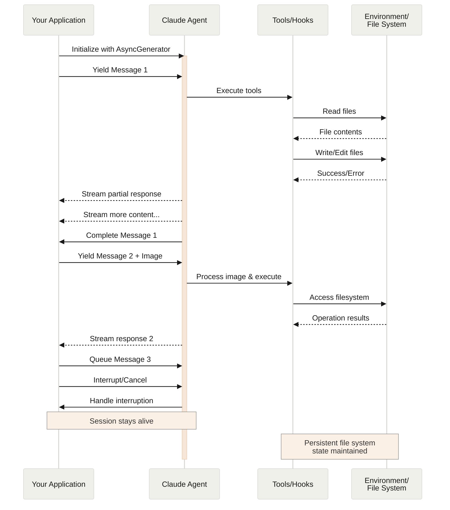

**Navigation:** [← Previous](./02-hosting-the-agent-sdk.md) | [Index](./index.md) | [Next →](./04-get-started-with-agent-skills-in-the-api.md)

---

# Streaming Input
Source: https://docs.claude.com/en/docs/agent-sdk/streaming-vs-single-mode

Understanding the two input modes for Claude Agent SDK and when to use each

## Overview

The Claude Agent SDK supports two distinct input modes for interacting with agents:

* **Streaming Input Mode** (Default & Recommended) - A persistent, interactive session
* **Single Message Input** - One-shot queries that use session state and resuming

This guide explains the differences, benefits, and use cases for each mode to help you choose the right approach for your application.

## Streaming Input Mode (Recommended)

Streaming input mode is the **preferred** way to use the Claude Agent SDK. It provides full access to the agent's capabilities and enables rich, interactive experiences.

It allows the agent to operate as a long lived process that takes in user input, handles interruptions, surfaces permission requests, and handles session management.

### How It Works



### Benefits

<CardGroup cols={2}>
  <Card title="Image Uploads" icon="image">
    Attach images directly to messages for visual analysis and understanding
  </Card>

  <Card title="Queued Messages" icon="layer-group">
    Send multiple messages that process sequentially, with ability to interrupt
  </Card>

  <Card title="Tool Integration" icon="wrench">
    Full access to all tools and custom MCP servers during the session
  </Card>

  <Card title="Hooks Support" icon="link">
    Use lifecycle hooks to customize behavior at various points
  </Card>

  <Card title="Real-time Feedback" icon="bolt">
    See responses as they're generated, not just final results
  </Card>

  <Card title="Context Persistence" icon="database">
    Maintain conversation context across multiple turns naturally
  </Card>
</CardGroup>

### Implementation Example

<CodeGroup>
  ```typescript TypeScript theme={null}
  import { query } from "@anthropic-ai/claude-agent-sdk";
  import { readFileSync } from "fs";

  async function* generateMessages() {
    // First message
    yield {
      type: "user" as const,
      message: {
        role: "user" as const,
        content: "Analyze this codebase for security issues"
      }
    };
    
    // Wait for conditions or user input
    await new Promise(resolve => setTimeout(resolve, 2000));
    
    // Follow-up with image
    yield {
      type: "user" as const,
      message: {
        role: "user" as const,
        content: [
          {
            type: "text",
            text: "Review this architecture diagram"
          },
          {
            type: "image",
            source: {
              type: "base64",
              media_type: "image/png",
              data: readFileSync("diagram.png", "base64")
            }
          }
        ]
      }
    };
  }

  // Process streaming responses
  for await (const message of query({
    prompt: generateMessages(),
    options: {
      maxTurns: 10,
      allowedTools: ["Read", "Grep"]
    }
  })) {
    if (message.type === "result") {
      console.log(message.result);
    }
  }
  ```

  ```python Python theme={null}
  from claude_agent_sdk import ClaudeSDKClient, ClaudeAgentOptions, AssistantMessage, TextBlock
  import asyncio
  import base64

  async def streaming_analysis():
      async def message_generator():
          # First message
          yield {
              "type": "user",
              "message": {
                  "role": "user",
                  "content": "Analyze this codebase for security issues"
              }
          }

          # Wait for conditions
          await asyncio.sleep(2)

          # Follow-up with image
          with open("diagram.png", "rb") as f:
              image_data = base64.b64encode(f.read()).decode()

          yield {
              "type": "user",
              "message": {
                  "role": "user",
                  "content": [
                      {
                          "type": "text",
                          "text": "Review this architecture diagram"
                      },
                      {
                          "type": "image",
                          "source": {
                              "type": "base64",
                              "media_type": "image/png",
                              "data": image_data
                          }
                      }
                  ]
              }
          }

      # Use ClaudeSDKClient for streaming input
      options = ClaudeAgentOptions(
          max_turns=10,
          allowed_tools=["Read", "Grep"]
      )

      async with ClaudeSDKClient(options) as client:
          # Send streaming input
          await client.query(message_generator())

          # Process responses
          async for message in client.receive_response():
              if isinstance(message, AssistantMessage):
                  for block in message.content:
                      if isinstance(block, TextBlock):
                          print(block.text)

  asyncio.run(streaming_analysis())
  ```
</CodeGroup>

## Single Message Input

Single message input is simpler but more limited.

### When to Use Single Message Input

Use single message input when:

* You need a one-shot response
* You do not need image attachments, hooks, etc.
* You need to operate in a stateless environment, such as a lambda function

### Limitations

<Warning>
  Single message input mode does **not** support:

  * Direct image attachments in messages
  * Dynamic message queueing
  * Real-time interruption
  * Hook integration
  * Natural multi-turn conversations
</Warning>

### Implementation Example

<CodeGroup>
  ```typescript TypeScript theme={null}
  import { query } from "@anthropic-ai/claude-agent-sdk";

  // Simple one-shot query
  for await (const message of query({
    prompt: "Explain the authentication flow",
    options: {
      maxTurns: 1,
      allowedTools: ["Read", "Grep"]
    }
  })) {
    if (message.type === "result") {
      console.log(message.result);
    }
  }

  // Continue conversation with session management
  for await (const message of query({
    prompt: "Now explain the authorization process",
    options: {
      continue: true,
      maxTurns: 1
    }
  })) {
    if (message.type === "result") {
      console.log(message.result);
    }
  }
  ```

  ```python Python theme={null}
  from claude_agent_sdk import query, ClaudeAgentOptions, ResultMessage
  import asyncio

  async def single_message_example():
      # Simple one-shot query using query() function
      async for message in query(
          prompt="Explain the authentication flow",
          options=ClaudeAgentOptions(
              max_turns=1,
              allowed_tools=["Read", "Grep"]
          )
      ):
          if isinstance(message, ResultMessage):
              print(message.result)

      # Continue conversation with session management
      async for message in query(
          prompt="Now explain the authorization process",
          options=ClaudeAgentOptions(
              continue_conversation=True,
              max_turns=1
          )
      ):
          if isinstance(message, ResultMessage):
              print(message.result)

  asyncio.run(single_message_example())
  ```
</CodeGroup>


# Subagents in the SDK
Source: https://docs.claude.com/en/docs/agent-sdk/subagents

Working with subagents in the Claude Agent SDK

Subagents in the Claude Agent SDK are specialized AIs that are orchestrated by the main agent.
Use subagents for context management and parallelization.

This guide explains how to define and use subagents in the SDK using the `agents` parameter.

## Overview

Subagents can be defined in two ways when using the SDK:

1. **Programmatically** - Using the `agents` parameter in your `query()` options (recommended for SDK applications)
2. **Filesystem-based** - Placing markdown files with YAML frontmatter in designated directories (`.claude/agents/`)

This guide primarily focuses on the programmatic approach using the `agents` parameter, which provides a more integrated development experience for SDK applications.

## Benefits of Using Subagents

### Context Management

Subagents maintain separate context from the main agent, preventing information overload and keeping interactions focused. This isolation ensures that specialized tasks don't pollute the main conversation context with irrelevant details.

**Example**: A `research-assistant` subagent can explore dozens of files and documentation pages without cluttering the main conversation with all the intermediate search results - only returning the relevant findings.

### Parallelization

Multiple subagents can run concurrently, dramatically speeding up complex workflows.

**Example**: During a code review, you can run `style-checker`, `security-scanner`, and `test-coverage` subagents simultaneously, reducing review time from minutes to seconds.

### Specialized Instructions and Knowledge

Each subagent can have tailored system prompts with specific expertise, best practices, and constraints.

**Example**: A `database-migration` subagent can have detailed knowledge about SQL best practices, rollback strategies, and data integrity checks that would be unnecessary noise in the main agent's instructions.

### Tool Restrictions

Subagents can be limited to specific tools, reducing the risk of unintended actions.

**Example**: A `doc-reviewer` subagent might only have access to Read and Grep tools, ensuring it can analyze but never accidentally modify your documentation files.

## Creating Subagents

### Programmatic Definition (Recommended)

Define subagents directly in your code using the `agents` parameter:

```typescript  theme={null}
import { query } from '@anthropic-ai/claude-agent-sdk';

const result = query({
  prompt: "Review the authentication module for security issues",
  options: {
    agents: {
      'code-reviewer': {
        description: 'Expert code review specialist. Use for quality, security, and maintainability reviews.',
        prompt: `You are a code review specialist with expertise in security, performance, and best practices.

When reviewing code:
- Identify security vulnerabilities
- Check for performance issues
- Verify adherence to coding standards
- Suggest specific improvements

Be thorough but concise in your feedback.`,
        tools: ['Read', 'Grep', 'Glob'],
        model: 'sonnet'
      },
      'test-runner': {
        description: 'Runs and analyzes test suites. Use for test execution and coverage analysis.',
        prompt: `You are a test execution specialist. Run tests and provide clear analysis of results.

Focus on:
- Running test commands
- Analyzing test output
- Identifying failing tests
- Suggesting fixes for failures`,
        tools: ['Bash', 'Read', 'Grep'],
      }
    }
  }
});

for await (const message of result) {
  console.log(message);
}
```

### AgentDefinition Configuration

| Field         | Type                                         | Required | Description                                                      |
| :------------ | :------------------------------------------- | :------- | :--------------------------------------------------------------- |
| `description` | `string`                                     | Yes      | Natural language description of when to use this agent           |
| `prompt`      | `string`                                     | Yes      | The agent's system prompt defining its role and behavior         |
| `tools`       | `string[]`                                   | No       | Array of allowed tool names. If omitted, inherits all tools      |
| `model`       | `'sonnet' \| 'opus' \| 'haiku' \| 'inherit'` | No       | Model override for this agent. Defaults to main model if omitted |

### Filesystem-Based Definition (Alternative)

You can also define subagents as markdown files in specific directories:

* **Project-level**: `.claude/agents/*.md` - Available only in the current project
* **User-level**: `~/.claude/agents/*.md` - Available across all projects

Each subagent is a markdown file with YAML frontmatter:

```markdown  theme={null}
---
name: code-reviewer
description: Expert code review specialist. Use for quality, security, and maintainability reviews.
tools: Read, Grep, Glob, Bash
---

Your subagent's system prompt goes here. This defines the subagent's
role, capabilities, and approach to solving problems.
```

**Note:** Programmatically defined agents (via the `agents` parameter) take precedence over filesystem-based agents with the same name.

## How the SDK Uses Subagents

When using the Claude Agent SDK, subagents can be defined programmatically or loaded from the filesystem. Claude will:

1. **Load programmatic agents** from the `agents` parameter in your options
2. **Auto-detect filesystem agents** from `.claude/agents/` directories (if not overridden)
3. **Invoke them automatically** based on task matching and the agent's `description`
4. **Use their specialized prompts** and tool restrictions
5. **Maintain separate context** for each subagent invocation

Programmatically defined agents (via `agents` parameter) take precedence over filesystem-based agents with the same name.

## Example Subagents

For comprehensive examples of subagents including code reviewers, test runners, debuggers, and security auditors, see the [main Subagents guide](https://code.claude.com/docs/sub-agents#example-subagents). The guide includes detailed configurations and best practices for creating effective subagents.

## SDK Integration Patterns

### Automatic Invocation

The SDK will automatically invoke appropriate subagents based on the task context. Ensure your agent's `description` field clearly indicates when it should be used:

```typescript  theme={null}
const result = query({
  prompt: "Optimize the database queries in the API layer",
  options: {
    agents: {
      'performance-optimizer': {
        description: 'Use PROACTIVELY when code changes might impact performance. MUST BE USED for optimization tasks.',
        prompt: 'You are a performance optimization specialist...',
        tools: ['Read', 'Edit', 'Bash', 'Grep'],
        model: 'sonnet'
      }
    }
  }
});
```

### Explicit Invocation

Users can request specific subagents in their prompts:

```typescript  theme={null}
const result = query({
  prompt: "Use the code-reviewer agent to check the authentication module",
  options: {
    agents: {
      'code-reviewer': {
        description: 'Expert code review specialist',
        prompt: 'You are a security-focused code reviewer...',
        tools: ['Read', 'Grep', 'Glob']
      }
    }
  }
});
```

### Dynamic Agent Configuration

You can dynamically configure agents based on your application's needs:

```typescript  theme={null}
import { query, type AgentDefinition } from '@anthropic-ai/claude-agent-sdk';

function createSecurityAgent(securityLevel: 'basic' | 'strict'): AgentDefinition {
  return {
    description: 'Security code reviewer',
    prompt: `You are a ${securityLevel === 'strict' ? 'strict' : 'balanced'} security reviewer...`,
    tools: ['Read', 'Grep', 'Glob'],
    model: securityLevel === 'strict' ? 'opus' : 'sonnet'
  };
}

const result = query({
  prompt: "Review this PR for security issues",
  options: {
    agents: {
      'security-reviewer': createSecurityAgent('strict')
    }
  }
});
```

## Tool Restrictions

Subagents can have restricted tool access via the `tools` field:

* **Omit the field** - Agent inherits all available tools (default)
* **Specify tools** - Agent can only use listed tools

Example of a read-only analysis agent:

```typescript  theme={null}
const result = query({
  prompt: "Analyze the architecture of this codebase",
  options: {
    agents: {
      'code-analyzer': {
        description: 'Static code analysis and architecture review',
        prompt: `You are a code architecture analyst. Analyze code structure,
identify patterns, and suggest improvements without making changes.`,
        tools: ['Read', 'Grep', 'Glob']  // No write or execute permissions
      }
    }
  }
});
```

### Common Tool Combinations

**Read-only agents** (analysis, review):

```typescript  theme={null}
tools: ['Read', 'Grep', 'Glob']
```

**Test execution agents**:

```typescript  theme={null}
tools: ['Bash', 'Read', 'Grep']
```

**Code modification agents**:

```typescript  theme={null}
tools: ['Read', 'Edit', 'Write', 'Grep', 'Glob']
```

## Related Documentation

* [Main Subagents Guide](https://code.claude.com/docs/sub-agents) - Comprehensive subagent documentation
* [SDK Overview](/en/docs/agent-sdk/overview) - Overview of Claude Agent SDK
* [Settings](https://code.claude.com/docs/settings) - Configuration file reference
* [Slash Commands](https://code.claude.com/docs/slash-commands) - Custom command creation


# Todo Lists
Source: https://docs.claude.com/en/docs/agent-sdk/todo-tracking

Track and display todos using the Claude Agent SDK for organized task management

Todo tracking provides a structured way to manage tasks and display progress to users. The Claude Agent SDK includes built-in todo functionality that helps organize complex workflows and keep users informed about task progression.

### Todo Lifecycle

Todos follow a predictable lifecycle:

1. **Created** as `pending` when tasks are identified
2. **Activated** to `in_progress` when work begins
3. **Completed** when the task finishes successfully
4. **Removed** when all tasks in a group are completed

### When Todos Are Used

The SDK automatically creates todos for:

* **Complex multi-step tasks** requiring 3 or more distinct actions
* **User-provided task lists** when multiple items are mentioned
* **Non-trivial operations** that benefit from progress tracking
* **Explicit requests** when users ask for todo organization

## Examples

### Monitoring Todo Changes

<CodeGroup>
  ```typescript TypeScript theme={null}
  import { query } from "@anthropic-ai/claude-agent-sdk";

  for await (const message of query({
    prompt: "Optimize my React app performance and track progress with todos",
    options: { maxTurns: 15 }
  })) {
    // Todo updates are reflected in the message stream
    if (message.type === "assistant") {
      for (const block of message.message.content) {
        if (block.type === "tool_use" && block.name === "TodoWrite") {
          const todos = block.input.todos;

          console.log("Todo Status Update:");
          todos.forEach((todo, index) => {
            const status = todo.status === "completed" ? "✅" :
                          todo.status === "in_progress" ? "🔧" : "❌";
            console.log(`${index + 1}. ${status} ${todo.content}`);
          });
        }
      }
    }
  }
  ```

  ```python Python theme={null}
  from claude_agent_sdk import query, AssistantMessage, ToolUseBlock

  async for message in query(
      prompt="Optimize my React app performance and track progress with todos",
      options={"max_turns": 15}
  ):
      # Todo updates are reflected in the message stream
      if isinstance(message, AssistantMessage):
          for block in message.content:
              if isinstance(block, ToolUseBlock) and block.name == "TodoWrite":
                  todos = block.input["todos"]

                  print("Todo Status Update:")
                  for i, todo in enumerate(todos):
                      status = "✅" if todo["status"] == "completed" else \
                              "🔧" if todo["status"] == "in_progress" else "❌"
                      print(f"{i + 1}. {status} {todo['content']}")
  ```
</CodeGroup>

### Real-time Progress Display

<CodeGroup>
  ```typescript TypeScript theme={null}
  import { query } from "@anthropic-ai/claude-agent-sdk";

  class TodoTracker {
    private todos: any[] = [];
    
    displayProgress() {
      if (this.todos.length === 0) return;
      
      const completed = this.todos.filter(t => t.status === "completed").length;
      const inProgress = this.todos.filter(t => t.status === "in_progress").length;
      const total = this.todos.length;
      
      console.log(`\nProgress: ${completed}/${total} completed`);
      console.log(`Currently working on: ${inProgress} task(s)\n`);
      
      this.todos.forEach((todo, index) => {
        const icon = todo.status === "completed" ? "✅" : 
                    todo.status === "in_progress" ? "🔧" : "❌";
        const text = todo.status === "in_progress" ? todo.activeForm : todo.content;
        console.log(`${index + 1}. ${icon} ${text}`);
      });
    }
    
    async trackQuery(prompt: string) {
      for await (const message of query({
        prompt,
        options: { maxTurns: 20 }
      })) {
        if (message.type === "assistant") {
          for (const block of message.message.content) {
            if (block.type === "tool_use" && block.name === "TodoWrite") {
              this.todos = block.input.todos;
              this.displayProgress();
            }
          }
        }
      }
    }
  }

  // Usage
  const tracker = new TodoTracker();
  await tracker.trackQuery("Build a complete authentication system with todos");
  ```

  ```python Python theme={null}
  from claude_agent_sdk import query, AssistantMessage, ToolUseBlock
  from typing import List, Dict

  class TodoTracker:
      def __init__(self):
          self.todos: List[Dict] = []
      
      def display_progress(self):
          if not self.todos:
              return
          
          completed = len([t for t in self.todos if t["status"] == "completed"])
          in_progress = len([t for t in self.todos if t["status"] == "in_progress"])
          total = len(self.todos)
          
          print(f"\nProgress: {completed}/{total} completed")
          print(f"Currently working on: {in_progress} task(s)\n")
          
          for i, todo in enumerate(self.todos):
              icon = "✅" if todo["status"] == "completed" else \
                    "🔧" if todo["status"] == "in_progress" else "❌"
              text = todo["activeForm"] if todo["status"] == "in_progress" else todo["content"]
              print(f"{i + 1}. {icon} {text}")
      
      async def track_query(self, prompt: str):
          async for message in query(
              prompt=prompt,
              options={"max_turns": 20}
          ):
              if isinstance(message, AssistantMessage):
                  for block in message.content:
                      if isinstance(block, ToolUseBlock) and block.name == "TodoWrite":
                          self.todos = block.input["todos"]
                          self.display_progress()

  # Usage
  tracker = TodoTracker()
  await tracker.track_query("Build a complete authentication system with todos")
  ```
</CodeGroup>

## Related Documentation

* [TypeScript SDK Reference](/en/docs/agent-sdk/typescript)
* [Python SDK Reference](/en/docs/agent-sdk/python)
* [Streaming vs Single Mode](/en/docs/agent-sdk/streaming-vs-single-mode)
* [Custom Tools](/en/docs/agent-sdk/custom-tools)


# Agent SDK reference - TypeScript
Source: https://docs.claude.com/en/docs/agent-sdk/typescript

Complete API reference for the TypeScript Agent SDK, including all functions, types, and interfaces.

<script src="/components/typescript-sdk-type-links.js" defer />

## Installation

```bash  theme={null}
npm install @anthropic-ai/claude-agent-sdk
```

## Functions

### `query()`

The primary function for interacting with Claude Code. Creates an async generator that streams messages as they arrive.

```ts  theme={null}
function query({
  prompt,
  options
}: {
  prompt: string | AsyncIterable<SDKUserMessage>;
  options?: Options;
}): Query
```

#### Parameters

| Parameter | Type                                                             | Description                                                       |
| :-------- | :--------------------------------------------------------------- | :---------------------------------------------------------------- |
| `prompt`  | `string \| AsyncIterable<`[`SDKUserMessage`](#sdkusermessage)`>` | The input prompt as a string or async iterable for streaming mode |
| `options` | [`Options`](#options)                                            | Optional configuration object (see Options type below)            |

#### Returns

Returns a [`Query`](#query-1) object that extends `AsyncGenerator<`[`SDKMessage`](#sdkmessage)`, void>` with additional methods.

### `tool()`

Creates a type-safe MCP tool definition for use with SDK MCP servers.

```ts  theme={null}
function tool<Schema extends ZodRawShape>(
  name: string,
  description: string,
  inputSchema: Schema,
  handler: (args: z.infer<ZodObject<Schema>>, extra: unknown) => Promise<CallToolResult>
): SdkMcpToolDefinition<Schema>
```

#### Parameters

| Parameter     | Type                                                              | Description                                     |
| :------------ | :---------------------------------------------------------------- | :---------------------------------------------- |
| `name`        | `string`                                                          | The name of the tool                            |
| `description` | `string`                                                          | A description of what the tool does             |
| `inputSchema` | `Schema extends ZodRawShape`                                      | Zod schema defining the tool's input parameters |
| `handler`     | `(args, extra) => Promise<`[`CallToolResult`](#calltoolresult)`>` | Async function that executes the tool logic     |

### `createSdkMcpServer()`

Creates an MCP server instance that runs in the same process as your application.

```ts  theme={null}
function createSdkMcpServer(options: {
  name: string;
  version?: string;
  tools?: Array<SdkMcpToolDefinition<any>>;
}): McpSdkServerConfigWithInstance
```

#### Parameters

| Parameter         | Type                          | Description                                              |
| :---------------- | :---------------------------- | :------------------------------------------------------- |
| `options.name`    | `string`                      | The name of the MCP server                               |
| `options.version` | `string`                      | Optional version string                                  |
| `options.tools`   | `Array<SdkMcpToolDefinition>` | Array of tool definitions created with [`tool()`](#tool) |

## Types

### `Options`

Configuration object for the `query()` function.

| Property                     | Type                                                                                              | Default                    | Description                                                                                                                                                                                                                                               |
| :--------------------------- | :------------------------------------------------------------------------------------------------ | :------------------------- | :-------------------------------------------------------------------------------------------------------------------------------------------------------------------------------------------------------------------------------------------------------- |
| `abortController`            | `AbortController`                                                                                 | `new AbortController()`    | Controller for cancelling operations                                                                                                                                                                                                                      |
| `additionalDirectories`      | `string[]`                                                                                        | `[]`                       | Additional directories Claude can access                                                                                                                                                                                                                  |
| `agents`                     | `Record<string, [`AgentDefinition`](#agentdefinition)>`                                           | `undefined`                | Programmatically define subagents                                                                                                                                                                                                                         |
| `allowedTools`               | `string[]`                                                                                        | All tools                  | List of allowed tool names                                                                                                                                                                                                                                |
| `canUseTool`                 | [`CanUseTool`](#canusetool)                                                                       | `undefined`                | Custom permission function for tool usage                                                                                                                                                                                                                 |
| `continue`                   | `boolean`                                                                                         | `false`                    | Continue the most recent conversation                                                                                                                                                                                                                     |
| `cwd`                        | `string`                                                                                          | `process.cwd()`            | Current working directory                                                                                                                                                                                                                                 |
| `disallowedTools`            | `string[]`                                                                                        | `[]`                       | List of disallowed tool names                                                                                                                                                                                                                             |
| `env`                        | `Dict<string>`                                                                                    | `process.env`              | Environment variables                                                                                                                                                                                                                                     |
| `executable`                 | `'bun' \| 'deno' \| 'node'`                                                                       | Auto-detected              | JavaScript runtime to use                                                                                                                                                                                                                                 |
| `executableArgs`             | `string[]`                                                                                        | `[]`                       | Arguments to pass to the executable                                                                                                                                                                                                                       |
| `extraArgs`                  | `Record<string, string \| null>`                                                                  | `{}`                       | Additional arguments                                                                                                                                                                                                                                      |
| `fallbackModel`              | `string`                                                                                          | `undefined`                | Model to use if primary fails                                                                                                                                                                                                                             |
| `forkSession`                | `boolean`                                                                                         | `false`                    | When resuming with `resume`, fork to a new session ID instead of continuing the original session                                                                                                                                                          |
| `hooks`                      | `Partial<Record<`[`HookEvent`](#hookevent)`, `[`HookCallbackMatcher`](#hookcallbackmatcher)`[]>>` | `{}`                       | Hook callbacks for events                                                                                                                                                                                                                                 |
| `includePartialMessages`     | `boolean`                                                                                         | `false`                    | Include partial message events                                                                                                                                                                                                                            |
| `maxThinkingTokens`          | `number`                                                                                          | `undefined`                | Maximum tokens for thinking process                                                                                                                                                                                                                       |
| `maxTurns`                   | `number`                                                                                          | `undefined`                | Maximum conversation turns                                                                                                                                                                                                                                |
| `mcpServers`                 | `Record<string, [`McpServerConfig`](#mcpserverconfig)>`                                           | `{}`                       | MCP server configurations                                                                                                                                                                                                                                 |
| `model`                      | `string`                                                                                          | Default from CLI           | Claude model to use                                                                                                                                                                                                                                       |
| `pathToClaudeCodeExecutable` | `string`                                                                                          | Auto-detected              | Path to Claude Code executable                                                                                                                                                                                                                            |
| `permissionMode`             | [`PermissionMode`](#permissionmode)                                                               | `'default'`                | Permission mode for the session                                                                                                                                                                                                                           |
| `permissionPromptToolName`   | `string`                                                                                          | `undefined`                | MCP tool name for permission prompts                                                                                                                                                                                                                      |
| `plugins`                    | [`SdkPluginConfig`](#sdkpluginconfig)`[]`                                                         | `[]`                       | Load custom plugins from local paths. See [Plugins](/en/docs/agent-sdk/plugins) for details                                                                                                                                                               |
| `resume`                     | `string`                                                                                          | `undefined`                | Session ID to resume                                                                                                                                                                                                                                      |
| `settingSources`             | [`SettingSource`](#settingsource)`[]`                                                             | `[]` (no settings)         | Control which filesystem settings to load. When omitted, no settings are loaded. **Note:** Must include `'project'` to load CLAUDE.md files                                                                                                               |
| `stderr`                     | `(data: string) => void`                                                                          | `undefined`                | Callback for stderr output                                                                                                                                                                                                                                |
| `strictMcpConfig`            | `boolean`                                                                                         | `false`                    | Enforce strict MCP validation                                                                                                                                                                                                                             |
| `systemPrompt`               | `string \| { type: 'preset'; preset: 'claude_code'; append?: string }`                            | `undefined` (empty prompt) | System prompt configuration. Pass a string for custom prompt, or `{ type: 'preset', preset: 'claude_code' }` to use Claude Code's system prompt. When using the preset object form, add `append` to extend the system prompt with additional instructions |

### `Query`

Interface returned by the `query()` function.

```ts  theme={null}
interface Query extends AsyncGenerator<SDKMessage, void> {
  interrupt(): Promise<void>;
  setPermissionMode(mode: PermissionMode): Promise<void>;
}
```

#### Methods

| Method                | Description                                                          |
| :-------------------- | :------------------------------------------------------------------- |
| `interrupt()`         | Interrupts the query (only available in streaming input mode)        |
| `setPermissionMode()` | Changes the permission mode (only available in streaming input mode) |

### `AgentDefinition`

Configuration for a subagent defined programmatically.

```ts  theme={null}
type AgentDefinition = {
  description: string;
  tools?: string[];
  prompt: string;
  model?: 'sonnet' | 'opus' | 'haiku' | 'inherit';
}
```

| Field         | Required | Description                                                    |
| :------------ | :------- | :------------------------------------------------------------- |
| `description` | Yes      | Natural language description of when to use this agent         |
| `tools`       | No       | Array of allowed tool names. If omitted, inherits all tools    |
| `prompt`      | Yes      | The agent's system prompt                                      |
| `model`       | No       | Model override for this agent. If omitted, uses the main model |

### `SettingSource`

Controls which filesystem-based configuration sources the SDK loads settings from.

```ts  theme={null}
type SettingSource = 'user' | 'project' | 'local';
```

| Value       | Description                                  | Location                      |
| :---------- | :------------------------------------------- | :---------------------------- |
| `'user'`    | Global user settings                         | `~/.claude/settings.json`     |
| `'project'` | Shared project settings (version controlled) | `.claude/settings.json`       |
| `'local'`   | Local project settings (gitignored)          | `.claude/settings.local.json` |

#### Default behavior

When `settingSources` is **omitted** or **undefined**, the SDK does **not** load any filesystem settings. This provides isolation for SDK applications.

#### Why use settingSources?

**Load all filesystem settings (legacy behavior):**

```typescript  theme={null}
// Load all settings like SDK v0.0.x did
const result = query({
  prompt: "Analyze this code",
  options: {
    settingSources: ['user', 'project', 'local']  // Load all settings
  }
});
```

**Load only specific setting sources:**

```typescript  theme={null}
// Load only project settings, ignore user and local
const result = query({
  prompt: "Run CI checks",
  options: {
    settingSources: ['project']  // Only .claude/settings.json
  }
});
```

**Testing and CI environments:**

```typescript  theme={null}
// Ensure consistent behavior in CI by excluding local settings
const result = query({
  prompt: "Run tests",
  options: {
    settingSources: ['project'],  // Only team-shared settings
    permissionMode: 'bypassPermissions'
  }
});
```

**SDK-only applications:**

```typescript  theme={null}
// Define everything programmatically (default behavior)
// No filesystem dependencies - settingSources defaults to []
const result = query({
  prompt: "Review this PR",
  options: {
    // settingSources: [] is the default, no need to specify
    agents: { /* ... */ },
    mcpServers: { /* ... */ },
    allowedTools: ['Read', 'Grep', 'Glob']
  }
});
```

**Loading CLAUDE.md project instructions:**

```typescript  theme={null}
// Load project settings to include CLAUDE.md files
const result = query({
  prompt: "Add a new feature following project conventions",
  options: {
    systemPrompt: {
      type: 'preset',
      preset: 'claude_code'  // Required to use CLAUDE.md
    },
    settingSources: ['project'],  // Loads CLAUDE.md from project directory
    allowedTools: ['Read', 'Write', 'Edit']
  }
});
```

#### Settings precedence

When multiple sources are loaded, settings are merged with this precedence (highest to lowest):

1. Local settings (`.claude/settings.local.json`)
2. Project settings (`.claude/settings.json`)
3. User settings (`~/.claude/settings.json`)

Programmatic options (like `agents`, `allowedTools`) always override filesystem settings.

### `PermissionMode`

```ts  theme={null}
type PermissionMode =
  | 'default'           // Standard permission behavior
  | 'acceptEdits'       // Auto-accept file edits
  | 'bypassPermissions' // Bypass all permission checks
  | 'plan'              // Planning mode - no execution
```

### `CanUseTool`

Custom permission function type for controlling tool usage.

```ts  theme={null}
type CanUseTool = (
  toolName: string,
  input: ToolInput,
  options: {
    signal: AbortSignal;
    suggestions?: PermissionUpdate[];
  }
) => Promise<PermissionResult>;
```

### `PermissionResult`

Result of a permission check.

```ts  theme={null}
type PermissionResult = 
  | {
      behavior: 'allow';
      updatedInput: ToolInput;
      updatedPermissions?: PermissionUpdate[];
    }
  | {
      behavior: 'deny';
      message: string;
      interrupt?: boolean;
    }
```

### `McpServerConfig`

Configuration for MCP servers.

```ts  theme={null}
type McpServerConfig = 
  | McpStdioServerConfig
  | McpSSEServerConfig
  | McpHttpServerConfig
  | McpSdkServerConfigWithInstance;
```

#### `McpStdioServerConfig`

```ts  theme={null}
type McpStdioServerConfig = {
  type?: 'stdio';
  command: string;
  args?: string[];
  env?: Record<string, string>;
}
```

#### `McpSSEServerConfig`

```ts  theme={null}
type McpSSEServerConfig = {
  type: 'sse';
  url: string;
  headers?: Record<string, string>;
}
```

#### `McpHttpServerConfig`

```ts  theme={null}
type McpHttpServerConfig = {
  type: 'http';
  url: string;
  headers?: Record<string, string>;
}
```

#### `McpSdkServerConfigWithInstance`

```ts  theme={null}
type McpSdkServerConfigWithInstance = {
  type: 'sdk';
  name: string;
  instance: McpServer;
}
```

### `SdkPluginConfig`

Configuration for loading plugins in the SDK.

```ts  theme={null}
type SdkPluginConfig = {
  type: 'local';
  path: string;
}
```

| Field  | Type      | Description                                                |
| :----- | :-------- | :--------------------------------------------------------- |
| `type` | `'local'` | Must be `'local'` (only local plugins currently supported) |
| `path` | `string`  | Absolute or relative path to the plugin directory          |

**Example:**

```ts  theme={null}
plugins: [
  { type: 'local', path: './my-plugin' },
  { type: 'local', path: '/absolute/path/to/plugin' }
]
```

For complete information on creating and using plugins, see [Plugins](/en/docs/agent-sdk/plugins).

## Message Types

### `SDKMessage`

Union type of all possible messages returned by the query.

```ts  theme={null}
type SDKMessage = 
  | SDKAssistantMessage
  | SDKUserMessage
  | SDKUserMessageReplay
  | SDKResultMessage
  | SDKSystemMessage
  | SDKPartialAssistantMessage
  | SDKCompactBoundaryMessage;
```

### `SDKAssistantMessage`

Assistant response message.

```ts  theme={null}
type SDKAssistantMessage = {
  type: 'assistant';
  uuid: UUID;
  session_id: string;
  message: APIAssistantMessage; // From Anthropic SDK
  parent_tool_use_id: string | null;
}
```

### `SDKUserMessage`

User input message.

```ts  theme={null}
type SDKUserMessage = {
  type: 'user';
  uuid?: UUID;
  session_id: string;
  message: APIUserMessage; // From Anthropic SDK
  parent_tool_use_id: string | null;
}
```

### `SDKUserMessageReplay`

Replayed user message with required UUID.

```ts  theme={null}
type SDKUserMessageReplay = {
  type: 'user';
  uuid: UUID;
  session_id: string;
  message: APIUserMessage;
  parent_tool_use_id: string | null;
}
```

### `SDKResultMessage`

Final result message.

```ts  theme={null}
type SDKResultMessage = 
  | {
      type: 'result';
      subtype: 'success';
      uuid: UUID;
      session_id: string;
      duration_ms: number;
      duration_api_ms: number;
      is_error: boolean;
      num_turns: number;
      result: string;
      total_cost_usd: number;
      usage: NonNullableUsage;
      permission_denials: SDKPermissionDenial[];
    }
  | {
      type: 'result';
      subtype: 'error_max_turns' | 'error_during_execution';
      uuid: UUID;
      session_id: string;
      duration_ms: number;
      duration_api_ms: number;
      is_error: boolean;
      num_turns: number;
      total_cost_usd: number;
      usage: NonNullableUsage;
      permission_denials: SDKPermissionDenial[];
    }
```

### `SDKSystemMessage`

System initialization message.

```ts  theme={null}
type SDKSystemMessage = {
  type: 'system';
  subtype: 'init';
  uuid: UUID;
  session_id: string;
  apiKeySource: ApiKeySource;
  cwd: string;
  tools: string[];
  mcp_servers: {
    name: string;
    status: string;
  }[];
  model: string;
  permissionMode: PermissionMode;
  slash_commands: string[];
  output_style: string;
}
```

### `SDKPartialAssistantMessage`

Streaming partial message (only when `includePartialMessages` is true).

```ts  theme={null}
type SDKPartialAssistantMessage = {
  type: 'stream_event';
  event: RawMessageStreamEvent; // From Anthropic SDK
  parent_tool_use_id: string | null;
  uuid: UUID;
  session_id: string;
}
```

### `SDKCompactBoundaryMessage`

Message indicating a conversation compaction boundary.

```ts  theme={null}
type SDKCompactBoundaryMessage = {
  type: 'system';
  subtype: 'compact_boundary';
  uuid: UUID;
  session_id: string;
  compact_metadata: {
    trigger: 'manual' | 'auto';
    pre_tokens: number;
  };
}
```

### `SDKPermissionDenial`

Information about a denied tool use.

```ts  theme={null}
type SDKPermissionDenial = {
  tool_name: string;
  tool_use_id: string;
  tool_input: ToolInput;
}
```

## Hook Types

### `HookEvent`

Available hook events.

```ts  theme={null}
type HookEvent = 
  | 'PreToolUse'
  | 'PostToolUse'
  | 'Notification'
  | 'UserPromptSubmit'
  | 'SessionStart'
  | 'SessionEnd'
  | 'Stop'
  | 'SubagentStop'
  | 'PreCompact';
```

### `HookCallback`

Hook callback function type.

```ts  theme={null}
type HookCallback = (
  input: HookInput, // Union of all hook input types
  toolUseID: string | undefined,
  options: { signal: AbortSignal }
) => Promise<HookJSONOutput>;
```

### `HookCallbackMatcher`

Hook configuration with optional matcher.

```ts  theme={null}
interface HookCallbackMatcher {
  matcher?: string;
  hooks: HookCallback[];
}
```

### `HookInput`

Union type of all hook input types.

```ts  theme={null}
type HookInput = 
  | PreToolUseHookInput
  | PostToolUseHookInput
  | NotificationHookInput
  | UserPromptSubmitHookInput
  | SessionStartHookInput
  | SessionEndHookInput
  | StopHookInput
  | SubagentStopHookInput
  | PreCompactHookInput;
```

### `BaseHookInput`

Base interface that all hook input types extend.

```ts  theme={null}
type BaseHookInput = {
  session_id: string;
  transcript_path: string;
  cwd: string;
  permission_mode?: string;
}
```

#### `PreToolUseHookInput`

```ts  theme={null}
type PreToolUseHookInput = BaseHookInput & {
  hook_event_name: 'PreToolUse';
  tool_name: string;
  tool_input: ToolInput;
}
```

#### `PostToolUseHookInput`

```ts  theme={null}
type PostToolUseHookInput = BaseHookInput & {
  hook_event_name: 'PostToolUse';
  tool_name: string;
  tool_input: ToolInput;
  tool_response: ToolOutput;
}
```

#### `NotificationHookInput`

```ts  theme={null}
type NotificationHookInput = BaseHookInput & {
  hook_event_name: 'Notification';
  message: string;
  title?: string;
}
```

#### `UserPromptSubmitHookInput`

```ts  theme={null}
type UserPromptSubmitHookInput = BaseHookInput & {
  hook_event_name: 'UserPromptSubmit';
  prompt: string;
}
```

#### `SessionStartHookInput`

```ts  theme={null}
type SessionStartHookInput = BaseHookInput & {
  hook_event_name: 'SessionStart';
  source: 'startup' | 'resume' | 'clear' | 'compact';
}
```

#### `SessionEndHookInput`

```ts  theme={null}
type SessionEndHookInput = BaseHookInput & {
  hook_event_name: 'SessionEnd';
  reason: 'clear' | 'logout' | 'prompt_input_exit' | 'other';
}
```

#### `StopHookInput`

```ts  theme={null}
type StopHookInput = BaseHookInput & {
  hook_event_name: 'Stop';
  stop_hook_active: boolean;
}
```

#### `SubagentStopHookInput`

```ts  theme={null}
type SubagentStopHookInput = BaseHookInput & {
  hook_event_name: 'SubagentStop';
  stop_hook_active: boolean;
}
```

#### `PreCompactHookInput`

```ts  theme={null}
type PreCompactHookInput = BaseHookInput & {
  hook_event_name: 'PreCompact';
  trigger: 'manual' | 'auto';
  custom_instructions: string | null;
}
```

### `HookJSONOutput`

Hook return value.

```ts  theme={null}
type HookJSONOutput = AsyncHookJSONOutput | SyncHookJSONOutput;
```

#### `AsyncHookJSONOutput`

```ts  theme={null}
type AsyncHookJSONOutput = {
  async: true;
  asyncTimeout?: number;
}
```

#### `SyncHookJSONOutput`

```ts  theme={null}
type SyncHookJSONOutput = {
  continue?: boolean;
  suppressOutput?: boolean;
  stopReason?: string;
  decision?: 'approve' | 'block';
  systemMessage?: string;
  reason?: string;
  hookSpecificOutput?:
    | {
        hookEventName: 'PreToolUse';
        permissionDecision?: 'allow' | 'deny' | 'ask';
        permissionDecisionReason?: string;
      }
    | {
        hookEventName: 'UserPromptSubmit';
        additionalContext?: string;
      }
    | {
        hookEventName: 'SessionStart';
        additionalContext?: string;
      }
    | {
        hookEventName: 'PostToolUse';
        additionalContext?: string;
      };
}
```

## Tool Input Types

Documentation of input schemas for all built-in Claude Code tools. These types are exported from `@anthropic-ai/claude-agent-sdk` and can be used for type-safe tool interactions.

### `ToolInput`

**Note:** This is a documentation-only type for clarity. It represents the union of all tool input types.

```ts  theme={null}
type ToolInput = 
  | AgentInput
  | BashInput
  | BashOutputInput
  | FileEditInput
  | FileReadInput
  | FileWriteInput
  | GlobInput
  | GrepInput
  | KillShellInput
  | NotebookEditInput
  | WebFetchInput
  | WebSearchInput
  | TodoWriteInput
  | ExitPlanModeInput
  | ListMcpResourcesInput
  | ReadMcpResourceInput;
```

### Task

**Tool name:** `Task`

```ts  theme={null}
interface AgentInput {
  /**
   * A short (3-5 word) description of the task
   */
  description: string;
  /**
   * The task for the agent to perform
   */
  prompt: string;
  /**
   * The type of specialized agent to use for this task
   */
  subagent_type: string;
}
```

Launches a new agent to handle complex, multi-step tasks autonomously.

### Bash

**Tool name:** `Bash`

```ts  theme={null}
interface BashInput {
  /**
   * The command to execute
   */
  command: string;
  /**
   * Optional timeout in milliseconds (max 600000)
   */
  timeout?: number;
  /**
   * Clear, concise description of what this command does in 5-10 words
   */
  description?: string;
  /**
   * Set to true to run this command in the background
   */
  run_in_background?: boolean;
}
```

Executes bash commands in a persistent shell session with optional timeout and background execution.

### BashOutput

**Tool name:** `BashOutput`

```ts  theme={null}
interface BashOutputInput {
  /**
   * The ID of the background shell to retrieve output from
   */
  bash_id: string;
  /**
   * Optional regex to filter output lines
   */
  filter?: string;
}
```

Retrieves output from a running or completed background bash shell.

### Edit

**Tool name:** `Edit`

```ts  theme={null}
interface FileEditInput {
  /**
   * The absolute path to the file to modify
   */
  file_path: string;
  /**
   * The text to replace
   */
  old_string: string;
  /**
   * The text to replace it with (must be different from old_string)
   */
  new_string: string;
  /**
   * Replace all occurrences of old_string (default false)
   */
  replace_all?: boolean;
}
```

Performs exact string replacements in files.

### Read

**Tool name:** `Read`

```ts  theme={null}
interface FileReadInput {
  /**
   * The absolute path to the file to read
   */
  file_path: string;
  /**
   * The line number to start reading from
   */
  offset?: number;
  /**
   * The number of lines to read
   */
  limit?: number;
}
```

Reads files from the local filesystem, including text, images, PDFs, and Jupyter notebooks.

### Write

**Tool name:** `Write`

```ts  theme={null}
interface FileWriteInput {
  /**
   * The absolute path to the file to write
   */
  file_path: string;
  /**
   * The content to write to the file
   */
  content: string;
}
```

Writes a file to the local filesystem, overwriting if it exists.

### Glob

**Tool name:** `Glob`

```ts  theme={null}
interface GlobInput {
  /**
   * The glob pattern to match files against
   */
  pattern: string;
  /**
   * The directory to search in (defaults to cwd)
   */
  path?: string;
}
```

Fast file pattern matching that works with any codebase size.

### Grep

**Tool name:** `Grep`

```ts  theme={null}
interface GrepInput {
  /**
   * The regular expression pattern to search for
   */
  pattern: string;
  /**
   * File or directory to search in (defaults to cwd)
   */
  path?: string;
  /**
   * Glob pattern to filter files (e.g. "*.js")
   */
  glob?: string;
  /**
   * File type to search (e.g. "js", "py", "rust")
   */
  type?: string;
  /**
   * Output mode: "content", "files_with_matches", or "count"
   */
  output_mode?: 'content' | 'files_with_matches' | 'count';
  /**
   * Case insensitive search
   */
  '-i'?: boolean;
  /**
   * Show line numbers (for content mode)
   */
  '-n'?: boolean;
  /**
   * Lines to show before each match
   */
  '-B'?: number;
  /**
   * Lines to show after each match
   */
  '-A'?: number;
  /**
   * Lines to show before and after each match
   */
  '-C'?: number;
  /**
   * Limit output to first N lines/entries
   */
  head_limit?: number;
  /**
   * Enable multiline mode
   */
  multiline?: boolean;
}
```

Powerful search tool built on ripgrep with regex support.

### KillBash

**Tool name:** `KillBash`

```ts  theme={null}
interface KillShellInput {
  /**
   * The ID of the background shell to kill
   */
  shell_id: string;
}
```

Kills a running background bash shell by its ID.

### NotebookEdit

**Tool name:** `NotebookEdit`

```ts  theme={null}
interface NotebookEditInput {
  /**
   * The absolute path to the Jupyter notebook file
   */
  notebook_path: string;
  /**
   * The ID of the cell to edit
   */
  cell_id?: string;
  /**
   * The new source for the cell
   */
  new_source: string;
  /**
   * The type of the cell (code or markdown)
   */
  cell_type?: 'code' | 'markdown';
  /**
   * The type of edit (replace, insert, delete)
   */
  edit_mode?: 'replace' | 'insert' | 'delete';
}
```

Edits cells in Jupyter notebook files.

### WebFetch

**Tool name:** `WebFetch`

```ts  theme={null}
interface WebFetchInput {
  /**
   * The URL to fetch content from
   */
  url: string;
  /**
   * The prompt to run on the fetched content
   */
  prompt: string;
}
```

Fetches content from a URL and processes it with an AI model.

### WebSearch

**Tool name:** `WebSearch`

```ts  theme={null}
interface WebSearchInput {
  /**
   * The search query to use
   */
  query: string;
  /**
   * Only include results from these domains
   */
  allowed_domains?: string[];
  /**
   * Never include results from these domains
   */
  blocked_domains?: string[];
}
```

Searches the web and returns formatted results.

### TodoWrite

**Tool name:** `TodoWrite`

```ts  theme={null}
interface TodoWriteInput {
  /**
   * The updated todo list
   */
  todos: Array<{
    /**
     * The task description
     */
    content: string;
    /**
     * The task status
     */
    status: 'pending' | 'in_progress' | 'completed';
    /**
     * Active form of the task description
     */
    activeForm: string;
  }>;
}
```

Creates and manages a structured task list for tracking progress.

### ExitPlanMode

**Tool name:** `ExitPlanMode`

```ts  theme={null}
interface ExitPlanModeInput {
  /**
   * The plan to run by the user for approval
   */
  plan: string;
}
```

Exits planning mode and prompts the user to approve the plan.

### ListMcpResources

**Tool name:** `ListMcpResources`

```ts  theme={null}
interface ListMcpResourcesInput {
  /**
   * Optional server name to filter resources by
   */
  server?: string;
}
```

Lists available MCP resources from connected servers.

### ReadMcpResource

**Tool name:** `ReadMcpResource`

```ts  theme={null}
interface ReadMcpResourceInput {
  /**
   * The MCP server name
   */
  server: string;
  /**
   * The resource URI to read
   */
  uri: string;
}
```

Reads a specific MCP resource from a server.

## Tool Output Types

Documentation of output schemas for all built-in Claude Code tools. These types represent the actual response data returned by each tool.

### `ToolOutput`

**Note:** This is a documentation-only type for clarity. It represents the union of all tool output types.

```ts  theme={null}
type ToolOutput = 
  | TaskOutput
  | BashOutput
  | BashOutputToolOutput
  | EditOutput
  | ReadOutput
  | WriteOutput
  | GlobOutput
  | GrepOutput
  | KillBashOutput
  | NotebookEditOutput
  | WebFetchOutput
  | WebSearchOutput
  | TodoWriteOutput
  | ExitPlanModeOutput
  | ListMcpResourcesOutput
  | ReadMcpResourceOutput;
```

### Task

**Tool name:** `Task`

```ts  theme={null}
interface TaskOutput {
  /**
   * Final result message from the subagent
   */
  result: string;
  /**
   * Token usage statistics
   */
  usage?: {
    input_tokens: number;
    output_tokens: number;
    cache_creation_input_tokens?: number;
    cache_read_input_tokens?: number;
  };
  /**
   * Total cost in USD
   */
  total_cost_usd?: number;
  /**
   * Execution duration in milliseconds
   */
  duration_ms?: number;
}
```

Returns the final result from the subagent after completing the delegated task.

### Bash

**Tool name:** `Bash`

```ts  theme={null}
interface BashOutput {
  /**
   * Combined stdout and stderr output
   */
  output: string;
  /**
   * Exit code of the command
   */
  exitCode: number;
  /**
   * Whether the command was killed due to timeout
   */
  killed?: boolean;
  /**
   * Shell ID for background processes
   */
  shellId?: string;
}
```

Returns command output with exit status. Background commands return immediately with a shellId.

### BashOutput

**Tool name:** `BashOutput`

```ts  theme={null}
interface BashOutputToolOutput {
  /**
   * New output since last check
   */
  output: string;
  /**
   * Current shell status
   */
  status: 'running' | 'completed' | 'failed';
  /**
   * Exit code (when completed)
   */
  exitCode?: number;
}
```

Returns incremental output from background shells.

### Edit

**Tool name:** `Edit`

```ts  theme={null}
interface EditOutput {
  /**
   * Confirmation message
   */
  message: string;
  /**
   * Number of replacements made
   */
  replacements: number;
  /**
   * File path that was edited
   */
  file_path: string;
}
```

Returns confirmation of successful edits with replacement count.

### Read

**Tool name:** `Read`

```ts  theme={null}
type ReadOutput = 
  | TextFileOutput
  | ImageFileOutput
  | PDFFileOutput
  | NotebookFileOutput;

interface TextFileOutput {
  /**
   * File contents with line numbers
   */
  content: string;
  /**
   * Total number of lines in file
   */
  total_lines: number;
  /**
   * Lines actually returned
   */
  lines_returned: number;
}

interface ImageFileOutput {
  /**
   * Base64 encoded image data
   */
  image: string;
  /**
   * Image MIME type
   */
  mime_type: string;
  /**
   * File size in bytes
   */
  file_size: number;
}

interface PDFFileOutput {
  /**
   * Array of page contents
   */
  pages: Array<{
    page_number: number;
    text?: string;
    images?: Array<{
      image: string;
      mime_type: string;
    }>;
  }>;
  /**
   * Total number of pages
   */
  total_pages: number;
}

interface NotebookFileOutput {
  /**
   * Jupyter notebook cells
   */
  cells: Array<{
    cell_type: 'code' | 'markdown';
    source: string;
    outputs?: any[];
    execution_count?: number;
  }>;
  /**
   * Notebook metadata
   */
  metadata?: Record<string, any>;
}
```

Returns file contents in format appropriate to file type.

### Write

**Tool name:** `Write`

```ts  theme={null}
interface WriteOutput {
  /**
   * Success message
   */
  message: string;
  /**
   * Number of bytes written
   */
  bytes_written: number;
  /**
   * File path that was written
   */
  file_path: string;
}
```

Returns confirmation after successfully writing the file.

### Glob

**Tool name:** `Glob`

```ts  theme={null}
interface GlobOutput {
  /**
   * Array of matching file paths
   */
  matches: string[];
  /**
   * Number of matches found
   */
  count: number;
  /**
   * Search directory used
   */
  search_path: string;
}
```

Returns file paths matching the glob pattern, sorted by modification time.

### Grep

**Tool name:** `Grep`

```ts  theme={null}
type GrepOutput = 
  | GrepContentOutput
  | GrepFilesOutput
  | GrepCountOutput;

interface GrepContentOutput {
  /**
   * Matching lines with context
   */
  matches: Array<{
    file: string;
    line_number?: number;
    line: string;
    before_context?: string[];
    after_context?: string[];
  }>;
  /**
   * Total number of matches
   */
  total_matches: number;
}

interface GrepFilesOutput {
  /**
   * Files containing matches
   */
  files: string[];
  /**
   * Number of files with matches
   */
  count: number;
}

interface GrepCountOutput {
  /**
   * Match counts per file
   */
  counts: Array<{
    file: string;
    count: number;
  }>;
  /**
   * Total matches across all files
   */
  total: number;
}
```

Returns search results in the format specified by output\_mode.

### KillBash

**Tool name:** `KillBash`

```ts  theme={null}
interface KillBashOutput {
  /**
   * Success message
   */
  message: string;
  /**
   * ID of the killed shell
   */
  shell_id: string;
}
```

Returns confirmation after terminating the background shell.

### NotebookEdit

**Tool name:** `NotebookEdit`

```ts  theme={null}
interface NotebookEditOutput {
  /**
   * Success message
   */
  message: string;
  /**
   * Type of edit performed
   */
  edit_type: 'replaced' | 'inserted' | 'deleted';
  /**
   * Cell ID that was affected
   */
  cell_id?: string;
  /**
   * Total cells in notebook after edit
   */
  total_cells: number;
}
```

Returns confirmation after modifying the Jupyter notebook.

### WebFetch

**Tool name:** `WebFetch`

```ts  theme={null}
interface WebFetchOutput {
  /**
   * AI model's response to the prompt
   */
  response: string;
  /**
   * URL that was fetched
   */
  url: string;
  /**
   * Final URL after redirects
   */
  final_url?: string;
  /**
   * HTTP status code
   */
  status_code?: number;
}
```

Returns the AI's analysis of the fetched web content.

### WebSearch

**Tool name:** `WebSearch`

```ts  theme={null}
interface WebSearchOutput {
  /**
   * Search results
   */
  results: Array<{
    title: string;
    url: string;
    snippet: string;
    /**
     * Additional metadata if available
     */
    metadata?: Record<string, any>;
  }>;
  /**
   * Total number of results
   */
  total_results: number;
  /**
   * The query that was searched
   */
  query: string;
}
```

Returns formatted search results from the web.

### TodoWrite

**Tool name:** `TodoWrite`

```ts  theme={null}
interface TodoWriteOutput {
  /**
   * Success message
   */
  message: string;
  /**
   * Current todo statistics
   */
  stats: {
    total: number;
    pending: number;
    in_progress: number;
    completed: number;
  };
}
```

Returns confirmation with current task statistics.

### ExitPlanMode

**Tool name:** `ExitPlanMode`

```ts  theme={null}
interface ExitPlanModeOutput {
  /**
   * Confirmation message
   */
  message: string;
  /**
   * Whether user approved the plan
   */
  approved?: boolean;
}
```

Returns confirmation after exiting plan mode.

### ListMcpResources

**Tool name:** `ListMcpResources`

```ts  theme={null}
interface ListMcpResourcesOutput {
  /**
   * Available resources
   */
  resources: Array<{
    uri: string;
    name: string;
    description?: string;
    mimeType?: string;
    server: string;
  }>;
  /**
   * Total number of resources
   */
  total: number;
}
```

Returns list of available MCP resources.

### ReadMcpResource

**Tool name:** `ReadMcpResource`

```ts  theme={null}
interface ReadMcpResourceOutput {
  /**
   * Resource contents
   */
  contents: Array<{
    uri: string;
    mimeType?: string;
    text?: string;
    blob?: string;
  }>;
  /**
   * Server that provided the resource
   */
  server: string;
}
```

Returns the contents of the requested MCP resource.

## Permission Types

### `PermissionUpdate`

Operations for updating permissions.

```ts  theme={null}
type PermissionUpdate = 
  | {
      type: 'addRules';
      rules: PermissionRuleValue[];
      behavior: PermissionBehavior;
      destination: PermissionUpdateDestination;
    }
  | {
      type: 'replaceRules';
      rules: PermissionRuleValue[];
      behavior: PermissionBehavior;
      destination: PermissionUpdateDestination;
    }
  | {
      type: 'removeRules';
      rules: PermissionRuleValue[];
      behavior: PermissionBehavior;
      destination: PermissionUpdateDestination;
    }
  | {
      type: 'setMode';
      mode: PermissionMode;
      destination: PermissionUpdateDestination;
    }
  | {
      type: 'addDirectories';
      directories: string[];
      destination: PermissionUpdateDestination;
    }
  | {
      type: 'removeDirectories';
      directories: string[];
      destination: PermissionUpdateDestination;
    }
```

### `PermissionBehavior`

```ts  theme={null}
type PermissionBehavior = 'allow' | 'deny' | 'ask';
```

### `PermissionUpdateDestination`

```ts  theme={null}
type PermissionUpdateDestination = 
  | 'userSettings'     // Global user settings
  | 'projectSettings'  // Per-directory project settings
  | 'localSettings'    // Gitignored local settings
  | 'session'          // Current session only
```

### `PermissionRuleValue`

```ts  theme={null}
type PermissionRuleValue = {
  toolName: string;
  ruleContent?: string;
}
```

## Other Types

### `ApiKeySource`

```ts  theme={null}
type ApiKeySource = 'user' | 'project' | 'org' | 'temporary';
```

### `ConfigScope`

```ts  theme={null}
type ConfigScope = 'local' | 'user' | 'project';
```

### `NonNullableUsage`

A version of [`Usage`](#usage) with all nullable fields made non-nullable.

```ts  theme={null}
type NonNullableUsage = {
  [K in keyof Usage]: NonNullable<Usage[K]>;
}
```

### `Usage`

Token usage statistics (from `@anthropic-ai/sdk`).

```ts  theme={null}
type Usage = {
  input_tokens: number | null;
  output_tokens: number | null;
  cache_creation_input_tokens?: number | null;
  cache_read_input_tokens?: number | null;
}
```

### `CallToolResult`

MCP tool result type (from `@modelcontextprotocol/sdk/types.js`).

```ts  theme={null}
type CallToolResult = {
  content: Array<{
    type: 'text' | 'image' | 'resource';
    // Additional fields vary by type
  }>;
  isError?: boolean;
}
```

### `AbortError`

Custom error class for abort operations.

```ts  theme={null}
class AbortError extends Error {}
```

## See also

* [SDK overview](/en/docs/agent-sdk/overview) - General SDK concepts
* [Python SDK reference](/en/docs/agent-sdk/python) - Python SDK documentation
* [CLI reference](https://code.claude.com/docs/cli-reference) - Command-line interface
* [Common workflows](https://code.claude.com/docs/common-workflows) - Step-by-step guides


# Skill authoring best practices
Source: https://docs.claude.com/en/docs/agents-and-tools/agent-skills/best-practices

Learn how to write effective Skills that Claude can discover and use successfully.

Good Skills are concise, well-structured, and tested with real usage. This guide provides practical authoring decisions to help you write Skills that Claude can discover and use effectively.

For conceptual background on how Skills work, see the [Skills overview](/en/docs/agents-and-tools/agent-skills/overview).

## Core principles

### Concise is key

The [context window](/en/docs/build-with-claude/context-windows) is a public good. Your Skill shares the context window with everything else Claude needs to know, including:

* The system prompt
* Conversation history
* Other Skills' metadata
* Your actual request

Not every token in your Skill has an immediate cost. At startup, only the metadata (name and description) from all Skills is pre-loaded. Claude reads SKILL.md only when the Skill becomes relevant, and reads additional files only as needed. However, being concise in SKILL.md still matters: once Claude loads it, every token competes with conversation history and other context.

**Default assumption**: Claude is already very smart

Only add context Claude doesn't already have. Challenge each piece of information:

* "Does Claude really need this explanation?"
* "Can I assume Claude knows this?"
* "Does this paragraph justify its token cost?"

**Good example: Concise** (approximately 50 tokens):

````markdown  theme={null}
## Extract PDF text

Use pdfplumber for text extraction:

```python
import pdfplumber

with pdfplumber.open("file.pdf") as pdf:
    text = pdf.pages[0].extract_text()
```
````

**Bad example: Too verbose** (approximately 150 tokens):

```markdown  theme={null}
## Extract PDF text

PDF (Portable Document Format) files are a common file format that contains
text, images, and other content. To extract text from a PDF, you'll need to
use a library. There are many libraries available for PDF processing, but we
recommend pdfplumber because it's easy to use and handles most cases well.
First, you'll need to install it using pip. Then you can use the code below...
```

The concise version assumes Claude knows what PDFs are and how libraries work.

### Set appropriate degrees of freedom

Match the level of specificity to the task's fragility and variability.

**High freedom** (text-based instructions):

Use when:

* Multiple approaches are valid
* Decisions depend on context
* Heuristics guide the approach

Example:

```markdown  theme={null}
## Code review process

1. Analyze the code structure and organization
2. Check for potential bugs or edge cases
3. Suggest improvements for readability and maintainability
4. Verify adherence to project conventions
```

**Medium freedom** (pseudocode or scripts with parameters):

Use when:

* A preferred pattern exists
* Some variation is acceptable
* Configuration affects behavior

Example:

````markdown  theme={null}
## Generate report

Use this template and customize as needed:

```python
def generate_report(data, format="markdown", include_charts=True):
    # Process data
    # Generate output in specified format
    # Optionally include visualizations
```
````

**Low freedom** (specific scripts, few or no parameters):

Use when:

* Operations are fragile and error-prone
* Consistency is critical
* A specific sequence must be followed

Example:

````markdown  theme={null}
## Database migration

Run exactly this script:

```bash
python scripts/migrate.py --verify --backup
```

Do not modify the command or add additional flags.
````

**Analogy**: Think of Claude as a robot exploring a path:

* **Narrow bridge with cliffs on both sides**: There's only one safe way forward. Provide specific guardrails and exact instructions (low freedom). Example: database migrations that must run in exact sequence.
* **Open field with no hazards**: Many paths lead to success. Give general direction and trust Claude to find the best route (high freedom). Example: code reviews where context determines the best approach.

### Test with all models you plan to use

Skills act as additions to models, so effectiveness depends on the underlying model. Test your Skill with all the models you plan to use it with.

**Testing considerations by model**:

* **Claude Haiku** (fast, economical): Does the Skill provide enough guidance?
* **Claude Sonnet** (balanced): Is the Skill clear and efficient?
* **Claude Opus** (powerful reasoning): Does the Skill avoid over-explaining?

What works perfectly for Opus might need more detail for Haiku. If you plan to use your Skill across multiple models, aim for instructions that work well with all of them.

## Skill structure

<Note>
  **YAML Frontmatter**: The SKILL.md frontmatter requires two fields:

  `name`:

  * Maximum 64 characters
  * Must contain only lowercase letters, numbers, and hyphens
  * Cannot contain XML tags
  * Cannot contain reserved words: "anthropic", "claude"

  `description`:

  * Must be non-empty
  * Maximum 1024 characters
  * Cannot contain XML tags
  * Should describe what the Skill does and when to use it

  For complete Skill structure details, see the [Skills overview](/en/docs/agents-and-tools/agent-skills/overview#skill-structure).
</Note>

### Naming conventions

Use consistent naming patterns to make Skills easier to reference and discuss. We recommend using **gerund form** (verb + -ing) for Skill names, as this clearly describes the activity or capability the Skill provides.

Remember that the `name` field must use lowercase letters, numbers, and hyphens only.

**Good naming examples (gerund form)**:

* `processing-pdfs`
* `analyzing-spreadsheets`
* `managing-databases`
* `testing-code`
* `writing-documentation`

**Acceptable alternatives**:

* Noun phrases: `pdf-processing`, `spreadsheet-analysis`
* Action-oriented: `process-pdfs`, `analyze-spreadsheets`

**Avoid**:

* Vague names: `helper`, `utils`, `tools`
* Overly generic: `documents`, `data`, `files`
* Reserved words: `anthropic-helper`, `claude-tools`
* Inconsistent patterns within your skill collection

Consistent naming makes it easier to:

* Reference Skills in documentation and conversations
* Understand what a Skill does at a glance
* Organize and search through multiple Skills
* Maintain a professional, cohesive skill library

### Writing effective descriptions

The `description` field enables Skill discovery and should include both what the Skill does and when to use it.

<Warning>
  **Always write in third person**. The description is injected into the system prompt, and inconsistent point-of-view can cause discovery problems.

  * **Good:** "Processes Excel files and generates reports"
  * **Avoid:** "I can help you process Excel files"
  * **Avoid:** "You can use this to process Excel files"
</Warning>

**Be specific and include key terms**. Include both what the Skill does and specific triggers/contexts for when to use it.

Each Skill has exactly one description field. The description is critical for skill selection: Claude uses it to choose the right Skill from potentially 100+ available Skills. Your description must provide enough detail for Claude to know when to select this Skill, while the rest of SKILL.md provides the implementation details.

Effective examples:

**PDF Processing skill:**

```yaml  theme={null}
description: Extract text and tables from PDF files, fill forms, merge documents. Use when working with PDF files or when the user mentions PDFs, forms, or document extraction.
```

**Excel Analysis skill:**

```yaml  theme={null}
description: Analyze Excel spreadsheets, create pivot tables, generate charts. Use when analyzing Excel files, spreadsheets, tabular data, or .xlsx files.
```

**Git Commit Helper skill:**

```yaml  theme={null}
description: Generate descriptive commit messages by analyzing git diffs. Use when the user asks for help writing commit messages or reviewing staged changes.
```

Avoid vague descriptions like these:

```yaml  theme={null}
description: Helps with documents
```

```yaml  theme={null}
description: Processes data
```

```yaml  theme={null}
description: Does stuff with files
```

### Progressive disclosure patterns

SKILL.md serves as an overview that points Claude to detailed materials as needed, like a table of contents in an onboarding guide. For an explanation of how progressive disclosure works, see [How Skills work](/en/docs/agents-and-tools/agent-skills/overview#how-skills-work) in the overview.

**Practical guidance:**

* Keep SKILL.md body under 500 lines for optimal performance
* Split content into separate files when approaching this limit
* Use the patterns below to organize instructions, code, and resources effectively

#### Visual overview: From simple to complex

A basic Skill starts with just a SKILL.md file containing metadata and instructions:


As your Skill grows, you can bundle additional content that Claude loads only when needed:


The complete Skill directory structure might look like this:

```
pdf/
├── SKILL.md              # Main instructions (loaded when triggered)
├── FORMS.md              # Form-filling guide (loaded as needed)
├── reference.md          # API reference (loaded as needed)
├── examples.md           # Usage examples (loaded as needed)
└── scripts/
    ├── analyze_form.py   # Utility script (executed, not loaded)
    ├── fill_form.py      # Form filling script
    └── validate.py       # Validation script
```

#### Pattern 1: High-level guide with references

````markdown  theme={null}
---
name: pdf-processing
description: Extracts text and tables from PDF files, fills forms, and merges documents. Use when working with PDF files or when the user mentions PDFs, forms, or document extraction.
---

# PDF Processing

## Quick start

Extract text with pdfplumber:
```python
import pdfplumber
with pdfplumber.open("file.pdf") as pdf:
    text = pdf.pages[0].extract_text()
```

## Advanced features

**Form filling**: See [FORMS.md](FORMS.md) for complete guide
**API reference**: See [REFERENCE.md](REFERENCE.md) for all methods
**Examples**: See [EXAMPLES.md](EXAMPLES.md) for common patterns
````

Claude loads FORMS.md, REFERENCE.md, or EXAMPLES.md only when needed.

#### Pattern 2: Domain-specific organization

For Skills with multiple domains, organize content by domain to avoid loading irrelevant context. When a user asks about sales metrics, Claude only needs to read sales-related schemas, not finance or marketing data. This keeps token usage low and context focused.

```
bigquery-skill/
├── SKILL.md (overview and navigation)
└── reference/
    ├── finance.md (revenue, billing metrics)
    ├── sales.md (opportunities, pipeline)
    ├── product.md (API usage, features)
    └── marketing.md (campaigns, attribution)
```

````markdown SKILL.md theme={null}
# BigQuery Data Analysis

## Available datasets

**Finance**: Revenue, ARR, billing → See [reference/finance.md](reference/finance.md)
**Sales**: Opportunities, pipeline, accounts → See [reference/sales.md](reference/sales.md)
**Product**: API usage, features, adoption → See [reference/product.md](reference/product.md)
**Marketing**: Campaigns, attribution, email → See [reference/marketing.md](reference/marketing.md)

## Quick search

Find specific metrics using grep:

```bash
grep -i "revenue" reference/finance.md
grep -i "pipeline" reference/sales.md
grep -i "api usage" reference/product.md
```
````

#### Pattern 3: Conditional details

Show basic content, link to advanced content:

```markdown  theme={null}
# DOCX Processing

## Creating documents

Use docx-js for new documents. See [DOCX-JS.md](DOCX-JS.md).

## Editing documents

For simple edits, modify the XML directly.

**For tracked changes**: See [REDLINING.md](REDLINING.md)
**For OOXML details**: See [OOXML.md](OOXML.md)
```

Claude reads REDLINING.md or OOXML.md only when the user needs those features.

### Avoid deeply nested references

Claude may partially read files when they're referenced from other referenced files. When encountering nested references, Claude might use commands like `head -100` to preview content rather than reading entire files, resulting in incomplete information.

**Keep references one level deep from SKILL.md**. All reference files should link directly from SKILL.md to ensure Claude reads complete files when needed.

**Bad example: Too deep**:

```markdown  theme={null}
# SKILL.md
See [advanced.md](advanced.md)...

# advanced.md
See [details.md](details.md)...

# details.md
Here's the actual information...
```

**Good example: One level deep**:

```markdown  theme={null}
# SKILL.md

**Basic usage**: [instructions in SKILL.md]
**Advanced features**: See [advanced.md](advanced.md)
**API reference**: See [reference.md](reference.md)
**Examples**: See [examples.md](examples.md)
```

### Structure longer reference files with table of contents

For reference files longer than 100 lines, include a table of contents at the top. This ensures Claude can see the full scope of available information even when previewing with partial reads.

**Example**:

```markdown  theme={null}
# API Reference

## Contents
- Authentication and setup
- Core methods (create, read, update, delete)
- Advanced features (batch operations, webhooks)
- Error handling patterns
- Code examples

## Authentication and setup
...

## Core methods
...
```

Claude can then read the complete file or jump to specific sections as needed.

For details on how this filesystem-based architecture enables progressive disclosure, see the [Runtime environment](#runtime-environment) section in the Advanced section below.

## Workflows and feedback loops

### Use workflows for complex tasks

Break complex operations into clear, sequential steps. For particularly complex workflows, provide a checklist that Claude can copy into its response and check off as it progresses.

**Example 1: Research synthesis workflow** (for Skills without code):

````markdown  theme={null}
## Research synthesis workflow

Copy this checklist and track your progress:

```
Research Progress:
- [ ] Step 1: Read all source documents
- [ ] Step 2: Identify key themes
- [ ] Step 3: Cross-reference claims
- [ ] Step 4: Create structured summary
- [ ] Step 5: Verify citations
```

**Step 1: Read all source documents**

Review each document in the `sources/` directory. Note the main arguments and supporting evidence.

**Step 2: Identify key themes**

Look for patterns across sources. What themes appear repeatedly? Where do sources agree or disagree?

**Step 3: Cross-reference claims**

For each major claim, verify it appears in the source material. Note which source supports each point.

**Step 4: Create structured summary**

Organize findings by theme. Include:
- Main claim
- Supporting evidence from sources
- Conflicting viewpoints (if any)

**Step 5: Verify citations**

Check that every claim references the correct source document. If citations are incomplete, return to Step 3.
````

This example shows how workflows apply to analysis tasks that don't require code. The checklist pattern works for any complex, multi-step process.

**Example 2: PDF form filling workflow** (for Skills with code):

````markdown  theme={null}
## PDF form filling workflow

Copy this checklist and check off items as you complete them:

```
Task Progress:
- [ ] Step 1: Analyze the form (run analyze_form.py)
- [ ] Step 2: Create field mapping (edit fields.json)
- [ ] Step 3: Validate mapping (run validate_fields.py)
- [ ] Step 4: Fill the form (run fill_form.py)
- [ ] Step 5: Verify output (run verify_output.py)
```

**Step 1: Analyze the form**

Run: `python scripts/analyze_form.py input.pdf`

This extracts form fields and their locations, saving to `fields.json`.

**Step 2: Create field mapping**

Edit `fields.json` to add values for each field.

**Step 3: Validate mapping**

Run: `python scripts/validate_fields.py fields.json`

Fix any validation errors before continuing.

**Step 4: Fill the form**

Run: `python scripts/fill_form.py input.pdf fields.json output.pdf`

**Step 5: Verify output**

Run: `python scripts/verify_output.py output.pdf`

If verification fails, return to Step 2.
````

Clear steps prevent Claude from skipping critical validation. The checklist helps both Claude and you track progress through multi-step workflows.

### Implement feedback loops

**Common pattern**: Run validator → fix errors → repeat

This pattern greatly improves output quality.

**Example 1: Style guide compliance** (for Skills without code):

```markdown  theme={null}
## Content review process

1. Draft your content following the guidelines in STYLE_GUIDE.md
2. Review against the checklist:
   - Check terminology consistency
   - Verify examples follow the standard format
   - Confirm all required sections are present
3. If issues found:
   - Note each issue with specific section reference
   - Revise the content
   - Review the checklist again
4. Only proceed when all requirements are met
5. Finalize and save the document
```

This shows the validation loop pattern using reference documents instead of scripts. The "validator" is STYLE\_GUIDE.md, and Claude performs the check by reading and comparing.

**Example 2: Document editing process** (for Skills with code):

```markdown  theme={null}
## Document editing process

1. Make your edits to `word/document.xml`
2. **Validate immediately**: `python ooxml/scripts/validate.py unpacked_dir/`
3. If validation fails:
   - Review the error message carefully
   - Fix the issues in the XML
   - Run validation again
4. **Only proceed when validation passes**
5. Rebuild: `python ooxml/scripts/pack.py unpacked_dir/ output.docx`
6. Test the output document
```

The validation loop catches errors early.

## Content guidelines

### Avoid time-sensitive information

Don't include information that will become outdated:

**Bad example: Time-sensitive** (will become wrong):

```markdown  theme={null}
If you're doing this before August 2025, use the old API.
After August 2025, use the new API.
```

**Good example** (use "old patterns" section):

```markdown  theme={null}
## Current method

Use the v2 API endpoint: `api.example.com/v2/messages`

## Old patterns

<details>
<summary>Legacy v1 API (deprecated 2025-08)</summary>

The v1 API used: `api.example.com/v1/messages`

This endpoint is no longer supported.
</details>
```

The old patterns section provides historical context without cluttering the main content.

### Use consistent terminology

Choose one term and use it throughout the Skill:

**Good - Consistent**:

* Always "API endpoint"
* Always "field"
* Always "extract"

**Bad - Inconsistent**:

* Mix "API endpoint", "URL", "API route", "path"
* Mix "field", "box", "element", "control"
* Mix "extract", "pull", "get", "retrieve"

Consistency helps Claude understand and follow instructions.

## Common patterns

### Template pattern

Provide templates for output format. Match the level of strictness to your needs.

**For strict requirements** (like API responses or data formats):

````markdown  theme={null}
## Report structure

ALWAYS use this exact template structure:

```markdown
# [Analysis Title]

## Executive summary
[One-paragraph overview of key findings]

## Key findings
- Finding 1 with supporting data
- Finding 2 with supporting data
- Finding 3 with supporting data

## Recommendations
1. Specific actionable recommendation
2. Specific actionable recommendation
```
````

**For flexible guidance** (when adaptation is useful):

````markdown  theme={null}
## Report structure

Here is a sensible default format, but use your best judgment based on the analysis:

```markdown
# [Analysis Title]

## Executive summary
[Overview]

## Key findings
[Adapt sections based on what you discover]

## Recommendations
[Tailor to the specific context]
```

Adjust sections as needed for the specific analysis type.
````

### Examples pattern

For Skills where output quality depends on seeing examples, provide input/output pairs just like in regular prompting:

````markdown  theme={null}
## Commit message format

Generate commit messages following these examples:

**Example 1:**
Input: Added user authentication with JWT tokens
Output:
```
feat(auth): implement JWT-based authentication

Add login endpoint and token validation middleware
```

**Example 2:**
Input: Fixed bug where dates displayed incorrectly in reports
Output:
```
fix(reports): correct date formatting in timezone conversion

Use UTC timestamps consistently across report generation
```

**Example 3:**
Input: Updated dependencies and refactored error handling
Output:
```
chore: update dependencies and refactor error handling

- Upgrade lodash to 4.17.21
- Standardize error response format across endpoints
```

Follow this style: type(scope): brief description, then detailed explanation.
````

Examples help Claude understand the desired style and level of detail more clearly than descriptions alone.

### Conditional workflow pattern

Guide Claude through decision points:

```markdown  theme={null}
## Document modification workflow

1. Determine the modification type:

   **Creating new content?** → Follow "Creation workflow" below
   **Editing existing content?** → Follow "Editing workflow" below

2. Creation workflow:
   - Use docx-js library
   - Build document from scratch
   - Export to .docx format

3. Editing workflow:
   - Unpack existing document
   - Modify XML directly
   - Validate after each change
   - Repack when complete
```

<Tip>
  If workflows become large or complicated with many steps, consider pushing them into separate files and tell Claude to read the appropriate file based on the task at hand.
</Tip>

## Evaluation and iteration

### Build evaluations first

**Create evaluations BEFORE writing extensive documentation.** This ensures your Skill solves real problems rather than documenting imagined ones.

**Evaluation-driven development:**

1. **Identify gaps**: Run Claude on representative tasks without a Skill. Document specific failures or missing context
2. **Create evaluations**: Build three scenarios that test these gaps
3. **Establish baseline**: Measure Claude's performance without the Skill
4. **Write minimal instructions**: Create just enough content to address the gaps and pass evaluations
5. **Iterate**: Execute evaluations, compare against baseline, and refine

This approach ensures you're solving actual problems rather than anticipating requirements that may never materialize.

**Evaluation structure**:

```json  theme={null}
{
  "skills": ["pdf-processing"],
  "query": "Extract all text from this PDF file and save it to output.txt",
  "files": ["test-files/document.pdf"],
  "expected_behavior": [
    "Successfully reads the PDF file using an appropriate PDF processing library or command-line tool",
    "Extracts text content from all pages in the document without missing any pages",
    "Saves the extracted text to a file named output.txt in a clear, readable format"
  ]
}
```

<Note>
  This example demonstrates a data-driven evaluation with a simple testing rubric. We do not currently provide a built-in way to run these evaluations. Users can create their own evaluation system. Evaluations are your source of truth for measuring Skill effectiveness.
</Note>

### Develop Skills iteratively with Claude

The most effective Skill development process involves Claude itself. Work with one instance of Claude ("Claude A") to create a Skill that will be used by other instances ("Claude B"). Claude A helps you design and refine instructions, while Claude B tests them in real tasks. This works because Claude models understand both how to write effective agent instructions and what information agents need.

**Creating a new Skill:**

1. **Complete a task without a Skill**: Work through a problem with Claude A using normal prompting. As you work, you'll naturally provide context, explain preferences, and share procedural knowledge. Notice what information you repeatedly provide.

2. **Identify the reusable pattern**: After completing the task, identify what context you provided that would be useful for similar future tasks.

   **Example**: If you worked through a BigQuery analysis, you might have provided table names, field definitions, filtering rules (like "always exclude test accounts"), and common query patterns.

3. **Ask Claude A to create a Skill**: "Create a Skill that captures this BigQuery analysis pattern we just used. Include the table schemas, naming conventions, and the rule about filtering test accounts."

   <Tip>
     Claude models understand the Skill format and structure natively. You don't need special system prompts or a "writing skills" skill to get Claude to help create Skills. Simply ask Claude to create a Skill and it will generate properly structured SKILL.md content with appropriate frontmatter and body content.
   </Tip>

4. **Review for conciseness**: Check that Claude A hasn't added unnecessary explanations. Ask: "Remove the explanation about what win rate means - Claude already knows that."

5. **Improve information architecture**: Ask Claude A to organize the content more effectively. For example: "Organize this so the table schema is in a separate reference file. We might add more tables later."

6. **Test on similar tasks**: Use the Skill with Claude B (a fresh instance with the Skill loaded) on related use cases. Observe whether Claude B finds the right information, applies rules correctly, and handles the task successfully.

7. **Iterate based on observation**: If Claude B struggles or misses something, return to Claude A with specifics: "When Claude used this Skill, it forgot to filter by date for Q4. Should we add a section about date filtering patterns?"

**Iterating on existing Skills:**

The same hierarchical pattern continues when improving Skills. You alternate between:

* **Working with Claude A** (the expert who helps refine the Skill)
* **Testing with Claude B** (the agent using the Skill to perform real work)
* **Observing Claude B's behavior** and bringing insights back to Claude A

1. **Use the Skill in real workflows**: Give Claude B (with the Skill loaded) actual tasks, not test scenarios

2. **Observe Claude B's behavior**: Note where it struggles, succeeds, or makes unexpected choices

   **Example observation**: "When I asked Claude B for a regional sales report, it wrote the query but forgot to filter out test accounts, even though the Skill mentions this rule."

3. **Return to Claude A for improvements**: Share the current SKILL.md and describe what you observed. Ask: "I noticed Claude B forgot to filter test accounts when I asked for a regional report. The Skill mentions filtering, but maybe it's not prominent enough?"

4. **Review Claude A's suggestions**: Claude A might suggest reorganizing to make rules more prominent, using stronger language like "MUST filter" instead of "always filter", or restructuring the workflow section.

5. **Apply and test changes**: Update the Skill with Claude A's refinements, then test again with Claude B on similar requests

6. **Repeat based on usage**: Continue this observe-refine-test cycle as you encounter new scenarios. Each iteration improves the Skill based on real agent behavior, not assumptions.

**Gathering team feedback:**

1. Share Skills with teammates and observe their usage
2. Ask: Does the Skill activate when expected? Are instructions clear? What's missing?
3. Incorporate feedback to address blind spots in your own usage patterns

**Why this approach works**: Claude A understands agent needs, you provide domain expertise, Claude B reveals gaps through real usage, and iterative refinement improves Skills based on observed behavior rather than assumptions.

### Observe how Claude navigates Skills

As you iterate on Skills, pay attention to how Claude actually uses them in practice. Watch for:

* **Unexpected exploration paths**: Does Claude read files in an order you didn't anticipate? This might indicate your structure isn't as intuitive as you thought
* **Missed connections**: Does Claude fail to follow references to important files? Your links might need to be more explicit or prominent
* **Overreliance on certain sections**: If Claude repeatedly reads the same file, consider whether that content should be in the main SKILL.md instead
* **Ignored content**: If Claude never accesses a bundled file, it might be unnecessary or poorly signaled in the main instructions

Iterate based on these observations rather than assumptions. The 'name' and 'description' in your Skill's metadata are particularly critical. Claude uses these when deciding whether to trigger the Skill in response to the current task. Make sure they clearly describe what the Skill does and when it should be used.

## Anti-patterns to avoid

### Avoid Windows-style paths

Always use forward slashes in file paths, even on Windows:

* ✓ **Good**: `scripts/helper.py`, `reference/guide.md`
* ✗ **Avoid**: `scripts\helper.py`, `reference\guide.md`

Unix-style paths work across all platforms, while Windows-style paths cause errors on Unix systems.

### Avoid offering too many options

Don't present multiple approaches unless necessary:

````markdown  theme={null}
**Bad example: Too many choices** (confusing):
"You can use pypdf, or pdfplumber, or PyMuPDF, or pdf2image, or..."

**Good example: Provide a default** (with escape hatch):
"Use pdfplumber for text extraction:
```python
import pdfplumber
```

For scanned PDFs requiring OCR, use pdf2image with pytesseract instead."
````

## Advanced: Skills with executable code

The sections below focus on Skills that include executable scripts. If your Skill uses only markdown instructions, skip to [Checklist for effective Skills](#checklist-for-effective-skills).

### Solve, don't punt

When writing scripts for Skills, handle error conditions rather than punting to Claude.

**Good example: Handle errors explicitly**:

```python  theme={null}
def process_file(path):
    """Process a file, creating it if it doesn't exist."""
    try:
        with open(path) as f:
            return f.read()
    except FileNotFoundError:
        # Create file with default content instead of failing
        print(f"File {path} not found, creating default")
        with open(path, 'w') as f:
            f.write('')
        return ''
    except PermissionError:
        # Provide alternative instead of failing
        print(f"Cannot access {path}, using default")
        return ''
```

**Bad example: Punt to Claude**:

```python  theme={null}
def process_file(path):
    # Just fail and let Claude figure it out
    return open(path).read()
```

Configuration parameters should also be justified and documented to avoid "voodoo constants" (Ousterhout's law). If you don't know the right value, how will Claude determine it?

**Good example: Self-documenting**:

```python  theme={null}
# HTTP requests typically complete within 30 seconds
# Longer timeout accounts for slow connections
REQUEST_TIMEOUT = 30

# Three retries balances reliability vs speed
# Most intermittent failures resolve by the second retry
MAX_RETRIES = 3
```

**Bad example: Magic numbers**:

```python  theme={null}
TIMEOUT = 47  # Why 47?
RETRIES = 5   # Why 5?
```

### Provide utility scripts

Even if Claude could write a script, pre-made scripts offer advantages:

**Benefits of utility scripts**:

* More reliable than generated code
* Save tokens (no need to include code in context)
* Save time (no code generation required)
* Ensure consistency across uses


The diagram above shows how executable scripts work alongside instruction files. The instruction file (forms.md) references the script, and Claude can execute it without loading its contents into context.

**Important distinction**: Make clear in your instructions whether Claude should:

* **Execute the script** (most common): "Run `analyze_form.py` to extract fields"
* **Read it as reference** (for complex logic): "See `analyze_form.py` for the field extraction algorithm"

For most utility scripts, execution is preferred because it's more reliable and efficient. See the [Runtime environment](#runtime-environment) section below for details on how script execution works.

**Example**:

````markdown  theme={null}
## Utility scripts

**analyze_form.py**: Extract all form fields from PDF

```bash
python scripts/analyze_form.py input.pdf > fields.json
```

Output format:
```json
{
  "field_name": {"type": "text", "x": 100, "y": 200},
  "signature": {"type": "sig", "x": 150, "y": 500}
}
```

**validate_boxes.py**: Check for overlapping bounding boxes

```bash
python scripts/validate_boxes.py fields.json
# Returns: "OK" or lists conflicts
```

**fill_form.py**: Apply field values to PDF

```bash
python scripts/fill_form.py input.pdf fields.json output.pdf
```
````

### Use visual analysis

When inputs can be rendered as images, have Claude analyze them:

````markdown  theme={null}
## Form layout analysis

1. Convert PDF to images:
   ```bash
   python scripts/pdf_to_images.py form.pdf
   ```

2. Analyze each page image to identify form fields
3. Claude can see field locations and types visually
````

<Note>
  In this example, you'd need to write the `pdf_to_images.py` script.
</Note>

Claude's vision capabilities help understand layouts and structures.

### Create verifiable intermediate outputs

When Claude performs complex, open-ended tasks, it can make mistakes. The "plan-validate-execute" pattern catches errors early by having Claude first create a plan in a structured format, then validate that plan with a script before executing it.

**Example**: Imagine asking Claude to update 50 form fields in a PDF based on a spreadsheet. Without validation, Claude might reference non-existent fields, create conflicting values, miss required fields, or apply updates incorrectly.

**Solution**: Use the workflow pattern shown above (PDF form filling), but add an intermediate `changes.json` file that gets validated before applying changes. The workflow becomes: analyze → **create plan file** → **validate plan** → execute → verify.

**Why this pattern works:**

* **Catches errors early**: Validation finds problems before changes are applied
* **Machine-verifiable**: Scripts provide objective verification
* **Reversible planning**: Claude can iterate on the plan without touching originals
* **Clear debugging**: Error messages point to specific problems

**When to use**: Batch operations, destructive changes, complex validation rules, high-stakes operations.

**Implementation tip**: Make validation scripts verbose with specific error messages like "Field 'signature\_date' not found. Available fields: customer\_name, order\_total, signature\_date\_signed" to help Claude fix issues.

### Package dependencies

Skills run in the code execution environment with platform-specific limitations:

* **claude.ai**: Can install packages from npm and PyPI and pull from GitHub repositories
* **Anthropic API**: Has no network access and no runtime package installation

List required packages in your SKILL.md and verify they're available in the [code execution tool documentation](/en/docs/agents-and-tools/tool-use/code-execution-tool).

### Runtime environment

Skills run in a code execution environment with filesystem access, bash commands, and code execution capabilities. For the conceptual explanation of this architecture, see [The Skills architecture](/en/docs/agents-and-tools/agent-skills/overview#the-skills-architecture) in the overview.

**How this affects your authoring:**

**How Claude accesses Skills:**

1. **Metadata pre-loaded**: At startup, the name and description from all Skills' YAML frontmatter are loaded into the system prompt
2. **Files read on-demand**: Claude uses bash Read tools to access SKILL.md and other files from the filesystem when needed
3. **Scripts executed efficiently**: Utility scripts can be executed via bash without loading their full contents into context. Only the script's output consumes tokens
4. **No context penalty for large files**: Reference files, data, or documentation don't consume context tokens until actually read

* **File paths matter**: Claude navigates your skill directory like a filesystem. Use forward slashes (`reference/guide.md`), not backslashes
* **Name files descriptively**: Use names that indicate content: `form_validation_rules.md`, not `doc2.md`
* **Organize for discovery**: Structure directories by domain or feature
  * Good: `reference/finance.md`, `reference/sales.md`
  * Bad: `docs/file1.md`, `docs/file2.md`
* **Bundle comprehensive resources**: Include complete API docs, extensive examples, large datasets; no context penalty until accessed
* **Prefer scripts for deterministic operations**: Write `validate_form.py` rather than asking Claude to generate validation code
* **Make execution intent clear**:
  * "Run `analyze_form.py` to extract fields" (execute)
  * "See `analyze_form.py` for the extraction algorithm" (read as reference)
* **Test file access patterns**: Verify Claude can navigate your directory structure by testing with real requests

**Example:**

```
bigquery-skill/
├── SKILL.md (overview, points to reference files)
└── reference/
    ├── finance.md (revenue metrics)
    ├── sales.md (pipeline data)
    └── product.md (usage analytics)
```

When the user asks about revenue, Claude reads SKILL.md, sees the reference to `reference/finance.md`, and invokes bash to read just that file. The sales.md and product.md files remain on the filesystem, consuming zero context tokens until needed. This filesystem-based model is what enables progressive disclosure. Claude can navigate and selectively load exactly what each task requires.

For complete details on the technical architecture, see [How Skills work](/en/docs/agents-and-tools/agent-skills/overview#how-skills-work) in the Skills overview.

### MCP tool references

If your Skill uses MCP (Model Context Protocol) tools, always use fully qualified tool names to avoid "tool not found" errors.

**Format**: `ServerName:tool_name`

**Example**:

```markdown  theme={null}
Use the BigQuery:bigquery_schema tool to retrieve table schemas.
Use the GitHub:create_issue tool to create issues.
```

Where:

* `BigQuery` and `GitHub` are MCP server names
* `bigquery_schema` and `create_issue` are the tool names within those servers

Without the server prefix, Claude may fail to locate the tool, especially when multiple MCP servers are available.

### Avoid assuming tools are installed

Don't assume packages are available:

````markdown  theme={null}
**Bad example: Assumes installation**:
"Use the pdf library to process the file."

**Good example: Explicit about dependencies**:
"Install required package: `pip install pypdf`

Then use it:
```python
from pypdf import PdfReader
reader = PdfReader("file.pdf")
```"
````

## Technical notes

### YAML frontmatter requirements

The SKILL.md frontmatter requires `name` and `description` fields with specific validation rules:

* `name`: Maximum 64 characters, lowercase letters/numbers/hyphens only, no XML tags, no reserved words
* `description`: Maximum 1024 characters, non-empty, no XML tags

See the [Skills overview](/en/docs/agents-and-tools/agent-skills/overview#skill-structure) for complete structure details.

### Token budgets

Keep SKILL.md body under 500 lines for optimal performance. If your content exceeds this, split it into separate files using the progressive disclosure patterns described earlier. For architectural details, see the [Skills overview](/en/docs/agents-and-tools/agent-skills/overview#how-skills-work).

## Checklist for effective Skills

Before sharing a Skill, verify:

### Core quality

* [ ] Description is specific and includes key terms
* [ ] Description includes both what the Skill does and when to use it
* [ ] SKILL.md body is under 500 lines
* [ ] Additional details are in separate files (if needed)
* [ ] No time-sensitive information (or in "old patterns" section)
* [ ] Consistent terminology throughout
* [ ] Examples are concrete, not abstract
* [ ] File references are one level deep
* [ ] Progressive disclosure used appropriately
* [ ] Workflows have clear steps

### Code and scripts

* [ ] Scripts solve problems rather than punt to Claude
* [ ] Error handling is explicit and helpful
* [ ] No "voodoo constants" (all values justified)
* [ ] Required packages listed in instructions and verified as available
* [ ] Scripts have clear documentation
* [ ] No Windows-style paths (all forward slashes)
* [ ] Validation/verification steps for critical operations
* [ ] Feedback loops included for quality-critical tasks

### Testing

* [ ] At least three evaluations created
* [ ] Tested with Haiku, Sonnet, and Opus
* [ ] Tested with real usage scenarios
* [ ] Team feedback incorporated (if applicable)

## Next steps

<CardGroup cols={2}>
  <Card title="Get started with Agent Skills" icon="rocket" href="/en/docs/agents-and-tools/agent-skills/quickstart">
    Create your first Skill
  </Card>

  <Card title="Use Skills in Claude Code" icon="terminal" href="https://code.claude.com/docs/skills">
    Create and manage Skills in Claude Code
  </Card>

  <Card title="Use Skills in the Agent SDK" icon="cube" href="/en/docs/agent-sdk/skills">
    Use Skills programmatically in TypeScript and Python
  </Card>

  <Card title="Use Skills with the API" icon="code" href="/en/docs/build-with-claude/skills-guide">
    Upload and use Skills programmatically
  </Card>
</CardGroup>


# Agent Skills
Source: https://docs.claude.com/en/docs/agents-and-tools/agent-skills/overview

Agent Skills are modular capabilities that extend Claude's functionality. Each Skill packages instructions, metadata, and optional resources (scripts, templates) that Claude uses automatically when relevant.

## Why use Skills

Skills are reusable, filesystem-based resources that provide Claude with domain-specific expertise: workflows, context, and best practices that transform general-purpose agents into specialists. Unlike prompts (conversation-level instructions for one-off tasks), Skills load on-demand and eliminate the need to repeatedly provide the same guidance across multiple conversations.

**Key benefits**:

* **Specialize Claude**: Tailor capabilities for domain-specific tasks
* **Reduce repetition**: Create once, use automatically
* **Compose capabilities**: Combine Skills to build complex workflows

<Note>
  For a deep dive into the architecture and real-world applications of Agent Skills, read our engineering blog: [Equipping agents for the real world with Agent Skills](https://https://www.anthropic.com/engineering/equipping-agents-for-the-real-world-with-agent-skills-skills).
</Note>

## Using Skills

Anthropic provides pre-built Agent Skills for common document tasks (PowerPoint, Excel, Word, PDF), and you can create your own custom Skills. Both work the same way. Claude automatically uses them when relevant to your request.

**Pre-built Agent Skills** are available to all users on claude.ai and via the Claude API. See the [Available Skills](#available-skills) section below for the complete list.

**Custom Skills** let you package domain expertise and organizational knowledge. They're available across Claude's products: create them in Claude Code, upload them via the API, or add them in claude.ai settings.

<Note>
  **Get started:**

  * For pre-built Agent Skills: See the [quickstart tutorial](/en/docs/agents-and-tools/agent-skills/quickstart) to start using PowerPoint, Excel, Word, and PDF skills in the API
  * For custom Skills: See the [Agent Skills Cookbook](https://github.com/anthropics/claude-cookbooks/tree/main/skills) to learn how to create your own Skills
</Note>

## How Skills work

Skills leverage Claude's VM environment to provide capabilities beyond what's possible with prompts alone. Claude operates in a virtual machine with filesystem access, allowing Skills to exist as directories containing instructions, executable code, and reference materials, organized like an onboarding guide you'd create for a new team member.

This filesystem-based architecture enables **progressive disclosure**: Claude loads information in stages as needed, rather than consuming context upfront.

### Three types of Skill content, three levels of loading

Skills can contain three types of content, each loaded at different times:

### Level 1: Metadata (always loaded)

**Content type: Instructions**. The Skill's YAML frontmatter provides discovery information:

```yaml  theme={null}
---
name: pdf-processing
description: Extract text and tables from PDF files, fill forms, merge documents. Use when working with PDF files or when the user mentions PDFs, forms, or document extraction.
---
```

Claude loads this metadata at startup and includes it in the system prompt. This lightweight approach means you can install many Skills without context penalty; Claude only knows each Skill exists and when to use it.

### Level 2: Instructions (loaded when triggered)

**Content type: Instructions**. The main body of SKILL.md contains procedural knowledge: workflows, best practices, and guidance:

````markdown  theme={null}
# PDF Processing

## Quick start

Use pdfplumber to extract text from PDFs:

```python
import pdfplumber

with pdfplumber.open("document.pdf") as pdf:
    text = pdf.pages[0].extract_text()
```

For advanced form filling, see [FORMS.md](FORMS.md).
````

When you request something that matches a Skill's description, Claude reads SKILL.md from the filesystem via bash. Only then does this content enter the context window.

### Level 3: Resources and code (loaded as needed)

**Content types: Instructions, code, and resources**. Skills can bundle additional materials:

```
pdf-skill/
├── SKILL.md (main instructions)
├── FORMS.md (form-filling guide)
├── REFERENCE.md (detailed API reference)
└── scripts/
    └── fill_form.py (utility script)
```

**Instructions**: Additional markdown files (FORMS.md, REFERENCE.md) containing specialized guidance and workflows

**Code**: Executable scripts (fill\_form.py, validate.py) that Claude runs via bash; scripts provide deterministic operations without consuming context

**Resources**: Reference materials like database schemas, API documentation, templates, or examples

Claude accesses these files only when referenced. The filesystem model means each content type has different strengths: instructions for flexible guidance, code for reliability, resources for factual lookup.

| Level                     | When Loaded             | Token Cost             | Content                                                               |
| ------------------------- | ----------------------- | ---------------------- | --------------------------------------------------------------------- |
| **Level 1: Metadata**     | Always (at startup)     | \~100 tokens per Skill | `name` and `description` from YAML frontmatter                        |
| **Level 2: Instructions** | When Skill is triggered | Under 5k tokens        | SKILL.md body with instructions and guidance                          |
| **Level 3+: Resources**   | As needed               | Effectively unlimited  | Bundled files executed via bash without loading contents into context |

Progressive disclosure ensures only relevant content occupies the context window at any given time.

### The Skills architecture

Skills run in a code execution environment where Claude has filesystem access, bash commands, and code execution capabilities. Think of it like this: Skills exist as directories on a virtual machine, and Claude interacts with them using the same bash commands you'd use to navigate files on your computer.


**How Claude accesses Skill content:**

When a Skill is triggered, Claude uses bash to read SKILL.md from the filesystem, bringing its instructions into the context window. If those instructions reference other files (like FORMS.md or a database schema), Claude reads those files too using additional bash commands. When instructions mention executable scripts, Claude runs them via bash and receives only the output (the script code itself never enters context).

**What this architecture enables:**

**On-demand file access**: Claude reads only the files needed for each specific task. A Skill can include dozens of reference files, but if your task only needs the sales schema, Claude loads just that one file. The rest remain on the filesystem consuming zero tokens.

**Efficient script execution**: When Claude runs `validate_form.py`, the script's code never loads into the context window. Only the script's output (like "Validation passed" or specific error messages) consumes tokens. This makes scripts far more efficient than having Claude generate equivalent code on the fly.

**No practical limit on bundled content**: Because files don't consume context until accessed, Skills can include comprehensive API documentation, large datasets, extensive examples, or any reference materials you need. There's no context penalty for bundled content that isn't used.

This filesystem-based model is what makes progressive disclosure work. Claude navigates your Skill like you'd reference specific sections of an onboarding guide, accessing exactly what each task requires.

### Example: Loading a PDF processing skill

Here's how Claude loads and uses a PDF processing skill:

1. **Startup**: System prompt includes: `PDF Processing - Extract text and tables from PDF files, fill forms, merge documents`
2. **User request**: "Extract the text from this PDF and summarize it"
3. **Claude invokes**: `bash: read pdf-skill/SKILL.md` → Instructions loaded into context
4. **Claude determines**: Form filling is not needed, so FORMS.md is not read
5. **Claude executes**: Uses instructions from SKILL.md to complete the task


The diagram shows:

1. Default state with system prompt and skill metadata pre-loaded
2. Claude triggers the skill by reading SKILL.md via bash
3. Claude optionally reads additional bundled files like FORMS.md as needed
4. Claude proceeds with the task

This dynamic loading ensures only relevant skill content occupies the context window.

## Where Skills work

Skills are available across Claude's agent products:

### Claude API

The Claude API supports both pre-built Agent Skills and custom Skills. Both work identically: specify the relevant `skill_id` in the `container` parameter along with the code execution tool.

**Prerequisites**: Using Skills via the API requires three beta headers:

* `code-execution-2025-08-25` - Skills run in the code execution container
* `skills-2025-10-02` - Enables Skills functionality
* `files-api-2025-04-14` - Required for uploading/downloading files to/from the container

Use pre-built Agent Skills by referencing their `skill_id` (e.g., `pptx`, `xlsx`), or create and upload your own via the Skills API (`/v1/skills` endpoints). Custom Skills are shared organization-wide.

To learn more, see [Use Skills with the Claude API](/en/docs/build-with-claude/skills-guide).

### Claude Code

[Claude Code](https://code.claude.com/docs/overview) supports only Custom Skills.

**Custom Skills**: Create Skills as directories with SKILL.md files. Claude discovers and uses them automatically.

Custom Skills in Claude Code are filesystem-based and don't require API uploads.

To learn more, see [Use Skills in Claude Code](https://code.claude.com/docs/skills).

### Claude Agent SDK

The [Claude Agent SDK](/en/docs/agent-sdk/overview) supports custom Skills through filesystem-based configuration.

**Custom Skills**: Create Skills as directories with SKILL.md files in `.claude/skills/`. Enable Skills by including `"Skill"` in your `allowed_tools` configuration.

Skills in the Agent SDK are then automatically discovered when the SDK runs.

To learn more, see [Agent Skills in the SDK](/en/docs/agent-sdk/skills).

### Claude.ai

[Claude.ai](https://claude.ai) supports both pre-built Agent Skills and custom Skills.

**Pre-built Agent Skills**: These Skills are already working behind the scenes when you create documents. Claude uses them without requiring any setup.

**Custom Skills**: Upload your own Skills as zip files through Settings > Features. Available on Pro, Max, Team, and Enterprise plans with code execution enabled. Custom Skills are individual to each user; they are not shared organization-wide and cannot be centrally managed by admins.

To learn more about using Skills in Claude.ai, see the following resources in the Claude Help Center:

* [What are Skills?](https://support.claude.com/en/articles/12512176-what-are-skills)
* [Using Skills in Claude](https://support.claude.com/en/articles/12512180-using-skills-in-claude)
* [How to create custom Skills](https://support.claude.com/en/articles/12512198-creating-custom-skills)
* [Teach Claude your way of working using Skills](https://support.claude.com/en/articles/12580051-teach-claude-your-way-of-working-using-skills)

## Skill structure

Every Skill requires a `SKILL.md` file with YAML frontmatter:

```yaml  theme={null}
---
name: your-skill-name
description: Brief description of what this Skill does and when to use it
---

# Your Skill Name

## Instructions
[Clear, step-by-step guidance for Claude to follow]

## Examples
[Concrete examples of using this Skill]
```

**Required fields**: `name` and `description`

**Field requirements**:

`name`:

* Maximum 64 characters
* Must contain only lowercase letters, numbers, and hyphens
* Cannot contain XML tags
* Cannot contain reserved words: "anthropic", "claude"

`description`:

* Must be non-empty
* Maximum 1024 characters
* Cannot contain XML tags

The `description` should include both what the Skill does and when Claude should use it. For complete authoring guidance, see the [best practices guide](/en/docs/agents-and-tools/agent-skills/best-practices).

## Security considerations

We strongly recommend using Skills only from trusted sources: those you created yourself or obtained from Anthropic. Skills provide Claude with new capabilities through instructions and code, and while this makes them powerful, it also means a malicious Skill can direct Claude to invoke tools or execute code in ways that don't match the Skill's stated purpose.

<Warning>
  If you must use a Skill from an untrusted or unknown source, exercise extreme caution and thoroughly audit it before use. Depending on what access Claude has when executing the Skill, malicious Skills could lead to data exfiltration, unauthorized system access, or other security risks.
</Warning>

**Key security considerations**:

* **Audit thoroughly**: Review all files bundled in the Skill: SKILL.md, scripts, images, and other resources. Look for unusual patterns like unexpected network calls, file access patterns, or operations that don't match the Skill's stated purpose
* **External sources are risky**: Skills that fetch data from external URLs pose particular risk, as fetched content may contain malicious instructions. Even trustworthy Skills can be compromised if their external dependencies change over time
* **Tool misuse**: Malicious Skills can invoke tools (file operations, bash commands, code execution) in harmful ways
* **Data exposure**: Skills with access to sensitive data could be designed to leak information to external systems
* **Treat like installing software**: Only use Skills from trusted sources. Be especially careful when integrating Skills into production systems with access to sensitive data or critical operations

## Available Skills

### Pre-built Agent Skills

The following pre-built Agent Skills are available for immediate use:

* **PowerPoint (pptx)**: Create presentations, edit slides, analyze presentation content
* **Excel (xlsx)**: Create spreadsheets, analyze data, generate reports with charts
* **Word (docx)**: Create documents, edit content, format text
* **PDF (pdf)**: Generate formatted PDF documents and reports

These Skills are available on the Claude API and claude.ai. See the [quickstart tutorial](/en/docs/agents-and-tools/agent-skills/quickstart) to start using them in the API.

### Custom Skills examples

For complete examples of custom Skills, see the [Skills cookbook](https://github.com/anthropics/claude-cookbooks/tree/main/skills).

## Limitations and constraints

Understanding these limitations helps you plan your Skills deployment effectively.

### Cross-surface availability

**Custom Skills do not sync across surfaces**. Skills uploaded to one surface are not automatically available on others:

* Skills uploaded to Claude.ai must be separately uploaded to the API
* Skills uploaded via the API are not available on Claude.ai
* Claude Code Skills are filesystem-based and separate from both Claude.ai and API

You'll need to manage and upload Skills separately for each surface where you want to use them.

### Sharing scope

Skills have different sharing models depending on where you use them:

* **Claude.ai**: Individual user only; each team member must upload separately
* **Claude API**: Workspace-wide; all workspace members can access uploaded Skills
* **Claude Code**: Personal (`~/.claude/skills/`) or project-based (`.claude/skills/`); can also be shared via Claude Code Plugins

Claude.ai does not currently support centralized admin management or org-wide distribution of custom Skills.

### Runtime environment constraints

The exact runtime environment available to your skill depends on the product surface where you use it.

* **Claude.ai**:
  * **Varying network access**: Depending on user/admin settings, Skills may have full, partial, or no network access. For more details, see the [Create and Edit Files](https://support.claude.com/en/articles/12111783-create-and-edit-files-with-claude#h_6b7e833898) support article.
* **Claude API**:
  * **No network access**: Skills cannot make external API calls or access the internet
  * **No runtime package installation**: Only pre-installed packages are available. You cannot install new packages during execution.
  * **Pre-configured dependencies only**: Check the [code execution tool documentation](/en/docs/agents-and-tools/tool-use/code-execution-tool) for the list of available packages
* **Claude Code**:
  * **Full network access**: Skills have the same network access as any other program on the user's computer
  * **Global package installation discouraged**: Skills should only install packages locally in order to avoid interfering with the user's computer

Plan your Skills to work within these constraints.

## Next steps

<CardGroup cols={2}>
  <Card title="Get started with Agent Skills" icon="graduation-cap" href="/en/docs/agents-and-tools/agent-skills/quickstart">
    Create your first Skill
  </Card>

  <Card title="API Guide" icon="code" href="/en/docs/build-with-claude/skills-guide">
    Use Skills with the Claude API
  </Card>

  <Card title="Use Skills in Claude Code" icon="terminal" href="https://code.claude.com/docs/skills">
    Create and manage custom Skills in Claude Code
  </Card>

  <Card title="Use Skills in the Agent SDK" icon="cube" href="/en/docs/agent-sdk/skills">
    Use Skills programmatically in TypeScript and Python
  </Card>

  <Card title="Authoring best practices" icon="lightbulb" href="/en/docs/agents-and-tools/agent-skills/best-practices">
    Write Skills that Claude can use effectively
  </Card>
</CardGroup>


---

**Navigation:** [← Previous](./02-hosting-the-agent-sdk.md) | [Index](./index.md) | [Next →](./04-get-started-with-agent-skills-in-the-api.md)
