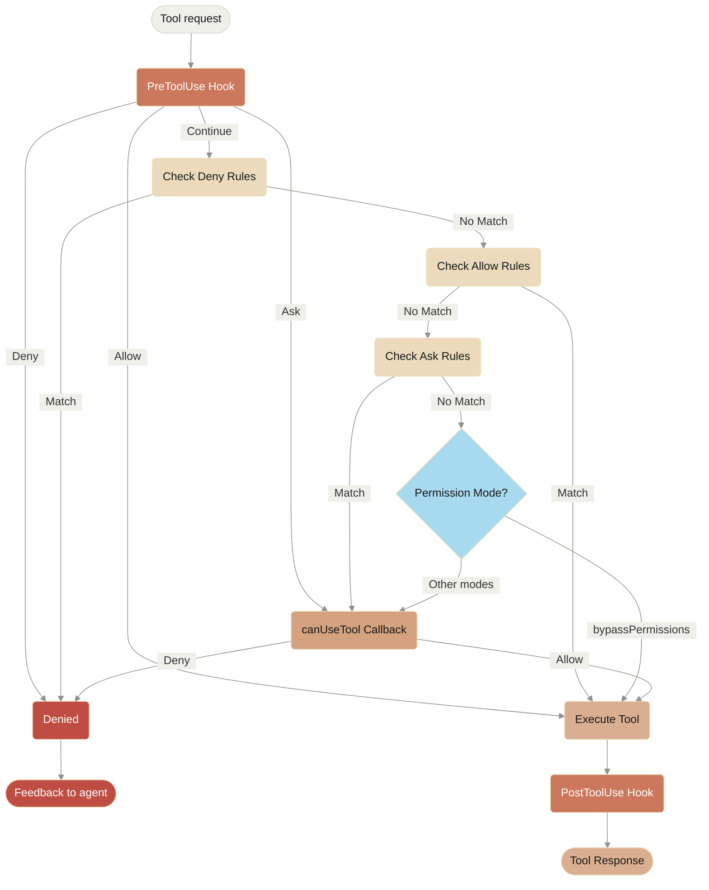

## Permission Flow Diagram

**Processing Order:** PreToolUse Hook → Deny Rules → Allow Rules → Ask Rules → Permission Mode Check → canUseTool Callback → PostToolUse Hook

---

**📚 [Back to Index](./index.md)** | **📄 [Full Version](./documentation.md)** | **🔗 [Original](../llms-full.txt)**
