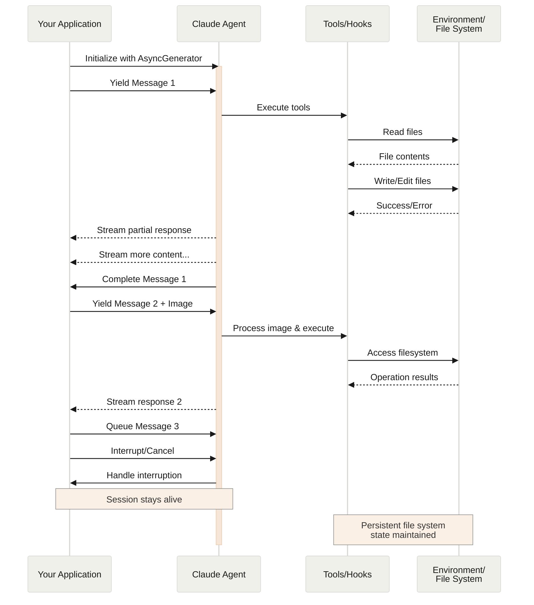

## Streaming Input Mode (Recommended)

Streaming input mode is the **preferred** way to use the Claude Agent SDK. It provides full access to the agent's capabilities and enables rich, interactive experiences.

It allows the agent to operate as a long lived process that takes in user input, handles interruptions, surfaces permission requests, and handles session management.

### How It Works



### Benefits

<CardGroup cols={2}>
  <Card title="Image Uploads" icon="image">
    Attach images directly to messages for visual analysis and understanding
  </Card>

  <Card title="Queued Messages" icon="layer-group">
    Send multiple messages that process sequentially, with ability to interrupt
  </Card>

  <Card title="Tool Integration" icon="wrench">
    Full access to all tools and custom MCP servers during the session
  </Card>

  <Card title="Hooks Support" icon="link">
    Use lifecycle hooks to customize behavior at various points
  </Card>

  <Card title="Real-time Feedback" icon="bolt">
    See responses as they're generated, not just final results
  </Card>

  <Card title="Context Persistence" icon="database">
    Maintain conversation context across multiple turns naturally
  </Card>
</CardGroup>

### Implementation Example

```typescript
  import { query } from "@anthropic-ai/claude-agent-sdk";
  import { readFileSync } from "fs";

  async function* generateMessages() {
    // First message
    yield {
      type: "user" as const,
      message: {
        role: "user" as const,
        content: "Analyze this codebase for security issues"
      }
    };
    
    // Wait for conditions or user input
    await new Promise(resolve => setTimeout(resolve, 2000));
    
    // Follow-up with image
    yield {
      type: "user" as const,
      message: {
        role: "user" as const,
        content: [
          {
            type: "text",
            text: "Review this architecture diagram"
          },
          {
            type: "image",
            source: {
              type: "base64",
              media_type: "image/png",
              data: readFileSync("diagram.png", "base64")
            }
          }
        ]
      }
    };
  }

  // Process streaming responses
  for await (const message of query({
    prompt: generateMessages(),
    options: {
      maxTurns: 10,
      allowedTools: ["Read", "Grep"]
    }
  })) {
    if (message.type === "result") {
      console.log(message.result);
    }
  }
```
```python
  from claude_agent_sdk import ClaudeSDKClient, ClaudeAgentOptions, AssistantMessage, TextBlock
  import asyncio
  import base64

  async def streaming_analysis():
      async def message_generator():
          # First message

          yield {
              "type": "user",
              "message": {
                  "role": "user",
                  "content": "Analyze this codebase for security issues"
              }
          }

          # Wait for conditions

          await asyncio.sleep(2)

          # Follow-up with image

          with open("diagram.png", "rb") as f:
              image_data = base64.b64encode(f.read()).decode()

          yield {
              "type": "user",
              "message": {
                  "role": "user",
                  "content": [
                      {
                          "type": "text",
                          "text": "Review this architecture diagram"
                      },
                      {
                          "type": "image",
                          "source": {
                              "type": "base64",
                              "media_type": "image/png",
                              "data": image_data
                          }
                      }
                  ]
              }
          }

      # Use ClaudeSDKClient for streaming input

      options = ClaudeAgentOptions(
          max_turns=10,
          allowed_tools=["Read", "Grep"]
      )

      async with ClaudeSDKClient(options) as client:
          # Send streaming input

          await client.query(message_generator())

          # Process responses

          async for message in client.receive_response():
              if isinstance(message, AssistantMessage):
                  for block in message.content:
                      if isinstance(block, TextBlock):
                          print(block.text)

  asyncio.run(streaming_analysis())
```

---

**📚 [Back to Index](./index.md)** | **📄 [Full Version](./documentation.md)** | **🔗 [Original](../llms-full.txt)**
