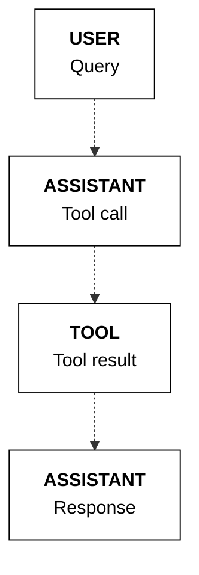
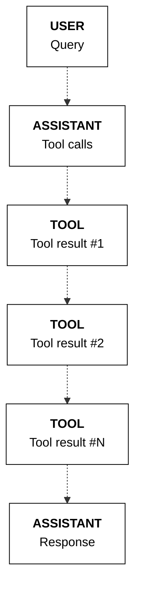
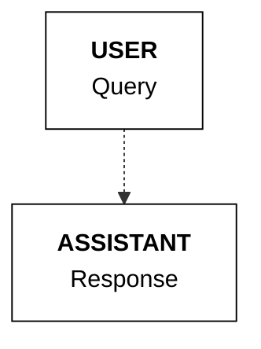
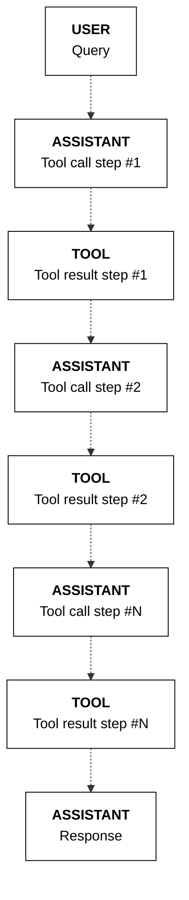
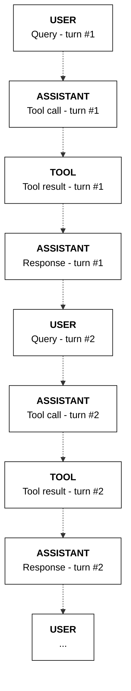

**Navigation:** [← Previous](./02-coheres-command-r-model.md) | [Index](./index.md) | [Next →](./04-after.md)

---

# RAG Streaming

> Guide on implementing streaming for RAG with Cohere and details on the events stream (API v2).

## Overview

To enable response streaming in RAG, use the `chat_stream` endpoint instead of `chat`.

This allows your application to receive token streams as the model generates its response.

## Events stream

In RAG, the events streamed by the endpoint follows the structure of a [basic chat stream event](https://docs.cohere.com/v2/docs/streaming#basic-chat-stream-events) but contains additional events for tool calling and response generation with the associated contents. This section describes the stream of events and their contents.

### Event types

`message-start`

Same as in a [basic chat stream event](https://docs.cohere.com/v2/docs/streaming#basic-chat-stream-events).

`content-start`

Same as in a [basic chat stream event](https://docs.cohere.com/v2/docs/streaming#basic-chat-stream-events).

`content-delta`

Same as in a [basic chat stream event](https://docs.cohere.com/v2/docs/streaming#basic-chat-stream-events).

`citation-start`

Emitted for every citation generated in the response. This event contains the details about a citation such as the `start` and `end` indices of the text that cites a source(s), the corresponding `text`, and the list of `sources`.

`citation-end`

Emitted to indicate the end of a citation. If there are multiple citations generated, the events will come as a sequence of `citation-start` and `citation-end` pairs.

`content-end`

Same as in a [basic chat stream event](https://docs.cohere.com/v2/docs/streaming#basic-chat-stream-events).

`message-end`

Same as in a [basic chat stream event](https://docs.cohere.com/v2/docs/streaming#basic-chat-stream-events).

### Example stream

The following is an example stream with RAG.

```mdx wordWrap
"Where do the tallest penguins live?"

type='message-start' id='d93f187e-e9ac-44a9-a2d9-bdf2d65fee94' delta=ChatMessageStartEventDelta(message=ChatMessageStartEventDeltaMessage(role='assistant', content=[], tool_plan='', tool_calls=[], citations=[])) 
 --------------------------------------------------
type='content-start' index=0 delta=ChatContentStartEventDelta(message=ChatContentStartEventDeltaMessage(content=ChatContentStartEventDeltaMessageContent(text='', type='text'))) 
 --------------------------------------------------
type='content-delta' index=0 delta=ChatContentDeltaEventDelta(message=ChatContentDeltaEventDeltaMessage(content=ChatContentDeltaEventDeltaMessageContent(text='The'))) logprobs=None 
 --------------------------------------------------
type='content-delta' index=0 delta=ChatContentDeltaEventDelta(message=ChatContentDeltaEventDeltaMessage(content=ChatContentDeltaEventDeltaMessageContent(text=' tallest'))) logprobs=None 
 --------------------------------------------------
type='content-delta' index=0 delta=ChatContentDeltaEventDelta(message=ChatContentDeltaEventDeltaMessage(content=ChatContentDeltaEventDeltaMessageContent(text=' penguins'))) logprobs=None 
 --------------------------------------------------
type='content-delta' index=0 delta=ChatContentDeltaEventDelta(message=ChatContentDeltaEventDeltaMessage(content=ChatContentDeltaEventDeltaMessageContent(text=' are'))) logprobs=None 
 --------------------------------------------------
type='content-delta' index=0 delta=ChatContentDeltaEventDelta(message=ChatContentDeltaEventDeltaMessage(content=ChatContentDeltaEventDeltaMessageContent(text=' the'))) logprobs=None 
 --------------------------------------------------
type='content-delta' index=0 delta=ChatContentDeltaEventDelta(message=ChatContentDeltaEventDeltaMessage(content=ChatContentDeltaEventDeltaMessageContent(text=' Emperor'))) logprobs=None 
 --------------------------------------------------
type='content-delta' index=0 delta=ChatContentDeltaEventDelta(message=ChatContentDeltaEventDeltaMessage(content=ChatContentDeltaEventDeltaMessageContent(text=' penguins'))) logprobs=None 
 --------------------------------------------------
type='content-delta' index=0 delta=ChatContentDeltaEventDelta(message=ChatContentDeltaEventDeltaMessage(content=ChatContentDeltaEventDeltaMessageContent(text='.'))) logprobs=None 
 --------------------------------------------------
type='content-delta' index=0 delta=ChatContentDeltaEventDelta(message=ChatContentDeltaEventDeltaMessage(content=ChatContentDeltaEventDeltaMessageContent(text=' They'))) logprobs=None 
 --------------------------------------------------
type='content-delta' index=0 delta=ChatContentDeltaEventDelta(message=ChatContentDeltaEventDeltaMessage(content=ChatContentDeltaEventDeltaMessageContent(text=' only'))) logprobs=None 
 --------------------------------------------------
type='content-delta' index=0 delta=ChatContentDeltaEventDelta(message=ChatContentDeltaEventDeltaMessage(content=ChatContentDeltaEventDeltaMessageContent(text=' live'))) logprobs=None 
 --------------------------------------------------
type='content-delta' index=0 delta=ChatContentDeltaEventDelta(message=ChatContentDeltaEventDeltaMessage(content=ChatContentDeltaEventDeltaMessageContent(text=' in'))) logprobs=None 
 --------------------------------------------------
type='content-delta' index=0 delta=ChatContentDeltaEventDelta(message=ChatContentDeltaEventDeltaMessage(content=ChatContentDeltaEventDeltaMessageContent(text=' Antarctica'))) logprobs=None 
 --------------------------------------------------
type='content-delta' index=0 delta=ChatContentDeltaEventDelta(message=ChatContentDeltaEventDeltaMessage(content=ChatContentDeltaEventDeltaMessageContent(text='.'))) logprobs=None 
 --------------------------------------------------
type='citation-start' index=0 delta=CitationStartEventDelta(message=CitationStartEventDeltaMessage(citations=Citation(start=29, end=46, text='Emperor penguins.', sources=[DocumentSource(type='document', id='doc:0', document={'id': 'doc:0', 'snippet': 'Emperor penguins are the tallest.', 'title': 'Tall penguins'})], type='TEXT_CONTENT'))) 
 --------------------------------------------------
type='citation-end' index=0 
 --------------------------------------------------
type='citation-start' index=1 delta=CitationStartEventDelta(message=CitationStartEventDeltaMessage(citations=Citation(start=65, end=76, text='Antarctica.', sources=[DocumentSource(type='document', id='doc:1', document={'id': 'doc:1', 'snippet': 'Emperor penguins only live in Antarctica.', 'title': 'Penguin habitats'})], type='TEXT_CONTENT'))) 
 --------------------------------------------------
type='citation-end' index=1 
 --------------------------------------------------
type='content-end' index=0 
 --------------------------------------------------
type='message-end' id=None delta=ChatMessageEndEventDelta(finish_reason='COMPLETE', usage=Usage(billed_units=UsageBilledUnits(input_tokens=34.0, output_tokens=14.0, search_units=None, classifications=None), tokens=UsageTokens(input_tokens=721.0, output_tokens=59.0))) 
 --------------------------------------------------
```

## Usage example

This section provides an example of handling streamed objects in the tool use response generation step.

### Setup

First, import the Cohere library and create a client.

<Tabs>
  <Tab title="Cohere platform">
    ```python PYTHON
    # ! pip install -U cohere
    import cohere

    co = cohere.ClientV2(
        "COHERE_API_KEY"
    )  # Get your free API key here: https://dashboard.cohere.com/api-keys
    ```
  </Tab>

  <Tab title="Private deployment">
    ```python PYTHON
    # ! pip install -U cohere
    import cohere

    co = cohere.ClientV2(
        api_key="",  # Leave this blank
        base_url="<YOUR_DEPLOYMENT_URL>",
    )
    ```
  </Tab>
</Tabs>

### Define documents

Next, define the documents to be passed to the endpoint.

```python PYTHON
documents = [
    {
        "data": {
            "title": "Tall penguins",
            "snippet": "Emperor penguins are the tallest.",
        }
    },
    {
        "data": {
            "title": "Penguin habitats",
            "snippet": "Emperor penguins only live in Antarctica.",
        }
    },
]
```

### Streaming the response

We can now stream the response using the `chat_stream` endpoint.

The events are streamed as `chunk` objects. In the example below, we pick `content-delta` to display the text response and `citation-start` to display the citations.

<CodeBlocks>
  ```python PYTHON
  messages = [
      {"role": "user", "content": "Where do the tallest penguins live?"}
  ]

  response = co.chat_stream(
      model="command-a-03-2025",
      messages=messages,
      documents=documents,
  )

  response_text = ""
  citations = []
  for chunk in response:
      if chunk:
          if chunk.type == "content-delta":
              response_text += chunk.delta.message.content.text
              print(chunk.delta.message.content.text, end="")
          if chunk.type == "citation-start":
              citations.append(chunk.delta.message.citations)

  for citation in citations:
      print(citation, "\n")
  ```

  ```bash cURL
  curl --request POST \
    --url https://api.cohere.ai/v2/chat \
    --header 'accept: text/event-stream' \
    --header 'content-type: application/json' \
    --header "Authorization: bearer $CO_API_KEY" \
    --data '{
    "model": "command-a-03-2025",
    "messages": [
      {
        "role": "user",
        "content": "Where do the tallest penguins live?"
      }
    ],
    "documents": [
      {
        "data": {
          "title": "Tall penguins",
          "snippet": "Emperor penguins are the tallest."
        }
      },
      {
        "data": {
          "title": "Penguin habitats",
          "snippet": "Emperor penguins only live in Antarctica."
        }
      }
    ],
    "stream": true
  }'
  ```
</CodeBlocks>

Example response:

```mdx wordWrap
The tallest penguins are the Emperor penguins, which only live in Antarctica.

start=29 end=45 text='Emperor penguins' sources=[DocumentSource(type='document', id='doc:0', document={'id': 'doc:0', 'snippet': 'Emperor penguins are the tallest.', 'title': 'Tall penguins'})] type='TEXT_CONTENT' 

start=66 end=77 text='Antarctica.' sources=[DocumentSource(type='document', id='doc:1', document={'id': 'doc:1', 'snippet': 'Emperor penguins only live in Antarctica.', 'title': 'Penguin habitats'})] type='TEXT_CONTENT' 
```


# RAG Citations

> Guide on accessing and utilizing citations generated by the Cohere Chat endpoint for RAG. It covers both non-streaming and streaming modes (API v2).

## Accessing citations

The Chat endpoint generates fine-grained citations for its RAG response. This capability is included out-of-the-box with the Command family of models.

The following sections describe how to access the citations in both the non-streaming and streaming modes.

### Non-streaming

First, define the documents to be passed as the context of the model's response.

<Tabs>
  <Tab title="Cohere platform">
    ```python PYTHON
    # ! pip install -U cohere
    import cohere
    import json

    co = cohere.ClientV2(
        "COHERE_API_KEY"
    )  # Get your free API key here: https://dashboard.cohere.com/api-keys
    ```
  </Tab>

  <Tab title="Private deployment">
    ```python PYTHON
    # ! pip install -U cohere
    import cohere

    co = cohere.ClientV2(
        api_key="",  # Leave this blank
        base_url="<YOUR_DEPLOYMENT_URL>",
    )
    ```
  </Tab>
</Tabs>

```python PYTHON
documents = [
    {
        "data": {
            "title": "Tall penguins",
            "snippet": "Emperor penguins are the tallest.",
        }
    },
    {
        "data": {
            "title": "Penguin habitats",
            "snippet": "Emperor penguins only live in Antarctica.",
        }
    },
]
```

In the non-streaming mode (using `chat` to generate the model response), the citations are provided in the `message.citations` field of the response object.

Each citation object contains:

* `start` and `end`: the start and end indices of the text that cites a source(s)
* `text`: its corresponding span of text
* `sources`: the source(s) that it references

<CodeBlocks>
  ```python PYTHON
  messages = [
      {"role": "user", "content": "Where do the tallest penguins live?"}
  ]

  response = co.chat(
      model="command-r-08-2024",
      messages=messages,
      documents=documents,
  )

  print(response.message.content[0].text)

  for citation in response.message.citations:
      print(citation, "\n")
  ```

  ```bash cURL
  curl --request POST \
    --url https://api.cohere.ai/v2/chat \
    --header 'accept: application/json' \
    --header 'content-type: application/json' \
    --header "Authorization: bearer $CO_API_KEY" \
    --data '{
    "model": "command-r-08-2024",
    "messages": [
      {
        "role": "user",
        "content": "Where do the tallest penguins live?"
      }
    ],
    "documents": [
      {
        "data": {
          "title": "Tall penguins",
          "snippet": "Emperor penguins are the tallest."
        }
      },
      {
        "data": {
          "title": "Penguin habitats",
          "snippet": "Emperor penguins only live in Antarctica."
        }
      }
    ]
  }'
  ```
</CodeBlocks>

Example response:

```mdx wordWrap
The tallest penguins are the Emperor penguins. They only live in Antarctica.

start=29 end=46 text='Emperor penguins.' sources=[DocumentSource(type='document', id='doc:0', document={'id': 'doc:0', 'snippet': 'Emperor penguins are the tallest.', 'title': 'Tall penguins'})] type='TEXT_CONTENT' 

start=65 end=76 text='Antarctica.' sources=[DocumentSource(type='document', id='doc:1', document={'id': 'doc:1', 'snippet': 'Emperor penguins only live in Antarctica.', 'title': 'Penguin habitats'})] type='TEXT_CONTENT' 

```

### Streaming

In a streaming scenario (using `chat_stream` to generate the model response), the citations are provided in the `citation-start` events.

Each citation object contains the same fields as the [non-streaming scenario](#non-streaming).

<CodeBlocks>
  ```python PYTHON
  messages = [
      {"role": "user", "content": "Where do the tallest penguins live?"}
  ]

  response = co.chat_stream(
      model="command-a-03-2025",
      messages=messages,
      documents=documents,
  )

  response_text = ""
  citations = []
  for chunk in response:
      if chunk:
          if chunk.type == "content-delta":
              response_text += chunk.delta.message.content.text
              print(chunk.delta.message.content.text, end="")
          if chunk.type == "citation-start":
              citations.append(chunk.delta.message.citations)

  for citation in citations:
      print(citation, "\n")
  ```

  ```bash cURL
  curl --request POST \
    --url https://api.cohere.ai/v2/chat \
    --header 'accept: text/event-stream' \
    --header 'content-type: application/json' \
    --header "Authorization: bearer $CO_API_KEY" \
    --data '{
    "model": "command-a-03-2025",
    "messages": [
      {
        "role": "user",
        "content": "Where do the tallest penguins live?"
      }
    ],
    "documents": [
      {
        "data": {
          "title": "Tall penguins",
          "snippet": "Emperor penguins are the tallest."
        }
      },
      {
        "data": {
          "title": "Penguin habitats",
          "snippet": "Emperor penguins only live in Antarctica."
        }
      }
    ],
    "stream": true
  }'
  ```
</CodeBlocks>

Example response:

```mdx wordWrap
The tallest penguins are the Emperor penguins, which only live in Antarctica.

start=29 end=45 text='Emperor penguins' sources=[DocumentSource(type='document', id='doc:0', document={'id': 'doc:0', 'snippet': 'Emperor penguins are the tallest.', 'title': 'Tall penguins'})] type='TEXT_CONTENT' 

start=66 end=77 text='Antarctica.' sources=[DocumentSource(type='document', id='doc:1', document={'id': 'doc:1', 'snippet': 'Emperor penguins only live in Antarctica.', 'title': 'Penguin habitats'})] type='TEXT_CONTENT' 
```

## Document ID

When passing the documents as context, you can optionally add custom IDs to the `id` field in the `document` object. These IDs will be used by the endpoint as the citation reference.

If you don't provide the `id` field, the ID will be auto-generated in the the format of `doc:<auto_generated_id>`. Example: `doc:0`.

Here is an example of using custom IDs. Here, we are adding custom IDs `100` and `101` to each of the two documents we are passing as context.

```python PYTHON
# ! pip install -U cohere
import cohere
import json

co = cohere.ClientV2(
    "COHERE_API_KEY"
)  # Get your free API key here: https://dashboard.cohere.com/api-keys

documents = [
    {
        "data": {
            "title": "Tall penguins",
            "snippet": "Emperor penguins are the tallest.",
        },
        "id": "100",
    },
    {
        "data": {
            "title": "Penguin habitats",
            "snippet": "Emperor penguins only live in Antarctica.",
        },
        "id": "101",
    },
]
```

When document IDs are provided, the citation will refer to the documents using these IDs.

<CodeBlocks>
  ```python PYTHON
  messages = [
      {"role": "user", "content": "Where do the tallest penguins live?"}
  ]

  response = co.chat(
      model="command-a-03-2025",
      messages=messages,
      documents=documents,
  )

  print(response.message.content[0].text)
  ```

  ```bash cURL
  curl --request POST \
    --url https://api.cohere.ai/v2/chat \
    --header 'accept: application/json' \
    --header 'content-type: application/json' \
    --header "Authorization: bearer $CO_API_KEY" \
    --data '{
    "model": "command-a-03-2025",
    "messages": [
      {
        "role": "user",
        "content": "Where do the tallest penguins live?"
      }
    ],
    "documents": [
      {
        "data": {
          "title": "Tall penguins",
          "snippet": "Emperor penguins are the tallest."
        },
        "id": "100"
      },
      {
        "data": {
          "title": "Penguin habitats",
          "snippet": "Emperor penguins only live in Antarctica."
        },
        "id": "101"
      }
    ]
  }'
  ```
</CodeBlocks>

Note the `id` fields in the citations, which refer to the IDs in the `document` object.

Example response:

```mdx wordWrap
The tallest penguins are the Emperor penguins, which only live in Antarctica.

start=29 end=45 text='Emperor penguins' sources=[DocumentSource(type='document', id='100', document={'id': '100', 'snippet': 'Emperor penguins are the tallest.', 'title': 'Tall penguins'})] type='TEXT_CONTENT' 

start=66 end=77 text='Antarctica.' sources=[DocumentSource(type='document', id='101', document={'id': '101', 'snippet': 'Emperor penguins only live in Antarctica.', 'title': 'Penguin habitats'})] type='TEXT_CONTENT' 
```

In contrast, here's an example citation when the IDs are not provided.

Example response:

```mdx wordWrap
The tallest penguins are the Emperor penguins, which only live in Antarctica.

start=29 end=45 text='Emperor penguins' sources=[DocumentSource(type='document', id='doc:0', document={'id': 'doc:0', 'snippet': 'Emperor penguins are the tallest.', 'title': 'Tall penguins'})] type='TEXT_CONTENT' 

start=66 end=77 text='Antarctica.' sources=[DocumentSource(type='document', id='doc:1', document={'id': 'doc:1', 'snippet': 'Emperor penguins only live in Antarctica.', 'title': 'Penguin habitats'})] type='TEXT_CONTENT' 

```

## Citation modes

When running RAG in streaming mode, it’s possible to configure how citations are generated and presented. You can choose between fast citations or accurate citations, depending on your latency and precision needs.

### Accurate citations

The model produces its answer first, and then, after the entire response is generated, it provides citations that map to specific segments of the response text. This approach may incur slightly higher latency, but it ensures the citation indices are more precisely aligned with the final text segments of the model’s answer.

This is the default option, or you can explicitly specify it by adding the `citation_options={"mode": "accurate"}` argument in the API call.

Here is an example using the same list of pre-defined `messages` as the above.

With the `citation_options` mode set to `accurate`, we get the citations after the entire response is generated.

<CodeBlocks>
  ```python PYTHON
  documents = [
      {
          "data": {
              "title": "Tall penguins",
              "snippet": "Emperor penguins are the tallest.",
          },
          "id": "100",
      },
      {
          "data": {
              "title": "Penguin habitats",
              "snippet": "Emperor penguins only live in Antarctica.",
          },
          "id": "101",
      },
  ]

  messages = [
      {"role": "user", "content": "Where do the tallest penguins live?"}
  ]

  response = co.chat_stream(
      model="command-a-03-2025",
      messages=messages,
      documents=documents,
      citation_options={"mode": "accurate"},
  )

  response_text = ""
  citations = []
  for chunk in response:
      if chunk:
          if chunk.type == "content-delta":
              response_text += chunk.delta.message.content.text
              print(chunk.delta.message.content.text, end="")
          if chunk.type == "citation-start":
              citations.append(chunk.delta.message.citations)

  print("\n")
  for citation in citations:
      print(citation, "\n")
  ```

  ```bash cURL
  curl --request POST \
    --url https://api.cohere.ai/v2/chat \
    --header 'accept: text/event-stream' \
    --header 'content-type: application/json' \
    --header "Authorization: bearer $CO_API_KEY" \
    --data '{
    "model": "command-a-03-2025",
    "messages": [
      {
        "role": "user",
        "content": "Where do the tallest penguins live?"
      }
    ],
    "documents": [
      {
        "data": {
          "title": "Tall penguins",
          "snippet": "Emperor penguins are the tallest."
        },
        "id": "100"
      },
      {
        "data": {
          "title": "Penguin habitats",
          "snippet": "Emperor penguins only live in Antarctica."
        },
        "id": "101"
      }
    ],
    "citation_options": {
      "mode": "accurate"
    },
    "stream": true
  }'
  ```
</CodeBlocks>

Example response:

```mdx wordWrap
The tallest penguins are the Emperor penguins. They live in Antarctica.

start=29 end=46 text='Emperor penguins.' sources=[DocumentSource(type='document', id='100', document={'id': '100', 'snippet': 'Emperor penguins are the tallest.', 'title': 'Tall penguins'})] type='TEXT_CONTENT' 

start=60 end=71 text='Antarctica.' sources=[DocumentSource(type='document', id='101', document={'id': '101', 'snippet': 'Emperor penguins only live in Antarctica.', 'title': 'Penguin habitats'})] type='TEXT_CONTENT' 
```

### Fast citations

The model generates citations inline, as the response is being produced. In streaming mode, you will see citations injected at the exact moment the model uses a particular piece of external context. This approach provides immediate traceability at the expense of slightly less precision in citation relevance.

You can specify it by adding the `citation_options={"mode": "fast"}` argument in the API call.

With the `citation_options` mode set to `fast`, we get the citations inline as the model generates the response.

<CodeBlocks>
  ```python PYTHON
  documents = [
      {
          "data": {
              "title": "Tall penguins",
              "snippet": "Emperor penguins are the tallest.",
          },
          "id": "100",
      },
      {
          "data": {
              "title": "Penguin habitats",
              "snippet": "Emperor penguins only live in Antarctica.",
          },
          "id": "101",
      },
  ]

  messages = [
      {"role": "user", "content": "Where do the tallest penguins live?"}
  ]

  response = co.chat_stream(
      model="command-a-03-2025",
      messages=messages,
      documents=documents,
      citation_options={"mode": "fast"},
  )

  response_text = ""
  for chunk in response:
      if chunk:
          if chunk.type == "content-delta":
              response_text += chunk.delta.message.content.text
              print(chunk.delta.message.content.text, end="")
          if chunk.type == "citation-start":
              print(
                  f" [{chunk.delta.message.citations.sources[0].id}]",
                  end="",
              )
  ```

  ```bash cURL
  curl --request POST \
    --url https://api.cohere.ai/v2/chat \
    --header 'accept: text/event-stream' \
    --header 'content-type: application/json' \
    --header "Authorization: bearer $CO_API_KEY" \
    --data '{
    "model": "command-a-03-2025",
    "messages": [
      {
        "role": "user",
        "content": "Where do the tallest penguins live?"
      }
    ],
    "documents": [
      {
        "data": {
          "title": "Tall penguins",
          "snippet": "Emperor penguins are the tallest."
        },
        "id": "100"
      },
      {
        "data": {
          "title": "Penguin habitats",
          "snippet": "Emperor penguins only live in Antarctica."
        },
        "id": "101"
      }
    ],
    "citation_options": {
      "mode": "fast"
    },
    "stream": true
  }'
  ```
</CodeBlocks>

Example response:

```mdx wordWrap
The tallest penguins [100] are the Emperor penguins [100] which only live in Antarctica. [101]
```


# An Overview of Tool Use with Cohere

> Learn when to use leverage multi-step tool use in your workflows.

Here, you'll find context on using tools with Cohere models:

* The [basic usage](https://docs.cohere.com/docs/tool-use-overview) discusses 'function calling,' including how to define and create the tool, how to give it a schema, and how to incorporate it into common workflows.
* [Usage patterns](https://docs.cohere.com/docs/tool-use-usage-patterns) builds on this, covering parallel execution, state management, and more.
* [Parameter types](https://docs.cohere.com/docs/tool-use-parameter-types) talks about structured output in the context of tool use.
* As its name implies, [Streaming](https://docs.cohere.com/docs/tool-use-streaming) explains how to deal with tools when output must be streamed.
* It's often important to double-check model output, which is made much easier with [citations](https://docs.cohere.com/docs/tool-use-citations).

These should help you leverage Cohere's tool use functionality to get the most out of our models.


# Basic usage of tool use (function calling)

> An overview of using Cohere's tool use capabilities, enabling developers to build agentic workflows (API v2).

## Overview

Tool use is a technique which allows developers to connect Cohere’s Command family models to external tools like search engines, APIs, functions, databases, etc.

This opens up a richer set of behaviors by leveraging tools to access external data sources, taking actions through APIs, interacting with a vector database, querying a search engine, etc., and is particularly valuable for enterprise developers, since a lot of enterprise data lives in external sources.

The Chat endpoint comes with built-in tool use capabilities such as function calling, multi-step reasoning, and citation generation.


## Setup

First, import the Cohere library and create a client.

<Tabs>
  <Tab title="Cohere platform">
    ```python PYTHON
    # ! pip install -U cohere
    import cohere

    co = cohere.ClientV2(
        "COHERE_API_KEY"
    )  # Get your free API key here: https://dashboard.cohere.com/api-keys
    ```
  </Tab>

  <Tab title="Private deployment">
    ```python PYTHON
    # ! pip install -U cohere
    import cohere

    co = cohere.ClientV2(
        api_key="",  # Leave this blank
        base_url="<YOUR_DEPLOYMENT_URL>",
    )
    ```
  </Tab>
</Tabs>

## Tool definition

The pre-requisite, or Step 0, before we can run a tool use workflow, is to define the tools. We can break this further into two steps:

* Creating the tool
* Defining the tool schema


### Creating the tool

A tool can be any function that you create or external services that return an object for a given input. Some examples: a web search engine, an email service, an SQL database, a vector database, a weather data service, a sports data service, or even another LLM.

In this example, we define a `get_weather` function that returns the temperature for a given query, which is the location. You can implement any logic here, but to simplify the example, here we are hardcoding the return value to be the same for all queries.

```python PYTHON
def get_weather(location):
    # Implement any logic here
    return [{"temperature": "20°C"}]
    # Return a JSON object string, or a list of tool content blocks e.g. [{"url": "abc.com", "text": "..."}, {"url": "xyz.com", "text": "..."}]


functions_map = {"get_weather": get_weather}
```

The Chat endpoint accepts [a string or a list of objects](https://docs.cohere.com/reference/chat#request.body.messages.tool.content) as the tool results. Thus, you should format the return value in this way. The following are some examples.

```python PYTHON
# Example: String
weather_search_results = "20°C"

# Example: List of objects
weather_search_results = [
    {"city": "Toronto", "date": "250207", "temperature": "20°C"},
    {"city": "Toronto", "date": "250208", "temperature": "21°C"},
]
```

### Defining the tool schema

We also need to define the tool schemas in a format that can be passed to the Chat endpoint. The schema follows the [JSON Schema specification](https://json-schema.org/understanding-json-schema) and must contain the following fields:

* `name`: the name of the tool.
* `description`: a description of what the tool is and what it is used for.
* `parameters`: a list of parameters that the tool accepts. For each parameter, we need to define the following fields:
  * `type`: the type of the parameter.
  * `properties`: the name of the parameter and the following fields:
    * `type`: the type of the parameter.
    * `description`: a description of what the parameter is and what it is used for.
  * `required`: a list of required properties by name, which appear as keys in the `properties` object

This schema informs the LLM about what the tool does, and the LLM decides whether to use a particular tool based on the information that it contains.

Therefore, the more descriptive and clear the schema, the more likely the LLM will make the right tool call decisions.

In a typical development cycle, some fields such as `name`, `description`, and `properties` will likely require a few rounds of iterations in order to get the best results (a similar approach to prompt engineering).

```python PYTHON
tools = [
    {
        "type": "function",
        "function": {
            "name": "get_weather",
            "description": "gets the weather of a given location",
            "parameters": {
                "type": "object",
                "properties": {
                    "location": {
                        "type": "string",
                        "description": "the location to get the weather, example: San Francisco.",
                    }
                },
                "required": ["location"],
            },
        },
    },
]
```

<Note>
  The endpoint supports a subset of the JSON Schema specification. Refer to the 

  [Structured Outputs documentation](https://docs.cohere.com/docs/structured-outputs#parameter-types-support)

   for the list of supported and unsupported parameters.
</Note>

## Tool use workflow

We can think of a tool use system as consisting of four components:

* The user
* The application
* The LLM
* The tools

At its most basic, these four components interact in a workflow through four steps:

* Step 1: **Get user message**: The LLM gets the user message (via the application).
* Step 2: **Generate tool calls**: The LLM decides which tools to call (if any) and generates the tool calls.
* Step 3: **Get tool results**: The application executes the tools, and the results are sent to the LLM.
* Step 4: **Generate response and citations**: The LLM generates the response and citations back to the user.


As an example, a weather search workflow might looks like the following:

* Step 1: **Get user message**: A user asks, "What's the weather in Toronto?"
* Step 2: **Generate tool calls**: A tool call is made to an external weather service with something like `get_weather(“toronto”)`.
* Step 3: **Get tool results**: The weather service returns the results, e.g. "20°C".
* Step 4: **Generate response and citations**: The model provides the answer, "The weather in Toronto is 20 degrees Celcius".

The following sections go through the implementation of these steps in detail.

### Step 1: Get user message

In the first step, we get the user's message and append it to the `messages` list with the `role` set to `user`.

```python PYTHON
messages = [
    {"role": "user", "content": "What's the weather in Toronto?"}
]
```

<Accordion title="System message">
  Optional: If you want to define a system message, you can add it to the `messages` list with the `role` set to `system`.

  ```python PYTHON
  system_message = """## Task & Context
  You help people answer their questions and other requests interactively. You will be asked a very wide array of requests on all kinds of topics. You will be equipped with a wide range of search engines or similar tools to help you, which you use to research your answer. You should focus on serving the user's needs as best you can, which will be wide-ranging.

  ## Style Guide
  Unless the user asks for a different style of answer, you should answer in full sentences, using proper grammar and spelling.
  """

  messages = [
      {"role": "system", "content": system_message},
      {"role": "user", "content": "What's the weather in Toronto?"},
  ]
  ```
</Accordion>

### Step 2: Generate tool calls

Next, we call the Chat endpoint to generate the list of tool calls. This is done by passing the parameters `model`, `messages`, and `tools` to the Chat endpoint.

The endpoint will send back a list of tool calls to be made if the model determines that tools are required. If it does, it will return two types of information:

* `tool_plan`: its reflection on the next steps it should take, given the user query.
* `tool_calls`: a list of tool calls to be made (if any), together with auto-generated tool call IDs. Each generated tool call contains:
  * `id`: the tool call ID
  * `type`: the type of the tool call (`function`)
  * `function`: the function to be called, which contains the function's `name` and `arguments` to be passed to the function.

We then append these to the `messages` list with the `role` set to `assistant`.

<CodeBlocks>
  ```python PYTHON
  response = co.chat(
      model="command-a-03-2025", messages=messages, tools=tools
  )

  if response.message.tool_calls:
      messages.append(
          {
              "role": "assistant",
              "tool_plan": response.message.tool_plan,
              "tool_calls": response.message.tool_calls,
          }
      )
      print(response.message.tool_plan, "\n")
      print(response.message.tool_calls)
  ```

  ```bash cURL
  curl --request POST \
    --url https://api.cohere.ai/v2/chat \
    --header 'accept: application/json' \
    --header 'content-type: application/json' \
    --header "Authorization: bearer $CO_API_KEY" \
    --data '{
    "model": "command-a-03-2025",
    "messages": [
      {
        "role": "user",
        "content": "What'\''s the weather in Toronto?"
      }
    ],
    "tools": [
      {
        "type": "function",
        "function": {
          "name": "get_weather",
          "description": "gets the weather of a given location",
          "parameters": {
            "type": "object",
            "properties": {
              "location": {
                "type": "string",
                "description": "the location to get the weather, example: San Francisco."
              }
            },
            "required": ["location"]
          }
        }
      }
    ]
  }'
  ```
</CodeBlocks>

Example response:

```mdx wordWrap
I will search for the weather in Toronto. 

[
    ToolCallV2(
        id="get_weather_1byjy32y4hvq",
        type="function",
        function=ToolCallV2Function(
            name="get_weather", arguments='{"location":"Toronto"}'
        ),
    )
]
```

By default, when using the Python SDK, the endpoint passes the tool calls as objects of type `ToolCallV2` and `ToolCallV2Function`. With these, you get built-in type safety and validation that helps prevent common errors during development.

Alternatively, you can use plain dictionaries to structure the tool call message.

These two options are shown below.

<Tabs>
  <Tab title="Python objects">
    ```python PYTHON
    messages = [
        {
            "role": "user",
            "content": "What's the weather in Madrid and Brasilia?",
        },
        {
            "role": "assistant",
            "tool_plan": "I will search for the weather in Madrid and Brasilia.",
            "tool_calls": [
                ToolCallV2(
                    id="get_weather_dkf0akqdazjb",
                    type="function",
                    function=ToolCallV2Function(
                        name="get_weather",
                        arguments='{"location":"Madrid"}',
                    ),
                ),
                ToolCallV2(
                    id="get_weather_gh65bt2tcdy1",
                    type="function",
                    function=ToolCallV2Function(
                        name="get_weather",
                        arguments='{"location":"Brasilia"}',
                    ),
                ),
            ],
        },
    ]
    ```
  </Tab>

  <Tab title="Plain dictionaries">
    ```python PYTHON
    messages = [
        {
            "role": "user",
            "content": "What's the weather in Madrid and Brasilia?",
        },
        {
            "role": "assistant",
            "tool_plan": "I will search for the weather in Madrid and Brasilia.",
            "tool_calls": [
                {
                    "id": "get_weather_dkf0akqdazjb",
                    "type": "function",
                    "function": {
                        "name": "get_weather",
                        "arguments": '{"location":"Madrid"}',
                    },
                },
                {
                    "id": "get_weather_gh65bt2tcdy1",
                    "type": "function",
                    "function": {
                        "name": "get_weather",
                        "arguments": '{"location":"Brasilia"}',
                    },
                },
            ],
        },
    ]
    ```
  </Tab>
</Tabs>

<AccordionGroup>
  <Accordion title="Directly responding">
    The model can decide to *not* make any tool call, and instead, respond to a user message directly. This is described [here](https://docs.cohere.com/docs/tool-use-usage-patterns#directly-answering).
  </Accordion>

  <Accordion title="Parallel tool calling">
    The model can determine that more than one tool call is required. This can be calling the same tool multiple times or different tools for any number of calls. This is described [here](https://docs.cohere.com/docs/tool-use-usage-patterns#parallel-tool-calling).
  </Accordion>
</AccordionGroup>

### Step 3: Get tool results

During this step, we perform the function calling. We call the necessary tools based on the tool call payloads given by the endpoint.

For each tool call, we append the `messages` list with:

* the `tool_call_id` generated in the previous step.
* the `content` of each tool result with the following fields:
  * `type` which is `document`
  * `document` containing
    * `data`: which stores the contents of the tool result.
    * `id` (optional): you can provide each document with a unique ID for use in citations, otherwise auto-generated

```python PYTHON
import json

if response.message.tool_calls:
    for tc in response.message.tool_calls:
        tool_result = functions_map[tc.function.name](
            **json.loads(tc.function.arguments)
        )
        tool_content = []
        for data in tool_result:
            # Optional: the "document" object can take an "id" field for use in citations, otherwise auto-generated
            tool_content.append(
                {
                    "type": "document",
                    "document": {"data": json.dumps(data)},
                }
            )
        messages.append(
            {
                "role": "tool",
                "tool_call_id": tc.id,
                "content": tool_content,
            }
        )
```

### Step 4: Generate response and citations

By this time, the tool call has already been executed, and the result has been returned to the LLM.

In this step, we call the Chat endpoint to generate the response to the user, again by passing the parameters `model`, `messages` (which has now been updated with information fromthe tool calling and tool execution steps), and `tools`.

The model generates a response to the user, grounded on the information provided by the tool.

We then append the response to the `messages` list with the `role` set to `assistant`.

<CodeBlocks>
  ```python PYTHON
  response = co.chat(
      model="command-a-03-2025", messages=messages, tools=tools
  )

  messages.append(
      {"role": "assistant", "content": response.message.content[0].text}
  )

  print(response.message.content[0].text)
  ```

  ```bash cURL
  curl --request POST \
    --url https://api.cohere.ai/v2/chat \
    --header 'accept: application/json' \
    --header 'content-type: application/json' \
    --header "Authorization: bearer $CO_API_KEY" \
    --data '{
    "model": "command-a-03-2025",
    "messages": [
      {
        "role": "user",
        "content": "What'\''s the weather in Toronto?"
      },
      {
        "role": "assistant",
        "tool_plan": "I will search for the weather in Toronto.",
        "tool_calls": [
          {
            "id": "get_weather_1byjy32y4hvq",
            "type": "function",
            "function": {
              "name": "get_weather",
              "arguments": "{\"location\":\"Toronto\"}"
            }
          }
        ]
      },
      {
        "role": "tool",
        "tool_call_id": "get_weather_1byjy32y4hvq",
        "content": [
          {
            "type": "document",
            "document": {
              "data": "{\"temperature\": \"20°C\"}"
            }
          }
        ]
      }
    ],
    "tools": [
      {
        "type": "function",
        "function": {
          "name": "get_weather",
          "description": "gets the weather of a given location",
          "parameters": {
            "type": "object",
            "properties": {
              "location": {
                "type": "string",
                "description": "the location to get the weather, example: San Francisco."
              }
            },
            "required": ["location"]
          }
        }
      }
    ]
  }'
  ```
</CodeBlocks>

Example response:

```mdx wordWrap
It's 20°C in Toronto.
```

It also generates fine-grained citations, which are included out-of-the-box with the Command family of models. Here, we see the model generating two citations, one for each specific span in its response, where it uses the tool result to answer the question.

```python PYTHON
print(response.message.citations)
```

Example response:

```mdx wordWrap
[Citation(start=5, end=9, text='20°C', sources=[ToolSource(type='tool', id='get_weather_1byjy32y4hvq:0', tool_output={'temperature': '20C'})], type='TEXT_CONTENT')]
```

<Accordion title="Multi-step tool use (agents)">
  Above, we assume the model performs tool calling only once (either single call or parallel calls), and then generates its response. This is not always the case: the model might decide to do a sequence of tool calls in order to answer the user request. This means that steps 2 and 3 will run multiple times in loop. It is called multi-step tool use and is described [here](https://docs.cohere.com/docs/tool-use-usage-patterns#multi-step-tool-use).
</Accordion>

### State management

This section provides a more detailed look at how the state is managed via the `messages` list as described in the [tool use workflow](#tool-use-workflow) above.

At each step of the workflow, the endpoint requires that we append specific types of information to the `messages` list. This is to ensure that the model has the necessary context to generate its response at a given point.

In summary, each single turn of a conversation that involves tool calling consists of:

1. A `user` message containing the user message
   * `content`
2. An `assistant` message, containing the tool calling information
   * `tool_plan`
   * `tool_calls`
     * `id`
     * `type`
     * `function` (consisting of `name` and `arguments`)
3. A `tool` message, containing the tool results
   * `tool_call_id`
   * `content` containing a list of documents where each document contains the following fields:
     * `type`
     * `document` (consisting of `data` and optionally `id`)
4. A final `assistant` message, containing the model's response
   * `content`

These correspond to the four steps described above. The list of `messages` is shown below.

```python PYTHON
for message in messages:
    print(message, "\n")
```

```json
{   
    "role": "user", 
    "content": "What's the weather in Toronto?"
}

{
    "role": "assistant",
    "tool_plan": "I will search for the weather in Toronto.",
    "tool_calls": [
        ToolCallV2(
            id="get_weather_1byjy32y4hvq",
            type="function",
            function=ToolCallV2Function(
                name="get_weather", arguments='{"location":"Toronto"}'
            ),
        )
    ],
}

{
    "role": "tool",
    "tool_call_id": "get_weather_1byjy32y4hvq",
    "content": [{"type": "document", "document": {"data": '{"temperature": "20C"}'}}],
}

{   
    "role": "assistant", 
    "content": "It's 20°C in Toronto."
}
```

The sequence of `messages` is represented in the diagram below.



Note that this sequence represents a basic usage pattern in tool use. The [next page](https://docs.cohere.com/v2/docs/tool-use-usage-patterns) describes how this is adapted for other scenarios.


# Usage patterns for tool use (function calling)

> Guide on implementing various tool use patterns with the Cohere Chat endpoint such as parallel tool calling, multi-step tool use, and more (API v2).

The tool use feature of the Chat endpoint comes with a set of capabilities that enable developers to implement a variety of tool use scenarios. This section describes the different patterns of tool use implementation supported by these capabilities. Each pattern can be implemented on its own or in combination with the others.

## Setup

First, import the Cohere library and create a client.

<Tabs>
  <Tab title="Cohere platform">
    ```python PYTHON
    # ! pip install -U cohere
    import cohere

    co = cohere.ClientV2(
        "COHERE_API_KEY"
    )  # Get your free API key here: https://dashboard.cohere.com/api-keys
    ```
  </Tab>

  <Tab title="Private deployment">
    ```python PYTHON
    # ! pip install -U cohere
    import cohere

    co = cohere.ClientV2(
        api_key="",  # Leave this blank
        base_url="<YOUR_DEPLOYMENT_URL>",
    )
    ```
  </Tab>
</Tabs>

We'll use the same `get_weather` tool as in the [previous example](https://docs.cohere.com/v2/docs/tool-use-overview#creating-the-tool).

```python PYTHON
def get_weather(location):
    # Implement any logic here
    return [{"temperature": "20C"}]
    # Return a list of objects e.g. [{"url": "abc.com", "text": "..."}, {"url": "xyz.com", "text": "..."}]


functions_map = {"get_weather": get_weather}

tools = [
    {
        "type": "function",
        "function": {
            "name": "get_weather",
            "description": "gets the weather of a given location",
            "parameters": {
                "type": "object",
                "properties": {
                    "location": {
                        "type": "string",
                        "description": "the location to get the weather, example: San Francisco.",
                    }
                },
                "required": ["location"],
            },
        },
    },
]
```

## Parallel tool calling

The model can determine that more than one tool call is required, where it will call multiple tools in parallel. This can be calling the same tool multiple times or different tools for any number of calls.

In the example below, the user asks for the weather in Toronto and New York. This requires calling the `get_weather` function twice, one for each location. This is reflected in the model's response, where two parallel tool calls are generated.

<CodeBlocks>
  ```python PYTHON
  messages = [
      {
          "role": "user",
          "content": "What's the weather in Toronto and New York?",
      }
  ]

  response = co.chat(
      model="command-a-03-2025", messages=messages, tools=tools
  )

  if response.message.tool_calls:
      messages.append(
          {
              "role": "assistant",
              "tool_plan": response.message.tool_plan,
              "tool_calls": response.message.tool_calls,
          }
      )
      print(response.message.tool_plan, "\n")
      print(response.message.tool_calls)
  ```

  ```bash cURL
  curl --request POST \
    --url https://api.cohere.ai/v2/chat \
    --header 'accept: application/json' \
    --header 'content-type: application/json' \
    --header "Authorization: bearer $CO_API_KEY" \
    --data '{
    "model": "command-a-03-2025",
    "messages": [
      {
        "role": "user",
        "content": "What'\''s the weather in Toronto and New York?"
      }
    ],
    "tools": [
      {
        "type": "function",
        "function": {
          "name": "get_weather",
          "description": "gets the weather of a given location",
          "parameters": {
            "type": "object",
            "properties": {
              "location": {
                "type": "string",
                "description": "the location to get the weather, example: San Francisco."
              }
            },
            "required": ["location"]
          }
        }
      }
    ]
  }'
  ```
</CodeBlocks>

Example response:

```mdx wordWrap
I will search for the weather in Toronto and New York.

[
    ToolCallV2(
        id="get_weather_9b0nr4kg58a8",
        type="function",
        function=ToolCallV2Function(
            name="get_weather", arguments='{"location":"Toronto"}'
        ),
    ),
    ToolCallV2(
        id="get_weather_0qq0mz9gwnqr",
        type="function",
        function=ToolCallV2Function(
            name="get_weather", arguments='{"location":"New York"}'
        ),
    ),
]
```

**State management**

When tools are called in parallel, we append the messages list with one single `assistant` message containing all the tool calls and one `tool` message for each tool call.

```python PYTHON
import json

if response.message.tool_calls:
    for tc in response.message.tool_calls:
        tool_result = functions_map[tc.function.name](
            **json.loads(tc.function.arguments)
        )
        tool_content = []
        for data in tool_result:
            # Optional: the "document" object can take an "id" field for use in citations, otherwise auto-generated
            tool_content.append(
                {
                    "type": "document",
                    "document": {"data": json.dumps(data)},
                }
            )
        messages.append(
            {
                "role": "tool",
                "tool_call_id": tc.id,
                "content": tool_content,
            }
        )
```

The sequence of messages is represented in the diagram below.



## Directly answering

A key attribute of tool use systems is the model’s ability to choose the right tools for a task. This includes the model's ability to decide to *not* use any tool, and instead, respond to a user message directly.

In the example below, the user asks for a simple arithmetic question. The model determines that it does not need to use any of the available tools (only one, `get_weather`, in this case), and instead, directly answers the user.

<CodeBlocks>
  ```python PYTHON
  messages = [{"role": "user", "content": "What's 2+2?"}]

  response = co.chat(
      model="command-a-03-2025", messages=messages, tools=tools
  )

  if response.message.tool_calls:
      print(response.message.tool_plan, "\n")
      print(response.message.tool_calls)

  else:
      print(response.message.content[0].text)
  ```

  ```bash cURL
  curl --request POST \
    --url https://api.cohere.ai/v2/chat \
    --header 'accept: application/json' \
    --header 'content-type: application/json' \
    --header "Authorization: bearer $CO_API_KEY" \
    --data '{
    "model": "command-a-03-2025",
    "messages": [
      {
        "role": "user",
        "content": "What'\''s 2+2?"
      }
    ],
    "tools": [
      {
        "type": "function",
        "function": {
          "name": "get_weather",
          "description": "gets the weather of a given location",
          "parameters": {
            "type": "object",
            "properties": {
              "location": {
                "type": "string",
                "description": "the location to get the weather, example: San Francisco."
              }
            },
            "required": ["location"]
          }
        }
      }
    ]
  }'
  ```
</CodeBlocks>

Example response:

```mdx wordWrap
The answer to 2+2 is 4.
```

**State management**

When the model opts to respond directly to the user, there will be no items 2 and 3 above (the tool calling and tool response messages). Instead, the final `assistant` message will contain the model's direct response to the user.



Note: you can force the model to directly answer every time using the `tool_choice` parameter, [described here](#forcing-tool-usage)

## Multi-step tool use

The Chat endpoint supports multi-step tool use, which enables the model to perform sequential reasoning. This is especially useful in agentic workflows that require multiple steps to complete a task.

As an example, suppose a tool use application has access to a web search tool. Given the question "What was the revenue of the most valuable company in the US in 2023?”,  it will need to perform a series of steps in a specific order:

* Identify the most valuable company in the US in 2023
* Then only get the revenue figure now that the company has been identified

To illustrate this, let's start with the same weather example and add another tool called `get_capital_city`, which returns the capital city of a given country.

Here's the function definitions for the tools:

```python PYTHON
def get_weather(location):
    temperature = {
        "bern": "22°C",
        "madrid": "24°C",
        "brasilia": "28°C",
    }
    loc = location.lower()
    if loc in temperature:
        return [{"temperature": {loc: temperature[loc]}}]
    return [{"temperature": {loc: "Unknown"}}]


def get_capital_city(country):
    capital_city = {
        "switzerland": "bern",
        "spain": "madrid",
        "brazil": "brasilia",
    }
    country = country.lower()
    if country in capital_city:
        return [{"capital_city": {country: capital_city[country]}}]
    return [{"capital_city": {country: "Unknown"}}]


functions_map = {
    "get_capital_city": get_capital_city,
    "get_weather": get_weather,
}
```

And here are the corresponding tool schemas:

```python PYTHON
tools = [
    {
        "type": "function",
        "function": {
            "name": "get_weather",
            "description": "gets the weather of a given location",
            "parameters": {
                "type": "object",
                "properties": {
                    "location": {
                        "type": "string",
                        "description": "the location to get the weather, example: San Francisco.",
                    }
                },
                "required": ["location"],
            },
        },
    },
    {
        "type": "function",
        "function": {
            "name": "get_capital_city",
            "description": "gets the capital city of a given country",
            "parameters": {
                "type": "object",
                "properties": {
                    "country": {
                        "type": "string",
                        "description": "the country to get the capital city for",
                    }
                },
                "required": ["country"],
            },
        },
    },
]
```

Next, we implement the four-step tool use workflow as described in the [previous page](https://docs.cohere.com/v2/docs/tool-use-overview).

The key difference here is the second (tool calling) and third (tool execution) steps are put in a `while` loop, which means that a sequence of this pair can happen for a number of times. This stops when the model decides in the tool calling step that no more tool calls are needed, which then triggers the fourth step (response generation).

In this example, the user asks for the temperature in Brazil's capital city.

```python PYTHON
# Step 1: Get the user message
messages = [
    {
        "role": "user",
        "content": "What's the temperature in Brazil's capital city?",
    }
]

# Step 2: Generate tool calls (if any)
model = "command-a-03-2025"
response = co.chat(
    model=model, messages=messages, tools=tools, temperature=0.3
)

while response.message.tool_calls:
    print("TOOL PLAN:")
    print(response.message.tool_plan, "\n")
    print("TOOL CALLS:")
    for tc in response.message.tool_calls:
        print(
            f"Tool name: {tc.function.name} | Parameters: {tc.function.arguments}"
        )
    print("=" * 50)

    messages.append(
        {
            "role": "assistant",
            "tool_plan": response.message.tool_plan,
            "tool_calls": response.message.tool_calls,
        }
    )

    # Step 3: Get tool results
    print("TOOL RESULT:")
    for tc in response.message.tool_calls:
        tool_result = functions_map[tc.function.name](
            **json.loads(tc.function.arguments)
        )
        tool_content = []
        print(tool_result)
        for data in tool_result:
            # Optional: the "document" object can take an "id" field for use in citations, otherwise auto-generated
            tool_content.append(
                {
                    "type": "document",
                    "document": {"data": json.dumps(data)},
                }
            )
        messages.append(
            {
                "role": "tool",
                "tool_call_id": tc.id,
                "content": tool_content,
            }
        )

    # Step 4: Generate response and citations
    response = co.chat(
        model=model,
        messages=messages,
        tools=tools,
        temperature=0.1,
    )

messages.append(
    {
        "role": "assistant",
        "content": response.message.content[0].text,
    }
)

# Print final response
print("RESPONSE:")
print(response.message.content[0].text)
print("=" * 50)

# Print citations (if any)
verbose_source = (
    True  # Change to True to display the contents of a source
)
if response.message.citations:
    print("CITATIONS:\n")
    for citation in response.message.citations:
        print(
            f"Start: {citation.start}| End:{citation.end}| Text:'{citation.text}' "
        )
        print("Sources:")
        for idx, source in enumerate(citation.sources):
            print(f"{idx+1}. {source.id}")
            if verbose_source:
                print(f"{source.tool_output}")
        print("\n")
```

The model first determines that it needs to find out the capital city of Brazil. Once it has this information, it proceeds with the next step in the sequence, which is to look up the temperature of that city.

This is reflected in the model's response, where two tool calling-result pairs are generated in a sequence.

Example response:

```mdx wordWrap
TOOL PLAN:
First, I will search for the capital city of Brazil. Then, I will search for the temperature in that city. 

TOOL CALLS:
Tool name: get_capital_city | Parameters: {"country":"Brazil"}
==================================================
TOOL RESULT:
[{'capital_city': {'brazil': 'brasilia'}}]
TOOL PLAN:
I have found that the capital city of Brazil is Brasilia. Now, I will search for the temperature in Brasilia. 

TOOL CALLS:
Tool name: get_weather | Parameters: {"location":"Brasilia"}
==================================================
TOOL RESULT:
[{'temperature': {'brasilia': '28°C'}}]
RESPONSE:
The temperature in Brasilia, the capital city of Brazil, is 28°C.
==================================================
CITATIONS:

Start: 60| End:65| Text:'28°C.' 
Sources:
1. get_weather_p0dage9q1nv4:0
{'temperature': '{"brasilia":"28°C"}'}
```

**State management**

In a multi-step tool use scenario, instead of just one occurence of `assistant`-`tool` messages, there will be a sequence of `assistant`-`tool` messages to reflect the multiple steps of tool calling involved.



## Forcing tool usage

<Note>
  This feature is only compatible with the 

  [Command R7B](https://docs.cohere.com/v2/docs/command-r7b)

   and newer models.
</Note>

As shown in the previous examples, during the tool calling step, the model may decide to either:

* make tool call(s)
* or, respond to a user message directly.

You can, however, force the model to choose one of these options. This is done via the `tool_choice` parameter.

* You can force the model to make tool call(s), i.e. to not respond directly, by setting the `tool_choice` parameter to `REQUIRED`.
* Alternatively, you can force the model to respond directly, i.e. to not make tool call(s), by setting the `tool_choice` parameter to `NONE`.

By default, if you don’t specify the `tool_choice` parameter, then it is up to the model to decide whether to make tool calls or respond directly.

```python PYTHON {5}
response = co.chat(
    model="command-a-03-2025",
    messages=messages,
    tools=tools,
    tool_choice="REQUIRED" # optional, to force tool calls
    # tool_choice="NONE" # optional, to force a direct response
)
```

**State management**

Here's the sequence of messages when `tool_choice` is set to `REQUIRED`.


Here's the sequence of messages when `tool_choice` is set to `NONE`.


## Chatbots (multi-turn)

Building chatbots requires maintaining the memory or state of a conversation over multiple turns. To do this, we can keep appending each turn of a conversation to the `messages` list.

As an example, here's the messages list from the first turn of a conversation.

```python PYTHON
from cohere import ToolCallV2, ToolCallV2Function

messages = [
    {"role": "user", "content": "What's the weather in Toronto?"},
    {
        "role": "assistant",
        "tool_plan": "I will search for the weather in Toronto.",
        "tool_calls": [
            ToolCallV2(
                id="get_weather_1byjy32y4hvq",
                type="function",
                function=ToolCallV2Function(
                    name="get_weather",
                    arguments='{"location":"Toronto"}',
                ),
            )
        ],
    },
    {
        "role": "tool",
        "tool_call_id": "get_weather_1byjy32y4hvq",
        "content": [
            {
                "type": "document",
                "document": {"data": '{"temperature": "20C"}'},
            }
        ],
    },
    {"role": "assistant", "content": "It's 20°C in Toronto."},
]
```

Then, in the second turn, when provided with a rather vague follow-up user message, the model correctly infers that the context is about the weather.

<CodeBlocks>
  ```python PYTHON
  messages.append({"role": "user", "content": "What about London?"})

  response = co.chat(
      model="command-a-03-2025", messages=messages, tools=tools
  )

  if response.message.tool_calls:
      messages.append(
          {
              "role": "assistant",
              "tool_plan": response.message.tool_plan,
              "tool_calls": response.message.tool_calls,
          }
      )
      print(response.message.tool_plan, "\n")
      print(response.message.tool_calls)
  ```

  ```bash cURL
  curl --request POST \
    --url https://api.cohere.ai/v2/chat \
    --header 'accept: application/json' \
    --header 'content-type: application/json' \
    --header "Authorization: bearer $CO_API_KEY" \
    --data '{
    "model": "command-a-03-2025",
    "messages": [
      {
        "role": "user",
        "content": "What'\''s the weather in Toronto?"
      },
      {
        "role": "assistant",
        "tool_plan": "I will search for the weather in Toronto.",
        "tool_calls": [
          {
            "id": "get_weather_1byjy32y4hvq",
            "type": "function",
            "function": {
              "name": "get_weather",
              "arguments": "{\"location\":\"Toronto\"}"
            }
          }
        ]
      },
      {
        "role": "tool",
        "tool_call_id": "get_weather_1byjy32y4hvq",
        "content": [
          {
            "type": "document",
            "document": {
              "data": "{\"temperature\": \"20C\"}"
            }
          }
        ]
      },
      {
        "role": "assistant",
        "content": "It'\''s 20°C in Toronto."
      },
      {
        "role": "user",
        "content": "What about London?"
      }
    ],
    "tools": [
      {
        "type": "function",
        "function": {
          "name": "get_weather",
          "description": "gets the weather of a given location",
          "parameters": {
            "type": "object",
            "properties": {
              "location": {
                "type": "string",
                "description": "the location to get the weather, example: San Francisco."
              }
            },
            "required": ["location"]
          }
        }
      }
    ]
  }'
  ```
</CodeBlocks>

Example response:

```mdx wordWrap
I will search for the weather in London. 

[ToolCallV2(id='get_weather_8hwpm7d4wr14', type='function', function=ToolCallV2Function(name='get_weather', arguments='{"location":"London"}'))]
```

**State management**

The sequence of messages is represented in the diagram below.




# Parameter types for tool use (function calling)

> Guide on using structured outputs with tool parameters in the Cohere Chat API. Includes guide on supported parameter types and usage examples (API v2).

## Structured Outputs (Tools)

The [Structured Outputs](https://docs.cohere.com/docs/structured-outputs) feature guarantees that an LLM’s response will strictly follow a schema specified by the user.

While this feature is supported in two scenarios (JSON and tools), this page will focus on the tools scenario.

### Usage

When you use the Chat API with `tools`, setting the `strict_tools` parameter to `True` will guarantee that every generated tool call follows the specified tool schema.

Concretely, this means:

* No hallucinated tool names
* No hallucinated tool parameters
* Every `required` parameter is included in the tool call
* All parameters produce the requested data types

With `strict_tools` enabled, the API will ensure that the tool names and tool parameters are generated according to the tool definitions. This eliminates tool name and parameter hallucinations, ensures that each parameter matches the specified data type, and that all required parameters are included in the model response.

Additionally, this results in faster development. You don’t need to spend a lot of time prompt engineering the model to avoid hallucinations.

When the `strict_tools` parameter is set to `True`, you can define a maximum of 200 fields across all tools being passed to an API call.

```python PYTHON {4}
response = co.chat(model="command-a-03-2025",
    messages=[{"role": "user", "content": "What's the weather in Toronto?"}],
    tools=tools,
    strict_tools=True
)
```

### Important notes

When using `strict_tools`, the following notes apply:

* This parameter is only supported in Chat API V2 via the strict\_tools parameter (not API V1).
* You must specify at least one `required` parameter. Tools with only optional parameters are not supported in this mode.
* You can define a maximum of 200 fields across all tools in a single Chat API call.

## Supported parameter types

Structured Outputs supports a subset of the JSON Schema specification. Refer to the [Structured Outputs documentation](https://docs.cohere.com/docs/structured-outputs#parameter-types-support) for the list of supported and unsupported parameters.

## Usage examples

This section provides usage examples of the JSON Schema [parameters that are supported](https://docs.cohere.com/v2/docs/tool-use#structured-outputs-tools) in Structured Outputs (Tools).

<Accordion title="Helper code">
  The examples on this page each provide a tool schema and a `message` (the user message). To get an output, pass those values to a Chat endpoint call, as shown in the helper code below.

  <Tabs>
    <Tab title="Cohere platform">
      ```python PYTHON
      # ! pip install -U cohere
      import cohere

      co = cohere.ClientV2(
          "COHERE_API_KEY"
      )  # Get your free API key here: https://dashboard.cohere.com/api-keys
      ```
    </Tab>

    <Tab title="Private deployment">
      ```python PYTHON
      # ! pip install -U cohere
      import cohere

      co = cohere.ClientV2(
          api_key="",  # Leave this blank
          base_url="<YOUR_DEPLOYMENT_URL>",
      )
      ```
    </Tab>
  </Tabs>

  <CodeBlocks>
    ```python PYTHON
    response = co.chat(
        # The model name. Example: command-a-03-2025
        model="MODEL_NAME",
        # The user message. Optional - you can first add a `system_message` role
        messages=[
            {
                "role": "user",
                "content": message,
            }
        ],
        # The tool schema that you define
        tools=tools,
        # This guarantees that the output will adhere to the schema
        strict_tools=True,
        # Typically, you'll need a low temperature for more deterministic outputs
        temperature=0,
    )

    for tc in response.message.tool_calls:
        print(f"{tc.function.name} | Parameters: {tc.function.arguments}")
    ```

    ```bash cURL
    curl --request POST \
      --url https://api.cohere.ai/v2/chat \
      --header 'accept: application/json' \
      --header 'content-type: application/json' \
      --header "Authorization: bearer $CO_API_KEY" \
      --data '{
      "model": "command-a-03-2025",
      "messages": [
        {
          "role": "user",
          "content": "What'\''s the weather in Toronto?"
        }
      ],
      "tools": [
        {
          "type": "function",
          "function": {
            "name": "get_weather",
            "description": "Gets the weather of a given location",
            "parameters": {
              "type": "object",
              "properties": {
                "location": {
                  "type": "string",
                  "description": "the location to get the weather, example: San Francisco."
                }
              },
              "required": ["location"]
            }
          }
        }
      ],
      "strict_tools": true,
      "temperature": 0
    }'
    ```
  </CodeBlocks>
</Accordion>

### Basic types

#### String

```python PYTHON
tools = [
    {
        "type": "function",
        "function": {
            "name": "get_weather",
            "description": "Gets the weather of a given location",
            "parameters": {
                "type": "object",
                "properties": {
                    "location": {
                        "type": "string",
                        "description": "the location to get the weather, example: San Francisco.",
                    }
                },
                "required": ["location"],
            },
        },
    },
]

message = "What's the weather in Toronto?"
```

Example response:

```mdx wordWrap
get_weather
{
  "location": "Toronto"
}
```

#### Integer

```python PYTHON
tools = [
    {
        "type": "function",
        "function": {
            "name": "add_numbers",
            "description": "Adds two numbers",
            "parameters": {
                "type": "object",
                "properties": {
                    "first_number": {
                        "type": "integer",
                        "description": "The first number to add.",
                    },
                    "second_number": {
                        "type": "integer",
                        "description": "The second number to add.",
                    },
                },
                "required": ["first_number", "second_number"],
            },
        },
    }
]

message = "What is five plus two"
```

Example response:

```mdx wordWrap
add_numbers
{
  "first_number": 5,
  "second_number": 2
}
```

#### Float

```python PYTHON
tools = [
    {
        "type": "function",
        "function": {
            "name": "add_numbers",
            "description": "Adds two numbers",
            "parameters": {
                "type": "object",
                "properties": {
                    "first_number": {
                        "type": "number",
                        "description": "The first number to add.",
                    },
                    "second_number": {
                        "type": "number",
                        "description": "The second number to add.",
                    },
                },
                "required": ["first_number", "second_number"],
            },
        },
    }
]

message = "What is 5.3 plus 2"
```

Example response:

```mdx wordWrap
add_numbers
{
  "first_number": 5.3,
  "second_number": 2
}
```

#### Boolean

```python PYTHON
tools = [
    {
        "type": "function",
        "function": {
            "name": "reserve_tickets",
            "description": "Reserves a train ticket",
            "parameters": {
                "type": "object",
                "properties": {
                    "quantity": {
                        "type": "integer",
                        "description": "The quantity of tickets to reserve.",
                    },
                    "trip_protection": {
                        "type": "boolean",
                        "description": "Indicates whether to add trip protection.",
                    },
                },
                "required": ["quantity", "trip_protection"],
            },
        },
    }
]

message = "Book me 2 tickets. I don't need trip protection."
```

Example response:

```mdx wordWrap
reserve_tickets
{
  "quantity": 2,
  "trip_protection": false
}
```

### Array

#### With specific types

```python PYTHON
tools = [
    {
        "type": "function",
        "function": {
            "name": "get_weather",
            "description": "Gets the weather of a given location",
            "parameters": {
                "type": "object",
                "properties": {
                    "locations": {
                        "type": "array",
                        "items": {"type": "string"},
                        "description": "The locations to get weather.",
                    }
                },
                "required": ["locations"],
            },
        },
    },
]

message = "What's the weather in Toronto and New York?"
```

Example response:

```mdx wordWrap
get_weather
{
  "locations": [
    "Toronto",
    "New York"
  ]
}
```

#### Without specific types

```python PYTHON
tools = [
    {
        "type": "function",
        "function": {
            "name": "get_weather",
            "description": "Gets the weather of a given location",
            "parameters": {
                "type": "object",
                "properties": {
                    "locations": {
                        "type": "array",
                        "description": "The locations to get weather.",
                    }
                },
                "required": ["locations"],
            },
        },
    },
]

message = "What's the weather in Toronto and New York?"
```

Example response:

```mdx wordWrap
get_weather
{
  "locations": [
    "Toronto",
    "New York"
  ]
}
```

#### Lists of lists

```python PYTHON
tools = [
    {
        "type": "function",
        "function": {
            "name": "maxPoints",
            "description": "Finds the maximum number of points on a line.",
            "parameters": {
                "type": "object",
                "properties": {
                    "points": {
                        "type": "array",
                        "description": "The list of points. Points are 2 element lists [x, y].",
                        "items": {
                            "type": "array",
                            "items": {"type": "integer"},
                            "description": "A point represented by a 2 element list [x, y].",
                        },
                    }
                },
                "required": ["points"],
            },
        },
    }
]

message = "Please provide the maximum number of collinear points for this set of coordinates - [[1,1],[2,2],[3,4],[5,5]]."
```

Example response:

```mdx wordWrap
maxPoints
{
  "points": [
    [1,1],
    [2,2],
    [3,4],
    [5,5]
  ]
}
```

### Others

#### Nested objects

```python PYTHON
tools = [
    {
        "type": "function",
        "function": {
            "name": "search_furniture_products",
            "description": "Searches for furniture products given the user criteria.",
            "parameters": {
                "type": "object",
                "properties": {
                    "product_type": {
                        "type": "string",
                        "description": "The type of the product to search for.",
                    },
                    "features": {
                        "type": "object",
                        "properties": {
                            "material": {"type": "string"},
                            "style": {"type": "string"},
                        },
                        "required": ["style"],
                    },
                },
                "required": ["product_type"],
            },
        },
    }
]

message = "I'm looking for a dining table made of oak in Scandinavian style."
```

Example response:

```mdx wordWrap
search_furniture_products
{
  "features": {
    "material": "oak",
    "style": "Scandinavian"
  },
  "product_type": "dining table"
}
```

#### Enums

```python PYTHON
tools = [
    {
        "type": "function",
        "function": {
            "name": "fetch_contacts",
            "description": "Fetch a contact by type",
            "parameters": {
                "type": "object",
                "properties": {
                    "contact_type": {
                        "type": "string",
                        "description": "The type of contact to fetch.",
                        "enum": ["customer", "supplier"],
                    }
                },
                "required": ["contact_type"],
            },
        },
    }
]

message = "Give me vendor contacts."
```

Example response:

```mdx wordWrap
fetch_contacts
{
  "contact_type": "supplier"
}
```

#### Const

```python PYTHON
tools = [
    {
        "type": "function",
        "function": {
            "name": "get_weather",
            "description": "Gets the weather of a given location",
            "parameters": {
                "type": "object",
                "properties": {
                    "location": {
                        "type": "string",
                        "description": "The location to get weather.",
                    },
                    "country": {
                        "type": "string",
                        "description": "The country for the weather lookup",
                        "const": "Canada",
                    },
                },
                "required": ["location", "country"],
            },
        },
    },
]

message = "What's the weather in Toronto and Vancouver?"
```

Example response:

```mdx wordWrap
get_weather
{
  "country": "Canada",
  "location": "Toronto"
}
---
get_weather
{
  "country": "Canada",
  "location": "Vancouver"
}
---
```

#### Pattern

```python PYTHON
tools = [
    {
        "type": "function",
        "function": {
            "name": "query_product_by_sku",
            "description": "Queries products by SKU pattern",
            "parameters": {
                "type": "object",
                "properties": {
                    "sku_pattern": {
                        "type": "string",
                        "description": "Pattern to match SKUs",
                        "pattern": "[A-Z]{3}[0-9]{4}",
                    }
                },
                "required": ["sku_pattern"],
            },
        },
    }
]

message = "Check the stock level of this product - 7374 hgY"
```

Example response:

```mdx wordWrap
query_product_by_sku
{
  "sku_pattern": "HGY7374"
}
```

#### Format

```python PYTHON
tools = [
    {
        "type": "function",
        "function": {
            "name": "book_hotel",
            "description": "Books a hotel room for a specific check-in date",
            "parameters": {
                "type": "object",
                "properties": {
                    "hotel_name": {
                        "type": "string",
                        "description": "Name of the hotel",
                    },
                    "check_in_date": {
                        "type": "string",
                        "description": "Check-in date for the hotel",
                        "format": "date",
                    },
                },
                "required": ["hotel_name", "check_in_date"],
            },
        },
    }
]

message = "Book a room at the Grand Hotel with check-in on Dec 2 2024"
```

Example response:

```mdx wordWrap
book_hotel
{
  "check_in_date": "2024-12-02",
  "hotel_name": "Grand Hotel"
}
```


# Streaming for tool use (function calling)

> Guide on implementing streaming for tool use in Cohere's platform and details on the events stream (API v2).

## Overview

To enable response streaming in tool use, use the `chat_stream` endpoint instead of `chat`.

You can stream responses in both the tool calling and the response generation steps. This allows your application to receive token streams as the model plans and executes tool calls and finally generates its response.

## Events stream

In tool use, the events streamed by the endpoint follows the structure of a [basic chat stream event](https://docs.cohere.com/v2/docs/streaming#basic-chat-stream-events) but contains additional events for tool calling and response generation with the associated contents. This section describes the stream of events and their contents.

### Tool calling step

#### Event types

`message-start`

Same as in a [basic chat stream event](https://docs.cohere.com/v2/docs/streaming#basic-chat-stream-events).

`tool-plan-delta`

Emitted when the next token of the tool plan is generated.

`tool-call-start`

Emitted when the model generates tool calls that require actioning upon. The event contains a list of `tool_calls` containing the tool name and tool call ID of the tool.

`tool-call-delta`

Emitted when the next token of the the tool call is generated.

`tool-call-end`

Emitted when the tool call is finished.

When there are more than one tool calls being made (i.e. parallel tool calls), the sequence of `tool-call-start`, `tool-call-delta`, and `tool-call-end` events will repeat.

`message-end`

Same as in a [basic chat stream event](https://docs.cohere.com/v2/docs/streaming#basic-chat-stream-events).

#### Example stream

The following is an example stream in the tool calling step.

```mdx wordWrap
# User message
"What's the weather in Madrid and Brasilia?"

# Events stream
type='message-start' id='fba98ad3-e5a1-413c-a8de-84fbf9baabf7' delta=ChatMessageStartEventDelta(message=ChatMessageStartEventDeltaMessage(role='assistant', content=[], tool_plan='', tool_calls=[], citations=[])) 
 --------------------------------------------------
type='tool-plan-delta' delta=ChatToolPlanDeltaEventDelta(message=ChatToolPlanDeltaEventDeltaMessage(tool_plan='I')) 
 --------------------------------------------------
type='tool-plan-delta' delta=ChatToolPlanDeltaEventDelta(message=ChatToolPlanDeltaEventDeltaMessage(tool_plan=' will')) 
 --------------------------------------------------
type='tool-plan-delta' delta=ChatToolPlanDeltaEventDelta(message=ChatToolPlanDeltaEventDeltaMessage(tool_plan=' search')) 
 --------------------------------------------------
type='tool-plan-delta' delta=ChatToolPlanDeltaEventDelta(message=ChatToolPlanDeltaEventDeltaMessage(tool_plan=' for')) 
 --------------------------------------------------
type='tool-plan-delta' delta=ChatToolPlanDeltaEventDelta(message=ChatToolPlanDeltaEventDeltaMessage(tool_plan=' the')) 
 --------------------------------------------------
type='tool-plan-delta' delta=ChatToolPlanDeltaEventDelta(message=ChatToolPlanDeltaEventDeltaMessage(tool_plan=' weather')) 
 --------------------------------------------------
type='tool-plan-delta' delta=ChatToolPlanDeltaEventDelta(message=ChatToolPlanDeltaEventDeltaMessage(tool_plan=' in')) 
 --------------------------------------------------
type='tool-plan-delta' delta=ChatToolPlanDeltaEventDelta(message=ChatToolPlanDeltaEventDeltaMessage(tool_plan=' Madrid')) 
 --------------------------------------------------
type='tool-plan-delta' delta=ChatToolPlanDeltaEventDelta(message=ChatToolPlanDeltaEventDeltaMessage(tool_plan=' and')) 
 --------------------------------------------------
type='tool-plan-delta' delta=ChatToolPlanDeltaEventDelta(message=ChatToolPlanDeltaEventDeltaMessage(tool_plan=' Brasilia')) 
 --------------------------------------------------
type='tool-plan-delta' delta=ChatToolPlanDeltaEventDelta(message=ChatToolPlanDeltaEventDeltaMessage(tool_plan='.')) 
 --------------------------------------------------
type='tool-call-start' index=0 delta=ChatToolCallStartEventDelta(message=ChatToolCallStartEventDeltaMessage(tool_calls=ToolCallV2(id='get_weather_p1t92w7gfgq7', type='function', function=ToolCallV2Function(name='get_weather', arguments='')))) 
 --------------------------------------------------
type='tool-call-delta' index=0 delta=ChatToolCallDeltaEventDelta(message=ChatToolCallDeltaEventDeltaMessage(tool_calls=ChatToolCallDeltaEventDeltaMessageToolCalls(function=ChatToolCallDeltaEventDeltaMessageToolCallsFunction(arguments='{\n    "')))) 
 --------------------------------------------------
type='tool-call-delta' index=0 delta=ChatToolCallDeltaEventDelta(message=ChatToolCallDeltaEventDeltaMessage(tool_calls=ChatToolCallDeltaEventDeltaMessageToolCalls(function=ChatToolCallDeltaEventDeltaMessageToolCallsFunction(arguments='location')))) 
 --------------------------------------------------
type='tool-call-delta' index=0 delta=ChatToolCallDeltaEventDelta(message=ChatToolCallDeltaEventDeltaMessage(tool_calls=ChatToolCallDeltaEventDeltaMessageToolCalls(function=ChatToolCallDeltaEventDeltaMessageToolCallsFunction(arguments='":')))) 
 --------------------------------------------------
type='tool-call-delta' index=0 delta=ChatToolCallDeltaEventDelta(message=ChatToolCallDeltaEventDeltaMessage(tool_calls=ChatToolCallDeltaEventDeltaMessageToolCalls(function=ChatToolCallDeltaEventDeltaMessageToolCallsFunction(arguments=' "')))) 
 --------------------------------------------------
type='tool-call-delta' index=0 delta=ChatToolCallDeltaEventDelta(message=ChatToolCallDeltaEventDeltaMessage(tool_calls=ChatToolCallDeltaEventDeltaMessageToolCalls(function=ChatToolCallDeltaEventDeltaMessageToolCallsFunction(arguments='Madrid')))) 
 --------------------------------------------------
type='tool-call-delta' index=0 delta=ChatToolCallDeltaEventDelta(message=ChatToolCallDeltaEventDeltaMessage(tool_calls=ChatToolCallDeltaEventDeltaMessageToolCalls(function=ChatToolCallDeltaEventDeltaMessageToolCallsFunction(arguments='"')))) 
 --------------------------------------------------
type='tool-call-delta' index=0 delta=ChatToolCallDeltaEventDelta(message=ChatToolCallDeltaEventDeltaMessage(tool_calls=ChatToolCallDeltaEventDeltaMessageToolCalls(function=ChatToolCallDeltaEventDeltaMessageToolCallsFunction(arguments='\n')))) 
 --------------------------------------------------
type='tool-call-delta' index=0 delta=ChatToolCallDeltaEventDelta(message=ChatToolCallDeltaEventDeltaMessage(tool_calls=ChatToolCallDeltaEventDeltaMessageToolCalls(function=ChatToolCallDeltaEventDeltaMessageToolCallsFunction(arguments='}')))) 
 --------------------------------------------------
type='tool-call-end' index=0 
 --------------------------------------------------
type='tool-call-start' index=1 delta=ChatToolCallStartEventDelta(message=ChatToolCallStartEventDeltaMessage(tool_calls=ToolCallV2(id='get_weather_ay6nmvjgp9vn', type='function', function=ToolCallV2Function(name='get_weather', arguments='')))) 
 --------------------------------------------------
type='tool-call-delta' index=1 delta=ChatToolCallDeltaEventDelta(message=ChatToolCallDeltaEventDeltaMessage(tool_calls=ChatToolCallDeltaEventDeltaMessageToolCalls(function=ChatToolCallDeltaEventDeltaMessageToolCallsFunction(arguments='{\n    "')))) 
 --------------------------------------------------
type='tool-call-delta' index=1 delta=ChatToolCallDeltaEventDelta(message=ChatToolCallDeltaEventDeltaMessage(tool_calls=ChatToolCallDeltaEventDeltaMessageToolCalls(function=ChatToolCallDeltaEventDeltaMessageToolCallsFunction(arguments='location')))) 
 --------------------------------------------------
type='tool-call-delta' index=1 delta=ChatToolCallDeltaEventDelta(message=ChatToolCallDeltaEventDeltaMessage(tool_calls=ChatToolCallDeltaEventDeltaMessageToolCalls(function=ChatToolCallDeltaEventDeltaMessageToolCallsFunction(arguments='":')))) 
 --------------------------------------------------
type='tool-call-delta' index=1 delta=ChatToolCallDeltaEventDelta(message=ChatToolCallDeltaEventDeltaMessage(tool_calls=ChatToolCallDeltaEventDeltaMessageToolCalls(function=ChatToolCallDeltaEventDeltaMessageToolCallsFunction(arguments=' "')))) 
 --------------------------------------------------
type='tool-call-delta' index=1 delta=ChatToolCallDeltaEventDelta(message=ChatToolCallDeltaEventDeltaMessage(tool_calls=ChatToolCallDeltaEventDeltaMessageToolCalls(function=ChatToolCallDeltaEventDeltaMessageToolCallsFunction(arguments='Bras')))) 
 --------------------------------------------------
type='tool-call-delta' index=1 delta=ChatToolCallDeltaEventDelta(message=ChatToolCallDeltaEventDeltaMessage(tool_calls=ChatToolCallDeltaEventDeltaMessageToolCalls(function=ChatToolCallDeltaEventDeltaMessageToolCallsFunction(arguments='ilia')))) 
 --------------------------------------------------
type='tool-call-delta' index=1 delta=ChatToolCallDeltaEventDelta(message=ChatToolCallDeltaEventDeltaMessage(tool_calls=ChatToolCallDeltaEventDeltaMessageToolCalls(function=ChatToolCallDeltaEventDeltaMessageToolCallsFunction(arguments='"')))) 
 --------------------------------------------------
type='tool-call-delta' index=1 delta=ChatToolCallDeltaEventDelta(message=ChatToolCallDeltaEventDeltaMessage(tool_calls=ChatToolCallDeltaEventDeltaMessageToolCalls(function=ChatToolCallDeltaEventDeltaMessageToolCallsFunction(arguments='\n')))) 
 --------------------------------------------------
type='tool-call-delta' index=1 delta=ChatToolCallDeltaEventDelta(message=ChatToolCallDeltaEventDeltaMessage(tool_calls=ChatToolCallDeltaEventDeltaMessageToolCalls(function=ChatToolCallDeltaEventDeltaMessageToolCallsFunction(arguments='}')))) 
 --------------------------------------------------
type='tool-call-end' index=1 
 --------------------------------------------------
type='message-end' id=None delta=ChatMessageEndEventDelta(finish_reason='TOOL_CALL', usage=Usage(billed_units=UsageBilledUnits(input_tokens=37.0, output_tokens=28.0, search_units=None, classifications=None), tokens=UsageTokens(input_tokens=913.0, output_tokens=83.0))) 
 --------------------------------------------------
```

### Response generation step

#### Event types

`message-start`

Same as in a [basic chat stream event](https://docs.cohere.com/v2/docs/streaming#basic-chat-stream-events).

`content-start`

Same as in a [basic chat stream event](https://docs.cohere.com/v2/docs/streaming#basic-chat-stream-events).

`content-delta`

Same as in a [basic chat stream event](https://docs.cohere.com/v2/docs/streaming#basic-chat-stream-events).

`citation-start`

Emitted for every citation generated in the response. This event contains the details about a citation such as the `start` and `end` indices of the text that cites a source(s), the corresponding `text`, and the list of `sources`.

`citation-end`

Emitted to indicate the end of a citation. If there are multiple citations generated, the events will come as a sequence of `citation-start` and `citation-end` pairs.

`content-end`

Same as in a [basic chat stream event](https://docs.cohere.com/v2/docs/streaming#basic-chat-stream-events).

`message-end`

Same as in a [basic chat stream event](https://docs.cohere.com/v2/docs/streaming#basic-chat-stream-events).

#### Example stream

The following is an example stream in the response generation step.

```mdx wordWrap
"What's the weather in Madrid and Brasilia?"

type='message-start' id='e8f9afc1-0888-46f0-a9ed-eb0e5a51e17f' delta=ChatMessageStartEventDelta(message=ChatMessageStartEventDeltaMessage(role='assistant', content=[], tool_plan='', tool_calls=[], citations=[])) 
 --------------------------------------------------
type='content-start' index=0 delta=ChatContentStartEventDelta(message=ChatContentStartEventDeltaMessage(content=ChatContentStartEventDeltaMessageContent(text='', type='text'))) 
 --------------------------------------------------
type='content-delta' index=0 delta=ChatContentDeltaEventDelta(message=ChatContentDeltaEventDeltaMessage(content=ChatContentDeltaEventDeltaMessageContent(text='It'))) logprobs=None 
 --------------------------------------------------
type='content-delta' index=0 delta=ChatContentDeltaEventDelta(message=ChatContentDeltaEventDeltaMessage(content=ChatContentDeltaEventDeltaMessageContent(text=' is'))) logprobs=None 
 --------------------------------------------------
type='content-delta' index=0 delta=ChatContentDeltaEventDelta(message=ChatContentDeltaEventDeltaMessage(content=ChatContentDeltaEventDeltaMessageContent(text=' currently'))) logprobs=None 
 --------------------------------------------------
type='content-delta' index=0 delta=ChatContentDeltaEventDelta(message=ChatContentDeltaEventDeltaMessage(content=ChatContentDeltaEventDeltaMessageContent(text=' 2'))) logprobs=None 
 --------------------------------------------------
type='content-delta' index=0 delta=ChatContentDeltaEventDelta(message=ChatContentDeltaEventDeltaMessage(content=ChatContentDeltaEventDeltaMessageContent(text='4'))) logprobs=None 
 --------------------------------------------------
type='content-delta' index=0 delta=ChatContentDeltaEventDelta(message=ChatContentDeltaEventDeltaMessage(content=ChatContentDeltaEventDeltaMessageContent(text='°'))) logprobs=None 
 --------------------------------------------------
type='content-delta' index=0 delta=ChatContentDeltaEventDelta(message=ChatContentDeltaEventDeltaMessage(content=ChatContentDeltaEventDeltaMessageContent(text='C in'))) logprobs=None 
 --------------------------------------------------
type='content-delta' index=0 delta=ChatContentDeltaEventDelta(message=ChatContentDeltaEventDeltaMessage(content=ChatContentDeltaEventDeltaMessageContent(text=' Madrid'))) logprobs=None 
 --------------------------------------------------
type='content-delta' index=0 delta=ChatContentDeltaEventDelta(message=ChatContentDeltaEventDeltaMessage(content=ChatContentDeltaEventDeltaMessageContent(text=' and'))) logprobs=None 
 --------------------------------------------------
type='content-delta' index=0 delta=ChatContentDeltaEventDelta(message=ChatContentDeltaEventDeltaMessage(content=ChatContentDeltaEventDeltaMessageContent(text=' 2'))) logprobs=None 
 --------------------------------------------------
type='content-delta' index=0 delta=ChatContentDeltaEventDelta(message=ChatContentDeltaEventDeltaMessage(content=ChatContentDeltaEventDeltaMessageContent(text='8'))) logprobs=None 
 --------------------------------------------------
type='content-delta' index=0 delta=ChatContentDeltaEventDelta(message=ChatContentDeltaEventDeltaMessage(content=ChatContentDeltaEventDeltaMessageContent(text='°'))) logprobs=None 
 --------------------------------------------------
type='content-delta' index=0 delta=ChatContentDeltaEventDelta(message=ChatContentDeltaEventDeltaMessage(content=ChatContentDeltaEventDeltaMessageContent(text='C in'))) logprobs=None 
 --------------------------------------------------
type='content-delta' index=0 delta=ChatContentDeltaEventDelta(message=ChatContentDeltaEventDeltaMessage(content=ChatContentDeltaEventDeltaMessageContent(text=' Brasilia'))) logprobs=None 
 --------------------------------------------------
type='content-delta' index=0 delta=ChatContentDeltaEventDelta(message=ChatContentDeltaEventDeltaMessage(content=ChatContentDeltaEventDeltaMessageContent(text='.'))) logprobs=None 
 --------------------------------------------------
type='citation-start' index=0 delta=CitationStartEventDelta(message=CitationStartEventDeltaMessage(citations=Citation(start=16, end=20, text='24°C', sources=[ToolSource(type='tool', id='get_weather_m3kdvxncg1p8:0', tool_output={'temperature': '{"madrid":"24°C"}'})], type='TEXT_CONTENT'))) 
 --------------------------------------------------
type='citation-end' index=0 
 --------------------------------------------------
type='citation-start' index=1 delta=CitationStartEventDelta(message=CitationStartEventDeltaMessage(citations=Citation(start=35, end=39, text='28°C', sources=[ToolSource(type='tool', id='get_weather_cfwfh3wzkbrs:0', tool_output={'temperature': '{"brasilia":"28°C"}'})], type='TEXT_CONTENT'))) 
 --------------------------------------------------
type='citation-end' index=1 
 --------------------------------------------------
type='content-end' index=0 
 --------------------------------------------------
type='message-end' id=None delta=ChatMessageEndEventDelta(finish_reason='COMPLETE', usage=Usage(billed_units=UsageBilledUnits(input_tokens=87.0, output_tokens=19.0, search_units=None, classifications=None), tokens=UsageTokens(input_tokens=1061.0, output_tokens=85.0))) 
 --------------------------------------------------
```

## Usage example

This section provides an example of handling streamed objects in the tool use response generation step.

### Setup

First, import the Cohere library and create a client.

<Tabs>
  <Tab title="Cohere platform">
    ```python PYTHON
    # ! pip install -U cohere
    import cohere

    co = cohere.ClientV2(
        "COHERE_API_KEY"
    )  # Get your free API key here: https://dashboard.cohere.com/api-keys
    ```
  </Tab>

  <Tab title="Private deployment">
    ```python PYTHON
    # ! pip install -U cohere
    import cohere

    co = cohere.ClientV2(
        api_key="",  # Leave this blank
        base_url="<YOUR_DEPLOYMENT_URL>",
    )
    ```
  </Tab>
</Tabs>

### Tool definition

Next, define the tool and its associated schema.

```python PYTHON
def get_weather(location):
    temperature = {
        "bern": "22°C",
        "madrid": "24°C",
        "brasilia": "28°C",
    }
    loc = location.lower()
    if loc in temperature:
        return [{"temperature": {loc: temperature[loc]}}]
    return [{"temperature": {loc: "Unknown"}}]


functions_map = {"get_weather": get_weather}

tools = [
    {
        "type": "function",
        "function": {
            "name": "get_weather",
            "description": "gets the weather of a given location",
            "parameters": {
                "type": "object",
                "properties": {
                    "location": {
                        "type": "string",
                        "description": "the location to get the weather, example: San Francisco.",
                    }
                },
                "required": ["location"],
            },
        },
    }
]
```

### Streaming the response

Before streaming the response, first run through the tool calling and execution steps.

<CodeBlocks>
  ```python PYTHON
  messages = [
      {
          "role": "user",
          "content": "What's the weather in Madrid and Brasilia?",
      }
  ]

  response = co.chat(
      model="command-a-03-2025", messages=messages, tools=tools
  )

  if response.message.tool_calls:
      messages.append(
          {
              "role": "assistant",
              "tool_plan": response.message.tool_plan,
              "tool_calls": response.message.tool_calls,
          }
      )
      print(response.message.tool_plan, "\n")
      print(response.message.tool_calls)

  import json

  if response.message.tool_calls:
      for tc in response.message.tool_calls:
          tool_result = functions_map[tc.function.name](
              **json.loads(tc.function.arguments)
          )
          tool_content = []
          for data in tool_result:
              # Optional: the "document" object can take an "id" field for use in citations, otherwise auto-generated
              tool_content.append(
                  {
                      "type": "document",
                      "document": {"data": json.dumps(data)},
                  }
              )
          messages.append(
              {
                  "role": "tool",
                  "tool_call_id": tc.id,
                  "content": tool_content,
              }
          )
  ```

  ```bash cURL
  curl --request POST \
    --url https://api.cohere.ai/v2/chat \
    --header 'accept: application/json' \
    --header 'content-type: application/json' \
    --header "Authorization: bearer $CO_API_KEY" \
    --data '{
    "model": "command-a-03-2025",
    "messages": [
      {
        "role": "user",
        "content": "What'\''s the weather in Madrid and Brasilia?"
      }
    ],
    "tools": [
      {
        "type": "function",
        "function": {
          "name": "get_weather",
          "description": "gets the weather of a given location",
          "parameters": {
            "type": "object",
            "properties": {
              "location": {
                "type": "string",
                "description": "the location to get the weather, example: San Francisco."
              }
            },
            "required": ["location"]
          }
        }
      }
    ]
  }'
  ```
</CodeBlocks>

Example response:

```mdx wordWrap
I will use the get_weather tool to find the weather in Madrid and Brasilia. 

[
    ToolCallV2(
        id="get_weather_15c2p6g19s8f",
        type="function",
        function=ToolCallV2Function(
            name="get_weather", arguments='{"location":"Madrid"}'
        ),
    ),
    ToolCallV2(
        id="get_weather_n01pkywy0p2w",
        type="function",
        function=ToolCallV2Function(
            name="get_weather", arguments='{"location":"Brasilia"}'
        ),
    ),
]
```

Once the tool results have been received, we can now stream the response using the `chat_stream` endpoint.

The events are streamed as `chunk` objects. In the example below, we pick `content-delta` to display the text response and `citation-start` to display the citations.

<CodeBlocks>
  ```python PYTHON
  response = co.chat_stream(
      model="command-a-03-2025", messages=messages, tools=tools
  )

  response_text = ""
  citations = []
  for chunk in response:
      if chunk:
          if chunk.type == "content-delta":
              response_text += chunk.delta.message.content.text
              print(chunk.delta.message.content.text, end="")
          if chunk.type == "citation-start":
              citations.append(chunk.delta.message.citations)

  for citation in citations:
      print(citation, "\n")
  ```

  ```bash cURL
  curl --request POST \
    --url https://api.cohere.ai/v2/chat \
    --header 'accept: text/event-stream' \
    --header 'content-type: application/json' \
    --header "Authorization: bearer $CO_API_KEY" \
    --data '{
    "model": "command-a-03-2025",
    "messages": [
      {
        "role": "user",
        "content": "What'\''s the weather in Madrid and Brasilia?"
      },
      {
        "role": "assistant",
        "tool_plan": "I will use the get_weather tool to find the weather in Madrid and Brasilia.",
        "tool_calls": [
          {
            "id": "get_weather_15c2p6g19s8f",
            "type": "function",
            "function": {
              "name": "get_weather",
              "arguments": "{\"location\":\"Madrid\"}"
            }
          },
          {
            "id": "get_weather_n01pkywy0p2w",
            "type": "function",
            "function": {
              "name": "get_weather",
              "arguments": "{\"location\":\"Brasilia\"}"
            }
          }
        ]
      },
      {
        "role": "tool",
        "tool_call_id": "get_weather_15c2p6g19s8f",
        "content": [
          {
            "type": "document",
            "document": {
              "data": "{\"temperature\": {\"madrid\": \"24°C\"}}"
            }
          }
        ]
      },
      {
        "role": "tool",
        "tool_call_id": "get_weather_n01pkywy0p2w",
        "content": [
          {
            "type": "document",
            "document": {
              "data": "{\"temperature\": {\"brasilia\": \"28°C\"}}"
            }
          }
        ]
      }
    ],
    "tools": [
      {
        "type": "function",
        "function": {
          "name": "get_weather",
          "description": "gets the weather of a given location",
          "parameters": {
            "type": "object",
            "properties": {
              "location": {
                "type": "string",
                "description": "the location to get the weather, example: San Francisco."
              }
            },
            "required": ["location"]
          }
        }
      }
    ],
    "stream": true
  }'
  ```
</CodeBlocks>

Example response:

```mdx wordWrap
It's currently 24°C in Madrid and 28°C in Brasilia.

start=5 end=9 text='24°C' sources=[ToolSource(type='tool', id='get_weather_15c2p6g19s8f:0', tool_output={'temperature': '{"madrid":"24°C"}'})] type='TEXT_CONTENT' 

start=24 end=28 text='28°C' sources=[ToolSource(type='tool', id='get_weather_n01pkywy0p2w:0', tool_output={'temperature': '{"brasilia":"28°C"}'})] type='TEXT_CONTENT' 
```


# Citations for tool use (function calling)

> Guide on accessing and utilizing citations generated by the Cohere Chat endpoint for tool use. It covers both non-streaming and streaming modes (API v2).

## Accessing citations

The Chat endpoint generates fine-grained citations for its tool use response. This capability is included out-of-the-box with the Command family of models.

The following sections describe how to access the citations in both the non-streaming and streaming modes.

### Non-streaming

First, define the tool and its associated schema.

<Tabs>
  <Tab title="Cohere platform">
    ```python PYTHON
    # ! pip install -U cohere
    import cohere
    import json

    co = cohere.ClientV2(
        "COHERE_API_KEY"
    )  # Get your free API key here: https://dashboard.cohere.com/api-keys
    ```
  </Tab>

  <Tab title="Private deployment">
    ```python PYTHON
    # ! pip install -U cohere
    import cohere
    import json

    co = cohere.ClientV2(
        api_key="",  # Leave this blank
        base_url="<YOUR_DEPLOYMENT_URL>",
    )
    ```
  </Tab>
</Tabs>

```python PYTHON
def get_weather(location):
    temperature = {
        "bern": "22°C",
        "madrid": "24°C",
        "brasilia": "28°C",
    }
    loc = location.lower()
    if loc in temperature:
        return [{"temperature": {loc: temperature[loc]}}]
    return [{"temperature": {loc: "Unknown"}}]


functions_map = {"get_weather": get_weather}

tools = [
    {
        "type": "function",
        "function": {
            "name": "get_weather",
            "description": "gets the weather of a given location",
            "parameters": {
                "type": "object",
                "properties": {
                    "location": {
                        "type": "string",
                        "description": "the location to get the weather, example: San Francisco.",
                    }
                },
                "required": ["location"],
            },
        },
    }
]
```

Next, run the tool calling and execution steps.

<CodeBlocks>
  ```python PYTHON
  messages = [
      {
          "role": "user",
          "content": "What's the weather in Madrid and Brasilia?",
      }
  ]

  response = co.chat(
      model="command-a-03-2025", messages=messages, tools=tools
  )

  if response.message.tool_calls:
      messages.append(
          {
              "role": "assistant",
              "tool_plan": response.message.tool_plan,
              "tool_calls": response.message.tool_calls,
          }
      )

      for tc in response.message.tool_calls:
          tool_result = functions_map[tc.function.name](
              **json.loads(tc.function.arguments)
          )
          tool_content = []
          for data in tool_result:
              tool_content.append(
                  {
                      "type": "document",
                      "document": {"data": json.dumps(data)},
                  }
              )
          messages.append(
              {
                  "role": "tool",
                  "tool_call_id": tc.id,
                  "content": tool_content,
              }
          )
  ```

  ```bash cURL
  curl --request POST \
    --url https://api.cohere.ai/v2/chat \
    --header 'accept: application/json' \
    --header 'content-type: application/json' \
    --header "Authorization: bearer $CO_API_KEY" \
    --data '{
    "model": "command-a-03-2025",
    "messages": [
      {
        "role": "user",
        "content": "What'\''s the weather in Madrid and Brasilia?"
      }
    ],
    "tools": [
      {
        "type": "function",
        "function": {
          "name": "get_weather",
          "description": "gets the weather of a given location",
          "parameters": {
            "type": "object",
            "properties": {
              "location": {
                "type": "string",
                "description": "the location to get the weather, example: San Francisco."
              }
            },
            "required": ["location"]
          }
        }
      }
    ]
  }'
  ```
</CodeBlocks>

In the non-streaming mode (using `chat` to generate the model response), the citations are provided in the `message.citations` field of the response object.

Each citation object contains:

* `start` and `end`: the start and end indices of the text that cites a source(s)
* `text`: its corresponding span of text
* `sources`: the source(s) that it references

<CodeBlocks>
  ```python PYTHON
  response = co.chat(
      model="command-a-03-2025", messages=messages, tools=tools
  )

  messages.append(
      {"role": "assistant", "content": response.message.content[0].text}
  )

  print(response.message.content[0].text)

  for citation in response.message.citations:
      print(citation, "\n")
  ```

  ```bash cURL
  curl --request POST \
    --url https://api.cohere.ai/v2/chat \
    --header 'accept: application/json' \
    --header 'content-type: application/json' \
    --header "Authorization: bearer $CO_API_KEY" \
    --data '{
    "model": "command-a-03-2025",
    "messages": [
      {
        "role": "user",
        "content": "What'\''s the weather in Madrid and Brasilia?"
      },
      {
        "role": "assistant",
        "tool_plan": "I will search for the weather in Madrid and Brasilia.",
        "tool_calls": [
          {
            "id": "get_weather_14brd1n2kfqj",
            "type": "function",
            "function": {
              "name": "get_weather",
              "arguments": "{\"location\":\"Madrid\"}"
            }
          },
          {
            "id": "get_weather_vdr9cvj619fk",
            "type": "function",
            "function": {
              "name": "get_weather",
              "arguments": "{\"location\":\"Brasilia\"}"
            }
          }
        ]
      },
      {
        "role": "tool",
        "tool_call_id": "get_weather_14brd1n2kfqj",
        "content": [
          {
            "type": "document",
            "document": {
              "data": "{\"temperature\": {\"madrid\": \"24°C\"}}"
            }
          }
        ]
      },
      {
        "role": "tool",
        "tool_call_id": "get_weather_vdr9cvj619fk",
        "content": [
          {
            "type": "document",
            "document": {
              "data": "{\"temperature\": {\"brasilia\": \"28°C\"}}"
            }
          }
        ]
      }
    ],
    "tools": [
      {
        "type": "function",
        "function": {
          "name": "get_weather",
          "description": "gets the weather of a given location",
          "parameters": {
            "type": "object",
            "properties": {
              "location": {
                "type": "string",
                "description": "the location to get the weather, example: San Francisco."
              }
            },
            "required": ["location"]
          }
        }
      }
    ]
  }'
  ```
</CodeBlocks>

Example response:

```mdx wordWrap
It is currently 24°C in Madrid and 28°C in Brasilia.

start=16 end=20 text='24°C' sources=[ToolSource(type='tool', id='get_weather_14brd1n2kfqj:0', tool_output={'temperature': '{"madrid":"24°C"}'})] type='TEXT_CONTENT' 

start=35 end=39 text='28°C' sources=[ToolSource(type='tool', id='get_weather_vdr9cvj619fk:0', tool_output={'temperature': '{"brasilia":"28°C"}'})] type='TEXT_CONTENT'
```

### Streaming

In a streaming scenario (using `chat_stream` to generate the model response), the citations are provided in the `citation-start` events.

Each citation object contains the same fields as the [non-streaming scenario](#non-streaming).

<CodeBlocks>
  ```python PYTHON
  response = co.chat_stream(
      model="command-a-03-2025", messages=messages, tools=tools
  )

  response_text = ""
  citations = []
  for chunk in response:
      if chunk:
          if chunk.type == "content-delta":
              response_text += chunk.delta.message.content.text
              print(chunk.delta.message.content.text, end="")
          if chunk.type == "citation-start":
              citations.append(chunk.delta.message.citations)

  messages.append({"role": "assistant", "content": response_text})

  for citation in citations:
      print(citation, "\n")
  ```

  ```bash cURL
  curl --request POST \
    --url https://api.cohere.ai/v2/chat \
    --header 'accept: text/event-stream' \
    --header 'content-type: application/json' \
    --header "Authorization: bearer $CO_API_KEY" \
    --data '{
    "model": "command-a-03-2025",
    "messages": [
      {
        "role": "user",
        "content": "What'\''s the weather in Madrid and Brasilia?"
      },
      {
        "role": "assistant",
        "tool_plan": "I will search for the weather in Madrid and Brasilia.",
        "tool_calls": [
          {
            "id": "get_weather_dkf0akqdazjb",
            "type": "function",
            "function": {
              "name": "get_weather",
              "arguments": "{\"location\":\"Madrid\"}"
            }
          },
          {
            "id": "get_weather_gh65bt2tcdy1",
            "type": "function",
            "function": {
              "name": "get_weather",
              "arguments": "{\"location\":\"Brasilia\"}"
            }
          }
        ]
      },
      {
        "role": "tool",
        "tool_call_id": "get_weather_dkf0akqdazjb",
        "content": [
          {
            "type": "document",
            "document": {
              "data": "{\"temperature\": {\"madrid\": \"24°C\"}}"
            }
          }
        ]
      },
      {
        "role": "tool",
        "tool_call_id": "get_weather_gh65bt2tcdy1",
        "content": [
          {
            "type": "document",
            "document": {
              "data": "{\"temperature\": {\"brasilia\": \"28°C\"}}"
            }
          }
        ]
      }
    ],
    "tools": [
      {
        "type": "function",
        "function": {
          "name": "get_weather",
          "description": "gets the weather of a given location",
          "parameters": {
            "type": "object",
            "properties": {
              "location": {
                "type": "string",
                "description": "the location to get the weather, example: San Francisco."
              }
            },
            "required": ["location"]
          }
        }
      }
    ],
    "stream": true
  }'
  ```
</CodeBlocks>

Example response:

```mdx wordWrap
It is currently 24°C in Madrid and 28°C in Brasilia.

start=16 end=20 text='24°C' sources=[ToolSource(type='tool', id='get_weather_dkf0akqdazjb:0', tool_output={'temperature': '{"madrid":"24°C"}'})] type='TEXT_CONTENT' 

start=35 end=39 text='28°C' sources=[ToolSource(type='tool', id='get_weather_gh65bt2tcdy1:0', tool_output={'temperature': '{"brasilia":"28°C"}'})] type='TEXT_CONTENT' 
```

## Document ID

When passing the tool results from the tool execution step, you can optionally add custom IDs to the `id` field in the `document` object. These IDs will be used by the endpoint as the citation reference.

If you don't provide the `id` field, the ID will be auto-generated in the the format of `<tool_call_id>:<auto_generated_id>`. Example: `get_weather_1byjy32y4hvq:0`.

Here is an example of using custom IDs. To keep it concise, let's start with a pre-defined list of `messages` with the user query, tool calling, and tool results are already available.

```python PYTHON
# ! pip install -U cohere
import cohere
import json

co = cohere.ClientV2(
    "COHERE_API_KEY"
)  # Get your free API key here: https://dashboard.cohere.com/api-keys

messages = [
    {
        "role": "user",
        "content": "What's the weather in Madrid and Brasilia?",
    },
    {
        "role": "assistant",
        "tool_plan": "I will search for the weather in Madrid and Brasilia.",
        "tool_calls": [
            {
                "id": "get_weather_dkf0akqdazjb",
                "type": "function",
                "function": {
                    "name": "get_weather",
                    "arguments": '{"location":"Madrid"}',
                },
            },
            {
                "id": "get_weather_gh65bt2tcdy1",
                "type": "function",
                "function": {
                    "name": "get_weather",
                    "arguments": '{"location":"Brasilia"}',
                },
            },
        ],
    },
    {
        "role": "tool",
        "tool_call_id": "get_weather_dkf0akqdazjb",
        "content": [
            {
                "type": "document",
                "document": {
                    "data": '{"temperature": {"madrid": "24°C"}}',
                    "id": "1",
                },
            }
        ],
    },
    {
        "role": "tool",
        "tool_call_id": "get_weather_gh65bt2tcdy1",
        "content": [
            {
                "type": "document",
                "document": {
                    "data": '{"temperature": {"brasilia": "28°C"}}',
                    "id": "2",
                },
            }
        ],
    },
]
```

When document IDs are provided, the citation will refer to the documents using these IDs.

<CodeBlocks>
  ```python PYTHON
  response = co.chat(
      model="command-a-03-2025", messages=messages, tools=tools
  )

  print(response.message.content[0].text)

  for citation in response.message.citations:
      print(citation, "\n")
  ```

  ```bash cURL
  curl --request POST \
    --url https://api.cohere.ai/v2/chat \
    --header 'accept: application/json' \
    --header 'content-type: application/json' \
    --header "Authorization: bearer $CO_API_KEY" \
    --data '{
    "model": "command-a-03-2025",
    "messages": [
      {
        "role": "user",
        "content": "What'\''s the weather in Madrid and Brasilia?"
      },
      {
        "role": "assistant",
        "tool_plan": "I will search for the weather in Madrid and Brasilia.",
        "tool_calls": [
          {
            "id": "get_weather_dkf0akqdazjb",
            "type": "function",
            "function": {
              "name": "get_weather",
              "arguments": "{\"location\":\"Madrid\"}"
            }
          },
          {
            "id": "get_weather_gh65bt2tcdy1",
            "type": "function",
            "function": {
              "name": "get_weather",
              "arguments": "{\"location\":\"Brasilia\"}"
            }
          }
        ]
      },
      {
        "role": "tool",
        "tool_call_id": "get_weather_dkf0akqdazjb",
        "content": [
          {
            "type": "document",
            "document": {
              "data": "{\"temperature\": {\"madrid\": \"24°C\"}}",
              "id": "1"
            }
          }
        ]
      },
      {
        "role": "tool",
        "tool_call_id": "get_weather_gh65bt2tcdy1",
        "content": [
          {
            "type": "document",
            "document": {
              "data": "{\"temperature\": {\"brasilia\": \"28°C\"}}",
              "id": "2"
            }
          }
        ]
      }
    ],
    "tools": [
      {
        "type": "function",
        "function": {
          "name": "get_weather",
          "description": "gets the weather of a given location",
          "parameters": {
            "type": "object",
            "properties": {
              "location": {
                "type": "string",
                "description": "the location to get the weather, example: San Francisco."
              }
            },
            "required": ["location"]
          }
        }
      }
    ]
  }'
  ```
</CodeBlocks>

Note the `id` fields in the citations, which refer to the IDs in the `document` object.

Example response:

```mdx wordWrap
It's 24°C in Madrid and 28°C in Brasilia.

start=5 end=9 text='24°C' sources=[ToolSource(type='tool', id='1', tool_output={'temperature': '{"madrid":"24°C"}'})] type='TEXT_CONTENT' 

start=24 end=28 text='28°C' sources=[ToolSource(type='tool', id='2', tool_output={'temperature': '{"brasilia":"28°C"}'})] type='TEXT_CONTENT' 
```

In contrast, here's an example citation when the IDs are not provided.

Example response:

```mdx wordWrap
It is currently 24°C in Madrid and 28°C in Brasilia.

start=16 end=20 text='24°C' sources=[ToolSource(type='tool', id='get_weather_dkf0akqdazjb:0', tool_output={'temperature': '{"madrid":"24°C"}'})] type='TEXT_CONTENT' 

start=35 end=39 text='28°C' sources=[ToolSource(type='tool', id='get_weather_gh65bt2tcdy1:0', tool_output={'temperature': '{"brasilia":"28°C"}'})] type='TEXT_CONTENT' 
```

## Citation modes

When running tool use in streaming mode, it’s possible to configure how citations are generated and presented. You can choose between fast citations or accurate citations, depending on your latency and precision needs.

### Accurate citations

The model produces its answer first, and then, after the entire response is generated, it provides citations that map to specific segments of the response text. This approach may incur slightly higher latency, but it ensures the citation indices are more precisely aligned with the final text segments of the model’s answer.

This is the default option, or you can explicitly specify it by adding the `citation_options={"mode": "accurate"}` argument in the API call.

Here is an example using the same list of pre-defined `messages` [as the above](#document-id).

With the `citation_options` mode set to `accurate`, we get the citations after the entire response is generated.

<CodeBlocks>
  ```python PYTHON
  # ! pip install -U cohere
  import cohere
  import json

  co = cohere.ClientV2(
      "COHERE_API_KEY"
  )  # Get your free API key here: https://dashboard.cohere.com/api-keys

  response = co.chat_stream(
      model="command-a-03-2025",
      messages=messages,
      tools=tools,
      citation_options={"mode": "accurate"},
  )

  response_text = ""
  citations = []
  for chunk in response:
      if chunk:
          if chunk.type == "content-delta":
              response_text += chunk.delta.message.content.text
              print(chunk.delta.message.content.text, end="")
          if chunk.type == "citation-start":
              citations.append(chunk.delta.message.citations)

  print("\n")
  for citation in citations:
      print(citation, "\n")
  ```

  ```bash cURL
  curl --request POST \
    --url https://api.cohere.ai/v2/chat \
    --header 'accept: text/event-stream' \
    --header 'content-type: application/json' \
    --header "Authorization: bearer $CO_API_KEY" \
    --data '{
    "model": "command-a-03-2025",
    "messages": [
      {
        "role": "user",
        "content": "What'\''s the weather in Madrid and Brasilia?"
      },
      {
        "role": "assistant",
        "tool_plan": "I will search for the weather in Madrid and Brasilia.",
        "tool_calls": [
          {
            "id": "get_weather_dkf0akqdazjb",
            "type": "function",
            "function": {
              "name": "get_weather",
              "arguments": "{\"location\":\"Madrid\"}"
            }
          },
          {
            "id": "get_weather_gh65bt2tcdy1",
            "type": "function",
            "function": {
              "name": "get_weather",
              "arguments": "{\"location\":\"Brasilia\"}"
            }
          }
        ]
      },
      {
        "role": "tool",
        "tool_call_id": "get_weather_dkf0akqdazjb",
        "content": [
          {
            "type": "document",
            "document": {
              "data": "{\"temperature\": {\"madrid\": \"24°C\"}}",
              "id": "1"
            }
          }
        ]
      },
      {
        "role": "tool",
        "tool_call_id": "get_weather_gh65bt2tcdy1",
        "content": [
          {
            "type": "document",
            "document": {
              "data": "{\"temperature\": {\"brasilia\": \"28°C\"}}",
              "id": "2"
            }
          }
        ]
      }
    ],
    "tools": [
      {
        "type": "function",
        "function": {
          "name": "get_weather",
          "description": "gets the weather of a given location",
          "parameters": {
            "type": "object",
            "properties": {
              "location": {
                "type": "string",
                "description": "the location to get the weather, example: San Francisco."
              }
            },
            "required": ["location"]
          }
        }
      }
    ],
    "citation_options": {
      "mode": "accurate"
    },
    "stream": true
  }'
  ```
</CodeBlocks>

Example response:

```mdx wordWrap
It is currently 24°C in Madrid and 28°C in Brasilia.

start=16 end=20 text='24°C' sources=[ToolSource(type='tool', id='1', tool_output={'temperature': '{"madrid":"24°C"}'})] type='TEXT_CONTENT' 

start=35 end=39 text='28°C' sources=[ToolSource(type='tool', id='2', tool_output={'temperature': '{"brasilia":"28°C"}'})] type='TEXT_CONTENT' 
```

### Fast citations

The model generates citations inline, as the response is being produced. In streaming mode, you will see citations injected at the exact moment the model uses a particular piece of external context. This approach provides immediate traceability at the expense of slightly less precision in citation relevance.

You can specify it by adding the `citation_options={"mode": "fast"}` argument in the API call.

With the `citation_options` mode set to `fast`, we get the citations inline as the model generates the response.

<CodeBlocks>
  ```python PYTHON
  response = co.chat_stream(
      model="command-a-03-2025",
      messages=messages,
      tools=tools,
      citation_options={"mode": "fast"},
  )

  response_text = ""
  for chunk in response:
      if chunk:
          if chunk.type == "content-delta":
              response_text += chunk.delta.message.content.text
              print(chunk.delta.message.content.text, end="")
          if chunk.type == "citation-start":
              print(
                  f" [{chunk.delta.message.citations.sources[0].id}]",
                  end="",
              )
  ```

  ```bash cURL
  curl --request POST \
    --url https://api.cohere.ai/v2/chat \
    --header 'accept: text/event-stream' \
    --header 'content-type: application/json' \
    --header "Authorization: bearer $CO_API_KEY" \
    --data '{
    "model": "command-a-03-2025",
    "messages": [
      {
        "role": "user",
        "content": "What'\''s the weather in Madrid and Brasilia?"
      },
      {
        "role": "assistant",
        "tool_plan": "I will search for the weather in Madrid and Brasilia.",
        "tool_calls": [
          {
            "id": "get_weather_dkf0akqdazjb",
            "type": "function",
            "function": {
              "name": "get_weather",
              "arguments": "{\"location\":\"Madrid\"}"
            }
          },
          {
            "id": "get_weather_gh65bt2tcdy1",
            "type": "function",
            "function": {
              "name": "get_weather",
              "arguments": "{\"location\":\"Brasilia\"}"
            }
          }
        ]
      },
      {
        "role": "tool",
        "tool_call_id": "get_weather_dkf0akqdazjb",
        "content": [
          {
            "type": "document",
            "document": {
              "data": "{\"temperature\": {\"madrid\": \"24°C\"}}",
              "id": "1"
            }
          }
        ]
      },
      {
        "role": "tool",
        "tool_call_id": "get_weather_gh65bt2tcdy1",
        "content": [
          {
            "type": "document",
            "document": {
              "data": "{\"temperature\": {\"brasilia\": \"28°C\"}}",
              "id": "2"
            }
          }
        ]
      }
    ],
    "tools": [
      {
        "type": "function",
        "function": {
          "name": "get_weather",
          "description": "gets the weather of a given location",
          "parameters": {
            "type": "object",
            "properties": {
              "location": {
                "type": "string",
                "description": "the location to get the weather, example: San Francisco."
              }
            },
            "required": ["location"]
          }
        }
      }
    ],
    "citation_options": {
      "mode": "fast"
    },
    "stream": true
  }'
  ```
</CodeBlocks>

Example response:

```mdx wordWrap
It is currently 24°C [1] in Madrid and 28°C [2] in Brasilia.
```


# A Guide to Tokens and Tokenizers

> This document describes how to use the tokenize and detokenize API endpoints.

## What is a Token?

Our language models understand "tokens" rather than characters or bytes. One token can be a part of a word, an entire word, or punctuation. Very common words like "water" will have their own unique tokens. A longer, less frequent word might be encoded into 2-3 tokens, e.g. "waterfall" gets encoded into two tokens, one for "water" and one for "fall". Note that tokenization is sensitive to whitespace and capitalization.

Here are some references to calibrate how many tokens are in a text:

* One word tends to be about 2-3 tokens.
* A paragraph is about 128 tokens.
* This short article you're reading now has about 300 tokens.

The number of tokens per word depends on the complexity of the text. Simple text may approach one token per word on average, while complex texts may use less common words that require 3-4 tokens per word on average.

Our vocabulary of tokens is created using byte pair encoding, which you can read more about [here](https://en.wikipedia.org/wiki/Byte_pair_encoding).

## Tokenizers

A tokenizer is a tool used to convert text into tokens and vice versa. Tokenizers are model specific: the tokenizer for one Cohere model is not compatible with the tokenizer for another Cohere model, because they were trained using different tokenization methods.

Tokenizers are often used to count how many tokens a text contains. This is useful because models can handle only a certain number of tokens in one go. This limitation is known as “context length,” and the number varies from model to model.

## The `tokenize` and `detokenize` API endpoints

Cohere offers the [tokenize](/reference/tokenize) and [detokenize](/reference/detokenize) API endpoints for converting between text and tokens for the specified model. The hosted tokenizer saves users from needing to download their own tokenizer, but this may result in higher latency from a network call.

## Tokenization in Python SDK

Cohere Tokenizers are publicly hosted and can be used locally to avoid network calls. If you are using the Python SDK, the `tokenize` and `detokenize` functions will take care of downloading and caching the tokenizer for you

```python PYTHON
import cohere

co = cohere.Client(api_key="<YOUR API KEY>")

co.tokenize(
    text="caterpillar", model="command-a-03-2025"
)  # -> [74, 2340,107771]
```

Notice that this downloads the tokenizer config for the model `command-r`, which might take a couple of seconds for the initial request.

### Caching and Optimization

The cache for the tokenizer configuration is declared for each client instance. This means that starting a new process will re-download the configurations again.

If you are doing development work before going to production with your application, this might be slow if you are just experimenting by redefining the client initialization. Cohere API offers endpoints for `tokenize` and `detokenize` which avoids downloading the tokenizer configuration file. In the Python SDK, these can be accessed by setting `offline=False` like so:

```python PYTHON
import cohere

co = cohere.Client(api_key="<YOUR API KEY>")

co.tokenize(
    text="caterpillar", model="command-a-03-2025", offline=False
)  # -> [74, 2340,107771], no tokenizer config was downloaded
```

## Downloading a Tokenizer

Alternatively, the latest version of the tokenizer can be downloaded manually:

```python PYTHON
# pip install tokenizers

from tokenizers import Tokenizer
import requests

# download the tokenizer

tokenizer_url = (
    "https://..."  # use /models/<id> endpoint for latest URL
)

response = requests.get(tokenizer_url)
tokenizer = Tokenizer.from_str(response.text)

tokenizer.encode(sequence="...", add_special_tokens=False)
```

The URL for the tokenizer should be obtained dynamically by calling the [Models API](/reference/get-model). Here is a sample response for the Command R model:

```json JSON
{  
  "name": "command-a-03-2025",  
  ...
  "tokenizer_url": "https://storage.googleapis.com/cohere-public/tokenizers/command-a-03-2025.json"
}
```

## Getting a Local Tokenizer

We commonly have requests for local tokenizers that don't necessitate using the Cohere API. Hugging Face hosts options for the [`command-nightly`](https://huggingface.co/Cohere/Command-nightly) and [multilingual embedding](https://huggingface.co/Cohere/multilingual-22-12) models.


# Summarizing Text with the Chat Endpoint

> Learn how to perform text summarization using Cohere's Chat endpoint with features like length control and RAG.

Text summarization distills essential information and generates concise snippets from dense documents. With Cohere, you can do text summarization via the Chat endpoint.

The Command R family of models (R and R+) supports 128k context length, so you can pass long documents to be summarized.

## Basic summarization

You can perform text summarization with a simple prompt asking the model to summarize a piece of text.

<CodeBlocks>
  ```python PYTHON
  import cohere

  co = cohere.ClientV2(api_key="<YOUR API KEY>")

  document = """Equipment rental in North America is predicted to "normalize" going into 2024,
  according to Josh Nickell, vice president of equipment rental for the American Rental
  Association (ARA).
  "Rental is going back to 'normal,' but normal means that strategy matters again -
  geography matters, fleet mix matters, customer type matters," Nickell said. "In
  late 2020 to 2022, you just showed up with equipment and you made money.
  "Everybody was breaking records, from the national rental chains to the smallest
  rental companies; everybody was having record years, and everybody was raising
  prices. The conversation was, 'How much are you up?' And now, the conversation
  is changing to 'What's my market like?'"
  Nickell stressed this shouldn't be taken as a pessimistic viewpoint. It's simply
  coming back down to Earth from unprecedented circumstances during the time of Covid.
  Rental companies are still seeing growth, but at a more moderate level."""

  message = f"Generate a concise summary of this text\n{document}"

  response = co.chat(
      model="command-a-03-2025",
      messages=[{"role": "user", "content": message}],
  )


  print(response.message.content[0].text)
  ```

  ```bash cURL
  curl --request POST \
    --url https://api.cohere.ai/v2/chat \
    --header 'accept: application/json' \
    --header 'content-type: application/json' \
    --header "Authorization: bearer $CO_API_KEY" \
    --data '{
    "model": "command-a-03-2025",
    "messages": [
      {
        "role": "user",
        "content": "Generate a concise summary of this text\n\nEquipment rental in North America is predicted to \"normalize\" going into 2024, according to Josh Nickell, vice president of equipment rental for the American Rental Association (ARA).\n\"Rental is going back to '\''normal,'\'' but normal means that strategy matters again - geography matters, fleet mix matters, customer type matters,\" Nickell said. \"In late 2020 to 2022, you just showed up with equipment and you made money.\n\"Everybody was breaking records, from the national rental chains to the smallest rental companies; everybody was having record years, and everybody was raising prices. The conversation was, '\''How much are you up?'\'' And now, the conversation is changing to '\''What'\''s my market like?'\''\"\nNickell stressed this shouldn'\''t be taken as a pessimistic viewpoint. It'\''s simply coming back down to Earth from unprecedented circumstances during the time of Covid. Rental companies are still seeing growth, but at a more moderate level."
      }
    ]
  }'
  ```
</CodeBlocks>

(NOTE: Here, we are passing the document as a variable, but you can also just copy the document directly into the message and ask Chat to summarize it.)

Here's a sample output:

```
The equipment rental market in North America is expected to normalize by 2024,
according to Josh Nickell of the American Rental Association. This means a shift
from the unprecedented growth of 2020-2022, where demand and prices were high,
to a more strategic approach focusing on geography, fleet mix, and customer type.
Rental companies are still experiencing growth, but at a more moderate and sustainable level.
```

### Length control

You can further control the output by defining the length of the summary in your prompt. For example, you can specify the number of sentences to be generated.

```python PYTHON
message = f"Summarize this text in one sentence\n{document}"

response = co.chat(
    model="command-a-03-2025",
    messages=[{"role": "user", "content": message}],
)

print(response.message.content[0].text)
```

And here's what a sample of the output might look like:

```
The equipment rental market in North America is expected to stabilize in 2024,
with a focus on strategic considerations such as geography, fleet mix, and
customer type, according to Josh Nickell of the American Rental Association (ARA).
```

You can also specify the length in terms of word count.

```python PYTHON
message = f"Summarize this text in less than 10 words\n{document}"

response = co.chat(
    model="command-a-03-2025",
    messages=[{"role": "user", "content": message}],
)

print(response.message.content[0].text)
```

```
Rental equipment supply and demand to balance.
```

(Note: While the model is generally good at adhering to length instructions, due to the nature of LLMs, we do not guarantee that the exact word, sentence, or paragraph numbers will be generated.)

### Format control

Instead of generating summaries as paragraphs, you can also prompt the model to generate the summary as bullet points.

```python PYTHON
message = f"Generate a concise summary of this text as bullet points\n{document}"

response = co.chat(
    model="command-a-03-2025",
    messages=[{"role": "user", "content": message}],
)

print(response.message.content[0].text)
```

```
- Equipment rental in North America is expected to "normalize" by 2024, according to Josh Nickell
  of the American Rental Association (ARA).
- This "normalization" means a return to strategic focus on factors like geography, fleet mix,
  and customer type.
- In the past two years, rental companies easily made money and saw record growth due to the
  unique circumstances of the Covid pandemic.
- Now, the focus is shifting from universal success to varying market conditions and performance.
- Nickell's outlook is not pessimistic; rental companies are still growing, but at a more 
  sustainable and moderate pace.

```

## Grounded summarization

Another approach to summarization is using [retrieval-augmented generation](https://docs.cohere.com/docs/retrieval-augmented-generation-rag) (RAG). Here, you can instead pass the document as a chunk of documents to the Chat endpoint call.

This approach allows you to take advantage of the citations generated by the endpoint, which means you can get a grounded summary of the document. Each grounded summary includes fine-grained citations linking to the source documents, making the response easily verifiable and building trust with the user.

Here is a chunked version of the document. (we don’t cover the chunking process here, but if you’d like to learn more, see this cookbook on [chunking strategies](https://github.com/cohere-ai/cohere-developer-experience/blob/main/notebooks/guides/Chunking_strategies.ipynb).)

```python PYTHON
document_chunked = [
    {
        "data": {
            "text": "Equipment rental in North America is predicted to “normalize” going into 2024, according to Josh Nickell, vice president of equipment rental for the American Rental Association (ARA)."
        }
    },
    {
        "data": {
            "text": "“Rental is going back to ‘normal,’ but normal means that strategy matters again - geography matters, fleet mix matters, customer type matters,” Nickell said. “In late 2020 to 2022, you just showed up with equipment and you made money."
        }
    },
    {
        "data": {
            "text": "“Everybody was breaking records, from the national rental chains to the smallest rental companies; everybody was having record years, and everybody was raising prices. The conversation was, ‘How much are you up?’ And now, the conversation is changing to ‘What’s my market like?’”"
        }
    },
]
```

It also helps to create a custom system message to prime the model about the task—that it will receive a series of text fragments from a document presented in chronological order.

```python PYTHON
system_message = """## Task and Context
You will receive a series of text fragments from a document that are presented in chronological order. As the assistant, you must generate responses to user's requests based on the information given in the fragments. Ensure that your responses are accurate and truthful, and that you reference your sources where appropriate to answer the queries, regardless of their complexity."""
```

Other than the custom system message, the only change to the Chat endpoint call is passing the document parameter containing the list of document chunks.

Aside from displaying the actual summary, we can display the citations as as well. The citations are a list of specific passages in the response that cite from the documents that the model receives.

<CodeBlocks>
  ```python PYTHON
  message = f"Summarize this text in one sentence."

  response = co.chat(
      model="command-a-03-2025",
      documents=document_chunked,
      messages=[
          {"role": "system", "content": system_message},
          {"role": "user", "content": message},
      ],
  )

  print(response.message.content[0].text)

  if response.message.citations:
      print("\nCITATIONS:")
      for citation in response.message.citations:
          print(
              f"Start: {citation.start} | End: {citation.end} | Text: '{citation.text}'",
              end="",
          )
          if citation.sources:
              for source in citation.sources:
                  print(f"| {source.id}")
  ```

  ```bash cURL
  curl --request POST \
    --url https://api.cohere.ai/v2/chat \
    --header 'accept: application/json' \
    --header 'content-type: application/json' \
    --header "Authorization: bearer $CO_API_KEY" \
    --data '{
    "model": "command-a-03-2025",
    "messages": [
      {
        "role": "system",
        "content": "## Task and Context\nYou will receive a series of text fragments from a document that are presented in chronological order. As the assistant, you must generate responses to user'\''s requests based on the information given in the fragments. Ensure that your responses are accurate and truthful, and that you reference your sources where appropriate to answer the queries, regardless of their complexity."
      },
      {
        "role": "user",
        "content": "Summarize this text in one sentence."
      }
    ],
    "documents": [
      {
        "data": {
          "text": "Equipment rental in North America is predicted to \"normalize\" going into 2024, according to Josh Nickell, vice president of equipment rental for the American Rental Association (ARA)."
        }
      },
      {
        "data": {
          "text": "\"Rental is going back to '\''normal,'\'' but normal means that strategy matters again - geography matters, fleet mix matters, customer type matters,\" Nickell said. \"In late 2020 to 2022, you just showed up with equipment and you made money.\""
        }
      },
      {
        "data": {
          "text": "\"Everybody was breaking records, from the national rental chains to the smallest rental companies; everybody was having record years, and everybody was raising prices. The conversation was, '\''How much are you up?'\'' And now, the conversation is changing to '\''What'\''s my market like?'\''\""
        }
      }
    ]
  }'
  ```
</CodeBlocks>

```
Josh Nickell, vice president of the American Rental Association, predicts that equipment rental in North America will "normalize" in 2024, requiring companies to focus on strategy, geography, fleet mix, and customer type.

CITATIONS:
Start: 0 | End: 12 | Text: 'Josh Nickell'| doc:1:0
Start: 14 | End: 63 | Text: 'vice president of the American Rental Association'| doc:1:0
Start: 79 | End: 112 | Text: 'equipment rental in North America'| doc:1:0
Start: 118 | End: 129 | Text: '"normalize"'| doc:1:0
| doc:1:1
Start: 133 | End: 137 | Text: '2024'| doc:1:0
Start: 162 | End: 221 | Text: 'focus on strategy, geography, fleet mix, and customer type.'| doc:1:1
| doc:1:2
```

## Migration from Summarize to Chat Endpoint

To use the Command R/R+ models for summarization, we recommend using the Chat endpoint. This guide outlines how to migrate from the Summarize endpoint to the Chat endpoint.

```python PYTHON
# Before

co.summarize(
    format="bullets",
    length="short",
    extractiveness="low",
    text="""Equipment rental in North America is predicted to “normalize” going into 2024, according
  to Josh Nickell, vice president of equipment rental for the American Rental Association (ARA).
  “Rental is going back to ‘normal,’ but normal means that strategy matters again - geography
  matters, fleet mix matters, customer type matters,” Nickell said. “In late 2020 to 2022, you
  just showed up with equipment and you made money.
  “Everybody was breaking records, from the national rental chains to the smallest rental companies;
  everybody was having record years, and everybody was raising prices. The conversation was, ‘How
  much are you up?’ And now, the conversation is changing to ‘What’s my market like?’”
  Nickell stressed this shouldn’t be taken as a pessimistic viewpoint. It’s simply coming back
  down to Earth from unprecedented circumstances during the time of Covid. Rental companies are
  still seeing growth, but at a more moderate level.
  """,
)


---

**Navigation:** [← Previous](./02-coheres-command-r-model.md) | [Index](./index.md) | [Next →](./04-after.md)
