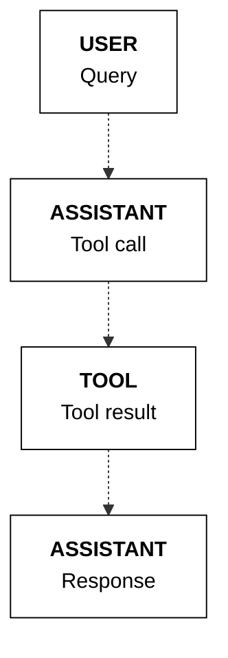

## Tool use workflow

We can think of a tool use system as consisting of four components:

* The user
* The application
* The LLM
* The tools

At its most basic, these four components interact in a workflow through four steps:

* Step 1: **Get user message**: The LLM gets the user message (via the application).
* Step 2: **Generate tool calls**: The LLM decides which tools to call (if any) and generates the tool calls.
* Step 3: **Get tool results**: The application executes the tools, and the results are sent to the LLM.
* Step 4: **Generate response and citations**: The LLM generates the response and citations back to the user.


As an example, a weather search workflow might looks like the following:

* Step 1: **Get user message**: A user asks, "What's the weather in Toronto?"
* Step 2: **Generate tool calls**: A tool call is made to an external weather service with something like `get_weather(“toronto”)`.
* Step 3: **Get tool results**: The weather service returns the results, e.g. "20°C".
* Step 4: **Generate response and citations**: The model provides the answer, "The weather in Toronto is 20 degrees Celcius".

The following sections go through the implementation of these steps in detail.

### Step 1: Get user message

In the first step, we get the user's message and append it to the `messages` list with the `role` set to `user`.
```python PYTHON
messages = [
    {"role": "user", "content": "What's the weather in Toronto?"}
]
```
<Accordion title="System message">
  Optional: If you want to define a system message, you can add it to the `messages` list with the `role` set to `system`.
```python PYTHON
  system_message = """## Task & Context

  You help people answer their questions and other requests interactively. You will be asked a very wide array of requests on all kinds of topics. You will be equipped with a wide range of search engines or similar tools to help you, which you use to research your answer. You should focus on serving the user's needs as best you can, which will be wide-ranging.

  ## Style Guide

  Unless the user asks for a different style of answer, you should answer in full sentences, using proper grammar and spelling.
  """

  messages = [
      {"role": "system", "content": system_message},
      {"role": "user", "content": "What's the weather in Toronto?"},
  ]
```
</Accordion>

### Step 2: Generate tool calls

Next, we call the Chat endpoint to generate the list of tool calls. This is done by passing the parameters `model`, `messages`, and `tools` to the Chat endpoint.

The endpoint will send back a list of tool calls to be made if the model determines that tools are required. If it does, it will return two types of information:

* `tool_plan`: its reflection on the next steps it should take, given the user query.
* `tool_calls`: a list of tool calls to be made (if any), together with auto-generated tool call IDs. Each generated tool call contains:
  * `id`: the tool call ID
  * `type`: the type of the tool call (`function`)
  * `function`: the function to be called, which contains the function's `name` and `arguments` to be passed to the function.

We then append these to the `messages` list with the `role` set to `assistant`.

<CodeBlocks>
```python PYTHON
  response = co.chat(
      model="command-a-03-2025", messages=messages, tools=tools
  )

  if response.message.tool_calls:
      messages.append(
          {
              "role": "assistant",
              "tool_plan": response.message.tool_plan,
              "tool_calls": response.message.tool_calls,
          }
      )
      print(response.message.tool_plan, "\n")
      print(response.message.tool_calls)
```
```bash cURL
  curl --request POST \
    --url https://api.cohere.ai/v2/chat \
    --header 'accept: application/json' \
    --header 'content-type: application/json' \
    --header "Authorization: bearer $CO_API_KEY" \
    --data '{
    "model": "command-a-03-2025",
    "messages": [
      {
        "role": "user",
        "content": "What'\''s the weather in Toronto?"
      }
    ],
    "tools": [
      {
        "type": "function",
        "function": {
          "name": "get_weather",
          "description": "gets the weather of a given location",
          "parameters": {
            "type": "object",
            "properties": {
              "location": {
                "type": "string",
                "description": "the location to get the weather, example: San Francisco."
              }
            },
            "required": ["location"]
          }
        }
      }
    ]
  }'
```
</CodeBlocks>

Example response:
```mdx wordWrap
I will search for the weather in Toronto. 

[
    ToolCallV2(
        id="get_weather_1byjy32y4hvq",
        type="function",
        function=ToolCallV2Function(
            name="get_weather", arguments='{"location":"Toronto"}'
        ),
    )
]
```
By default, when using the Python SDK, the endpoint passes the tool calls as objects of type `ToolCallV2` and `ToolCallV2Function`. With these, you get built-in type safety and validation that helps prevent common errors during development.

Alternatively, you can use plain dictionaries to structure the tool call message.

These two options are shown below.

<Tabs>
  <Tab title="Python objects">
```python PYTHON
    messages = [
        {
            "role": "user",
            "content": "What's the weather in Madrid and Brasilia?",
        },
        {
            "role": "assistant",
            "tool_plan": "I will search for the weather in Madrid and Brasilia.",
            "tool_calls": [
                ToolCallV2(
                    id="get_weather_dkf0akqdazjb",
                    type="function",
                    function=ToolCallV2Function(
                        name="get_weather",
                        arguments='{"location":"Madrid"}',
                    ),
                ),
                ToolCallV2(
                    id="get_weather_gh65bt2tcdy1",
                    type="function",
                    function=ToolCallV2Function(
                        name="get_weather",
                        arguments='{"location":"Brasilia"}',
                    ),
                ),
            ],
        },
    ]
```
  </Tab>

  <Tab title="Plain dictionaries">
```python PYTHON
    messages = [
        {
            "role": "user",
            "content": "What's the weather in Madrid and Brasilia?",
        },
        {
            "role": "assistant",
            "tool_plan": "I will search for the weather in Madrid and Brasilia.",
            "tool_calls": [
                {
                    "id": "get_weather_dkf0akqdazjb",
                    "type": "function",
                    "function": {
                        "name": "get_weather",
                        "arguments": '{"location":"Madrid"}',
                    },
                },
                {
                    "id": "get_weather_gh65bt2tcdy1",
                    "type": "function",
                    "function": {
                        "name": "get_weather",
                        "arguments": '{"location":"Brasilia"}',
                    },
                },
            ],
        },
    ]
```
  </Tab>
</Tabs>

<AccordionGroup>
  <Accordion title="Directly responding">
    The model can decide to *not* make any tool call, and instead, respond to a user message directly. This is described [here](https://docs.cohere.com/docs/tool-use-usage-patterns#directly-answering).
  </Accordion>

  <Accordion title="Parallel tool calling">
    The model can determine that more than one tool call is required. This can be calling the same tool multiple times or different tools for any number of calls. This is described [here](https://docs.cohere.com/docs/tool-use-usage-patterns#parallel-tool-calling).
  </Accordion>
</AccordionGroup>

### Step 3: Get tool results

During this step, we perform the function calling. We call the necessary tools based on the tool call payloads given by the endpoint.

For each tool call, we append the `messages` list with:

* the `tool_call_id` generated in the previous step.
* the `content` of each tool result with the following fields:
  * `type` which is `document`
  * `document` containing
    * `data`: which stores the contents of the tool result.
    * `id` (optional): you can provide each document with a unique ID for use in citations, otherwise auto-generated
```python PYTHON
import json

if response.message.tool_calls:
    for tc in response.message.tool_calls:
        tool_result = functions_map[tc.function.name](
            **json.loads(tc.function.arguments)
        )
        tool_content = []
        for data in tool_result:
            # Optional: the "document" object can take an "id" field for use in citations, otherwise auto-generated

            tool_content.append(
                {
                    "type": "document",
                    "document": {"data": json.dumps(data)},
                }
            )
        messages.append(
            {
                "role": "tool",
                "tool_call_id": tc.id,
                "content": tool_content,
            }
        )
```

### Step 4: Generate response and citations

By this time, the tool call has already been executed, and the result has been returned to the LLM.

In this step, we call the Chat endpoint to generate the response to the user, again by passing the parameters `model`, `messages` (which has now been updated with information fromthe tool calling and tool execution steps), and `tools`.

The model generates a response to the user, grounded on the information provided by the tool.

We then append the response to the `messages` list with the `role` set to `assistant`.

<CodeBlocks>
```python PYTHON
  response = co.chat(
      model="command-a-03-2025", messages=messages, tools=tools
  )

  messages.append(
      {"role": "assistant", "content": response.message.content[0].text}
  )

  print(response.message.content[0].text)
```
```bash cURL
  curl --request POST \
    --url https://api.cohere.ai/v2/chat \
    --header 'accept: application/json' \
    --header 'content-type: application/json' \
    --header "Authorization: bearer $CO_API_KEY" \
    --data '{
    "model": "command-a-03-2025",
    "messages": [
      {
        "role": "user",
        "content": "What'\''s the weather in Toronto?"
      },
      {
        "role": "assistant",
        "tool_plan": "I will search for the weather in Toronto.",
        "tool_calls": [
          {
            "id": "get_weather_1byjy32y4hvq",
            "type": "function",
            "function": {
              "name": "get_weather",
              "arguments": "{\"location\":\"Toronto\"}"
            }
          }
        ]
      },
      {
        "role": "tool",
        "tool_call_id": "get_weather_1byjy32y4hvq",
        "content": [
          {
            "type": "document",
            "document": {
              "data": "{\"temperature\": \"20°C\"}"
            }
          }
        ]
      }
    ],
    "tools": [
      {
        "type": "function",
        "function": {
          "name": "get_weather",
          "description": "gets the weather of a given location",
          "parameters": {
            "type": "object",
            "properties": {
              "location": {
                "type": "string",
                "description": "the location to get the weather, example: San Francisco."
              }
            },
            "required": ["location"]
          }
        }
      }
    ]
  }'
```
</CodeBlocks>

Example response:
```mdx wordWrap
It's 20°C in Toronto.
```
It also generates fine-grained citations, which are included out-of-the-box with the Command family of models. Here, we see the model generating two citations, one for each specific span in its response, where it uses the tool result to answer the question.
```python PYTHON
print(response.message.citations)
```
Example response:
```mdx wordWrap
[Citation(start=5, end=9, text='20°C', sources=[ToolSource(type='tool', id='get_weather_1byjy32y4hvq:0', tool_output={'temperature': '20C'})], type='TEXT_CONTENT')]
```
<Accordion title="Multi-step tool use (agents)">
  Above, we assume the model performs tool calling only once (either single call or parallel calls), and then generates its response. This is not always the case: the model might decide to do a sequence of tool calls in order to answer the user request. This means that steps 2 and 3 will run multiple times in loop. It is called multi-step tool use and is described [here](https://docs.cohere.com/docs/tool-use-usage-patterns#multi-step-tool-use).
</Accordion>

### State management

This section provides a more detailed look at how the state is managed via the `messages` list as described in the [tool use workflow](#tool-use-workflow) above.

At each step of the workflow, the endpoint requires that we append specific types of information to the `messages` list. This is to ensure that the model has the necessary context to generate its response at a given point.

In summary, each single turn of a conversation that involves tool calling consists of:

1. A `user` message containing the user message
   * `content`
2. An `assistant` message, containing the tool calling information
   * `tool_plan`
   * `tool_calls`
     * `id`
     * `type`
     * `function` (consisting of `name` and `arguments`)
3. A `tool` message, containing the tool results
   * `tool_call_id`
   * `content` containing a list of documents where each document contains the following fields:
     * `type`
     * `document` (consisting of `data` and optionally `id`)
4. A final `assistant` message, containing the model's response
   * `content`

These correspond to the four steps described above. The list of `messages` is shown below.
```python PYTHON
for message in messages:
    print(message, "\n")
```
```json
{   
    "role": "user", 
    "content": "What's the weather in Toronto?"
}

{
    "role": "assistant",
    "tool_plan": "I will search for the weather in Toronto.",
    "tool_calls": [
        ToolCallV2(
            id="get_weather_1byjy32y4hvq",
            type="function",
            function=ToolCallV2Function(
                name="get_weather", arguments='{"location":"Toronto"}'
            ),
        )
    ],
}

{
    "role": "tool",
    "tool_call_id": "get_weather_1byjy32y4hvq",
    "content": [{"type": "document", "document": {"data": '{"temperature": "20C"}'}}],
}

{   
    "role": "assistant", 
    "content": "It's 20°C in Toronto."
}
```
The sequence of `messages` is represented in the diagram below.

Note that this sequence represents a basic usage pattern in tool use. The [next page](https://docs.cohere.com/v2/docs/tool-use-usage-patterns) describes how this is adapted for other scenarios.


---

**📚 [Back to Index](./index.md)** | **📄 [Full Version](./documentation.md)** | **🔗 [Original](../llms-full.txt)**
