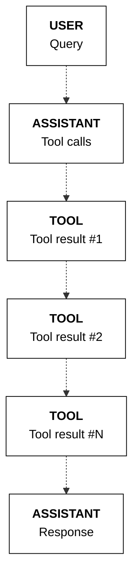

## Parallel tool calling

The model can determine that more than one tool call is required, where it will call multiple tools in parallel. This can be calling the same tool multiple times or different tools for any number of calls.

In the example below, the user asks for the weather in Toronto and New York. This requires calling the `get_weather` function twice, one for each location. This is reflected in the model's response, where two parallel tool calls are generated.

<CodeBlocks>
```python PYTHON
  messages = [
      {
          "role": "user",
          "content": "What's the weather in Toronto and New York?",
      }
  ]

  response = co.chat(
      model="command-a-03-2025", messages=messages, tools=tools
  )

  if response.message.tool_calls:
      messages.append(
          {
              "role": "assistant",
              "tool_plan": response.message.tool_plan,
              "tool_calls": response.message.tool_calls,
          }
      )
      print(response.message.tool_plan, "\n")
      print(response.message.tool_calls)
```
```bash cURL
  curl --request POST \
    --url https://api.cohere.ai/v2/chat \
    --header 'accept: application/json' \
    --header 'content-type: application/json' \
    --header "Authorization: bearer $CO_API_KEY" \
    --data '{
    "model": "command-a-03-2025",
    "messages": [
      {
        "role": "user",
        "content": "What'\''s the weather in Toronto and New York?"
      }
    ],
    "tools": [
      {
        "type": "function",
        "function": {
          "name": "get_weather",
          "description": "gets the weather of a given location",
          "parameters": {
            "type": "object",
            "properties": {
              "location": {
                "type": "string",
                "description": "the location to get the weather, example: San Francisco."
              }
            },
            "required": ["location"]
          }
        }
      }
    ]
  }'
```
</CodeBlocks>

Example response:
```mdx wordWrap
I will search for the weather in Toronto and New York.

[
    ToolCallV2(
        id="get_weather_9b0nr4kg58a8",
        type="function",
        function=ToolCallV2Function(
            name="get_weather", arguments='{"location":"Toronto"}'
        ),
    ),
    ToolCallV2(
        id="get_weather_0qq0mz9gwnqr",
        type="function",
        function=ToolCallV2Function(
            name="get_weather", arguments='{"location":"New York"}'
        ),
    ),
]
```
**State management**

When tools are called in parallel, we append the messages list with one single `assistant` message containing all the tool calls and one `tool` message for each tool call.
```python PYTHON
import json

if response.message.tool_calls:
    for tc in response.message.tool_calls:
        tool_result = functions_map[tc.function.name](
            **json.loads(tc.function.arguments)
        )
        tool_content = []
        for data in tool_result:
            # Optional: the "document" object can take an "id" field for use in citations, otherwise auto-generated

            tool_content.append(
                {
                    "type": "document",
                    "document": {"data": json.dumps(data)},
                }
            )
        messages.append(
            {
                "role": "tool",
                "tool_call_id": tc.id,
                "content": tool_content,
            }
        )
```
The sequence of messages is represented in the diagram below.


---

**📚 [Back to Index](./index.md)** | **📄 [Full Version](./documentation.md)** | **🔗 [Original](../llms-full.txt)**
