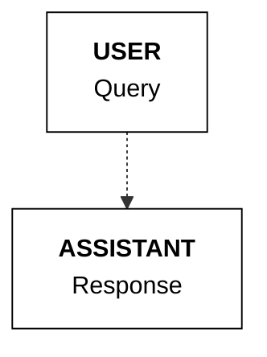

## Directly answering

A key attribute of tool use systems is the model’s ability to choose the right tools for a task. This includes the model's ability to decide to *not* use any tool, and instead, respond to a user message directly.

In the example below, the user asks for a simple arithmetic question. The model determines that it does not need to use any of the available tools (only one, `get_weather`, in this case), and instead, directly answers the user.

<CodeBlocks>
```python PYTHON
  messages = [{"role": "user", "content": "What's 2+2?"}]

  response = co.chat(
      model="command-a-03-2025", messages=messages, tools=tools
  )

  if response.message.tool_calls:
      print(response.message.tool_plan, "\n")
      print(response.message.tool_calls)

  else:
      print(response.message.content[0].text)
```
```bash cURL
  curl --request POST \
    --url https://api.cohere.ai/v2/chat \
    --header 'accept: application/json' \
    --header 'content-type: application/json' \
    --header "Authorization: bearer $CO_API_KEY" \
    --data '{
    "model": "command-a-03-2025",
    "messages": [
      {
        "role": "user",
        "content": "What'\''s 2+2?"
      }
    ],
    "tools": [
      {
        "type": "function",
        "function": {
          "name": "get_weather",
          "description": "gets the weather of a given location",
          "parameters": {
            "type": "object",
            "properties": {
              "location": {
                "type": "string",
                "description": "the location to get the weather, example: San Francisco."
              }
            },
            "required": ["location"]
          }
        }
      }
    ]
  }'
```
</CodeBlocks>

Example response:
```mdx wordWrap
The answer to 2+2 is 4.
```
**State management**

When the model opts to respond directly to the user, there will be no items 2 and 3 above (the tool calling and tool response messages). Instead, the final `assistant` message will contain the model's direct response to the user.

Note: you can force the model to directly answer every time using the `tool_choice` parameter, [described here](#forcing-tool-usage)

---

**📚 [Back to Index](./index.md)** | **📄 [Full Version](./documentation.md)** | **🔗 [Original](../llms-full.txt)**
