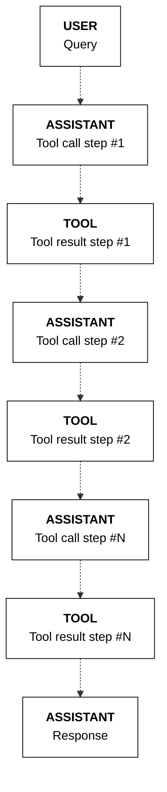

## Print citations (if any)

verbose_source = (
    True  # Change to True to display the contents of a source

)
if response.message.citations:
    print("CITATIONS:\n")
    for citation in response.message.citations:
        print(
            f"Start: {citation.start}| End:{citation.end}| Text:'{citation.text}' "
        )
        print("Sources:")
        for idx, source in enumerate(citation.sources):
            print(f"{idx+1}. {source.id}")
            if verbose_source:
                print(f"{source.tool_output}")
        print("\n")
```
The model first determines that it needs to find out the capital city of Brazil. Once it has this information, it proceeds with the next step in the sequence, which is to look up the temperature of that city.

This is reflected in the model's response, where two tool calling-result pairs are generated in a sequence.

Example response:
```mdx wordWrap
TOOL PLAN:
First, I will search for the capital city of Brazil. Then, I will search for the temperature in that city. 

TOOL CALLS:
Tool name: get_capital_city | Parameters: {"country":"Brazil"}
==================================================
TOOL RESULT:
[{'capital_city': {'brazil': 'brasilia'}}]
TOOL PLAN:
I have found that the capital city of Brazil is Brasilia. Now, I will search for the temperature in Brasilia. 

TOOL CALLS:
Tool name: get_weather | Parameters: {"location":"Brasilia"}
==================================================
TOOL RESULT:
[{'temperature': {'brasilia': '28°C'}}]
RESPONSE:
The temperature in Brasilia, the capital city of Brazil, is 28°C.
==================================================
CITATIONS:

Start: 60| End:65| Text:'28°C.' 
Sources:
1. get_weather_p0dage9q1nv4:0
{'temperature': '{"brasilia":"28°C"}'}
```
**State management**

In a multi-step tool use scenario, instead of just one occurence of `assistant`-`tool` messages, there will be a sequence of `assistant`-`tool` messages to reflect the multiple steps of tool calling involved.


---

**📚 [Back to Index](./index.md)** | **📄 [Full Version](./documentation.md)** | **🔗 [Original](../llms-full.txt)**
