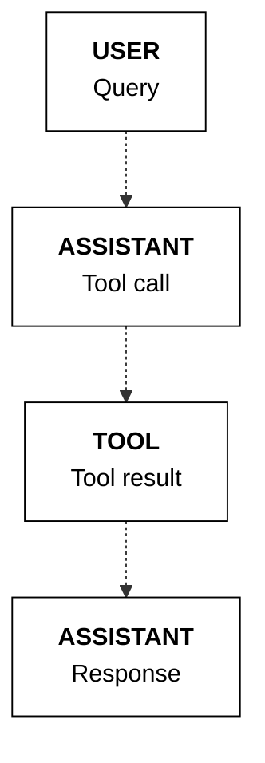
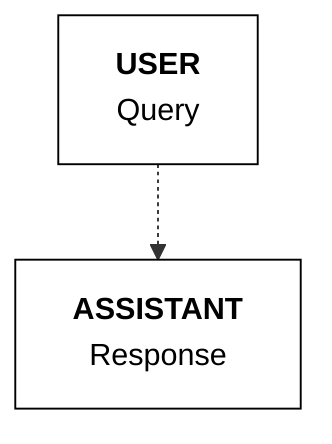

## Forcing tool usage

>   **📝 Note**
>
> This feature is only compatible with the 

  [Command R7B](https://docs.cohere.com/v2/docs/command-r7b)

   and newer models.

As shown in the previous examples, during the tool calling step, the model may decide to either:

* make tool call(s)
* or, respond to a user message directly.

You can, however, force the model to choose one of these options. This is done via the `tool_choice` parameter.

* You can force the model to make tool call(s), i.e. to not respond directly, by setting the `tool_choice` parameter to `REQUIRED`.
* Alternatively, you can force the model to respond directly, i.e. to not make tool call(s), by setting the `tool_choice` parameter to `NONE`.

By default, if you don’t specify the `tool_choice` parameter, then it is up to the model to decide whether to make tool calls or respond directly.
```python PYTHON {5}
response = co.chat(
    model="command-a-03-2025",
    messages=messages,
    tools=tools,
    tool_choice="REQUIRED" # optional, to force tool calls

    # tool_choice="NONE" # optional, to force a direct response

)
```
**State management**

Here's the sequence of messages when `tool_choice` is set to `REQUIRED`.

Here's the sequence of messages when `tool_choice` is set to `NONE`.


---

**📚 [Back to Index](./index.md)** | **📄 [Full Version](./documentation.md)** | **🔗 [Original](../llms-full.txt)**
