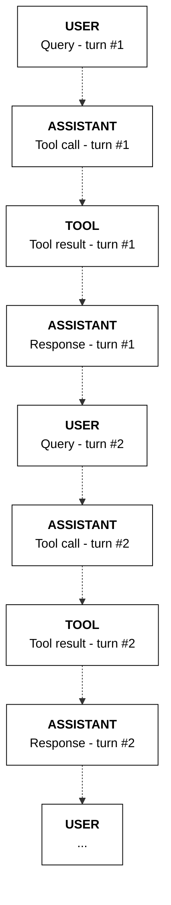

## Chatbots (multi-turn)

Building chatbots requires maintaining the memory or state of a conversation over multiple turns. To do this, we can keep appending each turn of a conversation to the `messages` list.

As an example, here's the messages list from the first turn of a conversation.
```python PYTHON
from cohere import ToolCallV2, ToolCallV2Function

messages = [
    {"role": "user", "content": "What's the weather in Toronto?"},
    {
        "role": "assistant",
        "tool_plan": "I will search for the weather in Toronto.",
        "tool_calls": [
            ToolCallV2(
                id="get_weather_1byjy32y4hvq",
                type="function",
                function=ToolCallV2Function(
                    name="get_weather",
                    arguments='{"location":"Toronto"}',
                ),
            )
        ],
    },
    {
        "role": "tool",
        "tool_call_id": "get_weather_1byjy32y4hvq",
        "content": [
            {
                "type": "document",
                "document": {"data": '{"temperature": "20C"}'},
            }
        ],
    },
    {"role": "assistant", "content": "It's 20°C in Toronto."},
]
```
Then, in the second turn, when provided with a rather vague follow-up user message, the model correctly infers that the context is about the weather.

<CodeBlocks>
```python PYTHON
  messages.append({"role": "user", "content": "What about London?"})

  response = co.chat(
      model="command-a-03-2025", messages=messages, tools=tools
  )

  if response.message.tool_calls:
      messages.append(
          {
              "role": "assistant",
              "tool_plan": response.message.tool_plan,
              "tool_calls": response.message.tool_calls,
          }
      )
      print(response.message.tool_plan, "\n")
      print(response.message.tool_calls)
```
```bash cURL
  curl --request POST \
    --url https://api.cohere.ai/v2/chat \
    --header 'accept: application/json' \
    --header 'content-type: application/json' \
    --header "Authorization: bearer $CO_API_KEY" \
    --data '{
    "model": "command-a-03-2025",
    "messages": [
      {
        "role": "user",
        "content": "What'\''s the weather in Toronto?"
      },
      {
        "role": "assistant",
        "tool_plan": "I will search for the weather in Toronto.",
        "tool_calls": [
          {
            "id": "get_weather_1byjy32y4hvq",
            "type": "function",
            "function": {
              "name": "get_weather",
              "arguments": "{\"location\":\"Toronto\"}"
            }
          }
        ]
      },
      {
        "role": "tool",
        "tool_call_id": "get_weather_1byjy32y4hvq",
        "content": [
          {
            "type": "document",
            "document": {
              "data": "{\"temperature\": \"20C\"}"
            }
          }
        ]
      },
      {
        "role": "assistant",
        "content": "It'\''s 20°C in Toronto."
      },
      {
        "role": "user",
        "content": "What about London?"
      }
    ],
    "tools": [
      {
        "type": "function",
        "function": {
          "name": "get_weather",
          "description": "gets the weather of a given location",
          "parameters": {
            "type": "object",
            "properties": {
              "location": {
                "type": "string",
                "description": "the location to get the weather, example: San Francisco."
              }
            },
            "required": ["location"]
          }
        }
      }
    ]
  }'
```
</CodeBlocks>

Example response:
```mdx wordWrap
I will search for the weather in London. 

[ToolCallV2(id='get_weather_8hwpm7d4wr14', type='function', function=ToolCallV2Function(name='get_weather', arguments='{"location":"London"}'))]
```
**State management**

The sequence of messages is represented in the diagram below.


---

**📚 [Back to Index](./index.md)** | **📄 [Full Version](./documentation.md)** | **🔗 [Original](../llms-full.txt)**
