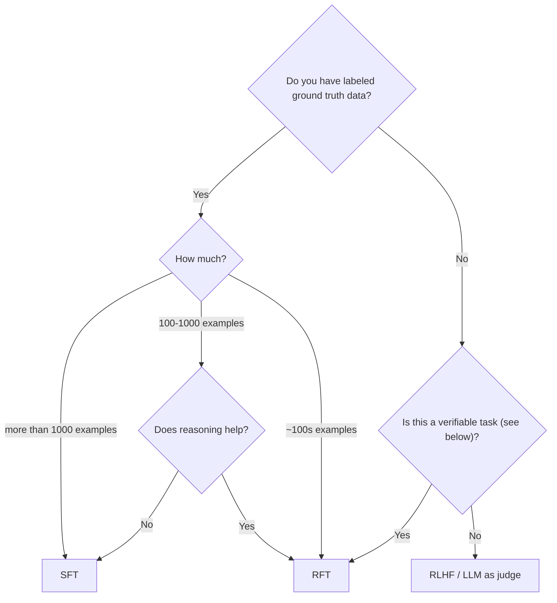

**Navigation:** [← Previous](./03-save-the-evaluator.md) | [Index](./index.md) | [Next →](./05-svg-drawing-agent.md)

---

# --- 7. REPORT RESULTS ---

if dataset:
    total = len(dataset)
    model_1_accuracy = (model_1_score / total) * 100
    model_2_accuracy = (model_2_score / total) * 100
    model_3_accuracy = (model_3_score / total) * 100

    print("\n" + "="*25)
    print("  EVALUATION COMPLETE")
    print("="*25)
    print(f"Total Examples: {total}\n")
    
    print("--- MODEL 1 ---")
    print(f"Model ID: {MODEL_1_ID}")
    print(f"Correct: {model_1_score}/{total}")
    print(f"Accuracy: {model_1_accuracy:.2f}%\n")

    print("--- MODEL 2 ---")
    print(f"Model ID: {MODEL_2_ID}")
    print(f"Correct: {model_2_score}/{total}")
    print(f"Accuracy: {model_2_accuracy:.2f}%\n")

    print("--- MODEL 3 ---")
    print(f"Model ID: {MODEL_3_ID}")
    print(f"Correct: {model_3_score}/{total}")
    print(f"Accuracy: {model_3_accuracy:.2f}%\n")

    # Write final summary to log file
    write_to_log("="*25)
    write_to_log("  EVALUATION COMPLETE")
    write_to_log("="*25)
    write_to_log(f"Total Examples: {total}")
    write_to_log(f"--- MODEL 1 --- Model ID: {MODEL_1_ID} | Correct: {model_1_score}/{total} | Accuracy: {model_1_accuracy:.2f}%")
    write_to_log(f"--- MODEL 2 --- Model ID: {MODEL_2_ID} | Correct: {model_2_score}/{total} | Accuracy: {model_2_accuracy:.2f}%")
    write_to_log(f"--- MODEL 3 --- Model ID: {MODEL_3_ID} | Correct: {model_3_score}/{total} | Accuracy: {model_3_accuracy:.2f}%")

else:
    msg = "Evaluation skipped because the dataset or LLM objects could not be loaded"
    print(msg)
    write_to_log(f"WARNING: {msg}")
```

```text  theme={null}
    LLM objects for all three models created successfully.
    Loaded 92 evaluation examples from 'data/final_rft_sql_test_data.jsonl'.
    Manual logging configured. Log file is 'evaluation_manual_open.log'.
    
    Starting evaluation...


    Evaluating models: 100%|██████████| 92/92 [16:59<00:00, 11.08s/it]

    
    =========================
      EVALUATION COMPLETE
    =========================
    Total Examples: 92
    
    --- MODEL 1 ---
    Model ID: accounts/fireworks/models/qwen3-coder-480b-a35b-instruct
    Correct: 32/92
    Accuracy: 34.78%
    
    --- MODEL 2 ---
    Model ID: accounts/fireworks/models/kimi-k2-instruct
    Correct: 26/92
    Accuracy: 28.26%
    
    --- MODEL 3 ---
    Model ID: accounts/fireworks/models/deepseek-v3
    Correct: 25/92
    Accuracy: 27.17%
```

#### Testing proprietary models

````python  theme={null}
# Cell to evaluate OpenAI and Anthropic models (with manual logging) - GPT-4o and Claude Sonnet 4

import openai
import anthropic
import os
import requests
import json
import time
import re
from tqdm.auto import tqdm
from dotenv import load_dotenv

load_dotenv()

# --- 1. SETUP for Environment and Data ---

MCP_SERVER_URL = None  # <--- PUT MCP SERVER URL HERE without the /mcp/ suffix at the end
DATASET_FILE_PATH = "data/final_rft_sql_test_data.jsonl"

# --- Load Dataset ---
dataset = []
try:
    with open(DATASET_FILE_PATH, 'r') as f:
        dataset = [json.loads(line) for line in f]
    print(f"Loaded {len(dataset)} evaluation examples from '{DATASET_FILE_PATH}'.")
except Exception as e:
    print(f"FATAL: Could not load dataset. Error: {e}")
    dataset = []

# --- 2. SETUP for OpenAI and Anthropic ---

# IMPORTANT: Make sure your API keys are set as environment variables.
if "OPENAI_API_KEY" not in os.environ:
    print("FATAL: OPENAI_API_KEY environment variable not set.")
if "ANTHROPIC_API_KEY" not in os.environ:
    print("FATAL: ANTHROPIC_API_KEY environment variable not set.")

# Define Model IDs
GPT_MODEL_ID = "gpt-4o"
CLAUDE_MODEL_ID = "claude-sonnet-4-20250514"

# --- Create API Clients ---
openai_client = None
anthropic_client = None
try:
    openai_client = openai.OpenAI(api_key=os.getenv("OPENAI_API_KEY"))
    anthropic_client = anthropic.Anthropic(api_key=os.getenv("ANTHROPIC_API_KEY"))
    print("OpenAI and Anthropic clients created successfully.")
except Exception as e:
    print(f"FATAL: Could not create clients. Error: {e}")

# --- 3. HELPER FUNCTIONS ---

def clean_sql_output(sql_text: str) -> str:
    """
    Cleans SQL output by removing markdown code blocks and extracting pure SQL.
    Handles various formats like ```sql, ```SQL, or just ```
    """
    # Strip leading/trailing whitespace
    sql_text = sql_text.strip()
    
    # Pattern to match markdown code blocks with optional language specification
    # This will match ```sql, ```SQL, ```postgres, or just ```
    pattern = r'^```(?:sql|SQL|postgres|POSTGRES)?\s*\n?(.*?)```$'
    match = re.match(pattern, sql_text, re.DOTALL)
    
    if match:
        # Extract the SQL from within the code block
        sql_text = match.group(1).strip()
    else:
        # If no full code block match, just remove any leading ```sql or trailing ```
        # Remove leading markdown
        sql_text = re.sub(r'^```(?:sql|SQL|postgres|POSTGRES)?\s*\n?', '', sql_text)
        # Remove trailing markdown
        sql_text = re.sub(r'\n?```$', '', sql_text)
    
    return sql_text.strip()

def parse_duckdb_ascii_table(table_string: str) -> list[dict]:
    """
    Parses a DuckDB-style ASCII table string into a list of dictionaries.
    This version robustly handles 'NULL' values and empty strings.
    """
    lines = table_string.strip().split('\n')
    content_lines = [line for line in lines if line.strip() and not line.startswith('+')]
    if len(content_lines) < 2:
        return []
    
    header_raw = [h.strip() for h in content_lines[0].split('|')[1:-1]]
    data_lines = content_lines[1:]
    
    if len(data_lines) > 0:
        try:
            first_data_values = [v.strip() for v in data_lines[0].split('|')[1:-1]]
            if len(first_data_values) == len(header_raw) and all(v.isupper() for v in first_data_values):
                data_lines = data_lines[1:]
        except IndexError:
            pass

    rows = []
    for line in data_lines:
        try:
            values_raw = [v.strip() for v in line.split('|')[1:-1]]
            if len(values_raw) == len(header_raw):
                row_dict = {}
                for i, header in enumerate(header_raw):
                    value_str = values_raw[i]
                    if value_str.upper() == 'NULL' or value_str == '':
                        row_dict[header] = None
                        continue
                    
                    try:
                        if '.' in value_str:
                            row_dict[header] = float(value_str)
                        else:
                            row_dict[header] = int(value_str)
                    except (ValueError, TypeError):
                        row_dict[header] = value_str
                rows.append(row_dict)
        except IndexError:
            continue
    return rows

def are_results_equal(predicted_rows: list[dict], ground_truth_rows: list[dict]) -> bool:
    """
    Compares datasets by converting all values to strings and sorting them,
    which ignores row order, column order, and data types (e.g., int vs float).
    """
    try:
        gt_values = sorted([sorted(map(str, row.values())) for row in ground_truth_rows])
        predicted_values = sorted([sorted(map(str, row.values())) for row in predicted_rows])
        return gt_values == predicted_values
    except Exception:
        return False

# --- 4. EVALUATION FUNCTIONS for OpenAI and Anthropic ---

def get_sql_and_evaluate_openai(client, model_id: str, system_prompt: str, user_prompt: str, ground_truth: list[dict]) -> int:
    """
    Calls OpenAI API, executes SQL, and compares to ground truth.
    """
    try:
        messages = [{"role": "system", "content": system_prompt}, {"role": "user", "content": user_prompt}]
        response = client.chat.completions.create(model=model_id, messages=messages, temperature=0.0)
        raw_output = response.choices[0].message.content.strip()
        
        # Clean the SQL output
        sql_query = clean_sql_output(raw_output)

        headers = {"Content-Type": "application/json", "Accept": "application/json, text/event-stream"}
        payload = {"id": "eval-query-1", "jsonrpc": "2.0", "method": "tools/call", "params": {"session": {"id": "full-eval-session"}, "name": "query", "arguments": {"query": sql_query}}}
        response_data = None
        with requests.post(f"{MCP_SERVER_URL}/mcp/", headers=headers, json=payload, timeout=30, stream=True) as mcp_response:
            mcp_response.raise_for_status()
            for line in mcp_response.iter_lines():
                if line and line.decode('utf-8').startswith('data:'):
                    json_part = line.decode('utf-8')[len('data:'):].strip()
                    if json_part:
                        response_data = json.loads(json_part)
                        break
        
        if response_data is None or "error" in response_data:
            return 0

        ascii_table = response_data['result']['content'][0]['text']
        predicted_rows = parse_duckdb_ascii_table(ascii_table)
        
        is_correct = are_results_equal(predicted_rows, ground_truth)
        return 1 if is_correct else 0
    except Exception as e:
        print(f"--> Error during evaluation for model {model_id}: {e}")
        return 0

def get_sql_and_evaluate_anthropic(client, model_id: str, system_prompt: str, user_prompt: str, ground_truth: list[dict]) -> int:
    """
    Calls Anthropic API, executes SQL, and compares to ground truth.
    """
    try:
        response = client.messages.create(model=model_id, system=system_prompt, messages=[{"role": "user", "content": user_prompt}], temperature=0.0, max_tokens=2048)
        raw_output = response.content[0].text.strip()
        
        # Clean the SQL output
        sql_query = clean_sql_output(raw_output)

        headers = {"Content-Type": "application/json", "Accept": "application/json, text/event-stream"}
        payload = {"id": "eval-query-1", "jsonrpc": "2.0", "method": "tools/call", "params": {"session": {"id": "full-eval-session"}, "name": "query", "arguments": {"query": sql_query}}}
        response_data = None
        with requests.post(f"{MCP_SERVER_URL}/mcp/", headers=headers, json=payload, timeout=30, stream=True) as mcp_response:
            mcp_response.raise_for_status()
            for line in mcp_response.iter_lines():
                if line and line.decode('utf-8').startswith('data:'):
                    json_part = line.decode('utf-8')[len('data:'):].strip()
                    if json_part:
                        response_data = json.loads(json_part)
                        break

        if response_data is None or "error" in response_data:
            return 0

        ascii_table = response_data['result']['content'][0]['text']
        predicted_rows = parse_duckdb_ascii_table(ascii_table)
        
        is_correct = are_results_equal(predicted_rows, ground_truth)
        return 1 if is_correct else 0
    except Exception as e:
        print(f"--> Error during evaluation for model {model_id}: {e}")
        return 0

# --- 5. RUN THE EVALUATION for OpenAI and Anthropic ---

gpt_model_score = 0
claude_model_score = 0

# --- Pre-evaluation Check ---
print("\n--- Pre-evaluation Check ---")
dataset_exists = 'dataset' in locals()
clients_exist = all([openai_client, anthropic_client])
print(f"1. 'dataset' variable exists: {dataset_exists}")
if dataset_exists:
    print(f"2. 'dataset' is not empty: {bool(dataset)}")
else:
    print("2. 'dataset' is not empty: N/A (Does not exist)")
print(f"3. OpenAI client created: {bool(openai_client)}")
print(f"4. Anthropic client created: {bool(anthropic_client)}")
print("--------------------------\n")

if dataset_exists and dataset and clients_exist:
    print("\nStarting evaluation for OpenAI and Anthropic models...")
    for item in tqdm(dataset, desc="Evaluating OpenAI/Anthropic"):
        system_prompt = item["messages"][0]["content"]
        user_prompt = item["messages"][1]["content"]
        ground_truth = item["ground_truth"]

        gpt_model_score += get_sql_and_evaluate_openai(openai_client, GPT_MODEL_ID, system_prompt, user_prompt, ground_truth)
        time.sleep(0.5)

        claude_model_score += get_sql_and_evaluate_anthropic(anthropic_client, CLAUDE_MODEL_ID, system_prompt, user_prompt, ground_truth)
        time.sleep(0.5)

    # --- 6. REPORT RESULTS for OpenAI and Anthropic ---
    total = len(dataset)
    gpt_accuracy = (gpt_model_score / total) * 100
    claude_accuracy = (claude_model_score / total) * 100

    print("\n" + "="*25)
    print("  EVALUATION COMPLETE")
    print("="*25)
    print(f"Total Examples: {total}\n")
    print("--- GPT MODEL (OpenAI) ---")
    print(f"Model ID: {GPT_MODEL_ID}")
    print(f"Correct: {gpt_model_score}/{total}")
    print(f"Accuracy: {gpt_accuracy:.2f}%\n")
    print("--- CLAUDE MODEL (Anthropic) ---")
    print(f"Model ID: {CLAUDE_MODEL_ID}")
    print(f"Correct: {claude_model_score}/{total}")
    print(f"Accuracy: {claude_accuracy:.2f}%\n")

else:
    print("\nEvaluation for OpenAI and Anthropic models skipped.")
    print("One of the pre-evaluation checks failed. Please check the output above.")
````

```text  theme={null}
    Loaded 92 evaluation examples from 'data/final_rft_sql_test_data.jsonl'.
    Manual logging configured. Log file is 'evaluation_manual_proprietary.log'.
    OpenAI and Anthropic clients created successfully.
    
    --- Pre-evaluation Check ---
    1. 'dataset' variable exists: True
    2. 'dataset' is not empty: True
    3. OpenAI client created: True
    4. Anthropic client created: True
    --------------------------
    
    
    Starting evaluation for OpenAI and Anthropic models...


    Evaluating OpenAI/Anthropic: 100%|██████████| 92/92 [08:06<00:00,  5.28s/it]

    
    =========================
      ADDITIONAL MODELS EVALUATION COMPLETE
    =========================
    Total Examples: 92
    
    --- GPT MODEL (OpenAI) ---
    Model ID: gpt-4o
    Correct: 22/92
    Accuracy: 23.91%
    
    --- CLAUDE MODEL (Anthropic) ---
    Model ID: claude-sonnet-4-20250514
    Correct: 27/92
    Accuracy: 29.35%
```

<div style={{ fontSize: '0.8em' }}>
  > Note that Claude Sonnet 4 and GPT-4o sometimes output SQL queries wrapped in markdown formatting like \`\`\`sql \<query\_here>\`\`\`, so we added a helper function to clean the output before executing the SQL query in those cases.
</div>


# How do I close my Fireworks.ai account?
Source: https://docs.fireworks.ai/faq-new/account-access/how-do-i-close-my-fireworksai-account


To close your account:

1. Email [inquiries@fireworks.ai](mailto:inquiries@fireworks.ai)
2. Include in your request:
   * Your account ID
   * A clear request for account deletion

Before closing your account, please ensure:

* All outstanding invoices are paid
* Any active deployments are terminated
* Important data is backed up if needed


# I have multiple Fireworks accounts. When I try to login with Google on Fireworks' web UI, I'm getting signed into the wrong account. How do I fix this?
Source: https://docs.fireworks.ai/faq-new/account-access/i-have-multiple-fireworks-accounts-when-i-try-to-login-with-google-on-fireworks


If you log in with Google, account management is controlled by Google. You can log in through an incognito mode or create separate Chrome/browser profiles to log in with different Google accounts. You could also follow the steps in this [guide](https://support.google.com/accounts/answer/13533235?hl=en#zippy=%2Csign-in-with-google) to disassociate Fireworks.ai with a particular Google account sign-in. If you have more complex issues please contact us on Discord.


# What email does GitHub authentication use?
Source: https://docs.fireworks.ai/faq-new/account-access/what-email-does-github-authentication-use


When you authenticate with Fireworks using GitHub, we use the **primary email address** associated with your GitHub account for identification and account management.

## How it works

Fireworks automatically retrieves your primary email address from your GitHub profile during the authentication process. This email address becomes your Fireworks account identifier.

## Managing your primary email

To change your primary email address on GitHub:

1. Go to your [GitHub email settings](https://github.com/settings/emails)
2. Select the email address you want to set as primary in the "Primary email address" section

<Info>
  You can also follow the [GitHub documentation](https://docs.github.com/en/enterprise-cloud@latest/account-and-profile/setting-up-and-managing-your-personal-account-on-github/managing-email-preferences/changing-your-primary-email-address) for detailed instructions on managing email preferences.
</Info>

## Switching between accounts

You can easily switch which Fireworks account your GitHub authentication logs into by changing your primary email address on GitHub before logging in. This allows you to:

* Log into different Fireworks accounts using the same GitHub account
* Switch between personal and work accounts by updating your GitHub primary email
* Maintain separate billing and usage tracking for different email addresses

The authentication will use whatever email is set as primary at the time of login, so you can switch accounts by simply updating your GitHub primary email before authenticating.


# What email does LinkedIn authentication use?
Source: https://docs.fireworks.ai/faq-new/account-access/what-email-does-linkedin-authentication-use


When you authenticate with Fireworks using LinkedIn, we use the **primary email address** associated with your LinkedIn account for identification and account management.

## How it works

Fireworks automatically retrieves your primary email address from your LinkedIn profile during the authentication process. This email address becomes your Fireworks account identifier.

## Managing your primary email

To change your primary email address on LinkedIn:

1. Go to your [LinkedIn email settings](https://www.linkedin.com/mypreferences/d/manage-email-addresses)
2. From there, you can add new email addresses or change your primary email
3. Click **Add email address** to add a new email or select an existing one to make primary

<Info>
  You can also follow the [LinkedIn documentation](https://www.linkedin.com/help/linkedin/answer/a519904) for detailed instructions on managing email preferences.
</Info>

## Switching between accounts

You can easily switch which Fireworks account your LinkedIn authentication logs into by changing your primary email address on LinkedIn before logging in. This allows you to:

* Log into different Fireworks accounts using the same LinkedIn account
* Switch between personal and work accounts by updating your LinkedIn primary email
* Maintain separate billing and usage tracking for different email addresses

The authentication will use whatever email is set as primary at the time of login, so you can switch accounts by simply updating your LinkedIn primary email before authenticating.


# What should I do if I can't access my company account after being invited when I already have a personal account?
Source: https://docs.fireworks.ai/faq-new/account-access/what-should-i-do-if-i-cant-access-my-company-account-after-being-invited-when-i


This issue can occur when you have multiple accounts associated with the same email address (e.g., a personal account created with Google login and a company account you've been invited to).

To resolve this:

1. Email [inquiries@fireworks.ai](mailto:inquiries@fireworks.ai) from the email address associated with both accounts
2. Include in your email:
   * The account ID you created personally (e.g., username-44ace8)
   * The company account ID you need access to (e.g., company-a57b2a)
   * Mention that you're having trouble accessing your company account

Note: This is a known scenario that support can resolve once they verify your email ownership.


# Are there discounts for bulk usage?
Source: https://docs.fireworks.ai/faq-new/billing-pricing/are-there-discounts-for-bulk-usage


We offer discounts for bulk or pre-paid purchases. Contact [inquiries@fireworks.ai](mailto:inquiries@fireworks.ai) to discuss volume pricing.


# Are there extra fees for serving fine-tuned models?
Source: https://docs.fireworks.ai/faq-new/billing-pricing/are-there-extra-fees-for-serving-fine-tuned-models


No, deploying fine-tuned models to serverless infrastructure is free. Here's what you need to know:

**What's free**:

* Deploying fine-tuned models to serverless infrastructure
* Hosting the models on serverless infrastructure
* Deploying up to 100 fine-tuned models

**What you pay for**:

* **Usage costs** on a per-token basis when the model is actually used
* The **fine-tuning process** itself, if applicable

<Info>
  Only a limited set of models are supported for serverless hosting of fine-tuned models. Checkout the [Fireworks Model Library](https://app.fireworks.ai/models?filter=LLM\&serverlessWithLoRA=true) to see models with serverless support for fine-tuning.
</Info>

*Note*: This differs from on-demand deployments, which include hourly hosting costs.


# How does billing and credit usage work?
Source: https://docs.fireworks.ai/faq-new/billing-pricing/how-does-billing-and-credit-usage-work


Usage and billing operate through a **tiered system**:

* Each **tier** has a monthly usage limit, regardless of available credits.
* Once you reach your tier's limit, **service will be suspended** even if you have remaining credits.
* **Usage limits** reset at the beginning of each month.
* Pre-purchased credits do not prevent additional charges once the limit is exceeded.

<Tip>
  For detailed information about spend limits, tiers, and how to manage them, see our [Rate Limits & Quotas guide](/guides/quotas_usage/rate-limits#spend-limits).
</Tip>


# How many tokens per image?
Source: https://docs.fireworks.ai/faq-new/billing-pricing/how-many-tokens-per-image

Learn how to calculate token usage for images in vision models and understand pricing implications

Image token consumption varies by model and resolution, typically ranging from 1,000 to 2,500 tokens per image for most common resolutions.

## Common resolution token counts

The following table shows the token counts for a single image for Qwen2.5 VL at different image resolutions:

| Resolution | Token Count |
| ---------- | ----------- |
| 336×336    | 144         |
| 672×672    | 576         |
| 1024×1024  | 1,369       |
| 1280×720   | 1,196       |
| 1920×1080  | 2,769       |
| 2560×1440  | 4,641       |
| 3840×2160  | 10,549      |

## Calculating exact token count for your images

You can determine exact token usage by processing your images through the model's tokenizer.
For instance, for Qwen2.5 VL, you can use the following code:

<Steps>
  <Step title="Install dependencies">
    ```bash  theme={null}
    pip install torch torchvision transformers pillow
    ```
  </Step>

  <Step title="Tokenize your image">
    ```python Tokenizing your image theme={null}
    import requests
    from PIL import Image
    from transformers import AutoProcessor
    import os

    # Your image source - can be URL or local path
    IMAGE_URL_OR_PATH = "https://images.unsplash.com/photo-1519125323398-675f0ddb6308"

    def load_image(source):
        """Load image from URL or local file path"""
        if source.startswith(('http://', 'https://')):
            print(f"Downloading image from URL: {source}")
            response = requests.get(source)
            response.raise_for_status()
            return Image.open(requests.get(source, stream=True).raw)
        else:
            print(f"Loading image from path: {source}")
            if not os.path.exists(source):
                raise FileNotFoundError(f"Image file not found: {source}")
            return Image.open(source)

    def count_image_tokens(image):
        """Count how many tokens an image takes using Qwen 2.5 VL processor"""
        processor = AutoProcessor.from_pretrained("Qwen/Qwen2.5-VL-3B-Instruct")
        
        messages = [
            {
                "role": "user",
                "content": [
                    {"type": "image", "image": image},
                    {"type": "text", "text": "What's in this image?"},
                ],
            }
        ]
        
        text = processor.apply_chat_template(messages, tokenize=False, add_generation_prompt=True)
        inputs = processor(text=text, images=[image], return_tensors="pt")
        input_ids = inputs["input_ids"][0]
        
        # Count the image pad tokens (151655 is Qwen2.5 VL's image token ID)
        image_tokens = (input_ids == 151655).sum().item()
        
        return image_tokens, input_ids

    def main():
        import sys
        
        image_source = sys.argv[1] if len(sys.argv) > 1 else IMAGE_URL_OR_PATH
        
        print(f"Processing image: {image_source}")
        image = load_image(image_source)
        print(f"Image size: {image.size}")
        print(f"Image mode: {image.mode}")
        
        print("\nCalculating tokens...")
        image_tokens, input_ids = count_image_tokens(image)
        
        print(f"Total tokens: {len(input_ids)}")
        print(f"Image tokens: {image_tokens}")
        print(f"Text tokens: {len(input_ids) - image_tokens}")
        
    if __name__ == "__main__":
        main()
    ```

    ```bash Usage theme={null}
    # Calculate tokens for an image URL
    python token_calculator.py "https://example.com/image.jpg"

    # Calculate tokens for a local image
    python token_calculator.py "path/to/your/image.png"
    ```
  </Step>
</Steps>


# How much does Fireworks cost?
Source: https://docs.fireworks.ai/faq-new/billing-pricing/how-much-does-fireworks-cost


Fireworks AI operates on a **pay-as-you-go** model for all non-Enterprise usage, and new users automatically receive free credits. You pay based on:

* **Per token** for serverless inference
* **Per GPU usage time** for on-demand deployments
* **Per token of training data** for fine-tuning

For customers needing **enterprise-grade security and reliability**, please reach out to us at [inquiries@fireworks.ai](mailto:inquiries@fireworks.ai) to discuss options.

Find out more about our current pricing on our [Pricing page](https://fireworks.ai/pricing).


# Is prompt caching billed differently for serverless models?
Source: https://docs.fireworks.ai/faq-new/billing-pricing/is-prompt-caching-billed-differently


No, **prompt caching does not affect billing for serverless models**. You are charged the same amount regardless of whether your request benefits from prompt caching or not.


# How do credits work?
Source: https://docs.fireworks.ai/faq-new/billing-pricing/what-happens-when-i-finish-my-1-dollar-credit


## How credits are applied

Fireworks operates with a **postpaid billing** system:

* **Prepaid credits are used first** for all usage
* Once credits are exhausted, you **continue to accrue charges** for additional usage
* **Usage charges** are billed at the end of each month
* **Prepaid credits are instantly applied** to any outstanding balance

**Example**: If you had a `$750` outstanding bill and added `$500` in credits, your bill would reduce to `$250`, with \$0 remaining credits available for new usage.

## Missing credits after purchase?

If you don't see your credits reflected immediately:

1. Visit your **billing dashboard**
2. Review the **"Credits"** section
3. Check your **current outstanding balance**

**Important**: Credits are always applied to any existing balance before being available for new usage. If you had an outstanding balance, your credits were automatically applied to reduce it.

## Why did I receive an invoice after depositing credits?

You'll receive an invoice for any usage that **exceeded your pre-purchased credits**. This process happens automatically, regardless of subscription status.

**Example**: If you deposited `$20` in credits but incurred `$83` in usage, you'll be billed for the `$63` difference at month-end.

## What happens when I finish my \$1 credit?

When you finish your \$1 credit, the following occurs:

## Account Status

* **Without payment method**: Your account will be **suspended** until you add a payment method. Additionally, accounts without a payment method are subject to a **provisional rate limit of 10 requests per minute (RPM)**. To access full rate limits (up to 6,000 RPM), add a payment method in your [billing settings](https://fireworks.ai/billing).
* **With payment method**: You can continue using the service with full rate limits and usage-based billing

**Payment Method Requirements:**

* Adding a payment method is required to continue service after credit depletion
* You're billed at the end of the month for actual usage
* You can incur bills up to your configured spend limit (default: \$50/month for new accounts)
* As you spend more with Fireworks, your allowed usage limits increase

## Where's my receipt for purchased credits?

Receipts for purchased credits are sent via Stripe upon purchase. Check your email for receipts from Stripe (not Fireworks). If you can't find your receipt, contact [billing@fireworks.ai](mailto:billing@fireworks.ai).

<Note>
  For detailed information about spend limits, tiers, and quotas, see our [Rate Limits & Quotas guide](/guides/quotas_usage/rate-limits).
</Note>


# Why might my account be suspended even with remaining credits?
Source: https://docs.fireworks.ai/faq-new/billing-pricing/why-might-my-account-be-suspended-even-with-remaining-credits


Your account may be suspended due to several factors:

1. **Monthly usage limits**:
   * Each tier includes a monthly usage limit, independent of any credits.
   * Once you reach this limit, your service will be suspended, even if you have credits remaining.
   * Usage limits automatically reset at the beginning of each month.

2. **Billing structure**:
   * Pre-purchased credits do not prevent additional charges.
   * You can exceed your pre-purchased credits and will be billed for any usage beyond that limit.
   * **Example**: If you have `$20` in pre-purchased credits but incur `$83` in usage, you will be billed for the `$63` difference.

<Note>
  If you're experiencing account suspension issues or need assistance with your usage limits, please contact [inquiries@fireworks.ai](mailto:inquiries@fireworks.ai).
</Note>


# Are there any quotas for serverless?
Source: https://docs.fireworks.ai/faq-new/deployment-infrastructure/are-there-any-quotas-for-serverless


Yes, serverless deployments have rate limits and quotas.

For detailed information about serverless quotas, rate limits, and daily token limits, see our [Rate Limits & Quotas guide](/guides/quotas_usage/rate-limits#rate-limits-on-serverless).


# Do you provide notice before removing model availability?
Source: https://docs.fireworks.ai/faq-new/deployment-infrastructure/do-you-provide-notice-before-removing-model-availability


Yes, we provide advance notice before removing models from the serverless infrastructure:

* **Minimum 2 weeks’ notice** before model removal
* Longer notice periods may be provided for **popular models**, depending on usage
* Higher-usage models may have extended deprecation timelines

**Best Practices**:

1. Monitor announcements regularly.
2. Prepare a migration plan in advance.
3. Test alternative models to ensure continuity.
4. Keep your contact information updated for timely notifications.


# Do you support Auto Scaling?
Source: https://docs.fireworks.ai/faq-new/deployment-infrastructure/do-you-support-auto-scaling


Yes, our system supports **auto scaling** with the following features:

* **Scaling down to zero** capability for resource efficiency
* Controllable **scale-up and scale-down velocity**
* **Custom scaling rules and thresholds** to match your specific needs


# How does autoscaling affect my costs?
Source: https://docs.fireworks.ai/faq-new/deployment-infrastructure/how-does-autoscaling-affect-my-costs


* **Scaling from 0**: No minimum cost when scaled to zero
* **Scaling up**: Each new replica adds to your total cost proportionally. For example:
  * Scaling from 1 to 2 replicas doubles your GPU costs
  * If each replica uses multiple GPUs, costs scale accordingly (e.g., scaling from 1 to 2 replicas with 2 GPUs each means paying for 4 GPUs total)

For current pricing details, please visit our [pricing page](https://fireworks.ai/pricing).


# How does billing and scaling work for on-demand GPU deployments?
Source: https://docs.fireworks.ai/faq-new/deployment-infrastructure/how-does-billing-and-scaling-work-for-on-demand-gpu-deployments


On-demand GPU deployments have unique billing and scaling characteristics compared to serverless deployments:

**Billing**:

* Charges start when the server begins accepting requests
* **Billed by GPU-second** for each active instance
* Costs accumulate even if there are no active API calls

**Scaling options**:

* Supports **autoscaling** from 0 to multiple GPUs
* Each additional GPU **adds to the billing rate**
* Can handle unlimited requests within the GPU’s capacity

**Management requirements**:

* Not fully serverless; requires some manual management
* **Manually delete deployments** when no longer needed
* Or configure autoscaling to **scale down to 0** during inactive periods

**Cost control tips**:

* Regularly **monitor active deployments**
* **Delete unused deployments** to avoid unnecessary costs
* Consider **serverless options** for intermittent usage
* Use **autoscaling to 0** to optimize costs during low-demand times


# How does billing work for on-demand deployments?
Source: https://docs.fireworks.ai/faq-new/deployment-infrastructure/how-does-billing-work-for-on-demand-deployments


On-demand deployments come with automatic cost optimization features:

* **Default autoscaling**: Automatically scales to 0 replicas when not in use
* **Pay for what you use**: Charged only for GPU time when replicas are active
* **Flexible configuration**: Customize autoscaling behavior to match your needs

**Best practices for cost management**:

1. **Leverage default autoscaling**: The system automatically scales down deployments when not in use
2. **Customize carefully**: While you can modify autoscaling behavior using our [configuration options](https://docs.fireworks.ai/guides/ondemand-deployments#customizing-autoscaling-behavior), note that preventing scale-to-zero will result in continuous GPU charges
3. **Consider your use case**: For intermittent or low-frequency usage, serverless deployments might be more cost-effective

For detailed configuration options, see our [deployment guide](https://docs.fireworks.ai/guides/ondemand-deployments#replica-count-horizontal-scaling).


# How does the system scale?
Source: https://docs.fireworks.ai/faq-new/deployment-infrastructure/how-does-the-system-scale


Our system is **horizontally scalable**, meaning it:

* Scales linearly with additional **replicas** of the deployment
* **Automatically allocates resources** based on demand
* Manages **distributed load handling** efficiently


# Are there SLAs for serverless?
Source: https://docs.fireworks.ai/faq-new/deployment-infrastructure/is-latency-guaranteed-for-serverless-models


Our multi-tenant serverless offering does not currently come with Service Level Agreements (SLAs) for latency or availability.

If you have specific performance or availability requirements, we recommend:

* **On-demand deployments**: Provides dedicated resources with predictable performance
* **Contact sales**: [Reach out to discuss](https://fireworks.ai/company/contact-us) custom solutions and enterprise options


# What are the rate limits for on-demand deployments?
Source: https://docs.fireworks.ai/faq-new/deployment-infrastructure/what-are-the-rate-limits-for-on-demand-deployments


On-demand deployments have GPU quotas that determine your maximum allocation.

For detailed information about on-demand deployment quotas and GPU limits, see our [Rate Limits & Quotas guide](/guides/quotas_usage/rate-limits#gpu-limits-with-on-demand-deployments).

<Tip>
  Need higher GPU allocations? [Contact us](https://fireworks.ai/company/contact-us) to discuss custom solutions for your use case.
</Tip>


# What factors affect the number of simultaneous requests that can be handled?
Source: https://docs.fireworks.ai/faq-new/deployment-infrastructure/what-factors-affect-the-number-of-simultaneous-requests-that-can-be-handled


The request handling capacity is influenced by multiple factors:

* **Model size and type**
* **Number of GPUs** allocated to the deployment
* **GPU type** (e.g., A100 vs. H100)
* **Prompt size** and **generation token length**
* **Deployment type** (serverless vs. on-demand)


# What’s the supported throughput?
Source: https://docs.fireworks.ai/faq-new/deployment-infrastructure/whats-the-supported-throughput


Throughput capacity typically depends on several factors:

* **Deployment type** (serverless or on-demand)
* **Traffic patterns** and **request patterns**
* **Hardware configuration**
* **Model size and complexity**


# Why am I experiencing request timeout errors and slow response times with serverless LLM models?
Source: https://docs.fireworks.ai/faq-new/deployment-infrastructure/why-am-i-experiencing-request-timeout-errors-and-slow-response-times-with-server


Timeout errors and increased response times can occur due to **server load during high-traffic periods**.

With serverless, users are essentially **sharing a pool of GPUs** with models pre-provisioned.
The goal of serverless is to allow users and teams to **seamlessly power their generative applications** with the **latest generative models** in **less than 5 lines of code**.
Deployment barriers should be **minimal** and **pricing is based on usage**.

However there are trade-offs with this approach, namely that in order to ensure users have **consistent access** to the most in-demand models, users are also subject to **minor latency and performance variability** during **high-volume periods**.
With **on-demand deployments**, users are reserving GPUs (which are **billed by rented time** instead of usage volume) and don't have to worry about traffic spikes.

Which is why our two recommended ways to address timeout and response time issues is:

### Current solution (recommended for production)

* **Use on-demand deployments** for more stable performance
* **Guaranteed response times**
* **Dedicated resources** to ensure availability

We are always investing in ways to improve speed and performance.

### Upcoming improvements

* Enhanced SLAs for uptime
* More consistent generation speeds during peak load times

If you experience persistent issues, please include the following details in your support request:

1. Exact **model name**
2. **Timestamp** of errors (in UTC)
3. **Frequency** of timeouts
4. **Average wait times**

### Performance optimization tips

* Consider **batch processing** for handling bulk requests
* Implement **retry logic with exponential backoff**
* Monitor **usage patterns** to identify peak traffic times
* Set **appropriate timeout settings** based on model complexity


# Does Fireworks support custom base models?
Source: https://docs.fireworks.ai/faq-new/models-inference/does-fireworks-support-custom-base-models


Yes, custom base models can be deployed via **firectl**. You can learn more about custom model deployment in our [guide on uploading custom models](https://docs.fireworks.ai/models/uploading-custom-models).


# Does the API support batching and load balancing?
Source: https://docs.fireworks.ai/faq-new/models-inference/does-the-api-support-batching-and-load-balancing


Current capabilities include:

* **Load balancing**: Yes, supported out of the box
* **Continuous batching**: Yes, supported
* **Batch inference**: Yes, supported via the [Batch API](/guides/batch-inference)
* **Streaming**: Yes, supported

For asynchronous batch processing of large volumes of requests, see our [Batch API documentation](/guides/batch-inference).


# FLUX image generation
Source: https://docs.fireworks.ai/faq-new/models-inference/flux-image-generation


## Can I generate multiple images in a single API call?

No, FLUX serverless supports only one image per API call. For multiple images, send separate parallel requests—these will be automatically load-balanced across our replicas for optimal performance.

## Does FLUX support image-to-image generation?

No, image-to-image generation is not currently supported. We are evaluating this feature for future implementation. If you have specific use cases, please share them with our support team to help inform development.

## Can I create custom LoRA models with FLUX?

Inference on FLUX-LoRA adapters is currently supported. However, managed training on Fireworks with FLUX is not, although this feature is under development. Updates about our managed LoRA training service will be announced when available.


# How do I control output image sizes when using SDXL ControlNet?
Source: https://docs.fireworks.ai/faq-new/models-inference/how-do-i-control-output-image-sizes-when-using-sdxl-controlnet


When using **SDXL ControlNet** (e.g., canny control), the output image size is determined by the explicit **width** and **height** parameters in your API request:

The input control signal image will be automatically:

* **Resized** to fit your specified dimensions
* **Cropped** to preserve aspect ratio

**Example**: To generate a 768x1344 image, explicitly include these parameters in your request:

```json  theme={null}
{
    "width": 768,
    "height": 1344
}
```

*Note*: While these parameters may not appear in the web interface examples, they are supported API parameters that can be included in your requests.


# How to check if a model is available on serverless?
Source: https://docs.fireworks.ai/faq-new/models-inference/how-to-check-if-a-model-is-available-on-serverless


## Web UI

Go to [https://app.fireworks.ai/models?filter=LLM\&serverless=true](https://app.fireworks.ai/models?filter=LLM\&serverless=true)

## Programmatically

You can use the
[`is_available_on_serverless`](/tools-sdks/python-client/sdk-reference#is-available-on-serverless)
method on the [LLM](/tools-sdks/python-client/sdk-reference#llm) object in our
[Build SDK](/tools-sdks/python-client/sdk-introduction) to check if a model is
available on serverless.

```python  theme={null}
llm = LLM(model="llama4-maverick-instruct-basic", deployment_type="auto")
print(llm.is_available_on_serverless()) # True

llm = LLM(model="qwen2p5-7b-instruct", deployment_type="auto")
# Error will be raised saying: "LLM(id=...) must be provided when deployment_strategy is on-demand"
# Which means the model is not available on serverless if the
# deployment_strategy was resolved as "on-demand" when the deployment_type was
# "auto"
```


# There’s a model I would like to use that isn’t available on Fireworks. Can I request it?
Source: https://docs.fireworks.ai/faq-new/models-inference/theres-a-model-i-would-like-to-use-that-isnt-available-on-fireworks-can-i-reques


Fireworks supports a wide array of custom models and actively takes feature requests for new, popular models to add to the platform.

**To request new models**:

1. **Join our [Discord server](https://discord.gg/fireworks-ai)**
2. Let us know which models you’d like to see
3. Provide **use case details**, if possible, to help us prioritize

We regularly evaluate and add new models based on:

* **Community requests**
* **Popular demand**
* **Technical feasibility**
* **Licensing requirements**


# What factors affect the number of simultaneous requests that can be handled?
Source: https://docs.fireworks.ai/faq-new/models-inference/what-factors-affect-the-number-of-simultaneous-requests-that-can-be-handled


Request handling capacity depends on several factors:

* **Model size and type**
* **Number of GPUs allocated** to the deployment
* **GPU type** (e.g., A100, H100)
* **Prompt size**
* **Generation token length**
* **Deployment type** (serverless vs. on-demand)


# Connect Your Remote Environment
Source: https://docs.fireworks.ai/fine-tuning/connect-environments

Understand local vs remote evaluation environments

<Note>
  🚧 **Coming Soon** - This page is under construction
</Note>

## What is an Environment?

Placeholder: explain how /init and /status are used

### Types of Environments

## Next Steps

Placeholder: Links to multi-turn agents guide and Eval Protocol documentation


# Deploying LoRAs
Source: https://docs.fireworks.ai/fine-tuning/deploying-loras

Deploy one or multiple LoRA fine-tuned models

After fine-tuning your model, deploy it to make it available for inference.

<Note>
  You can also upload and deploy LoRA models fine-tuned outside of Fireworks. See [importing fine-tuned models](/models/uploading-custom-models#importing-fine-tuned-models) for details.
</Note>

## Single-LoRA deployment

Deploy your LoRA fine-tuned model with a single command that delivers performance matching the base model. This streamlined approach, called live merge, eliminates the previous two-step process and provides better performance compared to multi-LoRA deployments.

### Quick deployment

Deploy your LoRA fine-tuned model with one simple command:

```bash  theme={null}
firectl create deployment "accounts/fireworks/models/<MODEL_ID of lora model>"
```

<Check>
  Your deployment will be ready to use once it completes, with performance that matches the base model.
</Check>

### Deployment with the Build SDK

You can also deploy your LoRA fine-tuned model using the Build SDK:

```python  theme={null}
from fireworks import LLM

# Deploy a fine-tuned model with on-demand deployment (live merge)
fine_tuned_llm = LLM(
    model="accounts/your-account/models/your-fine-tuned-model-id",
    deployment_type="on-demand",
    id="my-fine-tuned-deployment"  # Simple string identifier
)

# Apply the deployment to ensure it's ready
fine_tuned_llm.apply()

# Use the deployed model
response = fine_tuned_llm.chat.completions.create(
    messages=[{"role": "user", "content": "Hello!"}]
)

# Track deployment in web dashboard
print(f"Track at: {fine_tuned_llm.deployment_url}")
```

<Note>
  The `id` parameter can be any simple string - it does not need to follow the format `"accounts/account_id/deployments/model_id"`.
</Note>

## Multi-LoRA deployment

If you have multiple fine-tuned versions of the same base model (e.g., you've fine-tuned the same model for different use cases, applications, or prototyping), you can share a single base model deployment across these LoRA models to achieve higher utilization.

<Warning>
  Multi-LoRA deployment comes with performance tradeoffs. We recommend using it only if you need to serve multiple fine-tunes of the same base model and are willing to trade performance for higher deployment utilization.
</Warning>

### Deploy with CLI

<Steps>
  <Step title="Create base model deployment">
    Deploy the base model with addons enabled:

    ```bash  theme={null}
    firectl create deployment "accounts/fireworks/models/<MODEL_ID of base model>" --enable-addons
    ```
  </Step>

  <Step title="Load LoRA addons">
    Once the deployment is ready, load your LoRA models onto the deployment:

    ```bash  theme={null}
    firectl load-lora <FINE_TUNED_MODEL_ID> --deployment <DEPLOYMENT_ID>
    ```

    You can load multiple LoRA models onto the same deployment by repeating this command with different model IDs.
  </Step>
</Steps>

### Deploy with the Build SDK

You can also use multi-LoRA deployment with the Build SDK:

```python  theme={null}
from fireworks import LLM

# Create a base model deployment with addons enabled
base_model = LLM(
    model="accounts/fireworks/models/base-model-id",
    deployment_type="on-demand",
    id="shared-base-deployment",  # Simple string identifier
    enable_addons=True
)
base_model.apply()

# Deploy multiple fine-tuned models using the same base deployment
fine_tuned_model_1 = LLM(
    model="accounts/your-account/models/fine-tuned-model-1",
    deployment_type="on-demand-lora",
    base_id=base_model.deployment_id
)

fine_tuned_model_2 = LLM(
    model="accounts/your-account/models/fine-tuned-model-2", 
    deployment_type="on-demand-lora",
    base_id=base_model.deployment_id
)

# Apply deployments
fine_tuned_model_1.apply()
fine_tuned_model_2.apply()

# Use the deployed models
response_1 = fine_tuned_model_1.chat.completions.create(
    messages=[{"role": "user", "content": "Hello from model 1!"}]
)

response_2 = fine_tuned_model_2.chat.completions.create(
    messages=[{"role": "user", "content": "Hello from model 2!"}]
)
```

<Note>
  When using `deployment_type="on-demand-lora"`, you need to provide the `base_id` parameter that references the deployment ID of your base model deployment.
</Note>

### When to use multi-LoRA deployment

Use multi-LoRA deployment when you:

* Need to serve multiple fine-tuned models based on the same base model
* Want to maximize deployment utilization
* Can accept some performance tradeoff compared to single-LoRA deployment
* Are managing multiple variants or experiments of the same model

## Serverless deployment

For quick experimentation and prototyping, you can deploy your fine-tuned model to shared serverless infrastructure without managing GPUs.

<Note>
  Not all base models support serverless addons. Check the [list of models that support serverless with LoRA](https://app.fireworks.ai/models?filter=LLM\&serverlessWithLoRA=true) to confirm your base model is supported.
</Note>

### Deploy to serverless

Load your fine-tuned model into a serverless deployment:

```bash  theme={null}
firectl load-lora <FINE_TUNED_MODEL_ID>
```

### Key considerations

* **No hosting costs**: Deploying to serverless is free—you only pay per-token usage costs
* **Rate limits**: Same rate limits apply as serverless base models
* **Performance**: Lower performance than on-demand deployments and the base model
* **Automatic unloading**: Unused addons may be automatically unloaded after a week
* **Limit**: Deploy up to 100 fine-tuned models to serverless

<Tip>
  For production workloads requiring consistent performance, use [on-demand deployments](#single-lora-deployment) instead.
</Tip>

## Next steps

<CardGroup cols={2}>
  <Card title="On-Demand Deployments" href="/guides/ondemand-deployments" icon="rocket">
    Learn about deployment configuration and optimization
  </Card>

  <Card title="Import Fine-Tuned Models" href="/models/uploading-custom-models#importing-fine-tuned-models" icon="upload">
    Upload LoRA models fine-tuned outside of Fireworks
  </Card>
</CardGroup>


# Direct Preference Optimization
Source: https://docs.fireworks.ai/fine-tuning/dpo-fine-tuning


Direct Preference Optimization (DPO) fine-tunes models by training them on pairs of preferred and non-preferred responses to the same prompt. This teaches the model to generate more desirable outputs while reducing unwanted behaviors.

**Use DPO when:**

* Aligning model outputs with brand voice, tone, or style guidelines
* Reducing hallucinations or incorrect reasoning patterns
* Improving response quality where there's no single "correct" answer
* Teaching models to follow specific formatting or structural preferences

## Fine-tuning with DPO

<Steps>
  <Step title="Prepare dataset">
    Datasets must adhere strictly to the JSONL format, where each line represents a complete JSON-formatted training example.

    **Minimum Requirements:**

    * **Minimum examples needed:** 3
    * **Maximum examples:** Up to 3 million examples per dataset
    * **File format:** JSONL (each line is a valid JSON object)
    * **Dataset Schema:** Each training sample must include the following fields:
      * An `input` field containing a `messages` array, where each message is an object with two fields:
        * `role`: one of `system`, `user`, or `assistant`
        * `content`: a string representing the message content
      * A `preferred_output` field containing an assistant message with an ideal response
      * A `non_preferred_output` field containing an assistant message with a suboptimal response

    Here’s an example conversation dataset (one training example):

    ```json einstein_dpo.jsonl theme={null}
    {
      "input": {
        "messages": [
          {
            "role": "user",
            "content": "What is Einstein famous for?"
          }
        ],
        "tools": []
      },
      "preferred_output": [
        {
          "role": "assistant",
          "content": "Einstein is renowned for his theory of relativity, especially the equation E=mc²."
        }
      ],
      "non_preferred_output": [
        {
          "role": "assistant",
          "content": "He was a famous scientist."
        }
      ]
    }
    ```

    <Warning>
      We currently only support one-turn conversations for each example, where the preferred and non-preferred messages need to be the last assistant message.
    </Warning>

    Save this dataset as jsonl file locally, for example `einstein_dpo.jsonl`.
  </Step>

  <Step title="Create and upload the dataset">
    There are a couple ways to upload the dataset to Fireworks platform for fine tuning: `firectl`, `Restful API` , `builder SDK` or `UI`.

    <Tabs>
      <Tab title="UI">
        * You can simply navigate to the dataset tab, click `Create Dataset` and follow the wizard.

          
      </Tab>

      <Tab title="firectl">
        * Upload dataset using `firectl`

        ```bash  theme={null}
        firectl create dataset <dataset-id> /path/to/file.jsonl
        ```
      </Tab>

      <Tab title="Restful API">
        You need to make two separate HTTP requests. One for creating the dataset entry and one for uploading the dataset. Full reference here: [Create dataset](/api-reference/create-dataset). Note that the `exampleCount` parameter needs to be provided by the client.

        ```jsx  theme={null}
        // Create Dataset Entry
        const createDatasetPayload = {
          datasetId: "trader-poe-sample-data",
          dataset: { userUploaded: {} }
          // Additional params such as exampleCount
        };
        const urlCreateDataset = `${BASE_URL}/datasets`;
        const response = await fetch(urlCreateDataset, {
          method: "POST",
          headers: HEADERS_WITH_CONTENT_TYPE,
          body: JSON.stringify(createDatasetPayload)
        });
        ```

        ```jsx  theme={null}
        // Upload JSONL file
        const urlUpload = `${BASE_URL}/datasets/${DATASET_ID}:upload`;
        const files = new FormData();
        files.append("file", localFileInput.files[0]);

        const uploadResponse = await fetch(urlUpload, {
          method: "POST",
          headers: HEADERS,
          body: files
        });
        ```
      </Tab>
    </Tabs>

    While all of the above approaches should work, `UI` is more suitable for smaller datasets `< 500MB` while `firectl` might work better for bigger datasets.

    Ensure the dataset ID conforms to the [resource id restrictions](/getting-started/concepts#resource-names-and-ids).
  </Step>

  <Step title="Create a DPO Job">
    Simple use `firectl` to create a new DPO job:

    ```bash  theme={null}
    firectl create dpoj \
      --base-model accounts/account-id/models/base-model-id \
      --dataset accounts/my-account-id/datasets/my-dataset-id \
      --output-model new-model-id
    ```

    for our example, we might run the following command:

    ```bash  theme={null}
    firectl create dpoj \
      --base-model accounts/fireworks/models/llama-v3p1-8b-instruct \
      --dataset accounts/pyroworks/datasets/einstein-dpo \
      --output-model einstein-dpo-model
    ```

    to fine-tune a [Llama 3.1 8b Instruct](https://fireworks.ai/models/fireworks/llama-v3p1-8b-instruct) model with our Einstein dataset.
  </Step>

  <Step title="Monitor the DPO Job">
    Use `firectl` to monitor progress updates for the DPO fine-tuning job.

    ```bash  theme={null}
    firectl get dpoj dpo-job-id
    ```

    Once the job is complete, the `STATE` will be set to `JOB_STATE_COMPLETED`, and the fine-tuned model can be deployed.
  </Step>

  <Step title="Deploy the DPO fine-tuned model">
    Once training completes, you can create a deployment to interact with the fine-tuned model. Refer to [deploying a fine-tuned model](/fine-tuning/fine-tuning-models#deploying-a-fine-tuned-model) for more details.
  </Step>
</Steps>

## Next Steps

Explore other fine-tuning methods to improve model output for different use cases.

<CardGroup cols={3}>
  <Card title="Supervised Fine Tuning - Text" icon="message" href="/fine-tuning/fine-tuning-models">
    Train models on input-output examples to improve task-specific performance.
  </Card>

  <Card title="Reinforcement Fine Tuning" icon="brain" href="/fine-tuning/reinforcement-fine-tuning-models">
    Optimize models using AI feedback for complex reasoning and decision-making.
  </Card>

  <Card title="Supervised Fine Tuning - Vision" icon="eye" href="/fine-tuning/fine-tuning-vlm">
    Fine-tune vision-language models to understand both images and text.
  </Card>
</CardGroup>


# Environments
Source: https://docs.fireworks.ai/fine-tuning/environments

Learn how to connect and manage training environments for RFT

<Note>
  🚧 **Coming Soon** - This page is under construction
</Note>

## Overview

Placeholder: Introduction to training environments and how they enable secure, isolated RFT training with custom evaluators.

## What are Environments?

Placeholder: Explain the concept of environments as isolated compute contexts for running evaluators and training jobs.


# Evaluators
Source: https://docs.fireworks.ai/fine-tuning/evaluators

Understand the fundamentals of evaluators and reward functions in reinforcement fine-tuning

An evaluator (also called a reward function) is code that scores model outputs from 0.0 (worst) to 1.0 (best). During reinforcement fine-tuning, your evaluator guides the model toward better responses by providing feedback on its generated outputs.

## Why evaluators matter

Unlike supervised fine-tuning where you provide perfect examples, RFT uses evaluators to define what "good" means. This is powerful because:

* **No perfect data required** - Just prompts and a way to score outputs
* **Encourages exploration** - Models learn strategies, not just patterns
* **Noise tolerant** - Even noisy signals can improve model performance
* **Encodes domain expertise** - Complex rules and logic that are hard to demonstrate with examples

## Anatomy of an evaluator

Every evaluator has three core components:

### 1. Input data

The prompt and any ground truth data needed for evaluation:

```python  theme={null}
{
  "messages": [
    {"role": "system", "content": "You are a math tutor."},
    {"role": "user", "content": "What is 15 * 23?"}
  ],
  "ground_truth": "345"  # Optional additional data
}
```

### 2. Model output

The assistant's response to evaluate:

```python  theme={null}
{
  "role": "assistant",
  "content": "Let me calculate that step by step:\n15 * 23 = 345"
}
```

### 3. Scoring logic

Code that compares the output to your criteria:

```python  theme={null}
def evaluate(model_output: str, ground_truth: str) -> float:
    # Extract answer from model's response
    predicted = extract_number(model_output)
    
    # Score it
    if predicted == int(ground_truth):
        return 1.0  # Perfect
    else:
        return 0.0  # Wrong
```

## Types of evaluators

### Rule-based evaluators

Check if outputs match specific patterns or rules:

* **Exact match** - Output exactly equals expected value
* **Contains** - Output includes required text
* **Regex** - Output matches a pattern
* **Format validation** - Output follows required structure (e.g., valid JSON)

<Tip>
  Start with rule-based evaluators. They're simple, fast, and surprisingly effective.
</Tip>

### Execution-based evaluators

Run code or commands to verify correctness:

* **Code execution** - Run generated code and check results
* **Test suites** - Pass generated code through unit tests
* **API calls** - Execute commands and verify outcomes
* **Simulations** - Run agents in environments and measure success

### LLM-as-judge evaluators

Use another model to evaluate quality:

* **Rubric scoring** - Judge outputs against criteria
* **Comparative ranking** - Compare multiple outputs
* **Natural language assessment** - Evaluate subjective qualities like helpfulness

## Scoring guidelines

Your evaluator should return a score between 0.0 and 1.0:

| Score range | Meaning | Example                     |
| ----------- | ------- | --------------------------- |
| 1.0         | Perfect | Exact correct answer        |
| 0.7-0.9     | Good    | Right approach, minor error |
| 0.4-0.6     | Partial | Some correct elements       |
| 0.1-0.3     | Poor    | Wrong but attempted         |
| 0.0         | Failure | Completely wrong            |

<Note>
  Binary scoring (0.0 or 1.0) works well for many tasks. Use gradual scoring when you can meaningfully distinguish between partial successes.
</Note>

## Best practices

<AccordionGroup>
  <Accordion title="Start simple, iterate">
    Begin with basic evaluation logic and refine over time:

    ```python  theme={null}
    # Start here
    score = 1.0 if predicted == expected else 0.0

    # Then refine if needed
    score = calculate_similarity(predicted, expected)
    ```

    Start with the simplest scoring approach that captures your core requirements. You can always add sophistication later based on training results.
  </Accordion>

  <Accordion title="Make evaluators fast">
    Training generates many outputs to evaluate, so performance matters:

    * **Cache expensive computations**: Store results of repeated calculations
    * **Use timeouts for code execution**: Prevent hanging on infinite loops
    * **Batch API calls when possible**: Reduce network overhead
    * **Profile slow evaluators and optimize**: Identify and fix bottlenecks

    Aim for evaluations that complete in seconds, not minutes. Slow evaluators directly increase training time and cost.
  </Accordion>

  <Accordion title="Handle edge cases">
    Models will generate unexpected outputs, so build robust error handling:

    ```python  theme={null}
    try:
        result = execute_code(model_output)
        score = check_result(result)
    except TimeoutError:
        score = 0.0  # Code ran too long
    except SyntaxError:
        score = 0.0  # Invalid code
    except Exception as e:
        score = 0.0  # Any other error
    ```

    Anticipate and gracefully handle malformed outputs, syntax errors, timeouts, and edge cases specific to your domain.
  </Accordion>

  <Accordion title="Avoid reward hacking">
    Models will exploit evaluation weaknesses, so design defensively:

    **Example: Length exploitation**

    If you score outputs by length, the model might generate verbose nonsense. Add constraints:

    ```python  theme={null}
    # Bad: Model learns to write long outputs
    score = min(len(output) / 1000, 1.0)

    # Better: Require correctness AND reasonable length
    if is_correct(output):
        score = 1.0 if len(output) < 500 else 0.8
    else:
        score = 0.0
    ```

    **Example: Format over substance**

    If you only check JSON validity, the model might return valid but wrong JSON. Check content too:

    ```python  theme={null}
    # Bad: Only checks format
    score = 1.0 if is_valid_json(output) else 0.0

    # Better: Check format AND content
    if is_valid_json(output):
        data = json.loads(output)
        score = evaluate_content(data)
    else:
        score = 0.0
    ```

    Always combine format checks with content validation to prevent models from gaming the system.
  </Accordion>
</AccordionGroup>

## Debugging evaluators

Test your evaluator before training:

```bash  theme={null}
# Run evaluator on test examples
eval-protocol test test_evaluator.py --dataset examples.jsonl

# Check individual cases
eval-protocol test test_evaluator.py --dataset examples.jsonl --limit 5
```

Look for:

* **Correct scoring** - Good outputs score high, bad outputs score low
* **Reasonable runtime** - Each evaluation completes in reasonable time
* **Clear feedback** - Evaluation reasons explain scores

<Tip>
  Run your evaluator on manually created good and bad examples first. If it doesn't score them correctly, fix the evaluator before training.
</Tip>

## Next steps

<CardGroup cols={2}>
  <Card title="Connect environments" icon="code" href="/fine-tuning/environments">
    Connect to your environment for single and multi-turn agents
  </Card>

  <Card title="Quickstart: Math solver" icon="calculator" href="/fine-tuning/quickstart-math">
    Follow a complete example building and using an evaluator
  </Card>
</CardGroup>


# Supervised Fine Tuning - Text
Source: https://docs.fireworks.ai/fine-tuning/fine-tuning-models


This guide will focus on using supervised fine-tuning to fine-tune and deploy a model with on-demand and serverless hosting.

## Fine-tuning a model using SFT

<Steps>
  <Step title="Confirm model support for fine-tuning">
    You can confirm that a base model is available to fine-tune by looking for the `Tunnable` tag in the model library or by using:

    ```bash  theme={null}
    firectl get model -a fireworks <MODEL-ID>
    ```

    And looking for `Tunable: true`.

    <Note>
      Some base models cannot be tuned on Fireworks (`Tunable: false`) but still list support for LoRA (`Supports Lora: true`). This means that users can tune a LoRA for this base model on a separate platform and upload it to Fireworks for inference. Consult [importing fine-tuned models](/models/uploading-custom-models#importing-fine-tuned-models) for more information.
    </Note>
  </Step>

  <Step title="Prepare a dataset">
    Datasets must be in JSONL format, where each line represents a complete JSON-formatted training example. Make sure your data conforms to the following restrictions:

    * **Minimum examples:** 3
    * **Maximum examples:** 3 million per dataset
    * **File format:** `.jsonl`
    * **Message schema:** Each training sample must include a messages array, where each message is an object with two fields:
      * `role`: one of `system`, `user`, or `assistant`. A message with the `system` role is optional, but if specified, it must be the first message of the conversation
      * `content`: a string representing the message content
      * `weight`: optional key with value to be configured in either 0 or 1. message will be skipped if value is set to 0

    Here is an example conversation dataset:

    ```json  theme={null}
    {
      "messages": [
        {"role": "system", "content": "You are a helpful assistant."},
        {"role": "user", "content": "What is the capital of France?"}, 
        {"role": "assistant", "content": "Paris."}
      ]
    }
    {
      "messages": [
        {"role": "user", "content": "What is 1+1?"},
        {"role": "assistant", "content": "2", "weight": 0},
        {"role": "user", "content": "Now what is 2+2?"},
        {"role": "assistant", "content": "4"}
      ]
    }
    ```

    We also support function calling dataset with a list of tools. An example would look like:

    ```json  theme={null}
    {
      "tools": [
        {
          "type": "function",
          "function": {
            "name": "get_car_specs",
            "description": "Fetches detailed specifications for a car based on the given trim ID.",
            "parameters": {
              "trimid": {
                "description": "The trim ID of the car for which to retrieve specifications.",
                "type": "int",
                "default": ""
              }
            }
          }
        },
    ],
      "messages": [
        {
          "role": "user",
          "content": "What is the specs of the car with trim 121?"
        },
        {
          "role": "assistant",
          "tool_calls": [
            {
              "type": "function",
              "function": {
                "name": "get_car_specs",
                "arguments": "{\"trimid\": 121}"
              }
            }
          ]
        }
      ]
    }
    ```

    For the subset of models that supports thinking (e.g. DeepSeek R1, GPT OSS models and Qwen3 thinking models), we also support fine tuning with thinking traces. If you wish to fine tune with thinking traces, the dataset could also include thinking traces for assistant turns. Though optional, ideally each assistant turn includes a thinking trace. For example:

    ```json  theme={null}
    {
      "messages": [
        {"role": "system", "content": "You are a helpful assistant."},
        {"role": "user", "content": "What is the capital of France?"}, 
        {"role": "assistant", "content": "Paris.", "reasoning_content": "The user is asking about the capital city of France, it should be Paris."}
      ]
    }
    {
      "messages": [
        {"role": "user", "content": "What is 1+1?"},
        {"role": "assistant", "content": "2", "weight": 0, "reasoning_content": "The user is asking about the result of 1+1, the answer is 2."},
        {"role": "user", "content": "Now what is 2+2?"},
        {"role": "assistant", "content": "4", "reasoning_content": "The user is asking about the result of 2+2, the answer should be 4."}
      ]
    }
    ```

    Note that when fine tuning with intermediate thinking traces, the number of total tuned tokens could exceed the number of total tokens in the dataset. This is because we perform preprocessing and expand the dataset to ensure train-inference consistency.
  </Step>

  <Step title="Create and upload a dataset">
    There are a couple ways to upload the dataset to Fireworks platform for fine tuning: `firectl`, `Restful API` , `builder SDK` or `UI`.

    <Tabs>
      <Tab title="UI">
        * You can simply navigate to the dataset tab, click `Create Dataset` and follow the wizard.

          
      </Tab>

      <Tab title="firectl">
        ```bash  theme={null}
        firectl create dataset <DATASET_ID> /path/to/jsonl/file
        ```
      </Tab>

      <Tab title="Restful API">
        You need to make two separate HTTP requests. One for creating the dataset entry and one for uploading the dataset. Full reference here: [Create dataset](/api-reference/create-dataset). Note that the `exampleCount` parameter needs to be provided by the client.

        ```jsx  theme={null}
        // Create Dataset Entry
        const createDatasetPayload = {
          datasetId: "trader-poe-sample-data",
          dataset: { userUploaded: {} }
          // Additional params such as exampleCount
        };
        const urlCreateDataset = `${BASE_URL}/datasets`;
        const response = await fetch(urlCreateDataset, {
          method: "POST",
          headers: HEADERS_WITH_CONTENT_TYPE,
          body: JSON.stringify(createDatasetPayload)
        });
        ```

        ```jsx  theme={null}
        // Upload JSONL file
        const urlUpload = `${BASE_URL}/datasets/${DATASET_ID}:upload`;
        const files = new FormData();
        files.append("file", localFileInput.files[0]);

        const uploadResponse = await fetch(urlUpload, {
          method: "POST",
          headers: HEADERS,
          body: files
        });
        ```
      </Tab>
    </Tabs>

    While all of the above approaches should work, `UI` is more suitable for smaller datasets `< 500MB` while `firectl` might work better for bigger datasets.

    Ensure the dataset ID conforms to the [resource id restrictions](/getting-started/concepts#resource-names-and-ids).
  </Step>

  <Step title="Launch a fine-tuning job">
    There are also a couple ways to launch the fine-tuning jobs. We highly recommend creating supervised fine tuning jobs via `UI` .

    <Tabs>
      <Tab title="UI">
        Simply navigate to the `Fine-Tuning` tab, click `Fine-Tune a Model` and follow the wizard from there. You can even pick a LoRA model to start the fine-tuning for continued training.

                

                
      </Tab>

      <Tab title="firectl">
        Ensure the fine tuned model ID conforms to the [resource id restrictions](/getting-started/concepts#resource-names-and-ids). This will return a fine-tuning job ID. For a full explanation of the settings available to control the fine-tuning process, including learning rate and epochs, consult [additional SFT job settings](#additional-sft-job-settings).

        ```bash  theme={null}
        firectl create sftj --base-model <MODEL_ID> --dataset <DATASET_ID> --output-model <FINE_TUNED_MODEL_ID>
        ```

        <Tip>
          Similar to UI, instead of tuning a base model, you can also start tuning from a previous LoRA model using

          ```bash  theme={null}
          firectl create sftj --warm-start-from <FINE_TUNED_MODEL_ID> --dataset <DATASET_ID> --output-model <FINE_TUNED_MODEL_ID>
          ```

          Notice that we use `--warm-start-from` instead of `--base-model` when creating this job.
        </Tip>
      </Tab>
    </Tabs>

    With `UI`, once the job is created, it will show in the list of jobs. Clicking to view the job details to monitor the job progress.

        

    With `firectl`, you can monitor the progress of the tuning job by running

    ```bash  theme={null}
    firectl get sftj <DATASET_ID>
    ```

    Once the job successfully completes, you will see the new LoRA model in your model list

    ```bash  theme={null}
    firectl list models
    ```
  </Step>
</Steps>

## Deploying a fine-tuned model

After fine-tuning completes, deploy your model to make it available for inference:

```bash  theme={null}
firectl create deployment <FINE_TUNED_MODEL_ID>
```

This creates a dedicated deployment with performance matching the base model.

<Tip>
  For more details on deploying fine-tuned models, including multi-LoRA and serverless deployments, see the [Deploying LoRAs guide](/fine-tuning/deploying-loras).
</Tip>

## Additional SFT job settings

Additional tuning settings are available when starting a fine-tuning job. All of the below settings are optional and will have reasonable defaults if not specified. For settings that affect tuning quality like `epochs` and `learning rate`, we recommend using default settings and only changing hyperparameters if results are not as desired.

<AccordionGroup>
  <Accordion title="Evaluation">
    By default, the fine-tuning job will run evaluation by running the fine-tuned model against an evaluation set that's created by automatically carving out a portion of your training set. You have the option to explicitly specify a separate evaluation dataset to use instead of carving out training data.

    `evaluation_dataset`: The ID of a separate dataset to use for evaluation. Must be pre-uploaded via firectl

    ```shell  theme={null}
    firectl create sftj \
      --evaluation-dataset my-eval-set \
      --base-model MY_BASE_MODEL \
      --dataset cancerset \
      --output-model my-tuned-model
    ```
  </Accordion>

  <Accordion title="Early stopping">
    Early stopping stops training early if the validation loss does not improve. It is off by default.

    ```shell  theme={null}
    firectl create sftj \
      --early-stop \
      --base-model MY_BASE_MODEL \
      --dataset cancerset \
      --output-model my-tuned-model
    ```
  </Accordion>

  <Accordion title="Max Context Length">
    By default, fine-tuned models support a max context length of 8k. Increase max context length if your use case requires context above 8k. Maximum context length can be increased up to the default context length of your selected model. For models with over 70B parameters, we only support up to 65536 max context length.

    ```shell  theme={null}
    firectl create sftj \
      --max-context-length 65536 \
      --base-model MY_BASE_MODEL \
      --dataset cancerset \
      --output-model my-tuned-model
    ```
  </Accordion>

  <Accordion title="Epochs">
    Epochs are the number of passes over the training data. Our default value is 1. If the model does not follow the training data as much as expected, increase the number of epochs by 1 or 2. Non-integer values are supported.

    **Note: we set a max value of 3 million dataset examples × epochs**

    ```shell  theme={null}
    firectl create sftj \
      --epochs 2.0 \
      --base-model MY_BASE_MODEL \
      --dataset cancerset \
      --output-model my-tuned-model
    ```
  </Accordion>

  <Accordion title="Learning rate">
    Learning rate controls how fast the model updates from data. We generally do not recommend changing learning rate. The default value is automatically based on your selected model.

    ```shell  theme={null}
    firectl create sftj \
      --learning-rate 0.0001 \
      --base-model MY_BASE_MODEL \
      --dataset cancerset \
      --output-model my-tuned-model
    ```
  </Accordion>

  <Accordion title="LoRA Rank">
    LoRA rank refers to the number of parameters that will be tuned in your LoRA add-on. Higher LoRA rank increases the amount of information that can be captured while tuning. LoRA rank must be a power of 2 up to 64. Our default value is 8.

    ```shell  theme={null}
    firectl create sftj \
      --lora-rank 16 \
      --base-model MY_BASE_MODEL \
      --dataset cancerset \
      --output-model my-tuned-model
    ```
  </Accordion>

  <Accordion title="Training progress and monitoring">
    The fine-tuning service integrates with Weights & Biases to provide observability into the tuning process. To use this feature, you must have a Weights & Biases account and have provisioned an API key.

    ```shell  theme={null}
    firectl create sftj \
      --wandb-entity my-org \
      --wandb-api-key xxx \
      --wandb-project "My Project" \
      --base-model MY_BASE_MODEL \
      --dataset cancerset \
      --output-model my-tuned-model
    ```
  </Accordion>

  <Accordion title="Model ID">
    By default, the fine-tuning job will generate a random unique ID for the model. This ID is used to refer to the model at inference time. You can optionally specify a custom ID, within [ID constraints](/getting-started/concepts#resource-names-and-ids).

    ```shell  theme={null}
    firectl create sftj \
      --output-model my-model \
      --base-model MY_BASE_MODEL \
      --dataset cancerset
    ```
  </Accordion>

  <Accordion title="Job ID">
    By default, the fine-tuning job will generate a random unique ID for the fine-tuning job. You can optionally choose a custom ID.

    ```shell  theme={null}
    firectl create sftj \
      --job-id my-fine-tuning-job \
      --base-model MY_BASE_MODEL \
      --dataset cancerset \
      --output-model my-tuned-model
    ```
  </Accordion>

  <Accordion title="Turbo Mode">
    By default, the fine-tuning job will use a single GPU. You can optionally enable the turbo mode to accelerate with multiple GPUs (only for non-Deepseek models).

    ```shell  theme={null}
    firectl create sftj \
      --turbo \
      --base-model MY_BASE_MODEL \
      --dataset cancerset \
      --output-model my-tuned-model
    ```
  </Accordion>
</AccordionGroup>

## Appendix

`Python builder SDK` [references](/tools-sdks/python-client/sdk-introduction)

`Restful API`[ references](/api-reference/introduction)

`firectl` [references](/tools-sdks/firectl/firectl)


# Supervised Fine Tuning - Vision
Source: https://docs.fireworks.ai/fine-tuning/fine-tuning-vlm

Learn how to fine-tune vision-language models on Fireworks AI with image and text datasets

Vision-language model (VLM) fine-tuning allows you to adapt pre-trained models that can understand both text and images to your specific use cases.
This is particularly valuable for tasks like document analysis, visual question answering, image captioning, and domain-specific visual understanding.

To see all vision models that support fine-tuning, visit the [Model Library for vision models](https://app.fireworks.ai/models?filter=vision\&tunable=true).

## Fine-tuning a VLM using LoRA

<Steps>
  <Step title="Prepare your vision dataset">
    vision datasets must be in JSONL format in OpenAI-compatible chat format.
    Each line represents a complete training example.

    **Dataset Requirements:**

    * **Format**: `.jsonl` file
    * **Minimum examples**: 3
    * **Maximum examples**: 3 million per dataset
    * **Images**: Must be base64 encoded with proper MIME type prefixes
    * **Supported image formats**: PNG, JPG, JPEG

    **Message Schema:**
    Each training example must include a `messages` array where each message has:

    * `role`: one of `system`, `user`, or `assistant`
    * `content`: an array containing text and image objects or just text

    ### Basic VLM Dataset Example

    ```json  theme={null}
    {
      "messages": [
        {
          "role": "system",
          "content": "You are a helpful visual assistant that can analyze images and answer questions about them."
        },
        {
          "role": "user",
          "content": [
            {
              "type": "text",
              "text": "What objects do you see in this image?"
            },
            {
              "type": "image_url",
              "image_url": {
                "url": "data:image/jpeg;base64,/9j/4AAQSkZJRgABAQAAAQABAAD..."
              }
            }
          ]
        },
        {
          "role": "assistant",
          "content": "I can see a red car, a tree, and a blue house in this image."
        }
      ]
    }
    ```

    ### If your dataset contains image urls

    Images must be base64 encoded with MIME type prefixes. If your dataset contains image URLs, you'll need to download and encode them to base64.

    <Tabs>
      <Tab title="❌ Incorrect">
        ```json  theme={null}
        {
          "type": "image_url",
          "image_url": {
            // ❌ Raw HTTP/HTTPS URLs are NOT supported
            "url": "https://example.com/image.jpg"
          }
        }
        ```
      </Tab>

      <Tab title="✅ Correct">
        ```json  theme={null}
        {
          "type": "image_url",
          "image_url": {
            // ✅ Use data URI with base64 encoding
            // Format: data:image/{format};base64,{base64_encoded_data}
            "url": "data:image/jpeg;base64,/9j/4AAQSkZJRgABAQAAAQABAAD..."
          }
        }
        ```
      </Tab>
    </Tabs>

    You can use the following script to automatically convert your dataset to the correct format:

    <AccordionGroup>
      <Accordion title="Python script to download and encode images to base64">
        **Usage:**

        ```bash  theme={null}
        # Install required dependency
        pip install requests

        # Download the script
        wget https://raw.githubusercontent.com/fw-ai/cookbook/refs/heads/main/learn/vlm-finetuning/utils/download_images_and_encode_to_b64.py

        # Run the script - will output a new dataset <path_to_your_dataset>_base64.jsonl
        python download_images_and_encode_to_b64.py --input_file <path_to_your_dataset.jsonl>
        ```
      </Accordion>
    </AccordionGroup>

    ### Advanced Dataset Examples

    <Tabs>
      <Tab title="Multi-image Conversation">
        ```json expandable theme={null}
        {
          "messages": [
            {
              "role": "user",
              "content": [
                {
                  "type": "text",
                  "text": "Compare these two images and tell me the differences"
                },
                {
                  "type": "image_url",
                  "image_url": {
                    "url": "data:image/jpeg;base64,/9j/4AAQSkZJRg..."
                  }
                },
                {
                  "type": "image_url", 
                  "image_url": {
                    "url": "data:image/jpeg;base64,/9j/4BBBSkZJRg..."
                  }
                }
              ]
            },
            {
              "role": "assistant",
              "content": "The first image shows a daytime scene while the second shows the same location at night. The lighting and shadows are completely different."
            }
          ]
        }
        ```
      </Tab>

      <Tab title="Multi-turn Conversation">
        ```json expandable theme={null}
        {
          "messages": [
            {
              "role": "system",
              "content": "You are a helpful visual assistant that can analyze images and remember details from previous images in our conversation."
            },
            {
              "role": "user", 
              "content": [
                {
                  "type": "text",
                  "text": "Can you describe this kitchen layout for me?"
                },
                {
                  "type": "image_url",
                  "image_url": {
                    "url": "data:image/jpeg;base64,/9j/4AAQSkZJRgABAQ..."
                  }
                }
              ]
            },
            {
              "role": "assistant",
              "content": "This is a modern open-plan kitchen with white cabinets, granite countertops, and stainless steel appliances. The island is positioned in the center with bar seating for 3-4 people. There's a large window above the sink providing natural light."
            },
            {
              "role": "user",
              "content": "Now look at this living room. Do you think the styles would work well together?"
            },
            {
              "role": "assistant", 
              "content": "I'd be happy to help compare the styles! However, I don't see a living room image in your message. Could you please share the living room photo so I can analyze how well it would coordinate with the modern kitchen style we just discussed?"
            },
            {
              "role": "user",
              "content": [
                {
                  "type": "text",
                  "text": "Sorry about that! Here's the living room:"
                },
                {
                  "type": "image_url",
                  "image_url": {
                    "url": "data:image/jpeg;base64,/9j/4BBBSkZJRgABAQ..."
                  }
                }
              ]
            },
            {
              "role": "assistant",
              "content": "Perfect! This living room has a complementary modern aesthetic that would work beautifully with the kitchen. Both spaces feature clean lines and a neutral color palette. The living room's contemporary furniture and the kitchen's sleek design would create a cohesive flow in an open floor plan. The warm wood accents in the living room would add nice contrast to the kitchen's cooler tones."
            },
          ]
        }
        ```
      </Tab>
    </Tabs>

    ### Try with an Example Dataset

    To get a feel for how VLM fine-tuning works, you can use an example vision dataset. This is a classification dataset that contains images of food with `<think></think>` tags for reasoning.

    <Tabs>
      <Tab title="Download with curl">
        ```bash  theme={null}
        # Download the example dataset
        curl -L -o food_reasoning.jsonl https://huggingface.co/datasets/fireworks-ai/vision-food-reasoning-dataset/resolve/main/food_reasoning.jsonl
        ```
      </Tab>

      <Tab title="Download with wget">
        ```bash  theme={null}
        # Download the example dataset  
        wget https://huggingface.co/datasets/fireworks-ai/vision-food-reasoning-dataset/resolve/main/food_reasoning.jsonl
        ```
      </Tab>
    </Tabs>
  </Step>

  <Step title="Upload your VLM dataset">
    Upload your prepared JSONL dataset to Fireworks for training:

    <Tabs>
      <Tab title="firectl">
        ```bash  theme={null}
        firectl create dataset my-vlm-dataset /path/to/vlm_training_data.jsonl
        ```
      </Tab>

      <Tab title="UI">
        Navigate to the Datasets tab in the Fireworks console, click "Create Dataset", and upload your JSONL file through the wizard.

        <Frame>
          
        </Frame>
      </Tab>

      <Tab title="REST API">
        ```javascript  theme={null}
        // Create dataset entry
        const createDatasetPayload = {
          datasetId: "my-vlm-dataset",
          dataset: { userUploaded: {} }
        };

        const response = await fetch(`${BASE_URL}/datasets`, {
          method: "POST",
          headers: { 
            "Authorization": `Bearer ${API_KEY}`,
            "Content-Type": "application/json"
          },
          body: JSON.stringify(createDatasetPayload)
        });

        // Upload JSONL file
        const formData = new FormData();
        formData.append("file", fileInput.files[0]);

        const uploadResponse = await fetch(`${BASE_URL}/datasets/my-vlm-dataset:upload`, {
          method: "POST",
          headers: { "Authorization": `Bearer ${API_KEY}` },
          body: formData
        });
        ```
      </Tab>
    </Tabs>

    <Tip>
      For larger datasets (>500MB), use `firectl` as it handles large uploads more reliably than the web interface. For enhanced data control and security, we also support bring your own bucket (BYOB) configurations. See our [Secure Fine Tuning](/fine-tuning/secure-fine-tuning#gcs-bucket-integration) guide for setup details.
    </Tip>
  </Step>

  <Step title="Launch VLM fine-tuning job">
    Create a supervised fine-tuning job for your VLM:

    <Tabs>
      <Tab title="firectl">
        ```bash  theme={null}
        firectl create sftj \
          --base-model accounts/fireworks/models/qwen2p5-vl-32b-instruct \
          --dataset my-vlm-dataset \
          --output-model my-custom-vlm \
          --epochs 3
        ```

        For additional parameters like learning rates, evaluation datasets, and batch sizes, see [Additional SFT job settings](/fine-tuning/fine-tuning-models#additional-sft-job-settings).
      </Tab>

      <Tab title="UI">
        1. Navigate to the Fine-tuning tab in the Fireworks console
        2. Click "Create Fine-tuning Job"
        3. Select your VLM base model (Qwen 2.5 VL)
        4. Choose your uploaded dataset
        5. Configure training parameters
        6. Launch the job

        <Frame>
          
        </Frame>
      </Tab>
    </Tabs>

    VLM fine-tuning jobs typically take longer than text-only models due to the additional image processing. Expect training times of several hours depending on dataset size and model complexity.
  </Step>

  <Step title="Monitor training progress">
    Track your VLM fine-tuning job in the [Fireworks console](https://app.fireworks.ai/dashboard/fine-tuning).

    <Frame>
      
    </Frame>

    Monitor key metrics:

    * **Training loss**: Should generally decrease over time
    * **Evaluation loss**: Monitor for overfitting if using evaluation dataset
    * **Training progress**: Epochs completed and estimated time remaining

    <Check>
      Your VLM fine-tuning job is complete when the status shows `COMPLETED` and your custom model is ready for deployment.
    </Check>
  </Step>

  <Step title="Deploy your fine-tuned VLM">
    Once training is complete, deploy your custom VLM:

    <Tabs>
      <Tab title="firectl">
        ```bash  theme={null}
        # Create a deployment for your fine-tuned VLM
        firectl create deployment my-custom-vlm

        # Check deployment status
        firectl get deployment accounts/your-account/deployment/deployment-id
        ```
      </Tab>

      <Tab title="UI">
        Deploy from the UI using the `Deploy` dropdown in the fine-tuning job page.

        <Frame>
          
        </Frame>
      </Tab>
    </Tabs>
  </Step>
</Steps>

## Advanced Configuration

For additional fine-tuning parameters and advanced settings like custom learning rates, batch sizes, and optimization options, see the [Additional SFT job settings](/fine-tuning/fine-tuning-models#additional-sft-job-settings) section in our comprehensive fine-tuning guide.

## Interactive Tutorials: Fine-tuning VLMs

For a hands-on, step-by-step walkthrough of VLM fine-tuning, we've created two fine tuning cookbooks that demonstrates the complete process from dataset preparation, model deployment to evaluation.

<CardGroup cols={2}>
  <Card title="VLM Fine-tuning Quickstart" icon="notebook" href="https://colab.research.google.com/drive/11WpagNa6xKgh1zhr1xh5uIuVtkPPL-qn">
    **Google Colab Notebook: Fine-tune Qwen2.5 VL on Fireworks AI**
  </Card>

  <Card title="VLM Fine-tuning + Evals" icon="notebook" href="https://huggingface.co/spaces/fireworks-ai/catalog-extract/tree/main/notebooks">
    **Finetuning a VLM to beat SOTA closed source model**
  </Card>
</CardGroup>

The cookbooks above cover the following:

* Setting up your environment with Fireworks CLI
* Preparing vision datasets in the correct format
* Launching and monitoring VLM fine-tuning jobs
* Testing your fine-tuned model
* Best practices for VLM fine-tuning
* Running inference on serverless VLMs
* Running evals to show performance gains

## Testing Your Fine-tuned VLM

After deployment, test your fine-tuned VLM using the same API patterns as base VLMs:

<CodeGroup>
  ```python Python (OpenAI Compatible) theme={null}
  import openai

  client = openai.OpenAI(
      base_url="https://api.fireworks.ai/inference/v1",
      api_key="<FIREWORKS_API_KEY>",
  )

  response = client.chat.completions.create(
      model="accounts/your-account/models/my-custom-vlm",
      messages=[{
          "role": "user",
          "content": [{
              "type": "image_url",
              "image_url": {
                  "url": "https://raw.githubusercontent.com/fw-ai/cookbook/refs/heads/main/learn/vlm-finetuning/images/icecream.jpeg"
              },
          },{
              "type": "text",
              "text": "What's in this image?",
          }],
      }]
  )
  print(response.choices[0].message.content)
  ```

  ```python Python (Fireworks SDK) theme={null}
  from fireworks import LLM

  # Use your fine-tuned model
  llm = LLM(model="accounts/your-account/models/my-custom-vlm")

  response = llm.chat.completions.create(
      messages=[{
          "role": "user",
          "content": [{
              "type": "image_url",
              "image_url": {
                  "url": "https://raw.githubusercontent.com/fw-ai/cookbook/refs/heads/main/learn/vlm-finetuning/images/icecream.jpeg"
              },
          },{
              "type": "text",
              "text": "What's in this image?",
          }],
      }]
  )
  print(response.choices[0].message.content)
  ```
</CodeGroup>

<Tip>
  If you fine-tuned using the example dataset, your model should include `<think></think>` tags in its response.
</Tip>


# Fine Tuning Overview
Source: https://docs.fireworks.ai/fine-tuning/finetuning-intro


Fireworks helps you fine-tune models to improve quality and performance for your product use cases, without the burden of building & maintaining your own training infrastructure.

## Fine-tuning methods

<CardGroup cols={2}>
  <Card title="Reinforcement Fine Tuning" href="/fine-tuning/reinforcement-fine-tuning-models" icon="brain">
    Train models using custom reward functions for complex reasoning tasks
  </Card>

  <Card title="Supervised Fine Tuning - Text" href="/fine-tuning/fine-tuning-models" icon="message">
    Train text models with labeled examples of desired outputs
  </Card>

  <Card title="Supervised Fine Tuning - Vision" href="/fine-tuning/fine-tuning-vlm" icon="eye">
    Train vision-language models with image and text pairs
  </Card>

  <Card title="Direct Preference Optimization" href="/fine-tuning/dpo-fine-tuning" icon="arrows-left-right">
    Align models with human preferences using pairwise comparisons
  </Card>
</CardGroup>

## Supported models

Fireworks supports fine-tuning for most major open source models, including DeepSeek, Qwen, Kimi, and Llama model families, and supports fine-tuning large state-of-the-art models like Kimi K2 0905 and DeepSeek V3.1.

To see all models that support fine-tuning, visit the [Model Library for text models](https://app.fireworks.ai/models?filter=LLM\&tunable=true) or [vision models](https://app.fireworks.ai/models?filter=vision\&tunable=true).

## Fireworks uses LoRA

Fireworks uses **[Low-Rank Adaptation (LoRA)](https://arxiv.org/abs/2106.09685)** to fine-tune models efficiently. The fine-tuning process generates a LoRA addon—a small adapter that modifies the base model's behavior without retraining all its weights. This approach is:

* **Faster and cheaper** - Train models in hours, not days
* **Easy to deploy** - Deploy LoRA addons instantly on Fireworks
* **Flexible** - Run [multiple LoRAs](/fine-tuning/deploying-loras#multi-lora-deployment) on a single base model deployment

## When to use Supervised Fine-Tuning (SFT) vs. Reinforcement Fine-Tuning (RFT)

In supervised fine-tuning, you provide a dataset with labeled examples of “good” outputs. In reinforcement fine-tuning, you provide a grader function that can be used to score the model's outputs. The model is iteratively trained to produce outputs that maximize this score. To learn more about the differences between SFT and RFT, see [when to use Supervised Fine-Tuning (SFT) vs. Reinforcement Fine-Tuning (RFT)](./finetuning-intro#when-to-use-supervised-fine-tuning-sft-vs-reinforcement-fine-tuning-models-rft).

Supervised fine-tuning (SFT) works well for many common scenarios, especially when:

* You have a sizable dataset (\~1000+ examples) with high-quality, ground-truth lables.
* The dataset covers most possible input scenarios.
* Tasks are relatively straightforward, such as:
  * Classification
  * Content extraction

However, SFT may struggle in situations where:

* Your dataset is small.
* You lack ground-truth outputs (a.k.a. “golden generations”).
* The task requires multi-step reasoning.

Here is a simple decision tree:



<Tip>
  `Verifiable` refers to whether it is relatively easy to make a judgement on the quality of the model generation.
</Tip>


# Basics
Source: https://docs.fireworks.ai/fine-tuning/how-rft-works

Understand the reinforcement learning fundamentals behind RFT

## What is reinforcement fine-tuning?

In traditional supervised fine-tuning, you provide a dataset with labeled examples showing exactly what the model should output. In reinforcement fine-tuning, you instead provide:

1. **A dataset**: Prompts, with input examples for the model to respond to
2. **An evaluator**: Code that scores the model's outputs from 0.0 (bad) to 1.0 (good), also known as a reward function
3. **An environment**: The system where your agent runs, with access to tools, APIs, and data needed for your task

During training, the model generates responses to each prompt, receives scores from your reward function, and produces outputs that maximize the reward.

## Use cases

Reinforcement fine-tuning helps you train models to excel at:

* **Code generation and analysis** - Writing and debugging functions with verifiable execution results or test outcomes
* **Structured output generation** - JSON formatting, data extraction, classification, and schema compliance with programmatic validation
* **Domain-specific reasoning** - Legal analysis, financial modeling, or medical triage with verifiable criteria and compliance checks
* **Tool-using agents** - Multi-step workflows where agents call external APIs with measurable success criteria

## How it works

<Steps>
  <Step title="Design your evaluator">
    Define how you'll score model outputs from 0 to 1. For example, scoring outputs higherchecking if your agent called the right tools, or if your LLM-as-judge rates the output highly.
  </Step>

  <Step title="Prepare dataset">
    Create a JSONL file with prompts (system and user messages). These will be used to generate rollouts during training.
  </Step>

  <Step title="Connect your environment">
    Train locally, or connect your environment as a remote server to Fireworks with our /init and /status endpoints.
  </Step>

  <Step title="Launch training">
    Create an RFT job via the UI or CLI. Fireworks orchestrates rollouts, evaluates them, and trains the model to maximize reward.
  </Step>

  <Step title="Deploy model">
    Once training completes, deploy your fine-tuned LoRA model to production with an on-demand deployment.
  </Step>
</Steps>

### RFT works best when:

1. You can determine whether a model's output is "good" or "bad," even if only approximately
2. You have prompts but lack perfect "golden" completions to learn from
3. The task requires multi-step reasoning where evaluating intermediate steps is hard
4. You want the model to explore creative solutions beyond your training examples

## Next steps

<CardGroup cols={2}>
  <Card title="Create an evaluator" icon="code" href="/fine-tuning/evaluators">
    Learn how to design effective reward functions
  </Card>

  <Card title="Kick off training" icon="rocket" href="/fine-tuning/rft-training">
    Learn how to launch and configure RFT jobs
  </Card>
</CardGroup>


# Parameter Tuning
Source: https://docs.fireworks.ai/fine-tuning/parameter-tuning

Learn how training parameters affect model behavior and outcomes

## Overview

Reinforcement fine-tuning uses two categories of parameters to control model training: **training parameters** that govern how the model learns, and **rollout (sampling) parameters** that control how the model generates responses during training.

Most experiments converge well with the default values. Adjust parameters only when you have a clear hypothesis based on your training metrics and reward curves.

## Training Parameters

Core parameters that control how your model learns during the training process.

<AccordionGroup>
  <Accordion title="Learning Rate">
    **What it does**: Controls how aggressively the model updates its weights during each training step. Think of it as the "step size" when descending the loss landscape.

    **Default**: `1e-4` (0.0001)\
    **Valid range**: `1e-5` to `5e-4`

    **How it affects outcome**:

    * **Too high** → Unstable training where reward spikes briefly then collapses as the model overshoots optimal weights.
    * **Too low** → Painfully slow convergence. The reward curve plateaus too early before reaching optimal performance.
    * **Just right** → Steady, consistent reward improvement throughout training.

    **When to adjust**:

    * **Decrease** when you see reward spikes followed by crashes in your training metrics
    * **Increase** when the reward curve plateaus too early and stops improving
    * Keep changes within 2× of the default value
  </Accordion>

  <Accordion title="Epochs">
    **What it does**: The number of complete passes through your training dataset. Each epoch processes every example once.

    **Default**: `1`\
    **Valid range**: `1` to `10` (whole numbers only)

    **How it affects outcome**:

    * **Too few** → The model hasn't had enough exposure to learn patterns from your data
    * **Too many** → Overfitting risk where the model memorizes the training set instead of generalizing
    * **Just right** → Reward curve shows steady improvement and plateaus near the end of training

    **When to adjust**:

    * **Add 1-2 more epochs** if the reward is still climbing steadily at the end of training
    * **Keep at 1** for most tasks—the default works well
    * Watch your reward curves to detect when adding more epochs stops helping
  </Accordion>

  <Accordion title="LoRA Rank">
    **What it does**: Controls the number of trainable parameters in your LoRA adapter. LoRA (Low-Rank Adaptation) adds small adapter layers to the base model rather than training all weights. Higher rank means more capacity to learn new behaviors.

    **Default**: `8`\
    **Valid range**: `4` to `128` (must be powers of 2: 4, 8, 16, 32, 64, 128)

    **How it affects outcome**:

    * **Lower rank (4-8)** → Faster training, less GPU usage, but may lack capacity for complex tasks
    * **Higher rank (32-128)** → More learning capacity, but requires significantly more GPUs and risks overfitting
    * **Just right (8-16)** → Balances capacity and efficiency for most tasks

    **When to adjust**:

    * **Increase** for complex reasoning tasks or when the model struggles to learn desired behaviors
    * **Keep ≤64** unless you have high-end GPUs
    * Consider task complexity: simple style changes need lower rank, complex reasoning needs higher
  </Accordion>

  <Accordion title="Batch Size">
    **What it does**: The amount of data (measured in tokens) processed in each training step before updating model weights.

    <Note>
      Unlike traditional batch sizes that count sequences (e.g., 32 or 64 sequences), Fireworks RFT uses **token-based batch sizing**. For example, with an 8k max sequence length, a 64k batch size allows up to 8 sequences per batch (64k tokens ÷ 8k tokens/sequence = 8 sequences).
    </Note>

    **Default**: `32k tokens`\
    **Valid range**: Hardware-dependent

    **How it affects outcome**:

    * **Smaller batches** → Noisier gradient updates that may help exploration, but slower training
    * **Larger batches** → Smoother, more stable updates and faster training throughput, but requires more GPU memory
    * **Just right** → Maximizes GPU utilization without running out of memory

    **When to adjust**:

    * **Decrease** when you hit out-of-memory (OOM) errors
    * **Increase** only when GPUs show >30% memory headroom and you want faster training
    * Most users should stick with the default
  </Accordion>
</AccordionGroup>

## Rollout (Sampling) Parameters

Parameters that control how the model generates responses during training rollouts.

<AccordionGroup>
  <Accordion title="Temperature">
    **What it does**: Controls the randomness of the model's token selection during generation. Higher temperature = more random/creative, lower = more deterministic/focused.

    **Default**: `0.7`\
    **Valid range**: `0.1` to `2.0` (must be >0)

    **How it affects outcome**:

    * **0.0-0.1 (near-greedy)** → Deterministic outputs with no exploration. Leads to mode collapse and repetitive text. **Avoid in RFT.**
    * **0.5-1.0 (sweet spot)** → Good balance of exploration and coherence. Ideal for most RLHF applications.
    * **>1.2 (high randomness)** → Very creative but potentially incoherent outputs

    **When to adjust**:

    * **Lower (0.3-0.5)** for tasks requiring precision, factual accuracy, or safety (less toxic outputs)
    * **Raise (1.0-1.2)** for creative tasks like story generation or when you need more diverse rollout exploration
    * **Never use 0.0**—greedy sampling breaks RFT by eliminating exploration
  </Accordion>

  <Accordion title="Top-p (Nucleus Sampling)">
    **What it does**: Dynamically limits token sampling to the smallest set of tokens whose cumulative probability exceeds threshold p. Only considers the most probable tokens that together make up the top p% of probability mass.

    **Default**: `1.0` (considers all tokens)\
    **Valid range**: `0` to `1`

    **How it affects outcome**:

    * Lower values (0.2-0.5) filter out long-tail, low-probability tokens that often cause hallucinations
    * Higher values (0.9-1.0) allow more diversity in outputs
    * Prevents the model from selecting very unlikely tokens that may be nonsensical

    **When to adjust**:

    * **Lower to 0.2-0.5** when your reward function penalizes hallucinations or factual errors
    * **Keep at 0.9-1.0** for creative tasks that benefit from diverse vocabulary
    * Works well in combination with temperature for fine-grained control
  </Accordion>

  <Accordion title="Top-k">
    **What it does**: Limits sampling to only the K most probable tokens at each step. A fixed-size cutoff (unlike top-p which is dynamic).

    **Default**: `40`\
    **Valid range**: `0` to `100` (0 = disabled)

    **How it affects outcome**:

    * Similar to top-p but uses a fixed number of candidates instead of a probability threshold
    * Lower k = more focused, less diverse outputs
    * Higher k = more exploration and creativity

    **When to adjust**:

    * **Combine with temperature** (e.g., temp 0.8 + top-k 40) for balanced creative exploration
    * **Keep ≤50** to maintain reasonable inference latency
    * Consider using top-p instead for most use cases—it adapts better to varying probability distributions
  </Accordion>

  <Accordion title="Number of Rollouts (n)">
    **What it does**: How many different responses the model generates for each prompt during training. The policy optimization algorithm compares these candidates to compute the KL divergence term and learn which responses are better.

    **Default**: `4`\
    **Valid range**: `2` to `8` (minimum 2 required)

    **How it affects outcome**:

    * **n=1** → **Not allowed.** Policy optimization requires multiple candidates to learn from comparisons
    * **n=2-4** → Minimal viable exploration. Faster and cheaper but less signal for learning
    * **n=4-8** → Good balance of learning signal and cost for most tasks
    * **n>8** → Diminishing returns. Significantly slower and more expensive with marginal quality gains

    **When to adjust**:

    * **Increase to 6-8** when you need higher quality and cost isn't a concern
    * **Keep at 4** for most experiments—it's the sweet spot
    * **Never set to 1**—this will cause training to fail
    * Consider the tradeoff: more rollouts = better signal but linearly higher cost
  </Accordion>

  <Accordion title="Max Tokens">
    **What it does**: The maximum number of tokens the model can generate in a single response during rollouts.

    **Default**: `2048`\
    **Valid range**: `16` to `16384`

    **How it affects outcome**:

    * Directly affects task completion: too short and the model can't finish complex tasks
    * Longer responses improve reward on summarization, story generation, and reasoning tasks
    * Linearly increases training cost—every token generated costs compute

    **When to adjust**:

    * **Increase** when your tasks require longer reasoning chains, detailed summaries, or complex multi-step solutions
    * **Decrease** to reduce costs for tasks with naturally short outputs (classification, short-form Q\&A)
    * Monitor your reward curves: if the model is cutting off mid-response, increase max tokens
  </Accordion>
</AccordionGroup>

## Parameter Interactions

Parameters don't work in isolation—they interact in important ways.

<AccordionGroup>
  <Accordion title="Temperature + Top-p/Top-k">
    These three work together to control sampling behavior. Using all three gives you fine-grained control:

    * **Temperature** sets the overall randomness
    * **Top-p** dynamically filters by probability mass
    * **Top-k** sets a hard limit on candidate tokens

    Example: `temperature=0.8, top_p=0.9, top_k=40` gives creative but controlled outputs.
  </Accordion>

  <Accordion title="Learning Rate + Batch Size">
    Larger batch sizes provide more stable gradients, which may allow for slightly higher learning rates. However, the default learning rate is tuned for the default batch size—only adjust if you have evidence from your training curves.
  </Accordion>

  <Accordion title="LoRA Rank + Model Size">
    Larger base models (70B+) may need higher LoRA ranks to capture complex behaviors, but they also require more resources. For smaller models (\<13B), rank 8-16 is usually sufficient.
  </Accordion>
</AccordionGroup>

## Tuning Strategies

Best practices for adjusting parameters to achieve your training goals.

<AccordionGroup>
  <Accordion title="Start with Defaults">
    The default parameters are carefully tuned to work well for most RFT tasks. Don't change them unless you have a clear hypothesis based on your training metrics.

    Run at least one baseline experiment with defaults before making any adjustments. This gives you:

    * A performance benchmark to compare against
    * Understanding of whether parameter tuning is actually needed
    * Evidence about which metrics need improvement

    Many successful RFT jobs use all default parameters.
  </Accordion>

  <Accordion title="One Change at a Time">
    When you do adjust parameters, change only one at a time and measure the impact on your reward curves and evaluation metrics.

    **Good workflow:**

    1. Run baseline with defaults
    2. Identify specific issue (e.g., reward crashes, slow convergence)
    3. Change ONE parameter that should address that issue
    4. Compare results
    5. Repeat

    **Avoid:** Changing multiple parameters simultaneously—you won't know which change caused the improvement or regression.
  </Accordion>

  <Accordion title="Track Everything">
    Use Weights & Biases integration to:

    * Compare training curves across experiments
    * Track reward progression over time
    * Monitor hardware utilization (memory, GPU usage)
    * Log all hyperparameters automatically

    This makes it easy to identify which parameter changes actually helped and which hurt performance.
  </Accordion>

  <Accordion title="Common Patterns">
    Quick reference for goal-directed parameter tuning:

    * **Faster convergence** → ↑ epochs (add 1-2), tune learning rate (stay \<2× default)
    * **Better quality** → ↑ temperature (1.0-1.2), ↑ rollouts (6-8), ↑ max tokens
    * **Safer/less toxic** → ↓ temperature (0.3-0.5), ↓ top-p (0.5), ↓ top-k
    * **More creative** → ↑ temperature (1.0-1.2), top-p = 0.9
    * **Lower cost** → ↓ rollouts, ↓ max tokens, ↓ batch size
    * **Higher capacity** → ↑ LoRA rank (16-32), but monitor memory usage
    * **Prevent overfitting** → Keep epochs = 1, consider lower LoRA rank
  </Accordion>
</AccordionGroup>

## Next Steps

<CardGroup cols={2}>
  <Card title="Parameters Reference" icon="list" href="/fine-tuning/rft-parameters-reference">
    Quick lookup table for all parameters with defaults and valid ranges
  </Card>

  <Card title="Launch Training" icon="rocket" href="/fine-tuning/rft-training">
    Start your RFT job with your chosen parameters
  </Card>

  <Card title="GSM8K Quickstart" icon="graduation-cap" href="/fine-tuning/quickstart-math">
    Hands-on tutorial showing parameter tuning in practice
  </Card>

  <Card title="RFT Overview" icon="book-open" href="/fine-tuning/reinforcement-fine-tuning-models">
    Learn about the RFT training process and workflow
  </Card>
</CardGroup>


# GSM8K Fine-Tuning
Source: https://docs.fireworks.ai/fine-tuning/quickstart-math

Train a small model to solve grade-school math problems with RFT

In this quickstart, you'll train a small language model to solve mathematical reasoning problems from the GSM8K (Grade School Math 8K) dataset.

## What you'll learn

* How to set up and run a math evaluation using the Eval Protocol SDK
* How to launch an RFT job from the command line
* How to monitor training progress and evaluate accuracy improvements

<Tip>
  Prefer a notebook experience? You can also [run this tutorial in Google Colab](https://colab.research.google.com/drive/16xrb9rx6AoAEOtrDXumzo71HjhunaoPi#scrollTo=CP18QX4tgi-0). Note that Colab requires billing enabled on your Google account.
</Tip>

## Prerequisites

* Python 3.10+
* A Fireworks API key with permissions to launch RFT jobs (stored in your shell or .env)
* Command-line access (terminal or shell)

## 1. Install dependencies

Install the latest `eval-protocol` SDK directly from the main branch and make sure `pytest` is on the path.

```bash  theme={null}
python -m pip install --upgrade pip
python -m pip install pytest git+https://github.com/eval-protocol/python-sdk.git
```

## 2. Download the evaluator and dataset

Run this Python script to download two files from the Eval Protocol repository into a folder on your machine called `gsm8k_artifacts/`.

* **Test script** (`test_pytest_math_example.py`): Defines how to evaluate math answers
* **Sample dataset** (`gsm8k_sample.jsonl`): Contains example math problems to test on

```python tutorial/download_gsm8k_assets.py theme={null}
from pathlib import Path
import requests

ARTIFACT_ROOT = Path("gsm8k_artifacts")
TEST_PATH = ARTIFACT_ROOT / "tests" / "pytest" / "gsm8k" / "test_pytest_math_example.py"
DATASET_PATH = ARTIFACT_ROOT / "development" / "gsm8k_sample.jsonl"

files_to_download = {
    TEST_PATH: "https://raw.githubusercontent.com/eval-protocol/python-sdk/main/tests/pytest/gsm8k/test_pytest_math_example.py",
    DATASET_PATH: "https://raw.githubusercontent.com/eval-protocol/python-sdk/main/development/gsm8k_sample.jsonl",
}

for local_path, url in files_to_download.items():
    local_path.parent.mkdir(parents=True, exist_ok=True)
    response = requests.get(url, timeout=30)
    response.raise_for_status()
    local_path.write_bytes(response.content)
    print(f"Saved {url} -> {local_path}")
```

Expected output:

```
Saved https://raw.githubusercontent.com/.../test_pytest_math_example.py -> gsm8k_artifacts/tests/pytest/gsm8k/test_pytest_math_example.py
Saved https://raw.githubusercontent.com/.../gsm8k_sample.jsonl -> gsm8k_artifacts/development/gsm8k_sample.jsonl
```

## 3. Run the evaluation

First, start the local UI server to view evaluation results. Open a terminal and run:

```bash  theme={null}
ep logs
```

This will start a local server and should automatically open a browser window at `http://localhost:8000`. Keep this terminal running.

Then, in a **new terminal**, run the test script to evaluate the model on sample math problems:

```bash  theme={null}
cd gsm8k_artifacts
pytest -q tests/pytest/gsm8k/test_pytest_math_example.py::test_math_dataset -s
```

As the test runs, you'll see evaluation results appear in the browser showing detailed logs for each problem the model attempts. The `pytest` script will also register your evaluator and dataset with Fireworks automatically, so you can use them in the next step for RFT.

<Frame>
  
</Frame>

## 4. Start training

First, set your Fireworks API key so the Fireworks CLI can authenticate you:

```bash  theme={null}
export FIREWORKS_API_KEY="<your-fireworks-key>"
```

Next, we'll launch the RFT job using the evaluator and dataset you just registered. We're using a small base model (`qwen3-0p6b`) to keep training fast and inexpensive. Because your evaluator and dataset were already registered with Fireworks in the last step, we don't need to specify them again here.

```bash  theme={null}
cd ..
eval-protocol create rft 
    --base-model accounts/fireworks/models/qwen3-0p6b
```

The CLI will output dashboard links where you can monitor your training job in real-time.

<Frame>
  
</Frame>

<Tip>
  You can also store your API key in a `.env` file instead of exporting it each session.
</Tip>

## Monitor your training progress

Your RFT job is now running. You can monitor progress in the dashboard links provided by the CLI output.

<AccordionGroup>
  <Accordion title="Evaluate accuracy regularly">
    Re-run the pytest evaluation command to measure your model's performance on new checkpoints:

    ```bash  theme={null}
    cd gsm8k_artifacts
    pytest -q tests/pytest/gsm8k/test_pytest_math_example.py::test_math_dataset -s
    ```

    This helps you see how your model's accuracy improves over time and decide when to stop training.
  </Accordion>

  <Accordion title="Customize your evaluation">
    You can adjust the evaluation logic to better fit your needs:

    * **Modify reward shaping**: Edit the scoring logic in `test_pytest_math_example.py` to match your answer format expectations
    * **Use your own data**: Replace the sample dataset by either editing the JSONL file locally or passing `--dataset-jsonl` when creating the RFT job
  </Accordion>
</AccordionGroup>

### What's happening behind the scenes

Understanding the training workflow:

1. **Evaluation registration**: The pytest script evaluates a small GSM8K subset using numeric answer checking, then automatically registers both your evaluator and dataset with Fireworks
2. **RFT job creation**: The `create rft` command connects your registered evaluator and dataset to a Reinforcement Fine-Tuning job for your chosen base model
3. **Continuous improvement**: As training progresses, evaluation scores on the held-out set reflect improved accuracy, allowing you to iterate quickly before scaling to larger experiments

## Next steps

<CardGroup cols={2}>
  <Card title="Try another example" icon="chart-line" href="/fine-tuning/quickstart-svg-agent">
    Follow a more advanced tutorial training an agent to generate SVG images.
  </Card>

  <Card title="Learn more about RFT" icon="book" href="/fine-tuning/rft-training">
    Explore advanced RFT configuration options and best practices.
  </Card>
</CardGroup>


---

**Navigation:** [← Previous](./03-save-the-evaluator.md) | [Index](./index.md) | [Next →](./05-svg-drawing-agent.md)
