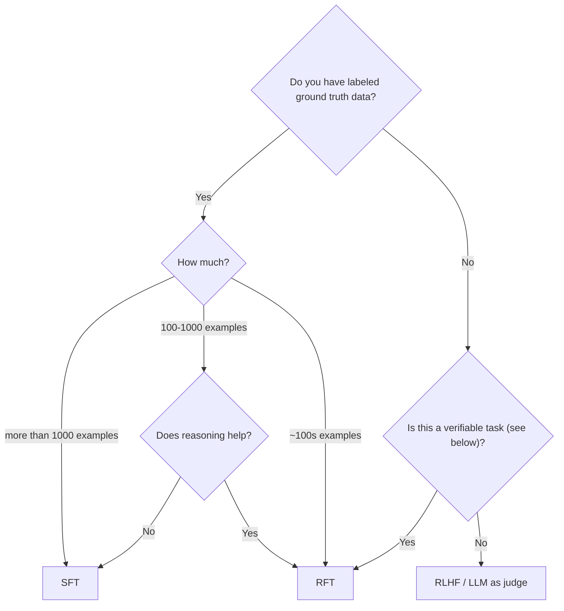

## When to use Supervised Fine-Tuning (SFT) vs. Reinforcement Fine-Tuning (RFT)

In supervised fine-tuning, you provide a dataset with labeled examples of “good” outputs. In reinforcement fine-tuning, you provide a grader function that can be used to score the model's outputs. The model is iteratively trained to produce outputs that maximize this score. To learn more about the differences between SFT and RFT, see [when to use Supervised Fine-Tuning (SFT) vs. Reinforcement Fine-Tuning (RFT)](./finetuning-intro#when-to-use-supervised-fine-tuning-sft-vs-reinforcement-fine-tuning-models-rft).

Supervised fine-tuning (SFT) works well for many common scenarios, especially when:

* You have a sizable dataset (\~1000+ examples) with high-quality, ground-truth lables.
* The dataset covers most possible input scenarios.
* Tasks are relatively straightforward, such as:
  * Classification
  * Content extraction

However, SFT may struggle in situations where:

* Your dataset is small.
* You lack ground-truth outputs (a.k.a. “golden generations”).
* The task requires multi-step reasoning.

Here is a simple decision tree:

<Tip>
  `Verifiable` refers to whether it is relatively easy to make a judgement on the quality of the model generation.
</Tip>

---

**📚 [Back to Index](./index.md)** | **📄 [Full Version](./documentation.md)** | **🔗 [Original](../llms-full.txt)**
