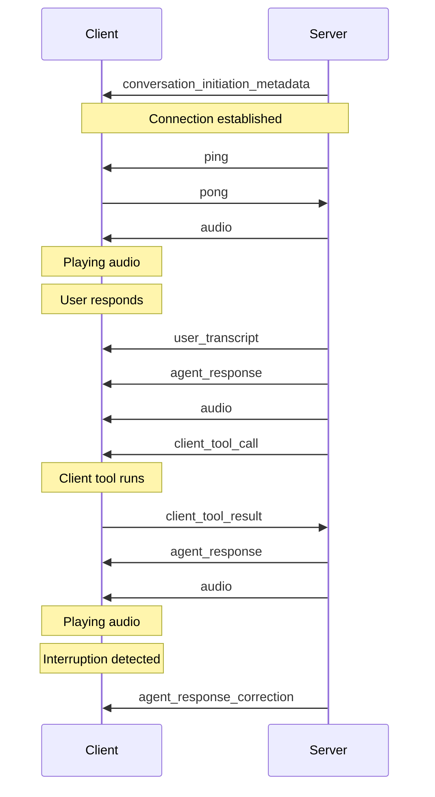

**Navigation:** [← Previous](./13-transfer-to-human.md) | [Index](./index.md) | [Next →](./15-client-to-server-events.md)

# Batch calling

> Initiate multiple outbound calls simultaneously with your ElevenLabs agents.

<iframe width="100%" height="400" src="https://www.youtube.com/embed/TIOnL1TwzBs" title="Batch Calling Tutorial" frameborder="0" allow="accelerometer; autoplay; clipboard-write; encrypted-media; gyroscope; picture-in-picture" allowfullscreen />

<Note>
  When conducting outbound call campaigns, ensure compliance with all relevant regulations,
  including the [TCPA (Telephone Consumer Protection Act)](/docs/agents-platform/legal/tcpa) and any
  applicable state laws.
</Note>


## Overview

Batch Calling enables you to initiate multiple outbound calls simultaneously using your configured ElevenLabs agents. This feature is ideal for scenarios such as sending notifications, conducting surveys, or delivering personalized messages to a large list of recipients efficiently.
This feature is available for both phone numbers added via the [native Twilio integration](/docs/agents-platform/phone-numbers/twilio-integration/native-integration) and [SIP trunking](/docs/agents-platform/phone-numbers/sip-trunking).

### Key features

* **Upload recipient lists**: Easily upload recipient lists in CSV or XLS format.
* **Dynamic variables**: Personalize calls by including dynamic variables (e.g., `user_name`) in your recipient list as separate columns.
* **Agent selection**: Choose the specific ElevenLabs agent to handle the calls.
* **Scheduling**: Send batches immediately or schedule them for a later time.
* **Real-time monitoring**: Track the progress of your batch calls, including overall status and individual call status.
* **Detailed reporting**: View comprehensive details of completed batch calls, including individual call recipient information.


## Concurrency

When batch calls are initiated, they automatically utilize the minimum of either 50% of your workspace's concurrency limit or 70% of your agent's concurrency limit.
This ensures that sufficient concurrent capacity remains available for other conversations, including incoming calls and calls via the widget.


## Requirements

* An ElevenLabs account with an [agent setup](https://elevenlabs.io/app/agents).
* A phone number imported


## Creating a batch call

Follow these steps to create a new batch call:

<Steps>
  <Step title="Navigate to Batch Calling">
    Access the [Outbound calls interface](https://elevenlabs.io/app/agents/batch-calling) from the
    Agents Platform dashboard
  </Step>

  <Step title="Initiate a new batch call">
    Click on the "Create a batch call" button. This will open the "Create a batch call" page.

    <Frame background="subtle" caption="The 'Create a batch call' interface.">
      
    </Frame>
  </Step>

  <Step title="Configure batch details">
    * **Batch name**: Enter a descriptive name for your batch call (e.g., "Delivery notice", "Weekly Update Notifications").
    * **Phone number**: Select the phone number that will be used to make the outbound calls.
    * **Select agent**: Choose the pre-configured ElevenLabs agent that will handle the conversations for this batch.
  </Step>

  <Step title="Upload recipients">
    * **Upload File**: Upload your recipient list. Supported file formats are CSV and XLS.
    * **Formatting**:
      * The `phone_number` column is mandatory in your uploaded file (if your agent has a `phone_number` dynamic variable that also has to be set, please rename it).
      * You can include other columns (e.g., `name`, `user_name`) which will be passed as dynamic variables to personalize the calls.
      * A template is available for download to ensure correct formatting.

    <Note title="Setting overrides">
      The following column headers are special fields that are used to override an agent's initial
      configuration:

      * language
      * first\_message
      * system\_prompt
      * voice\_id

      The batch call will fail if those fields are passed but are not set to be overridable in the agent's security settings. See more
      [here](/docs/agents-platform/customization/personalization/overrides).
    </Note>
  </Step>

  <Step title="Set timing">
    * **Send immediately**: The batch call will start processing as soon as you submit it. -
      **Schedule for later**: Choose a specific date and time for the batch call to begin.
  </Step>

  <Step title="Submit the batch call">
    * You may "Test call" with a single recipient before submitting the entire batch. - Click "Submit
      a Batch Call" to finalize and initiate or schedule the batch.
  </Step>
</Steps>


## Managing and monitoring batch calls

Once a batch call is created, you can monitor its progress and view its details.

### Batch calling overview

The Batch Calling overview page displays a list of all your batch calls.

<Frame background="subtle" caption="Overview of batch calls, displaying status, progress, and other details for each batch.">
  
</Frame>

### Viewing batch call details

Clicking on a specific batch call from the overview page will take you to its detailed view, from where you can view individual conversations.

<Frame background="subtle" caption="Detailed view of a specific batch call, showing summary statistics and a list of call recipients with their individual statuses.">
  
</Frame>


## API Usage

You can also manage and initiate batch calls programmatically using the ElevenLabs API. This allows for integration into your existing workflows and applications.

* [List batch calls](/docs/api-reference/batch-calling/list) - Retrieve all batch calls in your workspace
* [Create batch call](/docs/api-reference/batch-calling/create) - Submit a new batch call with agent, phone number, and recipient list


# Twilio native integration

> Learn how to configure inbound calls for your agent with Twilio.

<iframe width="100%" height="400" src="https://www.youtube-nocookie.com/embed/1_ebl-acp6M?rel=0&autoplay=0" title="YouTube video player" frameborder="0" allow="accelerometer; clipboard-write; encrypted-media; gyroscope; picture-in-picture; web-share" allowfullscreen />


## Overview

This guide shows you how to connect a Twilio phone number to your ElevenLabs agent to handle both inbound and outbound calls.

You will learn to:

* Import an existing Twilio phone number.
* Link it to your agent to handle inbound calls.
* Initiate outbound calls using your agent.


## Phone Number Types & Capabilities

ElevenLabs supports two types of Twilio phone numbers with different capabilities:

### Purchased Twilio Numbers (Full Support)

* **Inbound calls**: Supported - Can receive calls and route them to agents
* **Outbound calls**: Supported - Can make calls using agents
* **Requirements**: Number must be purchased through Twilio and appear in your "Phone Numbers" section

### Verified Caller IDs (Outbound Only)

* **Inbound calls**: Not supported - Cannot receive calls or be assigned to agents
* **Outbound calls**: Supported - Can make calls using agents
* **Requirements**: Number must be verified in Twilio's "Verified Caller IDs" section
* **Use case**: Ideal for using your existing business number for outbound AI calls

Learn more about [verifying caller IDs at scale](https://www.twilio.com/docs/voice/api/verifying-caller-ids-scale) in Twilio's documentation.

<Note>
  During phone number import, ElevenLabs automatically detects the capabilities of your number based
  on its configuration in Twilio.
</Note>


## Guide

### Prerequisites

* A [Twilio account](https://twilio.com/).
* Either:
  * A purchased & provisioned Twilio [phone number](https://www.twilio.com/docs/phone-numbers) (for inbound + outbound)
  * OR a [verified caller ID](https://www.twilio.com/docs/voice/make-calls#verify-your-caller-id) in Twilio (for outbound only)

<Steps>
  <Step title="Import a Twilio phone number">
    In the Agents Platform dashboard, go to the [**Phone Numbers**](https://elevenlabs.io/app/agents/phone-numbers) tab.

    <Frame background="subtle">
      
    </Frame>

    Next, fill in the following details:

    * **Label:** A descriptive name (e.g., `Customer Support Line`).
    * **Phone Number:** The Twilio number you want to use.
    * **Twilio SID:** Your Twilio Account SID.
    * **Twilio Token:** Your Twilio Auth Token.

    <Note>
      You can find your account SID and auth token [**in the Twilio admin console**](https://www.twilio.com/console).
    </Note>

    <Tabs>
      <Tab title="Agents Platform dashboard">
        <Frame background="subtle">
          
        </Frame>
      </Tab>

      <Tab title="Twilio admin console">
        Copy the Twilio SID and Auth Token from the [Twilio admin
        console](https://www.twilio.com/console).

        <Frame background="subtle">
          
        </Frame>
      </Tab>
    </Tabs>

    <Note>
      ElevenLabs automatically configures the Twilio phone number with the correct settings.
    </Note>

    <Accordion title="Applied settings">
      <Frame background="subtle">
        
      </Frame>
    </Accordion>

    <Info>
      **Phone Number Detection**: ElevenLabs will automatically detect whether your number supports:

      * **Inbound + Outbound**: Numbers purchased through Twilio
      * **Outbound Only**: Numbers verified as caller IDs in Twilio

      If your number is not found in either category, you'll receive an error asking you to verify it exists in your Twilio account.
    </Info>
  </Step>

  <Step title="Assign your agent (Inbound-capable numbers only)">
    If your phone number supports inbound calls, you can assign an agent to handle incoming calls.

    <Frame background="subtle">
      
    </Frame>

    <Note>
      Numbers that only support outbound calls (verified caller IDs) cannot be assigned to agents and
      will show as disabled in the agent dropdown.
    </Note>
  </Step>
</Steps>

Test the agent by giving the phone number a call. Your agent is now ready to handle inbound calls and engage with your customers.

<Tip>
  Monitor your first few calls in the [Calls History
  dashboard](https://elevenlabs.io/app/agents/history) to ensure everything is working as expected.
</Tip>


## Making Outbound Calls

<Info>
  Both purchased Twilio numbers and verified caller IDs can be used for outbound calls. The outbound
  call button will be disabled for numbers that don't support outbound calling.
</Info>

Your imported Twilio phone number can also be used to initiate outbound calls where your agent calls a specified phone number.

<Steps>
  <Step title="Initiate an outbound call">
    From the [**Phone Numbers**](https://elevenlabs.io/app/agents/phone-numbers) tab, locate your imported Twilio number and click the **Outbound call** button.

    <Frame background="subtle">
      
    </Frame>
  </Step>

  <Step title="Configure the call">
    In the Outbound Call modal:

    1. Select the agent that will handle the conversation
    2. Enter the phone number you want to call
    3. Click **Send Test Call** to initiate the call

    <Frame background="subtle">
      
    </Frame>
  </Step>
</Steps>

Once initiated, the recipient will receive a call from your Twilio number. When they answer, your agent will begin the conversation.

<Tip>
  Outbound calls appear in your [Calls History dashboard](https://elevenlabs.io/app/agents/history)
  alongside inbound calls, allowing you to review all conversations.
</Tip>

<Note>
  When making outbound calls, your agent will be the initiator of the conversation, so ensure your
  agent has appropriate initial messages configured to start the conversation effectively.
</Note>


# Vonage integration

> Integrate ElevenLabs Agents with Vonage voice calls using a WebSocket connector.


## Overview

Connect ElevenLabs Agents to Vonage Voice API or Video API calls using a [WebSocket connector application](https://github.com/nexmo-se/elevenlabs-agent-ws-connector). This enables real-time, bi-directional audio streaming for use cases like PSTN calls, SIP trunks, and WebRTC clients.


## How it works

The Node.js connector bridges Vonage and ElevenLabs:

1. Vonage initiates a WebSocket connection to the connector for an active call.
2. The connector establishes a WebSocket connection to the ElevenLabs Agents endpoint.
3. Audio is relayed: Vonage (L16) -> Connector -> ElevenLabs (base64) and vice-versa.
4. The connector manages conversation events (`user_transcript`, `agent_response`, `interruption`).


## Setup

<Steps>
  ### 1. Get ElevenLabs credentials

  * **API Key**: on the [ElevenLabs dashboard](https://elevenlabs.io/app), click "My Account" and then "API Keys" in the popup that appears.
  * **Agent ID**: Find the agent in the [Agents Platform dashboard](https://elevenlabs.io/app/agents/agents/). Once you have selected the agent click on the settings button and select "Copy Agent ID".

  ### 2. Configure the connector

  Clone the repository and set up the environment file.

  ```bash
  git clone https://github.com/nexmo-se/elevenlabs-agent-ws-connector.git
  cd elevenlabs-agent-ws-connector
  cp .env.example .env
  ```

  Add your credentials to `.env`:

  ```bash title=".env"
  ELEVENLABS_API_KEY = YOUR_API_KEY;
  ELEVENLABS_AGENT_ID = YOUR_AGENT_ID;
  ```

  Install dependencies: `npm install`.

  ### 3. Expose the connector (local development)

  Use ngrok, or a similar service, to create a public URL for the connector (default port 6000).

  ```bash
  ngrok http 6000
  ```

  Note the public `Forwarding` URL (e.g., `xxxxxxxx.ngrok-free.app`). **Do not include `https://`** when configuring Vonage.

  ### 4. Run the connector

  Start the application:

  ```bash
  node elevenlabs-agent-ws-connector.cjs
  ```

  ### 5. Configure Vonage voice application

  Your Vonage app needs to connect to the connector's WebSocket endpoint (`wss://YOUR_CONNECTOR_HOSTNAME/socket`). This is the ngrok URL from step 3.

  * **Use Sample App**: Configure the [sample Vonage app](https://github.com/nexmo-se/voice-to-ai-engines) with `PROCESSOR_SERVER` set to your connector's hostname.
  * **Update Existing App**: Modify your [Nexmo Call Control Object](https://developer.vonage.com/en/voice/voice-api/ncco-reference) to include a `connect` action targeting the connector's WebSocket URI (`wss://...`) with `content-type: audio/l16;rate=16000`. Pass necessary query parameters like `peer_uuid` and `webhook_url`.

  ### 6. Test

  Make an inbound or outbound call via your Vonage application to interact with the ElevenLabs agent.
</Steps>


## Cloud deployment

For production, deploy the connector to a stable hosting provider (e.g., Vonage Cloud Runtime) with a public hostname.


# Telnyx SIP trunking

> Connect Telnyx SIP trunks with ElevenLabs Agents.

<Note>
  Before following this guide, consider reading the [SIP trunking
  guide](/docs/agents-platform/phone-numbers/sip-trunking) to understand how ElevenLabs supports SIP
  trunks.
</Note>


## Overview

This guide explains how to connect your Telnyx SIP trunks directly to ElevenLabs Agents. This integration allows you to use your existing Telnyx phone numbers and infrastructure while leveraging ElevenLabs' advanced voice AI capabilities.


## How SIP trunking with Telnyx works

SIP trunking establishes a direct connection between your Telnyx telephony infrastructure and the ElevenLabs platform:

1. **Inbound calls**: Calls from your Telnyx SIP trunk are routed to the ElevenLabs platform using our origination URI. You will configure this in your Telnyx account.
2. **Outbound calls**: Calls initiated by ElevenLabs are routed to your Telnyx SIP trunk using your termination URI, enabling your agents to make outgoing calls.
3. **Authentication**: Connection security is maintained through either digest authentication (username/password) or Access Control List (ACL) authentication.
4. **Signaling and Media**: The initial call setup (signaling) uses TCP. Once the call is established, the actual audio data (RTP stream) is transmitted over UDP.


## Requirements

Before setting up the Telnyx SIP trunk integration, ensure you have:

1. An active ElevenLabs account
2. An active Telnyx account
3. At least one phone number purchased or ported into your Telnyx account
4. Administrator access to your Telnyx portal
5. Appropriate firewall settings to allow SIP and RTP traffic


## Creating a SIP trunk using the Telnyx UI

<Steps>
  <Step title="Sign in to Telnyx">
    Log in to your Telnyx account at [portal.telnyx.com](https://portal.telnyx.com/).
  </Step>

  <Step title="Purchase a phone number">
    Navigate to the Numbers section and purchase a phone number that will be used with your ElevenLabs agent.
  </Step>

  <Step title="Navigate to SIP Trunking">
    Go to Voice » [SIP Trunking](https://portal.telnyx.com/#/voice/connections) in the Telnyx portal.
  </Step>

  <Step title="Create a SIP connection">
    Click on Create SIP Connection and choose FQDN as the connection type, then save.
  </Step>

  <Step title="Configure authentication">
    1. In the Authentication & Routing Configuration section, select Outbound Calls Authentication.
    2. In the Authentication Method field, select Credentials and enter a username and password.
    3. Select Add FQDN and enter `sip.rtc.elevenlabs.io` into the FQDN field.
  </Step>

  <Step title="Configure inbound settings">
    1. Select the Inbound tab.
    2. In the Destination Number Format field, select `+E.164`.
    3. For SIP Transport Protocol, select TCP.
    4. In the SIP Region field, select your region.
  </Step>

  <Step title="Configure outbound settings">
    1. Select the Outbound tab.
    2. In the Outbound Voice Profile field, select or create an outbound voice profile.
  </Step>

  <Step title="Assign phone number">
    1. Select the Numbers tab.
    2. Assign your purchased phone number to this SIP connection.
  </Step>
</Steps>

<Warning>
  After setting up your Telnyx SIP trunk, follow the [SIP trunking
  guide](/docs/agents-platform/phone-numbers/sip-trunking) to complete the configuration in
  ElevenLabs.
</Warning>


# Plivo

> Integrate ElevenLabs Agents with your Plivo SIP trunks

<Note>
  Before following this guide, consider reading the [SIP trunking
  guide](/docs/agents-platform/phone-numbers/sip-trunking) to understand how ElevenLabs supports SIP
  trunks.
</Note>


## Overview

This guide explains how to connect your Plivo SIP trunks directly to ElevenLabs Agents.
This integration allows you to use your existing Plivo phone numbers and infrastructure while leveraging ElevenLabs' advanced voice AI capabilities, for both inbound and outbound calls.


## How SIP trunking with Plivo works

SIP trunking establishes a direct connection between your Plivo telephony infrastructure and the ElevenLabs platform:

1. **Inbound calls**: Calls from your Plivo SIP trunk are routed to the ElevenLabs platform using our origination URI. You will configure this in your Plivo account.
2. **Outbound calls**: Calls initiated by ElevenLabs are routed to your Plivo SIP trunk using your termination URI, enabling your agents to make outgoing calls.
3. **Authentication**: Connection security for the signaling is maintained through either digest authentication (username/password) or Access Control List (ACL) authentication based on the signaling source IP from Plivo.
4. **Signaling and Media**: The initial call setup (signaling) uses TCP. Once the call is established, the actual audio data (RTP stream) is transmitted over UDP.


## Requirements

Before setting up the Plivo SIP trunk integration, ensure you have:

1. An active Plivo account with SIP trunking enabled
2. Plivo phone numbers that you want to connect to ElevenLabs
3. Administrator access to your Plivo account and SIP trunk configuration
4. Appropriate firewall settings to allow SIP traffic to and from ElevenLabs and Plivo


## Configuring Plivo SIP trunks

This section provides detailed instructions for creating SIP trunks in Plivo before connecting them to ElevenLabs.

### Setting up inbound trunks (calls from Plivo to ElevenLabs)

<Steps>
  <Step title="Access Plivo Console">
    Sign in to the Plivo Console.
  </Step>

  <Step title="Navigate to Zentrunk Dashboard">
    Go to the Zentrunk Dashboard in your Plivo account.
  </Step>

  <Step title="Create inbound SIP trunk">
    1. Select "Create New Inbound Trunk" and provide a descriptive name for your trunk.
    2. Under Trunk Authentication, click "Add New URI".
    3. Enter the ElevenLabs SIP URI: `sip.rtc.elevenlabs.io`
    4. Select "Create Trunk" to complete your inbound trunk creation.
  </Step>

  <Step title="Assign phone number to trunk">
    1. Navigate to the Phone Numbers Dashboard and select the number you want to route to your inbound trunk.
    2. Under Number Configuration, set "Trunk" to your newly created inbound trunk.
    3. Select "Update" to save the configuration.
  </Step>
</Steps>

### Setting up outbound trunks (calls from ElevenLabs to Plivo)

<Steps>
  <Step title="Access Plivo Console">
    Sign in to the Plivo Console.
  </Step>

  <Step title="Navigate to Zentrunk Dashboard">
    Go to the Zentrunk Dashboard in your Plivo account.
  </Step>

  <Step title="Create outbound SIP trunk">
    1. Select "Create New Outbound Trunk" and provide a descriptive name for your trunk.
    2. Under Trunk Authentication, click "Add New Credentials List".
    3. Add a username and password that you'll use to authenticate outbound calls.
    4. Select "Create Credentials List". 5. Save your credentials list and select "Create Trunk" to complete your outbound trunk configuration.
  </Step>

  <Step title="Note your termination URI">
    After creating the outbound trunk, note the termination URI (typically in the format
    `sip:yourusername@yourplivotrunk.sip.plivo.com`). You'll need this information when configuring
    the SIP trunk in ElevenLabs.
  </Step>
</Steps>

<Warning>
  Once you've set up your Plivo SIP trunk, follow the [SIP trunking
  guide](/docs/agents-platform/phone-numbers/sip-trunking) to finish the setup ElevenLabs as well.
</Warning>


# Genesys

> Integrate ElevenLabs Agents with Genesys using native Audio Connector integration.


## Overview

This guide explains how to integrate ElevenLabs Agents with Genesys Cloud using the Audio Connector integration. This integration enables seamless voice AI capabilities within your existing Genesys contact center infrastructure over websocket, without requiring SIP trunking.


## How Genesys integration works

The Genesys integration uses a native WebSocket connection through the Audio Connector integration:

1. **WebSocket connection**: Direct connection to ElevenLabs using the Audio Connector integration in Genesys Cloud
2. **Real-time audio**: Bidirectional audio streaming between Genesys and ElevenLabs agents
3. **Flow integration**: Seamless integration within your Genesys Architect flows using bot actions
4. **Dynamic variables**: Support for passing context and data between Genesys and ElevenLabs


## Requirements

Before setting up the Genesys integration, ensure you have:

1. Genesys Cloud CX license with bot flow capabilities
2. Administrator access to Genesys Cloud organization
3. A configured ElevenLabs account and ElevenLabs agent
4. ElevenLabs API key


## Setting up the Audio Connector integration

<Steps>
  <Step title="Access Genesys Cloud Admin">
    Sign in to your Genesys Cloud organization with administrator privileges.
  </Step>

  <Step title="Navigate to Integrations">
    Go to Admin → Integrations in the Genesys Cloud interface.
  </Step>

  <Step title="Create Audio Connector integration">
    1. Click "Add Integration" and search for "Audio Connector", and click "Install"

    2. Select the Audio Connector integration type

    3. Provide a descriptive name for your integration
  </Step>

  <Step title="Configure authentication">
    1. Navigate to the Configuration section of your Audio Connector integration

    2. In Properties, in the Base Connection URI field, enter: `wss://api.elevenlabs.io/v1/convai/conversation/genesys`

    3. In Credentials, enter your ElevenLabs API key in the authentication configuration

    4. Save the integration configuration
  </Step>

  <Step title="Activate the integration">
    Set the integration status to "Active" to enable the connection.
  </Step>
</Steps>


## Configuring your Genesys flow

<Steps>
  <Step title="Open Architect">
    Navigate to Admin → Architect in Genesys Cloud.
  </Step>

  <Step title="Create or edit a flow">
    Open an existing inbound, outbound, or in-queue call flow, or create a new one where you want to
    use the ElevenLabs agent.
  </Step>

  <Step title="Add bot action">
    1. In your flow, add a "Call Audio Connector" action from the Bot category

    2. Select your Audio Connector integration from the integration dropdown

    3. In the Connector ID field, specify your ElevenLabs agent ID
  </Step>

  <Step title="Configure session variables (optional)">
    If you need to pass context to your ElevenLabs agent, configure input session variables in the bot
    action. These will be available as dynamic variables in your ElevenLabs agent.
  </Step>

  <Step title="Publish your flow">
    Save and publish your flow to make the integration active.
  </Step>
</Steps>


## Agent configuration requirements

Your ElevenLabs Agents agent must be configured with specific audio settings for Genesys compatibility:

### Audio format requirements

* **TTS output format**: Set to μ-law 8000 Hz in Agent Settings → Voice
* **User input audio format**: Set to μ-law 8000 Hz in Agent Settings → Advanced

### Supported client events

The Genesys integration supports only the following client events:

* **Audio events**: For processing voice input from callers
* **Interruption events**: For handling caller interruptions during agent speech

<Note>
  Other client event types are not supported in the Genesys integration and will be silently ignored
  if configured.
</Note>


## Session variables

You can pass dynamic context from your Genesys flow to your ElevenLabs agent using input session variables and receive data back through output session variables. Session variables can also be used to override specific agent configuration settings directly from your Genesys flow.

### Input session variables

1. **In Genesys flow**: Define input session variables in your "Call Audio Connector" action
2. **In ElevenLabs agent**: Variables are available as dynamic variables and/or override configuration settings
3. **Usage**: Reference these variables in your agent's conversation flow or system prompts

Learn more about [dynamic variables](/docs/agents-platform/customization/personalization/dynamic-variables).

#### Configuration overrides

The following session variables can modify your agent's configuration at runtime:

* **`system__override_system_prompt`**: Overrides the agent's system prompt.
* **`system__override_first_message`**: Overrides the agent's first message to the user.
* **`system__override_language`**: Sets the agent's language for this session.
* **`system__override_voice_id`**: Sets the agent's voice ID for this session.

### Example usage

Genesys flow input session variables:

* `customer_name = "John Smith"`
* `system__override_first_message = "Hello! Welcome to our support line."`
* `system__override_language = "en"`

ElevenLabs agent prompt: Hi \{\{customer\_name}}, how can I help you today?

### Output session variables

You can now receive data from your ElevenLabs agent back to your Genesys flow using output session variables.

Any data collected through [Data Collection](/docs/agents-platform/customization/agent-analysis/data-collection) in your ElevenLabs agent will be available as output session variables in your Genesys flow after the conversation ends.

### Example usage

After your ElevenLabs agent conversation completes, you can use the output variables in your Genesys flow:

1. **Decision logic**: Use output variables in decision nodes to route calls
2. **Data processing**: Pass conversation data to external systems
3. **Reporting**: Include conversation outcomes in your contact center analytics


## Transfer to number functionality

The ElevenLabs integration now supports call transfers back to Genesys for routing to specific numbers or queues.

### Setting up transfers

<Steps>
  <Step title="Configure a data collection item">
    In your ElevenLabs agent, add a data collection item with a detailed identifier and description to collect where the user should be transferred.
  </Step>

  <Step title="Update agent prompt">
    Add instructions to your agent's system prompt to use the end\_call tool when a transfer is requested. For example:

    ```
    If the caller requests to be transferred to a specific department or asks to
    speak with a human agent, use the end_call tool to end the conversation.
    ```
  </Step>

  <Step title="Configure Genesys flow logic">
    In your Genesys Architect flow, add decision nodes after the Audio Connector action to check output variables and route the call accordingly:

    1. Use output session variables to determine if a transfer was requested
    2. Configure routing logic based on the transfer type or destination
    3. Use Genesys native transfer capabilities to complete the transfer
  </Step>
</Steps>

### Example transfer flow

1. **Customer request**: "I need to speak with billing"
2. **Agent response**: "I'll transfer you to our billing department"
3. **Agent action**: Uses end\_call tool
4. **Data collection**: Data collection field is populated
5. **Genesys flow**: Checks output variable and routes to billing queue


## Limitations and unsupported features

The following tools and features are not supported in the Genesys integration:

### Unsupported tools

* **Client tool**: Not compatible with Genesys WebSocket integration


## Troubleshooting

<AccordionGroup>
  <Accordion title="WebSocket connection fails">
    Verify that your API key is correctly configured in the Audio Connector integration and the ElevenLabs agent ID is correctly configured in the Connector ID field in your Architect flow.
    If there are any dynamic variables defined on your agent, they must be passed in as input session variables.
  </Accordion>

  <Accordion title="Session variables not working">
    Verify that input session variables are properly defined in your Genesys flow's "Call Audio Connector" action and that they're referenced correctly in your ElevenLabs agent using the \{\{variable\_name}} syntax.
  </Accordion>
</AccordionGroup>


# Operate

> Monitor, test, and optimize your agents at scale.

This section provides tools and best practices for running production agents, from testing and quality assurance to analytics and cost optimization.

### Monitor and optimize

| Goal                         | Guide                                                                        | Description                                          |
| ---------------------------- | ---------------------------------------------------------------------------- | ---------------------------------------------------- |
| Test agent behavior          | [Testing](/docs/agents-platform/customization/agent-testing)                 | Create and run automated tests for your agents       |
| Analyze conversation quality | [Conversation analysis](/docs/agents-platform/customization/agent-analysis)  | Extract insights and evaluate conversation outcomes  |
| Track metrics & analytics    | [Analytics](/docs/agents-platform/dashboard)                                 | Monitor performance metrics and conversation history |
| Configure data retention     | [Privacy](/docs/agents-platform/customization/privacy)                       | Set retention policies for conversations and audio   |
| Reduce LLM costs             | [Cost optimization](/docs/agents-platform/customization/llm/optimising-cost) | Monitor and optimize language model expenses         |


## Next steps

<CardGroup cols={2}>
  <Card title="Testing" href="/docs/agents-platform/customization/agent-testing">
    Set up automated tests
  </Card>

  <Card title="Analytics" href="/docs/agents-platform/dashboard">
    View performance metrics
  </Card>

  <Card title="Cost Optimization" href="/docs/agents-platform/customization/llm/optimising-cost">
    Reduce LLM costs
  </Card>

  <Card title="Conversation Analysis" href="/docs/agents-platform/customization/agent-analysis">
    Analyze conversations
  </Card>
</CardGroup>


# Agent Testing

> Build confidence in your agent's behavior with automated testing

The agent testing framework enables you to move from slow, manual phone calls to a fast, automated, and repeatable testing process. Create comprehensive test suites that verify both conversational responses and tool usage, ensuring your agents behave exactly as intended before deploying to production.


## Video Walkthrough

<Frame background="subtle">
  <iframe width="100%" height="400" src="https://www.youtube.com/embed/SvyrPTNpWas" title="Agent Testing Walkthrough" frameborder="0" allow="accelerometer; autoplay; clipboard-write; encrypted-media; gyroscope; picture-in-picture; web-share" allowfullscreen />
</Frame>


## Overview

The framework consists of two complementary testing approaches:

* **Scenario Testing (LLM Evaluation)** - Validates conversational abilities and response quality
* **Tool Call Testing** - Ensures proper tool usage and parameter validation

Both test types can be created from scratch or directly from existing conversations, allowing you to quickly turn real-world interactions into repeatable test cases.


## Scenario Testing (LLM Evaluation)

Scenario testing evaluates your agent's conversational abilities by simulating interactions and assessing responses against defined success criteria.

### Creating a Scenario Test

<Frame background="subtle">
  
</Frame>

<Steps>
  <Step title="Define the scenario">
    Create context for the text. This can be multiple turns of interaction that sets up the specific scenario you want to evaluate. Our testing framework currently only supports evaluating a single next step in the conversation. For simulating entire conversations, see our [simulate conversation endpoint](/docs/api-reference/agents/simulate-conversation) and [conversation simulation guide](/docs/agents-platform/guides/simulate-conversations).

    **Example scenario:**

    ```
    User: "I'd like to cancel my subscription. I've been charged twice this month and I'm frustrated."
    ```
  </Step>

  <Step title="Set success criteria">
    Describe in plain language what the agent's response should achieve. Be specific about the
    expected behavior, tone, and actions.

    **Example criteria:**

    * The agent should acknowledge the customer's frustration with empathy
    * The agent should offer to investigate the duplicate charge
    * The agent should provide clear next steps for cancellation or resolution
    * The agent should maintain a professional and helpful tone
  </Step>

  <Step title="Provide examples">
    Supply both success and failure examples to help the evaluator understand the nuances of your
    criteria.

    **Success Example:**

    > "I understand how frustrating duplicate charges can be. Let me look into this right away for you. I can see there were indeed two charges this month - I'll process a refund for the duplicate charge immediately. Would you still like to proceed with cancellation, or would you prefer to continue once this is resolved?"

    **Failure Example:**

    > "You need to contact billing department for refund issues. Your subscription will be cancelled."
  </Step>

  <Step title="Run the test">
    Execute the test to simulate the conversation with your agent. An LLM evaluator compares the
    actual response against your success criteria and examples to determine pass/fail status.
  </Step>
</Steps>

### Creating Tests from Conversations

Transform real conversations into test cases with a single click. This powerful feature creates a feedback loop for continuous improvement based on actual performance.

<Frame background="subtle">
  
</Frame>

When reviewing call history, if you identify a conversation where the agent didn't perform well:

1. Click "Create test from this conversation"
2. The framework automatically populates the scenario with the actual conversation context
3. Define what the correct behavior should have been
4. Add the test to your suite to prevent similar issues in the future


## Tool Call Testing

Tool call testing verifies that your agent correctly uses tools and passes the right parameters in specific situations. This is critical for actions like call transfers, data lookups, or external integrations.

### Creating a Tool Call Test

<Frame background="subtle">
  
</Frame>

<Steps>
  <Step title="Select the tool">
    Choose which tool you expect the agent to call in the given scenario (e.g.,
    `transfer_to_number`, `end_call`, `lookup_order`).
  </Step>

  <Step title="Define expected parameters">
    Specify what data the agent should pass to the tool. You have three validation methods:

    <Accordion title="Validation Methods">
      **Exact Match**\
      The parameter must exactly match your specified value.

      ```
      Transfer number: +447771117777
      ```

      **Regex Pattern**
      The parameter must match a specific pattern.

      ```
      Order ID: ^ORD-[0-9]{8}$
      ```

      **LLM Evaluation**
      An LLM evaluates if the parameter is semantically correct based on context.

      ```
      Message: "Should be a polite message mentioning the connection"
      ```
    </Accordion>
  </Step>

  <Step title="Configure dynamic variables">
    When testing in development, use dynamic variable values that match those that would be actual
    values in production. Example: `{{ customer_name }}` or `{{ order_id }}`
  </Step>

  <Step title="Run and validate">
    Execute the test to ensure the agent calls the correct tool with proper parameters.
  </Step>
</Steps>

### Critical Use Cases

Tool call testing is essential for high-stakes scenarios:

* **Emergency Transfers**: Ensure medical emergencies always route to the correct number
* **Data Security**: Verify sensitive information is never passed to unauthorized tools
* **Business Logic**: Confirm order lookups use valid formats and authentication


## Development Workflow

The framework supports an iterative development cycle that accelerates agent refinement:

<Steps>
  <Step title="Write tests first">
    Define the desired behavior by creating tests for new features or identified issues.
  </Step>

  <Step title="Test and iterate">
    Run tests instantly without saving changes. Watch them fail, then adjust your agent's prompts or
    configuration.
  </Step>

  <Step title="Refine until passing">
    Continue tweaking and re-running tests until all pass. The framework provides immediate feedback
    without requiring deployment.
  </Step>

  <Step title="Save with confidence">
    Once tests pass, save your changes knowing the agent behaves as intended.
  </Step>
</Steps>


## Running Tests

Navigate to the Tests tab in your agent's interface. From there, you can run individual tests or execute your entire test suite at once using the "Run All Tests" button.

<Frame background="subtle">
  
</Frame>


## Batch Testing and CI/CD Integration

### Running Test Suites

Execute all tests at once to ensure comprehensive coverage:

1. Select multiple tests from your test library
2. Run as a batch to identify any regressions
3. Review consolidated results showing pass/fail status for each test

### CLI Integration

Integrate testing into your development pipeline using the ElevenLabs CLI:

```bash

# Run all tests for an agent
elevenlabs agents test <your_agent_id>
```

This enables:

* Automated testing on every code change
* Prevention of regressions before deployment
* Consistent agent behavior across environments


## Best Practices

<Cards>
  <Card title="Evaluate agent persona consistency" icon="duotone shield-check">
    Test that your agent maintains its defined personality, tone, and behavioral boundaries across
    diverse conversation scenarios and emotional contexts.
  </Card>

  <Card title="Verify complex multi-turn reasoning" icon="duotone phone-volume">
    Create scenarios that test the agent's ability to maintain context, follow conditional logic,
    and handle state transitions across extended conversations.
  </Card>

  <Card title="Test against prompt injection attempts" icon="duotone list-check">
    Evaluate how your agent responds to attempts to override its instructions or extract sensitive
    system information through adversarial inputs.
  </Card>

  <Card title="Assess ambiguous intent resolution" icon="duotone flask">
    Test how effectively your agent clarifies vague requests, handles conflicting information, and
    navigates situations where user intent is unclear.
  </Card>
</Cards>


## Next Steps

* [View CLI Documentation](/docs/agents-platform/operate/cli) for automated testing setup
* [Explore Tool Configuration](/docs/agents-platform/customization/tools) to understand available tools
* [Read the Prompting Guide](/docs/agents-platform/best-practices/prompting-guide) for writing testable prompts


# Conversation analysis

> Analyze conversation quality and extract structured data from customer interactions.

Agent analysis provides powerful tools to systematically evaluate conversation performance and extract valuable information from customer interactions. These LLM-powered features help you measure agent effectiveness and gather actionable business insights.

<CardGroup cols={2}>
  <Card title="Success Evaluation" icon="chart-line" href="/docs/agents-platform/customization/agent-analysis/success-evaluation">
    Define custom criteria to assess conversation quality, goal achievement, and customer
    satisfaction.
  </Card>

  <Card title="Data Collection" icon="database" href="/docs/agents-platform/customization/agent-analysis/data-collection">
    Extract structured information from conversations such as contact details and business data.
  </Card>
</CardGroup>


## Overview

The Agents Platform provides two complementary analysis capabilities:

* **Success Evaluation**: Define custom metrics to assess conversation quality, goal achievement, and customer satisfaction
* **Data Collection**: Extract specific data points from conversations such as contact information, issue details, or any structured information

Both features process conversation transcripts using advanced language models to provide actionable insights that improve agent performance and business outcomes.


## Key Benefits

<AccordionGroup>
  <Accordion title="Performance Measurement">
    Track conversation success rates, customer satisfaction, and goal completion across all interactions to identify improvement opportunities.
  </Accordion>

  <Accordion title="Automated Data Extraction">
    Capture valuable business information without manual processing, reducing operational overhead and
    improving data accuracy.
  </Accordion>

  <Accordion title="Quality Assurance">
    Ensure agents follow required procedures and maintain consistent service quality through
    systematic evaluation.
  </Accordion>

  <Accordion title="Business Intelligence">
    Gather structured insights about customer preferences, behavior patterns, and interaction outcomes for strategic decision-making.
  </Accordion>
</AccordionGroup>


## Integration with Platform Features

Agent analysis integrates seamlessly with other Agents Platform capabilities:

* **[Post-call Webhooks](/docs/agents-platform/workflows/post-call-webhooks)**: Receive evaluation results and extracted data via webhooks for integration with external systems
* **[Analytics Dashboard](/docs/agents-platform/dashboard)**: View aggregated performance metrics and trends across all conversations
* **[Agent Transfer](/docs/agents-platform/customization/tools/system-tools/agent-transfer)**: Use evaluation criteria to determine when conversations should be escalated


## Getting Started

<Steps>
  <Step title="Choose your analysis approach">
    Determine whether you need success evaluation, data collection, or both based on your business objectives.
  </Step>

  <Step title="Configure evaluation criteria">
    Set up [Success Evaluation](/docs/agents-platform/customization/agent-analysis/success-evaluation)
    to measure conversation quality and goal achievement.
  </Step>

  <Step title="Set up data extraction">
    Configure [Data Collection](/docs/agents-platform/customization/agent-analysis/data-collection) to
    capture structured information from conversations.
  </Step>

  <Step title="Monitor and optimize">
    Review results regularly and refine your criteria and extraction rules based on performance data.
  </Step>
</Steps>


# Success Evaluation

> Define custom criteria to assess conversation quality, goal achievement, and customer satisfaction.

Success evaluation allows you to define custom goals and success metrics for your conversations. Each criterion is evaluated against the conversation transcript and returns a result of `success`, `failure`, or `unknown`, along with a detailed rationale.

<iframe width="100%" height="400" src="https://www.youtube-nocookie.com/embed/hvuuRpvAlV0?rel=0&autoplay=0" title="YouTube video player" frameborder="0" allow="accelerometer; clipboard-write; encrypted-media; gyroscope; picture-in-picture; web-share" allowfullscreen />


## Overview

Success evaluation uses LLM-powered analysis to assess conversation quality against your specific business objectives. This enables systematic performance measurement and quality assurance across all customer interactions.

### How It Works

Each evaluation criterion analyzes the conversation transcript using a custom prompt and returns:

* **Result**: `success`, `failure`, or `unknown`
* **Rationale**: Detailed explanation of why the result was chosen

### Types of Evaluation Criteria

<Tabs>
  <Tab title="Goal Prompt Criteria">
    **Goal prompt criteria** pass the conversation transcript along with a custom prompt to an LLM to verify if a specific goal was met. This is the most flexible type of evaluation and can be used for complex business logic.

    **Examples:**

    * Customer satisfaction assessment
    * Issue resolution verification
    * Compliance checking
    * Custom business rule validation
  </Tab>
</Tabs>


## Configuration

<Steps>
  <Step title="Access agent settings">
    Navigate to your agent's dashboard and select the **Analysis** tab to configure evaluation criteria.

    <Frame background="subtle">
      
    </Frame>
  </Step>

  <Step title="Add evaluation criteria">
    Click **Add criteria** to create a new evaluation criterion.

    Define your criterion with:

    * **Identifier**: A unique name for the criterion (e.g., `user_was_not_upset`)
    * **Description**: Detailed prompt describing what should be evaluated

    <Frame background="subtle">
      
    </Frame>
  </Step>

  <Step title="View results">
    After conversations complete, evaluation results appear in your conversation history dashboard. Each conversation shows the evaluation outcome and rationale for every configured criterion.

    <Frame background="subtle">
      
    </Frame>
  </Step>
</Steps>


## Best Practices

<AccordionGroup>
  <Accordion title="Writing effective evaluation prompts">
    * Be specific about what constitutes success vs. failure
    * Include edge cases and examples in your prompt
    * Use clear, measurable criteria when possible
    * Test your prompts with various conversation scenarios
  </Accordion>

  <Accordion title="Common evaluation criteria">
    * **Customer satisfaction**: "Mark as successful if the customer expresses satisfaction or their
      issue was resolved" - **Goal completion**: "Mark as successful if the customer completed the
      requested action (booking, purchase, etc.)" - **Compliance**: "Mark as successful if the agent
      followed all required compliance procedures" - **Issue resolution**: "Mark as successful if the
      customer's technical issue was resolved during the call"
  </Accordion>

  <Accordion title="Handling ambiguous results">
    The `unknown` result is returned when the LLM cannot determine success or failure from the transcript. This often happens with:

    * Incomplete conversations
    * Ambiguous customer responses
    * Missing information in the transcript

    Monitor `unknown` results to identify areas where your criteria prompts may need refinement.
  </Accordion>
</AccordionGroup>


## Use Cases

<CardGroup cols={2}>
  <Card title="Customer Support Quality" icon="headset">
    Measure issue resolution rates, customer satisfaction, and support quality metrics to improve
    service delivery.
  </Card>

  <Card title="Sales Performance" icon="chart-up">
    Track goal achievement, objection handling, and conversion rates across sales conversations.
  </Card>

  <Card title="Compliance Monitoring" icon="shield-check">
    Ensure agents follow required procedures and capture necessary consent or disclosure
    confirmations.
  </Card>

  <Card title="Training & Development" icon="graduation-cap">
    Identify coaching opportunities and measure improvement in agent performance over time.
  </Card>
</CardGroup>


## Troubleshooting

<AccordionGroup>
  <Accordion title="Evaluation criteria returning unexpected results">
    * Review your prompt for clarity and specificity
    * Test with sample conversations to validate logic
    * Consider edge cases in your evaluation criteria
    * Check if the transcript contains sufficient information for evaluation
  </Accordion>

  <Accordion title="High frequency of 'unknown' results">
    * Ensure your prompts are specific about what information to look for - Consider if conversations
      contain enough context for evaluation - Review transcript quality and completeness - Adjust
      criteria to handle common edge cases
  </Accordion>

  <Accordion title="Performance considerations">
    * Each evaluation criterion adds processing time to conversation analysis
    * Complex prompts may take longer to evaluate
    * Consider the trade-off between comprehensive analysis and response time
    * Monitor your usage to optimize for your specific needs
  </Accordion>
</AccordionGroup>

<Info>
  Success evaluation results are available through [Post-call
  Webhooks](/docs/agents-platform/workflows/post-call-webhooks) for integration with external
  systems and analytics platforms.
</Info>


# Data Collection

> Extract structured information from conversations such as contact details and business data.

Data collection automatically extracts structured information from conversation transcripts using LLM-powered analysis. This enables you to capture valuable data points without manual processing, improving operational efficiency and data accuracy.

<iframe width="100%" height="400" src="https://www.youtube-nocookie.com/embed/v6_oVI0xy00?rel=0&autoplay=0" title="YouTube video player" frameborder="0" allow="accelerometer; clipboard-write; encrypted-media; gyroscope; picture-in-picture; web-share" allowfullscreen />


## Overview

Data collection analyzes conversation transcripts to identify and extract specific information you define. The extracted data is structured according to your specifications and made available for downstream processing and analysis.

### Supported Data Types

Data collection supports four data types to handle various information formats:

* **String**: Text-based information (names, emails, addresses)
* **Boolean**: True/false values (agreement status, eligibility)
* **Integer**: Whole numbers (quantity, age, ratings)
* **Number**: Decimal numbers (prices, percentages, measurements)


## Configuration

<Steps>
  <Step title="Access data collection settings">
    In the **Analysis** tab of your agent settings, navigate to the **Data collection** section.

    <Frame background="subtle">
      
    </Frame>
  </Step>

  <Step title="Add data collection items">
    Click **Add item** to create a new data extraction rule.

    Configure each item with:

    * **Identifier**: Unique name for the data field (e.g., `email`, `customer_rating`)
    * **Data type**: Select from string, boolean, integer, or number
    * **Description**: Detailed instructions on how to extract the data from the transcript

    <Info>
      The description field is passed to the LLM and should be as specific as possible about what to extract and how to format it.
    </Info>
  </Step>

  <Step title="Review extracted data">
    Extracted data appears in your conversation history, allowing you to review what information was captured from each interaction.

    <Frame background="subtle">
      
    </Frame>
  </Step>
</Steps>


## Best Practices

<AccordionGroup>
  <Accordion title="Writing effective extraction prompts">
    * Be explicit about the expected format (e.g., "email address in the format [user@domain.com](mailto:user@domain.com)")
    * Specify what to do when information is missing or unclear
    * Include examples of valid and invalid data
    * Mention any validation requirements
  </Accordion>

  <Accordion title="Common data collection examples">
    **Contact Information:**

    * `email`: "Extract the customer's email address in standard format ([user@domain.com](mailto:user@domain.com))"
    * `phone_number`: "Extract the customer's phone number including area code"
    * `full_name`: "Extract the customer's complete name as provided"

    **Business Data:**

    * `issue_category`: "Classify the customer's issue into one of: technical, billing, account, or general"
    * `satisfaction_rating`: "Extract any numerical satisfaction rating given by the customer (1-10 scale)"
    * `order_number`: "Extract any order or reference number mentioned by the customer"

    **Behavioral Data:**

    * `was_angry`: "Determine if the customer expressed anger or frustration during the call"
    * `requested_callback`: "Determine if the customer requested a callback or follow-up"
  </Accordion>

  <Accordion title="Handling missing or unclear data">
    When the requested data cannot be found or is ambiguous in the transcript, the extraction will return null or empty values. Consider:

    * Using conditional logic in your applications to handle missing data
    * Creating fallback criteria for incomplete extractions
    * Training agents to consistently gather required information
  </Accordion>
</AccordionGroup>


## Data Type Guidelines

<Tabs>
  <Tab title="String">
    Use for text-based information that doesn't fit other types.

    **Examples:**

    * Customer names
    * Email addresses
    * Product categories
    * Issue descriptions

    **Best practices:**

    * Specify expected format when relevant
    * Include validation requirements
    * Consider standardization needs
  </Tab>

  <Tab title="Boolean">
    Use for yes/no, true/false determinations.

    **Examples:**

    * Customer agreement status
    * Eligibility verification
    * Feature requests
    * Complaint indicators

    **Best practices:**

    * Clearly define what constitutes true vs. false
    * Handle ambiguous responses
    * Consider default values for unclear cases
  </Tab>

  <Tab title="Integer">
    Use for whole number values.

    **Examples:**

    * Customer age
    * Product quantities
    * Rating scores
    * Number of issues

    **Best practices:**

    * Specify valid ranges when applicable
    * Handle non-numeric responses
    * Consider rounding rules if needed
  </Tab>

  <Tab title="Number">
    Use for decimal or floating-point values.

    **Examples:**

    * Monetary amounts
    * Percentages
    * Measurements
    * Calculated scores

    **Best practices:**

    * Specify precision requirements
    * Include currency or unit context
    * Handle different number formats
  </Tab>
</Tabs>


## Use Cases

<CardGroup cols={2}>
  <Card title="Lead Qualification" icon="user-check">
    Extract contact information, qualification criteria, and interest levels from sales conversations.
  </Card>

  <Card title="Customer Intelligence" icon="brain">
    Gather structured data about customer preferences, feedback, and behavior patterns for strategic
    insights.
  </Card>

  <Card title="Support Analytics" icon="chart-line">
    Capture issue categories, resolution details, and satisfaction scores for operational
    improvements.
  </Card>

  <Card title="Compliance Documentation" icon="clipboard-check">
    Extract required disclosures, consents, and regulatory information for audit trails.
  </Card>
</CardGroup>


## Troubleshooting

<AccordionGroup>
  <Accordion title="Data extraction returning empty values">
    * Verify the data exists in the conversation transcript
    * Check if your extraction prompt is specific enough
    * Ensure the data type matches the expected format
    * Consider if the information was communicated clearly during the conversation
  </Accordion>

  <Accordion title="Inconsistent data formats">
    * Review extraction prompts for format specifications
    * Add validation requirements to prompts
    * Consider post-processing for data standardization
    * Test with various conversation scenarios
  </Accordion>

  <Accordion title="Performance considerations">
    * Each data collection rule adds processing time
    * Complex extraction logic may take longer to evaluate
    * Monitor extraction accuracy vs. speed requirements
    * Optimize prompts for efficiency when possible
  </Accordion>
</AccordionGroup>

<Info>
  Extracted data is available through [Post-call
  Webhooks](/docs/agents-platform/workflows/post-call-webhooks) for integration with CRM systems,
  databases, and analytics platforms.
</Info>


# Agents Platform dashboard

> Monitor and analyze your agents' performance effortlessly.


## Overview

The Agents Dashboard provides real-time insights into your ElevenLabs agents. It displays performance metrics over customizable time periods. You can review data for individual agents or across your entire workspace.


## Analytics

You can monitor activity over various daily, weekly, and monthly time periods.

<Frame caption="Dashboard view for Last Day" background="subtle">
  
</Frame>

<Frame caption="Dashboard view for Last Month" background="subtle">
  
</Frame>

The dashboard can be toggled to show different metrics, including: number of calls, average duration, total cost, and average cost.


## Language Breakdown

A key benefit of ElevenLabs Agents is the ability to support multiple languages.
The Language Breakdown section shows the percentage of calls (overall, or per-agent) in each language.

<Frame caption="Language Breakdown" background="subtle">
  
</Frame>


## Active Calls

At the top left of the dashboard, the current number of active calls is displayed. This real-time counter reflects ongoing sessions for your workspace's agents, and is also accessible via the API.


# Privacy

> Manage how your agent handles data storage and privacy.

Privacy settings give you fine-grained control over your data. You can manage both call audio recordings and conversation data retention to meet your compliance and privacy requirements.

<CardGroup cols={2}>
  <Card title="Retention" icon="database" href="/docs/agents-platform/customization/privacy/retention">
    Configure how long conversation transcripts and audio recordings are retained.
  </Card>

  <Card title="Audio Saving" icon="microphone" href="/docs/agents-platform/customization/privacy/audio-saving">
    Control whether call audio recordings are retained.
  </Card>
</CardGroup>


## Retention

Retention settings control the duration for which conversation transcripts and audio recordings are stored.

For detailed instructions, see our [Retention](/docs/agents-platform/customization/privacy/retention) page.


## Audio Saving

Audio Saving settings determine if call audio recordings are stored. Adjust this feature based on your privacy and data retention needs.

For detailed instructions, see our [Audio Saving](/docs/agents-platform/customization/privacy/audio-saving) page.


## Recommended Privacy Configurations

<AccordionGroup>
  <Accordion title="Maximum Privacy">
    Disable audio saving and set retention to 0 days for immediate deletion of data.
  </Accordion>

  <Accordion title="Balanced Privacy">
    Enable audio saving for critical interactions while setting a moderate retention period.
  </Accordion>

  <Accordion title="Compliance Focus">
    Enable audio saving and configure retention settings to adhere to regulatory requirements such
    as GDPR and HIPAA. For HIPAA compliance, we recommend enabling audio saving and setting a
    retention period of at least 6 years. For GDPR, retention periods should align with your data
    processing purposes.
  </Accordion>
</AccordionGroup>


# Retention

> Control how long your agent retains conversation history and recordings.

**Retention** settings allow you to configure how long your conversational agent stores conversation transcripts and audio recordings. These settings help you comply with data privacy regulations.


## Overview

By default, ElevenLabs retains conversation data for 2 years. You can modify this period to:

* Any number of days (e.g., 30, 90, 365)
* Unlimited retention by setting the value to -1
* Immediate deletion by setting the value to 0

The retention settings apply separately to:

* **Conversation transcripts**: Text records of all interactions
* **Audio recordings**: Voice recordings from both the user and agent

<Info>
  For GDPR compliance, we recommend setting retention periods that align with your data processing
  purposes. For HIPAA compliance, retain records for a minimum of 6 years.
</Info>


## Modifying retention settings

### Prerequisites

* An [ElevenLabs account](https://elevenlabs.io)
* A configured ElevenLabs Conversational Agent ([create one here](/docs/agents-platform/quickstart))

Follow these steps to update your retention settings:

<Steps>
  <Step title="Access retention settings">
    Navigate to your agent's settings and select the "Advanced" tab. The retention settings are located in the "Data Retention" section.

    <Frame background="subtle">
      
    </Frame>
  </Step>

  <Step title="Update retention period">
    1. Enter the desired retention period in days
    2. Choose whether to apply changes to existing data
    3. Click "Save" to confirm changes

    <Frame background="subtle">
      
    </Frame>

    When modifying retention settings, you'll have the option to apply the new retention period to existing conversation data or only to new conversations going forward.
  </Step>
</Steps>

<Warning>
  Reducing the retention period may result in immediate deletion of data older than the new
  retention period if you choose to apply changes to existing data.
</Warning>


# Audio saving

> Control whether call audio recordings are retained.

**Audio Saving** settings allow you to choose whether recordings of your calls are retained in your call history, on a per-agent basis. This control gives you flexibility over data storage and privacy.


## Overview

By default, audio recordings are enabled. You can modify this setting to:

* **Enable audio saving**: Save call audio for later review.
* **Disable audio saving**: Omit audio recordings from your call history.

<Info>
  Disabling audio saving enhances privacy but limits the ability to review calls. However,
  transcripts can still be viewed. To modify transcript retention settings, please refer to the
  [retention](/docs/agents-platform/customization/privacy/retention) documentation.
</Info>


## Modifying Audio Saving Settings

### Prerequisites

* A configured [ElevenLabs Conversational Agent](/docs/agents-platform/quickstart)

Follow these steps to update your audio saving preference:

<Steps>
  <Step title="Access audio saving settings">
    Find your agent in the Agents Platform [page](https://elevenlabs.io/app/agents/agents) and
    select the "Advanced" tab. The audio saving control is located in the "Privacy Settings"
    section.

    <Frame background="subtle">
      
    </Frame>
  </Step>

  <Step title="Choose saving option">
    Toggle the control to enable or disable audio saving and click save to confirm your selection.
  </Step>

  <Step title="Review call history">
    When audio saving is enabled, calls in the call history allow you to review the audio.

    <Frame background="subtle">
      
    </Frame>

    When audio saving is disabled, calls in the call history do not include audio.

    <Frame background="subtle">
      
    </Frame>
  </Step>
</Steps>

<Warning>
  Disabling audio saving will prevent new call audio recordings from being stored. Existing
  recordings will remain until deleted via [retention
  settings](/docs/agents-platform/customization/privacy/retention).
</Warning>


# Optimizing LLM costs

> Practical strategies to reduce LLM inference expenses on the ElevenLabs platform.


## Overview

Managing Large Language Model (LLM) inference costs is essential for developing sustainable AI applications. This guide outlines key strategies to optimize expenditure on the ElevenLabs platform by effectively utilizing its features. For detailed model capabilities and pricing, refer to our main [LLM documentation](/docs/agents-platform/customization/llm).

<Note>
  ElevenLabs supports reducing costs by reducing inference of the models during periods of silence.
  These periods are billed at 5% of the usual per minute rate. See [the Agents Platform overview
  page](/docs/agents-platform/overview#pricing-during-silent-periods) for more details.
</Note>


## Understanding inference costs

LLM inference costs on our platform are primarily influenced by:

* **Input tokens**: The amount of data processed from your prompt, including user queries, system instructions, and any contextual data.
* **Output tokens**: The number of tokens generated by the LLM in its response.
* **Model choice**: Different LLMs have varying per-token pricing. More powerful models generally incur higher costs.

Monitoring your usage via the ElevenLabs dashboard or API is crucial for identifying areas for cost reduction.


## Strategic model selection

Choosing the most appropriate LLM is a primary factor in cost efficiency.

* **Right-sizing**: Select the least complex (and typically less expensive) model that can reliably perform your specific task. Avoid using high-cost models for simple operations. For instance, models like Google's `gemini-2.0-flash` offer highly competitive pricing for many common tasks. Always cross-reference with the full [Supported LLMs list](/docs/agents-platform/customization/llm#supported-llms) for the latest pricing and capabilities.
* **Experimentation**: Test various models for your tasks, comparing output quality against incurred costs. Consider language support, context window needs, and specialized skills.


## Prompt optimization

Prompt engineering is a powerful technique for reducing token consumption and associated costs. By crafting clear, concise, and unambiguous system prompts, you can guide the model to produce more efficient responses. Eliminate redundant wording and unnecessary context that might inflate your token count. Consider explicitly instructing the model on your desired output length—for example, by adding phrases like "Limit your response to two sentences" or "Provide a brief summary." These simple directives can significantly reduce the number of output tokens while maintaining the quality and relevance of the generated content.

**Modular design**: For complex conversational flows, leverage [agent-agent transfer](/docs/agents-platform/customization/tools/system-tools/agent-transfer). This allows you to break down a single, large system prompt into multiple, smaller, and more specialized prompts, each handled by a different agent. This significantly reduces the token count per interaction by loading only the contextually relevant prompt for the current stage of the conversation, rather than a comprehensive prompt designed for all possibilities.


## Leveraging knowledge and retrieval

For applications requiring access to large information volumes, Retrieval Augmented Generation (RAG) and a well-maintained knowledge base are key.

* **Efficient RAG**:
  * RAG reduces input tokens by providing the LLM with only relevant snippets from your [Knowledge Base](/docs/agents-platform/customization/knowledge-base), instead of including extensive data in the prompt.
  * Optimize the retriever to fetch only the most pertinent "chunks" of information.
  * Fine-tune chunk size and overlap for a balance between context and token count.
  * Learn more about implementing [RAG](/docs/agents-platform/customization/knowledge-base/rag).
* **Context size**:
  * Ensure your [Knowledge Base](/docs/agents-platform/customization/knowledge-base) contains accurate, up-to-date, and relevant information.
  * Well-structured content improves retrieval precision and reduces token usage from irrelevant context.


## Intelligent tool utilization

Using [Server Tools](/docs/agents-platform/customization/tools/server-tools) allows LLMs to delegate tasks to external APIs or custom code, which can be more cost-effective.

* **Task offloading**: Identify deterministic tasks, those requiring real-time data, complex calculations, or API interactions (e.g., database lookups, external service calls).
* **Orchestration**: The LLM acts as an orchestrator, making structured tool calls. This is often far more token-efficient than attempting complex tasks via prompting alone.
* **Tool descriptions**: Provide clear, concise descriptions for each tool, enabling the LLM to use them efficiently and accurately.


## Checklist

Consider applying these techniques to reduce cost:

| Feature           | Cost impact                                              | Action items                                                                                                                                                        |
| :---------------- | :------------------------------------------------------- | :------------------------------------------------------------------------------------------------------------------------------------------------------------------ |
| LLM choice        | Reduces per-token cost                                   | Select the smallest, most economical model that reliably performs the task. Experiment and compare cost vs. quality.                                                |
| Custom LLMs       | Potentially lower inference cost for specialized tasks   | Evaluate for high-volume, specific tasks; fine-tune on proprietary data to create smaller, efficient models.                                                        |
| System prompts    | Reduces input & output tokens, guides model behavior     | Be concise, clear, and specific. Instruct on desired output format and length (e.g., "be brief," "use JSON").                                                       |
| User prompts      | Reduces input tokens                                     | Encourage specific queries; use few-shot examples strategically; summarize or select relevant history.                                                              |
| Output control    | Reduces output tokens                                    | Prompt for summaries or key info; use `max_tokens` cautiously; iterate on prompts to achieve natural conciseness.                                                   |
| RAG               | Reduces input tokens by avoiding large context in prompt | Optimize retriever for relevance; fine-tune chunk size/overlap; ensure high-quality embeddings and search algorithms.                                               |
| Knowledge base    | Improves RAG efficiency, reducing irrelevant tokens      | Curate regularly; remove outdated info; ensure good structure, metadata, and tagging for precise retrieval.                                                         |
| Tools (functions) | Avoids LLM calls for specific tasks; reduces tokens      | Delegate deterministic, calculation-heavy, or external API tasks to tools. Design clear tool descriptions for the LLM.                                              |
| Agent transfer    | Enables use of cheaper models for simpler parts of tasks | Use simpler/cheaper agents for initial triage/FAQs; transfer to capable agents only when needed; decompose large prompts into smaller prompts across various agents |

<Note title="Conversation history management">
  For stateful conversations, rather than passing in multiple conversation transcripts as a part of
  the system prompt, implement history summarization or sliding window techniques to keep context
  lean. This can be particularly effective when building consumer applications and can often be
  managed upon receiving a post-call webhook.
</Note>

<Tip>
  Continuously monitor your LLM usage and costs. Regularly review and refine your prompts, RAG
  configurations, and tool integrations to ensure ongoing cost-effectiveness.
</Tip>


# ElevenLabs CLI

> Manage your voice agents as code from your command line.


## Overview

The ElevenLabs CLI allows you to access your ElevenLabs agents from your terminal, unlocking new ways to manage them:

* Store agents as code in your version control system
* Set up CI/CD integration to automatically deploy your agents
* Let your coding agent access and manage your voice agents

<Tip title="Prefer to jump straight to the code?" icon="lightbulb">
  Find the [complete source code and contribute on GitHub](https://github.com/elevenlabs/cli).
</Tip>


## Installation

The CLI requires Node.js version 16.0.0 or higher.

<CodeBlocks>
  ```bash title="npm"
  npm install -g @elevenlabs/cli
  ```

  ```bash title="pnpm"
  pnpm add -g @elevenlabs/cli
  ```

  ```bash title="yarn"
  yarn global add @elevenlabs/cli
  ```
</CodeBlocks>

After installation, the `elevenlabs` command will be available globally in your terminal.


## Quick start

<Steps>
  ### Initialize a new project

  ```bash
  elevenlabs agents init
  ```

  This creates the project structure with configuration directories and registry files.

  ### Authenticate with ElevenLabs

  ```bash
  elevenlabs auth login
  ```

  Enter your ElevenLabs API key when prompted. The CLI will verify the key and store it securely.

  ### Create your first agent

  ```bash
  elevenlabs agents add "My Assistant" --template assistant
  ```

  This creates a new agent configuration using the assistant template.

  ### Push to ElevenLabs platform

  ```bash
  elevenlabs agents push
  ```

  This uploads your local agent configuration to the ElevenLabs platform.
</Steps>


## Project structure

The CLI creates a structured project directory:

```
your_project/
├── agents.json              # Central agent configuration registry
├── tools.json               # Tool definitions registry
├── tests.json               # Test definitions registry
├── agent_configs/           # Agent configuration files
├── tool_configs/            # Tool configuration files
└── test_configs/            # Test configuration files
```


## Authentication

The CLI stores API keys in `~/.agents/api_keys.json` file with restricted permissions (600).

### Authentication commands

<CodeBlocks>
  ```bash title="Login"
  elevenlabs auth login
  ```

  ```bash title="Check login status"
  elevenlabs auth whoami
  ```

  ```bash title="Logout"
  elevenlabs auth logout
  ```
</CodeBlocks>


## Agent management

### Creating agents

Create agents using pre-built templates:

```bash
elevenlabs agents add "Agent Name" [options]
```

**Options:**

* `--template <type>`: Choose from available templates (default: default)
* `--skip-upload`: Create locally without uploading to platform

**Example:**

```bash
elevenlabs agents add "Customer Support Bot" --template customer-service
```

### Templates

The CLI provides six pre-built templates for common use cases:

<AccordionGroup>
  <Accordion title="default">
    Complete configuration with all available fields, sensible defaults, full voice/text support, widget customization, and evaluation criteria.
  </Accordion>

  <Accordion title="minimal">
    Essential fields only including basic prompt, language, TTS, and conversation settings.
  </Accordion>

  <Accordion title="voice-only">
    Optimized for voice interactions with disabled text input and advanced voice settings.
  </Accordion>

  <Accordion title="text-only">
    Text-focused conversations with disabled voice features.
  </Accordion>

  <Accordion title="customer-service">
    Professional empathetic prompts, low temperature (0.1), 30-minute duration, and evaluation
    criteria.
  </Accordion>

  <Accordion title="assistant">
    General-purpose AI assistant with balanced creativity (temperature 0.3) and versatile voice/text support.
  </Accordion>
</AccordionGroup>

### Template commands

<CodeBlocks>
  ```bash title="List available templates"
  elevenlabs agents templates list
  ```

  ```bash title="Show template configuration"
  elevenlabs agents templates show <template>
  ```
</CodeBlocks>

### Synchronization

Keep your local configurations synchronized with the ElevenLabs platform:

<CodeBlocks>
  ```bash title="Push all agents"
  elevenlabs agents push
  ```

  ```bash title="Preview changes (dry run)"
  elevenlabs agents push --dry-run
  ```
</CodeBlocks>

### Status and monitoring

<CodeBlocks>
  ```bash title="Check agent status"
  elevenlabs agents status
  ```
</CodeBlocks>

### Import and export

<CodeBlocks>
  ```bash title="Import existing agents"
  elevenlabs agents pull
  ```

  ```bash title="Import specific agent"
  elevenlabs agents pull --agent <agent_id>
  ```

  ```bash title="List all agents"
  elevenlabs agents list
  ```
</CodeBlocks>


## Tool management

The CLI supports two types of tools for extending agent capabilities:

### Webhook tools

HTTP API integrations with authentication and timeout configuration:

```bash
elevenlabs agents tools add "API Integration" --type "webhook" --config-path ./config.json
```

### Client tools

Direct client-side integrations:

```bash
elevenlabs agents tools add "Client Function" --type "client" --config-path ./config.json
```


## Widget generation

Generate HTML embed code for web integration:

```bash
elevenlabs agents widget <agent_id>
```

This outputs HTML code like:

```html
<elevenlabs-convai agent-id="agent_id_here"></elevenlabs-convai>
<script src="https://unpkg.com/@elevenlabs/convai-widget-embed" async></script>
```


## Configuration files

### Agent configuration structure

Each agent configuration includes:

```json
{
  "name": "Agent Name",
  "conversation_config": {
    "agent": {
      "prompt": "You are a helpful assistant...",
      "llm": {
        "model": "eleven-multilingual-v1",
        "temperature": 0.3
      },
      "language": "en",
      "tools": []
    },
    "tts": {
      "model": "eleven-multilingual-v1",
      "voice_id": "pNInz6obpgDQGcFmaJgB",
      "audio_format": {
        "format": "pcm",
        "sample_rate": 44100
      }
    },
    "asr": {
      "model": "nova-2-general",
      "language": "auto"
    },
    "conversation": {
      "max_duration_seconds": 1800,
      "text_only": false,
      "client_events": []
    }
  },
  "platform_settings": {
    "widget": {
      "conversation_starters": [],
      "branding": {}
    }
  },
  "tags": ["environment:dev"]
}
```

### CI/CD pipeline integration

```yml

# In your GitHub Actions workflow
- name: Deploy Agents Platform agents
  run: |
    npm install -g @elevenlabs/cli
    export ELEVENLABS_API_KEY=${{ secrets.ELEVENLABS_API_KEY }}
    elevenlabs agents push --dry-run  # Preview changes
    elevenlabs agents push            # Deploy
    elevenlabs agents status          # Verify deployment
```


# Events

> Understand real-time communication events exchanged between client and server in ElevenLabs Agents


## Overview

Events are the foundation of real-time communication in ElevenLabs Agents applications using WebSockets.
They facilitate the exchange of information like audio streams, transcriptions, agent responses, and contextual updates between the client application and the server infrastructure.

Understanding these events is crucial for building responsive and interactive conversational experiences.

Events are broken down into two categories:

<CardGroup cols={2}>
  <Card title="Client Events (Server-to-Client)" href="/agents-platform/customization/events/client-events" icon="cloud-arrow-down">
    Events sent from the server to the client, delivering audio, transcripts, agent messages, and
    system signals.
  </Card>

  <Card title="Client-to-Server Events" href="/agents-platform/customization/events/client-to-server-events" icon="cloud-arrow-up">
    Events sent from the client to the server, providing contextual updates or responding to server
    requests.
  </Card>
</CardGroup>


# Client events

> Understand and handle real-time events received by the client during conversational applications.

**Client events** are system-level events sent from the server to the client that facilitate real-time communication. These events deliver audio, transcription, agent responses, and other critical information to the client application.

<Note>
  For information on events you can send from the client to the server, see the [Client-to-server
  events](/docs/agents-platform/customization/events/client-to-server-events) documentation.
</Note>


## Overview

Client events are essential for maintaining the real-time nature of conversations. They provide everything from initialization metadata to processed audio and agent responses.

<Info>
  These events are part of the WebSocket communication protocol and are automatically handled by our
  SDKs. Understanding them is crucial for advanced implementations and debugging.
</Info>


## Client event types

<AccordionGroup>
  <Accordion title="conversation_initiation_metadata">
    * Automatically sent when starting a conversation
    * Initializes conversation settings and parameters

    ```javascript
    // Example initialization metadata
    {
      "type": "conversation_initiation_metadata",
      "conversation_initiation_metadata_event": {
        "conversation_id": "conv_123",
        "agent_output_audio_format": "pcm_44100",  // TTS output format
        "user_input_audio_format": "pcm_16000"    // ASR input format
      }
    }
    ```
  </Accordion>

  <Accordion title="ping">
    * Health check event requiring immediate response
    * Automatically handled by SDK
    * Used to maintain WebSocket connection

      ```javascript
      // Example ping event structure
      {
        "ping_event": {
          "event_id": 123456,
          "ping_ms": 50  // Optional, estimated latency in milliseconds
        },
        "type": "ping"
      }
      ```

      ```javascript
      // Example ping handler
      websocket.on('ping', () => {
        websocket.send('pong');
      });
      ```
  </Accordion>

  <Accordion title="audio">
    * Contains base64 encoded audio for playback
    * Includes numeric event ID for tracking and sequencing
    * Handles voice output streaming

    <Note>
      Over WebRTC connections, the `audio` event is not sent as audio is handled directly by LiveKit.
    </Note>

    ```javascript
    // Example audio event structure
    {
      "audio_event": {
        "audio_base_64": "base64_encoded_audio_string",
        "event_id": 12345
      },
      "type": "audio"
    }
    ```

    ```javascript
    // Example audio event handler
    websocket.on('audio', (event) => {
      const { audio_event } = event;
      const { audio_base_64, event_id } = audio_event;
      audioPlayer.play(audio_base_64);
    });
    ```
  </Accordion>

  <Accordion title="user_transcript">
    * Contains finalized speech-to-text results
    * Represents complete user utterances
    * Used for conversation history

    ```javascript
    // Example transcript event structure
    {
      "type": "user_transcript",
      "user_transcription_event": {
        "user_transcript": "Hello, how can you help me today?"
      }
    }
    ```

    ```javascript
    // Example transcript handler
    websocket.on('user_transcript', (event) => {
      const { user_transcription_event } = event;
      const { user_transcript } = user_transcription_event;
      updateConversationHistory(user_transcript);
    });
    ```
  </Accordion>

  <Accordion title="agent_response">
    * Contains complete agent message
    * Sent with first audio chunk
    * Used for display and history

    ```javascript
    // Example response event structure
    {
      "type": "agent_response",
      "agent_response_event": {
        "agent_response": "Hello, how can I assist you today?"
      }
    }
    ```

    ```javascript
    // Example response handler
    websocket.on('agent_response', (event) => {
      const { agent_response_event } = event;
      const { agent_response } = agent_response_event;
      displayAgentMessage(agent_response);
    });
    ```
  </Accordion>

  <Accordion title="agent_response_correction">
    * Contains truncated response after interruption
      * Updates displayed message
      * Maintains conversation accuracy

    ```javascript
    // Example response correction event structure
    {
      "type": "agent_response_correction",
      "agent_response_correction_event": {
        "original_agent_response": "Let me tell you about the complete history...",
        "corrected_agent_response": "Let me tell you about..."  // Truncated after interruption
      }
    }
    ```

    ```javascript
    // Example response correction handler
    websocket.on('agent_response_correction', (event) => {
      const { agent_response_correction_event } = event;
      const { corrected_agent_response } = agent_response_correction_event;
      displayAgentMessage(corrected_agent_response);
    });
    ```
  </Accordion>

  <Accordion title="client_tool_call">
    * Represents a function call the agent wants the client to execute
    * Contains tool name, tool call ID, and parameters
    * Requires client-side execution of the function and sending the result back to the server

    <Info>
      If you are using the SDK, callbacks are provided to handle sending the result back to the server.
    </Info>

    ```javascript
    // Example tool call event structure
    {
      "type": "client_tool_call",
      "client_tool_call": {
        "tool_name": "search_database",
        "tool_call_id": "call_123456",
        "parameters": {
          "query": "user information",
          "filters": {
            "date": "2024-01-01"
          }
        }
      }
    }
    ```

    ```javascript
    // Example tool call handler
    websocket.on('client_tool_call', async (event) => {
      const { client_tool_call } = event;
      const { tool_name, tool_call_id, parameters } = client_tool_call;

      try {
        const result = await executeClientTool(tool_name, parameters);
        // Send success response back to continue conversation
        websocket.send({
          type: "client_tool_result",
          tool_call_id: tool_call_id,
          result: result,
          is_error: false
        });
      } catch (error) {
        // Send error response if tool execution fails
        websocket.send({
          type: "client_tool_result",
          tool_call_id: tool_call_id,
          result: error.message,
          is_error: true
        });
      }
    });
    ```
  </Accordion>

  <Accordion title="agent_tool_response">
    * Indicates when the agent has executed a tool function
    * Contains tool metadata and execution status
    * Provides visibility into agent tool usage during conversations

    ```javascript
    // Example agent tool response event structure
    {
      "type": "agent_tool_response",
      "agent_tool_response": {
        "tool_name": "skip_turn",
        "tool_call_id": "skip_turn_c82ca55355c840bab193effb9a7e8101",
        "tool_type": "system",
        "is_error": false
      }
    }
    ```

    ```javascript
    // Example agent tool response handler
    websocket.on('agent_tool_response', (event) => {
      const { agent_tool_response } = event;
      const { tool_name, tool_call_id, tool_type, is_error } = agent_tool_response;

      if (is_error) {
        console.error(`Agent tool ${tool_name} failed:`, tool_call_id);
      } else {
        console.log(`Agent executed ${tool_type} tool: ${tool_name}`);
      }
    });
    ```
  </Accordion>

  <Accordion title="vad_score">
    * Voice Activity Detection score event
    * Indicates the probability that the user is speaking
    * Values range from 0 to 1, where higher values indicate higher confidence of speech

    ```javascript
    // Example VAD score event
    {
      "type": "vad_score",
      "vad_score_event": {
        "vad_score": 0.95
      }
    }
    ```
  </Accordion>

  <Accordion title="mcp_tool_call">
    * Indicates when the agent has executed a MCP tool function
    * Contains tool name, tool call ID, and parameters
    * Called with one of four states: `loading`, `awaiting_approval`, `success` and `failure`.

    ```javascript
    {
      "type": "mcp_tool_call",
      "mcp_tool_call": {
        "service_id": "xJ8kP2nQ7sL9mW4vR6tY",
        "tool_call_id": "call_123456",
        "tool_name": "search_database",
        "tool_description": "Search the database for user information",
        "parameters": {
          "query": "user information",
        },
        "timestamp": "2024-09-30T14:23:45.123456+00:00",
        "state": "loading",
        "approval_timeout_secs": 10
      }
    }
    ```
  </Accordion>
</AccordionGroup>


## Event flow

Here's a typical sequence of events during a conversation:



### Best practices

1. **Error handling**

   * Implement proper error handling for each event type
   * Log important events for debugging
   * Handle connection interruptions gracefully

2. **Audio management**

   * Buffer audio chunks appropriately
   * Implement proper cleanup on interruption
   * Handle audio resource management

3. **Connection management**

   * Respond to PING events promptly
   * Implement reconnection logic
   * Monitor connection health


## Troubleshooting

<AccordionGroup>
  <Accordion title="Connection issues">
    * Ensure proper WebSocket connection
    * Check PING/PONG responses
    * Verify API credentials
  </Accordion>

  <Accordion title="Audio problems">
    * Check audio chunk handling
    * Verify audio format compatibility
    * Monitor memory usage
  </Accordion>

  <Accordion title="Event handling">
    * Log all events for debugging
    * Implement error boundaries
    * Check event handler registration
  </Accordion>
</AccordionGroup>

<Info>
  For detailed implementation examples, check our [SDK
  documentation](/docs/agents-platform/libraries/python).
</Info>


---
**Navigation:** [← Previous](./13-transfer-to-human.md) | [Index](./index.md) | [Next →](./15-client-to-server-events.md)
