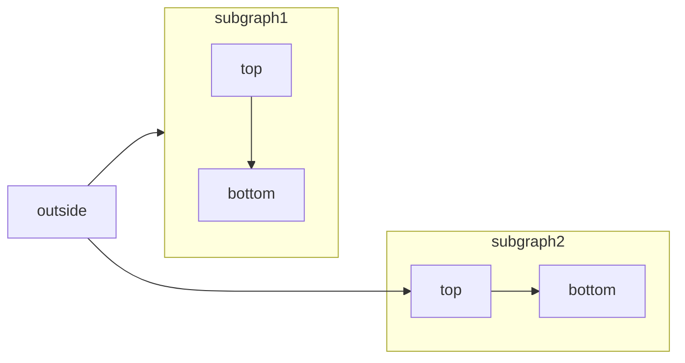

**Navigation:** [← Previous](./02-adding-sdk-examples.md) | [Index](./index.md) | [Next →](./04-fonts.md)

# Mermaid
Source: https://mintlify.com/docs/components/mermaid-diagrams

Display diagrams using Mermaid

[Mermaid](https://mermaid.js.org/) lets you build flowcharts, sequence diagrams, Gantt charts, and other diagrams using text and code.

For a complete list of supported diagram types and syntax, see the [Mermaid documentation](https://mermaid.js.org/intro/).



````mdx Mermaid flowchart example theme={null}

````


## Syntax

To create a Mermaid diagram, write your diagram definition inside a Mermaid code block.

````mdx  theme={null}
```mermaid
// Your mermaid diagram code here
```
````


# Panel
Source: https://mintlify.com/docs/components/panel

Specify the content of the right side panel

You can use the `<Panel>` component to customize the right side panel of a page with any components that you want.

If a page has a `<Panel>` component, any [RequestExample](/components/examples#request-example) and [ResponseExample](/components/examples#response-example) components must be inside `<Panel>`.

The components in a `<Panel>` will replace a page's table of contents.

```mdx  theme={null}
<Panel>
  <Info>Pin info to the side panel. Or add any other component.</Info>
</Panel>
```

<Panel>
  <Info>Pin info to the side panel. Or add any other component.</Info>
</Panel>


# Response fields
Source: https://mintlify.com/docs/components/responses

Display API response values

The `<ResponseField>` component is designed to define the return values of an API. Many docs also use `<ResponseField>` on pages when you need to list the types of something.

<ResponseField name="response" type="string" required>
  A response field example
</ResponseField>

```mdx  theme={null}
<ResponseField name="response" type="string" required>
  A response field example
</ResponseField>
```


## Props

<ResponseField name="name" type="string" required>
  The name of the response value.
</ResponseField>

<ResponseField name="type" type="string" required>
  Expected type of the response value - this can be any arbitrary string.
</ResponseField>

<ResponseField name="default" type="string">
  The default value.
</ResponseField>

<ResponseField name="required" type="boolean">
  Show "required" beside the field name.
</ResponseField>

<ResponseField name="deprecated" type="boolean">
  Whether a field is deprecated or not.
</ResponseField>

<ResponseField name="pre" type="string[]">
  Labels that are shown before the name of the field
</ResponseField>

<ResponseField name="post" type="string[]">
  Labels that are shown after the name of the field
</ResponseField>

<RequestExample>
  ```mdx Response Field Example theme={null}
  <ResponseField name="response" type="string" required>
    A response field example
  </ResponseField>
  ```
</RequestExample>


# Steps
Source: https://mintlify.com/docs/components/steps

Sequence content using the Steps component

Use steps to display a series of sequential actions or events. You can add as many steps as needed.

<Steps>
  <Step title="First Step">
    These are instructions or content that only pertain to the first step.
  </Step>

  <Step title="Second Step">
    These are instructions or content that only pertain to the second step.
  </Step>

  <Step title="Third Step">
    These are instructions or content that only pertain to the third step.
  </Step>
</Steps>

```mdx Steps example theme={null}
<Steps>
  <Step title="First Step">
    These are instructions or content that only pertain to the first step.
  </Step>
  <Step title="Second Step">
    These are instructions or content that only pertain to the second step.
  </Step>
  <Step title="Third Step">
    These are instructions or content that only pertain to the third step.
  </Step>
</Steps>
```


## Steps properties

<ResponseField name="children" type="ReactElement<StepProps>[]" required>
  A list of `Step` components.
</ResponseField>

<ResponseField name="titleSize" type="string" default="p">
  The size of the step titles. One of `p`, `h2`, and `h3`.
</ResponseField>


## Individual step properties

<ResponseField name="children" type="string | ReactNode" required>
  The content of a step either as plain text or components.
</ResponseField>

<ResponseField name="icon" type="string">
  The icon to display.

  Options:

  * [Font Awesome icon](https://fontawesome.com/icons) name
  * [Lucide icon](https://lucide.dev/icons) name
  * JSX-compatible SVG code wrapped in curly braces
  * URL to an externally hosted icon
  * Path to an icon file in your project

  For custom SVG icons:

  1. Convert your SVG using the [SVGR converter](https://react-svgr.com/playground/).
  2. Paste your SVG code into the SVG input field.
  3. Copy the complete `<svg>...</svg>` element from the JSX output field.
  4. Wrap the JSX-compatible SVG code in curly braces: `icon={<svg ...> ... </svg>}`.
  5. Adjust `height` and `width` as needed.
</ResponseField>

<ResponseField name="iconType" type="string">
  The [Font Awesome](https://fontawesome.com/icons) icon style. Only used with Font Awesome icons.

  Options: `regular`, `solid`, `light`, `thin`, `sharp-solid`, `duotone`, `brands`.
</ResponseField>

<ResponseField name="title" type="string">
  The title is the primary text for the step and shows up next to the indicator.
</ResponseField>

<ResponseField name="stepNumber" type="number">
  The number of the step.
</ResponseField>

<ResponseField name="titleSize" type="string" default="p">
  The size of the step titles. One of `p`, `h2`, and `h3`.
</ResponseField>


# Tabs
Source: https://mintlify.com/docs/components/tabs

Toggle content using the Tabs component

Use tabs to organize content into multiple panels that users can switch between. You can add any number of tabs and include other components inside each tab.

<Tabs>
  <Tab title="First tab">
    ☝️ Welcome to the content that you can only see inside the first tab.

    You can add any number of components inside of tabs. For example, a code block:

    ```java HelloWorld.java theme={null}
      class HelloWorld {
          public static void main(String[] args) {
              System.out.println("Hello, World!");
          }
      }
    ```
  </Tab>

  <Tab title="Second tab" icon="leaf">
    ✌️ Here's content that's only inside the second tab.

    This one has a <Icon icon="leaf" /> icon!
  </Tab>

  <Tab title="Third tab">
    💪 Here's content that's only inside the third tab.
  </Tab>
</Tabs>

````mdx Tabs example theme={null}
<Tabs>
  <Tab title="First tab">
    ☝️ Welcome to the content that you can only see inside the first tab.

    You can add any number of components inside of tabs. For example, a code block:
    ```java HelloWorld.java
      class HelloWorld {
          public static void main(String[] args) {
              System.out.println("Hello, World!");
          }
      }
    ```
  </Tab>
  <Tab title="Second tab" icon="leaf">
    ✌️ Here's content that's only inside the second tab.

    This one has a <Icon icon="leaf" /> icon!
  </Tab>
  <Tab title="Third tab">
    💪 Here's content that's only inside the third tab.
  </Tab>
</Tabs>
````


## Properties

<ResponseField name="title" type="string" required>
  The title of the tab. Short titles are easier to navigate.
</ResponseField>

<ResponseField name="icon" type="string">
  A [Font Awesome](https://fontawesome.com/icons) icon, [Lucide](https://lucide.dev/icons) icon, URL to an icon, or relative path to an icon.
</ResponseField>

<ResponseField name="iconType" type="string">
  For Font Awesome icons only: One of `regular`, `solid`, `light`, `thin`, `sharp-solid`, `duotone`, `brands`.
</ResponseField>


# Tooltips
Source: https://mintlify.com/docs/components/tooltips

Show a definition when you hover over text

Use tooltips to provide additional context or definitions when a user hovers over a string of text. Tooltips can include optional call-to-action links.

**Example**: <Tooltip tip="Application Programming Interface: a set of protocols for software applications to communicate." cta="Read our API guide" href="/api-reference">API</Tooltip> documentation helps developers understand how to integrate with your service.

```mdx Tooltip example wrap theme={null}
<Tooltip tip="Application Programming Interface: a set of protocols for software applications to communicate." cta="Read our API guide" href="/api-reference">API</Tooltip> documentation helps developers understand how to integrate with your service.
```


## Properties

<ResponseField name="tip" type="string" required>
  The text displayed in the tooltip.
</ResponseField>

<ResponseField name="cta" type="string">
  The call-to-action text for a link within the tooltip.
</ResponseField>

<ResponseField name="href" type="string">
  URL for the call-to-action link. Required when using `cta`.
</ResponseField>


# Update
Source: https://mintlify.com/docs/components/update

Keep track of changes and updates

Use the `Update` component to display changelog entries, version updates, and release notes with consistent formatting.

<Update label="Example" description="v0.1.1">
  ## Example update

  You can add anything here, like a screenshot, a code snippet, or a list of changes.

  <Frame>
    
  </Frame>

  ### Features

  * Responsive design
  * Anchor for each update
  * Generated RSS feed entry for each update
</Update>


## How to use

```mdx Update example theme={null}
<Update label="2024-10-11" description="v0.1.0" tags={["Mintlify"]}>
  This is an update with a label, description, and tag.
</Update>
```

Use multiple `Update` components to create [changelogs](/create/changelogs).


## Props

<ResponseField name="label" type="string" required>
  Label for the update. Appears to the left of the update and creates an anchor link. Labels should be unique.
</ResponseField>

<ResponseField name="tags" type="string[]">
  Tags for the update. Shown as filters in the right side panel.
</ResponseField>

<ResponseField name="description" type="string">
  Description of the update. Appears below the label and tag.
</ResponseField>


# Redirects and broken links
Source: https://mintlify.com/docs/create/broken-links

Tools to help prevent invalid links

When you change the path of a file in your docs folder, it also changes the URL path to that page. This may happen when restructuring your docs or changing the sidebar title.


## Broken links

Catch broken links with our CLI. [Install the CLI](/installation) and run the command:

```bash  theme={null}
mint broken-links
```

The CLI identifies any relative links in your docs that don't exist.


## Redirects

Set up 301 redirects by adding the `redirects` field to your `docs.json` file.

```json  theme={null}
"redirects": [
  {
    "source": "/source/path",
    "destination": "/destination/path"
  }
]
```

This permanently redirects `/source/path` to `/destination/path` so that you don't lose any previous SEO for the original page.

To match a wildcard path, use `*` after a parameter. In this example, `/beta/:slug*` matches `/beta/introduction` and redirects it to `/v2/introduction`.

```json  theme={null}
"redirects": [
  {
    "source": "/beta/:slug*",
    "destination": "/v2/:slug*"
  }
]
```


# Changelogs
Source: https://mintlify.com/docs/create/changelogs

Post product updates in your docs with a subscribable RSS feed

Create a changelog for your docs by adding [Update components](/components/update) to a page.

Check out the [Mintlify changelog](/changelog) as an example: you can include links, images, text, and demos of your new features in each update.


## Setting up your changelog

<Steps>
  <Step title="Create a page for your changelog">
    1. Create a new page in your docs such as `changelog.mdx` or `updates.mdx`.
    2. Add your changelog page to your navigation scheme in your `docs.json`.
  </Step>

  <Step title="Add Update components to your changelog">
    Add an `Update` for each changelog entry.

    Include relevant information like feature releases, bug fixes, or other announcements.
  </Step>
</Steps>

```mdx Example changelog.mdx theme={null}
---
title: "Changelog"
description: "Product updates and announcements"
---
<Update label="March 2025" description="v0.0.10">
  Added a new Wintergreen flavor.

  Released a new version of the Spearmint flavor, now with 10% more mint.
</Update>

<Update label="February 2025" description="v0.0.09">
  Released a new version of the Spearmint flavor.
</Update>
```


## Customizing your changelog

Control how people navigate your changelog and stay up to date with your product information.

### Table of contents

Each `label` property for an `Update` automatically creates an entry in the right sidebar's table of contents. This is the default navigation for your changelog.

<Frame>
  

  
</Frame>

### Tag filters

Add `tags` to your `Update` components to replace the table of contents with tag filters. Users can filter the changelog by selecting one or more tags:

```mdx Tag filters example wrap theme={null}
<Update label="March 2025" description="v0.0.10" tags={["Wintergreen", "Spearmint"]}>
  Added a new Wintergreen flavor.

  Released a new version of the Spearmint flavor, now with 10% more mint.
</Update>

<Update label="February 2025" description="v0.0.09" tags={["Spearmint"]}>
  Released a new version of the Spearmint flavor.
</Update>

<Update label="January 2025" description="v0.0.08" tags={["Peppermint", "Spearmint"]}>
  Deprecated the Peppermint flavor.

  Released a new version of the Spearmint flavor.
</Update>
```

<Frame>
  

  
</Frame>

<Tip>
  The table of contents and changelog filters are hidden when using `custom`, `center`, or `wide` page modes. Learn more about [page modes](/organize/pages#page-mode).
</Tip>

### Subscribable changelogs

Using `Update` components creates a subscribable RSS feed at your page URL with `/rss.xml` appended. For example, `mintlify.com/docs/changelog/rss.xml`.

Entries are added to the RSS feed when new `Update` components are published and when new headings are added inside of existing `<Update>` tags.

The top level headings of `Update` components are used as the titles of RSS feed entries, and the entries link to their heading anchors in your docs.

```xml Example RSS feed theme={null}
<?xml version="1.0" encoding="UTF-8"?>
<rss xmlns:dc="http://purl.org/dc/elements/1.1/" xmlns:content="http://purl.org/rss/1.0/modules/content/" xmlns:atom="http://www.w3.org/2005/Atom" version="2.0">
  <channel>
    <title><![CDATA[Product updates]]></title>
    <description><![CDATA[New updates and improvements]]></description>
    <link>https://mintlify.com/docs</link>
    <generator>RSS for Node</generator>
    <lastBuildDate>Mon, 21 Jul 2025 21:21:47 GMT</lastBuildDate>
    <atom:link href="https://mintlify.com/docs/changelog/rss.xml" rel="self" type="application/rss+xml"/>
    <copyright><![CDATA[Mintlify]]></copyright>
    <docs>https://mintlify.com/docs</docs>
    <item>
      <title><![CDATA[June 2025]]></title>
      <link>https://mintlify.com/docs/changelog#june-2025</link>
      <guid isPermaLink="true">https://mintlify.com/docs/changelog#june-2025</guid>
      <pubDate>Mon, 23 Jun 2025 16:54:22 GMT</pubDate>
    </item>
  </channel>
</rss>
```

RSS feeds can integrate with Slack, email, or other subscription tools to notify users of product changes. Some options include:

* [Slack](https://slack.com/help/articles/218688467-Add-RSS-feeds-to-Slack)
* [Email](https://zapier.com/apps/email/integrations/rss/1441/send-new-rss-feed-entries-via-email) via Zapier
* Discord bots like [Readybot](https://readybot.io) or [RSS Feeds to Discord Bot](https://rss.app/en/bots/rssfeeds-discord-bot)

To make the RSS feed discoverable, you can display an RSS icon button that links to the feed at the top of the page. Add `rss: true` to the page frontmatter:

```mdx  theme={null}
---
rss: true
---
```

<Frame>
  

  
</Frame>


# Format code
Source: https://mintlify.com/docs/create/code

Display inline code and code blocks


## Adding code samples

You can add inline code snippets or code blocks. Code blocks support meta options for syntax highlighting, titles, line highlighting, icons, and more.

### Inline code

To denote a `word` or `phrase` as code, enclose it in backticks (\`).

```mdx  theme={null}
To denote a `word` or `phrase` as code, enclose it in backticks (`).
```

### Code blocks

Use [fenced code blocks](https://www.markdownguide.org/extended-syntax/#fenced-code-blocks) by enclosing code in three backticks. Code blocks are copyable, and if you have the assistant enabled, users can ask AI to explain the code.

Specify the programming language for syntax highlighting and to enable meta options. Add any meta options, like a title or icon, after the language.

<CodeGroup>
  ```java HelloWorld.java example icon=java lines theme={null}
  class HelloWorld {
      public static void main(String[] args) {
          System.out.println("Hello, World!");
      }
  }
  ```

  ````mdx Format theme={null}
  ```java HelloWorld.java example lines icon="java"
  class HelloWorld {
      public static void main(String[] args) {
          System.out.println("Hello, World!");
      }
  }
  ```
  ````
</CodeGroup>


## Code block options

Add meta options to your code blocks to customize their appearance.

<Note>
  You must specify a programming language for a code block before adding any other meta options.
</Note>

### Option syntax

* **String and boolean options**: Wrap with `""`, `''`, or no quotes.
* **Expression options**: Wrap with `{}`, `""`, or `''`.

### Syntax highlighting

Enable syntax highlighting by specifying the programming language after the opening backticks of a code block.

We use [Shiki](https://shiki.style/) for syntax highlighting and support all available languages. See the full list of [languages](https://shiki.style/languages) in Shiki's documentation.

Customize code block themes globally using `styling.codeblocks` in your `docs.json` file. Set simple themes like `system` or `dark`, or configure custom [Shiki themes](https://shiki.style/themes) for light and dark modes. See [Settings](/organize/settings#param-styling) for configuration options.

<Accordion title="Custom syntax highlighting theme">
  For custom themes, set your theme in `docs.json` to `"css-variables"` and override syntax highlighting colors using CSS variables with the `--mint-` prefix.

  The following variables are available:

  **Basic colors**

  * `--mint-color-text`: Default text color
  * `--mint-color-background`: Background color

  **Token colors**

  * `--mint-token-constant`: Constants and literals
  * `--mint-token-string`: String values
  * `--mint-token-comment`: Comments
  * `--mint-token-keyword`: Keywords
  * `--mint-token-parameter`: Function parameters
  * `--mint-token-function`: Function names
  * `--mint-token-string-expression`: String expressions
  * `--mint-token-punctuation`: Punctuation marks
  * `--mint-token-link`: Links

  **ANSI colors**

  * `--mint-ansi-black`, `--mint-ansi-black-dim`
  * `--mint-ansi-red`, `--mint-ansi-red-dim`
  * `--mint-ansi-green`, `--mint-ansi-green-dim`
  * `--mint-ansi-yellow`, `--mint-ansi-yellow-dim`
  * `--mint-ansi-blue`, `--mint-ansi-blue-dim`
  * `--mint-ansi-magenta`, `--mint-ansi-magenta-dim`
  * `--mint-ansi-cyan`, `--mint-ansi-cyan-dim`
  * `--mint-ansi-white`, `--mint-ansi-white-dim`
  * `--mint-ansi-bright-black`, `--mint-ansi-bright-black-dim`
  * `--mint-ansi-bright-red`, `--mint-ansi-bright-red-dim`
  * `--mint-ansi-bright-green`, `--mint-ansi-bright-green-dim`
  * `--mint-ansi-bright-yellow`, `--mint-ansi-bright-yellow-dim`
  * `--mint-ansi-bright-blue`, `--mint-ansi-bright-blue-dim`
  * `--mint-ansi-bright-magenta`, `--mint-ansi-bright-magenta-dim`
  * `--mint-ansi-bright-cyan`, `--mint-ansi-bright-cyan-dim`
  * `--mint-ansi-bright-white`, `--mint-ansi-bright-white-dim`
</Accordion>

<CodeGroup>
  ```java Syntax highlighting example theme={null}
  class HelloWorld {
      public static void main(String[] args) {
          System.out.println("Hello, World!");
      }
  }
  ```

  ````mdx Format theme={null}
  ```java Syntax highlighting example
  class HelloWorld {
      public static void main(String[] args) {
          System.out.println("Hello, World!");
      }
  }
  ```
  ````
</CodeGroup>

### Twoslash

In JavaScript and TypeScript code blocks, use `twoslash` to enable interactive type information. Users can hover over variables, functions, and parameters to see types and errors like in an IDE.

<CodeGroup>
  ```ts twoslash Twoslash example theme={null}
  type Pet = "cat" | "dog" | "hamster";

  function adoptPet(name: string, type: Pet) {
  return `${name} the ${type} is now adopted!`;
  }

  // Hover to see the inferred types
  const message = adoptPet("Mintie", "cat");
  ```

  ````mdx Format theme={null}
  ```ts twoslash Twoslash example
  type Pet = "cat" | "dog" | "hamster";

  function adoptPet(name: string, type: Pet) {
    return `${name} the ${type} is now adopted!`;
  }

  // Hover to see the inferred types
  const message = adoptPet("Mintie", "cat");
  ```
  ````
</CodeGroup>

### Title

Add a title to label your code example. Use `title="Your title"` or a string on a single line.

<CodeGroup>
  ```javascript Title example theme={null}
  const hello = "world";
  ```

  ````mdx Format theme={null}
  ```javascript Title example
  const hello = "world";
  ```
  ````
</CodeGroup>

### Icon

Add an icon to your code block using the `icon` property. See [Icons](/components/icons) for all available options.

<CodeGroup>
  ```javascript Icon example icon=square-js theme={null}
  const hello = "world";
  ```

  ````mdx Format theme={null}
  ```javascript Icon example icon="square-js"
  const hello = "world";
  ```
  ````
</CodeGroup>

### Line highlighting

Highlight specific lines in your code blocks using `highlight` with the line numbers or ranges you want to highlight.

<CodeGroup>
  ```javascript Line highlighting example {1,2,5} theme={null}
  const greeting = "Hello, World!";
  function sayHello() {
    console.log(greeting);
  }
  sayHello();
  ```

  ````mdx Format theme={null}
  ```javascript Line highlighting example highlight={1-2,5}
  const greeting = "Hello, World!";
  function sayHello() {
    console.log(greeting);
  }
  sayHello();
  ```
  ````
</CodeGroup>

### Line focusing

Focus on specific lines in your code blocks using `focus` with line numbers or ranges.

<CodeGroup>
  ```javascript Line focusing example focus=2,4,5 theme={null}
  const greeting = "Hello, World!";
  function sayHello() {
    console.log(greeting);
  }
  sayHello();
  ```

  ````mdx Format theme={null}
  ```javascript Line focusing example focus={2,4-5}
  const greeting = "Hello, World!";
  function sayHello() {
    console.log(greeting);
  }
  sayHello();
  ```
  ````
</CodeGroup>

### Show line numbers

Display line numbers on the left side of your code block using `lines`.

<CodeGroup>
  ```javascript Show line numbers example lines theme={null}
  const greeting = "Hello, World!";
  function sayHello() {
    console.log(greeting);
  }
  sayHello();
  ```

  ````mdx Format theme={null}
  ```javascript Show line numbers example lines
  const greeting = "Hello, World!";
  function sayHello() {
    console.log(greeting);
  }
  sayHello();
  ```
  ````
</CodeGroup>

### Expandable

Allow users to expand and collapse long code blocks using `expandable`.

<CodeGroup>
  ```python Expandable example expandable theme={null}
  from datetime import datetime, timedelta
  from typing import Dict, List, Optional
  from dataclasses import dataclass

  @dataclass
  class Book:
  title: str
  author: str
  isbn: str
  checked_out: bool = False
  due_date: Optional[datetime] = None

  class Library:
  def **init**(self):
  self.books: Dict[str, Book] = {}
  self.checkouts: Dict[str, List[str]] = {} # patron -> list of ISBNs

      def add_book(self, book: Book) -> None:
          if book.isbn in self.books:
              raise ValueError(f"Book with ISBN {book.isbn} already exists")
          self.books[book.isbn] = book

      def checkout_book(self, isbn: str, patron: str, days: int = 14) -> None:
          if patron not in self.checkouts:
              self.checkouts[patron] = []

          book = self.books.get(isbn)
          if not book:
              raise ValueError("Book not found")

          if book.checked_out:
              raise ValueError("Book is already checked out")

          if len(self.checkouts[patron]) >= 3:
              raise ValueError("Patron has reached checkout limit")

          book.checked_out = True
          book.due_date = datetime.now() + timedelta(days=days)
          self.checkouts[patron].append(isbn)

      def return_book(self, isbn: str) -> float:
          book = self.books.get(isbn)
          if not book or not book.checked_out:
              raise ValueError("Book not found or not checked out")

          late_fee = 0.0
          if datetime.now() > book.due_date:
              days_late = (datetime.now() - book.due_date).days
              late_fee = days_late * 0.50

          book.checked_out = False
          book.due_date = None

          # Remove from patron's checkouts
          for patron, books in self.checkouts.items():
              if isbn in books:
                  books.remove(isbn)
                  break

          return late_fee

      def search(self, query: str) -> List[Book]:
          query = query.lower()
          return [
              book for book in self.books.values()
              if query in book.title.lower() or query in book.author.lower()
          ]

  def main():
  library = Library()

      # Add some books
      books = [
          Book("The Hobbit", "J.R.R. Tolkien", "978-0-261-10295-4"),
          Book("1984", "George Orwell", "978-0-452-28423-4"),
      ]

      for book in books:
          library.add_book(book)

      # Checkout and return example
      library.checkout_book("978-0-261-10295-4", "patron123")
      late_fee = library.return_book("978-0-261-10295-4")
      print(f"Late fee: ${late_fee:.2f}")

  if **name** == "**main**":
  main()
  ```

  ````text Format theme={null}
  ```python Expandable example expandable
  from datetime import datetime, timedelta
  from typing import Dict, List, Optional
  from dataclasses import dataclass

  # ...

  if __name__ == "__main__":
      main()
  ```
  ````
</CodeGroup>

### Wrap

Enable text wrapping for long lines using `wrap`. This prevents horizontal scrolling and makes long lines easier to read.

<CodeGroup>
  ```javascript Wrap example wrap theme={null}
  const greeting = "Hello, World! I am a long line of text that will wrap to the next line.";
  function sayHello() {
    console.log(greeting);
  }
  sayHello();
  ```

  ````mdx Format theme={null}
  ```javascript Wrap example wrap
  const greeting = "Hello, World! I am a long line of text that will wrap to the next line.";
  function sayHello() {
    console.log(greeting);
  }
  sayHello();
  ```
  ````
</CodeGroup>

### Diff

Show a visual diff of added or removed lines in your code blocks. Added lines are highlighted in green and removed lines are highlighted in red.

To create diffs, add these special comments at the end of lines in your code block:

* `// [!code ++]`: Mark a line as added (green highlight).
* `// [!code --]`: Mark a line as removed (red highlight).

For multiple consecutive lines, specify the number of lines after a colon:

* `// [!code ++:3]`: Mark the current line plus the next two lines as added.
* `// [!code --:5]`: Mark the current line plus the next four lines as removed.

The comment syntax must match your programming language (for example, `//` for JavaScript or `#` for Python).

<CodeGroup>
  ```js Diff example lines theme={null}
  const greeting = "Hello, World!"; // [!code ++]
  function sayHello() {
    console.log("Hello, World!"); // [!code --]
    console.log(greeting); // [!code ++]
  }
  sayHello();
  ```

  ````text Format theme={null}
  ```js Diff example lines
  const greeting = "Hello, World!"; // [!code ++]
  function sayHello() {
    console.log("Hello, World!"); // [!code --]
    console.log(greeting); // [!code ++]
  }
  sayHello();
  ```
  ````
</CodeGroup>


## CodeBlock component

Use the `<CodeBlock>` component in custom React components to programmatically render code blocks with the same styling and features as markdown code blocks.

### Props

<ResponseField name="language" type="string">
  The programming language for syntax highlighting.
</ResponseField>

<ResponseField name="filename" type="string">
  The filename to display in the code block header.
</ResponseField>

<ResponseField name="icon" type="string">
  The icon to display in the code block header. See [Icons](/components/icons) for available options.
</ResponseField>

<ResponseField name="lines" type="boolean">
  Whether to show line numbers.
</ResponseField>

<ResponseField name="wrap" type="boolean">
  Whether to wrap the code block.
</ResponseField>

<ResponseField name="expandable" type="boolean">
  Whether to expand the code block.
</ResponseField>

<ResponseField name="highlight" type="string">
  The lines to highlight. Provide a stringified array of numbers. Example: `"[1,3,4,5]"`.
</ResponseField>

<ResponseField name="focus" type="string">
  The lines to focus on. Provide a stringified array of numbers. Example: `"[1,3,4,5]"`.
</ResponseField>

### Example

```jsx  theme={null}
export const CustomCodeBlock = ({ filename, icon, language, highlight, children }) => {
  return (
    <CodeBlock
      filename={filename}
      icon={icon}
      language={language}
      lines
      highlight={highlight}
    >
      {children}
    </CodeBlock>
  );
};
```


# Files
Source: https://mintlify.com/docs/create/files

Serve static assets from your documentation

Mintlify automatically serves static assets from your documentation repository at the appropriate path on your domain. For example, if you have `/images/my-logo.png` in your repo, the image file is available at `https://docs.your-project.com/images/my-logo.png`.

You can make any supported file type available to your users, including OpenAPI specifications, images, videos, and more.

Files must be less than 20 MB for images and 100 MB for other file types.

<Note>
  File serving is not supported for documentation sites with authentication enabled. If your site requires authentication, static files will not be accessible at their direct URLs.
</Note>


## Supported file types

### Image formats

* `.jpeg`, `.jpg`, `.jfif`, `.pjpeg`, `.pjp`
* `.png`
* `.svg`, `.svgz`
* `.ico`
* `.webp`
* `.gif`, `.apng`
* `.avif`
* `.bmp`
* `.tiff`, `.tif`

### Video formats

* `.mp4`
* `.webm`
* `.ogg`
* `.avi`
* `.mov`
* `.wmv`
* `.flv`
* `.mkv`
* `.m4v`

### Audio formats

* `.mp3`
* `.wav`
* `.flac`
* `.aac`
* `.ogg`
* `.wma`
* `.m4a`

### Font formats

* `.woff`
* `.woff2`
* `.ttf`
* `.otf`
* `.eot`

### Document formats

<Note>Document formats are only available for Custom plans and are not supported when authentication is enabled.</Note>

* `.pdf`
* `.txt`
* `.doc`, `.docx`
* `.xls`, `.xlsx`
* `.ppt`, `.pptx`
* `.rtf`
* `.odt`, `.ods`, `.odp`

### Data formats

<Note>Data formats are only available for Custom plans and are not supported when authentication is enabled.</Note>

* `.csv`
* `.tsv`
* `.xml`

### Archive formats

<Note>Archive formats are only available for Custom plans and are not supported when authentication is enabled.</Note>

* `.zip`
* `.rar`
* `.7z`
* `.tar`
* `.gz`
* `.bz2`


## File organization

Organize your files using folders to keep your repository easy to navigate:

```text  theme={null}
/your-project
  |- docs.json
  |- images/
    |- logo.png
    |- screenshots/
      |- dashboard.png
  |- assets/
    |- whitepaper.pdf
    |- demo-video.mp4
```

Files are served from the root of your domain, so the structure in your repository directly maps to the URL structure. From the previous example, `assets/whitepaper.pdf` would be available at `https://docs.your-project.com/assets/whitepaper.pdf`.


# Images and embeds
Source: https://mintlify.com/docs/create/image-embeds

Add images, videos, and iframes

Add images, embed videos, and include interactive content with iframes to your documentation.

<Frame>
  
</Frame>


## Images

Add images to provide visual context, examples, or decoration to your documentation.

### Basic image syntax

Use [Markdown syntax](https://www.markdownguide.org/basic-syntax/#images) to add images to your documentation:

```mdx  theme={null}

```

<Tip>
  Always include descriptive alt text to improve accessibility and SEO. The alt text should clearly describe what the image shows.
</Tip>

Image files must be less than 20 MB. For larger files, host them on a CDN service like [Amazon S3](https://aws.amazon.com/s3) or [Cloudinary](https://cloudinary.com).

### HTML image embeds

For more control over image display, use HTML `` tags:

```jsx  theme={null}

```

#### Resize images with inline styles

Use JSX inline styles with the `style` attribute to resize images:

```jsx  theme={null}

```

#### Disable zoom functionality

To disable the default zoom on click for images, add the `noZoom` property:

```html highlight="4" theme={null}

```

#### Link images

To make an image a clickable link, wrap the image in an anchor tag and add the `noZoom` property:

```html  theme={null}
<a href="https://mintlify.com" target="_blank">
  
</a>
```

<Note>
  Images within anchor tags automatically display a pointer cursor to indicate they are clickable.
</Note>

#### Light and dark mode images

To display different images for light and dark themes, use Tailwind CSS classes:

```html  theme={null}
<!-- Light mode image -->


<!-- Dark mode image -->

```


## Videos

Mintlify supports [HTML tags in Markdown](https://www.markdownguide.org/basic-syntax/#html), giving you flexibility to create rich content.

<Tip>
  Always include fallback text content within video elements for browsers that don't support video playback.
</Tip>

### YouTube embeds

Embed YouTube videos using iframe elements:

```html  theme={null}
<iframe
  className="w-full aspect-video rounded-xl"
  src="https://www.youtube.com/embed/4KzFe50RQkQ"
  title="YouTube video player"
  frameBorder="0"
  allow="accelerometer; autoplay; clipboard-write; encrypted-media; gyroscope; picture-in-picture"
  allowFullScreen
></iframe>
```

<Frame>
  <iframe className="w-full aspect-video rounded-xl" src="https://www.youtube.com/embed/4KzFe50RQkQ" title="YouTube video player" frameBorder="0" allow="accelerometer; autoplay; clipboard-write; encrypted-media; gyroscope; picture-in-picture" allowFullScreen />
</Frame>

### Self-hosted videos

Use the HTML `<video>` element for self-hosted video content:

```html  theme={null}
<video
  controls
  className="w-full aspect-video rounded-xl"
  src="link-to-your-video.com"
></video>
```

### Autoplay videos

To autoplay a video, use:

```html  theme={null}
<video
  autoPlay
  muted
  loop
  playsInline
  className="w-full aspect-video rounded-xl"
  src="/videos/demo.mp4"
></video>
```

<Note>
  When using JSX syntax, write double-word attributes in camelCase: `autoPlay`, `playsInline`, `allowFullScreen`.
</Note>


## iframes

Embed external content using iframe elements:

```html  theme={null}
<iframe 
  src="https://example.com/embed" 
  title="Embedded content"
  className="w-full h-96 rounded-xl"
></iframe>
```


## Related resources

<Card title="Frame component reference" icon="frame" horizontal href="/components/frames">
  Learn how to use the Frame component for presenting images.
</Card>


# Lists and tables
Source: https://mintlify.com/docs/create/list-table

Display information in lists and tables


## Lists

Lists follow the official [Markdown syntax](https://www.markdownguide.org/basic-syntax/#lists-1).

### Ordered list

To create an ordered list, add numbers followed by a period before list items.

1. First item
2. Second item
3. Third item
4. Fourth item

```mdx  theme={null}
1. First item
2. Second item
3. Third item
4. Fourth item
```

### Unordered list

To create an unordered list, add dashes (`-`), asterisks (`*`), or plus signs (`+`) before list items.

* First item
* Second item
* Third item
* Fourth item

```mdx  theme={null}
- First item
- Second item
- Third item
- Fourth item
```

### Nested list

Indent list items to nest them.

* First item
* Second item
  * Additional item
  * Additional item
* Third item

```mdx  theme={null}
- First item
- Second item
  - Additional item
  - Additional item
- Third item
```


## Tables

Tables follow the official [Markdown syntax](https://www.markdownguide.org/extended-syntax/#tables).

To add a table, use three or more hyphens (`---`) to create each column's header, and use pipes (`|`) to separate each column. For compatibility, you should also add a pipe on either end of the row.

| Property | Description                           |
| -------- | ------------------------------------- |
| Name     | Full name of user                     |
| Age      | Reported age                          |
| Joined   | Whether the user joined the community |

```mdx  theme={null}
| Property | Description                           |
| -------- | ------------------------------------- |
| Name     | Full name of user                     |
| Age      | Reported age                          |
| Joined   | Whether the user joined the community |
```


# Reusable snippets
Source: https://mintlify.com/docs/create/reusable-snippets

Reusable, custom snippets to keep content in sync

One of the core principles of software development is DRY (Don't Repeat
Yourself), which applies to documentation as
well. If you find yourself repeating the same content in multiple places, you
should create a custom snippet to keep your content in sync.


## Creating a custom snippet

**Pre-condition**: You must create your snippet file in the `snippets` directory in order for the import to work.

Any page in the `snippets` directory will be treated as a snippet and will not
be rendered into a standalone page. If you want to create a standalone page
from the snippet, import the snippet into another file and call it as a
component.

### Default export

1. Add content to your snippet file that you want to re-use.

```typescript snippets/my-snippet.mdx theme={null}
Hello world! This is my content I want to reuse across pages.
```

2. Import the snippet into your destination file.

```typescript destination-file.mdx theme={null}
---
title: My title
description: My Description
---

import MySnippet from '/snippets/path/to/my-snippet.mdx';


## Header

Lorem impsum dolor sit amet.

<MySnippet/>

```

### Exporting with variables

1. Optionally, you can add variables that can be filled in via props when you import the snippet. In this example, our variable is word.

```typescript snippets/my-snippet.mdx theme={null}
My keyword of the day is {word}.
```

2. Import the snippet into your destination file with the variable. The property will fill in based on your specification.

```typescript destination-file.mdx theme={null}
---
title: My title
description: My Description
---

import MySnippet from '/snippets/path/to/my-snippet.mdx';


## Header

Lorem impsum dolor sit amet.

<MySnippet word="bananas" />

```

### Reusable variables

1. Export a variable from your snippet file:

```typescript snippets/path/to/custom-variables.mdx theme={null}
export const myName = "my name";

export const myObject = { fruit: "strawberries" };
```

2. Import the snippet from your destination file and use the variable:

```typescript destination-file.mdx theme={null}
---
title: My title
description: My Description
---

import { myName, myObject } from '/snippets/path/to/custom-variables.mdx';

Hello, my name is {myName} and I like {myObject.fruit}.
```

### JSX snippets

1. Export a JSX component from your snippet file. (See [React components](/customize/react-components) for more information):

```js icon=square-js snippets/my-jsx-snippet.jsx theme={null}
export const MyJSXSnippet = () => {
  return (
    <div>
      <h1>Hello, world!</h1>
    </div>
  );
};
```

<Note>
  Important: When creating JSX snippets, use arrow function syntax (`=>`) rather
  than function declarations. The `function` keyword is not supported in this
  context.
</Note>

2. Import the snippet from your destination file and use the component:

```typescript destination-file.mdx theme={null}
---
title: My title
description: My Description
---

import { MyJSXSnippet } from '/snippets/my-jsx-snippet.jsx';

<MyJSXSnippet />
```


# Format text
Source: https://mintlify.com/docs/create/text

Learn how to format text, create headers, and style content


## Headers

Headers organize your content and create navigation anchors. They appear in the table of contents and help users scan your documentation.

### Creating headers

Use `#` symbols to create headers of different levels:

```mdx  theme={null}

## Main section header
### Subsection header
#### Sub-subsection header
```

<Tip>
  Use descriptive, keyword-rich headers that clearly indicate the content that follows. This improves both user navigation and search engine optimization.
</Tip>

### Disabling anchor links

By default, headers include clickable anchor links that allow users to link directly to specific sections. You can disable these anchor links using the `noAnchor` prop in HTML or React headers.

<CodeGroup>
  ```mdx HTML header example theme={null}
  <h2 noAnchor>
  Header without anchor link
  </h2>
  ```

  ```mdx React header example theme={null}
  <Heading level={2} noAnchor>
  Header without anchor link
  </Heading>
  ```
</CodeGroup>

When `noAnchor` is used, the header will not display the anchor chip and clicking the header text will not copy the anchor link to the clipboard.


## Text formatting

We support most Markdown formatting for emphasizing and styling text.

### Basic formatting

Apply these formatting styles to your text:

| Style             | Syntax     | Example                | Result                 |
| ----------------- | ---------- | ---------------------- | ---------------------- |
| **Bold**          | `**text**` | `**important note**`   | **important note**     |
| *Italic*          | `_text_`   | `_emphasis_`           | *emphasis*             |
| ~~Strikethrough~~ | `~text~`   | `~deprecated feature~` | ~~deprecated feature~~ |

### Combining formats

You can combine formatting styles:

```mdx  theme={null}
**_bold and italic_**
**~~bold and strikethrough~~**
*~~italic and strikethrough~~**
```

***bold and italic***<br />
**~~bold and strikethrough~~**<br />
*~~italic and strikethrough~~*

### Superscript and subscript

For mathematical expressions or footnotes, use HTML tags:

| Type        | Syntax            | Example               | Result              |
| ----------- | ----------------- | --------------------- | ------------------- |
| Superscript | `<sup>text</sup>` | `example<sup>2</sup>` | example<sup>2</sup> |
| Subscript   | `<sub>text</sub>` | `example<sub>n</sub>` | example<sub>n</sub> |


## Links

Links help users navigate between pages and access external resources. Use descriptive link text to improve accessibility and user experience.

### Internal links

Link to other pages in your documentation using root-relative paths:

```mdx  theme={null}
[Quickstart](/quickstart)
[Steps](/components/steps)
```

[Quickstart](/quickstart)<br />
[Steps](/components/steps)

### External links

For external resources, include the full URL:

```mdx  theme={null}
[Markdown Guide](https://www.markdownguide.org/)
```

[Markdown Guide](https://www.markdownguide.org/)

### Broken links

You can check for broken links in your documentation using the [CLI](/installation):

```bash  theme={null}
mint broken-links
```


## Blockquotes

Blockquotes highlight important information, quotes, or examples within your content.

### Single line blockquotes

Add `>` before text to create a blockquote:

```mdx  theme={null}
> This is a quote that stands out from the main content.
```

> This is a quote that stands out from the main content.

### Multi-line blockquotes

For longer quotes or multiple paragraphs:

```mdx  theme={null}
> This is the first paragraph of a multi-line blockquote.
>
> This is the second paragraph, separated by an empty line with `>`.
```

> This is the first paragraph of a multi-line blockquote.
>
> This is the second paragraph, separated by an empty line with `>`.

<Tip>
  Use blockquotes sparingly to maintain their visual impact and meaning. Consider using [callouts](/components/callouts) for notes, warnings, and other information.
</Tip>


## Mathematical expressions

We support LaTeX for rendering mathematical expressions and equations.

### Inline math

Use single dollar signs, `$`, for inline mathematical expressions:

```mdx  theme={null}
The Pythagorean theorem states that $(a^2 + b^2 = c^2)$ in a right triangle.
```

The Pythagorean theorem states that $(a^2 + b^2 = c^2)$ in a right triangle.

### Block equations

Use double dollar signs, `$$`, for standalone equations:

```mdx  theme={null}
$$
E = mc^2
$$
```

$$
E = mc^2
$$

<Info>
  LaTeX support requires proper mathematical syntax. Refer to the [LaTeX documentation](https://www.latex-project.org/help/documentation/) for comprehensive syntax guidelines.
</Info>


## Line breaks and spacing

Control spacing and line breaks to improve content readability.

### Paragraph breaks

Separate paragraphs with blank lines:

```mdx  theme={null}
This is the first paragraph.

This is the second paragraph, separated by a blank line.
```

This is the first paragraph.

This is the second paragraph, separated by a blank line.

### Manual line breaks

Use HTML `<br />` tags for forced line breaks within paragraphs:

```mdx  theme={null}
This line ends here.<br />
This line starts on a new line.
```

This line ends here.<br />
This line starts on a new line.

<Tip>
  In most cases, paragraph breaks with blank lines provide better readability than manual line breaks.
</Tip>


## Best practices

### Content organization

* Use headers to create clear content hierarchy
* Follow proper header hierarchy (don't skip from H2 to H4)
* Write descriptive, keyword-rich header text

### Text formatting

* Use bold for emphasis, not for entire paragraphs
* Reserve italics for terms, titles, or subtle emphasis
* Avoid over-formatting that distracts from content

### Links

* Write descriptive link text instead of "click here" or "read more"
* Use root-relative paths for internal links
* Test links regularly to prevent broken references


# Custom 404 page
Source: https://mintlify.com/docs/customize/custom-404-page

Customize the title and description of your 404 error page

You can control the title and description of the 404 error page that appears when users navigate to broken or missing links.

When customizing your 404 page, use the description to guide users to helpful resources or links in your documentation that can help them find what they're looking for.


## Configuration

Configure your 404 page in the `errors.404` section of your `docs.json` file:

```json  theme={null}
"errors": {
  "404": {
    "redirect": false,
    "title": "I can't be found",
    "description": "What ever **happened** to this _page_?"
  }
}
```


## Parameters

<ResponseField name="redirect" type="boolean">
  Whether to automatically redirect to the home page when a page is not found.

  Set to `true` to redirect to the home page.

  Set to `false` to show the custom 404 page.
</ResponseField>

<ResponseField name="title" type="string">
  Custom title for the 404 error page. This replaces the default "Page not found" heading.
</ResponseField>

<ResponseField name="description" type="string">
  Custom description for the 404 error page. Supports Markdown formatting.
</ResponseField>


# Custom domain
Source: https://mintlify.com/docs/customize/custom-domain

Host your documentation at your website's custom domain

To host your documentation on a custom domain:

1. Add your domain in your dashboard.
2. Configure DNS settings on your domain provider.
3. Allow time for DNS to propagate and TLS certificates to be automatically provisioned.

<Info>
  Looking to set up a custom subdirectory like `mintlify.com/docs`? See the [custom subdirectory](/deploy/cloudflare) docs.
</Info>


## Add your custom domain

1. Navigate to the [Custom domain setup](https://dashboard.mintlify.com/settings/deployment/custom-domain) page in your dashboard.
2. Enter your domain name. For example, `docs.example.com` or `www.example.com`.
3. Click **Add domain**.

<Frame>
  

  
</Frame>


## Configure your DNS

1. On your domain provider's website, navigate to your domain's DNS settings.
2. Create a new DNS record with the following values:

```text  theme={null}
CNAME | docs | cname.mintlify-dns.com.
```

<Tip>
  Each domain provider has different ways to add DNS records. Refer to your domain provider's documentation for specific instructions.
</Tip>

<Frame>
  
</Frame>

### DNS propagation

DNS changes typically take 1-24 hours to propagate globally, though it can take up to 48 hours in some cases. You can verify your DNS is configured correctly using [DNSChecker](https://dnschecker.org).

Once your DNS records are active, your documentation is first accessible via HTTP. HTTPS is available after Vercel provisions your TLS certificate.

### Automatic TLS provisioning

Once your DNS records propagate and resolve correctly, Vercel automatically provisions a free SSL/TLS certificate for your domain using Let's Encrypt.

This typically completes within a few hours of DNS propagation, though it can take up to 24 hours in rare cases. Certificates are automatically renewed before expiration.

### CAA records

If your domain uses CAA (Certification Authority Authorization) records, you must authorize Let's Encrypt to issue certificates for your domain. Add the following CAA record to your DNS settings:

```text  theme={null}
0 issue "letsencrypt.org"
```

### Reserved paths

The `/.well-known/acme-challenge` path is reserved for certificate validation and cannot be redirected or rewritten. If you have configured redirects or rewrites for this path, certificate provisioning will fail.

### Provider-specific settings

<AccordionGroup>
  <Accordion title="Vercel verification">
    If Vercel is your domain provider, you must add a verification `TXT` record. This information appears on your dashboard after submitting your custom domain, and is emailed to you.
  </Accordion>

  <Accordion title="Cloudflare encryption mode">
    If Cloudflare is your DNS provider, you must enable the "Full (strict)" mode for the SSL/TLS encryption setting. Additionally, disable "Always Use HTTPS" in your Edge Certificates settings. Cloudflare's HTTPS redirect will block Let's Encrypt from validating your domain during certificate provisioning.
  </Accordion>
</AccordionGroup>


## Set a canonical URL

After configuring your DNS, set a canonical URL to ensure search engines index your preferred domain. A canonical URL tells search engines which version of your documentation is the primary one. This improves SEO when your documentation is accessible from multiple URLs and prevents issues with duplicate content.

Add the `canonical` meta tag to your `docs.json`:

```json  theme={null}
"seo": {
    "metatags": {
        "canonical": "https://www.your-custom-domain-here.com"
    }
}
```

Replace `https://www.your-custom-domain-here.com` with your actual custom domain. For example, if your custom domain is `docs.mintlify.com`, you would use:

```json  theme={null}
"seo": {
    "metatags": {
        "canonical": "https://docs.mintlify.com"
    }
}
```


# Custom scripts
Source: https://mintlify.com/docs/customize/custom-scripts

Fully customize your documentation with custom CSS and JS

Use CSS to style HTML elements or add custom CSS and JavaScript to fully customize the look and feel of your documentation.


## Styling with Tailwind CSS

Use Tailwind CSS v3 to style HTML elements. You can control layout, spacing, colors, and other visual properties. Some common classes are:

* `w-full` - Full width
* `aspect-video` - 16:9 aspect ratio
* `rounded-xl` - Large rounded corners
* `block`, `hidden` - Display control
* `dark:hidden`, `dark:block` - Dark mode visibility

Tailwind CSS arbitrary values are not supported. For custom values, use the `style` prop instead.

```html  theme={null}

```


## Custom CSS

Add CSS files to your repository and their defined class names will be applied and available in all of your `MDX` files.

### Adding `style.css`

For example, you can add the following `style.css` file to customize the styling of the navbar and footer.

```css  theme={null}
#navbar {
  background: #fffff2;
  padding: 1rem;
}

footer {
  margin-top: 2rem;
}
```

### Using identifiers and selectors

Mintlify has a set of common identifiers and selectors to help you tag important elements of the UI.

<Tip>
  Use inspect element to find references to elements you're looking to customize.
</Tip>

<AccordionGroup>
  <Accordion title="Identifiers">
    * APIPlaygroundInput: `api-playground-input`
    * AssistantEntry: `assistant-entry`
    * AssistantEntryMobile: `assistant-entry-mobile`
    * Banner: `banner`
    * ChangelogFilters: `changelog-filters`
    * ChangelogFiltersContent: `changelog-filters-content`
    * ChatAssistantSheet: `chat-assistant-sheet`
    * ChatAssistantTextArea: `chat-assistant-textarea`
    * ContentArea: `content-area`
    * ContentContainer: `content-container`
    * ContentSideLayout: `content-side-layout`
    * Footer: `footer`
    * Header: `header`
    * NavBarTransition: `navbar-transition`
    * NavigationItems: `navigation-items`
    * Navbar: `navbar`
    * PageContextMenu: `page-context-menu`
    * PageContextMenuButton: `page-context-menu-button`
    * PageTitle: `page-title`
    * Pagination: `pagination`
    * Panel: `panel`
    * RequestExample: `request-example`
    * ResponseExample: `response-example`
    * SearchBarEntry: `search-bar-entry`
    * SearchBarEntryMobile: `search-bar-entry-mobile`
    * SearchInput: `search-input`
    * Sidebar: `sidebar`
    * SidebarContent: `sidebar-content`
    * TableOfContents: `table-of-contents`
    * TableOfContentsContent: `table-of-contents-content`
    * TableOfContentsLayout: `table-of-contents-layout`
    * TopbarCtaButton: `topbar-cta-button`
  </Accordion>

  <Accordion title="Selectors">
    * Accordion: `accordion`
    * AccordionGroup: `accordion-group`
    * AlmondLayout: `almond-layout`
    * AlmondNavBottomSection: `almond-nav-bottom-section`
    * AlmondNavBottomSectionDivider: `almond-nav-bottom-section-divider`
    * Anchor: `nav-anchor`
    * Anchors: `nav-anchors`
    * APISection: `api-section`
    * APISectionHeading: `api-section-heading`
    * APISectionHeadingSubtitle: `api-section-heading-subtitle`
    * APISectionHeadingTitle: `api-section-heading-title`
    * Callout: `callout`
    * Card: `card`
    * CardGroup: `card-group`
    * ChatAssistantSheet: `chat-assistant-sheet`
    * ChatAssistantSheetHeader: `chat-assistant-sheet-header`
    * ChatAssistantSheetContent: `chat-assistant-sheet-content`
    * ChatAssistantInput: `chat-assistant-input`
    * ChatAssistantSendButton: `chat-assistant-send-button`
    * CodeBlock: `code-block`
    * CodeGroup: `code-group`
    * Content: `mdx-content`
    * DropdownTrigger: `nav-dropdown-trigger`
    * DropdownContent: `nav-dropdown-content`
    * DropdownItem: `nav-dropdown-item`
    * DropdownItemTextContainer: `nav-dropdown-item-text-container`
    * DropdownItemTitle: `nav-dropdown-item-title`
    * DropdownItemDescription: `nav-dropdown-item-description`
    * DropdownItemIcon: `nav-dropdown-item-icon`
    * Expandable: `expandable`
    * Eyebrow: `eyebrow`
    * FeedbackToolbar: `feedback-toolbar`
    * Field: `field`
    * Frame: `frame`
    * Icon: `icon`
    * Link: `link`
    * LoginLink: `login-link`
    * Logo: `nav-logo`
    * Mermaid: `mermaid`
    * MethodNavPill: `method-nav-pill`
    * MethodPill: `method-pill`
    * NavBarLink: `navbar-link`
    * NavTagPill: `nav-tag-pill`
    * NavTagPillText: `nav-tag-pill-text`
    * OptionDropdown: `option-dropdown`
    * PaginationNext: `pagination-next`
    * PaginationPrev: `pagination-prev`
    * PaginationTitle: `pagination-title`
    * Panel: `panel`
    * SidebarGroup: `sidebar-group`
    * SidebarGroupIcon: `sidebar-group-icon`
    * SidebarGroupHeader: `sidebar-group-header`
    * SidebarNavGroupDivider: `sidebar-nav-group-divider`
    * SidebarTitle: `sidebar-title`
    * Step: `step`
    * Steps: `steps`
    * Tab: `tab`
    * Tabs: `tabs`
    * TabsBar: `nav-tabs`
    * TabsBarItem: `nav-tabs-item`
    * TableOfContents: `toc`
    * TableOfContentsItem: `toc-item`
    * Tooltip: `tooltip`
    * TopbarRightContainer: `topbar-right-container`
    * TryitButton: `tryit-button`
    * Update: `update`
  </Accordion>
</AccordionGroup>

<Warning>
  References and the styling of common elements are subject to change as the platform evolves. Please use custom styling with caution.
</Warning>


## Custom JavaScript

Custom JS allows you to add custom executable code globally. It is the equivalent of adding a `<script>` tag with JS code into every page.

### Adding custom JavaScript

Any `.js` file inside the content directory of your docs will be included in every documentation page. For example, you can add the following `ga.js` file to enable [Google Analytics](https://marketingplatform.google.com/about/analytics) across the entire documentation.

```js  theme={null}
window.dataLayer = window.dataLayer || [];
function gtag() {
  dataLayer.push(arguments);
}
gtag('js', new Date());

gtag('config', 'TAG_ID');
```

<Warning>
  Please use with caution to not introduce security vulnerabilities.
</Warning>


---
**Navigation:** [← Previous](./02-adding-sdk-examples.md) | [Index](./index.md) | [Next →](./04-fonts.md)
